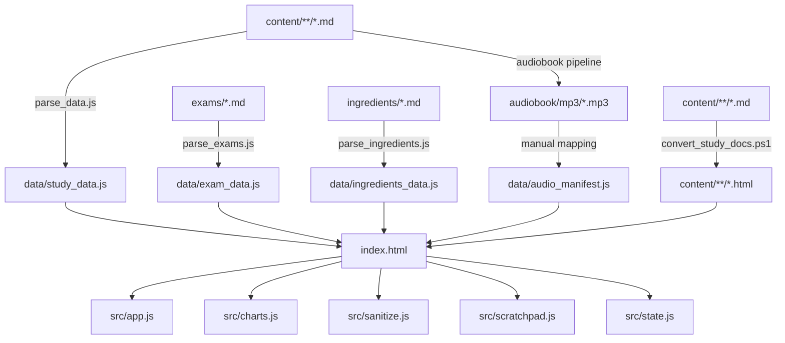

# 📁 프로젝트 폴터구조 가이드

> **대상 프로젝트**: 맞춤형화장품 조제관리사 스마트 학습 플랫폼
> **최종 업데이트**: 2026-08-21
> **목적**: 프로젝트의 폴터 및 파일 구조를 설명하고, 각 구성 요소의 역할을 명확히 정의
> **배포 최적화**: Vercel 배포를 위한 크기 최적화 적용됨 ([`docs/VERCEL_SIZE_OPTIMIZATION.md`](docs/VERCEL_SIZE_OPTIMIZATION.md) 참고)

---

## 📂 전체 구조 개요

```
Personalized Skincare/
│
├── 📄 index.html                    ← ✅ Vercel 배포 (앱 진입점)
├── 📄 style.css                     ← ✅ Vercel 배포 (전역 스타일시트)
├── 📄 manifest.webmanifest          ← 🆕 PWA 매니페스트 (앱 이름/아이콘/테마)
├── 📄 sw.js                         ← 🆕 PWA Service Worker (오프라인 캐시)
├── 📄 serve.js                      ← 로컬 개발 서버 (Node.js HTTP 서버)
├── 📄 FOLDER_STRUCTURE.md           ← 본 문서 (폴터구조 설명)
├── 📄 vercel.json                   ← Vercel SPA 설정
├── 📄 .vercelignore                 ← Vercel 배포 제외 목록
├── 📄 .gitignore                    ← Git 추적 제외 목록
│
├── 📂 icons/                        ← ✅ Vercel 배포 (PWA 아이콘)
│   ├── icon-192.png                 ← 192×192 앱 아이콘
│   ├── icon-512.png                 ← 512×512 앱 아이콘
│   └── icon-maskable-512.png        ← 마스커블 아이콘 (Android 적응형)
│
├── 📂 src/                          ← ✅ Vercel 배포 (애플리케이션 소스 코드)
│   ├── app.js                       ← 메인 앱 로직 (SPA 라우팅, 상태 관리, UI 렌더링)
│   ├── charts.js                    ← SVG 차트 (레이더 차트, 성적 꺾은선 그래프)
│   ├── sanitize.js                  ← HTML/XSS 방어 및 텍스트 정제 유틸리티
│   ├── scratchpad.js                ← HTML5 Canvas 드로잉 연습장 (손글씨 계산)
│   └── state.js                     ← 전역 상태 관리 및 로컬 스토리지 헬퍼
│
├── 📂 data/                         ← ✅ Vercel 배포 (생성된 데이터 번들)
│   ├── study_data.js                ← 교재 학습 데이터 (4개 과목, 19개 단원)
│   ├── exam_data.js                 ← 시험 문제 데이터 (900+ 문항)
│   ├── ingredients_data.js          ← 화장품 성분 사전 데이터
│   └── audio_manifest.js            ← 오디오 파일 경로 매니페스트 (CDN 지원)
│
├── 📂 content/                      ← 🔧 MD만 Git 관리, HTML은 .vercelignore
│   ├── understanding/               ← 1과목: 맞춤형화장품의 이해
│   │   ├── 1.맞춤형화장품 개요2026.md
│   │   ├── 1.맞춤형화장품 개요2026.html   ← ❌ Vercel 제외
│   │   ├── 2.피부 및 모발의 생리구조2026.md
│   │   └── ... (7개 단원, MD + HTML 쌍)
│   ├── safety/                      ← 2과목: 유통화장품 안전관리
│   │   └── ... (5개 단원, MD + HTML 쌍)
│   ├── manufacturing/               ← 3과목: 화장품 제조 및 품질관리
│   │   └── ... (5개 단원, MD + HTML 쌍)
│   └── law/                         ← 4과목: 화장품법의 이해
│       └── ... (2개 단원, MD + HTML 쌍)
│
├── 📂 exams/                        ← 🔧 MD만 Git 관리, HTML은 .vercelignore
│   ├── subject1_100_questions.html  ← ❌ Vercel 제외
│   ├── subject1_100_questions.md
│   ├── subject2_100_questions.html  ← ❌ Vercel 제외
│   ├── subject2_part2_100.html      ← ❌ Vercel 제외
│   ├── subject2_part3_100.html      ← ❌ Vercel 제외
│   └── ... (10쌍 20개 파일)
│
├── 📂 ingredients/                  ← ✅ Vercel 배포 (화장품 성분 원본 데이터)
│   ├── approved_ingredients.md      ← 사용 가능 성분 목록
│   ├── banned_ingredients.md        ← 사용 금지 성분 목록
│   └── restricted_ingredients.md    ← 사용 제한 성분 목록 (배합 한도 포함)
│
├── 📂 archive/                      ← ❌ Vercel 제외 (아카이브된 중복 원본)
│   ├── 2026 맞춤형화장품의 이해/     ← content/understanding/와 동일
│   ├── 2026 유통화장품 안전관리/     ← content/safety/와 동일
│   ├── 2026 화장품 제조 및 품질관리/ ← content/manufacturing/와 동일
│   └── 2026 화장품법의 이해/         ← content/law/와 동일
│
├── 📂 audiobook/                    ← ❌ Vercel 제외 (오디오북 파이프라인)
│   ├── chunks/                      ← 단원별 분할 텍스트 (TTS 입력용)
│   │   ├── manufacturing/
│   │   │   └── ch01/
│   │   │       ├── ch01_001.md
│   │   │       └── ... (16개 청크)
│   │   └── ... (4개 과목)
│   ├── scripts/                     ← TTS 변환 스크립트
│   │   └── manufacturing/
│   │       ├── ch01_001.txt
│   │       └── ... (16개 스크립트)
│   ├── mp3/                         ← ❌ Vercel 제외 (302MB, 외부 CDN 권장)
│   │   ├── law/
│   │   │   ├── ch01_1_화장품법2026.mp3
│   │   │   └── ch02_2_개인정보_보호법2026.mp3
│   │   ├── manufacturing/
│   │   │   └── ... (5개 파일)
│   │   ├── safety/
│   │   │   └── ... (5개 파일)
│   │   └── understanding/
│   │       └── ... (7개 파일)
│   ├── models/                      ← TTS 모델 파일
│   │   └── ko_KR-jimin-medium.onnx
│   ├── *.py                         ← 오디오 생성 파이프라인 스크립트
│   │   ├── run_pipeline.py          ← 전체 파이프라인 실행
│   │   ├── md_chunker.py            ← 마크다운 분할
│   │   ├── script_polisher.py       ← TTS용 텍스트 전처리
│   │   ├── tts_google_direct.py     ← Google TTS 엔진
│   │   ├── tts_elevenlabs.py        ← ElevenLabs TTS 엔진 (선택)
│   │   ├── generate_all_mp3.py      ← 일괄 MP3 생성
│   │   ├── mp3_merger.py            ← MP3 병합
│   │   ├── cleanup_empty_mp3.py     ← 빈 파일 정리
│   │   ├── test_audiobook.py        ← 오디오북 테스트
│   │   └── test_gtts_mp3.py         ← gTTS 테스트
│   ├── .env.example                 ← 환경 변수 템플릿 (API 키 등)
│   ├── .generation_progress.json    ← 생성 진행 상태 추적
│   ├── requirements.txt             ← Python 의존성 목록
│   ├── README.md                    ← 오디오북 파이프라인 사용법
│   └── AUDIOBOOK_SUMMARY.md         ← 오디오북 생성 결과 요약
│
├── 📂 tools/                        ← ❌ Vercel 제외 (빌드/변환 자동화 스크립트)
│   ├── parse_data.js                ← study_data.js 생성 스크립트
│   ├── parse_data.ps1               ← (PowerShell 래퍼)
│   ├── parse_exams.js               ← exam_data.js 생성 스크립트
│   ├── parse_exams.ps1              ← (PowerShell 래퍼)
│   ├── parse_ingredients.js         ← ingredients_data.js 생성 스크립트
│   ├── parse_ingredients.ps1        ← (PowerShell 래퍼)
│   └── convert_study_docs.ps1       ← 교재 MD → HTML 변환 스크립트
│
└── 📂 docs/                         ← ⚠️ 선택적 (HTML 제외, MD만)
    ├── user_manual.md / .html       ← 사용자 매뉴얼 (기능 설명서)
    ├── study_summary.md / .html     ← 학습 요약 가이드
    ├── code_review_report.md        ← 코드 리뷰 보고서
    ├── walkthrough.md               ← 변경 이력 및 개발 워크스루
    ├── VERCEL_DEPLOY_GUIDE.md       ← Vercel 배포 가이드
    └── VERCEL_SIZE_OPTIMIZATION.md  ← 🆕 Vercel 크기 최적화 가이드
```

> **범례:**
> - ✅ **Vercel 배포**: `.vercelignore`에 의해 제외되지 않음, Vercel에 업로드됨
> - 🔧 **Git 관리만**: Git에는 커밋되지만 Vercel에는 업로드되지 않음 (HTML 등)
> - ❌ **Vercel 제외**: `.vercelignore`에 명시적으로 제외됨 (audiobook, archive, tools 등)
> - ⚠️ **선택적**: 필요에 따라 포함/제외 결정 (docs 등)

---

## 📋 폴터별 상세 설명

### 🎯 `src/` - 애플리케이션 소스 코드

브라우저에서 로드되는 핵심 JavaScript 모듈들입니다.

| 파일 | 역할 | 주요 기능 |
|------|------|-----------|
| `app.js` | 메인 애플리케이션 로직 | SPA 라우팅, 화면 전환, 오디오 플레이어, 플래시카드, 퀴즈, 모의고사 등 |
| `charts.js` | SVG 차트 렌더링 | 레이더 차트, 성적 꺾은선 그래프, 합격 진단 로직 |
| `sanitize.js` | 보안 및 텍스트 정제 | XSS 방어, HTML 이스케이프, 안전한 텍스트 렌더링 |
| `scratchpad.js` | 드로잉 연습장 | HTML5 Canvas 기반 손글씨 계산 연습, 연필/지우개 브러시 |
| `state.js` | 전역 상태 관리 | 로컬 스토리지 헬퍼, 학습 진도 추적, 상태 영속성 |

**특징:**
- 모든 파일은 `index.html`에서 `<script>` 태그로 로드됩니다.
- 글로벌 스코프를 유지하여 HTML의 inline `onclick` 핸들러와 호환됩니다.

---

### 📊 `data/` - 생성된 데이터 번들

파싱 스크립트(`tools/`)로 생성된 JavaScript 데이터 파일들입니다.

| 파일 | 생성 스크립트 | 데이터 내용 |
|------|---------------|-------------|
| `study_data.js` | `parse_data.js` | 4개 과목, 19개 단원의 교재 학습 데이터 (제목, 섹션, 본문) |
| `exam_data.js` | `parse_exams.js` | 900+ 문항의 시험 문제 (객관식, 단답형, 해설 포함) |
| `ingredients_data.js` | `parse_ingredients.js` | 화장품 성분 사전 (사용 가능/금지/제한 성분, 배합 한도) |
| `audio_manifest.js` | 수동 생성 | 오디오 파일 경로 매핑 (과목별, 단원별 MP3 경로) |

**특징:**
- 모든 파일은 전역 상수(`STUDY_DATA`, `EXAM_DATA` 등)로 노출됩니다.
- `index.html`에서 `src/app.js`보다 먼저 로드됩니다.
- 수동 편집 시 주의가 필요하며, 재생성은 `tools/` 스크립트를 사용합니다.

---

### 📚 `content/` - 학습 교재 콘텐츠

4개 과목의 교재 원본(Markdown)과 변환본(HTML)을 보관합니다.

| 폴터 | 과목명 | 단원 수 | 파일 형식 |
|------|--------|---------|-----------|
| `understanding/` | 맞춤형화장품의 이해 | 7개 | `.md` + `.html` 쌍 |
| `safety/` | 유통화장품 안전관리 | 5개 | `.md` + `.html` 쌍 |
| `manufacturing/` | 화장품 제조 및 품질관리 | 5개 | `.md` + `.html` 쌍 |
| `law/` | 화장품법의 이해 | 2개 | `.md` + `.html` 쌍 |

**파일 명명 규칙:**
```
{단원번호}.{단원제목}2026.{확장자}
예: 1.맞춤형화장품 개요2026.md
```

**특징:**
- `.md` 파일: 원본 교재 텍스트 (Git 버전 관리 용이)
- `.html` 파일: 변환된 렌더링 가능한 문서 (앱에서 직접 로드)
- 변환은 `tools/convert_study_docs.ps1` 스크립트로 자동화됩니다.

---

### 📝 `exams/` - 예상문제집

과목별 실전 모의고사 문제집을 HTML과 Markdown 쌍으로 보관합니다.

**파일 구성:**
- 1과목: `subject1_100_questions.*` (100문항)
- 2과목: `subject2_100_questions.*`, `subject2_part2_100.*`, `subject2_part3_100.*` (300문항)
- 3과목: `subject3_100_questions.*`, `subject3_part2_100.*` (200문항)
- 4과목: `subject4_100_questions.*`, `subject4_part2_100.*`, `subject4_part3_100.*` (300문항)

**특징:**
- HTML 파일: 인쇄 및 브라우저 직접 열기 가능
- MD 파일: 파싱 스크립트(`parse_exams.js`)의 입력 원본
- 총 900+ 문항의 시험 데이터를 포함합니다.

---

### 🧪 `ingredients/` - 화장품 성분 원본 데이터

화장품 성분 사전의 원본 Markdown 파일들입니다.

| 파일 | 내용 |
|------|------|
| `approved_ingredients.md` | 사용 가능 성분 목록 (안전성 입증) |
| `banned_ingredients.md` | 사용 금지 성분 목록 (법적 금지) |
| `restricted_ingredients.md` | 사용 제한 성분 목록 (배합 한도, 주의사항 포함) |

**특징:**
- `tools/parse_ingredients.js`로 파싱되어 `data/ingredients_data.js`로 변환됩니다.
- 시험 대비용 핵심 성분 정보(배합 한도, 법적 근거)를 포함합니다.

---

### 🎧 `audiobook/` - 오디오북 파이프라인

교재 텍스트를 음성으로 변환하는 전체 파이프라인을 관리합니다.

#### 폴터 구조

| 폴터 | 역할 | 파일 형식 |
|------|------|-----------|
| `chunks/` | 단원을 TTS 입력용으로 분할 | `.md` (텍스트 청크) |
| `scripts/` | TTS 변환용 전처리 스크립트 | `.txt` (정제된 텍스트) |
| `mp3/` | 최종 생성된 오디오 파일 | `.mp3` (19개 파일, 총 ~11시간) |
| `models/` | TTS 모델 파일 | `.onnx` (Piper TTS 모델) |

#### 주요 스크립트

| 스크립트 | 역할 |
|----------|------|
| `run_pipeline.py` | 전체 파이프라인 실행 (청크 분할 → TTS → 병합) |
| `md_chunker.py` | 마크다운을 TTS 적합 크기로 분할 |
| `script_polisher.py` | TTS용 텍스트 전처리 (숫자 읽기, 특수문자 처리) |
| `tts_google_direct.py` | Google TTS 엔진 (기본) |
| `tts_elevenlabs.py` | ElevenLabs TTS 엔진 (선택, 고품질) |
| `generate_all_mp3.py` | 일괄 MP3 생성 |
| `mp3_merger.py` | 청크별 MP3를 단원별로 병합 |
| `cleanup_empty_mp3.py` | 빈 파일 정리 |
| `test_audiobook.py` | 오디오북 생성 테스트 |
| `test_gtts_mp3.py` | gTTS 엔진 테스트 |

**특징:**
- Python 3.x 환경에서 실행됩니다.
- `requirements.txt`로 의존성을 관리합니다.
- `.env` 파일로 API 키를 관리합니다 (ElevenLabs 사용 시).
- 생성 진행 상태는 `.generation_progress.json`에 저장됩니다.

---

### 🔧 `tools/` - 빌드/변환 자동화 스크립트

데이터 파싱 및 문서 변환을 자동화하는 스크립트들입니다.

| 스크립트 | 입력 | 출력 | 역할 |
|----------|------|------|------|
| `parse_data.js` | `content/**/*.md` | `data/study_data.js` | 교재 MD를 학습 데이터로 파싱 |
| `parse_exams.js` | `exams/*.md` | `data/exam_data.js` | 시험 문제 MD를 퀴즈 데이터로 파싱 |
| `parse_ingredients.js` | `ingredients/*.md` | `data/ingredients_data.js` | 성분 MD를 사전 데이터로 파싱 |
| `convert_study_docs.ps1` | `content/**/*.md` | `content/**/*.html` | 교재 MD를 HTML로 변환 |

**특징:**
- `.js` 파일: Node.js로 실행 (`node tools/parse_data.js`)
- `.ps1` 파일: PowerShell 래퍼 (Windows 환경 편의용)
- 모든 스크립트는 프로젝트 루트에서 실행합니다.

---

### 📖 `docs/` - 프로젝트 문서

프로젝트 관련 모든 문서를 보관합니다.

| 문서 | 내용 |
|------|------|
| `user_manual.md` / `.html` | 사용자 매뉴얼 (기능별 상세 사용법) |
| `study_summary.md` / `.html` | 학습 요약 가이드 (시험 직전 체크리스트) |
| `code_review_report.md` | 코드 리뷰 보고서 (개선 제안 및 리팩토링 이력) |
| `walkthrough.md` | 변경 이력 및 개발 워크스루 (기능 추가/수정 기록) |
| `VERCEL_DEPLOY_GUIDE.md` | Vercel 배포 가이드 (배포 절차 및 트러블슈팅) |

**특징:**
- `.md` 파일: Git 버전 관리 및 편집용
- `.html` 파일: 브라우저에서 직접 열어 읽기용 (선택적)
- 모든 문서는 한글로 작성되며, Markdown 표준을 따릅니다.

---

## 🔄 데이터 흐름도



---

## 🚀 주요 실행 명령어

### 로컬 개발 서버 실행
```bash
node serve.js 8001
# 브라우저에서 http://localhost:8001/index.html 접속
```

### 데이터 재생성
```bash
# 교재 데이터 재생성
node tools/parse_data.js

# 시험 문제 재생성
node tools/parse_exams.js

# 성분 데이터 재생성
node tools/parse_ingredients.js

# 교재 HTML 변환
powershell -File tools/convert_study_docs.ps1
```

### 오디오북 생성
```bash
cd audiobook
pip install -r requirements.txt
python run_pipeline.py
```

---

## 📝 파일 명명 규칙

### 교재 파일
```
{과목폴터}/{단원번호}.{단원제목}2026.{확장자}
예: content/understanding/1.맞춤형화장품 개요2026.md
```

### 시험 문제
```
subject{과목번호}_{문항수}_questions.{확장자}
예: exams/subject1_100_questions.md

# 분할된 경우
subject{과목번호}_part{파트번호}_{문항수}.{확장자}
예: exams/subject2_part2_100.md
```

### 오디오 파일
```
ch{단원번호2자리}_{단원번호}_{단원제목}2026.mp3
예: audiobook/mp3/understanding/ch01_1_맞춤형화장품_개요2026.mp3
```

---

## 🔒 버전 관리 권장 사항

### Git 추적 대상
- ✅ 모든 소스 코드 (`src/`, `tools/`, `*.js`, `*.css`, `*.html`)
- ✅ 교재 원본 (`content/**/*.md`)
- ✅ 시험 문제 원본 (`exams/*.md`)
- ✅ 성분 원본 (`ingredients/*.md`)
- ✅ 오디오북 스크립트 (`audiobook/*.py`)
- ✅ 문서 (`docs/*.md`, `*.md`)

### Git 제외 대상 (`.gitignore`)
- ❌ 생성된 데이터 (`data/*.js`) - 선택적 (재생성 가능하므로)
- ❌ 오디오 파일 (`audiobook/mp3/*.mp3`) - 용량 문제
- ❌ TTS 모델 (`audiobook/models/*.onnx`) - 용량 문제
- ❌ 환경 변수 (`audiobook/.env`)
- ❌ 생성 진행 상태 (`audiobook/.generation_progress.json`)
- ❌ Python 캐시 (`__pycache__/`, `*.pyc`)

---

## 📚 참고 문서

- **사용자 매뉴얼**: [`docs/user_manual.md`](docs/user_manual.md)
- **배포 가이드**: [`docs/VERCEL_DEPLOY_GUIDE.md`](docs/VERCEL_DEPLOY_GUIDE.md)
- **오디오북 파이프라인**: [`audiobook/README.md`](audiobook/README.md)
- **개발 워크스루**: [`docs/walkthrough.md`](docs/walkthrough.md)

---

**마지막 업데이트**: 2026-08-20  
**작성자**: 개발팀  
**문서 버전**: 1.0
