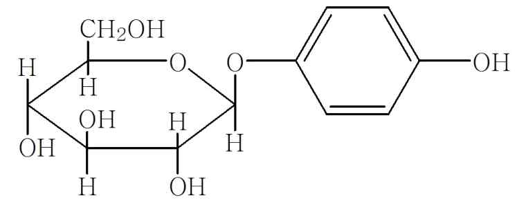
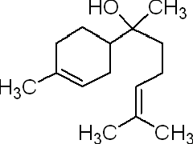
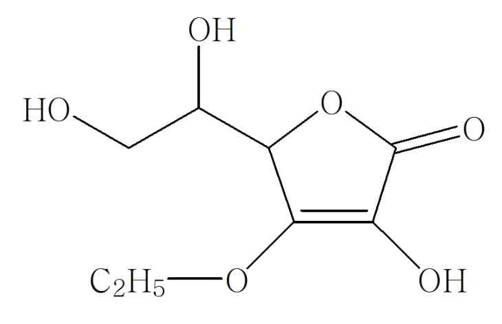

# KFCC_별표2_미백_나이아신아마이드

[별표 2]
피부의 미백에 도움을 주는 기능성화장품 각조
(제2조제2호 관련)
나이아신아마이드
Niacinamide
C H N O : 122.13
6 6 2
이 원료를 건조한 것은 정량할 때 나이아신아마이드(C H N O) 98.0% 이상을 함유
6 6 2
한다.
성 상 이 원료는 백색의 결정 또는 결정성 가루로 냄새는 없다.
확인시험 1) 이 원료 5㎎에 2,4-디니트로클로로벤젠 10㎎을 섞어 5~6초간 가만히 가
열하여 융해시키고 식힌 다음 수산화칼륨ㆍ에탄올시액 4mL를 넣을 때 액은 적색을 나
타낸다.
2) 이 원료 1㎎에 pH 7.0의 인산염완충액 100mL를 넣어 녹이고 이 액 2mL에 브롬
화시안시액 1mL를 넣어 80℃ 에서 7분간 가열하고 빨리 식힌 다음 수산화나트륨시액
5mL를 넣어 30분간 방치하고 자외선 하에서 관찰할 때 청색의 형광을 나타낸다.
3) 이 원료 20㎎에 수산화나트륨시액 5mL를 넣어 조심하여 끓일 때 나는 가스는 적
색리트머스시험지를 청색으로 변화시킨다.
4) 이 원료 20㎎에 물을 넣어 녹이고 1L로 한다. 이 액은 파장 262± 2㎚에서 흡수극
대를 나타내며 파장 245± 2㎚에서 흡수극소를 나타낸다. 여기서 얻은 극대파장에서의
흡광도를 A , 극소파장에서의 흡광도를 A 로 할 때 A /A 은 0.63～0.67이다
1 2 2 1
융 점 128℃～131℃ (제 1법)
순도시험 1) 액 성 이 원료의 수용액(1→10)은 중성이다.
2) 염화물 이 원료 0.50g을 달아 시험한다. 비교액에는 0.01N 염산 0.30mL를 넣는다.
(0.021% 이하)
3) 황산염 이 원료 1.0g을 달아 시험한다. 비교액에는 0.01N 황산 0.40mL를 넣는다.
(0.019% 이하)
4) 중금속 이 원료 1.0g에 물 20mL를 넣어 녹인 다음 여기에 묽은 초산 2mL 및
물을 넣어 50mL로 하고 이것을 검액으로 하여 제 4법에 따라 시험한다. 비교액에는 납
표준액 3.0mL를 넣는다. (30ppm 이하)
5) 황산에 대한 정색물 이 원료 0.20g을 달아 시험한다. 액의 색은 색의 비교액 A
보다 진하지 않다.
건조감량 0.5% 이하 (1g, 105℃, 4시간)
강열잔분 0.1% 이하 (3g, 제1법)
정 량 법
제 1 법 이 원료를 건조하고 약 0.3g을 정밀하게 달아 비수적정용빙초산 20mL를 넣
어 필요하면 가온하여 녹이고 식힌 다음 벤젠 100mL를 넣고 0.1N 과염소산으로
적정한다. (지시약: 크리스탈바이올렛시액 2방울) 다만 적정의 종말점은 액의 자색
이 청색을 거쳐 청록색으로 변할 때로 한다. 같은 방법으로 공시험을 하여 보정한
다.
0.1N 과염소산 1mL = 12.213㎎ C H N O
6 6 2
제 2 법 이 원료를 건조하고 약 20mg을 정밀하게 달아 이동상을 넣어 녹여 정확하
게 50mL로 하여 검액으로 한다. 따로 나이아신아마이드 표준품 약 20mg을 정밀하
게 달아 이동상을 넣어 녹여 정확하게 50mL로 하여 표준액으로 한다. 검액 및 표
준액 각 10μL씩을 가지고 다음 조건으로 액체크로마토그래프법에 따라 시험하여
검액 및 표준액의 피크면적 AT 및 AS를 각각 구한다.
나이아신아마이드(C H N O : 122.13)의 양(㎎) =
6 6 2
A
나이아신아마이드 표준품의 양(㎎)× T
A
S
조작조건
검 출 기 : 자외부흡광광도계 (측정파장 260㎚)
칼 럼 : 안지름 약 4.6㎜, 길이 약 25㎝인 스테인레스관에 5㎛의 액체크로마토그래프용 옥타데실실
릴화한 실리카겔을 충전한다.
이 동 상 : 메탄올ㆍ0.05 M 인산이수소칼륨용액 혼합액 (15 : 85)
유 량 : 1.0mL/분
나이아신아마이드 로션제
Niacinamide Lotion
이 기능성화장품은 정량할 때 표시량의 90.0% 이상에 해당하는 나이아신아마이드(C H N O :
6 6 2
122.13)를 함유한다.
1. 제 법 이 기능성화장품은 나이아신아마이드를 주성분(기능성성분)으로 하는 로션제이다. 이 제품은
안정성 및 유용성을 높이기 위해 안정제, 습윤제, 유화제, 보습제, pH 조정제, 착색제, 착향제 등을 첨
가할 수 있다.
2. 확인시험 정량법의 검액에서 얻은 주피크의 유지시간은 표준액에서 얻은 주피크의 유지시간과 같다.
3. pH 기준치 ± 1.0 (2 → 30) (다만, pH 범위는 3.0 ～ 9.0이다)
4. 정 량 법 이 기능성화장품을 가지고 나이아신아마이드로서 약 20 mg에 해당하는 양을 정밀하게 달아
이동상을 넣어 분산시킨 다음 정확하게 50mL로 하고 필요하면 여과하여 검액으로 한다. 따로 나이아
신아마이드 표준품 약 20 mg을 정밀하게 달아 이동상을 넣어 녹여 50 mL로 한 액을 표준액으로 한
다. 검액 및 표준액 각 10μL씩을 가지고 다음 조건으로 액체크로마토그래프법에 따라 시험하여 검액
및 표준액의 피크면적 A 및 A 를 각각 구한다.
T S
5.
A
6. 나이아신아마이드(CHNO : 122.13)의 양(㎎) = 나이아신아마이드 표준품의 양(㎎)× T
6 6 2 A
S
7.
8. 조작조건
검 출 기 : 자외부흡광광도계 (측정파장 260 ㎚)
칼 럼 : 안지름 약 4.6㎜, 길이 약 25㎝인 스테인레스관에 5㎛의 액체크로마토그
래프용 옥타데실실릴화한 실리카겔을 충전한다.
이 동 상 : 메탄올ㆍ0.05 M 인산이수소칼륨용액 혼합액 (15 : 85)
유 량 : 1.0mL/분
가.
나. 나이아신아마이드 액제
다. Niacinamide Solution
라.
이 기능성화장품은 정량할 때 표시량의 90.0% 이상에 해당하는 나이아신아마이드(C H N O :
6 6 2
122.13)를 함유한다.
9. 제 법 이 기능성화장품은 나이아신아마이드를 주성분(기능성성분)으로 하는 액제이다. 이 제품은
안정성 및 유용성을 높이기 위해 안정제, 습윤제, 보습제, pH 조정제, 착색제, 착향제 등을 첨가할 수
있다.
10. 확인시험 정량법의 검액에서 얻은 주피크의 유지시간은 표준액에서 얻은 주피크의 유지시간과 같
다.
11. pH 기준치 ± 1.0 (2 → 30) (다만, pH 범위는 3.0 ～ 9.0이다)
12. 정 량 법 이 기능성화장품을 가지고 나이아신아마이드로서 약 20 mg에 해당하는 양을 정밀하게 달아
이동상을 넣어 분산시킨 다음 정확하게 50 mL로 하고 필요하면 여과하여 검액으로 한다. 따로 나이
아신아마이드 표준품 약 20 mg을 정밀하게 달아 이동상을 넣어 녹여 50 mL로 한 액을 표준액으로
한다. 검액 및 표준액 각 10 μL씩을 가지고 다음 조건으로 액체크로마토그래프법에 따라 시험하여
검액 및 표준액의 피크면적 A 및 A 를 각각 구한다.
T S
13.
A
14. 나이아신아마이드(CHNO:122.13)의 양(㎎) = 나이아신아마이드 표준품의 양(㎎)× T
6 6 2 A
S
15.
16. 조작조건
검 출 기 : 자외부흡광광도계 (측정파장 260 ㎚)
칼 럼 : 안지름 약 4.6㎜, 길이 약 25㎝인 스테인레스관에 5㎛의 액체크로마토그
래프용 옥타데실실릴화한 실리카겔을 충전한다.
이 동 상 : 메탄올ㆍ0.05 M 인산이수소칼륨용액 혼합액 (15 : 85)
유 량 : 1.0mL/분
가.
나. 나이아신아마이드 크림제
다. Niacinamide Cream
라.
이 기능성화장품은 정량할 때 표시량의 90.0% 이상에 해당하는 나이아신아마이드(C H N O :
6 6 2
122.13)를 함유한다.
17. 제 법 이 기능성화장품은 나이아신아마이드를 주성분(기능성성분)으로 하는 크림제이다. 이 제품은
안정성 및 유용성을 높이기 위해 안정제, 습윤제, 유화제, 보습제, pH 조정제, 착색제, 착향제 등을
첨가할 수 있다.
18. 확인시험 정량법의 검액에서 얻은 주피크의 유지시간은 표준액에서 얻은 주피크의 유지시간과 같
다.
19. pH 기준치 ± 1.0 (2 → 30) (다만, pH 범위는 3.0 ～ 9.0이다)
20. 정 량 법 이 기능성화장품을 가지고 나이아신아마이드로서 약 20 mg에 해당하는 양을 정밀하게 달아
5 mL 메탄올을 넣어 초음파 추출한 후 물을 넣어 50 mL로 하고 필요하면 여과하여 검액으로 한다.
따로 나이아신아마이드 표준품 약 20 mg을 정밀하게 달아 10 % 메탄올을 넣어 녹여 50 mL로 한
액을 표준액으로 한다. 검액 및 표준액 각 10 μL씩을 가지고 다음 조건으로 액체크로마토그래프법
에 따라 시험하여 검액 및 표준액의 피크면적 A 및 A 를 각각 구한다.
T S
21.
A
22. 나이아신아마이드(CHNO : 122.13)의 양(㎎) = 나이아신아마이드 표준품의 양(㎎)× T
6 6 2 A
S
23.
24. 조작조건
검 출 기 : 자외부흡광광도계 (측정파장 260 ㎚)
칼 럼 : 안지름 약 4.6㎜, 길이 약 25㎝인 스테인레스관에 5㎛의 액체크로마토그
래프용 옥타데실실릴화한 실리카겔을 충전한다.
이 동 상 : 메탄올ㆍ0.05 M 인산이수소칼륨용액 혼합액 (15 : 85)
유 량 : 1.0mL/분
가.
나. 나이아신아마이드 침적 마스크
다. Niacinamide Soaked Mask
라.
이 기능성화장품은 정량할 때 표시량의 90.0% 이상에 해당하는 나이아신아마이드(C H N O :
6 6 2
122.13)를 함유한다.
25. 제 법 이 기능성화장품은 나이아신아마이드를 주성분(기능성성분)으로 하는 액제 또는 로션제를
부직포 등의 지지체에 단순 침적한 마스크 제형의 제품이다. 이 때 액제 또는 로션제에는 안정성 및
유용성을 높이기 위해 안정제, 습윤제, 유화제, 보습제, pH 조정제, 착색제, 착향제 등을 첨가할 수
있다.
26. 확인시험 정량법의 검액에서 얻은 주피크의 유지시간은 표준액에서 얻은 주피크의 유지시간과 같
다.
27. pH 이 기능성화장품을 압착하여 얻은 액제 또는 로션제를 가지고 시험할 때 기준치 ± 1.0이다.
(다만, pH 범위는 3.0 ～ 9.0이다)
28. 정 량 법 이 기능성화장품을 압착하여 얻은 액제 또는 로션제를 가지고 나이아신아마이드로서 약 20
mg에 해당하는 양을 정밀하게 달아 이동상을 넣어 분산시킨 다음 정확하게 50 mL로 하고 필요하면
여과하여 검액으로 한다. 따로 나이아신아마이드 표준품 약 20 mg을 정밀하게 달아 이동상을 넣어
녹여 50 mL로 한 액을 표준액으로 한다. 검액 및 표준액 각 10 μL씩을 가지고 다음 조건으로 액체
크로마토그래프법에 따라 시험하여 검액 및 표준액의 피크면적 A 및 A 를 각각 구한다.
T S
29.
A
30. 나이아신아마이드(CHNO : 122.13)의 양(㎎) = 나이아신아마이드 표준품의 양(㎎)× T
6 6 2 A
S
31.
32. 조작조건
검 출 기 : 자외부흡광광도계 (측정파장 260 ㎚)
칼 럼 : 안지름 약 4.6㎜, 길이 약 25㎝인 스테인레스관에 5㎛의 액체크로마토그
래프용 옥타데실실릴화한 실리카겔을 충전한다.
이 동 상 : 메탄올ㆍ0.05 M 인산이수소칼륨용액 혼합액 (15 : 85)
유 량 : 1.0mL/분
나이아신아마이드 고형제
Niacinamide Solid
이 기능성화장품은 정량할 때 표시량의 90.0% 이상에 해당하는 나이아신아마이드
(C H N O : 122.13)를 함유한다.
6 6 2
제 법 이 기능성화장품은 나이아신아마이드를 주성분(기능성성분)으로 하는 고형
제이다. 이 제품은 안정성 및 유용성을 높이기 위해 안정제, 습윤제, 유화제, 보습제,
pH 조정제, 착색제, 착향제 등을 첨가할 수 있다.
확인시험 정량법의 검액에서 얻은 주피크의 유지시간은 표준액에서 얻은 주피크의
유지시간과 같다.
pH 기준치 ± 1.0 (2 → 30) (다만, pH 범위는 3.0 ∼ 9.0이며, 물을 포함하
지 않는 제품은 제외)
정 량 법 이 기능성화장품을 가지고 나이아신아마이드로서 약 20mg에 해당하는 양
을 정밀하게 달아 테트라하이드로퓨란 5mL를 넣어 초음파 추출한 후 이동상을 넣어
50mL로 하고 필요하면 여과하여 검액으로 한다. 따로 나이아신아마이드 표준품 약
20mg을 정밀하게 달아 테트라하이드로퓨란 10% 함유 이동상에 녹여 50mL로 한 액
을 표준액으로 한다. 검액 및 표준액 각 10μL씩을 가지고 다음 조건으로 액체크로마
토그래프법에 따라 시험하여 검액 및 표준액의 피크면적 AT 및 AS를 각각 구한다.
33. 나이아신아마이드(C H N O : 122.13)의 양(㎎) =
6 6 2
A
34. 나이아신아마이드 표준품의 양(㎎)× T
A
S
35. 조작조건
36. 검 출 기 : 자외부흡광광도계 (측정파장 260㎚)
37. 칼 럼 : 안지름 약 4.6㎜, 길이 약 25㎝인 스테인레스관에 5㎛의 액체크로마토그래프용 옥타데실실
릴화한 실리카겔을 충전한다.
38. 이 동 상 : 메탄올ㆍ0.05 M 인산이수소칼륨용액 혼합액 (15 : 85)
39. 유 량 : 1.0mL/분
닥나무추출물
Broussonetia Extract
이 원료는 닥나무 Broussonetiakazinoki 및 동속식물(뽕나무과 Moraceae)의 줄기 또
는 뿌리를 에탄올 및 에칠 아세테이트로 추출하여 얻은 가루 또는 그 가루의 2w/v%
부틸렌글리콜 용액이다. 이 원료에 대하여 기능성 시험을 할 때 타이로시네이즈 억제율
은 48.5～84.1% 이다.
제 법 이 원료는 닥나무 및 동속식물의 줄기 또는 뿌리에 약 2배 용량의 에탄올을 넣어 1～ 3주
간 침적시키고 여과하여 얻은 여액에 이 액의 약 1%에 해당하는 활성탄을 넣어 잘 섞은 다음 여
과한다. 이 여액을 취하여 농축하고 여기에 에칠아세테이트을 넣어 잘 흔들어 섞은 다음 에칠아세
테이트 층을 취하여 감압 건고하여 얻은 가루 또는 이 가루를 부틸렌글리콜에 녹여 2w/v% 용액
으로 한 것이다.
성 상 이 원료는 엷은 황색～황갈색의 점성이 있는 액 또는 황갈색～암갈색의 결정성 가루로
약간의 특이한 냄새가 있다.
확인시험 액의 경우에는 이 원료 2g에 부틸렌글리콜을 넣어 500mL로 한 액을 검액으로 한다. 가
루의 경우에는 이 원료 1g에 부틸렌글리콜을 넣어 녹여 100mL로 한 액 1mL를 취하여 부틸렌글리
콜을 넣어 100mL로 한 액을 검액으로 한다. 검액을 가지고 흡광도측정법에 따라 흡수스펙트럼을
측정할 때 파장 283±2nm에서 흡수극대를 나타낸다.
pH 2.7 ～ 4.7 (1→100)
순도시험 1) 중금속 이 원료 1.0g을 달아 제2법에 따라 조작하여 시험한다. 비교액에는
납표준액 2.0mL를 넣는다(20ppm 이하).
2) 비 소 이 원료 1.0g을 달아 제3법에 따라 검액을 만들고 장치 C를 쓰는 방법에 따
라 시험한다(2ppm 이하).
기능성시험 이 원료의 가루로서 50mg에 해당하는 양을 달아 에탄올을 넣어 녹여 100mL로 한 액
10mL을 취하여 에탄올을 넣어 100mL로 한 액을 검액으로 한다. 완충액1) 500㎕에 기질액2) 500㎕,
물 450㎕ 및 검액 50㎕를 넣어 섞고, 효소액3) 50㎕를 넣어 흔들어 섞어 37℃에서 10분간 반응시키고
곧 얼음 중에 5분간 방치한 다음, 완충액1) 500㎕, 물 950㎕ 및 에탄올 50㎕를 넣어 검액과 같은 방법
으로 조작하여 얻은 액을 대조액으로 하여 파장 475nm에서 흡광도 B를 측정한다. 따로 검액 대신
에탄올 50㎕을 가지고 검액과 같은 방법으로 조작하여 얻은 액을 공시험액으로 하여 그 흡광도 A
를 측정하며, 효소액 대신 물 50㎕를 넣어 검액과 같은 방법으로 조작하여 얻은 액을 색보정액으로
하여 그 흡광도 C를 측정하고 다음 식에 따라 타이로시네이즈 억제율(%)을 구한다.
A-(B-C)
타이로시네이즈억제율(%) = ×100
A
A : 공시험액에서 얻은 흡광도
B : 검액에서 얻은 흡광도
C : 색보정액에서 얻은 흡광도
1) 완충액 : 0.1M 인산이수소칼륨액을 pH 6.8이 되도록 2M 수산화나트륨액으로 조정한다.
2) 기질액 : 타이로신 표준품 3mg에 물을 넣어 녹여 10mL로 한다.
3) 효소액 : 머쉬룸타이로시네이즈(Mushroom Tyrosinase, 표준품)를 완충액에 녹여 2 units/㎕ 가
되도록 만든다.
아스코빌글루코사이드
Ascobyl Glucoside

아스코빅애씨드 2-글루코사이드
(Ascorbic Acid 2-Glucoside) C H O :
12 18 11
338.27
이 원료는 정량할 때 아스코빌글루코사이드(C H O : 338.27) 98.0% 이상을 함유한
12 18 11
다.
성 상 이 원료는 백색 ～ 미황색의 가루 또는 결정성 가루이다.
확인시험 1) 이 원료의 수용액(1→50) 5 mL에 과망간산칼륨시액 1 방울을 떨어뜨릴 때
또는 2,6-디클로로페놀인도페놀나트륨시액 1～2 방울을 떨어뜨릴 때 각 시액의 색은
곧 없어진다.
2) 이 원료의 수용액(5→40) 2～3 방울을 끓는 페링시액 5 mL에 넣어 약 5분간 가
열했을 때, 적색의 침전이 생긴다.
3) 이 원료를 건조하여 적외부흡수스펙트럼측정법의 1)브롬화칼륨정제법에 따라 측
정할 때 3,300 cm-1, 1,700 cm-1, 1,110 cm-1, 1,060 cm-1 부근에서 특성흡수를 나타
낸다.
융 점 158 ～ 163 ℃(제 1 법)
비선광도 [α]25 : +186.0 ～ +188.0 °(건조 후 5 g, 물 100 mL, 100 mm)
D
순도시험 1) 용해상태 이 원료 1.0 g을 물 50 mL에 녹일 때 액은 맑다.
2) 중금속 이 원료 1.0 g을 달아 제2법에 따라 조작하여 시험한다. 비교액에는 납
표준액 2.0 mL를 넣는다.(20 ppm 이하)
3) 비 소 이 원료 1.0 g을 달아 제 3 법에 따라 검액을 만들어 장치B를 이용하는
방법으로 시험한다(2 ppm이하).
4) 유리 아스코빅애씨드 및 유리 포도당 이 원료 0.5 g을 정밀하게 달아 이동상에
넣어 녹여 정확하게 25 mL로 한 액을 가지고 검액으로 한다. 아스코빅애씨드 표준품
20 mg을 정밀하게 취하여 이동상을 넣어 녹여 정확하게 100 mL로 한 액을 아스코
빅애씨드 표준원액으로 한다. 포도당 표준품 20 mg을 정밀하게 취하여 이동상을 넣어
녹여 정확하게 100 mL로 한 액을 포도당 표준원액으로 한다. 아스코빅애시드 및 포
도당 표준원액 각각 10 mL씩을 취하여 이동상을 넣어 정확하게 100 mL로 하여 표
준액으로 한다. 검액 및 표준액 각 10 μL씩을 가지고 아래 조작조건으로 액체크로마
토그래피법에 따라 시험한다. 검액의 아스코빅애씨드 및 포도당 각각의 피크면적은
표준액의 아스코빅애씨드 및 포도당 각각의 피크면적보다 크지 않다. (유리 아스코빅
애씨드 0.1 %이하, 유리 포도당 0.1 %이하)
조작조건
검출기 : 시차굴절계
칼 럼 : 안지름 4.6 ㎜, 길이 25 cm 스테인레스관에 5 ㎛의 액체크로마토그라피용
디메칠아미노프로필실릴화한 실리카겔을 충전한다.
칼럼 온도 : 40 ℃
이동상 : 아세토니트릴 및 0.5 % 인산용액 735 mL에 인산이수소칼륨 4 g을 넣은 혼
합액(60:40)
유 량 : 0.7 mL/분
건조감량 1.0 % 이하 (1 g, 105 ℃, 2시간)
강열잔분 0.2 % 이하 (1 g, 제 1 법)
정 량 법
제 1 법 이 원료 1.0 g을 정밀하게 달아 물 30 mL에 넣어 녹이고 0.2 N 수산화나
트륨액으로 적정한다(지시약 : 페놀프탈레인시액 2 방울).
0.2 N 수산화나트륨액 1 mL = 67.654 mg C H O
12 18 11
제 2 법 이 원료 약 10mg을 정밀하게 달아 이동상을 넣어 녹여 정확하게 100mL로
하고 필요하면 여과하여 검액으로 한다. 따로 아스코빌글루코사이드 표준품 약
10mg을 정밀하게 달아 이동상을 넣어 녹여 100mL로 하여 표준액으로 한다. 검액
및 표준액 각 10μL씩을 가지고 다음 조건으로 액체크로마토그래프법에 따라 시험하
여 검액 및 표준액의 피크면적 AT 및 AS를 각각 구한다.
아스코빌글루코사이드(C H O : 338.27)의 양(㎎)
12 18 11
A
= 아스코빌글루코사이드 표준품의 양(㎎) × T
A
S
조작조건
검 출 기 : 자외부흡광광도계 (측정파장 245㎚)
칼 럼 : 안지름 약 4.6㎜, 길이 약 150㎜인 스테인레스관에 5㎛의 액체크로마토그
래프용 옥타데실실릴화한 실리카겔을 충전한다.
이 동 상 : 희석시킨 삼불화초산용액(2→1000)
유 량 : 0.8mL/분
아스코빌글루코사이드 로션제
Ascorbyl Glucoside Lotion
이 기능성화장품은 정량할 때 표시량의 90.0% 이상에 해당하는 아스코빌글루코사이드
(C H O : 338.27)를 함유한다.
12 18 11
제 법 이 기능성화장품은 아스코빌글루코사이드를 주성분(기능성성분)으로 하는 로션제이다. 이
제품은 안정성 및 유용성을 높이기 위해 안정제, 습윤제, 유화제, 보습제, pH 조정제, 착색제, 착향
제 등을 첨가할 수 있다.
확인시험 정량법의 검액에서 얻은 주피크의 유지시간은 표준액에서 얻은 주피크의 유지시간과 같
다.
pH 기준치 ± 1.0 (2 → 30) (다만, pH 범위는 3.0 ～ 9.0이다)
정 량 법 이 기능성화장품을 가지고 아스코빌글루코사이드로서 약 20㎎에 해당하는 양을 정밀하게
달아 이동상을 넣어 충분히 분산시킨 다음 100mL로 하고, 이 액 10mL를 정확히 취하여 이동상을
넣어 20mL로 하고 필요하면 여과하여 검액으로 한다. 따로 아스코빌글루코사이드 표준품 약
20mg을 정밀하게 달아 이동상을 넣어 녹여 100mL로 하고 이 액 10mL를 정확히 취하여 이동상을
넣어 20mL로 하여 표준액으로 한다. 검액 및 표준액 각 10μL씩을 가지고 다음 조건으로 액체크로
마토그래프법에 따라 시험하여 검액 및 표준액의 피크면적 A 및 A 를 각각 구한다.
T S
아스코빌글루코사이드(C H O : 338.27)의 양(㎎) =
12 18 11
A
아스코빌글루코사이드의 표준품의 양(㎎) × T
A
S
조작조건
검 출 기 : 자외부흡광광도계 (측정파장 245㎚)
칼 럼 : 안지름 약 4.6㎜, 길이 약 150㎜인 스테인레스관에 5㎛ 액체크로마토그
래프용 옥타데실실릴화한 실리카겔을 충전한다.
이 동 상 : 희석시킨 삼불화초산용액(2→1000)
유 량 : 0.8mL/분
아스코빌글루코사이드 액제
Ascorbyl Glucoside Solution
40.
41. 이 기능성화장품은 정량할 때 표시량의 90.0% 이상에 해당하는 아스코빌글루코사이드(C H O :
12 18 11
338.27)를 함유한다.
가. 제 법 이 기능성화장품은 아스코빌글루코사이드를 주성분(기능성성분)으로 하는 액제이다. 이 제
품은 안정성 및 유용성을 높이기 위해 안정제, 습윤제, 보습제, pH 조정제, 착색제, 착향제 등을 첨
가할 수 있다.
나. 확인시험 정량법의 검액에서 얻은 주피크의 유지시간은 표준액에서 얻은 주피크의 유지시간과 같
다.
다. pH 기준치 ± 1.0 (2 → 30) (다만, pH 범위는 3.0 ～ 9.0이다)
라. 정 량 법 이 기능성화장품을 가지고 아스코빌글루코사이드로서 약 20㎎에 해당하는 양을 정밀하게 달
아 이동상을 넣어 충분히 분산시킨 다음 100mL로 하고, 이 액 10mL를 정확히 취하여 이동상을 넣
어 20mL로 하고 필요하면 여과하여 검액으로 한다. 따로 아스코빌글루코사이드 표준품 약 20mg을
정밀하게 달아 이동상을 넣어 녹여 100mL로 하고 이 액 10mL를 정확히 취하여 이동상을 넣어
20mL로 하여 표준액으로 한다. 검액 및 표준액 각 10μL씩을 가지고 다음 조건으로 액체크로마토그
래프법에 따라 시험하여 검액 및 표준액의 피크면적 A 및 A 를 각각 구한다.
T S
마.
아스코빌글루코사이드(C H O : 338.27)의 양(㎎) =
12 18 11
A
아스코빌글루코사이드의 표준품의 양(㎎) × T
A
S
조작조건
검 출 기 : 자외부흡광광도계 (측정파장 245㎚)
칼 럼 : 안지름 약 4.6㎜, 길이 약 150㎜인 스테인레스관에 5㎛ 액체크로마토그
래프용 옥타데실실릴화한 실리카겔을 충전한다.
이 동 상 : 희석시킨 삼불화초산용액(2→1000)
유 량 : 0.8mL/분
아스코빌글루코사이드 크림제
Ascorbyl Glucoside Cream
42. 이 기능성화장품은 정량할 때 표시량의 90.0% 이상에 해당하는 아스코빌글루코사이드(C H O :
12 18 11
338.27)를 함유한다.
가. 제 법 이 기능성화장품은 아스코빌글루코사이드를 주성분(기능성성분)으로 하는 크림제이다. 이
제품은 안정성 및 유용성을 높이기 위해 안정제, 습윤제, 유화제, 보습제, pH 조정제, 착색제, 착향제
등을 첨가할 수 있다.
나. 확인시험 정량법의 검액에서 얻은 주피크의 유지시간은 표준액에서 얻은 주피크의 유지시간과 같
다.
다. pH 기준치 ± 1.0 (2 → 30) (다만, pH 범위는 3.0 ～ 9.0이다)
라. 정 량 법 이 기능성화장품을 가지고 아스코빌글루코사이드로서 약 20㎎에 해당하는 양을 정밀하게 달
아 이동상을 넣어 충분히 분산시킨 다음 100mL로 하고, 이 액 10mL를 정확히 취하여 이동상을 넣
어 20mL로 하고 필요하면 여과하여 검액으로 한다. 따로 아스코빌글루코사이드 표준품 약 20mg을
정밀하게 달아 이동상을 넣어 녹여 100mL로 하고 이 액 10mL를 정확히 취하여 이동상을 넣어
20mL로 하여 표준액으로 한다. 검액 및 표준액 각 10μL씩을 가지고 다음 조건으로 액체크로마토그
래프법에 따라 시험하여 검액 및 표준액의 피크면적 A 및 A 를 각각 구한다.
T S
마.
아스코빌글루코사이드(C H O : 338.27)의 양(㎎) =
12 18 11
A
아스코빌글루코사이드의 표준품의 양(㎎) × T
A
S
조작조건
검 출 기 : 자외부흡광광도계 (측정파장 245㎚)
칼 럼 : 안지름 약 4.6㎜, 길이 약 150㎜인 스테인레스관에 5㎛ 액체크로마토그
래프용 옥타데실실릴화한 실리카겔을 충전한다.
이 동 상 : 희석시킨 삼불화초산용액(2→1000)
유 량 : 0.8mL/분
아스코빌글루코사이드 침적 마스크
Ascorbyl Glucoside Soaked Mask
43. 이 기능성화장품은 정량할 때 표시량의 90.0% 이상에 해당하는 아스코빌글루코사이드(C H O :
12 18 11
338.27)를 함유한다.
가. 제 법 이 기능성화장품은 아스코빌글루코사이드를 주성분(기능성성분)으로 하는 액제 또는 로션제
를 부직포 등의 지지체에 단순 침적한 마스크 제형의 제품이다. 이 때 액제 또는 로션제에는 안정성
및 유용성을 높이기 위해 안정제, 습윤제, 유화제, 보습제, pH 조정제, 착색제, 착향제 등을 첨가할
수 있다.
나. 확인시험 정량법의 검액에서 얻은 주피크의 유지시간은 표준액에서 얻은 주피크의 유지시간과 같다.
다. pH 이 기능성화장품을 압착하여 얻은 액제 또는 로션제를 가지고 시험할 때 기준치 ± 1.0이다.
(다만, pH 범위는 3.0 ～ 9.0이다)
라. 정 량 법 이 기능성화장품을 압착하여 얻은 액제 또는 로션제를 가지고 아스코빌글루코사이드로서 약
20㎎에 해당하는 양을 정밀하게 달아 이동상을 넣어 충분히 분산시킨 다음 100mL로 하고, 이 액
10mL를 정확히 취하여 이동상을 넣어 20mL로 하고 필요하면 여과하여 검액으로 한다. 따로 아스코
빌글루코사이드 표준품 약 20mg을 정밀하게 달아 이동상을 넣어 녹여 100mL로 하고 이 액 10mL를
정확히 취하여 이동상을 넣어 20mL로 하여 표준액으로 한다. 검액 및 표준액 각 10μL씩을 가지고
다음 조건으로 액체크로마토그래프법에 따라 시험하여 검액 및 표준액의 피크면적 A 및 A 를 각각
T S
구한다.
마.
아스코빌글루코사이드(C H O : 338.27)의 양(㎎) =
12 18 11
A
아스코빌글루코사이드의 표준품의 양(㎎) × T
A
S
조작조건
검 출 기 : 자외부흡광광도계 (측정파장 245㎚)
칼 럼 : 안지름 약 4.6㎜, 길이 약 150㎜인 스테인레스관에 5㎛ 액체크로마토그
래프용 옥타데실실릴화한 실리카겔을 충전한다.
이 동 상 : 희석시킨 삼불화초산용액(2→1000)
유 량 : 0.8mL/분
아스코빌글루코사이드 고형제
Ascobyl Glucoside Solid
이 기능성화장품은 정량할 때 표시량의 90.0% 이상에 해당하는 아스코빌글루코사이
드(C H O : 338.27)를 함유한다.
12 18 11
제 법 이 기능성화장품은 아스코빌글루코사이드를 주성분(기능성성분)으로 하는
고형제이다. 이 제품은 안정성 및 유용성을 높이기 위해 안정제, 습윤제, 유화제, 보습
제, pH 조정제, 착색제, 착향제 등을 첨가할 수 있다.
확인시험 정량법의 검액에서 얻은 주피크의 유지시간은 표준액에서 얻은 주피크의
유지시간과 같다.
pH 기준치 ± 1.0 (2 → 30) (다만, pH 범위는 3.0 ∼ 9.0이며, 물을 포함하
지 않는 제품은 제외)
정 량 법 이 기능성화장품을 가지고 아스코빌글루코사이드로서 약 10㎎에 해당하는
양을 정밀하게 달아 테트라하이드로퓨란 10mL를 넣어 초음파 추출한 후 이동상을 넣
어 100mL로 하고 필요하면 여과하여 검액으로 한다. 따로 아스코빌글루코사이드 표준
품 약 10mg을 정밀하게 달아 테트라하이드로퓨란 10% 함유 이동상에 녹여 100mL로
하여 표준액으로 한다. 검액 및 표준액 각 10μL씩을 가지고 다음 조건으로 액체크로
마토그래프법에 따라 시험하여 검액 및 표준액의 피크면적 AT 및 AS를 각각 구한다.
아스코빌글루코사이드(C H O : 338.27)의 양(㎎)
12 18 11
A
= 아스코빌글루코사이드 표준품의 양(㎎) × T
A
S
조작조건
검 출 기 : 자외부흡광광도계 (측정파장 245㎚)
칼 럼 : 안지름 약 4.6㎜, 길이 약 150㎜인 스테인레스관에 5㎛의 액체크로마토그
래프용 옥타데실실릴화한 실리카겔을 충전한다.
이 동 상 : 희석시킨 삼불화초산용액(2→1000)
유 량 : 0.8mL/분
아스코빌테트라이소팔미테이트
Ascorbyl Tetraisopalmitate
테트라이소팔미틴산아스코빌
2,3,5,6-O-tetra-2-hexyldecanonyl-L-ascorbyl acid C H O : 1129.78
70 128 10
이 원료는 주로 아스코빅애씨드와 이소팔미틱애씨드의 테트라에스텔로 되어 있다. 이 원료는 정량할 때
아스코빌테트라이소팔미테이트(C H O :1129.78)95.0%이상을함유한다.
70 128 10
성 상 이 원료는 무색 ～ 엷은 황색의 액으로 약간의 특이한 냄새가 있다.
비 중 d20 : 0.930 ～ 0.943
20
굴 절 률 n25 : 1.459 ～1.465
D
확인시험 1) 이 원료 0.2g을 달아 에탄올 5mL에 용해하여 과망간산칼룸시액 1방울
을 가할 때 액은 엷은 갈색을 나타낸다.
2) 이 원료 0.2g을 에탄올 5mL에 넣어 환류냉각기를 달아 110℃에서 30분간 가열
하고 냉각한 다음 과망간산칼륨시액 1방울을 넣을 때 시액은 즉시 사라진다.
3) 이 원료 2.0g을 달아 0.5N 수산화칼륨ㆍ에탄올액 50mL를 넣어 환류냉각기를 달
아 수욕상에서 1시간 끊인 후 에탄올을 충분히 날려 보낸다. 식힌 다음 황산을 넣어
산성으로 하고 n-헥산 30mL를 가해 세게 흔들어 섞는다.. n-헥산층을 취하여 물로
씻은 액이 중성이 될 때까지 씻은 후 수욕상에서 n-헥산을 제거하고 잔류물 0.1g을
취해 메탄올ㆍ황산액(주) 20mL를 넣어 환류냉각기를 달아 수욕상에서 1시간 가열한
다. 식힌 다음 분액깔때기에 옮겨 물 50mL를 넣은 다음 n-헥산 30mL씩 2회 추출
하고 n-헥산층을 물로 씻은 액이 메틸오렌지 5방울로 적색을 나타내지 않을 때까지
씻는다. 여기에 무수황산나트륨 5g을 넣어 20분간 방치한 다음 이것을 검액으로 한
다. 검액 1μL를 가지고 다음의 조건으로 기체크로마토크래프법에 따라 시험할 때 피
크 유지 시간 약 18분에 이소팔미틴산메칠의 피크를 나타낸다.
(주) 메탄올ㆍ황산액 : 메탄올 50mL에 진한 황산 5g을 조심스럽게 넣어 섞고 나머
지를 메탄올로 채워 100mL로 한다.
조작조건
검출기 : 수소염이온화검출기
칼 럼 : 안지름 34㎜, 길이 3m의 관에 기체크로마토그래프용 시아노프로필실리콘을
177～250㎛의 실란 처리한 기체크로마토그래프용 규조토에 10%의 비율로
입힌 것을 충전한다.
칼럼온도 : 초기 80℃에서 매분 8℃씩 240℃까지 승온한다.
이동상 및 유량 : 질소, 매분 30～40mL의 일정량
4) 이 원료를 가지고 적외부스펙트럼측정법의 4)액막법에 따라 측정할 때 2930㎝-1,
1780㎝-1, 1460㎝-1, 1100㎝-1 부근에서 측성흡수를 나타낸다.
순도시험 1) 중금속 이 원료 1.0g을 달아 제2법에 따라 조작하여 시험한다. 비교액에
는 납표준액 2.0mL를 넣는다. (20ppm 이하)
2) 비 소 이 원료 1.0g을 달아 제 3법에 따라 검액을 만들어 장치 B를 쓰는 방
법에 따라 시험한다. (2ppm 이하)
3) 유연물질 이 원료 0.1g을 정밀하게 달아 이동상을 넣어 녹여 100mL로 한 액
2.0mL를 정확하게 취하여 이동상을 넣어 정확하게 100mL로 한 액을 검액으로 한
다. 검액 20μL를 가지고 다음의 액체크로마토그래프법에 따라 시험하여 전체 피크
면적(A) 및 아스코빌테트라이소팔미테이트 이외의 총 피크면적 B를 구할 때 유연물
질의 피크면적의 합은 4% 이하이다.
B
총 유연물질의 양(%) = ×100
A
조작조건
검 출 기 : 자외부흡광광도계 (측정파장 : 236㎚)
컬 럼 : 안지름 약 4.6㎜, 길이 약 25㎝인 스테인레스관에 5㎛의 액체 크로마토
그래프용 옥타데실실릴화한 실리카겔을 충전한다.
이 동 상 : 아세토니트릴ㆍ테트라히드로퓨란ㆍ메탄올 혼합액 (5:4:1)
유 량 : 1.0mL/분
측정시간 : 테트라-2-헥실데칸산-L-아스코빌의 피크 유지시간의 2배로 한다.
건조감량 0.5% 이하 (2g, 감압, 실리카겔, 4시간)
정 량 법 이 원료 약 30㎎을 정밀하게 달아 이동상을 넣어 녹여 100mL로 한 액을
여과하여 여액을 검액으로 한다. 따로 아스코빌테트라이소팔미테이트 표준품 30㎎을
정밀하게 달아 이동상을 넣어 녹여 100mL로 한 액을 여과하여 여액을 표준액으로
한다. 검액 및 표준액 각 20μL씩을 가지고 다음의 조작조건으로 액체크로마토크래프
법에 따라 시험하여 아스코빌테트라이소팔미테이트의 피크면적 A 및 A 를 측정한
T S
다.
44. 아스코빌테트라이소팔미테이트(C H O : 1129.78)의 양(㎎) =
70 128 10
A
45. 아스코빌테트라이소팔미테이트 표준품의 양(㎎)× T
A
S
조작조건
검 출 기 : 자외부흡광광도계 (측정파장 236㎚)
칼 럼 : 안지름 약 4.6㎜, 길이 약 25㎝인 스테인레스관에 5～10㎛의 액체크로마토
그래프용 옥타데실실릴화한 실리카겔을 충진한다.
칼럼온도 : 25℃
이 동 상 : 아세토니트릴ㆍ테트라히드로퓨란ㆍ메탄올의 혼합액 (5:4:1)
유 량 : 1.0mL/분
가.
나. 아스코빌테트라이소팔미테이트 로션제
다. Ascorbyl Tetraisopalmitate Lotion
라.
이 기능성화장품은 정량할 때 표시량의 90.0% 이상에 해당하는 아스코빌테트라이소팔미테이트
(C H O : 1129.78)를 함유한다.
70 128 10
46. 제 법 이 기능성화장품은 아스코빌테트라이소팔미테이트를 주성분(기능성성분)으로 하는 로션제
이다. 이 제품은 안정성 및 유용성을 높이기 위해 안정제, 습윤제, 유화제, 보습제, pH 조정제, 착색
제, 착향제 등을 첨가할 수 있다.
47. 확인시험 정량법의 검액에서 얻은 주피크의 유지시간은 표준액에서 얻은 주피크의 유지시간과 같
다.
48. pH 기준치 ± 1.0 (2 → 30) (다만, pH 범위는 3.0 ～ 9.0이다)
49. 정 량 법 이 기능성화장품을 가지고 아스코빌테트라이소팔미테이트로서 약 20㎎ 에 해당하는 양을 정
밀하게 달아 이동상을 넣어 분산시킨 다음 정확하게 50mL로 하고 필요하면 여과하여 검액으로 한다.
따로 아스코빌테트라이소팔미테이트 표준품 약 20㎎을 정밀하게 달아 이동상을 넣어 녹여 50mL로
한 액을 표준액으로 한다. 검액 및 표준액 각 10μL씩을 가지고 다음 조건으로 액체크로마토그래프법
에 따라 시험하여 검액 및 표준액의 피크면적 A 및 A 를 각각 구한다.
T S
50.
51. 아스코빌테트라이소팔미테이트(C H O : 1129.78)의 양(㎎) =
70 128 10
A
52. 아스코빌테트라이소팔미테이트 표준품의 양(㎎)× T
A
S
53.
54. 조작조건
55. 검출기 : 자외부흡광광도계 (측정파장 236 ㎚)
56. 칼 럼 : 안지름 약 4.6㎜, 길이 약 25㎝인 스테인레스관에 5㎛의 액체크로마토그래프용 옥타데실실릴화
한 실리카겔을 충전한다.
57. 이동상 : 아세토니트릴ㆍ 테트라하이드로퓨란ㆍ 메탄올 혼합액 (5:4:1)
58. 유 량 : 1.0mL/분
59.
가.
나. 아스코빌테트라이소팔미테이트 액제
다. Ascorbyl Tetraisopalmitate Solution
라.
이 기능성화장품은 정량할 때 표시량의 90.0% 이상에 해당하는 아스코빌테트라이소팔미테이트
(C H O : 1129.78)를 함유한다.
70 128 10
60. 제 법 이 기능성화장품은 아스코빌테트라이소팔미테이트를 주성분(기능성성분)으로 하는 액제이
다. 이 제품은 안정성 및 유용성을 높이기 위해 안정제, 습윤제, 보습제, pH조정제, 착색제, 착향제
등을 첨가할 수 있다.
61. 확인시험 정량법의 검액에서 얻은 주피크의 유지시간은 표준액에서 얻은 주피크의 유지시간과 같
다.
62. pH 기준치 ± 1.0 (2 → 30) (다만, pH 범위는 3.0 ～ 9.0이다)
63. 정 량 법 이 기능성화장품을 가지고 아스코빌테트라이소팔미테이트로서 약 20㎎에 해당하는 양을 정
밀하게 달아 이동상을 넣어 분산시킨 다음 정확하게 50mL로 하고 필요하면 여과하여 검액으로 한
다. 따로 아스코빌테트라이소팔미테이트 표준품 약 20㎎을 정밀하게 달아 이동상을 넣어 녹여 50mL
로 한 액을 표준액으로 한다. 검액 및 표준액 각 10μL씩을 가지고 다음 조건으로 액체크로마토그래
프법에 따라 시험하여 검액 및 표준액의 피크면적 A 및 A 를 각각 구한다.
T S
64.
65. 아스코빌테트라이소팔미테이트(C H O : 1129.78)의 양(㎎) =
70 128 10
A
66. 아스코빌테트라이소팔미테이트 표준품의 양(㎎)× T
A
S
67.
68. 조작조건
69. 검출기 : 자외부흡광광도계 (측정파장 236㎚)
70. 칼 럼 : 안지름 약 4.6㎜, 길이 약 25㎝인 스테인레스관에 5㎛의 액체크로마토그래프용 옥타데실실릴화
한 실리카겔을 충전한다.
71. 이동상 : 아세토니트릴ㆍ테트라하이드로퓨란ㆍ 메탄올 혼합액 (5:4:1)
72. 유 량 : 1.0mL/분
73.
가.
나. 아스코빌테트라이소팔미테이트 크림제
다. Ascorbyl Tetraisopalmitate Cream
라.
이 기능성화장품은 정량할 때 표시량의 90.0% 이상에 해당하는 아스코빌테트라이소팔미테이트
(C H O : 1129.78)를 함유한다.
70 128 10
74. 제 법 이 기능성화장품은 아스코빌테트라이소팔미테이트를 주성분(기능성성분)으로 하는 크림제
이다. 이 제품은 안정성 및 유용성을 높이기 위해 안정제, 습윤제, 유화제, 보습제, pH 조정제, 착색
제, 착향제 등을 첨가할 수 있다.
75. 확인시험 정량법의 검액에서 얻은 주피크의 유지시간은 표준액에서 얻은 주피크의 유지시간과 같
다.
76. pH 기준치 ± 1.0 (2 → 30) (다만, pH 범위는 3.0 ～ 9.0이다)
77. 정 량 법 이 기능성화장품을 가지고 아스코빌테트라이소팔미테이트로서 약 20㎎ 에 해당하는 양을 정
밀하게 달아 이동상을 넣어 분산시킨 다음 정확하게 50mL로 하고 필요하면 여과하여 검액으로 한
다. 따로 아스코빌테트라이소팔미테이트 표준품 약 20㎎을 정밀하게 달아 이동상을 넣어 녹여 50mL
로 한 액을 표준액으로 한다. 검액 및 표준액 각 10μL씩을 가지고 다음 조건으로 액체크로마토그래
프법에 따라 시험하여 검액 및 표준액의 피크면적 A 및 A 를 각각 구한다.
T S
78.
79. 아스코빌테트라이소팔미테이트(C H O : 1129.78)의 양(㎎) =
70 128 10
A
80. 아스코빌테트라이소팔미테이트 표준품의 양(㎎)× T
A
S
81.
82. 조작조건
83. 검출기 : 자외부흡광광도계 (측정파장 236 ㎚)
84. 칼 럼 : 안지름 약 4.6㎜, 길이 약 25㎝인 스테인레스관에 5㎛의 액체크로마토그래프용 옥타데실실릴화
한 실리카겔을 충전한다.
85. 이동상 : 아세토니트릴ㆍ테트라하이드로퓨란ㆍ메탄올 혼합액 (5:4:1)
86. 유 량 : 1.0mL/분
87.
88.
89. 아스코빌테트라이소팔미테이트 침적 마스크
90. Ascorbyl Tetraisopalmitate Soaked Mask
91.
이 기능성화장품은 정량할 때 표시량의 90.0% 이상에 해당하는 아스코빌테트라이소팔미테이트
(C H O : 1129.78)를 함유한다.
70 128 10
92. 제 법 이 기능성화장품은 아스코빌테트라이소팔미테이트를 주성분(기능성성분)으로 하는 액제 또
는 로션제를 부직포 등의 지지체에 단순 침적한 마스크 제형의 제품이다. 이 때 침적되는 액제 또는
로션제에는 안정성 및 유용성을 높이기 위해 안정제, 습윤제, 유화제, 보습제, pH 조정제, 착색제, 착
향제 등을 첨가할 수 있다.
확인시험 정량법의 검액에서 얻은 주피크의 유지시간은 표준액에서 얻은 주피크의 유지시간과 같다.
pH 이 기능성화장품을 압착하여 얻은 액제 또는 로션제를 가지고 시험할 때 기준치 ± 1.0이다. (다
만, pH 범위는 3.0 ～ 9.0이다)
93. 정 량 법 이 기능성화장품을 압착하여 얻은 액제 또는 로션제를 가지고 아스코빌테트라이소팔미테이
트로서 약 20㎎에 해당하는 양을 정밀하게 달아 이동상을 넣어 분산시킨 다음 정확하게 50mL로 하
고 필요하면 여과하여 검액으로 한다. 따로 아스코빌테트라이소팔미테이트 표준품 약 20㎎을 정밀
하게 달아 이동상을 넣어 녹여 50mL로 한 액을 표준액으로 한다. 검액 및 표준액 각 10μL씩을 가지
고 다음 조건으로 액체크로마토그래프법에 따라 시험하여 검액 및 표준액의 피크면적 A 및 A 를
T S
각각 구한다.
아스코빌테트라이소팔미테이트(C H O : 1129.78)의 양(㎎) =
70 128 10
A
아스코빌테트라이소팔미테이트 표준품의 양(㎎)× T
A
S
94. 조작조건
95. 검출기 : 자외부흡광광도계 (측정파장 236㎚)
96. 칼 럼 : 안지름 약 4.6㎜, 길이 약 25㎝인 스테인레스관에 5㎛의 액체크로마토그래프용 옥타데실실릴화
한 실리카겔을 충전한다.
97. 이동상 : 아세토니트릴ㆍ테트라하이드로퓨란ㆍ 메탄올 혼합액 (5:4:1)
98. 유 량 : 1.0mL/분
99.
100.
아스코빌테트라이소팔미테이트 고형제
Ascobyl Tetraisopalmitate Solid
이 기능성화장품은 정량할 때 표시량의 90.0% 이상에 해당하는 아스코빌테트라이소
팔미테이트(C H O : 1129.78)를 함유한다.
70 128 10
제 법 이 기능성화장품은 아스코빌테트라이소팔미테이트를 주성분(기능성성분)으
로 하는 고형제이다. 이 제품은 안정성 및 유용성을 높이기 위해 안정제, 습윤제, 유화
제, 보습제, pH 조정제, 착색제, 착향제 등을 첨가할 수 있다.
확인시험 정량법의 검액에서 얻은 주피크의 유지시간은 표준액에서 얻은 주피크의
유지시간과 같다.
pH 기준치 ± 1.0 (2 → 30) (다만, pH 범위는 3.0 ∼ 9.0이며, 물을 포함하
지 않는 제품은 제외)
정 량 법 이 기능성화장품을 가지고 아스코빌테트라이소팔미테이트로서 약 20㎎ 에
해당하는 양을 정밀하게 달아 테트라하이드로퓨란 5mL를 넣어 초음파 추출한 후 이동
상을 넣어 정확하게 50mL로 하고 필요하면 여과하여 검액으로 한다. 따로 아스코빌테
트라이소팔미테이트 표준품 약 20㎎을 정밀하게 달아 테트라하이드로퓨란 5mL과 이
동상을 넣어 50mL로 한 액을 표준액으로 한다. 검액 및 표준액 각 10μL씩을 가지고
다음 조건으로 액체크로마토그래프법에 따라 시험하여 검액 및 표준액의 피크면적 AT
및 AS를 각각 구한다.
아스코빌테트라이소팔미테이트(C H O : 1129.78)의 양(㎎) =
70 128 10
A
아스코빌테트라이소팔미테이트 표준품의 양(㎎) × T
A
S
101. 조작조건
102. 검 출 기 : 자외부흡광광도계 (측정파장 236㎚)
103. 칼 럼 : 안지름 약 4.6㎜, 길이 약 25㎝인 스테인레스관에 5㎛의 액체크로마토그래프용 옥타데실실
릴화한 실리카겔을 충전한다.
104. 이 동 상 : 아세토니트릴ㆍ테트라하이드로퓨란ㆍ메탄올 혼합액 (5:4:1)
105. 유 량 : 1.0mL/분
106.
알 부 틴
Arbutin

4-하이드록시페닐-β-D-글루코피라노사이드
4-hydroxyphenyl-β-D-glucopyranoside C H O : 272.25
12 16 7
이 원료를 정량할 때 알부틴(C H O : 272.25) 98.0% 이상을 함유한다.
12 16 7
성 상 이 원료는 백색～미황색의 가루로 약간의 특이한 냄새가 있다.
확인시험 1) 이 원료의 수용액(1→1000) 1 mL에 안트론시액 2 mL를 물로 식히면서 넣을 때 청록
색을 띤다.
2) 이 원료를 가지고 적외부흡수스펙트럼측정법의 1) 브롬화칼륨정제법에 따라 측정할 때 파수
3,384 ㎝-1, 3,290 ㎝-1, 1,514 ㎝-1, 1,222 ㎝-1 및 1,080 ㎝-1 부근에서 흡수를 나타낸다.
3) 이 원료의 수용액(1→10,000)을 가지고 흡광도측정법에 따라 흡수스펙트럼을 측정할 때 파장
283±2 ㎚에서 흡수극대를 나타낸다.
융 점 198～201 ℃ (제1법)
[α]25
: -63.5 ～ -65.5 °(3.0 g, 물, 100 mL, 100 ㎜)
비선광도
D
순도시험 1) 중금속 이 원료 1.0g을 달아 제1법에 따라 조작하여 시험한다. 비교액에는 납표준액
2.0 mL를 넣는다(20 ppm 이하).
2) 비 소 이 원료 1.0g을 달아 제1법에 따라 검액을 만들고 장치 B를 쓰는 방법에 따라 조작하
여 시험한다(2 ppm 이하).
수 분 0.5 % 이하 (0.3 g)
강열잔분 0.5 % 이하 (1.0 g, 제1법)
정 량 법 이 원료 약 40 ㎎을 정밀하게 달아 이동상을 넣어 녹여 10 mL로 한 액을 가지고 검액으
로 한다. 따로 알부틴 표준품을 데시케이터(감압, 실리카 겔)에서 12시간 건조한 다음 약 40 ㎎을
정밀하게 달아 검액과 같은 방법으로 조작하여 표준액으로 한다. 검액 및 표준액 20 ㎕를 가지고
다음 조건으로 액체크로마토그래프법에 따라 시험하여 검액 및 표준액의 알부틴 피크면적 A 및
T
A 를 구한다.
S
A
알부틴(C H O )의 양(㎎)ꠧ 알부틴표준품의 양(㎎)× T

12 16 7 A
S
조작조건
검출기 : 자외부흡광광도계 (측정파장 280 ㎚)
칼 럼 : 안지름 약 4.6 ㎜, 길이 약 25 ㎝인 스테인레스관에 5 ㎛의 액체크로마토그래프용 옥타
데실실릴화한 실리카 겔을 충전한다.
이동상 : 10mM 인산이수소칼륨액ㆍ아세토니트릴 혼합액 (92:8)
유 량 : 1.0 mL/분
알부틴 로션제
Arbutin Lotion
이 기능성화장품은 정량할 때 표시량의 90.0 %이상에 해당하는 알부틴(C H O : 272.25)
12 16 7
을 함유한다.
제 법 이 기능성화장품은 알부틴을 주성분(기능성성분)으로 하는 로션제이다. 이 제품은 안
정성 및 유용성을 높이기 위해 안정제, 습윤제, 유화제, 보습제, pH조정제, 착색제, 착향제 등을
첨가할 수 있다.
확인시험 정량법의 검액에서 얻은 주피크의 유지시간은 표준액에서 얻은 주피크의 유지시간과
같다.
pH 기준치 ± 1.0 (2 → 30) (다만, pH 범위는 3.0～9.0이다)
히드로퀴논 이 기능성화장품 약 1g을 정밀하게 달아 이동상을 넣어 분산시킨 다음 10mL로 하고
필요하면 여과하여 검액으로 한다. 따로 히드로퀴논 표준품(C H O ) 약 10㎎을 정밀하게 달아 이
6 6 2
동상을 넣어 녹여 100mL로 한 액 1mL를 정확하게 취한 후, 이동상을 넣어 정확하게 1000mL로
한 액을 표준액으로 한다. 검액 및 표준액 각 20μL씩을 가지고 다음 조작조건으로 액체크로마토
그래프법에 따라 시험할 때 검액의 히드로퀴논 피크는 표준액의 히드로퀴논 피크보다 크지 않
다.(1ppm)
조작조건
검 출 기 : 자외부흡광광도계 (측정파장 290㎚)
칼 럼 : 안지름 약 4.6㎜, 길이 약 25㎝인 스테인레스관에 5㎛ 액체크로마토그래
프용 옥타데실실릴화한 실리카겔을 충전한다.
이 동 상 : 10mM 인산이수소칼륨액ㆍ아세토니트릴 혼합액 (92:8)
유 량 : 1.0mL/분
정 량 법 이 기능성화장품을 가지고 알부틴으로서 약 20㎎ 해당량을 정밀하게 달아 이동상을 넣
어 녹여 50mL로 한 액을 가지고 검액으로 한다. 따로 알부틴 표준품을 데시케이터(감압, 실리카
겔)에서 12시간 건조한 다음 약 20㎎을 정밀하게 달아 검액과 같은 방법으로 조작하여 표준액으
로 한다. 검액 및 표준액 각 20μL씩을 가지고 아래 조작조건으로 액체크로마토그래프법에 따라
시험하여 검액 및 표준액의 알부틴 피크면적 A 및 A 를 구한다.
T S
A
알부틴(C H O )의 양(㎎)ꠧ 알부틴표준품의 양(㎎)× T

12 16 7 A
S
조작조건
검출기 : 자외부흡광광도계 (측정파장 280 ㎚)
칼 럼 : 안지름 약 4.6 ㎜, 길이 약 25 ㎝인 스테인레스관에 5 ㎛의 액체 크로마토그래프용 옥타
데실실릴화한 실리카 겔을 충전한다.
이동상 : 10mM 인산이수소칼륨액ㆍ아세토니트릴 혼합액 (92:8)
유 량 : 1.0 mL/분
알부틴 액제
Arbutin Solution
이 기능성화장품은 정량할 때 표시량의 90.0 %이상에 해당하는 알부틴(C H O : 272.25)
12 16 7
을 함유한다.
제 법 이 기능성화장품은 알부틴을 주성분(기능성성분)으로 하는 액제이다. 이 제품은 안정
성 및 유용성을 높이기 위해 안정제, 습윤제, 보습제, pH조정제, 착색제, 착향제 등을 첨가할 수
있다.
확인시험 정량법의 검액에서 얻은 주피크의 유지시간은 표준액에서 얻은 주피크의 유지시간과 같
다.
pH 기준치 ± 1.0 (2 → 30) (다만, pH 범위는 3.0～9.0이다)
히드로퀴논 이 기능성화장품 약 1g을 정밀하게 달아 이동상을 넣어 분산시킨 다음 10mL로 하고
필요하면 여과하여 검액으로 한다. 따로 히드로퀴논 표준품(C H O ) 약 10㎎을 정밀하게 달아 이
6 6 2
동상을 넣어 녹여 100mL로 한 액 1mL를 정확하게 취한 후, 이동상을 넣어 정확하게 1000mL로
한 액을 표준액으로 한다. 검액 및 표준액 각 20μL씩을 가지고 다음 조작조건으로 액체크로마토
그래프법에 따라 시험할 때 검액의 히드로퀴논 피크는 표준액의 히드로퀴논 피크보다 크지 않
다.(1ppm)
조작조건
검 출 기 : 자외부흡광광도계 (측정파장 290㎚)
칼 럼 : 안지름 약 4.6㎜, 길이 약 25㎝인 스테인레스관에 5㎛ 액체크로마토그래
프용 옥타데실실릴화한 실리카겔 을 충전한다.
이 동 상 : 10mM 인산이수소칼륨액ㆍ아세토니트릴 혼합액 (92:8)
유 량 : 1.0mL/분
정 량 법 이 기능성화장품을 가지고 알부틴으로서 약 20 ㎎ 해당량을 정밀하게 달아 이동상을 넣
어 녹여 50 mL로 한 액을 가지고 검액으로 한다. 따로 알부틴 표준품을 데시케이터(감압, 실리
카 겔)에서 12 시간 건조한 다음 약 20 ㎎을 정밀하게 달아 검액과 같은 방법으로 조작하여 표
준액으로 한다. 검액 및 표준액 각 20 μL씩을 가지고 아래 조작조건으로 액체크로마토그래프법
에 따라 시험하여 검액 및 표준액의 알부틴 피크면적 A 및 A 를 구한다.
T S
A
알부틴(C H O )의 양(㎎)ꠧ 알부틴표준품의 양(㎎)× T

12 16 7 A
S
조작조건
검출기 : 자외부흡광광도계 (측정파장 280 ㎚)
칼 럼 : 안지름 약 4.6 ㎜, 길이 약 25 ㎝인 스테인레스관에 5 ㎛의 액체 크로마토그래프용 옥타
데실실릴화한 실리카 겔을 충전한다.
이동상 : 10mM 인산이수소칼륨액ㆍ아세토니트릴 혼합액 (92:8)
유 량 : 1.0 mL/분
알부틴 크림제
Arbutin Cream
이 기능성화장품은 정량할 때 표시량의 90.0%이상에 해당하는 알부틴(C H O : 272.25)을
12 16 7
함유한다.
제 법 이 기능성화장품은 알부틴을 주성분(기능성성분)으로 하는 크림제이다. 이 제품은 안
정성 및 유용성을 높이기 위해 안정제, 습윤제, 유화제, 보습제, pH조정제, 착색제, 착향제 등을 첨
가할 수 있다.
확인시험 정량법의 검액에서 얻은 주피크의 유지시간은 표준액에서 얻은 주피크의 유지시간과
같다.
pH 기준치 ± 1.0 (2 → 30) (다만, pH 범위는 3.0～9.0이다)
히드로퀴논 이 기능성화장품 약 1g을 정밀하게 달아 이동상을 넣어 분산시킨 다음 10mL로 하고
필요하면 여과하여 검액으로 한다. 따로 히드로퀴논 표준품(C H O ) 약 10㎎을 정밀하게 달아 이
6 6 2
동상을 넣어 녹여 100mL로 한 액 1mL를 정확하게 취한 후, 이동상을 넣어 정확하게 1000mL로
한 액을 표준액으로 한다. 검액 및 표준액 각 20μL씩을 가지고 다음 조작조건으로 액체크로마토
그래프법에 따라 시험할 때 검액의 히드로퀴논 피크는 표준액의 히드로퀴논 피크보다 크지 않
다.(1ppm)
조작조건
검 출 기 : 자외부흡광광도계 (측정파장 290㎚)
칼 럼 : 안지름 약 4.6㎜, 길이 약 25㎝인 스테인레스관에 5㎛ 액체크로마토그래
프용 옥타데실실릴화한 실리카겔을 충전한다.
이 동 상 : 10mM 인산이수소칼륨액ㆍ아세토니트릴 혼합액 (92:8)
유 량 : 1.0mL/분
정 량 법 이 기능성화장품을 가지고 알부틴으로서 약 20 ㎎ 해당량을 정밀하게 달아
메탄올 5 mL를 넣어 초음파 추출한 후 물을 넣어 50 mL로 한 액을 가지고 검액으
로 한다. 따로 알부틴 표준품을 데시케이터(감압, 실리카 겔)에서 12 시간 건조한 다
음 약 20 ㎎을 정밀하게 달아 10 % 메탄올을 넣어 녹여 50 mL로 한 액을 표준액으
로 한다. 검액 및 표준액 각 20 μL씩을 가지고 아래 조작조건으로 액체크로마토그
래프법에 따라 시험하여 검액 및 표준액의 알부틴 피크면적 A 및 A 를 구한다.
T S
A
알부틴(C H O )의 양(㎎)ꠧ 알부틴표준품의 양(㎎)× T

12 16 7 A
S
조작조건
검출기 : 자외부흡광광도계 (측정파장 280㎚)
칼 럼 : 안지름 약 4.6㎜, 길이 약 25㎝인 스테인레스관에 5㎛의 액체크로마토그래프용 옥타데실
실릴화한 실리카 겔을 충전한다.
이동상 : 10mM 인산이수소칼륨액ㆍ아세토니트릴 혼합액 (92:8)
유 량 : 1.0 mL/분
알부틴 침적 마스크
Arbutin Soaked Mask
이 기능성화장품은 정량할 때 표시량의 90.0% 이상에 해당하는 알부틴(C H O : 272.25)
12 16 7
을 함유한다.
제 법 이 기능성화장품은 알부틴을 주성분(기능성성분)으로 하는 액제 또는 로션제를 부직포
등의 지지체에 단순 침적한 마스크 제형의 제품이다. 이 때 액제 또는 로션제에는 안정성 및 유용
성을 높이기 위해 안정제, 습윤제, 유화제, 보습제, pH 조정제, 착색제, 착향제 등을 첨가할 수 있
다.
확인시험 정량법의 검액에서 얻은 주피크의 유지시간은 표준액에서 얻은 주피크의 유지시간과 같
다.
pH 이 기능성화장품을 압착하여 얻은 액제 또는 로션제를 가지고 시험할 때 기준치 ± 1.0이
다. (다만, pH 범위는 3.0 ～ 9.0이다)
히드로퀴논 이 기능성화장품을 압착하여 얻은 액제 또는 로션제 약 1g을 정밀하게 달아 이동상을
넣어 분산시킨 다음 10mL로 하고 필요하면 여과하여 검액으로 한다. 따로 히드로퀴논 표준품
(C H O ) 약 10㎎을 정밀하게 달아 이동상을 넣어 녹여 100mL로 한 액 1mL를 정확하게 취한
6 6 2
후, 이동상을 넣어 정확하게 1000mL로 한 액을 표준액으로 한다. 검액 및 표준액 각 20μL씩을
가지고 다음 조작조건으로 액체크로마토그래프법에 따라 시험할 때 검액의 히드로퀴논 피크는
표준액의 히드로퀴논 피크보다 크지 않다.(1ppm)
조작조건
검 출 기 : 자외부흡광광도계 (측정파장 290㎚)
칼 럼 : 안지름 약 4.6㎜, 길이 약 25㎝인 스테인레스관에 5㎛ 액체크로마토그래
프용 옥타데실실릴화한 실리카겔을 충전한다.
이 동 상 : 10mM 인산이수소칼륨액ㆍ아세토니트릴 혼합액 (92:8)
유 량 : 1.0mL/분
정 량 법 이 기능성화장품을 압착하여 얻은 액제 또는 로션제를 가지고 알부틴으로서 약 20㎎ 해당
량을 정밀하게 달아 이동상을 넣어 녹여 50mL로 한 액을 가지고 검액으로 한다. 따로 알부틴 표
준품을 데시케이터(감압, 실리카겔)에서 12시간 건조한 다음 약 20㎎을 정밀하게 달아 검액과 같은
방법으로 조작하여 표준액으로 한다. 검액 및 표준액 각 20μL씩을 가지고 아래 조작조건으로 액체
크로마토그래프법에 따라 시험하여 검액 및 표준액의 알부틴 피크면적 A 및 A를 구한다.
T S
A
알부틴(C H O )의 양(㎎) = 알부틴 표준품의 양(㎎)× T
12 16 7 A
S
조작조건
검 출 기 : 자외부흡광광도계 (측정파장 280㎚)
칼 럼 : 안지름 약 4.6㎜, 길이 약 25㎝인 스테인레스관에 5㎛ 액체크로마토그래
프용 옥타데실실릴화한 실리카겔을 충전한다.
이 동 상 : 10mM 인산이수소칼륨액ㆍ아세토니트릴 혼합액 (92:8)
유 량 : 1.0mL/분
알파-비사보롤
(-)-alpha-bisabolol

(-)-6-메칠-2-(4-메칠-3-싸이클로헥센-1-일)-5-헵텐-2-올
(-)-6-Methyl-2-(4-methyl-3-cyclohexen-1-yl)-5-hepten-2-ol C H O :
15 26
222.37
107. 이 원료는 칸데이아 나무 VanillosmopsiserythropoppaSchult. Bip의 가지와 잎을 분별 증류하여 얻은
에센셜 오일이다. 이 원료는 정량할 때 알파-비사보롤(C H O : 222.37) 97.0 % 이상을 함유한다.
15 26
제 법 칸데이아 나무 가지와 잎 100 kg을 감압하에서(0.4 mmHg, 100 ℃) 18시
간 동안 증류하여 얻은 칸데이아 오일(Candeia oil) 1.1kg을 다시 감압하에서(0.1
mmHg) 온도별로 분별 증류하여 이 원료 825g을 얻는다.
성 상 이 원료는 무색의 오일 상으로 냄새는 없거나 특이한 냄새가 있다.
굴 절 률 n20：1.480 ∼ 1.500
D
비 중 d25 : 0.900 ∼ 0.950
25
비선광도 [α]20 : -53〫∼ -63〫(메탄올)
D
확인시험 1) 이 원료 10㎎을 달아 메탄올 1mL에 녹인 액을 검액으로 한다. 따로 알
파-비사보롤 표준품 10㎎을 달아 메탄올 1mL에 녹인 액을 표준액으로 한다. 검액
및 표준액 10μL씩을 박층크로마토그래프용실리카겔을 써서 만든 박층판(실리카겔
GF )에 점적한다. 다음에 헥산ㆍ에칠아세테이트 혼합액 (85 : 15)을 전개용매로
254
하여 전개시키고 실온에서 박층판을 말린 다음 황산ㆍ에탄올ㆍ아니스알데하이드 혼
합액 (10:90:10)에 넣은 다음 가열할 때 검액은 표준액과 같은 Rf값에서 같은 색상
의 반점을 나타낸다.
2) 정량법의 검액에서 얻은 주피크의 유지시간은 표준액에서 얻은 주피크의 유지시
간과 같다.
강열잔분 0.1 % 이하 (1.0 g, 제 1법)
건조감량 0.1 % 이하 (1.0 g, 감압, 오산화인, 24시간)
순도시험 1) 중금속 이 원료 1.0g을 달아 제1법에 따라 조작하여 시험한다. 다만, 비교액에는 납
표준액 1.0mL를 넣는다. (10ppm 이하)
2) 비소 이 원료 0.5g을 달아 제3법에 따라 검액을 만들고 장치 A를 쓰는 방법에 따라 시험한
다.(4ppm 이하).
3) 기타 유연물질 이 원료 약 200㎎을 정밀하게 달아 메탄올을 넣어 녹여 100mL로 한 액을 검액
으로 한다. 따로, 검액 2.8mL을 정확하게 취해 메탄올을 넣어 녹여 100mL로 한 액을 표준액으로
한다. 검액 및 표준액 10μL씩을 가지고 정량법 조작조건으로 액체크로마토그래프법에 따라 시험할
때 검액 중 용매 피크와 주 피크를 제외한 개별 유연물질의 피크 면적합은 표준액의 피크면적보
다 크지 않다. (2.8 % 이하) 다만, 측정범위는 20분으로 한다.
정 량 법 이 원료 약 50㎎을 정밀하게 달아 메탄올을 넣어 녹여 100 mL로 한 액을 검액으로 한다.
따로, 알파-비사보롤 표준품 약 50㎎을 정밀하게 달아 메탄올을 넣어 녹여 100mL로 하여 표준액
으로 한다. 검액 및 표준액 10μL씩을 가지고 다음 조작조건으로 액체크로마토그래피법에 따라 시
험하여 알파-비사보롤의 피크면적 A 및 A를 구한다.
T s
A
알파-비사보롤(C H O : 222.37)의 양(㎎) = 알파-비사보롤 표준품의 양(㎎)× T
15 26 A
S
조작조건
검 출 기 : 자외부흡광광도계 (측정파장 210㎚)
칼 럼 : 안지름 4.6㎜, 길이 25㎝인 스테인레스관에 약 10㎛의 액체크로마토그래
프용 옥타데실실릴화한 실리카겔을 충전한다.
칼럼온도 : 실온
이 동 상 : 희석시킨 초산(1→1,000)ㆍ아세토니트릴 혼합액 (20 : 80)
유 량 : 0.8mL/분
미생물 한도 세균 및 진균시험을 할 때 세균수 및 진균수는 각각 100개/g 이하이어야 한다.
가.
나. 알파-비사보롤 로션제
다. Alpha-Bisabolol Lotion
라.
108. 이 기능성화장품은 정량할 때 표시량의 90.0 %이상에 해당하는 알파-비사보롤(C H O : 222.37)을
15 26
함유한다.
제 법 이 기능성화장품은 알파-비사보롤을 주성분(기능성성분)으로 하는 로션제이다. 이 제품은
안정성 및 유용성을 높이기 위해 안정제, 습윤제, 유화제, 보습제, pH 조정제, 착색제, 착향제 등을
첨가할 수 있다.
확인시험 정량법의 검액에서 얻은 주피크의 유지시간은 표준액에서 얻은 주피크의 유지시간과 같
다.
pH 기준치 ± 1.0 (2 → 30) (다만, pH 범위는 3.0 ～ 9.0이다)
정 량 법 이 기능성화장품을 가지고 알파-비사보롤로서 약 5㎎에 해당하는 양을 정밀하게 달아 이
동상을 넣어 분산시킨 다음 정확하게 10mL로 하고 필요하면 여과하여 검액으로 한다. 따로 알파-
비사보롤 표준품 약 50㎎을 정밀하게 달아 이동상을 넣어 녹여 100mL로 한 액을 표준액으로 한
다. 검액 및 표준액 각 10μL씩을 가지고 다음 조건으로 액체크로마토그래프법에 따라 시험하여 검
액 및 표준액의 피크면적 A 및 A 를 각각 구한다.
T S
A 1
알파-비사보롤(C H O : 222.37)의 양(㎎) = 알파-비사보롤 표준품의 양(㎎)× T ×
15 26 A 10
S
조작조건
검 출 기 : 자외부흡광광도계 (측정파장 210㎚)
칼 럼 : 안지름 약 4.6 ㎜, 길이 약 25 ㎝인 스테인레스관에 5 ㎛의 액체크로마
토그래프용 옥타데실실릴화한 실리카겔을 충전한다.
이 동 상 : 희석시킨 초산(1→1,000)ㆍ아세토니트릴 혼합액 (20 : 80)
유 량 : 0.8mL/분
가.
나. 알파-비사보롤 액제
다. Alpha-Bisabolol Solution
라.
109. 이 기능성화장품은 정량할 때 표시량의 90.0 %이상에 해당하는 알파-비사보롤(C H O : 222.37)을
15 26
함유한다.
제 법 이 기능성화장품은 알파-비사보롤을 주성분(기능성성분)으로 하는 액제이다. 이 제품은
안정성 및 유용성을 높이기 위해 안정제, 습윤제, 보습제, pH 조정제, 착색제, 착향제 등을 첨가할
수 있다.
확인시험 정량법의 검액에서 얻은 주피크의 유지시간은 표준액에서 얻은 주피크의 유지시간과 같
다.
pH 기준치 ± 1.0 (2 → 30) (다만, pH 범위는 3.0 ～ 9.0이다)
정 량 법 이 기능성화장품을 가지고 알파-비사보롤로서 약 5㎎에 해당하는 양을 정밀하게 달아 이
동상을 넣어 분산시킨 다음 정확하게 10mL로 하고 필요하면 여과하여 검액으로 한다. 따로 알파-
비사보롤 표준품 약 50㎎을 정밀하게 달아 이동상을 넣어 녹여 100mL로 한 액을 표준액으로 한
다. 검액 및 표준액 각 10μL씩을 가지고 다음 조건으로 액체크로마토그래프법에 따라 시험하여 검
액 및 표준액의 피크면적 A 및 A 를 각각 구한다.
T S
A 1
알파-비사보롤(C H O : 222.37)의 양(㎎) = 알파-비사보롤 표준품의 양(㎎)× T ×
15 26 A 10
S
조작조건
검 출 기 : 자외부흡광광도계 (측정파장 210㎚)
칼 럼 : 안지름 약 4.6㎜, 길이 약 25㎝인 스테인레스관에 5㎛의 액체크로마토그
래프용 옥타데실실릴화한 실리카겔을 충전한다.
이 동 상 : 희석시킨 초산(1→1,000)ㆍ아세토니트릴 혼합액 (20 : 80)
유 량 : 0.8mL/분
가.
나. 알파-비사보롤 크림제
다. Alpha-Bisabolol Cream
라.
110. 이 기능성화장품은 정량할 때 표시량의 90.0% 이상에 해당하는 알파-비사보롤(C H O : 222.37)을
15 26
함유한다.
제 법 이 기능성화장품은 알파-비사보롤을 주성분(기능성성분)으로 하는 크림제이다. 이 제품은
안정성 및 유용성을 높이기 위해 안정제, 습윤제, 유화제, 보습제, pH 조정제, 착색제, 착향제 등을
첨가할 수 있다.
확인시험 정량법의 검액에서 얻은 주피크의 유지시간은 표준액에서 얻은 주피크의 유지시간과 같
다.
pH 기준치 ± 1.0 (2 → 30) (다만, pH 범위는 3.0 ～ 9.0이다)
정 량 법 이 기능성화장품을 가지고 알파-비사보롤로서 약 5㎎에 해당하는 양을 정밀하게 달아 이
동상을 넣어 분산시킨 다음 정확하게 10mL로 하고 필요하면 여과하여 검액으로 한다. 따로 알파-
비사보롤 표준품 약 50㎎을 정밀하게 달아 이동상을 넣어 녹여 100mL로 한 액을 표준액으로 한
다. 검액 및 표준액 각 10μL씩을 가지고 다음 조건으로 액체크로마토그래프법에 따라 시험하여 검
액 및 표준액의 피크면적 A 및 A 를 각각 구한다.
T S
A 1
알파-비사보롤(C H O : 222.37)의 양(㎎) = 알파-비사보롤 표준품의 양(㎎)× T ×
15 26 A 10
S
조작조건
검 출 기 : 자외부흡광광도계 (측정파장 210㎚)
칼 럼 : 안지름 약 4.6㎜, 길이 약 25㎝인 스테인레스관에 5㎛의 액체크로마토그
래프용 옥타데실실릴화한 실리카겔을 충전한다.
이 동 상 : 희석시킨 초산(1→1,000)ㆍ아세토니트릴 혼합액 (20 : 80)
유 량 : 0.8mL/분
가.
나. 알파-비사보롤 침적 마스크
다. Alpha-Bisabolol Soaked Mask
라.
111. 이 기능성화장품은 정량할 때 표시량의 90.0 %이상에 해당하는 알파-비사보롤(C H O : 222.37)을
15 26
함유한다.
제 법 이 기능성화장품은 알파-비사보롤을 주성분(기능성성분)으로 하는 액제 또는 로션제를 부
직포 등의 지지체에 단순 침적한 마스크 제형의 제품이다. 이 때 침적되는 액제 또는 로션제에는
안정성 및 유용성을 높이기 위해 안정제, 습윤제, 유화제, 보습제, pH 조정제, 착색제, 착향제 등을
첨가할 수 있다.
확인시험 정량법의 검액에서 얻은 주피크의 유지시간은 표준액에서 얻은 주피크의 유지시간과 같
다.
pH 이 기능성화장품을 압착하여 얻은 액제 또는 로션제를 가지고 시험할 때 기준치 ± 1.0이
다. (다만, pH 범위는 3.0 ～ 9.0이다)
정 량 법 이 기능성화장품을 압착하여 얻은 액제 또는 로션제를 가지고 알파-비사보롤로서 약 5㎎
에 해당하는 양을 정밀하게 달아 이동상을 넣어 분산시킨 다음 정확하게 10mL로 하고 필요하면
여과하여 검액으로 한다. 따로 알파-비사보롤 표준품 약 50㎎을 정밀하게 달아 이동상을 넣어 녹
여 100mL로 한 액을 표준액으로 한다. 검액 및 표준액 각 10μL씩을 가지고 다음 조건으로 액체크
로마토그래프법에 따라 시험하여 검액 및 표준액의 피크면적 A 및 A 를 각각 구한다.
T S
A 1
알파-비사보롤(C H O : 222.37)의 양(㎎) = 알파-비사보롤 표준품의 양(㎎)× T ×
15 26 A 10
S
조작조건
검 출 기 : 자외부흡광광도계 (측정파장 210㎚)
칼 럼 : 안지름 약 4.6㎜, 길이 약 25㎝인 스테인레스관에 5㎛의 액체크로마토그
래프용 옥타데실실릴화한 실리카겔을 충전한다.
이 동 상 : 희석시킨 초산((1→1,000)ㆍ아세토니트릴 혼합액 (20 : 80)
유 량 : 0.8mL/분
알파-비사보롤 고형제
Alpha-Bisabolol Solid
이 기능성화장품은 정량할 때 표시량의 90.0% 이상에 해당하는 알파-비사보롤
(C H O : 222.37)를 함유한다.
15 26
제 법 이 기능성화장품은 알파-비사보롤을 주성분(기능성성분)으로 하는 고형제
이다. 이 제품은 안정성 및 유용성을 높이기 위해 안정제, 습윤제, 유화제, 보습제, pH
조정제, 착색제, 착향제 등을 첨가할 수 있다.
확인시험 정량법의 검액에서 얻은 주피크의 유지시간은 표준액에서 얻은 주피크의
유지시간과 같다.
pH 기준치 ± 1.0 (2 → 30) (다만, pH 범위는 3.0 ∼ 9.0이며, 물을 포함하
지 않는 제품은 제외)
정 량 법 이 기능성화장품을 가지고 알파-비사보롤로서 약 5㎎에 해당하는 양을 정
밀하게 달아 테트라하이드로퓨란 1mL를 넣어 초음파 추출한 후 이동상을 넣어 10mL
로 하고 필요하면 여과하여 검액으로 한다. 따로 알파-비사보롤 표준품 약 50㎎을 정
밀하게 달아 테트라하이드로퓨란 10 % 함유 이동상에 녹여 100mL로 한 액을 표준액
으로 한다. 검액 및 표준액 각 10μL씩을 가지고 다음 조건으로 액체크로마토그래프법
에 따라 시험하여 검액 및 표준액의 피크면적 AT 및 AS를 각각 구한다.
A
알파-비사보롤(C H O : 222.37)의 양(㎎) = 알파-비사보롤 표준품의 양(㎎) × T
15 26 A
S
조작조건
검 출 기 : 자외부흡광광도계 (측정파장 210㎚)
칼 럼 : 안지름 약 4.6㎜, 길이 약 25㎝인 스테인레스관에 5㎛의 액체크로마토그
래프용 옥타데실실릴화한 실리카겔을 충전한다.
이 동 상 : 초산(1→1,000)ㆍ아세토니트릴 혼합액 (20 : 80)
유 량 : 1.0mL/분
에칠아스코빌에텔
Ethyl Ascorbyl Ether

3-O-에칠아스코베이트
3-O-Ethyl Ascorbate C H O : 204.18
8 12 6
이 원료를 건조한 것은 정량 할 때 에칠아스코빌에텔(C H O :204.18) 95.0% 이상을 함유한
8 12 6
다.
성 상 이 원료는 백색～엷은 황색의 결정 또는 결정성 가루로 약간의 특이한 냄새가 있고
맛은 쓰다.
확인시험 1) 이 원료의 수용액(1→50) 5mL에 과망간산칼륨시액 1방울을 넣을 때 시액의 홍색은
곧 없어진다.
2) 이 원료 0.1g에 메타인산용액(1→50) 100mL를 넣어 녹인 액 5mL를 취하여 액이 엷은 홍색을
나타낼 때까지 요오드시액을 넣고 황산동용액(1→1000) 1방울 및 피롤 1방울을 넣고 50℃에서 5
분간 가온할 때 액은 청색을 나타낸다.
3) 이 원료를 건조하여 적외부흡수스펙트럼측정법의 1) 브롬화칼륨정제법에 따라 측정할 때 파수
3350㎝-1, 1744㎝-1, 1694㎝-1 및 1680㎝-1 부근에서 특성흡수를 나타낸다.
융 점 111～116℃ (제1법)
pH 이 원료 3.0g에 새로 끓여 식힌 물을 넣어 100mL로 한 액의 pH는 3.0～4.5이다.
순도시험 1) 용해상태 이 원료 3.0g에 물 100mL를 넣어 녹일 때 액은 무색～엷은 황색이며 맑다.
2) 중금속 이 원료 1.0g을 달아 제1법에 따라 조작하여 시험한다. 비교액에는 납표준액 2.0mL
를 넣는다(20ppm 이하).
3) 비 소 이 원료 1.0g을 달아 제1법에 따라 검액을 만들고 장치 B를 쓰는 방법에 따라 조작하여
시험한다(2ppm 이하).
4) 유연물질 이 원료 50mg을 달아 메탄올 20mL에 녹여 검액으로 한다. 검액 1.0mL를 정확하
게 취하여 메탄올을 넣어 정확하게 100mL로 하여 표준액으로 한다. 검액 및 표준액 10㎕를 가지
고 다음의 조건으로 액체크로마토그래프법에 따라 시험한다. 각 액의 피크면적을 자동적분법에 따
라 측정할 때 검액의 에칠아스코빌에텔 이외의 총피크면적은 표준액의 에칠아스코빌에텔의 피크
면적의 2배보다 크지 않다.
조작조건
검출기 : 자외부흡광광도계 (측정파장 245㎚)
칼 럼 : 안지름 약 4㎜, 길이 약 15㎝인 스테인레스관에 5㎛의 액체크로마토그래프용 옥타데실실
릴화한 실리카 겔을 충전한다.
칼럼온도 : 실온
이 동 상 : 아세토니트릴ㆍ0.02M 인산이수소나트륨 혼합액(3: 97)
유 량 : 에칠아스코빌에텔의 유지시간이 약 10분이 되도록 조정한다.
칼럼의선정 : 표준액 10㎕를 가지고 위의 조건으로 조작할 때 내부표준물질, 에칠아스코빌에텔의
순서로 용출하고, 그 분리도가 6.5이상인 것을 쓴다.
검출감도 : 표준액 10㎕에서 얻은 에칠아스코빌에텔의 피크높이가 기록계의 풀스케일의 1/10 이
상이 되도록 조정한다.
면적측정범위 : 에칠아스코빌에텔 유지시간의 약 2배 범위
건조감량 2.0 % 이하 (1.0g, 감압, 오산화인, 24시간)
정 량 법 이 약을 건조하여 그 약 50㎎을 정밀하게 달아 메탄올을 넣어 녹여 정확하게 10mL로 한다.
이 액 5mL를 정확하게 취하여 내부표준액 10mL를 넣은 다음 메탄올을 넣어 정확하게 100mL로
한 액을 검액으로 한다. 따로 에칠아스코빌에텔 표준품을 건조하여 그 약 50㎎을 정밀하게 달아
검액과 같은 방법으로 조작하여 표준액으로 한다. 검액 및 표준액 10㎕를 가지고 다음의 조건으로
액체크로마토그래프법에 따라 시험하여 내부표준물질의 피크면적에 대한 에칠아스코빌에텔의 피크
면적비 A 및 A 를 구한다.
T S
A
에칠아스코빌에텔 (C H O ) 양(㎎)=에칠아스코빌에텔 표준품의 양(㎎)× T
8 12 6 A
S
내부표준액 : 티민의 메탄올용액(1→400)
조작조건
검 출 기 : 자외부흡광광도계 (측정파장 245㎚)
칼 럼 : 안지름 약 4㎜, 길이 약 15㎝인 스테인레스관에 5㎛의 액체크로마토그래프용 옥타데실
실릴화한 실리카 겔을 충전한다.
칼럼온도 : 실 온
이 동 상 : 아세토니트릴ㆍ0.02M 인산이수소나트륨 혼합액(3: 97)
유 량 : 에칠아스코빌에텔의 유지시간이 약 10분이 되도록 조정한다.
칼럼의선정 : 표준액 10㎕를 가지고 위의 조건으로 조작할 때 내부표준물질, 에칠아스코빌에텔의
순서로 용출하고, 그 분리도가 6.5이상인 것을 쓴다.
에칠아스코빌에텔 로션제
Ethyl Ascorbyl Ether Lotion
가.
112. 이 기능성화장품은 정량할 때 표시량의 90.0 % 이상에 해당하는 에칠아스코빌에텔(C H O :
8 12 6
204.18)을 함유한다.
제 법 이 기능성화장품은 에칠아스코빌에텔을 주성분(기능성성분)으로 하는 로션제이다. 이 제
품은 안정성 및 유용성을 높이기 위해 안정제, 습윤제, 유화제, 보습제, pH 조정제, 착색제, 착향
제 등을 첨가할 수 있다.
확인시험 정량법의 검액에서 얻은 주피크의 유지시간은 표준액에서 얻은 주피크의 유지시간과
같다.
pH 기준치 ± 1.0 (2 → 30) (다만, pH 범위는 3.0 ～ 9.0이다)
정 량 법 이 기능성화장품을 가지고 에칠아스코빌에텔로서 약 10 mg에 해당하는 양을 정밀하게
달아 이동상 20 mL를 넣어 초음파 추출한 후 이동상을 넣어 정확하게 100 mL로 한 액을 검액
으로 한다. 따로 에칠아스코빌에텔 표준품 약 10 mg을 정밀하게 달아 이동상에 녹여 100 mL로
한 액을 표준액으로 한다. 검액 및 표준액 각 10 μL씩을 가지고 다음 조건으로 액체크로마토그
래프법에 따라 시험하여 검액 및 표준액의 피크면적 A 및 A 를 각각 구한다.
T S
A
T
: 204.18)의 양(mg) = 에칠아스코빌에텔의 표준품의 양(mg)×A
에칠아스코빌에텔(C
H
O
8
12
6
S
조작조건
검 출 기 : 자외부흡광광도계 (측정파장 245 nm)
칼 럼 : 안지름 약 4.6 mm, 길이 약 25 cm인 스테인레스관에 5 ㎛의 액체크로
마토그래프용 옥타데실실릴화한 실리카 겔을 충전한다.
이 동 상 : 20 mM 인산이수소칼륨액ㆍ아세토니트릴 혼합액 (92 : 8)
유 량 : 1.0 mL/분
에칠아스코빌에텔 액제
Ethyl Ascorbyl Ether Solution
가.
113. 이 기능성화장품은 정량할 때 표시량의 90.0 % 이상에 해당하는 에칠아스코빌에텔(C H O :
8 12 6
204.18)을 함유한다.
114. 제 법 이 기능성화장품은 에칠아스코빌에텔을 주성분(기능성성분)으로 하는 액제이다. 이 제품
은 안정성 및 유용성을 높이기 위해 안정제, 습윤제, 보습제, pH 조정제, 착색제, 착향제 등을 첨
가할 수 있다.
확인시험 정량법의 검액에서 얻은 주피크의 유지시간은 표준액에서 얻은 주피크의 유지시간과 같
다.
pH 기준치 ± 1.0 (2 → 30) (다만, pH 범위는 3.0 ～ 9.0이다)
정 량 법 이 기능성화장품을 가지고 에칠아스코빌에텔로서 약 10 mg에 해당하는 양을 정밀하게
달아 이동상 20 mL를 넣어 초음파 추출한 후 이동상을 넣어 정확하게 100 mL로 한 액을 검액
으로 한다. 따로 에칠아스코빌에텔 표준품 약 10 mg을 정밀하게 달아 이동상에 녹여 100 mL로
한 액을 표준액으로 한다. 검액 및 표준액 각 10 μL씩을 가지고 다음 조건으로 액체크로마토그
래프법에 따라 시험하여 검액 및 표준액의 피크면적 A 및 A 를 각각 구한다.
T S
A
T
: 204.18)의 양(mg) = 에칠아스코빌에텔의 표준품의 양(mg)×A
에칠아스코빌에텔(C
H
O
8
12
6
S
조작조건
검 출 기 : 자외부흡광광도계 (측정파장 245 nm)
칼 럼 : 안지름 약 4.6 mm, 길이 약 25 cm인 스테인레스관에 5 ㎛의 액체크로
마토그래프용 옥타데실실릴화한 실리카 겔을 충전한다.
이 동 상 : 20 mM 인산이수소칼륨액ㆍ아세토니트릴 혼합액 (92 : 8)
유 량 : 1.0 mL/분
에칠아스코빌에텔 크림제
Ethyl Ascorbyl Ether Cream
가.
115. 이 기능성화장품은 정량할 때 표시량의 90.0 % 이상에 해당하는 에칠아스코빌에텔(C H O :
8 12 6
204.18)을 함유한다.
제 법 이 기능성화장품은 에칠아스코빌에텔을 주성분(기능성성분)으로 하는 크림제이다. 이 제
품은 안정성 및 유용성을 높이기 위해 안정제, 습윤제, 유화제, 보습제, pH 조정제, 착색제, 착향
제 등을 첨가할 수 있다.
확인시험 정량법의 검액에서 얻은 주피크의 유지시간은 표준액에서 얻은 주피크의 유지시간과
같다.
pH 기준치 ± 1.0 (2 → 30) (다만, pH 범위는 3.0 ～ 9.0이다)
정 량 법 이 기능성화장품을 가지고 에칠아스코빌에텔로서 약 10 mg에 해당하는 양을 정밀하게
달아 이동상 20 mL를 넣어 초음파 추출한 후 이동상을 넣어 정확하게 100 mL로 한 액을 가지
고 검액으로 한다. 따로 에칠아스코빌에텔 표준품 약 10 mg을 정밀하게 달아 이동상에 녹여 100
mL로 한 액을 표준액으로 한다. 검액 및 표준액 각 10 μL씩을 가지고 다음 조건으로 액체크로
마토그래프법에 따라 시험하여 검액 및 표준액의 피크면적 A 및 A 를 각각 구한다.
T S
A
T
에칠아스코빌에텔(C
H
O
: 204.18)의 양(mg) = 에칠아스코빌에텔의 표준품의 양(mg)×A
8
12
6
S
조작조건
검 출 기 : 자외부흡광광도계 (측정파장 245 nm)
칼 럼 : 안지름 약 4.6 mm, 길이 약 25 cm인 스테인레스관에 5 ㎛의 액체크로
마토그래프용 옥타데실실릴화한 실리카 겔을 충전한다.
이 동 상 : 20 mM 인산이수소칼륨액ㆍ아세토니트릴 혼합액 (92 : 8)
유 량 : 1.0 mL/분
에칠아스코빌에텔 침적마스크
Ethyl Ascorbyl Ether Soaked Mask
가.
116. 이 기능성화장품은 정량할 때 표시량의 90.0 % 이상에 해당하는 에칠아스코빌에텔(C H O :
8 12 6
204.18)을 함유한다.
제 법 이 기능성화장품은 에칠아스코빌에텔을 주성분(기능성성분)으로 하는 액제 또는 로션제
를 부직포 등의 지지체에 단순 침적한 마스크 제형의 제품이다. 이 때 침적되는 액제 또는 로션
제에는 안정성 및 유용성을 높이기 위해 안정제, 습윤제, 유화제, 보습제, pH 조정제, 착색제, 착
향제 등을 첨가할 수 있다.
확인시험 정량법의 검액에서 얻은 주피크의 유지시간은 표준액에서 얻은 주피크의 유지시간과
같다.
pH 이 기능성화장품을 압착하여 얻은 액제 또는 로션제를 가지고 시험할 때 기준치 ± 1.0
이다. (다만, pH 범위는 3.0 ～ 9.0이다)
정 량 법 이 기능성화장품을 가지고 에칠아스코빌에텔로서 약 10 mg에 해당하는 양을 정밀하게
달아 이동상 20 mL를 넣어 초음파 추출한 후 이동상을 넣어 정확하게 100 mL로 한 액을 검액
으로 한다. 따로 에칠아스코빌에텔 표준품 약 10 mg을 정밀하게 달아 이동상에 녹여 100 mL로
한 액을 표준액으로 한다. 검액 및 표준액 각 10 μL씩을 가지고 다음 조건으로 액체크로마토그
래프법에 따라 시험하여 검액 및 표준액의 피크면적 A 및 A 를 각각 구한다.
T S
A
T
: 204.18)의 양(mg) = 에칠아스코빌에텔의 표준품의 양(mg)×A
에칠아스코빌에텔(C
H
O
8
12
6
S
조작조건
검 출 기 : 자외부흡광광도계 (측정파장 245 nm)
칼 럼 : 안지름 약 4.6 mm, 길이 약 25 cm인 스테인레스관에 5 ㎛의 액체크로
마토그래프용 옥타데실실릴화한 실리카 겔을 충전한다.
이 동 상 : 20 mM 인산이수소칼륨액ㆍ아세토니트릴 혼합액 (92 : 8)
유 량 : 1.0 mL/분
에칠아스코빌에텔 고형제
Ethyl Ascorbyl Ether Solid
이 기능성화장품은 정량할 때 표시량의 90.0% 이상에 해당하는 에칠아스코빌에텔
(C H O : 204.18)를 함유한다.
8 12 6
제 법 이 기능성화장품은 에칠아스코빌에텔을 주성분(기능성성분)으로 하는 고형
제이다. 이 제품은 안정성 및 유용성을 높이기 위해 안정제, 습윤제, 유화제, 보습제,
pH 조정제, 착색제, 착향제 등을 첨가할 수 있다.
확인시험 정량법의 검액에서 얻은 주피크의 유지시간은 표준액에서 얻은 주피크의
유지시간과 같다.
pH 기준치 ± 1.0 (2 → 30) (다만, pH 범위는 3.0 ∼ 9.0이며, 물을 포함하
지 않는 제품은 제외)
정 량 법 이 기능성화장품을 가지고 에칠아스코빌에텔로서 약 10mg에 해당하는 양
을 정밀하게 달아 테트라하이드로퓨란 10mL를 넣어 초음파 추출한 후 이동상을 넣어
정확하게 100mL로 하고 필요하면 여과하여 검액으로 한다. 따로 에칠아스코빌에텔 표
준품 약 10mg을 정밀하게 달아 테트라하이드로퓨란 10% 함유 이동상에 녹여 100mL
로 한 액을 표준액으로 한다. 검액 및 표준액 각 10μL씩을 가지고 다음 조건으로 액
체크로마토그래프법에 따라 시험하여 검액 및 표준액의 피크면적 AT 및 AS를 각각
구한다.
에칠아스코빌에텔(C H O : 204.18)의 양(㎎) = 에칠아스코빌에텔 표준품의 양(㎎) ×
8 12 6
A
T
A
S
조작조건
검 출 기 : 자외부흡광광도계 (측정파장 245㎚)
칼 럼 : 안지름 약 4.6㎜, 길이 약 25㎝인 스테인레스관에 5㎛의 액체크로마토그
래프용 옥타데실실릴화한 실리카겔을 충전한다.
이 동 상 : 20mM 인산이수소칼륨액ㆍ아세토니트릴 혼합액 (92:8)
유 량 : 1.0mL/분
유용성감초추출물
Oil Soluble Licorice(Glycyrrhiza) Extract
이 원료는 감초 Glycyrrhizaglabra L. var. glandulifera Regel et Herder, Glycyrrhiza
uralensis Fisher 또는 그 밖의 근연식물(Leguminosae)의 뿌리를 무수 에탄올로 추출하
여 얻은 추출물을 다시 에칠 아세테이트로 추출한 다음 추출액을 감압농축하여 건조
한 유용성 추출물을 가루로 한 것이다. 이 원료는 정량할 때 글라브리딘(C H O :
20 20 4
324.38) 35.0% 이상을 함유한다.
성 상 이 원료는 황갈색～적갈색의 가루로 감초 특유의 냄새가 있다.
확인시험 1) 이 원료 0.2g에 에탄올 20mL를 넣어 녹이고 리본상마그네슘 0.1g 및 염산
0.5mL를 넣어 방치할 때 액은 자색을 띤 등적색을 나타낸다.
2) 이 원료 10㎎에 에탄올 1mL 및 1N 수산화나트륨시액 2mL를 넣어 녹인 액을
가지고 흡광도측정법에 따라 흡수스펙트럼을 측정할 때 파장 344㎚ 부근에서 흡수극
대를 나타낸다.
순도시험 1) 용해상태 이 원료 1.0g을 피마자유 100mL에 넣어 녹일 때 액은 맑다.
2) 중금속 이 원료 1.0g을 달아 제２법에 따라 조작하여 시험한다. 비교액에는 납
표준액 2.0mL를 넣는다(20ppm 이하).
3) 비 소 이 원료 1.0g을 달아 제３법에 따라 검액을 만들어 장치 B를 쓰는 방법
에 따라 시험한다(2ppm 이하)
건조감량 5.0% 이하(1.0g, 105℃, 1시간)
강열잔분 0.5% 이하(1.0g, 제２법)
에탄올가용분 95.0% 이상 이 원료 약 1.0g을 정밀하게 달아 50mL 삼각플라스크에
넣고 에탄올 35mL를 넣어 가끔 흔들어 섞으면서 실온에서 5시간 침출한 다음 여과지
로 여과한다. 플라스크 및 잔류물을 에탄올 15mL로 씻어주고 여액 및 씻은 액을 합
하여 수욕상에서 증발 건고하고 105℃에서 4시간 건조한 다음 무게를 정밀하게 단
다. 다음 시산식으로 에탄올 가용분을 구한다.
에탄올 가용분의 중량(mg)
에탄올 가용분(%) = ×100
건조감량(%)
이원료의 채취량(mg)×(1- )
100
정 량 법 이 원료 약 25㎎을 정밀하게 달아 에탄올을 넣어 녹여 50mL로 하고 이 액
10mL를 정확하게 취하여 에탄올을 넣어 정확하게 50mL로 한 액을 검액으로 한다.
따로 글라브리딘 표준품 약 10㎎을 정밀하게 달아 에탄올을 넣어 녹여 50mL로 하
고 이 액 10mL를 정확하게 취하여 에탄올을 넣어 50mL로 한 액을 표준액으로 한
다. 검액 및 표준액 20㎕를 가지고 다음의 조건으로 액체크로마토그래프법에 따라 시
험하여 글라브리딘의 피크면적 A 및 A 를 측정한다.
T S
A
글라브리딘(C H O )의 양(㎎) = 글라브리딘 표준품의 양(㎎)× T
20 20 4 A
S
조작조건
검 출 기 : 자외부흡광광도계(측정파장 282㎚)
칼 럼 : 안지름 약 4.6㎜, 길이 약 25㎝인 스테인레스관에 5～10㎛의 액체크로마
토그래프용 옥타데실실릴화한 실리카 겔을 충전한다.
칼럼온도 : 40℃
이 동 상 : 희석시킨 초산(1→50)ㆍ아세토니트릴 혼합액(1:1)
유 량 : 글라브리딘 피크의 유지시간이 약 14분이 되도록 조정한다.
유용성감초추출물 로션제
Oil Soluble Licorice(Glycyrrhiza) Extract Lotion
이 기능성화장품은 정량할 때 표시량의 90.0% 이상에 해당하는 글라브리딘(C H O :
20 20 4
324.38)을 함유한다.
제 법 이 기능성화장품은 유용성감초추출물을 주성분(기능성성분)으로 하는 로션제이다. 이 제품
은 안정성 및 유용성을 높이기 위해 안정제, 습윤제, 유화제, 보습제, pH조정제, 착색제, 착향제 등
을 첨가할 수 있다.
확인시험 정량법의 검액에서 얻은 주피크의 유지시간은 표준액에서 얻은 주피크의 유지시간과 같
다.
pH 기준치 ± 1.0 (2 → 30) (다만, pH 범위는 3.0 ～ 9.0이다)
정 량 법 이 기능성화장품을 가지고 글라브리딘으로서 약 0.35㎎에 해당하는 양을 정밀하게 달아
메탄올을 넣어 분산시킨 다음 정확하게 100mL로 하고 필요하면 여과하여 검액으로 한다. 따로 글
라브리딘 표준품 약 35㎎을 정밀하게 달아 메탄올을 넣어 녹여 100mL로 하고, 이 액 1.0mL를 정
확히 취하여 메탄올을 넣어 100mL로 한 액을 표준액으로 한다. 검액 및 표준액 각 20μL씩을 가지
고 다음 조건으로 액체크로마토그래프법에 따라 시험하여 검액 및 표준액의 피크면적 A 및 A 를
T S
각각 구한다.
A 1
글라브리딘(C H O )의 양(㎎) = 글라브리딘 표준품의 양(㎎)× T ×
20 20 4 A 100
S
조작조건
검 출 기 : 자외부흡광광도계 (측정파장 282㎚)
칼 럼 : 안지름 약 4.6㎜, 길이 약 15㎝인 스테인레스관에 5㎛의 액체크로마토그
래프용 옥타데실실릴화한 실리카겔을 충전한다.
칼럼온도 : 40℃
이 동 상 : 초산 희석액 (1→50)ㆍ아세토니트릴 혼합액 (1:1)
유 량 : 1.0mL/분
유용성감초추출물 액제
Oil Soluble Licorice(Glycyrrhiza) Extract Solution
이 기능성화장품은 정량할 때 표시량의 90.0% 이상에 해당하는 글라브리딘(C H O :
20 20 4
324.38)을 함유한다.
가. 제 법 이 기능성화장품은 유용성감초추출물을 주성분(기능성성분)으로 하는 액제이다. 이 제품은
안정성 및 유용성을 높이기 위해 안정제, 습윤제, 보습제, pH 조정제, 착색제, 착향제 등을 첨가할
수 있다.
나. 확인시험 정량법의 검액에서 얻은 주피크의 유지시간은 표준액에서 얻은 주피크의 유지시간과 같
다.
다. pH 기준치 ± 1.0 (2 → 30) (다만, pH 범위는 3.0 ～ 9.0이다)
라. 정 량 법 이 기능성화장품을 가지고 글라브리딘으로서 약 0.35㎎에 해당하는 양을 정밀하게 달아 메
탄올을 넣어 분산시킨 다음 정확하게 100mL로 하고 필요하면 여과하여 검액으로 한다. 따로 글라브
리딘 표준품 약 35㎎을 정밀하게 달아 메탄올을 넣어 녹여 100mL로 하고, 이 액 1.0mL를 정확히 취
하여 메탄올을 넣어 100mL로 한 액을 표준액으로 한다. 검액 및 표준액 각 20μL씩을 가지고 다음
조건으로 액체크로마토그래프법에 따라 시험하여 검액 및 표준액의 피크면적 A 및 A 를 각각 구한
T S
다.
마.
A 1
바. 글라브리딘(C H O )의 양(㎎) = 글라브리딘 표준품의 양(㎎)× T ×
20 20 4 A 100
S
사.
조작조건
검 출 기 : 자외부흡광광도계 (측정파장 282㎚)
칼 럼 : 안지름 약 4.6㎜, 길이 약 15㎝인 스테인레스관에 5㎛의 액체크로마토그
래프용 옥타데실실릴화한 실리카겔을 충전한다.
칼럼온도 : 40℃
이 동 상 : 초산 희석액 (1→50)ㆍ아세토니트릴 혼합액 (1:1)
유 량 : 1.0mL/분
유용성감초추출물 크림제
Oil Soluble Licorice(Glycyrrhiza) Extract Cream
이 기능성화장품은 정량할 때 표시량의 90.0% 이상에 해당하는 글라브리딘(C H O :
20 20 4
324.38)을 함유한다.
아. 제 법 이 기능성화장품은 유용성감초추출물을 주성분(기능성성분)으로 하는 크림제이다. 이 제품
은 안정성 및 유용성을 높이기 위해 안정제, 습윤제, 유화제, 보습제, pH 조정제, 착색제, 착향제 등
을 첨가할 수 있다.
자. 확인시험 정량법의 검액에서 얻은 주피크의 유지시간은 표준액에서 얻은 주피크의 유지시간과 같
다.
차. pH 기준치 ± 1.0 (2 → 30) (다만, pH 범위는 3.0 ～ 9.0이다)
카. 정 량 법 이 기능성화장품을 가지고 글라브리딘으로서 약 0.35㎎에 해당하는 양을 정밀하게 달아 메
탄올을 넣어 분산시킨 다음 정확하게 100mL로 하고 필요하면 여과하여 검액으로 한다. 따로 글라브
리딘 표준품 약 35㎎을 정밀하게 달아 메탄올을 넣어 녹여 100mL로 하고, 이 액 1.0mL를 정확히 취
하여 메탄올을 넣어 100mL로 한 액을 표준액으로 한다. 검액 및 표준액 각 20μL씩을 가지고 다음
조건으로 액체크로마토그래프법에 따라 시험하여 검액 및 표준액의 피크면적 A 및 A 를 각각 구한
T S
다.
타.
A 1
파. 글라브리딘(C H O )의 양(㎎) = 글라브리딘 표준품의 양(㎎)× T ×
20 20 4 A 100
S
하.
조작조건
검 출 기 : 자외부흡광광도계 (측정파장 282㎚)
칼 럼 : 안지름 약 4.6㎜, 길이 약 15㎝인 스테인레스관에 5㎛의 액체크로마토그
래프용 옥타데실실릴화한 실리카겔을 충전한다.
칼럼온도 : 40℃
이 동 상 : 초산 희석액 (1→50)ㆍ아세토니트릴 혼합액 (1:1)
유 량 : 1.0mL/분
유용성감초추출물 침적 마스크
Oil Soluble Licorice(Glycyrrhiza) Extract Soaked Mask
이 기능성화장품은 정량할 때 표시량의 90.0% 이상에 해당하는 글라브리딘(C H O :
20 20 4
324.38)을 함유한다.
거. 제 법 이 기능성화장품은 유용성감초추출물을 주성분(기능성성분)으로 하는 액제 또는 로션제를
부직포 등의 지지체에 단순 침적한 마스크 제형의 제품이다. 이 때 액제 또는 로션제에는 안정성 및
유용성을 높이기 위해 안정제, 습윤제, 유화제, 보습제, pH조정제, 착색제, 착향제 등을 첨가할 수 있
다.
너. 확인시험 정량법의 검액에서 얻은 주피크의 유지시간은 표준액에서 얻은 주피크의 유지시간과 같
다.
더. pH 이 기능성화장품을 압착하여 얻은 액제 또는 로션제를 가지고 시험할 때 기준치 ± 1.0이다.
(다만, pH 범위는 3.0 ～ 9.0이다)
러. 정 량 법 이 기능성화장품을 압착하여 얻은 액제 또는 로션제를 가지고 글라브리딘으로서 약 0.35㎎
에 해당하는 양을 정밀하게 달아 메탄올을 넣어 분산시킨 다음 정확하게 100mL로 하고 필요하면 여과
하여 검액으로 한다. 따로 글라브리딘 표준품 약 35㎎을 정밀하게 달아 메탄올을 넣어 녹여 100mL로
하고, 이 액 1.0mL를 정확히 취하여 메탄올을 넣어 100mL로 한 액을 표준액으로 한다. 검액 및 표준액
각 20μL씩을 가지고 다음 조건으로 액체크로마토그래프법에 따라 시험하여 검액 및 표준액의 피크면
적 A 및 A 를 각각 구한다.
T S
머.
A 1
버. 글라브리딘(C H O )의 양(㎎) = 글라브리딘 표준품의 양(㎎)× T ×
20 20 4 A 100
S
서.
조작조건
검 출 기 : 자외부흡광광도계 (측정파장 282㎚)
칼 럼 : 안지름 약 4.6㎜, 길이 약 15㎝인 스테인레스관에 5㎛의 액체크로마토그
래프용 옥타데실실릴화한 실리카겔을 충전한다.
칼럼온도 : 40℃
이 동 상 : 초산 희석액 (1→50)ㆍ아세토니트릴 혼합액(1:1)
유 량 : 1.0mL/분
유용성감초추출물 고형제
Oil Soluble Licorice(Glycyrrhiza) Extract Solid
이 기능성화장품은 정량할 때 표시량의 90.0% 이상에 해당하는 글라브리딘(C H O :
20 20 4
324.38)를 함유한다.
제 법 이 기능성화장품은 유용성감초추출물을 주성분(기능성성분)으로 하는 고형
제이다. 이 제품은 안정성 및 유용성을 높이기 위해 안정제, 습윤제, 유화제, 보습제,
pH 조정제, 착색제, 착향제 등을 첨가할 수 있다.
확인시험 정량법의 검액에서 얻은 주피크의 유지시간은 표준액에서 얻은 주피크의
유지시간과 같다.
pH 기준치 ± 1.0 (2 → 30) (다만, pH 범위는 3.0 ∼ 9.0이며, 물을 포함하
지 않는 제품은 제외)
정 량 법 이 기능성화장품을 가지고 글라브리딘으로서 약 0.35㎎에 해당하는 양을
정밀하게 달아 테트라하이드로퓨란 10mL를 넣어 초음파 추출한 후 메탄올을 넣어 정
확하게 100mL로 하고 필요하면 여과하여 검액으로 한다. 따로 글라브리딘 표준품 약
35㎎을 정밀하게 달아 테트라하이드로퓨란 10 % 함유 이동상에 녹여 100mL로 하고,
이 액 1.0mL를 정확히 취하여 테트라하이드로퓨란 10% 함유 이동상을 넣어 100mL
로 한 액을 표준액으로 한다. 검액 및 표준액 각 20μL씩을 가지고 다음 조건으로 액
체크로마토그래프법에 따라 시험하여 검액 및 표준액의 피크면적 AT 및 AS를 각각
구한다.
A
글라브리딘(C H O )의 양(㎎) = 글라브리딘 표준품의 양(㎎) × T
20 20 4 A
S
조작조건
검 출 기 : 자외부흡광광도계 (측정파장 282㎚)
칼 럼 : 안지름 약 4.6㎜, 길이 약 15㎝인 스테인레스관에 5㎛의 액체크로마토그
래프용 옥타데실실릴화한 실리카겔을 충전한다.
칼럼온도 : 40℃
이 동 상 : 초산 희석액 (1→50)ㆍ아세토니트릴 혼합액 (1:1)
유 량 : 1.0mL/분
