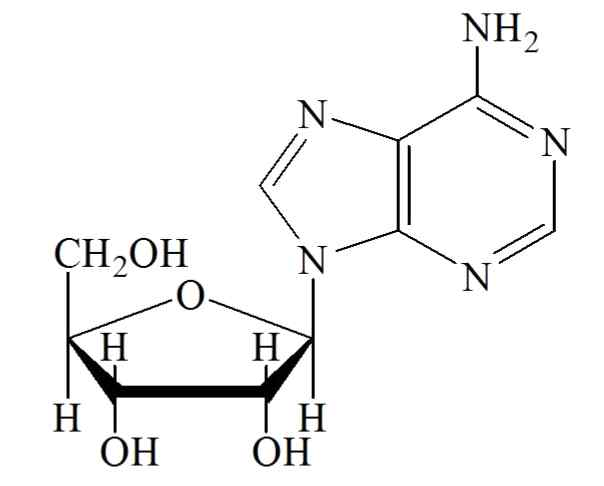

# KFCC_별표3_주름개선_레티놀

[별표 3]
피부의 주름개선에 도움을 주는 기능성화장품 각조
(제2조제3호 관련)
레티놀
Retinol
OH
비타민 A 유, 코드리버 오일
Vitamin A oil, Cod Liver Oil C H O : 286.46
20 30
이 원료는 레티놀 또는 레티놀을 각종 유지에 녹이거나 다당류, 단백질 등을 포함하
는 각종 고분자물질로 안정화시킨 것 또는 이들의 혼합물에 안정도, 제조용이성 등을
향상시키기 위해 희석제, 안정제, 점증제 등 기타 원료를 첨가하여 얻은 것이다. 이
원료는 정량할 때 표시된 레티놀(C H O : 286.46) 함량(IU 또는 %)의 90.0 % 이상을
20 30
함유한다.
성 상 이 원료는 엷은 황색～엷은 주황색의 가루 또는 점성이 있는 액 또는 겔상
의 물질로 냄새는 없거나 특이한 냄새가 있다.
확인시험 이 원료를 클로로포름에 녹여 표시단위에 따라 1 mL중 30 비타민A 단위를
함유하는 액을 만들고 이 액 1 mL를 취하여 삼염화안티몬시액 3 mL를 넣을 때 액
은 곧 청색이 되나 이 색은 빨리 탈색된다.
순도시험 1) 유연물질 이 원료는 비타민A 정량법의 제1법으로 측정할 수 있는 조건에
적합하거나 또는 제2법으로 정량할 때 F 의 값이 0.85이상이다.
2) 산 이 원료 1.2 g에 중화 에탄올ㆍ에텔 혼합액(1:1) 30 mL를 넣고 환류 냉각기
를 달아 10 분간 가만히 끓여 녹이고 식힌 다음 페놀프탈레인시액 5 방울 및 0.1 N
수산화나트륨액 0.60mL를 넣을 때 액은 적색이다.
3) 변패성물질 이 원료를 가온할 때 패유성의 냄새가 나지 않는다.
정 량 법 이 원료의 표시량에 따라 레티놀 25,000 IU에 해당하는 양을 달아 메탄올
80 mL를 넣어 잘 섞은 다음 메탄올을 넣어 100 mL로 한 액 10 mL를 정확하게 취하
여 메탄올을 넣어 100 mL로 하고 필요하면 여과하여 검액으로 한다. 다만, 수용성
물질에 포집된 레티놀의 경우에는 이 원료의 표시량에 따라 레티놀 약 2,500 IU에
해당하는 양을 정밀하게 달아 물 20 mL를 넣어 흔들어 섞고 35 ℃에서 30 분간 초
음파로 분산시킨 다음 흔들어 섞으면서 메탄올을 넣어 100 mL로 한다. 이 액을 다
시 20 분간 교반하고 10 분간 초음파로 분산시킨 다음 필요하면 여과하여 검액으로
한다. 따로 레티놀 표준품 약 25,000 IU에 해당하는 양을 정밀하게 달아 메탄올에
넣어 녹여 100 mL로 한 액 10 mL를 정확하게 취하여 메탄올을 넣어 100 mL로 한
액을 표준액으로 한다. 검액 및 표준액 10 ㎕씩을 가지고 아래 조작조건으로 액체
크로마토그래프법에 따라 시험하여 검액 및 표준액의 레티놀 피크면적 A 및 A 를
T S
구한다.
A
레티놀(C H O)의 양(IU) = 레티놀 표준품의 양(IU)× T
20 30 A
S
조작조건
검출기 : 자외부흡광광도계 (측정파장 325 nm)
칼 럼 : 안지름 3.9 mm, 길이 약 15 cm인 스테인레스관에 약 5 ㎛의 액체크로마
토그래프 옥타데실실릴화한 실리카 겔을 충전한다.
이동상 : 90 % 메탄올
유 량 : 1.0 mL/분
레티놀 로션제
Retinol Lotion
이 기능성화장품은 정량할 때 표시량의 90.0 % 이상에 해당하는 레티놀 (C H O :
20 30
286.46)을 함유한다.
제 법 이 기능성화장품은 레티놀을 주성분(기능성성분)으로 하는 로션제이다. 이 제품은 안정성 및
유용성을 높이기 위해 안정제, 습윤제, 유화제, 보습제, pH조정제, 착색제, 착향제 등을 첨가할 수 있
다.
확인시험 정량법의 검액에서 얻은 주피크의 유지시간은 표준액에서 얻은 주피크의 유지시간과 같다.
pH 기준치 ± 1.0 (2→30), (다만, pH 범위는 3.0～9.0이어야 한다)
정 량 법 이 기능성화장품을 가지고 레티놀로서 약 2,500 IU에 해당하는 양을 정밀하게 달아 에탄올
ㆍ이소프로판올 혼합액 (1:1)을 넣어 분산시킨 다음 50 mL로 하고 여과한 액을 가지고 검액으로 한
다. 다만, 수용성물질에 포집된 레티놀을 사용한 제품의 경우에는, 제품의 표시량에 따라 레티놀 약
2,500 IU에 해당하는 양을 정밀하게 달아 물 15 mL를 넣어 흔들어 섞고 35 ℃에서 30 분간 초음파
로 분산시킨 다음 흔들어 섞으면서 에탄올ㆍ이소프로판올 혼합액 (1:1)을 넣어 50 mL로 한다. 이 액
을 다시 20 분간 교반하고 10 분간 초음파로 분산시킨 다음 필요하면 여과하여 검액으로 한다. 따
로, 레티놀 표준품 약 50,000 IU 해당하는 양을 정밀하게 달아 에탄올ㆍ이소프로판올 혼합액 (1:1)을
넣어 녹여 50 mL로 하고 이 액 5 mL를 정확하게 취해 에탄올ㆍ이소프로판올 혼합액 (1:1)을 넣어
100 mL로 하여 표준액으로 한다. 검액 및 표준액 각 10 μL씩을 가지고 아래 조작조건으로 액체크
로마토그래프법에 따라 시험하여 검액 및 표준액의 피크면적 A 및 A 를 구한다.
T S
A 1
레티놀(C H O)의 양(IU) ꠧ 레티놀표준품의 양(IU)× T ×

20 30 A 20
S
조작조건
검출기 : 자외부흡광광도계 (측정파장 325 ㎚)
칼 럼 : 안지름 약 3.9 ㎜, 길이 약 15 ㎝인 스테인레스관에 5 ㎛의 액체크로마토그래프용 옥타데실
실릴화한 실리카 겔을 충전한다.
이동상 : 90 % 메탄올
유 량 : 1.0 mL/분
레티놀 크림제
Retinol Cream
이 기능성화장품은 정량할 때 표시량의 90.0 % 이상에 해당하는 레티놀 (C H O :
20 30
286.46)을 함유한다.
제 법 이 기능성화장품은 레티놀을 주성분(기능성성분)으로 하는 크림제이다. 이 제품은 안정성 및
유용성을 높이기 위해 안정제, 습윤제, 유화제, 보습제, pH조정제, 착색제, 착향제 등을 첨가할 수
있다.
확인시험 정량법의 검액에서 얻은 주피크의 유지시간은 표준액에서 얻은 주피크의 유지시간과 같다.
pH 기준치 ± 1.0 (2→30) (다만, pH 범위는 3.0～9.0이다)
정 량 법 이 기능성화장품을 가지고 레티놀로서 약 2,500 IU에 해당하는 양을 정밀하게 달아 에탄올
ㆍ이소프로판올 혼합액(1:1)을 넣어 분산시킨 다음 50 mL로 하고 여과한 액을 가지고 검액으로 한
다. 다만, 수용성물질에 포집된 레티놀을 사용한 제품의 경우에는, 제품의 표시량에 따라 레티놀 약
2,500 IU에 해당하는 양을 정밀하게 달아 물 15 mL를 넣어 흔들어 섞고 35 ℃에서 30분간 초음파
로 분산시킨 다음 흔들어 섞으면서 에탄올ㆍ이소프로판올 혼합액 (1:1)을 넣어 50 mL로 한다. 이 액
을 다시 20 분간 교반하고 10분간 초음파로 분산시킨 다음 필요하면 여과하여 검액으로 한다. 따로, 레
티놀 표준품 약 50,000 IU 해당하는 양을 정밀하게 달아 에탄올ㆍ이소프로판올 혼합액 (1:1)을 넣어
녹여 50 mL로 하고 이 액 5 mL를 정확하게 취해 에탄올ㆍ이소프로판올 혼합액 (1:1)을 넣어 100
mL로 하여 표준액으로 한다. 검액 및 표준액 각 10 μL씩을 가지고 아래 조작조건으로 액체크로마
토그래프법에 따라 시험하여 검액 및 표준액의 피크면적 A 및 A 를 구한다.
T S
A 1
레티놀(C H O)의 양(IU) ꠧ 레티놀표준품의 양(IU)× T ×
20 30 A 20
S
조작조건
검출기 : 자외부흡광광도계 (측정파장 325 ㎚)
칼 럼 : 안지름 약 3.9 ㎜, 길이 약 15 ㎝인 스테인레스관에 5 ㎛의 액체크로마토그래프용 옥타데실
실릴화한 실리카 겔을 충전한다.
이동상 : 90 % 메탄올
유 량 : 1.0 mL/분
레티놀 침적 마스크
Retinol Soaked Mask
이 기능성화장품은 정량할 때 표시량의 90.0% 이상에 해당하는 레티놀 (C H O : 286.46)
20 30
을 함유한다.
제 법 이 기능성화장품은 레티놀을 주성분(기능성성분)으로 하는 액제 또는 로션제를 부직포 등의
지지체에 단순 침적한 마스크 제형의 제품이다. 이 때 침적되는 액제 또는 로션제에는 안정성 및 유
용성을 높이기 위해 안정제, 습윤제, 유화제, 보습제, pH 조정제, 착색제, 착향제 등을 첨가할 수 있
다.
확인시험 정량법의 검액에서 얻은 주피크의 유지시간은 표준액에서 얻은 주피크의 유지시간과 같다.
pH 이 기능성화장품을 압착하여 얻은 액제 또는 로션제를 가지고 시험할 때 기준치 ± 1.0이다. (다
만, pH 범위는 3.0 ～ 9.0이다)
1. 정 량 법 이 기능성화장품을 압착하여 얻은 액제 또는 로션제를 가지고 레티놀로서 약 2,500 IU
에 해당하는 양을 정밀하게 달아 에탄올ㆍ이소프로판올 혼합액 (1:1)을 넣어 분산시킨 다음 50mL로
하고 여과한 액을 가지고 검액으로 한다. 다만, 수용성물질에 포집된 레티놀을 사용한 제품의 경우
에는, 제품의 표시량에 따라 레티놀 약 2,500 IU에 해당하는 양을 정밀하게 달아 물 15mL를 넣어
흔들어 섞고 35 ℃에서 30분간 초음파로 분산시킨 다음 흔들어 섞으면서 에탄올ㆍ이소프로판올 혼
합액 (1:1)을 넣어 50mL로 한다. 이 액을 다시 20 분간 교반하고 10분간 초음파로 분산시킨 다음
필요하면 여과하여 검액으로 한다. 따로, 레티놀 표준품 약 50,000 IU 해당하는 양을 정밀하게 달아
에탄올ㆍ이소프로판올 혼합액 (1:1)을 넣어 녹여 50mL로 하고 이 액 5mL를 정확하게 취해 에탄올
ㆍ이소프로판올 혼합액 (1:1)을 넣어 100mL로 하여 표준액으로 한다. 검액 및 표준액 각 10μL씩을
가지고 아래 조작조건으로 액체크로마토그래프법에 따라 시험하여 검액 및 표준액의 피크면적 A
T
및 A 를 구한다.
S
2.
A 1
레티놀(C H O : 286.46)의 양(IU) = 레티놀 표준품의 양(IU)× T ×
20 30 A 20
S
3. 조작조건
4. 검출기 : 자외부흡광광도계 (측정파장 325 ㎚)
5. 칼 럼 : 안지름 약 3.9㎜, 길이 약 15㎝인 스테인레스관에 5㎛의 액체크로마토그래프용 옥타데
실실릴화한 실리카겔을 충전한다.
6. 이동상 : 90 % 메탄올
7. 유 량 : 1.0mL/분
8.
9.
10.
레티놀 고형제
Retinol Solid
이 기능성화장품은 정량할 때 표시량의 90.0% 이상에 해당하는 레티놀(C H O : 286.46)를 함유한다.
20 30
제 법 이 기능성화장품은 레티놀을 주성분(기능성성분)으로 하는 고형제이다. 이 제품은 안정성 및
유용성을 높이기 위해 안정제, 습윤제, 유화제, 보습제, pH 조정제, 착색제, 착향제 등을 첨가할 수 있다.
확인시험 정량법의 검액에서 얻은 주피크의 유지시간은 표준액에서 얻은 주피크의 유지시간과 같다.
pH 기준치 ± 1.0 (2 → 30) (다만, pH 범위는 3.0 ∼ 9.0이며, 물을 포함하지 않는 제품은 제외)
정 량 법 이 기능성화장품을 가지고 레티놀로서 약 2,500IU에 해당하는 양을 정밀하게 달아 테트라하
이드로퓨란 5mL를 넣어 초음파 추출한 후 에탄올ㆍ이소프로판올 혼합액(1:1)을 넣어 50mL로 하고 여과
한 액을 가지고 검액으로 한다. 다만, 수용성물질에 포집된 레티놀을 사용한 제품의 경우에는, 제품의
표시량에 따라 레티놀 약 2,500IU에 해당하는 양을 정밀하게 달아 물 15mL를 넣어 흔들어 섞고 35℃에
서 30분간 초음파로 분산시킨 다음 흔들어 섞으면서 에탄올ㆍ이소프로판올 혼합액 (1:1)을 넣어 50mL로
한다. 이 액을 다시 20분간 교반하고 10분간 초음파로 분산시킨 다음 필요하면 여과하여 검액으로 한다.
따로, 레티놀 표준품 약 50,000IU 해당하는 양을 정밀하게 달아 에탄올ㆍ이소프로판올 혼합액 (1:1)을 넣
어 녹여 50 mL로 하고 이 액 5mL를 정확하게 취해 에탄올ㆍ이소프로판올ㆍ테트라하이드로퓨란 혼합액
(4.5 : 4.5 : 1)을 넣어 100mL로 하여 표준액으로 한다. 검액 및 표준액 각 10μL씩을 가지고 아래 조작조
건으로 액체크로마토그래프법에 따라 시험하여 검액 및 표준액의 피크면적 AT 및 AS를 각각 구한다.
A
T
레티놀(C 20 H 30 O)의 양(IU) = 레티놀 표준품의 양(IU) × A
S
11. 조작조건
12. 검 출 기 : 자외부흡광광도계 (측정파장 325㎚)
13. 칼 럼 : 안지름 약 3.9㎜, 길이 약 15㎝인 스테인레스관에 5㎛의 액체크로마토그래프용 옥타
데실실릴화한 실리카겔을 충전한다.
14. 이 동 상 : 90% 메탄올
15. 유 량 : 1.0mL/분
16.
레티닐팔미테이트
Retinyl Palmitate
H 3 C CH 3 CH 3 CH 3
CH OCO(CH ) CH
2 2 14 3
CH
3
팔미틴산레티놀, 비타민 A 팔미틴산 에스텔
Retinol Palmitate C H O ：524.87
36 60 2
이 원료는 레티닐팔미테이트 또는 레티닐팔미테이트를 각종 유지에 녹이거나 다당류, 단백질 등을 포
함하는 각종 고분자물질로 안정화시킨 것 또는 이들의 혼합물에 안정도, 제조용이성 등을 향상시키기 위
해 희석제, 안정제, 점증제 등 기타 원료를 첨가하여 얻은 것이다. 이 원료는 정량할 때 표시된 레티닐
팔미테이트(C H O ：524.87) 함량(IU 또는 %)의 90.0 % 이상을 함유한다.
36 60 2
성 상 이 원료는 엷은 황색～황적색의 고체 또는 유상의 물질로 약간의 특이한 냄새가 있다. 이
원료는 냉소에 보관할 때 일부는 결정화된다.
확인시험 1) 이 원료를 클로로포름에 녹여 표시단위에 따라 1 mL중 30 비타민 A 단위를 만들고, 이
액 1 mL를 취하여 삼염화안티몬시액 3 mL를 넣을 때 액은 곧 청색이 되나 이 색은 빨리 탈색된다.
2) 이 원료를 가지고 비타민A정량법의 확인시험에 따라 시험할 때 이 원료 및 박층크로마토그래프용
레티닐팔미테이트표준품의 청색으로 나타나는 주된 반점의 R값은 같다. 또한 이 원료는 박층크로마
f
토그래프용레티닐아세테이트표준품의 청색으로 나타나는 주된 반점과 같은 R의 위치에 반점이 생기
f
지 않는다.
순도시험 유연물질 이 원료는 비타민A 정량법의 제１법으로 측정할 수 있는 조건에 적합하다.
산 가 2.0 이하 (20 g, 제1법)
과산화물가 이 원료 약 3 g을 정밀하게 달아 초산ㆍ클로로포름혼합액(3:2) 25 mL를 넣어 필요하면 가
온하면서 녹인다. 이 액에 쓸 때 만든 포화요오드화칼륨용액 1 mL를 넣어 가볍게 흔들어 섞은 다음
어두운 곳에서 10분간 방치하고 물 30 mL를 넣어 세게 흔들어 섞은 다음 0.01 N 치오황산나트륨액으
로 적정한다(지시약 : 전분시액 1 mL). 같은 방법으로 공시험을 하여 보정한다(16 meq/kg 이하).
a-b
과산화물가(meq/kg) = ×10
검체의 양(g)
a : 시료의 적정에 소비된 0.01N 치오황산나트륨액의 양(mL)
b : 공시험에 소비된 0.01N 치오황산나트륨액의 양(mL)
정 량 법 이 원료의 표시량에 따라 레티닐팔미테이트 약 50,000 IU에 해당하는 양을 정밀하게 달아 에
탄올ㆍ이소프로판올 혼합액(1:1) 80 mL를 넣어 잘 섞은 다음 에탄올ㆍ이소프로판올 혼합액(1:1)을 넣
어 100 mL로 한 액 10 mL를 정확하게 취하여 에탄올ㆍ이소프로판올 혼합액(1:1)을 넣어 100 mL로
하고 필요하면 여과하여 여액을 검액으로 한다. 따로 레티닐팔미테이트 표준품 약 50,000 IU에 해당
하는 양을 정밀하게 달아 검액과 같이 조작하여 표준액으로 한다. 검액 및 표준액 10 ㎕씩을 가지고
아래 조작조건으로 액체크로마토그래프법에 따라 시험하여 검액 및 표준액의 레티닐팔미테이트 피크
면적 A 및 A 를 구한다.
T S
A
레티닐팔미테이트(C H O )의 양(IU) = 레티닐팔미테이트 표준품의 양(IU)× T
36 60 2 A
S
조작조건
검출기 : 자외부흡광광도계 (측정파장 326 nm)
칼 럼 : 안지름 3.9 mm, 길이 약 15 cm인 스테인레스관에 약 5 ㎛의 액체크로마토그래프 옥타데실
실릴화한 실리카 겔을 충전한다.
이동상 : 메탄올
유 량 : 1.0mL/분
레티닐팔미테이트 로션제
Retinyl Palmitate Lotion
이 기능성화장품은 정량할 때 표시량의 90.0 % 이상에 해당하는 레티닐팔미테이트(C H O ：524.87)
36 60 2
를 함유한다.
제 법 이 기능성화장품은 레티닐팔미테이트를 주성분(기능성성분)으로 하는 로션제이다. 이 제품은
안정성 및 유용성을 높이기 위해 안정제, 습윤제, 유화제, 보습제, pH조정제, 착색제, 착향제 등을
첨가할 수 있다.
확인시험 정량법의 검액에서 얻은 주피크의 유지시간은 표준액에서 얻은 주피크의 유지시간과 같다.
pH 기준치 ± 1.0 (2→30) (다만, pH 범위는 3.0～9.0이다)
정 량 법 이 기능성화장품을 가지고 레티닐팔미테이트로서 약 10,000 IU에 해당하는 양을 정밀하게
달아 에탄올ㆍ이소프로판올 혼합액(1:1)을 넣어 분산시킨 다음 50 mL로 하고 필요하면 여과하여 검
액으로 한다. 따로, 레티닐팔미테이트 표준품 약 100,000 IU에 해당하는 양을 정밀하게 달아 에탄올
ㆍ이소프로판올 혼합액(1:1)을 넣어 녹여 50 mL로 하고 이 액 10 mL를 정확하게 취해 에탄올ㆍ이소
프로판올 혼합액 (1:1)을 넣어 100 mL로 하여 표준액으로 한다. 검액 및 표준액 각 10 μL씩을 가지
고 아래 조작조건으로 액체크로마토그래프법에 따라 시험하여 검액 및 표준액의 피크면적 A 및 A
T S
를 구한다.
레티닐팔미테이트(C H O )의 양(IU) 
36 60 2
A 1
레티닐팔미테이트표준품의 양(IU)× T ×
A 10
S
조작조건
검 출 기 : 자외부흡광광도계 (측정파장 325 ㎚)
칼 럼 : 안지름 약 3.9 ㎜, 길이 약 15 ㎝인 스테인레스관에 5 ㎛의 액체크로마토그래프용 옥타데
실실릴화한 실리카 겔을 충전한다.
이 동 상 : 메탄올
유 량 : 1.0 mL/분
레티닐팔미테이트 크림제
Retinyl Palmitate Cream
이 기능성화장품은 정량할 때 표시량의 90.0 % 이상에 해당하는 레티닐팔미테이트
(C H O ：524.87)을 함유한다.
36 60 2
제 법 이 기능성화장품은 레티닐팔미테이트를 주성분(기능성성분)으로 하는 크림제이다. 이 제품은
안정성 및 유용성을 높이기 위해 안정제, 습윤제, 유화제, 보습제, pH조정제, 착색제, 착향제 등을
첨가할 수 있다.
확인시험 정량법의 검액에서 얻은 주피크의 유지시간은 표준액에서 얻은 주피크의 유지시간과 같다.
pH 기준치 ± 1.0 (2→30) (다만, pH 범위는 3.0～9.0이다)
정 량 법 이 기능성화장품을 가지고 레티닐팔미테이트로서 약 10,000 IU에 해당하는 양을 정밀하게
달아 에탄올ㆍ이소프로판올 혼합액 (1:1)을 넣어 분산시킨 다음 50 mL로 하고 필요하면 여과하여 검
액으로 한다. 따로, 레티닐팔미테이트 표준품 약 100,000IU에 해당하는 양을 정밀하게 달아 에탄올ㆍ이
소프로판올 혼합액(1:1)을 넣어 녹여 50 mL로 하고 이 액 10 mL를 정확하게 취해 에탄올ㆍ이소프로판
올 혼합액 (1:1)을 넣어 100 mL로 하여 표준액으로 한다. 검액 및 표준액 각 20 μL씩을 가지고 아래
조작조건으로 액체크로마토그래프법에 따라 시험하여 검액 및 표준액의 피크면적 A 및 A 를 구한
T S
다.
레티닐팔미테이트(C H O )의 양(IU)
36 60 2
A 1
 레티닐팔미테이트표준품의 양(IU)× T ×
A 10
S
조작조건
검출기 : 자외부흡광광도계 (측정파장 325 ㎚)
칼 럼 : 안지름 약 3.9 ㎜, 길이 약 15 ㎝인 스테인레스관에 5 ㎛의 액체크로마토그래프용 옥타데실
실릴화한 실리카 겔을 충전한다.
이동상 : 메탄올
유 량 : 1.0 mL/분
레티닐팔미테이트 침적 마스크
Retinyl Palmitate Soaked Mask
17. 이 기능성화장품은 정량할 때 표시량의 90.0% 이상에 해당하는 레티닐팔미테이트(C H O ：
36 60 2
524.87)를 함유한다.
제 법 이 기능성화장품은 레티놀을 주성분(기능성성분)으로 하는 액제 또는 로션제를 부직포 등의
지지체에 단순 침적한 마스크 제형의 제품이다. 이 때 침적되는 액제 또는 로션제에는 안정성 및 유
용성을 높이기 위해 안정제, 습윤제, 유화제, 보습제, pH 조정제, 착색제, 착향제 등을 첨가할 수 있
다.
확인시험 정량법의 검액에서 얻은 주피크의 유지시간은 표준액에서 얻은 주피크의 유지시간과 같다.
pH 이 기능성화장품을 압착하여 얻은 액제 또는 로션제를 가지고 시험할 때 기준치 ± 1.0이다.
(다만, pH 범위는 3.0 ～ 9.0이다)
정 량 법 이 기능성화장품을 압착하여 얻은 액제 또는 로션제를 가지고 레티닐팔미테이트로서 약
10,000 IU에 해당하는 양을 정밀하게 달아 에탄올ㆍ이소프로판올 혼합액 (1:1)을 넣어 분산시킨 다음
50mL로 하고 필요하면 여과하여 검액으로 한다. 따로, 레티닐팔미테이트 표준품 약 100,000 IU에 해
당하는 양을 정밀하게 달아 에탄올ㆍ이소프로판올 혼합액(1:1)을 넣어 녹여 50mL로 하고 이 액 10mL
를 정확하게 취해 에탄올ㆍ이소프로판올 혼합액 (1:1)을 넣어 100mL로 하여 표준액으로 한다. 검액
및 표준액 각 10μL씩을 가지고 아래 조작조건으로 액체크로마토그래프법에 따라 시험하여 검액 및
표준액의 피크면적 A 및 A 를 구한다.
T S
가. 레티닐팔미테이트(C H O ：524.87)의 양(IU) =
36 60 2
A 1
나. 레티닐팔미테이트 표준품의 양(IU)× T ×
A 10
S
조작조건
검출기 : 자외부흡광광도계 (측정파장 325 ㎚)
칼 럼 : 안지름 약 3.9㎜, 길이 약 15㎝인 스테인레스관에 5㎛의 액체크로마토그래프용 옥타데실실
릴화한 실리카겔을 충전한다.
이동상 : 메탄올
유 량 : 1.0mL/분
레티닐팔미테이트 고형제
Retinyl Palmitate Solid
이 기능성화장품은 정량할 때 표시량의 90.0% 이상에 해당하는 레티닐팔미테이트(C H O : 524.87)를
36 60 2
함유한다.
제 법 이 기능성화장품은 레티닐팔미테이트를 주성분(기능성성분)으로 하는 고형제이다. 이 제품은
안정성 및 유용성을 높이기 위해 안정제, 습윤제, 유화제, 보습제, pH 조정제, 착색제, 착향제 등을 첨가
할 수 있다.
확인시험 정량법의 검액에서 얻은 주피크의 유지시간은 표준액에서 얻은 주피크의 유지시간과 같다.
pH 기준치 ± 1.0 (2 → 30) (다만, pH 범위는 3.0 ∼ 9.0이며, 물을 포함하지 않는 제품은 제외)
정 량 법 이 기능성화장품을 가지고 레티닐팔미테이트로서 약 10,000 IU에 해당하는 양을 정밀하게
달아 테트라하이드로퓨란 5 mL를 넣어 초음파 추출한 후 에탄올ㆍ이소프로판올 혼합액 (1:1)을 넣어 50
mL로 하고 필요하면 여과하여 검액으로 한다. 따로, 레티닐팔미테이트 표준품 약 100,000IU에 해당하는
양을 정밀하게 달아 에탄올ㆍ이소프로판올ㆍ테트라하이드로퓨란 혼합액 (4.5 : 4.5 : 1)을 넣어 50 mL로
하고 이 액 10 mL를 정확하게 취해 에탄올ㆍ이소프로판올ㆍ테트라하이드로퓨란 혼합액 (4.5 : 4.5 : 1)을
넣어 100 mL로 하여 표준액으로 한다. 검액 및 표준액 각 20 μL씩을 가지고 아래 조작조건으로 액체크
로마토그래프법에 따라 시험하여 검액 및 표준액의 피크면적 AT 및 AS를 각각 구한다.
A
T
레티닐팔미테이트(C 36 H 60 O 2 )의 양(IU) = 레티닐팔미테이트 표준품의 양(IU) × A
S
조작조건
검 출 기 : 자외부흡광광도계 (측정파장 325㎚)
칼 럼 : 안지름 약 3.9㎜, 길이 약 15㎝인 스테인레스관에 5㎛의 액체크로마토그래프용 옥타데실실
릴화한 실리카겔을 충전한다.
이 동 상 : 메탄올
유 량 : 1.0mL/분
아데노신
Adenosine

아데닌 리보사이드
Adenine Riboside C H N O : 267.24
10 13 5 4
이 원료를 정량할 때 아데노신(C H N O : 267.24) 99.0% 이상을 함유한다.
10 13 5 4
성 상 이 원료는 무색 결정 또는 결정성 가루로 냄새는 없다.
확인시험 1) 이 원료를 인산염완충액(pH 7.0)으로 용해하여 최종 농도를 10㎍/mL로 하고 파장 250㎚,
260㎚ 및 280㎚에서 흡광도를 측정하여 각각 A , A 및 A 로 할 때 A /A 는 0.79±0.02, A /A 는
1 2 3 1 2 3 2
0.15±0.01이다.
2) 여지크로마토그래프법에 따라 이소부틸산ㆍ암모니아수ㆍ물(66:1:33)을 전개용매로 하여 20℃에서 24
시간 하강시킬 때 R 값은 약 0.76이다.
f
3) 박층크로마토그래프법에 따라 실리카겔 GF 를 사용하여 박층판을 만들고 이소프로판올ㆍ클로로
254
포름ㆍ10% 피페라진액 혼합액(60: 20: 20)을 전개용매로 하여 전개시키고 실온에서 건조시킨 다음 자
외선을 쪼여 아데노신 표준액의 반점과 비교 확인한다.
4) 이 원료의 수용액(1→1000) 5mL에 염화제이철용액과 0.1% 오르시놀을 함유하는 염산용액 5mL를
넣어 수욕 상에서 가온하면 곧 녹색이 나타나고 서서히 청색으로 변한다.
융 점 234～235℃ (제1법)
[α]20
: -58 ～ -62°(0.706g, 물, 100mL, 100㎜)
비선광도
D
순도시험 1) 중금속 이 원료 1.0g에 묽은초산 2mL 및 물을 넣어 50mL로 한 액을 가지고 시험한다.
비교액에는 납표준액 1.0mL를 넣는다(10ppm 이하).
2) 아데닌 이 원료 0.1g을 물 5mL로 녹인 액을 검액으로 한다. 따로 아데닌 표준품 0.1g을 물 5mL
에 녹인 액을 표준액으로 한다. 검액 및 표준액 20㎕를 박층크로마토그래프용 셀룰로오스 GF
254
또는 실리카 겔 GF 을 써서 만든 박층판에 점적하고 1M 탄산수소나트륨액을 전개용매로 하여 전
254
개한 다음 박층판에 자외선을 쪼일 때 검액에서 아데닌의 반점이 나타나지 않는다.
건조감량 1.0% 이하 (1g, 105℃, 항량)
강열잔분 0.1% 이하 (0.1g)
정 량 법
제 1 법 이 원료를 건조하여 그 약 0.1g을 정밀하게 달아 인산염완충액(pH 7.0)으로 녹여 정확하게
100mL로 한다. 이 액 1mL에 인산염완충액(pH 7.0)을 넣어 정확하게 100mL로 한 액을 검액으로 한다.
따로 아데노신 표준품 약 0.1g을 정밀하게 달아 인산염완충액(pH 7.0)을 넣어 정확하게 100mL로 한다.
이 액 1mL에 인산염완충액(pH 7.0)을 넣어 정확하게 100mL로 한 액을 표준액으로 한다. 검액 및 표준
액을 가지고 인산염완충액(pH 7.0)을 대조로 하여 파장 260㎚ 부근에서 흡광도 A 및 A 를 측정한다.
T S
A
아데노신(C H N O )의 양(㎎)=아데노신의 표준품의 양(㎎)× T
10 13 5 4 A
S
제 2 법 이 원료 약 40㎎을 정밀하게 달아 이동상을 넣어 녹여 정확하게 100mL로 한다. 이 액을 1mL
취하여 이동상을 넣어 정확하게 50mL로 하여 검액으로 한다. 따로 아데노신 표준품 약 40㎎을 정밀하게
달아 이동상을 넣어 녹여 100mL로 한다. 이 액 1mL를 정확하게 취하여 이동상을 넣어 50mL로 한 액을
표준액으로 한다. 검액 및 표준액 각 10μL씩을 가지고 다음 조건으로 액체크로마토그래프법에 따라 시험
하여 아데노신의 피크면적 AT 및 AS를 구한다.
A
T
아데노신(C 10 H 13 N 5 O 4 )의 양(㎎) = 아데노신 표준품의 양(㎎) × A
S
조작조건
검 출 기 : 자외부흡광광도계 (측정파장 260㎚)
칼 럼 : 안지름 약 4.6㎜, 길이 약 25㎝인 스테인레스관에 5㎛의 액체크로마토그래프용 옥타데실실
릴화한 실리카겔을 충전한다.
이 동 상 : 메탄올ㆍ0.05M 인산이수소칼륨용액 혼합액 (15:85)
유 량 : 1.0mL/분
아데노신액(2%)
Adenosine Solution(2%)
이 원료는 「기능성화장품 기준 및 시험방법」에 따른 ‘아데노신’을 대두에서 얻은 레시친과 부틸렌글
라이콜 등과 혼합하여 고압에서 유화시켜 균질하게 만든 원료이다. 이 원료는 정량할 때 아데노신
(C H N O : 267.2) 1.90 ～ 2.10 %를 함유한다.
10 13 5 4
성 상 이 원료는 백색의 유액으로 특이한 냄새가 있다.
확인시험 다음 정량법에 따라 시험할 때 검액은 표준액과 같은 피크유지시간을 나타낸다.
pH 이 원료를 가지고 일반시험법 Ⅱ. 제제 1. pH 시험법에 따라 시험할 때 pH는 3.5 ～ 5.5이
다.
d20
0.95 ～ 1.05 (제1법)
비 중
20
순도시험 1) 중금속 이 원료 1.0 g을 달아 제 1법에 따라 조작하여 시험한다. 비교액에는 납표준
액 1.0 mL를 넣는다.(10 ppm 이하)
2) 비소 이 원료 1.0 g을 달아 제3법에 따라 검액을 만들고 장치 A를 쓰는 방법에 따라 조작하여 시
험한다.(2 ppm 이하)
정 량 법 이 원료 약 1.0 g을 정밀하게 달아 이동상 50 mL를 넣어 초음파 추출한 후 이동상을 넣어 정
확하게 100 mL로 한 다. 이 액 4 mL를 정확하게 취하여 이동상을 넣어 100 mL로 한 액을 검액으로
한다. 따로 아데노신 표준품 약 20 ㎎을 정밀하게 달아 이동상을 넣어 녹여 100 mL로 한다. 이 액 4
mL를 정확하게 취하여 이동상을 넣어 100mL로 한 액을 표준액으로 한다. 검액 및 표준액 10 μL씩을
가지고 다음 조건으로 액체크로마토그래프법에 따라 시험하여 아데노신의 피크면적 A 및 A 를 구한다.
T S
A
아데노신(C H N O )의 양(㎎) = 아데노신 표준품의 양(㎎)× T
10 13 5 4 A
S
조작조건
검출기 : 자외부흡광광도계 (측정파장 260 ㎚)
칼 럼 : 안지름 약 4.6 ㎜, 길이 약 15㎝인 스테인레스관에 5 ㎛의 액체크로마토그래프용 옥타데실
실릴화한 실리카 겔을 충전한다.
이동상 : 아세토니트릴ㆍ10 mM 인산이수소칼륨 혼합액(5:94)
유 량 : 0.8 mL/분
아데노신 로션제
Adenosine Lotion
이 기능성화장품은 정량할 때 표시량의 90.0 %이상에 해당하는 아데노신(C H N O :
10 13 5 4
267.24)을 함유한다.
제 법 이 기능성화장품은 아데노신을 주성분(기능성성분)으로 하는 로션제이다. 이 제품은
안정성 및 유용성을 높이기 위해 안정제, 습윤제, 유화제, 보습제, pH조정제, 착색제, 착향제 등을 첨
가할 수 있다.
확인시험 정량법의 검액에서 얻은 주피크의 유지시간은 표준액에서 얻은 주피크의 유지시간과
같다.
pH 기준치 ± 1.0 (2 → 30), (다만, pH 범위는 3.0～9.0이다)
정 량 법 이 기능성화장품을 가지고 아데노신으로서 약 0.4 ㎎에 해당하는 양을 정밀하게 달아 이동상
20 mL를 넣어 초음파 추출한 후 이동상을 넣어 정확하게 50 mL로 한 액을 가지고 검액으로 한다. 따로
아데노신 표준품 약 20 ㎎을 정밀하게 달아 이동상을 넣어 녹여 100 mL로 한다. 이 액 4 mL를 정확
하게 취하여 이동상을 넣어 100mL로 한 액을 표준액으로 한다. 검액 및 표준액 각 10 μL씩을 가지
고 다음 조건으로 액체크로마토그래프법에 따라 시험하여 아데노신의 피크면적 A 및 A 를 구한다.
T S
A 1
아데노신(C H N O )의 양(㎎) = 아데노신 표준품의 양(㎎)× T ×
10 13 5 4 A 50
S
조작조건
검 출 기 : 자외부흡광광도계 (측정파장 260 ㎚)
칼 럼 : 안지름 약 4.6 ㎜, 길이 약 25 ㎝인 스테인레스관에 5 ㎛의 액체크로마토그래프용 옥타데
실실릴화한 실리카 겔을 충전한다.
이 동 상 : 메탄올ㆍ0.05 M 인산이수소칼륨용액 혼합액 (15 : 85)
유 량 : 1.0 mL/분
아데노신 액제
Adenosine Solution
이 기능성화장품은 정량할 때 표시량의 90.0 %이상에 해당하는 아데노신(C H N O :
10 13 5 4
267.24)을 함유한다.
제 법 이 기능성화장품은 아데노신을 주성분(기능성성분)으로 하는 액제이다. 이 제품은 안정성 및
유용성을 높이기 위해 안정제, 습윤제, 보습제, pH조정제, 착색제, 착향제 등을 첨가할 수 있다.
확인시험 정량법의 검액에서 얻은 주피크의 유지시간은 표준액에서 얻은 주피크의 유지시간과 같다.
pH 기준치 ± 1.0 (2 → 30), (다만, pH 범위는 3.0～9.0이다)
정 량 법 이 기능성화장품을 가지고 아데노신으로서 약 0.4 ㎎에 해당하는 양을 정밀하게 달아 이동
상 20 mL를 넣어 초음파 추출한 후 이동상을 넣어 정확하게 50 mL로 한 액을 가지고 검액으로 한다.
따로 아데노신 표준품 약 20 ㎎을 정밀하게 달아 이동상을 넣어 녹여 100 mL로 한다. 이 액 4 mL
를 정확하게 취하여 이동상을 넣어 100mL로 한 액을 표준액으로 한다. 검액 및 표준액 각 10 μL씩
을 가지고 다음 조건으로 액체크로마토그래프법에 따라 시험하여 아데노신의 피크면적 A 및 A 를
T S
구한다.
A 1
아데노신(C H N O )의 양(㎎) = 아데노신 표준품의 양(㎎) × T ×
10 13 5 4 A 50
S
조작조건
검출기 : 자외부흡광광도계 (측정파장 260 ㎚)
칼 럼 : 안지름 약 4.6 ㎜, 길이 약 25 ㎝인 스테인레스관에 5 ㎛의 액체크로마토그래프용 옥타데실
실릴화한 실리카겔을 충전한다.
이동상 : 메탄올ㆍ0.05 M 인산이수소칼륨용액 혼합액 (15 : 85)
유 량 : 1.0 mL/분
아데노신 크림제
Adenosine Cream
이 기능성화장품은 정량할 때 표시량의 90.0 %이상에 해당하는 아데노신(C H N O :
10 13 5 4
267.24)을 함유한다.
제 법 이 기능성화장품은 아데노신을 주성분(기능성성분)으로 하는 크림제이다. 이 제품은 안정성
및 유용성을 높이기 위해 안정제, 습윤제, 유화제, 보습제, pH조정제, 착색제, 착향제 등을 첨가할 수
있다.
확인시험 정량법의 검액에서 얻은 주피크의 유지시간은 표준액에서 얻은 주피크의 유지시간과 같다.
pH 기준치 ± 1.0 (2 → 30), (다만, pH 범위는 3.0～9.0이다)
정 량 법 이 기능성화장품을 가지고 아데노신으로서 약 0.4 ㎎에 해당하는 양을 정밀하게 달아 메탄올
5 mL를 넣어 초음파 추출한 후 물을 넣어 정확하게 50 mL로 하고 필요하면 여과하여 검액으로 한다. 따
로 아데노신 표준품 약 20 ㎎을 정밀하게 달아 10 % 메탄올을 넣어 녹여 100 mL로 한다. 이 액 4
mL를 정확하게 취하여 10 % 메탄올을 넣어 100 mL로 한 액을 표준액으로 한다. 검액 및 표준액 각
10 μL씩을 가지고 다음 조건으로 액체크로마토그래프법에 따라 시험하여 아데노신의 피크면적 A 및
T
A 를 구한다.
S
A 1
아데노신(C H N O )의 양(㎎) ꠧ 아데노신표준품의 양(㎎)× T ×

10 13 5 4 A 50
S
조작조건
검출기 : 자외부흡광광도계 (측정파장 260 ㎚)
칼 럼 : 안지름 약 4.6 ㎜, 길이 약 25 ㎝인 스테인레스관에 5 ㎛의 액체크로마토그래프용 옥타데실
실릴화한 실리카 겔을 충전한다.
이동상 : 메탄올ㆍ0.05 M 인산이수소칼륨용액 혼합액 (15 : 85)
유 량 : 1.0 mL/분
아데노신 침적 마스크
Adenosine Soaked Mask
18. 이 기능성화장품은 정량할 때 표시량의 90.0% 이상에 해당하는 아데노신(C H N O : 267.24)
10 13 5 4
을 함유한다.
가. 제 법 이 기능성화장품은 아데노신을 주성분(기능성성분)으로 하는 액제 또는 로션제를 부직
포 등의 지지체에 단순 침적한 마스크 제형의 제품이다. 이 때 침적되는 액제 또는 로션제에는
안정성 및 유용성을 높이기 위해 안정제, 습윤제, 유화제, 보습제, pH 조정제, 착색제, 착향제
등을 첨가할 수 있다.
확인시험 정량법의 검액에서 얻은 주피크의 유지시간은 표준액에서 얻은 주피크의 유지시간과 같다.
pH 이 기능성화장품을 압착하여 얻은 액제 또는 로션제를 가지고 시험할 때 기준치 ± 1.0이다. (다
만, pH 범위는 3.0 ～ 9.0이다)
나. 정 량 법 이 기능성화장품을 압착하여 얻은 액제 또는 로션제를 가지고 아데노신으로서 약 0.4㎎
에 해당하는 양을 정밀하게 달아 이동상 20mL를 넣어 초음파 추출한 후 이동상을 넣어 정확하게
50mL로 한 액을 가지고 검액으로 한다. 따로 아데노신 표준품 약 20 ㎎을 정밀하게 달아 이동상을
넣어 녹여 100mL로 한다. 이 액 4mL를 정확하게 취하여 이동상을 넣어 100mL로 한 액을 표준액
으로 한다. 검액 및 표준액 각 10μL씩을 가지고 다음 조건으로 액체크로마토그래프법에 따라 시험
하여 아데노신의 피크면적 A 및 A 를 구한다.
T S
다.
A 1
라. 아데노신(C H N O )의 양(㎎) = 아데노신 표준품의 양(㎎)× T ×
10 13 5 4 A 50
S
마.
조작조건
검 출 기 : 자외부흡광광도계 (측정파장 260 ㎚)
칼 럼 : 안지름 약 4.6㎜, 길이 약 25 ㎝인 스테인레스관에 5㎛의 액체크로마토그래프용 옥타데실
실릴화한 실리카겔을 충전한다.
이 동 상 : 메탄올ㆍ0.05 M 인산이수소칼륨용액 혼합액 (15 : 85)
유 량 : 1.0 mL/분
아데노신 고형제
Adenosine Solid
이 기능성화장품은 정량할 때 표시량의 90.0% 이상에 해당하는 아데노신(C H N O : 267.24)을 함유
10 13 5 4
한다.
제 법 이 기능성화장품은 아데노신을 주성분(기능성성분)으로 하는 고형제이다. 이 제품은 안정성
및 유용성을 높이기 위해 안정제, 습윤제, 유화제, 보습제, pH 조정제, 착색제, 착향제 등을 첨가할 수
있다.
확인시험 정량법의 검액에서 얻은 주피크의 유지시간은 표준액에서 얻은 주피크의 유지시간과 같다.
pH 기준치 ± 1.0 (2 → 30) (다만, pH 범위는 3.0 ∼ 9.0이며, 물을 포함하지 않는 제품은 제외)
정 량 법 이 기능성화장품을 가지고 아데노신으로서 약 0.4㎎에 해당하는 양을 정밀하게 달아 테트라
하이드로퓨란 10mL를 넣어 초음파 추출한 후 이동상을 넣어 정확하게 50mL로 하고 필요하면 여과하여
검액으로 한다. 따로 아데노신 표준품 약 20㎎을 정밀하게 달아 테트라하이드로퓨란 10% 함유 이동상을
넣어 녹여 100mL로 한다. 이 액 4mL를 정확하게 취하여 테트라하이드로퓨란 10 % 함유 이동상을 넣어
100mL로 한 액을 표준액으로 한다. 검액 및 표준액 각 10μL씩을 가지고 다음 조건으로 액체크로마토그
래프법에 따라 시험하여 검액 및 표준액의 피크면적 AT 및 AS를 각각 구한다.
A
T
아데노신(C 10 H 13 N 5 O 4 )의 양(㎎) = 아데노신 표준품의 양(㎎) × A
S
조작조건
검 출 기 : 자외부흡광광도계 (측정파장 260㎚)
칼 럼 : 안지름 약 4.6㎜, 길이 약 25㎝인 스테인레스관에 5㎛의 액체크로마토그래프용 옥타데실실
릴화한 실리카겔을 충전한다.
이 동 상 : 메탄올ㆍ0.05M 인산이수소칼륨용액 혼합액 (15:85)
유 량 : 1.0mL/분
폴리에톡실레이티드레틴아마이드
Polyethoxylated Retinamide
O
O
N O
H n n=10.7(average)
N-ω-메칠폴리에틸렌글라이콜릴 레틴아마이드
N-ω-methylpolyethyleneglycolyl retinamide (C H O N) : 평균분자량 831
23+2n 35+4n 2+n n
이 원료는 정량할 때 폴리에톡실레이티드레틴아마이드((C H O ) : 평균분자량
23+2n 35+4n 2+nN n
831) 95.0% 이상을 함유한다.
성 상 이 원료는 황색～황갈색의 맑거나 약간 혼탁한 유액으로 약간의 특이한 냄새가 있다.
확인시험 1) 이 원료의 메탄올용액(1→10,000)을 가지고 흡광도측정법에 따라 흡수스펙트럼을 측정할
때 파장 350±2㎚에서 흡수극대를 나타낸다.
2) 이 원료를 가지고 적외부흡수스펙트럼측정법의 브롬화칼륨정제법에 따라 측정할 때 파수 2925cm-1,
2867cm-1, 1654cm-1, 1351cm-1, 1276cm-1, 1260cm-1, 1110cm-1, 969cm-1, 847cm-1, 764cm-1 및 750cm-1 부
근에서 흡수를 나타낸다.
융 점 6～10℃(제 1 법)
pH 4.6 ～ 6.6 (3 → 30)
d20
: 1.027 ～ 1.127 (제 1 법)
비 중
20
순도시험 1) 중금속 이 원료 1.0g을 달아 제2법에 따라 조작하여 시험한다. 비교액에는 납표준액
1.0mL를 넣는다(10ppm 이하)
2) 비 소 이 원료 1.0g을 달아 제3법에 따라 검액을 만들고 장치 A를 쓰는 방법에 따라 조작하여
시험한다(2ppm 이하)
정 량 법 이 원료 약 130㎎을 정밀하게 달아 아세토니트릴을 넣어 녹여 정확하게 100mL로 하여 검
액으로 한다. 따로 폴리에톡실레이티드레틴아마이드 표준품 약 130㎎을 정밀하게 달아 아세토니트릴
에 녹여 정확하게 100mL로 하여 표준액으로 한다. 검액 및 표준액 10㎕를 가지고 다음 조건으로 액
체크로마토그래프법에 따라 시험하여 폴리에톡실레이티드레틴아마이드의 피크면적 A 및 A 를 구한
T S
다.
폴리에톡실레이티드레틴아마이드 [(C H O N) ]의 양(㎎)
23+2n 35+4n 2+n n
A
=폴리에톡실레이티드레틴아마이드 표준품의 양(㎎)× T
A
S
조작조건
검출기 : 자외부흡광광도계(측정파장 : 350㎚)
컬 럼 : 안지름 4.6㎜, 길이 25㎝의 스테인레스관에 액체크로마토그래프용 옥타데실실릴화한 실리카
겔을 충전한다.
칼럼온도 : 25℃
이동상 : 아세토니트릴ㆍ물 혼합액(50: 50)으로 1분간 용리한 다음 19분에 걸쳐 아세토니트릴ㆍ물 혼
합액(90: 50)으로 기울기 용리한다.
유 량 : 1.2mL/분
