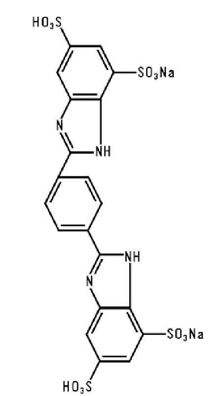
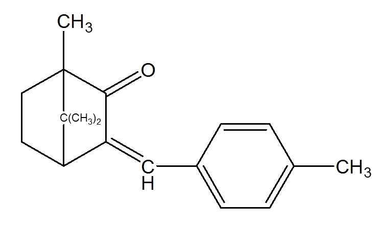
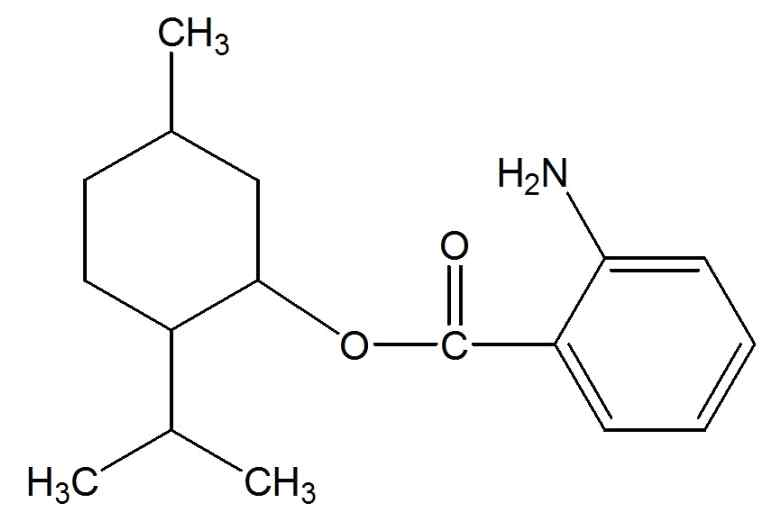
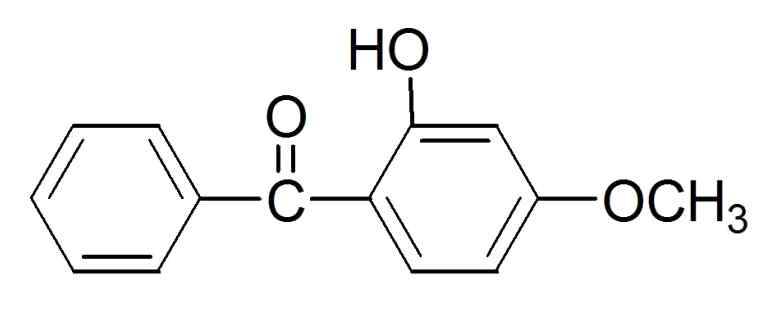
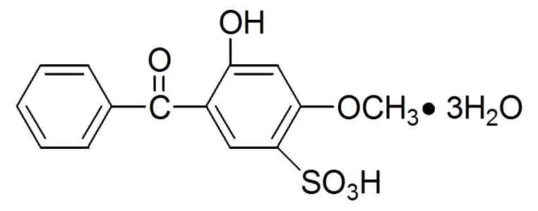
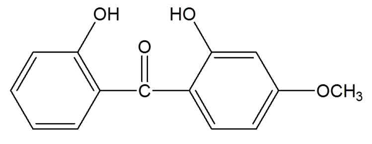
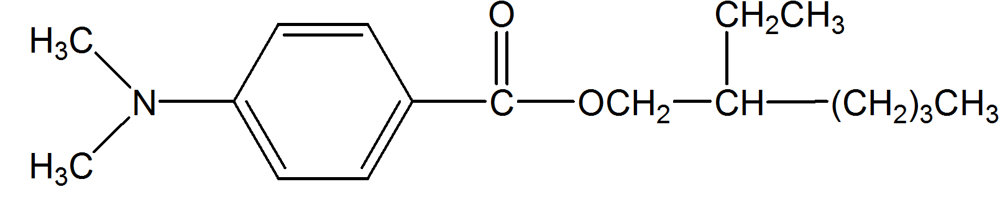
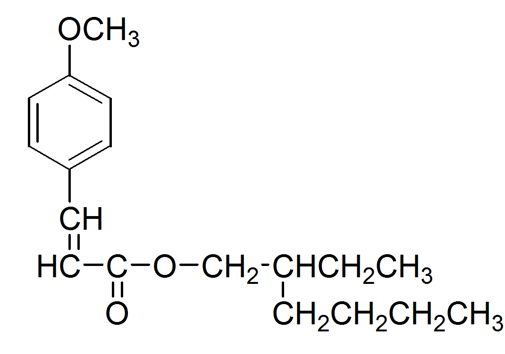
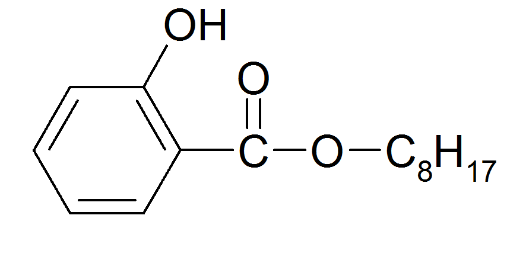
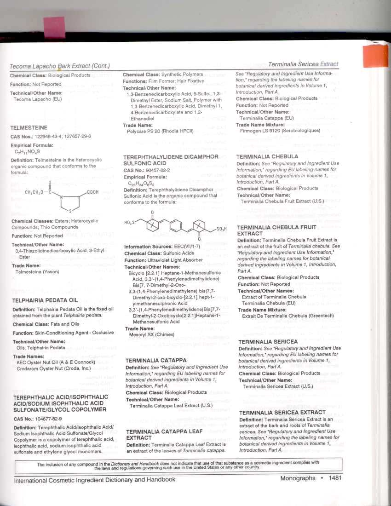

# KFCC_별표4_자외선보호

[별표 4]
자외선으로부터 피부를 보호하는 데 도움을 주는
기능성화장품 각조
(제2조제4호 관련)
드로메트리졸
Drometrizole
HO
N
N
N
CH
3
2-(2'-히드록시-5'-메칠페닐)벤조트리아졸
2-(2'-Hydroxy-5'-methylphenyl)benzotriazole C H N O：225.25
13 11 3
이 원료를 건조한 것은 정량할 때 드로메트리졸(C H N O：225.25) 95.0～104.0%를
13 11 3
함유한다.
성 상 이 원료는 엷은 황백색의 가루로 냄새는 거의 없다.
확인시험 이 원료 10㎎을 에탄올에 녹여 100mL로 하고 이 액 5mL를 취하여 에탄올을
넣어 100mL로 한 액을 검액으로 한다. 검액을 가지고 흡광도측정법에 따라 흡수스
펙트럼을 측정할 때 파장 243±2㎚, 298±2㎚ 및 340±2㎚에서 흡수극대를, 또 파장
259±2㎚ 및 314±2㎚에서 흡수극소를 나타낸다.
융 점 126～134℃(제１법)
순도시험 용해상태 이 원료 0.1 g에 아세톤 10mL를 넣어 녹일 때 액은 맑다.
건조감량 0.5% 이하(1 g, 황산, 24시간)
강열잔분 0.1% 이하(3 g, 제２법)
정 량 법
제 1 법 이 원료 약 10㎎을 정밀하게 달아 에탄올에 녹여 100mL로 하고 이 액
5mL를 취하여 에탄올을 넣어 100mL로 한 액을 검액으로 한다. 검액을 가지고 층
장 10㎜, 파장 298㎚ 부근의 흡수극대파장에서 흡광도 A를 측정한다.
A
드로메트리졸(C H N O)의 양(㎎) 〓 × 20000
13 11 3 640
제 2 법 이 원료 약 10mg을 정밀하게 달아 메탄올을 넣어 녹여 정확하게 100mL로
하고, 이 액 5mL를 취해 메탄올을 넣어 정확하게 10mL로 한 액을 검액으로 한다.
따로 드로메트리졸 표준품 약 10mg을 정밀하게 달아 메탄올을 넣어 녹여 100mL로
하고 이 액 5mL를 취해 메탄올을 넣어 정확하게 10mL로 한 액을 표준액으로 한
다. 검액 및 표준액 각 10μL씩을 가지고 다음 조건으로 액체크로마토그래프법에 따
라 시험하여 드로메트리졸의 피크면적 AT 및 AS를 구한다.
A
드로메트리졸(C H N O : 225.25)의 양(㎎) = 드로메트리졸 표준품의 양(㎎) × T
13 11 3 A
S
조작조건
검 출 기 : 자외부흡광광도계 (측정파장 305㎚)
칼 럼 : 안지름 약 4.6㎜, 길이 약 15㎝인 스테인레스관에 5㎛의 액체크로마토그
래프용 옥타데실실릴화한 실리카겔을 충전한다.
이 동 상 : 메탄올
유 량 : 1.0mL/분
드로메트리졸트리실록산
Drometrizole Trisiloxane
OSI(CH3)3
HO CH2CHCH2SICH3
CH3 OSI(CH3)3
N
N
N
CH3
C H N O Si : 501.84
24 39 3 3 3
이 원료를 건조한 것은 정량할 때 드로메트리졸트리실록산 (C H N O Si : 501.84)
24 39 3 3 3
98.0 % 이상을 함유한다.
성 상 이 원료는 엷은 황색의 결정성 가루이다.
확인시험 1) 이 원료 0.25 g에 에탄올 100 mL를 넣어 녹인다. 이 액 1 mL를 취하여
에탄올을 넣어 100 mL로 한 액을 가지고 흡광도측정법에 따라 흡수스펙트럼을 측
정할 때 파장 245 ± 2 nm, 304 ± 2 nm 및 342 ± 2 nm 에서 흡수극대를 나타낸
다.
2) 이 원료를 가지고 적외부흡수스펙트럼측정법의 1)브롬화칼륨정제법에 따라 측정
할 때 파수 3,422 cm-1, 3,060 cm-1, 2,957 cm-1, 2,918 cm-1, 2,867 cm-1, 1,607 cm-1,
1,569 cm-1, 1,510 cm-1, 1,257 cm-1, 1,216 cm-1, 1,084 cm-1, 1,049 cm-1, 842 cm-1, 789
cm-1, 754 cm-1, 741 cm-1 부근에서 흡수를 나타낸다.
융 점 46 ～ 49 °C (제2법)
순도시험 1) 용해상태 이 원료 0.5 g에 에탄올 10 mL를 넣어 녹일 때 액은 맑다.
2) 중금속 이 원료 2.0 g을 달아 천천히 가열한다. 이 때 황산 2～3 mL를 넣어 무
색～엷은 황색을 띨 때까지 가열을 계속한다. 식힌 후, 포화수산암모늄용액 15 mL를
가하여 백색의 연기가 날 때까지 가열하여 농축한다. 이를 다시 식힌 후, 주의하여
물을 가해 25 mL로 하여 이를 검액으로 한다. 이 용액 10 mL를 가지고 시험할 때,
그 한도는 20 ppm 이하이다. 비교액에는 납표준액 1.6 mL를 넣는다.
3) 비 소 이 원료 2.0 g을 달아 천천히 가열한다. 이 때 황산 2～3 mL를 넣어 무
색～엷은 황색을 띨 때까지 가열을 계속한다. 식힌 후, 포화수산암모늄용액 15 mL를
가하여 백색의 연기가 날 때까지 가열하여 농축한다. 이를 다시 식힌 후, 주의하여
물을 가해 25 mL로 하고, 이를 검액으로 한다. 이 용액 10 mL를 가지고 장치 B를
쓰는 방법에 따라 조작하여 시험할 때 그 한도는 2 ppm 이하이다. 비교액에는 비소
표준액 1.6 mL를 넣는다.
4) 유연물질 건조한 이 원료 0.2 g을 정밀하게 달아 메탄올을 넣어 100 mL로 하여
검액으로 한다. 따로 유연물질A주1 50 mg을 정밀하게 달아 메탄올을 넣어 100 mL
로 한다(용액A). 유연물질B주2 50 mg을 정밀하게 달아 메탄올에 녹여 100 mL로 한
다(용액B). 유연물질C주3 50 mg을 정밀하게 달아 메탄올에 녹여 100 mL로 한다(용
액C). 용액A 1.2 mL, 용액B 2 mL 및 용액C 3.2 mL를 각각 정확하게 취하여 섞고
메탄올을 넣어 섞어 정확하게 100 mL로 하고 이를 표준액으로 한다. 검액 및 표준
액 각 10 ㎕씩을 가지고 아래 조작조건으로 액체크로마토그래프법에 따라 시험할
때 검액 중 유연물질 각각의 피크면적은 표준액중의 유연물질 각각의 피크면적보다
작고, 그 한도는 유연물질 A는 0.3 %이하, 유연물질 B는 0.5 %이하, 유연물질 C는
0.8 % 이하이다.
조작조건
검 출 기 : 자외부흡광광도계 (측정파장 : 305 nm)
칼 럼 : 안지름 약 4.6 mm, 길이 약 25 cm인 스테인레스관에 5 ㎛ 의 액체크로
마토그래프용 옥타데실실릴화한 실리카 겔을 충전한다.
칼럼온도 : 40 ℃
이 동 상 : 메탄올
유 량 : 유연물질 A의 유지시간이 약 10 분, 유연물질 B의 유지시간이 약 2분,
유연물질 C의 유지시간이 약 16 분이 되도록 조절한다.
칼럼의 선정 : 이 시험을 할 때, 유지시간 약 10 분, 약 12 분 및 약 16 분에서 나타
나는 피크의 분리도는 각각 1.5 이상이다.
피크면적측정시간 : 검액 주입 후 20분간
정 량 법 이 원료를 건조하여(오산화인, 4 시간, 감압건조) 약 0.1 g을 정밀히 달아
메탄올을 넣어 100 mL로 한다. 이 액 5 mL를 정확하게 취해 메탄올을 넣어 50 mL
로 하여 검액으로 한다. 따로 드로메트리졸트리실록산 표준품 약 0.1 g을 정밀히 달
아 메탄올을 넣어 100 mL로 한다. 이 액 5 mL를 각각 정확하게 취하여 메탄올을
넣어 각각 50 mL로 하여 표준액으로 한다. 검액 및 표준액 각 10 ㎕씩을 가지고
아래 조작조건으로 액체크로마토그래프에 따라 시험하여 드로메트리졸트리실록산의
피크면적 A 및 A 를 구한다.
T S
드로메트리졸트리실록산 (C H N O Si )의 양 (mg)
24 39 3 3 3
A
= 드로메트리졸트리실록산 표준품의 양(mg) x T

A
S
조작조건
검 출 기 : 자외부흡광광도계(측정파장 : 305 nm)
칼 럼 : 안지름 약 4.6 mm, 길이 약 15 cm인 스테인레스관에 5 ㎛의 액체크로
마토그래프용 옥타데실실릴화한 실리카 겔을 충전한다.
칼럼온도 : 40 ℃ 근처의 일정한 온도
이 동 상 : 메탄올
유 량 : 이 원료의 유지시간이 약 5분이 되도록 조절한다.
주1 유연물질A : 2-(2H-벤조트리아졸-2-일)-6-(2-메칠프로페닐)-p-크레솔
주2 유연물질B : 2-(2H-벤조트리아졸-2-일)-4-메칠-6-(2-메칠프로필) 페닐
주3 유연물질C : 2-[5-메칠-3-[1,3,3,3-테트라메칠-1-[(트리메칠실릴)옥시]디시록사놀]프로
필]-2-[1,3,3,3-테트라메칠-1-[(트리메칠실릴)옥시]디시록사놀]옥시]페닐 2H-페닐트리아졸,
디갈로일트리올리에이트
Digalloyl Trioleate
O
RC O HO OH
O O
RC O C O
RC O COOH
O
R : CH (CH ) CH=CH(CH ) ―
3 2 7 2 7
갈릭애씨드 3-갈레이트 트리올레이트
Gallic Acid 3-Gallate Trioleate C H O : 1115.58
68 106 12
이 원료를 정량할 때 디갈로일트리올리에이트(C H O : 1115.58) 98.0% 이상을
68 106 12
함유한다.
성 상 이 원료는 짙은 갈색의 점성이 있는 맑은 액으로 특이한 냄새가 있다.
확인시험 이 원료를 가지고 적외부흡수스펙트럼측정법의 4) 액막법에 따라 측정할 때
표준품과 같은 스펙트럼을 나타낸다.
굴 절 률 n25：1.5107～1.5208
D
비 중 d25：1.033～1.048
25
정 량 법 이 원료 0.1g을 정밀하게 달아 피리딘을 넣고 열을 가하여 녹이고 냉각한
후에 50mL로 하고 이 액 0.6mL에 1.4mL의 피리딘을 넣은 액을 검액으로 한다. 따
로 디갈로일트리올리에이트 표준품 약 0.1g을 정밀하게 달아 피리딘을 넣고 열을
가하여 녹이고 냉각한 후에 50mL로 하고 이 액 0.6mL에 1.4mL의 피리딘을 넣은
액을 표준액으로 한다. 검액 및 표준액 각각 2mL에 0.4mL 헥사메칠디실록산을 넣
어 흔들고 0.3mL 트리메틸실록산을 넣은 후 5분간 원심분리 한 후, 각각 2.0㎕를
가지고 다음의 조건으로 기체크로마토그래프법으로 시험하여 검액 및 표준액의 디
갈로일트리올리에이트 피크면적 A 및 A 를 구한다.
T S
디갈로일트리올리에이트(C H O )의 양(g)
68 106 12
A
= 디갈로일트리올리에이트 표준품의 양(g)× T
A
S
조작조건
검 출 기 : 수소염이온화검출기
칼 럼 : 안지름 0.32mm, 길이 약 30m인 스테인레스관에 기체크로마토그래프 용
10% 메칠실록산ㆍ규조토를 충전한 것을 사용한다.
칼럼온도 : 초기 160℃에서 매분 8℃씩 300℃까지 승온한다.
검출기 온도 : 300℃
주입구 온도 : 290℃
캐리어가스 : 헬륨
디메치코디에칠벤잘말로네이트
Dimethicodiethylbenzal malonate
CH CH CH
3 3 3
HC Si O Si O Si CH
3 3
CH R CH
3 n 3
n, approx 60
R =
A = 92.1 - 92.5 %CH 3
COOCH
2 5
B = approx. 6 %
COOCH
O 2 5
CH
2
COOCH
2 5
C = approx.1.5 %
˜
COOCH
O 2 5
폴리실리콘-15
Polysilicone-15 평균분자식C H O Si : 평균분자량16741
196 490 84 65
이 원료는 디메치코디에칠벤잘말로네이트로서 고분자성 실리콘사슬에 신나메이트가
결합되어진 고분자 물질로서 n은 약 60이며, R그룹의 비율 A:B:C는 약 92:6:1.5이다.
이 원료는 정량할 때 디메치코디에칠벤잘말로네이트(C H O Si : 16741)로서 94.0～
196 490 84 65
104.0%를 함유한다.
성 상 이 원료는 무색 ～ 미황색의 점성을 나타내는 액이다.
확인시험 1) 이 원료 0.1 g에 에탄올을 넣어 100 mL로 하고 이 액 1 mL를 취하여
에탄올을 넣어 정확하게 100 mL로 한 액을 검액으로 한다. 검액을 가지고 흡광도
측정법에 따라 측정할 때 312±2 ㎚에서 흡수 극대를 나타낸다.
2) 이 원료를 가지고 적외부흡수스펙트럼측정법의 4) 액막법에 따라 측정할 때 파
수 2962 cm-1, 1720 cm-1, 1603 cm-1, 1501 cm-1, 1411 cm-1, 1260 cm-1, 및 1097 cm-1
부근에서 특성 흡수를 나타낸다.
3) 정량법의 검액에서 얻은 주피크의 유지시간은 표준액에서 얻은 주피크의 유지시간
과 같다.
굴 절 률 n20 : 1.440 ～ 1.445
D
비흡광도 E1% (312nm) : 160 ～ 190
1cm
점 도 이 원료를 가지고 25 ℃에서 제2법에 따라 시험할 때 그 점도는 600～900
cps (5호, 30rpm, 3분)이다.
순도시험 1) 잔류용매 이 원료 1.0 g을 검액으로 하고, 따로 자일렌 표준원액(2,000
㎍/mL, o-, m-, p-자일렌의 혼합 표준액)을 메탄올로 희석하여 각각 1, 5, 10, 20, 3
0 ㎍/mL 농도로 한 액을 검량선용 표준액으로 한다. 검액 및 표준액을 헤드스페이
스 검체유입장치를 사용하여 다음 조건으로 기체크로마토그래프법에 따라 시험하여
자일렌 피크면적을 구한다. 검액 중 자일렌 함량은 표준액의 검량선을 이용하여 구
하였을 때 0.21 % 이하이다.
조작조건
검 출 기 : 질량분석계검출기 또는 수소염이온화검출기
칼 럼 : 안지름 0.32 mm, 길이 30 m인 스테인레스관에 기체크로마토그래피용
폴리(6% 시아노프로필페닐ㆍ디메칠실록산)을 충전한다.
칼럼온도 : 초기 2분간 35℃를 유지한 다음 매분 8℃씩 130℃까지 승온한 후 매분 30℃씩
190 ℃까지 승온하여 3분간 유지한다.
헤드스페이스 검체유입장치 : 100℃에서 20분간 가열한 후 검체를 유입시킨다.
검출기 온도 : 300℃
주입구 온도 : 140℃
캐리어 가스 : 질소
2) 유리 디에틸 4-프로피닐옥시벤잘말로네이트 이 원료 25 ㎎을 정밀하게 달아 이
동상에 넣어 녹여 정확하게 50 mL로 한 액을 검액으로 한다. 디에틸 4-프로피닐옥
시벤잘말로네이트 표준품 25 ㎎을 정밀하게 달아 이동상에 넣어 녹여 정확하게 250
mL로 한 것을 표준원액으로 한다. 이 표준원액을 가지고 이동상으로 단계적으로
희석하여 디에틸 4-프로피닐옥시벤잘말로네이트의 농도가 각각 0.5, 1, 5, 10 ㎍/mL
의 농도로 한 액을 검량선용 표준액으로 한다. 검액 및 표준액 10μL씩을 가지고 다
음 조건으로 액체크로마토그래프법에 따라 시험하여 디에틸 4-프로피닐옥시벤잘말
로네이트의 피크면적을 구한다. 검액의 디에틸 4-프로피닐옥시벤잘말로네이트의 함
량은 표준액의 검량선을 이용하여 계산하였을 때 0.31 % 이하이다.
조작조건
검출기 : 자외부흡광광도계 (측정파장 307 ㎚)
칼 럼 : 안지름 7.5 ㎜, 길이 30 ㎝인 PLGel Mixed-D 칼럼 또는 이와 동등한 칼럼
이동상 : 테트라히드로푸란
유 량 : 1.0 mL/분
주) 디에틸4-프로피닐옥시벤잘말로네이트(Dietyl 4-propynyloxybenzalmalonate) : 화
학명 propanedionic acid {[4-(2-propynyloxy)phenyl]methylene}-diehtylester(C
17
H O : 304.4)
18 5
건조감량 1.0 % 이하 (1 g, 105 ℃, 2시간)
정 량 법 이 원료 50 ㎎을 정밀하게 달아 테트라하이드로푸란을 넣어 녹인 후 정확
하게 100mL로 한 액을 검액으로 한다. 따로 디메치코디에칠벤잘말로네이트 표준품
25, 50, 100㎎을 정밀하게 달아 각각 테트라하이드로푸란을 넣어 녹인 후 각각 정확
하게 100mL로 한 액을 검량선용 표준액으로 한다. 검액 및 표준액을 가지고 다음
조건으로 액체크로마토그래프법에 따라 시험하여 디메치코디에칠벤잘말로네이트의
피크면적을 구한다. 검액의 디메치코디에칠벤잘말로네이트의 함량은 표준액의 검량
선을 이용하여 계산한다.
조작조건
검출기 : 자외부흡광광도계 (측정파장 307 ㎚)
칼 럼 : 안지름 7.5㎜, 길이 30㎝인 5㎛ PLGel Mixed-D 칼럼 또는 이와 동등한 칼럼
이동상 : 테트라히드로푸란
유 량 : 1.0 mL/분
디에칠아미노하이드록시벤조일헥실 벤조에이트
Diethylamino Hydroxybenzoyl Hexyl Benzoate

벤조익애씨드, 2-[4-(디에칠아미노)-2-하이드록시벤조일]-,헥실 에스터 C H NO : 397.52
24 31 4
이 원료는 정량할 때 디에칠아미노하이드록시벤조일헥실 벤조에이트(C H NO :
24 31 4
397.52) 99.0% 이상을 함유한다.
성 상 이 원료는 백색 ~ 엷은 황색의 과립상 가루로 가온하면 황색의 액이 되며,
약간의 특이한 냄새가 있다. 이 원료는 에탄올에 녹고 물에 거의 녹지 않는다.
확인시험 이 원료 약 30㎎을 정밀하게 달아 에탄올을 넣어 녹여 100mL로 한 다음 이
액 2mL를 정확하게 취하여 에탄올을 넣어 정확하게 100mL로 한 액을 검액으로 한
다. 검액을 가지고 에탄올을 대조로 하여 흡광도측정법에 따라 흡수스펙트럼을 측정
할 때 파장 354 ± 2㎚에서 흡수극대를 나타낸다.
비흡광도 확인시험에서 얻은 검액을 가지고 에탄올을 대조로 하여 파장 354㎚에서 흡
광도측정법에 따라 시험할 때 비흡광도( E1%)는 910 ～ 940이다.
1㎝
순도시험 1) 톨루엔 및 n-헥산올 이 원료 2.0g을 정확하게 달아 아세톤을 넣어 녹여
정확하게 20mL로 한 액을 검액으로 한다. 따로 톨루엔(C H : 92.14) 표준품 약
7 8
1.000g 및 n-헥산올(C H O : 102.18) 표준품 2.000g을 정확하게 달아 각각에 아세톤
6 14
을 넣어 정확하게 100mL로 한 액 0.1mL를 정확하게 취하여 아세톤을 넣어 정확하
게 100mL로 한 액을 각각의 표준액으로 한다. 검액 및 표준액 1µL씩을 가지고 다음
의 조건으로 기체크로마토그래프법에 따라 시험할 때 검액에서의 톨루엔 및 n-헥산
올의 피크면적은 표준액에서의 각각의 피크면적보다 크지 않다(톨루엔 100ppm 이
하, n-헥산올 200ppm 이하)
조작조건
검 출 기 : 수소염이온화검출기
컬 럼 : 안지름 0.32㎜, 길이 15m인 용융실리카 내벽에 기체크로마토그래프용 폴
리디메칠실록산을 1.0µm의 두께로 고정시킨 모세관 컬럼
컬럼온도 : 초기 40℃에서 1 분간 유지하고 매분 5℃씩 70℃까지 승온하여 10분간 유
지한 다음 매분 70℃씩 320℃까지 승온하여 7분간 유지하고 매분 70℃씩
40℃까지 식혀 2분간 유지한다.
검출기온도 : 250℃
주입구온도 : 250℃
캐리어가스 및 유량 : 질소, 매분 1mL 부근의 일정량
2) 무수프탈산, 3-디에칠아미노페놀 및 디헥실프탈레이트 이 원료 2.0g을 정확하게
달아 아세톤을 넣어 녹여 정확하게 20mL로 한 액을 검액으로 한다. 따로 무수프탈
산(C H O : 148.12) 표준품, 3-디에칠아미노페놀(C H NO : 165.24) 표준품 및 디헥
8 4 3 10 15
실프탈레이트(C H O : 334.46) 표준품 각각 0.50g 씩을 정확하게 달아 아세톤을 넣
20 30 4
어 녹여 정확하게 100mL로 한 액 1.0mL씩을 정확하게 취하여 아세톤을 넣어 정확
하게 100mL로 한 액을 각각의 표준액으로 한다. 검액 및 표준액 1µL씩을 가지고 정
량법의 조작조건으로 기체크로마토그래프법에 따라 시험할 때 검액에서의 무수프탈
산, 3-디에칠아미노페놀 및 디헥실프탈레이트의 피크면적은 표준액에서의 각각의 피
크면적보다 크지 않다. (무수프탈산, 3-디에칠아미노페놀 및 디헥실프탈레이트 각각
0.05 % 이하)
3) 기타유연물질 정량법에 따라 시험하여 얻은 크로마토그램에서 용매피크를 제외
한 피크면적을 100으로 하여, 검체 중의 무수프탈산, 3-디에칠아미노페놀, 디헥실프탈
레이트 및 디에칠아미노하이드록시벤조일헥실 벤조에이트 피크 이외의 피크 합계면
적(%)을 구한다. (0.3 % 이하).
4) 중금속 이 원료 2.0g을 달아 제2법에 따라 조작하여 시험한다. 비교액에는 납표
준액 2.0mL를 넣는다(10ppm 이하).
건조감량 1.0 % 이하 (1 g, 105 ℃, 3 시간)
강열잔분 0.1 % 이하 (5 g, 500 ℃, 3 시간)
정 량 법
제 1 법 이 원료 약 2g을 정밀하게 달아 아세톤을 넣어 녹여 20 mL로 한 액을 검액
으로 한다. 검액 1µL를 가지고 다음의 조건으로 기체크로마토그래프법의 면적백분율
법에 따라 시험하여 용매 피크를 제외한 피크 면적을 100으로 하고 이에 대한 디에
칠아미노하이드록시벤조일헥실 벤조에이트(C H NO : 397.52)의 피크면적비로부터
24 31 4
함량(%)을 구한다.
조작조건
검 출 기 : 수소염이온화검출기
컬 럼 : 안지름 0.32㎜, 길이 15m인 용융실리카 내벽에 기체크로마토그래프용 폴
리디메칠실록산을 1.0µm의 두께로 고정시킨 모세관 컬럼
컬럼온도 : 초기 150℃에서 매분 25℃씩 300℃까지 승온하여 12분간 유지하고 매분
70℃씩 150℃까지 식혀 3분간 유지한다.
검출기온도 : 250℃
주입구온도 : 250℃
캐리어가스 및 유량 : 질소, 매분 1mL 부근의 일정량
검출감도 : 검액을 용매로 2,000배 희석한 액을 가지고 조작조건에 따라 시험할 때
디에칠아미노하이드록시벤조일헥실 벤조에이트의 피크는 검출되어야 한
다. (50㎍/mL)
제 2 법 이 원료 약 10mg에 해당하는 양을 정밀하게 달아 메탄올을 넣어 녹여 정확
하게 100mL로 하고, 이 액 5mL를 취해 메탄올을 넣어 10mL로 한 액을 검액으로
한다. 따로 디에칠아미노하이드록시벤조일헥실 벤조에이트 표준품 약 10mg을 정밀
하게 달아 메탄올을 넣어 녹여 100mL로 하고 이 액 5mL를 취해 메탄올을 넣어
10mL로 한액을 표준액으로 한다. 검액 및 표준액 각 10μL씩을 가지고 다음 조건으
로 액체크로마토그래프법에 따라 시험하여 디에칠아미노하이드록시벤조일헥실 벤조
에이트의 피크면적 AT 및 AS를 구한다.
디에칠아미노하이드록시벤조일헥실 벤조에이트(C H NO : 397.52)의 양(㎎) =
24 31 4
A
디에칠아미노하이드록시벤조일헥실 벤조에이트 표준품의 양(㎎) × T
A
S
조작조건
검 출 기 : 자외부흡광광도계 (측정파장 305㎚)
칼 럼 : 안지름 약 4.6㎜, 길이 약 25㎝인 스테인레스관에 5㎛의 액체크로마토그래
프용 옥타데실실릴화한 실리카겔을 충전한다.
이 동 상 : 85% 메탄올
유 량 : 1.0mL/분
디에칠헥실부타미도트리아존
Diethylhexyl Butamido Triazone
이 원료는 정량할 때 디에칠헥실부타미도트리아존(C44H59N7O5
: 766.0) 97.0 % 이상을 함유한다.
성 상 백색 ～ 미황색의 가루로 특이한 냄새가 있다.
확인시험 1) 이 원료 약 0.1g을 정밀하게 달아 메탄올 200mL에 넣어 녹인 액을 검액
으로 한다. 검액을 가지고 흡광도 측정법에 따라 측정할 때 310±2 ㎚에서 흡수 극
대를 나타낸다.
2) 이 원료를 가지고 적외부흡수스펙트럼측정법의 1) 브롬화칼륨정제법에 따라 측
정할 때 파수 3316 cm-1, 2959 cm-1, 1697 cm-1, 1487 cm-1, 1411 cm-1, 1273 cm-1, 117
4 cm-1, 1110 cm-1, 및 768 cm-1 부근에서 특성 흡수를 나타낸다.
융 점 90℃ 이상
순도시험 1) 중금속 이 원료 1.0 g을 달아 제2법에 따라 조작하여 시험한다. 비교액
에는 납표준액 1.0ml를 넣는다.(10 ppm 이하)
2) 비소 이 원료 1.0g을 달아 제1법에 따라 검액을 만들고 장치 A를 쓰는 방법에
따라 조작하여 시험한다.(2ppm 이하)
정 량 법 이 원료 약 30㎎을 정밀하게 달아 메탄올에 넣어 녹여 100mL로 한 액을
검액으로 한다. 따로 디에칠헥실부타미도트리아존 표준품 약 30㎎을 정밀하게 달아
메탄올에 넣어 녹여 100 mL로 한 액을 표준액으로 한다. 검액 및 표준액 10μL씩을
가지고 다음 조건으로 액체크로마토그래프법에 따라 시험하여 디에칠헥실부타미도
트리아존의 피크면적 A 및 A 를 구한다.
T S
디에칠헥실부타미도트리아존(C H N O )의 양(㎎)
44 59 7 5
A
= 디에칠헥실부타미도트리아존 표준품의 양(㎎) X T
A
S
조작조건
검 출 기 : 자외부흡광광도계 (측정파장 300 ㎚)
칼 럼 : 안지름 약 4㎜, 길이 약 250㎜인 스테인레스관에 7㎛의 액체크로마토그
래프용 옥타실릴화한 실리카 겔을 충전한다.
이동상 : 물과 메탄올을 다음 표의 비로 혼합하여 용매구배조건으로 사용한다.
시간(분) 물(%) 메탄올(%)

| 0 |  | 40 |  |
| --- | --- | --- | --- |
| 30 |  | 5 |  |
| 40 |  | 5 |  |
| 41 |  | 40 |  |
| 45 |  | 40 |  |

60
95
95
60
60
유 량 : 1.0 mL/분
디소듐페닐디벤즈이미다졸테트라설포네이트
Disodium phenyl dibenzimidazole tetrasulfonate

C H N O S 2Na : 674.55
20 12 4 12 4ㆍ
2,2‘-(1,4-페닐렌)비스-(1H-벤즈이미다졸-4,6-디설포닉 애씨드, 디소듐염)
2,2‘-(1,4-phenylene)bis-(1H-benzimidazole-4,6-disulfonic acid, disodium salt)
이 원료를 정량할 때 디소듐페닐디벤즈이미다졸테트라설포네이트(C H N O S 2Na: 674.55)
20 12 4 12 4ㆍ
96.0 %이상을 함유한다.
성 상 이 원료는 엷은 황색의 가루이다.
확인시험 1) 이 원료 100mg을 정밀하게 달아 1 N 수산화나트륨액 4mL를 넣어 녹인
후 정제수를 넣어 정확하게 100mL로 한다. 이 액 1mL를 정확하게 취하여 정제수를
넣어 200mL로 한 액을 검액으로 한다. 검액을 가지고 흡광도 측정법에 따라 흡수스
펙트럼을 측정할 때 파장 335±1nm 에서 흡수극대를 나타낸다.
2) 정량법의 검액에서 얻은 주피크의 유지시간은 표준액에서 얻은 주피크의 유지시간과 같다.
융 점 360 ℃이상 (제1법)
건조감량 5 %이하(2 g, 105 ℃, 4 시간)
순도시험 1) 중금속 이 원료 1.0g을 달아 제1법에 따라 조작하여 시험한다. 비교액에
는 납표준액 1.0mL를 넣는다. (10 ppm이하)
2) 비 소 이 원료 0.4 g을 달아 제1법에 따라 검액을 만들어 장치 A를 쓰는 방법에
따라 시험한다.(5 ppm 이하)
정 량 법 이 원료 15mg을 정밀하게 달아 물에 녹여 100mL로 한 액을 검액으로 한다.
따로 디소듐페닐디벤즈이미다졸테트라설포네이트 표준품 약 15mg을 정밀하게 달아
물을 넣어 녹여 100mL로 한 액을 표준액으로 한다. 검액 및 표준액 각 10μL씩을 가
지고 아래 조작조건으로 액체크로마토그래프법에 따라 시험하여 디소듐페닐디벤지미
다졸테트라설포네이트의 피크면적 At 및 As를 구한다.
디소듐페닐디벤즈이미다졸테트라설포네이트(C H N O S 2Na)의 양(mg)
20 12 4 12 4ㆍ
A
= 디소듐페닐디벤즈이미다졸테트라설포네이트 표준품의 양(mg) × t

A
s
조작조건
검 출 기 : 자외부흡광광도계 (측정파장 : 335nm)
칼 럼 : 안지름 4.6mm, 길이 15cm의 스테인레스관에 5㎛의 액체크로마토그래프용
옥타데실실릴화한 실리카 겔을 충전한다.
이 동 상 : 5mM 테트라부틸암모늄클로라이드ㆍ아세토니트릴 혼합액 (52:48)
유 량 : 1.5 mL/분
메칠렌비스-벤조트리아졸릴테트라메칠부틸페놀
Methylene Bis-Benzotriazolyl Tetramethylbutylphenol
N OH OH N
N CH 2 N
N N

|  | C | CH3 |
| --- | --- | --- |
|  |  | 3 |

| CH3 |  |  |  | CH3 |
| --- | --- | --- | --- | --- |
| 3 |  | C |  | 3 |

CH
3
CH CH
2 2

|  | C |
| --- | --- |

| C |
| --- |

CH 3 CH 3 CH 3 C CH 3
CH CH
3 3
C H N O : 658.86
41 50 6 2
이 원료를 건조한 것은 정량할 때 메칠렌비스벤조트리아졸릴테트라메칠부틸페놀
(C H N O : 658.86) 98.5% 이상 함유한다.
41 50 6 2
성 상 이 원료는 엷은 황색의 가루로 약간의 특이한 냄새가 있다.

| CH3 |  |  |  | CH3 |
| --- | --- | --- | --- | --- |
| 확인시험 1) 이 원료를 가지고 적외부흡수스펙트럼측정법의라 측정할 때 표준품과 같은 스펙트럼을 나타낸다. |  |  |  | 1)브롬화칼륨정제법에 따 |
| 2) 정량법의 검액에서 얻은 주피크의 유지시간은 |  |  |  | 표준액에서 얻은 주피크의 유지시간과 |
| 같다. 순도시험 1) 납 이 원료 1.0g을 정밀하게 달아질산 10mL를 넣고 흰 연기가 발생할 때 가열한다.흰 연기가 발생할 때까지 가열하여 내용물이을 반복한다. 분해가 끝나면 포화수산화암모늄용액 |  | 300mL |  | 플라스크에 넣고 황산 5mL 및식힌 다음 질산 5mL씩을 추가하고무색～엷은 황색이 될 때까지 이 조작5mL를 넣고 다시 가열하여 질산을 |
| 제거한다. 분해물을 50mL 용량플라스크에 옮기고어 넣고 물을 넣어 전체량을 50mL로 한다. 이것을액 1.0mL를 넣는다.(10 ppm 이하) |  |  |  | 물 적당량으로 분해플라스크를 씻검액으로 한다. 비교액에는 납표준 |
| 2) 비 소 이 원료 1.0g을 취하여 제3법에 따라따라 조작하여 시험한다. (2ppm 이하) 건조감량 0.1% 이하 (3.0 g, 105 ℃, 2시간) 산불용성회분 이 원료 약 2.5g을 정밀하게 달아영제 도가니에 취한다음 황산을 넣어 완전히대부분의 황산을 휘발시킨 다음, 800℃에서 황산 1～2방울을 넣어 다시 녹인다. 이 황산을안 회화시킨다. 도가니를 데시케이터 안에서 W강열잔분(%) = 2Ww : 검체 취한 양 (g) w1 : 항량이 되도록 한 도가니 무게 (g) w2 : 검체를 회화시킨 후 최종 무게 (g) 정 량 법 이 원료 약 20㎎을 정밀하게 달아 100mL로 하고 필요하면 여과하여 검액으로 트라메칠부틸페놀 표준품 약 20㎎을 정밀하게정확히 100 mL로 한 액을 표준액으로 한다.조건으로 액체크로마토그래프법에 따라 시험하여칠부틸페놀의 피크면적 A 및 A 를 측정한다.T S 메칠렌비스벤조트리아졸릴테트라메칠부틸페놀(C= 메칠렌비스벤조트리아졸릴테트라메칠부틸페놀조작조건 검 출 기 : 자외부흡광광도계(측정파장 320㎚)칼 럼 : 안지름 4.6㎜, 길이 약 25㎝인 프용 옥타데실실릴화한 실리카 겔을 | 식힌-W한다.검액 | 녹인다.다시스테인레스관에 | 검액을항량이회화시킨다.1달아41 | 만들고 장치 B를 쓰는 방법에되도록 미리 처리한 사기나 석검체가 탄화될 때까지 가열하여도가니를 식힌 후 잔류물에휘발시킨 후 800℃에서 1시간동다음 그 무게를 잰다(0.1% 이하)× 100테트라히드로푸란을 넣어 녹여 정확하게따로 메칠렌비스벤조트리아졸릴테테트라히드로푸란을 넣어 녹여및 표준액 10μL씩을 가지고 다음메칠렌비스벤조트리아졸릴테트라메H N O )의 양(㎎)50 6 2A표준품의 양(㎎) X TAS약 5㎛의 액체크로마토그래충전한다. |

이 동 상 : 테트라히드로푸란ㆍ물ㆍ아세토니트릴혼합액 (60:36:4)
유 량 : 1.0 mL/분
메칠렌비스-벤조트리아졸릴테트라메칠부틸페놀액(50%)
Methylene Bis-Benzotriazolyl Tetramethylbutylphenol Solution(50%)
이 원료는 메칠렌비스벤조트리아졸릴테트라메칠부틸페놀에 데실글루코사이드, 산
탄검, 프로필렌글라이콜, 정제수 등을 혼합한 혼합물이며 정량할 때 메칠렌비스벤조트
리아졸릴테트라메칠부틸페놀(C H N O : 658.86)을 48.0 ～ 52.0 % 함유한다.
41 50 6 2
성 상 이 원료는 백색의 점성을 나타내는 액으로 약간의 특이한 냄새가 있다.
확인시험 1) 이 원료 약 20㎎을 달아 디클로로메탄에 녹여 100mL로 한다. 이 액 10
mL를 취하여 디클로로메탄을 넣어 100mL로 한 액을 가지고 하고 흡광도측정법에 따
라 흡수스펙트럼을 측정할 때 306 및 348 ㎚ 부근에서 흡수극대를 나타낸다.
2) 정량법의 검액에서 얻은 주피크의 유지시간은 표준액에서 얻은 주피크의 유지시간
과 같다.
pH 10.5 ～ 12.0
점 도 200 ～ 1,000 mPas (25℃)
흡 광 도 1) 흡광도 이 원료 40 ㎎을 달아 디메칠아세트아마이드ㆍ이소프로판올 혼합
액(1:1)을 넣어 1 L로 한 액을 검액으로 하여 346 ㎚에서 흡광도시험법에 따라 흡광
도를 측정할 때 0.936 ～ 1.014이다.
2) 비흡광도 E(346 ㎚) : 234 ～ 254 (0.004%, 디메칠아세트아마이드ㆍ이소프로판올
혼합액(1:1))
정 량 법 이 원료를 메칠렌비스벤조트리아졸릴테트라메칠부틸페놀(C H N O )로서
41 50 6 2
약 20 ㎎ 해당량을 정밀하게 달아 테트라히드로푸란을 넣어 녹여 정확하게 100 mL
로 하고 필요하면 여과하여 검액으로 한다. 따로 메칠렌비스벤조트리아졸릴테트라메
칠부틸페놀 표준품 약 20 ㎎을 정밀하게 달아 테트라히드로푸란을 넣어 녹여 정확히
100 mL로 한 액을 표준액으로 한다. 검액 및 표준액 10 μL씩을 가지고 다음 조건으
로 액체크로마토그래프법에 따라 시험하여 메칠렌비스벤조트리아졸릴테트라메칠부틸
페놀(C H N O : 658.86)의 피크면적 A 및 A 를 구한다.
41 50 6 2 T S
메칠렌비스벤조트리아졸릴테트라메칠부틸페놀(C H N O )의 양(㎎)
41 50 6 2
A
= 메칠렌비스벤조트리아졸릴테트라메칠부틸페놀 표준품의 양 X T
A
S
조작조건
검 출 기 : 자외부흡광광도계(측정파장 320 ㎚)
칼 럼 : 안지름 4.6 ㎜, 길이 약 25 ㎝인 스테인레스관에 약 5 ㎛의 액체크로마토
그래프용 옥타데실실릴화한 실리카 겔을 충전한다.
이 동 상 : 테트라히드로푸란ㆍ물ㆍ아세토니트릴혼합액 (60:36:4)
유 량 : 1.0 mL/분
4-메칠벤질리덴캠퍼
4-Methylbenzylidene Camphor

3-(4-메칠벤질리덴)-dl-캠퍼
3-(4-Methylbenzylidene)-dl-Camphor C H O : 254.37
18 22
이 원료를 건조한 것은 정량할 때 4-메칠벤질리덴캠퍼(C H O:254.37) 99.5% 이상을
18 22
함유한다.
성 상 이 원료는 백색의 가루로 약간의 특이한 냄새가 있다.
확인시험 1) 흡광도 이 원료 약 50mg을 정밀하게 달아 메탄올을 넣어 녹여 정확하게
100mL로 하고 다시 이 액 1mL를 정확하게 취하여 메탄올을 넣어 정확하게 100mL로
한 액을 검액으로 한다. 검액을 가지고 메탄올을 대조액으로 흡광도측정법에 따라
측정할 때 파장 299±2nm부근에서 흡수극대를 나타낸다.
2) 이 원료를 가지고 적외부흡수스펙트럼측정법의 1)브롬화칼륨정제법에 따라 측정할
때 2970cm-1, 1725cm-1, 1070cm-1, 1020cm-1 및 820cm-1 부근에서 특성흡수를 나타낸
다.
융 점 66℃～ 68℃ (제1법)
건조감량 0.5%이하(1g, 105℃, 1시간)
정 량 법
제 1 법 이 원료 0.1g을 정확하게 달아 메탄올을 넣어 녹여 100mL로 한 액을 검액
으로 하고 따로 4-메칠벤질리덴캠퍼 표준품 약 0.1g을 정밀하게 달아 메탄올을 넣어
정확하게 100mL로 하여 표준액으로 한다. 검액 및 표준액 각각 1.0㎕를 가지고 다음
의 조건으로 기체크로마토그래프법으로 시험한다.
조작조건
검 출 기 : 수소염이온화검출기
칼 럼 : 안지름 0.32mm, 길이 약 30m인 용융실리카 모세관에 기체크로마토그래프
용 100% 디메칠폴리실록산을 0.25㎕의 두께로 고정한 것.
칼럼온도 : 초기 150℃ 1분간 유지하고, 매분 5℃씩 280℃까지 승온한 다음 280℃에서
5분간 유지한다.
검출기 온도 : 300℃
주입구 온도 : 290℃
캐리어가스 및 유량 : 질소, 매분 2mL
Split ratio : 20 : 1
주입량 : 1㎕
제 2 법 이 원료 약 10mg에 해당하는 양을 정밀하게 달아 메탄올을 넣어 녹여 정확
하게 100mL로 하고, 이 액 5mL를 취해 메탄올을 넣어 10mL로 한 액을 검액으로
한다. 따로 4-메칠벤질리덴캠퍼 표준품 약 10mg을 정밀하게 달아 메탄올을 넣어 녹
여 100mL로 하고 이 액 5mL를 취해 메탄올을 넣어 10mL로 한액을 표준액으로 한
다. 검액 및 표준액 각 10μL씩을 가지고 다음 조건으로 액체크로마토그래프법에 따
라 시험하여 4-메칠벤질리덴캠퍼의 피크면적 AT 및 AS를 구한다.
4-메칠벤질리덴캠퍼(C H O : 254.37)의 양(㎎) =
18 22
A
4-메칠벤질리덴캠퍼 표준품의 양(㎎) × T
A
S
조작조건
검 출 기 : 자외부흡광광도계 (측정파장 305㎚)
칼 럼 : 안지름 약 4.6㎜, 길이 약 25㎝인 스테인레스관에 5㎛의 액체크로마토그래
프용 옥타데실실릴화한 실리카겔을 충전한다.
이 동 상 : 85% 메탄올
유 량 : 1.0mL/분
멘틸안트라닐레이트
Menthyl Anthranilate

멘틸-o-아미노벤조에이트
Menthyl-o-aminobenzoate
C H NO ：275.39
17 25 2
이 원료는 정량할 때 멘틸안트라날닐레이트 98.0% 이상을 함유한다.
성 상 이 원료는 무색～엷은 황색의 점성이 있는 맑은 액으로 약간의 특이한 냄새
가 있다.
확인시험 흡광도 이 원료 약 0.03g을 정밀하게 달아 메탄올을 넣어 녹여 100mL로 한
다음 다시 이 액 10mL를 정확하게 취하여 메탄올을 넣어 100mL로 한 액을 검액으
로 한다. 검액을 가지고 흡광도측정법에 따라 측정할 때 파장 335㎚부근에서 흡수극
대를 나타낸다.
굴 절 률 n20：1.540～1.544
D
비 중 d25：1.038～1.043
25
비선광도 [α]20 : -4 ～ +4°(무수에탄올)
D
산 가 1 이하(30g, 제１법)
정 량 법 이 원료 30g을 정밀하게 달아 메탄올을 넣어 녹여 100mL로 하여 검액으로
한다. 따로 멘틸아트라닐레이트 표준품 약 30g를 정밀하게 달아 메탄올을 넣어 녹여
100mL로 하여 표준액으로 한다. 검액 및 표준액을 10㎕ 씩을 가지고 다음 조건으로
액체크로마토그래프법에 따라 시험하여 멘틸안트라닐레이트의 피이크 면적 A 및 A 를
T S
구한다.
A
멘틸안트라닐레이트의 양(mg) =멘틸안트라닐레이트의 표준품× T
A
S
조작조건
검 출 기 : 자외선흡수스펙트럼(측정파장 : 340nm)
칼 럼 : 안지름 4.6mm, 길이 15cm인 스테인레스관에 5㎛ 옥타데실실릴화 실리카겔
을 충전한다.
칼럼온도 : 35℃
이 동 상 : 희석시킨 초산 (1→10,000)ㆍ메탄올 혼합액(20: 80)
유 속 : 1.0mL/min
벤조페논-3
Benzophenone-3

옥시벤존, 2-히드록시-4-메톡시벤조페논
Oxybenzone, 2-hydroxy-4-methoxybenzophenone
C H O ：228.25
14 12 3
이 원료를 건조한 것은 정량할 때 벤존페논-3(C H O ：228.25) 90.0% 이상을 함유한다.
14 12 3
성 상 이 원료는 엷은 황색의 결정성 가루로 냄새는 없다.
확인시험 이 원료 0.1 g에 에탄올 100mL를 넣어 녹이고 이 액 1mL를 취하여 에탄올
을 넣어 100mL로 한 액을 검액으로 한다. 검액을 가지고 흡광도측정법에 따라 측정
할 때 파장 242±4㎚, 288±4㎚ 및 325±4㎚에서 흡수극대를 나타내고 파장 265±4㎚ 및
310±4㎚에서 흡수극소를 나타낸다.
융 점 60～66℃(제１법)
순도시험 용해상태 이 원료 1.0g에 무수에탄올 20mL를 넣어 녹일 때 액은 맑다.
건조감량 0.50% 이하(1 g, 실리카 겔, 24시간)
강열잔분 0.1% 이하(3 g, 제１법)
정 량 법
제 1 법 이 원료 약 10㎎을 정밀하게 달아 에탄올에 녹여 100mL로 하고 이 액 5mL
를 취하여 에탄올을 넣어 100mL로 한 액을 검액으로 한다. 검액을 가지고 흡광도측
정법에 따라 층장 10㎜, 파장 288㎚ 부근의 흡수극대파장에서 흡광도 A를 측정한다.
A
벤존페논-3 (C H O )의 양(㎎) 〓 × 20000
14 12 3 649
제 2 법 이 원료 약 10mg에 해당하는 양을 정밀하게 달아 메탄올을 넣어 녹여 정확
하게 100mL로 하고, 이 액 5mL를 취해 메탄올을 넣어 10mL로 한 액을 검액으로
한다. 따로 벤조페논-3 표준품 약 10mg을 정밀하게 달아 메탄올을 넣어 녹여 100mL
로 하고 이 액 5mL를 취해 메탄올을 넣어 10mL로 한액을 표준액으로 한다. 검액
및 표준액 각 10μL씩을 가지고 다음 조건으로 액체크로마토그래프법에 따라 시험하
여 벤조페논-3의 피크면적 AT 및 AS를 구한다.
A
벤조페논-3 (C H O : 228.25)의 양(㎎) = 벤조페논-3 표준품의 양(㎎) × T
14 12 3 A
S
조작조건
검 출 기 : 자외부흡광광도계 (측정파장 285㎚)
칼 럼 : 안지름 약 4.6㎜, 길이 약 25㎝인 스테인레스관에 5㎛의 액체크로마토그래
프용 옥타데실실릴화한 실리카겔을 충전한다.
이 동 상 : 물ㆍ메탄올ㆍ아세트산 (25:75:2)
유 량 : 1.0mL/분
벤조페논-4
Benzophenone-4

설리소벤존
Sulisobenzone C H O S：362.26
14 18 9
이 원료를 건조한 것은 정량할 때 벤조페논-4(C H O S：362.26) 95.0% 이상을 함유
14 18 9
한다.
성 상 이 원료는 엷은 황색의 가루로 특이한 냄새가 있다.
확인시험 이 원료 0.1 g에 무수에탄올 100mL를 넣어 녹이고 이 액 1mL를 취하여 무
수에탄올을 넣어 100mL로 한 액을 검액으로 한다. 검액을 가지고 흡수스펙트럼에
따라 측정할 때 파장 245±4㎚, 287±4㎚ 및 329±5㎚에서 흡수극대를 나타내고 파장
265±4㎚ 및 308±4㎚에서 흡수극소를 나타낸다.
융 점 107～111℃(제１법)
순도시험 용해상태 이 원료 1.0 g에 무수에탄올 10mL를 넣어 녹일 때 액은 맑다.
건조감량 5.0% 이하(1 g, 실리카 겔, 24시간)
강열잔분 0.1% 이하(3 g, 제１법)
정 량 법
제 1 법 이 원료를 건조하고 약 0.1 g을 정밀하게 달아 무수에탄올에 녹여 100mL로
하고 이 액 10mL를 취하여 무수에탄올을 넣어 100mL로 하여 이것을 검액으로 한
다. 검액 5mL를 취하여 무수에탄올을 넣어 100mL로 하고 층장 10㎜, 파장 287㎚ 부
근의 흡수극대파장에서 흡광도 A를 측정한다.
A
벤조페논-4 (C H O S)의 양(㎎) 〓 × 20000
14 18 9 398
제 2 법 이 원료 약 10mg에 해당하는 양을 정밀하게 달아 메탄올을 넣어 녹여 정확
하게 100mL로 하고, 이 액 5mL를 취해 메탄올을 넣어 10mL로 한 액을 검액으로 한
다. 따로 벤조페논-4 표준품 약 10mg을 정밀하게 달아 메탄올을 넣어 녹여 100mL로
하고 이 액 5mL를 취해 메탄올을 넣어 10mL로 한 액을 표준액으로 한다. 검액 및
표준액 각 10μL씩을 가지고 다음 조건으로 액체크로마토그래프법에 따라 시험하여
벤조페논-4의 피크면적 AT 및 AS를 구한다.
A
벤조페논-4 (C H O S : 362.26)의 양(㎎) = 벤조페논-4 표준품의 양(㎎) × T
14 18 9 A
S
조작조건
검 출 기 : 자외부흡광광도계 (측정파장 285㎚)
칼 럼 : 안지름 약 4.6㎜, 길이 약 25㎝인 스테인레스관에 5㎛의 액체크로마토그래
프용 옥타데실실릴화한 실리카겔을 충전한다.
이 동 상 : 물ㆍ메탄올ㆍ아세트산 (25:75:2)
유 량 : 1.0mL/분
벤조페논-8
Benzophenone-8

디옥시벤존
Dioxybenzone
C H O : 244.25
14 12 4
이 원료를 건조한 것은 정량할 때 벤존페논-8(C H O ) 97.0% 이상을 함유한다.
14 12 4
성 상 이 원료는 엷은 황색의 가루로 약간의 방향성 냄새가 있다.
확인시험 1) 흡광도 이 원료 약 10㎎을 정밀하게 달아 메탄올을 넣어 녹여 정확하게
100mL로 하고 이 액 10mL를 정확하게 취하여 메탄올을 넣어 정확하게 100mL로 한
액을 검액으로 한다. 검액을 층장 10mm의 석영 셀에 넣어 메탄올을 대조액으로 흡
광도측정법에 따라 흡수스펙트럼을 측정할 때 파장 358㎚ 및 283㎚ 부근에서 흡수극
대을 나타낸다.
2) 이 원료를 가지고 적외부흡수스펙트럼측정법의 1)브롬화칼륨정제법에따라 측정할
때 표준품과 같은 스펙트럼을 나타낸다.
수 분 2.0% 이하
정 량 법 이 원료를 약 0.1g을 정밀하게 달아 메탄올을 넣어 녹여 100mL로 하여 검
액으로 한다. 따로 벤조페논-8 표준품 약 0.1g을 정밀하게 달아 메탄올을 넣어 녹여
100mL로 한 액을 표준액으로 한다. 검액 및 표준액 10㎕를 가지고 다음의 조건으로
액체크로마토그래프법에 따라 시험하여 벤조페논-8의 피크면적 A 및 A 를 측정한다.
T S
A
벤조페논-8(C H O )의 양(㎎) = 벤조페논-8 표준품의 양(㎎)× T
14 12 4 A
S
조작조건
검출기 : 자외부흡광광도계 (측정파장 285㎚)
컬 럼 : 안지름 4㎜, 길이 30㎝인 스테인레스관에 약 10㎛의 액체크로마토그래프용
옥타데실실릴화한 실리카 겔을 충전한다.
이동상 : 물ㆍ메탄올ㆍ빙초산 혼합액 (40: 60: 2)
유 량 : 1.0mL/분
부틸메톡시디벤조일메탄
Butyl Methoxydibenzoylmethane

아보벤존
Avobenzone C H O ：310.39
20 22 3
이 원료를 건조한 것은 정량할 때 부틸메톡시디벤조일메탄(C H O ：310.39) 97.0～
20 22 3
104.0%를 함유한다.
성 상 이 원료는 엷은 황색～황색의 가루로 약간의 특이한 냄새가 있다.
확인시험 1) 이 원료 50㎎에 에탄올 100mL를 넣어 녹이고 이 액 1.0mL를 취하여 에
탄올을 넣어 100mL로 한 액을 검액으로 한다. 검액을 층장 10㎜의 석영셀에 넣어
흡광도측정법에 따라 흡수스펙트럼을 측정할 때 파장 358±2㎚에서 흡수극대를 나타낸
다.
2) 이 원료를 가지고 적외부흡수스펙트럼측정법의 1) 브롬화칼륨정제법에 따라 측정
할 때 파수 1510㎝-1, 1260㎝-1, 1170㎝-1, 1022㎝-1 및 800㎝-1 부근에서 특성흡수를 나
타낸다.
융 점 81～86℃(제１법)
순도시험 1) 용해상태 이 원료 0.20 g을 달아 무수에탄올 10mL를 넣고 가온하여 녹
일 때 액은 맑다.
2) 4,4’-디메톡시디벤조일메탄 이 원료 0.10 g에 에탄올을 넣어 녹여 100mL로 하고
이 액 10mL를 취하여 에탄올을 넣어 100mL로 한 액을 검액으로 한다. 검액 10㎕를
가지고 다음 조건으로 액체크로마토그래프법에 따라 시험할 때 유지시간 약 3.3분에
나타나는 피크면적은 전피크면적의 5.0% 이하이다.
조작조건
검출기：자외부흡광광도계(측정파장：358㎚)
컬 럼：안지름 4㎜, 길이 15～20㎝인 스테인레스관에 5～10㎛의 옥타데실실릴화실리
카 겔을 충전한다.
칼럼온도：실온
이동상：아세토니트릴ㆍ물 혼합액(85：15)에 인산를 넣어 pH 2.5로 조정한다.
유 속：부틸메톡시디벤조일메탄의 유지시간이 약 5.5분이 되도록 조정한다.
3) 중금속 이 원료 1.0 g을 달아 제２법에 따라 조작하여 시험한다. 비교액에는 납
표준액 2.0mL를 넣는다(20ppm 이하).
4) 비 소 이 원료 1.0 g을 달아 제３법에 따라 검액을 만들고 장치 B를 쓰는 방법
에 따라 조작하여 시험한다(2ppm 이하).
수 분 1.0% 이하(0.5 g)
강열잔분 0.30% 이하(1 g, 제１법)
정 량 법
제 1 법 이 원료 1.0 g을 데시케이터(감압, 실리카 겔)에서 24시간 건조하고 약 0.1 g
을 정밀하게 달아 에탄올을 넣어 녹이고 정확하게 200mL로 한다. 이 액 1.0mL를 정
확하게 취하여 에탄올을 넣어 정확하게 100mL로 하여 검액으로 한다. 검액을 층장
10㎜의 석영셀에 넣어 358㎚ 부근의 흡수극대파장에서 흡광도측정법에 따라 흡광도
A를 측정한다.
A
부틸메톡시디벤조일메탄(C H O )의 양(㎎) 〓 × 20000
20 22 3 113
제 2 법 이 원료 약 10mg에 해당하는 양을 정밀하게 달아 메탄올을 넣어 녹여 정확
하게 100mL로 하고, 이 액 5mL를 취해 메탄올을 넣어 10mL로 한 액을 검액으로
한다. 따로 부틸메톡시디벤조일메탄 표준품 약 10 mg을 정밀하게 달아 메탄올을 넣
어 녹여 100mL로 하고 이 액 5mL를 취해 메탄올을 넣어 10mL로 한 액을 표준액으
로 한다. 검액 및 표준액 각 10μL씩을 가지고 다음 조건으로 액체크로마토그래프법
에 따라 시험하여 부틸메톡시디벤조일메탄의 피크면적 AT 및 AS를 구한다.
부틸메톡시디벤조일메탄(C H O : 310.39)의 양(㎎) =
20 22 3
A
부틸메톡시디벤조일메탄 표준품의 양(㎎) × T
A
S
조작조건
검 출 기 : 자외부흡광광도계 (측정파장 305㎚)
칼 럼 : 안지름 약 4.6㎜, 길이 약 25㎝인 스테인레스관에 5㎛의 액체크로마토그래
프용 옥타데실실릴화한 실리카겔을 충전한다.
이 동 상 : 85% 메탄올
유 량 : 1.0mL/분
비스-에칠헥실옥시페놀메톡시페닐트리아진
Bis-Ethylhexyloxyphenol Methoxyphenyl Triazine

C H N O : 627.90
38 49 3 5
이 원료는 정량할 때 비스-에칠헥실옥시페놀메톡시페닐트리아진(C H N O : 627.90)
38 49 3 5
98.0 % 이상을 함유한다.
성 상 이 원료는 엷은 황색의 가루이다.
확인시험 1) 이 원료를 가지고 적외부흡수스펙트럼측정법의 1)브롬화칼륨정제법에 따라 측정할 때
파수 2,800～3,100 ㎝-1, 1,630 ㎝-1, 1,590 ㎝-1, 1,540 cm-1, 1,500 cm-1, 1,450 ㎝-1, 1,260 ㎝-1, 1,100
㎝-1 및 830 ㎝-1 부근에서 특성흡수를 나타낸다.
2) 정량법의 검액에서 얻은 주피크의 유지시간은 표준액에서 얻은 주피크의 유지시
간과 같다.
비흡광도 이 원료 약 0.13 g을 정밀하게 달아 디메칠아세트아미드(C H NO : 87.12)
4 9
50 mL를 넣고 약 5분간 초음파 추출하여 녹인 다음 이소프로판올 150 mL를 넣고 식
힌 다음 이소프로판올을 넣어 250 mL로 한다. 이 액 5 mL를 취하여 이소프로판올을
넣어 250 mL로 하여 검액으로 한다. 검액을 가지고 이소프로판올을 대조로 하여 파
장 341 nm에서 흡광도측정법에 따라 시험할 때 비흡광도( E1%)는 790이상이다.
1㎝
순도시험 1) 중금속 이 원료 2.0 g을 달아 제2법에 따라 조작하여 시험한다. 비교액
에는 납표준액 2.0 mL를 넣는다(10 ppm이하).
2) 비소 이 원료 0.4 g을 달아 제3법에 따라 검액을 만들고 장치 A를 쓰는 방법에
따라 조작하여 시험한다(5 ppm이하).
건조감량 0.5 % 이하 (1 g, 135 ℃, 90분)
정 량 법 이 원료 약 100 mg을 정밀하게 달아 디메칠포름아미드를 넣어 녹여 100
mL로 한다. 이 액 10 mL를 정확하게 취하여 디메칠포름아미드를 넣어 100 mL로
한 액을 표준액으로 한다. 따로 비스-에칠헥실옥시페놀메톡시페닐트리아진 표준품 약
100 mg을 정밀하게 달아 디메칠포름아미드를 넣어 녹여 100 mL로 한다. 이 액 10
mL를 정확하게 취하여 디메칠포름아미드를 넣어 100 mL로 한 액을 표준액으로 한
다. 검액 및 표준액 10 μL씩을 가지고 다음 조건으로 액체크로마토그래프법에 따라
시험하여 비스-에칠헥실옥시페놀메톡시페닐트리아진의 피크면적 A 및 A 를 구한다.
T S
비스-에칠헥실옥시페놀메톡시페닐트리아진(C H N O )의 양(㎎)
38 49 3 5
A
= 비스-에칠헥실옥시페놀메톡시페닐트리아진 표준품의 양(㎎)× T
A
S
조작조건
검출기 : 자외부흡광광도계 (측정파장 342 ㎚)
칼 럼 : 안지름 약 4.6 ㎜, 길이 약 25 ㎝인 스테인레스관에 5 ㎛의 액체크로마토그
래프용 옥타실릴화한 실리카 겔을 충전한다.
칼럼온도 : 실온
이동상 : 아세토니트릴ㆍ메탄올혼합액 (55:45)
유 속 : 1.0 mL/분
시녹세이트
Cinoxate

2-에톡시에칠-p-메톡시신나메이트
2-Ethoxyethyl-p-Methoxycinnamate C H O ：250.29
14 18 4
이 원료는 정량할 때 시녹세이트(C H O ：250.29) 95.0%～105.0%를 함유한다.
14 18 4
성 상 이 원료는 엷은 황색의 점성이 있는 맑은 액으로 냄새는 거의 없다.
확인시험 1) 이 원료의 에탄올용액(1→10) 2～3방울에 염산히드록실아민ㆍ수산화나트
륨용액(염산히드록실아민 및 수산화나트륨의 에탄올포화용액의 같은 양을 섞고 여과
한다) 4～5방울을 넣고 수욕상에서 수분간 가온한 다음 0.5N 염산을 넣어 산성으로
하고 여기에 염화제이철용액(1→100) 5방울을 넣을 때 액은 적색을 나타낸다.
2) 이 원료의 에탄올용액(1→10) 5mL에 수산화칼륨ㆍ에탄올시액 5mL를 넣고 환류냉
각기를 달고 10분간 끓일 때 백색의 침전이 생긴다.
굴 절 률 n20 ： 1.566～1.569
D
비 중 d20 ： 1.008～1.104(제１법)
20
순도시험 1) 산 이 원료에 물로 적신 청색리트머스시험지를 접촉시킬 때 적색을 나
타내지 않는다.
2) 유리페놀 이 원료 1.0mL에 물 20mL를 넣어 1분간 흔들어 섞고 가만히 둔 다음
그 물층 5mL를 취하여 묽은염화제이철시액 1방울을 넣을 때 액은 적자색을 나타내
지 않는다.
강열잔분 0.1% 이하(3 g, 제２법)
정 량 법 이 원료 약 60㎎을 정밀하게 달아 에탄올에 녹여 100mL로 하고 이 액
10mL에 에탄올을 넣어 정확하게 100mL로 한다. 이 액 5mL를 취하여 에탄올을 넣
어 정확하게 50mL로 한 액을 검액으로 한다. 검액을 가지고 층장 10㎜, 파장 310㎚ 부
근의 흡수극대파장에서 흡광도 A를 측정한다.
A
시녹세이트(C H O )의 양(㎎) 〓 × 100,000
14 18 4 1059
옥토크릴렌
Octocrylene

2-에칠헥실 2-시아노-3-페닐신나메이트
2-Ethylhexyl 2-Cyano-3-Phenylcinnamate C H NO : 361.48
24 27 2
이 원료를 정량할 때 옥토크릴렌(C H NO : 361.48) 98.0% 이상을 함유한다.
24 27 2
성 상 맑은 황색의 액체로 특이한 냄새가 있다.
확인시험 이 원료 0.01g을 에탄올을 넣어 녹여 정확하게 100mL로 하고 이 액 10mL를
정확하게 취하여 에탄올을 넣어 정확하게 100mL로 한 액을 검액으로 한다. 검액
을 층장 10 mm의 석영셀에 넣어 흡광도측정법에 따라 흡수스펙트럼을 측정할 때
파장 303±2 nm에서 흡수극대를 나타낸다.
수 분 0.5% 이하(0.3g)
순도시험 1) 용해상태 이 원료 0.1g에 에탄올을 100mL를 넣어 녹일 때 액은 맑다.
2) 중금속 이 원료 1.0g을 취하여 제2법에 따라 조작하여 시험한다. 비교액에는 납
표준액 2.0mL를 넣는다. (20ppm이하)
3) 비 소 이 원료 1.0g을 달아 제3법에 따라 검액을 만들고 장치 B를 쓰는 방법에
따라 조작하여 시험한다. (2ppm이하)
정 량 법 이 원료 50mg을 정밀하게 달아 메탄올에 녹여 100mL로 하여 검액으로 한다.
따로 옥토크릴렌 표준품 50mg을 정밀하게 달아 메탄올에 녹여 100mL로 하여 표준
액으로 한다. 검액 및 표준액 20㎕ 씩을 가지고 다음 조건으로 액체크로마토그래프
법에 따라 시험하여 옥토크릴렌의 피크면적 A 및 A 를 구한다.
T S
A
옥토크릴렌( C H NO )의 양(㎎)=옥토크릴렌 표준품의 양(㎎)× T
24 27 2 A
S
조작조건
검출기 : 자외부흡광광도계(측정파장 : 305nm)
컬 럼 : 안지름 4.6mm, 길이 15cm인 스테인레스관에 5μm의 옥타데실실릴화한 실리
카겔을 충전한다.
칼럼온도 : 35℃
이동상 : 물ㆍ메탄올ㆍ테트라하이드로퓨란 혼합액(3:82:15)
유 속 : 1mL/min
에칠헥실디메칠파바
Ethylhexyl Dimethyl PABA

옥틸디메칠파라아미노벤조익애씨드, 옥틸디메칠파바
Octyl Dimethyl p-Aminobenzoic Acid C H NO ：277.41
17 27 2
이 원료는 정량할 때 에칠헥실디메칠파바(C H NO ：277.41) 95.0% 이상을 함유한다.
17 27 2
성 상 이 원료는 엷은 황색～황색의 맑은 액으로 약간의 특이한 냄새가 있다.
확인시험 1) 이 원료 0.1g에 에탄올을 넣어 100mL로 하고 이 액 0.5mL를 취하여 에
탄올을 넣어 정확하게 100mL로 한 액을 검액으로 한다. 검액을 가지고 흡광도측정
법에 따라 측정할 때 310±2㎚에서 흡수극대를 나타낸다.
2) 이 원료를 가지고 적외부흡수스펙트럼측정법의 4) 액막법에 따라 측정할 때 파수
1703㎝-1, 1608㎝-1, 1526㎝-1 및 1365㎝-1 부근에서 특성흡수를 나타낸다.
굴 절 률 n20 ： 1.539～1.545
D
비 중 d20 ： 0.992～1.002
20
검 화 가 190～210
순도시험 1) 용해상태 이 원료 0.5g을 달아 에탄올 30mL 및 물 10mL를 넣어 흔들어
섞을 때 액은 맑다.
2) 산 이 원료 5.0g을 중화에탄올 20mL에 녹이고 페놀프탈레인시액 1mL 및 0.1N
수산화칼륨ㆍ에탄올액 1mL를 넣을 때 액은 홍색을 나타낸다.
3) 중금속 이 원료 1.0g을 달아 제２법에 따라 조작하여 시험한다. 비교액에는 납표
준액 2.0mL를 넣는다(20ppm 이하).
4) 비 소 이 원료 1.0 g을 달아 제３법에 따라 검액을 만들고 장치 B를 쓰는 방법
에 따라 조작하여 시험한다(2ppm 이하).
강열잔분 0.10% 이하(3g, 제２법)
정 량 법 이 원료 약 0.5 g을 정밀하게 달아 비수적정용빙초산 50mL를 넣어 0.1N 과
염소산으로 적정한다(지시약：크리스탈바이올렛시액 3방울). 다만 적정의 종말점은
액의 자색이 청녹색이 될 때로 한다. 같은 방법으로 공시험을 하여 보정한다.
0.1N 과염소산 1㎖ 〓 27.74㎎ C H NO
17 27 2
에칠헥실메톡시신나메이트
Ethylhexyl Methoxycinnamate

옥틸메톡시신나메이트
Octyl methoxy cinnamate C H O ：290.40
18 26 3
이 원료는 정량할 때 에칠헥실메톡시신나메이트(C H O ：290.40) 95.0% 이상을 함
18 26 3
유한다.
성 상 이 원료는 엷은 황색의 점성이 있는 맑은 액으로 약간의 특이한 냄새가 있다.
확인시험 1) 이 원료 1mL에 수산화칼륨ㆍ에탄올시액 10mL를 넣어 수욕상에서 가열
할 때 백색의 침전이 생긴다. 더울 때 여기에 물 10mL를 넣으면 침전이 녹는다. 또
이 액에 묽은염산을 넣어 산성으로 할 때 백색의 침전이 생긴다.
2) 이 원료 50㎎에 에탄올을 넣어 녹여 100mL로 하고 이 액 10mL에 에탄올을 넣어
100mL로 한 액을 검액으로 한다. 검액을 가지고 흡광도측정법에 따라 측정할 때 파
장 310～314㎚에서 흡수극대를 나타낸다.
굴 절 률 n20 ： 1.539～1.550
D
산 가 2 이하(20 g, 제１법)
순도시험 1) 중금속 이 원료 1.0 g을 달아 제２법에 따라 조작하여 시험한다. 비교액
에는 납표준액 2.0mL를 넣는다(20ppm 이하).
2) 비 소 이 원료 1.0 g을 달아 제３법에 따라 검액을 만들고 장치 B를 쓰는 방법
에 따라 조작하여 시험한다(2ppm 이하).
강열잔분 0.10% 이하(3 g, 제２법)
정 량 법
제 1 법 이 원료 약 1.0 g을 정밀하게 달아 향료시험법 2) 에스텔함량측정법에 따라
시험한다.
0.5N 수산화나트륨․에탄올액 1㎖ 〓 145.20㎎ C H O
18 26 3
제 2 법 이 원료 약 10mg에 해당하는 양을 정밀하게 달아 메탄올을 넣어 녹여 정확
하게 100mL로 하고, 이 액 5mL를 취해 메탄올을 넣어 10mL로 한 액을 검액으로 한
다. 따로 에칠헥실메톡시신나메이트 표준품 약 10mg을 정밀하게 달아 메탄올을 넣어
녹여 100mL로 하고 이 액 5mL를 취해 메탄올을 넣어 10mL로 한액을 표준액으로 한
다. 검액 및 표준액 각 10μL씩을 가지고 다음 조건으로 액체크로마토그래프법에 따라
시험하여 에칠헥실메톡시신나메이트의 피크면적 AT 및 AS를 구한다.
에칠헥실메톡시신나메이트(C H O : 290.40)의 양(㎎) =
18 26 3
A
에칠헥실메톡시신나메이트 표준품의 양(㎎) × T
A
S
조작조건
검 출 기 : 자외부흡광광도계 (측정파장 305㎚)
칼 럼 : 안지름 약 4.6㎜, 길이 약 25㎝인 스테인레스관에 5㎛의 액체크로마토그래
프용 옥타데실실릴화한 실리카겔을 충전한다.
이 동 상 : 85% 메탄올
유 량 : 1.0mL/분
에칠헥실살리실레이트
Ethylhexyl Salicylate

옥틸살리실레이트
Octyl Salicylate C H O : 250.33
15 22 3
이 원료를 정량할 때 에칠헥실살리실레이트(C H O : 250.33) 98.0% 이상을 함유한다.
15 22 3
성 상 이 원료는 무색～미황색의 맑은 액으로 냄새가 없다.
확인시험 1) 이 원료 0.01g을 에탄올을 넣어 녹여 정확하게 100mL로 한다. 이 액
10mL를 정확하게 취하여 에탄올을 넣어 100 mL로 한 다음 이 액을 검액으로 한다.
검액을 층장 10 mm의 석영셀에 넣어 흡광도측정법에 따라 흡수스펙트럼을 측정할
때 파장 307±2 nm에서 흡수극대를 나타낸다.
2) 이 원료 5mL에 수산화칼륨ㆍ에탄올시액 5mL를 넣고 환류냉각기를 달아 수욕상에서
30분간 가열한 다음 식힌액에 물 75mL를 넣은 액은 살리실산염의 정성반응 2) 및 3)
을 나타낸다.
비 중 d20 1.0130 ～ 1.0220 (제1법)
20
굴 절 률 n20 1.4950 ～ 1.5050
D
산 가 4 이하(5g, 제1법)
검 화 가 215 ～ 230
수 분 0.5% 이하(0.3g)
순도시험 1) 용해상태 이 원료 0.1g에 에탄올을 100mL를 넣어 녹일 때 액은 맑다.
2) 중금속 이 원료 1.0g을 취하여 제4법에 따라 조작하여 시험한다. 비교액에는
납 표준액 1.0mL를 넣는다. (10ppm 이하)
3) 비 소 이 원료 1.0g을 달아 제 3법에 따라 검액을 만들고 장치 C를 쓰는 방법에
따라 조작하여 시험한다. (5ppm 이하)
정 량 법 이 원료 50mg을 정밀하게 달아 메탄올에 녹여 100mL로 하여 검액으로 한다.
따로 에칠헥실살리실레이트 표준품 50mg을 정밀하게 달아 메탄올에 녹여 100mL로
하여 표준액으로 한다. 검액 및 표준액 20㎕ 씩을 가지고 다음 조건으로 액체크로마
토그래프법에 따라 시험하여 에칠헥실살리실레이트의 피크면적 A 및 A 를 구한다.
T S
에칠헥실살리실레이트 (C H O )의 양(mg)=
15 22 3
A
에칠헥실살리실레이트 표준품의 양(㎎)× T
A
S
조작조건
검 출 기 : 자외부흡광광도계(측정파장 : 305nm)
컬 럼 : 안지름 4.6mm, 길이 25cm인 스테인레스관에 5μm의 옥타데실 실릴화한
실리카겔을 충전한다.
칼럼온도 : 35℃
이 동 상 : 물ㆍ메탄올ㆍ테트라하이드로퓨란 혼합액(10:85:5)
유 속 : 1.0mL/분
에칠헥실트리아존
Ethylhexyl Triazone
옥틸트리아존
Octyl triazone C H N O : 823.20
48 66 6 6
이 원료는 주로 2,4,6-트리아닐리노-p-(카보-2’-에칠헥실-1’-옥시)-1,3,5-트리아진이다. 이 원
료를 정량할 때 에칠헥실트리아존(C H N O : 823.20) 98.0% 이상을 함유한다.
48 66 6 6
성 상 이 원료는 황색의 가루로 특이한 냄새가 있다.
확인시험 이 원료 0.01g을 에탄올을 넣어 녹여 정확하게 100mL로 하고 이 액
10mL를 정확하게 취하여 에탄올을 넣어 100 mL로 한 액을 검액으로 한다. 검액을
층장 10 mm의 석영 셀에 넣어 흡광도측정법에 따라 측정할 때 파장 312±2 nm에서
흡수극대를 나타낸다.
융 점 126 ～ 131℃
순도시험 1) 용해상태 이 원료 0.1g에 에탄올을 100mL를 넣어 녹일 때 액은 맑다.
2) 중금속 이 원료 1.0g을 취하여 제2법에 따라 조작하여 시험한다. 비교액에 는
납 표준액 2.0mL를 넣는다. (20ppm 이하)
3) 비 소 이 원료 1.0g을 달아 제 3법에 따라 검액을 만들고 장치 B를 쓰는 방 법
에 따라 조작하여 시험한다. (2ppm 이하)
수 분 0.5% 이하(0.3g)
정 량 법 이 원료 50mg을 정밀하게 달아 테트라하이드로퓨란에 녹여 100mL로 하여
검액 으로 한다. 따로 에칠헥실트리아존 표준품 50mg을 정밀하게 달아 테트라하이
드로퓨란에 녹여 100mL로 하여 표준액으로 한다. 검액 및 표준액 20㎕ 씩을 가지고
다음 조건으로 액체크로마토그래프법에 따라 시험하여 에칠헥실트리아존의 피크면적
A 및 A 를 구한다.
T S
A
에칠헥실트리아존(C H N O )의양(mg)=에칠헥실트리아존 표준품의 양(㎎)× T
48 66 6 6 A
S
조작조건
검 출 기 : 자외부흡광광도계(측정파장 : 312nm)
컬 럼 : 안지름 4.6mm, 길이 15cm인 스테인레스관에 5 μm의 옥틸실릴화한 실리카겔
을 충전한다.
칼럼온도 : 35℃
이 동 상 : 인산이수소칼륨 20mM을 첨가한 물ㆍ메탄올ㆍ테트라하이드로퓨란 혼합액(3:82:15)
유 속 : 1mL/분
이소아밀 p-메톡시신나메이트
Isoamyl p-Methoxycinnamate

C H O : 248.35
15 20 3
이 원료는 이소아밀알코올과 p-메톡시신나믹애씨드의 에스텔이다. 이 원료는 정량할
때 이소아밀 p-메톡시신나메이트(C H O : 248.35) 98.0% 이상을 함유한다.
15 20 3
성 상 이 원료는 무색 ～ 엷은 황색의 맑은 액이다.
확인시험 1) 이 원료를 가지고 적외부흡수스펙트럼측정법의 4)액막법에 따라 측정할 때 파수 2,960
cm-1, 2,840 cm-1, 1,710 cm-1, 1,635 cm-1, 1,510 cm-1, 1,305 cm-1, 1,250 cm-1, 1,170 cm-1, 830 cm-1, 555
cm-1 및 520 cm-1 부근에서 특성흡수를 나타낸다.
2) 정량법의 검액에서 얻은 주피크의 유지시간은 표준액에서 얻은 주피크의 유지시간과 같다.
굴 절 률 n20 : 1.556 ～ 1.560
D
비 중 d25 : 1.037 ～ 1.041
25
비흡광도 E1%(307 nm) : 980 이상(1 mg, 메탄올, 200 mL)
1㎝
산 가 1 이하 (6 g, 제1법)
수 분 1.0 % 이하
정 량 법 이 원료 약 20 mg을 정밀하게 달아 메탄올을 넣어 녹여 100 mL로 한 액을 검액으로 한다.
따로 이소아밀p-메톡시신나메이트 표준품 약 20 mg을 정밀하게 달아 메탄올을 넣어 녹여 100 mL로
한 액을 표준액으로 한다. 검액 및 표준액 각 10 μL씩을 가지고 아래 조작조건으로 액체크로마토그래
프법에 따라 시험하여 이소아밀p-메톡시신나메이트 (C H O )의 피크면적 A , A 를 구한다.
15 20 3 T S
이소아밀p-메톡시신나메이트(C H O )의 양(㎎)
15 20 3
A
=이소아밀p-메톡시신나메이트표준품의 양(mg)× T
A
S
조작조건
검 출 기 : 자외부흡광광도계 (측정파장 310 ㎚)
칼 럼 : 안지름 4.6 ㎜, 길이 약 25 ㎝인 스테인레스관에 5 ㎛의 액체크로마토그래프
용 옥타데실실릴화한 실리카 겔을 충전한다.
이 동 상 : 메탄올ㆍ물혼합액 (90:10)
유 량 : 1.0 mL/분
징크옥사이드
Zinc Oxide
아연화 ZnO：81.38
이 원료를 강열한 것은 정량할 때 징크옥사이드(ZnO：81.38) 99.5 % 이상을 함유한다.
성 상 이 원료는 백색의 결정 또는 무정형의 매우 미세한 가루로 냄새 및 맛은 없
다.
확인시험 1) 이 원료를 강열할 때 황색으로 되고 이것을 식힐 때 이 색이 없어진다.
2) 이 원료의 묽은염산용액(1→10)은 아연염의 정성반응을 나타낸다.
순도시험 1) 물가용물 0.1 % 이하
2) 탄산염 및 용해상태 이 원료 2.0g에 물 10mL를 넣어 흔들어 섞고 묽은황산
30mL를 넣어 수욕상에서 저어 섞으면서 가열할 때 거의 거품이 일어나지 않는다.
또 액은 무색이며 맑다.
3) 알칼리 이 원료 1.0 g에 온탕 10 mL를 넣어 흔들어 섞고 식힌 다음 여과하고 여
액에 페놀프탈레인시액 2 방울을 넣을 때 액은 홍색을 나타내지 않는다. 또는 홍색을
나타내더라도 0.1N 염산 0.3 mL를 넣을 때 그 색은 없어진다.
4) 황산염 이 원료 0.5 g에 물 40 mL를 넣어 흔들어 섞은 다음 여과한다. 여액 20
mL를 취하여 묽은염산 1 mL 및 물을 넣어 50 mL로 하여 검액으로 한다. 비교액에
는 0.01 N 황산 0.5 mL를 넣는다(0.096 % 이하).
5) 철 또는 기타금속 2)의 액 2.0 mL를 취하여 이것을 검액으로 하여 시험한다. 비
교액에는 철표준액 2.0 mL를 넣는다(0.02 % 이하). 또 2)의 액 5 mL에 황산나트륨시
액 1방울을 넣을 때 액과 침전은 착색하지 않는다.
6) 납 이 원료 1.0 g에 물 30 mL를 넣어 저어 섞으면서 질산 10 mL를 넣고 수욕상
에서 가열하여 녹이고 식힌 다음 물을 넣어 50 mL로 한다. 이 액 20 mL를 취하여
검액으로 한다(40 ppm 이하). 다만 구연산암모늄용액 5 mL 및 시안화칼륨용액 20
mL를 넣는다.
7) 비 소 이 원료 1.0 g에 묽은황산 10 mL를 넣어 녹여 검액으로 하여 장치 C를 쓰는
방법에 따라 조작하여 시험한다(2 ppm 이하).
강열감량 1.0 % 이하(2 g, 500 ℃, 항량)
정 량 법 이 원료를 500 ℃에서 항량이 될 때까지 강열하고 데시케이터(실리카 겔)에
서 식힌 다음 약 1.5 g을 정밀하게 달아 물 50 mL 및 희석시킨 염산(1→2) 20 mL를
넣어 가열하여 녹인다. 불용물이 남아 있으면 질산 3 방울을 넣어 완전히 녹이고 식
힌 다음 물을 넣어 250 mL로 한다. 이 액 25 mL를 취하여 pH 5.0 초산ㆍ초산암모
늄완충액 10 mL를 넣고, 희석시킨 강암모니아수(1→2)로 pH를 5.0～5.5로 조정한 다
음 물을 넣어 250 mL로 하고 0.05 M 에칠렌디아민테트라초산디나트륨액으로 액이
황색으로 될 때까지 적정한다(지시약：크실레놀오렌지시액 0.5 mL).
0.05 M 에칠렌디아민테트라초산디나트륨액 1 mL = 4.069 ㎎ ZnO

테레프탈릴리덴디캠퍼설포닉애씨드액(33%)
Terephthalylidene Dicamphor Sulfonic Acid Solution(33%)
C H O S :562.71
28 34 8 2
이 원료는 테레프탈알데하이드에 DL-캠퍼설포닉애씨드 2몰을 첨가하여 얻어진 벤질
리덴캄퍼 유도체의 수용액이다. 이 원료는 정량할 때 테레프탈릴리덴디캠퍼설포닉애씨
드(C H O S :562.71)32.6～35.1%를 함유한다.
28 34 8 2
성 상 이 원료는 엷은 황색의 액으로 약간의 특이한 냄새가 있다.
확인시험 1) 이 원료 1.0 g에 물 100 mL를 넣어 녹이고 이 액 5.0 mL를 취하여 물을
넣어 100 mL로 하고, 다시 이 액 5.0 mL를 취하여 물을 넣어 100 mL로 한 액을 가지
고 흡광도를 측정할 때 파장 342 ～ 346 ㎚에서 흡수극대를 나타낸다.
2) 건조한 이 원료를 가지고 적외부흡수스펙트럼측정법의 1)브롬화칼륨정제법에 따
라 측정할 때 3400 cm-1, 2950cm-1, 2920cm-1, 1720cm-1, 1635cm-1, 1140cm-1, 1040cm-1
부근에서 흡수를 나타낸다.
pH 0.9 ～ 1.0 (1→3)
산 가 65 ～ 70 (이 원료 0.7 g을 정밀하게 달아 물에 녹여 70 mL로 하여 검액으로
한다, 제1법)
순 도 1) 용해상태 이 원료 1.0 g에 물 또는 에탄올 1 mL를 넣어 섞을 때 액은 맑다.
2) 염화물 이 원료 1 g을 물에 녹여 100 mL로 한 다음 이 액 25 mL를 취하여 네
슬러관에 넣고 묽은 질산 6 mL 및 물을 넣어 50 mL로 하여 흔들어 섞는다. 질산은
시액 1 mL를 넣고 잘 흔들어 섞어 5분간 방치할 때 액은 비교액보다 혼탁하지 않
다. 비교액은 0.01 mol/L 염산 0.7 mL를 써서 같은 방법으로 조작한다. (0.1 % 이하)
3) 중금속 이 원료 3.0 g을 달아 제2법에 따라 조작하여 시험한다. 비교액에는 납표준
액 2.0 mL를 넣는다.(20 ppm이하)
4) 비 소 이 원료 3.0 g을 달아 제 3법에 따라 검액을 만들고 장치 B를 쓰는 방법에
따라 조작하여 시험한다.(2 ppm 이하)
5) 유연물질 이 원료 0.1 g을 정확하게 취하여 물을 넣어 50 mL로 하여 검액으로 한
다. 따로 4-(7,7-디메칠-3-옥소-4-설포메칠-비사이클로[2,2,1]헵토-2-일리덴메칠)-벤조익애
씨드 표준품 0.1 g을 정밀하게 달아 물을 넣어 100 mL로 한다(용액A). 소듐 [3-(4 히
드록시메칠-벤질리덴)-7,7-디메칠-2-옥소-비사이클로[2,2,1] 헵토-1-일]-메탄설포네이트
표준품 0.15 g을 정밀하게 달아 물에 녹여 100 mL로 한다(용액B). 캄파설포닉애씨드
표준품 0.15 g을 정밀하게 달아 아세토니트릴을 넣어 100 mL로 한다(용액C). 용액 A,
B 및 C를 각각 5 mL씩을 정확하게 취하여 잘 섞고 물을 넣어 50 mL로 한다. 이 액 1,
2, 4 mL를 정확하게 취하여 각각에 이동상을 넣어 50 mL로 하여 표준액으로 한다.
검액 및 표준액 20 μL씩을 가지고 다음 조건으로 액체크로마토그래프법에 따라 시험
하여 유연물질 각각의 피크면적을 구한다. 표준액의 검량선에서 검액 중 유연물질의
양을 계산할 때 4-(7,7-디메칠-3-옥소-4-설포메칠-비사이클로[2,2,1]헵토-2-일리덴메칠)-
벤조익애씨드는 0.4 % 이하, [3-(4 히드록시메칠-벤질리덴)-7,7-디메칠-2-옥소-비사이클
로[2,2,1] 헵토-1-일]-메탄설포네이트는 0.5 % 이하, 캄파설포닉애씨드는 0.6 % 이하이
어야 한다.
50xC k 5xCxk
각 유연물질의 양 (%) = x x
mx104 100 mx105
C : 검량선에서 구한 각 유연물질의 농도 (㎍/ mL)
m : 검체의 취한 양(g)
k : 유연물질의 순도(%) (단, 표준품1과 표준품3의 k는 100 %로 계산한다.
조작조건
검출기 : 자외부흡광광도계
측정파장 및 시간 : 200 ㎚ (측정시간 0～8분, 표준품3)
300 ㎚ (측정시간 8～15분, 표준품1과 표준품2)
칼 럼 : 안지름 약 4.6 ㎜, 길이 약 15 ㎝인 스테인레스관에 5～10 ㎛의 액체크로마
토그래피용 옥타데실실릴화한 실리카 겔을 충전한다.
칼럼온도 : 40℃
이 동 상 : 물ㆍ아세토니트릴ㆍ인산혼합액 (750:250:1),
유 량 : 1 mL/분
측정시간 : 검액 주입 후 15분간
강열잔분 항량이 될 때까지 강열한 후 데시케이터(실리카 겔)속에서 방냉한 다음 그
무게를 정밀하게 단 도가니에 이 원료 약 2.0 g을 정밀하게 달아 넣고 묽은 황산 2
mL를 넣는다. 천천히 가열하여 가능한 저온에서 거의 회화시킨 다음 완전히 회화할
때까지 천천히 강열한다(800 ℃). 이것을 데시케이터(실리카 겔)속에서 식힌 다음 그
무게를 정밀하게 단다. (0.1 % 이하)
정 량 법 이 원료 1 g을 정밀하게 달아 물 50 mL를 넣어 녹이고 0.1 mol/L 수산화
칼륨액으로 적정한다(지시약: 페놀프탈레인시액 1 mL). 같은 방법으로 공시험하여
보정한다.
0.1 mol/L 수산화칼륨용액 1 mL = 28.1355 ㎎ C H O S
28 34 8 2
주)
- 4-(7,7-디메칠-3-옥소-4-설포메칠-비사이클로[2,2,1]헵토-2-일리덴메칠)-벤조익애씨드 :
4-(7,7-dimethyl-3-oxo-4-sulphomethyl- bicyclo[2,2,1]hepto -2-ilydenemethyl)-benzoic
acid), C H O S, 분자량 : 364.42
18 20 6
- 소듐 [3-(4 히드록시메칠-벤질리덴)-7,7-디메칠-2-옥소-비사이클로[2,2,1] 헵토-1-일]-메탄설
포네이트 : sodium [3-(4 hydroxymethyl-benzylidene)-7,7-dimethyl-2-oxo-bicyclo [2,2,1]
hepto-1 -yl]-methanesulfonate, C H O SNa, 분자량 : 372.42
18 21 5
- [3-(4 히드록시메칠-벤질리덴)-7,7-디메칠-2-옥소-비사이클로[2,2,1] 헵토-1-일]-메탄설포
네이트 : [3-(4 hydroymethyl- benzylidene)-7,7-dimethyl-2-oxo-bicyclo [2,2,1]
hepto-1-yl]- methanesulfonic acid, C H O S, 분자량: 350.44
18 21 5
- 캄파설포닉애씨드 : Camphorsulfonic acid, C H O S, 분자량 : 232.30
10 16 4
티타늄디옥사이드
Titanium Dioxide
이산화티탄
Titanium oxide TiO ：79.88
2
이 원료를 건조한 것은 정량할 때 티타늄디옥사이드(TiO ：79.88) 90.0 % 이상을 함
2
유한다.
성 상 이 원료는 백색의 미세한 가루로 냄새 및 맛은 없다.
확인시험 이 원료 0.5 g에 황산 5 mL를 넣고 흰 연기가 날 때까지 가열하여 식힌 다
음 조심하면서 물을 넣어 100 mL로 하고 여과한다. 여액 5 mL에 과산화수소시액 3
방울을 넣을 때 액은 황적색을 나타낸다.
순도시험 1) 액성 이 원료 1.0 g에 물 10 mL를 넣어 흔들어 섞고 여과한 액은 중성
이다.
2) 물가용물 이 원료 4.0 g에 물 50 mL를 넣고 잘 흔들어 섞어 12 시간 방치한다.
여기에 염화암모늄시액 2 mL를 넣고 잘 흔들어 섞는다. 티타늄디옥사이드가 완전히
가라앉지 않을 때는 다시 염화암모늄시액 2 mL를 넣어 티타늄디옥사이드를 가라앉
힌 다음 물을 넣어 정확하게 200 mL로 하여 잘 흔들어 섞고 이중여과지를 써서 여과
한다. 처음 여액 10 mL는 버리고 맑은 여액 100 mL를 취하여 수욕 상에서 증발 건고
한 다음 항량이 될 때까지 강열한다(5 ㎎ 이하).
3) 납 이 원료 1.0 g을 달아 희석시킨 질산(1→2) 20 mL를 넣고 30 분간 저어 섞은
다음 이중여과지를 써서 여과한다. 여액에 희석시킨 질산(1→2)을 넣어 정확하게 50
mL로 한다. 이 액 20 mL를 취하여 암모니아시액을 넣어 알칼리성으로 한 다음 수
욕 상에서 증발 건고한다. 여기에 희석시킨 질산(1→2) 10 mL를 넣어 10 분간 가온
하고 식힌 다음 이중여과지를 써서 여과한다. 잔류물을 희석시킨 질산(1→2) 5 mL
및 열탕 15 mL로 씻고 씻은 액을 여액에 합한다. 이것을 검액으로 하여 시험한다(50
ppm 이하).
4) 비 소 이 원료 0.20 g에 황산 1 mL 및 질산 1 mL를 넣고 흰 연기가 날 때까지
가열한다. 식힌 다음 조심하면서 물을 넣어 5 mL로 하고 이것을 검액으로 하여 장
치 C를 쓰는 방법에 따라 조작하여 시험한다(10 ppm 이하).
건조감량 2.5 % 이하(1 g, 105 ℃, 3 시간)
정 량 법 이 원료를 건조하고 약 0.2 g을 정밀하게 달아 도가니에 넣고 피로황산칼륨
3g을 넣고 뚜껑을 하여 처음에는 약하게 다음에는 천천히 온도를 높여 내용물이 융
해된 상태로 30분간 가열하고 다시 융해물이 진한 황적색의 거의 맑은 액이 될 정도
로 고온으로 30분간 가열한다. 식힌 다음 도가니의 내용물을 250 mL의 비커에 옮기
고 다시 물 75 mL 및 황산 2.5 mL의 혼합액으로 씻어 넣고 수욕 상에서 거의 맑게
될 때까지 가열한다. 여기에 주석산 2 g을 넣어 녹인 후 브롬치몰블루시액 2～3방울을
넣고 암모니아시액으로 중화한다. 이 액에 희석시킨 황산(1→2) 1～2 mL를 넣어 산
성으로 하고 황화수소를 충분히 통한다. 다음에 암모니아시액 30 mL를 넣고 다시 황
화수소를 통하여 포화시킨 다음 10분간 방치하여 여과한다. 여과지 위의 침전을 황화
암모늄시액 2.5 mL를 함유하는 주석산암모늄용액(1→100) 25 mL씩으로 10회 씻는다.
씻을 때에는 여과지를 액으로 가득 채워 황산제일철의 산화를 방지한다. 여액 및 씻
은 액을 합하여 희석시킨 황산(1→2) 40 mL를 넣어 끓여 황화수소를 없앤다. 식힌
다음 물을 넣어 400 mL로 한다. 여기에 쿠페론시액 40 mL를 저어 섞으면서 천천히
넣고 방치하여 황색의 침전이 침착한 다음 다시 백색의 침전이 생길 때까지 쿠페론
시액을 넣는다. 침전을 정량용여과지로 약하게 흡인여과하고 희석시킨 염산(1→10)로
20회 씻고 마지막으로 약간 강하게 흡인하여 수분을 제거한다. 침전을 여과지와 함
께 70 ℃에서 건조하고, 무게를 미리 단 도가니에 넣는다. 처음에는 아주 약하게 가
열하고 연기가 나지 않으면 세게 강열하여 900～950 ℃에서 항량이 될 때까지 강열
하고 식힌 다음 무게를 달아 티타늄디옥사이드(TiO )의 양으로 한다.
2
페닐벤즈이미다졸설포닉애씨드
Phenylbenzimidazole Sulfonic Acid

C H N O S:274.30
13 10 2 3
이 원료를 정량할 때 페닐벤즈이미다졸설포닉애씨드 98.0 %이상을 함유한다.
성 상 이 원료는 백색～엷은 황색의 가루로 냄새는 없다.
확인시험 흡광도 이 원료 약 1 g을 정밀하게 달아 수산화나트륨 0.14 g 및 물을 넣
어 녹여 정확하게 100 mL로 한 액을 검액으로 한다. 검액을 가지고 물을 대조액으로
하여 흡광도를 측정할 때 파장 303±2 ㎚ 부근에서 흡수극대를 나타낸다.
건조감량 2.0 % 이하(105 ℃, 4시간)
순도시험 용해상태 이 원료 1 g에 수산화나트륨 0.14 g 및 물 100 mL를 넣어 녹일 때
액은 맑다.
정 량 법 이 원료 약 25 mg을 정밀하게 달아 1N 수산화나트륨액 10mL에 넣어 녹인
후 메탄올을 넣어 250 mL로 하여 검액으로 한다. 따로 페닐벤즈이미다졸설포닉애씨드
표준품 약 25 mg을 정밀하게 달아 검액과 같은 방법으로 조작하여 표준액으로 한다.
검액 및 표준액 각 10 ㎕씩을 가지고 다음 조건으로 액체크로마토그래프법에 따라
시험하여 페닐벤즈이미다졸설포닉애씨드의 피크면적 A 및 A 를 구한다.
T S
페닐벤즈이미다졸설포닉애씨드(C H N O S)의 양(㎎)
13 10 2 3
A
 페닐벤즈이미다졸설포닉애씨드 표준품의 양(㎎) × T
A
S
조작조건
검출기 : 자외부흡광광도계(측정파장 : 305 nm)
칼 럼 : 안지름 4.6 mm, 길이 15 cm인 스테인레스관에 5 ㎛의 옥타데실실릴화한 실
리카겔을 충전한다.
칼럼온도 : 40 ℃
이동상 : 희석시킨 초산(1→10,000)ㆍ메탄올 혼합액(20:80)
유 량 : 0.3 mL/분
호모살레이트
Homosalate

호모멘틸산살리실레이트
Homomenthyl Salicylate C H O ：262.35
16 22 3
이 원료는 정량할 때 호모살레이트(C H O ：262.35)를 98.0% 이상 함유한다.
16 22 3
성 상 이 원료는 무색의 맑은 유액으로 특이한 냄새가 있다.
확인시험 1) 이 원료의 에탄올용액(1→100) 10mL에 염화제이철시액 1방울을 넣을 때
액은 자색을 나타낸다.
2) 이 원료 0.3g을 달아 n-부탄올을 넣어 100mL로 한 다음 이 액 1mL를 취하여 다시
n-부탄올을 넣어 100mL로 한 액을 검액으로 한다. 검액을 가지고 n-부탄올을 대조액
으로 하여 흡광도측정법에 따라 측정할 때 파장 308±2㎚에서 흡수극대를 나타낸다.
굴 절 률 n20 : 1.515～1.520
D
비 중 d25：1.045～1.050 (제1법)
25
순도시험 1) 중금속 이 원료 1.0g을 달아 제2법에 따라 조작하여 시험한다. 비교액
에는 납표준액 2.0mL를 넣는다(20ppm 이하).
2) 비 소 이 원료 1.0g을 달아 제３법에 따라 검액을 만들고 장치 B를 쓰는 방법에
따라 조작하여 시험한다(2ppm 이하).
3) 살리실산 이 원료 4g에 물 40mL를 넣어 1분간 잘 흔들어 섞은 다음 여과하여 얻
은 여액에 염화제이철시액 4mL를 넣을 때 액은 적자색을 나타낸다.
정 량 법
제 1 법 이 원료 약 1g을 정밀하게 달아 30% 에탄올을 넣어 녹여 정확하게 100mL로
하고 잘 흔들어 섞은 다음 이 액 5mL를 정확하게 취하여 30% 에탄올을 넣어 정확하
게 200mL로 한 액을 검액으로 한다. 검액을 가지고 에탄올을 대조액으로 흡광도측정
법에 따라 측정할 때 파장 306㎚에서 흡광도를 측정한다.
흡광도×50×100
호모살레이트의 양(%)=
검체의 양(g)×170
제 2 법 이 원료 약 10mg에 해당하는 양을 정밀하게 달아 메탄올을 넣어 녹여 정확하
게 100mL로 하고, 이 액 5mL를 취해 메탄올을 넣어 10mL로 한 액을 검액으로 한다.
따로 호모살레이트 표준품 약 10mg을 정밀하게 달아 메탄올을 넣어 녹여 100mL로
하고 이 액 5mL를 취해 메탄올을 넣어 10mL로 한 액을 표준액으로 한다. 검액 및 표
준액 각 10μL씩을 가지고 다음 조건으로 액체크로마토그래프법에 따라 시험하여 호모
살레이트의 피크면적 AT 및 AS를 구한다.
A
호모살레이트(C H O : 262.36)의 양(㎎) = 호모살레이트 표준품의 양(㎎) × T
16 22 3 A
S
조작조건
검 출 기 : 자외부흡광광도계 (측정파장 305㎚)
칼 럼 : 안지름 약 4.6㎜, 길이 약 25㎝인 스테인레스관에 5㎛의 액체크로마토그래프
용 옥타데실실릴화한 실리카겔을 충전한다.
이 동 상 : 85% 메탄올
유 량 : 1.0mL/분
