# KFCC_별표6_모발색상변화

[별표 6]
모발의 색상을 변화시키는 데 도움을 주는
기능성화장품 각조
(제2조제6호 관련)
강암모니아수
Strong Ammonia Solution
이 원료는 정량할 때 암모니아(NH : 17.03) 28.0 ∼ 30.0 %를 포함한다.
3
성 상 이 원료는 무색의 액으로, 특이한 강한 자극성의 냄새가 있다.
확인시험 1) 이 원료는 강알칼리성이다.
2) 이 원료에 염산으로 적신 유리봉을 가까이 댈 때 진한 흰 연기가 발생한다.
순도시험 1) 철 이 원료 22.2 mL를 증발건고하고, 잔류물에 묽은염산 5 mL를 가
해 녹여, 이것을 검액으로 한다. 따로 철표준액 2.0 mL를 취하여, 검체를 제외하고
는 검액과 동일하게 처리하여 비교액으로 한다. 검액과 비교액 각각에 묽은 질산
5 mL 및 물을 넣어 45 mL 로 하고, 각각에 치오시안산암모늄시액 5 mL 씩을 넣
어 흔들어 섞고 5 분간 방치한 다음 비색할 때 검액이 나타내는 색은 비교액이 나
타내는 색보다 진하지 않다.(1 ppm 이하)
2) 중금속 이 원료 5.6 mL를 수욕상에서 증발건고하고, 묽은염산 1 mL를 가해
다시 증발건고 한 후, 묽은초산 2 mL를 가해 녹이고 물을 가해 50 mL로 하여, 이
것을 검액으로 한다. 따로 납표준액 2.5 mL를 취하여 검체를 제외하고는 검액과
같은 조작을 하여 비교액으로 한다. 검액 및 비교액에 황화나트륨시액 1 방울씩을
넣어 흔들어 섞고 5 분간 방치한 다음 각 관을 백색을 배경으로 하여 위 또는 옆
에서 관찰하여 액의 색을 비교할 때 검액의 색은 비교액의 색보다 진하지 않다.(5
ppm 이하)
3) 과망간산칼륨 환원성물질 이 원료 3.0 mL에 물 5 mL 및 묽은황산 40 mL를
냉각하면서 가하고 다시 과망간산칼륨시액 0.10 mL를 가해 5 분간 끓일 때, 액의
홍색은 l0 분 이내에 사라지지 않는다.
증발 잔류물 이 원료 10 mL를 미리 무게를 단 증발접시에 달아 수욕상에서 증발
건고하고, 잔류물을 105 ℃에서 1 시간 건조한 후 데시케이터(실리카겔)에서 방냉
할 때, 그 양은 1 mg 이하이다.(0.01 w/v % 이하)
정 량 법 이 원료 약 2 g을 정밀하게 달아, 물 25 mL를 가해 0.5 mo1/L 황산으로
적정한다(지시약 : 메칠레드시액 2 방울).
0.5 mol/L 황산 1 mL = 17.031 mg NH
저 장 법 기밀용기
과붕산나트륨일수화물
Sodium Perborate, Monohydrate
NaBO₃ㆍH O : 99.81
2
이 원료는 정량할 때 과붕산나트륨(NaBO₃ㆍH O) 90.0 % 이상을 함유한다.
2
성 상 이 원료는 흰색의 결정성입자 또는 가루로서 냄새는 없다.
확인시험 1) 이 원료의 수용액(1 → 50) 5 mL에 페놀프탈레인시액 1방울을 넣을
때 액은 홍색을 나타낸다.
2) 이 원료의 수용액(1 → 50)은 나트륨염의 정성반응 1) 을 나타낸다.
3) 이 원료의 수용액(1 → 50)은 붕산염의 정성반응 2) 를 나타낸다.
4) 이 원료의 수용액(1 → 50)은 과산화물의 정성반응을 나타낸다.
순도시험 1) 용해상태 이 원료 1.0 ｇ을 물 20 mL에 넣어 끓일 때 거의 맑다.
2) 황산염 이 원료 1.0 ｇ을 달아 물 20 mL에 넣어 끓인다. 식히고 희석시킨 염
산(2 → 3)으로 중화한 다음, 희석시킨 염산(2 → 3) 0.5 mL를 넣어, 10 분간 얼음
으로 식힌 다음, 여과하여 잔류물을 찬물로 씻는다. 여액과 씻은 액을 합하여 100
mL로 하여 이것을 검액으로 한다. 검액 4 mL를 취하여 물을 넣어 20 mL로 하고,
염화바륨시액 2 mL를 넣고, 1 시간 방치한 다음 혼탁을 비교한다. 다만, 비교액은
중화에 필요한 희석시킨 염산(2 → 3)의 3/5 량을 취하여 수욕상에서 증발건고한
다음 0.005 mol/L 황산 1.68 mL 및 희석시킨 염산(2 → 3) 0.3 mL를 넣고, 다시
물을 넣어 20 mL로 하고, 이하 검액과 같은 방법으로 조작하여 시험한다.(1.5 %
이하)
3) 염화물 이 원료 1.0 ｇ을 달아 물 20 mL에 넣어 끓인다. 식히고 희석시킨 질
산(1 → 3)으로 중화한 다음, 물을 넣어 100 mL로 하여 이것을 검액으로 한다. 검
액 10 mL를 취하여 물을 넣어 20 mL로 하고, 희석시킨 질산(1 → 3) 2 mL, 전분
시액(1 → 50) 0.2 mL 및 질산은시액 1 ｍL를 넣어, 15 분 방치한 다음 혼탁을 비
교한다. 다만, 비교액은 중화에 필요한 희석시킨 질산(1 → 3)의 1/5 량을 취하여,
수욕상에서 증발건고한 다음, 0.01 mol/L 염산 1.4 mL를 넣고, 다시 물을 넣어 20
mL로 한다. 이하 검액과 같은 방법으로 조작하여 시험한다.(0.5 % 이하)
4) 과산화나트륨 및 붕사 이 원료 2.0 ｇ을 물 100 mL에 넣고 메칠오렌지시액
2 방울을 넣고, 1 mol/L 염산으로 적정한다. 그 소비량은 17.0 ∼ 22.0 mL 이다.
같은 방법으로 공시험하여 보정한다.
5) 중금속 이 원료 1.0 ｇ을 물 10 mL 및 묽은염산 5 mL에 넣어 녹이고, 수욕
상에서 흔들어 섞으면서 증발건고 한다. 잔류물에 물 25 mL를 넣어 녹이고 페놀
프탈레인시액 1 방울을 넣은 다음 액이 엷은 홍색을 나타낼 때 까지 암모니아시액
을 넣는다. 다음에 묽은초산 2 mL 및 물을 넣어 50 mL로 하고, 이것을 검액으로
한다. 다만 비교액에는 납표준액 2.0 mL를 넣는다.(20 ppm 이하)
정 량 법 이 원료 약 0.1 ｇ을 정밀하게 달아 물 50 mL에 넣어 녹인 다음 묽은황
산 10 mL를 넣어 0.02 mol/L 과망간산칼륨액으로 적정한다. 같은 방법으로 공시험
하여 보정한다.
0.02 mol/L 과망간산칼륨액 1 mL = 4.991 mg NaBO₃ㆍH O
2
저 장 법 기밀용기
과붕산나트륨사수화물
Sodium Perborate tetrahydrate
NaBO 4H O : 153.86
3ㆍ 2
이 원료는 정량할 때 과붕산나트륨(NaBO 4H O) 95.0 % 이상을 함유한다.
3ㆍ 2
성 상 이 원료는 흰색의 결정성입자 또는 가루로서 냄새는 없다.
확인시험 1) 이 원료의 수용액(1 → 50)은 나트륨염, 붕산염 및 과산화물의 정성반
응을 나타낸다.
2) 이 원료의 수용액(1 → 50) 5 mL에 페놀프탈레인시액 1 방울을 넣을 때 액은
홍색을 나타낸다.
순도시험 중금속 이 원료 1.0 ｇ을 물 10 mL 및 묽은염산 5 mL에 넣어 녹여
수욕상에서 저어 섞으면서 증발건고한다. 이 잔류물을 물 25 mL에 넣어 녹이고
페놀프탈레인시액 1 방울을 넣은 다음 액이 엷은 홍색을 나타낼 때까지 암모니아
시액을 넣는다. 다음에 묽은 초산 2 mL 및 물을 넣어 50 mL로 하고 이것을 검액
으로 하여 시험한다. 비교액에는 납표준액 2.0 mL를 넣는다(20 ppm 이하).
정 량 법 이 원료 약 0.25 ｇ을 정밀하게 달아 물 50 mL에 넣어 녹인 다음 묽은황
산 10 mL를 넣어 0.02 mol/L 과망간산칼륨액으로 적정한다. 같은 방법으로 공시
험하여 보정한다.
0.02 mol/L 과망간산칼륨액 1 mL = 7.693 mg NaBO 4H O
3ㆍ 2
저 장 법 기밀용기
과산화수소수 35%
Hydrogen Peroxide Solution 35 %
35 % 과산화수소수 H O ：34.01
2 2
이 원료는 과산화수소수의 수용액으로 적당한 안정제를 함유한다. 이 원료는 정량할
때 과산화수소(H O ：34.01) 34.5 ∼ 35.5 %를 함유한다.
2 2
성 상 이 원료는 맑은 무색의 액으로 냄새가 없거나 오존과 같은 냄새가 있다.
확인시험 이 원료 1 mL는 과산화물의 정성반응을 나타낸다.
pH 2.0 ∼ 3.7
비 중 d20：1.132 ～ 1.137(제 1 법)
20
순도시험 1) 산 이 원료 30.0 ｇ을 취하여 새로 끓여 식힌 물 150 mL 및 메칠레드
시액 2방울을 넣고 0.1 mol/L 수산화나트륨액 0.6 mL를 넣을 때 액은 황색을 나타
낸다.
2) 중금속 이 원료 5.0 ｇ을 물 20 mL 및 암모니아시액 2 mL에 넣고 수욕상에서
증발건고하고 잔류물에 묽은 초산 2 mL를 넣어 가열하여 녹이고 물을 넣어 50 mL
로 한다. 이것을 검액으로 하여 시험한다. 비교액에는 납표준액 2.5 mL를 넣는다. 검
액 및 비교액에 황화나트륨시액 1 방울씩을 넣어 흔들어 섞고 5 분간 방치한 다음
각 관을 백색을 배경으로 하여 위 또는 옆에서 관찰하여 액의 색을 비교한다. 검액이
나타내는 색은 비교액이 나타내는 색보다 진하지 않다.(5 ppm 이하)
3) 비 소 이 원료 1.0 ｇ을 암모니아시액 1 mL에 넣고 수욕상에서 증발건고하고
잔류물에 물 10 mL를 넣어 녹여 이것을 검액으로 하여 시험한다(2 ppm 이하).
4) 유기안정제 이 원료 100 ｇ을 취하여 에테르ㆍ클로로포름혼합액(2：3) 각 50
mL, 25 mL 및 25 mL를 써서 추출하고 모든 추출액을 합하여 미리 질량을 단 용기
에 넣고 수욕에서 가열하여 에텔 및 클로로포름을 날려 보내고 잔류물을 데시케이터
(실리카겔)에서 항량이 될 때까지 건조한다(50 mg 이하).
5) 증발잔류물 이 원료 20.0 ｇ을 수욕상에서 증발건고하여 잔류물을 105 ℃에서 1
시간 건조한다(20 mg 이하).
정 량 법 이 원료 약 1 ｇ을 정밀하게 달아 물에 넣어 정확하게 100 mL로 한다. 이
액 10 mL를 취하여 묽은황산 10 mL를 넣고 0.02 mol/L 과망간산칼륨액으로 적정한
다. 다만, 적정의 종말점은 액의 홍색이 30 초간 지속할 때로 한다. 같은 방법으로 공
시험하여 보정한다.
0.02 mol/L 과망간산칼륨액 1 mL = 1.7007 mg H O
2 2
저 장 법 차광한 기밀용기에 넣어 30℃ 이하에 보존한다.
과산화수소수 50%
Hydrogen Peroxide Solution 50 %
50 % 과산화수소수
이 원료는 과산화수소수의 수용액으로 적당한 안정제를 함유한다. 이 원료는 정량할
때 과산화수소(H O : 34.01) 50.0 ∼ 52.0 %를 함유한다.
2 2
성 상 이 원료는 맑은 무색 액으로 냄새가 없거나 오존과 같은 냄새가 있다.
확인시험 이 원료 1mL는 과산화물의 정성반응을 나타낸다.
pH 2.0 ∼ 3.0
비 중 d20 : 1.19 ～ 1.20(제 1 법)
20
순도시험 1) 산 이 원료 30.0 g을 취하여 새로 끓여 식힌 물 150 mL 및 메칠레드시
액 2 방울을 넣고 0.1 mol/L 수산화나트륨액 0.6 mL를 넣을 때 액은 황색을 나타낸
다.
2) 중금속 이 원료 5.0 g에 물 20 mL 및 암모니아시액 2 mL를 넣고 수욕상에서
증발건고하고 잔류물에 묽은초산 2 mL를 넣어 가열하여 녹이고 물을 넣어 50 mL로
한다. 이것을 검액으로 하여 시험한다. 비교액에는 납표준액 2.5 mL를 넣는다. 검액
및 비교액에 황화나트륨시액 1방울씩을 넣어 흔들어 섞고 5 분간 방치한 다음 각 관
을 백색을 배경으로 하여 위 또는 옆에서 관찰하여 액의 색을 비교한다. 검액이 나타
내는 색은 비교액이 나타내는 색보다 진하지 않다.(5 ppm 이하).
3) 비 소 이 원료 1.0 g을 암모니아시액 1 mL에 넣고 수욕상에서 증발건고하고 잔
류물에 물 10 mL를 넣어 녹여 이것을 검액으로 하여 시험한다(2 ppm 이하).
4) 유기안정제 이 원료 100 g을 취하여 에테르ㆍ클로로포름혼합액(2 : 3) 50 mL를
써서 추출하고 모든 추출액을 합하여 미리 질량을 단 용기에 넣고 수욕에서 가열하
여 에텔 및 클로로포름을 날려 보내고 잔류물을 데시케이터(실리카겔)에서 항량이 될
때까지 건조한다(50 mg 이하).
5) 증발잔류물 이 원료 20.0 g을 수욕상에서 증발건고하여 잔류물을 105 ℃에서 1
시간 건조한다(20 mg 이하).
정 량 법 이 원료 약 1 ｇ을 정밀하게 달아 물에 넣어 정확하게 100 mL로 한다. 이
액 10 mL를 취하여 묽은황산 10 mL를 넣고 0.02 mol/L 과망간산칼륨액으로 적정한
다. 다만, 적정의 종말점은 액의 홍색이 30 초간 지속할 때로 한다. 같은 방법으로 공
시험하여 보정한다.
0.02 mol/L 과망간산칼륨액 1 mL = 1.7007 mg H O
2 2
저 장 법 차광한 기밀용기에 넣어 30℃ 이하에 보존한다.
과탄산나트륨
Sodium Percarbonate
Na CO 1.5H O : 157.01
2 3ㆍ 2 2
이 원료는 탄산나트륨의 과산화수소 부가화합물로 정량할 때 과탄산나트륨(Na CO
2 3ㆍ
1.5H O ) 80.0 ∼ 92.0 %를 함유한다.
2 2
성 상 이 원료는 흰색의 결정성 알갱이 또는 가루로서 냄새는 없다.
확인시험 1) 이 원료의 수용액(1 → 50) 5 mL에 페놀프탈레인시액 1방울을 넣을 때
액은 홍색을 나타낸다.
2) 이 원료의 수용액(1 → 50)은 탄산염의 정성반응 2)를 나타낸다.
3) 이 원료의 수용액(1 → 50)은 나트륨염의 정성반응 1)을 나타낸다.
4) 이 원료의 수용액(1 → 50)은 과산화물의 정성반응을 나타낸다.
pH 이 원료 3.0 ｇ을 물 100 mL에 넣어 녹인 액의 pH는 10.0 ∼ 11.0이다.
순도시험 1) 용해상태 이 원료 1.0 ｇ을 물 20 mL에 넣어 끓일 때 액은 거의 맑다.
2) 염화물 이 원료 1.0 ｇ을 달아 물 20 mL에 넣어 끓여 식히고 희석시킨 질산(1
→ 3)으로 중화한 다음 물을 넣어 100 mL로 하여 검액으로 한다. 이 액 1 mL를 취
하여 물에 넣어 20 mL로 하고 희석시킨 질산(1 → 3) 2 mL, 전분시액(1 → 50) 0.2
mL 및 질산은시액 1 mL를 넣어 15 분간 방치한 다음 혼탁을 비교한다. 비교액은 중
화에 필요한 희석시킨 질산(1 → 3)의 1/5 량을 취하여 수욕상에서 증발건고한 다음,
0.01 mol/L 염산 1.12 mL를 넣고 다시 물을 넣어 20 mL로 한다. 이하 검액과 같은
방법으로 시험한다(4.0 % 이하).
3) 황산염 이 원료 1.0 ｇ을 달아 물 20 mL에 넣어 끓여 식히고 희석시킨 염산(2
→ 3) 0.5 mL를 넣어 10 분간 얼음으로 식힌 다음, 여과하고 잔류물을 찬물로 씻고,
여액과 씻은 액을 합하여 100 mL로 하여 검액으로 한다. 이 액 4 mL를 취하여 물에
넣어 20 mL로 하고, 염화바륨시액 2 mL를 넣어 1 시간 방치한 다음 혼탁을 비교한
다. 비교액은 중화에 필요한 희석시킨 염산(2 → 3)의 3/5 량을 취하여 수욕상에서
증발건고한 다음 0.005 mol/L 황산 1.26 mL 및 희석시킨 염산(2 → 3) 0.3 mL를 넣
고 다시 물을 넣어 20 mL로 한다. 이하 검액과 같은 방법으로 시험한다(1.5 % 이
하).
4) 중금속 이 원료 1.0 ｇ을 물 30 mL에 넣어 녹이고, 수욕상에서 10 분간 가열한
다. 식힌 다음 희석시킨 염산(2 → 3) 2 mL를 넣어 수욕상에서 증발건고하고 잔류물
에 물 30 mL를 넣어 녹여 여과한다. 용기와 여과지를 약 50 ℃의 물로 씻고, 이 씻
은 액을 여액에 넣고 페놀프탈레인시액 1 방울을 넣어 액이 엷은 홍색을 나타낼 때
까지 암모니아시액을 넣는다. 다음에 묽은초산 2 mL 및 물을 넣어 50 mL로 하여 검
액으로 한다. 비교액에는 납표준액 2.0 mL를 넣는다(20 ppm 이하).
5) 과산화나트륨 이 원료 2.0 ｇ을 물 100 mL에 넣고, 메칠오렌지시액 2 방울을
넣고 1 mol/L 염산으로 적정한다. 그 소비량은 20.0 ∼ 26.0 mL이다. 같은 방법으로
공시험하여 보정한다.
6) 비소 이 원료 1.0 ｇ을 물 30 mL에 넣어 녹이고, 수욕상에서 10 분간 가열하고,
거의 증발건고한 다음 물을 넣어 10 mL로 하여 검액으로 하여 시험한다(2 ppm 이
하)
정 량 법 이 원료 약 1 ｇ을 정밀하게 달아 물에 넣어 250.0 mL로 한다. 이 액 25
mL에 물 50 mL 및 묽은황산 20 mL를 넣어 0.02 mol/L 과망간산칼륨액으로 적정한
다. 같은 방법으로 공시험하여 보정한다.
0.02 mol/L 과망간산칼륨액 1 mL = 5.234 mg Na CO 1.5H O
2 3ㆍ 2 2
저 장 법 기밀용기
과황산나트륨
Sodium Persulfate
Na S O : 238.11
2 2 8
이 원료는 정량할 때 과황산나트륨(Na S O ) 98.0 % 이상을 함유한다.
2 2 8
성 상 이 원료는 흰색 ∼ 엷은 황색의 결정성 가루이다.
확인시험 1) 희석시킨 황산(1 → 20) 5 mL에 황산망간용액(1 → 100) 2 ∼ 3 방울을
넣고 이에 질산은시액 1 방울 및 이 원료 0.2 g을 넣어 가온할 때 액은 홍색을 나타
낸다.
2) 이 원료의 수용액(1 → 30)은 나트륨염의 정성반응 1)을 나타낸다.
순도시험 1) 용해상태 이 원료는 1.0 g을 물 30 mL에 넣고 가열하여 녹일 때 액은
거의 맑다.
2) 염화물 이 원료는 1.0 g을 백금도가니에 달아 무수탄산나트륨 1 g을 넣어 섞고
천천히 가열한 다음 강열한다. 식힌 다음 물 30 mL를 넣어 녹이고 페놀프탈레인시액
1 방울을 넣고 액의 홍색이 없어질 때까지 묽은질산을 넣는다. 다시 묽은질산 10 mL
및 물을 넣어 50 mL로 하고 이것을 검액으로 하여 시험한다. 비교액에는 0.01 mol/L
염산 0.25 mL를 넣는다(0.009 % 이하).
3) 중금속 이 원료는 1.0 g을 온탕 30 mL 및 염산 3 mL에 넣고 수욕상에서 약 5
mL가 될 때까지 증발 농축한다. 식힌 다음 물 10 mL를 넣고 페놀프탈레인시액 1 방
울을 넣어 액이 약간의 홍색이 나타날 때까지 암모니아시액을 넣는다. 여기에 묽은초
산 2 mL 및 물을 넣어 50 mL로 하고 이것을 검액으로 하여 시험한다. 비교액에는
납표준액 2.0 mL를 넣는다(20 ppm 이하).
정 량 법 이 원료는 약 2 g을 정밀하게 달아 물에 넣어 녹여 250.0 mL로 한다. 이
액 50.0 mL를 취하여 0.1 mol/L 황산제일철암모늄액 50 mL를 넣고 다시 인산 5 mL
를 넣은 다음 과량의 황산제일철암모늄을 0.02 mol/L 과망간산칼륨액으로 적정한다.
같은 방법으로 공시험을 한다.
0.1 mol/L 황산제일철암모늄액 1 mL = 11.905 mg Na S O
2 2 8
저 장 법 기밀용기
과황산암모늄
Ammonium Persulfate
(NH ) S O : 228.20
4 2 2 8
이 원료는 정량할 때 과황산암모늄((NH ) S O ) 98.0 % 이상을 함유한다.
4 2 2 8
성 상 이 원료는 황색을 띤 흰색의 결정성 가루로 약간의 특이한 냄새가 있다.
확인시험 1) 이 원료 1 ｇ을 과량의 수산화나트륨시액에 넣어 가온하면 암모니아냄
새가 나며 이 가스는 물에 적신 적색리트머스시험지를 청색으로 변화시킨다.
2) 묽은황산 5 mL에 황산망간용액(1 → 100) 2 ∼ 3방울을 넣고 이에 질산은시액 1
방울 및 이 원료 0.2 ｇ을 넣어 가온할 때 액은 홍색을 나타낸다.
순도시험 1) 용해상태 이 원료 1.0 ｇ을 물 10 mL에 넣어 녹일 때 액은 무색이며
거의 맑다.
2) 중금속 이 원료 1.0 ｇ을 처음에 천천히 가열하고 계속하여 흰 연기가 나지 않
을 때까지 약하게 가열하여 잔류물에 염산 1 mL 및 질산 5 방울을 넣고 수욕상에서
증발건고하고 잔류물에 묽은염산 5 mL를 넣어 다시 수욕상에서 증발건고한다. 잔류
물에 묽은초산 2 mL 및 물 약 20 mL를 넣어 녹이고 다시 물을 넣어 50 mL로 한다.
이것을 검액으로 하여 시험한다. 비교액에는 납표준액 2.0 mL를 넣는다(20 ppm 이
하).
3) 철 이 원료 2.0 ｇ을 달아 황산 5 방울을 넣어 적시고 천천히 가열하여 저온에
서 거의 회화 또는 휘산시킨 다음 다시 황산으로 적시고 완전히 회화한다. 식힌 다음
잔류물에 염산 0.5 mL를 넣고 수욕상에서 증발건고하여 잔류물에 묽은염산 3 방울을
넣어 가온하고 물 25 mL를 넣어 녹인다. 이것을 검액으로 하여 시험한다. 비교액에
는 철표준액 1.0 mL를 넣는다(5 ppm 이하).
4) 비소 이 원료 0.5 ｇ을 물 5 mL에 넣어 황산 1 mL 및 아황산 10 mL를 넣어
약 2 mL가 될 때까지 증발농축한 다음 물을 넣어 10 mL로 한다. 이 액을 검액으로
하여 시험한다. 비소표준액은 1.5 mL를 넣는다(3 ppm 이하).
강열잔분 0.05 % 이하(1 ｇ, 800 ℃, 항량)
정 량 법 이 원료 약 0.5 ｇ을 정밀하게 달아 물 50 mL에 넣어 녹이고 0.2 mol/L 황
산제일철암모늄액 25 mL를 넣고 마개를 하여 흔들어 섞은 다음 인산 5 mL를 넣은
다음 과량의 황산제일철암모늄액을 0.04 mol/L 과망간산칼륨액으로 적정한다. 같은
방법으로 공시험을 하여 보정한다.
0.2 mol/L 황산제일철암모늄액 1 mL = 22.82 mg(NH ) S O
4 2 2 8
저 장 법 기밀용기
과황산칼륨
Potassium Persulfate
K S O : 270.32
2 2 8
이 원료는 정량할 때 과황산칼륨(K S O ) 95.0 % 이상을 함유한다.
2 2 8
성 상 이 원료는 무색 ∼ 흰색의 결정성가루로 냄새는 거의 없다.
확인시험 1) 이 원료 1.0 ｇ을 황산망간용액(1 → 10)에 황산 2 mL를 넣은 액 및 질
산은용액(1 → 50) 2 mL에 넣어서 가온할 때 액은 적자색을 나타낸다.
2) 이 원료의 수용액(1 → 30)은 칼륨염의 정성반응 1)을 나타낸다.
순도시험 1) 용해상태 이 원료 1.0 ｇ을 물 30 mL에 넣고 가열하여 녹일 때 액은
거의 맑다.
2) 염화물 이 원료 1.0 ｇ을 백금도가니에 달아 무수탄산나트륨 1 ｇ을 넣어 섞고
천천히 가열한 다음 강열한다. 식힌 다음 물 30 mL를 넣어 녹이고 pH가 약 4가 되
도록 희석시킨 질산(1 → 3)으로 중화한다. 이것에 묽은질산 6 mL 및 물을 넣어 50
mL로 하고 이것을 검액으로 하여 시험한다. 비교액에는 0.01 mol/L 염산 0.25 mL를
넣는다(0.01 % 이하).
3) 중금속 이 원료 1.0 ｇ을 온수 30 mL에 넣어 녹이고 염산 3 mL를 넣은 다음
수욕상에서 약 5 mL가 될 때까지 증발농축한다. 식힌 다음 물 10 mL를 넣고 페놀프
탈레인시액 1 방울을 넣어 액이 약간 홍색을 나타낼 때까지 암모니아시액을 넣는다.
다음에 묽은초산 2 mL 및 물을 넣어 50 mL로 하여 검액으로 한다. 비교액에는 납표
준액 5.0 mL를 넣는다(50 ppm 이하).
정 량 법 이 원료 약 2 ｇ을 정밀하게 달아 물에 넣어 녹여 250.0 mL로 한다. 이 액
50.0 mL를 취하여 0.1 mol/L 황산제일철암모늄액 50 mL 및 인산 5 mL를 넣은 다음
과량의 황산제일철암모늄액을 0.02 mol/L 과망간산칼륨액으로 적정한다. 같은 방법으
로 공시험을 하여 보정한다.
0.1 mol/L 황산제일철암모늄액 1 mL = 13.517 mg K S O
2 2 8
저 장 법 기밀용기
α-나프톨
α-Naphthol

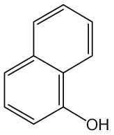

1-나프톨
α-히드록시나프탈렌
1-히드록시나프탈렌 C H O : 144.17
10 8
이 원료를 건조한 것은 정량할 때 α-나프톨(C H O) 95.0 % 이상을 함유한다.
10 8
성 상 이 원료는 흰색, 엷은 갈색, 엷은 회적자색 또는 엷은 회자색의 결정성가루
또는 결정성덩어리로서 특이한 냄새가 있다.
확인시험 1) 이 원료의 수용액(0.1 → 1000) 10 mL를 넣을 때 액은 흰색 ∼ 엷은 갈
색의 혼탁을 생성하고 방치하면 자갈색 ∼ 갈색의 침전이 생긴다.
2) 이 원료 및 α-나프톨 표준품 각각 10 mg을 이소프로판올ㆍ물ㆍ강암모니아수(9：
3：1) 혼합액 1 mL에 녹인 다음 각각에 아황산수소나트륨 0.1 ｇ을 넣고 흔들어 섞
어 검액 및 표준액으로 한다. 이들 액을 가지고 박층크로마토그래프법에 따라 시험한
다. 검액 및 표준액 1 μL씩을 박층판위에 점적하고, 헥산ㆍ아세톤ㆍ클로로포름혼합액
(2：1：1)을 전개용매로 하여 전개한 다음 박층판을 바람에 말린다. 여기에 발색제로
인몰리브덴산시액을 뿌릴 때 검액 및 표준액에서 얻은 반점의 R 값은 같고 단일 청
f
색 ∼ 자색의 반점을 나타낸다.
3) 이 원료의 수용액(0.1 → 1000) 10 mL에 황산제이세륨암모늄용액(1 → 100) 1
mL를 넣을 때 액은 백탁하고, 이어 엷은 자색 ∼ 자색으로 변한다.
4) 이 원료 25 mg을 물에 넣어 녹여 100 mL로 한다. 이 액 10 mL를 취하여 물을
넣어 100 mL로 하여 이 액을 가지고 자외가시부흡광도측정법에 따라 흡수스펙트럼
을 측정할 때 파장 291 ∼295 nm에서 흡수극대를 나타낸다.
융 점 92 ∼ 97 ℃(제 1 법)
순도시험 1) 용해상태 이 원료 0.5 ｇ을 에탄올 10 mL에 넣어 녹일 때 액은 무색,
엷은 갈색 또는 엷은 자색이고 거의 맑다.
2) 중금속 이 원료 1.0 ｇ을 황산 5 mL 및 질산 20 mL에 넣어 가만히 가열한다.
때때로 질산 2 ∼ 3 mL씩을 추가하여 액이 무색 ∼ 엷은 황색이 될 때까지 가열한
다. 식힌 다음 물 10 mL 및 페놀프탈레인시액 1방울을 넣어 액이 거의 홍색을 나타
낼 때까지 암모니아시액을 넣는다. 다음에 묽은초산 2 mL를 넣고 필요하면 여과하
고, 잔류물을 물 10 mL로 씻어 씻은 액은 여액과 합하고 물을 넣어 50 mL로 한다.
이것을 검액으로 하여 시험한다. 비교액에는 납표준액 2.0 mL를 넣는다(20 ppm 이하).
3) 철 이 원료 0.5 ｇ을 달아 황산 5 방울을 넣어 적시고 천천히 가열하여 저온에
서 거의 회화 또는 휘산시킨 다음 다시 황산을 넣어 적시고 완전히 회화시킨다. 식히
고 잔류물에 염산 0.5 mL를 넣어 수욕상에서 증발건고한 다음 묽은염산 3 방울을 넣
어 가온하고 물 25 mL를 넣어 녹인다. 이것을 검액으로 하여 시험한다. 비교액에는
철 표준액 2.0 mL를 넣는다(40 ppm 이하).
4) 비소 이 원료 1.0 ｇ을 황산 5 mL 및 질산 20 mL에 넣어 가만히 가열한다. 때
때로 질산 2 ∼ 3 mL씩을 추가하여 액이 무색 ∼ 엷은 황색이 될 때까지 가열한다.
식힌 다음 포화수산암모늄용액 15 mL를 넣고 흰 연기가 날 때까지 가열한다. 식힌
다음 물을 넣어 10 mL로 한다. 이것을 검액으로 하여 시험한다(2 ppm 이하).
건조감량 1.0 % 이하(1 ｇ, 실리카겔, 4 시간)
강열잔분 0.3 % 이하(3 ｇ)
정 량 법 이 원료를 건조하여 그 약 0.2 ｇ을 정밀하게 달아 물 100 mL에 넣어 가온
하여 녹인 다음 물을 넣어 정확하게 200 mL로 한다. 이 액 20 mL를 정확하게 취하
여 요오드병에 넣고 0.1 mol/L 브롬액 25 mL를 정확하게 넣은 다음 염산 5 mL를
넣고 마개를 하고 차광하여 30 분간 때때로 흔들어 섞으면서 방치한다. 요오드화칼륨
용액(1 → 10) 20 mL를 넣어 흔들어 섞은 다음 클로로포름 1 mL를 넣고 흔들어 섞
어 유리된 요오드를 0.1 mol/L 치오황산나트륨액으로 적정한다(지시약：전분시액 1
mL). 같은 방법으로 공시험을 하여 보정한다.
0.1 mol/L 치오황산나트륨액 1 mL = 2.4028 mg C H O
10 8
저 장 법 기밀용기
니트로-p-페닐렌디아민
Nitro-p-Phenylenediamine

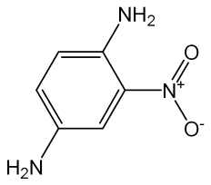

o-니트로-p-페닐렌디아민
2-니트로-p-페닐렌디아민
o-니트로-1,4-페닐렌디아민
니트로-1,4-페닐렌디아민 C H N O : 153.14
6 7 3 2
이 원료를 건조한 것은 정량할 때 니트로-p-페닐렌디아민(C H N O ) 92.0 % 이상을
6 7 3 2
함유한다.
성 상 이 원료는 적갈색 ∼ 흑갈색 또는 녹색을 띤 흑갈색 가루, 결정 또는 과립
상으로 냄새는 거의 없다.
확인시험 1) 이 원료 0.5 ｇ을 물 100 mL에 넣어 녹이고 여과한다. 여액 5 mL에 질
산은시액 5 방울을 넣어 가온할 때 액은 적갈색을 내며 혼탁해진다.
2) 이 원료 및 p-니트로아닐린 표준품 각각 0.01 ｇ을 이소프로판올ㆍ물ㆍ강암모니
아수혼합액(9：3：1) 1 mL에 넣어 녹인 다음 다시 각각에 아황산수소나트륨 0.1 ｇ
을 넣어 흔들어 섞어 검액 및 표준액으로 한다. 검액 및 표준액 1 μL씩을 박층판에
점적하고, 이소프로필에텔ㆍ아세톤ㆍ이소프로판올혼합액(10：1：1)을 전개용매로 하
여 박층크로마토그래프법에 따라 시험한다. 발색제로 p-디메칠아미노벤즈알데히드ㆍ
묽은염산용액(0.5 → 100)을 뿌릴 때 p-니트로아닐린 표준품에 대하여 Rs값 0.7 부근
에서 적색을 띤 황색 ∼ 황갈색의 반점을 나타낸다.
3) 이 원료 1 ｇ을 물 100 mL에 넣어 녹이고 여과한다. 여액 3 mL에 풀푸랄ㆍ초산
시액 4 방울을 넣을 때 액은 적색을 띤 황색을 나타내며 혼탁해진다.
4) 이 원료 0.1 ｇ을 물 100 mL에 넣어 녹이고 여과한다. 이 액 1.0 mL를 취하여
물을 넣어 100 mL로 한다. 이 액을 가지고 자외가시부흡광도측정법에 따라 흡수스펙
트럼을 측정할 때 파장 240 ± 2 nm에서 흡수극대를 나타낸다.
융 점 134 ∼ 140 ℃(제 1 법)
순도시험 1) 용해상태 이 원료 0.1 ｇ을 에탄올 20 mL에 넣어 녹일 때 액은 적색
∼ 암적갈색을 나타내며 거의 맑다.
2) 중금속 이 원료 1.0 ｇ을 황산 5 mL 및 질산 20 mL에 넣고 가만히 가열한다.
때때로 질산 2 ∼ 3 mL씩을 추가하여 액이 무색 ∼ 엷은 황색이 될 때까지 가열한
다. 식힌 다음 물 10 mL 및 페놀프탈레인시액 1 방울을 넣고 암모니아시액을 액이
엷은 적색이 될 때까지 천천히 넣고 묽은초산 2 mL를 넣고 필요하면 여과한다. 잔류
물을 물 10 mL로 씻어 씻은 액은 여액과 합하고 물을 넣어 50 mL로 한다. 이것을
검액으로 하여 시험한다. 비교액에는 납표준액 2.0 mL를 넣는다(20 ppm 이하).
3) 철 이 원료 0.4 ｇ을 달아 황산 5 방울을 넣어 적시고 천천히 가열하여 거의 회
화 또는 휘산시킨 다음에 황산을 넣어 적시고 완전히 회화한다. 식힌 다음 잔류물에
염산 0.5 mL를 넣고 수욕상에서 증발건고한다. 잔류물에 묽은염산 3 방울을 넣어 가
온하고 물 25 mL를 넣어 녹이고 이것을 검액으로 하여 시험한다. 비교액에는 철표준
액 2.0 mL를 넣는다(50 ppm 이하).
4) 비소 이 원료 1.0 ｇ을 황산 5 mL 및 질산 20 mL에 넣고 가만히 가열한다. 때
때로 질산 2 ∼ 3 mL씩을 추가하여 액이 무색 ∼ 엷은 황색이 될 때까지 가열한다.
식힌 다음 포화수산암모늄용액 15 mL를 넣고 흰 연기가 발생할 때까지 가열한다. 식
힌 다음 물을 넣어 10 mL로 한다. 이것을 검액으로 하여 시험한다(2 ppm 이하).
건조감량 1.0 % 이하(1.5 ｇ, 105 ℃, 2 시간)
강열잔분 1.0 % 이하(2 ｇ, 제 1 법)
정 량 법 이 원료를 건조하고 약 90 mg을 정밀하게 달아 아연가루 2 ｇ, 물 15 mL
및 염산 15 mL에 넣고 조심하여 증발건고한다. 식힌 다음 질소정량법 제 2 법에 따
라 시험한다.
0.05 mol/L황산 1 mL = 5.105 mg C H N O
6 7 3 2
저 장 법 기밀용기
p-니트로-o-페닐렌디아민
p-Nitro-o-Phenylenediamine

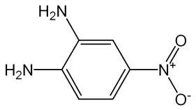

4-니트로-o-페닐렌디아민
4-니트로-1,2-페닐렌디아민 C H N O : 153.14
6 7 3 2
이 원료를 건조한 것은 정량할 때 p-니트로-o-페닐렌디아민(C H N O ) 95.0 % 이상
6 7 3 2
을 함유한다.
성 상 이 원료는 적갈색의 가루 또는 결정으로서 냄새는 거의 없다.
확인시험 1) 이 원료 0.5 ｇ을 물 100 mL에 넣어 녹인 다음 여과하고 이 여액 3 mL
에 풀푸랄ㆍ초산시액 4 방울을 넣을 때 액은 황적색을 나타낸다.
2) 이 원료 및 p-니트로아닐린 표준품 각 10 mg 을 이소프로판올ㆍ물ㆍ강암모니아
수 혼합액(9：3：1) 1 mL에 넣어 녹인 다음 각각에 아황산수소나트륨 0.1 ｇ을 넣어
흔들어 섞어 검액 및 표준액으로 한다. 검액 및 표준액 1 μL씩을 박층판에 점적하고,
이소프로필에텔ㆍ아세톤ㆍ이소프로판올 혼합액(10：1：1)을 전개 용매로 하여 박층크
로마토그래프법에 따라 시험한다. 발색제로 p-디메칠아미노벤즈알데히드ㆍ묽은염산
용액(1 → 200)을 뿌릴 때 p-니트로아닐린 표준품에 대하여 상대 R값 0.7 부근에서
f
엷은 적황색 ∼ 황색의 반점을 나타낸다.
3) 이 원료 0.1 ｇ을 물 100 mL에 넣어 녹이고 필요하면 여과한다. 이 액 1 mL를
취하여 물을 넣어 100 mL로 한다. 이 액을 가지고 자외가시부흡광도측정법에 따라
자외부흡수스페트럼을 측정할 때 파장 268 ± 2 nm 에서 흡수극대를 나타낸다.
융 점 198 ∼ 206 ℃(제 1 법)
순도시험 1) 용해상태 이 원료 0.1 ｇ을 묽은에탄올 20 mL에 넣어 가온하여 녹일
때 액은 적색이며 거의 맑다.
2) 철 이 원료 0.4 ｇ을 달아 황산 5 방울을 넣어 적시고 천천히 가열하여 저온에
서 거의 회화 또는 휘산시킨 다음 황산을 넣어 적시고 완전히 회화한다. 식힌 다음
잔류물에 염산 0.5 mL를 넣고 수욕상에서 증발건고한다. 잔류물에 묽은염산 3 방울
을 넣어 가온하고 물 25 mL를 넣어 녹인다. 이것을 검액으로 하여 시험한다. 비교액
에는 철표준액 2.0 mL를 넣는다(50 ppm 이하).
3) 중금속 이 원료 1.0 ｇ을 황산 5 mL 및 질산 20 mL에 넣고 가만히 가열한다.
때때로 질산 2 ∼ 3 mL씩을 추가하여 액이 무색 ∼ 엷은 황색이 될 때까지 가열한
다. 식힌 다음 물 10 mL 및 페놀프탈레인시액 1 방울을 넣고 암모니아시액을 액이
엷은 적색이 될 때까지 천천히 넣고 묽은초산 2 mL를 넣어 필요하면 여과한다. 잔류
물을 물 10 mL로 씻고 여액과 씻은 액을 네슬러관에 넣어 물을 넣어 50 mL로 하여
검액으로 한다. 단, 비교액에는 납표준액 2.0 mL를 넣는다(20 ppm 이하).
4) 비소 이 원료 1.0 ｇ을 황산 2 mL 및 질산 5 mL에 넣고 가만히 가열한다. 때때
로 질산 2 ∼ 3 mL씩을 추가하여 액이 무색 ∼ 엷은 황색이 될 때까지 가열한다. 식
힌 다음 포화수산암모늄용액 15 mL를 넣고 흰연기가 발생할 때까지 가열하고 식힌
다음 여기에 물을 넣어 10 mL로 한다. 이것을 검액으로 하여 시험한다(2 ppm 이하).
건조감량 2.0 % 이하(1.5 ｇ, 105 ℃, 2 시간)
강열잔분 1.0 % 이하(2 ｇ)
정 량 법 이 원료를 105 ℃에서 2 시간 건조하고 그 약 90 mg을 정밀하게 달아 아연
가루 2 ｇ, 물 15 mL 및 염산 15 mL에 넣어 조심하여 증발건고한다. 식힌 다음 질
소정량법 제 2 법에 따라 시험한다.
0.05 mol/L 황산 1 mL = 5.105 mg C H N O
6 7 3 2
저 장 법 기밀용기
2, 6-디아미노피리딘
2,6-Diaminopyridine

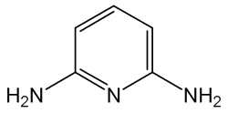

C H N : 109.13
5 7 3
이 원료를 건조한 것은 정량할 때 2,6-디아미노피리딘(C H N ) 93.0 % 이상을 함유
5 7 3
한다.
성 상 이 원료는 갈색 ∼ 흑색의 결정성 가루로 약간 특이한 냄새가 있다.
확인시험 1) 이 원료의 에탄올용액(1 → 1000) 10 mL에 염화제이철시액ㆍ페리시안화
칼륨시액혼합액(1：1) 1 방울을 넣을 때 액은 바로 진한 청색 ∼ 진한 청록색을 나타
내며 혼탁하다.
2) 이 원료 50 mg을 에탄올에 넣어 녹여 100 mL로 한다. 이 액 5 mL를 취하여 에
탄올을 넣어 500 mL로 한다. 이 액을 가지고 자외가시부흡광도측정법에 따라 흡수스
펙트럼을 측정할 때 파장 309 ± 2 nm 및 245 ± 2 nm 에서 흡수극대를 나타낸다.
3) 이 원료 및 염산 m-페닐렌디아민 표준품 각 10 mg을 이소프로판올ㆍ물ㆍ강암모
니아수(9：3：1) 혼합액 1 mL에 넣어 녹인 다음 각각에 아황산수소나트륨 0.1 ｇ을
넣어 흔들어 섞어 검액 및 표준액으로 한다. 검액 및 표준액 1 μL씩을 박층판에 점
적하고 초산에칠ㆍ메탄올ㆍ물혼합액(50：10：8)을 전개용매로 하여 박층크로마토그래
프법에 따라 시험한다. 발색제로 p-디메칠아미노벤즈알데히드ㆍ묽은염산용액(1 →
200)을 뿌릴 때 염산 m-페닐렌디아민 표준품에 대하여 Rs값 0.7 부근에서 등색의 반
점을 나타낸다.
융 점 109 ∼ 122 ℃(제 1 법)
순도시험 1) 용해상태 이 원료 0.1 ｇ을 묽은초산(18 → 100) 100 mL에 넣어 녹일
때 액은 어두운 황녹갈색이고 맑다.
2) 철 이 원료 1.0 ｇ을 달아 황산 5 방울을 넣어 적시고 천천히 가열하여 저온에
서 거의 회화 또는 휘산시킨 다음 다시 황산을 넣어 적시고 완전히 회화시킨다. 식힌
다음 잔류물에 염산 0.5 mL를 넣어 수욕상에서 증발건고한다. 잔류물에 묽은염산 3
방울을 넣고 가온하고 물 25 mL를 넣어 녹인다. 이것을 검액으로 하여 시험한다. 비
교액에는 철표준액 2.0 mL를 넣는다(20 ppm 이하).
3) 중금속 이 원료 1.0 ｇ을 황산 5 mL 및 질산 20 mL에 넣고 가만히 가열한다.
때때로 질산 2 ∼ 3 mL씩을 추가하여 액이 무색 ∼ 엷은 황색이 될 때까지 가열하
고 식힌 다음 물 10 mL 및 페놀프탈레인시액 1 방울을 넣고 암모니아시액을 액이
엷은 적색이 될 때까지 천천히 넣고 묽은초산 2 mL를 넣고 필요하면 여과한다. 잔류
물을 물 10 mL로 씻고 여액과 씻은 액을 네슬러관에 넣어 물을 넣어 50 mL로 하여
검액으로 하여 시험한다. 단, 비교액에는 납표준액 1.0 mL를 넣는다(10 ppm 이하).
4) 비소 이 원료 1.0 ｇ을 황산 2 mL 및 질산 5 mL에 넣어 가만히 가열한다. 때때
로 질산 2 ∼ 3 mL씩을 추가하여 액이 무색 ∼ 엷은 황색이 될 때까지 가열한다. 식
힌 다음 포화수산암모늄용액 15 mL를 넣고 흰 연기가 발생할 때까지 가열하고 식힌
다음 물을 넣어 10 mL로 한다. 이것을 검액으로 하여 시험한다(2 ppm 이하).
건조감량 2.0 % 이하(2 ｇ, 실리카겔, 4 시간)
강열잔분 1.5 % 이하(1 ｇ)
정 량 법 이 원료를 건조하고 약 60 mg을 정밀하게 달아 질소정량법 제 2 법에 따라
시험한다.
0.05 mol/L 황산 1 mL = 3.6377 mg C H N
5 7 3
저 장 법 기밀용기
1,5-디히드록시나프탈렌
1,5-Dihydoxynaphthalene

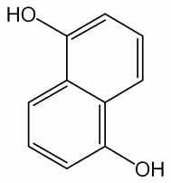

1,5-나프탈렌디올 C H O : 160.17
10 8 2
성 상 이 원료는 엷은 갈색 또는 회갈색의 가루로서 약간 특이한 냄새가 있다.
확인시험 1) 이 원료의 에탄올용액(1 → 1000) 10 mL에 염화제이철시액 3 방울을 넣
을 때 액은 녹갈색을 나타낸다.
2) 이 원료 20 mg을 에탄올 100 mL에 넣어 녹이고, 이 액 10 mL를 취하여 에탄올
에 넣어 100 mL로 한다. 이 액을 가지고 자외가시부흡광도측정법에 따라 흡수스펙트
럼을 측정할 때 파장 331 ± 2 nm, 317 ± 2 nm 및 299 ± 2 nm에서 흡수극대를 나
타낸다.
3) 이 원료 및 α-나프톨 표준품 각 10 mg을 이소프로판올ㆍ물ㆍ강암모니아수(9：
3：1) 혼합액 1 mL에 넣어 녹인 다음 각각에 아황산수소나트륨 0.1 ｇ을 넣어 흔들
어 섞어 검액 및 표준액으로 한다. 검액 및 표준액 1 μL씩을 박층판에 점적하고 헥
산ㆍ아세톤ㆍ클로로포름혼합액(2：1：1)을 전개 용매로 하여 박층크로마토그래프법에
따라 시험한다. 발색제로 인몰리브덴산시액을 뿌릴 때 α-나프톨 표준품에 대하여 Rs
값 0.6 부근에서 회청색 ∼ 청색의 반점을 나타낸다.
융 점 257 ∼ 261 ℃(제 1 법)
순도시험 1) 용해상태 이 원료 0.1 ｇ을 에탄올 10 mL에 넣어 녹일 때 액은 엷은
갈색이 되며 맑다.
2) 철 이 원료 0.5 ｇ을 달아 황산 5 방울을 넣어 적시고 천천히 가열하여 저온에
서 거의 회화 또는 휘산시킨 다음 다시 황산을 넣어 적시고 완전히 회화시킨다. 식힌
다음 잔류물에 염산 0.5 mL를 넣어 수욕상에서 증발건고 시킨다. 잔류물에 묽은염산
3 방울을 넣어 가온하고 물을 넣어 녹이고 50 mL로 한다. 이것을 검액으로 하여 시
험한다. 검액 10.0 mL를 취하여 시험한다. 비교액에는 철표준액 2.0 mL를 넣는다
(0.02 % 이하).
3) 납 이 원료 1.0 ｇ을 황산 5 mL 및 질산 20 mL에 넣어 가만히 가열한다. 때때
로 질산 2 ∼ 3 mL씩을 추가하여 액이 무색 ∼ 엷은 황색이 될 때까지 가열한다. 식
힌 다음 물을 넣어 10 mL로 한다. 이것을 검액으로 하여 시험한다(20 ppm 이하).
4) 비소 이 원료 1.0 ｇ을 황산 2 mL 및 질산 5 mL에 넣고 가만히 가열한다. 때때
로 질산 2 ∼ 3 mL씩을 추가하여 액이 무색 ∼ 엷은 황색이 될 때까지 가열한 다음
식히고 포화수산암모늄용액 15 mL를 넣어 흰 연기가 발생할 때까지 가열한다. 식힌
다음 물을 넣어 10 mL로 한다. 이것을 검액으로 하여 시험한다(2 ppm 이하).
건조감량 1.0 % 이하(1 ｇ, 105 ℃, 2 시간)
강열잔분 1.0 % 이하(1 ｇ)
저 장 법 기밀용기
레조시놀
Resorcinol

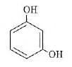

레소르시놀
레소르신 C H O : 110.11l
6 6 2
이 원료를 건조한 것은 정량할 때 레조시놀(C H O ) 99.0 % 이상을 함유한다.
6 6 2
성 상 이 원료는 백색의 가루로, 조금 특이한 냄새가 있다.
확인시험 1) 이 원료 0.1 g에 수산화나트륨시액 2 mL를 가해 녹이고, 클로로포름 l 방
울을 가해 가열할 때, 액은 진한 홍색을 나타내고, 여기에 다시 염산을 적가할 때 액
은 엷은 황갈색을 나타낸다.
2) 이 원료의 수용액(1 → 200) 10 mL에 염화제이철시액 3 방울을 가할 때, 액은 청
색을 띤 자색을 나타내며, 여기에 다시 암모니아시액을 적가할 때 액은 갈색을 띤 황
색을 나타낸다.
융 점 109 ∼ 112 ℃(제 1 법)
순도시험 1) 액성 이 원료의 수용액(1 → 20) 5 mL에 메칠오렌지시액 1 방울을 가할
때, 액은 황색 ∼ 등색을 나타낸다.
2) 페놀 이 원료의 수용액(1 → 20) 5 mL를 가만히 가열할 때, 페놀 고유의 냄새가
나지 않는다.
3) 카테콜 이 원료의 수용액(1 → 20) 10 mL에 묽은초산 2 방울 및 초산납시액 0.5
mL를 가할 때, 액은 혼탁하지 않는다.
4) 중금속 이 원료 1.0 g을 취해 제 2 법에 따라 조작하여 시험한다. 비교액에는
납표준액 2.0 mL를 넣는다.(20 ppm 이하)
5) 비소 이 원료 1.0 g을 취해 제 3 법에 따라 검액을 조제하여 시험한다.(2 ppm
이하).
건조감량 1.0 % 이하(1.5 g, 실리카겔, 4 시간)
강열잔분 0.05 % 이하(2 g)
정량법 이 원료를 건조하여 그 약 0.3 g을 정밀하게 달아 물을 가해 녹이고 100 mL
로 한다. 이 액 25 mL를 요오드병에 취하여 정확하게 0.05 mol/L 브롬액 50 mL,
물 50 mL 및 염산 5 mL를 가해 곧바로 마개를 하고 1 분간 잘 흔들어 섞고 2 분간
방치한다. 다음에 요오드화칼륨시액 5 mL를 가해 잘 흔들어 섞어 냉암소에 5 분간
방치한 후, 마개 및 요오드병 내벽의 부착물을 물 20 mL로 씻어 합하고, 유리된 요
오드를 0.1 mol/L 치오황산나트륨액으로 적정한다(지시약 : 전분시액 1 mL). 같은 방
법으로 공시험을 실시한다.
0.05 mol/L 브롬액 1 mL = 1.8352 mg C H O
6 6 2
2-메칠레조시놀
2-Methylresorcinol

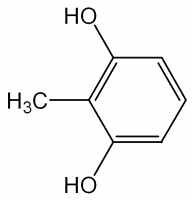

2-메틸레소르시놀 C H O : 124.14
7 8 2
이 원료를 건조한 것은 정량할 때 2-메칠레조시놀(C H O ) 94.0 % 이상을 함유한
7 8 2
다.
성 상 이 원료는 회백색 ∼ 회갈색의 미세한 가루로 약간의 특이한 냄새가 있다.
확인시험 1) 이 원료 0.1 ｇ을 에탄올 10 mL에 넣어 녹이고 이 액 10 μL를 박층판에
점적하고 초산에칠ㆍ피리딘ㆍ물혼합액(70：25：25)을 전개용매로 하여 박층크로마토
그래프법에 따라 시험한다. 약 10 ㎝ 전개하여 박층판을 꺼내어 바람에 말린 다음 관
찰할 때 R값 0.77 부근에 갈색의 반점을 나타낸다.
f
2) 이 원료 0.1 ｇ을 에탄올 10 mL에 넣어 녹이고 이 액 10 μL를 박층판에 점적하
고 톨루엔ㆍ무수초산ㆍ물혼합액(50：50：5)을 전개용매로 박층크로마토그래프법에 따
라 시험한다. 약 10 cm 전개하여 박층판을 꺼내어 바람에 말린 다음 관찰할 때 R
f
값 0.40부근에 갈색의 반점을 나타낸다.
융 점 110 ∼ 120 ℃(제 1 법)
순도시험 1) 용해상태 이 원료 0.1 ｇ을 에탄올 10 mL에 넣어 녹일 때 액은 맑다.
2) 납 이 원료 1.0 ｇ을 황산 5 mL 및 질산 20 mL에 넣어 가만히 가열한다. 때때
로 질산 2 ∼ 3 mL씩을 추가하여 액이 무색 ∼ 엷은 황색이 될 때까지 가열한다. 식
힌 다음 물을 넣어 10 mL로 한다. 이것을 검액으로 하여 시험한다(5 ppm 이하).
3) 철 이 원료 1.0 ｇ을 달아 황산 5 방울을 넣어 적시고 천천히 가열하여 저온에
서 거의 회화 또는 휘산시킨 다음 다시 황산을 넣어 적시고 완전히 회화한다. 식힌
다음 잔류물에 염산 0.5 mL를 넣어 수욕상에서 증발건고한 다음 묽은염산 3 방울을
넣어 가온하고 물을 넣어 50.0 mL로 한다. 이 액 10 mL를 취하여 검액으로 하여 시
험한다. 비교액에는 철표준액 2.0 mL를 넣는다(100 ppm 이하).
4) 비소 이 원료 1.0 ｇ을 황산 2 mL 및 질산 5 mL에 넣어 가만히 가열한다. 때때
로 질산 2 ∼ 3 mL씩을 추가하여 액이 무색 ∼ 엷은 황색이 될 때까지 가열한다. 식
힌 다음 포화수산암모늄용액 15 mL를 넣어 흰 연기가 발생할 때까지 가열한다. 식힌
다음 물을 넣어 10 mL로 한다. 이것을 검액으로 하여 시험한다(2 ppm 이하).
건조감량 3.0 % 이하(1 ｇ, 황산, 4 시간)
강열잔분 1.0 % 이하(2 ｇ, 제 1 법)
정 량 법 이 원료를 건조하고 약 0.6 ｇ을 정밀하게 달아 물에 넣어 녹여 100.0 mL로
한다. 이 액 15.0 mL 및 0.05 mol/L 브롬액 50.0 mL를 취하여 250 mL 요오드병에
넣는다. 물 20 mL 및 염산 5 mL를 넣고 곧 마개를 하여 흔들어 섞은 다음 2 분간
방치한다. 다음에 요오드화칼륨시액 5 mL를 넣고 마개를 하여 가만히 흔들어 섞고 5
분간 방치한다. 요오드병의 마개를 열고 물 20 mL로 마개와 병목을 씻어 넣고 0.1
mol/L 치오황산나트륨액으로 적정한다(지시약 : 전분시액 1 mL). 다만 적정의 종말
점은 액의 청색이 없어질 때로 한다. 같은 방법으로 공시험을 하여 보정한다.
0.05 mol/L 브롬액 1 mL = 2.069 mg C H O
7 8 2
저 장 법 기밀용기
2-메칠-5-히드록시에칠아미노페놀
2-Methyl-5-Hydroxyethylaminophenol

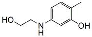

5-(2-히드록시에칠아미노)-2-메칠페놀
2-메틸-5-히드록시에틸아미노페놀 C H NO : 167.21
9 13 2
이 원료를 건조한 것은 정량할 때 2-메칠-5-히드록시에칠아미노페놀(C H NO ) 93.0
9 13 2
% 이상을 함유한다.
성 상 이 원료는 갈색의 과립상의 가루로 냄새는 없다.
확인시험 1) 이 원료의 에탄올용액(1 → 1000)에 묽은염화제이철시액 3 방울을 넣을
때 액은 엷은 황색을 나타낸다.
2) 이 원료 30 mg을 에탄올에 넣어 녹여 100 mL로 한다. 이 액 1 mL를 취하여 에
탄올을 넣어 100 mL로 한다. 이 액을 가지고 자외가시부흡광도측정법에 따라 흡수스
펙트럼을 측정할 때 파장 207 ± 2 nm, 242 ± 2 nm 및 295 ± 2 nm에서 흡수극대를
나타낸다.
융 점 86 ∼ 90 ℃(제 1 법)
순도시험 1) 용해상태 이 원료 0.1 ｇ을 에탄올 10 mL에 넣어 녹일 때 액은 엷은
갈색이며 맑다.
2) 납 이 원료 1.0 ｇ을 황산 5 mL 및 질산 20 mL에 넣어 가만히 가열한다. 때때
로 질산 2 ∼ 3 mL씩을 추가하여 액이 무색 ∼ 엷은 황색이 될 때까지 가열한다. 식
힌 다음 물을 넣어 10 mL로 한다. 이것을 검액으로 하여 시험한다(20 ppm 이하).
3) 철 이 원료 0.1 ｇ을 달아 황산 5 방울을 넣어 적시고 천천히 가열하여 저온에
서 거의 회화 또는 휘산시킨 다음 다시 황산을 넣어 적시고 완전히 회화한다. 식힌
다음 잔류물에 염산 0.5 mL를 넣어 수욕상에서 증발건고한 다음 묽은염산 3 방울을
넣어 가온하고 물 25 mL를 넣어 녹인다. 이 액을 검액으로 하여 시험한다. 비교액에
는 철표준액 2.0 mL를 넣는다(0.02 % 이하).
4) 비소 이 원료 1.0 ｇ을 황산 2 mL 및 질산 5 mL에 넣어 가만히 가열한다. 때때
로 질산 2 ∼ 3 mL씩을 추가하여 액이 무색 ∼ 엷은 황색이 될 때까지 가열한다. 식
힌 다음 포화수산암모늄용액 15 mL를 넣어 흰 연기가 발생할 때까지 가열한다. 식힌
다음 물을 넣어 10 mL로 한다. 이것을 검액으로 하여 시험한다(2 ppm 이하).
건조감량 1.0 % 이하(1 ｇ, 105 ℃, 2 시간)
강열잔분 2.0 % 이하(1 ｇ)
정 량 법 이 원료를 건조하여 약 0.15 ｇ을 정밀하게 달아 질소정량법 제 2 법에 따
라 시험한다.
0.05 mol/L 황산 1 mL = 16.72 mg C H NO
9 13 2
저 장 법 기밀용기
모노에탄올아민
Monoethanolamine

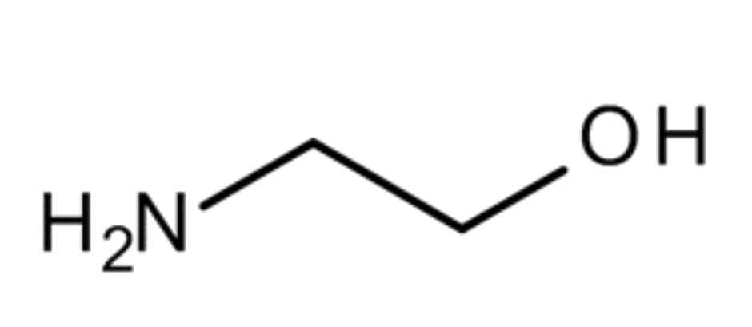

2-아미노에탄올 C H NO 61.08
2 7
이 원료는 정량할 때 모노에탄올아민(C H NO) 98.0 ~ 100.5 %를 함유한다.
2 7
확인시험 이 원료 및 모노에탄올 표준품을 가지고 적외부스펙트럼측정법의 브롬화칼
륨 정제법에 따라 시험할 때 같은 파수에서 같은 강도의 흡수를 나타낸다.
강열잔분 0.1 % 이하 (1 g)
비 중 d20 : 1.013 － 1.016
20
증류시험 167 ~ 173 ℃, 95 vol% 이상.
정 량 법 이 원료 약 1 g을 정밀하게 달아 물 25 mL를 넣어 녹이고 0.5 mol/L 염산
으로 적정한다 (지시약 : 브롬크레솔그린ㆍ 메칠레드 시액 (5:6)).
0.5 mol/L 염산 1 mL = 61.08 mg C H NO
2 7
저 장 법 차광한 기밀용기
몰식자산
Gallic Acid

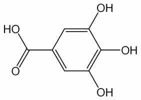

갈르산
3,4,5-트리히드록시안식향산
갈루스산 C H O H O :
7 6 5ㆍ 2
188.14
성 상 이 원료는 흰색 ∼ 엷은 황백색의 침상결정 또는 가루로서 냄새는 없다.
확인시험 1) 이 원료의 수용액(1 → 1000) 5 mL에 염화제이철시액 5 방울을 넣을 때
액은 청흑색을 나타낸다.
2) 이 원료 0.5 ｇ을 물 10 mL에 넣어 흔들어 섞은 다음 여과한다. 여액 5 mL에 질
산은암모니아시액 5 방울을 넣을 때 액은 은경 또는 흑갈색의 침전을 나타낸다.
순도시험 1) 용해상태 이 원료 1.0 ｇ을 열탕 20 mL에 넣어 녹일 때 액은 무색 ∼
엷은 황색이며 거의 맑다.
2) 황산염 이 원료 1.0 ｇ을 물 20 mL에 넣고 약 1 분간 흔들어 섞은 다음 여과한
다. 여액 5 mL에 묽은 염산 1 mL 및 물을 넣어서 50 mL로 한다. 이 액을 검액으로
하여 시험한다. 비교액에는 0.005 mol/L 황산 0.20 mL를 넣는다(0.02 % 이하).
3) 탄닌산 2)의 여액 5 mL에 젤라틴 시액 3 방울 또는 알부민시액 3 방울을 넣을
때 액은 침전이 생기지 않는다.
4) 중금속 이 원료 1.0 ｇ을 황산 5 mL 및 질산 20 mL에 넣어 가만히 가열한다.
때때로 질산 2 ∼ 3 mL씩을 추가하여 액이 무색 ∼ 엷은 황색이 될 때까지 가열한
다. 식힌 다음 물 10 mL 및 페놀프탈레인시액 1 방울을 넣고 암모니아시액을 액이
엷은 적색이 될 때까지 천천히 넣고 묽은 초산 2 mL를 넣고 필요하면 여과하여 물
10 mL로 씻고 여액과 씻은 액을 네슬러관에 넣어 물을 넣어 50 mL로 한다. 이것을
검액으로 하여 시험한다. 비교액에는 납표준액 2.0 mL를 넣는다(20 ppm 이하).
5) 비소 이 원료 1.0 ｇ을 황산 2 mL 및 질산 5 mL에 넣어서 가만히 가열한다.
때때로 질산 2 ∼ 3 mL씩을 추가하여 액이 무색 ∼ 엷은 황색이 될 때까지 가열한
다. 식힌 다음 포화수산암모늄용액 15 mL를 넣어 흰 연기가 날 때까지 가열한다. 식
힌 다음 물을 넣어 10 mL로 한다. 이것을 검액으로 하여 시험한다(2 ppm 이하).
건조감량 10.0 % 이하(1 ｇ, 105 ℃, 2 시간)
강열잔분 0.1 % 이하(1 ｇ, 제 2 법)
저 장 법 기밀용기
수산화나트륨
Sodium Hydroxide
소듐하이드록사이드 NaOH：40.00
이 원료는 정량할 때 총알칼리(NaOH로서) 95.0 % 이상을 함유하며 이중 탄산나트
륨(Na CO ：105.99)는 3.0 % 이하이다.
2 3
성 상 이 원료는 백색의 소구상(小球狀), 박편상(薄片狀), 봉상(棒狀) 또는 덩어리
로 단단하고 부스러지기 쉬우며 단면(斷面)은 결정성이다.
확인시험 1) 이 원료의 수용액(1 → 500)은 강한 알칼리성이다.
2) 이 원료의 수용액(1 → 25)은 나트륨염의 정성반응을 나타낸다.
순도시험 1) 용해상태 이 원료 1.0 g 물 20 mL를 넣어 녹일 때 무색이며 맑다.
2) 염화물 이 원료 1.0 g에 물을 넣어 녹이고 100 mL로 한다. 이 액 25 mL를 취
하여 묽은질산 10 mL 및 물을 넣어 50 mL로 하고 이것을 검액으로 하여 시험한
다. 비교액에는 0.01 mol/L 염산 0.7 mL를 넣는다(0.1 % 이하).
3) 중금속 이 원료 1.0 g에 물 5 mL를 넣어 녹이고 묽은염산 11 mL를 넣어 수욕
중에서 증발건고한다. 잔류물에 물 35 mL 및 묽은초산 2 mL를 넣어 녹이고 다시
물을 넣어 50 mL로 하고 이것을 검액으로 한다. 비교액에는 납표준액 3.0 mL를 넣
는다. 검액 및 비교액에 황화나트륨시액 1방울씩을 넣어 흔들어 섞고 5 분간 방치
한 다음 각 관을 백색을 배경으로 하여 위 또는 옆에서 관찰하여 액의 색을 비교한
다. 검액이 나타내는 색은 비교액이 나타내는 색보다 진하지 않다(30 ppm 이하).
4) 칼륨 이 원료 0.5 g에 물 10 mL를 넣어 녹이고 초산 4 mL를 넣고 아질산코발
트나트륨시액 3 ∼ 5 방울을 넣을 때 침전이 생기지 않는다.
정 량 법 이 원료 약 1.0 g을 정밀하게 달아 새로 끓여 식힌 물 약 100 mL에 녹이고
15 ℃로 식힌 다음 페놀프탈레인시액 2 방울을 넣고 0.5 mol/L 황산으로 적정하여
액의 홍색이 없어질 때 황산의 양을 기록한다. 이 액에 브롬페놀블루시액 3방울을 넣
고 다시 1 mol/L 염산으로 액의 청자색이 지속하는 황색으로 될 때까지 적정한다.
0.5 mol/L 황산의 총량에서 총알칼리(NaOH로서)의 양을 구하고 지시약이 다른 것에
따른 0.5 mol/L 황산의 소비량의 차로부터 탄산나트륨(Na CO )의 양을 구한다.
2 3
0.5 mol/L 황산 1 mL 〓 40.00 mg NaOH
0.5 mol/L 황산 1 mL 〓 105.99 mg Na CO
2 3
스테아트리모늄염화물
Steartrimonium Chloride
스테아트리모늄클로라이드
염화스테아릴트리메칠암모늄
Stearyltrimethylammonium Chloride
이 원료는 주로 염화스테아릴트리메칠암모늄으로 된 양이온계면활성제로 보통 이소
프로판올, 에탄올, 물 또는 이들의 혼합액을 함유한다. 이 원료는 정량할 때 표시량의
90.0 ∼ 110.0 %에 해당하는 스테아트리모늄염화물(C H ClN：348.05)를 함유한다.
21 46
성 상 이 원료는 백색 ∼ 엷은 황색의 액 또는 바셀린과 같은 물질로 특이한 냄새
가 있다.
확인시험 1) 이 원료의 표시량에 따라 스테아트리모늄염화물 5 g에 해당하는 양을
달아 물 100 mL를 넣어 가온할 때 맑게 녹는다.
2) 이 원료 0.1 g을 달아 클로로포름 5 mL 및 브롬페놀블루ㆍ수산화나트륨시액(0.05
mol/L 수산화나트륨액 3 mL에 브롬페놀블루 0.1 g을 넣어 잘 흔들어 섞고 물을 넣
어 25 mL로 한다.) 5 mL를 넣고 세게 흔들어 섞을 때 분리된 클로로포름층은 청색
을 나타낸다.
3) 이 원료 1 g에 에탄올 20 mL를 넣고 가열하여 녹일 때 액은 염화물의 정성반응
2)를 나타낸다.
순도시험 1) 액성 이 원료의 표시량에 따라 스테아트리모늄염화물 0.1g에 해당하는
양을 달아 새로 끓여 식힌 물을 넣어 가온하여 녹이고 10 mL로 한 액에 치몰블루시
액 2방울을 넣을 때 액은 황색을 나타낸다.
2) 암모늄염 이 원료 0.1 g을 달아 물 5 mL를 넣어 가온하여 녹이고 수산화나트륨
시액 3 mL를 넣어 끓일 때 발생하는 가스는 물에 적신 적색리트머스시험지를 청색
으로 변화시키지 않는다.
3) 중금속 이 원료 1.0 g을 달아 제２법에 따라 조작하여 시험한다. 비교액에는 납
표준액 2.0 mL를 넣는다(20 ppm 이하).
4) 비소 이 원료 1.0 g을 달아 제３법에 따라 조작하여 시험한다(2 ppm 이하).
강열잔분 0.5 % 이하(스테아트리모늄염화물 약 1.0 g에 해당하는 양, 450 ∼ 550 ℃)
정 량 법 이 원료의 표시량에 따라 스테아트리모늄염화물 약 1.0g에 해당하는 양을
정밀하게 달아 에탄올 10 mL 및 물 50 mL를 넣어 가온하여 녹이고 200 mL의 메스
플라스크에 넣어 초산나트륨 25g 및 초산 22 mL에 물을 넣어 100 mL로 한 액 8
mL를 넣고 다시 잘 흔들어 섞으면서 정확하게 0.05 mol/L 페리시안화칼륨액 50 mL
를 넣고 물을 넣어 200 mL로 하여 다시 잘 흔들어 섞고 1 시간 방치한다. 건조여과
지를 써서 여과하고 처음 여액 20 mL를 버리고 다음 여액 100 mL를 정확하게 취하
여 250 mL 요오드병에 넣고 요오드화칼륨시액 10 mL 및 묽은염산 10 mL를 넣어
흔들어 섞고 1 분간 방치한다. 여기에 황산아연용액(1→10) 10 mL를 넣고 잘 흔들어
섞고 5 분간 방치한 다음 유리된 요오드를 0.1 mol/L 치오황산나트륨액으로 적정한
다(지시약：전분시액 2 mL). 같은 방법으로 공시험을 하여 보정한다.
0.05 mol/L 페리시안화칼륨액 1 mL 〓 52.21 mg C H ClN
21 46
2-아미노-4-니트로페놀
2-Amino-4-nitrophenol

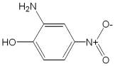

4-니트로-o-아미노페놀, 2-아미노-p-니트로페놀
o-아미노-p-니트로페놀, 4-니트로-2-아미노페놀
p-니트로-o-아미노페놀 C H N O : 154.12
6 6 2 3
이 원료를 건조한 것은 정량할 때 2-아미노-4-니트로페놀(C H N O ) 90.0 % 이상
6 6 2 3
을 함유한다.
성 상 이 원료는 황색 ∼ 황갈색의 가루로서 약간 특이한 냄새가 있다.
확인시험 1) 이 원료 0.1 ｇ을 물 10 mL에 넣어 녹이고 여과한다. 여액 10 mL에 염
화제이철시액 1 방울을 넣을 때 액은 적갈색 ∼ 갈색을 나타낸다.
2) 1)의 여액 10 mL에 묽은염산 1 mL를 넣을때 액은 약간의 황색을 나타낸다. 또
1)의 여액 10 mL에 탄산나트륨시액 1 mL를 넣을때 액은 적색을 나타낸다.
3) 이 원료 및 p-니트로아닐린 표준품 각 10 mg을 이소프로판올ㆍ물ㆍ강암모니아수
(9：3：1) 혼합액 1 mL에 넣어 녹인다음 각각에 아황산수소나트륨 0.1 ｇ을 넣어 흔
들어 섞어 검액 및 표준액으로 한다. 검액 및 표준액 1 μL씩을 박층판에 점적하고
이소프로필에칠ㆍ아세톤ㆍ이소프로판올(10：1：1) 혼합액을 전개용매로 하여 박층크
로마토그래프법에 따라 시험한다. 발색제로 p-디메칠아미노벤즈알데히드ㆍ묽은염산
용액(1 → 200)을 뿌릴 때 p-니트로아닐린 표준품에 대하여 Rs 값 1.0 부근에서 황
색의 반점을 나타낸다.
4) 이 원료 25 mg을 0.1 mol/L 염산 100 mL에 넣어 녹인다. 이 액 3 mL를 취하여
0.1 mol/L 염산을 넣어 100 mL로 한다. 이 액을 가지고 자외가시부흡광도측정법에
따라 흡수스펙트럼을 측정할 때 파장 224 ± 2 nm 및 307 ± 2 nm에서 흡수극대를
나타낸다.
융 점 141 ∼ 143 ℃(제 1 법)
순도시험 1) 용해상태 이 원료 0.1 ｇ을 묽은염산 10 mL에 넣어 녹일때 액은 엷은
자갈색 ∼ 엷은 갈색이며 거의 맑다.
2) 철 이 원료 1.0 ｇ을 정밀하게 달아 황산 5 방울을 넣어 적시고 천천히 가열하
여 저온에서 거의 회화 또는 휘산시킨 다음 황산을 넣어 적시고 다시 완전히 회화한
다. 식힌 다음 잔류물에 염산 0.5 mL를 넣어 수욕상에서 증발건고한다. 잔류물에 묽
은 염산 3 방울을 넣어 가온하고 물 25 mL를 넣어 녹인다. 이것을 검액으로 하여 시
험한다. 비교액에는 철 표준액 2.0 mL를 넣는다(20 ppm 이하).
3) 중금속 이 원료 1.0 ｇ을 황산 5 mL 및 질산 20 mL에 넣어 가만히 가열한다.
때때로 질산 2 ∼ 3 mL씩을 추가하여 액이 무색 ∼ 엷은 황색이 될때까지 가열한다.
식힌 다음 물 10 mL 및 페놀프탈레인시액 1 방울을 넣고 암모니아시액을 액이 엷은
적색이 될 때까지 천천히 넣고 필요하면 여과한다. 잔류물을 물 10 mL로 씻고 여액
과 씻은 액을 네슬러관에 넣고 물을 넣어 50 mL로 한다. 이것을 검액으로 하여 시험
한다. 비교액에는 납표준액 2.0 mL를 넣는다(20 ppm 이하).
4) 비소 이 원료 1.0 ｇ을 황산 2 mL 및 질산 5 mL에 넣고 가만히 가열한다. 때때
로 질산 2 ∼ 3 mL씩을 추가하여 액이 무색 ∼ 엷은 황색이 될 때까지 가열한다. 식
힌 다음 포화수산암모늄용액 15 mL를 넣고 흰연기가 발생할 때까지 가열한다. 식힌
다음 물을 넣어 10 mL로 한다. 이것을 검액으로 하여 시험한다(2 ppm 이하).
건조감량 1.5 % 이하(1 ｇ, 실리카겔, 4 시간)
강열잔분 1.0 % 이하(1 ｇ)
정 량 법 이 원료를 건조하고 약 14 mg을 정밀하게 달아 아연가루 2 ｇ, 물 15 mL
및 염산 15 mL를 넣어 조심하여 증발건고한다. 식힌 다음 질소정량법 제 2 법에 따
라 시험한다.
0.05 mol/L 황산 1 mL = 7.707 mg C H N O
6 6 2 3
저 장 법 기밀용기
2-아미노-5-니트로페놀
2-Amino-5-nitrophenol

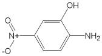

5-니트로-o-아미노페놀, 5-니트로-2-아미노페놀 C H N O : 154.13
6 6 2 3
이 원료를 건조한 것은 정량할 때 2-아미노-5-니트로페놀(C H N O ) 90.0 % 이상을
6 6 2 3
함유한다.
성 상 이 원료는 황색 ∼ 황갈색 결정성가루로서 냄새는 거의 없다.
확인시험 1) 이 원료의 수용액(1 → 2500) 10 mL에 염화제이철시액 5 방울을 넣을
때 액은 등색 ∼ 황갈색을 나타낸다.
2) 이 원료의 수용액(1 → 2500) 10 mL에 인몰리브덴산용액(1 → 100) 0.5 mL를 넣
을 때 액은 녹색을 띤 황색 ∼ 황색을 나타내며 강암모니아수 3 방울을 넣을 때 액
은 등색 ∼ 적색을 나타낸다.
3) 이 원료 및 p-니트로아닐린 표준품 각 10 mg을 이소프로판올ㆍ물ㆍ강암모니아수
(9：3：1) 혼합액 1 mL에 넣어 녹인 다음 각각에 아황산수소나트륨 0.1 ｇ을 넣어
흔들어 섞어 검액 및 표준액으로 한다. 검액 및 표준액 1 μL씩을 박층판에 점적하고
이소프로필에텔ㆍ아세톤ㆍ이소프로판올(10：1：1) 혼합액을 전개용매로 하여 박층크
로마토그래프법에 따라 시험한다. 발색제로 p-디메칠아미노벤즈알데히드ㆍ묽은염산
용액(1 → 200)을 뿌릴때 p-니트로아닐린 표준품에 대하여 Rs 값 1.0 부근에서 등색
의 반점을 나타낸다.
4) 이 원료 25 mg을 정밀하게 달아 0.1 mol/L 염산 100 mL에 넣어 녹인 다음 이
액 5 mL를 취하여 0.1 mol/L 염산을 넣어 100 mL로 한다. 이 액을 가지고 자외가시
부흡광도측정법에 따라 흡수스펙트럼을 측정할 때 파장 228 ± 2 nm 및 263 ± 2 nm
에서 흡수극대를 나타낸다.
융 점 191 ∼ 206 ℃(제 1 법)
순도시험 1) 용해상태 이 원료 0.1 ｇ을 에탄올 10 mL에 넣어 녹일 때 액은 적색을
띠는 황색 ∼ 적갈색을 나타내며 거의 맑다.
2) 철 이 원료 1.0 ｇ을 정밀하게 달아 황산 5 방울을 넣어 적시고 천천히 가열하
여 되도록 저온에서 거의 회화 또는 휘산시킨 다음 다시 황산을 넣어 적시고 완전히
회화시킨다. 식힌 다음 잔류물에 염산 0.5 mL를 넣어 수욕상에서 증발건고한 다음
묽은염산 3 방울을 넣어 가온하고 물 25 mL를 넣어 녹인다. 이것을 검액으로 하여
시험한다. 비교액에는 철표준액 2.0 mL를 넣는다(20 ppm 이하).
3) 중금속 이 원료 1.0 ｇ을 정밀하게 달아 황산 5 mL 및 질산 20 mL에 넣어 가
만히 가열한다. 때때로 질산 2 ∼ 3 mL씩을 추가하여 액이 무색 ∼ 엷은 황색이 될
때까지 가열한다. 식힌 다음 물 10 mL 및 페놀프탈레인시액 1 방울을 넣고 암모니아
시액을 액이 엷은 적색이 될때까지 천천히 넣고 필요하면 여과한다. 잔류물을 물 10
mL로 씻고 여액과 씻은 액을 네슬러관에 넣어 물을 넣어 50 mL로 한다. 이것을 검
액으로 하여 시험한다. 비교액에는 납표준액 3.0 mL를 넣는다(30 ppm 이하).
4) 비소 이 원료 1.0 ｇ을 정밀하게 달아 황산 2 mL 및 질산 5 mL에 넣고 가만히
가열한다. 때때로 질산 2 ∼ 3 mL씩을 추가하여 액이 무색 ∼ 엷은 황색이 될 때까
지 가열한다. 식힌 다음 포화수산암모늄용액 15 mL를 넣고 흰연기가 발생할 때까지
가열하고 식힌 다음 물을 넣어 10 mL로 한다. 이것을 검액으로 하여 시험한다(2
ppm 이하).
건조감량 0.5 % 이하(1 ｇ, 105 ℃, 2 시간)
강열잔분 0.1 % 이하(2 ｇ)
정 량 법 이 원료를 건조하여 약 0.14 ｇ을 정밀하게 달아 아연가루 2 ｇ, 물 15 mL
및 염산 15 mL를 넣어 조심하면서 증발건고한다. 식힌 다음 질소정량법 제 1 법에
따라 시험한다.
0.05 mol/L 황산 1 mL = 7.707 mg C H N O
6 6 2 3
저 장 법 기밀용기
2-아미노-3-히드록시피리딘
2-Amino-3-hydroxypyridine

C H N O : 110.12
5 6 2
이 원료는 정량할 때 환산한 무수물에 대하여 2-아미노-3-히드록시피리딘(C5H6N2O
: 110.12) 98.5 ∼ 101.0 % 이상을 함유한다.
성 상 이 원료는 옅은 회색을 띤 결정성 가루이며 약하게 특이한 냄새가 있다.
확인시험 1) 이 원료를 건조하여 적외부스펙트럼측정법 브롬화칼륨 정제법에 따라
측정할 때 파수 3437 cm-1, 3346 cm-1, 3042 cm-1, 2520 cm-1, 1643 cm-1, 1575 cm-1,
1474 cm-1, 1203 cm-1, 783 cm-1, 746 cm-1 부근에서 흡수를 나타낸다.
2) 이 원료 약 1 mg을 에탄올 100 mL에 녹인 액을 가지고 자외가시부흡광도 측정
법에 따라 흡수수펙트럼을 측정할 때 파장 300 nm 및 234 nm에서 흡수극대를 나타
낸다.
융 점 170 ∼ 176 ℃
순도시험 1) 용해상태 이 원료 0.1 g을 물 10 mL에 넣어 녹이고 녹일 때 액은 맑고
무색이다.
2) 유연물질 이 원료 0.1 g을 정밀하게 달아 에탄올 10 mL에 넣어 녹이고 이 액을
검액으로 한다. 이 액 1 mL를 정확하게 취하여 에탄올(95)을 넣어 정확하게 100 mL
로 하여 표준액으로 한다. 검액 및 표준액을 가지고 박층크로마토그래프법에 따라 시
험한다. 검액 및 표준액 5 μL씩을 박층크로마토그래프용실리카겔을 써서 만든 박층
판에 점적한다. 초산에칠을 전개용매로 하여 점적한 곳으로부터 약 12 cm 전개한 다
음 박층판을 전개용매 냄새가 나지 않을 때까지 건조한다. 여기에 발색제로 4-니트로
벤젠디아조늄클로라이드시액을 고르게 뿌릴 때 검액에서 얻은 주 반점 이외의 반점
은 표준액에서 얻은 반점보다 진하지 않다.
3) 중금속 이 원료 1.0 g을 달아 제 2 법에 따라 조작하여 시험한다. 비교액에는 납
표준액 2.0 mL를 넣는다(20 ppm 이하).
4) 비소 이 원료 1.0 g을 달아 제 3 법에 따라 조작하여 시험한다(2 ppm 이하).
수 분 1.5 % 이하(2 g).
강열잔분 1.0 % 이하(2 g).
정 량 법 이 원료 약 100 mg을 정밀하게 달아 초산 70 mL에 녹여 0.1 mol/L 과염소
산액으로 적정한다(적정종말점검출법 전위차적정법). 같은 방법으로 공시험을 하여
보정한다.
0.1 mol/L 과염소산액 1 mL = 11.01 mg C H N O
5 6 2
5-아미노-o-크레솔
5-Amino-o-Cresol

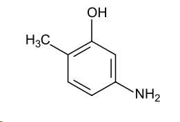

4-아미노-2-히드록시톨루엔 C H NO : 123.15
7 9
이 원료를 건조한 것은 정량할 때 5-아미노-o-크레솔(C H NO) 95.0 % 이상을 함유
7 9
한다.
성 상 이 원료는 황갈색 ∼ 갈색의 결정성가루 또는 과립으로서 냄새는 거의 없
다.
확인시험 1) 이 원료의 수용액(1 → 1000) 10 mL에 염화제이철시액 5 방울을 넣을때
액은 황갈색을 나타낸다.
2) 이 원료의 수용액(1 → 1000) 10 mL에 질산은시액 5 방울을 넣을 때 액은 회황
록색을 나타내며 흑색의 침전이 생긴다.
3) 이 원료 0.5 ｇ을 물 50 mL에 넣어 수욕상에서 가온하면서 잘 흔들어 녹이고 식
힌 다음 여과한다. 여액 3 mL에 풀푸랄ㆍ초산시액 4 방울을 넣을 때 액은 적색을 띠
는 황색을 나타내고 방치하면 적색 침전이 생긴다.
4) 이 원료 50 mg을 물 250 mL에 넣어 녹인 다음 여과한다. 여액 10 mL를 취하여
물을 넣어 100 mL로 한다. 이 액을 가지고 자외가시부흡광도측정법에 따라 흡수스펙
트럼을 측정할 때 파장 287 ± 2 nm에서 흡수극대를 나타낸다.
5) 이 원료 및 p-니트로아닐린 표준품 각 10 mg을 이소프로판올ㆍ물ㆍ강암모니아수
(9：3：1) 혼합액 1 mL에 넣어 녹인 다음 각각에 아황산수소나트륨 0.1 ｇ을 넣어
흔들어 섞어 검액 및 표준액으로 한다. 검액 및 표준액 1 μL씩을 박층판에 점적하고
이소프로필에테르ㆍ아세톤ㆍ이소프로판올혼합액(10：1：1)을 전개용매로 하여 박층크
로마토그래프법에 따라 시험한다. 발색제로 p-디메칠아미노벤즈알데히드ㆍ묽은염산
용액(1 → 200)을 뿌릴때 p-니트로아닐린 표준품에 대하여 Rs 값 0.7 부근에서 황색
반점을 나타낸다.
융 점 156 ∼ 162 ℃(제 1 법)
순도시험 1) 용해상태 이 원료 0.5 ｇ을 묽은염산 10 mL에 넣어 녹일 때 액은 황갈
색이며 거의 맑다.
2) 중금속 이 원료 1.0 ｇ을 황산 5 mL 및 질산 20 mL에 넣고 가만히 가열한다.
때때로 질산 2 ∼ 3 mL씩을 추가하여 액이 무색 ∼ 엷은 황색이 될 때까지 가열한
다. 식힌 다음 물 10 mL 및 페놀프탈레인시액 1 방울을 넣고 암모니아시액을 액이
엷은 적색이 될 때까지 천천히 넣은 다음 묽은초산 2 mL를 넣고 필요하면 여과한다.
잔류물을 물 10 mL로 씻고 여액과 씻은 액을 네슬러관에 넣어 물을 넣어 50 mL로
한다. 비교액에는 납표준액 2.0 mL를 넣는다(20 ppm 이하)
3) 철 이 원료 1.0 ｇ을 정밀하게 달아 황산 5 방울을 넣어 적시고 천천히 가열하
여 저온에서 거의 회화 또는 휘산시킨 다음 황산을 넣어 적시고 완전히 회화한다. 식
힌 다음 잔류물에 염산 0.5 mL를 넣어 수욕상에서 증발건고한다. 잔류물에 묽은염산
3 방울을 넣어 가온하고 물 25 mL를 넣어 녹인다. 이것을 검액으로 하여 시험한다.
비교액에는 철표준액 2.0 mL를 넣는다(20 ppm 이하).
4) 비소 이 원료 1.0 ｇ을 황산 2 mL 및 질산 5 mL에 넣고 가만히 가열한다. 때때
로 질산 2 ∼ 3 mL씩을 추가하여 액이 무색 ∼ 엷은 황색이 될 때까지 가열한다. 식
힌 다음 포화수산암모늄용액 15 mL를 넣고 흰 연기가 발생할 때까지 가열하고 식힌
다음 물을 넣어 10 mL로 한다. 이것을 검액으로 하여 시험한다(2 ppm 이하).
건조감량 1.0 % 이하(1.5 ｇ, 실리카겔, 4 시간)
정 량 법 이 원료를 건조하여 그 약 0.22 ｇ을 정밀하게 달아 질소정량법 제 2 법에
따라 시험한다.
0.05 mol/L 황산 1 mL = 12.315 mg C H NO
7 9
저 장 법 기밀용기
m-아미노페놀
m-Aminophenol

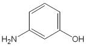

3-아미노페놀 C H NO : 109.13
6 7
이 원료를 건조한 것은 정량할 때 m-아미노페놀(C H NO) 98.0 % 이상을 함유한다.
6 7
성 상 이 원료는 흰색 ∼ 엷은 황색의 가루 또는 얇은 판상 또는 회색을 띤 흑색
의 판상의 작은 조각으로 특이한 냄새가 있다.
확인시험 1) 이 원료의 수용액(1 → 100) 10 mL에 묽은염화제이철시액 5 방울을 넣
을 때 액은 황색 ∼ 적색을 띠는 갈색을 나타낸다.
2) 이 원료 및 m-아미노페놀 표준품 각 10 mg 을 이소프로판올ㆍ물ㆍ강암모니아수
(9：3：1) 혼합액 1 mL에 넣어 녹인 다음 각각에 아황산수소나트륨 0.1 ｇ을 넣어
흔들어 섞어 검액 및 표준액으로 한다. 검액 및 표준액 1 μL씩을 박층판에 점적하고
이소프로필에텔ㆍ아세톤ㆍ이소프로판올(10：1：1) 혼합액을 전개용매로 하여 박층크
로마토그래프법에 따라 시험한다. 발색제로 p-디메칠아미노벤즈알데히드ㆍ묽은염산
용액(1 → 200)을 뿌릴때 표준품과 같은 R 값에서 황색의 반점을 나타낸다.
f
3) 이 원료의 수용액(1 → 1000) 5 mL에 묽은염산 2 mL 및 아질산나트륨시액 3
mL를 넣은 다음 2, 4-디니트로페놀용액(0.1 → 100) 0.5 mL를 넣을 때 액은 주황색
을 나타낸다.
4) 이 원료 25 mg을 물 100 mL에 넣어 녹인다. 이 액 10 mL를 취하여 물을 넣어
100 mL로 한다. 이 액을 가지고 자외가시부흡광도측정법에 따라 흡수스펙트럼을 측
정할 때 파장 282 ± 2 nm에서 흡수극대를 나타낸다.
융 점 117 ∼ 125 ℃(제 1 법)
순도시험 1) 용해상태 이 원료 0.5 ｇ을 묽은염산 10 mL에 넣어 녹일 때 액은 무색
∼ 엷은 황갈색이며 거의 맑다.
2) 중금속 이 원료 1.0 ｇ을 정밀하게 달아 황산 5 mL 및 질산 20 mL에 넣어 가
만히 가열한다. 때때로 질산 2 ∼ 3 mL씩을 추가하여 액이 무색 ∼ 엷은 황색이 될
때까지 가열한다. 식힌 다음 물 10 mL 및 페놀프탈레인시액 1 방울을 넣고 암모니아
시액을 액이 엷은 적색이 될 때까지 천천히 넣고 묽은초산 2 mL를 넣고 필요하면
여과하여 물 10 mL로 씻고 여액과 씻은 액을 네슬러관에 넣어 물을 넣어 50 mL로
한다. 이 액을 검액으로 하여 시험한다. 비교액에는 납표준액 2.0 mL를 넣는다(20
ppm 이하).
3) 철 이 원료 1.0 ｇ을 정밀하게 달아 황산 5 방울을 넣어 적시고 천천히 가열하
여 저온에서 거의 회화 또는 휘산시킨 다음에 황산을 넣어 적시고 완전히 회화한다.
식힌 다음 잔류물에 염산 0.5 mL를 넣어 수욕상에서 증발건고한다. 식힌 다음 묽은
염산 3 방울을 넣어 가온하고 물을 넣어 25 mL로 한다. 이것을 검액으로 하여 철시
험법에 따라 시험한다. 비교액에는 철표준액 3.0 mL를 넣는다(30 ppm 이하).
4) 비소 이 원료 1.0 ｇ을 정밀하게 달아 황산 2 mL 및 질산 5 mL에 넣어 가만히
가열한다. 때때로 질산 2 ∼ 3 mL씩을 추가하여 액의 색이 무색 ∼ 엷은 황색이 될
때까지 가열한다. 식힌 다음 포화수산암모늄용액 15 mL를 넣어 흰연기가 발생할 때
까지 가열하고 식힌 다음 물을 넣어 10 mL로 한다. 이것을 검액으로 하여 시험한다
(2 ppm 이하).
건조감량 0.5 % 이하(1.5 ｇ, 실리카겔, 4 시간)
강열잔분 0.1 % 이하(2 ｇ)
정 량 법 이 원료를 건조하고 약 0.19 ｇ을 정밀하게 달아 질소정량법 제 2 법에 따
라 시험한다.
0.05 mol/L 황산 1 mL = 10.913 mg C H NO
6 7
저 장 법 기밀용기
o-아미노페놀
o-Aminophenol

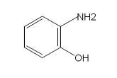

2-아미노페놀 C H NO : 109.13
6 7
이 원료를 건조한 것은 정량할 때 o-아미노페놀(C H NO) 95.0 % 이상을 함유한다.
6 7
성 상 이 원료는 엷은 황갈색 ∼ 갈색 또는 녹색을 띠는 갈색의 가루로서 냄새는
없거나 약간 특이한 냄새가 있다.
확인시험 1) 이 원료의 수용액(1 → 2000) 10 mL에 염화제이철시액 5 방울을 넣을
때 액은 적갈색 ∼ 짙은 갈색으로 변한다.
2) 이 원료 및 p-니트로아닐린 표준품 각 10 mg 을 이소프로판올ㆍ물ㆍ강암모니아
수(9：3：1) 혼합액 1 mL에 넣어 녹인 다음 각각에 아황산수소나트륨 0.1 ｇ을 넣어
흔들어 섞어 검액 및 표준액으로 한다. 검액 및 표준액 1 μL씩을 박층판에 점적하고
이소프로필에테르ㆍ아세톤ㆍ이소프로판올혼합액(10：1：1)을 전개용매로 하여 박층크
로마토그래프법에 따라 시험한다. 발색제로 p-디메칠아미노벤즈알데히드ㆍ묽은염산
용액(1 → 200)을 뿌릴때 p-니트로아닐린 표준품에 대하여 Rs 값 1.0 부근에서 황색
의 반점을 나타낸다.
3) 이 원료의 수용액(1 → 2000) 10 mL에 질산은시액 5 방울을 넣을 때 녹색을 띤
회흑색으로 변한다.
4) 이 원료 25 mg을 물 100 mL에 넣어 녹이고 이 액 10 mL를 취하여 물을 넣어
100 mL로 한다. 이 액을 가지고 자외가시부흡광도측정법에 따라 흡수스펙트럼을 측
정할 때 파장 282 ± 2 nm에서 흡수극대를 나타낸다.
융 점 167 ∼ 175 ℃(제 1 법)
순도시험 1) 용해상태 이 원료 0.5 ｇ을 묽은염산 10 mL에 넣어 녹일 때 액은 엷은
갈색 ∼ 갈색 또는 엷은 녹색 ∼ 엷은 암록색을 나타내며 맑다.
2) 철 이 원료 1.0 ｇ을 정밀하게 달아 황산 5 방울을 넣어 적시고 천천히 가열하
여 저온에서 거의 회화 또는 휘산시킨 다음에 황산을 넣어 적시고 완전히 회화한다.
식힌 다음 잔류물에 염산 0.5 mL를 넣어 수욕상에서 증발건고한 다음 묽은염산 3 방
울을 넣어 가온하고 물을 넣어 25 mL로 한다. 이것을 검액으로 하여 철시험법에 따
라 시험한다. 비교액에는 철표준액 2.0 mL를 넣는다(20 ppm 이하).
3) 중금속 이 원료 1.0 ｇ을 정밀하게 달아 황산 5 mL 및 질산 20 mL에 넣어 가
만히 가열한다. 때때로 질산 2 ∼ 3 mL씩을 추가하여 액이 무색 ∼ 엷은 황색이 될
때까지 가열한다. 식힌 다음 물 10 mL 및 페놀프탈레인시액 1 방울을 넣고 암모니아
시액을 액이 엷은 적색이 될때까지 천천히 넣고 묽은초산 2 mL를 넣고 필요하면 여
과하여 물 10 mL로 씻고 여액과 씻은 액을 네슬러관에 넣어 물을 넣어 50 mL로 한
다. 이 액을 검액으로 하여 시험한다. 단, 비교액에는 납표준액 2.0 mL를 넣는다(20
ppm 이하).
4) 비소 이 원료 1.0 ｇ을 정밀하게 달아 황산 2 mL 및 질산 5 mL에 넣어 가만히
가열한다. 때때로 질산 2 ∼ 3 mL씩을 추가하여 액의 색이 무색 ∼ 엷은 황색이 될
때까지 가열한다. 식힌 다음 포화수산암모늄용액 15 mL를 넣어 흰 연기가 발생할 때
까지 가열한다. 식힌 다음 물을 넣어 10 mL로 한다. 이것을 검액으로 하여 시험한다
(2 ppm 이하).
건조감량 0.5 % 이하(1.5 ｇ, 실리카겔, 4 시간)
강열잔분 2.0 % 이하(2 ｇ)
정 량 법 이 원료를 건조하고 약 0.19 ｇ을 정밀하게 달아 질소정량법 제 2 법에 따
라 시험한다.
0.05 mol/L 황산 1 mL = 10.913 mg C H NO
6 7
저 장 법 기밀용기
p-아미노페놀
p-Aminophenol

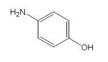

4-아미노페놀 C H NO : 109.13
6 7
이 원료를 건조한 것은 정량할 때 p-아미노페놀(C H NO) 95.0 % 이상을 함유한다.
6 7
성 상 이 원료는 흰색 ∼ 엷은 회색 또는 엷은 자색 ∼ 자갈색의 결정성가루 또는
엷은 자색 및 엷은 갈색의 가루로서 냄새는 거의 없거나 또는 약간 특이한 냄새가
있다.
확인시험 1) 이 원료의 수용액(1 → 2000) 10 mL에 염화제이철시액 5 방울을 넣을 때
액은 적자색 ∼ 갈색을 나타낸다.
2) 이 원료 0.1 ｇ을 인텅그스텐산시액(1 → 100) 2 mL 및 탄산나트륨시액(1 → 10)
1 mL에 넣을 때 액은 적자색 ∼ 청자색을 나타낸다.
3) 이 원료의 수용액(0.05 → 100) 5 mL에 니트로프루싯나트륨시액 2 mL를 넣을 때
액은 어두운 녹색을 나타낸다.
4) 이 원료 25 mg을 정밀하게 달아 물 100 mL에 녹이고 이 액 10 mL를 취하여 물
을 넣어 100 mL 로 한다. 이 액을 가지고 자외가시부흡광도측정법에 따라 흡수스펙
트럼을 측정할 때 파장 297 ± 2 nm에서 흡수극대를 나타낸다.
5) 이 원료 및 p-아미노페놀 표준품 각 10 mg 을 이소프로판올ㆍ물ㆍ강암모니아수
(9：3：1) 혼합액 1 mL에 넣어 녹인다음 각각에 아황산수소나트륨 0.1 ｇ을 넣어 흔
들어 섞어 검액 및 표준액으로 한다. 검액 및 표준액 1 μL씩을 박층판상에 점적하고
이소프로필에텔ㆍ아세톤ㆍ이소프로판올(10：1：1) 혼합액을 전개용매로 하여 박층크
로마토그래프법에 따라 시험한다. 발색제로 p-디메칠아미노벤즈알데히드ㆍ묽은염산
용액(1 → 200)을 뿌릴 때 표준품과 같은 R 값에서 황색의 반점이 나타난다.
f
융 점 180 ∼ 188 ℃(제 1 법)
순도시험 1) 용해상태 이 원료 0.5 ｇ을 묽은염산 20 mL에 넣어 녹일 때 액은 맑다.
2) 중금속 이 원료 1.0 ｇ을 정밀하게 달아 황산 5 mL 및 질산 20 mL에 넣어 가
만히 가열한다. 때때로 질산 2 ∼ 3 mL씩을 추가하여 액이 무색 ∼ 엷은 황색이 될
때까지 가열하고 식힌 다음 물 10 mL 및 페놀프탈레인시액 1 방울을 넣고 암모니아
시액을 액이 엷은 적색이 될때까지 천천히 넣고, 묽은초산 2 mL를 넣고 필요하면 여
과하여 물 10 mL로 씻고 여액과 씻은 액을 네슬러관에 넣어 물을 넣어 50 mL로 한
다. 이것을 검액으로 하여 시험한다. 비교액에는 납표준액 2.0 mL를 넣는다(20 ppm
이하).
3) 철 이 원료 0.4 ｇ을 정밀하게 달아 황산 5 방울을 넣어 적시고 천천히 가열하
여 저온에서 회화 또는 휘산시킨 다음 다시 황산을 넣어 적시고 완전히 회화한다. 식
힌 다음 잔류물에 염산 0.5 mL를 넣어 수욕상에서 증발건고한 다음 묽은염산 3 방울
을 넣어 가온하고 물 25 mL를 넣어 녹인다. 이것을 검액으로 하여 철시험법에 따라
시험한다. 비교액에는 철표준액 2.0 mL 를 넣는다(50 ppm 이하).
4) 비 소 이 원료 1.0 ｇ을 정밀하게 달아 황산 2 mL 및 질산 5 mL에 넣어 가만
히 가열한다. 때때로 질산 2 ∼ 3 mL씩을 추가하여 액이 무색 ∼ 엷은 황색이 될 때
까지 가열한다. 식힌 다음 포화수산암모늄액 15 mL를 넣고 흰 연기가 발생할 때까지
가열한다. 식힌 다음 물을 넣어 10 mL로 한다. 이것을 검액으로 하여 시험한다(2
ppm 이하).
건조감량 5.0 % 이하(1 ｇ, 실리카겔, 4 시간)
강열잔분 1.0 % 이하(2 ｇ)
정 량 법 이 원료를 건조하고 약 0.19 ｇ을 정밀하게 달아 질소정량법 제 2 법에 따
라 시험한다.
0.05 mol/L 황산 1 mL = 10.913 mg C H NO
6 7
저 장 법 기밀용기
염산 2,4-디아미노페녹시에탄올
2,4-Diaminophenoxyethanol Hydrochloride

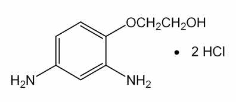

2,4-디아미노페녹시에탄올염산염 C H N O 2HCl : 241.12
8 12 2 2ㆍ
이 원료를 건조한 것은 정량할 때 염산 2,4-디아미노페녹시에탄올(C H N O 2HCl)
8 12 2 2ㆍ
95.0 % 이상을 함유한다.
성 상 이 원료는 엷은 회색 ∼ 엷은 청색의 가루로 냄새는 없다.
확인시험 1) 이 원료의 수용액(1 → 100) 10 mL에 질산은시액 5 방울을 넣을 때 액
은 백탁된다.
2) 이 원료의 수용액(1 → 100) 3 mL에 풀푸랄ㆍ초산시액 4 방울을 넣을 때 액은
등적색을 나타낸다.
3) 이 원료 20 mg을 물 100 mL에 넣어 녹이고 그 10 mL를 취하여 물을 넣어 100
mL로 한다. 이 액을 가지고 자외가시부흡광광도법에 따라 흡수스펙트럼을 측정할 때
파장 286 ± 2 nm 및 238 ± 2 nm에서 흡수극대를 나타낸다.
순도시험 1) 용해상태 이 원료 0.5 ｇ을 물 10 mL에 넣어 녹일 때 액은 엷은 적색
∼ 갈색이며 맑다.
2) 철 이 원료 0.5 ｇ을 달아 황산 5 방울을 넣어 적시고 천천히 가열한다. 되도록
저온에서 거의 회화 또는 휘산시킨 다음 다시 황산으로 적시고 완전히 회화한다. 식
힌 다음 잔류물에 염산 0.5 mL 를 넣어 수욕상에서 증발건고한 다음 묽은염산 3 방
울을 넣어 가온하고 물 25 mL를 넣어 녹인다. 이것을 검액으로 하여 시험한다. 비교
액에는 철표준액 2.0 mL를 넣는다(40 ppm 이하).
3) 에텔가용물 이 원료 약 1 ｇ을 정밀하게 달아 에텔 50 mL에 넣고 환류냉각기
를 달아 수욕상에서 때때로 흔들어 섞으면서 1 시간 끓인다. 뜨거울 때 미리 질량을
단 플라스크에 유리여과기(G )로 여과한다. 잔류물을 에텔 20 mL로 씻고, 씻은 액
3
및 여액을 합하여 수욕상에서 날려보낸 다음 105 ℃에서 30 분간 건조하여 질량을
정밀하게 단다(1 % 이하).
4) 중금속 이 원료 1.0 ｇ을 황산 5 mL 및 질산 20 mL에 넣어 가만히 가열한다.
때때로 질산 2 ∼ 3 mL씩을 추가하여 액이 무색 ∼ 엷은 황색이 될 때까지 가열한
다. 식힌 다음 물을 넣어 10 mL로 한다. 이것을 검액으로 하여 시험한다. 비교액에는
납표준액 2.0 mL를 사용한다(20 ppm 이하).
5) 비소 이 원료 1.0 ｇ을 황산 2 mL 및 질산 5 mL에 넣어 가만히 가열한다. 때때
로 질산 2 ∼ 3 mL씩을 추가하여 액이 무색 ∼ 엷은 황색이 될 때까지 가열한다. 식
힌 다음 포화수산암모늄용액 15 mL를 넣어 흰 연기가 발생할 때까지 가열한다. 식힌
다음 물을 넣어 10 mL 한다. 이것을 검액으로 하여 시험한다(2 ppm 이하).
건조감량 1.0 % 이하(1 ｇ, 105 ℃, 2 시간)
강열잔분 1.0 % 이하(2 ｇ)
정 량 법 이 원료를 건조하고, 약 0.2 ｇ을 정밀하게 달아 질소정량법 제 2 법에 따
라 시험한다.
0.05 mol/L 황산 1 mL = 12.06 mg C H N O 2HCl
8 12 2 2 ㆍ
저 장 법 기밀용기
염산 2,4-디아미노페놀
2,4-Diaminophenol Hydrochloride

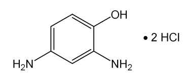

2,4-디아미노페놀염산염
염산 4-히드록시-m-페닐렌디아민 C H N Oㆍ2HCl :
6 8 2
197.06
이 원료를 건조한 것은 정량할 때 염산 2,4-디아미노페놀(C H N Oㆍ2HCl) 93.0 %
6 8 2
이상을 함유한다.
성 상 이 원료는 엷은 녹색의 가루 또는 회록색의 결정성 가루로서 냄새는 거의
없다.
확인시험 1) 이 원료의 수용액(1 → 1000) 5 mL에 염화제이철시액 5 방울을 넣을 때
액은 적색을 나타낸다.
2) 이 원료의 수용액(1 → 1000) 5 mL에 질산은시액 5 방울을 넣을 때 백탁이 되고
잠시 후에 적자색으로 변하여 침전이 생긴다.
3) 이 원료의 수용액(1 → 1000) 5 mL에 풀푸랄ㆍ초산시액 4 방울을 넣을 때 액은
황갈색을 나타낸다.
4) 이 원료 20 mg을 물 100 mL에 넣어 녹인다. 이 액 10 mL를 취하여 물을 넣어
100 mL로 한다. 이 액을 가지고 자외가시부흡광도측정법에 따라 흡수스펙트럼을 측
정할 때 파장 233 ± 2 nm 및 287 ± 2 nm에서 흡수극대를 나타낸다.
순도시험 1) 용해상태 이 원료 0.1 ｇ을 물 10 mL에 넣어 녹일 때 액은 엷은 적자
색이며 맑다.
2) 에텔가용물 이 원료 약 1 ｇ을 정밀하게 달아 에텔 50 mL에 넣고 환류냉각기
를 달아 수욕상에서 때때로 흔들어 섞으면서 1 시간 끓인다. 뜨거울 때 미리 질량을
단 플라스크에 유리여과기(G )로 여과한다. 잔류물을 에텔 20 mL로 씻고, 씻은 액과
3
여액을 합하여 수욕상에서 증발건고하고 105 ℃에서 30 분간 건조시켜 질량을 단다
(0.3 % 이하).
3) 철 이 원료 0.5 ｇ을 달아 황산 5 방울을 넣어 적시고 천천히 가열하여 저온에
서 거의 회화 또는 휘산시킨 다음 황산을 넣어 적시고 완전히 회화한다. 식힌 다음
잔류물에 염산 0.5 mL를 넣고 수욕상에서 증발건고한다. 잔류물에 묽은염산 3 방울
을 넣고 가온하여 물 25 mL를 넣어 녹인다. 이것을 검액으로 하여 시험한다. 비교액
에는 철표준액 2.0 mL를 넣는다(40 ppm 이하).
4) 중금속 이 원료 1.0 ｇ을 달아 황산 5 mL 및 질산 20 mL에 넣어 가만히 가열
한다. 때때로 질산 2 ∼ 3 mL씩을 추가하여 액이 무색 ∼ 엷은 황색이 될 때까지 가
열을 계속한다. 식힌 다음 물 10 mL 및 페놀프탈레인시액 1 방울을 넣고, 액이 약간
홍색을 나타낼 때까지 암모니아시액을 넣는다. 묽은초산 2 mL를 넣어 필요하면 여과
하고 잔류물을 물 10 mL로 씻은 다음 씻은 액을 여액에 합하고 물을 넣어 50 mL로
한다. 이것을 검액으로 하여 시험한다. 비교액에는 납표준액 3.0 mL를 넣는다(30
ppm 이하).
5) 비소 이 원료 1.0 ｇ을 황산 2 mL 및 질산 5 mL에 넣어 가만히 가열한다. 때때
로 질산 2 ∼ 3 mL씩을 추가하여 액이 무색 ∼ 엷은 황색이 될 때까지 가열한다. 식
힌 다음 포화수산암모늄용액 15 mL 를 넣고 흰 연기가 발생할 때가지 가열한다. 식
힌 다음 물을 넣어 10 mL로 한다. 이것을 검액으로 하여 시험한다(2 ppm 이하).
건조감량 0.5 % 이하(1 ｇ, 105 ℃, 2 시간)
강열잔분 0.2 % 이하(1 ｇ)
정 량 법 이 원료를 건조하고 약 0.18 ｇ을 정밀하게 달아 질소정량법 제 2 법에 따
라 시험한다.
0.05 mol/L 황산 1 mL = 9.853 mg C H N Oㆍ2HCl
6 8 2
저 장 법 기밀용기
염산 m-페닐렌디아민
1,3-Benzenediamine Hydrochloride

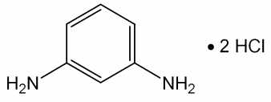

m-페닐렌디아민염산염
염산 1,3-페닐렌디아민 C H N 2HCl :
6 8 2ㆍ
181.06
이 원료를 건조한 것은 정량할 때 염산 m-페닐렌디아민(C H N 2HCl) 95.0 % 이상
6 8 2ㆍ
을 함유한다.
성 상 이 원료는 흰색 ∼ 엷은 적색 또는 엷은 자색의 결정성가루로서 냄새는 거
의 없다.
확인시험 1) 이 원료의 수용액(1 → 1000) 5 mL에 질산은시액 5 방울을 넣을 때 흰
색의 침전이 생긴다.
2) 이 원료의 수용액(1 → 1000) 3 mL에 풀푸랄ㆍ초산시액 4 방울을 넣을 때 액은
황색을 띠는 적색을 나타낸다.
3) 이 원료 및 염산 m-페닐렌디아민 표준품 각각 10 mg을 이소프로판올ㆍ물ㆍ강암
모니아수(9：3：1) 혼합액 1 mL씩에 넣어 녹인 다음 각각에 아황산수소나트륨 0.1
ｇ을 넣어 흔들어 섞는다. 이 액을 검액 및 표준액으로 한다. 검액 및 표준액 1 μL씩
을 박층판에 점적하고 이소프로필에텔ㆍ아세톤ㆍ이소프로판올(10：1：1) 혼합액을 전
개용매로 하여 박층크로마토그래프법에 따라 시험한다. 발색제로 p-디메칠아미노벤
즈알데히드ㆍ묽은염산용액(0.5 → 100)을 뿌릴 때 염산 m-페닐렌디아민 표준품과 같
은 R 값에 단일 적색을 띠는 황색의 반점을 나타낸다.
f
4) 이 원료 50 mg을 물에 넣어 녹여 100 mL로 한다. 이 액 1 mL를 취하여 물을
넣어 100 mL로 한다. 이 액을 가지고 흡수스펙트럼을 측정할 때 파장 232 ± 2 nm
및 284 ± 2 nm에서 흡수극대를 나타낸다.
순도시험 1) 용해상태 이 원료 1.0 ｇ을 물 10 mL에 넣어 녹일 때 액은 엷은 황갈
색 ∼ 엷은 갈색으로 되며 맑다.
2) 에텔가용물 이 원료 약 1 ｇ을 정밀하게 달아 에텔 50 mL를 넣어 환류냉각기
를 달아 수욕상에서 때때로 흔들어 섞으면서 1 시간 끓인다. 뜨거울 때 미리 질량을
단 플라스크에 유리여과기(G )로 여과한다. 잔류물을 에텔 20 mL로 씻고, 씻은 액과
3
여액을 합하여 수욕상에서 증발건고한 다음 105 ℃에서 30 분간 건조시켜 질량을 단
다(1.0 % 이하).
3) 철 이 원료 1.0 ｇ을 정밀하게 달아 황산 5 방울을 넣어 적시고 천천히 가온하
여 저온에서 거의 회화 또는 휘산시킨 다음 황산을 넣어 적시고 완전히 회화한다. 식
힌 다음 잔류물에 염산 0.5 mL를 넣어 수욕상에서 증발건고한다. 잔류물에 묽은염산
3 방울을 넣고 가온하여 물 25 mL로 녹인다. 이것을 검액으로 하여 시험한다. 비교
액에는 철표준액 2.0 mL를 넣는다(20 ppm 이하).
4) 중금속 이 원료 1.0 ｇ을 황산 5 mL 및 질산 20 mL에 넣어 가만히 가열한다.
때때로 질산 2 ∼ 3 mL씩을 추가하여 액이 무색 ∼ 엷은 황색이 될 때까지 가열한
다. 식힌 다음 물 10 mL 및 페놀프탈레인시액 1 방울을 넣어 액이 거의 홍색을 나타
낼 때까지 암모니아시액을 넣는다. 묽은 초산 2 mL를 넣고, 필요하면 여과하고 잔류
물을 물 10 mL로 씻은 다음 씻은 액은 여액과 합하고 물을 넣어 50 mL로 한다. 이
것을 검액으로 하여 시험한다. 비교액에는 납표준액 2.0 mL를 넣는다(20 ppm 이하).
5) 비소 이 원료 1.0 ｇ을 황산 5 mL 및 질산 20 mL에 넣고 가만히 가열한다. 때
때로 질산 2 ∼ 3 mL씩을 추가하여 액이 무색 ∼ 엷은 황색이 될 때까지 가열한다.
식힌 다음 포화수산암모늄용액 15 mL를 넣고 흰 연기가 발생할 때까지 가열한 다음
식히고 물을 넣어 10 mL로 한다. 이것을 검액으로 하여 시험한다.(2 ppm 이하).
건조감량 0.2 % 이하(1.5 ｇ, 실리카겔, 4 시간)
강열잔분 0.2 % 이하(2 ｇ)
정 량 법 이 원료를 건조하고 약 0.16 ｇ을 정밀하게 달아 질소정량법 제 2 법에 따
라 시험한다.
0.05 mol/L 황산 1 mL = 9.053 mg C H N 2HCl
6 8 2ㆍ
저 장 법 기밀용기
염산 p-페닐렌디아민
p-Phenylenediamine Hydrochloride

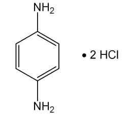

p-페닐렌디아민염산염
염산 1,4-페닐렌디아민 C H N 2HCl :
6 8 2ㆍ
181.06
이 원료를 건조한 것은 정량할 때 염산 p-페닐렌디아민(C H N 2HCl) 95.0 % 이상
6 8 2ㆍ
을 함유한다.
성 상 이 원료는 흰색 또는 엷은갈색의 결정성가루로서 냄새는 거의 없다.
확인시험 1) 이 원료의 수용액(1 → 100) 5 mL에 질산은시액 5 방울을 넣을 때 액은
백탁하고, 엷은 회색 ∼ 엷은 자색침전이 생기고 이것을 가열하면 액의 색은 엷은 갈
색이 된다.
2) 이 원료의 수용액(1 → 100) 3 mL에 풀푸랄ㆍ초산시액 4 방울을 넣을 때 액은
황색을 띠는 적색을 나타낸다.
3) 이 원료 및 p-페닐렌디아민 표준품 각 10 mg을 이소프로판올ㆍ물ㆍ강암모니아수
(9：3：1) 혼합액 1 mL에 넣어 녹인 다음 각각에 아황산수소나트륨 0.1 ｇ을 넣어
흔들어 섞어 검액 및 표준액으로 한다. 검액 및 표준액 1 μL씩을 박층판에 점적하고
이소프로필에텔ㆍ아세톤ㆍ이소프로판올(10：1：1) 혼합액을 전개용매로 하여 박층크
로마토그래프법에 따라 시험한다. 발색제로 p-디메칠아미노벤즈알데히드ㆍ묽은염산
용액(1 → 100)을 뿌릴 때 표준품과 같은 R 값에서 황색을 띠는 적색 ∼ 적색의 반
f
점을 나타낸다.
4) 이 원료 50 mg을 물에 넣어 녹여 100 mL로 한다. 이 액 1 mL를 취하여 물을
넣어 100 mL로 한다. 이 액을 가지고 자외가시부흡광도측정법에 따라 흡수스펙트럼
을 측정할 때 파장 237 ± 2 nm에서 흡수극대를 나타낸다.
순도시험 1) 용해상태 이 원료 0.5 ｇ을 묽은염산 50 mL에 넣어 녹일 때 액은 무색
∼ 엷은 적색으로 되며 맑다.
2) 에텔가용물 이 원료 약 1 ｇ을 정밀하게 달아 에텔 50 mL에 넣어 환류냉각기
를 달아 수욕상에서 때때로 흔들어 섞으면서 1 시간 끓인다. 뜨거울 때 미리 질량을
단 플라스크에 유리여과기(G )로 여과한다. 잔류물을 에텔 20 mL로 씻고, 씻은 액
3
및 여액을 합하여 수욕상에서 증발건고하고 105 ℃에서 30 분간 건조시켜 질량을 단
다(1.0 % 이하).
3) 철 이 원료 1.0 ｇ을 달아 황산 5 방울을 넣어 적시고 천천히 가열하여 저온에
서 거의 회화 또는 휘산시킨 다음 황산을 넣어 적시고 완전히 회화시킨다. 식힌 다음
잔류물에 염산 0.5 mL를 넣고 수욕상에서 증발건고 시킨다. 잔류물은 묽은 염산 3
방울을 넣어 가온하고 물 25 mL를 넣어 녹인다. 이것을 검액으로 하여 시험한다. 비
교액에는 철표준액 2.0 mL를 넣는다(20 ppm 이하).
4) 중금속 이 원료 1.0 ｇ을 달아 황산 5 mL 및 질산 20 mL에 넣고 가만히 가열
한다. 때때로 질산 2 ∼ 3 mL씩을 추가하여 액이 무색 ∼ 엷은 황색이 될 때까지 가
열한다. 식힌 다음 물 10 mL 및 페놀프탈레인시액 1 방울을 넣어 액이 거의 홍색을
나타낼 때까지 암모니아시액을 넣는다. 다음에 묽은초산 2 mL를 넣고 필요하면 여과
하고 잔류물을 물 10 mL로 씻고 씻은 액을 여액과 합하고 물을 넣어 50 mL로 한다.
이것을 검액으로 하여 시험한다. 단 비교액에는 납표준액 2.0 mL를 넣는다(20 ppm
이하).
5) 비소 이 원료 1.0 ｇ을 황산 2 mL 및 질산 5 mL에 넣어 가만히 가열한다. 때때
로 질산 2 ∼ 3 mL씩을 추가하여 액이 무색 ∼ 엷은 황색이 될 때까지 가열한다. 식
힌 다음 포화수산암모늄용액 15 mL를 넣어 흰연기가 발생할 때까지 가열한다. 식힌
다음 물을 넣어 10 mL로 한다. 이것을 검액으로 하여 시험한다(2 ppm 이하).
건조감량 0.2 % 이하(1.5 ｇ, 실리카겔, 4 시간)
강열잔분 0.2 % 이하(2 ｇ)
정 량 법 이 원료를 건조하고 약 0.16 ｇ을 정밀하게 달아 질소정량법 제 2법에 따라
시험한다.
0.05 mol/L 황산 1 mL = 9.053 mg C H N 2HCl
6 8 2ㆍ
저 장 법 기밀용기
염산 톨루엔-2,5-디아민
Toluene-2, 5-diamine Hydrochloride

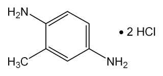

톨루엔-2,5-디아민염산염
염산 p-톨루엔디아민
염산 메칠-p-페닐렌디아민
염산 메칠-2, 5-페닐렌디아민
염산 2-메칠-p-페닐렌디아민
염산 o-메칠-p-페닐렌디아민 C H N 2HCl : 195.09
7 10 2ㆍ
이 원료를 건조한 것은 정량할 때 염산 톨루엔-2, 5-디아민(C H N 2HCl) 95.0 %
7 10 2ㆍ
이상을 함유한다.
성 상 이 원료는 엷은 자색 ∼ 엷은 적자색의 결정성가루로서 약간 특이한 냄새가
있다.
확인시험 1) 이 원료의 수용액(1 → 100) 10 mL에 질산은시액 5 방울을 넣을 때 백
탁이 된다.
2) 이 원료의 수용액(1 → 100) 3 mL에 풀푸랄 ㆍ초산시액 4 방울을 넣을 때 액은
황색을 띠는 적색을 나타낸다.
3) 이 원료 및 m-페닐렌디아민 표준품 각각 10 mg을 이소프로판올ㆍ물ㆍ강암모니
아수(9：3：1) 혼합액 1 mL씩에 넣어 녹인 다음, 각각에 아황산수소나트륨 0.1 ｇ을
넣어 흔들어 섞는다. 이 액을 검액 및 표준액으로 한다. 검액 및 표준액 1 μL씩을 박
층판에 점적하고 이소프로필에텔ㆍ아세톤ㆍ이소프로판올(10：1：1) 혼합액을 전개용
매로 하여 박층크로마토그래프법에 따라 시험한다. 발색제로 p-디메칠아미노벤즈알
데히드ㆍ묽은염산용액(0.5 → 100)을 뿌릴 때 m-페닐렌디아민 표준품에 대하여 Rs
값 0.9 부근에서 단일 황색 ∼ 황색을 띠는 적색의 반점을 나타낸다.
4) 이 원료 15 mg을 물 100 mL에 넣어 녹이고 이 액 10 mL 를 취하여 물을 넣어
100 mL로 한다. 이 액을 가지고 자외가시부흡광도측정법에 따라 흡수스펙트럼을 측
정할 때 파장 235 ± 2 nm 및 286 ± 2 nm에서 흡수극대를 나타낸다.
순도시험 1) 용해상태 이 원료 0.1 ｇ을 묽은 염산 10 mL에 넣어 녹일 때 액은 엷
은 적자색이며 맑다.
2) 철 이 원료 1.0 ｇ을 달아 황산 5 방울을 넣어 적시고 천천히 가열하여 저온에
서 회화 또는 휘산시킨 다음 다시 황산을 넣어 적시고 완전히 회화시킨다. 식힌 다음
잔류물에 염산 0.5 mL를 넣고 수욕상에서 증발건고한 다음 묽은염산 3 방울을 넣어
가온하고 물 25 mL를 넣어 녹인다. 이것을 검액으로 하여 시험한다. 비교액에는 철
표준액 2.0 mL를 넣는다(20 ppm 이하).
3) 에텔가용물 이 원료 약 1 ｇ을 정밀하게 달아 에텔 50 mL에 넣고 환류냉각기
를 달아 수욕상에서 때때로 흔들어 섞으면서 1 시간 끓인다. 뜨거울 때 미리 질량을
단 플라스크에 유리여과기(G )로 여과한다. 잔류물을 에텔 20 mL로 씻고, 씻은 액과
3
여액을 합하여 수욕상에서 증발건고하고 105 ℃에서 30 분간 건조시켜 질량을 단다
(2.0 % 이하).
4) 중금속 이 원료 1.0 ｇ을 달아 황산 5 mL 및 질산 20 mL에 넣어 가만히 가열
한다. 때때로 질산 2 ∼ 3 mL씩을 추가하여 액이 무색 ∼ 엷은 황색이 될 때까지 가
열하고 식힌 다음 물 10 mL 및 페놀프탈레인시액 1 방울을 넣어 액이 거의 홍색을
나타낼 때까지 암모니아시액을 넣는다. 다음에 묽은초산 2 mL를 넣고 필요하면 여과
하고 잔류물을 물 10 mL로 씻어 씻은 액은 여액과 합하고 물을 넣어 50 mL로 한다.
이것을 검액으로 하여 시험한다. 비교액에는 납표준액 2.0 mL를 넣는다(20 ppm 이
하).
5) 비소 이 원료 1.0 ｇ을 달아 황산 2 mL 및 질산 5 mL에 넣어 가만히 가열한다.
때때로 질산 2 ∼ 3 mL씩을 추가하여 액이 무색 ∼ 엷은 황색이 될 때까지 가열하
고 식힌 다음 포화수산암모늄용액 15 mL를 넣어 흰연기가 발생할 때까지 가열한다.
식힌 다음 물을 넣어 10 mL로 한다. 이것을 검액으로 하여 시험한다(2 ppm 이하).
건조감량 1.0 % 이하(1 ｇ, 105 ℃, 2 시간)
강열잔분 1.5 % 이하(2 ｇ)
정 량 법 이 원료를 건조하고 약 0.17 ｇ을 정밀하게 달아 질소정량법 제 2 법에 따
라 시험한다.
0.05 mol/L 황산 1 mL = 9.755 mg C H N 2HCl
7 10 2ㆍ
저 장 법 기밀용기
염산 히드록시프로필비스(N-히드록시에칠-p-페닐렌디아민)
Hydroxypropyl bis(N-hydroxyethyl-p-phenylenediamine)
Hydrochloride

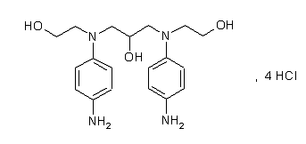

히드록시프로필비스(N-히드록시에틸-p-페닐렌디아민염산염
C H N O 4HCl : 506.30
19 28 4 3ㆍ
이 원료는 정량할 때 환산한 무수물에 대하여 염산 히드록시프로필비스(N-히드록시
에칠-p-페닐렌디아민)(C H N O 4HCl : 506.30) 98.0 ∼ 101.0 % 이상을 함유한다.
19 28 4 3ㆍ
성 상 이 원료는 연한 회색 ∼ 회색을 띠는 자주빛의 가루로 약한 특이한 냄새가 있다.
확인시험 1) 이 원료의 수용액(1 → 1000) 10 mL에 염화제이철시액 1 방울을 넣을
때 엷은 갈색 ∼ 검은색을 나타낸다.
2) 이 원료 약 0.01 g을 정밀하게 달아 물을 넣어 녹여 100 mL로 하고 이 액 1 mL
를 정확하게 취하여 다시 물을 가해 100 mL로 한다. 이 액을 가지고 자외가시부흡
광도측정법에 따라 흡광도를 측정할 때 파장 258 ± 2 nm에서 흡수극대를 나타낸
다.
3) 이 원료를 가지고 적외부스펙트럼측정법 브롬화칼륨정제법에 따라 시험할때 파
수 3371 cm-1, 2844 cm-1, 2572 cm-1, 1635 cm-1, 1611 cm-1, 1585 cm-1, 1516 cm-1,
1492 cm-1, 824 cm-1 부근에서 흡수를 나타낸다.
순도시험 1) 용해상태 이 원료 0.1 g에 에탄올 10 mL를 넣고 녹일 때 그 액은 거
의 맑으며, 무색에서 옅은 갈색을 띤다.
2) 철 이 원료 1.0 g을 달아 제 2 법에 따라 검액을 만들고 조작법 A법에 따라 시
험한다. 비교액에는 철표준액 3.0 mL를 넣는다(30 ppm 이하).
3) 중금속 이 원료 1.0 g을 달아 제 2 법에 따라 조작하여 시험한다. 비교액에는
납표준액 2.0 mL를 넣는다(20 ppm 이하).
4) 비소 이 원료 1.0 g을 달아 제 3 법에 따라 조작하여 시험한다(2 ppm 이하).
5) 에탄올, 이소프로판올 이 원료 약 1.0 g을 정밀하게 달아 물 90 mL를 넣어 녹
인 다음 2 mol/L 수산화나트륨시액 5 mL를 가한 다음 물을 넣어 100 mL로 하여
검액으로 한다. 따로 에탄올표준액 5 종류와 이소프로판올표준액 5 종류(5 μg/mL,
10 μg/mL, 20 μg mL, 40 μg/mL, 60 μg/mL)를 조제하여 표준액으로 한다. 각각의
표준액 2 μL씩을 가지고 다음의 조건으로 기체크로마토그래프법에 따라 시험하여
각 표준액의 에탄올과 이소프로판올의 피크면적을 구하고 에탄올과 이소프로판올의
양(각 g/100 mL)에 대한 피크면적을 구하여 각각에 대한 두개의 검량선을 작성한
다. 똑같은 조건으로 검액 2 μL에 대하여 기체크로마토그래프법에 따라 시험하여
에탄올과 이소프로판올의 피크면적을 구하여 검량선에서 검액의 에탄올양(Ce)과 이
소프로판올양(Ci)을 읽고 다음 식에 따라 시료 취한량에서 에탄올과 이소프로판올
의 양(%)을 계산할 때 에탄올은 0.5 %, 이소프로판올은 0.1 % 이하이다.
×
에탄올의 양 %(w/w) =


×
이소프로판올의 양 %(w/w) =


Ce = 100 mL 중 에탄올 의 양(g)
Ci = 100 mL 중 이소프로판올의 양(g)
P = 시료 취한 양(g)
조작조건
검 출 기 : 불꽃이온화검출기
칼 럼 : 안지름 0.53 mm, 길이 50 m인 모세유리관에 기체크로마토그래프용 6%
시아노프로필페닐- 94% 디메칠실리콘폴리머를 3 μm 두께로 피복한 것
또는 이와 동등한 칼럼
칼럼온도 : 90 °C 부근의 일정온도
검체도입부온도 : 150 °C 부근의 일정온도
검출기온도 : 200 °C 부근의 일정온도
운반기체 : 질소 또는 헬륨
유 량 : 1.7 mL/분
수 분 2.0 % 이하(0.2 g)
강열잔분 0.1 % 이하(3.0 g)
정 량 법 이 원료 약 100 mg을 정밀하게 달아 물 50 mL에 녹이고 0.1 mol/L 수산화
나트륨액으로 적정한다(적정종말점검출법 전위차적정법). 같은방법으로 공시험을 하
여 보정한다.
0.1 mol/L 수산화나트륨액 1 mL = 25.3 mg C H N O 4HCl
19 28 4 3ㆍ
인디고페라엽가루
Powdered Indigofera Tinctoria Leaf
이 원료는 인디고페라 Indigofera tinctoria(콩과 Leguminosae)의 잎을 건조하여 가
루로 한 것이다.
이 원료는 정량할 때 인디칸(Indoxyl-β-D-glucoside, C H NO : 295.29) 3.0 % 이
14 17 6
상을 함유한다.
성 상 이 원료는 연한녹색 ∼ 녹색의 가루이고 흙냄새같은 특이한 냄새가 난다.
확인시험 1) 이 원료를 가지고 인디칸으로서 약 10 mg에 해당하는 양을 정밀하게 달
아 메탄올을 넣어 10 mL로 하여 흔들어 섞고 방치한 다음 위의 맑은 액을 검액으로
한다. 따로 인디칸표준품 10 mg을 검액과 같은 방법으로 조작하여 표준액으로 한다.
이들 액을 가지고 박층크로마토그래프법에 따라 시험한다. 검액 및 표준액 각각 5 μL
씩을 박층크로마토그래프용실리카겔을 써서 만든 박층판에 점적한다. 클로로포름ㆍ메
탄올ㆍ물혼합액(70 : 28 : 2)을 전개용매로 하여 점적한 곳으로부터 약 10 cm 전개한
다음 박층판을 전개용매 냄새가 나지 않을 때까지 건조한다. 여기에 분무용 황산시액
을 고르게 뿌리고 105 ℃에서 5 ∼ 10분간 가열하고 검액과 표준액의 같은 R 값 및
f
색상의 반점을 확인한다.
2) 이 원료를 가지고 정량법에 따라 시험할 때 검액은 표준액과 같은 유지시간에서
주피크를 나타낸다.
순도시험 1) 중금속 이 원료 1.0 g을 달아 제 3 법에 따라 조작하여 시험한다. 비교
액에는 납표준액 2.0 mL를 넣는다(20 ppm 이하).
2) 비소 이 원료 1.0 g을 달아 제 3 법에 따라 조작하여 시험한다. 표준색 조제에는
비소표준액 3.0 mL를 넣는다(3 ppm 이하).
3) 잔류농약 이 원료를 가지고 대한민국약전 일반시험법 중 생약시험법에 따라 시
험한다.
가) 총 디디티(p.p'-DDD, p,p'-DDE, o,p'-DDT 및 p,p'-DDT의 합) 0.1 ppm
이하
나) 디엘드린 0.01 ppm 이하.
다) 총 비에이치씨(α, β, γ 및 δ-BHC의 합) 0.2 ppm 이하
라) 알드린 0.01 ppm 이하
마) 엔드린 0.01 ppm 이하
건조감량 10.0 % 이하
회 분 15.0 % 이하
산불용성회분 5.0 % 이하
정 량 법 이 원료를 인디칸으로서 약 15 mg에 해당하는 양을 정밀하게 달아 메탄올
을 넣어 정확하게 100 mL로 하고 10 분간 흔들어 추출한 다음 0.45 μm 시린지필터
로 여과하여 검액으로 한다. 따로 인디칸표준품 약 15 mg을 정밀하게 달아 메탄올을
넣어 정확하게 100 mL로 한 액을 표준액으로 한다. 검액 및 표준액 10 μL씩을 정확
하게 취하여 다음 조건으로 액체크로마토그래프법에 따라 시험하여 검액 및 표준액
의 인디칸 피크면적 A와 A를 구한다.
T S


인디칸(C H NO )의 양(mg) = 인디칸 표준품의 양(mg) ×
14 17 6  

조작조건
검 출 기 : 자외부흡광광도계(측정파장 280 nm)
칼 럼 : 안지름 약 4.6 mm, 길이 약 15 cm인 스테인레스강관에 5 μm의 액체
크로마토그프용옥타데실실릴실리카겔을 충전한 것 또는 이와 동등한 칼럼
이 동 상 : 물ㆍ메탄올혼합액(65 : 35)
유 량 : 0.5 mL/분
카테콜
Catechol

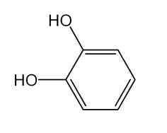

피로카테콜
피로카테킨
피로카테킨산
카테키논
o-디페놀
o-히드록시페놀
2-히드록시페놀 C H O : 110.11
6 6 2
이 원료를 건조한 것은 정량할 때 카테콜(C H O ) 98.0 % 이상을 함유한다.
6 6 2
성 상 이 원료는 흰색 ∼ 회색의 입상 또는 판상의 결정이며 냄새가 없든가 또는
약간 특이한 냄새가 있다.
확인시험 이 원료의 수용액(1 → 200) 10 mL에 염화제이철시액 3 방울을 넣을 때 액
은 녹색을 나타내고 다음에 암모니아시액 2 방울을 넣을 때 액은 심홍색으로 변한다.
융 점 103 ∼ 105 ℃(제 1 법)
순도시험 1) 용해상태 이 원료 0.5 ｇ을 물 100 mL에 넣어 녹인 액은 무색이며, 거
의 맑다.
2) 중금속 이 원료 1.0 ｇ을 황산 5 mL 및 질산 20 mL에 넣어 가만히 가열한다.
때때로 질산 2 ∼ 3 mL씩을 추가하고 액이 무색 ∼ 엷은 황색이 될 때까지 가열을
계속한다. 식힌 다음 물 10 mL 및 페놀프탈레인시액 1 방울을 넣고 암모니아시액을
액이 엷은 적색이 될 때까지 천천히 넣은 다음 필요하면 여과하여 물 10 mL로 씻고
여액과 씻은 액을 네슬러관에 넣고 물을 넣어 50 mL로 한다. 이것을 검액으로 하여
시험한다. 비교액에는 납표준액 2.0 mL를 넣는다(20 ppm 이하).
3) 비소 이 원료 1.0 ｇ을 황산 2 mL 및 질산 5 mL에 넣고 가만히 가열한다. 때때
로 질산 2 ∼ 3 mL씩을 추가하여 액이 무색 ∼ 엷은 황색이 될 때까지 가열을 계속
한다. 식힌 다음 포화수산암모늄용액 15 mL를 넣고 흰 연기가 날 때까지 가열한 다
음 농축한다. 식힌 다음 물을 넣어 10 mL로 하고 이것을 검액으로 하여 시험한다(2
ppm 이하).
4) 유기성불순물 이 원료의 수용액(1 → 100) 1 μL를 박층판에 점적하고 이소프로
필에텔ㆍ아세톤ㆍ이소프로판올(10：1：1) 혼합액을 전개용매로 하여 박층크로마토그
래프법에 따라 시험한다. 발색제로 인몰리브덴산시액을 뿌릴 때 단일 반점을 나타낸
다.
건조감량 0.5 % 이하(1.5 ｇ, 실리카겔, 4 시간)
강열잔분 0.1 % 이하(2 ｇ)
정 량 법 이 원료를 건조하고 약 0.5 ｇ을 정밀하게 달아 물에 넣어 녹이고 100 mL
로 한다. 이 액 20 mL를 취하여 카테콜정량용 초산납시액 30 mL 및 물 50 mL를 넣
어 가열한다. 식힌 다음 물을 넣어 200 mL로 하여 여과한다. 처음의 여액 20 mL는
버리고 다음의 여액 100 mL를 취하여 0.05 mol/L 에칠렌디아민테트라초산디나트륨
액으로 적정한다(지시약：키실레놀오렌지시액 3 방울). 다만, 적정의 종말점은 액의
적자색이 황색으로 변할 때로 한다. 같은 방법으로 공시험을 하여 보정한다.
0.05 mol/L 에칠렌디아민테트라초산디나트륨액 1 mL = 5.506 mg C H O
6 6 2
저 장 법 기밀용기
톨루엔-2, 5-디아민
Toluene-2,5-diamine

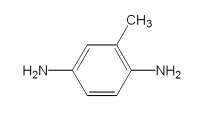

p-톨루이렌디아민
2,5-톨루이렌디아민
2,5-디아미노톨루엔
o-메칠-p-페닐렌디아민
p-톨루엔디아민
메칠-p-페닐렌디아민
메칠-2,5-페닐렌디아민
2-메칠-p-페닐렌디아민 C H N : 122.17
7 10 2
이 원료를 건조한 것은 정량할 때 톨루엔-2, 5-디아민(C H N ) 95.0 % 이상을 함유
7 10 2
한다.
성 상 이 원료는 흰색 ∼ 엷은 황색 또는 엷은 적자색의 가루 또는 덩어리로서
약간 특이한 냄새가 있다.
확인시험 1) 이 원료의 수용액(1 → 200) 5 mL에 풀푸랄ㆍ초산시액 5 방울을 넣을
때 액은 적황색을 나타낸다.
2) 이 원료 및 염산 m-페닐렌디아민 표준품 각 10 mg을 이소프로판올ㆍ물ㆍ강암모
니아수(9：3：1) 혼합액 1 mL 씩에 넣어 녹인 다음 각각에 아황산수소나트륨 0.1 ｇ
을 넣어 흔들어 섞어 검액 및 표준액 1 μL씩을 박층판에 점적하고 이소프로필에텔ㆍ
아세톤ㆍ이소프로판올혼합액(10：1：1)을 전개용매로 하며 박층크로마토그래프법에
따라 시험한다. 발색제로 p-디메칠아미노벤즈알데히드ㆍ묽은염산용액(1 → 200)을 뿌
릴 때 염산 m-페닐렌디아민 표준품에 대하여 Rs 값 0.9 부근에서 적색을 띠는 황색
∼ 황색의 반점을 나타낸다.
3) 이 원료 0.15 ｇ을 물에 넣어 녹여 100 mL로 한다. 이 액 1 mL를 취하여 물을
넣어 100 mL로 하여 이 액을 가지고 자외가시부흡광도측정법에 따라 흡수스펙트럼
을 측정할 때 파장 237 ± 2 nm 및 303 ± 2 nm 에서 흡수극대를 나타낸다.
융 점 60 ∼ 66 ℃(제 1 법)
순도시험 1) 용해상태 이 원료 0.1 ｇ을 묽은염산 10 mL에 넣어 녹일 때 액은 무
색 ∼ 엷은 적자색이며 거의 맑다.
2) 철 이 원료 1.0 ｇ을 정밀하게 달아 황산 5 방울을 넣어 적시고 천천히 가열하
여 저온에서 거의 회화 또는 휘산시킨 다음 다시 황산을 넣어 적시고 완전히 회화시
킨다. 식힌 다음 잔류물에 염산 0.5 mL를 넣고 수욕상에서 증발건고한 다음 묽은염
산 3 방울을 넣어 가온하고 물 25 mL를 넣어 녹인다. 이것을 검액으로 하여 시험한
다. 비교액에는 철표준액 2.0 mL를 넣는다(20 ppm 이하).
3) 중금속 이 원료 1.0 ｇ을 황산 5 mL 및 질산 20 mL에 넣어 가만히 가열한다.
때때로 질산 2 ∼ 3 mL씩을 추가하여 액이 무색 ∼ 엷은 황색이 될 때까지 가열한
다. 식힌 다음 물 10 mL 및 페놀프탈레인시액 1 방울을 넣고 암모니아시액을 액이
엷은 적색이 될 때까지 천천히 넣고 필요하면 여과하여 물 10 mL로 씻고 여액과 씻
은 액을 네슬러관에 넣고 물을 넣어 50 mL로 한다. 이것을 검액으로 하여 시험한다.
비교액에는 납표준액 2.0 mL를 넣는다(20 ppm 이하).
4) 비소 이 원료 1.0 ｇ을 황산 2 mL 및 질산 5 mL에 넣어 가만히 가열한다. 때
때로 질산 2 ∼ 3 mL씩을 추가하여 액이 무색 ∼ 엷은 황색이 될 때까지 가열한다.
식힌 다음 포화수산암모늄용액 15 mL를 넣고 흰 연기가 발생할 때까지 가열한다. 식
힌 다음 물을 넣어 10 mL로 한다. 이것을 검액으로 하여 시험한다(2 ppm 이하).
건조감량 5.0 % 이하(1 ｇ, 실리카겔, 4 시간)
강열잔분 1.0 % 이하(2 ｇ)
정 량 법 이 원료를 건조하고 약 0.11 ｇ을 정밀하게 달아 질소정량법 제2 법에 따라
시험한다.
0.05 mol/L 황산 1 mL = 6.109 mg C H N
7 10 2
저 장 법 기밀용기
m-페닐렌디아민
m-Phenylenediamine

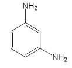

1, 3-페닐렌디아민 C H N : 108.14
6 8 2
이 원료를 건조한 것은 정량할 때 m-페닐렌디아민(C H N ) 95.0 % 이상을 함유한
6 8 2
다.
성 상 이 원료는 갈색 또는 청색을 띠는 흑갈색 ∼ 흑갈색의 결정성 덩어리로서
냄새는 없다.
확인시험 1) 이 원료 1 g을 물 100 mL에 넣어 잘 흔들어 섞은 다음 여과한다. 여액
5 mL에 질산은시액 5 방울을 넣을 때 액은 엷은 흑자색을 나타낸다. 이 액을 가열할
때 액은 회록색 ∼ 회녹갈색으로 변하면서 은이 석출된다.
2) 1)의 여액 3 mL에 풀푸랄ㆍ초산시액 4 방울을 넣을 때 액은 황색을 띠는 적색
∼ 황갈색을 나타내면서 혼탁된다.
3) 이 원료 및 m-페닐렌디아민 표준품 각 10 mg을 달아 이소프로판올ㆍ물ㆍ강암모
니아수(9 : 3 : 1) 혼합액 1 mL를 넣어 녹인 다음 각각에 아황산수소나트륨 0.1g을
넣고 흔들어 섞어 검액 및 표준액으로 한다. 검액 및 표준액 1 μL씩을 박층판에 점
적하고 이소프로필에텔ㆍ아세톤ㆍ이소프로판올(10 : 1 : 1) 혼합액을 전개용매로 하
여 박층크로마토그래프법에 따라 시험한다. 발색제로 p-디메칠아미노벤즈알데히드ㆍ
묽은염산용액(1 → 200)을 뿌릴 때 표준액과 같은 R 값에서 적색을 때는 황색의 반
f
점을 나타낸다.
4) 이 원료 25 mg을 정밀하게 달아 물에 넣어 녹여 100 mL로 하고 필요하면 여과
하여 이 액 1 mL를 취하여 물을 넣어 100 mL로 한다. 이 액을 가지고 자외가시부흡
광도측정법에 따라 흡수스펙트럼을 측정할 때 파장 287 ± 2 nm에서 흡수극대를 나
타낸다.
융 점 57 ∼ 65 ℃(제 1 법)
순도시험 1) 용해상태 이 원료 0.5 ｇ을 정밀하게 달아 묽은염산 10 mL에 넣어 녹
일 때 액은 흑갈색이며 맑다.
2) 철 이 원료 1.0 ｇ을 정밀하게 달아 황산 5 방울을 넣어 적시고 천천히 가열하
여 저온에서 염산 0.5 mL를 넣어 수욕상에서 증발건고한다. 잔류물에 묽은염산 3 방
울을 넣어 가온하고 물 25 mL를 넣어 녹인다. 이 액을 검액으로 하여 시험한다. 비
교액에는 철표준액 2.0 mL를 넣는다(20 ppm 이하).
3) 중금속 이 원료 1.0 ｇ을 정밀하게 달아 황산 5 mL 및 질산 20 mL에 넣어 가
만히 가열한다. 여기에 질산 2 ∼ 3 mL씩을 추가하여 액이 무색 ∼ 엷은 황색이 될
때까지 가열한다. 식힌 다음 물 10 mL 및 페놀프탈레인시액 1 방울을 넣고 암모니아
시액을 액이 엷은 적색이 될 때까지 천천히 넣은 다음 묽은초산 2 mL를 넣고 필요
하면 여과한다. 잔류물을 물 10 mL로 씻고 씻은 액을 여액에 합하여 물을 넣어 50
mL로 한다. 이 액을 검액으로 하여 시험한다. 비교액에는 납표준액 2.0 mL를 넣는다
(20 ppm 이하).
4) 비소 이 원료 1.0 ｇ을 정밀하게 달아 황산 2 mL 및 질산 5 mL에 넣어 가만히
가열한다. 여기에 가끔 질산 2 ∼ 3 mL씩을 추가하여 액이 무색 ∼ 엷은 황색이 될
때까지 가열한다. 식힌 다음 포화수산암모늄용액 15 mL를 넣고 흰 연기가 발생할 때
까지 가열한다. 식힌 다음 물을 넣어 10 mL로 한다. 이것을 검액으로 하여 시험한다
(2 ppm 이하).
건조감량 0.5 % 이하(1.5 ｇ, 실리카겔, 4 시간)
강열잔분 0.3 % 이하(2 ｇ, 제 1 법)
정 량 법 이 원료를 건조하고 약 0.10 ｇ을 정밀하게 달아 질소정량법 제 2 법에 따
라 시험한다.
0.05 mol/L 황산 1 mL = 5.407 mg C H N
6 8 2
저 장 법 기밀용기
N-페닐-p-페닐렌디아민
N-Phenyl-p-Phenylenediamine

p－아미노디페닐아민 C H N : 184.24
12 12 2
이 원료를 건조한 것은 정량할 때 N-페닐-p-페닐렌디아민(C H N ) 95.0% 이상을
12 12 2
함유한다.
성 상 이 원료는 흑갈색 ∼ 자갈색의 덩어리 또는 작은 알맹이로서 약간 특이한
냄새가 있다.
확인시험 1) 이 원료 10 mg에 묽은 염산 10 mL를 넣어 녹이고 아질산나트륨시액 1
방울을 넣을 때 액은 적갈색을 나타내고 곧이어 녹갈색으로 변한다.
2) 이 원료의 묽은에탄올용액(1 → 1000) 3 mL에 풀푸랄ㆍ초산시액 4 방울을 넣을
때 액은 황색을 띠는 적색을 나타낸다.
3) 이 원료 및 p-니트로아닐린 각 10 mg을 달아 이소프로판올ㆍ물ㆍ강암모니아수혼
합액(9 : 3 : 1) 1 mL를 넣어 녹인 다음 각각에 아황산수소나트륨 0.1 g을 넣고 흔들
어 섞어 검액 및 표준액으로 한다. 이들 액을 가지고 박층크로마토그래프법에 따라
시험한다. 검액 및 표준액 10 μL씩을 박층크로마토그래프용실리카겔을 써서 만든 박
층판에 점적한다. 다음에 이소프로필에텔ㆍ아세톤ㆍ이소프로판올(10 : 1 : 1) 혼합액
을 전개용매로 하여 약 15 cm 전개한 다음 박층판을 바람에 말린다. 여기에 p-디메
칠아미노벤즈알데히드ㆍ묽은염산용액(1 → 200)을 뿌릴 때 표준액 p-니트로아닐린에
대하여 Rs 값 0.8 부근에서 암적색 ∼ 적갈색의 반점을 나타낸다.
4) 이 원료 30 mg을 달아 에탄올을 넣어 녹여 200mL로 한다. 이 액 2 mL를 취하
여 에탄올을 넣어 100 mL로 한다. 이 액에 대하여 흡수스펙트럼을 측정 할 때 파장
286 ∼ 290 nm에서 흡수극대를 나타낸다.
융 점 69 ∼ 75 ℃(제 1 법)
순도시험 1) 용해상태 이 원료 0.1 g에 에탄올 10 mL를 넣어 녹일 때 액은 어두운
적갈색 ∼ 어두운 적자색을 나타내며 맑다.
2) 철 이 원료 1.0 g을 정밀하게 달아 황산 5 방울을 넣어 적시고 천천히 가열하여
저온에서 거의 회화 또는 휘산시킨 다음 다시 황산으로 적시고 완전히 회화한다. 식
힌 다음 잔류물에 염산 0.5 mL를 넣어 수욕상에서 증발건고한다. 잔류물에 묽은염산
3 방울을 넣어 가온하고 물 25 mL를 넣어 녹인다. 이것을 검액으로 하여 시험한다.
비교액에는 철표준액 2.0 mL를 넣는다(20 ppm 이하).
3) 중금속 이 원료 1.0 g에 황산 5 mL 및 질산 20 mL를 넣어 가만히 가열한다.
가끔 질산 2 ∼ 3 mL씩을 추가하여 액이 무색 ∼ 엷은 황색이 될 때까지 가열한다.
식힌 다음 물 10 mL 및 페놀프탈레인시액 1 방울을 넣고 암모니아시액을 액이 엷은
적색이 될 때까지 적가하고 묽은 초산 2 mL를 넣고 필요하면 여과한다. 잔류물을 물
10 mL로 씻고 씻은 액을 여액에 합하여 물을 넣어 50 mL로 한다. 이것을 검액으로
하여 시험한다. 비교액에는 납표준액 2.0 mL를 넣는다(20 ppm 이하).
4) 비소 이 원료 1.0 g에 황산 2 mL 및 질산 5 mL를 넣고 가만히 가열한다. 가끔
질산 2 ∼ 3 mL씩을 추가하여 액이 무색 ∼ 엷은 황색이 될 때까지 가열한다. 식힌
다음 포화수산암모늄용액 15 mL를 넣고 흰연기가 발생할 때까지 가열한다. 식힌 다
음 물을 넣어 10 mL로 한다. 이것을 검액으로 하여 시험한다(2 ppm 이하).
건조감량 0.5 % 이하(1.5 g, 실리카 겔, 4시간)
강열잔분 0.3 % 이하(2 g, 제 1 법)
정 량 법 이 원료를 데시케이터(실리카 겔) 에서 4시간 건조하고 그 원료 0.16 g을
정밀하게 달아 질소정량법 제 2법에 따라 시험한다.
0.05 mol/L 황산 1 mL = 9.212 mg C H N
12 12 2
저 장 법 기밀용기
p-페닐렌디아민
p-Phenylenediamine

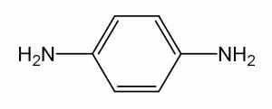

1,4-페닐렌디아민 C H N : 108.14
6 8 2
이 원료를 건조한 것은 정량할 때 p-페닐렌디아민(C H N ) 98.0 % 이상을 함유한다.
6 8 2
성 상 이 원료는 무색 ∼ 엷은 자색 또는 자갈색을 띤 결정성가루 또는 덩어리로
서 냄새는 없다.
확인시험 1) 이 원료의 수용액(1 → 1000) 5 mL에 질산은시액 5 방울을 넣을 때 액
은 흑자갈색을 나타내면서 혼탁해진다. 가열할 때 액은 은이 석출된다.
2) 이 원료 100 mg을 묽은초산 10 mL에 넣어 녹인다. 이 액 1 mL에 아닐린용액(1
→ 250) 1 mL를 넣은 다음 과황산암모늄 0.2 ｇ을 넣을 때 액은 청색을 나타낸다.
3) 이 원료의 수용액(1 → 1000) 5 mL에 니트로프루싯나트륨시액 1 mL을 넣을 때 액
은 청색을 나타낸다.
4) 이 원료 25 mg을 물에 넣어 100 mL로 한다. 이 액 1 mL를 취하여 물을 넣어
100 mL로 한다. 이 액을 가지고 자외가시부흡광도측정법에 따라 흡수스펙트럼을 측
정할 때 파장 237 ± 2 nm에서 흡수극대를 나타낸다.
5) 이 원료 및 p-페닐렌디아민 표준품 각 10 mg을 이소프로판올 ㆍ 물 ㆍ 강암모니
아수(9：3：1) 혼합액 1 mL씩에 넣어 녹인다음 각각에 아황산수소나트륨 0.1 ｇ을
넣어 흔들어 섞어 검액 및 표준액 1 μL씩을 박층판에 점적하고 초산에칠 ㆍ 메탄올
ㆍ 물(50：10：8) 혼합액을 전개용매로 하여 박층크로마토그래프법에 따라 시험한다.
발색제로 p-디메칠아미노벤즈알데히드ㆍ묽은염산용액(1 → 200)을 뿌릴 때 표준품과
같은 R 값에서 황색을 띠는 적색의 반점을 나타낸다.
f
융 점 136 ∼ 144 ℃(제 1 법)
순도시험 1) 용해상태 이 원료 0.5 ｇ을 묽은염산 60 mL에 넣어 녹일 때 액은 무
색 ∼ 엷은 적색을 나타내며 맑다.
2) 중금속 이 원료 1.0 ｇ을 황산 5 mL 및 질산 20 mL에 넣어 천천히 가열한다.
때때로 질산 2 ∼ 3 mL씩을 추가하여 액이 무색 ∼ 엷은 황색이 될 때까지 가열한
다. 식힌 다음 물 10 mL 및 페놀프탈레인시액 1 방울을 넣고 암모니아시액을 액이
엷은 적색이 될 때까지 천천히 넣고 필요하면 여과한다. 잔류물을 물 10 mL로 씻고
여액과 씻은 액을 네슬러관에 넣고 물을 넣어 50 mL로 한다. 이것을 검액으로 하여
시험한다. 단, 비교액에는 납표준액 2.0 mL를 넣는다(20 ppm 이하).
3) 철 이 원료 1.0 ｇ을 정밀하게 달아 황산 5 방울을 넣어 적시고 천천히 가열하
여 저온에서 회화 또는 휘산시킨 다음 황산을 넣어 적시고 완전히 회화한다. 식힌 다
음 잔류물에 염산 0.5 mL를 넣고 수욕상에서 증발건고한다. 잔류물에 묽은염산 3 방
울을 넣어 가온하고 물 25 mL를 넣어 녹인다. 이것을 검액으로 하여 시험한다. 비교
액에는 철표준액 2.0 mL를 넣는다(20 ppm 이하).
4) 비소 이 원료 1.0 ｇ을 황산 2 mL 및 질산 5 mL에 넣어 천천히 가열한다. 때때
로 질산 2 ∼ 3 mL씩을 추가하여 액이 무색 ∼ 엷은 황색이 될 때까지 가열한다. 식
힌 다음 포화수산암모늄용액 15 mL를 넣고 흰연기가 발생할 때까지 가열한다. 식힌
다음 물을 넣어 10 mL로 한다. 이것을 검액으로 하여 시험한다(2 ppm 이하).
건조감량 0.2 % 이하(1.5 ｇ, 실리카겔, 4 시간)
강열잔분 0.5 % 이하(2 ｇ, 제 1 법)
정 량 법 이 원료를 건조하고 약 0.10 ｇ을 정밀하게 달아 질소정량법 제 2 법에 따
라 시험한다.
0.05 mol/L 황산 1 mL = 5.407 mg C H N
6 8 2
저 장 법 기밀용기
페닐메칠피라졸론
Phenyl Methyl Pyrazolone

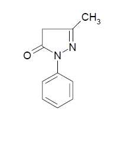

C H N O : 174.20
10 10 2
이 원료는 정량할 때 환산한 무수물에 대하여 페닐메칠피라졸론(C H N O) 99.0 %
10 10 2
이상을 함유한다.
성 상 이 원료는 흰색의 결정성 가루이다.
확인시험 1) 이 원료 50 mg을 에탄올에 넣어 녹여 100 mL로 한다. 이 액 10 mL를
취하여 에탄올을 넣어 1000 mL로 한다. 이 액을 가지고 자외가시부흡광도측정법에
따라 흡수스펙트럼을 측정할 때 파장 245 ± 2 nm에서 흡수극대를 나타낸다.
2) 이 원료 0.1 g을 메탄올 10 mL에 넣어 녹인 다음 아황산나트륨 0.1 g을 넣고 원
심분리하여 상징액을 검액으로 한다. 페닐메칠피라졸론 표준품 0.1 g을 가지고 검액
과 같게 조작하여 표준액으로 한다. 검액 및 표준액 각각 5 μL씩을 취하여 박층판에
점적하고 벤젠 ㆍ 아세트산에틸 ㆍ 아세트산혼합액(50 : 50 : 1)을 전개용매로 하여
박층크로마토그래프법에 따라 시험한다. 발색제로 p-디메틸아미노벤즈알데히드 ㆍ
묽은염산용액(0.5 → 100) 을 뿌릴 때 검액과 표준액의 반점은 같은 R 값에서 같은
f
색상을 나타낸다.
융 점 128 ∼ 130 ℃(제 1 법)
순도시험 1) 철 이 원료 2.0 g을 달아 황산 5 방울을 넣어 적시고 천천히 가열하여
저온에서 거의 회화 또는 휘산시킨 다음 다시 황산으로 적시고 완전히 회화한다. 식
힌 다음 잔류물에 염산 0.5 mL를 넣고 수욕상에서 증발건고하여 잔류물에 묽은염산
3 방울을 넣어 가온하고 물 25 mL를 넣어 녹인다. 이것을 검액으로 한다. 비교액에
는 철표준액 1.0 mL를 넣는다(5 ppm 이하).
2) 중금속 이 원료 1.0 g을 황산 2 mL 및 질산 20 mL에 넣어 가만히 가열한다.
때때로 질산 2 ∼ 3 mL씩을 추가하여 액이 무색 ∼ 엷은 황색이 될 때까지 가열한
다. 식힌 다음 물 10 mL 및 페놀프탈레인시액 1 방울을 넣고 암모니아시액을 액이
엷은 적색이 될 때까지 넣고 필요하면 여과하여 물 10 mL로 씻고 여액과 씻은 액을
네슬러관에 넣어 물을 넣어 50 mL로 한 액을 검액으로 한다. 비교액에는 납표준액
2.0 mL를 넣는다(20 ppm 이하).
3) 비소 이 원료 1.0 g을 황산 2 mL 및 질산 5 mL에 넣어 가만히 가열한다. 때때
로 질산 2 ∼ 3 mL씩을 추가하여 액이 무색 ∼ 엷은 황색이 될 때까지 가열한다. 식
힌 다음 포화수산암모늄용액 15 mL를 넣고 흰 연기가 발생할 때까지 가열한 다음
식히고 물을 넣어 10 mL로 한 액을 검액으로 하여 시험한다(2 ppm 이하).
수 분 0.3 % 이하(0.3 g)
강열잔분 0.2 % 이하(2 g, 제 1 법)
정 량 법 이 원료 약 0.15 g을 정밀하게 달아 질소정량법에 따라 시험한다.
0.05 mol/L 황산 1 mL = 8.710 mg C H N O
10 10 2
피로갈롤
Pyrogallol

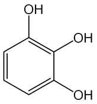

피로갈릭산
피로몰식자산
초성몰식자산
2,3-디히드록시페놀 C H O : 126.11
6 6 3
성 상 이 원료는 흰색의 결정으로 약간의 특이한 냄새가 있다.
확인시험 1) 이 원료의 수용액(1 → 100) 10 mL에 수산화나트륨시액 3 방울을 넣을
때 액은 적색을 띠는 황색 ∼ 황갈색을 나타내며 방치하면 액은 천천히 갈색 ∼ 흑
갈색으로 변한다.
2) 이 원료의 수용액(1 → 200) 10 mL에 염화제이철시액 3 방울을 넣을 때 액은 적
갈색 ∼ 갈색을 나타낸다.
융 점 128 ∼ 136 ℃(제 1 법)
순도시험 1) 용해상태 이 원료 1.0 ｇ을 물 20 mL에 넣어 녹인 액은 무색으로 거의
맑다.
2) 중금속 이 원료 1.0 ｇ을 황산 5 mL 및 질산 20 mL에 넣어 가만히 가열한다.
때때로 질산 2 ∼ 3 mL씩을 추가하여 액이 무색 ∼ 엷은 황색이 될 때까지 가열을
계속한다. 식힌 다음 물 10 mL 및 페놀프탈레인시액 1 방울을 넣고 암모니아시액을
액이 엷은 적색이 될 때까지 천천히 넣고 필요하면 여과한다. 물 10 mL로 씻고 여액
과 씻은 액을 네슬러관에 넣고 물을 넣어 50 mL로 한다. 이것을 검액으로 하여 시험
한다. 비교액에는 납표준액 2.0 mL를 넣는다(20 ppm 이하).
3) 비소 이 원료 1.0 ｇ을 황산 2 mL 및 질산 5 mL에 넣어 가만히 가열한다. 때때
로 질산 2 ∼ 3 mL씩을 추가하여 액이 무색 ∼ 엷은 황색이 될 때까지 가열을 계속
한다. 식힌 다음 포화수산암모늄용액 15 mL를 넣고 흰 연기가 날 때까지 가열한다.
식힌 다음 물을 넣어 10 mL로 하고 이것을 검액으로 하여 시험한다(2 ppm 이하).
4) 유기성불순물 이 원료의 수용액(1 → 100) 1 μL를 박층판에 점적하고 이소프로
필에텔 ㆍ 아세톤 ㆍ 이소프로판올혼합액(10：1：1)을 전개용매로 하여 박층크로마토
그래프법에 따라 시험한다. 발색제로 인몰리브덴산시액을 뿌릴 때 단일의 청자색 반
점을 나타내어야 한다.
건조감량 0.5 % 이하(1.5 ｇ, 실리카겔, 4 시간)
강열잔분 0.3 % 이하(2 ｇ, 제 1 법)
저 장 법 기밀용기
피크라민산
Picramic Acid

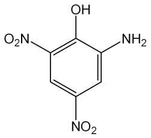

2-아미노 4,6-디니트로페놀
2,4-디니트로 6-아미노페놀
4,6-디니트로 2-아미노페놀
피크람산 C H N O : 199.12
6 5 3 5
이 원료를 건조한 것은 정량할 때 피크라민산(C H N O ) 90.0 % 이상을 함유한다.
6 5 3 5
성 상 이 원료는 황갈색 ∼ 적갈색의 결정 또는 페이스트로서 냄새는 거의 없다.
확인시험 1) 이 원료의 수용액(1 → 1000) 10 mL에 묽은염산 1 mL를 넣을 때 액은
황색은 나타낸다. 또한 이 원료의 수용액(1 → 1000) 10 mL에 탄산나트륨시액 1 mL
를 넣을 때 액은 적갈색을 나타낸다.
2) 이 원료의 수용액(1 → 1000) 10 mL에 황산동ㆍ암모니아시액 2 mL를 넣을 때
액은 어두운 갈색을 나타낸다.
3) 이 원료의 수용액(1 → 1000) 10 mL에 인텅그스텐산용액(1 → 100) 1 mL를 넣을
때 액은 황색을 나타내며 탄산나트륨시액 1 mL를 더 넣을 때 액은 적갈색으로 변한다.
4) 이 원료 25 mg을 물 100 mL에 넣어 녹이고 필요하면 여과하여 이 액 10 mL를
취하고 물을 넣어 100 mL로 한다. 이 액을 가지고 자외가시부흡광도측정법에 따라
흡수스펙트럼을 측정할 때 파장 300 ± 2 nm, 226 ± 2 nm 에서 흡수극대를 나타낸다.
융 점 169 ∼ 172 ℃(제 1 법)
순도시험 1) 용해상태 이 원료 0.5 ｇ을 아세톤 20 mL에 넣어 녹일 때 액은 황갈색
∼ 어두운 적갈색이며 거의 맑다.
2) 납 이 원료 1.0 ｇ을 황산 5 mL 및 질산 20 mL에 넣어 가만히 가열한다. 때때
로 질산 2 ∼ 3 mL을 추가하여 액이 무색 ∼ 엷은 황색으로 될 때까지 가열한다. 식
힌 다음 물을 넣어 10 mL로 한다. 이것을 검액으로 하여 시험한다(5 ppm 이하).
3) 철 이 원료 0.1 ｇ을 정밀하게 달아 황산 5 mL를 넣어 적시고 천천히 가열하여
저온에서 거의 회화 또는 휘산시킨 다음 다시 황산을 넣어 적시고 완전히 회화한다.
식힌 다음 잔류물에 염산 0.5 mL를 넣고 수욕상에서 증발건고 시킨다. 잔류물에 묽
은염산 3 방울을 넣어 가온하고 물을 넣어 50 mL로 하여 검액으로 한다. 이 액 10
mL를 취하여 시험한다. 비교액에는 철표준액 2.0 mL를 넣는다(0.1 % 이하).
4) 비소 이 원료 1.0 ｇ을 황산 2 mL 및 질산 5 mL에 넣어 가만히 가열한다. 때때
로 질산 2 ∼ 3 mL씩을 추가하여 액이 무색 ∼ 엷은 황색이 될 때까지 가열한다. 식
힌 다음 포화수산암모늄용액 15 mL를 넣고 흰 연기가 발생할 때까지 가열한다. 식힌
다음 물을 넣어 10 mL로 한다. 이것을 검액으로 하여 시험한다(2 ppm 이하).
건조감량 35.0 % 이하(1 ｇ, 105 ℃, 2 시간)
강열잔분 1.0 % 이하(1 ｇ, 제 1 법)
정 량 법 이 원료를 건조하고 약 0.12 ｇ을 정밀하게 달아 아연(입상) 2 ｇ, 물 15
mL 및 염산 15 mL에 넣어 조심하면서 증발건고한 다음 식혀 질소정량법 제 2 법에
따라 시험한다.
0.05 mol/L 황산 1 mL = 6.637 mg C H N O
6 5 3 5
저 장 법 기밀용기
피크라민산나트륨
Sodium Picramate

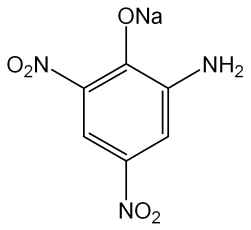

2-아미노 4,6-디니트로페놀나트륨
4,6-디니트로 2-아미노페놀나트륨
2,4-디니트로 6-아미노페놀나트륨
피크람산나트륨 C H N NaO : 221.10
6 4 3 5
이 원료를 건조한 것은 정량할 때 피크라민산나트륨(C H N NaO ) 86.0 % 이상을
6 4 3 5
함유한다.
성 상 이 원료는 암적갈색 ∼ 적자색의 습기가 있는 가루로서 약간 냄새가 있다.
확인시험 1) 이 원료의 수용액(1 → 100) 3 mL에 피로안티몬산칼륨시액 2 mL를 넣
을 때 적색을 띠는 황색 ∼ 황색의 결정성침전이 생긴다. 침전생성을 빠르게 해주기
위하여 유리봉으로 시험관의 내벽을 긁어준다.
2) 이 원료의 수용액(1 → 1000)에 묽은염화제이철시액 5 방울을 넣을 때 액은 흑갈
색을 나타낸다.
3) 이 원료 및 염산 m-페닐렌디아민 표준품 각 10 mg을 이소프로판올ㆍ물ㆍ강암모
니아수(9：3：1) 혼합액 1 mL에 넣어 녹인 다음 각각에 아황산수소나트륨 0.1 ｇ을
넣어 흔들어 섞어 검액 및 표준액으로 한다. 검액 및 표준액 1 μL씩을 박층판에 점
적하고 초산에칠 ㆍ 메탄올 ㆍ 물(50：10：8) 혼합액을 전개용매로 하여 박층크로마
토그래프법에 따라 시험한다. 발색제로 p-디메칠아미노벤즈알데히드 ㆍ 묽은염산용
액(1 → 200)을 뿌릴 때 염산 m-페닐렌디아민 표준품에 대하여 Rs 값 0.75 부근에서
단일의 등색의 반점을 나타낸다.
4) 이 원료 20 mg을 물에 넣어 녹여 100 mL로 한다. 이 액 5 mL를 취하여 물을
넣어 100 mL로 한다. 이 액을 가지고 자외가시부흡광도측정법에 따라 흡수스펙트럼
을 측정할 때 파장 229 ± 2 nm 및 312 ± 2 nm 부근에서 흡수극대를 나타낸다.
순도시험 1) 용해상태 이 원료 0.1 ｇ을 물 200 mL에 넣어 녹일 때 액은 적색이며
맑다.
2) 철 이 원료 0.5 ｇ을 정밀하게 달아 황산 5 방울을 넣어 적시고 천천히 가열하
여 저온에서 거의 회화 또는 휘산시킨 다음 황산으로 적시고 완전히 회화한다. 식힌
다음 잔류물에 염산 0.5 mL를 넣어 수욕상에서 증발건고한 다음 묽은염산 3 방울을
넣고 가온하고 물을 넣어 50.0 mL로 하여 검액으로 한다. 이 액 10 mL를 취하여 시
험한다. 비교액에는 철표준액 2.0 mL를 넣는다(0.02 % 이하).
3) 에텔가용물 이 원료 1 ｇ을 정밀하게 달아 에텔 50 mL를 넣어 환류냉각기를
달아 수욕상에서 때때로 흔들어 섞어 주면서 1 시간 끓인 다음 뜨거울 때 미리 질량
을 단 플라스크에 유리여과기(G )로 여과한다. 잔류물을 에텔 20 mL로 씻고 여액 및
3
씻은 액을 합하여 수욕상에서 증발건고한 다음 105 ℃에서 30 분간 건조시켜 질량을
단다(5 % 이하).
4) 납 이 원료 1.0 ｇ을 황산 5 mL 및 질산 20 mL에 넣어 가만히 가열한다. 때때
로 질산 2 ∼ 3 mL씩을 추가하여 액이 무색 ∼ 엷은 황색이 될 때까지 가열한다. 식
힌 다음 물을 넣어 10 mL로 한다. 이것을 검액으로 하여 시험한다(10 ppm 이하).
5) 비소 이 원료 1.0 ｇ을 황산 2 mL 및 질산 5 mL에 넣어 가만히 가열한다. 때때
로 질산 2 ∼ 3 mL씩을 추가하여 액이 무색 ∼ 엷은 황색이 될 때까지 가열한다. 식
힌 다음 포화수산암모늄용액 15 mL를 넣어 흰 연기가 발생할 때까지 가열한다. 식힌
다음 물을 넣어 10 mL로 한다. 이것을 검액으로 하여 시험한다(2 ppm 이하).
건조감량 40.0 % 이하(2 ｇ, 60 ℃, 항량)
정 량 법 이 원료를 60 ℃ 에서 항량이 될 때까지 건조하고 그 약 0.13 ｇ을 정밀하
게 달아 아연(입상) 2 ｇ, 물 15 mL 및 염산 15 mL에 넣어 조심하면서 증발건고한
다. 식힌 다음 질소정량법 제 2 법에 따라 시험한다.
0.05 mol/L 황산 1 mL = 7.370 mg C H N NaO
6 4 3 5
저 장 법 기밀용기
헤마테인
Hematein

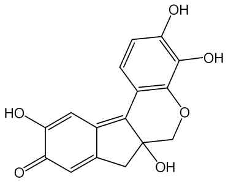

히드록시브라실레인 C H O : 300.26
16 12 6
이 원료는 인도산 콩과식물 Haematoxylon campechianum Linne(Leguminosae)에서
얻어지는 것으로서 주로 헤마테인(C H O ) 을 함유한다.
16 12 6
성 상 이 원료는 적갈색 ∼ 흑갈색의 가루로서 특이한 냄새가 있다.
확인시험 1) 이 원료의 수용액(1 → 1000) 10 mL에 염화제이철시액 5 방울을 넣을
때 액은 청흑색 ∼ 흑회색을 나타낸다.
2) 이 원료 0.1 ｇ을 암모니아시액 10 mL에 넣어 녹일 때 액은 적자색 ∼ 갈자색을
나타낸다.
순도시험 1) 용해상태 이 원료 0.1 ｇ을 물 10 mL에 넣어 녹일 때 액은 적색이며
거의 맑다.
2) 중금속 이 원료 1.0 ｇ을 황산 5 mL 및 질산 20 mL에 넣고 가만히 가열한다.
때때로 질산 2 ∼ 3 mL 씩을 추가하여 액이 무색 ∼ 엷은 황색이 될 때까지 가열한
다. 식힌 다음 물 10 mL 및 페놀프탈레인시액 1 방울을 넣고 암모니아시액을 액이
엷은 적색이 될때까지 천천히 넣은 다음 묽은초산 2 mL를 넣고 필요하면 여과한다.
잔류물을 물 10 mL로 씻고 씻은 액을 여액에 합하여 물을 넣어 50 mL로 한다. 이것
을 검액으로 하여 시험한다. 비교액에는 납표준액 2.0 mL를 넣는다(20 ppm 이하).
3) 비소 이 원료 1.0 ｇ을 황산 2 mL 및 질산 5 mL에 넣어서 가만히 가열한다. 때
때로 질산 2 ∼ 3 mL 씩을 추가하여 액이 무색 ∼ 엷은 황색이 될 때까지 가열한다.
식힌 다음 포화수산암모늄용액 15 mL를 넣어서 흰 연기가 발생할 때까지 가열한다.
식힌 다음 물을 넣어 10 mL로 한다. 이것을 검액으로 하여 시험한다(2 ppm 이하).
건조감량 5.0 % 이하(1 ｇ, 실리카겔, 4 시간)
강열잔분 15.0 % 이하(1 ｇ, 제 1 법)
저 장 법 기밀용기
헨나엽가루
Henna Leaf Powder
Pulvis Hennae Folium
이 원료는 헨나 Lawsonia inermis Linn.(= Lawsonia alba)(부처꽃과 Lythraceae)의
잎을 가루로 한 것이다.
이 원료는 정량할 때 로손(2-hydroxy 1,4-naphtho-quinone, C H O ：174.16) 0.5 %
10 6 3
이상을 함유한다.
성 상 이 원료는 연한 녹색 ∼ 녹갈색의 가루이고, 흙냄새 같은 특이한 냄새가 난
다. 이 원료를 현미경으로 보면 녹색 ∼ 녹갈색의 수많은 각질(cuticle) 조각과 잎의
유조직체, 수산칼슘 단정을 볼 수 있으며, 수산칼슘 단정은 대부분 지름 15 mm 정도
이나, 때때로 지름 40 mm 정도로 큰 것도 있다. 구형의 점액세포와 내부 유관속 조
직, 길고 가느다란 후막조직 섬유가 있으며, 표피세포에 둘러싸인 기공과 가로무늬
각질이 있는 표피 조각이 보이고, 때때로 융모나 비선모 조각을 볼 수 있다.
확인시험 1) 이 원료를 로손으로서 약 5.0 mg에 해당량을 정밀하게 달아 클로로포름
5 mL를 넣어 2 시간 동안 초음파 처리한 다음 여과하여 검액으로 한다. 따로 로손표
준품 5.0 mg을 클로로포름 5 mL에 녹여 표준액으로 한다. 이들 액을 박층크로마토
그래프법에 따라 시험한다. 검액 및 표준액 2 µL씩을 박층크로마토그래프용실리카겔
을 써서 만든 박층판에 점적한다. 다음에 클로로포름ㆍ메칠에칠케톤ㆍ초산(100)혼합
액(5：4：1)을 전개용매로 하여 약 10 cm 전개한 다음 박층판을 바람에 말린다. 자
연광 아래에서 관찰할 때 여러 개의 반점 중 1 개의 반점은 표준액에서 얻은 반점과
색상 및 R 값이 같다.
f
2) 아래 정량법에 따라 시험할 때 검액은 표준액과 같은 유지시간에서 피크를 나타
낸다.
순도시험 1) 중금속 이 원료 1.0 g을 가지고 제 3 법에 따라 조작하여 시험한다. 비
교액에는 납표준액 2.0 mL를 넣는다 (20 ppm 이하).
2) 비소 이 원료 1.0 g을 달아 제 3 법에 따라 조작하여 시험한다. 다만 비교액에는
비소표준액 3.0 mL를 넣는다 (3 ppm 이하).
3) 잔류농약 이 원료를 가지고 대한민국약전 일반시험법 중 생약시험법에 따라 시
험한다.
가) 총 디디티(p.p'-DDD, p,p'-DDE, o,p'-DDT 및 p,p'-DDT의 합) 0.1 ppm 이하.
나) 디엘드린 0.01 ppm 이하.
다) 총 비에이치씨(α, β, γ 및 δ-BHC의 합) 0.2 ppm 이하.
라) 알드린 0.01 ppm 이하.
마) 엔드린 0.01 ppm 이하.
건조감량 10.0 % 이하.
회 분 15.0 % 이하.
산불용성회분 5.0 % 이하.
정 량 법 이 원료를 로손으로서 약 30 mg을 정밀하게 달아 이동상을 넣어 정확하게
100.0 mL로 하고 30 분 동안 흔들어 추출한 다음 여과하여 여액을 검액으로 한다.
따로 로손표준품 약 30.0 mg을 정밀하게 달아 이동상을 넣어 정확하게 100.0 mL로
하여 표준액으로 한다. 검액 및 표준액 5 μL씩을 가지고 다음 조건으로 액체크로마
토그래프법에 따라 시험하여 각 액의 로손 피크면적 A 및 A 를 구한다.
T S
A
로손(C H O )의 양(mg) = 로손표준품의 양(mg) × T
10 6 3 A
S
조작조건
검 출 기 : 자외부흡광광도계(측정파장 248 nm)
칼 럼 : 안지름 약 4 ∼ 6 mm, 길이 15 ∼ 25 cm인 스테인레스강관에 5 ∼ 10
μm 의 액체크로마토그래프용 옥타데실실릴화한 실리카겔을 충전한 것 또
는 이와 동등한 칼럼
칼럼온도 : 실온
이 동 상 : 물ㆍ아세토니트릴혼합액(3：1)에 초산을 넣어 pH 3.0으로 한다.
유 량 : 1.0 mL/분
저 장 법 기밀용기.
황산 1-히드록시에칠-4,5-디아미노피라졸
1-Hydroxyethyl-4,5-Diaminopyrazole Sulfate

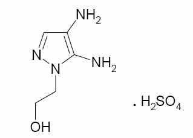

1-히드록시에틸-4,5-디아미노피라졸황산염 C H N OㆍH SO : 240.24
5 10 4 2 4
이 원료는 정량할 때 황산 1-히드록시에칠-4,5-디아미노피라졸(C H N OㆍH SO :
5 10 4 2 4
240.24)을 98.0 ∼ 102 %를 함유한다.
성 상 이 원료는 흰색 ∼ 엷은 분홍색의 가루이다.
확인시험 이 원료를 가지고 적외부스펙트럼측정법 브롬화칼륨정제법에 따라 측정할
때 파수 3300 cm-1, 3100 cm-1, 2600 cm-1, 1670 cm-1, 1600 cm-1, 1550 cm-1, 1460
cm-1, 1380 cm-1, 1300 cm-1, 1040 cm-1 부근에서 흡수극대를 나타낸다.
순도시험 1) 중금속 이 원료 약 1.0 ｇ을 달아 제 2 법에 따라 조작하여 시험한다..
비교액에는 납표준액 1.0 mL를 넣는다(10 ppm 이하).
2) 비소 이 원료 약 1.0 ｇ을 달아 황산 2 mL 및 질산 5 mL에 넣고 가만히 가열
한다. 때때로 질산 2 ∼ 3 mL씩을 추가하여 액이 무색 ∼ 엷은 황색이 될 때까지 가
열한다. 식힌 다음 포화수산암모늄용액 15 mL를 넣고 흰 연기가 발생할 때까지 가열
하고 식힌 다음 물을 넣어 10 mL로 한다. 이것을 검액으로 하여 시험할 때 다음의 표
준색보다 진하지 않다(5 ppm 이하).
○ 표준색 : 이 원료를 사용하지 않고 위 검액과 같은 방법으로 조작한 다음 비소표준
액 5.0 mL를 넣는다.
건조감량 1 % 이하(2 g, 105 ℃, 2 시간)
정 량 법 이 원료 약 0.1 g을 정밀하게 달아 증류수 60 mL에 녹여 0.1 mol/L 수산화
나트륨액으로 적정한다(지시약 : 브롬치몰블루시액). 적정의 종말점은 액이 파란색으로
변할 때로 한다. 같은 방법으로 공시험을 하여 보정한다.
0.1 mol/L 수산화나트륨액 1 mL = 24.0 mg C H N OㆍH SO
5 10 4 2 4
황산 2-아미노-5-니트로페놀
2-Amino-5-nitrophenol Sulfate

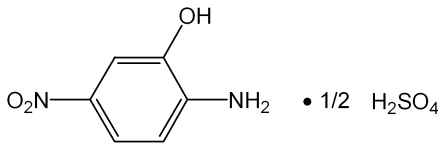

2-아미노-5-니트로페놀황산염
황산 5-니트로-o-아미노페놀
황산 5-니트로-2-아미노페놀
황산 2-아미노-5-니트로페놀 C H N O 1/2H SO : 203.16
6 6 2 3ㆍ 2 4
이 원료를 건조한 것은 정량할 때 황산 2-아미노-5-니트로페놀(C H N O 1/2H SO )
6 6 2 3ㆍ 2 4
95.0 % 이상을 함유한다.
성 상 이 원료는 녹색을 띠는 황갈색의 가루로서 냄새는 거의 없다.
확인시험 1) 이 원료의 수용액(1 → 2500) 10 mL에 염화제이철시액 5 방울을 넣을
때 액은 황갈색을 나타낸다.
2) 이 원료 0.5 ｇ을 물 100 mL에 넣어 녹여 여과한다. 여액 5 mL에 염화바륨시액
5 방울을 넣을 때 백탁이 된다.
3) 이 원료 및 p-니트로아닐린 표준품 각 10 mg을 이소프로판올ㆍ물ㆍ강암모니아수
(9：3：1) 혼합액 1 mL씩에 넣어 녹인 다음 각각에 아황산수소나트륨 0.1 ｇ을 넣어
흔들어 섞어 검액 및 표준액으로 한다. 검액 및 표준액 1 μL를 박층판에 점적하고
이소프로필에텔ㆍ아세톤ㆍ이소프로판올(10：1：1) 혼합액을 전개용매로 하여 박층크
로마토그래프법에 따라 시험한다. 발색제로 p-디메칠아미노벤즈알데히드ㆍ묽은염산
용액(1 → 200) 을 뿌릴 때 p-니트로아닐린 표준품에 대하여 Rs 값 1.0 부근에서 주
황색의 반점을 나타낸다.
4) 이 원료 20 mg을 물 100 mL에 넣어 녹이고 이 액 10 mL를 취하여 물을 넣어
100 mL로 한다. 이 액을 가지고 자외가시부흡광도측정법에 따라 흡수스펙트럼을 측
정할 때 파장 257 ± 2 nm 에서 흡수극대를 나타낸다.
순도시험 1) 용해상태 이 원료 0.1 ｇ을 묽은염산 20 mL에 넣어 녹일 때 액은 황색
을 나타내며 맑다.
2) 철 이 원료 1.0 ｇ을 정밀하게 달아 황산 5 방울을 넣어 적시고 천천히 가열하
여 저온에서 거의 회화 또는 휘산시킨 다음 다시 황산으로 적시고 완전히 회화한다.
식힌 다음 잔류물에 염산 0.5 mL를 넣고 수욕상에서 증발건고한다. 잔류물에 묽은염
산 3 방울을 넣어 가온하고 물 25 mL를 넣어 녹인다. 이것을 검액으로 하여 시험한
다. 비교액에는 철표준액 2.0 mL를 넣는다(20 ppm 이하).
3) 중금속 이 원료 1.0 ｇ을 황산 5 mL 및 질산 20 mL에 넣고 가만히 가열한다.
때때로 질산 2 ∼ 3 mL씩을 추가하여 액이 무색 ∼ 엷은 황색이 될 때까지 가열한
다. 식힌 다음 물 10 mL 및 페놀프탈레인시액 1 방울을 넣고 암모니아시액을 액이
엷은 적색이 될 때까지 천천히 넣고 묽은초산 2 mL를 넣고 필요하면 여과한다. 잔류
물을 물 10 mL로 씻고 씻은 액을 여액과 합하고 물을 넣어 50 mL로 한다. 이것을
검액으로 하여 시험한다. 비교액에는 납표준액 3.0 mL를 넣는다(30 ppm이하).
4) 비소 이 원료 1.0 ｇ을 황산 2 mL 및 질산 5 mL에 넣어 가만히 가열한다. 때때
로 질산 2 ∼ 3 mL 씩을 추가하여 액이 무색 ∼ 엷은 황색이 될 때까지 가열한다.
식힌 다음 포화수산암모늄용액 15 mL를 넣고 흰 연기가 발생할 때까지 가열한다. 식
힌 다음 물을 넣어서 10 mL로 한다. 이것을 검액으로 하여 시험한다(2 ppm 이하).
건조감량 5.0 % 이하(1.5 ｇ, 105 ℃, 2 시간)
강열잔분 0.2 % 이하(2 ｇ, 제 2 법)
정 량 법 이 원료를 105 ℃에서 2 시간 건조하고 그 약 0.18 ｇ을 정밀하게 달아 아
연(입상) 2 ｇ, 물 15 mL 및 염산 15 mL에 넣어 조심하면서 증발건고한다. 식힌 다
음 질소정량법에 따라 시험한다.
0.05 mol/L 황산 1 mL = 10.158 mg C H N O 1/2H SO
6 6 2 3ㆍ 2 4
저 장 법 기밀용기
황산 5-아미노-o-크레솔
5-Amino-o-Cresol Sulfate

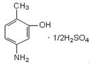

5-아미노-o-크레솔황산염 C H NO ㆍ 1/2H SO :
7 9 2 4
172.19
이 원료를 건조한 것은 정량할 때 황산 5-아미노-o-크레솔(C H NO ㆍ 1/2H SO )
7 9 2 4
95.0 % 이상을 함유한다.
성 상 이 원료는 흰색 ∼ 엷은 갈색의 결정 또는 결정성 가루로 냄새는 거의 없다.
확인시험 1) 이 원료의 수용액(1 → 200) 5 mL에 염화제이철시액 5 방울을 넣을 때
액은 황갈색을 나타낸다.
2) 이 원료의 수용액( 1 → 200) 5 mL에 염화바륨시액 5 방울을 넣을 때 액은 백탁
이 된다.
3) 이 원료 및 p-니트로아닐린 표준품 각 10 mg을 이소프로판올ㆍ물ㆍ강암모니아수
(9：3：1) 혼합액 1 mL에 넣어 녹인 다음 각각에 아황산수소나트륨 0.1 ｇ을 넣어
흔들어 섞은 다음 검액 및 표준액으로 한다. 검액 및 표준액 1 μL를 박층판에 점적
하고 이소프로필에텔ㆍ아세톤ㆍ이소프로판올(10：1：1) 혼합액을 전개 용매로 하여
박층크로마토그래프법에 따라 시험한다. 발색제로 p-디메칠아미노벤즈알데히드ㆍ묽
은염산용액(1 → 200)을 뿌릴 때 p-니트로아닐린 표준품에 대하여 Rs 값 0.7 부근에
황색의 반점을 나타낸다.
4) 이 원료 50 mg을 물에 넣어 녹여 100 mL로 한다. 이 액 10 mL를 취하여 물을
넣어 100 mL로 한다. 이 액을 가지고 자외가시부흡광도측정법에 따라 흡수스펙트럼
을 측정할 때 파장 273 ± 2 nm에서 흡수극대를 나타낸다.
순도시험 1) 용해상태 이 원료 0.5 ｇ을 묽은염산 20 mL에 넣어 녹일 때 액은 무색
∼ 엷은 황갈색을 나타내며 거의 맑다.
2) 에텔가용물 이 원료 1.0 ｇ을 달아 에텔 50 mL에 넣고 환류냉각기를 달아 수욕
중에서 때때로 흔들어 주면서 1 시간 끓인다. 뜨거울 때 미리 질량을 단 플라스크에
유리여과기(G )로 여과한다. 잔류물을 에텔 20 mL로 씻고 씻은 액 및 여액을 합하여
3
수욕상에서 증발건고하고 105 ℃ 에서 30 분간 건조하여 질량을 단다(1.0 % 이하).
3) 철 이 원료 1.0 ｇ을 달아 황산 5 방울을 넣어 적시고 천천히 가열하여 낮은 온
도에서 거의 회화 또는 휘산시킨 다음 다시 황산을 넣어 적시고 완전히 회화한다. 식
힌 다음 잔류물에 염산 0.5 mL를 넣고 수욕상에서 증발건고한 다음 묽은염산 3 방울
을 넣어 가온하고 물을 넣어 25 mL로 한다. 이것을 검액으로 하여 시험한다. 비교액
에는 철 표준액 2.0 mL를 넣는다(20 ppm 이하).
4) 중금속 이 원료 1.0 ｇ을 달아 황산 5 mL 및 질산 20 mL를 넣고 가만히 가열
한다. 때때로 질산 2 ∼ 3 mL씩을 추가하여 액이 무색 ∼ 엷은 황색이 될 때까지 가
열을 계속한다. 식힌 다음 물 10 mL 및 페놀프탈레인시액 1 방울을 넣고 암모니아시
액을 액이 엷은 적색이 될 때까지 천천히 넣고 묽은초산 2 mL를 넣고 필요하면 여
과한다. 잔류물을 물 10 mL로 씻고 씻은 액은 여액과 합하고 물을 넣어 50 mL로 한
다. 이것을 검액으로 하여 시험한다. 비교액에는 납 표준액 2.0 mL를 넣는다(20 ppm
이하).
4) 비소 이 원료 1.0 ｇ을 정밀하게 달아 황산 2 mL 및 질산 5 mL에 넣어 가만히
가열한다. 때때로 질산 2 ∼ 3 mL씩을 추가하면서 액이 무색 ∼ 엷은 황색이 될 때
까지 가열을 계속한다. 식힌 다음 포화수산암모늄용액 15 mL를 넣어 흰 연기가 발생
할 때까지 가열한다. 식힌 다음 물을 넣어 10 mL로 한다. 이것을 검액으로 하여 시
험한다(2 ppm 이하).
건조감량 1.0 % 이하(1 ｇ, 105 ℃, 2 시간)
강열잔분 0.2 % 이하(1 ｇ, 제 1 법)
정 량 법 이 원료를 건조하여 약 0.31 ｇ을 정밀하게 달아 질소정량법에 따라 시험한다.
0.05 mol/L 황산 1 mL = 17.219 mg C H NOㆍ1/2H SO
7 9 2 4
저 장 법 기밀용기
황산 m-아미노페놀
m-Aminophenol Sulfate

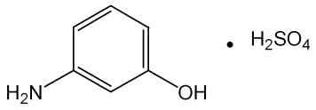

m-아미노페놀황산염
황산 3-아미노페놀 C H NOㆍ1/2H SO :
6 7 2 4
158.17
이 원료를 건조한 것은 정량할 때 황산 m-아미노페놀(C H NOㆍ1/2H SO ) 97.0 %
6 7 2 4
이상을 함유한다.
성 상 이 원료는 흰색 ∼ 회색의 결정성가루 또는 침상결정으로 특이한 냄새가 있다.
확인시험 1) 이 원료의 수용액(1 → 100) 10 mL에 염화제이철시액 5 방울을 넣을 때
액은 자갈색 ∼ 엷은 자색을 나타낸다.
2) 이 원료의 수용액(1 → 1000) 5 mL에 묽은염산 2 mL 및 아질산나트륨시액 3
mL를 넣고 여기에 2, 4-디니트로페놀용액(1 → 1000) 0.5 mL를 넣을 때 액은 주황
색을 나타낸다.
3) 이 원료의 수용액(1 → 100) 10 mL에 염화바륨시액 5 방울을 넣을 때 액은 백탁
이 된다.
4) 이 원료 50 mg을 물 100 mL에 넣어 녹이고 이 액 10 mL를 취하여 물을 넣어
100 mL로 한다. 이 액을 가지고 자외가시부흡광도측정법에 따라 흡수스펙트럼을 측
정할 때 파장 272 ± 2 nm 및 277 ± 2 nm 에서 흡수극대를 나타낸다.
5) 이 원료 및 m-아미노페놀 표준품 각 10 mg을 이소프로판올ㆍ물ㆍ강암모니아수
(9：3：1) 혼합액 1 mL에 넣어 녹인 다음 각각에 아황산수소나트륨 0.1 ｇ을 넣어
흔들어 섞어 검액 및 표준액으로 한다. 검액 및 표준액 1 μL씩을 박층판에 점적하고
이소프로필에텔ㆍ아세톤ㆍ이소프로판올(10：1：1) 혼합액을 전개용매로 하여 박층크
로마토그래프법에 따라 시험한다. 발색제로 p-디메칠아미노벤즈알데히드ㆍ묽은염산
용액(1 → 200)을 뿌릴 때 표준품과 같은 R값에서 황색의 반점을 나타낸다.
f
순도시험 1) 용해상태 이 원료 0.5 ｇ을 물 50 mL에 넣어 녹일 때 액은 무색이며
맑다.
2) 철 이 원료 0.5 ｇ을 달아 황산 5 방울을 넣어 적시고 천천히 가열하여 저온에
서 거의 회화 또는 휘산시킨 다음 황산으로 적시고 완전히 회화한다. 식힌 다음 잔류
물에 염산 0.5 mL를 넣고 수욕상에서 증발건고한다. 잔류물에 묽은염산 3 방울을 넣
어 가온하고 물을 넣어 녹여 25 mL로 한다. 이것을 검액으로 하여 시험한다. 비교액
에는 철표준액 2.0 mL를 넣는다(40 ppm 이하).
3) 에텔가용물 이 원료 약 1 ｇ을 정밀하게 달아 에텔 50 mL에 넣고 환류냉각기
를 달아 수욕상에서 때때로 흔들어 섞으면서 1 시간 끓인 다음 뜨거울 때 미리 질량
을 단 플라스크에 유리여과기(G )로 여과한다. 잔류물을 에텔 20 mL로 씻고 씻은 액
3
및 여액을 합하여 수욕상에서 증발건고하고 105 ℃ 에서 30 분간 건조하여 질량을
단다(1 % 이하).
4) 중금속 이 원료 1.0 ｇ을 황산 5 mL 및 질산 20 mL에 넣어 가만히 가열한다.
때때로 질산 2 ∼ 3 mL씩을 추가하여 액이 무색 ∼ 엷은 황색이 될 때까지 가열한
다. 식힌 다음 물 10 mL 및 페놀프탈레인시액 1 방울을 넣고 암모니아시액을 액이
엷은 적색이 될 때까지 천천히 넣고 묽은초산 2 mL를 넣고 필요하면 여과한다. 잔류
물을 물 10 mL로 씻고 씻은 액을 여액과 합하고 물을 넣어 50 mL로 한다. 이것을
검액으로 하여 시험한다. 비교액에는 납표준액 2.0 mL를 넣는다(20 ppm 이하).
5) 비소 이 원료 1.0 ｇ을 황산 2 mL 및 질산 5 mL에 넣어 가만히 가열한다. 때때
로 질산 2 ∼ 3 mL씩을 추가하여 액이 무색 ∼ 엷은 황색이 될 때까지 가열하고 식
힌 다음 포화수산암모늄용액 15 mL를 넣어 흰 연기가 발생할 때까지 가열한다. 식힌
다음 물을 넣어 10 mL로 한다. 이것을 검액으로 하여 시험한다(2 ppm 이하).
건조감량 0.2 % 이하(1.5 ｇ, 105 ℃, 2 시간)
강열잔분 0.2 % 이하(2 ｇ, 제 2 법)
정 량 법 이 원료를 건조하고 약 0.28 ｇ을 정밀하게 달아 질소정량법에 따라 시험한다.
0.05 mol/L 황산 1 mL = 15.816 mg C H NOㆍ1/2H SO
6 7 2 4
저 장 법 기밀용기
황산 o-아미노페놀
o-Aminophenol Sulfate

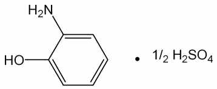

o-아미노페놀황산염
황산 2-아미노페놀 C H NOㆍ1/2H SO :
6 7 2 4
158.17
이 원료를 건조한 것은 정량할 때 황산 o-아미노페놀(C H NO ㆍ 1/2H SO ) 95.0 %
6 7 2 4
이상을 함유한다.
성 상 이 원료는 흰색 ∼ 엷은 갈색의 결정성가루로서 냄새는 없거나 약간 특이한
냄새가 있다.
확인시험 1) 이 원료의 수용액(1 → 100) 10 mL에 염화제이철시액 5 방울을 넣을 때
액은 적자색 ∼ 진한 갈색을 나타낸다.
2) 이 원료의 수용액(1 → 100) 10 mL에 질산은시액 5 방울을 넣을 때 액은 황갈색
을 나타내며 서서히 회흑색으로 변하며 혼탁한다.
3) 이 원료의 수용액(1 → 100) 10 mL에 염화바륨시액 5 방울을 넣을 때 액은 백탁
이 된다.
4) 이 원료 및 p-니트로아닐린 표준품 각 10 mg 을 이소프로판올 ㆍ 물 ㆍ 강암모
니아수(9：3：1) 혼합액 1 mL에 넣어 녹인 다음 각각에 아황산수소나트륨 0.1 ｇ을
넣어 흔들어 섞어 검액 및 표준액으로 한다. 검액 및 표준액 1 μL씩을 박층판에 점
적하고 이소프로필에텔 ㆍ 아세톤 ㆍ 이소프로판올(10：1：1) 혼합액을 전개용매로
하여 박층크로마토그래프법에 따라 시험한다. 발색제로 p-디메칠아미노벤즈알데히드
ㆍ 묽은염산용액(1 → 200) 을 뿌릴 때 p-니트로아닐린 표준품에 대하여 Rs 값 1.0
부근에서 황색의 반점을 나타낸다.
5) 이 원료 50 mg을 물 100 mL에 넣어 녹이고 이 액 10 mL를 취하여 물을 넣어
100 mL로 한다. 이 액을 가지고 자외가시부흡광도측정법에 따라 흡수스펙트럼을 측
정할 때 파장 272 ± 2 nm 에서 흡수극대를 나타낸다.
순도시험 1) 용해상태 이 원료 0.1 ｇ을 묽은염산 10 mL에 넣어 녹일 때 액은 주황
색을 띤 갈색이고 맑다.
2) 에텔가용물 이 원료 약 1 ｇ을 정밀하게 달아 에텔 50 mL에 넣어 환류냉각기
를 달아 수욕상에서 때때로 흔들어 섞으면서 1 시간 끓인 다음 뜨거울 때 미리 질량
을 단 플라스크에 유리여과기(G )로 여과한다. 잔류물을 에텔 20 mL로 씻고 씻은 액
3
및 여액을 합하여 수욕상에서 증발건고 하고 105 ℃ 에서 30 분간 건조하여 질량을
단다(1 % 이하).
3) 철 이 원료 0.50 ｇ을 달아 황산 5 방울을 넣어 적시고 천천히 가열하여 저온에
서 거의 회화 또는 휘산시킨 다음 다시 황산으로 적시고 완전히 회화한다. 식힌 다음
잔류물에 염산 0.5 mL를 넣고 수욕상에서 증발건고 한다. 잔류물에 묽은염산 3 방울
을 넣고 가온하여 물을 넣어 50 mL로 한다. 이 액 25 mL를 취하여 검액으로 하여
시험한다. 비교액에는 철표준액 2.0 mL를 넣는다(80 ppm 이하).
4) 중금속 이 원료 1.0 ｇ을 황산 5 mL 및 질산 20 mL에 넣어 가만히 가열한다.
때때로 질산 2 ∼ 3 mL씩을 추가하여 액이 무색 ∼ 엷은 황색이 될 때까지 가열한
다. 식힌 다음 물 10 mL 및 페놀프탈레인시액 1 방울을 넣고 암모니아시액을 액이
엷은 적색이 될 때까지 천천히 넣고 묽은초산 2 mL를 넣고 필요하면 여과한다. 잔류
물을 물 10 mL로 씻고 씻은 액을 여액과 합하여 물을 넣어 50 mL로 한다. 이것을
검액으로 하여 시험한다. 비교액에는 납표준액 2.0 mL를 넣는다(20 ppm 이하).
5) 비소 이 원료 1.0 ｇ을 황산 2 mL 및 질산 5 mL에 넣어 가만히 가열한다. 때때
로 질산 2 ∼ 3 mL씩을 추가하여 액이 무색 ∼ 엷은 황색이 될 때까지 가열한다. 식
힌 다음 포화수산암모늄용액 15 mL를 넣고 흰 연기가 발생할 때까지 가열한다. 식힌
다음 물을 넣어 10 mL로 한다. 이 액을 검액으로 하여 시험한다(2 ppm 이하).
건조감량 0.3 % 이하(2 ｇ, 105 ℃, 2 시간)
강열잔분 1.0 % 이하(2 ｇ, 제 2 법)
정 량 법 이 원료를 건조하고 약 0.28 ｇ을 정밀하게 달아 질소정량법에 따라 시험한다.
0.05 mol/L 황산 1 mL = 15.816 mg C H NOㆍ1/2H SO
6 7 2 4
저 장 법 기밀용기
황산 p-아미노페놀
p-Aminophenol Sulfate

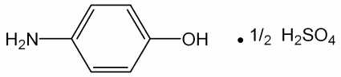

p-아미노페놀황산염
황산 4-아미노페놀 C H NO ㆍ 1/2H SO :
6 7 2 4
158.17
이 원료를 건조한 것은 정량할 때 황산 p-아미노페놀(C H NO ㆍ 1/2H SO ) 95.0 %
6 7 2 4
이상을 함유한다.
성 상 이 원료는 흰색 ∼ 엷은 회갈색의 가루 또는 침상결정으로서 냄새는 거의
없다.
확인시험 1) 이 원료의 수용액(1 → 100) 10 mL에 염화제이철시액 5 방울을 넣을 때
액은 자색을 나타낸다.
2) 이 원료의 수용액(1 → 100) 10 mL에 인텅그스텐산용액(1 → 100) 2 mL 및 탄산
나트륨시액 1 mL를 넣을 때 액은 청자색을 나타낸다.
3) 이 원료의 수용액(1 → 100) 5 mL에 니트로프루싯나트륨시액 2 mL를 넣을 때
액은 엷은 녹색을 나타낸다.
4) 이 원료의 수용액(1 → 100) 10 mL에 염화바륨시액 5 방울을 넣을 때 액은 백탁
이 된다.
5) 이 원료 및 p-아미노페놀 표준품 각 10 mg을 이소프로판올 ㆍ 물 ㆍ 강암모니아
수(9：3：1) 혼합액 1 mL에 넣어 녹인 다음 각각에 아황산수소나트륨 0.1 ｇ을 넣어
흔들어 섞은 다음 검액 및 표준액으로 한다. 검액 및 표준액 1 μL씩을 박층판에 점
적하고 이소프로필에텔 ㆍ 아세톤 ㆍ 이소프로판올(10：1：1) 혼합액을 전개용매로
하여 박층크로마토그래프법에 따라 시험한다. 발색제로 p-디메칠아미노벤즈알데히드
ㆍ 묽은염산용액(1 → 200) 을 뿌릴 때 표준품과 같은 R값에서 황색의 반점을 나타
f
낸다.
6) 이 원료 50 mg을 물 100 mL에 넣어 녹이고 이 액 10 mL를 취하여 물을 넣어
100 mL로 한다. 이 액을 가지고 자외가시부흡광도측정법에 따라 흡수스펙트럼을 측
정할 때 파장 273 ± 2 nm 에서 흡수극대를 나타낸다.
순도시험 1) 용해상태 이 원료 0.5 ｇ을 묽은 염산 20 mL에 넣어 녹일 때 액은 무
색이며 맑다.
2) 철 이 원료 1.0 ｇ을 달아 황산 5 방울을 넣어 적시고 천천히 가열하여 저온에
서 거의 회화 또는 휘산시킨 다음 다시 황산을 넣어 적시고 완전히 회화한다. 식힌
다음 잔류물에 염산 0.5 mL를 넣어 수욕상에서 증발건고 한 다음 묽은염산 3 방울을
넣어 가온하여 물 25 mL를 넣어 녹인다. 이것을 검액으로 하여 시험한다. 비교액에
는 철표준액 3.0 mL를 넣는다(30 ppm 이하).
3) 에텔가용물 이 원료 1 ｇ을 달아 에텔 50 mL를 넣고 환류냉각기를 달아 수욕
상에서 때때로 흔들어 섞으면서 1 시간 끓인 다음 뜨거울 때 미리 질량을 단 플라스
크에 유리여과기(G )로 여과한다. 잔류물을 에텔 20 mL로 씻고 씻은 액 및 여액을
3
합하여 수욕상에서 증발건고하고 105 ℃ 에서 30 분간 건조시켜 질량을 단다(1 %
이하).
4) 중금속 이 원료 1.0 ｇ을 황산 5 mL 및 질산 20 mL에 넣어 가만히 가열한다.
때때로 질산 2 ∼ 3 mL 씩을 추가하여 액이 무색 ∼ 엷은 황색이 될 때까지 가열한
다. 식힌 다음 물 10 mL 및 페놀프탈레인시액 1 방울을 넣고 암모니아시액을 액이
엷은 적색이 될 때까지 천천히 넣고 묽은초산 2 mL를 넣고 필요하면 여과한다. 잔류
물을 물 10 mL로 씻고 씻은 액을 여액과 합하고 물을 넣어 50 mL로 한다. 이것을
검액으로 하여 시험한다. 비교액에는 납표준액 2.0 mL를 넣는다(20 ppm 이하).
5) 비소 이 원료 1.0 ｇ을 황산 2 mL 및 질산 5 mL에 넣어 가만히 가열한다. 때때
로 질산 2 ∼ 3 mL 씩을 추가하여 액이 무색 ∼ 엷은 황색이 될 때까지 가열한다.
식힌 다음 포화수산암모늄용액 15 mL를 넣고 흰 연기가 발생할 때까지 가열한다. 식
힌 다음 물을 넣어 10 mL로 한다. 이것을 검액으로 하여 시험한다(2 ppm 이하).
건조감량 0.2 % 이하(1.5 ｇ, 105 ℃, 2 시간)
강열잔분 0.2 % 이하(2 ｇ, 제 2 법)
정 량 법 이 원료를 건조하고 약 0.28 ｇ을 정밀하게 달아 질소정량법에 따라 시험한다.
0.05 mol/L 황산 1 mL = 15.816 mg C H NO ㆍ 1/2H SO
6 7 2 4
저 장 법 기밀용기
황산 m-페닐렌디아민
m-Pheylenediamine sulfate

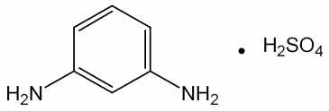

m-페닐렌디아민황산염
황산 1,3-페닐렌디아민 C H N H SO :
6 8 2ㆍ 2 4
206.22
이 원료를 건조한 것은 정량할 때 황산 m-페닐렌디아민(C H N H SO ) 90.0 % 이
6 8 2ㆍ 2 4
상을 함유한다.
성 상 이 원료는 흰색 ∼ 엷은 갈색의 가루로서 약간 특이한 냄새가 있다.
확인시험 1) 이 원료의 수용액(1 → 100) 5 mL에 질산은시액 5 방울을 넣어 가열하
면 액은 엷은 자색을 나타낸다.
2) 이 원료의 수용액(1 → 100) 10 mL에 아질산나트륨시액 2 방울을 넣을 때 액은
적갈색을 나타낸다.
3) 이 원료의 수용액(1 → 100) 5 mL에 염화바륨시액 5 방울을 넣을 때 흰색의 침
전이 생긴다.
4) 이 원료 20 mg을 물에 넣어 녹여 100 mL로 한다. 이 액 10 mL를 취하여 물을
넣어 100 mL로 하여 이 액을 가지고 자외가시부흡광도측정법에 따라 흡수스펙트럼
을 측정할 때 파장 235 ± 2 nm 및 285 ± 2 nm 에서 흡수극대를 나타낸다.
5) 이 원료 및 염산 m-페닐렌디아민 표준품 각 10 mg을 이소프로판올 ㆍ 물 ㆍ 강
암모니아수(9：3：1) 혼합액 1 mL 씩에 넣어 녹인 다음 각각에 아황산수소나트륨
0.1 ｇ을 넣어 흔들어 섞어 검액 및 표준액으로 한다. 검액 및 표준액 1 μL를 박층판
에 점적하고 이소프로필에텔ㆍ아세톤ㆍ이소프로판올(10：1：1) 혼합액을 전개용매로
하여 박층크로마토그래프법에 따라 시험한다. 발색제로 p-디메칠아미노벤즈알데히드
ㆍ묽은염산용액(1 → 200)을 뿌릴 때 표준품과 같은 R 값에서 적색을 띠는 황색의
f
반점을 나타낸다.
순도시험 1) 용해상태 이 원료 0.5 ｇ을 묽은염산 1 mL에 넣어 녹일 때 액은 엷은
주황색이며 맑다.
2) 철 이 원료 1.0 ｇ을 정밀하게 달아 황산 5 방울을 넣어 적시고 천천히 가열하
여 저온에서 거의 회화 또는 휘산시킨 다음 다시 황산을 넣어 적시고 완전히 회화한
다. 식힌 다음 잔류물에 염산 0.5 mL를 넣고 수욕상에서 증발건고 한 다음 잔류물에
묽은염산 3 방울을 넣어 가온하고 물 25 mL를 넣어 녹인다. 이것을 검액으로 하여
시험한다. 비교액에는 철표준액 2.0 mL를 넣는다(20 ppm 이하).
3) 에텔가용물 이 원료 약 1 ｇ을 정밀하게 달아 에텔 50 mL에 넣고 환류냉각기
를 달아 수욕상에서 유리여과기(G )로 여과한다. 잔류물을 에텔 20 mL로 씻고 씻은
3
액 및 여액을 합하여 수욕상에서 증발건고 하고 105 ℃에서 30 분간 건조하여 질량
을 단다(1 % 이하).
4) 중금속 이 원료 1.0 ｇ을 황산 5 mL 및 질산 20 mL에 넣어 가만히 가열한다.
때때로 질산 2 ∼ 3 mL씩을 추가하여 액이 무색 ∼ 엷은 황색이 될 때까지 가열하
고 식힌 다음 물 10 mL 및 페놀프탈레인시액 1 방울을 넣고 암모니아시액을 액이
엷은 적색이 될 때까지 천천히 넣고 묽은초산 2 mL를 넣고 필요하면 여과한다. 잔류
물을 물 10 mL로 씻고 씻은 액을 여액과 합하고 물을 넣어 50 mL로 한다. 이것을
검액으로 하여 시험한다. 비교액에는 납표준액 2.0 mL를 넣는다(20 ppm 이하).
5) 비소 이 원료 1.0 ｇ을 황산 2 mL 및 질산 5 mL에 넣어 가만히 가열한다. 때때
로 질산 2 ∼ 3 mL씩을 추가하여 액이 무색 ∼ 엷은 황색이 될 때까지 가열한다. 식
힌 다음 포화수산암모늄용액 15 mL를 넣어 흰 연기가 발생할 때까지 가열한다. 식힌
다음 물을 넣어 10 mL로 한다. 이것을 검액으로 하여 시험한다(2 ppm 이하).
건조감량 0.2 % 이하(1.5 ｇ, 실리카겔, 4 시간)
강열잔분 0.2 % 이하(2 ｇ, 제 1 법)
정 량 법 이 원료를 건조하고 약 0.18 ｇ을 정밀하게 달아 질소정량법에 따라 시험한다.
0.05 mol/L 황산 1 mL = 10.311 mg C H N H SO
6 8 2ㆍ 2 4
저 장 법 기밀용기
황산 N,N-비스(2-히드록시에칠)-p-페닐렌디아민
N,N-Bis(2-hydroxyethyl)-p-phenylenediamine Sulfate

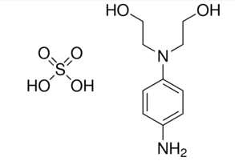

N,N-비스(2-히드록시에틸)-p-페닐렌디아민황산염
N,N-비스(2-히드록시에칠)-p-페닐렌디아민설페이트
2,2‘-[(4-아미노페닐)이미노]비스에탄올설페이트 C H N O S : 294.32
10 18 2 6
이 원료를 건조한 것은 정량할 때 황산 N,N-비스(2-히드록시에칠)-p-페닐렌디아민
(C H N O S) 95.0 % 이상을 함유한다.
10 18 2 6
성 상 이 원료는 회백색, 밝은 회색 또는 분홍색의 결정 또는 가루이며 냄새는 거
의 없다.
확인시험 1) 이 원료 및 황산 N,N-비스(2-히드록시에칠)-p-페닐렌디아민 표준품을 가
지고 적외부스펙트럼측정법 중 페이스트법에 따라 적외부스펙트럼을 측정할 때 같은
파수에서 같은 강도의 흡수를 나타낸다.
2) 이 원료 약 10 mg을 50 % 메탄올 1 mL에 넣어 녹여 검액으로 한다. 따로 황산
N,N-비스(2-히드록시에칠)-p-페닐렌디아민 표준품 약 10 mg을 50 % 메탄올 1 mL에
넣어 녹여 표준액으로 한다. 검액 및 표준액 5 μL씩을 취하여 박층판에 점적하고 에
텔을 전개용매로 박층크로마토그래프법에 따라 시험한다. 박층판을 70 ℃에서 1분간
방치하고 발색제로 p-디메칠아미노벤즈알데히드ㆍ묽은염산용액(0.5 → 100)을 뿌릴
때 검액 및 표준액의 반점은 같은 R 값에서 같은 색상을 나타낸다.
f
융 점 163 ∼ 171 ℃(제 1 법)
순도시험 1) 용해상태 이 원료 약 0.1 g을 묽은염산 10 mL에 넣어 녹일 때 액은
무색을 나타내며 거의 맑다.
2) 철 이 원료 1.0 g을 달아 황산 5 방울을 넣어 적시고 천천히 가열하여 저온에서
거의 회화 또는 휘산시킨 다음 다시 황산으로 적시고 완전히 회화한다. 식힌 다음 잔
류물에 염산 0.5 mL를 넣어 수욕상에서 증발건고하고 잔류물에 묽은염산 3 방울을
넣고 가온한 다음 물을 넣어 50.0 mL로 한다. 이 액 10 mL를 취하여 검액으로 한다.
비교액에는 철표준액 2.0 mL를 넣는다(100 ppm 이하).
3) 중금속 이 원료 1.0 g을 황산 2 mL 및 질산 20 mL에 넣어 가만히 가열한다.
때때로 질산 2 ∼ 3 mL씩을 추가하여 액이 무색 ∼ 엷은 황색이 될 때까지 가열한
다. 식힌 다음 물 10 mL 및 페놀프탈레인시액 1 방울을 넣고 암모니아시액을 액이
엷은 적색이 될 때까지 한방울씩 넣고 필요하면 여과하여 물 10 mL로 씻고 여액과
씻은 액을 네슬러관에 넣어 물을 넣어 50 mL로 한다. 이것을 검액으로 한다. 비교액
에는 납표준액 2.0 mL를 넣는다(20 ppm 이하).
4) 비소 이 원료 1.0 g을 황산 2 mL 및 질산 5 mL에 넣어 가만히 가열한다. 때때
로 질산 2 ∼ 3 mL씩을 추가하여 액이 무색 ∼ 엷은 황색이 될 때 까지 가열한다.
식힌 다음 포화수산암모늄용액 15 mL를 넣고 흰연기가 발생할 때까지 가열한 다음
식히고 물을 넣어 10 mL로 한다. 이것을 검액으로 하여 시험한다(2 ppm 이하).
건조감량 6.5 % 이하(1 g, 황산, 4시간)
강열잔분 2.0 % 이하(2 g, 제 1 법)
정 량 법 이 원료를 건조하고 약 0.3 g을 정밀하게 달아 질소정량법 제 2 법에 따라
시험한다.
0.05 mol/L 황산 1 mL = 14.7165 mg C H N O S
10 18 2 6
저 장 법 기밀용기
황산 o-클로로-p-페닐렌디아민
o-Chloro-p-pheylenediamine Sulfate

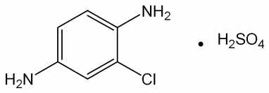

o-클로로-p-페닐렌디아민황산염
황산 2-클로로-p-페닐렌디아민
황산 2-클로로-1,4-페닐렌디아민 C H ClN H SO 240.66
6 7 2 ㆍ 2 4 :
이 원료를 건조한 것은 정량할 때 황산 o-클로로-p-페닐렌디아민(C H ClN H SO )
6 7 2ㆍ 2 4
95.0 % 이상을 함유한다.
성 상 이 원료는 엷은 자색 ∼ 자색의 가루로서 약간 특이한 냄새가 있다.
확인시험 1) 이 원료 1 ｇ을 물 100 mL에 넣어 잘 흔들어 섞은 다음 여과하여 여액
을 검액으로 한다. 검액 5 mL에 질산은시액 5 방울을 넣고 가온할 때 액은 자갈색을
나타낸다.
2) 1)의 검액 5 mL에 염화바륨시액 5 방울을 넣을 때 액은 흰색의 침전이 생긴다.
3) 1)의 검액 3 mL에 풀푸랄ㆍ초산시액 4 방울을 넣을 때 액은 주황색을 나타낸다.
4) 이 원료 0.2 ｇ에 물 1 방울을 넣어 적시고 구리망에 묻혀 식품첨가물공전 일반
시험법 중 염색반응시험법에 따라 시험할 때 녹색을 나타낸다.
5) 이 원료 및 염산 m-페닐렌디아민 표준품 각 10 mg을 이소프로판올ㆍ물ㆍ강암모
니아수(9：3：1) 혼합액 1 mL에 넣어 녹인 다음 각각에 아황산수소나트륨 0.1 ｇ을
넣어 흔들어 섞어 검액 및 표준액으로 한다. 검액 및 표준액 1 mL를 박층판에 점적
하고 이소프로필에텔ㆍ아세톤ㆍ이소프로판올(10：1：1) 혼합액을 전개용매로 하여 박
층크로마토그래프법에 따라 시험한다. 발색제로 p-디메칠아미노벤즈알데히드ㆍ묽은
염산용액(1 → 200) 을 뿌릴 때 염산 m-페닐렌디아민 표준품에 대하여 Rs 값 1.8 부
근에서 주황색 ∼ 적색의 반점을 나타낸다.
6) 이 원료 10 mg을 물 100 mL에 넣어 녹이고 이 액 10 mL를 취하여 물을 넣어
100 mL로 한다. 이 액을 가지고 자외가시부흡광도측정법에 따라 흡수스펙트럼을 측
정할 때 파장 238 ± 2 nm 및 292 ± 2 nm에서 흡수극대를 나타낸다.
순도시험 1) 용해상태 이 원료 0.2 ｇ을 묽은염산 20 mL에 넣어 녹일 때 액은 어두
운 적색 ∼ 엷은 적자색이며 거의 맑다.
2) 철 이 원료 1.0 ｇ을 달아 황산 5 방울을 넣어 적시고 천천히 가열하고 저온에
서 거의 회화 또는 휘산시킨 다음 다시 황산을 넣어 적시고 완전히 회화한다. 식힌
다음 잔류물에 염산 0.5 mL를 넣어 수욕상에서 증발건고한다. 잔류물에 묽은염산 3
방울을 넣고 가온하여 물 25 mL를 넣어 녹인다. 이것을 검액으로 하여 시험한다. 비
교액에는 철표준액 2.0 mL를 넣는다(20 ppm 이하).
3) 에텔가용물 이 원료 1 ｇ을 달아 에텔 50 mL에 넣고 환류냉각기를 달아 수욕
상에서 때때로 흔들어 섞으면서 1 시간 끓인 다음 뜨거울 때 미리 질량을 단 플라스
크에 유리여과기(G )로 여과하고 잔류물을 에텔 20 mL로 씻고 씻은 액 및 여액을
합하여 수욕상에서 증발건고 한 다음 105 ℃ 에서 30 분간 건조하여 질량을 단다(3
% 이하).
4) 중금속 이 원료 1.0 ｇ을 황산 5 mL 및 질산 20 mL에 넣어 가만히 가열한다.
식힌 다음 물 10 mL 및 페놀프탈레인시액 1 방울을 넣고 암모니아시액을 액이 엷은
적색이 될 때까지 천천히 넣고 묽은초산 2 mL를 넣고 필요하면 여과한다. 잔류물을
물 10 mL로 씻고 씻은 액을 여액과 합하고 물을 넣어 50 mL로 한다. 이것을 검액으
로 하여 시험한다. 비교액에는 납표준액 2.0 mL를 넣는다(20 ppm 이하).
5) 비소 이 원료 1.0 ｇ을 황산 2 mL 및 질산 5 mL에 넣어 가만히 가열한다. 때때
로 질산 2 ∼ 3 mL 씩을 추가하여 액이 무색 ∼ 엷은 황색이 될 때까지 가열한다.
식힌 다음 포화수산암모늄용액 15 mL를 넣어 흰 연기가 발생할 때까지 가열한다. 식
힌 다음 물을 넣어 10 mL로 한다. 이것을 검액으로 하여 시험한다(2 ppm 이하).
건조감량 1.0 % 이하(1 ｇ, 105 ℃, 2 시간)
강열잔분 2.0 % 이하(1 ｇ, 제 1 법)
정 량 법 이 원료를 건조하고 약 0.21 ｇ을 정밀하게 달아 질소정량법에 따라 시험한다.
0.05 mol/L 황산 1 mL = 12.033 mg C H ClN H SO
6 7 2ㆍ 2 4
저 장 법 기밀용기
황산 p-니트로-o-페닐렌디아민
p-Nitro-o-Phenylenediamine Sulfate

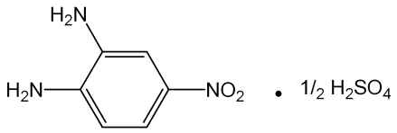

p-니트로-o-페닐렌디아민황산염
황산 4-니트로-o-페닐렌디아민
황산 4-니트로-1,2-페닐렌디아민 C H N O 1/2H SO : 202.18
6 7 3 2 ㆍ 2 4
이 원료를 건조한 것은 정량할 때 황산 p-니트로-o-페닐렌디아민(C H N O
6 7 3 2 ㆍ
1/2H SO ) 97.0 % 이상을 함유한다.
2 4
성 상 이 원료는 다갈색 ∼ 회갈색의 가루로서 냄새는 거의 없다.
확인시험 1) 이 원료 0.5 ｇ을 물 100 mL에 넣어 녹이고 여과한다. 여액 5 mL에 염
화바륨시액 5 방울을 넣을 때 액은 백탁이 된다.
2) 이 원료 10 mg을 물에 녹여 100 mL로 한다. 이 액 20 mL를 취하여 물을 넣어
100 mL로 한다. 이 액을 가지고 자외가시부흡광도측정법에 따라 흡수스펙트럼을 측
정할 때 파장 264 ± 2 nm 에서 흡수극대를 나타낸다.
3) 이 원료 및 p-니트로아닐린 표준품 각 10 mg 을 이소프로판올ㆍ물ㆍ강암모니아
수(9：3：1) 혼합액 1 mL에 넣어 녹인 다음 각각에 아황산수소나트륨 0.1 ｇ을 넣어
흔들어 섞어 검액 및 표준액으로 한다. 검액 및 표준액 1 μL씩을 박층판에 점적하고
이소프로필에텔 ㆍ 아세톤 ㆍ 이소프로판올(10：1：1) 혼합액을 전개용매로 하여 박
층크로마토그래프법에 따라 시험한다. 발색제로 p-디메칠아미노벤즈알데히드 ㆍ 묽
은염산용액(1 → 200) 을 뿌릴 때 p-니트로아닐린 표준품에 대하여 Rf값 0.7 부근에
서 적색을 띠는 황색 ∼ 황색의 반점을 나타낸다.
순도시험 1) 용해상태 이 원료 50 mg을 물 100 mL에 넣어 녹일 때 액은 황갈색이
고 거의 맑다.
2) 에텔가용물 이 원료 1 ｇ을 달아 에텔 50 mL에 넣고 환류냉각기를 달아 수욕
상에서 때때로 흔들어 섞으면서 1 시간 끓인 다음 뜨거울 때 미리 질량을 단 플라스
크에 유리여과기(G )로 여과한다. 잔류물을 에텔 20 mL로 씻고 씻은 액 및 여액을
4
합하여 수욕상에서 증발건고 하고 105 ℃ 에서 30 분간 건조시켜 질량을 단다(1 %
이하).
3) 철 이 원료 0.4 ｇ을 달아 황산 5 방울을 넣어 적시고 천천히 가열하여 저온에
서 거의 회화 또는 휘산시킨 다음 다시 황산을 넣어 적시고 완전히 회화한다. 식힌
다음 잔류물에 염산 0.5 mL를 넣어 수욕상에서 증발건고 한 다음 묽은염산 3 방울을
넣고 가온하여 25 mL를 넣어 녹인다. 이것을 검액으로 하여 시험한다. 비교액에는
철표준액 2.0 mL를 넣는다(50 ppm 이하).
4) 비소 이 원료 1.0 ｇ을 황산 2 mL 및 질산 5 mL에 넣어 가만히 가열한다. 때때
로 질산 2 ∼ 3 mL 씩을 추가하여 액이 무색 ∼ 엷은 황색이 될 때까지 가열한다.
식힌 다음 포화수산암모늄용액 15 mL를 넣어 흰연기가 발생할 때까지 가열한다. 식
힌 다음 물을 넣어 10 mL로 한다. 이것을 검액으로 하여 시험한다(2 ppm 이하).
5) 중금속 이 원료 1.0 ｇ을 황산 5 mL 및 질산 20 mL에 넣어 가만히 가열한다.
때때로 질산 2 ∼ 3 mL 씩을 추가하여 액이 무색 ∼ 엷은 황색이 될 때까지 가열한
다. 식힌 다음 물 10 mL 및 페놀프탈레인시액 1 방울을 넣고 암모니아시액을 액이
엷은 적색이 될 때까지 천천히 넣고 묽은초산 2 mL를 넣고 필요하면 여과한다. 잔류
물을 물 10 mL로 씻고 씻은 액을 여액과 합하면 물을 넣어 50 mL로 한다. 이것을
검액으로 하여 시험한다(10 ppm 이하).
건조감량 1.0 % 이하(1.5 ｇ, 105 ℃, 2 시간)
강열잔분 1.0 % 이하(2 ｇ, 제 1 법)
정 량 법 이 원료를 건조하고 약 0.12 ｇ을 정밀하게 달아 아연(입상) 2 ｇ, 물 15
mL 및 염산 15 mL에 넣고 조심하면서 증발건고한다. 식힌 다음 질소정량법에 따라
시험한다.
0.05 mol/L 황산 1 mL = 6.739 mg C H N O 1/2H SO
6 7 3 2ㆍ 2 4
저 장 법 기밀용기
황산 p-메칠아미노페놀
p-Methylaminophenol Sulfate

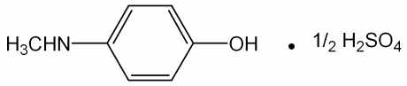

p-메틸아미노페놀황산염
황산 4-메칠아미노페놀 C H NO ㆍ 1/2H SO :
7 9 2 4
172.22
이 원료를 건조한 것은 정량할 때 황산 p-메칠아미노페놀(C H NOㆍ1/2H SO ) 95.0
7 9 2 4
% 이상을 함유한다.
성 상 이 원료는 흰색 ∼ 엷은 회백색의 결정성가루로서 냄새는 거의 없다.
확인시험 1) 이 원료의 수용액(1 → 200) 10 mL에 염화제이철시액 5 방울을 넣을 때
적자색을 나타낸다.
2) 이 원료의 수용액(1 → 200) 10 mL에 염화바륨시액 5 방울을 넣을 때 백색의 침
전이 생긴다.
3) 이 원료 및 황산 p-메칠아미노페놀 표준품 각 10 mg을 이소프로판올 ㆍ 물 ㆍ
강암모니아수(9：3：1) 혼합액 1 mL에 넣어 녹인 다음 각각에 아황산수소나트륨 0.1
ｇ을 넣어 흔들어 섞어 검액 및 표준액으로 한다. 검액 및 표준액 1 μL씩을 박층판
에 점적하고 이소프로필에텔 ㆍ 아세톤 ㆍ 이소프로판올(10：1：1) 혼합액을 전개용
매로 하여 박층크로마토그래프법에 따라 시험한다. 발색제로 p-디메칠아미노벤즈알데
히드 ㆍ 묽은염산용액(1 → 200)을 뿌릴 때 표준품과 같은 R값에서 황색의 반점을 나
f
타낸다.
4) 이 원료 50 mg을 물 250 mL에 넣어 녹인다. 이 액 10 mL를 취하여 물을 넣어
100 mL로 한다. 이 액을 가지고 자외가시부흡광도측정법에 따라 흡수스펙트럼을 측
정할 때 파장 271 ± 2 nm 및 221 ± 2 nm 에서 흡수극대를 나타낸다.
순도시험 1) 용해상태 이 원료 0.5 ｇ을 묽은염산 10 mL에 넣어 녹일 때 액은 무색
이며 맑다.
2) 에텔가용물 이 원료 1 ｇ을 달아 에텔 50 mL를 넣고 환류냉각기를 달아 수욕
상에서 때때로 흔들어 섞으면서 1 시간 끓인 다음 뜨거울 때 미리 질량을 단 플라스
크에 유리여과기(G )로 여과한다. 잔류물을 에텔 20 mL로 씻고 씻은 액 및 여액을
3
합하여 수욕상에서 증발건고 하고 105 ℃ 에서 30 분간 건조하여 질량을 단다(0.1 %
이하).
3) 철 이 원료 0.4 ｇ을 달아 황산 5 방울을 넣어 적시고 천천히 가열하여 저온에
서 거의 회화 또는 휘산시킨 다음 다시 황산으로 적시고 완전히 회화한다. 식힌 다음
잔류물에 염산 0.5 mL를 넣어 수욕상에서 증발건고한 잔류물에 묽은염산 3 방울을
넣고 가온하여 물 25 mL에 넣어 녹인다. 이것을 검액으로 하여 시험한다. 비교액에
는 철표준액 2.0 mL를 넣는다(50 ppm 이하).
4) 중금속 이 원료 1.0 ｇ을 황산 5 mL 및 질산 20 mL에 넣고 가만히 가열한 다
음 때때로 질산 2 ∼ 3 mL 씩을 추가하여 액이 무색 ∼ 엷은 황색이 될 때까지 가
열한다. 식힌 다음 물 10 mL 및 페놀프탈레인시액 1 방울을 넣고 암모니아시액을 액
이 엷은 적색이 될 때까지 천천히 넣은 다음 묽은초산 2 mL를 넣고 필요하면 여과
한다. 잔류물을 물 10 mL로 씻고 씻은 액을 여액과 합하고 물을 넣어 50 mL로 한
다. 이것을 검액으로 하여 시험한다. 비교액에는 납표준액 3.0 mL를 넣는다(30 ppm
이하).
5) 비소 이 원료 1.0 ｇ을 황산 2 mL 및 질산 5 mL에 넣어 가만히 가열한 다음
때때로 질산 2 ∼ 3 mL 씩을 추가하여 액이 무색 ∼ 엷은 황색이 될 때까지 가열한
다. 식힌 다음 포화수산암모늄용액 15 mL를 넣고 흰 연기가 발생할 때까지 가열한
다. 식힌 다음 물을 넣어 10 mL로 한다. 이것을 검액으로 하여 시험한다(2 ppm 이하).
건조감량 1.0 % 이하(1 ｇ, 105 ℃, 2 시간)
강열잔분 0.5 % 이하(1 ｇ, 제 1 법)
정 량 법 이 원료를 건조하고 약 0.31 ｇ을 정밀하게 달아 질소정량법에 따라 시험한다.
0.05 mol/L 황산 1 mL = 17.219 mg C H NOㆍ1/2H SO
7 9 2 4
저 장 법 기밀용기
황산 p-페닐렌디아민
p-Phenylenediamine Sulfate

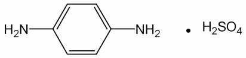

p-페닐렌디아민황산염
황산 1,4-페닐렌디아민 C H N H SO :
6 8 2 ㆍ 2 4
206.22
이 원료를 건조한 것은 정량할 때 황산 p-페닐렌디아민(C H N H SO ) 95.0 % 이
6 8 2ㆍ 2 4
상을 함유한다.
성 상 이 원료는 흰색 ∼ 엷은 자색의 가루로서 냄새는 거의 없다.
확인시험 1) 이 원료의 수용액(1 → 1000) 5 mL에 질산은시액 5 방울을 넣을 때 액
은 녹색 ∼ 녹갈색을 나타내며 은이 석출된다.
2) 이 원료의 수용액(1 → 1000) 5 mL에 염화바륨시액 5 방울을 넣을 때 흰색침전
이 생긴다.
3) 이 원료의 수용액(1 → 1000) 3 mL에 풀푸랄ㆍ초산시액 4 방울을 넣을 때 액은
황색을 띠는 적색 ∼ 적갈색을 나타낸다.
4) 이 원료 50 mg을 물에 넣어 녹여 100 mL로 한다. 이 액 1 mL를 취하여 물을
넣어 100 mL로 한다. 이 액을 가지고 자외가시부흡광도측정법에 따라 흡수스펙트럼
을 측정할 때 파장 234 ± 2 nm 에서 흡수극대를 나타낸다.
5) 이 원료 및 p-페닐렌디아민 표준품 각 10 mL을 이소프로판올ㆍ물ㆍ강암모니아수
(9：3：1) 혼합액 1 mL에 넣어 녹인 다음 각각에 아황산수소나트륨 0.1 ｇ을 넣어
흔들어 섞어 검액 및 표준액으로 한다. 검액 및 표준액 1 μL를 박층판에 점적하고
초산에칠ㆍ메탄올ㆍ물(50：10：8) 혼합액을 전개용매로 하여 박층크로마토그래프법에
따라 시험한다. 발색제로 p-디메칠아미노벤즈알데히드ㆍ묽은염산용액(1 → 200)을 뿌
릴 때 표준품과 같은 R 값에서 황색을 띠는 적색의 반점을 나타낸다.
f
순도시험 1) 용해상태 이 원료 0.5 ｇ을 묽은염산 30 mL에 넣어 녹일 때 액은 엷은
갈색 또는 엷은 자색을 나타내며 맑다.
2) 에텔가용물 이 원료 1.0 ｇ을 달아 에텔 50 mL 에 넣고 환류냉각기를 달아 수
욕상에서 때때로 흔들어 섞으면서 1 시간 끓인 다음 뜨거울 때 미리 질량을 단 플라
스크에 유리여과기(G )로 여과한다. 잔류물을 에텔 20 mL로 씻고 씻은 액 및 여액을
3
합하여 수욕상에서 증발건고 하고 105 ℃ 에서 30 분간 건조하여 질량을 단다(1 %
이하).
3) 철 이 원료 1.0 ｇ을 달아 황산 5 방울을 넣어 적시고 천천히 가열하여 되도록
저온에서 거의 회화 또는 휘산시킨 다음 다시 황산을 넣어 적시고 완전히 회화한다.
식힌 다음 잔류물에 염산 0.5 mL를 넣고 수욕상에서 증발건고한다. 잔류물에 묽은염
산 3 방울을 넣고 가온하여 물 25 mL를 넣어 녹인다. 이것을 검액으로 하여 시험한
다. 비교액에는 철표준액 2.0 mL를 넣는다(20 ppm 이하).
4) 중금속 이 원료 1.0 ｇ을 황산 5 mL 및 질산 20 mL에 넣고 가만히 가열한다.
때때로 질산 2 ∼ 3 mL 씩을 추가하여 액이 무색 ∼ 엷은 황색이 될 때까지 가열한
다. 식힌 다음 물 10 mL 및 페놀프탈레인시액 1 방울을 넣고 암모니아시액을 액이
엷은 적색이 될 때까지 천천히 넣고 묽은초산 2 mL를 넣고 필요하면 여과한다. 잔류
물을 물 10 mL로 씻고 씻은 액은 여액과 합하고 물을 넣어 50 mL로 한다. 이것을
검액으로 하여 시험한다. 비교액에는 납표준액 2.0 mL를 넣는다(20 ppm 이하).
5) 비소 이 원료 1.0 ｇ을 황산 2 mL 및 질산 5 mL에 넣어 가만히 가열한다. 식힌
다음 포화수산화암모늄용액 15 mL를 넣어 흰연기가 발생할 때까지 가열한다. 식힌
다음 물을 넣어 10 mL로 한다. 이것을 검액으로 하여 시험한다(2 ppm 이하).
건조감량 0.2 % 이하(1.5 ｇ, 실리카겔, 4 시간)
강열잔분 0.2 % 이하(2 ｇ, 제 1 법)
정 량 법 이 원료를 건조하고 약 0.22 ｇ을 정밀하게 달아 질소정량법에 따라 시험한다.
0.05 mol/L 황산 1 mL = 10.311 mg C H N H SO
6 8 2 ㆍ 2 4
저 장 법 기밀용기
황산철수화물
Ferrous Sulfate Hydrate
황산철
황산제일철
황산철(II)칠수화물 FeSO 7H O : 278.02
4ㆍ 2
이 원료는 정량할 때 황산철수화물(FeSO 7H O) 98.0 ~ 104.0 %를 함유한다.
4ㆍ 2
성 상 이 원료는 연한 초록색의 결정 또는 결정성 가루로 냄새는 없고 맛은
수렴성이다. 이 원료는 물에 잘 녹으며 에탄올(95) 또는 에테르에는 거의 녹지 않는다.
이 원료는 건조 공기 중에서 풍해되기 쉬우며 습한 공기 중에서 결정의 표면이 황갈
색으로 변한다.
확인시험 이 원료의 수용액(1 → 10)은 철(II)염 및 황산염의 정성반응을 나타낸다.
순도시험 1) 용해상태 이 원료 1.0 g을 물 20 mL 및 묽은황산 1 mL에 녹일 때 액은
맑다.
2) 산 이 원료를 가루로 하여 5.0 g을 에탄올(95) 50 mL를 넣어 2 분간 흔들
어 섞은 다음 여과한다. 여액 25 mL에 물 50 mL, 브롬치몰블루시액 3 방울 및
묽은수산화나트륨시액 0.5 mL를 넣을 때 액은 파란색이다.
3) 수은 이 조작은 차광한 용기를 써서 한다. 이 원료 약 1 g을 정밀하게 달아 희
석시킨 질산(1 → 10) 30 mL를 넣어 수욕에서 가열하면서 녹인다. 얼음욕에 빨리 넣
어 식히고 미리 희석시킨 질산(1 → 10)과 물로 씻은 여과기를 써서 여과한다. 여액
에 구연산나트륨용액(1 → 4) 20 mL 및 염산히드록실아민 시액 1 mL를 넣어 검액으
로 한다. 따로 수은표준액 3.0 mL, 희석시킨 질산(1 →4) 30 mL, 구연산나트륨용액(1
→ 4) 5 mL 및 염산히드록실아민 1 mL를 가지고 비교액을 만든다. 비교액에 암모니아
시액을 넣어 pH를 1.8로 조정하고 검액에는 황산을 써서 pH 1.8로 조정하여 각각 분액
깔때기에 옮긴다. 검액 및 비교액을 가지고 다음과 같이 시험한다. 추출용디티존액 5
mL 및 클로로포름 5 mL씩으로 2 회 추출하고 클로로포름추출액은 다른 분액깔때기에
옮긴다. 여기에 희석시킨 염산(1 → 2) 10 mL를 넣어 흔들어 섞은 다음 방치하여 클로
로포름층은 버린다. 산추출액을 클로로포름 3 mL로 씻고 씻은 액은 버린다. 에칠렌디
아민테트라초산디나트륨용액(1 → 50) 0.1 mL 및 6 mol/L 초산 2 mL를 넣고 섞은 다
음 암모니아시액 5 mL를 천천히 넣는다. 분액깔때기 뚜껑을 닫고 흐르는 찬물로 식힌
다음 뚜껑을 열고 내용물을 비커에 옮긴다. 앞에서와 같은 방법으로 검액 및 비교액을
pH 1.8로 조정하고 다시 각각의 분액깔때기에 옮긴다. 희석시킨 추출용디티존액 5.0
mL를 넣고 세게 흔들어 섞은 다음 방 치한다. 희석시킨 추출용디티존액을 대조로 하여
검액과 비교액의 클로로포름층에 나타난 색상을 비교할 때 검액의 색상은 비교액의 색
상보다 진하지 않다 (3 ppm 이하).
ㆍ 수은표준원액 염화수은(II) 135.4 mg을 100 mL 용량플라스크에 넣고 0.5
mol/L 황산시액을 넣어 녹인 다음 표선까지 채워 섞는다. 이 액은 100 mL 중 수은
(Hg) 0.1 g을 함유한다.
ㆍ 수은표준액 쓸 때 수은표준원액 1.0 mL를 취하여 1000 mL의 용량플라스크
에 넣고 0.5 mol/L 황산시액을 넣어 표선까지 채워 섞는다. 이 액 1 mL는 수은
(Hg) 1 μg을 함유한다.
ㆍ 희석시킨 추출용디티존액 쓸 때 추출용디티존액 5 mL를 클로로포름 25
mL로 희석한다.
4) 납 이 원료 1.0 g을 달아 50 mL 용량플라스크에 넣고 9 mol/L 염산 10 mL,
물 약 10 mL, 아스코르빈산ㆍ요오드화나트륨시액 20 mL 및 트리옥틸포스핀옥시드
의 4-메칠-2-펜타논용액(5 → 100) 5 mL를 넣어 30 초간 흔든 다음 층이 분리될
때까지 정치한다. 다음에 용량플라스크 목부분에 물을 넣고 다시 흔든 다음 정치하
여 유기용매층을 취하여 검액으로 한다. 따로 질산납표준원액 5 mL를 정확하게 취
하여 물을 넣어 정확하게 100 mL로 하고 이 액 2 mL를 정확하게 취하여 50 mL
용량플라스크에 넣고 이하 검액과 같은 방법으로 조작하여 표준액으로 한다. 검액
및 표준액을 가지고 다음 조건으로 원자흡광광도법에 따라 시험할 때 검액의 흡광
도는 표준액의 흡광도보다 적다.
사용기체 : 용해아세틸렌 - 공기
램프 : 납중공음극램프
파장 : 283.8 nm
5) 비소 이 원료 1.0 g을 달아 제1법에 따라 조작하여 시험한다 (2 ppm 이하).
정 량 법 이 원료 약 0.7 g를 정밀하게 달아 물 20 mL, 묽은 황산시액 20 mL 및 인산
2 mL 넣은 다음 곧 0.02 mol/L 과망간산칼륨액으로 적정한다.
0.02 mol/L 과망간산칼륨액 1 mL = 27.80 mg FeSO 7H O
4ㆍ 2
저 장 법 기밀용기.
황산 톨루엔-2, 5-디아민
Toluene-2,5-diamine Sulfate

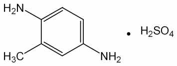

톨루엔-2, 5-디아민황산염
황산 메칠-2,5-페닐렌디아민, 황산 o-메칠-p-페닐렌디아민,
황산 p-톨루렌디아민, 황산 p-톨루이렌디아민,
황산 2,5-디아미노톨루엔, 황산 2,5-톨루이렌디아민,
황산 2-메칠-p-페닐렌디아민, 황산 2,5-톨루엔디아민 C H N H SO :
7 10 2ㆍ 2 4
220.25
이 원료를 건조한 것은 정량할 때 황산 톨루엔-2, 5-디아민(C H N H SO ) 95.0
7 10 2 ㆍ 2 4
% 이상을 함유한다.
성 상 이 원료는 회색 ∼ 엷은 적자색의 결정성가루로서 냄새는 없거나 약간 특이
한 냄새가 있다.
확인시험 1) 이 원료의 수용액(1 → 100) 3 mL에 풀푸랄ㆍ초산시액 4 방울을 넣을
때 액은 황색을 띠는 적색을 나타낸다.
2) 이 원료의 수용액(1 → 100) 10 mL에 염화바륨시액 5 방울을 넣을 때 액은 백탁
이 된다.
3) 이 원료의 수용액(1 → 100) 10 mL에 질산은시액 5 방울을 넣을 때 액은 적자색
∼ 자색을 나타낸다.
4) 이 원료 15 mg 을 물 100 mL에 녹인 다음 이 액 10 mL를 취하여 물을 넣어
100 mL로 한다. 이 액을 가지고 자외가시부흡광도측정법에 따라 흡수스펙트럼을 측
정할 때 파장 235 ± 2 nm 및 286 ± 2 nm 에서 흡수극대를 나타낸다.
5) 이 원료 및 염산 m-페닐렌디아민 표준품 각 10 mg을 이소프로판올 ㆍ 물 ㆍ 강
암모니아수(9：3：1) 혼합액 1 mL에 넣어 녹인 다음 각각에 아황산수소나트륨 0.1
ｇ을 넣어 흔들어 섞어 검액 및 표준액으로 한다. 검액 및 표준액 1 μL를 박층판에
점적하고 이소프로필에텔 ㆍ 아세톤 ㆍ 이소프로판올(10：1：1) 혼합액을 전개용매로
하여 박층크로마토그래프법에 따라 시험한다. 발색제로 p-디메칠아미노벤즈알데히드
ㆍ 묽은염산용액(1 → 200) 을 뿌릴 때 염산 m-페닐렌디아민 표준품에 대하여 Rs
값 0.9 부근에서 주황색 ∼ 황색의 반점을 나타낸다.
순도시험 1) 용해상태 이 원료 0.1 ｇ을 묽은염산 10 mL에 넣어 녹일 때 액은 엷은
적자색이며 거의 맑다.
2) 철 이 원료 1.0 ｇ을 정밀하게 달아 황산 5 방울을 넣어 적시고 천천히 가열하
여 저온에서 거의 회화 또는 휘산시킨 다음 황산을 넣어 적시고 완전히 회화한다. 식
힌 다음 잔류물에 염산 0.5 mL를 넣고 수욕상에서 증발건고 한 다음 잔류물에 묽은
염산 3 방울을 넣어 가온하고 물 25 mL를 넣어 녹인다. 이것을 검액으로 하여 시험
한다. 비교액에는 철표준액 2.0 mL를 넣는다(20 ppm 이하).
3) 에텔가용물 이 원료 1 ｇ을 정밀하게 달아 에텔 50 mL에 넣고 환류냉각기를
달아 수욕상에서 때때로 흔들어 섞으면서 1 시간동안 끓인다. 뜨거울 때 유리여과기
(G )를 사용하여 미리 질량을 단 플라스크에 여과한다. 잔류물을 에텔 20 mL로 씻고
3
씻은 액 및 여액을 합하여 수욕상에서 증발건고 한 다음 105 ℃ 에서 30 분간 건조
하여 질량을 단다(1 % 이하).
4) 중금속 이 원료 1.0 ｇ을 황산 5 mL 및 질산 20 mL에 넣고 가만히 가열한다.
때때로 질산 2 ∼ 3 mL 씩을 추가하여 액이 무색 ∼ 엷은 황색이 될 때까지 가열한
다. 식힌 다음 물 10 mL 및 페놀프탈레인시액 1 방울을 넣고 암모니아시액을 액이
엷은 적색이 될 때까지 천천히 넣어주고 묽은초산 2 mL를 넣고 필요하면 여과한다.
잔류물을 물 10 mL로 씻고 씻은 액을 여액과 합하고 물을 넣어 50 mL로 한다. 이것
을 검액으로 하여 시험한다. 비교액에는 납표준액 2.0 mL를 넣는다(20 ppm 이하).
5) 비소 이 원료 1.0 g을 황산 2 mL 및 질산 5 mL에 넣어 천천히 가열한다. 때때
로 질산 2 ∼ 3 mL 씩을 추가하여 액이 무색 ∼ 엷은 황색이 될 때까지 가열한다.
식힌 다음 포화수산암모늄용액 15 mL를 넣고 흰 연기가 발생할 때까지 가열한다. 식
힌 다음 물을 넣어 10 mL로 한다. 이것을 검액으로 하여 시험한다(2 ppm 이하).
건조감량 5.0 % 이하(1 ｇ, 105 ℃, 2 시간)
강열잔분 0.3 % 이하(2 ｇ, 제 1 법)
정 량 법 이 원료를 건조하고 약 0.20 ｇ을 정밀하게 달아 질소정량법에 따라 시험한다.
0.05 mol/L 황산 1 mL = 11.012 mg C H N H SO
7 10 2ㆍ 2 4
저 장 법 기밀용기
히드록시벤조모르포린
Hydroxybenzomorpholine

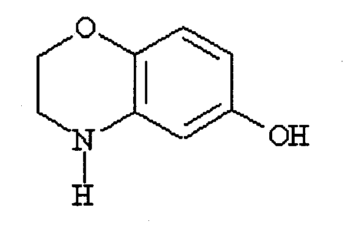

3,4-dyhydro-2H-1,4-benzoxazin-6-ol C H NO : 151.16
8 9 2
이 원료는 정량할 때 환산한 무수물에 대하여 히드록시벤조모르포린(C H NO :
8 9 2
151.16) 98.0 ∼ 101.0 % 이상을 함유한다.
성 상 이 원료는 분홍색∼옅은 자주빛을 띠는 결정성의 가루로 약한 특이한 냄새
가 있다.
확인시험 1) 이 원료를 가지고 적외부스펙트럼측정법 브롬화칼륨정제법에 따라 측정
할 때 파수 3322 cm-1, 1627-1605 cm-1, 1515-1487 cm-1, 1331 cm-1 , 1227 cm-1,
1204 cm-1, 1169 cm-1 부근에서 흡수를 나타낸다.
2) 이 원료 약 0.4 g을 정밀하게 달아 에탄올을 넣어 녹여 100 mL로 하고 이 액을
가지고 자외가시부흡광도측정법에 따라 흡광도를 측정할 때 파장 208 nm 및 244
nm에서 흡수극대를 나타낸다.
순도시험 1) 용해상태 이 원료 약 0.1 g에 물 10 mL를 넣고 녹일 때 그 액은 맑으
며 무색이다.
2) 유연물질 이 원료 약 0.1 g을 정밀하게 달아 에탄올을 넣어 녹여 10 mL로 한
액을 검액으로 한다. 이 액 1 mL를 정확하게 취하여 에탄올(95)을 넣어 정확하게
100 mL로 하여 표준액으로 한다. 검액 및 표준액을 가지고 박층크로마토그래프법에
따라 시험한다. 검액 및 표준액 5 μL씩을 박층크로마토그래프용실리카겔을 써서 만
든 박층판에 점적한다. 초산에칠을 전개용매로 하여 점적한 곳으로부터 약 12 cm
전개한 다음 박층판을 전개용매 냄새가 나지 않을 때까지 건조한다. 여기에 발색제
로 4-니트로벤젠디아조늄클로라이드 시액을 고르게 뿌릴 때 검액에서 얻은 주 반점
이외의 반점은 표준액에서 얻은 반점보다 진하지 않다.
3) 중금속 이 원료 1.0 g을 달아 중 제 2법에 따라 조작하여 시험한다. 비교액에는
납표준액 2.0 mL를 넣는다(20 ppm 이하).
4) 비소 이 원료 1.0 g을 달아 비소시험법 제 3 법에 따라 조작하여 시험한다 (2
ppm 이하).
융 점 112 ∼ 118 °C
수 분 0.5 % 이하(2 g)
강열잔분 1.0 % 이하(2 g)
정 량 법 이 원료 약 175 mg을 정밀하게 달아 초산 70 mL에 녹이고 0.1 mol/L
과염소산으로 적정한다(적정종말점검출법 전위차적정법). 같은 방법으로 공시험을 하
여 보정한다.
0.1 mol/L 과염소산액 1 mL = 15.1 mg C H NO
8 9 2
N-(2-히드록시에칠)-2-니트로-p-페닐렌디아민
N-(2-hydroxyethyl)-2-nitro-p-phenylenediamine

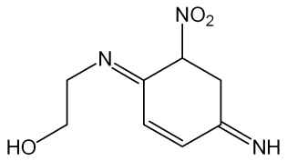

C H N O : 197.1
8 11 3 3
이 원료는 정량할 때 N-(2-히드록시에칠)-2-니트로-p-페닐렌디아민(C H N O ) 99.0
8 11 3 3
% 이상을 함유한다.
성 상 이 원료는 흑색 결정성가루이다.
확인시험 1) 이 원료 및 N-(2-히드록시에칠)-2-니트로-p-페닐렌디아민 표준품 0.1 g
씩을 메탄올 10 mL에 녹여 원심분리하여 상징액을 검액 및 표준액으로 한다. 이들 액
을 가지고 박층크로마토그래프법에 따라 시험한다. 검액 및 표준액 5 μL씩을 취하여
박층크로마토그래프용 실리카겔을 써서 만든 박층판에 점적한다. 다음에 초산에칠을
전개용매로 하여 약 10 cm 전개한 다음 박층판을 바람에 말린다. 여기에 발색제로 p-
디메칠아미노벤즈알데히드ㆍ묽은염산용액(0.5→100)을 뿌릴 때 검액 및 표준액에서 얻
은 반점의 R 값 및 색상은 같다.
f
2) 이 원료 약 50 mg을 물에 넣어 녹여 100 mL로 한다. 이 액 10 mL을 취하여 물
을 넣어 1 L로 한다. 이 액을 가지고 자외가시부흡광도측정법에 따라 흡수스펙트럼을
측정할 때 파장 503 ∼507 nm에서 흡수 극대를 나타낸다.
융 점 120 ∼ 125 ℃(제 1 법)
순도시험 1) 철 이 원료 2.0 g 을 달아 황산 5 방울을 넣어 적시고 천천히 가열하여
저온에서 거의 회화 또는 휘산시킨 다음 다시 황산으로 적시고 완전히 회화한다. 식
힌 다음 잔류물에 염산 0.5 mL를 넣고 수욕상에서 증발건고하여 잔류물에 묽은염산
3 방울을 넣어 가온하고 물 25 mL를 넣어 녹인다. 이것을 검액으로 하여 시험한다.
비교액에는 철표준액 1.0 mL를 넣는다( 5 ppm 이하).
2) 중금속 이 원료 1.0 g을 황산 2 mL 및 질산 20 mL에 넣어 가만히 가열한다.
때때로 질산 2 ∼ 3 mL 씩을 추가하여 액이 무색 ∼ 엷은 황색이 될 때까지 가열한
다. 식힌 다음 물 10 mL 및 페놀프탈레인시액 1 방울을 넣고 암모니아시액을 액이
엷은 적색이 될 때까지 넣고 필요하면 여과하여 물 10 mL로 씻고 여액과 씻은 액을
네슬러관에 넣어 물을 넣어 50 mL로 한 액을 검액으로 하여 시험한다. 비교액에는
납표준액 2.0 mL을 쓴다(20 ppm 이하).
3) 비소 이 원료 1.0 g을 황산 2 mL 및 질산 5 mL에 넣어 가만히 가열한다. 때때
로 질산 2 ∼ 3 mL씩을 추가하여 액이 무색 ∼ 엷은 황색이 될 때까지 가열한다.
식힌 다음 포화수산암모늄용액 15 mL를 넣는다. 흰 연기가 발생할 때까지 가열한
다음 식히고 물을 넣어 10 mL로 한 액을 검액으로 하여 시험한다(2 ppm 이하).
수 분 0.3 % 이하(1g, 용량적정법, 직접적정)
강열잔분 0.2 % 이하(2g, 제 1 법)
정 량 법 이 원료 약 0.12 g을 정밀하게 달아 질소정량법 제 2 법에 따라 시험한다.
0.05 mol/L 황산 1 mL = 6.573 mg C H N O
8 11 3 3
저 장 법 기밀용기
6-히드록시인돌
6-Hydroxyindole

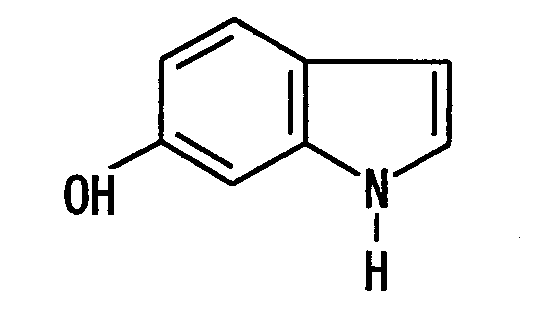

C H NO : 133.15
8 7
이 원료는 정량할 때 환산한 무수물에 대하여 6-히드록시인돌(C H N O : 133.15)
5 6 2
97.0 ∼ 101.0 % 이상을 함유한다.
성 상 이 원료는 옅은 갈색 ∼ 회색을 띠는 가루이며, 약간 특이한 냄새가 있다.
확인시험 1) 이 원료의 수용액(1 → 1000) 10 mL에 염화제일철시액 1 방울을 넣을
때 액은 연한 갈색 ∼ 검은색을 나타낸다.
2) 이 원료 0.01 g에 황산 2 mL를 넣어 녹일 때 액은 초록색을 띠며, 다시 물 5 mL
를 넣을 때 액은 노란색으로 변한다.
3) 이 원료 0.025 g에 에탄올 200 mL를 넣어 녹이고 이 액 2 mL를 가지고 에탄올
을 넣어 100 mL로 한다. 이 액을 가지고 자외가시부흡광도측정법에 따라 흡수스펙
트럼을 측정할 때 파장 218 ± 2 nm 에서 흡수극대를 나타낸다.
4) 이 원료를 가지고 적외부스펙트럼측정법의 브롬화칼륨정제법에 따라 시험할 때,
파수 3394 cm-1, 1625 cm-1, 1590 cm-1, 1505 cm-1, 1428 cm-1, 1235 cm-1, 818
cm-1 부근에서 흡수를 나타낸다.
융 점 124 ∼ 128 ℃
순도시험 1) 용해상태 이 원료 0.5 g에 에탄올 10 mL를 넣어 녹일 때, 액은 옅은
황갈색 ∼ 어두운 갈색을 나타내고 맑다.
2) 철 이 원료 1.0 g을 달아 제 3 법으로 조제하여 A법에 따라 시험한다. 비교액
에는 철표준액 3.0 mL를 넣는다(30 ppm 이하).
3) 중금속 이 원료 1.0 g을 달아 제 2 법에 따라 조작하여 시험한다. 비교액에는
납표준액 2.0 mL를 넣는다(20 ppm 이하).
4) 비소 이 원료 1.0 g을 달아 제 3 법에 따라 조작하여 시험한다(2 ppm 이하).
수 분 1.0 % 이하 (1.0 g)
강열잔분 0.1 % 이하 (1.0 g)
정 량 법 이 원료 약 0.1 g을 정밀하게 달아 0.5 % 염산수용액 2 mL 및 이동상을 넣
어 정확하게 50 mL로 하고 30 분간 잘 섞는다. 이 액 10 mL를 정확하게 취하여
다시 이동상을 넣어 정확하게 50 mL로 하여 검액으로 한다. 따로 6-히드록시인돌
표준품을 가지고 검액과 같은 방법으로 조제하여 표준액으로 한다. 검액 및 표준액
10 μL씩을 가지고 다음 조건으로 액체크로마토그래프법에 따라 시험하여 각 액의
6-히드록시인돌의 피크면적 A 및 A 을 측정한다.
T S

6-히드록시인돌(C H N O)의 양(mg) = 6-히드록시인돌표준품의 양(mg) x 
5 6 2 


조작조건
검 출 기 : 자외부흡광광도계(측정파장 292 nm)
칼 럼 : 안지름 약 4 mm, 길이 약 250 mm인 스테인레스강관에 5 μm의 액체
크로마토그래프용옥타데실실릴실리카겔을 충전한 것 또는 이와 동등한
칼럼
이 동 상 : 아세토니트릴ㆍ물혼합액 (37 : 63)을 인산으로 pH 3.5로 조정한다.
유 량 : 1.0 mL/분
과황산나트륨ㆍ과황산암모늄 분말제
Sodium PersulfateㆍAmmonium Persulfate Powder
이 기능성화장품은 정량할 때 표시량의 90.0 % 이상에 해당하는 총과황산(S O :
2 8
192.13)을 함유한다.
확인시험 1) 이 기능성화장품 1 g을 황산망간용액(1 → 10)에 황산 2 mL를 넣은 액
및 질산은용액(1 → 50) 2 mL에 넣어서 가온할 때 액은 적자색을 나타낸다.
2) 이 기능성화장품의 수용액(1 → 10)은 나트륨염의 정성반응을 나타낸다.
3) 이 기능성화장품 1 g을 과량의 수산화나트륨시액에 넣어 가온하면 암모니아냄새
가 나며 이 가스는 물에 적신 적색리트머스시험지를 청색으로 변화시킨다.
정 량 법 총과황산(S O ) 약 0.3 g에 해당하는 양을 정밀하게 달아 물 50 mL에 넣어
2 8
녹이고 0.2 mol/L 황산제일철암모늄액 25 mL를 넣고 마개를 하여 흔들어 섞은 다음
인산 5 mL를 넣은 다음 과량의 황산제일철암모늄액을 0.04 mol/L 과망간산칼륨액으
로 적정한다. 같은 방법으로 공시험하여 보정한다.
0.2 mol/L 황산제일철암모늄액 1 mL = 19.21 mg S O
2 8
저 장 법 기밀용기
과황산나트륨ㆍ과황산칼륨 분말제
Sodium PersulfateㆍPotassium Persulfate Powder
이 기능성화장품은 정량할 때 표시량의 90.0 % 이상에 해당하는 총과황산(S O :
2 8
192.13)을 함유한다.
확인시험 1) 이 기능성화장품 1 g을 황산망간용액(1 → 10)에 황산 2 mL를 넣은 액
및 질산은용액(1 → 50) 2 mL에 넣어서 가온할 때 액은 적자색을 나타낸다.
2) 이 기능성화장품의 수용액(1 → 10)은 나트륨염의 정성반응을 나타낸다.
3) 이 기능성화장품의 수용액(1 → 10)은 칼륨염의 정성반응을 나타낸다.
정 량 법 총과황산(S O ) 약 0.3 g에 해당하는 양을 정밀하게 달아 물 50 mL에 넣어
2 8
녹이고 0.2 mol/L 황산제일철암모늄액 25 mL를 넣고 마개를 하여 흔들어 섞은 다음
인산 5 mL를 넣은 다음 과량의 황산제일철암모늄액을 0.04 mol/L 과망간산칼륨액으
로 적정한다. 같은 방법으로 공시험하여 보정한다.
0.2 mol/L 황산제일철암모늄액 1 mL
= 19.21 mg S O
2 8
과황산나트륨ㆍ과황산암모늄ㆍ과황산칼륨 분말제
Sodium PersulfateㆍAmmonium PersulfateㆍPotassium
Persulfate Powder
이 기능성화장품은 정량할 때 표시량의 90.0 % 이상에 해당하는 총과황산(S O :
2 8
192.13)을 함유한다.
확인시험 1) 이 기능성화장품 1 g을 황산망간용액(1 → 10)에 황산 2 mL를 넣은 액
및 질산은용액(1 → 50) 2 mL에 넣어서 가온할 때 액은 적자색을 나타낸다.
2) 이 기능성화장품의 수용액(1 → 10)은 나트륨염의 정성반응을 나타낸다.
3) 이 기능성화장품의 수용액(1 → 10)은 칼륨염의 정성반응 1)∼3)을 나타낸다.
4) 이 기능성화장품 1 g을 과량의 수산화나트륨시액에 넣어 가온하면 암모니아 냄새
가 나며 이 가스는 물에 적신 적색리트머스시험지를 청색으로 변화시킨다.
정 량 법 총과황산(S O ) 약 0.3 g에 해당하는 양을 정밀하게 달아 물 50 mL에 넣어
2 8
녹이고 0.2 mol/L 황산제일철암모늄액 25 mL를 넣고 마개를 하여 흔들어 섞은 다음
인산 5 mL를 넣은 다음 과량의 황산제일철암모늄액을 0.04 mol/L 과망간산칼륨액으
로 적정한다. 같은 방법으로 공시험하여 보정한다.
0.2 mol/L 황산제일철암모늄액 1 mL = 19.21 mg S O
2 8
저 장 법 기밀용기
과황산암모늄 분말제
Ammonium Persulfate powder
이 기능성화장품은 정량할 때 표시량의 90.0 % 이상에 해당하는 과황산암모늄
((NH ) S O : 228.20)을 함유한다.
4 2 2 8
확인시험 1) 이 기능성화장품 1 g을 취하여 수산화나트륨시액 5 mL에 넣고 가열하
면 암모니아 냄새가 있는 가스가 발생하고 이 가스는 물에 적신 적색리트머스지를
청색으로 변화시킨다.
2) 묽은황산 5 mL에 황산망간용액(1 → 100) 2 ∼ 3 방울을 넣고 여기에 질산은시
액 1 방울 및 이 기능성화장품 0.4 g을 넣어 가온하면 액은 홍색을 나타낸다.
정 량 법 과황산암모늄 약 1.5 g에 해당하는 양을 정밀하게 달아 물에 녹여 250 mL
로 하고 그 중 50 mL를 취하여 0.1 mol/L 황산제일철암모늄액 40 mL 및 인산 5
mL을 넣은 다음 과량의 황산제일철암모늄을 0.02 mol/L 과망간산칼륨액으로 적정한
다. 같은 방법으로 공시험하여 보정한다.
0.1 mol/L 황산제일철암모늄액 1 mL = 11.41 mg(NH ) S O
4 2 2 8
저 장 법 기밀용기
과황산암모늄ㆍ과황산칼륨 분말제
Ammonium PersulfateㆍPotassium Persulfate Powder
이 기능성화장품은 정량할 때 표시량의 90.0 % 이상에 해당하는 총과황산(S O :
2 8
192.13)을 함유한다.
확인시험 1) 이 기능성화장품 1 g을 황산망간용액(1 → 10)에 황산 2 mL를 넣은 액
및 질산은용액(1 → 50) 2 mL에 넣어서 가온할 때 액은 적자색을 나타낸다.
2) 이 기능성화장품의 수용액(1 → 10)은 칼륨염의 정성반응 1)∼3)을 나타낸다.
3) 이 기능성화장품 1 g을 과량의 수산화나트륨시액에 넣어 가온하면 암모니아 냄새
가 나며 이 가스는 물에 적신 적색리트머스시험지를 청색으로 변화시킨다.
정 량 법 총과황산(S O ) 약 0.3 g에 해당하는 양을 정밀하게 달아 물 50 mL에 넣어
2 8
녹이고 0.2 mol/L 황산제일철암모늄액 25 mL를 넣고 마개를 하여 흔들어 섞은 다음
인산 5 mL를 넣은 다음 과량의 황산제일철암모늄액을 0.04 mol/L 과망간산칼륨액으
로 적정한다. 같은 방법으로 공시험하여 보정한다.
0.2 mol/L 황산제일철암모늄액 1 mL = 19.21 mg S O
2 8
저 장 법 기밀용기
p-페닐렌디아민ㆍ과붕산나트륨사수화물 분말제
p-PhenylenediamineㆍSodium Perborate Tetrahydrate Powder
이 기능성화장품은 정량할 때 표시량의 90.0 % 이상에 해당하는 p-페닐렌디아민
(C H N ：108.14) 및 과붕산나트륨사수화물(NaBO 4H O：153.86) 을 함유한다.
6 8 2 3ㆍ 2
확인시험 1) p-페닐렌디아민 이 기능성화장품을 p-페닐렌디아민 10 mg에 해당하
는 양을 달아 에탄을 10 mL에 넣어 녹이고 여과하여 여액을 검액으로 한다. 따로
p-페닐렌디아민 표준품 10 mg을 달아 에탄올 10 mL에 넣어 녹여 표준액으로 한다.
검액 및 표준액 10 μL씩을 박층판에 점적하고 초산에칠을 전개용매로 하여 박층크
로마토그래프법에 따라 시험한다. 발색제로 p-디메칠아미노벤즈알데히드ㆍ묽은염산
용액(0.5 → 100)을 고루 뿌리고 건조할 때 검액과 표준액은 같은 R 값에서 같은 색
f
상의 반점을 나타낸다.
2) 과붕산나트륨 1)항에서 얻은 잔류물을 물에 녹일 때 이 기능성화장품은 나
트륨염, 붕산염 및 과산화물의 정성반응을 나타낸다.
정 량 법 1) p-페닐렌디아민 이 기능성화장품을 p-페닐렌디아민(C H N ) 약 0.25
6 8 2
ｇ에 해당하는 양을 정밀하게 달아 삼각플라스크에 넣고 무수에탄올 20 mL를 넣어
추출한다. 잔류물을 무수에탄올 20 mL씩으로 4 회 씻고 여과하여 여액과 씻은 액을
합한다(잔류물은 다음 시험을 위하여 보관한다). 여기에 염산을 넣고 흔들어 섞은 다
음 15 ℃로 식히고 얼음조각 15 ｇ을 넣고 저으면서 0.1 mol/L 아질산나트륨액으로
천천히 적정한다. 이때 적정의 종말점은 0.1 mol/L 아질산나트륨액을 떨어뜨린 후 1
분 후에 적정한 액을 유리막대에 묻혀서 요오드화ㆍ아연전분지에 대었을 때 곧 청색
이 나타날 때로 한다. 같은 방법으로 공시험하여 보정한다.
0.1 mol/L 아질산나트륨액 1 mL = 10.81 mg C H N
6 8 2
2) 과붕산나트륨사수화물 정량법 1)에서 얻은 잔류물을 물 100 mL를 사용하여 요
오드병에 옮기고 요오드화칼륨 1 ｇ 및 묽은황산 10 mL를 넣고 냉소에서 90 분간
방치한 다음 0.1 mol/L 치오황산나트륨액으로 적정한다(지시약：전분시액). 같은 방
법으로 공시험하여 보정한다.
0.1 mol/L 치오황산나트륨액 1 mL = 7.693 mg NaBO 4H O
3ㆍ 2
저 장 법 기밀용기
황산 p-페닐렌디아민ㆍ황산 m-페닐렌디아민 ㆍ
황산 m-아미노페놀ㆍ황산 o-아미노페놀ㆍ과붕산나트륨일수화물
분말제
p-Phenylenediamine Sulfateㆍm-Phenylenediamine
Sulfateㆍm-Aminophenol Sulfateㆍo-Aminophenol Sulfate
ㆍSodium Perborate Monohydrate Powder
이 기능성화장품은 정량할 때 표시량의 90.0 % 이상에 해당하는 과붕산나트륨일수
화물(NaBO H O：99.81)을 함유한다.
3ㆍ 2
확인시험 1) 황산 p-페닐렌디아민, 황산 m-페닐렌디아민, 황산 m-아미노페놀 및
황산 o-아미노페놀 이 기능성화장품 1 ｇ을 이소프로판올ㆍ물ㆍ강암모니아수(9：
3：1) 혼합액 5 mL에 넣고 잘 분산시켜 녹인다. 이 액을 여과하고 여액에 아황산수
소나트륨 0.5 ｇ을 넣어 흔들어 섞고 이것을 검액으로 한다. 따로 황산 p-페닐디아
민, 황산 m-페닐렌디아민, 황산 m-아미노페놀 및 황산 o-아미노페놀 표준품 5 mg
씩을 달아 검체와 같은 방법으로 조작하여 표준액으로 한다. 검액 및 표준액 각 5 μ
L씩을 박층판에 점적하고 초산에칠ㆍ클로로포름ㆍ디클로로메탄(9：5：2) 혼합물을
전개용매로 하여 박층크로마토그래프법에 따라 시험한다. 발색제로 p-디메칠아미노
벤즈알데히드ㆍ묽은염산용액(0.5 → 100)을 뿌리고 건조할 때 검액 및 표준액은 같은
R 값에서 같은 색상의 반점을 나타낸다.
f
2) 과붕산나트륨일수화물 이 기능성화장품의 염산산성용액에 쿠르쿠마시험지를 적
신 다음 가온하여 건조하면 적색을 나타내고 여기에 암모니아시액을 천천히 넣으면
청색으로 변한다.
정 량 법 이 기능성화장품을 과붕산나트륨일수화물(NaBO H O) 약 0.5 ｇ에 해당하
3ㆍ 2
는 양을 정밀하게 달아 에탄올 10 mL에 분산시킨 다음 묽은황산 30 mL를 넣고 물
을 넣어 250 mL로 한다. 이 때 거품이 생겨 표선을 채우기 어려울 때에는 에탄올 2
∼ 3 방울을 넣은 다음 채운다. 이 액 50 mL를 취하여 요오드화칼륨시액 20 mL를
넣고 다시 몰리브덴산암모늄시액 2 ∼ 3 방울을 넣어 유리하는 요오드를 0.1 mol/L
치오황산나트륨액으로 적정한다(지시약：전분시액 2 ∼ 3 mL). 같은 방법으로 공시
험하여 보정한다.
0.1 mol/L 치오황산나트륨액 1 mL = 4.991 mg NaBO H O
3ㆍ 2
염모력시험 「기능성화장품 기준 및 시험방법」 일반시험법의 Ⅱ. 제제 3. 염모력시
험법에 따라 시험할 때 효능효과에서 표시한 색상과 거의 같은 색으로 염색된다.
저 장 법 기밀용기
2제형 산화염모제
모발의 염색을 목적으로 하는 외용제로서 다음 기준 및 시험방법을 준용할 수 있는
2제형의 산화염모제를 말한다. 이 기능성화장품은 다음 시험법에 따라 정량할 때 표시
량의 90.0 ∼ 110.0 %에 해당하는 과산화수소(H O : 34.02)를 함유한다.
2 2
구성 및 재료 주성분의 종류, 분류 및 규격 등은 식품의약품안전처 고시「기능성화장
품 심사에 관한 규정」 [별표 4] 4. 모발의 색상을 변화(탈염ㆍ탈색 포함)시키는 기능
을 가진 제품의 성분 및 함량 중 2제형의 산화염모제에 따른다.
제 형 분말제, 크림제, 로션제, 액제 또는 에어로졸제이다.
[제 1제(염모제)와 제 2 제(산화제)에 대하여 각각 기재한다.]
확인시험 1) 제 1 제의 주성분 가) 크림제인 경우 이 기능성화장품 2 ∼ 10 ｇ을
묽은황산 30 mL, 황산나트륨 5 ｇ 및 물 20 mL에 넣어 잘 저어 섞고 끓을 때까지
가열한 다음 방치한다. 아래층을 취하여 약 10 mL가 될 때까지 가열농축하고 식힌
다음 5 mL를 취하여 강암모니아수를 넣어 알칼리성으로 한다. 여기에 이소프로판올
1 mL를 넣어 잘 흔들어 섞고 아황산수소나트륨 1 ｇ을 넣어 다시 흔들어 섞은 다음
방치한다. 위의 맑은 액을 취하여 검액으로 한다. 따로 각 주성분의 표준품 약 5 ∼
10 mg에 이소프로판올ㆍ물ㆍ강암모니아수혼합액(9：3：1) 5 mL를 넣어 녹이고 아황
산수소나트륨 0.5 ｇ을 넣고 흔들어 섞어 방치한 다음 상층을 취하여 표준액으로 한
다. 이들 액을 가지고 박층크로마토그래프법에 따라 시험한다. 검액 및 표준액 각 5
μL씩을 박층크로마토그래프용 실리카겔을 써서 만든 박층판에 점적한다. 다음에 이
소프로필에테르ㆍ아세톤ㆍ이소프로판올(10：1：1) 혼합액, 초산에칠ㆍ벤젠ㆍ초산혼합
액(10：10：2), 초산ㆍ벤젠혼합액(1：1) 또는 적당한 용매를 전개용매로 하여, 약 20
cm 전개한 다음 박층판을 말린다. 여기에 p-디메칠아미노벤즈알데히드ㆍ묽은염산용
액(0.5 → 100), 또는 적당한 발색제를 고르게 뿌리고 건조할 때 검액 및 표준액에서
얻은 반점의 색상 및 R 값은 같다.
f
나) 액제 또는 로션제인 경우 이 기능성화장품 2 ∼ 10 ｇ(2 ∼ 10 mL)에 아황산
나트륨 0.6 ｇ, 황산나트륨 1.2 ｇ을 넣고 에탄올을 넣어 녹여 25 mL로 하여 섞고 방
치한 다음 그 위의 맑은액을 검액으로 한다. 따로 각 주성분의 표준품 약 5 ∼ 10
mg을 취하여 검액과 같은 방법으로 조작하여 표준액으로 한다. 이들 액을 가지고 박
층크로마토그래프법에 따라 시험한다. 검액 및 표준액 각 5 μL씩을 박층크로마토그
래프용 실리카겔을 써서 만든 박층판에 점적한다. 다음에 이소프로필에테르ㆍ아세톤
ㆍ이소프로판올(10：1：1) 혼합액, 초산에칠ㆍ벤젠ㆍ초산혼합액(10：10：2), 초산ㆍ벤
젠혼합액(1：1) 또는 적당한 용매를 전개용매로 하여, 약 20 cm 전개한 다음 박층판
을 말린다. 여기에 p-디메칠아미노벤즈알데히드ㆍ묽은염산용액(0.5 → 100), 또는 적
당한 발색제를 고르게 뿌리고 건조할 때 검액 및 표준액에서 얻은 반점의 색상 및
R 값은 같다.
f
다) 분말제인 경우 이 기능성화장품 1 ｇ을 이소프로판올ㆍ물ㆍ강암모니아수혼합
액(9：3：1) 5 mL에 넣고 잘 분산시켜 녹인다. 이 액을 여과하고 여액에 아황산수소
나트륨 0.5 ｇ을 넣어 흔들어 섞고 이것을 검액으로 한다. 따로 각 주성분의 표준품
약 5 ∼ 10 mg을 취하여 검액과 같은 방법으로 조작하여 표준액으로 한다. 이들 액
을 가지고 박층크로마토그래프법에 따라 시험한다. 검액 및 표준액 5 μL씩을 박층크
로마토그래프용 실리카겔을 써서 만든 박층판에 점적한다. 다음에 이소프로필에테르
ㆍ아세톤ㆍ이소프로판올혼합액(10：1：1), 초산에칠ㆍ벤젠ㆍ초산혼합액(10：10：2),
초산ㆍ벤젠혼합액(1：1) 또는 적당한 용매를 전개용매로 하여, 약 20 cm 전개한 다
음 박층판을 말린다. 여기에 p-디메칠아미노벤즈알데히드ㆍ묽은염산용액(0.5 → 100),
또는 적당한 발색제를 고르게 뿌리고 건조할 때 검액 및 표준액에서 얻은 반점의 색
상 및 R 값은 같다.
f
라) 에어로졸제의 경우 이 기능성화장품의 내용원액 약 2 ∼ 10 ｇ(2 ∼ 10 mL)에
아황산나트륨 0.6 ｇ, 황산나트륨 1.2 ｇ을 넣고 에탄올을 넣어 녹여 25 mL로 하여
섞고 방치한 다음 그 상층액을 검액으로 한다. 따로 각 주성분의 표준품 약 5 ∼ 10
mg 씩을 가지고 검액과 같은 방법으로 조작하여 표준액으로 한다. 이들 액을 가지고
박층크로마토그래프법에 따라 시험한다. 검액 및 표준액 5 μL씩을 박층크로마토그래
프용실리카겔을 써서 만든 박층판에 점적한다. 다음에 이소프로필에테르ㆍ아세톤ㆍ이
소프로판올혼합액(10：1：1), 초산에칠ㆍ벤젠ㆍ초산혼합액(10：10：2), 초산ㆍ벤젠혼
합액(1：1) 또는 적당한 용매를 전개용매로 하여 약 20 cm 전개한 다음 박층판을 말
린다. 여기에 p-디메칠아미노벤즈알데히드ㆍ묽은염산용액(0.5 → 100) 또는 적당한
발색제를 고르게 뿌리고 건조할 때 검액 및 표준액에서 얻은 반점의 색상 및 R 값
f
은 같다.
2) 제2제의 과산화수소 이 기능성화장품의 수용액(1 → 10)은 과산화물의 정성반응
을 나타낸다. 단, 에어로졸제의 경우 내용원액의 수용액(1 → 10)을 가지고 시험한다.
정량법 과산화수소 이 기능성화장품의 제 2제 약 1.0 mL(1 g)을 정확하게 취하여
물 10 mL를 넣은 플라스크에 넣고 묽은 황산 10 mL를 넣은 다음 0.02 mol/L 과망
간산칼륨액으로 적정한다. 단, 에어로졸제의 경우 내용원액의 수용액(1 → 10)을 가지
고 시험한다.
0.02 mol/L 과망간산칼륨액 1 mL = 1.7007 mg H O
2 2
＊각 주성분의 표준품은 식품의약품안전처 고시『기능성화장품 기준 및 시험방법』에
등재된 염모제 원료를 말한다.
염모력시험 「기능성화장품 기준 및 시험방법」 일반시험법의 Ⅱ. 제제 3. 염모력시
험법에 따라 시험할 때 효능효과에서 표시한 색상과 거의 같은 색으로 염색된다.
저 장 법 기밀용기
2제형 산화염모제의 제1제
모발의 염색을 목적으로 하는 외용제로서 다음 기준 및 시험방법을 준용할 수 있는
2제형 산화염모제의 제1제를 말한다.
구성 및 재료 주성분의 종류, 분류, 규격 등은 식품의약품안전처 고시 기능성화장품 심
사에 관한 규정 [별표 4] 4. 모발의 색상을 변화(탈염ㆍ탈색 포함)시키는 기능을 가진
제품의 성분 및 함량 중 2제형 산화염모제의 제1제에 따른다.
제 형 분말제, 크림제, 로션제, 액제, 에어로졸제이다.
확인시험 가) 크림제인 경우 이 기능성화장품 약 2 ∼ 10 ｇ을 묽은황산 30 mL, 황
산나트륨 5 ｇ 및 물 20 mL에 넣어 잘 저어 섞고 끓을 때까지 가열한 다음 방치한
다. 아래층을 취하여 약 10 mL가 될 때까지 가열농축하고 식힌 다음 5 mL를 취하
여 강암모니아수를 넣어 알칼리성으로 한다. 여기에 이소프로판올 1 mL를 넣어 잘
흔들어 섞고 아황산수소나트륨 1 ｇ을 넣어 다시 흔들어 섞은 다음 방치한다. 위의
맑은 액을 취하여 검액으로 한다. 따로 각 주성분의 표준품 약 5 ∼ 10 mg에 이소
프로판올ㆍ물ㆍ강암모니아수혼합액(9：3：1) 5 mL를 넣어 녹이고 아황산수소나트륨
0.5 ｇ을 넣고 흔들어 섞어 방치한 다음 위의 맑은 액을 취하여 표준액으로 한다.
나) 액제 또는 로션제인 경우 이 기능성화장품 약 2 ∼ 10 ｇ(2 ∼ 10 mL)에 아
황산나트륨 0.6 ｇ, 황산나트륨 1.2 ｇ을 넣고 에탄올을 넣어 녹여 25 mL로 하여 섞
고 방치한 다음 그 위의 맑은 액을 검액으로 한다. 따로 각 주성분의 표준품 약 5
∼ 10 mg씩을 가지고 검액과 같은 방법으로 조작하여 표준액으로 한다.
다) 분말제인 경우 이 기능성화장품 약 1 ｇ을 이소프로판올ㆍ물ㆍ강암모니아수혼
합액(9：3：1) 5 mL에 넣고 잘 분산시켜 녹인다. 이 액을 여과하고 여액에 아황산수
소나트륨 약 0.5 ｇ을 넣어 흔들어 섞고 이것을 검액으로 한다. 따로 각 주성분의 표
준품 약 5 ∼ 10 mg씩을 가지고 검액과 같은 방법으로 조작하여 표준액으로 한다.
라) 에어로졸제의 경우 이 기능성화장품의 내용원액 약 2 ∼ 10 ｇ(2 ∼ 10 mL)에
아황산나트륨 0.6 ｇ, 황산나트륨 1.2 ｇ을 넣고 에탄올을 넣어 녹여 25 mL로 하여
섞고 방치한 다음 위의 맑은 액을 검액으로 한다. 따로 각 주성분의 표준품 약 5 ∼
10 mg씩을 가지고 검액과 같은 방법으로 조작하여 표준액으로 한다. 이들 액을 가
지고 「기능성화장품 기준및시험방법」 일반시험법 중 박층크로마토그래프법에 따라
시험한다. 검액 및 표준액 각 5 μL씩을 박층크로마토그래프용 실리카겔을 써서 만든
박층판에 점적한다. 다음에 이소프로필에테르ㆍ아세톤ㆍ이소프로판올혼합액(10：1：
1), 초산에칠ㆍ벤젠ㆍ초산혼합액(10：10：2), 초산ㆍ벤젠혼합액(1：1) 또는 적당한 용
매를 전개용매로 하여, 약 20 cm 전개한 다음 박층판을 말린다. 여기에 p-디메칠아
미노벤즈알데히드ㆍ묽은염산용액(0.5 → 100) 또는 적당한 발색제를 고르게 뿌리고
건조할 때 검액 및 표준액은 같은 R값에서 같은 색상의 반점을 나타낸다.
f
＊각 주성분의 표준품은 식품의약품안전처 고시『기능성화장품 기준 및 시험방법』에
등재된 염모제 원료를 말한다.
염모력시험 「기능성화장품 기준 및 시험방법」 일반시험법의 Ⅱ. 제제 3. 염모력시
험법에 따라 시험할 때 효능효과에서 표시한 색상과 거의 같은 색으로 염색된다.
저 장 법 기밀용기
3제형 산화염모제
모발의 염색을 목적으로 하는 외용제로서 다음 기준 및 시험방법을 준용할 수 있는
3제형의 산화염모제를 말한다. 다만, 제3제의 경우 컨디셔닝제로 구성하는 경우에 한한
다. 이 기능성화장품은 다음 시험법에 따라 정량할 때 표시량의 90.0 ∼ 110.0 %에 해
당하는 과산화수소(H O : 34.02)를 함유한다.
2 2
구성 및 재료 주성분의 종류, 분류 및 규격 등은 식품의약품안전처 고시 기능성화장품
심사에 관한 규정 [별표 4] 4. 모발의 색상을 변화(탈염ㆍ탈색 포함)시키는 기능을 가
진 화장품 중 3제형의 산화염모제에 따른다.
제 형 분말제, 크림제, 로션제, 액제 또는 에어로졸제이다.
[제1제(염모제)와 제2제(산화제), 제3제(컨디셔닝제)에 대하여 각각 기재한다.]
확인시험 1) 제1제의 주성분 가) 크림제인 경우 이 기능성화장품 2 ∼ 10 g을
묽은황산 30 mL, 황산나트륨 5 g 및 물 20 mL에 넣어 잘 저어 섞고 끓을 때까지
가열한 다음 방치한다. 아래층을 취하여 약 10 mL가 될 때까지 가열농축하고 식힌
다음 5 mL를 취하여 강암모니아수를 넣어 알칼리성으로 한다. 여기에 이소프로판올
1 mL를 넣어 잘 흔들어 섞고 아황산수소나트륨 1 g을 넣어 다시 흔들어 섞은 다음
방치한다. 위의 맑은 액을 취하여 검액으로 한다. 따로 각 주성분의 표준품 약 5 ∼
10 mg에 이소프로판올ㆍ물ㆍ강암모니아수혼합액(9：3：1) 5 mL를 넣어 녹이고 아황
산수소나트륨 0.5 g을 넣고 흔들어 섞어 방치한 다음 상층을 취하여 표준액으로 한
다. 이들 액을 가지고 박층크로마토그래프법에 따라 시험한다. 검액 및 표준액 각 5
μL씩을 박층크로마토그래프용 실리카겔을 써서 만든 박층판에 점적한다. 다음에 이
소프로필에테르ㆍ아세톤ㆍ이소프로판올(10：1：1) 혼합액, 초산에칠ㆍ벤젠ㆍ초산혼합
액(10：10：2), 초산ㆍ벤젠혼합액(1：1) 또는 적당한 용매를 전개용매로 하여, 약 20
cm 전개한 다음 박층판을 말린다. 여기에 p-디메칠아미노벤즈알데히드ㆍ묽은염산용
액(0.5 → 100), 또는 적당한 발색제를 고르게 뿌리고 건조할 때 검액 및 표준액에서
얻은 반점의 색상 및 R 값은 같다.
f
나) 액제 또는 로션제인 경우 이 기능성화장품 2 ∼ 10 g(2 ∼ 10 mL)에 아황산
나트륨 0.6 g, 황산나트륨 1.2 g을 넣고 에탄올을 넣어 녹여 25 mL로 하여 섞고 방
치한 다음 그 위의 맑은액을 검액으로 한다. 따로 각 주성분의 표준품 약 5 ∼ 10
mg을 취하여 검액과 같은 방법으로 조작하여 표준액으로 한다. 이들 액을 가지고 박
층크로마토그래프법에 따라 시험한다. 검액 및 표준액 각 5 μL씩을 박층크로마토그
래프용 실리카겔을 써서 만든 박층판에 점적한다. 다음에 이소프로필에테르ㆍ아세톤
ㆍ이소프로판올(10：1：1) 혼합액, 초산에칠ㆍ벤젠ㆍ초산혼합액(10：10：2), 초산ㆍ벤
젠혼합액(1：1) 또는 적당한 용매를 전개용매로 하여, 약 20 cm 전개한 다음 박층판
을 말린다. 여기에 p-디메칠아미노벤즈알데히드ㆍ묽은염산용액(0.5 → 100), 또는 적
당한 발색제를 고르게 뿌리고 건조할 때 검액 및 표준액에서 얻은 반점의 색상 및
R 값은 같다.
f
다) 분말제인 경우 이 기능성화장품 1 g을 이소프로판올ㆍ물ㆍ강암모니아수혼합액
(9：3：1) 5 mL에 넣고 잘 분산시켜 녹인다. 이 액을 여과하고 여액에 아황산수소나
트륨 0.5 g을 넣어 흔들어 섞고 이것을 검액으로 한다. 따로 각 주성분의 표준품 약
5 ∼ 10 mg을 취하여 검액과 같은 방법으로 조작하여 표준액으로 한다. 이들 액을
가지고 박층크로마토그래프법에 따라 시험한다. 검액 및 표준액 5 μL씩을 박층크로
마토그래프용 실리카겔을 써서 만든 박층판에 점적한다. 다음에 이소프로필에테르ㆍ
아세톤ㆍ이소프로판올혼합액(10：1：1), 초산에칠ㆍ벤젠ㆍ초산혼합액(10：10：2), 초
산ㆍ벤젠혼합액(1：1) 또는 적당한 용매를 전개용매로 하여, 약 20 cm 전개한 다음
박층판을 말린다. 여기에 p-디메칠아미노벤즈알데히드ㆍ묽은염산용액(0.5 → 100), 또
는 적당한 발색제를 고르게 뿌리고 건조할 때 검액 및 표준액에서 얻은 반점의 색상
및 Rf 값은 같다.
라) 에어로졸제의 경우 이 기능성화장품의 내용원액 약 2 ∼ 10 g(2 ∼ 10 mL)에
아황산나트륨 0.6 g, 황산나트륨 1.2 g을 넣고 에탄올을 넣어 녹여 25 mL로 하여 섞
고 방치한 다음 그 상층액을 검액으로 한다. 따로 각 주성분의 표준품 약 5 ∼ 10
mg 씩을 가지고 검액과 같은 방법으로 조작하여 표준액으로 한다. 이들 액을 가지고
박층크로마토그래프법에 따라 시험한다. 검액 및 표준액 5 μL씩을 박층크로마토그래
프용실리카겔을 써서 만든 박층판에 점적한다. 다음에 이소프로필에테르ㆍ아세톤ㆍ이
소프로판올혼합액(10：1：1), 초산에칠ㆍ벤젠ㆍ초산혼합액(10：10：2), 초산ㆍ벤젠혼
합액(1：1) 또는 적당한 용매를 전개용매로 하여 약 20 cm 전개한 다음 박층판을 말
린다. 여기에 p-디메칠아미노벤즈알데히드ㆍ묽은염산용액(0.5 → 100) 또는 적당한
발색제를 고르게 뿌리고 건조할 때 검액 및 표준액에서 얻은 반점의 색상 및 R 값
f
은 같다.
2) 제2제의 과산화수소 이 기능성화장품의 수용액(1 → 10)은 과산화물의 정성반응
을 나타낸다. 단, 에어로졸제의 경우 내용원액의 수용액(1 → 10)을 가지고 시험한다.
정량법 과산화수소 이 기능성화장품의 제2제 약 1.0 mL(1 g)을 정확하게 취하여 물
10 mL를 넣은 플라스크에 넣고 묽은 황산 10 mL를 넣은 다음 0.02 mol/L 과망간산
칼륨액으로 적정한다. 단, 에어로졸제의 경우 내용원액의 수용액(1 → 10)을 가지고
시험한다.
0.02 mol/L 과망간산칼륨액 1 mL
= 1.7007 mg H O
2 2
* 각 주성분의 표준품은 식품의약품안전처 고시「기능성화장품 기준 및 시험방법」에
등재된 염모제 원료를 말한다.
염모력시험 「기능성화장품 기준 및 시험방법」 일반시험법의 Ⅱ. 제제 3. 염모력시
험법에 따라 시험할 때 효능효과에서 표시한 색상과 거의 같은 색으로 염색된다.
산화염모제, 탈색ㆍ탈염제의 산화제
모발의 염색 또는 탈색ㆍ탈염을 목적으로 하는 외용제로서 과산화수소를 주성분으로
하는 산화염모제, 탈색ㆍ탈염제의 산화제이다.
이 기능성화장품은 다음 시험법에 따라 정량할 때 표시량의 90.0 ∼ 110.0 %에 해당
하는 과산화수소(H O : 34.01)를 함유한다.
2 2
제 형 분말제, 크림제, 로션제, 액제 또는 에어로졸제이다.
확인시험 이 기능성화장품의 수용액(1 → 10)은 과산화물의 정성반응을 나타낸다. 단,
에어로졸제의 경우 내용원액의 수용액(1 → 10)을 가지고 시험한다.
정 량 법 이 기능성화장품 약 1.0 mL(1 g)을 정확하게 취하여 물 10 mL 및 묽은 황
산 10 mL를 넣은 플라스크에 넣고 0.02 mol/L 과망간산칼륨액으로 적정한다. 같은
방법으로 공시험하여 보정한다. 단, 에어로졸제의 경우 내용원액을 가지고 시험한다.
0.02 mol/L 과망간산칼륨액 1 mL = 1.7007 mg H O
2 2
저 장 법 기밀용기
1제형 탈색제
이 기능성화장품은 모발의 탈색을 목적으로 하는 외용제로서 과산화수소를 주성분으
로 하는 1제형 탈색제이다. 이 기능성화장품은 정량할 때 표시량의 90.0 ∼ 110.0 %에
해당하는 과산화수소(H O : 34.01)를 함유한다.
2 2
확인시험 이 기능성화장품의 수용액(1 → 10)은 과산화물의 정성반응을 나타낸다.
정 량 법 이 기능성화장품 1.0 mL(1g)을 정확하게 취하여 물 10 mL 및 묽은 황산
10 mL을 넣은 플라스크에 넣고 0.02 mol/L 과망간산칼륨액으로 적정한다. 같은 방
법으로 공시험하여 보정한다.
0.02 mol/L 과망간산칼륨액 1 mL = 1.7007 mg H O
2 2
저 장 법 기밀용기
2제형 탈색제
이 기능성화장품은 모발의 탈색을 목적으로 하는 외용제로서 다음 기준 및 시험방법
을 준용할 수 있는 2제형의 탈색제를 말한다. 이 기능성화장품의 제 1 제는 수산화나
트륨, 모노에탄올아민, 강암모니아수 중의 1성분 이상을 알칼리제로 사용하는 가루 또
는 크림이며, 제 2 제는 과산화수소수를 주성분으로 하는 크림, 로션 또는 액이다.
이 기능성화장품(제 2 제)은 정량할 때 표시량의 90.0 ∼ 110.0 %에 해당하는 과산화수
소(H O : 34.01)를 함유한다.
2 2
확인시험 이 기능성화장품(제 2 제)의 수용액(1 → 10) 은 과산화물의 정성반응을 나
타낸다.
정 량 법 이 기능성화장품의 제 2 제 약 1 mL(1g)을 정확하게 취하거나 달아 물 10
mL 및 묽은황산 10 mL를 넣은 플라스크에 넣고 0.02 mol/L 과망간산칼륨액으로 적
정한다. 같은 방법으로 공시험하여 보정한다.
0.02 mol/L 과망간산칼륨액 1 mL = 1.7007 mg H O
2 2
탈색력시험 이 기능성화장품은 용법 및 용량란에 기재된 비율로 제 1 제와 제 2 제
를 섞어 인모를 침적하여 25 ℃에서 30 분간 방치한 다음 물로 잘 씻어 건조할 때
인모는 탈색된다.
저 장 법 기밀용기
