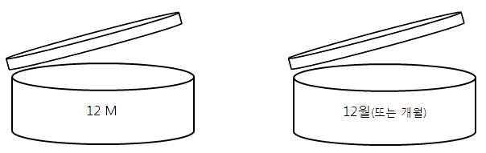

# 시행규칙_별표4_포장표시기준및방법

■ 화장품법 시행규칙 [별표 4] <개정 2025. 2. 7.>
화장품 포장의 표시기준 및 표시방법(제19조제7항 관련)
1. 화장품의 명칭
다른 제품과 구별할 수 있도록 표시된 것으로서 같은 화장품책임판매업자 또는
맞춤형화장품판매업자의 여러 제품에서 공통으로 사용하는 명칭을 포함한다.
2. 영업자의 상호 및 주소
가. 영업자의 주소는 등록필증 또는 신고필증에 적힌 소재지 또는 반품ㆍ교환 업
무를 대표하는 소재지를 기재ㆍ표시해야 한다.
나. "화장품제조업자", "화장품책임판매업자" 또는 "맞춤형화장품판매업자"는 각
각 구분하여 기재ㆍ표시해야 한다. 다만, 화장품제조업자, 화장품책임판매업자
또는 맞춤형화장품판매업자가 다른 영업을 함께 영위하고 있는 경우에는 한꺼
번에 기재ㆍ표시할 수 있다.
다. 공정별로 2개 이상의 제조소에서 생산된 화장품의 경우에는 일부 공정을
수탁한 화장품제조업자의 상호 및 주소의 기재ㆍ표시를 생략할 수 있다.
라. 수입화장품의 경우에는 추가로 기재ㆍ표시하는 제조국의 명칭, 제조회사명
및 그 소재지를 국내 "화장품제조업자"와 구분하여 기재ㆍ표시해야 한다.
3. 화장품 제조에 사용된 성분
가. 글자의 크기는 5포인트 이상으로 한다.
나. 화장품 제조에 사용된 함량이 많은 것부터 기재ㆍ표시한다. 다만, 1퍼센트
이하로 사용된 성분, 착향제 또는 착색제는 순서에 상관없이 기재ㆍ표시할
수 있다.
다. 혼합원료는 혼합된 개별 성분의 명칭을 기재ㆍ표시한다.
라. 색조 화장용 제품류, 눈 화장용 제품류, 두발염색용 제품류 또는 손발톱용
제품류에서 호수별로 착색제가 다르게 사용된 경우 ‘± 또는 +/-’의 표시 다
음에 사용된 모든 착색제 성분을 함께 기재ㆍ표시할 수 있다.
마. 착향제는 "향료"로 표시할 수 있다. 다만, 착향제의 구성 성분 중 식품의약품안전
처장이 정하여 고시한 알레르기 유발성분이 있는 경우에는 향료로 표시할 수 없고,
해당 성분의 명칭을 기재·표시해야 한다.
바. 산성도(pH) 조절 목적으로 사용되는 성분은 그 성분을 표시하는 대신 중화
반응에 따른 생성물로 기재ㆍ표시할 수 있고, 비누화반응을 거치는 성분은
비누화반응에 따른 생성물로 기재ㆍ표시할 수 있다.
사. 법 제10조제1항제3호에 따른 성분을 기재ㆍ표시할 경우 영업자의 정당한
이익을 현저히 침해할 우려가 있을 때에는 영업자는 식품의약품안전처장에
게 그 근거자료를 제출해야 하고, 식품의약품안전처장이 정당한 이익을 침해
할 우려가 있다고 인정하는 경우에는 "기타 성분"으로 기재ㆍ표시할 수 있
다.
4. 내용물의 용량 또는 중량
화장품의 1차 포장 또는 2차 포장의 무게가 포함되지 않은 용량 또는 중량을
기재ㆍ표시해야 한다. 이 경우 화장 비누(고체 형태의 세안용 비누를 말한다)의
경우에는 수분을 포함한 중량과 건조중량을 함께 기재ㆍ표시해야 한다.
5. 제조번호
가. 사용기한(또는 개봉 후 사용기간)과 쉽게 구별되도록 기재ㆍ표시해야 하며,
개봉 후 사용기간을 표시하는 경우에는 병행 표기해야 하는 제조연월일(맞
춤형 화장품의 경우에는 혼합ㆍ소분일)도 각각 구별이 가능하도록 기재ㆍ표
시해야 한다.
나. 두 개 이상의 화장품을 하나의 세트로 포장하여 판매하려는 경우 해당 세트
의 외부 포장에는 다음 중 하나의 방법으로 기재ㆍ표시할 수 있다.
1) 세트를 구성하는 모든 화장품의 제조번호를 각각 기재ㆍ표시
2) 세트를 구성하는 화장품 각각의 제조번호를 대체하여 통합된 제조번호를
기재ㆍ표시
6. 사용기한 또는 개봉 후 사용기간
가. 사용기한은 "사용기한" 또는 "까지" 등의 문자와 "연월일"을 소비자가 알기
쉽도록 기재ㆍ표시해야 한다. 다만, "연월"로 표시하는 경우 사용기한을 넘지
않는 범위에서 기재ㆍ표시해야 한다.
나. 개봉 후 사용기간은 "개봉 후 사용기간"이라는 문자와 "○○월" 또는 "○○
개월"을 조합하여 기재ㆍ표시하거나, 개봉 후 사용기간을 나타내는 심벌과
기간을 기재ㆍ표시할 수 있다.
(예시: 심벌과 기간 표시) 개봉 후 사용기간이 12개월 이내인 제품

다. 두 개 이상의 화장품을 하나의 세트로 포장하여 판매하려는 경우 해당 세트
의 외부 포장에는 다음과 같이 기재ㆍ표시할 수 있다.
1) 사용기한: 세트를 구성하는 화장품의 사용기한 중 사용기한이 가장 빨리
이르는 화장품의 사용기한만 기재ㆍ표시하고, 그 밖의 화장품의 사용기한은
아래의 예시와 같이 기재ㆍ표시의 위치를 안내하는 문구를 기재ㆍ표시
(예시: "사용기한: 제품에 별도 표시")
2) 개봉 후 사용기간: 세트를 구성하는 화장품 중 제조일자가 가장 오래된 화
장품의 개봉 후 사용기간만 기재ㆍ표시하고, 그 밖의 화장품은 아래의 예시
와 같이 기재ㆍ표시의 위치를 안내하는 문구를 기재ㆍ표시
(예시: "개봉 후 사용기간: 제품에 별도 표시")
7. 기능성화장품의 기재ㆍ표시
가. 제19조제4항제7호에 따른 문구는 법 제10조제1항제8호에 따라 기재ㆍ표시
된 "기능성화장품" 글자 바로 아래에 "기능성화장품" 글자와 동일한 글자
크기 이상으로 기재ㆍ표시해야 한다.
나. 법 제10조제1항제8호에 따라 기능성화장품을 나타내는 도안은 다음과 같
이 한다.
1) 표시기준(로고모형)

2) 표시방법
가) 도안의 크기는 용도 및 포장재의 크기에 따라 동일 배율로 조정한다.
나) 도안은 알아보기 쉽도록 인쇄 또는 각인 등의 방법으로 표시해야 한다.
8. 사용할 때의 주의사항
제2조제6호ㆍ제7호에 해당하는 기능성화장품의 경우에는 별표 3 제1호에 따른
공통사항을 외부 포장에 기재ㆍ표시하고, 그 밖의 사항은 첨부문서에 기재ㆍ표
시할 수 있다.
