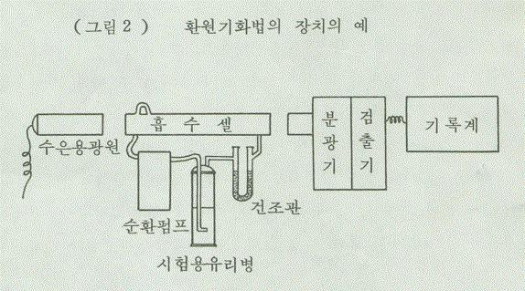

# 안전기준_별표4_유통안전관리시험방법

[별표 4]

유통화장품 안전관리 시험방법(제6조 관련)
Ⅰ. 일반화장품
1. 납
다음 시험법중 적당한 방법에 따라 시험한다.
가) 디티존법
① 검액의 조제 : 다음 제1법 또는 제2법에 따른다.
- 제1법 : 검체 1.0g을 자제도가니에 취하고(검체에 수분이 함유되어 있을 경우에는
수욕상에서 증발건조한다) 약 500℃에서 2∼3시간 회화한다. 회분에 묽은염산 및
묽은질산 각 10mL씩을 넣고 수욕상에서 30분간 가온한 다음 상징액을 유리여과
기(G4)로 여과하고 잔류물을 묽은염산 및 물 적당량으로 씻어 씻은 액을 여액에
합하여 전량을 50mL로 한다.
- 제2법 : 검체 1.0g을 취하여 300mL 분해플라스크에 넣고 황산 5mL 및 질산
10mL를 넣고 흰 연기가 발생할 때까지 조용히 가열한다. 식힌 다음 질산 5mL씩
을 추가하고 흰 연기가 발생할 때까지 가열하여 내용물이 무색∼엷은 황색이 될
때까지 이 조작을 반복하여 분해가 끝나면 포화수산암모늄용액 5mL를 넣고 다시
가열하여 질산을 제거한다. 분해물을 50mL 용량플라스크에 옮기고 물 적당량으
로 분해플라스크를 씻어 넣고 물을 넣어 전체량을 50mL로 한다.
② 시험조작 : 위의 검액으로 「기능성화장품 기준 및 시험방법」(식품의약품안전처
고시) 일반시험법 1. 원료의 "7. 납시험법"에 따라 시험한다. 비교액에는 납표준액
2.0mL를 넣는다.
나) 원자흡광광도법
① 검액의 조제 : 검체 약 0.5g을 정밀하게 달아 석영 또는 테트라플루오로메탄제의
극초단파분해용 용기의 기벽에 닿지 않도록 조심하여 넣는다. 검체를 분해하기
위하여 질산 7mL, 염산 2mL 및 황산 1mL을 넣고 뚜껑을 닫은 다음 용기를 극
초단파분해 장치에 장착하고 다음 조작조건에 따라 무색∼엷은 황색이 될 때까지
분해한다. 상온으로 식힌 다음 조심하여 뚜껑을 열고 분해물을 25mL 용량플라스
크에 옮기고 물 적당량으로 용기 및 뚜껑을 씻어 넣고 물을 넣어 전체량을 25mL
로 하여 검액으로 한다. 침전물이 있을 경우 여과하여 사용한다. 따로 질산 7mL,
염산 2mL 및 황산 1mL를 가지고 검액과 동일하게 조작하여 공시험액으로 한다.
다만, 필요에 따라 검체를 분해하기 위하여 사용되는 산의 종류 및 양과 극초단
파분해 조건을 바꿀 수 있다.
<조작조건>
최대파워 : 1000W
최고온도 : 200℃
분해시간 : 약 35분
위 검액 및 공시험액 또는 디티존법의 검액의 조제와 같은 방법으로 만든 검액
및 공시험액 각 25mL를 취하여 각각에 구연산암모늄용액(1→4) 10mL 및 브롬치
몰블루시액 2방울을 넣어 액의 색이 황색에서 녹색이 될 때까지 암모니아시액을
넣는다. 여기에 황산암모늄용액(2→5) 10mL 및 물을 넣어 100mL로 하고 디에칠
디치오카르바민산나트륨용액(1→20) 10mL를 넣어 섞고 몇 분간 방치한 다음 메
칠이소부틸케톤 20.0mL를 넣어 세게 흔들어 섞어 조용히 둔다. 메칠이소부틸케톤
층을 여취하고 필요하면 여과하여 검액으로 한다.
② 표준액의 조제 : 따로 납표준액(10μg/mL) 0.5mL, 1.0mL 및 2.0mL를 각각 취하여
구연산암모늄용액(1→4) 10mL 및 브롬치몰블루시액 2방울을 넣고 이하 위의 검
액과 같이 조작하여 검량선용 표준액으로 한다.
③ 조작 : 각각의 표준액을 다음의 조작조건에 따라 원자흡광광도기에 주입하여 얻
은 납의 검량선을 가지고 검액 중 납의 양을 측정한다.
<조작조건>
사용가스 : 가연성가스 아세칠렌 또는 수소
지연성가스 공기
램 프 : 납중공음극램프
파 장 : 283.3nm
다) 유도결합플라즈마분광기를 이용하는 방법
① 검액의 조제 : 검체 약 0.2g을 정밀하게 달아 석영 또는 테트라플루오로메탄제의
극초단파분해용 용기의 기벽에 닿지 않도록 조심하여 넣는다. 검체를 분해하기
위하여 질산 7mL, 염산 2mL 및 황산 1mL을 넣고 뚜껑을 닫은 다음 용기를 극
초단파분해 장치에 장착하고 다음 조작조건에 따라 무색∼엷은 황색이 될 때까지
분해한다. 상온으로 식힌 다음 조심하여 뚜껑을 열고 분해물을 50mL 용량플라스
크에 옮기고 물 적당량으로 용기 및 뚜껑을 씻어 넣고 물을 넣어 전체량을 50mL
로 하여 검액으로 한다. 침전물이 있을 경우 여과하여 사용한다. 따로 질산 7mL,
염산 2mL 및 황산 1mL를 가지고 검액과 동일하게 조작하여 공시험액으로 한다.
다만, 필요에 따라 검체를 분해하기 위하여 사용되는 산의 종류 및 양과 극초단
파분해 조건을 바꿀 수 있다.
<조작조건>
최대파워 : 1000W
최고온도 : 200℃
분해시간 : 약 35분
② 표준액의 조제 : 납 표준원액(1000μg/mL)에 0.5% 질산을 넣어 농도가 다른 3가
지 이상의 검량선용 표준액을 만든다. 이 표준액의 농도는 액 1mL당 납 0.01∼
0.2μg 범위내로 한다.
③ 시험조작 : 각각의 표준액을 다음의 조작조건에 따라 유도결합플라즈마분광기
(ICP spectrometer)에 주입하여 얻은 납의 검량선을 가지고 검액 중 납의 양을
측정한다.
<조작조건>
파장 : 220.353nm(방해성분이 함유된 경우 납의 다른 특성파장을 선택할 수 있다)
플라즈마가스 : 아르곤(99.99 v/v% 이상)
라) 유도결합플라즈마-질량분석기를 이용한 방법
① 검액의 조제 : 검체 약 0.2g을 정밀하게 달아 테플론제의 극초단파분해용 용기의
기벽에 닿지 않도록 조심하여 넣는다. 검체를 분해하기 위하여 질산 7mL, 불화수
소산 2mL를 넣고 뚜껑을 닫은 다음 용기를 극초단파분해 장치에 장착하고 다음
조작 조건 1에 따라 무색∼엷은 황색이 될 때까지 분해한다. 상온으로 식힌 다음
조심하여 뚜껑을 열어 희석시킨 붕산 (5→100) 20mL를 넣고 뚜껑을 닫은 다음
용기를 극초단파분해 장치에 장착하고 다음 조작 조건 2에 따라 불소를 불활성화
시킨다. 다만, 기기의 검액 도입부 등에 석영대신 테플론재질을 사용하는 경우에
한해 불소 불활성화 조작은 생략할 수 있다. 상온으로 식힌 다음 조심하여 뚜껑
을 열고 분해물을 100mL 용량플라스크에 옮기고 증류수 적당량으로 용기 및 뚜
껑을 씻어 넣고 증류수를 넣어 100mL로 한다. 침전물이 있을 경우 여과하여 사
용한다. 이를 증류수로 5배 희석하여 검액으로 한다. 따로 질산 7mL, 불화수소산
2mL를 가지고 검액과 동일하게 조작하여 공시험액으로 한다. 다만, 필요하면 검
체를 분해하기 위하여 사용되는 산의 종류 및 양과 극초단파분해 조건을 바꿀 수
있다.
<조작조건1> <조작조건2>
최대파워 : 1000W 최대파워 : 1000W
최고온도 : 200℃ 최고온도 : 180℃
분해시간 : 약 20분 분해시간 : 약 10분
② 표준액의 조제 : 납 표준원액(1000 μg/mL)에 희석시킨 질산(2→100)을 넣어 농도
가 다른 3가지 이상의 검량선용 표준액을 만든다. 이 표준액의 농도는 액 1mL당
납 1∼20 ng 범위를 포함하게 한다.
③ 시험조작 : 각각의 표준액을 다음의 조작조건에 따라 유도결합플라즈마-질량분석
기(ICP-MS)에 주입하여 얻은 납의 검량선을 가지고 검액 중 납의 양을 측정한
다.
<조작조건>
원자량 : 206, 207, 208(간섭현상이 없는 범위에서 선택하여 검출)
플라즈마기체 : 아르곤(99.99 v/v% 이상)
2. 니켈
① 검액의 조제 : 검체 약 0.2 g을 정밀하게 달아 테플론제의 극초단파분해용 용기의
기벽에 닿지 않도록 조심하여 넣는다. 검체를 분해하기 위하여 질산 7 mL, 불화수
소산 2 mL를 넣고 뚜껑을 닫은 다음 용기를 극초단파분해 장치에 장착하고 조작조
건 1에 따라 무색 ∼ 엷은 황색이 될 때까지 분해한다. 상온으로 식힌 다음 조심하
여 뚜껑을 열어 희석시킨 붕산 (5→100) 20 mL를 넣고 뚜껑을 닫은 다음 용기를
극초단파분해 장치에 장착하고 조작조건 2에 따라 불소를 불활성화 시킨다. 다만,
기기의 검액 도입부 등에 석영대신 테플론재질을 사용하는 경우에 한해 불소 불활
성화 조작은 생략할 수 있다. 상온으로 식힌 다음 조심하여 뚜껑을 열고 분해물을
100 mL 용량플라스크에 옮기고 물 적당량으로 용기 및 뚜껑을 씻어 넣고 물을 넣
어 100 mL로 한다. 침전물이 있을 경우 여과하여 사용한다. 이액을 물로 5배 희석
하여 검액으로 한다. 따로 질산 7 mL, 불화수소산 2 mL를 가지고 검액과 동일하게
조작하여 공시험액으로 한다. 다만, 필요하면 검체를 분해하기 위하여 사용되는 산
의 종류 및 양과 극초단파분해 조건을 바꿀 수 있다.
<조작조건1> <조작조건2>
최대파워 : 1000W 최대파워 : 1000W
최고온도 : 200℃ 최고온도 : 180℃
분해시간 : 약 20분 분해시간 : 약 10분
② 표준액의 조제 : 니켈 표준원액(1000 μg/mL)에 희석시킨 질산(2→100)을 넣어 농도
가 다른 3가지 이상의 검량선용 표준액을 만든다. 표준액의 농도는 1 mL당 니켈 1
∼20 ng 범위를 포함하게 한다.
③ 조작 : 각각의 표준액을 다음의 조작조건에 따라 유도결합플라즈마-질량분석기
(ICP-MS)에 주입하여 얻은 니켈의 검량선을 가지고 검액 중 니켈의 양을 측정한
다.
<조작조건>
원자량 : 60(간섭현상이 없는 범위에서 선택하여 검출)
플라즈마기체 : 아르곤(99.99 v/v% 이상)
④ 검출시험 범위에서 충분한 정량한계, 검량선의 직선성 및 회수율이 확보되는 경우
유도결합플라즈마-질량분석기(ICP-MS) 대신 유도결합플라즈마분광기(ICP) 또는
원자흡광분광기(AAS)를 사용하여 측정할 수 있다.
3. 비소
다음 시험법중 적당한 방법에 따라 시험한다.
가) 비색법 : 검체 1.0g을 달아 「기능성화장품 기준 및 시험방법」(식품의약품안전
처 고시) 일반시험법 1. 원료의 "15. 비소시험법" 중 제3법에 따라 검액을 만들고
장치 A를 쓰는 방법에 따라 시험한다.
나) 원자흡광광도법
① 검액의 조제 : 검체 약 0.2g을 정밀하게 달아 석영 또는 테트라플루오로메탄제의
극초단파분해용 용기의 기벽에 닿지 않도록 조심하여 넣는다. 검체를 분해하기
위하여 질산 7mL, 염산 2mL 및 황산 1mL을 넣고 뚜껑을 닫은 다음 용기를 극
초단파 분해 장치에 장착하고 다음 조작조건에 따라 무색∼엷은 황색이 될 때까
지 분해한다. 상온으로 식힌 다음 조심하여 뚜껑을 열고 분해물을 50mL 용량플
라스크에 옮기고 물 적당량으로 용기 및 뚜껑을 씻어 넣고 물을 넣어 전체량을
50mL로 하여 검액으로 한다. 침전물이 있을 경우 여과하여 사용한다. 따로 질산
7mL, 염산 2mL 및 황산 1mL를 가지고 검액과 동일하게 조작하여 공시험액으로
한다. 다만, 필요에 따라 검체를 분해하기 위하여 사용되는 산의 종류 및 양과 극
초단파의 분해조건을 바꿀 수 있다.
<조작조건>
최대파워 : 1000W
최고온도 : 200℃
분해시간 : 약 35분
② 표준액의 조제 : 비소 표준원액(1000μg/mL)에 0.5% 질산을 넣어 농도가 다른 3
가지 이상의 검량선용 표준액을 만든다. 이 표준액의 농도는 액 1mL당 비소 0.01
∼0.2μg 범위내로 한다.
③ 시험조작 : 각각의 표준액을 다음의 조작조건에 따라 수소화물발생장치 및 가열
흡수셀을 사용하여 원자흡광광도기에 주입하고 여기서 얻은 비소의 검량선을 가
지고 검액 중 비소의 양을 측정한다.
<조작조건>
사용가스 : 가연성가스 아세칠렌 또는 수소
지연성가스 공기
램 프 : 비소중공음극램프 또는 무전극방전램프
파 장 : 193.7 nm
다) 유도결합플라즈마분광기를 이용한 방법
① 검액 및 표준액의 조제 : 원자흡광광도법의 표준액 및 검액의 조제와 같은 방법
으로 만든 액을 검액 및 표준액으로 한다.
② 시험조작 : 각각의 표준액을 다음의 조작조건에 따라 유도결합플라즈마분광기
(ICP spectrometer)에 주입하여 얻은 비소의 검량선을 가지고 검액 중 비소의 양
을 측정한다.
<조작조건>
파장 : 193.759nm(방해성분이 함유된 경우 비소의 다른 특성파장을 선택할 수 있다)
플라즈마가스 : 아르곤(99.99 v/v% 이상)
라) 유도결합플라즈마-질량분석기를 이용한 방법
① 검액의 조제 : 검체 약 0.2g을 정밀하게 달아 테플론제의 극초단파분해용 용기의
기벽에 닿지 않도록 조심하여 넣는다. 검체를 분해하기 위하여 질산 7mL, 불화수
소산 2mL를 넣고 뚜껑을 닫은 다음 용기를 극초단파분해 장치에 장착하고 다음
조작 조건 1에 따라 무색∼엷은 황색이 될 때까지 분해한다. 상온으로 식힌 다음
조심하여 뚜껑을 열어 희석시킨 붕산(5→100) 20mL를 넣고 뚜껑을 닫은 다음 용
기를 극초단파분해 장치에 장착하고 다음 조작 조건 2에 따라 불소를 불활성화 시
킨다. 다만, 기기의 검액 도입부 등에 석영대신 테플론재질을 사용하는 경우에 한
해 불소 불활성화 조작은 생략할 수 있다. 최종 분해물을 100mL 용량플라스크에
옮기고 증류수 적당량으로 용기 및 뚜껑을 씻어 넣고 증류수을 넣어 100mL로 한
다. 침전물이 있을 경우 여과하여 사용한다. 이를 증류수로 5배 희석하여 검액으로
한다. 따로 질산 7mL, 불화수소산 2mL를 가지고 검액과 동일하게 조작하여 공시
험액으로 한다. 다만, 필요하면 검체를 분해하기 위하여 사용되는 산의 종류 및 양
과 극초단파분해 조건을 바꿀 수 있다.
<조작조건1> <조작조건2>
최대파워 : 1000W 최대파워 : 1000W
최고온도 : 200℃ 최고온도 : 180℃
분해시간 : 약 20분 분해시간 : 약 10분
② 표준액의 조제 : 비소 표준원액(1000μg/mL)에 희석시킨 질산(2→100)을 넣어 농
도가 다른 3가지 이상의 검량선용 표준액을 만든다. 이 표준액의 농도는 액 1mL
당 비소 1∼4ng 범위를 포함하게 한다.
③ 시험조작 : 각각의 표준액을 다음의 조작조건에 따라 유도결합플라즈마-질량분석
기(ICP-MS)에 주입하여 얻은 비소의 검량선을 가지고 검액 중 비소의 양을 측
정한다.
<조작조건>
원자량 : 75(40Ar35Cl+ 의 간섭을 방지하기 위한 장치를 사용할 수 있음)
플라즈마기체 : 아르곤(99.99 v/v% 이상)
4. 수은
가) 수은분해장치를 이용한 방법
① 검액의 조제 : 검체 1.0g을 정밀히 달아 그림 1과 같은 수은분해장치의 플라스크
에 넣고 유리구 수개를 넣어 장치에 연결하고 냉각기에 찬물을 통과시키면서 적
가깔대기를 통하여 질산 10mL를 넣는다. 다음에 적가깔대기의 콕크를 잠그고 반
응콕크를 열어주면서 서서히 가열한다. 아질산가스의 발생이 거의 없어지고 엷은
황색으로 되었을 때 가열을 중지하고 식힌다. 이때 냉각기와 흡수관의 접촉을 열
어놓고 흡수관의 희석시킨 황산(1→100)이 장치 안에 역류되지 않도록 한다. 식힌
다음 황산 5mL를 넣고 다시 서서히 가열한다. 이때 반응콕크를 잠가주면서 가열
하여 산의 농도를 농축시키면 분해가 촉진된다. 분해가 잘 되지 않으면 질산 및
황산을 같은 방법으로 반복하여 넣으면서 가열한다. 액이 무색 또는 엷은 황색이
될 때까지 가열하고 식힌다. 이때 냉각기와 흡수관의 접촉을 열어놓고 흡수관의
희석시킨 황산(1→100)이 장치안에 역류되지 않도록 한다. 식힌 다음 과망간산칼
륨가루 소량을 넣고 가열한다. 가열하는 동안 과망간산칼륨의 색이 탈색되지 않
을 때까지 소량씩 넣어 가열한다. 다시 식힌 다음 적가깔대기를 통하여 과산화수
소시액을 넣으면서 탈색시키고 10％ 요소용액 10mL를 넣고 적가깔대기의 콕크를
잠근다. 이때 장치안이 급히 냉각되므로 흡수관 안의 희석시킨 황산(1→100)이 장
치 안으로 역류한다. 역류가 끝난 다음 천천히 가열하면서 아질산가스를 완전히
날려 보내고 식혀서 100mL 용량플라스크에 옮기고 뜨거운 희석시킨 황산(1→
100)소량으로 장치의 내부를 잘 씻어 씻은 액을 100mL 메스플라스크에 합하고
식힌 다음 물을 넣어 정확히 100mL로 하여 검액으로 한다.
② 공시험액의 조제 : 검체는 사용하지 않고 검액의 조제와 같은 방법으로 조작하여
공시험액으로 한다.
③ 표준액의 조제 : 염화제이수은을 데시케이타(실리카 겔)에서 6시간 건조하여 그
13.5mg을 정밀하게 달아 묽은 질산 10mL 및 물을 넣어 녹여 정확하게 1L로 한
다. 이 용액 10mL를 정확하게 취하여 묽은 질산 10mL 및 물을 넣어 정확하게
1L로 하여 표준액으로 한다. 쓸 때 조제한다. 이 표준액 1mL는 수은(Hg) 0.1㎍을
함유한다.
④ 조작법(환원기화법) : 검액 및 공시험액을 시험용 유리병에 옮기고 5％ 과망간산
칼륨용액 수적을 넣어 주면서 탈색이 되면 추가하여 1분간 방치한 다음 1.5％ 염
산히드록실아민용액으로 탈색시킨다. 따로 수은표준액 10mL를 정확하게 취하여
물을 넣어 100mL로 하여 시험용 유리병에 옮기고 5％ 과망간산칼륨용액 수적을
넣어 흔들어 주면서 탈색이 되면 추가하여 1분간 방치한 다음 50％ 황산 2mL 및
3.5％ 질산 2mL를 넣고 1.5％ 염산히드록실아민용액으로 탈색시킨다. 위의 전처
리가 끝난 표준액, 검액 및 공시험액에 1％ 염화제일석 0.5N 황산용액 10mL씩을
넣어 곧 그림 2와 같은 원자흡광광도계의 순환펌프에 연결하여 수은증기를 건조
관 및 흡수셀(cell)안에 순환시켜 파장 253.7nm에서 기록계의 지시가 급속히 상승
하여 일정한 값을 나타낼 때의 흡광도를 측정할 때 검액의 흡광도는 표준액의 흡
광도보다 적어야 한다.
나) 수은분석기를 이용한 방법
① 검액의 조제 : 검체 약 50mg을 정밀하게 달아 검액으로 한다.
② 표준액의 조제 : 수은표준액을 0.001% L-시스테인 용액으로 적당하게 희석하여
0.1, 1, 10 μg/mL로 하여 표준액으로 한다.
③ 조작법 : 검액 및 표준액을 가지고 수은분석기로 측정한다. 따로 공시험을 하며
필요하면 첨가제를 넣을 수 있다.
* 0.001% L-시스테인 용액 : L-시스테인 10mg을 달아 질산 2mL를 넣은 다음 물을
넣어 1000mL로 한다. 이 액을 냉암소에 보관한다.

5. 안티몬
① 검액의 조제 : 검체 약 0.2g을 정밀하게 달아 테플론제의 극초단파분해용 용기의
기벽에 닿지 않도록 조심하여 넣는다. 검체를 분해하기 위하여 질산 7mL, 불화수
소산 2 mL를 넣고 뚜껑을 닫은 다음 용기를 극초단파분해 장치에 장착하고 조작
조건 1에 따라 무색 ∼ 엷은 황색이 될 때까지 분해한다. 상온으로 식힌 다음 조
심하여 뚜껑을 열어 희석시킨 붕산 (5→100) 20mL를 넣고 뚜껑을 닫은 다음 용
기를 극초단파분해 장치에 장착하고 조작조건 2에 따라 불소를 불활성화 시킨다.
다만, 기기의 검액 도입부 등에 석영대신 테플론재질을 사용하는 경우에 한해 불
소 불활성화 조작은 생략할 수 있다. 상온으로 식힌 다음 조심하여 뚜껑을 열고
분해물을 100mL 용량플라스크에 옮기고 물 적당량으로 용기 및 뚜껑을 씻어 넣
고 물을 넣어 100mL로 한다. 침전물이 있을 경우 여과하여 사용한다. 이액을 물
로 5배 희석하여 검액으로 한다. 따로 질산 7mL, 불화수소산 2mL를 가지고 검
액과 동일하게 조작하여 공시험액으로 한다. 다만, 필요하면 검체를 분해하기 위하
여 사용되는 산의 종류 및 양과 극초단파분해 조건을 바꿀 수 있다.
<조작조건1> <조작조건2>
최대파워 : 1000W 최대파워 : 1000W
최고온도 : 200℃ 최고온도 : 180℃
분해시간 : 약 20분 분해시간 : 약 10분
② 표준액의 조제 : 안티몬 표준원액(1000 μg/mL)에 희석시킨 질산 (2→100)을 넣어
농도가 다른 3가지 이상의 검량선용 표준액을 만든다. 표준액의 농도는 1mL당
안티몬 1∼20ng 범위를 포함하게 한다.
③ 조작 : 각각의 표준액을 다음의 조작조건에 따라 유도결합플라즈마-질량분석기
(ICP-MS)에 주입하여 얻은 안티몬의 검량선을 가지고 검액 중 안티몬의 양을
측정한다.
<조작조건>
원자량 : 121, 123(간섭현상이 없는 범위에서 선택하여 검출)
플라즈마기체 : 아르곤(99.99 v/v% 이상)
④ 검출시험 범위에서 충분한 정량한계, 검량선의 직선성 및 회수율이 확보되는 경
우 유도결합플라즈마-질량분석기(ICP-MS) 대신 유도결합플라즈마분광기(ICP) 또
는 원자흡광분광기(AAS)를 사용하여 측정할 수 있다.
6. 카드뮴
① 검액의 조제 : 검체 약 0.2g을 정밀하게 달아 테플론제의 극초단파분해용 용기의
기벽에 닿지 않도록 조심하여 넣는다. 검체를 분해하기 위하여 질산 7mL, 불화수
소산 2 mL를 넣고 뚜껑을 닫은 다음 용기를 극초단파분해 장치에 장착하고 조작
조건 1에 따라 무색 ∼ 엷은 황색이 될 때까지 분해한다. 상온으로 식힌 다음 조
심하여 뚜껑을 열어 희석시킨 붕산 (5→100) 20mL를 넣고 뚜껑을 닫은 다음 용
기를 극초단파분해 장치에 장착하고 조작조건 2에 따라 불소를 불활성화 시킨다.
다만, 기기의 검액 도입부 등에 석영대신 테플론재질을 사용하는 경우에 한해 불
소 불활성화 조작은 생략할 수 있다. 상온으로 식힌 다음 조심하여 뚜껑을 열고
분해물을 100mL 용량플라스크에 옮기고 물 적당량으로 용기 및 뚜껑을 씻어 넣
고 물을 넣어 100mL로 한다. 침전물이 있을 경우 여과하여 사용한다. 이액을 물
로 5배 희석하여 검액으로 한다. 따로 질산 7mL, 불화수소산 2mL를 가지고 검액
과 동일하게 조작하여 공시험액으로 한다. 다만, 필요하면 검체를 분해하기 위하여
사용되는 산의 종류 및 양과 극초단파분해 조건을 바꿀 수 있다.
<조작조건1> <조작조건2>
최대파워 : 1000W 최대파워 : 1000W
최고온도 : 200℃ 최고온도 : 180℃
분해시간 : 약 20분 분해시간 : 약 10분
② 표준액의 조제 : 카드뮴 표준원액(1000μg/mL)에 희석시킨 질산 (2→100)을 넣어
농도가 다른 3가지 이상의 검량선용 표준액을 만든다. 표준액의 농도는 1mL당
카드뮴 1∼20ng 범위를 포함하게 한다.
③ 조작 : 각각의 표준액을 다음의 조작조건에 따라 유도결합플라즈마-질량분석기
(ICP-MS)에 주입하여 얻은 카드뮴의 검량선을 가지고 검액 중 카드뮴의 양을
측정한다.
<조작조건>
원자량 : 110, 111, 112(간섭현상이 없는 범위에서 선택하여 검출)
플라즈마기체 : 아르곤(99.99 v/v% 이상)
④ 검출시험 범위에서 충분한 정량한계, 검량선의 직선성 및 회수율이 확보되는 경
우 유도결합플라즈마-질량분석기(ICP-MS) 대신 유도결합플라즈마분광기(ICP) 또
는 원자흡광분광기(AAS)를 사용하여 측정할 수 있다.
7. 디옥산
검체 약 1.0g을 정밀하게 달아 20% 황산나트륨용액 1.0mL를 넣고 잘 흔들어 섞어
검액으로 한다. 따로 1,4-디옥산 표준품을 물로 희석하여 0.0125, 0.025, 0.05, 0.1, 0.2,
0.4, 0.8mg/mL의 액으로 한 다음, 각 액 50μL씩을 취하여 각각에 폴리에틸렌글리콜
400 1.0g 및 20% 황산나트륨용액 1.0mL를 넣고 잘 흔들어 섞은 액을 표준액으로 한
다. 검액 및 표준액을 가지고 다음 조건으로 기체크로마토그래프법의 절대검량선법
에 따라 시험한다. 필요하면 표준액의 검량선 범위 내에서 검체 채취량 또는 희석배
수를 조정할 수 있다.
<조작조건>
검 출 기 : 질량분석기
- 인터페이스온도 : 240 ℃
- 이온소스온도 : 230 ℃
- 스캔범위 : 40 ∼ 200 amu
- 질량분석기모드 : 선택이온모드 (88, 58, 43)
헤드스페이스
- 주입량(루프) : 1 mL
- 바이알 평형온도 : 95 ℃
- 루프온도 : 110 ℃
- 주입라인온도 : 120 ℃
- 바이알 퍼지압력 : 20 psi
- 바이알 평형시간 : 30 분
- 바이알 퍼지시간 : 0.5 분
- 루프 채움시간 : 0.3 분
- 루프 평형시간 : 0.05 분
- 주입시간 : 1 분
칼 럼 : 안지름 약 0.32mm, 길이 약 60m인 관에 기체크로마토그래프용 폴리에
칠렌왁스를 실란처리한 500 μm의 기체크로마토그래프용 규조토에 피복한 것을 충
전한다.
칼럼온도 : 처음 2 분간 50℃로 유지하고 160℃까지 1분에 10℃ 씩 상승시킨다.
운반기체 : 헬륨
유 량 : 1,4-디옥산의 유지시간이 약 10분이 되도록 조정한다.
스플리트비 : 약 1:10
8. 메탄올
이하 메탄올 시험법에 사용하는 에탄올은 메탄올이 함유되지 않은 것을 확인하고 사용
한다.
가) 푹신아황산법
검체 10 mL를 취해 포화염화나트륨용액 10 mL를 넣어 충분히 흔들어 섞고, 대한민
국약전 알코올수측정법에 따라 증류하여 유액 12 mL를 얻는다. 이 유액이 백탁이 될
때까지 탄산칼륨을 넣어 분리한 알코올분에 정제수를 넣어 50 mL로 하여 검액으로 한
다.
따로 0.1 % 메탄올 1.0 mL에 에탄올 0.25 mL를 넣고 정제수를 가해 5.0 mL로 하여
표준액으로 한다.
표준액 및 검액 5 mL를 가지고 「기능성화장품 기준 및 시험방법」(식품의약품안전처
고시) 일반시험법 1. 원료 "9. 메탄올 및 아세톤시험법" 중 메탄올항에 따라 시험한다.
나) 기체크로마토그래프법
1) 물휴지 외 제품
① 증류법 : 검체 약 10 mL를 정확하게 취해 증류플라스크에 넣고 물 10 mL, 염화
나트륨 2 g, 실리콘유 1 방울 및 에탄올 10 mL를 넣어 초음파로 균질화한 후 증
류하여 유액 15 mL를 얻는다.
이 액에 에탄올을 넣어 50 mL로 한 후 여과하여 검액으로 한다.
따로 메탄올 1.0 mL를 정확하게 취해 에탄올을 넣어 정확하게 500 mL로 하고
이 액 1.25 mL, 2.5 mL, 5 mL, 10 mL, 20 mL를 정확하게 취해 에탄올을 넣어
50 mL로 하여 각각의 표준액으로 한다.
② 희석법 : 검체 약 10 mL를 정확하게 취해 에탄올 10 mL를 넣어 초음파로 균질
화 하고 에탄올을 넣어 50 mL로 한 후 여과하여 검액으로 한다.
따로 메탄올 1.0 mL를 정확하게 취하여 에탄올을 넣어 정확하게 500 mL로 하고 이 액
1.25 mL, 2.5 mL, 5 mL, 10 mL, 20 mL를 정확하게 취해 에탄올을 넣어 50 mL로
하여 각각의 표준액으로 한다.
③ 기체크로마토그래프 분석 : 검체에 따라 증류법 또는 희석법을 선택하여 전처리한
후 각각의 표준액과 검액을 가지고 아래 조작조건에 따라 시험한다.
<조작조건>
ㆍ검출기 : 수소염이온화검출기(FID)
ㆍ칼럼 : 안지름 약 0.32 mm, 길이 약 60 m인 용융실리카 모세관 내부에 기체
크로마토그래프용 폴리에칠렌글리콜 왁스를 0.5 μm의 두께로 코팅한
다.
ㆍ칼럼 온도 : 50 ℃에서 5 분 동안 유지한 다음 150 ℃까지 매분 10 ℃씩 상승시
킨 후 150 ℃에서 2 분 동안 유지한다.
ㆍ검출기 온도 : 240 ℃
ㆍ시료주입부 온도 : 200 ℃
ㆍ운반기체 및 유량 : 질소 1.0 mL/분
2) 물휴지
검체 적당량을 압착하여 용액을 분리하고 이 액 약 3 mL를 정확하게 취해 검액으로
한다. 따로 메탄올 표준품 0.5 mL를 정확하게 취해 물을 넣어 정확하게 500 mL로
한다. 이 액 0.3 mL, 0.5 mL, 1 mL, 2 mL, 4 mL를 정확하게 취하여 물을 넣어 100
mL로 하여 각각의 표준액으로 한다.
각각의 표준액과 검액을 가지고 기체크로마토그래프-헤드스페이스법으로 다음 조작
조건에 따라 시험한다.
<조작조건>
ㆍ 기체크로마토그래프는 ‘1) 물휴지 외 제품’ 조작조건과 동일하게 조작한다. 다
만, 스플리트비는 1:10으로 한다.
ㆍ 헤드스페이스 장치
- 바이알 용량 : 20 mL
- 주입량(루프) : 1 mL
- 바이알 평형 온도 : 70 ℃
- 루프 온도 : 80 ℃
- 주입라인 온도 : 90 ℃
- 바이알 평형 시간 : 10 분
- 바이알 퍼지 시간 : 0.5 분
- 루프 채움 시간 : 0.5 분
- 루프 평형 시간 : 0.1 분
- 주입 시간 : 0.5 분
다) 기체크로마토그래프-질량분석기법
검체(물휴지는 검체 적당량을 압착하여 용액을 분리하여 사용) 약 1 mL을 정확하게
취하여 물을 넣어 정확하게 100 mL로 하여 검액으로 한다. 따로 메탄올 표준품 약
0.1 mL를 정확하게 취해 물을 넣어 정확하게 100 mL로 하여 표준원액 (1000 µL/L)
으로 한다. 이 액 0.3 mL, 0.5 mL, 1 mL, 2 mL, 4 mL를 정확하게 취하여 물을 넣
어 정확하게 100 mL로 하여 각각의 표준액으로 한다.
각각의 표준액과 검액 약 3 mL를 정확하게 취해 헤드스페이스용 바이알에 넣고 기
체크로마토그래프-헤드스페이스법으로 다음 조작조건에 따라 시험한다. 필요하면 표
준액의 검량선 범위 내에서 검체 채취량 또는 희석배수는 조정할 수 있다.
<조작조건>
ㆍ 검출기 : 질량분석기
- 인터페이스 온도 : 230 ℃
- 이온소스 온도 : 230 ℃
- 스캔범위 : 30∼200 amu
- 질량분석기모드 : 선택이온모드 (31, 32)
ㆍ 헤드스페이스 장치
- 주입량(루프) : 1 mL
- 바이알 평형 온도 : 90 ℃
- 루프 온도 : 130 ℃
- 주입라인 온도 : 120 ℃
- 바이알 퍼지압력 : 20 psi
- 바이알 평형 시간 : 30 분
- 바이알 퍼지 시간 : 0.5 분
- 루프 채움 시간 : 0.3 분
- 루프 평형 시간 : 0.05 분
- 주입 시간 : 1 분
ㆍ 칼럼 : 안지름 약 0.32 mm, 길이 약 60 m인 용융실리카 모세관 내부에 기체
크로마토그래프용 폴리에칠렌글리콜 왁스를 0.5 μm의 두께로 코팅한다.
ㆍ 칼럼 온도 : 50 ℃에서 10 분 동안 유지한 다음 230 ℃까지 매분 15 ℃씩 상승
시킨 다음 230 ℃에서 3 분간 유지한다.
ㆍ 운반 기체 및 유량 : 헬륨, 1.5 mL/분
ㆍ 분리비(split ratio) : 약 1:10
9. 포름알데하이드
검체 약 1.0 g을 정밀하게 달아 초산ㆍ초산나트륨완충액주1)을 넣어 20 mL로 하고 1
시간 진탕 추출한 다음 여과한다. 여액 1 mL를 정확하게 취하여 물을 넣어 200 mL
로 하고, 이 액 100 mL를 취하여 초산ㆍ초산나트륨완충액주1) 4 mL를 넣은 다음 균
질하게 섞고 6 mol/L 염산 또는 6 mol/L 수산화나트륨용액을 넣어 pH를 5.0으로 조
정한다. 이 액에 2,4-디니트로페닐히드라진시액주2) 6.0 mL를 넣고 40 ℃에서 1시간
진탕한 다음, 디클로로메탄 20 mL로 3회 추출하고 디클로로메탄 층을 무수황산나트
륨 5.0 g을 놓은 탈지면을 써서 여과한다. 이 여액을 감압에서 가온하여 증발 건고한
다음 잔류물에 아세토니트릴 5.0 mL를 넣어 녹인 액을 검액으로 한다. 따로 포름알
데하이드 표준품을 물로 희석하여 0.05, 0.1, 0.2, 0.5, 1, 2 ㎍/mL의 액을 만든 다음,
각 액 100 mL를 취하여 검액과 같은 방법으로 전처리하여 표준액으로 한다. 검액
및 표준액 각 10 μL씩을 가지고 다음 조건으로 액체크로마토그래프법의 절대검량선
법에 따라 시험한다. 필요하면 표준액의 검량선 범위 내에서 검체 채취량 또는 검체
희석배수를 조정할 수 있다.
<조작조건>
검출기 : 자외부흡광광도계 (측정파장 355 nm)
칼 럼 : 안지름 약 4.6 mm, 길이 약 25 cm인 스테인레스강관에 5 ㎛의 액체크로
마토그래프용옥타데실실릴화한 실리카겔을 충전한다.
이동상 : 0.01 mol/L염산ㆍ아세토니트릴혼합액 (40 : 60)
유 량 : 1.5 mL/분
주1) 초산ㆍ초산나트륨완충액 : 5 mol/L 초산나트륨액 60 mL에 5 mol/L 초산 40 mL
를 넣어 균질하게 섞은 다음, 6 mol/L 염산 또는 6 mol/L 수산화나트륨용액을 넣
어 pH를 5.0으로 조정한다.
주2) 2,4-디니트로페닐하이드라진시액 : 2,4-디니트로페닐하이드라진 약 0.3 g을 정밀하
게 달아 아세토니트릴을 넣어 녹여 100 mL로 한다.
10. 프탈레이트류(디부틸프탈레이트, 부틸벤질프탈레이트 및 디에칠헥실프탈레이트)
다음 시험법 중 적당한 방법에 따라 시험한다.
가) 기체크로마토그래프-수소염이온화검출기를 이용한 방법
검체 약 1.0 g을 정밀하게 달아 헥산ㆍ아세톤 혼합액 (8:2)을 넣어 정확하게 10 mL로
하고 초음파로 충분히 분산시킨 다음 원심 분리한다. 그 상등액 5.0 mL를 정확하게 취
하여 내부표준액주) 4.0 mL를 넣고 헥산ㆍ아세톤 혼합액 (8:2)을 넣어 10.0 mL로 하여
검액으로 한다. 따로 디부틸프탈레이트, 부틸벤질프탈레이트, 디에칠헥실프탈레이트 표
준품을 정밀하게 달아 헥산ㆍ아세톤 혼합액 (8:2)을 넣어 녹여 희석하고 그 일정량을
취하여 내부표준액 4.0 mL를 넣고 헥산ㆍ아세톤 혼합액 (8:2)을 넣어 10.0 mL로 하여
0.1, 0.5, 1.0, 5.0, 10.0, 25.0 ㎍/mL로 하여 표준액으로 한다. 검액 및 표준액 각 1 μL씩
을 가지고 다음 조건으로 기체크로마토그래프법 내부표준법에 따라 시험한다. 필요한
경우 표준액의 검량선 범위 내에서 검체 채취량 또는 희석배수를 조정할 수 있다.
<조작조건>
ㆍ검 출 기 : 수소염이온화검출기(FID)
ㆍ칼 럼 : 안지름 약 0.25 mm, 길이 약 30 m인 용융실리카관의 내관에 14% 시아
노프로필페닐-86 % 메틸폴리실록산으로 0.25 μm 두께로 피복한다.
ㆍ칼럼온도 : 150 ℃에서 2 분 동안 유지한 다음 260 ℃까지 매분 10 ℃씩 상승시킨
다음 15 분 동안 이 온도를 유지한다.
ㆍ검체도입부온도: 250 ℃
ㆍ검출기온도: 280 ℃
ㆍ운반기체 : 질소
ㆍ유 량 : 1 mL/분
ㆍ스플리트비 : 약 1:10
주) 내부표준액 : 벤질벤조에이트 표준품 약 10 mg을 정밀하게 달아 헥산ㆍ아세톤 혼
합액 (8:2)을 넣어 정확하게 1000 mL로 한다.
나) 기체크로마토그래프-질량분석기를 이용한 방법
검체 약 1.0 g을 정밀하게 달아 헥산ㆍ아세톤 혼합액 (8:2)을 넣어 정확하게 10 mL
로 하고 초음파로 충분히 분산시킨 다음 원심 분리한다. 그 상등액 5.0 mL를 정확하
게 취하여 내부표준액주) 1.0 mL를 넣고 헥산ㆍ아세톤 혼합액 (8:2)을 넣어 10.0 mL
로 하여 검액으로 한다. 따로 디부틸프탈레이트, 부틸벤질프탈레이트, 디에칠헥실프
탈레이트 표준품을 정밀하게 달아 헥산ㆍ아세톤 혼합액 (8:2)을 넣어 녹여 희석하고
그 일정량을 취하여 내부표준액 1.0 mL를 넣고 헥산ㆍ아세톤 혼합액 (8:2)을 넣어
10.0 mL로 하여 0.1, 0.25, 0.5, 1.0, 2.5, 5.0 ㎍/mL로 하여 표준액으로 한다. 검액 및
표준액 각 1 μL씩을 가지고 다음 조건으로 기체크로마토그래프법 내부표준법에 따
라 시험한다. 필요한 경우 표준액의 검량선 범위 내에서 검체 채취량 또는 희석배수
를 조정할 수 있다.
<조작조건>
ㆍ 검 출 기 : 질량분석기
- 인터페이스온도 : 300 ℃
- 이온소스온도 : 230 ℃
- 스캔범위 : 40 ∼ 300 amu
- 질량분석기모드 : 선택이온모드
성분명 선택이온
디부틸프탈레이트 149, 205, 223
부틸벤질프탈레이트 91, 149, 206
디에칠헥실프탈레이트 149, 167, 279
내부표준물질(플루오란센-d10) 92, 106, 212
ㆍ 칼 럼 : 안지름 약 0.25 mm, 길이 약 30 m인 용융실리카관의 내관에 5 % 페닐
-95 % 디메틸폴리실록산으로 0.25 μm 두께로 피복한다.
ㆍ 칼럼온도 : 110 ℃에서 0.5분 동안 유지한 다음 300 ℃까지 매분 20 ℃씩 상승시킨
다음 3분 동안 이 온도를 유지한다.
ㆍ 검체도입부온도 : 280 ℃
ㆍ 운반기체 : 헬륨
ㆍ 유 량 : 1 mL/분
ㆍ 스플리트비 : 스플릿리스
주) 내부표준액 : 플루오란센-d10 표준품 약 10 mg을 정밀하게 달아 헥산ㆍ아세톤 혼합
액 (8:2)을 넣어 정확하게 1000 mL로 한다.
11. 미생물 한도
일반적으로 다음의 시험법을 사용한다. 다만, 본 시험법 외에도 미생물 검출을 위한
자동화 장비와 미생물 동정기기 및 키트 등을 사용할 수도 있다.
1) 검체의 전처리
검체조작은 무균조건하에서 실시하여야 하며, 검체는 충분하게 무작위로 선별하여
그 내용물을 혼합하고 검체 제형에 따라 다음의 각 방법으로 검체를 희석, 용해, 부유
또는 현탁시킨다. 아래에 기재한 어느 방법도 만족할 수 없을 때에는 적절한 다른 방
법을 확립한다.
가) 액제ㆍ로션제 : 검체 1 mL(g)에 변형레틴액체배지 또는 검증된 배지나 희석액 9
mL를 넣어 10배 희석액을 만들고 희석이 더 필요할 때에는 같은 희석액으로 조제
한다.
나) 크림제ㆍ오일제 : 검체 1 mL(g)에 적당한 분산제 1mL를 넣어 균질화 시키고 변형
레틴액체배지 또는 검증된 배지나 희석액 8 mL를 넣어 10배 희석액을 만들고 희석
이 더 필요할 때에는 같은 희석액으로 조제한다. 분산제만으로 균질화가 되지 않는
경우 검체에 적당량의 지용성 용매를 첨가하여 용해한 뒤 적당한 분산제 1 mL를 넣
어 균질화 시킨다.
다) 파우더 및 고형제 : 검체 1g에 적당한 분산제를 1mL를 넣고 충분히 균질화 시킨
후 변형레틴액체배지 또는 검증된 배지 및 희석액 8mL를 넣어 10배 희석액을 만
들고 희석이 더 필요할 때에는 같은 희석액으로 조제한다. 분산제만으로 균질화가
되지 않을 경우 적당량의 지용성 용매를 첨가한 상태에서 멸균된 마쇄기를 이용하
여 검체를 잘게 부수어 반죽 형태로 만든 뒤 적당한 분산제 1 mL를 넣어 균질화
시킨다. 추가적으로 40℃에서 30분 동안 가온한 후 멸균한 유리구슬(5 mm: 5∼7
개, 3 mm: 10∼15개)을 넣어 균질화 시킨다.
주1) 분산제는 멸균한 폴리소르베이트 80 등을 사용할 수 있으며, 미생물의 생육에 대하여
영향이 없는 것 또는 영향이 없는 농도이어야 한다.
주2) 검액 조제시 총 호기성 생균수 시험법의 배지성능 및 시험법 적합성 시험을 통하
여 검증된 배지나 희석액 및 중화제를 사용할 수 있다.
주3) 지용성 용매는 멸균한 미네랄 오일 등을 사용할 수 있으며, 미생물의 생육에 대하
여 영향이 없는 것이어야 한다. 첨가량은 대상 검체 특성에 맞게 설정하여야 하며,
미생물의 생육에 대하여 영향이 없어야 한다.
2) 총 호기성 생균수 시험법
총 호기성 생균수 시험법은 화장품 중 총 호기성 생균(세균 및 진균)수를 측정하는
시험방법이다.
가) 검액의 조제
1)항에 따라 검액을 조제한다.
나) 배지
총 호기성 세균수시험은 변형레틴한천배지 또는 대두카제인소화한천배지를 사용하
고 진균수시험은 항생물질 첨가 포테이토 덱스트로즈 한천배지 또는 항생물질 첨
가 사브로포도당한천배지를 사용한다. 위의 배지 이외에 배지성능 및 시험법 적합
성 시험을 통하여 검증된 다른 미생물 검출용 배지도 사용할 수 있고, 세균의 혼
입이 없다고 예상된 때나 세균의 혼입이 있어도 눈으로 판별이 가능하면 항생물질
을 첨가하지 않을 수 있다.
변형레틴액체배지 (Modified letheen broth)
육제펩톤 20.0 g
카제인의 판크레아틴 소화물 5.0 g
효모엑스 2.0 g
육엑스 5.0 g
염화나트륨 5.0 g
폴리소르베이트 80 5.0 g
레시틴 0.7 g
아황산수소나트륨 0.1 g
정제수 1000 mL
이상을 달아 정제수에 녹여 1 L로 하고 멸균후의 pH가 7.2 ± 0.2가 되도록 조정하고 121
℃에서 15분간 고압멸균 한다.
변형레틴한천배지(Modified letheen agar)
프로테오즈 펩톤 10.0 g
카제인의 판크레아틱소화물 10.0 g
효모엑스 2.0 g
육엑스 3.0 g
염화나트륨 5.0 g
포도당 1.0 g
폴리소르베이트 80 7.0 g
레시틴 1.0 g
아황산수소나트륨 0.1 g
한천 20.0 g
정제수 1000 mL
이상을 달아 정제수에 녹여 1 L로 하고 멸균후의 pH가 7.2 ± 0.2가 되도록 조정하고
121 ℃에서 15분간 고압멸균 한다.
대두카제인소화한천배지(Tryptic soy agar)
카제인제 펩톤 15.0 g
대두제 펩톤 5.0 g
염화나트륨 5.0 g
한천 15.0 g
정제수 1000 mL
이상을 달아 정제수에 녹여 1 L로 하고 멸균후의 pH가 7.2 ± 0.1이 되도록 조정하고
121 ℃에서 15분간 고압멸균 한다.
항생물질첨가 포테이토덱스트로즈한천배지(Potato dextrose agar)
감자침출물 200.0 g
포도당 20.0 g
한천 15.0 g
정제수 1000 mL
이상을 달아 정제수에 녹여 1 L로 하고 121 ℃에서 15분간 고압멸균 한다. 사용하기
전에 1 L당 40 mg의 염산테트라사이클린을 멸균배지에 첨가하고 10 % 주석산용액을
넣어 pH를 5.6 ± 0.2 로 조정하거나, 세균 혼입의 문제가 있는 경우 3.5 ± 0.1로 조정
할 수 있다. 200.0 g의 감자침출물 대신 4.0 g의 감자추출물이 사용될 수 있다.
항생물질첨가사부로포도당한천배지(Sabouraud dextrose agar)
육제 또는 카제인제 펩톤 10.0 g
포도당 40.0 g
한천 15.0 g
정제수 1000 mL
이상을 달아 정제수에 녹여 1 L로 하고 121 ℃에서 15분간 고압멸균한 다음의 pH가
5.6 ± 0.2이 되도록 조정한다. 쓸 때 배지 1000 mL당 벤질페니실린칼륨 0.10 g과 테트
라사이클린 0.10 g을 멸균용액으로서 넣거나 배지 1000 mL당 클로람페니콜 50 mg을
넣는다.
다) 조작
(1) 세균수 시험 ㉮ 한천평판도말법 직경 9 ∼ 10 cm 페트리 접시내에 미리 굳힌
세균시험용 배지 표면에 전처리 검액 0.1 mL이상 도말한다.
㉯ 한천평판희석법 검액 1 mL를 같은 크기의 페트리접시에 넣고 그 위에 멸
균 후 45 ℃로 식힌 15 mL의 세균시험용 배지를 넣어 잘 혼합한다.
검체당 최소 2개의 평판을 준비하고 30∼35 ℃에서 적어도 48시간 배양하는데
이때 최대 균집락수를 갖는 평판을 사용하되 평판당 300개 이하의 균집락을 최
대치로 하여 총 세균수를 측정한다.
(2) 진균수 시험 : ‘(1) 세균수 시험’에 따라 시험을 실시하되 배지는 진균수시험용
배지를 사용하여 배양온도 20∼25 ℃에서 적어도 5일간 배양한 후 100 개 이
하의 균집락이 나타나는 평판을 세어 총 진균수를 측정한다.
라) 배지성능 및 시험법 적합성시험
시판배지는 배치마다 시험하며, 조제한 배지는 조제한 배치마다 시험한다. 검체의
유ㆍ무하에서 총 호기성 생균수시험법에 따라 제조된 검액ㆍ대조액에 표 1.에 기
재된 시험균주를 각각 100cfu 이하가 되도록 접종하여 규정된 총호기성생균수시험
법에 따라 배양할 때 검액에서 회수한 균수가 대조액에서 회수한 균수의 1/2 이상
이어야 한다. 검체 중 보존제 등의 항균활성으로 인해 증식이 저해되는 경우(검액
에서 회수한 균수가 대조액에서 회수한 균수의 1/2 미만인 경우)에는 결과의 유효
성을 확보하기 위하여 총 호기성 생균수 시험법을 변경해야 한다. 항균활성을 중
화하기 위하여 희석 및 중화제(표2.)를 사용할 수 있다. 또한, 시험에 사용된 배지
및 희석액 또는 시험 조작상의 무균상태를 확인하기 위하여 완충식염펩톤수(pH
7.0)를 대조로 하여 총호기성 생균수시험을 실시할 때 미생물의 성장이 나타나서는
안 된다.
표 1. 총호기성생균수 배지성능시험용 균주 및 배양조건
시험균주 배양
Escherichia coli ATCC 8739, NCIMB 8545, CIP53.126,
NBRC 3972 또는 KCTC 2571
호기배양
Bacillus subtilis ATCC 6633, NCIMB 8054, CIP 52.62,
30 ∼ 35 ℃
NBRC 3134 또는 KCTC 1021
48시간
Staphylococcus aureus ATCC 6538, NCIMB 9518, CIP 4.83,
NRRC 13276 또는 KCTC 3881
호기배양
Candida albicans ATCC 10231, NCPF 3179, IP48.72,
20 ∼ 25 ℃
NBRC1594 또는 KCTC 7965
5일
표2. 항균활성에 대한 중화제
화장품 중 미생물 발육저지물질 항균성을 중화시킬 수 있는 중화제
레시틴,
페놀 화합물：
폴리소르베이트 80,
파라벤, 페녹시에탄올,페닐에탄올 등
지방알코올의 에틸렌 옥사이드축합물(condensate),
아닐리드
비이온성 계면활성제
레시틴, 사포닌,
4급 암모늄 화합물, 폴리소르베이트 80,
양이온성 계면활성제 도데실 황산나트륨,
지방 알코올의에틸렌 옥사이드 축합물
알데하이드,
글리신, 히스티딘
포름알데히드－유리 제제
산화(oxidizing) 화합물 치오황산나트륨
레시틴, 사포닌,
이소치아졸리논, 아민, 황산염, 메르캅탄,
이미다졸 아황산수소나트륨,
치오글리콜산나트륨
레시틴, 사포닌,
비구아니드
폴리소르베이트 80
아황산수소나트륨,
금속염(Cu, Zn, Hg),
L－시스테인－SH 화합물(sulfhydryl compounds),
유기－수은 화합물
치오글리콜산
3) 특정세균시험법
가) 대장균 시험
(1) 검액의 조제 및 조작 : 검체 1 g 또는 1 mL을 유당액체배지를 사용하여 10
mL로 하여 30∼35 ℃에서 24∼72시간 배양한다. 배양액을 가볍게 흔든 다음 백
금이 등으로 취하여 맥콘키한천배지위에 도말하고 30∼35 ℃에서 18∼24 시간
배양한다. 주위에 적색의 침강선띠를 갖는 적갈색의 그람음성균의 집락이 검출
되지 않으면 대장균 음성으로 판정한다. 위의 특정을 나타내는 집락이 검출되는
경우에는 에오신메칠렌블루한천배지에서 각각의 집락을 도말하고 30∼35 ℃에
서 18∼24시간 배양한다. 에오신메칠렌블루한천배지에서 금속 광택을 나타내는
집락 또는 투과광선하에서 흑청색을 나타내는 집락이 검출되면 백금이등으로
취하여 발효시험관이 든 유당액체배지에 넣어 44.3∼44.7 ℃의 항온수조 중에서
22∼26 시간 배양한다. 가스발생이 나타나는 경우에는 대장균 양성으로 의심하
고 동정시험으로 확인한다.
(2) 배지
유당액체배지
육엑스 3.0 g
젤라틴의 판크레아틴 소화물 5.0 g
유당 5.0 g
정제수 1000 mL
이상을 달아 정제수에 녹여 1 L로 하고 121 ℃에서 15∼20 분간 고압증기멸균한다. 멸
균 후의 pH가 6.9∼7.1이 되도록 하고 가능한 한 빨리 식힌다.
맥콘키한천배지
젤라틴의 판크레아틴 소화물 17.0 g
카제인의 판크레아틴 소화물 1.5 g
육제 펩톤 1.5 g
유당 10.0 g
데옥시콜레이트나트륨 1.5 g
염화나트륨 5.0 g
한천 13.5 g
뉴트럴렛 0.03 g
염화메칠로자닐린 1.0 mg
정제수 1000 mL
이상을 달아 정제수 1 L에 녹여 1분간 끓인 다음 121 ℃에서 15∼20 분간 고압증기 멸
균한다. 멸균 후의 pH가 6.9∼7.3이 되도록 한다.
에오신메칠렌블루한천배지(EMB한천배지)
젤라틴의 판크레아틴 소화물 10.0 g
인산일수소칼륨 2.0 g
유당 10.0 g
한천 15.0 g
에오신 0.4 g
메칠렌블루 0.065 g
정제수 1000 mL
이상을 달아 정제수 1 L에 녹여 121 ℃에서 15∼20 분간 고압증기 멸균한다. 멸균 후
의 pH가 6.9∼7.3이 되도록 한다.
나) 녹농균시험
(1) 검액의 조제 및 조작 : 검체 1 g 또는 1 mL를 달아 카제인대두소화액체배지를
사용하여 10 mL로 하고 30∼35 ℃에서 24∼48시간 증균 배양한다. 증식이 나타
나는 경우는 백금이 등으로 세트리미드한천배지 또는 엔에이씨한천배지에 도말
하여 30∼35 ℃에서 24∼48시간 배양한다. 미생물의 증식이 관찰되지 않는 경우
녹농균 음성으로 판정한다. 그람음성간균으로 녹색 형광물질을 나타내는 집락을
확인하는 경우에는 증균배양액을 녹농균 한천배지 P 및 F에 도말하여 30∼35
℃에서 24∼72시간 배양한다. 그람음성간균으로 플루오레세인 검출용 녹농균 한
천배지 F의 집락을 자외선하에서 관찰하여 황색의 집락이 나타나고, 피오시아
닌 검출용 녹농균 한천배지 P의 집락을 자외선하에서 관찰하여 청색의 집락이
검출되면 옥시다제시험을 실시한다. 옥시다제반응 양성인 경우 5∼10초 이내에
보라색이 나타나고 10초 후에도 색의 변화가 없는 경우 녹농균 음성으로 판정
한다. 옥시다제반응 양성인 경우에는 녹농균 양성으로 의심하고 동정시험으로
확인한다.
(2) 배지
카제인대두소화액체배지
카제인 판크레아틴 소화물 17.0 g
대두파파인소화물 3.0 g
염화나트륨 5.0 g
인산일수소칼륨 2.5 g
포도당일수화물 2.5 g
이상을 달아 정제수에 녹여 1 L로 하고 멸균후의 pH가 7.3 ± 0.2가 되도록 조정하고
121 ℃에서 15분간 고압멸균 한다.
세트리미드한천배지(Cetrimide agar)
젤라틴제 펩톤 20.0 g
염화마그네슘 3.0 g
황산칼륨 10.0 g
세트리미드 0.3 g
글리세린 10.0 mL
한천 13.6 g
정제수 1000 mL
이상을 달아 정제수에 녹이고 글리세린을 넣어 1 L로 한다. 121 ℃에서 15분간 고압증
기멸균하고 pH가 7.2 ± 0.2가 되도록 조정한다.
엔에이씨한천배지(NAC agar)
펩톤 20.0 g
인산수소이칼륨 0.3 g
황산마그네슘 0.2 g
세트리미드 0.2 g
날리딕산 15 mg
한천 15.0 g
정제수 1000 mL
최종 pH는 7.4 ± 0.2이며 멸균하지 않고 가온하여 녹인다.
플루오레세인 검출용 녹농균 한천배지 F (Pseudomonas agar F for detection
of fluorescein)
카제인제 펩톤 10.0 g
육제 펩톤 10.0 g
인산일수소칼륨 1.5 g
황산마그네슘 1.5 g
글리세린 10.0 mL
한천 15.0 g
정제수 1000 mL
이상을 달아 정제수에 녹이고 글리세린을 넣어 1 L로 한다. 121 ℃에서 15분간 고압증
기멸균하고 pH가 7.2 ± 0.2가 되도록 조정한다.
피오시아닌 검출용 녹농균 한천배지 P (Pseudomonas agar P for detection
of pyocyanin)
젤라틴의 판크레아틴 소화물 20.0 g
염화마그네슘 1.4 g
황산칼륨 10.0 g
글리세린 10.0 mL
한천 15.0 g
정제수 1000 mL
이상을 달아 정제수에 녹이고 글리세린을 넣어 1 L로 한다. 121 ℃에서 15분간 고압증
기멸균하고 pH가 7.2 ± 0.2가 되도록 조정한다.
다) 황색포도상구균 시험
(1) 검액의 조제 및 조작 : 검체 1 g 또는 1 mL를 달아 카제인대두소화액체배지를
사용하여 10 mL로 하고 30∼35 ℃에서 24∼48시간 증균 배양한다. 증균배양액
을 보겔존슨한천배지 또는 베어드파카한천배지에 이식하여 30∼35 ℃에서 24시
간 배양하여 균의 집락이 검정색이고 집락주위에 황색투명대가 형성되며 그람
염색법에 따라 염색하여 검경한 결과 그람 양성균으로 나타나면 응고효소시험
을 실시한다. 응고효소시험 음성인 경우 황색포도상구균 음성으로 판정하고, 양
성인 경우에는 황색포도상구균 양성으로 의심하고 동정시험으로 확인한다.
(2) 배지
보겔존슨한천배지(Vogel-Johnson agar)
카제인의 판크레아틴 소화물 10.0 g
효모엑스 5.0 g
만니톨 10.0 g
인산일수소칼륨 5.0 g
염화리튬 5.0 g
글리신 10.0 g
페놀렛 25.0 mg
한천 16.0 g
정제수 1000 mL
이상을 달아 1분동안 가열하여 자주 흔들어 준다. 121 ℃에서 15분간 고압멸균하고 45
∼50 ℃로 냉각시킨다. 멸균 후 pH가 7.2 ± 0.2가 되도록 조정하고 멸균한 1 %(w/v)
텔루린산칼륨 20 mL를 넣는다.
베어드파카한천배지(Baird-Parker agar)
카제인제 펩톤 10.0 g
육엑스 5.0 g
효모엑스 1.0 g
염화리튬 5.0 g
글리신 12.0 g
피루브산나트륨 10.0 g
한천 20.0 g
정제수 950 mL
이상을 섞어 때때로 세게 흔들며 섞으면서 가열하고 1분간 끓인다. 121 ℃에서 15 분
간 고압멸균하고 45∼50 ℃로 냉각시킨다. 멸균한 다음의 pH가 7.2 ± 0.2가 되도록 조
정한다. 여기에 멸균한 아텔루산칼륨용액 1 %(w/v) 10 mL와 난황유탁액 50 mL를 넣
고 가만히 섞은 다음 페트리접시에 붓는다. 난황유탁액은 난황 약 30 %, 생리식염액
약 70 %의 비율로 섞어 만든다.
라) 배지성능 및 시험법 적합성시험
검체의 유ㆍ무 하에서 각각 규정된 특정세균시험법에 따라 제조된 검액ㆍ대조액에
표 3.에 기재된 시험균주 100cfu를 개별적으로 접종하여 시험할 때 접종균 각각에
대하여 양성으로 나타나야 한다. 증식이 저해되는 경우 항균활성을 중화하기 위하
여 희석 및 중화제(2)-라)항의 표2.)를 사용할 수 있다.
표3. 특정세균 배지성능시험용 균주
Escherichia coli ATCC 8739, NCIMB 8545, CIP53.126, NBRC 3972 또는
(대장균) KCTC 2571
Pseudomonasaeruginosa ATCC 9027, NCIMB 8626, CIP 82.118, NBRC 13275 또는
(녹농균) KCTC 2513
Staphylococcus aureus ATCC 6538, NCIMB 9518, CIP 4.83, NRRC 13276 또는
(황색포도상구군) KCTC 3881
12. 내용량
가) 용량으로 표시된 제품 : 내용물이 들어있는 용기에 뷰렛으로부터 물을 적가하여
용기를 가득 채웠을 때의 소비량을 정확하게 측정한 다음 용기의 내용물을 완전
히 제거하고 물 또는 기타 적당한 유기용매로 용기의 내부를 깨끗이 씻어 말린
다음 뷰렛으로부터 물을 적가하여 용기를 가득 채워 소비량을 정확히 측정하고
전후의 용량차를 내용량으로 한다. 다만, 150mL이상의 제품에 대하여는 메스실린
더를 써서 측정한다.
나) 질량으로 표시된 제품 : 내용물이 들어있는 용기의 외면을 깨끗이 닦고 무게를 정
밀하게 단 다음 내용물을 완전히 제거하고 물 또는 적당한 유기용매로 용기의 내
부를 깨끗이 씻어 말린 다음 용기만의 무게를 정밀히 달아 전후의 무게차를 내용
량으로 한다.
다) 길이로 표시된 제품 : 길이를 측정하고 연필류는 연필심지에 대하여 그 지름과 길이
를 측정한다.
라) 화장비누
(1) 수분 포함: 상온에서 저울로 측정(g)하여 실중량은 전체 무게에서 포장 무게를
뺀 값으로 하고, 소수점 이하 1자리까지 반올림하여 정수자리까지 구한다.
(2) 건조: 검체를 작은 조각으로 자른 후 약 10 g을 0.01 g까지 측정하여 접시에 옮
긴다. 이 검체를 103 ± 2 ℃ 오븐에서 1시간 건조 후 꺼내어 냉각시키고 다시
오븐에 넣고 1시간 후 접시를 꺼내어 데시케이터로 옮긴다. 실온까지 충분히 냉
각시킨 후 질량을 측정하고 2회의 측정에 있어서 무게의 차이가 0.01 g 이내가
될 때까지 1시간 동안의 가열, 냉각 및 측정 조작을 반복한 후 마지막 측정 결
과를 기록한다.
(계산식)
내용량(g) = 건조 전 무게(g) × [100–건조감량(%)] / 100
 
건조감량(%) =      ×
 
ㆍm : 접시의 무게(g)
0
ㆍm : 가열 전 접시와 검체의 무게(g)
1
ㆍm : 가열 후 접시와 검체의 무게(g)
2
마) 그 밖의 특수한 제품은 「대한민국약전」(식품의약품안전처 고시)으로 정한 바에
따른다.
13. pH 시험법
검체 약 2 g 또는 2 mL를 취하여 100 mL 비이커에 넣고 물 30 mL를 넣어 수욕상
에서 가온하여 지방분을 녹이고 흔들어 섞은 다음 냉장고에서 지방분을 응결시켜 여과
한다. 이때 지방층과 물층이 분리되지 않을 때는 그대로 사용한다. 여액을 가지고 「기
능성화장품 기준 및 시험방법」(식품의약품안전처 고시) 일반시험법 1. 원료의 "47. pH
측정법"에 따라 시험한다. 다만, 성상에 따라 투명한 액상인 경우에는 그대로 측정한다.
14. 유리알칼리 시험법
가) 에탄올법 (나트륨 비누)
플라스크에 에탄올 200 mL을 넣고 환류 냉각기를 연결한다. 이산화탄소를 제거하기 위하
여 서서히 가열하여 5분 동안 끓인다. 냉각기에서 분리시키고 약 70 ℃로 냉각시킨
후 페놀프탈레인 지시약 4방울을 넣어 지시약이 분홍색이 될 때까지 0.1N 수산화칼
륨ㆍ에탄올액으로 중화시킨다. 중화된 에탄올이 들어있는 플라스크에 검체 약 5.0 g을 정
밀하게 달아 넣고 환류 냉각기에 연결 후 완전히 용해될 때까지 서서히 끓인다. 약 70
℃로 냉각시키고 에탄올을 중화시켰을 때 나타난 것과 동일한 정도의 분홍색이 나
타날 때까지 0.1N 염산ㆍ에탄올용액으로 적정한다.
* 에탄올 ρ20 = 0.792 g/mL
* 지시약: 95% 에탄올 용액(v/v) 100 mL에 페놀프탈레인 1 g을 용해시킨다.
(계산식)

유리알칼리 함량(%) = ×××

ㆍm: 시료의 질량(g)
ㆍV: 사용된 0.1N 염산ㆍ에탄올 용액의 부피(mL)
ㆍT: 사용된 0.1N 염산ㆍ에탄올 용액의 노르말 농도
나) 염화바륨법 (모든 연성 칼륨 비누 또는 나트륨과 칼륨이 혼합된 비누)
연성 비누 약 4.0 g을 정밀하게 달아 플라스크에 넣은 후 60% 에탄올 용액 200 mL를 넣고
환류 하에서 10분 동안 끓인다. 중화된 염화바륨 용액 15 mL를 끓는 용액에 조금씩
넣고 충분히 섞는다. 흐르는 물로 실온까지 냉각시키고 지시약 1 mL를 넣은 다음
즉시 0.1N 염산 표준용액으로 녹색이 될 때까지 적정한다.
* 지시약: 페놀프탈레인 1 g과 치몰블루 0.5 g을 가열한 95% 에탄올 용액(v/v) 100
mL에 녹이고 거른 다음 사용한다.
* 60% 에탄올 용액: 이산화탄소가 제거된 증류수 75 mL와 이산화탄소가 제거된 95%
에탄올 용액(v/v)(수산화칼륨으로 증류) 125 mL를 혼합하고 지시약 1 mL를 사용하여
0.1N 수산화나트륨 용액 또는 수산화칼륨 용액으로 보라색이 되도록 중화시킨다. 10
분 동안 환류하면서 가열한 후 실온에서 냉각시키고 0.1N 염산 표준 용액으로 보라
색이 사라질 때까지 중화시킨다.
* 염화바륨 용액: 염화바륨(2수화물) 10 g을 이산화탄소를 제거한 증류수 90 mL에
용해시키고, 지시약을 사용하여 0.1N 수산화칼륨 용액으로 보라색이 나타날 때까
지 중화시킨다.
(계산식)

유리알칼리 함량(%) = ×××

ㆍm: 시료의 질량(g)
ㆍV: 사용된 0.1N 염산 용액의 부피(mL)
ㆍT: 사용된 0.1N 염산 용액의 노르말 농도
Ⅱ. 퍼머넌트웨이브용 및 헤어스트레이트너제품 시험방법
1. 치오글라이콜릭애씨드 또는 그 염류를 주성분으로 하는 냉2욕식 퍼머넌트웨이브
용 제품
가. 제1제 시험방법
① pH : 검체를 가지고 「기능성화장품 기준 및 시험방법」(식품의약품안전처 고시)
일반시험법 1. 원료의 "47. pH측정법"에 따라 시험한다.
② 알칼리 : 검체 10mL를 정확하게 취하여 100mL 용량플라스크에 넣고 물을 넣어
100mL로 하여 검액으로 한다. 이 액 20mL를 정확하게 취하여 250mL 삼각플라스크
에 넣고 0.1N염산으로 적정한다 (지시약 : 메칠레드시액 2방울).
③ 산성에서 끓인 후의 환원성 물질(치오글라이콜릭애씨드) : ②항의 검액 20mL를
취하여 삼각플라스크에 고 물 50mL 및 30％ 황산 5mL를 넣어 가만히 가열하여 5분
간 끓인다. 식힌 다음 0.1N 요오드액으로 적정한다. (지시약 : 전분시액 3mL) 이때
의 소비량을 AmL로 한다.
산성에서 끓인 후의 환원성 물질(치오글라이콜릭애씨드로서)의
함량(％)= 0.4606×A
④ 산성에서 끓인 후의 환원성 물질이외의 환원성 물질(아황산염, 황화물 등) :
250mL 유리마개 삼각플라스크에 물 50mL 및 30％ 황산 5mL를 넣고 0.1N 요오드액
25mL를 정확하게 넣는다. 여기에 ②항의 검액 20mL를 넣고 마개를 하여 흔들어 섞
고 실온에서 15분간 방치한 다음 0.1N 치오황산나트륨액으로 적정한다 (지시약 : 전
분시액 3mL). 이 때의 소비량을 BmL로 한다. 따로 250mL 유리마개 삼각플라스크에
물 70mL 및 30 ％ 황산 5mL를 넣고 0.1N 요오드액 25mL를 정확하게 넣는다. 마개
를 하여 흔들어 섞고 이하 검액과 같은 방법으로 조작하여 공시험한다. 이 때의 소
비량을 CmL로 한다.
검체 1mL 중의 산성에서 끓인 후의 환원성 물질이외의 환원성 물질에 대한 0.1N
CBA
요오드액의 소비량 (mL) =


⑤ 환원후의 환원성 물질(디치오디글라이콜릭애씨드) : ②항의 검액 20mL를 정확하
게 취하여 1N 염산 30mL 및 아연가루 1.5g을 넣고 기포가 끓어 오르지 않도록 교반
기로 2분간 저어 섞은 다음 여과지(4A)를 써서 흡인여과한다. 잔류물을 물 소량씩으
로 3회 씻고 씻은 액을 여액에 합한다. 이 액을 가만히 가열하여 5분간 끓인다. 식힌
다음 0.1N 요오드액으로 적정한다.(지시약 : 전분시액 3mL) 이때의 소비량을 DmL로
한다.
또는 검체 약 10g을 정밀하게 달아 라우릴황산나트륨용액(1→10) 50mL 및 물 20mL
를 넣고 수욕상에서 약 80℃가 될 때까지 가온한다. 식힌 다음 전체량을 100mL로
하고 이것을 검액으로 하여 이하 위와 같은 방법으로 조작하여 시험한다.
×DA
환원후의 환원성 물질의 함량 (%) =

검체의채취량mL또는g
⑥ 중금속 : 검체 2.0mL를 취하여 「기능성화장품 기준 및 시험방법」(식품의약품안
전처 고시) 일반시험법 1. 원료의 "43. 중금속시험법" 중 제2법에 따라 조작하여 시
험한다. 다만, 비교액에는 납표준액 4.0mL를 넣는다.
⑦ 비소 : 검체 20mL를 취하여 300mL 분해플라스크에 넣고 질산 20mL를 넣어 반
응이 멈출 때까지 조심하면서 가열한다. 식힌 다음 황산 5mL를 넣어 다시 가열한다.
여기에 질산 2mL씩을 조심하면서 넣고 액이 무색 또는 엷은 황색의 맑은 액이 될
때까지 가열을 계속한다. 식힌 다음 과염소산 1mL를 넣고 황산의 흰 연기가 날 때
까지 가열하고 방냉한다. 여기에 포화수산암모늄용액 20mL를 넣고 다시 흰 연기가
날 때까지 가열한다. 식힌 다음 물을 넣어 100mL로 하여 검액으로 한다. 검액
2.0mL를 취하여 「기능성화장품 기준 및 시험방법」(식품의약품안전처 고시) 일반시
험법 1. 원료의 "15. 비소시험법" 중 장치 B를 쓰는 방법에 따라 시험한다.
⑧ 철 : ⑦항의 검액 50mL를 취하여 식히면서 조심하여 강암모니아수를 넣어 pH를
9.5 ∼ 10.0이 되도록 조절하여 검액으로 한다. 따로 물 20mL를 써서 검액과 같은
방법으로 조작하여 공시험액을 만들고, 이 액 50mL를 취하여 철표준액 2.0mL를 넣
고 이것을 식히면서 조심하여 강암모니아수를 넣어 pH를 9.5 ∼ 10.0이 되도록 조절
한 것을 비교액으로 한다. 검액 및 비교액을 각각 네슬러관에 넣고 각 관에 치오글
라이콜릭애씨드 1.0mL를 넣고 물을 넣어 100mL로 한 다음 비색할 때 검액이 나타
내는 색은 비교액이 나타내는 색보다 진하여서는 안 된다.
나. 제2제 시험방법
1) 브롬산나트륨 함유제제
① 용해상태 : 가루 또는 고형의 경우에만 시험하며, 1인 1회 분량의 검체를 취하여
비색관에 넣고 물 또는 미온탕 200mL를 넣어 녹이고, 이를 백색을 바탕으로 하여
관찰한다.
② pH : 1인 1회 분량의 검체를 가지고 「기능성화장품 기준 및 시험방법」(식품의약
품안전처 고시) 일반시험법 1. 원료의 "47. pH측정법"에 따라 시험한다.
③ 중금속 : 1인 1회분의 검체에 물을 넣어 정확히 100mL로 한다. 이 액 2.0 mL에
물 10mL를 넣은 다음 염산 1mL를 넣고 수욕상에서 증발건고한다. 이것을 500℃ 이
하에서 회화하고 물 10mL 및 묽은초산 2mL를 넣어 녹이고 물을 넣어 50mL로 하여
검액으로 한다. 이 검액을 가지고 「기능성화장품 기준 및 시험방법」(식품의약품안
전처 고시) 일반시험법 1. 원료의 "43. 중금속시험법" 중 제4법에 따라 시험한다. 비
교액에는 납표준액 4.0mL를 넣는다.
④ 산화력 : 1인 1회 분량의 약 1/10량의 검체를 정밀하게 달아 물 또는 미온탕에
녹여 200mL 용량플라스크에 넣고 물을 넣어 200mL로 한다. 이 용액 20mL를 취하
여 유리마개삼각플라스크에 넣고 묽은황산 10mL를 넣어 곧 마개를 하여 가볍게 1
∼ 2회 흔들어 섞는다. 이 액에 요오드화칼륨시액 10mL를 조심스럽게 넣고 마개를
하여 5분간 어두운 곳에 방치한 다음 0.1N 치오황산나트륨액으로 적정한다.(지시약 :
전분시액 3mL) 이때의 소비량을 EmL 로 한다.
1인 1회 분량의 산화력 = 0.278×E
2) 과산화수소수 함유제제
① pH : 검체를 가지고 「기능성화장품 기준 및 시험방법」(식품의약품안전처 고시)
일반시험법 1. 원료의 "47. pH측정법"에 따라 시험한다.
② 중금속 : 1. 치오글라이콜릭애씨드 또는 그 염류를 주성분으로 하는 냉2욕식 퍼머
넌트웨이브용 제품 나. 제2제 시험방법 1) 브롬산나트륨 함유제제 ③ 중금속 항
에 따라 시험한다.
③ 산화력 : 검체 1.0mL를 취하여 유리마개 삼각플라스크에 넣고 물 10mL 및 30％
황산 5mL를 넣어 곧 마개를 하여 가볍게 1 ∼ 2회 흔들어 섞는다. 이 액에 요오
드화칼륨시액 5mL를 조심스럽게 넣고 마개를 하여 30분간 어두운 곳에 방치한
다음 0.1N 치오황산나트륨액으로 적정한다(지시약 : 전분시액 3mL). 이때의 소비
량을 F mL로 한다.
1인 1회 분량의 산화력 = 0.0017007×F×1인 1회 분량 (mL)
2. 시스테인, 시스테인염류 또는 아세틸시스테인을 주성분으로 하는 냉2욕식 퍼머
넌트웨이브용 제품
가. 제1제 시험방법
① pH : 검체를 가지고 「기능성화장품 기준 및 시험방법」(식품의약품안전처 고시)
일반시험법 1. 원료의 "47. pH측정법"에 따라 시험한다.
② 알칼리 : 1. 치오글라이콜릭애씨드 또는 그 염류를 주성분으로 하는 냉2욕식 퍼머
넌트웨이브용 제품 가. 제1제 시험방법 ② 알칼리 항에 따라 시험한다.
③ 시스테인 : 검체 10mL를 적당한 환류기에 정확하게 취하여 물 40mL 및 5N 염산
20mL를 넣고 2시간동안 가열 환류시킨다. 식힌 다음 이것을 용량플라스크에 취하
고 물을 넣어 정확하게 100mL로 한다. 또한 아세칠시스테인이 함유되지 않은 검
체에 대해서는 검체 10mL를 정확하게 취하여 용량플라스크에 넣고 물을 넣어 전
체량을 100mL로 한다. 이 용액 25mL를 취하여 분당 2mL의 유속으로 강산성이온
교환수지(H형) 30mL를 충전한 안지름 8 ∼ 15 mm의 칼럼을 통과시킨다. 계속하
여 수지층을 물로 씻고 유출액과 씻은 액을 버린다. 수지층에 3N 암모니아수
60mL를 분당 2mL의 유속으로 통과시킨다. 유출액을 100mL 용량플라스크에 넣고
다시 수지층을 물로 씻어 씻은 액과 유출액을 합하여 100mL로 하여 검액으로 한
다. 검액 20mL를 정확하게 취하여 필요하면 묽은염산으로 중화하고(지시약 : 메칠
오렌지시액) 요오드화칼륨 4g 및 묽은염산 5mL를 넣고 흔들어 섞어 녹인다. 계속
하여 0.1N 요오드액 10mL를 정확하게 넣고 마개를 하여 얼음물 속에서 20분간 암
소에 방치한 다음 0.1N 치오황산나트륨액으로 적정한다.(지시약 : 전분시액 3mL)
이 때의 소비량을 GmL로 한다. 같은 방법으로 공시험하여 그 소비량을 HmL로
한다.
시스테인의 함량(%) = 1.2116×2×(H-G)
④ 환원후의 환원성물질(시스틴) : 검체 10mL를 용량플라스크에 취하고 물을 넣어 정
확하게 100mL로 하여 검액으로 한다. 이 액 10mL를 정확하게 취하여 1N 염산
30mL 및 아연가루 1.5g을 넣고 기포가 끓어오르지 않도록 교반기로 2분간 저어
섞은 다음 여과지(4A)를 써서 흡인여과한다. 잔류물을 물 소량씩으로 3회 씻고 씻
은 액을 여액에 합한다. 계속하여 요오드화칼륨 4g을 넣어 흔들어 섞어 녹인다. 다
시 0.1N 요오드액 10mL를 정확하게 넣고 마개를 하여 얼음물 속에서 20분간 암소
에 방치한 다음, 0.1N 치오황산나트륨액으로 적정한다.(지시약 : 전분시액 3mL)
이때의 소비량을 ImL로 한다. 같은 방법으로 공시험을 하여 그 소비량을 JmL로
한다.
따로, 검액 10mL를 정확하게 취하여 필요하면 묽은염산으로 중화하고(지시약 : 메
칠오렌지시액) 요오드화칼륨 4g 및 묽은염산 5mL를 넣고 흔들어 섞어 녹인다. 계
속하여 0.1N 요오드액 10mL를 정확하게 넣고 마개를 하여 얼음물 속에 20분간 암
소에서 방치한 다음 0.1N 치오황산나트륨액으로 적정한다.(지시약 : 전분시액
1mL) 이때의 소비량을 KmL로 한다. 같은 방법으로 공시험하여 그 소비량을 LmL
로 한다.
환원후의 환원성물질의 함량(%) = 1.2015×{(J-I)-(L-K)}
⑤ 중금속 : 1. 치오글라이콜릭애씨드 또는 그 염류를 주성분으로 하는 냉2욕식 퍼머
넌트웨이브용 제품 가. 제1제 시험방법 중 ⑥ 중금속항에 따라 시험한다.
⑥ 비소 : 1. 치오글라이콜릭애씨드 또는 그 염류를 주성분으로 하는 냉2욕식 퍼머넌
트웨이브용 제품 가. 제1제 시험방법 중 ⑦ 비소항에 따라 시험한다.
⑦ 철 : 1. 치오글라이콜릭애씨드 또는 그 염류를 주성분으로 하는 냉2욕식 퍼머넌트
웨이브용 제품 가. 제1제 시험방법 중 ⑧ 철 항에 따라 시험한다.
나. 제2제 : 1. 치오글라이콜릭애씨드 또는 그 염류를 주성분으로 하는 냉2욕식 퍼머
넌트웨이브용 제품 나. 제2제 시험방법에 따른다.
3. 치오글라이콜릭애씨드 또는 그 염류를 주성분으로 하는 냉2욕식 헤어스트레이트
너용 제품
가. 제1제 시험방법
① pH : 검체를 가지고 「기능성화장품 기준 및 시험방법」(식품의약품안전처 고시)
일반시험법 1. 원료의 "47. pH측정법"에 따라 시험한다.
② 알칼리 : 1. 치오글라이콜릭애씨드 또는 그 염류를 주성분으로 하는 냉2욕식 퍼머
넌트웨이브용 제품 가. 제1제 시험방법 중 ② 알칼리 항에 따라 시험한다.
③ 산성에서 끊인 후의 환원성물질(치오글라이콜릭애씨드) : 1. 치오글라이콜릭애씨드
또는 그 염류를 주성분으로 하는 냉2욕식 퍼머넌트웨이브용 제품 가. 제1제 시험
방법 중 ③ 산성에서 끊인 후의 환원성물질항에 따라 시험한다.
④ 산성에서 끓인 후의 환원성물질 이외의 환원성물질(아황산, 황화물 등) : 1. 치오
글라이콜릭애씨드 또는 그 염류를 주성분으로 하는 냉2욕식 퍼머넌트웨이브용 제
품 가. 제1제 시험방법 중 ④ 산성에서 끓인 후의 환원성물질 이외의 환원성물질
항에 따라 시험한다.
⑤ 환원 후의 환원성물질(디치오디글라이콜릭애씨드): 1. 치오글라이콜릭애씨드 또는
그 염류를 주성분으로 하는 냉2욕식 퍼머넌트웨이브용 제품 가. 제1제 시험방법
중 ⑤ 환원 후의 환원성물질 항에 따라 시험한다.
⑥ 중금속 : 1. 치오글라이콜릭애씨드 또는 그 염류를 주성분으로 하는 냉2욕식 퍼머
넌트웨이브용 제품 가. 제1제 시험방법 중 ⑥ 중금속항에 따라 시험한다.
⑦ 비소 : 1. 치오글라이콜릭애씨드 또는 그 염류를 주성분으로 하는 냉2욕식 퍼머넌
트웨이브용 제품 가. 제1제 시험방법 중 ⑦ 비소항에 따라 시험한다.
⑧ 철 : 1. 치오글라이콜릭애씨드 또는 그 염류를 주성분으로 하는 냉2욕식 퍼머넌트
웨이브용 제품 가. 제1제 시험방법 중 ⑧ 철항에 따라 시험한다.
* 검체가 점조하여 용량 단위로는 그 채취량의 정확을 기하기 어려울 때에는 중량단
위로 채취하여 시험할 수 있다. 이때에는 1g은 1mL로 간주한다.
나. 제2제 시험방법 : 1. 치오글라이콜릭애씨드 또는 그 염류를 주성분으로 하는 냉2
욕식 퍼머넌트웨이브용 제품 나. 제2제 시험방법에 따른다.
4. 치오글라이콜릭애씨드 또는 그 염류를 주성분으로 하는 가온2욕식 퍼머넌트웨이
브용 제품
가. 제1제 시험방법 : 1. 치오글라이콜릭애씨드 또는 그 염류를 주성분으로 하는 냉2
욕식 퍼머넌트웨이브용 제품 가. 제1제 시험방법 항에 따라 시험한다.
나. 제2제 시험방법 : 함유성분에 따라 1. 치오글라이콜릭애씨드 또는 그 염류를 주성
분으로 하는 냉2욕식 퍼머넌트웨이브용 제품 나. 제2제 시험방법에 따른다.
5. 시스테인, 시스테인염류 또는 아세틸시스테인을 주성분으로 하는 가온 2욕식 퍼
머넌트웨이브용 제품
가. 제1제 시험방법
① pH : 검체를 가지고 「기능성화장품 기준 및 시험방법」(식품의약품안전처 고시)
일반시험법 1. 원료의 "47. pH측정법"에 따라 시험한다
② 알칼리 : 1. 치오글라이콜릭애씨드 또는 그 염류를 주성분으로 하는 냉2욕식 퍼머
넌트웨이브용 제품 가. 제1제 시험방법중 ② 알칼리 항에 따라 시험한다.
③ 시스테인 : 2. 시스테인, 시스테인염류 또는 아세틸시스테인을 주성분으로 하는
냉2욕식 퍼머넌트웨이브용 제품 가. 제1제 시험방법 중 ③시스테인항에 따라 시
험한다.
④ 환원후 환원성물질 : 2. 시스테인, 시스테인염류 또는 아세틸시스테인을 주성분
으로 하는 냉2욕식 퍼머넌트웨이브용 제품 가. 제1제 시험방법 중 ④ 환원후 환
원성물질항에 따라 시험한다.
⑤ 중금속 : 1. 치오글라이콜릭애씨드 또는 그 염류를 주성분으로 하는 냉2욕식 퍼머
넌트웨이브용 제품 가. 제1제 시험방법 중 ⑥ 중금속 항에 따라 시험한다.
⑥ 비소 : 1. 치오글라이콜릭애씨드 또는 그 염류를 주성분으로 하는 냉2욕식 퍼머넌
트웨이브용 제품 가. 제1제의 2) 시험방법 중 ⑦ 비소 항에 따라 시험한다.
⑦ 철 : 치오글라이콜릭애씨드 퍼머넌트웨이브용 제품 가. 제1제 시험방법 중 ⑧ 철
항에 따라 시험하다.
나. 제2제 : 1.치오글라이콜릭애씨드 또는 그 염류를 주성분으로 하는 냉2욕식 퍼머넌
트웨이브용 제품 나. 제2제 시험방법에 따른다.
6. 치오글라이콜릭애씨드 또는 그 염류를 주성분으로 하는 가온2욕식 헤어스트레이
트너 제품
가. 제1제 시험방법
① pH : 검체를 가지고 「기능성화장품 기준 및 시험방법」(식품의약품안전처 고시)
일반시험법 1. 원료의 "47. pH측정법"에 따라 시험한다.
② 알칼리 : 1. 치오글라이콜릭애씨드 또는 그 염류를 주성분으로 하는 냉2욕식 퍼머
넌트웨이브용 제품 가. 제1제 시험방법 중 ② 알칼리 항에 따라 시험한다.
③ 산성에서 끊인 후의 환원성물질(치오글라이콜릭애씨드) : 1. 치오글라이콜릭애씨드
또는 그 염류를 주성분으로 하는 냉2욕식 퍼머넌트웨이브용 제품 가. 제1제 시험
방법 중 ③ 산성에서 끊인 후의 환원성물질항에 따라 시험한다.
④ 산성에서 끓인 후의 환원성물질 이외의 환원성물질(아황산염, 황화물 등) : 1. 치
오글라이콜릭애씨드 또는 그 염류를 주성분으로 하는 냉2욕식 퍼머넌트웨이브용
제품 가. 제1제 시험방법중 ④ 산성에서 끓인 후의 환원성물질 이외의 환원성물
질 항에 따라 시험한다.
⑤ 환원 후의 환원성물질((디치오디글라이콜릭애씨드) : 1. 치오글라이콜릭애씨드 또
는 그 염류를 주성분으로 하는 냉2욕식 퍼머넌트웨이브용 제품 가. 제1제 시험방
법 중 ⑤ 환원 후의 환원성물질 항에 따라 시험한다.
⑥ 중금속 : 1. 치오글라이콜릭애씨드 또는 그 염류를 주성분으로 하는 냉2욕식 퍼머넌
트웨이브용 제품 가. 제1제 시험방법 중 ⑥ 중금속 항에 따라 시험한다.
⑦ 비소 : 1. 치오글라이콜릭애씨드 또는 그 염류를 주성분으로 하는 냉2욕식 퍼머넌
트웨이브용 제품 가. 제1제 시험방법 중 ⑦ 비소 항에 따라 시험한다.
⑧ 철 : 1. 치오글라이콜릭애씨드 또는 그 염류를 주성분으로 하는 냉2욕식 퍼머넌트
웨이브용 제품 가. 제1제 시험방법 중 ⑧ 철 항에 따라 시험한다.
나. 제2제 : 1. 치오글라이콜릭애씨드 또는 그 염류를 주성분으로 하는 냉2욕식 퍼머
넌트웨이브용 제품 나. 제2제 시험방법에 따른다.
7. 치오글라이콜릭애씨드 또는 그 염류를 주성분으로 하는 고온정발용 열기구를 사
용하는 가온2욕식 헤어스트레이트너 제품
가. 제1제 시험방법
① pH : 검체를 가지고 「기능성화장품 기준 및 시험방법」(식품의약품안전처 고시)
일반시험법 1. 원료의 "47. pH측정법"에 따라 시험한다.
② 알칼리 : 가. 치오글라이콜릭애씨드 또는 그 염류를 주성분으로 하는 냉2욕식 퍼
머넌트웨이브용 제품 1) 제1제 시험방법 중 ② 알칼리 항에 따라 시험한다.
③ 산성에서 끊인 후의 환원성물질(치오글라이콜릭애씨드) : 1. 치오글라이콜릭애씨드
또는 그 염류를 주성분으로 하는 냉2욕식 퍼머넌트웨이브용 제품 가. 제1제 시험
방법 중 ③ 산성에서 끊인 후의 환원성물질 항에 따라 시험한다.
④ 산성에서 끓인 후의 환원성물질 이외의 환원성물질(아황산염, 황화물 등) : 1. 치
오글라이콜릭애씨드 또는 그 염류를 주성분으로 하는 냉2욕식 퍼머넌트웨이브용
제품 가. 제1제 시험방법 중 ④ 산성에서 끓인 후의 환원성물질 이외의 환원성물
질 항에 따라 시험한다.
⑤ 환원 후의 환원성물질(디치오디글라이콜릭애씨드) : 1. 치오글라이콜릭애씨드 또
는 그 염류를 주성분으로 하는 냉2욕식 퍼머넌트웨이브용 제품 가. 제1제 시험
방법 중 ⑤ 환원 후의 환원성물질 항에 따라 시험한다.
⑥ 중금속 : 1. 치오글라이콜릭애씨드 또는 그 염류를 주성분으로 하는 냉2욕식 퍼머
넌트웨이브용 제품 가. 제1제 시험방법 중 ⑥ 중금속 항에 따라 시험한다.
⑦ 비소 : 1. 치오글라이콜릭애씨드 또는 그 염류를 주성분으로 하는 냉2욕식 퍼머넌
트웨이브용 제품 가. 제1제 시험방법중 ⑦ 비소 항에 따라 시험한다.
⑧ 철 : 1. 치오글라이콜릭애씨드 또는 그 염류를 주성분으로 하는 냉2욕식 퍼머넌트
웨이브용 제품 가. 제1제 시험방법 중 ⑧ 철 항에 따라 시험한다.
나. 제2제 : 1. 치오글라이콜릭애씨드 또는 그 염류를 주성분으로 하는 냉2욕식 퍼머
넌트웨이브용 제품 나. 제2제 시험방법에 따른다.
8. 치오글라이콜릭애씨드 또는 그 염류를 주성분으로 하는 냉1욕식 퍼머넌트웨이브
용 제품
가. 1. 치오글라이콜릭애씨드 또는 그 염류를 주성분으로 하는 냉2욕식 퍼머넌트웨이
브용 제품 가. 제1제 시험방법 항에 따라 시험한다.
9. 치오글라이콜릭애씨드 또는 그 염류를 주성분으로 하는 제1제 사용 시 조제하는
발열2욕식 퍼머넌트웨이브용 제품
가. 제1제의 1 시험방법 : 1. 치오글라이콜릭애씨드 또는 그 염류를 주성분으로 하는
냉2욕식 퍼머넌트웨이브용 제품 가. 제1제 시험방법 항에 따라 시험한다. 다만, ④
산성에서 끓인 후의 환원성물질 이외의 환원성물질에서 0.1N 요오드액 25mL 대
신 50mL를 넣는다.
나. 제1제의 2 시험방법
① pH : 검체를 가지고 「기능성화장품 기준 및 시험방법」(식품의약품안전처 고시)
일반시험법 1. 원료의 "47. pH측정법"에 따라 시험한다.
② 중금속 : 1. 치오글라이콜릭애씨드 또는 그 염류를 주성분으로 하는 냉2욕식 퍼머
넌트웨이브용 제품 나. 제2제 시험방법 1) 브롬산나트륨 함유제제 중 ③ 중금속
항에 따라 시험한다.
③ 과산화수소 : 검체 1g을 정밀히 달아 200mL 유리마개 삼각플라스크에 넣고 물
10mL 및 30％ 황산 5mL를 넣어 바로 마개를 하여 가볍게 1 ∼ 2 회 흔든다. 이
액에 요오드화칼륨시액 5 mL를 주의하면서 넣어 마개를 하고 30분간 어두운 곳
에 방치한 다음 0.1N 치오황산나트륨액으로 적정한다(지시약 : 전분시액 3mL).
이때의 소비량을 A(mL)로 한다.
×A
과산화수소 함유율 (%) = ×100
 검체의채취량g
다. 제1제의 1 및 제1제의 2의 혼합물 시험방법 : 이 제품은 혼합시에 발열하므로 사
용할 때에 약 40℃로 가온된다. 시험에 있어서는 제1제의 1, 1인 1회분 및 제 1제
의 2, 1인 1회분의 양을 혼합하여 10분간 실온에서 방치한 다음 흐르는 물로 실온
까지 냉각한 것을 검체로 한다.
① pH : 검체를 가지고 「기능성화장품 기준 및 시험방법」(식품의약품안전처 고시)
일반시험법 1. 원료의 "47. pH측정법"에 따라 시험한다.
② 알칼리 : 1. 치오글라이콜릭애씨드 또는 그 염류를 주성분으로 하는 냉2욕식 퍼머넌
트웨이브용 제품 가. 제1제 시험방법 중 ② 알칼리 항에 따라 시험한다.
③ 산성에서 끊인 후의 환원성물질(치오글라이콜릭애씨드) : 1. 치오글라이콜릭애씨드
또는 그 염류를 주성분으로 하는 냉2욕식 퍼머넌트웨이브용 제품 가. 제1제 시험
방법 중 ③ 산성에서 끊인 후의 환원성물질 항에 따라 시험한다.
④ 산성에서 끓인 후의 환원성물질 이외의 환원성물질(아황산염, 황화물 등) : 1. 치
오글라이콜릭애씨드 또는 그 염류를 주성분으로 하는 냉2욕식 퍼머넌트웨이브용
제품 가. 제1제 2) 시험방법 중 ④ 산성에서 끓인 후의 환원성물질 이외의 환원
성물질 항에 따라 시험한다.
⑤ 환원 후의 환원성물질(디치오디글라이콜릭애씨드) : 1. 치오글라이콜릭애씨드 또
는 그 염류를 주성분으로 하는 냉2욕식 퍼머넌트웨이브용 제품 가. 제1제 시험방
법 중 ⑤ 환원 후의 환원성물질항에 따라 시험한다.
⑥ 온도상승 : 1) 제1제의 1. 1인 1회분 및 제1제의 2. 1인 1회분을 각각 25℃의 항온
조에 넣고 때때로 액온을 측정하여 액온이 25℃가 될 때까지 방치한다. 1) 제1제
의 1을 온도계를 삽입한 100mL 비이커에 옮기고 액의 온도(T )을 기록한다. 다음
0
에 제1제의 2 를 여기에 넣고 바로 저어 섞으면서 온도를 측정하여 최고 도달온
도(Tı)를 기록한다.
온도의 차(℃) = Tı - T
0
라. 제2제 시험방법 : 1. 치오글라이콜릭애씨드 또는 그 염류를 주성분으로 하는 냉2
욕식 퍼머넌트웨이브용 제품 나. 제2제 시험방법에 따른다.
10. 제1제 환원제 물질이 1종 이상 함유되어 있는 퍼머넌트웨이브 및 헤어스트레이
트너 제품
가. 시험방법
검체 약 1.0 g을 정밀하게 달아 용량플라스크에 넣고 묽은 염산 10 mL 및 물을 넣
어 정확하게 200 mL로 한다. 이 액을 가지고 클로로포름 20 mL로 2회 추출한 다음
물층을 취하여 원심분리하고 상등액을 취해 여과한 것을 검액으로 한다. 따로 치오
글라이콜릭애씨드, 시스테인, 아세틸시스테인, 디치오디글라이콜릭애씨드, 시스틴, 디
아세틸시스틴 표준품 각각 10 mg을 정밀하게 달아 용량플라스크에 넣고 물을 넣어
정확하게 10 mL로 한다 (단, 측정 대상이 아닌 물질은 제외 가능). 이 액을 각각
0.01, 0.05, 0.1, 0.5, 1.0, 2.0 mL를 정확하게 취해 물을 넣어 각각 10 mL로 한 것을
검량선용 표준액으로 한다. 검액 및 표준액 20 μL씩을 가지고 다음의 조건으로 액체
크로마토그래프법에 따라 검액 중 환원제 물질들의 양을 구한다. 필요한 경우 표준
액의 검량선 범위 내에서 검체 채취량 또는 희석배수는 조정할 수 있다.
<조작조건>
ㆍ검출기 : 자외부흡광광도계 (측정파장 215 nm)
ㆍ칼 럼 : 안지름 4.6 mm, 길이 25 cm인 스테인레스강관에 5 μm의 액체크로마토그
래프용 옥타데실실릴실리카겔을 충전한다.
ㆍ이동상 : 0.1% 인산을 함유한 4 mM 헵탄설폰산나트륨액ㆍ아세토니트릴 혼합액 (95
: 5)
ㆍ유 량 : 1.0 mL/분
Ⅲ. 일반사항
1. ‘검체’는 부자재(예 : 침적마스크 중 부직포 등)를 제외한 화장품의 내용물로 하며,
부자재가 내용물과 섞여 있는 경우 적당한 방법(예 : 압착, 원심분리 등)을 사용하
여 이를 제거한 후 검체로 하여 시험한다.
2. 에어로졸제품인 경우에는 제품을 분액깔때기에 분사한 다음 분액깔때기의 마개를
가끔 열어 주면서 1시간 이상 방치하여 분리된 액을 따로 취하여 검체로 한다.
3. 검체가 점조하여 용량단위로 정확히 채취하기 어려울 때에는 중량단위로 채취하여
시험할 수 있으며, 이 경우 1g은 1mL로 간주한다.
4. 시약, 시액 및 표준액
1) 철표준액 : 황산제일철암모늄 0.7021g을 정밀히 달아 물 50mL를 넣어 녹이고 여
기에 황산 20mL를 넣어 가온하면서 0.6% 과망간산칼륨용액을 미홍색이 없어지
지 않고 남을 때까지 적가한 다음, 방냉하고 물을 넣어 1L로 한다. 이 액 10mL
를 100mL 용량플라스크에 넣고 물을 넣어 100mL로 한다. 이 용액 1mL는 철
(Fe) 0.01㎎을 함유한다.
2) 그 밖에 시약, 시액 및 표준액은 「기능성화장품 기준 및 시험방법」(식품의약품
안전처 고시) 일반시험법 3. 계량기, 용기, 색의 비교액, 시약, 시액, 용량분석용
표준액 및 표준액의 것을 사용한다.
