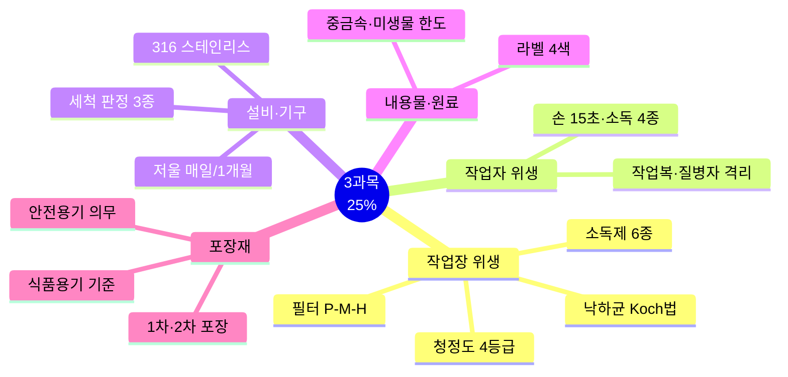
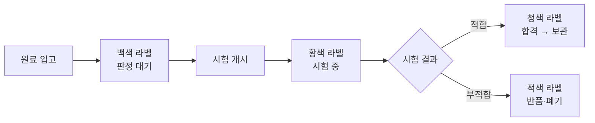

# 3과목 핵심요약 — 유통화장품 안전관리 (출제 25%)

> **시험 비중 25%** — 청정도·소독제·중금속·미생물·포장재 숫자가 최빈출.
> 법령·고시 수치는 개정될 수 있으니 최신 공식 기준과 함께 확인.

## 🎯 1분 요약표

| 축 | 핵심 |
| --- | --- |
| 위해 회수 | 위해성 평가 → 회수계획 → 회수 → 결과보고 (가 15일 / 나·다 30일) |
| 청정도 | 1등급(무균, 20회/hr) ~ 4등급(일반) |
| 필터 순서 | P/F(5㎛) → M/F(0.5㎛) → H/F(HEPA 0.3㎛ 99.97%) |
| 낙하균 | Koch법, 고청정 시설 30분 이상 노출 |
| 손 위생 | 세정 15초 이상, 소독 4종, 일회용 장갑 시 예외 |
| 저울 | 영점·수평 매일 / 정기점검 1개월 1회 |
| 입고 라벨 | 백색(대기) → 황색(시험 중) → 청색(적합) / 적색(부적합) |
| 중금속 | 수은 1 < 카드뮴 5 < 비소·안티몬 10 < 납 20(분말 50)㎍/g |
| 미생물 | 일반 1,000 / 영유아·눈화장 500 / 물휴지 100 CFU/g 이하 |
| 포장 | 1차=내용물 직접 접촉 / 2차=보호·표시 |

## 📋 목차

- [전체 지도](#-전체-지도)
- [Ch01 작업장 위생관리](#ch01-작업장-위생관리)
- [Ch02 작업자 위생관리](#ch02-작업자-위생관리)
- [Ch03 설비 및 기구관리](#ch03-설비-및-기구관리)
- [Ch04 내용물 및 원료관리](#ch04-내용물-및-원료관리)
- [Ch05 포장재 관리](#ch05-포장재-관리)
- [혼동 함정표](#-혼동-함정표)
- [숫자 암기 체크리스트](#-숫자-암기-체크리스트)

---

## 🗺️ 전체 지도



```mermaid
flowchart TD
  A[청정도 4등급] --> B[1등급 최고]
  A --> C[2등급]
  A --> D[3등급]
  A --> E[4등급 최저]
  B --> B1[HEPA + 20회/hr]
  B --> B2[낙하균 10개/hr]
  C --> C1[P/M(필요 시 H/F) + 10회/hr]
  C --> C2[낙하균 30개/hr]
  D --> D1[Pre 필터]
  E --> E1[환기장치]
```



---

## Ch01 작업장 위생관리

### ⭐⭐⭐ CGMP·구획 기준

| 용어 | 핵심 |
| --- | --- |
| **CGMP 3대 요소** | 과오 최소화 · 미생물오염 방지 · 품질관리체계 |
| **구획** | 벽·칸막이·에어커튼으로 교차오염 방지 |
| **구분** | 선·줄·그물망·칸막이로 착오·혼동 방지 |
| **분리** | 벽으로 별개 장소 + 공기조화 별도. **가장 엄격** |

> ⚠️ 엄격도 순서: **구획 < 구분 < 분리**

### ⭐⭐⭐ 청정도·필터

| 등급 | 작업실 | 공기순환 | 낙하균 | 부유균 | 필터 |
| --- | --- | --- | --- | --- | --- |
| 1등급 | Clean Bench(무균) | 20회/hr | 10개/hr | 20개/㎥ | P+M+HEPA |
| 2등급 | 제조·충전·칭량·내용물보관·미생물실험 | 10회/hr | 30개/hr | 200개/㎥ | P+M(필요 시 H/F) |
| 3등급 | 포장실 | 차압 관리 | — | — | Pre |
| 4등급 | 보관소·탈의실·일반실험실 | 환기장치 | — | — | — (환기만) |

| 필터 | 제거 입자 | 특성 |
| --- | --- | --- |
| P/F (Pre) | **5㎛** | 9mmAq, 세척 후 3~4회 재사용, 1차 여과 |
| M/F (Medium) | **0.5㎛** | 16mmAq, Glass Fiber, H/F 전처리 |
| H/F (HEPA) | **0.3㎛ 99.97%** | 24mmAq, 최종 여과, 교체주기 필수 |

### ⭐⭐ 낙하균·소독제

- **낙하균 Koch법**: 평판배지 자연 낙하. 세균 30~35℃·48시간 / 진균 20~25℃·5일. 고청정 시설 **30분 이상 노출**
- **공기 조절 4대 요소**: 청정도(공기정화기)·온도(열교환기)·습도(가습기)·기류(송풍기)

| 소독제 | 농도 | 특성 |
| --- | --- | --- |
| 70% 에탄올 | 70% | 신속 살균, 잔류 효과 없음, 조제 후 **1주일** 내 사용 |
| 차아염소산나트륨 | **50ppm** | 락스, 당일 조제·전량 폐기, 강한 살균력 |
| 크레졸수 | **3%** | 녹농균·결핵균 유효, 냄새 강함 |
| 페놀수 | **3%** | 고온 효과 큼, 독성·금속 부식성 |
| 벤잘코늄클로라이드 | 10% → **20배 희석** | 양이온성, 알레르기 유발 가능 |
| 글루콘산클로르헥시딘 | 5% → **10배 희석** | 살균+항진균, 심각한 알레르기 반응 |

- **물리적 소독 3종**: 건열·습열·자외선 / **소독 전 사멸률 99.9% 이상**
- **중화제**: 파라벤→레시틴/폴리솔베이트80, 알데하이드→글리신/히스티딜

## Ch02 작업자 위생관리

### ⭐⭐⭐ 손 위생

| 용어 | 핵심 |
| --- | --- |
| **손 세정** | 미지근한 물 + 비누 **15초 이상** 문지르기, 일회용 타올 건조 |
| **혼합·소분 전** | 원칙적으로 손 소독·세정. **일회용 장갑 착용 시 예외** |
| **손 소독제** | 에탄올 함유 의약외품, 물 없이 사용 가능 |

| 소독제 | 농도 | 기전 |
| --- | --- | --- |
| 알코올 | **70~80%** | 단백질 변성 |
| 클로르헥시딘 | **0.5~4.0%** | 양이온 항균, 세포질막 파괴 |
| 헥사클로로펜 | **3.0%** | 세포벽 파괴 |
| 아이오도퍼 | **0.5~10%** | 단백질 합성 저해·세포막 변성 |

### ⭐⭐ 복장·건강관리

| 용어 | 핵심 |
| --- | --- |
| **방진복** | 전면 지퍼, 주름 없음 |
| **작업복** | 상하의 분리. 제조·칭량·보관·유지관리 |
| **실험복** | 백색 가운. 실험실·간접 부문 |
| **질병자 격리** | 피부 외상·질병 직원은 의사 소견 전까지 화장품 접촉 금지 |
| **방문객** | 안내자 동행 필수, 출입 기록 의무 |
| **기타** | 음식물 반입 금지, 위생 교육(신규 + 정기) |

## Ch03 설비 및 기구관리

### ⭐⭐⭐ 저울·세척

| 용어 | 핵심 |
| --- | --- |
| **저울 영점·수평** | **매일** 가동 전 '0' 설정 확인 |
| **저울 정기점검** | **1개월 1회**, 표준 분동. 직선성 ±0.5% · 정밀성 ±0.5% · **편심오차 ±0.1%** |
| **세척 원칙** | 물(최적) → 세제 최소화 → 분해 세척 → 판정 → 건조·밀폐 → 유효기간 설정 |
| **세척 판정** | 육안 · 닦아내기(무진포) · 린스 정량법(HPLC·TLC·TOC·UV) |
| **면봉 시험법** | **121℃ 20분** 멸균, **24~30㎠** 문지름, CFU/면봉 |
| **콘택트 플레이트법** | 배지 직접 접촉, 70% 에탄올 잔류물 제거, CFU/플레이트 |

### ⭐⭐ 재질·물·기타

- **316 스테인리스** > 304 — 부식에 강해 탱크·필터·이송파이프·충전기에 선호
- **호모게나이저**: 혼합·교반 장치. 제품 균일성·물리적 성상 확보
- **물의 품질**: 제조설비 세척 = 정제수·상수 / 손 씻기 = 상수 / 제품 용수 = **정제수**
- **세척제 pH**: 0.2~5.5 / 5.5~8.5 / 8.5~12.5 / 12.5~14
- **불용 처리**: 부품 수급 불가 / 수리비용 > 신규 도입비용 / 신뢰성 지속 저하

## Ch04 내용물 및 원료관리

### ⭐⭐⭐ 입고 라벨·중금속·미생물

- **입고 라벨 4색**: 백색(판정 대기) → 황색(시험 중) → 청색(적합) / 적색(부적합→반품)
- **품질 용어**: 일탈(CGMP 규정 이탈) · 기준일탈(합격 기준 불일치) · 뱃치(제조단위) · 제조번호

| 중금속·유해물질 | 한도 |
| --- | --- |
| 납 | 분말 **50** / 기타 **20㎍/g** 이하 |
| 비소·안티몬 | **10㎍/g** 이하 |
| 카드뮴 | **5㎍/g** 이하 |
| 수은 | **1㎍/g** 이하 (가장 엄격) |
| 니켈 | 눈화장 **35** / 색조 **30** / 기타 **10㎍/g** |
| 디옥산 | **100㎍/g** 이하 |
| 메탄올 | **0.2%(v/v)** / 물휴지 **0.002%** |
| 포름알데하이드 | **2,000㎍/g** / 물휴지 **20㎍/g** |
| 프탈레이트류 | DBP+BBP+DEHP 총합 **100㎍/g** |

| 미생물 | 기준 |
| --- | --- |
| 영유아·눈화장 | 총호기성생균수 **500 CFU/g(mL)** 이하 |
| 물휴지 | 세균·진균 **각 100 CFU/g(mL)** 이하 |
| 기타 화장품 | 총호기성생균수 **1,000 CFU/g(mL)** 이하 |
| 불검출 균 | 대장균 · 녹농균 · 황색포도상구균 (모든 화장품류) |

### ⭐⭐ 제품별 기준·보관

| 항목 | 기준 |
| --- | --- |
| 내용량 | 3개 평균 **97% 이상** (위반 시 6개 추가 → 9개 평균 97%) |
| 액상 제품 pH | **3.0~9.0** (물 무함유·즉시 세정 제외) |
| 화장비누 유리알칼리 | **0.1% 이하** |
| 퍼머 제1제 공통 | 중금속 20 · 비소 5 · 철 2 ㎍/g |
| 퍼머 제2제 | pH 4.0~10.5(브롬산) / 2.5~4.5(과산화수소) |
| 인체 세포 배양액 | 청정등급 **1B** 이상 · 기록 보존 **3년** |
| 벌크 재보관 | 재보관 라벨 + 원래 환경, 변질 우려 시 재사용 금지 |
| 선입선출 | 출고 원칙 (타당한 사유 시 예외) |

## Ch05 포장재 관리

### ⭐⭐⭐ 포장 구분·용기

| 용어 | 핵심 |
| --- | --- |
| **1차 포장** | 내용물과 **직접 접촉**하는 포장 |
| **2차 포장** | 1차 포장 수용·보호·표시 (첨부문서 포함) |
| **용기 4종** | 플라스틱 · 유리 · 금속 · 적층 |

| 용기 종류 | 차단 대상 |
| --- | --- |
| 안전용기 | 5세 미만 개봉 어려움. 아세톤·탄화수소 10%·메틸살리실레이트 5% 의무 |
| 밀폐용기 | 고형 이물·고형 내용물 손실 |
| 기밀용기 | 액상/고형 이물·수분 침입 |
| 밀봉용기 | **기체·미생물** 차단 — 가장 엄격 |
| 차광용기 | 광선 투과 방지 |

> ⚠️ 엄격도 순서: **밀폐 < 기밀 < 밀봉** / **식품용기 기준 준수 필수**

### ⭐⭐ 포장 시험·관리

- **감압 누설시험**: 액상 용기 마개·패킹 밀폐성 (스킨·로션)
- **크로스컷 시험**: 코팅막·도금 밀착력 / **내용물 감량시험**: 마스카라 건조 감량 / **낙하시험**: 파손·분리
- **포장지시서**: 제품명·설비명·포장재 리스트·포장 공정·생산 수량
- **선한선출(FEFO)**: 유효기한 짧은 것 우선 — 선입선출 예외
- **개봉 후 사용기간**: 심벌+기간 표시 (예: 12M)

---

## ⚠️ 혼동 함정표

| 함정 | 정답 |
| --- | --- |
| 1등급이면 필터 안 바꿔도? | **HEPA 교체주기 필수** |
| 손 세정 10초면 충분? | **15초 이상** |
| 저울 영점은 가끔만? | **매일** 영점·수평, 정기점검 1개월 |
| 영유아용 미생물 기준 같음? | **500 CFU/g**로 더 엄격 (일반 1,000) |
| 장갑 끼면 손 소독 생략? | **일회용 장갑 착용 시에만 예외** |
| 304가 316보다 내식성? | **316이 더 강함** |
| 라벨 황색이 적합? | 황색=시험 중 / **청색=적합** |
| 2차 포장이 내용물 접촉? | **1차 포장**이 직접 접촉 |
| 밀폐용기가 가장 엄격? | **밀봉용기** (기체·미생물 차단) |
| 구획이 가장 엄격? | **분리** (벽+별도 공기조화) |
| 가등급 회수 즉시? | **15일 이내** (나·다는 30일) |
| 포장재 아무거나? | **식품용기 기준 준수 필수** |
| 선입선출만 가능? | **선한선출**(FEFO)도 가능 — 유효기한 짧은 것 우선 |

---

## 🔢 숫자 암기 체크리스트

| 항목 | 숫자 | 빈도 |
| --- | --- | --- |
| 중금속 납 / 분말 납 | 20 / 50㎍/g | ⭐⭐⭐ |
| 비소·안티몬 / 카드뮴 / 수은 | 10 / 5 / 1㎍/g | ⭐⭐⭐ |
| 미생물 일반 / 영유아·눈 / 물휴지 | 1,000 / 500 / 100 CFU/g | ⭐⭐⭐ |
| 청정도 1등급 공기순환 / 2등급 | 20 / 10회/hr | ⭐⭐⭐ |
| 필터 P/F / M/F / H/F | 5㎛ / 0.5㎛ / 0.3㎛ 99.97% | ⭐⭐⭐ |
| 낙하균 1등급 / 부유균 1등급 | 10개/hr / 20개/㎥ | ⭐⭐ |
| 낙하균 2등급 / 부유균 2등급 | 30개/hr / 200개/㎥ | ⭐⭐ |
| 낙하균 배양 | 세균 30~35℃·48h / 진균 20~25℃·5일 | ⭐⭐ |
| 손 세정 | 15초 이상 | ⭐⭐⭐ |
| 시설용 소독 | 70% 에탄올·50ppm 차아염소산·3% 크레졸/페놀 | ⭐⭐⭐ |
| 소독 전 사멸률 | 99.9% | ⭐⭐ |
| 손 소독 4종 | 알코올 70~80% · 클로르헥시딘 0.5~4.0% · 헥사클로로펜 3.0% · 아이오도퍼 0.5~10% | ⭐⭐⭐ |
| 저울 정기점검 / 편심오차 | 1개월 / ±0.1% | ⭐⭐⭐ |
| 면봉 멸균 / 면적 | 121℃ 20분 / 24~30㎠ | ⭐⭐ |
| 내용량 | 평균 97% 이상 | ⭐⭐ |
| 디옥산 / 메탄올 / 포름알데하이드 | 100㎍/g · 0.2% · 2,000㎍/g | ⭐⭐ |
| 니켈 (눈/색조/기타) | 35 / 30 / 10㎍/g | ⭐⭐ |
| 프탈레이트류 합계 | 100㎍/g | ⭐⭐ |
| 액상 pH / 비누 유리알칼리 | 3.0~9.0 / 0.1% | ⭐ |
| 퍼머 제1제 | 중금속 20·비소 5·철 2㎍/g | ⭐⭐ |
| 안전용기 의무 | 탄화수소 10% · 메틸살리실레이트 5% | ⭐⭐ |
| 회수 기간 | 가 15일 / 나·다 30일 | ⭐⭐⭐ |
| 인체 세포 배양액 | 청정 1B · 기록 3년 | ⭐ |

---

> 📌 **출처**: 화장품법·시행규칙, 우수화장품 제조 및 품질관리기준(CGMP), 화장품 안전기준 등에 관한 규정 | **최종 확인**: 2026. 9. 18.
| 에탄올 조제 후 사용 | 1주일 이내 | ⭐ |
