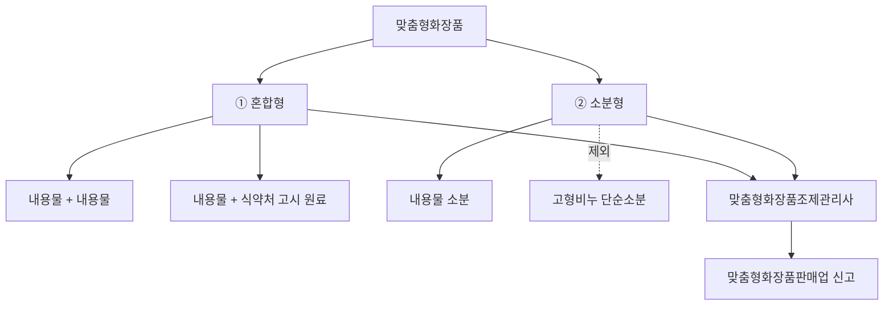

# Chapter 01. 맞춤형화장품 개요

> **고득점 TIP**
> 맞춤형화장품의 정의에 대해 명확히 알아야 하며, 관련 규정은 꼭 한 번 더 정리하여 암기하세요.
> 맞춤형화장품은 안전성이 매우 중요하므로 꼭 정독하세요.
>
> 🔗 **관련 과목**
> - 1과목 1챕터 "화장품법" — 제3조의2~제3조의8 맞춤형화장품 법령 규정 (본 챕터는 실무 정의)
> - 3과목 1챕터 "작업장 위생관리" — 시설기준(분리·구획)의 CGMP 근거

---

> 📋 **학습 가이드**
> - 출제 빈도: ★★★★★ (맞춤형화장품 정의, 판매업 신고, 결격사유, 조제관리사 자격시험, 안전성시험 종류, 안정성시험 종류·조건·기간)
> - 예상 소요 시간: 60분
> - 핵심 키워드: 혼합형(내용물+내용물/원료)·소분형(고형비누 제외), 판매업 신고(지방식약청), 결격사유(1년/3년), 자격시험(60%/40% 합격), 안전성시험 9종, 인체적용시험(5년 경력), 안정성시험 4종(장기보존·가속·가혹·개봉 후)

---

## 1. 맞춤형화장품 정의

> **한 줄 요약**: 맞춤형화장품 = 혼합형(내용물+내용물/식약처 고시 원료) + 소분형(고형비누 단순소분 제외), 조제관리사가 판매업 신고장에서 제조.

맞춤형화장품판매업으로 신고한 판매장에서 고객 개인별 피부 특성, 색, 향 등의 기호 및 요구를 반영하여 맞춤형화장품조제관리사 자격증을 가진 자가 아래의 내용으로 만든 화장품이다. 개성과 다양성을 추구하는 소비자 중심의 요구가 증가함에 따라 제품을 소비자의 특성 및 기호에 맞추어 혼합·소분(소량 생산 방식)하여 판매한다.

① 제조 또는 수입된 화장품의 **내용물**에 다른 화장품의 **내용물**이나 **식품의약품안전처장**이 정하여 고시하는 **원료**를 추가하여 혼합한 화장품

- 내용물 + 내용물 (또는) + 내용물 + 원료 → 혼합

② 제조 또는 수입된 화장품의 **내용물을 소분(小分)**한 화장품 (다만, 고형비누 등 화장품의 내용물을 단순 소분한 화장품은 제외함)

- 내용물(벌크) 또는 수입화장품 = 맞춤형화장품 + 맞춤형화장품 + 맞춤형화장품



---

## 2. 맞춤형화장품 주요 규정(관련 법령)

> **한 줄 요약**: 화장품법 제3조의2~8(판매업 신고·결격사유·조제관리사) + 시행규칙(시설기준·자격시험·준수사항·행정처분) + 안전기준(사용 가능 원료).

### (1) 「화장품법」

| 조항 | 내용 |
|---|---|
| **제3조의2**<br>맞춤형화장품 판매업의 신고 | • 총리령에 따라 식품의약품안전처장에게 신고하고 변경 시에도 신고<br>• 맞춤형화장품판매업을 신고하려는 자는 총리령으로 정하는 시설기준을 갖추어야 하며, 맞춤형화장품의 혼합·소분 등 품질·안전 관리 업무에 종사하는 자(맞춤형화장품조제관리사)를 두어야 함 |
| **제3조의3**<br>맞춤형화장품판매업 결격사유 <sup>기출</sup> | • 피성년후견인 또는 파산 선고를 받고 복권되지 않은 자<br>• 「화장품법」 또는 「보건범죄 단속에 관한 특별조치법」을 위반하여 금고 이상의 형을 선고받고 집행이 끝나거나(집행이 끝난 것으로 보는 경우를 포함) 집행이 면제되지 아니한 자, 또는 금고 이상의 형의 집행유예를 선고받고 그 유예기간 중에 있는 자<br>• 등록 취소 또는 영업소가 폐쇄된 날부터 1년이 지나지 않은 자 |
| **제3조의4**<br>맞춤형화장품 조제관리사 자격시험 | • 화장품과 원료 등에 대해 식품의약품안전처장이 실시하는 자격시험에 합격해야 함<br>• 거짓이나 그 밖의 부정한 방법으로 자격시험에 응시한 사람 또는 자격시험에서 부정행위를 한 사람에 대하여는 그 자격시험을 정지시키거나 합격을 무효로 함. 이 경우 자격시험이 정지되거나 합격이 무효가 된 사람은 그 처분이 있은 날부터 3년간 자격시험에 응시 불가<br>• 자격시험의 관리 및 자격증 발급 등에 관한 업무를 효과적으로 수행하기 위해 필요한 전문인력과 시설을 갖춘 기관 또는 단체를 시험운영기관으로 지정하여 시험업무를 위탁할 수 있음<br>• 자격시험의 시기, 절차, 방법, 시험과목, 자격증의 발급, 시험운영기관의 지정 등 자격시험에 필요한 사항은 총리령으로 정함 |
| **제3조의5**<br>맞춤형화장품 조제관리사의 결격사유 | • 「정신건강증진 및 정신질환자 복지서비스 지원에 관한 법률」 제3조제1호에 따른 정신질환자(망상, 환각, 사고나 기분의 장애 등으로 인하여 독립적인 일상생활을 영위하는 데 중대한 제약이 있는 사람을 말함. 단, 전문의가 맞춤형화장품조제관리사로서 적합하다고 인정하는 사람은 제외함)<br>• 피성년후견인<br>• 「마약류 관리에 관한 법률」의 마약류(마약·향정신성의약품 및 대마) 중독자<br>• 「화장품법」 또는 「보건범죄 단속에 관한 특별조치법」을 위반하여 금고 이상의 형을 선고받고 집행이 끝나지 않았거나 집행을 받지 않기로 확정되지 않은 자<br>• 맞춤형화장품조제관리사의 자격이 취소된 날부터 3년이 지나지 않은 자 |
| **제3조의6**<br>자격증 대여 등의 금지 | • 다른 사람에게 자기의 성명을 사용하여 맞춤형화장품조제관리사 업무를 하게 하거나 자격증을 양도 또는 대여해서는 안 됨<br>• 누구든지 다른 사람의 맞춤형화장품조제관리사 자격증을 양수하거나 대여받아 이를 사용하여서는 안 됨 |
| **제3조의7**<br>유사명칭의 사용금지 | 맞춤형화장품조제관리사가 아닌 자는 맞춤형화장품조제관리사 또는 이와 유사한 명칭을 사용하지 못함 |
| **제3조의8**<br>맞춤형화장품 조제관리사 자격의 취소 | • 거짓이나 그 밖의 부정한 방법으로 맞춤형화장품조제관리사의 자격을 취득한 경우<br>• 맞춤형화장품조제관리사의 결격사유에 해당하는 경우(자격이 취소된 날부터 3년이 지나지 않은 자는 제외함)<br>• 자격증 대여 등의 금지행위를 위반하여 다른 사람에게 자기의 성명을 사용하여 맞춤형화장품조제관리사 업무를 하게 하거나 맞춤형화장품조제관리사자격증을 양도 또는 대여한 경우 |
| **제5조**<br>영업자의 의무 등 <sup>기출</sup> | • 화장품제조업자는 화장품의 제조와 관련된 기록·시설·기구 등 관리 방법, 원료·자재·완제품 등에 대한 시험·검사·검정 실시 방법 및 의무 등에 관하여 총리령으로 정하는 사항을 준수해야 함<br>• 화장품책임판매업자는 화장품의 품질관리기준, 책임판매 후 안전관리기준, 품질 검사 방법 및 실시 의무, 안전성·유효성 관련 정보사항 등의 보고 및 안전대책 마련 의무 등에 관하여 총리령으로 정하는 사항을 준수해야 함<br>• 맞춤형화장품판매업자는 소비자에게 유통·판매되는 화장품을 임의로 혼합·소분하여서는 안 됨<br>• 맞춤형화장품판매업자는 맞춤형화장품 판매장 시설·기구의 관리 방법, 혼합·소분 안전관리기준의 준수 의무, 혼합·소분되는 내용물 및 원료에 대한 설명 의무, 안전성 관련 사항 보고 의무 등에 관하여 총리령으로 정하는 사항을 준수해야 함<br>• 화장품책임판매업자는 총리령으로 정하는 바에 따라 화장품의 생산실적 또는 수입실적, 화장품의 제조과정에 사용된 원료의 목록 등을 식품의약품안전처장에게 보고하여야 함. 이 경우 원료의 목록에 관한 보고는 화장품의 유통·판매 전에 해야 함<br>• 맞춤형화장품판매업자는 총리령으로 정하는 바에 따라 맞춤형화장품에 사용된 모든 원료의 목록을 매년 1회 식품의약품안전처장에게 보고해야 함<br>• 책임판매관리자 및 맞춤형화장품조제관리사는 화장품의 안전성 확보 및 품질관리에 관한 교육을 매년 받아야 함<br>• 식품의약품안전처장은 국민 건강상 위해를 방지하기 위해 필요하다고 인정하면 화장품제조업자, 화장품책임판매업자 및 맞춤형화장품판매업자에게 화장품 관련 법령 및 제도(화장품의 안전성 확보 및 품질관리에 관한 내용을 포함함)에 관한 교육을 받을 것을 명할 수 있음<br>• 교육을 받아야 하는 자가 둘 이상의 장소에서 화장품제조업, 화장품책임판매업 또는 맞춤형화장품판매업을 하는 경우에는 종업원 중에서 총리령으로 정하는 자를 책임자로 지정하여 교육을 받게 할 수 있음<br>• 교육의 실시 기관, 내용, 대상 및 교육비 등에 관하여 필요한 사항은 총리령으로 정함 |
| **제9조**<br>안전용기·포장 | 어린이가 화장품을 잘못 사용하여 인체에 위해를 끼치지 않도록 안전용기·포장을 사용해야 함 |
| **제16조**<br>판매 등의 금지 <sup>기출</sup> | • 판매업 신고를 하지 않은 자가 판매한 맞춤형화장품<br>• 맞춤형화장품조제관리사를 두지 않고 판매한 맞춤형화장품<br>• 의약품으로 잘못 인식할 우려가 있게 기재·표시한 화장품<br>• 판매 목적이 아닌 제품의 홍보·판매 촉진을 위해 미리 소비자가 시험·사용하도록 제조 또는 수입된 화장품 |

### (2) 「화장품법 시행규칙」

| 조항 | 내용 |
|---|---|
| **제8조의2**<br>맞춤형화장품 판매업의 신고 <sup>기출</sup> | • 소재지 관할 지방식품의약품안전청장에게 아래 ①, ②번 서류를 제출해야 함 (다만, 맞춤형화장품판매업자가 판매업소로 신고한 소재지 외의 장소에서 1개월 범위에서 한시적으로 같은 영업을 하려는 경우에는 ①번 서류에 ②, ③번 서류를 첨부하여 제출해야 함)<br>&nbsp;&nbsp;① 맞춤형화장품판매업 신고서(전자문서로 된 신고서 포함)<br>&nbsp;&nbsp;② 맞춤형화장품조제관리사 자격증 사본과 시설의 명세서<br>&nbsp;&nbsp;③ 맞춤형화장품판매업 신고필증 사본(전자문서로 발급받은 경우는 제외)<br>• 법인일 경우 지방식품의약품안전청장은 행정정보의 공동이용을 통해 법인 등기사항 증명서를 확인해야 함<br>• 지방식품의약품안전청장은 신고가 요건을 갖춘 경우, 맞춤형화장품판매업 신고대장에 다음 내용을 적고 맞춤형화장품판매업 신고필증을 발급해야 함<br>&nbsp;&nbsp;- 신고번호 및 신고연월일<br>&nbsp;&nbsp;- 맞춤형화장품판매업자의 성명 및 주민등록번호(법인인 경우에는 대표자의 성명 및 주민등록번호 등)<br>&nbsp;&nbsp;- 맞춤형화장품판매업자의 상호 및 소재지<br>&nbsp;&nbsp;- 맞춤형화장품판매업소의 상호 및 소재지<br>&nbsp;&nbsp;- 맞춤형화장품조제관리사의 성명, 주민등록번호 및 자격증 번호<br>&nbsp;&nbsp;- 영업의 기간(한시적으로 맞춤형화장품판매업을 하려는 경우에 해당) |
| **제8조의3**<br>맞춤형화장품 판매업의 변경신고 | • 맞춤형화장품판매업자가 다음의 사항을 변경하는 경우에는 변경신고를 해야 함<br>&nbsp;&nbsp;- 맞춤형화장품판매업자를 변경하는 경우<br>&nbsp;&nbsp;- 맞춤형화장품판매업소의 상호 또는 소재지를 변경하는 경우<br>&nbsp;&nbsp;- 맞춤형화장품조제관리사를 변경하는 경우<br>• 신고기한: 변경이 있는 날부터 30일 이내에 관할 지방식품의약품안전청장에게 신고<br>• 행정기관 처리기한: 변경신고서(전자문서 포함) 접수 후 10일 이내 처리 (단, 조제관리사 변경신고는 7일 이내 처리) |
| **제8조의4**<br>맞춤형화장품 판매업의 시설기준 | 맞춤형화장품판매업을 신고하려는 자는 맞춤형화장품의 혼합·소분 공간을 그 외의 용도로 사용되는 공간과 분리 또는 구획하여 갖추어야 함. 다만, 혼합·소분 과정에서 맞춤형화장품의 품질·안전 등 보건위생상 위해가 발생할 우려가 없다고 인정되는 경우에는 혼합·소분 공간을 분리 또는 구획하여 갖추지 않아도 됨 |
| **제8조의5**<br>맞춤형화장품 조제관리사 자격시험 | • 식품의약품안전처장은 매년 1회 이상 자격시험 실시<br>• 자격시험 시행계획은 시험 실시 90일 전까지 식약처 인터넷 홈페이지에 공고<br>• 전 과목 총점의 60% 이상, 매 과목 만점의 40% 이상 득점 시 합격<br>• 시험위원은 시험과목에 대한 전문지식을 갖추거나 화장품에 관한 업무 경험이 풍부한 사람으로 위촉 |
| **제8조의6**<br>맞춤형화장품 조제관리사 자격증의 발급 신청 등 | • 자격증 발급 신청 시 다음 각 호의 서류를 첨부하여 식품의약품안전처장에게 제출<br>&nbsp;&nbsp;- 마약류의 중독자에 해당되지 않음을 증명하는 최근 6개월 이내의 의사의 진단서<br>&nbsp;&nbsp;- 맞춤형화장품조제관리사 결격사유인 정신질환자이지만, 전문의가 맞춤형화장품조제관리사로서 적합하다고 인정하는 경우 최근 6개월 이내의 전문의의 진단서<br>• 자격증을 잃어버리거나 못 쓰게 된 경우<br>&nbsp;&nbsp;- 자격증을 잃어버린 경우: 분실 사유서<br>&nbsp;&nbsp;- 자격증을 못 쓰게 된 경우: 자격증 원본 |
| **제12조의2**<br>맞춤형화장품 판매업자의 준수사항 <sup>기출</sup> | • 맞춤형화장품 판매장 시설·기구를 정기적으로 점검하여 보건위생상 위해가 없도록 관리할 것<br>• 다음의 혼합·소분 안전관리기준을 준수할 것<br>&nbsp;&nbsp;- 혼합·소분 전에 혼합·소분에 사용되는 내용물 또는 원료에 대한 품질성적서를 확인할 것<br>&nbsp;&nbsp;- 혼합·소분 전에 손을 소독하거나 세정할 것(다만, 혼합·소분 시 일회용 장갑을 착용하는 경우에는 그렇지 않음)<br>&nbsp;&nbsp;- 혼합·소분 전에 혼합·소분된 제품을 담을 포장용기의 오염 여부를 확인할 것<br>&nbsp;&nbsp;- 혼합·소분에 사용되는 장비 또는 기구 등은 사용 전에 그 위생 상태를 점검하고, 사용 후에는 오염이 없도록 세척할 것<br>&nbsp;&nbsp;- 그 밖에 위의 내용들과 유사한 것으로서 혼합·소분의 안전을 위해 식품의약품안전처장이 정하여 고시하는 사항을 준수할 것<br>• 아래 내용이 포함된 맞춤형화장품 판매내역서(전자문서로 된 판매내역서를 포함함)를 작성·보관할 것<br>&nbsp;&nbsp;- 제조번호<br>&nbsp;&nbsp;- 사용기한 또는 개봉 후 사용기간<br>&nbsp;&nbsp;- 판매일자 및 판매량<br>• 맞춤형화장품 판매 시 다음 내용을 소비자에게 설명할 것<br>&nbsp;&nbsp;- 혼합·소분에 사용된 내용물·원료의 내용 및 특성<br>&nbsp;&nbsp;- 맞춤형화장품 사용 시의 주의사항<br>• 맞춤형화장품 사용과 관련된 부작용 발생사례에 대해서는 식품의약품안전처장이 정하여 고시하는 바에 따라 지체 없이 식품의약품안전처장에게 보고할 것 |
| **제14조**<br>책임판매관리자 등의 교육 <sup>기출</sup> | • 최초 교육: 종사한 날부터 6개월 이내(단, 자격시험에 합격한 날이 종사한 날 이전 1년 이내이면 최초 교육을 받은 것으로 봄)<br>• 보수 교육: 최초 교육을 받은 날을 기준으로 매년 1회(단, 자격시험에 합격한 날이 종사한 날 이전 1년 이내여서 교육을 생략한 경우, 자격시험에 합격한 날부터 1년이 되는 날을 기준으로 매년 1회 보수 교육을 받아야 함)<br>• 4시간 이상 8시간 이하로 참여<br>• 교육실시기관: 대한화장품협회, 한국의약품수출입협회, 대한화장품산업연구원 |
| **제15조**<br>폐업 등의 신고 <sup>기출</sup> | • 영업자가 폐업 또는 휴업하거나 휴업 후 그 업을 재개하려는 경우에는 폐업, 휴업 또는 재개 신고서(전자문서로 된 신고서를 포함함)에 화장품제조업 등록필증, 화장품책임판매업 등록필증 또는 맞춤형화장품판매업 신고필증(폐업·휴업만 해당함)을 첨부하여 지방식품의약품안전청장에게 제출해야 함<br>• 「화장품법」에 따른 폐업 또는 휴업 신고를 하려는 자는 「부가가치세법 시행규칙」 별지 제9호 폐업·휴업신고서를 지방식품의약품안전청장에게 송부해야 함<br>• 「부가가치세법」에 따른 폐업 또는 휴업신고를 같이 하려는 자는 관할 세무서장에게 「부가가치세법 시행규칙」 별지 제11호와 「화장품법」에 따른 폐업·휴업신고서를 함께 제출해야 하는데, 영업자가 이 신고서들을 지방식품의약품안전청장과 관할 세무서장 중 한 곳에 제출할 경우, 지방식품의약품안전청장과 관할 세무서장은 즉시 서로에게 송부해야 함 |

#### 맞춤형화장품 판매업과 관련한 주요 행정처분 <sup>기출</sup>

| 위반 내용 | 1차 위반 | 2차 위반 | 3차 위반 | 4차 이상 위반 |
|---|---|---|---|---|
| 맞춤형화장품판매업자의 변경신고를 하지 않은 경우 | 시정명령 | 판매업무정지 5일 | 판매업무정지 15일 | 판매업무정지 1개월 |
| 맞춤형화장품판매업소 상호의 변경신고를 하지 않은 경우 | 시정명령 | 판매업무정지 5일 | 판매업무정지 15일 | 판매업무정지 1개월 |
| 맞춤형화장품판매업소 소재지의 변경신고를 하지 않은 경우 | 판매업무정지 1개월 | 판매업무정지 2개월 | 판매업무정지 3개월 | 판매업무정지 4개월 |
| 맞춤형화장품조제관리사의 변경신고를 하지 않은 경우 | 시정명령 | 판매업무정지 5일 | 판매업무정지 15일 | 판매업무정지 1개월 |
| 맞춤형화장품판매업자가 시설기준을 갖추지 않게 된 경우 | 시정명령 | 판매업무정지 1개월 | 판매업무정지 3개월 | 영업소 폐쇄 |

### (3) 「화장품 안전 기준 등에 관한 규정」

| 조항 | 내용 |
|---|---|
| **제5조**<br>맞춤형화장품에 사용 가능한 원료 | 아래의 원료를 제외한 원료는 맞춤형화장품에 사용 가능<br>• 화장품에 사용할 수 없는 원료<br>• 화장품에 사용상의 제한이 필요한 원료<br>• 사전심사를 받지 않았거나 보고서를 제출하지 않은 기능성화장품 고시 원료 |

> ※ 맞춤형화장품을 기능성화장품으로 판매할 때, 최종 맞춤형화장품은 기 심사를 받거나 보고한 기능성화장품이어야 함

---

## 3. 화장품의 안전성

> **한 줄 요약**: 안전성시험 9종(단회독성·피부자극·안점막·감작성·광독성·광감작성·인체첩포·유전독성) + 안전성 정보관리체계 + 영유아 안전성 자료 보관.

### (1) 안전성시험 <sup>기출</sup>

| 시험명 | 내용 |
|---|---|
| 단회 투여 독성시험 | 동물에 1회 투여했을 때 LD50값(반수 치사량)을 산출하여 위험성을 예측함 |
| 1차 피부 자극시험 | 피부에 1회 투여했을 때 자극성을 평가함 |
| 연속 피부 자극시험 | • 피부에 반복적으로 투여했을 때 나타나는 자극성을 평가함<br>• 동물에 2주간 반복 투여 |
| 안(眼)점막 자극시험 <sup>기출</sup> | 동물이나 대체시험(단백질 구조 변화)을 통해 눈에 들어갔을 때의 위험성을 예측함 |
| 피부 감작성시험 | 피부에 투여했을 때 접촉으로 인한 감작(알레르기)을 평가함 |
| 광독성시험 | UV램프를 조사하여 자외선에 의해 생기는 자극성을 평가함 |
| 광감작성시험 | 광조사를 하여 자외선에 의해 생기는 접촉 감작성(접촉 알레르기)을 평가함 |
| 인체 첩포시험(인체 패치테스트) <sup>기출</sup> | • 등, 팔 안쪽에 폐쇄 첩포하여 피부 자극성이나 감작성(알레르기)을 평가함<br>• 국내외 대학 또는 전문 연구기관에서 실시하며, 관련 분야 전문의사, 연구소, 병원 등 관련 기관에서 5년 이상 경력을 가진 자의 지도 및 감독하에 수행·평가되어야 함 |
| 유전 독성시험 | • 박테리아를 이용한 돌연변이시험<br>• 염색체 이상을 유발하는지 설치류를 통해 시험하고 안전성을 평가함 |

#### 참고: 안정성 관련 용어

| 용어 | 설명 |
|---|---|
| 피부 감작성 | 외부 자극에 의한 면역계 반응성 |
| 광독성 | 빛에 의한 독성 반응성 |
| 광감작성 | 빛에 의한 면역계 반응성 |
| 인체 첩포시험(인체 패치테스트) | 접촉 피부염의 원인을 파악하기 위해 원인 추정 물질을 몸에 붙여 반응을 조사하는 시험 |

### (2) 화장품 안전성 정보 관리체계

화장품의 취급·사용 시 인지되는 안전성 관련 정보를 체계적·효율적으로 수집·검토·평가하여 적절한 안전대책을 강구함으로써 국민 보건상 위해를 방지하기 위해 「화장품 안전성 정보관리 규정」을 고시해 두고 있다.

① 식품의약품안전처장은 안전하고 올바른 화장품의 사용을 위하여 화장품 안전성 정보의 평가 결과를 화장품책임판매업자 등에게 전파하고 필요한 경우 이를 소비자에게 제공할 수 있다.

② 식품의약품안전처장은 수집된 안전성 정보, 평가결과 또는 후속조치 등에 대하여 필요한 경우 국제기구나 관련국 정부 등에 통보하는 등 국제적 정보교환체계를 활성화하고 상호협력 관계를 긴밀하게 유지함으로써 화장품으로 인한 범국가적 위해의 방지에 적극 노력하여야 한다.

**관리체계 흐름 (개념도)**

```
국제기구
   ↕ (정보교환)
인체성 평가 전문가 ↔ 식품의약품안전처(화장품정책과) ↔ 외국정부
                        ↕ (보고/자료제공)      ↕
관련 단체·기관 ↔ 병·의원 및 약국 등 ↔ 소비자
                        ↕                    ↕
                    화장품 책임판매업자
```

#### (3) 영유아 또는 어린이 사용 화장품 안전성 자료의 작성·보관

① **주체**: 화장품책임판매업자
② **작성**: 문서 및 기록의 관리 절차에 따라 작성·개정·승인 등 관리
③ **보관 및 절차**
- 인쇄본 또는 전자매체를 이용하여 제품별 안전성 자료를 안전하게 보관
- 자료의 훼손 또는 소실에 대비하여 사본, 백업자료 등을 생성·유지 가능
- 보관기간이 만료된 문서는 책임판매관리자의 책임하에 폐기

---

## 4. 화장품의 유효성

> **한 줄 요약**: 효력시험(비임상) + 인체적용시험(5년 경력·헬싱키선언) + 염모효력시험 + SPF/PA 근거자료 + 제출자료 면제(인체적용시험 제출 시 효력시험 면제).

### (1) 유효성 또는 기능에 관한 자료 <sup>기출</sup>

**① 효력시험 자료와 유효성 평가시험**: 심사 대상 효능을 포함한 효력을 뒷받침하는 비임상시험 자료이며, 효과 발현의 작용기전이 포함되어야 한다.

- 국내외 대학 또는 전문 연구기관에서 시험한 것으로 당해 기관의 장이 발급한 자료(시험시설 개요, 주요설비, 연구인력의 구성, 시험자의 연구경력에 관한 사항을 포함함)
- 당해 기능성화장품이 개발국 정부에 제출되어 평가된 모든 효력시험 자료로 개발국 정부(허가 또는 등록기관)가 제출받았거나 승인하였음을 확인한 것 또는 이를 증명한 자료
- 과학논문인용색인(Science Citation Index 또는 Science Citation Index Expanded)이 등재된 전문학회지에 게재된 자료

#### 유효성 평가시험 및 근거자료의 종류

| 구분 | 유효성 평가시험 및 근거자료의 종류 |
|---|---|
| 피부 미백 기능 제품 | • In Vitro Tyrosinase 활성 저해시험<br>• In Vitro DOPA 산화 반응 저해시험<br>• 멜라닌 생성 저해시험 |
| 피부 주름 개선 기능 제품 | • 세포 내 콜라겐 생성시험<br>• 세포 내 콜라게나제 활성 억제시험<br>• 엘라스타제 활성 억제시험 |
| 자외선 차단 기능 제품 | • 자외선 차단지수(SPF) 설정 근거 자료<br>• 내수성 자외선 차단지수(SPF) 설정 근거 자료<br>• 자외선A 차단등급(PA) 설정 근거 자료 |

**② 인체적용시험 자료 <sup>기출</sup>**

사람을 대상으로 실시하는 효능·효과시험 또는 연구에 관한 자료이다.

**인체적용시험 수행 기준**
- 관련 분야 전문의 또는 병원, 국내외 대학, 화장품 관련 전문 연구기관에서 5년 이상 화장품 인체적용시험 분야의 시험 경력을 가진 자의 지도 및 감독하에 수행·평가되어야 함
- 헬싱키 선언에 근거한 윤리적 원칙에 따라 수행되어야 함
- 과학적으로 타당해야 하며, 시험 자료는 명확하고 상세히 기술되어야 함
- 피험자에 대한 의학적 처치나 결정은 의사 또는 한의사의 책임하에 이루어져야 함
- 모든 피험자로부터 자발적인 시험 참가 동의(문서로 된 동의서 서식)를 받은 후 실시되어야 함
- 피험자에게 동의를 얻기 위한 동의서 서식은 시험에 관한 모든 정보를 포함해야 함
- 인체적용시험용 화장품은 안전성이 충분히 확보되어야 함
- 피험자의 인체적용시험 참여 이유가 타당한지를 검토·평가하는 등 피험자의 권리·안전·복지를 보호할 수 있도록 실시되어야 함
- 피험자의 선정·탈락 기준을 정하고 그 기준에 따라 피험자를 선정하고 시험을 진행해야 함

> **참고: 시험에 관한 정보**
> - 시험의 목적
> - 피험자에게 예상되는 위험이나 불편
> - 피험자가 피해를 입었을 경우 주어질 보상이나 치료 방법
> - 피험자가 시험에 참여하여 받게 될 금전적 보상이 있는 경우 예상 금액 등

> **비교: 인체 외 시험 <sup>기출</sup>**
> 실험실의 배양접시, 인체로부터 분리한 모발 및 피부, 인공피부 등 인위적 환경에서 시험물질과 대조물질을 처리한 후 결과를 측정하는 것임

**최종시험 결과보고서 내용**
- 시험의 종류(시험 제목)
- 코드 또는 명칭에 의한 시험물질의 식별
- 화학물질명 등에 의한 대조물질의 식별(대조물질이 있는 경우에 한함)
- 시험의뢰자 및 시험기관 관련 정보
- 시험 개시 및 종료일
- 시험 점검의 종류, 점검 날짜, 점검 시험단계, 점검 결과 등이 기록된 신뢰성보증확인서
- 피험자 선정, 제외 기준 및 수
- 시험 방법
  - 시험 및 대조물질 적용 방법(대조물질이 있는 경우에 한함)
  - 적용량 또는 농도, 적용 횟수, 시간 및 범위, 사용 제한
  - 사용장비 및 시약
  - 시험의 순서, 모든 방법, 검사 및 관찰, 사용된 통계학적 방법
  - 평가 방법과 시험 목적 사이 연관성, 새로운 방법일 경우 이 연관성을 확인할 수 있는 근거자료
- 시험 결과
- 부작용 발생 및 조치내역

**③ 염모효력시험 자료**

인체 모발을 대상으로 효능·효과에서 표시한 색상을 입증하는 자료이다.

### (2) 자외선 차단지수(SPF), 내수성자외선 차단지수(SPF), 자외선A 차단등급(PA)의 근거자료

해당 자료는 인체적용시험 자료의 자료로 아래의 어느 하나에 해당해야 한다.

| 구분 | 근거자료 |
|---|---|
| 자외선 차단지수(SPF) 설정 근거자료 | 자외선 차단 효과 측정 방법 및 기준·일본(JCIA)·호주/뉴질랜드(AS/NZS)·미국(FDA)·유럽(Cosmetics Europe) 또는 국제표준화기구(ISO 24444) 등의 자외선 차단지수 측정 방법에 의한 자료 |
| 내수성자외선 차단지수(SPF) 설정 근거자료 | 자외선 차단 효과 측정 방법 및 기준·호주/뉴질랜드(AS/NZS)·미국(FDA)·유럽(Cosmetics Europe)·국제표준화기구(ISO16217) 등의 내수성자외선 차단지수 측정 방법에 의한 자료 |
| 자외선A 차단등급(PA) 설정 근거자료 | 자외선 차단 효과 측정 방법 및 기준·일본(JCIA) 또는 국제표준화기구(ISO 24442) 등의 자외선A 차단 효과 측정 방법에 의한 자료 |

### (3) 제출자료의 면제 <sup>기출</sup>

① 인체적용시험 자료를 제출하는 경우 효력시험 자료 제출을 면제할 수 있다.
② 효력시험 자료의 제출을 면제받은 성분에 대해서는 효능·효과를 기재·표시할 수 없다.

---

## 5. 화장품의 안정성

> **한 줄 요약**: 안정성시험 4종(장기보존·가속·가혹·개봉 후) — 각각 3로트 이상, 6개월 이상, 조건·측정시기 상이.

### (1) 화장품 안정성시험 가이드라인

① **목적**: 화장품을 제조한 날부터 적절한 보관 조건에서 성상·품질의 변화 없이 최적의 품질로 사용할 수 있는 최소한의 기한과 저장 방법을 설정하기 위한 기준을 정하기 위함이며, 나아가 이를 통하여 시중 유통 중에 있는 화장품의 안정성을 확보하여 안전하고 우수한 제품을 공급하는 데 도움을 주기 위함이다.

② **시험 기준 및 시험 방법**: 승인된 규격이 있는 경우, 그 규격을 바탕으로 하되 각 제조업체별로 경험을 근거로 제재별로 관련 방법이 있다면 과학적이고 합리적이라는 전제하에 수행이 가능하다.

③ 화장품의 대표적인 물리적 변화로는 분리, 합일, 응집이 있다.

### (2) 안정성시험의 종류

| 종류 | 내용 |
|---|---|
| 장기보존시험 (정의) | 저장 조건에서의 사용기한 설정을 위해 장기간에 걸쳐 물리·화학적, 미생물학적 안정성 및 용기 적합성을 확인하는 시험 |
| 가속시험 (정의) | 장기보존시험의 저장 조건을 벗어난 단기간의 가속 조건이 물리·화학적, 미생물학적 안정성 및 용기 적합성에 미치는 영향을 평가하기 위한 시험 |
| 가혹시험 (정의) | • 가혹 조건에서 화장품의 분해 과정 및 분해산물 등을 확인하기 위한 시험<br>• 개별 화장품의 취약성, 운반, 보관, 진열, 사용 과정에서 의도하지 않게 일어날 수 있는 가혹 조건에서의 품질 변화를 검토하기 위해 수행 |
| 개봉 후 안정성시험 (정의) | 화장품 사용 시 일어날 수 있는 오염 등을 고려한 사용기한을 설정하기 위해 장기간에 걸쳐 물리·화학적, 미생물학적 안정성 및 용기 적합성을 확인하는 시험 |

> **확인문제**: 가속시험의 주된 목적에 대한 설명으로 옳은 것은?
> ① 장기보존시험과 동일한 조건에서 반복 측정하는 시험이다.
> ② 가혹 조건에서의 포장재 내구성을 평가하기 위한 시험이다.
> ③ 고온·습도 등 가속 조건에서 단기간 내 제품의 안정성을 예측하기 위한 시험이다.
> ④ 소비자 사용 중 오염 가능성을 평가하는 시험이다.
> ⑤ 화학성분의 유효성분 함량을 조정하기 위한 시험이다.
>
> **정답**: ③ 고온·습도 등 가속 조건에서 단기간 내 제품의 안정성을 예측하기 위한 시험이다.
> **해설**: 가속시험은 장기보존시험 온도보다 15℃ 이상 높은 온도에서 단기간에 제품의 안정성을 예측하기 위한 시험이다. 3로트 이상, 6개월 이상 실시하며, 시험 개시 때를 포함하여 최소 3번 측정한다.

### (3) 안정성시험 방법 <sup>기출</sup>

| 종류 | 시험 조건 | 화장품 시험 항목 |
|---|---|---|
| 장기보존시험 (조건·항목) | • 3로트 이상 선정<br>• 시중 유통 제품과 동일 처방, 제형, 포장용기를 사용함<br>• 유통 조건과 유사하게 보존 | • 일반시험: 균등성, 향취, 색상, 사용감, 액상, 유화형, 내온성 시험<br>• 물리적시험: 비중, 융점, 경도, pH, 유화상태, 점도 등<br>• 화학적시험: 시험물 가용성 성분, 에테르불용 및 에탄올 가용성 성분, 에테르 가용성 불검화물 등<br>• 미생물학적시험: 정상적 사용 시 미생물 증식 억제 능력 여부<br>• 용기적합성시험: 제품과 용기의 상호작용(용기의 제품 흡수, 부식, 화학적 반응)에 대한 적합성 |
| 가속시험 (조건·항목) | • 3로트 이상 선정<br>• 시중 유통 제품과 동일 처방, 제형, 포장용기를 사용함<br>• 장기보존시험 온도보다 15℃ 이상 높은 온도에서 시험 | 위와 동일 항목 |
| 가혹시험 (조건·항목) | • 3로트 이상 선정<br>• 검체의 특성, 조건에 따라 로트 선택<br>• 온도 편차 및 극한 조건(-15~45℃)<br>• 기계·물리적시험<br>• 광안정성 | • 보존 기간 중 제품의 안정성이나 기능성에 영향을 확인할 수 있는 품질관리상 중요한 항목 및 분해산물의 생성 유무<br>&nbsp;&nbsp;- 온도 사이클링 또는 동결~해동시험을 통해 현탁, 크림제 안정성, 포장 파손, 알루미늄 튜브 내부래커의 부식 관찰<br>&nbsp;&nbsp;- 진동시험으로 분말, 과립제품이 깨지거나 분리 여부 판단, 운반 중 손상 여부 조사<br>&nbsp;&nbsp;- 제품이 빛에 노출될 수 있을 때 실시 |
| 개봉 후 안정성시험 (조건·항목) | • 3로트 이상 선정<br>• 시중 유통 제품과 동일 처방, 제형, 포장용기를 사용함<br>• 사용 조건을 고려하여 보존 조건 설정 | • 개봉 전 시험 항목과 미생물 한도시험, 살균보존제, 유효성 성분 시험 수행<br>• 단, 개봉 불가한 스프레이, 일회용 제품은 제외 |

### (4) 안정성시험 기간 및 측정시기

| 종류 | 시험기간 | 측정시기 |
|---|---|---|
| 장기보존시험 (기간·측정시기) | 6개월 이상 | • 1년간: 3개월마다<br>• 그 후 2년: 6개월마다<br>• 2년 이후: 1년마다 |
| 가속시험 (기간·측정시기) | 6개월 이상(조정 가능) | 시험 개시 때를 포함하여 최소 3번 측정 |
| 가혹시험 (기간·측정시기) | 검체의 특성 및 시험조건에 따라 적절히 설정 | - |
| 개봉 후 안정성시험 (기간·측정시기) | 6개월 이상(특성에 따라 조정) | • 1년간: 3개월마다<br>• 그 후 2년: 6개월마다<br>• 2년 이후: 1년마다 |

---

*출처: PART 04 · 맞춤형화장품의 이해, pp. 172~180*

---

## 📊 맞춤형화장품 혼합형 vs 소분형 비교표

| 구분 | 혼합형 | 소분형 |
|---|---|---|
| **정의** | 내용물 + 내용물 또는 내용물 + 식약처 고시 원료를 혼합 | 내용물(벌크) 또는 수입화장품을 소분 |
| **제외** | — | 고형비누 등 단순 소분 제품 |
| **주체** | 맞춤형화장품조제관리사 | 동일 |
| **장소** | 맞춤형화장품판매업 신고 판매장 | 동일 |

## 📊 맞춤형화장품판매업 결격사유 vs 조제관리사 결격사유 비교표

| 구분 | 판매업 결격사유 (제3조의3) | 조제관리사 결격사유 (제3조의5) |
|---|---|---|
| **공통** | 금고 이상 형 선고·집행 중 | 금고 이상 형 선고·집행 미종 |
| **차이** | 등록취소·폐쇄 후 1년 미경과 | 자격 취소 후 3년 미경과 |
| **특수** | 피성년후견인·파산선고 | 정신질환자·마약류 중독자·피성년후견인 |

## 📊 안전성시험 종류 비교표

| 시험명 | 측정 대상 | 특징 |
|---|---|---|
| **단회 투여 독성시험** | LD50(반수 치사량) | 동물에 1회 투여 |
| **1차 피부 자극시험** | 피부 자극성 | 1회 투여 |
| **연속 피부 자극시험** | 반복 자극성 | 2주간 반복 투여 |
| **안점막 자극시험** | 눈 자극 위험성 | 동물 또는 대체시험 |
| **피부 감작성시험** | 접촉 알레르기 | 감작 평가 |
| **광독성시험** | UV 자극성 | UV램프 조사 |
| **광감작성시험** | UV 접촉 감작성 | 광조사 |
| **인체 첩포시험** | 피부 자극·감작성 | 등/팔 안쪽, 5년 이상 경력자 지도 |
| **유전 독성시험** | 돌연변이·염색체 이상 | 박테리아·설치류 |

## 📊 안정성시험 4종 비교표

| 종류 | 목적 | 조건 | 기간 | 측정시기 |
|---|---|---|---|---|
| **장기보존시험** | 사용기한 설정 | 유통조건 유사, 3로트 이상 | 6개월 이상 | 1년: 3개월마다, 2년: 6개월마다, 이후: 1년마다 |
| **가속시험** | 단기 안정성 예측 | 장기보존 온도+15℃ 이상, 3로트 이상 | 6개월 이상(조정 가능) | 최소 3번 측정 |
| **가혹시험** | 분해과정·가혹조건 품질변화 | -15~45℃, 동결~해동, 진동, 광안정성 | 검체 특성에 따라 설정 | — |
| **개봉 후 안정성시험** | 사용 중 오염 고려 | 사용 조건, 3로트 이상 | 6개월 이상(조정 가능) | 장기보존과 동일 |

---

## ✅ 확인문제

> **문제 1.** 맞춤형화장품의 정의로 옳지 않은 것은?
> ① 제조 또는 수입된 화장품의 내용물에 다른 화장품의 내용물을 추가하여 혼합한 화장품
> ② 제조 또는 수입된 화장품의 내용물을 소분한 화장품
> ③ 고형비누의 내용물을 단순 소분한 화장품
> ④ 식약처장이 고시하는 원료를 추가하여 혼합한 화장품
>
> **정답**: ③ 고형비누의 내용물을 단순 소분한 화장품
> **해설**: 맞춤형화장품은 혼합형(내용물+내용물/원료)과 소분형으로 구분되며, 고형비누 등 화장품의 내용물을 단순 소분한 화장품은 맞춤형화장품에서 제외된다.

> **문제 2.** 맞춤형화장품조제관리사 자격시험의 합격 기준은?
> ① 전 과목 총점의 50% 이상, 매 과목 만점의 30% 이상
> ② 전 과목 총점의 60% 이상, 매 과목 만점의 40% 이상
> ③ 전 과목 총점의 70% 이상, 매 과목 만점의 50% 이상
> ④ 전 과목 총점의 60% 이상, 매 과목 만점의 50% 이상
>
> **정답**: ② 전 과목 총점의 60% 이상, 매 과목 만점의 40% 이상
> **해설**: 자격시험은 매년 1회 이상 실시되며, 전 과목 총점의 60% 이상, 매 과목 만점의 40% 이상 득점 시 합격이다. 시행계획은 시험 실시 90일 전까지 공고된다.

> **문제 3.** 맞춤형화장품판매업의 변경신고 기한은?
> ① 변경일부터 7일 이내 ② 변경일부터 14일 이내 ③ 변경일부터 30일 이내 ④ 변경일부터 60일 이내
>
> **정답**: ③ 변경일부터 30일 이내
> **해설**: 맞춤형화장품판매업자가 업자·상호·소재지·조제관리사를 변경하는 경우, 변경이 있는 날부터 30일 이내에 관할 지방식약청장에게 신고해야 한다. 행정기관 처리기한은 10일 이내(조제관리사 변경은 7일 이내)이다.

> **문제 4.** 인체적용시험 수행 기준으로 옳지 않은 것은?
> ① 5년 이상 화장품 인체적용시험 경력자의 지도·감독하에 수행
> ② 헬싱키 선언에 근거한 윤리적 원칙 준수
> ③ 피험자의 서면 동의서 필요
> ④ 안전성 확보 없이도 시험 가능
>
> **정답**: ④ 안전성 확보 없이도 시험 가능
> **해설**: 인체적용시험용 화장품은 안전성이 충분히 확보되어야 한다. 또한 5년 이상 경력자의 지도·감독, 헬싱키 선언 준수, 피험자 서면 동의서, 의사/한의사 책임하에 의학적 처치 등이 필요하다.

> **문제 5.** 장기보존시험의 측정시기로 옳은 것은?
> ① 1년간: 1개월마다 ② 1년간: 3개월마다, 그 후 2년: 6개월마다 ③ 6개월마다 일괄 측정 ④ 매월 측정
>
> **정답**: ② 1년간: 3개월마다, 그 후 2년: 6개월마다, 2년 이후: 1년마다
> **해설**: 장기보존시험은 6개월 이상 실시하며, 1년간은 3개월마다, 그 후 2년은 6개월마다, 2년 이후는 1년마다 측정한다. 3로트 이상, 유통조건과 유사하게 보존한다.

---

## 📖 핵심 용어 정리

| 용어 | 핵심 포인트 |
|---|---|
| **맞춤형화장품** | 혼합형(내용물+내용물/원료) + 소분형(고형비누 단순소분 제외) |
| **맞춤형화장품판매업** | 지방식약청장에게 신고, 조제관리사 필수 |
| **판매업 결격사유** | 등록취소·폐쇄 후 1년 미경과 |
| **조제관리사 결격사유** | 자격 취소 후 3년 미경과, 정신질환·마약 중독 |
| **자격시험 합격 기준** | 전 과목 총점 60% 이상, 매 과목 40% 이상 |
| **자격시험 공고** | 시험 90일 전까지 식약처 홈페이지 공고 |
| **변경신고 기한** | 변경일부터 30일 이내 (처리: 10일/조제관리사 7일) |
| **시설기준** | 혼합·소분 공간을 분리·구획 (위해 우려 없으면 면제 가능) |
| **사용 가능 원료** | 사용 불가 원료·제한 원료·미심사 기능성 고시 원료 제외 |
| **안전성시험** | 단회독성·1차피부자극·연속피부자극·안점막·감작성·광독성·광감작성·인체첩포·유전독성 |
| **인체 첩포시험** | 등/팔 안쪽 폐쇄 첩포, 5년 이상 경력자 지도·감독 |
| **인체적용시험** | 5년 이상 경력자 지도, 헬싱키선언, 서면 동의서, 안전성 확보 필수 |
| **제출자료 면제** | 인체적용시험 제출 시 효력시험 면제 (단, 효능·효과 기재 불가) |
| **장기보존시험** | 3로트 이상, 6개월 이상, 유통조건 유사, 3개월/6개월/1년 주기 측정 |
| **가속시험** | 장기보존 온도+15℃ 이상, 6개월 이상, 최소 3번 측정 |
| **가혹시험** | -15~45℃, 동결~해동, 진동, 광안정성 |
| **개봉 후 안정성시험** | 사용 조건, 6개월 이상, 스프레이/일회용 제외 |
| **물리적 변화** | 분리, 합일, 응집 |
| **교육** | 최초: 종사 6개월 이내, 보수: 매년 1회, 4~8시간 |
| **원료 목록 보고** | 맞춤형화장품판매업자: 매년 1회 식약처장에게 보고 |
