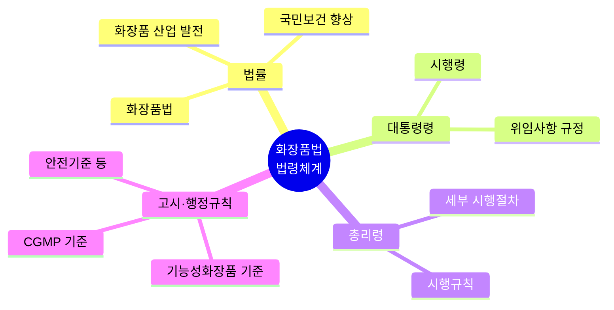
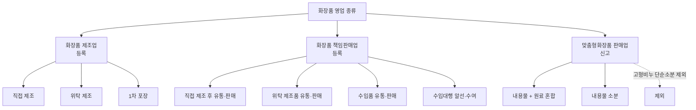

# 화장품법 통합 정리

> 세 개의 화장품법 정리 문서를 하나로 병합한 자료입니다.

---

> 화장품법은 PART 2, 3, 4에서도 중복하여 출제되기에 놓치면 안 되는 중요한 부분이에요.

> 🔗 **관련 과목**
> - 2과목 2챕터 "화장품의 기능과 품질" — 기능성화장품 11가지 효능의 제품별 구체화
> - 3과목 1챕터 "작업장 위생관리" — CGMP 3대 요소 및 위생 기준
> - 4과목 1챕터 "맞춤형화장품 개요" — 제3조의2~제3조의8 맞춤형화장품 규정의 실무 적용
> - 4과목 5챕터 "제품 안내" — 표시·기재사항, 기능성화장품 표시 의무

---

> 📋 **학습 가이드**
> - 출제 빈도: ★★★★★ (1과목 전체 중 최다 출제 영역)
> - 예상 소요 시간: 60분
> - 핵심 키워드: 법령 체계, 화장품 정의, 영업 3종(등록 vs 신고), 결격사유, 행정처분, 품질 요소, 기능성화장품 심사

---

## 1. 화장품법의 입법 취지(목적)

> **한 줄 요약**: 화장품법은 약사법에서 분리(1999.9), 식약처 관할, 법→시행령→시행규칙→고시 4단 체계.

「화장품법」은 1999년 9월 「약사법」에서 분리되어 2000년 7월부터 시행되었다. 현재 식품의약품안전처에서 관리·감독하고 있으며, 다음과 같은 목적으로 법령 체계를 갖추고 있다.

| 구분 | 입법 취지(목적) |
|---|---|
| 「화장품법」(법률) 🔖기출 | 화장품의 제조·수입·판매 및 수출 등에 관한 사항을 규정함으로써 국민 보건 향상과 화장품 산업의 발전에 기여함을 목적으로 함 |
| 「화장품법 시행령」(대통령령) | 「화장품법」에서 위임된 사항과 그 시행에 필요한 사항을 규정하는 것을 목적으로 함 |
| 「화장품법 시행규칙」(총리령) | 「화장품법」 및 「화장품법 시행령」에서 위임된 사항과 그 시행에 필요한 사항을 규정하는 것을 목적으로 함 |
| 고시(행정규칙) | 기능성화장품 기준 및 시험 방법, 기능성화장품 심사에 관한 규정, 우수화장품 제조 및 품질관리 기준(CGMP) 등을 고시하는 것을 목적으로 함 |

---

## 2. 화장품의 정의 및 유형 🔖기출

> **한 줄 요약**: 화장품은 인체 청결·미용·보호 목적의 경미한 작용 제품 — 의약품과 구분이 핵심.

| 종류 | 정의 및 유형 |
|---|---|
| **화장품** 🔖기출 | 인체를 청결·미화하여 매력을 더하고 용모를 밝게 변화시키거나 피부·모발의 건강을 유지 또는 증진하기 위해 인체에 바르고 문지르거나 뿌리는 등 이와 유사한 방법으로 사용되는 물품으로서 인체에 대한 작용이 경미한 것을 말함 (단, 의약품, 의약외품 제외) |
| **기능성화장품** 🔖기출 | 화장품 중에서 다음 어느 하나에 해당되는 것으로서 총리령으로 정하는 화장품을 말함 |

**기능성화장품의 종류 (총리령으로 정하는 11가지 효능·효과)**
- 피부의 미백에 도움을 주는 제품
- 피부의 주름 개선에 도움을 주는 제품
- 피부를 곱게 태워주거나 자외선으로부터 피부를 보호하는 데에 도움을 주는 제품
- 모발의 색상 변화·제거 또는 영양 공급에 도움을 주는 제품
- 피부나 모발의 기능 악화로 인한 건조함, 갈라짐, 빠짐, 각질화 등을 방지하거나 개선하는 데에 도움을 주는 제품

**세부 내용:**
- 피부에 멜라닌색소가 침착하는 것을 방지하여 기미·주근깨 등의 생성을 억제함으로써 피부 미백에 도움을 주는 기능을 가진 화장품
- 피부에 침착된 멜라닌색소의 색을 옅게 하여 피부 미백에 도움을 주는 기능을 가진 화장품
- 피부에 탄력을 주어 피부의 주름을 완화 또는 개선하는 기능을 가진 화장품
- 강한 햇볕을 방지하여 피부를 곱게 태워주는 기능을 가진 화장품
- 자외선을 차단 또는 산란시켜 자외선으로부터 피부를 보호하는 기능을 가진 화장품
- 모발의 색상을 변화(탈염·탈색을 포함)시키는 기능을 가진 화장품 (단, 일시적으로 모발의 색상을 변화시키는 제품은 제외 예: 헤어 틴트)
- 체모를 제거하는 기능을 가진 화장품 (단, 물리적으로 체모를 제거하는 제품은 제외 예: 제모 왁스)
- 탈모 증상의 완화에 도움을 주는 화장품 (단, 코팅 등 물리적으로 모발을 굵게 보이게 하는 제품은 제외 예: 흑채)
- 여드름성 피부를 완화하는 데 도움을 주는 화장품 (단, 인체 세정용 제품류로 한정, 여드름 크림은 기능성화장품이 아님)
- 피부장벽(피부의 가장 바깥쪽에 존재하는 각질층의 표피)의 기능을 회복하여 가려움 등의 개선에 도움을 주는 화장품
- 튼살로 인한 붉은 선을 엷게 하는 데 도움을 주는 화장품

> **참고: 화장품 vs 기능성화장품**
> - 일반화장품: 외부적 용모 개선, 청결, 미화 목적
> - 기능성화장품: 피부 기능 개선, 미백, 주름, 자외선 보호, 영양공급 등 효과가 입증된 제품
> - ※ 화장품은 인체에 대한 작용이 경미해야 하며, 의약품과는 구분된다.

> **참고: 자외선 차단 기능성화장품**
> 자외선 차단지수의 측정값이 −20% 이하의 범위에 있는 경우 같은 효능·효과로 봄

> **참고: 탈모/여드름/피부장벽/튼살 관련 표시**
> 탈모 증상의 완화, 여드름성 피부의 완화, 피부장벽 기능의 회복, 튼살로 인한 붉은 선을 엷게 하는 데 도움을 주는 화장품에는 '질병의 예방 및 치료를 위한 의약품이 아님'이라는 문구를 표시해야 함

### 기타 화장품 유형

| 종류 | 정의 |
|---|---|
| **영유아 또는 어린이 사용 화장품** | 영유아(3세 이하), 어린이(4세 이상~13세 이하)가 사용할 수 있는 화장품. 이를 표시·광고하려는 경우 제품 및 제조 방법에 대한 설명 자료, 화장품의 안전성 평가 자료, 제품의 효능·효과에 대한 증명 자료를 작성 및 보관해야 함 |
| **천연화장품** | 동식물, 미네랄, 미생물 및 그 유래 원료 등을 함유한 화장품으로, ISO 16128-1 가이드라인에 따라 정의된 천연(유래) 원료를 사용하고, ISO 16128-2 가이드라인에 따라 계산하였을 때 중량 기준으로 천연(유래) 원료 함량이 전체 제품에서 95% 이상으로 구성된 화장품 |
| **유기농화장품** 🔖기출 | 유기농 원료, 동식물, 미네랄, 미생물 및 그 유래 원료 등을 함유한 화장품으로, ISO 16128-1 가이드라인에 따라 정의된 천연(유래) 및 유기농(유래) 원료를 사용하고, ISO 16128-2 가이드라인에 따라 계산하였을 때 중량 기준으로 유기농(유래) 함량이 전체 제품에서 10% 이상이어야 하며, 유기농(유래) 함량을 포함한 천연(유래) 함량이 전체 제품에서 95% 이상으로 구성된 화장품 |
| **맞춤형화장품** 🔖기출 | ① 제조 또는 수입된 화장품의 내용물에 다른 화장품의 내용물이나 식품의약품안전처장이 정하는 원료를 추가하여 혼합한 화장품   ② 제조 또는 수입된 화장품의 내용물을 소분(小分)한 화장품 (다만, 고형 비누 등 화장품의 내용물을 단순 소분한 화장품은 제외) |
| **직접구매 해외화장품** | 개인이 자가소비를 목적으로 해외의 사이버몰(컴퓨터 등과 정보통신설비를 이용하여 재화 등을 거래할 수 있도록 설정된 가상의 영업장)에서 직접 구매하는 화장품 |

> **참고:** 「화장품법」 제2조(정의) 천연화장품 및 유기농화장품 정의 삭제 (2025. 1. 31. 일부개정)

---

## 3. 화장품의 유형별 특성

> **한 줄 요약**: 세정·기초·기능성·색조·네일·모발 6대 유형으로 분류.

| 유형 | 설명 및 제품 종류 |
|---|---|
| **영유아용 제품류** 🔖기출 | 3세 이하 영유아를 대상으로 하는 삼푸·린스·로션 등의 제품 • 영유아용 샴푸·린스 • 영유아용 오일 • 영유아 목욕용 제품 • 영유아용 로션·크림 • 영유아 인체 세정용 제품 |
| **목욕용 제품류** | 샤워, 목욕 시 전신에 사용 후 씻어내는 제품으로 욕조 투입 또는 몸에 향취를 주기 위한 제품 • 목욕용 오일·정제·캡슐 • 버블배스 • 목욕용 소금류 • 그 밖의 목욕용 제품류 |
| **인체 세정용 제품류** | 손, 얼굴에 사용하고, 사용 후 바로 씻어내는 제품 • 폼 클렌저 • 액체비누 • 외음부 세정제 • 바디 클렌저 • 화장비누(고형 형태의 세안용 비누) • 물휴지 • 그 밖의 인체 세정용 제품 |
| **기초화장용 제품류** 🔖기출 | 피부의 보습, 수렴, 유연(에몰리언트), 영양 공급, 세정 등에 사용되는 스킨케어 제품 • 수렴·유연·영양 화장수 • 에센스, 오일 • 바디 제품 • 눈 주위 제품 • 손·발의 피부연화 제품 • 클렌징 워터, 클렌징 오일, 클렌징 로션, 클렌징 크림 등 메이크업 리무버 • 마사지 크림 • 파우더 • 팩, 마스크 • 로션, 크림 • 그 밖의 기초화장용 제품류 |
| **손발톱용 제품류** | 손톱과 발톱의 관리 및 메이크업에 사용하는 제품 • 베이스코트, 언더코트 • 네일 크림·로션·에센스·오일 • 네일 폴리시·네일 에나멜 리무버 • 네일 폴리시, 네일 에나멜 • 탑코트 • 그 밖의 손발톱용 제품류 |
| **눈화장용 제품류** | 눈 주위(눈썹, 눈꺼풀, 속눈썹 등)의 미화, 청결을 위해 사용하는 메이크업 제품 • 아이브로제품 • 아이섀도 • 아이메이크업 리무버 • 속눈썹용 퍼머넌트 웨이브 • 아이라이너 • 마스카라 • 그 밖의 눈화장용 제품류 |
| **색조화장용 제품류** | 얼굴과 신체에 매력을 더하기 위해 사용하는 메이크업 제품 • 볼연지 • 메이크업 베이스 • 메이크업 픽서티브 • 립글로스, 립밤 • 페이스 파우더 • 리퀴드·크림·케이크 파운데이션 • 립스틱, 립라이너 • 바디페인팅, 페이스페인팅, 분장용 제품 • 그 밖의 색조화장용 제품류 |
| **두발염색용 제품류** | 두발의 색을 변화시키거나(염모), 탈색시키는(탈염) 제품 • 헤어 틴트 • 염모제 • 헤어 컬러스프레이 • 탈염·탈색용 제품(기능성화장품) • 그 밖의 두발염색용 제품류 |
| **두발용 제품류** | 모발 세정, 컨디셔닝, 정발, 웨이브 형성, 스트레이팅, 증모 효과에 사용되는 제품 • 헤어 컨디셔너·트리트먼트·팩, 린스 • 포마드, 헤어 스프레이·무스·왁스·젤, 그루밍 에이드 • 헤어 크림·로션 • 샴푸 • 헤어 퍼머넌트 웨이브 • 헤어 토닉·에센스 • 헤어 오일 • 헤어 스트레이트너 • 흑채 • 그 밖의 두발용 제품류 |
| **면도용 제품류** | 면도 전·후에 피부 보호 및 진정을 위해 사용하는 제품 • 프리셰이브 로션 • 세이빙 크림 • 애프터셰이브 로션 • 셰이빙 폼 • 그 밖의 면도용 제품류 |
| **체모제거용 제품류** 🔖기출 | 몸에 난 털을 제거할 때 사용하는 제품 • 제모제(기능성화장품) • 제모왁스 • 그 밖의 체모제거용 제품류 |
| **체취방지용 제품류** 🔖기출 | 몸에서 나는 냄새를 제거하거나 줄여주는 제품 • 데오도런트 • 그 밖의 체취방지용 제품류 |
| **방향용 제품류** 🔖기출 | 향을 몸에 지니거나 뿌리는 제품 • 향수 • 콜로뉴(Cologne) • 그 밖의 방향용 제품류 |

> **참고: 목욕용 제품류 vs 인체 세정용 제품류**
> 목욕용 제품류는 인체 세정용 제품류와 구분되며, 바디 클렌저는 목욕용 제품류에 해당하지 않는다.

> **참고: 물휴지의 범위**
> 식품접객업의 영업소에서 손을 닦는 용도 등으로 사용할 수 있도록 포장된 물티슈. 장례식장 또는 의료기관 등에서 시체를 닦는 용도로 사용되는 것은 제외함

> **참고: 공산품에서 화장품으로 변경된 품목**
> 화장비누, 흑채, 제모왁스

> **확인문제:** 다음 중 기초화장용 제품류가 아닌 것은?
> ① 스킨 ② 로션 ③ 에센스 ④ 네일 크림 ⑤ 크림
> (정답: ④ 네일 크림)
> **해설**: 네일 크림은 손발톱용 제품류에 해당한다. 기초화장용 제품류는 피부 보습·수렴·유연·영양·세정에 사용되는 스킨케어 제품이다.

---

## 4. 화장품법에 따른 영업의 종류

> **한 줄 요약**: 제조업(등록)·책임판매업(등록)·맞춤판매업(신고) — 3종 영업의 구분이 기출 단골.

### (1) 영업의 종류

| 구분 | 종류 |
|---|---|
| **화장품 제조업** | 화장품의 전부 또는 일부를 제조(2차 포장 또는 표시만의 공정은 제외)하는 영업 • 화장품을 직접 제조하는 영업 • 화장품 제조를 위탁받아 제조하는 영업 • 화장품을 포장(1차 포장만 해당)하는 영업 |
| **화장품 책임판매업** | 취급하는 화장품의 품질 및 안전 등을 관리하면서 이를 유통·판매하거나 수입대행형 거래를 목적으로 알선·수여하는 영업 • 화장품제조업자가 화장품을 직접 제조하여 유통·판매하는 영업 • 화장품제조업자에게 위탁하여 제조된 화장품을 유통·판매하는 영업 • 수입된 화장품을 유통·판매하는 영업 • 수입대행형 거래(전자상거래만 해당)를 목적으로 화장품을 알선·수여하는 영업 |
| **맞춤형화장품 판매업** | 맞춤형화장품을 판매하는 영업 • 제조 또는 수입된 화장품의 내용물에 다른 화장품의 내용물이나 식품의약품안전처장이 정하여 고시하는 원료를 추가하여 혼합한 화장품을 판매하는 영업 • 제조 또는 수입된 화장품의 내용물을 소분(小分)한 화장품을 판매하는 영업 • 소분 판매를 목적으로 제조 또는 수입된 화장비누(고체 형태의 세안용 비누)의 내용물을 단순 소분하여 판매하는 경우는 맞춤형화장품판매업 범위에서 제외 |

> **참고: 맞춤형화장품 조제 한계**
> - 식약처 지정 원료만 추가·혼합 가능
> - 향료·색소·보존제 사용 시 불법 제조 행위
> - 조제·소분 화장품 → '유통화장품' 분류(식약처 가이드라인)

---

## 5. 영업 등록 및 신고 🔖기출

> **한 줄 요약**: 제조·책임판매는 '등록', 맞춤형은 '신고' — 관할 지방식약청장에게 제출.

**(소재지 관할 지방식품의약품안전청장에게 제출)**

| 종류 | 영업 | 필요 서류 |
|---|---|---|
| 화장품 제조업 등록 | 등록 | • 등록신청서 • 대표자의 건강진단서(정신질환자, 마약류의 중독자가 아님을 증명) • 등기사항증명서(법인의 경우) • 시설명세서 |
| 화장품 책임판매업 등록 | 등록 | • 등록신청서 • 등기사항증명서(법인의 경우) • 책임판매관리자의 자격 확인 서류 • 화장품의 품질관리 및 책임판매 후 안전관리에 적합한 기준에 관한 규정 |
| 맞춤형화장품 판매업 신고 | 신고 | • 맞춤형화장품판매업 신고서 • 맞춤형화장품조제관리사 자격증 사본과 시설명세서 • 등기사항증명서(법인의 경우) * 맞춤형화장품조제관리사가 2명 이상의 경우: 대표 1명만 제출 가능하며 매년 교육 이수 필수 * 맞춤형화장품판매업을 신고하려는 자는 총리령으로 정하는 시설기준을 갖추어야 하며, 맞춤형화장품의 혼합·소분 등 품질·안전 관리 업무에 종사하는 자(맞춤형화장품조제관리사)를 두어야 함 |

> ※ 제출 서류는 전자문서를 포함함

### ① 등록 및 신고대장 포함사항

**화장품제조업 등록대장**
- 등록번호 및 등록연월일
- 화장품제조업자(화장품제조업을 등록한 자)의 성명 및 주민등록번호 또는 외국인등록번호(법인인 경우에는 대표자의 성명 및 주민등록번호 등)
- 화장품제조업자의 상호(법인인 경우에는 법인의 명칭)
- 제조소의 소재지
- 제조 유형

**화장품책임판매업 등록대장**
- 등록번호 및 등록연월일
- 화장품책임판매업자(화장품책임판매업을 등록한 자)의 성명 및 주민등록번호(법인인 경우에는 대표자의 성명 및 주민등록번호 등)
- 화장품책임판매업자의 상호(법인인 경우에는 법인의 명칭)
- 화장품책임판매업소의 소재지
- 책임판매관리자의 성명 및 주민등록번호 등
- 책임판매 유형

**맞춤형화장품판매업 신고대장**
- 신고번호 및 신고연월일
- 맞춤형화장품판매업자의 성명 및 주민등록번호(법인인 경우에는 대표자의 성명 및 주민등록번호 등)
- 맞춤형화장품판매업자의 상호 및 소재지
- 맞춤형화장품판매업소의 상호 및 소재지
- 맞춤형화장품조제관리사의 성명, 주민등록번호 및 자격증 번호
- 영업의 기간(맞춤형화장품판매업자가 판매업소로 신고한 소재지 외의 장소에서 1개월의 범위에서 한시적으로 같은 영업을 하려는 경우만 해당함)
- 맞춤형화장품조제관리사는 해당 맞춤형화장품판매업소의 맞춤형화장품조제관리사 업무에 종사하지 않게 된 경우에는 관리업무 비종사신고서에 그 사유서를 첨부하여 해당 맞춤형화장품판매업소의 소재지를 관할하는 지방식품의약품안전청장에게 제출할 수 있다.

> **참고: 등록필증의 재발급 범위**
> - 화장품제조업 등록필증
> - 화장품책임판매업 등록필증
> - 기능성화장품 심사결과통지서
>
> **재발급 시 필요 서류**
> - 등록필증 등이 오염, 훼손 등으로 못 쓰게 된 경우: 등록필증 등
> - 등록필증 등을 잃어버린 경우: 분실 사유서

> **참고:** 맞춤형화장품판매업자가 맞춤형화장품조제관리사 자격시험에 합격한 경우에는 해당 맞춤형화장품판매업자의 판매업소 중 하나의 판매업소에서 맞춤형화장품조제관리사 업무를 수행할 수 있으며, 해당 판매업소에는 맞춤형화장품조제관리사를 둔 것으로 본다.

> **참고: 맞춤형화장품조제관리사 자격증 재발급 서류**
> - 자격증 재발급 신청서
> - 자격증을 잃어버린 경우: 분실 사유서
> - 자격증을 못 쓰게 된 경우: 자격증 원본

> **참고:** 맞춤형화장품판매업자가 한시적으로 같은 영업을 하려는 경우, 맞춤형화장품판매업 신고필증 사본과 맞춤형화장품조제관리사 자격증 사본을 첨부 및 제출해야 한다.

---

## 6. 화장품제조업의 등록을 위한 시설 기준 등 🔖기출

> **한 줄 요약**: 작업소+보관소+시험실 필수 — 일부 공정만 하거나 검사 위탁 시 해당 시설만 면제.

**제조 작업을 하는 다음 시설을 갖춘 작업소**
- 쥐·해충 및 먼지 등을 막을 수 있는 시설
- 작업대 등 제조에 필요한 시설 및 기구
- 가루가 날리는 작업실의 가루를 제거하는 시설

**그 외 갖추어야 할 시설**
- 원료·자재 및 제품을 보관하는 보관소
- 원료·자재 및 제품의 품질검사를 위해 필요한 시험실
- 품질검사에 필요한 시설 및 기구

**시설 기준의 면제 사유**
- 일부 공정만 제조하는 경우 및 품질검사를 위탁하는 경우는 해당 공정에 필요한 시설 및 기구만 있어도 가능함
- 화장품 외 물품 제조도 가능함(단, 제품 상호 간 오염의 우려가 있으면 안 됨)

> **참고: 품질검사 위탁 기관** 🔖기출
> - 보건환경연구원
> - 시험실을 갖춘 제조업자
> - 「식품·의약품 분야 시험·검사 등에 관한 법률」에 따른 화장품시험·검사기관
> - 한국의약품수출입협회

---

## 7. 화장품책임판매업의 등록을 위한 품질관리 기준 및 책임판매 후 안전관리 기준

> **한 줄 요약**: 책임판매관리자 자격·품질관리 기준·안전관리 기준 3축으로 구성.

화장품책임판매업을 등록하려는 자는 화장품의 품질관리 및 책임판매 후 안전관리에 관한 기준을 갖추어야 하며, 이를 관리할 수 있는 관리자를 두어야 한다.

### 화장품 책임판매관리자의 자격 기준

- 의사 또는 약사
- 이공계 학과 또는 향장학·화장품과학·한의학·한약학·간호학·간호과학·건강간호학 등을 전공하여 학사 이상의 학위를 취득(법령에서 이와 같은 수준 이상의 학력이 있다고 인정하는 경우를 포함)한 사람
- 화학·생물학·화학공학·생물공학·미생물학·생화학·생명과학·생명공학·유전공학·향장학·화장품과학·한의학·한약학·간호학·간호과학·건강간호학 등 화장품 관련 분야를 전공하여 전문학사 학위를 취득(법령에서 이와 같은 수준 이상의 학력이 있다고 인정하는 경우를 포함)한 후 화장품 제조 또는 품질관리 업무에 1년 이상 종사한 경력이 있는 사람
- 식품의약품안전처장이 정하여 고시하는 전문 교육과정을 이수한 사람(식품의약품안전처장이 고시한 품목만 해당)
- 맞춤형화장품조제관리사 자격시험에 합격한 사람
- 화장품 제조 또는 품질관리 업무에 2년 이상 종사한 경력이 있는 사람

> **참고:** 상시근로자 수가 10명 이하인 화장품책임판매업을 경영하는 자가 책임판매관리자 자격 기준에 해당한다면, 책임판매관리자를 둔 것으로 봄(책임판매관리자로서의 직무 수행도 가능)

### 관련 용어

| 용어 | 정의 |
|---|---|
| **품질관리** | 화장품 책임판매 시 제품의 품질을 확보하기 위해 실시하는 것으로, 화장품제조업자 및 제조에 관계된 업무(시험·검사 등의 업무 포함)에 대한 관리·감독 및 화장품의 시장 출하에 관한 관리, 그 밖에 제품의 품질관리에 필요한 업무 |
| **시장출하** | 화장품책임판매업자가 제조(타인에게 위탁 제조 또는 검사하는 경우 포함, 타인으로부터 수탁 제조 또는 검사하는 것은 비포함)하거나 수입한 화장품의 판매를 위해 출하하는 것 |
| **안전관리 정보** | 화장품의 품질, 안전성·유효성, 그 외 적정 사용을 위한 정보 |
| **안전확보 업무** | 화장품 책임판매 후 안전관리 업무 중 정보 수집, 검토 및 그 결과에 따른 필요한 조치에 관한 업무 |

### 품질관리 기준

| 구분 | 세부 업무 | 내용 |
|---|---|---|
| 화장품책임판매업자 - 절차서 작성과 보관 | 절차서 작성과 보관 | 다음 사항이 포함된 품질관리 업무 절차서를 작성·보관해야 함: 적정한 제조 관리 및 품질관리 확보에 관한 절차 / 품질 등에 관한 정보 및 품질 불량 등의 처리 절차 / 회수처리 절차 / 교육·훈련에 관한 절차 / 문서 및 기록의 관리 절차 / 시장출하에 관한 기록 절차 / 그 밖에 품질관리 업무에 필요한 절차 |
| 화장품책임판매업자 - 수행업무 | 절차서에 따른 수행업무 | 적정한 제조였음을 확인하고 기록 / 품질에 대한 정보가 인체에 영향을 미치는 경우 원인을 밝히고, 개선이 필요할 시 개선 조치하고 기록 / 제품의 품질이 불량하거나 불량할 우려가 있는 경우 회수 등 신속한 조치를 하고 기록 / 시장출하에 관하여 기록 / 제조별 품질검사 후 기록(단, 화장품제조업자와 화장품책임판매업자가 같은 경우, 화장품제조업자 또는 식품의약품안전처장이 지시한 위탁검사기관의 품질검사 결과가 있는 경우 제외) / 그 밖에 품질관리에 관한 업무를 수행 |
| 공통 (품질관리) | 원본 보관 | 책임판매관리자가 업무를 수행하는 장소에 품질관리 업무 절차서 원본을 보관하고, 그 외의 장소에는 원본과 대조를 마친 사본을 보관해야 함 |
| 책임판매관리자 - 수행업무 | 절차서에 따른 수행업무 | 품질관리 업무를 총괄 / 품질관리 업무가 적정하고 원활하게 수행되는 것을 확인 / 품질관리 업무의 수행을 위하여 필요하다고 인정할 때에는 화장품책임판매업자에게 문서로 보고함 / 품질관리 업무 시 필요에 따라 화장품제조업자, 맞춤형화장품판매업자 등 그 밖의 관계자에게 문서로 연락하거나 지시함 / 품질관리에 관한 기록 및 화장품제조업자의 관리에 관한 기록을 작성하고, 3년간 보존 |
| 책임판매관리자 - 회수처리 | 회수처리 | 회수한 화장품은 구분하여 일정 기간 보관 후 폐기 등 작성한 방법으로 처리 / 회수 내용을 적은 기록을 작성하고, 화장품책임판매업자에게 문서로 보고함 |
| 책임판매관리자 - 교육·훈련 | 교육·훈련 | 품질관리 업무 종사자를 위한 교육·훈련의 정기적 실시 후 기록 작성 및 보관 / 책임판매관리자 외 사람이 교육·훈련을 할 때 실시 상황을 화장품책임판매업자에게 문서로 보고함 |
| 책임판매관리자 - 문서 및 기록 정리 | 문서 및 기록의 정리 | 문서 작성 또는 개정 시 품질관리 업무 절차서에 따라 해당 문서의 승인, 배포, 보관 / 절차서 작성 또는 개정 시 절차서에 그 날짜를 적고 개정 내용 보관 |

### 안전관리 기준 🔖기출

| 구분 | 항목 | 내용 |
|---|---|---|
| 화장품책임판매업자 - 조직 및 인원 구성 | 조직 및 인원 구성 | 화장품책임판매업자는 책임판매관리자를 두어야 하며, 안전확보 업무를 적정하고 원활하게 수행할 능력을 갖춘 인원을 충분히 갖추어야 함 |
| 화장품책임판매업자 - 안전관리 정보 수집 | 안전관리 정보 수집 | 화장품책임판매업자는 책임판매관리자에게 학회, 문헌, 그 밖의 연구보고 등에서 안전관리 정보를 수집·기록하도록 함 |
| 책임판매관리자 - 안전확보 조치 | 안전확보 조치 | 안전관리 정보를 신속히 검토·기록 / 수집한 안전관리 정보의 검토 결과 조치가 필요하다고 판단될 경우 회수, 폐기, 판매정지 또는 첨부문서의 개정, 식품의약품안전처장에게 보고 등 안전확보 조치 / 안전확보 조치계획을 화장품책임판매업자에게 문서로 보고한 후 그 사본을 보관 |
| 책임판매관리자 - 안전확보 실시 | 안전확보 실시 | 안전확보 조치 계획을 적정하게 평가하여 안전확보 조치를 결정하고 이를 기록·보관 / 안전확보 조치를 수행할 경우 문서로 지시하고 이를 보관하고 그 결과를 화장품책임판매업자에게 문서로 보고 |
| 책임판매관리자 - 업무 | 업무 | 안전확보 업무를 총괄하여 업무가 적정하고 원활하게 수행되는 것을 확인하고 기록·보관 / 안전확보 업무의 수행을 위하여 필요하다고 인정할 때에는 화장품책임판매업자에게 문서로 보고한 후 보관할 것 |

> **참고: 책임판매관리자의 직무**
> 책임판매관리자는 해당 화장품책임판매업소의 책임판매관리자 업무에 종사하지 않게 된 경우에는, 관리업무 비종사 신고서에 그 사유서를 첨부하여 해당 화장품책임판매업소의 소재지를 관할하는 지방식품의약품안전청장에게 제출해야 함

---

## 8. 영업 등록 및 신고의 결격사유 🔖기출

> **한 줄 요약**: 제조업만 정신질환·마약 중독 결격 추가 — 3종 공통은 피성년후견·형 선고·취소 후 1년.

| 결격사유 | 화장품 제조업 | 화장품 책임판매업 | 맞춤형화장품판매업 |
|---|---|---|---|
| 정신질환자(전문의가 적합하다고 인정하는 사람은 제외) | O | X | X |
| 마약류의 중독자 | O | X | X |
| 피성년후견인 또는 파산선고를 받고 복권되지 않은 자 | O | O | O |
| 「화장품법」·「보건범죄 단속에 관한 특별조치법」을 위반하여 금고 이상의 형을 선고받고 그 집행이 끝나거나(집행이 끝난 것으로 보는 경우를 포함) 집행이 면제되지 아니한 자, 또는 금고 이상의 형의 집행유예를 선고받고 그 유예기간 중에 있는 자 | O | O | O |
| 등록 취소 또는 영업소가 폐쇄된 날부터 1년이 지나지 않은 자 | O | O | O |

> **용어: 피성년후견인**
> 질병, 장애, 노령, 그 밖의 사유로 인한 정신적 제약으로 사무를 처리할 능력이 지속적으로 결여되어 가정법원으로부터 성년후견 개시의 심판을 받은 사람

> ※ 표의 O/X는 해당 결격사유가 그 영업 유형에 적용되는지 여부를 의미함 (화장품 제조업만 정신질환자·마약류 중독자 결격사유가 적용되고, 책임판매업과 맞춤형화장품판매업에는 적용되지 않음)

---

## 9. 맞춤형화장품조제관리사의 결격사유 🔖기출

> **한 줄 요약**: 정신질환·피성년후견·마약중독·형 선고·자격취소 후 3년 — 5가지 결격사유.

① 정신질환자(단, 전문의가 적합하다고 인정하는 사람은 제외)
② 피성년후견인
③ 마약류의 중독자
④ 「화장품법」 또는 「보건범죄 단속에 관한 특별조치법」을 위반하여 금고 이상의 형을 선고받고 그 집행이 끝나거나(집행이 끝난 것으로 보는 경우를 포함) 집행이 면제되지 아니한 자, 또는 금고 이상의 형의 집행유예를 선고받고 그 유예기간 중에 있는 자

---

*본 문서는 화장품법 교재 PART 01 (14~21페이지) 내용을 정리한 것입니다.*

---

---

## p.22 — (5) 영업자의 의무사항 / (6) 변경 등록 및 신고

> **한 줄 요약**: 영업자별 의무사항 + 변경 시 30일(행정구역 개편 90일) 이내 제출, 폐업은 3종 모두 신고.

### 결격사유 (이어지는 항목)
⑤ 맞춤형화장품조제관리사의 자격이 취소된 날부터 3년이 지나지 않은 자

### (5) 영업자의 의무사항

| 구분 | 의무사항 |
|---|---|
| **화장품제조업자** | 제조와 관련된 기록·시설·기구 등 관리 방법, 원료·자재·완제품 등에 대한 시험·검사·검정 실시 방법 및 의무에 관한 사항 준수 |
| **화장품책임판매업자** | • 품질관리 기준, 책임판매 후 안전관리 기준, 품질검사 방법 및 실시 의무, 안전성·유효성 관련 정보사항 등의 보고 및 안전대책 마련 의무에 관한 사항 준수 • 지난해의 생산실적 또는 수입실적, 화장품의 제조 과정에 사용된 원료의 목록 등을 유통·판매 전에 식품의약품안전처장에게 보고 • 책임판매관리자는 화장품 안전성 확보 및 품질관리 교육 매년 이수 의무 |
| **맞춤형화장품판매업자** | • 소비자에게 유통·판매되는 화장품을 임의로 혼합·소분하여서는 안 됨 • 맞춤형화장품에 사용된 모든 원료의 목록을 매년 1회 식품의약품안전처장에게 보고해야 함 • 판매장 시설·기구의 관리 방법, 혼합·소분 안전관리 기준의 준수 의무, 혼합·소분되는 내용물 및 원료에 대한 설명 의무, 안전성 관련 사항 보고 의무에 관한 사항 준수 • 맞춤형화장품조제관리사는 화장품 안전성 확보 및 품질관리 교육 매년 이수 의무 |

- 식품의약품안전처장은 국민 건강상 위해를 방지하기 위하여 필요하다고 인정하면 화장품제조업자, 화장품책임판매업자 및 맞춤형화장품판매업자에게 화장품 관련 법령 및 제도(화장품의 안전성 확보 및 품질관리에 관한 내용을 포함)에 관한 교육을 받을 것을 명할 수 있음
- 교육을 받아야 하는 자가 둘 이상의 장소에서 영업하는 경우에는 종업원 중에서 총리령으로 정하는 자를 책임자로 지정하여 교육을 받게 할 수 있음

**참고 - 생산 또는 수입실적 보고**: 매년 2월 말까지
**참고 - 원료의 목록 보고**: 유통·판매 전까지

**참고 - 화장품 안전성 확보 및 품질관리 교육**
- 교육대상: 책임판매관리자, 맞춤형화장품조제관리사
- 최초교육: 종사한 날부터 6개월 이내 (단, 자격시험에 합격한 날이 종사한 날 이전 1년 이내이면 제외)
- 보수교육: 교육을 받은 날을 기준으로 매년 1회
- 교육시간: 4시간 이상, 8시간 이하

### (6) 변경 등록 및 신고 (소재지 관할 지방식품의약품안전청장에게 제출)

화장품제조업자 또는 화장품책임판매업자는 변경 사유가 발생한 날로부터 **30일**(행정구역 개편에 따른 소재지 변경의 경우에는 **90일**) 이내에 해당 서류를 제출해야 하며, 맞춤형화장품판매업자는 변경신고를 하려면 관련 서류를 제출해야 한다. 단, **폐업은 3가지 유형을 모두 신고**해야 한다.

| 종류 | 변경 | 변경 사유 |
|---|---|---|
| 화장품제조업 | 등록 | • 화장품제조업자의 변경(법인은 대표자 변경) • 화장품제조업자의 상호 변경(법인은 법인 명칭 변경) • 제조소의 소재지 변경 • 제조 유형 변경 |
| 화장품책임판매업 | 등록 | • 화장품책임판매업자의 변경(법인은 대표자 변경) • 화장품책임판매업자의 상호 변경(법인은 법인 명칭 변경) • 화장품책임판매업소의 소재지 변경 • 책임판매관리자의 변경 • 책임판매 유형 변경 |
| 맞춤형화장품판매업 | 신고 | • 맞춤형화장품판매업자의 변경(법인은 대표자 변경) • 맞춤형화장품판매업소의 상호 변경(법인은 법인 명칭 변경) • 맞춤형화장품판매업소의 소재지 변경 • 맞춤형화장품조제관리사의 변경 |

**참고 - 소재지 변경 위반 행정처분**

| 구분 | 제조소 | 화장품책임판매업소 | 맞춤형화장품판매업소 |
|---|---|---|---|
| 1차 | 업무정지 1개월 | | |
| 2차 | 업무정지 3개월 | 업무정지 2개월 | |
| 3차 | 업무정지 6개월 | 업무정지 3개월 | |
| 4차 | 등록취소 | 업무정지 4개월 | |

**확인문제**: 화장품제조소의 소재지가 변경된 경우 → **(소재지 지방식품의약품안전청장)**에게 변경 등록을 제출해야 한다.

> **해설**: 소재지 변경은 변경 등록 사유에 해당하며, 변경 사유 발생일로부터 30일(행정구역 개편 시 90일) 이내에 관할 지방식약청장에게 제출해야 한다.

---

## p.23 — (7) 승계의 진행 / (8) 행정처분의 일반 기준

> **한 줄 요약**: 승계 시 행정제재 효과는 1년간 승계 — 위반 2개 이상 시 무거운 처분 따르되 최대 12개월.

### (7) 승계의 진행

| 구분 | 내용 |
|---|---|
| 영업자의 지위 승계 | 영업자의 사망 또는 영업 양도, 법인 영업자의 합병의 경우 상속인, 영업을 양수한 자 또는 합병 후 존속 법인이나 합병에 따라 설립되는 법인이 영업자의 의무 및 지위 승계 |
| 행정제재처분 효과 승계 | • 행정제재처분 기간이 끝난 날부터 1년간 해당 영업자의 지위를 승계한 자에게 승계 • 행정제재처분 진행 중에는 영업자의 지위를 승계한 자에 대해 절차를 계속 진행(단, 승계자가 처분, 위반 사실을 알지 못하였음을 증명하는 경우는 제외) |

### (8) 행정처분의 일반 기준

① 위반행위가 둘 이상인 경우로서 각각의 처분 기준이 다른 경우에는 그 중 **무거운 처분 기준**을 따른다. 다만, 둘 이상의 처분 기준이 **업무정지**인 경우에는 가장 무거운 처분의 업무정지 기간에 나머지 각각의 업무정지 기간의 **2분의 1**을 더하여 처분하며, 이 경우 그 **최대 기간은 12개월**로 한다.

② 위반행위가 둘 이상인 경우로서 업무정지와 품목 업무정지에 해당하는 경우, 그 업무정지 기간이 품목업무정지 기간보다 길거나 같을 때에는 업무정지 처분을 하고, 업무정지 기간이 품목업무정지 기간보다 짧을 때에는 업무정지 처분과 품목 업무정지 처분을 동시에 부과한다.

③ 위반행위의 횟수에 따른 행정처분의 기준은 최근 **1년간** 같은 위반행위로 행정처분을 받은 경우 적용한다. 기준의 적용일은 최근에 실제 행정처분을 받은 날(업무정지 처분을 갈음하여 과징금을 부과하는 경우에는 최근에 과징금 처분을 통보받은 날)과 다시 같은 위반행위를 적발한 날을 기준으로 하되, 품목 업무정지의 경우 품목이 다를 때에는 이 기준을 적용하지 않는다.

④ 행정처분 절차가 진행되는 기간 중에 반복하여 같은 위반행위를 한 경우 진행 중인 사항의 행정처분 기준의 **2분의 1씩**을 더하여 처분하며, 그 최대 기간은 **12개월**로 한다.

⑤ 같은 위반행위의 횟수가 **3차 이상**인 경우에는 과징금 부과 대상에서 제외한다.

⑥ 화장품제조업자가 등록한 소재지에 그 시설이 전혀 없는 경우 등록을 취소한다.

⑦ 수입대행형 거래를 목적으로 화장품을 알선·수여하는 화장품책임판매업을 등록한 자에 대하여 개별 기준을 적용하는 경우 '판매금지'는 '수입대행금지'로, '판매업무정지'는 '수입대행 업무정지'로 한다.

⑧ 다음의 경우는 처분을 **2분의 1까지 감경하거나 면제**할 수 있다.
- 국민보건, 수요·공급, 그 밖에 공익상 필요하다고 인정된 경우
- 해당 위반사항에 관하여 검사로부터 기소유예의 처분을 받거나 법원으로부터 선고유예의 판결을 받은 경우
- 광고주의 의사와 관계없이 광고회사 또는 광고매체에서 무단 광고한 경우

⑨ 다음의 경우는 처분을 **2분의 1까지 감경**할 수 있다.
- 기능성화장품으로서 그 효능·효과를 나타내는 원료의 함량 미달의 원인이 유통 중 보관 상태 불량 등으로 인한 성분의 변화 때문이라고 인정된 경우
- 비병원성 일반세균에 오염된 경우로서 인체에 직접적인 위해가 없으며, 유통 중 보관 상태 불량에 의한 오염으로 인정된 경우

---

## p.24 — (9) 행정처분의 개별 기준 / (10) 벌칙 및 과태료 - ② 영업금지

> **한 줄 요약**: 등록취소는 1~4차 위반 사유별 차등 — 영업금지 10가지(식품모방·변패·병원미생물 오염 등).

### (9) 행정처분의 개별 기준

**① 등록 취소 처분이 가능한 경우**

| 위반 차수 | 사유 |
|---|---|
| 1차 위반 시 등록취소 | • 업무정지 기간 중에 해당 업무를 한 경우(광고 업무에 한정하여 정지를 명한 경우는 제외) • 화장품제조업 또는 화장품책임판매업의 등록이나 맞춤형화장품판매업의 결격사유 중 어느 하나에 해당하는 경우 |
| 2차 위반 시 등록취소 | - |
| 3차 위반 시 등록취소 | • 화장품제조업자가 제조 또는 품질검사에 필요한 시설 및 기구의 전부가 없는 경우 • 심사를 받지 않거나 거짓으로 보고하고 기능성화장품을 판매한 경우 |
| 4차 위반 시 등록취소 | • 제조소 및 화장품책임판매업소의 소재지 변경 • 국민보건에 위해를 끼쳤거나 끼칠 우려가 있는 화장품을 제조·수입한 경우 • 품질관리 업무 절차서를 작성하지 않거나 거짓으로 작성한 경우 • 회수 대상 화장품을 회수하지 않거나 회수하는 데 필요한 조치를 하지 않은 경우 • 회수계획을 보고하지 않거나 거짓으로 보고한 경우 • 식품의약품안전처장이 고시한 화장품의 제조 등에 사용할 수 없는 원료를 사용한 화장품 • 검사·질문·수거 등을 거부하거나 방해한 경우 • 시정명령·검사명령·개수명령·회수명령·폐기명령 또는 공표명령 등을 이행하지 않은 경우 |

**② 영업금지**

다음에 해당하는 화장품을 판매(수입대행형 거래를 목적으로 하는 알선·수여를 포함)하거나 판매할 목적으로 제조·수입·보관 또는 진열을 금지한다.
- 심사를 받지 않았거나 보고서를 제출하지 않은 기능성화장품
- 전부 또는 일부가 변패된 화장품
- 병원미생물에 오염된 화장품
- 이물이 혼입되었거나 부착된 화장품
- 화장품에 사용할 수 없는 원료를 사용하였거나, 유통화장품 안전관리 기준에 부적합한 화장품
- 코뿔소 뿔 또는 호랑이 뼈와 그 추출물을 사용한 화장품
- 보건위생상 위해가 발생할 우려가 있는 비위생적인 조건 또는 시설 기준에 부적합한 시설에서 제조된 화장품
- 용기나 포장이 불량하여 화장품이 보건위생상 위해를 발생시킬 우려가 있는 경우
- 사용기한 또는 개봉 후 사용기간(제조연월일을 포함)을 위조·변조한 화장품
- **식품의 형태·냄새·색깔·크기·용기 및 포장 등을 모방하여 섭취 등 식품으로 오용될 우려가 있는 화장품**

---

## p.25 — ③ 판매금지

> **한 줄 요약**: 미등록 제조품·맞춤 미신고품·동물실험품 판매 금지 — 동물실험 예외 6가지.

**식품 모방 화장품 위반 우려 사례**
- 용기·포장을 제거하고 내용물만으로 사용하는 제품류
- 용기·포장을 포함한 제품 특징이 식품을 모방하고 있으며, 내용물 섭취 우려가 있는 제품류

**식품과 협업이 가능한 사례**
- 식품으로 오인될 우려 없이 단순히 특정 식품의 상표, 브랜드명 또는 디자인 등을 사용한 경우(다만, 내용물을 오인 섭취할 우려가 있는 경우는 제외)
- 제품 용기·포장은 식품 또는 특정 식품브랜드 형태 등을 모방했으나, 사용 방식이 식품과 다르고 섭취도 어려운 경우(다만, 내용물을 오인 섭취할 우려가 있는 경우는 제외)

**참고 - 식품 모방 화장품 위반 적발 시**

| 구분 | 내용 |
|---|---|
| 회수 | 회수 대상 화장품 |
| 행정처분 | 해당 품목 제조 또는 판매업무 정지(위반 적발 제품은 동일한 용기·포장 등으로는 지속 판매 불가함) |
| 벌칙 | 3년 이하의 징역 또는 3천만 원 이하의 벌금 |

### ③ 판매금지

다음에 해당하는 화장품을 판매하거나 판매할 목적으로 보관 또는 진열을 금지한다.
- 영업의 등록을 하지 않은 자가 제조한 화장품 또는 제조·수입하여 유통·판매한 화장품
- 맞춤형화장품판매업을 신고하지 않은 자가 판매한 맞춤형화장품
- 맞춤형화장품조제관리사를 두지 않고 판매한 맞춤형화장품
- 화장품 기재사항, 가격표시, 기재·표시상의 주의를 위반하여 화장품 또는 의약품으로 잘못 인식할 우려가 있게 기재·표시된 화장품
- 판매의 목적이 아닌 제품의 홍보·판매 촉진 등을 위해 미리 소비자가 시험·사용하도록 제조 또는 수입된 화장품(단, 소비자에게 판매하는 화장품에 한함)
- 화장품의 포장 및 기재·표시사항을 훼손(단, 맞춤형화장품 판매를 위해 필요한 경우는 제외) 또는 위조·변조한 화장품
- 화장품의 용기에 담은 내용물을 나누어 판매하는 행위(단, 맞춤형화장품조제관리사를 통하여 판매하는 맞춤형화장품판매업자 및 소분 판매를 목적으로 제조된 화장품의 판매자는 제외)
- **화장품책임판매업자 및 맞춤형화장품판매업자는 동물실험을 실시한 화장품 또는 원료를 사용하여 제조 또는 수입한 화장품은 유통·판매 금지**(단, 아래에 해당하는 경우는 제외)
  - 보존제, 색소, 자외선 차단제 등 특별히 사용상의 제한이 필요한 원료에 대하여 그 사용 기준을 지정하거나 국민보건상 위해 우려가 제기되는 화장품 원료 등에 대한 위해 평가를 하기 위하여 필요한 경우
  - 동물대체시험법(동물을 사용하지 않는 실험 방법, 사용하더라도 그 사용되는 동물의 개체 수를 감소하거나 고통을 경감시킬 수 있는 실험 방법으로서 식품의약품안전처장이 인정한 것)이 존재하지 않아 동물실험이 필요한 경우
  - 화장품 수출을 위하여 수출 상대국의 법령에 따라 동물실험이 필요한 경우
  - 수입하려는 상대국의 법령에 따라 제품 개발에 동물실험이 필요한 경우
  - 다른 법령에 따라 동물실험을 실시하여 개발된 원료를 화장품의 제조 등에 사용하는 경우
  - 그 밖에 동물실험을 대체할 수 있는 실험을 실시하기 곤란한 경우로서 식품의약품안전처장이 정하는 경우

---

## p.26 — 실험동물에 관한 법률 / ④ 폐업 등의 신고 / (10) 벌칙 및 과태료 ① 벌칙

> **한 줄 요약**: 폐업·휴업 신고 → 7일 이내 수리 통지. 벌칙은 3년/1년/200만 원 3단계.

### 실험동물에 관한 법률

| 항목 | 내용 |
|---|---|
| 목적 | 실험동물 및 동물실험의 적절한 관리를 통하여 동물실험에 대한 윤리성 및 신뢰성을 높여 생명과학 발전과 국민보건 향상에 이바지함 |
| 동물실험 | 교육·시험·연구 및 생물학적 제제의 생산 등 과학적 목적을 위하여 실험동물을 대상으로 실시하는 실험 또는 그 과학적 절차 |
| 실험동물 | 동물실험을 목적으로 사용 또는 사육되는 척추동물 |
| 재해 | 동물실험으로 인한 사람과 동물의 감염, 전염병 발생, 유해물질 노출 및 환경오염 등 |
| 동물실험시설 | 동물실험 또는 이를 위하여 실험동물을 사육하는 시설로서 대통령령으로 정하는 것 |
| 실험동물생산시설 | 실험동물을 생산 및 사육하는 시설 |
| 운영자 | 동물실험시설 혹은 실험동물생산시설을 운영하는 자 |

### ④ 폐업 등의 신고

- 다음 중 어느 하나에 해당하는 경우는 식품의약품안전처장에게 신고하여야 한다. (단, 휴업기간이 1개월 미만이거나 그 기간 동안 다시 업을 재개하는 경우는 제외)
  - 폐업 또는 휴업하려는 경우
  - 휴업 후 그 업을 재개하려는 경우
- 식품의약품안전처장은 화장품제조업자 또는 화장품책임판매업자가 「부가가치세법」에 따라 관할 세무서장에게 폐업신고를 하거나 사업자등록을 말소당한 경우 등록을 취소할 수 있다.
- 식품의약품안전처장은 등록 취소를 위해 관할 세무서장에게 폐업 여부에 대한 정보를 요청할 수 있다.
- 식품의약품안전처장은 폐업 및 휴업신고를 받은 날부터 **7일 이내**에 신고수리 여부를 신고인에게 통지해야 한다.
- 식품의약품안전처장이 기간 내에 처리기간 연장을 통지하지 않았다면 기간 종료 다음 날 신고를 수리한 것으로 본다.

### (10) 벌칙 및 과태료

**① 벌칙**

| 처벌 수준 | 위반행위 |
|---|---|
| 3년 이하 징역 또는 3천만 원 이하 벌금 (징역형과 벌금형 함께 부과 가능) | • 화장품제조업 또는 화장품책임판매업에 필요한 등록과 변경사항 등록을 위반한 자 • 맞춤형화장품판매업에 필요한 신고와 변경사항 신고를 위반한 자 • 맞춤형화장품조제관리사를 두지 않은 맞춤형화장품판매업자 • 기능성화장품에 대한 심사나 보고서 제출, 이에 대한 변경을 위반한 자 • 영업금지 조항을 위반한 자 • 등록하지 않은 자가 제조한 화장품 또는 제조·수입하여 유통·판매한 자 • 화장품 포장 및 기재·표시사항을 훼손(맞춤형화장품 판매를 위하여 필요한 경우 제외), 위·변조한 자 |

---

## p.27 — (10) 벌칙 및 과태료 (계속) - ① 벌칙, ② 과태료

> **한 줄 요약**: 벌칙 3단계(3년/1년/200만 원) + 과태료 2단계(100만/50만 원).

### ① 벌칙 (계속)

| 처벌 수준 | 위반행위 |
|---|---|
| 1년 이하 징역 또는 1천만 원 이하 벌금 (징역형과 벌금형 함께 부과 가능) | • 영유아 또는 어린이 사용 화장품임을 표시·광고하기 위한 안전과 품질 입증 자료 작성·보관을 위반한 자 • 안전용기·포장의 기준을 위반한 자 • 의약품으로 잘못 인식할 수 있게 표시 또는 광고를 한 자 • 기능성화장품으로 잘못 인식할 수 있거나 안전성·유효성 심사 결과와 다른 내용의 표시·광고를 한 자 • 소비자를 속이거나 소비자가 잘못 인식하도록 할 우려가 있는 표시·광고를 하거나 판매한 자 • 화장품의 기재사항, 가격표시, 기재·표시상의 주의를 위반한 화장품 또는 의약품으로 잘못 인식할 수 있게 기재·표시된 화장품을 판매한 자 • 판매 목적이 아닌 제품의 홍보·판매 촉진 등을 위해 미리 소비자가 시험·사용하도록 제조 또는 수입된 화장품을 판매하거나 판매할 목적으로 보관·진열한 자 • 화장품의 용기에 담은 내용물을 나누어 판매한 자(단, 맞춤형화장품조제관리사를 통해 판매하는 맞춤형화장품판매업자는 제외) • 실증 자료 제출 요청을 받고도 제출하지 않은 채 계속 표시·광고를 하여 내린 중지명령을 따르지 않은 자 |
| 200만 원 이하 벌금 | • 영업자의 의무사항을 위반한 자 • 위해화장품의 회수 및 회수 계획 보고를 위반한 자 • 1, 2차 포장에 기재해야 되는 사항을 위반한 자(가격표시는 제외) • 식품의약품안전처장이 인정한 보고와 검사, 시정명령, 검사명령, 개수명령, 회수·폐기명령을 위반하거나 관계 공무원의 검사·수거 또는 처분을 거부·방해하거나 기피한 자 |

**참고 - 천연화장품 및 유기농화장품에 대한 부당한 표시·광고 행위 등의 금지 조항(제13조의3) 삭제** (2025.1.31. 일부개정)

**참고 - 영업자의 의무사항**: 본문 p.22

### ② 과태료

| 금액 | 위반행위 |
|---|---|
| 100만 원 | • 맞춤형화장품조제관리사 또는 이와 유사한 명칭을 사용한 자 • 기능성화장품에 대해 제출한 보고서나 심사받은 사항을 변경할 때 변경심사를 받지 않은 자 • 동물실험을 실시한 화장품 또는 원료를 사용하여 제조(위탁제조 포함) 또는 수입한 화장품을 유통·판매한 자 • 보고와 검사 등의 명령을 위반하여 보고하지 않은 자 |
| 50만 원 | • 화장품의 생산실적 또는 수입실적 또는 화장품 원료의 목록 등을 보고하지 않은 자 • 맞춤형화장품 원료의 목록을 보고하지 않은 자 • 책임판매관리자 및 맞춤형화장품조제관리사가 매년 화장품의 안전성 확보 및 품질관리에 관한 교육을 받지 않는 경우 • 식품의약품안전처장이 필요 시 영업자에게 화장품 관련 법령 및 제도에 관한 교육을 명할 시 그 명령을 위반한 자 • 폐업신고를 하지 않은 자 • 화장품의 판매가격을 표시하지 않은 자 |

**참고 - 보고와 검사 등**
- 식품의약품안전처장은 필요하면 영업자·판매자 또는 화장품을 업무상 취급하는 자에 대해 필요한 보고를 명하거나, 관계 공무원이 화장품 제조장소·영업소·창고·판매장소, 화장품을 취급하는 장소에 출입하여 그 시설 또는 관계 장부나 서류, 물건의 검사 또는 관계인에 대한 질문을 할 수 있음
- 식품의약품안전처장은 화장품의 품질 또는 안전 기준, 포장 등의 기재·표시사항 등이 적합한지 여부를 검사하기 위해 필요한 최소 분량을 수거하여 검사할 수 있음
- 식품의약품안전처장은 총리령으로 정하는 바에 따라 제품의 판매에 대한 모니터링 제도를 운영할 수 있음

**참고 - 의무 명령 위반 시 50만 원의 과태료가 부과되는 영업자**: 화장품제조업자, 화장품책임판매업자 및 맞춤형화장품판매업자

---

## p.28 — (11) 과징금 처분 / (12) 양벌 규정 / (13) 화장품의 날

> **한 줄 요약**: 과징금 최대 10억 원, 양벌 규정(법인도 벌금), 화장품의 날 9월 7일.

### (11) 과징금 처분

① 식품의약품안전처장은 등록의 취소 등에 따라 영업자에게 업무정지 처분을 하여야 할 경우에는 그 업무정지 처분을 갈음하여 **10억 원 이하의 과징금**을 부과할 수 있다.

② 과징금을 부과하는 위반행위의 종류와 위반 정도 등에 따른 과징금의 금액과 그 밖에 필요한 사항은 대통령령으로 정한다.

③ 식품의약품안전처장은 과징금을 부과하기 위하여 필요한 경우에는 다음의 사항을 적은 문서로 관할 세무관서의 장에게 과세 정보 제공을 요청할 수 있다.
- 납세자의 인적 사항
- 과세 정보의 사용 목적
- 과징금 부과기준이 되는 매출금액

④ 식품의약품안전처장은 과징금을 내야 할 자가 납부기한까지 과징금을 내지 아니하면 대통령령으로 정하는 바에 따라 과징금 부과 처분을 취소하고 등록의 취소에 따른 업무정지 처분을 하거나 국세체납 처분의 예에 따라 이를 징수한다(단, 폐업 등으로 등록의 취소에 따른 업무정지 처분을 할 수 없을 때에는 국세체납 처분의 예에 따름).

⑤ 식품의약품안전처장은 체납된 과징금의 징수를 위하여 다음의 자료 또는 정보를 다음의 자에게 요청할 수 있다. 이 경우 요청을 받은 자는 정당한 사유가 없으면 요청에 따라야 한다.
- 「건축법」에 따른 건축물대장 등본: 국토교통부장관
- 「공간정보의 구축 및 관리 등에 관한 법률」에 따른 토지대장 등본: 국토교통부장관
- 「자동차관리법」에 따른 자동차등록원부 등본: 특별시장·광역시장·특별자치시장·도지사 또는 특별자치도지사

### (12) 양벌 규정

① **의미**: 어떤 범죄가 이루어진 경우에 행위자를 벌할 뿐만 아니라 그 행위자와 일정한 관계가 있는 타인(자연인 또는 법인)에 대해서도 형을 과하도록 정한 규정이다.

② **법례**: 법인의 대표자나 법인 또는 개인의 대리인, 사용인, 그 밖의 종업원이 그 법인 또는 개인의 업무에 관하여 위반행위를 하면 그 행위자를 벌하는 외에 그 법인 또는 개인에게도 해당 조문의 벌금형을 과(科)한다. 다만, 법인 또는 개인이 그 위반행위를 방지하기 위하여 해당 업무에 관하여 상당한 주의와 감독을 게을리하지 아니한 경우에는 그러하지 아니하다.

### (13) 화장품의 날

① 화장품산업의 국제 경쟁력 강화를 도모하고 화장품에 대한 국민의 이해와 관심을 높이기 위하여 **매년 9월 7일**을 화장품의 날로 정한다.

② 국가 및 지방자치단체는 화장품의 날의 취지에 맞는 행사, 교육 및 홍보를 실시하거나 관련 법인·단체의 활동을 지원할 수 있다.

③ 제2항에 따른 화장품의 날 행사, 교육 및 홍보 등에 관하여 필요한 사항은 대통령령으로 정한다.

---

## p.29 — 5. 지방식품의약품안전청 업무

> **한 줄 요약**: 식약처장 권한 17호를 지방식약청장에 위임 — 등록·신고·교육·감시·행정처분·과징금 징수.

식품의약품안전처장은 다음 각 호의 권한을 지방식품의약품안전청장에게 위임한다.

① 화장품제조업 또는 화장품책임판매업의 등록 및 변경등록
② 맞춤형화장품판매업의 신고 및 변경신고의 수리
③ 화장품제조업자, 화장품책임판매업자 및 맞춤형화장품판매업자에 대한 교육명령
④ 회수계획 보고의 접수 및 회수에 따른 행정처분의 감경·면제
⑤ 영업자의 폐업, 휴업·업재개 등 신고의 수리
⑥ 표시·광고 내용의 실증 등에 관한 업무
⑦ 보고명령·출입·검사·질문 및 수거
⑧ 소비자화장품안전관리감시원의 위촉·해촉 및 교육
⑨ 다음 사항에 따른 시정명령
   - 화장품제조업, 화장품책임판매업 영업 등록에 따른 변경등록을 하지 않은 경우
   - 맞춤형화장품판매업 신고에 따른 변경신고를 하지 않은 경우
   - 영업자가 화장품관련 법령 및 제도에 관한 교육명령을 위반한 경우
   - 영업자가 폐업 또는 휴업신고나 휴업 후 재개신고를 하지 않은 경우
⑩ 검사명령
⑪ 개수명령 및 시설의 전부 또는 일부의 사용금지 명령
⑫ 회수·폐기 등의 명령, 회수계획 보고의 접수와 폐기 또는 그 밖에 필요한 처분
⑬ 공표명령, 위반사실의 공표
⑭ 등록의 취소, 영업소의 폐쇄명령, 품목의 제조·수입 및 판매의 금지 명령, 업무의 전부 또는 일부에 대한 정지 명령
⑮ 청문
⑯ 과징금 및 과태료의 부과·징수

**과징금 미납자에 대한 처분**
과징금 납부의 의무자가 납부기한까지 과징금을 내지 않으면, 기한이 지난 후 **15일 이내**에 독촉장을 발급해야 하며, 납부기한은 독촉장을 발급하는 날부터 **10일 이내**로 함

⑰ 등록필증·신고필증의 재교부

---

**참고 - 개수명령**
식품의약품안전처장은 화장품제조업자가 갖추고 있는 시설이 시설기준에 적합하지 아니하거나 노후 또는 오손되어 있어 그 시설로 화장품을 제조하면 화장품의 안전과 품질에 문제의 우려가 있다고 인정되는 경우, 화장품제조업자에게 그 시설의 개수를 명하거나 그 개수가 끝날 때까지 해당 시설의 전부 또는 일부의 사용금지를 명할 수 있음

**참고 - 청문**
자격의 취소 및 등록의 취소, 영업소 폐쇄, 품목의 제조·수입 및 판매(수입대행형 거래를 목적으로 하는 알선·수여를 포함)의 금지 또는 업무의 전부에 대한 정지를 명하고자 하는 경우에는 청문을 하여야 함

---

## 6. 화장품의 품질 요소

> **한 줄 요약**: 안전성(최중요)·안정성·유효성·사용성 4대 품질 요소.

### (1) 안전성(Safety)
화장품의 품질요소 중 가장 중요한 것으로서, 화장품은 장기간 피부에 사용하는 제품이므로 사용으로 인한 자극, 알레르기, 독성 등의 부작용이 없어야 한다.

#### ① 안전성에 관한 자료
- 단회 투여 독성시험 자료
- 1차 피부 자극시험 자료
- 안(眼)점막 자극 또는 그 밖의 점막자극시험 자료
- 피부 감작성시험 자료
- 광독성 및 광감작성시험 자료 (단, 자외선에서 흡수가 없음을 입증하는 흡광도 시험 자료를 제출하는 경우에는 면제)
- 인체 첩포시험 자료
- 인체 누적첩포시험 자료 (단, 인체적용시험 자료에서 피부 이상 반응 발생 등 안전성 문제가 우려된다고 판단되는 경우에 한함)

**용어**
- **감작(Sensitization)**: 항원성 물질 또는 외래의 자극에 대해 생체가 과민해지는 상태
- **광감작(Photosensitization)**: 빛에 의해 화학물질이 알러지성 물질을 형성하여 생체가 과잉 반응하는 상태

#### ② 안전성 관련 용어

| 용어 | 설명 |
|---|---|
| 유해사례 (AE: Adverse Event, Adverse Experience) | 화장품의 사용 중 발생한 바람직하지 않고 의도되지 아니한 징후, 증상 또는 질병을 말하며, 당해 화장품과 반드시 인과관계를 가져야 하는 것은 아님 |
| 중대한 유해사례 (Serious AE) | 유해사례 중 다음 어느 하나에 해당하는 경우: 사망을 초래하거나 생명을 위협하는 경우 / 입원 또는 입원기간의 연장이 필요한 경우 / 지속적 또는 중대한 불구나 기능 저하를 초래하는 경우 / 선천적 기형 또는 이상을 초래하는 경우 / 기타 의학적으로 중요한 상황 |
| 실마리 정보 (Signal) | 유해사례와 화장품 간의 인과관계 가능성이 있다고 보고된 정보로서 그 인과관계가 알려지지 아니하거나 입증 자료가 불충분한 것 |
| 안전성 정보 | 화장품과 관련하여 국민보건에 직접 영향을 미칠 수 있는 안전성·유효성에 관한 새로운 자료, 유해사례 정보 등 |

> **확인문제**: 화장품의 중대한 유해사례 보고기한은 (15)일 이내, 일반 유해사례는 1개월 이내 보고해야 한다.
>
> **해설**: 중대한 유해사례는 15일 이내 신속보고, 일반 유해사례는 매 반기 종료 후 1개월 이내 정기보고한다. 보고 대상은 식품의약품안전처장이다.

#### ③ 안전성 정보 보고
- 의사·약사·간호사·판매자·소비자 또는 관련 단체 등의 장은 화장품 사용 중 발생하였거나 알게 된 유해사례 등의 안전성 정보를 식품의약품안전처장 또는 화장품책임판매업자에게 식품의약품안전처 홈페이지, 전화, 우편, 팩스, 정보통신망을 이용하여 보고 가능함
- 화장품책임판매업자가 중요한 유해사례를 알았거나 판매중지나 회수에 준하는 외국정부의 조치 등을 알았을 때에는 **15일 이내**에 신속보고 해야 하며, 정기보고는 매 반기 종료 후 **1개월 이내**에 식품의약품안전처장에게 보고 (단, 상시근로자 수가 2인 이하로서 직접 제조한 화장비누만을 판매하는 화장품책임판매업자는 해당 안전성 정보를 보고하지 아니할 수 있음)

#### ④ 화장품 위해 평가
- 위해 평가 대상: 국민보건상 위해 우려가 제기되는 화장품 원료
- 위해 평가 절차: 위험성 확인 → 위험성 결정 → 노출평가과정 → 위해도 결정과정
- 지정·고시된 원료의 사용 기준 검토: 식품의약품안전처장은 지정·고시된 원료의 사용 기준의 안전성 정기 검토를 **5년 주기**로 하며, 결과에 따라 사용 기준 변경이 가능함

#### ⑤ 화장품 사용 금지 해제 또는 변경 신청 등
- 화장품제조업자, 화장품책임판매업자 또는 연구기관 등은 지정·고시된 원료를 해제 또는 변경하거나, 지정·고시되지 않은 원료의 사용기준을 지정·고시하거나 지정·고시된 원료의 사용기준을 변경해 줄 것을 신청하려는 경우, 원료 사용 금지 해제 또는 변경(사용기준 지정 또는 변경) 신청서(전자문서로 된 신청서를 포함)에 다음 각 호의 서류(전자문서를 포함)를 첨부하여 식품의약품안전처장에게 제출해야 함
  - 제출자료 전체의 요약본
  - 원료의 기원, 개발 경위, 국내·외 사용기준 및 사용현황 등에 관한 자료
  - 원료의 특성에 관한 자료
  - 안전성 및 유효성에 관한 자료(단, 유효성에 관한 자료는 해당하는 경우에만 제출)
  - 원료의 기준 및 시험방법에 관한 시험성적서
- 식품의약품안전처장은 제출된 자료가 적합하지 않은 경우 그 내용을 구체적으로 명시하여 신청인에게 보완을 요청할 수 있음. 이 경우 신청인은 보완일부터 **60일 이내**에 추가 자료를 제출하거나 보완 제출기한의 연장을 요청할 수 있음
- 식품의약품안전처장은 신청인이 제1항의 자료를 제출한 날(제2항에 따라 자료가 보완 요청된 경우 신청인이 보완된 자료를 제출한 날)부터 **180일 이내**에 신청인에게 원료 사용금지 해제 또는 변경(사용기준 지정 또는 변경) 심사 결과통지서를 보내야 함
- 규정한 사항 외에 원료의 사용금지 해제 또는 변경 및 사용기준 지정 또는 변경 신청에 필요한 세부절차와 방법 등은 식품의약품안전처장이 정함

---

### (2) 안정성(Stability)
화장품을 사용하는 동안 화학적 변화(변질, 변색, 변취, 오염, 결정 석출)와 물리적 변화(분리, 침전, 합일, 응집, 증발, 균열, 겔화), 미생물 오염이 없어야 한다.

**용어 — 사용기한**: 적절한 보관 상태에서 화장품이 제조된 날부터 제품이 고유의 특성을 간직한 채 소비자가 안정적으로 사용할 수 있는 최소한의 기한

#### ① 안정성시험의 종류

| 시험 종류 | 설명 |
|---|---|
| 장기 보존시험 (방법) | 화장품의 저장 조건에서 사용기한 설정을 위해 장기간에 걸쳐 물리·화학적, 미생물학적 안정성 및 용기 적합성을 확인하는 시험 |
| 가속시험 (방법) | 장기보존시험의 저장 조건을 벗어난 단기간의 가속조건이 물리·화학적, 미생물학적 안정성 및 용기 적합성에 미치는 영향을 평가하기 위한 시험 |
| 가혹시험 (방법) | 온도 편차, 극한 조건, 기계·물리적시험, 진동시험을 통한 분말제품의 분리도 시험, 광안정성의 가혹 조건에서 화장품의 분해과정 및 분해산물 등을 확인하기 위한 시험 |
| 개봉 후 안정성시험 (방법) | 화장품 사용 시 일어날 수 있는 오염 등을 고려한 사용기한을 설정하기 위해 장기간에 걸쳐 물리·화학적, 미생물학적 안정성 및 용기 적합성을 확인하는 시험 |

#### ② 안정성시험별 시험 항목과 기간

| 시험 종류 | 시험 항목 | 시험 기간 |
|---|---|---|
| 장기 보존시험 (항목) | 일반시험: 균등성, 향취, 색상, 사용감, 액상, 유화형, 내온성시험 / 물리적시험: 비중, 융점, 경도, pH, 유화상태, 점도 등 / 화학적시험: 시험물 가용성 성분, 에테르불용 및 에탄올 가용성 성분, 에테르 및 에탄올 가용성 불검화물 등 | 6개월 이상이 원칙 |
| 가속시험 (항목) | 미생물학적시험: 정상적 제품 사용 시 미생물 증식 억제 능력이 있음을 증명하는 미생물학적시험 및 필요 시 기타 특이적 시험을 통해 미생물에 대한 안정성 평가 / 용기적합성시험: 제품과 용기의 상호작용(용기의 제품 흡수, 부식, 화학적 반응)에 대한 적합성 | 6개월 이상이 원칙 |
| 가혹시험 (항목) | 보존 기간 중 제품의 안정성이나 기능성에 영향을 확인할 수 있는 품질관리상 중요한 항목 및 분해산물의 생성 유무 | 검체의 특성 및 시험조건에 따라 정함 |
| 개봉 후 안정성시험 (항목) | 개봉 전 시험 항목과 미생물 한도시험, 살균보존제, 유효성성분시험 수행 (단, 개봉 불가한 스프레이, 일회용 제품은 제외) | 6개월 이상이 원칙 |

**참고 — 성분 안정성 평가**
다양한 물리·화학적 조건에서 화장품 성분의 변색, 변취, 상태 변화 및 지표 성분의 함량 변화를 통해 화장품 성분의 변화 정도를 평가함
- **산화 안정성**: 산소 및 기타 화학물질과의 산화 반응이 유발되지 않고 화장품 성분이 일정한 상태를 유지하는 성질
- **열(온도) 안정성**: 다양한 온도 변화 조건에서 화장품 성분이 일정한 상태를 유지하는 성질
- **광(빛) 안정성**: 다양한 광 조건에서 화장품 성분이 일정한 상태를 유지하는 성질
- **미생물 안정성**: 미생물 증식으로 인한 오염으로부터 화장품 성분이 일정한 상태를 유지하는 성질

---

### (3) 유효성(Efficacy)
화장품은 사용함으로써 나타나는 물리적·화학적·생물학적·심리적 효과의 기능을 가져야 한다.

#### ① 유효성 또는 기능에 관한 자료
- 효력시험 자료
- 인체적용시험 자료
- 염모효력시험 자료(탈염·탈색을 포함하여 모발의 색상을 변화시키는 기능을 가진 화장품에 한하며, 일시적으로 모발의 색상을 변화시키는 제품은 제외함)

#### ② 일반화장품

| 항목 | 평가 방법 |
|---|---|
| 보습 효과 | 경피수분손실량(TEWL: Transepidermal Water Loss)을 측정하여 평가 |
| 수렴 효과 | 혈액 단백질인 헤모글로빈의 응고 변화량을 측정하여 평가 |

---

### (4) 사용성(Usability)
화장품은 사용자의 기호에 따라 향, 색, 발림성, 흡수성, 편리함 등이 부여되어야 한다.

---

## 7. 기능성화장품 심사 및 실태조사

> **한 줄 요약**: 심사 서류 5종 + 심사기준 3항 + 실태조사 5년마다.

### (1) 기능성화장품의 심사를 위한 제출 서류
① **기원 및 개발 경위에 관한 자료**: 언제, 어디서, 누가, 무엇으로부터 추출, 분리 또는 합성하였고 발견의 근원이 된 것은 무엇이며, 기초시험·인체적용시험 등에 들어간 것은 언제, 어디서였는지, 국내외 인정허가 현황 및 사용 현황은 어떠한지 등을 알 수 있는 자료이다.

② **안전성에 관한 자료**: 과학적인 타당성이 인정되는 경우에는 구체적인 근거 자료를 첨부하여 일부 자료를 생략할 수 있다.

③ **유효성 또는 기능에 관한 자료**: 모발의 색상을 변화시키는 기능을 가진 화장품은 염모효력시험자료만 제출한다.

④ **자외선 차단지수(SPF), 내수성 자외선 차단지수(SPF) 및 자외선 A 차단등급(PA) 설정의 근거 자료**: 강한 햇볕을 방지하며 피부를 곱게 태워주는 기능을 가진 화장품, 자외선을 차단 또는 산란시켜 자외선으로 피부를 보호하는 기능을 가진 화장품에 한한다.

⑤ **기준 및 시험 방법에 관한 자료**: 해당 기능성의 효능을 시험하고 평가하기 위한 기준 및 시험 방법의 자료를 제출한다.

### (2) 기능성화장품 심사의뢰서
식품의약품안전평가원장은 심사의뢰서나 변경심사 의뢰서를 받은 경우에는 아래의 심사 기준에 따라 심사하여야 한다.
1. 기능성화장품의 원료와 그 분량은 효능·효과 등에 관한 자료에 따라 합리적이고 타당하여야 하며, 각 성분의 배합의의가 인정되어야 할 것
2. 기능성화장품의 효능·효과는 기능성화장품의 정의에 적합할 것
3. 기능성화장품의 용법·용량은 오용될 여지가 없는 명확한 표현으로 적을 것

### (3) 실태조사의 실시
식품의약품안전처장은 기능성화장품의 심사, 유효성, 효능·효과에 따른 실태조사를 **5년마다** 실시하여야 하며, 다음 사항이 포함되어야 한다.
1. 제품별 안전성 자료의 작성 및 보관 현황
2. 소비자의 사용실태
3. 사용 후 이상사례의 현황 및 조치 결과
4. 영유아 또는 어린이 사용 화장품에 대한 표시·광고의 현황 및 추세
5. 영유아 또는 어린이 사용 화장품의 유통 현황 및 추세
6. 그 밖에 식품의약품안전처장이 필요하다고 인정하는 사항

---

## 8. 화장품의 사후관리 기준

> **한 줄 요약**: 모니터링 + 제조업자·책임판매업자·맞춤판매업자별 준수사항 + 소비자감시원 제도.

### (1) 화장품 판매 모니터링
식품의약품안전처장은 단체 또는 관련 업무를 수행하는 기관 등을 지정하여 화장품의 판매, 표시·광고, 품질 등에 대하여 모니터링을 할 수 있음

### (2) 화장품제조업자의 준수사항
1. 품질관리 기준에 따른 화장품책임판매업자의 지도·감독 및 요청에 따를 것
2. 제조관리기준서·제품표준서·제조관리기록서 및 품질관리기록서를 작성·보관할 것
3. 보건위생상 위해가 없도록 제조소, 시설 및 기구를 위생적으로 관리하고 오염되지 않도록 할 것
4. 화장품 제조에 필요한 시설, 기구에 대해 정기적으로 점검하여 관리·유지할 것
5. 작업소에는 위해가 발생할 염려가 있는 물건은 두지 않고, 국민보건 및 환경에 유해한 물질이 유출되거나 방출되지 않도록 할 것
6. 품질관리를 위해 필요한 사항을 화장품책임판매업자에게 제출할 것(단, 화장품제조업자와 화장품책임판매업자가 동일하거나 화장품제조업자가 제품을 설계·개발·생산하는 방식이라 영업비밀에 해당하는 경우는 예외)
7. 원료 및 자재의 입고부터 완제품의 출고까지 필요한 시험·검사 또는 검정을 할 것
8. 제조 또는 품질검사를 위탁하는 경우 제조 또는 품질검사가 적절하게 이루어지고 있는지 수탁자에 대한 관리·감독을 철저히 하고, 그에 관한 기록을 받아 유지·관리할 것

**참고 — 감시를 통한 사후관리**

| 구분 | 내용 |
|---|---|
| 정기감시 | 정기적인 지도 및 점검(연 1회) |
| 수시감시 | 필요하다고 판단되는 경우 즉시 점검(연중) |
| 기획감시 | 사전예방적 안전관리를 위한 대응 감시(연중) |
| 품질감시(수거감시) | 지속적 수거 검사(연간) |

**참고 — 화장품제조업자의 준수사항**
식품의약품안전처장은 우수화장품 제조 관리 기준 준수를 권장할 수 있으며, 그에 따른 기준 적용에 관한 전문적 기술, 교육, 자문, 시설·설비 등 개보수에 대한 지원을 할 수 있음

**용어 — 수탁자**: 직원, 회사 또는 조직을 대신하여 작업을 수행하는 회사 또는 외부 조직

### (3) 화장품책임판매업자의 준수사항
1. 품질관리 기준 준수
2. 책임판매 후 안전관리 기준 준수
3. 제조업자로부터 받은 제품표준서 및 품질관리기록서 보관
4. 수입한 화장품에 대해 다음의 내용을 적거나 첨부한 수입관리기록서 작성·보관
   - 제품명 또는 국내에서 판매하려는 명칭
   - 원료 성분의 규격 및 함량
   - 제조국, 제조회사명 및 제조회사의 소재지
   - 기능성화장품 심사결과통지서 사본
   - 제조 및 판매증명서
   - 한글로 작성된 제품설명서 견본
   - 최초 수입연월일(통관연월일)
   - 제조번호별 수입연월일 및 수입량
   - 제조번호별 품질검사 연월일 및 결과
   - 판매처, 판매연월일 및 판매량
5. 제조번호별로 품질검사를 철저히 한 후 유통
   - 화장품제조업자와 화장품책임판매업자가 동일할 때 허가된 기관에 품질검사를 위탁하여 제조번호별 품질검사결과가 있으면 품질검사 대체 가능
   - 제조국 제조회사의 품질관리 기준이 국가 간 상호 인증되거나 우수화장품 제조 관리 기준 이상일 경우 제조국 제조회사의 품질검사 시험성적서로 갈음하며, 현지 실사 신청함
6. 화장품의 제조를 위탁하거나 허가된 기관에 위탁검사를 진행하는 경우, 품질검사의 적절성 확인, 수탁자에 대한 관리·감독 및 제조 또는 품질관리에 관한 기록을 유지·관리, 최종 제품의 품질관리를 철저히 해야 함
7. 수입화장품을 유통·판매하는 화장품책임판매업자의 경우 수출·수입요령을 준수하고 전자무역문서로 표준통관예정보고를 해야 함
8. 제품과 관련하여 국민보건에 직접 영향을 미칠 수 있는 안전성·유효성에 관한 자료 및 정보는 보고하고 안전대책을 마련함
9. 다음의 성분을 **0.5% 이상** 함유하는 제품은 안정성시험 자료를 최종 제조된 제품의 사용기한이 만료되는 날부터 **1년간** 보존
   - 레티놀(비타민 A) 및 그 유도체
   - 아스코빅애씨드(비타민 C) 및 그 유도체
   - 토코페롤(비타민 E)
   - 과산화화합물
   - 효소
10. 생산·수입실적을 매년 **2월 말까지** 식품의약품안전처장에게 보고
11. 유통·판매 전 원료목록 보고

### (4) 맞춤형화장품판매업자의 준수사항
1. 맞춤형화장품 판매장 시설·기구를 정기적으로 점검하여 보건위생상 위해가 없도록 관리
2. 혼합·소분 안전관리 기준을 준수
   - 혼합·소분 전에 사용되는 내용물 또는 원료에 대한 품질성적서를 확인
   - 혼합·소분 전에 손을 소독하거나 세정(다만, 혼합·소분 시 일회용 장갑을 착용하는 경우에는 그렇지 않음)
   - 혼합·소분 전에 제품을 담을 포장용기의 오염 여부를 확인
   - 혼합·소분에 사용되는 장비 또는 기구 등은 사용 전에 그 위생 상태를 점검하고, 사용 후에는 오염이 없도록 세척
   - 그 밖에 위의 사항과 유사한 것으로서 혼합·소분의 안전을 위해 식품의약품안전처장이 정하여 고시하는 사항을 준수
3. 다음의 사항이 포함된 맞춤형화장품 판매내역서(전자문서도 포함)를 작성·보관
   - 제조번호
   - 사용기한 또는 개봉 후 사용기간
   - 판매일자 및 판매량
4. 맞춤형화장품 판매 시 다음의 사항을 소비자에게 설명
   - 혼합·소분에 사용된 내용물·원료의 내용 및 특성
   - 맞춤형화장품 사용 시의 주의사항
5. 맞춤형화장품 사용과 관련된 부작용 발생사례에 대해서는 지체 없이 식품의약품안전처장에게 보고

**참고 — 혼합·소분**: 혼합·소분을 통해 조제된 맞춤형화장품은 소비자에게 제공되는 제품으로, '유통화장품'에 해당함

> **확인문제**: 맞춤형화장품판매업자가 혼합·소분 작업 전 반드시 점검해야 하는 사항으로 옳지 않은 것은?
> ① 위생 상태 점검
> ② 오염 여부 점검
> ③ 포장재 재질 확인
> ④ 혼합 도구 세척 여부
> ⑤ 품질성적 확인
>
> (정답: ③)
>
> **해설**: 포장재 '재질 확인'은 안전관리 기준에 명시된 의무사항이 아니다. 규정된 점검 사항은 ① 위생 상태, ② 오염 여부, ④ 기구 세척, ⑤ 품질성적서 확인이다.

### (5) 소비자화장품안전관리감시원(이하 '소비자화장품감시원')

| 구분 | 내용 |
|---|---|
| 자격 | 화장품 안전관리를 위해 화장품업 단체 또는 등록한 소비자단체의 임직원 중 해당 단체의 장이 추천한 사람이나 화장품 안전관리에 관한 지식이 있는 사람을 위촉 / 책임판매관리자의 자격 기준 중 어느 하나에 해당하는 사람 / 소비자화장품감시원을 대상으로 한 교육 과정을 마친 사람 |
| 직무 | 유통 중인 화장품이 표시 기준에 맞지 아니하거나 부당한 표시 또는 광고를 한 화장품인 경우 관할 행정관청에 신고하거나 그에 관한 자료 제공 / 관계 공무원이 하는 출입·검사·질문·수거의 지원 / 관계 공무원의 물품 회수·폐기 등의 업무 지원 / 행정처분의 이행 여부 확인 등의 업무 지원 / 안전사용과 관련된 홍보 등의 업무 |
| 교육 | 식품의약품안전처장 또는 지방식품의약품안전청장은 반기마다 화장품 관계법령 및 위해화장품 식별 등에 관한 교육을 실시하고, 소비자화장품감시원이 직무를 수행하기 전에 그 직무에 관한 교육을 실시함 |
| 해촉 | 해당 소비자화장품감시원을 추천한 단체에서 퇴직하거나 해임된 경우 / 직무와 관련하여 부정한 행위를 하거나 권한을 남용한 경우 / 질병이나 부상 등의 사유로 직무 수행이 어렵게 된 경우 |
| 수당 | 식품의약품안전처장 또는 지방식품의약품안전청장은 소비자화장품감시원의 활동을 지원하기 위해 예산의 범위에서 수당 등을 지급 |

**참고 — 「화장품법」 제13조(부당한 표시·광고 행위 등의 금지)**
1) 의약품으로 잘못 인식할 우려가 있는 표시 또는 광고
2) 기능성화장품이 아닌 화장품을 기능성화장품으로 잘못 인식할 우려가 있거나 기능성화장품의 안정성·유효성에 관한 심사결과와 다른 내용의 표시 또는 광고
3) 사실과 다르게 소비자를 속이거나 소비자가 잘못 인식하도록 할 우려가 있는 표시 또는 광고

---

## 📊 영업 3종 비교표

| 구분 | 화장품 제조업 | 화장품 책임판매업 | 맞춤형화장품 판매업 |
|---|---|---|---|
| **구분** | 등록 | 등록 | 신고 |
| **관할** | 지방식약청장 | 지방식약청장 | 지방식약청장 |
| **필수 서류** | 등록신청서, 건강진단서, 등기사항증명서, 시설명세서 | 등록신청서, 등기사항증명서, 책임판매관리자 자격서류 | 신고서, 조제관리사 자격증 사본, 시설명세서 |
| **시설 기준** | 작업소+보관소+시험실 | 품질관리 기준+안전관리 기준 | 혼합·소분 시설기준 |
| **관리자** | — | 책임판매관리자 | 맞춤형화장품조제관리사 |
| **결격: 정신질환·마약** | O | X | X |
| **결격: 피성년후견·형 선고·취소 후 1년** | O | O | O |
| **변경 기한** | 30일(개편 90일) | 30일(개편 90일) | 변경신고 |
| **교육 대상** | — | 책임판매관리자(매년) | 조제관리사(매년) |
| **생산·수입실적 보고** | — | 매년 2월 말까지 | — |
| **원료 목록 보고** | — | 유통·판매 전 | 매년 1회 |

---

## 📖 핵심 용어 정리

| 용어 | 핵심 포인트 |
|---|---|
| **기능성화장품** | 총리령으로 정하는 11가지 효능·효과 — 심사 또는 보고서 제출 필수 |
| **맞춤형화장품** | 기존 화장품 내용물에 원료 혼합 또는 소분 (고형비누 단순소분 제외) |
| **책임판매관리자** | 의사·약사·학사 이상·전문학사+1년 경력·교육이수·조제관리사·2년 경력 |
| **시장출하** | 판매 목적의 출하 (위탁제조 포함, 수탁제조 제외) |
| **안전확보 업무** | 정보수집 → 검토 → 조치(회수·폐기·판매정지·보고) |
| **양벌 규정** | 행위자 벌금 + 법인/개인에도 벌금 (상당한 주의·감독 시 제외) |
| **과징금** | 업무정지 갈음, 최대 10억 원 — 미납 시 15일 내 독촉, 10일 내 납부 |
| **TEWL** | 경피수분손실도 — 보습 효과 평가 지표 |
| **감작(Sensitization)** | 항원성 물질에 대해 생체가 과민해지는 상태 |
| **광감작(Photosensitization)** | 빛에 의해 화학물질이 알러지성 물질 형성 → 과잉 반응 |
| **수탁자** | 위탁받아 작업을 수행하는 외부 조직 |
| **화장품의 날** | 매년 9월 7일 |
| **행정처분 감경** | 2분의 1까지 감경 또는 면제 (공익·기소유예·무단광고 등) |
| **위반 횟수 기준** | 최근 1년간 같은 위반행위 기준 — 3차 이상 시 과징금 제외 |
