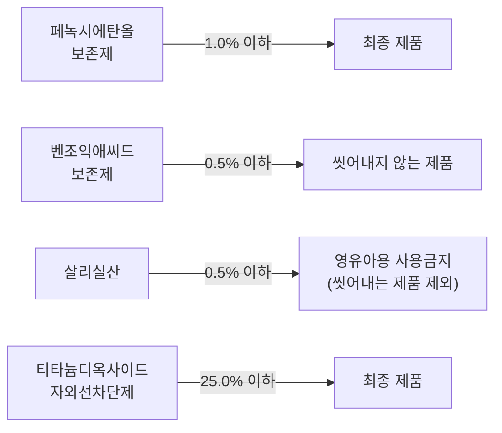

# Chapter 03. 화장품 사용제한 원료 (PART 02 · 화장품 제조 및 품질관리)

> **고득점 TIP**: 사용제한 원료는 최대 함량 순으로 외우고, 알레르기 유발 성분 25종도 꼼꼼히 학습하세요.
>
> 🔗 **관련 과목**
> - 4과목 4챕터 "제품 상담" — 배합금지 원료, 알레르기 유발 성분 25종과 부작용 증상 연계

> **참고 (원료의 네거티브시스템)**: 식품의약품안전처장에 의해 지정된 화장품의 제조 등에 사용할 수 없는 원료 및 보존제, 색소, 자외선 차단제 등과 같이 특별히 사용상의 제한이 필요한 원료를 제외한 원료는 업자의 책임하에 사용함
> (전체 고시 원료는 법령노트 p.12 [별표1] 참고)



---

## 1. 화장품 사용제한 원료의 종류 및 사용한도

### (1) 중요 사용금지 원료
화장품에 사용할 수 없는 원료는 「화장품 안전 기준 등에 관한 규정」[별표 1] 등에서 규정하고 있다.

| 원료명 | 원료명 |
|---|---|
| 4,4′-메칠렌디아닐린 | 아크릴아마이드 (다만, 폴리아크릴아마이드류에서 유래되었으며, 사용 후 씻어내지 않는 바디화장품에 0.1ppm, 기타 제품에 0.5ppm 이하인 경우에는 제외함) |
| 나프탈렌 | 아트라놀 |
| 납 및 그 화합물 | 안티몬 및 그 화합물 |
| 니코틴 | 에스트로겐 |
| 니트로메탄 | 에칠렌옥사이드 |
| 니트로벤젠 | 영국 및 북아일랜드산 소 유래 성분 |
| 돼지폐 추출물 | 이부프로펜피코놀 |
| 디옥산 | 인태반 유래 물질 |
| 리도카인 | 천수국꽃 추출물 또는 오일(향료 포함) |
| 메칠레소르신 | 클로로아세타마이드 |
| 메칠렌글라이콜 | 클로로아세트알데히드 |
| 메탄올 | 클로로아트라놀 |
| 미세플라스틱 (세정, 각질 제거 등의 제품에 남아 있는 5mm 크기 이하의 고체플라스틱) | 페닐살리실레이트 |
| 벤조일퍼옥사이드 | 페닐파라벤 |
| 붕산 | 하이드록시아이소헥실 3-사이클로헥센 카보스알데히드(HICC) |
| 비소 및 그 화합물 | 항히스타민제 |
| 비타민 L1, L2 | 형광증백제 |
| 수은 및 그 화합물 | 헥산 |
| 아세토페논, 포름알데하이드, 사이클로헥실아민, 메탄올 및 초산의 반응물 | 히드로퀴논 |

> **참고**: 상단 QR코드를 스캔하여 관련 법 조항을 함께 참고하세요.

---

### (2) 사용상의 제한이 필요한 원료 `[기출]`
식품의약품안전처장은 보존제, 색소, 자외선 차단제 등과 같이 특별히 사용상의 제한이 필요한 원료에 대하여는 그 사용 기준을 지정하고 고시하여야 한다.

#### ① 보존제

| 원료명 | 사용한도 | 비고 |
|---|---|---|
| 소듐라우로일사코시네이트 | 사용 후 씻어내는 제품에 허용 | 기타 제품에는 사용금지 |
| 메칠이소치아졸리논 | 사용 후 씻어내는 제품에 0.0015% (단, 메칠클로로이소치아졸리논과 메칠이소치아졸리논 혼합물과 병행 사용 금지) | 기타 제품에는 사용금지 |
| 메칠클로로이소치아졸리논과 메칠이소치아졸리논 혼합물 (염화마그네슘과 질산마그네슘 포함) `[기출]` | 사용 후 씻어내는 제품에 0.0015% (메칠클로로이소치아졸리논 : 메칠이소치아졸리논 = 3:1 혼합물로서) | 기타 제품에는 사용금지 |
| 아이오도프로피닐부틸카바메이트(IPBC) `[기출]` | 사용 후 씻어내는 제품에 0.02% / 사용 후 씻어내지 않는 제품에 0.01% / 다만, 데오드란트에 배합할 경우에는 0.0075% | 입술에 사용되는 제품, 에어로졸(스프레이에 한함) 제품, 바디로션 및 바디크림에는 사용금지 / 영유아용 제품류 또는 13세 이하 어린이가 사용할 수 있음을 특정하여 표시하는 제품에는 사용금지(목욕용 제품, 샤워젤류 및 샴푸류는 제외) |
| p-클로로-m-크레졸 | 0.04% | 점막에 사용되는 제품에는 사용금지 |
| 4,4-디메칠-1,3-옥사졸리딘 | 0.05% (다만, 제품의 pH는 6.0을 넘어야 함) | |
| 알킬이소퀴놀리늄브로마이드 | 사용 후 씻어내지 않는 제품에 0.05% | |
| 클로로펜 | 0.05% | |
| 폴리에이치씨엘 | 0.05% | 에어로졸(스프레이에 한함) 제품에는 사용금지 |
| 세틸피리디늄클로라이드 | 0.08% | |
| 2-브로모-2-나이트로프로판-1,3-디올(브로노폴) | 0.1% | 아민류나 아마이드류를 함유하고 있는 제품에는 사용금지 |
| 5-브로모-5-나이트로-1,3-디옥산 | 사용 후 씻어내는 제품에 0.1% (다만, 아민류나 아마이드류를 함유하고 있는 제품에는 사용금지) | 기타 제품에는 사용금지 |
| 글루타랄 | 0.1% | 에어로졸(스프레이에 한함) 제품에는 사용금지 |
| 디브로모헥사미딘 및 그 염류 | 디브로모헥사미딘으로서 0.1% | |
| 벤잘코늄클로라이드, 브로마이드 및 사카리네이트 `[기출]` | 사용 후 씻어내는 제품에 벤잘코늄클로라이드로서 0.1% / 기타 제품에 벤잘코늄클로라이드로서 0.05% | 분사형 제품에는 벤잘코늄클로라이드는 사용금지 |
| 벤제토늄클로라이드 | 0.1% | 점막에 사용되는 제품에는 사용금지 |
| 브로모클로로펜 (6,6-디브로모-4,4-디클로로-2,2′-메칠렌-디페놀) | 0.1% | |
| 소듐아이오데이트 | 사용 후 씻어내는 제품에 0.1% | 기타 제품에는 사용금지 |
| 알킬(C₁₂-C₂₂)트리메칠암모늄 브로마이드 및 클로라이드 (브롬화세트리모늄 포함) | 두발용 제품류를 제외한 화장품에 0.1% | |
| 이소프로필메칠페놀 | 0.1% | |
| 클로헥시딘, 그 디글루코네이트, 디아세테이트 및 디하이드로클로라이드 | 점막에 사용하지 않고 씻어내는 제품에 클로헥시딘으로서 0.1% / 기타제품에 클로헥시딘으로서 0.05% | |
| 헥사미딘 및 그 염류 | 헥사미딘으로서 0.1% | |
| 헥세티딘 `[기출]` | 사용 후 씻어내는 제품에 0.1% | 기타 제품에는 사용금지 |
| 2,4-디클로로벤질알코올 | 0.15% | |
| 3,4-디클로로벤질알코올 | 0.15% | |
| 메텐아민 | 0.15% | |
| 벤질헤미포름알 | 사용 후 씻어내는 제품에 0.15% | 기타 제품에는 사용금지 |
| 비페닐-2-올(o-페닐페놀) 및 그 염류 | 페놀로서 0.15% | |
| 무기설파이트 및 하이드로젠설파이트류 | 유리 SO₂로 0.2% | |
| 엠디엠하이단토인 | 0.2% | |
| 운데실레닉애씨드 및 그 염류 및 모노에탄올아마이드 | 사용 후 씻어내는 제품에 신으로서 0.2% | 기타 제품에는 사용금지 |
| 쿼터늄-15 `[기출]` | 0.2% | |
| 트리클로카반 | 0.2% (다만, 원료 중 3,3′,4,4′-테트라클로로아조벤젠 1ppm 미만, 3,3′,4,4′-테트라클로로이족시벤젠 1ppm 미만을 함유해야 함) | |
| 알킬디아미노에칠글라이신 하이드로클로라이드용액(30%) | 0.3% | |
| 클로페네신 | 0.3% | |
| 테트라브로모-o-크레졸 | 0.3% | |
| 트리클로산 `[기출]` | 사용 후 씻어내는 인체세정용 제품류, 데오도런트(스프레이 제품 제외), 페이스파우더, 피부 결점을 감추기 위해 국소적으로 사용하는 파운데이션(예 블레미쉬컨실러)에 0.3% | 기타 제품에는 사용금지 |
| 에칠라우로일알지네이트 하이드로클로라이드 | 0.4% | 입술에 사용되는 제품 및 에어로졸(스프레이에 한함) 제품에는 사용금지 |
| 디아졸리디닐우레아 | 0.5% | |
| 벤조익애씨드, 그 염류 및 에스테르류 | 산으로서 0.5% (다만, 벤조익애씨드 및 그 소듐염은 사용 후 씻어내는 제품에는 산으로서 2.5%) | |
| 살리실릭애씨드 및 그 염류 `[기출]` | 살리실릭애씨드로서 0.5% | 영유아용 제품류 또는 13세 이하 어린이가 사용할 수 있음을 특정하여 표시하는 제품에는 사용금지(다만, 샴푸는 제외) |
| 소듐하이드록시메칠아미노아세테이트 | 0.5% | |
| 징크피리치온 (보존제) `[기출]` | 사용 후 씻어내는 제품에 0.5% | 기타 제품에는 사용금지 |
| 클로로부탄올 `[기출]` | 0.5% | 에어로졸(스프레이에 한함) 제품에는 사용금지 |
| 클로로자이레놀 | 0.5% | |
| 클림바졸 | 두발용 제품에 0.5% | 기타 제품에는 사용금지 |
| 포믹애씨드 및 소듐포메이트 | 포믹애씨드로서 0.5% | |
| 피리딘-2-올 1-옥사이드 | 0.5% | 에어로졸(스프레이에 한함) 제품에는 사용금지 |
| 데하이드로아세틱애씨드 및 그 염류 | 데하이드로아세틱애씨드로서 0.6% | |
| 디엠디엠하이단토인 | 0.6% | |
| 소르빅애씨드 및 그 염류 | 소르빅애씨드로서 0.6% | |
| 이미다졸리디닐우레아 `[기출]` | 0.6% | |
| p-하이드록시벤조익애씨드, 그 염류 및 에스테르류 (다만, 에스테르류 중 페닐은 제외) | 단일성분일 경우 0.4%(산으로서) / 혼합사용의 경우 0.8%(산으로서) | |
| 보레이트류 | 밀납, 백납의 유화 목적으로 사용 시 0.76% (밀납, 백납 배합량의 1/2를 초과할 수 없음) | 기타 목적에는 사용금지 |
| 프로피오닉애씨드 및 그 염류 | 프로피오닉애씨드로서 0.9% | |
| 벤질알코올 `[기출]` | 1.0% (다만, 두발염색용 제품류에 용제로서 사용할 경우에는 10%) | |
| 페녹시에탄올 `[기출]` | 1.0% | |
| 페녹시이소프로판올 | 사용 후 씻어내는 제품에 1.0% | 기타 제품에는 사용금지 |
| 피록톤올아민 | 사용 후 씻어내는 제품에 1.0%, 기타 제품에 0.5% | |

> \* 염류의 예: 소듐, 포타슘, 칼슘, 마그네슘, 암모늄, 에탄올아민, 클로라이드, 브로마이드, 설페이트, 아세테이트, 베타인 등 `[기출]`
> \* 에스테르류: 메칠, 에칠, 프로필, 이소프로필, 부틸, 이소부틸, 페닐

> **참고 (관련 성분 — 파라벤류)**: 메틸파라벤 · 부틸파라벤 · 소듐메틸파라벤 · 소듐부틸파라벤 · 소듐에틸파라벤 · 소듐아이소부틸파라벤 · 소듐프로필파라벤 · 에틸파라벤 · 아이소부틸파라벤 · 아이소프로필파라벤 · 프로필파라벤 · 4-하이드록시벤조익애씨드 · 포타슘메틸파라벤 · 포타슘부틸파라벤 · 포타슘에틸파라벤 · 포타슘파라벤 · 포타슘프로필파라벤 · 소듐아이소프로필파라벤 · 소듐파라벤 · 칼슘파라벤

---

#### ② 자외선 차단 성분

| 성분명 | 사용한도 |
|---|---|
| 드로메트리졸 `[기출]` | 1.0% |
| 메톡시프로필아미노사이클로헥시닐리덴에톡시에틸 사이아노아세테이트 | 3.0% |
| 벤조페논-8(디옥시벤존) | 3.0% |
| 4-메칠벤질리덴캠퍼 | 4.0% |
| 페닐벤즈이미다졸설포닉애씨드 | 4.0% |
| 벤조페논-3(옥시벤존) | 2.4%(얼굴, 손 및 입술에 사용되는 제품은 5%) |
| 벤조페논-4 | 5.0% |
| 에칠디하이드록시프로필파바 | 5.0% |
| 에칠헥실살리실레이트 | 5.0% |
| 에칠헥실트리아존 | 5.0% |
| 디갈로일트리올리에이트 | 5.0% |
| 멘틸안트라닐레이트 | 5.0% |
| 부틸메톡시디벤조일메탄 `[기출]` | 5.0% |
| 시녹세이트 `[기출]` | 5.0% |
| 에칠헥실메톡시신나메이트 `[기출]` | 7.5% |
| 에칠헥실디메칠파바 | 8.0% |
| 옥토크릴렌 `[기출]` | 10% |
| 호모살레이트 `[기출]` | 10% |
| 이소아밀-p-메톡시신나메이트 | 10% |
| 비스에칠헥실옥시페놀메톡시페닐트리아진 `[기출]` | 10% |
| 디에칠헥실부타미도트리아존 | 10% |
| 폴리실리콘-15(디메치코디에칠벤잘말로네이트) | 10% |
| 메칠렌비스-벤조트리아졸릴테트라메칠부틸페놀 | 10% |
| 디에칠아미노하이드록시벤조일헥실벤조에이트 | 10% |
| 테레프탈릴리덴디캠퍼설포닉에씨드 및 그 염류 | 산으로서 10% |
| 디소듐페닐디벤즈이미다졸테트라설포네이트 | 산으로서 10% |
| 티이에이-살리실레이트 | 12% |
| 드로메트리졸트리실록산 | 15% |
| 징크옥사이드 | 25%(자외선 산란제) |
| 티타늄디옥사이드 | 25%(자외선 산란제) |

> \* 제품의 변색 방지를 목적으로 그 사용 농도가 0.5% 미만인 것은 자외선 차단 제품으로 인정하지 않음 `[기출]`
> \* 염류: 양이온염(소듐, 포타슘, 칼슘, 마그네슘, 암모늄 및 에탄올아민) / 음이온염(클로라이드, 브로마이드, 설페이트, 아세테이트)

> **참고**: 전체 고시 성분은 법령노트 p.44 참고

---

#### ③ 주요 염모제 성분

| 성분명 | 사용할 때 농도 상한 |
|---|---|
| 5-아미노-6-클로로-o-크레솔 | 산화염모제에 1.0%, 비산화염모제에 0.5% |
| p-아미노페놀 | 산화염모제에 0.9% |
| 톨루엔-2,5-디아민 | 산화염모제에 2.0% |
| 황산 톨루엔-2,5-디아민 | 산화염모제에 3.6% |
| 황산 m-페닐렌디아민 | 산화염모제에 3.0% |
| 황산 p-페닐렌디아민 | 산화염모제에 3.8% |
| 레조시놀 | 산화염모제에 2.0% |
| 황산 m-아미노페놀 | 산화염모제에 2.0% |
| 황산 o-아미노페놀 | 산화염모제에 3.0% |
| 황산 p-아미노페놀 | 산화염모제에 1.3% |
| 2-메칠레조시놀 | 산화염모제에 0.5% |
| 몰식자산 | 산화염모제에 4.0% |
| 과붕산나트륨, 과붕산나트륨일수화물, 과산화수소수, 과탄산나트륨 | 염모제(탈염·탈색 포함)에서 과산화수소로서 12% |

> **참고**: 전체 고시 성분은 법령노트 p.45 참고

---

#### ④ 주요 기타 성분

| 원료명 | 사용한도 |
|---|---|
| 과산화수소 및 과산화수소 생성 물질 | 두발용 제품류에 과산화수소로서 3.0% / 손톱 경화용 제품에 과산화수소로서 2.0% / ※ 기타 제품에는 사용금지 |
| 땅콩 오일, 추출물 및 유도체 | ※ 원료 중 땅콩단백질의 최대 농도는 0.5ppm을 초과하지 않아야 함 |
| 리튬하이드록사이드 | 헤어스트레이트너 제품에 4.5% / 제모제에서 pH 조정 목적으로 사용되는 경우 최종 제품의 pH는 12.7 이하 / ※ 기타 제품에는 사용금지 |
| 만수국꽃 추출물 또는 오일, 만수국아재비꽃 추출물 또는 오일 | 사용 후 씻어내는 제품에 0.1% / 사용 후 씻어내지 않는 제품에 0.01% (두 꽃의 추출물 또는 오일을 혼합할 때에도 해당함) / ※ 원료 중 알파 테르티에닐(테르티오펜) 함량은 0.35% 이하 / ※ 자외선 차단 제품 또는 자외선을 이용한 태닝 제품에는 사용금지 |
| 머스크자일렌 `[기출]` | 향수류: 향료 원액 8% 초과 제품에 1.0% / 향료 원액 8% 이하 제품에 0.4% / 기타 제품에 0.03% |
| 머스크케톤 `[기출]` | 향수류: 향료 원액 8% 초과 제품에 1.4% / 향료 원액 8% 이하 제품에 0.56% / 기타 제품에 0.042% |
| 비타민 E(토코페롤) | 20% |
| 베헨트리모늄 클로라이드 `[기출]` | (단일성분 또는 세트리모늄클로라이드, 스테아트리모늄클로라이드와 혼합사용의 합으로서) 사용 후 씻어내는 두발용 제품류 및 두발염색용 제품류에 5.0% / 사용 후 씻어내지 않는 두발용 제품류 및 두발염색용 제품류에 3.0% / ※ 세트리모늄클로라이드 또는 스테아트리모늄클로라이드와 혼합 사용하는 경우 세트리모늄클로라이드 및 스테아트리모늄클로라이드의 합은 '사용 후 씻어내지 않는 두발용 제품류'에 1.0% 이하, '사용 후 씻어내는 두발용 제품류 및 두발염색용 제품류'에 2.5% 이하이어야 함 |
| 살리실릭애씨드 및 그 염류 | 인체 세정용 제품류에 살리실릭애씨드로 2.0% / 사용 후 씻어내는 두발용 제품류에 살리실릭애씨드로서 3.0% / ※ 영유아용 제품류 또는 13세 이하 어린이가 사용할 수 있음을 특정하여 표시하는 제품에는 사용금지(샴푸는 제외) / ※ 기능성화장품의 유효 성분 외에 기타 제품에는 사용금지 |
| 세트리모늄클로라이드, 스테아트리모늄클로라이드 | (단일성분 또는 혼합사용의 합으로서) 사용 후 씻어내는 두발용 제품류 및 두발염색용 제품류에 2.5% / 사용 후 씻어내지 않는 두발용 제품류 및 두발염색용 제품류에 1.0% |
| 소합향나무(Liquidambar orientalis) 발삼오일 및 추출물 | 0.6% |
| 수용성 징크 염류(징크 4-하이드록시벤젠설포네이트와 징크피리치온 제외) | 징크로서 1% |
| 시스테인, 아세틸시스테인 및 그 염류 | 퍼머넌트웨이브용 제품에 시스테인으로서 3.0~7.5% (다만, 가온2욕식 퍼머넌트웨이브용 제품의 경우에는 시스테인으로서 1.5~5.5%, 안정제로서 치오글라이콜릭애씨드 1.0%를 배합할 수 있으며, 첨가하는 치오글라이콜릭애씨드의 양을 최대한 1.0%로 했을 때 주성분인 시스테인의 양은 6.5%를 초과할 수 없음) |
| 실버나이트레이트 `[기출]` | 속눈썹 및 눈썹 착색 용도의 제품에 4% / ※ 기타 제품에는 사용금지 |
| 암모니아 | 6.0% |
| 에탄올, 붕사, 라우릴황산나트륨(4:1:1) 혼합물 | 외음부 세정제에 12% / ※ 기타 제품에는 사용금지 |
| 우레아 `[기출]` | 10% |
| 징크피리치온 (기타 성분) `[기출]` | 비듬 및 가려움을 덜어주고 씻어내는 제품(샴푸, 린스) 및 탈모 증상의 완화에 도움을 주는 화장품에 징크피리치온으로서 1.0% / ※ 기타 제품에는 사용금지 |
| 치오글라이콜릭애씨드, 그 염류 및 에스테르류 | 퍼머넌트웨이브용 및 헤어스트레이트너 제품에 치오글라이콜릭애씨드로서 11% (다만, 가온 2욕식 헤어스트레이트너 제품의 경우에는 치오글라이콜릭애씨드로서 5%, 치오글라이콜릭애씨드 및 그 염류를 주성분으로 하고 제1제 사용 시 조제하는 발열 2욕식 퍼머넌트웨이브용 제품의 경우 치오글라이콜릭애씨드로서 19%에 해당하는 양) / 세모용 제품에 치오글라이콜릭애씨드로서 5% / 염모제에 치오글라이콜릭애씨드로서 1% / 사용 후 씻어내는 두발용 제품류에 2% |
| 칼슘하이드록사이드 | 헤어스트레이트너 제품에 7% / 제모제에서 pH 조정 목적으로 사용되는 경우 최종 제품의 pH는 12.7 이하 / ※ 기타 제품에는 사용금지 |
| 콤미포르에리트리아엥글러(Commiphora erythrea engler var. glabrescens) 검추출물 및 오일 | 0.6% |
| 쿠민(Cuminum cyminum) 열매 오일 및 추출물 | 사용 후 씻어내지 않는 제품에 쿠민 오일로서 0.4% |
| 퀴닌 및 그 염류 `[기출]` | 샴푸에 퀴닌염으로서 0.5% / 헤어 로션에 퀴닌염으로서 0.2% / ※ 기타 제품에는 사용금지 |
| 클로라민T | 0.2% |
| 톨루엔 `[기출]` | 손발톱용 제품류에 25% / ※ 기타 제품에는 사용금지 |
| 트리알킬아민, 트리알칸올아민 및 그 염류 | 사용 후 씻어내지 않는 제품에 2.5% |
| 트리클로산 | 사용 후 씻어내는 제품류에 0.3% / ※ 기능성화장품의 유효 성분 외에 기타 제품에는 사용금지 |
| 페루발삼(Myroxylon pereirae의 수지) 추출물, 증류물 | 0.4% |
| 폴리아크릴아마이드류 | 사용 후 씻어내지 않는 바디 화장품에 잔류 아크릴아마이드로서 0.00001% / 기타 제품에 잔류 아크릴아마이드로서 0.00005% |
| 풍나무(Liquidambar styraciflua) 발삼 오일 및 추출물 | 0.6% |
| 하이드롤라이즈드밀단백질 | ※ 원료 중 펩타이드의 최대 평균분자량은 3.5 kDa 이하이어야 함 |

> \* 그 밖의 원료는 화장품책임판매업자의 안전성에 대한 책임하에 사용할 수 있음

---

### (3) 착향제(향료) 성분 중 알레르기 유발 물질 `[기출]`

| 성분명 | 성분명 |
|---|---|
| 나무이끼 추출물 | 이밀신나밀알코올 |
| 참나무이끼 추출물 | 신남알 |
| 리날룰 | 아밀신남알 |
| 리모넨 | 헥실신남알 |
| 벤질벤조에이트 | 시트랄 |
| 벤질살리실레이트 | 시트로넬올 |
| 벤질신나메이트 | 하이드록시시트로넬알 |
| 벤질알코올 | 메틸2-옥티노에이트 |
| 유제놀 | 부틸페닐메틸프로피오날 |
| 아이소유제놀 | 알파-아이소메틸아이오논 |
| 제라니올 | 쿠마린 |
| 아니스알코올 | 파네솔 |
| 신나밀알코올 | |

> **참고**: CAS 등록번호는 법령노트 p.121 [별표2] 참고

---

### (4) 알레르기 유발 성분 표시 지침
① 착향제는 '향료'로 표기가 가능하나, 착향제 구성 성분 중 식품의약품안전처장이 고시한 알레르기 유발 성분의 경우 '향료'로 표시할 수 없고, 해당 성분의 명칭을 기재하여야 한다(해당 25종).

② 사용 후 씻어내는 제품에는 0.01% 초과, 사용 후 씻어내지 않는 제품에는 0.001% 초과 함유하는 경우에만 알레르기 유발 성분을 표시한다. `[기출]`

③ 내용량이 10mL(g) 초과 50mL(g) 이하인 화장품은 표시·기재의 면적이 부족할 경우 생략이 가능하다. 단, 홈페이지 등에서 확인할 수 있도록 해야 한다.

④ 적은 용량의 화장품일지라도 표시 면적이 충분할 경우에는 해당 알레르기 유발 성분을 표시해야 한다.

⑤ 책임판매업자 홈페이지, 온라인 판매처 사이트에서도 전성분 표시사항에 향료 중 알레르기 유발 성분을 표시해야 한다.

> **참고 (알레르기 유발 성분의 표시 산출 방법)** `[기출]`
> 해당 알레르기 유발 성분이 제품의 내용량에서 차지하는 함량의 비율로 계산함
> 예) 사용 후 씻어내는 제품인 바디워시(300g) 제품에 제라니올이 0.3g 포함 시,
> 0.3g ÷ 300g × 100 = 0.1% → 0.01%를 초과하므로 표시 대상임

---

### (5) 알레르기 유발 성분의 표기 개선안

| 현재 | 개선 |
|---|---|
| A, B, C, D, 향료, 리모넨, 리날룰이 포함된 경우 | **1안**: A, B, C, D, 향료, 리모넨, 리날룰 |
| | **2안**: A, B, C, D, 리모넨, 향료, 리날룰 |
| | **3안**: A, B, 리모넨, C, D, 향료, 리날룰 (함량 순으로 기재) |
| | ~~4안: A, B, C, D, 향료(리모넨, 리날룰)~~ |
| | ~~5안: A, B, C, D, 향료, 리모넨, 리날룰(알레르기 유발 성분)~~ |

> \* 1~3안은 가능
> \* 4~5안은 소비자 오해·오인 우려로 불가함

---

## 2. 천연화장품 및 유기농화장품의 원료 기준

> **참고**: 「화장품법」제14조의2(천연화장품 및 유기농화장품에 대한 인증) 삭제 (2025. 1. 31. 일부개정)

### (1) 용어의 정의

| 구분 | 세부 구분 | 정의 |
|---|---|---|
| 천연 원료 | 유기농 원료 | 다음 중 어느 하나에 해당하는 화장품 원료를 말함<br>• 「친환경농업 육성 및 유기식품 등의 관리·지원에 관한 법률」에 따른 유기농수산물 또는 이를 이 고시에서 허용하는 물리적 공정에 따라 가공한 것<br>• 외국 정부(미국, 유럽연합, 일본 등)에서 정한 기준에 따른 인증기관으로부터 유기농수산물로 인정받거나 이를 이 고시에서 허용하는 물리적 공정에 따라 가공한 것<br>• 국제유기농업운동연맹(IFOAM)에 등록된 인증기관으로부터 유기농 원료로 인증받거나 이를 이 고시에서 허용하는 물리적 공정에 따라 가공한 것 |
| | 식물 원료 | 식물(해조류와 같은 해양식물, 버섯과 같은 균사체를 포함) 그 자체로서 가공하지 않거나, 이 식물을 가지고 이 고시에서 허용하는 물리적 공정에 따라 가공한 화장품 원료 |
| | 동물에서 생산된 원료(동물성 원료) | 동물 그 자체(세포, 조직, 장기)는 제외하고, 동물로부터 자연적으로 생산되는 것으로서 가공하지 않거나, 이 동물로부터 자연적으로 생산되는 것을 가지고 이 고시에서 허용하는 물리적 공정에 따라 가공한 계란, 우유, 우유단백질 등의 화장품 원료 |
| | 미네랄 원료 | 지질학적 작용에 의해 자연적으로 생성된 물질을 가지고 이 고시에서 허용하는 물리적 공정에 따라 가공한 화장품 원료(화석연료로부터 기원한 물질은 제외) |
| 천연 유래 원료 | 유기농 유래 원료 | 유기농 원료를 이 고시에서 허용하는 화학적 또는 생물학적 공정에 따라 가공한 원료 |
| | 식물 유래, 동물성 유래 원료 | 식물 원료, 동물에서 생산된 원료(동물성 원료)를 가지고 이 고시에서 허용하는 화학적 공정 또는 생물학적 공정에 따라 가공한 원료 |
| | 미네랄 유래 원료 | 미네랄 원료를 가지고 이 고시에서 허용하는 화학적 공정 또는 생물학적 공정에 따라 가공한 원료 |

### (2) 제조에 사용할 수 있는 원료
① 천연 원료
② 천연 유래 원료
③ 물
④ 허용 기타 원료 및 허용 합성 원료 `[기출]`
- 자연에서 대체하기 곤란한 기타 원료 및 합성 원료는 5% 이내에서 사용 가능
- 석유화학 부분은 2%를 초과 사용 불가
- 허용 기타 원료의 종류: 베타인, 가라기난, 레시틴 및 그 유도체, 토코페롤, 토코트리에놀, 오리자놀, 안나토, 카로티노이드/잔토필, 앱솔루트, 콘크리트, 레지노이드, 라놀린, 피토스테롤, 글라이코스핑고리피드 및 글라이코리피드, 잔탄검, 알킬베타인
- \* 앱솔루트, 콘크리트, 레지노이드는 천연화장품에만 허용함

### (3) 오염 물질
제조에 사용하는 원료는 다음의 오염 물질에 의해 오염되어서는 안 된다.
① 중금속
② 방향족 탄화수소
③ 농약
④ 다이옥신 및 폴리염화비페닐
⑤ 방사능
⑥ 유전자변형 생물체
⑦ 곰팡이 독소
⑧ 의약 잔류물
⑨ 질산염
⑩ 니트로사민

### (4) 허용 합성 원료 `[기출]`
① 합성 보존제 및 변성제(허용 합성 원료 5%)
- 벤조익애씨드 및 그 염류
- 벤질알코올
- 살리실릭애씨드 및 그 염류
- 소르빅애씨드 및 그 염류
- 데하이드로아세틱애씨드 및 그 염류
- 데나토늄벤조에이트
- 3급부틸알코올
- 기타변성제(프탈레이트류 제외)
- 이소프로필알코올
- 테트라소듐글루타메이트디아세테이트

② 천연 유래와 석유화학 부분을 포함하고 있는 원료(2%)
- 디알킬카보네이트
- 알킬아미도프로필베타인
- 알킬메칠글루카미드
- 디알킬디모늄클로라이드(두발·수염 제품에 한함)
- 식물성 폴리머-하이드록시프로필트리모늄클로라이드(두발·수염 제품에 한함)
- 알킬디모늄하이드록시프로필하이드로라이즈드식물성단백질(두발·수염 제품에 한함)
- 알킬알포아세테이트/디아세테이트
- 알킬글루코사이드카르복실레이트
- 카르복시메칠-식물 폴리머

### (5) 제조공정
**① 허용되는 공정**
원료의 제조공정은 간단하고 오염을 일으키지 않으며, 원료 고유의 품질이 유지될 수 있어야 한다.
- 물리적 공정: 물이나 자연에서 유래한 천연 용매로 추출해야 한다.
- 화학적·생물학적 공정: 석유화학 용제의 사용 시 반드시 최종적으로 모두 회수되거나 제거되어야 한다.

**② 금지되는 공정** `[기출]`
천연화장품 및 유기농화장품의 제조에 대해 금지되는 공정은 다음과 같다.
- 탈색, 탈취, 방사선 조사, 설폰화, 에칠렌옥사이드, 프로필렌옥사이드 또는 다른 알켄옥사이드 사용, 수은화합물을 사용한 처리, 포름알데하이드 사용
- 유전자 변형 원료 배합
- 니트로스아민류 배합 및 생성
- 일면 또는 다면의 외형 또는 내부구조를 가지도록 의도적으로 만들어진 불용성이거나 생체지속성인 1~100나노미터 크기의 물질 배합
- 공기, 산소, 질소, 이산화탄소, 아르곤 가스 외의 분사제 사용

### (6) 작업장 및 제조설비
천연화장품 또는 유기농화장품을 제조하는 작업장 및 제조설비는 교차오염이 발생하지 않도록 충분히 청소 및 세척되어야 한다.

### (7) 천연화장품·유기농화장품의 용기와 포장 `[기출]`
천연화장품·유기농화장품의 용기와 포장에는 폴리염화비닐(PVC: Polyvinyl Chlorid)과 폴리스티렌폼(Polystyrene Foam)을 사용할 수 없다.

### (8) 원료 조성 `[기출]`

| 구분 | 조성 기준 |
|---|---|
| 천연화장품 | 천연 함량 95% 이상 |
| 유기농화장품 | 유기농 함량 포함 천연 함량 95% 이상 + 유기농 함량 10% |

① **천연화장품**: 중량 기준으로 천연 함량이 전체 제품의 95% 이상으로 구성되어야 한다.

② **유기농화장품**:
- 유기농화장품은 중량 기준으로 유기농 함량이 전체 제품의 10% 이상이어야 한다.
- 유기농 함량을 포함한 천연 함량이 전체 제품의 95% 이상으로 구성되어야 한다.

### (9) 천연 및 유기농 함량 계산 방법

**① 천연 함량 계산 방법**
```
천연 함량 비율(%) = 물 비율 + 천연 원료 비율 + 천연 유래 원료 비율
```

**② 유기농 함량 계산 방법**
- 유기농 인증 원료의 경우 해당 원료의 유기농 함량으로 계산
- 유기농 함량 확인이 불가능한 경우 유기농 함량 비율 계산 방법
  - 물, 미네랄 또는 미네랄 유래 원료는 유기농 함량 비율 계산에 포함하지 않음 (물은 제품에 직접 함유 또는 혼합 원료의 구성요소일 수 있음)
  - 유기농 원물만 사용하거나 유기농 용매를 사용하여 유기농 원물을 추출한 경우 해당 원료의 유기농 함량 비율은 100%로 계산

**수용성 및 비수용성 추출물 원료의 유기농 함량 비율 계산 방법**

- 수용성 추출물 원료의 경우
  - 1단계: 비율 = 신선한 유기농 원물 ÷ (추출물 − 용매)
  - 2단계: (비율 × (추출물 − 용매) / 추출물 + 유기농 용매 / 추출물) × 100

- 물로만 추출한 원료의 경우
```
(신선한 유기농 원물 ÷ 추출물) × 100
```

- 비수용성 원료인 경우
```
(신선 또는 건조 유기농 원물 + 사용하는 유기농 용매) ÷ (신선 또는 건조 원물 + 사용하는 총 용매) × 100
```

신선한 원물로 복원하기 위해서는 실제 건조 비율을 사용하거나(이 경우 증빙자료 필요) 중량에 아래 일정 비율을 곱해야 한다.

| 원료 부위 | 비율 |
|---|---|
| 나무, 껍질, 씨앗, 견과류, 뿌리 | 1 : 2.5 |
| 잎, 꽃, 지상부 | 1 : 4.5 |
| 과일(예 살구, 포도) | 1 : 5 |
| 물이 많은 과일(예 오렌지, 파인애플) | 1 : 8 |

**화학적으로 가공한 원료의 경우** (예 유기농 글리세린이나 유기농 알코올의 유기농 함량 비율 계산)
```
(투입되는 유기농 원물 − 회수 또는 제거되는 유기농 원물) ÷ (투입되는 총 원료 − 회수 또는 제거되는 원료) × 100
```

---
*본 문서는 사용자가 업로드한 화장품 사용제한 원료 관련 학습 교재 사진(p.86~98)을 정리한 것입니다.*
