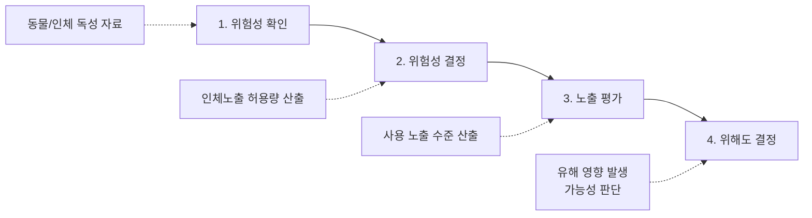

# Chapter 05. 위해사례 판단 및 보고

> **고득점 TIP**: 위해 평가 단계, 등급을 정확히 암기하고, 위해 사례 보고 방법에 대해 학습하세요.
>
> 🔗 **관련 과목**
> - 3과목 1챕터 "작업장 위생관리" — CGMP 3대 요소(미생물오염 방지)와 위해성 평가 연계
> - 4과목 4챕터 "제품 상담" — 맞춤형화장품 부작용 발생 시 식약처 보고 의무

---

> 📋 **학습 가이드**
> - 출제 빈도: ★★★☆☆ (위해성 평가 4단계, 위해성 등급 가/나/다, 회수 기간, 보고 의무)
> - 예상 소요 시간: 35분
> - 핵심 키워드: 위해성 평가 4단계(위험성 확인→결정→노출평가→위해도결정), 위해성 등급(가 15일/나 30일/다 30일), 안전성 정보 보고(신속 15일/정기 반기 후 1개월), 회수계획서 5일 이내, 행정처분 경감 기준

---

## 1. 위해 여부 판단

> **한 줄 요약**: 위해성 평가 4단계(위험성 확인→위험성 결정→노출 평가→위해도 결정) + 위해성 등급 가/나/다 + 회수 기간 + 소비자 위해성 평가 요청.

### (1) 용어의 정의

| 용어 | 정의 |
|---|---|
| 인체적용제품 | 사람이 섭취·투여·접촉·흡입 등을 함으로써 인체에 직접 영향을 줄 수 있는 것으로서 「화장품법」에 따른 화장품을 포함 |
| 독성 | 인체적용제품에 존재하는 위해요소가 인체에 유해한 영향을 미치는 고유의 성질 |
| 위해요소 | 인체의 건강을 해치거나 해칠 우려가 있는 화학적·생물학적·물리적 요인 |
| 위해성 | 인체적용제품에 존재하는 위해요소에 노출되는 경우 인체의 건강을 해칠 수 있는 정도 |
| 위해성 평가 | 단일 또는 2종 이상의 인체적용제품을 통하여 위해요소가 인체에 미치는 위해 여부와 그 정도를 평가하는 일련의 과정 |
| 통합위해성 평가 | 인체적용제품에 존재하는 위해요소가 다양한 매체와 경로를 통하여 인체에 미치는 영향을 종합적으로 평가하는 것 |
| 위험성 확인 | 위해요소를 대상으로 인체 내 독성을 나타내는 잠재적 성질을 과학적으로 확인하는 과정 |
| 위험성 결정 | 동물독성자료, 인체독성자료 등을 토대로 위해요소의 인체노출 허용량 등을 정량적 또는 정성적으로 산출하는 과정 |
| 노출 평가 | 화장품의 사용 등을 통해 노출된 위해요소의 정량적 또는 정성적 분석 자료를 근거로 인체노출 수준을 산출하는 과정 |
| 위해도 결정 | 위험성 확인, 위험성 결정 및 노출 평가 결과 등을 토대로 위해도를 산출하여 현 노출 수준이 건강에 미치는 유해 영향 발생 가능성을 판단하는 과정 |
| 인체노출 안전기준 | 단일 또는 2종 이상의 인체적용제품에 존재하는 위해요소에 노출되었을 경우 인체에 유해한 영향이 나타나지 않는 것으로 판단되는 기준 |
| 위해지수 | 위해요소의 일일 평균 노출량을 인체노출 허용량 등으로 나눈 값 |
| 안전역 | 화장품에 존재하는 위해요소의 최대 무독성 용량을 일일 인체노출량으로 나눈 값 |
| 사업자 | 인체적용제품을 생산·채취·제조·가공·수입·운반·저장·조리·임대 또는 판매를 업으로 하는 자(단, 식품의약품안전처장이 다른 법령에 따라 다른 중앙행정기관의 장에게 권한을 위탁한 사항에 관한 사업자는 제외됨) |



> **참고 - 사업자**: 인체적용제품이 인체에 위해성을 발생시키지 않도록 필요한 예방 및 관리 등의 조치를 하여야 하고, 국가의 정책에 적극적으로 참여하고 협조해야 함

### (2) 「인체적용제품의 위해성 평가에 관한 법률」의 목적

인체에 직접 적용되는 제품에 존재하는 위해요소가 인체에 노출되었을 때 발생할 수 있는 위해성을 종합적으로 평가하고, 안전관리를 위한 사항을 규정함으로써 국민 건강을 보호·증진하는 것을 목적으로 한다.

### (3) 위해성 평가 정책의 수립 및 추진 체계

#### ① 위해성 종합평가 및 관리
- 식품의약품안전처장은 인체적용제품에 존재하는 위해요소가 인체에 미치는 전체적인 영향을 파악하기 위하여 다양한 제품과 경로를 종합적으로 고려하여 위해성 평가를 해야 한다.
- 식품의약품안전처장은 인체적용제품에 존재하는 위해요소로부터 국민 건강을 보호하기 위하여 인체노출 안전기준 설정, 위해요소 저감화 계획 수립 등 종합적인 안전관리 방안을 마련하고 이를 시행하여야 한다. 다만, 식품의약품안전처장이 다른 법령에 따라 다른 중앙행정기관의 장에게 권한을 위탁한 사항은 제외한다.
- **안전관리 방안 마련 시 고려사항**
  - 위해성 평가의 수행에 따른 위해성 평가의 결과
  - 안전관리 방안의 실현 가능성 및 대체 수단 존재 여부
  - 안전관리에 소요되는 비용과 그로 인한 편익의 비교 분석
- 식품의약품안전처장은 위해성 평가를 활성화하기 위한 기반을 조성하기 위하여 노력하여야 한다.
- 식품의약품안전처장은 위해성을 종합적으로 관리하기 위하여 관계 중앙행정기관의 장과 협력하여야 한다.

#### ② 위해성 평가 기본계획
- 식품의약품안전처장은 인체적용제품의 위해성 평가를 체계적이고 효율적으로 추진하기 위해 **5년마다** 인체적용제품의 위해성 평가에 관한 기본계획을 위해성 평가정책위원회의 심의를 거쳐 수립·시행하여야 한다.
- **위해성 평가 기본계획 포함 내용**
  - 인체적용제품의 위해성 평가의 목표와 기본방향
  - 인체적용제품의 위해성 평가 관련 연구 및 기술개발
  - 인체적용제품의 위해성 평가 관련 국제협력
  - 그 밖에 인체적용제품의 위해성 평가의 추진을 위하여 필요한 사항
- 식품의약품안전처장은 기본계획을 시행하기 위하여 해마다 관계 중앙행정기관의 장과 협의하여 인체적용제품의 위해성 평가에 관한 시행계획을 수립하여야 한다.
- 식품의약품안전처장은 기본계획 및 시행계획을 수립·시행하기 위하여 필요한 경우에는 관계 중앙행정기관의 장, 지방자치단체의 장, 관련 사업자 또는 관련 법인·단체의 장에게 필요한 자료의 제출을 요청할 수 있다.
- 그 밖에 기본계획 및 시행계획의 수립·시행에 필요한 사항은 대통령령으로 정한다.

> **참고 - 위해성 평가 정책위원회의 심의 사항**
> 1. 위해성 평가 기본계획에 따른 기본계획의 수립·시행
> 2. 위해성 평가의 대상에 따른 위해성 평가의 대상 선정
> 3. 위해성 평가의 수행에 따른 위해성 평가의 방법
> 4. 일시적 금지조치에 따른 일시적 금지조치에 관한 사항
> 5. 인체노출 종합안전 기준 설정 등에 따른 인체노출 종합안전 기준에 관한 사항
> 6. 소비자의 위해성 평가 요청에 따른 소비자 등의 위해성 평가 요청에 관한 사항
> 7. 그 밖에 위해성 평가 등에 관하여 식품의약품안전처장이 심의에 부치는 사항

### (4) 위해성 평가 수행

#### ① 위해성 평가의 대상
- 국제기구 또는 외국정부가 인체의 건강을 해칠 우려가 있다고 인정하여 판매 또는 판매 목적의 생산 등을 금지한 인체적용제품
- 새로운 원료 또는 성분을 사용하거나 새로운 기술을 적용한 것으로서 안전성에 대한 기준 및 규격이 정해지지 아니한 인체적용제품
- 소비자등이 위해성 평가를 요청한 인체적용제품
- 그 밖에 인체의 건강을 해칠 우려가 있다고 인정되는 인체적용제품

#### ② 위해 평가 단계

```
                        위해요소
                    /            \
            의도적 사용 물질        비의도적 오염 물질
                 |                       |
              위험성 확인              위험성 확인
                 |                       |
              위험성 결정              위험성 결정
              /       \                  |
          사용금지   노출 평가(모니터링)   노출 평가(모니터링)
                       |                  |
                   위해도 결정          위해도 결정
```

#### ③ 위해성 등급

| 등급 | 해당 사례 |
|---|---|
| **가등급 (위해 기준)** | • 사용할 수 없는 원료를 사용한 경우<br>• 사용 기준이 지정·고시된 원료 외의 보존제·색소·자외선 차단제 등을 사용한 경우 |
| **나등급 (위해 기준)** | • 안전용기·포장 기준을 위반한 경우<br>• 유통화장품 안전관리 기준에 적합하지 않은 경우(기능성화장품의 기능성을 나타나게 하는 주원료 함량이 기준치에 부적합한 경우는 제외함) |
| **다등급 (위해 기준)** | • 전부 또는 일부가 변패된 경우<br>• 병원미생물에 오염된 경우<br>• 이물이 혼입되었거나 부착되어 보건위생상 위해를 발생할 우려가 있는 경우<br>• 화장품에 사용할 수 없는 원료를 사용하였거나 유통화장품 안전관리 기준에 적합하지 않은 경우(기능성화장품의 주원료 함량이 부적합한 경우)<br>• 화장품의 사용기한 또는 개봉 후 사용기간(병행표시된 경우 제조연월일을 포함함)을 위조, 변조한 경우<br>• 그 밖에 화장품제조업자 및 책임판매업자 스스로 국민보건에 위해를 끼칠 우려가 있어 회수가 필요하다고 판단되는 경우<br>• **화장품제조업 또는 화장품책임판매업 등록을 하지 아니한 자가 제조한 화장품 또는 제조·수입하여 유통·판매한 화장품**<br>• 화장품제조업 또는 화장품책임판매업 신고를 하지 아니한 자가 판매한 맞춤형화장품<br>• **맞춤형화장품조제관리사를 두지 아니하고 판매한 맞춤형화장품**<br>• 화장품의 기재사항, 가격표시, 기재·표시상의 주의에 위반되는 화장품 또는 의약품으로 잘못 인식할 우려가 있게 기재·표시된 화장품<br>• 판매의 목적이 아닌 제품의 홍보·판매촉진 등을 위해 미리 소비자가 시험·사용하도록 제조 또는 수입된 화장품(소비자에게 판매하는 화장품에 한함)<br>• 화장품의 포장 및 기재·표시사항을 훼손(맞춤형화장품 판매를 위해 필요한 경우는 제외함) 또는 위조·변조한 것 |

> **참고**: 본문 p.163
>
> **확인문제**: 다음 중 '다등급' 위반 사례에 해당하는 것은?
> 1. 병원미생물에 오염된 제품
> 2. 포장 기재사항이 일부 누락된 제품
> 3. 화장품 제조업 등록 없이 판매한 제품
> 4. 기능성화장품의 함량 기준 부족
> 5. 안전관리 기준 미달
>
> (정답: ①, ③ — 다등급 사례에 해당)
>
> **해설**: 병원미생물 오염, 미등록 제조업자 판매, 맞춤형화장품조제관리사 미배치 판매, 변패·이물혼입 등은 다등급에 해당한다. 포장 기재사항 누락은 나등급, 기능성 함량 부족(기준치 부적합)은 나등급, 안전관리 기준 미달도 나등급에 해당한다.

#### ④ 위해성 등급에 따른 회수 기간

| 등급 | 회수 기간 |
|---|---|
| 가등급 (회수 기한) | 회수를 시작한 날부터 **15일 이내** 회수되어야 함 |
| 나등급 (회수 기한) | 회수를 시작한 날부터 **30일 이내** 회수되어야 함 |
| 다등급 (회수 기한) | 회수를 시작한 날부터 **30일 이내** 회수되어야 함 |

### (5) 위해 평가 필요성 검토

#### ① 위해 평가가 필요한 경우
- 위해성에 근거하여 사용금지를 설정할 경우
- 안전 구역을 근거로 사용한도를 설정할 경우(살균보존 성분 등)
- 현 사용한도 성분의 기준 적절성을 확인할 경우
- 비의도적 오염 물질의 기준을 설정할 경우
- 화장품 안전 이슈 성분의 위해성을 확인할 경우
- 위해 관리 우선순위를 설정할 경우
- 인체 위해의 유의한 증거가 없음을 검증할 경우

#### ② 위해 평가가 불필요한 경우
- 불법으로 유해 물질을 화장품에 혼입한 경우
- 안전성, 유효성이 입증되어 기허가된 기능성화장품
- 위험에 대한 충분한 정보가 부족한 경우

#### ③ 소비자의 위해성 평가 요청
- 「소비자기본법」 소비자단체의 등록에 따른 소비자단체 또는 대통령령으로 정하는 일정 수 이상의 소비자(이하 '소비자 등'이라 함)는 대통령령으로 정하는 요건을 갖추어 식품의약품안전처장에게 인체적용제품에 대한 위해성 평가를 요청할 수 있다.
- 식품의약품안전처장은 위의 요청을 받은 경우에는 위해성 평가의 대상에 따라 위해성 평가의 대상으로 선정할 수 있다. 다만, 다음 중 어느 하나에 해당하는 경우에는 그러하지 아니한다.
  - 동일한 소비자 등이 동일한 목적으로 위해성 평가를 반복적으로 요청하는 경우
  - 특정한 사업자를 이롭게 할 목적으로 위해성 평가를 요청하는 경우 등 공익적 목적에 반하는 경우
  - 기술수준, 시설 또는 비용 등을 고려할 때 소비자등이 요청한 위해성 평가를 수행할 능력이 없거나 수행하기 어렵다고 판단되는 경우
  - 그 밖에 이 법 또는 다른 법령에 따른 조사가 진행 중인 경우 등 위해성 평가의 대상으로 선정하기에 적절하지 않다고 인정하여 대통령령으로 정하는 경우
- 식품의약품안전처장은 인체적용제품의 위해성 평가 대상 선정 여부를 결정한 경우 그 결과를 지체 없이 위해성 평가를 요청한 소비자 등에게 통지하여야 한다.
- 식품의약품안전처장은 인체적용제품을 위해성 평가 대상으로 선정한 경우 통지를 한 날부터 **1년 이내**에 해당 인체적용제품에 대한 위해성 평가를 완료하고, 그 결과를 대통령령으로 정하는 바에 따라 지체 없이 요청한 소비자 등에게 통보하여야 한다. 다만, 부득이한 사유가 있는 경우에는 위원회의 심의를 거쳐 그 기간을 연장할 수 있으며, 이 경우 소비자 등에게 연장사유 및 연장기간을 통보하여야 한다.

#### ④ 일시적 금지 조치
- 식품의약품안전처장은 위해성 평가가 끝나기 전이라도 국민의 안전과 건강을 위한 사전 예방적 조치가 필요한 경우에는 사업자에 대하여 위원회의 심의를 거쳐 해당 인체적용제품의 생산·판매 등을 일시적으로 금지할 수 있다. 다만, 국민의 안전과 건강을 급박하게 해칠 우려가 있는 경우에는 먼저 일시적 금지조치를 한 후 위원회의 심의를 거칠 수 있다.
- 식품의약품안전처장은 해당 인체적용제품의 위해성이 없다고 인정한 경우에는 지체 없이 일시적 금지조치를 해제하여야 한다.
- 일시적으로 생산·판매 등이 금지된 인체적용제품의 생산·판매 등을 한 자는 **3년 이하의 징역 또는 3천만 원 이하의 벌금**에 처한다.

### (6) 위해성 평가 등 활성화를 위한 기반 조성 및 정보의 수집·분석

① 식품의약품안전처장은 위해성 평가 관련 정보의 수집·분석 및 활용을 촉진하기 위하여 필요한 시책을 마련하여 추진하여야 한다.

② 식품의약품안전처장은 위해성 평가 관련 정보의 수집·분석 등 통합적 관리를 위한 정보처리 전산시스템을 구축·운영하여야 한다.

③ 식품의약품안전처장은 전산시스템 구축을 위하여 관계 중앙행정기관의 장이 소관 법률에 따라 확보한 위해성 평가 관련 정보의 제공을 요청할 수 있다. 이 경우 요청을 받은 관계 중앙행정기관의 장은 특별한 사유가 없으면 이에 따라야 한다.

④ 식품의약품안전처장은 관계 중앙행정기관의 장의 요청이 있는 경우 전산시스템상의 위해성 평가 관련 정보를 해당 중앙행정기관의 장과 협의하여 공유할 수 있다.

⑤ 전산시스템의 구축·운영에 필요한 사항은 대통령령으로 정한다.

---

## 2. 위해 사례 보고

> **한 줄 요약**: 안전성 정보 보고(신속 15일/정기 반기 후 1개월) + 회수계획서 5일 이내 제출 + 행정처분 경감(5분의 4 이상 면제).

### (1) 안전성 정보의 보고

#### ① 주체와 내용

| 구분 | 주체 | 내용 |
|---|---|---|
| **보고** | 의사, 약사, 간호사, 판매자, 소비자, 관련 단체의 장 | • 화장품의 사용 중 발생하였거나 알게 된 유해사례 등 안전성 정보의 경우<br>• 식품의약품안전처장 또는 화장품책임판매업자에게 보고 |
| **신속보고** | 화장품책임판매업자 | • 중대한 유해사례, 판매중지나 회수에 준하는 외국정부의 조치 또는 이와 관련하여 식품의약품안전처장이 보고를 지시한 경우<br>• 안전성 정보를 **알게 된 날로부터 15일 이내** 식품의약품안전처장에게 보고 |
| **정기보고** | 화장품책임판매업자 | • 신속보고 되지 않은 화장품의 경우<br>• 안전성 정보를 **매 반기 종료 후 1개월 이내(1월 또는 7월)**에 식품의약품안전처장에게 보고<br>• 상시근로자 수가 2인 이하로서 직접 제조한 화장비누만을 판매하는 화장품책임판매업자는 해당 안전성 정보를 보고하지 아니할 수 있음 |

#### ② 보고 방법
- 식품의약품안전처 홈페이지를 통해 보고한다.
- 우편, 팩스, 정보통신망 등으로 보고(정기보고의 경우 전자파일과 함께 보고)한다.
- 식품의약품안전처장은 안전성 정보의 보고가 규정에 적합하지 않거나 추가 자료가 필요하다고 판단하는 경우 일정 기한을 정하여 자료의 보완을 요구할 수 있다.

### (2) 위해 화장품의 회수 계획 및 회수절차

| 구분 | 내용 |
|---|---|
| **회수 의무자** | 화장품제조업자 또는 화장품책임판매업자 |
| **회수 계획** | • 해당 화장품에 대해 즉시 판매 중지 등 필요 조치<br>• 회수 대상 화장품이라는 사실을 안 날부터 **5일 이내** 아래 서류와 함께 회수계획서를 지방식품의약품안전청장에게 제출(다만, 제출기한까지 회수계획서의 제출이 곤란하다고 판단되는 경우에는 그 사유를 밝히고 제출기한 연장을 요청해야 함)<br>  - 해당 품목의 제조·수입기록서 사본<br>  - 판매처별 판매량·판매일 등의 기록<br>  - 회수 사유를 적은 서류 |
| **회수 계획 통보** | • 방문, 우편, 전화, 전보, 전자우편, 팩스 또는 언론매체를 통한 공고 등<br>• 통보 사실을 입증할 수 있는 자료는 회수 종료일로부터 **2년간 보관** |
| **폐기 처리** | • 폐기신청서 제출<br>• 관계 공무원의 참관하에 처리<br>• 폐기확인서는 **2년간 보관** |
| **회수 완료** | 회수 완료 후 지방식품의약품안전청장에게 아래 서류를 제출해야 함<br>• 회수확인서 사본<br>• 폐기확인서 사본(단, 폐기한 경우에만 해당함)<br>• 평가보고서 사본 |
| **행정처분의 경감 또는 면제** | • 회수 계획량의 **5분의 4 이상**을 회수한 경우: 행정처분 면제<br>• 회수 계획량의 **3분의 1 이상**을 회수한 경우:<br>  - 행정처분 기준이 등록 취소라면 업무정지 2개월 이상 6개월 이하 범위에서 처분<br>  - 행정처분 기준이 업무정지 또는 품목의 제조·수입·판매 업무정지라면 정지 처분 기간의 3분의 2 이하의 범위에서 경감<br>• 회수 계획량의 **4분의 1 이상 3분의 1 미만**을 회수한 경우:<br>  - 행정처분 기준이 등록 취소라면 업무정지 3개월 이상 6개월 이하 범위에서 처분<br>  - 행정처분 기준이 업무정지 또는 품목의 제조·수입·판매 업무정지라면 정지 처분 기간의 2분의 1 이하의 범위에서 경감 |
| **위해화장품의 공표** | • 식품의약품안전처장은 다음 각 호의 어느 하나에 해당하는 경우에는 해당 영업자에 대하여 그 사실의 공표를 명할 수 있음<br>  - 위해화장품 회수에 따른 회수계획을 보고받은 때<br>  - 위해화장품의 공표에 따른 회수계획을 보고받은 때<br>• 식품의약품안전처장은 국민 건강에 대한 위해를 방지하기 위하여 위해가 발생하였거나 발생할 우려가 있는 직접구매 해외화장품에 관한 정보를 공표할 수 있음<br>• 공표의 방법·절차 등에 필요한 사항은 총리령으로 정함<br>• 공표명령을 받은 영업자는 지체 없이 발생 사실 또는 아래 사항을 전국을 보급지역으로 하는 1개 이상의 일반일간신문 및 해당 영업자의 인터넷 홈페이지에 게재해야 함<br>• 식품의약품안전처의 인터넷 홈페이지에 게재 요청(단, 위해성 등급이 다등급의 경우 일반일간신문에의 게재 생략 가능)<br>  - 화장품을 회수한다는 내용의 표제<br>  - 제품명<br>  - 회수 대상 화장품의 제조번호<br>  - 사용기한 또는 개봉 후 사용기간<br>  - 회수 사유<br>  - 회수 방법<br>  - 회수하는 영업자의 명칭<br>  - 회수하는 영업자의 전화번호, 주소, 그 밖에 회수에 필요한 사항 |
| **공표 결과** | 지방식품의약품안전청장에게 아래 사항을 통보해야 함<br>• 공표일<br>• 공표 매체<br>• 공표 횟수<br>• 공표문 사본 또는 내용 |

---

*출처: CHAPTER 05 · 위해사례 판단 및 보고 (PART 02 · 화장품 제조 및 품질관리, p.111~116)*

---

## 📊 위해성 등급 비교표

| 등급 | 주요 사례 | 회수 기한 |
|---|---|---|
| **가등급** | 사용금지 원료 사용, 미고시 보존제·색소·자외선차단제 사용 | 15일 이내 |
| **나등급** | 안전용기·포장 기준 위반, 유통화장품 안전관리 기준 부적합(기능성 주원료 함량 제외) | 30일 이내 |
| **다등급** | 변패, 병원미생물 오염, 이물 혼입, 미등록 제조·판매, 조제관리사 미배치, 사용기한 위조·변조 | 30일 이내 |

## 📊 안전성 정보 보고 비교표

| 구분 | 보고 주체 | 기한 | 대상 |
|---|---|---|---|
| **신속보고** | 화장품책임판매업자 | 알게 된 날로부터 15일 이내 | 중대한 유해사례, 판매중지·회수에 준하는 외국정부 조치 |
| **정기보고** | 화장품책임판매업자 | 매 반기 종료 후 1개월 이내 (1월·7월) | 신속보고 대상이 아닌 화장품 |
| **일반보고** | 의사·약사·간호사·판매자·소비자·단체장 | 즉시 | 화장품 사용 중 유해사례 등 안전성 정보 |

## 📊 회수 시 행정처분 경감 비교표

| 회수량 | 행정처분 효과 |
|---|---|
| **5분의 4 이상** | 행정처분 면제 |
| **3분의 1 이상** | 등록취소→업무정지 2~6개월, 정지처분 3분의 2 이하 경감 |
| **4분의 1 이상 3분의 1 미만** | 등록취소→업무정지 3~6개월, 정지처분 2분의 1 이하 경감 |

---

## ✅ 확인문제

> **문제 1.** 위해성 평가의 4단계 순서로 옳은 것은?
> ① 노출 평가→위험성 확인→위험성 결정→위해도 결정
> ② 위험성 확인→위험성 결정→노출 평가→위해도 결정
> ③ 위험성 확인→노출 평가→위험성 결정→위해도 결정
> ④ 위해도 결정→위험성 확인→노출 평가→위험성 결정
>
> **정답**: ②
> **해설**: 위해성 평가 4단계는 위험성 확인→위험성 결정→노출 평가→위해도 결정 순서이다. 위험성 확인은 독성 자료로 잠재적 성질을 과학적으로 확인, 위험성 결정은 인체노출 허용량 산출, 노출 평가는 사용 노출 수준 산출, 위해도 결정은 유해 영향 발생 가능성 판단이다.

> **문제 2.** 가등급 위해화장품의 회수 기한은?
> ① 7일 이내 ② 15일 이내 ③ 30일 이내 ④ 60일 이내
>
> **정답**: ② 15일 이내
> **해설**: 가등급은 회수 시작일부터 15일 이내, 나등급과 다등급은 30일 이내에 회수해야 한다.

> **문제 3.** 화장품책임판매업자의 신속보고 기한은?
> ① 알게 된 날로부터 7일 이내
> ② 알게 된 날로부터 15일 이내
> ③ 매 반기 종료 후 1개월 이내
> ④ 매년 1월 이내
>
> **정답**: ② 알게 된 날로부터 15일 이내
> **해설**: 신속보고는 중대한 유해사례 등에 대해 안전성 정보를 알게 된 날로부터 15일 이내 식품의약품안전처장에게 보고해야 한다. 정기보고는 매 반기 종료 후 1개월 이내(1월 또는 7월)이다.

> **문제 4.** 회수계획서 제출 기한은?
> ① 회수 대상 화장품이라는 사실을 안 날부터 3일 이내
> ② 회수 대상 화장품이라는 사실을 안 날부터 5일 이내
> ③ 회수 대상 화장품이라는 사실을 안 날부터 7일 이내
> ④ 회수 대상 화장품이라는 사실을 안 날부터 15일 이내
>
> **정답**: ② 5일 이내
> **해설**: 회수 의무자는 회수 대상 화장품이라는 사실을 안 날부터 5일 이내에 회수계획서를 지방식품의약품안전청장에게 제출해야 한다.

---

## 📖 핵심 용어 정리

| 용어 | 핵심 포인트 |
|---|---|
| **인체적용제품** | 화장품 포함 — 섭취·투여·접촉·흡입으로 인체에 직접 영향 |
| **독성** | 위해요소가 인체에 유해한 영향을 미치는 고유 성질 |
| **위해요소** | 화학적·생물학적·물리적 인체 건강 위해 요인 |
| **위해성** | 위해요소 노출 시 건강 해칠 수 있는 정도 |
| **위해성 평가** | 위해요소가 인체에 미치는 위해 여부·정도 평가 과정 |
| **위험성 확인** | 1단계 — 독성 자료로 잠재적 성질 과학적 확인 |
| **위험성 결정** | 2단계 — 인체노출 허용량 정량·정성 산출 |
| **노출 평가** | 3단계 — 사용 노출 수준 산출 |
| **위해도 결정** | 4단계 — 유해 영향 발생 가능성 판단 |
| **위해지수** | 일일 평균 노출량 ÷ 인체노출 허용량 |
| **안전역** | 최대 무독성 용량 ÷ 일일 인체노출량 |
| **가등급** | 사용금지 원료 사용, 미고시 보존제·색소·자외선차단제 — 15일 회수 |
| **나등급** | 안전용기·포장 위반, 유통기준 부적합 — 30일 회수 |
| **다등급** | 변패·병원미생물 오염·이물혼입·미등록 판매·조제관리사 미배치 — 30일 회수 |
| **신속보고** | 책임판매업자 → 15일 이내 식약처장 보고 (중대 유해사례) |
| **정기보고** | 책임판매업자 → 반기 종료 후 1개월 이내 (1월·7월) |
| **회수계획서** | 5일 이내 지방식약청장 제출 — 제조·수입기록서, 판매기록, 회수사유 |
| **행정처분 경감** | 5분의 4 이상 회수 시 면제, 3분의 1 이상 시 경감 |
| **일시적 금지조치** | 위해성 평가 완료 전 생산·판매 금지 — 위반 시 3년 이하 징역 또는 3천만 원 이하 벌금 |
