# 맞춤형화장품 조제관리사 1~4과목 핵심 이론 요약본
> **스터디윤(StudyYoon) 핵심 요약 강의 및 최신 수험 자료 기반 통합 정리**

이 요약본은 맞춤형화장품 조제관리사 자격시험의 합격을 위해 반드시 암기해야 하는 핵심 이론과 법령 수치들을 과목별로 정리한 파일입니다.

### 🗺️ 전체 과목 구조 마인드맵

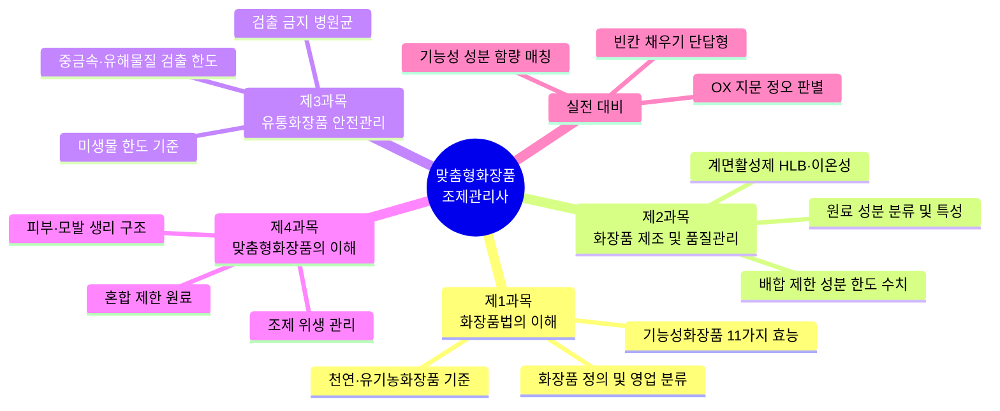

### 📊 과목 간 연관 흐름도

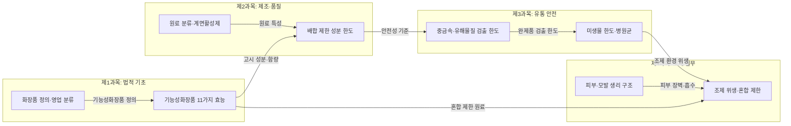

---

## 📌 제1과목: 화장품법의 이해

### 1. 화장품의 정의 및 영업 분류

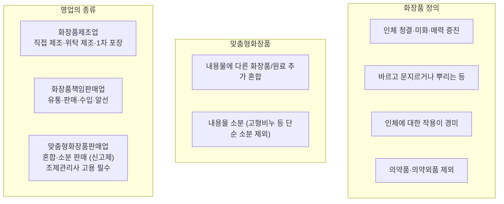

*   **화장품**: 인체를 청결·미화하여 매력을 더하고 용모를 밝게 변화시키거나 피부·모발의 건강을 유지 또는 증진하기 위하여 인체에 바르고 문지르거나 뿌리는 등 이와 유사한 방법으로 사용되는 물품으로서 인체에 대한 작용이 경미한 것 (의약품 및 의약외품은 제외).
*   **맞춤형화장품**: 
    1. 제조 또는 수입된 화장품의 내용물에 다른 화장품의 내용물이나 식약처장이 정하는 원료를 추가하여 혼합한 화장품.
    2. 제조 또는 수입된 화장품의 내용물을 소분(小分)한 화장품 (단, 고형 비누 등 단순 소분 제품은 제외).
*   **영업의 종류**:
    *   **화장품제조업**: 화장품을 직접 제조하는 영업, 위탁하여 제조하는 영업, 화장품의 포장(1차 포장만 해당)을 하는 영업.
    *   **화장품책임판매업**: 제조업자가 제조한 화장품을 유통·판매하는 영업, 수입한 화장품을 유통·판매하는 영업, 수입대행형 거래를 목적으로 알선·수여하는 영업.
    *   **맞춤형화장품판매업**: 맞춤형화장품을 혼합·소분하여 판매하는 영업 (관할 지방식품의약품안전청에 **신고**해야 하며, **조제관리사 고용**이 필수임).

### 2. 기능성화장품의 범위 (11가지 효능)
시험에 단답형 및 객관식으로 매회 출제되는 핵심 범위입니다.

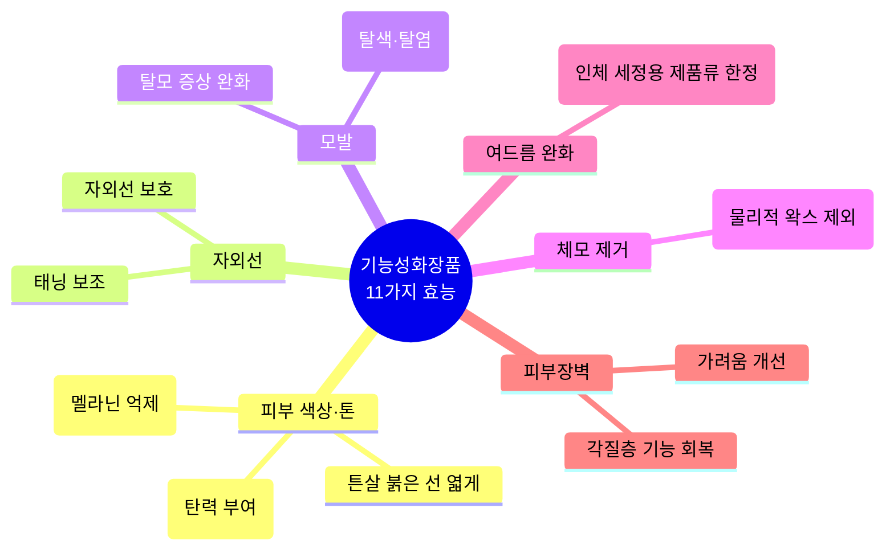

1.  피부의 미백에 도움을 주는 제품 (멜라닌 침착 억제 또는 색소 옅게 함)
2.  피부의 주름 개선에 도움을 주는 제품 (탄력 부여)
3.  피부를 곱게 태워주거나 자외선으로부터 피부를 보호하는 데 도움을 주는 제품
4.  모발의 색상 변화(탈색·탈염 포함, 일시적 변화 제외)에 도움을 주는 제품
5.  체모를 제거하는 제품 (물리적 제모 왁스 등은 제외)
6.  탈모 증상의 완화에 도움을 주는 제품 (물리적 굵기 보정 제외)
7.  여드름성 피부를 완화하는 데 도움을 주는 제품 (**인체 세정용 제품류로 한정**)
8.  피부장벽(각질층 표피)의 기능을 회복하여 가려움 등의 개선에 도움을 주는 제품
9.  튼살로 인한 붉은 선을 엷게 하는 데 도움을 주는 제품

### 3. 천연화장품 및 유기농화장품 기준
> [!WARNING]
> **2025년 8월 1일 이후 개정 사항 반영**
> 기존 화장품법 제2조의 천연/유기농 화장품 정부 인증 제도는 폐지되었습니다. 그러나 기준치 준수 의무 및 실증 자료 보관 의무는 존재하므로 수치 기준은 암기해야 합니다.

| 구분 | 천연(유래) 원료 함량 기준 | 유기농(유래) 원료 함량 기준 |
| :--- | :--- | :--- |
| **천연화장품** | 전체 제품 중 중량 기준 **95% 이상** | 제한 없음 |
| **유기농화장품** | 전체 제품 중 중량 기준 **95% 이상** | 유기농 원료가 전체 중 **10% 이상** |

---

## 📌 제2과목: 화장품 제조 및 품질관리

### 1. 화장품 원료의 성분 분류 및 특성

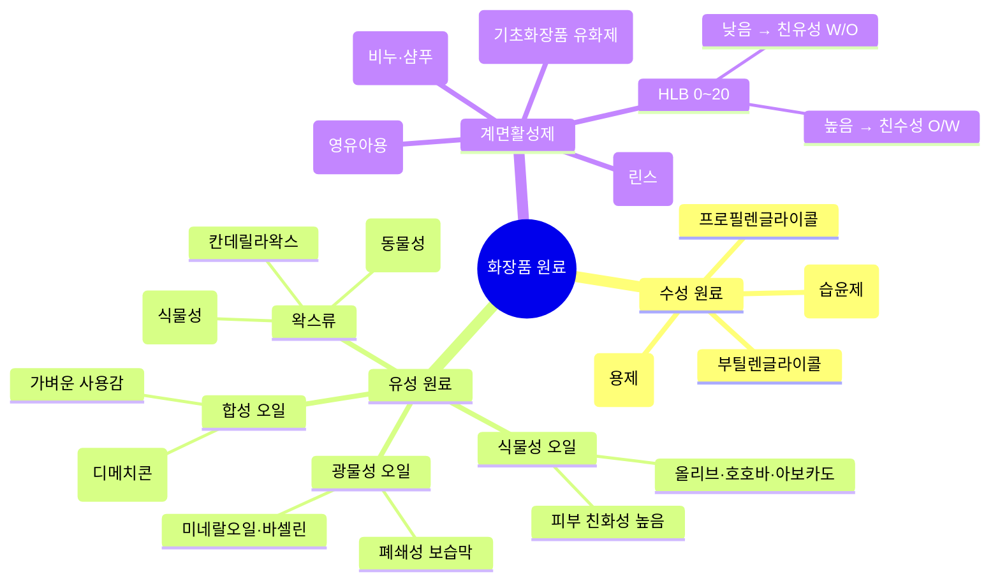

*   **수성 원료**: 정제수(용제), 글리세린(강력 습윤제), 프로필렌글라이콜, 부틸렌글라이콜 등.
*   **유성 원료**:
    *   *식물성 오일*: 올리브오일, 호호바씨오일, 아보카도오일 등 (피부 친화성 높음).
    *   *광물성 오일*: 미네랄오일, 바셀린 등 (안정성 높고 폐쇄성 보습막 형성).
    *   *합성 오일*: 실리콘오일(디메치콘 등, 가벼운 사용감).
    *   *왁스류*: 비즈왁스(동물성), 카르나우바왁스(식물성), 칸데릴라왁스 등 (경도 조절제).
*   **계면활성제**: 물과 기름을 섞이게 하거나 먼지를 제거하는 성분.
    *   **HLB (Hydrophilic-Lipophilic Balance)**: 0~20 사이의 값으로, 높을수록 친수성(O/W 유화), 낮을수록 친유성(W/O 유화)을 뜻함.
    *   **이온성에 따른 분류**:
        *   *음이온*: 세정력 우수 (비누, 샴푸 등 클렌저).
        *   *양이온*: 살균, 정전기 방지 (헤어 린스, 트리트먼트).
        *   *양쪽성*: 자극이 적어 영유아용 세정제에 사용 (코카미도프로필베타인 등).
        *   *비이온*: 피부 자극이 가장 적어 기초화장품의 유화제, 가용화제로 사용 (폴리소르베이트류).

### 2. 화장품 배합 제한 성분 (핵심 한도 수치)

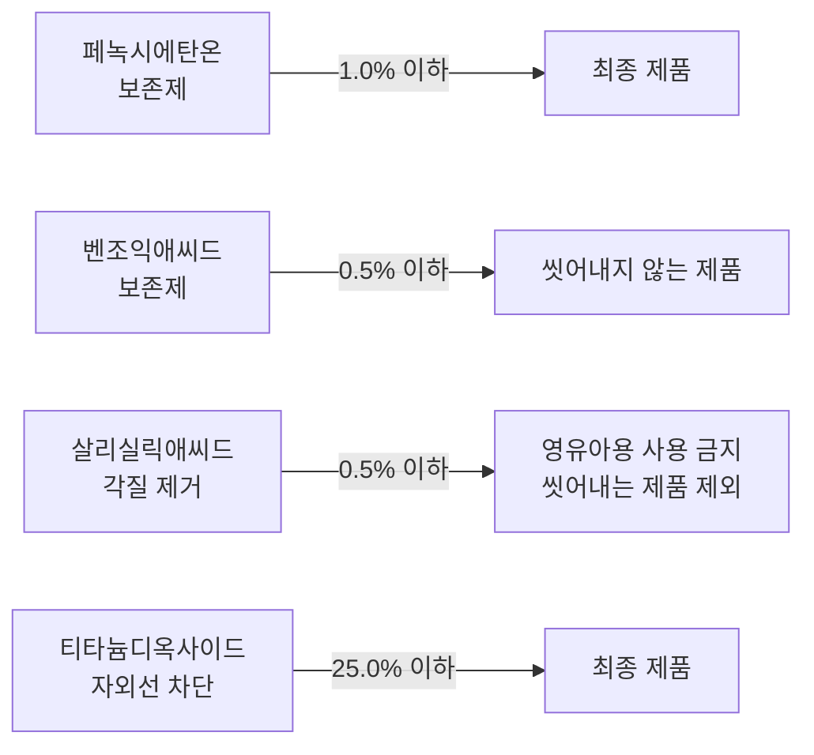

> [!IMPORTANT]
> **주요 성분별 사용 한도 수치 암기**
> *   **페녹시에탄올(보존제)**: 최종 제품에서 **1.0% 이하**
> *   **벤조익애씨드 및 그 염류**: 최종 제품에서 **0.5% 이하** (씻어내지 않는 제품 기준)
> *   **살리실릭애씨드(살리실산)**: 화장품에서는 **0.5% 이하** (영유아용 제품에는 사용 금지, 다만 샴푸 등 씻어내는 제품은 제외)
> *   **티타늄디옥사이드(자외선 차단제)**: 최종 제품에서 **25.0% 이하**

---

## 📌 제3과목: 유통화장품 안전관리

### 1. 유통화장품 안전관리 기준 (검출 한도 수치)
유통 중인 완제품이 안전성 기준을 통과하기 위해 아래 검출 허용 한도를 넘지 않아야 합니다.

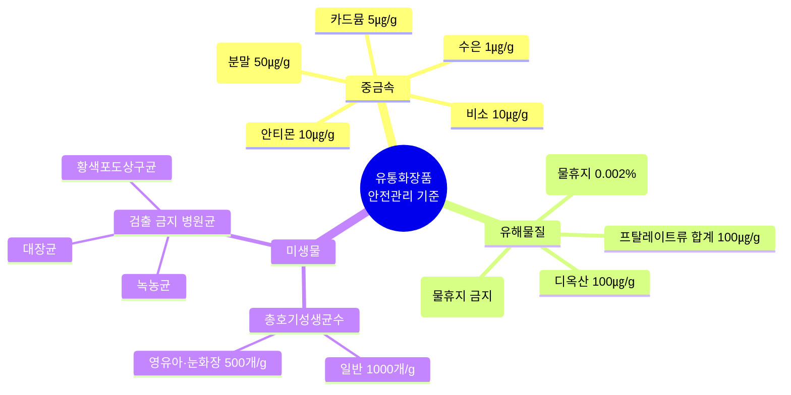

| 구분 | 허용 한도 기준 | 비고 |
| :--- | :--- | :--- |
| **납** | **20 ㎍/g 이하** | 점토를 원료로 사용한 분말 제품은 **50 ㎍/g 이하** |
| **비소** | **10 ㎍/g 이하** | - |
| **수은** | **1 ㎍/g 이하** | - |
| **안티몬** | **10 ㎍/g 이하** | - |
| **카드뮴** | **5 ㎍/g 이하** | - |
| **디옥산** | **100 ㎍/g 이하** | 원료 제조 공정상 부반응 생성물 |
| **메탄올** | **0.2% (v/v) 이하** | 물휴지의 경우 **0.002% (v/v) 이하** |
| **포름알데히드** | **2,000 ㎍/g 이하** | 물휴지의 경우 **사용 금지 (검출되지 않아야 함)** |
| **프탈레이트류** | **합계 100 ㎍/g 이하** | 디부틸프탈레이트(DBP), 디에틸헥실프탈레이트(DEHP) 등 |

### 2. 미생물 한도 기준
제품군에 따라 허용되는 총호기성생균수(세균 및 진균수의 합) 기준입니다.

*   **영유아용 제품류 및 눈화장용 제품류**: **500개/g(mL) 이하**
*   **그 밖의 화장품**: **1,000개/g(mL) 이하**
*   **검출 금지 병원균 (음성)**:
    1. **대장균 (Escherichia coli)**
    2. **녹농균 (Pseudomonas aeruginosa)**
    3. **황색포도상구균 (Staphylococcus aureus)**

---

## 📌 제4과목: 맞춤형화장품의 이해

### 1. 맞춤형화장품 조제 및 위생 관리
*   **조제 시 위생 원칙**:
    *   조제 전 반드시 손을 세정 및 소독(70% 에탄올 등 사용)하거나 일회용 위생장갑을 착용해야 함.
    *   혼합·소분에 사용하는 장비 및 기구(주걱, 비커, 저울 등)는 사용 전후로 세척하고 알코올 소독 후 완전히 건조하여 보관.
    *   혼합에 사용하는 원료나 내용물은 반드시 **개봉 후 사용기간** 및 **사용기한**을 미리 확인해야 함.

### 2. 피부 및 모발의 생리 구조

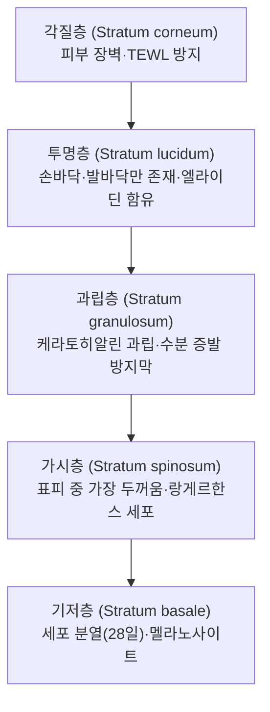

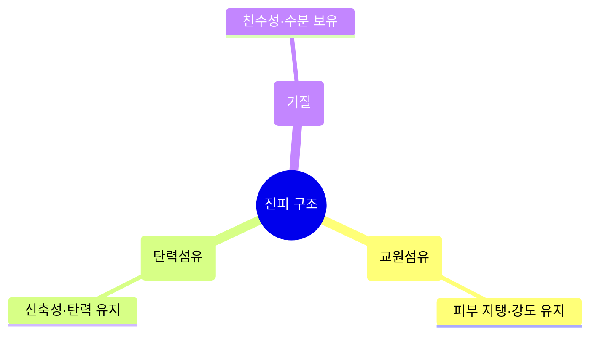

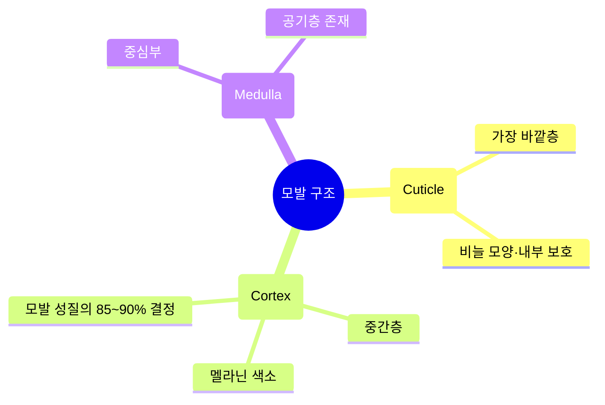

*   **진피 구조**: 표피 아래에 위치하며 피부 탄력을 관장함.
    *   *콜라겐(교원섬유)*: 피부 지탱 및 강도 유지.
    *   *엘라스틴(탄력섬유)*: 피부 신축성 및 탄력 유지.
    *   *히알루론산(기질)*: 친수성이 매우 강하여 피부 수분을 보유하는 역할.
*   **모발의 구조**:
    *   *모표피(Cuticle)*: 모발의 가장 바깥층으로 물고기 비늘 모양. 모발 내부 보호.
    *   *모피질(Cortex)*: 모발의 중간층으로 멜라닌 색소가 존재하며 모발 성질의 85~90%를 결정.
    *   *모수질(Medulla)*: 모발의 중심부로 공기층이 존재.

### 3. 맞춤형화장품 혼합 제한 원료 예시
조제관리사가 임의로 단독 혼합할 수 없는 대표적인 원료입니다.

1.  **기능성 고시 유효 성분**: 아데노신(주름), 나이아신아마이드(미백) 등을 순수 분말 상태로 가져와 임의로 혼합하는 것은 금지됩니다. (안전성 검토를 거쳐 책임판매업자가 제공한 원료 형태만 가이드에 따라 사용 가능)
2.  **보존제 및 자외선 차단 성분**: 원료 자체를 맞춤형화장품에 단독으로 추가하여 농도를 임의로 조정할 수 없습니다. (제품의 방부력이나 자외선 차단 지수를 임의로 변경 시 부작용 우려)

---

## 📌 이기적(영진닷컴) 기출/모의고사 연계 실전 대비 마무리 요약
> **이기적 '또기적 합격자료집' 및 동영상 기출/모의고사 풀이 특강 기반 정리**

실전 시험장 들어가기 직전, 이기적 교재의 '스피드체크 OX' 및 '빈칸 채우기' 유형을 기반으로 반드시 체크해야 할 오답 패턴과 실전 문제를 요약 정리합니다.

### 📊 실전 대비 전략 흐름도

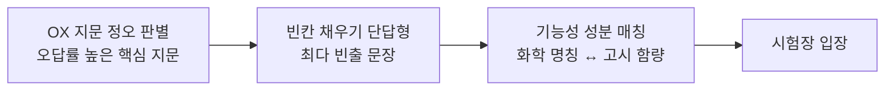

### 1. 실전 스피드체크 OX 핵심 지문
실제 기출 및 모의고사 오답률이 높은 핵심 지문 정오 판별입니다.

*   **Q1. 정신질환자나 마약류 중독자는 어떠한 예외도 없이 화장품제조업 및 맞춤형화장품판매업을 등록/신고할 수 없다?**
    *   **정답: X**
    *   *해설*: 정신질환자 및 마약류 중독자는 원칙적으로 결격 사유에 해당하나, **전문의가 제조업자 또는 조제관리사로서 적합하다고 인정하는 사람**은 예외로 합니다.
*   **Q2. 영유아(만 3세 이하)나 어린이(만 4세~13세 이하) 대상 화장품임을 표시·광고하려면 안전성 평가 자료와 실증 자료를 작성하고 3년간 보관해야 한다?**
    *   **정답: X**
    *   *해설*: 안전성 평가 자료 등의 보관 기간은 **해당 화장품의 제조일(수입일)로부터 3년** 또는 **사용기한이 만료되는 날부터 1년 중 더 긴 기간** 동안 보관해야 합니다. 단순 '3년'이 아닙니다.
*   **Q3. 기능성화장품 심사를 신청하는 경우, 효능·효과에 관한 심사는 식품의약품안전처장에게 심사를 받아야 하지만, 이미 심사를 받은 기능성화장품과 동일한 제품은 심사를 생략하고 보고서 제출만으로 갈음할 수 있다?**
    *   **정답: O**
    *   *해설*: 고시된 성분·함량·효능을 갖추었거나 이미 심사를 마친 다른 제품과 처방이 동일한 경우 등은 기능성화장품 심사 제외 품목에 해당하여 보고서 제출로 갈음(처리 기간 15일)합니다.
*   **Q4. 맞춤형화장품판매업소의 조제실 내부에 환기 시설이 없을 경우 위생 관리 위반으로 행정 처분을 받는다?**
    *   **정답: O**
    *   *해설*: 맞춤형화장품 조제실 및 보관 장소는 교차 오염을 방지하고 적절한 환기 설비와 온도/습도 조절 장치가 구비되어 청결하게 관리되어야 합니다.
*   **Q5. 화장품에 유기농 원료를 10% 이상 포함하면 '천연화장품'으로 표시·광고할 수 있다?**
    *   **정답: X**
    *   *해설*: 유기농화장품(유기농 10% 이상)의 요건을 갖추었더라도 천연(유래) 원료의 전체 함량이 중량 기준 **95% 이상**이어야만 '천연화장품' 또는 '유기농화장품'의 표시가 가능합니다.

### 2. 빈칸 채우기 단답형 대비 핵심 수치 및 용어
이기적 최종 모의고사의 단답형 빈칸 채우기 최다 빈출 문장입니다.

*   화장품책임판매업자는 화장품의 안전성 확보를 위하여 화장품 **[ 안전관리기준 ]** 과 **[ 품질관리기준 ]** 을 수립하고 준수해야 한다.
*   맞춤형화장품판매업자는 맞춤형화장품 조제에 사용되는 내용물 및 원료의 사용기한(또는 개봉 후 사용기간)을 확인해야 하며, 사용기한이 지난 원료는 **[ 사용할 수 없다 ]**.
*   유통화장품 안전관리 기준에서 세균 및 진균수의 합인 총호기성생균수는 일반 화장품의 경우 **[ 1,000 ]** 개/g(mL) 이하이어야 하고, 영유아용 및 눈화장용 제품류는 **[ 500 ]** 개/g(mL) 이하이어야 한다.
*   우수화장품 제조 및 품질관리 기준(CGMP)에서 원자재, 반제품 및 완제품의 제조 공정 단계별 적합 여부를 검증하기 위해 사전에 정해진 계획대로 실시하는 행위를 **[ 밸리데이션 ]** (이)라고 한다.

### 3. 기능성/유효 성분 화학 명칭 및 고시 함량 매칭
단답형으로 출제될 수 있는 원료별 정식 국문 명칭과 주요 특징입니다.

| 국문 고시 명칭 | 주 효능 | 고시 함량 기준 및 제한 |
| :--- | :--- | :--- |
| **나이아신아마이드** | 피부 미백 | **2.0% ~ 5.0%** (기능성화장품 고시 기준) |
| **아데노신** | 주름 개선 | **0.04%** (기능성화장품 고시 기준) |
| **알부틴** | 피부 미백 | **2.0% ~ 5.0%** (나이아신아마이드와 함께 미백 성분 투톱) |
| **레티놀** | 주름 개선 | **2,500 IU/g 이상** (비타민 A 유도체, 자외선에 불안정) |
| **살리실릭애씨드** | 여드름 완화 / 각질 제거 | **0.5% 이하** (단, 인체 세정용 제품류에 한함) |
| **징크옥사이드** | 자외선 차단 | **25.0% 이하** (물리적 차단제, 백탁 유발) |
