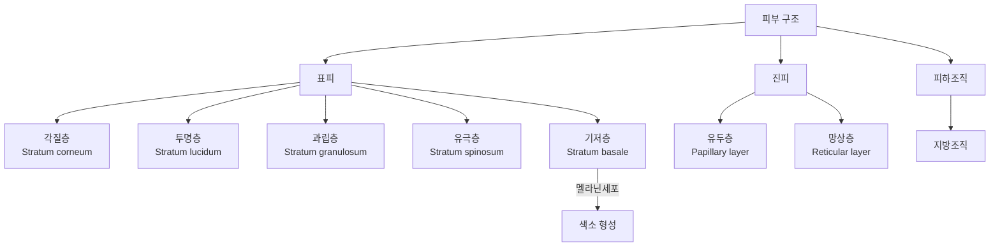

# Chapter 02. 피부 및 모발의 생리구조

> **고득점 TIP**: 피부의 구조와 세포, 모발의 구조와 성장주기는 집중해서 암기하세요. 주관식으로 출제하기 좋은 문제들이 많아요.
>
> 🔗 **관련 과목**
> - 2과목 1챕터 "화장품 원료" — 피부장벽(각질층)과 보습 원료(장벽대체제, 밀폐제)의 생리학적 근거

---

> 📋 **학습 가이드**
> - 출제 빈도: ★★★★★ (피부 구조 5층, 표피 4대 세포, 진피 구조, 모발 구조 3층, 모발 성장주기, 피부 유형, 피츠패트릭 분류, 탈모 유형)
> - 예상 소요 시간: 55분
> - 핵심 키워드: 각질층(케라틴 58%·NMF 31%·지질 11%, pH 4.5~5.5), 멜라닌 형성(티로신→도파→도파퀴논), 진피(콜라겐 90%·엘라스틴 1.5~4.7%), 모표피(에피·엑소·엔도큐티클), 모발 성장주기(성장기 3~6년·퇴행기 3주·휴지기 3~4개월), 남성형 탈모(DHT), UV(UVA 광노화·UVB 홍반·UVC 피부암)

---

## 1. 피부의 생리구조

> **한 줄 요약**: 피부 = 표피(5층) + 진피(유두층·망상층) + 피하조직 — 신체 최대 기관, pH 4.5~6.5, 12가지 기능.

### (1) 피부의 정의
피부는 신체 표면을 덮고 있는 기관으로 면적 1.5~2.0m², 부피 2.4~3.6L, 무게 약 4.0kg 이상, 피부 산도(pH) 4.5~6.5로 신체에서 가장 큰 기관에 해당한다.

### (2) 피부의 기능

| 기능 | 내용 |
|---|---|
| 보호 기능 | • 물리적 마찰·충격으로부터 보호함 • 화학 물질로부터 피부를 보호함 • 멜라닌세포를 통해 자외선으로부터 피부를 보호함 • 피부 속 수분과 전해질의 유출을 방지함 |
| 감각 기능 | • 진피에 위치한 신경을 통해 촉각(손가락, 혀끝, 입술에 많이 분포함), 통각(감각점 중 통점이 피부에 가장 많이 분포함), 냉각, 온각, 압각 등 피부 반사 작용을 함 &nbsp;&nbsp;- 통각, 촉각: 진피 유두층에 위치 &nbsp;&nbsp;- 온각, 냉각, 압각: 진피 망상층에 위치 |
| 체온조절 기능 (기출) | • 모세혈관의 확장과 수축작용을 통해 열을 차단하거나 확산하여 체온을 조절함 &nbsp;&nbsp;- 모세혈관 확장 → 열 확산 → 체온 하강 &nbsp;&nbsp;- 모세혈관 수축 → 열 차단 → 체온 상승 |
| 면역 기능 | 미생물 침입 시 사이토카인을 분비하거나 염증 반응을 유발하여 보호함 |
| 비타민 D 합성 (기출) | 자외선을 일정하게 받으면 비타민 D를 합성하며, 이때 지질의 일종인 콜레스테롤은 합성에 중요한 역할을 함 |
| 흡수 기능 | 외부 물질에 대해 반투과성 기능을 가지고 있으나 피부와 유사한 일부 성분을 흡수함 |
| 분비·배설 기능 | 땀(0.5~2.0L/일), 피지(1.0~2.0g/일) 분비를 통해 노폐물을 배출함 |
| 호흡 기능 | 전체 호흡의 0.6~1.0%는 피부를 통해 호흡함 |
| 저장 기능 | 지질과 수분을 저장함 |
| 재생 기능 | 세포를 계속 생성함으로써 피부 상처 회복에 도움이 됨 |
| 거울 기능 | 신체의 이상 증상이 피부를 통해 표현되는 경우 조기에 질병을 관리할 수 있음 |
| 사회적 기능 | 건강한 피부는 건강한 이미지를 전달하여 사회적 관계에 긍정적인 영향을 줌 |

> **확인문제**: 피부의 체온조절 기능과 가장 관련이 깊은 현상은?
> ① 피지선의 분비로 유분을 배출하는 현상
> ② 멜라닌 합성으로 자외선을 차단하는 현상
> ③ 모세혈관의 확장 및 수축을 통한 체온 조절
> ④ 피부의 수분 저장을 통한 보습 유지
> ⑤ 피부세포의 재생을 통한 상처 회복
>
> **정답**: ③ 모세혈관의 확장 및 수축을 통한 체온 조절
> **해설**: 피부의 체온조절 기능은 모세혈관의 확장(열 확산→체온 하강)과 수축(열 차단→체온 상승)을 통해 이루어진다. 비타민 D 합성은 자외선과 콜레스테롤이 관여하며, 호흡은 전체의 0.6~1.0%를 차지한다.

### (3) 피부의 구조
피부는 가장 바깥 부분부터 표피, 진피, 피하조직의 3가지 구조로 이루어져 있다.

#### ① 표피(Epidermis)

| 층 | 내용 |
|---|---|
| **각질층** (Horny Layer) (기출) | • 약 10~20층의 납작한 무핵세포층으로 pH 4.5~5.5 정도의 약산성 • 피부의 가장 바깥에 위치하여 수분 손실을 막고, 피부장벽 역할을 하여 피부 보호 및 세균 침입 방어 • 각질과 세포간지질이 벽돌 구조인 라멜라 구조 • 케라틴 약 58%, 천연보습인자(NMF) 약 31%, 세포간지질 약 11%로 구성 • 각질층은 천연보습인자(NMF)를 통해 10~20%의 수분 함유 &nbsp;&nbsp;* **필라그린(Fillaggrin)**: 각질층 형성에 중요한 역할을 하는 단백질로, 각질층에서 단백질 분해 효소에 의해 분해되어 천연보습인자(NMF)를 구성하는 아미노산을 이룸 &nbsp;&nbsp;* **세라마이드**: 지질막의 주성분으로 피부 표면의 손실되는 수분을 방어하고 외부로부터 유해 물질의 침투를 막음 &nbsp;&nbsp;* **각화주기(각질형성주기)**: 기저층에서 만들어진 세포가 모양이 변하며 각질층까지 올라와 일정 기간 머무르다 탈락되는 주기로, 보통 28±3일로 봄 |
| **투명층** (Clear Layer) | • 2~3층의 무핵세포층으로 손바닥과 발바닥에 존재함 • 엘라이딘(Elaidin)이라는 반유동성 물질이 수분 침투를 방지함 |
| **과립층** (Granular Layer) | • 2~5층의 편평형 또는 방추형세포층 • 각화 과정이 시작되는 곳으로 빛을 산란시켜 자외선을 흡수함 • 케라토하이알린(Keratohyalin) 과립 존재 • 수분저지막이 존재하여 외부 이물질 방어 및 수분 증발 방지 |
| **유극층** (Spinous Layer) | • 5~10층의 다각형 유핵세포층으로 표피에서 가장 두꺼운 층 • 림프액이 흘러 림프순환을 통해 영양 공급 및 노폐물 배출 • 면역기능을 담당하는 랑게르한스세포 존재 |
| **기저층** (Basal Layer) | • 단층의 원추형 유핵세포층 • 진피의 모세혈관으로부터 영양분과 산소를 공급받아 세포분열 촉진 • 각질형성세포(케라티노사이트), 멜라닌형성세포(멜라노사이트), 머켈세포 존재 • 각질형성세포와 멜라닌형성세포는 4:1~10:1 비율로 존재함 |

> **용어 - 천연보습인자(NMF)**: 각질층에 존재하는 수용성 물질들을 총칭하는 말

> **참고 - 천연보습인자(NMF) 구성 성분**

| 성분 | 비율 |
|---|---|
| 아미노산 | 40% |
| PCA(피롤리돈카르복시산) | 12% |
| 젖산염 | 12% |
| 요소 | 7% |
| 염소 | 6% |
| 나트륨 | 5% |
| 그 외 (NMF) | 18% |

> **참고 - 세포간지질 구성 성분** (기출)
> • 세라마이드(50% 이상)
> • 콜레스테롤
> • 콜레스테롤에스터
> • 지방산
> • 그 외

> **참고 - 단백질 분해 효소** (기출)
> 아미노펩티데이스(Aminopeptidase), 카복시펩티데이스(Carboxypeptidase)

> **참고 - 각화 과정**
> 기저세포 분열 과정 → 유극세포에서의 합성·정비 과정 → 과립세포에서의 자기분해 과정 → 각질세포에서의 재구축 과정

#### 표피에 존재하는 4대 세포

| 위치 | 세포 | 내용 |
|---|---|---|
| 유극층 | 랑게르한스세포(Langerhans cell) | • 면역반응 조절에 관여하는 세포 • 외부 이물질인 항원을 면역담당세포 T-림프구에 전달하는 역할 |
| 기저층 (각질형성세포) | 각질형성세포(케라티노사이트, Keratinocyte) | • 각질층을 구성하는 각질세포를 만드는 세포 • 각화주기: 기저층에서 세포가 만들어지고 각질층까지 이동하여 서서히 떨어지는 과정으로 28일 정도 주기로 교체됨 |
| 기저층 (멜라닌형성세포) | 멜라닌형성세포(멜라노사이트, Melanocyte) (기출) | • 멜라닌을 합성하여 각질형성세포에 멜라닌이 축적된 멜라노솜(Melanosome)을 공급하는 세포 • 피부색과 털색을 결정함 • 표피의 5~25%를 차지하며, 세포 내에 확산하면 검게 보임 |
| 기저층 (머켈세포) | 머켈세포(Merkel cell) (기출) | • 신경말단과 연결되어 촉각을 감지하는 세포 • 손가락 끝, 입술처럼 민감한 피부에 다량 존재함 |

> **참고 - 멜라닌형성세포(멜라노사이트) 내 멜라닌 형성 과정** (기출)
> 티로신 → 티로시나아제(약 0.2%의 구리를 함유하는 구리단백질)에 의해 산화 → 도파 → 티로시나아제 효소에 의해 산화 → 도파퀴논 → 유멜라닌 또는 페오멜라닌 생성

> **용어 - 멜라노솜**: 멜라닌세포 속에 들어 있는 세포소기관으로, 멜라닌이 표피의 기저층에 있는 멜라노사이트에서 생성되어 멜라노솜의 형태로 합성됨

> **참고 - 피부색 결정 요인** (기출): 멜라닌, 헤모글로빈, 카로티노이드

#### ② 진피(Dermis)
피부구조 중 가장 두꺼운 부분(피부의 약 90% 이상을 차지하고, 표피 두께의 약 10~40배임)으로, 피부 탄력과 관련이 있다.

| 층 | 내용 |
|---|---|
| 유두층(Papillary Layer) | • 표피의 기저층과 접하고 있으며, 유두(물결) 모양을 형성 • 모세혈관과 신경말단이 존재하여 각질형성세포에 산소와 영양을 공급함 • 미세한 교원섬유(콜라겐)와 수분을 포함함 |
| 망상층(Reticular Layer) (기출) | • 진피의 대부분을 차지하는 그물 모양(망상구조)의 결합조직 • 교원섬유(콜라겐) 90%, 탄력섬유(엘라스틴) 1.5~4.7%, 기질로 구성됨 • 모세혈관은 거의 없으며, 림프관, 한선, 피지선, 신경 등이 존재함 |

**진피에 존재하는 세포**

| 세포 | 내용 |
|---|---|
| 대식세포 | 백혈구의 한 유형, 선천 면역과 적응 면역에 관여 |
| 비만세포 | 염증 반응에 중요한 역할, 히스타민, 세로토닌 생산 |
| 섬유아세포 | 결합조직세포로 세포외기질인 콜라겐과 엘라스틴 생성 |

**피부노화에 영향을 주는 진피의 변화** (기출)
- 콜라겐의 감소
- 탄력섬유의 변성
- 기질 탄수화물(Glycosaminoglycan)의 감소
- 피부혈관의 면적 감소

> **용어 - 교원섬유(콜라겐)**: 피부 건조 중량의 75%를 차지하며, 장력 아미노산 1,000개가 결합된 나선 모양의 타래로 아미노산 한 분자에 1,000개의 물 분자가 함유된 피부의 저수지 역할을 함

> **용어 - 탄력섬유(엘라스틴)**: 본래의 모습으로 되돌아가려는 회복 기능과 탄력성이 있는 단백질로, 피부에 1.5~4.8% 정도의 함량으로 존재함

> **용어 - 기질**: 교원섬유와 탄력섬유를 채워주는 물질로 히알루론산, 콘드로이친 황산, 헤파린 황산염 등으로 구성된 뮤코다당체임

#### ③ 피하조직(Subcutaneous Tissue)
- 진피에서 내려온 섬유가 엉성하게 결합되어 형성된 망상조직
- 벌집모양의 수많은 지방세포들이 자리잡고 있음
- 진피와 근육, 뼈 사이에 위치하며, 신체 부위, 성별, 나이, 영양 상태에 따라 두께가 다름
- 체온조절 기능, 외부 충격의 완충 기능, 영양소 저장의 기능을 함

#### ④ 그 외 피부의 부속기관(진피 내 위치)

| 부속기관 | 내용 |
|---|---|
| 피지선 | • 얼굴, 두피, 가슴에 많으며, 손바닥, 발바닥을 제외한 전신에 분포되어 있음 • 남성호르몬(테스토스테론)이 피지선을 자극하면 피지가 분비됨 • 지용성 분비물을 생성 • 피부와 모발에 윤기 부여, 피부 보호 • 과잉 분비 시 여드름 발생의 원인이 됨 |
| 한선(땀샘) - 아포크린선(대한선) | • 겨드랑이, 서혜부, 항문·유두 주변, 배꼽 등 특정 부위에 분포되어 있음 • 모공을 통해 분비하며 특유의 냄새 발생 • pH 5.5~6.5 • 성, 인종에 따라 차이가 있음 |
| 한선(땀샘) - 에크린선(소한선) | • 입술, 음부, 손톱을 제외한 전신에 분포하며, 특히 손바닥, 발바닥, 이마에 많이 분포되어 있음 • 표피로 직접 분비하며 무색, 무취 • pH 3.8~5.6 • 체온조절 기능 |

> **참고 - 피지의 구성 성분**

| 성분 | 비율 |
|---|---|
| 트리글리세라이드 | 41% |
| 왁스에스터 | 25% |
| 지방산 | 16% |
| 스쿠알렌 | 12% |
| 그 외 (피지) | 6% |

---

## 2. 모발의 생리구조

> **한 줄 요약**: 모발 = 모간(모표피·모피질·모수질) + 모근(모낭·모구·모유두) — 1일 0.3~0.5mm 성장, 4대 화학결합, 성장주기 3단계.

### (1) 모발의 특징
① 1일에 0.3~0.5mm 정도 자라며, 나이, 성별, 환경 등에 따라 자라는 속도가 다르다.
② 1일에 50~100가닥의 모발이 빠지며, 봄, 가을에 자연탈모가 증가한다.
③ 모발은 약산성을 띠고 있어 산에는 비교적 강하나 알칼리에 약하므로 이 특징을 모발 관련 시술에 적용한다.

### (2) 모발의 구조 (기출)

#### ① 모간 부분: 피부 밖에 위치한다.

**모표피(모소피)**

| 층 | 내용 |
|---|---|
| 에피큐티클(Epicuticle) | • 가장 바깥쪽의 두께 100Å 정도의 얇은 막 • 아미노산 중 시스틴의 함유량이 많음 • 각질 용해성 또는 단백질 용해성의 약품(친유성, 알칼리 용액)에 대한 저항성이 가장 강한 층 • 수증기는 통하지만 물은 통과하지 못하는 구조로 딱딱하고 부서지기 쉽기 때문에 물리적인 자극에 약함 |
| 엑소큐티클(Exocuticle) | • 연한 케라틴 층으로 시스틴이 많이 포함되어 있음 • 퍼머넌트 웨이브와 같이 시스틴 결합을 절단하는 약품의 작용을 받기 쉬운 층 |
| 엔도큐티클(Endocuticle) | • 가장 안쪽에 있는 층으로 시스틴 함유량이 적음 • 물과 잘 어울리는 친수성이며, 알칼리에 대한 저항성이 낮음 • 내측면은 양면테이프와 같은 세포막복합체(CMC)로 인접한 모표피를 밀착시켜, 모표피와 모피질 안의 내용물들이 빠져나가지 않게 잡아주는 역할을 함 |

- 모발 가장 바깥쪽 5~15층의 비늘 모양
- 멜라닌이 없어 무색투명한 케라틴 단백질로 구성됨
- 두발 내부의 모피질을 감싸고 있는 화학적 저항성이 강한 층

**모피질(Cortex)**
- 모발의 중간에 위치하며 대부분을 차지(80~90%)
- 피질세포(케라틴 단백질)와 세포 간 결합물질(밀단결합·펩티드)로 구성됨
- 멜라닌을 함유하고 있어 모발 색을 결정함
- 퍼머넌트·염색 시술 시 모피질의 결합이 약해지면 모발 손상이 발생함
- 친수성이므로 흡수성과 흡습성을 가짐

**모수질(Medulla)**
- 두발의 중심 부근에 공동(속이 비어 있는 상태) 부위로, 죽은 세포들이 두발의 길이 방향으로 불연속적으로 다각형의 세포들의 형상으로 존재함
- 배냇머리, 언모에는 없음

> **참고 - 세포막복합체(CMC, Cell Membrane Complex)**: 모표피와 모피질 안의 내용물들이 빠져나가지 않게 잡아주는 역할을 하며, 부족 시 모발 손상의 주요 원인이 됨

#### ② 모근 부분: 피부 안에 위치하며 모모세포(모발을 만들어 내는 세포)와 멜라닌세포가 존재하는 곳으로, 세포분열의 시작점이다.

| 구조 | 내용 |
|---|---|
| 모낭 | • 모근을 둘러싸고 있는 조직, 피지선과 연결 • 외근모초와 내근모초로 구성 &nbsp;&nbsp;- 외근모초: 모구 부위에서 세포 분열하여 피부 표면 방향으로 이동 &nbsp;&nbsp;- 내근모초: 헨레층, 헉슬리층, 모근초소피로 구성 |
| 모구부 | 모근의 아래쪽에 위치하며 둥근 모양 |
| 모유두 | 모구의 중심에 위치하며, 모발의 영양 공급 관장 |
| 모모세포 | 모유두를 덮고 있으며, 모유두로부터 영양을 공급받아 끊임없이 세포분열 |

> **참고 - 퍼머넌트·염색 시술 원료** (기출)
> • 암모니아: 모표피를 손상시켜 염료와 과산화수소가 속으로 잘 스며들 수 있도록 함
> • 과산화수소: 머리카락 속의 멜라닌 색소를 파괴하여 두발 원래의 색을 지움

### (3) 모발의 4대 화학적 결합
① 시스틴 결합
② 이온(염) 결합
③ 수소 결합
④ 펩타이드(펩티드) 결합

### (4) 모발의 성장주기 (기출)

| 시기 | 기간 | 내용 |
|---|---|---|
| 성장기(Anagen) | 3~6년 | • 전체 모발의 80~90%가 이 시기에 해당함 • 모모세포의 활발한 활동 시기 • 여자가 남자에 비해 성장주기가 긺 |
| 퇴행기(Catagen) | 약 3주 | • 전체 모발의 1~2%가 이 시기에 해당함 • 모모세포의 분열이 감소하는 시기 • 모발의 성장이 멈춘 시기 |
| 휴지기(Telogen) | 3~4개월 | • 전체 모발의 10~15%가 이 시기에 해당함 • 모낭과 모유두의 완전한 분리 • 모발의 탈락 시작 |

**모발의 성장주기 순환**: 성장기(3~6년, 모유두의 활발한 세포분열) → 퇴행기(약 3주, 모모세포 분열 감소·모유두 분리 시작) → 휴지기(3~4개월, 모낭과 모유두 완전 분리·성장기 반복)

### (5) 두피의 특징과 기능

#### ① 두피의 특징
- 피지선이 많고, 혈관과 모낭이 다른 피부에 비해 많이 분포함
- 진피층의 조밀한 신경분포를 통해 머리카락을 통한 감각을 느낌
- 세 개의 층으로 구성
  - 외피: 동맥, 정맥, 신경 분포
  - 두개피: 두개골을 둘러싼 근육과 연결된 신경조직
  - 두개 피하조직: 얇으면서 지방층이 없고 이완된 상태

#### ② 두피의 기능

| 기능 | 내용 |
|---|---|
| 보호 | • 멜라닌색소와 표피는 광선으로부터 두피를 보호함 • 표면이 산성막으로 되어 있어 감염과 미생물의 침입으로부터 두피를 보호함 • 외부 마찰에 대항하여 두피를 보호함 |
| 호흡 | 두피에 각질이나 노폐물이 쌓이면 두피의 모공을 막아 피부의 호흡을 저해할 수 있음 |
| 분비와 배설 | 한선에서는 땀 배출을, 피지선에서는 피지를 분비함 |
| 체온 유지 | 입모근에서는 수축과 이완을 통해 모공을 개폐하여 체온을 유지하고, 모세혈관의 혈류량을 조절하여 체온을 조절함 |

---

## 3. 피부와 모발의 상태 분석

> **한 줄 요약**: 피부 분석(문진·견진·촉진·기기) + 피부 유형(7가지) + 피츠패트릭 6형 + 모발 진단 + 탈모·비듬 원인.

### (1) 피부 상태 분석

#### ① 피부 분석 방법

| 방법 | 내용 |
|---|---|
| 문진법 | • 설문이나 대면 질문을 통해 피부 상태 분석 • 식사, 생활습관, 수면 정도, 과로 상태, 성격, 생활환경, 피부관리법 등에 대해 질문 |
| 견진법 | • 육안을 통해 피부 상태 분석 • 피부결, 각질, 모공 크기, 색소침착, 안색, 주름 등의 상태 관찰 |
| 촉진법 | • 손으로 누르거나 만져서 피부 상태 분석 • 각질 상태, 피지 분비량, 수분량, 탄력 정도, 피부 두께 등의 상태 관찰 |
| 기기를 이용한 판독법 | • 유수분 측정기, 우드램프, pH 측정기, 확대경, 피부 분석기를 통해 피부 상태 분석 • 세안 후 일정 시간이 지난 후에 측정하여 피부 상태 판독 |

#### ② 피부 측정 방법

| 항목 | 내용 |
|---|---|
| 수분 (기출) | • 전기전도도를 통해 피부 각질층의 수분량 측정 • 피부 수분 증발량인 경피수분손실량(TEWL) 측정 |
| pH | 피부의 산성도 측정 |
| 유분 | 카트리지 필름을 피부에 밀착시킨 후 유분량 측정 |
| 표면 | 피부 표면을 확대 촬영 또는 확대경을 통해 잔주름, 굵은 주름, 각질, 모공 크기, 색소침착 등을 측정 |
| 피부색 | 피부 색소 측정기와 UV광을 이용한 피부 색소침착 정도 측정 |
| 탄력 | 탄력 측정기를 이용하여 음압을 가했다가 피부가 원래 상태로 회복되는 정도 측정 |
| 홍반 | 헤모글로빈 수치를 통해 붉은 기 측정 |
| 주름 (기출) | • 레플리카(Replica)를 이용한 피부 주름 분석 측정 • 피부 표면 형태 측정 |

> **용어 - 경피수분손실량(TEWL)** (기출): 피부 표면에서 증발되는 수분량(TEWL: Transepidermal Water Loss)으로 건성 피부와 손상 피부는 값이 높으며, 피부 장벽기능 이상과 관련 있음

> **용어 - 레플리카(Replica)**: 실리콘을 이용하여 피부 표면 상태를 그대로 복제한 것

#### ③ 피부 유형별 특징

| 유형 | 특징 |
|---|---|
| 정상 피부(중성 피부) | • 가장 이상적인 피부로 유·수분의 밸런스가 좋음 • 혈관 분포가 일정하여 혈액순환, 신진대사가 원활함 • 계절, 연령, 생활습관 등에 따라 피부 상태가 변함 |
| 건성 피부 | • 각질층 수분 함량이 10% 미만인 피부 • 피지 분비량 감소로 건조함 • 노화, 아토피 피부로 확장될 수 있는 피부 |
| 지성 피부 | • 피지 분비량이 많고 모공이 큼 • 여드름 피부로 확장될 수 있는 피부 |
| 복합성 피부 | • 2개 이상의 피부 유형을 가짐 • T-zone은 지성 피부, U-zone은 건성 피부의 특징을 가짐 • 호르몬, 외부의 환경을 많이 받음 |
| 민감성 피부 | • 내외부 요인에 의해 피부가 쉽게 붉어지거나 민감하게 반응하는 피부 • 노화 진행이 빠르거나 쉽게 염증이 발생함 |
| 노화 피부 | • 광노화, 자연노화로 나뉘며 보습과 탄력이 저하된 피부 • 콜라겐(교원섬유) 감소 / 엘라스틴(탄력섬유) 변성 • 기질 탄수화물 감소 / 피부혈관의 면적 감소 |
| 여드름 피부 | • 모낭 내 과잉 분비된 피지로 인해 염증 반응이 나타나는 피부 • 피지 분비 증가, 모공 폐쇄, 세균 증식, 스트레스 등의 원인으로 여드름 발생 • 여드름 종류 &nbsp;&nbsp;- 면포: 좁쌀 모양의 비염증성 여드름, 개방면포(블랙헤드), 폐쇄면포(화이트헤드)가 있음 &nbsp;&nbsp;- 구진: 피지가 세균 감염으로 팽창되어 모낭벽이 파손된 상태의 여드름 &nbsp;&nbsp;- 농포: 노란색 고름이 발생한 염증성 여드름 &nbsp;&nbsp;- 결절: 농포가 발전하여 단단한 덩어리가 피부 안에서 딱딱해진 상태의 여드름 &nbsp;&nbsp;- 낭종: 화농 상태가 가장 심각한 단계로 모낭벽이 완전히 파괴된 상태의 여드름 |
| 색소침착 피부 | • 멜라닌이 비정상적으로 과잉 생성되면서 과색소침착이 일어난 피부 • 자외선, 스트레스, 여성호르몬, 내장장애 등의 원인으로 발생 • 자외선의 종류 &nbsp;&nbsp;- UVA: 320~400nm 장파장으로 광노화의 원인 (기출) &nbsp;&nbsp;- UVB: 290~320nm 중파장으로 일광화상, 홍반의 원인 &nbsp;&nbsp;- UVC: 200~290nm 단파장으로 피부암의 원인, 살균·소독작용 |

#### ④ 피츠패트릭 피부 분류
피부를 피부색, 태양의 자외선에 의한 화상(색소침착)의 정도에 따라 6가지 유형으로 분류함

| 유형 | 피부색 | 머리카락 색 | 특성 |
|---|---|---|---|
| 1형 | 창백한 색 | 노랑~빨강색 | 쉽게 화상을 입으나 색소침착은 없음 |
| 2형 | 하얀색 | 노랑~빨강색 | 쉽게 화상을 입고 약간의 색소침착이 있음 |
| 3형 | 크림색 | 다양함 | 가끔 화상을 입으며 점진적인 색소침착이 있음 |
| 4형 | 연갈색 | 갈색 | 약간의 화상을 입으나 대부분 색소침착이 있음 |
| 5형 | 짙은 갈색 | 갈색 또는 검은색 | 화상은 거의 입지 않고 색소침착이 심함 |
| 6형 | 어두운 갈색 | 검은색 | 화상은 입지 않으나 색소침착이 있음 |

### (2) 모발 상태 분석

#### ① 모발진단 방법

| 방법 | 내용 |
|---|---|
| 모발 당김검사 | 모발을 두 손가락으로 집어 당겨 탈모 유무 판단 |
| 모주기검사 | 포토트리코그람(Phototrichogram)을 통해 모발의 성장 속도와 밀도를 종합적으로 분석 |
| 모간검사 | 모발에 붙어있는 피부를 모아 모발 상태 분석 |
| 조직검사 | 4mm 펀치를 이용하여 염색 후 현미경으로 모근과 모구 관찰 |
| 모발 분석 | 모유두가 포함된 조직을 채취하여 모발의 전반적 상태를 종합적으로 진단 |

#### ② 두피 및 모발 상태

**① 정상 두피**
- 두피가 투명하고 각질이나 피지가 깨끗한 상태
- 모공 1개당 2~3개의 모발이 존재하며, 모발의 굵기가 일정함

**② 탈모의 증상**

| 유형 | 내용 |
|---|---|
| 남성형 탈모증 (기출) | • 두피의 경계선이 점점 뒤로 진행되어 이마가 넓고 대머리로 진행 • 남성호르몬인 테스토스테론이 5알파-환원효소에 의해 디하이드로테스토스테론(DHT)로 전환됨 • DHT는 모낭을 위축시키며 탈모의 원인이 됨 |
| 여성형 탈모증 | • 머리카락이 가늘어지고 특히 정수리 부분이 많이 빠짐 • 모낭세포의 반응이 주요원인으로 부신, 난소의 비정상 과다분비 또는 남성호르몬 관련 약물 복용이 원인이 됨 |
| 원형 탈모증 | • 하나 혹은 여러 개의 원형으로 탈모가 일어남 • 대부분 스트레스에 의한 것으로, 유전적 소인, 알레르기, 자가 면역성 소인과 정신적인 스트레스를 포함하는 복합적인 요인들에 의해서도 발생 |
| 기타 (탈모 유형) | 지루성 탈모증, 산후 휴지기 탈모증, 노인성 탈모증 등 |

**③ 탈모의 원인**

| 원인 | 내용 |
|---|---|
| 유전 | 탈모를 일으키는 유전자에 의해 탈모가 될 가능성이 높아짐 |
| 호르몬 | 뇌하수체, 갑상선, 부신피질, 난소나 고환에서 분비되는 호르몬은 모발과 관계가 있으며, 그중 남성호르몬에 의해 발생하는 탈모가 대부분임 |
| 스트레스 | 스트레스가 쌓이면 자율신경 부조화로 모발의 발육이 저해됨 |
| 식생활 습관 | 다이어트로 인한 영양소 결핍과 동물성 지방의 과다섭취로 혈중 콜레스테롤을 증가시켜 모근의 영양 공급을 악화시킴 |
| 모발 공해 | 열과 알칼리에 약한 모발 성분이 손상됨 |
| 기타 (탈모 원인) | 지루성 탈모증, 산수 휴지기 탈모증, 노인성 탈모증, 염증성 질환 등에 의해 탈모가 발생함 |

**④ 비듬의 증상**
- 두피에서 탈락된 세포가 벗겨져 나온 쌀겨 모양의 표피 탈락물
- 대표적인 동반 증상은 가려움증이며, 지루성 피부염의 증상이 발생하기도 함

**⑤ 비듬의 원인** (기출)
- 두피 피지선의 과다 분비, 호르몬의 불균형, 두피 세포의 과다 증식 등
- 진균류인 말라쎄지아가 방출하는 분비물의 표피층 자극
- 스트레스 또는 과도한 다이어트 등

---
*출처: PART 04 · 맞춤형화장품의 이해 - CHAPTER 02 · 피부 및 모발의 생리구조 (p.182~189)*

---

## 📊 표피 5층 구조 비교표

| 층 | 두께/층수 | 주요 특징 | 핵심 물질 |
|---|---|---|---|
| **각질층** | 10~20층 | 피부장벽, pH 4.5~5.5, 수분 10~20% | 케라틴 58%, NMF 31%, 세포간지질 11% |
| **투명층** | 2~3층 | 손바닥·발바닥만 | 엘라이딘 |
| **과립층** | 2~5층 | 각화 시작, 자외선 흡수 | 케라토하이알린, 수분저지막 |
| **유극층** | 5~10층 | 표피 최두껍, 림프순환 | 랑게르한스세포 |
| **기저층** | 단층 | 세포분열, 멜라닌 생성 | 각질형성세포:멜라닌세포 = 4:1~10:1 |

## 📊 표피 4대 세포 비교표

| 세포 | 위치 | 기능 |
|---|---|---|
| **랑게르한스세포** | 유극층 | 면역반응 조절, 항원 전달 |
| **각질형성세포** | 기저층 | 각질세포 생성, 각화주기 28일 |
| **멜라닌형성세포** | 기저층 | 멜라닌 합성, 피부색 결정, 5~25% |
| **머켈세포** | 기저층 | 촉각 감지, 민감 부위 다량 |

## 📊 진피 2층 비교표

| 층 | 두께/구성 | 주요 특징 |
|---|---|---|
| **유두층** | 얕음, 콜라겐+수분 | 모세혈관·신경말단, 통각·촉각 |
| **망상층** | 진피 대부분, 콜라겐 90% | 탄력섬유 1.5~4.7%, 림프관·한선·피지선 |

## 📊 모발 구조 비교표

| 구조 | 위치 | 특징 |
|---|---|---|
| **모표피** | 가장 바깥, 5~15층 | 무색투명, 화학저항 강, 에피·엑소·엔도큐티클 |
| **모피질** | 중간, 80~90% | 멜라닌 함유(모발색), 친수성, 케라틴 |
| **모수질** | 중심 | 공동, 죽은 세포, 배냇머리·언모에는 없음 |

## 📊 모발 성장주기 비교표

| 시기 | 기간 | 비율 | 특징 |
|---|---|---|---|
| **성장기** | 3~6년 | 80~90% | 모모세포 활발, 여성이 더 김 |
| **퇴행기** | 약 3주 | 1~2% | 분열 감소, 모유두 분리 시작 |
| **휴지기** | 3~4개월 | 10~15% | 모낭·모유두 완전 분리, 탈락 |

## 📊 자외선 종류 비교표

| 종류 | 파장 | 영향 |
|---|---|---|
| **UVA** | 320~400nm | 광노화의 원인 |
| **UVB** | 290~320nm | 일광화상, 홍반의 원인 |
| **UVC** | 200~290nm | 피부암의 원인, 살균·소독 |

## 📊 탈모 유형 비교표

| 유형 | 원인 | 특징 |
|---|---|---|
| **남성형** | DHT(테스토스테론→5α-환원효소) | 이마 넓어짐, 대머리 진행 |
| **여성형** | 호르몬 불균형 | 정수리 중심 가늘어짐 |
| **원형** | 스트레스·자가면역 | 원형 탈모반 |
| **기타** | 지루성·산후·노인성 | 다양한 원인 |

---

## ✅ 확인문제

> **문제 1.** 각질층의 구성 성분 비율로 옳은 것은?
> ① 케라틴 31%, NMF 58%, 세포간지질 11% ② 케라틴 58%, NMF 31%, 세포간지질 11% ③ 케라틴 58%, NMF 11%, 세포간지질 31% ④ 케라틴 40%, NMF 40%, 세포간지질 20%
>
> **정답**: ② 케라틴 58%, NMF 31%, 세포간지질 11%
> **해설**: 각질층은 케라틴 약 58%, 천연보습인자(NMF) 약 31%, 세포간지질 약 11%로 구성된다. NMF는 필라그린 단백질이 분해되어 생성된 아미노산 등으로 구성되며, 각질층이 10~20%의 수분을 함유하도록 한다.

> **문제 2.** 멜라닌 형성 과정의 순서로 옳은 것은?
> ① 티로신 → 도파퀴논 → 도파 → 멜라닌 ② 티로신 → 도파 → 도파퀴논 → 멜라닌 ③ 도파 → 티로신 → 도파퀴논 → 멜라닌 ④ 티로신 → 멜라닌 → 도파 → 도파퀴논
>
> **정답**: ② 티로신 → 도파 → 도파퀴논 → 멜라닌
> **해설**: 멜라닌 형성 과정은 티로신이 티로시나아제(구리단백질)에 의해 산화되어 도파가 되고, 다시 티로시나아제에 의해 산화되어 도파퀴논이 되어 유멜라닌 또는 페오멜라닌이 생성된다.

> **문제 3.** 모발의 성장주기 중 성장기(Anagen)의 기간과 비율은?
> ① 3~6년, 80~90% ② 3주, 1~2% ③ 3~4개월, 10~15% ④ 1~2년, 50~60%
>
> **정답**: ① 3~6년, 80~90%
> **해설**: 성장기는 3~6년 지속되며 전체 모발의 80~90%가 해당한다. 퇴행기는 약 3주(1~2%), 휴지기는 3~4개월(10~15%)이다. 여성이 남성보다 성장주기가 길다.

> **문제 4.** 남성형 탈모증의 원인인 DHT는 어떤 과정을 통해 생성되는가?
> ① 테스토스테론이 5α-환원효소에 의해 DHT로 전환 ② 테스토스테론이 아로마타아제에 의해 DHT로 전환 ③ DHT가 테스토스테론으로 전환 ④ 에스트로겐이 DHT로 전환
>
> **정답**: ① 테스토스테론이 5α-환원효소에 의해 DHT로 전환
> **해설**: 남성형 탈모증은 남성호르몬인 테스토스테론이 5알파-환원효소에 의해 디하이드로테스토스테론(DHT)로 전환되어 모낭을 위축시키며 탈모의 원인이 된다.

> **문제 5.** 경피수분손실량(TEWL)에 대한 설명으로 옳은 것은?
> ① 건성 피부에서 값이 낮다 ② 피부 장벽기능 이상과 관련 있다 ③ 정상 피부에서 가장 높다 ④ 모발의 수분량을 측정하는 지표이다
>
> **정답**: ② 피부 장벽기능 이상과 관련 있다
> **해설**: TEWL(Transepidermal Water Loss)은 피부 표면에서 증발되는 수분량으로, 건성 피부와 손상 피부에서 값이 높으며 피부 장벽기능 이상과 관련 있다.

---

## 📖 핵심 용어 정리

| 용어 | 핵심 포인트 |
|---|---|
| **피부** | 신체 최대 기관, 면적 1.5~2.0㎡, 무게 4kg, pH 4.5~6.5 |
| **각질층** | 10~20층, pH 4.5~5.5, 케라틴 58%·NMF 31%·지질 11%, 수분 10~20% |
| **각화주기** | 28±3일 (기저층→각질층→탈락) |
| **NMF** | 아미노산 40%, PCA 12%, 젖산염 12%, 요소 7% |
| **세포간지질** | 세라마이드 50% 이상, 콜레스테롤, 지방산 |
| **필라그린** | 각질층 형성 단백질, 분해되어 NMF 아미노산 생성 |
| **세라마이드** | 지질막 주성분, 수분 방어·유해물질 차단 |
| **멜라닌 형성** | 티로신→티로시나아제→도파→도파퀴논→멜라닌 |
| **티로시나아제** | 구리 0.2% 함유 구리단백질 |
| **피부색 결정 인자** | 멜라닌, 헤모글로빈, 카로티노이드 |
| **진피** | 피부 90% 이상, 표피의 10~40배, 콜라겐 90%·엘라스틴 1.5~4.7% |
| **콜라겐** | 피부 건조 중량 75%, 아미노산 1,000개 결합 나선 구조 |
| **엘라스틴** | 회복 기능·탄력성, 1.5~4.8% 함유 |
| **기질** | 히알루론산, 콘드로이친 황산, 헤파린 황산염 (뮤코다당체) |
| **피지선** | 남성호르몬 자극, 손바닥·발바닥 제외 전신 |
| **아포크린선** | 겨드랑이·서혜부, 모공 분비, pH 5.5~6.5, 특유 냄새 |
| **에크린선** | 전신(손바닥·발바닥·이마), 표피 직접 분비, pH 3.8~5.6 |
| **피지 구성** | 트리글리세라이드 41%, 왁스에스터 25%, 지방산 16%, 스쿠알렌 12% |
| **모발 성장** | 1일 0.3~0.5mm, 50~100가닥 탈모, 약산성(알칼리에 약함) |
| **모표피** | 5~15층, 에피·엑소·엔도큐티클, 화학저항 강 |
| **모피질** | 80~90%, 멜라닌 함유, 친수성, 케라틴 단백질 |
| **CMC** | 세포막복합체, 모표피·모피질 내용물 유지 |
| **모발 4대 결합** | 시스틴·이온·수소·펩타이드 결합 |
| **성장기** | 3~6년, 80~90%, 모모세포 활발 |
| **퇴행기** | 약 3주, 1~2%, 분열 감소 |
| **휴지기** | 3~4개월, 10~15%, 모낭·모유두 분리 |
| **남성형 탈모** | 테스토스테론→5α-환원효소→DHT→모낭 위축 |
| **UVA** | 320~400nm, 광노화 |
| **UVB** | 290~320nm, 일광화상·홍반 |
| **UVC** | 200~290nm, 피부암·살균 |
| **TEWL** | 경피수분손실량, 건성·손상 피부에서 높음 |
| **피츠패트릭** | 6형 분류 (1형: 화상 입음/색소침착 없음 ~ 6형: 화상 없음/색소침착 있음) |
| **비듬 원인** | 말라쎄지아 진균, 피지 과다, 호르몬 불균형, 스트레스 |
