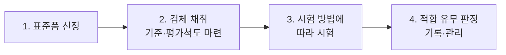

# Chapter 03. 관능평가 방법과 절차

> **고득점 TIP**: 관능평가의 정의와 요소에 대해 정리하세요.
>
> 🔗 **관련 과목**
> - 2과목 2챕터 "화장품의 기능과 품질" — 화장품 효과 분류(세정·기초·기능성·색조)와 관능평가 대상

## (1) 관능평가

1. 화장품의 품질을 인간의 오감(시각, 후각, 미각, 촉각, 청각)에 의해 측정하고 분석하여 평가하는 방법이다.
2. 화장품은 유효성에 대한 과학적 평가법이 있으나, 외관, 색상, 향, 사용감 등 기호에 따른 평가도 제품에 영향을 미치기 때문에 관능평가를 통해 얻은 결과를 통계 처리한 후 종합적 평가에 사용한다.

## (2) 외관·색상 검사에 대한 관능평가 순서

1. 외관·색상을 검사하기 위한 표준품을 선정한다.
2. 원자재 시험 검체와 제품의 공정 단계별 시험 검체를 채취하고 각각의 기준과 평가척도를 마련한다.
3. 외관·색상 시험 방법에 따라 시험한다.
4. 시험 결과에 따라 적합 유무를 판정하고 기록·관리한다.

### 참고: 외관·색상 시험 방법

- **성상 및 색상의 판별**
  - 유화제품: 내용물 표면의 매끄러움, 내용물의 점성, 내용물의 색을 육안으로 확인
  - 색조제품: 슬라이드 글라스에 표준견본과 내용물을 각각 소량으로 묻힌 후 슬라이드 글라스로 눌러 대조되는 색상을 육안으로 확인, 손등이나 실제 사용 부위에 직접 발라서 색상 확인
- **향취 평가**: 비커에 내용물을 담고 코를 비커에 대고 향취를 맡거나 손등에 발라 향취를 맡아 확인
- **사용감 평가**: 내용물을 손등에 문질러 느껴지는 사용감 확인

## (3) 관능평가 요소

| 요소 | 평가 방법 |
|---|---|
| 탁도(침전) | 10mL 바이알에 액체 형태의 화장품을 넣고 탁도계(Turbidity meter)로 탁도 측정 |
| 변취 | 손등에 적당량을 바른 뒤 원료의 베이스 냄새를 기준으로 표준품(최종 제품)과 비교하여 변취 확인 |
| 분리(성상) | 육안과 현미경을 이용하여 기포, 응고, 분리, 겔화, 빙결 등 유화 상태 확인 |
| 점도, 경도 | 실온에 방치한 뒤 용기에 넣고 점도, 경도 범위에 적합한 회전봉(Spindle)을 사용하여 점도를 측정하고, 점도가 높을 경우에는 경도를 측정 |
| 증발, 표면 굳음 | 건조 감량, 무게 측정을 통해 증발과 표면 굳음 측정 |

## (4) 제품별 관능평가 요소

| 제품 유형 | 평가 요소 |
|---|---|
| 스킨, 토너 | 탁도, 변취 |
| 로션, 에센스 | 변취, 분리(성상), 점도, 경도 |
| 크림 | 변취, 분리(성상), 점도, 경도, 증발, 표면 굳음 |
| 메이크업 베이스, 파운데이션 | 변취, 점도, 경도, 증발, 표면 굳음 |
| 립스틱 | 변취, 분리(성상), 점도, 경도 |

## (5) 관능 용어에 따른 물리화학적 평가법

### ① 물리적 관능 요소

| 관능 용어 | 물리화학적 평가법 |
|---|---|
| 촉촉함 ⇔ 보송보송함 | 마찰감 테스트, 점탄성 측정(Rheometer) |
| 부들부들함 | |
| 뽀드득함 ⇔ 매끄러움 | |
| 가볍게 발림 ⇔ 뻑뻑하게 발림 | |
| 빠르게 스며듦 ⇔ 느리게 스며듦 | |
| 부드러움 ⇔ 딱딱함(화장품) | |
| 탄력이 있음(피부) | 유연성 측정(Cutometer) |
| 부드러워짐(피부) | |
| 끈적임 ⇔ 끈적이지 않음 | 핸디압축시험법 |

### ② 광학적 관능 요소

| 관능 용어 | 물리화학적 평가법 |
|---|---|
| 투명감이 있음 ⇔ 불투명함 | 변색분광측정계, 광택계(Glossmeter), 색채 측정(분광측색계를 통한 명도 측정), 확대 비디오 관찰 |
| 윤기가 있음 ⇔ 윤기가 없음 | |
| 화장 지속력이 좋음 ⇔ 화장이 잘 지워짐 | |
| 균일하게 도포할 수 있음 ⇔ 뭉침, 번짐 | |
| 번들거림 ⇔ 번들거리지 않음 | 광택계(Glossmeter) |

## (6) 자가평가

### ① 소비자에 의한 사용시험

소비자들이 관찰하거나 느낄 수 있는 변수들에 기초하여 제품 효능과 화장품 특성에 대한 소비자의 인식을 평가하는 것으로 일정 수 이상 참여해야 한다.

| 구분 | 내용 |
|---|---|
| 맹검 사용시험 (Blind Use Test) | 상품명, 디자인, 표시사항 등을 가리고 제품을 사용하여 시험하는 것 |
| 비맹검 사용시험 (Concept Use Test) | 상품명, 표기사항 등을 알려주고 제품에 대한 인식 및 효능 등이 일치하는지를 시험하는 것 |

### ② 훈련된 전문가 패널에 의한 관능평가

명확히 규정된 시험계획서에 따라, 정확한 관능 기준을 가지고 교육을 받은 전문가 패널의 도움을 얻어 실시한다.

## (7) 전문가에 의한 평가

### ① 의사의 감독하에서 실시하는 시험

의사의 관리하에서 화장품의 효능에 대해 실시하며 변수들은 임상관찰 결과 또는 평점에 의해 평가된다. 또한 초기값이나 미처리 대조군, 위약 또는 표준품과 비교하여 정량화될 수 있다.

### ② 그 외 전문가의 관리하에 실시되는 시험

준 의료진, 미용사 또는 기타 직업적 전문가 등이 이미 확립된 기준과 비교하여 촉각, 시각 등에 의한 감각에 의해 제품의 효능을 평가한다.

---
*출처: PART 04 · 맞춤형화장품의 이해, Chapter 03 (p.192–193)*
