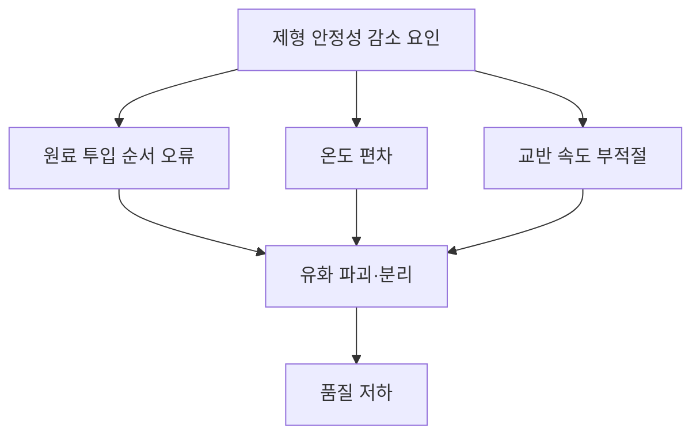

# Chapter 06. 혼합 및 소분

> **고득점 TIP**: 화장품 성분은 PART 02와 겹치는 내용이 많아 복습하는 개념으로 학습하세요. 원료규격서와 혼합 소분에 필요한 도구는 최히 임기한 상태로 넘어가세요.
>
> 📌 본 챕터의 원료 분류는 2과목 1챕터 "화장품 원료"의 요약 재서술입니다.
>
> 🔗 **관련 과목**
> - 2과목 1챕터 "화장품 원료" — 원료 분류(수성/유성/계면활성제) 상세 정의
> - 2과목 3챕터 "사용제한 원료" — 혼합 금지 원료 및 알레르기 유발 성분
> - 3과목 2챕터 "작업자 위생관리" — 혼합·소분 시 안전관리 기준(손 소독, 작업복)

---

> 📋 **학습 가이드**
> - 출제 빈도: ★★★★☆ (원료 특성, 제형 안정성 감소 요인 4가지, 원료규격서 기재 항목, pH·농도·온도 기준, 혼합·소분 도구, 안전관리 기준, 위생관리)
> - 예상 소요 시간: 40분
> - 핵심 키워드: 수성/유성/계면활성제, 제형 안정성(투입 순서·온도 편차·회전속도·진공세기), pH 범위(미산성 5.0~6.5·약산성 3.0~5.0), 온도(표준 20℃·상온 15~25℃·실온 1~30℃), 호모게나이저(유화·터빈형) vs 디스퍼(가용화·고속교반), 혼합·소분 안전관리(품질성적서 확인·손 소독·포장용기 오염 확인)

---

## 1. 원료 및 제형의 물리적 특성

> **한 줄 요약**: 수성(물·알코올·보습제) + 유성(유지·왁스·실리콘) + 계면활성제(음·양·양쪽·비이온) + 고분자(점증·피막) + 색소·향료·보존제·산화방지제·금속이온봉쇄제.

### (1) 원료의 특성

| 구분 | 특성 |
|---|---|
| **수성 원료** | • 일반적으로 물에 잘 녹음 • 정제수, 알코올, 보습제(폴리올) 등 |
| **유성 원료** | • 피부 수분 증발 억제, 화장품의 흡수력에 도움을 줌 • 유지(식물성 오일, 동물성 오일), 왁스, 탄화수소, 고급 지방산, 고급 알코올, 에스테르, 실리콘 오일 등 |
| **계면활성제** | • 유성과 수성의 경계면에 흡착하여 성질을 변화시킴 • 습윤, 세정 효과, 대전 방지 등의 기능, 표면장력을 낮춤 • 음이온성, 양이온성, 양쪽성, 비이온성 계면활성제 |
| **고분자화합물(폴리머) – 점증제** | • 점도 조절 • 천연·반합성·합성 고분자, 무기물 등 |
| **고분자화합물(폴리머) – 피막형성제(밀폐제)** | • 일정 시간이 경과하면 굳는 성질 • 수분 증발 억제, 광택 및 갈라짐 방지 등의 기능 • 폴리비닐알코올, 고분자 실리콘 등 |
| **색소** | • 안료(물 또는 오일에 녹지 않는 것), 염료(물 또는 오일에 녹는 것) • 유기안료, 무기안료, 천연색소, 진주광택안료 등 |
| **향료** | • 향을 내기 위해 사용 • 알레르기 유발 25종 중 씻어내는 제품은 0.01%, 씻어내지 않는 제품은 0.001% 초과 시 해당 성분 명칭 기재 |
| **보존제** | 미생물로부터의 변질을 막기 위해 사용 |
| **산화방지제** | 유지의 산화를 방지하고 화장품 품질을 일정하게 유지하기 위해 사용 |
| **금속이온봉쇄제** | 금속이온으로 인한 산화 촉진, 변색, 변취를 막기 위해 사용 |

> 📌 **참고**: 본문 p.53

### (2) 제형의 특성 `기출`

| 제형 | 특성 |
|---|---|
| **로션제** | 유화제 등을 넣어 유성 성분과 수성 성분을 균질화한 점액상 제형 |
| **액제** | 화장품에 사용되는 성분을 용제 등에 녹여 액상으로 만들어진 제형 |
| **크림제** | 유화제 등을 넣어 유성 성분과 수성 성분을 균질화한 반고형상 제형 |
| **침적 마스크제** | 액제, 로션제, 크림제, 겔제 등을 부직포 등의 지지체에 침적하여 만들어짐 |
| **겔제** | 액체를 침투시킨 분자량이 큰 유기분자로 이루어진 반고형상 제형 |
| **에어로졸제** | 원액을 같은 용기 또는 다른 용기에 충전한 분사제의 압력을 이용하여 안개 모양, 포말상 등으로 분출하도록 만들어진 제형 |
| **분말제** | 균질하게 분말상 또는 미립상으로 만들어진 제형 |

### (3) 혼합 시 제형의 안정성을 감소시키는 요인 `기출`

**① 원료 투입 순서가 바뀌는 경우**
- 화장품 원료 및 내용물 혼합 시 투입에 대한 다음의 사항을 이해해야 함
- 원료 투입 순서가 달라지면 용해 상태 불량, 침전, 부유물 등이 발생하여 제품의 물성 및 안정성에 영향을 미칠 수 있음
- 휘발성 유상 원료는 혼합 직전에 투입하고, 고온에서 안정성이 낮은 원료(알코올, 첨가제, 향료 등)는 냉각 공정 중 별도로 투입해야 함
- W/O(Water in Oil) 형태의 유화 제품 제조 시 수상을 너무 빠르게 투입하면 제조가 어렵거나 안정성이 저하될 수 있음

**② 가용화 공정 또는 유화 공정 시 제조 온도와 설정 온도의 차이가 생기는 경우**
- **가용화**: 제조 온도가 설정된 온도보다 지나치게 높을 경우, 가용화제의 친수성과 친유성의 정도를 나타내는 HLB가 변하여 운점 이상에서 가용화가 깨지고 제품의 안정성에 문제가 생길 수 있음
- **유화**: 제조 온도가 설정된 온도보다 지나치게 높을 경우, 유화제의 HLB가 변하여 전상 온도 이상에서 상이 서로 뒤바뀌어 유화 안정성에 문제가 생길 수 있음. 또한 유화 입자 크기 변화로 외관이나 점도가 달라지거나, 원료 산패로 인해 제품의 냄새와 색상 등이 변할 수 있음

**③ 회전속도**
- 믹서의 회전속도가 느린 경우 원료 용해 시간이 길어지고, 폴리머 분산 시 수화가 어려워 덩어리가 생겨 메인 믹서 이송 시 필터가 막혀 작업이 어려워질 수 있음
- 유화 입자가 커지면서 외관, 점도, 안정성 등에 영향을 미칠 수 있음

**④ 진공세기**
- 유화 제품 제조 과정에서 발생하는 미세한 기포를 제거하지 않으면 제품의 점도, 비중, 안정성 등에 악영향을 줄 수 있음

---

## 2. 원료 및 내용물의 유효성

> **한 줄 요약**: 효력시험(비임상, 작용기전 포함) + 인체적용시험(효능 입증) + 염모효력시험(모발 색상) + 기준·시험방법(ISO 등 공인 방법).

### (1) 효력시험에 관한 자료
심사 대상 효능을 뒷받침하는 성분의 효력에 대한 비임상시험 자료로서 효과 발현의 작용기전이 포함되어야 하며, 아래 3가지 중 하나에 해당해야 한다.

1. 국내외 대학 또는 전문 연구기관에서 시험한 것으로서 당해 기관의 장이 발급한 자료(시험시설 개요, 주요설비, 연구인력의 구성, 시험자의 연구경력에 관한 사항을 포함)
2. 당해 기능성화장품이 개발국 정부에 제출되어 평가된 모든 효력시험 자료로 개발국 정부(허가 또는 등록기관)가 제출받았거나 승인하였음을 확인한 것 또는 이를 증명한 자료
3. 과학논문인용색인(Science Citation Index 또는 Science Citation Index Expanded)이 등재된 전문학회지에 게재된 자료

### (2) 인체적용시험 자료
1. 사람에게 적용 시 효능·효과 등 기능을 입증할 수 있는 자료로 위 효력시험에 관한 자료 ① 및 ②에 해당할 것
2. 인체적용시험의 실시 기준 및 자료의 작성 방법은 「화장품 표시·광고 실증에 관한 규정」을 준용할 것

### (3) 염모효력시험 자료
인체 모발을 대상으로 효능·효과에서 표시한 색상을 입증하는 자료로, 모발의 색상을 변화(탈염·탈색을 포함)시키는 기능을 가진 화장품은 심사 시 염모효력시험 자료만 제출한다.

### (4) 기준 및 시험 방법에 관한 자료
품질관리에 적정을 기할 수 있는 시험 항목과 각 시험 항목에 대한 시험 방법의 밸리데이션, 기준치 설정의 근거가 되는 자료로, 이 경우 시험 방법은 공정서, 국제표준화기구(ISO) 등의 공인된 방법에 의해 검증되어야 한다.

---

## 3. 원료 및 내용물의 규격

> **한 줄 요약**: 원료규격서(명칭·구조식·함량·성상·확인시험·순도시험·정량법) + pH·색·냄새·점도·농도·온도 기준.

원료규격서는 화장품 원료의 안전관리 및 품질관리 능력 향상을 위해 필요하며, 다빈도로 사용되는 원료는 화장품 원료규격 가이드라인이 제시되어 있다.

### 〈원료규격서 예시〉 — 디메치콘 (Dimethicone)

**메칠폴리실록산 (Methyl Polysiloxane)**

이 원료는 주로 직쇄상의 디메치콘 (CH₃)₃SiO[(CH₃)₂SiO]ₙSi(CH₃)₃으로 평균중합도에 따라 표시 점도가 20~30,000cs에 해당한 것이다.

| 항목 | 내용 |
|---|---|
| **성상 (메칠폴리실록산)** | 이 원료는 무색의 맑은 액 또는 점성이 있는 맑은 액으로 냄새는 거의 없다. |
| **확인시험 (메칠폴리실록산)** | 이 원료를 가지고 적외부흡수스펙트럼측정법의 4) 액막법에 따라 측정할 때 파수 2,960cm⁻¹, 1,260cm⁻¹, 1,130~1,000cm⁻¹ 및 800cm⁻¹ 부근에서 특성흡수를 나타낸다. |
| **굴절률** | 굴절률측정법에 따라 시험할 때 규격은 아래 표와 같다. |
| **비중** | 비중측정법에 따라 시험할 때 규격은 아래 표와 같다. |
| **점도** | 1,000cs 미만은 25℃에서 제1법에 따라 시험, 1,000cs 이상은 25℃에서 제2법에 따라 시험하여 단위를 환산할 때 규격은 아래 표와 같다. |
| **산가** | 0.02 이하 (20g, 제1법) |

**순도시험**
1. **중금속**: 이 원료 40g을 달아 제2법에 따라 조작하여 시험한다. 비교액에는 납표준액 20mL를 넣는다 (5ppm 이하).
2. **비소**: 이 원료 1.0g을 달아 제3법에 따라 검액을 만들고 장치 B를 쓰는 방법에 따라 조작하여 시험한다 (2ppm 이하).
3. **미네랄 오일**: 이 원료를 가지고 365nm에서 흡광도측정법에 따라 시험할 때 흡광도는 비교액보다 크지 않다. (비교액: 퀴닌에 0.01N 황산을 넣어 녹여 0.1ppm으로 한다.)
4. **페닐성화합물**: 이 원료 5.0g을 달아 사이클로헥산을 넣어 녹여 10mL로 한 액을 검액으로 하여 파장 250~270nm에서 흡광도는 0.2보다 크지 않다.

**건조 감량(150℃, 2시간) 규격**

| 표시점도(cs) | 점도(cs) 하한 | 점도(cs) 상한 | 비중(d²⁰₂₀) 하한 | 비중 상한 | 굴절률(n²⁰D) 하한 | 굴절률 상한 | 건조감량(%) 상한 |
|---|---|---|---|---|---|---|---|
| 20 | 18 | 22 | 0.946 | 0.954 | 1.3980 | 1.4020 | 20.0 |
| 50 | 47.5 | 52.5 | 0.955 | 0.965 | 1.4005 | 1.4045 | 2.0 |
| 100 | 95 | 105 | 0.962 | 0.970 | 1.4005 | 1.4045 | 0.3 |
| 200 | 190 | 220 | 0.964 | 0.972 | 1.4013 | 1.4053 | 0.3 |
| 350 | 332.5 | 367.5 | 0.965 | 0.973 | 1.4013 | 1.4053 | 0.3 |
| 500 | 475 | 525 | 0.967 | 0.975 | 1.4013 | 1.4053 | 0.3 |

### (1) 원료 기준 및 시험 방법에 기재할 항목

기준 및 시험 방법의 형식, 용어, 단위, 기호 등은 화장품 원료 기준(잠원기)에 따르며, 원료 및 제제(제형)에 따라 불필요한 항목은 생략이 가능하다.
※ ○ 원칙적으로 기재, △ 필요에 따라 기재, × 원칙적으로는 기재할 필요 없음

| 항목 | 작성 방법 | 원료 |
|---|---|---|
| **명칭** | 일반 명칭을 기재하며, 영명, 화학명, 별명 등도 기재 | — |
| **구조식 또는 시성식** | 「기능성화장품 기준 및 시험 방법」의 구조식 또는 시성식의 표기 방법에 따름 | ○ |
| **분자식 및 분자량** | 「기능성화장품 기준 및 시험 방법」의 분자식 및 분자량의 표기 방법에 따름 | △ |
| **기원** | • 합성 원료로 화학구조가 결정되어 있는 것은 기재 불필요 • 천연 추출물, 효소 등은 그 원료성분의 기원 기재 • 고분자화합물 등 유사 화합물 2가지 이상 함유로 분리·정제가 곤란할 경우 비율을 기재 | ○ (△) |
| **함량 기준** | • 백분율(%)로 표시 후 분자식 기재 • 함량 표시가 어려운 경우 화학적 순물질의 함량으로 표시 가능 • 불안정한 원료 성분은 분해물의 안전성에 관한 정보에 따라 기준치 폭 설정 • 함량 기준 설정이 불가능한 경우 이유를 구체적으로 기재 | ○ |
| **제조 방법 (원료 기준)** | 생약, 동물 추출물 등에 있어 함량 기준 및 정량법을 규정할 수 없는 경우에는 제조 방법을 구체적으로 기재 | ○ |
| **성상 (원료 기준)** | 색, 형상, 냄새, 맛, 용해성 등을 구체적으로 기재 | ○ |
| **확인시험 (원료 기준)** | 원료 성분을 확인할 수 있는 화학적시험 방법 기재(자외부, 가시부, 적외부흡수스펙트럼측정법 또는 크로마토그래프법 기재 가능) | ○ |
| **시성치** | • 검화가, 굴절률, 비선광도, 비점, 비중, 산가, 수산기가, 알코올수, 에스테르가, 요오드가, 융점, 응고점, 점도, pH, 흡광도 등 물리·화학적 방법으로 측정되는 정수 기재 • 원료성분의 본질 및 순도를 나타내기 위해 작성하며, 「기능성화장품 기준 및 시험 방법」의 VI. 일반시험법에 따름 | △ |
| **순도시험** | • 색, 냄새, 용해 상태, 액성, 산, 알칼리, 염화물, 황산염, 중금속, 비소, 황산에 대한 정색물, 동, 석, 수은, 아연, 알루미늄, 철, 알칼리토류금속, 일반이물(제조공정으로부터 혼입, 잔류, 생성 또는 첨가될 수 있는 불순물), 유연 물질 및 분해생성물, 잔류용매 중 필요한 항목 설정 • 용해 상태는 원료의 순도 파악이 가능한 경우 설정 | ○ |
| **건조 감량, 강열 감량 또는 수분** | 「기능성화장품 기준 및 시험 방법」의 VI-1, 원료 3, 감열잔분 시험법에 따름 | △ |
| **강열 잔분, 회분 또는 산불용성 회분** | 「기능성화장품 기준 및 시험 방법」의 VI-1, 원료 3, 감열잔분 시험법에 따름 | △ |
| **기타시험** | 품질평가, 안전성·유효성 확보와 직접 관련이 되는 시험 항목이 있는 경우에 설정 | — |
| **정량법(제제는 함량시험)** | 물질의 함량, 함유 단위 등을 물리적 또는 화학적 방법에 의해 측정하는 시험법으로, 정확도, 정밀도 및 특이성이 높은 시험법 설정(단, 순도시험항에서 혼재물의 한도가 규제되어 있는 경우 특이성이 낮은 시험법이라도 인정함) | ○ |
| **표준품 및 시약·시액** | • 「기능성화장품 기준 및 시험 방법」 수재 이외의 표준품은 사용목적에 맞는 규격을 설정하며, 수재 이외의 시약·시액은 그 조제법 기재 • 표준품은 필요에 따라 정제법 기재 • 정량용 표준품은 원칙적으로 순도시험에 따라 불순물을 규제한 절대량을 측정할 수 있는 시험 방법으로 함량 측정 • 표준품의 함량은 99.0% 이상으로 함 | △ |

### (2) pH 기준 `기출`
1. 액성을 산성, 알칼리성 또는 중성으로 나타낸 것은 따로 규정이 없는 한 리트머스지를 써서 검사한다.
2. 액성을 구체적으로 표시할 때에는 pH값을 쓴다.
3. pH의 범위

| 구분 | pH 범위 | 구분 | pH 범위 |
|---|---|---|---|
| 미산성 | 약 5.0~6.5 | 미알칼리성 | 약 7.5~9.0 |
| 약산성 | 약 3.0~5.0 | 약알칼리성 | 약 9.0~11.0 |
| 강산성 | 약 3.0 이하 | 강알칼리성 | 약 11.0 이상 |

### (3) 색 기준
1. **백색**: 거의 백색을 나타낸다.
2. **무색**: 무색 또는 거의 무색을 나타낸다.
3. **시험 방법**: 고체의 화장품 원료는 1g을 백지 위 또는 백지 위에 놓은 시계접시에 취하여 관찰하며, 액상의 화장품 원료는 안지름 15mm의 무색시험관에 넣고 백색 배경을 써서 액층을 30mm로 하여 관찰한다. 액상의 맑은 화장품 원료를 시험할 때에는 흑색 또는 백색 배경을 써서 앞의 방법에 따른다. 액상의 화장품 원료의 형광을 관찰할 때에는 흑색 배경을 쓰고 백색 배경은 쓰지 않는다.

### (4) 냄새 기준
1. **냄새가 없다**: 냄새가 없거나 거의 냄새가 없는 것을 나타낸다.
2. **시험 방법**: 원료 1g을 100mL 비커에 취하여 시험한다.

### (5) 점도 `기출`
1. 액체가 일정 방향으로 운동할 때 그 흐름에 평행한 평면의 양측에 내부 마찰력이 일어나는데, 이 성질을 **점성**이라고 한다.
2. 점성은 면의 넓이 및 그 면에 대해 수직방향의 속도구배에 비례하며, 그 비례정수를 **절대점도**라고 한다.
3. 단위로는 포아스 또는 센티포아스를 쓴다. 절대점도를 같은 온도의 그 액체의 밀도로 나눈 값을 운동점도라고 하고, 그 단위로는 **스톡스 또는 센티스톡스**를 쓴다.

### (6) 농도
1. 용액의 농도를 (1→5), (1→10), (1→100) 등으로 기재한 것은 고체물질 1g 또는 액상물질 1mL를 용제에 녹여 전체량을 각각 5mL, 10mL, 100mL 등으로 하는 비율을 나타낸 것이다.
2. 혼합액을 (1:10), (1:20) 등으로 나타낸 것은 액상물질의 1 용량과 10 용량과의 혼합액, 1 용량과 20 용량과의 혼합액을 나타낸 것이다.
3. 단위

| 단위 | 정의 |
|---|---|
| **%** | 질량백분율 |
| **w/v%** | 질량 대 용량(weight/volume) 백분율 예) 전체 용액 100mL에 A라는 용질이 10g 들어 갔을 경우 10%(w/v)의 농도를 가짐 |
| **v/v%** | 용량 대 용량(volume/volume) 백분율 |
| **v/w%** | 용량 대 질량(volume/weight) 백분율 |
| **ppm** | 질량백만분율 예) 전체 용액 500g에 A라는 용질이 1mg 들어 갔을 경우 2ppm의 농도를 가짐 (1mg÷500,000mg)×1,000,000 |

> 📌 **참고**: 법령노트 p.112 참고

### (7) 온도 `기출`
1. 온도의 표시는 셀시우스법에 따라 아라비아 숫자 뒤에 ℃를 붙인다.

| 구분 | 온도 |
|---|---|
| 표준온도 | 20℃ |
| 상온 | 15~25℃ |
| 실온 | 1~30℃ |
| 미온 | 30~40℃ |
| 냉소 | 따로 규정이 없는 한 15℃ 이하의 곳 |
| 냉수 | 10℃ 이하 |
| 미온탕 | 30~40℃ |
| 온탕 | 60~70℃ |
| 열탕 | 약 100℃ |

2. '가열한 용매' 또는 '열용매'는 그 용매의 비점 부근의 온도로 가열한 것을 뜻하며, '가온한 용매' 또는 '온용매'는 보통 60~70℃로 가온한 것을 의미한다.
3. '수욕상 또는 수욕중에서 가열한다'라 함은 따로 규정이 없는 한 끓인 수욕 또는 100℃의 증기욕을 써서 가열하는 것을 의미한다.
4. 보통 냉침은 15~25℃, 온침은 35~45℃에서 실시한다.

### (8) 기타 `기출`
1. 용질명 다음에 용액이라 기재하고, 그 용제를 밝히지 않은 것은 수용액이라고 한다.
2. 따로 규정이 없는 한 일반시험법에 규정되어 있는 시약을 쓰고 시험에 쓰는 물은 정제수이다.
3. 시험조작을 할 때 '직후' 또는 '곧'이란 보통 앞의 조작이 종료된 다음 30초 이내에 다음 조작을 시작하는 것을 말한다.
4. 검체의 채취량에 있어 '약'이라고 붙인 것은 기재된 양의 ±10%의 범위를 의미한다.

---

## 4. 혼합·소분에 필요한 도구·기기·기구 `기출`

> **한 줄 요약**: 칭량(전자저울·메스실린더) + 혼합(호모게나이저·디스퍼·오버헤드스터러) + 소분(스패츌러·디스펜서·피펫) + 측정(pH미터·점도계·경도계) + 살균(자외선 살균기).

| 구분 | 특징 |
|---|---|
| **전자저울, 메스실린더** | 원료 칭량 시 사용 |
| **스패츌러** | 혼합 및 소분 시 화장품을 위생적으로 덜어내거나 계량할 때 사용 |
| **시약스푼, 비커** | 원료의 소분 및 계량 시 사용 |
| **헤라 (계량)** | 실리콘 재질의 주걱으로 계량 시 사용 |
| **냉각통** | 내용물 및 특정 성분을 냉각할 때 사용 |
| **디스펜서** | 내용물을 자동으로 소분해 줌 |
| **디지털 발란스** | 내용물 및 원료 소분 시 무게를 측정할 때 사용 |
| **자외선 살균기** | 도구의 살균·소독 시 사용 |
| **피펫** | 작은 양의 액체를 옮길 때 사용 |
| **호모게나이저(호모믹서)** `기출` | 내용물과 내용물 간의 혼합 및 분산을 위해 터빈형의 회전날개가 달린 기계. 주로 물과 기름을 유화시켜 안정 상태로 유지하기 위해 사용하는 교반기로, 분산상의 크기를 작고 균일하게 혼합시킬 때 유용 |
| **디스퍼** `기출` | 주로 가용화 제품이나 간단한 물질을 혼합할 때 사용하는 교반기로, 고속 교반에 의해 균질하게 분산시킬 때 유용 |
| **마그네틱바, 핸드블렌더, 스틱형성기** | 원료의 혼합·교반 시 사용 |
| **오버헤드스터러(아지믹서, 프로펠러믹서, 분산기)** | 봉(Shaft)의 끝부분에 다양한 모양의 회전날개가 붙어 있어 내용물의 혼합 및 분산 시 사용하며, 점증제를 물에 분산시킬 때 사용 |
| **항온수조, 핫플레이트** | 원료를 가열할 때 사용 |
| **드라이오븐(Dry Oven)** | 건조 감량 시험 시 사용 |
| **pH 미터** | 제품의 pH를 측정할 때 사용 |
| **데시케이터** | 표준품을 보관하는 데 사용 |
| **융점 측정기** | 물질의 녹는점 측정 시 사용 |
| **경도계** | 액체 및 반고형 제품의 유동성 측정 시 사용 |
| **광학현미경** | 유화된 내용물의 유화입자의 크기 관찰 시 사용 |
| **점도계** | 제품의 점도 측정 시 사용 |
| **헤라 (덜어내기)** | • 실리콘 재질의 주걱으로 계량 시 사용 • 내용물 및 특정성분을 비커에서 깨끗하게 덜어낼 때 사용 |

※ 호모게나이저(호모믹서) 및 디스퍼 사진 출처: (주) 영진코퍼레이션

---

## 5. 맞춤형화장품판매업 준수사항에 맞는 혼합·소분

> **한 줄 요약**: 조제관리사 채용 + 안전관리 기준(품질성적서·손 소독·용기 오염 확인) + 판매내역서 작성 + 소비자 설명 + 시설 분리·위생 관리.

### ① 맞춤형화장품조제관리사를 채용하여 맞춤형화장품 혼합·소분 활동 `기출`

### ② 다음의 안전관리 기준을 준수할 것
- 혼합·소분 전에 혼합·소분에 사용되는 내용물 또는 원료에 대한 품질성적서를 확인할 것
- 혼합·소분 전에 손을 소독하거나 세정할 것 (다만, 혼합·소분 시 일회용 장갑을 착용하는 경우에는 그렇지 않음)
- 혼합·소분 전에 혼합·소분된 제품을 담을 포장용기의 오염 여부를 확인할 것
- 혼합·소분에 사용되는 장비 또는 기구 등은 사용 전에 그 위생 상태를 점검하고, 사용 후에는 오염이 없도록 세척할 것
- 그 밖에 위와 유사한 것으로서 혼합·소분의 안전을 위해 식품의약품안전처장이 정하여 고시하는 사항을 준수할 것

### ③ 맞춤형화장품 판매내역서(전자문서로 된 판매내역서를 포함함)를 작성·보관할 것

### ④ 맞춤형화장품 판매 시 해당 제품의 혼합 또는 소분에 사용된 내용물·원료의 내용 및 특성, 사용 시 주의사항에 대해 소비자에게 설명할 것

### ⑤ 시설 기준
맞춤형화장품판매업을 신고하려는 자는 맞춤형화장품의 혼합·소분 공간을 그 외의 용도로 사용되는 공간과 분리 또는 구획하여 갖추어야 함. 단, 혼합·소분 과정에서 맞춤형화장품의 품질·안전 등 보건위생상 위해가 발생할 우려가 없다고 인정되는 경우에는 혼합·소분 공간을 분리 또는 구획하여 갖추지 않아도 됨

> 📌 **참고 – 제형의 변화**: 맞춤형화장품조제관리사는 화장품 혼합 시 기본 제형에 변화를 주지 않는 범위 내에서 혼합해야 함

### ⑥ 작업자의 위생관리
- 혼합·소분 시 위생복 및 마스크(필요 시) 착용
- 피부 외상 및 증상이 있는 직원은 건강 회복 전까지 혼합·소분 행위 금지
- 혼합 전·후 손 소독 및 세척

### ⑦ 맞춤형화장품 혼합·소분 장소의 위생관리
- 맞춤형화장품 혼합·소분 장소와 판매 장소는 구분·구획하여 관리
- 적절한 환기시설 구비
- 작업대, 바닥, 벽, 천장 및 창문 청결 유지
- 혼합 전·후 작업자의 손 세척 및 장비 세척을 위한 세척시설 구비
- 방충·방서 대책 마련 및 정기적 점검·확인

### ⑧ 맞춤형화장품 혼합·소분 장비 및 도구의 위생관리 `기출`
- 사용 전·후 세척 등을 통해 오염 방지
- 작업 장비 및 도구 세척 시에 사용되는 세제·세척제는 잔류하거나 표면 이상을 초래하지 않는 것을 사용
- 세척한 작업 장비 및 도구는 잘 건조하여 다음 사용 시까지 오염 방지
- **자외선 살균기 이용 시**
  - 충분한 자외선 노출을 위해 적당한 간격을 두고 장비 및 도구가 서로 겹치지 않게 한 층으로 보관
  - 살균기 내 자외선램프의 청결 상태를 확인한 후 사용

| 자외선 살균기의 적절한 사용의 예 | 자외선 살균기의 부적절한 사용의 예 |
|---|---|
| 도구들을 서로 겹치지 않게 한 층으로 배치 | 도구들을 겹쳐서 배치 (자외선 노출 불충분) |

### ⑨ 혼합·소분 장소, 장비·도구 등 위생 환경 모니터링
- 맞춤형화장품 혼합·소분 장소가 위생적으로 유지될 수 있도록 맞춤형화장품판매업자는 주기를 정하여 판매장 등의 특성에 맞도록 위생관리를 해야 한다.
- 맞춤형화장품 판매 업소에서는 위생 점검표를 활용하여 작업자 위생, 작업환경위생, 장비·도구 관리 등 맞춤형화장품 판매 업소에 대한 위생 환경 모니터링 후 그 결과를 기록하고 판매업소의 위생 환경 상태를 관리해야 한다.

---

### 확인문제
**혼합·소분 과정 관리 기준으로 옳은 것은?**
1. 혼합 과정이 단순하면 공간 구획 없이 작업 가능
2. 포장용기 오염은 혼합 이후에만 확인
3. **위험 상황 발생 시 즉시 작업 중단** ✅
4. 혼합 중 위생 상태는 1일 1회 점검
5. 판매 공간에 고객과 함께 혼합 작업 가능

> **해설**: 혼합·소분 과정에서 위험 상황 발생 시 즉시 작업을 중단해야 한다. 혼합·소분 공간은 용도와 분리·구획해야 하며, 포장용기 오염은 혼합·소분 전에 확인해야 하고, 위생 상태는 사용 전·후 매번 점검해야 한다. 판매 공간에서 고객과 함께 혼합 작업은 금지된다.

---
*출처: CHAPTER 06 · 혼합 및 소분 (PART 04 · 맞춤형화장품의 이해), pp. 211~219*

---

## 📊 제형 안정성 감소 요인 비교표

| 요인 | 원인 | 결과 |
|---|---|---|
| **투입 순서 오류** | 휘발성 유상을 너무 일찍 투입, W/O에서 수상 급투입 | 용해 불량, 침전, 부유물 |
| **온도 편차** | 설정 온도보다 과도하게 높음 | HLB 변화, 유화 파괴, 산패 |
| **회전속도 부적절** | 너무 느림 | 용해 시간 길어짐, 덩어리, 유화 입자 커짐 |
| **진공세기 부족** | 미세 기포 미제거 | 점도·비중·안정성 저하 |

## 📊 호모게나이저 vs 디스퍼 비교표

| 구분 | 호모게나이저(호모믹서) | 디스퍼 |
|---|---|---|
| **용도** | 유화·분산 | 가용화·간단한 혼합 |
| **구조** | 터빈형 회전날개 | 고속 교반 |
| **특징** | 분산상 크기를 작고 균일하게 | 균질 분산 |
| **대상** | 물+기름 유화 | 가용화 제품 |

## 📊 pH 범위 비교표

| 구분 | pH 범위 | 구분 | pH 범위 |
|---|---|---|---|
| **미산성** | 5.0~6.5 | **미알칼리성** | 7.5~9.0 |
| **약산성** | 3.0~5.0 | **약알칼리성** | 9.0~11.0 |
| **강산성** | 3.0 이하 | **강알칼리성** | 11.0 이상 |

## 📊 온도 기준 비교표

| 구분 | 온도 | 구분 | 온도 |
|---|---|---|---|
| **표준온도** | 20℃ | **냉소** | 15℃ 이하 |
| **상온** | 15~25℃ | **냉수** | 10℃ 이하 |
| **실온** | 1~30℃ | **미온탕** | 30~40℃ |
| **미온** | 30~40℃ | **온탕** | 60~70℃ |
| | | **열탕** | 약 100℃ |

## 📊 농도 단위 비교표

| 단위 | 정의 | 예 |
|---|---|---|
| **%** | 질량백분율 | — |
| **w/v%** | 질량/용량 백분율 | 100mL에 10g = 10%(w/v) |
| **v/v%** | 용량/용량 백분율 | — |
| **v/w%** | 용량/질량 백분율 | — |
| **ppm** | 질량백만분율 | 500g에 1mg = 2ppm |

---

## ✅ 확인문제

> **문제 1.** 혼합 시 제형의 안정성을 감소시키는 요인이 아닌 것은?
> ① 원료 투입 순서 오류 ② 온도 편차 ③ 회전속도 ④ 포장용기 재질
>
> **정답**: ④ 포장용기 재질
> **해설**: 제형 안정성을 감소시키는 요인은 ① 원료 투입 순서 오류, ② 가용화/유화 공정 시 온도 편차, ③ 회전속도, ④ 진공세기이다. 포장용기 재질은 제형 안정성 감소 요인이 아니다.

> **문제 2.** 호모게나이저(호모믹서)의 특징으로 옳은 것은?
> ① 주로 가용화 제품에 사용한다 ② 고속 교반으로 균질 분산한다 ③ 터빈형 회전날개로 유화·분산한다 ④ 점증제 분산에 주로 사용한다
>
> **정답**: ③ 터빈형 회전날개로 유화·분산한다
> **해설**: 호모게나이저는 터빈형 회전날개가 달린 기계로, 주로 물과 기름을 유화시켜 안정 상태로 유지하며 분산상의 크기를 작고 균일하게 혼합할 때 유용하다. 디스퍼는 가용화 제품이나 간단한 물질을 고속 교반으로 분산한다.

> **문제 3.** 약산성의 pH 범위는?
> ① 5.0~6.5 ② 3.0~5.0 ③ 3.0 이하 ④ 7.5~9.0
>
> **정답**: ② 3.0~5.0
> **해설**: 미산성은 5.0~6.5, 약산성은 3.0~5.0, 강산성은 3.0 이하이다. 알칼리성 측은 미알칼리성 7.5~9.0, 약알칼리성 9.0~11.0, 강알칼리성 11.0 이상이다.

> **문제 4.** 맞춤형화장품 혼합·소분 전 확인해야 할 사항으로 옳은 것은?
> ① 내용물의 가격 ② 내용물 또는 원료의 품질성적서 ③ 소비자의 피부 타입 ④ 포장용기의 디자인
>
> **정답**: ② 내용물 또는 원료의 품질성적서
> **해설**: 맞춤형화장품판매업자는 혼합·소분 전에 사용되는 내용물 또는 원료에 대한 품질성적서를 확인해야 한다. 또한 손 소독·세정, 포장용기 오염 여부 확인, 장비·기구의 위생 상태 점검이 필요하다.

---

## 📖 핵심 용어 정리

| 용어 | 핵심 포인트 |
|---|---|
| **수성 원료** | 물에 잘 녹음, 정제수·알코올·보습제(폴리올) |
| **유성 원료** | 수분 증발 억제, 유지·왁스·탄화수소·실리콘 |
| **계면활성제** | 유·수 경계면 흡착, 음·양·양쪽·비이온성 |
| **고분자(점증제)** | 점도 조절, 천연·반합성·합성·무기물 |
| **고분자(피막형성제)** | 수분 증발 억제, 폴리비닐알코올·고분자 실리콘 |
| **색소** | 안료(녹지 않음) vs 염료(녹음) |
| **향료 알레르기 25종** | 씻어내는 제품 0.01%, 씻어내지 않는 제품 0.001% 초과 시 명칭 기재 |
| **제형 안정성 요인** | 투입 순서·온도 편차·회전속도·진공세기 |
| **가용화** | HLB 변화, 운점 이상에서 가용화 깨짐 |
| **유화** | HLB 변화, 전상 온도 이상에서 상이 뒤바뀜 |
| **효력시험** | 비임상, 작용기전 포함, 대학/연구기관/SCI 게재 |
| **인체적용시험** | 사람 적용 시 효능·효과 입증 |
| **염모효력시험** | 모발 색상 변화(탈염·탈색 포함) 입증 |
| **원료규격서** | 명칭·구조식·함량·성상·확인시험·순도시험·정량법 |
| **표준온도** | 20℃ |
| **상온** | 15~25℃ |
| **실온** | 1~30℃ |
| **미산성** | pH 5.0~6.5 |
| **약산성** | pH 3.0~5.0 |
| **호모게나이저** | 터빈형 회전날개, 유화·분산, 입자 크기 작게 |
| **디스퍼** | 고속 교반, 가용화·간단한 혼합 |
| **오버헤드스터러** | 다양한 회전날개, 점증제 분산 |
| **혼합·소분 안전관리** | 품질성적서 확인, 손 소독, 포장용기 오염 확인 |
| **판매내역서** | 제조번호, 사용기한, 판매일자, 판매량 |
| **시설 기준** | 혼합·소분 공간 분리·구획 (위해 우려 없으면 예외) |
| **작업자 위생** | 위생복·마스크 착용, 외상 시 작업 금지 |
| **자외선 살균기** | 도구 겹치지 않게 1층 배치, 램프 청결 확인 |
| **위생 모니터링** | 위생 점검표 활용, 정기적 점검·기록 |
