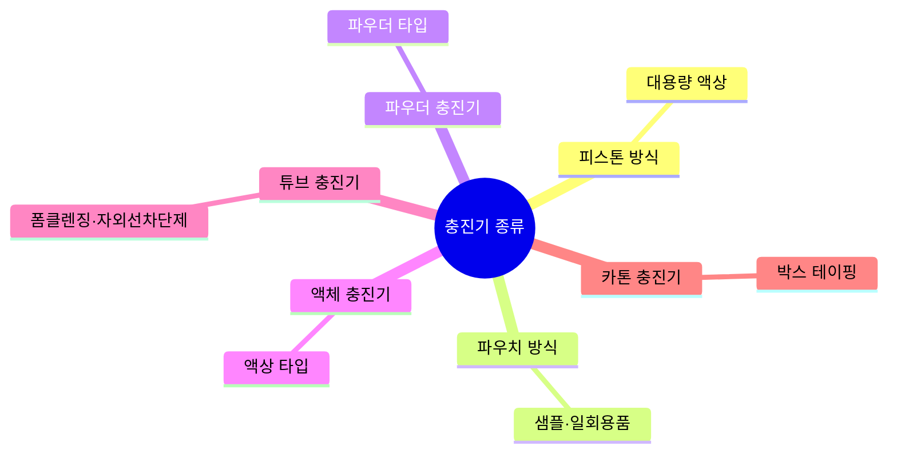

# Chapter 07. 충진 및 포장

> **PART 04 · 맞춤형화장품의 이해**
> 고득점 TIP: 충진의 의미와 포장재 종류의 특성 및 사용부위, 포장공간 기준에 대해 정확히 암기하여 구분할 수 있어야 함
>
> 🔗 **관련 과목**
> - 3과목 3챕터 "설비 및 기구관리" — 충진 설비의 위생 기준
> - 3과목 5챕터 "포장재의 관리" — 포장재 입고 기준 및 1차·2차 포장 정의

---

> 📋 **학습 가이드**
> - 출제 빈도: ★★★☆☆ (충진기 종류, 포장재 조건, 플라스틱·유리·금속 포장재 특성, 용기 종류, 포장공간 비율·횟수, 재사용 비율, 라벨링)
> - 예상 소요 시간: 25분
> - 핵심 키워드: 충진기 6종(피스톤·파우치·파우더·액체·튜브·카톤), 포장재 6조건(보호·경제성·대량화·판매촉진·적정포장·정보전달), 플라스틱(LDPE·HDPE·PP·PS·AS·ABS·PVC·PET), 포장공간(단위 15%/10%, 종합 25%), 재사용 비율(색조 10%·샴푸 25%·물티슈 60%)

---

## 1. 제품에 맞는 충진 방법

> **한 줄 요약**: 충진 = 화장품 용기에 내용물을 채우는 작업, 6종 충진기(피스톤·파우치·파우더·액체·튜브·카톤) + 9가지 확인 사항.

### (1) 충진(Filling)의 정의
빈 공간을 채우거나 빈 곳에 집어넣어서 채운다는 의미로, 화장품 용기에 내용물을 넣어 채우는 작업을 의미한다.

### (2) 충진기 종류

| 충진기 종류 | 설명 |
|---|---|
| 피스톤 방식 충진기 | 대용량의 액상 타입의 제품을 충진할 때 사용 |
| 파우치 방식 충진기 | 샘플, 일회용품 파우치 타입의 제품을 충진할 때 사용 |
| 파우더 충진기 | 파우더 타입의 제품을 충진할 때 사용 |
| 액체 충진기 | 액상 타입의 제품을 충진할 때 사용 |
| 튜브 충진기 | 폼 클렌징, 자외선 차단제 등 튜브 제품을 충진할 때 사용 |
| 카톤 충진기 | 박스를 테이핑할 때 사용 |

### (3) 충진 시 확인해야 할 사항
1. 충전기의 타입
2. 충전 용량(g, mL 등)
3. 포장 기기의 포장 능력 및 가능 크기
4. 전원 및 전압의 종류
5. 필요한 적정 에어 압력
6. 단위시간당 포장 가능 개수
7. 스티커 부착기 사용 시 부착 위치
8. 로트번호, 포장일자, 유통기한, 바코드 인쇄 시 인쇄 위치 및 문구
9. 필요 시 온·습도 조건

> **참고 – 충전 용량**
> 용기의 100%로 충진을 하면 뚜껑의 종류에 따라 내용물이 넘치는 경우가 발생할 수 있으므로 제품별로 용량을 확인해야 함

---

## 2. 제품에 적합한 포장 방법

> **한 줄 요약**: 포장재 6조건(보호·경제성·대량화·판매촉진·적정포장·정보전달) + 플라스틱·유리·금속 재질별 특성 + 포장공간 비율·횟수 기준.

### (1) 포장재의 조건

| 조건 | 내용 |
|---|---|
| 내용물 보호 | 용기의 안전성, 사용기능, 내용물의 품질 유지와 제품 수명을 유지해야 함 |
| 경제성 | 제품의 품질과 용기 가격의 경제적 균형이 맞아야 함 |
| 대량화 | 생산 설비, 생산 방법 등이 제품을 쉽게 대량으로 생산할 수 있어야 함 |
| 판매촉진성 | 소비자의 구매 의욕을 만족시키는 디자인이어야 함 |
| 적정 포장 | 자원 재활용과 폐기 처리 문제를 고려하여 과대포장이 되어서는 안 됨 |
| 정보 전달 및 사용자 배려 | 내용물에 대한 제품 정보를 적절히 표시하며, 어린이가 쉽게 열지 못하도록 설계해야 함 |

### (2) 포장재의 종류와 특성

| 구분 | 명칭 | 특성 | 사용 부위 |
|---|---|---|---|
| 플라스틱 (LDPE) | 저밀도 폴리에틸렌(LDPE) | 반투명성, 광택성, 유연성 우수 / 내외부 응력이 걸린 상태에서 알코올, 계면활성제와 접촉하면 균열 발생 | 튜브, 마개, 패킹 |
| 플라스틱 (HDPE) | 고밀도 폴리에틸렌(HDPE) | 유백색, 무광택, 수분 투과 적음 | 화장수·샴푸·린스 용기 및 튜브 |
| 플라스틱 (PP) | 폴리프로필렌(PP) | 반투명성, 광택성, 내약품성·내충격성 우수 | 원터치 캡 |
| 플라스틱 (PS) | 폴리스티렌(PS) | 투명성, 광택성, 딱딱함, 성형가공성 및 치수 안정성 우수, 내약품성 취약 | 팩트·스틱 용기, 캡 |
| 플라스틱 (AS) | AS수지 | 투명성, 광택성, 내유성·내충격성 우수 | 크림·팩트·스틱류 용기, 캡 |
| 플라스틱 (ABS) | ABS수지 | AS수지의 내충격성을 향상시킨 소재 / 향료, 알코올에 취약 / 도금 소재로 이용 | 팩트 용기 |
| 플라스틱 (PVC) | 폴리염화비닐(PVC) | 투명성, 성형 가공성 우수, 저렴 | 샴푸·린스 용기, 리필 용기 |
| 플라스틱 (PET) | 폴리에틸렌테레프탈레이트(PET) | 투명성, 광택성, 내약품성 우수, 딱딱함 | 화장수·유액·샴푸·린스 용기 |
| 유리 (소다석회유리) | 소다석회유리 | 대표적인 투명유리 / 산화규소, 산화칼슘, 산화나트륨에 소량의 마그네슘, 알루미늄 등의 산화물 함유 | 화장수·유액 용기 |
| 유리 (칼리납유리) | 칼리납유리 | 굴절률이 매우 높음 / 산화납이 다량 함유됨 | 고급 향수병 |
| 유리 (유백유리) | 유백유리 | 유백색 유리 | 크림·세럼 용기 |
| 금속 (알루미늄) | 알루미늄 | 가볍고 가공성이 우수 / 표면 장식이나 산화 방지 목적으로 사용 | 에어로졸 관, 립스틱·마스카라·콤팩트 용기 |
| 금속 (놋쇠, 황동) | 놋쇠, 황동 | 금과 유사한 색상으로 코팅, 도금, 도장 작업을 첨기함 | 팩트·립스틱 용기, 코팅용 소재 |
| 금속 (스테인리스 스틸) | 스테인리스 스틸 | 광택 우수, 부식이 잘 되지 않음 | 에어로졸 관, 광택 용기 |
| 금속 (철) | 철 | 녹슬기 쉬우나 저렴함 | 스프레이 용기 |

> **용어 – 내약품성**: 화학 반응이나 용매 작용에 의한 손상을 견뎌 내는 고체 물질의 성질
> **용어 – 내충격성**: 외부 충격에 의해 변형되지 않고 잘 견디는 성질

### (3) 용기의 종류

| 용기 종류 | 설명 |
|---|---|
| 세구용기 | 병 입구의 외경이 몸체에 비해 작은 용기 |
| 광구용기 | 병 입구의 외경이 몸체외경과 비슷한 용기(액상의 내용물) |
| 튜브용기 | 비비크림, 파운데이션, 헤어트리트먼트 등 몸체와 비슷한 용기(핸드크림, 엄임크림) |
| 에어로졸용기 | 내용물을 압축가스나 액화가스의 압력에 의해 분출되도록 만든 용기(헤어스프레이 등) |
| 원통형용기 | 마스카라, 아이라이너 등 |
| 파우더용기 | 페이스 파우더, 베이비 파우더 등 |

### (4) 제품별 포장 방법에 관한 기준 (기출)

#### ① 단위제품: 1회 이상 포장한 최소 판매단위의 제품

| 제품의 종류 | 포장공간 비율 | 포장횟수 |
|---|---|---|
| 인체 및 두발 세정용 제품류 | 15% 이하 | 2차 이내 |
| 그 밖의 화장품류(방향제 포함) | 10% 이하(향수 제외) | 2차 이내 |

#### ② 종합제품: 같은 종류 또는 다른 최소 판매단위의 제품을 2개 이상 함께 포장한 제품

| 제품의 종류 | 포장공간 비율 | 포장횟수 |
|---|---|---|
| 화장품류 | 25% 이하 | 2차 이내 |

\* 복합합성수지재질·폴리비닐클로라이드재질 또는 합성섬유재질로 제조된 받침접시 또는 포장용 완충재를 사용한 제품의 포장공간 비율은 **20% 이하**로 함

> **참고 – 포장횟수를 적용하지 않는 경우**
> 2차 포장 외부에 붙인 필름, 종이 등의 포장과 재사용이 가능한 파우치, 에코백, 틴 케이스는 포장횟수에 적용하지 않음

### (5) 제품별 포장용기 재사용 가능 비율

다음의 제품을 제조하는 자는 그 포장용기를 재사용할 수 있는 제품의 생산량이 해당 제품 총생산량에서 차지하는 비율이 아래 기재된 비율 이상이 되도록 노력하여야 한다.

| 제품 구분 | 비율 |
|---|---|
| 화장품 중 색조화장품(메이크업)류 | 100분의 10 이상 |
| 합성수지 용기를 사용한 액체 세제류·분말 세제류 | 100분의 50 이상 |
| 두발용 화장품 중 샴푸·린스류 | 100분의 25 이상 |
| 위생용 종이 제품 중 물티슈(물휴지)류 | 100분의 60 이상 |

### (6) 맞춤형화장품 라벨링

| 구분 | 내용 |
|---|---|
| 소분 | 새로운 용기에 기재사항을 표시한 스티커를 붙임 |
| 혼합 | 내용물에 원료를 혼합하는 경우 내용물 용기에 기존 라벨을 제거한 후 라벨을 붙이거나 오버라벨링(제품정보 덧붙이기)을 사용함 |

---
*출처: 맞춤형화장품조제관리사 교재, PART 04 CHAPTER 07 (p.223~225)*

---

## 📊 충진기 종류 비교표

| 충진기 | 용도 | 대상 제품 |
|---|---|---|
| **피스톤 방식** | 대용량 액상 | 대용량 로션·크림 |
| **파우치 방식** | 샘플·일회용품 | 샘플 파우치 |
| **파우더** | 파우더 타입 | 파우더 제품 |
| **액체** | 액상 타입 | 스킨·토너 |
| **튜브** | 튜브 제품 | 폼클렌징·자외선 차단제 |
| **카톤** | 박스 테이핑 | 2차 포장 박스 |

## 📊 플라스틱 포장재 비교표

| 재질 | 특성 | 사용 부위 |
|---|---|---|
| **LDPE** | 반투명·유연, 알코올·계면활성제 접촉 시 균열 | 튜브·마개·패킹 |
| **HDPE** | 유백색·무광택, 수분 투과 적음 | 화장수·샴푸·린스 용기 |
| **PP** | 반투명·내약품성·내충격성 우수 | 원터치 캡 |
| **PS** | 투명·딱딱, 내약품성 취약 | 팩트·스틱 용기·캡 |
| **AS** | 투명·내유성·내충격성 우수 | 크림·팩트·스틱 용기 |
| **ABS** | 내충격성 향상, 향료·알코올에 취약 | 팩트 용기 |
| **PVC** | 투명·저렴 | 샴푸·린스·리필 용기 |
| **PET** | 투명·내약품성·딱딱 | 화장수·유액·샴푸 용기 |

## 📊 포장공간 비율·횟수 비교표

| 구분 | 제품 종류 | 포장공간 비율 | 포장횟수 |
|---|---|---|---|
| **단위제품** | 인체·두발 세정용 | 15% 이하 | 2차 이내 |
| **단위제품** | 기타(방향제 포함, 향수 제외) | 10% 이하 | 2차 이내 |
| **종합제품** | 화장품류 | 25% 이하 | 2차 이내 |
| **종합제품** | 복합합성수지·PVC·합성섬유 받침/완충재 사용 | 20% 이하 | 2차 이내 |

## 📊 포장용기 재사용 비율 비교표

| 제품 구분 | 재사용 비율 |
|---|---|
| **색조화장품(메이크업)류** | 10% 이상 |
| **합성수지 용기 액체·분말 세제류** | 50% 이상 |
| **샴푸·린스류** | 25% 이상 |
| **물티슈(물휴지)류** | 60% 이상 |

---

## ✅ 확인문제

> **문제 1.** 튜브 충진기의 용도로 옳은 것은?
> ① 대용량 액상 제품 ② 샘플·일회용품 ③ 폼 클렌징·자외선 차단제 ④ 파우더 타입 제품
>
> **정답**: ③ 폼 클렌징·자외선 차단제
> **해설**: 튜브 충진기는 폼 클렌징, 자외선 차단제 등 튜브 제품을 충진할 때 사용한다. 대용량 액상은 피스톤 방식, 샘플은 파우치 방식, 파우더는 파우더 충진기를 사용한다.

> **문제 2.** 단위제품 중 인체 및 두발 세정용 제품류의 포장공간 비율과 포장횟수는?
> ① 10% 이하, 2차 이내 ② 15% 이하, 2차 이내 ③ 25% 이하, 3차 이내 ④ 15% 이하, 3차 이내
>
> **정답**: ② 15% 이하, 2차 이내
> **해설**: 인체 및 두발 세정용 제품류는 포장공간 비율 15% 이하, 포장횟수 2차 이내이다. 기타 화장품류(방향제 포함, 향수 제외)는 10% 이하, 종합제품은 25% 이하(복합합성수지 등은 20% 이하)이다.

> **문제 3.** 내약품성과 내충격성이 우수한 플라스틱 포장재는?
> ① LDPE ② PS ③ PP ④ ABS
>
> **정답**: ③ PP(폴리프로필렌)
> **해설**: PP는 반투명성, 광택성, 내약품성·내충격성이 우수하여 원터치 캡에 사용된다. PS는 내약품성이 취약하고, ABS는 향료·알코올에 취약하다.

> **문제 4.** 맞춤형화장품 소분 시 라벨링 방법으로 옳은 것은?
> ① 기존 라벨 위에 오버라벨링만 가능 ② 새로운 용기에 기재사항을 표시한 스티커를 붙임 ③ 혼합 시 기존 라벨을 그대로 둠 ④ 라벨링이 필요 없음
>
> **정답**: ② 새로운 용기에 기재사항을 표시한 스티커를 붙임
> **해설**: 소분 시에는 새로운 용기에 기재사항을 표시한 스티커를 붙인다. 혼합 시에는 내용물 용기에 기존 라벨을 제거한 후 라벨을 붙이거나 오버라벨링(제품정보 덧붙이기)을 사용한다.

---

## 📖 핵심 용어 정리

| 용어 | 핵심 포인트 |
|---|---|
| **충진** | 화장품 용기에 내용물을 채우는 작업 |
| **피스톤 방식 충진기** | 대용량 액상 제품 |
| **파우치 방식 충진기** | 샘플·일회용품 파우치 |
| **튜브 충진기** | 폼클렌징·자외선 차단제 |
| **카톤 충진기** | 박스 테이핑 |
| **충진 확인 사항** | 타입·용량·포장능력·전원·에어압력·인쇄위치 등 9가지 |
| **포장재 6조건** | 내용물 보호·경제성·대량화·판매촉진·적정포장·정보전달 |
| **LDPE** | 반투명·유연, 알코올·계면활성제 접촉 시 균열, 튜브·마개·패킹 |
| **HDPE** | 유백색·수분 투과 적음, 화장수·샴푸·린스 용기 |
| **PP** | 내약품성·내충격성 우수, 원터치 캡 |
| **PS** | 투명·딱딱, 내약품성 취약, 팩트·스틱 용기 |
| **AS** | 내유성·내충격성 우수, 크림·팩트·스틱 용기 |
| **ABS** | 내충격성 향상, 향료·알코올 취약, 팩트 용기 |
| **PET** | 투명·내약품성·딱딱, 화장수·유액·샴푸 용기 |
| **소다석회유리** | 대표적 투명유리, 화장수·유액 용기 |
| **칼리납유리** | 굴절률 높음, 산화납 함유, 고급 향수병 |
| **알루미늄** | 가볍고 가공성 우수, 에어로졸 관·립스틱·마스카라 |
| **내약품성** | 화학 반응·용매 작용에 의한 손상 견딤 |
| **내충격성** | 외부 충격에 변형되지 않고 견딤 |
| **단위제품 포장** | 세정용 15%·기타 10% 이하, 2차 이내 |
| **종합제품 포장** | 25% 이하(복합재질 20%), 2차 이내 |
| **포장횟수 제외** | 필름·종이·재사용 파우치·에코백·틴케이스 |
| **색조화장품 재사용** | 10% 이상 |
| **샴푸·린스 재사용** | 25% 이상 |
| **물티슈 재사용** | 60% 이상 |
| **소분 라벨링** | 새 용기에 기재사항 스티커 부착 |
| **혼합 라벨링** | 기존 라벨 제거 후 새 라벨 또는 오버라벨링 |
