# 📖 1과목 화장품법의 이해 — 이야기형 학습교재

## 프롤로그 — 민수의 첫 번째 화장품

민수는 어느 날 자신만의 화장품 브랜드를 만들어 보기로 했다.
처음에는 간단한 생각이었다. 좋은 원료를 고르고, 예쁜 용기에 담아 고객에게 판매하면 될 것 같았다.

하지만 사업을 시작하려는 순간 질문이 쏟아졌다.

> “이 제품은 법에서 말하는 화장품일까?”
> 
> “내가 직접 만들면 제조업일까?”
> 
> “다른 공장에서 만들어 내 상표로 팔면 무엇이 필요할까?”
> 
> “고객의 피부 상태에 맞춰 혼합해 주려면?”

민수는 그때 알게 되었다. 화장품 사업은 단순히 제품을 만드는 일이 아니라 **법이 정한 역할과 절차를 따라가는 하나의 여정**이라는 것을.

이 교재에서는 민수가 화장품 사업을 시작하고, 제품을 만들고, 판매하고, 문제가 발생했을 때 대응하는 과정을 따라가며 화장품법을 공부한다.

---

## 🧭 이야기의 등장인물

- **민수** — 처음 화장품 사업을 시작하는 예비 사업자
- **지연** — 민수의 품질·책임판매 업무를 돕는 실무 담당자
- **고객** — 맞춤형화장품과 제품 안전성에 관한 실제 상황을 보여주는 인물
- **행정기관 담당자** — 등록·신고·검사·행정처분의 기준을 설명하는 역할

> 💡 **읽는 방법**
> 이야기에서 상황을 이해한 뒤, 바로 아래의 **🎯 시험 포인트**와 **🧠 암기 포인트**를 확인하세요. 마지막으로 **⚖️ 법령 원문**에서 정확한 근거를 확인합니다.

---

### 가독성·시각화 강화 · 맞춤형화장품조제관리사 시험 대비

> **학습 안내**
>
> 이 교재는 원문의 법령·학습자료·표·문제를 최대한 유지하면서, **핵심을 먼저 보고 → 구조를 시각화하고 → 숫자를 암기하고 → 문제로 회상**할 수 있도록 구성했습니다.

---

## 🧭 학습 아이콘

| 표시 | 의미 | 활용 |
|---|---|---|
| 🎯 | 기출·출제 포인트 | 최우선 회상 |
| ⭐ | 핵심 개념 | 반드시 이해 |
| 🧠 | 암기 포인트 | 반복 회상 |
| ⚠️ | 주의·함정 | 오답 방지 |
| 🔢 | 숫자·기한 | 별도 암기 |
| 📊 | 비교·분류 | 표로 정리 |
| 🔄 | 절차·흐름 | 순서 암기 |
| 📝 | 확인문제 | 즉시 회상 |
| ⚖️ | 법령 원문 | 최종 확인 |

---

# 🚀 시험 직전 1분 전체 지도

```text
                 [화장품법의 이해]
                         │
       ┌─────────────────┼─────────────────┐
       ↓                 ↓                 ↓
   법령 체계          영업·등록          품질·안전
       │                 │                 │
 법→령→규칙→고시    제조/책임/맞춤     안전성·안정성
                         │              유효성·사용성
                         ↓                 │
                  결격·변경·승계             ↓
                         │            기능성 심사
                         ↓                 │
                  행정처분·벌칙              ↓
                         └───────┬─────────┘
                                 ↓
                         표시·광고·사후관리
                                 ↓
                         개인정보 보호법
```

## 🎯 최우선 암기 축

1. **법령 위계** → 법률 → 시행령 → 시행규칙 → 고시·행정규칙
2. **영업 3종** → 제조업 **등록** / 책임판매업 **등록** / 맞춤형화장품판매업 **신고**
3. **품질 4요소** → 안전성 / 안정성 / 유효성 / 사용성
4. **맞춤형화장품** → 혼합 또는 소분의 개념
5. **결격사유** → 영업별 공통점과 차이점 비교
6. **변경 기한** → 일반적으로 30일, 행정구역 개편에 따른 소재지 변경은 90일
7. **행정처분** → 반복 위반 기준(최근 1년)과 최대 업무정지 기간(12개월) 확인
8. **기능성화장품** → 정의·효능·심사자료를 묶어서 학습
9. **표시·광고** → 의약품 오인, 기능성 오인, 거짓·과장 여부 주의
10. **개인정보** → 개인정보 / 민감정보 / 고유식별정보 / 가명정보를 구별

---

## 🔢 숫자 암기 미리보기

| 항목 | 핵심 숫자 |
|---|---:|
| 변경 등록·신고 일반 기한 | 30일 |
| 행정구역 개편 소재지 변경 | 90일 |
| 행정처분 반복 위반 기준 | 최근 1년 |
| 업무정지 합산 최대 | 12개월 |
| 안전성 정보 신속보고 | 15일 |
| 위해평가 사용기준 정기검토 | 5년 |
| 기능성화장품 실태조사 | 5년 |

> ⚠️ **법령·고시 수치는 개정될 수 있으므로, 실제 시험에서는 해당 시험의 최신 공식 기준과 본문 원문(⚖️)을 함께 확인하세요.**

---

> **🔍 키워드**: 화장품법, 시행령, 시행규칙, 영업분류, 기능성화장품, 행정처분, 표시광고, 천연화장품
> **핵심 내용**: 화장품법·시행규칙 전체 조문, 영업·표시·행정처분 제도

## 목차

- **화장품법 (제20901호, 시행 2026. 4. 2.)**
  - 제1장 총칙
  - 제1조(목적)
  - 제2조(정의)
  - 제2조의2(영업의 종류)
  - 제2조의3(화장품의 날)
  - 제2장 화장품의 제조ㆍ유통
  - 제3조(영업의 등록)
  - 제4조(기능성화장품의 심사 등)
  - 제4조의2(화장품 안전성 평가)
  - 제4조의3(영유아 또는 어린이 사용 화장품의 관리)
  - 제5조(영업자의 의무 등)
  - 제5조의2(위해화장품의 회수)
  - 제6조(폐업 등의 신고)
  - 제3장 화장품의 취급
  - 제1절 기준
  - 제8조(화장품 안전기준 등)
  - 제2절 표시ㆍ광고ㆍ취급
  - 제11조(화장품의 가격표시)
  - 제12조(기재ㆍ표시상의 주의)
  - 제13조(부당한 표시ㆍ광고 행위 등의 금지)
  - 제14조(표시ㆍ광고 내용의 실증 등)
  - 제3절 제조ㆍ수입ㆍ판매 등의 금지
  - 제15조(영업의 금지)
  - 제16조(판매 등의 금지)
  - 제4절 화장품업 단체 등 <개정 2018. 3. 13.>
  - 제17조(단체 설립)
  - 제4장 감독
  - 제18조(보고와 검사 등)
  - 제18조의2(소비자화장품안전관리감시원)
  - 제18조의3(화장품안전정보센터 지정 등)
  - 제18조의4(화장품안전정보센터의 지정취소)
  - 제18조의5(화장품안전정보센터에 대한 지도ㆍ감독 등)
  - 제19조(시정명령)
  - 제20조(검사명령)
  - 제22조(개수명령)
  - 제23조(회수ㆍ폐기명령 등)
  - 제23조의2(위해화장품의 공표)
  - 제24조(등록의 취소 등)
  - 제24조의2(기능성화장품의 인정 취소)
  - 제26조(영업자의 지위 승계)
  - 제26조의2(행정제재처분 효과의 승계)
  - 제27조(청문)
  - 제28조(과징금처분)
  - 제28조의2(위반사실의 공표)
  - 제28조의3(직접구매 해외화장품에 대한 검사 및 관계 기관 정보 제공)
  - 제28조의4(직접구매 해외화장품에 대한 실태조사)
  - 제29조(자발적 관리의 지원)
  - 제30조(수출용 제품의 예외)
  - 제5장 보칙
  - 제31조(등록필증 등의 재교부)
  - 제32조(수수료)
  - 제33조(화장품산업의 지원)
  - 제33조의2(국제협력)
  - 제33조의3(화장품통합정보시스템의 구축ㆍ운영)
  - 제34조(권한 등의 위임ㆍ위탁)
  - 제6장 벌칙
  - 제36조(벌칙)
  - 제37조(벌칙)
  - 제38조(벌칙)
  - 제39조(양벌규정)
  - 제40조(과태료)

- **화장품법 시행규칙 (제2109호, 시행 2026. 4. 2.)**
  - 제1조(목적)
  - 제2조(기능성화장품의 범위)
  - 제3조(제조업의 등록 등)
  - 제4조(화장품책임판매업의 등록 등)
  - 제5조(화장품제조업 등의 변경등록)
  - 제6조(시설기준 등)
  - 제8조(책임판매관리자의 자격기준 등)
  - 제10조의2(영유아 또는 어린이 사용 화장품의 표시ㆍ광고)
  - 제10조의5(위해요소 저감화계획의 수립)
  - 제11조(화장품제조업자의 준수사항 등)
  - 제12조(화장품책임판매업자의 준수사항)
  - 제14조의4(행정처분의 감경 또는 면제)
  - 제17조(화장품 원료 등의 위해평가)
  - 제19조(화장품 포장의 기재ㆍ표시 등)
  - 제21조(기재ㆍ표시상의 주의사항)
  - 제22조(표시ㆍ광고의 범위 등)
  - 제27조(회수ㆍ폐기명령 등)
  - 제29조(행정처분기준)
  - 제30조(과징금의 징수절차)
  - 제30조의2(직접구매 해외화장품에 대한 검사)
  - 제30조의3(직접구매 해외화장품에 대한 실태조사)
  - 제32조(수수료)

  - 🎯 과목 시각화 개요
  - 📚 학습 보조 자료 (교재 콘텐츠)
  - 📋 별표 참조 인덱스
  - ⚡ 시험 직전 체크리스트
  - 🔗 과목 간 교차 참조

---

## 📖 학습 안내

### 학습 목표
- 화장품법·시행령·시행규칙의 전체 조문을 이해하고, 법령 체계와 주요 제도를 설명할 수 있다
- 영업 등록·변경 절차, 기능성화장품 심사, 표시·광고 규제, 행정처분 기준을 숙지한다
- 법령 간 상하위 관계(법 → 시행령 → 시행규칙 → 고시)를 파악하여 실무 적용력을 기른다

### 학습 흐름
1. **법령 체계 이해** → 화장품법(법) → 시행령(대통령령) → 시행규칙(총리령) → 고시·행정규칙의 위계 구조
2. **영업 관련 규정** → 제조업·책임판매업·맞춤형화장품판매업의 등록/신고, 결격사유, 시설기준
3. **기능성화장품 제도** → 심사 대상, 심사 절차, 안전성 평가, 영유아·어린이 화장품 관리
4. **표시·광고 규제** → 기재사항, 가격표시, 부당광고 금지, 실증 의무
5. **행정처분 및 벌칙** → 등록취소·업무정지·과징금 기준, 위반 행위별 처분, 벌칙·과태료

### 출제 빈도 높은 영역
- **★★★**: 영업 등록 절차, 기능성화장품 심사, 행정처분 기준(등록취소·업무정지)
- **★★☆**: 표시·광고 규제, 위해화장품 회수, 안전기준
- **★☆☆**: 벌칙·과태료, 단체 설립, 권한 위임

---

## 🎯 과목 시각화 개요

> 아래 다이어그램들은 본 과목의 핵심 구조를 시각적으로 정리한 것입니다.

### 🗺️ 과목 개요 마인드맵

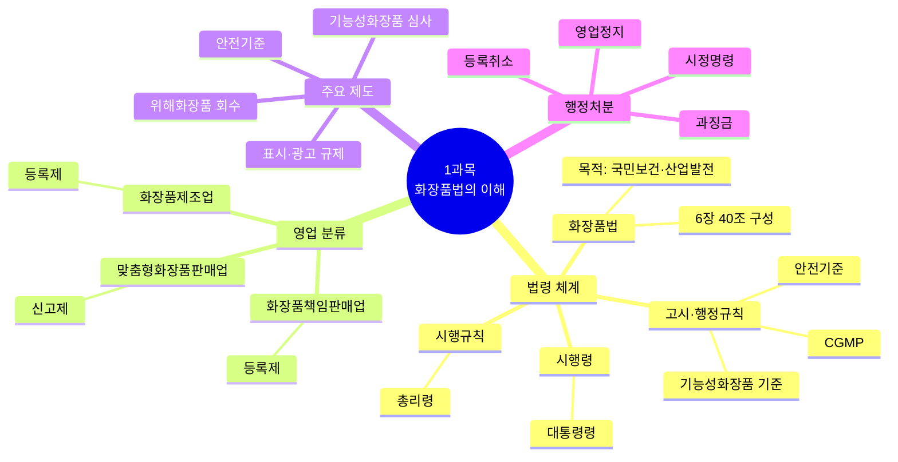

### 🗺️ 화장품법·시행규칙 조문 구조 마인드맵

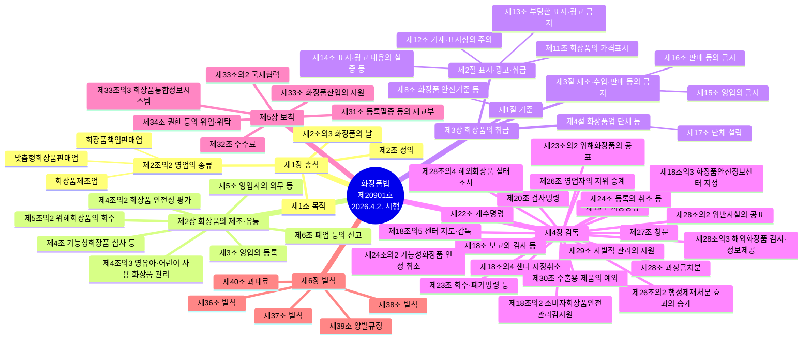

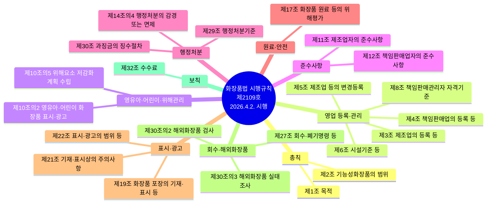

### 📊 영업 분류 비교

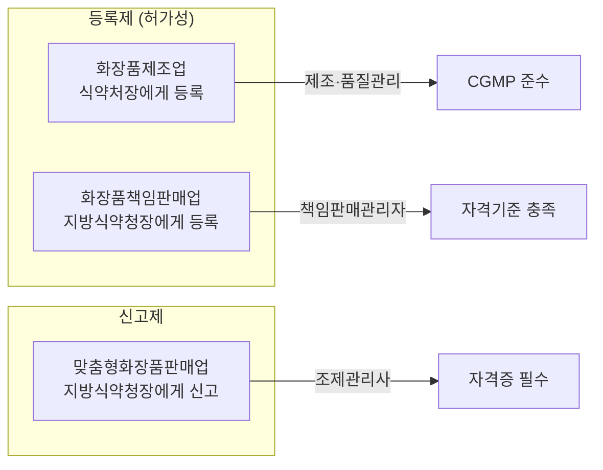

### 📊 행정처분 체계

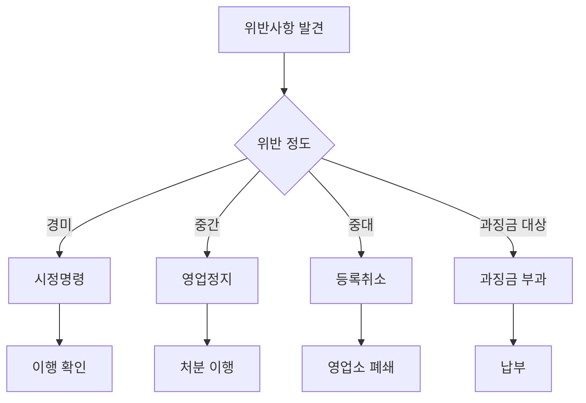

### 📊 과목 간 연관 흐름도

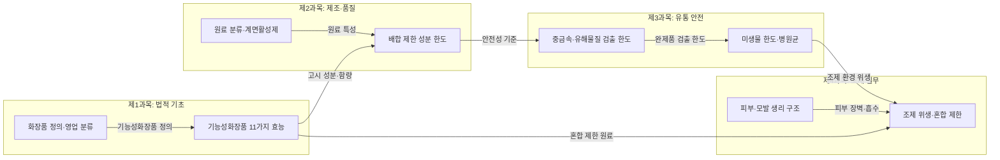

---

# 📚 학습 보조 자료 (교재 콘텐츠)

> 아래 내용은 과목별 참조자료 폴더에서 발췌한 학습 보조 자료입니다.
> 법령 조문과 함께 학습하면 시험 대비에 도움이 됩니다.

## 📖 Chapter 01. 화장품법의 이해 — 민수, 법의 지도를 펼치다

민수는 가장 먼저 “무엇을 지켜야 하는가?”부터 알아보기로 했다.
법률만 읽으면 될 것 같았지만, 실제 사업에서는 시행령과 시행규칙, 고시까지 함께 살펴야 했다.

> 🎯 **이 장의 질문**: 화장품 사업자는 법을 어떤 순서로 이해해야 할까?


> 출처: `1과목_참조자료/1.cosmetic-law.md`

## 화장품법 통합 정리

> 세 개의 화장품법 정리 문서를 하나로 병합한 자료입니다.

---

> 화장품법은 PART 2, 3, 4에서도 중복하여 출제되기에 놓치면 안 되는 중요한 부분이에요.

> 🔗 **관련 과목**
> - 2과목 2챕터 "화장품의 기능과 품질" — 기능성화장품 11가지 효능의 제품별 구체화
> - 3과목 1챕터 "작업장 위생관리" — CGMP 3대 요소 및 위생 기준
> - 4과목 1챕터 "맞춤형화장품 개요" — 제3조의2~제3조의8 맞춤형화장품 규정의 실무 적용
> - 4과목 5챕터 "제품 안내" — 표시·기재사항, 기능성화장품 표시 의무

---

> 📋 **학습 가이드**
> - 출제 빈도: ★★★★★ (1과목 전체 중 최다 출제 영역)
> - 예상 소요 시간: 60분
> - 핵심 키워드: 법령 체계, 화장품 정의, 영업 3종(등록 vs 신고), 결격사유, 행정처분, 품질 요소, 기능성화장품 심사

---

## 1. 화장품법의 입법 취지(목적)

### 📖 민수의 상황
민수가 “왜 화장품에 이렇게 많은 규칙이 필요한가요?”라고 묻자 담당자는 간단히 답했다.


> “화장품은 매일 사람의 몸에 사용됩니다. 따라서 소비자의 건강과 안전을 보호하면서 산업도 발전시켜야 합니다.”

이제 민수는 법의 목적부터 이해하기 시작했다.

> 📌 **출처**: 화장품법 제1조 | **참조 PDF**: `화장품법(법률)(제20901호)(20260402).pdf` | **시행일**: 2026. 4. 2. | **최종 확인**: 2026. 8. 29.


> **한 줄 요약**: 화장품법은 약사법에서 분리(1999.9), 식약처 관할, 법→시행령→시행규칙→고시 4단 체계.

「화장품법」은 1999년 9월 「약사법」에서 분리되어 2000년 7월부터 시행되었다. 현재 식품의약품안전처에서 관리·감독하고 있으며, 다음과 같은 목적으로 법령 체계를 갖추고 있다.

| 구분 | 입법 취지(목적) |
|---|---|
| 「화장품법」(법률) 🎯 기출 | 화장품의 제조·수입·판매 및 수출 등에 관한 사항을 규정함으로써 국민 보건 향상과 화장품 산업의 발전에 기여함을 목적으로 함 |
| 「화장품법 시행령」(대통령령) | 「화장품법」에서 위임된 사항과 그 시행에 필요한 사항을 규정하는 것을 목적으로 함 |
| 「화장품법 시행규칙」(총리령) | 「화장품법」 및 「화장품법 시행령」에서 위임된 사항과 그 시행에 필요한 사항을 규정하는 것을 목적으로 함 |
| 고시(행정규칙) | 기능성화장품 기준 및 시험 방법, 기능성화장품 심사에 관한 규정, 우수화장품 제조 및 품질관리 기준(CGMP) 등을 고시하는 것을 목적으로 함 |

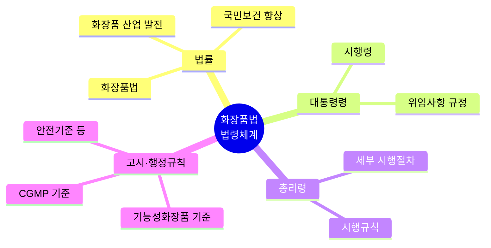

---

## 2. 화장품의 정의 및 유형 🎯 기출

### 📖 민수의 첫 번째 질문 — “이것도 화장품인가요?”
민수는 자신이 개발한 제품을 보여주며 물었다.


> “피부에 바르는 제품이면 모두 화장품인가요?”

담당자는 제품의 사용 목적과 인체에 미치는 작용, 의약품·의약외품과의 구별이 중요하다고 설명했다.

> 📌 **출처**: 화장품법 제2조 | **참조 PDF**: `화장품법(법률)(제20901호)(20260402).pdf` | **시행일**: 2026. 4. 2. | **최종 확인**: 2026. 8. 29.


> **한 줄 요약**: 화장품은 인체 청결·미용·보호 목적의 경미한 작용 제품 — 의약품과 구분이 핵심.

| 종류 | 정의 및 유형 |
|---|---|
| **화장품** 🎯 기출 | 인체를 청결·미화하여 매력을 더하고 용모를 밝게 변화시키거나 피부·모발의 건강을 유지 또는 증진하기 위해 인체에 바르고 문지르거나 뿌리는 등 이와 유사한 방법으로 사용되는 물품으로서 인체에 대한 작용이 경미한 것을 말함 (단, 의약품, 의약외품 제외) |
| **기능성화장품** 🎯 기출 | 화장품 중에서 다음 어느 하나에 해당되는 것으로서 총리령으로 정하는 화장품을 말함 |

**기능성화장품의 종류 (총리령으로 정하는 11가지 효능·효과)**
- 피부의 미백에 도움을 주는 제품
- 여드름성 피부를 완화하는 데 도움을 주는 화장품 (단, 인체 세정용 제품류로 한정, 여드름 크림은 기능성화장품이 아님)
- 피부장벽(피부의 가장 바깥쪽에 존재하는 각질층의 표피)의 기능을 회복하여 가려움 등의 개선에 도움을 주는 화장품
- 튼살로 인한 붉은 선을 엷게 하는 데 도움을 주는 화장품

> **참고: 화장품 vs 기능성화장품**
> - 일반화장품: 외부적 용모 개선, 청결, 미화 목적
> - 기능성화장품: 피부 기능 개선, 미백, 주름, 자외선 보호, 영양공급 등 효과가 입증된 제품
> - ※ 화장품은 인체에 대한 작용이 경미해야 하며, 의약품과는 구분된다.

> **참고: 자외선 차단 기능성화장품**
> 자외선 차단지수의 측정값이 −20% 이하의 범위에 있는 경우 같은 효능·효과로 봄

> **참고: 탈모/여드름/피부장벽/튼살 관련 표시**
> 탈모 증상의 완화, 여드름성 피부의 완화, 피부장벽 기능의 회복, 튼살로 인한 붉은 선을 엷게 하는 데 도움을 주는 화장품에는 '질병의 예방 및 치료를 위한 의약품이 아님'이라는 문구를 표시해야 함

### 기타 화장품 유형

| 종류 | 정의 |
|---|---|
| **영유아 또는 어린이 사용 화장품** | 영유아(3세 이하), 어린이(4세 이상~13세 이하)가 사용할 수 있는 화장품. 이를 표시·광고하려는 경우 제품 및 제조 방법에 대한 설명 자료, 화장품의 안전성 평가 자료, 제품의 효능·효과에 대한 증명 자료를 작성 및 보관해야 함 |
| **천연화장품** | 동식물, 미네랄, 미생물 및 그 유래 원료 등을 함유한 화장품으로, ISO 16128-1 가이드라인에 따라 정의된 천연(유래) 원료를 사용하고, ISO 16128-2 가이드라인에 따라 계산하였을 때 중량 기준으로 천연(유래) 원료 함량이 전체 제품에서 95% 이상으로 구성된 화장품 |
| **유기농화장품** 🎯 기출 | 유기농 원료, 동식물, 미네랄, 미생물 및 그 유래 원료 등을 함유한 화장품으로, ISO 16128-1 가이드라인에 따라 정의된 천연(유래) 및 유기농(유래) 원료를 사용하고, ISO 16128-2 가이드라인에 따라 계산하였을 때 중량 기준으로 유기농(유래) 함량이 전체 제품에서 10% 이상이어야 하며, 유기농(유래) 함량을 포함한 천연(유래) 함량이 전체 제품에서 95% 이상으로 구성된 화장품 |
| **맞춤형화장품** 🎯 기출 | ① 제조 또는 수입된 화장품의 내용물에 다른 화장품의 내용물이나 식품의약품안전처장이 정하는 원료를 추가하여 혼합한 화장품 <br> ② 제조 또는 수입된 화장품의 내용물을 소분(小分)한 화장품 (다만, 고형 비누 등 화장품의 내용물을 단순 소분한 화장품은 제외) |
| **직접구매 해외화장품** | 개인이 자가소비를 목적으로 해외의 사이버몰(컴퓨터 등과 정보통신설비를 이용하여 재화 등을 거래할 수 있도록 설정된 가상의 영업장)에서 직접 구매하는 화장품 |

> **참고:** 「화장품법」 제2조(정의) 천연화장품 및 유기농화장품 정의 삭제 (2025. 1. 31. 일부개정)

---

## 3. 화장품의 유형별 특성

> **한 줄 요약**: 세정·기초·기능성·색조·네일·모발 6대 유형으로 분류.


> 📌 **출처**: 화장품법 제2조 + 식약처 고시 | **참조 PDF**: `화장품법(법률)(제20901호)(20260402).pdf` | **시행일**: 2026. 4. 2. | **최종 확인**: 2026. 8. 29.

| 유형 | 설명 및 제품 종류 |
|---|---|
| **영유아용 제품류** 🎯 기출 | 3세 이하 영유아를 대상으로 하는 삼푸·린스·로션 등의 제품<br>• 영유아용 샴푸·린스 • 영유아용 오일 • 영유아 목욕용 제품 • 영유아용 로션·크림 • 영유아 인체 세정용 제품 |
| **목욕용 제품류** | 샤워, 목욕 시 전신에 사용 후 씻어내는 제품으로 욕조 투입 또는 몸에 향취를 주기 위한 제품<br>• 목욕용 오일·정제·캡슐 • 버블배스 • 목욕용 소금류 • 그 밖의 목욕용 제품류 |
| **인체 세정용 제품류** | 손, 얼굴에 사용하고, 사용 후 바로 씻어내는 제품<br>• 폼 클렌저 • 액체비누 • 외음부 세정제 • 바디 클렌저 • 화장비누(고형 형태의 세안용 비누) • 물휴지 • 그 밖의 인체 세정용 제품 |
| **기초화장용 제품류** 🎯 기출 | 피부의 보습, 수렴, 유연(에몰리언트), 영양 공급, 세정 등에 사용되는 스킨케어 제품<br>• 수렴·유연·영양 화장수 • 에센스, 오일 • 바디 제품 • 눈 주위 제품 • 손·발의 피부연화 제품 • 클렌징 워터, 클렌징 오일, 클렌징 로션, 클렌징 크림 등 메이크업 리무버 • 마사지 크림 • 파우더 • 팩, 마스크 • 로션, 크림 • 그 밖의 기초화장용 제품류 |
| **손발톱용 제품류** | 손톱과 발톱의 관리 및 메이크업에 사용하는 제품<br>• 베이스코트, 언더코트 • 네일 크림·로션·에센스·오일 • 네일 폴리시·네일 에나멜 리무버 • 네일 폴리시, 네일 에나멜 • 탑코트 • 그 밖의 손발톱용 제품류 |
| **눈화장용 제품류** | 눈 주위(눈썹, 눈꺼풀, 속눈썹 등)의 미화, 청결을 위해 사용하는 메이크업 제품<br>• 아이브로제품 • 아이섀도 • 아이메이크업 리무버 • 속눈썹용 퍼머넌트 웨이브 • 아이라이너 • 마스카라 • 그 밖의 눈화장용 제품류 |
| **색조화장용 제품류** | 얼굴과 신체에 매력을 더하기 위해 사용하는 메이크업 제품<br>• 볼연지 • 메이크업 베이스 • 메이크업 픽서티브 • 립글로스, 립밤 • 페이스 파우더 • 리퀴드·크림·케이크 파운데이션 • 립스틱, 립라이너 • 바디페인팅, 페이스페인팅, 분장용 제품 • 그 밖의 색조화장용 제품류 |
| **두발염색용 제품류** | 두발의 색을 변화시키거나(염모), 탈색시키는(탈염) 제품<br>• 헤어 틴트 • 염모제 • 헤어 컬러스프레이 • 탈염·탈색용 제품(기능성화장품) • 그 밖의 두발염색용 제품류 |
| **두발용 제품류** | 모발 세정, 컨디셔닝, 정발, 웨이브 형성, 스트레이팅, 증모 효과에 사용되는 제품<br>• 헤어 컨디셔너·트리트먼트·팩, 린스 • 포마드, 헤어 스프레이·무스·왁스·젤, 그루밍 에이드 • 헤어 크림·로션 • 샴푸 • 헤어 퍼머넌트 웨이브 • 헤어 토닉·에센스 • 헤어 오일 • 헤어 스트레이트너 • 흑채 • 그 밖의 두발용 제품류 |
| **면도용 제품류** | 면도 전·후에 피부 보호 및 진정을 위해 사용하는 제품<br>• 프리셰이브 로션 • 세이빙 크림 • 애프터셰이브 로션 • 셰이빙 폼 • 그 밖의 면도용 제품류 |
| **체모제거용 제품류** 🎯 기출 | 몸에 난 털을 제거할 때 사용하는 제품<br>• 제모제(기능성화장품) • 제모왁스 • 그 밖의 체모제거용 제품류 |
| **체취방지용 제품류** 🎯 기출 | 몸에서 나는 냄새를 제거하거나 줄여주는 제품<br>• 데오도런트 • 그 밖의 체취방지용 제품류 |
| **방향용 제품류** 🎯 기출 | 향을 몸에 지니거나 뿌리는 제품<br>• 향수 • 콜로뉴(Cologne) • 그 밖의 방향용 제품류 |

> **참고: 목욕용 제품류 vs 인체 세정용 제품류**
> 목욕용 제품류는 인체 세정용 제품류와 구분되며, 바디 클렌저는 목욕용 제품류에 해당하지 않는다.

> **참고: 물휴지의 범위**
> 식품접객업의 영업소에서 손을 닦는 용도 등으로 사용할 수 있도록 포장된 물티슈. 장례식장 또는 의료기관 등에서 시체를 닦는 용도로 사용되는 것은 제외함

> **참고: 공산품에서 화장품으로 변경된 품목**
> 화장비누, 흑채, 제모왁스

> **확인문제:** 다음 중 기초화장용 제품류가 아닌 것은?
> ① 스킨 ② 로션 ③ 에센스 ④ 네일 크림 ⑤ 크림
> (정답: ④ 네일 크림)
> **해설**: 네일 크림은 손발톱용 제품류에 해당한다. 기초화장용 제품류는 피부 보습·수렴·유연·영양·세정에 사용되는 스킨케어 제품이다.

---

## 4. 화장품법에 따른 영업의 종류

### 📖 민수의 사업계획이 세 갈래로 나뉘다
민수는 세 가지 사업을 생각했다. 직접 제품을 만들 수도 있고, 제조업체에 생산을 맡겨 자신의 브랜드로 판매할 수도 있었다. 또 매장에서 고객별로 화장품을 혼합하거나 소분하는 서비스도 해 보고 싶었다.


그런데 담당자는 말했다.

> “세 가지 사업은 법에서 서로 다른 영업으로 구분합니다.”

이 순간부터 **제조업·책임판매업·맞춤형화장품판매업**의 차이가 민수의 핵심 과제가 되었다.

> 📌 **출처**: 화장품법 제2조의2 | **참조 PDF**: `화장품법(법률)(제20901호)(20260402).pdf` | **시행일**: 2026. 4. 2. | **최종 확인**: 2026. 8. 29.


> **한 줄 요약**: 제조업(등록)·책임판매업(등록)·맞춤판매업(신고) — 3종 영업의 구분이 기출 단골.

### (1) 영업의 종류

| 구분 | 종류 |
|---|---|
| **화장품 제조업** | 화장품의 전부 또는 일부를 제조(2차 포장 또는 표시만의 공정은 제외)하는 영업<br>• 화장품을 직접 제조하는 영업<br>• 화장품 제조를 위탁받아 제조하는 영업<br>• 화장품을 포장(1차 포장만 해당)하는 영업 |
| **화장품 책임판매업** | 취급하는 화장품의 품질 및 안전 등을 관리하면서 이를 유통·판매하거나 수입대행형 거래를 목적으로 알선·수여하는 영업<br>• 화장품제조업자가 화장품을 직접 제조하여 유통·판매하는 영업<br>• 화장품제조업자에게 위탁하여 제조된 화장품을 유통·판매하는 영업<br>• 수입된 화장품을 유통·판매하는 영업<br>• 수입대행형 거래(전자상거래만 해당)를 목적으로 화장품을 알선·수여하는 영업 |
| **맞춤형화장품 판매업** | 맞춤형화장품을 판매하는 영업<br>• 제조 또는 수입된 화장품의 내용물에 다른 화장품의 내용물이나 식품의약품안전처장이 정하여 고시하는 원료를 추가하여 혼합한 화장품을 판매하는 영업<br>• 제조 또는 수입된 화장품의 내용물을 소분(小分)한 화장품을 판매하는 영업<br>• 소분 판매를 목적으로 제조 또는 수입된 화장비누(고체 형태의 세안용 비누)의 내용물을 단순 소분하여 판매하는 경우는 맞춤형화장품판매업 범위에서 제외 |

> **참고: 맞춤형화장품 조제 한계**
> - 식약처 지정 원료만 추가·혼합 가능
> - 향료·색소·보존제 사용 시 불법 제조 행위
> - 조제·소분 화장품 → '유통화장품' 분류(식약처 가이드라인)

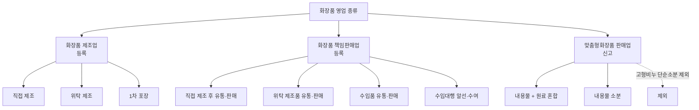

---

## 5. 영업 등록 및 신고 🎯 기출

### 📖 민수, 사업자 등록 전에 다시 멈추다
민수는 매장 계약부터 하려 했지만 지연이 말렸다.


> “잠깐만요. 먼저 어떤 영업을 할 것인지 정하고 등록 또는 신고 절차부터 확인해야 해요.”

민수는 **등록과 신고의 차이**를 공부하기 시작했다.

> 📌 **출처**: 화장품법 제3조, 제6조 | **참조 PDF**: `화장품법(법률)(제20901호)(20260402).pdf` | **시행일**: 2026. 4. 2. | **최종 확인**: 2026. 8. 29.


> **한 줄 요약**: 제조·책임판매는 '등록', 맞춤형은 '신고' — 관할 지방식약청장에게 제출.

**(소재지 관할 지방식품의약품안전청장에게 제출)**

| 종류 | 영업 | 필요 서류 |
|---|---|---|
| 화장품 제조업 등록 | 등록 | • 등록신청서<br>• 대표자의 건강진단서(정신질환자, 마약류의 중독자가 아님을 증명)<br>• 등기사항증명서(법인의 경우)<br>• 시설명세서 |
| 화장품 책임판매업 등록 | 등록 | • 등록신청서<br>• 등기사항증명서(법인의 경우)<br>• 책임판매관리자의 자격 확인 서류<br>• 화장품의 품질관리 및 책임판매 후 안전관리에 적합한 기준에 관한 규정 |
| 맞춤형화장품 판매업 신고 | 신고 | • 맞춤형화장품판매업 신고서<br>• 맞춤형화장품조제관리사 자격증 사본과 시설명세서<br>• 등기사항증명서(법인의 경우)<br>* 맞춤형화장품조제관리사가 2명 이상의 경우: 대표 1명만 제출 가능하며 매년 교육 이수 필수<br>* 맞춤형화장품판매업을 신고하려는 자는 총리령으로 정하는 시설기준을 갖추어야 하며, 맞춤형화장품의 혼합·소분 등 품질·안전 관리 업무에 종사하는 자(맞춤형화장품조제관리사)를 두어야 함 |

> ※ 제출 서류는 전자문서를 포함함

### ① 등록 및 신고대장 포함사항

| 포함 사항 | 제조업 등록대장 | 책임판매업 등록대장 | 맞춤판매업 신고대장 |
|---|---|---|---|
| 번호·연월일 | 등록번호 및 등록연월일 | 등록번호 및 등록연월일 | 신고번호 및 신고연월일 |
| 성명·주민번호 | 제조업자 성명 및 주민등록번호(법인: 대표자) | 책임판매업자 성명 및 주민등록번호(법인: 대표자) | 판매업자 성명 및 주민등록번호(법인: 대표자) |
| 상호 | 제조업자 상호(법인: 명칭) | 책임판매업자 상호(법인: 명칭) | 판매업자 상호 및 소재지 |
| 소재지 | 제조소 소재지 | 책임판매업소 소재지 | 판매업소 상호 및 소재지 |
| 유형/관리자 | 제조 유형 | 책임판매관리자 성명·주민번호, 책임판매 유형 | 조제관리사 성명·주민번호·자격증 번호 |
| 기타 | | | 영업 기간(한시적 영업 시만 해당) |

> **참고:** 맞춤형화장품조제관리사는 해당 맞춤형화장품판매업소의 업무에 종사하지 않게 된 경우, 관리업무 비종사신고서에 사유서를 첨부하여 관할 지방식약청장에게 제출할 수 있음

> **참고: 등록필증의 재발급 범위**
> - 화장품제조업 등록필증
> - 화장품책임판매업 등록필증
> - 기능성화장품 심사결과통지서
>
> **재발급 시 필요 서류**
> - 등록필증 등이 오염, 훼손 등으로 못 쓰게 된 경우: 등록필증 등
> - 등록필증 등을 잃어버린 경우: 분실 사유서

> **참고:** 맞춤형화장품판매업자가 맞춤형화장품조제관리사 자격시험에 합격한 경우에는 해당 맞춤형화장품판매업자의 판매업소 중 하나의 판매업소에서 맞춤형화장품조제관리사 업무를 수행할 수 있으며, 해당 판매업소에는 맞춤형화장품조제관리사를 둔 것으로 본다.

> **참고: 맞춤형화장품조제관리사 자격증 재발급 서류**
> - 자격증 재발급 신청서
> - 자격증을 잃어버린 경우: 분실 사유서
> - 자격증을 못 쓰게 된 경우: 자격증 원본

> **참고:** 맞춤형화장품판매업자가 한시적으로 같은 영업을 하려는 경우, 맞춤형화장품판매업 신고필증 사본과 맞춤형화장품조제관리사 자격증 사본을 첨부 및 제출해야 한다.

---

## 6. 화장품제조업의 등록을 위한 시설 기준 등 🎯 기출

> **한 줄 요약**: 작업소+보관소+시험실 필수 — 일부 공정만 하거나 검사 위탁 시 해당 시설만 면제.


> 📌 **출처**: 화장품법 시행규칙 제6조 | **참조 PDF**: `화장품법 시행규칙(총리령)(제02109호)(20260402).pdf` | **시행일**: 2026. 4. 2. | **최종 확인**: 2026. 8. 29.

**제조 작업을 하는 다음 시설을 갖춘 작업소**
- 쥐·해충 및 먼지 등을 막을 수 있는 시설
- 작업대 등 제조에 필요한 시설 및 기구
- 가루가 날리는 작업실의 가루를 제거하는 시설

**그 외 갖추어야 할 시설**
- 원료·자재 및 제품을 보관하는 보관소
- 원료·자재 및 제품의 품질검사를 위해 필요한 시험실
- 품질검사에 필요한 시설 및 기구

**시설 기준의 면제 사유**
- 일부 공정만 제조하는 경우 및 품질검사를 위탁하는 경우는 해당 공정에 필요한 시설 및 기구만 있어도 가능함
- 화장품 외 물품 제조도 가능함(단, 제품 상호 간 오염의 우려가 있으면 안 됨)

> **참고: 품질검사 위탁 기관** 🎯 기출
> - 보건환경연구원
> - 시험실을 갖춘 제조업자
> - 「식품·의약품 분야 시험·검사 등에 관한 법률」에 따른 화장품시험·검사기관
> - 한국의약품수출입협회

---

## 7. 화장품책임판매업의 등록을 위한 품질관리 기준 및 책임판매 후 안전관리 기준

> **한 줄 요약**: 책임판매관리자 자격·품질관리 기준·안전관리 기준 3축으로 구성.


> 📌 **출처**: 화장품법 시행규칙 제4조, 제8조 | **참조 PDF**: `화장품법 시행규칙(총리령)(제02109호)(20260402).pdf` | **시행일**: 2026. 4. 2. | **최종 확인**: 2026. 8. 29.

화장품책임판매업을 등록하려는 자는 화장품의 품질관리 및 책임판매 후 안전관리에 관한 기준을 갖추어야 하며, 이를 관리할 수 있는 관리자를 두어야 한다.

### 화장품 책임판매관리자의 자격 기준

- 의사 또는 약사
- 이공계 학과 또는 향장학·화장품과학·한의학·한약학·간호학·간호과학·건강간호학 등을 전공하여 학사 이상의 학위를 취득(법령에서 이와 같은 수준 이상의 학력이 있다고 인정하는 경우를 포함)한 사람
- 화학·생물학·화학공학·생물공학·미생물학·생화학·생명과학·생명공학·유전공학·향장학·화장품과학·한의학·한약학·간호학·간호과학·건강간호학 등 화장품 관련 분야를 전공하여 전문학사 학위를 취득(법령에서 이와 같은 수준 이상의 학력이 있다고 인정하는 경우를 포함)한 후 화장품 제조 또는 품질관리 업무에 1년 이상 종사한 경력이 있는 사람
- 식품의약품안전처장이 정하여 고시하는 전문 교육과정을 이수한 사람(식품의약품안전처장이 고시한 품목만 해당)
- 맞춤형화장품조제관리사 자격시험에 합격한 사람
- 화장품 제조 또는 품질관리 업무에 2년 이상 종사한 경력이 있는 사람

> **참고:** 상시근로자 수가 10명 이하인 화장품책임판매업을 경영하는 자가 책임판매관리자 자격 기준에 해당한다면, 책임판매관리자를 둔 것으로 봄(책임판매관리자로서의 직무 수행도 가능)

### 관련 용어

| 용어 | 정의 |
|---|---|
| **품질관리** | 화장품 책임판매 시 제품의 품질을 확보하기 위해 실시하는 것으로, 화장품제조업자 및 제조에 관계된 업무(시험·검사 등의 업무 포함)에 대한 관리·감독 및 화장품의 시장 출하에 관한 관리, 그 밖에 제품의 품질관리에 필요한 업무 |
| **시장출하** | 화장품책임판매업자가 제조(타인에게 위탁 제조 또는 검사하는 경우 포함, 타인으로부터 수탁 제조 또는 검사하는 것은 비포함)하거나 수입한 화장품의 판매를 위해 출하하는 것 |
| **안전관리 정보** | 화장품의 품질, 안전성·유효성, 그 외 적정 사용을 위한 정보 |
| **안전확보 업무** | 화장품 책임판매 후 안전관리 업무 중 정보 수집, 검토 및 그 결과에 따른 필요한 조치에 관한 업무 |

### 품질관리 기준

| 구분 | 세부 업무 | 내용 |
|---|---|---|
| 화장품책임판매업자 - 절차서 작성과 보관 | 절차서 작성과 보관 | 다음 사항이 포함된 품질관리 업무 절차서를 작성·보관해야 함: 적정한 제조 관리 및 품질관리 확보에 관한 절차 / 품질 등에 관한 정보 및 품질 불량 등의 처리 절차 / 회수처리 절차 / 교육·훈련에 관한 절차 / 문서 및 기록의 관리 절차 / 시장출하에 관한 기록 절차 / 그 밖에 품질관리 업무에 필요한 절차 |
| 화장품책임판매업자 - 수행업무 | 절차서에 따른 수행업무 | 적정한 제조였음을 확인하고 기록 / 품질에 대한 정보가 인체에 영향을 미치는 경우 원인을 밝히고, 개선이 필요할 시 개선 조치하고 기록 / 제품의 품질이 불량하거나 불량할 우려가 있는 경우 회수 등 신속한 조치를 하고 기록 / 시장출하에 관하여 기록 / 제조별 품질검사 후 기록(단, 화장품제조업자와 화장품책임판매업자가 같은 경우, 화장품제조업자 또는 식품의약품안전처장이 지시한 위탁검사기관의 품질검사 결과가 있는 경우 제외) / 그 밖에 품질관리에 관한 업무를 수행 |
| 공통 (품질관리) | 원본 보관 | 책임판매관리자가 업무를 수행하는 장소에 품질관리 업무 절차서 원본을 보관하고, 그 외의 장소에는 원본과 대조를 마친 사본을 보관해야 함 |
| 책임판매관리자 - 수행업무 | 절차서에 따른 수행업무 | 품질관리 업무를 총괄 / 품질관리 업무가 적정하고 원활하게 수행되는 것을 확인 / 품질관리 업무의 수행을 위하여 필요하다고 인정할 때에는 화장품책임판매업자에게 문서로 보고함 / 품질관리 업무 시 필요에 따라 화장품제조업자, 맞춤형화장품판매업자 등 그 밖의 관계자에게 문서로 연락하거나 지시함 / 품질관리에 관한 기록 및 화장품제조업자의 관리에 관한 기록을 작성하고, 3년간 보존 |
| 책임판매관리자 - 회수처리 | 회수처리 | 회수한 화장품은 구분하여 일정 기간 보관 후 폐기 등 작성한 방법으로 처리 / 회수 내용을 적은 기록을 작성하고, 화장품책임판매업자에게 문서로 보고함 |
| 책임판매관리자 - 교육·훈련 | 교육·훈련 | 품질관리 업무 종사자를 위한 교육·훈련의 정기적 실시 후 기록 작성 및 보관 / 책임판매관리자 외 사람이 교육·훈련을 할 때 실시 상황을 화장품책임판매업자에게 문서로 보고함 |
| 책임판매관리자 - 문서 및 기록 정리 | 문서 및 기록의 정리 | 문서 작성 또는 개정 시 품질관리 업무 절차서에 따라 해당 문서의 승인, 배포, 보관 / 절차서 작성 또는 개정 시 절차서에 그 날짜를 적고 개정 내용 보관 |

### 안전관리 기준 🎯 기출

| 구분 | 항목 | 내용 |
|---|---|---|
| 화장품책임판매업자 - 조직 및 인원 구성 | 조직 및 인원 구성 | 화장품책임판매업자는 책임판매관리자를 두어야 하며, 안전확보 업무를 적정하고 원활하게 수행할 능력을 갖춘 인원을 충분히 갖추어야 함 |
| 화장품책임판매업자 - 안전관리 정보 수집 | 안전관리 정보 수집 | 화장품책임판매업자는 책임판매관리자에게 학회, 문헌, 그 밖의 연구보고 등에서 안전관리 정보를 수집·기록하도록 함 |
| 책임판매관리자 - 안전확보 조치 | 안전확보 조치 | 안전관리 정보를 신속히 검토·기록 / 수집한 안전관리 정보의 검토 결과 조치가 필요하다고 판단될 경우 회수, 폐기, 판매정지 또는 첨부문서의 개정, 식품의약품안전처장에게 보고 등 안전확보 조치 / 안전확보 조치계획을 화장품책임판매업자에게 문서로 보고한 후 그 사본을 보관 |
| 책임판매관리자 - 안전확보 실시 | 안전확보 실시 | 안전확보 조치 계획을 적정하게 평가하여 안전확보 조치를 결정하고 이를 기록·보관 / 안전확보 조치를 수행할 경우 문서로 지시하고 이를 보관하고 그 결과를 화장품책임판매업자에게 문서로 보고 |
| 책임판매관리자 - 업무 | 업무 | 안전확보 업무를 총괄하여 업무가 적정하고 원활하게 수행되는 것을 확인하고 기록·보관 / 안전확보 업무의 수행을 위하여 필요하다고 인정할 때에는 화장품책임판매업자에게 문서로 보고한 후 보관할 것 |

> **참고: 책임판매관리자의 직무**
> 책임판매관리자는 해당 화장품책임판매업소의 책임판매관리자 업무에 종사하지 않게 된 경우에는, 관리업무 비종사 신고서에 그 사유서를 첨부하여 해당 화장품책임판매업소의 소재지를 관할하는 지방식품의약품안전청장에게 제출해야 함

---

## 8. 영업 등록 및 신고의 결격사유 🎯 기출

### 📖 “등록만 하면 바로 시작할 수 있나요?”
민수가 묻자 담당자는 고개를 저었다.


> “아닙니다. 법에서 정한 결격사유에 해당하는지도 확인해야 합니다.”

민수는 여기서 **영업별 공통점과 차이점**이 시험에서 중요하다는 사실을 알게 되었다.

> 📌 **출처**: 화장품법 제3조 제4항 + 시행규칙 별표 1 | **참조 PDF**: `화장품법 시행규칙(총리령)(제02109호)(20260402).pdf` | **시행일**: 2026. 4. 2. | **최종 확인**: 2026. 8. 29.


> **한 줄 요약**: 제조업만 정신질환·마약 중독 결격 추가 — 3종 공통은 피성년후견·형 선고·취소 후 1년.

| 결격사유 | 화장품 제조업 | 화장품 책임판매업 | 맞춤형화장품판매업 |
|---|---|---|---|
| 정신질환자(전문의가 적합하다고 인정하는 사람은 제외) | O | X | X |
| 마약류의 중독자 | O | X | X |
| 피성년후견인 또는 파산선고를 받고 복권되지 않은 자 | O | O | O |
| 「화장품법」·「보건범죄 단속에 관한 특별조치법」을 위반하여 금고 이상의 형을 선고받고 그 집행이 끝나거나(집행이 끝난 것으로 보는 경우를 포함) 집행이 면제되지 아니한 자, 또는 금고 이상의 형의 집행유예를 선고받고 그 유예기간 중에 있는 자 | O | O | O |
| 등록 취소 또는 영업소가 폐쇄된 날부터 1년이 지나지 않은 자 | O | O | O |

> **용어: 피성년후견인**
> 질병, 장애, 노령, 그 밖의 사유로 인한 정신적 제약으로 사무를 처리할 능력이 지속적으로 결여되어 가정법원으로부터 성년후견 개시의 심판을 받은 사람

> ※ 표의 O/X는 해당 결격사유가 그 영업 유형에 적용되는지 여부를 의미함 (화장품 제조업만 정신질환자·마약류 중독자 결격사유가 적용되고, 책임판매업과 맞춤형화장품판매업에는 적용되지 않음)

---

## 9. 맞춤형화장품조제관리사의 결격사유 🎯 기출

> **한 줄 요약**: 정신질환·피성년후견·마약중독·형 선고·자격취소 후 3년 — 5가지 결격사유.


> 📌 **출처**: 화장품법 제3조의2 + 시행규칙 제3조의2 | **참조 PDF**: `화장품법 시행규칙(총리령)(제02109호)(20260402).pdf` | **시행일**: 2026. 4. 2. | **최종 확인**: 2026. 8. 29.

① 정신질환자(단, 전문의가 적합하다고 인정하는 사람은 제외)

② 피성년후견인

③ 마약류의 중독자

④ 「화장품법」 또는 「보건범죄 단속에 관한 특별조치법」을 위반하여 금고 이상의 형을 선고받고 그 집행이 끝나거나(집행이 끝난 것으로 보는 경우를 포함) 집행이 면제되지 아니한 자, 또는 금고 이상의 형의 집행유예를 선고받고 그 유예기간 중에 있는 자

---

*본 문서는 화장품법 교재 PART 01 (14~21페이지) 내용을 정리한 것입니다.*

---

## p.22 — (5) 영업자의 의무사항 / (6) 변경 등록 및 신고

> **한 줄 요약**: 영업자별 의무사항 + 변경 시 30일(행정구역 개편 90일) 이내 제출, 폐업은 3종 모두 신고.

### 결격사유 (이어지는 항목)
⑤ 맞춤형화장품조제관리사의 자격이 취소된 날부터 3년이 지나지 않은 자

### (5) 영업자의 의무사항

| 구분 | 의무사항 |
|---|---|
| **화장품제조업자** | 제조와 관련된 기록·시설·기구 등 관리 방법, 원료·자재·완제품 등에 대한 시험·검사·검정 실시 방법 및 의무에 관한 사항 준수 |
| **화장품책임판매업자** | • 품질관리 기준, 책임판매 후 안전관리 기준, 품질검사 방법 및 실시 의무, 안전성·유효성 관련 정보사항 등의 보고 및 안전대책 마련 의무에 관한 사항 준수<br>• 지난해의 생산실적 또는 수입실적, 화장품의 제조 과정에 사용된 원료의 목록 등을 유통·판매 전에 식품의약품안전처장에게 보고<br>• 책임판매관리자는 화장품 안전성 확보 및 품질관리 교육 매년 이수 의무 |
| **맞춤형화장품판매업자** | • 소비자에게 유통·판매되는 화장품을 임의로 혼합·소분하여서는 안 됨<br>• 맞춤형화장품에 사용된 모든 원료의 목록을 매년 1회 식품의약품안전처장에게 보고해야 함<br>• 판매장 시설·기구의 관리 방법, 혼합·소분 안전관리 기준의 준수 의무, 혼합·소분되는 내용물 및 원료에 대한 설명 의무, 안전성 관련 사항 보고 의무에 관한 사항 준수<br>• 맞춤형화장품조제관리사는 화장품 안전성 확보 및 품질관리 교육 매년 이수 의무 |

- 식품의약품안전처장은 국민 건강상 위해를 방지하기 위하여 필요하다고 인정하면 화장품제조업자, 화장품책임판매업자 및 맞춤형화장품판매업자에게 화장품 관련 법령 및 제도(화장품의 안전성 확보 및 품질관리에 관한 내용을 포함)에 관한 교육을 받을 것을 명할 수 있음
- 교육을 받아야 하는 자가 둘 이상의 장소에서 영업하는 경우에는 종업원 중에서 총리령으로 정하는 자를 책임자로 지정하여 교육을 받게 할 수 있음

**참고 - 생산 또는 수입실적 보고**: 매년 2월 말까지
**참고 - 원료의 목록 보고**: 유통·판매 전까지

**참고 - 화장품 안전성 확보 및 품질관리 교육**
- 교육대상: 책임판매관리자, 맞춤형화장품조제관리사
- 최초교육: 종사한 날부터 6개월 이내 (단, 자격시험에 합격한 날이 종사한 날 이전 1년 이내이면 제외)
- 보수교육: 교육을 받은 날을 기준으로 매년 1회
- 교육시간: 4시간 이상, 8시간 이하

### (6) 변경 등록 및 신고 (소재지 관할 지방식품의약품안전청장에게 제출)

화장품제조업자 또는 화장품책임판매업자는 변경 사유가 발생한 날로부터 **30일**(행정구역 개편에 따른 소재지 변경의 경우에는 **90일**) 이내에 해당 서류를 제출해야 하며, 맞춤형화장품판매업자는 변경신고를 하려면 관련 서류를 제출해야 한다.

단, **폐업은 3가지 유형을 모두 신고**해야 한다.

| 종류 | 변경 | 변경 사유 |
|---|---|---|
| 화장품제조업 | 등록 | • 화장품제조업자의 변경(법인은 대표자 변경)<br>• 화장품제조업자의 상호 변경(법인은 법인 명칭 변경)<br>• 제조소의 소재지 변경<br>• 제조 유형 변경 |
| 화장품책임판매업 | 등록 | • 화장품책임판매업자의 변경(법인은 대표자 변경)<br>• 화장품책임판매업자의 상호 변경(법인은 법인 명칭 변경)<br>• 화장품책임판매업소의 소재지 변경<br>• 책임판매관리자의 변경<br>• 책임판매 유형 변경 |
| 맞춤형화장품판매업 | 신고 | • 맞춤형화장품판매업자의 변경(법인은 대표자 변경)<br>• 맞춤형화장품판매업소의 상호 변경(법인은 법인 명칭 변경)<br>• 맞춤형화장품판매업소의 소재지 변경<br>• 맞춤형화장품조제관리사의 변경 |

**참고 - 소재지 변경 위반 행정처분**

| 구분 | 제조소 | 화장품책임판매업소 | 맞춤형화장품판매업소 |
|---|---|---|---|
| 1차 | 업무정지 1개월 | | |
| 2차 | 업무정지 3개월 | 업무정지 2개월 | |
| 3차 | 업무정지 6개월 | 업무정지 3개월 | |
| 4차 | 등록취소 | 업무정지 4개월 | |

**확인문제**: 화장품제조소의 소재지가 변경된 경우 → **(소재지 지방식품의약품안전청장)**에게 변경 등록을 제출해야 한다.

> **해설**: 소재지 변경은 변경 등록 사유에 해당하며, 변경 사유 발생일로부터 30일(행정구역 개편 시 90일) 이내에 관할 지방식약청장에게 제출해야 한다.

---

## p.23 — (7) 승계의 진행 / (8) 행정처분의 일반 기준

> **한 줄 요약**: 승계 시 행정제재 효과는 1년간 승계 — 위반 2개 이상 시 무거운 처분 따르되 최대 12개월.

### (7) 승계의 진행

| 구분 | 내용 |
|---|---|
| 영업자의 지위 승계 | 영업자의 사망 또는 영업 양도, 법인 영업자의 합병의 경우 상속인, 영업을 양수한 자 또는 합병 후 존속 법인이나 합병에 따라 설립되는 법인이 영업자의 의무 및 지위 승계 |
| 행정제재처분 효과 승계 | • 행정제재처분 기간이 끝난 날부터 1년간 해당 영업자의 지위를 승계한 자에게 승계<br>• 행정제재처분 진행 중에는 영업자의 지위를 승계한 자에 대해 절차를 계속 진행(단, 승계자가 처분, 위반 사실을 알지 못하였음을 증명하는 경우는 제외) |

### (8) 행정처분의 일반 기준

① 위반행위가 둘 이상인 경우로서 각각의 처분 기준이 다른 경우에는 그 중 **무거운 처분 기준**을 따른다.

다만, 둘 이상의 처분 기준이 **업무정지**인 경우에는 가장 무거운 처분의 업무정지 기간에 나머지 각각의 업무정지 기간의 **2분의 1**을 더하여 처분하며, 이 경우 그 **최대 기간은 12개월**로 한다.

② 위반행위가 둘 이상인 경우로서 업무정지와 품목 업무정지에 해당하는 경우, 그 업무정지 기간이 품목업무정지 기간보다 길거나 같을 때에는 업무정지 처분을 하고, 업무정지 기간이 품목업무정지 기간보다 짧을 때에는 업무정지 처분과 품목 업무정지 처분을 동시에 부과한다.

③ 위반행위의 횟수에 따른 행정처분의 기준은 최근 **1년간** 같은 위반행위로 행정처분을 받은 경우 적용한다. 기준의 적용일은 최근에 실제 행정처분을 받은 날(업무정지 처분을 갈음하여 과징금을 부과하는 경우에는 최근에 과징금 처분을 통보받은 날)과 다시 같은 위반행위를 적발한 날을 기준으로 하되, 품목 업무정지의 경우 품목이 다를 때에는 이 기준을 적용하지 않는다.

④ 행정처분 절차가 진행되는 기간 중에 반복하여 같은 위반행위를 한 경우 진행 중인 사항의 행정처분 기준의 **2분의 1씩**을 더하여 처분하며, 그 최대 기간은 **12개월**로 한다.

⑤ 같은 위반행위의 횟수가 **3차 이상**인 경우에는 과징금 부과 대상에서 제외한다.

⑥ 화장품제조업자가 등록한 소재지에 그 시설이 전혀 없는 경우 등록을 취소한다.

⑦ 수입대행형 거래를 목적으로 화장품을 알선·수여하는 화장품책임판매업을 등록한 자에 대하여 개별 기준을 적용하는 경우 '판매금지'는 '수입대행금지'로, '판매업무정지'는 '수입대행 업무정지'로 한다.

⑧ 다음의 경우는 처분을 **2분의 1까지 감경하거나 면제**할 수 있다.
- 국민보건, 수요·공급, 그 밖에 공익상 필요하다고 인정된 경우
- 해당 위반사항에 관하여 검사로부터 기소유예의 처분을 받거나 법원으로부터 선고유예의 판결을 받은 경우
- 광고주의 의사와 관계없이 광고회사 또는 광고매체에서 무단 광고한 경우

⑨ 다음의 경우는 처분을 **2분의 1까지 감경**할 수 있다.
- 기능성화장품으로서 그 효능·효과를 나타내는 원료의 함량 미달의 원인이 유통 중 보관 상태 불량 등으로 인한 성분의 변화 때문이라고 인정된 경우
- 비병원성 일반세균에 오염된 경우로서 인체에 직접적인 위해가 없으며, 유통 중 보관 상태 불량에 의한 오염으로 인정된 경우

---

## p.24 — (9) 행정처분의 개별 기준 / (10) 벌칙 및 과태료 - ② 영업금지

> **한 줄 요약**: 등록취소는 1~4차 위반 사유별 차등 — 영업금지 10가지(식품모방·변패·병원미생물 오염 등).

### (9) 행정처분의 개별 기준

**① 등록 취소 처분이 가능한 경우**

| 위반 차수 | 사유 |
|---|---|
| 1차 위반 시 등록취소 | • 업무정지 기간 중에 해당 업무를 한 경우(광고 업무에 한정하여 정지를 명한 경우는 제외)<br>• 화장품제조업 또는 화장품책임판매업의 등록이나 맞춤형화장품판매업의 결격사유 중 어느 하나에 해당하는 경우 |
| 2차 위반 시 등록취소 | - |
| 3차 위반 시 등록취소 | • 화장품제조업자가 제조 또는 품질검사에 필요한 시설 및 기구의 전부가 없는 경우<br>• 심사를 받지 않거나 거짓으로 보고하고 기능성화장품을 판매한 경우 |
| 4차 위반 시 등록취소 | • 제조소 및 화장품책임판매업소의 소재지 변경<br>• 국민보건에 위해를 끼쳤거나 끼칠 우려가 있는 화장품을 제조·수입한 경우<br>• 품질관리 업무 절차서를 작성하지 않거나 거짓으로 작성한 경우<br>• 회수 대상 화장품을 회수하지 않거나 회수하는 데 필요한 조치를 하지 않은 경우<br>• 회수계획을 보고하지 않거나 거짓으로 보고한 경우<br>• 식품의약품안전처장이 고시한 화장품의 제조 등에 사용할 수 없는 원료를 사용한 화장품<br>• 검사·질문·수거 등을 거부하거나 방해한 경우<br>• 시정명령·검사명령·개수명령·회수명령·폐기명령 또는 공표명령 등을 이행하지 않은 경우 |

**② 영업금지**

다음에 해당하는 화장품을 판매(수입대행형 거래를 목적으로 하는 알선·수여를 포함)하거나 판매할 목적으로 제조·수입·보관 또는 진열을 금지한다.

| 유형 | 금지 화장품 | 관련 조문 |
|---|---|---|
| 미심사 기능성 | 심사를 받지 않았거나 보고서를 제출하지 않은 기능성화장품 | 제4조 |
| 변패·오염 | 전부 또는 일부가 변패된 화장품 | 제15조제2호 |
| 병원미생물 | 병원미생물에 오염된 화장품 | 제15조제3호 |
| 이물 혼입 | 이물이 혼입되었거나 부착된 화장품 | 제15조제4호 |
| 기준 위반 | 화장품에 사용할 수 없는 원료를 사용하였거나, 유통화장품 안전관리 기준에 부적합한 화장품 | 제8조·제15조제5호 |
| 특정 원료 사용 | 코뿔소 뿔 또는 호랑이 뼈와 그 추출물을 사용한 화장품 | 제15조제6호 |
| 비위생 제조 | 보건위생상 위해가 발생할 우려가 있는 비위생적인 조건 또는 시설 기준에 부적합한 시설에서 제조된 화장품 | 제15조제7호 |
| 불량 포장 | 용기나 포장이 불량하여 화장품이 보건위생상 위해를 발생시킬 우려가 있는 경우 | 제15조제8호 |
| 사용기한 위조 | 사용기한 또는 개봉 후 사용기간(제조연월일을 포함)을 위조·변조한 화장품 | 제15조제9호 |
| 식품 모방 | **식품의 형태·냄새·색깔·크기·용기 및 포장 등을 모방하여 섭취 등 식품으로 오용될 우려가 있는 화장품** | 제15조제10호 |

---

## p.25 — ③ 판매금지

> **한 줄 요약**: 미등록 제조품·맞춤 미신고품·동물실험품 판매 금지 — 동물실험 예외 6가지.

**식품 모방 화장품 위반 우려 사례**
- 용기·포장을 제거하고 내용물만으로 사용하는 제품류
- 용기·포장을 포함한 제품 특징이 식품을 모방하고 있으며, 내용물 섭취 우려가 있는 제품류

**식품과 협업이 가능한 사례**
- 식품으로 오인될 우려 없이 단순히 특정 식품의 상표, 브랜드명 또는 디자인 등을 사용한 경우(다만, 내용물을 오인 섭취할 우려가 있는 경우는 제외)
- 제품 용기·포장은 식품 또는 특정 식품브랜드 형태 등을 모방했으나, 사용 방식이 식품과 다르고 섭취도 어려운 경우(다만, 내용물을 오인 섭취할 우려가 있는 경우는 제외)

**참고 - 식품 모방 화장품 위반 적발 시**

| 구분 | 내용 |
|---|---|
| 회수 | 회수 대상 화장품 |
| 행정처분 | 해당 품목 제조 또는 판매업무 정지(위반 적발 제품은 동일한 용기·포장 등으로는 지속 판매 불가함) |
| 벌칙 | 3년 이하의 징역 또는 3천만 원 이하의 벌금 |

### ③ 판매금지

다음에 해당하는 화장품을 판매하거나 판매할 목적으로 보관 또는 진열을 금지한다.

| 유형 | 금지 내용 | 비고 |
|---|---|---|
| 미등록 제조 | 영업의 등록을 하지 않은 자가 제조한 화장품 또는 제조·수입하여 유통·판매한 화장품 | |
| 맞춤형 미신고 | 맞춤형화장품판매업을 신고하지 않은 자가 판매한 맞춤형화장품 | |
| 조제관리사 미배치 | 맞춤형화장품조제관리사를 두지 않고 판매한 맞춤형화장품 | |
| 허위 표시 | 화장품 기재사항, 가격표시, 기재·표시상의 주의를 위반하여 화장품 또는 의약품으로 잘못 인식할 우려가 있게 기재·표시된 화장품 | |
| 비판매용 제품 | 판매의 목적이 아닌 제품의 홍보·판매 촉진 등을 위해 미리 소비자가 시험·사용하도록 제조 또는 수입된 화장품 | 소비자에게 판매하는 화장품에 한함 |
| 표시 훼손·위조 | 화장품의 포장 및 기재·표시사항을 훼손 또는 위조·변조한 화장품 | 맞춤형화장품 판매를 위해 필요한 경우 제외 |
| 내용물 분할 판매 | 화장품의 용기에 담은 내용물을 나누어 판매하는 행위 | 맞춤형화장품조제관리사를 통한 판매 및 소분 판매 목적 제조 화장품은 제외 |
| **동물실험 화장품** | **화장품책임판매업자 및 맞춤형화장품판매업자는 동물실험을 실시한 화장품 또는 원료를 사용하여 제조 또는 수입한 화장품은 유통·판매 금지** | 아래 6가지 예외 적용 |

**동물실험 화장품 판매금지 예외 (6가지)**

| 예외 | 내용 |
|---|---|
| 1 | 보존제, 색소, 자외선 차단제 등 특별히 사용상의 제한이 필요한 원료에 대하여 그 사용 기준을 지정하거나 국민보건상 위해 우려가 제기되는 화장품 원료 등에 대한 위해 평가를 하기 위하여 필요한 경우 |
| 2 | 동물대체시험법이 존재하지 않아 동물실험이 필요한 경우 |
| 3 | 화장품 수출을 위하여 수출 상대국의 법령에 따라 동물실험이 필요한 경우 |
| 4 | 수입하려는 상대국의 법령에 따라 제품 개발에 동물실험이 필요한 경우 |
| 5 | 다른 법령에 따라 동물실험을 실시하여 개발된 원료를 화장품의 제조 등에 사용하는 경우 |
| 6 | 그 밖에 동물실험을 대체할 수 있는 실험을 실시하기 곤란한 경우로서 식품의약품안전처장이 정하는 경우 |

---

## p.26 — 실험동물에 관한 법률 /
④ 폐업 등의 신고 / (10) 벌칙 및 과태료

① 벌칙

> **한 줄 요약**: 폐업·휴업 신고 → 7일 이내 수리 통지. 벌칙은 3년/1년/200만 원 3단계.

### 실험동물에 관한 법률

| 항목 | 내용 |
|---|---|
| 목적 | 실험동물 및 동물실험의 적절한 관리를 통하여 동물실험에 대한 윤리성 및 신뢰성을 높여 생명과학 발전과 국민보건 향상에 이바지함 |
| 동물실험 | 교육·시험·연구 및 생물학적 제제의 생산 등 과학적 목적을 위하여 실험동물을 대상으로 실시하는 실험 또는 그 과학적 절차 |
| 실험동물 | 동물실험을 목적으로 사용 또는 사육되는 척추동물 |
| 재해 | 동물실험으로 인한 사람과 동물의 감염, 전염병 발생, 유해물질 노출 및 환경오염 등 |
| 동물실험시설 | 동물실험 또는 이를 위하여 실험동물을 사육하는 시설로서 대통령령으로 정하는 것 |
| 실험동물생산시설 | 실험동물을 생산 및 사육하는 시설 |
| 운영자 | 동물실험시설 혹은 실험동물생산시설을 운영하는 자 |

### ④ 폐업 등의 신고

- 다음 중 어느 하나에 해당하는 경우는 식품의약품안전처장에게 신고하여야 한다. (단, 휴업기간이 1개월 미만이거나 그 기간 동안 다시 업을 재개하는 경우는 제외)
  - 폐업 또는 휴업하려는 경우
  - 휴업 후 그 업을 재개하려는 경우
- 식품의약품안전처장은 화장품제조업자 또는 화장품책임판매업자가 「부가가치세법」에 따라 관할 세무서장에게 폐업신고를 하거나 사업자등록을 말소당한 경우 등록을 취소할 수 있다.
- 식품의약품안전처장은 등록 취소를 위해 관할 세무서장에게 폐업 여부에 대한 정보를 요청할 수 있다.
- 식품의약품안전처장은 폐업 및 휴업신고를 받은 날부터 **7일 이내**에 신고수리 여부를 신고인에게 통지해야 한다.
- 식품의약품안전처장이 기간 내에 처리기간 연장을 통지하지 않았다면 기간 종료 다음 날 신고를 수리한 것으로 본다.

### (10) 벌칙 및 과태료

**① 벌칙**

| 처벌 수준 | 위반행위 |
|---|---|
| 3년 이하 징역 또는 3천만 원 이하 벌금 (징역형과 벌금형 함께 부과 가능) | • 화장품제조업 또는 화장품책임판매업에 필요한 등록과 변경사항 등록을 위반한 자<br>• 맞춤형화장품판매업에 필요한 신고와 변경사항 신고를 위반한 자<br>• 맞춤형화장품조제관리사를 두지 않은 맞춤형화장품판매업자<br>• 기능성화장품에 대한 심사나 보고서 제출, 이에 대한 변경을 위반한 자<br>• 영업금지 조항을 위반한 자<br>• 등록하지 않은 자가 제조한 화장품 또는 제조·수입하여 유통·판매한 자<br>• 화장품 포장 및 기재·표시사항을 훼손(맞춤형화장품 판매를 위하여 필요한 경우 제외), 위·변조한 자 |

---

## p.27 — (10) 벌칙 및 과태료 (계속) - ① 벌칙, ② 과태료

> **한 줄 요약**: 벌칙 3단계(3년/1년/200만 원) + 과태료 2단계(100만/50만 원).

### ① 벌칙 (계속)

| 처벌 수준 | 위반행위 |
|---|---|
| 1년 이하 징역 또는 1천만 원 이하 벌금 (징역형과 벌금형 함께 부과 가능) | • 영유아 또는 어린이 사용 화장품임을 표시·광고하기 위한 안전과 품질 입증 자료 작성·보관을 위반한 자<br>• 안전용기·포장의 기준을 위반한 자<br>• 의약품으로 잘못 인식할 수 있게 표시 또는 광고를 한 자<br>• 기능성화장품으로 잘못 인식할 수 있거나 안전성·유효성 심사 결과와 다른 내용의 표시·광고를 한 자<br>• 소비자를 속이거나 소비자가 잘못 인식하도록 할 우려가 있는 표시·광고를 하거나 판매한 자<br>• 화장품의 기재사항, 가격표시, 기재·표시상의 주의를 위반한 화장품 또는 의약품으로 잘못 인식할 수 있게 기재·표시된 화장품을 판매한 자<br>• 판매 목적이 아닌 제품의 홍보·판매 촉진 등을 위해 미리 소비자가 시험·사용하도록 제조 또는 수입된 화장품을 판매하거나 판매할 목적으로 보관·진열한 자<br>• 화장품의 용기에 담은 내용물을 나누어 판매한 자(단, 맞춤형화장품조제관리사를 통해 판매하는 맞춤형화장품판매업자는 제외)<br>• 실증 자료 제출 요청을 받고도 제출하지 않은 채 계속 표시·광고를 하여 내린 중지명령을 따르지 않은 자 |
| 200만 원 이하 벌금 | • 영업자의 의무사항을 위반한 자<br>• 위해화장품의 회수 및 회수 계획 보고를 위반한 자<br>• 1, 2차 포장에 기재해야 되는 사항을 위반한 자(가격표시는 제외)<br>• 식품의약품안전처장이 인정한 보고와 검사, 시정명령, 검사명령, 개수명령, 회수·폐기명령을 위반하거나 관계 공무원의 검사·수거 또는 처분을 거부·방해하거나 기피한 자 |

**참고 - 천연화장품 및 유기농화장품에 대한 부당한 표시·광고 행위 등의 금지 조항(제13조의3) 삭제** (2025.1.31. 일부개정)

**참고 - 영업자의 의무사항**: 본문 p.22

### ② 과태료

| 금액 | 위반행위 |
|---|---|
| 100만 원 | • 맞춤형화장품조제관리사 또는 이와 유사한 명칭을 사용한 자<br>• 기능성화장품에 대해 제출한 보고서나 심사받은 사항을 변경할 때 변경심사를 받지 않은 자<br>• 동물실험을 실시한 화장품 또는 원료를 사용하여 제조(위탁제조 포함) 또는 수입한 화장품을 유통·판매한 자<br>• 보고와 검사 등의 명령을 위반하여 보고하지 않은 자 |
| 50만 원 | • 화장품의 생산실적 또는 수입실적 또는 화장품 원료의 목록 등을 보고하지 않은 자<br>• 맞춤형화장품 원료의 목록을 보고하지 않은 자<br>• 책임판매관리자 및 맞춤형화장품조제관리사가 매년 화장품의 안전성 확보 및 품질관리에 관한 교육을 받지 않는 경우<br>• 식품의약품안전처장이 필요 시 영업자에게 화장품 관련 법령 및 제도에 관한 교육을 명할 시 그 명령을 위반한 자<br>• 폐업신고를 하지 않은 자<br>• 화장품의 판매가격을 표시하지 않은 자 |

**참고 - 보고와 검사 등**
- 식품의약품안전처장은 필요하면 영업자·판매자 또는 화장품을 업무상 취급하는 자에 대해 필요한 보고를 명하거나, 관계 공무원이 화장품 제조장소·영업소·창고·판매장소, 화장품을 취급하는 장소에 출입하여 그 시설 또는 관계 장부나 서류, 물건의 검사 또는 관계인에 대한 질문을 할 수 있음
- 식품의약품안전처장은 화장품의 품질 또는 안전 기준, 포장 등의 기재·표시사항 등이 적합한지 여부를 검사하기 위해 필요한 최소 분량을 수거하여 검사할 수 있음
- 식품의약품안전처장은 총리령으로 정하는 바에 따라 제품의 판매에 대한 모니터링 제도를 운영할 수 있음

**참고 - 의무 명령 위반 시 50만 원의 과태료가 부과되는 영업자**: 화장품제조업자, 화장품책임판매업자 및 맞춤형화장품판매업자

---

## p.28 — (11) 과징금 처분 / (12) 양벌 규정 / (13) 화장품의 날

> **한 줄 요약**: 과징금 최대 10억 원, 양벌 규정(법인도 벌금), 화장품의 날 9월 7일.

### (11) 과징금 처분

① 식품의약품안전처장은 등록의 취소 등에 따라 영업자에게 업무정지 처분을 하여야 할 경우에는 그 업무정지 처분을 갈음하여 **10억 원 이하의 과징금**을 부과할 수 있다.

② 과징금을 부과하는 위반행위의 종류와 위반 정도 등에 따른 과징금의 금액과 그 밖에 필요한 사항은 대통령령으로 정한다.

③ 식품의약품안전처장은 과징금을 부과하기 위하여 필요한 경우에는 다음의 사항을 적은 문서로 관할 세무관서의 장에게 과세 정보 제공을 요청할 수 있다.
- 납세자의 인적 사항
- 과세 정보의 사용 목적
- 과징금 부과기준이 되는 매출금액

④ 식품의약품안전처장은 과징금을 내야 할 자가 납부기한까지 과징금을 내지 아니하면 대통령령으로 정하는 바에 따라 과징금 부과 처분을 취소하고 등록의 취소에 따른 업무정지 처분을 하거나 국세체납 처분의 예에 따라 이를 징수한다(단, 폐업 등으로 등록의 취소에 따른 업무정지 처분을 할 수 없을 때에는 국세체납 처분의 예에 따름).

⑤ 식품의약품안전처장은 체납된 과징금의 징수를 위하여 다음의 자료 또는 정보를 다음의 자에게 요청할 수 있다. 이 경우 요청을 받은 자는 정당한 사유가 없으면 요청에 따라야 한다.
- 「건축법」에 따른 건축물대장 등본: 국토교통부장관
- 「공간정보의 구축 및 관리 등에 관한 법률」에 따른 토지대장 등본: 국토교통부장관
- 「자동차관리법」에 따른 자동차등록원부 등본: 특별시장·광역시장·특별자치시장·도지사 또는 특별자치도지사

### (12) 양벌 규정

① **의미**: 어떤 범죄가 이루어진 경우에 행위자를 벌할 뿐만 아니라 그 행위자와 일정한 관계가 있는 타인(자연인 또는 법인)에 대해서도 형을 과하도록 정한 규정이다.

② **법례**: 법인의 대표자나 법인 또는 개인의 대리인, 사용인, 그 밖의 종업원이 그 법인 또는 개인의 업무에 관하여 위반행위를 하면 그 행위자를 벌하는 외에 그 법인 또는 개인에게도 해당 조문의 벌금형을 과(科)한다.

다만, 법인 또는 개인이 그 위반행위를 방지하기 위하여 해당 업무에 관하여 상당한 주의와 감독을 게을리하지 아니한 경우에는 그러하지 아니하다.

### (13) 화장품의 날

① 화장품산업의 국제 경쟁력 강화를 도모하고 화장품에 대한 국민의 이해와 관심을 높이기 위하여 **매년 9월 7일**을 화장품의 날로 정한다.

② 국가 및 지방자치단체는 화장품의 날의 취지에 맞는 행사, 교육 및 홍보를 실시하거나 관련 법인·단체의 활동을 지원할 수 있다.

③ 제2항에 따른 화장품의 날 행사, 교육 및 홍보 등에 관하여 필요한 사항은 대통령령으로 정한다.

---

## p.29 — 5. 지방식품의약품안전청 업무

> **한 줄 요약**: 식약처장 권한 17호를 지방식약청장에 위임 — 등록·신고·교육·감시·행정처분·과징금 징수.

식품의약품안전처장은 다음 각 호의 권한을 지방식품의약품안전청장에게 위임한다.

① 화장품제조업 또는 화장품책임판매업의 등록 및 변경등록

② 맞춤형화장품판매업의 신고 및 변경신고의 수리

③ 화장품제조업자, 화장품책임판매업자 및 맞춤형화장품판매업자에 대한 교육명령

④ 회수계획 보고의 접수 및 회수에 따른 행정처분의 감경·면제

⑤ 영업자의 폐업, 휴업·업재개 등 신고의 수리

⑥ 표시·광고 내용의 실증 등에 관한 업무

⑦ 보고명령·출입·검사·질문 및 수거

⑧ 소비자화장품안전관리감시원의 위촉·해촉 및 교육

⑨ 다음 사항에 따른 시정명령
   - 화장품제조업, 화장품책임판매업 영업 등록에 따른 변경등록을 하지 않은 경우
   - 맞춤형화장품판매업 신고에 따른 변경신고를 하지 않은 경우
   - 영업자가 화장품관련 법령 및 제도에 관한 교육명령을 위반한 경우
   - 영업자가 폐업 또는 휴업신고나 휴업 후 재개신고를 하지 않은 경우
⑩ 검사명령
⑪ 개수명령 및 시설의 전부 또는 일부의 사용금지 명령
⑫ 회수·폐기 등의 명령, 회수계획 보고의 접수와 폐기 또는 그 밖에 필요한 처분
⑬ 공표명령, 위반사실의 공표
⑭ 등록의 취소, 영업소의 폐쇄명령, 품목의 제조·수입 및 판매의 금지 명령, 업무의 전부 또는 일부에 대한 정지 명령
⑮ 청문
⑯ 과징금 및 과태료의 부과·징수

**과징금 미납자에 대한 처분**
과징금 납부의 의무자가 납부기한까지 과징금을 내지 않으면, 기한이 지난 후 **15일 이내**에 독촉장을 발급해야 하며, 납부기한은 독촉장을 발급하는 날부터 **10일 이내**로 함

⑰ 등록필증·신고필증의 재교부

---

**참고 - 개수명령**
식품의약품안전처장은 화장품제조업자가 갖추고 있는 시설이 시설기준에 적합하지 아니하거나 노후 또는 오손되어 있어 그 시설로 화장품을 제조하면 화장품의 안전과 품질에 문제의 우려가 있다고 인정되는 경우, 화장품제조업자에게 그 시설의 개수를 명하거나 그 개수가 끝날 때까지 해당 시설의 전부 또는 일부의 사용금지를 명할 수 있음

**참고 - 청문**
자격의 취소 및 등록의 취소, 영업소 폐쇄, 품목의 제조·수입 및 판매(수입대행형 거래를 목적으로 하는 알선·수여를 포함)의 금지 또는 업무의 전부에 대한 정지를 명하고자 하는 경우에는 청문을 하여야 함

---

## 6. 화장품의 품질 요소

### 📖 첫 제품의 품질검사
시제품이 완성되자 민수는 “예쁘게 만들어졌으니 성공”이라고 생각했다.
그러자 지연이 물었다.


> “안전한가요? 시간이 지나도 안정적인가요? 원하는 기능을 실제로 하는가요? 사용하기에 적절한가요?”

민수는 화장품의 품질을 **안전성·안정성·유효성·사용성**이라는 네 가지 관점에서 바라보게 되었다.

> 📌 **출처**: 화장품법 제4조의2 + 식약처 품질관리 가이드 | **참조 PDF**: `화장품법(법률)(제20901호)(20260402).pdf` | **시행일**: 2026. 4. 2. | **최종 확인**: 2026. 8. 29.


> **한 줄 요약**: 안전성(최중요)·안정성·유효성·사용성 4대 품질 요소.

### (1) 안전성(Safety)
화장품의 품질요소 중 가장 중요한 것으로서, 화장품은 장기간 피부에 사용하는 제품이므로 사용으로 인한 자극, 알레르기, 독성 등의 부작용이 없어야 한다.

#### ① 안전성에 관한 자료

| 시험 항목 | 내용 | 면제 조건 |
|---|---|---|
| 단회 투여 독성시험 | 단일 용량 투여 후 급성 독성 평가 | |
| 1차 피부 자극시험 | 피부 접촉 후 자극 반응 평가 | |
| 안점막 자극시험 | 눈 및 기타 점막 자극 평가 | |
| 피부 감작성시험 | 알레르기 유발 가능성 평가 | |
| 광독성·광감작성시험 | 자외선 노출 시 독성·알레르기 평가 | 자외선 흡수 없음 입증 시 면제 |
| 인체 첩포시험 | 인체 피부 부착 반응 평가 | |
| 인체 누적첩포시험 | 반복 첩부에 의한 누적 반응 평가 | 인체적용시험에서 안전성 우려 시에 한함 |

**용어**
- **감작(Sensitization)**: 항원성 물질 또는 외래의 자극에 대해 생체가 과민해지는 상태
- **광감작(Photosensitization)**: 빛에 의해 화학물질이 알러지성 물질을 형성하여 생체가 과잉 반응하는 상태

#### ② 안전성 관련 용어

| 용어 | 설명 |
|---|---|
| 유해사례 (AE: Adverse Event, Adverse Experience) | 화장품의 사용 중 발생한 바람직하지 않고 의도되지 아니한 징후, 증상 또는 질병을 말하며, 당해 화장품과 반드시 인과관계를 가져야 하는 것은 아님 |
| 중대한 유해사례 (Serious AE) | 유해사례 중 다음 어느 하나에 해당하는 경우: 사망을 초래하거나 생명을 위협하는 경우 / 입원 또는 입원기간의 연장이 필요한 경우 / 지속적 또는 중대한 불구나 기능 저하를 초래하는 경우 / 선천적 기형 또는 이상을 초래하는 경우 / 기타 의학적으로 중요한 상황 |
| 실마리 정보 (Signal) | 유해사례와 화장품 간의 인과관계 가능성이 있다고 보고된 정보로서 그 인과관계가 알려지지 아니하거나 입증 자료가 불충분한 것 |
| 안전성 정보 | 화장품과 관련하여 국민보건에 직접 영향을 미칠 수 있는 안전성·유효성에 관한 새로운 자료, 유해사례 정보 등 |

> **확인문제**: 화장품의 중대한 유해사례 보고기한은 (15)일 이내, 일반 유해사례는 1개월 이내 보고해야 한다.
>
> **해설**: 중대한 유해사례는 15일 이내 신속보고, 일반 유해사례는 매 반기 종료 후 1개월 이내 정기보고한다. 보고 대상은 식품의약품안전처장이다.

#### ③ 안전성 정보 보고
- 의사·약사·간호사·판매자·소비자 또는 관련 단체 등의 장은 화장품 사용 중 발생하였거나 알게 된 유해사례 등의 안전성 정보를 식품의약품안전처장 또는 화장품책임판매업자에게 식품의약품안전처 홈페이지, 전화, 우편, 팩스, 정보통신망을 이용하여 보고 가능함
- 화장품책임판매업자가 중요한 유해사례를 알았거나 판매중지나 회수에 준하는 외국정부의 조치 등을 알았을 때에는 **15일 이내**에 신속보고 해야 하며, 정기보고는 매 반기 종료 후 **1개월 이내**에 식품의약품안전처장에게 보고 (단, 상시근로자 수가 2인 이하로서 직접 제조한 화장비누만을 판매하는 화장품책임판매업자는 해당 안전성 정보를 보고하지 아니할 수 있음)

#### ④ 화장품 위해 평가
- 위해 평가 대상: 국민보건상 위해 우려가 제기되는 화장품 원료
- 위해 평가 절차: 위험성 확인 → 위험성 결정 → 노출평가과정 → 위해도 결정과정
- 지정·고시된 원료의 사용 기준 검토: 식품의약품안전처장은 지정·고시된 원료의 사용 기준의 안전성 정기 검토를 **5년 주기**로 하며, 결과에 따라 사용 기준 변경이 가능함

#### ⑤ 화장품 사용 금지 해제 또는 변경 신청 등

화장품제조업자, 화장품책임판매업자 또는 연구기관 등은 지정·고시된 원료를 해제 또는 변경하거나, 지정·고시되지 않은 원료의 사용기준을 지정·고시하거나 지정·고시된 원료의 사용기준을 변경해 줄 것을 신청하려는 경우, 원료 사용 금지 해제 또는 변경(사용기준 지정 또는 변경) 신청서(전자문서를 포함)에 다음 각 호의 서류를 첨부하여 식품의약품안전처장에게 제출해야 함

| 번호 | 첨부 서류 | 비고 |
|---|---|---|
| 1 | 제출자료 전체의 요약본 | |
| 2 | 원료의 기원, 개발 경위, 국내·외 사용기준 및 사용현황 등에 관한 자료 | |
| 3 | 원료의 특성에 관한 자료 | |
| 4 | 안전성 및 유효성에 관한 자료 | 유효성 자료는 해당하는 경우에만 제출 |
| 5 | 원료의 기준 및 시험방법에 관한 시험성적서 | |

| 절차 | 내용 | 기한 |
|---|---|---|
| 보완 요청 | 제출 자료가 적합하지 않은 경우 구체적 명시하여 보완 요청 | 신청인은 보완일부터 **60일 이내** 추가 자료 제출 또는 연장 요청 |
| 심사 결과 통지 | 신청인에게 심사 결과통지서 송부 | 자료 제출일(보완 시 보완 자료 제출일)부터 **180일 이내** |
| 세부 절차 | 그 밖의 세부절차·방법 등 | 식약처장이 정함 |

---

### (2) 안정성(Stability)
화장품을 사용하는 동안 화학적 변화(변질, 변색, 변취, 오염, 결정 석출)와 물리적 변화(분리, 침전, 합일, 응집, 증발, 균열, 겔화), 미생물 오염이 없어야 한다.

**용어 — 사용기한**: 적절한 보관 상태에서 화장품이 제조된 날부터 제품이 고유의 특성을 간직한 채 소비자가 안정적으로 사용할 수 있는 최소한의 기한

#### ① 안정성시험의 종류

| 시험 종류 | 설명 |
|---|---|
| 장기 보존시험 (방법) | 화장품의 저장 조건에서 사용기한 설정을 위해 장기간에 걸쳐 물리·화학적, 미생물학적 안정성 및 용기 적합성을 확인하는 시험 |
| 가속시험 (방법) | 장기보존시험의 저장 조건을 벗어난 단기간의 가속조건이 물리·화학적, 미생물학적 안정성 및 용기 적합성에 미치는 영향을 평가하기 위한 시험 |
| 가혹시험 (방법) | 온도 편차, 극한 조건, 기계·물리적시험, 진동시험을 통한 분말제품의 분리도 시험, 광안정성의 가혹 조건에서 화장품의 분해과정 및 분해산물 등을 확인하기 위한 시험 |
| 개봉 후 안정성시험 (방법) | 화장품 사용 시 일어날 수 있는 오염 등을 고려한 사용기한을 설정하기 위해 장기간에 걸쳐 물리·화학적, 미생물학적 안정성 및 용기 적합성을 확인하는 시험 |

#### ② 안정성시험별 시험 항목과 기간

| 시험 종류 | 시험 항목 | 시험 기간 |
|---|---|---|
| 장기 보존시험 (항목) | 일반시험: 균등성, 향취, 색상, 사용감, 액상, 유화형, 내온성시험 / 물리적시험: 비중, 융점, 경도, pH, 유화상태, 점도 등 / 화학적시험: 시험물 가용성 성분, 에테르불용 및 에탄올 가용성 성분, 에테르 및 에탄올 가용성 불검화물 등 | 6개월 이상이 원칙 |
| 가속시험 (항목) | 미생물학적시험: 정상적 제품 사용 시 미생물 증식 억제 능력이 있음을 증명하는 미생물학적시험 및 필요 시 기타 특이적 시험을 통해 미생물에 대한 안정성 평가 / 용기적합성시험: 제품과 용기의 상호작용(용기의 제품 흡수, 부식, 화학적 반응)에 대한 적합성 | 6개월 이상이 원칙 |
| 가혹시험 (항목) | 보존 기간 중 제품의 안정성이나 기능성에 영향을 확인할 수 있는 품질관리상 중요한 항목 및 분해산물의 생성 유무 | 검체의 특성 및 시험조건에 따라 정함 |
| 개봉 후 안정성시험 (항목) | 개봉 전 시험 항목과 미생물 한도시험, 살균보존제, 유효성성분시험 수행 (단, 개봉 불가한 스프레이, 일회용 제품은 제외) | 6개월 이상이 원칙 |

**참고 — 성분 안정성 평가**
다양한 물리·화학적 조건에서 화장품 성분의 변색, 변취, 상태 변화 및 지표 성분의 함량 변화를 통해 화장품 성분의 변화 정도를 평가함
- **산화 안정성**: 산소 및 기타 화학물질과의 산화 반응이 유발되지 않고 화장품 성분이 일정한 상태를 유지하는 성질
- **열(온도) 안정성**: 다양한 온도 변화 조건에서 화장품 성분이 일정한 상태를 유지하는 성질
- **광(빛) 안정성**: 다양한 광 조건에서 화장품 성분이 일정한 상태를 유지하는 성질
- **미생물 안정성**: 미생물 증식으로 인한 오염으로부터 화장품 성분이 일정한 상태를 유지하는 성질

---

### (3) 유효성(Efficacy)
화장품은 사용함으로써 나타나는 물리적·화학적·생물학적·심리적 효과의 기능을 가져야 한다.

#### ① 유효성 또는 기능에 관한 자료
- 효력시험 자료
- 인체적용시험 자료
- 염모효력시험 자료(탈염·탈색을 포함하여 모발의 색상을 변화시키는 기능을 가진 화장품에 한하며, 일시적으로 모발의 색상을 변화시키는 제품은 제외함)

#### ② 일반화장품

| 항목 | 평가 방법 |
|---|---|
| 보습 효과 | 경피수분손실량(TEWL: Transepidermal Water Loss)을 측정하여 평가 |
| 수렴 효과 | 혈액 단백질인 헤모글로빈의 응고 변화량을 측정하여 평가 |

---

### (4) 사용성(Usability)
화장품은 사용자의 기호에 따라 향, 색, 발림성, 흡수성, 편리함 등이 부여되어야 한다.

---

## 7. 기능성화장품 심사 및 실태조사

### 📖 민수의 제품에 특별한 기능을 넣다
민수는 피부 미백과 주름 개선을 내세운 제품을 만들고 싶었다.
하지만 “기능이 좋다”고 광고하는 것과 법적으로 **기능성화장품**으로 인정받는 것은 다른 문제였다.


민수는 심사 대상과 제출자료, 실태조사의 의미를 차례로 확인했다.

> 📌 **출처**: 화장품법 제4조 + 시행규칙 제2조 | **참조 PDF**: `화장품법 시행규칙(총리령)(제02109호)(20260402).pdf` | **시행일**: 2026. 4. 2. | **최종 확인**: 2026. 8. 29.


> **한 줄 요약**: 심사 서류 5종 + 심사기준 3항 + 실태조사 5년마다.

### (1) 기능성화장품의 심사를 위한 제출 서류
① **기원 및 개발 경위에 관한 자료**: 언제, 어디서, 누가, 무엇으로부터 추출, 분리 또는 합성하였고 발견의 근원이 된 것은 무엇이며, 기초시험·인체적용시험 등에 들어간 것은 언제, 어디서였는지, 국내외 인정허가 현황 및 사용 현황은 어떠한지 등을 알 수 있는 자료이다.

② **안전성에 관한 자료**: 과학적인 타당성이 인정되는 경우에는 구체적인 근거 자료를 첨부하여 일부 자료를 생략할 수 있다.

③ **유효성 또는 기능에 관한 자료**: 모발의 색상을 변화시키는 기능을 가진 화장품은 염모효력시험자료만 제출한다.

④ **자외선 차단지수(SPF), 내수성 자외선 차단지수(SPF) 및 자외선 A 차단등급(PA) 설정의 근거 자료**: 강한 햇볕을 방지하며 피부를 곱게 태워주는 기능을 가진 화장품, 자외선을 차단 또는 산란시켜 자외선으로 피부를 보호하는 기능을 가진 화장품에 한한다.

⑤ **기준 및 시험 방법에 관한 자료**: 해당 기능성의 효능을 시험하고 평가하기 위한 기준 및 시험 방법의 자료를 제출한다.

### (2) 기능성화장품 심사의뢰서
식품의약품안전평가원장은 심사의뢰서나 변경심사 의뢰서를 받은 경우에는 아래의 심사 기준에 따라 심사하여야 한다.
1. 기능성화장품의 원료와 그 분량은 효능·효과 등에 관한 자료에 따라 합리적이고 타당하여야 하며, 각 성분의 배합의의가 인정되어야 할 것

2. 기능성화장품의 효능·효과는 기능성화장품의 정의에 적합할 것

3. 기능성화장품의 용법·용량은 오용될 여지가 없는 명확한 표현으로 적을 것

### (3) 실태조사의 실시
식품의약품안전처장은 기능성화장품의 심사, 유효성, 효능·효과에 따른 실태조사를 **5년마다** 실시하여야 하며, 다음 사항이 포함되어야 한다.
1. 제품별 안전성 자료의 작성 및 보관 현황

2. 소비자의 사용실태

3. 사용 후 이상사례의 현황 및 조치 결과

4. 영유아 또는 어린이 사용 화장품에 대한 표시·광고의 현황 및 추세

5. 영유아 또는 어린이 사용 화장품의 유통 현황 및 추세

6. 그 밖에 식품의약품안전처장이 필요하다고 인정하는 사항

---

## 8. 화장품의 사후관리 기준

### 📖 판매가 끝이 아니었다
제품이 출시되자 민수는 안심했다. 그러나 지연은 말했다.


> “이제부터가 진짜 관리입니다. 제조·책임판매·맞춤형화장품 판매 단계마다 지켜야 할 사항이 있습니다.”

민수는 판매 후 모니터링과 영업자별 준수사항을 배우게 되었다.

> 📌 **출처**: 화장품법 제5조의2, 제18조~제23조 | **참조 PDF**: `화장품법(법률)(제20901호)(20260402).pdf` | **시행일**: 2026. 4. 2. | **최종 확인**: 2026. 8. 29.


> **한 줄 요약**: 모니터링 + 제조업자·책임판매업자·맞춤판매업자별 준수사항 + 소비자감시원 제도.

### (1) 화장품 판매 모니터링
식품의약품안전처장은 단체 또는 관련 업무를 수행하는 기관 등을 지정하여 화장품의 판매, 표시·광고, 품질 등에 대하여 모니터링을 할 수 있음

### (2) 화장품제조업자의 준수사항
1. 품질관리 기준에 따른 화장품책임판매업자의 지도·감독 및 요청에 따를 것

2. 제조관리기준서·제품표준서·제조관리기록서 및 품질관리기록서를 작성·보관할 것

3. 보건위생상 위해가 없도록 제조소, 시설 및 기구를 위생적으로 관리하고 오염되지 않도록 할 것

4. 화장품 제조에 필요한 시설, 기구에 대해 정기적으로 점검하여 관리·유지할 것

5. 작업소에는 위해가 발생할 염려가 있는 물건은 두지 않고, 국민보건 및 환경에 유해한 물질이 유출되거나 방출되지 않도록 할 것

6. 품질관리를 위해 필요한 사항을 화장품책임판매업자에게 제출할 것(단, 화장품제조업자와 화장품책임판매업자가 동일하거나 화장품제조업자가 제품을 설계·개발·생산하는 방식이라 영업비밀에 해당하는 경우는 예외)

7. 원료 및 자재의 입고부터 완제품의 출고까지 필요한 시험·검사 또는 검정을 할 것

8. 제조 또는 품질검사를 위탁하는 경우 제조 또는 품질검사가 적절하게 이루어지고 있는지 수탁자에 대한 관리·감독을 철저히 하고, 그에 관한 기록을 받아 유지·관리할 것

**참고 — 감시를 통한 사후관리**

| 구분 | 내용 |
|---|---|
| 정기감시 | 정기적인 지도 및 점검(연 1회) |
| 수시감시 | 필요하다고 판단되는 경우 즉시 점검(연중) |
| 기획감시 | 사전예방적 안전관리를 위한 대응 감시(연중) |
| 품질감시(수거감시) | 지속적 수거 검사(연간) |

**참고 — 화장품제조업자의 준수사항**
식품의약품안전처장은 우수화장품 제조 관리 기준 준수를 권장할 수 있으며, 그에 따른 기준 적용에 관한 전문적 기술, 교육, 자문, 시설·설비 등 개보수에 대한 지원을 할 수 있음

**용어 — 수탁자**: 직원, 회사 또는 조직을 대신하여 작업을 수행하는 회사 또는 외부 조직

### (3) 화장품책임판매업자의 준수사항
1. 품질관리 기준 준수

2. 책임판매 후 안전관리 기준 준수

3. 제조업자로부터 받은 제품표준서 및 품질관리기록서 보관

4. 수입한 화장품에 대해 다음의 내용을 적거나 첨부한 수입관리기록서 작성·보관

| 항목 | 내용 |
|---|---|
| 제품명 | 제품명 또는 국내에서 판매하려는 명칭 |
| 원료 성분 | 원료 성분의 규격 및 함량 |
| 제조 정보 | 제조국, 제조회사명 및 제조회사의 소재지 |
| 심사 결과 | 기능성화장품 심사결과통지서 사본 |
| 증명서 | 제조 및 판매증명서 |
| 설명서 | 한글로 작성된 제품설명서 견본 |
| 수입 일자 | 최초 수입연월일(통관연월일) |
| 수입 실적 | 제조번호별 수입연월일 및 수입량 |
| 품질검사 | 제조번호별 품질검사 연월일 및 결과 |
| 판매 실적 | 판매처, 판매연월일 및 판매량 |
5. 제조번호별로 품질검사를 철저히 한 후 유통
   - 화장품제조업자와 화장품책임판매업자가 동일할 때 허가된 기관에 품질검사를 위탁하여 제조번호별 품질검사결과가 있으면 품질검사 대체 가능
   - 제조국 제조회사의 품질관리 기준이 국가 간 상호 인증되거나 우수화장품 제조 관리 기준 이상일 경우 제조국 제조회사의 품질검사 시험성적서로 갈음하며, 현지 실사 신청함
6. 화장품의 제조를 위탁하거나 허가된 기관에 위탁검사를 진행하는 경우, 품질검사의 적절성 확인, 수탁자에 대한 관리·감독 및 제조 또는 품질관리에 관한 기록을 유지·관리, 최종 제품의 품질관리를 철저히 해야 함

7. 수입화장품을 유통·판매하는 화장품책임판매업자의 경우 수출·수입요령을 준수하고 전자무역문서로 표준통관예정보고를 해야 함

8. 제품과 관련하여 국민보건에 직접 영향을 미칠 수 있는 안전성·유효성에 관한 자료 및 정보는 보고하고 안전대책을 마련함

9. 다음의 성분을 **0.5% 이상** 함유하는 제품은 안정성시험 자료를 최종 제조된 제품의 사용기한이 만료되는 날부터 **1년간** 보존
   - 레티놀(비타민 A) 및 그 유도체
   - 아스코빅애씨드(비타민 C) 및 그 유도체
   - 토코페롤(비타민 E)
   - 과산화화합물
   - 효소
10. 생산·수입실적을 매년 **2월 말까지** 식품의약품안전처장에게 보고

11. 유통·판매 전 원료목록 보고

### (4) 맞춤형화장품판매업자의 준수사항
1. 맞춤형화장품 판매장 시설·기구를 정기적으로 점검하여 보건위생상 위해가 없도록 관리

2. 혼합·소분 안전관리 기준을 준수
   - 혼합·소분 전에 사용되는 내용물 또는 원료에 대한 품질성적서를 확인
   - 혼합·소분 전에 손을 소독하거나 세정(다만, 혼합·소분 시 일회용 장갑을 착용하는 경우에는 그렇지 않음)
   - 혼합·소분 전에 제품을 담을 포장용기의 오염 여부를 확인
   - 혼합·소분에 사용되는 장비 또는 기구 등은 사용 전에 그 위생 상태를 점검하고, 사용 후에는 오염이 없도록 세척
   - 그 밖에 위의 사항과 유사한 것으로서 혼합·소분의 안전을 위해 식품의약품안전처장이 정하여 고시하는 사항을 준수
3. 다음의 사항이 포함된 맞춤형화장품 판매내역서(전자문서도 포함)를 작성·보관
   - 제조번호
   - 사용기한 또는 개봉 후 사용기간
   - 판매일자 및 판매량
4. 맞춤형화장품 판매 시 다음의 사항을 소비자에게 설명
   - 혼합·소분에 사용된 내용물·원료의 내용 및 특성
   - 맞춤형화장품 사용 시의 주의사항
5. 맞춤형화장품 사용과 관련된 부작용 발생사례에 대해서는 지체 없이 식품의약품안전처장에게 보고

**참고 — 혼합·소분**: 혼합·소분을 통해 조제된 맞춤형화장품은 소비자에게 제공되는 제품으로, '유통화장품'에 해당함

> **확인문제**: 맞춤형화장품판매업자가 혼합·소분 작업 전 반드시 점검해야 하는 사항으로 옳지 않은 것은?
> ① 위생 상태 점검
> ② 오염 여부 점검
> ③ 포장재 재질 확인
> ④ 혼합 도구 세척 여부
> ⑤ 품질성적 확인
>
> (정답: ③)
>
> **해설**: 포장재 '재질 확인'은 안전관리 기준에 명시된 의무사항이 아니다. 규정된 점검 사항은
① 위생 상태,

② 오염 여부,

④ 기구 세척,

⑤ 품질성적서 확인이다.

### (5) 소비자화장품안전관리감시원(이하 '소비자화장품감시원')

| 구분 | 내용 |
|---|---|
| 자격 | 화장품 안전관리를 위해 화장품업 단체 또는 등록한 소비자단체의 임직원 중 해당 단체의 장이 추천한 사람이나 화장품 안전관리에 관한 지식이 있는 사람을 위촉 / 책임판매관리자의 자격 기준 중 어느 하나에 해당하는 사람 / 소비자화장품감시원을 대상으로 한 교육 과정을 마친 사람 |
| 직무 | 유통 중인 화장품이 표시 기준에 맞지 아니하거나 부당한 표시 또는 광고를 한 화장품인 경우 관할 행정관청에 신고하거나 그에 관한 자료 제공 / 관계 공무원이 하는 출입·검사·질문·수거의 지원 / 관계 공무원의 물품 회수·폐기 등의 업무 지원 / 행정처분의 이행 여부 확인 등의 업무 지원 / 안전사용과 관련된 홍보 등의 업무 |
| 교육 | 식품의약품안전처장 또는 지방식품의약품안전청장은 반기마다 화장품 관계법령 및 위해화장품 식별 등에 관한 교육을 실시하고, 소비자화장품감시원이 직무를 수행하기 전에 그 직무에 관한 교육을 실시함 |
| 해촉 | 해당 소비자화장품감시원을 추천한 단체에서 퇴직하거나 해임된 경우 / 직무와 관련하여 부정한 행위를 하거나 권한을 남용한 경우 / 질병이나 부상 등의 사유로 직무 수행이 어렵게 된 경우 |
| 수당 | 식품의약품안전처장 또는 지방식품의약품안전청장은 소비자화장품감시원의 활동을 지원하기 위해 예산의 범위에서 수당 등을 지급 |

**참고 — 「화장품법」 제13조(부당한 표시·광고 행위 등의 금지)**
1) 의약품으로 잘못 인식할 우려가 있는 표시 또는 광고
2) 기능성화장품이 아닌 화장품을 기능성화장품으로 잘못 인식할 우려가 있거나 기능성화장품의 안정성·유효성에 관한 심사결과와 다른 내용의 표시 또는 광고
3) 사실과 다르게 소비자를 속이거나 소비자가 잘못 인식하도록 할 우려가 있는 표시 또는 광고

---

## 📊 영업 3종 비교표

| 구분 | 화장품 제조업 | 화장품 책임판매업 | 맞춤형화장품 판매업 |
|---|---|---|---|
| **구분** | 등록 | 등록 | 신고 |
| **관할** | 지방식약청장 | 지방식약청장 | 지방식약청장 |
| **필수 서류** | 등록신청서, 건강진단서, 등기사항증명서, 시설명세서 | 등록신청서, 등기사항증명서, 책임판매관리자 자격서류 | 신고서, 조제관리사 자격증 사본, 시설명세서 |
| **시설 기준** | 작업소+보관소+시험실 | 품질관리 기준+안전관리 기준 | 혼합·소분 시설기준 |
| **관리자** | — | 책임판매관리자 | 맞춤형화장품조제관리사 |
| **결격: 정신질환·마약** | O | X | X |
| **결격: 피성년후견·형 선고·취소 후 1년** | O | O | O |
| **변경 기한** | 30일(개편 90일) | 30일(개편 90일) | 변경신고 |
| **교육 대상** | — | 책임판매관리자(매년) | 조제관리사(매년) |
| **생산·수입실적 보고** | — | 매년 2월 말까지 | — |
| **원료 목록 보고** | — | 유통·판매 전 | 매년 1회 |


> 📌 **출처**: 화장품법 제2조의2, 제3조 + 시행규칙 | **참조 PDF**: `화장품법 시행규칙(총리령)(제02109호)(20260402).pdf` | **시행일**: 2026. 4. 2. | **최종 확인**: 2026. 8. 29.

---

## 📖 핵심 용어 정리

> 📌 **출처**: 화장품법·시행규칙 통합 정리 | **참조 PDF**: `화장품법 시행규칙(총리령)(제02109호)(20260402).pdf` | **시행일**: 2026. 4. 2. | **최종 확인**: 2026. 8. 29.


| 용어 | 핵심 포인트 |
|---|---|
| **기능성화장품** | 총리령으로 정하는 11가지 효능·효과 — 심사 또는 보고서 제출 필수 |
| **맞춤형화장품** | 기존 화장품 내용물에 원료 혼합 또는 소분 (고형비누 단순소분 제외) |
| **책임판매관리자** | 의사·약사·학사 이상·전문학사+1년 경력·교육이수·조제관리사·2년 경력 |
| **시장출하** | 판매 목적의 출하 (위탁제조 포함, 수탁제조 제외) |
| **안전확보 업무** | 정보수집 → 검토 → 조치(회수·폐기·판매정지·보고) |
| **양벌 규정** | 행위자 벌금 + 법인/개인에도 벌금 (상당한 주의·감독 시 제외) |
| **과징금** | 업무정지 갈음, 최대 10억 원 — 미납 시 15일 내 독촉, 10일 내 납부 |
| **TEWL** | 경피수분손실도 — 보습 효과 평가 지표 |
| **감작(Sensitization)** | 항원성 물질에 대해 생체가 과민해지는 상태 |
| **광감작(Photosensitization)** | 빛에 의해 화학물질이 알러지성 물질 형성 → 과잉 반응 |
| **수탁자** | 위탁받아 작업을 수행하는 외부 조직 |
| **화장품의 날** | 매년 9월 7일 |
| **행정처분 감경** | 2분의 1까지 감경 또는 면제 (공익·기소유예·무단광고 등) |
| **위반 횟수 기준** | 최근 1년간 같은 위반행위 기준 — 3차 이상 시 과징금 제외 |


---

## 📖 개인정보 보호법
> 출처: `1과목_참조자료/2.privacy-law.md`


> 📌 **출처**: 개인정보 보호법 (법률 제19229호) | **시행일**: 2024. 3. 15. | **최종 확인**: 2026. 8. 29.

## 📖 Chapter 02. 개인정보 보호법 — 고객 정보를 다루게 된 민수

### 📖 고객 피부정보를 다루게 된 민수
민수의 매장에는 새로운 서비스가 생겼다. 고객이 피부 상태와 이름, 연락처 등을 입력하면 맞춤형 제품을 추천하는 서비스였다.


민수는 곧 새로운 질문을 마주했다.

> “고객에게 받은 정보라면 마음대로 저장하고 사용해도 될까?”

이제 화장품법뿐 아니라 **개인정보 보호법**도 함께 이해해야 했다.


> 고득점 TIP: 개인정보에 대한 용어정리를 명확히 학습하고, 개인정보 수집 시 필요한 사항을 확실하게 학습하세요.

> 🔗 **관련 과목**
> - 4과목 4챕터 "제품 상담" — 고객 상담 시 개인정보 수집 및 고객관리 프로그램 연계

---

> 📋 **학습 가이드**
> - 출제 빈도: ★★★★☆ (용어 정의 + 수집 동의 + 과태료/벌칙 단골 출제)
> - 예상 소요 시간: 40분
> - 핵심 키워드: 개인정보·민감정보·고유식별정보 구분, 수집 동의 7가지 경우, 정보주체 6대 권리, 유출 통지, 과태료 4단계

---


> 📌 **출처**: 개인정보 보호법 (법률 제19229호) | **시행일**: 2024. 3. 15. | **최종 확인**: 2026. 8. 29.

## 1. 고객관리 프로그램 운용

> **한 줄 요약**: 개인정보 보호법의 목적·용어 정의·고객 데이터 관리·보호 인증으로 구성.


> 📌 **출처**: 개인정보 보호법 제15조~제22조 | **시행일**: 2024. 3. 15. | **최종 확인**: 2026. 8. 29.

체계적인 고객관리를 위해 고객관리 프로그램을 운영할 필요가 있으며, 프로그램에는 고객 개인의 정보가 수집되어 사용되므로 「개인정보 보호법」에 따른 관리가 이루어져야 한다.

### (1) 「개인정보 보호법」의 목적
개인정보의 처리 및 보호에 관한 사항을 정함으로써 개인의 자유와 권리를 보호하고 나아가 개인의 존엄과 가치를 구현함을 목적으로 한다.

### (2) 「개인정보 보호법」 용어 (기출)

| 용어 | 정의 |
|---|---|
| **개인정보** | 살아 있는 개인에 관한 정보<br>• 성명, 주민등록번호, 영상 등을 통해 개인을 알아볼 수 있는 정보<br>• 다른 정보와 쉽게 결합해 개인을 알아볼 수 있는 정보 (이름+전화번호, 이름+주소, 회사+사번, 학교+학번)<br>• 가명 처리하여 원래 상태로 복원하기 위한 추가정보 없이는 개인을 알아볼 수 없는 정보(가명정보) |
| **가명 처리** | 개인정보의 일부를 삭제하거나 일부 또는 전부를 대체하는 등의 방법으로 추가 정보가 없이는 특정 개인을 알아볼 수 없도록 처리하는 것 |
| **정보주체** | 처리되는 정보에 의해 알아볼 수 있는 사람으로 그 정보의 주체가 되는 사람 |
| **개인정보파일** | 개인정보를 쉽게 검색할 수 있도록 일정한 규칙에 따라 체계적으로 배열하거나 구성한 개인정보의 집합물 |
| **개인정보처리자** | 업무를 목적으로 개인정보파일을 운용하기 위해 스스로 또는 다른 사람을 통해 개인정보를 처리하는 공공기관, 법인, 단체, 개인 등 |
| **개인정보 자기결정권** | 자신에 관한 정보가 언제, 어떻게, 어디까지 이용·공개될 수 있는지 정보주체가 스스로 통제하고 결정할 수 있는 권리 |
| **민감정보** | 사상·신념, 노동조합·정당의 가입·탈퇴, 정치적 견해, 건강, 성생활 등에 관한 정보, 그 밖에 사생활을 현저히 침해할 우려가 있는 개인정보(유전자 검사 등의 결과로 얻어진 유전정보, 범죄경력 자료에 해당하는 정보 등) |
| **고유식별정보** | 개인을 구별하기 위해 부여한 식별정보<br>• 주민등록번호 · 여권번호 · 운전면허번호 · 외국인등록번호 |
| **개인정보취급자** | 개인정보처리자의 지휘·감독을 받아 개인정보를 처리하는 업무를 담당하는 임직원, 파견근로자, 시간제근로자 등 |
| **처리** | 개인정보의 수집, 생성, 연계, 연동, 기록, 저장, 보유, 가공, 편집, 검색, 출력, 정정(訂正), 복구, 이용, 제공, 공개, 파기, 그 밖에 이와 유사한 행위 |
| **고정형 영상정보처리기기** | 일정한 공간에 설치되어 지속적 또는 주기적으로 사람 또는 사물의 영상 등을 촬영하거나 이를 유·무선망을 통하여 전송하는 장치 |
| **이동형 영상정보처리기기** | 사람이 신체에 착용 또는 휴대하거나 이동 가능한 물체에 부착 또는 거치하여 사람 또는 사물의 영상 등을 촬영하거나 이를 유·무선망을 통하여 전송하는 장치 |
| **과학적 연구** | 기술의 개발과 실증, 기초연구, 응용연구 및 민간 투자 연구 등 과학적 방법을 적용하는 연구 |
| **정보통신서비스 제공자** | 「정보통신망법」에 따라 전기통신사업자와 영리를 목적으로 전기통신사업자의 전기통신역무를 이용하여 정보를 제공하거나 정보의 제공을 매개하는 자 |

#### 참고: 개인정보가 아닌 정보 (기출)
- 사망한 자의 정보
- 법인이나 단체에 관한 정보
- 개인사업자의 상호명, 사업장주소, 사업자번호, 납세액 등 사업체 운영과 관련된 정보

#### 참고: 다른 정보와 쉽게 결합
쉽게 결합할 수 있는지의 여부는 다른 정보의 입수 가능성 등 개인을 알아보는 데 소요되는 시간, 비용, 기술 등을 합리적으로 고려해야 함

> **확인문제**: 다음 중 개인정보의 유형이 다른 하나는?
> ① 성생활 ② 유전정보 ③ 여권정보 ④ 정당의 가입과 탈퇴 ⑤ 노동조합의 가입과 탈퇴
> (③번은 고유식별정보, 나머지는 민감정보)
>
> **해설**:
①

②

④

⑤는 모두 민감정보(사생활 현저히 침해 우려)에 해당하지만,

③ 여권정보는 개인을 구별하기 위해 부여된 고유식별정보에 해당한다. 고유식별정보는 주민등록번호·여권번호·운전면허번호·외국인등록번호 4종이다.

### (3) 고객 데이터관리
1. 고객 데이터는 주기적으로 백업하고, 접근 권한을 가진 자만 접근을 허용한다.

2. 고객 데이터가 손상되지 않도록 물리적 보호 및 해킹 방어 프로그램, 백신 프로그램을 주기적으로 백업하고 점검해야 한다.

3. 고객 데이터 폐기 시에는 **복구 또는 재생되지 않도록 영구 삭제**해야 한다.

### (4) 개인정보 보호 인증의 기준 및 방법
개인정보 보호의 인증을 받으려는 자는 다음 사항이 포함된 개인정보 보호 인증신청서(전자문서 포함)를 개인정보 보호 인증 전문기관에 제출하여야 한다.
1. 인증 대상 개인정보 처리시스템의 목록

2. 개인정보 보호 관리체계를 수립·운영하는 방법과 절차

3. 개인정보 보호 관리체계 및 보호대책 구현과 관련된 문서 목록

---

## 2. 개인정보 보호법에 근거한 고객정보 입력

> **한 줄 요약**: 수집 7가지 경우 + 고지 5사항 + 보호 원칙 8조 + 정보주체 6대 권리.


> 📌 **출처**: 개인정보 보호법 제17조 (수집·이용) | **시행일**: 2024. 3. 15. | **최종 확인**: 2026. 8. 29.

### (1) 개인정보 수집이 가능한 경우 (기출)
1. 정보주체의 동의를 받은 경우 (단, 14세 미만 아동은 법정대리인의 동의 필요)

2. 법률에 특별한 규정이 있거나 법령상 의무를 준수하기 위해 불가피한 경우

3. 공공기관이 법령 등에 의해 업무를 수행하기 위해 불가피한 경우

4. 정보주체와 체결한 계약을 이행하거나 계약을 체결하는 과정에서 정보주체의 요청에 따른 조치를 이행하기 위하여 필요한 경우

5. 명백히 정보주체 또는 제3자의 급박한 생명, 신체, 재산의 이익을 위하여 필요하다고 인정되는 경우

6. 개인정보처리자의 이익 달성에 필요한 경우로서 명백하게 정보주체의 권리보다 우선하는 경우 (단, 개인정보처리자의 정당한 이익과 상당한 관련이 있고 합리적인 범위를 초과하지 않는 경우에 한함)

7. 공중위생 등 공공의 안전과 안녕을 위하여 긴급히 필요한 경우

*위반 시 5천만 원 이하의 과태료*

#### 비교: 개인정보 보호 적용
- 온라인 쇼핑몰: 정보통신망법 적용
- 오프라인 매장: 개인정보 보호법 적용

#### 참고: 대리인의 범위
- 정보주체의 법정대리인
- 정보주체로부터 위임받은 자

### (2) 수집 동의를 받을 경우 정보주체에게 고지해야 할 사항 (기출)
1. 개인정보의 수집·이용 목적 (제공 시에는 제공받는 자의 수집·이용 목적을 말함)

2. 이용 또는 제공하는 개인정보의 항목

3. 개인정보의 보유 및 이용 기간 (제공 시에는 제공받는 자의 보유 및 이용 기간을 말함)

4. 동의를 거부할 권리가 있다는 사실 및 동의 거부에 따른 불이익이 있는 경우에는 그 불이익의 내용

5. 개인정보를 제공받는 자 (단, 제3자에게 제공하는 경우에 한함)

> ※ 제3자에게 개인정보를 제공할 경우에는
①~

④의 내용과 함께 '개인정보를 제공받는 자'를 추가로 고지해야 한다.
> **위반 시 3천만 원 이하의 과태료**

#### 참고: 개인정보를 목적 외의 용도로 제3자에게 제공하는 경우
개인정보를 제공받는 자에게 이용 목적, 이용 방법, 그 밖에 필요한 사항에 대하여 제한을 하거나, 개인정보의 안전성 확보를 위하여 필요한 조치를 마련하도록 요청

### (3) 개인정보처리자의 개인정보 보호 원칙 (기출)
1. 처리 목적을 명확하게 하고, 목적에 필요한 범위에서 **최소한의 개인정보**만을 적법하고 정당하게 수집해야 한다.

2. 처리 목적에 필요한 범위 내에서 적합하게 개인정보를 처리하고, **목적 외의 활용을 금지**한다.

3. 처리 목적에 필요한 범위 내에서 개인정보의 정확성·완전성·최신성을 보장해야 한다.

4. 개인정보의 처리 방법 및 종류에 따라 정보주체의 권리가 침해받을 가능성, 위험 정도를 고려하여 **안전하게 관리**해야 한다.

5. 개인정보 처리방침 등 개인정보 처리 내용을 **공개**해야 하며, 열람청구권 등 정보주체의 권리를 보장해야 한다.

6. 정보주체의 사생활 침해를 최소화하는 방법으로 개인정보를 처리해야 한다.

7. 개인정보 수집 목적을 달성할 수 있다면 익명 처리하고, 익명 처리로 목적 달성이 불가능할 때는 가명 처리 해야 한다.

8. 개인정보처리자의 책임과 의무 준수, 정보주체의 신뢰 확보를 위해 노력해야 한다.

#### 참고: 개인정보 보호 원칙 3대 핵심
① 최소 수집의 원칙 ② 목적 외 이용 금지 ③ 안전성 확보

### (4) 정보주체의 6대 권리
1. 개인정보의 처리에 관한 정보를 제공받을 권리

2. 개인정보의 처리에 관한 동의 여부, 동의 범위를 선택·결정할 권리

3. 개인정보의 처리 여부를 확인하고 개인정보 열람 및 전송을 요구할 권리 (사본의 발급 포함)

4. 개인정보의 처리 정지, 정정, 삭제 및 파기를 요구할 권리

5. 개인정보의 처리로 인한 피해를 신속·공정하게 구제받을 권리

6. 완전히 자동화된 개인정보 처리에 따른 결정을 거부하거나 그에 대한 설명 등을 요구할 권리

### (5) 정보주체의 동의 없이 개인정보를 이용 또는 제공하는 경우 고려해야 할 사항
1. 당초 수집 목적과 관련성이 있는지 여부

2. 개인정보를 수집한 정황 또는 처리 관행에 비추어 볼 때 개인정보의 추가적인 이용 또는 제공에 대한 예측 가능성이 있는지 여부

3. 정보주체의 이익을 부당하게 침해하는지 여부

4. 가명 처리 또는 암호화 등 안전성 확보에 필요한 조치를 하였는지 여부

### (6) 정보통신서비스 제공자가 동의 없이 이용자의 개인정보를 수집·이용 가능한 경우
1. 정보통신서비스 제공에 관한 계약을 이행하기 위해 필요한 개인정보로서 경제적·기술적인 사유로 통상적인 동의를 받는 것이 명백히 어려운 경우

2. 정보통신서비스의 제공에 따른 요금정산을 위해 필요한 경우

3. 다른 법률에 특별한 규정이 있는 경우

### (7) 개인정보를 목적 외 용도로 이용하거나 제3자에게 제공할 수 있는 경우 (기출)
1. 정보주체의 별도 동의를 받은 경우

2. 다른 법률에 특별한 규정이 있는 경우

3. 명백히 정보주체, 제3자의 급박한 생명, 신체, 재산의 이익을 위해 필요한 경우
   - *①~③은 공공기관만 해당함*
4. 개인정보를 목적 외로 이용하거나 제3자에게 제공하지 않으면 다른 법률에서 정하는 소관업무 수행이 불가한 경우로 개인정보 보호위원회의 심의·의결을 거친 경우

5. 조약, 국제협정 이행을 위해 외국 정부, 국제기구에 제공이 필요한 경우

6. 범죄 수사 및 공소 제기·유지에 필요한 경우

7. 법원의 재판 업무 수행에 필요한 경우

8. 형 및 감호, 보호처분 집행에 필요한 경우

9. 공중위생 등 공공의 안전과 안녕을 위하여 긴급히 필요한 경우

*위반 시 5년 이하의 징역 또는 5천만 원 이하의 벌금*

#### 참고: 제3자 제공
개인정보 수기문서 전달, 시스템 접속 권한을 허용하여 열람·복사가 가능하게 한 경우도 제3자 제공임

#### 참고: 개인정보 보호위원회의 직무

| 항목 | 내용 |
|---|---|
| 구성 | 국무총리 소속, 상임위원 2명, 위원 7명 |
| 법령 개선 | 개인정보 보호와 관련 법령 개선 |
| 정책·제도 | 개인정보 보호 관련 정책, 제도, 계획 수립·집행 |
| 조사·처분 | 정보주체 권리침해에 대한 조사 및 처분 |
| 고충 처리 | 개인정보 처리 관련 고충 처리, 권리구제, 분쟁 조정 |
| 국제 협력 | 국제기구 및 외국 개인정보 보호기구와의 교류·협력 |
| 조사·연구·홍보 | 법령·정책·제도·실태 등 조사, 연구, 교육 및 홍보 |
| 기술 지원 | 기술개발 지원, 보급 및 전문인력 양성 |

### (8) 정보주체 이외로부터 수집한 개인정보 처리 시 정보주체에게 고지해야 할 사항
1. 개인정보 수집 출처

2. 개인정보 처리 목적

3. 개인정보 처리 정지를 요구할 권리

### (9) 개인정보 처리에 대한 서면 동의 시 중요한 내용의 표시 방법
1. 글씨 크기는 최소한 9포인트 이상으로, 다른 내용보다 **20% 이상 크게** 작성한다.

2. 글씨의 색깔, 굵기, 밑줄 등을 통해 그 내용을 명확히 표시한다.

3. 동의 사항이 많아 내용이 명확히 구분되기 어려운 경우 중요한 내용은 별도로 구분하여 표시한다.

### (10) 동의 요건 및 방법
아래 중 어느 하나에 해당하는 방법으로 동의를 받아야 한다.
1. 동의 내용이 적힌 서면을 정보주체에게 직접 발급하거나 우편 또는 팩스 등의 방법으로 전달하고, 정보주체가 서명하거나 날인한 동의서를 받는 방법

2. 전화를 통하여 동의 내용을 정보주체에게 알리고 동의의 의사표시를 확인하는 방법

3. 전화를 통하여 동의 내용을 정보주체에게 알리고 정보주체에게 인터넷 주소 등을 통하여 동의 사항을 확인하도록 한 후 다시 전화를 통하여 그 동의 사항에 대한 동의의 의사표시를 확인하는 방법

4. 인터넷 홈페이지 등에 동의 내용을 게재하고 정보주체가 동의 여부를 표시하도록 하는 방법

5. 동의 내용이 적힌 전자우편을 발송하여 정보주체로부터 동의의 의사표시가 적힌 전자우편을 받는 방법

6. 그 밖에 위 방법에 준하는 방법으로 동의 내용을 알리고 동의의 의사표시를 확인하는 방법

---

## 3. 개인정보 보호법에 근거한 고객정보관리

> **한 줄 요약**: 처리 제한·유출 통지·파기·안전성 확보·CCTV·영업양도·가명정보·과태료·벌칙.

### (1) 개인정보의 처리 제한
민감정보와 고유식별정보 처리는 개인정보 처리 동의 외 별도의 동의를 받은 경우, 법령에서 허용하는 경우를 제외하고는 처리가 제한되며, 개인정보처리자는 정보가 분실·유출되지 않도록 안전성을 확보해야 한다.

### (2) 개인정보 유출 통지 및 신고
개인정보가 유출되었을 경우 개인정보처리자는 다음의 내용을 바로 알리고 피해 확산 방지를 위한 노력을 해야 한다.

| 구분 | 통지 및 신고 방법 |
|---|---|
| **1명 이상의 정보 유출 시** | 정보주체에게 유출 내용을 지체없이 통지 |
| **1천 명 이상의 정보 유출 시** | • 정보주체에게 유출 내용을 지체 없이 통지<br>• 인터넷 홈페이지에 7일 이상 게재 (홈페이지가 없을 경우 사업장 등의 보기 쉬운 장소에 7일 이상 게시)<br>• 유출 내용에 따른 통지 및 조치 결과를 지체없이 보호위원회 또는 대통령령으로 정하는 전문기관에 신고<br>• 개인정보처리자는 **'72시간'** 이내에 서면 동의 등의 방법으로 전문기관에 신고하여야 함 |

**통지 내용:**
- 유출된 개인정보의 항목
- 유출 시점과 경위
- 피해 최소화를 위해 정보주체가 할 수 있는 방법
- 개인정보처리자의 대응 조치 및 피해 구제 절차
- 피해가 발생한 경우 신고 접수가 가능한 담당부서 및 연락처

### (3) 개인정보 파기 (기출)
1. 개인정보처리자는 보유기간의 경과, 개인정보의 처리 목적 달성 등 그 개인정보가 불필요하게 되었을 때에는 지체 없이 그 개인정보를 파기해야 한다. (단, 다른 법령에 따라 보존해야 하는 경우에는 그에 따라 보존해야 하며, 해당 개인정보 또는 개인정보파일을 다른 개인정보와 분리하여 저장·관리해야 함)

2. 정보통신서비스 제공자는 정보통신서비스를 1년의 기간 동안 이용하지 아니하는 이용자의 개인정보를 보호하기 위해 개인정보의 파기 등 필요한 조치를 취한다. (다만, 그 기간에 대해 다른 법령 또는 이용자의 요청에 따라 달리 정한 경우에는 그에 따라야 함)

### (4) 개인정보의 안전성 확보 조치
1. 개인정보의 안전한 처리를 위한 내부 관리계획의 수립·시행

2. 개인정보에 대한 접근 통제 및 접근 권한의 제한 조치

3. 개인정보를 안전하게 저장·전송할 수 있는 암호화 기술의 적용과 이에 상응하는 조치

4. 개인정보 침해 사고 발생에 대응하기 위한 접속기록의 보관 및 위조·변조 방지를 위한 조치

5. 개인정보에 대한 보안프로그램의 설치 및 갱신

6. 개인정보의 안전한 보관을 위한 보관시설의 마련 또는 잠금 장치의 설치 등 물리적 조치

### (5) 영상정보처리기기의 설치 및 운영

**① 영상정보처리기기 설치 및 운영 허용 대상**
- 법령에서 구체적으로 허용하고 있는 경우
- 범죄의 예방 및 수사를 위해 필요한 경우
- 시설안전 및 화재 예방을 위해 필요한 경우
- 교통단속을 위해 필요한 경우
- 교통정보의 수집·분석 및 제공을 위해 필요한 경우

**② 설치 금지 장소**
불특정 다수가 이용하는 목욕실, 화장실, 발한실(發汗室), 탈의실 등 개인의 사생활을 현저히 침해할 우려가 있는 장소의 내부를 볼 수 있도록 영상정보처리기기를 설치·운영하는 것을 금지한다. (단, 교도소, 정신보건 시설 등 대통령령으로 정한 시설은 예외이나, 전문가 및 이해관계인 이해 수렴 필요)

**③ 영상정보처리기기 설치·운영 안내 (기출)**
영상정보처리기기를 설치·운영하는 자는 정보주체가 쉽게 인식할 수 있도록 다음 사항이 포함된 안내판을 설치하는 등의 필요한 조치를 취해야 한다.
- 설치 목적 및 장소
- 촬영 범위 및 시간
- 관리책임자 성명 및 연락처

> **확인문제**: CCTV 등의 영상정보처리기기 안내판에는 설치 목적 및 장소, (**촬영 범위**) 및 시간, 관리책임자 성명 및 연락처가 포함되어야 한다.
>
> **해설**: 영상정보처리기기 설치·운영 안내판 필수 3요소는
① 설치 목적 및 장소,

② 촬영 범위 및 시간,

③ 관리책임자 성명 및 연락처이다.

**예시 - CCTV 설치안내판**

| 항목 | 내용 |
|---|---|
| 설치목적 | 범죄 및 화재예방·안전관리 |
| 설치장소 | ○○시 ○○로(○○동) 건물 |
| 촬영범위 | 건물 내·외부 |
| 촬영시간 | 24시간 연속 촬영 및 녹화 |
| 관리책임자 | 관리소장 |
| 연락처 | 010-1234-1234 |

**④** 영상정보처리기기의 임의 조작 및 녹음기능은 금지한다.
**⑤** 개인정보 안전성 확보에 필요한 조치를 시행한다.
**⑥** 영상정보처리기기 운영 및 관리 방침을 마련한다. (개인정보 처리 방침 제외)
**⑦** 영상정보처리기기의 설치·운영에 관한 사무는 위탁이 가능하다.

### (6) 영업양도에 따른 개인정보 이전
1. 영업의 전부 또는 일부의 양도 및 합병 시 정보주체에게 다음 사항을 알려야 한다.
   - 개인정보를 이전하려는 사실
   - 개인정보를 이전받는 자(영업양수자)의 성명, 주소, 전화번호 및 그 밖의 연락처
   - 정보주체가 개인정보 이전을 원하지 않을 경우 조치 방법 및 절차
2. 개인정보를 이전받았을 때에는 지체없이 정보주체에게 알려야 한다.

3. 개인정보를 이전 당시의 목적으로만 이용하거나 제3자에게 제공할 수 있다.

### (7) 가명정보 처리
1. 통계작성, 과학적 연구, 공익적 기록보존 등을 위해 정보주체의 동의 없이 가명정보 처리가 가능하다.

2. 가명정보 처리 시 원래 상태로 복원하기 위한 추가 정보를 별도로 분리하여 보관·관리하여 안전성 확보에 대한 조치가 필요하다.

3. **가명정보 처리 시 금지의무**
   - 특정 개인을 알아보기 위한 목적으로 가명정보를 처리하면 안 된다.
   - 특정 개인을 알아볼 수 있는 정보 생성 시 즉시 해당 정보의 처리를 중지하고, 지체없이 회수 및 파기한다.
4. 특정 개인을 알아보기 위한 목적으로 정보를 처리한 경우, 매출이 없거나 매출산정이 곤란한 경우 4억 원 또는 자본금의 3/100 중 큰 금액 이하를 부과한다. (매출액을 과징하며, 매출액의 3/100 이하)

### (8) 과태료

| 과태료 금액 | 위반 유형 | 주요 위반 내용 |
|---|---|---|
| **5천만 원 이하** | 개인정보 수집 위반 | 수집·이용 범위 위반, 14세 미만 법정대리인 동의 미필, 사생활 침해 장소 영상정보처리기기 설치·운영 |
| **3천만 원 이하** | 동의·통지 의무 위반 | 정보주체 알릴 사항 미알림, 선택적 동의 거부 시 서비스 거부, 정보주체 이외 수집 시 출처·목적 미알림 |
| | 개인정보 파기 위반 | 보유기간 경과·목적 달성 후 미파기 |
| | 주민등록번호 위반 | 처리 제한 위반, 암호화 미조치, 홈페이지 대체 수단 미제공 |
| | 안전성 확보 미조치 | 민감정보·고유식별정보 등 처리 시 안전조치 미이행 |
| | 영상정보처리기기 위반 | 예외 외 공개장소 설치·운영, 개인식별 정보 이용 중지·파기 미이행 |
| | 인증·유출 통지 위반 | 미인증 표시·홍보, 유출 시 정보주체 미알림, 1천 명 이상 유출 시 미신고 |
| | 정보주체 권리 위반 | 열람 요구 거절, 정정·삭제 요구 미이행, 처리정지 정보 파기 미이행 |
| | 유출 통지·신고 위반 | 24시간 경과 통지·신고, 소명 미제출 또는 거짓 소명 |
| | 국외 이전 위반 | 동의 철회·열람·정정 방법 미제공, 국외 이전 보호조치 미이행, 이용내역 미통지 |
| | 시정명령 불이행 | 침해 시 정당한 사유 없이 시정명령 미이행 |
| **2천만 원 이하** | 보험·준비금 미조치 | 고의·중대과실로 개인정보 분실·도난·유출 시 손해배상책임 이행 조치 미이행 |
| | 국내대리인 미지정 | 국내에 주소·영업소 없는 정보통신서비스 제공자가 국내대리인 미지정 |
| | 국외 처리위탁 미공개 | 이용자 개인정보 국외 제공 시 이전 항목·국가·일시·방법 등 미공개·미알림 |
| **1천만 원 이하** | 분리 저장·관리 위반 | 파기 보존 시 개인정보 분리 저장·관리 미이행 |
| | 동의 절차 위반 | 정보주체가 내용 명확히 인지하도록 한 규정 위반하여 동의 받은 경우 |
| | 영상정보 안내판 미설치 | 영상정보처리기기 설치·운영 시 안내판 등 필요 조치 미이행 |
| | 위탁 문서화 위반 | 업무 위탁 시 수행목적·처리금지·보호조치 등 포함 문서 미사용 |
| | 위탁 내용 미공개 | 위탁 업무 내용과 수탁자 미공개 |
| | 이전 사실 미알림 | 정보주체에게 개인정보 이전 사실 미알림 |
| | 가명정보 기록 미보관 | 가명정보 처리 내용 관리 기록 미작성·미보관 |
| | 처리방침 미정·미공개 | 개인정보 처리방침 미정 또는 미공개 |
| | 보호책임자 미지정 | 개인정보 보호책임자 미지정 |
| | 결과 미알림 | 열람·정정·삭제 결과, 처리정지 사유 등 정보주체 미알림 |
| | 자료 미제출·거짓 제출 | 보호위원회 요구 자료 미제출 또는 거짓 제출 |
| | 검사 거부·방해 | 공무원 출입·검사 거부·방해·기피 |

### (9) 벌칙

| 형량 | 위반 내용 |
|---|---|
| **10년 이하의 징역 또는 1억 원 이하의 벌금** | • 공공기관의 개인정보 처리업무 방해를 목적으로 개인정보를 변경, 말소하여 업무 수행에 지장을 초래한 자<br>• 거짓이나 그 외 부정한 수단, 방법으로 다른 사람이 처리하고 있는 개인정보를 취득하여 영리 또는 부정한 목적으로 제3자에게 제공, 알선, 교사한 자 |
| **5년 이하의 징역 또는 5천만 원 이하의 벌금** | • 정보주체의 동의를 받지 않고 제3자에게 개인정보를 제공한 자<br>• 제3자에게 제공한 자 및 그 사정을 알면서도 영리 또는 부정한 목적으로 개인정보를 제공받은 자<br>• 정보주체에게 별도 동의를 받지 않고 민감정보, 고유식별정보를 처리한 자<br>• 특정 개인을 알아보기 위한 목적으로 가명정보를 처리한 자 |
| **3년 이하의 징역 또는 3천만 원 이하의 벌금** | • 영상정보처리기기의 설치 목적과 다른 목적으로 영상정보처리기기를 임의로 조작하거나 녹음한 자<br>• 거짓이나 부정한 수단, 방법으로 개인정보를 취득하거나 사정을 알면서 영리 또는 부정한 목적으로 개인정보를 제공받은 자<br>• 직무상 알게 된 비밀을 누설하거나 목적 외에 이용한 자 |
| **2년 이하의 징역 또는 2천만 원 이하의 벌금** | • 안전성 확보에 필요한 조치를 하지 않아 개인정보를 분실, 도난, 유출, 위변조, 훼손당한 자<br>• 정정, 삭제가 필요한 경우 조치를 하지 않고 계속 이용하거나 제3자에게 제공한 자 |

---

## 4. 개인정보 보호법에 근거하는 고객상담

> **한 줄 요약**: 수집 목적·항목·보유기간·동의 거부 권리·필수 정보만 수집·즉시 파기.


> 📌 **출처**: 개인정보 보호법 제18조 (이용·제공) | **시행일**: 2024. 3. 15. | **최종 확인**: 2026. 8. 29.

1. 고객의 개인정보의 수집·이용 목적에 대해 안내하여야 한다.

2. 수집하려는 개인정보의 항목에 대해 안내하여야 한다.

3. 개인정보의 보유 및 이용 기간에 대해 안내하여야 한다.

4. 동의를 거부할 권리가 있다는 사실 및 동의 거부에 따른 불이익이 있는 경우, 그 불이익의 내용에 대해 안내하여야 한다.

5. 고객정보 수집 시에는 고객의 동의를 받아야 한다.

6. 개인정보는 필수 정보만 수집하고, 보유기간 만료 시 즉시 파기해야 한다.

7. 맞춤형화장품 고객의 개인정보를 보호해야 한다.

> **참고**: 소비자 피부진단 데이터 등을 활용하여 연구·개발 등의 목적으로 사용하고자 하는 경우, 소비자에게 별도의 사전 안내 및 동의를 받아야 함

---

## 📊 개인정보 유형 비교표

| 구분 | 정의 | 예시 | 처리 제한 |
|---|---|---|---|
| **개인정보** | 살아 있는 개인에 관한 정보 | 성명, 주민등록번호, 영상 | 동의 또는 법률 근거 필요 |
| **민감정보** | 사생활 현저히 침해 우려 | 사상·신념, 건강, 성생활, 유전정보, 범죄경력 | 별도 동의 필수 |
| **고유식별정보** | 개인 구별용 식별정보 | 주민등록번호, 여권번호, 운전면허번호, 외국인등록번호 | 별도 동의 필수 |
| **가명정보** | 추가정보 없이는 식별 불가 | 이름 마스킹, ID 대체 | 통계·연구 목적 시 동의 면제 |


> 📌 **출처**: 개인정보 보호법 제19조 (민감정보) + 시행령 | **시행일**: 2024. 3. 15. | **최종 확인**: 2026. 8. 29.

## 📊 과태료 vs 벌칙 비교표

| 구분 | 과태료 (행정제재) | 벌칙 (형사처벌) |
|---|---|---|
| **최대 5천만 원** | 수집 위반, 14세 미만 법정대리인 동의 미흡, CCTV 금지장소 설치 | — |
| **최대 3천만 원** | 고지 의무 위반, 파기 위반, 주민등록번호 위반 등 20+ 항목 | — |
| **최대 2천만 원** | 보험 미가입, 국외 이전 미공개 | — |
| **최대 1천만 원** | 분리 저장 위반, 위탁 문서 미작성, 보호책임자 미지정 등 | — |
| **10년/1억 원** | — | 공공기관 업무 방해, 부정 취득·제공 |
| **5년/5천만 원** | — | 동의 없이 제3자 제공, 민감·고유정보 무단 처리 |
| **3년/3천만 원** | — | CCTV 임의조작·녹음, 부정 취득, 직무상 비밀 누설 |
| **2년/2천만 원** | — | 안전성 미확보로 유출, 정정·삭제 미조치 |


> 📌 **출처**: 개인정보 보호법 제74조~제75조 (벌칙·과태료) | **시행일**: 2024. 3. 15. | **최종 확인**: 2026. 8. 29.

---

## 📖 핵심 용어 정리

> 📌 **출처**: 화장품법·시행규칙 통합 정리 | **참조 PDF**: `화장품법 시행규칙(총리령)(제02109호)(20260402).pdf` | **시행일**: 2026. 4. 2. | **최종 확인**: 2026. 8. 29.


| 용어 | 핵심 포인트 |
|---|---|
| **개인정보** | 살아 있는 개인 — 사망자·법인·개인사업자 사업정보는 제외 |
| **가명 처리** | 추가 정보 없이는 특정 개인 알아볼 수 없도록 처리 |
| **정보주체** | 처리되는 정보에 의해 알아볼 수 있는 사람 |
| **개인정보처리자** | 업무 목적으로 개인정보파일을 운용하는 공공기관·법인·개인 |
| **민감정보** | 사생활 현저히 침해 우려 — 사상·신념·건강·성생활·유전정보·범죄경력 |
| **고유식별정보** | 주민등록번호·여권번호·운전면허번호·외국인등록번호 (4종) |
| **개인정보 자기결정권** | 자신의 정보를 스스로 통제·결정할 권리 |
| **처리** | 수집→생성→기록→저장→가공→검색→출력→이용→제공→파기 전 과정 |
| **개인정보 보호위원회** | 국무총리 소속, 상임위원 2+ 위원 7명 — 정책·조사·분쟁조정 |
| **수집 동의 7가지** | 동의·법령·공공기관·계약·급박한 이익·정당한 이익·공중위생 |
| **고지 5사항** | 목적·항목·보유기간·거부권·제공받는 자(제3자 제공 시) |
| **보호 원칙 3대 핵심** | 최소 수집·목적 외 이용 금지·안전성 확보 |
| **정보주체 6대 권리** | 정보제공·동의선택·열람·정정·구제·자동처분 거부 |
| **유출 통지** | 1명 이상→통지, 1천 명 이상→통지+홈페이지 7일+72시간 내 신고 |
| **파기** | 보유기간 경과·목적 달성 시 지체 없이 파기 (다른 법령 보존 시 분리 저장) |
| **CCTV 안내판 3요소** | 설치 목적·장소, 촬영 범위·시간, 관리책임자 성명·연락처 |
| **CCTV 설치 금지** | 목욕실·화장실·발한실·탈의실 (교도소 등 예외) |
| **동의 서면 표시** | 9포인트 이상, 20% 이상 크게, 색깔·굵기·밑줄로 명확히 |
| **영업양도 이전** | 이전 사실·양수자 정보·거부 조치 안내, 당시 목적으로만 이용 |


---


## ⚖️ Chapter 03. 법령 원문 — 민수, 조문을 직접 펼치다

이야기를 따라가며 개념을 이해했다면 이제부터는 시험에서 가장 중요한 단계다.
민수는 자신이 이해한 내용이 실제 법 조문에 어떻게 적혀 있는지 확인한다.

> 🎯 **원칙: 이야기는 이해를 위한 장치이고, 시험의 최종 기준은 최신 공식 법령 원문이다.**


## 01_화장품법

화장품법
[시행 2026. 4. 2.] [법률 제20901호, 2025. 4. 1., 일부개정]
식품의약품안전처(화장품정책과) 043-719-3412


## 제1장 총칙


> 📌 **출처**: 화장품법 제1장 (제1조~제2조의3) | **참조 PDF**: `화장품법(법률)(제20901호)(20260402).pdf` | **시행일**: 2026. 4. 2. | **최종 확인**: 2026. 8. 29.

### 제1조(목적)

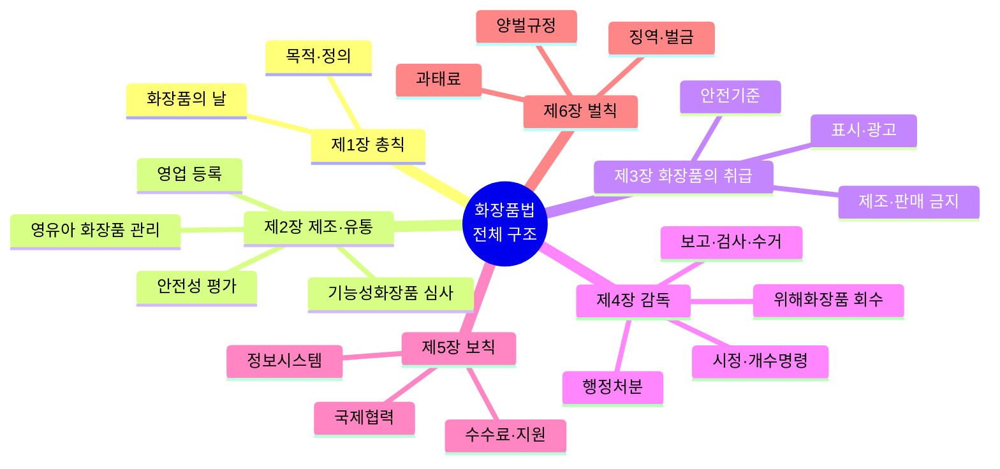

이 법은 화장품의 제조ㆍ수입ㆍ판매 및 수출 등에 관한 사항을 규정함으로써 국민보건향상과 화장품 산업의 발전에 기여함을 목적으로 한다. <개정 2018. 3. 13.>


### 제2조(정의)

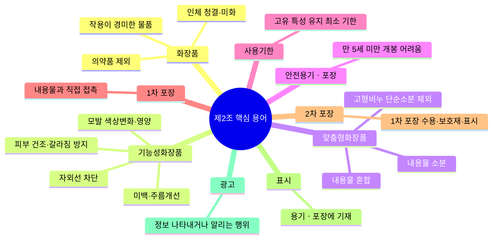

이 법에서 사용하는 용어의 뜻은 다음과 같다. <개정 2013. 3. 23., 2016. 5. 29., 2018. 3. 13., 2019. 1. 15., 2020. 4. 7., 2025. 4. 1.>

1. “화장품”이란 인체를 청결ㆍ미화하여 매력을 더하고 용모를 밝게 변화시키거나 피부ㆍ모발의 건강을 유지 또는 증진하기 위하여 인체에 바르고 문지르거나 뿌리는 등 이와 유사한 방법으로 사용되는 물품으로서 인체에 대한 작용이 경미한 것을 말한다.

다만, 「약사법」 제2조제4호의 의약품에 해당하는 물품은 제외한다.
2. “기능성화장품”이란 화장품 중에서 다음 각 목의 어느 하나에 해당되는 것으로서 총리령으로 정하는 화장품을 말한다.
가. 피부의 미백에 도움을 주는 제품
나. 피부의 주름개선에 도움을 주는 제품
다. 피부를 곱게 태워주거나 자외선으로부터 피부를 보호하는 데에 도움을 주는 제품
라. 모발의 색상 변화ㆍ제거 또는 영양공급에 도움을 주는 제품
마. 피부나 모발의 기능 약화로 인한 건조함, 갈라짐, 빠짐, 각질화 등을 방지하거나 개선하는 데에 도움을 주는 제품
3의2. “맞춤형화장품”이란 다음 각 목의 화장품을 말한다.
가. 제조 또는 수입된 화장품의 내용물에 다른 화장품의 내용물이나 식품의약품안전처장이 정하는 원료를 추가하여 혼합한 화장품
나. 제조 또는 수입된 화장품의 내용물을 소분(小分)한 화장품. 다만, 고형(固形) 비누 등 총리령으로 정하는 화장품의 내용물을 단순 소분한 화장품은 제외한다.
4. “안전용기ㆍ포장”이란 만 5세 미만의 어린이가 개봉하기 어렵게 설계ㆍ고안된 용기나 포장을 말한다.

5. “사용기한”이란 화장품이 제조된 날부터 적절한 보관 상태에서 제품이 고유의 특성을 간직한 채 소비자가 안정적으로 사용할 수 있는 최소한의 기한을 말한다.

6. “1차 포장”이란 화장품 제조 시 내용물과 직접 접촉하는 포장용기를 말한다.

7. “2차 포장”이란 1차 포장을 수용하는 1개 또는 그 이상의 포장과 보호재 및 표시의 목적으로 한 포장(첨부문서 등을 포함한다)을 말한다.

8. “표시”란 화장품의 용기ㆍ포장에 기재하는 문자ㆍ숫자ㆍ도형 또는 그림 등을 말한다.

9. “광고”란 라디오ㆍ텔레비전ㆍ신문ㆍ잡지ㆍ음성ㆍ음향ㆍ영상ㆍ인터넷ㆍ인쇄물ㆍ간판, 그 밖의 방법에 의하여 화장품에 대한 정보를 나타내거나 알리는 행위를 말한다.

10. “화장품제조업”이란 화장품의 전부 또는 일부를 제조(2차 포장 또는 표시만의 공정은 제외한다)하는 영업을 말한다.

11. “화장품책임판매업”이란 취급하는 화장품의 품질 및 안전 등을 관리하면서 이를 유통ㆍ판매하거나 수입대행형 거래를 목적으로 알선ㆍ수여(授與)하는 영업을 말한다.

12. “맞춤형화장품판매업”이란 맞춤형화장품을 판매하는 영업을 말한다.

13. “직접구매 해외화장품”이란 개인이 자가소비를 목적으로 해외의 사이버몰(컴퓨터 등과 정보통신설비를 이용하여 재화 등을 거래할 수 있도록 설정된 가상의 영업장을 말한다)에서 직접 구매하는 화장품을 말한다.


### 제2조의2(영업의 종류)

① 이 법에 따른 영업의 종류는 다음 각 호와 같다.

1. 화장품제조업

2. 화장품책임판매업

3. 맞춤형화장품판매업
② 제1항에 따른 영업의 세부 종류와 그 범위는 대통령령으로 정한다.
[본조신설 2018. 3. 13.]


### 제2조의3(화장품의 날)

① 화장품산업의 국제 경쟁력 강화를 도모하고 화장품에 대한 국민의 이해와 관심을 높이기 위하여 매년 9월 7일을 화장품의 날로 정한다.

② 국가 및 지방자치단체는 화장품의 날의 취지에 맞는 행사, 교육 및 홍보를 실시하거나 관련 법인ㆍ단체의 활동을 지원할 수 있다.

③ 제2항에 따른 화장품의 날 행사, 교육 및 홍보 등에 관하여 필요한 사항은 대통령령으로 정한다.
[본조신설 2025. 4. 1.]


## 제2장 화장품의 제조ㆍ유통


> 📌 **출처**: 화장품법 제2장 (제3조~제6조) | **참조 PDF**: `화장품법(법률)(제20901호)(20260402).pdf` | **시행일**: 2026. 4. 2. | **최종 확인**: 2026. 8. 29.

> 💡 **민수의 창업 체크**: 제조업과 책임판매업은 지방식약청장에게 **등록**하고, 시설기준과 책임판매관리자 자격 요건을 완벽히 갖추어야 합니다.

### 제3조(영업의 등록)

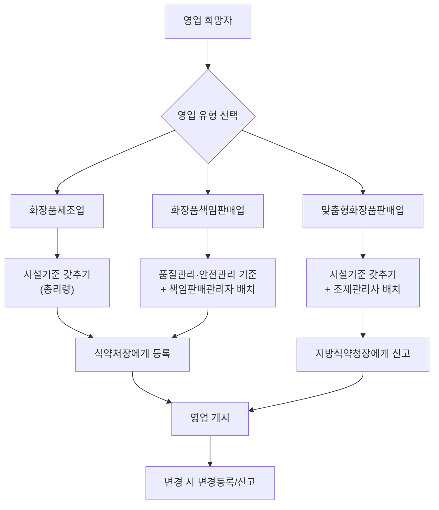

① 화장품제조업 또는 화장품책임판매업을 하려는 자는 각각 총리령으로 정하는 바에 따라 식품의약품안전처장에게 등록하여야 한다. 등록한 사항 중 총리령으로 정하는 중요한 사항을 변경할 때에도 또한 같다. <개정 2013. 3. 23., 2016. 2. 3., 2018. 3. 13.>

② 제1항에 따라 화장품제조업을 등록하려는 자는 총리령으로 정하는 시설기준을 갖추어야 한다.

다만, 화장품의 일부 공정만을 제조하는 등 총리령으로 정하는 경우에 해당하는 때에는 시설의 일부를 갖추지 아니할 수 있다.<개정 2013. 3. 23., 2018. 3. 13.>
③ 제1항에 따라 화장품책임판매업을 등록하려는 자는 총리령으로 정하는 화장품의 품질관리 및 책임판매 후 안전관리에 관한 기준을 갖추어야 하며, 이를 관리할 수 있는 관리자(이하 “책임판매관리자”라 한다)를 두어야 한다.<개정 2013. 3. 23., 2018. 3. 13.>

④ 제1항부터 제3항까지의 규정에 따른 등록 절차 및 책임판매관리자의 자격기준과 직무 등에 관하여 필요한 사항은 총리령으로 정한다.<개정 2013. 3. 23., 2018. 3. 13.>
[제목개정 2018. 3. 13.]


### 제4조(기능성화장품의 심사 등)

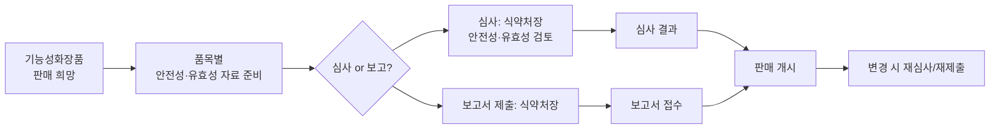

① 기능성화장품으로 인정받아 판매 등을 하려는 화장품제조업자, 화장품책임판매업자(제3조제1항에 따라 화장품책임판매업을 등록한 자를 말한다. 이하 같다) 또는 총리령으로 정하는 대학ㆍ연구소 등은 품목별로 안전성 및 유효성에 관하여 식품의약품안전처장의 심사를 받거나 식품의약품안전처장에게 보고서를 제출하여야 한다.

제출한 보고서나 심사받은 사항을 변경할 때에도 또한 같다. <개정 2013. 3. 23., 2018. 3. 13.>

② 제1항에 따른 유효성에 관한 심사는 제2조제2호 각 목에 규정된 효능ㆍ효과에 한하여 실시한다.

③ 제1항에 따른 심사를 받으려는 자는 총리령으로 정하는 바에 따라 그 심사에 필요한 자료를 식품의약품안전처장에게 제출하여야 한다.<개정 2013. 3. 23.>

④ 제1항 및 제2항에 따른 심사 또는 보고서 제출의 대상과 절차 등에 관하여 필요한 사항은 총리령으로 정한다.<개정 2013. 3. 23.>


### 제4조의2(화장품 안전성 평가)

① 화장품책임판매업자(수입대행형 거래를 목적으로 알선ㆍ수여하는 영업을 하는 화장품책임판매업자와 매출액 규모 등을 고려하여 총리령으로 정하는 화장품책임판매업자는 제외한다. 이하 이 조에서 같다)는 화장품의 유통ㆍ판매 전에 제품별로 화장품이 안전함을 입증할 수 있는 자료(이하 “화장품 안전성 평가 자료”라 한다)를 작성하여 총리령으로 정하는 화장품 안전 관련 학력이나 경력을 갖춘 자(이하 “안전성 평가자”라 한다)의 검토를 받은 후 이를 보관하여야 한다.

② 식품의약품안전처장은 국민보건상 위해 우려가 제기되는 등 필요하다고 인정하는 경우 화장품책임판매업자에게 화장품 안전성 평가 자료의 제출을 요구할 수 있다. 이 경우 화장품책임판매업자는 정당한 사유가 없으면 이에 따라야 한다.

③ 식품의약품안전처장은 화장품책임판매업자가 「중소기업기본법」 제2조에 따른 중소기업자인 경우 제1항에 따른 준수사항을 원활하게 이행할 수 있도록 화장품 안전성 평가 자료 작성 방법에 대한 지도ㆍ교육, 원료 안전성 자료의 제공 등 필요한 행정적ㆍ재정적ㆍ기술적 지원을 할 수 있다.

④ 화장품 안전성 평가 자료의 작성 범위 및 보관기간 등에 필요한 사항은 총리령으로 정한다.
[본조신설 2025. 12. 30.]
[종전 제4조의2는 제4조의3으로 이동 <2025. 12. 30.>]
[시행일] 다음 각 호의 구분에 따른 화장품책임판매업자에 대한 제4조의2의 개정규정
1. 연 생산액ㆍ수입액이 10억원 이상인 업소 또는 이 법 공포 후 화장품책임판매업을 등록한 업소: 다음 각 목의 구분에 따른 시행일
가. 이 법 공포 후 기능성화장품으로 심사를 받거나 보고서를 제출한 제품을 판매하려는 업소: 2028년 1월 1일
나. 이 법 공포 후 최초로 제조ㆍ수입하여 출시하는 제품을 판매하려는 업소: 2030년 1월 1일
다. 가목 및 나목에 해당하지 아니하는 업소: 2031년 1월 1일
2. 연 생산액ㆍ수입액이 10억원 미만인 업소: 2031년 1월 1일


### 제4조의3(영유아 또는 어린이 사용 화장품의 관리)

① 화장품책임판매업자는 영유아 또는 어린이가 사용할 수 있는 화장품임을 표시ㆍ광고하려는 경우에는 제품별로 안전과 품질을 입증할 수 있는 다음 각 호의 자료(이하 “제품별 안전성 자료”라 한다)를 작성 및 보관하여야 한다.

1. 제품 및 제조방법에 대한 설명 자료

2. 화장품의 안전성 평가 자료

3. 제품의 효능ㆍ효과에 대한 증명 자료
② 식품의약품안전처장은 제1항에 따른 화장품에 대하여 제품별 안전성 자료, 소비자 사용실태, 사용 후 이상사례 등에 대하여 주기적으로 실태조사를 실시하고, 위해요소의 저감화를 위한 계획을 수립하여야 한다.

③ 식품의약품안전처장은 소비자가 제1항에 따른 화장품을 안전하게 사용할 수 있도록 교육 및 홍보를 할 수 있다.

④ 제1항에 따른 영유아 또는 어린이의 연령 및 표시ㆍ광고의 범위, 제품별 안전성 자료의 작성 범위 및 보관기간 등과 제2항에 따른 실태조사 및 계획 수립의 범위, 시기, 절차 등에 필요한 사항은 총리령으로 정한다.
[본조신설 2019. 1. 15.]
[제4조의2에서 이동 <2025. 12. 30.>]
[시행일: 2028. 1. 1.] 제4조의3


### 제5조(영업자의 의무 등)

① 화장품제조업자는 화장품의 제조와 관련된 기록ㆍ시설ㆍ기구 등 관리 방법, 원료ㆍ자재ㆍ완제품 등에 대한 시험ㆍ검사ㆍ검정 실시 방법 및 의무 등에 관하여 총리령으로 정하는 사항을 준수하여야 한다. <개정 2013. 3. 23., 2018. 3. 13.>

② 화장품책임판매업자는 화장품의 품질관리기준, 책임판매 후 안전관리기준, 품질 검사 방법 및 실시 의무, 안전성ㆍ유효성 관련 정보사항 등의 보고 및 안전대책 마련 의무 등에 관하여 총리령으로 정하는 사항을 준수하여야 한다.<개정 2013. 3. 23., 2018. 3. 13.>

③ 맞춤형화장품판매업자(제3조의2제1항에 따라 맞춤형화장품판매업을 신고한 자를 말한다. 이하 같다)는 소비자에게 유통ㆍ판매되는 화장품을 임의로 혼합ㆍ소분하여서는 아니 된다.<신설 2021. 8. 17.>

④ 맞춤형화장품판매업자는 맞춤형화장품 판매장 시설ㆍ기구의 관리 방법, 혼합ㆍ소분 안전관리기준의 준수 의무, 혼합ㆍ소분되는 내용물 및 원료에 대한 설명 의무, 안전성 관련 사항 보고 의무 등에 관하여 총리령으로 정하는 사항을 준수하여야 한다.<신설 2018. 3. 13., 2021. 8. 17.>

⑤ 화장품책임판매업자는 총리령으로 정하는 바에 따라 화장품의 생산실적 또는 수입실적, 화장품의 제조과정에 사용된 원료의 목록 등을 식품의약품안전처장에게 보고하여야 한다. 이 경우 원료의 목록에 관한 보고는 화장품의 유통ㆍ판매 전에 하여야 한다.<개정 2013. 3. 23., 2018. 3. 13., 2021. 8. 17.>

⑥ 맞춤형화장품판매업자는 총리령으로 정하는 바에 따라 맞춤형화장품에 사용된 모든 원료의 목록을 매년 1회 식품의약품안전처장에게 보고하여야 한다.<신설 2021. 8. 17.>

⑦ 책임판매관리자, 맞춤형화장품조제관리사 및 제3조의2제2항 단서에 따른 종업원은 화장품의 안전성 확보 및 품질관리에 관한 교육을 매년 받아야 한다.<개정 2013. 3. 23., 2016. 2. 3., 2018. 3. 13., 2021. 8. 17., 2026. 4. 28.>

⑧ 식품의약품안전처장은 국민 건강상 위해를 방지하기 위하여 필요하다고 인정하면 화장품제조업자, 화장품책임판매업자 및 맞춤형화장품판매업자(이하 “영업자”라 한다)에게 화장품 관련 법령 및 제도(화장품의 안전성 확보 및 품질관리에 관한 내용을 포함한다)에 관한 교육을 받을 것을 명할 수 있다.<개정 2016. 2. 3., 2018. 3. 13., 2021. 8. 17.>

⑨ 제8항에 따라 교육을 받아야 하는 자가 둘 이상의 장소에서 화장품제조업, 화장품책임판매업 또는 맞춤형화장품판매업을 하는 경우에는 종업원 중에서 총리령으로 정하는 자를 책임자로 지정하여 교육을 받게 할 수 있다.<신설 2016. 2. 3., 2018. 3. 13., 2021. 8. 17.>

⑩ 제7항부터 제9항까지의 규정에 따른 교육의 실시 기관, 내용, 대상 및 교육비 등에 관하여 필요한 사항은 총리령으로 정한다.<신설 2016. 2. 3., 2018. 3. 13., 2021. 8. 17.>
[제목개정 2018. 3. 13.]
[시행일: 2027. 4. 29.] 제5조


> 💡 **지연의 품질관리 메모 — 회수 대응**: 위해화장품 발생 시 지체 없이 회수계획서를 제출하고, 회수 종료 후 회수확인서를 받아 결과를 보고해야 합니다.

### 제5조의2(위해화장품의 회수)

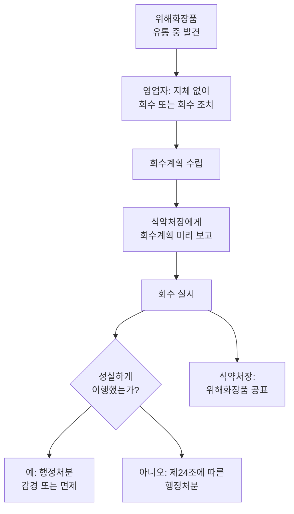

① 영업자는 제4조의2제1항, 제4조의3제1항, 제9조, 제15조 또는 제16조제1항에 위반되어 국민보건에 위해(危害)를 끼치거나 끼칠 우려가 있는 화장품이 유통 중인 사실을 알게 된 경우에는 지체 없이 해당 화장품을 회수하거나 회수하는 데에 필요한 조치를 하여야 한다. <개정 2018. 12. 11., 2025. 12. 30.>

② 제1항에 따라 해당 화장품을 회수하거나 회수하는 데에 필요한 조치를 하려는 영업자는 회수계획을 식품의약품안전처장에게 미리 보고하여야 한다.<개정 2018. 3. 13.>

③ 식품의약품안전처장은 제1항에 따른 회수 또는 회수에 필요한 조치를 성실하게 이행한 영업자가 해당 화장품으로 인하여 받게 되는 제24조에 따른 행정처분을 총리령으로 정하는 바에 따라 감경 또는 면제할 수 있다.<개정 2018. 3. 13.>

④ 제1항 및 제2항에 따른 회수 대상 화장품, 해당 화장품의 회수에 필요한 위해성 등급 및 그 분류기준, 회수계획 보고 및 회수절차 등에 필요한 사항은 총리령으로 정한다.<개정 2018. 12. 11.>
[본조신설 2015. 1. 28.]
[시행일: 2029. 1. 1.] 제5조의2의 개정규정 중 “제4조의3제1항”에 관한 부분
[시행일] 다음 각 호의 구분에 따른 화장품책임판매업자에 대한 제5조의2의 개정규정 중 “제4조의2”에 관한 부분
1. 연 생산액ㆍ수입액이 10억원 이상인 업소 또는 이 법 공포 후 화장품책임판매업을 등록한 업소: 다음 각 목의 구분에 따른 시행일
가. 이 법 공포 후 기능성화장품으로 심사를 받거나 보고서를 제출한 제품을 판매하려는 업소: 2028년 1월 1일
나. 이 법 공포 후 최초로 제조ㆍ수입하여 출시하는 제품을 판매하려는 업소: 2030년 1월 1일
다. 가목 및 나목에 해당하지 아니하는 업소: 2031년 1월 1일
2. 연 생산액ㆍ수입액이 10억원 미만인 업소: 2031년 1월 1일


### 제6조(폐업 등의 신고)

① 영업자는 다음 각 호의 어느 하나에 해당하는 경우에는 총리령으로 정하는 바에 따라 식품의약품안전처장에게 신고하여야 한다.

다만, 휴업기간이 1개월 미만이거나 그 기간 동안 휴업하였다가 그 업을 재개하는 경우에는 그러하지 아니하다. <개정 2013. 3. 23., 2018. 3. 13., 2018. 12. 11.>

1. 폐업 또는 휴업하려는 경우

2. 휴업 후 그 업을 재개하려는 경우

② 식품의약품안전처장은 화장품제조업자 또는 화장품책임판매업자가 「부가가치세법」 제8조에 따라 관할 세무서장에게 폐업신고를 하거나 관할 세무서장이 사업자등록을 말소한 경우에는 등록을 취소할 수 있다.<신설 2018. 3. 13.>

③ 식품의약품안전처장은 제2항에 따라 등록을 취소하기 위하여 필요하면 관할 세무서장에게 화장품제조업자 또는 화장품책임판매업자의 폐업여부에 대한 정보 제공을 요청할 수 있다. 이 경우 요청을 받은 관할 세무서장은 「전자정부법」 제39조에 따라 화장품제조업자 또는 화장품책임판매업자의 폐업여부에 대한 정보를 제공하여야 한다.<신설 2018. 3. 13.>

④ 식품의약품안전처장은 제1항제1호에 따른 폐업신고 또는 휴업신고를 받은 날부터 7일 이내에 신고수리 여부를 신고인에게 통지하여야 한다.<신설 2018. 12. 11.>

⑤ 식품의약품안전처장이 제4항에서 정한 기간 내에 신고수리 여부 또는 민원 처리 관련 법령에 따른 처리기간의 연장을 신고인에게 통지하지 아니하면 그 기간(민원 처리 관련 법령에 따라 처리기간이 연장 또는 재연장된 경우에는 해당 처리기간을 말한다)이 끝난 날의 다음 날에 신고를 수리한 것으로 본다.<신설 2018. 12. 11.>


## 제3장 화장품의 취급


> 📌 **출처**: 화장품법 제3장 (제8조~제17조) | **참조 PDF**: `화장품법(법률)(제20901호)(20260402).pdf` | **시행일**: 2026. 4. 2. | **최종 확인**: 2026. 8. 29.

### 제1절 기준


### 제8조(화장품 안전기준 등)

① 식품의약품안전처장은 화장품의 제조 등에 사용할 수 없는 원료를 지정하여 고시하여야 한다. <개정 2013. 3. 23.>

② 식품의약품안전처장은 보존제, 색소, 자외선차단제 등과 같이 특별히 사용상의 제한이 필요한 원료에 대하여는 그 사용기준을 지정하여 고시하여야 하며, 사용기준이 지정ㆍ고시된 원료 외의 보존제, 색소, 자외선차단제 등은 사용할 수 없다.<개정 2013. 3. 23., 2018. 3. 13.>

③ 식품의약품안전처장은 국내외에서 유해물질이 포함되어 있는 것으로 알려지는 등 국민보건상 위해 우려가 제기되는 화장품 원료 등의 경우에는 총리령으로 정하는 바에 따라 위해요소를 신속히 평가하여 그 위해 여부를 결정하여야 한다.<개정 2013. 3. 23.>

④ 식품의약품안전처장은 제3항에 따라 위해평가가 완료된 경우에는 해당 화장품 원료 등을 화장품의 제조에 사용할 수 없는 원료로 지정하거나 그 사용기준을 지정하여야 한다.<개정 2013. 3. 23.>

⑤ 식품의약품안전처장은 제2항에 따라 지정ㆍ고시된 원료의 사용기준의 안전성을 정기적으로 검토하여야 하고, 그 결과에 따라 지정ㆍ고시된 원료의 사용기준을 변경할 수 있다. 이 경우 안전성 검토의 주기 및 절차 등에 관한 사항은 총리령으로 정한다.<신설 2018. 3. 13.>

⑥ 화장품제조업자, 화장품책임판매업자 또는 대학ㆍ연구소 등 총리령으로 정하는 자는 다음 각 호의 사항을 총리령으로 정하는 바에 따라 식품의약품안전처장에게 신청할 수 있다.<신설 2018. 3. 13., 2024. 2. 6.>
1. 제1항에 따라 지정ㆍ고시된 원료의 해제 또는 변경

2. 제2항에 따라 지정ㆍ고시되지 아니한 원료의 사용기준 지정ㆍ고시

3. 제2항에 따라 지정ㆍ고시된 원료의 사용기준 변경
⑦ 식품의약품안전처장은 제6항에 따른 신청을 받은 경우에는 신청된 내용의 타당성을 검토하여야 하고, 그 타당성이 인정되는 경우에는 제1항에 따라 지정ㆍ고시된 원료를 해제 또는 변경하거나, 제2항에 따라 지정ㆍ고시되지 아니한 원료의 사용기준을 지정ㆍ고시하거나 지정ㆍ고시된 원료의 사용기준을 변경하여야 한다. 이 경우 신청인에게 검토 결과를 서면으로 알려야 한다.<신설 2018. 3. 13., 2024. 2. 6.>

⑧ 식품의약품안전처장은 그 밖에 유통화장품 안전관리 기준을 정하여 고시할 수 있다.<개정 2013. 3. 23., 2018. 3. 13.>


### 제2절 표시ㆍ광고ㆍ취급

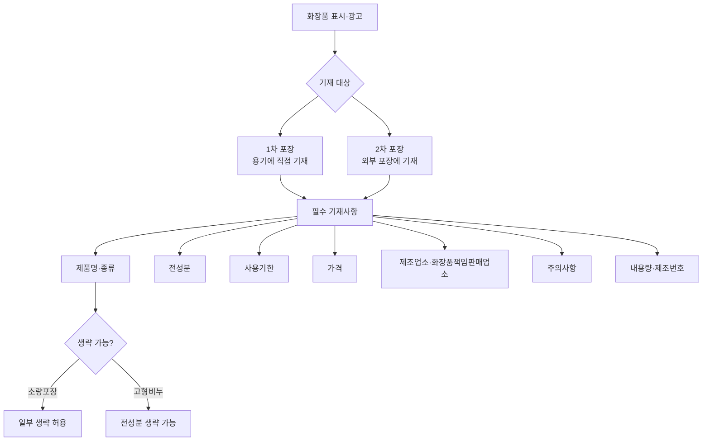

### 제11조(화장품의 가격표시)

① 제10조제1항제7호에 따른 가격은 소비자에게 화장품을 직접 판매하는 자(이하 “판매자”라 한다)가 판매하려는 가격을 표시하여야 한다.

② 제1항에 따른 표시방법과 그 밖에 필요한 사항은 총리령으로 정한다.<개정 2013. 3. 23.>


### 제12조(기재ㆍ표시상의 주의)

제10조 및 제11조에 따른 기재ㆍ표시는 다른 문자 또는 문장보다 쉽게 볼 수 있는 곳에 하여야 하며, 총리령으로 정하는 바에 따라 읽기 쉽고 이해하기 쉬운 한글로 정확히 기재ㆍ표시하여야 하되, 한자 또는 외국어를 함께 기재할 수 있다. <개정 2013. 3. 23.>


> 💡 **민수의 마케팅 검토 — 표시·광고**: 의약품 오인, 기능성 오인, 품질·효능 과장 표현은 절대 금지! 사실에 근거한 실증자료를 확보해야 합니다.

### 제13조(부당한 표시ㆍ광고 행위 등의 금지)

① 영업자 또는 판매자는 다음 각 호의 어느 하나에 해당하는 표시 또는 광고를 하여서는 아니 된다. <개정 2018. 3. 13., 2026. 5. 26.>

1. 의약품으로 잘못 인식할 우려가 있는 표시 또는 광고

2. 기능성화장품이 아닌 화장품을 기능성화장품으로 잘못 인식할 우려가 있거나 기능성화장품의 안전성ㆍ유효성에 관한 심사결과와 다른 내용의 표시 또는 광고

4. 「인공지능 발전과 신뢰 기반 조성 등에 관한 기본법」 제2조제2호에 따른 인공지능시스템을 이용하여 생성한 실제와 구분하기 어려운 가상의 음향, 이미지 또는 영상 등을 활용한 광고로서 의사ㆍ치과의사ㆍ한의사ㆍ수의사ㆍ약사ㆍ한약사ㆍ대학교수 또는 그 밖의 관련 분야 전문가가 화장품을 보증ㆍ지정ㆍ공인ㆍ추천ㆍ지도 또는 사용하는 것으로 오인하게 할 우려가 있는 광고

5. 그 밖에 사실과 다르게 소비자를 속이거나 소비자가 잘못 인식하도록 할 우려가 있는 표시 또는 광고
② 제1항에 따른 표시ㆍ광고의 범위와 그 밖에 필요한 사항은 총리령으로 정한다.<개정 2013. 3. 23.>
[시행일: 2026. 11. 27.] 제13조


### 제14조(표시ㆍ광고 내용의 실증 등)

① 영업자 및  판매자는 자기가 행한 표시ㆍ광고 중 사실과 관련한 사항에 대하여는 이를 실증할 수 있어야 한다. <개정 2018. 3. 13.>

② 식품의약품안전처장은 영업자 또는 판매자가 행한 표시ㆍ광고가 제13조제1항제5호에 해당하는지를 판단하기 위하여 제1항에 따른 실증이 필요하다고 인정하는 경우에는 그 내용을 구체적으로 명시하여 해당 영업자 또는 판매자에게 관련 자료의 제출을 요청할 수 있다.<개정 2013. 3. 23., 2018. 3. 13., 2026. 5. 26.>

③ 제2항에 따라 실증자료의 제출을 요청받은 영업자 또는 판매자는 요청받은 날부터 15일 이내에 그 실증자료를 식품의약품안전처장에게 제출하여야 한다.

다만, 식품의약품안전처장은 정당한 사유가 있다고 인정하는 경우에는 그 제출기간을 연장할 수 있다.<개정 2013. 3. 23., 2018. 3. 13.>
④ 식품의약품안전처장은 영업자 또는 판매자가 제2항에 따라 실증자료의 제출을 요청받고도 제3항에 따른 제출기간 내에 이를 제출하지 아니한 채 계속하여 표시ㆍ광고를 하는 때에는 실증자료를 제출할 때까지 그 표시ㆍ광고 행위의 중지를 명하여야 한다.<개정 2013. 3. 23., 2018. 3. 13.>

⑤ 제2항 및 제3항에 따라 식품의약품안전처장으로부터 실증자료의 제출을 요청받아 제출한 경우에는 「표시ㆍ광고의 공정화에 관한 법률」 등 다른 법률에 따라 다른 기관이 요구하는 자료제출을 거부할 수 있다.<개정 2013. 3. 23.>

⑥ 식품의약품안전처장은 제출받은 실증자료에 대하여 「표시ㆍ광고의 공정화에 관한 법률」 등 다른 법률에 따른 다른 기관의 자료요청이 있는 경우에는 특별한 사유가 없는 한 이에 응하여야 한다.<개정 2013. 3. 23.>

⑦ 제1항부터 제4항까지의 규정에 따른 실증의 대상, 실증자료의 범위 및 요건, 제출방법 등에 관하여 필요한 사항은 총리령으로 정한다.<개정 2013. 3. 23.>
[시행일: 2026. 11. 27.] 제14조


### 제3절 제조ㆍ수입ㆍ판매 등의 금지


### 제15조(영업의 금지)

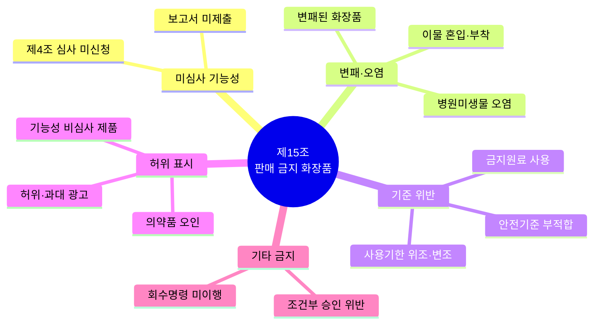

누구든지 다음 각 호의 어느 하나에 해당하는 화장품을 판매(수입대행형 거래를 목적으로 하는 알선ㆍ수여를 포함한다)하거나 판매할 목적으로 제조ㆍ수입ㆍ보관 또는 진열하여서는 아니 된다. <개정 2016. 5. 29., 2018. 3. 13., 2021. 8. 17.>

1. 제4조에 따른 심사를 받지 아니하거나 보고서를 제출하지 아니한 기능성화장품

2. 전부 또는 일부가 변패(變敗)된 화장품

3. 병원미생물에 오염된 화장품

4. 이물이 혼입되었거나 부착된 것

5. 제8조제1항 또는 제2항에 따른 화장품에 사용할 수 없는 원료를 사용하였거나 같은 조 제8항에 따른 유통화장품 안전관리 기준에 적합하지 아니한 화장품

6. 코뿔소 뿔 또는 호랑이 뼈와 그 추출물을 사용한 화장품

7. 보건위생상 위해가 발생할 우려가 있는 비위생적인 조건에서 제조되었거나 제3조제2항에 따른 시설기준에 적합하지 아니한 시설에서 제조된 것

8. 용기나 포장이 불량하여 해당 화장품이 보건위생상 위해를 발생할 우려가 있는 것

9. 제10조제1항제6호에 따른 사용기한 또는 개봉 후 사용기간(병행 표기된 제조연월일을 포함한다)을 위조ㆍ변조한 화장품

10. 식품의 형태ㆍ냄새ㆍ색깔ㆍ크기ㆍ용기 및 포장 등을 모방하여 섭취 등 식품으로 오용될 우려가 있는 화장품
[제목개정 2018. 3. 13.]


### 제16조(판매 등의 금지)

① 누구든지 다음 각 호의 어느 하나에 해당하는 화장품을 판매하거나 판매할 목적으로 보관 또는 진열하여서는 아니 된다. 다만, 제3호의 경우에는 소비자에게 판매하는 화장품에 한한다. <개정 2016. 5. 29., 2018. 3. 13., 2026. 4. 28.>

1. 제3조제1항에 따른 등록을 하지 아니한 자가 제조한 화장품 또는 제조ㆍ수입하여 유통ㆍ판매한 화장품
1의2. 제3조의2제1항에 따른 신고를 하지 아니한 자가 판매한 맞춤형화장품
1의3. 맞춤형화장품조제관리사 또는 제3조의2제2항 단서에 따른 종업원을 두지 아니하고 판매한 맞춤형화장품
2. 제10조부터 제12조까지에 위반되는 화장품 또는 의약품으로 잘못 인식할 우려가 있게 기재ㆍ표시된 화장품

3. 판매의 목적이 아닌 제품의 홍보ㆍ판매촉진 등을 위하여 미리 소비자가 시험ㆍ사용하도록 제조 또는 수입된 화장품

4. 화장품의 포장 및 기재ㆍ표시 사항을 훼손(맞춤형화장품 판매를 위하여 필요한 경우는 제외한다) 또는 위조ㆍ변조한 것
② 누구든지(맞춤형화장품조제관리사 또는 제3조의2제2항 단서에 따른 종업원을 통하여 판매하는 맞춤형화장품판매업자 및 제2조제3호의2나목 단서에 해당하는 화장품 중 소분 판매를 목적으로 제조된 화장품의 판매자는 제외한다) 화장품의 용기에 담은 내용물을 나누어 판매하여서는 아니 된다.<개정 2018. 3. 13., 2020. 4. 7., 2026. 4. 28.>
[시행일: 2027. 4. 29.] 제16조


### 제4절 화장품업 단체 등 <개정 2018. 3. 13.>


### 제17조(단체 설립)

영업자는 자주적인 활동과 공동이익을 보장하고 국민보건향상에 기여하기 위하여 단체를 설립할 수 있다. <개정 2018. 3. 13.>

[제목개정 2018. 3. 13.]


## 제4장 감독


> 📌 **출처**: 화장품법 제4장 (제18조~제30조) | **참조 PDF**: `화장품법(법률)(제20901호)(20260402).pdf` | **시행일**: 2026. 4. 2. | **최종 확인**: 2026. 8. 29.

### 제18조(보고와 검사 등)

① 식품의약품안전처장은 필요하다고 인정하면 영업자ㆍ판매자 또는 그 밖에 화장품을 업무상 취급하는 자에 대하여 필요한 보고를 명하거나, 관계 공무원으로 하여금 화장품 제조장소ㆍ영업소ㆍ창고ㆍ판매장소, 그 밖에 화장품을 취급하는 장소에 출입하여 그 시설 또는 관계 장부나 서류, 그 밖의  물건의 검사 또는 관계인에 대한 질문을 할 수 있다. <개정 2013. 3. 23., 2018. 3. 13.>

② 식품의약품안전처장은 화장품의 품질 또는 안전기준, 포장 등의 기재ㆍ표시 사항 등이 적합한지 여부를 검사하기 위하여 필요한 최소 분량을 수거하여 검사할 수 있다.<개정 2013. 3. 23.>

③ 식품의약품안전처장은 총리령으로 정하는 바에 따라 제품의 판매에 대한 모니터링 제도를 운영할 수 있다.<개정 2013. 3. 23.>

④ 제1항의 경우에 관계 공무원은 그 권한을 표시하는 증표를 관계인에게 내보여야 한다.

⑤ 제1항 및 제2항의 관계 공무원의 자격과 그 밖에 필요한 사항은 총리령으로 정한다.<개정 2013. 3. 23.>


### 제18조의2(소비자화장품안전관리감시원)

① 식품의약품안전처장 또는 지방식품의약품안전청장은 화장품 안전관리를 위하여 제17조에 따라 설립된 단체 또는 「소비자기본법」 제29조에 따라 등록한 소비자단체의 임직원 중 해당 단체의 장이 추천한 사람이나 화장품 안전관리에 관한 지식이 있는 사람을 소비자화장품안전관리감시원으로 위촉할 수 있다.

② 제1항에 따라 위촉된 소비자화장품안전관리감시원(이하 “소비자화장품감시원”이라 한다)의 직무는 다음 각 호와 같다.
1. 유통 중인 화장품이 제10조제1항 및 제2항에 따른 표시기준에 맞지 아니하거나 제13조제1항 각 호의 어느 하나에 해당하는 표시 또는 광고를 한 화장품인 경우 관할 행정관청에 신고하거나 그에 관한 자료 제공

2. 제18조제1항ㆍ제2항에 따라 관계 공무원이 하는 출입ㆍ검사ㆍ질문ㆍ수거의 지원

3. 그 밖에 화장품 안전관리에 관한 사항으로서 총리령으로 정하는 사항
③ 식품의약품안전처장 또는 지방식품의약품안전청장은 소비자화장품감시원에게 직무 수행에 필요한 교육을 실시할 수 있다.

④ 식품의약품안전처장 또는 지방식품의약품안전청장은 소비자화장품감시원이 다음 각 호의 어느 하나에 해당하는 경우에는 해당 소비자화장품감시원을 해촉(解囑)하여야 한다.
1. 해당 소비자화장품감시원을 추천한 단체에서 퇴직하거나 해임된 경우

2. 제2항 각 호의 직무와 관련하여 부정한 행위를 하거나 권한을 남용한 경우

3. 질병이나 부상 등의 사유로 직무 수행이 어렵게 된 경우
⑤ 소비자화장품감시원의 자격, 교육, 그 밖에 필요한 사항은 총리령으로 정한다.
[본조신설 2018. 3. 13.]


### 제18조의3(화장품안전정보센터 지정 등)

① 식품의약품안전처장은 화장품 안전성 평가를 효율적이고 체계적으로 지원하기 위하여 전문인력과 시설을 갖춘 관계 기관ㆍ법인 또는 단체를 화장품안전정보센터(이하 “화장품안전정보센터”라 한다)로 지정할 수 있다.

② 화장품안전정보센터는 다음 각 호의 사업을 수행한다.
1. 화장품 안전성 평가에 관한 전문적 기술지원 및 자문에 대한 응답

2. 원료 안전성 정보 제공

3. 화장품 안전성 평가를 위한 각종 정보의 수집ㆍ관리ㆍ분석ㆍ평가 및 제공

4. 안전성 평가자 양성 지원

5. 제1호부터 제4호까지의 업무에 필요한 시험ㆍ조사ㆍ연구 및 교육ㆍ홍보

6. 그 밖에 화장품 안전성 확보에 관한 사항으로서 식품의약품안전처장이 정하는 사업
③ 식품의약품안전처장은 화장품안전정보센터에 대하여 제2항 각 호의 사업을 수행하는 데에 필요한 경비를 예산의 범위에서 지원할 수 있다.

④ 그 밖에 화장품안전정보센터 지정의 기준 및 절차 등에 필요한 사항은 대통령령으로 정한다.
[본조신설 2025. 12. 30.]
[시행일: 2026. 12. 31.] 제18조의3


### 제18조의4(화장품안전정보센터의 지정취소)

① 식품의약품안전처장은 제18조의3제1항에 따라 지정된 화장품안전정보센터가 다음 각 호의 어느 하나에 해당하는 경우에는 지정을 취소할 수 있다. 다만, 제1호의 경우에는 지정을 취소하여야 한다.

1. 거짓이나 그 밖의 부당한 방법으로 지정을 받은 경우

2. 정당한 사유 없이 제18조의3제2항 각 호에 따른 사업을 1년 이상 계속하여 실시하지 아니한 경우

3. 제18조의3제4항에 따른 지정 기준에 적합하지 아니하게 된 경우

4. 그 밖에 중대한 공익상의 사유로 화장품안전정보센터의 업무를 계속 수행하기 어렵게 된 경우
② 제1항에 따른 화장품안전정보센터 지정 취소의 기준 및 절차 등에 필요한 사항은 대통령령으로 정한다.
[본조신설 2025. 12. 30.]
[시행일: 2026. 12. 31.] 제18조의4


### 제18조의5(화장품안전정보센터에 대한 지도ㆍ감독 등)

① 식품의약품안전처장은 화장품안전정보센터에 대하여 감독상 필요한 때에는 그 업무에 관한 사항을 보고하게 하거나 자료의 제출, 그 밖에 필요한 명령을 할 수 있다.

② 그 밖에 화장품안전정보센터에 대한 지도ㆍ감독에 필요한 사항은 대통령령으로 정한다.
[본조신설 2025. 12. 30.]
[시행일: 2026. 12. 31.] 제18조의5


### 제19조(시정명령)

식품의약품안전처장은 이 법을 지키지 아니하는 자에 대하여 필요하다고 인정하면 그 시정을 명할 수 있다. <개정 2013. 3. 23.>


### 제20조(검사명령)

식품의약품안전처장은 영업자에 대하여 필요하다고 인정하면 취급한 화장품에 대하여 「식품ㆍ의약품분야 시험ㆍ검사 등에 관한 법률」 제6조제2항제5호에 따른 화장품 시험ㆍ검사기관의 검사를 받을 것을 명할 수 있다. <개정 2013. 3. 23., 2013. 7. 30., 2018. 3. 13.>


### 제22조(개수명령)

식품의약품안전처장은 화장품제조업자가 갖추고 있는 시설이 제3조제2항에 따른 시설기준에 적합하지 아니하거나 노후 또는 오손되어 있어 그 시설로 화장품을 제조하면 화장품의 안전과 품질에 문제의 우려가 있다고 인정되는 경우에는 화장품제조업자에게 그 시설의 개수를 명하거나 그 개수가 끝날 때까지 해당 시설의 전부 또는 일부의 사용금지를 명할 수 있다. <개정 2013. 3. 23., 2018. 3. 13.>


### 제23조(회수ㆍ폐기명령 등)

① 식품의약품안전처장은 판매ㆍ보관ㆍ진열ㆍ제조 또는 수입한 화장품이나 그 원료ㆍ재료 등(이하 “물품”이라 한다)이 제4조의2제1항, 제4조의3제1항, 제9조, 제15조 또는 제16조제1항을 위반하여 국민보건에 위해를 끼칠 우려가 있는 경우에는 해당 영업자ㆍ판매자 또는 그 밖에 화장품을 업무상 취급하는 자에게 해당 물품의 회수ㆍ폐기 등의 조치를 명하여야 한다. <개정 2018. 12. 11., 2025. 12. 30.>

② 식품의약품안전처장은 판매ㆍ보관ㆍ진열ㆍ제조 또는 수입한 물품이 국민보건에 위해를 끼치거나 끼칠 우려가 있다고 인정되는 경우에는 해당 영업자ㆍ판매자 또는 그 밖에 화장품을 업무상 취급하는 자에게 해당 물품의 회수ㆍ폐기 등의 조치를 명할 수 있다.<신설 2018. 12. 11.>

③ 제1항 및 제2항에 따른 명령을 받은 영업자ㆍ판매자 또는 그 밖에 화장품을 업무상 취급하는 자는 미리 식품의약품안전처장에게 회수계획을 보고하여야 한다.<신설 2018. 12. 11.>

④ 식품의약품안전처장은 다음 각 호의 어느 하나에 해당하는 경우에는 관계 공무원으로 하여금 해당 물품을 폐기하게 하거나 그 밖에 필요한 처분을 하게 할 수 있다.<개정 2013. 3. 23., 2018. 12. 11.>
1. 제1항 및 제2항에 따른 명령을 받은 자가 그 명령을 이행하지 아니한 경우

2. 그 밖에 국민보건을 위하여 긴급한 조치가 필요한 경우
⑤ 제1항부터 제3항까지의 규정에 따른 물품의 회수에 필요한 위해성 등급 및 그 분류기준, 회수ㆍ폐기의 절차ㆍ계획 및 사후조치 등에 필요한 사항은 총리령으로 정한다.<신설 2015. 1. 28., 2018. 12. 11.>
[제목개정 2015. 1. 28.]
[시행일: 2029. 1. 1.] 제23조의 개정규정 중 “제4조의3제1항”에 관한 부분
[시행일] 다음 각 호의 구분에 따른 화장품책임판매업자에 대한 제23조의 개정규정 중 “제4조의2”에 관한 부분
1. 연 생산액ㆍ수입액이 10억원 이상인 업소 또는 이 법 공포 후 화장품책임판매업을 등록한 업소: 다음 각 목의 구분에 따른 시행일
가. 이 법 공포 후 기능성화장품으로 심사를 받거나 보고서를 제출한 제품을 판매하려는 업소: 2028년 1월 1일
나. 이 법 공포 후 최초로 제조ㆍ수입하여 출시하는 제품을 판매하려는 업소: 2030년 1월 1일
다. 가목 및 나목에 해당하지 아니하는 업소: 2031년 1월 1일
2. 연 생산액ㆍ수입액이 10억원 미만인 업소: 2031년 1월 1일


### 제23조의2(위해화장품의 공표)

① 식품의약품안전처장은 다음 각 호의 어느 하나에 해당하는 경우에는 해당 영업자에 대하여 그 사실의 공표를 명할 수 있다. <개정 2018. 3. 13., 2018. 12. 11.>

1. 제5조의2제2항에 따른 회수계획을 보고받은 때

2. 제23조제3항에 따른 회수계획을 보고받은 때
② 식품의약품안전처장은 국민 건강에 대한 위해를 방지하기 위하여 위해가 발생하였거나 발생할 우려가 있는 직접구매 해외화장품에 관한 정보를 공표할 수 있다.<신설 2025. 4. 1.>

③ 제1항 및 제2항에 따른 공표의 방법ㆍ절차 등에 필요한 사항은 총리령으로 정한다.<개정 2025. 4. 1.>
[본조신설 2015. 1. 28.]


### 제24조(등록의 취소 등)

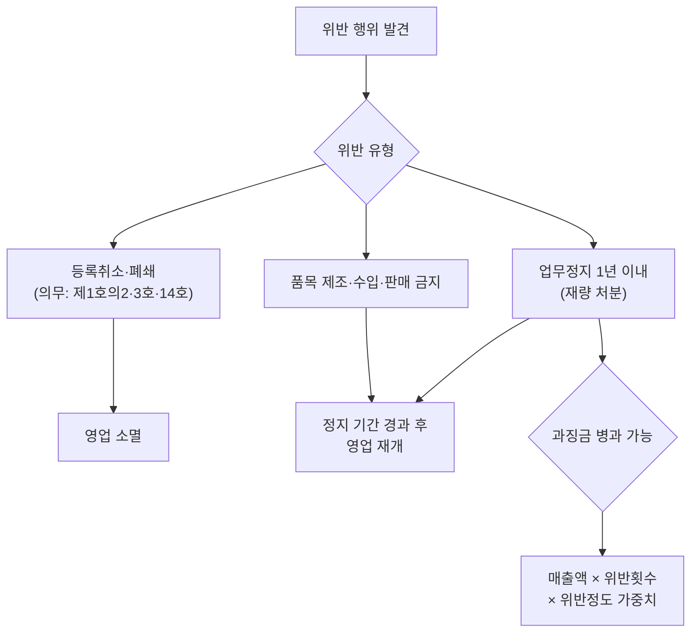

① 영업자가 다음 각 호의 어느 하나에 해당하는 경우에는 식품의약품안전처장은 등록을 취소하거나 영업소 폐쇄(제3조의2제1항에 따라 신고한 영업만 해당한다. 이하 이 조에서 같다)를 명하거나, 품목의 제조ㆍ수입 및 판매(수입대행형 거래를 목적으로 하는 알선ㆍ수여를 포함한다)의 금지를 명하거나 1년의 범위에서 기간을 정하여 그 업무의 전부 또는 일부에 대한 정지를 명할 수 있다.

다만, 제1호의2, 제3호 또는 제14호(광고 업무에 한정하여 정지를 명한 경우는 제외한다)에 해당하는 경우에는 등록을 취소하거나 영업소를 폐쇄하여야 한다. <개정 2013. 3. 23., 2015. 1. 28., 2016. 5. 29., 2018. 3. 13., 2018. 12. 11., 2019. 1. 15., 2021. 8. 17., 2026. 4. 28.>

1. 제3조제1항 후단에 따른 화장품제조업 또는 화장품책임판매업의 변경 사항 등록을 하지 아니한 경우
1의2. 거짓이나 그 밖의 부정한 방법으로 제3조제1항 또는 제3조의2제1항에 따른 등록ㆍ변경등록 또는 신고ㆍ변경신고를 한 경우
2. 제3조제2항에 따른 시설을 갖추지 아니한 경우
2의2. 제3조의2제1항 후단에 따른 맞춤형화장품판매업의 변경신고를 하지 아니한 경우
2의3. 맞춤형화장품판매업자가 제3조의2제2항 본문에 따른 시설기준을 갖추지 아니하게 된 경우
3. 제3조의3 각 호의 어느 하나에 해당하는 경우

4. 국민보건에 위해를 끼쳤거나 끼칠 우려가 있는 화장품을 제조ㆍ수입한 경우

5. 제4조제1항을 위반하여 심사를 받지 아니하거나 보고서를 제출하지 아니한 기능성화장품을 판매한 경우
5의2. 제4조의2제1항에 따른 제품별 안전성 자료를 작성 또는 보관하지 아니한 경우
6. 제5조를 위반하여 영업자의 준수사항을 이행하지 아니한 경우
6의2. 제5조의2제1항을 위반하여 회수 대상 화장품을 회수하지 아니하거나 회수하는 데에 필요한 조치를 하지 아니한 경우
6의3. 제5조의2제2항을 위반하여 회수계획을 보고하지 아니하거나 거짓으로 보고한 경우
8. 제9조에 따른 화장품의 안전용기ㆍ포장에 관한 기준을 위반한 경우

9. 제10조부터 제12조까지의 규정을 위반하여 화장품의 용기 또는 포장 및 첨부문서에 기재ㆍ표시한 경우

10. 제13조를 위반하여 화장품을 표시ㆍ광고하거나 제14조제4항에 따른 중지명령을 위반하여 화장품을 표시ㆍ광고 행위를 한 경우

11. 제15조를 위반하여 판매하거나 판매의 목적으로 제조ㆍ수입ㆍ보관 또는 진열한 경우

12. 제18조제1항ㆍ제2항에 따른 검사ㆍ질문ㆍ수거 등을 거부하거나 방해한 경우

13. 제19조, 제20조, 제22조, 제23조제1항ㆍ제2항 또는 제23조의2에 따른 시정명령ㆍ검사명령ㆍ개수명령ㆍ회수명령ㆍ폐기명령 또는 공표명령 등을 이행하지 아니한 경우
13의2. 제23조제3항에 따른 회수계획을 보고하지 아니하거나 거짓으로 보고한 경우
14. 업무정지기간 중에 업무를 한 경우
② 제1항에 따른 행정처분의 기준은 총리령으로 정한다.<개정 2013. 3. 23.>
[제목개정 2018. 3. 13.]
[시행일: 2027. 4. 29.] 제24조


### 제24조의2(기능성화장품의 인정 취소)

식품의약품안전처장은 화장품제조업자, 화장품책임판매업자 또는 총리령으로 정하는 대학ㆍ연구소 등이 다음 각 호의 어느 하나에 해당하는 경우에는 기능성화장품 인정을 취소하여야 한다.

1. 거짓이나 그 밖의 부정한 방법으로 제4조에 따른 심사 또는 변경심사를 받은 경우

2. 거짓이나 그 밖의 부정한 방법으로 제4조에 따른 보고서를 제출한 경우
[본조신설 2021. 8. 17.]


### 제26조(영업자의 지위 승계)

영업자가 사망하거나 그 영업을 양도한 경우 또는 법인인 영업자가 합병한 경우에는 그 상속인, 영업을 양수한 자 또는 합병 후 존속하는 법인이나 합병에 따라 설립되는 법인이 그 영업자의 의무 및 지위를 승계한다. <개정 2018. 3. 13.>

[제목개정 2018. 3. 13.]


### 제26조의2(행정제재처분 효과의 승계)

제26조에 따라 영업자의 지위를 승계한 경우에 종전의 영업자에 대한 제24조에 따른 행정제재처분의 효과는 그 처분 기간이 끝난 날부터 1년간 해당 영업자의 지위를 승계한 자에게 승계되며, 행정제재처분의 절차가 진행 중일 때에는 해당 영업자의 지위를 승계한 자에 대하여 그 절차를 계속 진행할 수 있다.

다만, 영업자의 지위를 승계한 자가 지위를 승계할 때에 그 처분 또는 위반 사실을 알지 못하였음을 증명하는 경우에는 그러하지 아니하다.

[본조신설 2018. 12. 11.]


### 제27조(청문)

식품의약품안전처장은 제3조의8에 따른 자격의 취소 및 제24조에 따른 등록의 취소, 영업소 폐쇄, 품목의 제조ㆍ수입 및 판매(수입대행형 거래를 목적으로 하는 알선ㆍ수여를 포함한다)의 금지 또는 업무의 전부에 대한 정지를 명하고자 하는 경우에는 청문을 하여야 한다. <개정 2013. 3. 23., 2016. 5. 29., 2018. 3. 13., 2021. 8. 17., 2025. 1. 31.>


### 제28조(과징금처분)

① 식품의약품안전처장은 제24조에 따라 영업자에게 업무정지처분을 하여야 할 경우에는 그 업무정지처분을 갈음하여 10억원 이하의 과징금을 부과할 수 있다. <개정 2013. 3. 23., 2018. 3. 13., 2018. 12. 11.>

② 제1항에 따른 과징금을 부과하는 위반행위의 종류와 위반정도 등에 따른 과징금의 금액과 그 밖에 필요한 사항은 대통령령으로 정한다.

③ 식품의약품안전처장은 과징금을 부과하기 위하여 필요한 경우에는 다음 각 호의 사항을 적은 문서로 관할 세무관서의 장에게 과세 정보 제공을 요청할 수 있다.<신설 2018. 3. 13.>
1. 납세자의 인적 사항

2. 과세 정보의 사용 목적

3. 과징금 부과기준이 되는 매출금액
④ 식품의약품안전처장은 제1항에 따른 과징금을 내야 할 자가 납부기한까지 과징금을 내지 아니하면 대통령령으로 정하는 바에 따라 제1항에 따른 과징금부과처분을 취소하고 제24조제1항에 따른 업무정지처분을 하거나 국세 체납처분의 예에 따라 이를 징수한다.

다만, 제6조에 따른 폐업 등으로 제24조제1항에 따른 업무정지처분을 할 수 없을 때에는 국세 체납처분의 예에 따라 이를 징수한다.<개정 2013. 3. 23., 2018. 3. 13.>
⑤ 식품의약품안전처장은 제4항에 따라 체납된 과징금의 징수를 위하여 다음 각 호의 어느 하나에 해당하는 자료 또는 정보를 해당 각 호의 자에게 요청할 수 있다. 이 경우 요청을 받은 자는 정당한 사유가 없으면 요청에 따라야 한다.<신설 2018. 3. 13.>
1. 「건축법」 제38조에 따른 건축물대장 등본: 국토교통부장관

2. 「공간정보의 구축 및 관리 등에 관한 법률」 제71조에 따른 토지대장 등본: 국토교통부장관

3. 「자동차관리법」 제7조에 따른 자동차등록원부 등본: 특별시장ㆍ광역시장ㆍ특별자치시장ㆍ도지사 또는 특별자치도지사


### 제28조의2(위반사실의 공표)

① 식품의약품안전처장은 제22조, 제23조, 제23조의2, 제24조 또는 제28조에 따라 행정처분이 확정된 자에 대한 처분 사유, 처분 내용, 처분 대상자의 명칭ㆍ주소 및 대표자 성명, 해당 품목의 명칭 등 처분과 관련한 사항으로서 대통령령으로 정하는 사항을 공표할 수 있다.

② 제1항에 따른 공표방법 등 공표에 필요한 사항은 대통령령으로 정한다.
[본조신설 2015. 1. 28.]


### 제28조의3(직접구매 해외화장품에 대한 검사 및 관계 기관 정보 제공)

① 식품의약품안전처장은 제15조제2호부터 제10호까지의 어느 하나에 해당될 가능성이 있는 직접구매 해외화장품에 대하여 검사를 실시할 수 있다.

② 식품의약품안전처장은 제1항에 따른 검사 결과 제15조제2호부터 제10호까지의 어느 하나에 해당하는 것으로 확인된 경우에는 해당 직접구매 해외화장품에 대한 정보를 관계 중앙행정기관의 장에게 제공할 수 있다.

③ 제1항에 따른 검사의 방법, 절차 등에 필요한 사항은 총리령으로 정한다.
[본조신설 2025. 4. 1.]


### 제28조의4(직접구매 해외화장품에 대한 실태조사)

① 식품의약품안전처장은 직접구매 해외화장품에 대한 정책을 수립하기 위하여 소비자의 직접구매 해외화장품 구매ㆍ사용실태, 위해정보 및 피해사례 등에 대한 실태조사를 실시할 수 있다.

② 식품의약품안전처장은 제1항에 따라 직접구매 해외화장품의 구매ㆍ사용실태를 조사ㆍ연구하기 위하여 필요한 경우 관계 중앙행정기관의 장에 대하여 「관세법」 제241조제1항에 따라 수입신고한 물품(직접구매 해외화장품만 해당한다)에 관한 자료 등 대통령령으로 정하는 자료를 제공하도록 요청할 수 있다. 이 경우 요청을 받은 관계 중앙행정기관의 장은 정당한 사유가 없으면 이에 따라야 한다.

③ 제1항 및 제2항에 따른 업무를 수행하거나 수행하였던 사람은 제2항에 따라 제공된 자료 또는 실태조사 업무를 수행하면서 취득한 정보를 이 법에서 정한 목적 외의 용도로 조회ㆍ사용하거나 다른 사람 또는 기관에 제공하거나 누설하여서는 아니 된다.

④ 제1항에 따른 실태조사에 관하여 필요한 사항은 총리령으로 정한다.
[본조신설 2025. 4. 1.]


### 제29조(자발적 관리의 지원)

식품의약품안전처장은 영업자가 스스로 표시ㆍ광고, 품질관리, 국내외 인증 등의 준수사항을 위하여 노력하는 자발적 관리체계가 정착ㆍ확산될 수 있도록 행정적ㆍ재정적 지원을 할 수 있다. <개정 2013. 3. 23., 2018. 3. 13.>


### 제30조(수출용 제품의 예외)

국내에서 판매되지 아니하고 수출만을 목적으로 하는 제품은 제4조, 제4조의2제1항, 제4조의3제1항, 제8조부터 제12조까지, 제14조, 제15조제1호ㆍ제5호, 제16조제1항제2호ㆍ제3호 및 같은 조 제2항을 적용하지 아니하고 수입국의 규정에 따를 수 있다. <개정 2016. 5. 29., 2025. 12. 30.>

[시행일: 2029. 1. 1.] 제30조의 개정규정 중 “제4조의3제1항”에 관한 부분
[시행일] 다음 각 호의 구분에 따른 화장품책임판매업자에 대한 제30조의 개정규정 중 “제4조의2”에 관한 부분
1. 연 생산액ㆍ수입액이 10억원 이상인 업소 또는 이 법 공포 후 화장품책임판매업을 등록한 업소: 다음 각 목의 구분에 따른 시행일
가. 이 법 공포 후 기능성화장품으로 심사를 받거나 보고서를 제출한 제품을 판매하려는 업소: 2028년 1월 1일
나. 이 법 공포 후 최초로 제조ㆍ수입하여 출시하는 제품을 판매하려는 업소: 2030년 1월 1일
다. 가목 및 나목에 해당하지 아니하는 업소: 2031년 1월 1일
2. 연 생산액ㆍ수입액이 10억원 미만인 업소: 2031년 1월 1일


## 제5장 보칙


> 📌 **출처**: 화장품법 제5장 (제31조~제34조) | **참조 PDF**: `화장품법(법률)(제20901호)(20260402).pdf` | **시행일**: 2026. 4. 2. | **최종 확인**: 2026. 8. 29.

### 제31조(등록필증 등의 재교부)

영업자가 등록필증ㆍ신고필증 또는 기능성화장품심사결과통지서 등을 잃어버리거나 못쓰게 될 때는 총리령으로 정하는 바에 따라 이를 다시 교부받을 수 있다. <개정 2013. 3. 23., 2018. 3. 13.>


### 제32조(수수료)

① 다음 각 호의 어느 하나에 해당하는 자는 총리령으로 정하는 바에 따라 식품의약품안전처장에게 수수료를 납부하여야 한다.

다만, 제3조의4제3항에 따라 업무를 위탁하는 경우에는 위탁받은 기관(이하 이 조에서 “수탁기관”이라 한다)이 정하는 수수료를 해당 수탁기관에 납부하여야 한다. <개정 2021. 8. 17.>

1. 이 법에 따른 등록ㆍ신고를 하거나 심사ㆍ인증을 받으려는 자

2. 이 법에 따른 등록ㆍ신고사항 또는 심사ㆍ인증받은 사항을 변경하려는 자

3. 제3조의4에 따른 자격시험에 응시하거나 그 자격증의 발급을 신청하려는 자
② 수탁기관은 제1항 단서에 따라 수수료를 정하는 경우 그 기준을 정하여 식품의약품안전처장의 승인을 받아야 한다. 승인받은 사항을 변경하려는 경우에도 또한 같다.<신설 2021. 8. 17.>

③ 제1항 단서에 따라 수탁기관이 징수하는 수수료는 제3조의4제3항에 따른 수탁업무의 이행 대가로서 수탁기관의 수입으로 한다.<신설 2021. 8. 17.>
[전문개정 2018. 3. 13.]


### 제33조(화장품산업의 지원)

보건복지부장관과 식품의약품안전처장은 화장품산업의 진흥을 위한 기반조성 및 경쟁력 강화에 필요한 시책을 수립ㆍ시행하여야 하며 이를 위한 재원을 마련하고 기술개발, 조사ㆍ연구 사업, 해외 정보의 제공, 국제협력체계의 구축 등에 필요한 지원을 하여야 한다. <개정 2013. 3. 23., 2018. 3. 13.>


### 제33조의2(국제협력)

식품의약품안전처장은 화장품의 수출 진흥 및 안전과 품질관리 등을 위하여 수입국ㆍ수출국과 협약을 체결하는 등 국제협력에 노력하여야 한다.

[본조신설 2018. 12. 11.]


### 제33조의3(화장품통합정보시스템의 구축ㆍ운영)

① 식품의약품안전처장은 화장품 안전 관리에 필요한 정보를 종합적으로 관리하기 위하여 화장품통합정보시스템(이하 “통합정보시스템”이라 한다)을 구축ㆍ운영할 수 있다.

② 식품의약품안전처장은 통합정보시스템의 구축을 위하여 관계 중앙행정기관의 장, 지방자치단체의 장 및 관계 기관ㆍ단체의 장에게 필요한 자료의 제출을 요청할 수 있다. 이 경우 요청을 받은 관계 중앙행정기관의 장 등은 정당한 사유가 없으면 이에 따라야 한다.

③ 식품의약품안전처장은 통합정보시스템의 구축ㆍ운영 등에 관한 업무를 대통령령으로 정하는 기관 또는 단체에 위탁할 수 있다. 이 경우 식품의약품안전처장은 통합정보시스템의 구축ㆍ운영에 소요되는 비용의 전부 또는 일부를 지원할 수 있다.

④ 제1항부터 제3항까지에 따른 통합정보시스템의 구축ㆍ운영 등에 필요한 사항은 총리령으로 정한다.
[본조신설 2025. 12. 30.]
[시행일: 2026. 12. 31.] 제33조의3


### 제34조(권한 등의 위임ㆍ위탁)

① 이 법에 따른 식품의약품안전처장의 권한은 그 일부를 대통령령으로 정하는 바에 따라 지방식품의약품안전청장이나 특별시장ㆍ광역시장ㆍ도지사 또는 특별자치도지사에게 위임할 수 있다. <개정 2013. 3. 23.>

② 식품의약품안전처장은 이 법에 따른 화장품에 관한 업무의 일부를 대통령령으로 정하는 바에 따라 제17조에 따른 단체 또는 화장품 관련 기관ㆍ법인ㆍ단체에 위탁할 수 있다.<개정 2013. 3. 23., 2018. 3. 13.>
[제목개정 2018. 3. 13.]


## 제6장 벌칙


> 📌 **출처**: 화장품법 제6장 (제36조~제40조) | **참조 PDF**: `화장품법(법률)(제20901호)(20260402).pdf` | **시행일**: 2026. 4. 2. | **최종 확인**: 2026. 8. 29.

### 제36조(벌칙)

① 다음 각 호의 어느 하나에 해당하는 자는 3년 이하의 징역 또는 3천만원 이하의 벌금에 처한다. <개정 2014. 3. 18., 2018. 3. 13., 2021. 8. 17., 2026. 4. 28.>

1. 제3조제1항 전단을 위반한 자
1의2. 거짓이나 그 밖의 부정한 방법으로 제3조제1항 또는 제3조의2제1항에 따른 등록ㆍ변경등록 또는 신고ㆍ변경신고를 한 자
1의3. 제3조의2제1항 전단을 위반한 자
2. 제4조제1항 전단을 위반한 자
2의2. 거짓이나 그 밖의 부정한 방법으로 제4조에 따른 심사ㆍ변경심사를 받거나 보고서를 제출한 자
3. 제15조를 위반한 자

4. 제16조제1항제1호ㆍ제1호의2ㆍ제1호의3 또는 제4호를 위반한 자
② 제1항의 징역형과 벌금형은 이를 함께 부과할 수 있다.
[시행일: 2027. 4. 29.] 제36조


### 제37조(벌칙)

① 제3조의6, 제4조의2제1항, 제4조의3제1항, 제9조, 제13조, 제16조제1항제2호ㆍ제3호, 같은 조 제2항 또는 제28조의4제3항을 위반하거나, 제14조제4항에 따른 중지명령에 따르지 아니한 자는 1년 이하의 징역 또는 1천만원 이하의 벌금에 처한다. <개정 2013. 7. 30., 2014. 3. 18., 2019. 1. 15., 2021. 8. 17., 2025. 4. 1., 2025. 12. 30.>

② 제1항의 징역형과 벌금형은 이를 함께 부과할 수 있다.
[시행일: 2029. 1. 1.] 제37조의 개정규정 중 “제4조의3제1항”에 관한 부분
[시행일] 다음 각 호의 구분에 따른 화장품책임판매업자에 대한 제37조의 개정규정 중 “제4조의2”에 관한 부분
1. 연 생산액ㆍ수입액이 10억원 이상인 업소 또는 이 법 공포 후 화장품책임판매업을 등록한 업소: 다음 각 목의 구분에 따른 시행일
가. 이 법 공포 후 기능성화장품으로 심사를 받거나 보고서를 제출한 제품을 판매하려는 업소: 2028년 1월 1일
나. 이 법 공포 후 최초로 제조ㆍ수입하여 출시하는 제품을 판매하려는 업소: 2030년 1월 1일
다. 가목 및 나목에 해당하지 아니하는 업소: 2031년 1월 1일
2. 연 생산액ㆍ수입액이 10억원 미만인 업소: 2031년 1월 1일


### 제38조(벌칙)

다음 각 호의 어느 하나에 해당하는 자는 200만원 이하의 벌금에 처한다. <개정 2018. 3. 13., 2018. 12. 11., 2021. 8. 17.>

1. 제5조제1항부터 제4항까지의 규정에 따른 준수사항을 위반한 자
1의2. 제5조의2제1항을 위반한 자
1의3. 제5조의2제2항을 위반한 자
2. 제10조제1항(같은 항 제7호는 제외한다)ㆍ제2항을 위반한 자
3. 제18조, 제19조, 제20조, 제22조 및 제23조에 따른 명령을 위반하거나 관계 공무원의 검사ㆍ수거 또는 처분을 거부ㆍ방해하거나 기피한 자


### 제39조(양벌규정)

법인의 대표자나 법인 또는 개인의 대리인, 사용인, 그 밖의 종업원이 그 법인 또는 개인의 업무에 관하여 제36조부터 제38조까지의 어느 하나에 해당하는 위반행위를 하면 그 행위자를 벌하는 외에 그 법인 또는 개인에게도 해당 조문의 벌금형을 과(科)한다.

다만, 법인 또는 개인이 그 위반행위를 방지하기 위하여 해당 업무에 관하여 상당한 주의와 감독을 게을리하지 아니한 경우에는 그러하지 아니하다. <개정 2018. 3. 13.>


### 제40조(과태료)

① 다음 각 호의 어느 하나에 해당하는 자에게는 100만원 이하의 과태료를 부과한다. <개정 2016. 2. 3., 2018. 3. 13., 2018. 12. 11., 2021. 8. 17.>

1의2. 제3조의7을 위반하여 맞춤형화장품조제관리사 또는 이와 유사한 명칭을 사용한 자
2. 제4조제1항 후단을 위반하여 변경심사를 받지 아니한 자

3. 제5조제5항을 위반하여 화장품의 생산실적 또는 수입실적 또는 화장품 원료의 목록 등을 보고하지 아니한 자
3의2. 제5조제6항을 위반하여 맞춤형화장품 원료의 목록을 보고하지 아니한 자
4. 제5조제7항을 위반하여 교육을 받지 아니한 자
4의2. 제5조제8항에 따른 명령을 위반한 자
5. 제6조를 위반하여 폐업 등의 신고를 하지 아니한 자
5의2. 제10조제1항제7호 및 제11조를 위반하여 화장품의 판매 가격을 표시하지 아니한 자
6. 제18조에 따른 명령을 위반하여 보고를 하지 아니한 자

7. 제15조의2제1항을 위반하여 동물실험을 실시한 화장품 또는 동물실험을 실시한 화장품 원료를 사용하여 제조(위탁제조를 포함한다) 또는 수입한 화장품을 유통ㆍ판매한 자
② 제1항에 따른 과태료는 대통령령으로 정하는 바에 따라 식품의약품안전처장이 부과ㆍ징수한다.<개정 2013. 3. 23.>


---

## 📋 Chapter 04. 시험 직전 서류철 — 별표·서식 총정리

사업을 실제로 운영하면서 민수에게 가장 어려웠던 것은 숫자와 기준이었다.
그래서 마지막에는 별표·별지와 숫자 기준을 한 번에 확인할 수 있도록 서류철을 만들었다.


> 법령 조문에서 참조하는 별표 및 별지 서식의 정확한 내용과 PDF 파일 목록입니다.
> 파일은 `공통참조자료/` 폴더에 저장되어 있습니다.

### 1. 시행규칙 별표

| 별표 | 정확한 내용 | 관련 조문 | 파일명 | 비고 |
|---|---|---|---|---|
| 별표 1 | **품질관리기준** | 제7조, 제11조, 제12조 | [시행규칙_별표1_품질관리기준.pdf](1과목_참조자료/시행규칙_별표1_품질관리기준.pdf) | 책임판매관리자 직무 |
| 별표 2 | **책임판매 후 안전관리기준** | 제7조, 제12조 | [시행규칙_별표2_책임판매안전관리기준.pdf](1과목_참조자료/시행규칙_별표2_책임판매안전관리기준.pdf) | 안전확보업무 |
| 별표 3 | **사용할 때의 주의사항** | 제19조제3항 | [시행규칙_별표3_사용시주의사항.pdf](공통참조자료/시행규칙_별표3_사용시주의사항.pdf) | 공통+유형별 |
| 별표 4 | **화장품 포장의 표시기준 및 방법** | 제19조제7항 | [시행규칙_별표4_포장표시기준및방법.pdf](공통참조자료/시행규칙_별표4_포장표시기준및방법.pdf) | 표시사항 11종 |
| 별표 5 | **표시·광고의 범위 및 준수사항** | 제22조 | [시행규칙_별표5_표시광고범위및준수사항.pdf](공통참조자료/시행규칙_별표5_표시광고범위및준수사항.pdf) | 광고매체 8종 |
| 별표 5의2 | 삭제 | - | [시행규칙_별표5의2_삭제.pdf](1과목_참조자료/시행규칙_별표5의2_삭제.pdf) | 2025.8.1. 삭제 |
| 별표 5의3 | 삭제 | - | [시행규칙_별표5의3_삭제.pdf](1과목_참조자료/시행규칙_별표5의3_삭제.pdf) | 2025.8.1. 삭제 |
| 별표 5의4 | 삭제 | - | [시행규칙_별표5의4_삭제.pdf](1과목_참조자료/시행규칙_별표5의4_삭제.pdf) | 2025.8.1. 삭제 |
| 별표 6 | **위해화장품의 공표문** | 제28조제2항 | [시행규칙_별표6_위해화장품공표문.pdf](공통참조자료/시행규칙_별표6_위해화장품공표문.pdf) | 회수 공표 양식 |
| 별표 7 | **행정처분의 기준** | 제29조제1항 | [시행규칙_별표7_행정처분기준.pdf](공통참조자료/시행규칙_별표7_행정처분기준.pdf) | 일반+개별기준 |
| 별표 8 | 삭제 | - | [시행규칙_별표8_삭제.pdf](1과목_참조자료/시행규칙_별표8_삭제.pdf) | 2014.8.20. 삭제 |
| 별표 9 | **수수료** | 제32조 | [시행규칙_별표9_수수료.pdf](공통참조자료/시행규칙_별표9_수수료.pdf) | 등록·심사 수수료 |

### 2. 조문-별표 교차 매핑

| 조문 | 제목 | 참조 별표 | 핵심 내용 |
|---|---|---|---|
| 제7조 | 책임판매관리자 | 별표 1, 별표 2 | 품질관리기준·안전관리기준 직무 |
| 제10조의2 | 영유아·어린이 표시광고 | 별표 5 | 광고매체 범위 (가~바목) |
| 제11조 | 제조업자 준수사항 | 별표 1 | 품질관리기준 준수 |
| 제12조 | 책임판매업자 준수사항 | 별표 1, 별표 2 | 품질관리·안전관리기준 준수 |
| 제19조 | 기재·표시사항 | 별표 3, 별표 4 | 주의사항·포장 표시기준 |
| 제22조 | 표시·광고 범위 | 별표 5 | 광고매체·준수사항 |
| 제27조 | 회수·폐기명령 | 제14조의2, 제14조의3 준용 | 위해성 등급·회수절차 |
| 제29조 | 행정처분기준 | 별표 7 | 영업정지·등록취소 기준 |
| 제32조 | 수수료 | 별표 9 | 등록·심사·변경 수수료 |

### 3. 별지 서식

| 서식 | 내용 | 관련 조문 |
|---|---|---|
| 별지 제1호 | 화장품제조업 등록신청서 | 제3조 |
| 별지 제2호 | 화장품제조업 등록필증 | 제3조 |
| 별지 제3호 | 화장품책임판매업 등록신청서 | 제4조 |
| 별지 제4호 | 화장품책임판매업 등록필증 | 제4조 |
| 별지 제5호 | 변경등록신청서 | 제5조 |
| 별지 제6호의2 | 관리업무 비종사신고서 | 제7조 |
| 별지 제11호 | 맞춤형화장품판매업 신고서 | 제8조의4 |
| 별지 제18호 | 재발급신청서 | 제31조 |

### 4. 타 법령 별표 (교차 참조)

| 법령 | 별표 | 내용 | 파일명 |
|---|---|---|---|
| 안전기준 | 별표 1 | 사용할 수 없는 원료 | [안전기준_별표1_사용불가원료.pdf](공통참조자료/안전기준_별표1_사용불가원료.pdf) |
| 안전기준 | 별표 2 | 사용상 제한이 필요한 원료 | [안전기준_별표2_사용제한원료.pdf](공통참조자료/안전기준_별표2_사용제한원료.pdf) |
| 안전기준 | 별표 4 | 유통화장품 안전관리 시험방법 | [안전기준_별표4_유통안전관리시험방법.pdf](공통참조자료/안전기준_별표4_유통안전관리시험방법.pdf) |
| KFCC | 별표 1~10 | 기능성화장품 기준 및 시험방법 | KFCC 별표 1~10 (→ 2과목_참조자료/KFCC_별표*.pdf) |
| CGMP | 별표 1~3 | 공정분류·평가표·로고 | CGMP 별표 1~3 (→ 2과목_참조자료/CGMP_별표*.pdf) |
| 주의사항 | 별표 1 | 유형별 주의사항 표시문구 | [주의사항_별표1_유형별주의사항표시문구.pdf](공통참조자료/주의사항_별표1_유형별주의사항표시문구.pdf) |
| 주의사항 | 별표 2 | 알레르기 유발성분 25종 | [주의사항_별표2_알레르기유발성분25종.pdf](공통참조자료/주의사항_별표2_알레르기유발성분25종.pdf) |
| 색소기준 | - | 화장품의 색소 종류 및 기준 | [색소종류및기준_전체.pdf](공통참조자료/색소종류및기준_전체.pdf) |

---

### 📌 핵심 별표 내용 요약 (시험 출제 가능성 높음)

#### 별표 1: 품질관리기준 (제7조 관련)

> 책임판매관리자가 수행해야 할 품질관리 업무의 구체적 기준

| 구분 | 주요 내용 |
|---|---|
| **품질관리** | 제조업자 관리·감독, 시장출하 관리, 제품 품질 관리 |
| **시장출하** | 타인 위탁 제조·검사 포함 (수탁 제조는 제외) |
| **적용 범위** | 화장품책임판매업자 전체 (제조·수입·판매 단계) |

#### 별표 3: 사용할 때의 주의사항 (제19조제3항 관련)

> 화장품 포장에 기재해야 하는 공통 및 유형별 주의사항

| 구분 | 주의사항 내용 |
|---|---|
| **공통 1** | 사용 시 또는 사용 후 직사광선에 의해 붉은 반점·부어오름·가려움 등 이상 증상이 있으면 전문의 상담 |
| **공통 2** | 상처가 있는 부위에는 사용 자제 |
| **공통 3** | 어린이 손이 닿지 않는 곳에 보관, 직사광선 피해서 보관 |
| **유형별** | 식약처장이 고시하는 유형별·함유성분별 주의사항 (→ 주의사항 규정 별표 1) |

#### 별표 7: 행정처분의 기준 (제29조제1항 관련)

> 위반 행위에 대한 행정처분의 구체적 기준

| 구분 | 처분 내용 |
|---|---|
| **일반기준** | 위반행위 2개 이상 → 무거운 처분 적용 (업무정지 합산 시 최대 12개월) |
| **주요 처분** | 시정명령 → 품목업무정지 → 업무정지 → 등록취소 |
| **과징금** | 업무정지 처분 시 과징금으로 갈음 가능 (위반정도에 따라 차등) |

#### 별표 9: 수수료 (제32조 관련)

| 종류 | 전자민원 | 방문·우편 |
|---|---|---|
| 제조업·책임판매업 등록 / 맞춤형 판매업 신고 | 27,000원 | 30,000원 |
| 변경등록 / 변경신고 (책임판매관리자·조제관리사 변경 외) | 9,000원 | 10,000원 |
| 기능성화장품 심사의뢰 | 189,000원 | 210,000원 |
| 기능성화장품 변경심사 (시험방법 변경 외) | 63,000원 | 70,000원 |

> **💡 암기 팁**: 전자민원이 방문·우편보다 3,000원 저렴. 심사의뢰는 189,000원(전자) / 210,000원(방문).
---

## 출처: 화장품법 시행규칙 (제2109호, 시행 2026. 4. 2.)

## 02_화장품법_시행규칙

화장품법 시행규칙
[시행 2026. 4. 2.] [총리령 제2109호, 2026. 3. 31., 일부개정]
식품의약품안전처(화장품정책과) 043-719-3412


## 제1조(목적)

이 규칙은 「화장품법」 및 같은 법 시행령에서 위임된 사항과 그 시행에 필요한 사항을 규정함을 목적으로 한다.


> 📌 **출처**: 화장품법 시행규칙 제1조 | **참조 PDF**: `화장품법 시행규칙(총리령)(제02109호)(20260402).pdf` | **시행일**: 2026. 4. 2. | **최종 확인**: 2026. 8. 29.


## 제2조(기능성화장품의 범위)

「화장품법」(이하 “법”이라 한다) 제2조제2호 각 목 외의 부분에서 “총리령으로 정하는 화장품”이란 다음 각 호의 화장품을 말한다. <개정 2013. 3. 23., 2017. 1. 12., 2020. 8. 5.>


> 📌 **출처**: 화장품법 시행규칙 제2조 | **참조 PDF**: `화장품법 시행규칙(총리령)(제02109호)(20260402).pdf` | **시행일**: 2026. 4. 2. | **최종 확인**: 2026. 8. 29.

1. 피부에 멜라닌색소가 침착하는 것을 방지하여 기미ㆍ주근깨 등의 생성을 억제함으로써 피부의 미백에 도움을 주는 기능을 가진 화장품

2. 피부에 침착된 멜라닌색소의 색을 엷게 하여 피부의 미백에 도움을 주는 기능을 가진 화장품

3. 피부에 탄력을 주어 피부의 주름을 완화 또는 개선하는 기능을 가진 화장품

4. 강한 햇볕을 방지하여 피부를 곱게 태워주는 기능을 가진 화장품

5. 자외선을 차단 또는 산란시켜 자외선으로부터 피부를 보호하는 기능을 가진 화장품

6. 모발의 색상을 변화[탈염(脫染)ㆍ탈색(脫色)을 포함한다]시키는 기능을 가진 화장품. 다만, 일시적으로 모발의 색상을 변화시키는 제품은 제외한다.

7. 체모를 제거하는 기능을 가진 화장품. 다만, 물리적으로 체모를 제거하는 제품은 제외한다.

8. 탈모 증상의 완화에 도움을 주는 화장품. 다만, 코팅 등 물리적으로 모발을 굵게 보이게 하는 제품은 제외한다.

9. 여드름성 피부를 완화하는 데 도움을 주는 화장품. 다만, 인체세정용 제품류로 한정한다.

10. 피부장벽(피부의 가장 바깥 쪽에 존재하는 각질층의 표피를 말한다)의 기능을 회복하여 가려움 등의 개선에 도움을 주는 화장품

11. 튼살로 인한 붉은 선을 엷게 하는 데 도움을 주는 화장품


## 제3조(제조업의 등록 등)

① 삭제 <2019. 3. 14.>


> 📌 **출처**: 화장품법 시행규칙 제3조 | **참조 PDF**: `화장품법 시행규칙(총리령)(제02109호)(20260402).pdf` | **시행일**: 2026. 4. 2. | **최종 확인**: 2026. 8. 29.

② 법 제3조제1항 전단에 따라 화장품제조업 등록을 하려는 자는 별지 제1호서식의 화장품제조업 등록신청서(전자문서로 된 신청서를 포함한다)에 다음 각 호의 서류(전자문서를 포함한다)를 첨부하여 제조소의 소재지를 관할하는 지방식품의약품안전청장에게 제출하여야 한다.<개정 2019. 3. 14.>
1. 화장품제조업을 등록하려는 자(법인인 경우에는 대표자를 말한다. 이하 이 항에서 같다)가 법 제3조의3제1호 본문에 해당되지 않음을 증명하는 의사의 진단서 또는 법 제3조의3제1호 단서에 해당하는 사람임을 증명하는 전문의의 진단서

2. 화장품제조업을 등록하려는 자가 법 제3조의3제3호에 해당되지 않음을 증명하는 의사의 진단서

3. 시설의 명세서
③ 제2항에 따라 신청서를 받은 지방식품의약품안전청장은 「전자정부법」 제36조제1항에 따른 행정정보의 공동이용을 통하여 법인 등기사항증명서(법인인 경우만 해당한다)를 확인하여야 한다.

④ 지방식품의약품안전청장은 제2항에 따른 등록신청이 등록요건을 갖춘 경우에는 화장품 제조업 등록대장에 다음 각 호의 사항을 적고, 별지 제2호서식의 화장품제조업 등록필증을 발급해야 한다.<개정 2014. 9. 24., 2019. 3. 14., 2023. 6. 22.>
1. 등록번호 및 등록연월일

2. 화장품제조업자(화장품제조업을 등록한 자를 말한다. 이하 같다)의 성명 및 「개인정보 보호법 시행령」 제19조제1호 또는 제4호에 따른 주민등록번호 또는 외국인등록번호(이하 "주민등록번호등"이라 한다).

   이 경우 화장품제조업자가 법인인 경우에는 대표자의 성명 및 주민등록번호등을 적는다.
3. 화장품제조업자의 상호(법인인 경우에는 법인의 명칭)

4. 제조소의 소재지

5. 제조 유형


## 제4조(화장품책임판매업의 등록 등)

① 삭제 <2019. 3. 14.>


> 📌 **출처**: 화장품법 시행규칙 제4조 | **참조 PDF**: `화장품법 시행규칙(총리령)(제02109호)(20260402).pdf` | **시행일**: 2026. 4. 2. | **최종 확인**: 2026. 8. 29.

② 법 제3조제1항 전단에 따라 화장품책임판매업을 등록하려는 자는 별지 제3호서식의 화장품책임판매업 등록신청서(전자문서로 된 신청서를 포함한다)에 다음 각 호의 서류[전자문서를 포함하며, 「화장품법 시행령」(이하 “영”이라 한다) 제2조제2호라목에 해당하는 경우에는 제출하지 않는다]를 첨부하여 화장품책임판매업소의 소재지를 관할하는 지방식품의약품안전청장에게 제출해야 한다.<개정 2019. 3. 14.>
1. 법 제3조제3항에 따른 화장품의 품질관리 및 책임판매 후 안전관리에 적합한 기준에 관한 규정

2. 법 제3조제3항에 따른 책임판매관리자(이하 “책임판매관리자”라 한다)의 자격을 확인할 수 있는 서류
③ 제2항에 따라 신청서를 받은 지방식품의약품안전청장은 「전자정부법」 제36조제1항에 따른 행정정보의 공동이용을 통하여 법인 등기사항증명서(법인인 경우만 해당한다)를 확인하여야 한다.

④ 지방식품의약품안전청장은 제2항에 따른 등록신청이 등록요건을 갖춘 경우에는 화장품책임판매업 등록대장에 다음 각 호의 사항을 적고, 별지 제4호서식의 화장품책임판매업 등록필증을 발급해야 한다.<개정 2014. 9. 24., 2019. 3. 14., 2023. 6. 22.>
1. 등록번호 및 등록연월일

2. 화장품책임판매업자(화장품책임판매업을 등록한 자를 말한다. 이하 같다)의 성명 및 주민등록번호등(법인인 경우에는 대표자의 성명 및 주민등록번호등을 말한다)

3. 화장품책임판매업자의 상호(법인인 경우에는 법인의 명칭)

4. 화장품책임판매업소의 소재지

5. 책임판매관리자의 성명 및 주민등록번호등

6. 책임판매 유형
[제목개정 2019. 3. 14.]


## 제5조(화장품제조업 등의 변경등록)

① 법 제3조제1항 후단에 따라 화장품제조업자 또는 화장품책임판매업자가 변경등록을 하여야 하는 경우는 다음 각 호와 같다. <개정 2014. 9. 24., 2019. 3. 14.>


> 📌 **출처**: 화장품법 시행규칙 제5조 | **참조 PDF**: `화장품법 시행규칙(총리령)(제02109호)(20260402).pdf` | **시행일**: 2026. 4. 2. | **최종 확인**: 2026. 8. 29.

1. 화장품제조업자는 다음 각 목의 어느 하나에 해당하는 경우
가. 화장품제조업자의 변경(법인인 경우에는 대표자의 변경)
나. 화장품제조업자의 상호 변경(법인인 경우에는 법인의 명칭 변경)
다. 제조소의 소재지 변경
라. 제조 유형 변경
2. 화장품책임판매업자는 다음 각 목의 어느 하나에 해당하는 경우
가. 화장품책임판매업자의 변경(법인인 경우에는 대표자의 변경)
나. 화장품책임판매업자의 상호 변경(법인인 경우에는 법인의 명칭 변경)
다. 화장품책임판매업소의 소재지 변경
라. 책임판매관리자의 변경
마. 책임판매 유형 변경
② 화장품제조업자 또는 화장품책임판매업자는 제1항에 따른 변경등록을 하는 경우에는 변경 사유가 발생한 날부터 30일(행정구역 개편에 따른 소재지 변경의 경우에는 90일) 이내에 별지 제5호서식의 화장품제조업 변경등록 신청서(전자문서로 된 신청서를 포함한다) 또는 별지 제6호서식의 화장품책임판매업 변경등록 신청서(전자문서로 된 신청서를 포함한다)에 화장품제조업 등록필증 또는 화장품책임판매업 등록필증과 다음 각 호의 구분에 따라 해당 서류(전자문서를 포함한다)를 첨부(전자문서로 발급받은 경우는 각각 제외한다)하여 지방식품의약품안전청장에게 제출하여야 한다. 이 경우 등록 관청을 달리하는 화장품제조소 또는 화장품책임판매업소의 소재지 변경의 경우에는 새로운 소재지를 관할하는 지방식품의약품안전청장에게 제출하여야 한다.<개정 2014. 9. 24., 2016. 9. 9., 2019. 3. 14., 2019. 12. 12., 2025. 2. 7.>
1. 화장품제조업자 또는 화장품책임판매업자의 변경(법인의 경우에는 대표자의 변경)의 경우에는 다음 각 목의 서류
가. 제3조제2항제1호에 해당하는 서류(제조업자만 제출한다)
나. 제3조제2항제2호에 해당하는 서류(제조업자만 제출한다)
다. 양도ㆍ양수의 경우에는 이를 증명하는 서류
라. 삭제<2024. 7. 9.>
2. 제조소의 소재지 변경(행정구역개편에 따른 사항은 제외한다)의 경우: 제3조제2항제3호에 해당하는 서류

3. 책임판매관리자 변경의 경우: 제4조제2항제2호에 해당하는 서류(영 제2조제2호라목의 화장품책임판매업을 등록한 자가 두는 책임판매관리자는 제외한다)

4. 다음 각 목에 해당하는 제조 유형 또는 책임판매 유형 변경의 경우
가. 영 제2조제1호다목의 화장품제조 유형으로 등록한 자가 같은 호 가목 또는 나목의 화장품제조 유형으로 변경하거나 같은 호 가목 또는 나목의 제조 유형을 추가하는 경우: 제3조제2항제3호에 해당하는 서류
나. 영 제2조제2호라목의 화장품책임판매 유형으로 등록한 자가 같은 호 가목부터 다목까지의 책임판매 유형으로 변경하거나 같은 호 가목부터 다목까지의 책임판매 유형을 추가하는 경우: 제4조제2항제1호 및 제2호에 해당하는 서류
③ 제1항 및 제2항에 따라 화장품제조업 변경등록 신청서 또는 화장품책임판매업 변경등록 신청서를 받은 지방식품의약품안전청장은 「전자정부법」 제36조제1항에 따른 행정정보의 공동이용을 통하여 법인 등기사항증명서(법인인 경우만 해당한다) 및 가족관계증명서(상속의 경우만 해당한다)를 확인하여야 한다.<개정 2019. 3. 14., 2024. 7. 9.>

④ 지방식품의약품안전청장은 제2항 및 제3항에 따른 변경등록 신청사항을 확인한 후 화장품 제조업 등록대장 또는 화장품책임판매업 등록대장에 각각의 변경사항을 적고, 화장품제조업 등록필증 또는 화장품책임판매업 등록필증의 뒷면에 변경사항을 적은 후 이를 내주어야 한다.<개정 2019. 3. 14.>
[제목개정 2019. 3. 14.]


## 제6조(시설기준 등)

① 법 제3조제2항 본문에 따라 화장품제조업을 등록하려는 자가 갖추어야 하는 시설은 다음 각 호와 같다. <개정 2019. 3. 14.>


> 📌 **출처**: 화장품법 시행규칙 제6조 + 별표 1~3 | **참조 PDF**: `화장품법 시행규칙(총리령)(제02109호)(20260402).pdf` | **시행일**: 2026. 4. 2. | **최종 확인**: 2026. 8. 29.

1. 제조 작업을 하는 다음 각 목의 시설을 갖춘 작업소
가. 쥐ㆍ해충 및 먼지 등을 막을 수 있는 시설
나. 작업대 등 제조에 필요한 시설 및 기구
다. 가루가 날리는 작업실은 가루를 제거하는 시설
2. 원료ㆍ자재 및 제품을 보관하는 보관소

3. 원료ㆍ자재 및 제품의 품질검사를 위하여 필요한 시험실

4. 품질검사에 필요한 시설 및 기구
② 제1항에도 불구하고 법 제3조제2항 단서에 따라 다음 각 호의 경우에는 그 구분에 따라 시설의 일부를 갖추지 아니할 수 있다.<개정 2013. 3. 23., 2014. 8. 20., 2019. 3. 14.>
1. 화장품제조업자가 화장품의 일부 공정만을 제조하는 경우에는 해당 공정에 필요한 시설 및 기구 외의 시설 및 기구

2. 다음 각 목의 어느 하나에 해당하는 기관 등에 원료ㆍ자재 및 제품에 대한 품질검사를 위탁하는 경우에는 제1항제3호 및 제4호의 시설 및 기구
가. 「보건환경연구원법」 제2조에 따른 보건환경연구원
나. 제1항제3호에 따른 시험실을 갖춘 제조업자
다. 「식품ㆍ의약품분야 시험ㆍ검사 등에 관한 법률」 제6조에 따른 화장품 시험ㆍ검사기관(이하 “화장품 시험ㆍ검사기관”이라 한다)
라. 「약사법」 제67조에 따라 조직된 사단법인인 한국의약품수출입협회
③ 제조업자는 화장품의 제조시설을 이용하여 화장품 외의 물품을 제조할 수 있다. 다만, 제품 상호간에 오염의 우려가 있는 경우에는 그러하지 아니하다.


## 제8조(책임판매관리자의 자격기준 등)

① 법 제3조제3항에 따라 화장품책임판매업자(영 제2조제2호라목의 화장품책임판매업을 등록한 자는 제외한다)가 두어야 하는 책임판매관리자는 다음 각 호의 어느 하나의 해당하는 사람이어야 한다. <개정 2013. 12. 6., 2014. 9. 24., 2016. 9. 9., 2018. 12. 31., 2019. 3. 14., 2021. 5. 14., 2023. 6. 22.>


> 📌 **출처**: 화장품법 시행규칙 제8조 | **참조 PDF**: `화장품법 시행규칙(총리령)(제02109호)(20260402).pdf` | **시행일**: 2026. 4. 2. | **최종 확인**: 2026. 8. 29.

1. 「의료법」에 따른 의사 또는 「약사법」에 따른 약사

2. 이공계(「국가과학기술 경쟁력 강화를 위한 이공계지원 특별법」 제2조제1호에 따른 이공계를 말한다) 학과 또는 향장학ㆍ화장품과학ㆍ한의학ㆍ한약학ㆍ간호학ㆍ간호과학ㆍ건강간호학 등을 전공하여 학사 이상의 학위를 취득(법령에서 이와 같은 수준 이상의 학력이 있다고 인정하는 경우를 포함한다)한 사람
3. 화학ㆍ생물학ㆍ화학공학ㆍ생물공학ㆍ미생물학ㆍ생화학ㆍ생명과학ㆍ생명공학ㆍ유전공학ㆍ향장학ㆍ화장품과학ㆍ한의학ㆍ한약학ㆍ간호학ㆍ간호과학ㆍ건강간호학 등 화장품 관련 분야(이하 “화장품 관련 분야”라 한다)를 전공하여 전문학사 학위를 취득(법령에서 이와 같은 수준 이상의 학력이 있다고 인정하는 경우를 포함한다)한 후 화장품 제조 또는 품질관리 업무에 1년 이상 종사한 경력이 있는 사람
3의3. 식품의약품안전처장이 정하여 고시하는 전문 교육과정을 이수한 사람(식품의약품안전처장이 정하여 고시하는 품목만 해당한다)
3의4. 법 제3조의2제2항에 따른 맞춤형화장품조제관리사(이하 “맞춤형화장품조제관리사”라 한다) 자격시험에 합격한 사람
4. 그 밖에 화장품 제조 또는 품질관리 업무에 2년 이상 종사한 경력이 있는 사람

② 책임판매관리자는 다음 각 호의 직무를 수행한다.<개정 2019. 3. 14.>
1. 별표 1의 품질관리기준에 따른 품질관리 업무

2. 별표 2의 책임판매 후 안전관리기준에 따른 안전확보 업무

3. 원료 및 자재의 입고(入庫)부터 완제품의 출고에 이르기까지 필요한 시험ㆍ검사 또는 검정에 대하여 제조업자를 관리ㆍ감독하는 업무
③ 상시근로자수가 10명 이하인 화장품책임판매업을 경영하는 화장품책임판매업자(법인인 경우에는 그 대표자를 말한다)가 제1항 각 호의 어느 하나에 해당하는 사람인 경우에는 그 사람이 제2항에 따른 책임판매관리자의 직무를 수행할 수 있다. 이 경우 책임판매관리자를 둔 것으로 본다.<신설 2013. 12. 6., 2016. 6. 30., 2019. 3. 14.>

④ 책임판매관리자는 해당 화장품책임판매업소의 책임판매관리자 업무에 종사하지 않게 된 경우에는 별지 제6호의2서식의 관리업무 비종사신고서에 그 사유서를 첨부하여 해당 화장품책임판매업소의 소재지를 관할하는 지방식품의약품안전청장에게 제출할 수 있다.<신설 2024. 7. 9.>
[제목개정 2019. 3. 14.]


## 제10조의2(영유아 또는 어린이 사용 화장품의 표시ㆍ광고)

① 법 제4조의2제1항에 따른 영유아 또는 어린이의 연령 기준은 다음 각 호의 구분에 따른다. <개정 2024. 7. 9.>


> 📌 **출처**: 화장품법 시행규칙 제10조의2 | **참조 PDF**: `화장품법 시행규칙(총리령)(제02109호)(20260402).pdf` | **시행일**: 2026. 4. 2. | **최종 확인**: 2026. 8. 29.

1. 영유아: 3세 이하

2. 어린이: 4세 이상 13세 이하
② 화장품책임판매업자가 법 제4조의2제1항 각 호에 따른 자료(이하 “제품별 안전성 자료”라 한다)를 작성ㆍ보관해야 하는 표시ㆍ광고의 범위는 다음 각 호의 구분에 따른다.
1. 표시의 경우: 화장품의1차 포장 또는 2차 포장에 영유아 또는 어린이가 사용할 수 있는 화장품임을 특정하여 표시하는 경우(화장품의 명칭에 영유아 또는 어린이에 관한 표현이 표시되는 경우를 포함한다)

2. 광고의 경우: 별표 5 제1호가목부터 바목까지(어린이 사용 화장품의 경우에는 바목을 제외한다)의 규정에 따른 매체ㆍ수단 또는 해당 매체ㆍ수단과 유사하다고 식품의약품안전처장이 정하여 고시하는 매체ㆍ수단에 영유아 또는 어린이가 사용할 수 있는 화장품임을 특정하여 광고하는 경우
[본조신설 2020. 1. 22.]


## 제10조의5(위해요소 저감화계획의 수립)

① 법 제4조의2제2항에 따른 위해요소의 저감화를 위한 계획(이하 “위해요소 저감화계획”이라 한다)에는 다음 각 호의 사항이 포함되어야 한다.


> 📌 **출처**: 화장품법 시행규칙 제10조의5 | **참조 PDF**: `화장품법 시행규칙(총리령)(제02109호)(20260402).pdf` | **시행일**: 2026. 4. 2. | **최종 확인**: 2026. 8. 29.

1. 위해요소 저감화를 위한 기본 방향과 목표

2. 위해요소 저감화를 위한 단기별 및 중장기별 추진 정책

3. 위해요소 저감화 추진을 위한 환경 여건 및 관련 정책의 평가

4. 위해요소 저감화 추진을 위한 조직 및 재원 등에 관한 사항

5. 그 밖에 제1호부터 제4호까지의 사항과 유사한 것으로서 위해요소 저감화를 위해 식품의약품안전처장이 필요하다고 인정하는 사항
② 식품의약품안전처장은 위해요소 저감화계획을 수립하는 경우에는 실태조사에 대한 분석 및 평가 결과를 반영해야 한다.

③ 식품의약품안전처장은 위해요소 저감화계획의 수립을 위해 필요하다고 인정하는 경우에는 관계 행정기관, 공공기관, 법인ㆍ단체 또는 전문가 등에게 필요한 의견 또는 자료의 제출 등을 요청할 수 있다.

④ 식품의약품안전처장은 위해요소 저감화계획을 수립한 경우에는 그 내용을 식품의약품안전처 인터넷 홈페이지에 공개해야 한다.

⑤ 제1항부터 제4항까지에서 규정한 사항 외에 위해요소 저감화계획의 수립 대상, 방법 및 절차 등에 필요한 세부 사항은 식품의약품안전처장이 정한다.
[본조신설 2020. 1. 22.]


## 제11조(화장품제조업자의 준수사항 등)

① 법 제5조제1항에 따라 화장품 제조업자가 준수하여야 할 사항은 다음 각 호와 같다. <개정 2019. 3. 14.>


> 📌 **출처**: 화장품법 시행규칙 제11조 | **참조 PDF**: `화장품법 시행규칙(총리령)(제02109호)(20260402).pdf` | **시행일**: 2026. 4. 2. | **최종 확인**: 2026. 8. 29.

1. 별표 1의 품질관리기준에 따른 화장품책임판매업자의 지도ㆍ감독 및 요청에 따를 것

2. 제조관리기준서ㆍ제품표준서ㆍ제조관리기록서 및 품질관리기록서(전자문서 형식을 포함한다)를 작성ㆍ보관할 것

3. 보건위생상 위해(危害)가 없도록 제조소, 시설 및 기구를 위생적으로 관리하고 오염되지 아니하도록 할 것

4. 화장품의 제조에 필요한 시설 및 기구에 대하여 정기적으로 점검하여 작업에 지장이 없도록 관리ㆍ유지할 것

5. 작업소에는 위해가 발생할 염려가 있는 물건을 두어서는 아니 되며, 작업소에서 국민보건 및 환경에 유해한 물질이 유출되거나 방출되지 아니하도록 할 것

6. 제2호의 사항 중 품질관리를 위하여 필요한 사항을 화장품책임판매업자에게 제출할 것. 다만, 다음 각 목의 어느 하나에 해당하는 경우 제출하지 아니할 수 있다.
가. 화장품제조업자와 화장품책임판매업자가 동일한 경우
나. 화장품제조업자가 제품을 설계ㆍ개발ㆍ생산하는 방식으로 제조하는 경우로서 품질ㆍ안전관리에 영향이 없는 범위에서 화장품제조업자와 화장품책임판매업자 상호 계약에 따라 영업비밀에 해당하는 경우
7. 원료 및 자재의 입고부터 완제품의 출고에 이르기까지 필요한 시험ㆍ검사 또는 검정을 할 것

8. 제조 또는 품질검사를 위탁하는 경우 제조 또는 품질검사가 적절하게 이루어지고 있는지 수탁자에 대한 관리ㆍ감독을 철저히 하고, 제조 및 품질관리에 관한 기록을 받아 유지ㆍ관리할 것
② 식품의약품안전처장은 제1항에 따른 준수사항 외에 식품의약품안전처장이 정하여 고시하는 우수화장품 제조관리기준을 준수하도록 제조업자에게 권장할 수 있다.<개정 2013. 3. 23.>

③ 식품의약품안전처장은 제2항에 따라 우수화장품 제조관리기준을 준수하는 제조업자에게 다음 각 호의 사항을 지원할 수 있다.<신설 2014. 9. 24.>
1. 우수화장품 제조관리기준 적용에 관한 전문적 기술과 교육

2. 우수화장품 제조관리기준 적용을 위한 자문

3. 우수화장품 제조관리기준 적용을 위한 시설ㆍ설비 등 개수ㆍ보수
[제목개정 2019. 3. 14.]
[제12조에서 이동, 종전 제11조는 제12조로 이동 <2020. 3. 13.>]


## 제12조(화장품책임판매업자의 준수사항)

법 제5조제2항에 따라 화장품책임판매업자가 준수해야 할 사항은 다음 각 호(영 제2조제2호라목의 화장품책임판매업을 등록한 자는 제1호, 제2호, 제4호가목ㆍ다목ㆍ사목ㆍ차목 및 제10호만 해당한다)와 같다. <개정 2013. 3. 23., 2013. 12. 6., 2015. 4. 2., 2019. 3. 14., 2020. 3. 13.>


> 📌 **출처**: 화장품법 시행규칙 제12조 | **참조 PDF**: `화장품법 시행규칙(총리령)(제02109호)(20260402).pdf` | **시행일**: 2026. 4. 2. | **최종 확인**: 2026. 8. 29.

1. 별표 1의 품질관리기준을 준수할 것

2. 별표 2의 책임판매 후 안전관리기준을 준수할 것

3. 제조업자로부터 받은 제품표준서 및 품질관리기록서(전자문서 형식을 포함한다)를 보관할 것

4. 수입한 화장품에 대하여 다음 각 목의 사항을 적거나 또는 첨부한 수입관리기록서를 작성ㆍ보관할 것
가. 제품명 또는 국내에서 판매하려는 명칭
나. 원료성분의 규격 및 함량
다. 제조국, 제조회사명 및 제조회사의 소재지
라. 기능성화장품심사결과통지서 사본
마. 제조 및 판매증명서.

다만, 「대외무역법」 제12조제2항에 따른 통합 공고상의 수출입 요건 확인기관에서 제조 및 판매증명서를 갖춘 화장품책임판매업자가 수입한 화장품과 같다는 것을 확인받고, 제6조제2항제2호가목, 다목 또는 라목의 기관으로부터 화장품책임판매업자가 정한 품질관리기준에 따른 검사를 받아 그 시험성적서를 갖추어 둔 경우에는 이를 생략할 수 있다.
바. 한글로 작성된 제품설명서 견본
사. 최초 수입연월일(통관연월일을 말한다. 이하 이 호에서 같다)
아. 제조번호별 수입연월일 및 수입량
자. 제조번호별 품질검사 연월일 및 결과
차. 판매처, 판매연월일 및 판매량
5. 제조번호별로 품질검사를 철저히 한 후 유통시킬 것. 다만, 화장품제조업자와 화장품책임판매업자가 같은 경우 또는 제6조제2항제2호 각 목의 어느 하나에 해당하는 기관 등에 품질검사를 위탁하여 제조번호별 품질검사결과가 있는 경우에는 품질검사를 하지 아니할 수 있다.

6. 화장품의 제조를 위탁하거나 제6조제2항제2호나목에 따른 제조업자에게 품질검사를 위탁하는 경우 제조 또는 품질검사가 적절하게 이루어지고 있는지 수탁자에 대한 관리ㆍ감독을 철저히 하여야 하며, 제조 및 품질관리에 관한 기록을 받아 유지ㆍ관리하고, 그 최종 제품의 품질관리를 철저히 할 것

7. 제5호에도 불구하고 영 제2조제2호다목의 화장품책임판매업을 등록한 자는 제조국 제조회사의 품질관리기준이 국가 간 상호 인증되었거나, 제11조제2항에 따라 식품의약품안전처장이 고시하는 우수화장품 제조관리기준과 같은 수준 이상이라고 인정되는 경우에는 국내에서의 품질검사를 하지 아니할 수 있다. 이 경우 제조국 제조회사의 품질검사 시험성적서는 품질관리기록서를 갈음한다.

8. 제7호에 따라 영 제2조제2호다목의 화장품책임판매업을 등록한 자가 수입화장품에 대한 품질검사를 하지 아니하려는 경우에는 식품의약품안전처장이 정하는 바에 따라 식품의약품안전처장에게 수입화장품의 제조업자에 대한 현지실사를 신청하여야 한다. 현지실사에 필요한 신청절차, 제출서류 및 평가방법 등에 대하여는 식품의약품안전처장이 정하여 고시한다.
8의2. 제7호에 따른 인정을 받은 수입 화장품 제조회사의 품질관리기준이 제11조제2항에 따른 우수화장품 제조관리기준과 같은 수준 이상이라고 인정되지 아니하여 제7호에 따른 인정이 취소된 경우에는 제5호 본문에 따른 품질검사를 하여야 한다. 이 경우 인정 취소와 관련하여 필요한 세부적인 사항은 식품의약품안전처장이 정하여 고시한다.
9. 영 제2조제2호다목의 화장품책임판매업을 등록한 자의 경우 「대외무역법」에 따른 수출ㆍ수입요령을 준수하여야 하며, 「전자무역 촉진에 관한 법률」에 따른 전자무역문서로 표준통관예정보고를 할 것

10. 제품과 관련하여 국민보건에 직접 영향을 미칠 수 있는 안전성ㆍ유효성에 관한 새로운 자료, 정보사항(화장품 사용에 의한 부작용 발생사례를 포함한다) 등을 알게 되었을 때에는 식품의약품안전처장이 정하여 고시하는 바에 따라 보고하고, 필요한 안전대책을 마련할 것

11. 다음 각 목의 어느 하나에 해당하는 성분을

0.5퍼센트 이상 함유하는 제품의 경우에는 해당 품목의 안정성시험 자료를 최종 제조된 제품의 사용기한이 만료되는 날부터 1년간 보존할 것
가. 레티놀(비타민A) 및 그 유도체
나. 아스코빅애시드(비타민C) 및 그 유도체
다. 토코페롤(비타민E)
라. 과산화화합물
마. 효소
[제목개정 2019. 3. 14.]
[제11조에서 이동, 종전 제12조는 제11조로 이동 <2020. 3. 13.>]


## 제14조의4(행정처분의 감경 또는 면제)

법 제5조의2제3항에 따라 법 제24조에 따른 행정처분을 감경 또는 면제하는 경우 그 기준은 다음 각 호의 구분에 따른다.


> 📌 **출처**: 화장품법 시행규칙 제14조의4 | **참조 PDF**: `화장품법 시행규칙(총리령)(제02109호)(20260402).pdf` | **시행일**: 2026. 4. 2. | **최종 확인**: 2026. 8. 29.

1. 법 제5조의2제2항의 회수계획에 따른 회수계획량(이하 이 조에서 “회수계획량”이라 한다)의5분의4 이상을 회수한 경우: 그 위반행위에 대한 행정처분을 면제

2. 회수계획량 중 일부를 회수한 경우: 다음 각 목의 어느 하나에 해당하는 기준에 따라 행정처분을 경감
가. 회수계획량의3분의1 이상을 회수한 경우(제1호의 경우는 제외한다)
1) 법 제24조제2항에 따른 행정처분의 기준(이하 이 호에서 “행정처분기준”이라 한다)이 등록취소인 경우에는 업무정지 2개월 이상 6개월 이하의 범위에서 처분
2) 행정처분기준이 업무정지 또는 품목의 제조ㆍ수입ㆍ판매 업무정지인 경우에는 정지처분기간의3분의2 이하의 범위에서 경감
나. 회수계획량의4분의1 이상 3분의1 미만을 회수한 경우
1) 행정처분기준이 등록취소인 경우에는 업무정지 3개월 이상 6개월 이하의 범위에서 처분
2) 행정처분기준이 업무정지 또는 품목의 제조ㆍ수입ㆍ판매 업무정지인 경우에는 정지처분기간의2분의1 이하의 범위에서 경감
[본조신설 2015. 7. 29.]


## 제17조(화장품 원료 등의 위해평가)

① 법 제8조제3항에 따른 위해평가는 다음 각 호의 확인ㆍ결정ㆍ평가 등의 과정을 거쳐 실시한다.


> 📌 **출처**: 화장품법 시행규칙 제17조 | **참조 PDF**: `화장품법 시행규칙(총리령)(제02109호)(20260402).pdf` | **시행일**: 2026. 4. 2. | **최종 확인**: 2026. 8. 29.

1. 위해요소의 인체 내 독성을 확인하는 위험성 확인과정

2. 위해요소의 인체노출 허용량을 산출하는 위험성 결정과정

3. 위해요소가 인체에 노출된 양을 산출하는 노출평가과정

4. 제1호부터 제3호까지의 결과를 종합하여 인체에 미치는 위해 영향을 판단하는 위해도 결정과정
② 식품의약품안전처장은 제1항에 따른 결과를 근거로 식품의약품안전처장이 정하는 기준에 따라 위해 여부를 결정한다.

다만, 해당 화장품 원료 등에 대하여 국내외의 연구ㆍ검사기관에서 이미 위해평가를 실시하였거나 위해요소에 대한 과학적 시험ㆍ분석 자료가 있는 경우에는 그 자료를 근거로 위해 여부를 결정할 수 있다.<개정 2013. 3. 23.>
③ 제1항 및 제2항에 따른 위해평가의 기준, 방법 등에 관한 세부 사항은 식품의약품안전처장이 정하여 고시한다.<개정 2013. 3. 23.>


## 제19조(화장품 포장의 기재ㆍ표시 등)

① 법 제10조제1항 각 호 외의 부분 단서에서 “내용량이 소량인 화장품의 포장 등 총리령으로 정하는 포장”이란 다음 각 호의 포장을 말한다.


> 📌 **출처**: 화장품법 시행규칙 제19조 | **참조 PDF**: `화장품법 시행규칙(총리령)(제02109호)(20260402).pdf` | **시행일**: 2026. 4. 2. | **최종 확인**: 2026. 8. 29.

다만, 제2호의 포장의 경우 가격이란 견본품이나 비매품 등의 표시를 말한다. <개정 2016. 9. 9., 2019. 3. 14., 2020. 3. 13., 2024. 7. 9., 2025. 2. 7.>

1. 내용량이 10밀리리터 이하 또는 10그램 이하인 화장품(소비자가 사용할 때 특별한 주의가 필요하다고 식품의약품안전처장이 정하여 고시하는 화장품은 제외한다)의 포장

2. 판매의 목적이 아닌 제품의 선택 등을 위하여 미리 소비자가 시험ㆍ사용하도록 제조 또는 수입된 화장품의 포장
② 법 제10조제1항제3호에 따라 기재ㆍ표시를 생략할 수 있는 성분이란 다음 각 호의 성분을 말한다.<개정 2013. 3. 23., 2020. 3. 13., 2024. 7. 9.>
1. 제조과정 중에 제거되어 최종 제품에는 남아 있지 않은 성분

2. 안정화제, 보존제 등 원료 자체에 들어 있는 부수 성분으로서 그 효과가 나타나게 하는 양보다 적은 양이 들어 있는 성분

3. 내용량이 10밀리리터 초과 50밀리리터 이하 또는 중량이 10그램 초과 50그램 이하 화장품(소비자가 사용할 때 특별한 주의가 필요하다고 식품의약품안전처장이 정하여 고시하는 화장품은 제외한다)의 포장인 경우에는 다음 각 목의 성분을 제외한 성분
가. 타르색소
나. 금박
다. 샴푸와 린스에 들어 있는 인산염의 종류
라. 과일산(AHA)
마. 기능성화장품의 경우 그 효능ㆍ효과가 나타나게 하는 원료
바. 식품의약품안전처장이 사용 한도를 고시한 화장품의 원료
③ 법 제10조제1항제9호에 따라 화장품의 포장에 기재ㆍ표시하여야 하는 사용할 때의 주의사항은 별표 3과 같다.

④ 법 제10조제1항제10호에 따라 화장품의 포장에 기재ㆍ표시하여야 하는 사항은 다음 각 호와 같다.

다만, 맞춤형화장품의 경우에는 제1호 및 제6호를 제외한다.<개정 2013. 3. 23., 2017. 11. 17., 2018. 12. 31., 2019. 3. 14., 2020. 1. 22., 2020. 3. 13., 2022. 2. 18., 2024. 7. 9.>
1. 식품의약품안전처장이 정하는 바코드

2. 기능성화장품의 경우 심사받거나 보고한 효능ㆍ효과, 용법ㆍ용량

3. 성분명을 제품 명칭의 일부로 사용한 경우 그 성분명과 함량(방향용 제품은 제외한다)

4. 인체 세포ㆍ조직 배양액이 들어있는 경우 그 함량

5. 화장품에 천연 또는 유기농으로 표시ㆍ광고하려는 경우에는 원료의 함량

6. 수입화장품인 경우에는 제조국의 명칭(「대외무역법」에 따른 원산지를 표시한 경우에는 제조국의 명칭을 생략할 수 있다), 제조회사명 및 그 소재지

7. 제2조제8호부터 제11호까지에 해당하는 기능성화장품의 경우에는 “질병의 예방 및 치료를 위한 의약품이 아님”이라는 문구

8. 영유아 또는 어린이가 사용할 수 있는 제품임을 특정하여 표시ㆍ광고하려는 경우 법 제8조제2항에 따라 사용기준이 지정ㆍ고시된 원료 중 보존제의 함량
가. 삭제<2024. 7. 9.>
나. 삭제<2024. 7. 9.>
⑤ 제1항 및 제2항제3호에 따라 해당 화장품의 제조에 사용된 성분의 기재ㆍ표시를 생략하려는 경우에는 다음 각 호의 어느 하나에 해당하는 방법으로 생략된 성분을 확인할 수 있도록 하여야 한다.
1. 소비자가 법 제10조제1항제3호에 따른 모든 성분을 즉시 확인할 수 있도록 포장에 전화번호나 홈페이지 주소를 적을 것

2. 법 제10조제1항제3호에 따른 모든 성분이 적힌 책자 등의 인쇄물을 판매업소에 늘 갖추어 둘 것
⑥ 법 제10조제2항 각 호 외의 부분 단서에서 “고형비누 등 총리령으로 정하는 화장품”이란 화장비누를 말한다.<신설 2022. 2. 18.>

⑦ 법 제10조제5항에 따른 화장품 포장의 표시기준 및 표시방법은 별표 4와 같다.<개정 2022. 2. 18., 2026. 3. 31.>


## 제21조(기재ㆍ표시상의 주의사항)

법 제12조에 따른 화장품 포장의 기재ㆍ표시 및 화장품의 가격표시상의 준수사항은 다음 각 호와 같다.


> 📌 **출처**: 화장품법 시행규칙 제21조 | **참조 PDF**: `화장품법 시행규칙(총리령)(제02109호)(20260402).pdf` | **시행일**: 2026. 4. 2. | **최종 확인**: 2026. 8. 29.

1. 한글로 읽기 쉽도록 기재ㆍ표시할 것. 다만, 한자 또는 외국어를 함께 적을 수 있고, 수출용 제품 등의 경우에는 그 수출 대상국의 언어로 적을 수 있다.

2. 화장품의 성분을 표시하는 경우에는 표준화된 일반명을 사용할 것


## 제22조(표시ㆍ광고의 범위 등)

법 제13조제2항에 따른 표시ㆍ광고의 범위와 그 밖에 준수하여야 하는 사항은 별표 5와 같다.


> 📌 **출처**: 화장품법 시행규칙 제22조 | **참조 PDF**: `화장품법 시행규칙(총리령)(제02109호)(20260402).pdf` | **시행일**: 2026. 4. 2. | **최종 확인**: 2026. 8. 29.


## 제27조(회수ㆍ폐기명령 등)

법 제23조제1항부터 제3항까지의 규정에 따른 물품 회수에 필요한 위해성 등급 및 그 분류기준과 물품 회수ㆍ폐기의 절차ㆍ계획 및 사후조치 등에 관하여는 제14조의2제2항 및 제14조의3을 준용한다. <개정 2019. 12. 12.>


> 📌 **출처**: 화장품법 시행규칙 제27조 | **참조 PDF**: `화장품법 시행규칙(총리령)(제02109호)(20260402).pdf` | **시행일**: 2026. 4. 2. | **최종 확인**: 2026. 8. 29.

[본조신설 2015. 7. 29.]


## 제29조(행정처분기준)

① 법 제24조제1항에 따른 행정처분의 기준은 별표 7과 같다.


> 📌 **출처**: 화장품법 시행규칙 제29조 + 별표 6 | **참조 PDF**: `화장품법 시행규칙(총리령)(제02109호)(20260402).pdf` | **시행일**: 2026. 4. 2. | **최종 확인**: 2026. 8. 29.

② 삭제<2014. 8. 20.>


## 제30조(과징금의 징수절차)

「화장품법 시행령」 제12조제1항에 따른 과징금의 징수절차는 「국고금관리법 시행규칙」을 준용한다. 이 경우 납입고지서에는 이의제기 방법 및 기간을 함께 적어 넣어야 한다.


> 📌 **출처**: 화장품법 시행규칙 제30조 | **참조 PDF**: `화장품법 시행규칙(총리령)(제02109호)(20260402).pdf` | **시행일**: 2026. 4. 2. | **최종 확인**: 2026. 8. 29.


## 제30조의2(직접구매 해외화장품에 대한 검사)

① 법 제28조의3제1항에 따른 직접구매 해외화장품에 대한 검사 방법은 다음 각 호의 구분에 따른다.


> 📌 **출처**: 화장품법 시행규칙 제30조의2 | **참조 PDF**: `화장품법 시행규칙(총리령)(제02109호)(20260402).pdf` | **시행일**: 2026. 4. 2. | **최종 확인**: 2026. 8. 29.

1. 확인 검사: 직접구매 해외화장품의 기재ㆍ표시 사항이나 사이버몰 등에 게재된 정보의 확인

2. 분석적 검사: 직접구매 해외화장품에 대한 물리적ㆍ화학적ㆍ미생물학적 방법의 검사
② 식품의약품안전처장이 법 제28조의3제1항에 따른 검사를 실시하려는 경우에는 법 제28조의4제1항에 따른 직접구매 해외화장품에 대한 실태조사 결과를 고려해야 한다.
[본조신설 2026. 3. 31.]


## 제30조의3(직접구매 해외화장품에 대한 실태조사)

① 법 제28조의4제1항에 따라 실시하는 직접구매 해외화장품에 대한 실태조사의 범위는 다음 각 호와 같다.


> 📌 **출처**: 화장품법 시행규칙 제30조의3 | **참조 PDF**: `화장품법 시행규칙(총리령)(제02109호)(20260402).pdf` | **시행일**: 2026. 4. 2. | **최종 확인**: 2026. 8. 29.

1. 직접구매 해외화장품 구매자의 성별, 연령대 등 인구통계학적 특성에 관한 사항

2. 직접구매 해외화장품의 종류, 구매빈도, 구매동기, 사용량, 사용기간 등 구매ㆍ사용실태에 관한 사항

3. 직접구매 해외화장품의 위해정보에 관한 사항

4. 직접구매 해외화장품의 소비자 피해 유형, 피해 경험 등 피해 사례에 관한 사항

5. 그 밖에 직접구매 해외화장품에 대한 정책을 수립하기 위하여 식품의약품안전처장이 필요하다고 인정하는 사항
② 제1항에 따른 실태조사는 통계조사, 문헌조사 또는 설문조사 등의 방법으로 실시할 수 있다.
[본조신설 2026. 3. 31.]


## 제32조(수수료)

① 법 제32조제1항 본문에 따른 수수료의 금액은 별표 9와 같다. <개정 2022. 2. 18.>


> 📌 **출처**: 화장품법 시행규칙 제32조 + 별표 7 | **참조 PDF**: `화장품법 시행규칙(총리령)(제02109호)(20260402).pdf` | **시행일**: 2026. 4. 2. | **최종 확인**: 2026. 8. 29.

② 제1항에 따른 수수료는 현금, 현금의 납입을 증명하는 증표 또는 정보통신망을 이용한 전자화폐나 전자결제 등의 방법으로 내야 한다.
[전문개정 2020. 3. 13.]


---

## 🏁 Chapter 05. 시험장에 들어가기 전날 — 최종 회상

민수는 마지막 밤에 새로운 내용을 공부하지 않았다. 대신 지금까지의 이야기를 처음부터 떠올렸다.

“사업을 시작한다 → 어떤 영업인가 → 등록·신고한다 → 품질과 안전을 관리한다 → 표시·광고한다 → 문제가 생기면 회수·행정처분에 대응한다 → 고객정보도 보호한다.”

이 흐름이 머릿속에 연결되자 흩어져 있던 법 조문들이 하나의 이야기로 이어졌다.


> 시험 당일 아침, 아래 핵심 포인트만 빠르게 복습하세요.

1. 화장품법은 1999년 약사법에서 분리, 2000년 7월 시행

2. 법→시행령→시행규칙→고시 4단 체계

3. 영업 3종: 제조업(등록), 책임판매업(등록), 맞춤형판매업(신고)

4. 기능성화장품 11가지 효능·효과 (총리령 지정)

5. 천연화장품: 천연원료 95% 이상, 유기농: 천연 95%+유기농 10% 이상

6. 행정처분: 시정명령→영업정지→등록취소→과징금

7. 화장품 정의: 인체 작용이 경미, 의약품/의약외품 제외

8. 결격사유: 금고 이상 형 선고·집행 중, 등록취소 후 1년(제조/책판), 3년(조제관리사)

---

## 🔗 과목 간 교차 참조

> 본 과목의 법령 조문 중 타 과목과 중복·연관된 항목입니다.


| 본 과목 항목 | 관련 과목 |
|---|---|
| CGMP 고시 | → 2과목·3과목에 상세 규정 |
| 기능성화장품 심사규정 | → 2과목에 상세 규정 |
| 맞춤형화장품 규정 (제3조의2~8) | → 4과목에 상세 규정 |
| 안전기준 | → 2과목·3과목에 상세 규정 |

---

## 📝 기출문제

→ [제1과목 실전 예상 문제 (100제)](기출문제/과목1_기출문제.md)