# 📘 2과목 화장품 제조 및 품질관리

> **학습 안내**
>
> 이 교재는 원문의 법령·학습자료·표·문제를 최대한 유지하면서, **핵심을 먼저 보고 → 구조를 시각화하고 → 숫자를 암기하고 → 문제로 회상**할 수 있도록 구성했습니다.

---

## 🧭 학습 아이콘

| 표시 | 의미 | 활용 |
| --- | --- | --- |
| 🎯 | 기출·출제 포인트 | 최우선 회상 |
| ⭐ | 핵심 개념 | 반드시 이해 |
| 🧠 | 암기 포인트 | 반복 회상 |
| ⚠️ | 주의·함정 | 오답 방지 |
| 🔢 | 숫자·기한 | 별도 암기 |
| 📊 | 비교·분류 | 표로 정리 |
| 🔄 | 절차·흐름 | 순서 암기 |
| 📝 | 확인문제 | 즉시 회상 |
| ⚖️ | 법령 원문 | 최종 확인 |

---

## 🚀 시험 직전 1분 전체 지도

```text
 2과목 제조 및 품질관리
 │
 ┌───────────────┼───────────────┐
 ↓ ↓ ↓
 원료·성분 제조관리 품질관리
 │ │ │
 수성·유성·계면 제조공정·위생 CGMP
 색소·향료·보존제 기준서·시설 시험·검사
 └───────────────┼───────────────┘
 ↓
 기능성화장품 심사
 ↓
 안전기준·사용한도
 ↓
 위해·회수관리
```

## 🎯 최우선 암기 축

1. **원료 분류** → 수성·유성·계면활성제·고분자·색소·향료·보존제
2. **계면활성제** → HLB 값에 따른 용도 구분 (3~6 W/O, 8~18 O/W)
3. **제조공정** → 원료 → 배합 → 제조 → 충진 · 포장 → 출하
4. **CGMP 3요소** → 인적자원 · 제조관리 · 품질관리
5. **기능성화장품 심사** → 심사신청 → 심사 → 결과 통보
6. **사용금지 원료** → 화장품에 사용할 수 없는 원료 (별표 1)
7. **사용제한 원료** → 기준·시험방법이 정해진 원료 (별표 2)
8. **안전기준** → 중금속·미생물·사용한도 등 제품별 기준
9. ** 위해관리** → 위해발생 시 보고·회수·조치 의무
10. **품질검사** → 원료 · 반제품 · 완제품 단계별 검사

---

## 🔢 숫자 암기 미리보기

| 항목 | 핵심 숫자 |
| --- | ---: |
| HLB 3~6 | W/O 유화 |
| HLB 8~18 | O/W 유화 |
| 부향률(향수) | 15~20% / 오드뚜왈렛 5~10% / 오드코롱 3~5% |
| 미백 – 나이아신아마이드 | 2.0~5.0% |
| 미백 – 알부틴 | 2.0~5.0% |
| 미백 – 유용성 감초 추출물 | 0.05% |
| 주름 – 아데노신 | 0.04% |
| 주름 – 레티놀 | 2,500IU/g |
| 제모 – 치오글리콜산 | 산으로서 3.0~4.5% (pH 7.0~12.7) |
| 여드름 – 살리실릭애씨드 | 0.5% (인체 세정용) |
| 티타늄디옥사이드·징크옥사이드 | 25% (자외선 산란제) |
| 드로메트리졸트리실록산 | 15% |
| 에칠헥실메톡시신나메이트 | 7.5% |
| 옥토크릴렌·호모살레이트 | 10% |
| 벤조페논-3(옥시벤존) | 2.4% (얼굴·손·입술 5%) |
| 드로메트리졸 | 1.0% |
| SPF 50+ 표시 | SPF 50 이상 |
| PA 등급 | PA+ (2~4) / PA++ (4~8) / PA+++ (8~16) / PA++++ (16~) |
| 페녹시에탄올 | 1.0% |
| 벤질알코올 | 1.0% (두발염색용 용제 10%) |
| p-하이드록시벤조익애씨드(파라벤) | 단일 0.4% / 혼합 0.8% (산으로서) |
| 살리실릭애씨드(보존제) | 0.5% |
| 이미다졸리디닐우레아 | 0.6% |
| 납 허용 한도 | 분말 50 / 기타 20㎍/g 이하 |
| 미생물 기준 | 총호기성생균수 500개/g 이하 (영유아·눈화장) |
| 알레르기 유발 성분 표시 | 사용 후 씻어내는 0.01% 초과 / 남기는 0.001% 초과 |
| 자외선 차단 인정 기준 | 변색 목적 0.5% 미만은 제외 |
| 안전성 정보 신속보고 | 15일 이내 |
| 위해화장품 회수 보고 | 즉시 |
| 트리클로산 | 0.3% (기능성화장품 유효성분 예외, 씻어내는 제품) |
| 치오글리콜릭애씨드(퍼머) | 11% (퍼머넌트웨이브 제1제 환원제) |
| AHA | 10% 초과 시 주의사항 표시 · pH 3.5 미만 시 표시 |
| IPBC | 0.02%(씻어내는) / 0.01%(남기는) |

> ⚠️ **법령·고시 수치는 개정될 수 있으므로, 실제 시험에서는 해당 시험의 최신 공식 기준과 본문 원문(⚖️)을 함께 확인하세요.**

---


> **🔍 키워드**: 원료분류, 계면활성제, HLB, 보존제, 자외선차단제, 색소, 기능성화장품 심사, KFCC, CGMP
> **핵심 내용**: 원료 사용기준(별표 1·2), 제조·품질관리·CGMP, 기능성화장품 심사·기준

## 📋 목차
- **Chapter 01.** 화장품 원료의 종류와 특성
- **Chapter 02.** 화장품 제조관리
- **Chapter 03.** 화장품의 기능과 품질
- **Chapter 04.** 화장품 사용제한 원료
- **Chapter 05.** 화장품 관리
- **Chapter 06.** 위해사례 판단 및 보고
- 🗺️ 과목 지도
- 📚 참조 자료 (원료 DB · 법령 원문)
- ⚡ 시험 직전 체크리스트
- 📝 기출문제
- 🧠 30초 회상
- 🔄 추천 회독법

---

## 📖 학습 안내

### 학습 목표
- 화장품 원료의 분류(계면활성제·보존제·자외선차단제·색소)와 사용 기준을 이해한다
- 화장품 제조 공정과 품질관리 체계(CGMP)의 전반 내용을 숙지한다
- 기능성화장품 심사 규정과 KFCC 기준 및 시험방법을 파악한다

### 학습 흐름
1. **원료 분류와 특성** → 계면활성제(HLB·미셀), 보존제, 자외선차단제, 색소 종류 및 사용 기준
2. **화장품 제조관리** → 유화·가용화·분산 3대 기술, 기초·색조 제조 공정 8단계
3. **화장품의 기능과 품질** → 화장품 효과 유형, 맞춤형화장품 구성, 품질성적서
4. **원료 사용기준(별표 1·2)** → 사용 금지 원료, 사용 제한 원료, 제한 농도·조건
5. **화장품 관리** → 취급·보관·사용 방법, 품질 유지 기준
6. **위해사례 판단 및 보고** → 위해성 평가 4단계, 회수 절차, 보고 의무

### 출제 빈도 높은 영역
- **★★★**: 계면활성제(HLB 값·용도), 보존제 종류, 자외선차단제(SPF·PA), CGMP 시설기준
- **★★☆**: 원료 사용기준(금지·제한 원료), 기능성화장품 심사 자료, 색소 분류
- **★☆☆**: KFCC 시험방법 세부 절차, 주의사항·알레르기 고시

---

## 🗺️ 과목 지도

> 아래 다이어그램들은 본 과목의 핵심 구조를 시각적으로 정리한 것입니다.

### 🗺️ 과목 개요 마인드맵

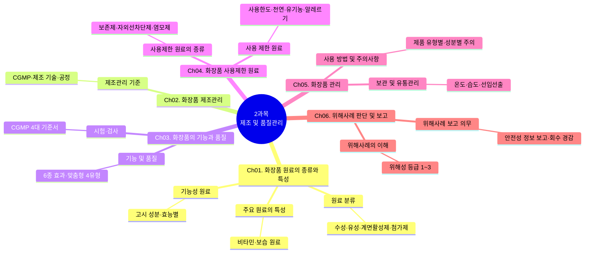

> **🗺️ 마인드맵 노드 상세 매핑**

| 대분류 | 중분류 | 핵심 포인트 |
| --- | --- | --- |
| Ch01. 화장품 원료의 종류와 특성 | 원료 분류 | 수성·유성·계면활성제·첨가제 |
|  | 주요 원료의 특성 | 비타민·보保湿 원료 4종 |
|  | 기능성 원료 | 고시 성분·효능별 분류 |
| Ch02. 화장품 제조관리 | 제조관리 기준 | CGMP·제조 기술 3종·공정 |
| Ch03. 화장품의 기능과 품질 | 기능 및 품질 | 6종 효과·맞춤형 4유형 |
|  | 시험·검사 | CGMP 4대 기준서 |
| Ch04. 화장품 사용제한 원료 | 사용제한 원료의 종류 | 보존제·자외선차단제·염모제 |
|  | 사용 제한 원료 | 사용한도·천연·유기농·알레르기 25종 |
| Ch05. 화장품 관리 | 보관 및 유통관리 | 온도·습도·직사광선·선입선출 |
|  | 사용 방법 및 주의사항 | 제품 유형별·성분별 주의 |
| Ch06. 위해사례 판단 및 보고 | 위해사례의 이해 | 위해성 등급 1~3 |
|  | 위해사례 보고 의무 | 안전성 정보 보고·회수 시 행정처분 경감 |

### 🗺️ 챕터별 마인드맵

### 🗺️ Ch01 마인드맵: 화장품 원료의 종류와 특성

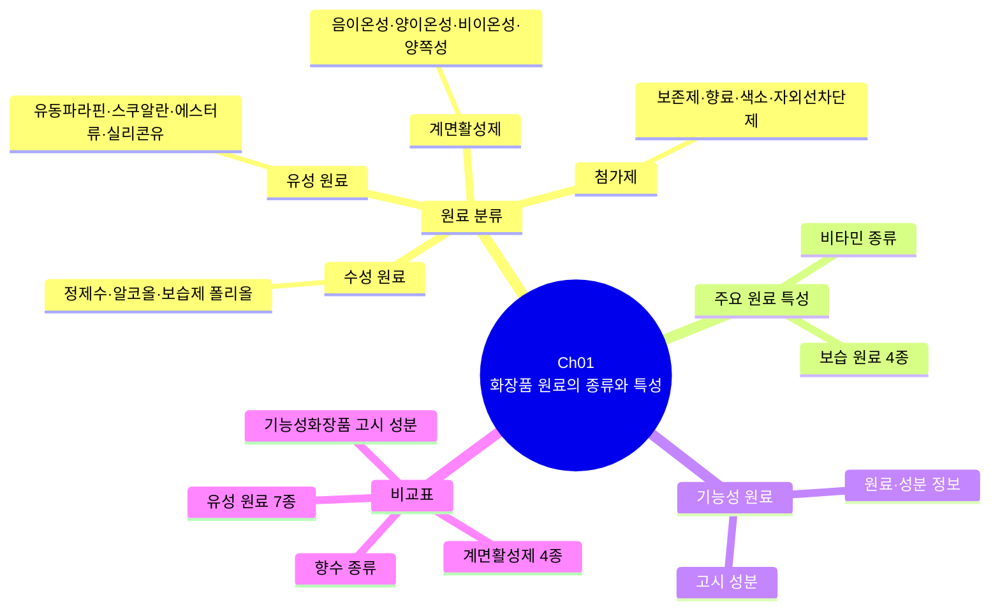

### 🗺️ Ch02 마인드맵: 화장품 제조관리

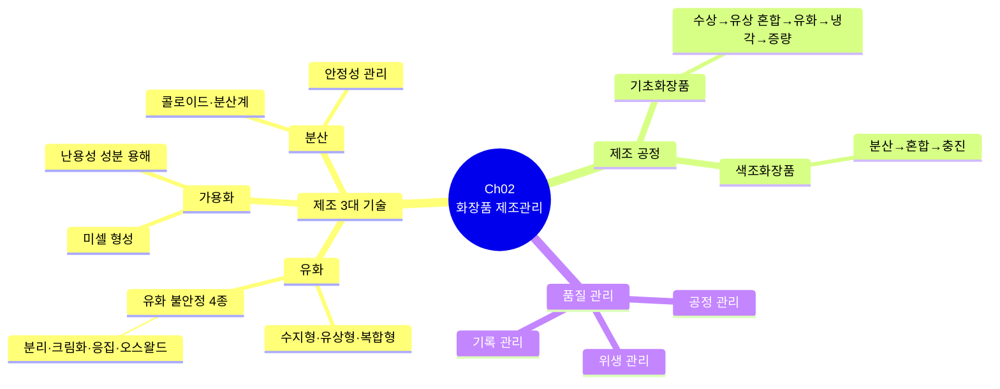

### 🗺️ Ch03 마인드맵: 화장품의 기능과 품질

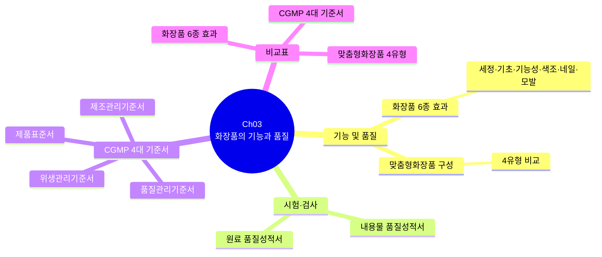

### 🗺️ Ch04 마인드맵: 화장품 사용제한 원료

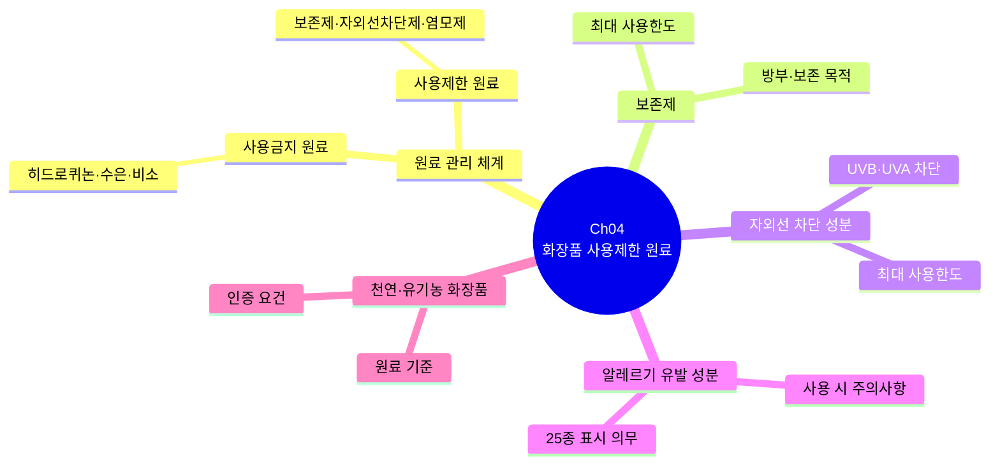

### 🗺️ Ch05 마인드맵: 화장품 관리

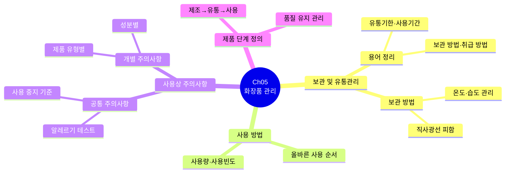

### 🗺️ Ch06 마인드맵: 위해사례 판단 및 보고

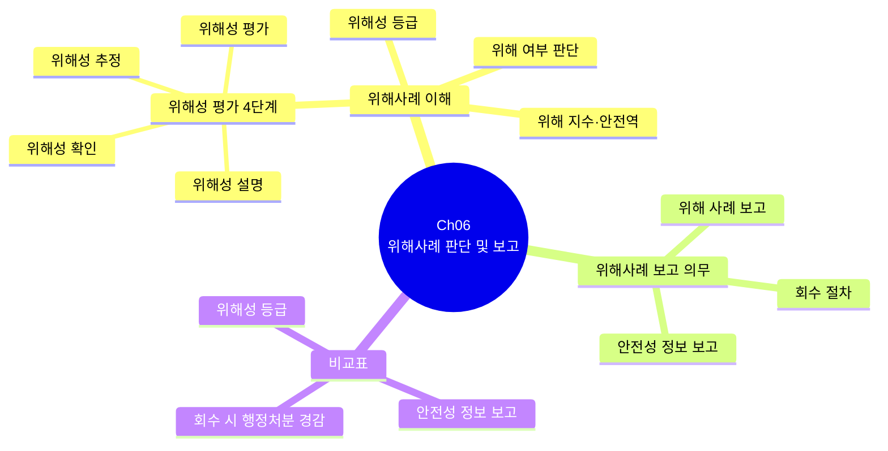

## 📚 Chapter 01. 화장품 원료의 종류와 특성

> 출처: [화장품 안전기준 등에 관한 규정(식품의약품안전처고시)(제2026-19호)(20260318).md](../참조자료/ref_md/화장품%20안전기준%20등에%20관한%20규정%28식품의약품안전처고시%29%28제2026-19호%29%2820260318%29/화장품%20안전기준%20등에%20관한%20규정%28식품의약품안전처고시%29%28제2026-19호%29%2820260318%29.md)

> 🎯 **이 장의 질문**: 화장품 원료는 어떤 기준으로 분류하고, 어떻게 하나의 제품으로 만들어질까?
>
> 🔗 **관련 과목**
> - [4과목 6챕터 혼합 및 소분](subj:understanding#ch06) — 원료 분류(수성/유성/계면활성제)의 요약 재서술 및 혼합 안정성 응용

---

> 📋 **학습 가이드**
> - 출제 빈도: ★★★★★ (2과목 최다 출제 영역 — 원료 분류, 계면활성제, 기능성화장품 고시성분)
> - 예상 소요 시간: 90분
> - 핵심 키워드: 수성·유성·계면활성제 분류, HLB 값, 비교표(세정력/자극성 순서), 기능성화장품 고시성분, 전성분 표기, 제조 공정

---

### 🗺️ Ch01 마인드맵: 화장품 원료의 종류와 특성


> **🗺️ 마인드맵 노드 상세 매핑**

| 대분류 | 중분류 | 핵심 포인트 |
| --- | --- | --- |
| 원료 분류 | 수성 원료 | 정제수·알코올·보습제 폴리올, 친수성 원료 |
|  | 유성 원료 | 유동파라핀·스쿠알란·에스터류·실리콘유, 소수성 원료 |
|  | 계면활성제 | 음이온성·양이온성·비이온성·양쪽성, HLB값 따른 용도 |
|  | 첨가제 | 보존제·향료·색소·자외선차단제, 제품 안정성 부여 |
| 주요 원료 특성 | 비타민 종류 | 피부 기능별 비타민 특성 |
|  | 보습 원료 4종 | 대표 보습 원료 4종 특성 |
| 기능성 원료 | 원료·성분 정보 | 기능성 원료·성분 정보 체계 |
|  | 고시 성분 | 기능성화장품 고시 성분 함량 기준 |
| 비교표 | 계면활성제 4종 | 음이온·양이온·비이온·양쪽성 비교 |
|  | 유성 원료 7종 | 유성 원료 7대 분류 비교 |
|  | 기능성화장품 고시 성분 | 미백·주름·자외선 등 고시 성분 비교 |
|  | 향수 종류 | 향수·오드뚜왈렛·오드코롱 부향률 비교 |


## 1. 원료의 분류

### (1) 화장품 원료의 종류 및 성분의 특성

> 📌 **출처**: 식약처 화장품원료 지침 + 화장품법 시행규칙| **참조 자료**: [화장품법 시행규칙(총리령)(제02109호)(20260402).md](../참조자료/ref_md/화장품법%20시행규칙%28총리령%29%28제02109호%29%2820260402%29/화장품법%20시행규칙%28총리령%29%28제02109호%29%2820260402%29.md)| **시행일**: 2026. 4. 2.| **최종 확인**: 2026. 8. 29.

> **한 줄 요약**: 수성·유성·계면활성제·고분자·색소·향료·보존제·산화방지제·금속이온봉쇄제·기능성 고시성분으로 구성.
#### (1) 용어의 정의

| 용어 | 정의 |
| --- | --- |
| 극성 | 화학결합에서 전자 분포가 어느 한쪽 원자에 기울어 있는 것 |
| 비극성 | 극성(Polar)이 없는 상태 (예: 탄화수소 화합물) |
| 친유성 | 기름에 잘 녹는 특성 (반: 친수성 - 물에 잘 녹는 특성) |
| 용제 | 다른 물질을 용해할 수 있는 액체 |
| 수렴제 | 피부에 조이는 느낌을 주고 아린감을 부여하는 물질 |
| 동결 방지제 | 저온에서 어는 것을 억제하는 데 사용되는 물질 |
| 사용감 향상제 | 퍼짐성을 높여 피부의 매끄러움을 유발하는 물질로 피부 컨디셔닝제, 유연제라고도 불림 |
| 기포방지제 | 기포 제거 성질을 가진 물질로 소포제라고도 불림 |
| 경도 조절제 | 기초 및 색조화장품의 경도를 형성하는 물질 |
| 유화제 | 물과 기름을 혼합하기 위해 사용하는 계면활성제 |
| 유화안정제 | 유화제의 성능을 보조하는 물질로 보조유화제라고도 불림 |
| 습윤제 | 죽은 각질세포 내 케라틴과 NMF(천연보습인자)와 같이 수분과 결합하는 능력을 갖춘 성분으로 피부에 수분을 증가시키는 역할을 함 |
| 밀폐제(필름 형성제) | 피지처럼 피부 표면에 얇은 소수성 피막을 형성하여 수분 증발을 억제하는 성분으로 TEWL(경피수분손실도)를 저하시키며 피막형성제라고도 불림 |
| 연화제(유연제) | 탈락하는 각질세포 사이의 틈을 메워 주는 물질로 피부에 윤기와 유연성을 제공함 |
| 장벽대체제 | 각질층 내 세포간지질(세라마이드, 지방산, 콜레스테롤) 성분으로 보습제 성분으로 처방하여 피부장벽 기능의 유지와 회복에 관여함으로써 피부 보습력 유지를 증가시킴 |
| 부형제 | 유탁액을 만드는 데 쓰는 부형제는 주로 물, 오일, 왁스, 유화제로 제품에서 가장 많은 부피를 차지함 |
| 첨가제 | 화장품의 화학반응이나 변질을 막고 안정된 상태로 유지하기 위해 첨가하는 성분으로 보존제나 산화방지제 등을 말함 |
| 착향제 | 화장품 제조 시 첨가하여 향이 나게 하는 물질 |
| 유효 성분 | 화장품에 특별한 효능을 부여하기 위해 사용하는 물질로 각 제품의 특징을 나타내는 역할을 함 (예: 미백, 주름 개선 및 자외선 차단 성분 등) |

**[참고] 유효성 종류**
- 물리적 유효성: 물리적 특성(예: 물리적 자외선 차단 등)을 기반으로 한 효과
- 화학적 유효성: 화학적 특성(예: 계면활성, 화학적 자외선 차단, 염색 등)을 기반으로 한 효과
- 생물학적 유효성: 생물학적 특성(예: 미백에 도움, 주름개선에 도움 등)을 기반으로 한 효과
- 미적 유효성: 자신의 취향에 맞는 아름다움과 매력적인 화장(메이크업)의 유발 효과
- 심리적 유효성: 심리적인 특성(예: 향을 통한 기분 완화 등)을 기반으로 한 효과

---

#### (2) 수성 원료

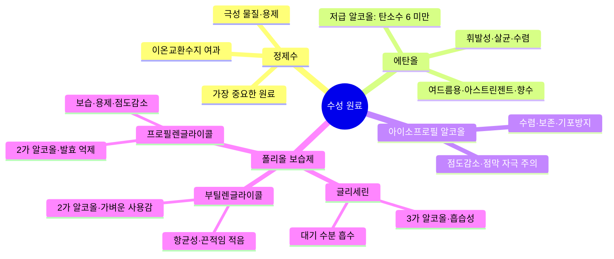

> **🗺️ 마인드맵 노드 상세 매핑**

| 대분류 | 중분류 | 핵심 포인트 |
| --- | --- | --- |
| 정제수 | 가장 중요한 원료 | 화장품 제조에 가장 중요한 원료 |
|  | 극성 물질·용제 | 극성 물질, 수성 원료 용해 용제 |
|  | 이온교환수지 여과 | 불순물 제거를 위한 이온교환수지 여과 |
| 에탄올 | 저급 알코올: 탄소수 6 미만 | 탄소수 6 미만 알코올 |
|  | 휘발성·살균·수렴 | 무색·특이취·휘발성, 청정·살균·수렴 |
|  | 여드름용·아스트린젠트·향수 | 여드름용·수렴화장수·향수에 사용 |
| 아이소프로필 알코올 | 수렴·보존·기포방지 | 수렴제·보존제·기포방지제 역할 |
|  | 점도감소·점막 자극 주의 | 점도감소제, 점막 자극 주의 |
| 폴리올 보습제 | 글리세린 · 3가 알코올·흡습성 | -OH 3개, 대기 수분 흡수 |
|  | 대기 수분 흡수 | 무독성·무자극, 고농도 시 피부 자극 주의 |
|  | 부틸렌글라이콜 · 2가 알코올·가벼운 사용감 | -OH 2개, 끈적임 적음 |
|  | 항균성·끈적임 적음 | 항균성 보유, 글리세린 대비 가벼움 |
|  | 프로필렌글라이콜 · 2가 알코올·발효 억제 | -OH 2개, 알코올 동등 발효 억제 |
|  | 보습·용제·점도감소 | 보습·용제·점도감소 다목적 원료 |

> **한 줄 요약**: 정제수·에탄올·폴리올(글리세린·BG·PG) — 친수성 원료, 보습·용제·수렴 역할.

| 종류 | 특징 |
| --- | --- |
| 정제수 | • 화장품 제조에 있어 가장 중요한 원료 중 하나임<br>• 물은 극성물질로 수성 원료의 용해를 위한 용제(용매)로 사용<br>• 용해된 이온, 고체 입자, 미생물, 유기물 및 용해된 기체류 등의 모든 불순물을 이온교환수지를 통해 여과한 물을 칭함 |
| 에탄올(알코올) | • 에틸알코올(Ethyl Alcohol)이라고도 하며, 화학식은 C₂H₅OH로 표현<br>• 비극성인 탄화수소기와 극성인 하이드록시기(-OH)가 존재하여 식물의 소수성 및 친수성 물질의 추출 및 기타 화장품 성분의 용제(용매)로도 사용<br>• 유기용매로 물에 녹지 않는 향료, 색소, 유기안료 등 비극성 물질을 녹이며, 식물 추출물 추출 시 용매로 사용함<br>• 무색, 특이취, 휘발성을 가지고 있으며, 청정, 살균, 수렴 효과가 있고 네일 제품에서는 가용화제 등으로 이용됨<br>• 주로 여드름용 제품, 수렴화장수(아스트린젠트), 헤어토닉, 향수 등에 사용됨 |
| ┗ 저급 알코올 | 탄소수가 적은(6개 미만) 알코올 |
| ┗ 고급 알코올 | 탄소수가 많은(6개 이상) 알코올 |
| 아이소프로필 알코올 | • 에탄올과 같은 무색의 액체이며, 휘발성임<br>• 수렴제, 보존제, 기포방지제, 점도감소제 등으로 사용함<br>• 점막에 자극을 줄 수 있으므로 눈, 입술 주위는 피해 사용해야 함 |
| 보습제(폴리올) - 글리세린 | • 탄소수가 3이고, -OH를 3개 가지고 있는 3가 알코올<br>• 수산기가 있어 글리세롤(Glycerol)이라고도 하며, 대기 중의 수분을 흡수하는 성질을 가짐<br>• 무독성, 무자극, 무알러지성이지만 고농도로 사용할 경우 피부 내부의 수분을 흡수하여 피부에 자극을 줄 수 있음 |
| 보습제(폴리올) - 부틸렌글라이콜 | • 1,3-부틸렌글라이콜 또는 1,3-BG라고 통용되며 글리세린과 함께 주로 사용되는 -OH를 2개 가지고 있는 2가 알코올<br>• 글리세린에 비해 끈적임이 적고 가벼운 사용감과 항균성을 가짐<br>• 고농도에서 피부에 자극을 일으킬 수 있음 |
| 보습제(폴리올) - 프로필렌글라이콜 | • 탄소수는 3이지만 -OH를 2개 가지고 있는 2가 알코올<br>• 알코올과 동등한 발효 억제 효과가 있음<br>• 보습제, 피부 컨디셔닝제, 착향제, 용제, 점도감소제 등으로 사용 |

**[용어] 폴리올**: 분자구조 내 극성인 하이드록시기(-OH)를 2개 이상 가지고 있는 유기화합물을 총칭함

**폴리올의 사용 목적**
- 가용화(고체성분이 액상에 녹을 수 있도록 도움)
- 보습
- 방부(약하게나마 균의 증식을 억제함)
- 제형 조절
- 동결 방지

---

#### (3) 유성 원료

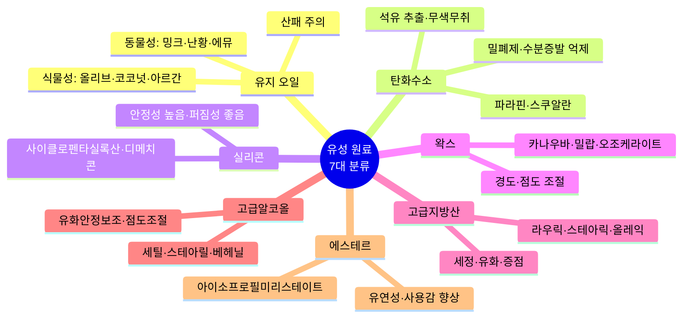

> **🗺️ 마인드맵 노드 상세 매핑**

| 대분류 | 중분류 | 핵심 포인트 |
| --- | --- | --- |
| 유지 오일 | 식물성: 올리브·코코넛·아르간 | 식물 추출, 피부 친화성, 산패 주의 |
|  | 동물성: 밍크·난황·에뮤 | 동물 추출, 피부 친화성, 특이취·산패 |
|  | 산패 주의 | 불포화 지방산 산화·산패 주의 |
| 탄화수소 | 석유 추출·무색무취 | 광물성, 무색·무취, 산패 없음 |
|  | 밀폐제·수분증발 억제 | 피부 표면 수분 증발 억제(밀폐제) |
|  | 파라핀·스쿠알란 | 유동파라핀·바세린·스쿠알렌 등 |
| 실리콘 | 안정성 높음·퍼짐성 좋음 | 무색·투명, 매끄러운 감촉 |
|  | 사이클로펜타실록산·디메치콘 | 휘발성·비휘발성 실리콘 오일 |
| 왁스 | 경도·점도 조절 | 립스틱 경도·크림 사용감 조절 |
|  | 카나우바·밀랍·오조케라이트 | 식물성·동물성·광물성 왁스 |
| 고급지방산 | 세정·유화·증점 | R-COOH, 탄소수 12 이상, 비누 형성 |
|  | 라우릭·스테아릭·올레익 | 세정·유화·경도·점도 조절 |
| 고급알코올 | 유화안정보조·점도조절 | 유화 안정 보조, 점도 조절 |
|  | 세틸·스테아릴·베헤닐 | 증점·유화안정 보조 원료 |
| 에스테르 | 유연성·사용감 향상 | 유연성 부여, 발림성 향상 |
|  | 아이소프로필미리스테이트 | 대표적 에스터, 유연·가벼운 사용감 |

> **한 줄 요약**: 유지(식물·동물)·탄화수소·실리콘·왁스·고급지방산·고급알코올·에스터 — 소수성 원료, 밀폐·유연·광택 역할.

#### ① 유지(오일)

| 원료 | 종류 | 대표 원료 및 특징 |
| --- | --- | --- |
| **식물성 오일**<br>• 식물의 씨나 잎, 열매 등에서 추출<br>• 건성 및 노화 피부에 적용<br>• 피부 친화성이 좋음<br>• 안정성이 좋지 않고 산패가 쉬움 | 로즈힙 오일 | 장미과로 야생 장미나무의 빨간 열매에서 추출 – 노화 억제, 햇빛에 의한 색소 침착 방지 |
|  | 올리브 오일 | 올리브의 열매를 압착하여 추출 – 불포화지방산인 올레인산이 65~80%로 많이 포함되어 있음, 피부 표면의 수분 증발 억제, 부드러운 감촉 부여, 피부에 대한 친화성이 우수함 |
|  | 아르간 오일 | 아르가니아 나무의 열매 씨에서 추출한 오일 – 올리브유에 비해 2배 이상의 비타민 E를 함유함, 보습 효과 및 페룰산(Ferulic Acid)이 함유되어 있어 멜라닌색소 제거, 기미, 주근깨 생성을 억제함 |
|  | 윗점 오일 | 밀의 배아에서 추출 – 비타민 E와 필수지방산이 풍부함, 노화 피부, 튼살, 주름 등에 효과적임 |
|  | 코코넛 오일 | 코코넛 열매에서 추출 – 물에 용해가 잘 되어 세정에 사용되는 오일로 탁월함, 피부 흡수력과 보습 기능이 좋아 베이스 오일로 사용이 적합함 |
|  | 스위트 아몬드 오일 | 아몬드씨를 압착법으로 추출 – 피부의 가려움 억제, 건조한 피부에 효과적임, 민감한 피부, 유아 피부에도 사용 가능 |
|  | 아보카도 오일 | 열매를 냉압착하여 추출 – 건성 피부에 효과적임, 피부 친화성 및 퍼짐성이 양호함, 피지가 많거나 여드름 피부, 모공이 잘 막히는 사람에게는 비효과적임 |
|  | 포도씨 오일 | 포도씨를 압착법으로 추출 – 향이 없고 유분감이 적음, 피부에 쉽게 흡수됨, 리놀렌산, 비타민 E 등을 함유함 |
| **동물성 오일**<br>• 동물의 내장이나 피하조직에서 추출<br>• 피부 친화성 좋음<br>• 산패와 변질이 쉬움<br>• 특이취와 무거운 사용감 | 밍크 오일 | 밍크의 피하지방에서 추출 – 피부 친화성, 퍼짐성 및 윤활성 우수, 피부 컨디셔닝제(수분차단제), 헤어 컨디셔닝제에 사용함 |
|  | 난황 오일 | 닭의 난황을 유기용매로 추출 – 피부 탄력에 효과적임, 인지질과 지용성 비타민 A, D, E를 함유함 |
|  | 에뮤 오일 | 대형 조류인 에뮤의 앞 가슴살에서 추출 – 피부 친화력이 우수함, 항염증 효과가 우수함 |

**[참고]** 식물성 오일의 경우 지방산 내 불포화 결합이 많아 쉽게 산화되며, 산화되는 것을 방치하면 산패됨
- 포화 지방산(Saturated Fatty Acid): 지방산사슬에 있는 탄소들이 모두 단일 결합으로 연결된 지방산
- 불포화 지방산(Unsaturated Fatty Acid): 지방산사슬에 있는 탄소들 내 1개 이상의 이중 결합으로 연결된 지방산
- 오메가 지방산(Omega Fatty Acid): 다중 불포화 지방산 중 탄화수소 사슬 제일 마지막 탄소(오메가 탄소)를 기준으로 첫 이중결합이 나타나는 탄소의 위치를 이름으로 하는 지방산 (예: 오메가-3 지방산은 탄화수소 사슬 제일 마지막을 기준으로 세 번째 탄소에서 이중결합이 나타난 다중 불포화 지방산임)

#### ② 탄화수소

**특징**: 주로 광물질(석유 등)에서 추출 / 무색, 무취 / 산패나 변질의 문제가 없음 / 비극성인 특성을 기반으로 피부 표면에서 수분 증발 억제 목적(밀폐제)으로 사용 / 유성감이 강해 피부 호흡을 방해할 수 있음

| 종류 | 특징 |
| --- | --- |
| 미네랄 오일 | 석유로부터 얻어지는 광물성 오일로 유동파라핀이라고도 불림 – 피부 표면의 수분 증발 억제 목적으로 사용함, 쉽게 산화되지 않고, 무색, 무취, 유화되기 쉬움 |
| 파라핀 | 석유에서 얻은 고형 혼합물로 무색 또는 백색 고체 – 수분 증발 차단제, 점증제로 사용함, 불순물 존재 시 부작용 우려 있음 |
| 바세린(페트롤라툼) | 석유에서 얻게 되는 반고체상의 탄화수소 혼합물 – 페이스트(Paste) 상태로 존재하며 여드름 유발 가능성 있음, 정제도가 낮을 경우 트러블 유발 가능성 있음 |
| 스쿠알렌 | 상어의 간유에서 추출하며, 탄소와 수소로 되어 있는 불포화 탄화수소계 – 인체 피지와 유사한 구성으로 피부 친화성이 좋음, 보습제, 유연제로 사용함, 비릿한 냄새와 쉽게 산패되는 단점이 있음 |
| 아이소알케인 | 주로 탄소 13~14개인 알킬 사슬을 갖는 지방족 탄화수소의 혼합물 – 점성이 높은 유성 성분, 왁스와 유사한 질감과 성질을 가짐 |
| 아이소헥사데칸 | 탄소 16개로 이루어진 지방족 탄화수소 – 무색, 무취의 투명한 액상 형태, 화장품에 얇은 발림성을 부여함 |

#### ③ 실리콘 오일

**특징**: 실록산 결합(Si-O-Si)을 가지는 유기 규소화합물의 총칭 / 무색, 투명, 냄새가 거의 없음 / 실크(Silk)처럼 가볍고 매끄러운 감촉을 부여함 / 퍼짐성 우수, 피부의 유연성과 매끄러움, 광택 부여, 기포 제거성도 높음 / 비극성인 특성을 기반으로 피부 표면에서 수분 증발 억제 목적(밀폐제)으로 사용

| 종류 | 특징 |
| --- | --- |
| 사이클로메티콘 | 휘발성 오일 – 가볍고 매끄러운 사용감, 끈적임이 거의 없음, 헤어 컨디셔닝제, 피부 컨디셔닝제의 용제로 사용 |
| 다이메티콘 | 무색, 무취의 오일 – 가벼운 사용감, 유분의 끈적임 억제, 퍼짐성 증대와 기포 제거 능력을 가짐, 얇은 막을 형성하여 윤기 부여, 발림성 우수 |
| 사이클로테트라실록세인, 사이클로펜타실록세인 | 무색, 무취의 유동성 액체 – 표면장력이 작아 잘 퍼지며 발림성이 우수하고 끈적이지 않음, 2018년 1월 10일 EU REACH에서 사용 제한 원료로 지정 |

#### ④ 왁스류

**특징**: 고급 지방산과 고급 1,2가 알코올이 결합된 에스테르 / 상온에서 고체 상태의 특성을 가짐 / 크림의 사용감 증대나 립스틱의 경도 조절용으로 사용 / 제품의 안정성이나 기능성 향상 / 피부 또는 모발에 광택을 부여함 / 수분 증발 억제 목적(밀폐제)으로도 사용함

| 종류 | 특징 |
| --- | --- |
| 카나우바 왁스 | 식물성 왁스로, 카나우바 야자나무의 잎에서 추출 – 녹는 온도 80~86℃, 광택성이 뛰어나 립스틱, 크림, 탈모제 등에 사용함 |
| 칸데릴라 왁스 | 식물성 왁스로, 칸데릴라 식물의 줄기에서 추출 – 녹는 온도 68~72℃, 립스틱의 부서짐을 예방하고 광택을 낼 때 사용 |
| 라놀린 | 동물성 왁스로, 양의 털에서 추출 – 녹는 온도 36~42℃, 피부에 대한 친화성, 부착성, 윤택성이 우수함, 알레르기 유발 가능성 |
| 비즈 왁스(밀랍) | 동물성 왁스로, 벌집에서 추출 – 녹는 온도 60~67℃, 부드러운 감촉 부여, 피부 수분 증발 억제 |
| 호호바 오일 | 호호바의 씨에서 추출하며 상온에서는 액체, 저온에서는 고체 형태를 유지하는 식물성 왁스 – 녹는 점 10℃, 피지 성분과 비슷한 구조를 가지고 있어 피부 퍼짐성, 친화성, 침투성이 우수함, 상처 치료 및 진정 효과가 있으며 부드러운 감촉 부여, 모든 피부 사용 가능 |
| 오조케라이트 | 석탄과 세일에서 추출한 천연 미네랄 왁스 – 녹는 온도 55~76℃, 백색 또는 황색을 띰, 제품의 강도와 안전성 제공, 피부 보호 및 윤기 공급, 부드러운 감촉 부여 |

#### ⑤ 고급 지방산

**특징**: R-COOH로 표시되는 화합물 / 지방을 가수분해하여 얻어지며, 탄소수가 12개 이상 / 천연의 유지와 밀랍 등에 에스테르류로 함유함 / 세정용 계면활성제, 유화제, 분산제, 경도·점도 조절용, 연화제 목적으로 사용함 / 알칼리인 소듐하이드록사이드(NaOH), 포타슘하이드록사이드(KOH), 트라이에탄올아민과 병용하면 비누를 형성

| 종류 | 특징 |
| --- | --- |
| 라우릭애씨드 | 야자유, 팜유 등에서 얻어지며, 탄소수가 12인 고급 포화지방산의 혼합물 – 거품 상태가 좋아 화장비누, 세안류 사용에 적합함 |
| 미리스틱애씨드 | 팜유를 분해하여 얻은 혼합지방산으로 탄소수가 14개임 – 거품 성질 및 세정력이 우수하여 세안류에 주로 사용함 |
| 팔미틱애씨드 | 야자유 등에서 추출한 지방산으로 탄소수가 16개임 – 세정제나 유화제로 사용함, 피부에 보습막을 형성하여 보습력 부여, 촉촉함 유지 |
| 스테아릭애씨드 | 우지나 팜유를 가수분해하여 얻은 지방산으로 탄소수가 18개임 – 유화 및 증점제, 고형비누, 크림, 립스틱 등에 사용함, 알칼리로 중화하여 보조 유화제로 사용함, 안료 분산력이 우수하여 안료의 분산제로도 사용함 |
| 올레익애씨드 | 동식물유를 가수분해한 후 정제하여 얻은 불포화지방산으로 탄소수가 18개(불포화 결합 1개)임 – 탄소 원자 사이에 이중결합을 1개만 가지고 있는 단가 불포화지방산, 피부에 유분기 공급 및 보습력 부여, 피부의 유연성 유지 및 개선에 도움 |

#### ⑥ 고급 알코올

**특징**: R-OH로 표시되는 화합물 / 탄소수가 많은 알코올(6개 이상) / 화장품의 점도 조절, 유화를 안정화시키기 위한 유화보조제로 첨가 / 피부의 피지 성분과 비슷한 구조로, 피부 침투성이 좋아 모든 피부에 사용 가능함

| 종류 | 특징 |
| --- | --- |
| 세틸알코올 | 팜오일 등의 추출 또는 합성 제조하며, 탄소수가 16개임 – 유화안정보조제나 증점제로 주로 사용함 |
| 스테아릴알코올 | 향유고래의 기름이나 야자유 등에서 추출하며, 탄소수가 18개임 – 백색의 왁스성의 고체 형태를 띰, 유화안정보조제, 거품 방지, 점도제로 사용함 |
| 베헤닐알코올 | 코코넛과 팜오일에서 추출하며, 탄소수가 22개임 – 부드러운 촉감 부여, 수분 손실 방지에 도움, 비수용성 점증제로 화장품의 점도 조절 |
| 옥틸도데칸올 | 화학 합성을 통해 만들어지는 고급 지방산 알코올이며, 탄소수가 20개임 – 일반적인 탄화수소에 비해 퍼짐성과 감촉이 좋음 |

#### ⑦ 에스테르

**특징**: 지방산(R-COOH)과 알코올(R-OH)이 결합하면서 탈수 반응에 의해 생성되는 화합물 / 피부 유연성, 제품의 사용감 향상 / 용해제로도 사용함

| 종류 | 특징 |
| --- | --- |
| 아이소프로필미리스테이트 | 아이소프로필알코올과 미리스틱애씨드의 화합물 – 무색 투명한 액체로 사용감이 가볍고 용해성이 우수함, 겔화제, 착향제, 피부 컨디셔닝제로 사용함 |
| 카프릴릭/카프릭트리글리세라이드 | 카프릴릭과 카프릭애씨드 및 글리세린의 혼합물 – 착향제, 피부 컨디셔닝제로 사용 |
| 세틸미리스테이트 | 세틸알코올 및 미리스틱애씨드의 혼합물 – 수분 증발 차단제로 사용함 |

---

#### (4) 계면활성제

> **한 줄 요약**: 친수기+친유기 구조, HLB 값에 따라 용도 결정 — 음이온(세정)·양이온(린스)·양쪽성(저자극)·비이온성(기초).

#### ① 물질의 구분
물질은 물리적 성질 및 분자간 상호작용에 따라 대표적으로 '기체', '고체', '액체'의 3가지 상태로 구분되며, 물질의 상(相, phase)이란 일정한 물리적 특성 또는 화학적 특성을 갖는 균일한 물질계를 지칭함

**[참고] 물질의 상**: 고체, 고체상, 고상 / 액체, 액체상, 액상 / 기체, 기체상, 기상

#### ② 계면
두 개의 서로 다른 상(Phase)이 접하고 있는 경계면(접촉면)을 계면이라고 한다. 계면화학이란 계면과 그 부근의 물질 상태 및 성질을 연구하는 학문이다.

#### ③ 구조
한 분자 내에서 물을 좋아하는 친수기(극성, 친수성)와 기름기를 좋아하는 친유기(비극성, 소수성, 친유성)가 함께 있는 물질로, 표면장력을 낮추는 작용을 한다.

(구조: 친유기 - CH₂ 사슬 - 친수기(-COO⁻Na⁺))

**[참고] 표면장력**: 표면 분자가 갖는 에너지는 액체나 고체 내부의 분자와 달리 모든 방향이 아닌 내부 쪽으로만 작용하는 인력 때문에 발생하며, 이렇게 생긴 여분의 에너지를 표면 자유 에너지 또는 표면장력이라고 한다.

**표면장력이 낮아지는 이유**: 계면에 흡착하여 계면의 성질을 바꾸거나 계면의 자유에너지를 낮추어 물과 기름이 잘 섞일 수 있도록 돕기 때문이다.

**[참고] 계면장력**: 표면장력의 특성이 서로 다른 두 개의 물질의 경계면에 나타날 때, 분자 간 인력 차이로 발생하는 장력을 말한다.

#### ④ 미셀(Micelle)
미셀은 계면활성제가 수용액에 있을 때 친수성기는 바깥의 수용액과 닿고, 소수성기는 안에서 핵을 형성하여 만들어지는 구형의 집합체이다.

수용액 내에 계면활성제의 농도가 증가하면 분자 간 집합체인 미셀을 형성한다. 미셀이 형성될 때 계면활성제의 농도를 임계미셀농도(CMC: Critical Micelle Concentration)라고 한다.

#### ⑤ HLB (Hydrophile Lipophile Balance)
계면활성제의 친수성과 친유성 비율을 수치화하여 상대적 세기를 나타낸 것이다.
**HLB 값이 높을수록 친수성, HLB 값이 낮을수록 친유성이다.**

$$HLB = \frac{친수기\ 분자량}{분자량} \times 20$$

| HLB 값 | 용도 | HLB 값 | 용도 |
| --- | --- | --- | --- |
| 1~3 | 소포제(거품제거제) | 8~18 | O/W 유화제, 세정제, 가용화제 |
| 4~6 | W/O 유화제 | 13~15 | 세정제 |
| 7~9 | 분산제, 습윤제 | 15~18 | 가용화제 |

**[용어] W/O (Water in Oil)**: 오일 안에 물이 분산되어 있는 형태
**[용어] O/W (Oil in Water)**: 물 안에 오일이 분산되어 있는 형태

#### ⑥ 종류와 특징

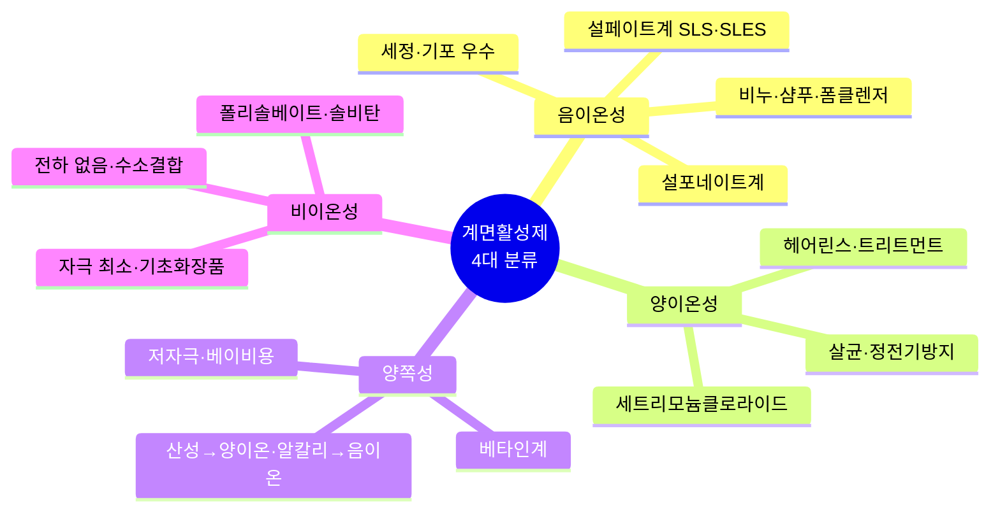

> **🗺️ 마인드맵 노드 상세 매핑**

| 대분류 | 중분류 | 핵심 포인트 |
| --- | --- | --- |
| 음이온성 | 세정·기포 우수 | 세정·기포 형성 우수, 비누·샴푸·폼클렌저 |
|  | 설페이트계 SLS·SLES | 대표적 음이온성, 강한 세정력 |
|  | 설포네이트계 | 세정력 우수, 설포네이트계 계면활성제 |
|  | 비누·샴푸·폼클렌저 | 주요 적용 제품 |
| 양이온성 | 살균·정전기방지 | 살균·소독·정전기 방지 효과 |
|  | 세트리모늄클로라이드 | 대표적 양이온성 계면활성제 |
|  | 헤어린스·트리트먼트 | 헤어 린스·트리트먼트에 사용 |
| 양쪽성 | 저자극·베이비용 | 피부 자극·독성 낮음, 베이비용 |
|  | 베타인계 | 대표적 양쪽성, 코카미도프로필베타인 |
|  | 산성→양이온·알칼리→음이온 | pH에 따라 이온성 변화 |
| 비이온성 | 자극 최소·기초화장품 | 피부 자극 최소, 기초화장품 사용 |
|  | 폴리솔베이트·솔비탄 | 대표적 비이온성 계면활성제 |
|  | 전하 없음·수소결합 | 전하 없음, 수소결합에 의한 친수성 |

| 구분 | 종류 | 특징 |
| --- | --- | --- |
| 음이온성 계면활성제 | 설페이트계 계면활성제: 소듐라우릴설페이트(SLS), 소듐라우레스설페이트(SLES), 암모늄라우릴설페이트(ALS), 암모늄라우레스설페이트(ALES) 등 / 설포네이트계: 티이에이-도데실벤젠설포네이트, 페르프루오로옥탄설포네이트, 알킬벤젠설포네이트 등 / 카르복실레이트계: 소듐라우레스-3카복실레이트 등 | 세정 및 기포 형성 작용이 우수함, 비누, 샴푸, 폼 클렌저에 주로 사용함 |
| 양이온성 계면활성제 | 세트리모늄클로라이드, 알킬디메틸암모늄클로라이드, 폴리쿼터늄-10, 폴리쿼터늄-18 | 살균 및 소독 작용, 모발의 유연 효과, 정전기 방지 효과, 헤어 린스, 헤어 트리트먼트, 섬유유연제 및 대전 방지제로 주로 사용 |
| 양쪽성 계면활성제 | 아이소스테아라미도프로필베타인, 라우라미도프로필베타인, 코카미도프로필베타인, 디소듐코코암포디아세테이트, 하이드로제네이티드레시틴 | 피부 자극성과 독성이 낮음, 세정력, 살균력, 기포력 및 유연 작용, 베이비용 제품, 저자극 샴푸, 거품안정제, 기포 촉진 효과의 목적으로 사용 |
| 비이온성 계면활성제 | 솔비탄라우레이트, 솔비탄팔미테이트, 솔비탄세스퀴올리에이트, 폴리솔베이트20, 세틸알코올, 스테아릴알코올 | 피부 자극이 적어 주로 기초화장품에 사용함, 이온성에 친수기를 갖는 대신 -OH나 에틸렌옥사이드에 의한 물과의 수소결합에 의한 친수성을 가지며, 전하를 가지지 않음 |
| 천연 계면활성제 | 레시틴, 사포닌, 라우릴글루코사이드, 세테아릴올리베이트, 솔비탄올리베이트코코베타인 | 동식물에서 추출함 |

**[참고] 양쪽성 계면활성제**: 산성일 때 양이온성, 알칼리성일 때 음이온성으로 활성화됨

**[참고] 계면활성제의 주요 기능**: 유화, 가용화, 분산, 세정, 기포, 대전 방지 등의 기능을 부여함

- **세정력**: 음이온성 > 양쪽성 > 양이온성 > 비이온성 (우수한 순서대로 표기)
- **자극성**: 양이온성 > 음이온성 > 양쪽성 > 비이온성 (높은 순서대로 표기)

---

#### (5) 고분자 화합물(폴리머)

> **한 줄 요약**: 분자량 10,000 이상 — 점증제(천연·반합성·합성) + 피막형성제.

분자량이 보통 10,000 이상인 거대한 화합물을 말한다. 주로 수용성 물질로 미생물에 대한 오염도가 높다.

#### ① 사용 목적

| 종류 | 특징 |
| --- | --- |
| 점증제 | 화장품의 점도를 높여주는 화합물, 수용성 고분자 물질 제품의 사용감과 안정성을 향상시키기 위해 사용 |
| 피막형성제(밀폐제) | 피막을 형성할 때 이용되는 화합물, 피부 및 모발의 피막 형성하여 수분 증발 억제, 광택 및 갈라짐 방지, 사용감 향상 등을 위해 사용 |

#### ② 종류

- **점증제**
 - 천연: 구아검, 아라비아검, 로커스트빈검, 카라기난, 전분, 텍스트란
 - 반합성: 메틸셀룰로스, 에틸셀룰로스, 카복시메틸셀룰로스
 - 합성: 카복시비닐폴리머(카보머)
- **피막형성제**: 폴리비닐알코올, 폴리비닐피롤리돈, 나이트로셀룰로스

---

#### (6) 색소(Coloring Material)

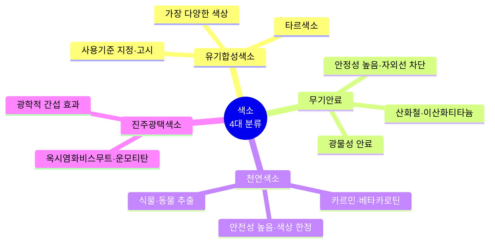

> **🗺️ 마인드맵 노드 상세 매핑**

| 대분류 | 중분류 | 핵심 포인트 |
| --- | --- | --- |
| 유기합성색소 | 타르색소 | 콜타르 유래, 가장 다양한 색상 |
|  | 가장 다양한 색상 | 색상 다양성이 가장 뛰어남 |
|  | 사용기준 지정·고시 | 지정·고시된 색소만 사용 가능 |
| 무기안료 | 광물성 안료 | 광물성, 안정성 높음 |
|  | 안정성 높음·자외선 차단 | 빛·열에 강함, 자외선 차단 기능 |
|  | 산화철·이산화티타늄 | 대표적 무기안료, 백색·착색 안료 |
| 천연색소 | 식물·동물 추출 | 동식물 유래, 안전성 높음 |
|  | 안전성 높음·색상 한정 | 안전하지만 색상 종류 제한 |
|  | 카르민·베타카로틴 | 대표적 천연색소 |
| 진주광택색소 | 광학적 간섭 효과 | 진주·금속 광택 부여 |
|  | 옥시염화비스무트·운모티탄 | 대표적 진주광택 색소 |

> **한 줄 요약**: 유기합성(타르)·무기안료·천연색소·진주광택 — 사용 기준(제한 없음/영유아 금지/점막 금지/눈 주위 금지/비누 외 금지) 숙지.

화장품이나 피부에 색을 부여하거나, 자외선 방어 목적으로 사용되는 원료이다. 사용 기준이 지정·고시된 색소만 사용해야 한다.

#### ① 용어 정리

| 용어 | 정의 |
| --- | --- |
| 색소 | 화장품이나 피부에 색을 띠게 하는 것을 주요 목적으로 하는 색소 |
| 타르색소 | 제1호의 색소 중 콜타르, 그 중간생성물에서 유래되었거나 유기 합성하여 얻은 색소 및 그 레이크, 염, 희석제와의 혼합물 |
| 레이크 | 타르색소를 기질에 흡착, 공침 또는 단순한 혼합이 아닌 화학적 결합에 의해 확산시킨 색소 |
| 순색소 | 중간체, 희석제, 기질 등을 포함하지 않은 순수한 색소 |
| 기질 | 레이크 제조 시 순색소를 확산시키는 목적으로 사용되는 물질, 알루미나, 브랭크휘스, 크레이, 이산화티탄, 산화아연, 탤크, 로진, 벤조산알루미늄, 탄산칼슘 등의 단일 또는 혼합물 |
| 희석제 | 색소를 용이하게 사용하기 위해 혼합되는 성분, 식품의약품안전처에서 고시한 「화장품 안전 기준 등에 관한 규정」 별표 1의 원료는 사용할 수 없음 |
| 눈 주위 | 눈썹, 눈썹 아래쪽 피부, 눈꺼풀, 속눈썹 및 눈(안구, 결막낭, 윤문상조직 포함)을 둘러싼 뼈의 능선 주위 |

**[용어] 법정색소**: 화장품 사용의 안전을 위해 안전성이 확인된 품목만을 화장품에 사용할 수 있도록 허가된 색소

#### ② 색소의 분류

| 구분 | 종류 | 특징 |
| --- | --- | --- |
| 유기 합성색소(타르색소) | 염료 | 물, 오일, 알코올에 녹는 색소로 화장품 기제 중 용해 상태로 존재하는 색채 부여 물질 |
|  | 레이크 | 타르색소를 기질에 흡착, 공침 또는 단순한 혼합이 아닌 화학적 결합에 의해 확산시킨 색소(수용성 염료에 불용성 금속염이 결합된 유형), 예: 타르색소의 나트륨, 칼륨, 알루미늄, 바륨, 칼슘, 스트론튬 또는 지루코늄염을 기질에 확산시켜 만듦 |
|  | 유기안료 | 물, 기름 등의 용제에 용해하지 않는 유색분말의 안료 |
| 무기안료 | 백색안료 | 하얗게 나타낼 목적으로 사용하는 안료, 예: 이산화티타늄(티타늄디옥사이드), 산화아연(징크옥사이드) |
|  | 착색안료 | 색상을 부여하여 색조를 조정해 주는 역할을 하는 안료로, 색이 선명하지는 않으나 빛과 열에 강하여 변색이 잘 되지 않음, 예: 적색 산화철, 흑색 산화철, 황색 산화철 |
|  | 체질안료 | 점토 광물을 희석제로 사용하는 안료로, 색상에는 영향을 주지 않으며 착색 안료의 희석제로서 색조를 조정하고 제품의 전연성, 부착성 등 사용 감촉과 제품의 제형화 역할을 함, 예: 마이카, 탤크, 카올린 등의 점토 광물과 무수규산 등의 합성 무기 분체 등 |
| 천연색소 |  | 자연계에 존재하는 동식물로부터 유래된 색소, 예: 커큐민, 코치닐, 안토시아닌 |
| 진주광택안료 |  | 진주(펄)광택이나 금속광택을 부여하여 질감을 변화시키는 안료, 예: 운모티탄(미세 운모에 티타늄디옥사이드를 피복 처리한 것) |

**[용어] 전연성**: 가공하기 쉬운 성질

#### ③ 사용 기준에 따른 색소 분류

| 구분 | 색소 |
| --- | --- |
| 사용상 제한이 없는 색소 | 청색 1호, 2호, 201호, 204호, 205호 / 녹색 3호, 201호, 202호 / 황색 4호, 5호, 201호, 202호 / 적색 40호, 201호, 202호, 220호, 226호, 227호, 228호, 230호 / 자색 201호 |
| 영유아용 제품 및 13세 이하 어린이용 제품 사용금지 색소 | 적색 2호, 102호 |
| 점막 사용금지 색소 | 등색 401호 |
| 눈 주위 사용금지 색소 | 등색 201호, 205호, 황색 203호, 적색 103호, 104호, 218호, 223호 |
| 화장비누 외 사용금지 색소 | 피그먼트 적색 5호, 피그먼트 자색 23호, 피그먼트 녹색 7호 |

---

#### (7) 향료

> **한 줄 요약**: 천연(식물·동물)·조합·합성 — 발향 3단계(탑·미들·베이스), 부향률에 따라 5종 분류.

#### ① 종류

| 구분 | 종류 | 특징 |
| --- | --- | --- |
| 천연향료 | 식물성 | 식물의 꽃, 과실, 껍질, 뿌리 등에서 추출한 향료 (예: 라벤더 오일, 자스민 오일, 일랑일랑 오일 등) |
|  | 동물성 | 동물의 피지선 등에서 채취한 향료 (예: 사향, 영묘향, 해리향, 용연향 등) |
| 조합향료 |  | 천연향료와 합성향료를 목적에 따라 조합한 향료 |
| 합성향료 |  | 관능기의 종류(알데하이드, 케톤, 아세탈 등)에 따라 합성한 향료 (예: 플로럴(자스민, 로즈), 시프레, 우디, 알데하이드 등) |

**[참고] 천연향료**: 정유는 아로마테라피 등에서 널리 사용되는 천연 오일로, 허브 식물의 잎이나 꽃을 수증기 증류법으로 추출하여 얻는다. 주로 모노테르펜 계열의 휘발성 혼합물로 구성되어 향기를 가지며 살균·살충의 효과가 있다.

#### ② 향수의 발향 단계

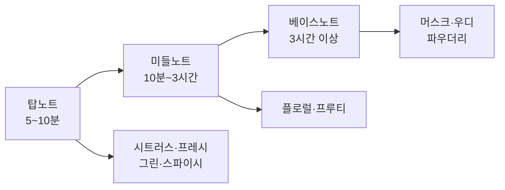

| 노트 | 지속력(시간) | 계열 |
| --- | --- | --- |
| 탑노트 – 처음 느껴지는 향 | 5~10분 | 시트러스, 프레시, 그린, 스파이시 |
| 미들노트 – 향수의 테마향 | 10분~3시간 | 플로럴, 프루티 |
| 베이스노트 – 은은한 잔향 | 3시간 이상 | 머스크, 우디, 파우더리 |

#### ③ 향수의 종류와 특성

| 종류 | 부향률(%) | 지속력(시간) | 알코올 순도 |
| --- | --- | --- | --- |
| 퍼퓸 | 15~25 | 6~7 | 99.5% |
| 오드퍼퓸 | 10~15 | 4~6 | 85~90% |
| 오드뚜왈렛 | 5~10 | 3~4 | 80~85% |
| 오드콜로뉴(오드코롱) | 3~5 | 2~3 | 75~85% |
| 샤워콜로뉴(샤워코롱) | 1~3 | 1~2 | 표준 없음 |

---

#### (8) 보존제

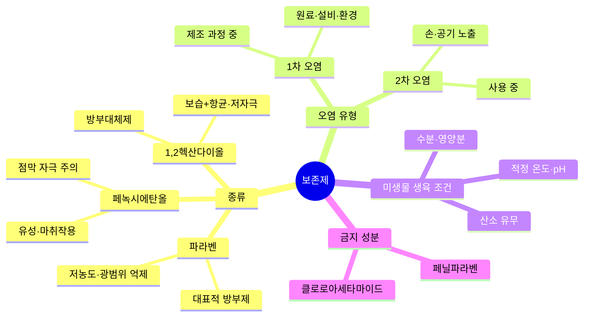

> **🗺️ 마인드맵 노드 상세 매핑**

| 대분류 | 중분류 | 핵심 포인트 |
| --- | --- | --- |
| 종류 | 파라벤 · 대표적 방부제 | 가장 대표적 방부제 |
|  | 저농도·광범위 억제 | 낮은 농도에서 광범위 미생물 억제 |
|  | 페녹시에탄올 · 유성·마취작용 | 유성 액체, 마취 작용 |
|  | 점막 자극 주의 | 피부 건조·점막 자극 주의 |
|  | 1,2헥산다이올 · 방부대체제 | 방부대체제, 보습+항균 |
|  | 보습+항균·저자극 | 보습·항균성 우수, 저자극 |
| 오염 유형 | 1차 오염 · 제조 과정 중 | 공장 제조 시 유래 오염 |
|  | 원료·설비·환경 | 원료·설비·환경에서 유래 |
|  | 2차 오염 · 사용 중 | 소비자 사용 중 미생물 오염 |
|  | 손·공기 노출 | 손·공기 노출로 인한 오염 |
| 미생물 생육 조건 | 수분·영양분 | 미생물 생육 필수 조건 |
|  | 적정 온도·pH | 온도·pH에 따라 생육 변화 |
|  | 산소 유무 | 호기성·혐기성에 따라 산소 요구 |
| 금지 성분 | 페닐파라벤 | 국내 사용 금지 살균·보존제 |
|  | 클로로아세타마이드 | 국내 사용 금지 살균·보존제 |

> **한 줄 요약**: 파라벤·페녹시에탄올·1,2헥산다이올 — 1차 오염(제조 시) vs 2차 오염(사용 시), 미생물 생육 조건 숙지.

화장품 내 미생물의 증식으로 일어나는 부패균 발육을 억제·살균하는 작용을 한다. 화장품의 변질 방지 목적으로 사용하며, 「화장품 안전 기준 등에 관한 규정」 별표 2에 지정·고시된 보존제 성분만 사용이 가능하다.

#### ① 종류 및 특징

| 종류 | 특징 |
| --- | --- |
| 파라벤 | 화장품을 만들 때 사용하는 가장 대표적인 방부제, 낮은 농도에서도 세균이나 곰팡이 등에 대한 억제 효과가 우수함 |
| 페녹시에탄올 | 유성의 약한 점성이 있는 액체로 마취 작용이 있음, 피부를 건조하게 만들고 트러블 발생, 피부 점막을 자극함 |
| 1,2 헥산다이올(방부대체제) | 물과 알코올에 잘 섞이며, 보습력과 항균성이 우수함, 자극이 거의 없어 보존제와 용제로 널리 쓰임 |

**[참고] 대표적인 국내 사용금지 살균·보존제**: 페닐파라벤, 클로로아세타마이드

#### ② 보존제가 갖추어야 할 조건

| 조건 | 내용 |
| --- | --- |
| 광범위 방부 효과 | 여러 종류의 미생물과 넓은 온도 및 pH 범위에서 방부 효과가 있어야 함 |
| 용해성 | 제품에 잘 용해되어야 함 |
| 품질 영향 | 화장품의 품질이나 제형에 부정적인 영향을 주어서는 안 됨 |
| 유효성분 보호 | 유효 성분의 효능을 저해하지 않아야 함 |
| 안전성 | 피부나 점막에 대한 자극이 없고 안전해야 함 |
| 경제성 | 제조가 용이하고 비용 측면에서도 경제적이어야 함 |
| 분배계수 | 미생물이 존재하는 물에서 충분한 농도를 유지할 수 있도록 오일/물 분배계수가 적절해야 함 |

#### ③ 미생물 오염의 종류 및 생육 조건

**미생물 오염의 종류**

| 구분 | 내용 |
| --- | --- |
| 1차 오염 | 공장에서 제조 시 유래하는 오염 |
| 2차 오염 | 소비자의 사용에 의한 미생물 오염 (얼굴이나 손에 다량의 피부 상재균이 있음) |

**미생물 생육 조건 및 오염균**

| 구분 | 세균(박테리아) | 진균(효모) | 진균(곰팡이) |
| --- | --- | --- | --- |
| 생육온도 | 25~37℃ | 25~30℃ | 25~30℃ |
| 좋은 영양소 | 단백질, 아미노산, 동물성 식품 | 당질, 식물성 식품 | 전분, 식물성 식품 |
| 생육 pH 영역 | 약산성~약알칼리성 | 산성 | 산성 |
| 공기(산소) 요구성 | 대부분 호기성 | 호기성~혐기성 | 호기성 |
| 주요 생성물 | 아민, 암모니아, 산류, 탄산가스 | 알코올, 산류, 탄산가스 | 산류 |
| 대표적인 오염균 | 황색포도상구균, 대장균, 녹농균 | 빵 효모, 칸디다균 | 푸른곰팡이, 맥아곰팡이 |

---

#### (9) 산화방지제

> **한 줄 요약**: 토코페롤(천연)·BHT·BHA — 산화 방지로 품질 유지.

화장품의 산화를 방지하고 품질을 일정하게 유지하기 위해 첨가한다.

| 종류 | 특징 |
| --- | --- |
| 토코페롤 | 비타민 E의 가장 일반적인 형태로 천연 산화방지제임, 비타민 E는 지용성 비타민의 하나로 α, β, γ, δ-토코페롤과 α, β, γ, δ-토코트리에놀 등 8가지 이성체를 가짐, α-토코페롤이 생물학적으로 가장 활동적이지만 불안정하기에, 화장품에는 토코페릴아세테이트의 형태가 사용됨 |
| BHT (Dibutyl Hydroxy Toluene) | 무색의 결정성 분말 형태, 내열성과 내광성이 우수하며, 유기용매에 녹음 |
| BHA (Butyl Hydroxy Anisole) | 열에는 안정적이나 빛에 의해 착색됨 |

**[참고] 토코페롤의 에스터 종류**

| 에스터 | 구성 |
| --- | --- |
| 토코페릴아세테이트 | 토코페롤의 아세틱애씨드 에스터 |
| 토코페릴리놀리에이트 | 토코페롤의 리놀레익애씨드 에스터 |
| 토코페릴리놀리에이트/올리에이트 | 토코페롤의 리놀레익애씨드 에스터와 올레익애씨드 에스터의 혼합물 |
| 토코페릴니코티네이트 | 토코페롤의 니코티닉애씨드 에스터 |
| 토코페릴석시네이트 | 토코페롤의 석시닉애씨드 에스터 |

---

#### (10) 금속이온봉쇄제

> **한 줄 요약**: EDTA(다이소듐이디티에이)·소듐시트레이트 — 금속이온 봉쇄로 품질 저하 방지.

화장품에 금속이온이 존재하면 품질이 저하되는 원인이 될 수 있으므로 금속이온의 활성을 억제하기 위해 첨가하며, 킬레이트제(Chelating Agent)라고도 한다.

| 종류 | 특징 |
| --- | --- |
| 다이소듐이디티에이 | 백색의 결정성 분말로, 금속이온에 의한 침전을 방지함, 물에는 용해되지만 에탄올에는 용해되지 않음, 산화 방지 작용, 변색 방지 작용 |
| 소듐시트레이트 | 무색 또는 백색의 결정성 분말, 금속이온에 의한 침전을 방지하거나 산화 방지, pH 완충제, pH 조절제 등으로 사용 |

**[참고] 대표적인 pH 조절제**: 트라이에탄올아민(TEA), 시트릭애씨드, 알지닌, 포타슘하이드록사이드(KOH), 소듐하이드록사이드(NaOH) 등

---

#### (11) 자료 제출이 생략되는 기능성화장품 고시 성분

> **한 줄 요약**: 자외선 차단(화학·물리적)·미백·주름개선·제모·여드름완화·염모·탈모완화 — 7가지 기능성 고시 성분과 함량 기준.

#### ① 피부를 곱게 태워주거나 자외선으로부터 피부를 보호하는 데 도움을 주는 제품의 성분 및 함량

| 성분명 | 함량(상한) | 기능/분류 |
| --- | --- | --- |
| 드로메트리졸 | 1.0% | 화학적 차단제 |
| 벤조페논-8 | 3.0% |  |
| 4-메칠벤질리덴캠퍼 | 4.0% |  |
| 페닐벤즈이미다졸설포닉애씨드 | 4.0% |  |
| 벤조페논-3 | 5.0% |  |
| 벤조페논-4 | 5.0% |  |
| 에칠헥실살리실레이트 | 5.0% |  |
| 에칠헥실트리아존 | 5.0% |  |
| 디갈로일트리올리에이트 | 5.0% |  |
| 멘틸안트라닐레이트 | 5.0% |  |
| 부틸메톡시디벤조일메탄 | 5.0% |  |
| 시녹세이트 | 5.0% |  |
| 에칠헥실메톡시신나메이트 | 7.5% |  |
| 에칠헥실디메칠파바 | 8.0% |  |
| 옥토크릴렌 | 10% |  |
| 호모살레이트 | 10% |  |
| 이소아밀-p-메톡시신나메이트 | 10% |  |
| 비스-에칠헥실옥시페놀메톡시페닐트리아진 | 10% |  |
| 디에칠헥실부타미도트리아존 | 10% |  |
| 폴리실리콘-15(디메치코디에칠벤잘로네이트) | 10% |  |
| 메칠렌비스-벤조트리아졸릴테트라메칠부틸페놀 | 10% |  |
| 디에칠아미노하이드록시벤조일헥실벤조에이트 | 10% |  |
| 테레프탈릴리덴디캠퍼설포닉애씨드 및 그 염류 | 산으로 10% |  |
| 디소듐페닐디벤즈이미다졸테트라설포네이트 | 산으로 10% |  |
| 드로메트리졸트리실록산 | 15% |  |
| 징크옥사이드(자외선 산란제) | 25%(자외선 차단 성분으로) | 물리적 차단제 |
| 티타늄디옥사이드(자외선 산란제) | 25%(자외선 차단 성분으로) | 물리적 차단제 |

- 화학적 차단제 작용 원리: 자외선을 흡수하여 에너지를 소멸시키고 열로 방출함으로써 피부를 보호하는 방식
- 물리적 차단제 작용 원리: 자외선을 반사·산란시켜 피부에 도달하지 못하게 하는 방식

**자외선 차단제 관련 기타 사항**
- 자외선 차단제는 사용 기준이 지정·고시된 원료만 사용할 수 있다.
- 화장품의 유형(의약외품은 제외) 중 영·유아용 제품류 중 로션, 크림 및 오일, 기초화장용 제품류, 색조화장용 제품류에 한한다.
- 자외선 차단 원료를 제품의 변색 방지 목적으로 사용할 때 0.5% 미만인 것은 자외선 차단 제품으로 인정하지 않는다.
- 자외선 차단지수(SPF) 10 이하 제품의 경우 자료 제출이 면제된다(단, 효능·효과를 기재 표시할 수 없음).

**자외선 차단제 표시 방법**
- 자외선 차단지수(SPF)는 측정 결과에 근거하여 평균값(소수점 이하 절사)으로부터 -20% 이하 범위 내 정수(예: SPF 평균값이 '23'일 경우 19~23 범위 정수로 표시)로 표시하되, SPF 50 이상은 'SPF50+'로 표시한다.
- 내수성·지속내수성은 측정 결과에 근거하여 내수성비 신뢰구간이 50% 이상일 때, '내수성' 또는 '지속내수성'으로 표시한다.
- 자외선A 차단등급(PA)은 측정 결과에 근거하여 자외선 차단 효과 측정 방법 및 기준에 따라 표시한다.

**UVB를 차단하는 자외선 차단지수(SPF: Sun Protection Factor)**

$$SPF = \frac{제품을\ 바른\ 피부의\ 최소\ 홍반량(MED)}{제품을\ 바르지\ 않은\ 피부의\ 최소\ 홍반량(MED)}$$

- 50 이상의 제품은 SPF 50+로 표시한다.
- SPF 1은 약 10~15분 정도의 UVB 차단 효과를 의미한다.

**UVA 차단 등급(PA: Protection Factor of UVA)**

$$PA = \frac{제품을\ 바른\ 피부의\ 최소\ 지속형즉시흑화량(MPPD)}{제품을\ 바르지\ 않은\ 피부의\ 최소\ 지속형즉시흑화량(MPPD)}$$

- 2 이상 4 미만: PA+ (차단 효과 낮음)
- 4 이상 8 미만: PA++ (차단 효과 보통)
- 8 이상 16 미만: PA+++ (차단 효과 높음)
- 16 이상: PA++++ (차단 효과 매우 높음)

**[용어] 최소 홍반량(MED)**: UVB를 사람의 피부에 조사한 후 16~24시간의 범위 내에 조사 전 영역에 홍반을 나타낼 수 있는 최소한의 자외선 조사량

**[용어] 최소 지속형즉시흑화량(MPPD)**: UVA를 사람의 피부에 조사한 후 2~24시간의 범위 내에 조사 전 영역에 희미한 흑화가 인식되는 최소 자외선 조사량

#### ② 피부 미백에 도움을 주는 제품의 성분 및 함량
- 제형: 로션제, 액제, 크림제 및 침적 마스크로 제한
- 제품의 효능 및 효과: "피부의 미백에 도움을 준다"
- 용법 및 용량:
 - "본품 적당량을 취해 피부에 골고루 펴 바른다"
 - "본품을 피부에 붙이고 10~20분 후 지지체를 제거한 다음 남은 제품을 골고루 펴 바른다(침적 마스크에 한함)"

| 성분명 | 함량(상한) | 기능/분류 |
| --- | --- | --- |
| 유용성 감초 추출물 (고시 함량) | 0.05% | 티로시나이제(Tyrosinase)의 활성 억제 |
| 알파-비사보롤 (고시 함량) | 0.5% |  |
| 닥나무 추출물 (고시 함량) | 2.0% |  |
| 알부틴 (고시 함량) | 2.0~5.0% |  |
| 에칠아스코빌에텔 (고시 함량) | 1.0~2.0% | 티로신(Tyrosine)의 산화 억제(비타민 C 유도체) |
| 아스코빌글루코사이드 (고시 함량) | 2.0% |  |
| 아스코빌테트라이소팔미테이트 (고시 함량) | 2.0% |  |
| 마그네슘아스코빌포스페이트 (고시 함량) | 3.0% |  |
| 나이아신아마이드 (고시 함량) | 2.0~5.0% | 멜라닌의 이동 억제 |

#### ③ 피부의 주름 개선에 도움을 주는 제품의 성분 및 함량
- 제형: 로션제, 액제, 크림제 및 침적 마스크로 제한
- 제품의 효능 및 효과: "피부의 주름 개선에 도움을 준다"
- 용법 및 용량: 미백 기능성화장품과 동일

| 성분명 | 함량(상한) |
| --- | --- |
| 아데노신 (고시 함량) | 0.04% |
| 폴리에톡실레이티드레틴아마이드 (고시 함량) | 0.05~0.2% |
| 레티놀 (고시 함량) | 2,500IU/g |
| 레티닐팔미테이트 (고시 함량) | 10,000IU/g |

#### ④ 체모를 제거하는 기능을 가진 제품의 성분 및 함량
- 제형: 로션제, 액제, 크림제 및 에어로졸제로 제한
- 제품의 효능 및 효과: "제모(체모의 제거)"
- 용법 및 용량: "사용 전 제모할 부위를 깨끗이 씻고 건조시킨 후, 털이 완전히 덮이도록 제품을 충분히 바른다. 문지르지 말고 5~10분간 그대로 두었다가 일부분을 손가락으로 문질러 털이 쉽게 제거되면, 젖은 수건이나 동봉된 부직포로 닦아내거나 물로 문질러 털을 제거한다. 짧고 거친 털을 완전히 제거하기 위해서는 수일 간격으로 1회 이상 반복 사용하는 것이 좋다"

| 성분명 | 함량(상한) |
| --- | --- |
| 치오글리콜산 80% | 산으로서 3.0~4.5%, pH 7.0 이상~12.7 미만 |

**[참고] 제모제 사용 주의 부위**: 얼굴, 눈썹, 생식기, 손상피부, 남성 수염 부위 사용 금지
**주요 성분**: 치오글리콜산(산으로서 3.0~4.5%)

#### ⑤ 여드름성 피부를 완화하는 데 도움을 주는 제품의 성분 및 함량
- 유형: 인체 세정용 제품류(비누조성의 제제)
- 제형: 로션제, 액제, 크림제로 제한(부직포 등에 침적된 상태는 제외함)
- 제품의 효능 및 효과: "여드름성 피부를 완화하는 데 도움을 준다"
- 용법 및 용량: "본품 적당량을 취해 피부에 사용한 후 물로 바로 깨끗이 씻어낸다"

| 성분명 | 함량(상한) |
| --- | --- |
| 살리실릭애씨드 | 0.5% |

*인체 세정용 제품류로 한정*

**[참고] 살리실릭애씨드의 사용한도**
| 구분 | 한도 |
| --- | --- |
| 보존제 | 살리실릭애씨드로서 0.5% |
| 기타 성분 | 인체 세정용 제품류에 살리실릭애씨드로서 2.0%, 사용 후 씻어내는 두발용 제품류에 살리실릭애씨드로서 3.0% |

*영유아용 제품류 또는 13세 이하 어린이가 사용할 수 있음을 특정하여 표시하는 제품에는 사용금지(다만, 샴푸는 제외)

#### ⑥ 모발의 색상을 변화(탈염·탈색 포함)시키는 기능을 가진 제품의 성분 및 함량
- 제형: 분말제, 액제, 크림제, 로션제, 에어로졸제, 겔제로 제한

| 기능/분류 | 성분명 | 함량(상한) |
| --- | --- | --- |
| 염료중간체(산화되면 색소로 변함) | p-아미노페놀 | 0.9% |
|  | 톨루엔-2,5-디아민 | 2.0% |
|  | p-페닐렌디아민 | 2.0% |
| 염료수정제(염료중간체와 반응하여 색상을 다양하게 변화) | 레조시놀 | 2.0% |
|  | m-아미노페놀 | 2.0% |

*모발 색상의 변화는 탈염·탈색을 포함하며, 일시적으로 모발의 색상을 변화시키는 제품은 제외함

**[참고]** 「화장품 안전 기준 등에 관한 규정」 개정(2023.08.22. 시행)으로 사용금지 염모제 성분 5가지가 추가됨: o-아미노페놀, 염산 m-페닐렌디아민, m-페닐렌디아민, 카테콜(피로카테콜) [산화염모제에서 용법·용량에 따른 혼합물의 염모성분으로서 1.5% 이하는 제외], 피로갈롤 [염모제에서 용법·용량에 따른 혼합물의 염모성분으로서 2% 이하는 제외]

#### ⑦ 탈모 증상의 완화에 도움을 주는 제품의 성분
덱스판테놀, 비오틴, 엘-멘톨, 징크피리치온, 징크피리치온액(50%)이 있다.
- 코팅 등 물리적으로 모발을 굵어 보이게 하는 제품은 제외함

---

#### 자료 제출이 생략되는 기능성화장품 고시 성분 – 세부 규격

| 구분 | 성분 규격 |
| --- | --- |
| 여드름성 피부 완화 | 살리실릭애씨드[살리실릭애씨드(C₇H₆O₃: 138.12) 99.5% 이상 함유], 성상: 백색의 결정성 가루로 냄새는 없음 |
| 체모 제거 | 치오글리콜산 80%[치오글리콜산(C₂H₄O₂S) 78.0~82.0% 함유], 성상: 특이한 냄새가 있는 무색 투명한 유동성 액제, 제형: 치오글리콜산 크림제 – 90.0~110.0%에 해당하는 치오글리콜산(C₂H₄O₂S: 92.12) 함유 |
| 탈모 증상 완화 | 덱스판테놀[덱스판테놀(C₉H₁₉NO₄) 98.0~102.0% 함유], 비오틴[비오틴(C₁₀H₁₆N₂O₃S) 98.5~101.0% 함유], 엘-멘톨[엘-멘톨(C₁₀H₂₀O) 98.0~101.0% 함유], 징크피리치온[징크피리치온((C₅H₄ONS)₂Zn: 317.70) 90.0~101.0% 함유], 징크피리치온 액(50%)[징크피리치온((C₅H₄ONS)₂Zn: 317.70) 47.0~53.0%를 함유] |
| 자외선으로부터 피부 보호 | 벤조페논-3[C₁₄H₁₂O₃: 228.25) 90.0% 이상 함유], 벤조페논-4[C₁₄H₁₈O₉S: 362.26) 95.0% 이상 함유], 벤조페논-8[C₁₄H₁₂O₄) 97.0% 이상 함유], 징크옥사이드[ZnO: 81.38) 99.5% 이상 함유], 티타늄디옥사이드[TiO₂: 79.88) 90.0% 이상 함유] |
| 모발의 색상 변화 | p-아미노페놀[C₆H₇NO) 95.0% 이상 함유], 레조시놀[C₆H₆O₂) 99.0% 이상 함유] |

---

#### (12) 기능성화장품 제형

① 기능성화장품의 심사를 받지 아니하고 식품의약품안전평가원장에게 보고서 제출로써 기능성화장품으로 인정받을 수 있는 대상이 있다.

② **닥나무 추출물, 마그네슘아스코빌포스페이트, 아데노신액 2%, 살리실릭애씨드, 폴리에톡실레이티드레틴아마이드**는 보고만으로 생산이 불가하다.

**피부의 미백에 도움을 주는 기능성화장품**

| 성분 | 규격 | 제형 |
| --- | --- | --- |
| 나이아신아마이드 (규격·성상) | 나이아신아마이드(C₆H₆N₂O) 98.0% 이상 함유, 백색의 결정 또는 결정성 가루로 냄새는 없음 | 로션제, 액제, 크림제, 침적 마스크 – 90.0% 이상 해당량 함유 |
| 닥나무 추출물 (규격·성상) | 48.5~84.1%, 엷은 황색~황갈색의 점성이 있는 액 또는 황갈색~암갈색의 결정성 가루로 약간의 특이한 냄새가 있음 | – |
| 아스코빌글루코사이드 (규격·성상) | (C₁₂H₁₈O₁₁: 338.27) 98.0% 이상 함유, 백색~미황색의 가루 또는 결정성 가루 | 로션제, 액제, 크림제, 침적 마스크 – 90.0% 이상 함유 |
| 아스코빌테트라이소팔미테이트 (규격·성상) | (C₇₀H₁₂₈O₁₀: 1129.78) 95.0% 이상 함유, 무색~엷은 황색의 액으로 약간의 특이한 냄새가 있음 | 로션제, 액제, 크림제, 침적 마스크 – 90.0% 이상 함유 |
| 알부틴 (규격·성상) | (C₁₂H₁₆O₇: 272.25) 98.0% 이상 함유, 백색~미황색의 가루로 약간의 특이한 냄새가 있음 | 로션제, 액제, 크림제, 침적 마스크 – 90.0% 이상 함유 |
| 알파-비사보롤 (규격·성상) | (C₁₅H₂₆O: 222.37) 97.0% 이상 함유, 무색의 오일 상으로 냄새는 없거나 특이한 냄새가 있음 | 로션제, 액제, 크림제, 침적 마스크 – 90.0% 이상 함유 |
| 에칠아스코빌에텔 (규격·성상) | (C₈H₁₂O₆: 204.18) 95.0% 이상 함유, 백색~엷은 황색의 결정 또는 결정성 가루로 약간의 특이한 냄새가 있고 맛은 씀 | 로션제, 액제, 크림제, 침적 마스크 – 90.0% 이상 함유 |
| 유용성 감초 추출물 (규격·성상) | 글리브리딘(C₂₀H₂₀O₄: 324.38) 35.0% 이상 함유, 황갈색~적갈색의 가루로 감초 특유의 냄새가 있음 | 로션제, 액제, 크림제, 침적 마스크 – 90.0% 이상 함유 |

**피부의 주름 개선에 도움을 주는 기능성화장품**

| 성분 | 규격 | 제형 |
| --- | --- | --- |
| 레티놀 (규격·성상) | (C₂₀H₃₀O: 286.46) 함량(IU 또는 %)의 90.0% 이상 함유, 엷은 황색~엷은 주황색의 가루 또는 점성이 있는 액 또는 겔상의 물질로 냄새는 없거나 특이한 냄새가 있음 | 로션제, 크림제, 침적 마스크 – 90.0% 이상 함유 |
| 레티닐팔미테이트 (규격·성상) | (C₃₆H₆₀O₂: 524.87) 90.0% 이상 함유, 엷은 황색~황적색의 고체 또는 유상의 물질로 약간의 특이한 냄새가 있으며, 냉소에 보관할 때 일부는 결정화됨 | 로션제, 크림제, 침적 마스크 – 90.0% 이상 함유 |
| 아데노신 (규격·성상) | (C₁₀H₁₃N₅O₄: 267.24) 99.0% 이상 함유, 아데노신액(2%)[아데노신(C₁₀H₁₃N₅O₄: 267.2) 1.90~2.10% 함유], 무색 결정 또는 결정성 가루로 냄새는 없음 | 로션제, 액제, 크림제, 침적 마스크 – 90.0% 이상 함유 |
| 폴리에톡실레이티드레틴아마이드 (규격·성상) | ((C₂₃₊₂ₙH₃₅₊₄ₙO₂₊ₙ)ₙ: 평균분자량 831) 95.0% 이상 함유, 황색~황갈색의 맑거나 약간 혼탁한 유액으로 약간의 특이한 냄새가 있음 | – |

**피부의 미백 및 주름 개선에 도움을 주는 기능성화장품 (복합 제형)**

| 제형 | 함유 기준 |
| --- | --- |
| 나이아신아마이드·아데노신 로션제, 액제, 크림제, 침적 마스크 | 90.0% 이상에 해당하는 나이아신아마이드(C₆H₆N₂O: 122.13) 및 아데노신(C₁₀H₁₃N₅O₄: 267.24) 함유 |
| 아스코빌글루코사이드·아데노신 액제 | 90.0% 이상에 해당하는 아스코빌글루코사이드(C₁₂H₁₈O₁₁: 338.27) 및 아데노신(C₁₀H₁₃N₅O₄: 267.24) 함유 |
| 알부틴·레티놀 크림제 | 90.0% 이상에 해당하는 알부틴(C₁₂H₁₆O₇: 272.25) 및 레티놀(C₂₀H₃₀O: 286.46) 함유 |
| 알부틴·아데노신 로션제, 액제, 크림제, 침적 마스크 | 90.0% 이상에 해당하는 알부틴(C₁₂H₁₆O₇: 272.25) 및 아데노신(C₁₀H₁₃N₅O₄: 267.24) 함유 |
| 알파-비사보롤·아데노신 로션제, 액제, 크림제, 침적 마스크 | 90.0% 이상에 해당하는 알파-비사보롤(C₁₅H₂₆O: 222.37) 및 아데노신(C₁₀H₁₃N₅O₄: 267.24) 함유 |
| 에칠아스코빌에텔·아데노신 로션제, 액제, 크림제, 침적 마스크 | 90.0% 이상에 해당하는 에칠아스코빌에텔(C₈H₁₂O₆: 204.18) 및 아데노신(C₁₀H₁₃N₅O₄: 267.24) 함유 |
| 유용성 감초 추출물·아데노신 로션제, 액제, 크림제 | 90.0% 이상에 해당하는 글라브리딘(C₂₀H₂₀O₄: 324.38) 및 아데노신(C₁₀H₁₃N₅O₄: 267.24) 함유 |

---

#### (13) 고시 외 기타 성분

| 성분명 | 특징 |
| --- | --- |
| 로즈마리 추출물 | 로즈마리 잎에서 추출하며, 피부 진정, 보습, 노화 예방에 관여함 |
| 뮤신 | 생물체가 만들어내는 점성 물질을 통칭하며, 콘드로이친 황산을 함유하여 노화에 관여함 |
| 베타글루칸 | 다당류의 일종으로 면역기능과 피부 보습이 우수함 |
| 병풀 추출물 | 센텔라 아시아티카의 전초에서 추출하며 피부 컨디셔닝제, 피부 진정제로 사용함 |
| 사자발쑥 추출물 | 약쑥으로도 알려져 있으며, 항산화 작용, 항균 활성이 우수함 |
| 세라마이드 | 표피 각질층의 지질막 성분 중 하나로 수분 증발을 억제함 |
| 소듐하이알루로네이트 | 고분자 보습제로 자신의 무게보다 1,000배 이상의 수분을 흡수함 |
| 솔비톨 | 보습제, 컨디셔닝제로 배합되며, 피부를 촉촉하고 부드럽게 도와줌 |
| 아젤라익애씨드 | 여드름에 도움을 주는 성분으로 알려져 있으며, 각질 제거, 미백 등 기능성화장품에서도 사용함 |
| 알란토인 | 피부 진정, 보습 효과에 관여함 |
| 알로에베라 추출물 | 알로에베라 전초에서 추출하며 피부 컨디셔닝제로 배합, 피부 진정제로 우수함 |
| 엘라스틴 | 결합조직 내에서 탄력성이 높은 단백질로, 피부 탄력에 관여함 |
| 콜라겐 | 단백질 중 하나로 세포조직 결합과 지탱 역할, 주름, 탄력, 피부 유연성에 관여함 |
| 태반 추출물 | 소, 돼지, 양 등의 태반을 저온 동결 건조하여 인체에 유효한 성분을 함유하고 있으며 피부 재생, 보습에 관여함 |
| 파파야 열매 추출물 | 비타민 A, B, C와 카로티노이드 등 영양성분이 풍부하며, 피부 컨디셔닝제로 사용함 |
| 황금 추출물 | 황금의 뿌리에서 추출하며, 피부 컨디셔닝제로 사용함 |

**AHA (Alpha-Hydroxy Acid)**: 화학적 각질 제거 성분으로, 각질 세포들 간의 연결을 끊어 주어 각질의 탈락을 유도함

| 종류 | 특징 |
| --- | --- |
| Glycolic Acid(글리콜산, 글라이콜릭애씨드) | 사탕수수에서 추출하며, AHA 중 분자량이 가장 적어 피부 속으로 침투 속도가 빠름 |
| Lactic Acid(젖산, 락틱애씨드) | (쥔) 우유에서 추출한 젖당을 발효시켜 추출하며, 천연보습인자(NMF) 구성 성분 중 하나임 |
| Malic Acid(사과산, 말릭애씨드) | 사과 등에서 추출되며, 능금산이라고도 함 |
| Citric Acid(구연산, 시트릭애씨드) | 레몬, 오렌지, 자몽 등 시트러스 계열에서 추출하며, pH 조절제로도 많이 사용함 |
| Tartic Acid(타르타르산, 타타릭애씨드) | 포도 등에서 추출하며, 주석산이라고도 함 |

---


## 2. 주요 원료의 특성

### (1) 비타민의 종류

> 📌 **출처**: 식약처 화장품원료 지침 (비타민류)| **시행일**: 2026. 4. 2.| **최종 확인**: 2026. 8. 29.

> **한 줄 요약**: 지용성(A·D·E·F·K) + 수용성(B군·C·P) — 피부 재생·항산화·보습·염증 완화 등.

#### 지용성 비타민

| 비타민 | 특징 |
| --- | --- |
| 비타민 A(레티놀) | • 네 단위의 이소프레노이드가 머리·꼬리의 형태로 결합하여 다섯 개의 이중결합을 갖는 화합물에 속함<br>• 레티놀, 레틴알데하이드, 레티노익애씨드 3가지 형태가 있음<br>• 피부 상피조직의 신진대사에 관여함<br>• 각화를 정상화시켜 피부 재생에 도움을 줌<br>• 노화 방지에 효과적임 |
| 비타민 D | • 칼슘과 인의 대사에 관여하여 뼈와 치아 구성에 영향을 줌<br>• 피부 성장과 발달, 건조 증상에 관여함 |
| 비타민 E(토코페롤) | • 체내 산화를 방지하는 항산화제<br>• 노화 방지와 조직 재생, 체내의 면역 체계에도 관여함<br>• 알파(α), 베타(β), 감마(γ), 델타(δ)-토코페롤과 알파(α), 베타(β), 감마(γ), 델타(δ)-토코트리에놀 8가지의 이성체를 가짐 |
| 비타민 F | • 리놀산, 리놀렌산, 아라키돈산이 해당됨<br>• 피부 장벽 유지, 수분 손실 예방, 피부 보습에 도움을 줌 |
| 비타민 K | • 혈액 응고에 필수적임<br>• 모세혈관 벽을 튼튼하게 하고, 피부염과 습진에 효과적임 |

#### 수용성 비타민

| 비타민 | 특징 |
| --- | --- |
| 비타민 B₁(티아민) | • 항신경성 비타민이라고 불림<br>• 신경을 정상으로 유지시키는 역할을 함<br>• 민감성 피부의 저항력을 높이고 피부가 건조하여 갈라지는 것을 예방함 |
| 비타민 B₂(리보플라빈) | • 항피부염성 비타민이라고 불림<br>• 피부의 보습, 탄력감을 부여함<br>• 혈액순환 및 여드름 진정 작용, 습진, 구강의 건강에 관여함<br>• 피부 컨디셔닝제, 착색제에 사용됨 |
| 비타민 B₃(니아신) | 세포신호, 대사, DNA 합성 시 중요한 역할 |
| 비타민 B₅(판토테닉애씨드) | • 호르몬, 콜레스테롤 생산에 관여함<br>• 모발 컨디셔닝제에 사용됨 |
| 비타민 B₆(피리독신) | • 피부 염증을 방지하고, 피지선의 기능 조절로 피지 분비를 억제함<br>• 결핍 시 여드름피부, 지루성 피부염과 작열감을 동반함<br>• 모발·피부 컨디셔닝제에 사용됨 |
| 비타민 B₇(바이오틴) | • 유전자 발현 조절에 관여함<br>• 피부, 헤어 컨디셔닝제에 사용됨 |
| 비타민 B₉(폴릭애씨드) | • 세포분열에 관여함<br>• 엽산, 피부 컨디셔닝제에 사용됨 |
| 비타민 B₁₂(사이아노코발아민) | • 수용성이나 물에 잘 녹지 않음<br>• DNA 합성에 관여함<br>• 피부 컨디셔닝제에 사용됨 |
| 비타민 C(아스코빅애씨드) | • 미백과 항산화 효과가 우수함<br>• 콜라겐 합성에 관여하여 진피의 세포 재생에 도움을 줌 |
| 비타민 P(플라보노이드) | • 감귤류 색소인 플라본류를 총칭하는 화합물<br>• 모세혈관의 강화 및 순환<br>• 콜라겐을 만드는 비타민 C의 기능을 보강함 |
---


## 3. 기능성 원료

### (1) 원료 및 제품의 성분 정보

> 📌 **출처**: 화장품법 제5조 + 식약처 고시| **참조 자료**: [화장품법(법률)(제20901호)(20260402).md](../참조자료/ref_md/화장품법%28법률%29%28제20901호%29%2820260402%29/화장품법%28법률%29%28제20901호%29%2820260402%29.md)| **시행일**: 2026. 4. 2.| **최종 확인**: 2026. 8. 29.

> **한 줄 요약**: 전성분 표기 7칙 + 보존제 함량 표시 + 생략 조건 + 기재·표시사항 + 바코드(GTIN-13/14, GS1-128, DataMatrix).

#### (1) 전성분 표기

① 글자 크기는 5포인트 이상이어야 한다.

② 사용된 함량이 많은 것부터 기재·표시한다(단, 1.0% 이하로 사용된 성분, 착향제 또는 착색제는 순서에 상관없이 기재·표시 가능).

③ 혼합 원료는 개별 성분의 명칭으로 기재·표기한다.

④ 색조화장용, 눈화장용, 두발염색용, 손발톱용 제품류의 호수별 착색제가 다르게 사용된 경우 '±' 또는 '+/-'의 표시 다음에 사용된 모든 착색제 성분을 함께 기재·표시한다.

⑤ 착향제는 '향료'로 표기하고, 향료 중 알레르기 유발 성분은 해당 성분의 명칭을 기재·표기한다.

⑥ 산성도(pH) 조절 목적으로 사용되는 성분은 그 성분을 표시하는 대신 중화 반응에 따른 생성물로 기재·표시할 수 있고, 비누화 반응에 거치는 성분은 비누화 반응에 따른 생성물로 기재·표기가 가능하다.

⑦ 성분을 기재·표시할 경우 영업자의 정당한 이익을 현저히 침해할 우려가 있을 때는 식품의약품안전처장에게 그 근거 자료를 제출하고, 인정하는 경우 '기타 성분'으로 기재·표기가 가능하다.

**[참고] 화장품 전성분 표시제**: 화장품에 사용된 모든 성분을 표기하는 제도

---

#### (2) 보존제 함량 표시

3세 이하의 영유아용 제품류 또는 4세 이상부터 13세 이하까지의 어린이가 사용할 수 있는 제품임을 특정하여 표시·광고하려는 경우에는 사용 기준이 지정·고시된 원료 중 보존제의 함량을 기재·표시하여야 한다.

---

#### (3) 전성분 표시의 생략이 가능한 경우

① 50mL(g) 이하의 포장일 경우(단, 속눈썹용 퍼머넌트 웨이브 제품과 외음부 세정제 등 일부 소용량 화장품은 용량에 관계없이 기재 표시사항을 빠짐없이 작성)

② 견본품, 비매품 등 판매 목적이 아닌 경우(단, 전성분 정보를 즉시 제공할 수 있는 전화번호, 홈페이지 주소 또는 전성분 정보를 기재한 책자 등을 매장에 비치해야 함)

---

#### (4) 화장품 기재·표시사항과 생략 가능 성분

#### ① 기재·표시사항

- 식품의약품안전처장이 정하는 바코드
- 기능성화장품의 경우 심사받거나 보고한 효능·효과, 용법·용량
- 성분명을 제품 명칭의 일부로 사용한 경우 그 성분명과 함량(단, 방향 제품은 제외함)
- 인체 세포·조직 배양액이 들어간 경우 함량
- 수입화장품의 경우 제조국 명칭, 제조회사명, 소재지
- 기능성화장품의 경우 '질병의 예방 및 치료를 위한 의약품이 아님'이라는 문구
- 영유아 또는 어린이가 사용할 수 있는 제품임을 특정하여 표시·광고하려는 경우 사용기준이 지정·고시된 원료 중 보존제의 함량

#### ② 기재·표시 생략 가능한 성분

- 제조 과정 중 제거되어 최종 제품에 남아 있지 않은 성분
- 안정화제, 보존제 등 원료 자체에 들어 있는 부수 성분으로 그 효과가 나타나게 하는 양보다 적은 양이 들어 있는 성분
- 내용량이 10mL 초과 50mL 이하 또는 중량이 10g 초과 50g 이하인 화장품에 들어 있는 성분(단, 타르색소, 금박, 샴푸와 린스에 들어 있는 인산염의 종류, 과일산(AHA), 기능성화장품의 효능·효과가 나타나게 하는 원료, 식품의약품안전처장이 사용한도를 고시한 원료는 제외함)

---

#### (5) 바코드

#### ① 용어의 정의

| 용어 | 정의 |
| --- | --- |
| 화장품 코드 | 개별 화장품을 식별하기 위해 고유하게 설정된 번호로서 국가식별코드, 화장품 제조업자 등의 식별코드, 품목코드 및 검증번호(Check Digit)를 포함한 12 또는 13자리의 숫자 |
| 바코드 | 화장품코드를 포함한 숫자나 문자 등의 데이터를 일정한 약속에 의해 컴퓨터에 자동 입력시키기 위한 다음 중 하나에 여백 및 광학적문자판독(Optical Character Recognition) 폰트의 글자로 구성되어 정보를 표현하는 수단으로서, 스캐너가 읽을 수 있도록 인쇄된 심벌(마크)<br>• 여러 종류의 폭을 갖는 백과 흑의 평형 막대의 조합<br>• 일정한 배열로 이루어져 있는 사각형 모듈 집합으로 구성된 데이터 매트릭스 |

#### ② 표시 대상
국내에서 제조되거나 수입되어 국내에 유통되는 모든 화장품(기능성화장품을 포함함)을 대상

#### ③ 바코드 표시의 생략이 가능한 경우
내용량이 15mL 이하 또는 15g 이하인 제품의 용기 또는 포장이나 견본품, 시공품 등 비매품

#### ④ 표시 의무자
국내에서 화장품을 유통·판매하고자 하는 **화장품책임판매업자**

#### ⑤ 바코드 표시
- 화장품책임판매업자 등은 화장품 품목별·포장단위별로 개별 용기 또는 포장에 바코드의 종류 및 구성체계 등의 규정에 의한 바코드 심벌을 표시한다.
- 바코드를 표시함에 있어 바코드의 인쇄 크기, 색상 및 위치는 규정에 맞춰 표시한다. 다만, 용기포장의 디자인에 따라 판독이 가능하도록 바코드의 인쇄 크기와 색상을 자율적으로 정할 수 있다.
- 화장품바코드 표시는 유통단계에서 쉽게 훼손되거나 지워지지 않도록 해야 한다.

---

#### (6) 바코드의 종류 및 구성체계

#### ① GTIN-13 번호체계

| 자리수 | 3 | 4~6 | 5~3 | 1 |
| --- | --- | --- | --- | --- |
| GTIN-13 내용 | 국가식별코드 | 업체식별코드 | 품목코드 | 검증번호 |
| GTIN-13 부여 예 | 880 | 1234 | 12345 | 7 |

예시 바코드: `8 801234 123457`

#### ② GTIN-14 번호체계

| 자리수 | 1 | 3 | 4~6 | 5~3 | 1 |
| --- | --- | --- | --- | --- | --- |
| GTIN-14 내용 | 물류식별 | 국가식별 | 업체식별 | 품목코드 | 검증번호 |
| GTIN-14 부여 예 | 1~8 | 880 | 1234 | 12345 | 4 |

**공통 사항 (GTIN-13, GTIN-14)**
- 업체식별코드 자릿수가 4자리인 경우 품목코드 자릿수는 5자리
- 업체식별코드 자릿수가 5자리인 경우 품목코드 자릿수는 4자리
- 업체식별코드 자릿수가 6자리인 경우 품목코드 자릿수는 3자리

#### ③ GS1-128 바코드
GS1-128 바코드에 GS1 응용식별자 체계에 따라 3개 데이터 입력 예:
1) 화장품코드: 8801234123457
2) 사용기한: 2024년 12월 25일
3) 제조번호: GS1-128

(바코드 구성: 확인용코드(GTIN) 구분자(숫자 14자리) / 사용기한 구분자(숫자 6자리, YYMMDD) / 제조번호(Batch) 구분자(숫자/문자 가능, 최대 20자리))

#### ④ GS1 DataMatrix 바코드
GS1 DataMatrix 바코드에 GS1 응용식별자 체계에 따라 3개 데이터 입력 예:
1) 화장품코드: 8801234123457
2) 사용기한: 2024년 12월 25일
3) 제조번호: GS1-128

(표시 예: `(01) 08801234123457` / `(17) 241225` / `(10) GS1-128`)

GS1-128 및 GS1 DataMatrix 바코드 체계는 GTIN-13과 GTIN-14 기본번호체계에 GS1 응용식별자를 활용하여 부가정보를 추가한다.
- GS1 응용식별자는 GS1 국제표준규격을 준수하여 적용해야 한다.
- GS1 DataMatrix는 ECC(Error Checking and Correction) 200버전을 나타내며 GS1 국제표준규격을 준수해야 한다.

---

## 📊 계면활성제 4종 비교표

> 📌 **출처**: 식약처 화장품원료 지침| **시행일**: 2026. 4. 2.| **최종 확인**: 2026. 8. 29.

| 구분 | 세정력 | 자극성 | 주요 용도 | 대표 성분 |
| --- | --- | --- | --- | --- |
| **음이온성** | 1위 (최우수) | 2위 | 비누, 샴푸, 폼클렌저 | SLS, SLES, ALS, ALES |
| **양이온성** | 3위 | 1위 (최강) | 헤어 린스, 트리트먼트, 대전방지 | 세트리모늄클로라이드, 폴리쿼터늄-10 |
| **양쪽성** | 2위 | 3위 | 베이비용, 저자극 샴푸, 거품안정제 | 코카미도프로필베타인, 레시틴 |
| **비이온성** | 4위 | 4위 (최저) | 기초화장품, 가용화제 | 폴리솔베이트20, 솔비탄라우레이트 |

## 📊 유성 원료 7종 비교표

> 📌 **출처**: 식약처 화장품원료 지침| **시행일**: 2026. 4. 2.| **최종 확인**: 2026. 8. 29.

| 구분 | 주요 원료 | 핵심 특징 | 용도 |
| --- | --- | --- | --- |
| **유지(오일)** | 로즈힙, 올리브, 아르간, 밍크 | 피부 친화성 좋음, 산패 우려 | 보습, 유연 |
| **탄화수소** | 미네랄오일, 파라핀, 바세린, 스쿠알렌 | 무색·무취, 산패 없음, 밀폐제 | 수분 증발 억제 |
| **실리콘 오일** | 사이클로메티콘, 다이메티콘 | 가볍고 매끄러운 감촉, 퍼짐성 우수 | 사용감 향상, 기포 제거 |
| **왁스류** | 카나우바, 칸데릴라, 라놀린, 비즈왁스 | 상온 고체, 경도 조절, 광택 | 립스틱, 크림 안정성 |
| **고급 지방산** | 라우릭, 미리스틱, 팔미틱, 스테아릭 | R-COOH, 탄소수 12+, 비누 형성 | 세정, 유화, 경도 조절 |
| **고급 알코올** | 세틸, 스테아릴, 베헤닐 | R-OH, 탄소수 6+, 유화안정보조 | 점도 조절, 유화 안정 |
| **에스터** | IPM, CCT, 세틸미리스테이트 | 지방산+알코올 탈수결합, 유연성 | 사용감 향상, 용해제 |

## 📊 기능성화장품 고시 성분 요약 비교표

> 📌 **출처**: 기능성화장품 심사 규정 (제2025-88호)| **참조 자료**: [기능성화장품 심사에 관한 규정(식품의약품안전처고시)(제2025-88호)(20251216).md](../참조자료/ref_md/기능성화장품%20심사에%20관한%20규정%28식품의약품안전처고시%29%28제2025-88호%29%2820251216%29/기능성화장품%20심사에%20관한%20규정%28식품의약품안전처고시%29%28제2025-88호%29%2820251216%29.md)| **시행일**: 2025. 12. 16.| **최종 확인**: 2026. 8. 29.

| 기능 | 대표 성분 | 함량 기준 | 제형 제한 |
| --- | --- | --- | --- |
| **자외선 차단** | 징크옥사이드, 티타늄디옥사이드(물리적) / 벤조페논-3, 에칠헥실메톡시신나메이트(화학적) | 최대 25% / 7.5% 등 | 로션, 크림, 오일 등 |
| **미백** | 나이아신아마이드, 알부틴, 에칠아스코빌에텔, 유용성감초추출물 | 2.0~5.0% / 0.05% 등 | 로션, 액제, 크림, 침적마스크 |
| **주름 개선** | 아데노신, 레티놀, 레티닐팔미테이트 | 0.04% / 2,500IU/g 등 | 로션, 액제, 크림, 침적마스크 |
| **제모** | 치오글리콜산 80% | 산으로서 3.0~4.5%, pH 7.0~12.7 | 로션, 액제, 크림, 에어로졸 |
| **여드름 완화** | 살리실릭애씨드 | 0.5% | 비누조성, 로션, 액제, 크림 |
| **염모** | p-페닐렌디아민, 톨루엔-2,5-디아민 | 2.0% / 0.9% 등 | 분말, 액, 크림, 로션, 에어로졸, 겔 |
| **탈모 완화** | 덱스판테놀, 비오틴, 엘-멘톨, 징크피리치온 | 고시 규격 참조 |  |

## 📊 향수 종류 비교표

> 📌 **출처**: 식약처 화장품원료 지침| **시행일**: 2026. 4. 2.| **최종 확인**: 2026. 8. 29.

| 종류 | 부향률(%) | 지속력 | 알코올 순도 |
| --- | --- | --- | --- |
| **퍼퓸** | 15~25 | 6~7시간 | 99.5% |
| **오드퍼퓸** | 10~15 | 4~6시간 | 85~90% |
| **오드뚜왈렛** | 5~10 | 3~4시간 | 80~85% |
| **오드콜로뉴** | 3~5 | 2~3시간 | 75~85% |
| **샤워콜로뉴** | 1~3 | 1~2시간 | 표준 없음 |

---

## ✅ 확인문제

> **문제 1.** 다음 중 계면활성제의 세정력이 가장 우수한 것은?
> ① 양이온성 ② 음이온성 ③ 비이온성 ④ 양쪽성
>
> **정답**: ② 음이온성
> **해설**: 세정력 순서는 음이온성 > 양쪽성 > 양이온성 > 비이온성이다. 음이온성 계면활성제(SLS, SLES 등)는 비누·샴푸·폼클렌저에 주로 사용된다.

> **문제 2.** HLB 값이 8~18인 계면활성제의 주요 용도는?
> ① W/O 유화제 ② 소포제 ③ O/W 유화제, 세정제, 가용화제 ④ 분산제
>
> **정답**: ③ O/W 유화제, 세정제, 가용화제
> **해설**: HLB 값이 높을수록 친수성이 강하다. HLB 8~18은 O/W 유화제, 세정제, 가용화제로 사용되며, HLB 4~6은 W/O 유화제, 1~3은 소포제이다.

> **문제 3.** 다음 중 화장품 전성분 표기에 대한 설명으로 옳지 않은 것은?
> ① 글자 크기는 5포인트 이상이어야 한다
> ② 사용된 함량이 많은 것부터 기재한다
> ③ 1.0% 이하로 사용된 성분은 순서에 상관없이 기재 가능하다
> ④ 50mL 이하 포장은 전성분 표기를 절대 생략할 수 없다
>
> **정답**: ④
> **해설**: 50mL(g) 이하의 포장일 경우 전성분 표시를 생략할 수 있다(단, 속눈썹용 퍼머넌트 웨이브 제품과 외음부 세정제 등 일부 소용량 화장품은 용량에 관계없이 기재해야 한다).

> **문제 4.** 자외선 차단지수(SPF)에 대한 설명으로 옳은 것은?
> ① SPF 1은 약 20~30분의 UVB 차단 효과를 의미한다
> ② 50 이상의 제품은 SPF 50+로 표시한다
> ③ SPF는 UVA 차단 등급을 나타낸다
> ④ SPF 10 이하 제품도 효능·효과를 기재할 수 있다
>
> **정답**: ② 50 이상의 제품은 SPF 50+로 표시한다
> **해설**: SPF 1은 약 10~15분의 UVB 차단 효과이며, SPF는 UVB 차단 지수이다. SPF 10 이하 제품은 자료 제출이 면제되지만 효능·효과를 기재할 수 없다.

> **문제 5.** 기초화장품의 일반적인 제조 공정 순서로 옳은 것은?
> ① 원재료 입고 → 칭량 → 유화 및 중화 → 가온용해 → 냉각 및 숙성 → 충전 및 포장 → 품질검사 → 저장 및 출하
> ② 원재료 입고 → 칭량 → 가온용해 → 유화 및 중화 → 냉각 및 숙성 → 충전 및 포장 → 품질검사 → 저장 및 출하
> ③ 원재료 입고 → 가온용해 → 칭량 → 유화 및 중화 → 냉각 및 숙성 → 품질검사 → 충전 및 포장 → 저장 및 출하
> ④ 원재료 입고 → 칭량 → 가온용해 → 유화 및 중화 → 충전 및 포장 → 냉각 및 숙성 → 품질검사 → 저장 및 출하
>
> **정답**: ②
> **해설**: 기초화장품 제조 공정은 원재료 입고 → 칭량 → 가온용해 → 유화 및 중화 → 냉각 및 숙성 → 충전 및 포장 → 품질검사 → 저장 및 출하 순서이다.

---

## 📌 용어 정리

### 계면활성제·유화 (빈출 최상위)

| 용어 | 핵심 포인트 |
| --- | --- |
| **극성** | 전자 분포가 한쪽에 기울어진 상태. 물=극성, 오일=비극성. |
| **친유성/친수성** | 기름에 잘 녹음 / 물에 잘 녹음. 계면활성제는 두 특성 모두 보유. |
| **HLB** | 친수성/친유성 비율 수치화(Hydrophilic-Lipophilic Balance). **3~6: W/O 유화, 8~18: O/W 유화**. 높을수록 친수성. |
| **CMC** | 임계미셀농도(Critical Micelle Concentration). 미셀이 형성되는 최소 계면활성제 농도. |
| **미셀** | 계면활성제가 수용액에서 형성하는 구형 집합체. 친수기 바깥, 소수기 안쪽. 가용화의 기본 구조. |
| **유화제** | 물과 기름을 혼합하는 계면활성제. **W/O**(오일 안에 물), **O/W**(물 안에 오일). |
| **가용화** | 불용성 물질을 계면활성제 미셀로 투명하게 용해. **스킨토너, 미스트**. |
| **유화** | 섞이지 않는 두 액체를 미세 입자로 분산. **크림, 로션, 에센스**. |
| **분산** | 고체 입자를 액체에 균일하게 혼합. **파운데이션, 마스카라**. |

### 보습 원료 4종 (빈출)

| 용어 | 핵심 포인트 |
| --- | --- |
| **밀폐제(피막형성제)** | 피부 표면에 소수성 피막 형성, TEWL(Trans-Epidermal Water Loss, 경피수분손실량) 저하. **바세린, 파라핀**. |
| **연화제(유연제)** | 각질세포 사이 틈을 메워 윤기·유연성 제공. **오일류, 에스터**. |
| **습윤제** | 케라틴·NMF(Natural Moisturizing Factor, 천연보습인자)와 수분 결합, 피부 수분 증가. **글리세린, 폴리올**. |
| **장벽대체제** | 세라마이드·지방산·콜레스테롤. 피부장벽 기능 유지·회복. |
| **폴리올** | -OH 2개 이상 유기화합물(Polyol). 글리세린(3가), BG(Butylene Glycol, 2가), PG(Propylene Glycol, 2가). |

### 색소 (빈출)

| 용어 | 핵심 포인트 |
| --- | --- |
| **법정색소** | 안전성 확인된 색소만 화장품 사용 허가. 사용 기준별 **5단계** 제한 (제한없음·영유아금지·점막금지·눈주위금지·화장비누외금지). |
| **타르색소** | 콜타르 유래 또는 유기 합성 색소. **염료·레이크·유기안료** 3종 분류. |
| **레이크** | 타르색소를 기질에 화학적 결합으로 확산시킨 색소. 수용성 염료+불용성 금속염. |
| **전성분 표시제** | 화장품에 사용된 모든 성분 표기. **5포인트 이상**, 함량 많은 순. |

### 자외선차단 (빈출)

| 용어 | 핵심 포인트 |
| --- | --- |
| **SPF** | 자외선차단지수(Sun Protection Factor). UVB(Ultraviolet B, 자외선 B) 차단 지수. **50 이상은 SPF50+** 표시. SPF 1 ≈ 10~15분. |
| **PA** | UVA(Ultraviolet A, 자외선 A) 차단 등급(Protection Grade of UVA). **PA+(2~4) / PA++(4~8) / PA+++(8~16) / PA++++(16+)**. |
| **AHA** | 알파하이드록시산(Alpha Hydroxy Acid). 화학적 각질 제거. **글리콜산**(분자량 최소), 젖산, 사과산, 구연산, 타르타르산. 10% 초과·pH 3.5 미만 시 주의사항 표시. |

### 기타

| 용어 | 핵심 포인트 |
| --- | --- |
| **바코드** | GTIN(Global Trade Item Number)-13(12~13자리) / GTIN-14(14자리) / GS1(Global Standards 1)-128 / GS1 DataMatrix. |

---

## 📚 Chapter 02. 화장품 제조관리

> 출처: [우수화장품 제조 및 품질관리기준(식품의약품안전처고시)(제2024-46호)(20240822).md](../참조자료/ref_md/우수화장품%20제조%20및%20품질관리기준%28식품의약품안전처고시%29%28제2024-46호%29%2820240822%29/우수화장품%20제조%20및%20품질관리기준%28식품의약품안전처고시%29%28제2024-46호%29%2820240822%29.md)

> 🎯 **이 장의 질문**: 화장품은 어떤 제조 원리와 공정 순서로 만들고, 품질은 어떻게 관리할까?
>
> 📋 **학습 가이드**
> - 출제 빈도: ★★★★ (제조 공정, 유화·가용화·분산 기술)
> - 예상 소요 시간: 30분
> - 핵심 키워드: 유화, 가용화, 분산, 제조 공정, 기초화장품, 색조화장품

---

### 🗺️ Ch02 마인드맵: 화장품 제조관리


> **🗺️ 마인드맵 노드 상세 매핑**

| 대분류 | 중분류 | 핵심 포인트 |
| --- | --- | --- |
| 제조 3대 기술 | 유화 | 수지형·유상형·복합형, 유화 불안정 4종(분리·크림화·응집·오스왈드) |
|  | 가용화 | 미셀 형성, 난용성 성분 투명 용해 |
|  | 분산 | 콜로이드·분산계, 안정성 관리 |
| 제조 공정 | 기초화장품 | 수상→유상 혼합→유화→냉각→증량 공정 |
|  | 색조화장품 | 분산→혼합→충진 공정 |
| 품질 관리 | 공정 관리 | 공정별 품질 관리 기준 |
|  | 위생 관리 | 제조 과정 위생 관리 |
|  | 기록 관리 | 제조 기록 문서 관리 |

## 1. 제조관리 기준

> 📌 **출처**: CGMP (식약처 고시 제2024-46호)| **참조 자료**: [우수화장품 제조 및 품질관리기준(식품의약품안전처고시)(제2024-46호)(20240822).md](../참조자료/ref_md/우수화장품%20제조%20및%20품질관리기준%28식품의약품안전처고시%29%28제2024-46호%29%2820240822%29/우수화장품%20제조%20및%20품질관리기준%28식품의약품안전처고시%29%28제2024-46호%29%2820240822%29.md)| **시행일**: 2024. 8. 22.| **최종 확인**: 2026. 8. 29.

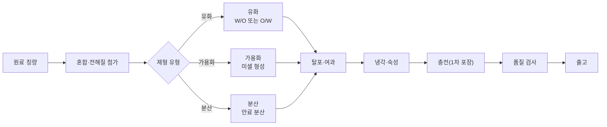

> **한 줄 요약**: 가용화·유화(W/O·O/W)·분산 3대 기술 + 기초·색조 제조 공정 8단계.

### (1) 화장품 제조 기술

| 기술 | 내용 |
| --- | --- |
| **가용화(Solubilization)** | • 물에 녹지 않는 소량의 유성 성분을 계면활성제의 미셀을 이용하여 투명하게 용해한 상태<br>• 계면활성제를 이용하여 용매에 불용성 또는 난용성 물질을 용해시키는 반응<br>• 가용화에 영향을 미치는 요인: 가용화제(계면활성제의 종류, 분자구조), 피가용화물질, 첨가물<br>• 적용 제품: 스킨토너, 아스트리젠트, 토닉, 미스트과 같은 수용액에 유성 성분을 용해(향수와 같이 정유 성분을 용해, 립스틱과 같이 유성성분 베이스에 수성 성분을 첨가하기 위해 사용)<br>• 가용화제 종류: 폴리솔베이트80, 피이지-40하이드로제네이티드캐스터오일, 폴리글리세릴-10올리에이트, 폴레스-24, 세테스-24 등 |
| **유화(Emulsion)** | • 서로 섞이지 않는 두 액체의 한쪽이 작은 방울로 되어 미세한 입자의 상태로 균일하게 분산시켜 불투명한 상태로 나타남<br>• 적용 제품: 크림, 로션, 에센스, 세럼 등 |
| ┗ W/O형 | • 오일 성분에 물이 분산되어 있는 상태<br>• 크림, 클렌징 크림, 자외선 차단제 |
| ┗ O/W형 | • 수성 성분에 오일이 분산되어 있는 상태<br>• 에센스, 로션 |
| **분산(Dispersion)** | • 넓은 의미로 분산매가 분산상에 퍼져있는 현상을 말하며, 기체·액체·고체 등 하나의 상에 다른 상이 균일하게 혼합되는 상태<br>• 액체가 액체 속에 분산되는 경우를 유화, 기체가 액체 속에 분산되는 경우를 거품이라고 함<br>• 분산에 영향을 미치는 요인: 안료의 종류, 분산질의 종류, 분산질의 형상, 분산질의 입도(입자의 크기)<br>• 적용 제품: 고체-액체 분산계는 파운데이션, 비비 크림, 메이크업 베이스, 마스카라, 아이라이너, 립스틱 등<br>• 분산제 종류: 벤토나이트, 폴리하이드로시스테아릭애씨드 등 |

**유화 관련 세부 사항**
- 유화액 형태의 판별: 외관·색소·희석·전기전도도를 통해 판별 가능함
- 유화에 영향을 미치는 요인: 유화제(종류와 사용량), 원료의 성질, 유화 조건(성분 첨가 순서, 교반속도, 온도, 유화장치 등)
- 유화의 점도에 미치는 요인: 유화액(에멀전)의 점도는 화장품의 상태, 사용감, 사용효과에 영향을 주고 있으며, 분산매(연속상)의 점도, 분산상의 점도, 분산상과 연속상의 비율, 계면활성제 종류 및 농도, 분산된 입자의 크기, 분포, 전하

**유화의 분리 현상**

| 현상 | 설명 |
| --- | --- |
| 합일(coalescence) | 분산된 입자가 서로 결합하여 보다 큰 입자 상태로 되는 것으로 유화 파괴의 전단계로 판단될 수 있음. 합일 현상이 계속되면 수상과 유상이 완전이 분리되는 상분리(phase separation)이 발생 |
| 오스트발트 숙성(ostwald ripening) | 유화액 내 큰 입자와 작은 입자가 동시에 존재하는 경우 작은 입자가 큰 입자에 흡수되어 큰 입자는 더욱 커지게 되는 현상 |
| 응집(flocculation) | 유화 입자간 분산력에 의해 서로 결합하고 있는 상태 |
| 크리밍화(creaming) | 유화 입자끼리 응집된 상태가 비중차에 의하여 상층으로 부유 또는 하층으로 침강하는 운동학적인 현상 |

- 유화제의 종류: 글리세릴스테아레이트, 솔비탄스테아레이트, 스테아릭애씨드, 폴리글리세릴-3메칠글루코오스디스테아레이트 등

**[참고] 다상유화(다중유화)**: O/W/O, W/O/W처럼 기존의 유화방법에서 Oil 또는 Water 과정을 한 단계 더 거치는 과정

**[참고] 분산 형태**
- 분산질(분산상): 고체-액체 분산계에 미세한 고체입체가 액체에 분산되어 있는 경우, 분산되어 있는 미세한 고체입체를 말함
- 분산매: 분산질을 둘러싸고 있는 액체 부분
- 분산제: 고체성분을 분산시키는 목적으로 사용되는 계면활성제
- 콜로이드: 어떤 물질이 특정한 범위의 크기(1nm~1um 정도)를 가진 입자가 되어 다른 물질 속에 분산된 상태

**[참고] 가용화제**는 주로 비이온성 계면활성제가 사용된다.

---

### (2) 화장품 제조 공정 및 특성

화장품 제조공정은 일반적으로 1차공정과 2차공정으로 구분할 수 있다.
- **1차 공정**: 화장품의 내용물을 제조하는 공정
- **2차 공정**: 내용물의 성형 및 포장공정 등을 거쳐 완제품을 생산하는 공정

#### 기초화장품의 일반적인 제조 공정의 순서 및 목적

| 순서 | 공정 | 내용 |
| --- | --- | --- |
| 기초화장품 공정 ① | 원재료 입고 | 지게차 및 이동대차를 사용하여 칭량실로 입고 |
| 기초화장품 공정 ② | 칭량 | 제품별 제조기준에 적합한 원재료 배합을 위한 칭량 |
| 기초화장품 공정 ③ | 가온용해 | 수상 원료를 용해탱크에 넣은 후, 교반기를 회전시키면서 항온을 포함한 알코올상 원료를 서서히 첨가하여 가용화하고 여과 작업을 거친 후 투명한 제품을 얻는 작업 |
| 기초화장품 공정 ④ | 유화 및 중화 | 혼합 탱크의 수상 온도를 50도(℃)까지 올리면서 호모믹서를 약하게 회전. 아지믹서의 교반은 100 rpm 및 호모믹싱은 3,500 rpm정도로 고속회전하면서 유상을 여과 후 서서히 넣으면서 유화, 유화 직전에 중화제 투여 |
| 기초화장품 공정 ⑤ | 냉각 및 숙성 | 혼합 탱크의 내용물을 냉각기로 통과시켜 상온까지 냉각. 숙성실에서 제품 내의 기포 제거 및 자극성 감소를 위해 숙성 |
| 기초화장품 공정 ⑥ | 충전 및 포장 | 스킨로션, 로션류와 같은 유액상은 액체 자동 충전기. 크림상과 같은 입구가 넓은 것은 용기 회전식 크림 자동 충전기 사용. 포장작업은 라벨 부착기, 날인기, 중량 체크 기계로 이루어짐 |
| 기초화장품 공정 ⑦ | 품질검사 | 제조, 포장실의 공기 미생물 및 부착균, 낙하균 등의 미생물 검사 등이 포함 |
| 기초화장품 공정 ⑧ | 저장 및 출하 | 전동지게차 및 오토 피커를 사용하여 저장 창고에 적재 및 출하 |

#### 색조화장품의 일반적인 제조 공정의 순서 및 목적

| 순서 | 공정 | 내용 |
| --- | --- | --- |
| 색조화장품 공정 ① | 원재료 입고 | 지게차 및 이동대차를 사용하여 칭량실로 입고 |
| 색조화장품 공정 ② | 칭량 | 제품별 제조기준에 적합한 원재료 배합을 위한 칭량 |
| 색조화장품 공정 ③ | 혼합 | 체질 안료, 착색 안료, 백색 안료, 진주 광택 안료, 기능성 안료 등의 분체를 혼합기에 넣고 균일한 상태로 혼합 |
| 색조화장품 공정 ④ | 분쇄 | 혼합 공정에서 혼합된 분체 입자를 분쇄기에 의해 분체의 응집을 풀고 크기를 균일하게 분쇄 |
| 색조화장품 공정 ⑤ | 체질(여과) | 탈크, 카올린, 마이카, 세리사이트, 칼슘카보네이트, 마그네슘카보네이트, 실리카 등의 원료를 입도가 고운 매쉬망에 체질 |
| 색조화장품 공정 ⑥ | 숙성 및 타정 | 금형에 접시를 넣고 분말을 자동 정량 충진한 후 회전할 때 유압에 의해 압착되는 타정기로 성형품을 제품용기에 타정 |
| 색조화장품 공정 ⑦ | 포장 | 제품 중량 검사 및 포장 |
| 색조화장품 공정 ⑧ | 저장 및 출하 | 전동지게차 및 오토 피커를 사용하여 저장 창고에 적재 및 출하 |

#### 화장품 종류별 일반적인 제조 공정

**로션 및 크림류 화장품의 일반적인 제조 공정**
> 원료 검사 → 계량 → 원료 투입(예비 혼합기) → 필터(매쉬, mesh) → 유화 → 냉각 → 숙성조 → 검사 → 충전 → 포장

**화장수의 일반적인 제조 공정**
> 원료 검사 → 계량 → 혼합기 → 필터(매쉬 또는 마이크로필터) → 숙성 → 검사 → 충전 → 포장

**고형 분말제품의 일반적인 제조 공정**
> 원료 검사 → 계량 → 분쇄기 → 검사 → 성형기 → 충진 → 숙성 → 검사 → 충전 → 포장

**립스틱 제품의 일반적인 제조 공정**
> 원료 검사 → 계량 → 혼합기 → 분산기 또는 유화기 검사 → 냉각 → 검사 → 성형기 → 충진 → 숙성 → 검사 → 포장


---

## 📊 제조 기술 3종 비교표

> 📌 **출처**: CGMP (식약처 고시 제2024-46호)| **시행일**: 2024. 8. 22.| **참조 자료**: [우수화장품 제조 및 품질관리기준(식품의약품안전처고시)(제2024-46호)(20240822).md](../참조자료/ref_md/우수화장품%20제조%20및%20품질관리기준%28식품의약품안전처고시%29%28제2024-46호%29%2820240822%29/우수화장품%20제조%20및%20품질관리기준%28식품의약품안전처고시%29%28제2024-46호%29%2820240822%29.md)| **최종 확인**: 2026. 8. 29.

| 기술 | 원리 | 적용 제품 | 대표 성분 |
| --- | --- | --- | --- |
| **가용화** | 계면활성제 미셀로 불용성 성분을 투명하게 용해 | 스킨토너, 미스트, 아스트리젠트 | 폴리솔베이트80, PEG-40하이드로제네이티드캐스터오일 |
| **유화** | 섞이지 않는 두 액체를 미세 입자로 분산 (W/O, O/W) | 크림, 로션, 에센스, 세럼 | 글리세릴스테아레이트, 솔비탄스테아레이트 |
| **분산** | 고체 입자를 액체에 균일하게 혼합 | 파운데이션, 마스카라, 립스틱 | 벤토나이트, 폴리하이드로시스테아릭애씨드 |

## 📊 기초화장품 vs 색조화장품 제조공정 비교표

| 구분 | 핵심 공정 | 특징 |
| --- | --- | --- |
| **기초화장품** | 입고→칭량→가온용해→유화·중화→냉각·숙성→충전·포장→품질검사→출하 | 유화 기술 중심, 수상+유상 혼합 |
| **색조화장품** | 입고→칭량→혼합→분쇄→체질→숙성·타정→포장→출하 | 분산 기술 중심, 분체 입자 균일화 |

---

## ✅ 확인문제

> **문제 1.** 다음 중 가용화에 대한 설명으로 옳은 것은?
> ① 물에 녹지 않는 유성 성분을 유화하여 불투명하게 분산시키는 기술이다
> ② 계면활성제의 미셀을 이용하여 불용성 성분을 투명하게 용해시키는 기술이다
> ③ 고체 입자를 액체에 균일하게 혼합하는 기술이다
> ④ 두 액체를 미세 입자로 분산시켜 불투명한 상태로 만드는 기술이다
>
> **정답**: ②
> **해설**: 가용화는 계면활성제의 미셀을 이용하여 물에 녹지 않는 소량의 유성 성분을 투명하게 용해시키는 기술이다. ①은 유화, ③은 분산에 해당한다.

> **문제 2.** 유화액의 분리 현상 중 큰 입자가 작은 입자를 흡수하여 더욱 커지는 현상은?
> ① 합일(coalescence) ② 오스트발트 숙성(ostwald ripening) ③ 응집(flocculation) ④ 크리밍화(creaming)
>
> **정답**: ② 오스트발트 숙성
> **해설**: 오스트발트 숙성은 유화액 내 큰 입자와 작은 입자가 동시에 존재할 때 작은 입자가 큰 입자에 흡수되어 큰 입자는 더욱 커지는 현상이다. 합일은 분산 입자가 결합하여 더 큰 입자가 되는 것이고, 크리밍화는 비중차에 의한 부유/침강 현상이다.

> **문제 3.** 색조화장품 제조 공정에서 분체의 응집을 풀고 입자 크기를 균일하게 하는 공정은?
> ① 혼합 ② 분쇄 ③ 체질 ④ 타정
>
> **정답**: ② 분쇄
> **해설**: 분쇄 공정은 혼합된 분체 입자의 응집을 풀고 크기를 균일하게 만드는 핵심 공정이다. 혼합→분쇄→체질→타정 순서로 진행된다.

> **문제 4.** W/O형 유화에 대한 설명으로 옳은 것은?
> ① 수성 성분에 오일이 분산되어 있는 상태이다
> ② 오일 성분에 물이 분산되어 있는 상태이다
> ③ 적용 제품은 에센스, 로션이다
> ④ 외관상 투명한 상태이다
>
> **정답**: ②
> **해설**: W/O형은 오일 성분(연속상)에 물(분산상)이 분산되어 있는 상태로, 크림·클렌징 크림·자외선 차단제에 적용된다. ①은 O/W형이며, ④는 가용화의 특징이다.

---

## 📌 용어 정리

### 제조 3대 기술 (빈출 최상위)

| 용어 | 핵심 포인트 |
| --- | --- |
| **가용화** | 계면활성제 미셀로 불용성 성분을 투명하게 용해. **스킨토너, 미스트**. 가용화제: 비이온성 계면활성제 (폴리솔베이트80, PEG(Polyethylene Glycol)-40하이드로제네이티드캐스터오일). |
| **유화** | 섞이지 않는 두 액체를 미세 입자로 분산. **W/O**(오일 안에 물), **O/W**(물 안에 오일). **크림, 로션, 에센스**. |
| **분산** | 고체 입자를 액체에 균일하게 혼합. **파운데이션, 마스카라**. 분산제(계면활성제) 사용. |

### 유화 불안정 현상 4종 (빈출)

| 용어 | 핵심 포인트 |
| --- | --- |
| **합일(coalescence)** | 분산 입자가 결합하여 더 큰 입자가 되는 현상. **유화 파괴 전단계**. |
| **오스트발트 숙성** | 작은 입자가 큰 입자에 흡수되어 큰 입자가 더 커지는 현상. 입자 크기 분포 변화. |
| **응집(flocculation)** | 유화 입자 간 분산력에 의해 서로 결합하고 있는 상태. 가역적. |
| **크리밍화(creaming)** | 비중차에 의해 유화 입자가 상층으로 부유 또는 하층으로 침강하는 현상. |

### 콜로이드·분산계

| 용어 | 핵심 포인트 |
| --- | --- |
| **콜로이드** | **1nm~1μm** 크기의 입자가 다른 물질 속에 분산된 상태. |
| **분산질(분산상)** | 고체-액체 분산계에서 액체에 분산된 미세한 고체 입자. |
| **분산매** | 분산질을 둘러싸고 있는 액체 부분 (연속상). |
| **분산제** | 고체 성분을 분산시키는 목적으로 사용되는 계면활성제. |
| **가용화제** | 주로 비이온성 계면활성제 사용. 폴리솔베이트80, PEG-40하이드로제네이티드캐스터오일(Polyethylene Glycol-40 Hydrogenated Castor Oil). |

### 제조 공정

| 용어 | 핵심 포인트 |
| --- | --- |
| **1차 공정** | 화장품의 내용물을 제조하는 공정. 원료 칭량→혼합→유화/가용화/분산. |
| **2차 공정** | 내용물의 성형 및 포장 공정을 거쳐 완제품을 생산하는 공정. 충진→밀봉→포장. |

---

## 📚 Chapter 03. 화장품의 기능과 품질

> 출처: [우수화장품 제조 및 품질관리기준(식품의약품안전처고시)(제2024-46호)(20240822).md](../참조자료/ref_md/우수화장품%20제조%20및%20품질관리기준%28식품의약품안전처고시%29%28제2024-46호%29%2820240822%29/우수화장품%20제조%20및%20품질관리기준%28식품의약품안전처고시%29%28제2024-46호%29%2820240822%29.md)

> 🎯 **이 장의 질문**: 화장품의 효과는 무엇으로 나누고, 품질은 어떤 서류로 보증할까?
>
> **PART 02 · 화장품 제조 및 품질관리**
> 고득점 TIP: 화장품 구분에 따른 효과에 대해 학습하세요.
>
> 🔗 **관련 과목**
> - [1과목 1챕터 화장품법](subj:law#ch01) — 기능성화장품 11가지 효능의 법령 정의 (본 챕터는 제품별 구체화)
> - [1과목 1챕터 화장품법](subj:law#ch01) — 화장품·의약품·의약외품 구분 기준

---

> 📋 **학습 가이드**
> - 출제 빈도: ★★★☆☆ (화장품 효과 분류, 맞춤형화장품 유형, CGMP 4대 기준서)
> - 예상 소요 시간: 30분
> - 핵심 키워드: 세정·기초·기능성·색조·네일·모발 화장품 구분, 맞춤형화장품 4유형, CGMP 4대 기준서 포함사항

---

### 🗺️ Ch03 마인드맵: 화장품의 기능과 품질


> **🗺️ 마인드맵 노드 상세 매핑**

| 대분류 | 중분류 | 핵심 포인트 |
| --- | --- | --- |
| 기능 및 품질 | 화장품 6종 효과 | 세정·기초·기능성·색조·네일·모발 분류 |
|  | 맞춤형화장품 구성 | 4유형 비교(혼합·소분 등) |
| 시험·검사 | 내용물 품질성적서 | 내용물 품질 시험·검사 성적서 |
|  | 원료 품질성적서 | 원료 품질 시험·검사 성적서 |
| CGMP 4대 기준서 | 제품표준서 | 제품 품질 기준 규정 |
|  | 제조관리기준서 | 제조 공정 관리 기준 |
|  | 품질관리기준서 | 품질 관리 체계 기준 |
|  | 위생관리기준서 | 위생 관리 기준 |
| 비교표 | 화장품 6종 효과 | 6종 화장품 효과 비교 |
|  | 맞춤형화장품 4유형 | 맞춤형화장품 4유형 비교 |
|  | CGMP 4대 기준서 | CGMP 4대 기준서 비교 |


## 1. 기능 및 품질

### (1) 화장품의 효과 🎯 기출

> 📌 **출처**: 화장품법 제2조 + 기능성화장품 심사 규정| **참조 자료**: [화장품법(법률)(제20901호)(20260402).md](../참조자료/ref_md/화장품법%28법률%29%28제20901호%29%2820260402%29/화장품법%28법률%29%28제20901호%29%2820260402%29.md)| **시행일**: 2026. 4. 2.| **최종 확인**: 2026. 8. 29.

> **한 줄 요약**: 세정·기초·기능성·색조·네일·모발 6종 분류 + 화장품·의약품·의약외품 구분.
| 구분 | 효과 |
| --- | --- |
| **세정용 화장품** | 피부에서 분비되는 피지와 땀, 먼지, 각질, 메이크업 잔여물 등을 제거함<br>예) 클렌징 워터, 오일, 로션, 크림, 티슈, 화장비누, 폼클렌징, 페이셜스크럽, 샴푸, 린스, 컨디셔너, 바디 워시, 손세정제 등 |
| **기초 화장품** | • 피부의 거칠음 방지<br>• 피부 청정 및 피부 보호<br>• 피부에 수분 공급과 유연 작용<br>• 피부에 수렴 효과와 탄력 증진<br>예) 화장수, 유액(로션), 에센스(세럼), 크림류, 팩 등 |
| **기능성 화장품** | • 피부에 멜라닌색소가 침착하는 것을 방지하여 기미·주근깨 등의 생성을 억제함으로써 피부의 미백에 도움을 줌<br>• 피부에 침착된 멜라닌색소의 색을 옅게 하여 피부의 미백에 도움을 줌<br>• 피부에 탄력을 주어 피부의 주름을 완화 또는 개선함<br>• 강한 햇볕을 방지하여 피부를 곱게 태워줌<br>• 자외선을 차단 또는 산란시켜 자외선으로부터 피부를 보호함<br>• 모발의 색상을 변화(탈염·탈색 포함)시킴 (단, 일시적으로 모발의 색상을 변화시키는 제품은 제외함)<br>• 체모를 제거하는 기능을 함 (단, 물리적으로 체모를 제거하는 제품은 제외함)<br>• 탈모 증상의 완화에 도움을 줌 (단, 코팅 등 물리적으로 모발을 굵어 보이게 하는 제품은 제외함)<br>• 여드름성 피부 완화 (인체 세정용 제품류로 한정함)<br>• 피부장벽(피부의 가장 바깥쪽에 존재하는 각질층의 표피)의 기능을 회복하여 가려움 등의 개선에 도움을 줌<br>• 튼살로 인한 붉은 선을 옅게 하는 데 도움을 줌 |
| **색조 화장품** | • 피부색이나 질감을 균일하게 정돈함<br>• 피부 결점을 커버함<br>예) 메이크업 베이스 제품(파운데이션, 쿠션, 비비 크림, 컨실러, 파우더류 등)<br>• 색채를 통해 입체감을 부여함<br>예) 색조 메이크업 제품(아이브로펜슬, 아이라이너, 아이섀도, 마스카라, 볼터치, 립스틱, 립틴트 등) |
| **네일 화장품** | 손톱을 아름답게 하기 위해 사용함<br>예) 베이스코트, 탑코트, 네일 에나멜(네일 폴리시), 네일 보강제, 네일 에나멜 리무버 등 |
| **모발 화장품** | • 세정용: 모발과 두피의 피지, 땀, 각질 등 오염 물질을 제거하여 청결하고 건강하게 유지시킴<br>예) 샴푸, 린스<br>• 정발제: 모발을 물리적으로 원하는 형태로 만들어 주고 형태를 고정시킴<br>예) 헤어 오일, 포마드, 헤어 크림 및 로션, 헤어 스프레이, 헤어 젤, 헤어 왁스 등<br>• 헤어 트리트먼트제: 모발 손상을 방지하고 손상된 모발을 회복하기 위해 사용하여 오일을 함유하여 살균, 청량, 쾌적함을 부여하고 비듬, 가려움을 제거하기 위해 사용함<br>• 양모제: 30~70% 에탄올을 함유하여 살균, 청량, 쾌적함을 부여하고 탈모 증상 완화에 도움을 줌<br>• 퍼머넌트 웨이브 용제: 모발 케라틴 속의 시스틴 결합(-S-S-)을 환원제로 부분적으로 절단한 다음 산화제로 재결합하여 모발에 웨이브를 만들어 줌<br>예) 제1제 - 환원제: 치오글라이콜릭애씨드, 시스테인 / 알칼리제: 암모니아, 모노에탄올아민<br>　　제2제 - 산화제: 브롬산나트륨, 과산화수소<br>• 염모제: 모발의 색상을 변화시킴<br>예) 일시적 염모제, 반영구 염모제, 영구 염모제, 헤어 블리치<br>• 제모제: 손, 발이나 겨드랑이, 다리 등의 털을 제거함<br>예) 물리적 제모제: 제모왁스, 제모 젤·테이프 / 화학적 제모제: 제모 크림 |

> **참고 - 세정용 화장품의 형태**
> - 계면활성제형 세안제: 물을 사용하는 타입
> - 용제형 세안제: 물을 사용하지 않고 얼굴에 제품을 도포한 후 닦아내는 타입

> **참고 - 화장품·의약외품·의약품의 구분**
> - 화장품은 인체에 대한 작용이 경미한 것으로 의약품에 해당하지 않는 물품이어야 함
> - 인체에 작용하는 물품이라도, 질병의 진단이나 치료, 처치, 증상 경감 또는 예방을 목적으로 사용하는 것은 화장품이 아니라 의약품에 해당함
>
> **의약품**
> - 대한민국 약전에 실린 물품 중 의약외품이 아닌 것
> - 사람이나 동물의 질병을 진단·치료·경감·처치 또는 예방할 목적으로 사용하는 물품 중 기구·기계가 아닌 것
> - 사람이나 동물의 구조와 기능에 약학적 영향을 줄 목적으로 사용하는 물품
>
> **의약외품**
> - 사람이나 동물의 질병을 치료·경감(輕減)·처치 또는 예방할 목적으로 사용되는 섬유·고무제품 또는 이와 유사한 것
> - 인체에 대한 작용이 약하거나 인체에 직접 작용하지 아니하며, 기구 또는 기계가 아닌 것과 이와 유사한 것
> - 감염병 예방을 위하여 살균·살충 및 이와 유사한 용도로 사용되는 제제

**확인문제**: 다음 중 「화장품법」상 기능성화장품에 해당하지 않는 것은?
1. 자외선을 차단하여 피부를 보호하는 제품
2. 피부의 탄력을 개선하여 주름을 완화하는 제품
3. 피부장벽의 기능을 회복하여 각질층의 표피를 보호하는 제품
4. **입술의 각질을 일시적으로 제거하는 제품** (정답)
5. 멜라닌 색소의 침착을 방지하여 미백에 도움을 주는 제품

> **해설**: 기능성화장품은 11가지 효능·효과로 정의되며, 입술 각질 제거는 기능성화장품에 포함되지 않는다. 기능성화장품에는 미백·주름개선·자외선차단·염모·제모·탈모완화·여드름완화·피부장벽회복·튼살 완화 등이 해당한다.

---

### (2) 판매 가능한 맞춤형화장품 구성

> 📌 **출처**: 화장품법 제3조의2~제3조의8| **참조 자료**: [화장품법(법률)(제20901호)(20260402).md](../참조자료/ref_md/화장품법%28법률%29%28제20901호%29%2820260402%29/화장품법%28법률%29%28제20901호%29%2820260402%29.md)| **시행일**: 2026. 4. 2.| **최종 확인**: 2026. 8. 29.

> **한 줄 요약**: 맞춤형화장품 = 혼합(내용물+내용물/원료) 또는 소분(고형비누 단순소분 제외) — 4가지 유형.

#### (1) 맞춤형화장품의 의미
> ① 제조 또는 수입된 화장품의 내용물에 다른 화장품의 내용물이나 식품의약품안전처장이 정하는 원료를 추가하여 혼합한 화장품을 말한다.

> ② 제조 또는 수입된 화장품의 내용물을 소분(小分)한 화장품을 말한다. 다만, 화장비누(고체 형태의 세안용 비누) 등 화장품의 내용물을 단순 소분한 화장품은 제외한다.

#### (2) 맞춤형화장품의 내용물 범위

**① 맞춤형화장품의 혼합에 사용할 목적으로 화장품책임판매업자로부터 제공받은 것**

| 구분 | 내용 |
| --- | --- |
| 벌크제품 | 충전(1차 포장) 이전의 제조 단계까지 끝낸 화장품 |
| 반제품 | 제조공정 단계에 있는 것으로서 필요한 제조공정을 더 거쳐야 벌크 제품이 되는 것 🎯 기출 |

**② 맞춤형화장품 혼합에 사용되는 내용물**
- 유통화장품 안전관리 기준에 적합한 것
- 반제품의 경우 최종 맞춤형화장품이 '사용제한이 필요한 원료 사용 기준'에 따라 사용제한 원료를 함유하지 않고, 유통화장품 안전관리 기준에 적합한 것

**③ 내용물 범위에 해당하지 않는 것**
- 맞춤형화장품 원료와 내용물의 관계 원료는 맞춤형화장품의 내용물 범위에 해당하지 않음
- 원료와 원료를 혼합하는 것은 맞춤형화장품의 혼합이 아닌 화장품 제조 행위로 판단함

> **참고 - 혼합한 화장품**
> 내용물 + 내용물(또는) + 원료 → 맞춤형화장품
>
> **참고 - 소분한 화장품**
> 내용물(벌크) 또는 수입화장품 → 맞춤형화장품 (여러 용기로 소분)

#### (3) 맞춤형화장품의 유형

| 유형 | 내용 |
| --- | --- |
| **현장 혼합형** | 소비자가 매장을 방문하여 피부 상태를 진단하고 상담을 한 뒤, 피부에 맞는 제품을 현장에서 조제하는 방식의 화장품 |
| **공장 제조 배송형** | 소비자의 피부 상태를 진단한 후 원료 및 재료에 대한 소비자의 욕구와 선택을 바탕으로 제조업소에서 생산한 완제품을 소비자에게 전달하는 방식의 화장품 |
| **DIY 키트형** | 소비자가 화장품 베이스와 부스터를 선택하여 세트 형태로 구매한 뒤, 직접 혼합하여 사용하는 방식의 화장품 |
| **디바이스형** | 가정 혹은 매장에서 기기를 활용하여 피부 상태를 진단하고, 그 결과를 기반으로 피부에 맞는 원료를 혼합하여 맞춤형화장품을 제공하는 방식의 화장품 |

---


## 2. 시험·검사

### (1) 내용물 및 원료의 품질성적서 구비

> 📌 **출처**: 화장품법 시행규칙 제11조 + CGMP| **참조 자료**: [화장품법 시행규칙(총리령)(제02109호)(20260402).md](../참조자료/ref_md/화장품법%20시행규칙%28총리령%29%28제02109호%29%2820260402%29/화장품법%20시행규칙%28총리령%29%28제02109호%29%2820260402%29.md)| **시행일**: 2026. 4. 2.| **최종 확인**: 2026. 8. 29.

> **한 줄 요약**: CGMP 4대 기준서(제품표준서·제조관리·품질관리·제조위생관리) + 원료품질성적서 구비.

#### (1) 「우수화장품 제조 및 품질관리 기준(CGMP)」의 4대 기준서 🎯 기출

4대 기준서에는 **제품표준서, 제조관리기준서, 품질관리기준서, 제조위생관리기준서**가 있으며 반드시 포함되어야 하는 사항이 정해져 있다.

| 기준서 | 주요 목적 | 포함 사항 |
| --- | --- | --- |
| **① 제품표준서** | 제품별 제조 기준 | 제품명, 작성연월일, 효능·효과(기능성), 주의사항, 원료명·분량·기준량, 공정별 작업내용·흐름도, 이론 생산량·수율, 작업 중 주의사항, 원자재·반제품·벌크·완제품 기준 및 시험방법, 시설·기기, 보관조건, 사용기한·개봉후 사용기간, 변경이력 |
| **② 제조관리기준서** 🎯 기출 | 제조공정 및 시설 관리 | 제조공정 관리, 시설·기구 관리, 원자재 관리, 완제품 관리, 위탁제조 관리 |
| **③ 품질관리기준서** | 시험·검사 품질 관리 | 검체 채취 방법·주의사항·오염방지, 시험시설·기구 점검(교정·성능), 안정성시험, 검체 관리, 표준품·시약 관리, 위탁시험 검체 송부·판정, 기타 필요 사항 |
| **④ 제조위생관리기준서** 🎯 기출 | 작업 환경 위생 관리 | 작업원 건강관리·상태 파악·조치, 수세·소독 방법, 작업복장 규격·세탁·착용, 작업실 청소·소독·주기, 청소 상태 평가, 제조시설 세척·평가, 기타 필요 사항 |

> **참고 - CGMP 4대 기준서**
> - 제품표준서: 제품별 제조 기준, 원료, 공정, 사용기한 등
> - 제조관리기준서: 제조공정 및 시설·기구 관리
> - 품질관리기준서: 시험, 검사, 출하 기준
> - 제조위생관리기준서: 작업장 청결, 해충 방제, 종사자 위생 관리

**확인문제**: 다음 중 제품표준서에 반드시 포함되어야 할 사항으로 옳지 않은 것은?
1. 제품명과 작성연월일
2. 사용기한 및 개봉 후 사용기간
3. **제조업자 주소 및 대표자 연락처** (정답 - 해당 없음)
4. 효능·효과 및 사용상의 주의사항
5. 제조 및 품질관리에 필요한 시설 및 기기

> **해설**: 제품표준서 포함사항은 제품명, 작성연월일, 효능·효과, 원료명·분량, 공정별 작업내용, 수율 관리기준, 원자재·반제품·벌크·완제품 기준 및 시험방법, 시설 및 기기, 보관조건, 사용기한, 변경이력 등이다. 제조업자 주소 및 대표자 연락처는 포함되지 않는다.

#### (2) 원료품질성적서

맞춤형화장품판매업자는 맞춤형화장품의 내용물 및 원료 입고 시 화장품책임판매업자가 제공하는 품질성적서를 구비하여야 한다(단, 책임판매업자와 맞춤형화장품판매업자가 동일한 경우는 제외).

**① 원료품질성적서의 인정 기준**
- 제조업체의 원료에 대한 자가품질검사 또는 공인검사기관 성적서
- 제조판매업체의 원료에 대한 자가품질검사 또는 공인검사기관 성적서
- 원료업체의 원료에 대한 공인검사기관 성적서
- 원료업체의 원료에 대한 자가품질검사 시험성적서 중 대한화장품협회의 '원료공급자의 검사결과 신뢰 기준 자율규약' 기준에 적합한 것

**② 원료품질성적서 포함사항**

| 항목 | 내용 |
| --- | --- |
| 원료명 | 원료 제품명 |
| 제조·공급자 | 제조자명 및 공급자명 |
| 수령일자 | 입고일자 |
| 관리번호 | 제조번호 또는 관리번호 |
| 제조일자 | 제조연월일 |
| 보관방법 | 보관방법 |
| 사용기한 | 사용기한 |
| 시험 정보 | 시험 항목, 시험 기준, 시험 방법, 시험 결과 |
| 판정 | 적합 판정 및 판정일자 |

> **참고 - 표준품과 주요 시약의 용기에 기재할 내용**
> - 명칭
> - 개봉일
> - 보관조건
> - 사용기한
> - 역가, 제조자의 성명 또는 서명(직접 제조한 경우에 한함)


## 📊 화장품 6종 효과 비교표

> 📌 **출처**: 기능성화장품 심사 규정 (제2025-88호)| **참조 자료**: [기능성화장품 심사에 관한 규정(식품의약품안전처고시)(제2025-88호)(20251216).md](../참조자료/ref_md/기능성화장품%20심사에%20관한%20규정%28식품의약품안전처고시%29%28제2025-88호%29%2820251216%29/기능성화장품%20심사에%20관한%20규정%28식품의약품안전처고시%29%28제2025-88호%29%2820251216%29.md)| **시행일**: 2025. 12. 16.| **최종 확인**: 2026. 8. 29.

| 구분 | 핵심 효과 | 대표 제품 |
| --- | --- | --- |
| **세정용** | 피지·땀·먼지·각질·메이크업 잔여물 제거 | 클렌징, 샴푸, 린스, 바디워시, 화장비누 |
| **기초** | 거칠음 방지, 청정, 보호, 수분공급, 유연, 수렴, 탄력 | 화장수, 로션, 에센스, 크림, 팩 |
| **기능성** | 미백·주름·자외선차단·염모·제모·탈모·여드름·피부장벽·튼살 (11종) | 기능성 크림, 선크림, 염모제, 제모제 |
| **색조** | 피부색·질감 정돈, 결점 커버, 입체감 부여 | 파운데이션, 쿠션, 아이섀도, 립스틱 |
| **네일** | 손톱 미용 | 베이스코트, 탑코트, 네일 에나멜, 리무버 |
| **모발** | 세정·정발·트리트먼트·양모·퍼머넌트·염모·제모 | 샴푸, 헤어스프레이, 염색약, 제모왁스 |

## 📊 맞춤형화장품 4유형 비교표

> 📌 **출처**: 화장품법 제3조의2 + 시행규칙| **참조 자료**: [화장품법 시행규칙(총리령)(제02109호)(20260402).md](../참조자료/ref_md/화장품법%20시행규칙%28총리령%29%28제02109호%29%2820260402%29/화장품법%20시행규칙%28총리령%29%28제02109호%29%2820260402%29.md)| **시행일**: 2026. 4. 2.| **최종 확인**: 2026. 8. 29.

| 유형 | 조제 장소 | 핵심 특징 |
| --- | --- | --- |
| **현장 혼합형** | 매장 | 피부 진단 후 현장에서 즉시 조제 |
| **공장 제조 배송형** | 제조업소 | 피부 진단 후 공장에서 생산·배송 |
| **DIY 키트형** | 소비자 가정 | 베이스+부스터 세트 구매 후 직접 혼합 |
| **디바이스형** | 매장/가정 | 기기로 피부 진단 후 원료 혼합 |

## 📊 CGMP 4대 기준서 비교표

> 📌 **출처**: CGMP (식약처 고시 제2024-46호)| **참조 자료**: [우수화장품 제조 및 품질관리기준(식품의약품안전처고시)(제2024-46호)(20240822).md](../참조자료/ref_md/우수화장품%20제조%20및%20품질관리기준%28식품의약품안전처고시%29%28제2024-46호%29%2820240822%29/우수화장품%20제조%20및%20품질관리기준%28식품의약품안전처고시%29%28제2024-46호%29%2820240822%29.md)| **시행일**: 2024. 8. 22.| **최종 확인**: 2026. 8. 29.

| 기준서 | 핵심 관리 영역 | 주요 포함사항 |
| --- | --- | --- |
| **제품표준서** | 제품별 제조 기준 | 제품명, 원료명·분량, 공정별 작업내용, 수율, 시험방법, 보관조건, 사용기한 |
| **제조관리기준서** | 제조공정·시설 | 제조공정 관리, 시설·기구 관리, 원자재·완제품 관리, 위탁제조 |
| **품질관리기준서** | 시험·검사·출하 | 검체 채취, 시험시설 점검, 안정성시험, 검체 관리, 표준품·시약 관리 |
| **제조위생관리기준서** | 위생·청결 | 작업원 건강관리, 수세·소독, 작업복장, 청소·평가, 시설 세척 |

---

## ✅ 확인문제

> **문제 1.** 다음 중 맞춤형화장품의 혼합에 해당하는 것은?
> ① 원료와 원료를 혼합하는 행위
> ② 화장품 내용물에 다른 화장품 내용물을 추가 혼합
> ③ 고형비누의 단순 소분
> ④ 화장품을 제조하는 행위
>
> **정답**: ②
> **해설**: 맞춤형화장품의 혼합은 제조 또는 수입된 화장품 내용물에 다른 내용물이나 식약처장이 정하는 원료를 추가하여 혼합하는 것이다. 원료+원료 혼합은 화장품 제조 행위로 판단되며, 고형비누 단순 소분은 맞춤형화장품에서 제외된다.

> **문제 2.** CGMP 4대 기준서가 아닌 것은?
> ① 제품표준서 ② 제조관리기준서 ③ 품질관리기준서 ④ 원료관리기준서
>
> **정답**: ④ 원료관리기준서
> **해설**: CGMP 4대 기준서는 제품표준서, 제조관리기준서, 품질관리기준서, 제조위생관리기준서이다. 원료관리기준서는 존재하지 않는다.

> **문제 3.** 다음 중 제조위생관리기준서에 포함되는 사항은?
> ① 제조공정 관리 ② 검체 채취 방법 ③ 작업원의 건강관리 ④ 원자재 관리
>
> **정답**: ③ 작업원의 건강관리
> **해설**: 제조위생관리기준서에는 작업원 건강관리, 수세·소독, 작업복장, 청소·평가, 시설 세척이 포함된다. ①④는 제조관리기준서, ②는 품질관리기준서에 해당한다.

---

## 📌 용어 정리

### 화장품 분류 (빈출)

| 용어 | 핵심 포인트 |
| --- | --- |
| **기능성화장품** | 총리령으로 정하는 **11가지 효능·효과**: 미백·주름·자외선·염모·제모·탈모·여드름·피부장벽·튼살·모발색상변화·체모제거. 심사 또는 보고서 제출 필수. |
| **맞춤형화장품** | 내용물+내용물/원료 혼합 또는 소분. **고형비누 단순소분 제외**. 원료+원료 혼합은 화장품 제조 행위 (맞춤형 아님). |
| **의약품** | 질병 진단·치료·경감·처치·예방 목적. **대한민국 약전** 수재. |
| **의약외품** | 인체 작용 약함, 질병 치료·경감·예방 목적. 기구·기계 아님. |

### 제품 단계 (빈출)

| 용어 | 핵심 포인트 |
| --- | --- |
| **벌크제품** | 충전(1차 포장) 이전 단계까지 끝낸 화장품. 내용물 완성 상태. |
| **반제품** | 제조공정 단계에 있어 추가 공정이 필요한 것. |
| **완제품** | 모든 제조 공정(포장·첨부문서 포함)이 완료된 화장품. 출하 대상. |

### CGMP 4대 기준서 (빈출 최상위)

| 용어 | 핵심 포인트 |
| --- | --- |
| **CGMP** | 우수화장품 제조 및 품질관리 기준(Cosmetic Good Manufacturing Practice). **4대 기준서**로 구성. 제조업 의무 적용. |
| **제품표준서** | 제품별 제조 기준. 원료·공정·수율·시험방법·사용기한. |
| **제조관리기준서** | 제조공정·시설·기구·원자재·완제품·위탁제조 관리. |
| **품질관리기준서** | 검체 채취·시험시설 점검·안정성시험·검체·표준품 관리. |
| **제조위생관리기준서** | 작업원 건강·위생·복장·청소·시설 세척. |

> ⚠️ **기출 함정**: 원료관리기준서는 **존재하지 않음**. 4대 기준서에 원료품질성적서는 별도 (입고 시 구비).

### 원료 품질

| 용어 | 핵심 포인트 |
| --- | --- |
| **원료품질성적서** | 원료 입고 시 구비. 자가검사 또는 공인검사기관 성적서. |


---

## 📚 Chapter 04. 화장품 사용제한 원료

> 출처: [화장품 안전기준 등에 관한 규정(식품의약품안전처고시)(제2026-19호)(20260318).md](../참조자료/ref_md/화장품%20안전기준%20등에%20관한%20규정%28식품의약품안전처고시%29%28제2026-19호%29%2820260318%29/화장품%20안전기준%20등에%20관한%20규정%28식품의약품안전처고시%29%28제2026-19호%29%2820260318%29.md)

> 🎯 **이 장의 질문**: 사용금지 원료와 사용제한 원료는 어떻게 구분하고, 한도는 어떻게 지킬까?
>
> **고득점 TIP**: 사용제한 원료는 최대 함량 순으로 외우고, 알레르기 유발 성분 25종도 꼼꼼히 학습하세요.
>
> 🔗 **관련 과목**
> - [4과목 4챕터 제품 상담](subj:understanding#ch04) — 배합금지 원료, 알레르기 유발 성분 25종과 부작용 증상 연계

---

> 📋 **학습 가이드**
> - 출제 빈도: ★★★★☆ (사용제한 원료 한도, 알레르기 유발 성분 25종, 천연/유기농 기준)
> - 예상 소요 시간: 50분
> - 핵심 키워드: 사용금지 원료, 보존제/자외선차단제/염모제 사용한도, 알레르기 유발 성분 25종, 표시 기준, 천연 95%·유기농 10%+95%, 금지 공정

---


### 🗺️ Ch04 마인드맵: 화장품 사용제한 원료


> **🗺️ 마인드맵 노드 상세 매핑**

| 대분류 | 중분류 | 핵심 포인트 |
| --- | --- | --- |
| 원료 관리 체계 | 사용금지 원료 | 히드로퀴논·수은·비소 등 사용 불가 원료 |
|  | 사용제한 원료 | 보존제·자외선차단제·염모제 등 한도 내 사용 |
| 보존제 | 최대 사용한도 | 파라벤·페녹시에탄올 등 최대 사용한도 준수 |
|  | 방부·보존 목적 | 미생물 증식 억제, 제품 보존 목적 |
| 자외선 차단 성분 | UVB·UVA 차단 | UVB·UVA 차단 성분 구분 |
|  | 최대 사용한도 | 자외선차단제 최대 사용한도 기준 |
| 알레르기 유발 성분 | 25종 표시 의무 | 25종 알레르기 유발 성분 기재·표시 의무 |
|  | 사용 시 주의사항 | 알레르기 유발 성분 사용 시 주의사항 |
| 천연·유기농 화장품 | 원료 기준 | 천연 95%·유기농 10%+95% 원료 기준 |
|  | 인증 요건 | 천연·유기농 화장품 인증 요건 |

## 1. 사용제한 원료의 종류

### (1) 화장품 사용제한 원료의 종류 및 사용한도

> 📌 **출처**: 화장품 안전기준 등에 관한 규정 (제2026-19호) 별표 2| **참조 자료**: [화장품 안전기준 등에 관한 규정(식품의약품안전처고시)(제2026-19호)(20260318).md](../참조자료/ref_md/화장품%20안전기준%20등에%20관한%20규정%28식품의약품안전처고시%29%28제2026-19호%29%2820260318%29/화장품%20안전기준%20등에%20관한%20규정%28식품의약품안전처고시%29%28제2026-19호%29%2820260318%29.md)| **시행일**: 2026. 3. 18.| **최종 확인**: 2026. 8. 29.

> **한 줄 요약**: 사용금지 원료 + 사용제한 원료(보존제·자외선차단제·염모제·기타) + 알레르기 유발 성분 25종 + 표시 지침.

> **참고 (원료의 네거티브시스템)**: 식품의약품안전처장에 의해 지정된 화장품의 제조 등에 사용할 수 없는 원료 및 보존제, 색소, 자외선 차단제 등과 같이 특별히 사용상의 제한이 필요한 원료를 제외한 원료는 업자의 책임하에 사용함
> (전체 고시 원료는 법령노트 p.12 [별표1] 참고)

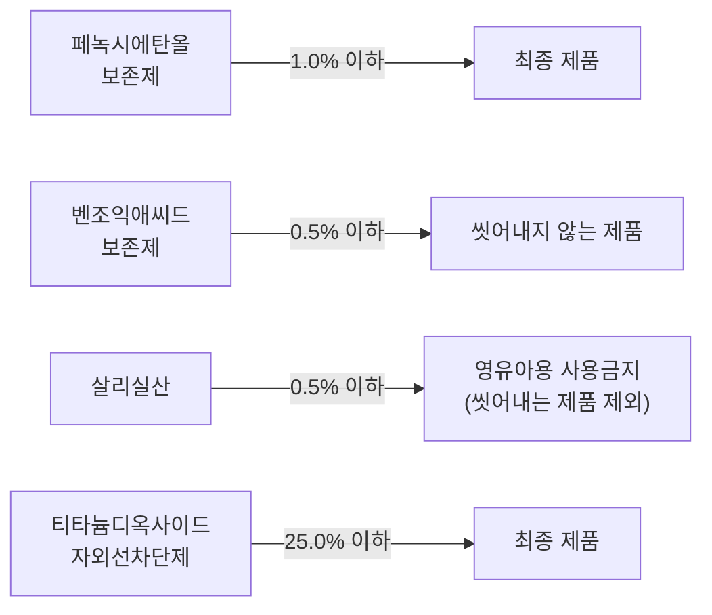

#### (1) 중요 사용금지 원료
화장품에 사용할 수 없는 원료는 「화장품 안전 기준 등에 관한 규정」[별표 1] 등에서 규정하고 있다.

| 원료명 (가~마) | 원료명 (바~하) |
| --- | --- |
| 4,4′-메칠렌디아닐린 | 아크릴아마이드 (다만, 폴리아크릴아마이드류에서 유래되었으며, 사용 후 씻어내지 않는 바디화장품에 0.1ppm, 기타 제품에 0.5ppm 이하인 경우에는 제외함) |
| 나프탈렌 | 아트라놀 |
| 납 및 그 화합물 | 안티몬 및 그 화합물 |
| 니코틴 | 에스트로겐 |
| 니트로메탄 | 에칠렌옥사이드 |
| 니트로벤젠 | 영국 및 북아일랜드산 소 유래 성분 |
| 돼지폐 추출물 | 이부프로펜피코놀 |
| 디옥산 | 인태반 유래 물질 |
| 리도카인 | 천수국꽃 추출물 또는 오일(향료 포함) |
| 메칠레소르신 | 클로로아세타마이드 |
| 메칠렌글라이콜 | 클로로아세트알데히드 |
| 메탄올 | 클로로아트라놀 |
| 미세플라스틱 (세정, 각질 제거 등의 제품에 남아 있는 5mm 크기 이하의 고체플라스틱) | 페닐살리실레이트 |
| 벤조일퍼옥사이드 | 페닐파라벤 |
| 붕산 | 하이드록시아이소헥실 3-사이클로헥센 카보스알데히드(HICC) |
| 비소 및 그 화합물 | 항히스타민제 |
| 비타민 L1, L2 | 형광증백제 |
| 수은 및 그 화합물 | 헥산 |
| 아세토페논, 포름알데하이드, 사이클로헥실아민, 메탄올 및 초산의 반응물 | 히드로퀴논 |

> **참고**: 상단 QR코드를 스캔하여 관련 법 조항을 함께 참고하세요.

---

#### (2) 사용상의 제한이 필요한 원료 `🎯 기출`
식품의약품안전처장은 보존제, 색소, 자외선 차단제 등과 같이 특별히 사용상의 제한이 필요한 원료에 대하여는 그 사용 기준을 지정하고 고시하여야 한다.

#### ① 보존제

| 성분명 | 함량(상한) | 비고 |
| --- | --- | --- |
| 소듐라우로일사코시네이트 | 사용 후 씻어내는 제품에 허용 | 기타 제품에는 사용금지 |
| 메칠이소치아졸리논 | 사용 후 씻어내는 제품에 0.0015% (단, 메칠클로로이소치아졸리논과 메칠이소치아졸리논 혼합물과 병행 사용 금지) | 기타 제품에는 사용금지 |
| 메칠클로로이소치아졸리논과 메칠이소치아졸리논 혼합물 (염화마그네슘과 질산마그네슘 포함) `🎯 기출` | 사용 후 씻어내는 제품에 0.0015% (메칠클로로이소치아졸리논 : 메칠이소치아졸리논 = 3:1 혼합물로서) | 기타 제품에는 사용금지 |
| 아이오도프로피닐부틸카바메이트(IPBC) `🎯 기출` | 사용 후 씻어내는 제품에 0.02% / 사용 후 씻어내지 않는 제품에 0.01% / 다만, 데오드란트에 배합할 경우에는 0.0075% | 입술에 사용되는 제품, 에어로졸(스프레이에 한함) 제품, 바디로션 및 바디크림에는 사용금지 / 영유아용 제품류 또는 13세 이하 어린이가 사용할 수 있음을 특정하여 표시하는 제품에는 사용금지(목욕용 제품, 샤워젤류 및 샴푸류는 제외) |
| p-클로로-m-크레졸 | 0.04% | 점막에 사용되는 제품에는 사용금지 |
| 4,4-디메칠-1,3-옥사졸리딘 | 0.05% (다만, 제품의 pH는 6.0을 넘어야 함) |  |
| 알킬이소퀴놀리늄브로마이드 | 사용 후 씻어내지 않는 제품에 0.05% |  |
| 클로로펜 | 0.05% |  |
| 폴리에이치씨엘 | 0.05% | 에어로졸(스프레이에 한함) 제품에는 사용금지 |
| 세틸피리디늄클로라이드 | 0.08% |  |
| 2-브로모-2-나이트로프로판-1,3-디올(브로노폴) | 0.1% | 아민류나 아마이드류를 함유하고 있는 제품에는 사용금지 |
| 5-브로모-5-나이트로-1,3-디옥산 | 사용 후 씻어내는 제품에 0.1% (다만, 아민류나 아마이드류를 함유하고 있는 제품에는 사용금지) | 기타 제품에는 사용금지 |
| 글루타랄 | 0.1% | 에어로졸(스프레이에 한함) 제품에는 사용금지 |
| 디브로모헥사미딘 및 그 염류 | 디브로모헥사미딘으로서 0.1% |  |
| 벤잘코늄클로라이드, 브로마이드 및 사카리네이트 `🎯 기출` | 사용 후 씻어내는 제품에 벤잘코늄클로라이드로서 0.1% / 기타 제품에 벤잘코늄클로라이드로서 0.05% | 분사형 제품에는 벤잘코늄클로라이드는 사용금지 |
| 벤제토늄클로라이드 | 0.1% | 점막에 사용되는 제품에는 사용금지 |
| 브로모클로로펜 (6,6-디브로모-4,4-디클로로-2,2′-메칠렌-디페놀) | 0.1% |  |
| 소듐아이오데이트 | 사용 후 씻어내는 제품에 0.1% | 기타 제품에는 사용금지 |
| 알킬(C₁₂-C₂₂)트리메칠암모늄 브로마이드 및 클로라이드 (브롬화세트리모늄 포함) | 두발용 제품류를 제외한 화장품에 0.1% |  |
| 이소프로필메칠페놀 | 0.1% |  |
| 클로헥시딘, 그 디글루코네이트, 디아세테이트 및 디하이드로클로라이드 | 점막에 사용하지 않고 씻어내는 제품에 클로헥시딘으로서 0.1% / 기타제품에 클로헥시딘으로서 0.05% |  |
| 헥사미딘 및 그 염류 | 헥사미딘으로서 0.1% |  |
| 헥세티딘 `🎯 기출` | 사용 후 씻어내는 제품에 0.1% | 기타 제품에는 사용금지 |
| 2,4-디클로로벤질알코올 | 0.15% |  |
| 3,4-디클로로벤질알코올 | 0.15% |  |
| 메텐아민 | 0.15% |  |
| 벤질헤미포름알 | 사용 후 씻어내는 제품에 0.15% | 기타 제품에는 사용금지 |
| 비페닐-2-올(o-페닐페놀) 및 그 염류 | 페놀로서 0.15% |  |
| 무기설파이트 및 하이드로젠설파이트류 | 유리 SO₂로 0.2% |  |
| 엠디엠하이단토인 | 0.2% |  |
| 운데실레닉애씨드 및 그 염류 및 모노에탄올아마이드 | 사용 후 씻어내는 제품에 신으로서 0.2% | 기타 제품에는 사용금지 |
| 쿼터늄-15 `🎯 기출` | 0.2% |  |
| 트리클로카반 | 0.2% (다만, 원료 중 3,3′,4,4′-테트라클로로아조벤젠 1ppm 미만, 3,3′,4,4′-테트라클로로이족시벤젠 1ppm 미만을 함유해야 함) |  |
| 알킬디아미노에칠글라이신 하이드로클로라이드용액(30%) | 0.3% |  |
| 클로페네신 | 0.3% |  |
| 테트라브로모-o-크레졸 | 0.3% |  |
| 트리클로산 `🎯 기출` | 사용 후 씻어내는 인체세정용 제품류, 데오도런트(스프레이 제품 제외), 페이스파우더, 피부 결점을 감추기 위해 국소적으로 사용하는 파운데이션(예 블레미쉬컨실러)에 0.3% | 기타 제품에는 사용금지 |
| 에칠라우로일알지네이트 하이드로클로라이드 | 0.4% | 입술에 사용되는 제품 및 에어로졸(스프레이에 한함) 제품에는 사용금지 |
| 디아졸리디닐우레아 | 0.5% |  |
| 벤조익애씨드, 그 염류 및 에스테르류 | 산으로서 0.5% (다만, 벤조익애씨드 및 그 소듐염은 사용 후 씻어내는 제품에는 산으로서 2.5%) |  |
| 살리실릭애씨드 및 그 염류 `🎯 기출` | 살리실릭애씨드로서 0.5% | 영유아용 제품류 또는 13세 이하 어린이가 사용할 수 있음을 특정하여 표시하는 제품에는 사용금지(다만, 샴푸는 제외) |
| 소듐하이드록시메칠아미노아세테이트 | 0.5% |  |
| 징크피리치온 (보존제) `🎯 기출` | 사용 후 씻어내는 제품에 0.5% | 기타 제품에는 사용금지 |
| 클로로부탄올 `🎯 기출` | 0.5% | 에어로졸(스프레이에 한함) 제품에는 사용금지 |
| 클로로자이레놀 | 0.5% |  |
| 클림바졸 | 두발용 제품에 0.5% | 기타 제품에는 사용금지 |
| 포믹애씨드 및 소듐포메이트 | 포믹애씨드로서 0.5% |  |
| 피리딘-2-올 1-옥사이드 | 0.5% | 에어로졸(스프레이에 한함) 제품에는 사용금지 |
| 데하이드로아세틱애씨드 및 그 염류 | 데하이드로아세틱애씨드로서 0.6% |  |
| 디엠디엠하이단토인 | 0.6% |  |
| 소르빅애씨드 및 그 염류 | 소르빅애씨드로서 0.6% |  |
| 이미다졸리디닐우레아 `🎯 기출` | 0.6% |  |
| p-하이드록시벤조익애씨드, 그 염류 및 에스테르류 (다만, 에스테르류 중 페닐은 제외) | 단일성분일 경우 0.4%(산으로서) / 혼합사용의 경우 0.8%(산으로서) |  |
| 보레이트류 | 밀납, 백납의 유화 목적으로 사용 시 0.76% (밀납, 백납 배합량의 1/2를 초과할 수 없음) | 기타 목적에는 사용금지 |
| 프로피오닉애씨드 및 그 염류 | 프로피오닉애씨드로서 0.9% |  |
| 벤질알코올 `🎯 기출` | 1.0% (다만, 두발염색용 제품류에 용제로서 사용할 경우에는 10%) |  |
| 페녹시에탄올 `🎯 기출` | 1.0% |  |
| 페녹시이소프로판올 | 사용 후 씻어내는 제품에 1.0% | 기타 제품에는 사용금지 |
| 피록톤올아민 | 사용 후 씻어내는 제품에 1.0%, 기타 제품에 0.5% |  |

> \* 염류의 예: 소듐, 포타슘, 칼슘, 마그네슘, 암모늄, 에탄올아민, 클로라이드, 브로마이드, 설페이트, 아세테이트, 베타인 등 `🎯 기출`
> \* 에스테르류: 메칠, 에칠, 프로필, 이소프로필, 부틸, 이소부틸, 페닐

> **참고 (관련 성분 — 파라벤류)**: 메틸파라벤 · 부틸파라벤 · 소듐메틸파라벤 · 소듐부틸파라벤 · 소듐에틸파라벤 · 소듐아이소부틸파라벤 · 소듐프로필파라벤 · 에틸파라벤 · 아이소부틸파라벤 · 아이소프로필파라벤 · 프로필파라벤 · 4-하이드록시벤조익애씨드 · 포타슘메틸파라벤 · 포타슘부틸파라벤 · 포타슘에틸파라벤 · 포타슘파라벤 · 포타슘프로필파라벤 · 소듐아이소프로필파라벤 · 소듐파라벤 · 칼슘파라벤

---

#### ② 자외선 차단 성분

| 성분명 | 함량(상한) |
| --- | --- |
| 드로메트리졸 `🎯 기출` | 1.0% |
| 메톡시프로필아미노사이클로헥시닐리덴에톡시에틸 사이아노아세테이트 | 3.0% |
| 벤조페논-8(디옥시벤존) | 3.0% |
| 4-메칠벤질리덴캠퍼 | 4.0% |
| 페닐벤즈이미다졸설포닉애씨드 | 4.0% |
| 벤조페논-3(옥시벤존) | 2.4%(얼굴, 손 및 입술에 사용되는 제품은 5%) |
| 벤조페논-4 | 5.0% |
| 에칠디하이드록시프로필파바 | 5.0% |
| 에칠헥실살리실레이트 | 5.0% |
| 에칠헥실트리아존 | 5.0% |
| 디갈로일트리올리에이트 | 5.0% |
| 멘틸안트라닐레이트 | 5.0% |
| 부틸메톡시디벤조일메탄 `🎯 기출` | 5.0% |
| 시녹세이트 `🎯 기출` | 5.0% |
| 에칠헥실메톡시신나메이트 `🎯 기출` | 7.5% |
| 에칠헥실디메칠파바 | 8.0% |
| 옥토크릴렌 `🎯 기출` | 10% |
| 호모살레이트 `🎯 기출` | 10% |
| 이소아밀-p-메톡시신나메이트 | 10% |
| 비스에칠헥실옥시페놀메톡시페닐트리아진 `🎯 기출` | 10% |
| 디에칠헥실부타미도트리아존 | 10% |
| 폴리실리콘-15(디메치코디에칠벤잘말로네이트) | 10% |
| 메칠렌비스-벤조트리아졸릴테트라메칠부틸페놀 | 10% |
| 디에칠아미노하이드록시벤조일헥실벤조에이트 | 10% |
| 테레프탈릴리덴디캠퍼설포닉에씨드 및 그 염류 | 산으로서 10% |
| 디소듐페닐디벤즈이미다졸테트라설포네이트 | 산으로서 10% |
| 티이에이-살리실레이트 | 12% |
| 드로메트리졸트리실록산 | 15% |
| 징크옥사이드 | 25%(자외선 산란제) |
| 티타늄디옥사이드 | 25%(자외선 산란제) |

> \* 제품의 변색 방지를 목적으로 그 사용 농도가 0.5% 미만인 것은 자외선 차단 제품으로 인정하지 않음 `🎯 기출`
> \* 염류: 양이온염(소듐, 포타슘, 칼슘, 마그네슘, 암모늄 및 에탄올아민) / 음이온염(클로라이드, 브로마이드, 설페이트, 아세테이트)

> **참고**: 전체 고시 성분은 법령노트 p.44 참고

---

#### ③ 주요 염모제 성분

| 성분명 | 함량(상한) |
| --- | --- |
| 5-아미노-6-클로로-o-크레솔 | 산화염모제에 1.0%, 비산화염모제에 0.5% |
| p-아미노페놀 | 산화염모제에 0.9% |
| 톨루엔-2,5-디아민 | 산화염모제에 2.0% |
| 황산 톨루엔-2,5-디아민 | 산화염모제에 3.6% |
| 황산 m-페닐렌디아민 | 산화염모제에 3.0% |
| 황산 p-페닐렌디아민 | 산화염모제에 3.8% |
| 레조시놀 | 산화염모제에 2.0% |
| 황산 m-아미노페놀 | 산화염모제에 2.0% |
| 황산 o-아미노페놀 | 산화염모제에 3.0% |
| 황산 p-아미노페놀 | 산화염모제에 1.3% |
| 2-메칠레조시놀 | 산화염모제에 0.5% |
| 몰식자산 | 산화염모제에 4.0% |
| 과붕산나트륨, 과붕산나트륨일수화물, 과산화수소수, 과탄산나트륨 | 염모제(탈염·탈색 포함)에서 과산화수소로서 12% |

> **참고**: 전체 고시 성분은 법령노트 p.45 참고

---

#### ④ 주요 기타 성분

| 성분명 | 함량(상한) |
| --- | --- |
| 과산화수소 및 과산화수소 생성 물질 | 두발용 제품류에 과산화수소로서 3.0% / 손톱 경화용 제품에 과산화수소로서 2.0% / ※ 기타 제품에는 사용금지 |
| 땅콩 오일, 추출물 및 유도체 | ※ 원료 중 땅콩단백질의 최대 농도는 0.5ppm을 초과하지 않아야 함 |
| 리튬하이드록사이드 | 헤어스트레이트너 제품에 4.5% / 제모제에서 pH 조정 목적으로 사용되는 경우 최종 제품의 pH는 12.7 이하 / ※ 기타 제품에는 사용금지 |
| 만수국꽃 추출물 또는 오일, 만수국아재비꽃 추출물 또는 오일 | 사용 후 씻어내는 제품에 0.1% / 사용 후 씻어내지 않는 제품에 0.01% (두 꽃의 추출물 또는 오일을 혼합할 때에도 해당함) / ※ 원료 중 알파 테르티에닐(테르티오펜) 함량은 0.35% 이하 / ※ 자외선 차단 제품 또는 자외선을 이용한 태닝 제품에는 사용금지 |
| 머스크자일렌 `🎯 기출` | 향수류: 향료 원액 8% 초과 제품에 1.0% / 향료 원액 8% 이하 제품에 0.4% / 기타 제품에 0.03% |
| 머스크케톤 `🎯 기출` | 향수류: 향료 원액 8% 초과 제품에 1.4% / 향료 원액 8% 이하 제품에 0.56% / 기타 제품에 0.042% |
| 비타민 E(토코페롤) | 20% |
| 베헨트리모늄 클로라이드 `🎯 기출` | (단일성분 또는 세트리모늄클로라이드, 스테아트리모늄클로라이드와 혼합사용의 합으로서) 사용 후 씻어내는 두발용 제품류 및 두발염색용 제품류에 5.0% / 사용 후 씻어내지 않는 두발용 제품류 및 두발염색용 제품류에 3.0% / ※ 세트리모늄클로라이드 또는 스테아트리모늄클로라이드와 혼합 사용하는 경우 세트리모늄클로라이드 및 스테아트리모늄클로라이드의 합은 '사용 후 씻어내지 않는 두발용 제품류'에 1.0% 이하, '사용 후 씻어내는 두발용 제품류 및 두발염색용 제품류'에 2.5% 이하이어야 함 |
| 살리실릭애씨드 및 그 염류 | 인체 세정용 제품류에 살리실릭애씨드로 2.0% / 사용 후 씻어내는 두발용 제품류에 살리실릭애씨드로서 3.0% / ※ 영유아용 제품류 또는 13세 이하 어린이가 사용할 수 있음을 특정하여 표시하는 제품에는 사용금지(샴푸는 제외) / ※ 기능성화장품의 유효 성분 외에 기타 제품에는 사용금지 |
| 세트리모늄클로라이드, 스테아트리모늄클로라이드 | (단일성분 또는 혼합사용의 합으로서) 사용 후 씻어내는 두발용 제품류 및 두발염색용 제품류에 2.5% / 사용 후 씻어내지 않는 두발용 제품류 및 두발염색용 제품류에 1.0% |
| 소합향나무(Liquidambar orientalis) 발삼오일 및 추출물 | 0.6% |
| 수용성 징크 염류(징크 4-하이드록시벤젠설포네이트와 징크피리치온 제외) | 징크로서 1% |
| 시스테인, 아세틸시스테인 및 그 염류 | 퍼머넌트웨이브용 제품에 시스테인으로서 3.0~7.5% (다만, 가온2욕식 퍼머넌트웨이브용 제품의 경우에는 시스테인으로서 1.5~5.5%, 안정제로서 치오글라이콜릭애씨드 1.0%를 배합할 수 있으며, 첨가하는 치오글라이콜릭애씨드의 양을 최대한 1.0%로 했을 때 주성분인 시스테인의 양은 6.5%를 초과할 수 없음) |
| 실버나이트레이트 `🎯 기출` | 속눈썹 및 눈썹 착색 용도의 제품에 4% / ※ 기타 제품에는 사용금지 |
| 암모니아 | 6.0% |
| 에탄올, 붕사, 라우릴황산나트륨(4:1:1) 혼합물 | 외음부 세정제에 12% / ※ 기타 제품에는 사용금지 |
| 우레아 `🎯 기출` | 10% |
| 징크피리치온 (기타 성분) `🎯 기출` | 비듬 및 가려움을 덜어주고 씻어내는 제품(샴푸, 린스) 및 탈모 증상의 완화에 도움을 주는 화장품에 징크피리치온으로서 1.0% / ※ 기타 제품에는 사용금지 |
| 치오글라이콜릭애씨드, 그 염류 및 에스테르류 | 퍼머넌트웨이브용 및 헤어스트레이트너 제품에 치오글라이콜릭애씨드로서 11% (다만, 가온 2욕식 헤어스트레이트너 제품의 경우에는 치오글라이콜릭애씨드로서 5%, 치오글라이콜릭애씨드 및 그 염류를 주성분으로 하고 제1제 사용 시 조제하는 발열 2욕식 퍼머넌트웨이브용 제품의 경우 치오글라이콜릭애씨드로서 19%에 해당하는 양) / 세모용 제품에 치오글라이콜릭애씨드로서 5% / 염모제에 치오글라이콜릭애씨드로서 1% / 사용 후 씻어내는 두발용 제품류에 2% |
| 칼슘하이드록사이드 | 헤어스트레이트너 제품에 7% / 제모제에서 pH 조정 목적으로 사용되는 경우 최종 제품의 pH는 12.7 이하 / ※ 기타 제품에는 사용금지 |
| 콤미포르에리트리아엥글러(Commiphora erythrea engler var. glabrescens) 검추출물 및 오일 | 0.6% |
| 쿠민(Cuminum cyminum) 열매 오일 및 추출물 | 사용 후 씻어내지 않는 제품에 쿠민 오일로서 0.4% |
| 퀴닌 및 그 염류 `🎯 기출` | 샴푸에 퀴닌염으로서 0.5% / 헤어 로션에 퀴닌염으로서 0.2% / ※ 기타 제품에는 사용금지 |
| 클로라민T | 0.2% |
| 톨루엔 `🎯 기출` | 손발톱용 제품류에 25% / ※ 기타 제품에는 사용금지 |
| 트리알킬아민, 트리알칸올아민 및 그 염류 | 사용 후 씻어내지 않는 제품에 2.5% |
| 트리클로산 | 사용 후 씻어내는 제품류에 0.3% / ※ 기능성화장품의 유효 성분 외에 기타 제품에는 사용금지 |
| 페루발삼(Myroxylon pereirae의 수지) 추출물, 증류물 | 0.4% |
| 폴리아크릴아마이드류 | 사용 후 씻어내지 않는 바디 화장품에 잔류 아크릴아마이드로서 0.00001% / 기타 제품에 잔류 아크릴아마이드로서 0.00005% |
| 풍나무(Liquidambar styraciflua) 발삼 오일 및 추출물 | 0.6% |
| 하이드롤라이즈드밀단백질 | ※ 원료 중 펩타이드의 최대 평균분자량은 3.5 kDa 이하이어야 함 |

> \* 그 밖의 원료는 화장품책임판매업자의 안전성에 대한 책임하에 사용할 수 있음

---

#### (3) 착향제(향료) 성분 중 알레르기 유발 물질 `🎯 기출`

| 성분명 (가~마) | 성분명 (바~하) |
| --- | --- |
| 나무이끼 추출물 | 이밀신나밀알코올 |
| 참나무이끼 추출물 | 신남알 |
| 리날룰 | 아밀신남알 |
| 리모넨 | 헥실신남알 |
| 벤질벤조에이트 | 시트랄 |
| 벤질살리실레이트 | 시트로넬올 |
| 벤질신나메이트 | 하이드록시시트로넬알 |
| 벤질알코올 | 메틸2-옥티노에이트 |
| 유제놀 | 부틸페닐메틸프로피오날 |
| 아이소유제놀 | 알파-아이소메틸아이오논 |
| 제라니올 | 쿠마린 |
| 아니스알코올 | 파네솔 |
| 신나밀알코올 |  |

> **참고**: CAS 등록번호는 법령노트 p.121 [별표2] 참고

---

#### (4) 알레르기 유발 성분 표시 지침
① 착향제는 '향료'로 표기가 가능하나, 착향제 구성 성분 중 식품의약품안전처장이 고시한 알레르기 유발 성분의 경우 '향료'로 표시할 수 없고, 해당 성분의 명칭을 기재하여야 한다(해당 25종).

② 사용 후 씻어내는 제품에는 0.01% 초과, 사용 후 씻어내지 않는 제품에는 0.001% 초과 함유하는 경우에만 알레르기 유발 성분을 표시한다. `🎯 기출`

③ 내용량이 10mL(g) 초과 50mL(g) 이하인 화장품은 표시·기재의 면적이 부족할 경우 생략이 가능하다. 단, 홈페이지 등에서 확인할 수 있도록 해야 한다.

④ 적은 용량의 화장품일지라도 표시 면적이 충분할 경우에는 해당 알레르기 유발 성분을 표시해야 한다.

⑤ 책임판매업자 홈페이지, 온라인 판매처 사이트에서도 전성분 표시사항에 향료 중 알레르기 유발 성분을 표시해야 한다.

> **참고 (알레르기 유발 성분의 표시 산출 방법)** `🎯 기출`
> 해당 알레르기 유발 성분이 제품의 내용량에서 차지하는 함량의 비율로 계산함
> 예) 사용 후 씻어내는 제품인 바디워시(300g) 제품에 제라니올이 0.3g 포함 시,
> 0.3g ÷ 300g × 100 = 0.1% → 0.01%를 초과하므로 표시 대상임

---

#### (5) 알레르기 유발 성분의 표기 개선안

| 현재 | 개선 |
| --- | --- |
| A, B, C, D, 향료, 리모넨, 리날룰이 포함된 경우 | **1안**: A, B, C, D, 향료, 리모넨, 리날룰 |
|  | **2안**: A, B, C, D, 리모넨, 향료, 리날룰 |
|  | **3안**: A, B, 리모넨, C, D, 향료, 리날룰 (함량 순으로 기재) |
|  | ~~4안: A, B, C, D, 향료(리모넨, 리날룰)~~ |
|  | ~~5안: A, B, C, D, 향료, 리모넨, 리날룰(알레르기 유발 성분)~~ |

> \* 1~3안은 가능
> \* 4~5안은 소비자 오해·오인 우려로 불가함

---


## 2. 사용 제한 원료

### (1) 천연화장품 및 유기농화장품의 원료 기준

> 📌 **출처**: 식약처 고시: 천연·유기농화장품 기준| **시행일**: 2026. 4. 2.| **최종 확인**: 2026. 8. 29.

> **한 줄 요약**: 천연 95% 이상 / 유기농 10%+천연 95% 이상 — 허용 원료 4종, 금지 공정, PVC·PSF 포장 금지.

#### (1) 용어의 정의

| 구분 | 세부 구분 | 정의 |
| --- | --- | --- |
| 천연 원료 | 유기농 원료 | 다음 중 어느 하나에 해당하는 화장품 원료를 말함<br>• 「친환경농업 육성 및 유기식품 등의 관리·지원에 관한 법률」에 따른 유기농수산물 또는 이를 이 고시에서 허용하는 물리적 공정에 따라 가공한 것<br>• 외국 정부(미국, 유럽연합, 일본 등)에서 정한 기준에 따른 인증기관으로부터 유기농수산물로 인정받거나 이를 이 고시에서 허용하는 물리적 공정에 따라 가공한 것<br>• 국제유기농업운동연맹(IFOAM)에 등록된 인증기관으로부터 유기농 원료로 인증받거나 이를 이 고시에서 허용하는 물리적 공정에 따라 가공한 것 |
|  | 식물 원료 | 식물(해조류와 같은 해양식물, 버섯과 같은 균사체를 포함) 그 자체로서 가공하지 않거나, 이 식물을 가지고 이 고시에서 허용하는 물리적 공정에 따라 가공한 화장품 원료 |
|  | 동물에서 생산된 원료(동물성 원료) | 동물 그 자체(세포, 조직, 장기)는 제외하고, 동물로부터 자연적으로 생산되는 것으로서 가공하지 않거나, 이 동물로부터 자연적으로 생산되는 것을 가지고 이 고시에서 허용하는 물리적 공정에 따라 가공한 계란, 우유, 우유단백질 등의 화장품 원료 |
|  | 미네랄 원료 | 지질학적 작용에 의해 자연적으로 생성된 물질을 가지고 이 고시에서 허용하는 물리적 공정에 따라 가공한 화장품 원료(화석연료로부터 기원한 물질은 제외) |
| 천연 유래 원료 | 유기농 유래 원료 | 유기농 원료를 이 고시에서 허용하는 화학적 또는 생물학적 공정에 따라 가공한 원료 |
|  | 식물 유래, 동물성 유래 원료 | 식물 원료, 동물에서 생산된 원료(동물성 원료)를 가지고 이 고시에서 허용하는 화학적 공정 또는 생물학적 공정에 따라 가공한 원료 |
|  | 미네랄 유래 원료 | 미네랄 원료를 가지고 이 고시에서 허용하는 화학적 공정 또는 생물학적 공정에 따라 가공한 원료 |

#### (2) 제조에 사용할 수 있는 원료
① 천연 원료

② 천연 유래 원료

③ 물

④ 허용 기타 원료 및 허용 합성 원료 `🎯 기출`
- 자연에서 대체하기 곤란한 기타 원료 및 합성 원료는 5% 이내에서 사용 가능
- 석유화학 부분은 2%를 초과 사용 불가
- 허용 기타 원료의 종류: 베타인, 가라기난, 레시틴 및 그 유도체, 토코페롤, 토코트리에놀, 오리자놀, 안나토, 카로티노이드/잔토필, 앱솔루트, 콘크리트, 레지노이드, 라놀린, 피토스테롤, 글라이코스핑고리피드 및 글라이코리피드, 잔탄검, 알킬베타인
- \* 앱솔루트, 콘크리트, 레지노이드는 천연화장품에만 허용함

#### (3) 오염 물질
제조에 사용하는 원료는 다음의 오염 물질에 의해 오염되어서는 안 된다.
① 중금속
② 방향족 탄화수소
③ 농약
④ 다이옥신 및 폴리염화비페닐
⑤ 방사능
⑥ 유전자변형 생물체
⑦ 곰팡이 독소
⑧ 의약 잔류물
⑨ 질산염
⑩ 니트로사민

#### (4) 허용 합성 원료 `🎯 기출`

| 분류 | 허용 한도 | 허용 원료 |
| --- | --- | --- |
| ① 합성 보존제 및 변성제 | 5% | 벤조익애씨드 및 염류, 벤질알코올, 살리실릭애씨드 및 염류, 소르빅애씨드 및 염류, 데하이드로아세틱애씨드 및 염류, 데나토늄벤조에이트, 3급부틸알코올, 기타변성제(프탈레이트류 제외), 이소프로필알코올, 테트라소듐글루타메이트디아세테이트 |
| ② 천연유래+석유화학 원료 | 2% | 디알킬카보네이트, 알킬아미도프로필베타인, 알킬메칠글루카미드, 디알킬디모늄클로라이드(두발·수염 한정), 식물성폴리머-하이드록시프로필트리모늄클로라이드(두발·수염 한정), 알킬디모늄하이드록시프로필하이드로라이즈드식물성단백질(두발·수염 한정), 알킬알포아세테이트/디아세테이트, 알킬글루코사이드카르복실레이트, 카르복시메칠-식물폴리머 |

#### (5) 제조공정

**① 허용되는 공정**

| 공정 유형 | 내용 |
| --- | --- |
| 물리적 공정 | 물이나 자연에서 유래한 천연 용매로 추출 |
| 화학적·생물학적 공정 | 석유화학 용제 사용 시 반드시 최종적으로 모두 회수되거나 제거되어야 함 |

**② 금지되는 공정** `🎯 기출`

| 금지 공정 | 세부 내용 |
| --- | --- |
| 화학 처리 | 탈색, 탈취, 방사선 조사, 설폰화, 에칠렌옥사이드, 프로필렌옥사이드 또는 다른 알켄옥사이드 사용, 수은화합물 처리, 포름알데하이드 사용 |
| 유전자 변형 | 유전자 변형 원료 배합 |
| 니트로스아민 | 니트로스아민류 배합 및 생성 |
| 나노물질 | 불용성이거나 생체지속성인 1~100nm 크기의 물질 배합 |
| 분사제 | 공기, 산소, 질소, 이산화탄소, 아르곤 가스 외의 분사제 사용 |

#### (6) 작업장 및 제조설비
천연화장품 또는 유기농화장품을 제조하는 작업장 및 제조설비는 교차오염이 발생하지 않도록 충분히 청소 및 세척되어야 한다.

#### (7) 천연화장품·유기농화장품의 용기와 포장 `🎯 기출`
천연화장품·유기농화장품의 용기와 포장에는 폴리염화비닐(PVC: Polyvinyl Chlorid)과 폴리스티렌폼(Polystyrene Foam)을 사용할 수 없다.

#### (8) 원료 조성 `🎯 기출`

| 구분 | 조성 기준 |
| --- | --- |
| 천연화장품 | 천연 함량 95% 이상 |
| 유기농화장품 | 유기농 함량 포함 천연 함량 95% 이상 + 유기농 함량 10% |

① **천연화장품**: 중량 기준으로 천연 함량이 전체 제품의 95% 이상으로 구성되어야 한다.

② **유기농화장품**:
- 유기농화장품은 중량 기준으로 유기농 함량이 전체 제품의 10% 이상이어야 한다.
- 유기농 함량을 포함한 천연 함량이 전체 제품의 95% 이상으로 구성되어야 한다.

#### (9) 천연 및 유기농 함량 계산 방법

**① 천연 함량 계산 방법**
```
천연 함량 비율(%) = 물 비율 + 천연 원료 비율 + 천연 유래 원료 비율
```

**② 유기농 함량 계산 방법**
- 유기농 인증 원료의 경우 해당 원료의 유기농 함량으로 계산
- 유기농 함량 확인이 불가능한 경우 유기농 함량 비율 계산 방법
 - 물, 미네랄 또는 미네랄 유래 원료는 유기농 함량 비율 계산에 포함하지 않음 (물은 제품에 직접 함유 또는 혼합 원료의 구성요소일 수 있음)
 - 유기농 원물만 사용하거나 유기농 용매를 사용하여 유기농 원물을 추출한 경우 해당 원료의 유기농 함량 비율은 100%로 계산

**수용성 및 비수용성 추출물 원료의 유기농 함량 비율 계산 방법**

- 수용성 추출물 원료의 경우
 - 1단계: 비율 = 신선한 유기농 원물 ÷ (추출물 − 용매)
 - 2단계: (비율 × (추출물 − 용매) / 추출물 + 유기농 용매 / 추출물) × 100

- 물로만 추출한 원료의 경우
```
(신선한 유기농 원물 ÷ 추출물) × 100
```

- 비수용성 원료인 경우
```
(신선 또는 건조 유기농 원물 + 사용하는 유기농 용매) ÷ (신선 또는 건조 원물 + 사용하는 총 용매) × 100
```

신선한 원물로 복원하기 위해서는 실제 건조 비율을 사용하거나(이 경우 증빙자료 필요) 중량에 아래 일정 비율을 곱해야 한다.

| 원료 부위 | 비율 |
| --- | --- |
| 나무, 껍질, 씨앗, 견과류, 뿌리 | 1 : 2.5 |
| 잎, 꽃, 지상부 | 1 : 4.5 |
| 과일(예 살구, 포도) | 1 : 5 |
| 물이 많은 과일(예 오렌지, 파인애플) | 1 : 8 |

**화학적으로 가공한 원료의 경우** (예 유기농 글리세린이나 유기농 알코올의 유기농 함량 비율 계산)
```
(투입되는 유기농 원물 − 회수 또는 제거되는 유기농 원물) ÷ (투입되는 총 원료 − 회수 또는 제거되는 원료) × 100
```

---
*본 문서는 사용자가 업로드한 화장품 사용제한 원료 관련 학습 교재 사진(p.86~98)을 정리한 것입니다.*

---

## 📊 보존제 주요 사용한도 비교표

> 📌 **출처**: 화장품 안전기준 (제2026-19호) 별표 2| **참조 자료**: [화장품 안전기준 등에 관한 규정(식품의약품안전처고시)(제2026-19호)(20260318).md](../참조자료/ref_md/화장품%20안전기준%20등에%20관한%20규정%28식품의약품안전처고시%29%28제2026-19호%29%2820260318%29/화장품%20안전기준%20등에%20관한%20규정%28식품의약품안전처고시%29%28제2026-19호%29%2820260318%29.md)| **시행일**: 2026. 3. 18.| **최종 확인**: 2026. 8. 29.

| 보존제 | 사용한도 | 제한 사항 |
| --- | --- | --- |
| **페녹시에탄올** | 1.0% |  |
| **벤질알코올** | 1.0% (두발염색용 용제 시 10%) |  |
| **살리실릭애씨드** | 0.5% | 영유아·13세 이하 사용금지 (샴푸 제외) |
| **벤조익애씨드** | 0.5% (씻어내는 제품 2.5%) |  |
| **파라벤류** | 단일 0.4% / 혼합 0.8% | 페닐 에스터 제외 |
| **이미다졸리디닐우레아** | 0.6% |  |
| **소르빅애씨드** | 0.6% |  |
| **트리클로산** | 0.3% | 씻어내는 제품·데오도런트 등에만 |
| **IPBC** | 씻어내는 0.02% / 씻지 않는 0.01% | 입술·스프레이·바디로션 사용금지 |
| **벤잘코늄클로라이드** | 씻어내는 0.1% / 기타 0.05% | 분사형 사용금지 |

## 📊 자외선 차단 성분 주요 사용한도 비교표

> 📌 **출처**: 화장품 안전기준 (제2026-19호) 별표 2| **참조 자료**: [화장품 안전기준 등에 관한 규정(식품의약품안전처고시)(제2026-19호)(20260318).md](../참조자료/ref_md/화장품%20안전기준%20등에%20관한%20규정%28식품의약품안전처고시%29%28제2026-19호%29%2820260318%29/화장품%20안전기준%20등에%20관한%20규정%28식품의약품안전처고시%29%28제2026-19호%29%2820260318%29.md)| **시행일**: 2026. 3. 18.| **최종 확인**: 2026. 8. 29.

| 성분명 | 함량(상한) | 비고 |
| --- | --- | --- |
| **징크옥사이드** | 25% | 물리적 산란제 |
| **티타늄디옥사이드** | 25% | 물리적 산란제 |
| **드로메트리졸트리실록산** | 15% | 화학적 차단제 |
| **옥토크릴렌** | 10% | 화학적 차단제 |
| **에칠헥실메톡시신나메이트** | 7.5% | 화학적 차단제 |
| **에칠헥실디메칠파바** | 8.0% | 화학적 차단제 |
| **벤조페논-3** | 2.4% (얼굴·손·입술 5%) | 화학적 차단제 |
| **드로메트리졸** | 1.0% | 화학적 차단제 |

## 📊 천연화장품 vs 유기농화장품 비교표

> 📌 **출처**: 식약처 고시: 천연·유기농화장품 기준| **시행일**: 2026. 4. 2.| **최종 확인**: 2026. 8. 29.

| 구분 | 천연 함량 | 유기농 함량 | 허용 기타 원료 | 석유화학 |
| --- | --- | --- | --- | --- |
| **천연화장품** | 95% 이상 |  | 5% 이내 | 2% 이내 |
| **유기농화장품** | 95% 이상 (유기농 포함) | 10% 이상 | 5% 이내 | 2% 이내 |

## 📊 알레르기 유발 성분 표시 기준 비교표

> 📌 **출처**: 주의사항·알레르기 고시 (제2026-56호)| **참조 자료**: [화장품 사용할 때의 주의사항 및 알레르기 유발성분 표시에 관한 규정(식품의약품안전처고시)(제2026-56호)(20260805).md](../참조자료/ref_md/화장품%20사용할%20때의%20주의사항%20및%20알레르기%20유발성분%20표시에%20관한%20규정%28식품의약품안전처고시%29%28제2026-56호%29%2820260805%29/화장품%20사용할%20때의%20주의사항%20및%20알레르기%20유발성분%20표시에%20관한%20규정%28식품의약품안전처고시%29%28제2026-56호%29%2820260805%29.md)| **시행일**: 2026. 8. 5.| **최종 확인**: 2026. 8. 29.

| 구분 | 표시 기준 | 생략 가능 |
| --- | --- | --- |
| **씻어내는 제품** | 0.01% 초과 시 | 10~50mL(g) 면적 부족 시 (홈페이지 필수) |
| **씻어내지 않는 제품** | 0.001% 초과 시 | 10~50mL(g) 면적 부족 시 (홈페이지 필수) |

---

## ✅ 확인문제

> **문제 1.** 다음 중 보존제로서 사용 후 씻어내는 제품에만 허용되는 것은?
> ① 페녹시에탄올 ② 메칠이소치아졸리논 ③ 벤질알코올 ④ 파라벤류
>
> **정답**: ② 메칠이소치아졸리논
> **해설**: 메칠이소치아졸리논은 사용 후 씻어내는 제품에 0.0015%만 허용되며, 기타 제품에는 사용이 금지된다. 페녹시에탄올(1.0%), 벤질알코올(1.0%), 파라벤류(단일 0.4%/혼합 0.8%)는 기타 제품에도 사용 가능하다.

> **문제 2.** 알레르기 유발 성분의 표시 기준으로 옳은 것은?
> ① 씻어내는 제품: 0.001% 초과, 씻어내지 않는 제품: 0.01% 초과
> ② 씻어내는 제품: 0.01% 초과, 씻어내지 않는 제품: 0.001% 초과
> ③ 모든 제품: 0.01% 초과
> ④ 모든 제품: 0.001% 초과
>
> **정답**: ②
> **해설**: 사용 후 씻어내는 제품에는 0.01% 초과, 사용 후 씻어내지 않는 제품에는 0.001% 초과 함유하는 경우에만 알레르기 유발 성분을 표시한다.

> **문제 3.** 천연화장품의 원료 조성 기준으로 옳은 것은?
> ① 천연 함량 90% 이상
> ② 천연 함량 95% 이상
> ③ 유기농 함량 10% 이상 + 천연 함량 95% 이상
> ④ 유기농 함량 20% 이상
>
> **정답**: ② 천연 함량 95% 이상
> **해설**: 천연화장품은 중량 기준으로 천연 함량이 전체 제품의 95% 이상이어야 한다. 유기농화장품은 유기농 함량 10% 이상 + 천연 함량(유기농 포함) 95% 이상이다.

> **문제 4.** 다음 중 천연화장품·유기농화장품의 제조에 금지되는 공정이 아닌 것은?
> ① 탈색·탈취 ② 방사선 조사 ③ 물리적 추출 ④ 포름알데하이드 사용
>
> **정답**: ③ 물리적 추출
> **해설**: 금지되는 공정은 탈색, 탈취, 방사선 조사, 설폰화, 에칠렌옥사이드 사용, 수은화합물 처리, 포름알데하이드 사용, 유전자변형 원료 배합, 니트로사민류 배합, 나노물질 배합, 분사제(공기·산소·질소·CO₂·아르곤 외) 사용이다. 물리적 추출은 허용되는 공정이다.

> **문제 5.** 천연화장품·유기농화장품의 용기와 포장에 사용할 수 없는 것은?
> ① 유리 ② PET ③ 폴리염화비닐(PVC) ④ 알루미늄
>
> **정답**: ③ 폴리염화비닐(PVC)
> **해설**: 천연화장품·유기농화장품의 용기와 포장에는 PVC와 폴리스티렌폼(PSF)을 사용할 수 없다.

---

## 📌 용어 정리

### 원료 관리 체계 (빈출 최상위)

| 용어 | 핵심 포인트 |
| --- | --- |
| **네거티브시스템** | 고시된 사용금지·제한 원료 외에는 업자 책임하에 사용 가능. 화장품 원료 관리 기본 원칙. |
| **사용금지 원료** | 화장품에 절대 사용 불가. **별표 1**. 히드로퀴논, 수은, 비소, 납, 미세플라스틱 등. |
| **사용제한 원료** | 사용 기준이 지정·고시된 원료. **별표 2**. 보존제·색소·자외선차단제·염모제 등. |

### 보존제·알레르기 (빈출)

| 용어 | 핵심 포인트 |
| --- | --- |
| **보존제** | 미생물 증식 억제·살균. 파라벤(0.4%/0.8%), 페녹시에탄올(1.0%), 살리실릭애씨드(0.5%) 등. |
| **알레르기 유발 성분** | 착향제 중 **25종**. '향료'로 표시 불가, 개별 성분명 기재 필수. |
| **알레르기 표시 기준** | 씻어내는 **0.01%** 초과 / 씻어내지 않는 **0.001%** 초과 시 표시. |

### 천연·유기농 화장품 (빈출)

| 용어 | 핵심 포인트 |
| --- | --- |
| **천연 원료** | 유기농·식물·동물·미네랄 원료. **물리적 공정만** 가공 허용. |
| **천연 유래 원료** | 천연 원료를 화학적·생물학적 공정으로 가공한 원료. |
| **허용 기타 원료** | 자연에서 대체 곤란한 원료. **5% 이내** 사용 (석유화학 **2% 이내**). |
| **천연화장품** | 천연 함량 **95% 이상**. 물·천연원료·천연유래원료+허용기타원료. |
| **유기농화장품** | 유기농 **10% 이상** + 천연 **95% 이상** (유기농 포함). |
| **금지 공정** | 탈색·탈취·방사선·설폰화·에칠렌옥사이드·포름알데하이드·GMO(Genetically Modified Organism, 유전자변형생물체)·나노물질. **물리적 추출은 허용**. |
| **금지 포장** | **PVC**(폴리염화비닐, Polyvinyl Chloride), **PSF**(폴리스티렌폼, Polystyrene Foam) 사용 불가. |

### 염모제 구성

| 용어 | 핵심 포인트 |
| --- | --- |
| **염류** | 소듐·포타슘·칼슘·마그네슘·암모늄·에탄올아민 등 양이온염 + 음이온염. |
| **에스테르류** | 메칠·에칠·프로필·이소프로필·부틸·이소부틸·페닐. **페닐은 파라벤 제외**. |


---

## 📚 Chapter 05. 화장품 관리

> 출처: [우수화장품 제조 및 품질관리기준(식품의약품안전처고시)(제2024-46호)(20240822).md](../참조자료/ref_md/우수화장품%20제조%20및%20품질관리기준%28식품의약품안전처고시%29%28제2024-46호%29%2820240822%29/우수화장품%20제조%20및%20품질관리기준%28식품의약품안전처고시%29%28제2024-46호%29%2820240822%29.md)

> 🎯 **이 장의 질문**: 화장품은 어떻게 취급·보관·사용하고, 어떤 주의사항을 표시해야 할까?

**PART 02**

> **고득점 TIP**
> 화장품의 공통 및 개별 사용상 주의사항을 확실히 익혀 두세요.
> 3세 이하 영유아에게 사용금지인 제품은 더 주의깊게 학습하세요.
>
> 🔗 **관련 과목**
> - [3과목 4챕터 내용물 및 원료관리](subj:safety#ch04) — 원자재 입고·보관·출하 관리의 안전관리 확장
> - [3과목 5챕터 포장재의 관리](subj:safety#ch05) — 완제품 포장 및 출하 기준

---

> 📋 **학습 가이드**
> - 출제 빈도: ★★★★☆ (용어 정의, 취급·보관 방법, 제품별 주의사항, 성분별 주의사항)
> - 예상 소요 시간: 40분
> - 핵심 키워드: 원료·원자재·완제품·재작업 정의, 선입선출, 사용상 주의사항(공통/제품별/성분별), 3세 이하 영유아 사용금지 성분, 에어로졸 주의사항

---


### 🗺️ Ch05 마인드맵: 화장품 관리


> **🗺️ 마인드맵 노드 상세 매핑**

| 대분류 | 중분류 | 핵심 포인트 |
| --- | --- | --- |
| 보관 및 유통관리 | 용어 정리 | 유통기한·사용기간·보관·취급 방법 정의 |
|  | 보관 방법 | 온도·습도 관리, 직사광선 피함 |
| 사용 방법 | 올바른 사용 순서 | 화장품 사용 순서 안내 |
|  | 사용량·사용빈도 | 적정 사용량·사용빈도 안내 |
| 사용상 주의사항 | 공통 주의사항 | 알레르기 테스트, 사용 중지 기준 |
|  | 개별 주의사항 | 제품 유형별·성분별 주의사항 |
| 제품 단계 정의 | 제조→유통→사용 | 제조·유통·사용 단계 정의 |
|  | 품질 유지 관리 | 각 단계별 품질 유지 관리 |

## 1. 보관 및 유통관리

### (1) 용어 정리

> 📌 **출처**: 화장품법 제2조 + 식약처 용어 정리| **참조 자료**: [화장품법(법률)(제20901호)(20260402).md](../참조자료/ref_md/화장품법%28법률%29%28제20901호%29%2820260402%29/화장품법%28법률%29%28제20901호%29%2820260402%29.md)| **시행일**: 2026. 4. 2.| **최종 확인**: 2026. 8. 29.

> **한 줄 요약**: 원료·원자재·완제품·재작업·품질보증·사용기한 6대 용어 정의.

| 용어 | 정의 |
| --- | --- |
| 원료 | 벌크제품의 제조에 투입하거나 포함되는 물질 |
| 원자재 | 화장품 원료 및 자재 |
| 완제품 | 출하를 위해 제품의 포장 및 첨부문서에 표시하는 공정 등을 포함한 모든 제조 공정이 완료된 화장품 |
| 재작업 | 적합 판정 기준을 벗어난 완제품, 벌크제품 또는 반제품을 재처리하여 품질이 적합한 범위에 들어오도록 하는 작업 |
| 품질보증 | 제품이 적합 판정 기준에 충족될 것이라는 신뢰를 제공하는 데 필수적인 모든 계획되고 체계적인 활동 |
| 사용기한 🎯 기출 | 화장품이 제조된 날부터 적절한 보관 상태에서 제품이 고유의 특성을 간직한 채 소비자가 안정적으로 사용할 수 있는 최소한의 기한 |

---

### (2) 화장품의 취급 방법

> 📌 **출처**: 화장품법 시행규칙 제19조 + 제21조| **참조 자료**: [화장품법 시행규칙(총리령)(제02109호)(20260402).md](../참조자료/ref_md/화장품법%20시행규칙%28총리령%29%28제02109호%29%2820260402%29/화장품법%20시행규칙%28총리령%29%28제02109호%29%2820260402%29.md)| **시행일**: 2026. 4. 2.| **최종 확인**: 2026. 8. 29.

> **한 줄 요약**: 바닥·벽에 닿지 않게 보관, 선입선출, 구획 보관, 보관기한 설정·재평가, 출고 승인.

① 원자재, 반제품 및 벌크제품은 품질에 나쁜 영향을 미치지 아니하는 조건에서 보관해야 하며, 보관기한을 설정하고, 주기적으로 재고 점검을 수행해야 한다.

② 원자재, 반제품 및 벌크제품은 **바닥과 벽에 닿지 않도록 보관**하고, 가능한 선입선출에 의해 출고될 수 있도록 보관해야 한다.

③ 원자재, 시험 중인 제품 및 부적합품은 각각 구획된 장소에서 보관해야 한다. 다만, 서로 혼동을 일으킬 우려가 없는 시스템에 의해 보관되는 경우는 제외한다.

④ 설정된 보관기한이 지나면 사용의 적절성을 결정하기 위해 재평가 시스템을 확립해야 하며, 동 시스템을 통해 보관기한이 경과한 경우 사용하지 않도록 규정한다.

⑤ 완제품은 시험 결과 적합 판정과 품질부서 책임자가 출고 승인한 것만을 출고한다.

---

### (3) 화장품의 보관 방법

> 📌 **출처**: 화장품법 시행규칙 제19조| **참조 자료**: [화장품법 시행규칙(총리령)(제02109호)(20260402).md](../참조자료/ref_md/화장품법%20시행규칙%28총리령%29%28제02109호%29%2820260402%29/화장품법%20시행규칙%28총리령%29%28제02109호%29%2820260402%29.md)| **시행일**: 2026. 4. 2.| **최종 확인**: 2026. 8. 29.

> **한 줄 요약**: 적정 조건(조명·온습도) + 상태별 구분 보관 + 선입선출 + 파레트 표시 4요소.

① 적당한 조명, 온도, 습도, 정렬된 통로 및 보관 구역 등의 적절한 보관 조건에 보관해야 한다.

② 불출된 완제품, 검사 중인 화장품, 불합격 판정을 받은 완제품은 각각의 상태에 따라 지정된 물리적 장소에 보관하거나 미리 정해진 자동 적재 위치에 저장되어야 한다.

③ 수동 또는 전산화 시스템은 다음과 같은 특징을 가진다.
- 재질 및 제품의 관리와 보관은 쉽게 확인할 수 있는 방식
- 재질 및 제품의 수령과 철회는 적절히 허가함
- 유통된 제품은 추적이 용이해야 함
- 재고 회전은 선입선출 방식으로 사용 및 유통

④ 파레트에 적재된 모든 재료(또는 기타 용기 형태)는 다음과 같이 표시되어야 한다.
- 명칭 또는 확인 코드
- 제조번호
- 제품의 품질을 유지하기 위해 필요할 경우, 보관 조건
- 불출 상태

---


## 2. 사용 방법 및 주의사항

### (1) 화장품의 사용 방법

> 📌 **출처**: 화장품법 시행규칙 제21조| **참조 자료**: [화장품법 시행규칙(총리령)(제02109호)(20260402).md](../참조자료/ref_md/화장품법%20시행규칙%28총리령%29%28제02109호%29%2820260402%29/화장품법%20시행규칙%28총리령%29%28제02109호%29%2820260402%29.md)| **시행일**: 2026. 4. 2.| **최종 확인**: 2026. 8. 29.

> **한 줄 요약**: 직전 개봉·빠른 사용, 청결 유지, 직사광선 피하기, 도구 세척·건조, 사용기한 준수.

① 화장품은 사용하기 직전 개봉하고, 개봉한 제품은 가능한 빨리 사용한다.

② 화장품을 사용할 때에는 반드시 깨끗한 손이나 작은 도구를 이용하며, 먼지, 미생물 또는 습기의 유입을 방지하기 위해 사용 후 항상 뚜껑을 바르게 닫는다.

③ 직사광선을 피하고 서늘하고 그늘지며 건조한 곳에 보관한다. 보존제를 함유하지 않은 화장품은 오염을 최소화하기 위해 냉장 보관하는 것이 좋다.

④ 제품에 물 등 액체를 넣으면 세균이 쉽게 자랄 수 있으므로 화장품에 습기가 차거나 다른 물질이 섞이지 않도록 조심한다.

⑤ 사용되는 도구는 항상 청결을 유지(중성 세제 사용)한다. 세척 후에는 완전히 건조시킨 후 사용하는 것이 좋다.

⑥ 매니큐어, 마스카라, 리퀴드 아이라이너 등은 공기가 들어가면 쉽게 굳으므로 용기 내에서 잦은 펌핑을 주의한다.

⑦ 사용기한이 표시된 제품은 표시 기간 내에 사용하고, 내용물에 이상이 생겼을 경우에는 사용을 금지한다.

⑧ 화장품이 놓인 주변과 휴대 환경을 늘 청결하게 한다.

⑨ 눈이 감염되어 있는 경우 눈 화장은 피하고, 알레르기나 피부 자극이 일어나면 즉시 사용을 중지하고, 중지 후에도 이상 반응이 계속된다면 꼭 전문의사와 상담한다.

> **참고 — 내용물에 이상이 생긴 경우**
> - 내용물의 색상이 변하였을 때
> - 내용물에서 불쾌한 냄새가 날 때
> - 내용물의 층이 분리되었을 때

---

### (2) 화장품 사용할 때의 주의사항

> 📌 **출처**: 주의사항·알레르기 고시 (제2026-56호)| **참조 자료**: [화장품 사용할 때의 주의사항 및 알레르기 유발성분 표시에 관한 규정(식품의약품안전처고시)(제2026-56호)(20260805).md](../참조자료/ref_md/화장품%20사용할%20때의%20주의사항%20및%20알레르기%20유발성분%20표시에%20관한%20규정%28식품의약품안전처고시%29%28제2026-56호%29%2820260805%29/화장품%20사용할%20때의%20주의사항%20및%20알레르기%20유발성분%20표시에%20관한%20규정%28식품의약품안전처고시%29%28제2026-56호%29%2820260805%29.md)| **시행일**: 2026. 8. 5.| **최종 확인**: 2026. 8. 29.

> **한 줄 요약**: 공통 주의사항(이상 시 상담·상처부위 자제) + 제품 유형별(스크럽·팩·퍼머·외음부·에어로졸·염모·탈염·제모) + 성분별 주의사항.

#### (1) 공통사항 🎯 기출

① 화장품 사용 시 또는 사용 후 직사광선에 의하여 사용 부위에 붉은 반점, 부어오름 또는 가려움증 등의 이상 증상이나 부작용이 있는 경우 전문의 등과 상담할 것

② 상처가 있는 부위 등에는 사용을 자제할 것

③ 보관 및 취급 시 주의사항
- 어린이의 손이 닿지 않는 곳에 보관할 것
- 직사광선을 피해서 보관할 것

#### (2) 화장품 유형별 주의사항 🎯 기출

| 제품 유형 | 주의사항 |
| --- | --- |
| 미세한 알갱이가 함유된 스크럽세안제 | 알갱이가 눈에 들어갔을 경우 물로 씻어내고, 이상이 있는 경우 전문의와 상담할 것 |
| 팩 | 눈 주위를 피하여 사용할 것 |
| 두발용, 두발염색용 및 눈화장용 제품류 | 눈에 들어갔을 때에는 즉시 씻어낼 것 |
| 샴푸 | • 눈에 들어갔을 때 즉시 씻어낼 것<br>• 사용 후 물로 씻어내지 않으면 탈모, 탈색의 원인이 됨 |
| 퍼머넌트 웨이브 제품 및 헤어 스트레이트너 제품 🎯 기출 | • 두피·얼굴·눈·목·손 등에 약액이 묻지 않도록 유의하고, 얼굴 등에 약액이 묻었을 때에는 즉시 물로 씻어낼 것<br>• 특이체질, 생리 또는 출산 전후이거나 질환이 있는 사람 등은 사용을 피할 것<br>• 머리카락의 손상 등을 피하기 위하여 용법·용량을 지켜야 하며, 가능하면 일부에 시험적으로 사용하여 볼 것<br>• 섭씨 15도 이하의 어두운 장소에 보존하고, 색이 변하거나 침전된 경우에는 사용하지 말 것<br>• 개봉한 제품은 7일 이내에 사용할 것(에어로졸 제품이나 사용 중 공기유입이 차단되는 용기는 표시하지 아니함)<br>• 제2단계 퍼머액 중 그 주성분이 과산화수소인 제품은 검은 머리카락이 갈색으로 변할 수 있으므로 유의하여 사용할 것 |
| 외음부 세정제 🎯 기출 | • 정해진 용법과 용량 준수<br>• 3세 이하 영유아, 임신 중, 분만 직전 여성의 외음부 주위에는 사용하지 말 것<br>• 외음부에만 사용하며, 질 내에 사용하지 말 것<br>• 프로필렌글리콜을 함유하고 있으므로 이 성분에 과민하거나 알레르기 병력이 있는 사람은 신중히 사용할 것(프로필렌글리콜 함유 제품만 표시함) |
| 손·발의 피부연화 제품 | • 눈, 코 또는 입 등에 닿지 않도록 주의하여 사용할 것<br>• 프로필렌글리콜을 함유하고 있으므로 이 성분에 과민하거나 알레르기 병력이 있는 사람은 신중히 사용할 것(프로필렌글리콜 함유 제품만 표시함) |
| 체취방지용 제품 | 털을 제거한 직후에는 사용하지 말 것 |
| 고압가스를 사용하는 에어로졸 제품 | **가연성 가스를 사용하지 않는 제품**<br>- 온도가 40℃ 이상 되는 장소에 보관하지 말고, 불 속에 버리지 말 것<br>- 사용 후 잔 가스가 없도록 하여 버리며, 밀폐된 장소에 보관하지 말 것<br><br>**가연성 가스를 사용하는 제품**<br>- 불꽃을 향해 사용하지 말고, 난로, 풍로 등 화기부근에서 사용하지 말 것<br>- 화기를 사용하고 있는 실내에서 사용하지 말 것<br>- 온도 40℃ 이상의 장소에서 보관하지 말 것<br>- 밀폐된 실내에서 사용 후 반드시 환기를 실시하고, 밀폐된 장소에서 보관하지 말 것<br>- 사용 후 잔 가스가 없도록 하고 불 속에 버리지 말 것 |

> **참고** 인체용 에어졸의 제품은 본 내용 외에 "인체용" 및 다음의 주의사항을 추가로 표시해야 한다.
> 1. 특정 부위에 계속하여 장기간 사용하지 말 것
> 2. 가능한 한 인체에서 20cm 이상 떨어져서 사용할 것. 다만, 화장품 중 물이 내용물 전 질량의 40% 이상이고 분사제가 내용물 전 질량의 10% 이하인 것으로서 내용물이 거품이나 반죽(gel)상태로 분출되는 제품은 제외함

> **확인문제** 다음 중 외음부 세정제에 대한 설명으로 옳은 것은?
> ① 3세 이하 영유아, 임신 중, 생리 중 여성도 제한 없이 사용 가능하다.
> ② 외음부 세정제는 외음부 외의 부위에도 안전하게 사용할 수 있다.
> ③ 프로필렌글리콜 성분이 함유된 경우 알레르기 체질자는 사용을 피한다.
> ④ 정해진 용량보다 많이 사용할수록 세정 효과가 높다.
> ⑤ 개봉 후 장기간 사용하여도 품질에 변화가 없다.
>
> **정답**: ③
> **해설**: 외음부 세정제는 3세 이하 영유아, 임신 중, 분만 직전 여성 사용금지, 외음부에만 사용(질 내 사용 금지), 프로필렌글리콜 함유 시 알레르기 병력자 신중 사용, 정해진 용법·용량 준수가 필수이다.

#### 고압가스를 사용하지 않는 분무형 자외선 차단제 🎯 기출

- 눈 주위 또는 점막 등에 분사하지 말 것. 다만, 자외선 차단제의 겉포장 일괄에 직접 분사하지 말고 손에 덜어 얼굴에 바를 것
- 분사가스는 직접 흡입하지 않도록 주의할 것

#### 염모제 (산화염모제와 비산화염모제)

**다음 분들은 사용금지할 것** — 사용 후 피부나 신체가 과민 상태로 되거나 피부 이상 반응(부종, 염증 등)이 일어나거나, 현재의 증상이 악화될 가능성이 있음

| 번호 | 사용금지 대상 | 비고 |
| --- | --- | --- |
| 1 | '과황산염' 함유 탈색제로 부은 경험이 있거나, 사용 중·직후 구역·구토 등 속이 좋지 않았던 분 | 과황산염 배합 염모제에만 표시 |
| 2 | 염모제 사용 시 피부 이상 반응(부종, 염증 등)이 있었거나, 염색 중·직후 발진·발적·가려움·구역·구토 경험이 있는 분 |  |
| 3 | 피부시험(패치테스트) 결과 이상이 발생한 경험이 있는 분 |  |
| 4 | 두피, 얼굴, 목덜미에 부스럼, 상처, 피부병이 있는 분 |  |
| 5 | 생리 중, 임신 중 또는 임신할 가능성이 있는 분 |  |
| 6 | 출산 후, 병중, 병후 회복 중, 그 밖의 신체에 이상이 있는 분 |  |
| 7 | 특이체질, 신장질환, 혈액질환이 있는 분 |  |
| 8 | 미열, 권태감, 두근거림, 호흡곤란 증상이 지속되거나 코피 등 출혈이 잦고 출혈이 멈추기 어려운 증상이 있는 분 |  |
| 9 | 프로필렌글리콜에 과민하거나 알레르기 반응 경험이 있는 분 | 프로필렌글리콜 함유 제제에만 표시, 사용 전 의사·약사 상의 |

**염모제 사용 전·중·후 및 보관 주의사항**

| 단계 | 주의사항 |
| --- | --- |
| **사용 전** | 염색 2일 전 매회 반드시 패치테스트 실시 |
|  | 두발 외의 눈썹, 속눈썹 등, 면도 직후 사용금지 |
|  | 염모 전후 1주간 파마, 웨이브(퍼머넌트웨이브) 금지 |
| **염모 시** | 염모액이 눈에 들어가지 않도록 주의, 눈에 들어가면 물·미지근한 물로 15분 이상 씻어내고 안과 전문의 진찰 (안약 임의 사용 금지) |
|  | 염색 전 머리를 적시거나 염색 중 목욕 금지 (땀·물방울 통해 염모액이 눈에 들어갈 수 있음) |
|  | 발진·발적·부어오름·가려움·강한 자극감·구역·구토 시 즉시 염색 중지하고 염모액 씻어내기 (방치 시 증상 악화) |
|  | 염모액이 피부에 묻으면 곧바로 물로 씻어내고, 장갑 착용, 환기 잘 되는 곳에서 염모 |
| **염모 후** | 발진·발적·가려움·수포·자극 등 피부 이상 반응 시 긁거나 문지르지 말고 피부과 전문의 진찰 (임의 의약품 사용 삼가) |
|  | 염모 중·후 신체 이상 시 의사와 상담 |
| **보관·취급** | 혼합한 염모액을 밀폐된 용기에 보존 금지, 잔액은 즉시 버릴 것 (잔액은 효과 없음) |
|  | 용기 버릴 때 반드시 뚜껑을 열어서 버릴 것 |
|  | 혼합하지 않은 액은 직사광선·공기 접촉 피해 서늘한 곳에 보관 |

#### 탈염·탈색제

**다음 분들은 사용금지할 것** — 사용 후 피부나 신체가 과민 상태로 되거나 피부 이상 반응(부종, 염증 등)이 일어나거나, 현재의 증상이 악화될 가능성이 있음

| 번호 | 사용금지 대상 | 비고 |
| --- | --- | --- |
| 1 | 두피, 얼굴, 목덜미에 부스럼, 상처, 피부병이 있는 분 |  |
| 2 | 생리 중, 임신 중 또는 임신할 가능성이 있는 분 |  |
| 3 | 출산 후, 병중이거나 회복 중, 그 밖의 신체에 이상이 있는 분 |  |
| 4 | 특이체질, 신장질환, 혈액질환 등의 병력이 있는 분 | 피부과 전문의와 상의 |
| 5 | 프로필렌글리콜에 과민하거나 알레르기 반응 경험이 있는 분 | 사용 전 의사·약사와 상의 |

**탈염·탈색제 사용 전·중·후 및 보관 주의사항**

| 단계 | 주의사항 |
| --- | --- |
| **사용 전** | 눈썹, 속눈썹, 면도 직후 사용금지 (두발 이외 부위 사용 시 피부 이상 반응·염증 등 부작용 가능) |
|  | 사용 전후 1주일 사이 퍼머넌트웨이브·헤어스트레이트너 제품 사용금지 |
| **사용 시** | 눈에 들어갈 경우 미지근한 물로 15분 이상 씻어내고 안과 전문의 진찰 (안약 임의 사용 금지) |
|  | 발진·발적·부어오름·가려움·강한 자극감 시 즉시 사용 중지하고 잘 씻어낼 것 |
|  | 피부에 묻으면 곧바로 물로 씻어내고, 장갑 착용, 환기 잘 되는 곳에서 사용 |
| **사용 후** | 발진·발적·가려움·수포·자극 등 피부 이상 반응 시 긁거나 문지르지 말고 피부과 전문의 진찰 (임의 의약품 사용 삼가) |
|  | 사용 중·후 구역·구토 등 신체 이상 시 의사 상담 |
| **보관·취급** | 혼합한 염모액 밀폐된 용기에 보존 금지, 잔액은 즉시 버릴 것 (잔액은 효과 없음) |
|  | 용기 버릴 때 반드시 뚜껑을 열어 버릴 것 (가스 압력으로 용기 파열·오염 우려) |

#### 제모제 🎯 기출 (치오글라이콜릭애씨드 함유 제품에만 표시함)

**사용금지**

| 번호 | 사용금지 대상 |
| --- | --- |
| 1 | 생리 전후, 산전, 산후, 병후의 환자 |
| 2 | 얼굴, 상처, 부스럼, 습진, 짓무름, 기타 염증, 반점 또는 자극이 있는 피부 |
| 3 | 유사 제품에 부작용이 나타난 적이 있는 피부 |
| 4 | 약한 피부 또는 남성의 수염 부위 |

**제모제 사용 시 주의사항**

| 항목 | 내용 |
| --- | --- |
| 사용 후 제한 | 땀발생억제제, 향수, 수렴로션은 제모 후 24시간 후에 사용 |
| 부작용 대응 | 부종, 홍반, 가려움, 피부염, 광과민반응, 중증 화상·수포 시 즉시 사용 중지, 의사·약사 상의 |
| 자극 발생 시 | 따가운 느낌·불쾌감·자극 시 즉시 닦아내고 찬물로 씻음, 지속 시 의사·약사 상의 |
| 사용 빈도 | 자극감 가능성으로 매일 사용 금지 |
| 비누 사용 주의 | 사용 전후 비누류 사용 시 자극감 가능, 외용으로만 사용 |
| 눈·점막 접촉 시 | 미지근한 물로 씻어내고 붕산수(약 2%)로 헹굼 |
| 방치 시간 | 10분 이상 피부에 방치 또는 건조 금지 |
| 재사용 간격 | 깨끗이 제거되지 않은 경우 2~3일 간격 후 재사용 |

> 그 밖에 화장품의 안전정보와 관련하여 기재·표시하도록 식품의약품안전처장이 정하여 고시하는 사용할 때의 주의사항을 기재·표시한다.

---

#### (3) 화장품 함유 성분별 주의사항 🎯 기출

| 대상 제품 | 표시 문구 |
| --- | --- |
| 과산화수소 및 과산화수소 생성 물질 함유 제품 | 눈에 접촉을 피하고 눈에 들어갔을 때는 즉시 씻어낼 것 |
| 벤잘코늄클로라이드, 벤잘코늄브로마이드 및 벤잘코늄사카리네이트 함유 제품 | 눈에 접촉을 피하고 눈에 들어갔을 때는 즉시 씻어낼 것 |
| 실버나이트레이트 함유 제품 | 눈에 접촉을 피하고 눈에 들어갔을 때는 즉시 씻어낼 것 |
| 스테아린산아연 함유 제품(기초화장용 제품류 중 파우더 제품에 한함) | 사용 시 흡입되지 않도록 주의할 것 |
| 살리실릭애씨드 및 그 염류 함유제(샴푸 등 사용 후 바로 씻어내는 제품 제외) | 3세 이하 영유아에게는 사용하지 말 것 |
| 아이오도프로피닐부틸카바메이트(IPBC) 함유 제품(목욕용 제품, 삼푸류 및 바디 클렌저 제외) | 3세 이하 영유아에게는 사용하지 말 것 |
| 알루미늄 및 그 염류 함유 제품(체취방지용 제품류에 한함) | 신장 질환이 있는 사람은 사용 전에 의사, 약사, 한의사와 상의할 것 |
| 알부틴 2% 이상 함유 제품 | 알부틴은 「인체적용시험 자료」에서 구진과 경미한 가려움이 보고된 예가 있음 |
| 알파-하이드록시애씨드(AHA) 함유 제품(0.5% 이하의 제품은 제외함) 🎯 기출 | • 햇빛에 대한 피부의 감수성을 증가시킬 수 있으므로 자외선 차단제를 함께 사용할 것(씻어내는 제품 및 두발용 제품은 제외함)<br>• 일부에 시험 사용하여 피부 이상을 확인할 것<br>• 고농도의 AHA는 부작용 발생 우려가 있으므로 전문의 등에게 상담할 것(AHA 성분이 10% 초과하여 함유되어 있거나 산도가 3.5 미만인 제품만 표시함) |
| 카민 함유 제품 | 카민 성분에 과민하거나 알레르기가 있는 사람은 신중히 사용할 것 |
| 코치닐 추출물 함유 제품 | 코치닐 추출물 성분에 과민하거나 알레르기가 있는 사람은 신중히 사용할 것 |
| 포름알데하이드 0.05% 이상 검출된 제품 | 포름알데하이드 성분에 과민한 사람은 신중히 사용할 것 |
| 폴리에톡실레이티드레틴아마이드 0.2% 이상 함유 제품 | 폴리에톡실레이티드레틴아마이드는 「인체적용시험 자료」에서 경미한 발적, 피부건조, 화끈감, 가려움, 구진이 보고된 예가 있음 |
| 부틸파라벤, 프로필파라벤, 이소부틸파라벤 또는 이소프로필파라벤 함유 제품(영유아용 제품류 및 기초화장용 제품류(3세 이하 영유아가 사용하는 제품) 중 사용 후 씻어내지 않는 제품에 한함) 🎯 기출 | 3세 이하 영유아의 기저귀가 닿는 부위에는 사용하지 말 것 |

> **확인문제** 다음 중 '과민하거나 알레르기가 있는 사람은 신중히 사용할 것'의 표시 문구가 필요한 화장품 성분은?
> ① 과산화수소
> ② 알루미늄염
> ③ 카민(Carmine)
> ④ 알부틴(Arbutin)
> ⑤ 하이드록시산(AHA)
>
> **정답**: ③ 카민(Carmine)
> **해설**: 카민 함유 제품은 '카민 성분에 과민하거나 알레르기가 있는 사람은 신중히 사용할 것'이라는 표시 문구가 필요하다. 과산화수소는 '눈에 접촉을 피하고 눈에 들어갔을 때는 즉시 씻어낼 것', 알루미늄염은 '신장 질환이 있는 사람은 사용 전에 의사·약사·한의사와 상의할 것', AHA는 '자외선 차단제 함께 사용·시험 사용·고농도 시 상담' 문구가 필요하다.


## 📊 제품 유형별 주의사항 비교표

> 📌 **출처**: 주의사항·알레르기 고시 (제2026-56호)| **참조 자료**: [화장품 사용할 때의 주의사항 및 알레르기 유발성분 표시에 관한 규정(식품의약품안전처고시)(제2026-56호)(20260805).md](../참조자료/ref_md/화장품%20사용할%20때의%20주의사항%20및%20알레르기%20유발성분%20표시에%20관한%20규정%28식품의약품안전처고시%29%28제2026-56호%29%2820260805%29/화장품%20사용할%20때의%20주의사항%20및%20알레르기%20유발성분%20표시에%20관한%20규정%28식품의약품안전처고시%29%28제2026-56호%29%2820260805%29.md)| **시행일**: 2026. 8. 5.| **최종 확인**: 2026. 8. 29.

| 제품 유형 | 핵심 주의사항 | 3세 이하 금지 |
| --- | --- | --- |
| **스크럽세안제** | 알갱이 눈 유입 시 물로 씻기 |  |
| **팩** | 눈 주위 피하기 |  |
| **샴푸** | 눈 유입 시 즉시 씻기, 씻어내지 않으면 탈모·탈색 |  |
| **퍼머넌트 웨이브** | 약액 피부·눈·목 접촉 주의, 15°C 이하 보관, 개봉 후 7일 이내 사용 |  |
| **외음부 세정제** | 외음부에만 사용, 질 내 사용금지, 정해진 용법 준수 | 3세 이하 금지 |
| **에어로졸 (가연성)** | 화기 부근 사용금지, 40°C 이상 보관금지, 밀폐 장소 사용 후 환기 |  |
| **염모제** | 패치테스트 필수(2일 전), 염모 전후 1주 파마 금지, 눈 유입 시 15분 세척 |  |
| **탈염·탈색제** | 두발 이외 사용금지, 사용 전후 1주 퍼머 금지, 잔액 즉시 폐기 |  |
| **제모제** | 매일 사용금지, 10분 이상 방치금지, 비누 동시 사용 주의 |  |

## 📊 성분별 주의사항 비교표

> 📌 **출처**: 주의사항·알레르기 고시 (제2026-56호)| **참조 자료**: [화장품 사용할 때의 주의사항 및 알레르기 유발성분 표시에 관한 규정(식품의약품안전처고시)(제2026-56호)(20260805).md](../참조자료/ref_md/화장품%20사용할%20때의%20주의사항%20및%20알레르기%20유발성분%20표시에%20관한%20규정%28식품의약품안전처고시%29%28제2026-56호%29%2820260805%29/화장품%20사용할%20때의%20주의사항%20및%20알레르기%20유발성분%20표시에%20관한%20규정%28식품의약품안전처고시%29%28제2026-56호%29%2820260805%29.md)| **시행일**: 2026. 8. 5.| **최종 확인**: 2026. 8. 29.

| 성분명 | 표시 문구 요지 | 3세 이하 관련 |
| --- | --- | --- |
| **살리실릭애씨드** | 3세 이하 영유아 사용금지 (씻어내는 제품 제외) | 금지 |
| **IPBC** | 3세 이하 영유아 사용금지 (목욕용·샴푸·바디클렌저 제외) | 금지 |
| **부틸/프로필/이소부틸/이소프로필파라벤** | 3세 이하 기저귀 부위 사용금지 (씻어내지 않는 제품) | 금지 |
| **AHA (0.5% 초과)** | 자외선 차단제 함께 사용, 시험 사용, 10% 초과 시 상담 |  |
| **알루미늄염** | 신장질환자 사용 전 상담 (체취방지용) |  |
| **카민/코치닐 추출물** | 과민·알레르기자 신중 사용 |  |
| **과산화수소** | 눈 접촉 피하기, 유입 시 즉시 씻기 |  |
| **벤잘코늄클로라이드** | 눈 접촉 피하기, 유입 시 즉시 씻기 |  |
| **스테아린산아연** | 사용 시 흡입 주의 (파우더 제품) |  |
| **포름알데하이드 (0.05%+)** | 과민자 신중 사용 |  |

---

## ✅ 확인문제

> **문제 1.** 화장품의 취급 방법에 대한 설명으로 옳지 않은 것은?
> ① 원자재는 바닥과 벽에 닿지 않도록 보관해야 한다
> ② 선입선출에 의해 출고되도록 보관해야 한다
> ③ 보관기한이 경과한 경우 재평가 시스템을 통해 사용 적절성을 결정한다
> ④ 완제품은 품질부서 책임자의 출고 승인 없이도 출고할 수 있다
>
> **정답**: ④
> **해설**: 완제품은 시험 결과 적합 판정과 품질부서 책임자가 출고 승인한 것만을 출고해야 한다.

> **문제 2.** 퍼머넌트 웨이브 제품의 주의사항으로 옳은 것은?
> ① 개봉한 제품은 14일 이내에 사용해야 한다
> ② 섭씨 15도 이하의 어두운 장소에 보존해야 한다
> ③ 색이 변하거나 침전된 경우에도 계속 사용할 수 있다
> ④ 제2단계 퍼머액 중 과산화수소 제품은 머리카락이 갈색으로 변할 수 있다
>
> **정답**: ②, ④
> **해설**: 개봉한 제품은 7일 이내에 사용(에어로졸 등 예외), 15°C 이하 어두운 장소 보존, 색 변화·침전 시 사용 금지, 제2단계 과산화수소 퍼머액은 검은 머리가 갈색으로 변할 수 있음.

> **문제 3.** 다음 중 3세 이하 영유아에게 사용하지 말 것으로 지정된 성분이 아닌 것은?
> ① 살리실릭애씨드 ② IPBC ③ 부틸파라벤 ④ 카민
>
> **정답**: ④ 카민
> **해설**: 살리실릭애씨드(씻어내는 제품 제외), IPBC(목욕용·샴푸·바디클렌저 제외), 부틸/프로필/이소부틸/이소프로필파라벤(씻어내지 않는 제품, 기저귀 부위)는 3세 이하 영유아 사용금지 대상이다. 카민은 '과민·알레르기자 신중 사용' 문구 대상이다.

---

## 📌 용어 정리

### 제품 단계 정의 (빈출)

| 용어 | 핵심 포인트 |
| --- | --- |
| **원료** | 벌크제품 제조에 투입되거나 포함되는 물질. |
| **원자재** | 화장품 원료 및 자재. 원료+포장재 포함. |
| **완제품** | 모든 제조 공정(포장·첨부문서 포함)이 완료된 화장품. 출하 대상. |
| **재작업** | 부적합품을 재처리하여 적합 범위로 되돌리는 작업. |
| **품질보증** | 적합 판정 기준 충족 신뢰 제공을 위한 계획·체계적 활동. |
| **사용기한** | 제조일부터 적절 보관 시 안정 사용 가능 최소 기한. |

### 보관·출고 (빈출)

| 용어 | 핵심 포인트 |
| --- | --- |
| **선입선출** | 먼저 입고된 원자재·제품을 먼저 출고하는 원칙(First In First Out). 기본 출고 방식. |
| **보관기한** | 원자재·반제품·벌크의 보관 기한. 경과 시 **재평가** 후 사용 결정. |
| **출고 승인** | 완제품은 시험 적합 판정 + 품질부서 책임자 승인 후 출고. |

### 사용상 주의사항 (빈출)

| 용어 | 핵심 포인트 |
| --- | --- |
| **공통 주의사항** | 이상 증상 시 상담, 상처부위 사용 자제, 어린이 손 닿지 않는 곳 보관. |
| **에어로졸 주의** | **40°C 이상** 보관금지, 화기 부근 사용금지, 밀폐 장소 환기 필수. |
| **염모제 패치테스트** | 염색 **2일 전** 매회 실시. 두발 외 사용금지, 전후 **1주** 파마 금지. |
| **제모제 주의** | 매일 사용금지, **10분 이상** 방치금지, 비누 동시 사용 주의, **24시간** 내 탈취제 금지. |
| **3세 이하 영유아 사용금지** | 살리실릭애씨드(씻어내는 제외), IPBC(Iodo-Propynyl Butyl Carbamate, 요오드프로피닐부틸카바메이트)(목욕용·샴푸·바디클렌저 제외), 부틸/프로필/이소부틸/이소프로필파라벤(씻어내지 않는 제품, 기저귀 부위). |


---

## 📚 Chapter 06. 위해사례 판단 및 보고

> 출처: [화장품 안전기준 등에 관한 규정(식품의약품안전처고시)(제2026-19호)(20260318).md](../참조자료/ref_md/화장품%20안전기준%20등에%20관한%20규정%28식품의약품안전처고시%29%28제2026-19호%29%2820260318%29/화장품%20안전기준%20등에%20관한%20규정%28식품의약품안전처고시%29%28제2026-19호%29%2820260318%29.md)

> 🎯 **이 장의 질문**: 위해사례는 어떻게 판단하고, 누구에게 언제까지 보고해야 할까?
>
> **고득점 TIP**: 위해 평가 단계, 등급을 정확히 암기하고, 위해 사례 보고 방법에 대해 학습하세요.
>
> 🔗 **관련 과목**
> - [3과목 1챕터 작업장 위생관리](subj:safety#ch01) — CGMP 3대 요소(미생물오염 방지)와 위해성 평가 연계
> - [4과목 4챕터 제품 상담](subj:understanding#ch04) — 맞춤형화장품 부작용 발생 시 식약처 보고 의무

---

> 📋 **학습 가이드**
> - 출제 빈도: ★★★☆☆ (위해성 평가 4단계, 위해성 등급 가/나/다, 회수 기간, 보고 의무)
> - 예상 소요 시간: 35분
> - 핵심 키워드: 위해성 평가 4단계(위험성 확인→결정→노출평가→위해도결정), 위해성 등급(가 15일/나 30일/다 30일), 안전성 정보 보고(신속 15일/정기 반기 후 1개월), 회수계획서 5일 이내, 행정처분 경감 기준

---

### 🗺️ Ch06 마인드맵: 위해사례 판단 및 보고

```mermaid
mindmap
 root((Ch06<br/>위해사례 판단 및 보고))
  위해사례 이해
   위해 여부 판단
   위해성 평가 4단계
    위해성 확인
    위해성 설명
    위해성 추정
    위해성 평가
   위해 지수·안전역
   위해성 등급
  위해사례 보고 의무
   위해 사례 보고
   안전성 정보 보고
   회수 절차
  비교표
   위해성 등급
   안전성 정보 보고
   회수 시 행정처분 경감
```

> **🗺️ 마인드맵 노드 상세 매핑**

| 대분류 | 중분류 | 핵심 포인트 |
| --- | --- | --- |
| 위해사례 이해 | 위해 여부 판단 | 위해 여부 판단 기준 |
|  | 위해성 평가 4단계 | 위해성 확인·설명·추정·평가 4단계 |
|  | 위해 지수·안전역 | 위해지수·안전역 산출 |
|  | 위해성 등급 | 가등급(중대)·나등급(중간)·다등급(경미) |
| 위해사례 보고 의무 | 위해 사례 보고 | 위해 발생 시 즉시 보고 의무 |
|  | 안전성 정보 보고 | 신속 15일·정기 반기 후 1개월 보고 |
|  | 회수 절차 | 가등급 15일·나다등급 30일, 회수계획서 5일 |
| 비교표 | 위해성 등급 | 가·나·다등급 위해 정도 비교 |
|  | 안전성 정보 보고 | 신속·정기 보고 기한 비교 |
|  | 회수 시 행정처분 경감 | 회수 시 행정처분 경감 기준 비교 |


## 1. 위해사례의 이해

### (1) 위해 여부 판단

> 📌 **출처**: 화장품법 제5조의2 + 위해화장품 회수 가이드| **참조 자료**: [화장품법(법률)(제20901호)(20260402).md](../참조자료/ref_md/화장품법%28법률%29%28제20901호%29%2820260402%29/화장품법%28법률%29%28제20901호%29%2820260402%29.md)| **시행일**: 2026. 4. 2.| **최종 확인**: 2026. 8. 29.

> **한 줄 요약**: 위해성 평가 4단계(위험성 확인→위험성 결정→노출 평가→위해도 결정) + 위해성 등급 가/나/다 + 회수 기간 + 소비자 위해성 평가 요청.
#### (1) 용어의 정의

| 용어 | 정의 |
| --- | --- |
| 인체적용제품 | 사람이 섭취·투여·접촉·흡입 등을 함으로써 인체에 직접 영향을 줄 수 있는 것으로서 「화장품법」에 따른 화장품을 포함 |
| 독성 | 인체적용제품에 존재하는 위해요소가 인체에 유해한 영향을 미치는 고유의 성질 |
| 위해요소 | 인체의 건강을 해치거나 해칠 우려가 있는 화학적·생물학적·물리적 요인 |
| 위해성 | 인체적용제품에 존재하는 위해요소에 노출되는 경우 인체의 건강을 해칠 수 있는 정도 |
| 위해성 평가 | 단일 또는 2종 이상의 인체적용제품을 통하여 위해요소가 인체에 미치는 위해 여부와 그 정도를 평가하는 일련의 과정 |
| 통합위해성 평가 | 인체적용제품에 존재하는 위해요소가 다양한 매체와 경로를 통하여 인체에 미치는 영향을 종합적으로 평가하는 것 |
| 위험성 확인 | 위해요소를 대상으로 인체 내 독성을 나타내는 잠재적 성질을 과학적으로 확인하는 과정 |
| 위험성 결정 | 동물독성자료, 인체독성자료 등을 토대로 위해요소의 인체노출 허용량 등을 정량적 또는 정성적으로 산출하는 과정 |
| 노출 평가 | 화장품의 사용 등을 통해 노출된 위해요소의 정량적 또는 정성적 분석 자료를 근거로 인체노출 수준을 산출하는 과정 |
| 위해도 결정 | 위험성 확인, 위험성 결정 및 노출 평가 결과 등을 토대로 위해도를 산출하여 현 노출 수준이 건강에 미치는 유해 영향 발생 가능성을 판단하는 과정 |
| 인체노출 안전기준 | 단일 또는 2종 이상의 인체적용제품에 존재하는 위해요소에 노출되었을 경우 인체에 유해한 영향이 나타나지 않는 것으로 판단되는 기준 |
| 위해지수 | 위해요소의 일일 평균 노출량을 인체노출 허용량 등으로 나눈 값 |
| 안전역 | 화장품에 존재하는 위해요소의 최대 무독성 용량을 일일 인체노출량으로 나눈 값 |
| 사업자 | 인체적용제품을 생산·채취·제조·가공·수입·운반·저장·조리·임대 또는 판매를 업으로 하는 자(단, 식품의약품안전처장이 다른 법령에 따라 다른 중앙행정기관의 장에게 권한을 위탁한 사항에 관한 사업자는 제외됨) |

```mermaid
flowchart LR
 A["1. 위험성 확인"] --> B["2. 위험성 결정"]
 B --> C["3. 노출 평가"]
 C --> D["4. 위해도 결정"]
 A1["동물/인체 독성 자료"] -.-> A
 B1["인체노출 허용량 산출"] -.-> B
 C1["사용 노출 수준 산출"] -.-> C
 D1["유해 영향 발생<br/>가능성 판단"] -.-> D
```

> **참고 - 사업자**: 인체적용제품이 인체에 위해성을 발생시키지 않도록 필요한 예방 및 관리 등의 조치를 하여야 하고, 국가의 정책에 적극적으로 참여하고 협조해야 함

#### (2) 「인체적용제품의 위해성 평가에 관한 법률」의 목적

인체에 직접 적용되는 제품에 존재하는 위해요소가 인체에 노출되었을 때 발생할 수 있는 위해성을 종합적으로 평가하고, 안전관리를 위한 사항을 규정함으로써 국민 건강을 보호·증진하는 것을 목적으로 한다.

#### (3) 위해성 평가 정책의 수립 및 추진 체계

#### ① 위해성 종합평가 및 관리

| 항목 | 내용 |
| --- | --- |
| 종합 평가 | 식약처장은 위해요소가 인체에 미치는 전체적 영향 파악을 위해 다양한 제품·경로 종합 고려하여 위해성 평가 실시 |
| 안전관리 방안 | 인체노출 안전기준 설정, 위해요소 저감화 계획 수립 등 종합 안전관리 방안 마련·시행 (타 기관 위탁 사항 제외) |
| **고려사항** | 위해성 평가 결과, 실현 가능성 및 대체 수단 존재 여부, 소요 비용과 편익 비교 분석 |
| 기반 조성 | 위해성 평가 활성화를 위한 기반 조성 노력 |
| 협력 | 위해성 종합 관리를 위해 관계 중앙행정기관 장과 협력 |

#### ② 위해성 평가 기본계획

| 항목 | 내용 |
| --- | --- |
| 수립 주기 | **5년마다** 위해성 평가 기본계획을 위해성 평가정책위원회 심의 거쳐 수립·시행 |
| **포함 내용** | 위해성 평가 목표·기본방향, 관련 연구·기술개발, 국제협력, 기타 추진 필요 사항 |
| 시행계획 | 해마다 관계 중앙행정기관 장과 협의하여 시행계획 수립 |
| 자료 요청 | 필요 시 관계 기관·지자체·사업자·법인단체장에게 자료 제출 요청 가능 |
| 세부 사항 | 기본계획·시행계획 수립·시행에 필요한 사항은 대통령령으로 정함 |

> **참고 - 위해성 평가 정책위원회의 심의 사항**
> 1. 위해성 평가 기본계획에 따른 기본계획의 수립·시행
> 2. 위해성 평가의 대상에 따른 위해성 평가의 대상 선정
> 3. 위해성 평가의 수행에 따른 위해성 평가의 방법
> 4. 일시적 금지조치에 따른 일시적 금지조치에 관한 사항
> 5. 인체노출 종합안전 기준 설정 등에 따른 인체노출 종합안전 기준에 관한 사항
> 6. 소비자의 위해성 평가 요청에 따른 소비자 등의 위해성 평가 요청에 관한 사항
> 7. 그 밖에 위해성 평가 등에 관하여 식품의약품안전처장이 심의에 부치는 사항

#### (4) 위해성 평가 수행

#### ① 위해성 평가의 대상
- 국제기구 또는 외국정부가 인체의 건강을 해칠 우려가 있다고 인정하여 판매 또는 판매 목적의 생산 등을 금지한 인체적용제품
- 새로운 원료 또는 성분을 사용하거나 새로운 기술을 적용한 것으로서 안전성에 대한 기준 및 규격이 정해지지 아니한 인체적용제품
- 소비자등이 위해성 평가를 요청한 인체적용제품
- 그 밖에 인체의 건강을 해칠 우려가 있다고 인정되는 인체적용제품

#### ② 위해 평가 단계

```
 위해요소
 / \
 의도적 사용 물질 비의도적 오염 물질
 |  | 
 위험성 확인 위험성 확인
 |  | 
 위험성 결정 위험성 결정
 / \|
 사용금지 노출 평가(모니터링) 노출 평가(모니터링)
 |  | 
 위해도 결정 위해도 결정
```

#### ③ 위해성 등급

| 등급 | 해당 사례 |
| --- | --- |
| **가등급 (위해 기준)** | • 사용할 수 없는 원료를 사용한 경우<br>• 사용 기준이 지정·고시된 원료 외의 보존제·색소·자외선 차단제 등을 사용한 경우 |
| **나등급 (위해 기준)** | • 안전용기·포장 기준을 위반한 경우<br>• 유통화장품 안전관리 기준에 적합하지 않은 경우(기능성화장품의 기능성을 나타나게 하는 주원료 함량이 기준치에 부적합한 경우는 제외함) |
| **다등급 (위해 기준)** | • 전부 또는 일부가 변패된 경우<br>• 병원미생물에 오염된 경우<br>• 이물이 혼입되었거나 부착되어 보건위생상 위해를 발생할 우려가 있는 경우<br>• 화장품에 사용할 수 없는 원료를 사용하였거나 유통화장품 안전관리 기준에 적합하지 않은 경우(기능성화장품의 주원료 함량이 부적합한 경우)<br>• 화장품의 사용기한 또는 개봉 후 사용기간(병행표시된 경우 제조연월일을 포함함)을 위조, 변조한 경우<br>• 그 밖에 화장품제조업자 및 책임판매업자 스스로 국민보건에 위해를 끼칠 우려가 있어 회수가 필요하다고 판단되는 경우<br>• **화장품제조업 또는 화장품책임판매업 등록을 하지 아니한 자가 제조한 화장품 또는 제조·수입하여 유통·판매한 화장품**<br>• 화장품제조업 또는 화장품책임판매업 신고를 하지 아니한 자가 판매한 맞춤형화장품<br>• **맞춤형화장품조제관리사를 두지 아니하고 판매한 맞춤형화장품**<br>• 화장품의 기재사항, 가격표시, 기재·표시상의 주의에 위반되는 화장품 또는 의약품으로 잘못 인식할 우려가 있게 기재·표시된 화장품<br>• 판매의 목적이 아닌 제품의 홍보·판매촉진 등을 위해 미리 소비자가 시험·사용하도록 제조 또는 수입된 화장품(소비자에게 판매하는 화장품에 한함)<br>• 화장품의 포장 및 기재·표시사항을 훼손(맞춤형화장품 판매를 위해 필요한 경우는 제외함) 또는 위조·변조한 것 |

> **참고**
>
> **확인문제**: 다음 중 '다등급' 위반 사례에 해당하는 것은?
> 1. 병원미생물에 오염된 제품
> 2. 포장 기재사항이 일부 누락된 제품
> 3. 화장품 제조업 등록 없이 판매한 제품
> 4. 기능성화장품의 함량 기준 부족
> 5. 안전관리 기준 미달
>
> (정답: ①, ③ — 다등급 사례에 해당)
>
> **해설**: 병원미생물 오염, 미등록 제조업자 판매, 맞춤형화장품조제관리사 미배치 판매, 변패·이물혼입 등은 다등급에 해당한다. 포장 기재사항 누락은 나등급, 기능성 함량 부족(기준치 부적합)은 나등급, 안전관리 기준 미달도 나등급에 해당한다.

#### ④ 위해성 등급에 따른 회수 기간

| 등급 | 회수 기간 |
| --- | --- |
| 가등급 (회수 기한) | 회수를 시작한 날부터 **15일 이내** 회수되어야 함 |
| 나등급 (회수 기한) | 회수를 시작한 날부터 **30일 이내** 회수되어야 함 |
| 다등급 (회수 기한) | 회수를 시작한 날부터 **30일 이내** 회수되어야 함 |

#### (5) 위해 평가 필요성 검토

#### ① 위해 평가가 필요한 경우

| 경우 | 내용 |
| --- | --- |
| 사용금지 설정 | 위해성에 근거하여 사용금지를 설정할 경우 |
| 사용한도 설정 | 안전 구역을 근거로 사용한도를 설정할 경우(살균보존 성분 등) |
| 기준 적절성 확인 | 현 사용한도 성분의 기준 적절성을 확인할 경우 |
| 오염 물질 기준 | 비의도적 오염 물질의 기준을 설정할 경우 |
| 안전 이슈 확인 | 화장품 안전 이슈 성분의 위해성을 확인할 경우 |
| 우선순위 설정 | 위해 관리 우선순위를 설정할 경우 |
| 증거 검증 | 인체 위해의 유의한 증거가 없음을 검증할 경우 |

#### ② 위해 평가가 불필요한 경우

| 경우 | 내용 |
| --- | --- |
| 불법 혼입 | 불법으로 유해 물질을 화장품에 혼입한 경우 |
| 기허가 제품 | 안전성·유효성이 입증되어 기허가된 기능성화장품 |
| 정보 부족 | 위험에 대한 충분한 정보가 부족한 경우 |

#### ③ 소비자의 위해성 평가 요청

「소비자기본법」 소비자단체 또는 대통령령으로 정하는 일정 수 이상의 소비자('소비자 등')는 요건을 갖추어 식약처장에게 위해성 평가를 요청할 수 있다.

| 항목 | 내용 |
| --- | --- |
| 요청 권한 | 소비자단체 또는 일정 수 이상의 소비자가 식약처장에게 위해성 평가 요청 가능 |
| 선정 여부 | 식약처장은 요청받은 경우 위해성 평가 대상으로 선정할 수 있음 |
| **선정 제외 사유** |  |
| 반복 요청 | 동일 소비자 등이 동일 목적으로 반복 요청하는 경우 |
| 공익 반해 | 특정 사업자를 이롭게 할 목적 등 공익적 목적에 반하는 경우 |
| 수행 불가 | 기술수준·시설·비용 등을 고려할 때 수행 능력이 없거나 어려운 경우 |
| 조사 진행 중 | 다른 법령에 따른 조사가 진행 중인 등 대상으로 선정하기 부적절한 경우 |
- 식품의약품안전처장은 인체적용제품의 위해성 평가 대상 선정 여부를 결정한 경우 그 결과를 지체 없이 위해성 평가를 요청한 소비자 등에게 통지하여야 한다.
- 식품의약품안전처장은 인체적용제품을 위해성 평가 대상으로 선정한 경우 통지를 한 날부터 **1년 이내**에 해당 인체적용제품에 대한 위해성 평가를 완료하고, 그 결과를 대통령령으로 정하는 바에 따라 지체 없이 요청한 소비자 등에게 통보하여야 한다. 다만, 부득이한 사유가 있는 경우에는 위원회의 심의를 거쳐 그 기간을 연장할 수 있으며, 이 경우 소비자 등에게 연장사유 및 연장기간을 통보하여야 한다.

#### ④ 일시적 금지 조치
- 식품의약품안전처장은 위해성 평가가 끝나기 전이라도 국민의 안전과 건강을 위한 사전 예방적 조치가 필요한 경우에는 사업자에 대하여 위원회의 심의를 거쳐 해당 인체적용제품의 생산·판매 등을 일시적으로 금지할 수 있다. 다만, 국민의 안전과 건강을 급박하게 해칠 우려가 있는 경우에는 먼저 일시적 금지조치를 한 후 위원회의 심의를 거칠 수 있다.
- 식품의약품안전처장은 해당 인체적용제품의 위해성이 없다고 인정한 경우에는 지체 없이 일시적 금지조치를 해제하여야 한다.
- 일시적으로 생산·판매 등이 금지된 인체적용제품의 생산·판매 등을 한 자는 **3년 이하의 징역 또는 3천만 원 이하의 벌금**에 처한다.

#### (6) 위해성 평가 등 활성화를 위한 기반 조성 및 정보의 수집·분석

① 식품의약품안전처장은 위해성 평가 관련 정보의 수집·분석 및 활용을 촉진하기 위하여 필요한 시책을 마련하여 추진하여야 한다.

② 식품의약품안전처장은 위해성 평가 관련 정보의 수집·분석 등 통합적 관리를 위한 정보처리 전산시스템을 구축·운영하여야 한다.

③ 식품의약품안전처장은 전산시스템 구축을 위하여 관계 중앙행정기관의 장이 소관 법률에 따라 확보한 위해성 평가 관련 정보의 제공을 요청할 수 있다. 이 경우 요청을 받은 관계 중앙행정기관의 장은 특별한 사유가 없으면 이에 따라야 한다.

④ 식품의약품안전처장은 관계 중앙행정기관의 장의 요청이 있는 경우 전산시스템상의 위해성 평가 관련 정보를 해당 중앙행정기관의 장과 협의하여 공유할 수 있다.

⑤ 전산시스템의 구축·운영에 필요한 사항은 대통령령으로 정한다.

---


## 2. 위해사례 보고 의무

### (1) 위해 사례 보고

> 📌 **출처**: 화장품법 제18조 + 위해사례 보고체계| **참조 자료**: [화장품법(법률)(제20901호)(20260402).md](../참조자료/ref_md/화장품법%28법률%29%28제20901호%29%2820260402%29/화장품법%28법률%29%28제20901호%29%2820260402%29.md)| **시행일**: 2026. 4. 2.| **최종 확인**: 2026. 8. 29.

> **한 줄 요약**: 안전성 정보 보고(신속 15일/정기 반기 후 1개월) + 회수계획서 5일 이내 제출 + 행정처분 경감(5분의 4 이상 면제).

#### (1) 안전성 정보의 보고

#### ① 주체와 내용

| 구분 | 주체 | 내용 |
| --- | --- | --- |
| **보고** | 의사, 약사, 간호사, 판매자, 소비자, 관련 단체의 장 | • 화장품의 사용 중 발생하였거나 알게 된 유해사례 등 안전성 정보의 경우<br>• 식품의약품안전처장 또는 화장품책임판매업자에게 보고 |
| **신속보고** | 화장품책임판매업자 | • 중대한 유해사례, 판매중지나 회수에 준하는 외국정부의 조치 또는 이와 관련하여 식품의약품안전처장이 보고를 지시한 경우<br>• 안전성 정보를 **알게 된 날로부터 15일 이내** 식품의약품안전처장에게 보고 |
| **정기보고** | 화장품책임판매업자 | • 신속보고 되지 않은 화장품의 경우<br>• 안전성 정보를 **매 반기 종료 후 1개월 이내(1월 또는 7월)**에 식품의약품안전처장에게 보고<br>• 상시근로자 수가 2인 이하로서 직접 제조한 화장비누만을 판매하는 화장품책임판매업자는 해당 안전성 정보를 보고하지 아니할 수 있음 |

#### ② 보고 방법
- 식품의약품안전처 홈페이지를 통해 보고한다.
- 우편, 팩스, 정보통신망 등으로 보고(정기보고의 경우 전자파일과 함께 보고)한다.
- 식품의약품안전처장은 안전성 정보의 보고가 규정에 적합하지 않거나 추가 자료가 필요하다고 판단하는 경우 일정 기한을 정하여 자료의 보완을 요구할 수 있다.

#### (2) 위해 화장품의 회수 계획 및 회수절차

| 구분 | 내용 |
| --- | --- |
| **회수 의무자** | 화장품제조업자 또는 화장품책임판매업자 |
| **회수 계획** | • 해당 화장품에 대해 즉시 판매 중지 등 필요 조치<br>• 회수 대상 화장품이라는 사실을 안 날부터 **5일 이내** 아래 서류와 함께 회수계획서를 지방식품의약품안전청장에게 제출(다만, 제출기한까지 회수계획서의 제출이 곤란하다고 판단되는 경우에는 그 사유를 밝히고 제출기한 연장을 요청해야 함)<br> - 해당 품목의 제조·수입기록서 사본<br> - 판매처별 판매량·판매일 등의 기록<br> - 회수 사유를 적은 서류 |
| **회수 계획 통보** | • 방문, 우편, 전화, 전보, 전자우편, 팩스 또는 언론매체를 통한 공고 등<br>• 통보 사실을 입증할 수 있는 자료는 회수 종료일로부터 **2년간 보관** |
| **폐기 처리** | • 폐기신청서 제출<br>• 관계 공무원의 참관하에 처리<br>• 폐기확인서는 **2년간 보관** |
| **회수 완료** | 회수 완료 후 지방식품의약품안전청장에게 아래 서류를 제출해야 함<br>• 회수확인서 사본<br>• 폐기확인서 사본(단, 폐기한 경우에만 해당함)<br>• 평가보고서 사본 |
| **행정처분의 경감 또는 면제** | • 회수 계획량의 **5분의 4 이상**을 회수한 경우: 행정처분 면제<br>• 회수 계획량의 **3분의 1 이상**을 회수한 경우:<br> - 행정처분 기준이 등록 취소라면 업무정지 2개월 이상 6개월 이하 범위에서 처분<br> - 행정처분 기준이 업무정지 또는 품목의 제조·수입·판매 업무정지라면 정지 처분 기간의 3분의 2 이하의 범위에서 경감<br>• 회수 계획량의 **4분의 1 이상 3분의 1 미만**을 회수한 경우:<br> - 행정처분 기준이 등록 취소라면 업무정지 3개월 이상 6개월 이하 범위에서 처분<br> - 행정처분 기준이 업무정지 또는 품목의 제조·수입·판매 업무정지라면 정지 처분 기간의 2분의 1 이하의 범위에서 경감 |
| **위해화장품의 공표** | • 식품의약품안전처장은 다음 각 호의 어느 하나에 해당하는 경우에는 해당 영업자에 대하여 그 사실의 공표를 명할 수 있음<br> - 위해화장품 회수에 따른 회수계획을 보고받은 때<br> - 위해화장품의 공표에 따른 회수계획을 보고받은 때<br>• 식품의약품안전처장은 국민 건강에 대한 위해를 방지하기 위하여 위해가 발생하였거나 발생할 우려가 있는 직접구매 해외화장품에 관한 정보를 공표할 수 있음<br>• 공표의 방법·절차 등에 필요한 사항은 총리령으로 정함<br>• 공표명령을 받은 영업자는 지체 없이 발생 사실 또는 아래 사항을 전국을 보급지역으로 하는 1개 이상의 일반일간신문 및 해당 영업자의 인터넷 홈페이지에 게재해야 함<br>• 식품의약품안전처의 인터넷 홈페이지에 게재 요청(단, 위해성 등급이 다등급의 경우 일반일간신문에의 게재 생략 가능)<br> - 화장품을 회수한다는 내용의 표제<br> - 제품명<br> - 회수 대상 화장품의 제조번호<br> - 사용기한 또는 개봉 후 사용기간<br> - 회수 사유<br> - 회수 방법<br> - 회수하는 영업자의 명칭<br> - 회수하는 영업자의 전화번호, 주소, 그 밖에 회수에 필요한 사항 |
| **공표 결과** | 지방식품의약품안전청장에게 아래 사항을 통보해야 함<br>• 공표일<br>• 공표 매체<br>• 공표 횟수<br>• 공표문 사본 또는 내용 |

---

*출처: CHAPTER 05 · 위해사례 판단 및 보고 (PART 02 · 화장품 제조 및 품질관리, p.111~116)*

---

## 📊 위해성 등급 비교표

> 📌 **출처**: 화장품법 제5조의2 + 식약처 위해평가 지침| **참조 자료**: [화장품법(법률)(제20901호)(20260402).md](../참조자료/ref_md/화장품법%28법률%29%28제20901호%29%2820260402%29/화장품법%28법률%29%28제20901호%29%2820260402%29.md)| **시행일**: 2026. 4. 2.| **최종 확인**: 2026. 8. 29.

| 등급 | 주요 사례 | 회수 기한 |
| --- | --- | --- |
| **가등급** | 사용금지 원료 사용, 미고시 보존제·색소·자외선차단제 사용 | 15일 이내 |
| **나등급** | 안전용기·포장 기준 위반, 유통화장품 안전관리 기준 부적합(기능성 주원료 함량 제외) | 30일 이내 |
| **다등급** | 변패, 병원미생물 오염, 이물 혼입, 미등록 제조·판매, 조제관리사 미배치, 사용기한 위조·변조 | 30일 이내 |

## 📊 안전성 정보 보고 비교표

> 📌 **출처**: 화장품법 제18조 + 시행규칙 제17조| **참조 자료**: [화장품법 시행규칙(총리령)(제02109호)(20260402).md](../참조자료/ref_md/화장품법%20시행규칙%28총리령%29%28제02109호%29%2820260402%29/화장품법%20시행규칙%28총리령%29%28제02109호%29%2820260402%29.md)| **시행일**: 2026. 4. 2.| **최종 확인**: 2026. 8. 29.

| 구분 | 보고 주체 | 기한 | 대상 |
| --- | --- | --- | --- |
| **신속보고** | 화장품책임판매업자 | 알게 된 날로부터 15일 이내 | 중대한 유해사례, 판매중지·회수에 준하는 외국정부 조치 |
| **정기보고** | 화장품책임판매업자 | 매 반기 종료 후 1개월 이내 (1월·7월) | 신속보고 대상이 아닌 화장품 |
| **일반보고** | 의사·약사·간호사·판매자·소비자·단체장 | 즉시 | 화장품 사용 중 유해사례 등 안전성 정보 |

## 📊 회수 시 행정처분 경감 비교표

> 📌 **출처**: 화장품법 시행규칙 제14조의4| **참조 자료**: [화장품법 시행규칙(총리령)(제02109호)(20260402).md](../참조자료/ref_md/화장품법%20시행규칙%28총리령%29%28제02109호%29%2820260402%29/화장품법%20시행규칙%28총리령%29%28제02109호%29%2820260402%29.md)| **시행일**: 2026. 4. 2.| **최종 확인**: 2026. 8. 29.

| 회수량 | 행정처분 효과 |
| --- | --- |
| **5분의 4 이상** | 행정처분 면제 |
| **3분의 1 이상** | 등록취소→업무정지 2~6개월, 정지처분 3분의 2 이하 경감 |
| **4분의 1 이상 3분의 1 미만** | 등록취소→업무정지 3~6개월, 정지처분 2분의 1 이하 경감 |

---

## ✅ 확인문제

> **문제 1.** 위해성 평가의 4단계 순서로 옳은 것은?
> ① 노출 평가→위험성 확인→위험성 결정→위해도 결정
> ② 위험성 확인→위험성 결정→노출 평가→위해도 결정
> ③ 위험성 확인→노출 평가→위험성 결정→위해도 결정
> ④ 위해도 결정→위험성 확인→노출 평가→위험성 결정
>
> **정답**: ②
> **해설**: 위해성 평가 4단계는 위험성 확인→위험성 결정→노출 평가→위해도 결정 순서이다. 위험성 확인은 독성 자료로 잠재적 성질을 과학적으로 확인, 위험성 결정은 인체노출 허용량 산출, 노출 평가는 사용 노출 수준 산출, 위해도 결정은 유해 영향 발생 가능성 판단이다.

> **문제 2.** 가등급 위해화장품의 회수 기한은?
> ① 7일 이내 ② 15일 이내 ③ 30일 이내 ④ 60일 이내
>
> **정답**: ② 15일 이내
> **해설**: 가등급은 회수 시작일부터 15일 이내, 나등급과 다등급은 30일 이내에 회수해야 한다.

> **문제 3.** 화장품책임판매업자의 신속보고 기한은?
> ① 알게 된 날로부터 7일 이내
> ② 알게 된 날로부터 15일 이내
> ③ 매 반기 종료 후 1개월 이내
> ④ 매년 1월 이내
>
> **정답**: ② 알게 된 날로부터 15일 이내
> **해설**: 신속보고는 중대한 유해사례 등에 대해 안전성 정보를 알게 된 날로부터 15일 이내 식품의약품안전처장에게 보고해야 한다. 정기보고는 매 반기 종료 후 1개월 이내(1월 또는 7월)이다.

> **문제 4.** 회수계획서 제출 기한은?
> ① 회수 대상 화장품이라는 사실을 안 날부터 3일 이내
> ② 회수 대상 화장품이라는 사실을 안 날부터 5일 이내
> ③ 회수 대상 화장품이라는 사실을 안 날부터 7일 이내
> ④ 회수 대상 화장품이라는 사실을 안 날부터 15일 이내
>
> **정답**: ② 5일 이내
> **해설**: 회수 의무자는 회수 대상 화장품이라는 사실을 안 날부터 5일 이내에 회수계획서를 지방식품의약품안전청장에게 제출해야 한다.

---

## 📌 용어 정리

### 위해성 평가 기본 개념 (빈출)

| 용어 | 핵심 포인트 |
| --- | --- |
| **인체적용제품** | 화장품 포함. 섭취·투여·접촉·흡입으로 인체에 직접 영향을 미치는 제품. |
| **독성** | 위해요소가 인체에 유해한 영향을 미치는 고유 성질. |
| **위해요소** | 화학적·생물학적·물리적 인체 건강 위해 요인. |
| **위해성** | 위해요소 노출 시 건강 해칠 수 있는 정도. |
| **위해성 평가** | 위해요소가 인체에 미치는 위해 여부·정도 평가 과정. **4단계**로 구성. |

### 위해성 평가 4단계 (빈출 최상위)

| 용어 | 핵심 포인트 |
| --- | --- |
| **1단계: 위험성 확인** | 독성 자료로 잠재적 성질 과학적 확인. |
| **2단계: 위험성 결정** | 인체노출 허용량 정량·정성 산출. |
| **3단계: 노출 평가** | 사용 노출 수준 산출. |
| **4단계: 위해도 결정** | 유해 영향 발생 가능성 판단. |

### 위해 지수·안전역

| 용어 | 핵심 포인트 |
| --- | --- |
| **위해지수** | 일일 평균 노출량 ÷ 인체노출 허용량. 1 이상 시 위해. |
| **안전역** | 최대 무독성 용량 ÷ 일일 인체노출량. 클수록 안전. |

### 위해성 등급 (빈출)

| 용어 | 핵심 포인트 |
| --- | --- |
| **가등급** | 사용금지 원료 사용, 미고시 보존제·색소·자외선차단제. **15일** 회수. |
| **나등급** | 안전용기·포장 위반, 유통기준 부적합. **30일** 회수. |
| **다등급** | 변패·병원미생물 오염·이물혼입·미등록 판매·조제관리사 미배치. **30일** 회수. |

### 보고·회수 (빈출)

| 용어 | 핵심 포인트 |
| --- | --- |
| **신속보고** | 책임판매업자 → **15일 이내** 식약처장 보고. 중대 유해사례. |
| **정기보고** | 책임판매업자 → 반기 종료 후 **1개월 이내** (1월·7월). |
| **회수계획서** | **5일 이내** 지방식약청장 제출. 제조·수입기록서, 판매기록, 회수사유. |
| **행정처분 경감** | **5분의 4 이상** 회수 시 면제, **3분의 1 이상** 시 경감. |
| **일시적 금지조치** | 위해성 평가 완료 전 생산·판매 금지. 위반 시 **3년 이하 징역 또는 3천만 원 이하** 벌금. |


---

## 📚 참조 자료 (원료 DB · 법령 원문)

> 아래 참조 자료는 학습 보조용입니다. 본문 학습 후 필요 시 클릭하여 원문을 확인하세요.

- [사용가능원료.md](../참조자료/원료/approved_ingredients.md)
- [화장품 안전기준 등에 관한 규정(식품의약품안전처고시)(제2026-19호)(20260318).md](../참조자료/ref_md/화장품%20안전기준%20등에%20관한%20규정%28식품의약품안전처고시%29%28제2026-19호%29%2820260318%29/화장품%20안전기준%20등에%20관한%20규정%28식품의약품안전처고시%29%28제2026-19호%29%2820260318%29.md)
- [사용금지원료.md](../참조자료/원료/banned_ingredients.md)
- [KFCC_별표1_통칙.md](../참조자료/ref_md/KFCC_별표1_통칙/KFCC_별표1_통칙.md)
- [KFCC_별표2_미백_나이아신아마이드.md](../참조자료/ref_md/KFCC_별표2_미백_나이아신아마이드/KFCC_별표2_미백_나이아신아마이드.md)
- [KFCC_별표3_주름개선_레티놀.md](../참조자료/ref_md/KFCC_별표3_주름개선_레티놀/KFCC_별표3_주름개선_레티놀.md)
- [KFCC_별표4_자외선보호.md](../참조자료/ref_md/KFCC_별표4_자외선보호/KFCC_별표4_자외선보호.md)
- [KFCC_별표5_미백주름복합.md](../참조자료/ref_md/KFCC_별표5_미백주름복합/KFCC_별표5_미백주름복합.md)
- [KFCC_별표6_모발색상변화.md](../참조자료/ref_md/KFCC_별표6_모발색상변화/KFCC_별표6_모발색상변화.md)
- [KFCC_별표7_체모제거_치오글리콜산.md](../참조자료/ref_md/KFCC_별표7_체모제거_치오글리콜산/KFCC_별표7_체모제거_치오글리콜산.md)
- [KFCC_별표8_여드름완화_살리실릭애씨드.md](../참조자료/ref_md/KFCC_별표8_여드름완화_살리실릭애씨드/KFCC_별표8_여드름완화_살리실릭애씨드.md)
- [KFCC_별표9_탈모완화_덱스판테놀.md](../참조자료/ref_md/KFCC_별표9_탈모완화_덱스판테놀/KFCC_별표9_탈모완화_덱스판테놀.md)
- [KFCC_별표10_일반시험법.md](../참조자료/ref_md/KFCC_별표10_일반시험법/KFCC_별표10_일반시험법.md)
- [안전기준_별표1_사용불가원료.md](../참조자료/ref_md/안전기준_별표1_사용불가원료/안전기준_별표1_사용불가원료.md)
- [안전기준_별표2_사용제한원료.md](../참조자료/ref_md/안전기준_별표2_사용제한원료/안전기준_별표2_사용제한원료.md)
- [안전기준_별표3_인체세포조직배양액안전기준.md](../참조자료/ref_md/안전기준_별표3_인체세포조직배양액안전기준/안전기준_별표3_인체세포조직배양액안전기준.md)
- [안전기준_별표4_유통안전관리시험방법.md](../참조자료/ref_md/안전기준_별표4_유통안전관리시험방법/안전기준_별표4_유통안전관리시험방법.md)
- [안전기준_별표1_독성시험법_구.md](../참조자료/ref_md/안전기준_별표1_독성시험법_구/안전기준_별표1_독성시험법_구.md)
- [안전기준_별표2_기준시험방법작성요령_구.md](../참조자료/ref_md/안전기준_별표2_기준시험방법작성요령_구/안전기준_별표2_기준시험방법작성요령_구.md)
- [안전기준_별표3_자외선차단효과측정_구.md](../참조자료/ref_md/안전기준_별표3_자외선차단효과측정_구/안전기준_별표3_자외선차단효과측정_구.md)
- [안전기준_별표4_자료제출생략기능성_구.md](../참조자료/ref_md/안전기준_별표4_자료제출생략기능성_구/안전기준_별표4_자료제출생략기능성_구.md)
- [CGMP_별표1_공정별분류.md](../참조자료/ref_md/CGMP_별표1_공정별분류/CGMP_별표1_공정별분류.md)
- [CGMP_별표2_실시상황평가표.md](../참조자료/ref_md/CGMP_별표2_실시상황평가표/CGMP_별표2_실시상황평가표.md)
- [CGMP_별표3_적합업소로고.md](../참조자료/ref_md/CGMP_별표3_적합업소로고/CGMP_별표3_적합업소로고.md)
- [색소종류및기준_전체.md](../참조자료/ref_md/색소종류및기준_전체/색소종류및기준_전체.md)
- [안전기준_별표1_색소_구.md](../참조자료/ref_md/안전기준_별표1_색소_구/안전기준_별표1_색소_구.md)
- [주의사항_별표1_유형별주의사항표시문구.md](../참조자료/ref_md/주의사항_별표1_유형별주의사항표시문구/주의사항_별표1_유형별주의사항표시문구.md)
- [주의사항_별표2_알레르기유발성분25종.md](../참조자료/ref_md/주의사항_별표2_알레르기유발성분25종/주의사항_별표2_알레르기유발성분25종.md)
- [화장품의 색소 종류 및 기준(식품의약품안전처고시)(제2023-61호)(20230921).md](../참조자료/ref_md/화장품의%20색소%20종류%20및%20기준%28식품의약품안전처고시%29%28제2023-61호%29%2820230921%29/화장품의%20색소%20종류%20및%20기준%28식품의약품안전처고시%29%28제2023-61호%29%2820230921%29.md)
- [기능성화장품 심사에 관한 규정(식품의약품안전처고시)(제2025-88호)(20251216).md](../참조자료/ref_md/기능성화장품%20심사에%20관한%20규정%28식품의약품안전처고시%29%28제2025-88호%29%2820251216%29/기능성화장품%20심사에%20관한%20규정%28식품의약품안전처고시%29%28제2025-88호%29%2820251216%29.md)
- [기능성화장품 기준 및 시험방법(식품의약품안전처고시)(제2025-89호)(20251216).md](../참조자료/ref_md/기능성화장품%20기준%20및%20시험방법%28식품의약품안전처고시%29%28제2025-89호%29%2820251216%29/기능성화장품%20기준%20및%20시험방법%28식품의약품안전처고시%29%28제2025-89호%29%2820251216%29.md)
- [우수화장품 제조 및 품질관리기준(식품의약품안전처고시)(제2024-46호)(20240822).md](../참조자료/ref_md/우수화장품%20제조%20및%20품질관리기준%28식품의약품안전처고시%29%28제2024-46호%29%2820240822%29/우수화장품%20제조%20및%20품질관리기준%28식품의약품안전처고시%29%28제2024-46호%29%2820240822%29.md)
- [화장품 사용할 때의 주의사항 및 알레르기 유발성분 표시에 관한 규정(식품의약품안전처고시)(제2026-56호)(20260805).md](../참조자료/ref_md/화장품%20사용할%20때의%20주의사항%20및%20알레르기%20유발성분%20표시에%20관한%20규정%28식품의약품안전처고시%29%28제2026-56호%29%2820260805%29/화장품%20사용할%20때의%20주의사항%20및%20알레르기%20유발성분%20표시에%20관한%20규정%28식품의약품안전처고시%29%28제2026-56호%29%2820260805%29.md)

## ⚡ 시험 직전 체크리스트

- [ ] 원료 4대 분류: 수성·유성·계면활성제·첨가제를 말할 수 있다.
- [ ] HLB 0~20: 높을수록 친수성(O/W), 낮을수록 친유성(W/O)을 안다.
- [ ] 계면활성제 4종: 음이온(세정), 양이온(살균), 양쪽성(영유아), 비이온(기초)을 구분한다.
- [ ] 페녹시에탄올 1.0% 이하, 벤조익애씨드 0.5% 이하, 살리실릭애씨드 0.5% 이하를 기억한다.
- [ ] 티타늄디옥사이드 25.0% 이하 (자외선차단제)를 기억한다.
- [ ] 기능성화장품 심사: 심사대상 vs 보고대상 (보고서 제출 시 15일 처리)을 구분한다.
- [ ] CGMP 3대 요소: 과오 최소화, 미생물오염 방지, 품질관리체계를 안다.
- [ ] CGMP 5장: 총칭→인적자원→제조→품질관리→판정 및 감독을 안다.
- [ ] 알레르기 유발성분 25종 표시 의무를 기억한다.

---

## 📝 기출문제

→ [제2과목 실전 예상 문제 (250제)](기출문제/과목2_기출문제_교재인용.md)


## 🧠 30초 회상

### CARD 01 — 원료 분류
**수성·유성·계면활성제·고분자·색소·향료·보존제의 특성을 말할 수 있는가?**

### CARD 02 — 계면활성제
**HLB 값에 따른 용도 구분(3~6 W/O, 8~18 O/W)을 말할 수 있는가?**

### CARD 03 — 보존제·산화방지제
**보존제·산화방지제·금속이온봉쇄제의 역할을 구분할 수 있는가?**

### CARD 04 — 제조공정
**원료 → 배합 → 제조 → 충진·포장 → 출하의 순서를 말할 수 있는가?**

### CARD 05 — CGMP
**인적자원·제조관리·품질관리의 3요소 구조를 설명할 수 있는가?**

### CARD 06 — 기능성화장품 심사
**심사신청 → 심사 → 결과 통보의 흐름을 설명할 수 있는가?**

### CARD 07 — 사용금지·제한 원료
**사용금지 원료(별표 1)와 사용제한 원료(별표 2)를 구분할 수 있는가?**

### CARD 08 — 안전기준
**중금속·미생물·사용한도 등 제품별 기준을 말할 수 있는가?**

### CARD 09 — 위해관리
**위해 발생 시 보고·회수·조치 의무를 설명할 수 있는가?**

### CARD 10 — 품질검사
**원료·반제품·완제품 단계별 검사를 구분할 수 있는가?**
## 🔄 추천 회독법

```text
1회독 구조 파악 (마인드맵 · 흐름도)
 ↓
2회독 🎯 기출 + ⭐ 핵심
 ↓
3회독 🔢 숫자 + 📊 비교표
 ↓
4회독 📝 확인문제를 먼저 풀고 오답만 재학습
 ↓
시험 직전 🧠 30초 회상 카드 + 📋 체크리스트
```

> **핵심 원칙:** 긴 설명을 처음부터 다시 읽기보다, **표·흐름도·숫자·문제를 통해 먼저 회상한 뒤 필요한 부분만 본문으로 돌아가는 방식**을 권장합니다.
