# 📙 3과목 유통화장품의 안전관리
### 가독성·시각화 강화 · 맞춤형화장품조제관리사 시험 대비

> **학습 안내**
>
> 이 교재는 원문의 법령·학습자료·표·문제를 최대한 유지하면서, **핵심을 먼저 보고 → 구조를 시각화하고 → 숫자를 암기하고 → 문제로 회상**할 수 있도록 구성했습니다.

---

## 🧭 학습 아이콘

| 표시 | 의미 | 활용 |
|---|---|---|
| 🎯 | 기출·출제 포인트 | 최우선 회상 |
| ⭐ | 핵심 개념 | 반드시 이해 |
| 🧠 | 암기 포인트 | 반복 회상 |
| ⚠️ | 주의·함정 | 오답 방지 |
| 🔢 | 숫자·기한 | 별도 암기 |
| 📊 | 비교·분류 | 표로 정리 |
| 🔄 | 절차·흐름 | 순서 암기 |
| 📝 | 확인문제 | 즉시 회상 |
| ⚖️ | 법령 원문 | 최종 확인 |

---

# 🚀 시험 직전 1분 전체 지도

```text
유통화장품 안전관리
        │
        ├── ⚖️ 안전기준
        │     ├─ 위해화장품 회수
        │     ├─ 중금속·유해물질
        │     └─ 미생물·내용량
        │
        ├── 🧼 작업장 위생
        │     ├─ 청정도 1~4등급
        │     ├─ 필터
        │     ├─ 낙하균
        │     └─ 소독제
        │
        ├── 👷 작업자 위생
        │     ├─ 손 세정·소독
        │     ├─ 복장
        │     └─ 건강관리
        │
        ├── ⚙️ 설비·기구
        │     ├─ 저울
        │     ├─ 세척·판정
        │     └─ 재질
        │
        ├── 🧪 원료·내용물
        │     ├─ 입고
        │     ├─ 보관
        │     └─ 안전기준
        │
        └── 📋 품질관리
              ├─ 시험
              ├─ 일탈
              ├─ 불만
              ├─ 회수
              └─ 문서관리
```

## 🎯 최우선 암기 축

1. **위해화장품 회수** → 위해성 평가 → 회수계획 → 회수 → 결과보고
2. **청정도 1~4등급** → 등급별 작업실·공기관리·필터
3. **P/F → M/F → H/F** → 여과 단계의 기본 흐름
4. **낙하균 Koch법** → 배지 → 노출 → 배양 → 집락수
5. **소독제** → 종류·농도·장점·단점·사용처
6. **작업자 위생** → 손 세정·소독 → 복장 → 질병자 관리
7. **저울** → 영점·수평은 매일 / 정기점검은 1개월
8. **설비 세척** → 물 우선 → 최소 세제 → 판정 → 건조·밀폐
9. **원료 입고** → 확인 → 검사 → 적합/부적합 판정 → 보관/반품
10. **유통 안전기준** → 중금속·미생물·내용량·제품별 추가 기준

---

## 🔢 숫자 암기 미리보기

| 항목 | 핵심 숫자 |
|---|---:|
| 청정도 1등급 공기순환 | 20회/hr 이상 |
| 청정도 2등급 공기순환 | 10회/hr 이상 |
| HEPA 제거 효율 | 0.3㎛ / 99.97% |
| 낙하균 고청정 시설 노출 | 30분 이상 |
| 손 세정 | 15초 이상 |
| 저울 정기점검 | 1개월 1회 |
| 면봉 멸균 | 121℃ / 20분 |
| 내용량 기준 | 평균 97% 이상 |
| 영유아·눈화장 미생물 | 500 CFU/g(mL) 이하 |
| 기타 화장품 미생물 | 1,000 CFU/g(mL) 이하 |

> ⚠️ **법령·고시 수치는 개정될 수 있으므로 실제 시험에서는 해당 시험의 최신 공식 기준과 본문 원문을 함께 확인하세요.**

---

# 📚 본문 학습

# 3과목 유통화장품의 안전관리


> **🔍 키워드**: 위해화장품 회수, 중금속, 미생물, CGMP, 청정도, 소독제, 낙하균, 필터, 위해성 평가
> **핵심 내용**: 유통 안전관리(별표 3·4), 시험, 작업장·작업자·설비·원료·포장재 관리

## 목차

- **화장품 안전기준 - 유통 안전관리 (제2026-19호)**
  - 제1장 총칙
  - 제1조(목적)
  - 제2조(적용범위)
  - 제7조(규제의 재검토)
  - 제4장 유통화장품 안전관리 기준
  - 제6조(유통화장품의 안전관리 기준)

- **시행규칙 - 유통·안전 (제2109호)**
  - 제7조(화장품의 품질관리기준 등)
  - 제8조의7(시험운영기관의 지정 등)
  - 제9조(기능성화장품의 심사)
  - 제10조(보고서 제출 대상 등)
  - 제10조의3(제품별 안전성 자료의 작성ㆍ보관)
  - 제10조의4(실태조사의 실시)
  - 제13조(화장품의 생산실적 등 보고)
  - 제14조의2(회수 대상 화장품의 기준 및 위해성 등급 등)
  - 제14조의3(위해화장품의 회수계획 및 회수절차 등)
  - 제17조의2(지정ㆍ고시된 원료의 사용기준의 안전성 검토)
  - 제17조의3(원료의 사용금지 해제 또는 변경 신청 등)
  - 제18조(안전용기ㆍ포장 대상 품목 및 기준)
  - 제20조(화장품 가격의 표시)
  - 제23조(표시ㆍ광고 실증의 대상 등)
  - 제24조(관계 공무원의 자격 등)
  - 제25조(수거 등)
  - 제26조(화장품 판매 모니터링)
  - 제26조의2(소비자화장품안전관리감시원의 자격 등)
  - 제28조(위해화장품의 공표)
  - 제33조(규제의 재검토)

- **CGMP (제2024-46호)**
  - 제1장 총칙
  - 제1조(목적)
  - 제2조(용어의 정의)
  - 제2장 인적자원
  - 제3조(조직의 구성)
  - 제4조(직원의 책임)
  - 제5조(교육훈련)
  - 제6조(직원의 위생)
  - 제3장 제조
  - 제1절 시설기준
  - 제7조(건물)
  - 제8조(시설)
  - 제9조(작업소의 위생)
  - 제10조(유지관리)
  - 제2절 원자재의 관리
  - 제11조(입고관리)
  - 제12조(출고관리)
  - 제13조(보관관리)
  - 제14조(물의 품질)
  - 제3절 제조관리
  - 제15조(기준서 등)
  - 제16조(칭량)
  - 제17조(공정관리)
  - 제18조(포장작업)
  - 제19조(보관 및 출고)
  - 제4장 품질관리
  - 제20조(시험관리)
  - 제21조(검체의 채취 및 보관)
  - 제22조(폐기처리 등)
  - 제23조(위탁계약)
  - 제24조(일탈관리)
  - 제25조(불만처리)
  - 제26조(제품회수)
  - 제27조(변경관리)
  - 제28조(내부감사)
  - 제29조(문서관리)
  - 제5장 판정 및 감독
  - 제30조(평가 및 판정)
  - 제31조(우대조치)
  - 제32조(사후관리)
  - 제33조(재검토기한)

  - 🎯 과목 시각화 개요
  - 📚 학습 보조 자료 (교재 콘텐츠)
  - 📋 별표 참조 인덱스
  - ⚡ 시험 직전 체크리스트
  - 🔗 과목 간 교차 참조

---

## 📖 학습 안내

### 학습 목표
- 유통 화장품의 안전관리 기준과 위해화장품 회수 절차를 이해한다
- CGMP 시설기준(작업장 위생·설비·원자재 관리)과 품질관리 체계를 숙지한다
- 중금속·미생물 등 안전성 검사 기준과 시험방법을 파악한다

### 학습 흐름
1. **유통 안전관리 기준** → 위해화장품 회수(위해성 등급·회수계획·절차), 품질관리기준
2. **시행규칙 - 유통·안전** → 품질관리기준, 기능성화장품 심사, 생산실적 보고, 표시·광고 실증
3. **CGMP 시설 관리** → 작업장 위생(청정도 등급·소독제), 설비·기구 관리, 원료·포장재 관리
4. **안전성 검사** → 중금속 검출 한도, 미생물 한도 기준, 검출 금지 병원균, 위해성 평가

### 출제 빈도 높은 영역
- **★★★**: 위해화장품 회수 절차, 청정도 등급, 소독제 종류·특성, 미생물 한도 기준
- **★★☆**: 중금속 검출 한도, 필터 등급·교체주기, 작업장 낙하균 측정, 품질관리기준
- **★☆☆**: 포장재 관리, 물의 품질 기준, 설비 세척·유지관리

---

## 🎯 과목 시각화 개요

> 아래 다이어그램들은 본 과목의 핵심 구조를 시각적으로 정리한 것입니다.

### 🗺️ 과목 개요 마인드맵

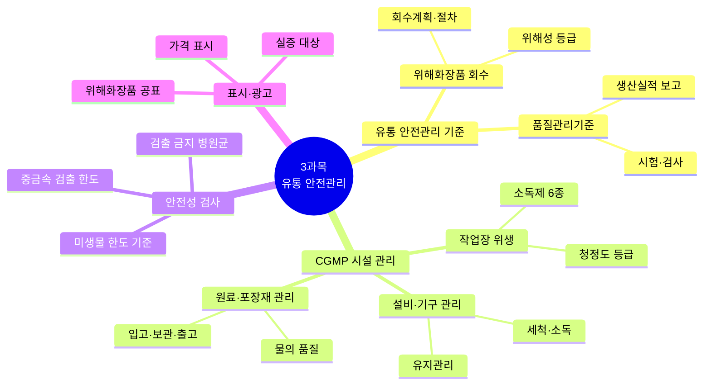

> **🗺️ 마인드맵 노드 상세 매핑**

| 대분류 | 중분류 | 소분류 |
|---|---|---|
| 유통 안전관리 기준 (L?) | — | — |
| 유통 안전관리 기준 (L?) | 위해화장품 회수 (L?) | — |
| 유통 안전관리 기준 (L?) | 위해화장품 회수 (L?) | 위해성 등급 (L415\|화장품법(법률)(제20901호)(20260402).pdf) |
| 유통 안전관리 기준 (L?) | 위해화장품 회수 (L?) | 회수계획·절차 (L?) |
| 유통 안전관리 기준 (L?) | 품질관리기준 (L2) | — |
| 유통 안전관리 기준 (L?) | 품질관리기준 (L2) | 시험·검사 |
| 유통 안전관리 기준 (L?) | 품질관리기준 (L2) | 생산실적 보고 (L?) |
| CGMP 시설 관리 (L470) | — | — |
| CGMP 시설 관리 (L470) | 작업장 위생 (L?) | — |
| CGMP 시설 관리 (L470) | 작업장 위생 (L?) | 청정도 등급 (L?) |
| CGMP 시설 관리 (L470) | 작업장 위생 (L?) | 소독제 6종 (L?) |
| CGMP 시설 관리 (L470) | 설비·기구 관리 (L?) | — |
| CGMP 시설 관리 (L470) | 설비·기구 관리 (L?) | 세척·소독 |
| CGMP 시설 관리 (L470) | 설비·기구 관리 (L?) | 유지관리 (L18) |
| CGMP 시설 관리 (L470) | 원료·포장재 관리 (L?) | — |
| CGMP 시설 관리 (L470) | 원료·포장재 관리 (L?) | 입고·보관·출고 |
| CGMP 시설 관리 (L470) | 원료·포장재 관리 (L?) | 물의 품질 (L23) |
| 안전성 검사 (L72) | — | — |
| 안전성 검사 (L72) | 중금속 검출 한도 (L?) | — |
| 안전성 검사 (L72) | 미생물 한도 기준 (L74) | — |
| 안전성 검사 (L72) | 검출 금지 병원균 (L?) | — |
| 표시·광고 (L1062\|시행규칙_별표7_행정처분기준.pdf) | — | — |
| 표시·광고 (L1062\|시행규칙_별표7_행정처분기준.pdf) | 실증 대상 | — |
| 표시·광고 (L1062\|시행규칙_별표7_행정처분기준.pdf) | 가격 표시 | — |
| 표시·광고 (L1062\|시행규칙_별표7_행정처분기준.pdf) | 위해화장품 공표 (L?) | — |

### 🗺️ 법령별 조문 구조 마인드맵

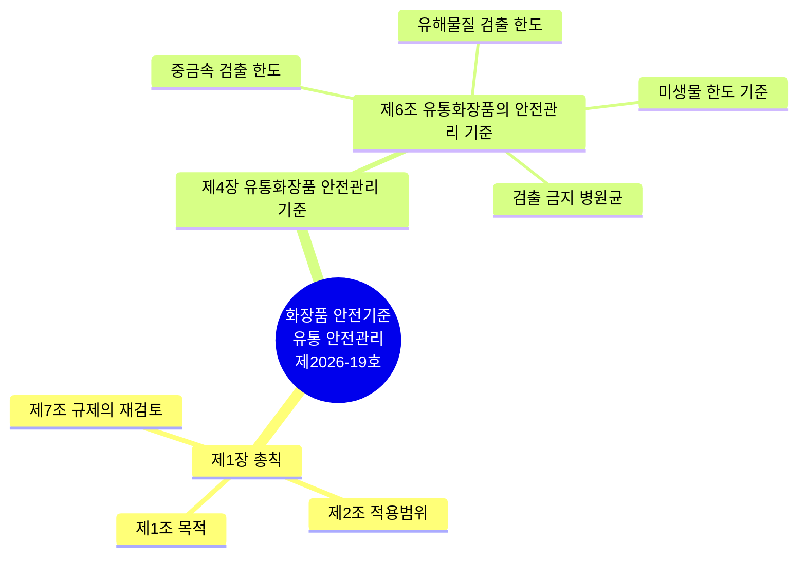

> **🗺️ 마인드맵 노드 상세 매핑**

| 대분류 | 중분류 | 소분류 |
|---|---|---|
| 제1장 총칙 (L5) | — | — |
| 제1장 총칙 (L5) | 제1조 목적 | — |
| 제1장 총칙 (L5) | 제2조 적용범위 | — |
| 제1장 총칙 (L5) | 제7조 규제의 재검토 | — |
| 제4장 유통화장품 안전관리 기준 (L30) | — | — |
| 제4장 유통화장품 안전관리 기준 (L30) | 제6조 유통화장품의 안전관리 기준 | — |
| 제4장 유통화장품 안전관리 기준 (L30) | 제6조 유통화장품의 안전관리 기준 | 중금속 검출 한도 (L?) |
| 제4장 유통화장품 안전관리 기준 (L30) | 제6조 유통화장품의 안전관리 기준 | 유해물질 검출 한도 (L?) |
| 제4장 유통화장품 안전관리 기준 (L30) | 제6조 유통화장품의 안전관리 기준 | 미생물 한도 기준 (L74) |
| 제4장 유통화장품 안전관리 기준 (L30) | 제6조 유통화장품의 안전관리 기준 | 검출 금지 병원균 (L?) |

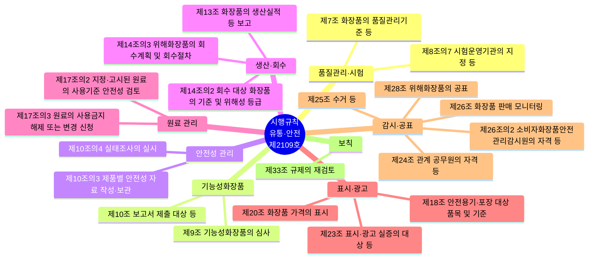

> **🗺️ 마인드맵 노드 상세 매핑**

| 대분류 | 중분류 |
|---|---|
| 품질관리·시험 (L?) | — |
| 품질관리·시험 (L?) | 제7조 화장품의 품질관리기준 등 |
| 품질관리·시험 (L?) | 제8조의7 시험운영기관의 지정 등 (L?) |
| 기능성화장품 (L777) | — |
| 기능성화장품 (L777) | 제9조 기능성화장품의 심사 |
| 기능성화장품 (L777) | 제10조 보고서 제출 대상 등 (L18) |
| 안전성 관리 | — |
| 안전성 관리 | 제10조의3 제품별 안전성 자료 작성·보관 (L?) |
| 안전성 관리 | 제10조의4 실태조사의 실시 (L?) |
| 생산·회수 | — |
| 생산·회수 | 제13조 화장품의 생산실적 등 보고 (L22) |
| 생산·회수 | 제14조의2 회수 대상 화장품의 기준 및 위해성 등급 (L?) |
| 생산·회수 | 제14조의3 위해화장품의 회수계획 및 회수절차 (L?) |
| 원료 관리 | — |
| 원료 관리 | 제17조의2 지정·고시된 원료의 사용기준 안전성 검토 (L?) |
| 원료 관리 | 제17조의3 원료의 사용금지 해제 또는 변경 신청 (L?) |
| 표시·광고 (L1062\|시행규칙_별표7_행정처분기준.pdf) | — |
| 표시·광고 (L1062\|시행규칙_별표7_행정처분기준.pdf) | 제18조 안전용기·포장 대상 품목 및 기준 (L28) |
| 표시·광고 (L1062\|시행규칙_별표7_행정처분기준.pdf) | 제20조 화장품 가격의 표시 (L31) |
| 표시·광고 (L1062\|시행규칙_별표7_행정처분기준.pdf) | 제23조 표시·광고 실증의 대상 등 (L34) |
| 감시·공표 | — |
| 감시·공표 | 제24조 관계 공무원의 자격 등 (L35) |
| 감시·공표 | 제25조 수거 등 (L36) |
| 감시·공표 | 제26조 화장품 판매 모니터링 (L37) |
| 감시·공표 | 제26조의2 소비자화장품안전관리감시원의 자격 등 (L?) |
| 감시·공표 | 제28조 위해화장품의 공표 (L39) |
| 보칙 | — |
| 보칙 | 제33조 규제의 재검토 (L45) |

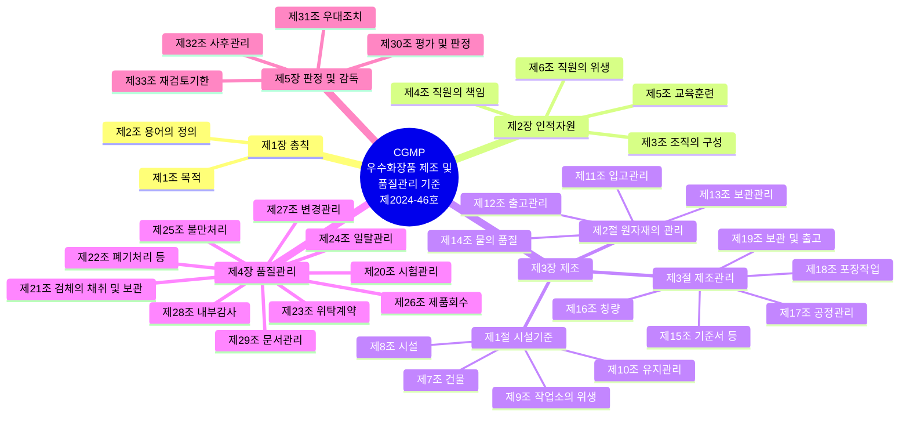

> **🗺️ 마인드맵 노드 상세 매핑**

| 대분류 | 중분류 | 소분류 |
|---|---|---|
| 제1장 총칙 (L5) | — | — |
| 제1장 총칙 (L5) | 제1조 목적 | — |
| 제1장 총칙 (L5) | 제2조 용어의 정의 | — |
| 제2장 인적자원 (L8) | — | — |
| 제2장 인적자원 (L8) | 제3조 조직의 구성 | — |
| 제2장 인적자원 (L8) | 제4조 직원의 책임 | — |
| 제2장 인적자원 (L8) | 제5조 교육훈련 | — |
| 제2장 인적자원 (L8) | 제6조 직원의 위생 | — |
| 제3장 제조 (L13) | — | — |
| 제3장 제조 (L13) | 제1절 시설기준 (L14) | — |
| 제3장 제조 (L13) | 제1절 시설기준 (L14) | 제7조 건물 |
| 제3장 제조 (L13) | 제1절 시설기준 (L14) | 제8조 시설 |
| 제3장 제조 (L13) | 제1절 시설기준 (L14) | 제9조 작업소의 위생 |
| 제3장 제조 (L13) | 제1절 시설기준 (L14) | 제10조 유지관리 (L18) |
| 제3장 제조 (L13) | 제2절 원자재의 관리 (L19) | — |
| 제3장 제조 (L13) | 제2절 원자재의 관리 (L19) | 제11조 입고관리 (L20) |
| 제3장 제조 (L13) | 제2절 원자재의 관리 (L19) | 제12조 출고관리 (L21) |
| 제3장 제조 (L13) | 제2절 원자재의 관리 (L19) | 제13조 보관관리 (L22) |
| 제3장 제조 (L13) | 제2절 원자재의 관리 (L19) | 제14조 물의 품질 (L23) |
| 제3장 제조 (L13) | 제3절 제조관리 (L24) | — |
| 제3장 제조 (L13) | 제3절 제조관리 (L24) | 제15조 기준서 등 (L25) |
| 제3장 제조 (L13) | 제3절 제조관리 (L24) | 제16조 칭량 (L26) |
| 제3장 제조 (L13) | 제3절 제조관리 (L24) | 제17조 공정관리 (L27) |
| 제3장 제조 (L13) | 제3절 제조관리 (L24) | 제18조 포장작업 (L28) |
| 제3장 제조 (L13) | 제3절 제조관리 (L24) | 제19조 보관 및 출고 (L29) |
| 제4장 품질관리 (L30) | — | — |
| 제4장 품질관리 (L30) | 제20조 시험관리 (L31) | — |
| 제4장 품질관리 (L30) | 제21조 검체의 채취 및 보관 (L32) | — |
| 제4장 품질관리 (L30) | 제22조 폐기처리 등 (L33) | — |
| 제4장 품질관리 (L30) | 제23조 위탁계약 (L34) | — |
| 제4장 품질관리 (L30) | 제24조 일탈관리 (L35) | — |
| 제4장 품질관리 (L30) | 제25조 불만처리 (L36) | — |
| 제4장 품질관리 (L30) | 제26조 제품회수 (L37) | — |
| 제4장 품질관리 (L30) | 제27조 변경관리 (L38) | — |
| 제4장 품질관리 (L30) | 제28조 내부감사 (L39) | — |
| 제4장 품질관리 (L30) | 제29조 문서관리 (L40) | — |
| 제5장 판정 및 감독 (L41) | — | — |
| 제5장 판정 및 감독 (L41) | 제30조 평가 및 판정 (L42) | — |
| 제5장 판정 및 감독 (L41) | 제31조 우대조치 (L43) | — |
| 제5장 판정 및 감독 (L41) | 제32조 사후관리 (L44) | — |
| 제5장 판정 및 감독 (L41) | 제33조 재검토기한 (L45) | — |

### 📊 위해화장품 회수 절차

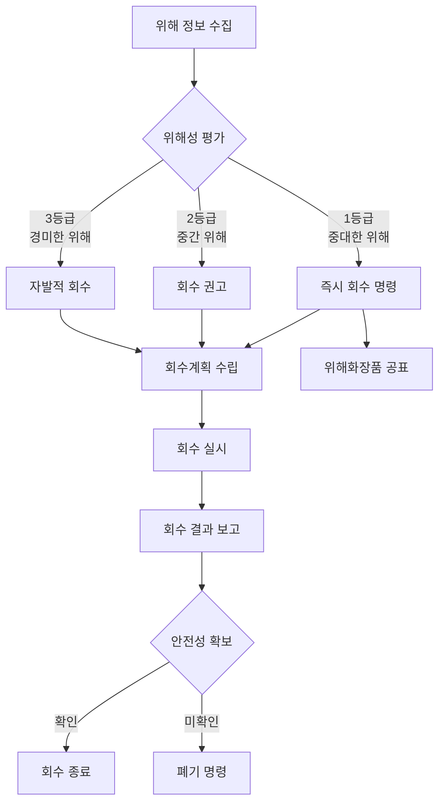

### 📊 미생물 관리 체계

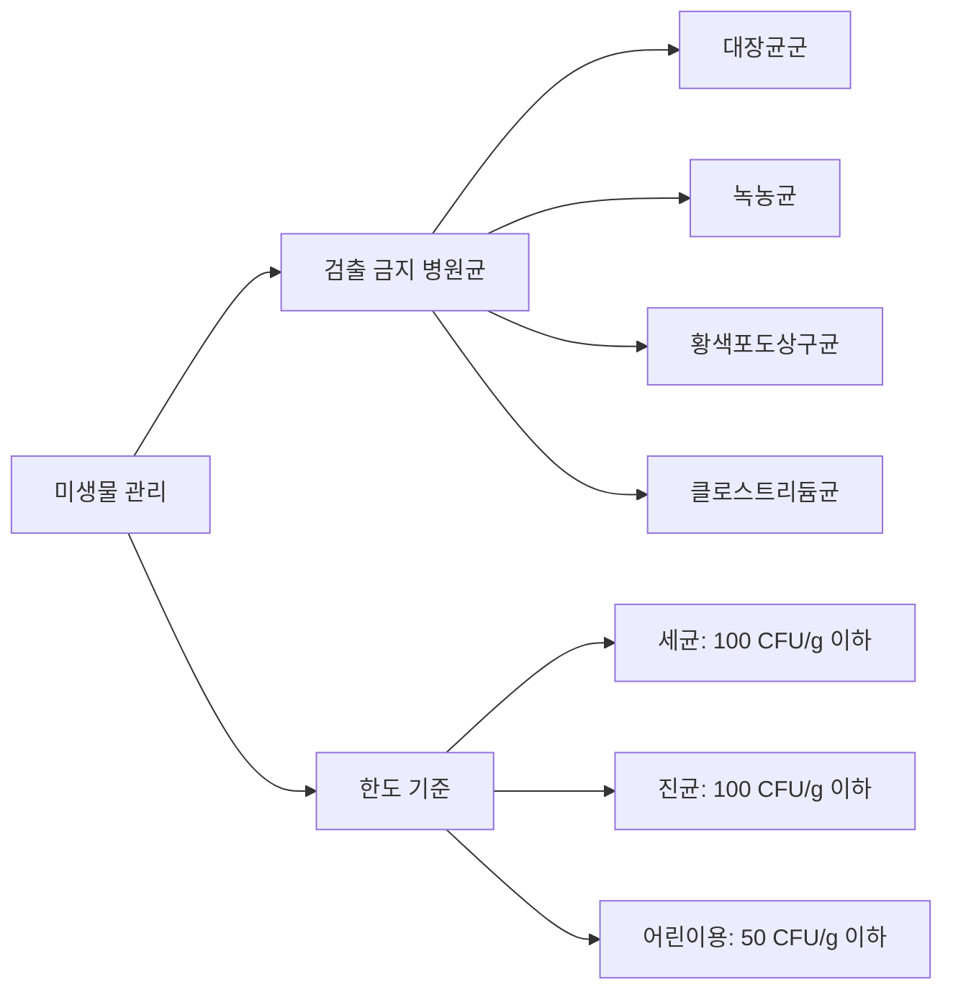

### 📊 청정도 등급 및 필터 체계

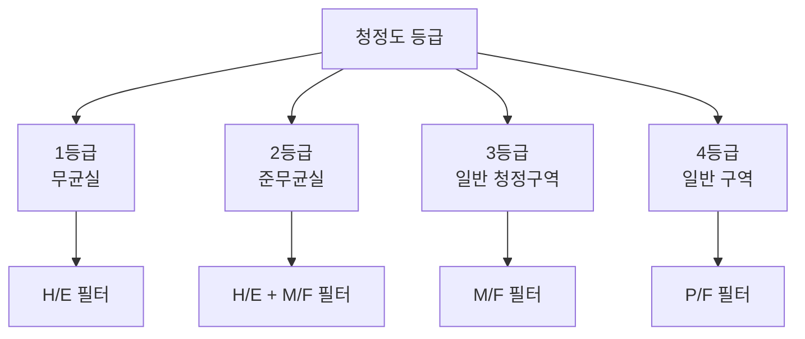

### 📊 과목 간 연관 흐름도

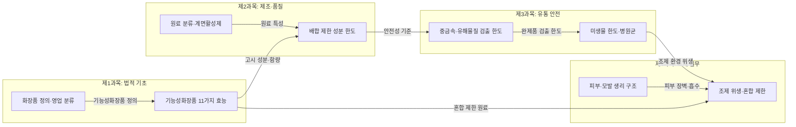

---

# 📚 학습 보조 자료 (교재 콘텐츠)

> 아래 내용은 과목별 참조자료 폴더에서 발췌한 학습 보조 자료입니다.
> 법령 조문과 함께 학습하면 시험 대비에 도움이 됩니다.

## 📖 작업장 위생관리
> 출처: `우수화장품 제조 및 품질관리기준(식품의약품안전처고시)(제2024-46호)(20240822).pdf`


---

## 📚 Chapter 01. 작업장 위생관리

> PART 03. 유통화장품 안전관리

**고득점 TIP**: 시설과 작업장의 위생 기준을 정리하고 설비 세척의 특징과 소독제 특징에 대해 정확히 학습하세요.

> 🔗 **관련 과목**
> - 1과목 1챕터 "화장품법" — CGMP 고시의 법적 근거
> - 2과목 5챕터 "위해사례 판단 및 보고" — 위해성 평가와 CGMP 미생물오염 방지 연계
> - 4과목 1챕터 "맞춤형화장품 개요" — 시설기준(분리·구획)의 법적 근거

---

> 📋 **학습 가이드**
> - 출제 빈도: ★★★★☆ (CGMP 3대 요소, 청정도 등급, 에어 필터, 낙하균 측정, 소독제 종류)
> - 예상 소요 시간: 45분
> - 핵심 키워드: CGMP 3대 요소, 구획·구분·분리 정의, 청정도 1~4등급, P/F·M/F·H/F 필터, 낙하균 Koch법, 소독제 6종(에탄올·크레졸·차아염소산·페놀·벤잘코늄·글루콘산), 중화제

---

## 1. 작업장 위생 기준

> 📌 **출처**: CGMP (식약처 고시 제2024-46호) 제3장 | **참조 PDF**: `우수화장품 제조 및 품질관리기준(식품의약품안전처고시)(제2024-46호)(20240822).pdf` | **시행일**: 2024. 9. 1. | **최종 확인**: 2026. 8. 29.

> **한 줄 요약**: CGMP 3대 요소(과오 최소화·미생물오염 방지·품질관리체계) + 시설 적합 기준 8가지 + 위생 기준 4가지.

### (1) 우수화장품 제조 및 품질관리 기준(CGMP: Cosmetic Good Manufacturing Practice)

| 구분 | 내용 |
|---|---|
| 목적 | 우수화장품 제조 및 품질관리 기준에 관한 세부사항을 정하고, 이를 이행하도록 권장함으로써 우수한 화장품을 제조·공급하여 소비자보호 및 국민 보건 향상에 기여함 |
| CGMP 3대 요소 | • 인위적인 과오의 최소화<br>• 미생물오염 및 교차오염으로 인한 품질저하 방지<br>• 고도의 품질관리체계 확립 |

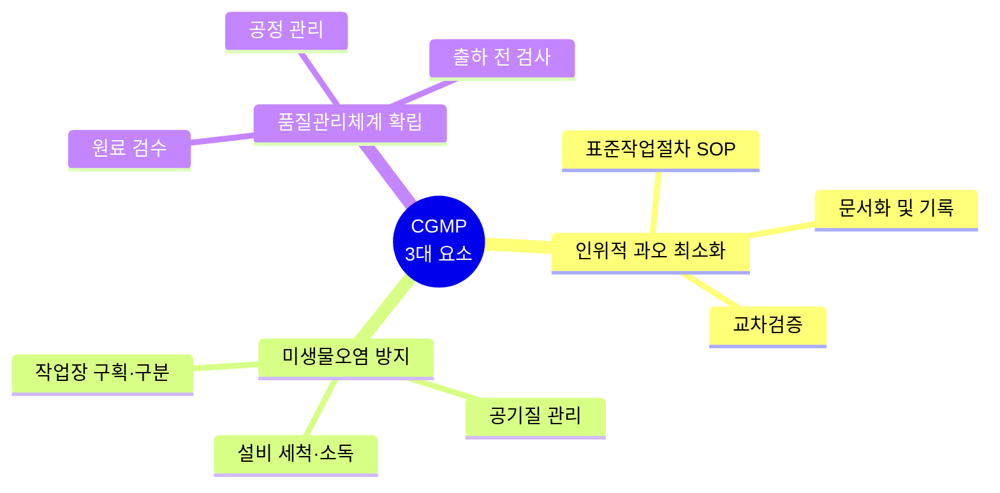

> **🗺️ 마인드맵 노드 상세 매핑**

| 대분류 | 중분류 |
|---|---|
| 인위적 과오 최소화 (L?) | — |
| 인위적 과오 최소화 (L?) | 표준작업절차 SOP |
| 인위적 과오 최소화 (L?) | 문서화 및 기록 |
| 인위적 과오 최소화 (L?) | 교차검증 |
| 미생물오염 방지 (L?) | — |
| 미생물오염 방지 (L?) | 작업장 구획·구분 |
| 미생물오염 방지 (L?) | 공기질 관리 |
| 미생물오염 방지 (L?) | 설비 세척·소독 (L?) |
| 품질관리체계 확립 (L?) | — |
| 품질관리체계 확립 (L?) | 원료 검수 |
| 품질관리체계 확립 (L?) | 공정 관리 |
| 품질관리체계 확립 (L?) | 출하 전 검사 |

### (2) 작업소의 시설 적합 기준

1. 제조하는 화장품의 종류·제형에 따라 **구획**·**구분**하여 교차오염이 없어야 한다.

2. 바닥, 벽, 천장은 가능한 청소하기 쉽게 매끄러운 표면이어야 하고, 소독제 등의 부식성에 저항력이 있어야 한다.

3. 환기가 잘 되고 외부와 연결된 창문은 가능한 한 열리지 않도록 해야 하며, 창문이 외부환경으로 열리는 경우 제품의 오염을 방지하도록 적절히 차단하여야 한다.

4. 적절하고 깨끗한 수세실과 화장실을 마련하고, 접근이 쉬워야 하나 생산 구역과 분리되어 있어야 한다.

5. 작업장 전체에 적절한 조명을 설치하고 파손될 경우를 대비하여 제품 보호 조치를 마련해 두어야 한다.

6. 환기시설을 갖추어 제품 오염을 방지하고 적절한 온도 및 습도를 유지해야 한다.

7. 제조 구역별 청소 및 위생관리 절차에 따라 효능이 입증된 세척제 및 소독제를 사용해야 한다.

8. 제품의 품질에 영향을 주지 않는 소모품을 사용해야 한다.

### (3) 작업소의 위생 기준

1. 곤충, 해충이나 쥐를 막을 수 있는 대책 마련과 정기적인 점검·확인을 해야 한다.

2. 제조, 관리(적합 판정 기준을 충족시키는 검증) 및 보관 구역 내의 바닥, 벽, 천장 및 창문은 항상 청결하게 유지해야 한다.

3. 제조시설이나 설비의 세척에 사용되는 세제 또는 세척제는 효능이 입증된 것을 사용하고, 잔류하거나 표면에 이상을 초래해서는 안 된다.

4. 제조시설이나 설비는 적절한 방법으로 청소하여야 하며, 필요한 경우 위생관리 프로그램을 운영해야 한다.

### 📌 용어 정리

| 용어 | 정의 |
|---|---|
| 구획 | 벽, 칸막이, 에어커튼 등에 의해 나누어져 교차오염 또는 외부 오염 물질의 혼입이 방지될 수 있는 상태 |
| 구분 | 선이나 줄, 그물망, 칸막이 또는 충분한 간격을 두어 착오나 혼동이 일어나지 않도록 되어 있는 상태 |
| 분리 | 벽에 의해 별개의 장소로 나누어져 있고 공기조화장치가 별도로 설치되어 공기가 완전히 차단된 상태 |
| 소모품 | 청소, 위생 처리 또는 유지 작업 동안에 사용되는 물품(세척제, 윤활제 등) |
| 청소 | 화학적인 방법, 기계적인 방법, 온도, 적용 시간과 이러한 복합된 요인에 의해 청정도를 유지하고, 일반적으로 표면에서 눈에 보이는 먼지를 분리·제거하여 외관을 유지하는 모든 작업 |

---

### (4) 구역별 위생관리 기준

| 구역 | 관리 내용 |
|---|---|
| **보관 구역** | • 통로는 사람과 물건이 이동하는 구역으로 사람과 물건의 이동에 불편함을 초래하거나 교차오염의 위험이 없어야 함<br>• 손상된 팔레트는 수거하여 수신 또는 폐기함<br>• 매일 바닥의 폐기물을 치워야 함<br>• 동물이나 해충이 침입하기 쉬운 환경은 개선되어야 함<br>• 용기(저장조 등)들은 닫아서 깨끗하고 정돈된 방법으로 보관해야 함 |
| **원료 취급 구역** | • 원료보관소와 칭량실은 구획되어야 함<br>• 엎지르거나 흘리는 것을 방지하고, 즉각적으로 치우는 시스템과 절차들이 시행되어 바닥은 깨끗하고 부스러기가 없는 상태를 유지해야 함<br>• 모든 드럼의 윗부분은 이송 전 또는 칭량 구역에서 개봉 전에 검사하고 깨끗하게 해야 하며, 실제 칭량한 원료인 경우를 제외하고 적합하게 뚜껑을 덮어 놓아야 함<br>• 원료의 포장이 훼손된 경우에는 봉인하거나 즉시 별도의 저장조에 보관한 후 품질상의 처분 결정을 위해 격리해야 함 |
| **제조 구역** | • 모든 도구와 기구는 청소 및 위생 처리 후 정해진 지역에 정돈 방법에 따라 보관하고, 호스는 사용 후 완전히 건조시켜 바닥에 닿지 않도록 정리하여 보관해야 함<br>• 제조 구역에서 흘린 것은 신속히 청소하고, 폐기물(여과지, 개스킷, 폐지, 플라스틱 봉지)은 주기적으로 버려 장기간 모아놓거나 쌓아두지 않아야 함<br>• 표면은 청소하기 용이한 재질로 설계되어야 하며, 탱크의 바깥 면들은 정기적으로 청소하고, 모든 배관이 사용될 수 있도록 우수한 정비 상태로 유지해야 함<br>• 페인트를 칠한 지역은 우수한 정비 상태로 유지되어야 하며, 벗겨진 칠은 보수되어야 함 |
| **포장 구역** | • 제품의 교차오염을 방지할 수 있도록 설계하고, 질서를 무너뜨리는 다른 재료가 있어서는 안 됨<br>• 사용하지 않는 부품, 제품 또는 폐기물의 제거를 쉽게 할 수 있어야 하고, 폐기물 저장통은 필요하다면 청소 및 위생 처리되어야 함<br>• 사용하지 않는 기구는 깨끗하게 보관되어야 함 |

> **참고: 교차오염** — 교차가 불가피할 경우 '시간차', 사람과 대차가 교차하는 경우 '유효복'을 충분히 확보해야 함

---

## 2. 작업장의 위생 상태

> 📌 **출처**: CGMP (식약처 고시 제2024-46호) 제3장 | **참조 PDF**: `우수화장품 제조 및 품질관리기준(식품의약품안전처고시)(제2024-46호)(20240822).pdf` | **시행일**: 2024. 9. 1. | **최종 확인**: 2026. 8. 29.

> **한 줄 요약**: 청정도 1~4등급 + 에어 필터 3종(P/F·M/F·H/F) + 낙하균 Koch법 + 공기 조절 4대 요소.

### (1) 청정도 등급 및 관리 기준

#### ① 청정도 등급

| 등급 | 대상시설 | 작업실 |
|---|---|---|
| 1등급 (청정도 분류) | 청정도 엄격 관리 | Clean Bench |
| 2등급 (청정도 분류) | 화장품 내용물이 노출되는 작업실 | 제조실, 성형실, 충전실, 내용물 보관소, 원료 칭량실, 미생물 실험실 |
| 3등급 (청정도 분류) | 화장품 내용물이 노출되지 않는 곳 | 포장실 |
| 4등급 (청정도 분류) | 일반 작업실(내용물 완전 폐색) | 포장재·완제품·관리품·원료 보관소, 탈의실, 일반 실험실 |

#### ② 관리 기준

| 등급 | 청정 공기순환 | 구비조건 | 관리 기준 |
|---|---|---|---|
| 1등급 (공기순환·기준) | 20회/hr 이상 또는 차압 관리 | Pre-filter, Med-filter, HEPA-filter, Clean Bench/Booth, 온도 조절 | 낙하균 10개/hr 또는 부유균 20개/㎥ |
| 2등급 (공기순환·기준) | 10회/hr 이상 또는 차압 관리 | Pre-filter, Med-filter(필요 시 HEPA-filter), 분진 발생실 주변 양압, 제진 시설 | 낙하균 30개/hr 또는 부유균 200개/㎥ |
| 3등급 (공기순환·기준) | 차압 관리 | Pre-filter, 온도 조절 | 탈의, 포장재의 외부 청소 후 반입 |
| 4등급 (공기순환·기준) | 환기장치 | 환기(온도 조절) | - |

- ※ 1, 2, 3등급 시설에서 작업할 경우 작업복, 작업모, 작업화를 착용해야 함
- ※ 일반적으로 시설의 실압은 '2등급 > 3등급 > 4등급' 순으로 높게 유지하며, 외부 먼지가 작업장으로 유입되지 않도록 관리해야 함
- ※ 작업실에서 분진이나 악취 등으로 주변 오염 우려가 있는 경우, 해당 작업실을 음압으로 관리하고 적절한 오염 방지 대책을 마련해야 함

### (2) 에어 필터

작업장에는 중성능 필터의 설치를 권장하며, 고도의 환경 관리가 필요하면 고성능 필터인 H/F(HEPA) 필터를 설치한다.

| 종류 | 특징 |
|---|---|
| **P/F** (Pre Filter) | • 세척 후 3~4회 재사용<br>• Medium Filter 전처리용<br>• 압력 손실: 9mmAq 이하<br>• 필터 입자: 5㎛ |
| **M/F** (Medium Filter) | • Media: Glass Fiber<br>• HEPA Filter 전처리용<br>• B/D 공기 정화, 산업 공장 등에 사용<br>• 압력 손실: 16mmAq 이하<br>• 필터 입자: 0.5㎛ |
| **H/F** (HEPA Filter) | • High Efficiency Particulate Air Filter<br>• 0.3㎛의 분진 99.97% 제거<br>• Media: Glass Fiber<br>• 반도체 공장, 병원, 의약품, 식품 공장 등 사용<br>• 압력 손실: 24mmAq 이하<br>• 필터 입자: 0.3㎛ |

> **참고: 에어 필터의 종류**
> - P/F(Pre Filter): 1차 여과용으로 세척 후 재사용 가능
> - M/F(Medium Filter): 중간 단계 여과용으로 공기 정화·산업용으로 쓰임
> - H/F(HEPA Filter): 고성능 여과(0.3㎛ 입자 99.97% 제거) 장치로 병원·반도체·식품 공장 등에 쓰임

---

### (3) 작업장의 낙하균 측정법

| 항목 | 내용 |
|---|---|
| **원리** | • Koch법: 실내외를 불문하고, 대상 작업장에서 오염된 부유 미생물을 직접 평판배지 위에 일정 시간 자연 낙하시켜 측정하는 방법<br>• 배양접시에 낙하된 미생물을 배양하여 증식된 집락수를 측정하고 단위시간당의 생균수로 산출하는 방법<br>• 사용이 간단하고 편리한 방법이지만 공기 중의 전체 미생물을 측정할 수 없다는 단점이 있음 |
| **배지** | • 세균용: 대두카제인 소화한천배지<br>• 진균용: 사부로포도당 한천배지 또는 포테이토덱스트로즈한천배지에 배지 100mL당 클로람페니콜 50mg을 넣음 |
| **기구** | 배양접시(내경 9cm), 배양접시에 멸균된 배지(세균용, 진균용)를 각각 부어 굳혀 낙하균 측정용 배지를 준비함 |
| **측정 위치** | • 일반적으로 작은 방을 측정하는 경우에는 약 5개소, 비교적 큰 방일 경우에는 측정소를 증가시킴<br>• 방 이외의 격벽구획이 명확하지 않은 장소(복도, 통로 등)에서는 공기의 진입, 유통, 정체 등의 상태를 고려하여 전체 환경을 대표한다고 생각되는 장소를 선택<br>• 측정하려는 방의 크기와 구조에 더 유의하여야 하나, 5개소 이하로 측정하면 올바른 평가를 얻기가 어려우며 측정 위치도 벽에서 30cm 떨어진 곳이 좋음<br>• 측정 높이는 바닥에서 측정하는 것이 원칙이지만 부득이한 경우 바닥으로부터 20~30cm 높은 위치에서 측정하기도 함 |
| **노출 시간** | • 공중 부유 미생물 수의 많고 적음에 따라 결정되며, 노출 시간이 1시간 이상이 되면 배지의 성능이 떨어지므로 예비 시험으로 적당한 노출 시간을 결정하는 것이 좋음<br>• 청정도가 높은 시설(예: 무균실 또는 준무균실): 30분 이상 노출<br>• 청정도가 낮고, 오염도가 높은 시설(예: 원료 보관실, 복도, 포장실, 창고): 측정 시간 단축 |
| **측정** | • 선정된 측정 위치마다 세균용 배지와 진균용 배지를 1개씩 놓고 배양접시의 뚜껑을 열어 배지에 낙하균이 떨어지도록 함<br>• 위치별로 정해진 노출 시간이 지나면, 배양접시의 뚜껑을 닫아 배양기에서 배양함. 일반적으로 세균용 배지는 30~35℃, 48시간 이상, 진균용 배지는 20~25℃, 5일 이상 배양함. 배양 중에 확산균의 증식에 의해 균수를 측정할 수 없는 경우가 있으므로 매일 관찰하고 균수의 변동을 기록함<br>• 배양 종료 후 세균 및 진균의 평판마다 집락수를 측정하고, 사용한 배양접시 수로 나누어 평균 집락수를 구하고 단위시간당 집락수를 산출하여 균수로 함 |

**✅ 확인문제**
- 바닥에서 측정하는 것이 원칙이지만, 부득이할 경우 바닥으로부터 **(20)~(30)cm** 높이에서 측정하기도 한다.
- 무균실 등 청정도가 높은 시설은 일반적으로 약 **(30)분** 이상 노출하여 측정한다.

> **해설**: 낙하균 측정 시 측정 위치는 벽에서 30cm 떨어진 곳, 측정 높이는 바닥이 원칙이나 부득이 시 20~30cm 높이. 청정도가 높은 시설은 노출 시간을 길게(30분 이상), 오염도가 높은 시설은 노출 시간을 짧게 설정한다. 세균용 배지는 30~35℃에서 48시간 이상, 진균용 배지는 20~25℃에서 5일 이상 배양한다.

---

### (4) 작업장의 공기 조절 4대 요소 및 대응 설비

화장품에 가장 적합한 공기 조절 방식은 센트럴 방식(중앙 방식)이며, 이는 공기의 온·습도, 공중미립자, 풍량 및 풍향, 기류를 하나로 이어진 도관을 사용하여 제어하는 방식이다.

| 4대 요소 | 대응 설비 |
|---|---|
| ① 청정도 | 공기정화기 |
| ② 실내온도 | 열교환기 |
| ③ 습도 | 가습기 |
| ④ 기류 | 송풍기 |

---

## 3. 작업장의 위생 유지관리 활동

> 📌 **출처**: CGMP (식약처 고시 제2024-46호) 제3장 | **참조 PDF**: `우수화장품 제조 및 품질관리기준(식품의약품안전처고시)(제2024-46호)(20240822).pdf` | **시행일**: 2024. 9. 1. | **최종 확인**: 2026. 8. 29.

> **한 줄 요약**: 정기 점검·예방적 유지관리 + 방충·방서 8대책 + 청소 방법 15항목.

### (1) 유지관리 기준

1. 건물, 시설 및 주요 설비는 정기적으로 점검하여 화장품의 제조 및 품질관리에 지장이 없도록 해야 한다.

2. 결함 발생 및 정비 중인 설비는 적절한 방법으로 표시하고, 고장 등 사용이 불가할 경우 표시해야 한다.

3. 세척한 설비는 다음 사용 시까지 오염되지 않도록 관리해야 한다.

4. 모든 제조 관련 설비는 승인된 자만이 접근·사용해야 한다.

5. 제품의 품질에 영향을 줄 수 있는 검사·측정·시험장비 및 자동화 장치는 계획을 수립하여 정기적으로 검교정 및 성능 점검을 하고 기록해야 한다.

6. 유지관리 작업이 제품의 품질에 영향을 주어서는 안 된다.

### (2) 유지관리 주요사항

1. 예방적 차원에서 실시한다.

2. 설비마다 절차서를 작성해야 한다.

3. 연간계획을 가지고 실행해야 한다.

4. 책임 내용이 명확해야 한다.

5. 유지하는 기준은 절차서에 포함해야 한다.

6. 점검체크시트를 사용하면 편리하다.

7. **점검항목**
   - 외관 검사: 더러움, 녹, 이상 소음, 이취
   - 작동 점검: 스위치, 연동성
   - 기능 측정: 회전수, 전압, 투과율, 감도
   - 청소: 내·외부 표면
   - 부품 교환 및 개선: 제품 품질에 영향을 미치는 일이 확인되면 적극적으로 개선

### 📌 용어 정리

| 용어 | 정의 |
|---|---|
| 유지관리 | 적절한 작업 환경에서 건물과 설비가 유지되도록 정기적·비정기적인 지원 및 검증하는 작업 |
| 건물 | 제품, 원료 및 포장재의 수령, 보관, 제조 관리 및 출하를 위해 사용되는 물리적 장소, 건축물 및 보조 건축물 |
| 제조 | 원료 물질의 칭량부터 혼합, 충전(1차 포장), 2차 포장 및 표시 등의 일련의 작업 |
| 오염 | 제품에서 화학적, 물리적, 미생물학적 문제 또는 이들이 조합되어 나타내는 바람직하지 않은 문제의 발생 |
| 검교정 | 규정된 조건하에서 측정 기기나 측정 시스템에 의해 표시되는 값과 표준 기기의 참값을 비교하여 이들의 오차가 허용 범위 내에 있음을 확인하고, 허용 범위를 벗어나는 경우 허용 범위 내에 들도록 조정하는 것 |

### (3) 방충·방서 대책의 예

1. 벽, 천장, 창문, 파이프 구멍에 틈이 없도록 할 것

2. 배기구, 흡기구에 필터를 달고, 해충, 곤충의 조사와 구제를 실시할 것

3. 가능하면 개방할 수 있는 창문을 만들지 않을 것

4. 창문은 차광하고 야간에 빛이 새어 나가지 않게 할 것

5. 문 하부에는 스커트를 설치할 것

6. 폐수구에 트랩을 달 것

7. 골판지, 나무 부스러기를 방치하지 않을 것

8. 실내압을 외부보다 높게 할 것(공기조화장치)

### (4) 청소 방법과 위생 처리

1. 공조시스템에 사용된 필터는 규정에 의해 청소되거나 교체되어야 한다.

2. 물질 또는 제품 필터들은 규정에 의해 청소되거나 교체되어야 한다.

3. 물이 고이거나 제품의 유출이 있는 곳 그리고 파손된 용기는 지체 없이 청소 또는 제거되어야 한다.

4. 제조공정 또는 포장과 관련되는 지역에서의 청소와 관련된 활동이 기류에 의한 오염을 유발하여 제품 품질에 위해를 끼칠 것 같은 경우에는 작업이 끝나고 실시한다.

5. 청소에 사용되는 용구, 진공청소기 등은 정돈된 방법으로 깨끗하고 건조된 상태의 지정 장소에 보관되어야 한다.

6. 오물이 묻은 걸레는 사용 후에 버리거나 세탁해야 한다.

7. 오물이 묻은 유니폼은 세탁될 때까지 적당한 컨테이너에 보관되어야 한다.

8. 제조공정과 포장에 사용한 설비 그리고 도구들은 세척해야 한다.

9. 적절한 때 도구들은 계획과 절차에 따라 위생 처리되어야 한다.

10. 적절한 방법으로 보관되어야 하고 청결을 보증하기 위해 사용 전 검사되어야 한다(청소완료표시서).

11. 제조공정과 포장 지역에서 재료의 운송을 위해 사용된 기구는 필요할 때 청소되고 위생 처리되어야 하며 작업은 적절하게 기록되어야 한다.

12. 제조공장을 깨끗하고 정돈된 상태로 유지하기 위해 필요할 때 청소가 수행되어야 한다. 이러한 직무를 수행하는 모든 사람은 적절하게 교육되어야 한다.

13. 천장, 머리 위의 파이프 등 기타 작업 지역은 필요할 때 모니터링하여 청소되어야 한다.

14. 제품 또는 원료가 노출되는 제조공정과 포장·보관구역에서의 공사 또는 유지관리 보수 활동은 제품오염을 방지하기 위해 적합하게 처리되어야 한다.

15. 제조공장의 한 부분에서 다른 부분으로 먼지, 이물 등이 묻혀가는 것을 방지하기 위해 주의해야 한다.

---

## 4. 작업장 위생 유지를 위한 세제의 종류와 사용법

> 📌 **출처**: CGMP (식약처 고시 제2024-46호) + 식약처 위생관리 지침 | **참조 PDF**: `우수화장품 제조 및 품질관리기준(식품의약품안전처고시)(제2024-46호)(20240822).pdf` | **시행일**: 2024. 9. 1. | **최종 확인**: 2026. 8. 29.

> **한 줄 요약**: 세제 7대 성분(계면활성제·살균제·금속이온봉쇄제·유기폴리머·용제·연마제·표백) + 요구조건 5가지 + 작업장별 청소 주기.

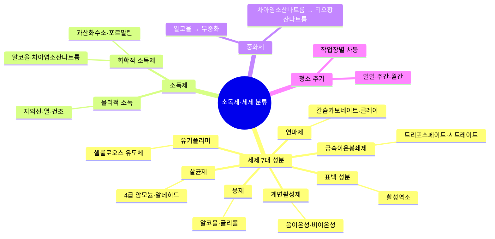

> **🗺️ 마인드맵 노드 상세 매핑**

| 대분류 | 중분류 | 소분류 |
|---|---|---|
| 세제 7대 성분 (L?) | — | — |
| 세제 7대 성분 (L?) | 계면활성제 (L778\|안전기준_별표4_유통안전관리시험방법.pdf) | — |
| 세제 7대 성분 (L?) | 계면활성제 (L778\|안전기준_별표4_유통안전관리시험방법.pdf) | 음이온성·비이온성 (L?) |
| 세제 7대 성분 (L?) | 살균제 (L?) | — |
| 세제 7대 성분 (L?) | 살균제 (L?) | 4급 암모늄·알데히드 (L?) |
| 세제 7대 성분 (L?) | 금속이온봉쇄제 (L?) | — |
| 세제 7대 성분 (L?) | 금속이온봉쇄제 (L?) | 트리포스페이트·시트레이트 (L?) |
| 세제 7대 성분 (L?) | 유기폴리머 (L?) | — |
| 세제 7대 성분 (L?) | 유기폴리머 (L?) | 셀룰로오스 유도체 (L?) |
| 세제 7대 성분 (L?) | 용제 (L67\|화장품법(법률)(제20901호)(20260402).pdf) | — |
| 세제 7대 성분 (L?) | 용제 (L67\|화장품법(법률)(제20901호)(20260402).pdf) | 알코올·글리콜 |
| 세제 7대 성분 (L?) | 연마제 (L?) | — |
| 세제 7대 성분 (L?) | 연마제 (L?) | 칼슘카보네이트·클레이 (L?\|색소종류및기준_전체.pdf) |
| 세제 7대 성분 (L?) | 표백 성분 (L?) | — |
| 세제 7대 성분 (L?) | 표백 성분 (L?) | 활성염소 (L?) |
| 소독제 (L172) | — | — |
| 소독제 (L172) | 화학적 소독제 (L?) | — |
| 소독제 (L172) | 화학적 소독제 (L?) | 알코올·차아염소산나트륨 (L?) |
| 소독제 (L172) | 화학적 소독제 (L?) | 과산화수소·포르말린 (L?\|안전기준_별표2_사용제한원료.pdf) |
| 소독제 (L172) | 물리적 소독 (L?) | — |
| 소독제 (L172) | 물리적 소독 (L?) | 자외선·열·건조 |
| 중화제 (L603\|안전기준_별표4_유통안전관리시험방법.pdf) | — | — |
| 중화제 (L603\|안전기준_별표4_유통안전관리시험방법.pdf) | 차아염소산나트륨 → 티오황산나트륨 (L?) | — |
| 중화제 (L603\|안전기준_별표4_유통안전관리시험방법.pdf) | 알코올 → 무중화 | — |
| 청소 주기 (L76) | — | — |
| 청소 주기 (L76) | 작업장별 차등 (L?) | — |
| 청소 주기 (L76) | 일일·주간·월간 | — |

### (1) 세제 성분의 특성

세제는 계면활성제, 살균제, 금속이온봉쇄제, 유기폴리머, 용제, 연마제 및 표백 성분으로 구성된다.

| 주요 성분 | 특성 | 대표적 성분 |
|---|---|---|
| **계면활성제** | • 세정제의 주요 성분<br>• 다양한 세정 작용으로 이물 제거 | 알킬벤젠설포네이트, 알칸설포네이트, 알파올레핀설포네이트, 알킬설페이트, 비누, 알킬에톡시레이트, 지방산알칸올아미드, 알킬베테인·알킬설포베테인 |
| **살균제** | • 미생물 살균<br>• 양이온 계면활성제 | 4급 암모늄 화합물, 양쪽성 계면활성제, 알코올류, 산화물, 알데히드류, 페놀 유도체 |
| **금속이온봉쇄제** | • 세정 효과 증가<br>• 입자 오염에 효과적임 | 소듐트리포스페이트, 소듐사이트레이트, 소듐글루코네이트 |
| **유기폴리머** | • 세정 효과 강화<br>• 세정제 잔류성 강화 | 셀룰로오스 유도체, 폴리올 |
| **용제** | 계면활성제의 세정 효과 증대 | 알코올, 글리콜, 벤질알코올 |
| **연마제** | 기계적 작용에 의한 세정 효과 증대 | 칼슘카보네이트, 클레이, 석영 |
| **표백 성분** | • 살균 작용<br>• 색상 개선 | 활성염소 또는 활성염소 생성 물질 |

> **참고: 세제 성분**
> - 세제의 주요 계면활성제는 음이온성 및 비이온성 계면활성제가 있음
> - 세제의 살균 성분으로는 4급 암모늄 화합물, 양쪽성 계면활성제류, 알코올류, 알데히드류 및 페놀 유도체가 사용됨

### (2) 세제의 구성 요건

1. 세제는 사용이 편리하고 유용해야 한다.

2. 중성에서 약알칼리성 사이의 다목적 세제는 범용 제품으로 물과 상용성이 있는 모든 표면에 적용한다.

3. 연마 세제는 기계적으로 저항성이 있는 물질에 한정적으로 사용한다.

4. 다목적 세제와 연마 세제는 가정에서는 손으로 직접 사용하지만, 작업장에서는 바닥연마기, 고압장치, 기포 발생기와 같은 보조 장치나 기구를 이용한다.

5. 표면은 헹굼이나 재세척 없이도 건조 후 깨끗하고 잔유물이 남아 있지 않아야 한다.

6. 연마 세제는 희석하지 않은 상태로 소량의 물만 사용하여 표면에 직접 적용한 뒤 충분히 헹궈준다.

### (3) 세제의 요구조건

1. 우수한 세정력과 표면 보호

2. 세정 후 표면에 잔류물이 없는 건조 상태

3. 사용 및 계량의 편리성

4. 적절한 기포 거동(거품이 적당히 생기고 움직이는 방식)

5. 인체 및 환경 안전성 및 충분한 저장 안정성

**✅ 확인문제** 다음 중 세제에 대한 설명으로 옳은 것은?
> ① 계면활성제는 세정 보조 성분이며, 용제가 세정의 핵심이다.

> ② **금속이온봉쇄제는 세정 효과를 높이고 오염을 방지한다.** ← 정답

> ③ 연마제는 화학 반응으로 오염을 제거한다.

> ④ 세제는 강산성일수록 잔유물이 적고 안전성이 높다.

> ⑤ 세제의 요구조건은 세정력보다 향유지성이 우선이다.

> **해설**:
> ① 계면활성제가 세정의 주요 성분이다.

> ③ 연마제는 기계적 작용에 의한 세정 효과이다.

> ④ 세제는 중성~약알칼리성이며 강산성은 안전성이 낮다.

> ⑤ 세제 요구조건 1순위는 우수한 세정력과 표면 보호이다.

### (4) 작업장별 청소주기 및 사용 세제

| 구역 | 청소 주기 | 사용 세제 | 점검 방법 |
|---|---|---|---|
| **원료 창고** | 작업 후(수시) | 상수 | 육안 |
| | 1회/월 | 상수 | |
| **칭량실** | 작업 후 | 상수, 70% 에탄올 | 육안 |
| | 1회/월 | 중성 세제, 70% 에탄올 | |
| **제조실, 충전실, 반제품 보관실 및 미생물 실험실** | 수시(최소 1일/1회) | 중성 세제, 70% 에탄올 | 육안 |
| | 1회/월 | 중성 세제, 70% 에탄올 | |

※ 원료 보관소는 연성세제 또는 락스를 이용하여 오염물을 제거하며, 화장실은 바닥에 잔존하는 이물을 완전히 제거하고 소독제로 바닥을 세척해야 함

---

## 5. 소독제와 중화제

> 📌 **출처**: CGMP (식약처 고시 제2024-46호) + 식약처 위생관리 지침 | **참조 PDF**: `우수화장품 제조 및 품질관리기준(식품의약품안전처고시)(제2024-46호)(20240822).pdf` | **시행일**: 2024. 9. 1. | **최종 확인**: 2026. 8. 29.

> **한 줄 요약**: 물리적 소독 3종 + 화학적 소독 6종 + 이상적 소독제 8조건 + 중화제 매칭.

### (1) 소독제의 종류

#### ① 물리적 소독

| 방법 | 특징 |
|---|---|
| **100℃ 물 스팀** | • 30분간 장치의 가장 먼 곳까지 온도가 유지되어야 함<br>• 장점: 사용 용이, 효과적<br>• 단점: 체류 시간이 길고, 고에너지 소비 |
| **80~100℃ 온수** | • 장점: 사용 용이, 효과적, 부식성이 없음, 간편한 출구 모니터링<br>• 단점: 체류 시간이 길고, 고에너지 소비, 습기 발생 |
| **전기 가열 테이프** | • 다른 방법과 병행하여 사용<br>• 장점: 다루기 어려운 설비나 파이프 소독 시 유용<br>• 단점: 일반적인 소독 방법이 아님 |

#### ② 화학적 소독

| 소독제 | 특징 |
|---|---|
| **70% 에탄올** | • 도구, 손 소독 등 다양하게 활용<br>• 조제 후 1주일 내 사용<br>• 장점: 적용 시 신속한 살균 효과<br>• 단점: 잔류 효과가 없음 |
| **크레졸수(3% 수용액)** | • 실내 바닥 소독에 사용, 경제적<br>• 장점: 일반 세균(녹농균, 결핵균을 포함함)에 유효한 효과를 가짐<br>• 단점: 냄새가 강하고, 물에 잘 녹지 않으며, 원액이 피부에 닿으면 짓무름 |
| **차아염소산나트륨액** | • 50ppm 락스<br>• 당일 조제하여 사용 후 전량 폐기<br>• 장점: 강한 살균력, 경제적<br>• 단점: 냄새가 강하고, 잔류성 및 부식성이 있음 |
| **페놀수(3% 수용액)** | • 조제 후 1주일 내 사용<br>• 장점: 고온에서 효과가 큼, 강한 살균력<br>• 단점: 독성과 금속 부식성이 있음 |
| **벤잘코늄클로라이드** | • 10%를 20배 희석하여 사용<br>• 장점: 넓은 범위에 걸친 방부 효과<br>• 단점: 양이온성 계면활성제로 알레르기를 유발할 수 있음 |
| **글루콘산클로르헥시딘** | • 5%를 10배 희석하여 사용<br>• 장점: 살균 효과와 항진균 효과, 피부에 대한 소독 효과<br>• 단점: 심각한 알레르기 반응 |

### (2) 이상적인 소독제의 조건

| 번호 | 조건 |
|---|---|
| 1 | 사용기간 동안 활성을 유지해야 함 |
| 2 | 경제적이고 쉽게 이용할 수 있어야 함 |
| 3 | 사용 농도에서 독성이 없어야 함 |
| 4 | 제품이나 설비와 반응하지 않아야 함 |
| 5 | 불쾌한 냄새가 남지 않아야 함 |
| 6 | 광범위한 항균 스펙트럼을 가져야 함 |
| 7 | 5분 이내의 짧은 처리에도 효과를 나타내야 함 |
| 8 | 소독 전 미생물을 최소한 99.9% 이상 사멸해야 함 |

### (3) 소독제 선택 시 고려사항

| 번호 | 고려사항 |
|---|---|
| 1 | 대상 미생물의 종류와 수 |
| 2 | 항균 스펙트럼의 범위 |
| 3 | 미생물 사멸에 필요한 작용 시간과 지속성 |
| 4 | 물에 대한 용해성 및 사용 방법의 간편성 |
| 5 | 적용 방법(분무, 침적, 걸레질 등) |
| 6 | 부식성 및 소독제의 향취 |
| 7 | 적용 장치의 종류, 설치 장소 및 사용하는 표면의 상태 |
| 8 | 내성균의 출현 빈도 |
| 9 | pH, 온도, 사용하는 물리적 환경 요인의 약제에 미치는 영향 |
| 10 | 잔류성 및 잔류하여 제품에 혼입될 가능성 |
| 11 | 종업원의 안전성 고려 |
| 12 | 법 규제 및 소요 비용 |

### (4) 소독제의 효과에 영향을 주는 요인

| 번호 | 요인 |
|---|---|
| 1 | 사용 약제의 종류, 사용 농도, 액성(pH) 등 |
| 2 | 균에 대한 접촉 시간(작용 시간) 및 접촉 온도 |
| 3 | 실내 온도, 습도 |
| 4 | 다른 사용 약제와의 병용 효과, 화학 반응 |
| 5 | 단백질 등의 유기물이나 금속 이온의 존재 |
| 6 | 흡착성, 분해성 |
| 7 | 미생물의 종류, 상태, 균수 |
| 8 | 미생물의 성상, 약제에 대한 저항성, 약제 자화성 등의 유무 |
| 9 | 미생물의 분포, 부착, 부유 상태 |
| 10 | 작업자의 숙련도 |

### (5) 소독액의 보관

소독액을 조제하여 보관할 때에는 기밀용기에 소독액 명칭, 제조일자, 사용기한, 제조자 등을 표기해야 한다.

### (6) 작업장 소독

| 항목 | 내용 |
|---|---|
| 소독제 | 70% 에탄올 등의 소독액 |
| 소독 주기 | • 매일 실시가 원칙, 월 1회 이상 전체 소독 실시<br>• 제조 설비를 반·출입하거나, 수리한 후에는 수시 소독 |
| 작업장별 소독 방법 - 칭량실 | • 관련 직원 이외의 출입을 통제하고 소독을 실시<br>• 칭량실, 제조실, 반제품 보관소, 세척실, 충전, 포장실, 원료 보관소, 원자재 보관소, 완제품 보관소 등으로 구분하여 소독방법 및 주기를 달리 함 |
| 작업장별 소독 방법 - 제조실 | • 작업실 내의 배수로와 배수구는 월 1회 락스로 소독한 후 내용물 잔류물, 기타 이물 등을 완전히 제거함<br>• 환경균 측정 결과 부적합이 나오거나 기타 필요 시 소독을 실시함<br>• 소독 시 제조기계 및 기구류 등을 완전히 밀봉함 |

### (7) 항균활성에 대한 중화제

검체 중 보존제 등의 항균활성으로 인해 증식이 저해되는 경우(검액에서 회수한 균수가 대조액에서 회수한 균수의 1/2 미만인 경우)에는 결과의 유효성을 확보하기 위하여 총호기성생균수 시험법을 변경해야 한다. 이때, 항균활성을 중화하기 위하여 희석 및 중화제를 사용할 수 있다.

| 화장품 중 미생물 발육저지물질 | 항균성을 중화시킬 수 있는 중화제 |
|---|---|
| 페놀 화합물: 파라벤, 페녹시에탄올, 페닐에탄올 등 아닐리드 | 레시틴, 폴리솔베이트80, 지방알코올의 에틸렌 옥사이드 축합물(condensate), 비이온성 계면활성제 |
| 4급 암모늄 화합물, 양이온성 계면활성제 | 레시틴, 사포닌, 폴리솔베이트80, 도데실 황산나트륨, 지방알코올의 에틸렌 옥사이드 축합물 |
| 알데하이드, 포름알데하이드-유리 제제 | 글리신, 히스티딘 |
| 산화(oxidizing) 화합물 | 치오황산나트륨 |
| 이소치아졸리논, 이미다졸 | 레시틴, 사포닌, 아민, 황산염, 메르캅탄, 아황산수소나트륨, 치오글리콜산나트륨 |
| 비구아니드 | 레시틴, 사포닌, 폴리솔베이트80 |
| 금속염(Cu, Zn, Hg), 유기-수은 화합물 | 아황산수소나트륨, L-시스테인-SH 화합물(sulfhydryl compounds), 치오글리콜산 |

---

## 📋 소독 시 유의사항 및 구역별 소독법 요약

| 구역 | 소독 방법 |
|---|---|
| 세척실 | 알코올 70% 소독액을 이용하여 배수로 및 세척실 내부를 소독함 |
| 원료보관소 | 연성세제, 또는 락스를 이용하여 오염물 제거 |
| 화장실 | 바닥에 있는 이물을 완전히 제거하고 소독제로 세척함 |

**소독 시 유의사항**

| 번호 | 유의사항 |
|---|---|
| 1 | 소독 시에는 소독 중임을 나타내는 표지판을 출입구에 부착할 것 |
| 2 | 소독제의 가연성으로 인한 화기를 주의함 |
| 3 | 눈에 보이지 않거나 소독하기 어려운 곳에도 주의하여 진행함 |
| 4 | 물청소 후에는 물기를 반드시 제거함 |
| 5 | 청소도구는 사용 후 세척하여 건조 또는 소독하여 보관함 |

---

## 📊 청정도 등급 비교표

> 📌 **출처**: CGMP (식약처 고시 제2024-46호) 별표 | **참조 PDF**: `우수화장품 제조 및 품질관리기준(식품의약품안전처고시)(제2024-46호)(20240822).pdf` | **시행일**: 2024. 9. 1. | **최종 확인**: 2026. 8. 29.

| 등급 | 대상 시설 | 공기순환 | 관리 기준 | 필터 |
|---|---|---|---|---|
| **1등급** | Clean Bench | 20회/hr 이상 또는 차압 | 낙하균 10개/hr 또는 부유균 20개/㎥ | Pre+Med+HEPA |
| **2등급** | 제조실, 충전실, 칭량실, 미생물실험실 | 10회/hr 이상 또는 차압 | 낙하균 30개/hr 또는 부유균 200개/㎥ | Pre+Med(필요시 HEPA) |
| **3등급** | 포장실 | 차압 관리 | 탈의, 포장재 외부 청소 후 반입 | Pre |
| **4등급** | 보관소, 탈의실, 일반실험실 | 환기장치 | — | 환기(온도 조절) |

## 📊 에어 필터 비교표

> 📌 **출처**: CGMP (식약처 고시 제2024-46호) 제3장 | **참조 PDF**: `우수화장품 제조 및 품질관리기준(식품의약품안전처고시)(제2024-46호)(20240822).pdf` | **시행일**: 2024. 9. 1. | **최종 확인**: 2026. 8. 29.

| 필터 | 입자 크기 | 압력 손실 | 특징 | 용도 |
|---|---|---|---|---|
| **P/F (Pre)** | 5㎛ | 9mmAq 이하 | 세척 후 3~4회 재사용 | 1차 여과, M/F 전처리 |
| **M/F (Medium)** | 0.5㎛ | 16mmAq 이하 | Glass Fiber, H/F 전처리 | 공기 정화, 산업용 |
| **H/F (HEPA)** | 0.3㎛ (99.97%) | 24mmAq 이하 | 고성능 여과 | 반도체·병원·의약품·식품 |

## 📊 화학적 소독제 비교표

> 📌 **출처**: 식약처 위생관리 지침 | **시행일**: 2024. 9. 1. | **최종 확인**: 2026. 8. 29.

| 소독제 | 농도/희석 | 장점 | 단점 | 용도 |
|---|---|---|---|---|
| **70% 에탄올** | 70% | 신속한 살균 | 잔류 효과 없음, 조제 후 1주일 내 사용 | 도구, 손 소독 |
| **크레졸수** | 3% 수용액 | 일반 세균(녹농균·결핵균) 유효 | 냄새 강함, 피부 자극 | 실내 바닥 소독 |
| **차아염소산나트륨** | 50ppm 락스 | 강한 살균력, 경제적 | 냄새, 잔류성, 부식성 | 당일 조제·전량 폐기 |
| **페놀수** | 3% 수용액 | 고온에서 효과 큼, 강한 살균력 | 독성, 금속 부식성 | 조제 후 1주일 내 사용 |
| **벤잘코늄클로라이드** | 10% → 20배 희석 | 넓은 방부 효과 | 양이온성, 알레르기 유발 | — |
| **글루콘산클로르헥시딘** | 5% → 10배 희석 | 살균+항진균, 피부 소독 | 심각한 알레르기 반응 | — |

## 📊 중화제 매칭 비교표

> 📌 **출처**: 식약처 위생관리 지침 | **시행일**: 2024. 9. 1. | **최종 확인**: 2026. 8. 29.

| 항균 물질 | 중화제 |
|---|---|
| **페놀 화합물(파라벤, 페녹시에탄올)** | 레시틴, 폴리솔베이트80, 비이온성 계면활성제 |
| **4급 암모늄 화합물(양이온성)** | 레시틴, 사포닌, 폴리솔베이트80, 도데실 황산나트륨 |
| **알데하이드, 포름알데하이드** | 글리신, 히스티딘 |
| **산화 화합물** | 치오황산나트륨 |
| **이소치아졸리논, 이미다졸** | 레시틴, 사포닌, 아민, 황산염, 메르캅탄 |
| **비구아니드** | 레시틴, 사포닌, 폴리솔베이트80 |
| **금속염(Cu, Zn, Hg), 유기-수은** | 아황산수소나트륨, L-시스테인, 치오글리콜산 |

---

## ✅ 확인문제

> **문제 1.** CGMP의 3대 요소가 아닌 것은?
>
> ① 인위적인 과오의 최소화

> ② 미생물오염 및 교차오염 방지

> ③ 고도의 품질관리체계 확립

> ④ 원가 절감 및 생산성 극대화
>
> **정답**: ④
> **해설**: CGMP 3대 요소는 인위적 과오 최소화, 미생물오염 및 교차오염으로 인한 품질저하 방지, 고도의 품질관리체계 확립이다. 원가 절감은 CGMP 요소가 아니다.

> **문제 2.** 청정도 2등급 작업실의 공기순환 기준은?
> ① 20회/hr 이상 ② 10회/hr 이상 ③ 차압 관리 ④ 환기장치
>
> **정답**: ② 10회/hr 이상
> **해설**: 1등급은 20회/hr 이상, 2등급은 10회/hr 이상, 3등급은 차압 관리, 4등급은 환기장치이다.

> **문제 3.** HEPA 필터의 제거 효율은?
>
> ① 0.3㎛ 입자 95% 제거

> ② 0.3㎛ 입자 99.97% 제거

> ③ 0.5㎛ 입자 99% 제거

> ④ 5㎛ 입자 90% 제거
>
> **정답**: ② 0.3㎛ 입자 99.97% 제거
> **해설**: HEPA(High Efficiency Particulate Air) 필터는 0.3㎛ 분진을 99.97% 제거하며, 압력 손실은 24mmAq 이하, Media는 Glass Fiber이다.

> **문제 4.** 차아염소산나트륨액(락스)의 사용 농도 및 폐기 기준은?
>
> ① 100ppm, 조제 후 1주일 내 사용

> ② 50ppm, 당일 조제하여 사용 후 전량 폐기

> ③ 3% 수용액, 조제 후 1주일 내 사용

> ④ 10%를 20배 희석, 사용 후 보관
>
> **정답**: ② 50ppm, 당일 조제하여 사용 후 전량 폐기
> **해설**: 차아염소산나트륨액은 50ppm 락스로 당일 조제하여 사용 후 전량 폐기해야 한다. 강한 살균력과 경제성이 장점이나 냄새가 강하고 잔류성·부식성이 있다.

---

## 📖 핵심 용어 정리

| 용어 | 핵심 포인트 |
|---|---|
| **CGMP** | 우수화장품 제조 및 품질관리 기준 — 3대 요소: 과오 최소화·미생물오염 방지·품질관리체계 |
| **구획** | 벽·칸막이·에어커튼으로 교차오염·외부 오염 물질 혼입 방지 |
| **구분** | 선·줄·그물망·칸막이·간격으로 착오·혼동 방지 |
| **분리** | 벽으로 별개 장소, 공기조화장치 별도, 공기 완전 차단 |
| **청정도 1등급** | Clean Bench — 20회/hr, 낙하균 10개/hr, Pre+Med+HEPA |
| **청정도 2등급** | 제조실·충전실·칭량실 — 10회/hr, 낙하균 30개/hr |
| **청정도 3등급** | 포장실 — 차압 관리, Pre 필터 |
| **청정도 4등급** | 보관소·탈의실 — 환기장치 |
| **P/F (Pre Filter)** | 5㎛, 9mmAq, 세척 후 3~4회 재사용 |
| **M/F (Medium Filter)** | 0.5㎛, 16mmAq, Glass Fiber, H/F 전처리 |
| **H/F (HEPA Filter)** | 0.3㎛ 99.97% 제거, 24mmAq, 고성능 여과 |
| **낙하균 측정 (Koch법)** | 부유 미생물 평판배지 자연 낙하 — 세균 30~35℃ 48시간, 진균 20~25℃ 5일 |
| **공기 조절 4대 요소** | 청정도(공기정화기)·온도(열교환기)·습도(가습기)·기류(송풍기) |
| **70% 에탄올** | 신속 살균, 잔류 효과 없음, 조제 후 1주일 내 사용 |
| **차아염소산나트륨** | 50ppm 락스, 당일 조제·전량 폐기, 강한 살균력 |
| **크레졸수** | 3% 수용액, 녹농균·결핵균 유효, 냄새 강함 |
| **페놀수** | 3% 수용액, 고온에서 효과 큼, 독성·금속 부식성 |
| **벤잘코늄클로라이드** | 10% → 20배 희석, 양이온성, 알레르기 유발 가능 |
| **글루콘산클로르헥시딘** | 5% → 10배 희석, 살균+항진균, 심각한 알레르기 반응 |
| **중화제** | 항균활성 중화 — 파라벤→레시틴/폴리솔베이트80, 알데하이드→글리신/히스티딘 |
| **소모품** | 청소·위생 처리·유지 작업 중 사용되는 물품(세첡제, 윤활제 등) |
| **검교정** | 측정 기기와 표준 기기 참값 비교, 허용 범위 내 확인·조정 |


---

## 📖 작업자 위생관리
> 출처: `우수화장품 제조 및 품질관리기준(식품의약품안전처고시)(제2024-46호)(20240822).pdf`


---

## 📚 Chapter 02. 작업자 위생관리

> **고득점 TIP**: 작업자의 복장 기준과 소독제에 대해 구분하고, 작업장 내 작업자의 위생 규칙을 암기하세요.
>
> 🔗 **관련 과목**
> - 4과목 6챕터 "혼합 및 소분" — 혼합·소분 시 안전관리 기준(손 소독, 작업복, 기구 세척)과 중복

---

> 📋 **학습 가이드**
> - 출제 빈도: ★★★★☆ (직원 위생 기준, 혼합·소분 위생관리 규정, 소독제 종류, 복장 기준)
> - 예상 소요 시간: 30분
> - 핵심 키워드: 작업복 착용·음식물 반입 금지, 질병자 격리, 혼합·소분 전 손 소독(일회용 장갑 예외), 손 세정 15초 이상, 소독제 4종(알코올·클로르헥시딘·헥사클로로펜·아이오도퍼), 구역별 복장 기준

---

## 1. 작업장 내 직원의 위생 기준 설정 🎯 **기출**

> 📌 **출처**: CGMP (식약처 고시 제2024-46호) 제2장 인적자원 | **참조 PDF**: `우수화장품 제조 및 품질관리기준(식품의약품안전처고시)(제2024-46호)(20240822).pdf` | **시행일**: 2024. 9. 1. | **최종 확인**: 2026. 8. 29.

> **한 줄 요약**: 위생교육(신규·정기) + 작업복 착용·음식물 반입 금지 + 질병자 격리 + 접근 권한 없는 자 출입 제한.

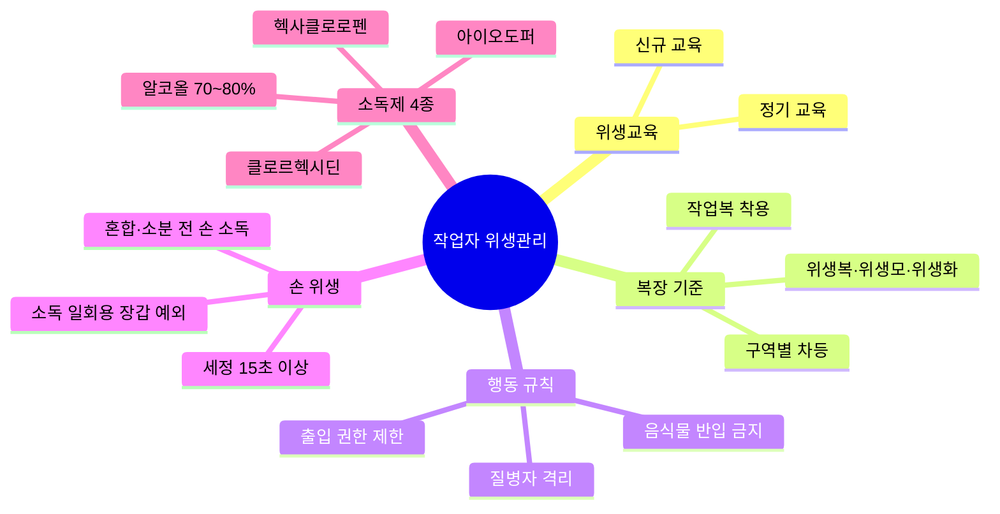

> **🗺️ 마인드맵 노드 상세 매핑**

| 대분류 | 중분류 |
|---|---|
| 위생교육 (L?) | — |
| 위생교육 (L?) | 신규 교육 |
| 위생교육 (L?) | 정기 교육 (L?) |
| 복장 기준 (L?) | — |
| 복장 기준 (L?) | 작업복 착용 (L?) |
| 복장 기준 (L?) | 구역별 차등 |
| 복장 기준 (L?) | 위생복·위생모·위생화 |
| 행동 규칙 | — |
| 행동 규칙 | 음식물 반입 금지 (L?) |
| 행동 규칙 | 질병자 격리 (L?) |
| 행동 규칙 | 출입 권한 제한 |
| 손 위생 | — |
| 손 위생 | 세정 15초 이상 (L?) |
| 손 위생 | 소독 일회용 장갑 예외 |
| 손 위생 | 혼합·소분 전 손 소독 (L?) |
| 소독제 4종 (L?) | — |
| 소독제 4종 (L?) | 알코올 70~80% |
| 소독제 4종 (L?) | 클로르헥시딘 (L?) |
| 소독제 4종 (L?) | 헥사클로로펜 (L1031\|안전기준_별표1_사용불가원료.pdf) |
| 소독제 4종 (L?) | 아이오도퍼 (L?\|안전기준_별표2_사용제한원료.pdf) |

① 적절한 위생관리 기준 및 절차를 마련하고, 제조소 내의 모든 직원은 위생관리 기준 및 절차를 준수하여야 한다.

| 구분 | 내용 |
|---|---|
| 신규 직원 | 위생 교육 실시 |
| 기존 직원 | 정기적 교육 실시 |

> **직원의 위생관리 기준 및 절차 포함 사항**
> 직원의 작업 시 복장, 직원 건강상태 확인, 직원에 의한 제품의 오염방지에 관한 사항, 직원의 손 씻는 방법, 직원의 작업 중 주의사항, 방문객 및 교육훈련을 받지 않은 직원의 위생관리 등

② 작업소 및 보관소 내의 직원은 화장품의 오염 방지를 위해 작업소 및 보관소 내의 규정된 **작업복을 착용**해야 하며, **음식물 등을 반입해서는 안 된다**
   (의약품을 포함한 개인 물품은 별도의 지역에 보관해야 하며, 음식 및 음료 섭취, 흡연 등은 제조 및 보관 지역과 분리된 곳에서 해야 함).

③ **피부에 외상이 있거나 질병에 걸린 직원**은 건강상태가 양호해지거나 품질에 영향을 주지 않는다는 의사의 소견이 있기 전까지 화장품과 직접 접촉되지 않도록 **격리되어야 한다.**

④ 제조 구역별 접근 권한이 없는 작업원 및 방문객은 가급적 제조, 관리 및 보관 구역 내에 들어가지 않도록 하고, 불가피한 경우 사전에 직원 위생에 대한 교육 및 복장 규정에 따르도록 하고 감독해야 한다.
   (방문객과 훈련받지 않은 직원이 제조, 관리 및 보관 구역으로 들어갈 경우 반드시 안내자와 동행해야 하며, 그들이 제조, 관리, 보관 구역으로 들어갈 것을 반드시 기록해야 함).

> **참고 — 손 씻기**: 직원은 손 세척 설비를 사용하도록 교육을 받아야 함

---

## 2. 작업장 내 직원의 위생 상태 판정 (체크리스트)

> 📌 **출처**: CGMP (식약처 고시 제2024-46호) 제2장 | **참조 PDF**: `우수화장품 제조 및 품질관리기준(식품의약품안전처고시)(제2024-46호)(20240822).pdf` | **시행일**: 2024. 9. 1. | **최종 확인**: 2026. 8. 29.

> **한 줄 요약**: 위생관리 기준 준수, 작업복 착용, 출입 제한·질병자 작업 금지 3대 체크리스트.

① 적절한 위생관리 기준 및 절차가 마련되고, 이를 준수하고 있는가?

② 작업소 및 보관소 내의 모든 직원들은 화장품의 오염을 방지하기 위해 규정된 작업복을 착용하고 있는가?

③ 제조 구역별 접근 권한이 없는 작업원 및 방문객은 가급적 출입을 제한한 규정과 질병에 걸린 직원이 작업에 참여하지 못하는 규정이 있는가?

---

## 3. 혼합·소분 시 위생관리 규정 🎯 **기출**

> 📌 **출처**: 화장품법 제3조의4 + CGMP 제3장 | **참조 PDF**: `화장품법(법률)(제20901호)(20260402).pdf` | **시행일**: 2026. 4. 2. | **최종 확인**: 2026. 8. 29.

> **한 줄 요약**: 품질성적서 확인 + 손 소독(일회용 장갑 예외) + 포장용기 오염 확인 + 기구 세척.

① 맞춤형화장품판매업자는 맞춤형화장품 판매장 시설·기구를 정기적으로 점검하여 보건위생상 위해가 없도록 관리해야 한다.

② 위생관리란 대상물의 표면에 있는 바람직하지 못한 미생물 등 오염물을 감소시키기 위해 시행되는 작업으로, 혼합·소분 시 아래와 같이 안전관리 기준을 준수해야 한다.

| 단계 | 기준 사항 | 비고 |
|---|---|---|
| 원료 확인 | 사용되는 내용물 또는 원료에 대한 품질성적서 확인 | |
| 손 소독·세정 | 혼합·소분 전 손을 소독하거나 세정 | **일회용 장갹 착용 시 예외** |
| 포장용기 확인 | 혼합·소분된 제품을 담을 포장용기의 오염 여부 확인 | |
| 장비·기구 위생 | 사용 전 위생 상태 점검, 사용 후 오염 없도록 세척 | |
| 기타 | 식약처장이 정하여 고시하는 사항 준수 | |

> **확인문제 — 혼합·소분 작업 전 점검 사항으로 옳지 않은 것은?**
> ① 사용 원료의 품질성적서를 확인한다.
> ② 작업 전 손을 소독하거나 세정한다.
> ③ 제품 포장용기의 오염 여부를 확인한다.
> ④ 혼합 중에는 손세정을 생략해도 된다. *(← 옳지 않음)*
> ⑤ 장비·기구의 위생상태를 확인한다.
>
> **정답**: ④
> **해설**: 혼합·소분 전에 손을 소독하거나 세정해야 하나, 일회용 장갑을 착용하는 경우에는 예외이다. '혼합 중 손세정 생략'은 규정에 없는 내용이다.

---

## 4. 작업자 위생 유지를 위한 세제의 종류와 사용법

> 📌 **출처**: CGMP (식약처 고시 제2024-46호) 제2장 | **참조 PDF**: `우수화장품 제조 및 품질관리기준(식품의약품안전처고시)(제2024-46호)(20240822).pdf` | **시행일**: 2024. 9. 1. | **최종 확인**: 2026. 8. 29.

> **한 줄 요약**: 손 세정제(일반 비누) + 손 소독제(에탄올 함유, 의약외품, 물 없이 사용 가능).

| 종류 | 내용 | 사용법 |
|---|---|---|
| **손 세정제** | 손 표면에 묻은 이물질을 씻거나 닦아내는 데 쓰는 물질 · 일반 비누(예: 액상, 고체형 손비누) | 흐르는 물에 비누를 사용하여 세척 |
| **손 소독제** 🎯 **기출** | 1차 에탄올이 함유되어 세정 효과가 있음 · 물 없이도 손 소독이 가능하며, **의약외품으로 분류됨** · 알코올, 클로르헥시딘, 헥사클로로펜, 아이오도퍼 등 | 손 소독제로 소독 |

---

## 5. 작업자 소독을 위한 소독제의 종류와 사용법

> 📌 **출처**: CGMP (식약처 고시 제2024-46호) 제2장 | **참조 PDF**: `우수화장품 제조 및 품질관리기준(식품의약품안전처고시)(제2024-46호)(20240822).pdf` | **시행일**: 2024. 9. 1. | **최종 확인**: 2026. 8. 29.

> **한 줄 요약**: 미지근한 물 + 비누 15초 이상 문지르기 + 일회용 타올 건조 + 손소독제 전면 도포. 소독제 4종: 알코올(70~80%), 클로르헥시딘(0.5~4%), 헥사클로로펜(3%), 아이오도퍼(0.5~10%).

### (1) 소독제의 선택
- 소독제란 병원 미생물을 사멸시키기 위해 인체의 피부, 점막의 표면이나 기구, 환경의 소독을 목적으로 사용하는 화학 물질을 총칭함
- 소독제를 선택할 때에는 소독제의 조건을 고려해야 함

### (2) 작업장 내 직원의 소독제 사용 방법

| 단계 | 내용 |
|---|---|
| 손 적시기 | 깨끗한 흐르는 물에 손을 적신 후 비누를 충분히 적용. 뜨거운 물은 피부염 발생 위험이 있으므로 **미지근한 물** 사용 |
| 세척 | 손의 모든 표면에 비누액이 접촉하도록 **15초 이상** 문지름. 손가락 끝·엄지·손가락 사이사이 주의 깊게 문지름 |
| 헹굼·건조 | 물로 헹군 후 손이 재오염되지 않도록 **일회용 타올**로 건조시킴 |
| 수도꼭지 잠금 | 사용한 타올을 이용하여 잠금 |
| 타올 사용 | 반복 사용하지 않으며 여러 사람이 공용하지 않음 |
| 손소독제 적용 | 손이 마른 상태에서 손소독제를 모든 표면을 덮을 수 있도록 충분히 적용 |
| 손소독제 문지르기 | 손의 모든 표면에 소독제가 접촉되도록, 특히 손가락 끝·엄지·손가락 사이사이를 주의 깊게 문지름 |
| 건조 | 손의 모든 표면이 마를 때까지 문지름 |

### (3) 소독제의 종류 및 특징

| 종류 | 설명 | 사용법 |
|---|---|---|
| 알코올 | 단백질 변성기전으로 소독 및 살균 효과 | 70~80% 농도로 사용 |
| 클로르헥시딘 | 양이온 항균제, 세포질막의 파괴로 소독 효과 | 0.5~4.0% 농도로 사용 |
| 헥사클로로펜 | 세포벽 파괴로 소독 효과 | 3.0% 농도로 사용 |
| 아이오도퍼 | 세포 단백질 합성 저해와 세포막 변성에 의한 소독 효과 | 0.5~10% 농도로 사용 |

---

## 6. 작업자 위생관리를 위한 복장 청결 상태 판단

> 📌 **출처**: CGMP (식약처 고시 제2024-46호) 제2장 | **참조 PDF**: `우수화장품 제조 및 품질관리기준(식품의약품안전처고시)(제2024-46호)(20240822).pdf` | **시행일**: 2024. 9. 1. | **최종 확인**: 2026. 8. 29.

> **한 줄 요약**: 방진복(특수화장품)·작업복(제조)·실험복(실험실) + 구역별 착용 기준(작업복·모·화: 제조·칭량·충전·포장).

### (1) 작업자의 복장 청결 상태 판단
① 규정된 작업 복장을 하고 착용 상태는 양호한가?

② 작업모, 작업복, 작업화는 청결한가?

③ 머리카락이 모자 밑으로 나오지 않도록 착용하였는가?

④ 작업 전 수세와 소독을 하였는가?

⑤ 과도한 화장과 액세서리 등을 착용하지 않았는가?

⑥ 두발, 손톱 상태는 단정한가?

⑦ 감기, 발열, 화농 등의 개인 건강상태는 양호한가?

### (2) 작업 복장 기준

| 구분 | 형태 | 작업 내용 | 작업자 |
|---|---|---|---|
| **방진복 (형태)** | 전면 지퍼, 긴소매, 긴 바지로 주머니가 없음 · 손목, 허리, 발목은 고무줄 · 모자는 챙이 있고, 머리를 완전히 감싸는 형태 | 특수화장품 제조 작업 | 특수화장품의 제조/충전자 |
| **작업복 (형태)** | 상하의가 분리 | 제조 작업 · 원료 칭량 · 원료·자재·반제품 및 제품의 보관, 입·출고 관련 작업 · 제조 설비류의 보수 및 유지관리 작업 | 제조 작업자 · 원료 칭량실 인원 · 자재 보관 관리자 · 제조 시설 관리자 |
| **실험복 (형태)** | 백색 가운으로 양쪽 주머니가 있음 | 가운이 필요한 실험실 및 간접 부문 작업 | 실험실 인원 및 기타 필요 인원 |

### (3) 구역별 복장 기준

| 복장 기준 | 제조실 | 칭량실 | 충전실 | 포장실 | 실험실 |
|---|---|---|---|---|---|
| 작업복 (착용 구역) | ○ | ○ | ○ | ○ | - |
| 작업모(위생모) | ○ | ○ | ○ | ○ | - |
| 작업화(안전화) | ○ | ○ | ○ | ○ | - |
| 실험복 (착용 구역) | - | - | - | ○ | ○ |
| 마스크 | 필요 시 | 필요 시 | 필요 시 | - | ○ |
| 슬리퍼 | - | - | - | - | - |
| 보호안경 | 필요 시 | 필요 시 | - | - | ○ |

**복장 예시 (제조실, 칭량실, 충전실, 포장실)**
- 작업모(위생모), 보호안경(필요 시), 마스크(필요 시), 작업복(상하의), 작업화(안전화)

**복장 예시 (실험실)**
- 실험복, 슬리퍼

---
*출처: 화장품 관련 자격증 수험서, PART 03 유통화장품 안전관리 - CHAPTER 02 작업자 위생관리*

---

## 📊 소독제 종류 및 특징 비교표

> 📌 **출처**: 식약처 위생관리 지침 | **시행일**: 2024. 9. 1. | **최종 확인**: 2026. 8. 29.

| 소독제 | 기전 | 사용 농도 | 특징 |
|---|---|---|---|
| **알코올** | 단백질 변성 | 70~80% | 가장 보편적, 신속 살균 |
| **클로르헥시딘** | 양이온 항균, 세포질막 파괴 | 0.5~4.0% | 광범위 항균, 피부 소독 |
| **헥사클로로펜** | 세포벽 파괴 | 3.0% | 그람양성균에 효과 |
| **아이오도퍼** | 단백질 합성 저해, 세포막 변성 | 0.5~10% | 광범위 항균, 요오드 함유 |

## 📊 구역별 복장 기준 비교표

> 📌 **출처**: CGMP (식약처 고시 제2024-46호) 제2장 | **참조 PDF**: `우수화장품 제조 및 품질관리기준(식품의약품안전처고시)(제2024-46호)(20240822).pdf` | **시행일**: 2024. 9. 1. | **최종 확인**: 2026. 8. 29.

| 복장 | 제조실 | 칭량실 | 충전실 | 포장실 | 실험실 |
|---|---|---|---|---|---|
| **작업복** | ○ | ○ | ○ | ○ | — |
| **작업모** | ○ | ○ | ○ | ○ | — |
| **작업화** | ○ | ○ | ○ | ○ | — |
| **실험복** | — | — | — | ○ | ○ |
| **마스크** | 필요 시 | 필요 시 | 필요 시 | — | ○ |
| **보호안경** | 필요 시 | 필요 시 | — | — | ○ |
| **슬리퍼** | — | — | — | — | — |

## 📊 작업 복장 종류 비교표

> 📌 **출처**: CGMP (식약처 고시 제2024-46호) 제2장 | **참조 PDF**: `우수화장품 제조 및 품질관리기준(식품의약품안전처고시)(제2024-46호)(20240822).pdf` | **시행일**: 2024. 9. 1. | **최종 확인**: 2026. 8. 29.

| 구분 | 형태 | 작업 내용 | 착용자 |
|---|---|---|---|
| **방진복** | 전면 지퍼, 긴소매/바지, 주머니 없음, 손목·허리·발목 고무줄 | 특수화장품 제조 | 특수화장품 제조/충전자 |
| **작업복** | 상하의 분리 | 제조·칭량·보관·유지관리 | 제조·칭량·보관·시설 관리자 |
| **실험복** | 백색 가운, 양쪽 주머니 | 실험실·간접 부문 | 실험실 인원 및 기타 필요 인원 |

---

## ✅ 확인문제

> **문제 1.** 작업장 내 직원의 위생 기준으로 옳지 않은 것은?
> ① 신규 직원은 위생 교육을 실시한다
> ② 작업복을 착용해야 하며 음식물을 반입해서는 안 된다
> ③ 피부에 외상이 있는 직원은 격리되어야 한다
> ④ 방문객은 안내자 없이도 자유롭게 제조 구역에 출입할 수 있다
>
> **정답**: ④
> **해설**: 방문객과 훈련받지 않은 직원은 반드시 안내자와 동행해야 하며, 출입 사실을 기록해야 한다.

> **문제 2.** 손 세정 시 비누를 문지르는 시간은 최소 몇 초 이상인가?
> ① 5초 ② 10초 ③ 15초 ④ 30초
>
> **정답**: ③ 15초 이상
> **해설**: 손의 모든 표면에 비누액이 접촉하도록 15초 이상 문지르며, 손가락 끝과 엄지손가락 및 손가락 사이사이를 주의 깊게 문질러야 한다.

> **문제 3.** 알코올 소독제의 사용 농도는?
> ① 50~60% ② 60~70% ③ 70~80% ④ 80~90%
>
> **정답**: ③ 70~80%
> **해설**: 알코올은 단백질 변성 기전으로 소독 및 살균 효과가 있으며 70~80% 농도로 사용한다.

> **문제 4.** 실험실에서 착용해야 할 복장으로 옳은 것은?
>
> ① 작업복, 작업모, 작업화

> ② 방진복, 작업모

> ③ 실험복, 슬리퍼

> ④ 작업복, 마스크
>
> **정답**: ③ 실험복, 슬리퍼
> **해설**: 실험실 복장 예시는 실험복과 슬리퍼이다. 제조실·칭량실·충전실·포장실은 작업모, 보호안경(필요 시), 마스크(필요 시), 작업복(상하의), 작업화(안전화)를 착용한다.

---

## 📖 핵심 용어 정리

| 용어 | 핵심 포인트 |
|---|---|
| **위생관리 기준** | 신규 직원 위생 교육, 기존 직원 정기 교육 — 복장·건강·오염방지·손 씻기·주의사항 포함 |
| **작업복 착용** | 작업소·보관소 내 규정된 작업복 착용, 음식물 반입 금지 |
| **질병자 격리** | 피부 외상·질병 직원은 의사 소견 전까지 화장품 접촉 금지·격리 |
| **방문객 출입** | 안내자 동행 필수, 출입 기록 의무, 위생 교육·복장 규정 준수 |
| **혼합·소분 전 손 소독** | 원칙적으로 손 소독·세정, 일회용 장갑 착용 시 예외 |
| **손 세정제** | 일반 비누(액상·고체형), 흐르는 물에 세척 |
| **손 소독제** | 에탄올 함유, 의약외품, 물 없이 사용 가능 — 알코올·클로르헥시딘·헥사클로로펜·아이오도퍼 |
| **손 세정 방법** | 미지근한 물, 비누 15초 이상 문지르기, 일회용 타올 건조, 수도꼭지는 타올로 잠금 |
| **알코올** | 단백질 변성 기전, 70~80% 농도 |
| **클로르헥시딘** | 양이온 항균제, 세포질막 파괴, 0.5~4.0% 농도 |
| **헥사클로로펜** | 세포벽 파괴, 3.0% 농도 |
| **아이오도퍼** | 단백질 합성 저해·세포막 변성, 0.5~10% 농도 |
| **방진복** | 전면 지퍼, 주머니 없음, 손목·허리·발목 고무줄 — 특수화장품 제조/충전 |
| **작업복** | 상하의 분리 — 제조·칭량·보관·유지관리 작업 |
| **실험복** | 백색 가운, 양쪽 주머니 — 실험실·간접 부문 |


---

## 📖 설비 및 기구관리
> 출처: `우수화장품 제조 및 품질관리기준(식품의약품안전처고시)(제2024-46호)(20240822).pdf`


---

## 📚 Chapter 03. 설비 및 기구관리 (PART 03)

> **고득점 TIP**: 설비·기구의 특징과 재질에 대해 암기하고, 관련 용어를 집중적으로 암기하세요.
>
> 🔗 **관련 과목**
> - 4과목 7챕터 "충진 및 포장" — 충진 설비 및 기구의 위생 기준과 연계

---

> 📋 **학습 가이드**
> - 출제 빈도: ★★★☆☆ (설비 위생 기준, 저울 점검, 세척 원칙, 표면 균 측정법, 설비 재질)
> - 예상 소요 시간: 35분
> - 핵심 키워드: 저울 점검(영점 매일/정기 1개월), 세척 원칙 6가지, 표면 균 측정(면봉법·콘택트플레이트법), 린스 정량법(HPLC·TLC·TOC·UV), 설비 재질(316 스테인리스), 설비 세첡제 4유형

---

## 1. 설비·기구의 위생 기준 설정

> 📌 **출처**: CGMP (식약처 고시 제2024-46호) 제3장 | **참조 PDF**: `우수화장품 제조 및 품질관리기준(식품의약품안전처고시)(제2024-46호)(20240822).pdf` | **시행일**: 2024. 9. 1. | **최종 확인**: 2026. 8. 29.

> **한 줄 요약**: 설비 위생 기준 9가지 + 저울 점검(영점·수평 매일, 정기 1개월) + 세척 원칙 6가지 + 물의 품질 기준.

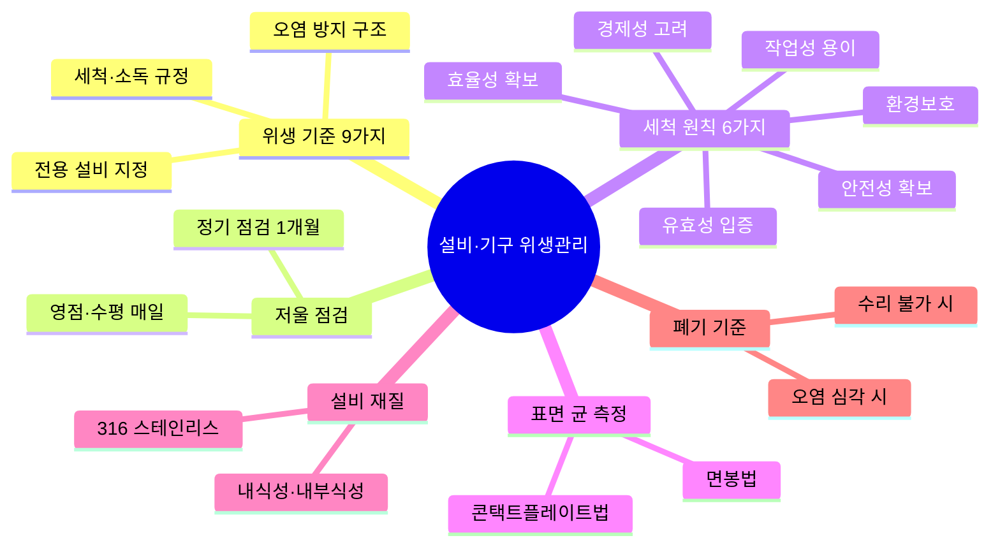

> **🗺️ 마인드맵 노드 상세 매핑**

| 대분류 | 중분류 |
|---|---|
| 위생 기준 9가지 (L?) | — |
| 위생 기준 9가지 (L?) | 세척·소독 규정 |
| 위생 기준 9가지 (L?) | 오염 방지 구조 (L74) |
| 위생 기준 9가지 (L?) | 전용 설비 지정 |
| 저울 점검 (L?) | — |
| 저울 점검 (L?) | 영점·수평 매일 (L?) |
| 저울 점검 (L?) | 정기 점검 1개월 (L?) |
| 세척 원칙 6가지 (L?) | — |
| 세척 원칙 6가지 (L?) | 유효성 입증 |
| 세척 원칙 6가지 (L?) | 효율성 확보 |
| 세척 원칙 6가지 (L?) | 경제성 고려 |
| 세척 원칙 6가지 (L?) | 안전성 확보 (L252\|화장품법(법률)(제20901호)(20260402).pdf) |
| 세척 원칙 6가지 (L?) | 환경보호 |
| 세척 원칙 6가지 (L?) | 작업성 용이 |
| 표면 균 측정 (L?) | — |
| 표면 균 측정 (L?) | 면봉법 (L?) |
| 표면 균 측정 (L?) | 콘택트플레이트법 (L?) |
| 설비 재질 (L?) | — |
| 설비 재질 (L?) | 316 스테인리스 (L?) |
| 설비 재질 (L?) | 내식성·내부식성 |
| 폐기 기준 (L?) | — |
| 폐기 기준 (L?) | 수리 불가 시 |
| 폐기 기준 (L?) | 오염 심각 시 |

### (1) 제조 및 품질관리에 필요한 설비의 위생 기준

1. 사용 목적에 적합하고, 청소가 가능하며, 필요한 경우 위생 유지관리가 가능할 것 (자동화 시스템을 도입한 경우도 동일)

2. 사용하지 않는 연결 호스와 부속품은 청소 등 위생관리하여 먼지, 얼룩 또는 다른 오염으로부터 보호하고, 건조한 상태를 유지할 것

3. 배수가 용이하도록 설계·설치하며, 제품 및 청소 소독제와 화학반응을 일으키지 않을 것

4. 설비 등의 위치는 원자재나 직원의 이동으로 제품의 품질에 영향을 주지 않으면서 제품의 오염을 방지할 것

5. 벌크제품의 용기는 먼지나 수분으로부터 내용물을 보호할 것

6. 배관 및 배수관을 설치하며 배수관은 역류하지 않고 청결을 유지할 것

7. 천장 주위의 대들보, 노출된 파이프, 덕트 등은 가급적 노출되지 않게 설계하고, 파이프는 벽에 닿지 않게 할 것

8. 소모품은 제품의 품질에 영향을 주지 않도록 할 것

9. 저울의 검사, 측정 및 관리
   - 매일 영점을 조정하고, 주기별로 점검을 실시할 것
   - 검사, 측정 및 시험 장비의 정밀도를 유지·보존할 것

**[저울 점검 기준표]**

| 점검 항목 | 영점 | 수평 | 저울 정기 점검 |
|---|---|---|---|
| 점검 주기 | 매일 | 매일 | 1개월에 한 번 |
| 점검 시기 | 가동 전 | 가동 전 | - |
| 점검 방법 | 영점 설정 확인 | 육안 확인 | 표준 분동으로 실시 |
| 판정 기준 | '0' 설정 확인 | 수평임을 확인 | 직선성: ±0.5% 이내<br>정밀성: ±0.5% 이내<br>편심오차: ±0.1% 이내 |
| 이상 시 조치 사항 | 수리의뢰 및 필요 조치 | 자가 조절 후 수리의뢰 및 필요 조치 | 필요 조치 |

> **확인문제**: 저울 정기 점검은 (1개월)에 한 번 실시하며, 편심오차의 기준은 ±(0.1)% 이내이다.
>
> **해설**: 저울 점검은 영점(매일 가동 전), 수평(매일 가동 전), 정기 점검(1개월 1회, 표준 분동)으로 구분된다. 직선성 ±0.5%, 정밀성 ±0.5%, 편심오차 ±0.1% 이내가 기준이다.

---

### (2) 설비 세척의 원칙

1. 위험성이 없는 용제(물이 최적)로 세척하며, 분해할 수 있는 설비는 분해해서 세척한다.

2. 세제 사용은 가능한 한 최소화한다.

3. 증기 세척은 효과적인 방법으로 활용할 수 있다.

4. 필요 시 브러시 등을 이용해 오염을 문질러 제거하는 방법을 고려한다.

5. 세척 후에는 반드시 판정하며, 판정 후의 설비는 건조·밀폐해서 보존한다.

6. 세척의 유효기간을 설정한다.

> **참고 – 세제 미사용의 이유**
> 세제 사용을 권하지 않는 이유는 설비 내벽에 남기 쉽고, 남았을 경우 제품에 영향을 미쳐 남은 세제를 분석하기 어렵기 때문이다.

### (3) 제조 시설의 세척 및 평가

1. 책임자 지정

2. 세척 및 소독 계획

3. 세척 방법과 세척에 사용되는 약품 및 기구

4. 제조 시설의 분해 및 조립 방법

5. 이전 작업 표시 제거 방법

6. 청소 상태 유지 방법

7. 작업 전 청소 상태 확인 방법

### (4) 물의 품질

1. 물의 품질 적합 기준은 사용 목적에 맞게 규정할 것

2. 물의 품질은 정기적으로 검사하고 필요 시 미생물학적 검사를 실시할 것

3. 물 공급 설비는 물의 정체와 오염을 피할 수 있도록 설치할 것

4. 물 공급 설비는 물의 품질에 영향이 없을 것

5. 물 공급 설비는 살균처리가 가능할 것

> **참고 – 사용 목적별 물의 품질**
> - 제조설비 세척: 정제수, 상수
> - 손 씻기: 상수
> - 제품 용수: 화장품 제조 시 적합한 정제수

---

## 2. 설비·기구의 위생 상태 판정

> 📌 **출처**: CGMP (식약처 고시 제2024-46호) 제3장 | **참조 PDF**: `우수화장품 제조 및 품질관리기준(식품의약품안전처고시)(제2024-46호)(20240822).pdf` | **시행일**: 2024. 9. 1. | **최종 확인**: 2026. 8. 29.

> **한 줄 요약**: 세척 후 판정(육안·닦아내기·린스 정량법) + 표면 균 측정(면봉법·콘택트플레이트법).

세척 후에는 반드시 판정을 실시하며, 판정 방법은 다음과 같다.

| 판정 방법 | 내용 |
|---|---|
| 육안 판정 | 장소는 미리 정해 놓고 판정 결과를 기록서에 기재 |
| 닦아내기 판정 | 흰 천이나 검은 천으로 설비 내부의 표면을 닦아내고, 천 표면의 잔류물 유무로 세척 결과 판정 (천은 무진포가 선호됨) |
| 린스 정량법 | 호스나 틈새기의 세척 판정에 적합하며, 수치로 결과 확인 가능 (HPLC, TLC, TOC, UV) |

### 표면 균 측정법

**① 면봉 시험법**
1. 포일로 싼 면봉과 멸균액을 고압멸균기에 멸균 (121℃, 20분)

2. 검증하고자 하는 설비 선택

3. 면봉으로 일정 크기의 면적 표면을 문지름 (보통 24 ~ 30㎠)

4. 검체 채취 후 검체가 묻어 있는 면봉을 적절한 희석액(멸균된 생리 식염수 또는 완충 용액)에 담가 채취된 미생물 희석

5. 미생물이 희석된 희석액 1mL를 취해 한천 평판 배지에 도말하거나 배지를 부어 미생물 배양 조건에 맞춰 배양

6. 배양 후 검출된 집락 수를 세어 희석 배율을 곱해 면봉 1개당 검출되는 미생물 수를 계산 (CFU/면봉)

**② 콘택트 플레이트법**
1. 콘택트 플레이트에 직접 또는 부착된 라벨에 표면 균, 채취 날짜, 검체 채취 위치, 검체 채취자에 대한 정보 기록

2. 한 손으로 콘택트 플레이트 뚜껑을 열고 다른 한 손으로 표면 균을 채취하고자 하는 위치에 배지가 고르게 접촉하도록 가볍게 눌렀다가 떼어낸 후 뚜껑을 덮음

3. 검체 채취가 완료된 콘택트 플레이트를 테이프로 봉하여 열리지 않도록 하여 오염 방지

4. 검체 채취가 완료된 표면을 70% 에탄올로 소독과 함께 배지의 잔류물 남지 않도록 함

5. 미생물 배양 조건에 맞추어 배양

6. 배양 후 CFU 수 측정

> **용어**
> - **HPLC (고성능 액체 크로마토그래피)**: 용매 중의 유기화합물을 성분별로 분석하여 함유량을 측정함
> - **TLC (박층크로마토그래피)**: 고정상으로 만든 박층을 이용하여 혼합물을 이동상으로 전개하여 각각의 성분을 분석함
> - **TOC (총유기탄소)**: 유기물질 측정 지표 중 하나로, 유기적으로 결합된 탄소의 합을 측정함

---

## 3. 오염 물질 제거 및 소독 방법

> 📌 **출처**: CGMP (식약처 고시 제2024-46호) 제3장 | **참조 PDF**: `우수화장품 제조 및 품질관리기준(식품의약품안전처고시)(제2024-46호)(20240822).pdf` | **시행일**: 2024. 9. 1. | **최종 확인**: 2026. 8. 29.

> **한 줄 요약**: 세척 대상 물질 5종 + 세척 대상 설비 4종 + 세척 방법(물+브러시 1순위) + 세척제 4유형(pH별).

### (1) 세척 대상 물질
1. 화학 물질 (원료, 혼합물), 미립자, 미생물

2. 동일 제품, 이종 제품

3. 쉽게 분해되는 물질, 안정된 물질

4. 불용 물질, 가용 물질

5. 검출이 곤란한 물질, 쉽게 검출할 수 있는 물질

### (2) 세척 대상 설비
1. 설비, 배관, 용기, 호스, 부속품

2. 단단한 표면(용기 내부), 부드러운 표면(호스)

3. 큰 설비, 작은 설비

4. 세척이 곤란한 설비, 용이한 설비

### (3) 세척 및 소독 방법
1. 세척 방법에 제1선택지, 제2선택지, 심한 더러움 시의 대안을 마련하여 세척 대책이 되는 설비의 상태에 맞게 세척 방법을 선택한다.

2. 유화기 등의 일반적인 제조설비는 '물+브러시' 세척이 제1선택지이다.

3. 지우기 어려운 잔류물에는 에탄올 등의 유기용제의 사용이 필요하다.

4. 분해할 수 있는 부분은 분해하여 세척한다.

5. 호스와 여과천 등은 서로 상이한 제품 간에 공용해서는 안 되며, 제품마다 전용품을 준비한다.

### (4) 설비 세척제의 유형

| 유형 | 세척대상 | 세척제 예시 | 특징 |
|---|---|---|---|
| 무기산, 약산성 세척제 | 무기염, 수용성 금속 혼합물 | 강산: 염산, 황산<br>약산: 인산, 초산, 구연산 | pH 0.2 ~ 5.5<br>산성에 녹는 물질, 금속 산화물 제거에 효과적<br>독성, 환경 및 취급 문제 |
| 중성 세척제 | 기름때, 작은 입자 | 약한 계면활성제 용액 (알코올과 같은 수용성 용매를 포함할 수 있음) | pH 5.5 ~ 8.5<br>용해나 유화에 의한 제거<br>낮은 독성, 부식성 |
| 약알칼리, 알칼리 세척제 | 기름, 지방입자 | 수산화암모늄, 탄산나트륨, 인산나트륨 | pH 8.5 ~ 12.5<br>알칼리는 비누화, 가수분해를 촉진 |
| 부식성 알칼리 세척제 | 찌든 기름 | 수산화나트륨, 수산화칼륨, 규산나트륨 | pH 12.5 ~ 14<br>오염물의 가수분해 시 효과가 좋음<br>독성, 부식성 |

---

## 4. 설비·기구의 구성 재질 구분

> 📌 **출처**: CGMP (식약처 고시 제2024-46호) 제3장 | **참조 PDF**: `우수화장품 제조 및 품질관리기준(식품의약품안전처고시)(제2024-46호)(20240822).pdf` | **시행일**: 2024. 9. 1. | **최종 확인**: 2026. 8. 29.

> **한 줄 요약**: 탱크(316 스테인리스)·펌프·호모게나이저·호스·필터·이송파이프·칭량장치·충전기 — 주로 304/316 스테인리스 사용.

| 설비명 | 내용 |
|---|---|
| **탱크** | - 공정 단계 및 완성된 포뮬레이션 과정에서 공정 중 또는 보관용 원료를 저장하기 위해 사용함<br>- 주로 316스테인리스 스틸을 사용하며, 주형 물질 또는 거친 표면은 제품이 뭉치게 되어 화장품에는 추천하지 않음<br>- 미생물학적으로 민감하지 않은 물질이나 제품에는 유리로 안을 댄 강화유리섬유 폴리에스터와 플라스틱으로 안을 댄 탱크를 사용함<br>- 모든 용접, 결합은 가능한 한 매끄럽고 평면이어야 함<br>- 외부 표면의 코팅은 제품에 대해 저항력이 있어야 함 |
| **펌프** | - 다양한 점도의 액체를 다른 지점으로 이동시키기 위해 사용<br>- 하우징과 날개차는 닳는 특성으로 다른 재질로 만들며, 펌핑된 제품으로 젖게 되는 개스킷(Gasket), 패킹(Packing) 및 윤활제가 있으며, 모든 온도 범위에서 제품과의 적합성 평가가 되어야 함<br>- 원하는 속도, 펌핑될 물질의 점성, 수송단계의 필요 조건, 청소/위생관리의 용이성에 따라 선택 |
| **혼합과 교반 장치 (호모게나이저)** | - 제품의 균일성 또는 물리적 성상을 얻기 위해 사용함<br>- 기계적인 회전된 날의 간단한 형태로부터 정교한 제분기와 균질화기까지 있으며, 전기화학적 반응을 피하기 위해 믹서를 설치한 모든 젖은 부분은 탱크와 공존이 가능한지 확인할 것 |
| **호스** | - 한 위치에서 다른 위치로 제품을 전달하기 위해 사용함<br>- 강화된 식품등급의 고무, TYGON 또는 강화된 TYGON, 나일론, 폴리프로필렌, 폴리에칠렌, 네오프렌 등의 구성 재질을 사용함 |
| **필터, 여과기, 체** | - 화장품 원료와 완제품의 입자 크기를 작게 하고, 덩어리 모양을 깨고, 불순물을 제거하기 위해 사용<br>- 스테인리스 스틸과 비반응성 섬유이며, 316스테인리스는 제품 제조 시 선호 |
| **이송파이프** | - 제품을 한 위치에서 다른 위치로 운반함<br>- 유리, 304 또는 316스테인리스, 구리, 알루미늄 등으로 구성되며, 전기화학반응이 일어날 수 있으므로 주의하여야 함 |
| **칭량장치** | - 원료, 제조 과정 중 재료 및 완제품에서 요구되는 성분표 양과 기준을 만족하는지를 보증하기 위해 중량적으로 측정하는 장치<br>- 칭량 작업에 간섭하지 않는다면 보호적인 피복제로 칠할 수 있음 |
| **게이지와 미터기** | - 온도, 압력, 흐름, 점도, pH, 속도, 부피 등 화장품의 특성을 측정 및 기록하기 위해 사용함<br>- 제품과 직접 접하는 게이지와 미터의 적절한 기능에 영향을 주지 않아야 하며, 대부분 원료와 직접 접하지 않도록 분리 장치를 제공함 |
| **제품 충전기** | - 조작 중 온도 및 압력이 제품에 영향을 끼치지 않아야 함<br>- 제품과 접촉되는 표면 물질은 300시리즈 스테인리스 스틸, 304 혹은 더 부식에 강한 316 스테인리스 스틸이 가장 널리 사용됨 |

> **참고 – 펌프의 설계**
> - 원심력을 이용하는 방법: 낮은 점도의 액체에 사용 (예: 물, 청소용제)
>   - 열린 날개차(Impeller)
>   - 닫힌 날개차(Impeller)
> - 양극적인 이동: 점성이 있는 액체에 사용 (예: 미네랄 오일, 에멀전)
>   - Duo Lobe(2중 돌출부)
>   - 기어
>   - 피스톤

> **참고**: 기기는 녹이 발생하지 않는 스테인리스 304, 316의 재질을 사용하여야 한다.

> **확인문제**: 제품의 균일성 또는 물리적 성상을 얻기 위해 사용하는 설비는 (호모게나이저)이다.
>
> **해설**: 호모게나이저(혼합과 교반 장치)는 제품의 균일성 또는 물리적 성상을 얻기 위해 사용하는 설비이다. 기계적 회전 날부터 정교한 제분기·균질화기까지 포함된다.

---

## 5. 설비·기구의 폐기 기준

> 📌 **출처**: CGMP (식약처 고시 제2024-46호) 제3장 | **참조 PDF**: `우수화장품 제조 및 품질관리기준(식품의약품안전처고시)(제2024-46호)(20240822).pdf` | **시행일**: 2024. 9. 1. | **최종 확인**: 2026. 8. 29.

> **한 줄 요약**: 정비 계획·점검(일간/주간/정기) + 설비 결함 6가지 로스 + 부품 교체 + 이력 관리 + 불용 처리 3조건.

| 구분 | 내용 |
|---|---|
| **정비 계획에 따른 점검·정비** | - 설비 대장의 점검·정비 주기와 연간 정비 계획표 수립<br>- 정비 업무 계획표에 따라 점검과 정비 실시<br>- 설비 점검은 설비별 점검 기준서를 기초로 함<br>- 점검 기준서 포함 사항: 설비 구조도면, 명칭, 기능, 취급 방법, 기계요소 및 내구 수명, 작업 내용, 설비 기본 정보(설비 번호, 설비명, 설치 연월, 설치 장소), 설비 사진 또는 도면(일련번호와 함께 점검과 정비 대상인 기계요소의 번호, 명칭, 기능 기재), 점검 부위명, 점검 기준, 점검 방법, 점검 주기, 조치 방법, 담당자명<br>- 설비의 일상 점검: 일간 또는 주간 주기로 실시, 결과를 설비 점검표에 기록<br>- 설비의 정기 점검: 연간 정비 계획서에 따라 정기 정비와 같이 실시, 설비 점검표에 점검 결과를 기재하고 기록 보관 |
| **설비 결함** | - 고장의 원인이 되는 설비 손상, 설비 효율이나 생산 효율을 저해하는 요인을 말함<br>- 설비 효율 저해 요인: 고장 로스, 작업 준비·조정 로스, 일시 정체 로스, 속도 로스, 불량·수정 로스, 초기 수율 로스<br>- 수시로 점검과 정비를 통해 설비 결함의 발생 빈도를 감소시켜야 함 |
| **부품 교체** | 부품 교체 주기표, 유지·보수 계획서, 그리고 장기 보전 계획표에 정해진 기간에 실시하고 예비품을 관리하고, 대장에 기록해야 함 |
| **설비·기구의 이력 관리 및 폐기** | - 사용 조건과 설비 관리의 적절성에 따라 내구연한이 달라짐<br>- 설비 이력 관리를 통한 설비 가동률과 고장률 파악<br>- 점검·정비 주기의 단축 또는 연장 여부 결정<br>- 부품의 교체 시기, 설비의 정밀 진단과 폐기 시점 결정<br>- 설비 가동 일지 기록사항: 설비 번호, 설비명, 설치 장소, 설치 연월과 같은 기본 항목 이외에 생산일 및 시간, 조업 시간, 정지 시간, 부하 시간, 가동 시간, 가동률<br>- 내구연한 종료 설비의 폐기<br>- 설비 이력카드 양식의 구성 |
| **불용 처리** | - 부품 수급이 불가능한 경우<br>- 설비 수리·교체의 비용이 신규 설비 도입 비용을 초과하는 경우<br>- 정기점검 결과 작동 및 오작동에 대한 설비의 신뢰성이 지속적인 경우 |

### 설비 이력카드 양식

| 구성 항목 | 내용 |
|---|---|
| 설비 상세 명세 구성 항목 | 설비 번호, 설비명, 설치 장소, 제작 번호, 제작사, 제조 연월, 구입처, 설치 연월, 설비 사진과 주요 기계요소 명칭, 일련번호와 주요 부속품 및 장치명 |
| 유지·보수 이력 구성 항목 | 유지·보수 일시, 유지·보수 항목, 유지·보수 내용, 조치 사항, 조치 결과, 작업자 |
| 부품 교체 이력 구성 항목 | 부품 교체 일시, 부품명, 교체 방법, 수량, 이전 교체일, 구입처, 작업자 |

---

*출처: 유통화장품 안전관리 교재 PART 03, CHAPTER 03 설비 및 기구관리 (p.139~144)*

---

## 📊 저울 점검 기준 비교표

> 📌 **출처**: CGMP (식약처 고시 제2024-46호) 제3장 | **참조 PDF**: `우수화장품 제조 및 품질관리기준(식품의약품안전처고시)(제2024-46호)(20240822).pdf` | **시행일**: 2024. 9. 1. | **최종 확인**: 2026. 8. 29.

| 점검 항목 | 주기 | 시기 | 방법 | 판정 기준 |
|---|---|---|---|---|
| **영점** | 매일 | 가동 전 | 영점 설정 확인 | '0' 설정 확인 |
| **수평** | 매일 | 가동 전 | 육안 확인 | 수평 확인 |
| **정기 점검** | 1개월 1회 | — | 표준 분동 | 직선성 ±0.5%, 정밀성 ±0.5%, 편심오차 ±0.1% |

## 📊 세척 후 판정 방법 비교표

> 📌 **출처**: CGMP (식약처 고시 제2024-46호) 제3장 | **참조 PDF**: `우수화장품 제조 및 품질관리기준(식품의약품안전처고시)(제2024-46호)(20240822).pdf` | **시행일**: 2024. 9. 1. | **최종 확인**: 2026. 8. 29.

| 판정 방법 | 원리 | 적용 대상 | 특징 |
|---|---|---|---|
| **육안 판정** | 정해진 장소에서 육안 확인 | 일반 설비 표면 | 결과를 기록서에 기재 |
| **닦아내기 판정** | 흰/검은 천으로 표면 닦아 잔류물 확인 | 설비 내부 표면 | 무진포 선호 |
| **린스 정량법** | 수치로 결과 확인 (HPLC, TLC, TOC, UV) | 호스, 틈새기 | 정량 분석 가능 |

## 📊 표면 균 측정법 비교표

> 📌 **출처**: CGMP (식약처 고시 제2024-46호) 제3장 | **참조 PDF**: `우수화장품 제조 및 품질관리기준(식품의약품안전처고시)(제2024-46호)(20240822).pdf` | **시행일**: 2024. 9. 1. | **최종 확인**: 2026. 8. 29.

| 방법 | 원리 | 채취 면적 | 결과 단위 | 특징 |
|---|---|---|---|---|
| **면봉 시험법** | 면봉으로 표면 문지름 → 희석액 배양 | 24~30㎠ | CFU/면봉 | 121℃ 20분 멸균, 생리식염수 희석 |
| **콘택트 플레이트법** | 배지를 표면에 직접 접촉 → 배양 | 배지 면적 | CFU/플레이트 | 70% 에탄올로 잔류물 제거 |

## 📊 설비 세척제 유형 비교표

> 📌 **출처**: CGMP (식약처 고시 제2024-46호) 제3장 | **참조 PDF**: `우수화장품 제조 및 품질관리기준(식품의약품안전처고시)(제2024-46호)(20240822).pdf` | **시행일**: 2024. 9. 1. | **최종 확인**: 2026. 8. 29.

| 유형 | pH 범위 | 세척 대상 | 세척제 예시 | 특징 |
|---|---|---|---|---|
| **무기산·약산성** | 0.2~5.5 | 무기염, 수용성 금속 혼합물 | 염산, 황산, 인산, 구연산 | 산성 물질·금속 산화물 제거, 독성·취급 주의 |
| **중성** | 5.5~8.5 | 기름때, 작은 입자 | 약한 계면활성제 용액 | 낮은 독성·부식성 |
| **약알칼리·알칼리** | 8.5~12.5 | 기름, 지방 입자 | 수산화암모늄, 탄산나트륨 | 비누화·가수분해 촉진 |
| **부식성 알칼리** | 12.5~14 | 찌든 기름 | 수산화나트륨, 수산화칼륨 | 가수분해 효과 좋음, 독성·부식성 |

## 📊 설비 구성 재질 비교표

> 📌 **출처**: CGMP (식약처 고시 제2024-46호) 제3장 | **참조 PDF**: `우수화장품 제조 및 품질관리기준(식품의약품안전처고시)(제2024-46호)(20240822).pdf` | **시행일**: 2024. 9. 1. | **최종 확인**: 2026. 8. 29.

| 설비 | 주요 재질 | 특징 |
|---|---|---|
| **탱크** | 316 스테인리스 | 용접·결합 매끄럽게, 외부 코팅 제품 저항성 |
| **펌프** | 닳는 특성으로 다양한 재질 | 원심력(저점도) vs 양극적 이동(고점도) |
| **호모게나이저** | 탱크와 공존 가능 재질 | 균일성·물리적 성상 확보 |
| **호스** | 식품등급 고무, TYGON, 나일론, 폴리프로필렌 | 제품 전달 |
| **필터·여과기·체** | 316 스테인리스, 비반응성 섬유 | 입자 크기 조정, 불순물 제거 |
| **이송파이프** | 304/316 스테인리스, 유리 | 전기화학반응 주의 |
| **충전기** | 304/316 스테인리스 | 제품 접촉 표면 |

---

## ✅ 확인문제

> **문제 1.** 설비 세척의 원칙으로 옳지 않은 것은?
> ① 위험성이 없는 용제(물이 최적)로 세척한다
> ② 세제 사용은 가능한 한 최소화한다
> ③ 세척 후에는 반드시 판정하며, 건조·밀폐해서 보존한다
> ④ 세제를 다량 사용하여 잔류물을 남기는 것이 효과적이다
>
> **정답**: ④
> **해설**: 세제 사용은 가능한 한 최소화한다. 세제가 설비 내벽에 남기 쉽고, 남았을 경우 제품에 영향을 미치며 남은 세제를 분석하기 어렵기 때문이다.

> **문제 2.** 린스 정량법에 사용되는 분석 방법이 아닌 것은?
> ① HPLC ② TLC ③ TOC ④ UV
>
> **정답**: 모두 사용된다 (①②③④ 모두 린스 정량법에 활용)
> **해설**: 린스 정량법은 호스나 틈새기의 세척 판정에 적합하며, HPLC(고성능 액체 크로마토그래피), TLC(박층크로마토그래피), TOC(총유기탄소), UV로 수치 확인이 가능하다.

> **문제 3.** 화장품 제조 설비에서 가장 널리 사용되는 스테인리스 스틸은?
> ① 304 ② 316 ③ 430 ④ 201
>
> **정답**: ② 316 (단, 304도 널리 사용됨)
> **해설**: 탱크, 필터, 이송파이프, 충전기 등에서 316 스테인리스가 선호되며, 304도 함께 사용된다. 316은 304보다 부식에 강하다.

> **문제 4.** 면봉 시험법에서 면봉 멸균 조건은?
> ① 110℃, 15분 ② 121℃, 20분 ③ 130℃, 10분 ④ 100℃, 30분
>
> **정답**: ② 121℃, 20분
> **해설**: 포일로 싼 면봉과 멸균액을 고압멸균기에 121℃, 20분간 멸균한다. 이후 24~30㎠ 면적을 문지르며, CFU/면봉 단위로 결과를 측정한다.

---

## 📖 핵심 용어 정리

| 용어 | 핵심 포인트 |
|---|---|
| **설비 위생 기준** | 적합·청소 가능·배수 용이·오염 방치·소모품 품질 영향 없음 |
| **저울 영점 점검** | 매일 가동 전, '0' 설정 확인 |
| **저울 정기 점검** | 1개월 1회, 표준 분동 — 직선성 ±0.5%, 정밀성 ±0.5%, 편심오차 ±0.1% |
| **설비 세척 원칙** | 물(최적)로 세척, 세제 최소화, 분해 세척, 세척 후 판정·건조·밀폐, 유효기간 설정 |
| **세척 후 판정** | 육안 판정, 닦아내기 판정(무진포), 린스 정량법(HPLC·TLC·TOC·UV) |
| **면봉 시험법** | 121℃ 20분 멸균, 24~30㎠ 문지름, CFU/면봉 측정 |
| **콘택트 플레이트법** | 배지 직접 접촉, 70% 에탄올로 잔류물 제거, CFU/플레이트 측정 |
| **HPLC** | 고성능 액체 크로마토그래피 — 용매 중 유기화합물 성분별 분석 |
| **TLC** | 박층크로마토그래피 — 고정상 박층 + 이동상 전개로 성분 분석 |
| **TOC** | 총유기탄소 — 유기적으로 결합된 탄소 합 측정 |
| **물의 품질** | 제조설비 세척: 정제수·상수, 손 씻기: 상수, 제품 용수: 정제수 |
| **316 스테인리스** | 탱크·필터·이송파이프·충전기에 선호 — 304보다 부식에 강함 |
| **호모게나이저** | 혼합·교반 장치 — 제품 균일성·물리적 성상 확보 |
| **설비 결함 6가지 로스** | 고장·작업준비·조정·일시정체·속도·불량수정·초기수율 로스 |
| **불용 처리** | 부품 수급 불가, 수리비용 > 신규 도입비용, 신뢰성 지속적 저하 |


---

## 📖 내용물 및 원료관리
> 출처: `화장품 안전기준 등에 관한 규정(식품의약품안전처고시)(제2026-19호)(20260318).pdf`


## 📚 PART 03. 유통화장품 안전관리


---

## 📚 Chapter 04. 내용물 및 원료관리

> **고득점 TIP**: 비의도적 검출 성분의 허용한도, 미생물 한도, 내용량 기준을 집중적으로 암기하세요. 입고된 원료 처리 순서 및 벌크제품의 재보관, 원료 폐기관리 기준은 한 번 더 학습하세요.
>
> 🔗 **관련 과목**
> - 2과목 4챕터 "화장품 관리" — 원자재 보관·출하·적합 판정 기준의 안전관리 세분화

---

> 📋 **학습 가이드**
> - 출제 빈도: ★★★★☆ (비의도적 검출 성분 허용한도, 미생물 한도, 내용량 97%, 입고 라벨 색상, 벌크 재보관, 폐기 절차)
> - 예상 소요 시간: 50분
> - 핵심 키워드: 입고 라벨(백색→황색→청색/적색), 중금속 허용한도(납 20·비소 10·카드뮴 5·수은 1 μg/g), 미생물 한도(영유아·눈화장 500, 기타 1,000 CFU/g), 내용량 97%, 퍼머넌트웨이브 제1제·제2제 기준, 인체 세포·조직 배양액 안전기준

---

### 1. 내용물 및 원료의 입고 기준

> **한 줄 요약**: 용어 정의(일탈·기준일탈·뱃치 등) + 입고관리 6조건 + 입고 처리 순서(황색→백색→청색/적색 라벨).

#### (1) 용어의 정의

| 용어 | 정의 |
|---|---|
| 일탈 | 제조 또는 품질관리 활동 등의 미리 정해진 우수화장품 제조 및 품질관리기준(CGMP)을 벗어나 이루어진 행위 |
| 기준일탈 | 규정된 합격 판정 기준에 일치하지 않는 검사, 측정 또는 시험 결과 |
| 불만 | 제품이 규정된 적합 판정 기준을 충족시키지 못한다고 주장하는 외부 정보 |
| 주요설비 | 제조 및 품질 관련 문서에 명기된 설비로 제품의 품질에 영향을 미치는 필수적인 설비 |
| 감사 | 제조 및 품질과 관련한 결과가 계획된 사항과 일치하는지의 여부와 제조 및 품질관리가 효과적으로 실행되고 목적 달성에 적합한지 여부를 결정하기 위한 체계적이고 독립적인 조사 |
| 내부감사 | 제조 및 품질과 관련한 결과가 계획된 사항과 일치하는지의 여부와 제조 및 품질관리가 효과적으로 실행되고 목적 달성에 적합한지 여부를 결정하기 위한 회사 내 자격이 있는 직원에 의해 행해지는 체계적이고 독립적인 조사 |
| 변경관리 | 모든 제조, 관리 및 보관된 제품이 규정된 적합 판정 기준에 일치하도록 보장하기 위해 우수화장품 제조 및 품질관리기준(CGMP)이 적용되는 모든 활동을 내부 조직의 책임하에 계획하여 변경하는 것 |
| 적합 판정 기준 | 시험 결과의 적합 판정을 위한 수적인 제한, 범위 또는 기타 적절한 측정법 |
| 출하 | 주문 준비와 관련된 일련의 작업과 운송 수단에 적재하는 활동으로 제조소 외로 제품을 운반하는 것 |
| 위생관리 | 대상물의 표면에 있는 바람직하지 못한 미생물 등 오염물을 감소시키기 위해 시행되는 작업 |
| 수탁자 | 직원, 회사 또는 조직을 대신하여 작업을 수행하는 사람, 회사 또는 외부 조직 |
| 공정관리 | 제조공정 중 적합 판정 기준의 충족을 보증하기 위해 공정을 모니터링하거나 조정하는 모든 작업 |
| 제조단위 또는 뱃치 | 하나의 공정이나 일련의 공정으로 제조되어 균질성을 갖는 화장품의 일정한 분량 |

#### (2) 입고관리 기준

① 제조업자는 원자재 공급자에 대한 관리·감독을 적절히 수행하여 입고관리가 철저히 이루어지도록 한다.

② 원자재 입고 시 구매요구서, 원자재 공급업체 성적서 및 현품이 서로 일치하여야 한다(필요한 경우 운송 관련 자료 추가 확인 가능).

③ 원자재 용기에 제조번호를 표시하고, 제조번호가 없는 경우에 관리번호를 부여하여 보관해야 한다.

④ 입고 절차 중 육안으로 물품에 결함이 있음을 확인한 경우 입고를 보류하고 적절한 조치를 취해야 한다.

⑤ 입고된 원자재는 '적합', '부적합', '검사 중' 등으로 상태를 표기해야 한다(동일 수준의 보증이 가능한 다른 시스템이 있다면 대체 가능).

⑥ 원자재 용기 및 시험기록서의 필수적인 기재사항은 다음과 같으며, 이는 입고 시 확인해야 한다.
- 원자재 공급자가 정한 제품명
- 원자재 공급자명
- 수령일자
- 공급자가 부여한 제조번호 또는 관리번호

> **용어 - 제조번호(뱃치번호)**: 뱃치(하나의 공정이나 일련의 공정으로 제조되어 균질성을 갖는 화장품의 일정 분량)에 대해 제조관리 및 출하에 관한 모든 사항을 확인할 수 있도록 표시된 번호로서 숫자, 문자, 기호 또는 이들의 특정적인 조합

#### (3) 입고 내용물 및 원료 처리 순서

```
입고 원료 확인 → 판정 대기소 보관 → 시험 검체 채취 및 시험
 · 구매요구서, 성적서 및    · 시험의뢰서 작성 및 의뢰   · 시험 중: 황색라벨 부착
   현품의 일치 여부 확인    · 백색라벨 부착

              ┌─→ 적합 판정 → 입고
              │    · 청색라벨 부착   · 적합 보관소로 이동
              │
              └─→ 부적합 판정 → 반품
                   · 적색라벨 부착   · 부적합품 보관소로 이동
                                    · 거래처에 반송
```

---

### 2. 유통화장품의 안전관리 기준

> **한 줄 요약**: 비의도적 검출 성분 10종 허용한도 + 미생물 한도(500/100/1000 CFU/g) + 내용량 97% + 유형별 추가 기준(pH 3~9, 유리알칼리 0.1%) + 퍼머넌트웨이브 제1제·제2제 기준 + 인체 세포·조직 배양액 안전기준.

#### (1) 공통 안전관리 기준

① 완전 제거가 불가능한 성분의 검출 허용한도: 화장품 제조 시 아래 물질을 인위적으로 첨가하지 않았으나, 제조 또는 보관 과정 중 비의도적으로 유래된 사실이 객관적인 자료로 확인되고 기술적으로 해당 물질을 완전히 제거할 수 없는 경우 각 물질의 검출 허용한도는 다음과 같다.

| 성분 | 허용한도 |
|---|---|
| 납 (허용한도) | 점토를 원료로 사용한 분말 제품 50μg/g 이하, 그 밖의 제품은 20μg/g 이하 |
| 니켈 (허용한도) | 눈화장용 제품 35μg/g 이하, 색조화장용 제품 30μg/g 이하, 그 밖의 제품은 10μg/g 이하 |
| 비소 (허용한도) | 10μg/g 이하 |
| 안티몬 (허용한도) | 10μg/g 이하 |
| 카드뮴 (허용한도) | 5μg/g 이하 |
| 수은 (허용한도) | 1μg/g 이하 |
| 디옥산 (허용한도) | 100μg/g 이하 |
| 메탄올 (허용한도) | 0.2(v/v)% 이하, 물휴지는 0.002%(v/v) 이하 |
| 포름알데하이드 (허용한도) | 2,000μg/g 이하, 물휴지는 20μg/g 이하 |
| 프탈레이트류 | 디부틸프탈레이트, 부틸벤질프탈레이트 및 디에칠헥실프탈레이트에 한하여 총합으로 100μg/g 이하 |

② 사용할 수 없는 원료로 고시된 원료가

①의 내용과 같이 비의도적으로 검출되었으나 검출 허용한도가 명시되지 않은 경우, 위해 평가를 진행하여 위해 여부를 확인한다.

③ **화장품 미생물 허용한도**

| 구분 | 허용한도 |
|---|---|
| 영유아용 제품류 및 눈화장용 제품류 | 총호기성생균수 500개/g(mL) 이하 |
| 물휴지 | 세균 및 진균수 각각 100개/g(mL) 이하 |
| 기타 화장품류 | 총호기성생균수 1,000개/g(mL) 이하 |
| 모든 화장품류 | 대장균(Escherichia coli), 녹농균(Pseudomonas Aeruginosa), 황색포도상구균(Staphylococcus Aureus) 불검출 |

④ **내용량 기준**
- 제품 3개를 가지고 시험할 때 그 평균 내용량이 표기량에 대해 97% 이상이어야 한다. 다만, 화장비누의 경우 건조 중량을 내용량으로 한다.
- 위의 기준치를 벗어날 경우, 6개를 더 취하여 시험할 때 9개의 평균 내용량이 표기량에 대해 97% 이상이어야 한다.

> **참고 - 액상 제품**: 영유아용 제품류(영유아용 샴푸, 영유아용 린스, 영유아 인체 세정용 제품, 영유아 목욕용 제품은 제외함), 눈화장용 제품류, 색조화장용 제품류, 두발용 제품류(샴푸, 린스는 제외함), 면도용 제품(세이빙 크림, 세이빙 폼은 제외함), 기초화장용 제품류(클렌징 워터, 클렌징 오일, 클렌징 로션, 클렌징 크림 등 메이크업 리무버 제품은 제외함) 중 로션, 크림 및 이와 유사한 제형의 액상 제품

#### (2) 유형별 추가 안전관리 기준

① 액상 제품: pH 기준이 3.0~9.0이어야 한다. 다만, 물을 포함하지 않는 제품과 사용한 후 곧바로 물로 씻어내는 제품은 제외한다.

② 화장비누: 유리알칼리는 0.1% 이하이어야 한다.

③ 기능성화장품: 기능성을 나타나게 하는 주원료의 함량이 심사 또는 보고한 기준에 적합하여야 한다.

#### (3) 퍼머넌트웨이브용 및 헤어스트레이트너

**① 제1제**

- 공통: 품질을 유지하거나 유용성을 높이기 위해 적당한 알칼리제, 침투제, 습윤제, 착색제, 유화제, 향료 등을 첨가할 수 있다(아래 제1제의 1 및 제1제의 2의 혼합물은 제외).
  - 중금속: 20μg/g 이하 (단, 제1제의 2, 제1제의 1 및 제1제의 2의 혼합물은 제외)
  - 비소: 5μg/g 이하 (단, 제1제의 2, 제1제의 1 및 제1제의 2의 혼합물은 제외)
  - 철: 2μg/g 이하 (단, 제1제의 2, 제1제의 1 및 제1제의 2의 혼합물은 제외)

**제품별 기준**

| 제품 유형 | pH | 알칼리 | 환원성 물질 등 |
|---|---|---|---|
| ㉠ 치오글라이콜릭애씨드 주성분, 냉2욕식 퍼머넌트웨이브용 | 4.5~9.6 | 0.1N 염산 소비량 검체 1mL당 7.0mL 이하 | 산성 끓인 후 환원성 물질(치오글라이콜릭애씨드) 2.0~11.0% |
| ㉡ 시스테인류 주성분, 냉2욕식 퍼머넌트웨이브용(불휘발성 무기알칼리 미함유) | 8.0~9.5 | 0.1N 염산 소비량 검체 1mL당 12mL 이하 | 시스테인 3.0~7.5%, 환원 후 환원성 물질(시스틴) 0.65% 이하 |
| ㉢ 치오글라이콜릭애씨드 주성분, 냉2욕식 헤어스트레이트너용 | 4.5~9.6 | 0.1N 염산 소비량 검체 1mL당 7.0mL 이하 | 산성 끓인 후 환원성 물질 2.0~11.0%, 그 외 환원성 물질(0.1N 요오드액) 0.6mL 이하, 환원 후(디치오디글라이콜릭애씨드) 4.0% 이하 |
| ㉣ 치오글라이콜릭애씨드 주성분, 가온2욕식 퍼머넌트웨이브용(약 60℃ 이하 가온) | 4.5~9.3 | 0.1N 염산 소비량 검체 1mL당 5mL 이하 | 산성 끓인 후 환원성 물질 1.0~5.0% |
| ㉤ 시스테인류 주성분, 가온2욕식 퍼머넌트웨이브용(약 60℃ 이하 가온, 불휘발성 무기알칼리 미함유) | 4.0~9.5 | 0.1N 염산 소비량 검체 1mL당 9mL 이하 | 시스테인 1.5~5.5%, 환원 후(시스틴) 0.65% 이하 |
| ㉥ 치오글라이콜릭애씨드 주성분, 가온2욕식 헤어스트레이트너용(약 60℃ 이하 가온) | 4.5~9.3 | 0.1N 염산 소비량 검체 1mL당 5.0mL 이하 | 산성 끓인 후 환원성 물질 1.0~5.0%, 그 외 환원성 물질(0.1N 요오드액) 0.6mL 이하, 환원 후 4.0% 이하 |
| ㉦ 치오글라이콜릭애씨드 주성분, 고온 정발용 열기구 사용 가온2욕식 헤어스트레이트너(고온정발용 열기구 180℃ 이하) | 4.5~9.3 | 0.1N 염산 소비량 검체 1mL당 5.0mL 이하 | 산성 끓인 후 환원성 물질 1.0~5.0%, 그 외 환원성 물질(0.1N 요오드액) 0.6mL 이하, 환원 후 4.0% 이하 |
| ㉧ 치오글라이콜릭애씨드 주성분, 냉1욕식 퍼머넌트웨이브용(실온 사용) | 9.4~9.6 | 0.1N 염산 소비량 검체 1mL당 3.5~4.6mL | 산성 끓인 후 환원성 물질 3.0~3.3%, 그 외 환원성 물질(0.1N 요오드액) 0.6mL 이하, 환원 후 0.5% 이하 |
| ㉨ 치오글라이콜릭애씨드 주성분, 제1제 사용 시 조제하는 발열 2욕식 퍼머넌트웨이브용 | 제1제의 1: pH 4.5~9.5, 알칼리 0.1N 염산 소비량 10mL 이하, 산성 끓인 후 환원성 물질 8.0~19.0%, 그 외 환원성 물질 0.8mL 이하, 환원 후 0.5% 이하 / 제1제의 2: pH 2.5~4.5, 과산화수소 2.7~3.0% / 제1제의 1 및 2 혼합물(3:1): pH 4.5~9.4, 알칼리 0.1N 염산 소비량 7mL 이하, 산성 끓인 후 환원성 물질 2.0~11.0%, 환원 후 3.2~4.0%, 온도 상승 14℃~20℃ |||

**② 제2제 공통 (㉨은 제외)**

- 브롬산나트륨 함유 제제: 브롬산나트륨에 그 품질을 유지하거나 유용성을 높이기 위해 적당한 용해제, 침투제, 습윤제, 착색제, 유화제, 향료 등을 첨가한 것
  - 용해 상태: 명확한 불용성 이물이 없을 것
  - pH: 4.0~10.5
  - 중금속: 20μg/g 이하
  - 산화력: 1인 1회 분량의 산화력이 3.5 이상

- 과산화수소수 함유 제제: 과산화수소수 또는 과산화수소수에 그 품질을 유지하거나 유용성을 높이기 위해 적당한 침투제, 안정제, 습윤제, 착색제, 유화제, 향료 등을 첨가한 것
  - pH: 2.5~4.5
  - 중금속: 20μg/g 이하
  - 산화력: 1인 1회 분량의 산화력이 0.8~3.0

> **참고**: 법령노트 p.71 참고

#### (4) 유통화장품 안전관리 시험 방법

| 성분 | 시험 방법 |
|---|---|
| 납 (시험법) | 디티존법, 원자흡광광도법, 유도결합플라즈마분광기(ICP), 유도결합플라즈마-질량분석기(ICP-MS) 이용 방법 *크림, 팩 등 기초화장용 제품류, 무기물질 및 무기색소가 많이 함유된 색조화장용 제품류, 점토를 사용한 제품 등에서 검출될 수 있음 |
| 비소 (시험법) | 비색법, 원자흡광광도법, 유도결합플라즈마분광기(ICP), 유도결합플라즈마-질량분석기(ICP-MS) 이용 방법 *안료 등의 분체 원료에서 불순물로 존재할 수 있으며, 크림, 팩 등 기초화장용 제품류, 색조화장용 제품류, 눈화장용 제품류, 두발용 제품류, 점토를 사용한 제품 등에서 검출될 수 있음 |
| 수은 (시험법) | 수은분해장치를 이용한 방법, 수은분석기를 이용한 방법 *기초화장품 제품류, 영유아용 제품류 중 크림류 제품 등에서 검출될 수 있음 |
| 니켈, 안티몬, 카드뮴 (시험법) | 유도결합플라즈마-질량분석기(ICP-MS), 원자흡광분광기(AAS), 유도결합플라즈마분광기(ICP) 이용 방법 *안티몬: 천연 무기파우더를 사용하는 색조화장용 제품류에서 검출될 수 있음 *카드뮴: 색조화장용 제품류, 눈화장용 제품류, 두발용 제품류 등에서 검출될 수 있음 |
| 디옥산 (시험법) | 기체크로마토그래프법-절대검량선법 *영유아용 제품류, 목욕용 제품류, 두발용 제품류, 눈화장용 제품류, 기초화장품 제품류, 면도용 제품류 등에서 디옥산이 생성될 수 있는 계면활성제 사용 시 검출될 수 있음 |
| 메탄올 (시험법) | 푹신아황산법, 기체크로마토그래프법(물휴지 외: 증류법·희석법·기체크로마토그래프 분석 / 물휴지: 기체크로마토그래프-헤드스페이스법), 기체크로마토그래프-질량분석기법 *두발용 제품류, 방향용 제품류, 화장수 등의 기초화장용 제품류 등 에탄올 함량이 높은 제품에서 메탄올이 검출될 수 있음 |
| 포름알데하이드 (시험법) | 액체크로마토그래프법-절대검량선법 *보존제(디아졸리디닐우레아, 디엠디엠하이단토인, 2-브로모-2-나이트로프로판-1,3-디올, 벤질헤미포름알, 소듐하이드록시메칠아미노아세테이트, 이미다졸리디닐우레아, 쿼터늄-15, 메텐아민 등)를 사용하는 화장품에서 검출될 수 있음 |
| 프탈레이트류 (시험법) | 기체크로마토그래프-수소염이온화검출기 이용 방법, 기체크로마토그래프-질량분석기 이용 방법 *유기용매 함량이 높고, 플라스틱 용기나 도구를 사용하는 손발톱 제품류, 방향용 제품류, 두발용 제품류 등에서 검출될 수 있음 |
| 유리알칼리 | 에탄올법(나트륨 비누), 염화바륨법(모든 연성 칼륨 비누 또는 나트륨과 칼륨이 혼합된 비누) |
| pH 시험법 | 검체 약 2g 또는 2mL를 취하여 100mL 비커에 넣고 물 30mL를 넣어 수욕상에서 가온하여 지방분을 녹이고 흔들어 섞은 다음 냉장고에서 지방분을 응결시켜 여과함(이때 지방층과 물층이 분리되지 않을 때는 그대로 사용) → 여액을 가지고 「기능성화장품 기준 및 시험방법」(식품의약품안전처 고시) 일반시험법 1. 원료의 "47. pH측정법"에 따라 시험(다만, 성상에 따라 투명한 액상인 경우에는 그대로 측정) |
| 내용량 | 용량으로 표시된 제품: 뷰렛으로 물을 적가하여 용기를 가득 채웠을 때의 소비량 측정 → 용기 내용물 제거 후 세척·건조 후 재측정하여 전후 용량차를 내용량으로 함(150mL 이상 제품은 메스실린더 사용) / 질량으로 표시된 제품: 용기 외면 무게 측정 → 내용물 제거·세척·건조 후 용기만의 무게 측정 → 전후 무게차를 내용량으로 함 / 길이로 표시된 제품: 길이 측정(연필류는 심지에 대해 지름과 길이 측정) / 화장비누: 수분 포함 시 실중량 = 전체 무게 - 포장 무게(소수점 이하 1자리까지 반올림) / 건조 시 검체를 작은 조각으로 잘라 약 10g을 0.01g까지 측정, 103±2℃ 오븐에서 1시간 건조 후 냉각, 반복하여 무게 차이가 0.01g 이내가 될 때까지 측정 반복 후 마지막 측정 결과 기록 / 그 밖의 특수 제품: 「대한민국약전」(식품의약품안전처 고시)으로 정한 바에 따름 |

> **참고 - 비누의 제조 방법**
> - 검화법: 유지를 알칼리로 가수분해, 중화하여 비누와 글리세린을 얻는 방법
> - 중화법: 지방산과 알칼리를 직접 반응시켜 비누를 얻는 방법

#### (5) 인체 세포·조직 배양액 안전 기준

**① 용어의 정의**

| 용어 | 정의 |
|---|---|
| 인체 세포·조직 배양액 | 인체에서 유래된 세포 또는 조직을 배양한 후 세포와 조직을 제거하고 남은 액 |
| 공여자 | 배양액에 사용되는 세포 또는 조직을 제공하는 사람 |
| 공여자 적격성검사 | 공여자에 대해 문진, 검사 등에 의한 진단을 실시하여 해당 공여자가 세포 또는 조직을 제공하는 것에 대해 적격성이 있는지를 판정하는 것 |
| 윈도우 피리어드 | 감염 초기에 세균, 진균, 바이러스 및 그 항원·항체·유전자 등을 검출할 수 없는 기간 |
| 청정등급 | 부유입자 및 미생물이 유입되거나 잔류하는 것을 통제하여 일정 수준 이하로 유지되도록 관리하는 구역의 관리 수준을 정한 등급 |

**② 일반사항**

- 누구든지 세포나 조직을 주고받으면서 금전 또는 재산상의 이익을 취할 수 없다.
- 누구든지 공여자에 관한 정보를 제공하거나 광고 등을 통해 특정인의 세포 또는 조직을 사용하였다는 내용의 광고를 할 수 없다.
- 인체 세포·조직 배양액을 제조하는 데 필요한 세포·조직은 채취 혹은 보존에 필요한 위생상의 관리가 가능한 의료기관에서 채취된 것만을 사용한다.
- 세포·조직을 채취하는 의료기관 및 인체 세포·조직 배양액을 제조하는 자는 업무 수행에 필요한 문서화된 절차를 수립하고 유지하여야 하며 그에 따른 기록을 보존하여야 한다.
- 화장품책임판매업자는 세포·조직의 채취, 검사, 배양액 제조 등을 실시한 기관에 대해 안전하고 품질이 균일한 인체 세포·조직 배양액이 제조될 수 있도록 관리·감독을 철저히 하여야 한다.

**③ 공여자 적격성검사**
- 공여자는 건강한 성인으로서 감염증이나 질병으로 진단되지 않아야 한다.
- 의료기관에서는 윈도우 피리어드를 감안한 관찰기간 설정 등 공여자 적격성검사에 필요한 기준서를 작성하고 이에 따라야 한다.

> **참고 - 감염증 및 질병**
> - B형간염바이러스(HBV), C형간염바이러스(HCV), 인체면역결핍바이러스(HIV), 인체T림프영양성바이러스(HTLV), 파보바이러스B19, 사이토메가로바이러스(CMV), 엡스타인-바 바이러스(EBV) 감염증
> - 전염성 해면상뇌증 및 전염성 해면상뇌증으로 의심되는 경우
> - 매독트레포네마, 클라미디아, 임균, 결핵균 등의 세균에 의한 감염증
> - 패혈증 및 패혈증으로 의심되는 경우
> - 세포·조직의 영향을 미칠 수 있는 선천성 또는 만성질환

**④ 세포·조직의 채취 및 검사**
- 세포·조직을 채취하는 장소는 외부 오염으로부터 위생적으로 관리하고, 보관되었던 세포·조직의 균질성 검사 방법은 현 시점에서 가장 적절한 최신의 방법을 사용해야 하며, 그와 관련한 절차를 수립하고 유지한다.
- 세포 또는 조직에 대한 품질 및 안전성 확보에 필요한 정보를 확인할 수 있도록 다음의 내용을 포함한 세포·조직 채취 및 검사기록서를 작성·보존한다.
  - 채취한 의료기관 명칭 / 채취 연월일 / 공여자 식별 번호 / 공여자의 적격성 평가 결과 / 동의서 / 세포 또는 조직의 종류, 채취방법, 채취량, 사용한 재료 등의 정보

**⑤ 배양시설 및 환경의 관리**
- 인체 세포·조직 배양액을 제조하는 배양시설은 청정등급 1B(Class 10,000) 이상의 구역에 설치하여야 한다.
- 제조 시설 및 기구는 정기적으로 점검하여 관리되어야 하고, 작업에 지장이 없도록 배치되어야 한다.
- 제조 공정 중 오염을 방지하는 등 위생관리를 위한 제조위생관리기준서를 작성하고 이에 따라야 한다.

**⑥ 인체 세포·조직 배양액의 제조**

| 항목 | 내용 |
|---|---|
| 미생물 처리 | 제조 시 세균, 진균, 바이러스 등을 비활성화 또는 제거하는 처리 필요 |
| 기록서 포함사항 | 채취(보관) 기관 명칭, 채취 연월일, 검사 결과, 세포·조직 처리 취급 과정, 공여자 식별 번호, 감염성·병원성 바이러스 존재 유무 확인 결과 |
| 원료규격 기준서 | 배지·첨가성분·시약 등 모든 원료의 기준 규격 설정, 인체 안전성 확보 물질 여부 확인 및 근거자료 보존 |
| 제조기록서 포함사항 | 제조번호·연월일·제조량, 사용 원료 목록·양·규격, 배지 조성·배양조건·기간·수율, 단계별 처리·취급 과정 |
| 보관 조건 | 일정 기간 보존 시 균일한 품질 유지하도록 보관 조건·기간 설정, 보관 후 세균·진균·바이러스·마이코플라즈마 부정시험 후 사용 |
| 표준지침서 | 제조관리기준서 포함 표준지침서 작성 및 준수 |

**⑦ 인체 세포·조직 배양액의 안전성 평가**

| 항목 | 내용 |
|---|---|
| 안전성시험 자료 | 안전성 확보를 위해 자료 작성·보존 필요 |
| 시험 기준 | 「비임상시험관리기준」(식약처 고시)에 따라 시험한 자료 |
| 평가 절차 | 자체 안전성평가위원회(독성전문가 등 외부전문가 위촉) 심의 → 적정성 평가 → 결과 기록·보존 |

> **참고 - 안전성시험 자료**
> - 단회 투여 독성시험 자료 / 반복 투여 독성시험 자료 / 1차 피부 자극시험 자료 / 안점막 자극 또는 기타 점막 자극시험 자료 / 피부 감작성시험 자료 / 광독성 및 광감작성 시험 자료(자외선에서 흡수가 없음을 입증하는 흡광도 시험자료를 제출하는 경우에는 제외함) / 인체 세포·조직 배양액의 구성 성분에 관한 자료 / 유전 독성시험 자료 / 인체 첩포시험 자료

**⑧ 인체 세포·조직 배양액의 시험검사**
- 품질을 확보하기 위해 다음 항목을 포함한 품질검사를 하여야 한다: 성상, 무균시험, 마이코플라스마 부정시험, 외래성 바이러스 부정시험, 확인시험, 순도시험(기원 세포 및 조직 부재시험, '항생제', '혈청' 등 [별표 1]의 '사용할 수 없는 원료' 부재시험 등 - 배양액 제조에 해당 원료를 사용한 경우에 한함)
- 품질관리에 필요한 각 항목별 기준 및 시험 방법은 과학적으로 그 타당성이 인정되어야 하며, 시험검사는 매 제조번호마다 실시하고 그 시험성적서를 보존하여야 한다.

**⑨ 기록 보존**
- 화장품책임판매업자는 이 안전 기준과 관련한 모든 기준, 기록 및 성적서에 관한 서류를 받아 완제품의 제조연월일로부터 3년이 경과한 날까지 보존하여야 한다.

---

### 3. 입고된 원료 및 내용물관리 기준

> **한 줄 요약**: 원료 개봉 주의사항 5가지 + 보관 조건(온도·습도·차광) + 반제품·벌크제품 보관 기준.

#### (1) 원료 개봉 시 주의사항

① 원료 겉면에 표시된 주의사항을 자세히 확인한다.

② 캔의 경우 뚜껑 개봉 시 손 부상을 입지 않도록 주의한다.

③ 질소가 충전된 드럼의 경우 뚜껑을 천천히 열어 질소가 서서히 빠져나가도록 한다.

④ 에탄올은 기화할 수 있으므로 여름 보관 시 주의한다.

⑤ 파우더 타입은 공기 중으로 날아갈 수 있으므로 마스크 착용 후 개봉한다.

#### (2) 적절한 보관을 위한 고려사항

① 보관 조건은 각각의 원료와 포장재에 적합하여야 하고, 과도한 열기, 추위, 햇빛 또는 습기에 노출되어 변질되는 것을 방지할 수 있어야 한다. (예: 냉장, 냉동)

② 물질의 특징 및 특성에 맞도록 보관, 취급되어야 한다.

③ 특수한 보관 조건은 적절하게 준수, 모니터링되어야 한다.

④ 원료와 포장재의 용기는 밀폐되어 청소와 검사가 용이하도록 충분한 간격으로 바닥과 떨어진 곳에 보관되어야 한다.

⑤ 원료와 포장재가 재포장될 경우 원래의 용기와 동일하게 표시되어야 한다.

⑥ 원료 및 포장재의 관리는 허가되지 않거나, 불합격 판정을 받거나, 아니면 의심스러운 물질의 허가되지 않은 사용을 방지할 수 있어야 한다.

⑦ 재고의 신뢰성을 보증하고, 모든 중대한 모순을 조사하기 위해 주기적인 재고조사가 시행되어야 한다.

⑧ 원료 및 포장재는 정기적으로 재고조사를 실시해야 한다.

⑨ 장기 재고품의 처분 및 선입선출 규칙 확인이 목적이다.

⑩ 중대한 위반품이 발견되었을 때에는 일탈처리를 한다.

> **참고 - 보관 환경**
> - 원료 및 포장재 보관소의 출입 제한
> - 온도·습도·차광: 필요한 항목 설정 / 안정성시험 결과, 제품표준서 등을 토대로 제품마다 설정
> - 방충·방서 대책
> - 오염 방지: 시설 대응 / 동선 관리

> **원료의 샘플링 환경**: 조도 540룩스 이상의 별도 공간에서 실시한다.

> **참고 - 내용물에 따른 보관 온도**
> - 냉동(영하 5℃)
> - 3~5℃
> - 상온(15~25℃)
> - 고온(40℃) 등으로 나누어서 보관

#### (3) 반제품의 보관 기준

① 반제품은 품질이 변하지 않도록 적당한 용기에 넣어 지정된 장소에서 보관하고 용기에 다음 사항을 표시해야 한다.
- 명칭 또는 확인코드
- 완료된 공정명
- 제조번호
- 필요한 경우에는 보관 조건

② 최대 보관기한을 설정해야 하며, 최대 보관기한이 가까워진 반제품은 완제품 제조 전에 품질 이상, 변질(변색, 변취) 여부 등을 확인해야 한다.

#### (4) 벌크제품의 보관 기준

① 남은 벌크는 재보관·재사용할 수 있으며, 다음 제조 시 우선 사용해야 한다.

② 남은 벌크는 적합한 용기를 사용하여 밀폐해야 한다.

③ 재보관 시에는 재보관임을 표시한 라벨을 부착해야 하며, 원래 보관 환경에서 보관해야 한다.

④ 변질, 오염의 우려가 있으므로 변질되기 쉬운 벌크는 재사용하지 않아야 하며, 여러 번 재보관하는 벌크는 조금씩 나누어서 보관해야 한다.

---

### 4. 보관 중인 원료 및 내용물 출고 기준

> **한 줄 요약**: 뱃치 합격 → 출고 승인(품질책임자) → 선입선출 → 바닥·벽에 닿지 않게 보관.

① 뱃치는 뱃치에서 취한 검체가 모두 합격 기준에 부합할 때 불출될 수 있다.

② 완제품은 시험 결과 적합으로 판정되고 품질부서 책임자가 출고 승인한 것만을 출고해야 한다.

③ 완제품은 적절한 조건하의 정해진 장소에서 보관되고 주기적으로 완제품의 재고 점검이 수행되어야 한다.

④ 출고할 제품은 원자재, 부적합 및 반품된 제품과 구획된 장소에서 보관해야 한다(단, 서로 혼동을 일으킬 우려가 없는 시스템에 의해 보관되는 경우에는 그러지 않을 수 있음).

⑤ 출고는 선입선출 방식으로 진행해야 한다(단, 타당한 사유가 있는 경우 그러지 않을 수 있음).

⑥ 원자재 및 반제품은 바닥과 벽에 닿지 않도록 보관한다.

> **참고 - 완제품의 관리 항목**: 보관, 검체 채취, 보관용 검체, 제품 시험, 합격·출하 판정, 출하, 재고 관리, 반품

---

### 5. 내용물 및 원료의 폐기 기준 및 폐기 절차

> **한 줄 요약**: 기준일탈 → 조사 → 격리 보관 → 폐기/재작업/반품 + 불만 처리 5항목 + 재작업 절차 + 폐기확인서.

#### (1) 기준일탈 제품 처리 과정

```
시험, 검사, 측정에서 기준일탈 결과 나옴
        ↓
     기준일탈 조사
        ↓
'시험, 검사, 측정이 틀림 없음'을 확인
        ↓
     기준일탈의 처리 ──→ 연락
        ↓
기준일탈 제품에 불합격 라벨 첨부
        ↓
      격리 보관
    ↙     ↓     ↘
폐기처분  재작업   반품
         (품질 책임자가 재작업 실시 결정)
           ↓
         재작업
           ↓
   (품질 책임자가 재작업품 합격 결정)
           ↓
      재작업품으로 사용, 출하
```

> **참고 - 품질 책임자의 이행 업무**
> - 품질에 관련된 모든 문서와 절차의 검토 및 승인
> - 품질검사가 규정된 절차에 따라 진행되는지 확인
> - 일탈이 있는 경우 이의 조사 및 기록
> - 적합 판정한 원자재 및 제품의 출고 여부 결정
> - 부적합품이 규정된 절차대로 처리되고 있는지 확인
> - 불만처리와 제품회수에 관한 사항의 주관

#### (2) 폐기 기준

① 품질에 문제가 있거나 회수·반품된 제품의 폐기 또는 재작업 여부는 품질 책임자에 의해 승인되어야 한다.

② 재작업을 하는 경우에는 재작업 절차를 따라야 한다.

③ 재작업을 할 수 없거나 폐기해야 하는 제품의 폐기처리규정을 작성하여야 하며, 폐기 대상은 따로 보관하고 규정에 따라 신속하게 폐기하여야 한다.

#### (3) 불만 처리

소비자로부터 문서화되거나 구두로 표현된 불만에 대한 접수부터 조치까지의 일련의 절차가 확립되어야 하며, 불만처리담당자는 제품에 대한 모든 불만을 취합한다. 제기된 불만에 대해 신속하게 조사하고 그에 대한 적절한 조치를 취해야 하며, 다음 사항을 기록·유지하여야 한다.

① 불만 접수연월일

② 불만 제기자의 이름과 연락처(가능한 경우)

③ 제품명, 제조번호 등을 포함한 불만 내용

④ 불만조사 및 추적조사 내용, 처리 결과 및 향후 대책

⑤ 다른 제조번호의 제품에도 영향이 없는지 점검

#### (4) 재작업 처리

**① 재작업의 정의**: 적합판정 기준을 벗어난 완제품 또는 벌크제품을 재처리하여 품질이 적합한 범위에 들어오도록 하는 작업이다.

**② 재작업 절차**

| 순서 | 내용 |
|---|---|
| 1 | 품질 책임자가 규격에 부적합이 된 원인 조사 지시 |
| 2 | 재작업 전의 품질이나 재작업 공정의 적절함 등을 고려하여 제품 품질에 악영향을 미치지 않는 것을 재작업 실시 전에 예측 |
| 3 | 재작업 처리 실시의 결정은 품질 책임자가 실시 |
| 4 | 승인이 끝난 재작업 절차서 및 기록서에 따라 실시 |
| 5 | 재작업 한 최종 제품 또는 벌크제품의 제조기록, 시험기록을 충분히 남김 |
| 6 | 품질이 확인되고 품질 책임자의 승인을 얻을 수 있을 때까지 재작업품은 다음 공정에 사용할 수 없고 출하할 수 없음 |

#### (5) 폐기확인서의 포함 내용

| 구분 | 내용 |
|---|---|
| 폐기 의뢰자 | 상호(법인의 경우 법인의 명칭), 대표자, 전화번호 |
| 폐기 현황 | 제품명, 제조번호 및 제조일자, 사용기한 또는 개봉 후 사용기간, 포장단위, 폐기량 |
| 폐기 사유 등 | 폐기 사유, 폐기 일자, 폐기 장소, 폐기 방법 |

---

### 6. 내용물 및 원료의 개봉 후 사용기한 확인·판정

> **한 줄 요약**: 시험기준서·성적서의 개봉 후 사용기간 확인 → 유효기간 이내 사용 적합 판정.

① 표준품을 기준으로 작성된 시험기준서와 시험성적서에 작성된 개봉 후 사용기간을 확인한 후 유효기간 이내이면 사용 적합 판정을 받는다.

② 표준품을 기준으로 작성된 시험기준서와 시험성적서를 대조하여 시험 결과가 유효범위 이내일 경우 사용 적합 판정을 받는다.

> **참고 - 사용기한**: 사용기한이 정해지지 않은 원료(색소 등)는 자체적으로 사용기한을 정함

---

### 7. 내용물 및 원료의 변질 상태(변색, 변취 등) 확인

> **한 줄 요약**: 검체 채취·보관(오염 방지, 용기 기재사항) + 완제품 보관 검체(사용기한까지, 개봉 후 사용기간 기재 시 3년).

#### (1) 검체의 채취 및 보관

① 시험용 검체는 오염되거나 변질되지 않도록 채취하고, 채취한 후에는 원상태에 준하는 포장을 해야 하며, 검체가 채취되었음을 표시하여야 한다.

② 시험용 검체의 용기 기재사항
- 명칭 또는 확인 코드
- 제조번호 또는 제조단위
- 검체 채취 일자 또는 기타 적당한 날짜
- 가능한 경우 검체 채취 지점

③ 보관용 검체 조건
- 제조단위를 대표해야 함
- 적절한 용기·마개로 포장하거나 또는 제조단위가 표시된 동일한 용기·마개의 완제품 용기에 포장해야 함
- 제조단위·제조번호(또는 코드) 그리고 날짜로 확인되어야 함

#### (2) 완제품 보관 검체의 주요사항

① 제품을 그대로 보관한다.

② 각 뱃치를 대표하는 검체를 보관한다.

③ 각 뱃치별로 제품 시험을 2번 실시할 수 있는 양을 보관한다.

④ 제품이 가장 안정한 조건에서 보관한다.

⑤ 적절한 보관조건 하에 지정된 구역 내에서 제조단위별로 사용기한까지 보관한다. 다만, 개봉 후 사용기간을 기재하는 경우에는 제조일로부터 3년간 보관한다.

#### (3) 완제품의 보관용 검체의 보관기간

적절한 보관 조건하에 지정된 구역 내에서 제조단위별로 사용기한까지 보관하여야 한다(다만, 개봉 후 사용기간을 기재하는 경우에는 제조일로부터 3년간 보관).

---

## 📊 비의도적 검출 성분 허용한도 비교표

> 📌 **출처**: 화장품 안전기준 (제2026-19호) | **참조 PDF**: `화장품 안전기준 등에 관한 규정(식품의약품안전처고시)(제2026-19호)(20260318).pdf` | **시행일**: 2026. 4. 2. | **최종 확인**: 2026. 8. 29.

| 성분 | 허용한도 | 주요 검출 제품 |
|---|---|---|
| **납** | 점토 분말 50μg/g, 기타 20μg/g 이하 | 분말 제품, 크림, 팩 |
| **니켈** | 눈화장 35, 색조 30, 기타 10μg/g 이하 | 눈화장, 색조화장 |
| **비소** | 10μg/g 이하 | 안료, 분체 원료 |
| **안티몬** | 10μg/g 이하 | 천연 무기파우더 색조 |
| **카드뮴** | 5μg/g 이하 | 색조, 눈화장, 두발용 |
| **수은** | 1μg/g 이하 | 크림류, 영유아용 |
| **디옥산** | 100μg/g 이하 | 계면활성제 사용 제품 |
| **메탄올** | 0.2%(v/v) 이하, 물휴지 0.002% 이하 | 에탄올 함량 높은 제품 |
| **포름알데하이드** | 2,000μg/g 이하, 물휴지 20μg/g 이하 | 보존제 사용 제품 |
| **프탈레이트류** | 총합 100μg/g 이하 (DBP+BBP+DEHP) | 손발톱, 방향용, 두발용 |

## 📊 미생물 허용한도 비교표

> 📌 **출처**: 화장품 안전기준 (제2026-19호) + CGMP | **참조 PDF**: `화장품 안전기준 등에 관한 규정(식품의약품안전처고시)(제2026-19호)(20260318).pdf` | **시행일**: 2026. 4. 2. | **최종 확인**: 2026. 8. 29.

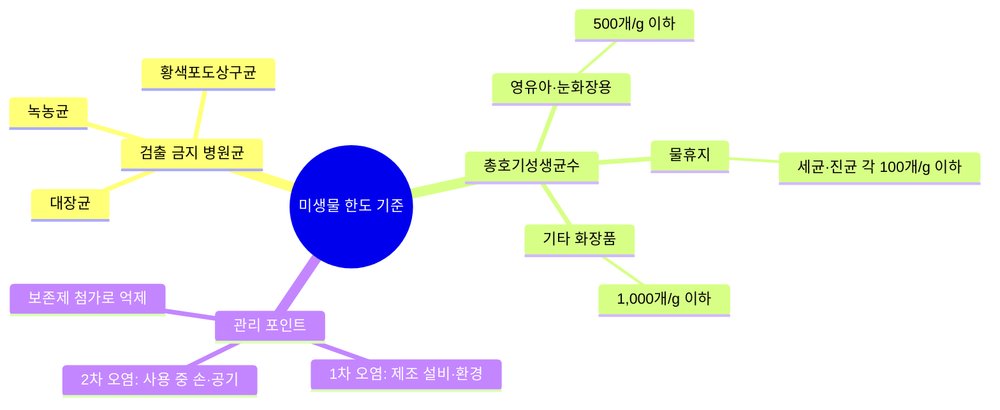

> **🗺️ 마인드맵 노드 상세 매핑**

| 대분류 | 중분류 | 소분류 |
|---|---|---|
| 검출 금지 병원균 (L?) | — | — |
| 검출 금지 병원균 (L?) | 대장균 (L753\|안전기준_별표4_유통안전관리시험방법.pdf) | — |
| 검출 금지 병원균 (L?) | 녹농균 (L862\|안전기준_별표4_유통안전관리시험방법.pdf) | — |
| 검출 금지 병원균 (L?) | 황색포도상구균 (L957\|안전기준_별표4_유통안전관리시험방법.pdf) | — |
| 총호기성생균수 (L602\|안전기준_별표4_유통안전관리시험방법.pdf) | — | — |
| 총호기성생균수 (L602\|안전기준_별표4_유통안전관리시험방법.pdf) | 영유아·눈화장용 (L?) | — |
| 총호기성생균수 (L602\|안전기준_별표4_유통안전관리시험방법.pdf) | 영유아·눈화장용 (L?) | 500개/g 이하 (L?) |
| 총호기성생균수 (L602\|안전기준_별표4_유통안전관리시험방법.pdf) | 물휴지 (L408\|안전기준_별표4_유통안전관리시험방법.pdf) | — |
| 총호기성생균수 (L602\|안전기준_별표4_유통안전관리시험방법.pdf) | 물휴지 (L408\|안전기준_별표4_유통안전관리시험방법.pdf) | 세균·진균 각 100개/g 이하 (L?) |
| 총호기성생균수 (L602\|안전기준_별표4_유통안전관리시험방법.pdf) | 기타 화장품 (L63\|화장품 안전기준 등에 관한 규정(식품의약품안전처고시)(제2026-19호)(20260318).pdf) | — |
| 총호기성생균수 (L602\|안전기준_별표4_유통안전관리시험방법.pdf) | 기타 화장품 (L63\|화장품 안전기준 등에 관한 규정(식품의약품안전처고시)(제2026-19호)(20260318).pdf) | 1,000개/g 이하 (L?) |
| 관리 포인트 | — | — |
| 관리 포인트 | 1차 오염: 제조 설비·환경 | — |
| 관리 포인트 | 2차 오염: 사용 중 손·공기 | — |
| 관리 포인트 | 보존제 첨가로 억제 | — |

| 구분 | 총호기성생균수 | 특정 균 |
|---|---|---|
| **영유아용·눈화장용** | 500개/g(mL) 이하 | 대장균·녹농균·황색포도상구균 불검출 |
| **물휴지** | 세균·진균 각각 100개/g(mL) 이하 | 동일 |
| **기타 화장품류** | 1,000개/g(mL) 이하 | 동일 |

## 📊 입고 라벨 색상 비교표

> 📌 **출처**: CGMP (식약처 고시 제2024-46호) 제4장 품질관리 | **참조 PDF**: `우수화장품 제조 및 품질관리기준(식품의약품안전처고시)(제2024-46호)(20240822).pdf` | **시행일**: 2024. 9. 1. | **최종 확인**: 2026. 8. 29.

| 단계 | 라벨 색상 | 상태 | 조치 |
|---|---|---|---|
| **판정 대기** | 백색 | 입고 확인 | 시험의뢰서 작성·의뢰 |
| **시험 중** | 황색 | 검체 채취·시험 중 | 대기 |
| **적합 판정** | 청색 | 합격 | 적합 보관소로 이동 → 입고 |
| **부적합 판정** | 적색 | 불합격 | 부적합품 보관소로 이동 → 반품 |

## 📊 퍼머넌트웨이브 제2제 비교표

> 📌 **출처**: 화장품 안전기준 (제2026-19호) 별표 2 | **참조 PDF**: `화장품 안전기준 등에 관한 규정(식품의약품안전처고시)(제2026-19호)(20260318).pdf` | **시행일**: 2026. 4. 2. | **최종 확인**: 2026. 8. 29.

| 구분 | pH | 중금속 | 산화력 | 산화제 |
|---|---|---|---|---|
| **브롬산나트륨 함유** | 4.0~10.5 | 20μg/g 이하 | 3.5 이상 | 브롬산나트륨 |
| **과산화수소수 함유** | 2.5~4.5 | 20μg/g 이하 | 0.8~3.0 | 과산화수소 |

---

## ✅ 확인문제

> **문제 1.** 화장품 중 납의 비의도적 검출 허용한도로 옳은 것은?
>
> ① 모든 제품 10μg/g 이하

> ② 점토 분말 50μg/g, 기타 20μg/g 이하

> ③ 모든 제품 50μg/g 이하

> ④ 점토 분말 20μg/g, 기타 10μg/g 이하
>
> **정답**: ② 점토 분말 50μg/g, 기타 20μg/g 이하
> **해설**: 납은 점토를 원료로 사용한 분말 제품은 50μg/g 이하, 그 밖의 제품은 20μg/g 이하이다.

> **문제 2.** 영유아용 제품의 미생물 허용한도는?
>
> ① 100개/g 이하

> ② 500개/g 이하

> ③ 1,000개/g 이하

> ④ 5,000개/g 이하
>
> **정답**: ② 500개/g(mL) 이하
> **해설**: 영유아용 제품류 및 눈화장용 제품류는 총호기성생균수 500개/g(mL) 이하, 물휴지는 세균·진균 각각 100개/g(mL) 이하, 기타 화장품류는 1,000개/g(mL) 이하이다. 모든 화장품류에서 대장균·녹농균·황색포도상구균은 불검출이어야 한다.

> **문제 3.** 내용량 시험 시 평균 내용량이 표기량의 몇 % 이상이어야 하는가?
> ① 95% ② 97% ③ 99% ④ 100%
>
> **정답**: ② 97%
> **해설**: 제품 3개로 시험 시 평균 내용량이 표기량의 97% 이상이어야 한다. 벗어날 경우 6개를 추가로 시험하여 9개 평균이 97% 이상이어야 한다. 화장비누는 건조 중량을 내용량으로 한다.

> **문제 4.** 액상 제품의 pH 기준은?
> ① 2.0~8.0 ② 3.0~9.0 ③ 4.0~10.0 ④ 5.0~9.0
>
> **정답**: ② 3.0~9.0
> **해설**: 액상 제품은 pH 3.0~9.0이어야 한다. 단, 물을 포함하지 않는 제품과 사용 후 곧바로 물로 씻어내는 제품은 제외한다.

> **문제 5.** 입고 시험 중인 원자재에 부착하는 라벨 색상은?
> ① 청색 ② 백색 ③ 황색 ④ 적색
>
> **정답**: ③ 황색
> **해설**: 판정 대기소 보관 시 백색 라벨, 시험 중 황색 라벨, 적합 판정 시 청색 라벨, 부적합 판정 시 적색 라벨을 부착한다.

---

## 📖 핵심 용어 정리

| 용어 | 핵심 포인트 |
|---|---|
| **일탈** | CGMP 규정을 벗어난 행위 |
| **기준일탈** | 규정된 합격 판정 기준에 일치하지 않는 검사·측정·시험 결과 |
| **뱃치(제조단위)** | 하나의 공정으로 제조되어 균질성을 갖는 화장품의 일정 분량 |
| **제조번호** | 뱃치의 제조관리·출하 사항을 확인할 수 있는 번호 |
| **적합 판정 기준** | 시험 결과의 적합 판정을 위한 수적 제한·범위·측정법 |
| **입고 라벨** | 백색(판정대기)→황색(시험중)→청색(적합)/적색(부적합) |
| **납 허용한도** | 점토 분말 50μg/g, 기타 20μg/g 이하 |
| **카드뮴 허용한도** | 5μg/g 이하 |
| **수은 허용한도** | 1μg/g 이하 |
| **디옥산 허용한도** | 100μg/g 이하 |
| **메탄올 허용한도** | 0.2%(v/v) 이하, 물휴지 0.002% 이하 |
| **프탈레이트류 허용한도** | DBP+BBP+DEHP 총합 100μg/g 이하 |
| **미생물 한도(영유아·눈화장)** | 총호기성생균수 500개/g(mL) 이하 |
| **미생물 한도(물휴지)** | 세균·진균 각각 100개/g(mL) 이하 |
| **미생물 한도(기타)** | 총호기성생균수 1,000개/g(mL) 이하 |
| **불검출 균** | 대장균·녹농균·황색포도상구균 — 모든 화장품류 |
| **내용량 기준** | 3개 평균 97% 이상, 위반 시 6개 추가 → 9개 평균 97% 이상 |
| **액상 제품 pH** | 3.0~9.0 (물 무함함·즉시 세정 제품 제외) |
| **화장비누 유리알칼리** | 0.1% 이하 |
| **퍼머 제2제(브롬산나트륨)** | pH 4.0~10.5, 산화력 3.5 이상 |
| **퍼머 제2제(과산화수소)** | pH 2.5~4.5, 산화력 0.8~3.0 |
| **인체 세포·조직 배양액** | 공여자 적격성검사, 청정등급 1B(Class 10,000) 이상 |
| **윈도우 피리어드** | 감염 초기에 검출할 수 없는 기간 |
| **벌크 재보관** | 재보관 라벨 부착, 원래 환경에서 보관, 변질 우려 시 재사용 금지 |
| **선입선출** | 출고 원칙 (타당한 사유 시 예외 가능) |
| **재작업** | 적합판정 기준 벗어난 완제품·벌크를 재처리하여 적합 범위로 |
| **보관용 검체** | 사용기한까지 보관, 개봉 후 사용기간 기재 시 제조일로부터 3년 |
| **샘플링 환경** | 조도 540룩스 이상의 별도 공간 |


---

## 📖 포장재의 관리
> 출처: `화장품법 시행규칙(총리령)(제02109호)(20260402).pdf`


---

## 📚 Chapter 05. 포장재의 관리

> **고득점 TIP**: 안전용기·포장 기준과 포장지시서의 내용, 포장용기의 종류는 한 번 더 학습하고, 1, 2차 포장의 정의는 꼭 암기하세요.
>
> 🔗 **관련 과목**
> - 2과목 4챕터 "화장품 관리" — 완제품 출하 승인 및 포장 관리 기준
> - 4과목 5챕터 "제품 안내" — 맞춤형화장품 표시·기재사항 (1차·2차 포장)
> - 4과목 7챕터 "충진 및 포장" — 포장공간 기준 및 포장용기 종류

---

> 📋 **학습 가이드**
> - 출제 빈도: ★★★☆☆ (1차·2차 포장 정의, 안전용기 대상, 포장용기 종류 4가지, 감압 누설시험, 크로스커트트시험, 선입선출·선한선출)
> - 예상 소요 시간: 30분
> - 핵심 키워드: 1차 포장(내용물 직접 접촉)·2차 포장(1차 수용·표시), 안전용기(아세톤·탄화수소 10%·메틸살리실레이트 5%), 밀폐·기밀·밀봉·차광 용기, 감압 누설시험(액상 밀폐성), 크로스커트트시험(코팅막 밀착력), 선입선출·선한선출

---

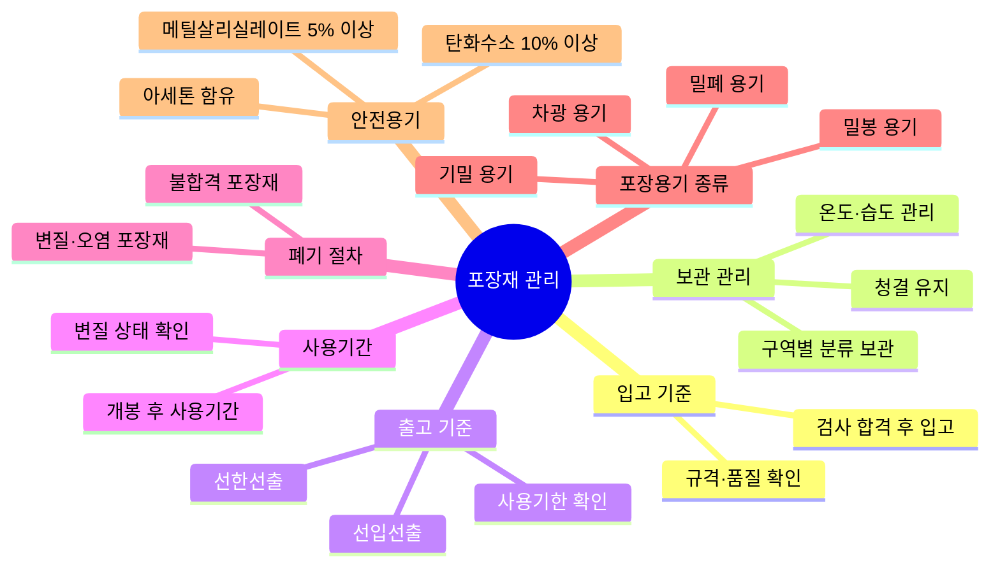

> **🗺️ 마인드맵 노드 상세 매핑**

| 대분류 | 중분류 |
|---|---|
| 입고 기준 (L?) | — |
| 입고 기준 (L?) | 규격·품질 확인 |
| 입고 기준 (L?) | 검사 합격 후 입고 |
| 보관 관리 (L22) | — |
| 보관 관리 (L22) | 온도·습도 관리 (L?) |
| 보관 관리 (L22) | 청결 유지 |
| 보관 관리 (L22) | 구역별 분류 보관 |
| 출고 기준 (L?) | — |
| 출고 기준 (L?) | 선입선출 (L232) |
| 출고 기준 (L?) | 선한선출 (L?) |
| 출고 기준 (L?) | 사용기한 확인 (L269) |
| 사용기간 (L269) | — |
| 사용기간 (L269) | 개봉 후 사용기간 (L269) |
| 사용기간 (L269) | 변질 상태 확인 (L?) |
| 폐기 절차 (L?) | — |
| 폐기 절차 (L?) | 불합격 포장재 |
| 폐기 절차 (L?) | 변질·오염 포장재 |
| 포장용기 종류 (L?) | — |
| 포장용기 종류 (L?) | 밀폐 용기 |
| 포장용기 종류 (L?) | 기밀 용기 |
| 포장용기 종류 (L?) | 밀봉 용기 |
| 포장용기 종류 (L?) | 차광 용기 (L44\|KFCC_별표1_통칙.pdf) |
| 안전용기 (L35\|화장품법(법률)(제20901호)(20260402).pdf) | — |
| 안전용기 (L35\|화장품법(법률)(제20901호)(20260402).pdf) | 아세톤 함유 (L?) |
| 안전용기 (L35\|화장품법(법률)(제20901호)(20260402).pdf) | 탄화수소 10% 이상 (L?) |
| 안전용기 (L35\|화장품법(법률)(제20901호)(20260402).pdf) | 메틸살리실레이트 5% 이상 (L?) |

## 1. 포장재의 입고 기준

> 📌 **출처**: CGMP (식약처 고시 제2024-46호) 제3장 + 시행규칙 제19조 | **참조 PDF**: `화장품법 시행규칙(총리령)(제02109호)(20260402).pdf` | **시행일**: 2024. 9. 1. | **최종 확인**: 2026. 8. 29.

> **한 줄 요약**: 포장재(1차·2차·라벨·봉함) 입고 절차 + 안전용기 대상(아세톤·탄화수소 10%·메틸살리실레이트 5%) + 5세 미만 개봉 어려움.

### (1) 포장재 입고 과정
① 화장품의 제조와 포장에 사용되는 모든 원료 및 포장재의 부적절하고 위험한 사용, 혼합 또는 오염을 방지하기 위해 해당 물질의 검증·확인·취급 및 사용을 보장할 수 있도록 절차가 수립되어 외부로부터 공급된 원료 및 포장재는 규정된 완제품 품질합격 판정 기준을 충족시켜야 한다.

② 포장재는 1차·2차 포장재, 각종 라벨과 봉함 라벨까지 포장재에 포함된다.

> **용어 - 포장재**: 화장품의 포장에 사용되는 모든 재료를 말하며, 운송을 위해 사용되는 외부 포장재는 제외함

> **참고 - 1차 포장과 2차 포장 🎯 기출**

| 구분 | 정의 |
|---|---|
| 1차 포장 | 화장품 제조 시 내용물과 직접 접촉하는 포장 |
| 2차 포장 | 1차 포장을 수용하는 1개 또는 그 이상의 포장과 보호재 및 표시의 목적으로 한 포장(첨부문서 등을 포함함) |

### (2) 원료·포장재 관리에 필요한 사항
① 중요도 분류

② 공급자 결정

③ 보관 환경 설정

④ 사용기한 설정

⑤ 정기적 재고관리

⑥ 재평가

⑦ 재보관

⑧ 발주, 입고, 식별·표시, 합격·불합격 판정, 보관, 불출

### (3) 포장재의 선정 절차

```
중요도 분류 ← 요구품질(임시) 결정
    ↓
공급자 선정
    ↓
공급자 승인 ← (임시)시험 방법 선정
    ↓                    ↓
품질 결정 ← 시험 방법 확립
    ↓
품질계약서·공급계약 체결
    ↓
〈제조개시〉
    ↓
정기적 모니터링 (① 품질확인 ② 제조소 검사)
```

### (4) 안전용기·포장 기준 🎯 기출

**① 안전용기·포장을 사용해야 하는 품목**
- 아세톤을 함유하는 네일 에나멜 리무버 및 네일 폴리시 리무버
- 어린이용 오일 등 개별 포장당 탄화수소류를 10% 이상 함유하고 운동점도가 21cst(센티스톡스)(섭씨 40℃ 기준) 이하인 비에멀전 타입의 액체 상태의 제품
- 개별 포장당 메틸살리실레이트를 5.0% 이상 함유하는 액체 상태의 제품

**② 안전용기·포장 대상 기준**
- 안전용기·포장은 성인이 개봉하기는 어렵지 않고, 5세 미만의 어린이는 개봉하기 어렵게 설계·고안되어야 함
- 일회용 제품, 용기 입구 부분이 펌프 또는 방아쇠로 작동되는 분무용기 제품, 압축 분무용기 제품(에어로졸 제품 등)은 대상에서 제외함

---

## 2. 입고된 포장재 관리 기준

> 📌 **출처**: CGMP (식약처 고시 제2024-46호) 제4장 | **참조 PDF**: `우수화장품 제조 및 품질관리기준(식품의약품안전처고시)(제2024-46호)(20240822).pdf` | **시행일**: 2024. 9. 1. | **최종 확인**: 2026. 8. 29.

> **한 줄 요약**: 보관 장소(적합/부적합 분리) + 보관 방법(검사 중·적합·부적합 구분) + 포장지시서 5항목 + 포장용기 4종(밀폐·기밀·밀봉·차광) + 시험 방법 13종.

### (1) 보관 장소

| 구분 | 내용 |
|---|---|
| 포장재 보관소 | 적합 판정된 포장재만을 지정된 장소에 보관함 |
| 부적합 보관소 | 부적합 판정된 자재는 폐기 등의 조치가 이루어지기 전까지 보관함 |

### (2) 보관 방법 🎯 기출
① 입고된 원료와 포장재는 '검사 중', '적합', '부적합'에 따라 각각의 구분된 공간에 별도로 보관되어야 한다.

② 필요한 경우 부적합 판정을 받은 원료와 포장재를 보관하는 공간에 잠금 장치를 추가하여야 한다(다만, 자동화창고는 해당 시스템을 통해 관리함).

③ 적합 판정 시 원료와 포장재는 생산 장소로 이동된다.

④ 확인·검체 채취규정 기준에 대한 검사 및 시험과 그에 따라 승인된 자에 의한 불출 전까지는 어떠한 물질도 사용되어서는 안 된다는 것을 명시하는 원료 수령에 대한 절차서를 수립하여야 한다.

⑤ 구매요구서와 인도 문서, 인도물이 서로 일치해야 한다.

⑥ 원료 및 포장재 선적용기에 대해 확실한 표기 오류, 용기 손상, 봉인 파손, 오염 등에 대해 육안으로 검사한다(필요 시 운송 관련 자료에 대해 추가적인 검사 수행).

### (3) 포장지시서의 포함 내용
① 제품명

② 포장 설비명

③ 포장재 리스트

④ 상세한 포장 공정

⑤ 포장 생산 수량

### (4) 포장용기 종류 🎯 기출

| 용기 종류 | 정의 |
|---|---|
| 밀폐용기 | 외부로부터 고형의 이물이 들어가는 것을 방지하고 고형의 내용물이 손실되지 않도록 보호할 수 있는 용기 |
| 기밀용기 | 액상 또는 고형의 이물 또는 수분이 침입하지 않고, 내용물을 손실, 풍화, 조해 또는 증발로부터 보호할 수 있는 용기 |
| 밀봉용기 | 기체 또는 미생물이 침입을 방지하는 용기 |
| 차광용기 | 광선의 투과를 방지하는 용기 또는 투과를 방지하는 포장을 한 용기 |

### (5) 포장 및 용기에 관한 시험 방법

| 시험명 | 내용 |
|---|---|
| 내용물 감량시험 | 화장품 용기에 충전된 내용물의 건조 감량을 측정 / 마스카라, 아이라이너 또는 내용물 일부가 쉽게 취발되는 제품에 적용 |
| 내용물에 의한 용기 마찰시험 | 내용물에 따른 인쇄문자, 핫스탬핑, 증착 또는 코팅막 등의 내용물에 의한 용기 마찰을 측정 / 내용물이 용기와의 마찰로 인해 변형, 박리, 용출 및 묻어남을 확인 |
| 내용물에 의한 용기 변형시험 | 용기와 내용물의 장기 접촉에 따른 용기의 수축, 팽창, 탈색, 균열 등을 측정 / 사용 중 내용물과 접촉하는 시료를 내용물에 침적시켜 시료·용기의 물성 변화, 내용물과 용기 간의 색상 전이 등을 확인 |
| **감압 누설시험 🎯 기출** | 스킨, 로션, 오일 등의 액상 내용물을 담는 용기의 마개, 패킹 등의 밀폐성 측정 |
| 용기의 내열성 및 내한성시험 | 용기나 용기를 구성하는 각종 소재의 내열성 및 내한성을 측정 / 온도 및 날씨 등 유통환경에 따른 제품의 변질을 방지하기 위해 실시 |
| 유리병 표면 알칼리 용출량시험 | 황산과의 중화반응 원리를 이용하여 유리병 내부에 존재하는 알칼리를 측정 / 고온다습한 환경에 유리병 용기를 방치 시 발생하는 표면의 알칼리화 변화량 측정 |
| 유리병 내부 압력시험 | 유리 소재의 화장품 용기의 내압 강도를 측정 / 병의 중량과 두께가 동일할 때 타원형일수록, 모서리가 예리할수록 내압 강도가 낮음 / 디자인이 화려하고 독특한 용기는 내부압력에 취약하여 파손사고를 예방하기 위해 시험 |
| 유리병 열 충격시험 | 유리병 용기의 온도 변화에 따른 내구력을 측정 / 유리병 제조 시 열처리 과정에서 발생하는 불량을 방지하기 위해 시험 |
| 펌프 누름 강도시험 | 펌프 용기의 화장품을 펌핑 시 버튼의 누름 강도를 측정 / 펌프 용기를 사용한 제품의 사용 편리성을 확인하기 위해 시험 |
| 펌프 분사 형태시험 | 스프레이 펌프의 분사 형태를 측정 / 분사 형태는 액츄에이터 디자인과 내용물 성질에 따라 다름 / 종이에 분사된 염료용액의 반경과 거리를 이용해 분사 형태와 분사각을 확인함 |
| 낙하시험 | 플라스틱 용기, 조립 용기, 접착 용기에 대한 낙하에 따른 파손, 분리 및 작용 여부를 측정 / 다양한 형태의 조립 포장재료가 부착된 화장품 용기에 적용 |
| **크로스컷트시험 🎯 기출** | 화장품 용기의 포장재료인 유리, 금속, 플라스틱의 유·무기 코팅막 및 도금의 밀착력 측정 / 규정된 점착테이프와 압착 장치를 이용하여 코팅막, 도금의 박리 여부를 확인 내어 압착 및 방치한 후 떼어냄 |
| 접착력시험 | 포장이나 용기에 인쇄된 문자, 코팅막, 라미네이팅의 밀착성을 측정 / 용기 표면의 인쇄문자, 코팅막 및 필름을 점착 테이프로 박리 여부 확인 |
| 라벨 접착력시험 | 포장의 라벨이나 스티커 등의 종이 또는 수지 지지체로 한 인쇄용 접착지의 접착력을 측정 |

#### 보관 조건 (내열성·내한성시험)

| 냉동고 | 냉장고 | 실온 | 항온조 |
|---|---|---|---|
| -12~-5℃ | -4~5℃ | 20~26℃ | 42~48℃ |

---

## 3. 보관 중인 포장재 출고 기준

> 📌 **출처**: CGMP (식약처 고시 제2024-46호) 제4장 | **참조 PDF**: `우수화장품 제조 및 품질관리기준(식품의약품안전처고시)(제2024-46호)(20240822).pdf` | **시행일**: 2024. 9. 1. | **최종 확인**: 2026. 8. 29.

> **한 줄 요약**: 적합 판정만 선입선출 출고 + 승인된 자만 불출 + 선한선출 예외(유효기한 짧은 것 우선).

원자재는 시험 결과 적합 판정된 것만을 선입선출 방식으로 출고해야 하며, 이를 확인할 수 있는 체계가 확립되어야 한다.

① 승인된 자만이 원료 및 포장재의 불출 절차를 수행한다.

② 뱃치에서 취한 검체가 모든 합격 기준에 부합될 때 뱃치가 불출될 수 있다.

③ 불출되기 전까지 사용을 금지하는 격리를 위해 특별한 절차가 이행된다.

④ 모든 물품은 선입선출 방법으로 출고하는 것이 원칙이다.

다만, 나중에 입고된 물품의 사용(유효)기한이 짧은 경우 먼저 입고된 물품보다 먼저 출고(선한선출)할 수 있으며, 특별한 사유가 있는 경우 적절하게 문서화된 절차에 따라 나중에 입고된 물품을 먼저 출고할 수 있다.

---

## 4. 포장재의 폐기 기준

> 📌 **출처**: CGMP (식약처 고시 제2024-46호) 제4장 | **참조 PDF**: `우수화장품 제조 및 품질관리기준(식품의약품안전처고시)(제2024-46호)(20240822).pdf` | **시행일**: 2024. 9. 1. | **최종 확인**: 2026. 8. 29.

> **한 줄 요약**: 정기 재고조사 + 일탈처리 + 기준일탈 → 조사 → 처리 → 폐기 처분.

① 포장재는 정기적으로 재고조사를 실시하여야 하며, 중대한 위반품이 발견되었을 경우에는 일탈처리를 한다.

② 폐기 처분 과정

```
기준일탈의 발생 → 기준일탈의 조사 → 기준일탈의 처리 → 폐기 처분
```

---

## 5. 포장재의 사용기간 확인·판정

> 📌 **출처**: 화장품법 시행규칙 제19조 | **참조 PDF**: `화장품법 시행규칙(총리령)(제02109호)(20260402).pdf` | **시행일**: 2026. 4. 2. | **최종 확인**: 2026. 8. 29.

> **한 줄 요약**: 사용기한 시스템 확립 + 최대 보관기한 설정 + 재평가(보관기한 경과 시 재평가 후 사용 가능).

① 포장재의 허용 가능한 사용기한을 결정하기 위해 문서화된 시스템을 확립해야 한다.

② 보관기한이 규정되어 있지 않은 포장재는 품질 부분에서 적절한 사용기한을 설정한다.

③ 최대 보관기한을 설정하고 준수한다.

④ 원칙적으로 포장의 사용기한을 준수하는 보관기한을 설정하고 준수한다.

⑤ 사용기한 내에 자체적인 재시험 기간과 최대 보관기한을 설정하여 사용 적합성을 결정하는 단계들을 포함해야 한다.

⑥ 문서화된 시스템을 통해 정해진 사용기한이 지나면 해당 물질을 재평가하여 사용한다.

> **용어 - 재평가**: 재평가 방법을 확립해 두면 보관기한이 지난 원료를 재평가해서 사용할 수 있으므로 원료 및 포장재는 최대 보관기한을 설정하는 것이 바람직하다.

---

## 6. 포장재의 개봉 후 사용기간 확인·판정 🎯 기출

> 📌 **출처**: 화장품법 시행규칙 제19조 + 식약처 지침 | **참조 PDF**: `화장품법 시행규칙(총리령)(제02109호)(20260402).pdf` | **시행일**: 2026. 4. 2. | **최종 확인**: 2026. 8. 29.

> **한 줄 요약**: '사용기한'/'까지' + 연월일 표시 + 개봉 후 사용기간(심벌+기간, 제조연월일·사용기한 병기).

### (1) 사용기한
'사용기한' 또는 '까지' 등의 문자와 '연월일'을 소비자가 알기 쉽도록 기재·표시해야 한다(다만, '연월'로 표시하는 경우 사용기한을 넘지 않는 범위에서 기재·표시함).

### (2) 개봉 후 사용기간
'개봉 후 사용기간'이라는 문자와 '○○월' 또는 '○○개월'을 조합하여 기재·표시하거나, 개봉 후 사용기간을 나타내는 심벌과 기간을 기재·표시할 수 있다(개봉 후 사용기간을 표시하는 경우에는 제조연월일, 사용기한을 병기하여 표기함).

> **그림 - 심벌과 기간 표시**: 개봉 후 사용기간이 12개월 이내인 제품 → "12M" 또는 "12월(또는 개월)"

---

## 7. 포장재의 변질 상태 확인

> 📌 **출처**: CGMP (식약처 고시 제2024-46호) 제4장 | **참조 PDF**: `우수화장품 제조 및 품질관리기준(식품의약품안전처고시)(제2024-46호)(20240822).pdf` | **시행일**: 2024. 9. 1. | **최종 확인**: 2026. 8. 29.

> **한 줄 요약**: 소재별 특성 이해 + 관능검사·이화학적 검사 + 변질 예방(온도·습도·벌레·출입자 관리).

### (1) 포장재의 변질 상태 확인
① 소재별 특성을 이해한 변질 상태 예측 확인

② 관능검사, 필요 시 이화학적 검사

③ 포장재 샘플링을 통한 엄격한 관리

### (2) 포장재의 변질 예방
① 소재별 특성 이해: 유리, 플라스틱, 금속, 종이 등

② 보관 방법, 보관 조건, 보관 환경, 보관 기간 등에 대한 숙지

③ 온도, 습도 등 물리적 환경의 적합도 숙지

④ 벌레 및 설치류 유입에 대비한 적절한 보관 장소를 확보

⑤ 포장재 보관 창고 출입자 관리를 통한 오염 방지

---

## 8. 포장재의 폐기 절차 🎯 기출

> 📌 **출처**: CGMP (식약처 고시 제2024-46호) 제4장 | **참조 PDF**: `우수화장품 제조 및 품질관리기준(식품의약품안전처고시)(제2024-46호)(20240822).pdf` | **시행일**: 2024. 9. 1. | **최종 확인**: 2026. 8. 29.

> **한 줄 요약**: 부적합 라벨 → 격리 보관 → 폐기물 보관소 분리수거 → 폐기물 대장 기록 → 인계.

```
기준일탈 포장재에 부적합 라벨 부착 → 격리 보관
        ↓                              ↓
폐기물 보관소로 운반하여 분리수거 확인 ← 폐기물 수거함에 분리수거 카드 부착
        ↓
폐기물 대장 기록 → 인계
```

---

## 📊 1차·2차 포장 비교표

> 📌 **출처**: 화장품법 시행규칙 제19조 | **참조 PDF**: `화장품법 시행규칙(총리령)(제02109호)(20260402).pdf` | **시행일**: 2026. 4. 2. | **최종 확인**: 2026. 8. 29.

| 구분 | 정의 | 예시 |
|---|---|---|
| **1차 포장** | 내용물과 직접 접촉하는 포장 | 튜브, 병, 단지 |
| **2차 포장** | 1차 포장을 수용하는 포장 + 보호재 + 표시 목적(첨부문서 포함) | 겉상자, 라벨, 설명서 |

## 📊 포장용기 종류 비교표

> 📌 **출처**: 식약처 포장관리 지침 | **시행일**: 2026. 4. 2. | **최종 확인**: 2026. 8. 29.

| 용기 | 방지 대상 | 특징 |
|---|---|---|
| **밀폐용기** | 고형 이물 유입·고형 내용물 손실 | 가장 낮은 차단 등급 |
| **기밀용기** | 액상/고형 이물·수분 침입 | 내용물 손실·풍화·조해·증발 방지 |
| **밀봉용기** | 기체·미생물 침입 | 가장 높은 차단 등급 |
| **차광용기** | 광선 투과 | 광선 민감 제품 |

## 📊 안전용기 대상 품목 비교표

> 📌 **출처**: 화장품법 제9조 + 시행규칙 제18조 | **참조 PDF**: `화장품법 시행규칙(총리령)(제02109호)(20260402).pdf` | **시행일**: 2026. 4. 2. | **최종 확인**: 2026. 8. 29.

| 대상 품목 | 기준 | 제외 |
|---|---|---|
| **아세톤 함유 리무버** | 네일 에나멜/폴리시 리무버 | — |
| **탄화수소류 함유** | 개별 포장당 10% 이상, 운동점도 21cst 이하 | 비에멀전 액체 |
| **메틸살리실레이트 함유** | 개별 포장당 5.0% 이상 액체 | — |
| **제외 품목** | 일회용, 펌프/방아쇠 분무, 에어로졸 | — |

## 📊 주요 포장 시험 방법 비교표

> 📌 **출처**: 식약처 포장관리 지침 + KS규격 | **시행일**: 2026. 4. 2. | **최종 확인**: 2026. 8. 29.

| 시험명 | 측정 대상 | 적용 제품 |
|---|---|---|
| **감압 누설시험** | 마개·패킹 밀폐성 | 스킨·로션·오일 등 액상 |
| **크로스커트트시험** | 코팅막·도금 밀착력 | 유리·금속·플라스틱 |
| **내용물 감량시험** | 건조 감량 | 마스카라·아이라이너 |
| **내용물에 의한 용기 변형시험** | 수축·팽창·탈색·균열 | 장기 접촉 용기 |
| **낙하시험** | 파손·분리·작용 여부 | 플라스틱·조립·접착 용기 |
| **유리병 내부 압력시험** | 내압 강도 | 유리 소재 용기 |

---

## ✅ 확인문제

> **문제 1.** 1차 포장의 정의로 옳은 것은?
>
> ① 화장품을 운송하기 위한 외부 포장

> ② 내용물과 직접 접촉하는 포장

> ③ 1차 포장을 수용하는 포장

> ④ 표시 목적의 첨부문서 포장
>
> **정답**: ② 내용물과 직접 접촉하는 포장
> **해설**: 1차 포장은 화장품 제조 시 내용물과 직접 접촉하는 포장이다. 2차 포장은 1차 포장을 수용하는 1개 또는 그 이상의 포장과 보호재 및 표시 목적의 포장(첨부문서 포함)이다.

> **문제 2.** 안전용기·포장을 사용해야 하는 품목이 아닌 것은?
>
> ① 아세톤을 함유하는 네일 에나멜 리무버

> ② 탄화수소류 10% 이상 함유 어린이용 오일

> ③ 메틸살리실레이트 5% 이상 함유 액체 제품

> ④ 에어로졸 제품
>
> **정답**: ④ 에어로졸 제품
> **해설**: 에어로졸 제품(압축 분무용기)은 안전용기·포장 대상에서 제외된다. 일회용 제품, 펌프/방아쇠 작동 분무용기도 제외된다.

> **문제 3.** 기밀용기의 설명으로 옳은 것은?
>
> ① 고형 이물만 방지

> ② 기체와 미생물 침입 방지

> ③ 액상/고형 이물과 수분 침입 방지

> ④ 광선 투과 방지
>
> **정답**: ③ 액상/고형 이물과 수분 침입 방지
> **해설**: 밀폐용기는 고형 이물 방지, 기밀용기는 액상/고형 이물·수분 침입 방지(내용물 손실·풍화·조해·증발 방지), 밀봉용기는 기체·미생물 침입 방지, 차광용기는 광선 투과 방지이다.

> **문제 4.** 감압 누설시험의 적용 대상은?
> ① 마스카라 ② 스킨·로션·오일 등 액상 내용물 ③ 유리병 ④ 플라스틱 용기
>
> **정답**: ② 스킨·로션·오일 등 액상 내용물
> **해설**: 감압 누설시험은 스킨, 로션, 오일 등의 액상 내용물을 담는 용기의 마개, 패킹 등의 밀폐성을 측정하는 시험이다.

> **문제 5.** 선입선출의 예외로 인정되는 것은?
>
> ① 나중에 입고된 물품의 유효기한이 짧은 경우

> ② 나중에 입고된 물품의 가격이 저렴한 경우

> ③ 재고가 많은 물품을 우선 출고

> ④ 임의로 결정 가능
>
> **정답**: ① 나중에 입고된 물품의 유효기한이 짧은 경우
> **해설**: 선입선출이 원칙이나, 나중에 입고된 물품의 사용(유효)기한이 짧은 경우 먼저 입고된 물품보다 먼저 출고(선한선출)할 수 있으며, 특별한 사유가 있는 경우 문서화된 절차에 따라 예외가 가능하다.

---

## 📖 핵심 용어 정리

| 용어 | 핵심 포인트 |
|---|---|
| **1차 포장** | 내용물과 직접 접촉하는 포장 |
| **2차 포장** | 1차 포장을 수용·보호·표시(첨부문서 포함) |
| **포장재** | 화장품 포장에 사용되는 모든 재료 (운송용 외부 포장재 제외) |
| **안전용기** | 5세 미만 어린이는 개봉 어렵고 성인은 개봉 용이 — 아세톤·탄화수소 10%·메틸살리실레이트 5% |
| **밀폐용기** | 고형 이물 방지·고형 내용물 손실 방지 |
| **기밀용기** | 액상/고형 이물·수분 침입 방지 — 손실·풍화·조해·증발 방지 |
| **밀봉용기** | 기체·미생물 침입 방지 |
| **차광용기** | 광선 투과 방지 |
| **감압 누설시험** | 액상 내용물 용기 마개·패킹 밀폐성 측정 |
| **크로스커트트시험** | 유리·금속·플라스틱 코팅막·도금 밀착력 측정 |
| **내용물 감량시험** | 마스카라·아이라이너 건조 감량 측정 |
| **낙하시험** | 플라스틱·조립·접착 용기 파손·분리 측정 |
| **포장지시서** | 제품명·포장 설비명·포장재 리스트·상세 포장 공정·포장 생산 수량 |
| **선입선출** | 출고 원칙 — 먼저 입고된 것을 먼저 출고 |
| **선한선출** | 유효기한 짧은 것 우선 출고 (선입선출 예외) |
| **재평가** | 보관기한 경과 원료·포장재 재평가 후 사용 가능 |
| **개봉 후 사용기간** | 심벌+기간 표시(예: 12M), 제조연월일·사용기한 병기 |


---


> **출처**: 화장품 안전기준 - 유통 안전관리 (제2026-19호)

## 03_화장품_안전기준

화장품 안전기준 등에 관한 규정
[시행 2026. 3. 18.] [식품의약품안전처고시 제2026-19호, 2026.3.18., 일부개정]

식품의약품안전처(화장품정책과), 043-719-3410

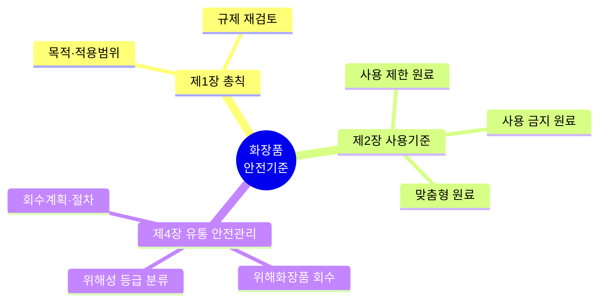

> **🗺️ 마인드맵 노드 상세 매핑**

| 대분류 | 중분류 |
|---|---|
| 제1장 총칙 (L5) | — |
| 제1장 총칙 (L5) | 목적·적용범위 (L?) |
| 제1장 총칙 (L5) | 규제 재검토 |
| 제2장 사용기준 | — |
| 제2장 사용기준 | 사용 금지 원료 (L59) |
| 제2장 사용기준 | 사용 제한 원료 |
| 제2장 사용기준 | 맞춤형 원료 |
| 제4장 유통 안전관리 (L30) | — |
| 제4장 유통 안전관리 (L30) | 위해화장품 회수 (L?) |
| 제4장 유통 안전관리 (L30) | 위해성 등급 분류 (L?) |
| 제4장 유통 안전관리 (L30) | 회수계획·절차 (L267\|화장품법(법률)(제20901호)(20260402).pdf) |

## 제1장 총칙

> 📌 **출처**: 화장품 안전기준 (제2026-19호) 제1장 | **참조 PDF**: `화장품 안전기준 등에 관한 규정(식품의약품안전처고시)(제2026-19호)(20260318).pdf` | **시행일**: 2026. 4. 2. | **최종 확인**: 2026. 8. 29.


### 제1조(목적)

이 고시는 「화장품법」 제2조제3호의2에 따라 맞춤형화장품에 사용할 수 있는 원료를 지정하는 한편, 같은 법 제8조에 따라 화장품에 사용할 수 없는 원료 및 사용상의 제한이 필요한 원료에 대하여 그 사용기준을 지정하고, 유통화장품 안전관리 기준에 관한 사항을 정함으로써 화장품의 제조 또는 수입 및 안전관리에 적정을 기함을 목적으로 한다.


### 제2조(적용범위)

이 규정은 국내에서 제조, 수입 또는 유통되는 모든 화장품에 대하여 적용한다.


### 제7조(규제의 재검토)

「행정규제기본법」제8조 및 「훈령ㆍ예규 등의 발령 및 관리에 관한 규정」에 따라 2014년 1월 1일을 기준으로 매 3년이 되는 시점(매 3년째의12월 31일까지를 말한다)마다 그 타당성을 검토하여 개선 등의 조치를 하여야 한다.


## 제4장 유통화장품 안전관리 기준

> 📌 **출처**: 화장품 안전기준 (제2026-19호) 제4장 | **참조 PDF**: `화장품 안전기준 등에 관한 규정(식품의약품안전처고시)(제2026-19호)(20260318).pdf` | **시행일**: 2026. 4. 2. | **최종 확인**: 2026. 8. 29.


### 제6조(유통화장품의 안전관리 기준)

① 유통화장품은 제2항부터 제5항까지의 안전관리 기준에 적합하여야 하며, 유통화장품 유형별로 제6항부터 제9항까지의 안전관리 기준에 추가적으로 적합하여야 한다. 또한 시험방법은 별표 4에 따라 시험하되, 기타 과학적ㆍ합리적으로 타당성이 인정되는 경우 자사 기준으로 시험할 수 있다.

② 화장품을 제조하면서 다음 각 호의 물질을 인위적으로 첨가하지 않았으나, 제조 또는 보관 과정 중 포장재로부터 이행되는 등 비의도적으로 유래된 사실이 객관적인 자료로 확인되고 기술적으로 완전한 제거가 불가능한 경우 해당 물질의 검출 허용 한도는 다음 각 호와 같다.
1. 납 : 점토를 원료로 사용한 분말제품은 50㎍/g이하, 그 밖의 제품은 20㎍/g이하

2. 니켈: 눈 화장용 제품은 35㎍/g 이하, 색조 화장용 제품은 30㎍/g이하, 그 밖의 제품은 10㎍/g 이하

3. 비소 : 10㎍/g이하

4. 수은 : 1㎍/g이하

5. 안티몬 : 10㎍/g이하

6. 카드뮴 : 5㎍/g이하

7. 디옥산 : 100㎍/g이하

8. 메탄올 : 

0.2(v/v)%이하, 물휴지는

0.002%(v/v)이하

9. 포름알데하이드 : 2000㎍/g이하, 물휴지는 20㎍/g이하

10. 프탈레이트류(디부틸프탈레이트, 부틸벤질프탈레이트 및 디에칠헥실프탈레이트에 한함) : 총 합으로서 100㎍/g이하
③ 별표 1의 사용할 수 없는 원료가 제2항의 사유로 검출되었으나 검출허용한도가 설정되지 아니한 경우에는 「화장품법 시행규칙」 제17조에 따라 위해평가 후 위해 여부를 결정하여야 한다.

④ 미생물한도는 다음 각 호와 같다.
1. 총호기성생균수는 영ㆍ유아용 제품류 및 눈화장용 제품류의 경우 500개/g(mL)이하

2. 물휴지의 경우 세균 및 진균수는 각각 100개/g(mL)이하

3. 기타 화장품의 경우 1,000개/g(mL)이하

4. 대장균(Escherichia Coli), 녹농균(Pseudomonas aeruginosa), 황색포도상구균(Staphylococcus aureus)은 불검출
⑤ 내용량의 기준은 다음 각 호와 같다.
1. 제품 3개를 가지고 시험할 때 그 평균 내용량이 표기량에 대하여 97% 이상(다만, 화장 비누의 경우 건조중량을 내용량으로 한다)

2. 제1호의 기준치를 벗어날 경우 : 6개를 더 취하여 시험할 때 9개의 평균 내용량이 제1호의 기준치 이상

3. 그 밖의 특수한 제품 :「대한민국약전」(식품의약품안전처 고시)을 따를 것
⑥ 영ㆍ유아용 제품류(영ㆍ유아용 샴푸, 영ㆍ유아용 린스, 영ㆍ유아 인체 세정용 제품, 영ㆍ유아 목욕용 제품 제외), 눈 화장용 제품류, 색조 화장용 제품류, 두발용 제품류(샴푸, 린스 제외), 면도용 제품류(셰이빙 크림, 셰이빙 폼 제외), 기초화장용 제품류(클렌징 워터, 클렌징 오일, 클렌징 로션, 클렌징 크림 등 메이크업 리무버 제품 제외) 중 액, 로션, 크림 및 이와 유사한 제형의 액상제품은 pH 기준이
3.0∼

9.0 이어야 한다. 다만, 물을 포함하지 않는 제품과 사용한 후 곧바로 물로 씻어 내는 제품은 제외한다.
⑦ 기능성화장품은 기능성을 나타나게 하는 주원료의 함량이 「화장품법」제4조 및 같은 법 시행규칙 제9조 또는 제10조에 따라 심사 또는 보고한 기준에 적합하여야 한다.

⑧ 퍼머넌트웨이브용 및 헤어스트레이트너 제품은 다음 각 호의 기준에 적합하여야 한다.
1. 치오글라이콜릭애씨드 또는 그 염류를 주성분으로 하는 냉2욕식 퍼머넌트웨이브용 제품 : 이 제품은 실온에서 사용하는 것으로서 치오글라이콜릭애씨드 또는 그 염류를 주성분으로 하는 제1제 및 산화제를 함유하는 제2제로 구성된다.
가. 제1제 : 이 제품은 치오글라이콜릭애씨드 또는 그 염류를 주성분으로 하고, 불휘발성 무기알칼리의 총량이 치오글라이콜릭애씨드의 대응량 이하인 액제이다. 단, 산성에서 끓인 후의 환원성물질의 함량이
7.0%를 초과하는 경우에는 초과분에 대하여 디치오디글라이콜릭애씨드 또는 그 염류를 디치오디글라이콜릭애씨드로서 같은량 이상 배합하여야 한다. 이 제품에는 품질을 유지하거나 유용성을 높이기 위하여 적당한 알칼리제, 침투제, 습윤제, 착색제, 유화제, 향료 등을 첨가할 수 있다.
1) pH : 4.5 ∼ 
9.6
2) 알칼리 : 0.1N염산의 소비량은 검체 1mL 에 대하여
7.0mL이하
3) 산성에서 끓인 후의 환원성 물질(치오글라이콜릭애씨드) : 산성에서 끓인 후의 환원성 물질의 함량(치오글라이콜릭애씨드로서)이
2.0 ∼ 

11.0％
4) 산성에서 끓인 후의 환원성 물질이외의 환원성 물질(아황산염, 황화물 등) : 검체 1mL 중의 산성에서 끓인 후의 환원성 물질이외의 환원성 물질에 대한
0.1N 요오드액의 소비량이

0.6mL이하
5) 환원후의 환원성 물질(디치오디글라이콜릭애씨드) : 환원후의 환원성 물질의 함량은
4.0％이하
6) 중금속 : 20㎍/g이하
7) 비소 : 5㎍/g이하
8) 철 : 2㎍/g이하
나. 제2제
1) 브롬산나트륨 함유제제 : 브롬산나트륨에 그 품질을 유지하거나 유용성을 높이기 위하여 적당한 용해제, 침투제, 습윤제, 착색제, 유화제, 향료 등을 첨가한 것이다.
가) 용해상태 : 명확한 불용성이물이 없을 것
나) pH : 4.0 ∼ 
10.5
다) 중금속 : 20㎍/g이하
라) 산화력 : 1인 1회 분량의 산화력이
3.5이상
2) 과산화수소수 함유제제 : 과산화수소수 또는 과산화수소수에 그 품질을 유지하거나 유용성을 높이기 위하여 적당한 침투제, 안정제, 습윤제, 착색제, 유화제, 향료 등을 첨가한 것이다.
가) pH : 2.5 ∼ 
4.5
나) 중금속 : 20㎍/g이하
다) 산화력 : 1인 1회 분량의 산화력이
0.8 ∼ 

3.0

2. 시스테인, 시스테인염류 또는 아세틸시스테인을 주성분으로 하는 냉2욕식 퍼머넌트웨이브용 제품 : 이 제품은 실온에서 사용하는 것으로서 시스테인, 시스테인염류 또는 아세틸시스테인을 주성분으로 하는 제1제 및 산화제를 함유하는 제2제로 구성된다.
가. 제1제 : 이 제품은 시스테인, 시스테인염류 또는 아세틸시스테인을 주성분으로 하고 불휘발성 무기알칼리를 함유하지 않은 액제이다. 이 제품에는 품질을 유지하거나 유용성을 높이기 위하여 적당한 알칼리제, 침투제, 습윤제, 착색제, 유화제, 향료 등을 첨가할 수 있다.
1) pH : 8.0 ∼ 
9.5
2) 알칼리 : 0.1N 염산의 소비량은 검체 1mL에 대하여 12mL이하
3) 시스테인 : 3.0 ∼ 
7.5％
4) 환원후의 환원성물질(시스틴) : 0.65％이하
5) 중금속 : 20㎍/g이하
6) 비소 : 5㎍/g이하
7) 철 : 2㎍/g이하
나. 제2제 기준 : 1. 치오글라이콜릭애씨드 또는 그 염류를 주성분으로 하는 냉2욕식 퍼머넌트웨이브용 제품 나. 제2제의 기준에 따른다.
3. 치오글라이콜릭애씨드 또는 그 염류를 주성분으로 하는 냉2욕식 헤어스트레이트너용 제품 : 이 제품은 실온에서 사용하는 것으로서 치오글라이콜릭애씨드 또는 그 염류를 주성분으로 하는 제1제 및 산화제를 함유하는 제2제로 구성된다.
가. 제1제 : 이 제품은 치오글라이콜릭애씨드 또는 그 염류를 주성분으로 하고 불휘발성 무기알칼리의 총량이 치오글라이콜릭애씨드의 대응량 이하인 제제이다. 단, 산성에서 끓인 후의 환원성물질의 함량이
7.0%를 초과하는 경우, 초과분에 대해 디치오디글라이콜릭애씨드 또는 그 염류를 디치오디글라이콜릭애씨드로 같은 양 이상 배합하여야 한다. 이 제품에는 품질을 유지하거나 유용성을 높이기 위하여 적당한 알칼리제, 침투제, 착색제, 습윤제, 유화제, 증점제, 향료 등을 첨가할 수 있다.
1) pH : 4.5 ∼ 
9.6
2) 알칼리 : 0.1N 염산의 소비량은 검체 1mL에 대하여
7.0mL이하
3) 산성에서 끊인 후의 환원성물질(치오글라이콜릭애씨드) : 2.0 ∼ 
11.0％
4) 산성에서 끓인 후의 환원성물질 이외의 환원성물질(아황산, 황화물 등) : 검체 1mL중의 산성에서 끓인 후의 환원성물질 이외의 환원성물질에 대한
0.1N 요오드액의 소비량은

0.6mL이하
5) 환원후의 환원성물질(디치오디글리콜릭애씨드) : 4.0％이하
6) 중금속 : 20㎍/g이하
7) 비소 : 5㎍/g이하
8) 철 : 2㎍/g이하
나. 제2제 기준 : 1. 치오글라이콜릭애씨드 또는 그 염류를 주성분으로 하는 냉2욕식 퍼머넌트웨이브용 제품 나. 제2제의 기준에 따른다.
4. 치오글라이콜릭애씨드 또는 그 염류를 주성분으로 하는 가온2욕식 퍼머넌트웨이브용 제품 : 이 제품은 사용할 때 약 60℃이하로 가온조작하여 사용하는 것으로서 치오글라이콜릭애씨드 또는 그 염류를 주성분으로 하는 제1제 및 산화제를 함유하는 제2제로 구성된다.
가. 제1제 : 이 제품은 치오글라이콜릭애씨드 또는 그 염류를 주성분으로 하고 불휘발성 무기알칼리의 총량이 치오글라이콜릭애씨드의 대응량 이하인 액제이다. 이 제품에는 품질을 유지하거나 유용성을 높이기 위하여 적당한 알칼리제, 침투제, 습윤제, 착색제, 유화제, 향료 등을 첨가할 수 있다.
1) pH : 4.5 ∼ 
9.3
2) 알칼리 : 0.1N 염산의 소비량은 검체 1mL에 대하여 5mL이하
3) 산성에서 끓인 후의 환원성물질(치오글라이콜릭애씨드) : 1.0 ∼ 
5.0％
4) 산성에서 끓인 후의 환원성물질 이외의 환원성물질(아황산, 황화물 등) : 검체 1mL중의 산성에서 끓인 후의 환원성물질 이외의 환원성물질에 대한
0.1N 요오드액의 소비량은

0.6mL이하
5) 환원후의 환원성물질(디치오디글라이콜릭애씨드) : 4.0％이하
6) 중금속 : 20㎍/g이하
7) 비소 : 5㎍/g이하
8) 철 : 2㎍/g이하
나. 제2제 기준 : 1. 치오글라이콜릭애씨드 또는 그 염류를 주성분으로 하는 냉2욕식 퍼머넌트웨이브용 제품 나. 제2제의 기준에 따른다.
5. 시스테인, 시스테인염류 또는 아세틸시스테인을 주성분으로 하는 가온 2욕식 퍼머넌트웨이브용 제품 : 이 제품은 사용 시 약 60℃ 이하로 가온조작하여 사용하는 것으로서 시스테인, 시스테인염류, 또는 아세틸시스테인을 주성분으로 하는 제1제 및 산화제를 함유하는 제2제로 구성된다.
가. 제1제 : 이 제품은 시스테인, 시스테인염류, 또는 아세틸시스테인을 주성분으로 하고 불휘발성 무기알칼리를 함유하지 않는 액제로서 이 제품에는 품질을 유지하거나 유용성을 높이기 위해서 적당한 알칼리제, 침투제, 습윤제, 착색제, 유화제, 향료 등을 첨가할 수 있다.
1) pH : 4.0 ∼ 
9.5
2) 알칼리 : 0.1N염산의 소비량은 검체 1mL에 대하여 9mL이하
3) 시스테인 : 1.5 ∼ 
5.5%
4) 환원후의 환원성물질(시스틴) : 0.65%이하
5) 중금속 : 20㎍/g이하
6) 비소 : 5㎍/g이하
7) 철 : 2㎍/g이하
나. 제2제 기준 : 1. 치오글라이콜릭애씨드 또는 그 염류를 주성분으로 하는 냉2욕식 퍼머넌트웨이브용 제품 나. 제2제의 기준에 따른다.
6. 치오글라이콜릭애씨드 또는 그 염류를 주성분으로 하는 가온2욕식 헤어스트레이트너 제품 : 이 제품은 시험할 때 약 60℃이하로 가온 조작하여 사용하는 것으로서 치오글라이콜릭애씨드 또는 그 염류를 주성분으로 하는 제1제 및 산화제를 함유하는 제2제로 구성된다.
가. 제1제 : 이 제품은 치오글라이콜릭애씨드 또는 그 염류를 주성분으로 하고 불휘발성 알칼리의 총량이 치오글라이콜릭애씨드의 대응량 이하인 제제이다. 이 제품에는 품질을 유지하거나 유용성을 높이기 위하여 적당한 알칼리제, 침투제, 습윤제, 유화제, 점증제, 향료 등을 첨가할 수 있다.
1) pH : 4.5 ∼ 
9.3
2) 알칼리 : 0.1N 염산의 소비량은 검체 1mL에 대하여
5.0mL이하
3) 산성에서 끓인 후의 환원성물질(치오글라이콜릭애씨드) : 1.0 ∼ 
5.0％
4) 산성에서 끓인 후의 환원성물질 이외의 환원성물질(아황산염, 황화물 등) : 검체 1mL중의 산성에서 끓인 후의 환원성물질 이외의 환원성물질에 대한
0.1N 요오드액의 소비량은

0.6mL이하
5) 환원 후의 환원성물질(디치오디글라이콜릭애씨드) : 4.0％이하
6) 중금속 : 20㎍/g이하
7) 비소 : 5㎍/g이하
8) 철 : 2㎍/g이하
나. 제2제 기준 : 1. 치오글라이콜릭애씨드 또는 그 염류를 주성분으로 하는 냉2욕식 퍼머넌트웨이브용 제품 나. 제2제의 기준에 따른다.
7. 치오글라이콜릭애씨드 또는 그 염류를 주성분으로 하는 고온정발용 열기구를 사용하는 가온2욕식 헤어스트레이트너 제품 : 이 제품은 시험할 때 약 60℃이하로 가온하여 제1제를 처리한 후 물로 충분히 세척하여 수분을 제거하고 고온정발용 열기구(180℃이하)를 사용하는 것으로서 치오글라이콜릭애씨드 또는 그 염류를 주성분으로 하는 제1제 및 산화제를 함유하는 제2제로 구성된다.
가. 제1제 : 이 제품은 치오글라이콜릭애씨드 또는 그 염류를 주성분으로 하고 불휘발성 알칼리의 총량이 치오글라이콜릭애씨드의 대응량 이하인 제제이다. 이 제품에는 품질을 유지하거나 유용성을 높이기 위하여 적당한 알칼리제, 침투제, 습윤제, 유화제, 점증제, 향료 등을 첨가할 수 있다.
1) pH : 4.5 ∼ 
9.3
2) 알칼리 : 0.1N 염산의 소비량은 검체 1mL에 대하여
5.0mL이하
3) 산성에서 끓인 후의 환원성물질(치오글라이콜릭애씨드) : 1.0 ∼ 
5.0％
4) 산성에서 끓인 후의 환원성물질 이외의 환원성물질(아황산염, 황화물 등) : 검체 1mL중의 산성에서 끓인 후의 환원성물질 이외의 환원성물질에 대한
0.1N 요오드액의 소비량은

0.6mL이하
5) 환원 후의 환원성물질(디치오디글라이콜릭애씨드) : 4.0％이하
6) 중금속 : 20㎍/g이하
7) 비소 : 5㎍/g이하
8) 철 : 2㎍/g이하
나. 제2제 기준 : 1. 치오글라이콜릭애씨드 또는 그 염류를 주성분으로 하는 냉2욕식 퍼머넌트웨이브용 제품 나. 제2제의 기준에 따른다.
8. 치오글라이콜릭애씨드 또는 그 염류를 주성분으로 하는 냉1욕식 퍼머넌트웨이브용 제품 : 이 제품은 실온에서 사용하는 것으로서 치오글라이콜릭애씨드 또는 그 염류를 주성분으로 하고 불휘발성 무기알칼리의 총량이 치오글라이콜릭애씨드의 대응량 이하인 액제이다. 이 제품에는 품질을 유지하거나 유용성을 높이기 위하여 적당한 알칼리제, 침투제, 습윤제, 착색제, 유화제, 향료 등을 첨가할 수 있다.
1) pH : 9.4 ∼ 
9.6
2) 알칼리 : 0.1N 염산의 소비량은 검체 1mL에 대하여
3.5 ∼ 4.6mL
3) 산성에서 끓인 후의 환원성 물질(치오글라이콜릭애씨드) : 3.0 ∼ 
3.3％
4) 산성에서 끓인 후의 환원성물질 이외의 환원성물질(아황산염, 황화물 등) : 검체 1mL 중인 산성에서 끓인 후의 환원성물질 이외의 환원성 물질에 대한
0.1N 요오드액의 소비량은

0.6mL이하
5) 환원후의 환원성물질(디치오디글라이콜릭애씨드) : 0.5％이하
6) 중금속 : 20㎍/g이하
7) 비소 : 5㎍/g이하
8) 철 : 2㎍/g이하
9. 치오글라이콜릭애씨드 또는 그 염류를 주성분으로 하는 제1제 사용시 조제하는 발열2욕식 퍼머넌트웨이브용 제품 : 이 제품은 치오글라이콜릭애씨드 또는 그 염류를 주성분으로 하는 제1제의1과 제1제의1중의 치오글라이콜릭애씨드 또는 그 염류의 대응량 이하의 과산화수소를 함유한 제1제의2, 과산화수소를 산화제로 함유하는 제2제로 구성되며, 사용시 제1제의1 및 제1제의2를 혼합하면 약 40℃로 발열되어 사용하는 것이다.
가. 제1제의1 : 이 제품은 치오글라이콜릭애씨드 또는 그 염류를 주성분으로 하는 액제로서 이 제품에는 품질을 유지하거나 유용성을 높이기 위하여 적당한 알칼리제, 침투제, 습윤제, 착색제, 유화제, 향료 등을 첨가할 수 있다.
1) pH : 4.5 ∼ 
9.5
2) 알칼리 : 0.1N 염산의 소비량은 검체 1mL에 대하여 10mL이하
3) 산성에서 끓인 후의 환원성물질(치오글라이콜릭애씨드) : 8.0 ∼ 
19.0％
4) 산성에서 끓인 후의 환원성물질 이외의 환원성물질(아황산염, 황화물 등) : 검체 1mL중의 산성에서 끓인 후의 환원성물질 이외의 환원성물질에 대한
0.1N 요오드액의 소비량은

0.8mL이하
5) 환원후의 환원성물질(디치오디글라이콜릭애씨드) : 0.5％이하
6) 중금속 : 20㎍/g이하
7) 비소 : 5㎍/g이하
8) 철 : 2㎍/g이하
나. 제1제의2 : 이 제품은 제1제의1중에 함유된 치오글라이콜릭애씨드 또는 그 염류의 대응량 이하의 과산화수소를 함유한 액제로서 이 제품에는 품질을 유지하거나 유용성을 높이기 위하여 적당한 침투제, pH조정제, 안정제, 습윤제, 착색제, 유화제, 향료 등을 첨가할 수 있다.
1) pH : 2.5 ∼ 
4.5
2) 중금속 : 20㎍/g이하
3) 과산화수소 : 2.7 ∼ 
3.0％
다. 제1제의1 및 제1제의2의 혼합물 : 이 제품은 제1제의1 및 제1제의2를 용량비 3 : 1로 혼합한 액제로서 치오글라이콜릭애씨드 또는 그 염류를 주성분으로 하고 불휘발성 무기알칼리의 총량이 치오글라이콜릭애씨드의 대응량 이하인 것이다.
1) pH : 4.5 ∼ 
9.4
2) 알칼리 : 0.1N 염산의 소비량은 검체 1mL 에 대하여 7mL이하
3) 산성에서 끓인 후의 환원성물질(치오글라이콜릭애씨드) : 2.0 ∼ 
11.0％
4) 산성에서 끓인 후의 환원성물질 이외의 환원성물질(아황산염, 황화물 등) : 산성에서 끓인 후의 환원성물질 이외의 환원성물질에 대한
0.1N 요오드액의 소비량은

0.6mL이하
5) 환원후의 환원성물질(디치오디글라이콜릭애씨드) : 3.2 ∼ 
4.0％
6) 온도상승 : 온도의 차는 14℃ ∼ 20℃
라. 제2제 : 1. 치오글라이콜릭애씨드 또는 그 염류를 주성분으로 하는 냉2욕식 퍼머넌트웨이브용 제품 나. 제2제의 기준에 따른다.
⑨ 유리알칼리
0.1% 이하(화장 비누에 한함)


---

## 📋 별표·별지 서식 종합 인덱스

> 법령 조문에서 참조하는 별표 및 별지 서식의 정확한 내용과 PDF 파일 목록입니다.
> 파일은 `../참조자료/공통/` 폴더에 저장되어 있습니다.

### 1. 안전기준 별표

| 별표 | 정확한 내용 | 관련 조문 | 파일명 |
|---|---|---|---|
| 별표 1 | **사용할 수 없는 원료** | 제4조 | [안전기준_별표1_사용불가원료.pdf](../참조자료/공통/안전기준_별표1_사용불가원료.pdf) |
| 별표 2 | **사용상 제한이 필요한 원료** | 제5조 | [안전기준_별표2_사용제한원료.pdf](../참조자료/공통/안전기준_별표2_사용제한원료.pdf) |
| 별표 3 | **인체세포·조직배양액 안전기준** | 별표 1 관련 | [안전기준_별표3_인체세포조직배양액안전기준.pdf](../참조자료/공통/안전기준_별표3_인체세포조직배양액안전기준.pdf) |
| 별표 4 | **유통화장품 안전관리 시험방법** | 제6조 | [안전기준_별표4_유통안전관리시험방법.pdf](../참조자료/공통/안전기준_별표4_유통안전관리시험방법.pdf) |
| 별표 1 (구) | 독성시험법 | - | [안전기준_별표1_독성시험법_구.pdf](../참조자료/공통/안전기준_별표1_독성시험법_구.pdf) |
| 별표 2 (구) | 기준 및 시험방법 작성요령 | - | [안전기준_별표2_기준시험방법작성요령_구.pdf](../참조자료/공통/안전기준_별표2_기준시험방법작성요령_구.pdf) |
| 별표 3 (구) | 자외선차단효과 측정방법 | - | [안전기준_별표3_자외선차단효과측정_구.pdf](../참조자료/공통/안전기준_별표3_자외선차단효과측정_구.pdf) |
| 별표 4 (구) | 자료제출 생략 기능성화장품 | - | [안전기준_별표4_자료제출생략기능성_구.pdf](../참조자료/공통/안전기준_별표4_자료제출생략기능성_구.pdf) |

### 2. 시행규칙 별표 (교차 참조)

| 별표 | 정확한 내용 | 관련 조문 | 파일명 |
|---|---|---|---|
| 별표 6 | **위해화장품의 공표문** | 제28조제2항 | [시행규칙_별표6_위해화장품공표문.pdf](../참조자료/공통/시행규칙_별표6_위해화장품공표문.pdf) |
| 별표 7 | **행정처분의 기준** | 제29조제1항 | [시행규칙_별표7_행정처분기준.pdf](../참조자료/공통/시행규칙_별표7_행정처분기준.pdf) |

### 3. CGMP 별표

| 별표 | 정확한 내용 | 파일명 |
|---|---|---|
| 별표 1 | **공정별 분류** (벌크제조, 충전·포장) | [CGMP_별표1_공정별분류.pdf](../참조자료/공통/CGMP_별표1_공정별분류.pdf) |
| 별표 2 | **실시상황 평가표** | [CGMP_별표2_실시상황평가표.pdf](../참조자료/공통/CGMP_별표2_실시상황평가표.pdf) |
| 별표 3 | **적합업소 로고** | [CGMP_별표3_적합업소로고.pdf](../참조자료/공통/CGMP_별표3_적합업소로고.pdf) |

---

### 📌 핵심 별표 내용 요약 (시험 출제 가능성 높음)

#### 안전기준 별표 4: 유통화장품 안전관리 시험방법

> 중금속·유해물질 검출 한도 및 시험방법

| 항목 | 검출 한도 | 시험방법 |
|---|---|---|
| 납 | **20 ㎍/g 이하** (분말 50 ㎍/g) | 디티존법, 원자흡광광도법 |
| 비소 | **10 ㎍/g 이하** | 디티존법, 원자흡광광도법 |
| 수은 | **1 ㎍/g 이하** | 디티존법, 원자흡광광도법 |
| 안티몬 | **10 ㎍/g 이하** | 원자흡광광도법 |
| 카드뮴 | **5 ㎍/g 이하** | 원자흡광광도법 |
| 디옥산 | **100 ㎍/g 이하** | 기체크로마토그래프법 |
| 메탄올 | **0.2% 이하** (물휴지 0.002%) | 기체크로마토그래프법 |
| 포름알데히드 | **2,000 ㎍/g 이하** (물휴지 금지) | 아세틸아세톤법 |
| 프탈레이트류 | **합계 100 ㎍/g 이하** | 기체크로마토그래프법 |

#### 시행규칙 별표 6: 위해화장품 공표문

> 위해화장품 회수 시 언론·인터넷에 공표하는 양식

| 항목 | 내용 |
|---|---|
| **크기** | 일반일간신문: 3단 10cm 이상, 인터넷: 가독성 확보 |
| **필수 기재** | 회수제품명, 제조번호, 사용기한, 회수사유, 회수방법, 영업자 정보 |
| **근거** | 화장품법 제5조의2 |

#### 시행규칙 별표 7: 행정처분 기준 (일반기준)

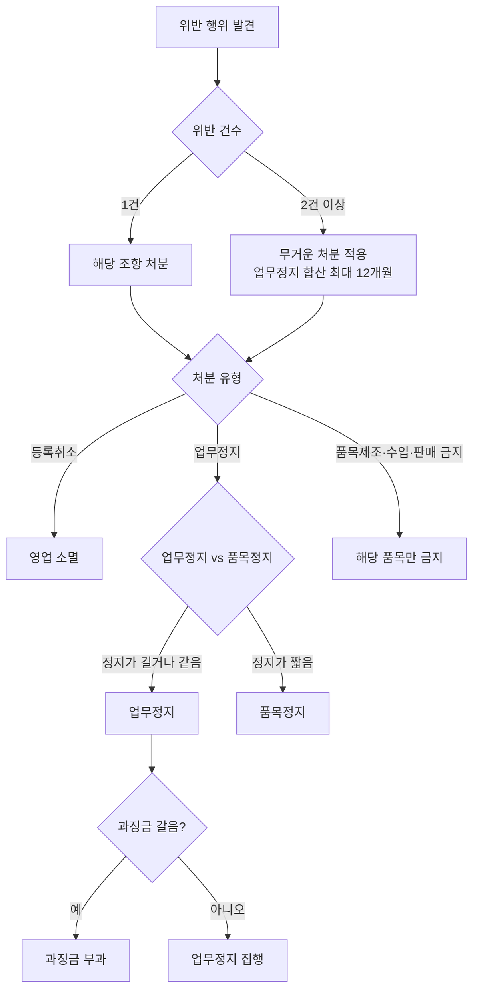

| 구분 | 내용 |
|---|---|
| **위반 2개 이상** | 무거운 처분 적용 (업무정지 합산 시 최대 12개월) |
| **업무정지 vs 품목정지** | 업무정지가 길거나 같으면 업무정지, 짧으면 품목정지 |
| **과징금 갈음** | 업무정지 처분을 과징금으로 갈음 가능 |
---

> **출처**: 시행규칙 - 유통·안전 (제2109호)

## 제7조(화장품의 품질관리기준 등)

> 📌 **출처**: 화장품법 시행규칙 제7조 (제2109호) | **참조 PDF**: `화장품법 시행규칙(총리령)(제02109호)(20260402).pdf` | **시행일**: 2026. 4. 2. | **최종 확인**: 2026. 8. 29.

법 제3조제3항에 따른 화장품의 품질관리기준은 별표 1과 같고, 책임판매 후 안전관리기준은 별표 2와 같다. <개정 2019. 3. 14.>


## 제8조의7(시험운영기관의 지정 등)

> 📌 **출처**: 화장품법 시행규칙 제8조의7 | **참조 PDF**: `화장품법 시행규칙(총리령)(제02109호)(20260402).pdf` | **시행일**: 2026. 4. 2. | **최종 확인**: 2026. 8. 29.

식품의약품안전처장은 법 제3조의4제3항에 따라 시험운영기관을 지정하거나 시험운영기관에 자격시험의 관리 및 자격증 발급ㆍ재발급 등의 업무를 위탁한 경우에는 그 내용을 식품의약품안전처 인터넷 홈페이지에 게재해야 한다. <개정 2022. 2. 18.>

[본조신설 2020. 3. 13.]
[제8조의6에서 이동 <2022. 2. 18.>]


## 제9조(기능성화장품의 심사)

> 📌 **출처**: 화장품법 시행규칙 제9조 | **참조 PDF**: `화장품법 시행규칙(총리령)(제02109호)(20260402).pdf` | **시행일**: 2026. 4. 2. | **최종 확인**: 2026. 8. 29.

① 법 제4조제1항에 따라 기능성화장품(제10조에 따라 보고서를 제출해야 하는 기능성화장품은 제외한다. 이하 이 조에서 같다)으로 인정받아 판매 등을 하려는 화장품제조업자, 화장품책임판매업자 또는 「기초연구진흥 및 기술개발지원에 관한 법률」 제6조제1항 및 제14조의2에 따른 대학ㆍ연구기관ㆍ연구소(이하 “연구기관등”이라 한다)는 품목별로 별지 제7호서식의 기능성화장품 심사의뢰서(전자문서로 된 심사의뢰서를 포함한다)에 다음 각 호의 서류(전자문서를 포함한다)를 첨부하여 식품의약품안전평가원장의 심사를 받아야 한다.

다만, 식품의약품안전처장이 제품의 효능ㆍ효과를 나타내는 성분ㆍ함량을 고시한 품목의 경우에는 제1호부터 제4호까지의 자료 제출을, 기준 및 시험방법을 고시한 품목의 경우에는 제5호의 자료 제출을 각각 생략할 수 있다. <개정 2013. 3. 23., 2013. 12. 6., 2019. 3. 14., 2021. 9. 10.>

1. 기원(起源) 및 개발 경위에 관한 자료

2. 안전성에 관한 자료
가. 단회 투여 독성시험 자료
나. 1차 피부 자극시험 자료
다. 안(眼)점막 자극 또는 그 밖의 점막 자극시험 자료
라. 피부 감작성(感作性: 외부 자극에 의한 면역계 반응성을 말한다. 이하 같다) 시험 자료
마. 광독성(빛에 의한 독성 반응성을 말한다. 이하 같다) 및 광감작성(빛에 의한 면역계 반응성을 말한다. 이하 같다) 시험 자료
바. 인체 첩포시험(貼布試驗: 접촉 피부염의 원인을 파악하기 위해 원인 추정 물질을 몸에 붙여 반응을 조사하는 시험을 말한다. 이하 같다) 자료
3. 유효성 또는 기능에 관한 자료
가. 효력시험 자료
나. 인체 적용시험 자료
4. 자외선 차단지수 및 자외선A 차단등급 설정의 근거자료(자외선을 차단 또는 산란시켜 자외선으로부터 피부를 보호하는 기능을 가진 화장품의 경우만 해당한다)

5. 기준 및 시험방법에 관한 자료[검체(檢體)를 포함한다]
③ 제1항에 따라 심사를 받은 사항을 변경하려는 자는 별지 제8호서식의 기능성화장품 변경심사 의뢰서에 다음 각 호의 서류를 첨부하여 식품의약품안전평가원장에게 제출해야 한다.<개정 2013. 3. 23., 2021. 12. 28., 2025. 2. 7.>
1. 먼저 발급받은 기능성화장품심사결과통지서(전자문서로 발급받은 경우는 제외한다)

2. 변경사유를 증명할 수 있는 서류(기능성화장품 심사를 받은 자 간에 법 제4조제1항에 따라 심사받은 기능성화장품에 대한 권리를 양도ㆍ양수하여 심사받은 자를 변경하려는 경우에는 양도ㆍ양수계약서를 말한다)
④ 식품의약품안전평가원장은 제1항 또는 제3항에 따라 심사의뢰서나 변경심사 의뢰서를 받은 경우에는 다음 각 호의 심사기준에 따라 심사하여야 한다.<개정 2013. 3. 23.>
1. 기능성화장품의 원료와 그 분량은 효능ㆍ효과 등에 관한 자료에 따라 합리적이고 타당하여야 하며, 각 성분의 배합의의(配合意義)가 인정되어야 할 것

2. 기능성화장품의 효능ㆍ효과는 법 제2조제2호 각 목에 적합할 것

3. 기능성화장품의 용법ㆍ용량은 오용될 여지가 없는 명확한 표현으로 적을 것
⑤ 식품의약품안전평가원장은 제4항에 따라 심사를 한 후 심사대장에 다음 각 호의 사항을 적고, 별지 제9호서식의 기능성화장품 심사ㆍ변경심사 결과통지서를 발급해야 한다.<개정 2013. 3. 23., 2019. 3. 14., 2021. 12. 28.>
1. 심사번호 및 심사연월일 또는 변경심사 연월일

2. 기능성화장품 심사를 받은 화장품제조업자, 화장품책임판매업자 또는 연구기관등의 상호(법인인 경우에는 법인의 명칭) 및 소재지

3. 제품명

4. 효능ㆍ효과
⑥ 제1항부터 제4항까지의 규정에 따른 첨부자료의 범위ㆍ요건ㆍ작성요령과 제출이 면제되는 범위 및 심사기준 등에 관한 세부 사항은 식품의약품안전처장이 정하여 고시한다.<개정 2013. 3. 23., 2013. 12. 6.>


## 제10조(보고서 제출 대상 등)

> 📌 **출처**: 화장품법 시행규칙 제10조 | **참조 PDF**: `화장품법 시행규칙(총리령)(제02109호)(20260402).pdf` | **시행일**: 2026. 4. 2. | **최종 확인**: 2026. 8. 29.

① 법 제4조제1항에 따라 기능성화장품의 심사를 받지 아니하고 식품의약품안전평가원장에게 보고서를 제출하여야 하는 대상은 다음 각 호와 같다. <개정 2013. 3. 23., 2013. 12. 6., 2017. 7. 31., 2019. 3. 14., 2019. 12. 12.>

1. 효능ㆍ효과가 나타나게 하는 성분의 종류ㆍ함량, 효능ㆍ효과, 용법ㆍ용량, 기준 및 시험방법이 식품의약품안전처장이 고시한 품목과 같은 기능성화장품

2. 이미 심사를 받은 기능성화장품[화장품제조업자(화장품제조업자가 제품을 설계ㆍ개발ㆍ생산하는 방식으로 제조한 경우만 해당한다)가 같거나 화장품책임판매업자가 같은 경우 또는 제9조제1항에 따라 기능성화장품으로 심사받은 연구기관등이 같은 기능성화장품만 해당한다. 이하 제3호에서 같다]과 다음 각 목의 사항이 모두 같은 품목.

   다만, 제2조제1호부터 제3호까지 및 같은 조 제8호부터 제11호까지의 기능성화장품은 이미 심사를 받은 품목이 대조군(對照群)(효능ㆍ효과가 나타나게 하는 성분을 제외한 것을 말한다)과의 비교실험을 통하여 효능이 입증된 경우만 해당한다.
가. 효능ㆍ효과가 나타나게 하는 원료의 종류ㆍ규격 및 함량(액체상태인 경우에는 농도를 말한다)
나. 효능ㆍ효과(제2조제4호 및 제5호의 기능성화장품의 경우 자외선 차단지수의 측정값이 마이너스 20퍼센트 이하의 범위에 있는 경우에는 같은 효능ㆍ효과로 본다)
다. 기준[산성도(pH)에 관한 기준은 제외한다] 및 시험방법
라. 용법ㆍ용량
마. 제형(劑形)[제2조제1호부터 제3호까지 및 같은 조 제6호부터 제11호까지의 기능성화장품의 경우에는 액제(Solution), 로션제(Lotion) 및 크림제(Cream)를 같은 제형으로 본다]
3. 이미 심사를 받은 기능성화장품 및 식품의약품안전처장이 고시한 기능성화장품과 비교하여 다음 각 목의 사항이 모두 같은 품목(이미 심사를 받은 제2조제4호 및 제5호의 기능성화장품으로서 그 효능ㆍ효과를 나타나게 하는 성분ㆍ함량과 식품의약품안전처장이 고시한 제2조제1호부터 제3호까지의 기능성화장품으로서 그 효능ㆍ효과를 나타나게 하는 성분ㆍ함량이 서로 혼합된 품목만 해당한다)
가. 효능ㆍ효과를 나타나게 하는 원료의 종류ㆍ규격 및 함량
나. 효능ㆍ효과(제2조제4호 및 제5호에 따른 효능ㆍ효과의 경우 자외선차단지수의 측정값이 마이너스 20퍼센트 이하의 범위에 있는 경우에는 같은 효능ㆍ효과로 본다)
다. 기준[산성도(pH)에 관한 기준은 제외한다] 및 시험방법
라. 용법ㆍ용량
마. 제형
② 기능성화장품으로 인정받아 판매 등을 하려는 화장품제조업자, 화장품책임판매업자 또는 연구기관등은 제1항에 따라 품목별로 별지 제10호서식의 기능성화장품 심사 제외 품목 보고서(전자문서로 된 보고서를 포함한다)를 식품의약품안전평가원장에게 제출해야 한다.<개정 2013. 3. 23., 2019. 3. 14.>

③ 제2항에 따라 보고서를 받은 식품의약품안전평가원장은 제1항에 따른 요건을 확인한 후 다음 각 호의 사항을 기능성화장품의 보고대장에 적어야 한다.<개정 2013. 3. 23., 2019. 3. 14.>
1. 보고번호 및 보고연월일

2. 화장품제조업자, 화장품책임판매업자 또는 연구기관등의 상호(법인인 경우에는 법인의 명칭) 및 소재지

3. 제품명

4. 효능ㆍ효과


## 제10조의3(제품별 안전성 자료의 작성ㆍ보관)

> 📌 **출처**: 화장품법 시행규칙 제10조의3 | **참조 PDF**: `화장품법 시행규칙(총리령)(제02109호)(20260402).pdf` | **시행일**: 2026. 4. 2. | **최종 확인**: 2026. 8. 29.

① 법 제4조의2제1항 및 이 규칙 제10조의2제2항에 따라 화장품의 표시ㆍ광고를 하려는 화장품책임판매업자는 법 제4조의2제1항제1호부터 제3호까지의 규정에 따른 제품별 안전성 자료 모두를 미리 작성해야 한다.

② 제품별 안전성 자료의 보관기간은 다음 각 호의 구분에 따른다.
1. 화장품의1차 포장에 사용기한을 표시하는 경우: 영유아 또는 어린이가 사용할 수 있는 화장품임을 표시ㆍ광고한 날부터 마지막으로 제조ㆍ수입된 제품의 사용기한 만료일 이후 1년까지의 기간. 이 경우 제조는 화장품의 제조번호에 따른 제조일자를 기준으로 하며, 수입은 통관일자를 기준으로 한다.

2. 화장품의1차 포장에 개봉 후 사용기간을 표시하는 경우: 영유아 또는 어린이가 사용할 수 있는 화장품임을 표시ㆍ광고한 날부터 마지막으로 제조ㆍ수입된 제품의 제조연월일 이후 3년까지의 기간. 이 경우 제조는 화장품의 제조번호에 따른 제조일자를 기준으로 하며, 수입은 통관일자를 기준으로 한다.
③ 제1항 및 제2항에서 규정한 사항 외에 제품별 안전성 자료의 작성ㆍ보관의 방법 및 절차 등에 필요한 세부 사항은 식품의약품안전처장이 정하여 고시한다.
[본조신설 2020. 1. 22.]


## 제10조의4(실태조사의 실시)

> 📌 **출처**: 화장품법 시행규칙 제10조의4 | **참조 PDF**: `화장품법 시행규칙(총리령)(제02109호)(20260402).pdf` | **시행일**: 2026. 4. 2. | **최종 확인**: 2026. 8. 29.

① 식품의약품안전처장은 법 제4조의2제2항에 따른 실태조사(이하 “실태조사”라 한다)를 5년마다 실시한다.

② 실태조사에는 다음 각 호의 사항이 포함되어야 한다.
1. 제품별 안전성 자료의 작성 및 보관 현황

2. 소비자의 사용실태

3. 사용 후 이상사례의 현황 및 조치 결과

4. 영유아 또는 어린이 사용 화장품에 대한 표시ㆍ광고의 현황 및 추세

5. 영유아 또는 어린이 사용 화장품의 유통 현황 및 추세

6. 그 밖에 제1호부터 제5호까지의 사항과 유사한 것으로서 식품의약품안전처장이 필요하다고 인정하는 사항
③ 식품의약품안전처장은 실태조사를 위해 필요하다고 인정하는 경우에는 관계 행정기관, 공공기관, 법인ㆍ단체 또는 전문가 등에게 필요한 의견 또는 자료의 제출 등을 요청할 수 있다.

④ 식품의약품안전처장은 실태조사의 효율적 실시를 위해 필요하다고 인정하는 경우에는 화장품 관련 연구기관 또는 법인ㆍ단체 등에 실태조사를 의뢰하여 실시할 수 있다.

⑤ 제1항부터 제4항까지에서 규정한 사항 외에 실태조사의 대상, 방법 및 절차 등에 필요한 세부 사항은 식품의약품안전처장이 정한다.
[본조신설 2020. 1. 22.]


## 제13조(화장품의 생산실적 등 보고)

> 📌 **출처**: 화장품법 시행규칙 제13조 | **참조 PDF**: `화장품법 시행규칙(총리령)(제02109호)(20260402).pdf` | **시행일**: 2026. 4. 2. | **최종 확인**: 2026. 8. 29.

① 법 제5조제5항 전단에 따라 화장품책임판매업자는 지난해의 생산실적 또는 수입실적을 매년 2월 말까지 식품의약품안전처장이 정하여 고시하는 바에 따라 대한화장품협회 등 법 제17조에 따라 설립된 화장품업 단체(「약사법」 제67조에 따라 조직된 한국의약품수출입협회를 포함한다)를 통하여 식품의약품안전처장에게 보고해야 한다. <개정 2013. 3. 23., 2018. 12. 31., 2019. 3. 14., 2020. 3. 13., 2022. 2. 18., 2024. 7. 9.>

② 법 제5조제5항 후단에 따라 화장품책임판매업자는 화장품의 제조과정에 사용된 원료의 목록을 화장품의 유통ㆍ판매 전까지 보고해야 한다. 보고한 목록이 변경된 경우에도 또한 같다.<신설 2019. 3. 14., 2022. 2. 18.>

③ 제1항 및 제2항에도 불구하고 「전자무역 촉진에 관한 법률」에 따라 전자무역문서로 표준통관예정보고를 하고 수입하는 화장품책임판매업자는 제1항 및 제2항에 따라 수입실적 및 원료의 목록을 보고하지 아니할 수 있다.<개정 2019. 3. 14.>

④ 법 제5조제6항에 따라 맞춤형화장품판매업자는 전년도에 판매한 맞춤형화장품에 사용된 원료의 목록을 매년 2월 말까지 식품의약품안전처장이 정하여 고시하는 바에 따라 법 제17조에 따라 설립된 화장품업 단체를 통하여 식품의약품안전처장에게 보고해야 한다.<신설 2022. 2. 18.>


## 제14조의2(회수 대상 화장품의 기준 및 위해성 등급 등)

> 📌 **출처**: 화장품법 시행규칙 제14조의2 | **참조 PDF**: `화장품법 시행규칙(총리령)(제02109호)(20260402).pdf` | **시행일**: 2026. 4. 2. | **최종 확인**: 2026. 8. 29.

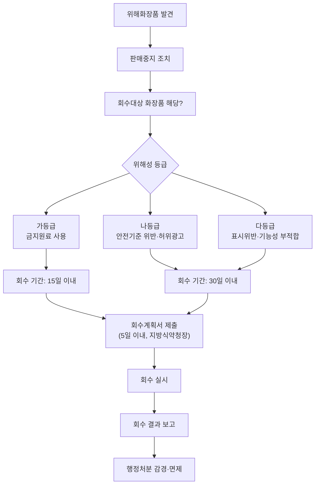

① 법 제5조의2제1항에 따른 회수 대상 화장품(이하 “회수대상화장품”이라 한다)은 유통 중인 화장품으로서 다음 각 호의 어느 하나에 해당하는 화장품으로 한다. <개정 2019. 3. 14., 2019. 12. 12., 2020. 1. 22., 2020. 3. 13., 2022. 2. 18.>

1. 법 제9조에 위반되는 화장품

2. 법 제15조에 위반되는 화장품으로서 다음 각 목의 어느 하나에 해당하는 화장품
가. 법 제15조제2호 또는 제3호에 해당하는 화장품
나. 법 제15조제4호에 해당하는 화장품 중 보건위생상 위해를 발생할 우려가 있는 화장품
다. 법 제15조제5호에 해당하는 화장품 중 다음의 어느 하나에 해당하는 화장품
1) 법 제8조제1항 또는 제2항에 따른 화장품에 사용할 수 없는 원료를 사용한 화장품
2) 법 제8조제8항에 따른 유통화장품 안전관리 기준(내용량의 기준에 관한 부분은 제외한다)에 적합하지 아니한 화장품
라. 법 제15조제9호에 해당하는 화장품
마. 법 제15조제10호에 해당하는 화장품
바. 그 밖에 영업자 스스로 국민보건에 위해를 끼칠 우려가 있어 회수가 필요하다고 판단한 화장품
3. 법 제16조제1항에 위반되는 화장품
② 법 제5조의2제4항에 따른 회수대상화장품의 위해성 등급은 그 위해성이 높은 순서에 따라 가등급, 나등급 및 다등급으로 구분하며, 해당 위해성 등급의 분류기준은 다음 각 호의 구분에 따른다.<신설 2019. 12. 12., 2022. 2. 18.>
1. 위해성 등급이 가등급인 화장품: 제1항제2호다목1)에 해당하는 화장품

2. 위해성 등급이 나등급인 화장품: 제1항제1호 또는 같은 항 제2호다목2)(기능성화장품의 기능성을 나타나게 하는 주원료 함량이 기준치에 부적합한 경우는 제외한다)ㆍ마목에 해당하는 화장품

3. 위해성 등급이 다등급인 화장품: 제1항제2호가목ㆍ나목ㆍ다목2)(기능성화장품의 기능성을 나타나게 하는 주원료 함량이 기준치에 부적합한 경우만 해당한다)ㆍ라목ㆍ바목 또는 같은 항 제3호에 해당하는 화장품
[본조신설 2015. 7. 29.]
[제목개정 2019. 12. 12.]


## 제14조의3(위해화장품의 회수계획 및 회수절차 등)

> 📌 **출처**: 화장품법 시행규칙 제14조의3 | **참조 PDF**: `화장품법 시행규칙(총리령)(제02109호)(20260402).pdf` | **시행일**: 2026. 4. 2. | **최종 확인**: 2026. 8. 29.

① 법 제5조의2제1항에 따라 화장품을 회수하거나 회수하는 데에 필요한 조치를 하려는 영업자(이하 “회수의무자”라 한다)는 해당 화장품에 대하여 즉시 판매중지 등의 필요한 조치를 하여야 하고, 회수대상화장품이라는 사실을 안 날부터 5일 이내에 별지 제10호의2서식의 회수계획서에 다음 각 호의 서류를 첨부하여 지방식품의약품안전청장에게 제출하여야 한다.

다만, 제출기한까지 회수계획서의 제출이 곤란하다고 판단되는 경우에는 지방식품의약품안전청장에게 그 사유를 밝히고 제출기한 연장을 요청하여야 한다. <개정 2019. 3. 14., 2020. 3. 13.>

1. 해당 품목의 제조ㆍ수입기록서 사본

2. 판매처별 판매량ㆍ판매일 등의 기록

3. 회수 사유를 적은 서류
② 회수의무자가 제1항 본문에 따라 회수계획서를 제출하는 경우에는 다음 각 호의 구분에 따른 범위에서 회수 기간을 기재해야 한다.

다만, 회수 기간 이내에 회수하기가 곤란하다고 판단되는 경우에는 지방식품의약품안전청장에게 그 사유를 밝히고 회수 기간 연장을 요청할 수 있다.<신설 2019. 12. 12.>
1. 위해성 등급이 가등급인 화장품: 회수를 시작한 날부터 15일 이내

2. 위해성 등급이 나등급 또는 다등급인 화장품: 회수를 시작한 날부터 30일 이내
③ 지방식품의약품안전청장은 제1항에 따라 제출된 회수계획이 미흡하다고 판단되는 경우에는 해당 회수의무자에게 그 회수계획의 보완을 명할 수 있다.<개정 2019. 12. 12.>

④ 회수의무자는 회수대상화장품의 판매자(법 제11조제1항에 따른 판매자를 말한다), 그 밖에 해당 화장품을 업무상 취급하는 자에게 방문, 우편, 전화, 전보, 전자우편, 팩스 또는 언론매체를 통한 공고 등을 통하여 회수계획을 통보하여야 하며, 통보 사실을 입증할 수 있는 자료를 회수종료일부터 2년간 보관하여야 한다.<개정 2019. 12. 12.>

⑤ 제4항에 따라 회수계획을 통보받은 자는 회수대상화장품을 회수의무자에게 반품하고, 별지 제10호의3서식의 회수확인서를 작성하여 회수의무자에게 송부하여야 한다.<개정 2019. 12. 12.>

⑥ 회수의무자는 회수한 화장품을 폐기하려는 경우에는 별지 제10호의4서식의 폐기신청서에 다음 각 호의 서류를 첨부하여 지방식품의약품안전청장에게 제출하고, 관계 공무원의 참관 하에 환경 관련 법령에서 정하는 바에 따라 폐기하여야 한다.<개정 2019. 12. 12.>
1. 별지 제10호의2서식의 회수계획서 사본

2. 별지 제10호의3서식의 회수확인서 사본
⑦ 제6항에 따라 폐기를 한 회수의무자는 별지 제10호의5서식의 폐기확인서를 작성하여 2년간 보관하여야 한다.<개정 2019. 12. 12.>

⑧ 회수의무자는 회수대상화장품의 회수를 완료한 경우에는 별지 제10호의6서식의 회수종료신고서에 다음 각 호의 서류를 첨부하여 지방식품의약품안전청장에게 제출하여야 한다.<개정 2019. 12. 12.>
1. 별지 제10호의3서식의 회수확인서 사본

2. 별지 제10호의5서식의 폐기확인서 사본(폐기한 경우에만 해당한다)

3. 별지 제10호의7서식의 평가보고서 사본
⑨ 지방식품의약품안전청장은 제8항에 따라 회수종료신고서를 받으면 다음 각 호에서 정하는 바에 따라 조치하여야 한다.<개정 2019. 12. 12.>
1. 회수계획서에 따라 회수대상화장품의 회수를 적절하게 이행하였다고 판단되는 경우에는 회수가 종료되었음을 확인하고 회수의무자에게 이를 서면으로 통보할 것

2. 회수가 효과적으로 이루어지지 아니하였다고 판단되는 경우에는 회수의무자에게 회수에 필요한 추가 조치를 명할 것
[본조신설 2015. 7. 29.]


## 제17조의2(지정ㆍ고시된 원료의 사용기준의 안전성 검토)

> 📌 **출처**: 화장품법 시행규칙 제17조의2 | **참조 PDF**: `화장품법 시행규칙(총리령)(제02109호)(20260402).pdf` | **시행일**: 2026. 4. 2. | **최종 확인**: 2026. 8. 29.

① 법 제8조제5항에 따른 지정ㆍ고시된 원료의 사용기준의 안전성 검토 주기는 5년으로 한다.

② 식품의약품안전처장은 법 제8조제5항에 따라 지정ㆍ고시된 원료의 사용기준의 안전성을 검토할 때에는 사전에 안전성 검토 대상을 선정하여 실시해야 한다.
[본조신설 2019. 3. 14.]


## 제17조의3(원료의 사용금지 해제 또는 변경 신청 등)

> 📌 **출처**: 화장품법 시행규칙 제17조의3 | **참조 PDF**: `화장품법 시행규칙(총리령)(제02109호)(20260402).pdf` | **시행일**: 2026. 4. 2. | **최종 확인**: 2026. 8. 29.

① 법 제8조제6항에 따라 화장품제조업자, 화장품책임판매업자 또는 연구기관등은 법 제8조제1항에 따라 지정ㆍ고시된 원료를 해제 또는 변경하거나, 같은 조 제2항에 따라 지정ㆍ고시되지 않은 원료의 사용기준을 지정ㆍ고시하거나 지정ㆍ고시된 원료의 사용기준을 변경해 줄 것을 신청하려는 경우에는 별지 제13호의2서식의 원료 사용금지 해제 또는 변경(사용기준 지정 또는 변경) 신청서(전자문서로 된 신청서를 포함한다)에 다음 각 호의 서류(전자문서를 포함한다)를 첨부하여 식품의약품안전처장에게 제출해야 한다. <개정 2025. 2. 7.>

1. 제출자료 전체의 요약본

2. 원료의 기원, 개발 경위, 국내ㆍ외 사용기준 및 사용현황 등에 관한 자료

3. 원료의 특성에 관한 자료

4. 안전성 및 유효성에 관한 자료(유효성에 관한 자료는 해당하는 경우에만 제출한다)

5. 원료의 기준 및 시험방법에 관한 시험성적서
② 식품의약품안전처장은 제1항에 따라 제출된 자료가 적합하지 않은 경우 그 내용을 구체적으로 명시하여 신청인에게 보완을 요청할 수 있다. 이 경우 신청인은 보완일부터 60일 이내에 추가 자료를 제출하거나 보완 제출기한의 연장을 요청할 수 있다.

③ 식품의약품안전처장은 신청인이 제1항의 자료를 제출한 날(제2항에 따라 자료가 보완 요청된 경우 신청인이 보완된 자료를 제출한 날)부터 180일 이내에 신청인에게 별지 제13호의3서식의 원료 사용금지 해제 또는 변경(사용기준 지정 또는 변경) 심사 결과통지서를 보내야 한다.<개정 2025. 2. 7.>

④ 제1항부터 제3항까지에서 규정한 사항 외에 원료의 사용금지 해제 또는 변경 및 사용기준 지정 또는 변경 신청에 필요한 세부절차와 방법 등은 식품의약품안전처장이 정한다.<개정 2025. 2. 7.>
[본조신설 2019. 3. 14.]
[제목개정 2025. 2. 7.]


## 제18조(안전용기ㆍ포장 대상 품목 및 기준)

> 📌 **출처**: 화장품법 시행규칙 제18조 | **참조 PDF**: `화장품법 시행규칙(총리령)(제02109호)(20260402).pdf` | **시행일**: 2026. 4. 2. | **최종 확인**: 2026. 8. 29.

① 법 제9조제1항에 따른 안전용기ㆍ포장을 사용해야 하는 품목은 다음 각 호와 같다. 다만, 일회용 제품, 용기 입구 부분이 펌프 또는 방아쇠로 작동되는 분무용기 제품, 압축 분무용기 제품(에어로졸 제품 등)은 제외한다. <개정 2021. 9. 10.>

1. 아세톤을 함유하는 네일 에나멜 리무버 및 네일 폴리시 리무버

2. 어린이용 오일 등 개별포장 당 탄화수소류를 10퍼센트 이상 함유하고 운동점도가 21센티스톡스(섭씨 40도 기준) 이하인 에멀션 형태가 아닌 액체상태의 제품

3. 개별포장당 메틸 살리실레이트를 5퍼센트 이상 함유하는 액체상태의 제품
② 제1항에 따른 안전용기ㆍ포장은 성인이 개봉하기는 어렵지 아니하나 5세 미만의 어린이가 개봉하기는 어렵게 된 것이어야 한다. 이 경우 개봉하기 어려운 정도의 구체적인 기준 및 시험방법은 산업통상부장관이 정하여 고시하는 바에 따른다.<개정 2013. 3. 23., 2024. 7. 9., 2025. 10. 31.>


## 제20조(화장품 가격의 표시)

> 📌 **출처**: 화장품법 시행규칙 제20조 | **참조 PDF**: `화장품법 시행규칙(총리령)(제02109호)(20260402).pdf` | **시행일**: 2026. 4. 2. | **최종 확인**: 2026. 8. 29.

법 제11조제1항에 따라 해당 화장품을 소비자에게 직접 판매하는 자(이하 “판매자”라 한다)는 그 제품의 포장에 판매하려는 가격을 일반 소비자가 알기 쉽도록 표시하되, 그 세부적인 표시방법은 식품의약품안전처장이 정하여 고시한다. <개정 2013. 3. 23.>


## 제23조(표시ㆍ광고 실증의 대상 등)

> 📌 **출처**: 화장품법 시행규칙 제23조 | **참조 PDF**: `화장품법 시행규칙(총리령)(제02109호)(20260402).pdf` | **시행일**: 2026. 4. 2. | **최종 확인**: 2026. 8. 29.

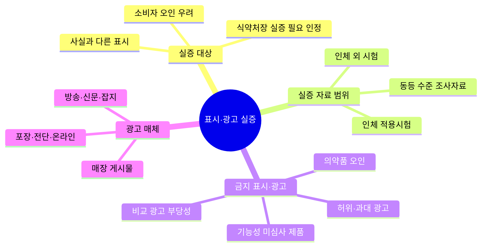

> **🗺️ 마인드맵 노드 상세 매핑**

| 대분류 | 중분류 |
|---|---|
| 실증 대상 | — |
| 실증 대상 | 사실과 다른 표시 |
| 실증 대상 | 소비자 오인 우려 |
| 실증 대상 | 식약처장 실증 필요 인정 (L?) |
| 실증 자료 범위 | — |
| 실증 자료 범위 | 인체 적용시험 (L367) |
| 실증 자료 범위 | 인체 외 시험 (L85) |
| 실증 자료 범위 | 동등 수준 조사자료 |
| 금지 표시·광고 | — |
| 금지 표시·광고 | 의약품 오인 |
| 금지 표시·광고 | 허위·과대 광고 |
| 금지 표시·광고 | 기능성 미심사 제품 |
| 금지 표시·광고 | 비교 광고 부당성 |
| 광고 매체 | — |
| 광고 매체 | 포장·전단·온라인 |
| 광고 매체 | 매장 게시물 |
| 광고 매체 | 방송·신문·잡지 |

①법 제14조제1항에 따른 표시ㆍ광고 실증의 대상은 화장품의 포장 또는 별표 5 제1호에 따른 화장품 광고의 매체 또는 수단에 의한 표시ㆍ광고 중 사실과 다르게 소비자를 속이거나 소비자가 잘못 인식하게 할 우려가 있어 식품의약품안전처장이 실증이 필요하다고 인정하는 표시ㆍ광고로 한다. <개정 2013. 3. 23.>

② 법 제14조제3항에 따라 영업자 또는 판매자가 제출하여야 하는 실증자료의 범위 및 요건은 다음 각 호와 같다.<개정 2019. 3. 14., 2020. 3. 13.>
1. 시험결과: 인체 적용시험 자료, 인체 외 시험 자료 또는 같은 수준 이상의 조사자료일 것

2. 조사결과: 표본설정, 질문사항, 질문방법이 그 조사의 목적이나 통계상의 방법과 일치할 것

3. 실증방법: 실증에 사용되는 시험 또는 조사의 방법은 학술적으로 널리 알려져 있거나 관련 산업 분야에서 일반적으로 인정된 방법 등으로서 과학적이고 객관적인 방법일 것
③ 법 제14조제3항에 따라 영업자 또는 판매자가 실증자료를 제출할 때에는 다음 각 호의 사항을 적고, 이를 증명할 수 있는 자료를 첨부해 식품의약품안전처장에게 제출해야 한다.<개정 2020. 3. 13.>
1. 실증방법

2. 시험ㆍ조사기관의 명칭 및 대표자의 성명ㆍ주소ㆍ전화번호

3. 실증내용 및 실증결과

4. 실증자료 중 영업상 비밀에 해당되어 공개를 원하지 않는 경우에는 그 내용 및 사유
④ 제1항부터 제3항까지에서 규정한 사항 외에 표시ㆍ광고 실증에 필요한 사항은 식품의약품안전처장이 정하여 고시한다.<개정 2013. 3. 23.>


## 제24조(관계 공무원의 자격 등)

> 📌 **출처**: 화장품법 시행규칙 제24조 | **참조 PDF**: `화장품법 시행규칙(총리령)(제02109호)(20260402).pdf` | **시행일**: 2026. 4. 2. | **최종 확인**: 2026. 8. 29.

① 법 제18조제1항에 따른 화장품 검사 등에 관한 업무를 수행하는 공무원(이하 “화장품감시공무원”이라 한다)은 다음 각 호의 어느 하나에 해당하는 사람 중에서 지방식품의약품안전청장이 임명하는 사람으로 한다. <개정 2020. 3. 13.>

1. 「고등교육법」 제2조에 따른 학교에서 약학 또는 화장품 관련 분야의 학사학위 이상을 취득한 사람(법령에서 이와 같은 수준 이상의 학력이 있다고 인정한 사람을 포함한다)

2. 화장품에 관한 지식 및 경력이 풍부하다고 지방식품의약품안전청장이 인정하거나 특별시장ㆍ광역시장ㆍ특별자치시장ㆍ도지사ㆍ특별자치도지사 또는 시장ㆍ군수ㆍ구청장(자치구의 구청장을 말한다)이 추천한 사람
② 법 제18조제4항에 따른 화장품감시공무원의 신분을 증명하는 증표는 별지 제14호서식에 따른다.


## 제25조(수거 등)

> 📌 **출처**: 화장품법 시행규칙 제25조 | **참조 PDF**: `화장품법 시행규칙(총리령)(제02109호)(20260402).pdf` | **시행일**: 2026. 4. 2. | **최종 확인**: 2026. 8. 29.

법 제18조제2항에 따라 화장품감시공무원이 물품 또는 화장품을 수거하는 경우에는 별지 제15호서식의 수거증을 피수거인에게 발급하여야 한다.


## 제26조(화장품 판매 모니터링)

> 📌 **출처**: 화장품법 시행규칙 제26조 | **참조 PDF**: `화장품법 시행규칙(총리령)(제02109호)(20260402).pdf` | **시행일**: 2026. 4. 2. | **최종 확인**: 2026. 8. 29.

식품의약품안전처장은 법 제18조제3항에 따라 법 제17조에 따른 단체 또는 관련 업무를 수행하는 기관 등을 지정하여 화장품의 판매, 표시ㆍ광고, 품질 등에 대하여 모니터링하게 할 수 있다. <개정 2013. 3. 23.>


## 제26조의2(소비자화장품안전관리감시원의 자격 등)

> 📌 **출처**: 화장품법 시행규칙 제26조의2 | **참조 PDF**: `화장품법 시행규칙(총리령)(제02109호)(20260402).pdf` | **시행일**: 2026. 4. 2. | **최종 확인**: 2026. 8. 29.

① 법 제18조의2조제1항에 따라 소비자화장품안전관리감시원(이하 “소비자화장품감시원”이라 한다)으로 위촉될 수 있는 사람은 다음 각 호의 어느 하나에 해당하는 사람으로 한다.

1. 법 제17조에 따라 설립된 단체의 임직원 중 해당 단체의 장이 추천한 사람

2. 「소비자기본법」 제29조제1항에 따라 등록한 소비자단체의 임직원 중 해당 단체의 장이 추천한 사람

3. 제8조제1항 각 호의 어느 하나에 해당하는 사람

4. 식품의약품안전처장이 정하여 고시하는 교육과정을 마친 사람
② 소비자화장품감시원의 임기는 2년으로 하되, 연임할 수 있다.

③ 법 제18조의2제2항제3호에서 “총리령으로 정하는 사항”이란 다음 각 호의 사항을 말한다.
1. 법 제23조에 따른 관계 공무원의 물품 회수ㆍ폐기 등의 업무 지원

2. 제29조에 따른 행정처분의 이행 여부 확인 등의 업무 지원

3. 화장품의 안전사용과 관련된 홍보 등의 업무
④ 법 제18조의2제3항에 따라 식품의약품안전처장 또는 지방식품의약품안전청장은 소비자화장품감시원에 대하여 반기(半期)마다 화장품 관계법령 및 위해화장품 식별 등에 관한 교육을 실시하고, 소비자화장품감시원이 직무를 수행하기 전에 그 직무에 관한 교육을 실시하여야 한다.

⑤ 식품의약품안전처장 또는 지방식품의약품안전청장은 소비자화장품감시원의 활동을 지원하기 위하여 예산의 범위에서 수당 등을 지급할 수 있다.

⑥ 제1항부터 제5항까지에서 규정한 사항 외에 소비자화장품감시원의 운영에 필요한 사항은 식품의약품안전처장이 정하여 고시한다.
[본조신설 2019. 3. 14.]


## 제28조(위해화장품의 공표)

> 📌 **출처**: 화장품법 시행규칙 제28조 | **참조 PDF**: `화장품법 시행규칙(총리령)(제02109호)(20260402).pdf` | **시행일**: 2026. 4. 2. | **최종 확인**: 2026. 8. 29.

① 법 제23조의2제1항에 따라 공표명령을 받은 영업자는 지체 없이 위해 발생사실 또는 다음 각 호의 사항을 「신문 등의 진흥에 관한 법률」 제9조제1항에 따라 등록한 전국을 보급지역으로 하는 1개 이상의 일반일간신문[당일 인쇄ㆍ보급되는 해당 신문의 전체 판(版)을 말한다] 및 해당 영업자의 인터넷 홈페이지에 게재하고, 식품의약품안전처의 인터넷 홈페이지에 게재를 요청하여야 한다.

다만, 제14조의2제2항제3호에 따른 위해성 등급이 다등급인 화장품의 경우에는 해당 일반일간신문에의 게재를 생략할 수 있다. <개정 2019. 12. 12.>

1. 화장품을 회수한다는 내용의 표제

2. 제품명

3. 회수대상화장품의 제조번호

4. 사용기한 또는 개봉 후 사용기간(병행 표기된 제조연월일을 포함한다)

5. 회수 사유

6. 회수 방법

7. 회수하는 영업자의 명칭

8. 회수하는 영업자의 전화번호, 주소, 그 밖에 회수에 필요한 사항
② 제1항 각 호의 사항에 대한 구체적인 작성방법은 별표 6과 같다.

③ 제1항에 따라 공표를 한 영업자는 다음 각 호의 사항이 포함된 공표 결과를 지체 없이 지방식품의약품안전청장에게 통보하여야 한다.
1. 공표일

2. 공표매체

3. 공표횟수

4. 공표문 사본 또는 내용
④ 법 제23조의2제2항에 따른 직접구매 해외화장품에 관한 정보의 공표는 식품의약품안전처의 인터넷 홈페이지에 게재하는 방법으로 한다.<신설 2026. 3. 31.>

⑤ 제4항에 따라 공표하는 직접구매 해외화장품에 관한 정보는 다음 각 호와 같다.<신설 2026. 3. 31.>
1. 제품명

2. 제조국

3. 제조회사

4. 제품사진

5. 원료 또는 성분

6. 그 밖에 국민 건강에 대한 위해를 방지하기 위하여 필요한 정보
[본조신설 2015. 7. 29.]


## 제33조(규제의 재검토)

> 📌 **출처**: 화장품법 시행규칙 제33조 | **참조 PDF**: `화장품법 시행규칙(총리령)(제02109호)(20260402).pdf` | **시행일**: 2026. 4. 2. | **최종 확인**: 2026. 8. 29.

식품의약품안전처장은 다음 각 호의 사항에 대하여 다음 각 호의 기준일을 기준으로 3년마다(매 3년이 되는 해의 기준일과 같은 날 전까지를 말한다) 그 타당성을 검토하여 개선 등의 조치를 하여야 한다. <개정 2019. 3. 14., 2020. 3. 13., 2022. 2. 18.>

1. 제3조에 따른 화장품 제조업의 등록: 2014년 1월 1일

2. 제4조에 따른 화장품책임판매업의 등록: 2019년 3월 14일

4. 제8조의2 및 제8조의3에 따른 맞춤형화장품판매업의 신고 및 변경신고: 2020년 3월 14일

5. 제29조제1항 및 별표 7에 따른 행정처분의 기준: 2022년 7월 1일
[본조신설 2014. 4. 1.]


---

> **출처**: CGMP (제2024-46호)

## 07_CGMP

우수화장품 제조 및 품질관리기준
[시행 2024. 8. 22.] [식품의약품안전처고시 제2024-46호, 2024.8.22., 일부개정]

식품의약품안전처(화장품정책과), 043-719-3413

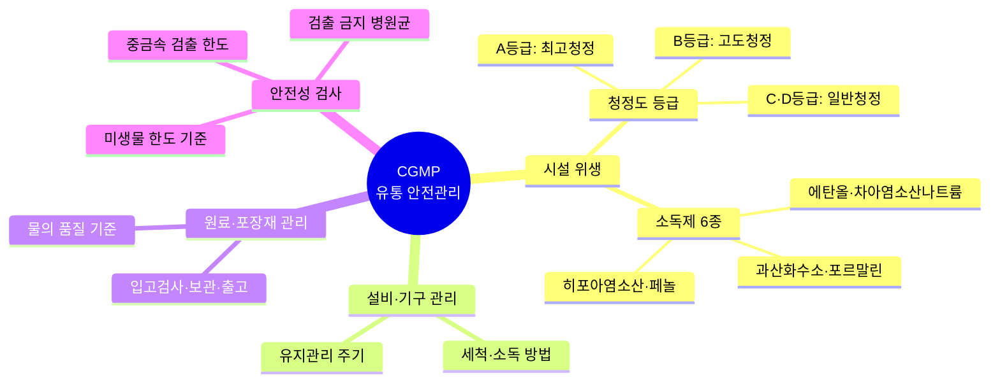

> **🗺️ 마인드맵 노드 상세 매핑**

| 대분류 | 중분류 | 소분류 |
|---|---|---|
| 시설 위생 | — | — |
| 시설 위생 | 청정도 등급 (L?) | — |
| 시설 위생 | 청정도 등급 (L?) | A등급: 최고청정 |
| 시설 위생 | 청정도 등급 (L?) | B등급: 고도청정 |
| 시설 위생 | 청정도 등급 (L?) | C·D등급: 일반청정 |
| 시설 위생 | 소독제 6종 (L?) | — |
| 시설 위생 | 소독제 6종 (L?) | 에탄올·차아염소산나트륨 (L?) |
| 시설 위생 | 소독제 6종 (L?) | 과산화수소·포르말린 (L?) |
| 시설 위생 | 소독제 6종 (L?) | 히포아염소산·페놀 |
| 설비·기구 관리 (L?) | — | — |
| 설비·기구 관리 (L?) | 세척·소독 방법 (L?) | — |
| 설비·기구 관리 (L?) | 유지관리 주기 (L?) | — |
| 원료·포장재 관리 (L?) | — | — |
| 원료·포장재 관리 (L?) | 입고검사·보관·출고 | — |
| 원료·포장재 관리 (L?) | 물의 품질 기준 (L?) | — |
| 안전성 검사 (L?) | — | — |
| 안전성 검사 (L?) | 중금속 검출 한도 (L?) | — |
| 안전성 검사 (L?) | 미생물 한도 기준 (L74) | — |
| 안전성 검사 (L?) | 검출 금지 병원균 (L?) | — |

## 제1장 총칙

> 📌 **출처**: 화장품 안전기준 (제2026-19호) 제1장 | **참조 PDF**: `화장품 안전기준 등에 관한 규정(식품의약품안전처고시)(제2026-19호)(20260318).pdf` | **시행일**: 2026. 4. 2. | **최종 확인**: 2026. 8. 29.


### 제1조(목적)

이 고시는 「화장품법」 제5조제1항 및 같은 법 시행규칙 제11조제2항에 따라 우수화장품 제조 및 품질관리 기준에 관한 세부사항을 정하고, 이를 이행하도록 권장함으로써 화장품제조업자가 우수한 화장품을 제조, 관리, 보관 및 공급을 통해 소비자 보호 및 국민 보건 향상에 기여함을 목적으로 한다.


### 제2조(용어의 정의)

이 고시에서 사용하는 용어의 뜻은 다음과 같다.

2. "제조"란 원료 물질의 칭량부터 혼합, 충전(1차포장) 등의 일련의 작업을 말한다.

4. "품질보증" 이란 제품이 적합 판정 기준에 충족될 것이라는 신뢰를 제공하는데 필수적인 모든 계획되고 체계적인 활동을 말한다.

5. "일탈"이란 제조 또는 품질관리 활동 등의 미리 정하여진 우수화장품 제조 및 품질관리기준을 벗어나 이루어진 행위를 말한다.

6. "기준일탈 (out-of-specification)" 이란 규정된 합격 판정 기준에 일치하지 않는 검사, 측정 또는 시험결과를 말한다.

7. "원료"란 벌크 제품의 제조에 투입하거나 포함되는 물질을 말한다.

8. "원자재"란 화장품 원료 및 자재를 말한다.

9. "불만"이란 제품이 규정된 적합판정기준을 충족시키지 못한다고 주장하는 외부 정보를 말한다.

10. "회수"란 판매한 제품 가운데 품질 결함이나 안전성 문제 등으로 나타난 제조번호의 제품(필요시 여타 제조번호 포함)을 제조소로 거두어들이는 활동을 말한다.

11. "오염"이란 제품에서 화학적, 물리적, 미생물학적 문제 또는 이들이 조합되어 나타내는 바람직하지 않은 문제의 발생을 말한다.

12. "청소"란 화학적인 방법, 기계적인 방법, 온도, 적용시간과 이러한 복합된 요인에 의해 청정도를 유지하고 일반적으로 표면에서 눈에 보이는 먼지를 분리, 제거하여 외관을 유지하는 모든 작업을 말한다.

13. "유지관리"란 적절한 작업 환경에서 건물과 설비가 유지되도록 이루어지는 정기적ㆍ비정기적인 지원 및 검증 작업을 말한다.

14. "주요 설비"란 제조 및 품질 관련 문서에 명기된 설비로 제품의 품질에 영향을 미치는 필수적인 설비를 말한다.

15. "검교정"이란 규정된 조건 하에서 측정기기나 측정 시스템에 의해 표시되는 값과 표준기기의 참값을 비교하여 이들의 오차가 허용범위 내에 있음을 확인하고, 허용범위를 벗어나는 경우 허용범위 내에 들도록 조정하는 것을 말한다.

16. "제조번호" 또는 "뱃치번호"란 일정한 제조단위분에 대하여 제조관리 및 출하에 관한 모든 사항을 확인할 수 있도록 표시된 번호로서 숫자ㆍ문자ㆍ기호 또는 이들의 특정적인 조합을 말한다.

17. "반제품"이란 제조공정 단계에 있는 것으로서 필요한 제조공정을 더 거쳐야 벌크 제품이 되는 것을 말한다.

18. "벌크 제품"이란 충전(1차포장) 이전의 제조 단계까지 끝낸 제품을 말한다.

19. "제조단위" 또는 "뱃치"란 하나의 공정이나 일련의 공정으로 제조되어 균질성을 갖는 화장품의 일정한 분량을 말한다.

20. "완제품"이란 출하를 위해 제품의 포장 및 첨부문서에 표시공정 등을 포함한 모든 제조공정이 완료된 화장품을 말한다.

21. "재작업"이란 적합 판정기준을 벗어난 완제품, 벌크제품 또는 반제품을 재처리하여 품질이 적합한 범위에 들어오도록 하는 작업을 말한다.

22. "수탁자"는 직원, 회사 또는 조직을 대신하여 작업을 수행하는 사람, 회사 또는 외부 조직을 말한다.

23. "공정관리"란 제조공정 중 적합판정기준의 충족을 보증하기 위하여 공정을 모니터링하거나 조정하는 모든 작업을 말한다.

24. "감사"란 제조 및 품질과 관련한 결과가 계획된 사항과 일치하는지의 여부와 제조 및 품질관리가 효과적으로 실행되고 목적 달성에 적합한지 여부를 결정하기 위한 체계적이고 독립적인 조사를 말한다.

25. "변경관리"란 모든 제조, 관리 및 보관된 제품이 규정된 적합판정기준에 일치하도록 보장하기 위하여 우수화장품 제조 및 품질관리기준이 적용되는 모든 활동을 내부 조직의 책임하에 계획하여 변경하는 것을 말한다.

26. "내부감사"란 제조 및 품질과 관련한 결과가 계획된 사항과 일치하는지의 여부와 제조 및 품질관리가 효과적으로 실행되고 목적 달성에 적합한지 여부를 결정하기 위한 회사 내 자격이 있는 직원에 의해 행해지는 체계적이고 독립적인 조사를 말한다.

27. "포장재"란 화장품의 포장에 사용되는 모든 재료를 말하며 운송을 위해 사용되는 외부 포장재는 제외한 것이다. 제품과 직접적으로 접촉하는지 여부에 따라 1차 또는 2차 포장재라고 말한다.

28. "적합 판정 기준"이란 시험 결과의 적합 판정을 위한 수적인 제한, 범위 또는 기타 적절한 측정법을 말한다.

29. "소모품"이란 청소, 위생 처리 또는 유지 작업 동안에 사용되는 물품(세척제, 윤활제 등)을 말한다.

30. "관리"란 적합 판정 기준을 충족시키는 검증을 말한다.

31. "제조소"란 화장품을 제조하기 위한 장소를 말한다.

32. "건물"이란 제품, 원료 및 포장재의 수령, 보관, 제조, 관리 및 출하를 위해 사용되는 물리적 장소, 건축물 및 보조 건축물을 말한다.

33. "위생관리"란 대상물의 표면에 있는 바람직하지 못한 미생물 등 오염물을 감소시키기 위해 시행되는 작업을 말한다.

34. "출하"란 주문 준비와 관련된 일련의 작업과 운송 수단에 적재하는 활동으로 제조소 외로 제품을 운반하는 것을 말한다.


## 제2장 인적자원

> 📌 **출처**: CGMP (식약처 고시 제2024-46호) 제2장 | **참조 PDF**: `우수화장품 제조 및 품질관리기준(식품의약품안전처고시)(제2024-46호)(20240822).pdf` | **시행일**: 2024. 9. 1. | **최종 확인**: 2026. 8. 29.


### 제3조(조직의 구성)

① 제조소별로 독립된 제조부서와 품질부서를 두어야 한다.

② 조직구조는 조직과 직원의 업무가 원활히 이해될 수 있도록 규정되어야 하며, 회사의 규모와 제품의 다양성에 맞추어 적절하여야 한다.

③ 제조소에는 제조 및 품질관리 업무를 적절히 수행할 수 있는 충분한 인원을 배치하여야 한다.


### 제4조(직원의 책임)

① 모든 작업원은 다음 각 호를 이행해야 할 책임이 있다.

1. 조직 내에서 맡은 지위 및 역할을 인지해야 할 의무

2. 문서접근 제한 및 개인위생 규정을 준수해야 할 의무

3. 자신의 업무범위내에서 기준을 벗어난 행위나 부적합 발생 등에 대해 보고해야 할 의무

4. 정해진 책임과 활동을 위한 교육훈련을 이수할 의무
② 품질책임자는 화장품의 품질을 담당하는 부서의 책임자로서 다음 각 호의 사항을 이행하여야 한다.
1. 품질에 관련된 모든 문서와 절차의 검토 및 승인

2. 품질 검사가 규정된 절차에 따라 진행되는지의 확인

3. 일탈이 있는 경우 이의 조사 및 기록

4. 적합 판정한 원자재 및 제품의 출고 여부 결정

5. 부적합품이 규정된 절차대로 처리되고 있는지의 확인

6. 불만처리와 제품회수에 관한 사항의 주관


### 제5조(교육훈련)

① 제조 및 품질관리 업무와 관련 있는 모든 직원들에게 각자의 직무와 책임에 적합한 교육훈련이 제공될 수 있도록 연간계획을 수립하고 정기적으로 교육을 실시하여야 한다.

② 직원의 교육을 위해 교육훈련의 내용 및 평가가 포함된 교육훈련 규정을 작성하여야 하되, 필요한 경우에는 외부 전문기관에 교육을 의뢰할 수 있다.

③ 교육 종료 후에는 교육결과를 평가하고, 일정한 수준에 미달할 경우에는 재교육을 받아야 한다.

④ 새로 채용된 직원은 업무를 적절히 수행할 수 있도록 기본 교육훈련 외에 추가 교육훈련을 받아야 하며 이와 관련한 문서화된 절차를 마련하여야 한다.


### 제6조(직원의 위생)

① 적절한 위생관리 기준 및 절차를 마련하고 제조소 내의 모든 직원은 이를 준수해야 한다.

② 작업소 및 보관소 내의 모든 직원은 화장품의 오염을 방지하기 위해 규정된 작업복을 착용해야 하고 음식물 등을 반입해서는 아니 된다.

③ 피부에 외상이 있거나 질병에 걸린 직원은 건강이 양호해지거나 화장품의 품질에 영향을 주지 않는다는 의사의 소견이 있기 전까지는 화장품과 직접적으로 접촉되지 않도록 격리되어야 한다.

④ 제조구역별 접근권한이 없는 작업원 및 방문객은 가급적 제조, 관리 및 보관구역 내에 들어가지 않도록 하고, 불가피한 경우 사전에 직원 위생에 대한 교육 및 복장 규정에 따르도록 하고 감독하여야 한다.


## 제3장 제조

> 📌 **출처**: CGMP (식약처 고시 제2024-46호) 제3장 | **참조 PDF**: `우수화장품 제조 및 품질관리기준(식품의약품안전처고시)(제2024-46호)(20240822).pdf` | **시행일**: 2024. 9. 1. | **최종 확인**: 2026. 8. 29.


### 제1절 시설기준


### 제7조(건물)

① 건물은 다음과 같이 위치, 설계, 건축 및 이용되어야 한다.

1. 제품이 보호되도록 할 것

2. 청소가 용이하도록 하고 필요한 경우 위생관리 및 유지관리가 가능하도록 할 것

3. 제품, 원료 및 포장재 등의 혼동으로 발생 가능한 위험을 최소화 할 것
② 건물은 제품의 제형, 현재 상황 및 청소 등을 고려하여 설계하여야 한다.


### 제8조(시설)

① 작업소는 다음 각 호에 적합하여야 한다.

1. 제조하는 화장품의 종류ㆍ제형에 따라 적절히 구획ㆍ구분되어 있어 교차오염 우려가 없을 것

2. 바닥, 벽, 천장은 가능한 청소 또는 위생관리를 하기 쉽게 매끄러운 표면을 지니고 청결하게 유지되어야 하며 소독제 등의 부식성에 저항력이 있을 것

3. 환기가 잘 되고 청결할 것

4. 외부와 연결된 창문은 가능한 열리지 않도록 할 것. 창문이 외부 환경으로 열리는 경우에는 제품의 오염을 방지하도록 적절한 방법으로 차단할 것

5. 작업소 내의 외관 표면은 가능한 매끄럽게 설계하고, 청소, 소독제의 부식성에 저항력이 있을 것

6. 적절하고 깨끗한 수세실과 화장실을 마련하고 수세실과 화장실은 접근이 쉬어야 하나 생산구역과 분리되어 있을 것

7. 작업소 전체에 적절한 조명을 설치하고, 조명이 파손될 경우를 대비한 제품을 보호할 수 있는 처리절차를 마련할 것

8. 제품의 오염을 방지하고 적절한 온도 및 습도를 유지할 수 있는 적절한 환기시설을 갖출 것

9. 각 제조구역별 청소 및 위생관리 절차에 따라 효능이 입증된 세척제 및 소독제를 사용할 것

10. 제품의 품질에 영향을 주지 않는 소모품을 사용할 것
② 제조 및 품질관리에 필요한 설비 등은 다음 각 호에 적합하여야 한다.
1. 사용목적에 적합하고, 청소가 가능하며, 필요한 경우 위생ㆍ유지관리가 가능하여야 한다. 자동화시스템을 도입한 경우도 또한 같다.

2. 사용하지 않는 연결 호스와 부속품은 청소 등 위생관리를 하며, 건조한 상태로 유지하고 먼지, 얼룩 또는 다른 오염으로부터 보호할 것

3. 설비 등은 제품의 오염을 방지하고 배수가 용이하도록 설계, 설치하며, 제품 및 청소 소독제와 화학반응을 일으키지 않을 것

4. 설비 등의 위치는 원자재나 직원의 이동으로 인하여 제품의 품질에 영향을 주지 않도록 할 것

5. 벌크 제품의 용기는 먼지나 수분으로부터 내용물을 보호할 수 있을 것

6. 제품과 설비가 오염되지 않도록 배관 및 배수관을 설치하며, 배수관은 역류되지 않아야 하고, 청결을 유지할 것

7. 천정 주위의 대들보, 파이프, 덕트 등은 가급적 노출되지 않도록 설계하고, 노출된 파이프는 받침대 등으로 고정하고 벽에 닿지 않게 하여 청소가 용이하도록 설계할 것

8. 시설 및 기구에 사용되는 소모품은 제품의 품질에 영향을 주지 않도록 할 것


### 제9조(작업소의 위생)

① 곤충, 해충이나 쥐를 막을 수 있는 대책을 마련하고 정기적으로 점검ㆍ확인하여야 한다.

② 제조, 관리 및 보관 구역 내의 바닥, 벽, 천장 및 창문은 항상 청결하게 유지되어야 한다.

③ 제조시설이나 설비의 세척에 사용되는 세제 또는 소독제는 효능이 입증된 것을 사용하고 잔류하거나 적용하는 표면에 이상을 초래하지 아니하여야 한다.

④ 제조시설이나 설비는 적절한 방법으로 청소하여야 하며, 필요한 경우 위생관리 프로그램을 운영하여야 한다.


### 제10조(유지관리)

① 건물, 시설 및 주요 설비는 정기적으로 점검하여 화장품의 제조 및 품질관리에 지장이 없도록 유지ㆍ관리ㆍ기록하여야 한다.

② 결함 발생 및 정비 중인 설비는 적절한 방법으로 표시하고, 고장 등 사용이 불가할 경우 표시하여야 한다.

③ 세척한 설비는 다음 사용 시까지 오염되지 아니하도록 관리하여야 한다.

④ 모든 제조 관련 설비는 승인된 자만이 접근ㆍ사용하여야 한다.

⑤ 제품의 품질에 영향을 줄 수 있는 검사ㆍ측정ㆍ시험장비 및 자동화장치는 계획을 수립하여 정기적으로 검교정 및 성능점검을 하고 기록해야 한다.

⑥ 유지관리 작업이 제품의 품질에 영향을 주어서는 안 된다.


### 제2절 원자재의 관리


### 제11조(입고관리)

① 화장품제조업자는 원자재 공급자를 평가하여 선정하고, 관리감독을 적절히 수행하여 입고관리가 철저히 이루어지도록 하여야 한다.

② 원자재의 입고 시 구매 요구서, 원자재 공급업체 성적서 및 현품이 서로 일치하여야 한다. 필요한 경우 운송 관련 자료를 추가적으로 확인할 수 있다.

③ 원자재 용기에 제조번호를 표시하고, 제조번호가 없는 경우에는 관리번호를 부여하여 보관하여야 한다.

④ 원자재 입고절차 중 육안확인 시 물품에 결함이 있을 경우 입고를 보류하고 적절한 조치를 취하여야 한다.

⑤ 입고된 원자재는 "적합", "부적합", "검사 중" 등으로 상태를 표시하여야 한다. 다만, 동일 수준의 보증이 가능한 다른 시스템이 있다면 대체할 수 있다.

⑥ 원자재 용기 및 시험기록서의 필수적인 기재 사항은 다음 각 호와 같다.
1. 원자재 공급자가 정한 제품명

2. 원자재 공급자명

3. 수령일자

4. 공급자가 부여한 제조번호 또는 관리번호


### 제12조(출고관리)

원자재는 시험결과 적합판정된 것만을 선입선출방식으로 출고해야 하고 이를 확인할 수 있는 체계가 확립되어 있어야 한다.


### 제13조(보관관리)

① 원자재, 반제품 및 벌크 제품은 품질에 나쁜 영향을 미치지 아니하는 조건에서 보관하여야 하며 보관기한을 설정하여야 한다.

② 원자재, 반제품 및 벌크 제품은 바닥과 벽에 닿지 아니하도록 보관하고, 가능한 선입선출에 의하여 출고할 수 있도록 보관하여야 한다.

③ 원자재, 시험 중인 제품 및 부적합품은 각각 구획된 장소에서 보관하여야 한다. 다만, 서로 혼동을 일으킬 우려가 없는 시스템에 의하여 보관되는 경우에는 그러하지 아니한다.

④ 설정된 보관기간이 지나면 사용의 적절성을 결정하기 위해 재평가시스템을 확립하여야 하며, 동 시스템을 통해 보관기간이 경과한 경우 사용하지 않도록 규정하여야 한다.


### 제14조(물의 품질)

① 물의 품질 적합기준은 사용 목적에 맞게 규정하여야 한다.

② 물의 품질은 정기적으로 검사해야 하고 필요시 미생물학적 검사를 실시하여야 한다.

③ 물 공급 설비는 다음 각 호의 기준을 충족해야 한다.
1. 물의 정체와 오염을 피할 수 있도록 설치될 것

2. 물의 품질에 영향이 없을 것

3. 살균처리가 가능할 것


### 제3절 제조관리


### 제15조(기준서 등)

① 제조 및 품질관리의 적합성을 보장하는 기본 요건들을 충족하고 있음을 보증하기 위하여 다음 각 항에 따른 제품표준서, 제조관리기준서, 품질관리기준서 및 제조위생관리기준서를 작성하고 보관하여야 한다.

② 제품표준서는 품목별로 다음 각 호의 사항이 포함되어야 한다.
1. 제품명

2. 작성연월일

3. 효능ㆍ효과(기능성 화장품의 경우) 및 사용할 때의 주의사항

4. 원료명, 분량 및 제조단위당 기준량

5. 공정별 상세 작업내용 및 제조공정흐름도

7. 작업 중 주의사항

8. 원자재ㆍ반제품ㆍ벌크 제품ㆍ완제품의 기준 및 시험방법

9. 제조 및 품질관리에 필요한 시설 및 기기

10. 보관조건

11. 사용기한 또는 개봉 후 사용기간

12. 변경이력

14. 그 밖에 필요한 사항
③ 제조관리기준서는 다음 각 호의 사항이 포함되어야 한다.
1. 제조공정관리에 관한 사항
가. 작업소의 출입제한
나. 공정검사의 방법
다. 사용하려는 원자재의 적합판정 여부를 확인하는 방법
라. 재작업절차
2. 시설 및 기구 관리에 관한 사항
가. 시설 및 주요설비의 정기적인 점검방법
다. 장비의 교정 및 성능점검 방법
3. 원자재 관리에 관한 사항
가. 입고 시 품명, 규격, 수량 및 포장의 훼손 여부에 대한 확인방법과 훼손되었을 경우 그 처리방법
나. 보관장소 및 보관방법
다. 시험결과 부적합품에 대한 처리방법
라. 취급 시의 혼동 및 오염 방지대책
마. 출고 시 선입선출 및 칭량된 용기의 표시사항
바. 재고관리
4. 완제품 관리에 관한 사항
가. 입ㆍ출하 시 승인판정의 확인방법
나. 보관장소 및 보관방법
다. 출하 시의 선입선출방법
5. 위탁제조에 관한 사항
가. 원자재의 공급, 반제품, 벌크제품 또는 완제품의 운송 및 보관 방법
나. 수탁자 제조기록의 평가방법
④ 품질관리기준서는 다음 각 호의 사항이 포함되어야 한다.
2. 시험검체 채취방법 및 채취 시의 주의사항과 채취 시의 오염방지대책

3. 시험시설 및 시험기구의 점검(장비의 교정 및 성능점검 방법)

4. 안정성시험(해당하는 경우에 한함)

5. 완제품 등 보관용 검체의 관리

6. 표준품 및 시약의 관리

7. 위탁시험 또는 위탁제조하는 경우 검체의 송부방법 및 시험결과의 판정방법

8. 그 밖에 필요한 사항
⑤ 제조위생관리기준서는 다음 각 호의 사항이 포함되어야 한다.
1. 작업원의 건강관리 및 건강상태의 파악ㆍ조치방법

2. 작업원의 수세, 소독방법 등 위생에 관한 사항

3. 작업복장의 규격, 세탁방법 및 착용규정

4. 작업실 등의 청소(필요한 경우 소독을 포함한다. 이하 같다) 방법 및 청소주기

5. 청소상태의 평가방법

6. 제조시설의 세척 및 평가

7. 곤충, 해충이나 쥐를 막는 방법 및 점검주기

8. 그 밖에 필요한 사항


### 제16조(칭량)

① 원료는 품질에 영향을 미치지 않는 용기나 설비에 정확하게 칭량 되어야 한다.

② 원료가 칭량되는 도중 교차오염을 피하기 위한 조치가 있어야 한다.


### 제17조(공정관리)

① 제조공정 단계별로 적절한 관리기준이 규정되어야 하며 그에 미치지 못한 모든 결과는 보고되고 조치가 이루어져야 한다.

② 벌크 제품은 품질이 변하지 아니하도록 적당한 용기에 넣어 지정된 장소에서 보관해야 하며 용기에 다음 사항을 표시해야 한다.
1. 명칭 또는 확인코드

2. 제조번호

3. 완료된 공정명

4. 필요한 경우에는 보관조건
③ 벌크 제품의 최대 보관기간을 설정하여야 하며, 최대 보관기간이 가까워진 벌크 제품은 완제품 제조하기 전에 재평가해야 한다.


### 제18조(포장작업)

① 포장작업에 관한 문서화된 절차를 수립하고 유지하여야 한다.

② 포장작업은 다음 각 호의 사항을 포함하고 있는 포장지시서에 의해 수행되어야 한다.
1. 제품명

2. 포장 설비명

3. 포장재 리스트

4. 상세한 포장공정

5. 포장지시수량
③ 포장작업을 시작하기 전에 포장작업 관련 문서의 완비여부, 포장설비의 청결 및 작동여부 등을 점검하여야 한다.


### 제19조(보관 및 출고)

① 완제품은 적절한 조건하의 정해진 장소에서 보관하여야 하며, 주기적으로 재고 점검을 수행해야 한다.

② 완제품은 시험결과 적합으로 판정되고 품질부서 책임자가 출고 승인한 것만을 출고하여야 한다.

③ 출고는 선입선출방식으로 하되, 타당한 사유가 있는 경우에는 그러지 아니할 수 있다.

④ 출고할 제품은 원자재, 부적합품 및 반품된 제품과 구획된 장소에서 보관하여야 한다. 다만 서로 혼동을 일으킬 우려가 없는 시스템에 의하여 보관되는 경우에는 그러하지 아니할 수 있다.


## 제4장 품질관리

> 📌 **출처**: CGMP (식약처 고시 제2024-46호) 제4장 | **참조 PDF**: `우수화장품 제조 및 품질관리기준(식품의약품안전처고시)(제2024-46호)(20240822).pdf` | **시행일**: 2024. 9. 1. | **최종 확인**: 2026. 8. 29.


### 제20조(시험관리)

① 품질관리를 위한 시험업무에 대해 문서화된 절차를 수립하고 유지하여야 한다.

② 원자재ㆍ반제품ㆍ벌크 제품ㆍ완제품에 대한 적합 기준을 마련하고 제조번호별로 시험 기록을 작성ㆍ유지하여야 한다.

③ 시험결과 적합 또는 부적합인지 분명히 기록하여야 한다.

④ 원자재ㆍ반제품ㆍ벌크 제품ㆍ완제품은 적합판정이 된 것만을 사용하거나 출고하여야 한다.

⑤ 정해진 보관 기간이 경과된 원자재ㆍ반제품ㆍ벌크 제품은 재평가하여 품질기준에 적합한 경우 제조에 사용할 수 있다.

⑥ 모든 시험이 적절하게 이루어졌는지 시험기록은 검토한 후 적합, 부적합, 보류를 판정하여야 한다.

⑦ 기준일탈이 된 경우는 규정에 따라 책임자에게 보고한 후 조사하여야 한다. 조사결과는 책임자에 의해 일탈, 부적합, 보류를 명확히 판정하여야 한다.

⑧ 표준품과 주요시약의 용기에는 다음 사항을 기재하여야 한다.
1. 명칭

2. 개봉일

3. 보관조건

4. 사용기한

5. 역가, 제조자의 성명 또는 서명(직접 제조한 경우에 한함)


### 제21조(검체의 채취 및 보관)

① 시험용 검체는 오염되거나 변질되지 아니하도록 채취하고, 채취한 후에는 원상태에 준하는 포장을 해야 하며, 검체가 채취되었음을 표시하여야 한다.

② 시험용 검체의 용기에는 다음 사항을 기재하여야 한다.
1. 명칭 또는 확인코드

2. 제조번호

3. 검체채취 일자
③ 완제품의 보관용 검체는 적절한 보관조건 하에 지정된 구역 내에서 제조단위별로 사용기한까지 보관하여야 한다. 다만, 개봉 후 사용기간을 기재하는 경우에는 제조일로부터 3년간 보관하여야 한다.


### 제22조(폐기처리 등)

① 품질에 문제가 있거나 회수ㆍ반품된 제품의 폐기 또는 재작업 여부는 품질책임자에 의해 승인되어야 한다.

② 제1항에 따라 재작업을 하는 경우에는 재작업 절차에 따라야 한다.

③ 재작업을 할 수 없거나 폐기해야 하는 제품의 폐기처리규정을 작성하여야 하며 폐기 대상은 따로 보관하고 규정에 따라 신속하게 폐기하여야 한다.


### 제23조(위탁계약)

① 화장품 제조 및 품질관리에 있어 공정 또는 시험의 일부를 위탁하고자 할 때에는 문서화된 절차를 수립ㆍ유지하여야 한다.

② 제조업무를 위탁하고자 하는 자는 제30조에 따라 식품의약품안전처장으로부터 우수화장품 제조 및 품질관리기준 적합판정을 받은 업소에 위탁제조하는 것을 권장한다.

③ 위탁업체는 수탁업체의 계약 수행능력을 평가하고 그 업체가 계약을 수행하는데 필요한 시설 등을 갖추고 있는지 확인해야 한다.

④ 위탁업체는 수탁업체와 문서로 계약을 체결해야 하며 정확한 작업이 이루어질 수 있도록 수탁업체에 관련 정보를 전달해야 한다.

⑤ 위탁업체는 수탁업체에 대해 계약에서 규정한 감사를 실시해야 하며 수탁업체는 이를 수용하여야 한다.

⑥ 수탁업체에서 생성한 위ㆍ수탁 관련 자료는 유지되어 위탁업체에서 이용 가능해야 한다.


### 제24조(일탈관리)

제조 또는 품질관리 중의 일탈에 대해 조사를 한 후 필요한 조치를 마련하고 일탈의 반복을 방지할 수 있는 조치가 이루어져야 한다.


### 제25조(불만처리)

① 불만처리담당자는 제품에 대한 모든 불만을 취합하고, 제기된 불만에 대해 신속하게 조사하고 그에 대한 적절한 조치를 취하여야 하며, 다음 각 호의 사항을 기록ㆍ유지하여야 한다.

1. 불만 접수연월일

2. 불만 제기자의 이름과 연락처(가능한 경우)

3. 제품명, 제조번호 등을 포함한 불만내용

4. 불만조사 및 추적조사 내용, 처리결과 및 향후 대책

5. 다른 제조번호의 제품에도 영향이 없는지 점검
② 불만은 제품 결함의 경향을 파악하기 위해 주기적으로 검토하여야 한다.


### 제26조(제품회수)

① 화장품제조업자는 제조한 화장품에서 「화장품법」 제9조, 제15조, 또는 제16조제1항을 위반하여 위해 우려가 있다는 사실을 알게 되면 지체 없이 회수에 필요한 조치를 하여야 한다.

② 다음 사항을 이행하는 회수 책임자를 두어야 한다.
1. 전체 회수과정에 대한 화장품책임판매업자와의 조정역할

2. 결함 제품의 회수 및 관련 기록 보존

3. 소비자 안전에 영향을 주는 회수의 경우 회수가 원활히 진행될 수 있도록 필요한 조치 수행

4. 회수된 제품은 확인 후 제조소 내 격리보관 조치(필요시에 한함)

5. 회수과정의 주기적인 평가(필요시에 한함)


### 제27조(변경관리)

제품의 품질에 영향을 미치는 원자재, 제조공정 등을 변경할 경우에는 이를 문서화하고 품질책임자에 의해 승인된 후 수행하여야 한다.


### 제28조(내부감사)

① 품질보증체계가 계획된 사항에 부합하는지를 주기적으로 검증하기 위하여 내부감사를 실시하여야 하고 내부감사 계획 및 실행에 관한 문서화된 절차를 수립하고 유지하여야 한다.

② 감사자는 감사대상과는 독립적이어야 하며, 자신의 업무에 대하여 감사를 실시하여서는 아니 된다.

③ 감사 결과는 기록되어 경영책임자 및 피감사 부서의 책임자에게 공유되어야 하고 감사 중에 발견된 결함에 대하여 시정조치 하여야 한다.

④ 감사자는 시정조치에 대한 후속 감사활동을 행하고 이를 기록하여야 한다.


### 제29조(문서관리)

① 화장품제조업자는 우수화장품 제조 및 품질보증에 대한 목표와 의지를 포함한 관리방침을 문서화하며 전 작업원들이 실행하여야 한다.

② 모든 문서의 작성 및 개정ㆍ승인ㆍ배포ㆍ회수 또는 폐기 등 관리에 관한 사항이 포함된 문서관리규정을 작성하고 유지하여야 한다.

③ 문서는 작업자가 알아보기 쉽도록 작성하여야 하며 작성된 문서에는 권한을 가진 사람의 서명과 승인연월일이 있어야 한다.

④ 문서의 작성자ㆍ검토자 및 승인자는 서명을 등록한 후 사용하여야 한다.

⑤ 문서를 개정할 때는 개정사유 및 개정연월일 등을 기재하고 권한을 가진 사람의 승인을 받아야 하며 개정 번호를 지정해야 한다.

⑥ 원본 문서는 품질부서에서 보관하여야 하며, 사본은 작업자가 접근하기 쉬운 장소에 비치ㆍ사용하여야 한다.

⑦ 문서의 인쇄본 또는 전자매체를 이용하여 안전하게 보관해야 한다.

⑧ 작업자는 작업과 동시에 문서에 기록하여야 하며 지울 수 없는 잉크로 작성하여야 한다.

⑨ 기록문서를 수정하는 경우에는 수정하려는 글자 또는 문장 위에 선을 그어 수정 전 내용을 알아볼 수 있도록 하고 수정된 문서에는 수정사유, 수정연월일 및 수정자의 서명이 있어야 한다.

⑩ 모든 기록문서는 적절한 보존기간이 규정되어야 한다.
⑪ 기록의 훼손 또는 소실에 대비하기 위해 백업파일 등 자료를 유지하여야 한다.


## 제5장 판정 및 감독

> 📌 **출처**: CGMP (식약처 고시 제2024-46호) 제5장 | **참조 PDF**: `우수화장품 제조 및 품질관리기준(식품의약품안전처고시)(제2024-46호)(20240822).pdf` | **시행일**: 2024. 9. 1. | **최종 확인**: 2026. 8. 29.


### 제30조(평가 및 판정)

① 우수화장품 제조 및 품질관리기준 적합판정을 받고자 하는 업소는 별지 제1호 서식에 따른 신청서(전자문서를 포함한다)에 다음 각 호의 서류를 첨부하여 식품의약품안전처장에게 제출하여야 한다.

다만, 일부 공정만을 행하는 업소는 별표 1에 따른 해당 공정을 별지 제1호 서식에 기재하여야 한다.

2. 우수화장품 제조 및 품질관리기준에 따라 3회 이상 적용ㆍ운영한 자체평가표

3. 화장품 제조 및 품질관리기준 운영조직

4. 제조소의 시설내역

5. 제조관리현황

6. 품질관리현황
④ 식품의약품안전처장은 제출된 자료를 평가하고 별표 2에 따른 실태조사를 실시하여 우수화장품 제조 및 품질관리기준 적합판정한 경우에는 별지 제3호 서식에 따른 우수화장품 제조 및 품질관리기준 적합업소 증명서를 발급하여야 한다.

다만, 일부 공정만을 행하는 업소는 해당 공정을 증명서내에 기재하여야 한다.


### 제31조(우대조치)

② 국제규격인증업체(CGMP, ISO9000) 또는 품질보증 능력이 있다고 인정되는 업체에서 제공된 원료ㆍ자재는 제공된 적합성에 대한 기록의 증거를 고려하여 검사의 방법과 시험항목을 조정할 수 있다.

③ 식품의약품안전처장은 제30조에 따라 우수화장품 제조 및 품질관리기준 적합판정을 받은 업소는 정기 수거검정 및 정기감시 대상에서 제외할 수 있다.

④ 제30조에 따라 우수화장품 제조 및 품질관리기준 적합판정을 받은 업소는 별표 3에 따른 로고를 해당 제조업소와 그 업소에서 제조한 화장품에 표시하거나 그 사실을 광고할 수 있다.


### 제32조(사후관리)

① 식품의약품안전처장은 제30조에 따라 우수화장품 제조 및 품질관리기준 적합판정을 받은 업소에 대해 별표 2의 우수화장품 제조 및 품질관리기준 실시상황평가표에 따라 3년에 1회 이상 실태조사를 실시하여야 한다.

② 식품의약품안전처장은 사후관리 결과 부적합 업소에 대하여 일정한 기간을 정하여 시정하도록 지시하거나, 우수화장품 제조 및 품질관리기준 적합업소 판정을 취소할 수 있다.

③ 식품의약품안전처장은 제1항에도 불구하고 제조 및 품질관리에 문제가 있다고 판단되는 업소에 대하여 수시로 우수화장품 제조 및 품질관리기준 운영 실태조사를 할 수 있다.


### 제33조(재검토기한)

식품의약품안전처장은 「훈령ㆍ예규 등의 발령 및 관리에 관한 규정」에 따라 이 고시에 대하여 2016년 1월 1일 기준으로 매 3년이 되는 시점(매 3년째의12월 31까지를 말한다)마다 그 타당성을 검토하여 개선 등의 조치를 하여야 한다.


---

## ⚡ 시험 직전 체크리스트

> 시험 당일 아침, 아래 핵심 포인트만 빠르게 복습하세요.

1. 중금속: 납 20㎍/g(분말 50), 비소 10, 수은 1, 안티몬 10, 카드뮴 5

2. 유해물질: 디옥산 100㎍/g, 메탄올 0.2%(물휴지 0.002%), 포름알데히드 2000㎍/g

3. 프탈레이트류 합계 100㎍/g 이하

4. 미생물: 일반 1,000개/g, 영유아·눈화장 500개/g 이하

5. 검출 금지 병원균: 대장균, 녹농균, 황색포도상구균

6. 청정도 4등급: 1등급(무균실, H/E) → 4등급(일반, P/F)

7. 소독제 6종: 에탄올, 크레졸, 차아염소산, 페놀, 벤잘코늄, 글루콘산

8. 낙하균 측정: Koch법, 5분 노출

9. 위해성 등급: 1등급(중대)→즉시 회수명령, 2등급→회수권고, 3등급→자발적 회수

---

## 🔗 과목 간 교차 참조

> 본 과목의 법령 조문 중 타 과목과 중복·연관된 항목입니다.


| 본 과목 항목 | 관련 과목 |
|---|---|
| CGMP 전체 규정 | ← 2과목에도 동일 수록 (제1장~제5장) |
| 화장품법 위해회수 규정 | ← 1과목 제23조 참조 |
| 안전기준 검출 한도 | ← 1과목 법령 조문 참조 |
| 맞춤형화장품 시설기준 | → 4과목 시행규칙 제8조의4 참조 |

---

## 📝 기출문제

→ [제3과목 실전 예상 문제 (250제)](기출문제/과목3_기출문제_교재인용.md)


---

# 🏁 FINAL REVIEW

## 🧠 30초 회상

### CARD 01 — 청정도
**1등급 / 2등급 / 3등급 / 4등급의 작업실과 관리기준은?**

### CARD 02 — 필터
**P/F → M/F → H/F의 역할과 대표 수치는?**

### CARD 03 — 소독
**70% 에탄올 / 차아염소산나트륨 / 크레졸수 / 페놀수의 차이는?**

### CARD 04 — 설비
**영점·수평·정기점검의 주기는?**

### CARD 05 — 원료 입고
**입고 확인 → 검사 → 판정 → 라벨 → 보관/반품 순서는?**

### CARD 06 — 안전기준
**중금속 / 미생물 / 내용량 / 제품별 추가기준을 구분할 수 있는가?**

---

## 📋 시험 직전 체크리스트

- [ ] 위해화장품 회수의 전체 흐름을 순서대로 말할 수 있다.
- [ ] 청정도 1~4등급을 비교할 수 있다.
- [ ] P/F·M/F·H/F를 구분할 수 있다.
- [ ] 낙하균 Koch법의 원리와 주요 수치를 기억한다.
- [ ] 소독제별 농도와 특징을 구분한다.
- [ ] 작업자 손 세정 절차와 복장을 기억한다.
- [ ] 저울 점검 주기와 판정 기준을 기억한다.
- [ ] 세척 후 판정법 3가지를 구분한다.
- [ ] 원료 입고 라벨과 처리 흐름을 기억한다.
- [ ] 중금속·미생물·내용량 기준을 회상할 수 있다.

## 🔄 추천 회독법

```text
1회독  구조 파악
   ↓
2회독  🎯 기출 + ⭐ 핵심
   ↓
3회독  🔢 숫자 + 📊 비교
   ↓
4회독  📝 문제를 먼저 풀고 오답만 재학습
   ↓
시험 직전  🧠 30초 회상 카드
```

> **핵심 원칙:** 긴 설명을 처음부터 다시 읽기보다, **표·흐름도·숫자·문제를 통해 먼저 회상한 뒤 필요한 부분만 본문으로 돌아가는 방식**을 권장합니다.
