# 📗 4과목 맞춤형화장품의 이해
### 가독성·시각화 강화 · 맞춤형화장품조제관리사 시험 대비

> **학습 안내**
>
> 이 교재는 원문의 법령·학습자료·표·문제를 최대한 유지하면서, **핵심을 먼저 보고 → 구조를 시각화하고 → 숫자를 암기하고 → 문제로 회상**할 수 있도록 구성했습니다.

---

## 🧭 학습 아이콘

| 표시 | 의미 | 활용 |
| --- | --- | --- |
| 🎯 | 기출·출제 포인트 | 최우선 회상 |
| ⭐ | 핵심 개념 | 반드시 이해 |
| 🧠 | 암기 포인트 | 반복 회상 |
| ⚠️ | 주의·함정 | 오답 방지 |
| 🔢 | 숫자·기한 | 별도 암기 |
| 📊 | 비교·분류 | 표로 정리 |
| 🔄 | 절차·흐름 | 순서 암기 |
| 📝 | 확인문제 | 즉시 회상 |
| ⚖️ | 법령 원문 | 최종 확인 |

---

## 🚀 시험 직전 1분 전체 지도

```text
 4과목 맞춤형화장품의 이해
 │
 ┌──────────────┼──────────────┐
 ↓ ↓ ↓
 법령·제도 안전·유효·안정 피부·모발 생리
 │ │ │
 판매업 신고 안전성 9종 피부 5층
 조제관리사 유효성(SPF) 표피 4대 세포
 결격 1년/3년 안정성 4종 모발 3층·성장주기
 └──────────────┼──────────────┘
 ↓
 실무: 관능평가 · 제품상담 · 제품안내
 ↓
 혼합·소분 → 충진·포장
```

## 🎯 최우선 암기 축

1. **맞춤형화장품 정의** → 혼합형(내용물+내용물/고시원료) + 소분형(고형비누 단순소분 제외)
2. **판매업 신고** → 지방식약청장에게 **신고** → 조제관리사 필수
3. **결격사유** → 판매업 **1년** / 조제관리사 **3년** 미경과
4. **자격시험** → 매년 1회 이상 · 90일 전 공고 · **60% / 40%** 합격
5. **안전성시험 9종** → 단회독성·1차/연속 피부자극·안점막·감작성·광독성·광감작성·인체첩포·유전독성
6. **유효성** → 효력시험(비임상) + 인체적용시험(5년 경력·헬싱키선언) + SPF/PA
7. **안정성시험 4종** → 장기보존·가속·가혹·개봉 후 (모두 3로트 이상·6개월 이상)
8. **피부 구조** → 표피 5층(각질·투명·과립·유극·기저) + 진피(유두·망상) + 피하조직
9. **모발 성장주기** → 성장기 3~6년 → 퇴행기 3주 → 휴지기 3~4개월
10. **혼합·소분 실무** → 품질성적서 확인 → 손 소독 → 용기 오염 확인 → 판매내역서 작성

---

## 🔢 숫자 암기 미리보기

| 항목 | 핵심 숫자 |
| --- | ---: |
| 판매업 결격 (등록취소·폐쇄 후) | 1년 미경과 |
| 조제관리사 결격 (자격취소 후) | 3년 미경과 |
| 자격시험 공고 | 시험 90일 전 |
| 자격시험 합격 | 전 과목 60% / 매 과목 40% 이상 |
| 부정행위 응시 제한 | 처분일부터 3년 |
| 변경신고 기한 | 30일 이내 (처리 10일 / 조제관리사 7일) |
| 교육 | 최초 6개월 이내 / 보수 매년 1회 / 4~8시간 |
| 각화(각질형성)주기 | 28±3일 |
| 각질층 구성 | 케라틴 58% · NMF 31% · 지질 11% |
| 진피 구성 | 콜라겐 90% · 엘라스틴 1.5~4.7% |
| 모발 성장 | 1일 0.3~0.5mm / 하루 50~100가닥 탈락 |
| 모발 성장기 | 3~6년 (전체 80~90%) |
| 안정성시험 공통 | 3로트 이상 · 6개월 이상 |
| 가속시험 온도 | 장기보존 +15℃ 이상 |
| 납 허용 한도 | 분말 50 / 기타 20㎍/g 이하 |
| 미생물(영유아·눈화장) | 총호기성생균수 500개/g(mL) 이하 |
| 모발 퇴행기·휴지기 | 3주 / 3~4개월 |
| NMF 구성 | 아미노산 40% · PCA 12% · 젖산염 12% · 요소 7% |
| 멜라노사이트 | 표피 10~20% · 각질형성세포와 4:1~10:1 |
| 콜라겐 | 피부 건조 중량 75% · 아미노산 1,000개 결합 |
| 모표피 | 5~15층 |
| 세라마이드 | 세포간지질 50% 이상 |
| 가혹시험 온도 | -15~45℃ |
| 인체적용시험 | 5년 이상 경력자 지도·감독 |
| 포장공간 비율 | 세정용 15% / 기타 10% / 종합 25% 이하 |

> ⚠️ **법령·고시 수치는 개정될 수 있으므로, 실제 시험에서는 해당 시험의 최신 공식 기준과 본문 원문(⚖️)을 함께 확인하세요.**

---


> **🔍 키워드**: 맞춤형화장품, 혼합형, 소분형, 조제관리사, 안전성시험, 안정성시험, 피부구조, 모발, 관능평가
> **핵심 내용**: 맞춤형화장품 정의·조제관리사·혼합·소분, 피부·모발, 관능평가

## 목차

- **Chapter 01.** 맞춤형화장품 개요
- **Chapter 02.** 피부 및 모발의 생리구조
- **Chapter 03.** 관능평가 방법과 절차
- **Chapter 04.** 제품 상담
- **Chapter 05.** 제품 안내
- **Chapter 06.** 혼합 및 소분
- **Chapter 07.** 충진 및 포장
- 🎯 과목 시각화 개요
- 📚 학습 보조 자료 (교재 콘텐츠)
- 📚 참조 자료 (법령 원문 · 별표 인덱스)
- 📋 별표 참조 인덱스
- ⚡ 시험 직전 체크리스트
- 🔗 과목 간 교차 참조

---

## 📖 학습 안내

### 학습 목표
- 맞춤형화장품의 정의(혼합형·소분형)와 판매업 신고·조제관리사 제도를 이해한다
- 안전성시험·유효성시험·안정성시험의 종류와 절차를 숙지한다
- 피부·모발의 생리적 구조와 관능평가 방법을 파악하여 실무에 적용할 수 있다

### 학습 흐름
1. **맞춤형화장품 개요** → 정의(혼합형·소분형), 판매업 신고, 결격사유, 조제관리사 자격
2. **안전성·유효성·안정성 시험** → 안전성시험 9종, 유효성 시험(효력·인체적용·SPF), 안정성시험 4종
3. **피부·모발 생리** → 피부 구조 5층·기능, 모발 구조 3층·성장주기, 피부·모발 상태 분석
4. **관능평가** → 물리적·광학적 관능 요소, 사용시험, 전문가 패널 평가
5. **혼합·소분 실무** → 사용 가능 원료, 제형 특성·안정성, 원료 규격서, 기준 및 시험방법

### 출제 빈도 높은 영역
- **★★★**: 맞춤형화장품 정의·판매업 신고, 조제관리사 자격시험, 안전성시험 종류, 피부 구조
- **★★☆**: 안정성시험 4종, 모발 구조·성장주기, 혼합 시 제형 안정성, 사용 가능 원료
- **★☆☆**: 관능평가 방법, 원료 규격서 기재 항목, 포장·충진 실무

---

## 🎯 과목 시각화 개요

> 아래 다이어그램들은 본 과목의 핵심 구조를 시각적으로 정리한 것입니다.

### 🗺️ 과목 개요 마인드맵

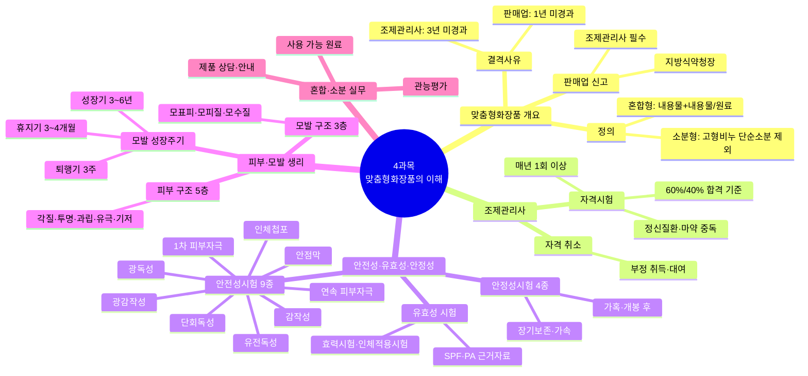

> **🗺️ 마인드맵 노드 상세 매핑**

| 대분류 | 중분류 | 소분류 | 핵심 포인트 |
| --- | --- | --- | --- |
| 맞춤형화장품 개요 | 해당 없음 | 해당 없음 | 맞춤형화장품 전체 개요 |
|  | 정의 |  | 혼합형 + 소분형 정의 |
|  |  | 혼합형: 내용물+내용물/원료 | 내용물+내용물 또는 식약처 고시 원료 혼합 |
|  |  | 소분형: 고형비누 단순소분 제외 | 기존 화장품 소분, 고형비누 단순소분 제외 |
|  | 판매업 신고 | 해당 없음 | 지방식약청장에게 신고, 조제관리사 배치 |
|  |  | 지방식약청장 | 관할 지방식약청장에게 신고 제출 |
|  |  | 조제관리사 필수 | 조제관리사 배치 의무 |
|  | 결격사유 | 해당 없음 | 등록 취소 후 일정 기간 제한 |
|  |  | 판매업: 1년 미경과 | 등록취소·폐쇄 후 1년간 신고 불가 |
|  |  | 조제관리사: 3년 미경과 | 자격 취소 후 3년간 응시 불가 |
| 조제관리사 | 해당 없음 | 해당 없음 | 자격시험·결격사유·자격 취소 관리 |
|  | 자격시험 |  | 매년 1회 이상, 60%/40% 합격 기준 |
|  |  | 매년 1회 이상 | 식약처장이 매년 1회 이상 실시 |
|  |  | 60%/40% 합격 기준 | 전 과목 60%·매 과목 40% 이상 득점 |
|  | 결격사유 | 해당 없음 | 정신질환·마약 중독 등 결격 |
|  |  | 정신질환·마약 중독 | 자격 결격 사유 해당자 |
|  | 자격 취소 | 해당 없음 | 부정 취득·대여 시 자격 취소 |
|  |  | 부정 취득·대여 | 3년간 응시 불가 |
| 안전성·유효성·안정성 | 해당 없음 | 해당 없음 | 3대 시험 체계: 안전성·유효성·안정성 |
|  | 안전성시험 9종 |  | 단회독성~유전독성 9종 시험 |
|  |  | 단회독성 | 급성 독성 평가 |
|  |  | 1차 피부자극 | 1회 접촉 자극 평가 |
|  |  | 연속 피부자극 | 반복 접촉 자극 평가 |
|  |  | 안점막 | 점막 자극 평가 |
|  |  | 감작성 | 알레르기 유발 평가 |
|  |  | 광독성 | UV 조건 독성 평가 |
|  |  | 광감작성 | UV 조건 감작성 평가 |
|  |  | 인체첩포 | 인체 피부 반응 평가 |
|  |  | 유전독성 | 유전자 돌연변이 평가 |
|  | 유효성 시험 | 해당 없음 | 효력·인체적용·SPF/PA 근거 |
|  |  | 효력시험·인체적용시험 | 비임상+임상 효능 평가 |
|  |  | SPF·PA 근거자료 | 자외선 차단 효과 입증 |
|  | 안정성시험 4종 | 해당 없음 | 장기보존·가속·가혹·개봉 후 4종 |
|  |  | 장기보존·가속 | 실조건+가속 조건 안정성 평가 |
|  |  | 가혹·개봉 후 | 극한 조건+개봉 후 안정성 평가 |
| 피부·모발 생리 | 해당 없음 | 해당 없음 | 피부·모발 구조 및 생리 |
|  | 피부 구조 5층 |  | 각질→투명→과립→유극→기저 |
|  |  | 각질·투명·과립·유극·기저 | 표피 5층 순서 (바깥→안쪽) |
|  | 모발 구조 3층 | 해당 없음 | 모표피·모피질·모수질 |
|  |  | 모표피·모피질·모수질 | 모간 3층 구조 |
|  | 모발 성장주기 | 해당 없음 | 성장기·퇴행기·휴지기 3단계 |
|  |  | 성장기 3~6년 | 모발 성장 지속 기간 |
|  |  | 퇴행기 3주 | 모발 퇴행 진행 기간 |
|  |  | 휴지기 3~4개월 | 모발 탈락 대기 기간 |
| 혼합·소분 실무 | 해당 없음 | 해당 없음 | 실무 핵심 3대 영역 |
|  | 사용 가능 원료 |  | 별표 1·2 제외한 전 원료 사용 가능 |
|  | 관능평가 |  | 오감 기반 품질 평가 |
|  | 제품 상담·안내 |  | 소비자 맞춤 상담 및 안내 |

### 🗺️ 법령별 조문 구조 마인드맵

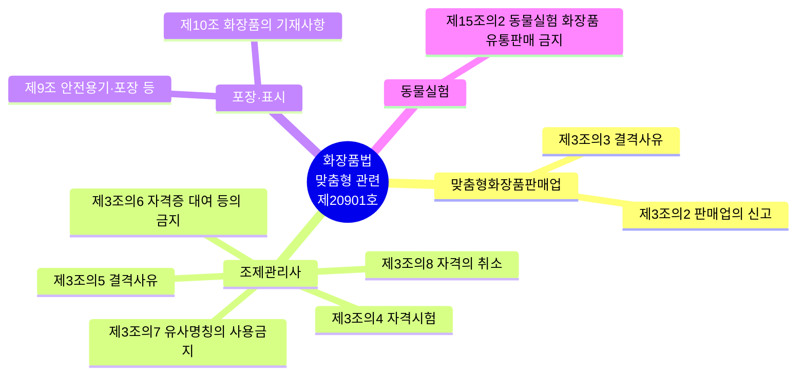

> **🗺️ 마인드맵 노드 상세 매핑**

| 대분류 | 중분류 | 핵심 포인트 |
| --- | --- | --- |
| 맞춤형화장품판매업 | 해당 없음 | 화장품법 맞춤형 관련 조문 |
|  | 제3조의2 판매업의 신고 | 판매업 신고 의무 |
|  | 제3조의3 결격사유 | 결격사유 규정 |
| 조제관리사 | 해당 없음 | 조제관리사 자격 관리 |
|  | 제3조의4 자격시험 | 자격시험 규정 |
|  | 제3조의5 결격사유 | 결격사유 규정 |
|  | 제3조의6 자격증 대여 등의 금지 | 자격증 대여 금지 |
|  | 제3조의7 유사명칭의 사용금지 | 유사명칭 사용 금지 |
|  | 제3조의8 자격의 취소 | 자격 취소 사유 |
| 포장·표시 | 해당 없음 | 포장·표시 규정 |
|  | 제9조 안전용기·포장 등 | 안전용기·포장 의무 |
|  | 제10조 화장품의 기재사항 | 화장품 기재사항 표시 |
| 동물실험 | 해당 없음 | 동물실험 관련 규정 |
|  | 제15조의2 동물실험 화장품 유통판매 금지 | 동물실험 화장품 판매금지 |

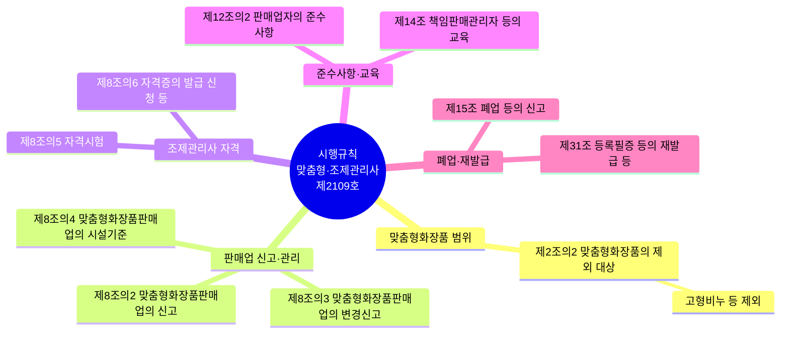

> **🗺️ 마인드맵 노드 상세 매핑**

| 대분류 | 중분류 | 소분류 | 핵심 포인트 |
| --- | --- | --- | --- |
| 맞춤형화장품 범위 | 해당 없음 | 해당 없음 | 시행규칙 맞춤형 관련 조문 |
|  | 제2조의2 맞춤형화장품의 제외 대상 |  | 맞춤형화장품 제외 대상 |
|  |  | 고형비누 등 제외 | 고형비누 단순소분 제외 |
| 판매업 신고·관리 | 해당 없음 | 해당 없음 | 판매업 신고·변경신고·시설기준 |
|  | 제8조의2 맞춤형화장품판매업의 신고 |  | 맞춤형화장품판매업 신고 규정 |
|  | 제8조의3 맞춤형화장품판매업의 변경신고 |  | 변경신고 의무 |
|  | 제8조의4 맞춤형화장품판매업의 시설기준 |  | 시설기준 갖출 의무 |
| 조제관리사 자격 | 해당 없음 |  | 자격시험·자격증 발급 |
|  | 제8조의5 자격시험 |  | 자격시험 실시 규정 |
|  | 제8조의6 자격증의 발급 신청 등 |  | 자격증 발급 신청 절차 |
| 준수사항·교육 | 해당 없음 |  | 준수사항·교육 규정 |
|  | 제12조의2 판매업자의 준수사항 |  | 판매업자 준수사항 |
|  | 제14조 책임판매관리자 등의 교육 |  | 책임판매관리사 교육 |
| 폐업·재발급 | 해당 없음 |  | 폐업·재발급 규정 |
|  | 제15조 폐업 등의 신고 |  | 폐업 등 신고 의무 |
|  | 제31조 등록필증 등의 재발급 등 |  | 등록필증 재발급 절차 |

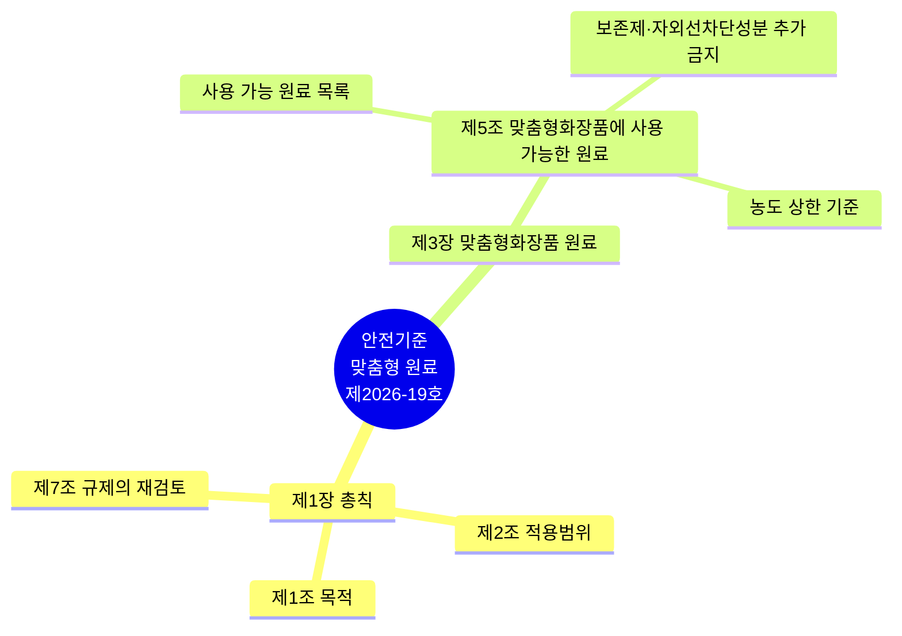

> **🗺️ 마인드맵 노드 상세 매핑**

| 대분류 | 중분류 | 소분류 | 핵심 포인트 |
| --- | --- | --- | --- |
| 제1장 총칙 | 해당 없음 | 해당 없음 | 안전기준 총칙 |
|  | 제1조 목적 |  | 규정 목적 |
|  | 제2조 적용범위 |  | 적용 범위 |
|  | 제7조 규제의 재검토 |  | 매 3년 규제 재검토 |
| 제3장 맞춤형화장품 원료 | 해당 없음 |  | 맞춤형화장품 사용 가능 원료 |
|  | 제5조 맞춤형화장품에 사용 가능한 원료 |  | 별표 1·2·기능성 고시 원료 제외 전 원료 |
|  |  | 사용 가능 원료 목록 | 별표 1·2·기능성 고시 원료 제외 전 원료 |
|  |  | 보존제·자외선차단성분 추가 금지 | 보존제·자외선차단성분 단독 추가 금지 |
|  |  | 농도 상한 기준 | 원료별 농도 상한 준수 |

### 📊 맞춤형화장품 법령 체계

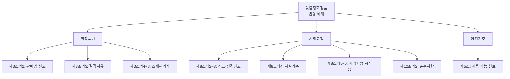

### 📊 안전성·유효성·안정성 비교

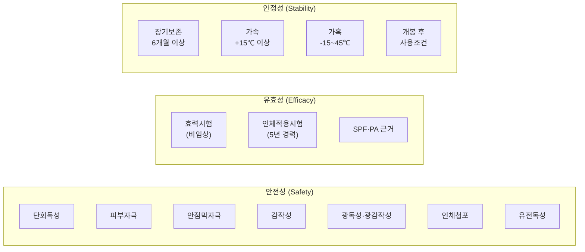

### 📊 안정성시험 4종 상세 비교

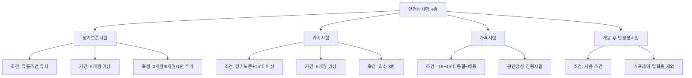

### 📊 조제관리사 자격시험 체계

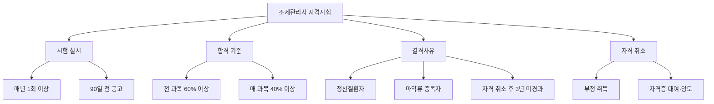

### 📊 과목 간 연관 흐름도

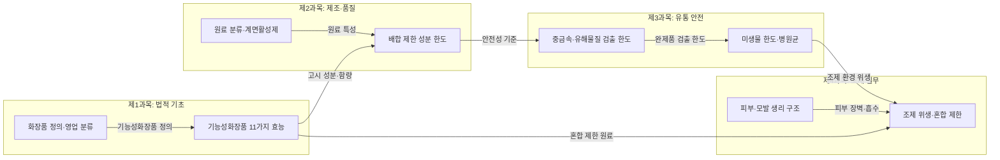

---

## 📚 학습 보조 자료 (교재 콘텐츠)

> 아래 내용은 과목별 참조자료 폴더에서 발췌한 학습 보조 자료입니다.
> 법령 조문과 함께 학습하면 시험 대비에 도움이 됩니다.

## 📖 맞춤형화장품 개요
> 출처: `화장품법(법률)(제20901호)(20260402).pdf`

## Chapter 01. 맞춤형화장품 개요

> **고득점 TIP**
> 맞춤형화장품의 정의에 대해 명확히 알아야 하며, 관련 규정은 꼭 한 번 더 정리하여 암기하세요.
> 맞춤형화장품은 안전성이 매우 중요하므로 꼭 정독하세요.
>
> 🔗 **관련 과목**
> - 1과목 1챕터 "화장품법" — 제3조의2~제3조의8 맞춤형화장품 법령 규정 (본 챕터는 실무 정의)
> - 3과목 1챕터 "작업장 위생관리" — 시설기준(분리·구획)의 CGMP 근거

---

> 📋 **학습 가이드**
> - 출제 빈도: ★★★★★ (맞춤형화장품 정의, 판매업 신고, 결격사유, 조제관리사 자격시험, 안전성시험 종류, 안정성시험 종류·조건·기간)
> - 예상 소요 시간: 60분
> - 핵심 키워드: 혼합형(내용물+내용물/원료)·소분형(고형비누 제외), 판매업 신고(지방식약청), 결격사유(1년/3년), 자격시험(60%/40% 합격), 안전성시험 9종, 인체적용시험(5년 경력), 안정성시험 4종(장기보존·가속·가혹·개봉 후)

---

## 1. 맞춤형화장품 정의

> 📌 **출처**: 화장품법 제2조 + 제3조의2| **최종 확인**: 2026. 8. 29.

> ### 🎯 한 줄 핵심
>
> 맞춤형화장품 = 혼합형(내용물+내용물/식약처 고시 원료) + 소분형(고형비누 단순소분 제외), 조제관리사가 판매업 신고장에서 제조.

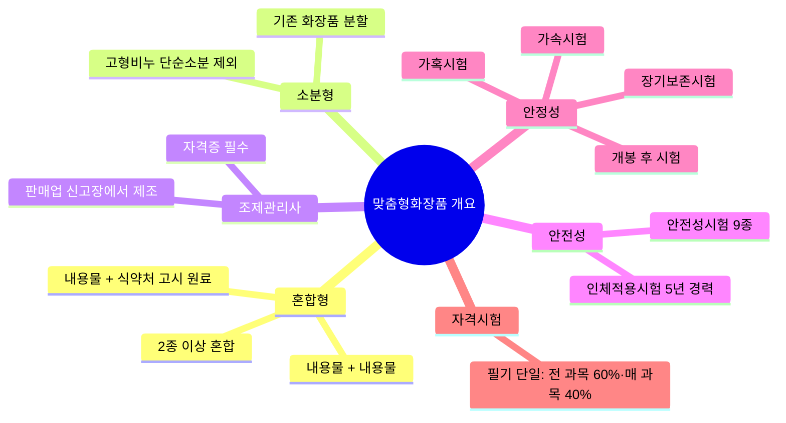

> **🗺️ 마인드맵 노드 상세 매핑**

| 대분류 | 중분류 | 핵심 포인트 |
| --- | --- | --- |
| 혼합형 | 해당 없음 | 혼합형: 내용물+내용물/원료 혼합 |
|  | 내용물 + 내용물 | 내용물 간 혼합 |
|  | 내용물 + 식약처 고시 원료 | 내용물+식약처 고시 원료 혼합 |
|  | 2종 이상 혼합 | 2종 이상 혼합 가능 |
| 소분형 | 해당 없음 | 소분형: 기존 화장품 분할 |
|  | 기존 화장품 분할 | 기존 화장품 소분 |
|  | 고형비누 단순소분 제외 | 고형비누 단순소분은 맞춤형 제외 |
| 조제관리사 | 해당 없음 | 조제관리사 필수 배치 |
|  | 자격증 필수 | 자격증 보유 의무 |
|  | 판매업 신고장에서 제조 | 신고된 판매장 내에서만 제조 |
| 안전성 | 해당 없음 | 안전성시험 9종 |
|  | 안전성시험 9종 | 안전성시험 9종 실시 |
|  | 인체적용시험 5년 경력 | 인체적용시험 5년 경력자 지도 |
| 안정성 | 해당 없음 | 안정성시험 4종 |
|  | 장기보존시험 | 실조건 장기 보관 안정성 평가 |
|  | 가속시험 | 고온 단기 가속 안정성 평가 |
|  | 가혹시험 | 극한 온도 조건 안정성 평가 |
|  | 개봉 후 시험 | 개봉 후 사용 중 안정성 평가 |
| 자격시험 | 해당 없음 | 필기시험만 실시 |
|  | 필기 단일: 전 과목 60%·매 과목 40% | 전 과목 총점 60%·매 과목 40% 이상 |

맞춤형화장품판매업으로 신고한 판매장에서 고객 개인별 피부 특성, 색, 향 등의 기호 및 요구를 반영하여 맞춤형화장품조제관리사 자격증을 가진 자가 아래의 내용으로 만든 화장품이다. 개성과 다양성을 추구하는 소비자 중심의 요구가 증가함에 따라 제품을 소비자의 특성 및 기호에 맞추어 혼합·소분(소량 생산 방식)하여 판매한다.

① 제조 또는 수입된 화장품의 **내용물**에 다른 화장품의 **내용물**이나 **식품의약품안전처장**이 정하여 고시하는 **원료**를 추가하여 혼합한 화장품

- 내용물 + 내용물 (또는) + 내용물 + 원료 → 혼합

② 제조 또는 수입된 화장품의 **내용물을 소분(小分)**한 화장품 (다만, 고형비누 등 화장품의 내용물을 단순 소분한 화장품은 제외함)

- 내용물(벌크) 또는 수입화장품 = 맞춤형화장품 + 맞춤형화장품 + 맞춤형화장품

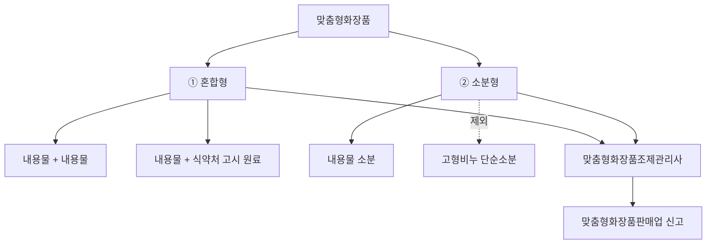

---

## 2. 맞춤형화장품 주요 규정(관련 법령)

> 📌 **출처**: 화장품법 제3조의2~제3조의8| **최종 확인**: 2026. 8. 29.

> ### 🎯 한 줄 핵심
>
> 화장품법 제3조의2~8(판매업 신고·결격사유·조제관리사) + 시행규칙(시설기준·자격시험·준수사항·행정처분) + 안전기준(사용 가능 원료).

### (1) 「화장품법」

| 조항 | 내용 |
| --- | --- |
| **제3조의2**<br>맞춤형화장품 판매업의 신고 | • 총리령에 따라 식품의약품안전처장에게 신고하고 변경 시에도 신고<br>• 맞춤형화장품판매업을 신고하려는 자는 총리령으로 정하는 시설기준을 갖추어야 하며, 맞춤형화장품의 혼합·소분 등 품질·안전 관리 업무에 종사하는 자(맞춤형화장품조제관리사)를 두어야 함 |
| **제3조의3**<br>맞춤형화장품판매업 결격사유 🎯 기출 | • 피성년후견인 또는 파산 선고를 받고 복권되지 않은 자<br>• 「화장품법」 또는 「보건범죄 단속에 관한 특별조치법」을 위반하여 금고 이상의 형을 선고받고 집행이 끝나거나(집행이 끝난 것으로 보는 경우를 포함) 집행이 면제되지 아니한 자, 또는 금고 이상의 형의 집행유예를 선고받고 그 유예기간 중에 있는 자<br>• 등록 취소 또는 영업소가 폐쇄된 날부터 1년이 지나지 않은 자 |
| **제3조의4**<br>맞춤형화장품 조제관리사 자격시험 | • 화장품과 원료 등에 대해 식품의약품안전처장이 실시하는 자격시험에 합격해야 함<br>• 거짓이나 그 밖의 부정한 방법으로 자격시험에 응시한 사람 또는 자격시험에서 부정행위를 한 사람에 대하여는 그 자격시험을 정지시키거나 합격을 무효로 함. 이 경우 자격시험이 정지되거나 합격이 무효가 된 사람은 그 처분이 있은 날부터 3년간 자격시험에 응시 불가<br>• 자격시험의 관리 및 자격증 발급 등에 관한 업무를 효과적으로 수행하기 위해 필요한 전문인력과 시설을 갖춘 기관 또는 단체를 시험운영기관으로 지정하여 시험업무를 위탁할 수 있음<br>• 자격시험의 시기, 절차, 방법, 시험과목, 자격증의 발급, 시험운영기관의 지정 등 자격시험에 필요한 사항은 총리령으로 정함 |
| **제3조의5**<br>맞춤형화장품 조제관리사의 결격사유 | • 「정신건강증진 및 정신질환자 복지서비스 지원에 관한 법률」 제3조제1호에 따른 정신질환자(망상, 환각, 사고나 기분의 장애 등으로 인하여 독립적인 일상생활을 영위하는 데 중대한 제약이 있는 사람을 말함. 단, 전문의가 맞춤형화장품조제관리사로서 적합하다고 인정하는 사람은 제외함)<br>• 피성년후견인<br>• 「마약류 관리에 관한 법률」의 마약류(마약·향정신성의약품 및 대마) 중독자<br>• 「화장품법」 또는 「보건범죄 단속에 관한 특별조치법」을 위반하여 금고 이상의 형을 선고받고 집행이 끝나지 않았거나 집행을 받지 않기로 확정되지 않은 자<br>• 맞춤형화장품조제관리사의 자격이 취소된 날부터 3년이 지나지 않은 자 |
| **제3조의6**<br>자격증 대여 등의 금지 | • 다른 사람에게 자기의 성명을 사용하여 맞춤형화장품조제관리사 업무를 하게 하거나 자격증을 양도 또는 대여해서는 안 됨<br>• 누구든지 다른 사람의 맞춤형화장품조제관리사 자격증을 양수하거나 대여받아 이를 사용하여서는 안 됨 |
| **제3조의7**<br>유사명칭의 사용금지 | 맞춤형화장품조제관리사가 아닌 자는 맞춤형화장품조제관리사 또는 이와 유사한 명칭을 사용하지 못함 |
| **제3조의8**<br>맞춤형화장품 조제관리사 자격의 취소 | • 거짓이나 그 밖의 부정한 방법으로 맞춤형화장품조제관리사의 자격을 취득한 경우<br>• 맞춤형화장품조제관리사의 결격사유에 해당하는 경우(자격이 취소된 날부터 3년이 지나지 않은 자는 제외함)<br>• 자격증 대여 등의 금지행위를 위반하여 다른 사람에게 자기의 성명을 사용하여 맞춤형화장품조제관리사 업무를 하게 하거나 맞춤형화장품조제관리사자격증을 양도 또는 대여한 경우 |
| **제5조**<br>영업자의 의무 등 🎯 기출 | • 화장품제조업자는 화장품의 제조와 관련된 기록·시설·기구 등 관리 방법, 원료·자재·완제품 등에 대한 시험·검사·검정 실시 방법 및 의무 등에 관하여 총리령으로 정하는 사항을 준수해야 함<br>• 화장품책임판매업자는 화장품의 품질관리기준, 책임판매 후 안전관리기준, 품질 검사 방법 및 실시 의무, 안전성·유효성 관련 정보사항 등의 보고 및 안전대책 마련 의무 등에 관하여 총리령으로 정하는 사항을 준수해야 함<br>• 맞춤형화장품판매업자는 소비자에게 유통·판매되는 화장품을 임의로 혼합·소분하여서는 안 됨<br>• 맞춤형화장품판매업자는 맞춤형화장품 판매장 시설·기구의 관리 방법, 혼합·소분 안전관리기준의 준수 의무, 혼합·소분되는 내용물 및 원료에 대한 설명 의무, 안전성 관련 사항 보고 의무 등에 관하여 총리령으로 정하는 사항을 준수해야 함<br>• 화장품책임판매업자는 총리령으로 정하는 바에 따라 화장품의 생산실적 또는 수입실적, 화장품의 제조과정에 사용된 원료의 목록 등을 식품의약품안전처장에게 보고하여야 함. 이 경우 원료의 목록에 관한 보고는 화장품의 유통·판매 전에 해야 함<br>• 맞춤형화장품판매업자는 총리령으로 정하는 바에 따라 맞춤형화장품에 사용된 모든 원료의 목록을 매년 1회 식품의약품안전처장에게 보고해야 함<br>• 책임판매관리자 및 맞춤형화장품조제관리사는 화장품의 안전성 확보 및 품질관리에 관한 교육을 매년 받아야 함<br>• 식품의약품안전처장은 국민 건강상 위해를 방지하기 위해 필요하다고 인정하면 화장품제조업자, 화장품책임판매업자 및 맞춤형화장품판매업자에게 화장품 관련 법령 및 제도(화장품의 안전성 확보 및 품질관리에 관한 내용을 포함함)에 관한 교육을 받을 것을 명할 수 있음<br>• 교육을 받아야 하는 자가 둘 이상의 장소에서 화장품제조업, 화장품책임판매업 또는 맞춤형화장품판매업을 하는 경우에는 종업원 중에서 총리령으로 정하는 자를 책임자로 지정하여 교육을 받게 할 수 있음<br>• 교육의 실시 기관, 내용, 대상 및 교육비 등에 관하여 필요한 사항은 총리령으로 정함 |
| **제9조**<br>안전용기·포장 | 어린이가 화장품을 잘못 사용하여 인체에 위해를 끼치지 않도록 안전용기·포장을 사용해야 함 |
| **제16조**<br>판매 등의 금지 🎯 기출 | • 판매업 신고를 하지 않은 자가 판매한 맞춤형화장품<br>• 맞춤형화장품조제관리사를 두지 않고 판매한 맞춤형화장품<br>• 의약품으로 잘못 인식할 우려가 있게 기재·표시한 화장품<br>• 판매 목적이 아닌 제품의 홍보·판매 촉진을 위해 미리 소비자가 시험·사용하도록 제조 또는 수입된 화장품 |

### (2) 「화장품법 시행규칙」

| 조항 | 내용 |
| --- | --- |
| **제8조의2**<br>맞춤형화장품 판매업의 신고 🎯 기출 | • 소재지 관할 지방식품의약품안전청장에게 아래 ①, ②번 서류를 제출해야 함 (다만, 맞춤형화장품판매업자가 판매업소로 신고한 소재지 외의 장소에서 1개월 범위에서 한시적으로 같은 영업을 하려는 경우에는 ①번 서류에 ②, ③번 서류를 첨부하여 제출해야 함)<br>&nbsp;&nbsp;① 맞춤형화장품판매업 신고서(전자문서로 된 신고서 포함)<br>&nbsp;&nbsp;② 맞춤형화장품조제관리사 자격증 사본과 시설의 명세서<br>&nbsp;&nbsp;③ 맞춤형화장품판매업 신고필증 사본(전자문서로 발급받은 경우는 제외)<br>• 법인일 경우 지방식품의약품안전청장은 행정정보의 공동이용을 통해 법인 등기사항 증명서를 확인해야 함<br>• 지방식품의약품안전청장은 신고가 요건을 갖춘 경우, 맞춤형화장품판매업 신고대장에 다음 내용을 적고 맞춤형화장품판매업 신고필증을 발급해야 함<br>&nbsp;&nbsp;- 신고번호 및 신고연월일<br>&nbsp;&nbsp;- 맞춤형화장품판매업자의 성명 및 주민등록번호(법인인 경우에는 대표자의 성명 및 주민등록번호 등)<br>&nbsp;&nbsp;- 맞춤형화장품판매업자의 상호 및 소재지<br>&nbsp;&nbsp;- 맞춤형화장품판매업소의 상호 및 소재지<br>&nbsp;&nbsp;- 맞춤형화장품조제관리사의 성명, 주민등록번호 및 자격증 번호<br>&nbsp;&nbsp;- 영업의 기간(한시적으로 맞춤형화장품판매업을 하려는 경우에 해당) |
| **제8조의3**<br>맞춤형화장품 판매업의 변경신고 | • 맞춤형화장품판매업자가 다음의 사항을 변경하는 경우에는 변경신고를 해야 함<br>&nbsp;&nbsp;- 맞춤형화장품판매업자를 변경하는 경우<br>&nbsp;&nbsp;- 맞춤형화장품판매업소의 상호 또는 소재지를 변경하는 경우<br>&nbsp;&nbsp;- 맞춤형화장품조제관리사를 변경하는 경우<br>• 신고기한: 변경이 있는 날부터 30일 이내에 관할 지방식품의약품안전청장에게 신고<br>• 행정기관 처리기한: 변경신고서(전자문서 포함) 접수 후 10일 이내 처리 (단, 조제관리사 변경신고는 7일 이내 처리) |
| **제8조의4**<br>맞춤형화장품 판매업의 시설기준 | 맞춤형화장품판매업을 신고하려는 자는 맞춤형화장품의 혼합·소분 공간을 그 외의 용도로 사용되는 공간과 분리 또는 구획하여 갖추어야 함. 다만, 혼합·소분 과정에서 맞춤형화장품의 품질·안전 등 보건위생상 위해가 발생할 우려가 없다고 인정되는 경우에는 혼합·소분 공간을 분리 또는 구획하여 갖추지 않아도 됨 |
| **제8조의5**<br>맞춤형화장품 조제관리사 자격시험 | • 식품의약품안전처장은 매년 1회 이상 자격시험 실시<br>• 자격시험 시행계획은 시험 실시 90일 전까지 식약처 인터넷 홈페이지에 공고<br>• 전 과목 총점의 60% 이상, 매 과목 만점의 40% 이상 득점 시 합격<br>• 시험위원은 시험과목에 대한 전문지식을 갖추거나 화장품에 관한 업무 경험이 풍부한 사람으로 위촉 |
| **제8조의6**<br>맞춤형화장품 조제관리사 자격증의 발급 신청 등 | • 자격증 발급 신청 시 다음 각 호의 서류를 첨부하여 식품의약품안전처장에게 제출<br>&nbsp;&nbsp;- 마약류의 중독자에 해당되지 않음을 증명하는 최근 6개월 이내의 의사의 진단서<br>&nbsp;&nbsp;- 맞춤형화장품조제관리사 결격사유인 정신질환자이지만, 전문의가 맞춤형화장품조제관리사로서 적합하다고 인정하는 경우 최근 6개월 이내의 전문의의 진단서<br>• 자격증을 잃어버리거나 못 쓰게 된 경우<br>&nbsp;&nbsp;- 자격증을 잃어버린 경우: 분실 사유서<br>&nbsp;&nbsp;- 자격증을 못 쓰게 된 경우: 자격증 원본 |
| **제12조의2**<br>맞춤형화장품 판매업자의 준수사항 🎯 기출 | • 맞춤형화장품 판매장 시설·기구를 정기적으로 점검하여 보건위생상 위해가 없도록 관리할 것<br>• 다음의 혼합·소분 안전관리기준을 준수할 것<br>&nbsp;&nbsp;- 혼합·소분 전에 혼합·소분에 사용되는 내용물 또는 원료에 대한 품질성적서를 확인할 것<br>&nbsp;&nbsp;- 혼합·소분 전에 손을 소독하거나 세정할 것(다만, 혼합·소분 시 일회용 장갑을 착용하는 경우에는 그렇지 않음)<br>&nbsp;&nbsp;- 혼합·소분 전에 혼합·소분된 제품을 담을 포장용기의 오염 여부를 확인할 것<br>&nbsp;&nbsp;- 혼합·소분에 사용되는 장비 또는 기구 등은 사용 전에 그 위생 상태를 점검하고, 사용 후에는 오염이 없도록 세척할 것<br>&nbsp;&nbsp;- 그 밖에 위의 내용들과 유사한 것으로서 혼합·소분의 안전을 위해 식품의약품안전처장이 정하여 고시하는 사항을 준수할 것<br>• 아래 내용이 포함된 맞춤형화장품 판매내역서(전자문서로 된 판매내역서를 포함함)를 작성·보관할 것<br>&nbsp;&nbsp;- 제조번호<br>&nbsp;&nbsp;- 사용기한 또는 개봉 후 사용기간<br>&nbsp;&nbsp;- 판매일자 및 판매량<br>• 맞춤형화장품 판매 시 다음 내용을 소비자에게 설명할 것<br>&nbsp;&nbsp;- 혼합·소분에 사용된 내용물·원료의 내용 및 특성<br>&nbsp;&nbsp;- 맞춤형화장품 사용 시의 주의사항<br>• 맞춤형화장품 사용과 관련된 부작용 발생사례에 대해서는 식품의약품안전처장이 정하여 고시하는 바에 따라 지체 없이 식품의약품안전처장에게 보고할 것 |
| **제14조**<br>책임판매관리자 등의 교육 🎯 기출 | • 최초 교육: 종사한 날부터 6개월 이내(단, 자격시험에 합격한 날이 종사한 날 이전 1년 이내이면 최초 교육을 받은 것으로 봄)<br>• 보수 교육: 최초 교육을 받은 날을 기준으로 매년 1회(단, 자격시험에 합격한 날이 종사한 날 이전 1년 이내여서 교육을 생략한 경우, 자격시험에 합격한 날부터 1년이 되는 날을 기준으로 매년 1회 보수 교육을 받아야 함)<br>• 4시간 이상 8시간 이하로 참여<br>• 교육실시기관: 대한화장품협회, 한국의약품수출입협회, 대한화장품산업연구원 |
| **제15조**<br>폐업 등의 신고 🎯 기출 | • 영업자가 폐업 또는 휴업하거나 휴업 후 그 업을 재개하려는 경우에는 폐업, 휴업 또는 재개 신고서(전자문서로 된 신고서를 포함함)에 화장품제조업 등록필증, 화장품책임판매업 등록필증 또는 맞춤형화장품판매업 신고필증(폐업·휴업만 해당함)을 첨부하여 지방식품의약품안전청장에게 제출해야 함<br>• 「화장품법」에 따른 폐업 또는 휴업 신고를 하려는 자는 「부가가치세법 시행규칙」 별지 제9호 폐업·휴업신고서를 지방식품의약품안전청장에게 송부해야 함<br>• 「부가가치세법」에 따른 폐업 또는 휴업신고를 같이 하려는 자는 관할 세무서장에게 「부가가치세법 시행규칙」 별지 제11호와 「화장품법」에 따른 폐업·휴업신고서를 함께 제출해야 하는데, 영업자가 이 신고서들을 지방식품의약품안전청장과 관할 세무서장 중 한 곳에 제출할 경우, 지방식품의약품안전청장과 관할 세무서장은 즉시 서로에게 송부해야 함 |

#### 맞춤형화장품 판매업과 관련한 주요 행정처분 🎯 기출

| 위반 내용 | 1차 위반 | 2차 위반 | 3차 위반 | 4차 이상 위반 |
| --- | --- | --- | --- | --- |
| 맞춤형화장품판매업자의 변경신고를 하지 않은 경우 | 시정명령 | 판매업무정지 5일 | 판매업무정지 15일 | 판매업무정지 1개월 |
| 맞춤형화장품판매업소 상호의 변경신고를 하지 않은 경우 | 시정명령 | 판매업무정지 5일 | 판매업무정지 15일 | 판매업무정지 1개월 |
| 맞춤형화장품판매업소 소재지의 변경신고를 하지 않은 경우 | 판매업무정지 1개월 | 판매업무정지 2개월 | 판매업무정지 3개월 | 판매업무정지 4개월 |
| 맞춤형화장품조제관리사의 변경신고를 하지 않은 경우 | 시정명령 | 판매업무정지 5일 | 판매업무정지 15일 | 판매업무정지 1개월 |
| 맞춤형화장품판매업자가 시설기준을 갖추지 않게 된 경우 | 시정명령 | 판매업무정지 1개월 | 판매업무정지 3개월 | 영업소 폐쇄 |

### (3) 「화장품 안전 기준 등에 관한 규정」

| 조항 | 내용 |
| --- | --- |
| **제5조**<br>맞춤형화장품에 사용 가능한 원료 | 아래의 원료를 제외한 원료는 맞춤형화장품에 사용 가능<br>• 화장품에 사용할 수 없는 원료<br>• 화장품에 사용상의 제한이 필요한 원료<br>• 사전심사를 받지 않았거나 보고서를 제출하지 않은 기능성화장품 고시 원료 |

> ※ 맞춤형화장품을 기능성화장품으로 판매할 때, 최종 맞춤형화장품은 기 심사를 받거나 보고한 기능성화장품이어야 함

---

## 3. 화장품의 안전성

> 📌 **출처**: 기능성화장품 심사에 관한 규정 (식약처 고시 제2025-88호) 별표| **최종 확인**: 2026. 8. 29.

> ### 🎯 한 줄 핵심
>
> 안전성시험 9종(단회독성·1차 피부자극·연속 피부자극·안점막·감작성·광독성·광감작성·인체첩포·유전독성) + 안전성 정보관리체계 + 영유아 안전성 자료 보관.

### (1) 안전성시험 🎯 기출

| 시험명 | 내용 |
| --- | --- |
| 단회 투여 독성시험 | 동물에 1회 투여했을 때 LD50값(반수 치사량)을 산출하여 위험성을 예측함 |
| 1차 피부 자극시험 | 피부에 1회 투여했을 때 자극성을 평가함 |
| 연속 피부 자극시험 | • 피부에 반복적으로 투여했을 때 나타나는 자극성을 평가함<br>• 동물에 2주간 반복 투여 |
| 안(眼)점막 자극시험 🎯 기출 | 동물이나 대체시험(단백질 구조 변화)을 통해 눈에 들어갔을 때의 위험성을 예측함 |
| 피부 감작성시험 | 피부에 투여했을 때 접촉으로 인한 감작(알레르기)을 평가함 |
| 광독성시험 | UV램프를 조사하여 자외선에 의해 생기는 자극성을 평가함 |
| 광감작성시험 | 광조사를 하여 자외선에 의해 생기는 접촉 감작성(접촉 알레르기)을 평가함 |
| 인체 첩포시험(인체 패치테스트) 🎯 기출 | • 등, 팔 안쪽에 폐쇄 첩포하여 피부 자극성이나 감작성(알레르기)을 평가함<br>• 국내외 대학 또는 전문 연구기관에서 실시하며, 관련 분야 전문의사, 연구소, 병원 등 관련 기관에서 5년 이상 경력을 가진 자의 지도 및 감독하에 수행·평가되어야 함 |
| 유전 독성시험 | • 박테리아를 이용한 돌연변이시험<br>• 염색체 이상을 유발하는지 설치류를 통해 시험하고 안전성을 평가함 |

#### 참고: 안전성 관련 용어

| 용어 | 설명 |
| --- | --- |
| 피부 감작성 | 외부 자극에 의한 면역계 반응성 |
| 광독성 | 빛에 의한 독성 반응성 |
| 광감작성 | 빛에 의한 면역계 반응성 |
| 인체 첩포시험(인체 패치테스트) | 접촉 피부염의 원인을 파악하기 위해 원인 추정 물질을 몸에 붙여 반응을 조사하는 시험 |

### (2) 화장품 안전성 정보 관리체계

화장품의 취급·사용 시 인지되는 안전성 관련 정보를 체계적·효율적으로 수집·검토·평가하여 적절한 안전대책을 강구함으로써 국민 보건상 위해를 방지하기 위해 「화장품 안전성 정보관리 규정」을 고시해 두고 있다.

① 식품의약품안전처장은 안전하고 올바른 화장품의 사용을 위하여 화장품 안전성 정보의 평가 결과를 화장품책임판매업자 등에게 전파하고 필요한 경우 이를 소비자에게 제공할 수 있다.

② 식품의약품안전처장은 수집된 안전성 정보, 평가결과 또는 후속조치 등에 대하여 필요한 경우 국제기구나 관련국 정부 등에 통보하는 등 국제적 정보교환체계를 활성화하고 상호협력 관계를 긴밀하게 유지함으로써 화장품으로 인한 범국가적 위해의 방지에 적극 노력하여야 한다.

**관리체계 흐름 (개념도)**

```
국제기구
 ↕ (정보교환)
인체성 평가 전문가 ↔ 식품의약품안전처(화장품정책과) ↔ 외국정부
 ↕ (보고/자료제공) ↕
관련 단체·기관 ↔ 병·의원 및 약국 등 ↔ 소비자
 ↕ ↕
 화장품 책임판매업자
```

#### (3) 영유아 또는 어린이 사용 화장품 안전성 자료의 작성·보관

① **주체**: 화장품책임판매업자

② **작성**: 문서 및 기록의 관리 절차에 따라 작성·개정·승인 등 관리

③ **보관 및 절차**
- 인쇄본 또는 전자매체를 이용하여 제품별 안전성 자료를 안전하게 보관
- 자료의 훼손 또는 소실에 대비하여 사본, 백업자료 등을 생성·유지 가능
- 보관기간이 만료된 문서는 책임판매관리자의 책임하에 폐기

---

## 4. 화장품의 유효성

> 📌 **출처**: 기능성화장품 심사 규정 (제2025-88호)| **최종 확인**: 2026. 8. 29.

> ### 🎯 한 줄 핵심
>
> 효력시험(비임상) + 인체적용시험(5년 경력·헬싱키선언) + 염모효력시험 + SPF/PA 근거자료 + 제출자료 면제(인체적용시험 제출 시 효력시험 면제).

### (1) 유효성 또는 기능에 관한 자료 🎯 기출

**① 효력시험 자료와 유효성 평가시험**: 심사 대상 효능을 포함한 효력을 뒷받침하는 비임상시험 자료이며, 효과 발현의 작용기전이 포함되어야 한다.

- 국내외 대학 또는 전문 연구기관에서 시험한 것으로 당해 기관의 장이 발급한 자료(시험시설 개요, 주요설비, 연구인력의 구성, 시험자의 연구경력에 관한 사항을 포함함)
- 당해 기능성화장품이 개발국 정부에 제출되어 평가된 모든 효력시험 자료로 개발국 정부(허가 또는 등록기관)가 제출받았거나 승인하였음을 확인한 것 또는 이를 증명한 자료
- 과학논문인용색인(Science Citation Index 또는 Science Citation Index Expanded)이 등재된 전문학회지에 게재된 자료

#### 유효성 평가시험 및 근거자료의 종류

| 구분 | 유효성 평가시험 및 근거자료의 종류 |
| --- | --- |
| 피부 미백 기능 제품 | • In Vitro Tyrosinase 활성 저해시험<br>• In Vitro DOPA 산화 반응 저해시험<br>• 멜라닌 생성 저해시험 |
| 피부 주름 개선 기능 제품 | • 세포 내 콜라겐 생성시험<br>• 세포 내 콜라게나제 활성 억제시험<br>• 엘라스타제 활성 억제시험 |
| 자외선 차단 기능 제품 | • 자외선 차단지수(SPF) 설정 근거 자료<br>• 내수성 자외선 차단지수(SPF) 설정 근거 자료<br>• 자외선A 차단등급(PA) 설정 근거 자료 |

**② 인체적용시험 자료 🎯 기출**

사람을 대상으로 실시하는 효능·효과시험 또는 연구에 관한 자료이다.

**인체적용시험 수행 기준**

| 항목 | 내용 |
| --- | --- |
| 지도·감독 | 관련 분야 전문의·병원·국내외 대학·전문연구기관에서 5년 이상 인체적용시험 경력자의 지도·감독하에 수행 |
| 윤리 원칙 | 헬싱키 선언에 근거한 윤리적 원칙에 따라 수행 |
| 과학적 타당성 | 과학적으로 타당해야 하며, 시험 자료는 명확하고 상세히 기술 |
| 의학적 처치 | 피험자에 대한 의학적 처치나 결정은 의사 또는 한의사의 책임하에 이루어져야 함 |
| 동의서 | 모든 피험자로부터 자발적인 시험 참가 동의(문서 동의서)를 받은 후 실시 |
| 동의서 내용 | 시험에 관한 모든 정보를 포함해야 함 |
| 안전성 확보 | 인체적용시험용 화장품은 안전성이 충분히 확보되어야 함 |
| 피험자 보호 | 피험자 참여 이유 타당성 검토·평가, 피험자의 권리·안전·복지 보호 |
| 선정·탈락 기준 | 피험자 선정·탈락 기준을 정하고 그 기준에 따라 선정·진행 |

> **참고: 시험에 관한 정보**
> - 시험의 목적
> - 피험자에게 예상되는 위험이나 불편
> - 피험자가 피해를 입었을 경우 주어질 보상이나 치료 방법
> - 피험자가 시험에 참여하여 받게 될 금전적 보상이 있는 경우 예상 금액 등

> **비교: 인체 외 시험 🎯 기출**
> 실험실의 배양접시, 인체로부터 분리한 모발 및 피부, 인공피부 등 인위적 환경에서 시험물질과 대조물질을 처리한 후 결과를 측정하는 것임

**최종시험 결과보고서 내용**

| 항목 | 내용 |
| --- | --- |
| 시험 종류 | 시험 제목 |
| 시험물질 식별 | 코드 또는 명칭에 의한 식별 |
| 대조물질 식별 | 화학물질명 등에 의한 식별 (대조물질이 있는 경우) |
| 의뢰자·기관 정보 | 시험의뢰자 및 시험기관 관련 정보 |
| 시험 기간 | 시험 개시 및 종료일 |
| 신뢰성보증확인서 | 시험 점검 종류, 점검 날짜, 점검 시험단계, 점검 결과 |
| 피험자 정보 | 선정·제외 기준 및 수 |
| 시험 방법 | 적용 방법, 적용량·농도·횟수·시간·범위·사용제한, 사용장비·시약, 순서·방법·검사·관찰·통계학적 방법, 평가방법과 목적 연관성 |
| 시험 결과 | 결과 기록 |
| 부작용 | 부작용 발생 및 조치내역 |

**③ 염모효력시험 자료**

인체 모발을 대상으로 효능·효과에서 표시한 색상을 입증하는 자료이다.

### (2) 자외선 차단지수(SPF), 내수성자외선 차단지수(SPF), 자외선A 차단등급(PA)의 근거자료

해당 자료는 인체적용시험 자료의 자료로 아래의 어느 하나에 해당해야 한다.

| 구분 | 근거자료 |
| --- | --- |
| 자외선 차단지수(SPF) 설정 근거자료 | 자외선 차단 효과 측정 방법 및 기준·일본(JCIA)·호주/뉴질랜드(AS/NZS)·미국(FDA)·유럽(Cosmetics Europe) 또는 국제표준화기구(ISO 24444) 등의 자외선 차단지수 측정 방법에 의한 자료 |
| 내수성자외선 차단지수(SPF) 설정 근거자료 | 자외선 차단 효과 측정 방법 및 기준·호주/뉴질랜드(AS/NZS)·미국(FDA)·유럽(Cosmetics Europe)·국제표준화기구(ISO16217) 등의 내수성자외선 차단지수 측정 방법에 의한 자료 |
| 자외선A 차단등급(PA) 설정 근거자료 | 자외선 차단 효과 측정 방법 및 기준·일본(JCIA) 또는 국제표준화기구(ISO 24442) 등의 자외선A 차단 효과 측정 방법에 의한 자료 |

### (3) 제출자료의 면제 🎯 기출

① 인체적용시험 자료를 제출하는 경우 효력시험 자료 제출을 면제할 수 있다.

② 효력시험 자료의 제출을 면제받은 성분에 대해서는 효능·효과를 기재·표시할 수 없다.

---

## 5. 화장품의 안정성

> 📌 **출처**: 화장품 안정성시험 가이드라인 (식약처 고시)| **최종 확인**: 2026. 8. 29.

> ### 🎯 한 줄 핵심
>
> 안정성시험 4종(장기보존·가속·가혹·개봉 후) — 각각 3로트 이상, 6개월 이상, 조건·측정시기 상이.

### (1) 화장품 안정성시험 가이드라인

① **목적**: 화장품을 제조한 날부터 적절한 보관 조건에서 성상·품질의 변화 없이 최적의 품질로 사용할 수 있는 최소한의 기한과 저장 방법을 설정하기 위한 기준을 정하기 위함이며, 나아가 이를 통하여 시중 유통 중에 있는 화장품의 안정성을 확보하여 안전하고 우수한 제품을 공급하는 데 도움을 주기 위함이다.

② **시험 기준 및 시험 방법**: 승인된 규격이 있는 경우, 그 규격을 바탕으로 하되 각 제조업체별로 경험을 근거로 제재별로 관련 방법이 있다면 과학적이고 합리적이라는 전제하에 수행이 가능하다.

③ 화장품의 대표적인 물리적 변화로는 분리, 합일, 응집이 있다.

### (2) 안정성시험의 종류

| 종류 | 내용 |
| --- | --- |
| 장기보존시험 (정의) | 저장 조건에서의 사용기한 설정을 위해 장기간에 걸쳐 물리·화학적, 미생물학적 안정성 및 용기 적합성을 확인하는 시험 |
| 가속시험 (정의) | 장기보존시험의 저장 조건을 벗어난 단기간의 가속 조건이 물리·화학적, 미생물학적 안정성 및 용기 적합성에 미치는 영향을 평가하기 위한 시험 |
| 가혹시험 (정의) | • 가혹 조건에서 화장품의 분해 과정 및 분해산물 등을 확인하기 위한 시험<br>• 개별 화장품의 취약성, 운반, 보관, 진열, 사용 과정에서 의도하지 않게 일어날 수 있는 가혹 조건에서의 품질 변화를 검토하기 위해 수행 |
| 개봉 후 안정성시험 (정의) | 화장품 사용 시 일어날 수 있는 오염 등을 고려한 사용기한을 설정하기 위해 장기간에 걸쳐 물리·화학적, 미생물학적 안정성 및 용기 적합성을 확인하는 시험 |

> **확인문제**: 가속시험의 주된 목적에 대한 설명으로 옳은 것은?
> ① 장기보존시험과 동일한 조건에서 반복 측정하는 시험이다.
> ② 가혹 조건에서의 포장재 내구성을 평가하기 위한 시험이다.
> ③ 고온·습도 등 가속 조건에서 단기간 내 제품의 안정성을 예측하기 위한 시험이다.
> ④ 소비자 사용 중 오염 가능성을 평가하는 시험이다.
> ⑤ 화학성분의 유효성분 함량을 조정하기 위한 시험이다.
>
> **정답**: ③ 고온·습도 등 가속 조건에서 단기간 내 제품의 안정성을 예측하기 위한 시험이다.
> **해설**: 가속시험은 장기보존시험 온도보다 15℃ 이상 높은 온도에서 단기간에 제품의 안정성을 예측하기 위한 시험이다. 3로트 이상, 6개월 이상 실시하며, 시험 개시 때를 포함하여 최소 3번 측정한다.

### (3) 안정성시험 방법 🎯 기출

| 종류 | 시험 조건 | 화장품 시험 항목 |
| --- | --- | --- |
| 장기보존시험 (조건·항목) | • 3로트 이상 선정<br>• 시중 유통 제품과 동일 처방, 제형, 포장용기를 사용함<br>• 유통 조건과 유사하게 보존 | • 일반시험: 균등성, 향취, 색상, 사용감, 액상, 유화형, 내온성 시험<br>• 물리적시험: 비중, 융점, 경도, pH, 유화상태, 점도 등<br>• 화학적시험: 시험물 가용성 성분, 에테르불용 및 에탄올 가용성 성분, 에테르 가용성 불검화물 등<br>• 미생물학적시험: 정상적 사용 시 미생물 증식 억제 능력 여부<br>• 용기적합성시험: 제품과 용기의 상호작용(용기의 제품 흡수, 부식, 화학적 반응)에 대한 적합성 |
| 가속시험 (조건·항목) | • 3로트 이상 선정<br>• 시중 유통 제품과 동일 처방, 제형, 포장용기를 사용함<br>• 장기보존시험 온도보다 15℃ 이상 높은 온도에서 시험 | 위와 동일 항목 |
| 가혹시험 (조건·항목) | • 3로트 이상 선정<br>• 검체의 특성, 조건에 따라 로트 선택<br>• 온도 편차 및 극한 조건(-15~45℃)<br>• 기계·물리적시험<br>• 광안정성 | • 보존 기간 중 제품의 안정성이나 기능성에 영향을 확인할 수 있는 품질관리상 중요한 항목 및 분해산물의 생성 유무<br>&nbsp;&nbsp;- 온도 사이클링 또는 동결~해동시험을 통해 현탁, 크림제 안정성, 포장 파손, 알루미늄 튜브 내부래커의 부식 관찰<br>&nbsp;&nbsp;- 진동시험으로 분말, 과립제품이 깨지거나 분리 여부 판단, 운반 중 손상 여부 조사<br>&nbsp;&nbsp;- 제품이 빛에 노출될 수 있을 때 실시 |
| 개봉 후 안정성시험 (조건·항목) | • 3로트 이상 선정<br>• 시중 유통 제품과 동일 처방, 제형, 포장용기를 사용함<br>• 사용 조건을 고려하여 보존 조건 설정 | • 개봉 전 시험 항목과 미생물 한도시험, 살균보존제, 유효성 성분 시험 수행<br>• 단, 개봉 불가한 스프레이, 일회용 제품은 제외 |

### (4) 안정성시험 기간 및 측정시기

| 종류 | 시험기간 | 측정시기 |
| --- | --- | --- |
| 장기보존시험 (기간·측정시기) | 6개월 이상 | • 1년간: 3개월마다<br>• 그 후 2년: 6개월마다<br>• 2년 이후: 1년마다 |
| 가속시험 (기간·측정시기) | 6개월 이상(조정 가능) | 시험 개시 때를 포함하여 최소 3번 측정 |
| 가혹시험 (기간·측정시기) | 검체의 특성 및 시험조건에 따라 적절히 설정 | 별도 설정 |
| 개봉 후 안정성시험 (기간·측정시기) | 6개월 이상(특성에 따라 조정) | • 1년간: 3개월마다<br>• 그 후 2년: 6개월마다<br>• 2년 이후: 1년마다 |


## 📊 맞춤형화장품 혼합형 vs 소분형 비교표

> 📌 **출처**: 화장품법 제2조 + 제3조의2| **최종 확인**: 2026. 8. 29.

| 구분 | 혼합형 | 소분형 |
| --- | --- | --- |
| **정의** | 내용물 + 내용물 또는 내용물 + 식약처 고시 원료를 혼합 | 내용물(벌크) 또는 수입화장품을 소분 |
| **제외** | 해당 없음 | 고형비누 등 단순 소분 제품 |
| **주체** | 맞춤형화장품조제관리사 | 동일 |
| **장소** | 맞춤형화장품판매업 신고 판매장 | 동일 |

## 📊 맞춤형화장품판매업 결격사유 vs 조제관리사 결격사유 비교표

> 📌 **출처**: 화장품법 제3조의3 + 제3조의5| **최종 확인**: 2026. 8. 29.

| 구분 | 판매업 결격사유 (제3조의3) | 조제관리사 결격사유 (제3조의5) |
| --- | --- | --- |
| **공통** | 금고 이상 형 선고·집행 중 | 금고 이상 형 선고·집행 미종 |
| **차이** | 등록취소·폐쇄 후 1년 미경과 | 자격 취소 후 3년 미경과 |
| **특수** | 피성년후견인·파산선고 | 정신질환자·마약류 중독자·피성년후견인 |

## 📊 안전성시험 종류 비교표

> 📌 **출처**: 기능성화장품 심사에 관한 규정 (식약처 고시 제2025-88호) 별표| **최종 확인**: 2026. 8. 29.

| 시험명 | 측정 대상 | 특징 |
| --- | --- | --- |
| **단회 투여 독성시험** | LD50(반수 치사량) | 동물에 1회 투여 |
| **1차 피부 자극시험** | 피부 자극성 | 1회 투여 |
| **연속 피부 자극시험** | 반복 자극성 | 2주간 반복 투여 |
| **안점막 자극시험** | 눈 자극 위험성 | 동물 또는 대체시험 |
| **피부 감작성시험** | 접촉 알레르기 | 감작 평가 |
| **광독성시험** | UV 자극성 | UV램프 조사 |
| **광감작성시험** | UV 접촉 감작성 | 광조사 |
| **인체 첩포시험** | 피부 자극·감작성 | 등/팔 안쪽, 5년 이상 경력자 지도 |
| **유전 독성시험** | 돌연변이·염색체 이상 | 박테리아·설치류 |

## 📊 안정성시험 4종 비교표

> 📌 **출처**: 화장품 안정성시험 가이드라인 (식약처 고시)| **최종 확인**: 2026. 8. 29.

| 종류 | 목적 | 조건 | 기간 | 측정시기 |
| --- | --- | --- | --- | --- |
| **장기보존시험** | 사용기한 설정 | 유통조건 유사, 3로트 이상 | 6개월 이상 | 1년: 3개월마다, 2년: 6개월마다, 이후: 1년마다 |
| **가속시험** | 단기 안정성 예측 | 장기보존 온도+15℃ 이상, 3로트 이상 | 6개월 이상(조정 가능) | 최소 3번 측정 |
| **가혹시험** | 분해과정·가혹조건 품질변화 | -15~45℃, 동결~해동, 진동, 광안정성 | 검체 특성에 따라 설정 | 별도 설정 |
| **개봉 후 안정성시험** | 사용 중 오염 고려 | 사용 조건, 3로트 이상 | 6개월 이상(조정 가능) | 장기보존과 동일 |

---

## ✅ 확인문제

> **문제 1.** 맞춤형화장품의 정의로 옳지 않은 것은?
> ① 제조 또는 수입된 화장품의 내용물에 다른 화장품의 내용물을 추가하여 혼합한 화장품
> ② 제조 또는 수입된 화장품의 내용물을 소분한 화장품
> ③ 고형비누의 내용물을 단순 소분한 화장품
> ④ 식약처장이 고시하는 원료를 추가하여 혼합한 화장품
>
> **정답**: ③ 고형비누의 내용물을 단순 소분한 화장품
> **해설**: 맞춤형화장품은 혼합형(내용물+내용물/원료)과 소분형으로 구분되며, 고형비누 등 화장품의 내용물을 단순 소분한 화장품은 맞춤형화장품에서 제외된다.

> **문제 2.** 맞춤형화장품조제관리사 자격시험의 합격 기준은?
> ① 전 과목 총점의 50% 이상, 매 과목 만점의 30% 이상
> ② 전 과목 총점의 60% 이상, 매 과목 만점의 40% 이상
> ③ 전 과목 총점의 70% 이상, 매 과목 만점의 50% 이상
> ④ 전 과목 총점의 60% 이상, 매 과목 만점의 50% 이상
>
> **정답**: ② 전 과목 총점의 60% 이상, 매 과목 만점의 40% 이상
> **해설**: 자격시험은 매년 1회 이상 실시되며, 전 과목 총점의 60% 이상, 매 과목 만점의 40% 이상 득점 시 합격이다. 시행계획은 시험 실시 90일 전까지 공고된다.

> **문제 3.** 맞춤형화장품판매업의 변경신고 기한은?
>
> ① 변경일부터 7일 이내

> ② 변경일부터 14일 이내

> ③ 변경일부터 30일 이내

> ④ 변경일부터 60일 이내
>
> **정답**: ③ 변경일부터 30일 이내
> **해설**: 맞춤형화장품판매업자가 업자·상호·소재지·조제관리사를 변경하는 경우, 변경이 있는 날부터 30일 이내에 관할 지방식약청장에게 신고해야 한다. 행정기관 처리기한은 10일 이내(조제관리사 변경은 7일 이내)이다.

> **문제 4.** 인체적용시험 수행 기준으로 옳지 않은 것은?
> ① 5년 이상 화장품 인체적용시험 경력자의 지도·감독하에 수행
> ② 헬싱키 선언에 근거한 윤리적 원칙 준수
> ③ 피험자의 서면 동의서 필요
> ④ 안전성 확보 없이도 시험 가능
>
> **정답**: ④ 안전성 확보 없이도 시험 가능
> **해설**: 인체적용시험용 화장품은 안전성이 충분히 확보되어야 한다. 또한 5년 이상 경력자의 지도·감독, 헬싱키 선언 준수, 피험자 서면 동의서, 의사/한의사 책임하에 의학적 처치 등이 필요하다.

> **문제 5.** 장기보존시험의 측정시기로 옳은 것은?
>
> ① 1년간: 1개월마다

> ② 1년간: 3개월마다, 그 후 2년: 6개월마다

> ③ 6개월마다 일괄 측정

> ④ 매월 측정
>
> **정답**: ② 1년간: 3개월마다, 그 후 2년: 6개월마다, 2년 이후: 1년마다
> **해설**: 장기보존시험은 6개월 이상 실시하며, 1년간은 3개월마다, 그 후 2년은 6개월마다, 2년 이후는 1년마다 측정한다. 3로트 이상, 유통조건과 유사하게 보존한다.

---

## 📖 핵심 용어 정리

| 용어 | 핵심 포인트 |
| --- | --- |
| **맞춤형화장품** | 혼합형(내용물+내용물/원료) + 소분형(고형비누 단순소분 제외) |
| **맞춤형화장품판매업** | 지방식약청장에게 신고, 조제관리사 필수 |
| **판매업 결격사유** | 등록취소·폐쇄 후 1년 미경과 |
| **조제관리사 결격사유** | 자격 취소 후 3년 미경과, 정신질환·마약 중독 |
| **자격시험 합격 기준** | 전 과목 총점 60% 이상, 매 과목 40% 이상 |
| **자격시험 공고** | 시험 90일 전까지 식약처 홈페이지 공고 |
| **변경신고 기한** | 변경일부터 30일 이내 (처리: 10일/조제관리사 7일) |
| **시설기준** | 혼합·소분 공간을 분리·구획 (위해 우려 없으면 면제 가능) |
| **사용 가능 원료** | 사용 불가 원료·제한 원료·미심사 기능성 고시 원료 제외 |
| **안전성시험** | 단회독성·1차피부자극·연속피부자극·안점막·감작성·광독성·광감작성·인체첩포·유전독성 |
| **인체 첩포시험** | 등/팔 안쪽 폐쇄 첩포, 5년 이상 경력자 지도·감독 |
| **인체적용시험** | 5년 이상 경력자 지도, 헬싱키선언, 서면 동의서, 안전성 확보 필수 |
| **제출자료 면제** | 인체적용시험 제출 시 효력시험 면제 (단, 효능·효과 기재 불가) |
| **장기보존시험** | 3로트 이상, 6개월 이상, 유통조건 유사, 3개월/6개월/1년 주기 측정 |
| **가속시험** | 장기보존 온도+15℃ 이상, 6개월 이상, 최소 3번 측정 |
| **가혹시험** | -15~45℃, 동결~해동, 진동, 광안정성 |
| **개봉 후 안정성시험** | 사용 조건, 6개월 이상, 스프레이/일회용 제외 |
| **물리적 변화** | 분리, 합일, 응집 |
| **교육** | 최초: 종사 6개월 이내, 보수: 매년 1회, 4~8시간 |
| **원료 목록 보고** | 맞춤형화장품판매업자: 매년 1회 식약처장에게 보고 |


---

## 📖 피부 및 모발의 생리구조
> 출처: `../참조자료/과목4/2.physiology.md`

## Chapter 02. 피부 및 모발의 생리구조

> **고득점 TIP**: 피부의 구조와 세포, 모발의 구조와 성장주기는 집중해서 암기하세요. 주관식으로 출제하기 좋은 문제들이 많아요.
>
> 🔗 **관련 과목**
> - 2과목 1챕터 "화장품 원료" — 피부장벽(각질층)과 보습 원료(장벽대체제, 밀폐제)의 생리학적 근거

---

> 📋 **학습 가이드**
> - 출제 빈도: ★★★★★ (피부 구조 5층, 표피 4대 세포, 진피 구조, 모발 구조 3층, 모발 성장주기, 피부 유형, 피츠패트릭 분류, 탈모 유형)
> - 예상 소요 시간: 55분
> - 핵심 키워드: 각질층(케라틴 58%·NMF 31%·지질 11%, pH 4.5~5.5), 멜라닌 형성(티로신→도파→도파퀴논), 진피(콜라겐 90%·엘라스틴 1.5~4.7%), 모표피(에피·엑소·엔도큐티클), 모발 성장주기(성장기 3~6년·퇴행기 3주·휴지기 3~4개월), 남성형 탈모(DHT), UV(UVA 광노화·UVB 홍반·UVC 피부암)

---

## 1. 피부의 생리구조

> 📌 **출처**: 식약처 화장품 학습자료 + 피부과학 교재| **최종 확인**: 2026. 8. 29.

> ### 🎯 한 줄 핵심
>
> 피부 = 표피(5층) + 진피(유두층·망상층) + 피하조직 — 신체 최대 기관, pH 4.5~6.5, 12가지 기능.

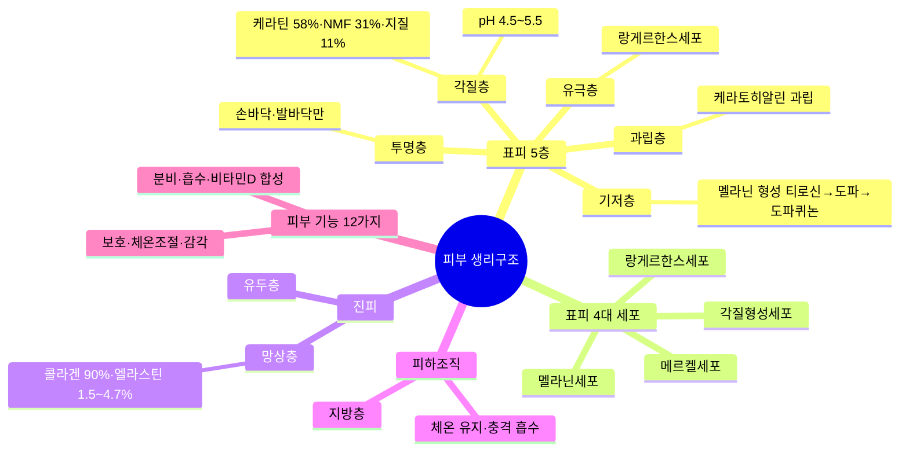

> **🗺️ 마인드맵 노드 상세 매핑**

| 대분류 | 중분류 | 소분류 | 핵심 포인트 |
| --- | --- | --- | --- |
| 표피 5층 | 해당 없음 | 해당 없음 | 표피 5층 구조 |
|  | 각질층 |  | 가장 바깥층, 각화 주기 28일 |
|  |  | 케라틴 58%·NMF 31%·지질 11% | 각질층 주요 구성 성분 비율 |
|  |  | pH 4.5~5.5 | 약산성 피부 보호막 |
|  | 투명층 | 해당 없음 | 손바닥·발바닥에만 존재 |
|  |  | 손바닥·발바닥만 | 두꺼운 피부 부위에만 분포 |
|  | 과립층 | 해당 없음 | 케라토히알린 과립 존재 |
|  |  | 케라토히알린 과립 | 과립 형성, 물리적 장벽 역할 |
|  | 유극층 | 해당 없음 | 랑게르한스세포 분포 (면역) |
|  |  | 랑게르한스세포 | 면역 반응 담당 세포 |
|  | 기저층 | 해당 없음 | 멜라닌 형성, 세포 분열 |
|  |  | 멜라닌 형성 티로신→도파→도파퀴논 | 색소 형성 생합성 경로 |
| 표피 4대 세포 | 해당 없음 | 해당 없음 | 표피 구성 4종 세포 |
|  | 각질형성세포 |  | 표피 주요 세포 (90% 이상) |
|  | 멜라닌세포 |  | 색소 형성 세포 |
|  | 랑게르한스세포 |  | 면역 역할 세포 |
|  | 메르켈세포 |  | 감각 수용 세포 |
| 진피 | 해당 없음 |  | 진피 2층 구조 (유두층·망상층) |
|  | 유두층 |  | 표피 바로 아래 얇은 층 |
|  | 망상층 |  | 진피 주체 층, 콜라겐 풍부 |
|  |  | 콜라겐 90%·엘라스틴 1.5~4.7% | 진피 주 구성 성분 비율 |
| 피하조직 | 해당 없음 | 해당 없음 | 피하조직 (지방층) |
|  | 지방층 |  | 지방조직으로 구성 |
|  | 체온 유지·충격 흡수 |  | 체온 유지·충격 흡수 기능 |
| 피부 기능 12가지 | 해당 없음 |  | 피부 12대 기능 |
|  | 보호·체온조절·감각 |  | 1차 기능: 보호·체온조절·감각 |
|  | 분비·흡수·비타민D 합성 |  | 2차 기능: 분비·흡수·비타민D 합성 |

### (1) 피부의 정의
피부는 신체 표면을 덮고 있는 기관으로 면적 1.5~2.0m², 부피 2.4~3.6L, 무게 약 4.0kg 이상, 피부 산도(pH) 4.5~6.5로 신체에서 가장 큰 기관에 해당한다.

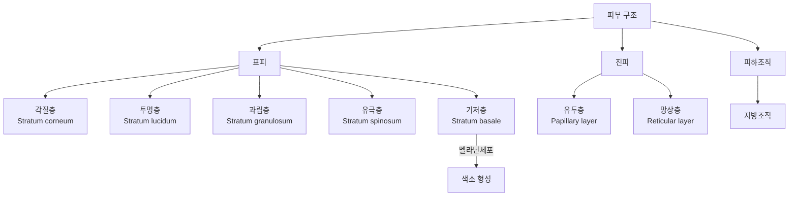

### (2) 피부의 기능

| 기능 | 내용 |
| --- | --- |
| 보호 기능 | • 물리적 마찰·충격으로부터 보호함<br>• 화학 물질로부터 피부를 보호함<br>• 멜라닌세포를 통해 자외선으로부터 피부를 보호함<br>• 피부 속 수분과 전해질의 유출을 방지함 |
| 감각 기능 | • 진피에 위치한 신경을 통해 촉각(손가락, 혀끝, 입술에 많이 분포함), 통각(감각점 중 통점이 피부에 가장 많이 분포함), 냉각, 온각, 압각 등 피부 반사 작용을 함<br>&nbsp;&nbsp;- 통각, 촉각: 진피 유두층에 위치<br>&nbsp;&nbsp;- 온각, 냉각, 압각: 진피 망상층에 위치 |
| 체온조절 기능 🎯 기출 | • 모세혈관의 확장과 수축작용을 통해 열을 차단하거나 확산하여 체온을 조절함<br>&nbsp;&nbsp;- 모세혈관 확장 → 열 확산 → 체온 하강<br>&nbsp;&nbsp;- 모세혈관 수축 → 열 차단 → 체온 상승 |
| 면역 기능 | 미생물 침입 시 사이토카인을 분비하거나 염증 반응을 유발하여 보호함 |
| 비타민 D 합성 🎯 기출 | 자외선을 일정하게 받으면 비타민 D를 합성하며, 이때 지질의 일종인 콜레스테롤은 합성에 중요한 역할을 함 |
| 흡수 기능 | 외부 물질에 대해 반투과성 기능을 가지고 있으나 피부와 유사한 일부 성분을 흡수함 |
| 분비·배설 기능 | 땀(0.5~2.0L/일), 피지(1.0~2.0g/일) 분비를 통해 노폐물을 배출함 |
| 호흡 기능 | 전체 호흡의 0.6~1.0%는 피부를 통해 호흡함 |
| 저장 기능 | 지질과 수분을 저장함 |
| 재생 기능 | 세포를 계속 생성함으로써 피부 상처 회복에 도움이 됨 |
| 거울 기능 | 신체의 이상 증상이 피부를 통해 표현되는 경우 조기에 질병을 관리할 수 있음 |
| 사회적 기능 | 건강한 피부는 건강한 이미지를 전달하여 사회적 관계에 긍정적인 영향을 줌 |

> **확인문제**: 피부의 체온조절 기능과 가장 관련이 깊은 현상은?
> ① 피지선의 분비로 유분을 배출하는 현상
> ② 멜라닌 합성으로 자외선을 차단하는 현상
> ③ 모세혈관의 확장 및 수축을 통한 체온 조절
> ④ 피부의 수분 저장을 통한 보습 유지
> ⑤ 피부세포의 재생을 통한 상처 회복
>
> **정답**: ③ 모세혈관의 확장 및 수축을 통한 체온 조절
> **해설**: 피부의 체온조절 기능은 모세혈관의 확장(열 확산→체온 하강)과 수축(열 차단→체온 상승)을 통해 이루어진다. 비타민 D 합성은 자외선과 콜레스테롤이 관여하며, 호흡은 전체의 0.6~1.0%를 차지한다.

### (3) 피부의 구조
피부는 가장 바깥 부분부터 표피, 진피, 피하조직의 3가지 구조로 이루어져 있다.

#### ① 표피(Epidermis)

| 층 | 내용 |
| --- | --- |
| **각질층**<br>(Horny Layer) 🎯 기출 | • 약 10~20층의 납작한 무핵세포층으로 pH 4.5~5.5 정도의 약산성<br>• 피부의 가장 바깥에 위치하여 수분 손실을 막고, 피부장벽 역할을 하여 피부 보호 및 세균 침입 방어<br>• 각질과 세포간지질이 벽돌 구조인 라멜라 구조<br>• 케라틴 약 58%, 천연보습인자(NMF) 약 31%, 세포간지질 약 11%로 구성<br>• 각질층은 천연보습인자(NMF)를 통해 10~20%의 수분 함유<br>&nbsp;&nbsp;* **필라그린(Fillaggrin)**: 각질층 형성에 중요한 역할을 하는 단백질로, 각질층에서 단백질 분해 효소에 의해 분해되어 천연보습인자(NMF)를 구성하는 아미노산을 이룸<br>&nbsp;&nbsp;* **세라마이드**: 지질막의 주성분으로 피부 표면의 손실되는 수분을 방어하고 외부로부터 유해 물질의 침투를 막음<br>&nbsp;&nbsp;* **각화주기(각질형성주기)**: 기저층에서 만들어진 세포가 모양이 변하며 각질층까지 올라와 일정 기간 머무르다 탈락되는 주기로, 보통 28±3일로 봄 |
| **투명층**<br>(Clear Layer) | • 2~3층의 무핵세포층으로 손바닥과 발바닥에 존재함<br>• 엘라이딘(Elaidin)이라는 반유동성 물질이 수분 침투를 방지함 |
| **과립층**<br>(Granular Layer) | • 2~5층의 편평형 또는 방추형세포층<br>• 각화 과정이 시작되는 곳으로 빛을 산란시켜 자외선을 흡수함<br>• 케라토하이알린(Keratohyalin) 과립 존재<br>• 수분저지막이 존재하여 외부 이물질 방어 및 수분 증발 방지 |
| **유극층**<br>(Spinous Layer) | • 5~10층의 다각형 유핵세포층으로 표피에서 가장 두꺼운 층<br>• 림프액이 흘러 림프순환을 통해 영양 공급 및 노폐물 배출<br>• 면역기능을 담당하는 랑게르한스세포 존재 |
| **기저층**<br>(Basal Layer) | • 단층의 원추형 유핵세포층<br>• 진피의 모세혈관으로부터 영양분과 산소를 공급받아 세포분열 촉진<br>• 각질형성세포(케라티노사이트), 멜라닌형성세포(멜라노사이트), 머켈세포 존재<br>• 각질형성세포와 멜라닌형성세포는 4:1~10:1 비율로 존재함 |

> **용어 - 천연보습인자(NMF)**: 각질층에 존재하는 수용성 물질들을 총칭하는 말

> **참고 - 천연보습인자(NMF) 구성 성분**

| 성분 | 비율 |
| --- | --- |
| 아미노산 | 40% |
| PCA(피롤리돈카르복시산) | 12% |
| 젖산염 | 12% |
| 요소 | 7% |
| 염소 | 6% |
| 나트륨 | 5% |
| 그 외 (NMF) | 18% |

> **참고 - 세포간지질 구성 성분** 🎯 기출
> • 세라마이드(50% 이상)
> • 콜레스테롤
> • 콜레스테롤에스터
> • 지방산
> • 그 외

> **참고 - 단백질 분해 효소** 🎯 기출
> 아미노펩티데이스(Aminopeptidase), 카복시펩티데이스(Carboxypeptidase)

> **참고 - 각화 과정**
> 기저세포 분열 과정 → 유극세포에서의 합성·정비 과정 → 과립세포에서의 자기분해 과정 → 각질세포에서의 재구축 과정

#### 표피에 존재하는 4대 세포

| 위치 | 세포 | 내용 |
| --- | --- | --- |
| 유극층 | 랑게르한스세포(Langerhans cell) | • 면역반응 조절에 관여하는 세포<br>• 외부 이물질인 항원을 면역담당세포 T-림프구에 전달하는 역할 |
| 기저층 (각질형성세포) | 각질형성세포(케라티노사이트, Keratinocyte) | • 각질층을 구성하는 각질세포를 만드는 세포<br>• 각화주기: 기저층에서 세포가 만들어지고 각질층까지 이동하여 서서히 떨어지는 과정으로 28일 정도 주기로 교체됨 |
| 기저층 (멜라닌형성세포) | 멜라닌형성세포(멜라노사이트, Melanocyte) 🎯 기출 | • 멜라닌을 합성하여 각질형성세포에 멜라닌이 축적된 멜라노솜(Melanosome)을 공급하는 세포<br>• 피부색과 털색을 결정함<br>• 표피의 10~20%를 차지하며, 세포 내에 확산하면 검게 보임 |
| 기저층 (머켈세포) | 머켈세포(Merkel cell) 🎯 기출 | • 신경말단과 연결되어 촉각을 감지하는 세포<br>• 손가락 끝, 입술처럼 민감한 피부에 다량 존재함 |

> **참고 - 멜라닌형성세포(멜라노사이트) 내 멜라닌 형성 과정** 🎯 기출
> 티로신 → 티로시나아제(약 0.2%의 구리를 함유하는 구리단백질)에 의해 산화 → 도파 → 티로시나아제 효소에 의해 산화 → 도파퀴논 → 유멜라닌 또는 페오멜라닌 생성

> **용어 - 멜라노솜**: 멜라닌세포 속에 들어 있는 세포소기관으로, 멜라닌이 표피의 기저층에 있는 멜라노사이트에서 생성되어 멜라노솜의 형태로 합성됨

> **참고 - 피부색 결정 요인** 🎯 기출: 멜라닌, 헤모글로빈, 카로티노이드

#### ② 진피(Dermis)
피부구조 중 가장 두꺼운 부분(피부의 약 90% 이상을 차지하고, 표피 두께의 약 10~40배임)으로, 피부 탄력과 관련이 있다.

| 층 | 내용 |
| --- | --- |
| 유두층(Papillary Layer) | • 표피의 기저층과 접하고 있으며, 유두(물결) 모양을 형성<br>• 모세혈관과 신경말단이 존재하여 각질형성세포에 산소와 영양을 공급함<br>• 미세한 교원섬유(콜라겐)와 수분을 포함함 |
| 망상층(Reticular Layer) 🎯 기출 | • 진피의 대부분을 차지하는 그물 모양(망상구조)의 결합조직<br>• 교원섬유(콜라겐) 90%, 탄력섬유(엘라스틴) 1.5~4.7%, 기질로 구성됨<br>• 모세혈관은 거의 없으며, 림프관, 한선, 피지선, 신경 등이 존재함 |

**진피에 존재하는 세포**

| 세포 | 내용 |
| --- | --- |
| 대식세포 | 백혈구의 한 유형, 선천 면역과 적응 면역에 관여 |
| 비만세포 | 염증 반응에 중요한 역할, 히스타민, 세로토닌 생산 |
| 섬유아세포 | 결합조직세포로 세포외기질인 콜라겐과 엘라스틴 생성 |

**피부노화에 영향을 주는 진피의 변화** 🎯 기출
- 콜라겐의 감소
- 탄력섬유의 변성
- 기질 탄수화물(Glycosaminoglycan)의 감소
- 피부혈관의 면적 감소

> **용어 - 교원섬유(콜라겐)**: 피부 건조 중량의 75%를 차지하며, 장력 아미노산 1,000개가 결합된 나선 모양의 타래로 아미노산 한 분자에 1,000개의 물 분자가 함유된 피부의 저수지 역할을 함

> **용어 - 탄력섬유(엘라스틴)**: 본래의 모습으로 되돌아가려는 회복 기능과 탄력성이 있는 단백질로, 피부에 1.5~4.7% 정도의 함량으로 존재함

> **용어 - 기질**: 교원섬유와 탄력섬유를 채워주는 물질로 히알루론산, 콘드로이친 황산, 헤파린 황산염 등으로 구성된 뮤코다당체임

#### ③ 피하조직(Subcutaneous Tissue)
- 진피에서 내려온 섬유가 엉성하게 결합되어 형성된 망상조직
- 벌집모양의 수많은 지방세포들이 자리잡고 있음
- 진피와 근육, 뼈 사이에 위치하며, 신체 부위, 성별, 나이, 영양 상태에 따라 두께가 다름
- 체온조절 기능, 외부 충격의 완충 기능, 영양소 저장의 기능을 함

#### ④ 그 외 피부의 부속기관(진피 내 위치)

| 부속기관 | 내용 |
| --- | --- |
| 피지선 | • 얼굴, 두피, 가슴에 많으며, 손바닥, 발바닥을 제외한 전신에 분포되어 있음<br>• 남성호르몬(테스토스테론)이 피지선을 자극하면 피지가 분비됨<br>• 지용성 분비물을 생성<br>• 피부와 모발에 윤기 부여, 피부 보호<br>• 과잉 분비 시 여드름 발생의 원인이 됨 |
| 한선(땀샘) - 아포크린선(대한선) | • 겨드랑이, 서혜부, 항문·유두 주변, 배꼽 등 특정 부위에 분포되어 있음<br>• 모공을 통해 분비하며 특유의 냄새 발생<br>• pH 5.5~6.5<br>• 성, 인종에 따라 차이가 있음 |
| 한선(땀샘) - 에크린선(소한선) | • 입술, 음부, 손톱을 제외한 전신에 분포하며, 특히 손바닥, 발바닥, 이마에 많이 분포되어 있음<br>• 표피로 직접 분비하며 무색, 무취<br>• pH 3.8~5.6<br>• 체온조절 기능 |

> **참고 - 피지의 구성 성분**

| 성분 | 비율 |
| --- | --- |
| 트리글리세라이드 | 41% |
| 왁스에스터 | 25% |
| 지방산 | 16% |
| 스쿠알렌 | 12% |
| 그 외 (피지) | 6% |

---

## 2. 모발의 생리구조

> 📌 **출처**: 식약처 화장품 학습자료 + 모발과학 교재| **최종 확인**: 2026. 8. 29.

> ### 🎯 한 줄 핵심
>
> 모발 = 모간(모표피·모피질·모수질) + 모근(모낭·모구·모유두) — 1일 0.3~0.5mm 성장, 4대 화학결합, 성장주기 3단계.

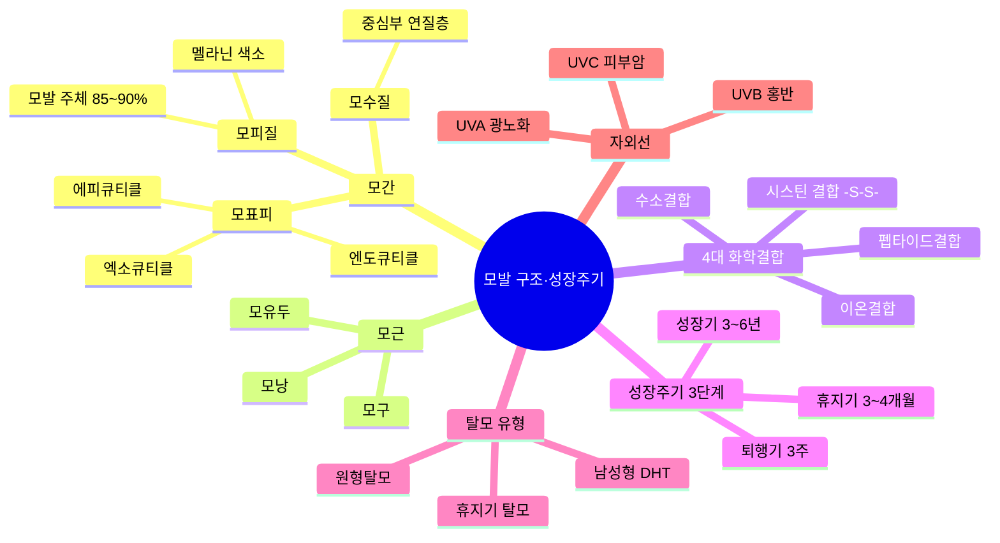

> **🗺️ 마인드맵 노드 상세 매핑**

| 대분류 | 중분류 | 소분류 | 핵심 포인트 |
| --- | --- | --- | --- |
| 모간 | 해당 없음 | 해당 없음 | 모간: 피부 밖 모발 부분 |
|  | 모표피 |  | 가장 바깥쪽 얇은 막 |
|  |  | 에피큐티클 | 가장 바깥쪽 얇은 막, 시스틴 풍부 |
|  |  | 엑소큐티클 | 중간층, 오버래핑 구조 |
|  |  | 엔도큐티클 | 가장 안쪽, 연질층 |
|  | 모피질 | 해당 없음 | 모발 주체 부분 |
|  |  | 모발 주체 85~90% | 모발의 주요 구성 비율 |
|  |  | 멜라닌 색소 | 모발 색상 결정 색소 |
|  | 모수질 | 해당 없음 | 중심부 연질층 |
|  |  | 중심부 연질층 | 모발 중심부, 연질 조직 |
| 모근 | 해당 없음 | 해당 없음 | 모근: 피부 안 모발 부분 |
|  | 모낭 |  | 모발 둘러싼 낭 |
|  | 모구 |  | 모발 말단부 |
|  | 모유두 |  | 모발 영양 공급 |
| 4대 화학결합 | 해당 없음 |  | 모발 4대 화학결합 |
|  | 시스틴 결합 -S-S- |  | 가장 강한 결합, 퍼머넌트의 핵심 |
|  | 이온결합 |  | 아미노산 카르복실-아미노 결합 |
|  | 수소결합 |  | 분자간 약한 결합 |
|  | 펩타이드결합 |  | 아미노산 연결 결합 |
| 성장주기 3단계 | 해당 없음 |  | 모발 성장주기 3단계 |
|  | 성장기 3~6년 |  | 모발 성장 지속 기간 (전체 80~90%) |
|  | 퇴행기 3주 |  | 모발 퇴행 진행 기간 |
|  | 휴지기 3~4개월 |  | 모발 탈락 대기 기간 |
| 탈모 유형 | 해당 없음 |  | 탈모 유형 3가지 |
|  | 남성형 DHT |  | DHT 원인 남성형 탈모 |
|  | 원형탈모 |  | 자가면역성 원형 탈모 |
|  | 휴지기 탈모 |  | 스트레스 등 휴지기 탈모 |
| 자외선 | 해당 없음 |  | 자외선 3종 (UVA·UVB·UVC) |
|  | UVA 광노화 |  | UVA: 광노화 유발 (320~400nm) |
|  | UVB 홍반 |  | UVB: 홍반 유발 (280~320nm) |
|  | UVC 피부암 |  | UVC: 피부암 유발 (200~280nm) |

### (1) 모발의 특징
① 1일에 0.3~0.5mm 정도 자라며, 나이, 성별, 환경 등에 따라 자라는 속도가 다르다.

② 1일에 50~100가닥의 모발이 빠지며, 봄, 가을에 자연탈모가 증가한다.

③ 모발은 약산성을 띠고 있어 산에는 비교적 강하나 알칼리에 약하므로 이 특징을 모발 관련 시술에 적용한다.

### (2) 모발의 구조 🎯 기출

#### ① 모간 부분: 피부 밖에 위치한다.

**모표피(모소피)**

| 층 | 내용 |
| --- | --- |
| 에피큐티클(Epicuticle) | • 가장 바깥쪽의 두께 100Å 정도의 얇은 막<br>• 아미노산 중 시스틴의 함유량이 많음<br>• 각질 용해성 또는 단백질 용해성의 약품(친유성, 알칼리 용액)에 대한 저항성이 가장 강한 층<br>• 수증기는 통하지만 물은 통과하지 못하는 구조로 딱딱하고 부서지기 쉽기 때문에 물리적인 자극에 약함 |
| 엑소큐티클(Exocuticle) | • 연한 케라틴 층으로 시스틴이 많이 포함되어 있음<br>• 퍼머넌트 웨이브와 같이 시스틴 결합을 절단하는 약품의 작용을 받기 쉬운 층 |
| 엔도큐티클(Endocuticle) | • 가장 안쪽에 있는 층으로 시스틴 함유량이 적음<br>• 물과 잘 어울리는 친수성이며, 알칼리에 대한 저항성이 낮음<br>• 내측면은 양면테이프와 같은 세포막복합체(CMC)로 인접한 모표피를 밀착시켜, 모표피와 모피질 안의 내용물들이 빠져나가지 않게 잡아주는 역할을 함 |

- 모발 가장 바깥쪽 5~15층의 비늘 모양
- 멜라닌이 없어 무색투명한 케라틴 단백질로 구성됨
- 두발 내부의 모피질을 감싸고 있는 화학적 저항성이 강한 층

**모피질(Cortex)**
- 모발의 중간에 위치하며 대부분을 차지(80~90%)
- 피질세포(케라틴 단백질)와 세포 간 결합물질(밀단결합·펩티드)로 구성됨
- 멜라닌을 함유하고 있어 모발 색을 결정함
- 퍼머넌트·염색 시술 시 모피질의 결합이 약해지면 모발 손상이 발생함
- 친수성이므로 흡수성과 흡습성을 가짐

**모수질(Medulla)**
- 두발의 중심 부근에 공동(속이 비어 있는 상태) 부위로, 죽은 세포들이 두발의 길이 방향으로 불연속적으로 다각형의 세포들의 형상으로 존재함
- 배냇머리, 언모에는 없음

> **참고 - 세포막복합체(CMC, Cell Membrane Complex)**: 모표피와 모피질 안의 내용물들이 빠져나가지 않게 잡아주는 역할을 하며, 부족 시 모발 손상의 주요 원인이 됨

#### ② 모근 부분: 피부 안에 위치하며 모모세포(모발을 만들어 내는 세포)와 멜라닌세포가 존재하는 곳으로, 세포분열의 시작점이다.

| 구조 | 내용 |
| --- | --- |
| 모낭 | • 모근을 둘러싸고 있는 조직, 피지선과 연결<br>• 외근모초와 내근모초로 구성<br>&nbsp;&nbsp;- 외근모초: 모구 부위에서 세포 분열하여 피부 표면 방향으로 이동<br>&nbsp;&nbsp;- 내근모초: 헨레층, 헉슬리층, 모근초소피로 구성 |
| 모구부 | 모근의 아래쪽에 위치하며 둥근 모양 |
| 모유두 | 모구의 중심에 위치하며, 모발의 영양 공급 관장 |
| 모모세포 | 모유두를 덮고 있으며, 모유두로부터 영양을 공급받아 끊임없이 세포분열 |

> **참고 - 퍼머넌트·염색 시술 원료** 🎯 기출
> • 암모니아: 모표피를 손상시켜 염료와 과산화수소가 속으로 잘 스며들 수 있도록 함
> • 과산화수소: 머리카락 속의 멜라닌 색소를 파괴하여 두발 원래의 색을 지움

### (3) 모발의 4대 화학적 결합
① 시스틴 결합

② 이온(염) 결합

③ 수소 결합

④ 펩타이드(펩티드) 결합

### (4) 모발의 성장주기 🎯 기출

| 시기 | 기간 | 내용 |
| --- | --- | --- |
| 성장기(Anagen) | 3~6년 | • 전체 모발의 80~90%가 이 시기에 해당함<br>• 모모세포의 활발한 활동 시기<br>• 여자가 남자에 비해 성장주기가 긺 |
| 퇴행기(Catagen) | 약 3주 | • 전체 모발의 1~2%가 이 시기에 해당함<br>• 모모세포의 분열이 감소하는 시기<br>• 모발의 성장이 멈춘 시기 |
| 휴지기(Telogen) | 3~4개월 | • 전체 모발의 10~15%가 이 시기에 해당함<br>• 모낭과 모유두의 완전한 분리<br>• 모발의 탈락 시작 |

**모발의 성장주기 순환**: 성장기(3~6년, 모유두의 활발한 세포분열) → 퇴행기(약 3주, 모모세포 분열 감소·모유두 분리 시작) → 휴지기(3~4개월, 모낭과 모유두 완전 분리·성장기 반복)

### (5) 두피의 특징과 기능

#### ① 두피의 특징
- 피지선이 많고, 혈관과 모낭이 다른 피부에 비해 많이 분포함
- 진피층의 조밀한 신경분포를 통해 머리카락을 통한 감각을 느낌
- 세 개의 층으로 구성
 - 외피: 동맥, 정맥, 신경 분포
 - 두개피: 두개골을 둘러싼 근육과 연결된 신경조직
 - 두개 피하조직: 얇으면서 지방층이 없고 이완된 상태

#### ② 두피의 기능

| 기능 | 내용 |
| --- | --- |
| 보호 | • 멜라닌색소와 표피는 광선으로부터 두피를 보호함<br>• 표면이 산성막으로 되어 있어 감염과 미생물의 침입으로부터 두피를 보호함<br>• 외부 마찰에 대항하여 두피를 보호함 |
| 호흡 | 두피에 각질이나 노폐물이 쌓이면 두피의 모공을 막아 피부의 호흡을 저해할 수 있음 |
| 분비와 배설 | 한선에서는 땀 배출을, 피지선에서는 피지를 분비함 |
| 체온 유지 | 입모근에서는 수축과 이완을 통해 모공을 개폐하여 체온을 유지하고, 모세혈관의 혈류량을 조절하여 체온을 조절함 |

---

## 3. 피부와 모발의 상태 분석

> 📌 **출처**: 식약처 화장품 학습자료 + 관능평가 지침| **최종 확인**: 2026. 8. 29.

> ### 🎯 한 줄 핵심
>
> 피부 분석(문진·견진·촉진·기기) + 피부 유형(7가지) + 피츠패트릭 6형 + 모발 진단 + 탈모·비듬 원인.

### (1) 피부 상태 분석

#### ① 피부 분석 방법

| 방법 | 내용 |
| --- | --- |
| 문진법 | • 설문이나 대면 질문을 통해 피부 상태 분석<br>• 식사, 생활습관, 수면 정도, 과로 상태, 성격, 생활환경, 피부관리법 등에 대해 질문 |
| 견진법 | • 육안을 통해 피부 상태 분석<br>• 피부결, 각질, 모공 크기, 색소침착, 안색, 주름 등의 상태 관찰 |
| 촉진법 | • 손으로 누르거나 만져서 피부 상태 분석<br>• 각질 상태, 피지 분비량, 수분량, 탄력 정도, 피부 두께 등의 상태 관찰 |
| 기기를 이용한 판독법 | • 유수분 측정기, 우드램프, pH 측정기, 확대경, 피부 분석기를 통해 피부 상태 분석<br>• 세안 후 일정 시간이 지난 후에 측정하여 피부 상태 판독 |

#### ② 피부 측정 방법

| 항목 | 내용 |
| --- | --- |
| 수분 🎯 기출 | • 전기전도도를 통해 피부 각질층의 수분량 측정<br>• 피부 수분 증발량인 경피수분손실량(TEWL) 측정 |
| pH | 피부의 산성도 측정 |
| 유분 | 카트리지 필름을 피부에 밀착시킨 후 유분량 측정 |
| 표면 | 피부 표면을 확대 촬영 또는 확대경을 통해 잔주름, 굵은 주름, 각질, 모공 크기, 색소침착 등을 측정 |
| 피부색 | 피부 색소 측정기와 UV광을 이용한 피부 색소침착 정도 측정 |
| 탄력 | 탄력 측정기를 이용하여 음압을 가했다가 피부가 원래 상태로 회복되는 정도 측정 |
| 홍반 | 헤모글로빈 수치를 통해 붉은 기 측정 |
| 주름 🎯 기출 | • 레플리카(Replica)를 이용한 피부 주름 분석 측정<br>• 피부 표면 형태 측정 |

> **용어 - 경피수분손실량(TEWL)** 🎯 기출: 피부 표면에서 증발되는 수분량(TEWL: Transepidermal Water Loss)으로 건성 피부와 손상 피부는 값이 높으며, 피부 장벽기능 이상과 관련 있음

> **용어 - 레플리카(Replica)**: 실리콘을 이용하여 피부 표면 상태를 그대로 복제한 것

#### ③ 피부 유형별 특징

| 유형 | 특징 |
| --- | --- |
| 정상 피부(중성 피부) | • 가장 이상적인 피부로 유·수분의 밸런스가 좋음<br>• 혈관 분포가 일정하여 혈액순환, 신진대사가 원활함<br>• 계절, 연령, 생활습관 등에 따라 피부 상태가 변함 |
| 건성 피부 | • 각질층 수분 함량이 10% 미만인 피부<br>• 피지 분비량 감소로 건조함<br>• 노화, 아토피 피부로 확장될 수 있는 피부 |
| 지성 피부 | • 피지 분비량이 많고 모공이 큼<br>• 여드름 피부로 확장될 수 있는 피부 |
| 복합성 피부 | • 2개 이상의 피부 유형을 가짐<br>• T-zone은 지성 피부, U-zone은 건성 피부의 특징을 가짐<br>• 호르몬, 외부의 환경을 많이 받음 |
| 민감성 피부 | • 내외부 요인에 의해 피부가 쉽게 붉어지거나 민감하게 반응하는 피부<br>• 노화 진행이 빠르거나 쉽게 염증이 발생함 |
| 노화 피부 | • 광노화, 자연노화로 나뉘며 보습과 탄력이 저하된 피부<br>• 콜라겐(교원섬유) 감소 / 엘라스틴(탄력섬유) 변성<br>• 기질 탄수화물 감소 / 피부혈관의 면적 감소 |
| 여드름 피부 | • 모낭 내 과잉 분비된 피지로 인해 염증 반응이 나타나는 피부<br>• 피지 분비 증가, 모공 폐쇄, 세균 증식, 스트레스 등의 원인으로 여드름 발생<br>• 여드름 종류<br>&nbsp;&nbsp;- 면포: 좁쌀 모양의 비염증성 여드름, 개방면포(블랙헤드), 폐쇄면포(화이트헤드)가 있음<br>&nbsp;&nbsp;- 구진: 피지가 세균 감염으로 팽창되어 모낭벽이 파손된 상태의 여드름<br>&nbsp;&nbsp;- 농포: 노란색 고름이 발생한 염증성 여드름<br>&nbsp;&nbsp;- 결절: 농포가 발전하여 단단한 덩어리가 피부 안에서 딱딱해진 상태의 여드름<br>&nbsp;&nbsp;- 낭종: 화농 상태가 가장 심각한 단계로 모낭벽이 완전히 파괴된 상태의 여드름 |
| 색소침착 피부 | • 멜라닌이 비정상적으로 과잉 생성되면서 과색소침착이 일어난 피부<br>• 자외선, 스트레스, 여성호르몬, 내장장애 등의 원인으로 발생<br>• 자외선의 종류<br>&nbsp;&nbsp;- UVA: 320~400nm 장파장으로 광노화의 원인 🎯 기출<br>&nbsp;&nbsp;- UVB: 290~320nm 중파장으로 일광화상, 홍반의 원인<br>&nbsp;&nbsp;- UVC: 200~290nm 단파장으로 피부암의 원인, 살균·소독작용 (대부분 오존층에서 차단됨) |

#### ④ 피츠패트릭 피부 분류
피부를 피부색, 태양의 자외선에 의한 화상(색소침착)의 정도에 따라 6가지 유형으로 분류함

| 유형 | 피부색 | 머리카락 색 | 특성 |
| --- | --- | --- | --- |
| 1형 | 창백한 색 | 노랑~빨강색 | 쉽게 화상을 입으나 색소침착은 없음 |
| 2형 | 하얀색 | 노랑~빨강색 | 쉽게 화상을 입고 약간의 색소침착이 있음 |
| 3형 | 크림색 | 다양함 | 가끔 화상을 입으며 점진적인 색소침착이 있음 |
| 4형 | 연갈색 | 갈색 | 약간의 화상을 입으나 대부분 색소침착이 있음 |
| 5형 | 짙은 갈색 | 갈색 또는 검은색 | 화상은 거의 입지 않고 색소침착이 심함 |
| 6형 | 어두운 갈색 | 검은색 | 화상은 입지 않으나 색소침착이 있음 |

### (2) 모발 상태 분석

#### ① 모발진단 방법

| 방법 | 내용 |
| --- | --- |
| 모발 당김검사 | 모발을 두 손가락으로 집어 당겨 탈모 유무 판단 |
| 모주기검사 | 포토트리코그람(Phototrichogram)을 통해 모발의 성장 속도와 밀도를 종합적으로 분석 |
| 모간검사 | 모발에 붙어있는 피부를 모아 모발 상태 분석 |
| 조직검사 | 4mm 펀치를 이용하여 염색 후 현미경으로 모근과 모구 관찰 |
| 모발 분석 | 모유두가 포함된 조직을 채취하여 모발의 전반적 상태를 종합적으로 진단 |

#### ② 두피 및 모발 상태

**① 정상 두피**
- 두피가 투명하고 각질이나 피지가 깨끗한 상태
- 모공 1개당 2~3개의 모발이 존재하며, 모발의 굵기가 일정함

**② 탈모의 증상**

| 유형 | 내용 |
| --- | --- |
| 남성형 탈모증 🎯 기출 | • 두피의 경계선이 점점 뒤로 진행되어 이마가 넓고 대머리로 진행<br>• 남성호르몬인 테스토스테론이 5알파-환원효소에 의해 디하이드로테스토스테론(DHT)로 전환됨<br>• DHT는 모낭을 위축시키며 탈모의 원인이 됨 |
| 여성형 탈모증 | • 머리카락이 가늘어지고 특히 정수리 부분이 많이 빠짐<br>• 모낭세포의 반응이 주요원인으로 부신, 난소의 비정상 과다분비 또는 남성호르몬 관련 약물 복용이 원인이 됨 |
| 원형 탈모증 | • 하나 혹은 여러 개의 원형으로 탈모가 일어남<br>• 대부분 스트레스에 의한 것으로, 유전적 소인, 알레르기, 자가 면역성 소인과 정신적인 스트레스를 포함하는 복합적인 요인들에 의해서도 발생 |
| 기타 (탈모 유형) | 지루성 탈모증, 산후 휴지기 탈모증, 노인성 탈모증 등 |

**③ 탈모의 원인**

| 원인 | 내용 |
| --- | --- |
| 유전 | 탈모를 일으키는 유전자에 의해 탈모가 될 가능성이 높아짐 |
| 호르몬 | 뇌하수체, 갑상선, 부신피질, 난소나 고환에서 분비되는 호르몬은 모발과 관계가 있으며, 그중 남성호르몬에 의해 발생하는 탈모가 대부분임 |
| 스트레스 | 스트레스가 쌓이면 자율신경 부조화로 모발의 발육이 저해됨 |
| 식생활 습관 | 다이어트로 인한 영양소 결핍과 동물성 지방의 과다섭취로 혈중 콜레스테롤을 증가시켜 모근의 영양 공급을 악화시킴 |
| 모발 공해 | 열과 알칼리에 약한 모발 성분이 손상됨 |
| 기타 (탈모 원인) | 지루성 탈모증, 산수 휴지기 탈모증, 노인성 탈모증, 염증성 질환 등에 의해 탈모가 발생함 |

**④ 비듬의 증상**
- 두피에서 탈락된 세포가 벗겨져 나온 쌀겨 모양의 표피 탈락물
- 대표적인 동반 증상은 가려움증이며, 지루성 피부염의 증상이 발생하기도 함

**⑤ 비듬의 원인** 🎯 기출
- 두피 피지선의 과다 분비, 호르몬의 불균형, 두피 세포의 과다 증식 등
- 진균류인 말라쎄지아가 방출하는 분비물의 표피층 자극
- 스트레스 또는 과도한 다이어트 등


## 📊 표피 5층 구조 비교표

> 📌 **출처**: 피부과학 교재 + 식약처 학습자료| **최종 확인**: 2026. 8. 29.

| 층 | 두께/층수 | 주요 특징 | 핵심 물질 |
| --- | --- | --- | --- |
| **각질층** | 10~20층 | 피부장벽, pH 4.5~5.5, 수분 10~20% | 케라틴 58%, NMF 31%, 세포간지질 11% |
| **투명층** | 2~3층 | 손바닥·발바닥만 | 엘라이딘 |
| **과립층** | 2~5층 | 각화 시작, 자외선 흡수 | 케라토하이알린, 수분저지막 |
| **유극층** | 5~10층 | 표피 최두껍, 림프순환 | 랑게르한스세포 |
| **기저층** | 단층 | 세포분열, 멜라닌 생성 | 각질형성세포:멜라닌세포 = 4:1~10:1 |

## 📊 표피 4대 세포 비교표

> 📌 **출처**: 피부과학 교재 + 식약처 학습자료| **최종 확인**: 2026. 8. 29.

| 세포 | 위치 | 기능 |
| --- | --- | --- |
| **랑게르한스세포** | 유극층 | 면역반응 조절, 항원 전달 |
| **각질형성세포** | 기저층 | 각질세포 생성, 각화주기 28일 |
| **멜라닌형성세포** | 기저층 | 멜라닌 합성, 피부색 결정, 10~20% |
| **머켈세포** | 기저층 | 촉각 감지, 민감 부위 다량 |

## 📊 진피 2층 비교표

> 📌 **출처**: 피부과학 교재 + 식약처 학습자료| **최종 확인**: 2026. 8. 29.

| 층 | 두께/구성 | 주요 특징 |
| --- | --- | --- |
| **유두층** | 얕음, 콜라겐+수분 | 모세혈관·신경말단, 통각·촉각 |
| **망상층** | 진피 대부분, 콜라겐 90% | 탄력섬유 1.5~4.7%, 림프관·한선·피지선 |

## 📊 모발 구조 비교표

> 📌 **출처**: 모발과학 교재 + 식약처 학습자료| **최종 확인**: 2026. 8. 29.

| 구조 | 위치 | 특징 |
| --- | --- | --- |
| **모표피** | 가장 바깥, 5~15층 | 무색투명, 화학저항 강, 에피·엑소·엔도큐티클 |
| **모피질** | 중간, 80~90% | 멜라닌 함유(모발색), 친수성, 케라틴 |
| **모수질** | 중심 | 공동, 죽은 세포, 배냇머리·언모에는 없음 |

## 📊 모발 성장주기 비교표

> 📌 **출처**: 모발과학 교재 + 식약처 학습자료| **최종 확인**: 2026. 8. 29.

| 시기 | 기간 | 비율 | 특징 |
| --- | --- | --- | --- |
| **성장기** | 3~6년 | 80~90% | 모모세포 활발, 여성이 더 김 |
| **퇴행기** | 약 3주 | 1~2% | 분열 감소, 모유두 분리 시작 |
| **휴지기** | 3~4개월 | 10~15% | 모낭·모유두 완전 분리, 탈락 |

## 📊 자외선 종류 비교표

> 📌 **출처**: 기능성화장품 심사 규정 (제2025-88호) + 피부과학| **최종 확인**: 2026. 8. 29.

| 종류 | 파장 | 영향 |
| --- | --- | --- |
| **UVA** | 320~400nm | 광노화의 원인 |
| **UVB** | 290~320nm | 일광화상, 홍반의 원인 |
| **UVC** | 200~290nm | 피부암의 원인, 살균·소독 (대부분 오존층에서 차단됨) |

## 📊 탈모 유형 비교표

> 📌 **출처**: 피부과학 교재 + 식약처 학습자료| **최종 확인**: 2026. 8. 29.

| 유형 | 원인 | 특징 |
| --- | --- | --- |
| **남성형** | DHT(테스토스테론→5α-환원효소) | 이마 넓어짐, 대머리 진행 |
| **여성형** | 호르몬 불균형 | 정수리 중심 가늘어짐 |
| **원형** | 스트레스·자가면역 | 원형 탈모반 |
| **기타** | 지루성·산후·노인성 | 다양한 원인 |

---

## ✅ 확인문제

> **문제 1.** 각질층의 구성 성분 비율로 옳은 것은?
>
> ① 케라틴 31%, NMF 58%, 세포간지질 11%

> ② 케라틴 58%, NMF 31%, 세포간지질 11%

> ③ 케라틴 58%, NMF 11%, 세포간지질 31%

> ④ 케라틴 40%, NMF 40%, 세포간지질 20%
>
> **정답**: ② 케라틴 58%, NMF 31%, 세포간지질 11%
> **해설**: 각질층은 케라틴 약 58%, 천연보습인자(NMF) 약 31%, 세포간지질 약 11%로 구성된다. NMF는 필라그린 단백질이 분해되어 생성된 아미노산 등으로 구성되며, 각질층이 10~20%의 수분을 함유하도록 한다.

> **문제 2.** 멜라닌 형성 과정의 순서로 옳은 것은?
>
> ① 티로신 → 도파퀴논 → 도파 → 멜라닌

> ② 티로신 → 도파 → 도파퀴논 → 멜라닌

> ③ 도파 → 티로신 → 도파퀴논 → 멜라닌

> ④ 티로신 → 멜라닌 → 도파 → 도파퀴논
>
> **정답**: ② 티로신 → 도파 → 도파퀴논 → 멜라닌
> **해설**: 멜라닌 형성 과정은 티로신이 티로시나아제(구리단백질)에 의해 산화되어 도파가 되고, 다시 티로시나아제에 의해 산화되어 도파퀴논이 되어 유멜라닌 또는 페오멜라닌이 생성된다.

> **문제 3.** 모발의 성장주기 중 성장기(Anagen)의 기간과 비율은?
>
> ① 3~6년, 80~90%

> ② 3주, 1~2%

> ③ 3~4개월, 10~15%

> ④ 1~2년, 50~60%
>
> **정답**: ① 3~6년, 80~90%
> **해설**: 성장기는 3~6년 지속되며 전체 모발의 80~90%가 해당한다. 퇴행기는 약 3주(1~2%), 휴지기는 3~4개월(10~15%)이다. 여성이 남성보다 성장주기가 길다.

> **문제 4.** 남성형 탈모증의 원인인 DHT는 어떤 과정을 통해 생성되는가?
>
> ① 테스토스테론이 5α-환원효소에 의해 DHT로 전환

> ② 테스토스테론이 아로마타아제에 의해 DHT로 전환

> ③ DHT가 테스토스테론으로 전환

> ④ 에스트로겐이 DHT로 전환
>
> **정답**: ① 테스토스테론이 5α-환원효소에 의해 DHT로 전환
> **해설**: 남성형 탈모증은 남성호르몬인 테스토스테론이 5알파-환원효소에 의해 디하이드로테스토스테론(DHT)로 전환되어 모낭을 위축시키며 탈모의 원인이 된다.

> **문제 5.** 경피수분손실량(TEWL)에 대한 설명으로 옳은 것은?
>
> ① 건성 피부에서 값이 낮다

> ② 피부 장벽기능 이상과 관련 있다

> ③ 정상 피부에서 가장 높다

> ④ 모발의 수분량을 측정하는 지표이다
>
> **정답**: ② 피부 장벽기능 이상과 관련 있다
> **해설**: TEWL(Transepidermal Water Loss)은 피부 표면에서 증발되는 수분량으로, 건성 피부와 손상 피부에서 값이 높으며 피부 장벽기능 이상과 관련 있다.

---

## 📖 핵심 용어 정리

| 용어 | 핵심 포인트 |
| --- | --- |
| **피부** | 신체 최대 기관, 면적 1.5~2.0㎡, 무게 4kg, pH 4.5~6.5 |
| **각질층** | 10~20층, pH 4.5~5.5, 케라틴 58%·NMF 31%·지질 11%, 수분 10~20% |
| **각화주기** | 28±3일 (기저층→각질층→탈락) |
| **NMF** | 아미노산 40%, PCA 12%, 젖산염 12%, 요소 7% |
| **세포간지질** | 세라마이드 50% 이상, 콜레스테롤, 지방산 |
| **필라그린** | 각질층 형성 단백질, 분해되어 NMF 아미노산 생성 |
| **세라마이드** | 지질막 주성분, 수분 방어·유해물질 차단 |
| **멜라닌 형성** | 티로신→티로시나아제→도파→도파퀴논→멜라닌 |
| **티로시나아제** | 구리 0.2% 함유 구리단백질 |
| **피부색 결정 인자** | 멜라닌, 헤모글로빈, 카로티노이드 |
| **진피** | 피부 90% 이상, 표피의 10~40배, 콜라겐 90%·엘라스틴 1.5~4.7% |
| **콜라겐** | 피부 건조 중량 75%, 아미노산 1,000개 결합 나선 구조 |
| **엘라스틴** | 회복 기능·탄력성, 1.5~4.7% 함유 |
| **기질** | 히알루론산, 콘드로이친 황산, 헤파린 황산염 (뮤코다당체) |
| **피지선** | 남성호르몬 자극, 손바닥·발바닥 제외 전신 |
| **아포크린선** | 겨드랑이·서혜부, 모공 분비, pH 5.5~6.5, 특유 냄새 |
| **에크린선** | 전신(손바닥·발바닥·이마), 표피 직접 분비, pH 3.8~5.6 |
| **피지 구성** | 트리글리세라이드 41%, 왁스에스터 25%, 지방산 16%, 스쿠알렌 12% |
| **모발 성장** | 1일 0.3~0.5mm, 50~100가닥 탈모, 약산성(알칼리에 약함) |
| **모표피** | 5~15층, 에피·엑소·엔도큐티클, 화학저항 강 |
| **모피질** | 80~90%, 멜라닌 함유, 친수성, 케라틴 단백질 |
| **CMC** | 세포막복합체, 모표피·모피질 내용물 유지 |
| **모발 4대 결합** | 시스틴·이온·수소·펩타이드 결합 |
| **성장기** | 3~6년, 80~90%, 모모세포 활발 |
| **퇴행기** | 약 3주, 1~2%, 분열 감소 |
| **휴지기** | 3~4개월, 10~15%, 모낭·모유두 분리 |
| **남성형 탈모** | 테스토스테론→5α-환원효소→DHT→모낭 위축 |
| **UVA** | 320~400nm, 광노화 |
| **UVB** | 290~320nm, 일광화상·홍반 |
| **UVC** | 200~290nm, 피부암·살균 (대부분 오존층에서 차단됨) |
| **TEWL** | 경피수분손실량, 건성·손상 피부에서 높음 |
| **피츠패트릭** | 6형 분류 (1형: 화상 입음/색소침착 없음 ~ 6형: 화상 없음/색소침착 있음) |
| **비듬 원인** | 말라쎄지아 진균, 피지 과다, 호르몬 불균형, 스트레스 |


---

## 📖 관능평가 방법과 절차
> 출처: `화장품법 시행규칙(총리령)(제02109호)(20260402).pdf`

## Chapter 03. 관능평가 방법과 절차

> **고득점 TIP**: 관능평가의 정의와 요소에 대해 정리하세요.
>
> 🔗 **관련 과목**
> - 2과목 2챕터 "화장품의 기능과 품질" — 화장품 효과 분류(세정·기초·기능성·색조)와 관능평가 대상

---

> 📋 **학습 가이드**
> - 출제 빈도: ★★★☆☆ (관능평가 정의, 평가 순서, 제품별 평가 요소, 관능 용어-물리화학적 평가법 연결, 자가평가 종류)
> - 예상 소요 시간: 25분
> - 핵심 키워드: 오감(시·후·미·촉·청), 관능평가 4단계(표준품 선정→검체 채취→시험→판정), 제품별 평가 요소(스킨=탁도·변취, 크림=변취·분리·점도·경도·증발·표면 굳음), 맹검 vs 비맹검, Rheometer·Cutometer·Glossmeter

---


## 1. 관능평가 기초

### (1) 관능평가

> 📌 **출처**: 식약처 관능평가 지침 + 화장품법 시행규칙| **최종 확인**: 2026. 8. 29.

> ### 🎯 한 줄 핵심
>
> 관능평가 = 인간의 오감으로 화장품 품질(외관·색상·향·사용감)을 측정·분석·평가 후 통계 처리.

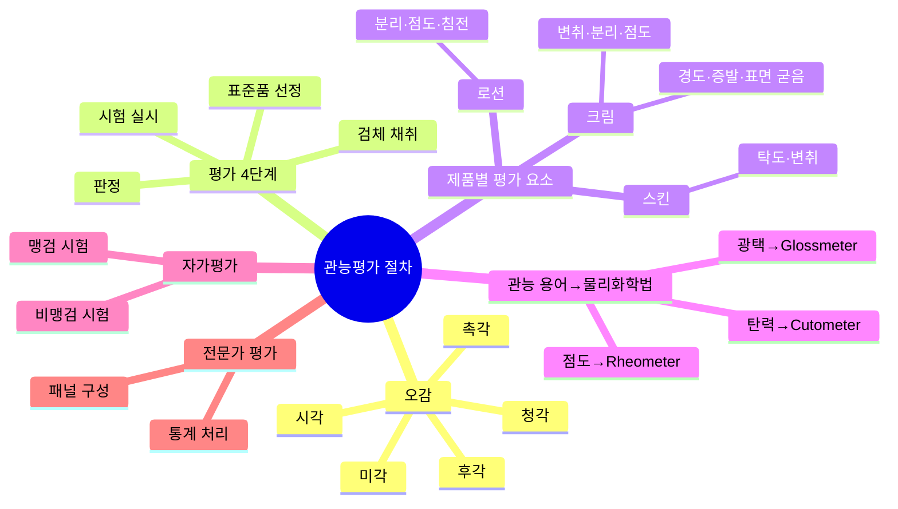

> **🗺️ 마인드맵 노드 상세 매핑**

| 대분류 | 중분류 | 소분류 | 핵심 포인트 |
| --- | --- | --- | --- |
| 오감 | 해당 없음 | 해당 없음 | 오감 기반 품질 평가 |
|  | 시각 |  | 외관·색상 확인 |
|  | 후각 |  | 향·취 확인 |
|  | 미각 |  | 맛 확인 (제한적) |
|  | 촉각 |  | 촉감·점도 확인 |
|  | 청각 |  | 소리 확인 (제한적) |
| 평가 4단계 | 해당 없음 |  | 관능평가 4단계 절차 |
|  | 표준품 선정 |  | 기준이 되는 표준품 선정 |
|  | 검체 채취 |  | 검체 채취 및 기준 마련 |
|  | 시험 실시 |  | 관능 시험 실시 |
|  | 판정 |  | 적합 여부 판정 및 기록 |
| 제품별 평가 요소 | 해당 없음 |  | 제품 유형별 평가 기준 |
|  | 스킨 |  | 탁도·변취 평가 |
|  |  | 탁도·변취 | 스킨 제품 탁도·향 변화 확인 |
|  | 크림 | 해당 없음 | 변취·분리·점도·경도·증발 평가 |
|  |  | 변취·분리·점도 | 크림 제품 품질 변화 확인 |
|  |  | 경도·증발·표면 굳음 | 크림 제품 물리적 변화 확인 |
|  | 로션 | 해당 없음 | 분리·점도·침전 평가 |
|  |  | 분리·점도·침전 | 로션 제품 품질 변화 확인 |
| 관능 용어→물리화학법 | 해당 없음 | 해당 없음 | 관능 용어→물리화학법 매핑 |
|  | 점도→Rheometer |  | 점도는 Rheometer로 측정 |
|  | 탄력→Cutometer |  | 탄력은 Cutometer로 측정 |
|  | 광택→Glossmeter |  | 광택은 Glossmeter로 측정 |
| 자가평가 | 해당 없음 |  | 자가평가 2종 |
|  | 맹검 시험 |  | 정보 없이 평가 (Blind) |
|  | 비맹검 시험 |  | 정보 제공 후 평가 (Concept) |
| 전문가 평가 | 해당 없음 |  | 전문가 패널 평가 |
|  | 패널 구성 |  | 전문가 패널 구성 |
|  | 통계 처리 |  | 통계 처리 분석 |

1. 화장품의 품질을 인간의 오감(시각, 후각, 미각, 촉각, 청각)에 의해 측정하고 분석하여 평가하는 방법이다.

2. 화장품은 유효성에 대한 과학적 평가법이 있으나, 외관, 색상, 향, 사용감 등 기호에 따른 평가도 제품에 영향을 미치기 때문에 관능평가를 통해 얻은 결과를 통계 처리한 후 종합적 평가에 사용한다.

### (2) 외관·색상 검사에 대한 관능평가 순서

> 📌 **출처**: 식약처 관능평가 지침| **최종 확인**: 2026. 8. 29.

> ### 🎯 한 줄 핵심
>
> 표준품 선정 → 검체 채취·기준 마련 → 시험 → 적합 판정·기록.

1. 외관·색상을 검사하기 위한 표준품을 선정한다.

2. 원자재 시험 검체와 제품의 공정 단계별 시험 검체를 채취하고 각각의 기준과 평가척도를 마련한다.

3. 외관·색상 시험 방법에 따라 시험한다.

4. 시험 결과에 따라 적합 유무를 판정하고 기록·관리한다.

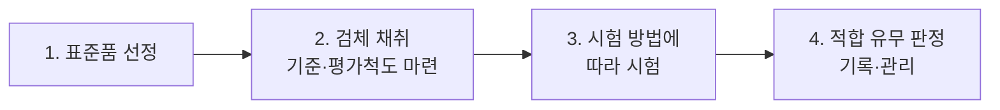

#### 참고: 외관·색상 시험 방법

- **성상 및 색상의 판별**
 - 유화제품: 내용물 표면의 매끄러움, 내용물의 점성, 내용물의 색을 육안으로 확인
 - 색조제품: 슬라이드 글라스에 표준견본과 내용물을 각각 소량으로 묻힌 후 슬라이드 글라스로 눌러 대조되는 색상을 육안으로 확인, 손등이나 실제 사용 부위에 직접 발라서 색상 확인
- **향취 평가**: 비커에 내용물을 담고 코를 비커에 대고 향취를 맡거나 손등에 발라 향취를 맡아 확인
- **사용감 평가**: 내용물을 손등에 문질러 느껴지는 사용감 확인

### (3) 관능평가 요소

> 📌 **출처**: 식약처 관능평가 지침| **최종 확인**: 2026. 8. 29.

> ### 🎯 한 줄 핵심
>
> 탁도(탁도계), 변취(손등 비교), 분리(육안·현미경), 점도/경도(Spindle), 증발/표면 굳음(건조 감량).

| 요소 | 평가 방법 |
| --- | --- |
| 탁도(침전) | 10mL 바이알에 액체 형태의 화장품을 넣고 탁도계(Turbidity meter)로 탁도 측정 |
| 변취 | 손등에 적당량을 바른 뒤 원료의 베이스 냄새를 기준으로 표준품(최종 제품)과 비교하여 변취 확인 |
| 분리(성상) | 육안과 현미경을 이용하여 기포, 응고, 분리, 겔화, 빙결 등 유화 상태 확인 |
| 점도, 경도 | 실온에 방치한 뒤 용기에 넣고 점도, 경도 범위에 적합한 회전봉(Spindle)을 사용하여 점도를 측정하고, 점도가 높을 경우에는 경도를 측정 |
| 증발, 표면 굳음 | 건조 감량, 무게 측정을 통해 증발과 표면 굳음 측정 |


## 2. 관능평가 실무

### (1) 제품별 관능평가 요소

> 📌 **출처**: 식약처 관능평가 지침| **최종 확인**: 2026. 8. 29.

> ### 🎯 한 줄 핵심
>
> 스킨/토너(탁도·변취) → 로션/에센스(+분리·점도·경도) → 크림(+증발·표면 굳음) → 색조(변취·점도·경도·증발·표면 굳음).

| 제품 유형 | 평가 요소 |
| --- | --- |
| 스킨, 토너 | 탁도, 변취 |
| 로션, 에센스 | 변취, 분리(성상), 점도, 경도 |
| 크림 | 변취, 분리(성상), 점도, 경도, 증발, 표면 굳음 |
| 메이크업 베이스, 파운데이션 | 변취, 점도, 경도, 증발, 표면 굳음 |
| 립스틱 | 변취, 분리(성상), 점도, 경도 |

### (2) 관능 용어에 따른 물리화학적 평가법

> 📌 **출처**: 식약처 관능평가 지침 + 물리화학 시험법| **최종 확인**: 2026. 8. 29.

> ### 🎯 한 줄 핵심
>
> 물리적(마찰감·점탄성=Rheometer, 탄력=Cutometer, 끈적임=핸디압축) + 광학적(투명감·명도=분광측색계, 광택=Glossmeter).

#### ① 물리적 관능 요소

| 관능 용어 | 물리화학적 평가법 |
| --- | --- |
| 촉촉함 ⇔ 보송보송함 | 마찰감 테스트, 점탄성 측정(Rheometer) |
| 부들부들함 |  |
| 뽀드득함 ⇔ 매끄러움 |  |
| 가볍게 발림 ⇔ 뻑뻑하게 발림 |  |
| 빠르게 스며듦 ⇔ 느리게 스며듦 |  |
| 부드러움 ⇔ 딱딱함(화장품) |  |
| 탄력이 있음(피부) | 유연성 측정(Cutometer) |
| 부드러워짐(피부) |  |
| 끈적임 ⇔ 끈적이지 않음 | 핸디압축시험법 |

#### ② 광학적 관능 요소

| 관능 용어 | 물리화학적 평가법 |
| --- | --- |
| 투명감이 있음 ⇔ 불투명함 | 변색분광측정계, 광택계(Glossmeter), 색채 측정(분광측색계를 통한 명도 측정), 확대 비디오 관찰 |
| 윤기가 있음 ⇔ 윤기가 없음 |  |
| 화장 지속력이 좋음 ⇔ 화장이 잘 지워짐 |  |
| 균일하게 도포할 수 있음 ⇔ 뭉침, 번짐 |  |
| 번들거림 ⇔ 번들거리지 않음 | 광택계(Glossmeter) |


## 3. 평가 주체

### (1) 자가평가

> 📌 **출처**: 식약처 관능평가 지침| **최종 확인**: 2026. 8. 29.

> ### 🎯 한 줄 핵심
>
> 소비자 사용시험(맹검=정보 가림, 비맹검=정보 공개) + 훈련된 전문가 패널 관능평가.

#### ① 소비자에 의한 사용시험

소비자들이 관찰하거나 느낄 수 있는 변수들에 기초하여 제품 효능과 화장품 특성에 대한 소비자의 인식을 평가하는 것으로 일정 수 이상 참여해야 한다.

| 구분 | 내용 |
| --- | --- |
| 맹검 사용시험 (Blind Use Test) | 상품명, 디자인, 표시사항 등을 가리고 제품을 사용하여 시험하는 것 |
| 비맹검 사용시험 (Concept Use Test) | 상품명, 표기사항 등을 알려주고 제품에 대한 인식 및 효능 등이 일치하는지를 시험하는 것 |

#### ② 훈련된 전문가 패널에 의한 관능평가

명확히 규정된 시험계획서에 따라, 정확한 관능 기준을 가지고 교육을 받은 전문가 패널의 도움을 얻어 실시한다.

### (2) 전문가에 의한 평가

> 📌 **출처**: 식약처 관능평가 지침| **최종 확인**: 2026. 8. 29.

> ### 🎯 한 줄 핵심
>
> 의사 감독하 임상 시험(정량화 비교) + 준의료진·미용사 등 전문가 감각 평가.

#### ① 의사의 감독하에서 실시하는 시험

의사의 관리하에서 화장품의 효능에 대해 실시하며 변수들은 임상관찰 결과 또는 평점에 의해 평가된다. 또한 초기값이나 미처리 대조군, 위약 또는 표준품과 비교하여 정량화될 수 있다.

#### ② 그 외 전문가의 관리하에 실시되는 시험

준 의료진, 미용사 또는 기타 직업적 전문가 등이 이미 확립된 기준과 비교하여 촉각, 시각 등에 의한 감각에 의해 제품의 효능을 평가한다.


## 📊 제품별 관능평가 요소 비교표

> 📌 **출처**: 식약처 관능평가 지침| **최종 확인**: 2026. 8. 29.

| 제품 유형 | 탁도 | 변취 | 분리(성상) | 점도/경도 | 증발/표면 굳음 |
| --- | --- | --- | --- | --- | --- |
| **스킨/토너** | ✔ | ✔ | 해당 없음 | 해당 없음 | 해당 없음 |
| **로션/에센스** | 해당 없음 | ✔ | ✔ | ✔ | 해당 없음 |
| **크림** | 해당 없음 | ✔ | ✔ | ✔ | ✔ |
| **메이크업 베이스/파운데이션** | 해당 없음 | ✔ | 해당 없음 | ✔ | ✔ |
| **립스틱** | 해당 없음 | ✔ | ✔ | ✔ | 해당 없음 |

## 📊 관능 용어-물리화학적 평가법 비교표

> 📌 **출처**: 식약처 관능평가 지침 + 물리화학 시험법| **최종 확인**: 2026. 8. 29.

| 관능 용어 | 평가 기기 | 측정 내용 |
| --- | --- | --- |
| **촉촉함 ⇔ 보송보송함** | Rheometer | 마찰감, 점탄성 |
| **탄력이 있음(피부)** | Cutometer | 유연성 측정 |
| **끈적임 ⇔ 끈적이지 않음** | 핸디압축시험법 | 끈적임 정도 |
| **투명감 ⇔ 불투명함** | 분광측색계, Glossmeter | 명도, 광택 |
| **번들거림 ⇔ 번들거리지 않음** | Glossmeter | 광택 측정 |

## 📊 맹검 vs 비맹검 사용시험 비교표

> 📌 **출처**: 식약처 관능평가 지침| **최종 확인**: 2026. 8. 29.

| 구분 | 맹검 사용시험 (Blind) | 비맹검 사용시험 (Concept) |
| --- | --- | --- |
| **정보 공개** | 상품명·디자인·표시사항 가림 | 상품명·표기사항 공개 |
| **목적** | 제품 자체 효능 평가 | 인식·효능 일치 여부 평가 |
| **특징** | 브랜드 효과 배제 | 브랜드 인식 포함 |

---

## ✅ 확인문제

> **문제 1.** 관능평가의 정의로 옳은 것은?
> ① 기기로만 화장품 품질을 평가하는 방법이다
> ② 인간의 오감에 의해 화장품 품질을 측정·분석·평가하는 방법이다
> ③ 소비자의 구매意愿만을 조사하는 방법이다
> ④ 화장품의 유효성만을 평가하는 방법이다
>
> **정답**: ② 인간의 오감에 의해 화장품 품질을 측정·분석·평가하는 방법이다
> **해설**: 관능평가는 인간의 오감(시각, 후각, 미각, 촉각, 청각)에 의해 화장품의 품질을 측정하고 분석하여 평가하는 방법이다. 유효성에 대한 과학적 평가법도 있으나, 외관·색상·향·사용감 등 기호 평가도 제품에 영향을 미치므로 관능평가 결과를 통계 처리 후 종합 평가에 사용한다.

> **문제 2.** 크림 제품의 관능평가 요소로 옳은 것은?
>
> ① 탁도, 변취

> ② 변취, 분리, 점도, 경도, 증발, 표면 굳음

> ③ 변취, 점도, 경도

> ④ 탁도, 변취, 분리
>
> **정답**: ② 변취, 분리(성상), 점도, 경도, 증발, 표면 굳음
> **해설**: 크림은 스킨/토너(탁도, 변취)와 로션/에센스(변취, 분리, 점도, 경도)의 요소에 증발과 표면 굳음이 추가된다. 메이크업 베이스/파운데이션은 분리(성상)를 제외한 요소들을 평가한다.

> **문제 3.** 맹검 사용시험(Blind Use Test)의 특징은?
>
> ① 상품명과 표시사항을 공개한다

> ② 브랜드 효과를 배제하고 제품 자체를 평가한다

> ③ 소비자의 인식을 평가한다

> ④ 전문가 패널이 실시한다
>
> **정답**: ② 브랜드 효과를 배제하고 제품 자체를 평가한다
> **해설**: 맹검 사용시험은 상품명, 디자인, 표시사항 등을 가리고 제품을 사용하여 시험하는 것으로, 브랜드나 패키지의 영향을 배제하고 제품 자체의 효능을 평가한다. 비맹검 사용시험(Concept Use Test)은 상품명 등을 알려주고 인식·효능 일치 여부를 평가한다.

> **문제 4.** 피부 탄력을 측정하는 기기는?
>
> ① Rheometer

> ② Glossmeter

> ③ Cutometer

> ④ Turbidity meter
>
> **정답**: ③ Cutometer
> **해설**: Cutometer는 피부의 유연성을 측정하여 탄력을 평가하는 기기이다. Rheometer는 점탄성(마찰감, 보송보송함 등)을, Glossmeter는 광택(번들거림 등)을, Turbidity meter는 탁도를 측정한다.

---

## 📖 핵심 용어 정리

| 용어 | 핵심 포인트 |
| --- | --- |
| **관능평가** | 오감(시·후·미·촉·청)으로 품질 측정·분석·평가 후 통계 처리 |
| **관능평가 순서** | 표준품 선정 → 검체 채취·기준 마련 → 시험 → 적합 판정·기록 |
| **탁도 측정** | 10mL 바이알 + Turbidity meter |
| **변취 확인** | 손등 도포 후 표준품과 비교 |
| **분리(성상) 확인** | 육안·현미경 (기포, 응고, 분리, 겔화, 빙결) |
| **점도/경도 측정** | Spindle 사용, 점도 높으면 경도 측정 |
| **증발/표면 굳음** | 건조 감량, 무게 측정 |
| **스킨/토너 평가** | 탁도, 변취 |
| **크림 평가** | 변취, 분리, 점도, 경도, 증발, 표면 굳음 (최다 요소) |
| **Rheometer** | 마찰감, 점탄성 측정 (촉촉함·보송보송함) |
| **Cutometer** | 피부 유연성 측정 (탄력) |
| **Glossmeter** | 광택 측정 (번들거림) |
| **분광측색계** | 명도, 투명감 측정 |
| **핸디압축시험법** | 끈적임 측정 |
| **맹검 사용시험** | 정보 가림, 브랜드 효과 배제 |
| **비맹검 사용시험** | 정보 공개, 인식·효능 일치 평가 |
| **전문가 평가** | 의사 감독(임상관찰·정량화) / 준의료진·미용사(감각 평가) |


---

## 📖 제품 상담
> 출처: `화장품법(법률)(제20901호)(20260402).pdf`

## Chapter 04. 제품 상담

> **고득점 TIP**: 피부 부작용 증상과 배합금지 원료, 사용제한 원료는 반복하여 암기해야 문제를 풀 수 있어요.
>
> 🔗 **관련 과목**
> - 1과목 2챕터 "개인정보 보호법" — 고객 상담 시 개인정보 수집·처리 기준
> - 2과목 3챕터 "사용제한 원료" — 배합금지 원료, 알레르기 유발 성분 25종
> - 2과목 5챕터 "위해사례 판단 및 보고" — 부작용 발생 시 식약처 보고 의무

---

> 📋 **학습 가이드**
> - 출제 빈도: ★★★★☆ (맞춤형화장품 효과, 부작용 증상 8종, 배합금지 원료·검출 허용 한도, 미생물 허용한도, 사용제한 원료)
> - 예상 소요 시간: 30분
> - 핵심 키워드: 부작용 보고(식약처장), SOP, 부작용 8종(가려움·따끔·부종·염증·인설·자통·작열감·홍반), 중금속 허용한도(납 20㎍/g·수은 1㎍/g·카드뮴 5㎍/g), 미생물(영유아·눈 500/g·기타 1,000/g), 사용제한(별표 2·기능성 고시 원료)

---

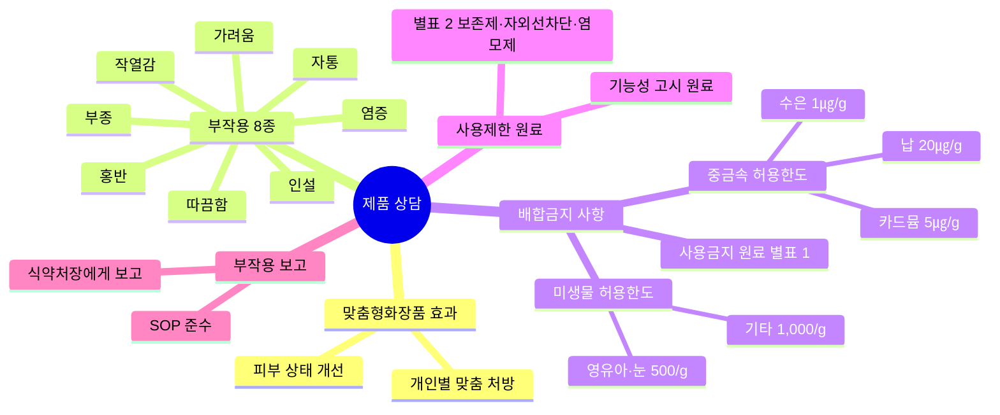

> **🗺️ 마인드맵 노드 상세 매핑**

| 대분류 | 중분류 | 소분류 | 핵심 포인트 |
| --- | --- | --- | --- |
| 맞춤형화장품 효과 | 해당 없음 | 해당 없음 | 맞춤형화장품 기대 효과 |
|  | 피부 상태 개선 |  | 고객 피부 상태 개선 |
|  | 개인별 맞춤 처방 |  | 개인 맞춤형 처방 제공 |
| 부작용 8종 | 해당 없음 |  | 부작용 8가지 증상 |
|  | 가려움 |  | 가려움증 발생 |
|  | 따끔함 |  | 피부 자극·따끔감 |
|  | 부종 |  | 부종·붓기 발생 |
|  | 염증 |  | 염증 반응 |
|  | 인설 |  | 인설·비늘 발생 |
|  | 자통 |  | 자통·통증 발생 |
|  | 작열감 |  | 화끔거림·작열감 |
|  | 홍반 |  | 홍반·붉어짐 |
| 배합금지 사항 | 해당 없음 |  | 배합금지 사항 확인 |
|  | 사용금지 원료 별표 1 |  | 별표 1 사용금지 원료 확인 |
|  | 중금속 허용한도 |  | 중금속 허용한도 준수 |
|  |  | 납 20㎍/g | 납 허용 한도 (분말 50/기타 20) |
|  |  | 수은 1㎍/g | 수은 허용 한도 |
|  |  | 카드뮴 5㎍/g | 카드뮴 허용 한도 |
|  | 미생물 허용한도 | 해당 없음 | 미생물 허용한도 준수 |
|  |  | 영유아·눈 500/g | 영유아·눈화장용 500/g |
|  |  | 기타 1,000/g | 기타 제품 1,000/g |
| 사용제한 원료 | 해당 없음 | 해당 없음 | 사용제한 원료 규정 |
|  | 별표 2 보존제·자외선차단·염모제 |  | 별표 2 제한 대상 원료 |
|  | 기능성 고시 원료 |  | 기능성 고시 원료 사용 제한 |
| 부작용 보고 | 해당 없음 |  | 부작용 보고 의무 |
|  | 식약처장에게 보고 |  | 식약처장에게 부작용 보고 |
|  | SOP 준수 |  | 표준작업절차(SOP) 준수 |

## 1. 맞춤형화장품의 효과

> 📌 **출처**: 화장품법 제3조의4 + 기능성화장품 심사 규정| **최종 확인**: 2026. 8. 29.

> ### 🎯 한 줄 핵심
>
> 개인 맞춤(피부 측정·테스트) + 다양한 소비 요구 충족 + 혼합·소분 가능.

① 맞춤형화장품을 통해 개인의 가치가 강조되는 사회·문화적 환경 변화에 따라 다양한 소비 요구 충족이 가능하다.

② 맞춤형화장품조제관리사를 통해 정확한 피부 측정과 테스트를 실시하여 자신의 피부와 요구에 맞는 제품을 사용할 수 있다.

③ 고객이 원하는 제품의 혼합 및 소분이 가능하다.

---

## 2. 맞춤형화장품의 부작용

> 📌 **출처**: 화장품법 제5조의2 + 위해사례 관리 지침| **최종 확인**: 2026. 8. 29.

> ### 🎯 한 줄 핵심
>
> 부작용 발생 시 식약처장에게 즉시 보고 + SOP에 따라 대응, 8가지 피부 부작용 증상 숙지.

① 맞춤형화장품으로 인한 부작용 사례가 발생하면 **식품의약품안전처장**에게 즉시 보고해야 한다.

② 문제 발생 시 대처하기 위한 **표준작업지침서(SOP: Standard Operating Procedures)**를 마련하고, 이에 따라 대응해야 한다.

> **용어 - 표준작업지침서(SOP)**
> 특정 업무를 표준화된 방법에 따라 일관되게 실시할 목적으로 절차 및 방법 등을 상세히 기술한 문서로, 고객관리 문제 발생 시 일관된 업무 수행을 위해 필요함

### 피부 부작용 증상

| 증상 | 설명 |
| --- | --- |
| 가려움 (Itching) | 참을 수 없이 피부를 긁고 싶은 충동. 소양감(Pruritus)이라고도 함 |
| 따끔거림 (Pricking) | 바늘로 찌르는 듯한 느낌 |
| 부종 (Edema) | 피부나 피하조직이 부은 상태로, 세포와 세포 사이에 수분이 비정상적으로 축적된 상태 |
| 염증 (Inflammation) | 생체조직의 방어 반응의 하나로, 주로 세균에 의한 감염이 많으며 붉거나 농이 지는 현상. 뾰루지, 트러블, 알레르기 등 |
| 인설 (Scale) | 표피의 각질이 은백색의 부스러기처럼 탈락하는 현상. 건선에 많이 발생함 |
| 자통 (Stinging) | 찌르고 따끔거리는 것과 같은 통증 |
| 작열감 (Burning) | 피부가 화끈거리거나 쓰린 느낌 |
| 홍반 (Erythema) | 모세혈관의 확장 또는 충혈로 인해 피부가 국소적으로 붉게 변하는 현상. 발적, 붉은 반점 등 |

> **참고 - 알레르기**
> 피부 감작성으로 모든 사람에게 발생하는 것이 아니라 인체 면역 기전이 과민한 일부의 경우에 유발되는 증상임

---

## 3. 배합금지 사항 확인·배합

> 📌 **출처**: 화장품 안전기준 (제2026-19호) 별표 1·2| **최종 확인**: 2026. 8. 29.

> ### 🎯 한 줄 핵심
>
> 별표 1 원료 배합 금지 + 비의도적 유입 시 중금속·유해물질 허용 한도 + 미생물 허용 한도(영유아/눈 500, 기타 1,000).

### (1) 중요 사용금지 원료 (그 외 원료는 별표 1 참고)

① 「화장품 안전 기준 등에 관한 규정」 중 [별표 1] 사용할 수 없는 원료로 고시된 원료는 맞춤형화장품에 배합을 금지한다.

② 맞춤형화장품에 사용할 수 없는 원료이나 조제 또는 보관 시 비의도적으로 다음의 원료가 유입되는 경우, 아래의 한도로 검출을 허용한다.

| 원료 | 검출 허용 한도 |
| --- | --- |
| 납 | 점토를 원료로 사용한 분말 제품 50㎍/g 이하, 그 밖의 제품은 20㎍/g 이하 |
| 니켈 | 눈화장용 제품 35㎍/g 이하, 색조화장용 제품 30㎍/g 이하, 그 밖의 제품은 10㎍/g 이하 |
| 비소 | 10㎍/g 이하 |
| 안티몬 | 10㎍/g 이하 |
| 카드뮴 | 5㎍/g 이하 |
| 수은 | 1㎍/g 이하 |
| 디옥산 | 100㎍/g 이하 |
| 메탄올 | 0.2(v/v)% 이하, 물휴지는 0.002%(v/v) 이하 |
| 포름알데하이드 | 2,000㎍/g 이하, 물휴지는 20㎍/g 이하 |
| 프탈레이트류 | 디부틸프탈레이트, 부틸벤질프탈레이트 및 디에칠헥실프탈레이트에 한하여 총합으로 100㎍/g 이하 |

> **참고**: 법령노트 p.12 참고

### (2) 화장품의 미생물 허용한도

| 구분 | 허용 한도 |
| --- | --- |
| 영유아용 제품류, 눈화장용 제품류 | 총호기성생균수 500개/g(mL) 이하 |
| 물휴지 | 세균 및 진균수 각각 100개/g(mL) 이하 |
| 기타 화장품류 | 총호기성생균수 1,000개/g(mL) 이하 |
| 모든 화장품류 | 대장균(Escherichia coli), 녹농균(Pseudomonas aeruginosa), 황색포도상구균(Staphylococcus aureus) 불검출 |

---

## 4. 내용물 및 원료의 사용제한 사항

> 📌 **출처**: 화장품 안전기준 (제2026-19호) 별표 1·2| **최종 확인**: 2026. 8. 29.

> ### 🎯 한 줄 핵심
>
> 별표 2(사용상 제한 필요 원료) + 기능성화장품 고시 원료(심사 받은 경우 제외)는 사용 제한.

아래의 원료는 사용을 제한한다.

① 「화장품 안전 기준 등에 관한 규정」 중 [별표 2] 사용상의 제한이 필요한 원료로 고시된 원료

② 기능성화장품의 효능·효과를 나타내는 고시 원료 (단, 화장품책임판매업자가 해당 원료를 포함하여 기능성화장품에 대한 심사를 받은 경우는 제외함)

> **참고**: 법령노트 p.40 참고

---
*출처: CHAPTER 04 · 제품 상담, PART 04 · 맞춤형화장품의 이해 (p.195~196)*

---

## 📊 피부 부작용 증상 비교표

> 📌 **출처**: 식약처 위해사례 관리 지침| **최종 확인**: 2026. 8. 29.

| 증상 | 영문 | 특징 | 주요 원인 |
| --- | --- | --- | --- |
| **가려움** | Itching | 피부를 긁고 싶은 충동(소양감) | 알레르기, 건조 |
| **따끔거림** | Pricking | 바늘로 찌르는 느낌 | 자극 성분 |
| **부종** | Edema | 세포 간 수분 비정상 축적 | 염증 반응 |
| **염증** | Inflammation | 방어 반응, 붉거나 농 | 세균 감염 |
| **인설** | Scale | 각질 은백색 부스러기 탈락 | 건선 |
| **자통** | Stinging | 찌르고 따끔거리는 통증 | 자극 |
| **작열감** | Burning | 화끈거리거나 쓰린 느낌 | 자극, 알레르기 |
| **홍반** | Erythema | 모세혈관 확장·충혈로 붉게 변 | 발적, 붉은 반점 |

## 📊 중금속·유해물질 검출 허용 한도 비교표

> 📌 **출처**: 화장품 안전기준 (제2026-19호)| **최종 확인**: 2026. 8. 29.

| 원료 | 일반 제품 | 특수 제품 | 비고 |
| --- | --- | --- | --- |
| **납** | 20㎍/g 이하 | 분말 50㎍/g 이하 | 점토 원료 사용 시 |
| **니켈** | 10㎍/g 이하 | 눈화장 35, 색조 30㎍/g | 부위별 차등 |
| **비소** | 10㎍/g 이하 | 해당 없음 | 전 제품 공통 |
| **안티몬** | 10㎍/g 이하 | 해당 없음 | 전 제품 공통 |
| **카드뮴** | 5㎍/g 이하 | 해당 없음 | 가장 엄격 |
| **수은** | 1㎍/g 이하 | 해당 없음 | 가장 엄격 |
| **디옥산** | 100㎍/g 이하 | 해당 없음 | 해당 없음 |
| **메탄올** | 0.2%(v/v) 이하 | 물휴지 0.002% | 물휴지는 더 엄격 |
| **포름알데하이드** | 2,000㎍/g 이하 | 물휴지 20㎍/g | 물휴지는 더 엄격 |
| **프탈레이트류** | 100㎍/g 이하(총합) | 해당 없음 | DBP+BBP+DEHP 총합 |

## 📊 미생물 허용 한도 비교표

> 📌 **출처**: 화장품 안전기준 (제2026-19호) + CGMP| **최종 확인**: 2026. 8. 29.

| 구분 | 호기성생균수 | 특정 균 |
| --- | --- | --- |
| **영유아용·눈화장용** | 500개/g(mL) 이하 | 대장균·녹농균·황색포도상구균 불검출 |
| **물휴지** | 세균·진균 각 100개/g(mL) 이하 | 동일 |
| **기타 화장품** | 1,000개/g(mL) 이하 | 동일 |

---

## ✅ 확인문제

> **문제 1.** 맞춤형화장품 부작용 발생 시 보고 의무로 옳은 것은?
>
> ① 화장품책임판매업자에게 보고

> ② 식품의약품안전처장에게 즉시 보고

> ③ 관할 보건소에 보고

> ④ 한국화장품협회에 보고
>
> **정답**: ② 식품의약품안전처장에게 즉시 보고
> **해설**: 맞춤형화장품으로 인한 부작용 사례가 발생하면 식품의약품안전처장에게 즈시 보고해야 하며, 문제 발생 시 대처하기 위한 표준작업지침서(SOP)를 마련하고 이에 따라 대응해야 한다.

> **문제 2.** 카드뮴의 검출 허용 한도는?
> ① 1㎍/g 이하 ② 5㎍/g 이하 ③ 10㎍/g 이하 ④ 20㎍/g 이하
>
> **정답**: ② 5㎍/g 이하
> **해설**: 카드뮴은 5㎍/g 이하로 검출을 허용한다. 수은(1㎍/g)이 가장 엄격하며, 그 다음이 카드뮴(5㎍/g), 비소·안티몬(10㎍/g), 납(20㎍/g, 분말 50㎍/g) 순이다.

> **문제 3.** 영유아용 제품의 미생물 허용 한도로 옳은 것은?
>
> ① 총호기성생균수 100개/g 이하

> ② 총호기성생균수 500개/g 이하

> ③ 총호기성생균수 1,000개/g 이하

> ④ 총호기성생균수 5,000개/g 이하
>
> **정답**: ② 총호기성생균수 500개/g(mL) 이하
> **해설**: 영유아용 제품류와 눈화장용 제품류는 총호기성생균수 500개/g(mL) 이하이며, 기타 화장품류는 1,000개/g(mL) 이하이다. 모든 화장품류에서 대장균, 녹농균, 황색포도상구균은 불검출이어야 한다.

> **문제 4.** 맞춤형화장품에 사용을 제한하는 원료가 아닌 것은?
>
> ① 별표 2에 고시된 사용상 제한이 필요한 원료

> ② 기능성화장품의 효능·효과를 나타내는 고시 원료

> ③ 심사를 받은 기능성화장품에 포함된 고시 원료

> ④ 별표 1에 고시된 사용할 수 없는 원료
>
> **정답**: ③ 심사를 받은 기능성화장품에 포함된 고시 원료
> **해설**: 사용 제한 원료는 별표 2(사용상 제한 필요 원료)와 기능성화장품 고시 원료이다. 단, 화장품책임판매업자가 해당 원료를 포함하여 기능성화장품에 대한 심사를 받은 경우는 제외된다. 별표 1은 배합 금지 원료이다.

---

## 📖 핵심 용어 정리

| 용어 | 핵심 포인트 |
| --- | --- |
| **맞춤형화장품 효과** | 개인 맞춤(피부 측정·테스트), 다양한 요구 충족, 혼합·소분 가능 |
| **부작용 보고** | 식약처장에게 즉시 보고 |
| **SOP** | 표준작업지침서, 일관된 업무 수행을 위한 절차·방법 기술 문서 |
| **가려움** | 소양감(Pruritus), 피부 긁고 싶은 충동 |
| **부종** | 세포 간 수분 비정상 축적 |
| **염증** | 생체조직 방어 반응, 세균 감염, 뾰루지·트러블·알레르기 |
| **인설** | 각질 은백색 부스러기 탈락, 건선에 다발 |
| **홍반** | 모세혈관 확장·충혈, 발적·붉은 반점 |
| **알레르기** | 피부 감작성, 면역 과민 일부에게 유발 |
| **배합금지 원료** | 별표 1 고시 원료 |
| **납 허용 한도** | 분말 50㎍/g, 기타 20㎍/g 이하 |
| **니켈 허용 한도** | 눈화장 35, 색조 30, 기타 10㎍/g 이하 |
| **수은 허용 한도** | 1㎍/g 이하 (가장 엄격) |
| **카드뮴 허용 한도** | 5㎍/g 이하 |
| **메탄올 허용 한도** | 0.2%(v/v), 물휴지 0.002% 이하 |
| **포름알데하이드** | 2,000㎍/g, 물휴지 20㎍/g 이하 |
| **프탈레이트류** | DBP+BBP+DEHP 총합 100㎍/g 이하 |
| **미생물(영유아·눈)** | 총호기성생균수 500개/g(mL) 이하 |
| **미생물(물휴지)** | 세균·진균 각 100개/g(mL) 이하 |
| **미생물(기타)** | 총호기성생균수 1,000개/g(mL) 이하 |
| **불검출 균** | 대장균, 녹농균, 황색포도상구균 |
| **사용제한 원료** | 별표 2(제한 필요 원료) + 기능성 고시 원료(심사 받은 경우 제외) |


---

## 📖 제품 안내
> 출처: `화장품법(법률)(제20901호)(20260402).pdf`

## Chapter 05. 제품 안내 (PART 04)

> 고득점 TIP: 1, 2차 소용량 포장에 표시사항과 맞춤형화장품 안전 기준 주요사항을 집중적으로 암기하세요.
>
> 🔗 **관련 과목**
> - 1과목 1챕터 "화장품법" — 기능성화장품 표시 의무, 안전용기·포장 규정 (제9조)
> - 3과목 5챕터 "포장재의 관리" — 1차·2차 포장 정의 및 포장재 입고 기준

---

> 📋 **학습 가이드**
> - 출제 빈도: ★★★★☆ (1차/2차/소용량 포장 표시사항, 가격표시제, 실증 범위·원칙, 금지 표현, 행정처분 기준, 안전 기준 7가지, 맞춤형화장품 장·단점)
> - 예상 소요 시간: 45분
> - 핵심 키워드: 1차 포장(명칭·상호·제조번호·사용기한), 2차 포장(+성분·용량·가격·주의사항), 소용량(10mL/10g 이하), 실증(15일 이내, 인체적용·인체 외 시험), 금지 표현(의약품 오인·기능성 오인), 행정처분(1차 3개월~4차 12개월), 안전 기준(혼합·소분 위생, 판매내역서, 부작용 보고)

---

## 1. 맞춤형화장품 표시사항

> 📌 **출처**: 화장품법 제3조의5 + 시행규칙 제19조| **최종 확인**: 2026. 8. 29.

> ### 🎯 한 줄 핵심
>
> 1차 포장(명칭·상호·제조번호·사용기한) + 2차 포장(+성분·용량·가격·주의사항·기능성 표시) + 소용량(명칭·상호·가격·제조번호·사용기한).

### (1) 맞춤형화장품 표시·기재사항

| 구분 | 표시·기재사항 |
| --- | --- |
| **1차 포장 필수 기재사항**<br>(단, 소비자가 화장품의 1차 포장을 제거하고 사용하는 고형비누 등 총리령으로 정하는 화장품의 경우에는 그러하지 아니함) | • 화장품의 명칭<br>• 영업자(화장품제조업자, 화장품책임판매업자, 맞춤형화장품판매업자)의 상호<br>• 제조번호(식별번호)<br>• 사용기한 또는 개봉 후 사용기간(개봉 후 사용기간의 경우 제조연월일 병기) |
| **1차 포장만으로 구성되는 화장품의 외부포장 / 화장품의 외부 포장**<br>(1차 포장에 2차 포장을 추가한 경우) | • 화장품의 명칭<br>• 영업자의 상호 및 주소<br>• 해당 화장품 제조에 사용된 모든 성분(인체에 무해한 소량 함유 성분 등 총리령으로 정하는 성분은 제외)<br>• 내용물의 용량 또는 중량<br>• 제조번호(식별번호)<br>• 사용기한 또는 개봉 후 사용기간(개봉 후 사용기간의 경우 제조연월일 병기)<br>• 가격<br>• 기능성화장품의 경우 '기능성화장품'이라는 글자 또는 기능성화장품을 나타내는 도안으로서 식품의약품안전처장이 정하는 도안<br>• 사용할 때의 주의사항<br>• 그 밖에 총리령으로 정하는 사항<br>&nbsp;&nbsp;- 기능성화장품의 경우 심사받거나 보고한 효능·효과, 용법·용량<br>&nbsp;&nbsp;- 성분명을 제품 명칭의 일부로 사용한 경우 그 성분명과 함량(방향용 제품은 제외함)<br>&nbsp;&nbsp;- 인체 세포·조직 배양액이 들어있는 경우 그 함량<br>&nbsp;&nbsp;- 제2조제8호부터 제11호까지에 해당하는 기능성화장품의 경우에는 '질병의 예방 및 치료를 위한 의약품이 아님'이라는 문구<br>&nbsp;&nbsp;- 다음 각 목의 어느 하나에 해당하는 경우 화장품 안전 기준 등에 따라 사용기준이 지정·고시된 원료 중 보존제의 함량<br>&nbsp;&nbsp;&nbsp;&nbsp;가. [별표 3] 제1호 가목에 따른 3세 이하의 영유아용 제품류인 경우<br>&nbsp;&nbsp;&nbsp;&nbsp;나. 4세 이상부터 13세 이하까지의 어린이가 사용할 수 있는 제품임을 특정하여 표시·광고하려는 경우 |
| **소용량 또는 비매품**<br>(1차 포장 또는 2차 포장) | • 화장품의 명칭<br>• 화장품책임판매업자 및 맞춤형화장품판매업자의 상호<br>• 가격(비매품인 경우 견본품이나 비매품 표시)<br>• 제조번호 또는 식별번호<br>• 사용기한 또는 개봉 후 사용기간(개봉 후 사용기간의 경우 제조연월일 병기) |

**[용어] 식별번호**: 원료의 제조번호와 혼합·소분 등의 기록을 추적할 수 있도록 맞춤형화장품판매업자가 부여한 번호

**[참고] 가격의 표시**: 화장품을 소비자에게 직접 판매하는 자는 그 제품의 포장에 판매하려는 가격을 일반 소비자가 알기 쉽도록 표시하되, 그 세부적인 표시 방법은 식품의약품안전처장이 정하여 고시함

**[참고] 제2조제8호부터 제11호까지에 해당하는 기능성화장품**
- 탈모 증상의 완화에 도움을 주는 화장품(코팅 등 물리적으로 모발을 굵게 보이게 하는 제품은 제외)
- 여드름성 피부를 완화하는 데 도움을 주는 화장품(인체 세정용 제품류로 한정함)
- 피부장벽(피부의 가장 바깥쪽에 존재하는 각질층의 표피)의 기능을 회복하여 가려움 등의 개선에 도움을 주는 화장품
- 튼살로 인한 붉은 선을 엷게 하는 데 도움을 주는 화장품

**[용어] 소용량 및 견본품**
1) 내용량이 10mL 이하 또는 10g 이하인 화장품의 포장(단, 소비자가 사용할 때 특별한 주의가 필요하여 식품의약품안전처장이 정하여 고시하는 화장품은 제외)
2) 판매 목적이 아닌 제품 선택 등을 위하여 소비자의 시험을 위한 제품

---

### (2) 화장품 가격표시제 실시요령

| 구분 | 내용 |
| --- | --- |
| **목적** | 「화장품법」 제11조, 같은 법 시행규칙 제20조 및 「물가안정에 관한 법률」 제3조의 규정에 의해 화장품을 판매하는 자에게 당해 품목의 실제거래 가격을 표시하도록 함으로써 소비자의 보호와 공정한 거래를 도모함 |
| **표시의무자** | • 화장품을 일반소비자에게 소매 점포에서 판매하는 경우: 소매업자(직매장을 포함)<br>• 방문판매업·후원방문판매업, 통신판매업: 그 판매업자<br>• 다단계판매업의 경우: 그 판매자 |
| **판매가격** | 화장품을 일반 소비자에게 판매하는 실제 가격 |
| **표시 대상** | 국내에서 제조되거나 수입되어 국내에서 판매되는 모든 화장품 |
| **가격표시** | 일반소비자에게 판매되는 실제 거래가격을 표시해야 함 |
| **표시 방법** | • 판매가격의 표시는 유통단계에서 쉽게 훼손되거나 지워지지 않으며 분리되지 않도록 스티커 또는 꼬리표를 표시해야 함<br>• 판매가격이 변경되었을 경우에는 기존의 가격표시가 보이지 않도록 변경 표시해야 함. 다만, 판매자가 기간을 특정하여 판매가격을 변경하기 위해 그 기간을 소비자에게 알리고, 소비자가 판매가격을 기존가격과 오인·혼동할 우려가 없도록 명확히 구분하여 표시하는 경우는 제외함<br>• 판매가격은 개별 제품에 스티커 등을 부착하여야 함. 다만, 개별 제품으로 구성된 종합제품으로서 분리하여 판매하지 않는 경우에는 그 종합제품에 일괄하여 표시할 수 있음<br>• 판매자는 업태, 취급제품의 종류 및 내부 진열상태 등에 따라 개별 제품에 가격을 표시하는 것이 곤란한 경우에는 소비자가 가장 쉽게 알아볼 수 있도록 제품명, 가격이 포함된 정보를 제시하는 방법으로 판매가격을 별도로 표시할 수 있음. 이 경우 화장품 개별 제품에는 판매가격을 표시하지 아니할 수 있음<br>• 판매가격의 표시는 「판매가 ○○원」 등으로 소비자가 알아보기 쉽도록 선명하게 표시하여야 함 |
| **가격관리 기본지침** | • 특별시장, 광역시장, 특별자치시장, 도지사 또는 제주특별자치도지사(이하 "시·도지사")는 매년 식품의약품안전처장이 시달하는 가격관리 기본지침에 따라 화장품 가격표시제도 실시현황을 지도·감독하여야 함<br>• 기본 지침에는 다음 사항이 포함되어야 함<br>&nbsp;&nbsp;- 가격표시 사후 관리 및 감독에 관한 사항<br>&nbsp;&nbsp;- 가격표시 정착을 위한 교육 및 홍보에 관한 사항<br>&nbsp;&nbsp;- 기타 가격표시제 실시에 관하여 필요한 사항<br>• 시·도지사는 시달된 기본지침에 따라 그 관할 구역안의 실정에 맞는 세부시행지침을 수립하여 시행하여야 함 |
| **모범업소 우대조치** | • 지방자치단체는 화장품 판매가격을 성실히 이행하는 화장품 판매업소를 모범업소로 지정할 수 있음<br>• 모범업소에 대하여 국가 또는 지방자치단체는 다른 법률이 정하는 바에 따라 세제지원, 금융지원, 표창 등의 우대조치를 부여할 수 있음 |
| **홍보·계몽** | 식품의약품안전처장은 관련단체장을 통하여 화장품 가격표시가 적정하게 이루어지고 건전한 화장품 가격질서가 확립될 수 있도록 홍보·계몽할 수 있음 |
| **보고** | 시·도지사는 가격표시제 운영에 관한 연간 추진실적을 다음 연도 1월 말까지 식품의약품안전처장에게 보고해야 함 |
| **재검토기한** | 식품의약품안전처장은 「훈령·예규 등의 발령 및 관리에 관한 규정」에 따라 이 고시에 대하여 2016년 7월 1일 기준으로 매 3년이 되는 시점(매 3년째의 6월 30일까지를 말함)마다 그 타당성을 검토하여 개선 등의 조치를 해야 함 |

---

### (3) 화장품의 가격 기재·표시상 주의사항

① 화장품을 소비자에게 직접 판매하는 자는 제품의 가격을 일반 소비자가 알기 쉽도록 표기해야 함

② 한글로 읽기 쉽도록 기재·표시할 것(한자 또는 한국어를 함께 적을 수 있고, 수출용의 경우 그 수출 대상국의 언어 가능)

③ 화장품의 성분은 표준화된 일반명을 사용할 것

---

### (4) 포장의 표시 기준 및 표시 방법

① 화장품의 명칭은 다른 제품과 구별할 수 있도록 표시된 것으로서 같은 화장품책임판매업자 또는 맞춤형화장품판매업자의 여러 제품에서 공통으로 사용하는 명칭을 포함한다.

② 화장품제조업자, 화장품책임판매업자 및 맞춤형화장품판매업자의 주소는 등록필증 또는 신고필증에 적힌 소재지 또는 반품·교환 업무를 대표하는 소재지를 기재·표시해야 한다.

③ 화장품제조업자, 화장품책임판매업자 또는 맞춤형화장품판매업자는 각각 구분하여 기재·표시해야 한다. 다만, 화장품제조업자, 화장품책임판매업자 또는 맞춤형화장품판매업자가 다른 영업을 함께 영위하고 있는 경우는 한꺼번에 기재·표시할 수 있다.

④ 공정별로 2개 이상의 제조소에서 생산된 화장품의 경우에는 일부 공정을 수탁한 화장품제조업자의 상호 및 주소의 기재·표시를 생략할 수 있다.

⑤ 수입화장품의 경우에는 추가로 기재·표시하는 제조국의 명칭, 제조회사명 및 그 소재지를 국내 '화장품제조업자'와 구분하여 기재·표시해야 한다.

⑥ 화장품의 1차 포장 또는 2차 포장의 무게가 포함되지 않은 용량 또는 중량을 기재·표시해야 한다. 화장비누(고체 형태의 세안용 비누를 말함)의 경우에는 수분을 포함한 중량과 건조 중량을 함께 기재·표시한다.

⑦ 제조번호는 사용기한(또는 개봉 후 사용기간)과 쉽게 구별되도록 기재·표시해야 하며, 개봉 후 사용기간을 표시하는 경우에는 병행 표기해야 하는 제조연월일(맞춤형화장품의 경우에는 혼합·소분일)도 각각 구별이 가능하도록 기재·표시해야 한다.

⑧ 일부 기능성화장품의 경우 '질병의 예방 및 치료를 위한 의약품이 아님'이라는 문구는 식품의약품안전처장이 정하는 도안에 따른 '기능성화장품' 글자 바로 아래에 이와 동일한 글자 크기 이상으로 기재·표시해야 한다.

**[참고] 기능성화장품 도안**: 원형 배지에 "기능성화장품" 문구, 하단에 "식품의약품안전처" 표기

---

## 2. 표시·광고 관련 사항

> 📌 **출처**: 화장품법 제13조~제14조 + 제3조의5| **최종 확인**: 2026. 8. 29.

> ### 🎯 한 줄 핵심
>
> 실증 의무(15일 이내 제출, 인체적용/인체 외 시험) + 금지 표현(의약품·기능성 오인) + 행정처분(1차 3개월~4차 12개월).

### (1) 표시·광고에 따른 실증 범위

화장품제조업자, 화장품책임판매업자 또는 맞춤형화장품판매업자가 제출해야 하는 실증 자료의 범위 및 요건(자료 제출 요청일로부터 15일 이내 제출)

① **시험 결과**: 인체적용시험 자료, 인체 외 시험 자료 또는 같은 수준 이상의 조사자료일 것

② **조사 결과**: 표본설정, 질문사항, 질문 방법이 그 조사의 목적이나 통계상의 방법과 일치할 것

③ **실증 방법**: 실증에 사용되는 시험 또는 조사의 방법은 학술적으로 널리 알려져 있거나 관련 산업 분야에서 일반적으로 인정되는 방법 등으로서 과학적이고 객관적인 방법일 것

### (2) 표시·광고에 따른 실증의 원칙

① 화장품제조업자, 화장품책임판매업자, 맞춤형화장품판매업자는 표시·광고 중 사실과 관련한 사항에 대해 실증할 수 있어야 한다.

② 식품의약품안전처장은 표시·광고가 실증이 필요한 경우 내용을 구체적으로 명시하여 관련 자료 제출을 요청할 수 있다.

| 실증 대상 | 필요한 실증 자료 |
| --- | --- |
| • 여드름성 피부에 사용 적합<br>• 항균(인체 세정용 제품에 한함)<br>• 일시적 셀룰라이트 감소<br>• 붓기, 다크서클 완화, 피부 혈행 개선<br>• 피부장벽 손상의 개선에 도움<br>• 피부 피지분비 조절<br>• 미세먼지 차단, 미세먼지 흡착 방지 | 인체적용시험 자료로 입증 |
| • 모발의 손상 개선, 피부노화 완화, 안티에이징, 피부노화 징후 감소<br>• 화장품 효능·효과에 관한 내용<br>• 타 제품과 비교하는 내용의 표시·광고<br>• 시험·검사와 관련된 표현 | 인체적용시험 자료 또는 인체 외 시험 자료로 입증 |
| • 콜라겐 증가·감소 또는 활성화<br>• 효소 증가·감소 또는 활성화<br>• 빠지는 모발을 감소 | 기능성화장품에 해당 기능을 실증한 자료로 입증 |
| • 기미·주근깨 완화에 도움 | 미백 기능성화장품 심사(보고) 자료로 입증 |
| • 제품에 특정 성분이 들어 있지 않다는 '무(無)○○' 표현 | 시험분석자료로 입증(배합금지 원료를 사용하지 않았다는 표현을 제외한 경우에 한함) |

### 표시·광고 주요 실증 대상 (상세)

| 구분 | 실증 대상 | 비고 |
| --- | --- | --- |
| 「화장품 표시·광고 실증에 관한 규정」에 따른 표현 | 여드름성 피부에 사용에 적합, 항균(인체세정용 제품에 한함), 일시적 셀룰라이트 감소, 붓기 완화, 다크서클 완화, 피부 혈행 개선, 피부장벽 손상의 개선에 도움, 피부 피지분비 조절, 미세먼지 차단·흡착 방지 | 인체적용시험 자료로 입증 |
|  | 모발의 손상을 개선 | 인체적용시험 자료, 인체 외 시험 자료로 입증 |
|  | 피부노화 완화, 안티에이징, 피부노화 징후 감소 | 인체적용시험 자료, 인체 외 시험 자료로 입증(단, 자외선 차단·주름 개선 등 기능성 효능·효과를 통한 피부노화 완화 표현의 경우 기능성화장품 심사(보고) 자료를 근거자료로 활용 가능) |
|  | 콜라겐 증가·감소 또는 활성화, 효소 증가·감소 또는 활성화 | 주름 완화 또는 개선 기능성화장품으로서 이미 심사받은 자료에 포함되어 있거나 해당 기능을 별도로 실증한 자료로 입증 |
|  | 기미, 주근깨 완화에 도움 | 미백 기능성화장품 심사(보고) 자료로 입증 |
|  | 빠지는 모발을 감소시킴 | 탈모 증상 완화에 도움을 주는 기능성화장품으로서 이미 심사받은 자료에 근거가 포함되어 있거나 해당 기능을 별도로 실증한 자료로 입증 |
| 효능·효과·품질에 관한 내용 | 화장품의 효능·효과에 관한 내용 (예: 수분감 30% 개선 효과, 피부결 20% 개선, 2주 경과 후 피부톤 개선) | 인체적용시험 자료 또는 인체 외 시험 자료로 입증 |
|  | 시험·검사와 관련된 표현 (예: 피부과 테스트 완료, ○○시험검사기관의 ○○ 효과 입증) | 인체적용시험 자료 또는 인체 외 시험 자료로 입증 |
|  | 타 제품과 비교하는 내용의 표시·광고 (예: "○○보다 지속력이 5배 높음") | 인체적용시험 자료 또는 인체 외 시험 자료로 입증 |
|  | 제품에 특정 성분이 들어있지 않다는 '무(無) ○○' 표현 | 시험 분석 자료로 입증(단, 특정 성분이 타 물질로의 변환 가능성이 없으면서 시험으로 해당 성분 함유 여부에 대한 입증이 불가능한 특별한 사정이 있는 경우에는 예외적으로 제조관리기록서나 원료시험성적서 등 활용) |
| ISO 천연·유기농 지수 표시·광고 | ISO 천연·유기농 지수 표시·광고 (예: 천연지수 ○○%, 천연유래지수 ○○%, 유기농지수 ○○%(ISO 16128 계산 적용)) | 해당 완제품 관련 실증 자료로 입증[이 경우 ISO 16128(가이드라인)에 따른 계산이라는 것과 소비자 오인을 방지하기 위한 문구도 함께 안내 필요] |

---

### (3) 표시·광고의 금지 표현

| 구분 | 금지 표현 | 비고 |
| --- | --- | --- |
| **질병을 진단·치료·경감·처치 또는 예방, 의학적 효능·효과 관련** | 아토피, 심신피로 회복, 노인소양증, 항염·진통, 이뇨, 항진균·항바이러스, 통증 경감, 찰과상·화상 치료·회복, 관절·림프선 등 피부 이외 신체 특정 부위에 사용하여 의학적 효능·효과 표방, 모낭충, 건선, 살균·소독, 해독, 항암, 근육 이완, 면역 강화, 항알레르기, 기저귀 발진 | 해당 없음 |
|  | 여드름 | 단, 기능성화장품의 심사(보고)된 '효능·효과' 또는 실증 대상 표현은 제외 |
|  | 기미, 주근깨(과색소침착증) | 단, 실증 대상 표현은 제외 |
| **항균** | 임신선, 튼살 | 단, 인체세정용 제품에 한해 인체적용시험 자료로 입증되면 제외하되, 액체비누에 대해 트리클로산 또는 트리클로카반 함유로 인해 항균에 대해 '더 뛰어나다', '더 좋다' 등의 비교 표시·광고는 금지 |
|  | 피부 독소 제거(디톡스, Detox) | 단, 기능성화장품의 심사(보고)된 '효능·효과' 표현은 제외 |
|  | 상처로 인한 반흔 제거 또는 완화 | 해당 없음 |
| **피부 관련** | 가려움 완화 | 단, 보습을 통해 피부건조에 기인한 가려움의 일시적 완화에 도움을 준다는 표현은 제외 |
|  | ○○○의 흔적을 없애줌 (예: 여드름, 흉터의 흔적 제거) | 해당 없음 |
|  | 홍조, 홍반 개선, 제거 | 해당 없음 |
|  | 뾰루지 개선 | 단, (색조 화장용 제품류 등으로서) '가려준다'는 표현은 제외 |
|  | 피부의 상처나 질병으로 인한 손상을 치료하거나 회복 또는 복구 | 해당 없음 |
|  | 피부노화, 셀룰라이트, 붓기·다크서클, 피부구성 물질(예: 효소, 콜라겐 등) 증가·감소 또는 활성화 | 일부 단어만 사용하는 경우도 포함(단, 실증 대상 표현은 제외) |
| **모발 관련** | 발모·육모·양모, 탈모 방지·탈모 치료, 모발 등의 성장을 촉진 또는 억제, 모발의 두께 증가, 속눈썹·눈썹이 자람 | 단, 기능성화장품의 심사(보고)된 '효능·효과' 표현은 제외 |
| **생리활성 관련** | 혈액순환, 피부 재생·세포 재생, 호르몬 분비 촉진 등 내분비 작용, 유익균의 균형 보호, 질내 산도 유지·질염 예방, 땀 발생 억제, 세포 성장 촉진, 세포 활력(증가), 세포 또는 유전자(DNA) 활성화 | 해당 없음 |
| **신체개선** | 다이어트·체중 감량, 피하지방 분해, 체형 변화, 몸매 개선·신체 일부를 날씬하게 함, 가슴에 탄력을 주거나 확대시킴, 얼굴 크기가 작아짐, 얼굴 윤곽 개선·V라인 | 단, (색조 화장용 제품류 등으로서) '연출한다'는 의미의 표현을 함께 나타내는 경우 제외 |
| **원료 관련 (의약품 오인)** | 원료 관련 설명 시 의약품 오인 우려 표현 사용(논문 등을 통한 간접적인 의약품 오인 정보 제공 포함) | 해당 없음 |
| **기타** | 메디슨(Medicine), 드럭(Drug), 코스메슈티컬(Cosmeceutical) 등을 사용한 의약품 오인 우려 표현 | 해당 없음 |
| **기능성 관련** | 기능성화장품으로 심사(보고)하지 아니한 제품에 미백, 화이트닝(Whitening), 주름(링클, Wrinkle) 개선, 자외선(UV) 차단 등 기능성 관련 표현 | 해당 없음 |
|  | 기능성화장품 심사(보고) 결과와 다른 내용의 표시·광고, 또는 기능성화장품 안전성·유효성에 관한 심사를 받은 범위를 벗어나는 표시·광고 | 해당 없음 |
| **원료 관련 (기능성 오인)** | 기능성화장품으로 심사(보고)하지 아니한 제품에 '식약처 미백 고시 성분 ○○ 함유' 등의 표현 | 해당 없음 |
|  | 기능성 효능·효과 성분이 아닌 다른 성분으로 기능성을 표방하는 표현 | 해당 없음 |
|  | 원료 관련 설명 시 기능성 오인 우려 표현(주름 개선 효과가 있는 ○○ 원료) | 해당 없음 |
|  | 원료 관련 설명 시 완제품에 대한 효능·효과로 오인될 수 있는 표현 | 해당 없음 |
| **특정인 또는 기관의 지정·공인 관련** | ○○ 아토피 협회 인증 화장품, ○○ 의료기관의 첨단기술의 정수가 탄생시킨 화장품, ○○ 대학교 출신 의사가 공동 개발한 화장품, ○○ 의사가 개발한 화장품, ○○ 병원에서 추천하는 안전한 화장품 | 해당 없음 |
| **화장품의 범위를 벗어나는 광고** | 배합금지 원료를 사용하지 않았다는 표현(무첨가, Free 포함)(예: 無(무)스테로이드, 無(무)벤조피렌 등), 부작용이 전혀 없음, 먹을 수 있음, 일시적 악화(명현현상)가 있을 수 있음, 지방볼륨 생성, 보톡스, 레이저·카복시 등 시술 관련 표현 | 해당 없음 |
|  | 체내 노폐물 제거 | 단, 피부·모공 노폐물 제거 관련 표현 제외 |
|  | 필러(Filler) | 단, (색조 화장용 제품류 등으로서) '채워준다', '연출한다'는 의미의 표현을 함께 나타내는 경우 제외 |
| **줄기세포 관련** | 특정인의 '인체 세포·조직 배양액' 기원 표현, 줄기세포가 들어있는 것으로 오인할 수 있는 표현(다만, 식물 줄기세포 함유 화장품의 경우에는 제외)(예: 줄기세포 화장품, Stem Cell, ○억 세포 등) | 「화장품 안전 기준 등에 관한 규정」 별표 3에 적합한 원료를 사용한 경우에만 불특정인의 '인체세포·조직 배양액' 표현 가능 |
| **저속하거나 혐오감을 줄 수 있는 표현** | 성생활에 도움을 줄 수 있음을 암시하는 표현(여성크림, 성 윤활 작용, 쾌감 증대, 질 보습, 질 수축 작용), 저속하거나 혐오감을 주는 표시 및 광고(성기 사진 등의 여과 없는 게시, 남녀의 성행위를 묘사하는 표시 또는 광고) | 해당 없음 |
| **그 밖의 기타 표현** | 해당 제품은 식품의약품안전처 허가, 인증을 받은 제품임 | 단, 기능성화장품으로 심사(보고)된 '효능·효과' 표현 제외 |
|  | 원료 관련 설명 시 완제품에 대한 효능·효과로 오인될 수 있는 표현 | 해당 없음 |

---

### (4) 표시·광고 관련 행정처분

위반행위가 둘 이상인 경우에는 그 중 무거운 처분 기준에 따른다. 다만, 둘 이상의 처분 기준이 영업정지인 경우에는 무거운 처분의 영업정지 기간의 2분의 1까지 더해 처분할 수 있으며, 이 경우 최대기간을 12개월로 한다.

| 위반 내용 | 1차 위반 | 2차 위반 | 3차 위반 | 4차 위반 |
| --- | --- | --- | --- | --- |
| 화장품의 명칭, 영업자의 상호 및 주소 기재사항(가격은 제외함)의 전부를 기재하지 않은 경우 | 해당 품목 판매 업무정지 3개월 | 해당 품목 판매 업무정지 6개월 | 해당 품목 판매 업무정지 12개월 | 해당 없음 |
| 화장품의 명칭, 영업자의 상호 및 주소 기재사항(가격은 제외함)을 거짓으로 기재한 경우 | 해당 품목 판매 업무정지 1개월 | 해당 품목 판매 업무정지 3개월 | 해당 품목 판매 업무정지 6개월 | 해당 품목 판매 업무정지 12개월 |
| 화장품의 명칭, 영업자의 상호 및 주소 기재사항(가격은 제외함)의 일부를 기재하지 않은 경우 | 해당 품목 판매 업무정지 15일 | 해당 품목 판매 업무정지 1개월 | 해당 품목 판매 업무정지 3개월 | 해당 품목 판매 업무정지 6개월 |
| • 기능성화장품, 의약품으로 잘못 인식할 우려가 있는 경우<br>• 사실 유무와 관계없이 다른 제품을 비방하거나 비방한다고 의심이 되는 경우<br>• 화장품의 표시·광고 시 준수사항을 위반한 경우 | 해당 품목 판매 업무정지 3개월(표시위반) 또는 해당 품목 광고 업무정지 3개월(광고위반) | 해당 품목 판매 업무정지 6개월(표시위반) 또는 해당 품목 광고 업무정지 6개월(광고위반) | 해당 품목 판매 업무정지 9개월(표시위반) 또는 해당 품목 광고 업무정지 9개월(광고위반) | 해당 없음 |
| • 의사·치과의사·한의사·약사·의료기관 또는 그 밖의 자가 이를 지정·공인·추천·지도·연구·개발 또는 사용하고 있다는 내용이나 이를 암시하는 등의 경우(다만, 인체적용시험 결과가 관련 학회 발표 등을 통해 공인된 경우에는 그 범위에서 관련 문헌을 인용 가능)<br>• 외국제품을 국내제품으로 또는 국내제품을 외국제품으로 잘못 인식할 우려가 있는 경우<br>• 외국과의 기술제휴를 하지 않고 외국과의 기술제휴 등을 표현한 경우<br>• 경쟁상품과 비교하는 객관적으로 확인될 수 있는 사항만을 표시·광고하여야 하며, 배타성을 띤 '최고' 또는 '최상' 등의 절대적 표현의 표시·광고의 경우<br>• 소비자가 잘못 인식할 우려가 있거나 소비자를 속이거나 소비자가 속을 우려가 있는 표시·광고의 경우<br>• 화장품의 범위를 벗어나는 표시·광고를 하는 경우<br>• 저속하거나 혐오감을 주는 표현·도안·사진 등을 이용하는 표시·광고의 경우<br>• 국제적 멸종위기종의 가공품이 함유된 화장품임을 표현하거나 암시하는 표시·광고의 경우 | 해당 품목 판매 업무정지 2개월(표시위반) 또는 해당 품목 광고 업무정지 2개월(광고위반) | 해당 품목 판매 업무정지 4개월(표시위반) 또는 해당 품목 광고 업무정지 4개월(광고위반) | 해당 품목 판매 업무정지 6개월(표시위반) 또는 해당 품목 광고 업무정지 6개월(광고위반) | 해당 품목 판매 업무정지 12개월(표시위반) 또는 해당 품목 광고 업무정지 12개월(광고위반) |
| 실증 자료 제출 명령을 어겨 표시·광고 행위 중지명령을 받았으나 이를 위반하여 표시·광고한 경우 | 해당 품목 판매 업무정지 3개월 | 해당 품목 판매 업무정지 6개월 | 해당 품목 판매 업무정지 12개월 | 해당 없음 |

---

### (5) 기타 표시·광고 관련 사항

① 「화장품 사용 시의 주의사항 및 알레르기 유발 성분 표시에 관한 규정」에 따라 착향제 성분 중 알레르기 유발 물질 25종은 의무적으로 표시

② 추출물을 원료로 하는 화장품에서 추출물 함량을 표시하여 화장품 표시·광고를 할 때에는 소비자 오인을 줄이기 위하여 「화장품 표시·광고 관리 지침」을 참고하여 표시·기재해야 함
- 화장품 완제품을 기준으로 희석용매 등의 함량을 제외한 추출된 물질의 함량을 표시·기재함
- 추출물의 함량은 추출된 물질(예: 녹차 추출물)과 희석용매(예: 침제수) 등을 분리하여 작성된 원료의 조성 정보에 관한 자료 및 제품에서 해당 원료의 사용량을 확인할 수 있는 자료로 입증함

**[예시]**

| A 원료 조성비 |  | 완제품 조성비 |  |
| --- | --- | --- | --- |
| 정제수 | 80% | 정제수 | 60% |
| 녹차추출물 | 10% | A 원료 | 20% |
| C 보존제 | 5% | B 원료 | 10% |
| D 첨가제 | 5% | E 보존제 | 3% |
|  |  | C 보존제 | 1% |
|  |  | D 첨가제 | 1% |
|  |  | 향료 | 5% |

→ **2% 녹차추출물**

---

### (6) 영유아 또는 어린이 사용 화장품의 표시·광고 관련

아래 두 경우에는 제품별로 안전과 품질을 입증할 수 있는 제품별 안전성 자료를 작성 및 보관하여야 하며, 보존제 함량을 의무적으로 표시해야 한다.

| 구분 | 내용 |
| --- | --- |
| **표시의 경우** | 화장품의 1차 포장 또는 2차 포장에 영유아 또는 어린이가 사용할 수 있는 화장품임을 특정하여 표시(화장품의 용기·포장에 기재하는 문자·숫자·도형 또는 그림 등)하는 경우(화장품의 명칭에 영유아 또는 어린이에 관한 표현이 표시되는 경우를 포함함) |
| **광고의 경우** | 아래 규정에 따른 매체·수단 또는 해당 매체·수단과 유사하다고 식품의약품안전처장이 정하여 고시하는 매체·수단에 영유아 또는 어린이가 사용할 수 있는 화장품임을 특정하여 광고하는 경우<br>• 신문·방송 또는 잡지<br>• 전단·팜플릿·견본 또는 입장권, 인터넷 또는 컴퓨터통신<br>• 포스터·간판·네온사인·애드벌룬 또는 전광판<br>• 비디오물·음반·서적·간행물·영화 또는 연극<br>• 방문광고 또는 실연(實演)에 의한 광고(어린이 사용 화장품의 경우에는 제외함) |

**[참고] 제품별 안전성 자료**
- 제품 및 제조방법에 대한 설명 자료
- 화장품의 안전성 평가 자료
- 제품의 효능·효과에 대한 증명 자료

### (7) 제품별 안전성 자료의 보관기간

- 화장품의 1차 포장에 사용기한을 표시하는 경우: 영유아 또는 어린이가 사용할 수 있는 화장품임을 표시·광고한 날부터 마지막으로 제조·수입된 제품의 사용기한 만료일 이후 1년까지의 기간
- 화장품의 1차 포장에 개봉 후 사용기간을 표시하는 경우: 영유아 또는 어린이가 사용할 수 있는 화장품임을 표시·광고한 날부터 마지막으로 제조·수입된 제품의 제조연월일 이후 3년까지의 기간 동안 보관, 수입은 통관일자를 기준으로 함
- *제조는 화장품의 제조번호에 따른 제조일자를 기준으로 함

**[확인문제]** 맞춤형화장품판매업자는 혼합·소분 제품을 보관·판매 시 (제조번호) 또는 사용기한을 확인해야 한다.

> **해설**: 맞춤형화장품판매업자는 혼합·소분 전에 내용물 및 원료의 사용기한 또는 개봉 후 사용기간을 확인해야 하며, 사용기한이 지난 것은 사용하지 않아야 한다. 또한 혼합·소분에 사용되는 내용물의 사용기한을 초과하여 맞춤형화장품의 사용기한을 정하지 않아야 한다.

---

## 3. 맞춤형화장품 안전 기준의 주요사항

> 📌 **출처**: 화장품법 제3조의4 + 안전기준 (제2026-19호)| **최종 확인**: 2026. 8. 29.

> ### 🎯 한 줄 핵심
>
> 시설 점검 + 혼합·소분 위생 관리(손 소독·기구 세척·사용기한 확인) + 미생물 관리 + 판매내역서 작성·보관 + 부작용 보고(식약처장).

> ① 맞춤형화장품 판매장 시설·기구를 정기적으로 점검하여 보건위생상 위해가 없도록 관리할 것

> ② **혼합·소분 안전관리 기준**

| 단계 | 기준 사항 | 비고 |
| --- | --- | --- |
| 사전 품질 확보 | 혼합·소분 범위에 대해 사전에 품질 및 안전성 확보 | 공급업자가 범위를 정한 경우 그 범위 내에서 실시 |
| 원료 안전성 확인 | 「화장품법」 제8조 화장품 안전기준 등에 적합한 것 확인 |  |
| 손 소독·세정 | 혼합·소분 전 손을 소독하거나 세정 | **일회용 장갑 착용 시 예외** |
| 포장용기 확인 | 제품을 담을 포장용기의 오염 여부 확인 |  |
| 장비·기구 위생 | 사용 전 위생 상태 점검, 사용 후 오염 없도록 세척 |  |
| 사용기한 확인 | 내용물·원료의 사용기한 또는 개봉 후 사용기간 확인, 경과 시 사용 금지 |  |
| 사용기한 초과 금지 | 내용물의 사용기한을 초과하여 맞춤형화장품의 사용기한을 정하지 않을 것 |  |
| 잔여물 관리 | 남은 내용물·원료는 밀폐 마개 사용 등 비의도적 오염 방지 |  |
| 미리 혼합·소분 금지 | 소비자 피부 상태·선호도 확인 없이 미리 혼합·소분하여 보관·판매 금지 |  |

③ 최종 혼합·소분된 맞춤형화장품은 유통화장품의 안전관리 기준을 준수할 것. 특히, 판매장에서 제공되는 맞춤형화장품에 대한 미생물 오염관리를 철저히 할 것
&nbsp;&nbsp;예) 주기적 미생물 샘플링 검사

④ 맞춤형화장품 판매내역서를 작성·보관할 것(전자문서로 된 판매내역서를 포함함)
- 제조번호(맞춤형화장품의 경우 식별번호를 제조번호로 함)
- 사용기한 또는 개봉 후 사용기간
- 판매일자 및 판매량

⑤ 원료 및 내용물의 입고, 사용, 폐기 내역 등에 대해 기록·관리할 것

⑥ 맞춤형화장품 판매 시 다음의 사항을 소비자에게 설명할 것
- 혼합·소분에 사용되는 내용물 또는 원료의 특성
- 맞춤형화장품 사용 시의 주의사항

⑦ 맞춤형화장품 사용과 관련된 부작용 발생사례에 대해서는 지체 없이 식품의약품안전처장에게 보고할 것

---

## 4. 맞춤형화장품의 특징

> 📌 **출처**: 화장품법 제3조의2~제3조의8| **최종 확인**: 2026. 8. 29.

> ### 🎯 한 줄 핵심
>
> 장점(개인 맞춤·전문가 조언·심리적 만족·혼합·소분) vs 단점(사용 후기 부족·혼합 조건에 따른 안정성 변화).

### (1) 맞춤형화장품의 장점

① 개인의 가치가 강조되는 사회·문화적 환경 변화에 따라 사용자의 다양한 소비 욕구를 충족시킬 수 있다.

② 전문가의 조언을 통해 사용자의 기호와 특성에 맞는 화장품과 원료를 선택할 수 있다.

③ 피부에 적합한 화장품을 사용하므로 심리적 만족을 느낄 수 있다.

④ 개인별 피부 특성이나 색·향 등의 취향에 따라 제조·수입한 화장품을 혼합 및 소분하여 판매할 수 있다.

### (2) 맞춤형화장품의 단점

① 동일 제품에 대한 사용 후기나 평가 등을 확인하기가 어렵다.

② 혼합 조건에 따라 제품의 안정성이 변화될 수 있다.

---

*(원문 출처: 맞춤형화장품의 이해 교재, CHAPTER 05 제품 안내, PART 04, pp.199~209)*

---

## 📊 1차 vs 2차 vs 소용량 포장 표시사항 비교표

> 📌 **출처**: 화장품법 시행규칙 제19조| **최종 확인**: 2026. 8. 29.

| 구분 | 1차 포장 | 2차 포장(외부) | 소용량/비매품 |
| --- | --- | --- | --- |
| **명칭** | ✔ | ✔ | ✔ |
| **상호** | ✔ | ✔+주소 | ✔(책임판매·맞춤 판매업자) |
| **성분** | 해당 없음 | ✔(전성분) | 해당 없음 |
| **용량/중량** | 해당 없음 | ✔ | 해당 없음 |
| **제조번호/식별번호** | ✔ | ✔ | ✔ |
| **사용기한** | ✔ | ✔ | ✔ |
| **가격** | 해당 없음 | ✔ | ✔(비매품은 견본품 표시) |
| **기능성화장품 표시** | 해당 없음 | ✔ | 해당 없음 |
| **주의사항** | 해당 없음 | ✔ | 해당 없음 |

## 📊 실증 자료 종류 비교표

> 📌 **출처**: 화장품법 제14조 + 시행규칙 제23조| **최종 확인**: 2026. 8. 29.

| 실증 대상 | 필요 자료 | 비고 |
| --- | --- | --- |
| **여드름성·항균·셀룰라이트·다크서클·피지조절·미세먼지** | 인체적용시험 자료 | 가장 엄격 |
| **모발 손상·피부노화·안티에이징·효능·효과·비교·시험 표현** | 인체적용시험 또는 인체 외 시험 | 2종 중 택1 |
| **콜라겐·효소·탈모 감소** | 기능성화장품 심사 자료 | 해당 기능 실증 |
| **기미·주근깨** | 미백 기능성 심사 자료 | 심사(보고) 자료 |
| **무(無)○○ 표현** | 시험분석자료 | 배합금지 원료 무표현은 제외 |

## 📊 행정처분 기준 비교표 (주요 위반)

> 📌 **출처**: 화장품법 제24조 + 시행규칙 제29조| **최종 확인**: 2026. 8. 29.

| 위반 내용 | 1차 | 2차 | 3차 | 4차 |
| --- | --- | --- | --- | --- |
| **기재사항 전부 누락** | 3개월 | 6개월 | 12개월 | 해당 없음 |
| **기재사항 거짓 기재** | 1개월 | 3개월 | 6개월 | 12개월 |
| **기재사항 일부 누락** | 15일 | 1개월 | 3개월 | 6개월 |
| **의약품 오인·비방·표시위반** | 3개월 | 6개월 | 9개월 | 해당 없음 |
| **지정·공인·비교·절대표현·범위 벗어남** | 2개월 | 4개월 | 6개월 | 12개월 |
| **실증 자료 미제출·위반** | 3개월 | 6개월 | 12개월 | 해당 없음 |

---

## ✅ 확인문제

> **문제 1.** 맞춤형화장품의 1차 포장에 필수로 기재해야 하는 사항이 아닌 것은?
> ① 화장품의 명칭 ② 영업자의 상호 ③ 전성분 표시 ④ 제조번호(식별번호)
>
> **정답**: ③ 전성분 표시
> **해설**: 1차 포장 필수 기재사항은 화장품의 명칭, 영업자의 상호, 제조번호(식별번호), 사용기한 또는 개봉 후 사용기간이다. 전성분 표시는 2차 포장(외부포장)에 기재해야 한다.

> **문제 2.** 소용량 화장품의 기준은?
>
> ① 내용량이 5mL 이하 또는 5g 이하

> ② 내용량이 10mL 이하 또는 10g 이하

> ③ 내용량이 20mL 이하 또는 20g 이하

> ④ 내용량이 50mL 이하 또는 50g 이하
>
> **정답**: ② 내용량이 10mL 이하 또는 10g 이하
> **해설**: 소용량 및 견본품은 내용량이 10mL 이하 또는 10g 이하인 화장품의 포장을 말한다. 단, 소비자가 사용할 때 특별한 주의가 필요하여 식약처장이 정하여 고시하는 화장품은 제외된다.

> **문제 3.** 표시·광고 실증 자료의 제출 기한은?
>
> ① 자료 제출 요청일로부터 7일 이내

> ② 자료 제출 요청일로부터 15일 이내

> ③ 자료 제출 요청일로부터 30일 이내

> ④ 자료 제출 요청일로부터 60일 이내
>
> **정답**: ② 자료 제출 요청일로부터 15일 이내
> **해설**: 화장품제조업자, 화장품책임판매업자 또는 맞춤형화장품판매업자는 자료 제출 요청일로부터 15일 이내에 실증 자료를 제출해야 한다. 실증 방법은 학술적으로 널리 알려져 있거나 관련 산업 분야에서 일반적으로 인정되는 과학적·객관적 방법이어야 한다.

> **문제 4.** 맞춤형화장품 안전 기준에서 혼합·소분 전 확인해야 할 사항이 아닌 것은?
>
> ① 손 소독 또는 세정

> ② 포장용기의 오염 여부 확인

> ③ 내용물의 사용기한 확인

> ④ 소비자의 피부 상태 확인 없이 미리 혼합·소분하여 보관
>
> **정답**: ④ 소비자의 피부 상태 확인 없이 미리 혼합·소분하여 보관
> **해설**: 맞춤형화장품 안전 기준에 따르면 소비자의 피부 상태나 선호도 등을 확인하지 아니하고 맞춤형화장품을 미리 혼합·소분하여 보관하거나 판매해서는 안 된다. 혼합·소분 전에는 손 소독·세정, 포장용기 오염 확인, 사용기한 확인 등이 필요하다.

---

## 📖 핵심 용어 정리

| 용어 | 핵심 포인트 |
| --- | --- |
| **1차 포장 기재사항** | 명칭, 상호, 제조번호(식별번호), 사용기한 |
| **2차 포장 추가사항** | 주소, 전성분, 용량, 가격, 기능성화장품 표시, 주의사항 |
| **소용량 기준** | 10mL/10g 이하, 견본품 포함 |
| **식별번호** | 원료 제조번호와 혼합·소분 기록 추적용 판매업자 부여 번호 |
| **가격표시제** | 실제 거래가격 표시, 스티커/꼬리표 부착 |
| **가격표시 의무자** | 소매업자, 방문·통신·다단계판매업자 |
| **가격관리 보고** | 시·도지사 → 연간 추진실적 → 다음 연도 1월 말까지 식약처 보고 |
| **실증 자료 제출** | 요청일로부터 15일 이내 |
| **실증 시험 결과** | 인체적용시험, 인체 외 시험, 또는 동급 조사자료 |
| **금지 표현 - 의약품 오인** | 아토피, 항염, 살균·소독, 항암, 디톡스 등 |
| **금지 표현 - 기능성 오인** | 심사 안 받은 제품에 미백·주름·UV 표현 |
| **금지 표현 - 발모·탈모** | 발모·육모·탈모 방지(기능성 심사 제외) |
| **행정처분 - 전부 누락** | 1차 3개월 → 3차 12개월 |
| **행정처분 - 거짓 기재** | 1차 1개월 → 4차 12개월 |
| **행정처분 - 의약품 오인** | 1차 3개월 → 3차 9개월 |
| **영유아·어린이 표시** | 보존제 함량 의무 표시, 제품별 안전성 자료 작성·보관 |
| **안전성 자료 보관기간** | 사용기한: 만료일 후 1년 / 개봉 후: 제조일 후 3년 |
| **알레르기 유발 성분** | 착향제 중 25종 의무 표시 |
| **혼합·소분 안전관리** | 손 소독, 기구 세척, 사용기한 확인, 미리 혼합·소분 금지 |
| **판매내역서** | 제조번호, 사용기한, 판매일자, 판매량 기록·보관 |
| **부작용 보고** | 식약처장에게 지체 없이 보고 |
| **맞춤형화장품 장점** | 개인 맞춤, 전문가 조언, 심리적 만족, 혼합·소분 가능 |
| **맞춤형화장품 단점** | 사용 후기 부족, 혼합 조건에 따른 안정성 변화 |


---

## 📖 혼합 및 소분
> 출처: `화장품법(법률)(제20901호)(20260402).pdf`

## Chapter 06. 혼합 및 소분

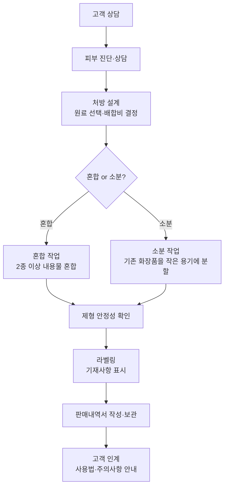

> **고득점 TIP**: 화장품 성분은 PART 02와 겹치는 내용이 많아 복습하는 개념으로 학습하세요. 원료규격서와 혼합 소분에 필요한 도구는 최히 임기한 상태로 넘어가세요.
>
> 📌 본 챕터의 원료 분류는 2과목 1챕터 "화장품 원료"의 요약 재서술입니다.
>
> 🔗 **관련 과목**
> - 2과목 1챕터 "화장품 원료" — 원료 분류(수성/유성/계면활성제) 상세 정의
> - 2과목 3챕터 "사용제한 원료" — 혼합 금지 원료 및 알레르기 유발 성분
> - 3과목 2챕터 "작업자 위생관리" — 혼합·소분 시 안전관리 기준(손 소독, 작업복)

---

> 📋 **학습 가이드**
> - 출제 빈도: ★★★★☆ (원료 특성, 제형 안정성 감소 요인 4가지, 원료규격서 기재 항목, pH·농도·온도 기준, 혼합·소분 도구, 안전관리 기준, 위생관리)
> - 예상 소요 시간: 40분
> - 핵심 키워드: 수성/유성/계면활성제, 제형 안정성(투입 순서·온도 편차·회전속도·진공세기), pH 범위(미산성 5.0~6.5·약산성 3.0~5.0), 온도(표준 20℃·상온 15~25℃·실온 1~30℃), 호모게나이저(유화·터빈형) vs 디스퍼(가용화·고속교반), 혼합·소분 안전관리(품질성적서 확인·손 소독·포장용기 오염 확인)

---

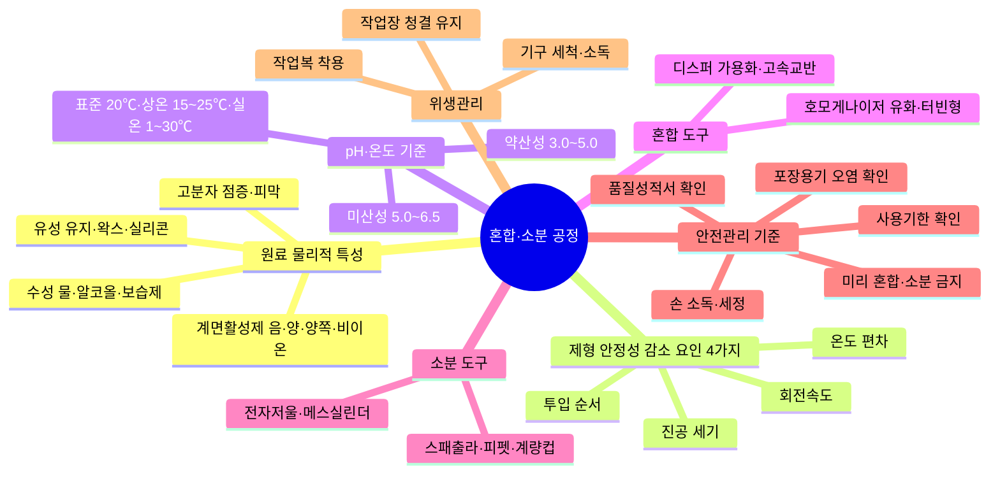

> **🗺️ 마인드맵 노드 상세 매핑**

| 대분류 | 중분류 | 핵심 포인트 |
| --- | --- | --- |
| 원료 물리적 특성 | 해당 없음 | 원료 물리적 특성 4가지 |
|  | 수성 물·알코올·보습제 | 물·알코올·보습제 등 수용성 |
|  | 유성 유지·왁스·실리콘 | 유지·왁스·실리콘 등 유용성 |
|  | 계면활성제 음·양·양쪽·비이온 | 음·양·양쪽·비이온 4종 |
|  | 고분자 점증·피막 | 점증·피막 형성 |
| 제형 안정성 감소 요인 4가지 | 해당 없음 | 제형 안정성 저하 요인 4종 |
|  | 투입 순서 | 원료 투입 순서 오류 |
|  | 온도 편차 | 제조·설정 온도 차이 |
|  | 회전속도 | 교반 속도 부적절 |
|  | 진공 세기 | 진공 압력 부적절 |
| pH·온도 기준 | 해당 없음 | 화장품 pH·온도 규정 |
|  | 미산성 5.0~6.5 | 화장품 권장 pH 범위 |
|  | 약산성 3.0~5.0 | 산성 제품 pH 범위 |
|  | 표준 20℃·상온 15~25℃·실온 1~30℃ | 온도 구분 기준 |
| 혼합 도구 | 해당 없음 | 혼합 작업용 기기 |
|  | 호모게나이저 유화·터빈형 | 호모게나이저: 유화·터빈형 |
|  | 디스퍼 가용화·고속교반 | 디스퍼: 가용화·고속교반 |
| 소분 도구 | 해당 없음 | 소분 작업용 기구 |
|  | 스패출라·피펫·계량컵 | 소분용 기본 도구 |
|  | 전자저울·메스실린더 | 정량 계량 도구 |
| 안전관리 기준 | 해당 없음 | 혼합·소분 안전관리 규정 |
|  | 품질성적서 확인 | 원료 품질 검증 |
|  | 손 소독·세정 | 작업자 위생 관리 |
|  | 포장용기 오염 확인 | 용기 청결도 확인 |
|  | 사용기한 확인 | 원료 유효기간 확인 |
|  | 미리 혼합·소분 금지 | 사전 혼합·소분 금지 |
| 위생관리 | 해당 없음 | 작업장 위생관리 규정 |
|  | 작업복 착용 | 작업자 위생복 착용 |
|  | 기구 세척·소독 | 기구 청결 유지 |
|  | 작업장 청결 유지 | 작업 환경 위생 관리 |

## 1. 원료 및 제형의 물리적 특성

> 📌 **출처**: 식약처 화장품원료 지침 + 제제학 교재| **최종 확인**: 2026. 8. 29.

> ### 🎯 한 줄 핵심
>
> 수성(물·알코올·보습제) + 유성(유지·왁스·실리콘) + 계면활성제(음·양·양쪽·비이온) + 고분자(점증·피막) + 색소·향료·보존제·산화방지제·금속이온봉쇄제.

### (1) 원료의 특성

| 구분 | 특성 |
| --- | --- |
| **수성 원료** | • 일반적으로 물에 잘 녹음<br>• 정제수, 알코올, 보습제(폴리올) 등 |
| **유성 원료** | • 피부 수분 증발 억제, 화장품의 흡수력에 도움을 줌<br>• 유지(식물성 오일, 동물성 오일), 왁스, 탄화수소, 고급 지방산, 고급 알코올, 에스테르, 실리콘 오일 등 |
| **계면활성제** | • 유성과 수성의 경계면에 흡착하여 성질을 변화시킴<br>• 습윤, 세정 효과, 대전 방지 등의 기능, 표면장력을 낮춤<br>• 음이온성, 양이온성, 양쪽성, 비이온성 계면활성제 |
| **고분자화합물(폴리머) – 점증제** | • 점도 조절<br>• 천연·반합성·합성 고분자, 무기물 등 |
| **고분자화합물(폴리머) – 피막형성제(밀폐제)** | • 일정 시간이 경과하면 굳는 성질<br>• 수분 증발 억제, 광택 및 갈라짐 방지 등의 기능<br>• 폴리비닐알코올, 고분자 실리콘 등 |
| **색소** | • 안료(물 또는 오일에 녹지 않는 것), 염료(물 또는 오일에 녹는 것)<br>• 유기안료, 무기안료, 천연색소, 진주광택안료 등 |
| **향료** | • 향을 내기 위해 사용<br>• 알레르기 유발 25종 중 씻어내는 제품은 0.01%, 씻어내지 않는 제품은 0.001% 초과 시 해당 성분 명칭 기재 |
| **보존제** | 미생물로부터의 변질을 막기 위해 사용 |
| **산화방지제** | 유지의 산화를 방지하고 화장품 품질을 일정하게 유지하기 위해 사용 |
| **금속이온봉쇄제** | 금속이온으로 인한 산화 촉진, 변색, 변취를 막기 위해 사용 |

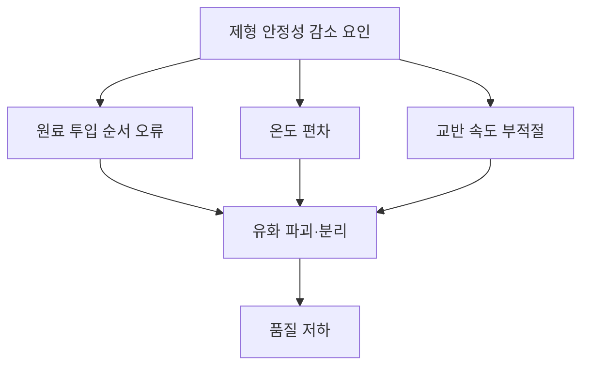

> 📌 **참고**

### (2) 제형의 특성 `기출`

| 제형 | 특성 |
| --- | --- |
| **로션제** | 유화제 등을 넣어 유성 성분과 수성 성분을 균질화한 점액상 제형 |
| **액제** | 화장품에 사용되는 성분을 용제 등에 녹여 액상으로 만들어진 제형 |
| **크림제** | 유화제 등을 넣어 유성 성분과 수성 성분을 균질화한 반고형상 제형 |
| **침적 마스크제** | 액제, 로션제, 크림제, 겔제 등을 부직포 등의 지지체에 침적하여 만들어짐 |
| **겔제** | 액체를 침투시킨 분자량이 큰 유기분자로 이루어진 반고형상 제형 |
| **에어로졸제** | 원액을 같은 용기 또는 다른 용기에 충전한 분사제의 압력을 이용하여 안개 모양, 포말상 등으로 분출하도록 만들어진 제형 |
| **분말제** | 균질하게 분말상 또는 미립상으로 만들어진 제형 |

### (3) 혼합 시 제형의 안정성을 감소시키는 요인 `기출`

```mermaid
mindmap
 root((안정성 감소 요인))
  원료 투입 순서
   용해 불량·침전·부유물
   휘발성 유상: 혼합 직전 투입
   고온 불안정 원료: 냉각 중 별도 투입
   W/O: 수상 급속 투입 시 제조 어려움
  pH 변화
   유효성분 분해
   피부 자극 증가
   보존제 효력 저하
  온도
   고온: 변성·분리
   저온: 응집·결정화
  농도
   과량 첨가: 침전·분리
   허용 범위 초과
  용매 불호환
   수성+유성 혼합 시 분리
   계면활성제 부족
```

> **🗺️ 마인드맵 노드 상세 매핑**

| 대분류 | 중분류 | 핵심 포인트 |
| --- | --- | --- |
| 원료 투입 순서 | 해당 없음 | 투입 순서 중요성 |
|  | 용해 불량·침전·부유물 | 순서 오류 시 물성 저하 |
|  | 휘발성 유상: 혼합 직전 투입 | 휘발성 원료는 직전 투입 |
|  | 고온 불안정 원료: 냉각 중 별도 투입 | 고온 불안정 원료는 냉각 중 투입 |
|  | W/O: 수상 급속 투입 시 제조 어려움 | W/O 유화 시 수상 천천히 투입 |
| pH 변화 | 해당 없음 | pH 변화 영향 |
|  | 유효성분 분해 | 성분 안정성 저하 |
|  | 피부 자극 증가 | 피부 자극 유발 |
|  | 보존제 효력 저하 | 보존력 감소 |
| 온도 | 해당 없음 | 온도 영향 |
|  | 고온: 변성·분리 | 고온 시 변성·분리 위험 |
|  | 저온: 응집·결정화 | 저온 시 응집·결정화 위험 |
| 농도 | 해당 없음 | 농도 영향 |
|  | 과량 첨가: 침전·분리 | 과량 첨가 시 침전·분리 |
|  | 허용 범위 초과 | 허용 범위 준수 필요 |
| 용매 불호환 | 해당 없음 | 용매 불호환 영향 |
|  | 수성+유성 혼합 시 분리 | 수성·유성 혼합 시 분리 |
|  | 계면활성제 부족 | 계면활성제 부족 시 분리 |

**① 원료 투입 순서가 바뀌는 경우**
- 화장품 원료 및 내용물 혼합 시 투입에 대한 다음의 사항을 이해해야 함
- 원료 투입 순서가 달라지면 용해 상태 불량, 침전, 부유물 등이 발생하여 제품의 물성 및 안정성에 영향을 미칠 수 있음
- 휘발성 유상 원료는 혼합 직전에 투입하고, 고온에서 안정성이 낮은 원료(알코올, 첨가제, 향료 등)는 냉각 공정 중 별도로 투입해야 함
- W/O(Water in Oil) 형태의 유화 제품 제조 시 수상을 너무 빠르게 투입하면 제조가 어렵거나 안정성이 저하될 수 있음

**② 가용화 공정 또는 유화 공정 시 제조 온도와 설정 온도의 차이가 생기는 경우**
- **가용화**: 제조 온도가 설정된 온도보다 지나치게 높을 경우, 가용화제의 친수성과 친유성의 정도를 나타내는 HLB가 변하여 운점 이상에서 가용화가 깨지고 제품의 안정성에 문제가 생길 수 있음
- **유화**: 제조 온도가 설정된 온도보다 지나치게 높을 경우, 유화제의 HLB가 변하여 전상 온도 이상에서 상이 서로 뒤바뀌어 유화 안정성에 문제가 생길 수 있음. 또한 유화 입자 크기 변화로 외관이나 점도가 달라지거나, 원료 산패로 인해 제품의 냄새와 색상 등이 변할 수 있음

**③ 회전속도**
- 믹서의 회전속도가 느린 경우 원료 용해 시간이 길어지고, 폴리머 분산 시 수화가 어려워 덩어리가 생겨 메인 믹서 이송 시 필터가 막혀 작업이 어려워질 수 있음
- 유화 입자가 커지면서 외관, 점도, 안정성 등에 영향을 미칠 수 있음

**④ 진공세기**
- 유화 제품 제조 과정에서 발생하는 미세한 기포를 제거하지 않으면 제품의 점도, 비중, 안정성 등에 악영향을 줄 수 있음

---

## 2. 원료 및 내용물의 유효성

> 📌 **출처**: 기능성화장품 심사 규정 (제2025-88호)| **최종 확인**: 2026. 8. 29.

> ### 🎯 한 줄 핵심
>
> 효력시험(비임상, 작용기전 포함) + 인체적용시험(효능 입증) + 염모효력시험(모발 색상) + 기준·시험방법(ISO 등 공인 방법).

### (1) 효력시험에 관한 자료
심사 대상 효능을 뒷받침하는 성분의 효력에 대한 비임상시험 자료로서 효과 발현의 작용기전이 포함되어야 하며, 아래 3가지 중 하나에 해당해야 한다.

1. 국내외 대학 또는 전문 연구기관에서 시험한 것으로서 당해 기관의 장이 발급한 자료(시험시설 개요, 주요설비, 연구인력의 구성, 시험자의 연구경력에 관한 사항을 포함)

2. 당해 기능성화장품이 개발국 정부에 제출되어 평가된 모든 효력시험 자료로 개발국 정부(허가 또는 등록기관)가 제출받았거나 승인하였음을 확인한 것 또는 이를 증명한 자료

3. 과학논문인용색인(Science Citation Index 또는 Science Citation Index Expanded)이 등재된 전문학회지에 게재된 자료

### (2) 인체적용시험 자료
1. 사람에게 적용 시 효능·효과 등 기능을 입증할 수 있는 자료로 위 효력시험에 관한 자료
① 및

②에 해당할 것
2. 인체적용시험의 실시 기준 및 자료의 작성 방법은 「화장품 표시·광고 실증에 관한 규정」을 준용할 것

### (3) 염모효력시험 자료
인체 모발을 대상으로 효능·효과에서 표시한 색상을 입증하는 자료로, 모발의 색상을 변화(탈염·탈색을 포함)시키는 기능을 가진 화장품은 심사 시 염모효력시험 자료만 제출한다.

### (4) 기준 및 시험 방법에 관한 자료
품질관리에 적정을 기할 수 있는 시험 항목과 각 시험 항목에 대한 시험 방법의 밸리데이션, 기준치 설정의 근거가 되는 자료로, 이 경우 시험 방법은 공정서, 국제표준화기구(ISO) 등의 공인된 방법에 의해 검증되어야 한다.

---

## 3. 원료 및 내용물의 규격

> 📌 **출처**: 화장품 안전기준 (제2026-19호) + 식약처 원료지침| **최종 확인**: 2026. 8. 29.

> ### 🎯 한 줄 핵심
>
> 원료규격서(명칭·구조식·함량·성상·확인시험·순도시험·정량법) + pH·색·냄새·점도·농도·온도 기준.

원료규격서는 화장품 원료의 안전관리 및 품질관리 능력 향상을 위해 필요하며, 다빈도로 사용되는 원료는 화장품 원료규격 가이드라인이 제시되어 있다.

### 〈원료규격서 예시〉 — 디메치콘 (Dimethicone)

**메칠폴리실록산 (Methyl Polysiloxane)**

이 원료는 주로 직쇄상의 디메치콘 (CH₃)₃SiO[(CH₃)₂SiO]ₙSi(CH₃)₃으로 평균중합도에 따라 표시 점도가 20~30,000cs에 해당한 것이다.

| 항목 | 내용 |
| --- | --- |
| **성상 (메칠폴리실록산)** | 이 원료는 무색의 맑은 액 또는 점성이 있는 맑은 액으로 냄새는 거의 없다. |
| **확인시험 (메칠폴리실록산)** | 이 원료를 가지고 적외부흡수스펙트럼측정법의 4) 액막법에 따라 측정할 때 파수 2,960cm⁻¹, 1,260cm⁻¹, 1,130~1,000cm⁻¹ 및 800cm⁻¹ 부근에서 특성흡수를 나타낸다. |
| **굴절률** | 굴절률측정법에 따라 시험할 때 규격은 아래 표와 같다. |
| **비중** | 비중측정법에 따라 시험할 때 규격은 아래 표와 같다. |
| **점도** | 1,000cs 미만은 25℃에서 제1법에 따라 시험, 1,000cs 이상은 25℃에서 제2법에 따라 시험하여 단위를 환산할 때 규격은 아래 표와 같다. |
| **산가** | 0.02 이하 (20g, 제1법) |

**순도시험**
1. **중금속**: 이 원료 40g을 달아 제2법에 따라 조작하여 시험한다. 비교액에는 납표준액 20mL를 넣는다 (5ppm 이하).

2. **비소**: 이 원료 1.0g을 달아 제3법에 따라 검액을 만들고 장치 B를 쓰는 방법에 따라 조작하여 시험한다 (2ppm 이하).

3. **미네랄 오일**: 이 원료를 가지고 365nm에서 흡광도측정법에 따라 시험할 때 흡광도는 비교액보다 크지 않다. (비교액: 퀴닌에 0.01N 황산을 넣어 녹여 0.1ppm으로 한다.)

4. **페닐성화합물**: 이 원료 5.0g을 달아 사이클로헥산을 넣어 녹여 10mL로 한 액을 검액으로 하여 파장 250~270nm에서 흡광도는 0.2보다 크지 않다.

**건조 감량(150℃, 2시간) 규격**

| 표시점도(cs) | 점도(cs) 하한 | 점도(cs) 상한 | 비중(d²⁰₂₀) 하한 | 비중 상한 | 굴절률(n²⁰D) 하한 | 굴절률 상한 | 건조감량(%) 상한 |
| --- | --- | --- | --- | --- | --- | --- | --- |
| 20 | 18 | 22 | 0.946 | 0.954 | 1.3980 | 1.4020 | 20.0 |
| 50 | 47.5 | 52.5 | 0.955 | 0.965 | 1.4005 | 1.4045 | 2.0 |
| 100 | 95 | 105 | 0.962 | 0.970 | 1.4005 | 1.4045 | 0.3 |
| 200 | 190 | 220 | 0.964 | 0.972 | 1.4013 | 1.4053 | 0.3 |
| 350 | 332.5 | 367.5 | 0.965 | 0.973 | 1.4013 | 1.4053 | 0.3 |
| 500 | 475 | 525 | 0.967 | 0.975 | 1.4013 | 1.4053 | 0.3 |

### (1) 원료 기준 및 시험 방법에 기재할 항목

기준 및 시험 방법의 형식, 용어, 단위, 기호 등은 화장품 원료 기준(잠원기)에 따르며, 원료 및 제제(제형)에 따라 불필요한 항목은 생략이 가능하다.
※ ○ 원칙적으로 기재, △ 필요에 따라 기재, × 원칙적으로는 기재할 필요 없음

| 항목 | 작성 방법 | 원료 |
| --- | --- | --- |
| **명칭** | 일반 명칭을 기재하며, 영명, 화학명, 별명 등도 기재 | 해당 없음 |
| **구조식 또는 시성식** | 「기능성화장품 기준 및 시험 방법」의 구조식 또는 시성식의 표기 방법에 따름 | ○ |
| **분자식 및 분자량** | 「기능성화장품 기준 및 시험 방법」의 분자식 및 분자량의 표기 방법에 따름 | △ |
| **기원** | • 합성 원료로 화학구조가 결정되어 있는 것은 기재 불필요<br>• 천연 추출물, 효소 등은 그 원료성분의 기원 기재<br>• 고분자화합물 등 유사 화합물 2가지 이상 함유로 분리·정제가 곤란할 경우 비율을 기재 | ○ (△) |
| **함량 기준** | • 백분율(%)로 표시 후 분자식 기재<br>• 함량 표시가 어려운 경우 화학적 순물질의 함량으로 표시 가능<br>• 불안정한 원료 성분은 분해물의 안전성에 관한 정보에 따라 기준치 폭 설정<br>• 함량 기준 설정이 불가능한 경우 이유를 구체적으로 기재 | ○ |
| **제조 방법 (원료 기준)** | 생약, 동물 추출물 등에 있어 함량 기준 및 정량법을 규정할 수 없는 경우에는 제조 방법을 구체적으로 기재 | ○ |
| **성상 (원료 기준)** | 색, 형상, 냄새, 맛, 용해성 등을 구체적으로 기재 | ○ |
| **확인시험 (원료 기준)** | 원료 성분을 확인할 수 있는 화학적시험 방법 기재(자외부, 가시부, 적외부흡수스펙트럼측정법 또는 크로마토그래프법 기재 가능) | ○ |
| **시성치** | • 검화가, 굴절률, 비선광도, 비점, 비중, 산가, 수산기가, 알코올수, 에스테르가, 요오드가, 융점, 응고점, 점도, pH, 흡광도 등 물리·화학적 방법으로 측정되는 정수 기재<br>• 원료성분의 본질 및 순도를 나타내기 위해 작성하며, 「기능성화장품 기준 및 시험 방법」의 VI. 일반시험법에 따름 | △ |
| **순도시험** | • 색, 냄새, 용해 상태, 액성, 산, 알칼리, 염화물, 황산염, 중금속, 비소, 황산에 대한 정색물, 동, 석, 수은, 아연, 알루미늄, 철, 알칼리토류금속, 일반이물(제조공정으로부터 혼입, 잔류, 생성 또는 첨가될 수 있는 불순물), 유연 물질 및 분해생성물, 잔류용매 중 필요한 항목 설정<br>• 용해 상태는 원료의 순도 파악이 가능한 경우 설정 | ○ |
| **건조 감량, 강열 감량 또는 수분** | 「기능성화장품 기준 및 시험 방법」의 VI-1, 원료 3, 감열잔분 시험법에 따름 | △ |
| **강열 잔분, 회분 또는 산불용성 회분** | 「기능성화장품 기준 및 시험 방법」의 VI-1, 원료 3, 감열잔분 시험법에 따름 | △ |
| **기타시험** | 품질평가, 안전성·유효성 확보와 직접 관련이 되는 시험 항목이 있는 경우에 설정 | 해당 없음 |
| **정량법(제제는 함량시험)** | 물질의 함량, 함유 단위 등을 물리적 또는 화학적 방법에 의해 측정하는 시험법으로, 정확도, 정밀도 및 특이성이 높은 시험법 설정(단, 순도시험항에서 혼재물의 한도가 규제되어 있는 경우 특이성이 낮은 시험법이라도 인정함) | ○ |
| **표준품 및 시약·시액** | • 「기능성화장품 기준 및 시험 방법」 수재 이외의 표준품은 사용목적에 맞는 규격을 설정하며, 수재 이외의 시약·시액은 그 조제법 기재<br>• 표준품은 필요에 따라 정제법 기재<br>• 정량용 표준품은 원칙적으로 순도시험에 따라 불순물을 규제한 절대량을 측정할 수 있는 시험 방법으로 함량 측정<br>• 표준품의 함량은 99.0% 이상으로 함 | △ |

### (2) pH 기준 `기출`
1. 액성을 산성, 알칼리성 또는 중성으로 나타낸 것은 따로 규정이 없는 한 리트머스지를 써서 검사한다.

2. 액성을 구체적으로 표시할 때에는 pH값을 쓴다.

3. pH의 범위

| 구분 | pH 범위 | 구분 | pH 범위 |
| --- | --- | --- | --- |
| 미산성 | 약 5.0~6.5 | 미알칼리성 | 약 7.5~9.0 |
| 약산성 | 약 3.0~5.0 | 약알칼리성 | 약 9.0~11.0 |
| 강산성 | 약 3.0 이하 | 강알칼리성 | 약 11.0 이상 |

### (3) 색 기준
1. **백색**: 거의 백색을 나타낸다.

2. **무색**: 무색 또는 거의 무색을 나타낸다.

3. **시험 방법**: 고체의 화장품 원료는 1g을 백지 위 또는 백지 위에 놓은 시계접시에 취하여 관찰하며, 액상의 화장품 원료는 안지름 15mm의 무색시험관에 넣고 백색 배경을 써서 액층을 30mm로 하여 관찰한다.

 액상의 맑은 화장품 원료를 시험할 때에는 흑색 또는 백색 배경을 써서 앞의 방법에 따른다. 액상의 화장품 원료의 형광을 관찰할 때에는 흑색 배경을 쓰고 백색 배경은 쓰지 않는다.

### (4) 냄새 기준
1. **냄새가 없다**: 냄새가 없거나 거의 냄새가 없는 것을 나타낸다.

2. **시험 방법**: 원료 1g을 100mL 비커에 취하여 시험한다.

### (5) 점도 `기출`
1. 액체가 일정 방향으로 운동할 때 그 흐름에 평행한 평면의 양측에 내부 마찰력이 일어나는데, 이 성질을 **점성**이라고 한다.

2. 점성은 면의 넓이 및 그 면에 대해 수직방향의 속도구배에 비례하며, 그 비례정수를 **절대점도**라고 한다.

3. 단위로는 포아스 또는 센티포아스를 쓴다. 절대점도를 같은 온도의 그 액체의 밀도로 나눈 값을 운동점도라고 하고, 그 단위로는 **스톡스 또는 센티스톡스**를 쓴다.

### (6) 농도
1. 용액의 농도를 (1→5), (1→10), (1→100) 등으로 기재한 것은 고체물질 1g 또는 액상물질 1mL를 용제에 녹여 전체량을 각각 5mL, 10mL, 100mL 등으로 하는 비율을 나타낸 것이다.

2. 혼합액을 (1:10), (1:20) 등으로 나타낸 것은 액상물질의 1 용량과 10 용량과의 혼합액, 1 용량과 20 용량과의 혼합액을 나타낸 것이다.

3. 단위

| 단위 | 정의 |
| --- | --- |
| **%** | 질량백분율 |
| **w/v%** | 질량 대 용량(weight/volume) 백분율<br>예) 전체 용액 100mL에 A라는 용질이 10g 들어 갔을 경우 10%(w/v)의 농도를 가짐 |
| **v/v%** | 용량 대 용량(volume/volume) 백분율 |
| **v/w%** | 용량 대 질량(volume/weight) 백분율 |
| **ppm** | 질량백만분율<br>예) 전체 용액 500g에 A라는 용질이 1mg 들어 갔을 경우 2ppm의 농도를 가짐 (1mg÷500,000mg)×1,000,000 |

> 📌 **참고**: 법령노트 p.112 참고

### (7) 온도 `기출`
1. 온도의 표시는 셀시우스법에 따라 아라비아 숫자 뒤에 ℃를 붙인다.

| 구분 | 온도 |
| --- | --- |
| 표준온도 | 20℃ |
| 상온 | 15~25℃ |
| 실온 | 1~30℃ |
| 미온 | 30~40℃ |
| 냉소 | 따로 규정이 없는 한 15℃ 이하의 곳 |
| 냉수 | 10℃ 이하 |
| 미온탕 | 30~40℃ |
| 온탕 | 60~70℃ |
| 열탕 | 약 100℃ |

2. '가열한 용매' 또는 '열용매'는 그 용매의 비점 부근의 온도로 가열한 것을 뜻하며, '가온한 용매' 또는 '온용매'는 보통 60~70℃로 가온한 것을 의미한다.

3. '수욕상 또는 수욕중에서 가열한다'라 함은 따로 규정이 없는 한 끓인 수욕 또는 100℃의 증기욕을 써서 가열하는 것을 의미한다.

4. 보통 냉침은 15~25℃, 온침은 35~45℃에서 실시한다.

### (8) 기타 `기출`
1. 용질명 다음에 용액이라 기재하고, 그 용제를 밝히지 않은 것은 수용액이라고 한다.

2. 따로 규정이 없는 한 일반시험법에 규정되어 있는 시약을 쓰고 시험에 쓰는 물은 정제수이다.

3. 시험조작을 할 때 '직후' 또는 '곧'이란 보통 앞의 조작이 종료된 다음 30초 이내에 다음 조작을 시작하는 것을 말한다.

4. 검체의 채취량에 있어 '약'이라고 붙인 것은 기재된 양의 ±10%의 범위를 의미한다.

---

## 4. 혼합·소분에 필요한 도구·기기·기구 `기출`

> 📌 **출처**: 화장품법 제3조의4 + 시행규칙 제8조의4| **최종 확인**: 2026. 8. 29.

> ### 🎯 한 줄 핵심
>
> 칭량(전자저울·메스실린더) + 혼합(호모게나이저·디스퍼·오버헤드스터러) + 소분(스패츌러·디스펜서·피펫) + 측정(pH미터·점도계·경도계) + 살균(자외선 살균기).

| 구분 | 특징 |
| --- | --- |
| **전자저울, 메스실린더** | 원료 칭량 시 사용 |
| **스패츌러** | 혼합 및 소분 시 화장품을 위생적으로 덜어내거나 계량할 때 사용 |
| **시약스푼, 비커** | 원료의 소분 및 계량 시 사용 |
| **헤라 (계량)** | 실리콘 재질의 주걱으로 계량 시 사용 |
| **냉각통** | 내용물 및 특정 성분을 냉각할 때 사용 |
| **디스펜서** | 내용물을 자동으로 소분해 줌 |
| **디지털 발란스** | 내용물 및 원료 소분 시 무게를 측정할 때 사용 |
| **자외선 살균기** | 도구의 살균·소독 시 사용 |
| **피펫** | 작은 양의 액체를 옮길 때 사용 |
| **호모게나이저(호모믹서)** `기출` | 내용물과 내용물 간의 혼합 및 분산을 위해 터빈형의 회전날개가 달린 기계. 주로 물과 기름을 유화시켜 안정 상태로 유지하기 위해 사용하는 교반기로, 분산상의 크기를 작고 균일하게 혼합시킬 때 유용 |
| **디스퍼** `기출` | 주로 가용화 제품이나 간단한 물질을 혼합할 때 사용하는 교반기로, 고속 교반에 의해 균질하게 분산시킬 때 유용 |
| **마그네틱바, 핸드블렌더, 스틱형성기** | 원료의 혼합·교반 시 사용 |
| **오버헤드스터러(아지믹서, 프로펠러믹서, 분산기)** | 봉(Shaft)의 끝부분에 다양한 모양의 회전날개가 붙어 있어 내용물의 혼합 및 분산 시 사용하며, 점증제를 물에 분산시킬 때 사용 |
| **항온수조, 핫플레이트** | 원료를 가열할 때 사용 |
| **드라이오븐(Dry Oven)** | 건조 감량 시험 시 사용 |
| **pH 미터** | 제품의 pH를 측정할 때 사용 |
| **데시케이터** | 표준품을 보관하는 데 사용 |
| **융점 측정기** | 물질의 녹는점 측정 시 사용 |
| **경도계** | 액체 및 반고형 제품의 유동성 측정 시 사용 |
| **광학현미경** | 유화된 내용물의 유화입자의 크기 관찰 시 사용 |
| **점도계** | 제품의 점도 측정 시 사용 |
| **헤라 (덜어내기)** | • 실리콘 재질의 주걱으로 계량 시 사용<br>• 내용물 및 특정성분을 비커에서 깨끗하게 덜어낼 때 사용 |

※ 호모게나이저(호모믹서) 및 디스퍼 사진 출처: (주) 영진코퍼레이션

---

## 5. 맞춤형화장품판매업 준수사항에 맞는 혼합·소분

> 📌 **출처**: 화장품법 시행규칙 제12조의2| **최종 확인**: 2026. 8. 29.

> ### 🎯 한 줄 핵심
>
> 조제관리사 채용 + 안전관리 기준(품질성적서·손 소독·용기 오염 확인) + 판매내역서 작성 + 소비자 설명 + 시설 분리·위생 관리.

### ① 맞춤형화장품조제관리사를 채용하여 맞춤형화장품 혼합·소분 활동 `기출`

### ② 다음의 안전관리 기준을 준수할 것

| 단계 | 기준 사항 | 비고 |
| --- | --- | --- |
| 품질성적서 확인 | 혼합·소분 전 내용물·원료에 대한 품질성적서 확인 |  |
| 손 소독·세정 | 혼합·소분 전 손을 소독하거나 세정 | **일회용 장갑 착용 시 예외** |
| 포장용기 확인 | 제품을 담을 포장용기의 오염 여부 확인 |  |
| 장비·기구 위생 | 사용 전 위생 상태 점검, 사용 후 오염 없도록 세척 |  |
| 기타 | 식약처장이 정하여 고시하는 사항 준수 |  |

### ③ 맞춤형화장품 판매내역서(전자문서로 된 판매내역서를 포함함)를 작성·보관할 것

### ④ 맞춤형화장품 판매 시 해당 제품의 혼합 또는 소분에 사용된 내용물·원료의 내용 및 특성, 사용 시 주의사항에 대해 소비자에게 설명할 것

### ⑤ 시설 기준
맞춤형화장품판매업을 신고하려는 자는 맞춤형화장품의 혼합·소분 공간을 그 외의 용도로 사용되는 공간과 분리 또는 구획하여 갖추어야 함.

단, 혼합·소분 과정에서 맞춤형화장품의 품질·안전 등 보건위생상 위해가 발생할 우려가 없다고 인정되는 경우에는 혼합·소분 공간을 분리 또는 구획하여 갖추지 않아도 됨

> 📌 **참고 – 제형의 변화**: 맞춤형화장품조제관리사는 화장품 혼합 시 기본 제형에 변화를 주지 않는 범위 내에서 혼합해야 함

### ⑥ 작업자의 위생관리

| 항목 | 내용 |
| --- | --- |
| 위생복·마스크 | 혼합·소분 시 위생복 및 마스크(필요 시) 착용 |
| 건강 상태 | 피부 외상 및 증상이 있는 직원은 건강 회복 전까지 혼합·소분 행위 금지 |
| 손 소독·세척 | 혼합 전·후 손 소독 및 세척 |

### ⑦ 맞춤형화장품 혼합·소분 장소의 위생관리

| 항목 | 내용 |
| --- | --- |
| 공간 구분 | 혼합·소분 장소와 판매 장소 구분·구획하여 관리 |
| 환기시설 | 적절한 환기시설 구비 |
| 청결 유지 | 작업대, 바닥, 벽, 천장 및 창문 청결 유지 |
| 세척시설 | 혼합 전·후 작업자 손 세척 및 장비 세척을 위한 세척시설 구비 |
| 방충·방서 | 방충·방서 대책 마련 및 정기적 점검·확인 |

### ⑧ 맞춤형화장품 혼합·소분 장비 및 도구의 위생관리 `기출`
- 사용 전·후 세척 등을 통해 오염 방지
- 작업 장비 및 도구 세척 시에 사용되는 세제·세척제는 잔류하거나 표면 이상을 초래하지 않는 것을 사용
- 세척한 작업 장비 및 도구는 잘 건조하여 다음 사용 시까지 오염 방지
- **자외선 살균기 이용 시**
 - 충분한 자외선 노출을 위해 적당한 간격을 두고 장비 및 도구가 서로 겹치지 않게 한 층으로 보관
 - 살균기 내 자외선램프의 청결 상태를 확인한 후 사용

| 자외선 살균기의 적절한 사용의 예 | 자외선 살균기의 부적절한 사용의 예 |
| --- | --- |
| 도구들을 서로 겹치지 않게 한 층으로 배치 | 도구들을 겹쳐서 배치 (자외선 노출 불충분) |

### ⑨ 혼합·소분 장소, 장비·도구 등 위생 환경 모니터링
- 맞춤형화장품 혼합·소분 장소가 위생적으로 유지될 수 있도록 맞춤형화장품판매업자는 주기를 정하여 판매장 등의 특성에 맞도록 위생관리를 해야 한다.
- 맞춤형화장품 판매 업소에서는 위생 점검표를 활용하여 작업자 위생, 작업환경위생, 장비·도구 관리 등 맞춤형화장품 판매 업소에 대한 위생 환경 모니터링 후 그 결과를 기록하고 판매업소의 위생 환경 상태를 관리해야 한다.

---

### 확인문제
**혼합·소분 과정 관리 기준으로 옳은 것은?**
1. 혼합 과정이 단순하면 공간 구획 없이 작업 가능

2. 포장용기 오염은 혼합 이후에만 확인

3. **위험 상황 발생 시 즉시 작업 중단** ✅

4. 혼합 중 위생 상태는 1일 1회 점검

5. 판매 공간에 고객과 함께 혼합 작업 가능

> **해설**: 혼합·소분 과정에서 위험 상황 발생 시 즉시 작업을 중단해야 한다. 혼합·소분 공간은 용도와 분리·구획해야 하며, 포장용기 오염은 혼합·소분 전에 확인해야 하고, 위생 상태는 사용 전·후 매번 점검해야 한다. 판매 공간에서 고객과 함께 혼합 작업은 금지된다.

---
*출처: CHAPTER 06 · 혼합 및 소분 (PART 04 · 맞춤형화장품의 이해), pp. 211~219*

---

## 📊 제형 안정성 감소 요인 비교표

> 📌 **출처**: 식약처 화장품원료 지침 + 제제학 교재| **최종 확인**: 2026. 8. 29.

| 요인 | 원인 | 결과 |
| --- | --- | --- |
| **투입 순서 오류** | 휘발성 유상을 너무 일찍 투입, W/O에서 수상 급투입 | 용해 불량, 침전, 부유물 |
| **온도 편차** | 설정 온도보다 과도하게 높음 | HLB 변화, 유화 파괴, 산패 |
| **회전속도 부적절** | 너무 느림 | 용해 시간 길어짐, 덩어리, 유화 입자 커짐 |
| **진공세기 부족** | 미세 기포 미제거 | 점도·비중·안정성 저하 |

## 📊 호모게나이저 vs 디스퍼 비교표

> 📌 **출처**: 제제학 교재 + 식약처 지침| **최종 확인**: 2026. 8. 29.

| 구분 | 호모게나이저(호모믹서) | 디스퍼 |
| --- | --- | --- |
| **용도** | 유화·분산 | 가용화·간단한 혼합 |
| **구조** | 터빈형 회전날개 | 고속 교반 |
| **특징** | 분산상 크기를 작고 균일하게 | 균질 분산 |
| **대상** | 물+기름 유화 | 가용화 제품 |

## 📊 pH 범위 비교표

> 📌 **출처**: 화장품 안전기준 (제2026-19호) + 식약처 지침| **최종 확인**: 2026. 8. 29.

| 구분 | pH 범위 | 구분 | pH 범위 |
| --- | --- | --- | --- |
| **미산성** | 5.0~6.5 | **미알칼리성** | 7.5~9.0 |
| **약산성** | 3.0~5.0 | **약알칼리성** | 9.0~11.0 |
| **강산성** | 3.0 이하 | **강알칼리성** | 11.0 이상 |

## 📊 온도 기준 비교표

> 📌 **출처**: CGMP (식약처 고시 제2024-46호) + 식약처 지침| **최종 확인**: 2026. 8. 29.

| 구분 | 온도 | 구분 | 온도 |
| --- | --- | --- | --- |
| **표준온도** | 20℃ | **냉소** | 15℃ 이하 |
| **상온** | 15~25℃ | **냉수** | 10℃ 이하 |
| **실온** | 1~30℃ | **미온탕** | 30~40℃ |
| **미온** | 30~40℃ | **온탕** | 60~70℃ |
|  |  | **열탕** | 약 100℃ |

## 📊 농도 단위 비교표

> 📌 **출처**: 식약처 화장품원료 지침| **최종 확인**: 2026. 8. 29.

| 단위 | 정의 | 예 |
| --- | --- | --- |
| **%** | 질량백분율 | 해당 없음 |
| **w/v%** | 질량/용량 백분율 | 100mL에 10g = 10%(w/v) |
| **v/v%** | 용량/용량 백분율 | 해당 없음 |
| **v/w%** | 용량/질량 백분율 | 해당 없음 |
| **ppm** | 질량백만분율 | 500g에 1mg = 2ppm |

---

## ✅ 확인문제

> **문제 1.** 혼합 시 제형의 안정성을 감소시키는 요인이 아닌 것은?
> ① 원료 투입 순서 오류 ② 온도 편차 ③ 회전속도 ④ 포장용기 재질
>
> **정답**: ④ 포장용기 재질
> **해설**: 제형 안정성을 감소시키는 요인은
> ① 원료 투입 순서 오류,

> ② 가용화/유화 공정 시 온도 편차,

> ③ 회전속도,

> ④ 진공세기이다. 포장용기 재질은 제형 안정성 감소 요인이 아니다.

> **문제 2.** 호모게나이저(호모믹서)의 특징으로 옳은 것은?
>
> ① 주로 가용화 제품에 사용한다

> ② 고속 교반으로 균질 분산한다

> ③ 터빈형 회전날개로 유화·분산한다

> ④ 점증제 분산에 주로 사용한다
>
> **정답**: ③ 터빈형 회전날개로 유화·분산한다
> **해설**: 호모게나이저는 터빈형 회전날개가 달린 기계로, 주로 물과 기름을 유화시켜 안정 상태로 유지하며 분산상의 크기를 작고 균일하게 혼합할 때 유용하다. 디스퍼는 가용화 제품이나 간단한 물질을 고속 교반으로 분산한다.

> **문제 3.** 약산성의 pH 범위는?
> ① 5.0~6.5 ② 3.0~5.0 ③ 3.0 이하 ④ 7.5~9.0
>
> **정답**: ② 3.0~5.0
> **해설**: 미산성은 5.0~6.5, 약산성은 3.0~5.0, 강산성은 3.0 이하이다. 알칼리성 측은 미알칼리성 7.5~9.0, 약알칼리성 9.0~11.0, 강알칼리성 11.0 이상이다.

> **문제 4.** 맞춤형화장품 혼합·소분 전 확인해야 할 사항으로 옳은 것은?
>
> ① 내용물의 가격

> ② 내용물 또는 원료의 품질성적서

> ③ 소비자의 피부 타입

> ④ 포장용기의 디자인
>
> **정답**: ② 내용물 또는 원료의 품질성적서
> **해설**: 맞춤형화장품판매업자는 혼합·소분 전에 사용되는 내용물 또는 원료에 대한 품질성적서를 확인해야 한다. 또한 손 소독·세정, 포장용기 오염 여부 확인, 장비·기구의 위생 상태 점검이 필요하다.

---

## 📖 핵심 용어 정리

| 용어 | 핵심 포인트 |
| --- | --- |
| **수성 원료** | 물에 잘 녹음, 정제수·알코올·보습제(폴리올) |
| **유성 원료** | 수분 증발 억제, 유지·왁스·탄화수소·실리콘 |
| **계면활성제** | 유·수 경계면 흡착, 음·양·양쪽·비이온성 |
| **고분자(점증제)** | 점도 조절, 천연·반합성·합성·무기물 |
| **고분자(피막형성제)** | 수분 증발 억제, 폴리비닐알코올·고분자 실리콘 |
| **색소** | 안료(녹지 않음) vs 염료(녹음) |
| **향료 알레르기 25종** | 씻어내는 제품 0.01%, 씻어내지 않는 제품 0.001% 초과 시 명칭 기재 |
| **제형 안정성 요인** | 투입 순서·온도 편차·회전속도·진공세기 |
| **가용화** | HLB 변화, 운점 이상에서 가용화 깨짐 |
| **유화** | HLB 변화, 전상 온도 이상에서 상이 뒤바뀜 |
| **효력시험** | 비임상, 작용기전 포함, 대학/연구기관/SCI 게재 |
| **인체적용시험** | 사람 적용 시 효능·효과 입증 |
| **염모효력시험** | 모발 색상 변화(탈염·탈색 포함) 입증 |
| **원료규격서** | 명칭·구조식·함량·성상·확인시험·순도시험·정량법 |
| **표준온도** | 20℃ |
| **상온** | 15~25℃ |
| **실온** | 1~30℃ |
| **미산성** | pH 5.0~6.5 |
| **약산성** | pH 3.0~5.0 |
| **호모게나이저** | 터빈형 회전날개, 유화·분산, 입자 크기 작게 |
| **디스퍼** | 고속 교반, 가용화·간단한 혼합 |
| **오버헤드스터러** | 다양한 회전날개, 점증제 분산 |
| **혼합·소분 안전관리** | 품질성적서 확인, 손 소독, 포장용기 오염 확인 |
| **판매내역서** | 제조번호, 사용기한, 판매일자, 판매량 |
| **시설 기준** | 혼합·소분 공간 분리·구획 (위해 우려 없으면 예외) |
| **작업자 위생** | 위생복·마스크 착용, 외상 시 작업 금지 |
| **자외선 살균기** | 도구 겹치지 않게 1층 배치, 램프 청결 확인 |
| **위생 모니터링** | 위생 점검표 활용, 정기적 점검·기록 |


---

## 📖 충진 및 포장
> 출처: `우수화장품 제조 및 품질관리기준(식품의약품안전처고시)(제2024-46호)(20240822).pdf`

## Chapter 07. 충진 및 포장

```mermaid
flowchart TD
 A["용기 선정<br/>제품 특성에 맞는 용기"] --> B["용기 세척·소독"]
 B --> C["충진<br/>내용물을 용기에 주입"]
 C --> D{"제형 유형"}
 D -->|액상| E["자연 충진 또는 정량 충진"]
 D -->|점조상| F["펌프 충진 또는 노즐 충진"]
 D -->|분말| G["용적 충진"]
 E --> H["밀봉·캡핑"]
 F --> H
 G --> H
 H --> I["라벨링<br/>기재사항 표시"]
 I --> J["품질 검사<br/>내용량·외관·밀봉성"]
 J --> K["출고"]
```

> **PART 04 · 맞춤형화장품의 이해**
> 고득점 TIP: 충진의 의미와 포장재 종류의 특성 및 사용부위, 포장공간 기준에 대해 정확히 암기하여 구분할 수 있어야 함
>
> 🔗 **관련 과목**
> - 3과목 3챕터 "설비 및 기구관리" — 충진 설비의 위생 기준
> - 3과목 5챕터 "포장재의 관리" — 포장재 입고 기준 및 1차·2차 포장 정의

---

> 📋 **학습 가이드**
> - 출제 빈도: ★★★☆☆ (충진기 종류, 포장재 조건, 플라스틱·유리·금속 포장재 특성, 용기 종류, 포장공간 비율·횟수, 재사용 비율, 라벨링)
> - 예상 소요 시간: 25분
> - 핵심 키워드: 충진기 6종(피스톤·파우치·파우더·액체·튜브·카톤), 포장재 6조건(보호·경제성·대량화·판매촉진·적정포장·정보전달), 플라스틱(LDPE·HDPE·PP·PS·AS·ABS·PVC·PET), 포장공간(단위 15%/10%, 종합 25%), 재사용 비율(색조 10%·샴푸 25%·물티슈 60%)

---

## 1. 제품에 맞는 충진 방법

> 📌 **출처**: 식약처 제제학 지침 + CGMP 제3장| **최종 확인**: 2026. 8. 29.

> ### 🎯 한 줄 핵심
>
> 충진 = 화장품 용기에 내용물을 채우는 작업, 6종 충진기(피스톤·파우치·파우더·액체·튜브·카톤) + 9가지 확인 사항.

### (1) 충진(Filling)의 정의
빈 공간을 채우거나 빈 곳에 집어넣어서 채운다는 의미로, 화장품 용기에 내용물을 넣어 채우는 작업을 의미한다.

### (2) 충진기 종류

| 충진기 종류 | 설명 |
| --- | --- |
| 피스톤 방식 충진기 | 대용량의 액상 타입의 제품을 충진할 때 사용 |
| 파우치 방식 충진기 | 샘플, 일회용품 파우치 타입의 제품을 충진할 때 사용 |
| 파우더 충진기 | 파우더 타입의 제품을 충진할 때 사용 |
| 액체 충진기 | 액상 타입의 제품을 충진할 때 사용 |
| 튜브 충진기 | 폼 클렌징, 자외선 차단제 등 튜브 제품을 충진할 때 사용 |
| 카톤 충진기 | 박스를 테이핑할 때 사용 |

```mermaid
mindmap
 root((충진기 종류))
  피스톤 방식
   대용량 액상
  파우치 방식
   샘플·일회용품
  파우더 충진기
   파우더 타입
  액체 충진기
   액상 타입
  튜브 충진기
   폼클렌징·자외선차단제
  카톤 충진기
   박스 테이핑
```

> **🗺️ 마인드맵 노드 상세 매핑**

| 대분류 | 중분류 | 핵심 포인트 |
| --- | --- | --- |
| 피스톤 방식 | 해당 없음 | 대용량 액상 충진 방식 |
|  | 대용량 액상 | 대용량 액상 제품 충진 |
| 파우치 방식 | 해당 없음 | 샘플·일회용품 충진 방식 |
|  | 샘플·일회용품 | 샘플·일회용품 충진 |
| 파우더 충진기 | 해당 없음 | 파우더 타입 전용 충진기 |
|  | 파우더 타입 | 파우더 타입 충진 |
| 액체 충진기 | 해당 없음 | 액상 타입 전용 충진기 |
|  | 액상 타입 | 액상 타입 충진 |
| 튜브 충진기 | 해당 없음 | 튜브 제품 전용 충진기 |
|  | 폼클렌징·자외선차단제 | 폼클렌징·자외선차단제 등 튜브 제품 |
| 카톤 충진기 | 해당 없음 | 박스 테이핑 전용 충진기 |
|  | 박스 테이핑 | 박스 테이핑 작업 |

### (3) 충진 시 확인해야 할 사항

| 번호 | 확인 사항 |
| --- | --- |
| 1 | 충전기의 타입 |
| 2 | 충전 용량(g, mL 등) |
| 3 | 포장 기기의 포장 능력 및 가능 크기 |
| 4 | 전원 및 전압의 종류 |
| 5 | 필요한 적정 에어 압력 |
| 6 | 단위시간당 포장 가능 개수 |
| 7 | 스티커 부착기 사용 시 부착 위치 |
| 8 | 로트번호, 포장일자, 유통기한, 바코드 인쇄 시 인쇄 위치 및 문구 |
| 9 | 필요 시 온·습도 조건 |

> **참고 – 충전 용량**
> 용기의 100%로 충진을 하면 뚜껑의 종류에 따라 내용물이 넘치는 경우가 발생할 수 있으므로 제품별로 용량을 확인해야 함

---

## 2. 제품에 적합한 포장 방법

> 📌 **출처**: 화장품법 시행규칙 제19조 + CGMP| **최종 확인**: 2026. 8. 29.

> ### 🎯 한 줄 핵심
>
> 포장재 6조건(보호·경제성·대량화·판매촉진·적정포장·정보전달) + 플라스틱·유리·금속 재질별 특성 + 포장공간 비율·횟수 기준.

### (1) 포장재의 조건

| 조건 | 내용 |
| --- | --- |
| 내용물 보호 | 용기의 안전성, 사용기능, 내용물의 품질 유지와 제품 수명을 유지해야 함 |
| 경제성 | 제품의 품질과 용기 가격의 경제적 균형이 맞아야 함 |
| 대량화 | 생산 설비, 생산 방법 등이 제품을 쉽게 대량으로 생산할 수 있어야 함 |
| 판매촉진성 | 소비자의 구매 의욕을 만족시키는 디자인이어야 함 |
| 적정 포장 | 자원 재활용과 폐기 처리 문제를 고려하여 과대포장이 되어서는 안 됨 |
| 정보 전달 및 사용자 배려 | 내용물에 대한 제품 정보를 적절히 표시하며, 어린이가 쉽게 열지 못하도록 설계해야 함 |

### (2) 포장재의 종류와 특성

| 구분 | 명칭 | 특성 | 사용 부위 |
| --- | --- | --- | --- |
| 플라스틱 (LDPE) | 저밀도 폴리에틸렌(LDPE) | 반투명성, 광택성, 유연성 우수 / 내외부 응력이 걸린 상태에서 알코올, 계면활성제와 접촉하면 균열 발생 | 튜브, 마개, 패킹 |
| 플라스틱 (HDPE) | 고밀도 폴리에틸렌(HDPE) | 유백색, 무광택, 수분 투과 적음 | 화장수·샴푸·린스 용기 및 튜브 |
| 플라스틱 (PP) | 폴리프로필렌(PP) | 반투명성, 광택성, 내약품성·내충격성 우수 | 원터치 캡 |
| 플라스틱 (PS) | 폴리스티렌(PS) | 투명성, 광택성, 딱딱함, 성형가공성 및 치수 안정성 우수, 내약품성 취약 | 팩트·스틱 용기, 캡 |
| 플라스틱 (AS) | AS수지 | 투명성, 광택성, 내유성·내충격성 우수 | 크림·팩트·스틱류 용기, 캡 |
| 플라스틱 (ABS) | ABS수지 | AS수지의 내충격성을 향상시킨 소재 / 향료, 알코올에 취약 / 도금 소재로 이용 | 팩트 용기 |
| 플라스틱 (PVC) | 폴리염화비닐(PVC) | 투명성, 성형 가공성 우수, 저렴 | 샴푸·린스 용기, 리필 용기 |
| 플라스틱 (PET) | 폴리에틸렌테레프탈레이트(PET) | 투명성, 광택성, 내약품성 우수, 딱딱함 | 화장수·유액·샴푸·린스 용기 |
| 유리 (소다석회유리) | 소다석회유리 | 대표적인 투명유리 / 산화규소, 산화칼슘, 산화나트륨에 소량의 마그네슘, 알루미늄 등의 산화물 함유 | 화장수·유액 용기 |
| 유리 (칼리납유리) | 칼리납유리 | 굴절률이 매우 높음 / 산화납이 다량 함유됨 | 고급 향수병 |
| 유리 (유백유리) | 유백유리 | 유백색 유리 | 크림·세럼 용기 |
| 금속 (알루미늄) | 알루미늄 | 가볍고 가공성이 우수 / 표면 장식이나 산화 방지 목적으로 사용 | 에어로졸 관, 립스틱·마스카라·콤팩트 용기 |
| 금속 (놋쇠, 황동) | 놋쇠, 황동 | 금과 유사한 색상으로 코팅, 도금, 도장 작업을 첨기함 | 팩트·립스틱 용기, 코팅용 소재 |
| 금속 (스테인리스 스틸) | 스테인리스 스틸 | 광택 우수, 부식이 잘 되지 않음 | 에어로졸 관, 광택 용기 |
| 금속 (철) | 철 | 녹슬기 쉬우나 저렴함 | 스프레이 용기 |

> **용어 – 내약품성**: 화학 반응이나 용매 작용에 의한 손상을 견뎌 내는 고체 물질의 성질
> **용어 – 내충격성**: 외부 충격에 의해 변형되지 않고 잘 견디는 성질

### (3) 용기의 종류

| 용기 종류 | 설명 |
| --- | --- |
| 세구용기 | 병 입구의 외경이 몸체에 비해 작은 용기 |
| 광구용기 | 병 입구의 외경이 몸체외경과 비슷한 용기(액상의 내용물) |
| 튜브용기 | 비비크림, 파운데이션, 헤어트리트먼트 등 몸체와 비슷한 용기(핸드크림, 엄임크림) |
| 에어로졸용기 | 내용물을 압축가스나 액화가스의 압력에 의해 분출되도록 만든 용기(헤어스프레이 등) |
| 원통형용기 | 마스카라, 아이라이너 등 |
| 파우더용기 | 페이스 파우더, 베이비 파우더 등 |

### (4) 제품별 포장 방법에 관한 기준 🎯 기출

#### ① 단위제품: 1회 이상 포장한 최소 판매단위의 제품

| 제품의 종류 | 포장공간 비율 | 포장횟수 |
| --- | --- | --- |
| 인체 및 두발 세정용 제품류 | 15% 이하 | 2차 이내 |
| 그 밖의 화장품류(방향제 포함) | 10% 이하(향수 제외) | 2차 이내 |

#### ② 종합제품: 같은 종류 또는 다른 최소 판매단위의 제품을 2개 이상 함께 포장한 제품

| 제품의 종류 | 포장공간 비율 | 포장횟수 |
| --- | --- | --- |
| 화장품류 | 25% 이하 | 2차 이내 |

\* 복합합성수지재질·폴리비닐클로라이드재질 또는 합성섬유재질로 제조된 받침접시 또는 포장용 완충재를 사용한 제품의 포장공간 비율은 **20% 이하**로 함

> **참고 – 포장횟수를 적용하지 않는 경우**
> 2차 포장 외부에 붙인 필름, 종이 등의 포장과 재사용이 가능한 파우치, 에코백, 틴 케이스는 포장횟수에 적용하지 않음

### (5) 제품별 포장용기 재사용 가능 비율

다음의 제품을 제조하는 자는 그 포장용기를 재사용할 수 있는 제품의 생산량이 해당 제품 총생산량에서 차지하는 비율이 아래 기재된 비율 이상이 되도록 노력하여야 한다.

| 제품 구분 | 비율 |
| --- | --- |
| 화장품 중 색조화장품(메이크업)류 | 100분의 10 이상 |
| 합성수지 용기를 사용한 액체 세제류·분말 세제류 | 100분의 50 이상 |
| 두발용 화장품 중 샴푸·린스류 | 100분의 25 이상 |
| 위생용 종이 제품 중 물티슈(물휴지)류 | 100분의 60 이상 |

### (6) 맞춤형화장품 라벨링

| 구분 | 내용 |
| --- | --- |
| 소분 | 새로운 용기에 기재사항을 표시한 스티커를 붙임 |
| 혼합 | 내용물에 원료를 혼합하는 경우 내용물 용기에 기존 라벨을 제거한 후 라벨을 붙이거나 오버라벨링(제품정보 덧붙이기)을 사용함 |

---
*출처: 맞춤형화장품조제관리사 교재, PART 04 CHAPTER 07 (p.223~225)*

---

## 📊 충진기 종류 비교표

> 📌 **출처**: 제제학 교재 + 식약처 지침| **최종 확인**: 2026. 8. 29.

| 충진기 | 용도 | 대상 제품 |
| --- | --- | --- |
| **피스톤 방식** | 대용량 액상 | 대용량 로션·크림 |
| **파우치 방식** | 샘플·일회용품 | 샘플 파우치 |
| **파우더** | 파우더 타입 | 파우더 제품 |
| **액체** | 액상 타입 | 스킨·토너 |
| **튜브** | 튜브 제품 | 폼클렌징·자외선 차단제 |
| **카톤** | 박스 테이핑 | 2차 포장 박스 |

## 📊 플라스틱 포장재 비교표

> 📌 **출처**: 식약처 포장관리 지침| **최종 확인**: 2026. 8. 29.

| 재질 | 특성 | 사용 부위 |
| --- | --- | --- |
| **LDPE** | 반투명·유연, 알코올·계면활성제 접촉 시 균열 | 튜브·마개·패킹 |
| **HDPE** | 유백색·무광택, 수분 투과 적음 | 화장수·샴푸·린스 용기 |
| **PP** | 반투명·내약품성·내충격성 우수 | 원터치 캡 |
| **PS** | 투명·딱딱, 내약품성 취약 | 팩트·스틱 용기·캡 |
| **AS** | 투명·내유성·내충격성 우수 | 크림·팩트·스틱 용기 |
| **ABS** | 내충격성 향상, 향료·알코올에 취약 | 팩트 용기 |
| **PVC** | 투명·저렴 | 샴푸·린스·리필 용기 |
| **PET** | 투명·내약품성·딱딱 | 화장수·유액·샴푸 용기 |

## 📊 포장공간 비율·횟수 비교표

> 📌 **출처**: 제품의 포장재질·포장방법 기준 (환경부령)| **최종 확인**: 2026. 8. 29.

| 구분 | 제품 종류 | 포장공간 비율 | 포장횟수 |
| --- | --- | --- | --- |
| **단위제품** | 인체·두발 세정용 | 15% 이하 | 2차 이내 |
| **단위제품** | 기타(방향제 포함, 향수 제외) | 10% 이하 | 2차 이내 |
| **종합제품** | 화장품류 | 25% 이하 | 2차 이내 |
| **종합제품** | 복합합성수지·PVC·합성섬유 받침/완충재 사용 | 20% 이하 | 2차 이내 |

## 📊 포장용기 재사용 비율 비교표

> 📌 **출처**: 제품의 포장재질·포장방법 기준 (환경부령)| **최종 확인**: 2026. 8. 29.

| 제품 구분 | 재사용 비율 |
| --- | --- |
| **색조화장품(메이크업)류** | 10% 이상 |
| **합성수지 용기 액체·분말 세제류** | 50% 이상 |
| **샴푸·린스류** | 25% 이상 |
| **물티슈(물휴지)류** | 60% 이상 |

---

## ✅ 확인문제

> **문제 1.** 튜브 충진기의 용도로 옳은 것은?
>
> ① 대용량 액상 제품

> ② 샘플·일회용품

> ③ 폼 클렌징·자외선 차단제

> ④ 파우더 타입 제품
>
> **정답**: ③ 폼 클렌징·자외선 차단제
> **해설**: 튜브 충진기는 폼 클렌징, 자외선 차단제 등 튜브 제품을 충진할 때 사용한다. 대용량 액상은 피스톤 방식, 샘플은 파우치 방식, 파우더는 파우더 충진기를 사용한다.

> **문제 2.** 단위제품 중 인체 및 두발 세정용 제품류의 포장공간 비율과 포장횟수는?
>
> ① 10% 이하, 2차 이내

> ② 15% 이하, 2차 이내

> ③ 25% 이하, 3차 이내

> ④ 15% 이하, 3차 이내
>
> **정답**: ② 15% 이하, 2차 이내
> **해설**: 인체 및 두발 세정용 제품류는 포장공간 비율 15% 이하, 포장횟수 2차 이내이다. 기타 화장품류(방향제 포함, 향수 제외)는 10% 이하, 종합제품은 25% 이하(복합합성수지 등은 20% 이하)이다.

> **문제 3.** 내약품성과 내충격성이 우수한 플라스틱 포장재는?
> ① LDPE ② PS ③ PP ④ ABS
>
> **정답**: ③ PP(폴리프로필렌)
> **해설**: PP는 반투명성, 광택성, 내약품성·내충격성이 우수하여 원터치 캡에 사용된다. PS는 내약품성이 취약하고, ABS는 향료·알코올에 취약하다.

> **문제 4.** 맞춤형화장품 소분 시 라벨링 방법으로 옳은 것은?
>
> ① 기존 라벨 위에 오버라벨링만 가능

> ② 새로운 용기에 기재사항을 표시한 스티커를 붙임

> ③ 혼합 시 기존 라벨을 그대로 둠

> ④ 라벨링이 필요 없음
>
> **정답**: ② 새로운 용기에 기재사항을 표시한 스티커를 붙임
> **해설**: 소분 시에는 새로운 용기에 기재사항을 표시한 스티커를 붙인다. 혼합 시에는 내용물 용기에 기존 라벨을 제거한 후 라벨을 붙이거나 오버라벨링(제품정보 덧붙이기)을 사용한다.

---

## 📖 핵심 용어 정리

| 용어 | 핵심 포인트 |
| --- | --- |
| **충진** | 화장품 용기에 내용물을 채우는 작업 |
| **피스톤 방식 충진기** | 대용량 액상 제품 |
| **파우치 방식 충진기** | 샘플·일회용품 파우치 |
| **튜브 충진기** | 폼클렌징·자외선 차단제 |
| **카톤 충진기** | 박스 테이핑 |
| **충진 확인 사항** | 타입·용량·포장능력·전원·에어압력·인쇄위치 등 9가지 |
| **포장재 6조건** | 내용물 보호·경제성·대량화·판매촉진·적정포장·정보전달 |
| **LDPE** | 반투명·유연, 알코올·계면활성제 접촉 시 균열, 튜브·마개·패킹 |
| **HDPE** | 유백색·수분 투과 적음, 화장수·샴푸·린스 용기 |
| **PP** | 내약품성·내충격성 우수, 원터치 캡 |
| **PS** | 투명·딱딱, 내약품성 취약, 팩트·스틱 용기 |
| **AS** | 내유성·내충격성 우수, 크림·팩트·스틱 용기 |
| **ABS** | 내충격성 향상, 향료·알코올 취약, 팩트 용기 |
| **PET** | 투명·내약품성·딱딱, 화장수·유액·샴푸 용기 |
| **소다석회유리** | 대표적 투명유리, 화장수·유액 용기 |
| **칼리납유리** | 굴절률 높음, 산화납 함유, 고급 향수병 |
| **알루미늄** | 가볍고 가공성 우수, 에어로졸 관·립스틱·마스카라 |
| **내약품성** | 화학 반응·용매 작용에 의한 손상 견딤 |
| **내충격성** | 외부 충격에 변형되지 않고 견딤 |
| **단위제품 포장** | 세정용 15%·기타 10% 이하, 2차 이내 |
| **종합제품 포장** | 25% 이하(복합재질 20%), 2차 이내 |
| **포장횟수 제외** | 필름·종이·재사용 파우치·에코백·틴케이스 |
| **색조화장품 재사용** | 10% 이상 |
| **샴푸·린스 재사용** | 25% 이상 |
| **물티슈 재사용** | 60% 이상 |
| **소분 라벨링** | 새 용기에 기재사항 스티커 부착 |
| **혼합 라벨링** | 기존 라벨 제거 후 새 라벨 또는 오버라벨링 |


---

## 📚 참조 자료 (법령 원문 · 별표 인덱스)

> 아래는 학습 요약에서 찾은 내용의 법적 근거를 확인하기 위한 법령 원문과 별표·서식 인덱스입니다.


### 출처: 화장품법 - 맞춤형 관련 (제20901호)

```mermaid
mindmap
 root((맞춤형화장품<br/>법령 구조))
  판매업 신고
   식약처장에게 신고
   시설기준 갖추기
   조제관리사 배치
  결격사유
   정신질환자·마약중독
   피성년후견인
   금고 이상 실형
  조제관리사
   자격시험: 식약처장
   매년 1회 이상
   60%/40% 합격기준
   자격 취소: 3년간 응시불가
  안전관리
   안전용기·포장
   기재사항 표시
   동물실험 화장품 판매금지
```

> **🗺️ 마인드맵 노드 상세 매핑**

| 대분류 | 중분류 | 핵심 포인트 |
| --- | --- | --- |
| 판매업 신고 | 해당 없음 | 맞춤형화장품 판매업 신고 |
|  | 식약처장에게 신고 | 식약처장에게 신고 의무 |
|  | 시설기준 갖추기 | 총리령 시설기준 충족 |
|  | 조제관리사 배치 | 조제관리사 필수 배치 |
| 결격사유 | 해당 없음 | 판매업·조제관리사 결격사유 |
|  | 정신질환자·마약중독 | 정신질환·마약중독 결격 |
|  | 피성년후견인 | 피성년후견인 결격 |
|  | 금고 이상 실형 | 금고 이상 실형 결격 |
| 조제관리사 | 해당 없음 | 조제관리사 자격 제도 |
|  | 자격시험: 식약처장 | 식약처장이 자격시험 실시 |
|  | 매년 1회 이상 | 매년 1회 이상 시행 |
|  | 60%/40% 합격기준 | 전 과목 60%·매 과목 40% 합격 |
|  | 자격 취소: 3년간 응시불가 | 부정행위 시 3년간 응시 제한 |
| 안전관리 | 해당 없음 | 안전관리 규정 |
|  | 안전용기·포장 | 안전용기·포장 의무 |
|  | 기재사항 표시 | 화장품 기재사항 표시 의무 |
|  | 동물실험 화장품 판매금지 | 동물실험 화장품 유통·판매 금지 |

### 제3조의2(맞춤형화장품판매업의 신고)

> 📌 **출처**: 화장품법 (제20901호) 제3조의2| **최종 확인**: 2026. 8. 29.

① 맞춤형화장품판매업을 하려는 자는 총리령으로 정하는 바에 따라 식품의약품안전처장에게 신고하여야 한다. 신고한 사항 중 총리령으로 정하는 사항을 변경할 때에도 또한 같다.

② 제1항에 따라 맞춤형화장품판매업을 신고하려는 자는 총리령으로 정하는 시설기준을 갖추어야 하며, 맞춤형화장품의 혼합ㆍ소분 등 품질ㆍ안전 관리 업무에 종사하는 자(이하 “맞춤형화장품조제관리사”라 한다)를 두어야 한다.

다만, 제2조제3호의2나목 본문의 화장품 중 총리령으로 정하는 화장품만을 판매하려는 경우에는 맞춤형화장품조제관리사를 대신하여 화장품의 소분에 관한 교육을 이수한 종업원을 둘 수 있다.<개정 2021. 8. 17., 2026. 4. 28.>
③ 제2항 단서에 따른 화장품의 소분에 관한 교육에는 다음 각 호의 사항이 포함되어야 한다.<신설 2026. 4. 28.>
1. 화장품 관련 법령

2. 화장품 소분 시 준수하여야 하는 안전 및 위생관리 관련 사항

3. 그 밖에 총리령으로 정하는 사항
④ 제2항 단서에 따른 화장품의 소분에 관한 교육의 실시기관ㆍ방법 및 이수증 발급 등에 필요한 사항은 총리령으로 정한다.<신설 2026. 4. 28.>
[본조신설 2018. 3. 13.]
[시행일: 2027. 4. 29.] 제3조의2


### 제3조의3(결격사유)

> 📌 **출처**: 화장품법 (제20901호) 제3조의3| **최종 확인**: 2026. 8. 29.

다음 각 호의 어느 하나에 해당하는 자는 화장품제조업 또는 화장품책임판매업의 등록이나 맞춤형화장품판매업의 신고를 할 수 없다. 다만, 제1호 및 제3호는 화장품제조업만 해당한다. <개정 2024. 10. 22., 2026. 4. 7.>

1. 「정신건강증진 및 정신질환자 복지서비스 지원에 관한 법률」 제3조제1호에 따른 정신질환자. 다만, 전문의가 화장품제조업자(제3조제1항에 따라 화장품제조업을 등록한 자를 말한다. 이하 같다)로서 적합하다고 인정하는 사람은 제외한다.

2. 피성년후견인

3. 「마약류 관리에 관한 법률」 제2조제1호에 따른 마약류의 중독자

4. 이 법 또는 「보건범죄 단속에 관한 특별조치법」을 위반하여 금고 이상의 실형을 선고받고 그 집행이 끝나거나(집행이 끝난 것으로 보는 경우를 포함한다) 집행이 면제되지 아니한 사람
4의2. 이 법 또는 「보건범죄 단속에 관한 특별조치법」을 위반하여 금고 이상의 형의 집행유예를 선고받고 그 유예기간 중에 있는 사람
5. 제24조에 따라 등록이 취소되거나 영업소가 폐쇄(이 조 제1호부터 제3호까지의 어느 하나에 해당하여 등록이 취소되거나 영업소가 폐쇄된 경우는 제외한다)된 날부터 1년이 지나지 아니한 자
[본조신설 2018. 3. 13.]
[시행일: 2026. 10. 8.] 제3조의3


### 제3조의4(맞춤형화장품조제관리사 자격시험)

> 📌 **출처**: 화장품법 (제20901호) 제3조의4| **최종 확인**: 2026. 8. 29.

```mermaid
flowchart TD
 A["조제관리사 희망자"] --> B["자격시험 응시<br/>(식약처장 실시)"]
 B --> C{"시험 합격?"}
 C -->|합격| D["자격증 발급"]
 C -->|불합격| E["재응시"]
 C -->|부정행위| F["합격 무효<br/>3년간 응시불가"]
 D --> G["맞춤형화장품판매업<br/>품질·안전관리 업무"]
 G --> H{"결격사유 해당?"}
 H -->|예| I["자격 취소<br/>3년간 응시불가"]
 H -->|아니오| J["조제관리사 활동"]
```

① 맞춤형화장품조제관리사가 되려는 사람은 화장품과 원료 등에 대하여 식품의약품안전처장이 실시하는 자격시험에 합격하여야 한다.

② 식품의약품안전처장은 거짓이나 그 밖의 부정한 방법으로 자격시험에 응시한 사람 또는 자격시험에서 부정행위를 한 사람에 대하여는 그 자격시험을 정지시키거나 합격을 무효로 한다. 이 경우 자격시험이 정지되거나 합격이 무효가 된 사람은 그 처분이 있은 날부터 3년간 자격시험에 응시할 수 없다.<개정 2021. 8. 17.>

③ 식품의약품안전처장은 제1항에 따른 자격시험의 관리 및 제4항에 따른 자격증 발급 등에 관한 업무를 효과적으로 수행하기 위하여 필요한 전문인력과 시설을 갖춘 기관 또는 단체를 시험운영기관으로 지정하여 시험업무를 위탁할 수 있다.<개정 2021. 8. 17.>

④ 제1항 및 제3항에 따른 자격시험의 시기, 절차, 방법, 시험과목, 자격증의 발급, 시험운영기관의 지정 등 자격시험에 필요한 사항은 총리령으로 정한다.
[본조신설 2018. 3. 13.]


### 제3조의5(맞춤형화장품조제관리사의 결격사유)

> 📌 **출처**: 화장품법 (제20901호) 제3조의5| **최종 확인**: 2026. 8. 29.

다음 각 호의 어느 하나에 해당하는 자는 맞춤형화장품조제관리사가 될 수 없다. <개정 2024. 10. 22.>

1. 「정신건강증진 및 정신질환자 복지서비스 지원에 관한 법률」 제3조제1호에 따른 정신질환자. 다만, 전문의가 맞춤형화장품조제관리사로서 적합하다고 인정하는 사람은 제외한다.

2. 피성년후견인

3. 「마약류 관리에 관한 법률」 제2조제1호에 따른 마약류의 중독자

4. 이 법 또는 「보건범죄 단속에 관한 특별조치법」을 위반하여 금고 이상의 실형을 선고받고 그 집행이 끝나거나(집행이 끝난 것으로 보는 경우를 포함한다) 집행이 면제되지 아니한 사람
4의2. 이 법 또는 「보건범죄 단속에 관한 특별조치법」을 위반하여 금고 이상의 형의 집행유예를 선고받고 그 유예기간 중에 있는 사람
5. 제3조의8에 따라 맞춤형화장품조제관리사의 자격이 취소된 날부터 3년이 지나지 아니한 자
[본조신설 2021. 8. 17.]


### 제3조의6(자격증 대여 등의 금지)

> 📌 **출처**: 화장품법 (제20901호) 제3조의6| **최종 확인**: 2026. 8. 29.

① 맞춤형화장품조제관리사는 다른 사람에게 자기의 성명을 사용하여 맞춤형화장품조제관리사 업무를 하게 하거나 자기의 맞춤형화장품조제관리사자격증을 양도 또는 대여하여서는 아니 된다.

② 누구든지 다른 사람의 맞춤형화장품조제관리사자격증을 양수하거나 대여받아 이를 사용하여서는 아니 된다.
[본조신설 2021. 8. 17.]


### 제3조의7(유사명칭의 사용금지)

> 📌 **출처**: 화장품법 (제20901호) 제3조의7| **최종 확인**: 2026. 8. 29.

맞춤형화장품조제관리사가 아닌 자는 맞춤형화장품조제관리사 또는 이와 유사한 명칭을 사용하지 못한다.

[본조신설 2021. 8. 17.]


### 제3조의8(맞춤형화장품조제관리사 자격의 취소)

> 📌 **출처**: 화장품법 (제20901호) 제3조의8| **최종 확인**: 2026. 8. 29.

식품의약품안전처장은 맞춤형화장품조제관리사가 다음 각 호의 어느 하나에 해당하는 경우에는 그 자격을 취소하여야 한다. <개정 2024. 10. 22.>

1. 거짓이나 그 밖의 부정한 방법으로 맞춤형화장품조제관리사의 자격을 취득한 경우

2. 제3조의5제1호부터 제4호까지 또는 제4호의2에 해당하는 경우

3. 제3조의6제1항을 위반하여 다른 사람에게 자기의 성명을 사용하여 맞춤형화장품조제관리사 업무를 하게 하거나 맞춤형화장품조제관리사자격증을 양도 또는 대여한 경우
[본조신설 2021. 8. 17.]


### 제9조(안전용기ㆍ포장 등)

> 📌 **출처**: 화장품법 (제20901호) 제9조| **최종 확인**: 2026. 8. 29.

① 화장품책임판매업자 및 맞춤형화장품판매업자는 화장품을 판매할 때에는 어린이가 화장품을 잘못 사용하여 인체에 위해를 끼치는 사고가 발생하지 아니하도록 안전용기ㆍ포장을 사용하여야 한다. <개정 2018. 3. 13.>

② 제1항에 따라 안전용기ㆍ포장을 사용하여야 할 품목 및 용기ㆍ포장의 기준 등에 관하여는 총리령으로 정한다.<개정 2013. 3. 23.>


### 제10조(화장품의 기재사항)

> 📌 **출처**: 화장품법 (제20901호) 제10조| **최종 확인**: 2026. 8. 29.

① 1차 포장만으로 구성되는 화장품의 외부 포장과 1차 포장에 2차 포장을 추가한 화장품의 외부 포장에는 총리령으로 정하는 바에 따라 각각 다음 각 호의 사항을 기재ㆍ표시하여야 한다.

다만, 내용량이 소량인 화장품의 포장 등 총리령으로 정하는 포장에는 화장품의 명칭, 화장품책임판매업자 및 맞춤형화장품판매업자의 상호, 가격, 제조번호와 사용기한 또는 개봉 후 사용기간(개봉 후 사용기간을 기재할 경우에는 제조연월일을 병행 표기하여야 한다. 이하 이 조에서 같다)만을 기재ㆍ표시할 수 있다. <개정 2013. 3. 23., 2016. 2. 3., 2018. 3. 13., 2024. 2. 6.>

1. 화장품의 명칭

2. 영업자의 상호 및 주소

3. 해당 화장품 제조에 사용된 모든 성분(인체에 무해한 소량 함유 성분 등 총리령으로 정하는 성분은 제외한다)

4. 내용물의 용량 또는 중량

5. 제조번호

6. 사용기한 또는 개봉 후 사용기간

7. 가격

8. 기능성화장품의 경우 “기능성화장품”이라는 글자 또는 기능성화장품을 나타내는 도안으로서 식품의약품안전처장이 정하는 도안

9. 사용할 때의 주의사항

10. 그 밖에 총리령으로 정하는 사항
② 1차 포장에 2차 포장을 추가한 화장품의1차 포장에는 다음 각 호의 사항을 기재ㆍ표시하여야 한다.

다만, 소비자가 화장품의1차 포장을 제거하고 사용하는 고형비누 등 총리령으로 정하는 화장품의 경우에는 그러하지 아니한다.<개정 2018. 3. 13., 2021. 8. 17., 2024. 2. 6.>
1. 화장품의 명칭

2. 영업자의 상호

3. 제조번호

4. 사용기한 또는 개봉 후 사용기간
③ 제1항에 따른 기재사항의 전부 또는 일부를 화장품의 용기 또는 포장에 표시할 때 시각ㆍ청각 장애인을 위하여 점자 또는 음성ㆍ수어영상변환용 코드 등의 표시를 병행할 수 있다.<개정 2018. 3. 13., 2025. 4. 1.>

④ 식품의약품안전처장은 제3항에 따른 표시에 필요한 경우 화장품제조업자 등에게 행정적ㆍ재정적 지원을 할 수 있다.<신설 2025. 4. 1.>

⑤ 제1항 및 제2항에 따른 표시기준과 표시방법 등은 총리령으로 정한다.<개정 2013. 3. 23., 2025. 4. 1.>


### 제15조의2(동물실험을 실시한 화장품 등의 유통판매 금지)

> 📌 **출처**: 화장품법 (제20901호) 제15조의2| **최종 확인**: 2026. 8. 29.

① 화장품책임판매업자 및 맞춤형화장품판매업자는 「실험동물에 관한 법률」 제2조제1호에 따른 동물실험(이하 이 조에서 “동물실험”이라 한다)을 실시한 화장품 또는 동물실험을 실시한 화장품 원료를 사용하여 제조(위탁제조를 포함한다) 또는 수입한 화장품을 유통ㆍ판매하여서는 아니 된다.

다만, 다음 각 호의 어느 하나에 해당하는 경우는 그러하지 아니하다. <개정 2018. 3. 13., 2021. 8. 17.>

1. 제8조제2항의 보존제, 색소, 자외선차단제 등 특별히 사용상의 제한이 필요한 원료에 대하여 그 사용기준을 지정하거나 같은 조 제3항에 따라 국민보건상 위해 우려가 제기되는 화장품 원료 등에 대한 위해평가를 하기 위하여 필요한 경우

2. 동물대체시험법(동물을 사용하지 아니하는 실험방법 및 부득이하게 동물을 사용하더라도 그 사용되는 동물의 개체 수를 감소하거나 고통을 경감시킬 수 있는 실험방법으로서 식품의약품안전처장이 인정하는 것을 말한다. 이하 이 조에서 같다)이 존재하지 아니하여 동물실험이 필요한 경우

3. 화장품 수출을 위하여 수출 상대국의 법령에 따라 동물실험이 필요한 경우

4. 수입하려는 상대국의 법령에 따라 제품 개발에 동물실험이 필요한 경우

5. 다른 법령에 따라 동물실험을 실시하여 개발된 원료를 화장품의 제조 등에 사용하는 경우

6. 그 밖에 동물실험을 대체할 수 있는 실험을 실시하기 곤란한 경우로서 식품의약품안전처장이 정하는 경우
② 식품의약품안전처장은 동물대체시험법을 개발하기 위하여 노력하여야 하며, 화장품책임판매업자 등이 동물대체시험법을 활용할 수 있도록 필요한 조치를 하여야 한다.<개정 2018. 3. 13.>
[본조신설 2016. 2. 3.]


---

### 📋 별표·별지 서식 종합 인덱스

> 법령 조문에서 참조하는 별표 및 별지 서식의 정확한 내용과 PDF 파일 목록입니다.
> 파일은 `../참조자료/공통/` 폴더에 저장되어 있습니다.

### 1. 안전기준 별표 (맞춤형화장품 관련)

| 별표 | 정확한 내용 | 관련 조문 | 파일명 |
| --- | --- | --- | --- |
| 별표 1 | **사용할 수 없는 원료** | 제4조, 제5조 | [안전기준_별표1_사용불가원료.pdf](../참조자료/공통/안전기준_별표1_사용불가원료.pdf) |
| 별표 2 | **사용상 제한이 필요한 원료** | 제5조 | [안전기준_별표2_사용제한원료.pdf](../참조자료/공통/안전기준_별표2_사용제한원료.pdf) |
| 별표 3 | **인체세포·조직배양액 안전기준** | 별표 1 관련 | [안전기준_별표3_인체세포조직배양액안전기준.pdf](../참조자료/공통/안전기준_별표3_인체세포조직배양액안전기준.pdf) |
| 별표 4 | **유통화장품 안전관리 시험방법** | 제6조 | [안전기준_별표4_유통안전관리시험방법.pdf](../참조자료/공통/안전기준_별표4_유통안전관리시험방법.pdf) |

### 2. 시행규칙 별표 (맞춤형화장품 관련)

| 별표 | 정확한 내용 | 관련 조문 | 파일명 |
| --- | --- | --- | --- |
| 별표 3 | **사용할 때의 주의사항** | 제19조제3항 | [시행규칙_별표3_사용시주의사항.pdf](../참조자료/공통/시행규칙_별표3_사용시주의사항.pdf) |
| 별표 4 | **화장품 포장의 표시기준 및 방법** | 제19조제7항 | [시행규칙_별표4_포장표시기준및방법.pdf](../참조자료/공통/시행규칙_별표4_포장표시기준및방법.pdf) |
| 별표 5 | **표시·광고의 범위 및 준수사항** | 제22조 | [시행규칙_별표5_표시광고범위및준수사항.pdf](../참조자료/공통/시행규칙_별표5_표시광고범위및준수사항.pdf) |
| 별표 9 | **수수료** | 제32조 | [시행규칙_별표9_수수료.pdf](../참조자료/공통/시행규칙_별표9_수수료.pdf) |

### 3. 주의사항·알레르기 별표

| 별표 | 정확한 내용 | 파일명 |
| --- | --- | --- |
| 별표 1 | **유형별·함유성분별 주의사항 표시문구** | [주의사항_별표1_유형별주의사항표시문구.pdf](../참조자료/공통/주의사항_별표1_유형별주의사항표시문구.pdf) |
| 별표 2 | **알레르기 유발성분 25종** | [주의사항_별표2_알레르기유발성분25종.pdf](../참조자료/공통/주의사항_별표2_알레르기유발성분25종.pdf) |

### 4. 별지 서식 (맞춤형화장품 관련)

| 서식 | 내용 | 관련 조문 |
| --- | --- | --- |
| 별지 제11호 | 맞춤형화장품판매업 신고서 | 제8조의4 |
| 별지 제19호 | 재발급신청서 | 제31조 |

---

### 📌 핵심 별표 내용 요약 (시험 출제 가능성 높음)

#### 안전기준 제5조: 맞춤형화장품에 사용 가능한 원료

> 맞춤형화장품에 사용할 수 **없는** 원료 (제외 대상)

| 제외 대상 | 내용 |
| --- | --- |
| **별표 1** | 화장품에 사용할 수 없는 원료 (금지 원료) |
| **별표 2** | 사용상 제한이 필요한 원료 (제한 성분) |
| **기능성 고시 성분** | 기능성화장품 효능·효과 원료 (단, 책임판매업자가 심사 받은 경우 제외) |

> **💡 핵심**: 맞춤형화장품은 위 3가지를 제외한 **모든 원료 사용 가능**

#### 안전기준 별표 2: 사용상 제한이 필요한 원료 (맞춤형 관련)

| 원료명 | 사용한도 | 맞춤형 제한 |
| --- | --- | --- |
| 페녹시에탄올 | 1.0% 이하 | 단독 추가 금지 |
| 벤조익애씨드 및 염류 | 0.5% 이하 | 단독 추가 금지 |
| 살리실릭애씨드 | 0.5% 이하 | 영유아용 사용금지 |
| 티타늄디옥사이드 | 25.0% 이하 | 단독 추가 금지 |

> **⚠️ 주의**: 맞춤형화장품에서 보존제·자외선차단성분을 **임의로 단독 추가하여 농도 조정하는 것은 금지**

#### 주의사항 별표 1: 화장품 유형 (맞춤형 관련)

| 유형 | 세부 품목 |
| --- | --- |
| 영유아용 (3세 이하) | 샴푸, 린스, 로션, 크림, 오일, 인체세정용, 목욕용 |
| 목욕용 | 오일, 정제, 캡슐, 소금류, 버블배스 |
| 인체 세정용 | 폼클렌저, 바디클렌저, 액체비누, 외음부세정제, 물휴지 |
| 눈 화장용 | 아이브로, 아이라이너, 아이섀도, 마스카라, 속눈썹 퍼머넌트 |
| 두발 염색용 | 헤어틴트, 컬러스프레이, 염모제, 탈염·탈색용 |
---

### 출처: 시행규칙 - 맞춤형·조제관리사 (제2109호)

```mermaid
mindmap
 root((시행규칙<br/>맞춤형 관련))
  제2조의2 제외대상
   고형비누 단순소분 제외
  제8조의2 판매업 신고
   지방식약청장에게 신고
   조제관리사 자격증 첨부
   시설 명세서 제출
  제8조의3 변경신고
   신고사항 변경 시
  제8조의4 시설기준
   혼합·소분 작업장
   설비·기구 갖추기
  제8조의5 자격시험
   매년 1회 이상
   필기: 전 과목 60%·매 과목 40%
  제12조의2 준수사항
   배합금지 사항 확인
   사용제한 사항 준수
```

> **🗺️ 마인드맵 노드 상세 매핑**

| 대분류 | 중분류 | 핵심 포인트 |
| --- | --- | --- |
| 제2조의2 제외대상 | 해당 없음 | 맞춤형화장품 제외 대상 |
|  | 고형비누 단순소분 제외 | 고형비누 단순소분은 제외 |
| 제8조의2 판매업 신고 | 해당 없음 | 판매업 신고 절차 |
|  | 지방식약청장에게 신고 | 관할 지방식약청장에게 제출 |
|  | 조제관리사 자격증 첨부 | 자격증 사본 첨부 의무 |
|  | 시설 명세서 제출 | 시설 명세서 제출 의무 |
| 제8조의3 변경신고 | 해당 없음 | 변경신고 의무 |
|  | 신고사항 변경 시 | 신고사항 변경 시 30일 이내 |
| 제8조의4 시설기준 | 해당 없음 | 시설기준 규정 |
|  | 혼합·소분 작업장 | 혼합·소분 작업장 분리·구획 |
|  | 설비·기구 갖추기 | 필수 설비·기구 구비 |
| 제8조의5 자격시험 | 해당 없음 | 자격시험 규정 |
|  | 매년 1회 이상 | 매년 1회 이상 실시 |
|  | 필기: 전 과목 60%·매 과목 40% | 전 과목 60%·매 과목 40% 합격 |
| 제12조의2 준수사항 | 해당 없음 | 판매업자 준수사항 |
|  | 배합금지 사항 확인 | 배합금지 원료 사전 확인 |
|  | 사용제한 사항 준수 | 사용제한 기준 준수 |

### 제2조의2(맞춤형화장품의 제외 대상)

> 📌 **출처**: 화장품법 시행규칙 (제2109호) 제2조의2| **최종 확인**: 2026. 8. 29.

법 제2조제3호의2나목 단서에서 “고형(固形) 비누 등 총리령으로 정하는 화장품”이란 고체 형태의 세안용 비누(이하 “화장비누”라 한다)를 말한다. <개정 2022. 2. 18.>

[본조신설 2020. 6. 30.]


### 제8조의2(맞춤형화장품판매업의 신고)

> 📌 **출처**: 화장품법 시행규칙 (제2109호) 제8조의2| **최종 확인**: 2026. 8. 29.

① 법 제3조의2제1항 전단에 따라 맞춤형화장품판매업의 신고를 하려는 자는 별지 제6호의3서식의 맞춤형화장품판매업 신고서에 맞춤형화장품조제관리사의 자격증 사본과 시설의 명세서를 첨부하여 맞춤형화장품판매업소의 소재지를 관할하는 지방식품의약품안전청장에게 제출해야 한다.

다만, 맞춤형화장품판매업을 신고한 자(이하 “맞춤형화장품판매업자”라 한다)가 판매업소로 신고한 소재지 외의 장소에서 1개월의 범위에서 한시적으로 같은 영업을 하려는 경우에는 해당 맞춤형화장품판매업 신고서에 별지 제6호의4서식에 따른 맞춤형화장품판매업 신고필증 사본(전자문서로 발급받은 경우는 제외한다)과 맞춤형화장품조제관리사 자격증 사본을 첨부하여 제출해야 한다. <개정 2021. 5. 14., 2021. 10. 15., 2022. 2. 18., 2024. 7. 9., 2025. 2. 7.>

② 지방식품의약품안전청장은 제1항에 따른 신고를 받은 경우에는 「전자정부법」 제36조제1항에 따른 행정정보의 공동이용을 통해 법인 등기사항증명서(법인인 경우만 해당한다)를 확인해야 한다.

③ 지방식품의약품안전청장은 제1항에 따른 신고가 그 요건을 갖춘 경우에는 맞춤형화장품판매업 신고대장에 다음 각 호의 사항을 적고, 별지 제6호의4서식의 맞춤형화장품판매업 신고필증을 발급해야 한다.<개정 2021. 10. 15., 2023. 6. 22., 2024. 7. 9.>
1. 신고 번호 및 신고 연월일

2. 맞춤형화장품판매업자의 성명 및 주민등록번호등(법인인 경우에는 대표자의 성명 및 주민등록번호등을 말한다)

3. 맞춤형화장품판매업자의 상호 및 소재지

4. 맞춤형화장품판매업소의 상호 및 소재지

5. 맞춤형화장품조제관리사의 성명, 주민등록번호등 및 자격증 번호

6. 영업의 기간(제1항 단서에 따라 한시적으로 맞춤형화장품판매업을 하려는 경우만 해당한다)
④ 맞춤형화장품판매업자가 법 제3조의4제1항에 따른 맞춤형화장품조제관리사 자격시험(이하 “자격시험”이라 한다)에 합격한 경우에는 해당 맞춤형화장품판매업자의 판매업소 중 하나의 판매업소에서 맞춤형화장품조제관리사 업무를 수행할 수 있다. 이 경우 해당 판매업소에는 맞춤형화장품조제관리사를 둔 것으로 본다.<신설 2021. 5. 14.>

⑤ 맞춤형화장품조제관리사는 해당 맞춤형화장품판매업소의 맞춤형화장품조제관리사 업무에 종사하지 않게 된 경우에는 별지 제6호의2서식의 관리업무 비종사신고서에 그 사유서를 첨부하여 해당 맞춤형화장품판매업소의 소재지를 관할하는 지방식품의약품안전청장에게 제출할 수 있다.<신설 2024. 7. 9.>
[본조신설 2020. 3. 13.]


### 제8조의3(맞춤형화장품판매업의 변경신고)

> 📌 **출처**: 화장품법 시행규칙 (제2109호) 제8조의3| **최종 확인**: 2026. 8. 29.

① 법 제3조의2제1항 후단에 따라 맞춤형화장품판매업자가 변경신고를 해야 하는 경우는 다음 각 호와 같다.

1. 맞춤형화장품판매업자를 변경하는 경우

2. 맞춤형화장품판매업소의 상호 또는 소재지를 변경하는 경우

3. 맞춤형화장품조제관리사를 변경하는 경우
② 맞춤형화장품판매업자가 제1항에 따른 변경신고를 하려면 별지 제6호의5서식의 맞춤형화장품판매업 변경신고서(전자문서로 된 신고서를 포함한다)에 맞춤형화장품판매업 신고필증(전자문서로 발급받은 경우는 제외한다)과 그 변경을 증명하는 서류(전자문서를 포함한다)를 첨부하여 맞춤형화장품판매업소의 소재지를 관할하는 지방식품의약품안전청장에게 제출해야 한다. 이 경우 소재지를 변경하는 때에는 새로운 소재지를 관할하는 지방식품의약품안전청장에게 제출해야 한다.<개정 2024. 7. 9., 2025. 2. 7.>

③ 지방식품의약품안전청장은 제2항에 따라 맞춤형화장품판매업 변경신고를 받은 경우에는 「전자정부법」 제36조제1항에 따른 행정정보의 공동이용을 통해 법인 등기사항증명서(법인인 경우만 해당한다)를 확인해야 한다.

④ 지방식품의약품안전청장은 제2항에 따른 변경신고가 그 요건을 갖춘 때에는 맞춤형화장품판매업 신고대장과 맞춤형화장품판매업 신고필증의 뒷면에 각각의 변경사항을 적어야 한다. 이 경우 맞춤형화장품판매업 신고필증은 신고인에게 다시 내주어야 한다.
[본조신설 2020. 3. 13.]


### 제8조의4(맞춤형화장품판매업의 시설기준)

> 📌 **출처**: 화장품법 시행규칙 (제2109호) 제8조의4| **최종 확인**: 2026. 8. 29.

```mermaid
mindmap
 root((시설기준))
  작업 공간
   혼합·소분 공간 분리·구획
   위해 우려 없으면 면제 가능
  위생 설비
   손 세척·소독 시설
   작업복 보관 공간
   자외선 살균기
  보관 시설
   원료 보관: 서늘·건조
   완제품 보관: 온도 관리
   포장재 보관: 이물 차단
```

> **🗺️ 마인드맵 노드 상세 매핑**

| 대분류 | 중분류 | 핵심 포인트 |
| --- | --- | --- |
| 작업 공간 | 해당 없음 | 작업 공간 규정 |
|  | 혼합·소분 공간 분리·구획 | 타 용도 공간과 분리·구획 |
|  | 위해 우려 없으면 면제 가능 | 위해 우려 없으면 분리 면제 |
| 위생 설비 | 해당 없음 | 위생 설비 규정 |
|  | 손 세척·소독 시설 | 손 세척·소독 시설 필수 |
|  | 작업복 보관 공간 | 작업복 보관 공간 필수 |
|  | 자외선 살균기 | 자외선 살균기 비치 |
| 보관 시설 | 해당 없음 | 보관 시설 규정 |
|  | 원료 보관: 서늘·건조 | 원료는 서늘·건조하게 보관 |
|  | 완제품 보관: 온도 관리 | 완제품은 온도 관리 보관 |
|  | 포장재 보관: 이물 차단 | 포장재는 이물 차단 보관 |

법 제3조의2제2항에 따라 맞춤형화장품판매업을 신고하려는 자는 맞춤형화장품의 혼합ㆍ소분 공간을 그 외의 용도로 사용되는 공간과 분리 또는 구획하여 갖추어야 한다.

다만, 혼합ㆍ소분 과정에서 맞춤형화장품의 품질ㆍ안전 등 보건위생상 위해가 발생할 우려가 없다고 인정되는 경우에는 혼합ㆍ소분 공간을 분리 또는 구획하여 갖추지 않아도 된다.

[본조신설 2022. 2. 18.]
[종전 제8조의4는 제8조의5로 이동 <2022. 2. 18.>]


### 제8조의5(맞춤형화장품조제관리사 자격시험)

> 📌 **출처**: 화장품법 시행규칙 (제2109호) 제8조의5| **최종 확인**: 2026. 8. 29.

① 식품의약품안전처장은 매년 1회 이상 자격시험을 실시해야 한다. <개정 2021. 5. 14.>

② 식품의약품안전처장은 자격시험을 실시하려는 경우에는 시험일시, 시험장소, 시험과목, 응시방법 등이 포함된 자격시험 시행계획을 시험 실시 90일전까지 식품의약품안전처 인터넷 홈페이지에 공고해야 한다.

③ 자격시험은 필기시험으로 실시하며, 그 시험과목은 다음 각 호의 구분에 따른다.
1. 제1과목: 화장품 관련 법령 및 제도 등에 관한 사항

2. 제2과목: 화장품의 제조 및 품질관리와 원료의 사용기준 등에 관한 사항

3. 제3과목: 화장품의 유통 및 안전관리 등에 관한 사항

4. 제4과목: 맞춤형화장품의 특성ㆍ내용 및 관리 등에 관한 사항
④ 자격시험은 전 과목 총점의60퍼센트 이상의 점수와 매 과목 만점의40퍼센트 이상의 점수를 모두 득점한 사람을 합격자로 한다.

⑤ 자격시험에서 부정행위를 한 사람에 대해서는 그 시험을 정지시키거나 그 합격을 무효로 한다.

⑥ 식품의약품안전처장은 자격시험을 실시할 때마다 시험과목에 대한 전문 지식을 갖추거나 화장품에 관한 업무 경험이 풍부한 사람 중에서 시험 위원을 위촉한다. 이 경우 해당 위원에 대해서는 예산의 범위에서 수당 및 여비 등을 지급할 수 있다.

⑦ 제1항부터 제6항까지에서 규정한 사항 외에 자격시험의 실시 방법 및 절차 등에 필요한 세부 사항은 식품의약품안전처장이 정하여 고시한다.
[본조신설 2020. 3. 13.]
[제8조의4에서 이동, 종전 제8조의5는 제8조의6으로 이동 <2022. 2. 18.>]


### 제8조의6(맞춤형화장품조제관리사 자격증의 발급 신청 등)

> 📌 **출처**: 화장품법 시행규칙 (제2109호) 제8조의6| **최종 확인**: 2026. 8. 29.

① 자격시험에 합격하여 자격증을 발급받으려는 사람은 별지 제6호의6서식의 맞춤형화장품조제관리사 자격증 발급 신청서에 다음 각 호의 서류를 첨부하여 식품의약품안전처장에게 제출해야 한다. <개정 2021. 5. 14., 2022. 2. 18., 2024. 7. 9.>

1. 법 제3조의5제1호 본문에 해당되지 않음을 증명하는 최근 6개월 이내의 의사의 진단서 또는 법 제3조의5제1호 단서에 해당하는 사람임을 증명하는 최근 6개월 이내의 전문의의 진단서

2. 법 제3조의5제3호에 해당되지 않음을 증명하는 최근 6개월 이내의 의사의 진단서
② 식품의약품안전처장은 제1항에 따른 발급 신청이 그 요건을 갖춘 경우에는 별지 제6호의7서식에 따른 맞춤형화장품조제관리사 자격증을 발급해야 한다.<개정 2024. 7. 9.>

③ 자격증을 잃어버리거나 못 쓰게 된 경우에는 별지 제6호의6서식의 맞춤형화장품조제관리사 자격증 재발급 신청서에 다음 각 호의 구분에 따른 서류를 첨부하여 식품의약품안전처장에게 제출해야 한다.<개정 2022. 2. 18., 2024. 7. 9.>
1. 자격증을 잃어버린 경우: 분실 사유서

2. 자격증을 못 쓰게 된 경우: 자격증 원본
④ 제1항부터 제3항까지에서 규정한 사항 외에 자격증의 발급ㆍ재발급 등에 필요한 세부 사항은 식품의약품안전처장이 정하여 고시한다.<신설 2022. 2. 18.>
[본조신설 2020. 3. 13.]
[제8조의5에서 이동, 종전 제8조의6은 제8조의7로 이동 <2022. 2. 18.>]


### 제12조의2(맞춤형화장품판매업자의 준수사항)

> 📌 **출처**: 화장품법 시행규칙 (제2109호) 제12조의2| **최종 확인**: 2026. 8. 29.

법 제5조제4항에 따라 맞춤형화장품판매업자가 준수해야 할 사항은 다음 각 호와 같다. <개정 2022. 2. 18.>

1. 맞춤형화장품 판매장 시설ㆍ기구를 정기적으로 점검하여 보건위생상 위해가 없도록 관리할 것

2. 다음 각 목의 혼합ㆍ소분 안전관리기준을 준수할 것
가. 혼합ㆍ소분 전에 혼합ㆍ소분에 사용되는 내용물 또는 원료에 대한 품질성적서를 확인할 것
나. 혼합ㆍ소분 전에 손을 소독하거나 세정할 것. 다만, 혼합ㆍ소분 시 일회용 장갑을 착용하는 경우에는 그렇지 않다.
다. 혼합ㆍ소분 전에 혼합ㆍ소분된 제품을 담을 포장용기의 오염 여부를 확인할 것
라. 혼합ㆍ소분에 사용되는 장비 또는 기구 등은 사용 전에 그 위생 상태를 점검하고, 사용 후에는 오염이 없도록 세척할 것
마. 그 밖에 가목부터 라목까지의 사항과 유사한 것으로서 혼합ㆍ소분의 안전을 위해 식품의약품안전처장이 정하여 고시하는 사항을 준수할 것
3. 다음 각 목의 사항이 포함된 맞춤형화장품 판매내역서(전자문서로 된 판매내역서를 포함한다)를 작성ㆍ보관할 것
가. 제조번호
나. 사용기한 또는 개봉 후 사용기간
다. 판매일자 및 판매량
4. 맞춤형화장품 판매 시 다음 각 목의 사항을 소비자에게 설명할 것
가. 혼합ㆍ소분에 사용된 내용물ㆍ원료의 내용 및 특성
나. 맞춤형화장품 사용 시의 주의사항
5. 맞춤형화장품 사용과 관련된 부작용 발생사례에 대해서는 식품의약품안전처장이 정하여 고시하는 바에 따라 식품의약품안전처장에게 보고할 것
[본조신설 2020. 3. 13.]


### 제14조(책임판매관리자 등의 교육)

> 📌 **출처**: 화장품법 시행규칙 (제2109호) 제14조| **최종 확인**: 2026. 8. 29.

① 책임판매관리자 및 맞춤형화장품조제관리사는 법 제5조제7항에 따른 교육을 다음 각 호의 구분에 따라 받아야 한다. <신설 2021. 5. 14., 2022. 2. 18.>

1. 최초 교육: 종사한 날부터 6개월 이내. 다만, 자격시험에 합격한 날이 종사한 날 이전 1년 이내이면 최초 교육을 받은 것으로 본다.

2. 보수 교육: 제1호에 따라 교육을 받은 날을 기준으로 매년 1회. 다만, 제1호 단서에 해당하는 경우에는 자격시험에 합격한 날부터 1년이 되는 날을 기준으로 매년 1회
② 법 제5조제8항에 따른 교육명령의 대상은 다음 각 호의 어느 하나에 해당하는 화장품제조업자, 화장품책임판매업자 및 맞춤형화장품판매업자(이하 “영업자”라 한다)로 한다.<개정 2016. 9. 9., 2019. 3. 14., 2020. 3. 13., 2021. 5. 14., 2022. 2. 18.>
1. 법 제15조를 위반한 영업자

2. 법 제19조에 따른 시정명령을 받은 영업자

3. 제11조제1항의 준수사항을 위반한 화장품제조업자

4. 제12조의 준수사항을 위반한 화장품책임판매업자

5. 제12조의2의 준수사항을 위반한 맞춤형화장품판매업자
③ 식품의약품안전처장은 제2항에 따른 교육명령 대상자가 천재지변, 질병, 임신, 출산, 사고 및 출장 등의 사유로 교육을 받을 수 없는 경우에는 해당 교육을 유예할 수 있다.<개정 2021. 5. 14.>

④ 제3항에 따라 교육의 유예를 받으려는 사람은 식품의약품안전처장이 정하는 교육유예신청서에 이를 입증하는 서류를 첨부하여 지방식품의약품안전청장에게 제출하여야 한다.<개정 2021. 5. 14.>

⑤ 지방식품의약품안전청장은 제4항에 따라 제출된 교육유예신청서를 검토하여 식품의약품안전처장이 정하는 교육유예확인서를 발급하여야 한다.<개정 2021. 5. 14.>

⑥ 법 제5조제9항에서 “총리령으로 정하는 자”는 다음 각 호의 어느 하나에 해당하는 자를 말한다.<신설 2016. 9. 9., 2019. 3. 14., 2020. 3. 13., 2021. 5. 14., 2022. 2. 18.>
1. 책임판매관리자
1의2. 맞춤형화장품조제관리사
2. 별표 1의 품질관리기준에 따라 품질관리 업무에 종사하는 종업원
⑦ 법 제5조제10항에 따른 교육의 실시기관(이하 이 조에서 “교육실시기관” 이라 한다)은 화장품과 관련된 기관ㆍ단체 및 법 제17조에 따라 설립된 단체 중에서 식품의약품안전처장이 지정하여 고시한다.<개정 2016. 9. 9., 2019. 3. 14., 2021. 5. 14., 2022. 2. 18.>

⑧ 교육실시기관은 매년 교육의 대상, 내용 및 시간을 포함한 교육계획을 수립하여 교육을 시행할 해의 전년도 11월 30일까지 식품의약품안전처장에게 제출하여야 한다.<개정 2016. 9. 9., 2021. 5. 14.>

⑨ 제8항에 따른 교육시간은 4시간 이상, 8시간 이하로 한다.<개정 2016. 9. 9., 2021. 5. 14.>

⑩ 제8항에 따른 교육 내용은 화장품 관련 법령 및 제도에 관한 사항, 화장품의 안전성 확보 및 품질관리에 관한 사항 등으로 하며, 교육 내용에 관한 세부 사항은 식품의약품안전처장의 승인을 받아야 한다.<개정 2016. 9. 9., 2021. 5. 14.>
⑪ 교육실시기관은 교육을 수료한 사람에게 수료증을 발급하고 매년 1월 31일까지 전년도 교육 실적을 식품의약품안전처장에게 보고하며, 교육 실시기간, 교육대상자 명부, 교육 내용 등 교육에 관한 기록을 작성하여 이를 증명할 수 있는 자료와 함께 2년간 보관하여야 한다.<개정 2016. 9. 9., 2021. 5. 14.>
⑫ 교육실시기관은 교재비ㆍ실습비 및 강사 수당 등 교육에 필요한 실비를 교육대상자로부터 징수할 수 있다.<개정 2016. 9. 9., 2021. 5. 14.>
⑬ 제1항부터 제12항까지에서 규정한 사항 외에 교육실시기관 지정의 기준ㆍ절차ㆍ변경 및 교육 운영 등에 필요한 세부 사항은 식품의약품안전처장이 정하여 고시한다.<개정 2016. 9. 9., 2021. 5. 14.>
[전문개정 2015. 1. 6.]
[제목개정 2021. 5. 14.]


### 제15조(폐업 등의 신고)

> 📌 **출처**: 화장품법 시행규칙 (제2109호) 제15조| **최종 확인**: 2026. 8. 29.

① 법 제6조에 따라 영업자가 폐업 또는 휴업하거나 휴업 후 그 업을 재개하려는 경우에는 별지 제11호서식의 폐업, 휴업 또는 재개 신고서(전자문서로 된 신고서를 포함한다)에 화장품제조업 등록필증, 화장품책임판매업 등록필증 또는 맞춤형화장품판매업 신고필증(폐업 또는 휴업만 해당한다)을 첨부(전자문서로 발급받은 경우는 각각 제외한다)하여 지방식품의약품안전청장에게 제출해야 한다. <개정 2019. 12. 12., 2020. 3. 13., 2025. 2. 7.>

② 제1항에 따라 폐업 또는 휴업신고를 하려는 자가 「부가가치세법」 제8조제7항에 따른 폐업 또는 휴업신고를 같이 하려는 경우에는 제1항에 따른 폐업ㆍ휴업신고서와 「부가가치세법 시행규칙」 별지 제9호서식의 신고서를 함께 제출해야 한다.

이 경우 지방식품의약품안전청장은 함께 제출받은 신고서를 지체 없이 관할 세무서장에게 송부(정보통신망을 이용한 송부를 포함한다. 이하 이 조에서 같다)해야 한다.<신설 2018. 12. 31., 2020. 3. 13.>
③ 관할 세무서장은 「부가가치세법 시행령」 제13조제5항에 따라 제1항에 따른 폐업ㆍ휴업신고서를 함께 제출받은 경우 이를 지체 없이 지방식품의약품안전청장에게 송부해야 한다.<신설 2018. 12. 31.>

④ 관할 세무서장이 「부가가치세법 시행령」 제13조제5항에 따라 제1항에 따른 폐업신고를 받아 이를 지방식품의약품안전청장에게 송부한 경우에는 제1항에 따른 폐업신고서가 제출된 것으로 본다.<신설 2024. 7. 9.>

⑤ 지방식품의약품안전청장은 법 제6조제2항에 따라 화장품제조업자 또는 화장품책임판매업자의 등록을 취소하려는 경우에는 그 사실을 해당 화장품제조업자 또는 화장품책임판매업자에게 사전에 통지하고, 그 지방식품의약품안전청의 인터넷 홈페이지에 10일 이상 예고해야 한다.<신설 2024. 7. 9.>
[전문개정 2019. 12. 12.]


### 제31조(등록필증 등의 재발급 등)

> 📌 **출처**: 화장품법 시행규칙 (제2109호) 제31조| **최종 확인**: 2026. 8. 29.

① 법 제31조에 따라 화장품제조업 등록필증, 화장품책임판매업 등록필증, 맞춤형화장품판매업 신고필증 또는 기능성화장품심사결과통지서(이하 “등록필증등”이라 한다)를 재발급받으려는 자는 별지 제18호서식 또는 별지 제19호서식의 재발급신청서(전자문서로 된 신청서를 포함한다)에 다음 각 호의 서류(전자문서를 포함한다)를 첨부하여 각각 지방식품의약품안전청장 또는 식품의약품안전평가원장에게 제출하여야 한다. <개정 2013. 3. 23., 2017. 7. 31., 2019. 3. 14., 2020. 3. 13.>

1. 등록필증등이 오염, 훼손 등으로 못쓰게 된 경우 그 등록필증등

2. 등록필증등을 잃어버린 경우에는 그 사유서
② 등록필증등을 재발급 받은 후 잃어버린 등록필증등을 찾았을 때에는 지체 없이 이를 해당 발급기관의 장에게 반납하여야 한다.

③ 법 제3조 및 제3조의2에 따른 영업자의 등록 또는 신고 등의 확인 또는 증명을 받으려는 자는 확인신청서 또는 증명신청서(각각 전자문서로 된 신청서를 포함하며, 외국어의 경우에는 번역문을 포함한다)를 식품의약품안전처장 또는 지방식품의약품안전청장에게 제출하여야 한다.<개정 2013. 3. 23., 2019. 3. 14., 2020. 3. 13.>


---

> **출처**: 안전기준 - 맞춤형 원료 (제2026-19호)

### 03_화장품_안전기준

화장품 안전기준 등에 관한 규정
[시행 2026. 3. 18.] [식품의약품안전처고시 제2026-19호, 2026.3.18., 일부개정]

식품의약품안전처(화장품정책과), 043-719-3410


### 제1장 총칙

> 📌 **출처**: 화장품 안전기준 (제2026-19호) 제1장| **최종 확인**: 2026. 8. 29.


### 제1조(목적)

이 고시는 「화장품법」 제2조제3호의2에 따라 맞춤형화장품에 사용할 수 있는 원료를 지정하는 한편, 같은 법 제8조에 따라 화장품에 사용할 수 없는 원료 및 사용상의 제한이 필요한 원료에 대하여 그 사용기준을 지정하고, 유통화장품 안전관리 기준에 관한 사항을 정함으로써 화장품의 제조 또는 수입 및 안전관리에 적정을 기함을 목적으로 한다.


### 제2조(적용범위)

이 규정은 국내에서 제조, 수입 또는 유통되는 모든 화장품에 대하여 적용한다.


### 제7조(규제의 재검토)

「행정규제기본법」제8조 및 「훈령ㆍ예규 등의 발령 및 관리에 관한 규정」에 따라 2014년 1월 1일을 기준으로 매 3년이 되는 시점(매 3년째의12월 31일까지를 말한다)마다 그 타당성을 검토하여 개선 등의 조치를 하여야 한다.


### 제3장 맞춤형화장품에 사용할 수 있는 원료

> 📌 **출처**: 화장품 안전기준 (제2026-19호) 제3장| **최종 확인**: 2026. 8. 29.


### 제5조(맞춤형화장품에 사용 가능한 원료)

다음 각 호의 원료를 제외한 원료는 맞춤형화장품에 사용할 수 있다.

1. 별표 1의 화장품에 사용할 수 없는 원료

2. 별표 2의 화장품에 사용상의 제한이 필요한 원료

3. 식품의약품안전처장이 고시한 기능성화장품의 효능ㆍ효과를 나타내는 원료(다만, 맞춤형화장품판매업자에게 원료를 공급하는 화장품책임판매업자가 「화장품법」 제4조에 따라 해당 원료를 포함하여 기능성화장품에 대한 심사를 받거나 보고서를 제출한 경우는 제외한다)


---

## ⚡ 시험 직전 체크리스트

> 시험 당일 아침, 아래 핵심 포인트만 빠르게 복습하세요.

1. 맞춤형화장품 = 혼합형(내용물+내용물/원료) + 소분형(고형비누 단순소분 제외)

2. 판매업: 신고제(지방식약청장), 조제관리사 필수

3. 결격사유: 판매업 1년 미경과, 조제관리사 3년 미경과

4. 자격시험: 매년 1회 이상, 90일 전 공고, 60%/40% 합격 기준

5. 변경신고: 30일 이내 (처리 10일, 조제관리사 7일)

6. 안전성시험 9종: 단회독성·1차피부자극·연속피부자극·안점막·감작성·광독성·광감작성·인체첩포·유전독성

7. 안정성시험 4종: 장기보존(6개월↑), 가속(+15℃↑), 가혹(-15~45℃), 개봉 후

8. 피부 5층: 각질→투명→과립→유극(가시)→기저 (케라틴 58%·NMF 31%·지질 11%)

9. 모발 성장주기: 성장기 3~6년, 퇴행기 3주, 휴지기 3~4개월

10. 인체적용시험: 5년 경력자 지도, 헬싱키선언, 서면 동의서, 안전성 확보 필수

11. 교육: 최초 6개월 이내, 보수 매년 1회, 4~8시간

---

## 🔗 과목 간 교차 참조

> 본 과목의 법령 조문 중 타 과목과 중복·연관된 항목입니다.


| 본 과목 항목 | 관련 과목 |
| --- | --- |
| 화장품법 제3조의2~8 | ← 1과목 법령 조문 참조 |
| 안전기준 맞춤형 원료 (제5조) | ← 1과목 법령 조문 참조 |
| 사용 제한 원료 | ← 2과목 안전기준 별표 2 참조 |
| CGMP 시설기준 | ← 3과목 작업장 위생관리 참조 |

---

## 📝 기출문제

→ [제4과목 실전 예상 문제 (400제)](기출문제/과목4_기출문제_교재인용.md)


## 🧠 30초 회상

### CARD 01 — 맞춤형화장품 정의
**혼합형 / 소분형의 구분과 제외 대상(고형비누 단순소분)을 말할 수 있는가?**

### CARD 02 — 판매업·조제관리사
**판매업 신고 요건, 판매업(1년)·조제관리사(3년) 결격사유의 차이는?**

### CARD 03 — 자격시험
**실시(매년 1회↑)·공고(90일 전)·합격(60%/40%)·자격 취소 사유는?**

### CARD 04 — 안전성시험 9종
**단회독성·1차 피부자극·연속 피부자극·안점막·감작성·광독성·광감작성·인체첩포·유전독성을 구분하는가?**

### CARD 05 — 유효성
**효력시험(비임상)·인체적용시험(5년 경력·헬싱키)·SPF/PA·제출자료 면제는?**

### CARD 06 — 안정성시험 4종
**장기보존 / 가속 / 가혹 / 개봉 후의 조건·기간·측정시기를 구분하는가?**

### CARD 07 — 피부 구조
**표피 5층, 표피 4대 세포, 진피 2층과 부속기관을 말할 수 있는가?**

### CARD 08 — 모발 생리
**모간 3층(모표피·모피질·모수질)·모근 구조·성장주기 3단계는?**

### CARD 09 — 상태 분석
**피부 분석법(문진·견진·촉진·기기), 피츠패트릭 6형, 탈모·비듬 원인은?**

### CARD 10 — 실무(관능·혼합·포장)
**관능평가 순서, 혼합·소분 안전관리기준, 판매내역서 기재사항은?**
## 🔄 추천 회독법

```text
1회독 구조 파악 (마인드맵 · 흐름도)
 ↓
2회독 🎯 기출 + ⭐ 핵심
 ↓
3회독 🔢 숫자 + 📊 비교표
 ↓
4회독 📝 확인문제를 먼저 풀고 오답만 재학습
 ↓
시험 직전 🧠 30초 회상 카드 + 📋 체크리스트
```

> **핵심 원칙:** 긴 설명을 처음부터 다시 읽기보다, **표·흐름도·숫자·문제를 통해 먼저 회상한 뒤 필요한 부분만 본문으로 돌아가는 방식**을 권장합니다.
