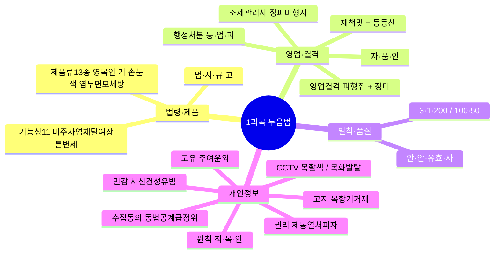
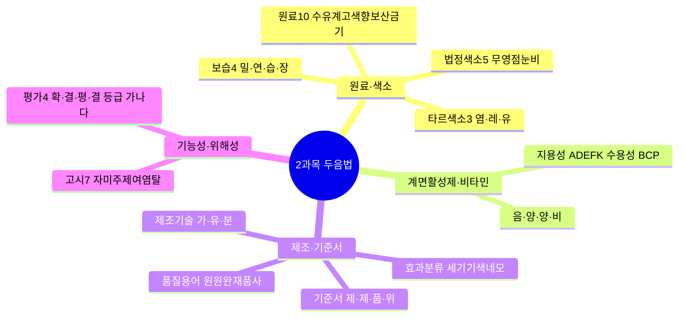
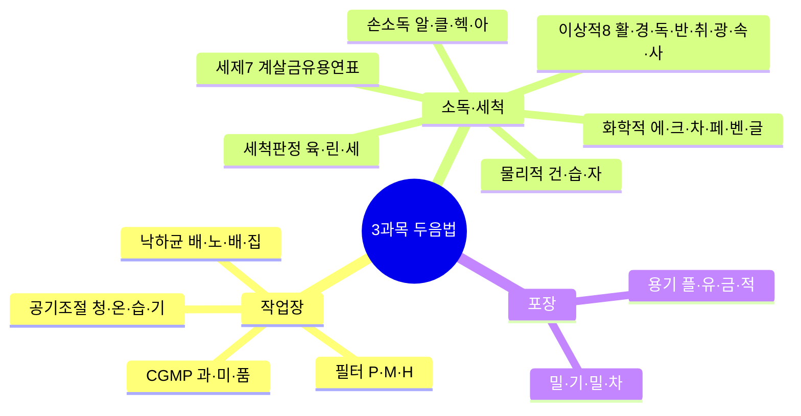
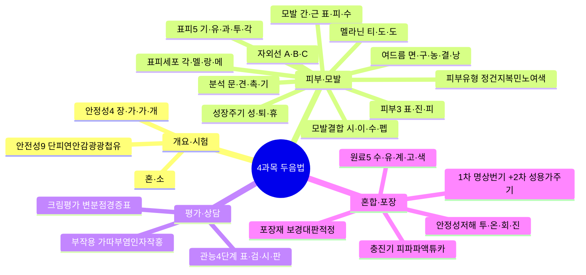
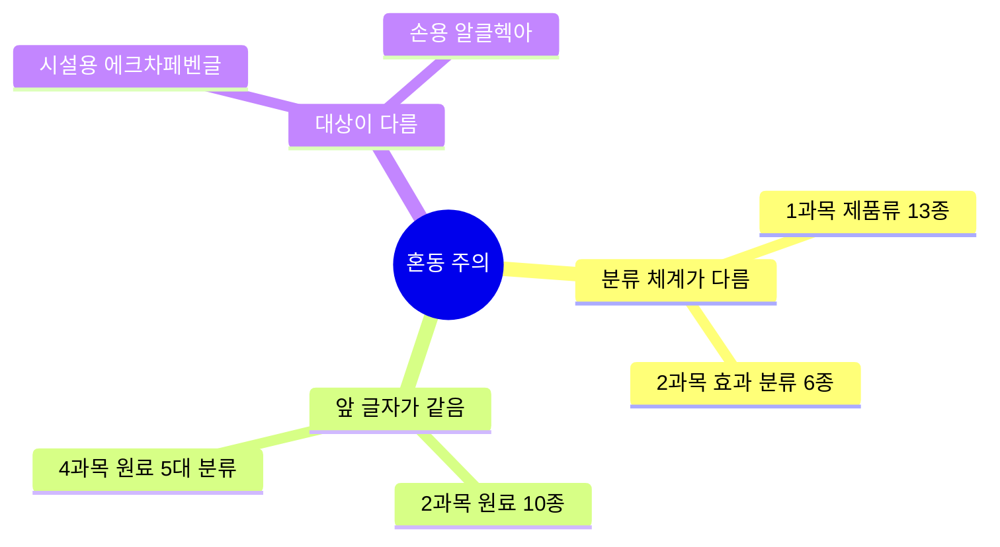

# 🧠 두음법 암기 총정리

> 전 과목 두음법(두문자 암기법) **56개**를 한곳에 모은 최종 암기 카드입니다.
> 각 두음에는 **연상 문장**(글자를 문장으로 엮기)을 달았고, 오른쪽에 교재 바로가기를 붙였습니다.
> 숫자 암기는 두음법과 원리가 달라 별도 섹션으로 정리했습니다.

---

## 1과목 — 화장품법의 이해 (10%)

| 암기 대상 | 두음법 · 연상 문장 | 상세 풀이 | 교재 |
| --- | --- | --- | --- |
| 법령 체계 | **법·시·규·고** — "법이 시켜서 규칙 고시" | **법**률(국회) → **시**행령(대통령령) → 시행**규**칙(총리령) → **고**시(식약처). 상위가 하위에 위임 | [Ch01](subj:law#ch01) |
| 화장품 제품류 13종 | **영·목·인 / 기 / 손·눈·색 / 염·두·면·모·체·방** — "영아 목욕 인체세정, 기초 바르고 손눈색 메이크업, 염색 두발 면도 체모 체취 방향까지" | ① 세정 계열: **영**유아용(3세 이하)·**목**욕용·**인**체세정용 ② **기**초화장용 ③ 메이크업: **손**발톱용·**눈**화장용·**색**조화장용 ④ 헤어·바디: 두발**염**색용·**두**발용·**면**도용·체**모**제거용·**체**취방지용·**방**향용 | [Ch01](subj:law#ch01) |
| 기능성화장품 11가지 효능 | **미·주·자·염·제·탈·여·장·튼·변·체** — "미백 주름 자외선, 염모 제모 탈모, 여드름 장벽 튼살, 변색 체모까지" | **미**백·**주**름개선·**자**외선차단·**염**모(탈염·탈색)·**제**모·**탈**모완화·**여**드름(인체세정용 한정)·피부**장**벽 회복·**튼**살 완화·모발색상**변**화·**체**모제거 | [Ch01](subj:law#ch01) |
| 영업 3종 등록·신고 | **제·책·맞 = 등·등·신** — "제조·책판은 등록, 맞춤만 신고" | **제**조업=등록, **책**임판매업=등록, **맞**춤형화장품판매업=**신고** ⚠️ 함정: 맞춤판매업은 등록 아님 | [Ch01](subj:law#ch01) |
| 조제관리사 업무 | **자·품·안** — "자격 갖추고 품질 챙기고 안전 지켜라" | **자**격관리(자격증 대여 금지·겸직 제한)·**품**질관리(기준·검사)·**안**전관리(위생·안전 기준 준수 지도) | [Ch01](subj:law#ch01) |
| 영업 결격사유 | **피·형·취 + 정·마** — "피성년 형 취소, 제조업은 정신·마약 더" | 공통 3종: **피**성년후견인·파산 미복권 / 금고 이상 **형**(실형 미집행·집행유예 중) / 등록**취**소·폐쇄 후 1년 미만. 제조업 추가: **정**신질환자·**마**약류 중독자 (제3조의3) | [Ch01](subj:law#ch01) |
| 조제관리사 결격 5종 | **정·피·마·형·자** — "정신 피성년 마약 형 자격취소" | **정**신질환자·**피**성년후견인·**마**약류 중독자·금고 이상 **형**·**자**격취소 후 3년 미만 (제3조의5) | [Ch01](subj:law#ch01) |
| 행정처분 3종 | **등·업·과** — "등록 취소, 업무 정지, 과징금" | **등**록취소·**업**무정지·**과**징금(과징금은 업무정지에 갈음 가능) | [Ch01](subj:law#ch01) |
| 벌칙·과태료 | **3·1·200 / 100·50** | 벌칙 3단계: 3년/3천만 · 1년/1천만 · 200만 원 이하 벌금. 과태료: 100만/50만 원 이하 | [Ch01](subj:law#ch01) |
| 품질 4요소 | **안·안·유효·사** — "안전이 안 되면 유효해도 못 써" | **안**전성(최우선)·**안**정성·**유효**성·**사**용성 | [Ch01](subj:law#ch01) |
| 정보주체 6대 권리 | **제·동·열·처·피·자** — "제공받고 동의하고 열람하고 처리정지, 피해구제 자동화 거부" | ① 정보 **제**공 ② **동**의 여부·범위 선택 ③ **열**람·전송(사본 발급) ④ **처**리정지·정정·삭제·파기 ⑤ **피**해 구제 ⑥ **자**동화 결정 거부·설명 | [Ch02](subj:law#ch02) |
| 민감정보 6종 | **사·신·건·성·유·범** — "사상 신념 건강 성생활 유전 범죄" | **사**상·**신**념·**건**강·**성**생활·**유**전정보·**범**죄경력 — **별도 동의 필수** ⚠️ 학력·직업·소득은 일반 개인정보 | [Ch02](subj:law#ch02) |
| 고유식별정보 4종 | **주·여·운·외** — "주민 여권 운전 외국인" | **주**민등록번호·**여**권번호·**운**전면허번호·**외**국인등록번호. 별도 동의 | [Ch02](subj:law#ch02) |
| 수집 동의 7가지 | **동·법·공·계·급·정·위** — "동의 법령 공공기관 계약, 급박 정당 위생까지" | **동**의(14세 미만은 법정대리인)·**법**령 의무·**공**공기관 업무·**계**약 이행·**급**박한 생명·재산 이익·**정**당한 이익·공중**위**생 | [Ch02](subj:law#ch02) |
| 고지 5사항 | **목·항·기·거·제** — "목적 항목 기간 거부권, 제공받는 자" | 수집**목**적·개인정보**항**목·보유**기**간·동의 **거**부권·제3자 제공 시 **제**공받는 자 | [Ch02](subj:law#ch02) |
| 보호 3대 원칙 | **최·목·안** — "최소만, 목적대로만, 안전하게" | **최**소한 수집·**목**적 외 이용 금지·**안**전성 확보 | [Ch02](subj:law#ch02) |
| CCTV 안내판 3요소 | **목·촬·책** — "목적 촬영 책임자" | 설치 **목**적·장소 / **촬**영 범위·시간 / 관리**책**임자 성명·연락처 | [Ch02](subj:law#ch02) |
| CCTV 금지 장소 4종 | **목·화·발·탈** — "목욕 화장 발한 탈의" | **목**욕실·**화**장실·**발**한실·**탈**의실 | [Ch02](subj:law#ch02) |

---

## 2과목 — 제조 및 품질관리 (25%)

| 암기 대상 | 두음법 · 연상 문장 | 상세 풀이 | 교재 |
| --- | --- | --- | --- |
| 원료 10종 | **수·유·계·고·색·향·보·산·금·기** — "수성 유성 계면활성, 고분자 색소 향료, 보존 산화방지 금속봉쇄 기능성" | **수**성(정제수·글리세린·BG)·**유**성(유지·왁스·탄화수소)·**계**면활성제·**고**분자·**색**소·**향**료·**보**존제(파라벤·페녹시에탄올)·**산**화방지제(BHT·토코페롤)·**금**속이온봉쇄제(EDTA)·**기**능성 원료 | [Ch01](subj:manufacturing#ch01) |
| 보습 원료 4종 | **밀·연·습·장** — "밀폐하고 연화하고 습윤하고 장벽 대체" | **밀**폐제(수분 증발 차단: 바셀린)·**연**화제(각질 연화)·**습**윤제(수분 결합: 글리세린·히알루론산)·**장**벽대체제(세라마이드) | [Ch01](subj:manufacturing#ch01) |
| 계면활성제 4종 | **음·양·양·비** — "음이 세정, 양이 린스, 양쪽은 순하고 비이온은 기초" | **음**이온성=세정력(세정제)·**양**이온성=살균·정전기방지(린스)·**양**쪽성=저자극(영유아·민감성)·**비**이온성=유화·가용화(기초) | [Ch01](subj:manufacturing#ch01) |
| 타르색소 3종 | **염·레·유** — "염료 녹고 레이크 결합하고 유기안료 안 녹고" | **염**료(용해)·**레**이크(수용성 염료+불용성 금속염을 기질에 화학결합)·**유**기안료(불용성) | [Ch01](subj:manufacturing#ch01) |
| 법정색소 5단계 | **무·영·점·눈·비** — "무제한→영유아금지→점막금지→눈주위금지→비누 외 금지" | 허가 색소를 사용 범위로 5단계 구분: 제한 없음·영유아 금지·점막 금지·눈 주위 금지·화장비누 외 금지 | [Ch01](subj:manufacturing#ch01) |
| 비타민 | **A·D·E·F·K / B·C·P** — "지용성은 알파벳 끝모음" | 지용성: A·D·E·F(필수지방산)·K / 수용성: B군·C·P | [Ch01](subj:manufacturing#ch01) |
| 기능성 고시 7종 | **자·미·주·제·여·염·탈** — "자외선 미백 주름, 제모 여드름 염모 탈모" | 고시 성분·함량 준수 시 자료 제출 생략 가능 (11가지 효능 중 고시 대상 7종) | [Ch01](subj:manufacturing#ch01) |
| 화장품 효과 분류 6종 | **세·기·기·색·네·모** — "세정하고 기초 기능성 색조 네일 모발" | **세**정용·**기**초·**기**능성·**색**조·**네**일·**모**발 ⚠️ 1과목 법정 제품류 13종과 다른 분류 | [Ch02](subj:manufacturing#ch02) |
| 제조 3대 기술 | **가·유·분** — "가용화로 녹이고 유화로 섞고 분산으로 퍼뜨려" | **가**용화(난용성 투명 용해)·**유**화(물+기름→에멀션)·**분**산(분말 균일 분산) | [Ch02](subj:manufacturing#ch02) |
| 기준서 4종 | **제·제·품·위** — "제품 제조 품질 위생" | **제**품표준서·**제**조관리기준서·**품**질관리기준서·제조**위**생관리기준서 ⚠️ 원료관리기준서는 별도 | [Ch02](subj:manufacturing#ch02) |
| 알레르기 유발 성분 25종 | 기재 기준으로 암기 | 착향제 중 25종. 씻어내는 제품 **0.01%** / 남기는 제품 **0.001%** 초과 시 '향료' 대신 개별 성분명 기재 | [Ch03](subj:manufacturing#ch03) |
| 품질 용어 6종 | **원·원·완·재·품·사** — "원료 원자재 완제품, 재작업 품질보증 사용기한" | **원**료(벌크 투입 물질)·**원**자재(원료+자재)·**완**제품(포장 완료)·**재**작업·**품**질보증·**사**용기한 | [Ch04](subj:manufacturing#ch04) |
| 위해성 평가 4단계 | **확·결·평·결 + 가·나·다** — "위험 확인하고 결정하고 노출 평가해서 위해도 결정" | 위험성 **확**인 → 위험성 **결**정 → 노출 **평**가 → 위해도 **결**정 / 등급: 중대(**가**, 회수 15일)·중간(**나**, 30일)·경미(**다**, 30일) | [Ch05](subj:manufacturing#ch05) |

---

## 3과목 — 유통 화장품 안전관리 (25%)

| 암기 대상 | 두음법 · 연상 문장 | 상세 풀이 | 교재 |
| --- | --- | --- | --- |
| CGMP 3대 요소 | **과·미·품** — "과오 없애고 미생물 막고 품질 세워" | **과**오 최소화·**미**생물오염 방지·**품**질관리체계 | [Ch01](subj:safety#ch01) |
| 에어필터 3단계 | **P·M·H** — "Pre가 먼저, Medium이 중간, HEPA가 마지막" | **P**re(초기·큰 입자) → **M**edium(중간 입자) → **H**EPA(0.3μm 이상 99.97% 제거) — 순서 그대로 | [Ch01](subj:safety#ch01) |
| 공기 조절 4대 요소 | **청·온·습·기** — "청정 온도 습도 기류" | **청**정도(공기정화기)·**온**도(열교환기)·**습**도(가습기)·**기**류(송풍기) | [Ch01](subj:safety#ch01) |
| 낙하균 Koch법 | **배·노·배·집** — "배지 놓고 노출하고 배양해서 집락 세기" | 평판**배**지 설치 → **노**출(고청정 30분 이상) → **배**양(세균 30~35℃·48h, 진균 20~25℃·5일) → **집**락수 측정 | [Ch01](subj:safety#ch01) |
| 물리적 소독 3종 | **건·습·자** — "건열 습열 자외선" | **건**열(건조 열)·**습**열(스팀·온수)·**자**외선 — 화학물질 잔류 없는 소독 | [Ch01](subj:safety#ch01) |
| 화학적 소독제 6종 | **에·크·차·페·벤·글** — "에탄올 크레졸 차아염소산, 페놀 벤잘코늄 글루콘산" | 70% **에**탄올(1주일 내 사용)·**크**레졸수 3%(바닥)·**차**아염소산나트륨 50ppm(당일 조제·전량 폐기)·**페**놀수 3%(독성·부식)·**벤**잘코늄 10%→20배 희석·**글**루콘산클로르헥시딘 5%→10배 희석 | [Ch01](subj:safety#ch01) |
| 이상적 소독제 8조건 | **활·경·독·반·취·광·속·사** — "활성 유지, 경제적, 독성 없고, 반응 안 하고, 취 안 나고, 광범위하고, 속도 빠르고, 사멸 99.9%" | 사용기간 **활**성 유지·**경**제성·사용농도 무**독**성·제품·설비와 **반**응 안 함·불쾌한 향**취** 없음·**광**범위 항균 스펙트럼·5분 이내 **속**효·최소 99.9% **사**멸 | [Ch01](subj:safety#ch01) |
| 손 소독제 4종 | **알·클·헥·아** — "알코올 클로르헥시딘 헥사클로로펜 아이오도퍼" | **알**코올 70~80%·**클**로르헥시딘 0.5~4.0%·**헥**사클로로펜 3.0%·**아**이오도퍼 0.5~10% — 혼합·소분 전 원칙, 일회용 장갑 시 예외 | [Ch02](subj:safety#ch02) |
| 세제 7대 성분 | **계·살·금·유·용·연·표** — "계면활성 살균 금속봉쇄, 유기폴리머 용제 연마 표백" | **계**면활성제·**살**균제(4급 암모늄)·**금**속이온봉쇄제·**유**기폴리머·**용**제(알코올·글리콜)·**연**마제·**표**백(활성염소) | [Ch03](subj:safety#ch03) |
| 세척 판정 3종 | **육·린·세** — "육안 보고 린스 재고 세균 시험" | **육**안 검사·**린**스 정량법·**세**균 시험 | [Ch03](subj:safety#ch03) |
| 용기 재질 4종 | **플·유·금·적** — "플라스틱 유리 금속 적층" | **플**라스틱·**유**리·**금**속·**적**층(복합재) | [Ch05](subj:safety#ch05) |
| 포장용기 4종 | **밀·기·밀·차** — "밀폐 기밀 밀봉 차광" | **밀**폐(기체 차단)·**기**밀(미생물 차단·무균)·**밀**봉(개봉 흔적)·**차**광(빛 차단) | [Ch05](subj:safety#ch05) |

---

## 4과목 — 맞춤형화장품의 이해 (40%)

| 암기 대상 | 두음법 · 연상 문장 | 상세 풀이 | 교재 |
| --- | --- | --- | --- |
| 맞춤형 2유형 | **혼·소** — "혼합이냐 소분이냐" | **혼**합형: 내용물+내용물 또는 고시 원료 혼합 / **소**분형: 내용물 소분(고형 비누 등 단순 소분 제외) | [Ch01](subj:understanding#ch01) |
| 안전성시험 9종 | **단·피·연·안·감·광·광·첩·유** — "단회 피부자극 연속 안점막, 감작 광독 광감작 첩포 유전" | **단**회독성·1차 **피**부자극·**연**속 피부자극·**안**점막·**감**작성·**광**독성·**광**감작성·인체**첩**포·**유**전독성 | [Ch01](subj:understanding#ch01) |
| 안정성시험 4종 | **장·가·가·개** — "장기 가속 가혹 개봉" | **장**기보존(유통조건 유사·3로트·6개월 이상)·**가**속·**가**혹(극한 온도)·**개**봉 후 | [Ch01](subj:understanding#ch01) |
| 피부 3층 | **표·진·피** — "표피 진피 피하" | 바깥→안쪽: 표피(약 0.2mm)→진피(표피의 10~40배)→피하조직 | [Ch02](subj:understanding#ch02) |
| 표피 5층 | **기·유·과·투·각** — "기저 유극 과립 투명 각질" | 안쪽→바깥(각화 방향): 기저층→유극층→과립층→투명층→각질층. ⚠️ 투명층은 손바닥·발바닥에만 존재 | [Ch02](subj:understanding#ch02) |
| 표피 4대 세포 | **각·멜·랑·메** — "각질 멜라 랑게르 메르켈" | **각**질형성세포(각화 주체)·**멜**라노사이트(멜라닌 생성)·**랑**게르한스세포(면역)·**메**르켈세포(촉각) | [Ch02](subj:understanding#ch02) |
| 모발 구조 | **간·근 / 표·피·수** — "모간 밖, 모근 안, 표피 피질 수질" | 모발 = 모**간**(피부 밖) + 모**근**(피부 안) / 모간 3층 = 모**표**피(큐티클)→모**피**질→모**수**질(중심) | [Ch02](subj:understanding#ch02) |
| 모발 4대 결합 | **시·이·수·펩** — "시스틴 이온 수소 펩타이드" | **시**스틴 결합(S-S, 파마 시 끊김)·**이**온 결합·**수**소 결합·**펩**타이드 결합 | [Ch02](subj:understanding#ch02) |
| 모발 성장주기 | **성·퇴·휴** — "성장 6년 퇴행 3주 휴지 4개월" | **성**장기 3~6년(80~90%)→**퇴**행기 3주(1~2%)→**휴**지기 3~4개월(10~15%). 모발 성장 0.3~0.5mm/일 | [Ch02](subj:understanding#ch02) |
| 자외선 3종 | **UVA·B·C** — "A는 노화, B는 홍반, C는 피부암" | **UVA** 320~400nm 장파·광노화 / **UVB** 290~320nm 중파·일광화상·홍반 / **UVC** 200~290nm 단파·피부암(오존층 차단) | [Ch02](subj:understanding#ch02) |
| 멜라닌 생성 경로 | **티·도·도** — "티로신 도파 도파퀴논" | **티**로신 →(티로시나아제)→ **도**파 → **도**파퀴논 → 멜라닌 | [Ch02](subj:understanding#ch02) |
| 피부 유형 | **정·건·지·복·민·노·여·색** — "정상 건성 지성 복합 민감 노화 여드름 색소" | **정**상(중성)·**건**성(수분 10% 미만)·**지**성·**복**합성(T지성·U건성)·**민**감성·**노**화·**여**드름·**색**소침착 ※ 교재 마인드맵은 "7가지"로 표기되나 표에는 8개 유형 | [Ch02](subj:understanding#ch02) |
| 피츠패트릭 6형 | **Ⅰ~Ⅵ** | 피부색·자외선 화상 정도로 Ⅰ~Ⅵ형 분류 (Ⅰ=항상 타고 색소침착 없음 ↔ Ⅵ=거의 타지 않고 짙음) | [Ch02](subj:understanding#ch02) |
| 피부 분석 4종 | **문·견·촉·기** — "문진하고 견진하고 촉진하고 기기로" | **문**진(설문)·**견**진(육안)·**촉**진(촉감)·**기**기 측정(수분·피지) | [Ch02](subj:understanding#ch02) |
| 여드름 종류 | **면·구·농·결·낭** — "면포 구진 농포 결절 낭종" | **면**포(비염증·블랙/화이트헤드)→**구**진→**농**포→**결**절→**낭**종(최중증) — 심한 순서 | [Ch02](subj:understanding#ch02) |
| 관능평가 4단계 | **표·검·시·판** — "표준품 검체 시험 판정" | **표**준품 선정 → **검**체 채취·기준 마련 → **시**험 → 적합 **판**정·기록 | [Ch03](subj:understanding#ch03) |
| 크림 안정성 평가 6항목 | **변·분·점·경·증·표** — "변취 분리 점도 경도 증발 표면굳음" | **변**취·**분**리·**점**도·**경**도·**증**발·**표**면 굳음 (로션·에센스는 변취·분리·점도·경도 4종) | [Ch03](subj:understanding#ch03) |
| 부작용 8종 | **가·따·부·염·인·자·작·홍** — "가렵고 따끔 부어 염증, 인설 자통 작열 홍반" | **가**려움·**따**끔거림·**부**종·**염**증·**인**설(각질 탈락)·**자**통·**작**열감·**홍**반 | [Ch04](subj:understanding#ch04) |
| 포장 표시사항 | **명·상·번·기 + 성·용·가·주·기** — "명칭 상호 번호 기한, 성분 용량 가격 주의 기능성" | 1차(내포장): **명**칭·**상**호·제조**번**호·사용**기**한 4가지 / 2차 추가: 전**성**분·**용**량·**가**격·**주**의사항·**기**능성 | [Ch05](subj:understanding#ch05) |
| 원료 5대 분류 | **수·유·계·고·색** — "수성 유성 계면 고분자 색소" | 2과목 원료 10종의 압축 버전 (뒤 5개 향·보·산·금·기 생략) | [Ch06](subj:understanding#ch06) |
| 제형 안정성 저해 4요인 | **투·온·회·진** — "투입 온도 회전 진공" | **투**입 순서·**온**도 편차·**회**전속도·**진**공세기 | [Ch06](subj:understanding#ch06) |
| 충진기 6종 | **피·파·파·액·튜·카** — "피스톤 파우치 파우더 액체 튜브 카톤" | **피**스톤·**파**우치·**파**우더·**액**체·**튜**브·**카**톤 포장기 | [Ch07](subj:understanding#ch07) |
| 포장재 6조건 | **보·경·대·판·적·정** — "보호 경제 대량 판매 적정 정보" | **보**호성·**경**제성·**대**량화·**판**매촉진·**적**정포장·**정**보전달 | [Ch07](subj:understanding#ch07) |

---

## 🔢 숫자 암기 보조 — 두음법이 통하지 않는 숫자는 "그룹 패턴"으로

> 두음법은 목록용입니다. 숫자·기한·한도는 아래 패턴으로 묶고, 상세 표는
> [중요숫자 암기정리](content/맞춤형화장품조제관리사_중요숫자_암기정리.md)를 보세요.

### 기한 — "5·15·30·90·72시간·1·3·5년"

| 숫자 | 해당 항목 |
| --- | --- |
| **5일** | 회수계획서 제출 |
| **15일** | 실증자료 제출 · 중대 유해사례 신속보고 · 과징금 독촉장 발급 · 위해성 '가' 등급 회수 |
| **30일** | 변경 등록·신고(일반) · 책임판매관리자 결원 보충 · 위해성 '나·다' 회수 |
| **90일** | 행정구역 개편 소재지 변경 · 자격시험 공고(시행 90일 전) |
| **72시간** | 개인정보 유출 신고(1천 명 이상, 홈페이지 7일 게재) |
| **1년** | 영업 등록취소·폐쇄 후 결격 · 사용기한 만료 후 자료 보존 |
| **3년** | 조제관리사 자격취소 후 결격 |
| **5년** | 실태조사 주기 · 인체적용시험 경력 요건 |

### 농도·한도 — "큰 순서로만 외우기"

| 그룹 | 패턴 |
| --- | --- |
| 중금속 (㎍/g) | 납 **20**(점토 50) > 비소·안티몬 **10** > 카드뮴 **5** > 수은 **1** (니켈만 별도: 눈35·색조30·기타10) |
| 미생물 (개/g) | 물휴지 **100** < 영유아·눈화장 **500** < 기타 **1,000** / 대장균·녹농균·황색포도상구균 **불검출** |
| 향수 부향률 (%) | 퍼퓸 **15~25** > EDP **10~15** > EDT **5~10** > EDC **3~5** |
| 포장공간 비율 (%) | 세정류 **15** / 그 밖 **10** / 재사용 용기 **25** |
| 알레르기 성분 기재 | 씻어내는 **0.01%** / 남기는 **0.001%** |

### 피부·모발 수치 — "58-31-11 / 3년-3주-4개월"

| 그룹 | 패턴 |
| --- | --- |
| 각질층 | 케라틴 **58** · NMF **31** · 지질 **11** (%) / pH **4.5~5.5** / **10~20**층 / 각화 **28±3일** |
| 모발 주기 | 성장기 **3~6년**(90%) · 퇴행기 **3주**(1%) · 휴지기 **3~4개월**(15%) — 셋 다 "3"으로 시작 |
| 진피 | 표피의 **10~40배** · 콜라겐 **90%** · 엘라스틴 **1.5~4.7%** |
| 피지 | 트리글리세라이드 **41** · 왁스에스터 **25** · 지방산 **16** · 스쿠알렌 **12** (%) |

---

## ⚠️ 헷갈리기 쉬운 두음법 3쌍

| 혼동 쌍 | 구분 포인트 |
| --- | --- |
| 제품류 13종 (1과목) ↔ 효과 분류 6종 (2과목) | `세·기·기·색·네·모`는 **2과목 효과 분류**만. 1과목은 시행규칙 법정 제품류 13종(`영·목·인/기/손·눈·색/염·두·면·모·체·방`) |
| 원료 10종 (2과목) ↔ 원료 5대 분류 (4과목) | 앞 5자(수·유·계·고·색) 동일. 2과목은 `향·보·산·금·기`가 더 붙음 |
| 시설 소독제 6종 ↔ 손 소독제 4종 | 시설·설비용 = `에·크·차·페·벤·글` / 손·피부용 = `알·클·헥·아` — 문제의 소독 **대상** 먼저 확인 |

---

## 📌 알려진 표기 주의사항

- **피부 유형 개수**: 교재 마인드맵·요약은 "7가지"라고 쓰지만 실제 표에는 정상·건성·지성·복합성·민감성·노화·여드름·색소침착 **8개**가 나옴. 시험에서는 유형별 특징을 묻는 형태가 주류이므로 8개 모두 특징과 함께 암기 권장.
- **위해성 평가 4단계 용어**: 교재 두음법(위험성 확인→결정→노출평가→위해도결정) 기준으로 정리. 핵심요약의 다른 표기는 같은 절차의 다른 번역어로 보면 됨.
