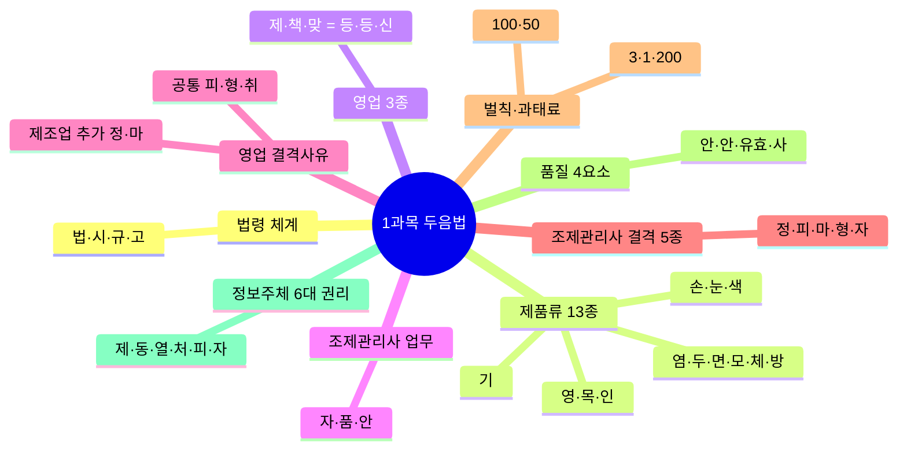
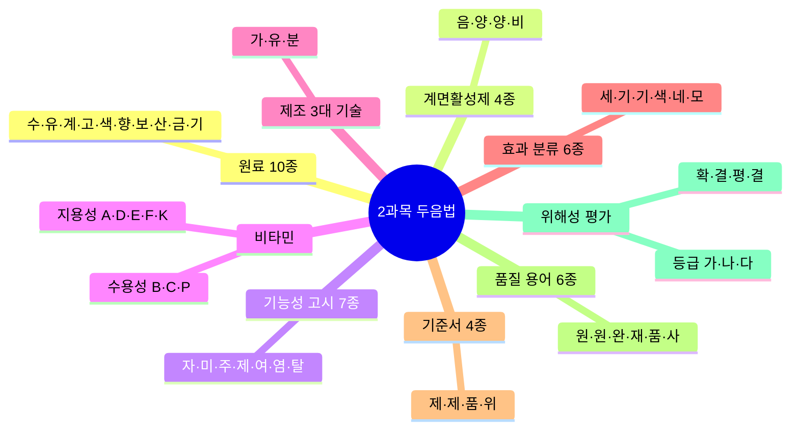
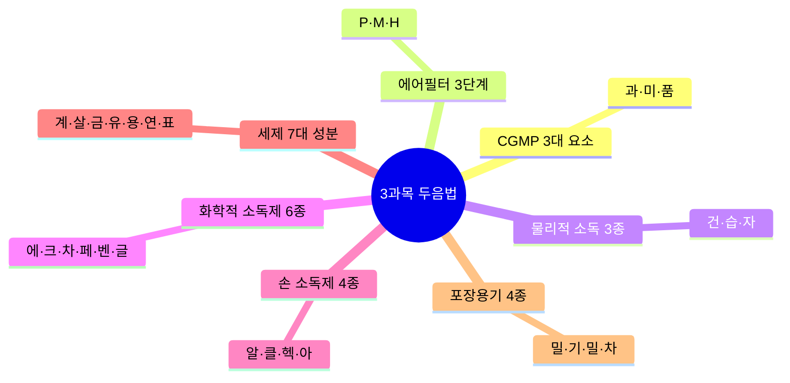
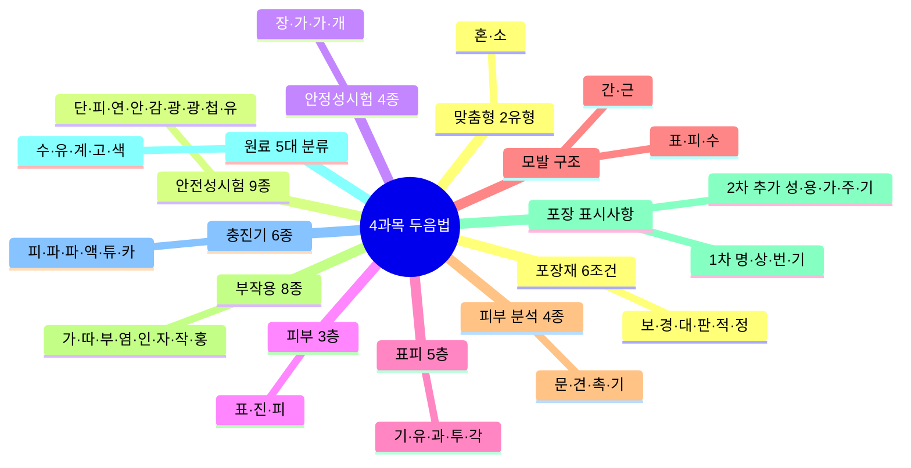
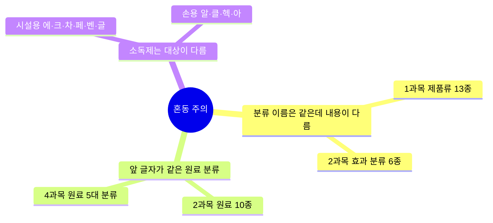

# 🧠 두음법 암기 총정리

> 전 과목 두음법(두문자 암기법) 36개를 한곳에 모은 최종 암기 카드입니다.
> 시험 직전 이 문서만 빠르게 훑어도 분류형 문제 대비가 됩니다.

---

## 1과목 — 화장품법의 이해 (10%)

| 암기 대상 | 두음법 | 풀이 |
| --- | --- | --- |
| 법령 체계 | **법·시·규·고** | 위임 순서: **법**률(국회) → **시**행령(대통령령) → 시행**규**칙(총리령) → **고**시(식약처). 상위법이 하위법에 위임하는 위계 |
| 화장품 제품류 13종 | **영·목·인 / 기 / 손·눈·색 / 염·두·면·모·체·방** | ① 세정 계열: **영**유아용(3세 이하)·**목**욕용·**인**체세정용 ② **기**초화장용(스킨·로션·크림·팩) ③ 메이크업: **손**발톱용·**눈**화장용·**색**조화장용 ④ 헤어·바디: 두발**염**색용·**두**발용·**면**도용·체**모**제거용·**체**취방지용·**방**향용 |
| 영업 3종 등록·신고 | **제·책·맞 = 등·등·신** | **제**조업=등록, **책**임판매업=등록, **맞**춤형화장품판매업=**신고**. 시험 함정: 맞춤판매업은 등록이 아니라 신고 |
| 조제관리사 업무 | **자·품·안** | **자**격관리(자격증 대여 금지·겸직 제한)·**품**질관리(품질 기준·검사)·**안**전관리(위생·안전 기준 준수 지도) |
| 영업 결격사유 | **피·형·취 + 정·마** | 3종 영업 공통: **피**성년후견인·파산선고 미복권 / 금고 이상 **형** 선고(실형 미집행·집행유예 중) / 등록**취**소·폐쇄 후 1년 미만. 제조업에만 추가: **정**신질환자·**마**약류 중독자 (제3조의3) |
| 조제관리사 결격사유 5종 | **정·피·마·형·자** | **정**신질환자·**피**성년후견인·**마**약류 중독자·금고 이상 **형** 선고·**자**격취소 후 3년 미만 (제3조의5) — 영업 결격사유와 구조가 유사하나 파산 대신 자격취소 3년 |
| 벌칙·과태료 | **3·1·200 / 100·50** | 벌칙 3단계: 3년 이하 징역 또는 3천만 원 / 1년 이하 또는 1천만 원 / 200만 원 이하 벌금. 과태료: 100만 원 이하 / 50만 원 이하 |
| 품질 4요소 | **안·안·유효·사** | **안**전성(최우선·인체 무해)·**안**정성(품질 유지)·**유효**성(효능·효과)·**사**용성(사용 편의). 안전성이 최우선이라는 함정 출제 |
| 정보주체 6대 권리 | **제·동·열·처·피·자** | ① 정보 **제**공받을 권리 ② **동**의 여부·범위 선택 ③ **열**람·전송(사본 발급) ④ **처**리정지·정정·삭제·파기 ⑤ **피**해 구제 ⑥ **자**동화 결정 거부·설명 요구 |

---

## 2과목 — 제조 및 품질관리 (25%)

| 암기 대상 | 두음법 | 풀이 |
| --- | --- | --- |
| 원료 10종 | **수·유·계·고·색·향·보·산·금·기** | **수**성 원료(정제수·글리세린·BG)·**유**성 원료(유지·왁스·탄화수소)·**계**면활성제·**고**분자(증점·피막)·**색**소(타르색소·안료)·**향**료·**보**존제(파라벤·페녹시에탄올)·**산**화방지제(BHT·토코페롤)·**금**속이온봉쇄제(EDTA)·**기**능성 원료 |
| 계면활성제 4종 | **음·양·양·비** | **음**이온성=세정력 우수(세정제)·**양**이온성=살균·정전기 방지(린스·트리트먼트)·**양**쪽성=저자극(베이비·민감성)·**비**이온성=유화·가용화(기초화장품) |
| 기능성 고시 7종 | **자·미·주·제·여·염·탈** | **자**외선 차단·**미**백·**주**름 개선·**제**모·**여**드름 완화·**염**모(탈염·탈색 포함)·**탈**모 완화 — 고시 성분은 자료 제출 생략 |
| 비타민 | **A·D·E·F·K / B·C·P** | 지용성: **A**·**D**·**E**·**F**(필수지방산)·**K** / 수용성: **B**군·**C**·**P** |
| 제조 3대 기술 | **가·유·분** | **가**용화(난용성을 투명하게 용해)·**유**화(물+기름→에멀션)·**분**산(고체 분말을 균일 분산) |
| 화장품 효과 분류 6종 | **세·기·기·색·네·모** | **세**정용·**기**초·**기**능성·**색**조·**네**일·**모**발 — ⚠️ 1과목의 법정 제품류 13종과는 다른 분류 체계 |
| 기준서 4종 | **제·제·품·위** | **제**품표준서·**제**조관리기준서·**품**질관리기준서·제조**위**생관리기준서 |
| 품질 용어 6종 | **원·원·완·재·품·사** | **원**료·**원**자재·**완**제품·**재**작업·**품**질보증·**사**용기한 — 정의 구분 문제로 출제 |
| 위해성 평가 | **확·결·평·결 + 가·나·다** | 4단계: 위험성 **확**인 → 위험성 **결**정 → 노출 **평**가 → 위해도 **결**정 / 위해 등급: 중대(**가**)·중간(**나**)·경미(**다**) |

---

## 3과목 — 유통 화장품 안전관리 (25%)

| 암기 대상 | 두음법 | 풀이 |
| --- | --- | --- |
| CGMP 3대 요소 | **과·미·품** | **과**오 최소화(인적 실수 방지 체계)·**미**생물오염 방지·**품**질관리체계 확립 |
| 에어필터 3단계 | **P·M·H** | **P**re Filter(초기·큰 입자) → **M**edium Filter(중간 입자) → **H**igh Efficiency Filter(HEPA, 0.3μm 이상 99.97% 제거) — 여과 순서대로 암기 |
| 물리적 소독 3종 | **건·습·자** | **건**열(건조 열)·**습**열(스팀·온수)·**자**외선 — 화학물질 잔류가 없는 소독 |
| 화학적 소독제 6종 | **에·크·차·페·벤·글** | 70% **에**탄올(조제 후 1주일)·**크**레졸수 3%(실내 바닥)·**차**아염소산나트륨 50ppm(당일 조제·전량 폐기)·**페**놀수 3%(독성·부식)·**벤**잘코늄클로라이드 10%→20배 희석·**글**루콘산클로르헥시딘 5%→10배 희석 |
| 손 소독제 4종 | **알·클·헥·아** | **알**코올 70~80%·**클**로르헥시딘 0.5~4.0%·**헥**사클로로펜 3.0%·**아**이오도퍼 0.5~10% — 혼합·소분 전 원칙, 일회용 장갑 착용 시 예외 |
| 세제 7대 성분 | **계·살·금·유·용·연·표** | **계**면활성제(세정)·**살**균제(4급 암모늄 등)·**금**속이온봉쇄제(경수 연화)·**유**기폴리머(잔류성 강화)·**용**제(알코올·글리콜)·**연**마제(마찰 세정)·**표**백 성분(활성염소) |
| 포장용기 4종 | **밀·기·밀·차** | **밀**폐용기(기체 통과 차단)·**기**밀용기(미생물 침입 차단·무균)·**밀**봉용기(개봉 흔적 확인)·**차**광용기(빛 차단) |

---

## 4과목 — 맞춤형화장품의 이해 (40%)

| 암기 대상 | 두음법 | 풀이 |
| --- | --- | --- |
| 맞춤형 2유형 | **혼·소** | **혼**합형: 화장품 내용물 + 다른 내용물 또는 고시 원료를 혼합 / **소**분형: 내용물을 소분(단, 고형 비누 등 단순 소분은 제외) |
| 안전성시험 9종 | **단·피·연·안·감·광·광·첩·유** | **단**회독성·1차 **피**부자극·**연**속 피부자극·**안**점막 자극·**감**작성·**광**독성·**광**감작성·인체**첩**포(패치)·**유**전독성 |
| 안정성시험 4종 | **장·가·가·개** | **장**기보존(유통조건 유사·3로트·6개월 이상)·**가**속(가혹 조건)·**가**혹(극한 온도 사이클)·**개**봉 후 안정성 |
| 피부 3층 | **표·진·피** | **표**피→**진**피→**피**하조직 (바깥→안쪽) |
| 표피 5층 | **기·유·과·투·각** | **기**저층→**유**극층→**과**립층→**투**명층→**각**질층 (안쪽→바깥, 각화 방향). 투명층은 손바닥·발바닥에만 존재 |
| 모발 구조 | **간·근 / 표·피·수** | 모발 = 모**간**(피부 밖) + 모**근**(피부 안) / 모간 3층 = 모**표**피(큐티클)→모**피**질(케라틴)·모**수**질(중심) |
| 피부 분석 4종 | **문·견·촉·기** | **문**진(상담·설문)·**견**진(육안 관찰)·**촉**진(촉감)·**기**기 측정(수분·피지 등) |
| 부작용 8종 | **가·따·부·염·인·자·작·홍** | **가**려움·**따**끔거림·**부**종·**염**증·**인**설(각질 탈락)·**자**통(스스로 아픔)·**작**열감·**홍**반 |
| 포장 표시사항 | **명·상·번·기 + 성·용·가·주·기** | 1차(내포장): **명**칭·**상**호·제조**번**호·사용**기**한 / 2차(외포장) 추가: 전**성**분·**용**량·**가**격·**주**의사항·**기**능성 표시 |
| 원료 5대 분류 | **수·유·계·고·색** | **수**성·**유**성·**계**면활성제·**고**분자·**색**소 — 2과목 원료 10종(수·유·계·고·색·향·보·산·금·기)의 압축 버전 |
| 충진기 6종 | **피·파·파·액·튜·카** | **피**스톤 충진기·**파**우치 충진기·**파**우더 충진기·**액**체 충진기·**튜**브 충진기·**카**톤 포장기 |
| 포장재 6조건 | **보·경·대·판·적·정** | **보**호성·**경**제성·**대**량화·**판**매촉진·**적**정포장·**정**보전달 |

---

## ⚠️ 헷갈리기 쉬운 두음법 3쌍

| 혼동 쌍 | 구분 포인트 |
| --- | --- |
| 제품류 13종 (1과목) ↔ 효과 분류 6종 (2과목) | `세·기·기·색·네·모`는 **2과목 효과 분류**만 해당. 1과목은 시행규칙의 법정 제품류 13종(`영·목·인/기/손·눈·색/염·두·면·모·체·방`) |
| 원료 10종 (2과목) ↔ 원료 5대 분류 (4과목) | 앞 5자(수·유·계·고·색) 동일. 2과목은 뒤에 `향·보·산·금·기`(향료·보존제·산화방지제·금속이온봉쇄제·기능성)가 더 붙음 |
| 시설 소독제 6종 ↔ 손 소독제 4종 | 시설·설비용 = `에·크·차·페·벤·글` / 손·피부용 = `알·클·헥·아` — 문제에서 소독 **대상**을 먼저 확인 |
