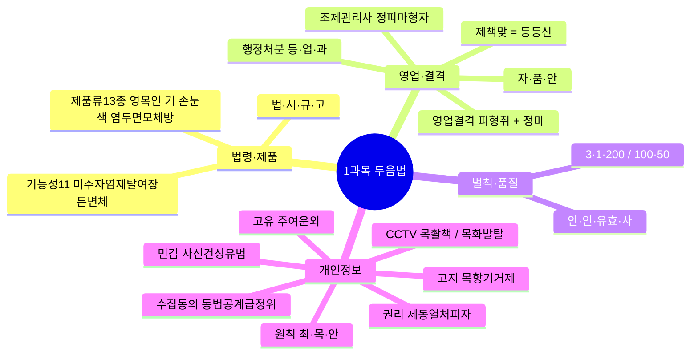
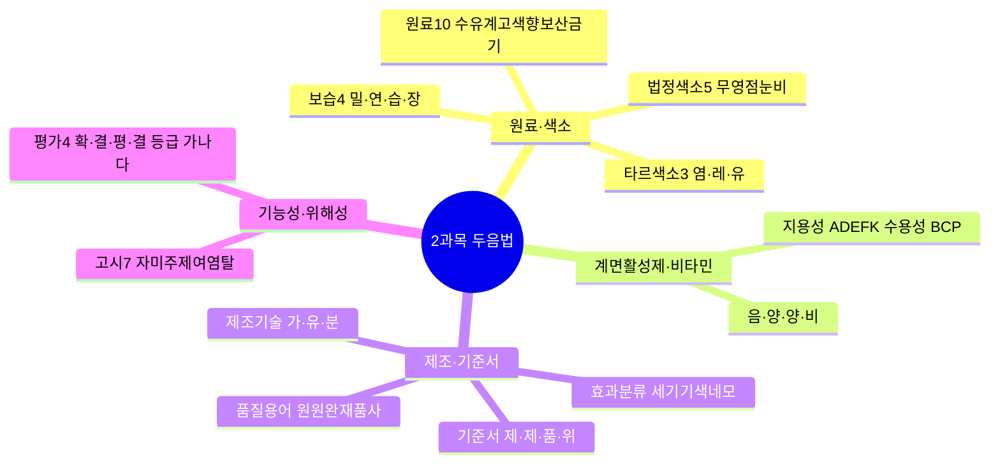
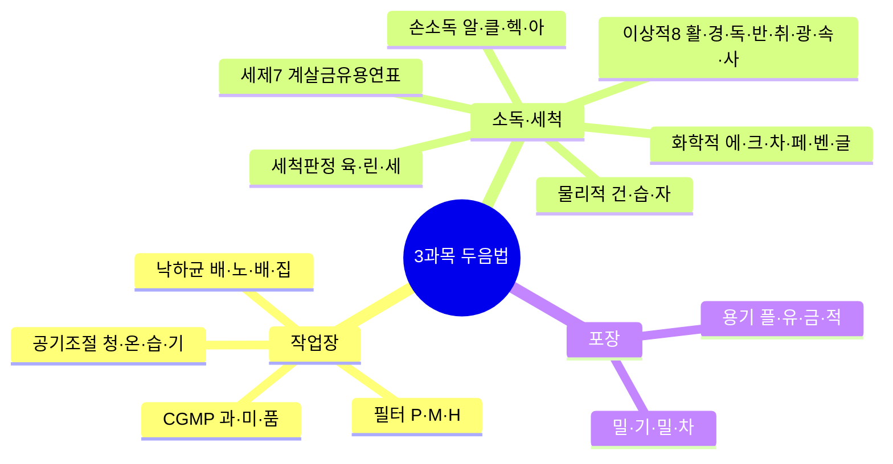
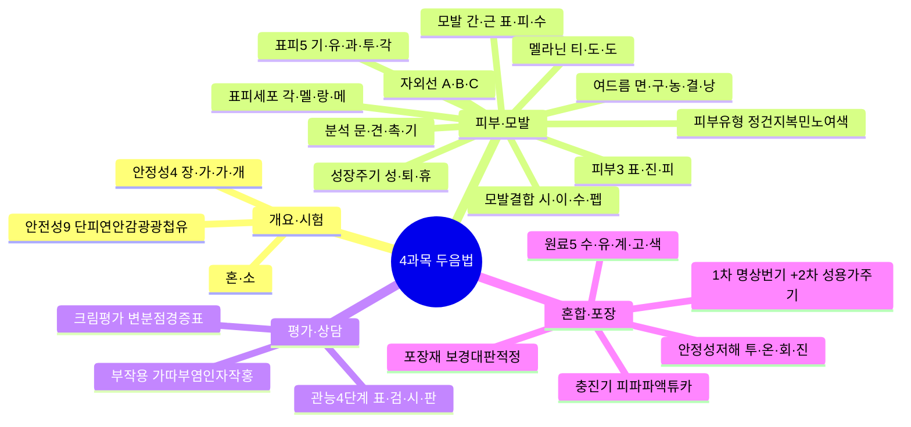
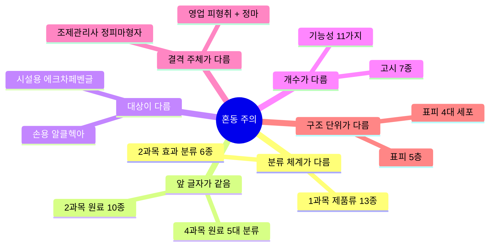
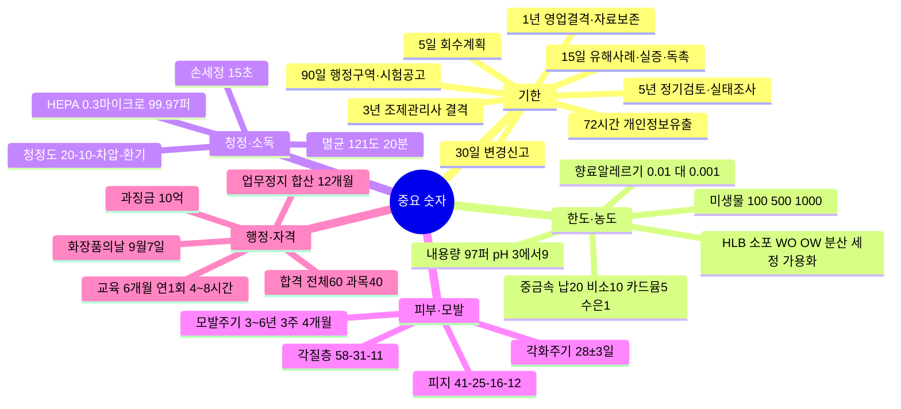
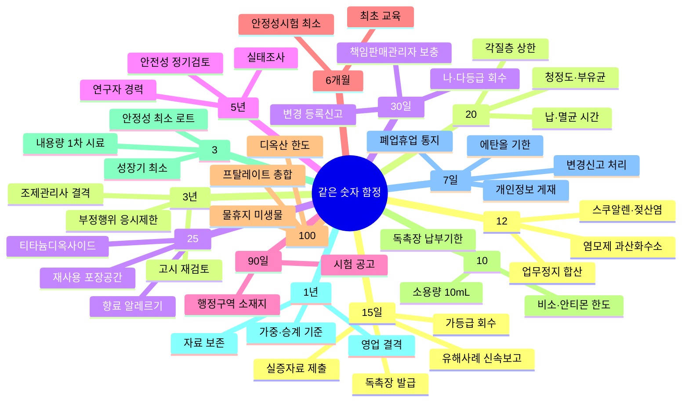

# 🧠 두음법·숫자 암기 총정리

> 전 과목 두음법(두문자 암기법) **64개**와 **시험 빈출 숫자**를 한곳에 모은 최종 암기 카드입니다.
> 각 두음에는 **연상 문장**(글자를 문장으로 엮기)을 달았고, 오른쪽에 교재 바로가기를 붙였습니다.
> 숫자는 두음법과 원리가 달라 **Part 2**에서 "그룹 패턴 + 상세 표"로 정리했습니다.
> 과목 표기: ①법 ②제조·품질 ③유통안전 ④맞춤형이해
>
> ⚠️ 법령·고시 수치는 개정될 수 있으니, 시험 직전에는 국가법령정보센터(law.go.kr)·식약처(mfds.go.kr) 최신 고시로 최종 확인하세요.

---

## 🗂️ Part 1. 두음법 — 목록 암기 64개

> **번호**: `D01~D64`는 두음법 일련번호 — 과목 무관 연속 부여. `※` 표시 행은 두음법이 아닌 참고 항목으로 64개에 포함하지 않는다.
> **읽는 법**: 두음이 길면 의미 단위로 끊어 읽는다 — 상세 풀이 열의 **굵은 글자**가 끊는 위치다.

### 1과목 — 화장품법의 이해 (10%)

| 암기 대상 | 두음법 · 연상 문장 | 상세 풀이 | 교재 |
| --- | --- | --- | --- |
| **D01** 법령 체계 | **법·시·규·고** — "법이 시켜서 규칙 고시" | **법**률(국회) → **시**행령(대통령령) → 시행**규**칙(총리령) → **고**시(식약처). 상위가 하위에 위임 | [Ch01](subj:law#ch01) |
| **D02** 화장품 제품류 13종 | **영·목·인 / 기 / 손·눈·색 / 염·두·면·모·체·방** — "영아 목욕 인체세정, 기초 바르고 손눈색 메이크업, 염색 두발 면도 체모 체취 방향까지" | ① 세정 계열: **영**유아용(3세 이하)·**목**욕용·**인**체세정용 ② **기**초화장용 ③ 메이크업: **손**발톱용·**눈**화장용·**색**조화장용 ④ 헤어·바디: 두발**염**색용·**두**발용·**면**도용·체**모**제거용·**체**취방지용·**방**향용 | [Ch01](subj:law#ch01) |
| **D03** 기능성화장품 11가지 효능 | **미·주·자·염·제·탈·여·장·튼·변·체** — "미백 주름 자외선, 염모 제모 탈모, 여드름 장벽 튼살, 변색 체모까지" | **미**백·**주**름개선·**자**외선차단·**염**모(탈염·탈색)·**제**모·**탈**모완화·**여**드름(인체세정용 한정)·피부**장**벽 회복·**튼**살 완화·모발색상**변**화·**체**모제거 | [Ch01](subj:law#ch01) |
| **D04** 영업 3종 등록·신고 | **제·책·맞 = 등·등·신** — "제조·책판은 등록, 맞춤만 신고" | **제**조업=등록, **책**임판매업=등록, **맞**춤형화장품판매업=**신고** ⚠️ 함정: 맞춤판매업은 등록 아님 | [Ch01](subj:law#ch01) |
| **D05** 조제관리사 업무 | **자·품·안** — "자격 갖추고 품질 챙기고 안전 지켜라" | **자**격관리(자격증 대여 금지·겸직 제한)·**품**질관리(기준·검사)·**안**전관리(위생·안전 기준 준수 지도) | [Ch01](subj:law#ch01) |
| **D06** 영업 결격사유 | **피·형·취 + 정·마** — "피성년 형 취소, 제조업은 정신·마약 더" | 공통 3종: **피**성년후견인·파산 미복권 / 금고 이상 **형**(실형 미집행·집행유예 중) / 등록**취**소·폐쇄 후 1년 미만. 제조업 추가: **정**신질환자·**마**약류 중독자 (제3조의3) | [Ch01](subj:law#ch01) |
| **D07** 조제관리사 결격 5종 | **정·피·마·형·자** — "정신 피성년 마약 형 자격취소" | **정**신질환자·**피**성년후견인·**마**약류 중독자·금고 이상 **형**·**자**격취소 후 3년 미만 (제3조의5) | [Ch01](subj:law#ch01) |
| **D08** 행정처분 3종 | **등·업·과** — "등록 취소, 업무 정지, 과징금" | **등**록취소·**업**무정지·**과**징금(과징금은 업무정지에 갈음 가능) | [Ch01](subj:law#ch01) |
| **D09** 벌칙·과태료 | **3·1·200 / 100·50** | 벌칙 3단계: 3년/3천만 · 1년/1천만 · 200만 원 이하 벌금. 과태료: 100만/50만 원 이하 | [Ch01](subj:law#ch01) |
| **D10** 품질 4요소 | **안·안·유효·사** — "안전이 안 되면 유효해도 못 써" | **안**전성(최우선)·**안**정성·**유효**성·**사**용성 | [Ch01](subj:law#ch01) |
| **D11** 정보주체 6대 권리 | **제·동·열·처·피·자** — "제공받고 동의하고 열람하고 처리정지, 피해구제 자동화 거부" | ① 정보 **제**공 ② **동**의 여부·범위 선택 ③ **열**람·전송(사본 발급) ④ **처**리정지·정정·삭제·파기 ⑤ **피**해 구제 ⑥ **자**동화 결정 거부·설명 | [Ch02](subj:law#ch02) |
| **D12** 민감정보 6종 | **사·신·건·성·유·범** — "사상 신념 건강 성생활 유전 범죄" | **사**상·**신**념·**건**강·**성**생활·**유**전정보·**범**죄경력 — **별도 동의 필수** ⚠️ 학력·직업·소득은 일반 개인정보 | [Ch02](subj:law#ch02) |
| **D13** 고유식별정보 4종 | **주·여·운·외** — "주민 여권 운전 외국인" | **주**민등록번호·**여**권번호·**운**전면허번호·**외**국인등록번호. 별도 동의 | [Ch02](subj:law#ch02) |
| **D14** 수집 동의 7가지 | **동·법·공·계·급·정·위** — "동의 법령 공공기관 계약, 급박 정당 위생까지" | **동**의(14세 미만은 법정대리인)·**법**령 의무·**공**공기관 업무·**계**약 이행·**급**박한 생명·재산 이익·**정**당한 이익·공중**위**생 | [Ch02](subj:law#ch02) |
| **D15** 고지 5사항 | **목·항·기·거·제** — "목적 항목 기간 거부권, 제공받는 자" | 수집**목**적·개인정보**항**목·보유**기**간·동의 **거**부권·제3자 제공 시 **제**공받는 자 | [Ch02](subj:law#ch02) |
| **D16** 보호 3대 원칙 | **최·목·안** — "최소만, 목적대로만, 안전하게" | **최**소한 수집·**목**적 외 이용 금지·**안**전성 확보 | [Ch02](subj:law#ch02) |
| **D17** CCTV 안내판 3요소 | **목·촬·책** — "목적 촬영 책임자" | 설치 **목**적·장소 / **촬**영 범위·시간 / 관리**책**임자 성명·연락처 | [Ch02](subj:law#ch02) |
| **D18** CCTV 금지 장소 4종 | **목·화·발·탈** — "목욕 화장 발한 탈의" | **목**욕실·**화**장실·**발**한실·**탈**의실 | [Ch02](subj:law#ch02) |

---

### 2과목 — 제조 및 품질관리 (25%)

| 암기 대상 | 두음법 · 연상 문장 | 상세 풀이 | 교재 |
| --- | --- | --- | --- |
| **D19** 원료 10종 | **수·유·계·고·색·향·보·산·금·기** — "수성 유성 계면활성, 고분자 색소 향료, 보존 산화방지 금속봉쇄 기능성" | **수**성(정제수·글리세린·BG)·**유**성(유지·왁스·탄화수소)·**계**면활성제·**고**분자·**색**소·**향**료·**보**존제(파라벤·페녹시에탄올)·**산**화방지제(BHT·토코페롤)·**금**속이온봉쇄제(EDTA)·**기**능성 원료 | [Ch01](subj:manufacturing#ch01) |
| **D20** 보습 원료 4종 | **밀·연·습·장** — "밀폐하고 연화하고 습윤하고 장벽 대체" | **밀**폐제(수분 증발 차단: 바셀린)·**연**화제(각질 연화)·**습**윤제(수분 결합: 글리세린·히알루론산)·**장**벽대체제(세라마이드) | [Ch01](subj:manufacturing#ch01) |
| **D21** 계면활성제 4종 | **음·양·양·비** — "음이 세정, 양이 린스, 양쪽은 순하고 비이온은 기초" | **음**이온성=세정력(세정제)·**양**이온성=살균·정전기방지(린스)·**양**쪽성=저자극(영유아·민감성)·**비**이온성=유화·가용화(기초) | [Ch01](subj:manufacturing#ch01) |
| **D22** 타르색소 3종 | **염·레·유** — "염료 녹고 레이크 결합하고 유기안료 안 녹고" | **염**료(용해)·**레**이크(수용성 염료+불용성 금속염을 기질에 화학결합)·**유**기안료(불용성) | [Ch01](subj:manufacturing#ch01) |
| **D23** 법정색소 5단계 | **무·영·점·눈·비** — "무제한→영유아금지→점막금지→눈주위금지→비누 외 금지" | 허가 색소를 사용 범위로 5단계 구분: 제한 없음·영유아 금지·점막 금지·눈 주위 금지·화장비누 외 금지 | [Ch01](subj:manufacturing#ch01) |
| **D24** 비타민 | **A·D·E·F·K / B·C·P** — "지용성은 알파벳 끝모음" | 지용성: A·D·E·F(필수지방산)·K / 수용성: B군·C·P | [Ch01](subj:manufacturing#ch01) |
| **D25** 기능성 고시 7종 | **자·미·주·제·여·염·탈** — "자외선 미백 주름, 제모 여드름 염모 탈모" | 고시 성분·함량 준수 시 자료 제출 생략 가능 (11가지 효능 중 고시 대상 7종) | [Ch01](subj:manufacturing#ch01) |
| **D26** 화장품 효과 분류 6종 | **세·기·기·색·네·모** — "세정하고 기초 기능성 색조 네일 모발" | **세**정용·**기**초·**기**능성·**색**조·**네**일·**모**발 ⚠️ 1과목 법정 제품류 13종과 다른 분류 | [Ch02](subj:manufacturing#ch02) |
| **D27** 제조 3대 기술 | **가·유·분** — "가용화로 녹이고 유화로 섞고 분산으로 퍼뜨려" | **가**용화(난용성 투명 용해)·**유**화(물+기름→에멀션)·**분**산(분말 균일 분산) | [Ch02](subj:manufacturing#ch02) |
| **D28** 기준서 4종 | **제·제·품·위** — "제품 제조 품질 위생" | **제**품표준서·**제**조관리기준서·**품**질관리기준서·제조**위**생관리기준서 ⚠️ 원료관리기준서는 별도 | [Ch02](subj:manufacturing#ch02) |
| ※ 알레르기 유발 성분 25종 | 기재 기준으로 암기 | 착향제 중 25종. 씻어내는 제품 **0.01%** / 남기는 제품 **0.001%** 초과 시 '향료' 대신 개별 성분명 기재 | [Ch03](subj:manufacturing#ch03) |
| **D29** 품질 용어 6종 | **원·원·완·재·품·사** — "원료 원자재 완제품, 재작업 품질보증 사용기한" | **원**료(벌크 투입 물질)·**원**자재(원료+자재)·**완**제품(포장 완료)·**재**작업·**품**질보증·**사**용기한 | [Ch04](subj:manufacturing#ch04) |
| **D30** 위해성 평가 4단계 | **확·결·평·결 + 가·나·다** — "위험 확인하고 결정하고 노출 평가해서 위해도 결정" | 위험성 **확**인 → 위험성 **결**정 → 노출 **평**가 → 위해도 **결**정 / 등급: 중대(**가**, 회수 15일)·중간(**나**, 30일)·경미(**다**, 30일) | [Ch05](subj:manufacturing#ch05) |

---

### 3과목 — 유통 화장품 안전관리 (25%)

| 암기 대상 | 두음법 · 연상 문장 | 상세 풀이 | 교재 |
| --- | --- | --- | --- |
| **D31** CGMP 3대 목적 | **과·미·품** — "과오 없애고 미생물 막고 품질 세워" | **과**오 최소화·**미**생물오염 방지·**품**질관리체계 ⚠️ CGMP **구성** 3요소(인적자원·제조관리·품질관리)와 구분 → Part 2 §11 | [Ch01](subj:safety#ch01) |
| **D32** 에어필터 3단계 | **P·M·H** — "Pre가 먼저, Medium이 중간, HEPA가 마지막" | **P**re(초기·큰 입자) → **M**edium(중간 입자) → **H**EPA(0.3μm 이상 99.97% 제거) — 순서 그대로 | [Ch01](subj:safety#ch01) |
| **D33** 공기 조절 4대 요소 | **청·온·습·기** — "청정 온도 습도 기류" | **청**정도(공기정화기)·**온**도(열교환기)·**습**도(가습기)·**기**류(송풍기) | [Ch01](subj:safety#ch01) |
| **D34** 낙하균 Koch법 | **배·노·배·집** — "배지 놓고 노출하고 배양해서 집락 세기" | 평판**배**지 설치 → **노**출(고청정 30분 이상) → **배**양(세균 30~35℃·48h, 진균 20~25℃·5일) → **집**락수 측정 | [Ch01](subj:safety#ch01) |
| **D35** 물리적 소독 3종 | **건·습·자** — "건열 습열 자외선" | **건**열(건조 열)·**습**열(스팀·온수)·**자**외선 — 화학물질 잔류 없는 소독 | [Ch01](subj:safety#ch01) |
| **D36** 화학적 소독제 6종 | **에·크·차·페·벤·글** — "에탄올 크레졸 차아염소산, 페놀 벤잘코늄 글루콘산" | 70% **에**탄올(1주일 내 사용)·**크**레졸수 3%(바닥)·**차**아염소산나트륨 50ppm(당일 조제·전량 폐기)·**페**놀수 3%(독성·부식)·**벤**잘코늄 10%→20배 희석·**글**루콘산클로르헥시딘 5%→10배 희석 | [Ch01](subj:safety#ch01) |
| **D37** 이상적 소독제 8조건 | **활·경·독·반·취·광·속·사** — "활성 유지, 경제적, 독성 없고, 반응 안 하고, 취 안 나고, 광범위하고, 속도 빠르고, 사멸 99.9%" | 사용기간 **활**성 유지·**경**제성·사용농도 무**독**성·제품·설비와 **반**응 안 함·불쾌한 향**취** 없음·**광**범위 항균 스펙트럼·5분 이내 **속**효·최소 99.9% **사**멸 | [Ch01](subj:safety#ch01) |
| **D38** 손 소독제 4종 | **알·클·헥·아** — "알코올 클로르헥시딘 헥사클로로펜 아이오도퍼" | **알**코올 70~80%·**클**로르헥시딘 0.5~4.0%·**헥**사클로로펜 3.0%·**아**이오도퍼 0.5~10% — 혼합·소분 전 원칙, 일회용 장갑 시 예외 | [Ch02](subj:safety#ch02) |
| **D39** 세제 7대 성분 | **계·살·금·유·용·연·표** — "계면활성 살균 금속봉쇄, 유기폴리머 용제 연마 표백" | **계**면활성제·**살**균제(4급 암모늄)·**금**속이온봉쇄제·**유**기폴리머·**용**제(알코올·글리콜)·**연**마제·**표**백(활성염소) | [Ch03](subj:safety#ch03) |
| **D40** 세척 판정 3종 | **육·린·세** — "육안 보고 린스 재고 세균 시험" | **육**안 검사·**린**스 정량법·**세**균 시험 | [Ch03](subj:safety#ch03) |
| **D41** 용기 재질 4종 | **플·유·금·적** — "플라스틱 유리 금속 적층" | **플**라스틱·**유**리·**금**속·**적**층(복합재) | [Ch05](subj:safety#ch05) |
| **D42** 포장용기 4종 | **밀·기·밀·차** — "밀폐 기밀 밀봉 차광" | **밀**폐(기체 차단)·**기**밀(미생물 차단·무균)·**밀**봉(개봉 흔적)·**차**광(빛 차단) | [Ch05](subj:safety#ch05) |

---

### 4과목 — 맞춤형화장품의 이해 (40%)

| 암기 대상 | 두음법 · 연상 문장 | 상세 풀이 | 교재 |
| --- | --- | --- | --- |
| **D43** 맞춤형 2유형 | **혼·소** — "혼합이냐 소분이냐" | **혼**합형: 내용물+내용물 또는 고시 원료 혼합 / **소**분형: 내용물 소분(고형 비누 등 단순 소분 제외) | [Ch01](subj:understanding#ch01) |
| **D44** 안전성시험 9종 | **단·피·연·안·감·광·광·첩·유** — "단회 피부자극 연속 안점막, 감작 광독 광감작 첩포 유전" | **단**회독성·1차 **피**부자극·**연**속 피부자극·**안**점막·**감**작성·**광**독성·**광**감작성·인체**첩**포·**유**전독성 | [Ch01](subj:understanding#ch01) |
| **D45** 안정성시험 4종 | **장·가·가·개** — "장기 가속 가혹 개봉" | **장**기보존(유통조건 유사·3로트·6개월 이상)·**가**속·**가**혹(극한 온도)·**개**봉 후 | [Ch01](subj:understanding#ch01) |
| **D46** 피부 3층 | **표·진·피** — "표피 진피 피하" | 바깥→안쪽: 표피(약 0.2mm)→진피(표피의 10~40배)→피하조직 | [Ch02](subj:understanding#ch02) |
| **D47** 표피 5층 | **기·유·과·투·각** — "기저 유극 과립 투명 각질" | 안쪽→바깥(각화 방향): 기저층→유극층→과립층→투명층→각질층. ⚠️ 투명층은 손바닥·발바닥에만 존재 | [Ch02](subj:understanding#ch02) |
| **D48** 표피 4대 세포 | **각·멜·랑·메** — "각질 멜라 랑게르 메르켈" | **각**질형성세포(각화 주체)·**멜**라노사이트(멜라닌 생성)·**랑**게르한스세포(면역)·**메**르켈세포(촉각) | [Ch02](subj:understanding#ch02) |
| **D49** 모발 구조 | **간·근 / 표·피·수** — "모간 밖, 모근 안, 표피 피질 수질" | 모발 = 모**간**(피부 밖) + 모**근**(피부 안) / 모간 3층 = 모**표**피(큐티클)→모**피**질→모**수**질(중심) | [Ch02](subj:understanding#ch02) |
| **D50** 모발 4대 결합 | **시·이·수·펩** — "시스틴 이온 수소 펩타이드" | **시**스틴 결합(S-S, 파마 시 끊김)·**이**온 결합·**수**소 결합·**펩**타이드 결합 | [Ch02](subj:understanding#ch02) |
| **D51** 모발 성장주기 | **성·퇴·휴** — "성장 6년 퇴행 3주 휴지 4개월" | **성**장기 3~6년(80~90%)→**퇴**행기 3주(1~2%)→**휴**지기 3~4개월(10~15%). 모발 성장 0.3~0.5mm/일 | [Ch02](subj:understanding#ch02) |
| **D52** 자외선 3종 | **UVA·B·C** — "A는 노화, B는 홍반, C는 살균(오존층 차단)" | **UVA** 320~400nm 장파·광노화 / **UVB** 290~320nm 중파·일광화상·홍반 / **UVC** 200~290nm 단파·최강 에너지·살균력 강, 대부분 오존층에서 차단 | [Ch02](subj:understanding#ch02) |
| **D53** 멜라닌 생성 경로 | **티·도·도** — "티로신 도파 도파퀴논" | **티**로신 →(티로시나아제)→ **도**파 → **도**파퀴논 → 멜라닌 | [Ch02](subj:understanding#ch02) |
| **D54** 피부 유형 | **정·건·지·복·민·노·여·색** — "정상 건성 지성 복합 민감 노화 여드름 색소" | **정**상(중성)·**건**성(수분 10% 미만)·**지**성·**복**합성(T지성·U건성)·**민**감성·**노**화·**여**드름·**색**소침착 — 8개 유형 전부 특징과 함께 암기 | [Ch02](subj:understanding#ch02) |
| ※ 피츠패트릭 6형 | **Ⅰ~Ⅵ** | 피부색·자외선 화상 정도로 Ⅰ~Ⅵ형 분류 (Ⅰ=항상 타고 색소침착 없음 ↔ Ⅵ=거의 타지 않고 짙음) | [Ch02](subj:understanding#ch02) |
| **D55** 피부 분석 4종 | **문·견·촉·기** — "문진하고 견진하고 촉진하고 기기로" | **문**진(설문)·**견**진(육안)·**촉**진(촉감)·**기**기 측정(수분·피지) | [Ch02](subj:understanding#ch02) |
| **D56** 여드름 종류 | **면·구·농·결·낭** — "면포 구진 농포 결절 낭종" | **면**포(비염증·블랙/화이트헤드)→**구**진→**농**포→**결**절→**낭**종(최중증) — 심한 순서 | [Ch02](subj:understanding#ch02) |
| **D57** 관능평가 4단계 | **표·검·시·판** — "표준품 검체 시험 판정" | **표**준품 선정 → **검**체 채취·기준 마련 → **시**험 → 적합 **판**정·기록 | [Ch03](subj:understanding#ch03) |
| **D58** 크림 안정성 평가 6항목 | **변·분·점·경·증·표** — "변취 분리 점도 경도 증발 표면굳음" | **변**취·**분**리·**점**도·**경**도·**증**발·**표**면 굳음 (로션·에센스는 변취·분리·점도·경도 4종) | [Ch03](subj:understanding#ch03) |
| **D59** 부작용 8종 | **가·따·부·염·인·자·작·홍** — "가렵고 따끔 부어 염증, 인설 자통 작열 홍반" | **가**려움·**따**끔거림·**부**종·**염**증·**인**설(각질 탈락)·**자**통·**작**열감·**홍**반 | [Ch04](subj:understanding#ch04) |
| **D60** 포장 표시사항 | **명·상·번·기 + 성·용·가·주·기** — "명칭 상호 번호 기한, 성분 용량 가격 주의 기능성" | 1차(내포장): **명**칭·**상**호·제조**번**호·사용**기**한 4가지 / 2차 추가: 전**성**분·**용**량·**가**격·**주**의사항·**기**능성 | [Ch05](subj:understanding#ch05) |
| **D61** 원료 5대 분류 | **수·유·계·고·색** — "수성 유성 계면 고분자 색소" | 2과목 원료 10종의 압축 버전 (뒤 5개 향·보·산·금·기 생략) | [Ch06](subj:understanding#ch06) |
| **D62** 제형 안정성 저해 4요인 | **투·온·회·진** — "투입 온도 회전 진공" | **투**입 순서·**온**도 편차·**회**전속도·**진**공세기 | [Ch06](subj:understanding#ch06) |
| **D63** 충진기 6종 | **피·파·파·액·튜·카** — "피스톤 파우치 파우더 액체 튜브 카톤" | **피**스톤·**파**우치·**파**우더·**액**체·**튜**브·**카**톤 포장기 | [Ch07](subj:understanding#ch07) |
| **D64** 포장재 6조건 | **보·경·대·판·적·정** — "보호 경제 대량 판매 적정 정보" | **보**호성·**경**제성·**대**량화·**판**매촉진·**적**정포장·**정**보전달 | [Ch07](subj:understanding#ch07) |

---

### ⚠️ 헷갈리기 쉬운 두음법 6쌍

| 혼동 쌍 | 구분 포인트 |
| --- | --- |
| 제품류 13종 (1과목) ↔ 효과 분류 6종 (2과목) | `세·기·기·색·네·모`는 **2과목 효과 분류**만. 1과목은 시행규칙 법정 제품류 13종(`영·목·인/기/손·눈·색/염·두·면·모·체·방`) |
| 원료 10종 (2과목) ↔ 원료 5대 분류 (4과목) | 앞 5자(수·유·계·고·색) 동일. 2과목은 `향·보·산·금·기`가 더 붙음 |
| 시설 소독제 6종 ↔ 손 소독제 4종 | 시설·설비용 = `에·크·차·페·벤·글` / 손·피부용 = `알·클·헥·아` — 문제의 소독 **대상** 먼저 확인 |
| 기능성화장품 11가지 (1과목) ↔ 기능성 고시 7종 (2과목) | 1과목 `미·주·자/염·제·탈/여·장·튼/변·체` = 법정 **11가지 효능**. 2과목 `자·미·주·제·여·염·탈` = 안전성·유효성 심사대상 **고시 7종** — 개수와 범위가 다름 |
| 영업 결격 (1과목) ↔ 조제관리사 결격 (1과목) | 영업 공통 `피·형·취` + 제조업만 `정·마` 추가. 조제관리사는 `정·피·마·형·자`(자격취소 3년 포함) — **주체**와 요건 순서가 다름 |
| 표피 5층 ↔ 표피 4대 세포 (4과목) | `기·유·과·투·각` = 표피의 **층 구조**. `각·멜·랑·메` = 표피를 구성하는 **세포** — 층인지 세포인지 문제에서 먼저 구분 |

---

## 🔢 Part 2. 중요 숫자 — 기한·한도·비율

> 두음법은 목록용입니다. 숫자·기한·한도는 두음이 먹히지 않으므로 **그룹 패턴**(같은 숫자끼리·크기 순서·공통 자릿수)으로 묶어 외우는 것이 정석입니다.
> 아래 **패턴 요약 3종**으로 큰 그림을 잡은 뒤, **상세 표 1~16**에서 누락 없이 전수 확인하세요.

**📖 이 파트의 구성**

1. **그룹 패턴 요약 3종** — 기한 / 농도·한도 / 피부·모발 수치를 암기용 문장으로 압축한 요약표
2. **주제별 상세 표 1~16** — 법정 기한부터 자외선 파장까지, 시험에 나오는 숫자를 주제별로 전수 정리
3. **혼동 함정표(17)** — "15일"처럼 같은 숫자인데 의미가 다른 항목을 한 표로 비교 (출제자가 가장 좋아하는 함정)
4. **🎯 시험 직전 3분 핵심** — 과목별 최빈출 숫자만 재압축한 최종 점검 리스트

**🏷️ 표기 읽는 법**

| 표기 | 의미 |
| --- | --- |
| ⭐ | 최빈출 항목 — 반드시 암기 |
| ★ (빈출 열) | 기출·예상 문제에 나온 적 있는 항목 |
| ①②③④ | 주요 출제 과목 — ①화장품법 ②제조·품질 ③유통안전 ④맞춤형이해 |
| 🎯빈출 / 🎯최빈출 | 섹션 단위 출제 비중 — 5·6·8·11·12번 우선 공략 |
| §n | Part 2 상세 표 n번 섹션 (예: §13 = 모발 생리) |
| `[법]` `[고시]` `[교재]` | 숫자의 출처 — 법(화장품법·시행령·시행규칙·개인정보보호법) / 고시(식약처 고시·기준) / 교재(교과 지식). `[법]`·`[고시]`는 개정될 수 있어 시험 직전 원문 재확인 |
| ㎍/g | 마이크로그램/그램 — 중금속·유해물질 한도 단위 (1 ㎍/g = 1 ppm) |
| 개/g(mL) | 미생물 한도 단위 — CFU(집락형성단위)와 같은 의미로 읽음 |

**🧭 추천 학습 순서**: 패턴 3종으로 골격 암기 → 🎯 표시 상세 표(5·6·8·11·12번) → 나머지 상세 표 → 17번 함정표로 같은 숫자 구분 훈련 → 3분 핵심으로 최종 회상.

---

### 기한 패턴 — "5·15·30·90·72시간·1·3·5년"

| 숫자 | 해당 항목 |
| --- | --- |
| **5일** | 회수계획서 제출 |
| **15일** | 실증자료 제출 · 중대 유해사례 신속보고 · 과징금 독촉장 발급 · 위해성 '가' 등급 회수 |
| **30일** | 변경 등록·신고(일반) · 책임판매관리자 결원 보충 · 위해성 '나·다' 회수 |
| **90일** | 행정구역 개편 소재지 변경 · 자격시험 공고(시행 90일 전) |
| **72시간** | 개인정보 유출 신고(1천 명 이상, 홈페이지 7일 게재) |
| **1년** | 영업 등록취소·폐쇄 후 결격 · 사용기한 만료 후 자료 보존 |
| **3년** | 조제관리사 자격취소 후 결격 |
| **5년** | 실태조사 주기 · 인체적용시험 경력 요건 |

### 농도·한도 패턴 — "큰 순서로만 외우기"

| 그룹 | 패턴 |
| --- | --- |
| 중금속 (㎍/g) | 납 **20**(점토 50) > 비소·안티몬 **10** > 카드뮴 **5** > 수은 **1** (니켈만 별도: 눈35·색조30·기타10) |
| 미생물 (개/g) | 물휴지 **100** < 영유아·눈화장 **500** < 기타 **1,000** / 대장균·녹농균·황색포도상구균 **불검출** |
| 향수 부향률 (%) | 퍼퓸 **15~25** > EDP **10~15** > EDT **5~10** > EDC **3~5** |
| 포장공간 비율 (%) | 세정류 **15** / 그 밖 **10** / 재사용 용기 **25** |
| 알레르기 성분 기재 | 씻어내는 **0.01%** / 남기는 **0.001%** |

### 피부·모발 수치 패턴 — "58-31-11 / 3년-3주-4개월"

| 그룹 | 패턴 |
| --- | --- |
| 각질층 | 케라틴 **58** · NMF **31** · 지질 **11** (%) / pH **4.5~5.5** / **10~20**층 / 각화 **28±3일** |
| 모발 주기 | 성장기 **3~6년**(약 90%) · 퇴행기 **3주**(1~2%) · 휴지기 **3~4개월**(약 15%) — 셋 다 "3"으로 시작(%는 근사값, 정확 범위는 §13) |
| 진피 | 표피의 **10~40배** · 콜라겐 **90%** · 엘라스틴 **1.5~4.7%** |
| 피지 | 트리글리세라이드 **41** · 왁스에스터 **25** · 지방산 **16** · 스쿠알렌 **12** (%) |

---

### 1. 법정 기한 (일·개월·년) ①④ [법]

| 항목 | 숫자 | 비고 | 빈출 |
| --- | ---: | --- | :---: |
| ⭐ 변경 등록·신고 일반 기한 | **30일** 이내 | 소재지·대표자 등 변경 | ★ |
| 행정구역 개편에 따른 소재지 변경 | **90일** 이내 | | ★ |
| 폐업·휴업 신고수리 통지 | **7일** 이내 | 처장이 신고받은 날부터 | |
| 휴업신고 면제 | 휴업기간 **1개월 미만** | | |
| ⭐ 중대 유해사례 신속보고 | **15일** 이내 | ①②③ 공통 최빈출 | ★ |
| 일반 유해사례 정기보고 | 매 반기 종료 후 **1개월** 이내 | | ★ |
| 실증자료 제출 | 요청받은 날부터 **15일** 이내 | 표시·광고 내용의 실증 의무 | ★ |
| 회수계획서 제출 | **5일** 이내 | 회수 개시 시 | ★ |
| 위해성 등급별 회수 기한 | '가' **15일** · '나·다' **30일** | 위해성 평가 등급별 회수 완료 기한 (2과목 `확·결·평·결`+`가·나·다` 참조) | ★ |
| 책임판매관리자 결원 시 보충 | **30일** 이내 | | ★ |
| 심사자료 보완 | 보완일부터 **60일** 이내 | 원료 사용기준 심사(사용금지 해제·변경), 연장 요청 가능 | |
| 심사 결과 통지 | 자료 제출일부터 **180일** 이내 | 원료 사용기준 심사 결과통지서 | |
| 과징금 미납 → 독촉장 발급 | 기한 후 **15일** 이내 | | |
| 독촉장 납부기한 | 발급일부터 **10일** 이내 | | |
| 제품 사용기한 만료 후 자료 보존 | **1년간** | 특정 성분 **0.5% 이상** 함유 제품의 안정성시험 자료 | |
| 생산·수입실적 보고 | 매년 **2월 말**까지 | | |
| 원료 목록 보고(맞춤형) | 매년 **1회** | | |
| ⭐ 개인정보 유출 신고(1천명 이상) | **72시간** 이내 | 홈페이지 **7일 이상** 게재 | ★ |

> 암기 팁 — "30-90-15": 일반변경 30일, 행정구역 90일, 유해사례 15일. 72시간은 개인정보 유출

---

### 2. 행정처분·벌칙·과징금 ①④ [법]

| 항목 | 숫자 | 빈출 |
| --- | ---: | :---: |
| 반복 위반 가중 기준 | 최근 **1년** | |
| 처분효과 승계 기간 | 처분 종료일부터 **1년간** | ★ |
| ⭐ 업무정지 합산 최대 | **12개월** | ★ |
| ⭐ 과징금(업무정지 갈음) 최대 | **10억 원** 이하 | ★ |
| ⭐ **벌칙 3단계** | 3년/3천만=등록·미등록영업 위반 · 1년/1천만=허위·과장 광고·안전용기 · 200만=영업자 의무·회수보고 위반 | ★ |
| **과태료 2단계** | 100만 원 · 50만 원 이하 | ★ |
| 개인정보보호법 벌칙 | 10년/1억 · 5년/5천만 · 3년/3천만 · 2년/2천만 | |
| 기재사항 처분(전부 누락) | 3 → 6 → 12개월 | ★ |
| 기재사항 처분(거짓 기재) | 1 → 3 → 6 → 12개월 | ★ |
| 기재사항 처분(일부 누락) | 15일 → 1 → 3 → 6개월 | ★ |
| ⭐ 화장품의 날 | 매년 **9월 7일** | ★ |

> 암기 팁 — 벌칙: "3-1-0.2" (3년/1년/200만). 과태료: "100-50". 기재사항: 전부3→6→12, 거짓1→3→6→12, 일부15일→1→3→6

---

### 3. 결격사유·자격시험 ①④ [법]

| 항목 | 숫자 | 빈출 |
| --- | ---: | :---: |
| 영업 결격(취소·형 선고 후) | **1년** 미경과 | ★ |
| ⭐ 조제관리사 결격(자격취소 후) | **3년** 미경과 | ★ |
| ⭐ 부정행위자 응시 제한 | 처분일부터 **3년** | ★ |
| 자격시험 시행 공고 | 시험 **90일 전** | ★ |
| 자격시험 시행 | 매년 **1회 이상** | |
| ⭐ 자격시험 합격 기준 | 매 과목 **40%** 이상 · 전체 **60%** 이상 | ★ |
| 조제관리사 변경신고 처리 | **7일** (일반 처리 10일) | |
| 책임판매관리자 자격(경력) | 전문학사+**1년** / 기타 **2년** 경력 등 | ★ |

> 암기 팁 — 결격 3년은 "조제관리사 3년 + 부정행위 3년"으로 묶어서. 합격기준은 "과목당 4할, 전체 6할"

---

### 4. 교육 ①④ [법]

| 항목 | 숫자 | 빈출 |
| --- | ---: | :---: |
| ⭐ 최초 교육 | 종사한 날부터 **6개월** 이내 | ★ |
| 보수교육 | 매년 **1회** | ★ |
| 교육 시간 | **4~8시간** | ★ |
| 교육 미이수 과태료 | **50만 원** | ★ |
| 소분 교육(2026.4.28 신설) | 맞춤형판매업 종업원 소분 교육 이수 | |
| 교육계획 제출 | 전년도 **11월 30일**까지 | |
| 교육 실적 보고 | 매년 **1월 31일**까지 | |

> 암기 팁 — "6개월 안에 첫 교육, 매년 1회 보수, 4~8시간" (단, 시험 합격일이 종사일 이전 **1년 이내**면 최초교육 면제)

---

### 5. 비의도적 유래물질(중금속·유해물질) 검출 허용한도 ②③ 🎯최빈출 [고시]

| 성분 | 허용한도 | 빈출 |
| --- | ---: | :---: |
| ⭐ **납(Pb)** | 점토 분말제품 **50** / 그 밖 **20** ㎍/g 이하 | ★ |
| **니켈(Ni)** | 눈화장 **35** / 색조 **30** / 그 밖 **10** ㎍/g 이하 | ★ |
| ⭐ **비소(As)** | **10** ㎍/g 이하 | ★ |
| **안티몬(Sb)** | **10** ㎍/g 이하 | |
| ⭐ **카드뮴(Cd)** | **5** ㎍/g 이하 | ★ |
| ⭐ **수은(Hg)** | **1** ㎍/g 이하 | ★ |
| **디옥산** | **100** ㎍/g 이하 | ★ |
| **메탄올** | **0.2(v/v)%** 이하 (물휴지 **0.002%**) | ★ |
| **포름알데하이드** | **2,000** ㎍/g 이하 (물휴지 **20**) | |
| **프탈레이트류**(DBP+BBP+DEHP) | 총합 **100** ㎍/g 이하 | ★ |

> 암기 팁 — 중금속 순서(큰 → 작은): 납20 · 비소·안티몬 10 · 카드뮴 5 · 수은 1
> (니켈만 별도: 눈35 › 색조30 › 기타10)

---

### 6. 미생물 한도 ②③ 🎯최빈출 [고시]

| 대상 | 기준 | 빈출 |
| --- | ---: | :---: |
| ⭐ 영유아용·눈화장용 | 총호기성생균수 **500** 개/g(mL) 이하 | ★ |
| ⭐ 물휴지 | 세균·진균 각각 **100** 개/g(mL) 이하 | ★ |
| ⭐ 기타 화장품류 | 총호기성생균수 **1,000** 개/g(mL) 이하 | ★ |
| 모든 화장품류 | 대장균·녹농균·황색포도상구균 **불검출** | ★ |

> 암기 팁 — "영유아·눈 500, 물휴지 100, 기타 1,000" (작은 숫자부터: 물휴지100 → 영유아500 → 기타1000)

---

### 7. 내용량·pH·유리알칼리 ②③ [고시]

| 항목 | 기준 | 빈출 |
| --- | ---: | :---: |
| ⭐ 내용량(1차) | 제품 **3개** 평균이 표기량의 **97%** 이상 | ★ |
| 내용량(재시험) | 벗어나면 **6개** 추가 → **9개** 평균 97% 이상 | ★ |
| ⭐ 액상 제품 pH | **3.0 ~ 9.0** (물 무함유·즉시 세정 제품 제외) | ★ |
| 화장비누 유리알칼리 | **0.1%** 이하 | ★ |
| 소용량 화장품 | **10mL(g)** 이하 포장 | ★ |
| 포장공간 비율 | 세정류 **15%** · 그 밖 **10%** · 재사용 용기 **25%** 이하 | ★ |

> 암기 팁 — "3개 97%, 빠지면 6개 더해서 9개 97%". 소용량은 10mL/10g 이하. 포장공간은 "세정15·기타10·재사용25"

---

### 8. 청정도 등급·에어필터 ③ 🎯빈출 [고시·교재]

| 등급 | 공기순환 | 관리기준(낙하균/부유균) | 필터 |
| --- | ---: | --- | --- |
| ⭐ **1등급** (Clean Bench) | **20회/hr** 이상 | 낙하균 10개/hr, 부유균 20개/㎥ | Pre+Med+HEPA |
| ⭐ **2등급** (제조·충전·칭량실) | **10회/hr** 이상 | 낙하균 30개/hr, 부유균 200개/㎥ | Pre+Med(필요시 HEPA) |
| **3등급** (포장실) | 차압 관리 | — | Pre |
| **4등급** (보관소·탈의실) | 환기장치 | — | 환기 |

| 필터 | 입자 | 압력손실 | 특징 |
| --- | ---: | ---: | --- |
| **P/F** (Pre) | 5㎛ | 9 mmAq 이하 | 세척 후 3~4회 재사용 |
| **M/F** (Medium) | 0.5㎛ | 16 mmAq 이하 | Glass Fiber, HEPA 전처리 |
| ⭐ **H/F** (HEPA) | **0.3㎛ / 99.97% 제거** | 24 mmAq 이하 | 반도체·병원·의약품 |

> 암기 팁 — "20-10-차압-환기" (1→4등급 공기순환). HEPA는 "0.3㎛ 99.97%". 필터 압력손실: 9→16→24 (3단계 상승)

---

### 9. 낙하균(Koch법) 측정 ③ [교재]

| 항목 | 숫자 | 빈출 |
| --- | ---: | :---: |
| 고청정 시설(무균·준무균실) 노출 | **30분** 이상 | ★ |
| 측정 위치 | 벽에서 **30cm** 떨어진 곳 | ★ |
| 측정 높이(부득이 시) | 바닥에서 **20~30cm** | |
| 작은 방 측정소 | 약 **5개소** (5개소 이하는 평가 곤란) | |
| 세균용 배지 배양 | **30~35℃ / 48시간** 이상 | ★ |
| 진균용 배지 배양 | **20~25℃ / 5일** 이상 | ★ |

> 암기 팁 — "30-30-30": 30분 노출, 30cm 거리, 30℃ 배양. 세균 48시간 vs 진균 5일

---

### 10. 위생·소독 ③ [교재]

| 항목 | 숫자 | 빈출 |
| --- | ---: | :---: |
| ⭐ 손 세정(비누 문지르기) | **15초** 이상 | ★ |
| 이상적 소독제 조건(사멸) | 소독 전 존재하던 미생물의 **99.9%** 이상 사멸 | ★ |
| 저울 정기점검 | **1개월 1회** (영점·수평은 매일) | |
| 면봉(검체채취용) 멸균 | **121℃ / 20분** | ★ |
| 전체 소독 주기 | 매일 원칙 + **월 1회** 이상 전체 소독 | |

> 암기 팁 — "15초 손 씻기, 121℃ 20분 멸균" (오토클레이브 표준 조건)

#### 손 소독제 4종 농도
| 소독제 | 농도 |
| --- | ---: |
| 알코올 | **70~80%** |
| 클로르헥시딘 | **0.5~4.0%** |
| 헥사클로로펜 | **3.0%** |
| 아이오도퍼 | **0.5~10%** |

#### 시설 소독제 주요 농도
| 소독제 | 농도·사용 |
| --- | ---: |
| 70% 에탄올 | 조제 후 **7일** 내 사용, 잔류 없음 |
| 크레졸수 | **3%** 수용액 (녹농균·결핵균 유효) |
| 차아염소산나트륨 | **50ppm** 락스, 당일 조제·전량 폐기 |
| 페놀수 | **3%** 수용액 |
| 벤잘코늄클로라이드 | 10% → **20배** 희석 |
| 글루콘산클로르헥시딘 | 5% → **10배** 희석 |

---

### 11. 원료·유화·제조·자외선 차단 ②③④ 🎯빈출 [고시·교재]

| 항목 | 숫자 | 빈출 |
| --- | ---: | :---: |
| HLB 1~3 | 소포제(거품제거제) | ★ |
| ⭐ HLB 4~6 | W/O 유화제 | ★ |
| HLB 7~9 | 분산제, 습윤제 | ★ |
| ⭐ HLB 8~18 | O/W 유화제 | ★ |
| HLB 13~15 | 세정제 | ★ |
| HLB 15~18 | 가용화제 | ★ |
| HLB 범위 | **0~20** (높을수록 친수성, 낮을수록 친유성) | ★ |
| ⭐ 레티놀(주름개선 고시) | **2,500 IU/g** | ★ |
| 아데노신(주름개선) | **0.04%** | ★ |
| 과산화수소(두발용) | **3.0%** / 손톱경화용 2.0% | |
| 염모제 과산화수소 | **12%**까지 | |
| ⭐ 전성분 표기 글자 크기 | **5포인트** 이상, 함량 많은 순 기재 | ★ |
| 전성분 표기 예외 | **1.0%** 이하 성분은 순서 무관 | ★ |
| 전성분 표기 생략 | **50mL(g)** 이하 포장 (단, 속눈썹용 퍼머넌트 웨이브·외음부 세정제 등 제외) | ★ |
| ⭐ **SPF 50+** | 50 이상은 SPF 50+로 표시, SPF 1 ≈ **10~15분** UVB 차단 (ISO 24444) | ★ |
| 내수성 SPF | ISO 16217 (물 노출 후 유지) | |
| SPF 10 이하 | 자료 제출 면제, 효능·효과 기재 불가 | |
| ⭐ PA 등급 | PA+(2~4) / PA++(4~8) / PA+++(8~16) / PA++++(16+) (ISO 24442) | ★ |
| 인체적용시험 | 제출 시 효력시험(비임상) 면제 / 연구자 **5년 이상** 경력·헬싱키선언 준수 | ★ |
| 계면활성제 4종 | 음이온(세정) · 양이온(살균·린스) · 양쪽성(저자극·영유아) · 비이온(기초) | ★ |
| CGMP 3대 구성요소 | 인적자원 · 제조관리 · 품질관리 (⚠️ Part 1의 `과·미·품`은 '3대 목적') | ★ |
| 법정색소 | 사용 기준별 **5단계** 제한 | |
| ⭐ 티타늄디옥사이드 | **25.0%** 이하 (자외선차단제) | ★ |
| ⭐ 향료 알레르기 25종 | 씻어내는 제품 **0.01%** · 씻어내지 않는 제품 **0.001%** 초과 시 명칭 기재 | ★ |
| 향수 부향률 | 퍼퓸 **15~25%** > EDP **10~15%** > EDT **5~10%** > EDC **3~5%** | ★ |

> 암기 팁 — HLB: "1-3 소포, 4-6 W/O, 8-18 O/W, 7-9 분산·습윤, 13-15 세정, 15-18 가용화". SPF는 "50+ 상한, 1당 10~15분". 향료 알레르기: "씻어내는 0.01%, 안 씻는 0.001%" (10배 차이)

---

### 12. 피부 생리 ④ 🎯빈출 [교재]

| 항목 | 숫자 | 빈출 |
| --- | ---: | :---: |
| ⭐ **각화(각질형성)주기** | **28±3일** | ★ |
| 각질층 pH | **4.5~5.5** (약산성) | ★ |
| ⭐ 각질층 구성 | 케라틴 **58%** · NMF **31%** · 세포간지질 **11%** | ★ |
| 각질층 수분 함유 | **10~20%** | ★ |
| 각질층 두께 | 약 **10~20층** | |
| 과립층 | **2~5층** | |
| NMF 구성 | 아미노산 **40%** · PCA 12% · 젖산염 12% · 요소 7% | ★ |
| 진피 두께 | 표피의 **10~40배**, 피부의 90% 이상 | ★ |
| 진피 구성 | 콜라겐 **90%** · 엘라스틴 **1.5~4.7%** | ★ |
| 콜라겐 | 피부 건조 중량 **75%**, 아미노산 1,000개 결합 나선 | ★ |
| ⭐ 세포간지질 | 세라마이드 **50%** 이상, 콜레스테롤·지방산 | ★ |
| ⭐ 피지 구성 | 트리글리세라이드 **41%** · 왁스에스터 **25%** · 지방산 **16%** · 스쿠알렌 **12%** | ★ |
| 아포크린선(대한선) | pH **5.5~6.5**, 특유 냄새, 모공 분비 | ★ |
| 에크린선(소한선) | pH **3.8~5.6**, 전신 분포, 무색·무취 | ★ |
| 티로시나아제 | 약 **0.2%** 구리 함유 구리단백질 (멜라닌 생성 효소) | ★ |
| 피부 호흡 | 전체의 **0.6~1.0%** | |

> 암기 팁 — 각질층 "58-31-11" (케라틴-NMF-지질). 세라마이드 50%. 피지 "41-25-16-12". 아포크린 5.5~6.5 vs 에크린 3.8~5.6 (아포크린이 더 높음)

---

### 13. 모발 생리 ④ [교재]

| 항목 | 숫자 | 빈출 |
| --- | ---: | :---: |
| ⭐ 모발 성장 속도 | **1일 0.3~0.5mm** | ★ |
| 정상 탈락량 | 하루 **50~100가닥** | ★ |
| ⭐ **성장기(Anagen)** | **3~6년** (전체 **80~90%**) | ★ |
| **퇴행기(Catagen)** | 약 **3주** (1~2%) | |
| **휴지기(Telogen)** | **3~4개월** (10~15%) | ★ |

> 암기 팁 — 성장기 3~6년(90%), 퇴행기 3주(1%), 휴지기 3~4개월(15%). "3"으로 시작하는 것이 공통

---

### 14. 안정성시험 4종 ④ [고시·교재]

| 시험 | 조건·기간 | 빈출 |
| --- | --- | :---: |
| ⭐ **공통** | **3로트** 이상 · **6개월** 이상 | ★ |
| 장기보존시험 | 6개월 이상 / 측정 3개월·6개월·1년 주기 | ★ |
| 가속시험 | 장기보존 온도 **+15℃ 이상** / 6개월 이상 | ★ |
| 가혹시험 | **-15 ~ 45℃** 동결·해동 반복 | ★ |
| 개봉 후 안정성시험 | **6개월** 이상 원칙 | |

> 참고 온도: 표준온도 20℃ · 실온 1~30℃ · 상온 15~25℃ · 냉소 15℃ 이하
> 암기 팁 — "3로트 6개월"이 공통. 가속은 +15℃. 가혹은 -15~45℃ (동결·해동)

---

### 15. 기타 주기·조사 ① [법]

| 항목 | 숫자 | 빈출 |
| --- | ---: | :---: |
| 원료 사용기준 안전성 정기검토 | **5년** 주기 | ★ |
| 기능성화장품 실태조사 | **5년**마다 | ★ |
| 고시 재검토기한 | 매 **3년** | ★ |

> 암기 팁 — "5-5-3": 정기검토 5년, 실태조사 5년, 재검토 3년

---

### 16. 자외선 파장 ④ [교재]

| 종류 | 파장 | 특징 |
| --- | ---: | --- |
| UVA | **320~400nm** | 피부 깊숙이 침투, 광노화·색소침착 |
| UVB | **290~320nm** | 홍반·화상, SPF 차단 대상 |
| UVC | **200~290nm** | 대부분 오존층 흡수, 살균력 강함 |

> 암기 팁 — UVA 320~400, UVB 290~320, UVC 200~290 (파장이 짧을수록 에너지 높음)

---

### 17. 혼동하기 쉬운 숫자 함정 정리

> 같은 숫자, 다른 의미 — 시험에서 의도적으로 섞어 출제

| 숫자 | 의미 1 | 의미 2 | 의미 3 |
| ---: | --- | --- | --- |
| **15일** | 중대 유해사례 신속보고 | 실증자료 제출 기한 | 과징금 독촉장 발급 · 위해성 '가' 회수 |
| **3년** | 조제관리사 결격(자격취소) | 부정행위자 응시 제한 | 고시 재검토 기한 |
| **30일** | 변경 등록·신고 일반 기한 | 나·다등급 회수 기한 | 책임판매관리자 결원 보충 |
| **5년** | 원료 안전성 정기검토 | 기능성화장품 실태조사 | 인체적용시험 연구자 경력 |
| **90일** | 행정구역 개편 소재지 변경 | 자격시험 시행 공고 | — |
| **6개월** | 최초 교육 | 안정성시험 최소 기간 | 기재사항 거짓 기재 3차 업무정지 |
| **100** | 물휴지 미생물 한도 | 디옥산 허용한도(㎍/g) | 프탈레이트류 총합(㎍/g) |
| **10** | 비소·안티몬 허용한도(㎍/g) | 독촉장 납부기한(일) | 소용량 10mL(g) |
| **3** | 내용량 1차 시료 수 | 안정성시험 최소 로트 수 | 성장기 최소(3년) |
| **1년** | 영업 등록취소·폐쇄 후 결격 | 사용기한 만료 후 자료 보존 | 처분효과 승계·반복위반 가중 기준 |
| **7일** | 폐업·휴업 신고수리 통지 | 조제관리사 변경신고 처리 | 개인정보 유출 홈페이지 게재 · 에탄올 사용기한 |
| **12** | 업무정지 합산 최대(개월) | 염모제 과산화수소(%) | 피지 스쿠알렌·NMF PCA·젖산염(%) |
| **20** | 청정도 1등급 순환(회)·부유균(개/㎥) | 납·물휴지 포름알데하이드(㎍/g)·멸균(분) | 각질층 수분·층수 상한(%) |
| **25** | 향료 알레르기 성분(종) | 재사용 용기 포장공간(%) | 티타늄디옥사이드(%) |

---

### 🎯 시험 직전 3분 핵심 (가장 자주 나오는 숫자)

**①법 (과목1)**
- 변경신고 **30일** · 행정구역 **90일** · 유해사례 **15일**
- 회수: 계획서 **5일** · '가' 등급 **15일** · '나·다' **30일** · 책임판매관리자 보충 **30일**
- 조제관리사 결격 **3년** · 시험 공고 **90일 전** · 합격 **60%/40%**
- 최초교육 **6개월** · 보수교육 **1회/년** · 교육 **4~8시간**
- 과징금 최대 **10억** · 업무정지 합산 **12개월** · 화장품의 날 **9.7**
- 정기검토·실태조사 **5년** · 고시 재검토 **3년**

**②제조·품질 (과목2)**
- HLB: 소포 **1~3** · W/O **4~6** · 분산 **7~9** · 세정 **13~15** · 가용화 **15~18**
- 레티놀 **2,500 IU/g** · 아데노신 **0.04%** · 전성분 **5pt** · 생략 **50mL**
- SPF **50+** (1당 **10~15분**) · PA 등급 **2/4/8/16** · 티타늄 **25%**
- 향료 알레르기 **25종** (씻는 **0.01%** · 안씻는 **0.001%**)

**③유통안전 (과목3)**
- 중금속: **납20·비소10·카드뮴5·수은1** ㎍/g (니켈: 눈35·색조30·기타10)
- 미생물: 영유아·눈 **500** / 기타 **1,000** / 물휴지 **100**
- 내용량 **97%** · pH **3.0~9.0** · 유리알칼리 **0.1%** · 소용량 **10mL**
- 청정도: **20-10-차압-환기** · HEPA **0.3㎛ 99.97%** · 필터 압력 **9→16→24**
- 손 세정 **15초** · 낙하균 **30분/30cm** · 배양 **30℃ 48h / 20℃ 5일**
- 소독: 알코올 **70~80%** · 크레졸 **3%** · 락스 **50ppm** · 멸균 **121℃ 20분**

**④맞춤형이해 (과목4)**
- 각화주기 **28±3일** · 각질층 **58/31/11** · 세라마이드 **50%**
- 피지 **41/25/16/12** · 아포크린 pH **5.5~6.5** · 에크린 pH **3.8~5.6**
- 모발: 성장 **0.3~0.5mm/일** · 탈락 **50~100가닥** · 성장기 **3~6년(90%)**
- 안정성시험 **3로트·6개월** · 가속 **+15℃** · 가혹 **-15~45℃**
- UV: UVA **320~400** · UVB **290~320** · UVC **200~290** nm

---

### ⚡ 최종 30초 회상

> 설명은 읽지 않는다. 두음과 숫자만 보고 **뜻을 입으로 말한다.**

**① 법**: `법시규고` · `제책맞 = 등등신` · `피형취+정마` · `정피마형자` · `등업과` · `제동열처피자` · `주여운외` · `최목안`
**② 제조·품질**: `수유계고색향보산금기` · `밀연습장` · `음양양비` · `염레유` · `가유분` · `제제품위` · `확결평결`
**③ 유통안전**: `과미품` · `PMH` · `청온습기` · `배노배집` · `건습자` · `에크차페벤글` · `알클헥아` · `육린세`
**④ 맞춤형**: `혼소` · `단피연안감광광첩유` · `장가가개` · `표진피` · `기유과투각` · `각멜랑메` · `시이수펩` · `성퇴휴` · `티도도` · `면구농결낭`

**숫자**: `5·15·30·90·72h·1·3·5년` → `20-10-5-1` → `100·500·1,000` → `3개·97%·9개` → `20-10-차압-환기` → `0.3㎛·99.97%` → `121℃·20분` → `58-31-11` → `41-25-16-12` → `28±3일` → `3~6년·3주·3~4개월` → `320-290-200`

---

## 🔗 두음법 ↔ 숫자 교차 연결표

> Part 1·Part 2에 **함께 등장하는 주제** — 두음법으로 목록을 외우고, 숫자는 Part 2의 해당 섹션(§)에서 확인하세요.

| 주제 | Part 1 · 두음법 | Part 2 · 숫자 |
| --- | --- | --- |
| 계면활성제 4종 | `음·양·양·비` (2과목) | 기능 구분 → §11 |
| 손 소독제 4종 | `알·클·헥·아` (3과목) | 농도(70~80% 등) → §10 |
| 시설 소독제 6종 | `에·크·차·페·벤·글` (3과목) | 농도·희석배수 → §10 |
| 낙하균 Koch법 | `배·노·배·집` (3과목) | 30분/30cm·배양 온도 → §9 |
| 에어필터 3단계 | `P·M·H` (3과목) | 입자·압력손실·청정도 → §8 |
| 표피 5층 / 각질층 | `기·유·과·투·각` (4과목) | 58/31/11·각화 28±3일 → §12 |
| 모발 성장주기 | `성·퇴·휴` (4과목) | 3~6년/3주/3~4개월·속도 → §13 |
| 자외선 3종 | `UVA·B·C` (4과목) | 파장(320~400 등) → §16 |
| 안정성시험 4종 | `장·가·가·개` (4과목) | 3로트·6개월·+15℃·-15~45℃ → §14 |
| 위해성 평가·회수 | `확·결·평·결`+`가·나·다` (2과목) | 회수 15일/30일 → §1 |
| 중금속 허용한도 | (숫자 그룹 패턴) | 납20·비소10·카드뮴5·수은1 → §5 |
| 미생물 한도 | (숫자 그룹 패턴) | 500/1,000/100 → §6 |

---

## 📌 표기 통일 이력

- **피부 유형**: 정상·건성·지성·복합성·민감성·노화·여드름·색소침착 **8가지**로 교재(표준형·이야기형)와 요약 문서가 통일되어 있음 — 유형별 특징과 함께 암기 권장.
- **위해성 평가 4단계**: 교재·핵심요약 모두 `위험성 확인 → 위험성 결정 → 노출 평가 → 위해도 결정`(`확·결·평·결`)으로 통일되어 있음.
- **문서 통합**: `중요숫자_암기정리.md`를 이 문서의 **Part 2**로 통합 (2026. 9. 18.)

---

> 📌 **출처**: 과목별 교재(표준형·이야기형) 및 참조자료(`ref_md` 법령·고시 원문) 두음법 통합 정리 + 화장품법·시행령·시행규칙·고시, 화장품 안전기준 등에 관한 규정, 우수화장품 제조 및 품질관리기준 — 과목별 기한·한도·비율 통합 | **최종 확인**: 2026. 9. 18.
