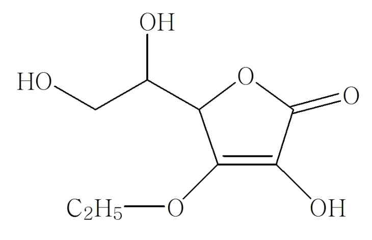

# KFCC_별표2_미백_나이아신아마이드

[별표2]

피부의미백에도움을주는기능성화장품각조

(제2조제2호관련)

나이아신아마이드

Niacinamide

C6H6N2O : 122.13

이원료를건조한것은정량할때나이아신아마이드(C6H6N2O) 98.0% 이상을함유

한다.

성

상

이원료는백색의결정또는결정성가루로냄새는없다.

확인시험

1) 이원료5㎎에2,4-디니트로클로로벤젠10㎎을섞어5~6초간가만히가

열하여융해시키고식힌다음수산화칼륨ㆍ에탄올시액4mL를넣을때액은적색을나

타낸다.

2) 이원료1㎎에pH 7.0의인산염완충액100mL를넣어녹이고이액2mL에브롬

화시안시액1mL를넣어80℃에서7분간가열하고빨리식힌다음수산화나트륨시액

5mL를넣어30분간방치하고자외선하에서관찰할때청색의형광을나타낸다.

3) 이원료20㎎에수산화나트륨시액5mL를넣어조심하여끓일때나는가스는적

색리트머스시험지를청색으로변화시킨다.

4) 이원료20㎎에물을넣어녹이고1L로한다. 이액은파장262± 2㎚에서흡수극

대를나타내며파장245± 2㎚에서흡수극소를나타낸다. 여기서얻은극대파장에서의

흡광도를A1, 극소파장에서의흡광도를A2 로할때A2/A1은0.63～0.67이다

융

점

128℃～131℃(제1법)

순도시험

1) 액

성

이원료의수용액(1→10)은중성이다.

2) 염화물이원료0.50g을달아시험한다. 비교액에는0.01N 염산0.30mL를넣는다.

(0.021% 이하)

3) 황산염

이원료1.0g을달아시험한다. 비교액에는0.01N 황산0.40mL를넣는다.

(0.019% 이하)

4) 중금속

이원료1.0g에물20mL를넣어녹인다음여기에묽은초산2mL 및

물을넣어50mL로하고이것을검액으로하여제4법에따라시험한다. 비교액에는납

표준액3.0mL를넣는다. (30ppm 이하)

5) 황산에대한정색물

이원료0.20g을달아시험한다. 액의색은색의비교액A

보다진하지않다.

---

건조감량

0.5% 이하(1g, 105℃, 4시간)

강열잔분

0.1% 이하(3g, 제1법)

정량법

제1 법

이원료를건조하고약0.3g을정밀하게달아비수적정용빙초산20mL를넣

어필요하면가온하여녹이고식힌다음벤젠100mL를넣고0.1N 과염소산으로

적정한다. (지시약: 크리스탈바이올렛시액2방울) 다만적정의종말점은액의자색

이청색을거쳐청록색으로변할때로한다. 같은방법으로공시험을하여보정한

다.

0.1N 과염소산1mL = 12.213㎎C6H6N2O

제2 법

이원료를건조하고약20mg을정밀하게달아이동상을넣어녹여정확하

게50mL로하여검액으로한다. 따로나이아신아마이드표준품약20mg을정밀하

게달아이동상을넣어녹여정확하게50mL로하여표준액으로한다. 검액및표

준액각10μL씩을가지고다음조건으로액체크로마토그래프법에따라시험하여

검액및표준액의피크면적AT 및AS를각각구한다.

나이아신아마이드(C6H6N2O : 122.13)의양(㎎) =

나이아신아마이드표준품의양(㎎) × A T

A S

조작조건

검출기: 자외부흡광광도계(측정파장260㎚)

칼

럼: 안지름약4.6㎜, 길이약25㎝인스테인레스관에5㎛의액체크로마토그래프용옥타데실실

릴화한실리카겔을충전한다.

이동상: 메탄올ㆍ0.05 M 인산이수소칼륨용액혼합액(15 : 85)

유

량: 1.0mL/분

나이아신아마이드로션제

Niacinamide Lotion

이기능성화장품은정량할때표시량의90.0% 이상에해당하는나이아신아마이드(C6H6N2O :

122.13)를함유한다.

1. 제

법

이기능성화장품은나이아신아마이드를주성분(기능성성분)으로하는로션제이다. 이제품은

안정성및유용성을높이기위해안정제, 습윤제, 유화제, 보습제, pH 조정제, 착색제, 착향제등을첨

가할수있다.

2. 확인시험

정량법의검액에서얻은주피크의유지시간은표준액에서얻은주피크의유지시간과같다.

3. pH

기준치± 1.0 (2 → 30) (다만, pH 범위는3.0 ～ 9.0이다)

4. 정량법

이기능성화장품을가지고나이아신아마이드로서약20 mg에해당하는양을정밀하게달아

이동상을넣어분산시킨다음정확하게50mL로하고필요하면여과하여검액으로한다. 따로나이아

---

신아마이드표준품약20 mg을정밀하게달아이동상을넣어녹여50 mL로한액을표준액으로한

다. 검액및표준액각10μL씩을가지고다음조건으로액체크로마토그래프법에따라시험하여검액

및표준액의피크면적AT 및AS를각각구한다.

5.

6.

나이아신아마이드(C6H6N2O : 122.13)의양(㎎) = 나이아신아마이드표준품의양(㎎) × A T

A S

7.

8.

조작조건

검 출 기 : 자외부흡광광도계 (측정파장 260 ㎚)

칼    럼 : 안지름 약 4.6㎜, 길이 약 25㎝인 스테인레스관에 5㎛의 액체크로마토그

래프용 옥타데실실릴화한 실리카겔을 충전한다.

이 동 상 : 메탄올ㆍ0.05 M 인산이수소칼륨용액 혼합액 (15 : 85)

유    량 : 1.0mL/분

가.

나. 나이아신아마이드액제

다. Niacinamide Solution

라.

이

기능성화장품은

정량할

때

표시량의

90.0%

이상에

해당하는

나이아신아마이드(C6H6N2O

:

122.13)를함유한다.

9. 제

법

이기능성화장품은나이아신아마이드를주성분(기능성성분)으로하는액제이다. 이제품은

안정성및유용성을높이기위해안정제, 습윤제, 보습제, pH 조정제, 착색제, 착향제등을첨가할수

있다.

10. 확인시험

정량법의검액에서얻은주피크의유지시간은표준액에서얻은주피크의유지시간과같

다.

11. pH

기준치± 1.0 (2 → 30) (다만, pH 범위는3.0 ～ 9.0이다)

12. 정량법

이기능성화장품을가지고나이아신아마이드로서약20 mg에해당하는양을정밀하게달아

이동상을넣어분산시킨다음정확하게50 mL로하고필요하면여과하여검액으로한다. 따로나이

아신아마이드표준품약20 mg을정밀하게달아이동상을넣어녹여50 mL로한액을표준액으로

한다. 검액및표준액각10 μL씩을가지고다음조건으로액체크로마토그래프법에따라시험하여

검액및표준액의피크면적AT 및AS를각각구한다.

13.

14.

나이아신아마이드(C6H6N2O:122.13)의양(㎎) = 나이아신아마이드표준품의양(㎎) × A T

A S

15.

16.

조작조건

검 출 기 : 자외부흡광광도계 (측정파장 260 ㎚)

칼    럼 : 안지름 약 4.6㎜, 길이 약 25㎝인 스테인레스관에 5㎛의 액체크로마토그

래프용 옥타데실실릴화한 실리카겔을 충전한다.

이 동 상 : 메탄올ㆍ0.05 M 인산이수소칼륨용액 혼합액 (15 : 85)

유    량 : 1.0mL/분

---

가.

나. 나이아신아마이드크림제

다. Niacinamide Cream

라.

이

기능성화장품은

정량할

때

표시량의

90.0%

이상에

해당하는

나이아신아마이드(C6H6N2O

:

122.13)를함유한다.

17. 제

법

이기능성화장품은나이아신아마이드를주성분(기능성성분)으로하는크림제이다. 이제품은

안정성및유용성을높이기위해안정제, 습윤제, 유화제, 보습제, pH 조정제, 착색제, 착향제등을

첨가할수있다.

18. 확인시험

정량법의검액에서얻은주피크의유지시간은표준액에서얻은주피크의유지시간과같

다.

19. pH

기준치± 1.0 (2 → 30) (다만, pH 범위는3.0 ～ 9.0이다)

20. 정량법

이기능성화장품을가지고나이아신아마이드로서약20 mg에해당하는양을정밀하게달아

5 mL 메탄올을넣어초음파추출한후물을넣어50 mL로하고필요하면여과하여검액으로한다.

따로나이아신아마이드표준품약20 mg을정밀하게달아10 % 메탄올을넣어녹여50 mL로한

액을표준액으로한다. 검액및표준액각10 μL씩을가지고다음조건으로액체크로마토그래프법

에따라시험하여검액및표준액의피크면적AT 및AS를각각구한다.

21.

22.

나이아신아마이드(C6H6N2O : 122.13)의양(㎎) = 나이아신아마이드표준품의양(㎎) × A T

A S

23.

24.

조작조건

검 출 기 : 자외부흡광광도계 (측정파장 260 ㎚)

칼    럼 : 안지름 약 4.6㎜, 길이 약 25㎝인 스테인레스관에 5㎛의 액체크로마토그

래프용 옥타데실실릴화한 실리카겔을 충전한다.

이 동 상 : 메탄올ㆍ0.05 M 인산이수소칼륨용액 혼합액 (15 : 85)

유    량 : 1.0mL/분

가.

나. 나이아신아마이드침적마스크

다. Niacinamide Soaked Mask

라.

이기능성화장품은정량할때표시량의90.0% 이상에해당하는나이아신아마이드(C6H6N2O :

122.13)를함유한다.

25. 제

법

이기능성화장품은나이아신아마이드를주성분(기능성성분)으로하는액제또는로션제를

부직포등의지지체에단순침적한마스크제형의제품이다. 이때액제또는로션제에는안정성및

유용성을높이기위해안정제, 습윤제, 유화제, 보습제, pH 조정제, 착색제, 착향제등을첨가할수

있다.

26. 확인시험

정량법의검액에서얻은주피크의유지시간은표준액에서얻은주피크의유지시간과같

다.

27. pH

이기능성화장품을압착하여얻은액제또는로션제를가지고시험할때기준치± 1.0이다.

---

(다만, pH 범위는3.0 ～ 9.0이다)

28. 정량법

이기능성화장품을압착하여얻은액제또는로션제를가지고나이아신아마이드로서약20

mg에해당하는양을정밀하게달아이동상을넣어분산시킨다음정확하게50 mL로하고필요하면

여과하여검액으로한다. 따로나이아신아마이드표준품약20 mg을정밀하게달아이동상을넣어

녹여50 mL로한액을표준액으로한다. 검액및표준액각10 μL씩을가지고다음조건으로액체

크로마토그래프법에따라시험하여검액및표준액의피크면적AT 및AS를각각구한다.

29.

30.

나이아신아마이드(C6H6N2O : 122.13)의양(㎎) = 나이아신아마이드표준품의양(㎎) × A T

A S

31.

32.

조작조건

검 출 기 : 자외부흡광광도계 (측정파장 260 ㎚)

칼    럼 : 안지름 약 4.6㎜, 길이 약 25㎝인 스테인레스관에 5㎛의 액체크로마토그

래프용 옥타데실실릴화한 실리카겔을 충전한다.

이 동 상 : 메탄올ㆍ0.05 M 인산이수소칼륨용액 혼합액 (15 : 85)

유    량 : 1.0mL/분

나이아신아마이드고형제

Niacinamide Solid

이 기능성화장품은 정량할 때 표시량의 90.0% 이상에 해당하는 나이아신아마이드

(C6H6N2O : 122.13)를 함유한다.

제    법   이 기능성화장품은 나이아신아마이드를 주성분(기능성성분)으로 하는 고형

제이다. 이 제품은 안정성 및 유용성을 높이기 위해 안정제, 습윤제, 유화제, 보습제,

pH 조정제, 착색제, 착향제 등을 첨가할 수 있다.

확인시험   정량법의 검액에서 얻은 주피크의 유지시간은 표준액에서 얻은 주피크의

유지시간과 같다.

pH         기준치 ± 1.0 (2 →30) (다만, pH 범위는 3.0 ∼9.0이며, 물을 포함하

지 않는 제품은 제외)

정 량 법   이 기능성화장품을 가지고 나이아신아마이드로서 약 20mg에 해당하는 양

을 정밀하게 달아 테트라하이드로퓨란 5mL를 넣어 초음파 추출한 후 이동상을 넣어

50mL로 하고 필요하면 여과하여 검액으로 한다. 따로 나이아신아마이드 표준품 약

20mg을 정밀하게 달아 테트라하이드로퓨란 10% 함유 이동상에 녹여 50mL로 한 액

을 표준액으로 한다. 검액 및 표준액 각 10μL씩을 가지고 다음 조건으로 액체크로마

토그래프법에 따라 시험하여 검액 및 표준액의 피크면적 AT 및 AS를 각각 구한다.

33. 나이아신아마이드(C6H6N2O : 122.13)의양(㎎) =

34. 나이아신아마이드표준품의양(㎎) × A T

A S

35.

조작조건

---

36.

검출기: 자외부흡광광도계(측정파장260㎚)

37.

칼

럼: 안지름약4.6㎜, 길이약25㎝인스테인레스관에5㎛의액체크로마토그래프용옥타데실실

릴화한실리카겔을충전한다.

38.

이동상: 메탄올ㆍ0.05 M 인산이수소칼륨용액혼합액(15 : 85)

39.

유

량: 1.0mL/분

닥나무추출물

Broussonetia Extract

이원료는닥나무Broussonetia kazinoki 및동속식물(뽕나무과Moraceae)의줄기또

는뿌리를에탄올및에칠아세테이트로추출하여얻은가루또는그가루의2w/v%

부틸렌글리콜용액이다. 이원료에대하여기능성시험을할때타이로시네이즈억제율

은48.5～84.1% 이다.

제

법

이원료는닥나무및동속식물의줄기또는뿌리에약2배용량의에탄올을넣어1～ 3주

간침적시키고여과하여얻은여액에이액의약1%에해당하는활성탄을넣어잘섞은다음여

과한다. 이여액을취하여농축하고여기에에칠아세테이트을넣어잘흔들어섞은다음에칠아세

테이트층을취하여감압건고하여얻은가루또는이가루를부틸렌글리콜에녹여2w/v% 용액

으로한것이다.

성

상

이원료는엷은황색～황갈색의점성이있는액또는황갈색～암갈색의결정성가루로

약간의특이한냄새가있다.

확인시험

액의경우에는이원료2g에부틸렌글리콜을넣어500mL로한액을검액으로한다.

가

루의경우에는이원료1g에부틸렌글리콜을넣어녹여100mL로한액1mL를취하여부틸렌글리

콜을넣어100mL로한액을검액으로한다. 검액을가지고흡광도측정법에따라흡수스펙트럼을

측정할때파장283±2nm에서흡수극대를나타낸다.

pH

2.7 ～ 4.7 (1→100)

순도시험

1) 중금속

이원료1.0g을달아제2법에따라조작하여시험한다. 비교액에는

납표준액2.0mL를넣는다(20ppm 이하).

2) 비소

이원료1.0g을달아제3법에따라검액을만들고장치C를쓰는방법에따

라시험한다(2ppm 이하).

기능성시험

이원료의가루로서50mg에해당하는양을달아에탄올을넣어녹여100mL로한액

10mL을취하여에탄올을넣어100mL로한액을검액으로한다. 완충액1) 500㎕에기질액2) 500㎕,

물450㎕ 및검액50㎕를넣어섞고, 효소액3) 50㎕를넣어흔들어섞어37℃에서10분간반응시키고

곧얼음중에5분간방치한다음, 완충액1) 500㎕, 물950㎕ 및에탄올50㎕를넣어검액과같은방법

으로조작하여얻은액을대조액으로하여파장475nm에서흡광도B를측정한다. 따로검액대신

에탄올50㎕을가지고검액과같은방법으로조작하여얻은액을공시험액으로하여그흡광도A

를측정하며, 효소액대신물50㎕를넣어검액과같은방법으로조작하여얻은액을색보정액으로

하여그흡광도C를측정하고다음식에따라타이로시네이즈억제율(%)을구한다.

A-(B-C)

×100

타이로시네이즈억제율(%) =

A

---

A :

공시험액에서얻은흡광도

B :

검액에서얻은흡광도

C :

색보정액에서얻은흡광도

1) 완충액: 0.1M 인산이수소칼륨액을pH 6.8이되도록2M 수산화나트륨액으로조정한다.

2) 기질액: 타이로신표준품3mg에물을넣어녹여10mL로한다.

3) 효소액: 머쉬룸타이로시네이즈(Mushroom Tyrosinase, 표준품)를완충액에녹여2 units/㎕ 가

되도록만든다.

아스코빌글루코사이드

Ascobyl Glucoside

아스코빅애씨드 2-글루코사이드

(Ascorbic Acid 2-Glucoside)                                   C12H18O11 :

338.27

이 원료는 정량할 때 아스코빌글루코사이드(C12H18O11 : 338.27) 98.0% 이상을 함유한

다.

성    상  이 원료는 백색 ～미황색의 가루 또는 결정성 가루이다.

확인시험  1) 이 원료의 수용액(1→50) 5 mL에 과망간산칼륨시액 1 방울을 떨어뜨릴 때

또는 2,6-디클로로페놀인도페놀나트륨시액 1～2 방울을 떨어뜨릴 때 각 시액의 색은

곧 없어진다.

2) 이 원료의 수용액(5→40) 2～3 방울을 끓는 페링시액 5 mL에 넣어 약 5분간 가

열했을 때, 적색의 침전이 생긴다.

3) 이 원료를 건조하여 적외부흡수스펙트럼측정법의 1)브롬화칼륨정제법에 따라 측

정할 때 3,300 cm-1, 1,700 cm-1, 1,110 cm-1, 1,060 cm-1 부근에서 특성흡수를 나타

낸다.

융    점  158 ～163 ℃(제 1 법)

비선광도 [α] 25

D : +186.0 ～+188.0 °(건조 후 5 g, 물 100 mL, 100 mm)

순도시험  1) 용해상태  이 원료 1.0 g을 물 50 mL에 녹일 때 액은 맑다.

2) 중금속  이 원료 1.0 g을 달아 제2법에 따라 조작하여 시험한다. 비교액에는 납

표준액 2.0 mL를 넣는다.(20 ppm 이하)

---

3) 비  소  이 원료 1.0 g을 달아 제 3 법에 따라 검액을 만들어 장치B를 이용하는

방법으로 시험한다(2 ppm이하).

4) 유리 아스코빅애씨드 및 유리 포도당  이 원료 0.5 g을 정밀하게 달아 이동상에

넣어 녹여 정확하게 25 mL로 한 액을 가지고 검액으로 한다. 아스코빅애씨드 표준품

20 mg을 정밀하게 취하여 이동상을 넣어 녹여 정확하게 100 mL로 한 액을 아스코

빅애씨드 표준원액으로 한다. 포도당 표준품 20 mg을 정밀하게 취하여 이동상을 넣어

녹여 정확하게 100 mL로 한 액을 포도당 표준원액으로 한다. 아스코빅애시드 및 포

도당 표준원액 각각 10 mL씩을 취하여 이동상을 넣어 정확하게 100 mL로 하여 표

준액으로 한다. 검액 및 표준액 각 10 μL씩을 가지고 아래 조작조건으로 액체크로마

토그래피법에 따라 시험한다. 검액의 아스코빅애씨드 및 포도당 각각의 피크면적은

표준액의 아스코빅애씨드 및 포도당 각각의 피크면적보다 크지 않다. (유리 아스코빅

애씨드 0.1 %이하, 유리 포도당 0.1 %이하)

조작조건

검출기 : 시차굴절계

칼  럼 : 안지름 4.6 ㎜, 길이 25 cm 스테인레스관에 5 ㎛의 액체크로마토그라피용

디메칠아미노프로필실릴화한 실리카겔을 충전한다.

칼럼 온도 : 40 ℃

이동상 : 아세토니트릴 및 0.5 % 인산용액 735 mL에 인산이수소칼륨 4 g을 넣은 혼

합액(60:40)

유  량 : 0.7 mL/분

건조감량  1.0 % 이하 (1 g, 105 ℃, 2시간)

강열잔분  0.2 % 이하 (1 g, 제 1 법)

정 량 법

제 1 법   이 원료 1.0 g을 정밀하게 달아 물 30 mL에 넣어 녹이고 0.2 N 수산화나

트륨액으로 적정한다(지시약 : 페놀프탈레인시액 2 방울).

0.2 N 수산화나트륨액 1 mL = 67.654 mg C12H18O11

제 2 법   이 원료 약 10mg을 정밀하게 달아 이동상을 넣어 녹여 정확하게 100mL로

하고 필요하면 여과하여 검액으로 한다. 따로 아스코빌글루코사이드 표준품 약

10mg을 정밀하게 달아 이동상을 넣어 녹여 100mL로 하여 표준액으로 한다. 검액

및 표준액 각 10μL씩을 가지고 다음 조건으로 액체크로마토그래프법에 따라 시험하

여 검액 및 표준액의 피크면적 AT 및 AS를 각각 구한다.

아스코빌글루코사이드(C12H18O11  : 338.27)의 양(㎎)

AT

= 아스코빌글루코사이드 표준품의 양(㎎) × 

AS

조작조건

---

검 출 기 : 자외부흡광광도계 (측정파장 245㎚)

칼   럼 : 안지름 약 4.6㎜, 길이 약 150㎜인 스테인레스관에 5㎛의 액체크로마토그

래프용 옥타데실실릴화한 실리카겔을 충전한다.

이 동 상 : 희석시킨 삼불화초산용액(2→1000)

유    량 : 0.8mL/분

아스코빌글루코사이드로션제

Ascorbyl Glucoside Lotion

이기능성화장품은정량할때표시량의90.0% 이상에해당하는아스코빌글루코사이드

(C12H18O11 : 338.27)를함유한다.

제

법

이기능성화장품은아스코빌글루코사이드를주성분(기능성성분)으로하는로션제이다. 이

제품은안정성및유용성을높이기위해안정제, 습윤제, 유화제, 보습제, pH 조정제, 착색제, 착향

제등을첨가할수있다.

확인시험

정량법의검액에서얻은주피크의유지시간은표준액에서얻은주피크의유지시간과같

다.

pH

기준치± 1.0 (2 → 30) (다만, pH 범위는3.0 ～ 9.0이다)

정량법

이기능성화장품을가지고아스코빌글루코사이드로서약20㎎에해당하는양을정밀하게

달아이동상을넣어충분히분산시킨다음100mL로하고, 이액10mL를정확히취하여이동상을

넣어20mL로하고필요하면여과하여검액으로한다. 따로아스코빌글루코사이드표준품약

20mg을정밀하게달아이동상을넣어녹여100mL로하고이액10mL를정확히취하여이동상을

넣어20mL로하여표준액으로한다. 검액및표준액각10μL씩을가지고다음조건으로액체크로

마토그래프법에따라시험하여검액및표준액의피크면적AT 및AS를각각구한다.

아스코빌글루코사이드(C12H18O11 : 338.27)의 양(㎎) =

AT

아스코빌글루코사이드의 표준품의 양(㎎) × 

AS

조작조건

검 출 기 : 자외부흡광광도계 (측정파장 245㎚)

칼    럼 : 안지름 약 4.6㎜, 길이 약 150㎜인 스테인레스관에 5㎛액체크로마토그

래프용 옥타데실실릴화한 실리카겔을 충전한다.

이 동 상 : 희석시킨 삼불화초산용액(2→1000)

유    량 : 0.8mL/분

아스코빌글루코사이드액제

---

Ascorbyl Glucoside Solution

40.

41.

이기능성화장품은정량할때표시량의90.0% 이상에해당하는아스코빌글루코사이드(C12H18O11 :

338.27)를함유한다.

가. 제

법

이기능성화장품은아스코빌글루코사이드를주성분(기능성성분)으로하는액제이다. 이제

품은안정성및유용성을높이기위해안정제, 습윤제, 보습제, pH 조정제, 착색제, 착향제등을첨

가할수있다.

나. 확인시험

정량법의검액에서얻은주피크의유지시간은표준액에서얻은주피크의유지시간과같

다.

다. pH

기준치± 1.0 (2 → 30) (다만, pH 범위는3.0 ～ 9.0이다)

라. 정량법

이기능성화장품을가지고아스코빌글루코사이드로서약20㎎에해당하는양을정밀하게달

아이동상을넣어충분히분산시킨다음100mL로하고, 이액10mL를정확히취하여이동상을넣

어20mL로하고필요하면여과하여검액으로한다. 따로아스코빌글루코사이드표준품약20mg을

정밀하게달아이동상을넣어녹여100mL로하고이액10mL를정확히취하여이동상을넣어

20mL로하여표준액으로한다. 검액및표준액각10μL씩을가지고다음조건으로액체크로마토그

래프법에따라시험하여검액및표준액의피크면적AT 및AS를각각구한다.

마.

아스코빌글루코사이드(C12H18O11 : 338.27)의 양(㎎) =

AT

아스코빌글루코사이드의 표준품의 양(㎎) × 

AS

조작조건

검 출 기 : 자외부흡광광도계 (측정파장 245㎚)

칼    럼 : 안지름 약 4.6㎜, 길이 약 150㎜인 스테인레스관에 5㎛액체크로마토그

래프용 옥타데실실릴화한 실리카겔을 충전한다.

이 동 상 : 희석시킨 삼불화초산용액(2→1000)

유    량 : 0.8mL/분

아스코빌글루코사이드크림제

Ascorbyl Glucoside Cream

42.

이기능성화장품은정량할때표시량의90.0% 이상에해당하는아스코빌글루코사이드(C12H18O11 :

338.27)를함유한다.

가. 제

법

이기능성화장품은아스코빌글루코사이드를주성분(기능성성분)으로하는크림제이다. 이

제품은안정성및유용성을높이기위해안정제, 습윤제, 유화제, 보습제, pH 조정제, 착색제, 착향제

등을첨가할수있다.

나. 확인시험

정량법의검액에서얻은주피크의유지시간은표준액에서얻은주피크의유지시간과같

다.

다. pH

기준치± 1.0 (2 → 30) (다만, pH 범위는3.0 ～ 9.0이다)

라. 정량법

이기능성화장품을가지고아스코빌글루코사이드로서약20㎎에해당하는양을정밀하게달

아이동상을넣어충분히분산시킨다음100mL로하고, 이액10mL를정확히취하여이동상을넣

---

어20mL로하고필요하면여과하여검액으로한다. 따로아스코빌글루코사이드표준품약20mg을

정밀하게달아이동상을넣어녹여100mL로하고이액10mL를정확히취하여이동상을넣어

20mL로하여표준액으로한다. 검액및표준액각10μL씩을가지고다음조건으로액체크로마토그

래프법에따라시험하여검액및표준액의피크면적AT 및AS를각각구한다.

마.

아스코빌글루코사이드(C12H18O11 : 338.27)의 양(㎎) =

AT

아스코빌글루코사이드의 표준품의 양(㎎) × 

AS

조작조건

검 출 기 : 자외부흡광광도계 (측정파장 245㎚)

칼    럼 : 안지름 약 4.6㎜, 길이 약 150㎜인 스테인레스관에 5㎛액체크로마토그

래프용 옥타데실실릴화한 실리카겔을 충전한다.

이 동 상 : 희석시킨 삼불화초산용액(2→1000)

유    량 : 0.8mL/분

아스코빌글루코사이드침적마스크

Ascorbyl Glucoside Soaked Mask

43.

이기능성화장품은정량할때표시량의90.0% 이상에해당하는아스코빌글루코사이드(C12H18O11 :

338.27)를함유한다.

가. 제

법

이기능성화장품은아스코빌글루코사이드를주성분(기능성성분)으로하는액제또는로션제

를부직포등의지지체에단순침적한마스크제형의제품이다. 이때액제또는로션제에는안정성

및유용성을높이기위해안정제, 습윤제, 유화제, 보습제, pH 조정제, 착색제, 착향제등을첨가할

수있다.

나. 확인시험

정량법의검액에서얻은주피크의유지시간은표준액에서얻은주피크의유지시간과같다.

다. pH

이기능성화장품을압착하여얻은액제또는로션제를가지고시험할때기준치± 1.0이다.

(다만, pH 범위는3.0 ～ 9.0이다)

라. 정량법

이기능성화장품을압착하여얻은액제또는로션제를가지고아스코빌글루코사이드로서약

20㎎에해당하는양을정밀하게달아이동상을넣어충분히분산시킨다음100mL로하고, 이액

10mL를정확히취하여이동상을넣어20mL로하고필요하면여과하여검액으로한다. 따로아스코

빌글루코사이드표준품약20mg을정밀하게달아이동상을넣어녹여100mL로하고이액10mL를

정확히취하여이동상을넣어20mL로하여표준액으로한다. 검액및표준액각10μL씩을가지고

다음조건으로액체크로마토그래프법에따라시험하여검액및표준액의피크면적AT 및AS를각각

구한다.

마.

아스코빌글루코사이드(C12H18O11 : 338.27)의 양(㎎) =

AT

아스코빌글루코사이드의 표준품의 양(㎎) × 

AS

조작조건

---

검 출 기 : 자외부흡광광도계 (측정파장 245㎚)

칼    럼 : 안지름 약 4.6㎜, 길이 약 150㎜인 스테인레스관에 5㎛액체크로마토그

래프용 옥타데실실릴화한 실리카겔을 충전한다.

이 동 상 : 희석시킨 삼불화초산용액(2→1000)

유    량 : 0.8mL/분

아스코빌글루코사이드 고형제

Ascobyl Glucoside Solid

이 기능성화장품은 정량할 때 표시량의 90.0% 이상에 해당하는 아스코빌글루코사이

드(C12H18O11 : 338.27)를 함유한다.

제    법   이 기능성화장품은 아스코빌글루코사이드를 주성분(기능성성분)으로 하는

고형제이다. 이 제품은 안정성 및 유용성을 높이기 위해 안정제, 습윤제, 유화제, 보습

제, pH 조정제, 착색제, 착향제 등을 첨가할 수 있다.

확인시험   정량법의 검액에서 얻은 주피크의 유지시간은 표준액에서 얻은 주피크의

유지시간과 같다.

pH         기준치 ± 1.0 (2 →30) (다만, pH 범위는 3.0 ∼9.0이며, 물을 포함하

지 않는 제품은 제외)

정 량 법   이 기능성화장품을 가지고 아스코빌글루코사이드로서 약 10㎎에 해당하는

양을 정밀하게 달아 테트라하이드로퓨란 10mL를 넣어 초음파 추출한 후 이동상을 넣

어 100mL로 하고 필요하면 여과하여 검액으로 한다. 따로 아스코빌글루코사이드 표준

품 약 10mg을 정밀하게 달아 테트라하이드로퓨란 10% 함유 이동상에 녹여 100mL로

하여 표준액으로 한다. 검액 및 표준액 각 10μL씩을 가지고 다음 조건으로 액체크로

마토그래프법에 따라 시험하여 검액 및 표준액의 피크면적 AT 및 AS를 각각 구한다.

아스코빌글루코사이드(C12H18O11 : 338.27)의 양(㎎)

AT

= 아스코빌글루코사이드 표준품의 양(㎎) × 

AS

조작조건

검 출 기 : 자외부흡광광도계 (측정파장 245㎚)

칼   럼 : 안지름 약 4.6㎜, 길이 약 150㎜인 스테인레스관에 5㎛의 액체크로마토그

래프용 옥타데실실릴화한 실리카겔을 충전한다.

이 동 상 : 희석시킨 삼불화초산용액(2→1000)

유    량 : 0.8mL/분

---

아스코빌테트라이소팔미테이트

Ascorbyl Tetraisopalmitate

테트라이소팔미틴산아스코빌

2,3,5,6-O-tetra-2-hexyldecanonyl-L-ascorbyl acid C70H128O10 : 1129.78

이원료는주로아스코빅애씨드와이소팔미틱애씨드의테트라에스텔로되어있다. 이원료는정량할때

아스코빌테트라이소팔미테이트(C70H128O10 : 1129.78) 95.0% 이상을함유한다.

성       상    이 원료는 무색 ～엷은 황색의 액으로 약간의 특이한 냄새가 있다.

비    중  d20

20 : 0.930 ～ 0.943

굴 절 률  n25

D : 1.459 ～1.465

확인시험  1) 이 원료 0.2g을 달아 에탄올 5mL에 용해하여 과망간산칼룸시액 1방울

을 가할 때 액은 엷은 갈색을 나타낸다.

2) 이 원료 0.2g을 에탄올 5mL에 넣어 환류냉각기를 달아 110℃에서 30분간 가열

하고 냉각한 다음 과망간산칼륨시액 1방울을 넣을 때 시액은 즉시 사라진다.

3) 이 원료 2.0g을 달아 0.5N 수산화칼륨ㆍ에탄올액 50mL를 넣어 환류냉각기를 달

아 수욕상에서 1시간 끊인 후 에탄올을 충분히 날려 보낸다. 식힌 다음 황산을 넣어

산성으로 하고 n-헥산 30mL를 가해 세게 흔들어 섞는다.. n-헥산층을 취하여 물로

씻은 액이 중성이 될 때까지 씻은 후 수욕상에서 n-헥산을 제거하고 잔류물 0.1g을

취해 메탄올ㆍ황산액(주) 20mL를 넣어 환류냉각기를 달아 수욕상에서 1시간 가열한

다. 식힌 다음 분액깔때기에 옮겨 물 50mL를 넣은 다음 n-헥산 30mL씩 2회 추출

하고 n-헥산층을 물로 씻은 액이 메틸오렌지 5방울로 적색을 나타내지 않을 때까지

씻는다. 여기에 무수황산나트륨 5g을 넣어 20분간 방치한 다음 이것을 검액으로 한

다. 검액 1μL를 가지고 다음의 조건으로 기체크로마토크래프법에 따라 시험할 때 피

크 유지 시간 약 18분에 이소팔미틴산메칠의 피크를 나타낸다.

(주) 메탄올ㆍ황산액 : 메탄올 50mL에 진한 황산 5g을 조심스럽게 넣어 섞고 나머

지를 메탄올로 채워 100mL로 한다.

조작조건

검출기 : 수소염이온화검출기

칼  럼 : 안지름 34㎜, 길이 3m의 관에 기체크로마토그래프용 시아노프로필실리콘을

177～250㎛의 실란 처리한 기체크로마토그래프용 규조토에 10%의 비율로

입힌 것을 충전한다.

칼럼온도 : 초기 80℃에서 매분 8℃씩 240℃까지 승온한다.

이동상 및 유량 : 질소, 매분 30～40mL의 일정량

4) 이 원료를 가지고 적외부스펙트럼측정법의 4)액막법에 따라 측정할 때 2930㎝-1,

1780㎝-1, 1460㎝-1, 1100㎝-1 부근에서 측성흡수를 나타낸다.

순도시험 1) 중금속  이 원료 1.0g을 달아 제2법에 따라 조작하여 시험한다. 비교액에

는 납표준액 2.0mL를 넣는다. (20ppm 이하)

---

2) 비    소  이 원료 1.0g을 달아 제 3법에 따라 검액을 만들어 장치 B를 쓰는 방

법에 따라 시험한다. (2ppm 이하)

3) 유연물질  이 원료 0.1g을 정밀하게 달아 이동상을 넣어 녹여 100mL로 한 액

2.0mL를 정확하게 취하여 이동상을 넣어 정확하게 100mL로 한 액을 검액으로 한

다. 검액 20μL를 가지고 다음의 액체크로마토그래프법에 따라 시험하여 전체 피크

면적(A) 및 아스코빌테트라이소팔미테이트 이외의 총 피크면적 B를 구할 때 유연물

질의 피크면적의 합은 4% 이하이다.

B ×100

총 유연물질의 양(%) = 

A

조작조건

검 출 기 : 자외부흡광광도계 (측정파장 : 236㎚)

컬    럼 : 안지름 약 4.6㎜, 길이 약 25㎝인 스테인레스관에  5㎛의 액체 크로마토

그래프용 옥타데실실릴화한 실리카겔을 충전한다.

이 동 상 : 아세토니트릴ㆍ테트라히드로퓨란ㆍ메탄올 혼합액 (5:4:1)

유    량 : 1.0mL/분

측정시간 : 테트라-2-헥실데칸산-L-아스코빌의 피크 유지시간의 2배로 한다.

건조감량  0.5% 이하 (2g, 감압, 실리카겔, 4시간)

정 량 법  이 원료 약 30㎎을 정밀하게 달아 이동상을 넣어 녹여 100mL로 한 액을

여과하여 여액을 검액으로 한다. 따로 아스코빌테트라이소팔미테이트 표준품 30㎎을

정밀하게 달아 이동상을 넣어 녹여 100mL로 한 액을 여과하여 여액을 표준액으로

한다. 검액 및 표준액 각 20μL씩을 가지고 다음의 조작조건으로 액체크로마토크래프

법에 따라 시험하여 아스코빌테트라이소팔미테이트의 피크면적 AT 및 AS를 측정한

다.

44. 아스코빌테트라이소팔미테이트(C70H128O10 : 1129.78)의양(㎎) =

45. 아스코빌테트라이소팔미테이트표준품의양(㎎) × A T

A S

조작조건

검 출 기 : 자외부흡광광도계 (측정파장 236㎚)

칼      럼 : 안지름 약 4.6㎜, 길이 약 25㎝인 스테인레스관에 5～10㎛의 액체크로마토

그래프용 옥타데실실릴화한 실리카겔을 충진한다.

칼럼온도 : 25℃

이 동 상 : 아세토니트릴ㆍ테트라히드로퓨란ㆍ메탄올의 혼합액 (5:4:1)

유    량 : 1.0mL/분

가.

---

나. 아스코빌테트라이소팔미테이트로션제

다. Ascorbyl Tetraisopalmitate Lotion

라.

이기능성화장품은정량할때표시량의90.0% 이상에해당하는아스코빌테트라이소팔미테이트

(C70H128O10 : 1129.78)를함유한다.

46. 제

법

이기능성화장품은아스코빌테트라이소팔미테이트를주성분(기능성성분)으로하는로션제

이다. 이제품은안정성및유용성을높이기위해안정제, 습윤제, 유화제, 보습제, pH 조정제, 착색

제, 착향제등을첨가할수있다.

47. 확인시험

정량법의검액에서얻은주피크의유지시간은표준액에서얻은주피크의유지시간과같

다.

48. pH

기준치± 1.0 (2 → 30) (다만, pH 범위는3.0 ～ 9.0이다)

49. 정량법

이기능성화장품을가지고아스코빌테트라이소팔미테이트로서약20㎎ 에해당하는양을정

밀하게달아이동상을넣어분산시킨다음정확하게50mL로하고필요하면여과하여검액으로한다.

따로아스코빌테트라이소팔미테이트표준품약20㎎을정밀하게달아이동상을넣어녹여50mL로

한액을표준액으로한다. 검액및표준액각10μL씩을가지고다음조건으로액체크로마토그래프법

에따라시험하여검액및표준액의피크면적AT 및AS를각각구한다.

50.

51.

아스코빌테트라이소팔미테이트(C70H128O10 : 1129.78)의양(㎎) =

52. 아스코빌테트라이소팔미테이트표준품의양(㎎) × A T

A S

53.

54.

조작조건

55.

검출기: 자외부흡광광도계(측정파장236 ㎚)

56.

칼

럼: 안지름약4.6㎜, 길이약25㎝인스테인레스관에5㎛의액체크로마토그래프용옥타데실실릴화

한실리카겔을충전한다.

57.

이동상: 아세토니트릴ㆍ 테트라하이드로퓨란ㆍ 메탄올혼합액(5:4:1)

58.

유

량: 1.0mL/분

59.

가.

나. 아스코빌테트라이소팔미테이트액제

다. Ascorbyl Tetraisopalmitate Solution

라.

이기능성화장품은정량할때표시량의90.0% 이상에해당하는아스코빌테트라이소팔미테이트

(C70H128O10 : 1129.78)를함유한다.

60. 제

법

이기능성화장품은아스코빌테트라이소팔미테이트를주성분(기능성성분)으로하는액제이

다. 이제품은안정성및유용성을높이기위해안정제, 습윤제, 보습제, pH조정제, 착색제, 착향제

등을첨가할수있다.

61. 확인시험

정량법의검액에서얻은주피크의유지시간은표준액에서얻은주피크의유지시간과같

다.

62. pH

기준치± 1.0 (2 → 30) (다만, pH 범위는3.0 ～ 9.0이다)

63. 정량법

이기능성화장품을가지고아스코빌테트라이소팔미테이트로서약20㎎에해당하는양을정

밀하게달아이동상을넣어분산시킨다음정확하게50mL로하고필요하면여과하여검액으로한

---

다. 따로아스코빌테트라이소팔미테이트표준품약20㎎을정밀하게달아이동상을넣어녹여50mL

로한액을표준액으로한다. 검액및표준액각10μL씩을가지고다음조건으로액체크로마토그래

프법에따라시험하여검액및표준액의피크면적AT 및AS를각각구한다.

64.

65.

아스코빌테트라이소팔미테이트(C70H128O10 : 1129.78)의양(㎎) =

66. 아스코빌테트라이소팔미테이트표준품의양(㎎) × A T

A S

67.

68.

조작조건

69.

검출기: 자외부흡광광도계(측정파장236㎚)

70.

칼

럼: 안지름약4.6㎜, 길이약25㎝인스테인레스관에5㎛의액체크로마토그래프용옥타데실실릴화

한실리카겔을충전한다.

71.

이동상: 아세토니트릴ㆍ테트라하이드로퓨란ㆍ 메탄올혼합액(5:4:1)

72.

유

량: 1.0mL/분

73.

가.

나. 아스코빌테트라이소팔미테이트크림제

다. Ascorbyl Tetraisopalmitate Cream

라.

이기능성화장품은정량할때표시량의90.0% 이상에해당하는아스코빌테트라이소팔미테이트

(C70H128O10 : 1129.78)를함유한다.

74. 제

법

이기능성화장품은아스코빌테트라이소팔미테이트를주성분(기능성성분)으로하는크림제

이다. 이제품은안정성및유용성을높이기위해안정제, 습윤제, 유화제, 보습제, pH 조정제, 착색

제, 착향제등을첨가할수있다.

75. 확인시험

정량법의검액에서얻은주피크의유지시간은표준액에서얻은주피크의유지시간과같

다.

76. pH

기준치± 1.0 (2 → 30) (다만, pH 범위는3.0 ～ 9.0이다)

77. 정량법

이기능성화장품을가지고아스코빌테트라이소팔미테이트로서약20㎎ 에해당하는양을정

밀하게달아이동상을넣어분산시킨다음정확하게50mL로하고필요하면여과하여검액으로한

다. 따로아스코빌테트라이소팔미테이트표준품약20㎎을정밀하게달아이동상을넣어녹여50mL

로한액을표준액으로한다. 검액및표준액각10μL씩을가지고다음조건으로액체크로마토그래

프법에따라시험하여검액및표준액의피크면적AT 및AS를각각구한다.

78.

79.

아스코빌테트라이소팔미테이트(C70H128O10 : 1129.78)의양(㎎) =

80. 아스코빌테트라이소팔미테이트표준품의양(㎎) × A T

A S

81.

82.

조작조건

83.

검출기: 자외부흡광광도계(측정파장236 ㎚)

84.

칼

럼: 안지름약4.6㎜, 길이약25㎝인스테인레스관에5㎛의액체크로마토그래프용옥타데실실릴화

한실리카겔을충전한다.

85.

이동상: 아세토니트릴ㆍ테트라하이드로퓨란ㆍ메탄올혼합액(5:4:1)

86.

유

량: 1.0mL/분

87.

---

88.

89. 아스코빌테트라이소팔미테이트침적마스크

90. Ascorbyl Tetraisopalmitate Soaked Mask

91.

이기능성화장품은정량할때표시량의90.0% 이상에해당하는아스코빌테트라이소팔미테이트

(C70H128O10 : 1129.78)를함유한다.

92. 제

법

이기능성화장품은아스코빌테트라이소팔미테이트를주성분(기능성성분)으로하는액제또

는로션제를부직포등의지지체에단순침적한마스크제형의제품이다. 이때침적되는액제또는

로션제에는안정성및유용성을높이기위해안정제, 습윤제, 유화제, 보습제, pH 조정제, 착색제, 착

향제등을첨가할수있다.

확인시험

정량법의검액에서얻은주피크의유지시간은표준액에서얻은주피크의유지시간과같다.

pH

이기능성화장품을압착하여얻은액제또는로션제를가지고시험할때기준치± 1.0이다. (다

만, pH 범위는3.0 ～ 9.0이다)

93. 정량법

이기능성화장품을압착하여얻은액제또는로션제를가지고아스코빌테트라이소팔미테이

트로서약20㎎에해당하는양을정밀하게달아이동상을넣어분산시킨다음정확하게50mL로하

고필요하면여과하여검액으로한다. 따로아스코빌테트라이소팔미테이트표준품약20㎎을정밀

하게달아이동상을넣어녹여50mL로한액을표준액으로한다. 검액및표준액각10μL씩을가지

고다음조건으로액체크로마토그래프법에따라시험하여검액및표준액의피크면적AT 및AS를

각각구한다.

아스코빌테트라이소팔미테이트(C70H128O10 : 1129.78)의양(㎎) =

아스코빌테트라이소팔미테이트표준품의양(㎎) × A T

A S

94.

조작조건

95.

검출기: 자외부흡광광도계(측정파장236㎚)

96.

칼

럼: 안지름약4.6㎜, 길이약25㎝인스테인레스관에5㎛의액체크로마토그래프용옥타데실실릴화

한실리카겔을충전한다.

97.

이동상: 아세토니트릴ㆍ테트라하이드로퓨란ㆍ 메탄올혼합액(5:4:1)

98.

유

량: 1.0mL/분

99.

100.

아스코빌테트라이소팔미테이트 고형제

Ascobyl Tetraisopalmitate Solid

이 기능성화장품은 정량할 때 표시량의 90.0% 이상에 해당하는 아스코빌테트라이소

팔미테이트(C70H128O10 : 1129.78)를 함유한다.

제    법   이 기능성화장품은 아스코빌테트라이소팔미테이트를 주성분(기능성성분)으

로 하는 고형제이다. 이 제품은 안정성 및 유용성을 높이기 위해 안정제, 습윤제, 유화

제, 보습제, pH 조정제, 착색제, 착향제 등을 첨가할 수 있다.

확인시험   정량법의 검액에서 얻은 주피크의 유지시간은 표준액에서 얻은 주피크의

유지시간과 같다.

---

pH         기준치 ± 1.0 (2 →30) (다만, pH 범위는 3.0 ∼9.0이며, 물을 포함하

지 않는 제품은 제외)

정 량 법   이 기능성화장품을 가지고 아스코빌테트라이소팔미테이트로서 약 20㎎에

해당하는 양을 정밀하게 달아 테트라하이드로퓨란 5mL를 넣어 초음파 추출한 후 이동

상을 넣어 정확하게 50mL로 하고 필요하면 여과하여 검액으로 한다. 따로 아스코빌테

트라이소팔미테이트 표준품 약 20㎎을 정밀하게 달아 테트라하이드로퓨란 5mL과 이

동상을 넣어 50mL로 한 액을 표준액으로 한다. 검액 및 표준액 각 10μL씩을 가지고

다음 조건으로 액체크로마토그래프법에 따라 시험하여 검액 및 표준액의 피크면적 AT

및 AS를 각각 구한다.

아스코빌테트라이소팔미테이트(C70H128O10 : 1129.78)의 양(㎎) =

AT

아스코빌테트라이소팔미테이트 표준품의 양(㎎) × 

AS

101.

조작조건

102.

검출기: 자외부흡광광도계(측정파장236㎚)

103.

칼

럼: 안지름약4.6㎜, 길이약25㎝인스테인레스관에5㎛의액체크로마토그래프용옥타데실실

릴화한실리카겔을충전한다.

104.

이동상: 아세토니트릴ㆍ테트라하이드로퓨란ㆍ메탄올혼합액(5:4:1)

105.

유

량: 1.0mL/분

106.

알부틴

Arbutin

4-하이드록시페닐-β-D-글루코피라노사이드

4-hydroxyphenyl-β-D-glucopyranoside

C12H16O7 : 272.25

이원료를정량할때알부틴(C12H16O7 : 272.25) 98.0% 이상을함유한다.

성

상

이원료는백색～미황색의가루로약간의특이한냄새가있다.

확인시험

1) 이원료의수용액(1→1000) 1 mL에안트론시액2 mL를물로식히면서넣을때청록

색을띤다.

2) 이원료를가지고적외부흡수스펙트럼측정법의1) 브롬화칼륨정제법에따라측정할때파수

3,384 ㎝-1, 3,290 ㎝-1, 1,514 ㎝-1, 1,222 ㎝-1 및1,080 ㎝-1 부근에서흡수를나타낸다.

3) 이원료의수용액(1→10,000)을가지고흡광도측정법에따라흡수스펙트럼을측정할때파장

---

283±2 ㎚에서흡수극대를나타낸다.

융

점

198～201 ℃ (제1법)

[α] 25

비선광도

D : -63.5 ～ -65.5 °(3.0 g, 물, 100 mL, 100 ㎜)

순도시험

1) 중금속

이원료1.0g을달아제1법에따라조작하여시험한다. 비교액에는납표준액

2.0 mL를넣는다(20 ppm 이하).

2) 비소

이원료1.0g을달아제1법에따라검액을만들고장치B를쓰는방법에따라조작하

여시험한다(2 ppm 이하).

수

분

0.5 % 이하(0.3 g)

강열잔분

0.5 % 이하(1.0 g, 제1법)

정량법

이원료약40 ㎎을정밀하게달아이동상을넣어녹여10 mL로한액을가지고검액으

로한다. 따로알부틴표준품을데시케이터(감압, 실리카겔)에서12시간건조한다음약40 ㎎을

정밀하게달아검액과같은방법으로조작하여표준액으로한다. 검액및표준액20 ㎕를가지고

다음조건으로액체크로마토그래프법에따라시험하여검액및표준액의알부틴피크면적AT 및

AS를구한다.

알부틴(C 12H 16O 7)의양(㎎) ꠧ

알부틴표준품의양(㎎)× A T

A S

조작조건

검출기: 자외부흡광광도계(측정파장280 ㎚)

칼

럼: 안지름약4.6 ㎜, 길이약25 ㎝인스테인레스관에5 ㎛의액체크로마토그래프용옥타

데실실릴화한실리카겔을충전한다.

이동상: 10mM 인산이수소칼륨액ㆍ아세토니트릴혼합액(92:8)

유

량: 1.0 mL/분

알부틴로션제

Arbutin Lotion

이기능성화장품은정량할때표시량의90.0 %이상에해당하는알부틴(C12H16O7 : 272.25)

을함유한다.

제

법

이기능성화장품은알부틴을주성분(기능성성분)으로하는로션제이다. 이제품은안

정성및유용성을높이기위해안정제, 습윤제, 유화제, 보습제, pH조정제, 착색제, 착향제등을

첨가할수있다.

확인시험

정량법의검액에서얻은주피크의유지시간은표준액에서얻은주피크의유지시간과

같다.

pH

기준치± 1.0 (2 → 30) (다만, pH 범위는3.0～9.0이다)

히드로퀴논

이기능성화장품약1g을정밀하게달아이동상을넣어분산시킨다음10mL로하고

필요하면여과하여검액으로한다. 따로히드로퀴논표준품(C6H6O2) 약10㎎을정밀하게달아이

동상을넣어녹여100mL로한액1mL를정확하게취한후, 이동상을넣어정확하게1000mL로

한액을표준액으로한다. 검액및표준액각20μL씩을가지고다음조작조건으로액체크로마토

---

그래프법에따라시험할때검액의히드로퀴논피크는표준액의히드로퀴논피크보다크지않

다.(1ppm)

조작조건

검 출 기 : 자외부흡광광도계 (측정파장 290㎚)

칼    럼 : 안지름 약 4.6㎜, 길이 약 25㎝인 스테인레스관에 5㎛액체크로마토그래

프용 옥타데실실릴화한 실리카겔을 충전한다.

이 동 상 : 10mM 인산이수소칼륨액ㆍ아세토니트릴 혼합액 (92:8)

유    량 : 1.0mL/분

정량법

이기능성화장품을가지고알부틴으로서약20㎎ 해당량을정밀하게달아이동상을넣

어녹여50mL로한액을가지고검액으로한다. 따로알부틴표준품을데시케이터(감압, 실리카

겔)에서12시간건조한다음약20㎎을정밀하게달아검액과같은방법으로조작하여표준액으

로한다. 검액및표준액각20μL씩을가지고아래조작조건으로액체크로마토그래프법에따라

시험하여검액및표준액의알부틴피크면적AT 및AS를구한다.

알부틴(C 12H 16O 7)의양(㎎) ꠧ

알부틴표준품의양(㎎)× A T

A S

조작조건

검출기: 자외부흡광광도계(측정파장280 ㎚)

칼

럼: 안지름약4.6 ㎜, 길이약25 ㎝인스테인레스관에5 ㎛의액체크로마토그래프용옥타

데실실릴화한실리카겔을충전한다.

이동상: 10mM 인산이수소칼륨액ㆍ아세토니트릴혼합액(92:8)

유

량: 1.0 mL/분

알부틴액제

Arbutin Solution

이기능성화장품은정량할때표시량의90.0 %이상에해당하는알부틴(C12H16O7 : 272.25)

을함유한다.

제

법

이기능성화장품은알부틴을주성분(기능성성분)으로하는액제이다. 이제품은안정

성및유용성을높이기위해안정제, 습윤제, 보습제, pH조정제, 착색제, 착향제등을첨가할수

있다.

확인시험

정량법의검액에서얻은주피크의유지시간은표준액에서얻은주피크의유지시간과같

다.

pH

기준치± 1.0 (2 → 30) (다만, pH 범위는3.0～9.0이다)

히드로퀴논이기능성화장품약1g을정밀하게달아이동상을넣어분산시킨다음10mL로하고

필요하면여과하여검액으로한다. 따로히드로퀴논표준품(C6H6O2) 약10㎎을정밀하게달아이

동상을넣어녹여100mL로한액1mL를정확하게취한후, 이동상을넣어정확하게1000mL로

한액을표준액으로한다. 검액및표준액각20μL씩을가지고다음조작조건으로액체크로마토

---

그래프법에따라시험할때검액의히드로퀴논피크는표준액의히드로퀴논피크보다크지않

다.(1ppm)

조작조건

검 출 기 : 자외부흡광광도계 (측정파장 290㎚)

칼    럼 : 안지름 약 4.6㎜, 길이 약 25㎝인 스테인레스관에 5㎛액체크로마토그래

프용 옥타데실실릴화한 실리카겔 을 충전한다.

이 동 상 : 10mM 인산이수소칼륨액ㆍ아세토니트릴 혼합액 (92:8)

유    량 : 1.0mL/분

정량법

이기능성화장품을가지고알부틴으로서약20 ㎎ 해당량을정밀하게달아이동상을넣

어녹여50 mL로한액을가지고검액으로한다. 따로알부틴표준품을데시케이터(감압, 실리

카겔)에서12 시간건조한다음약20 ㎎을정밀하게달아검액과같은방법으로조작하여표

준액으로한다. 검액및표준액각20 μL씩을가지고아래조작조건으로액체크로마토그래프법

에따라시험하여검액및표준액의알부틴피크면적AT 및AS를구한다.

알부틴(C 12H 16O 7)의양(㎎) ꠧ

알부틴표준품의양(㎎)× A T

A S

조작조건

검출기: 자외부흡광광도계(측정파장280 ㎚)

칼

럼: 안지름약4.6 ㎜, 길이약25 ㎝인스테인레스관에5 ㎛의액체크로마토그래프용옥타

데실실릴화한실리카겔을충전한다.

이동상: 10mM 인산이수소칼륨액ㆍ아세토니트릴혼합액(92:8)

유

량: 1.0 mL/분

알부틴크림제

Arbutin Cream

이기능성화장품은정량할때표시량의90.0%이상에해당하는알부틴(C12H16O7 : 272.25)을

함유한다.

제

법

이기능성화장품은알부틴을주성분(기능성성분)으로하는크림제이다. 이제품은안

정성및유용성을높이기위해안정제, 습윤제, 유화제, 보습제, pH조정제, 착색제, 착향제등을첨

가할수있다.

확인시험

정량법의검액에서얻은주피크의유지시간은표준액에서얻은주피크의유지시간과

같다.

pH

기준치± 1.0 (2 → 30) (다만, pH 범위는3.0～9.0이다)

히드로퀴논이기능성화장품약1g을정밀하게달아이동상을넣어분산시킨다음10mL로하고

필요하면여과하여검액으로한다. 따로히드로퀴논표준품(C6H6O2) 약10㎎을정밀하게달아이

동상을넣어녹여100mL로한액1mL를정확하게취한후, 이동상을넣어정확하게1000mL로

한액을표준액으로한다. 검액및표준액각20μL씩을가지고다음조작조건으로액체크로마토

---

그래프법에따라시험할때검액의히드로퀴논피크는표준액의히드로퀴논피크보다크지않

다.(1ppm)

조작조건

검 출 기 : 자외부흡광광도계 (측정파장 290㎚)

칼    럼 : 안지름 약 4.6㎜, 길이 약 25㎝인 스테인레스관에 5㎛액체크로마토그래

프용 옥타데실실릴화한 실리카겔을 충전한다.

이 동 상 : 10mM 인산이수소칼륨액ㆍ아세토니트릴 혼합액 (92:8)

유    량 : 1.0mL/분

정 량 법  이 기능성화장품을 가지고 알부틴으로서 약 20 ㎎해당량을 정밀하게 달아

메탄올 5 mL를 넣어 초음파 추출한 후 물을 넣어 50 mL로 한 액을 가지고 검액으

로 한다. 따로 알부틴 표준품을 데시케이터(감압, 실리카 겔)에서 12 시간 건조한 다

음 약 20 ㎎을 정밀하게 달아 10 % 메탄올을 넣어 녹여 50 mL로 한 액을 표준액으

로 한다. 검액 및 표준액 각 20 μL씩을 가지고 아래 조작조건으로 액체크로마토그

래프법에 따라 시험하여 검액 및 표준액의 알부틴 피크면적 AT 및 AS를 구한다.

알부틴(C 12H 16O 7)의양(㎎) ꠧ

알부틴표준품의양(㎎)× A T

A S

조작조건

검출기: 자외부흡광광도계(측정파장280㎚)

칼

럼: 안지름약4.6㎜, 길이약25㎝인스테인레스관에5㎛의액체크로마토그래프용옥타데실

실릴화한실리카겔을충전한다.

이동상: 10mM 인산이수소칼륨액ㆍ아세토니트릴혼합액(92:8)

유

량: 1.0 mL/분

알부틴침적마스크

Arbutin Soaked Mask

이기능성화장품은정량할때표시량의90.0% 이상에해당하는알부틴(C12H16O7 : 272.25)

을함유한다.

제

법

이기능성화장품은알부틴을주성분(기능성성분)으로하는액제또는로션제를부직포

등의지지체에단순침적한마스크제형의제품이다. 이때액제또는로션제에는안정성및유용

성을높이기위해안정제, 습윤제, 유화제, 보습제, pH 조정제, 착색제, 착향제등을첨가할수있

다.

확인시험

정량법의검액에서얻은주피크의유지시간은표준액에서얻은주피크의유지시간과같

다.

pH

이기능성화장품을압착하여얻은액제또는로션제를가지고시험할때기준치± 1.0이

다. (다만, pH 범위는3.0 ～ 9.0이다)

히드로퀴논

이기능성화장품을압착하여얻은액제또는로션제약1g을정밀하게달아이동상을

---

넣어분산시킨다음10mL로하고필요하면여과하여검액으로한다. 따로히드로퀴논표준품

(C6H6O2) 약10㎎을정밀하게달아이동상을넣어녹여100mL로한액1mL를정확하게취한

후, 이동상을넣어정확하게1000mL로한액을표준액으로한다. 검액및표준액각20μL씩을

가지고다음조작조건으로액체크로마토그래프법에따라시험할때검액의히드로퀴논피크는

표준액의히드로퀴논피크보다크지않다.(1ppm)

조작조건

검 출 기 : 자외부흡광광도계 (측정파장 290㎚)

칼    럼 : 안지름 약 4.6㎜, 길이 약 25㎝인 스테인레스관에 5㎛액체크로마토그래

프용 옥타데실실릴화한 실리카겔을 충전한다.

이 동 상 : 10mM 인산이수소칼륨액ㆍ아세토니트릴 혼합액 (92:8)

유    량 : 1.0mL/분

정량법이기능성화장품을압착하여얻은액제또는로션제를가지고알부틴으로서약20㎎ 해당

량을정밀하게달아이동상을넣어녹여50mL로한액을가지고검액으로한다. 따로알부틴표

준품을데시케이터(감압, 실리카겔)에서12시간건조한다음약20㎎을정밀하게달아검액과같은

방법으로조작하여표준액으로한다. 검액및표준액각20μL씩을가지고아래조작조건으로액체

크로마토그래프법에따라시험하여검액및표준액의알부틴피크면적AT 및AS를구한다.

알부틴(C12H16O7)의양(㎎) = 알부틴표준품의양(㎎) × A T

A S

조작조건

검 출 기 : 자외부흡광광도계 (측정파장 280㎚)

칼    럼 : 안지름 약 4.6㎜, 길이 약 25㎝인 스테인레스관에 5㎛액체크로마토그래

프용 옥타데실실릴화한 실리카겔을 충전한다.

이 동 상 : 10mM 인산이수소칼륨액ㆍ아세토니트릴 혼합액 (92:8)

유    량 : 1.0mL/분

알파-비사보롤

(-)-alpha-bisabolol

(-)-6-메칠-2-(4-메칠-3-싸이클로헥센-1-일)-5-헵텐-2-올

(-)-6-Methyl-2-(4-methyl-3-cyclohexen-1-yl)-5-hepten-2-ol     C15H26O :

222.37

---

107.

이원료는칸데이아나무Vanillosmopsis erythropoppa Schult. Bip의가지와잎을분별증류하여얻은

에센셜오일이다. 이원료는정량할때알파-비사보롤(C15H26O : 222.37) 97.0 % 이상을함유한다.

제    법   칸데이아 나무 가지와 잎 100 kg을 감압하에서(0.4 mmHg, 100 ℃) 18시

간 동안 증류하여 얻은 칸데이아 오일(Candeia oil) 1.1kg을 다시 감압하에서(0.1

mmHg) 온도별로 분별 증류하여 이 원료 825g을 얻는다.

성    상  이 원료는 무색의 오일 상으로 냄새는 없거나 특이한 냄새가 있다.

굴 절 률  n 20

D：1.480 ∼1.500

: 0.900 ∼0.950

비    중  d25

25

비선광도 [α] 20

D : -53〫∼-63〫(메탄올)

확인시험  1) 이 원료 10㎎을 달아 메탄올 1mL에 녹인 액을 검액으로 한다. 따로 알

파-비사보롤 표준품 10㎎을 달아 메탄올 1mL에 녹인 액을 표준액으로 한다. 검액

및 표준액 10μL씩을 박층크로마토그래프용실리카겔을 써서 만든 박층판(실리카겔

GF254)에 점적한다. 다음에 헥산ㆍ에칠아세테이트 혼합액 (85 : 15)을 전개용매로

하여 전개시키고 실온에서 박층판을 말린 다음 황산ㆍ에탄올ㆍ아니스알데하이드 혼

합액 (10:90:10)에 넣은 다음 가열할 때 검액은 표준액과 같은 Rf값에서 같은 색상

의 반점을 나타낸다.

2) 정량법의 검액에서 얻은 주피크의 유지시간은 표준액에서 얻은 주피크의 유지시

간과 같다.

강열잔분  0.1 % 이하 (1.0 g, 제 1법)

건조감량

0.1 % 이하(1.0 g, 감압, 오산화인, 24시간)

순도시험

1) 중금속

이원료1.0g을달아제1법에따라조작하여시험한다. 다만, 비교액에는납

표준액1.0mL를넣는다. (10ppm 이하)

2) 비소

이원료0.5g을달아제3법에따라검액을만들고장치A를쓰는방법에따라시험한

다.(4ppm 이하).

3) 기타유연물질이원료약200㎎을정밀하게달아메탄올을넣어녹여100mL로한액을검액

으로한다. 따로, 검액2.8mL을정확하게취해메탄올을넣어녹여100mL로한액을표준액으로

한다. 검액및표준액10μL씩을가지고정량법조작조건으로액체크로마토그래프법에따라시험할

때검액중용매피크와주피크를제외한개별유연물질의피크면적합은표준액의피크면적보

다크지않다. (2.8 % 이하) 다만, 측정범위는20분으로한다.

정량법

이원료약50㎎을정밀하게달아메탄올을넣어녹여100 mL로한액을검액으로한다.

따로, 알파-비사보롤표준품약50㎎을정밀하게달아메탄올을넣어녹여100mL로하여표준액

으로한다. 검액및표준액10μL씩을가지고다음조작조건으로액체크로마토그래피법에따라시

험하여알파-비사보롤의피크면적AT 및As를구한다.

알파-비사보롤(C15H26O : 222.37)의양(㎎) = 알파-비사보롤표준품의양(㎎) × A T

A S

조작조건

검 출 기 : 자외부흡광광도계 (측정파장 210㎚)

칼    럼 : 안지름 4.6㎜, 길이 25㎝인 스테인레스관에 약 10㎛의 액체크로마토그래

프용 옥타데실실릴화한 실리카겔을 충전한다.

---

칼럼온도 : 실온

이 동 상 : 희석시킨 초산(1→1,000)ㆍ아세토니트릴 혼합액 (20 : 80)

유    량 : 0.8mL/분

미생물한도

세균및진균시험을할때세균수및진균수는각각100개/g 이하이어야한다.

가.

나. 알파-비사보롤로션제

다. Alpha-Bisabolol Lotion

라.

108.

이기능성화장품은정량할때표시량의90.0 %이상에해당하는알파-비사보롤(C15H26O : 222.37)을

함유한다.

제

법

이기능성화장품은알파-비사보롤을주성분(기능성성분)으로하는로션제이다. 이제품은

안정성및유용성을높이기위해안정제, 습윤제, 유화제, 보습제, pH 조정제, 착색제, 착향제등을

첨가할수있다.

확인시험

정량법의검액에서얻은주피크의유지시간은표준액에서얻은주피크의유지시간과같

다.

pH

기준치± 1.0 (2 → 30) (다만, pH 범위는3.0 ～ 9.0이다)

정량법

이기능성화장품을가지고알파-비사보롤로서약5㎎에해당하는양을정밀하게달아이

동상을넣어분산시킨다음정확하게10mL로하고필요하면여과하여검액으로한다. 따로알파-

비사보롤표준품약50㎎을정밀하게달아이동상을넣어녹여100mL로한액을표준액으로한

다. 검액및표준액각10μL씩을가지고다음조건으로액체크로마토그래프법에따라시험하여검

액및표준액의피크면적AT 및AS를각각구한다.

× 1

알파-비사보롤(C15H26O : 222.37)의양(㎎) = 알파-비사보롤표준품의양(㎎) × A T

10

A S

조작조건

검 출 기 : 자외부흡광광도계 (측정파장 210㎚)

칼    럼 : 안지름 약 4.6 ㎜, 길이 약 25 ㎝인 스테인레스관에 5 ㎛의 액체크로마

토그래프용 옥타데실실릴화한 실리카겔을 충전한다.

이 동 상 : 희석시킨 초산(1→1,000)ㆍ아세토니트릴 혼합액 (20 : 80)

유    량 : 0.8mL/분

가.

나. 알파-비사보롤액제

다. Alpha-Bisabolol Solution

라.

109.

이기능성화장품은정량할때표시량의90.0 %이상에해당하는알파-비사보롤(C15H26O : 222.37)을

함유한다.

제

법

이기능성화장품은알파-비사보롤을주성분(기능성성분)으로하는액제이다. 이제품은

안정성및유용성을높이기위해안정제, 습윤제, 보습제, pH 조정제, 착색제, 착향제등을첨가할

---

수있다.

확인시험

정량법의검액에서얻은주피크의유지시간은표준액에서얻은주피크의유지시간과같

다.

pH

기준치± 1.0 (2 → 30) (다만, pH 범위는3.0 ～ 9.0이다)

정량법

이기능성화장품을가지고알파-비사보롤로서약5㎎에해당하는양을정밀하게달아이

동상을넣어분산시킨다음정확하게10mL로하고필요하면여과하여검액으로한다. 따로알파-

비사보롤표준품약50㎎을정밀하게달아이동상을넣어녹여100mL로한액을표준액으로한

다. 검액및표준액각10μL씩을가지고다음조건으로액체크로마토그래프법에따라시험하여검

액및표준액의피크면적AT 및AS를각각구한다.

× 1

알파-비사보롤(C15H26O : 222.37)의양(㎎) = 알파-비사보롤표준품의양(㎎) × A T

10

A S

조작조건

검 출 기 : 자외부흡광광도계 (측정파장 210㎚)

칼    럼 : 안지름 약 4.6㎜, 길이 약 25㎝인 스테인레스관에 5㎛의 액체크로마토그

래프용 옥타데실실릴화한 실리카겔을 충전한다.

이 동 상 : 희석시킨 초산(1→1,000)ㆍ아세토니트릴 혼합액 (20 : 80)

유    량 : 0.8mL/분

가.

나. 알파-비사보롤크림제

다. Alpha-Bisabolol Cream

라.

110.

이기능성화장품은정량할때표시량의90.0% 이상에해당하는알파-비사보롤(C15H26O : 222.37)을

함유한다.

제

법

이기능성화장품은알파-비사보롤을주성분(기능성성분)으로하는크림제이다. 이제품은

안정성및유용성을높이기위해안정제, 습윤제, 유화제, 보습제, pH 조정제, 착색제, 착향제등을

첨가할수있다.

확인시험

정량법의검액에서얻은주피크의유지시간은표준액에서얻은주피크의유지시간과같

다.

pH

기준치± 1.0 (2 → 30) (다만, pH 범위는3.0 ～ 9.0이다)

정량법

이기능성화장품을가지고알파-비사보롤로서약5㎎에해당하는양을정밀하게달아이

동상을넣어분산시킨다음정확하게10mL로하고필요하면여과하여검액으로한다. 따로알파-

비사보롤표준품약50㎎을정밀하게달아이동상을넣어녹여100mL로한액을표준액으로한

다. 검액및표준액각10μL씩을가지고다음조건으로액체크로마토그래프법에따라시험하여검

액및표준액의피크면적AT 및AS를각각구한다.

× 1

알파-비사보롤(C15H26O : 222.37)의양(㎎) = 알파-비사보롤표준품의양(㎎) × A T

10

A S

조작조건

검 출 기 : 자외부흡광광도계 (측정파장 210㎚)

---

칼    럼 : 안지름 약 4.6㎜, 길이 약 25㎝인 스테인레스관에 5㎛의 액체크로마토그

래프용 옥타데실실릴화한 실리카겔을 충전한다.

이 동 상 : 희석시킨 초산(1→1,000)ㆍ아세토니트릴 혼합액 (20 : 80)

유    량 : 0.8mL/분

가.

나. 알파-비사보롤침적마스크

다. Alpha-Bisabolol Soaked Mask

라.

111.

이기능성화장품은정량할때표시량의90.0 %이상에해당하는알파-비사보롤(C15H26O : 222.37)을

함유한다.

제

법

이기능성화장품은알파-비사보롤을주성분(기능성성분)으로하는액제또는로션제를부

직포등의지지체에단순침적한마스크제형의제품이다. 이때침적되는액제또는로션제에는

안정성및유용성을높이기위해안정제, 습윤제, 유화제, 보습제, pH 조정제, 착색제, 착향제등을

첨가할수있다.

확인시험

정량법의검액에서얻은주피크의유지시간은표준액에서얻은주피크의유지시간과같

다.

pH

이기능성화장품을압착하여얻은액제또는로션제를가지고시험할때기준치± 1.0이

다. (다만, pH 범위는3.0 ～ 9.0이다)

정량법

이기능성화장품을압착하여얻은액제또는로션제를가지고알파-비사보롤로서약5㎎

에해당하는양을정밀하게달아이동상을넣어분산시킨다음정확하게10mL로하고필요하면

여과하여검액으로한다. 따로알파-비사보롤표준품약50㎎을정밀하게달아이동상을넣어녹

여100mL로한액을표준액으로한다. 검액및표준액각10μL씩을가지고다음조건으로액체크

로마토그래프법에따라시험하여검액및표준액의피크면적AT 및AS를각각구한다.

× 1

알파-비사보롤(C15H26O : 222.37)의양(㎎) = 알파-비사보롤표준품의양(㎎) × A T

10

A S

조작조건

검 출 기 : 자외부흡광광도계 (측정파장 210㎚)

칼    럼 : 안지름 약 4.6㎜, 길이 약 25㎝인 스테인레스관에 5㎛의 액체크로마토그

래프용 옥타데실실릴화한 실리카겔을 충전한다.

이 동 상 : 희석시킨 초산((1→1,000)ㆍ아세토니트릴 혼합액 (20 : 80)

유    량 : 0.8mL/분

알파-비사보롤 고형제

Alpha-Bisabolol Solid

이 기능성화장품은 정량할 때 표시량의 90.0% 이상에 해당하는 알파-비사보롤

(C15H26O : 222.37)를 함유한다.

제    법   이 기능성화장품은 알파-비사보롤을 주성분(기능성성분)으로 하는 고형제

---

이다. 이 제품은 안정성 및 유용성을 높이기 위해 안정제, 습윤제, 유화제, 보습제, pH

조정제, 착색제, 착향제 등을 첨가할 수 있다.

확인시험   정량법의 검액에서 얻은 주피크의 유지시간은 표준액에서 얻은 주피크의

유지시간과 같다.

pH         기준치 ± 1.0 (2 →30) (다만, pH 범위는 3.0 ∼9.0이며, 물을 포함하

지 않는 제품은 제외)

정 량 법   이 기능성화장품을 가지고 알파-비사보롤로서 약 5㎎에 해당하는 양을 정

밀하게 달아 테트라하이드로퓨란 1mL를 넣어 초음파 추출한 후 이동상을 넣어 10mL

로 하고 필요하면 여과하여 검액으로 한다. 따로 알파-비사보롤 표준품 약 50㎎을 정

밀하게 달아 테트라하이드로퓨란 10 % 함유 이동상에 녹여 100mL로 한 액을 표준액

으로 한다. 검액 및 표준액 각 10μL씩을 가지고 다음 조건으로 액체크로마토그래프법

에 따라 시험하여 검액 및 표준액의 피크면적 AT 및 AS를 각각 구한다.

AT

알파-비사보롤(C15H26O : 222.37)의 양(㎎) = 알파-비사보롤 표준품의 양(㎎) × 

AS

조작조건

검 출 기 : 자외부흡광광도계 (측정파장 210㎚)

칼   럼 : 안지름 약 4.6㎜, 길이 약 25㎝인 스테인레스관에 5㎛의 액체크로마토그

래프용 옥타데실실릴화한 실리카겔을 충전한다.

이 동 상 : 초산(1→1,000)ㆍ아세토니트릴 혼합액 (20 : 80)

유    량 : 1.0mL/분

에칠아스코빌에텔

Ethyl Ascorbyl Ether

3-O -에칠아스코베이트

3-O -Ethyl Ascorbate

C8H12O6 : 204.18

이원료를건조한것은정량할때에칠아스코빌에텔(C8H12O6:204.18) 95.0% 이상을함유한

다.

---

성

상

이원료는백색～엷은황색의결정또는결정성가루로약간의특이한냄새가있고

맛은쓰다.

확인시험

1) 이원료의수용액(1→50) 5mL에과망간산칼륨시액1방울을넣을때시액의홍색은

곧없어진다.

2) 이원료0.1g에메타인산용액(1→50) 100mL를넣어녹인액5mL를취하여액이엷은홍색을

나타낼때까지요오드시액을넣고황산동용액(1→1000) 1방울및피롤1방울을넣고50℃에서5

분간가온할때액은청색을나타낸다.

3) 이원료를건조하여적외부흡수스펙트럼측정법의1) 브롬화칼륨정제법에따라측정할때파수

3350㎝-1, 1744㎝-1, 1694㎝-1 및1680㎝-1 부근에서특성흡수를나타낸다.

융

점

111～116℃ (제1법)

pH

이원료3.0g에새로끓여식힌물을넣어100mL로한액의pH는3.0～4.5이다.

순도시험

1) 용해상태

이원료3.0g에물100mL를넣어녹일때액은무색～엷은황색이며맑다.

2) 중금속

이원료1.0g을달아제1법에따라조작하여시험한다.

비교액에는납표준액2.0mL

를넣는다(20ppm 이하).

3) 비소

이원료1.0g을달아제1법에따라검액을만들고장치B를쓰는방법에따라조작하여

시험한다(2ppm 이하).

4) 유연물질

이원료50mg을달아메탄올20mL에녹여검액으로한다.

검액1.0mL를정확하

게취하여메탄올을넣어정확하게100mL로하여표준액으로한다.

검액및표준액10㎕를가지

고다음의조건으로액체크로마토그래프법에따라시험한다. 각액의피크면적을자동적분법에따

라측정할때검액의에칠아스코빌에텔이외의총피크면적은표준액의에칠아스코빌에텔의피크

면적의2배보다크지않다.

조작조건

검출기: 자외부흡광광도계(측정파장245㎚)

칼

럼: 안지름약4㎜, 길이약15㎝인스테인레스관에5㎛의액체크로마토그래프용옥타데실실

릴화한실리카겔을충전한다.

칼럼온도: 실온

이동상: 아세토니트릴ㆍ0.02M 인산이수소나트륨혼합액(3: 97)

유

량: 에칠아스코빌에텔의유지시간이약10분이되도록조정한다.

칼럼의선정: 표준액10㎕를가지고위의조건으로조작할때내부표준물질, 에칠아스코빌에텔의

순서로용출하고, 그분리도가6.5이상인것을쓴다.

검출감도: 표준액10㎕에서얻은에칠아스코빌에텔의피크높이가기록계의풀스케일의1/10 이

상이되도록조정한다.

면적측정범위: 에칠아스코빌에텔유지시간의약2배범위

건조감량

2.0 % 이하(1.0g, 감압, 오산화인, 24시간)

정량법

이약을건조하여그약50㎎을정밀하게달아메탄올을넣어녹여정확하게10mL로한다.

이액5mL를정확하게취하여내부표준액10mL를넣은다음메탄올을넣어정확하게100mL로

한액을검액으로한다. 따로에칠아스코빌에텔표준품을건조하여그약50㎎을정밀하게달아

검액과같은방법으로조작하여표준액으로한다. 검액및표준액10㎕를가지고다음의조건으로

액체크로마토그래프법에따라시험하여내부표준물질의피크면적에대한에칠아스코빌에텔의피크

면적비AT 및AS를구한다.

---

에칠아스코빌에텔(C 8H 12O 6) 양(㎎)= 에칠아스코빌에텔표준품의양(㎎)× A T

A S

내부표준액: 티민의메탄올용액(1→400)

조작조건

검출기: 자외부흡광광도계(측정파장245㎚)

칼

럼: 안지름약4㎜, 길이약15㎝인스테인레스관에5㎛의액체크로마토그래프용옥타데실

실릴화한실리카겔을충전한다.

칼럼온도: 실온

이동상: 아세토니트릴ㆍ0.02M 인산이수소나트륨혼합액(3: 97)

유

량: 에칠아스코빌에텔의유지시간이약10분이되도록조정한다.

칼럼의선정: 표준액10㎕를가지고위의조건으로조작할때내부표준물질, 에칠아스코빌에텔의

순서로용출하고, 그분리도가6.5이상인것을쓴다.

에칠아스코빌에텔로션제

Ethyl Ascorbyl Ether Lotion

가.

112.

이기능성화장품은정량할때표시량의90.0 % 이상에해당하는에칠아스코빌에텔(C8H12O6 :

204.18)을함유한다.

제

법

이기능성화장품은에칠아스코빌에텔을주성분(기능성성분)으로하는로션제이다. 이제

품은안정성및유용성을높이기위해안정제, 습윤제, 유화제, 보습제, pH 조정제, 착색제, 착향

제등을첨가할수있다.

확인시험

정량법의검액에서얻은주피크의유지시간은표준액에서얻은주피크의유지시간과

같다.

pH

기준치± 1.0 (2 → 30) (다만, pH 범위는3.0 ～ 9.0이다)

정량법

이기능성화장품을가지고에칠아스코빌에텔로서약10 mg에해당하는양을정밀하게

달아이동상20 mL를넣어초음파추출한후이동상을넣어정확하게100 mL로한액을검액

으로한다. 따로에칠아스코빌에텔표준품약10 mg을정밀하게달아이동상에녹여100 mL로

한액을표준액으로한다. 검액및표준액각10 μL씩을가지고다음조건으로액체크로마토그

래프법에따라시험하여검액및표준액의피크면적AT 및AS를각각구한다.

AT

에칠아스코빌에텔(C8H12O6 : 204.18)의양(mg) = 에칠아스코빌에텔의표준품의양(mg)×

AS

조작조건

검 출 기 : 자외부흡광광도계 (측정파장 245 nm)

칼    럼 : 안지름 약 4.6 mm, 길이 약 25 cm인 스테인레스관에 5 ㎛의 액체크로

마토그래프용 옥타데실실릴화한 실리카 겔을 충전한다.

이 동 상 : 20 mM 인산이수소칼륨액ㆍ아세토니트릴 혼합액 (92 : 8)

---

유    량 : 1.0 mL/분

에칠아스코빌에텔액제

Ethyl Ascorbyl Ether Solution

가.

113.

이기능성화장품은정량할때표시량의90.0 % 이상에해당하는에칠아스코빌에텔(C8H12O6 :

204.18)을함유한다.

114. 제

법

이기능성화장품은에칠아스코빌에텔을주성분(기능성성분)으로하는액제이다. 이제품

은안정성및유용성을높이기위해안정제, 습윤제, 보습제, pH 조정제, 착색제, 착향제등을첨

가할수있다.

확인시험

정량법의검액에서얻은주피크의유지시간은표준액에서얻은주피크의유지시간과같

다.

pH

기준치± 1.0 (2 → 30) (다만, pH 범위는3.0 ～ 9.0이다)

정량법

이기능성화장품을가지고에칠아스코빌에텔로서약10 mg에해당하는양을정밀하게

달아이동상20 mL를넣어초음파추출한후이동상을넣어정확하게100 mL로한액을검액

으로한다. 따로에칠아스코빌에텔표준품약10 mg을정밀하게달아이동상에녹여100 mL로

한액을표준액으로한다. 검액및표준액각10 μL씩을가지고다음조건으로액체크로마토그

래프법에따라시험하여검액및표준액의피크면적AT 및AS를각각구한다.

AT

에칠아스코빌에텔(C8H12O6 : 204.18)의양(mg) = 에칠아스코빌에텔의표준품의양(mg)×

AS

조작조건

검 출 기 : 자외부흡광광도계 (측정파장 245 nm)

칼    럼 : 안지름 약 4.6 mm, 길이 약 25 cm인 스테인레스관에 5 ㎛의 액체크로

마토그래프용 옥타데실실릴화한 실리카 겔을 충전한다.

이 동 상 : 20 mM 인산이수소칼륨액ㆍ아세토니트릴 혼합액 (92 : 8)

유    량 : 1.0 mL/분

에칠아스코빌에텔크림제

Ethyl Ascorbyl Ether Cream

가.

115.

이기능성화장품은정량할때표시량의90.0 % 이상에해당하는에칠아스코빌에텔(C8H12O6 :

204.18)을함유한다.

제

법

이기능성화장품은에칠아스코빌에텔을주성분(기능성성분)으로하는크림제이다. 이제

품은안정성및유용성을높이기위해안정제, 습윤제, 유화제, 보습제, pH 조정제, 착색제, 착향

제등을첨가할수있다.

확인시험

정량법의검액에서얻은주피크의유지시간은표준액에서얻은주피크의유지시간과

---

같다.

pH

기준치± 1.0 (2 → 30) (다만, pH 범위는3.0 ～ 9.0이다)

정량법

이기능성화장품을가지고에칠아스코빌에텔로서약10 mg에해당하는양을정밀하게

달아이동상20 mL를넣어초음파추출한후이동상을넣어정확하게100 mL로한액을가지

고검액으로한다. 따로에칠아스코빌에텔표준품약10 mg을정밀하게달아이동상에녹여100

mL로한액을표준액으로한다. 검액및표준액각10 μL씩을가지고다음조건으로액체크로

마토그래프법에따라시험하여검액및표준액의피크면적AT 및AS를각각구한다.

AT

에칠아스코빌에텔(C8H12O6 : 204.18)의양(mg) = 에칠아스코빌에텔의표준품의양(mg)×

AS

조작조건

검 출 기 : 자외부흡광광도계 (측정파장 245 nm)

칼    럼 : 안지름 약 4.6 mm, 길이 약 25 cm인 스테인레스관에 5 ㎛의 액체크로

마토그래프용 옥타데실실릴화한 실리카 겔을 충전한다.

이 동 상 : 20 mM 인산이수소칼륨액ㆍ아세토니트릴 혼합액 (92 : 8)

유    량 : 1.0 mL/분

에칠아스코빌에텔침적마스크

Ethyl Ascorbyl Ether Soaked Mask

가.

116.

이기능성화장품은정량할때표시량의90.0 % 이상에해당하는에칠아스코빌에텔(C8H12O6 :

204.18)을함유한다.

제

법

이기능성화장품은에칠아스코빌에텔을주성분(기능성성분)으로하는액제또는로션제

를부직포등의지지체에단순침적한마스크제형의제품이다. 이때침적되는액제또는로션

제에는안정성및유용성을높이기위해안정제, 습윤제, 유화제, 보습제, pH 조정제, 착색제, 착

향제등을첨가할수있다.

확인시험

정량법의검액에서얻은주피크의유지시간은표준액에서얻은주피크의유지시간과

같다.

pH

이기능성화장품을압착하여얻은액제또는로션제를가지고시험할때기준치± 1.0

이다. (다만, pH 범위는3.0 ～ 9.0이다)

정량법

이기능성화장품을가지고에칠아스코빌에텔로서약10 mg에해당하는양을정밀하게

달아이동상20 mL를넣어초음파추출한후이동상을넣어정확하게100 mL로한액을검액

으로한다. 따로에칠아스코빌에텔표준품약10 mg을정밀하게달아이동상에녹여100 mL로

한액을표준액으로한다. 검액및표준액각10 μL씩을가지고다음조건으로액체크로마토그

래프법에따라시험하여검액및표준액의피크면적AT 및AS를각각구한다.

AT

에칠아스코빌에텔(C8H12O6 : 204.18)의양(mg) = 에칠아스코빌에텔의표준품의양(mg)×

AS

조작조건

---

검 출 기 : 자외부흡광광도계 (측정파장 245 nm)

칼    럼 : 안지름 약 4.6 mm, 길이 약 25 cm인 스테인레스관에 5 ㎛의 액체크로

마토그래프용 옥타데실실릴화한 실리카 겔을 충전한다.

이 동 상 : 20 mM 인산이수소칼륨액ㆍ아세토니트릴 혼합액 (92 : 8)

유    량 : 1.0 mL/분

에칠아스코빌에텔 고형제

Ethyl Ascorbyl Ether Solid

이 기능성화장품은 정량할 때 표시량의 90.0% 이상에 해당하는 에칠아스코빌에텔

(C8H12O6 : 204.18)를 함유한다.

제    법   이 기능성화장품은 에칠아스코빌에텔을 주성분(기능성성분)으로 하는 고형

제이다. 이 제품은 안정성 및 유용성을 높이기 위해 안정제, 습윤제, 유화제, 보습제,

pH 조정제, 착색제, 착향제 등을 첨가할 수 있다.

확인시험   정량법의 검액에서 얻은 주피크의 유지시간은 표준액에서 얻은 주피크의

유지시간과 같다.

pH         기준치 ± 1.0 (2 →30) (다만, pH 범위는 3.0 ∼9.0이며, 물을 포함하

지 않는 제품은 제외)

정 량 법   이 기능성화장품을 가지고 에칠아스코빌에텔로서 약 10mg에 해당하는 양

을 정밀하게 달아 테트라하이드로퓨란 10mL를 넣어 초음파 추출한 후 이동상을 넣어

정확하게 100mL로 하고 필요하면 여과하여 검액으로 한다. 따로 에칠아스코빌에텔 표

준품 약 10mg을 정밀하게 달아 테트라하이드로퓨란 10% 함유 이동상에 녹여 100mL

로 한 액을 표준액으로 한다. 검액 및 표준액 각 10μL씩을 가지고 다음 조건으로 액

체크로마토그래프법에 따라 시험하여 검액 및 표준액의 피크면적 AT 및 AS를 각각

구한다.

에칠아스코빌에텔(C8H12O6 : 204.18)의 양(㎎) = 에칠아스코빌에텔 표준품의 양(㎎) ×

AT



AS

조작조건

검 출 기 : 자외부흡광광도계 (측정파장 245㎚)

칼   럼 : 안지름 약 4.6㎜, 길이 약 25㎝인 스테인레스관에 5㎛의 액체크로마토그

래프용 옥타데실실릴화한 실리카겔을 충전한다.

이 동 상 : 20mM 인산이수소칼륨액ㆍ아세토니트릴 혼합액 (92:8)

유    량 : 1.0mL/분

---

유용성감초추출물

Oil Soluble Licorice(Glycyrrhiza) Extract

이원료는감초Glycyrrhiza glabra L. var. glandulifera Regel et Herder, Glycyrrhiza

uralensis Fisher 또는그밖의근연식물(Leguminosae)의뿌리를무수에탄올로추출하

여얻은추출물을다시에칠아세테이트로추출한다음추출액을감압농축하여건조

한유용성추출물을가루로한것이다.

이원료는정량할때글라브리딘(C20H20O4 :

324.38) 35.0% 이상을함유한다.

성    상  이 원료는 황갈색～적갈색의 가루로 감초 특유의 냄새가 있다.

확인시험  1) 이 원료 0.2g에 에탄올 20mL를 넣어 녹이고 리본상마그네슘 0.1g 및 염산

0.5mL를 넣어 방치할 때 액은 자색을 띤 등적색을 나타낸다.

2) 이 원료 10㎎에 에탄올 1mL 및 1N 수산화나트륨시액 2mL를 넣어 녹인 액을

가지고 흡광도측정법에 따라 흡수스펙트럼을 측정할 때 파장 344㎚부근에서 흡수극

대를 나타낸다.

순도시험  1) 용해상태  이 원료 1.0g을 피마자유 100mL에 넣어 녹일 때 액은 맑다.

2) 중금속  이 원료 1.0g을 달아 제２법에 따라 조작하여 시험한다. 비교액에는 납

표준액 2.0mL를 넣는다(20ppm 이하).

3) 비 소  이 원료 1.0g을 달아 제３법에 따라 검액을 만들어 장치 B를 쓰는 방법

에 따라 시험한다(2ppm 이하)

건조감량  5.0% 이하(1.0g, 105℃, 1시간)

강열잔분  0.5% 이하(1.0g, 제２법)

에탄올가용분  95.0% 이상 이 원료 약 1.0g을 정밀하게 달아 50mL 삼각플라스크에

넣고 에탄올 35mL를 넣어 가끔 흔들어 섞으면서 실온에서 5시간 침출한 다음 여과지

로 여과한다.  플라스크 및 잔류물을 에탄올 15mL로 씻어주고 여액 및 씻은 액을 합

하여 수욕상에서 증발 건고하고 105℃에서 4시간 건조한 다음 무게를 정밀하게 단

다. 다음 시산식으로 에탄올 가용분을 구한다.

에탄올가용분의중량(mg)

×100

에탄올가용분(%) =

)

이원료의채취량(mg)×(1- 건조감량(%)

100

정 량 법  이 원료 약 25㎎을 정밀하게 달아 에탄올을 넣어 녹여 50mL로 하고 이 액

10mL를 정확하게 취하여 에탄올을 넣어 정확하게 50mL로 한 액을 검액으로 한다.

따로 글라브리딘 표준품 약 10㎎을 정밀하게 달아 에탄올을 넣어 녹여 50mL로 하

고 이 액 10mL를 정확하게 취하여 에탄올을 넣어 50mL로 한 액을 표준액으로 한

다.  검액 및 표준액 20㎕를 가지고 다음의 조건으로 액체크로마토그래프법에 따라 시

험하여 글라브리딘의 피크면적 AT 및 AS를 측정한다.

---

글라브리딘(C 20H 20O 4)의양(㎎) = 글라브리딘표준품의양(㎎)× A T

A S

조작조건

검 출 기 : 자외부흡광광도계(측정파장 282㎚)

칼    럼 : 안지름 약 4.6㎜, 길이 약 25㎝인 스테인레스관에 5～10㎛의 액체크로마

토그래프용 옥타데실실릴화한 실리카 겔을 충전한다.

칼럼온도 : 40℃

이 동 상 : 희석시킨 초산(1→50)ㆍ아세토니트릴 혼합액(1:1)

유    량 : 글라브리딘 피크의 유지시간이 약 14분이 되도록 조정한다.

유용성감초추출물로션제

Oil Soluble Licorice(Glycyrrhiza) Extract Lotion

이기능성화장품은정량할때표시량의90.0% 이상에해당하는글라브리딘(C20H20O4 :

324.38)을함유한다.

제

법

이기능성화장품은유용성감초추출물을주성분(기능성성분)으로하는로션제이다. 이제품

은안정성및유용성을높이기위해안정제, 습윤제, 유화제, 보습제, pH조정제, 착색제, 착향제등

을첨가할수있다.

확인시험

정량법의검액에서얻은주피크의유지시간은표준액에서얻은주피크의유지시간과같

다.

pH

기준치± 1.0 (2 → 30) (다만, pH 범위는3.0 ～ 9.0이다)

정량법

이기능성화장품을가지고글라브리딘으로서약0.35㎎에해당하는양을정밀하게달아

메탄올을넣어분산시킨다음정확하게100mL로하고필요하면여과하여검액으로한다. 따로글

라브리딘표준품약35㎎을정밀하게달아메탄올을넣어녹여100mL로하고, 이액1.0mL를정

확히취하여메탄올을넣어100mL로한액을표준액으로한다. 검액및표준액각20μL씩을가지

고다음조건으로액체크로마토그래프법에따라시험하여검액및표준액의피크면적AT 및AS를

각각구한다.

1

×

글라브리딘(C20H20O4)의양(㎎) = 글라브리딘표준품의양(㎎) × A T

100

A S

조작조건

검 출 기 : 자외부흡광광도계 (측정파장 282㎚)

칼    럼 : 안지름 약 4.6㎜, 길이 약 15㎝인 스테인레스관에 5㎛의 액체크로마토그

---

래프용 옥타데실실릴화한 실리카겔을 충전한다.

칼럼온도 : 40℃

이 동 상 : 초산 희석액 (1→50)ㆍ아세토니트릴 혼합액 (1:1)

유    량 : 1.0mL/분

유용성감초추출물액제

Oil Soluble Licorice(Glycyrrhiza) Extract Solution

이기능성화장품은정량할때표시량의90.0% 이상에해당하는글라브리딘(C20H20O4 :

324.38)을함유한다.

가. 제

법

이기능성화장품은유용성감초추출물을주성분(기능성성분)으로하는액제이다. 이제품은

안정성및유용성을높이기위해안정제, 습윤제, 보습제, pH 조정제, 착색제, 착향제등을첨가할

수있다.

나. 확인시험

정량법의검액에서얻은주피크의유지시간은표준액에서얻은주피크의유지시간과같

다.

다. pH

기준치± 1.0 (2 → 30) (다만, pH 범위는3.0 ～ 9.0이다)

라. 정량법

이기능성화장품을가지고글라브리딘으로서약0.35㎎에해당하는양을정밀하게달아메

탄올을넣어분산시킨다음정확하게100mL로하고필요하면여과하여검액으로한다. 따로글라브

리딘표준품약35㎎을정밀하게달아메탄올을넣어녹여100mL로하고, 이액1.0mL를정확히취

하여메탄올을넣어100mL로한액을표준액으로한다. 검액및표준액각20μL씩을가지고다음

조건으로액체크로마토그래프법에따라시험하여검액및표준액의피크면적AT 및AS를각각구한

다.

마.

1

×

바.

글라브리딘(C20H20O4)의양(㎎) = 글라브리딘표준품의양(㎎) × A T

100

A S

사.

조작조건

검 출 기 : 자외부흡광광도계 (측정파장 282㎚)

칼    럼 : 안지름 약 4.6㎜, 길이 약 15㎝인 스테인레스관에 5㎛의 액체크로마토그

래프용 옥타데실실릴화한 실리카겔을 충전한다.

칼럼온도 : 40℃

이 동 상 : 초산 희석액 (1→50)ㆍ아세토니트릴 혼합액 (1:1)

유    량 : 1.0mL/분

유용성감초추출물크림제

Oil Soluble Licorice(Glycyrrhiza) Extract Cream

---

이기능성화장품은정량할때표시량의90.0% 이상에해당하는글라브리딘(C20H20O4 :

324.38)을함유한다.

아. 제

법

이기능성화장품은유용성감초추출물을주성분(기능성성분)으로하는크림제이다. 이제품

은안정성및유용성을높이기위해안정제, 습윤제, 유화제, 보습제, pH 조정제, 착색제, 착향제등

을첨가할수있다.

자. 확인시험

정량법의검액에서얻은주피크의유지시간은표준액에서얻은주피크의유지시간과같

다.

차. pH

기준치± 1.0 (2 → 30) (다만, pH 범위는3.0 ～ 9.0이다)

카. 정량법

이기능성화장품을가지고글라브리딘으로서약0.35㎎에해당하는양을정밀하게달아메

탄올을넣어분산시킨다음정확하게100mL로하고필요하면여과하여검액으로한다. 따로글라브

리딘표준품약35㎎을정밀하게달아메탄올을넣어녹여100mL로하고, 이액1.0mL를정확히취

하여메탄올을넣어100mL로한액을표준액으로한다. 검액및표준액각20μL씩을가지고다음

조건으로액체크로마토그래프법에따라시험하여검액및표준액의피크면적AT 및AS를각각구한

다.

타.

1

×

파.

글라브리딘(C20H20O4)의양(㎎) = 글라브리딘표준품의양(㎎) × A T

100

A S

하.

조작조건

검 출 기 : 자외부흡광광도계 (측정파장 282㎚)

칼    럼 : 안지름 약 4.6㎜, 길이 약 15㎝인 스테인레스관에 5㎛의 액체크로마토그

래프용 옥타데실실릴화한 실리카겔을 충전한다.

칼럼온도 : 40℃

이 동 상 : 초산 희석액 (1→50)ㆍ아세토니트릴 혼합액 (1:1)

유    량 : 1.0mL/분

유용성감초추출물침적마스크

Oil Soluble Licorice(Glycyrrhiza) Extract Soaked Mask

이기능성화장품은정량할때표시량의90.0% 이상에해당하는글라브리딘(C20H20O4 :

324.38)을함유한다.

거. 제

법

이기능성화장품은유용성감초추출물을주성분(기능성성분)으로하는액제또는로션제를

부직포등의지지체에단순침적한마스크제형의제품이다. 이때액제또는로션제에는안정성및

유용성을높이기위해안정제, 습윤제, 유화제, 보습제, pH조정제, 착색제, 착향제등을첨가할수있

다.

너. 확인시험

정량법의검액에서얻은주피크의유지시간은표준액에서얻은주피크의유지시간과같

다.

더. pH

이기능성화장품을압착하여얻은액제또는로션제를가지고시험할때기준치± 1.0이다.

(다만, pH 범위는3.0 ～ 9.0이다)

러. 정량법

이기능성화장품을압착하여얻은액제또는로션제를가지고글라브리딘으로서약0.35㎎

에해당하는양을정밀하게달아메탄올을넣어분산시킨다음정확하게100mL로하고필요하면여과

---

하여검액으로한다. 따로글라브리딘표준품약35㎎을정밀하게달아메탄올을넣어녹여100mL로

하고, 이액1.0mL를정확히취하여메탄올을넣어100mL로한액을표준액으로한다. 검액및표준액

각20μL씩을가지고다음조건으로액체크로마토그래프법에따라시험하여검액및표준액의피크면

적AT 및AS를각각구한다.

머.

1

×

버.

글라브리딘(C20H20O4)의양(㎎) = 글라브리딘표준품의양(㎎) × A T

100

A S

서.

조작조건

검 출 기 : 자외부흡광광도계 (측정파장 282㎚)

칼    럼 : 안지름 약 4.6㎜, 길이 약 15㎝인 스테인레스관에 5㎛의 액체크로마토그

래프용 옥타데실실릴화한 실리카겔을 충전한다.

칼럼온도 : 40℃

이 동 상 : 초산 희석액 (1→50)ㆍ아세토니트릴 혼합액(1:1)

유    량 : 1.0mL/분

유용성감초추출물 고형제

Oil Soluble Licorice(Glycyrrhiza) Extract Solid

이 기능성화장품은 정량할 때 표시량의 90.0% 이상에 해당하는 글라브리딘(C20H20O4 :

324.38)를 함유한다.

제    법   이 기능성화장품은 유용성감초추출물을 주성분(기능성성분)으로 하는 고형

제이다. 이 제품은 안정성 및 유용성을 높이기 위해 안정제, 습윤제, 유화제, 보습제,

pH 조정제, 착색제, 착향제 등을 첨가할 수 있다.

확인시험   정량법의 검액에서 얻은 주피크의 유지시간은 표준액에서 얻은 주피크의

유지시간과 같다.

pH         기준치 ± 1.0 (2 →30) (다만, pH 범위는 3.0 ∼9.0이며, 물을 포함하

지 않는 제품은 제외)

정 량 법   이 기능성화장품을 가지고 글라브리딘으로서 약 0.35㎎에 해당하는 양을

정밀하게 달아 테트라하이드로퓨란 10mL를 넣어 초음파 추출한 후 메탄올을 넣어 정

확하게 100mL로 하고 필요하면 여과하여 검액으로 한다. 따로 글라브리딘 표준품 약

35㎎을 정밀하게 달아 테트라하이드로퓨란 10 % 함유 이동상에 녹여 100mL로 하고,

이 액 1.0mL를 정확히 취하여 테트라하이드로퓨란 10% 함유 이동상을 넣어 100mL

로 한 액을 표준액으로 한다. 검액 및 표준액 각 20μL씩을 가지고 다음 조건으로 액

체크로마토그래프법에 따라 시험하여 검액 및 표준액의 피크면적 AT 및 AS를 각각

구한다.

AT

글라브리딘(C20H20O4)의 양(㎎) = 글라브리딘 표준품의 양(㎎) × 

AS

---

조작조건

검 출 기 : 자외부흡광광도계 (측정파장 282㎚)

칼   럼 : 안지름 약 4.6㎜, 길이 약 15㎝인 스테인레스관에 5㎛의 액체크로마토그

래프용 옥타데실실릴화한 실리카겔을 충전한다.

칼럼온도 : 40℃

이 동 상 : 초산 희석액 (1→50)ㆍ아세토니트릴 혼합액 (1:1)

유    량 : 1.0mL/분

---
