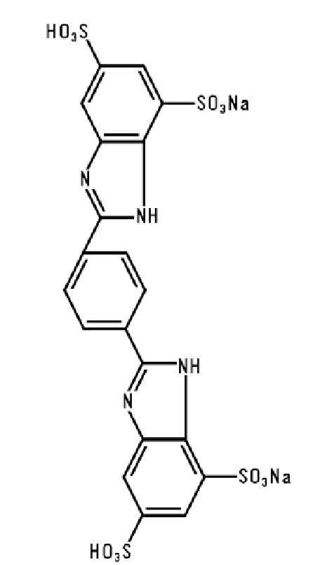
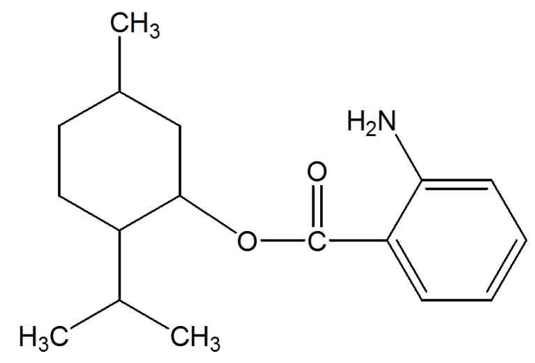
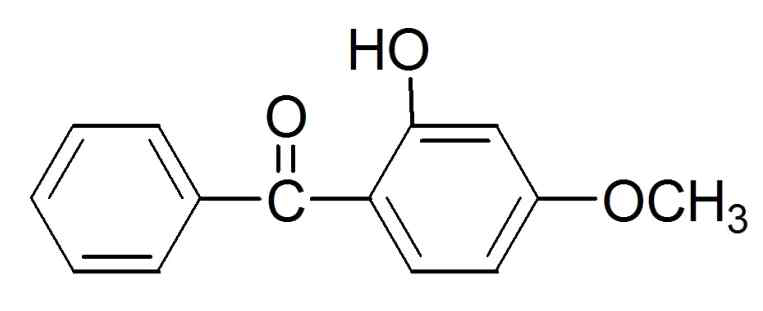
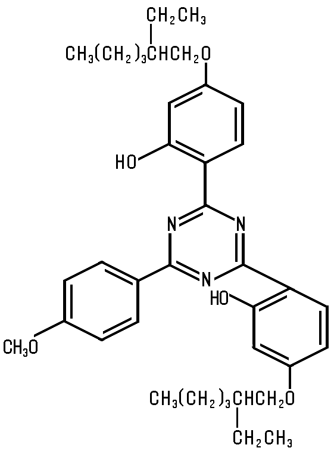
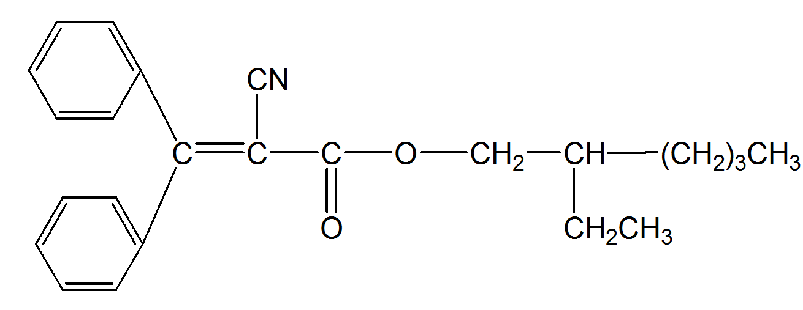
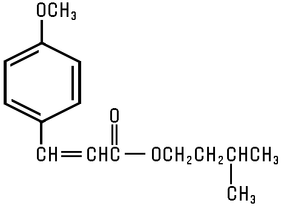
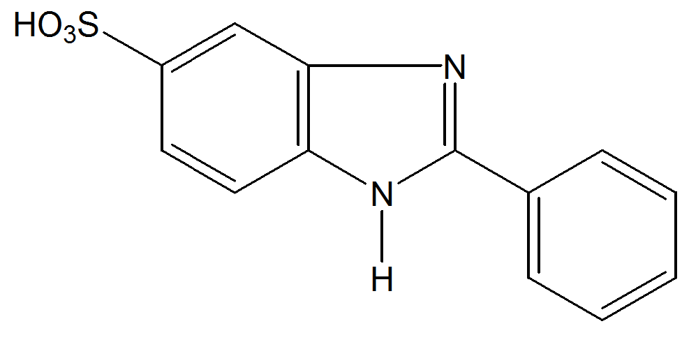

# KFCC_별표4_자외선보호

[별표4]

자외선으로부터피부를보호하는데도움을주는

기능성화장품각조

(제2조제4호관련)

드로메트리졸

Drometrizole

HO

N

N

N

CH3

2-(2'-히드록시-5'-메칠페닐)벤조트리아졸

2-(2'-Hydroxy-5'-methylphenyl)benzotriazole

C13H11N3O：225.25

이원료를건조한것은정량할때드로메트리졸(C13H11N3O：225.25) 95.0～104.0%를

함유한다.

성

상

이원료는엷은황백색의가루로냄새는거의없다.

확인시험

이원료10㎎을에탄올에녹여100mL로하고이액5mL를취하여에탄올을

넣어100mL로한액을검액으로한다. 검액을가지고흡광도측정법에따라흡수스

펙트럼을측정할때파장243±2㎚, 298±2㎚및340±2㎚에서흡수극대를, 또파장

259±2㎚및314±2㎚에서흡수극소를나타낸다.

융

점

126～134℃(제１법)

순도시험

용해상태

이원료0.1 g에아세톤10mL를넣어녹일때액은맑다.

건조감량

0.5% 이하(1 g, 황산, 24시간)

강열잔분

0.1% 이하(3 g, 제２법)

정량법

제1 법

이원료약10㎎을정밀하게달아에탄올에녹여100mL로하고이액

5mL를취하여에탄올을넣어100mL로한액을검액으로한다. 검액을가지고

층

장10㎜, 파장298㎚부근의흡수극대파장에서흡광도A를측정한다.

---

A

× 20000

드로메트리졸(C 13H 11N 3O)의양(㎎) 〓

640

제2 법

이원료약10mg을정밀하게달아메탄올을넣어녹여정확하게100mL로

하고, 이액5mL를취해메탄올을넣어정확하게10mL로한액을검액으로한다.

따로드로메트리졸표준품약10mg을정밀하게달아메탄올을넣어녹여100mL로

하고이액5mL를취해메탄올을넣어정확하게10mL로한액을표준액으로한

다. 검액및표준액각10μL씩을가지고다음조건으로액체크로마토그래프법에따

라시험하여드로메트리졸의피크면적AT 및AS를구한다.

AT

드로메트리졸(C13H11N3O : 225.25)의양(㎎) = 드로메트리졸표준품의양(㎎) × 

AS

조작조건

검출기: 자외부흡광광도계(측정파장305㎚)

칼

럼: 안지름약4.6㎜, 길이약15㎝인스테인레스관에5㎛의액체크로마토그

래프용옥타데실실릴화한실리카겔을충전한다.

이동상: 메탄올

유

량: 1.0mL/분

드로메트리졸트리실록산

Drometrizole Trisiloxane

OSI(CH3)3

HO

CH2CHCH2SICH3

CH3

OSI(CH3)3

N

N

N

CH3

C24H39N3O3Si3 : 501.84

이원료를건조한것은정량할때드로메트리졸트리실록산(C24H39N3O3Si3 : 501.84)

98.0 % 이상을함유한다.

성

상

이원료는엷은황색의결정성가루이다.

확인시험

1) 이원료0.25 g에에탄올100 mL를넣어녹인다. 이액1 mL를취하여

---

에탄올을넣어100 mL로한액을가지고흡광도측정법에따라흡수스펙트럼을측

정할때파장245 ± 2 nm, 304 ± 2 nm 및342 ± 2 nm 에서흡수극대를나타낸

다.

2) 이원료를가지고적외부흡수스펙트럼측정법의1)브롬화칼륨정제법에따라측정

할때파수3,422 cm-1, 3,060 cm-1, 2,957 cm-1, 2,918 cm-1, 2,867 cm-1, 1,607 cm-1,

1,569 cm-1, 1,510 cm-1, 1,257 cm-1, 1,216 cm-1, 1,084 cm-1, 1,049 cm-1, 842 cm-1, 789

cm-1, 754 cm-1, 741 cm-1 부근에서흡수를나타낸다.

융

점

46 ～ 49 °C

(제2법)

순도시험

1) 용해상태

이원료0.5 g에에탄올10 mL를넣어녹일때액은맑다.

2) 중금속

이원료2.0 g을달아천천히가열한다. 이때황산2～3 mL를넣어무

색～엷은황색을띨때까지가열을계속한다. 식힌후, 포화수산암모늄용액15 mL를

가하여백색의연기가날때까지가열하여농축한다. 이를다시식힌후, 주의하여

물을가해25 mL로하여이를검액으로한다. 이용액10 mL를가지고시험할때,

그한도는20 ppm 이하이다. 비교액에는납표준액1.6 mL를넣는다.

3) 비소

이원료2.0 g을달아천천히가열한다. 이때황산2～3 mL를넣어무

색～엷은황색을띨때까지가열을계속한다. 식힌후, 포화수산암모늄용액15 mL를

가하여백색의연기가날때까지가열하여농축한다. 이를다시식힌후, 주의하여

물을가해25 mL로하고, 이를검액으로한다. 이용액10 mL를가지고장치B를

쓰는방법에따라조작하여시험할때그한도는2 ppm 이하이다. 비교액에는비소

표준액1.6 mL를넣는다.

4) 유연물질

건조한이원료0.2 g을정밀하게달아메탄올을넣어100 mL로하여

검액으로한다. 따로유연물질A주1 50 mg을정밀하게달아메탄올을넣어100 mL

로한다(용액A). 유연물질B주2 50 mg을정밀하게달아메탄올에녹여100 mL로한

다(용액B). 유연물질C주3 50 mg을정밀하게달아메탄올에녹여100 mL로한다(용

액C). 용액A 1.2 mL, 용액B 2 mL 및용액C 3.2 mL를각각정확하게취하여섞고

메탄올을넣어섞어정확하게100 mL로하고이를표준액으로한다. 검액및표준

액각10 ㎕씩을가지고아래조작조건으로액체크로마토그래프법에따라시험할

때검액중유연물질각각의피크면적은표준액중의유연물질각각의피크면적보다

작고, 그한도는유연물질A는0.3 %이하, 유연물질B는0.5 %이하, 유연물질C는

0.8 % 이하이다.

조작조건

검출기: 자외부흡광광도계(측정파장: 305 nm)

칼

럼: 안지름약4.6 mm, 길이약25 cm인스테인레스관에5 ㎛ 의액체크로

마토그래프용옥타데실실릴화한실리카겔을충전한다.

칼럼온도: 40 ℃

이동상: 메탄올

---

유

량: 유연물질A의유지시간이약10 분, 유연물질B의유지시간이약2분,

유연물질C의유지시간이약16 분이되도록조절한다.

칼럼의선정: 이시험을할때, 유지시간약10 분, 약12 분및약16 분에서나타

나는피크의분리도는각각1.5 이상이다.

피크면적측정시간: 검액주입후20분간

정량법

이원료를건조하여(오산화인, 4 시간, 감압건조) 약0.1 g을정밀히달아

메탄올을넣어100 mL로한다. 이액5 mL를정확하게취해메탄올을넣어50 mL

로하여검액으로한다. 따로드로메트리졸트리실록산표준품약0.1 g을정밀히달

아메탄올을넣어100 mL로한다. 이액5 mL를각각정확하게취하여메탄올을

넣어각각50 mL로하여표준액으로한다. 검액및표준액각10 ㎕씩을가지고

아래조작조건으로액체크로마토그래프에따라시험하여드로메트리졸트리실록산의

피크면적AT 및AS를구한다.

드로메트리졸트리실록산(C24H39N3O3Si3)의양(mg)

AT

= 드로메트리졸트리실록산표준품의양(mg) x

AS

조작조건

검출기: 자외부흡광광도계(측정파장: 305 nm)

칼

럼: 안지름약4.6 mm, 길이약15 cm인스테인레스관에5 ㎛의액체크로

마토그래프용옥타데실실릴화한실리카겔을충전한다.

칼럼온도: 40 ℃ 근처의일정한온도

이동상: 메탄올

유

량: 이원료의유지시간이약5분이되도록조절한다.

주1 유연물질A : 2-(2H-벤조트리아졸-2-일)-6-(2-메칠프로페닐)-p-크레솔

주2 유연물질B : 2-(2H-벤조트리아졸-2-일)-4-메칠-6-(2-메칠프로필) 페닐

주3 유연물질C : 2-[5-메칠-3-[1,3,3,3-테트라메칠-1-[(트리메칠실릴)옥시]디시록사놀]프로

필]-2-[1,3,3,3-테트라메칠-1-[(트리메칠실릴)옥시]디시록사놀]옥시]페닐2H-페닐트리아졸,

---

디갈로일트리올리에이트

Digalloyl Trioleate

O

RC

O

HO

OH

O

O

RC

O

C

O

COOH

RC

O

O

R : CH3(CH2)7CH=CH(CH2)7―

갈릭애씨드3-갈레이트트리올레이트

Gallic Acid 3-Gallate Trioleate

C68H106O12 : 1115.58

이원료를정량할때디갈로일트리올리에이트(C68H106O12 : 1115.58) 98.0% 이상을

함유한다.

성

상

이원료는짙은갈색의점성이있는맑은액으로특이한냄새가있다.

확인시험

이원료를가지고적외부흡수스펙트럼측정법의4) 액막법에따라측정할때

표준품과같은스펙트럼을나타낸다.

n25

굴절률

D ：1.5107～1.5208

d25

비

중

25：1.033～1.048

정량법

이원료0.1g을정밀하게달아피리딘을넣고열을가하여녹이고냉각한

후에50mL로하고이액0.6mL에1.4mL의피리딘을넣은액을검액으로한다. 따

로디갈로일트리올리에이트표준품약0.1g을정밀하게달아피리딘을넣고열을

가하여녹이고냉각한후에50mL로하고이액0.6mL에1.4mL의피리딘을넣은

액을표준액으로한다. 검액및표준액각각2mL에0.4mL 헥사메칠디실록산을넣

어흔들고0.3mL 트리메틸실록산을넣은후5분간원심분리한후, 각각2.0㎕를

가지고다음의조건으로기체크로마토그래프법으로시험하여검액및표준액의디

갈로일트리올리에이트피크면적AT 및AS를구한다.

디갈로일트리올리에이트(C68H106O12)의양(g)

= 디갈로일트리올리에이트표준품의양(g)× A T

A S

조작조건

검출기: 수소염이온화검출기

칼

럼: 안지름0.32mm, 길이약30m인스테인레스관에기체크로마토그래프용

10% 메칠실록산ㆍ규조토를충전한것을사용한다.

---

칼럼온도: 초기160℃에서매분8℃씩300℃까지승온한다.

검출기온도: 300℃

주입구온도: 290℃

캐리어가스: 헬륨

---

디메치코디에칠벤잘말로네이트

Dimethicodiethylbenzal malonate

CH3

CH3

CH3

H3

C

Si

O

Si

CH3

Si

O

CH3

<b>R</b>

CH3

n

n, approx 60

<b>R</b> =

92.1 - 92.5 %

CH3

A =

COOC2H5

approx. 6 %

B =

COOC2H5

O

CH2

COOC2H5

C =

approx.1.5 %

˜

COOC2H5

O

폴리실리콘-15

Polysilicone-15

평균분자식C196H490O84Si65 : 평균분자량16741

이원료는디메치코디에칠벤잘말로네이트로서고분자성실리콘사슬에신나메이트가

결합되어진고분자물질로서n은약60이며, R그룹의비율A:B:C는약92:6:1.5이다.

이원료는정량할때디메치코디에칠벤잘말로네이트(C196H490O84Si65 : 16741)로서94.0～

104.0%를함유한다.

성

상

이원료는무색～ 미황색의점성을나타내는액이다.

확인시험

1) 이원료0.1 g에에탄올을넣어100 mL로하고이액1 mL를취하여

에탄올을넣어정확하게100 mL로한액을검액으로한다. 검액을가지고흡광도

측정법에따라측정할때312±2 ㎚에서흡수극대를나타낸다.

2) 이원료를가지고적외부흡수스펙트럼측정법의4) 액막법에따라측정할때파

수2962 cm-1, 1720 cm-1, 1603 cm-1, 1501 cm-1, 1411 cm-1, 1260 cm-1, 및1097 cm-1

부근에서특성흡수를나타낸다.

3) 정량법의검액에서얻은주피크의유지시간은표준액에서얻은주피크의유지시간

과같다.

굴절률

n20

D : 1.440 ～ 1.445

비흡광도

E1%

1cm(312nm) : 160 ～ 190

점

도

이원료를가지고25 ℃에서제2법에따라시험할때그점도는600～900

cps (5호, 30rpm, 3분)이다.

---

순도시험

1) 잔류용매

이원료1.0 g을검액으로하고, 따로자일렌표준원액(2,000

㎍/mL, o-, m-, p-자일렌의혼합표준액)을메탄올로희석하여각각1, 5, 10, 20, 3

0 ㎍/mL 농도로한액을검량선용표준액으로한다. 검액및표준액을헤드스페이

스검체유입장치를사용하여다음조건으로기체크로마토그래프법에따라시험하여

자일렌피크면적을구한다. 검액중자일렌함량은표준액의검량선을이용하여구

하였을때0.21 % 이하이다.

조작조건

검출기: 질량분석계검출기또는수소염이온화검출기

칼

럼: 안지름0.32 mm, 길이30 m인스테인레스관에기체크로마토그래피용

폴리(6% 시아노프로필페닐ㆍ디메칠실록산)을충전한다.

칼럼온도: 초기2분간35℃를유지한다음매분8℃씩130℃까지승온한후매분30℃씩

190 ℃까지승온하여3분간유지한다.

헤드스페이스검체유입장치: 100℃에서20분간가열한후검체를유입시킨다.

검출기온도: 300℃

주입구온도: 140℃

캐리어가스: 질소

2) 유리디에틸4-프로피닐옥시벤잘말로네이트

이원료25 ㎎을정밀하게달아이

동상에넣어녹여정확하게50 mL로한액을검액으로한다. 디에틸4-프로피닐옥

시벤잘말로네이트표준품25 ㎎을정밀하게달아이동상에넣어녹여정확하게250

mL로한것을표준원액으로한다. 이표준원액을가지고이동상으로단계적으로

희석하여디에틸4-프로피닐옥시벤잘말로네이트의농도가각각0.5, 1, 5, 10 ㎍/mL

의농도로한액을검량선용표준액으로한다. 검액및표준액10μL씩을가지고다

음조건으로액체크로마토그래프법에따라시험하여디에틸4-프로피닐옥시벤잘말

로네이트의피크면적을구한다. 검액의디에틸4-프로피닐옥시벤잘말로네이트의함

량은표준액의검량선을이용하여계산하였을때0.31 % 이하이다.

조작조건

검출기: 자외부흡광광도계(측정파장307 ㎚)

칼

럼: 안지름7.5 ㎜, 길이30 ㎝인PLGel Mixed-D 칼럼또는이와동등한칼럼

이동상: 테트라히드로푸란

유

량: 1.0 mL/분

주) 디에틸4-프로피닐옥시벤잘말로네이트(Dietyl 4-propynyloxybenzalmalonate) : 화

학명propanedionic acid {[4-(2-propynyloxy)phenyl]methylene}-diehtylester(C17

H18O5 : 304.4)

건조감량

1.0 % 이하(1 g, 105 ℃, 2시간)

---

정량법

이원료50 ㎎을정밀하게달아테트라하이드로푸란을넣어녹인후정확

하게100mL로한액을검액으로한다. 따로디메치코디에칠벤잘말로네이트표준품

25, 50, 100㎎을정밀하게달아각각테트라하이드로푸란을넣어녹인후각각정확

하게100mL로한액을검량선용표준액으로한다. 검액및표준액을가지고다음

조건으로액체크로마토그래프법에따라시험하여디메치코디에칠벤잘말로네이트의

피크면적을구한다. 검액의디메치코디에칠벤잘말로네이트의함량은표준액의검량

선을이용하여계산한다.

조작조건

검출기: 자외부흡광광도계(측정파장307 ㎚)

칼

럼: 안지름7.5㎜, 길이30㎝인5㎛ PLGel Mixed-D 칼럼또는이와동등한칼럼

이동상: 테트라히드로푸란

유

량: 1.0 mL/분

디에칠아미노하이드록시벤조일헥실벤조에이트

Diethylamino Hydroxybenzoyl Hexyl Benzoate

벤조익애씨드, 2-[4-(디에칠아미노)-2-하이드록시벤조일]-,헥실에스터

C24H31NO4 : 397.52

이

원료는

정량할

때

디에칠아미노하이드록시벤조일헥실

벤조에이트(C24H31NO4

:

397.52) 99.0% 이상을함유한다.

성

상

이원료는백색~ 엷은황색의과립상가루로가온하면황색의액이되며,

약간의특이한냄새가있다. 이원료는에탄올에녹고물에거의녹지않는다.

확인시험

이원료약30㎎을정밀하게달아에탄올을넣어녹여100mL로한다음이

액2mL를정확하게취하여에탄올을넣어정확하게100mL로한액을검액으로한

다. 검액을가지고에탄올을대조로하여흡광도측정법에따라흡수스펙트럼을측정

할때파장354 ± 2㎚에서흡수극대를나타낸다.

비흡광도

확인시험에서얻은검액을가지고에탄올을대조로하여파장354㎚에서흡

광도측정법에따라시험할때비흡광도( E 1%

1㎝)는910 ～ 940이다.

순도시험

1) 톨루엔및n-헥산올

이원료2.0g을정확하게달아아세톤을넣어녹여

---

정확하게20mL로한액을검액으로한다. 따로톨루엔(C7H8 : 92.14) 표준품약

1.000g 및n-헥산올(C6H14O : 102.18) 표준품2.000g을정확하게달아각각에아세톤

을넣어정확하게100mL로한액0.1mL를정확하게취하여아세톤을넣어정확하

게100mL로한액을각각의표준액으로한다. 검액및표준액1µL씩을가지고다음

의조건으로기체크로마토그래프법에따라시험할때검액에서의톨루엔및n-헥산

올의피크면적은표준액에서의각각의피크면적보다크지않다(톨루엔100ppm 이

하, n-헥산올200ppm 이하)

조작조건

검출기: 수소염이온화검출기

컬

럼: 안지름0.32㎜, 길이15m인용융실리카내벽에기체크로마토그래프용폴

리디메칠실록산을1.0µm의두께로고정시킨모세관컬럼

컬럼온도: 초기40℃에서1 분간유지하고매분5℃씩70℃까지승온하여10분간유

지한다음매분70℃씩320℃까지승온하여7분간유지하고매분70℃씩

40℃까지식혀2분간유지한다.

검출기온도: 250℃

주입구온도: 250℃

캐리어가스및유량: 질소, 매분1mL 부근의일정량

2) 무수프탈산, 3-디에칠아미노페놀및디헥실프탈레이트

이원료2.0g을정확하게

달아아세톤을넣어녹여정확하게20mL로한액을검액으로한다. 따로무수프탈

산(C8H4O3 : 148.12) 표준품, 3-디에칠아미노페놀(C10H15NO : 165.24) 표준품및디헥

실프탈레이트(C20H30O4 : 334.46) 표준품각각0.50g 씩을정확하게달아아세톤을넣

어녹여정확하게100mL로한액1.0mL씩을정확하게취하여아세톤을넣어정확

하게100mL로한액을각각의표준액으로한다. 검액및표준액1µL씩을가지고정

량법의조작조건으로기체크로마토그래프법에따라시험할때검액에서의무수프탈

산, 3-디에칠아미노페놀및디헥실프탈레이트의피크면적은표준액에서의각각의피

크면적보다크지않다. (무수프탈산, 3-디에칠아미노페놀및디헥실프탈레이트각각

0.05 % 이하)

3) 기타유연물질

정량법에따라시험하여얻은크로마토그램에서용매피크를제외

한피크면적을100으로하여, 검체중의무수프탈산, 3-디에칠아미노페놀, 디헥실프탈

레이트및디에칠아미노하이드록시벤조일헥실벤조에이트피크이외의피크합계면

적(%)을구한다. (0.3 % 이하).

4) 중금속

이원료2.0g을달아제2법에따라조작하여시험한다. 비교액에는납표

준액2.0mL를넣는다(10ppm 이하).

건조감량

1.0 % 이하(1 g, 105 ℃, 3 시간)

강열잔분

0.1 % 이하(5 g, 500 ℃, 3 시간)

정량법

제1 법

이원료약2g을정밀하게달아아세톤을넣어녹여20 mL로한액을검액

으로한다. 검액1µL를가지고다음의조건으로기체크로마토그래프법의면적백분율

---

법에따라시험하여용매피크를제외한피크면적을100으로하고이에대한디에

칠아미노하이드록시벤조일헥실벤조에이트(C24H31NO4 : 397.52)의피크면적비로부터

함량(%)을구한다.

조작조건

검출기: 수소염이온화검출기

컬

럼: 안지름0.32㎜, 길이15m인용융실리카내벽에기체크로마토그래프용폴

리디메칠실록산을1.0µm의두께로고정시킨모세관컬럼

컬럼온도: 초기150℃에서매분25℃씩300℃까지승온하여12분간유지하고매분

70℃씩150℃까지식혀3분간유지한다.

검출기온도: 250℃

주입구온도: 250℃

캐리어가스및유량: 질소, 매분1mL 부근의일정량

검출감도: 검액을용매로2,000배희석한액을가지고조작조건에따라시험할때

디에칠아미노하이드록시벤조일헥실벤조에이트의피크는검출되어야한

다. (50㎍/mL)

제2 법

이원료약10mg에해당하는양을정밀하게달아메탄올을넣어녹여정확

하게100mL로하고, 이액5mL를취해메탄올을넣어10mL로한액을검액으로

한다. 따로디에칠아미노하이드록시벤조일헥실벤조에이트표준품약10mg을정밀

하게달아메탄올을넣어녹여100mL로하고이액5mL를취해메탄올을넣어

10mL로한액을표준액으로한다. 검액및표준액각10μL씩을가지고다음조건으

로액체크로마토그래프법에따라시험하여디에칠아미노하이드록시벤조일헥실벤조

에이트의피크면적AT 및AS를구한다.

디에칠아미노하이드록시벤조일헥실벤조에이트(C24H31NO4 : 397.52)의양(㎎) =

AT

디에칠아미노하이드록시벤조일헥실벤조에이트표준품의양(㎎) × 

AS

조작조건

검출기: 자외부흡광광도계(측정파장305㎚)

칼

럼: 안지름약4.6㎜, 길이약25㎝인스테인레스관에5㎛의액체크로마토그래

프용옥타데실실릴화한실리카겔을충전한다.

이동상: 85% 메탄올

유

량: 1.0mL/분

---

디에칠헥실부타미도트리아존

Diethylhexyl Butamido Triazone

이원료는정량할때디에칠헥실부타미도트리아존(C44H59N7O5

: 766.0) 97.0 % 이상을함유한다.

성

상

백색～ 미황색의가루로특이한냄새가있다.

확인시험

1) 이원료약0.1g을정밀하게달아메탄올200mL에넣어녹인액을검액

으로한다. 검액을가지고흡광도측정법에따라측정할때310±2 ㎚에서흡수극

대를나타낸다.

2) 이원료를가지고적외부흡수스펙트럼측정법의1) 브롬화칼륨정제법에따라측

정할때파수3316 cm-1, 2959 cm-1, 1697 cm-1, 1487 cm-1, 1411 cm-1, 1273 cm-1, 117

4 cm-1, 1110 cm-1, 및768 cm-1 부근에서특성흡수를나타낸다.

융

점

90℃ 이상

순도시험

1) 중금속

이원료1.0 g을달아제2법에따라조작하여시험한다. 비교액

에는납표준액1.0ml를넣는다.(10 ppm 이하)

2) 비소

이원료1.0g을달아제1법에따라검액을만들고장치A를쓰는방법에

따라조작하여시험한다.(2ppm 이하)

정량법

이원료약30㎎을정밀하게달아메탄올에넣어녹여100mL로한액을

검액으로한다. 따로디에칠헥실부타미도트리아존표준품약30㎎을정밀하게달아

메탄올에넣어녹여100 mL로한액을표준액으로한다. 검액및표준액10μL씩을

가지고다음조건으로액체크로마토그래프법에따라시험하여디에칠헥실부타미도

트리아존의피크면적AT 및AS를구한다.

디에칠헥실부타미도트리아존(C44H59N7O5)의양(㎎)

A T

= 디에칠헥실부타미도트리아존표준품의양(㎎) X

A S

조작조건

검출기: 자외부흡광광도계(측정파장300 ㎚)

칼

럼: 안지름약4㎜, 길이약250㎜인스테인레스관에7㎛의액체크로마토그

래프용옥타실릴화한실리카겔을충전한다.

이동상: 물과메탄올을다음표의비로혼합하여용매구배조건으로사용한다.

---

시간(분)

물(%)

메탄올(%)

0

40

60

30

5

95

40

5

95

41

40

60

45

40

60

유

량: 1.0 mL/분

디소듐페닐디벤즈이미다졸테트라설포네이트

Disodium phenyl dibenzimidazole tetrasulfonate

C20H12N4O12S4ㆍ2Na : 674.55

2,2‘-(1,4-페닐렌)비스-(1H-벤즈이미다졸-4,6-디설포닉애씨드, 디소듐염)

2,2‘-(1,4-phenylene)bis-(1H-benzimidazole-4,6-disulfonic acid, disodium salt)

이

원료를

정량할

때

디소듐페닐디벤즈이미다졸테트라설포네이트(C20H12N4O12S4ㆍ2Na:

674.55)

96.0 %이상을함유한다.

성

상

이원료는엷은황색의가루이다.

확인시험

1) 이원료100mg을정밀하게달아1 N 수산화나트륨액4mL를넣어녹인

후정제수를넣어정확하게100mL로한다. 이액1mL를정확하게취하여정제수를

넣어200mL로한액을검액으로한다. 검액을가지고흡광도측정법에따라흡수스

펙트럼을측정할때파장335±1nm 에서흡수극대를나타낸다.

2) 정량법의검액에서얻은주피크의유지시간은표준액에서얻은주피크의유지시간과같다.

융

점

360 ℃이상(제1법)

| 물(%) |
| --- |
| 40 |
| 5 |
| 5 |
| 40 |
| 40 |

---

건조감량

5 %이하(2 g, 105 ℃, 4 시간)

순도시험

1) 중금속

이원료1.0g을달아제1법에따라조작하여시험한다. 비교액에

는납표준액1.0mL를넣는다. (10 ppm이하)

2) 비소

이원료0.4 g을달아제1법에따라검액을만들어장치A를쓰는방법에

따라시험한다.(5 ppm 이하)

정량법

이원료15mg을정밀하게달아물에녹여100mL로한액을검액으로한다.

따로디소듐페닐디벤즈이미다졸테트라설포네이트표준품약15mg을정밀하게달아

물을넣어녹여100mL로한액을표준액으로한다. 검액및표준액각10μL씩을가

지고아래조작조건으로액체크로마토그래프법에따라시험하여디소듐페닐디벤지미

다졸테트라설포네이트의피크면적At 및As를구한다.

디소듐페닐디벤즈이미다졸테트라설포네이트(C20H12N4O12S4ㆍ2Na)의양(mg)

A t

= 디소듐페닐디벤즈이미다졸테트라설포네이트표준품의양(mg) ×

A s

조작조건

검출기: 자외부흡광광도계(측정파장: 335nm)

칼

럼: 안지름4.6mm, 길이15cm의스테인레스관에5㎛의액체크로마토그래프용

옥타데실실릴화한실리카겔을충전한다.

이동상: 5mM 테트라부틸암모늄클로라이드ㆍ아세토니트릴혼합액(52:48)

유

량: 1.5 mL/분

메칠렌비스-벤조트리아졸릴테트라메칠부틸페놀

Methylene Bis-Benzotriazolyl Tetramethylbutylphenol

OH

OH

N

N

CH2

N

N

N

N

C

CH3

C

CH3

CH3

CH3

CH2

CH2

C

CH3

C

CH3

CH3

CH3

CH3

CH3

C41H50N6O2 : 658.86

이

원료를

건조한

것은

정량할

때

메칠렌비스벤조트리아졸릴테트라메칠부틸페놀

(C41H50N6O2 : 658.86) 98.5% 이상함유한다.

성

상

이원료는엷은황색의가루로약간의특이한냄새가있다.

|  | C | CH / 3 |
| --- | --- | --- |
|  |  |  |

| CH / 3 |  |  |  | CH / 3 |
| --- | --- | --- | --- | --- |
|  |  | C |  |  |

|  | C |
| --- | --- |
|  |  |

|  |
| --- |
| C |

---

확인시험

1) 이원료를가지고적외부흡수스펙트럼측정법의1)브롬화칼륨정제법에따

라측정할때표준품과같은스펙트럼을나타낸다.

2) 정량법의검액에서얻은주피크의유지시간은표준액에서얻은주피크의유지시간과

같다.

순도시험

1) 납

이원료1.0g을정밀하게달아300mL 플라스크에넣고황산5mL 및

질산10mL를넣고흰연기가발생할때가열한다. 식힌다음질산5mL씩을추가하고

흰연기가발생할때까지가열하여내용물이무색～엷은황색이될때까지이조작

을반복한다. 분해가끝나면포화수산화암모늄용액5mL를넣고다시가열하여질산을

제거한다. 분해물을50mL 용량플라스크에옮기고물적당량으로분해플라스크를씻

어넣고물을넣어전체량을50mL로한다. 이것을검액으로한다. 비교액에는납표준

액1.0mL를넣는다.(10 ppm 이하)

2) 비소

이원료1.0g을취하여제3법에따라검액을만들고장치B를쓰는방법에

따라조작하여시험한다. (2ppm 이하)

건조감량

0.1% 이하(3.0 g, 105 ℃, 2시간)

산불용성회분

이원료약2.5g을정밀하게달아항량이되도록미리처리한사기나석

영제도가니에취한다음황산을넣어완전히녹인다. 검체가탄화될때까지가열하여

대부분의황산을휘발시킨다음, 800℃에서회화시킨다. 도가니를식힌후잔류물에

황산1～2방울을넣어다시녹인다. 이황산을다시휘발시킨후800℃에서1시간동

안회화시킨다. 도가니를데시케이터안에서식힌다음그무게를잰다(0.1% 이하)

W 2 -W 1

강열잔분(%) =

× 100

W

w : 검체취한양(g)

w1 : 항량이되도록한도가니무게(g)

w2 : 검체를회화시킨후최종무게(g)

정량법

이원료약20㎎을정밀하게달아테트라히드로푸란을넣어녹여정확하게

100mL로하고필요하면여과하여검액으로한다. 따로메칠렌비스벤조트리아졸릴테

트라메칠부틸페놀표준품약20㎎을정밀하게달아테트라히드로푸란을넣어녹여

정확히100 mL로한액을표준액으로한다. 검액및표준액10μL씩을가지고다음

조건으로액체크로마토그래프법에따라시험하여메칠렌비스벤조트리아졸릴테트라메

칠부틸페놀의피크면적AT 및AS를측정한다.

메칠렌비스벤조트리아졸릴테트라메칠부틸페놀(C41H50N6O2)의양(㎎)

A T

X

= 메칠렌비스벤조트리아졸릴테트라메칠부틸페놀표준품의양(㎎)

A S

조작조건

검출기: 자외부흡광광도계(측정파장320㎚)

칼

럼: 안지름4.6㎜, 길이약25㎝인스테인레스관에약5㎛의액체크로마토그래

프용옥타데실실릴화한실리카겔을충전한다.

---

이동상: 테트라히드로푸란ㆍ물ㆍ아세토니트릴혼합액(60:36:4)

유

량: 1.0 mL/분

---

메칠렌비스-벤조트리아졸릴테트라메칠부틸페놀액(50%)

Methylene Bis-Benzotriazolyl Tetramethylbutylphenol Solution(50%)

이원료는메칠렌비스벤조트리아졸릴테트라메칠부틸페놀에데실글루코사이드, 산

탄검, 프로필렌글라이콜, 정제수등을혼합한혼합물이며정량할때메칠렌비스벤조트

리아졸릴테트라메칠부틸페놀(C41H50N6O2 : 658.86)을48.0 ～ 52.0 % 함유한다.

성

상

이원료는백색의점성을나타내는액으로약간의특이한냄새가있다.

확인시험

1) 이원료약20㎎을달아디클로로메탄에녹여100mL로한다. 이액10

mL를취하여디클로로메탄을넣어100mL로한액을가지고하고흡광도측정법에따

라흡수스펙트럼을측정할때306 및348 ㎚ 부근에서흡수극대를나타낸다.

2) 정량법의검액에서얻은주피크의유지시간은표준액에서얻은주피크의유지시간

과같다.

pH

10.5 ～ 12.0

점

도

200 ～ 1,000 mPas (25℃)

흡광도

1) 흡광도이원료40 ㎎을달아디메칠아세트아마이드ㆍ이소프로판올혼합

액(1:1)을넣어1 L로한액을검액으로하여346 ㎚에서흡광도시험법에따라흡광

도를측정할때0.936 ～ 1.014이다.

2) 비흡광도

E(346 ㎚) : 234 ～ 254 (0.004%, 디메칠아세트아마이드ㆍ이소프로판올

혼합액(1:1))

정량법

이원료를메칠렌비스벤조트리아졸릴테트라메칠부틸페놀(C41H50N6O2)로서

약20 ㎎ 해당량을정밀하게달아테트라히드로푸란을넣어녹여정확하게100 mL

로하고필요하면여과하여검액으로한다. 따로메칠렌비스벤조트리아졸릴테트라메

칠부틸페놀표준품약20 ㎎을정밀하게달아테트라히드로푸란을넣어녹여정확히

100 mL로한액을표준액으로한다. 검액및표준액10 μL씩을가지고다음조건으

로액체크로마토그래프법에따라시험하여메칠렌비스벤조트리아졸릴테트라메칠부틸

페놀(C41H50N6O2 : 658.86)의피크면적AT 및AS를구한다.

메칠렌비스벤조트리아졸릴테트라메칠부틸페놀(C41H50N6O2)의양(㎎)

X A T

= 메칠렌비스벤조트리아졸릴테트라메칠부틸페놀표준품의양

A S

조작조건

검출기: 자외부흡광광도계(측정파장320 ㎚)

칼

럼: 안지름4.6 ㎜, 길이약25 ㎝인스테인레스관에약5 ㎛의액체크로마토

그래프용옥타데실실릴화한실리카겔을충전한다.

이동상: 테트라히드로푸란ㆍ물ㆍ아세토니트릴혼합액(60:36:4)

유

량: 1.0 mL/분

4-메칠벤질리덴캠퍼

4-Methylbenzylidene Camphor

---

3-(4-메칠벤질리덴)-dl-캠퍼

3-(4-Methylbenzylidene)-dl-Camphor

C18H22O : 254.37

이원료를건조한것은정량할때4-메칠벤질리덴캠퍼(C18H22O:254.37) 99.5% 이상을

함유한다.

성

상

이원료는백색의가루로약간의특이한냄새가있다.

확인시험

1) 흡광도

이원료약50mg을정밀하게달아메탄올을넣어녹여정확하게

100mL로하고다시이액1mL를정확하게취하여메탄올을넣어정확하게100mL로

한액을검액으로한다. 검액을가지고메탄올을대조액으로흡광도측정법에따라

측정할때파장299±2nm부근에서

흡수극대를나타낸다.

2) 이원료를가지고적외부흡수스펙트럼측정법의1)브롬화칼륨정제법에따라측정할

때2970cm-1, 1725cm-1, 1070cm-1, 1020cm-1 및820cm-1 부근에서특성흡수를나타낸

다.

융

점

66℃～ 68℃ (제1법)

건조감량

0.5%이하(1g, 105℃, 1시간)

정량법

제1 법

이원료0.1g을정확하게달아메탄올을넣어녹여100mL로한액을검액

으로하고따로4-메칠벤질리덴캠퍼표준품약0.1g을정밀하게달아메탄올을넣어

정확하게100mL로하여표준액으로한다. 검액및표준액각각1.0㎕를가지고다음

의조건으로기체크로마토그래프법으로시험한다.

조작조건

검출기: 수소염이온화검출기

칼

럼: 안지름0.32mm, 길이약30m인용융실리카모세관에기체크로마토그래프

용100% 디메칠폴리실록산을0.25㎕의두께로고정한것.

칼럼온도: 초기150℃ 1분간유지하고, 매분5℃씩280℃까지승온한다음280℃에서

5분간유지한다.

검출기온도: 300℃

주입구온도: 290℃

캐리어가스및유량: 질소, 매분2mL

Split ratio :

20 : 1

주입량: 1㎕

---

제2 법

이원료약10mg에해당하는양을정밀하게달아메탄올을넣어녹여정확

하게100mL로하고, 이액5mL를취해메탄올을넣어10mL로한액을검액으로

한다. 따로4-메칠벤질리덴캠퍼표준품약10mg을정밀하게달아메탄올을넣어녹

여100mL로하고이액5mL를취해메탄올을넣어10mL로한액을표준액으로한

다. 검액및표준액각10μL씩을가지고다음조건으로액체크로마토그래프법에따

라시험하여4-메칠벤질리덴캠퍼의피크면적AT 및AS를구한다.

4-메칠벤질리덴캠퍼(C18H22O : 254.37)의양(㎎) =

AT

4-메칠벤질리덴캠퍼표준품의양(㎎) × 

AS

조작조건

검출기: 자외부흡광광도계(측정파장305㎚)

칼

럼: 안지름약4.6㎜, 길이약25㎝인스테인레스관에5㎛의액체크로마토그래

프용옥타데실실릴화한실리카겔을충전한다.

이동상: 85% 메탄올

유

량: 1.0mL/분

멘틸안트라닐레이트

Menthyl Anthranilate

멘틸-o-아미노벤조에이트

Menthyl-o-aminobenzoate

C17H25NO2：275.39

이원료는정량할때멘틸안트라날닐레이트98.0% 이상을함유한다.

성

상

이원료는무색～엷은황색의점성이있는맑은액으로약간의특이한냄새

가있다.

확인시험

흡광도이원료약0.03g을정밀하게달아메탄올을넣어녹여100mL로한

다음다시이액10mL를정확하게취하여메탄올을넣어100mL로한액을검액으

로한다. 검액을가지고흡광도측정법에따라측정할때파장335㎚부근에서흡수극

---

대를나타낸다.

n20

굴절률

D ：1.540～1.544

d25

비

중

25：1.038～1.043

[α] 20

비선광도

: -4 ～ +4°(무수에탄올)

D

산

가

1 이하(30g, 제１법)

정량법

이원료30g을정밀하게달아메탄올을넣어녹여100mL로하여검액으로

한다. 따로멘틸아트라닐레이트표준품약30g를정밀하게달아메탄올을넣어녹여

100mL로하여표준액으로한다. 검액및표준액을10㎕ 씩을가지고다음조건으로

액체크로마토그래프법에따라시험하여멘틸안트라닐레이트의피이크면적AT 및AS를

구한다.

멘틸안트라닐레이트의양(mg) = 멘틸안트라닐레이트의표준품× A T

A S

조작조건

검출기: 자외선흡수스펙트럼(측정파장: 340nm)

칼

럼: 안지름4.6mm, 길이15cm인스테인레스관에5㎛ 옥타데실실릴화실리카겔

을충전한다.

칼럼온도: 35℃

이동상: 희석시킨초산(1→10,000)ㆍ메탄올혼합액(20: 80)

유

속: 1.0mL/min

벤조페논-3

Benzophenone-3

옥시벤존, 2-히드록시-4-메톡시벤조페논

Oxybenzone, 2-hydroxy-4-methoxybenzophenone

C14H12O3：228.25

이원료를건조한것은정량할때벤존페논-3(C14H12O3：228.25) 90.0% 이상을함유한다.

성

상

이원료는엷은황색의결정성가루로냄새는없다.

---

확인시험

이원료0.1 g에에탄올100mL를넣어녹이고이액1mL를취하여에탄올

을넣어100mL로한액을검액으로한다. 검액을가지고흡광도측정법에따라측정

할때파장242±4㎚, 288±4㎚ 및325±4㎚에서흡수극대를나타내고파장265±4㎚ 및

310±4㎚에서흡수극소를나타낸다.

융

점

60～66℃(제１법)

순도시험

용해상태

이원료1.0g에무수에탄올20mL를넣어녹일때액은맑다.

건조감량

0.50% 이하(1 g, 실리카겔, 24시간)

강열잔분

0.1% 이하(3 g, 제１법)

정량법

제1 법

이원료약10㎎을정밀하게달아에탄올에녹여100mL로하고이액5mL

를취하여에탄올을넣어100mL로한액을검액으로한다. 검액을가지고흡광도측

정법에따라층장10㎜, 파장288㎚ 부근의흡수극대파장에서흡광도A를측정한다.

A

× 20000

벤존페논-3 (C 14H 12O 3)의양(㎎) 〓

649

제2 법

이원료약10mg에해당하는양을정밀하게달아메탄올을넣어녹여정확

하게100mL로하고, 이액5mL를취해메탄올을넣어10mL로한액을검액으로

한다. 따로벤조페논-3 표준품약10mg을정밀하게달아메탄올을넣어녹여100mL

로하고이액5mL를취해메탄올을넣어10mL로한액을표준액으로한다. 검액

및표준액각10μL씩을가지고다음조건으로액체크로마토그래프법에따라시험하

여벤조페논-3의피크면적AT 및AS를구한다.

AT

벤조페논-3 (C14H12O3 : 228.25)의양(㎎) = 벤조페논-3 표준품의양(㎎) × 

AS

조작조건

검출기: 자외부흡광광도계(측정파장285㎚)

칼

럼: 안지름약4.6㎜, 길이약25㎝인스테인레스관에5㎛의액체크로마토그래

프용옥타데실실릴화한실리카겔을충전한다.

이동상: 물ㆍ메탄올ㆍ아세트산(25:75:2)

유

량: 1.0mL/분

벤조페논-4

Benzophenone-4

---

설리소벤존

Sulisobenzone

C14H18O9S：362.26

이원료를건조한것은정량할때벤조페논-4(C14H18O9S：362.26) 95.0% 이상을함유

한다.

성

상

이원료는엷은황색의가루로특이한냄새가있다.

확인시험

이원료0.1 g에무수에탄올100mL를넣어녹이고이액1mL를취하여무

수에탄올을넣어100mL로한액을검액으로한다. 검액을가지고흡수스펙트럼에

따라측정할때파장245±4㎚, 287±4㎚ 및329±5㎚에서흡수극대를나타내고파장

265±4㎚ 및308±4㎚에서흡수극소를나타낸다.

융

점

107～111℃(제１법)

순도시험

용해상태

이원료1.0 g에무수에탄올10mL를넣어녹일때액은맑다.

건조감량

5.0% 이하(1 g, 실리카겔, 24시간)

강열잔분

0.1% 이하(3 g, 제１법)

정량법

제1 법

이원료를건조하고약0.1 g을정밀하게달아무수에탄올에녹여100mL로

하고이액10mL를취하여무수에탄올을넣어100mL로하여이것을검액으로한

다. 검액5mL를취하여무수에탄올을넣어100mL로하고층장10㎜, 파장287㎚ 부

근의흡수극대파장에서흡광도A를측정한다.

A

× 20000

벤조페논-4 (C 14H 18O 9S)의양(㎎) 〓

398

제2 법

이원료약10mg에해당하는양을정밀하게달아메탄올을넣어녹여정확

하게100mL로하고, 이액5mL를취해메탄올을넣어10mL로한액을검액으로한

다. 따로벤조페논-4 표준품약10mg을정밀하게달아메탄올을넣어녹여100mL로

하고이액5mL를취해메탄올을넣어10mL로한액을표준액으로한다. 검액및

표준액각10μL씩을가지고다음조건으로액체크로마토그래프법에따라시험하여

벤조페논-4의피크면적AT 및AS를구한다.

AT

벤조페논-4 (C14H18O9S : 362.26)의양(㎎) = 벤조페논-4 표준품의양(㎎) × 

AS

조작조건

---

검출기: 자외부흡광광도계(측정파장285㎚)

칼

럼: 안지름약4.6㎜, 길이약25㎝인스테인레스관에5㎛의액체크로마토그래

프용옥타데실실릴화한실리카겔을충전한다.

이동상: 물ㆍ메탄올ㆍ아세트산(25:75:2)

유

량: 1.0mL/분

---

벤조페논-8

Benzophenone-8

디옥시벤존

Dioxybenzone

C14H12O4 : 244.25

이원료를건조한것은정량할때벤존페논-8(C14H12O4) 97.0% 이상을함유한다.

성

상

이원료는엷은황색의가루로약간의방향성냄새가있다.

확인시험

1) 흡광도

이원료약10㎎을정밀하게달아메탄올을넣어녹여정확하게

100mL로하고이액10mL를정확하게취하여메탄올을넣어정확하게100mL로한

액을검액으로한다. 검액을층장10mm의석영셀에넣어메탄올을대조액으로흡

광도측정법에따라흡수스펙트럼을측정할때파장358㎚ 및283㎚ 부근에서흡수극

대을나타낸다.

2) 이원료를가지고적외부흡수스펙트럼측정법의1)브롬화칼륨정제법에따라측정할

때표준품과같은스펙트럼을나타낸다.

수

분

2.0% 이하

정량법

이원료를약0.1g을정밀하게달아메탄올을넣어녹여100mL로하여검

액으로한다. 따로벤조페논-8 표준품약0.1g을정밀하게달아메탄올을넣어녹여

100mL로한액을표준액으로한다. 검액및표준액10㎕를가지고다음의조건으로

액체크로마토그래프법에따라시험하여벤조페논-8의피크면적AT 및AS를측정한다.

벤조페논-8(C 14H 12O 4)의양(㎎) = 벤조페논-8 표준품의양(㎎)× A T

A S

조작조건

검출기: 자외부흡광광도계(측정파장285㎚)

컬

럼: 안지름4㎜, 길이30㎝인스테인레스관에약10㎛의액체크로마토그래프용

옥타데실실릴화한실리카겔을충전한다.

이동상: 물ㆍ메탄올ㆍ빙초산혼합액(40: 60: 2)

유

량: 1.0mL/분

---

부틸메톡시디벤조일메탄

Butyl Methoxydibenzoylmethane

아보벤존

Avobenzone

C20H22O3：310.39

이원료를건조한것은정량할때부틸메톡시디벤조일메탄(C20H22O3：310.39) 97.0～

104.0%를함유한다.

성

상

이원료는엷은황색～황색의가루로약간의특이한냄새가있다.

확인시험

1) 이원료50㎎에에탄올100mL를넣어녹이고이액1.0mL를취하여에

탄올을넣어100mL로한액을검액으로한다. 검액을층장10㎜의석영셀에넣어

흡광도측정법에따라흡수스펙트럼을측정할때파장358±2㎚에서흡수극대를나타낸

다.

2) 이원료를가지고적외부흡수스펙트럼측정법의1) 브롬화칼륨정제법에따라측정

할때파수1510㎝-1, 1260㎝-1, 1170㎝-1, 1022㎝-1 및800㎝-1 부근에서특성흡수를나

타낸다.

융

점

81～86℃(제１법)

순도시험

1) 용해상태

이원료0.20 g을달아무수에탄올10mL를넣고가온하여녹

일때액은맑다.

2) 4,4’-디메톡시디벤조일메탄

이원료0.10 g에에탄올을넣어녹여100mL로하고

이액10mL를취하여에탄올을넣어100mL로한액을검액으로한다. 검액10㎕를

가지고다음조건으로액체크로마토그래프법에따라시험할때유지시간약3.3분에

나타나는피크면적은전피크면적의5.0% 이하이다.

조작조건

검출기：자외부흡광광도계(측정파장：358㎚)

컬

럼：안지름4㎜, 길이15～20㎝인스테인레스관에5～10㎛의옥타데실실릴화실리

카겔을충전한다.

칼럼온도：실온

이동상：아세토니트릴ㆍ물혼합액(85：15)에인산를넣어pH 2.5로조정한다.

유

속：부틸메톡시디벤조일메탄의유지시간이약5.5분이되도록조정한다.

3) 중금속

이원료1.0 g을달아제２법에따라조작하여시험한다. 비교액에는납

표준액2.0mL를넣는다(20ppm 이하).

4) 비

소

이원료1.0 g을달아제３법에따라검액을만들고장치B를쓰는방법

---

에따라조작하여시험한다(2ppm 이하).

수

분

1.0% 이하(0.5 g)

강열잔분

0.30% 이하(1 g, 제１법)

정량법

제1 법

이원료1.0 g을데시케이터(감압, 실리카겔)에서24시간건조하고약0.1 g

을정밀하게달아에탄올을넣어녹이고정확하게200mL로한다. 이액1.0mL를정

확하게취하여에탄올을넣어정확하게100mL로하여검액으로한다. 검액을층장

10㎜의석영셀에넣어358㎚ 부근의흡수극대파장에서흡광도측정법에따라흡광도

A를측정한다.

A

× 20000

부틸메톡시디벤조일메탄(C 20H 22O 3)의양(㎎) 〓

113

제2 법

이원료약10mg에해당하는양을정밀하게달아메탄올을넣어녹여정확

하게100mL로하고, 이액5mL를취해메탄올을넣어10mL로한액을검액으로

한다. 따로부틸메톡시디벤조일메탄표준품약10 mg을정밀하게달아메탄올을넣

어녹여100mL로하고이액5mL를취해메탄올을넣어10mL로한액을표준액으

로한다. 검액및표준액각10μL씩을가지고다음조건으로액체크로마토그래프법

에따라시험하여부틸메톡시디벤조일메탄의피크면적AT 및AS를구한다.

부틸메톡시디벤조일메탄(C20H22O3 : 310.39)의양(㎎) =

AT

부틸메톡시디벤조일메탄표준품의양(㎎) × 

AS

조작조건

검출기: 자외부흡광광도계(측정파장305㎚)

칼

럼: 안지름약4.6㎜, 길이약25㎝인스테인레스관에5㎛의액체크로마토그래

프용옥타데실실릴화한실리카겔을충전한다.

이동상: 85% 메탄올

유

량: 1.0mL/분

---

비스-에칠헥실옥시페놀메톡시페닐트리아진

Bis-Ethylhexyloxyphenol Methoxyphenyl Triazine

C38H49N3O5 : 627.90

이원료는정량할때비스-에칠헥실옥시페놀메톡시페닐트리아진(C38H49N3O5 : 627.90)

98.0 % 이상을함유한다.

성

상

이원료는엷은황색의가루이다.

확인시험

1) 이원료를가지고적외부흡수스펙트럼측정법의1)브롬화칼륨정제법에따라측정할때

파수2,800～3,100 ㎝-1, 1,630 ㎝-1, 1,590 ㎝-1, 1,540 cm-1, 1,500 cm-1, 1,450 ㎝-1, 1,260 ㎝-1, 1,100

㎝-1 및830 ㎝-1 부근에서특성흡수를나타낸다.

2) 정량법의검액에서얻은주피크의유지시간은표준액에서얻은주피크의유지시

간과같다.

비흡광도

이원료약0.13 g을정밀하게달아디메칠아세트아미드(C4H9NO : 87.12)

50 mL를넣고약5분간초음파추출하여녹인다음이소프로판올150 mL를넣고식

힌다음이소프로판올을넣어250 mL로한다. 이액5 mL를취하여이소프로판올을

넣어250 mL로하여검액으로한다. 검액을가지고이소프로판올을대조로하여파

장341 nm에서흡광도측정법에따라시험할때비흡광도( E 1%

1㎝)는790이상이다.

순도시험

1) 중금속

이원료2.0 g을달아제2법에따라조작하여시험한다.

비교액

에는납표준액2.0 mL를넣는다(10 ppm이하).

2) 비소

이원료0.4 g을달아제3법에따라검액을만들고장치A를쓰는방법에

따라조작하여시험한다(5 ppm이하).

건조감량

0.5 % 이하(1 g, 135 ℃, 90분)

정량법

이원료약100 mg을정밀하게달아디메칠포름아미드를넣어녹여100

---

mL로한다. 이액10 mL를정확하게취하여디메칠포름아미드를넣어100 mL로

한액을표준액으로한다. 따로비스-에칠헥실옥시페놀메톡시페닐트리아진표준품약

100 mg을정밀하게달아디메칠포름아미드를넣어녹여100 mL로한다. 이액10

mL를정확하게취하여디메칠포름아미드를넣어100 mL로한액을표준액으로한

다. 검액및표준액10 μL씩을가지고다음조건으로액체크로마토그래프법에따라

시험하여비스-에칠헥실옥시페놀메톡시페닐트리아진의피크면적AT 및AS를구한다.

비스-에칠헥실옥시페놀메톡시페닐트리아진(C 38H 49N 3O 5)의양(㎎)

= 비스-에칠헥실옥시페놀메톡시페닐트리아진표준품의양(㎎)× A T

A S

조작조건

검출기: 자외부흡광광도계(측정파장342 ㎚)

칼

럼: 안지름약4.6 ㎜, 길이약25 ㎝인스테인레스관에5 ㎛의액체크로마토그

래프용옥타실릴화한실리카겔을충전한다.

칼럼온도: 실온

이동상: 아세토니트릴ㆍ메탄올혼합액(55:45)

유

속: 1.0 mL/분

---

시녹세이트

Cinoxate

2-에톡시에칠-p-메톡시신나메이트

2-Ethoxyethyl-p-Methoxycinnamate

C14H18O4：250.29

이원료는정량할때시녹세이트(C14H18O4：250.29) 95.0%～105.0%를함유한다.

성

상

이원료는엷은황색의점성이있는맑은액으로냄새는거의없다.

확인시험

1) 이원료의에탄올용액(1→10) 2～3방울에염산히드록실아민ㆍ수산화나트

륨용액(염산히드록실아민및수산화나트륨의에탄올포화용액의같은양을섞고여과

한다) 4～5방울을넣고수욕상에서수분간가온한다음0.5N 염산을넣어산성으로

하고여기에염화제이철용액(1→100) 5방울을넣을때액은적색을나타낸다.

2) 이원료의에탄올용액(1→10) 5mL에수산화칼륨ㆍ에탄올시액5mL를넣고환류냉

각기를달고10분간끓일때백색의침전이생긴다.

n20

굴절률

D ： 1.566～1.569

d20

비

중

20 ： 1.008～1.104(제１법)

순도시험

1) 산

이원료에물로적신청색리트머스시험지를접촉시킬때적색을나

타내지않는다.

2) 유리페놀이원료1.0mL에물20mL를넣어1분간흔들어섞고가만히둔다음

그물층5mL를취하여묽은염화제이철시액1방울을넣을때액은적자색을나타내

지않는다.

강열잔분

0.1% 이하(3 g, 제２법)

정량법

이원료약60㎎을정밀하게달아에탄올에녹여100mL로하고이액

10mL에에탄올을넣어정확하게100mL로한다. 이액5mL를취하여에탄올을넣

어정확하게50mL로한액을검액으로한다. 검액을가지고층장10㎜, 파장310㎚ 부

근의흡수극대파장에서흡광도A를측정한다.

A

× 100,000

시녹세이트(C 14H 18O 4)의양(㎎) 〓

1059

옥토크릴렌

Octocrylene

---

2-에칠헥실2-시아노-3-페닐신나메이트

2-Ethylhexyl 2-Cyano-3-Phenylcinnamate

C24H27NO2 : 361.48

이원료를정량할때옥토크릴렌(C24H27NO2 : 361.48) 98.0% 이상을함유한다.

성

상

맑은황색의액체로특이한냄새가있다.

확인시험

이원료0.01g을에탄올을넣어녹여정확하게100mL로하고이액10mL를

정확하게취하여에탄올을넣어정확하게100mL로한액을검액으로

한다. 검액

을층장10 mm의석영셀에넣어흡광도측정법에따라흡수스펙트럼을측정할때

파장303±2 nm에서흡수극대를나타낸다.

수

분

0.5% 이하(0.3g)

순도시험

1) 용해상태

이원료0.1g에에탄올을100mL를넣어녹일때액은

맑다.

2) 중금속

이원료1.0g을취하여제2법에따라조작하여시험한다. 비교액에는납

표준액2.0mL를넣는다. (20ppm이하)

3) 비소

이원료1.0g을달아제3법에따라검액을만들고장치B를쓰는방법에

따라조작하여시험한다. (2ppm이하)

정량법

이원료50mg을정밀하게달아메탄올에녹여100mL로하여검액으로한다.

따로옥토크릴렌표준품50mg을정밀하게달아메탄올에녹여100mL로하여표준

액으로한다. 검액및표준액20㎕ 씩을가지고다음조건으로액체크로마토그래프

법에따라시험하여옥토크릴렌의피크면적AT 및AS를구한다.

옥토크릴렌( C 24H 27NO 2)의양(㎎)= 옥토크릴렌표준품의양(㎎) × A T

A S

조작조건

검출기: 자외부흡광광도계(측정파장: 305nm)

컬

럼: 안지름4.6mm, 길이15cm인스테인레스관에5μm의옥타데실실릴화한실리

카겔을충전한다.

칼럼온도: 35℃

이동상: 물ㆍ메탄올ㆍ테트라하이드로퓨란혼합액(3:82:15)

유

속: 1mL/min

에칠헥실디메칠파바

Ethylhexyl Dimethyl PABA

---

옥틸디메칠파라아미노벤조익애씨드, 옥틸디메칠파바

Octyl Dimethyl p-Aminobenzoic Acid

C17H27NO2：277.41

이원료는정량할때에칠헥실디메칠파바(C17H27NO2：277.41) 95.0% 이상을함유한다.

성

상

이원료는엷은황색～황색의맑은액으로약간의특이한냄새가있다.

확인시험

1) 이원료0.1g에에탄올을넣어100mL로하고이액0.5mL를취하여에

탄올을넣어정확하게100mL로한액을검액으로한다. 검액을가지고흡광도측정

법에따라측정할때310±2㎚에서흡수극대를나타낸다.

2) 이원료를가지고적외부흡수스펙트럼측정법의4) 액막법에따라측정할때파수

1703㎝-1, 1608㎝-1, 1526㎝-1 및1365㎝-1 부근에서특성흡수를나타낸다.

n20

굴절률

D ： 1.539～1.545

d20

비

중

20 ： 0.992～1.002

검화가

190～210

순도시험

1) 용해상태

이원료0.5g을달아에탄올30mL 및물10mL를넣어흔들어

섞을때액은맑다.

2) 산

이원료5.0g을중화에탄올20mL에녹이고페놀프탈레인시액1mL 및0.1N

수산화칼륨ㆍ에탄올액1mL를넣을때액은홍색을나타낸다.

3) 중금속

이원료1.0g을달아제２법에따라조작하여시험한다. 비교액에는납표

준액2.0mL를넣는다(20ppm 이하).

4) 비소

이원료1.0 g을달아제３법에따라검액을만들고장치B를쓰는방법

에따라조작하여시험한다(2ppm 이하).

강열잔분

0.10% 이하(3g, 제２법)

정량법

이원료약0.5 g을정밀하게달아비수적정용빙초산50mL를넣어0.1N 과

염소산으로적정한다(지시약：크리스탈바이올렛시액3방울). 다만적정의종말점은

액의자색이청녹색이될때로한다. 같은방법으로공시험을하여보정한다.

0.1N 과염소산1㎖〓27.74㎎C 17H 27NO 2

---

에칠헥실메톡시신나메이트

Ethylhexyl Methoxycinnamate

옥틸메톡시신나메이트

Octyl methoxy cinnamate

C18H26O3：290.40

이원료는정량할때에칠헥실메톡시신나메이트(C18H26O3：290.40) 95.0% 이상을함

유한다.

성

상

이원료는엷은황색의점성이있는맑은액으로약간의특이한냄새가있다.

확인시험

1) 이원료1mL에수산화칼륨ㆍ에탄올시액10mL를넣어수욕상에서가열

할때백색의침전이생긴다. 더울때여기에물10mL를넣으면침전이녹는다. 또

이액에묽은염산을넣어산성으로할때백색의침전이생긴다.

2) 이원료50㎎에에탄올을넣어녹여100mL로하고이액10mL에에탄올을넣어

100mL로한액을검액으로한다. 검액을가지고흡광도측정법에따라측정할때파

장310～314㎚에서흡수극대를나타낸다.

n20

굴절률

D ： 1.539～1.550

산

가

2 이하(20 g, 제１법)

순도시험

1) 중금속

이원료1.0 g을달아제２법에따라조작하여시험한다. 비교액

에는납표준액2.0mL를넣는다(20ppm 이하).

2) 비소

이원료1.0 g을달아제３법에따라검액을만들고장치B를쓰는방법

에따라조작하여시험한다(2ppm 이하).

강열잔분

0.10% 이하(3 g, 제２법)

정량법

제1 법

이원료약1.0 g을정밀하게달아향료시험법2) 에스텔함량측정법에따라

시험한다.

0.5N 수산화나트륨․에탄올액1㎖〓145.20㎎C 18H 26O 3

제2 법

이원료약10mg에해당하는양을정밀하게달아메탄올을넣어녹여정확

하게100mL로하고, 이액5mL를취해메탄올을넣어10mL로한액을검액으로한

다. 따로에칠헥실메톡시신나메이트표준품약10mg을정밀하게달아메탄올을넣어

---

녹여100mL로하고이액5mL를취해메탄올을넣어10mL로한액을표준액으로한

다. 검액및표준액각10μL씩을가지고다음조건으로액체크로마토그래프법에따라

시험하여에칠헥실메톡시신나메이트의피크면적AT 및AS를구한다.

에칠헥실메톡시신나메이트(C18H26O3 : 290.40)의양(㎎) =

AT

에칠헥실메톡시신나메이트표준품의양(㎎) × 

AS

조작조건

검출기: 자외부흡광광도계(측정파장305㎚)

칼

럼: 안지름약4.6㎜, 길이약25㎝인스테인레스관에5㎛의액체크로마토그래

프용옥타데실실릴화한실리카겔을충전한다.

이동상: 85% 메탄올

유

량: 1.0mL/분

에칠헥실살리실레이트

Ethylhexyl Salicylate

옥틸살리실레이트

Octyl Salicylate

C15H22O3 : 250.33

이원료를정량할때에칠헥실살리실레이트(C15H22O3 : 250.33) 98.0% 이상을함유한다.

성

상

이원료는무색～미황색의맑은액으로냄새가없다.

확인시험

1) 이원료0.01g을에탄올을넣어녹여정확하게100mL로한다. 이액

10mL를정확하게취하여에탄올을넣어100 mL로한다음이액을검액으로한다.

검액을층장10 mm의석영셀에넣어흡광도측정법에따라흡수스펙트럼을측정할

때파장307±2 nm에서흡수극대를나타낸다.

2) 이원료5mL에수산화칼륨ㆍ에탄올시액5mL를넣고환류냉각기를달아수욕상에서

30분간가열한다음식힌액에물75mL를넣은액은살리실산염의정성반응2) 및3)

을나타낸다.

d20

비

중

20 1.0130 ～ 1.0220 (제1법)

n20

굴절률

D 1.4950 ～ 1.5050

---

산

가

4 이하(5g, 제1법)

검화가

215 ～ 230

수

분

0.5% 이하(0.3g)

순도시험

1) 용해상태

이원료0.1g에에탄올을100mL를넣어녹일때액은맑다.

2) 중금속

이원료1.0g을취하여제4법에따라조작하여시험한다. 비교액에는

납표준액1.0mL를넣는다. (10ppm 이하)

3) 비소

이원료1.0g을달아제3법에따라검액을만들고장치C를쓰는방법에

따라조작하여시험한다. (5ppm 이하)

정량법

이원료50mg을정밀하게달아메탄올에녹여100mL로하여검액으로한다.

따로에칠헥실살리실레이트표준품50mg을정밀하게달아메탄올에녹여100mL로

하여표준액으로한다. 검액및표준액20㎕ 씩을가지고다음조건으로액체크로마

토그래프법에따라시험하여에칠헥실살리실레이트의피크면적AT 및AS를구한다.

에칠헥실살리실레이트(C 15H22O 3)의양(mg)=

에칠헥실살리실레이트표준품의양(㎎)× A T

A S

조작조건

검출기: 자외부흡광광도계(측정파장: 305nm)

컬

럼: 안지름4.6mm, 길이25cm인스테인레스관에5μm의옥타데실

실릴화한

실리카겔을충전한다.

칼럼온도: 35℃

이동상: 물ㆍ메탄올ㆍ테트라하이드로퓨란혼합액(10:85:5)

유

속: 1.0mL/분

에칠헥실트리아존

Ethylhexyl Triazone

옥틸트리아존

Octyl triazone

C48H66N6O6 : 823.20

이원료는주로2,4,6-트리아닐리노-p-(카보-2’-에칠헥실-1’-옥시)-1,3,5-트리아진이다. 이원

료를정량할때에칠헥실트리아존(C48H66N6O6 : 823.20) 98.0% 이상을함유한다.

성

상

이원료는황색의가루로특이한냄새가있다.

확인시험

이

원료

0.01g을

에탄올을

넣어

녹여

정확하게

100mL로

하고

이

액

10mL를정확하게취하여에탄올을넣어100 mL로한액을검액으로한다. 검액을

층장10 mm의석영셀에넣어흡광도측정법에따라측정할때파장312±2 nm에서

---

흡수극대를나타낸다.

융

점

126 ～ 131℃

순도시험

1) 용해상태

이원료0.1g에에탄올을100mL를넣어녹일때액은

맑다.

2) 중금속

이원료1.0g을취하여제2법에따라조작하여시험한다. 비교액에

는

납표준액2.0mL를넣는다. (20ppm 이하)

3) 비

소

이원료1.0g을달아제3법에따라검액을만들고장치B를쓰는방법

에

따라조작하여시험한다. (2ppm 이하)

수

분

0.5% 이하(0.3g)

정량법

이원료50mg을정밀하게달아테트라하이드로퓨란에녹여100mL로하여

검액으로한다. 따로에칠헥실트리아존표준품50mg을정밀하게달아테트라하이

드로퓨란에녹여100mL로하여표준액으로한다. 검액및표준액20㎕ 씩을가지고

다음조건으로액체크로마토그래프법에따라시험하여에칠헥실트리아존의피크면적

AT 및AS를구한다.

에칠헥실트리아존(C 48H 66N 6O 6)의양(mg)= 에칠헥실트리아존표준품의양(㎎)× A T

A S

조작조건

검출기: 자외부흡광광도계(측정파장: 312nm)

컬

럼: 안지름4.6mm, 길이15cm인스테인레스관에5 μm의옥틸실릴화한실리카겔

을충전한다.

칼럼온도: 35℃

이동상: 인산이수소칼륨20mM을첨가한물ㆍ메탄올ㆍ테트라하이드로퓨란혼합액(3:82:15)

유

속: 1mL/분

이소아밀p-메톡시신나메이트

Isoamyl p-Methoxycinnamate

C15H20O3 : 248.35

---

이원료는이소아밀알코올과p-메톡시신나믹애씨드의에스텔이다. 이원료는정량할

때이소아밀p-메톡시신나메이트(C15H20O3 : 248.35) 98.0% 이상을함유한다.

성

상

이원료는무색～ 엷은황색의맑은액이다.

확인시험

1) 이원료를가지고적외부흡수스펙트럼측정법의4)액막법에따라측정할때파수2,960

cm-1, 2,840 cm-1, 1,710 cm-1, 1,635 cm-1, 1,510 cm-1, 1,305 cm-1, 1,250 cm-1, 1,170 cm-1, 830 cm-1, 555

cm-1 및520 cm-1 부근에서특성흡수를나타낸다.

2) 정량법의검액에서얻은주피크의유지시간은표준액에서얻은주피크의유지시간과같다.

n20

굴절률

D : 1.556 ～ 1.560

d25

비

중

25 : 1.037 ～ 1.041

E1%

비흡광도

1㎝(307 nm) : 980 이상(1 mg, 메탄올, 200 mL)

산

가

1 이하(6 g, 제1법)

수

분

1.0 % 이하

정량법

이원료약20 mg을정밀하게달아메탄올을넣어녹여100 mL로한액을검액으로한다.

따로이소아밀p-메톡시신나메이트표준품약20 mg을정밀하게달아메탄올을넣어녹여100 mL로

한액을표준액으로한다. 검액및표준액각10 μL씩을가지고아래조작조건으로액체크로마토그래

프법에따라시험하여이소아밀p-메톡시신나메이트(C15H20O3)의피크면적AT, AS를구한다.

이소아밀p-메톡시신나메이트(C 15H 20O 3)의양(㎎)

= 이소아밀p-메톡시신나메이트표준품의양(mg)× A T

A S

조작조건

검출기: 자외부흡광광도계(측정파장310 ㎚)

칼

럼: 안지름4.6 ㎜, 길이약25 ㎝인스테인레스관에5 ㎛의액체크로마토그래프

용옥타데실실릴화한실리카겔을충전한다.

이동상: 메탄올ㆍ물혼합액(90:10)

유

량: 1.0 mL/분

징크옥사이드

Zinc Oxide

아연화

ZnO：81.38

이원료를강열한것은정량할때징크옥사이드(ZnO：81.38) 99.5 % 이상을함유한다.

성

상

이원료는백색의결정또는무정형의매우미세한가루로냄새및맛은없

다.

확인시험

1) 이원료를강열할때황색으로되고이것을식힐때이색이없어진다.

2) 이원료의묽은염산용액(1→10)은아연염의정성반응을나타낸다.

순도시험

1) 물가용물

0.1 % 이하

---

2) 탄산염및용해상태

이원료2.0g에물10mL를넣어흔들어섞고묽은황산

30mL를넣어수욕상에서저어섞으면서가열할때거의거품이일어나지않는다.

또액은무색이며맑다.

3) 알칼리

이원료1.0 g에온탕10 mL를넣어흔들어섞고식힌다음여과하고여

액에페놀프탈레인시액2 방울을넣을때액은홍색을나타내지않는다. 또는홍색을

나타내더라도0.1N 염산0.3 mL를넣을때그색은없어진다.

4) 황산염

이원료0.5 g에물40 mL를넣어흔들어섞은다음여과한다. 여액20

mL를취하여묽은염산1 mL 및물을넣어50 mL로하여검액으로한다. 비교액에

는0.01 N 황산0.5 mL를넣는다(0.096 % 이하).

5) 철또는기타금속

2)의액2.0 mL를취하여이것을검액으로하여시험한다. 비

교액에는철표준액2.0 mL를넣는다(0.02 % 이하). 또2)의액5 mL에황산나트륨시

액1방울을넣을때액과침전은착색하지않는다.

6) 납

이원료1.0 g에물30 mL를넣어저어섞으면서질산10 mL를넣고수욕상

에서가열하여녹이고식힌다음물을넣어50 mL로한다. 이액20 mL를취하여

검액으로한다(40 ppm 이하). 다만구연산암모늄용액5 mL 및시안화칼륨용액20

mL를넣는다.

7) 비소

이원료1.0 g에묽은황산10 mL를넣어녹여검액으로하여장치C를쓰는

방법에따라조작하여시험한다(2 ppm 이하).

강열감량

1.0 % 이하(2 g, 500 ℃, 항량)

정량법

이원료를500 ℃에서항량이될때까지강열하고데시케이터(실리카겔)에

서식힌다음약1.5 g을정밀하게달아물50 mL 및희석시킨염산(1→2) 20 mL를

넣어가열하여녹인다. 불용물이남아있으면질산3 방울을넣어완전히녹이고식

힌다음물을넣어250 mL로한다. 이액25 mL를취하여pH 5.0 초산ㆍ초산암모

늄완충액10 mL를넣고, 희석시킨강암모니아수(1→2)로pH를5.0～5.5로조정한다

음물을넣어250 mL로하고0.05 M 에칠렌디아민테트라초산디나트륨액으로액이

황색으로될때까지적정한다(지시약：크실레놀오렌지시액0.5 mL).

0.05 M 에칠렌디아민테트라초산디나트륨액1 mL = 4.069 ㎎ ZnO

---

테레프탈릴리덴디캠퍼설포닉애씨드액(33%)

Terephthalylidene Dicamphor Sulfonic Acid Solution(33%)

C28H34O8S2:562.71

이원료는테레프탈알데하이드에DL-캠퍼설포닉애씨드2몰을첨가하여얻어진벤질

리덴캄퍼유도체의수용액이다. 이원료는정량할때테레프탈릴리덴디캠퍼설포닉애씨

드(C28H34O8S2:562.71)32.6～35.1%를함유한다.

성

상

이원료는엷은황색의액으로약간의특이한냄새가있다.

확인시험

1) 이원료1.0 g에물100 mL를넣어녹이고이액5.0 mL를취하여물을

넣어100 mL로하고, 다시이액5.0 mL를취하여물을넣어100 mL로한액을가지

고흡광도를측정할때파장342 ～346 ㎚에서흡수극대를나타낸다.

2) 건조한이원료를가지고적외부흡수스펙트럼측정법의1)브롬화칼륨정제법에따

라측정할때3400 cm-1, 2950cm-1, 2920cm-1, 1720cm-1, 1635cm-1, 1140cm-1, 1040cm-1

부근에서흡수를나타낸다.

pH

0.9 ～1.0 (1→3)

산

가

65 ～70 (이원료0.7 g을정밀하게달아물에녹여70 mL로하여검액으로

한다, 제1법)

순

도

1) 용해상태

이원료1.0 g에물또는에탄올1 mL를넣어섞을때액은맑다.

2) 염화물

이원료1 g을물에녹여100 mL로한다음이액25 mL를취하여네

슬러관에넣고묽은질산6 mL 및물을넣어50 mL로하여흔들어섞는다. 질산은

시액1 mL를넣고잘흔들어섞어5분간방치할때액은비교액보다혼탁하지않

다. 비교액은0.01 mol/L 염산0.7 mL를써서같은방법으로조작한다. (0.1 % 이하)

3) 중금속

이원료3.0 g을달아제2법에따라조작하여시험한다. 비교액에는납표준

액2.0 mL를넣는다.(20 ppm이하)

4) 비소

이원료3.0 g을달아제3법에따라검액을만들고장치B를쓰는방법에

따라조작하여시험한다.(2 ppm 이하)

5) 유연물질이원료0.1 g을정확하게취하여물을넣어50 mL로하여검액으로한

다. 따로4-(7,7-디메칠-3-옥소-4-설포메칠-비사이클로[2,2,1]헵토-2-일리덴메칠)-벤조익애

씨드표준품0.1 g을정밀하게달아물을넣어100 mL로한다(용액A). 소듐[3-(4 히

드록시메칠-벤질리덴)-7,7-디메칠-2-옥소-비사이클로[2,2,1]

헵토-1-일]-메탄설포네이트

---

표준품0.15 g을정밀하게달아물에녹여100 mL로한다(용액B). 캄파설포닉애씨드

표준품0.15 g을정밀하게달아아세토니트릴을넣어100 mL로한다(용액C). 용액A,

B 및C를각각5 mL씩을정확하게취하여잘섞고물을넣어50 mL로한다. 이액1,

2, 4 mL를정확하게취하여각각에이동상을넣어50 mL로하여표준액으로한다.

검액및표준액20 μL씩을가지고다음조건으로액체크로마토그래프법에따라시험

하여유연물질각각의피크면적을구한다. 표준액의검량선에서검액중유연물질의

양을계산할때

4-(7,7-디메칠-3-옥소-4-설포메칠-비사이클로[2,2,1]헵토-2-일리덴메칠)-

벤조익애씨드는0.4 % 이하, [3-(4 히드록시메칠-벤질리덴)-7,7-디메칠-2-옥소-비사이클

로[2,2,1] 헵토-1-일]-메탄설포네이트는0.5 % 이하, 캄파설포닉애씨드는0.6 % 이하이

어야한다.

50xC

k

각유연물질의양(%) =

100 x 5xCxk

mx10 4 x

mx10 5

C : 검량선에서구한각유연물질의농도(㎍/ mL)

m : 검체의취한양(g)

k : 유연물질의순도(%) (단, 표준품1과표준품3의k는100 %로계산한다.

조작조건

검출기: 자외부흡광광도계

측정파장및시간: 200 ㎚(측정시간0～8분, 표준품3)

300 ㎚(측정시간8～15분, 표준품1과표준품2)

칼

럼: 안지름약4.6 ㎜, 길이약15 ㎝인스테인레스관에5～10 ㎛의액체크로마

토그래피용옥타데실실릴화한실리카겔을충전한다.

칼럼온도: 40℃

이동상: 물ㆍ아세토니트릴ㆍ인산혼합액(750:250:1),

유

량: 1 mL/분

측정시간: 검액주입후15분간

강열잔분

항량이될때까지강열한후데시케이터(실리카겔)속에서방냉한다음그

무게를정밀하게단도가니에이원료약2.0 g을정밀하게달아넣고묽은황산2

mL를넣는다. 천천히가열하여가능한저온에서거의회화시킨다음완전히회화할

때까지천천히강열한다(800 ℃). 이것을데시케이터(실리카겔)속에서식힌다음그

무게를정밀하게단다. (0.1 % 이하)

정량법

이원료1 g을정밀하게달아물50 mL를넣어녹이고0.1 mol/L 수산화

칼륨액으로적정한다(지시약: 페놀프탈레인시액1 mL). 같은방법으로공시험하여

보정한다.

0.1 mol/L 수산화칼륨용액1 mL = 28.1355 ㎎C28H34O8S2

---

주)

-

4-(7,7-디메칠-3-옥소-4-설포메칠-비사이클로[2,2,1]헵토-2-일리덴메칠)-벤조익애씨드

:

4-(7,7-dimethyl-3-oxo-4-sulphomethyl-

bicyclo[2,2,1]hepto

-2-ilydenemethyl)-benzoic

acid), C18H20O6S, 분자량: 364.42

- 소듐[3-(4 히드록시메칠-벤질리덴)-7,7-디메칠-2-옥소-비사이클로[2,2,1] 헵토-1-일]-메탄설

포네이트: sodium [3-(4 hydroxymethyl-benzylidene)-7,7-dimethyl-2-oxo-bicyclo [2,2,1]

hepto-1 -yl]-methanesulfonate, C18H21O5SNa, 분자량: 372.42

- [3-(4 히드록시메칠-벤질리덴)-7,7-디메칠-2-옥소-비사이클로[2,2,1] 헵토-1-일]-메탄설포

네이트

:

[3-(4

hydroymethyl-

benzylidene)-7,7-dimethyl-2-oxo-bicyclo

[2,2,1]

hepto-1-yl]- methanesulfonic acid, C18H21O5S, 분자량: 350.44

- 캄파설포닉애씨드: Camphorsulfonic acid, C10H16O4S, 분자량: 232.30

티타늄디옥사이드

Titanium Dioxide

이산화티탄

Titanium oxide

TiO2：79.88

이원료를건조한것은정량할때티타늄디옥사이드(TiO2：79.88) 90.0 % 이상을함

유한다.

성

상

이원료는백색의미세한가루로냄새및맛은없다.

확인시험

이원료0.5 g에황산5 mL를넣고흰연기가날때까지가열하여식힌다

음조심하면서물을넣어100 mL로하고여과한다. 여액5 mL에과산화수소시액3

방울을넣을때액은황적색을나타낸다.

순도시험

1) 액성

이원료1.0 g에물10 mL를넣어흔들어섞고여과한액은중성

이다.

2) 물가용물

이원료4.0 g에물50 mL를넣고잘흔들어섞어12 시간방치한다.

여기에염화암모늄시액2 mL를넣고잘흔들어섞는다. 티타늄디옥사이드가완전히

가라앉지않을때는다시염화암모늄시액2 mL를넣어티타늄디옥사이드를가라앉

힌다음물을넣어정확하게200 mL로하여잘흔들어섞고이중여과지를써서여과

한다. 처음여액10 mL는버리고맑은여액100 mL를취하여수욕상에서증발건고

한다음항량이될때까지강열한다(5 ㎎ 이하).

3) 납

이원료1.0 g을달아희석시킨질산(1→2) 20 mL를넣고30 분간저어섞은

다음이중여과지를써서여과한다. 여액에희석시킨질산(1→2)을넣어정확하게50

mL로한다. 이액20 mL를취하여암모니아시액을넣어알칼리성으로한다음수

욕상에서증발건고한다. 여기에희석시킨질산(1→2) 10 mL를넣어10 분간가온

하고식힌다음이중여과지를써서여과한다. 잔류물을희석시킨질산(1→2) 5 mL

및열탕15 mL로씻고씻은액을여액에합한다. 이것을검액으로하여시험한다(50

---

ppm 이하).

4) 비소

이원료0.20 g에황산1 mL 및질산1 mL를넣고흰연기가날때까지

가열한다. 식힌다음조심하면서물을넣어5 mL로하고이것을검액으로하여장

치C를쓰는방법에따라조작하여시험한다(10 ppm 이하).

건조감량

2.5 % 이하(1 g, 105 ℃, 3 시간)

정량법

이원료를건조하고약0.2 g을정밀하게달아도가니에넣고피로황산칼륨

3g을넣고뚜껑을하여처음에는약하게다음에는천천히온도를높여내용물이융

해된상태로30분간가열하고다시융해물이진한황적색의거의맑은액이될정도

로고온으로30분간가열한다. 식힌다음도가니의내용물을250 mL의비커에옮기

고다시물75 mL 및황산2.5 mL의혼합액으로씻어넣고수욕상에서거의맑게

될때까지가열한다. 여기에주석산2 g을넣어녹인후브롬치몰블루시액2～3방울을

넣고암모니아시액으로중화한다. 이액에희석시킨황산(1→2) 1～2 mL를넣어산

성으로하고황화수소를충분히통한다. 다음에암모니아시액30 mL를넣고다시황

화수소를통하여포화시킨다음10분간방치하여여과한다. 여과지위의침전을황화

암모늄시액2.5 mL를함유하는주석산암모늄용액(1→100) 25 mL씩으로10회씻는다.

씻을때에는여과지를액으로가득채워황산제일철의산화를방지한다. 여액및씻

은액을합하여희석시킨황산(1→2) 40 mL를넣어끓여황화수소를없앤다. 식힌

다음물을넣어400 mL로한다. 여기에쿠페론시액40 mL를저어섞으면서천천히

넣고방치하여황색의침전이침착한다음다시백색의침전이생길때까지쿠페론

시액을넣는다. 침전을정량용여과지로약하게흡인여과하고희석시킨염산(1→10)로

20회씻고마지막으로약간강하게흡인하여수분을제거한다. 침전을여과지와함

께70 ℃에서건조하고, 무게를미리단도가니에넣는다. 처음에는아주약하게가

열하고연기가나지않으면세게강열하여900～950 ℃에서항량이될때까지강열

하고식힌다음무게를달아티타늄디옥사이드(TiO2)의양으로한다.

페닐벤즈이미다졸설포닉애씨드

Phenylbenzimidazole Sulfonic Acid

C13H10N2O3S:274.30

---

이원료를정량할때페닐벤즈이미다졸설포닉애씨드98.0 %이상을함유한다.

성

상

이원료는백색～엷은황색의가루로냄새는없다.

확인시험

흡광도

이원료약1 g을정밀하게달아수산화나트륨0.14 g 및물을넣

어녹여정확하게100 mL로한액을검액으로한다. 검액을가지고물을대조액으로

하여흡광도를측정할때파장303±2 ㎚ 부근에서흡수극대를나타낸다.

건조감량

2.0 % 이하(105 ℃, 4시간)

순도시험

용해상태이원료1 g에수산화나트륨0.14 g 및물100 mL를넣어녹일때

액은맑다.

정량법

이원료약25 mg을정밀하게달아1N 수산화나트륨액10mL에넣어녹인

후메탄올을넣어250 mL로하여검액으로한다. 따로페닐벤즈이미다졸설포닉애씨드

표준품약25 mg을정밀하게달아검액과같은방법으로조작하여표준액으로한다.

검액및표준액각10 ㎕씩을가지고다음조건으로액체크로마토그래프법에따라

시험하여페닐벤즈이미다졸설포닉애씨드의피크면적AT및AS를구한다.

페닐벤즈이미다졸설포닉애씨드(C13H10N2O3S)의양(㎎)

A T

 페닐벤즈이미다졸설포닉애씨드표준품의양(㎎) ×

A S

조작조건

검출기: 자외부흡광광도계(측정파장: 305 nm)

칼

럼: 안지름4.6 mm, 길이15 cm인스테인레스관에5 ㎛의옥타데실실릴화한실

리카겔을충전한다.

칼럼온도: 40 ℃

이동상: 희석시킨초산(1→10,000)ㆍ메탄올혼합액(20:80)

유

량: 0.3 mL/분

---

호모살레이트

Homosalate

호모멘틸산살리실레이트

Homomenthyl Salicylate

C16H22O3：262.35

이원료는정량할때호모살레이트(C16H22O3：262.35)를98.0% 이상함유한다.

성

상

이원료는무색의맑은유액으로특이한냄새가있다.

확인시험

1) 이원료의에탄올용액(1→100) 10mL에염화제이철시액1방울을넣을때

액은자색을나타낸다.

2) 이원료0.3g을달아n-부탄올을넣어100mL로한다음이액1mL를취하여다시

n-부탄올을넣어100mL로한액을검액으로한다. 검액을가지고n-부탄올을대조액

으로하여흡광도측정법에따라측정할때파장308±2㎚에서흡수극대를나타낸다.

n20

굴절률

D : 1.515～1.520

d25

비

중

25：1.045～1.050 (제1법)

순도시험

1) 중금속

이원료1.0g을달아제2법에따라조작하여시험한다.

비교액

에는납표준액2.0mL를넣는다(20ppm 이하).

2) 비소

이원료1.0g을달아제３법에따라검액을만들고장치B를쓰는방법에

따라조작하여시험한다(2ppm 이하).

3) 살리실산

이원료4g에물40mL를넣어1분간잘흔들어섞은다음여과하여얻

은여액에염화제이철시액4mL를넣을때액은적자색을나타낸다.

정량법

제1 법

이원료약1g을정밀하게달아30% 에탄올을넣어녹여정확하게100mL로

하고잘흔들어섞은다음이액5mL를정확하게취하여30% 에탄올을넣어정확하

게200mL로한액을검액으로한다. 검액을가지고에탄올을대조액으로흡광도측정

법에따라측정할때파장306㎚에서흡광도를측정한다.

흡광도×50×100

호모살레이트의양(%)=

검체의양(g)×170

제2 법

이원료약10mg에해당하는양을정밀하게달아메탄올을넣어녹여정확하

게100mL로하고, 이액5mL를취해메탄올을넣어10mL로한액을검액으로한다.

---

따로호모살레이트표준품약10mg을정밀하게달아메탄올을넣어녹여100mL로

하고이액5mL를취해메탄올을넣어10mL로한액을표준액으로한다. 검액및표

준액각10μL씩을가지고다음조건으로액체크로마토그래프법에따라시험하여호모

살레이트의피크면적AT 및AS를구한다.

AT

호모살레이트(C16H22O3 : 262.36)의양(㎎) = 호모살레이트표준품의양(㎎) × 

AS

조작조건

검출기: 자외부흡광광도계(측정파장305㎚)

칼

럼: 안지름약4.6㎜, 길이약25㎝인스테인레스관에5㎛의액체크로마토그래프

용옥타데실실릴화한실리카겔을충전한다.

이동상: 85% 메탄올

유

량: 1.0mL/분

---
