# KFCC_별표6_모발색상변화

[별표6]

모발의색상을변화시키는데도움을주는

기능성화장품각조

(제2조제6호관련)

강암모니아수

Strong Ammonia Solution

이원료는정량할때암모니아(NH3 : 17.03) 28.0 ∼30.0 %를포함한다.

성

상

이원료는무색의액으로,

특이한강한자극성의냄새가있다.

확인시험

1) 이원료는강알칼리성이다.

2) 이원료에염산으로적신유리봉을가까이댈때진한흰연기가발생한다.

순도시험

1) 철

이원료22.2 mL를증발건고하고, 잔류물에묽은염산5 mL를가

해녹여, 이것을검액으로한다. 따로철표준액2.0 mL를취하여, 검체를제외하고

는검액과동일하게처리하여

비교액으로한다. 검액과비교액각각에묽은질산

5 mL 및물을넣어45 mL 로하고, 각각에치오시안산암모늄시액5 mL 씩을넣

어흔들어섞고5 분간방치한다음비색할때검액이나타내는색은비교액이나

타내는색보다진하지않다.(1 ppm 이하)

2) 중금속

이원료5.6 mL를수욕상에서증발건고하고, 묽은염산1 mL를가해

다시증발건고한후, 묽은초산2 mL를가해녹이고물을가해50 mL로하여, 이

것을검액으로한다. 따로납표준액2.5 mL를취하여검체를제외하고는검액과

같은조작을하여비교액으로한다. 검액및비교액에황화나트륨시액1 방울씩을

넣어흔들어섞고5 분간방치한다음각관을백색을배경으로하여위또는옆

에서관찰하여액의색을비교할때검액의색은비교액의색보다진하지않다.(5

ppm 이하)

3) 과망간산칼륨환원성물질

이원료3.0 mL에물5 mL 및묽은황산40 mL를

냉각하면서가하고다시과망간산칼륨시액0.10 mL를가해5 분간끓일때, 액의

홍색은l0 분이내에사라지지않는다.

증발잔류물

이원료10 mL를미리무게를단증발접시에달아수욕상에서증발

건고하고, 잔류물을105 ℃에서1 시간건조한후데시케이터(실리카겔)에서방냉

할때, 그양은1 mg 이하이다.(0.01 w/v % 이하)

정량법

이원료약2 g을정밀하게달아, 물25 mL를가해0.5 mo1/L 황산으로

적정한다(지시약: 메칠레드시액2 방울).

0.5 mol/L 황산1 mL = 17.031 mg NH3

---

저장법

기밀용기

과붕산나트륨일수화물

Sodium Perborate, Monohydrate

NaBO₃ㆍH2O : 99.81

이원료는정량할때과붕산나트륨(NaBO₃ㆍH2O) 90.0 % 이상을함유한다.

성

상이원료는흰색의결정성입자또는가루로서냄새는없다.

확인시험

1) 이원료의수용액(1 →50) 5 mL에페놀프탈레인시액1방울을넣을

때액은홍색을나타낸다.

2) 이원료의수용액(1 →50)은나트륨염의정성반응1) 을나타낸다.

3) 이원료의수용액(1 →50)은붕산염의정성반응2) 를나타낸다.

4) 이원료의수용액(1 →50)은과산화물의정성반응을나타낸다.

순도시험

1) 용해상태

이원료1.0 ｇ을물20 mL에넣어끓일때거의맑다.

2) 황산염

이원료1.0 ｇ을달아물20 mL에넣어끓인다. 식히고희석시킨염

산(2 →3)으로중화한다음, 희석시킨염산(2 →3) 0.5 mL를넣어, 10 분간얼음

으로식힌다음, 여과하여잔류물을찬물로씻는다. 여액과씻은액을합하여100

mL로하여이것을검액으로한다. 검액4 mL를취하여물을넣어20 mL로하고,

염화바륨시액2 mL를넣고, 1 시간방치한다음혼탁을비교한다. 다만, 비교액은

중화에필요한희석시킨염산(2 →3)의3/5 량을취하여수욕상에서증발건고한

다음0.005 mol/L 황산1.68 mL 및희석시킨염산(2 →3)　0.3 mL를넣고, 다시

물을넣어20 mL로하고, 이하검액과같은방법으로조작하여시험한다.(1.5 %

이하)

3) 염화물

이원료1.0 ｇ을달아물20 mL에넣어끓인다. 식히고희석시킨질

산(1 →3)으로중화한다음, 물을넣어100 mL로하여이것을검액으로한다. 검

액10 mL를취하여물을넣어20 mL로하고, 희석시킨질산(1 →3) 2 mL, 전분

시액(1 →50) 0.2 mL 및질산은시액1 ｍL를넣어, 15 분방치한다음혼탁을비

교한다. 다만, 비교액은중화에필요한희석시킨질산(1 →3)의1/5 량을취하여,

수욕상에서증발건고한다음, 0.01 mol/L 염산1.4 mL를넣고, 다시물을넣어20

mL로한다. 이하검액과같은방법으로조작하여시험한다.(0.5 % 이하)

4) 과산화나트륨및붕사

이원료2.0 ｇ을물100 mL에넣고메칠오렌지시액

2 방울을넣고, 1 mol/L 염산으로적정한다. 그소비량은17.0 ∼22.0 mL 이다.

같은방법으로공시험하여보정한다.

5) 중금속

이원료1.0 ｇ을물10 mL 및묽은염산5 mL에넣어녹이고, 수욕

상에서흔들어섞으면서증발건고한다. 잔류물에물25 mL를넣어녹이고페놀

프탈레인시액1 방울을넣은다음액이엷은홍색을나타낼때까지암모니아시액

---

을넣는다. 다음에묽은초산2 mL 및물을넣어50 mL로하고, 이것을검액으로

한다. 다만비교액에는납표준액2.0 mL를넣는다.(20 ppm 이하)

정량법

이원료약0.1 ｇ을정밀하게달아물50 mL에넣어녹인다음묽은황

산10 mL를넣어0.02 mol/L 과망간산칼륨액으로적정한다. 같은방법으로공시험

하여보정한다.

0.02 mol/L 과망간산칼륨액1 mL　= 4.991 mg NaBO₃ㆍH2O

저장법

기밀용기

과붕산나트륨사수화물

Sodium Perborate tetrahydrate

NaBO3ㆍ4H2O : 153.86

이원료는정량할때과붕산나트륨(NaBO3ㆍ4H2O) 95.0 % 이상을함유한다.

성

상

이원료는흰색의결정성입자또는가루로서냄새는없다.

확인시험

1) 이원료의수용액(1 →50)은나트륨염, 붕산염및과산화물의정성반

응을나타낸다.

2) 이원료의수용액(1 →50) 5 mL에페놀프탈레인시액1 방울을넣을때액은

홍색을나타낸다.

순도시험

중금속

이원료1.0 ｇ을

물10 mL 및묽은염산5 mL에넣어녹여

수욕상에서저어섞으면서증발건고한다. 이잔류물을물25 mL에넣어녹이고

페놀프탈레인시액1 방울을넣은다음액이엷은홍색을나타낼때까지암모니아

시액을넣는다. 다음에묽은초산2 mL 및물을넣어50 mL로하고이것을검액

으로하여시험한다. 비교액에는납표준액2.0 mL를넣는다(20 ppm 이하).

정량법

이원료약0.25 ｇ을정밀하게달아물50 mL에넣어녹인다음묽은황

산10 mL를넣어0.02 mol/L 과망간산칼륨액으로적정한다. 같은방법으로공시

험하여보정한다.

0.02 mol/L 과망간산칼륨액1 mL = 7.693 mg NaBO3ㆍ4H2O

저장법

기밀용기

과산화수소수35%

Hydrogen Peroxide Solution 35 %

---

35 % 과산화수소수

H2O2：34.01

이원료는과산화수소수의수용액으로적당한안정제를함유한다. 이원료는정량할

때과산화수소(H2O2：34.01) 34.5 ∼35.5 %를함유한다.

성

상

이원료는맑은무색의액으로냄새가없거나오존과같은냄새가있다.

확인시험

이원료1 mL는과산화물의정성반응을나타낸다.

pH

2.0 ∼3.7

비

중

d 20

20：1.132 ～1.137(제1 법)

순도시험

1) 산

이원료30.0 ｇ을취하여새로끓여식힌물150 mL 및메칠레드

시액2방울을넣고0.1 mol/L 수산화나트륨액0.6 mL를넣을때액은황색을나타

낸다.

2) 중금속

이원료5.0 ｇ을물20 mL 및암모니아시액2 mL에넣고수욕상에서

증발건고하고잔류물에묽은초산2 mL를넣어가열하여녹이고물을넣어50 mL

로한다. 이것을검액으로하여시험한다. 비교액에는납표준액2.5 mL를넣는다. 검

액및비교액에황화나트륨시액1 방울씩을넣어흔들어섞고5 분간방치한다음

각관을백색을배경으로하여위또는옆에서관찰하여액의색을비교한다. 검액이

나타내는색은비교액이나타내는색보다진하지않다.(5 ppm 이하)

3) 비　소

이원료1.0 ｇ을암모니아시액1 mL에넣고수욕상에서증발건고하고

잔류물에물10 mL를넣어녹여이것을검액으로하여시험한다(2 ppm 이하).

4) 유기안정제

이원료100 ｇ을취하여에테르ㆍ클로로포름혼합액(2：3) 각50

mL, 25 mL 및25 mL를써서추출하고모든추출액을합하여미리질량을단용기

에넣고수욕에서가열하여에텔및클로로포름을날려보내고잔류물을데시케이터

(실리카겔)에서항량이될때까지건조한다(50 mg 이하).

5) 증발잔류물

이원료20.0 ｇ을수욕상에서증발건고하여잔류물을105 ℃에서1

시간건조한다(20 mg 이하).

정량법

이원료약1 ｇ을정밀하게달아물에넣어정확하게100 mL로한다. 이

액10 mL를취하여묽은황산10 mL를넣고0.02 mol/L 과망간산칼륨액으로적정한

다. 다만, 적정의종말점은액의홍색이30 초간지속할때로한다. 같은방법으로공

시험하여보정한다.

0.02 mol/L 과망간산칼륨액1 mL = 1.7007 mg H2O2

저장법

차광한기밀용기에넣어30℃이하에보존한다.

과산화수소수50%

Hydrogen Peroxide Solution 50 %

50 % 과산화수소수

---

이원료는과산화수소수의수용액으로적당한안정제를함유한다. 이원료는정량할

때과산화수소(H2O2: 34.01) 50.0 ∼52.0 %를함유한다.

성

상

이원료는맑은무색액으로냄새가없거나오존과같은냄새가있다.

확인시험

이원료1mL는과산화물의정성반응을나타낸다.

pH

2.0 ∼3.0

비

중

d 20

20 : 1.19 ～1.20(제1 법)

순도시험

1) 산

이원료30.0 g을취하여새로끓여식힌물150 mL 및메칠레드시

액2 방울을넣고0.1 mol/L 수산화나트륨액0.6 mL를넣을때액은황색을나타낸

다.

2) 중금속

이원료5.0 g에물20 mL 및암모니아시액2 mL를넣고수욕상에서

증발건고하고잔류물에묽은초산2 mL를넣어가열하여녹이고물을넣어50 mL로

한다. 이것을검액으로하여시험한다. 비교액에는납표준액2.5 mL를넣는다. 검액

및비교액에황화나트륨시액1방울씩을넣어흔들어섞고5 분간방치한다음각관

을백색을배경으로하여위또는옆에서관찰하여액의색을비교한다. 검액이나타

내는색은비교액이나타내는색보다진하지않다.(5 ppm 이하).

3) 비소

이원료1.0 g을암모니아시액1 mL에넣고수욕상에서증발건고하고잔

류물에

물10 mL를넣어녹여이것을검액으로하여시험한다(2 ppm 이하).

4) 유기안정제

이원료100 g을취하여에테르ㆍ클로로포름혼합액(2 : 3) 50 mL를

써서추출하고모든추출액을합하여미리질량을단용기에넣고수욕에서가열하

여에텔및클로로포름을날려보내고잔류물을데시케이터(실리카겔)에서항량이될

때까지건조한다(50 mg 이하).

5) 증발잔류물

이원료20.0 g을수욕상에서증발건고하여잔류물을105 ℃에서1

시간건조한다(20 mg 이하).

정량법

이원료약1 ｇ을정밀하게달아물에넣어정확하게100 mL로한다. 이

액10 mL를취하여묽은황산10 mL를넣고0.02 mol/L 과망간산칼륨액으로적정한

다. 다만, 적정의종말점은액의홍색이30 초간지속할때로한다. 같은방법으로공

시험하여보정한다.

0.02 mol/L 과망간산칼륨액1 mL = 1.7007 mg H2O2

저장법

차광한기밀용기에넣어30℃이하에보존한다.

과탄산나트륨

Sodium Percarbonate

Na2CO3ㆍ1.5H2O2 : 157.01

---

이원료는탄산나트륨의과산화수소부가화합물로정량할때과탄산나트륨(Na2CO3ㆍ

1.5H2O2) 80.0 ∼92.0 %를함유한다.

성

상

이원료는흰색의결정성알갱이또는가루로서냄새는없다.

확인시험

1) 이원료의수용액(1 →50) 5 mL에페놀프탈레인시액1방울을넣을때

액은홍색을나타낸다.

2) 이원료의수용액(1 →50)은탄산염의정성반응2)를나타낸다.

3) 이원료의수용액(1 →50)은나트륨염의정성반응1)을나타낸다.

4) 이원료의수용액(1 →50)은과산화물의정성반응을나타낸다.

pH

이원료3.0 ｇ을물100 mL에넣어녹인액의pH는10.0 ∼11.0이다.

순도시험

1) 용해상태

이원료1.0 ｇ을물20 mL에넣어끓일때액은거의맑다.

2) 염화물

이원료1.0 ｇ을달아물20 mL에넣어끓여식히고희석시킨질산(1

→3)으로중화한다음물을넣어100 mL로하여검액으로한다. 이액1 mL를취

하여물에넣어20 mL로하고희석시킨질산(1 →3) 2 mL, 전분시액(1 →50) 0.2

mL 및질산은시액1 mL를넣어15 분간방치한다음혼탁을비교한다. 비교액은중

화에필요한희석시킨질산(1 →3)의1/5 량을취하여수욕상에서증발건고한다음,

0.01 mol/L 염산1.12 mL를넣고다시물을넣어20 mL로한다. 이하검액과같은

방법으로시험한다(4.0 % 이하).

3) 황산염

이원료1.0 ｇ을달아물20 mL에넣어끓여식히고희석시킨염산(2

→3) 0.5 mL를넣어10 분간얼음으로식힌다음, 여과하고잔류물을찬물로씻고,

여액과씻은액을합하여100 mL로하여검액으로한다. 이액4 mL를취하여물에

넣어20 mL로하고, 염화바륨시액2 mL를넣어1 시간방치한다음혼탁을비교한

다. 비교액은중화에필요한희석시킨염산(2 →3)의3/5 량을취하여수욕상에서

증발건고한다음0.005 mol/L 황산1.26 mL 및희석시킨염산(2 →3) 0.3 mL를넣

고다시물을넣어20 mL로한다. 이하검액과같은방법으로시험한다(1.5 % 이

하).

4) 중금속

이원료1.0 ｇ을물30 mL에넣어녹이고, 수욕상에서10 분간가열한

다. 식힌다음희석시킨염산(2 →3) 2 mL를넣어수욕상에서증발건고하고잔류물

에물30 mL를넣어녹여여과한다. 용기와여과지를약50 ℃의물로씻고, 이씻

은액을여액에넣고페놀프탈레인시액1 방울을넣어액이엷은홍색을나타낼때

까지암모니아시액을넣는다. 다음에묽은초산2 mL 및물을넣어50 mL로하여검

액으로한다. 비교액에는납표준액2.0 mL를넣는다(20 ppm 이하).

5) 과산화나트륨

이원료2.0 ｇ을물100 mL에넣고, 메칠오렌지시액2 방울을

넣고1 mol/L 염산으로적정한다. 그소비량은20.0 ∼26.0 mL이다. 같은방법으로

공시험하여보정한다.

6) 비소

이원료1.0 ｇ을물30 mL에넣어녹이고, 수욕상에서10 분간가열하고,

거의증발건고한다음물을넣어10 mL로하여검액으로하여시험한다(2 ppm 이

하)

정량법

이원료약1 ｇ을정밀하게달아물에넣어250.0 mL로한다. 이액25

mL에물50 mL 및묽은황산20 mL를넣어0.02 mol/L 과망간산칼륨액으로적정한

---

다. 같은방법으로공시험하여보정한다.

0.02 mol/L 과망간산칼륨액1 mL = 5.234 mg Na2CO3ㆍ1.5H2O2

저장법

기밀용기

과황산나트륨

Sodium Persulfate

Na2S2O8 : 238.11

이원료는정량할때과황산나트륨(Na2S2O8) 98.0 % 이상을함유한다.

성

상

이원료는흰색∼엷은황색의결정성가루이다.

확인시험

1) 희석시킨황산(1 →20) 5 mL에황산망간용액(1 →100) 2 ∼3 방울을

넣고이에질산은시액1 방울및이원료0.2 g을넣어가온할때액은홍색을나타

낸다.

2) 이원료의수용액(1 →30)은나트륨염의정성반응1)을나타낸다.

순도시험

1) 용해상태

이원료는1.0 g을물30 mL에넣고가열하여녹일때액은

거의맑다.

2) 염화물

이원료는1.0 g을백금도가니에달아무수탄산나트륨1 g을넣어섞고

천천히가열한다음강열한다. 식힌다음물30 mL를넣어녹이고페놀프탈레인시액

1 방울을넣고액의홍색이없어질때까지묽은질산을넣는다. 다시묽은질산10 mL

및물을넣어50 mL로하고이것을검액으로하여시험한다. 비교액에는0.01 mol/L

염산0.25 mL를넣는다(0.009 % 이하).

3) 중금속

이원료는1.0 g을온탕30 mL 및염산3 mL에넣고수욕상에서약5

mL가될때까지증발농축한다. 식힌다음물10 mL를넣고페놀프탈레인시액1 방

울을넣어액이약간의홍색이나타날때까지암모니아시액을넣는다. 여기에묽은초

산2 mL 및물을넣어50 mL로하고이것을검액으로하여시험한다. 비교액에는

납표준액2.0 mL를넣는다(20 ppm 이하).

정량법

이원료는약2 g을정밀하게달아물에넣어녹여250.0 mL로한다. 이

액50.0 mL를취하여0.1 mol/L 황산제일철암모늄액50 mL를넣고다시인산5 mL

를넣은다음과량의황산제일철암모늄을0.02 mol/L 과망간산칼륨액으로적정한다.

같은방법으로공시험을한다.

0.1 mol/L 황산제일철암모늄액1 mL = 11.905 mg Na2S2O8

저장법

기밀용기

---

과황산암모늄

Ammonium Persulfate

(NH4)2S2O8 : 228.20

이원료는정량할때과황산암모늄((NH4)2S2O8) 98.0 % 이상을함유한다.

성

상

이원료는황색을띤흰색의결정성가루로약간의특이한냄새가있다.

확인시험

1) 이원료1 ｇ을과량의수산화나트륨시액에넣어가온하면암모니아냄

새가나며이가스는물에적신적색리트머스시험지를청색으로변화시킨다.

2) 묽은황산5 mL에황산망간용액(1 →100) 2 ∼3방울을넣고이에질산은시액1

방울및이원료0.2 ｇ을넣어가온할때액은홍색을나타낸다.

순도시험

1) 용해상태

이원료1.0 ｇ을물10 mL에넣어녹일때액은무색이며

거의맑다.

2) 중금속

이원료1.0 ｇ을처음에천천히가열하고계속하여흰연기가나지않

을때까지약하게가열하여잔류물에염산1 mL 및질산5 방울을넣고수욕상에서

증발건고하고잔류물에묽은염산5 mL를넣어다시수욕상에서증발건고한다. 잔류

물에묽은초산2 mL 및물약20 mL를넣어녹이고다시물을넣어50 mL로한다.

이것을검액으로하여시험한다. 비교액에는납표준액2.0 mL를넣는다(20 ppm 이

하).

3) 철

이원료2.0 ｇ을달아황산5 방울을넣어적시고천천히가열하여저온에

서거의회화또는휘산시킨다음다시황산으로적시고완전히회화한다. 식힌다음

잔류물에염산0.5 mL를넣고수욕상에서증발건고하여잔류물에묽은염산3 방울을

넣어가온하고물25 mL를넣어녹인다. 이것을검액으로하여시험한다. 비교액에

는철표준액1.0 mL를넣는다(5 ppm 이하).

4) 비소

이원료0.5 ｇ을물5 mL에넣어황산1 mL 및아황산10 mL를넣어

약2 mL가될때까지증발농축한다음물을넣어10 mL로한다. 이액을검액으로

하여시험한다. 비소표준액은1.5 mL를넣는다(3 ppm 이하).

강열잔분

0.05 % 이하(1 ｇ, 800 ℃, 항량)

정량법

이원료약0.5 ｇ을정밀하게달아물50 mL에넣어녹이고0.2 mol/L 황

산제일철암모늄액25 mL를넣고마개를하여흔들어섞은다음인산5 mL를넣은

다음과량의황산제일철암모늄액을0.04 mol/L 과망간산칼륨액으로적정한다. 같은

방법으로공시험을하여보정한다.

0.2 mol/L 황산제일철암모늄액1 mL = 22.82 mg(NH4)2S2O8

저장법

기밀용기

과황산칼륨

---

Potassium Persulfate

K2S2O8 : 270.32

이원료는정량할때과황산칼륨(K2S2O8) 95.0 % 이상을함유한다.

성

상

이원료는무색∼흰색의결정성가루로냄새는거의없다.

확인시험

1) 이원료1.0 ｇ을황산망간용액(1 →10)에황산2 mL를넣은액및질

산은용액(1 →50) 2 mL에넣어서가온할때액은적자색을나타낸다.

2) 이원료의수용액(1 →30)은칼륨염의정성반응1)을나타낸다.

순도시험

1) 용해상태　이원료1.0 ｇ을물30 mL에넣고가열하여녹일때액은

거의맑다.

2) 염화물

이원료1.0 ｇ을백금도가니에달아무수탄산나트륨1 ｇ을넣어섞고

천천히가열한다음강열한다. 식힌다음물30 mL를넣어녹이고pH가약4가되

도록희석시킨질산(1 →3)으로중화한다. 이것에묽은질산6 mL 및물을넣어50

mL로하고이것을검액으로하여시험한다. 비교액에는0.01 mol/L 염산0.25 mL를

넣는다(0.01 % 이하).

3) 중금속

이원료1.0 ｇ을온수30 mL에넣어녹이고염산3 mL를넣은다음

수욕상에서약5 mL가될때까지증발농축한다. 식힌다음물10 mL를넣고페놀프

탈레인시액1 방울을넣어액이약간홍색을나타낼때까지암모니아시액을넣는다.

다음에묽은초산2 mL 및물을넣어50 mL로하여검액으로한다. 비교액에는납표

준액5.0 mL를넣는다(50 ppm 이하).

정량법

이원료약2 ｇ을정밀하게달아물에넣어녹여250.0 mL로한다. 이액

50.0 mL를취하여0.1 mol/L 황산제일철암모늄액50 mL 및인산5 mL를넣은다음

과량의황산제일철암모늄액을0.02 mol/L 과망간산칼륨액으로적정한다. 같은방법으

로공시험을하여보정한다.

0.1 mol/L 황산제일철암모늄액1 mL = 13.517 mg K2S2O8

저장법

기밀용기

α-나프톨

α-Naphthol

---

1-나프톨

α-히드록시나프탈렌

1-히드록시나프탈렌

C10H8O : 144.17

이원료를건조한것은정량할때α-나프톨(C10H8O) 95.0 % 이상을함유한다.

성

상

이원료는흰색, 엷은갈색, 엷은회적자색또는엷은회자색의결정성가루

또는결정성덩어리로서특이한냄새가있다.

확인시험

1) 이원료의수용액(0.1 →1000) 10 mL를넣을때액은흰색∼엷은갈

색의혼탁을생성하고방치하면자갈색∼갈색의침전이생긴다.

2) 이원료및α-나프톨표준품각각10 mg을이소프로판올ㆍ물ㆍ강암모니아수(9：

3：1) 혼합액1 mL에녹인다음각각에아황산수소나트륨0.1 ｇ을넣고흔들어섞

어검액및표준액으로한다. 이들액을가지고박층크로마토그래프법에따라시험한

다. 검액및표준액1 μL씩을박층판위에점적하고, 헥산ㆍ아세톤ㆍ클로로포름혼합액

(2：1：1)을전개용매로하여전개한다음박층판을바람에말린다. 여기에발색제로

인몰리브덴산시액을뿌릴때검액및표준액에서얻은반점의Rf 값은같고단일청

색∼자색의반점을나타낸다.

3) 이원료의수용액(0.1 →1000) 10 mL에황산제이세륨암모늄용액(1 →100) 1

mL를넣을때액은백탁하고, 이어엷은자색∼자색으로변한다.

4) 이원료25 mg을물에넣어녹여100 mL로한다. 이액10 mL를취하여물을

넣어100 mL로하여이액을가지고자외가시부흡광도측정법에따라흡수스펙트럼

을측정할때파장291 ∼295 nm에서흡수극대를나타낸다.

융

점

92 ∼97 ℃(제1 법)

순도시험

1) 용해상태

이원료0.5 ｇ을에탄올10 mL에넣어녹일때액은무색,

엷은갈색또는엷은자색이고거의맑다.

2) 중금속

이원료1.0 ｇ을황산5 mL 및질산20 mL에넣어가만히가열한다.

때때로질산2 ∼3 mL씩을추가하여액이무색∼엷은황색이될때까지가열한

다. 식힌다음물10 mL 및페놀프탈레인시액1방울을넣어액이거의홍색을나타

낼때까지암모니아시액을넣는다. 다음에묽은초산2 mL를넣고필요하면여과하

고, 잔류물을물10 mL로씻어씻은액은여액과합하고물을넣어50 mL로한다.

이것을검액으로하여시험한다. 비교액에는납표준액2.0 mL를넣는다(20 ppm 이하).

3) 철

이원료0.5 ｇ을달아황산5 방울을넣어적시고천천히가열하여저온에

서거의회화또는휘산시킨다음다시황산을넣어적시고완전히회화시킨다. 식히

고잔류물에염산0.5 mL를넣어수욕상에서증발건고한다음묽은염산3 방울을넣

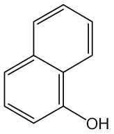

---

어가온하고물25 mL를넣어녹인다. 이것을검액으로하여시험한다. 비교액에는

철표준액2.0 mL를넣는다(40 ppm 이하).

4) 비소

이원료1.0 ｇ을황산5 mL 및질산20 mL에넣어가만히가열한다. 때

때로질산2 ∼3 mL씩을추가하여액이무색∼엷은황색이될때까지가열한다.

식힌다음포화수산암모늄용액15 mL를넣고흰연기가날때까지가열한다. 식힌

다음물을넣어10 mL로한다. 이것을검액으로하여시험한다(2 ppm 이하).

건조감량

1.0 % 이하(1 ｇ, 실리카겔, 4 시간)

강열잔분

0.3 % 이하(3 ｇ)

정량법

이원료를건조하여그약0.2 ｇ을정밀하게달아물100 mL에넣어가온

하여녹인다음물을넣어정확하게200 mL로한다. 이액20 mL를정확하게취하

여요오드병에넣고0.1 mol/L 브롬액25 mL를정확하게넣은다음염산5 mL를

넣고마개를하고차광하여30 분간때때로흔들어섞으면서방치한다. 요오드화칼륨

용액(1 →10) 20 mL를넣어흔들어섞은다음클로로포름1 mL를넣고흔들어섞

어유리된요오드를0.1 mol/L 치오황산나트륨액으로적정한다(지시약：전분시액1

mL). 같은방법으로공시험을하여보정한다.

0.1 mol/L 치오황산나트륨액1 mL = 2.4028 mg C10H8O

저장법

기밀용기

---

니트로-p-페닐렌디아민

Nitro-p-Phenylenediamine

o-니트로-p-페닐렌디아민

2-니트로-p-페닐렌디아민

o-니트로-1,4-페닐렌디아민

니트로-1,4-페닐렌디아민

C6H7N3O2 : 153.14

이원료를건조한것은정량할때니트로-p-페닐렌디아민(C6H7N3O2) 92.0 % 이상을

함유한다.

성

상

이원료는적갈색∼흑갈색또는녹색을띤흑갈색가루, 결정또는과립

상으로냄새는거의없다.

확인시험

1) 이원료0.5 ｇ을물100 mL에넣어녹이고여과한다. 여액5 mL에질

산은시액5 방울을넣어가온할때액은적갈색을내며혼탁해진다.

2) 이원료및p-니트로아닐린표준품각각0.01 ｇ을이소프로판올ㆍ물ㆍ강암모니

아수혼합액(9：3：1) 1 mL에넣어녹인다음다시각각에아황산수소나트륨0.1 ｇ

을넣어흔들어섞어검액및표준액으로한다. 검액및표준액1 μL씩을박층판에

점적하고, 이소프로필에텔ㆍ아세톤ㆍ이소프로판올혼합액(10：1：1)을전개용매로하

여박층크로마토그래프법에따라시험한다. 발색제로p-디메칠아미노벤즈알데히드ㆍ

묽은염산용액(0.5 →100)을뿌릴때p-니트로아닐린표준품에대하여Rs값0.7 부근

에서적색을띤황색∼황갈색의반점을나타낸다.

3) 이원료1 ｇ을물100 mL에넣어녹이고여과한다. 여액3 mL에풀푸랄ㆍ초산

시액4 방울을넣을때액은적색을띤황색을나타내며혼탁해진다.

4) 이원료0.1 ｇ을물100 mL에넣어녹이고여과한다. 이액1.0 mL를취하여

물을넣어100 mL로한다. 이액을가지고자외가시부흡광도측정법에따라흡수스펙

트럼을측정할때파장240 ± 2 nm에서흡수극대를나타낸다.

융

점

134 ∼140 ℃(제1 법)

순도시험

1) 용해상태

이원료0.1 ｇ을에탄올20 mL에넣어녹일때액은적색

∼암적갈색을나타내며거의맑다.

2) 중금속

이원료1.0 ｇ을황산5 mL 및질산20 mL에넣고가만히가열한다.

때때로질산2 ∼3 mL씩을추가하여액이무색∼엷은황색이될때까지가열한

다. 식힌다음물10 mL 및페놀프탈레인시액1 방울을넣고암모니아시액을액이

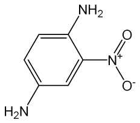

---

엷은적색이될때까지천천히넣고묽은초산2 mL를넣고필요하면여과한다. 잔류

물을물10 mL로씻어씻은액은여액과합하고물을넣어50 mL로한다. 이것을

검액으로하여시험한다. 비교액에는납표준액2.0 mL를넣는다(20 ppm 이하).

3) 철

이원료0.4 ｇ을달아황산5 방울을넣어적시고천천히가열하여거의회

화또는휘산시킨다음에황산을넣어적시고완전히회화한다. 식힌다음잔류물에

염산0.5 mL를넣고수욕상에서증발건고한다. 잔류물에묽은염산3 방울을넣어가

온하고물25 mL를넣어녹이고이것을검액으로하여시험한다. 비교액에는철표준

액2.0 mL를넣는다(50 ppm 이하).

4) 비소

이원료1.0 ｇ을황산5 mL 및질산20 mL에넣고가만히가열한다. 때

때로질산2 ∼3 mL씩을추가하여액이무색∼엷은황색이될때까지가열한다.

식힌다음포화수산암모늄용액15 mL를넣고흰연기가발생할때까지가열한다. 식

힌다음물을넣어10 mL로한다. 이것을검액으로하여시험한다(2 ppm 이하).

건조감량

1.0 % 이하(1.5 ｇ, 105 ℃, 2 시간)

강열잔분

1.0 % 이하(2 ｇ, 제1 법)

정량법

이원료를건조하고약90 mg을정밀하게달아아연가루2 ｇ, 물15 mL

및염산15 mL에넣고조심하여증발건고한다. 식힌다음질소정량법제2 법에따

라시험한다.

0.05 mol/L황산1 mL = 5.105 mg　C6H7N3O2

저장법

기밀용기

p-니트로-o-페닐렌디아민

p-Nitro-o-Phenylenediamine

4-니트로-o-페닐렌디아민

4-니트로-1,2-페닐렌디아민

C6H7N3O2 : 153.14

이원료를건조한것은정량할때p-니트로-o-페닐렌디아민(C6H7N3O2) 95.0 % 이상

을함유한다.

성

상

이원료는적갈색의가루또는결정으로서냄새는거의없다.

확인시험

1) 이원료0.5 ｇ을물100 mL에넣어녹인다음여과하고이여액3 mL

---

에풀푸랄ㆍ초산시액4 방울을넣을때액은황적색을나타낸다.

2) 이원료및p-니트로아닐린표준품각10 mg 을이소프로판올ㆍ물ㆍ강암모니아

수혼합액(9：3：1) 1 mL에넣어녹인다음각각에아황산수소나트륨0.1 ｇ을넣어

흔들어섞어검액및표준액으로한다. 검액및표준액1 μL씩을박층판에점적하고,

이소프로필에텔ㆍ아세톤ㆍ이소프로판올혼합액(10：1：1)을전개용매로하여박층크

로마토그래프법에따라시험한다. 발색제로p-디메칠아미노벤즈알데히드ㆍ묽은염산

용액(1 →200)을뿌릴때p-니트로아닐린표준품에대하여상대Rf값0.7 부근에서

엷은적황색∼황색의반점을나타낸다.

3) 이원료0.1 ｇ을물100 mL에넣어녹이고필요하면여과한다. 이액1 mL를

취하여물을넣어100 mL로한다. 이액을가지고자외가시부흡광도측정법에따라

자외부흡수스페트럼을측정할때파장268 ± 2 nm 에서흡수극대를나타낸다.

융

점

198 ∼206 ℃(제1 법)

순도시험

1) 용해상태

이원료0.1 ｇ을묽은에탄올20 mL에넣어가온하여녹일

때액은적색이며거의맑다.

2) 철

이원료0.4 ｇ을달아황산5 방울을넣어적시고천천히가열하여저온에

서거의회화또는휘산시킨다음황산을넣어적시고완전히회화한다. 식힌다음

잔류물에염산0.5 mL를넣고수욕상에서증발건고한다. 잔류물에묽은염산3 방울

을넣어가온하고물25 mL를넣어녹인다. 이것을검액으로하여시험한다. 비교액

에는철표준액2.0 mL를넣는다(50 ppm 이하).

3) 중금속

이원료1.0 ｇ을황산5 mL 및질산20 mL에넣고가만히가열한다.

때때로질산2 ∼3 mL씩을추가하여액이무색∼엷은황색이될때까지가열한

다. 식힌다음물10 mL 및페놀프탈레인시액1 방울을넣고암모니아시액을액이

엷은적색이될때까지천천히넣고묽은초산2 mL를넣어필요하면여과한다. 잔류

물을물10 mL로씻고여액과씻은액을네슬러관에넣어물을넣어50 mL로하여

검액으로한다. 단, 비교액에는납표준액2.0 mL를넣는다(20 ppm 이하).

4) 비소

이원료1.0 ｇ을황산2 mL 및질산5 mL에넣고가만히가열한다. 때때

로질산2 ∼3 mL씩을추가하여액이무색∼엷은황색이될때까지가열한다. 식

힌다음포화수산암모늄용액15 mL를넣고흰연기가발생할때까지가열하고식힌

다음여기에물을넣어10 mL로한다. 이것을검액으로하여시험한다(2 ppm 이하).

건조감량

2.0 % 이하(1.5 ｇ, 105 ℃, 2 시간)

강열잔분

1.0 % 이하(2 ｇ)

정량법

이원료를105 ℃에서2 시간건조하고그약90 mg을정밀하게달아아연

가루2 ｇ, 물15 mL 및염산15 mL에넣어조심하여증발건고한다. 식힌다음질

소정량법제2 법에따라시험한다.

0.05 mol/L 황산1 mL = 5.105 mg C6H7N3O2

저장법

기밀용기

---

2, 6-디아미노피리딘

2,6-Diaminopyridine

C5H7N3 : 109.13

이원료를건조한것은정량할때2,6-디아미노피리딘(C5H7N3) 93.0 % 이상을함유

한다.

성

상

이원료는갈색∼흑색의결정성가루로약간특이한냄새가있다.

확인시험

1) 이원료의에탄올용액(1 →1000) 10 mL에염화제이철시액ㆍ페리시안화

칼륨시액혼합액(1：1) 1 방울을넣을때액은바로진한청색∼진한청록색을나타

내며혼탁하다.

2) 이원료50 mg을에탄올에넣어녹여100 mL로한다. 이액5 mL를취하여에

탄올을넣어500 mL로한다. 이액을가지고자외가시부흡광도측정법에따라흡수스

펙트럼을측정할때파장309 ± 2 nm 및245 ± 2 nm 에서흡수극대를나타낸다.

3) 이원료및염산m-페닐렌디아민표준품각10 mg을이소프로판올ㆍ물ㆍ강암모

니아수(9：3：1) 혼합액1 mL에넣어녹인다음각각에아황산수소나트륨0.1 ｇ을

넣어흔들어섞어검액및표준액으로한다. 검액및표준액1 μL씩을박층판에점

적하고초산에칠ㆍ메탄올ㆍ물혼합액(50：10：8)을전개용매로하여박층크로마토그래

프법에

따라

시험한다. 발색제로

p-디메칠아미노벤즈알데히드ㆍ묽은염산용액(1

→

200)을뿌릴때염산m-페닐렌디아민표준품에대하여Rs값0.7 부근에서등색의반

점을나타낸다.

융

점

109 ∼122 ℃(제1 법)

순도시험

1) 용해상태

이원료0.1 ｇ을묽은초산(18 →100) 100 mL에넣어녹일

때액은어두운황녹갈색이고맑다.

2) 철

이원료1.0 ｇ을달아황산5 방울을넣어적시고천천히가열하여저온에

서거의회화또는휘산시킨다음다시황산을넣어적시고완전히회화시킨다. 식힌

다음잔류물에염산0.5 mL를넣어수욕상에서증발건고한다. 잔류물에묽은염산3

방울을넣고가온하고물25 mL를넣어녹인다. 이것을검액으로하여시험한다. 비

교액에는철표준액2.0 mL를넣는다(20 ppm 이하).

3) 중금속

이원료1.0 ｇ을황산5 mL 및질산20 mL에넣고가만히가열한다.

때때로질산2 ∼3 mL씩을추가하여액이무색∼엷은황색이될때까지가열하

고식힌다음물10 mL 및페놀프탈레인시액1 방울을넣고암모니아시액을액이

엷은적색이될때까지천천히넣고묽은초산2 mL를넣고필요하면여과한다. 잔류

물을물10 mL로씻고여액과씻은액을네슬러관에넣어물을넣어50 mL로하여

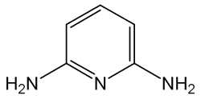

---

검액으로하여시험한다. 단, 비교액에는납표준액1.0 mL를넣는다(10 ppm 이하).

4) 비소

이원료1.0 ｇ을황산2 mL 및질산5 mL에넣어가만히가열한다. 때때

로질산2 ∼3 mL씩을추가하여액이무색∼엷은황색이될때까지가열한다. 식

힌다음포화수산암모늄용액15 mL를넣고흰연기가발생할때까지가열하고식힌

다음물을넣어10 mL로한다. 이것을검액으로하여시험한다(2 ppm 이하).

건조감량

2.0 % 이하(2 ｇ, 실리카겔, 4 시간)

강열잔분

1.5 % 이하(1 ｇ)

정량법

이원료를건조하고약60 mg을정밀하게달아질소정량법제2 법에따라

시험한다.

0.05 mol/L 황산1 mL = 3.6377 mg C5H7N3

저장법

기밀용기

1,5-디히드록시나프탈렌

1,5-Dihydoxynaphthalene

1,5-나프탈렌디올

C10H8O2 : 160.17

성

상

이원료는엷은갈색또는회갈색의가루로서약간특이한냄새가있다.

확인시험

1) 이원료의에탄올용액(1 →1000) 10 mL에염화제이철시액3 방울을넣

을때액은녹갈색을나타낸다.

2) 이원료20 mg을에탄올100 mL에넣어녹이고, 이액10 mL를취하여에탄올

에넣어100 mL로한다. 이액을가지고자외가시부흡광도측정법에따라흡수스펙트

럼을측정할때파장331 ± 2 nm, 317 ± 2 nm 및299 ± 2 nm에서흡수극대를나

타낸다.

3) 이원료및α-나프톨표준품각10 mg을이소프로판올ㆍ물ㆍ강암모니아수(9：

3：1) 혼합액1 mL에넣어녹인다음각각에아황산수소나트륨0.1 ｇ을넣어흔들

어섞어검액및표준액으로한다. 검액및표준액1 μL씩을박층판에점적하고헥

산ㆍ아세톤ㆍ클로로포름혼합액(2：1：1)을전개용매로하여박층크로마토그래프법에

따라시험한다. 발색제로인몰리브덴산시액을뿌릴때α-나프톨표준품에대하여Rs

값0.6 부근에서회청색∼청색의반점을나타낸다.

---

융

점

257 ∼261 ℃(제1 법)

순도시험

1) 용해상태

이원료0.1 ｇ을에탄올10 mL에넣어녹일때액은엷은

갈색이되며맑다.

2) 철

이원료0.5 ｇ을달아황산5 방울을넣어적시고천천히가열하여저온에

서거의회화또는휘산시킨다음다시황산을넣어적시고완전히회화시킨다. 식힌

다음잔류물에염산0.5 mL를넣어수욕상에서증발건고시킨다. 잔류물에묽은염산

3 방울을넣어가온하고물을넣어녹이고50 mL로한다. 이것을검액으로하여시

험한다. 검액10.0 mL를취하여시험한다. 비교액에는철표준액2.0 mL를넣는다

(0.02 % 이하).

3) 납

이원료1.0 ｇ을황산5 mL 및질산20 mL에넣어가만히가열한다. 때때

로질산2 ∼3 mL씩을추가하여액이무색∼엷은황색이될때까지가열한다. 식

힌다음물을넣어10 mL로한다. 이것을검액으로하여시험한다(20 ppm 이하).

4) 비소

이원료1.0 ｇ을황산2 mL 및질산5 mL에넣고가만히가열한다. 때때

로질산2 ∼3 mL씩을추가하여액이무색∼엷은황색이될때까지가열한다음

식히고포화수산암모늄용액15 mL를넣어흰연기가발생할때까지가열한다. 식힌

다음물을넣어10 mL로한다. 이것을검액으로하여시험한다(2 ppm 이하).

건조감량

1.0 % 이하(1 ｇ, 105 ℃, 2 시간)

강열잔분

1.0 % 이하(1 ｇ)

저장법

기밀용기

레조시놀

Resorcinol

레소르시놀

레소르신

C6H6O2 : 110.11l

이원료를건조한것은정량할때레조시놀(C6H6O2) 99.0 % 이상을함유한다.

성

상

이원료는백색의가루로, 조금특이한냄새가있다.

확인시험1) 이원료0.1 g에수산화나트륨시액2 mL를가해녹이고, 클로로포름l 방

울을가해가열할때, 액은진한홍색을나타내고, 여기에다시염산을적가할때액

은엷은황갈색을나타낸다.

2) 이원료의수용액(1 →200) 10 mL에염화제이철시액3 방울을가할때, 액은청

색을띤자색을나타내며, 여기에다시암모니아시액을적가할때액은갈색을띤황

색을나타낸다.

---

융

점

109

∼

112 ℃(제1 법)

순도시험1) 액성

이원료의수용액(1 →20) 5 mL에메칠오렌지시액1 방울을가할

때, 액은황색

∼

등색을나타낸다.

이원료의수용액(1 →20) 5 mL를가만히가열할때, 페놀고유의냄새가

2) 페놀

나지않는다.

이원료의수용액(1 →20) 10 mL에묽은초산2 방울및초산납시액0.5

3) 카테콜

mL를가할때, 액은혼탁하지않는다.

이원료1.0

g을취해제2 법에따라조작하여시험한다. 비교액에는

4) 중금속

납표준액2.0 mL를넣는다.(20 ppm 이하)

이원료1.0

g을취해제3 법에따라검액을조제하여시험한다.(2 ppm

5) 비소

이하).

건조감량

1.0

%

이하(1.5 g, 실리카겔, 4 시간)

강열잔분

0.05

%

이하(2 g)

정량법

이원료를건조하여그약0.3 g을정밀하게달아물을가해녹이고100 mL

로한다.

이액25 mL를요오드병에취하여정확하게0.05 mol/L 브롬액50 mL,

물50 mL 및염산5 mL를가해곧바로마개를하고1 분간잘흔들어섞고2 분간

방치한다. 다음에요오드화칼륨시액5 mL를가해잘흔들어섞어냉암소에5 분간

방치한후, 마개및요오드병내벽의부착물을물20 mL로씻어합하고, 유리된요

오드를0.1 mol/L 치오황산나트륨액으로적정한다(지시약: 전분시액1 mL). 같은방

법으로공시험을실시한다.

0.05 mol/L 브롬액1 mL = 1.8352 mg C6H6O2

2-메칠레조시놀

2-Methylresorcinol

2-메틸레소르시놀

C7H8O2 : 124.14

이원료를건조한것은정량할때2-메칠레조시놀(C7H8O2) 94.0 % 이상을함유한

다.

성

상

이원료는회백색∼회갈색의미세한가루로약간의특이한냄새가있다.

확인시험

1) 이원료0.1 ｇ을에탄올10 mL에넣어녹이고이액10 μL를박층판에

---

점적하고초산에칠ㆍ피리딘ㆍ물혼합액(70：25：25)을전개용매로하여박층크로마토

그래프법에따라시험한다. 약10 ㎝전개하여박층판을꺼내어바람에말린다음관

찰할때Rf값0.77 부근에갈색의반점을나타낸다.

2)

이원료0.1 ｇ을에탄올10 mL에넣어녹이고이액10 μL를박층판에점적하

고톨루엔ㆍ무수초산ㆍ물혼합액(50：50：5)을전개용매로박층크로마토그래프법에따

라시험한다. 약10 cm 전개하여박층판을꺼내어바람에말린다음관찰할때Rf

값0.40부근에갈색의반점을나타낸다.

융

점

110 ∼120 ℃(제1 법)

순도시험

1) 용해상태

이원료0.1 ｇ을에탄올10 mL에넣어녹일때액은맑다.

2) 납

이원료1.0 ｇ을황산5 mL 및질산20 mL에넣어가만히가열한다. 때때

로질산2 ∼3 mL씩을추가하여액이무색∼엷은황색이될때까지가열한다. 식

힌다음물을넣어10 mL로한다. 이것을검액으로하여시험한다(5 ppm 이하).

3) 철

이원료1.0 ｇ을달아황산5 방울을넣어적시고천천히가열하여저온에

서거의회화또는휘산시킨다음다시황산을넣어적시고완전히회화한다. 식힌

다음잔류물에염산0.5 mL를넣어수욕상에서증발건고한다음묽은염산3 방울을

넣어가온하고물을넣어50.0 mL로한다. 이액10 mL를취하여검액으로하여시

험한다. 비교액에는철표준액2.0 mL를넣는다(100 ppm 이하).

4) 비소

이원료1.0 ｇ을황산2 mL 및질산5 mL에넣어가만히가열한다. 때때

로질산2 ∼3 mL씩을추가하여액이무색∼엷은황색이될때까지가열한다. 식

힌다음포화수산암모늄용액15 mL를넣어흰연기가발생할때까지가열한다. 식힌

다음물을넣어10 mL로한다. 이것을검액으로하여시험한다(2 ppm 이하).

건조감량

3.0 % 이하(1 ｇ, 황산, 4 시간)

강열잔분

1.0 % 이하(2 ｇ, 제1 법)

정량법

이원료를건조하고약0.6 ｇ을정밀하게달아물에넣어녹여100.0 mL로

한다. 이액15.0 mL 및0.05 mol/L 브롬액50.0 mL를취하여250 mL 요오드병에

넣는다. 물20 mL 및염산5 mL를넣고곧마개를하여흔들어섞은다음2 분간

방치한다. 다음에요오드화칼륨시액5 mL를넣고마개를하여가만히흔들어섞고5

분간방치한다. 요오드병의마개를열고물20 mL로마개와병목을씻어넣고0.1

mol/L 치오황산나트륨액으로적정한다(지시약: 전분시액1 mL). 다만적정의종말

점은액의청색이없어질때로한다. 같은방법으로공시험을하여보정한다.

0.05 mol/L 브롬액1 mL = 2.069 mg　C7H8O2

저장법

기밀용기

2-메칠-5-히드록시에칠아미노페놀

2-Methyl-5-Hydroxyethylaminophenol

---

5-(2-히드록시에칠아미노)-2-메칠페놀

2-메틸-5-히드록시에틸아미노페놀

C9H13NO2 : 167.21

이원료를건조한것은정량할때2-메칠-5-히드록시에칠아미노페놀(C9H13NO2) 93.0

% 이상을함유한다.

성

상

이원료는갈색의과립상의가루로냄새는없다.

확인시험

1) 이원료의에탄올용액(1 →1000)에묽은염화제이철시액3 방울을넣을

때액은엷은황색을나타낸다.

2) 이원료30 mg을에탄올에넣어녹여100 mL로한다. 이액1 mL를취하여에

탄올을넣어100 mL로한다. 이액을가지고자외가시부흡광도측정법에따라흡수스

펙트럼을측정할때파장207 ± 2 nm, 242 ± 2 nm 및295 ± 2 nm에서흡수극대를

나타낸다.

융

점

86 ∼90 ℃(제1 법)

순도시험

1) 용해상태

이원료0.1 ｇ을에탄올10 mL에넣어녹일때액은엷은

갈색이며맑다.

2) 납

이원료1.0 ｇ을황산5 mL 및질산20 mL에넣어가만히가열한다. 때때

로질산2 ∼3 mL씩을추가하여액이무색∼엷은황색이될때까지가열한다. 식

힌다음물을넣어10 mL로한다. 이것을검액으로하여시험한다(20 ppm 이하).

3) 철

이원료0.1 ｇ을달아황산5 방울을넣어적시고천천히가열하여저온에

서거의회화또는휘산시킨다음다시황산을넣어적시고완전히회화한다. 식힌

다음잔류물에염산0.5 mL를넣어수욕상에서증발건고한다음묽은염산3 방울을

넣어가온하고물25 mL를넣어녹인다. 이액을검액으로하여시험한다. 비교액에

는철표준액2.0 mL를넣는다(0.02 % 이하).

4) 비소

이원료1.0 ｇ을황산2 mL 및질산5 mL에넣어가만히가열한다. 때때

로질산2 ∼3 mL씩을추가하여액이무색∼엷은황색이될때까지가열한다. 식

힌다음포화수산암모늄용액15 mL를넣어흰연기가발생할때까지가열한다. 식힌

다음물을넣어10 mL로한다. 이것을검액으로하여시험한다(2 ppm 이하).

건조감량

1.0 % 이하(1 ｇ, 105 ℃, 2 시간)

강열잔분

2.0 % 이하(1 ｇ)

정량법

이원료를건조하여약0.15 ｇ을정밀하게달아질소정량법제2 법에따

라시험한다.

0.05 mol/L 황산1 mL = 16.72 mg　C9H13NO2

---

저장법

기밀용기

모노에탄올아민

Monoethanolamine

2-아미노에탄올

C2H7NO

61.08

이원료는정량할때모노에탄올아민(C2H7NO) 98.0 ~ 100.5 %를함유한다.

확인시험이원료및모노에탄올표준품을가지고적외부스펙트럼측정법의브롬화칼

륨

정제법에따라시험할때같은파수에서같은강도의흡수를나타낸다.

강열잔분0.1 % 이하(1 g)

비

중

d 20

20 : 1.013 －1.016

증류시험167 ~ 173 ℃, 95 vol% 이상.

정량법이원료약1 g을정밀하게달아물25 mL를넣어녹이고0.5 mol/L 염산

으로적정한다(지시약: 브롬크레솔그린ㆍ 메칠레드시액(5:6)).

0.5 mol/L 염산1 mL = 61.08 mg C2H7NO

저장법차광한기밀용기

몰식자산

Gallic Acid

갈르산

3,4,5-트리히드록시안식향산

갈루스산

C7H6O5ㆍH2O :

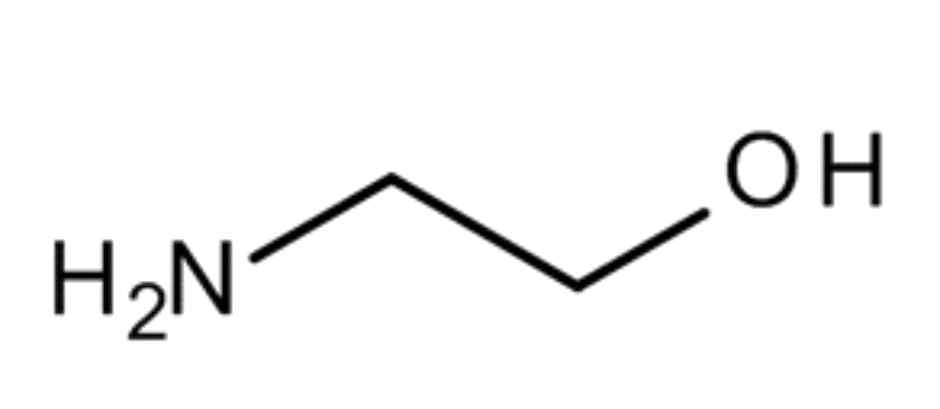

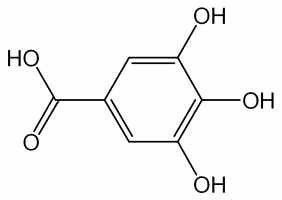

---

188.14

성

상

이원료는흰색∼엷은황백색의침상결정또는가루로서냄새는없다.

확인시험

1) 이원료의수용액(1 →1000) 5 mL에염화제이철시액5 방울을넣을때

액은청흑색을나타낸다.

2) 이원료0.5 ｇ을물10 mL에넣어흔들어섞은다음여과한다. 여액5 mL에질

산은암모니아시액5 방울을넣을때액은은경또는흑갈색의침전을나타낸다.

순도시험

1) 용해상태

이원료1.0 ｇ을열탕20 mL에넣어녹일때액은무색∼

엷은황색이며거의맑다.

2) 황산염

이원료1.0 ｇ을물20 mL에넣고약1 분간흔들어섞은다음여과한

다. 여액5 mL에묽은염산1 mL 및물을넣어서50 mL로한다. 이액을검액으로

하여시험한다. 비교액에는0.005 mol/L 황산0.20 mL를넣는다(0.02 % 이하).

3) 탄닌산

2)의여액5 mL에젤라틴시액3 방울또는알부민시액3 방울을넣을

때액은침전이생기지않는다.

4) 중금속

이원료1.0 ｇ을황산5 mL 및질산20 mL에넣어가만히가열한다.

때때로질산2 ∼3 mL씩을추가하여액이무색∼엷은황색이될때까지가열한

다. 식힌다음물10 mL 및페놀프탈레인시액1 방울을넣고암모니아시액을액이

엷은적색이될때까지천천히넣고묽은초산2 mL를넣고필요하면여과하여물

10 mL로씻고여액과씻은액을네슬러관에넣어물을넣어50 mL로한다. 이것을

검액으로하여시험한다. 비교액에는납표준액2.0 mL를넣는다(20 ppm 이하).

5) 비소

이원료1.0 ｇ을황산2 mL 및질산5 mL에넣어서가만히가열한다.

때때로질산2 ∼3 mL씩을추가하여액이무색∼엷은황색이될때까지가열한

다. 식힌다음포화수산암모늄용액15 mL를넣어흰연기가날때까지가열한다. 식

힌다음물을넣어10 mL로한다. 이것을검액으로하여시험한다(2 ppm 이하).

건조감량

10.0 % 이하(1 ｇ, 105 ℃, 2 시간)

강열잔분

0.1 % 이하(1 ｇ, 제2 법)

저장법

기밀용기

수산화나트륨

Sodium Hydroxide

소듐하이드록사이드

NaOH：40.00

이원료는정량할때총알칼리(NaOH로서) 95.0 % 이상을함유하며이중탄산나트

륨(Na2CO3：105.99)는3.0 %

이하이다.

성

상

이원료는백색의소구상(小球狀), 박편상(薄片狀), 봉상(棒狀) 또는덩어리

로단단하고부스러지기쉬우며단면(斷面)은결정성이다.

확인시험

1) 이원료의수용액(1 →500)은강한알칼리성이다.

---

2) 이원료의수용액(1 →25)은나트륨염의정성반응을나타낸다.

순도시험

1) 용해상태

이원료1.0 g 물20 mL를넣어녹일때무색이며맑다.

2) 염화물

이원료1.0 g에물을넣어녹이고100 mL로한다. 이액25 mL를취

하여묽은질산10 mL 및물을넣어50 mL로하고이것을검액으로하여시험한

다. 비교액에는0.01 mol/L 염산0.7 mL를넣는다(0.1 %

이하).

3) 중금속

이원료1.0 g에물5 mL를넣어녹이고묽은염산11 mL를넣어수욕

중에서증발건고한다. 잔류물에물35 mL 및묽은초산2 mL를넣어녹이고다시

물을넣어50 mL로하고이것을검액으로한다. 비교액에는납표준액3.0 mL를넣

는다. 검액및비교액에황화나트륨시액1방울씩을넣어흔들어섞고5 분간방치

한다음각관을백색을배경으로하여위또는옆에서관찰하여액의색을비교한

다.

검액이나타내는색은비교액이나타내는색보다진하지않다(30 ppm 이하).

4) 칼륨

이원료0.5 g에물10 mL를넣어녹이고초산4 mL를넣고아질산코발

트나트륨시액3 ∼5 방울을넣을때침전이생기지않는다.

정량법

이원료약1.0 g을정밀하게달아새로끓여식힌물약100 mL에녹이고

15 ℃로식힌다음페놀프탈레인시액2 방울을넣고0.5 mol/L 황산으로적정하여

액의홍색이없어질때황산의양을기록한다. 이액에브롬페놀블루시액3방울을넣

고다시1 mol/L 염산으로액의청자색이지속하는황색으로될때까지적정한다.

0.5 mol/L 황산의총량에서총알칼리(NaOH로서)의양을구하고지시약이다른것에

따른0.5 mol/L 황산의소비량의차로부터탄산나트륨(Na2CO3)의양을구한다.

0.5 mol/L 황산1 mL 〓40.00 mg NaOH

0.5 mol/L 황산1 mL 〓105.99 mg Na2CO3

스테아트리모늄염화물

Steartrimonium Chloride

스테아트리모늄클로라이드

염화스테아릴트리메칠암모늄

Stearyltrimethylammonium Chloride

이원료는주로염화스테아릴트리메칠암모늄으로된양이온계면활성제로보통이소

프로판올, 에탄올, 물또는이들의혼합액을함유한다. 이원료는정량할때표시량의

90.0 ∼110.0 %에해당하는스테아트리모늄염화물(C21H46ClN：348.05)를함유한다.

성

상

이원료는백색∼엷은황색의액또는바셀린과같은물질로특이한냄새

가있다.

확인시험

1) 이원료의표시량에따라스테아트리모늄염화물5 g에해당하는양을

달아물100 mL를넣어가온할때맑게녹는다.

2) 이원료0.1 g을달아클로로포름5 mL 및브롬페놀블루ㆍ수산화나트륨시액(0.05

---

mol/L 수산화나트륨액3 mL에브롬페놀블루0.1 g을넣어잘흔들어섞고물을넣

어25 mL로한다.) 5 mL를넣고세게흔들어섞을때분리된클로로포름층은청색

을나타낸다.

3) 이원료1 g에에탄올20 mL를넣고가열하여녹일때액은염화물의정성반응

2)를나타낸다.

순도시험

1) 액성

이원료의표시량에따라스테아트리모늄염화물0.1g에해당하는

양을달아새로끓여식힌물을넣어가온하여녹이고10 mL로한액에치몰블루시

액2방울을넣을때액은황색을나타낸다.

2) 암모늄염

이원료0.1 g을달아물5 mL를넣어가온하여녹이고수산화나트륨

시액3 mL를넣어끓일때발생하는가스는물에적신적색리트머스시험지를청색

으로변화시키지않는다.

3) 중금속

이원료1.0 g을달아제２법에따라조작하여시험한다. 비교액에는납

표준액2.0 mL를넣는다(20 ppm 이하).

4) 비소

이원료1.0 g을달아제３법에따라조작하여시험한다(2 ppm 이하).

강열잔분

0.5 %

이하(스테아트리모늄염화물약1.0 g에해당하는양, 450 ∼550 ℃)

정량법

이원료의표시량에따라스테아트리모늄염화물약1.0g에해당하는양을

정밀하게달아에탄올10 mL 및물50 mL를넣어가온하여녹이고200 mL의메스

플라스크에넣어초산나트륨25g 및초산22 mL에물을넣어100 mL로한액8

mL를넣고다시잘흔들어섞으면서정확하게0.05 mol/L 페리시안화칼륨액50 mL

를넣고물을넣어200 mL로하여다시잘흔들어섞고1 시간방치한다. 건조여과

지를써서여과하고처음여액20 mL를버리고다음여액100 mL를정확하게취하

여250 mL 요오드병에넣고요오드화칼륨시액10 mL 및묽은염산10 mL를넣어

흔들어섞고1 분간방치한다. 여기에황산아연용액(1→10) 10 mL를넣고잘흔들어

섞고5 분간방치한다음유리된요오드를0.1 mol/L 치오황산나트륨액으로적정한

다(지시약：전분시액2 mL). 같은방법으로공시험을하여보정한다.

0.05 mol/L 페리시안화칼륨액1 mL 〓52.21 mg C21H46ClN

2-아미노-4-니트로페놀

2-Amino-4-nitrophenol

4-니트로-o-아미노페놀, 2-아미노-p-니트로페놀

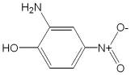

---

o-아미노-p-니트로페놀, 4-니트로-2-아미노페놀

p-니트로-o-아미노페놀

C6H6N2O3 : 154.12

이원료를건조한것은정량할때2-아미노-4-니트로페놀(C6H6N2O3) 90.0 % 이상

을함유한다.

성

상

이원료는황색∼황갈색의가루로서약간특이한냄새가있다.

확인시험

1) 이원료0.1 ｇ을물10 mL에넣어녹이고여과한다. 여액10 mL에염

화제이철시액1 방울을넣을때액은적갈색∼갈색을나타낸다.

2) 1)의여액10 mL에묽은염산1 mL를넣을때액은약간의황색을나타낸다. 또

1)의여액10 mL에탄산나트륨시액1 mL를넣을때액은적색을나타낸다.

3) 이원료및p-니트로아닐린표준품각10 mg을이소프로판올ㆍ물ㆍ강암모니아수

(9：3：1) 혼합액1 mL에넣어녹인다음각각에아황산수소나트륨0.1 ｇ을넣어흔

들어섞어검액및표준액으로한다. 검액및표준액1 μL씩을박층판에점적하고

이소프로필에칠ㆍ아세톤ㆍ이소프로판올(10：1：1) 혼합액을전개용매로하여박층크

로마토그래프법에따라시험한다. 발색제로p-디메칠아미노벤즈알데히드ㆍ묽은염산

용액(1 →200)을뿌릴때p-니트로아닐린표준품에대하여Rs 값1.0 부근에서황

색의반점을나타낸다.

4) 이원료25 mg을0.1 mol/L 염산100 mL에넣어녹인다. 이액3 mL를취하여

0.1 mol/L 염산을넣어100 mL로한다. 이액을가지고자외가시부흡광도측정법에

따라흡수스펙트럼을측정할때파장224 ± 2 nm 및307 ± 2 nm에서흡수극대를

나타낸다.

융

점

141 ∼143 ℃(제1 법)

순도시험

1) 용해상태

이원료0.1 ｇ을묽은염산10 mL에넣어녹일때액은엷은

자갈색∼엷은갈색이며거의맑다.

2) 철

이원료1.0 ｇ을정밀하게달아황산5 방울을넣어적시고천천히가열하

여저온에서거의회화또는휘산시킨다음황산을넣어적시고다시완전히회화한

다. 식힌다음잔류물에염산0.5 mL를넣어수욕상에서증발건고한다. 잔류물에묽

은염산3 방울을넣어가온하고물25 mL를넣어녹인다. 이것을검액으로하여시

험한다. 비교액에는철표준액2.0 mL를넣는다(20 ppm 이하).

3) 중금속

이원료1.0 ｇ을황산5 mL 및질산20 mL에넣어가만히가열한다.

때때로질산2 ∼3 mL씩을추가하여액이무색∼엷은황색이될때까지가열한다.

식힌다음물10 mL 및페놀프탈레인시액1 방울을넣고암모니아시액을액이엷은

적색이될때까지천천히넣고필요하면여과한다. 잔류물을물10 mL로씻고여액

과씻은액을네슬러관에넣고물을넣어50 mL로한다. 이것을검액으로하여시험

한다. 비교액에는납표준액2.0 mL를넣는다(20 ppm 이하).

4) 비소

이원료1.0 ｇ을황산2 mL 및질산5 mL에넣고가만히가열한다. 때때

로질산2 ∼3 mL씩을추가하여액이무색∼엷은황색이될때까지가열한다. 식

힌다음포화수산암모늄용액15 mL를넣고흰연기가발생할때까지가열한다. 식힌

다음물을넣어10 mL로한다. 이것을검액으로하여시험한다(2 ppm 이하).

---

건조감량

1.5 % 이하(1 ｇ, 실리카겔, 4 시간)

강열잔분

1.0 % 이하(1 ｇ)

정량법

이원료를건조하고약14 mg을정밀하게달아아연가루2 ｇ, 물15 mL

및염산15 mL를넣어조심하여증발건고한다. 식힌다음질소정량법제2 법에따

라시험한다.

0.05 mol/L 황산1 mL = 7.707 mg　C6H6N2O3

저장법

기밀용기

2-아미노-5-니트로페놀

2-Amino-5-nitrophenol

5-니트로-o-아미노페놀, 5-니트로-2-아미노페놀

C6H6N2O3 : 154.13

이원료를건조한것은정량할때2-아미노-5-니트로페놀(C6H6N2O3) 90.0 % 이상을

함유한다.

성

상

이원료는황색∼황갈색결정성가루로서냄새는거의없다.

확인시험

1) 이원료의수용액(1 →2500) 10 mL에염화제이철시액5 방울을넣을

때액은등색∼황갈색을나타낸다.

2) 이원료의수용액(1 →2500) 10 mL에인몰리브덴산용액(1 →100) 0.5 mL를넣

을때액은녹색을띤황색∼황색을나타내며강암모니아수3 방울을넣을때액

은등색∼적색을나타낸다.

3) 이원료및p-니트로아닐린표준품각10 mg을이소프로판올ㆍ물ㆍ강암모니아수

(9：3：1) 혼합액1 mL에넣어녹인다음각각에아황산수소나트륨0.1 ｇ을넣어

흔들어섞어검액및표준액으로한다. 검액및표준액1 μL씩을박층판에점적하고

이소프로필에텔ㆍ아세톤ㆍ이소프로판올(10：1：1) 혼합액을전개용매로하여박층크

로마토그래프법에따라시험한다. 발색제로p-디메칠아미노벤즈알데히드ㆍ묽은염산

용액(1 →200)을뿌릴때p-니트로아닐린표준품에대하여Rs 값1.0 부근에서등색

의반점을나타낸다.

4) 이원료25 mg을정밀하게달아0.1 mol/L 염산100 mL에넣어녹인다음이

액5 mL를취하여0.1 mol/L 염산을넣어100 mL로한다. 이액을가지고자외가시

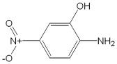

---

부흡광도측정법에따라흡수스펙트럼을측정할때파장228 ± 2 nm 및263 ± 2 nm

에서흡수극대를나타낸다.

융

점

191 ∼206 ℃(제1 법)

순도시험

1) 용해상태

이원료0.1 ｇ을에탄올10 mL에넣어녹일때액은적색을

띠는황색∼적갈색을나타내며거의맑다.

2) 철

이원료1.0 ｇ을정밀하게달아황산5 방울을넣어적시고천천히가열하

여되도록저온에서거의회화또는휘산시킨다음다시황산을넣어적시고완전히

회화시킨다. 식힌다음잔류물에염산0.5 mL를넣어수욕상에서증발건고한다음

묽은염산3 방울을넣어가온하고물25 mL를넣어녹인다. 이것을검액으로하여

시험한다. 비교액에는철표준액2.0 mL를넣는다(20 ppm 이하).

3) 중금속

이원료1.0 ｇ을정밀하게달아황산5 mL 및질산20 mL에넣어가

만히가열한다. 때때로질산2 ∼3 mL씩을추가하여액이무색∼엷은황색이될

때까지가열한다. 식힌다음물10 mL 및페놀프탈레인시액1 방울을넣고암모니아

시액을액이엷은적색이될때까지천천히넣고필요하면여과한다. 잔류물을물10

mL로씻고여액과씻은액을네슬러관에넣어물을넣어50 mL로한다. 이것을검

액으로하여시험한다. 비교액에는납표준액3.0 mL를넣는다(30 ppm 이하).

4) 비소

이원료1.0 ｇ을정밀하게달아황산2 mL 및질산5 mL에넣고가만히

가열한다. 때때로질산2 ∼3 mL씩을추가하여액이무색∼엷은황색이될때까

지가열한다. 식힌다음포화수산암모늄용액15 mL를넣고흰연기가발생할때까지

가열하고식힌다음물을넣어10 mL로한다. 이것을검액으로하여시험한다(2

ppm 이하).

건조감량

0.5 % 이하(1 ｇ, 105 ℃, 2 시간)

강열잔분

0.1 % 이하(2 ｇ)

정량법

이원료를건조하여약0.14 ｇ을정밀하게달아아연가루2 ｇ, 물15 mL

및염산15 mL를넣어조심하면서증발건고한다. 식힌다음질소정량법제1 법에

따라시험한다.

0.05 mol/L 황산1 mL = 7.707 mg C6H6N2O3

저장법

기밀용기

2-아미노-3-히드록시피리딘

2-Amino-3-hydroxypyridine

---

C5H6N2O : 110.12

이원료는정량할때환산한무수물에대하여2-아미노-3-히드록시피리딘(C5H6N2O

: 110.12) 98.5 ∼101.0 % 이상을함유한다.

성

상

이원료는옅은회색을띤결정성가루이며약하게특이한냄새가있다.

확인시험

1) 이원료를건조하여적외부스펙트럼측정법브롬화칼륨정제법에따라

측정할때파수3437 cm-1, 3346 cm-1, 3042 cm-1, 2520 cm-1, 1643 cm-1, 1575 cm-1,

1474 cm-1, 1203 cm-1, 783 cm-1, 746 cm-1 부근에서흡수를나타낸다.

2) 이원료약1 mg을에탄올100 mL에녹인액을가지고자외가시부흡광도측정

법에따라흡수수펙트럼을측정할때파장300 nm 및234 nm에서흡수극대를나타

낸다.

융

점

170 ∼176 ℃

순도시험

1) 용해상태이원료0.1 g을물10 mL에넣어녹이고녹일때액은맑고

무색이다.

2) 유연물질이원료0.1 g을정밀하게달아에탄올10 mL에넣어녹이고이액을

검액으로한다. 이액1 mL를정확하게취하여에탄올(95)을넣어정확하게100 mL

로하여표준액으로한다. 검액및표준액을가지고박층크로마토그래프법에따라시

험한다. 검액및표준액5 μL씩을박층크로마토그래프용실리카겔을써서만든박층

판에점적한다. 초산에칠을전개용매로하여점적한곳으로부터약12 cm 전개한다

음박층판을전개용매냄새가나지않을때까지건조한다. 여기에발색제로4-니트로

벤젠디아조늄클로라이드시액을고르게뿌릴때검액에서얻은주반점이외의반점

은표준액에서얻은반점보다진하지않다.

3) 중금속이원료1.0 g을달아제2 법에따라조작하여시험한다. 비교액에는납

표준액2.0 mL를넣는다(20 ppm 이하).

4) 비소이원료1.0 g을달아제3 법에따라조작하여시험한다(2 ppm 이하).

수

분

1.5 % 이하(2 g).

강열잔분

1.0 % 이하(2 g).

정량법

이원료약100 mg을정밀하게달아초산70 mL에녹여0.1 mol/L 과염소

산액으로적정한다(적정종말점검출법전위차적정법). 같은방법으로공시험을하여

보정한다.

0.1 mol/L 과염소산액1 mL = 11.01 mg C5H6N2O

5-아미노-o-크레솔

---

5-Amino-o-Cresol

4-아미노-2-히드록시톨루엔

C7H9NO : 123.15

이원료를건조한것은정량할때5-아미노-o-크레솔(C7H9NO) 95.0 % 이상을함유

한다.

성

상

이원료는황갈색∼갈색의결정성가루또는과립으로서냄새는거의없

다.

확인시험1) 이원료의수용액(1 →1000) 10 mL에염화제이철시액5 방울을넣을때

액은황갈색을나타낸다.

2) 이원료의수용액(1 →1000) 10 mL에질산은시액5 방울을넣을때액은회황

록색을나타내며흑색의침전이생긴다.

3) 이원료0.5 ｇ을물50 mL에넣어수욕상에서가온하면서잘흔들어녹이고식

힌다음여과한다. 여액3 mL에풀푸랄ㆍ초산시액4 방울을넣을때액은적색을띠

는황색을나타내고방치하면적색침전이생긴다.

4) 이원료50 mg을물250 mL에넣어녹인다음여과한다. 여액10 mL를취하여

물을넣어100 mL로한다. 이액을가지고자외가시부흡광도측정법에따라흡수스펙

트럼을측정할때파장287 ± 2 nm에서흡수극대를나타낸다.

5) 이원료및p-니트로아닐린표준품각10 mg을이소프로판올ㆍ물ㆍ강암모니아수

(9：3：1) 혼합액1 mL에넣어녹인다음각각에아황산수소나트륨0.1 ｇ을넣어

흔들어섞어검액및표준액으로한다. 검액및표준액1 μL씩을박층판에점적하고

이소프로필에테르ㆍ아세톤ㆍ이소프로판올혼합액(10：1：1)을전개용매로하여박층크

로마토그래프법에따라시험한다. 발색제로p-디메칠아미노벤즈알데히드ㆍ묽은염산

용액(1 →200)을뿌릴때p-니트로아닐린표준품에대하여Rs 값0.7 부근에서황색

반점을나타낸다.

융

점

156 ∼162 ℃(제1 법)

순도시험

1) 용해상태

이원료0.5 ｇ을묽은염산10 mL에넣어녹일때액은황갈

색이며거의맑다.

2) 중금속　이원료1.0 ｇ을황산5 mL 및질산20 mL에넣고가만히가열한다.

때때로질산2 ∼3 mL씩을추가하여액이무색∼엷은황색이될때까지가열한

다. 식힌다음물10 mL 및페놀프탈레인시액1 방울을넣고암모니아시액을액이

엷은적색이될때까지천천히넣은다음묽은초산2 mL를넣고필요하면여과한다.

잔류물을물10 mL로씻고여액과씻은액을네슬러관에넣어물을넣어50 mL로

한다. 비교액에는납표준액2.0 mL를넣는다(20 ppm 이하)

---

3) 철

이원료1.0 ｇ을정밀하게달아황산5 방울을넣어적시고천천히가열하

여저온에서거의회화또는휘산시킨다음황산을넣어적시고완전히회화한다. 식

힌다음잔류물에염산0.5 mL를넣어수욕상에서증발건고한다. 잔류물에묽은염산

3 방울을넣어가온하고물25 mL를넣어녹인다. 이것을검액으로하여시험한다.

비교액에는철표준액2.0 mL를넣는다(20 ppm 이하).

4) 비소

이원료1.0 ｇ을황산2 mL 및질산5 mL에넣고가만히가열한다. 때때

로질산2 ∼3 mL씩을추가하여액이무색∼엷은황색이될때까지가열한다. 식

힌다음포화수산암모늄용액15 mL를넣고흰연기가발생할때까지가열하고식힌

다음물을넣어10 mL로한다. 이것을검액으로하여시험한다(2 ppm 이하).

건조감량

1.0 % 이하(1.5 ｇ, 실리카겔, 4 시간)

정량법

이원료를건조하여그약0.22 ｇ을정밀하게달아질소정량법제2 법에

따라시험한다.

0.05 mol/L 황산1 mL = 12.315 mg　C7H9NO

저장법

기밀용기

m-아미노페놀

m-Aminophenol

3-아미노페놀

C6H7NO : 109.13

이원료를건조한것은정량할때m-아미노페놀(C6H7NO) 98.0 % 이상을함유한다.

성

상

이원료는흰색∼엷은황색의가루또는얇은판상또는회색을띤흑색

의판상의작은조각으로특이한냄새가있다.

확인시험

1) 이원료의수용액(1 →100) 10 mL에묽은염화제이철시액5 방울을넣

을때액은황색∼적색을띠는갈색을나타낸다.

2) 이원료및m-아미노페놀표준품각10 mg 을이소프로판올ㆍ물ㆍ강암모니아수

(9：3：1) 혼합액1 mL에넣어녹인다음각각에아황산수소나트륨0.1 ｇ을넣어

흔들어섞어검액및표준액으로한다. 검액및표준액1 μL씩을박층판에점적하고

이소프로필에텔ㆍ아세톤ㆍ이소프로판올(10：1：1) 혼합액을전개용매로하여박층크

로마토그래프법에따라시험한다. 발색제로p-디메칠아미노벤즈알데히드ㆍ묽은염산

용액(1 →200)을뿌릴때표준품과같은Rf 값에서황색의반점을나타낸다.

3) 이원료의수용액(1 →1000) 5 mL에묽은염산2 mL 및아질산나트륨시액3

---

mL를넣은다음2, 4-디니트로페놀용액(0.1 →100) 0.5 mL를넣을때액은주황색

을나타낸다.

4) 이원료25 mg을물100 mL에넣어녹인다. 이액10 mL를취하여물을넣어

100 mL로한다. 이액을가지고자외가시부흡광도측정법에따라흡수스펙트럼을측

정할때파장282 ± 2 nm에서흡수극대를나타낸다.

융

점

117 ∼125 ℃(제1 법)

순도시험

1) 용해상태

이원료0.5 ｇ을묽은염산10 mL에넣어녹일때액은무색

∼엷은황갈색이며거의맑다.

2) 중금속

이원료1.0 ｇ을정밀하게달아황산5 mL 및질산20 mL에넣어가

만히가열한다. 때때로질산2 ∼3 mL씩을추가하여액이무색∼엷은황색이될

때까지가열한다. 식힌다음물10 mL 및페놀프탈레인시액1 방울을넣고암모니아

시액을액이엷은적색이될때까지천천히넣고묽은초산2 mL를넣고필요하면

여과하여물10 mL로씻고여액과씻은액을네슬러관에넣어물을넣어50 mL로

한다. 이액을검액으로하여시험한다. 비교액에는납표준액2.0 mL를넣는다(20

ppm 이하).

3) 철

이원료1.0 ｇ을정밀하게달아황산5 방울을넣어적시고천천히가열하

여저온에서거의회화또는휘산시킨다음에황산을넣어적시고완전히회화한다.

식힌다음잔류물에염산0.5 mL를넣어수욕상에서증발건고한다. 식힌다음묽은

염산3 방울을넣어가온하고물을넣어25 mL로한다. 이것을검액으로하여철시

험법에따라시험한다. 비교액에는철표준액3.0 mL를넣는다(30 ppm 이하).

4) 비소

이원료1.0 ｇ을정밀하게달아황산2 mL 및질산5 mL에넣어가만히

가열한다. 때때로질산2 ∼3 mL씩을추가하여액의색이무색∼엷은황색이될

때까지가열한다. 식힌다음포화수산암모늄용액15 mL를넣어흰연기가발생할때

까지가열하고식힌다음물을넣어10 mL로한다. 이것을검액으로하여시험한다

(2 ppm 이하).

건조감량

0.5 % 이하(1.5 ｇ, 실리카겔, 4 시간)

강열잔분

0.1 % 이하(2 ｇ)

정량법

이원료를건조하고약0.19 ｇ을정밀하게달아질소정량법제2 법에따

라시험한다.

0.05 mol/L 황산1 mL = 10.913 mg　C6H7NO

저장법

기밀용기

o-아미노페놀

o-Aminophenol

---

2-아미노페놀

C6H7NO : 109.13

이원료를건조한것은정량할때o-아미노페놀(C6H7NO) 95.0 % 이상을함유한다.

성

상

이원료는엷은황갈색∼갈색또는녹색을띠는갈색의가루로서냄새는

없거나약간특이한냄새가있다.

확인시험

1) 이원료의수용액(1 →2000) 10 mL에염화제이철시액5 방울을넣을

때액은적갈색∼짙은갈색으로변한다.

2) 이원료및p-니트로아닐린표준품각10 mg 을이소프로판올ㆍ물ㆍ강암모니아

수(9：3：1) 혼합액1 mL에넣어녹인다음각각에아황산수소나트륨0.1 ｇ을넣어

흔들어섞어검액및표준액으로한다. 검액및표준액1 μL씩을박층판에점적하고

이소프로필에테르ㆍ아세톤ㆍ이소프로판올혼합액(10：1：1)을전개용매로하여박층크

로마토그래프법에따라시험한다. 발색제로p-디메칠아미노벤즈알데히드ㆍ묽은염산

용액(1 →200)을뿌릴때p-니트로아닐린표준품에대하여Rs 값1.0 부근에서황색

의반점을나타낸다.

3) 이원료의수용액(1 →2000) 10 mL에질산은시액5 방울을넣을때녹색을띤

회흑색으로변한다.

4) 이원료25 mg을물100 mL에넣어녹이고이액10 mL를취하여물을넣어

100 mL로한다. 이액을가지고자외가시부흡광도측정법에따라흡수스펙트럼을측

정할때파장282 ± 2 nm에서흡수극대를나타낸다.

융

점

167 ∼175 ℃(제1 법)

순도시험

1) 용해상태

이원료0.5 ｇ을묽은염산10 mL에넣어녹일때액은엷은

갈색∼갈색또는엷은녹색∼엷은암록색을나타내며맑다.

2) 철

이원료1.0 ｇ을정밀하게달아황산5 방울을넣어적시고천천히가열하

여저온에서거의회화또는휘산시킨다음에황산을넣어적시고완전히회화한다.

식힌다음잔류물에염산0.5 mL를넣어수욕상에서증발건고한다음묽은염산3 방

울을넣어가온하고물을넣어25 mL로한다. 이것을검액으로하여철시험법에따

라시험한다. 비교액에는철표준액2.0 mL를넣는다(20 ppm 이하).

3) 중금속

이원료1.0 ｇ을정밀하게달아황산5 mL 및질산20 mL에넣어가

만히가열한다. 때때로질산2 ∼3 mL씩을추가하여액이무색∼엷은황색이될

때까지가열한다. 식힌다음물10 mL 및페놀프탈레인시액1 방울을넣고암모니아

시액을액이엷은적색이될때까지천천히넣고묽은초산2 mL를넣고필요하면여

과하여물10 mL로씻고여액과씻은액을네슬러관에넣어물을넣어50 mL로한

다. 이액을검액으로하여시험한다. 단, 비교액에는납표준액2.0 mL를넣는다(20

ppm 이하).

---

4) 비소

이원료1.0 ｇ을정밀하게달아황산2 mL 및질산5 mL에넣어가만히

가열한다. 때때로질산2 ∼3 mL씩을추가하여액의색이무색∼엷은황색이될

때까지가열한다. 식힌다음포화수산암모늄용액15 mL를넣어흰연기가발생할때

까지가열한다. 식힌다음물을넣어10 mL로한다. 이것을검액으로하여시험한다

(2 ppm 이하).

건조감량

0.5 % 이하(1.5 ｇ, 실리카겔, 4 시간)

강열잔분

2.0 % 이하(2 ｇ)

정량법

이원료를건조하고약0.19 ｇ을정밀하게달아질소정량법제2 법에따

라시험한다.

0.05 mol/L 황산1 mL = 10.913 mg　C6H7NO

저장법

기밀용기

p-아미노페놀

p-Aminophenol

4-아미노페놀

C6H7NO : 109.13

이원료를건조한것은정량할때p-아미노페놀(C6H7NO) 95.0 % 이상을함유한다.

성

상

이원료는흰색∼엷은회색또는엷은자색∼자갈색의결정성가루또는

엷은자색및엷은갈색의가루로서냄새는거의없거나또는약간특이한냄새가

있다.

확인시험1) 이원료의수용액(1 →2000) 10 mL에염화제이철시액5 방울을넣을때

액은적자색∼갈색을나타낸다.

2) 이원료0.1 ｇ을인텅그스텐산시액(1 →100) 2 mL 및탄산나트륨시액(1 →10)

1 mL에넣을때액은적자색∼청자색을나타낸다.

3) 이원료의수용액(0.05 →100) 5 mL에니트로프루싯나트륨시액2 mL를넣을때

액은어두운녹색을나타낸다.

4) 이원료25 mg을정밀하게달아물100 mL에녹이고이액10 mL를취하여물

을넣어100 mL 로한다. 이액을가지고자외가시부흡광도측정법에따라흡수스펙

트럼을측정할때파장297 ± 2 nm에서흡수극대를나타낸다.

5) 이원료및p-아미노페놀표준품각10 mg 을이소프로판올ㆍ물ㆍ강암모니아수

(9：3：1) 혼합액1 mL에넣어녹인다음각각에아황산수소나트륨0.1 ｇ을넣어흔

---

들어섞어검액및표준액으로한다. 검액및표준액1 μL씩을박층판상에점적하고

이소프로필에텔ㆍ아세톤ㆍ이소프로판올(10：1：1) 혼합액을전개용매로하여박층크

로마토그래프법에따라시험한다. 발색제로p-디메칠아미노벤즈알데히드ㆍ묽은염산

용액(1 →200)을뿌릴때표준품과같은Rf 값에서황색의반점이나타난다.

융

점

180 ∼188 ℃(제1 법)

순도시험

1)

용해상태

이원료0.5 ｇ을묽은염산20 mL에넣어녹일때액은맑다.

2) 중금속

이원료1.0 ｇ을정밀하게달아황산5 mL 및질산20 mL에넣어가

만히가열한다. 때때로질산2 ∼3 mL씩을추가하여액이무색∼엷은황색이될

때까지가열하고식힌다음물10 mL 및페놀프탈레인시액1 방울을넣고암모니아

시액을액이엷은적색이될때까지천천히넣고, 묽은초산2 mL를넣고필요하면여

과하여물10 mL로씻고여액과씻은액을네슬러관에넣어물을넣어50 mL로한

다. 이것을검액으로하여시험한다. 비교액에는납표준액2.0 mL를넣는다(20 ppm

이하).

3) 철

이원료0.4 ｇ을정밀하게달아황산5 방울을넣어적시고천천히가열하

여저온에서회화또는휘산시킨다음다시황산을넣어적시고완전히회화한다. 식

힌다음잔류물에염산0.5 mL를넣어수욕상에서증발건고한다음묽은염산3 방울

을넣어가온하고물25 mL를넣어녹인다. 이것을검액으로하여철시험법에따라

시험한다. 비교액에는철표준액2.0 mL 를넣는다(50 ppm 이하).

4) 비　소

이원료1.0 ｇ을정밀하게달아황산2 mL 및질산5 mL에넣어가만

히가열한다. 때때로질산2 ∼3 mL씩을추가하여액이무색∼엷은황색이될때

까지가열한다. 식힌다음포화수산암모늄액15 mL를넣고흰연기가발생할때까지

가열한다. 식힌다음물을넣어10 mL로한다. 이것을검액으로하여시험한다(2

ppm 이하).

건조감량

5.0 % 이하(1 ｇ, 실리카겔, 4 시간)

강열잔분

1.0 % 이하(2 ｇ)

정량법

이원료를건조하고약0.19 ｇ을정밀하게달아질소정량법제2 법에따

라시험한다.

0.05 mol/L 황산1 mL = 10.913 mg　C6H7NO

저장법

기밀용기

염산2,4-디아미노페녹시에탄올

2,4-Diaminophenoxyethanol Hydrochloride

---

2,4-디아미노페녹시에탄올염산염

C8H12N2O2ㆍ2HCl : 241.12

이원료를건조한것은정량할때염산2,4-디아미노페녹시에탄올(C8H12N2O2ㆍ2HCl)

95.0 % 이상을함유한다.

성

상

이원료는엷은회색∼엷은청색의가루로냄새는없다.

확인시험

1) 이원료의수용액(1 →100) 10 mL에질산은시액5 방울을넣을때액

은백탁된다.

2) 이원료의수용액(1 →100) 3 mL에풀푸랄ㆍ초산시액4 방울을넣을때액은

등적색을나타낸다.

3) 이원료20 mg을물100 mL에넣어녹이고그10 mL를취하여물을넣어100

mL로한다. 이액을가지고자외가시부흡광광도법에따라흡수스펙트럼을측정할때

파장286 ± 2 nm 및238 ± 2 nm에서흡수극대를나타낸다.

순도시험

1) 용해상태

이원료0.5 ｇ을물10 mL에넣어녹일때액은엷은적색

∼갈색이며맑다.

2) 철

이원료0.5 ｇ을달아황산5 방울을넣어적시고천천히가열한다. 되도록

저온에서거의회화또는휘산시킨다음다시황산으로적시고완전히회화한다. 식

힌다음잔류물에염산0.5 mL 를넣어수욕상에서증발건고한다음묽은염산3 방

울을넣어가온하고물25 mL를넣어녹인다. 이것을검액으로하여시험한다. 비교

액에는철표준액2.0 mL를넣는다(40 ppm 이하).

3) 에텔가용물

이원료약1 ｇ을정밀하게달아에텔50 mL에넣고환류냉각기

를달아수욕상에서때때로흔들어섞으면서1 시간끓인다. 뜨거울때미리질량을

단플라스크에유리여과기(G3)로여과한다. 잔류물을에텔20 mL로씻고, 씻은액

및여액을합하여수욕상에서날려보낸다음105 ℃에서30 분간건조하여질량을

정밀하게단다(1 % 이하).

4) 중금속

이원료1.0 ｇ을황산5 mL 및질산20 mL에넣어가만히가열한다.

때때로질산2 ∼3 mL씩을추가하여액이무색∼엷은황색이될때까지가열한

다. 식힌다음물을넣어10 mL로한다. 이것을검액으로하여시험한다. 비교액에는

납표준액2.0 mL를사용한다(20 ppm 이하).

5) 비소

이원료1.0 ｇ을황산2 mL 및질산5 mL에넣어가만히가열한다. 때때

로질산2 ∼3 mL씩을추가하여액이무색∼엷은황색이될때까지가열한다. 식

힌다음포화수산암모늄용액15 mL를넣어흰연기가발생할때까지가열한다. 식힌

다음물을넣어10 mL 한다. 이것을검액으로하여시험한다(2 ppm 이하).

건조감량

1.0 % 이하(1 ｇ, 105 ℃, 2 시간)

강열잔분

1.0 % 이하(2 ｇ)

---

정량법　이원료를건조하고, 약0.2 ｇ을정밀하게달아질소정량법제2 법에따

라시험한다.

0.05 mol/L 황산1 mL = 12.06 mg C8H12N2O2 ㆍ2HCl

저장법　기밀용기

염산2,4-디아미노페놀

2,4-Diaminophenol Hydrochloride

2,4-디아미노페놀염산염

염산4-히드록시-m-페닐렌디아민

C6H8N2Oㆍ2HCl :

197.06

이원료를건조한것은정량할때염산2,4-디아미노페놀(C6H8N2Oㆍ2HCl) 93.0 %

이상을함유한다.

성

상

이원료는엷은녹색의가루또는회록색의결정성가루로서냄새는거의

없다.

확인시험

1) 이원료의수용액(1 →1000) 5 mL에염화제이철시액5 방울을넣을때

액은적색을나타낸다.

2) 이원료의수용액(1 →1000) 5 mL에질산은시액5 방울을넣을때백탁이되고

잠시후에적자색으로변하여침전이생긴다.

3) 이원료의수용액(1 →1000) 5 mL에풀푸랄ㆍ초산시액4 방울을넣을때액은

황갈색을나타낸다.

4) 이원료20 mg을물100 mL에넣어녹인다. 이액10 mL를취하여물을넣어

100 mL로한다. 이액을가지고자외가시부흡광도측정법에따라흡수스펙트럼을측

정할때파장233 ± 2 nm 및287 ± 2 nm에서흡수극대를나타낸다.

순도시험

1) 용해상태

이원료0.1 ｇ을물10 mL에넣어녹일때액은엷은적자

색이며맑다.

2) 에텔가용물

이원료약1 ｇ을정밀하게달아에텔50 mL에넣고환류냉각기

를달아수욕상에서때때로흔들어섞으면서1 시간끓인다. 뜨거울때미리질량을

단플라스크에유리여과기(G3)로여과한다. 잔류물을에텔20 mL로씻고, 씻은액과

여액을합하여수욕상에서증발건고하고105 ℃에서30 분간건조시켜질량을단다

---

(0.3 % 이하).

3) 철

이원료0.5 ｇ을달아황산5 방울을넣어적시고천천히가열하여저온에

서거의회화또는휘산시킨다음황산을넣어적시고완전히회화한다. 식힌다음

잔류물에염산0.5 mL를넣고수욕상에서증발건고한다. 잔류물에묽은염산3 방울

을넣고가온하여물25 mL를넣어녹인다. 이것을검액으로하여시험한다. 비교액

에는철표준액2.0 mL를넣는다(40 ppm 이하).

4) 중금속

이원료1.0 ｇ을달아황산5 mL 및질산20 mL에넣어가만히가열

한다. 때때로질산2 ∼3 mL씩을추가하여액이무색∼엷은황색이될때까지가

열을계속한다. 식힌다음물10 mL 및페놀프탈레인시액1 방울을넣고, 액이약간

홍색을나타낼때까지암모니아시액을넣는다. 묽은초산2 mL를넣어필요하면여과

하고잔류물을물10 mL로씻은다음씻은액을여액에합하고물을넣어50 mL로

한다. 이것을검액으로하여시험한다. 비교액에는납표준액3.0 mL를넣는다(30

ppm 이하).

5) 비소

이원료1.0 ｇ을황산2 mL 및질산5 mL에넣어가만히가열한다. 때때

로질산2 ∼3 mL씩을추가하여액이무색∼엷은황색이될때까지가열한다. 식

힌다음포화수산암모늄용액15 mL 를넣고흰연기가발생할때가지가열한다. 식

힌다음물을넣어10 mL로한다. 이것을검액으로하여시험한다(2 ppm 이하).

건조감량

0.5 % 이하(1 ｇ, 105 ℃, 2 시간)

강열잔분

0.2 % 이하(1 ｇ)

정량법

이원료를건조하고약0.18 ｇ을정밀하게달아질소정량법제2 법에따

라시험한다.

0.05 mol/L 황산1 mL = 9.853 mg　C6H8N2Oㆍ2HCl

저장법

기밀용기

염산m-페닐렌디아민

1,3-Benzenediamine Hydrochloride

m-페닐렌디아민염산염

염산1,3-페닐렌디아민

C6H8N2ㆍ2HCl :

181.06

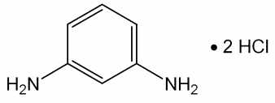

---

이원료를건조한것은정량할때염산m-페닐렌디아민(C6H8N2ㆍ2HCl) 95.0 % 이상

을함유한다.

성

상

이원료는흰색∼엷은적색또는엷은자색의결정성가루로서냄새는거

의없다.

확인시험

1) 이원료의수용액(1 →1000) 5 mL에질산은시액5 방울을넣을때흰

색의침전이생긴다.

2) 이원료의수용액(1 →1000) 3 mL에풀푸랄ㆍ초산시액4 방울을넣을때액은

황색을띠는적색을나타낸다.

3) 이원료및염산m-페닐렌디아민표준품각각10 mg을이소프로판올ㆍ물ㆍ강암

모니아수(9：3：1) 혼합액1 mL씩에넣어녹인다음각각에아황산수소나트륨0.1

ｇ을넣어흔들어섞는다. 이액을검액및표준액으로한다. 검액및표준액1 μL씩

을박층판에점적하고이소프로필에텔ㆍ아세톤ㆍ이소프로판올(10：1：1) 혼합액을전

개용매로하여박층크로마토그래프법에따라시험한다. 발색제로p-디메칠아미노벤

즈알데히드ㆍ묽은염산용액(0.5 →100)을뿌릴때염산m-페닐렌디아민표준품과같

은Rf 값에단일적색을띠는황색의반점을나타낸다.

4) 이원료50 mg을물에넣어녹여100 mL로한다. 이액1 mL를취하여물을

넣어100 mL로한다. 이액을가지고흡수스펙트럼을측정할때파장232 ± 2 nm

및284 ± 2 nm에서흡수극대를나타낸다.

순도시험

1) 용해상태

이원료1.0 ｇ을물10 mL에넣어녹일때액은엷은황갈

색∼엷은갈색으로되며맑다.

2) 에텔가용물

이원료약1 ｇ을정밀하게달아에텔50 mL를넣어환류냉각기

를달아수욕상에서때때로흔들어섞으면서1 시간끓인다. 뜨거울때미리질량을

단플라스크에유리여과기(G3)로여과한다. 잔류물을에텔20 mL로씻고, 씻은액과

여액을합하여수욕상에서증발건고한다음105 ℃에서30 분간건조시켜질량을단

다(1.0 % 이하).

3) 철

이원료1.0 ｇ을정밀하게달아황산5 방울을넣어적시고천천히가온하

여저온에서거의회화또는휘산시킨다음황산을넣어적시고완전히회화한다. 식

힌다음잔류물에염산0.5 mL를넣어수욕상에서증발건고한다. 잔류물에묽은염산

3 방울을넣고가온하여물25 mL로녹인다. 이것을검액으로하여시험한다. 비교

액에는철표준액2.0 mL를넣는다(20 ppm 이하).

4) 중금속

이원료1.0 ｇ을황산5 mL 및질산20 mL에넣어가만히가열한다.

때때로질산2 ∼3 mL씩을추가하여액이무색∼엷은황색이될때까지가열한

다. 식힌다음물10 mL 및페놀프탈레인시액1 방울을넣어액이거의홍색을나타

낼때까지암모니아시액을넣는다. 묽은초산2 mL를넣고, 필요하면여과하고잔류

물을물10 mL로씻은다음씻은액은여액과합하고물을넣어50 mL로한다. 이

것을검액으로하여시험한다. 비교액에는납표준액2.0 mL를넣는다(20 ppm 이하).

5) 비소

이원료1.0 ｇ을황산5 mL 및질산20 mL에넣고가만히가열한다. 때

때로질산2 ∼3 mL씩을추가하여액이무색∼엷은황색이될때까지가열한다.

---

식힌다음포화수산암모늄용액15 mL를넣고흰연기가발생할때까지가열한다음

식히고물을넣어10 mL로한다. 이것을검액으로하여시험한다.(2 ppm 이하).

건조감량

0.2 % 이하(1.5 ｇ, 실리카겔, 4 시간)

강열잔분

0.2 % 이하(2 ｇ)

정량법

이원료를건조하고약0.16 ｇ을정밀하게달아질소정량법제2 법에따

라시험한다.

0.05 mol/L 황산1 mL = 9.053 mg　C6H8N2ㆍ2HCl

저장법

기밀용기

염산p-페닐렌디아민

p-Phenylenediamine Hydrochloride

p-페닐렌디아민염산염

염산1,4-페닐렌디아민

C6H8N2ㆍ2HCl :

181.06

이원료를건조한것은정량할때염산p-페닐렌디아민(C6H8N2ㆍ2HCl) 95.0 % 이상

을함유한다.

성

상

이원료는흰색또는엷은갈색의결정성가루로서냄새는거의없다.

확인시험

1) 이원료의수용액(1 →100) 5 mL에질산은시액5 방울을넣을때액은

백탁하고, 엷은회색∼엷은자색침전이생기고이것을가열하면액의색은엷은갈

색이된다.

2) 이원료의수용액(1 →100) 3 mL에풀푸랄ㆍ초산시액4 방울을넣을때액은

황색을띠는적색을나타낸다.

3) 이원료및p-페닐렌디아민표준품각10 mg을이소프로판올ㆍ물ㆍ강암모니아수

(9：3：1) 혼합액1 mL에넣어녹인다음각각에아황산수소나트륨0.1 ｇ을넣어

흔들어섞어검액및표준액으로한다. 검액및표준액1 μL씩을박층판에점적하고

이소프로필에텔ㆍ아세톤ㆍ이소프로판올(10：1：1) 혼합액을전개용매로하여박층크

로마토그래프법에따라시험한다. 발색제로p-디메칠아미노벤즈알데히드ㆍ묽은염산

용액(1 →100)을뿌릴때표준품과같은Rf 값에서황색을띠는적색∼적색의반

---

점을나타낸다.

4) 이원료50 mg을물에넣어녹여100 mL로한다. 이액1 mL를취하여물을

넣어100 mL로한다. 이액을가지고자외가시부흡광도측정법에따라흡수스펙트럼

을측정할때파장237 ± 2 nm에서흡수극대를나타낸다.

순도시험

1) 용해상태

이원료0.5 ｇ을묽은염산50 mL에넣어녹일때액은무색

∼엷은적색으로되며맑다.

2) 에텔가용물

이원료약1 ｇ을정밀하게달아에텔50 mL에넣어환류냉각기

를달아수욕상에서때때로흔들어섞으면서1 시간끓인다. 뜨거울때미리질량을

단플라스크에유리여과기(G3)로여과한다. 잔류물을에텔20 mL로씻고, 씻은액

및여액을합하여수욕상에서증발건고하고105 ℃에서30 분간건조시켜질량을단

다(1.0 % 이하).

3) 철

이원료1.0 ｇ을달아황산5 방울을넣어적시고천천히가열하여저온에

서거의회화또는휘산시킨다음황산을넣어적시고완전히회화시킨다. 식힌다음

잔류물에염산0.5 mL를넣고수욕상에서증발건고시킨다. 잔류물은묽은염산3

방울을넣어가온하고물25 mL를넣어녹인다. 이것을검액으로하여시험한다. 비

교액에는철표준액2.0 mL를넣는다(20 ppm 이하).

4) 중금속

이원료1.0 ｇ을달아황산5 mL 및질산20 mL에넣고가만히가열

한다. 때때로질산2 ∼3 mL씩을추가하여액이무색∼엷은황색이될때까지가

열한다. 식힌다음물10 mL 및페놀프탈레인시액1 방울을넣어액이거의홍색을

나타낼때까지암모니아시액을넣는다. 다음에묽은초산2 mL를넣고필요하면여과

하고잔류물을물10 mL로씻고씻은액을여액과합하고물을넣어50 mL로한다.

이것을검액으로하여시험한다. 단비교액에는납표준액2.0 mL를넣는다(20 ppm

이하).

5) 비소

이원료1.0 ｇ을황산2 mL 및질산5 mL에넣어가만히가열한다. 때때

로질산2 ∼3 mL씩을추가하여액이무색∼엷은황색이될때까지가열한다. 식

힌다음포화수산암모늄용액15 mL를넣어흰연기가발생할때까지가열한다. 식힌

다음물을넣어10 mL로한다. 이것을검액으로하여시험한다(2 ppm 이하).

건조감량

0.2 % 이하(1.5 ｇ, 실리카겔, 4 시간)

강열잔분

0.2 % 이하(2 ｇ)

정량법

이원료를건조하고약0.16 ｇ을정밀하게달아질소정량법제2법에따라

시험한다.

0.05 mol/L 황산1 mL = 9.053 mg　C6H8N2ㆍ2HCl

저장법

기밀용기

염산톨루엔-2,5-디아민

---

Toluene-2, 5-diamine Hydrochloride

톨루엔-2,5-디아민염산염

염산p-톨루엔디아민

염산메칠-p-페닐렌디아민

염산메칠-2, 5-페닐렌디아민

염산2-메칠-p-페닐렌디아민

염산o-메칠-p-페닐렌디아민

C7H10N2ㆍ2HCl : 195.09

이원료를건조한것은정량할때염산톨루엔-2, 5-디아민(C7H10N2ㆍ2HCl) 95.0 %

이상을함유한다.

성

상

이원료는엷은자색∼엷은적자색의결정성가루로서약간특이한냄새가

있다.

확인시험

1) 이원료의수용액(1 →100) 10 mL에질산은시액5 방울을넣을때백

탁이된다.

2) 이원료의수용액(1 →100) 3 mL에풀푸랄ㆍ초산시액4 방울을넣을때액은

황색을띠는적색을나타낸다.

3) 이원료및m-페닐렌디아민표준품각각10 mg을이소프로판올ㆍ물ㆍ강암모니

아수(9：3：1) 혼합액1 mL씩에넣어녹인다음, 각각에아황산수소나트륨0.1 ｇ을

넣어흔들어섞는다. 이액을검액및표준액으로한다. 검액및표준액1 μL씩을박

층판에점적하고이소프로필에텔ㆍ아세톤ㆍ이소프로판올(10：1：1) 혼합액을전개용

매로하여박층크로마토그래프법에따라시험한다. 발색제로p-디메칠아미노벤즈알

데히드ㆍ묽은염산용액(0.5 →100)을뿌릴때m-페닐렌디아민표준품에대하여Rs

값0.9 부근에서단일황색∼황색을띠는적색의반점을나타낸다.

4) 이원료15 mg을물100 mL에넣어녹이고이액10 mL 를취하여물을넣어

100 mL로한다. 이액을가지고자외가시부흡광도측정법에따라흡수스펙트럼을측

정할때파장235 ± 2 nm 및286 ± 2 nm에서흡수극대를나타낸다.

순도시험

1) 용해상태

이원료0.1 ｇ을묽은염산10 mL에넣어녹일때액은엷

은적자색이며맑다.

2) 철

이원료1.0 ｇ을달아황산5 방울을넣어적시고천천히가열하여저온에

서회화또는휘산시킨다음다시황산을넣어적시고완전히회화시킨다. 식힌다음

잔류물에염산0.5 mL를넣고수욕상에서증발건고한다음묽은염산3 방울을넣어

가온하고물25 mL를넣어녹인다. 이것을검액으로하여시험한다. 비교액에는철

표준액2.0 mL를넣는다(20 ppm 이하).

3) 에텔가용물

이원료약1 ｇ을정밀하게달아에텔50 mL에넣고환류냉각기

---

를달아수욕상에서때때로흔들어섞으면서1 시간끓인다. 뜨거울때미리질량을

단플라스크에유리여과기(G3)로여과한다. 잔류물을에텔20 mL로씻고, 씻은액과

여액을합하여수욕상에서증발건고하고105 ℃에서30 분간건조시켜질량을단다

(2.0 % 이하).

4) 중금속

이원료1.0 ｇ을달아황산5 mL 및질산20 mL에넣어가만히가열

한다. 때때로질산2 ∼3 mL씩을추가하여액이무색∼엷은황색이될때까지가

열하고식힌다음물10 mL 및페놀프탈레인시액1 방울을넣어액이거의홍색을

나타낼때까지암모니아시액을넣는다. 다음에묽은초산2 mL를넣고필요하면여과

하고잔류물을물10 mL로씻어씻은액은여액과합하고물을넣어50 mL로한다.

이것을검액으로하여시험한다. 비교액에는납표준액2.0 mL를넣는다(20 ppm 이

하).

5) 비소

이원료1.0 ｇ을달아황산2 mL 및질산5 mL에넣어가만히가열한다.

때때로질산2 ∼3 mL씩을추가하여액이무색∼엷은황색이될때까지가열하

고식힌다음포화수산암모늄용액15 mL를넣어흰연기가발생할때까지가열한다.

식힌다음물을넣어10 mL로한다. 이것을검액으로하여시험한다(2 ppm 이하).

건조감량

1.0 % 이하(1 ｇ, 105 ℃, 2 시간)

강열잔분

1.5 % 이하(2 ｇ)

정량법

이원료를건조하고약0.17 ｇ을정밀하게달아질소정량법제2 법에따

라시험한다.

0.05 mol/L 황산1 mL = 9.755 mg　C7H10N2ㆍ2HCl

저장법

기밀용기

---

염산히드록시프로필비스(N-히드록시에칠-p-페닐렌디아민)

Hydroxypropyl bis(N-hydroxyethyl-p-phenylenediamine)

Hydrochloride

히드록시프로필비스(N-히드록시에틸-p-페닐렌디아민염산염

C19H28N4O3ㆍ4HCl : 506.30

이원료는정량할때환산한무수물에대하여염산히드록시프로필비스(N-히드록시

에칠-p-페닐렌디아민)(C19H28N4O3ㆍ4HCl : 506.30) 98.0 ∼101.0 % 이상을함유한다.

성

상

이원료는연한회색∼회색을띠는자주빛의가루로약한특이한냄새가있다.

확인시험

1) 이원료의수용액(1 →1000) 10 mL에염화제이철시액1 방울을넣을

때엷은갈색∼검은색을나타낸다.

2) 이원료약0.01 g을정밀하게달아물을넣어녹여100 mL로하고이액1 mL

를정확하게취하여다시물을가해100 mL로한다. 이액을가지고자외가시부흡

광도측정법에따라흡광도를측정할때파장258 ± 2 nm에서흡수극대를나타낸

다.

3) 이원료를가지고적외부스펙트럼측정법브롬화칼륨정제법에따라시험할때파

수3371 cm-1, 2844 cm-1, 2572 cm-1, 1635 cm-1, 1611 cm-1, 1585 cm-1, 1516 cm-1,

1492 cm-1, 824 cm-1 부근에서흡수를나타낸다.

순도시험

1) 용해상태

이원료0.1 g에에탄올10 mL를넣고녹일때그액은거

의맑으며, 무색에서옅은갈색을띤다.

2) 철

이원료1.0 g을달아제2 법에따라검액을만들고조작법A법에따라시

험한다. 비교액에는철표준액3.0 mL를넣는다(30 ppm 이하).

3) 중금속

이원료1.0 g을달아제2 법에따라조작하여시험한다. 비교액에는

납표준액2.0 mL를넣는다(20 ppm 이하).

4) 비소

이원료1.0 g을달아제3 법에따라조작하여시험한다(2 ppm 이하).

5) 에탄올, 이소프로판올

이원료약1.0 g을정밀하게달아물90 mL를넣어녹

인다음2 mol/L 수산화나트륨시액5 mL를가한다음물을넣어100 mL로하여

검액으로한다. 따로에탄올표준액5 종류와이소프로판올표준액5 종류(5 μg/mL,

10 μg/mL, 20 μg mL, 40 μg/mL, 60 μg/mL)를조제하여표준액으로한다. 각각의

표준액2 μL씩을가지고다음의조건으로기체크로마토그래프법에따라시험하여

각표준액의에탄올과이소프로판올의피크면적을구하고에탄올과이소프로판올의

---

양(각g/100 mL)에대한피크면적을구하여각각에대한두개의검량선을작성한

다. 똑같은조건으로검액2 μL에대하여기체크로마토그래프법에따라시험하여

에탄올과이소프로판올의피크면적을구하여검량선에서검액의에탄올양(Ce)과이

소프로판올양(Ci)을읽고다음식에따라시료취한량에서에탄올과이소프로판올

의양(%)을계산할때에탄올은0.5 %, 이소프로판올은0.1 % 이하이다.

× 

에탄올의양%(w/w) =



× 

이소프로판올의양%(w/w) =



Ce = 100 mL 중에탄올의양(g)

Ci = 100 mL 중이소프로판올의양(g)

P = 시료취한양(g)

조작조건

검출기: 불꽃이온화검출기

칼

럼: 안지름0.53 mm, 길이50 m인모세유리관에기체크로마토그래프용6%

시아노프로필페닐- 94% 디메칠실리콘폴리머를3 μm 두께로피복한것

또는이와동등한칼럼

칼럼온도: 90 °C 부근의일정온도

검체도입부온도: 150 °C 부근의일정온도

검출기온도: 200 °C 부근의일정온도

운반기체: 질소또는헬륨

유

량: 1.7 mL/분

수

분

2.0 % 이하(0.2 g)

강열잔분

0.1 % 이하(3.0 g)

정량법

이원료약100 mg을정밀하게달아물50 mL에녹이고0.1 mol/L 수산화

나트륨액으로적정한다(적정종말점검출법전위차적정법). 같은방법으로공시험을하

여보정한다.

0.1 mol/L 수산화나트륨액1 mL = 25.3 mg C19H28N4O3ㆍ4HCl

인디고페라엽가루

Powdered Indigofera Tinctoria Leaf

이원료는인디고페라Indigofera tinctoria(콩과Leguminosae)의잎을건조하여가

---

루로한것이다.

이원료는정량할때인디칸(Indoxyl-β-D-glucoside, C14H17NO6 : 295.29) 3.0 % 이

상을함유한다.

성

상

이원료는연한녹색∼녹색의가루이고흙냄새같은특이한냄새가난다.

확인시험1) 이원료를가지고인디칸으로서약10 mg에해당하는양을정밀하게달

아메탄올을넣어10 mL로하여흔들어섞고방치한다음위의맑은액을검액으로

한다. 따로인디칸표준품10 mg을검액과같은방법으로조작하여표준액으로한다.

이들액을가지고박층크로마토그래프법에따라시험한다. 검액및표준액각각5 μL

씩을박층크로마토그래프용실리카겔을써서만든박층판에점적한다. 클로로포름ㆍ메

탄올ㆍ물혼합액(70 : 28 : 2)을전개용매로하여점적한곳으로부터약10 cm 전개한

다음박층판을전개용매냄새가나지않을때까지건조한다. 여기에분무용황산시액

을고르게뿌리고105 ℃에서5 ∼10분간가열하고검액과표준액의같은Rf 값및

색상의반점을확인한다.

2) 이원료를가지고정량법에따라시험할때검액은표준액과같은유지시간에서

주피크를나타낸다.

순도시험1) 중금속

이원료1.0 g을달아제3 법에따라조작하여시험한다. 비교

액에는납표준액2.0 mL를넣는다(20 ppm 이하).

2) 비소

이원료1.0 g을달아제3 법에따라조작하여시험한다. 표준색조제에는

비소표준액3.0 mL를넣는다(3 ppm 이하).

3) 잔류농약이원료를가지고대한민국약전일반시험법중생약시험법에따라시

험한다.

가) 총디디티(p.p'-DDD, p,p'-DDE, o,p'-DDT 및p,p'-DDT의합) 0.1 ppm

이하

나) 디엘드린0.01 ppm 이하.

다) 총비에이치씨(α, β, γ 및δ-BHC의합) 0.2 ppm 이하

라) 알드린0.01 ppm 이하

마) 엔드린0.01 ppm 이하

건조감량

10.0 % 이하

회

분

15.0 % 이하

산불용성회분

5.0 % 이하

정량법

이원료를인디칸으로서약15 mg에해당하는양을정밀하게달아메탄올

을넣어정확하게100 mL로하고10 분간흔들어추출한다음0.45 μm 시린지필터

로여과하여검액으로한다. 따로인디칸표준품약15 mg을정밀하게달아메탄올을

넣어정확하게100 mL로한액을표준액으로한다. 검액및표준액10 μL씩을정확

하게취하여다음조건으로액체크로마토그래프법에따라시험하여검액및표준액

의인디칸피크면적AT와AS를구한다.



인디칸(C14H17NO6)의양(mg) = 인디칸표준품의양(mg) × 



---

조작조건

검출기: 자외부흡광광도계(측정파장

280 nm)

칼

럼: 안지름약4.6 mm, 길이약15 cm인스테인레스강관에5 μm의액체

크로마토그프용옥타데실실릴실리카겔을충전한것또는이와동등한칼럼

이동상: 물ㆍ메탄올혼합액(65 : 35)

유

량: 0.5 mL/분

카테콜

Catechol

피로카테콜

피로카테킨

피로카테킨산

카테키논

o-디페놀

o-히드록시페놀

2-히드록시페놀

C6H6O2 : 110.11

이원료를건조한것은정량할때카테콜(C6H6O2) 98.0 % 이상을함유한다.

성　　상　이원료는흰색∼회색의입상또는판상의결정이며냄새가없든가또는

약간특이한냄새가있다.

확인시험　이원료의수용액(1 →200) 10 mL에염화제이철시액3 방울을넣을때액

은녹색을나타내고다음에암모니아시액2 방울을넣을때액은심홍색으로변한다.

융　　점　103 ∼105 ℃(제1 법)

순도시험　1) 용해상태　이원료0.5 ｇ을물100 mL에넣어녹인액은무색이며, 거

의맑다.

2) 중금속　이원료1.0 ｇ을황산5 mL 및질산20 mL에넣어가만히가열한다.

때때로질산2 ∼3 mL씩을추가하고액이무색∼엷은황색이될때까지가열을

계속한다. 식힌다음물10 mL 및페놀프탈레인시액1 방울을넣고암모니아시액을

액이엷은적색이될때까지천천히넣은다음필요하면여과하여물10 mL로씻고

여액과씻은액을네슬러관에넣고물을넣어50 mL로한다. 이것을검액으로하여

시험한다. 비교액에는납표준액2.0 mL를넣는다(20 ppm 이하).

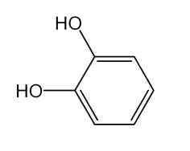

---

3) 비소　이원료1.0 ｇ을황산2 mL 및질산5 mL에넣고가만히가열한다. 때때

로질산2 ∼3 mL씩을추가하여액이무색∼엷은황색이될때까지가열을계속

한다. 식힌다음포화수산암모늄용액15 mL를넣고흰연기가날때까지가열한다

음농축한다. 식힌다음물을넣어10 mL로하고이것을검액으로하여시험한다(2

ppm 이하).

4) 유기성불순물　이원료의수용액(1 →100) 1 μL를박층판에점적하고이소프로

필에텔ㆍ아세톤ㆍ이소프로판올(10：1：1) 혼합액을전개용매로하여박층크로마토그

래프법에따라시험한다. 발색제로인몰리브덴산시액을뿌릴때단일반점을나타낸

다.

건조감량　0.5 % 이하(1.5 ｇ, 실리카겔, 4 시간)

강열잔분　0.1 % 이하(2 ｇ)

정량법　이원료를건조하고약0.5 ｇ을정밀하게달아물에넣어녹이고100 mL

로한다. 이액20 mL를취하여카테콜정량용초산납시액30 mL 및물50 mL를넣

어가열한다. 식힌다음물을넣어200 mL로하여여과한다. 처음의여액20 mL는

버리고다음의여액100 mL를취하여0.05 mol/L 에칠렌디아민테트라초산디나트륨

액으로적정한다(지시약：키실레놀오렌지시액3 방울). 다만, 적정의종말점은액의

적자색이황색으로변할때로한다. 같은방법으로공시험을하여보정한다.

0.05 mol/L 에칠렌디아민테트라초산디나트륨액1 mL　= 5.506 mg　C6H6O2

저장법

기밀용기

톨루엔-2, 5-디아민

Toluene-2,5-diamine

p-톨루이렌디아민

2,5-톨루이렌디아민

2,5-디아미노톨루엔

o-메칠-p-페닐렌디아민

p-톨루엔디아민

메칠-p-페닐렌디아민

메칠-2,5-페닐렌디아민

2-메칠-p-페닐렌디아민

C7H10N2 : 122.17

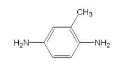

---

이원료를건조한것은정량할때톨루엔-2, 5-디아민(C7H10N2) 95.0 % 이상을함유

한다.

성　　상　이원료는흰색∼엷은황색또는엷은적자색의가루또는덩어리로서

약간특이한냄새가있다.

확인시험　1) 이원료의수용액(1 →200) 5 mL에풀푸랄ㆍ초산시액5 방울을넣을

때액은적황색을나타낸다.

2) 이원료및염산m-페닐렌디아민표준품각10 mg을이소프로판올ㆍ물ㆍ강암모

니아수(9：3：1) 혼합액1 mL 씩에넣어녹인다음각각에아황산수소나트륨0.1 ｇ

을넣어흔들어섞어검액및표준액1 μL씩을박층판에점적하고이소프로필에텔ㆍ

아세톤ㆍ이소프로판올혼합액(10：1：1)을

전개용매로

하며

박층크로마토그래프법에

따라시험한다. 발색제로p-디메칠아미노벤즈알데히드ㆍ묽은염산용액(1 →200)을뿌

릴때염산m-페닐렌디아민표준품에대하여Rs 값0.9 부근에서적색을띠는황색

∼황색의반점을나타낸다.

3) 이원료0.15 ｇ을물에넣어녹여100 mL로한다. 이액1 mL를취하여물을

넣어100 mL로하여이액을가지고자외가시부흡광도측정법에따라흡수스펙트럼

을측정할때파장237 ± 2 nm 및303 ± 2 nm 에서흡수극대를나타낸다.

융　　점　60 ∼66 ℃(제1 법)

순도시험　1) 용해상태　이원료0.1 ｇ을묽은염산10 mL에넣어녹일때액은무

색∼엷은적자색이며거의맑다.

2) 철　이원료1.0 ｇ을정밀하게달아황산5 방울을넣어적시고천천히가열하

여저온에서거의회화또는휘산시킨다음다시황산을넣어적시고완전히회화시

킨다. 식힌다음잔류물에염산0.5 mL를넣고수욕상에서증발건고한다음묽은염

산3 방울을넣어가온하고물25 mL를넣어녹인다. 이것을검액으로하여시험한

다. 비교액에는철표준액2.0 mL를넣는다(20 ppm 이하).

3) 중금속　이원료1.0 ｇ을황산5 mL 및질산20 mL에넣어가만히가열한다.

때때로질산2 ∼3 mL씩을추가하여액이무색∼엷은황색이될때까지가열한

다. 식힌다음물10 mL 및페놀프탈레인시액1 방울을넣고암모니아시액을액이

엷은적색이될때까지천천히넣고필요하면여과하여물10 mL로씻고여액과씻

은액을네슬러관에넣고물을넣어50 mL로한다. 이것을검액으로하여시험한다.

비교액에는납표준액2.0 mL를넣는다(20 ppm 이하).

4) 비소　이원료1.0 ｇ을황산2 mL 및질산5 mL에넣어가만히가열한다. 때

때로질산2 ∼3 mL씩을추가하여액이무색∼엷은황색이될때까지가열한다.

식힌다음포화수산암모늄용액15 mL를넣고흰연기가발생할때까지가열한다. 식

힌다음물을넣어10 mL로한다. 이것을검액으로하여시험한다(2 ppm 이하).

건조감량　5.0 % 이하(1 ｇ, 실리카겔, 4 시간)

강열잔분　1.0 % 이하(2 ｇ)

정량법　이원료를건조하고약0.11 ｇ을정밀하게달아질소정량법제2 법에따라

시험한다.

---

0.05 mol/L 황산1 mL = 6.109 mg　C7H10N2

저장법

기밀용기

m-페닐렌디아민

m-Phenylenediamine

1, 3-페닐렌디아민

C6H8N2 : 108.14

이원료를건조한것은정량할때m-페닐렌디아민(C6H8N2) 95.0 % 이상을함유한

다.

성　　상　이원료는갈색또는청색을띠는흑갈색∼흑갈색의결정성덩어리로서

냄새는없다.

확인시험

1) 이원료1 g을물100 mL에넣어잘흔들어섞은다음여과한다. 여액

5 mL에질산은시액5 방울을넣을때액은엷은흑자색을나타낸다. 이액을가열할

때액은회록색∼회녹갈색으로변하면서은이석출된다.

2) 1)의여액3 mL에풀푸랄ㆍ초산시액4 방울을넣을때액은황색을띠는적색

∼황갈색을나타내면서혼탁된다.

3) 이원료및m-페닐렌디아민표준품각10 mg을달아이소프로판올ㆍ물ㆍ강암모

니아수(9 : 3 : 1) 혼합액1 mL를넣어녹인다음각각에아황산수소나트륨0.1g을

넣고흔들어섞어검액및표준액으로한다. 검액및표준액1 μL씩을박층판에점

적하고이소프로필에텔ㆍ아세톤ㆍ이소프로판올(10 : 1 : 1) 혼합액을전개용매로하

여박층크로마토그래프법에따라시험한다. 발색제로p-디메칠아미노벤즈알데히드ㆍ

묽은염산용액(1 →200)을뿌릴때표준액과같은Rf 값에서적색을때는황색의반

점을나타낸다.

4) 이원료25 mg을정밀하게달아물에넣어녹여100 mL로하고필요하면여과

하여이액1 mL를취하여물을넣어100 mL로한다. 이액을가지고자외가시부흡

광도측정법에따라흡수스펙트럼을측정할때파장287 ± 2 nm에서흡수극대를나

타낸다.

융　　점　57 ∼65 ℃(제1 법)

순도시험　1) 용해상태　이원료0.5 ｇ을정밀하게달아묽은염산10 mL에넣어녹

일때액은흑갈색이며맑다.

---

2) 철　이원료1.0 ｇ을정밀하게달아황산5 방울을넣어적시고천천히가열하

여저온에서염산0.5 mL를넣어수욕상에서증발건고한다. 잔류물에묽은염산3 방

울을넣어가온하고물25 mL를넣어녹인다. 이액을검액으로하여시험한다. 비

교액에는철표준액2.0 mL를넣는다(20 ppm 이하).

3) 중금속　이원료1.0 ｇ을정밀하게달아황산5 mL 및질산20 mL에넣어가

만히가열한다. 여기에질산2 ∼3 mL씩을추가하여액이무색∼엷은황색이될

때까지가열한다. 식힌다음물10 mL 및페놀프탈레인시액1 방울을넣고암모니아

시액을액이엷은적색이될때까지천천히넣은다음묽은초산2 mL를넣고필요

하면여과한다. 잔류물을물10 mL로씻고씻은액을여액에합하여물을넣어50

mL로한다. 이액을검액으로하여시험한다. 비교액에는납표준액2.0 mL를넣는다

(20 ppm 이하).

4) 비소　이원료1.0 ｇ을정밀하게달아황산2 mL 및질산5 mL에넣어가만히

가열한다. 여기에가끔질산2 ∼3 mL씩을추가하여액이무색∼엷은황색이될

때까지가열한다. 식힌다음포화수산암모늄용액15 mL를넣고흰연기가발생할때

까지가열한다. 식힌다음물을넣어10 mL로한다. 이것을검액으로하여시험한다

(2 ppm 이하).

건조감량　0.5 % 이하(1.5 ｇ, 실리카겔, 4 시간)

강열잔분　0.3 % 이하(2 ｇ, 제1 법)

정량법　이원료를건조하고약0.10 ｇ을정밀하게달아질소정량법제2 법에따

라시험한다.

0.05 mol/L 황산1 mL = 5.407 mg　C6H8N2

저장법　기밀용기

N-페닐-p-페닐렌디아민

N-Phenyl-p-Phenylenediamine

p －아미노디페닐아민

C12H12N2 : 184.24

이원료를건조한것은정량할때N-페닐-p-페닐렌디아민(C12H12N2) 95.0% 이상을

함유한다.

성　　상　이원료는흑갈색∼자갈색의덩어리또는작은알맹이로서약간특이한

냄새가있다.

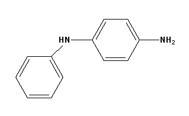

---

확인시험　1) 이원료10 mg에묽은염산10 mL를넣어녹이고아질산나트륨시액1

방울을넣을때액은적갈색을나타내고곧이어녹갈색으로변한다.

2) 이원료의묽은에탄올용액(1 →1000) 3 mL에풀푸랄ㆍ초산시액4 방울을넣을

때액은황색을띠는적색을나타낸다.

3) 이원료및p-니트로아닐린각10 mg을달아이소프로판올ㆍ물ㆍ강암모니아수혼

합액(9 : 3 : 1) 1 mL를넣어녹인다음각각에아황산수소나트륨0.1 g을넣고흔들

어섞어검액및표준액으로한다. 이들액을가지고박층크로마토그래프법에따라

시험한다. 검액및표준액10 μL씩을박층크로마토그래프용실리카겔을써서만든박

층판에점적한다. 다음에이소프로필에텔ㆍ아세톤ㆍ이소프로판올(10 : 1 : 1) 혼합액

을전개용매로하여약15 cm 전개한다음박층판을바람에말린다. 여기에p-디메

칠아미노벤즈알데히드ㆍ묽은염산용액(1 →200)을뿌릴때표준액p-니트로아닐린에

대하여Rs 값0.8 부근에서암적색∼적갈색의반점을나타낸다.

4) 이원료30 mg을달아에탄올을넣어녹여200mL로한다. 이액2 mL를취하

여에탄올을넣어100 mL로한다. 이액에대하여흡수스펙트럼을측정할때파장

286 ∼290 nm에서흡수극대를나타낸다.

융

점

69 ∼75 ℃(제1 법)

순도시험

1) 용해상태　이원료0.1 g에에탄올10 mL를넣어녹일때액은어두운

적갈색∼어두운적자색을나타내며맑다.

2) 철　이원료1.0 g을정밀하게달아황산5 방울을넣어적시고천천히가열하여

저온에서거의회화또는휘산시킨다음다시황산으로적시고완전히회화한다. 식

힌다음잔류물에염산0.5 mL를넣어수욕상에서증발건고한다. 잔류물에묽은염산

3 방울을넣어가온하고물25 mL를넣어녹인다. 이것을검액으로하여시험한다.

비교액에는철표준액2.0 mL를넣는다(20 ppm 이하).

3) 중금속　이원료1.0 g에황산5 mL 및질산20 mL를넣어가만히가열한다.

가끔질산2 ∼3 mL씩을추가하여액이무색∼엷은황색이될때까지가열한다.

식힌다음물10 mL 및페놀프탈레인시액1 방울을넣고암모니아시액을액이엷은

적색이될때까지적가하고묽은초산2 mL를넣고필요하면여과한다. 잔류물을물

10 mL로씻고씻은액을여액에합하여물을넣어50 mL로한다. 이것을검액으로

하여시험한다. 비교액에는납표준액2.0 mL를넣는다(20 ppm 이하).

4) 비소　이원료1.0 g에황산2 mL 및질산5 mL를넣고가만히가열한다. 가끔

질산2 ∼3 mL씩을추가하여액이무색∼엷은황색이될때까지가열한다. 식힌

다음포화수산암모늄용액15 mL를넣고흰연기가발생할때까지가열한다. 식힌다

음물을넣어10 mL로한다. 이것을검액으로하여시험한다(2 ppm 이하).

건조감량　0.5 % 이하(1.5 g, 실리카겔, 4시간)

강열잔분　0.3 % 이하(2 g, 제1 법)

정량법　이원료를데시케이터(실리카겔) 에서4시간건조하고그원료0.16 g을

정밀하게달아질소정량법제2법에따라시험한다.

0.05 mol/L 황산1 mL = 9.212 mg C12H12N2

---

저장법

기밀용기

p-페닐렌디아민

p-Phenylenediamine

1,4-페닐렌디아민

C6H8N2 : 108.14

이원료를건조한것은정량할때p-페닐렌디아민(C6H8N2) 98.0 % 이상을함유한다.

성　　상　이원료는무색∼엷은자색또는자갈색을띤결정성가루또는덩어리로

서냄새는없다.

확인시험

1) 이원료의수용액(1 →1000) 5 mL에질산은시액5 방울을넣을때액

은흑자갈색을나타내면서혼탁해진다. 가열할때액은은이석출된다.

2) 이원료100 mg을묽은초산10 mL에넣어녹인다. 이액1 mL에아닐린용액(1

→250) 1 mL를넣은다음과황산암모늄0.2 ｇ을넣을때액은청색을나타낸다.

3) 이원료의수용액(1 →1000) 5 mL에니트로프루싯나트륨시액1 mL을넣을때액

은청색을나타낸다.

4) 이원료25 mg을물에넣어100 mL로한다. 이액1 mL를취하여물을넣어

100 mL로한다. 이액을가지고자외가시부흡광도측정법에따라흡수스펙트럼을측

정할때파장237 ± 2 nm에서흡수극대를나타낸다.

5) 이원료및p-페닐렌디아민표준품각10 mg을이소프로판올ㆍ 물ㆍ 강암모니

아수(9：3：1) 혼합액1 mL씩에넣어녹인다음각각에아황산수소나트륨0.1 ｇ을

넣어흔들어섞어검액및표준액1 μL씩을박층판에점적하고초산에칠ㆍ 메탄올

ㆍ 물(50：10：8) 혼합액을전개용매로하여박층크로마토그래프법에따라시험한다.

발색제로p-디메칠아미노벤즈알데히드ㆍ묽은염산용액(1 →200)을뿌릴때표준품과

같은Rf 값에서황색을띠는적색의반점을나타낸다.

융　　점　136 ∼144 ℃(제1 법)

순도시험　1) 용해상태　이원료0.5 ｇ을묽은염산60 mL에넣어녹일때액은무

색∼엷은적색을나타내며맑다.

2) 중금속　이원료1.0 ｇ을황산5 mL 및질산20 mL에넣어천천히가열한다.

때때로질산2 ∼3 mL씩을추가하여액이무색∼엷은황색이될때까지가열한

다. 식힌다음물10 mL 및페놀프탈레인시액1 방울을넣고암모니아시액을액이

엷은적색이될때까지천천히넣고필요하면여과한다. 잔류물을물10 mL로씻고

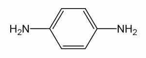

---

여액과씻은액을네슬러관에넣고물을넣어50 mL로한다. 이것을검액으로하여

시험한다. 단, 비교액에는납표준액2.0 mL를넣는다(20 ppm 이하).

3) 철　이원료1.0 ｇ을정밀하게달아황산5 방울을넣어적시고천천히가열하

여저온에서회화또는휘산시킨다음황산을넣어적시고완전히회화한다. 식힌다

음잔류물에염산0.5 mL를넣고수욕상에서증발건고한다. 잔류물에묽은염산3 방

울을넣어가온하고물25 mL를넣어녹인다. 이것을검액으로하여시험한다. 비교

액에는철표준액2.0 mL를넣는다(20 ppm 이하).

4) 비소　이원료1.0 ｇ을황산2 mL 및질산5 mL에넣어천천히가열한다. 때때

로질산2 ∼3 mL씩을추가하여액이무색∼엷은황색이될때까지가열한다. 식

힌다음포화수산암모늄용액15 mL를넣고흰연기가발생할때까지가열한다. 식힌

다음물을넣어10 mL로한다. 이것을검액으로하여시험한다(2 ppm 이하).

건조감량　0.2 % 이하(1.5 ｇ, 실리카겔, 4 시간)

강열잔분　0.5 % 이하(2 ｇ, 제1 법)

정량법　이원료를건조하고약0.10 ｇ을정밀하게달아질소정량법제2 법에따

라시험한다.

0.05 mol/L 황산1 mL = 5.407 mg　C6H8N2

저장법

기밀용기

페닐메칠피라졸론

Phenyl Methyl Pyrazolone

C10H10N2O : 174.20

이원료는정량할때환산한무수물에대하여페닐메칠피라졸론(C10H10N2O) 99.0 %

이상을함유한다.

성

상

이원료는흰색의결정성가루이다.

확인시험

1) 이원료50 mg을에탄올에넣어녹여100 mL로한다. 이액10 mL를

취하여에탄올을넣어1000 mL로한다. 이액을가지고자외가시부흡광도측정법에

따라흡수스펙트럼을측정할때파장245 ± 2 nm에서흡수극대를나타낸다.

2) 이원료0.1 g을메탄올10 mL에넣어녹인다음아황산나트륨0.1 g을넣고원

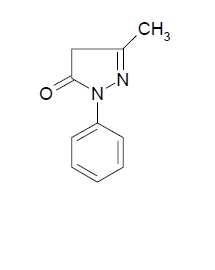

---

심분리하여상징액을검액으로한다. 페닐메칠피라졸론표준품0.1 g을가지고검액

과같게조작하여표준액으로한다. 검액및표준액각각5 μL씩을취하여박층판에

점적하고벤젠ㆍ 아세트산에틸ㆍ 아세트산혼합액(50 : 50 : 1)을전개용매로하여

박층크로마토그래프법에따라시험한다. 발색제로p-디메틸아미노벤즈알데히드ㆍ

묽은염산용액(0.5 →100) 을뿌릴때검액과표준액의반점은같은Rf 값에서같은

색상을나타낸다.

융

점

128 ∼130 ℃(제1 법)

순도시험

1) 철

이원료2.0 g을달아황산5 방울을넣어적시고천천히가열하여

저온에서거의회화또는휘산시킨다음다시황산으로적시고완전히회화한다. 식

힌다음잔류물에염산0.5 mL를넣고수욕상에서증발건고하여잔류물에묽은염산

3 방울을넣어가온하고물25 mL를넣어녹인다. 이것을검액으로한다. 비교액에

는철표준액1.0 mL를넣는다(5 ppm 이하).

2) 중금속

이원료1.0 g을황산2 mL 및질산20 mL에넣어가만히가열한다.

때때로질산2 ∼3 mL씩을추가하여액이무색∼엷은황색이될때까지가열한

다. 식힌다음물10 mL 및페놀프탈레인시액1 방울을넣고암모니아시액을액이

엷은적색이될때까지넣고필요하면여과하여물10 mL로씻고여액과씻은액을

네슬러관에넣어물을넣어50 mL로한액을검액으로한다. 비교액에는납표준액

2.0 mL를넣는다(20 ppm 이하).

3) 비소

이원료1.0 g을황산2 mL 및질산5 mL에넣어가만히가열한다. 때때

로질산2 ∼3 mL씩을추가하여액이무색∼엷은황색이될때까지가열한다. 식

힌다음포화수산암모늄용액15 mL를넣고흰연기가발생할때까지가열한다음

식히고물을넣어10 mL로한액을검액으로하여시험한다(2 ppm 이하).

수

분

0.3 % 이하(0.3 g)

강열잔분

0.2 % 이하(2 g, 제1 법)

정량법

이원료약0.15 g을정밀하게달아질소정량법에따라시험한다.

0.05 mol/L 황산1 mL = 8.710 mg C10H10N2O

피로갈롤

Pyrogallol

피로갈릭산

피로몰식자산

---

초성몰식자산

2,3-디히드록시페놀

C6H6O3 : 126.11

성

상

이원료는흰색의결정으로약간의특이한냄새가있다.

확인시험

1) 이원료의수용액(1 →100) 10 mL에수산화나트륨시액3 방울을넣을

때액은적색을띠는황색∼황갈색을나타내며방치하면액은천천히갈색∼흑

갈색으로변한다.

2) 이원료의수용액(1 →200) 10 mL에염화제이철시액3 방울을넣을때액은적

갈색∼갈색을나타낸다.

융

점

128 ∼136 ℃(제1 법)

순도시험

1) 용해상태

이원료1.0 ｇ을물20 mL에넣어녹인액은무색으로거의

맑다.

2) 중금속

이원료1.0 ｇ을황산5 mL 및질산20 mL에넣어가만히가열한다.

때때로질산2 ∼3 mL씩을추가하여액이무색∼엷은황색이될때까지가열을

계속한다. 식힌다음물10 mL 및페놀프탈레인시액1 방울을넣고암모니아시액을

액이엷은적색이될때까지천천히넣고필요하면여과한다. 물10 mL로씻고여액

과씻은액을네슬러관에넣고물을넣어50 mL로한다. 이것을검액으로하여시험

한다. 비교액에는납표준액2.0 mL를넣는다(20 ppm 이하).

3) 비소

이원료1.0 ｇ을황산2 mL 및질산5 mL에넣어가만히가열한다. 때때

로질산2 ∼3 mL씩을추가하여액이무색∼엷은황색이될때까지가열을계속

한다. 식힌다음포화수산암모늄용액15 mL를넣고흰연기가날때까지가열한다.

식힌다음물을넣어10 mL로하고이것을검액으로하여시험한다(2 ppm 이하).

4) 유기성불순물

이원료의수용액(1 →100) 1 μL를박층판에점적하고이소프로

필에텔ㆍ 아세톤ㆍ 이소프로판올혼합액(10：1：1)을전개용매로하여박층크로마토

그래프법에따라시험한다. 발색제로인몰리브덴산시액을뿌릴때단일의청자색반

점을나타내어야한다.

건조감량

0.5 % 이하(1.5 ｇ, 실리카겔, 4 시간)

강열잔분

0.3 % 이하(2 ｇ, 제1 법)

저장법

기밀용기

피크라민산

Picramic Acid

---

2-아미노4,6-디니트로페놀

2,4-디니트로6-아미노페놀

4,6-디니트로2-아미노페놀

피크람산

C6H5N3O5 : 199.12

이원료를건조한것은정량할때피크라민산(C6H5N3O5) 90.0 % 이상을함유한다.

성

상

이원료는황갈색∼적갈색의결정또는페이스트로서냄새는거의없다.

확인시험

1) 이원료의수용액(1 →1000) 10 mL에묽은염산1 mL를넣을때액은

황색은나타낸다. 또한이원료의수용액(1 →1000) 10 mL에탄산나트륨시액1 mL

를넣을때액은적갈색을나타낸다.

2) 이원료의수용액(1 →1000) 10 mL에황산동ㆍ암모니아시액2 mL를넣을때

액은어두운갈색을나타낸다.

3) 이원료의수용액(1 →1000) 10 mL에인텅그스텐산용액(1 →100) 1 mL를넣을

때액은황색을나타내며탄산나트륨시액1 mL를더넣을때액은적갈색으로변한다.

4) 이원료25 mg을물100 mL에넣어녹이고필요하면여과하여이액10 mL를

취하고물을넣어100 mL로한다. 이액을가지고자외가시부흡광도측정법에따라

흡수스펙트럼을측정할때파장300 ± 2 nm, 226 ± 2 nm 에서흡수극대를나타낸다.

융

점

169 ∼172 ℃(제1 법)

순도시험

1) 용해상태

이원료0.5 ｇ을아세톤20 mL에넣어녹일때액은황갈색

∼어두운적갈색이며거의맑다.

2) 납

이원료1.0 ｇ을황산5 mL 및질산20 mL에넣어가만히가열한다. 때때

로질산2 ∼3 mL을추가하여액이무색∼엷은황색으로될때까지가열한다. 식

힌다음물을넣어10 mL로한다. 이것을검액으로하여시험한다(5 ppm 이하).

3) 철

이원료0.1 ｇ을정밀하게달아황산5 mL를넣어적시고천천히가열하여

저온에서거의회화또는휘산시킨다음다시황산을넣어적시고완전히회화한다.

식힌다음잔류물에염산0.5 mL를넣고수욕상에서증발건고시킨다. 잔류물에묽

은염산3 방울을넣어가온하고물을넣어50 mL로하여검액으로한다. 이액10

mL를취하여시험한다. 비교액에는철표준액2.0 mL를넣는다(0.1 % 이하).

4) 비소

이원료1.0 ｇ을황산2 mL 및질산5 mL에넣어가만히가열한다. 때때

로질산2 ∼3 mL씩을추가하여액이무색∼엷은황색이될때까지가열한다. 식

힌다음포화수산암모늄용액15 mL를넣고흰연기가발생할때까지가열한다. 식힌

다음물을넣어10 mL로한다. 이것을검액으로하여시험한다(2 ppm 이하).

건조감량

35.0 % 이하(1 ｇ, 105 ℃, 2 시간)

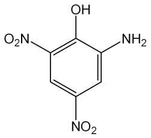

---

강열잔분

1.0 % 이하(1 ｇ, 제1 법)

정량법

이원료를건조하고약　0.12 ｇ을정밀하게달아아연(입상) 2 ｇ, 물15

mL 및염산15 mL에넣어조심하면서증발건고한다음식혀질소정량법제2 법에

따라시험한다.

0.05 mol/L 황산1 mL = 6.637 mg　C6H5N3O5

저장법

기밀용기

피크라민산나트륨

Sodium Picramate

2-아미노4,6-디니트로페놀나트륨

4,6-디니트로2-아미노페놀나트륨

2,4-디니트로6-아미노페놀나트륨

피크람산나트륨

C6H4N3NaO5 : 221.10

이원료를건조한것은정량할때피크라민산나트륨(C6H4N3NaO5) 86.0 % 이상을

함유한다.

성

상

이원료는암적갈색∼적자색의습기가있는가루로서약간냄새가있다.

확인시험

1) 이원료의수용액(1 →100) 3 mL에피로안티몬산칼륨시액2 mL를넣

을때적색을띠는황색∼황색의결정성침전이생긴다. 침전생성을빠르게해주기

위하여유리봉으로시험관의내벽을긁어준다.

2) 이원료의수용액(1 →1000)에묽은염화제이철시액5 방울을넣을때액은흑갈

색을나타낸다.

3) 이원료및염산m-페닐렌디아민표준품각10 mg을이소프로판올ㆍ물ㆍ강암모

니아수(9：3：1) 혼합액1 mL에넣어녹인다음각각에아황산수소나트륨0.1 ｇ을

넣어흔들어섞어검액및표준액으로한다. 검액및표준액1 μL씩을박층판에점

적하고초산에칠ㆍ 메탄올ㆍ 물(50：10：8) 혼합액을전개용매로하여박층크로마

토그래프법에따라시험한다. 발색제로p-디메칠아미노벤즈알데히드ㆍ 묽은염산용

액(1 →200)을뿌릴때염산m-페닐렌디아민표준품에대하여Rs 값0.75 부근에서

단일의등색의반점을나타낸다.

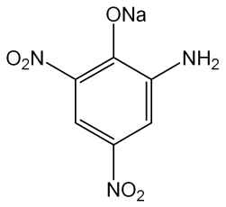

---

4) 이원료20 mg을물에넣어녹여100 mL로한다. 이액5 mL를취하여물을

넣어100 mL로한다. 이액을가지고자외가시부흡광도측정법에따라흡수스펙트럼

을측정할때파장229 ± 2 nm 및312 ± 2 nm 부근에서흡수극대를나타낸다.

순도시험

1) 용해상태

이원료0.1 ｇ을물200 mL에넣어녹일때액은적색이며

맑다.

2) 철

이원료0.5 ｇ을정밀하게달아황산5 방울을넣어적시고천천히가열하

여저온에서거의회화또는휘산시킨다음황산으로적시고완전히회화한다. 식힌

다음잔류물에염산0.5 mL를넣어수욕상에서증발건고한다음묽은염산3 방울을

넣고가온하고물을넣어50.0 mL로하여검액으로한다. 이액10 mL를취하여시

험한다. 비교액에는철표준액2.0 mL를넣는다(0.02 % 이하).

3) 에텔가용물

이원료1 ｇ을정밀하게달아에텔50 mL를넣어환류냉각기를

달아수욕상에서때때로흔들어섞어주면서1 시간끓인다음뜨거울때미리질량

을단플라스크에유리여과기(G3)로여과한다. 잔류물을에텔20 mL로씻고여액및

씻은액을합하여수욕상에서증발건고한다음105 ℃에서30 분간건조시켜질량을

단다(5 % 이하).

4) 납

이원료1.0 ｇ을황산5 mL 및질산20 mL에넣어가만히가열한다. 때때

로질산2 ∼3 mL씩을추가하여액이무색∼엷은황색이될때까지가열한다. 식

힌다음물을넣어10 mL로한다. 이것을검액으로하여시험한다(10 ppm 이하).

5) 비소

이원료1.0 ｇ을황산2 mL 및질산5 mL에넣어가만히가열한다. 때때

로질산2 ∼3 mL씩을추가하여액이무색∼엷은황색이될때까지가열한다. 식

힌다음포화수산암모늄용액15 mL를넣어흰연기가발생할때까지가열한다. 식힌

다음물을넣어10 mL로한다. 이것을검액으로하여시험한다(2 ppm 이하).

건조감량

40.0 % 이하(2 ｇ, 60 ℃, 항량)

정량법

이원료를60 ℃에서항량이될때까지건조하고그약0.13 ｇ을정밀하

게달아아연(입상) 2 ｇ, 물15 mL 및염산15 mL에넣어조심하면서증발건고한

다. 식힌다음질소정량법제2 법에따라시험한다.

0.05 mol/L 황산1 mL = 7.370 mg　C6H4N3NaO5

저장법

기밀용기

헤마테인

Hematein

---

히드록시브라실레인

C16H12O6 : 300.26

이원료는인도산콩과식물Haematoxylon campechianum Linne(Leguminosae)에서

얻어지는것으로서주로헤마테인(C16H12O6) 을함유한다.

성

상

이원료는적갈색∼흑갈색의가루로서특이한냄새가있다.

확인시험

1) 이원료의수용액(1 →1000) 10 mL에염화제이철시액5 방울을넣을

때액은청흑색∼흑회색을나타낸다.

2) 이원료0.1 ｇ을암모니아시액10 mL에넣어녹일때액은적자색∼갈자색을

나타낸다.

순도시험

1) 용해상태

이원료0.1 ｇ을물10 mL에넣어녹일때액은적색이며

거의맑다.

2) 중금속

이원료1.0 ｇ을황산5 mL 및질산20 mL에넣고가만히가열한다.

때때로질산2 ∼3 mL 씩을추가하여액이무색∼엷은황색이될때까지가열한

다. 식힌다음물10 mL 및페놀프탈레인시액1 방울을넣고암모니아시액을액이

엷은적색이될때까지천천히넣은다음묽은초산2 mL를넣고필요하면여과한다.

잔류물을물10 mL로씻고씻은액을여액에합하여물을넣어50 mL로한다. 이것

을검액으로하여시험한다. 비교액에는납표준액2.0 mL를넣는다(20 ppm 이하).

3) 비소

이원료1.0 ｇ을황산2 mL 및질산5 mL에넣어서가만히가열한다. 때

때로질산2 ∼3 mL 씩을추가하여액이무색∼엷은황색이될때까지가열한다.

식힌다음포화수산암모늄용액15 mL를넣어서흰연기가발생할때까지가열한다.

식힌다음물을넣어10 mL로한다. 이것을검액으로하여시험한다(2 ppm 이하).

건조감량

5.0 % 이하(1 ｇ, 실리카겔, 4 시간)

강열잔분

15.0 % 이하(1 ｇ, 제1 법)

저장법

기밀용기

헨나엽가루

Henna Leaf Powder

Pulvis Hennae Folium

이원료는헨나Lawsonia inermis Linn.(= Lawsonia alba)(부처꽃과Lythraceae)의

잎을가루로한것이다.

이원료는정량할때로손(2-hydroxy 1,4-naphtho-quinone, C10H6O3：174.16) 0.5 %

이상을함유한다.

성

상이원료는연한녹색∼녹갈색의가루이고, 흙냄새같은특이한냄새가난

다. 이원료를현미경으로보면녹색∼녹갈색의수많은각질(cuticle) 조각과잎의

유조직체, 수산칼슘단정을볼수있으며, 수산칼슘단정은대부분지름15 mm 정도

이나, 때때로지름40 mm 정도로큰것도있다. 구형의점액세포와내부유관속조

직, 길고가느다란후막조직섬유가있으며, 표피세포에둘러싸인기공과가로무늬

---

각질이있는표피조각이보이고, 때때로융모나비선모조각을볼수있다.

확인시험

1) 이원료를로손으로서약5.0 mg에해당량을정밀하게달아클로로포름

5 mL를넣어2 시간동안초음파처리한다음여과하여검액으로한다. 따로로손표

준품5.0 mg을클로로포름5 mL에녹여표준액으로한다. 이들액을박층크로마토

그래프법에따라시험한다. 검액및표준액2 µL씩을박층크로마토그래프용실리카겔

을써서만든박층판에점적한다. 다음에클로로포름ㆍ메칠에칠케톤ㆍ초산(100)혼합

액(5：4：1)을전개용매로하여약10 cm 전개한다음박층판을바람에말린다. 자

연광아래에서관찰할때여러개의반점중1 개의반점은표준액에서얻은반점과

색상및Rf 값이같다.

2) 아래정량법에따라시험할때검액은표준액과같은유지시간에서피크를나타

낸다.

순도시험

1) 중금속

이원료1.0 g을가지고제3 법에따라조작하여시험한다. 비

교액에는납표준액2.0 mL를넣는다(20 ppm 이하).

2) 비소이원료1.0 g을달아제3 법에따라조작하여시험한다. 다만비교액에는

비소표준액3.0 mL를넣는다(3 ppm 이하).

3) 잔류농약이원료를가지고대한민국약전일반시험법중생약시험법에따라시

험한다.

가) 총디디티(p.p'-DDD, p,p'-DDE, o,p'-DDT 및p,p'-DDT의합) 0.1 ppm 이하.

나) 디엘드린0.01 ppm 이하.

다) 총비에이치씨(α, β, γ 및δ-BHC의합) 0.2 ppm 이하.

라) 알드린0.01 ppm 이하.

마) 엔드린0.01 ppm 이하.

건조감량

10.0 % 이하.

회

분

15.0 % 이하.

산불용성회분

5.0 % 이하.

정량법이원료를로손으로서약30 mg을정밀하게달아이동상을넣어정확하게

100.0 mL로하고30 분동안흔들어추출한다음여과하여여액을검액으로한다.

따로로손표준품약30.0 mg을정밀하게달아이동상을넣어정확하게100.0 mL로

하여표준액으로한다. 검액및표준액5 μL씩을가지고다음조건으로액체크로마

토그래프법에따라시험하여각액의로손피크면적AT 및AS를구한다.

AT

로손(C10H6O3)의양(mg) = 로손표준품의양(mg) ×

AS

조작조건

검출기: 자외부흡광광도계(측정파장248 nm)

칼

럼: 안지름약4 ∼6 mm, 길이15 ∼25 cm인스테인레스강관에5 ∼10

μm 의액체크로마토그래프용옥타데실실릴화한실리카겔을충전한것또

는이와동등한칼럼

칼럼온도: 실온

---

이동상: 물ㆍ아세토니트릴혼합액(3：1)에초산을넣어pH 3.0으로한다.

유

량: 1.0 mL/분

저장법

기밀용기.

황산1-히드록시에칠-4,5-디아미노피라졸

1-Hydroxyethyl-4,5-Diaminopyrazole Sulfate

1-히드록시에틸-4,5-디아미노피라졸황산염

C5H10N4OㆍH2SO4 : 240.24

이원료는정량할때황산1-히드록시에칠-4,5-디아미노피라졸(C5H10N4OㆍH2SO4 :

240.24)을98.0 ∼102 %를함유한다.

성

상

이원료는흰색∼엷은분홍색의가루이다.

확인시험

이원료를가지고적외부스펙트럼측정법브롬화칼륨정제법에따라측정할

때파수3300 cm-1, 3100 cm-1, 2600 cm-1, 1670 cm-1, 1600 cm-1, 1550 cm-1, 1460

cm-1, 1380 cm-1, 1300 cm-1, 1040 cm-1 부근에서흡수극대를나타낸다.

순도시험

1) 중금속

이원료약1.0 ｇ을달아제2 법에따라조작하여시험한다..

비교액에는납표준액1.0 mL를넣는다(10 ppm 이하).

2) 비소

이원료약1.0 ｇ을달아황산2 mL 및질산5 mL에넣고가만히가열

한다. 때때로질산2 ∼3 mL씩을추가하여액이무색∼엷은황색이될때까지가

열한다. 식힌다음포화수산암모늄용액15 mL를넣고흰연기가발생할때까지가열

하고식힌다음물을넣어10 mL로한다. 이것을검액으로하여시험할때다음의표

준색보다진하지않다(5 ppm 이하).

○표준색: 이원료를사용하지않고위검액과같은방법으로조작한다음비소표준

액5.0 mL를넣는다.

건조감량

1 % 이하(2 g, 105 ℃, 2 시간)

정량법

이원료약0.1 g을정밀하게달아증류수60 mL에녹여0.1 mol/L 수산화

나트륨액으로적정한다(지시약: 브롬치몰블루시액). 적정의종말점은액이파란색으로

변할때로한다. 같은방법으로공시험을하여보정한다.

0.1 mol/L 수산화나트륨액1 mL =

24.0 mg C5H10N4OㆍH2SO4

---

황산2-아미노-5-니트로페놀

2-Amino-5-nitrophenol Sulfate

2-아미노-5-니트로페놀황산염

황산5-니트로-o-아미노페놀

황산5-니트로-2-아미노페놀

황산2-아미노-5-니트로페놀

C6H6N2O3ㆍ1/2H2SO4 : 203.16

이원료를건조한것은정량할때황산2-아미노-5-니트로페놀(C6H6N2O3ㆍ1/2H2SO4)

95.0 % 이상을함유한다.

성

상

이원료는녹색을띠는황갈색의가루로서냄새는거의없다.

확인시험

1) 이원료의수용액(1 →2500) 10 mL에염화제이철시액5 방울을넣을

때액은황갈색을나타낸다.

2) 이원료0.5 ｇ을물100 mL에넣어녹여여과한다. 여액5 mL에염화바륨시액

5 방울을넣을때백탁이된다.

3) 이원료및p-니트로아닐린표준품각10 mg을이소프로판올ㆍ물ㆍ강암모니아수

(9：3：1) 혼합액1 mL씩에넣어녹인다음각각에아황산수소나트륨0.1 ｇ을넣어

흔들어섞어검액및표준액으로한다. 검액및표준액1 μL를박층판에점적하고

이소프로필에텔ㆍ아세톤ㆍ이소프로판올(10：1：1) 혼합액을전개용매로하여박층크

로마토그래프법에따라시험한다. 발색제로p-디메칠아미노벤즈알데히드ㆍ묽은염산

용액(1 →200) 을뿌릴때p-니트로아닐린표준품에대하여Rs 값1.0 부근에서주

황색의반점을나타낸다.

4) 이원료20 mg을물100 mL에넣어녹이고이액10 mL를취하여물을넣어

100 mL로한다. 이액을가지고자외가시부흡광도측정법에따라흡수스펙트럼을측

정할때파장257 ± 2 nm 에서흡수극대를나타낸다.

순도시험

1) 용해상태

이원료0.1 ｇ을묽은염산20 mL에넣어녹일때액은황색

을나타내며맑다.

2) 철

이원료1.0 ｇ을정밀하게달아황산5 방울을넣어적시고천천히가열하

여저온에서거의회화또는휘산시킨다음다시황산으로적시고완전히회화한다.

식힌다음잔류물에염산0.5 mL를넣고수욕상에서증발건고한다. 잔류물에묽은염

산3 방울을넣어가온하고물25 mL를넣어녹인다. 이것을검액으로하여시험한

다. 비교액에는철표준액2.0 mL를넣는다(20 ppm 이하).

3) 중금속

이원료1.0 ｇ을황산5 mL 및질산20 mL에넣고가만히가열한다.

---

때때로질산2 ∼3 mL씩을추가하여액이무색∼엷은황색이될때까지가열한

다. 식힌다음물10 mL 및페놀프탈레인시액1 방울을넣고암모니아시액을액이

엷은적색이될때까지천천히넣고묽은초산2 mL를넣고필요하면여과한다. 잔류

물을물10 mL로씻고씻은액을여액과합하고물을넣어50 mL로한다. 이것을

검액으로하여시험한다. 비교액에는납표준액3.0 mL를넣는다(30 ppm이하).

4) 비소

이원료1.0 ｇ을황산2 mL 및질산5 mL에넣어가만히가열한다. 때때

로질산2 ∼3 mL 씩을추가하여액이무색∼엷은황색이될때까지가열한다.

식힌다음포화수산암모늄용액15 mL를넣고흰연기가발생할때까지가열한다. 식

힌다음물을넣어서10 mL로한다. 이것을검액으로하여시험한다(2 ppm 이하).

건조감량

5.0 % 이하(1.5 ｇ, 105 ℃, 2 시간)

강열잔분

0.2 % 이하(2 ｇ, 제2 법)

정량법

이원료를105 ℃에서2 시간건조하고그약0.18 ｇ을정밀하게달아아

연(입상) 2 ｇ, 물15 mL 및염산15 mL에넣어조심하면서증발건고한다. 식힌다

음질소정량법에따라시험한다.

0.05 mol/L 황산1 mL = 10.158 mg C6H6N2O3ㆍ1/2H2SO4

저장법

기밀용기

황산5-아미노-o-크레솔

5-Amino-o-Cresol Sulfate

5-아미노-o-크레솔황산염

C7H9NO ㆍ 1/2H2SO4 :

172.19

이원료를건조한것은정량할때황산5-아미노-o-크레솔(C7H9NO ㆍ 1/2H2SO4)

95.0 % 이상을함유한다.

성

상

이원료는흰색∼엷은갈색의결정또는결정성가루로냄새는거의없다.

확인시험

1) 이원료의수용액(1 →200) 5 mL에염화제이철시액5 방울을넣을때

액은황갈색을나타낸다.

2) 이원료의수용액( 1 →200) 5 mL에염화바륨시액5 방울을넣을때액은백탁

이된다.

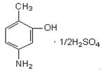

---

3) 이원료및p-니트로아닐린표준품각10 mg을이소프로판올ㆍ물ㆍ강암모니아수

(9：3：1) 혼합액1 mL에넣어녹인다음각각에아황산수소나트륨0.1 ｇ을넣어

흔들어섞은다음검액및표준액으로한다. 검액및표준액1 μL를박층판에점적

하고이소프로필에텔ㆍ아세톤ㆍ이소프로판올(10：1：1)

혼합액을전개용매로하여

박층크로마토그래프법에따라시험한다. 발색제로p-디메칠아미노벤즈알데히드ㆍ묽

은염산용액(1 →200)을뿌릴때p-니트로아닐린표준품에대하여Rs 값0.7 부근에

황색의반점을나타낸다.

4) 이원료50 mg을물에넣어녹여100 mL로한다. 이액10 mL를취하여물을

넣어100 mL로한다. 이액을가지고자외가시부흡광도측정법에따라흡수스펙트럼

을측정할때파장273 ± 2 nm에서흡수극대를나타낸다.

순도시험

1) 용해상태

이원료0.5 ｇ을묽은염산20 mL에넣어녹일때액은무색

∼엷은황갈색을나타내며거의맑다.

2) 에텔가용물

이원료1.0 ｇ을달아에텔50 mL에넣고환류냉각기를달아수욕

중에서때때로흔들어주면서1 시간끓인다. 뜨거울때미리질량을단플라스크에

유리여과기(G3)로여과한다. 잔류물을에텔20 mL로씻고씻은액및여액을합하여

수욕상에서증발건고하고105 ℃에서30 분간건조하여질량을단다(1.0 % 이하).

3) 철

이원료1.0 ｇ을달아황산5 방울을넣어적시고천천히가열하여낮은온

도에서거의회화또는휘산시킨다음다시황산을넣어적시고완전히회화한다. 식

힌다음잔류물에염산0.5 mL를넣고수욕상에서증발건고한다음묽은염산3 방울

을넣어가온하고물을넣어25 mL로한다. 이것을검액으로하여시험한다. 비교액

에는철표준액2.0 mL를넣는다(20 ppm 이하).

4) 중금속

이원료1.0 ｇ을달아황산5 mL 및질산20 mL를넣고가만히가열

한다. 때때로질산2 ∼3 mL씩을추가하여액이무색∼엷은황색이될때까지가

열을계속한다. 식힌다음물10 mL 및페놀프탈레인시액1 방울을넣고암모니아시

액을액이엷은적색이될때까지천천히넣고묽은초산2 mL를넣고필요하면여

과한다. 잔류물을물10 mL로씻고씻은액은여액과합하고물을넣어50 mL로한

다. 이것을검액으로하여시험한다. 비교액에는납표준액2.0 mL를넣는다(20 ppm

이하).

4) 비소

이원료1.0 ｇ을정밀하게달아황산2 mL 및질산5 mL에넣어가만히

가열한다. 때때로질산2 ∼3 mL씩을추가하면서액이무색∼엷은황색이될때

까지가열을계속한다. 식힌다음포화수산암모늄용액15 mL를넣어흰연기가발생

할때까지가열한다. 식힌다음물을넣어10 mL로한다. 이것을검액으로하여시

험한다(2 ppm 이하).

건조감량

1.0 % 이하(1 ｇ, 105 ℃, 2 시간)

강열잔분

0.2 % 이하(1 ｇ, 제1 법)

정량법

이원료를건조하여약0.31 ｇ을정밀하게달아질소정량법에따라시험한다.

0.05 mol/L 황산1 mL = 17.219 mg C7H9NOㆍ1/2H2SO4

---

저장법

기밀용기

황산m-아미노페놀

m-Aminophenol Sulfate

m-아미노페놀황산염

황산3-아미노페놀

C6H7NOㆍ1/2H2SO4 :

158.17

이원료를건조한것은정량할때황산m-아미노페놀(C6H7NOㆍ1/2H2SO4) 97.0 %

이상을함유한다.

성

상

이원료는흰색∼회색의결정성가루또는침상결정으로특이한냄새가있다.

확인시험

1) 이원료의수용액(1 →100) 10 mL에염화제이철시액5 방울을넣을때

액은자갈색∼엷은자색을나타낸다.

2) 이원료의수용액(1 →1000) 5 mL에묽은염산2 mL 및아질산나트륨시액3

mL를넣고여기에2, 4-디니트로페놀용액(1 →1000) 0.5 mL를넣을때액은주황

색을나타낸다.

3) 이원료의수용액(1 →100) 10 mL에염화바륨시액5 방울을넣을때액은백탁

이된다.

4) 이원료50 mg을물100 mL에넣어녹이고이액10 mL를취하여물을넣어

100 mL로한다. 이액을가지고자외가시부흡광도측정법에따라흡수스펙트럼을측

정할때파장272 ± 2 nm 및277 ± 2 nm 에서흡수극대를나타낸다.

5) 이원료및m-아미노페놀표준품각10 mg을이소프로판올ㆍ물ㆍ강암모니아수

(9：3：1) 혼합액1 mL에넣어녹인다음각각에아황산수소나트륨0.1 ｇ을넣어

흔들어섞어검액및표준액으로한다. 검액및표준액1 μL씩을박층판에점적하고

이소프로필에텔ㆍ아세톤ㆍ이소프로판올(10：1：1) 혼합액을전개용매로하여박층크

로마토그래프법에따라시험한다. 발색제로p-디메칠아미노벤즈알데히드ㆍ묽은염산

용액(1 →200)을뿌릴때표준품과같은Rf값에서황색의반점을나타낸다.

순도시험

1) 용해상태

이원료0.5 ｇ을물50 mL에넣어녹일때액은무색이며

맑다.

2) 철

이원료0.5 ｇ을달아황산5 방울을넣어적시고천천히가열하여저온에

서거의회화또는휘산시킨다음황산으로적시고완전히회화한다. 식힌다음잔류

물에염산0.5 mL를넣고수욕상에서증발건고한다. 잔류물에묽은염산3 방울을넣

어가온하고물을넣어녹여25 mL로한다. 이것을검액으로하여시험한다. 비교액

에는철표준액2.0 mL를넣는다(40 ppm 이하).

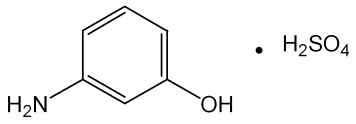

---

3) 에텔가용물

이원료약1 ｇ을정밀하게달아에텔50 mL에넣고환류냉각기

를달아수욕상에서때때로흔들어섞으면서1 시간끓인다음뜨거울때미리질량

을단플라스크에유리여과기(G3)로여과한다. 잔류물을에텔20 mL로씻고씻은액

및여액을합하여수욕상에서증발건고하고105 ℃에서30 분간건조하여질량을

단다(1 % 이하).

4) 중금속

이원료1.0 ｇ을황산5 mL 및질산20 mL에넣어가만히가열한다.

때때로질산2 ∼3 mL씩을추가하여액이무색∼엷은황색이될때까지가열한

다. 식힌다음물10 mL 및페놀프탈레인시액1 방울을넣고암모니아시액을액이

엷은적색이될때까지천천히넣고묽은초산2 mL를넣고필요하면여과한다. 잔류

물을물10 mL로씻고씻은액을여액과합하고물을넣어50 mL로한다. 이것을

검액으로하여시험한다. 비교액에는납표준액2.0 mL를넣는다(20 ppm 이하).

5) 비소

이원료1.0 ｇ을황산2 mL 및질산5 mL에넣어가만히가열한다. 때때

로질산2 ∼3 mL씩을추가하여액이무색∼엷은황색이될때까지가열하고식

힌다음포화수산암모늄용액15 mL를넣어흰연기가발생할때까지가열한다. 식힌

다음물을넣어10 mL로한다. 이것을검액으로하여시험한다(2 ppm 이하).

건조감량

0.2 % 이하(1.5 ｇ, 105 ℃, 2 시간)

강열잔분

0.2 % 이하(2 ｇ, 제2 법)

정량법

이원료를건조하고약0.28 ｇ을정밀하게달아질소정량법에따라시험한다.

0.05 mol/L 황산1 mL = 15.816 mg C6H7NOㆍ1/2H2SO4

저장법

기밀용기

황산o-아미노페놀

o-Aminophenol Sulfate

o-아미노페놀황산염

황산2-아미노페놀

C6H7NOㆍ1/2H2SO4 :

158.17

이원료를건조한것은정량할때황산o-아미노페놀(C6H7NO ㆍ 1/2H2SO4) 95.0 %

이상을함유한다.

성

상

이원료는흰색∼엷은갈색의결정성가루로서냄새는없거나약간특이한

---

냄새가있다.

확인시험

1) 이원료의수용액(1 →100) 10 mL에염화제이철시액5 방울을넣을때

액은적자색∼진한갈색을나타낸다.

2) 이원료의수용액(1 →100) 10 mL에질산은시액5 방울을넣을때액은황갈색

을나타내며서서히회흑색으로변하며혼탁한다.

3) 이원료의수용액(1 →100) 10 mL에염화바륨시액5 방울을넣을때액은백탁

이된다.

4) 이원료및p-니트로아닐린표준품각10 mg 을이소프로판올ㆍ 물ㆍ 강암모

니아수(9：3：1) 혼합액1 mL에넣어녹인다음각각에아황산수소나트륨0.1 ｇ을

넣어흔들어섞어검액및표준액으로한다. 검액및표준액1 μL씩을박층판에점

적하고이소프로필에텔ㆍ 아세톤ㆍ 이소프로판올(10：1：1) 혼합액을전개용매로

하여박층크로마토그래프법에따라시험한다. 발색제로p-디메칠아미노벤즈알데히드

ㆍ 묽은염산용액(1 →200) 을뿌릴때p-니트로아닐린표준품에대하여Rs 값1.0

부근에서황색의반점을나타낸다.

5) 이원료50 mg을물100 mL에넣어녹이고이액10 mL를취하여물을넣어

100 mL로한다. 이액을가지고자외가시부흡광도측정법에따라흡수스펙트럼을측

정할때파장272 ± 2 nm 에서흡수극대를나타낸다.

순도시험

1) 용해상태

이원료0.1 ｇ을묽은염산10 mL에넣어녹일때액은주황

색을띤갈색이고맑다.

2) 에텔가용물

이원료약1 ｇ을정밀하게달아에텔50 mL에넣어환류냉각기

를달아수욕상에서때때로흔들어섞으면서1 시간끓인다음뜨거울때미리질량

을단플라스크에유리여과기(G3)로여과한다. 잔류물을에텔20 mL로씻고씻은액

및여액을합하여수욕상에서증발건고하고105 ℃에서30 분간건조하여질량을

단다(1 % 이하).

3) 철

이원료0.50 ｇ을달아황산5 방울을넣어적시고천천히가열하여저온에

서거의회화또는휘산시킨다음다시황산으로적시고완전히회화한다. 식힌다음

잔류물에염산0.5 mL를넣고수욕상에서증발건고한다. 잔류물에묽은염산3 방울

을넣고가온하여물을넣어50 mL로한다. 이액25 mL를취하여검액으로하여

시험한다. 비교액에는철표준액2.0 mL를넣는다(80 ppm 이하).

4) 중금속

이원료1.0 ｇ을황산5 mL 및질산20 mL에넣어가만히가열한다.

때때로질산2 ∼3 mL씩을추가하여액이무색∼엷은황색이될때까지가열한

다. 식힌다음물10 mL 및페놀프탈레인시액1 방울을넣고암모니아시액을액이

엷은적색이될때까지천천히넣고묽은초산2 mL를넣고필요하면여과한다. 잔류

물을물10 mL로씻고씻은액을여액과합하여물을넣어50 mL로한다. 이것을

검액으로하여시험한다. 비교액에는납표준액2.0 mL를넣는다(20 ppm 이하).

5) 비소

이원료1.0 ｇ을황산2 mL 및질산5 mL에넣어가만히가열한다. 때때

로질산2 ∼3 mL씩을추가하여액이무색∼엷은황색이될때까지가열한다. 식

힌다음포화수산암모늄용액15 mL를넣고흰연기가발생할때까지가열한다. 식힌

다음물을넣어10 mL로한다. 이액을검액으로하여시험한다(2 ppm 이하).

---

건조감량

0.3 % 이하(2 ｇ, 105 ℃, 2 시간)

강열잔분

1.0 % 이하(2 ｇ, 제2 법)

정량법

이원료를건조하고약0.28 ｇ을정밀하게달아질소정량법에따라시험한다.

0.05 mol/L 황산1 mL = 15.816 mg C6H7NOㆍ1/2H2SO4

저장법

기밀용기

황산p-아미노페놀

p-Aminophenol Sulfate

p-아미노페놀황산염

황산4-아미노페놀

C6H7NO ㆍ 1/2H2SO4 :

158.17

이원료를건조한것은정량할때황산p-아미노페놀(C6H7NO ㆍ 1/2H2SO4) 95.0 %

이상을함유한다.

성

상

이원료는흰색∼엷은회갈색의가루또는침상결정으로서냄새는거의

없다.

확인시험

1) 이원료의수용액(1 →100) 10 mL에염화제이철시액5 방울을넣을때

액은자색을나타낸다.

2) 이원료의수용액(1 →100) 10 mL에인텅그스텐산용액(1 →100) 2 mL 및탄산

나트륨시액1 mL를넣을때액은청자색을나타낸다.

3) 이원료의수용액(1 →100) 5 mL에니트로프루싯나트륨시액2 mL를넣을때

액은엷은녹색을나타낸다.

4) 이원료의수용액(1 →100) 10 mL에염화바륨시액5 방울을넣을때액은백탁

이된다.

5) 이원료및p-아미노페놀표준품각10 mg을이소프로판올ㆍ 물ㆍ 강암모니아

수(9：3：1) 혼합액1 mL에넣어녹인다음각각에아황산수소나트륨0.1 ｇ을넣어

흔들어섞은다음검액및표준액으로한다. 검액및표준액1 μL씩을박층판에점

적하고이소프로필에텔ㆍ 아세톤ㆍ 이소프로판올(10：1：1) 혼합액을전개용매로

하여박층크로마토그래프법에따라시험한다. 발색제로p-디메칠아미노벤즈알데히드

ㆍ 묽은염산용액(1 →200) 을뿌릴때표준품과같은Rf값에서황색의반점을나타

낸다.

6) 이원료50 mg을물100 mL에넣어녹이고이액10 mL를취하여물을넣어

---

100 mL로한다. 이액을가지고자외가시부흡광도측정법에따라흡수스펙트럼을측

정할때파장273 ± 2 nm 에서흡수극대를나타낸다.

순도시험

1) 용해상태

이원료0.5 ｇ을묽은염산20 mL에넣어녹일때액은무

색이며맑다.

2) 철

이원료1.0 ｇ을달아황산5 방울을넣어적시고천천히가열하여저온에

서거의회화또는휘산시킨다음다시황산을넣어적시고완전히회화한다. 식힌

다음잔류물에염산0.5 mL를넣어수욕상에서증발건고한다음묽은염산3 방울을

넣어가온하여물25 mL를넣어녹인다. 이것을검액으로하여시험한다. 비교액에

는철표준액3.0 mL를넣는다(30 ppm 이하).

3) 에텔가용물

이원료

1 ｇ을달아에텔50 mL를넣고환류냉각기를달아수욕

상에서때때로흔들어섞으면서1 시간끓인다음뜨거울때미리질량을단플라스

크에유리여과기(G3)로여과한다. 잔류물을에텔20 mL로씻고씻은액및여액을

합하여수욕상에서증발건고하고105 ℃에서30 분간건조시켜질량을단다(1 %

이하).

4) 중금속

이원료1.0 ｇ을황산5 mL 및질산20 mL에넣어가만히가열한다.

때때로질산2 ∼3 mL 씩을추가하여액이무색∼엷은황색이될때까지가열한

다. 식힌다음물10 mL 및페놀프탈레인시액1 방울을넣고암모니아시액을액이

엷은적색이될때까지천천히넣고묽은초산2 mL를넣고필요하면여과한다. 잔류

물을물10 mL로씻고씻은액을여액과합하고물을넣어50 mL로한다. 이것을

검액으로하여시험한다. 비교액에는납표준액2.0 mL를넣는다(20 ppm 이하).

5) 비소

이원료1.0 ｇ을황산2 mL 및질산5 mL에넣어가만히가열한다. 때때

로질산2 ∼3 mL 씩을추가하여액이무색∼엷은황색이될때까지가열한다.

식힌다음포화수산암모늄용액15 mL를넣고흰연기가발생할때까지가열한다. 식

힌다음물을넣어10 mL로한다. 이것을검액으로하여시험한다(2 ppm 이하).

건조감량

0.2 % 이하(1.5 ｇ, 105 ℃, 2 시간)

강열잔분

0.2 % 이하(2 ｇ, 제2 법)

정량법

이원료를건조하고약0.28 ｇ을정밀하게달아질소정량법에따라시험한다.

0.05 mol/L 황산1 mL = 15.816 mg C6H7NO ㆍ 1/2H2SO4

저장법

기밀용기

황산m-페닐렌디아민

m-Pheylenediamine sulfate

---

m-페닐렌디아민황산염

황산1,3-페닐렌디아민

C6H8N2ㆍH2SO4 :

206.22

이원료를건조한것은정량할때황산m-페닐렌디아민(C6H8N2ㆍH2SO4) 90.0 % 이

상을함유한다.

성

상

이원료는흰색∼엷은갈색의가루로서약간특이한냄새가있다.

확인시험

1) 이원료의수용액(1 →100) 5 mL에질산은시액5 방울을넣어가열하

면액은엷은자색을나타낸다.

2) 이원료의수용액(1 →100) 10 mL에아질산나트륨시액2 방울을넣을때액은

적갈색을나타낸다.

3) 이원료의수용액(1 →100) 5 mL에염화바륨시액5 방울을넣을때흰색의침

전이생긴다.

4) 이원료20 mg을물에넣어녹여100 mL로한다. 이액10 mL를취하여물을

넣어100 mL로하여이액을가지고자외가시부흡광도측정법에따라흡수스펙트럼

을측정할때파장235 ± 2 nm 및285 ± 2 nm 에서흡수극대를나타낸다.

5) 이원료및염산m-페닐렌디아민표준품각10 mg을이소프로판올ㆍ 물ㆍ 강

암모니아수(9：3：1) 혼합액1 mL 씩에넣어녹인다음각각에아황산수소나트륨

0.1 ｇ을넣어흔들어섞어검액및표준액으로한다. 검액및표준액1 μL를박층판

에점적하고이소프로필에텔ㆍ아세톤ㆍ이소프로판올(10：1：1) 혼합액을전개용매로

하여박층크로마토그래프법에따라시험한다. 발색제로p-디메칠아미노벤즈알데히드

ㆍ묽은염산용액(1 →200)을뿌릴때표준품과같은Rf 값에서적색을띠는황색의

반점을나타낸다.

순도시험

1) 용해상태

이원료0.5 ｇ을묽은염산1 mL에넣어녹일때액은엷은

주황색이며맑다.

2) 철

이원료1.0 ｇ을정밀하게달아황산5 방울을넣어적시고천천히가열하

여저온에서거의회화또는휘산시킨다음다시황산을넣어적시고완전히회화한

다. 식힌다음잔류물에염산0.5 mL를넣고수욕상에서증발건고한다음잔류물에

묽은염산3 방울을넣어가온하고물25 mL를넣어녹인다. 이것을검액으로하여

시험한다. 비교액에는철표준액2.0 mL를넣는다(20 ppm 이하).

3) 에텔가용물

이원료약1 ｇ을정밀하게달아에텔50 mL에넣고환류냉각기

를달아수욕상에서유리여과기(G3)로여과한다. 잔류물을에텔20 mL로씻고씻은

액및여액을합하여수욕상에서증발건고하고105 ℃에서30 분간건조하여질량

을단다(1 % 이하).

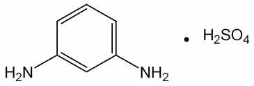

---

4) 중금속

이원료1.0 ｇ을황산5 mL 및질산20 mL에넣어가만히가열한다.

때때로질산2 ∼3 mL씩을추가하여액이무색∼엷은황색이될때까지가열하

고식힌다음물10 mL 및페놀프탈레인시액1 방울을넣고암모니아시액을액이

엷은적색이될때까지천천히넣고묽은초산2 mL를넣고필요하면여과한다. 잔류

물을물10 mL로씻고씻은액을여액과합하고물을넣어50 mL로한다. 이것을

검액으로하여시험한다. 비교액에는납표준액2.0 mL를넣는다(20 ppm 이하).

5) 비소

이원료1.0 ｇ을황산2 mL 및질산5 mL에넣어가만히가열한다. 때때

로질산2 ∼3 mL씩을추가하여액이무색∼엷은황색이될때까지가열한다. 식

힌다음포화수산암모늄용액15 mL를넣어흰연기가발생할때까지가열한다. 식힌

다음물을넣어10 mL로한다. 이것을검액으로하여시험한다(2 ppm 이하).

건조감량

0.2 % 이하(1.5 ｇ, 실리카겔, 4 시간)

강열잔분

0.2 % 이하(2 ｇ, 제1 법)

정량법이원료를건조하고약0.18 ｇ을정밀하게달아질소정량법에따라시험한다.

0.05 mol/L 황산1 mL = 10.311 mg　C6H8N2ㆍH2SO4

저장법

기밀용기

황산N,N-비스(2-히드록시에칠)-p-페닐렌디아민

N,N-Bis(2-hydroxyethyl)-p-phenylenediamine Sulfate

N,N-비스(2-히드록시에틸)-p-페닐렌디아민황산염

N,N-비스(2-히드록시에칠)-p-페닐렌디아민설페이트

2,2‘-[(4-아미노페닐)이미노]비스에탄올설페이트

C10H18N2O6S : 294.32

이원료를건조한것은정량할때황산N,N-비스(2-히드록시에칠)-p-페닐렌디아민

(C10H18N2O6S) 95.0 % 이상을함유한다.

성

상

이원료는회백색, 밝은회색또는분홍색의결정또는가루이며냄새는거

의없다.

확인시험

1) 이원료및황산N,N-비스(2-히드록시에칠)-p-페닐렌디아민표준품을가

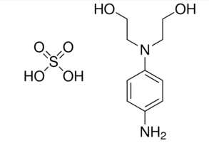

---

지고적외부스펙트럼측정법중페이스트법에따라적외부스펙트럼을측정할때같은

파수에서같은강도의흡수를나타낸다.

2) 이원료약10 mg을50 % 메탄올1 mL에넣어녹여검액으로한다. 따로황산

N,N-비스(2-히드록시에칠)-p-페닐렌디아민표준품약10 mg을50 % 메탄올1 mL에

넣어녹여표준액으로한다. 검액및표준액5 μL씩을취하여박층판에점적하고에

텔을전개용매로박층크로마토그래프법에따라시험한다. 박층판을70 ℃에서1분간

방치하고발색제로p-디메칠아미노벤즈알데히드ㆍ묽은염산용액(0.5 →100)을뿌릴

때검액및표준액의반점은같은Rf 값에서같은색상을나타낸다.

융

점

163 ∼171 ℃(제1 법)

순도시험

1) 용해상태

이원료약0.1 g을묽은염산10 mL에넣어녹일때액은

무색을나타내며거의맑다.

2) 철

이원료1.0 g을달아황산5 방울을넣어적시고천천히가열하여저온에서

거의회화또는휘산시킨다음다시황산으로적시고완전히회화한다. 식힌다음잔

류물에염산0.5 mL를넣어수욕상에서증발건고하고잔류물에묽은염산3 방울을

넣고가온한다음물을넣어50.0 mL로한다. 이액10 mL를취하여검액으로한다.

비교액에는철표준액2.0 mL를넣는다(100 ppm 이하).

3) 중금속

이원료1.0 g을황산2 mL 및질산20 mL에넣어가만히가열한다.

때때로질산2 ∼3 mL씩을추가하여액이무색∼엷은황색이될때까지가열한

다. 식힌다음물10 mL 및페놀프탈레인시액1 방울을넣고암모니아시액을액이

엷은적색이될때까지한방울씩넣고필요하면여과하여물10 mL로씻고여액과

씻은액을네슬러관에넣어물을넣어50 mL로한다. 이것을검액으로한다. 비교액

에는납표준액2.0 mL를넣는다(20 ppm 이하).

4) 비소

이원료1.0 g을황산2 mL 및질산5 mL에넣어가만히가열한다. 때때

로질산2 ∼3 mL씩을추가하여액이무색∼엷은황색이될때까지가열한다.

식힌다음포화수산암모늄용액15 mL를넣고흰연기가발생할때까지가열한다음

식히고물을넣어10 mL로한다. 이것을검액으로하여시험한다(2 ppm 이하).

건조감량

6.5 % 이하(1 g, 황산, 4시간)

강열잔분

2.0 % 이하(2 g, 제1 법)

정량법이원료를건조하고약0.3 g을정밀하게달아질소정량법제2 법에따라

시험한다.

0.05 mol/L 황산1 mL = 14.7165 mg C10H18N2O6S

저장법

기밀용기

황산o-클로로-p-페닐렌디아민

o-Chloro-p-pheylenediamine Sulfate

---

o-클로로-p-페닐렌디아민황산염

황산2-클로로-p-페닐렌디아민

황산2-클로로-1,4-페닐렌디아민

C6H7ClN2

ㆍH2SO4

: 240.66

이원료를건조한것은정량할때황산o-클로로-p-페닐렌디아민(C6H7ClN2ㆍH2SO4)

95.0 % 이상을함유한다.

성

상

이원료는엷은자색∼자색의가루로서약간특이한냄새가있다.

확인시험

1) 이원료1 ｇ을물100 mL에넣어잘흔들어섞은다음여과하여여액

을검액으로한다. 검액5 mL에질산은시액5 방울을넣고가온할때액은자갈색을

나타낸다.

2) 1)의검액5 mL에염화바륨시액5 방울을넣을때액은흰색의침전이생긴다.

3) 1)의검액3 mL에풀푸랄ㆍ초산시액4 방울을넣을때액은주황색을나타낸다.

4) 이원료0.2 ｇ에물1 방울을넣어적시고구리망에묻혀식품첨가물공전일반

시험법중염색반응시험법에따라시험할때녹색을나타낸다.

5) 이원료및염산m-페닐렌디아민표준품각10 mg을이소프로판올ㆍ물ㆍ강암모

니아수(9：3：1) 혼합액1 mL에넣어녹인다음각각에아황산수소나트륨0.1 ｇ을

넣어흔들어섞어검액및표준액으로한다. 검액및표준액1 mL를박층판에점적

하고이소프로필에텔ㆍ아세톤ㆍ이소프로판올(10：1：1) 혼합액을전개용매로하여박

층크로마토그래프법에따라시험한다. 발색제로p-디메칠아미노벤즈알데히드ㆍ묽은

염산용액(1 →200) 을뿌릴때염산m-페닐렌디아민표준품에대하여Rs 값1.8 부

근에서주황색∼적색의반점을나타낸다.

6) 이원료10 mg을물100 mL에넣어녹이고이액10 mL를취하여물을넣어

100 mL로한다. 이액을가지고자외가시부흡광도측정법에따라흡수스펙트럼을측

정할때파장238 ± 2 nm 및292 ± 2 nm에서흡수극대를나타낸다.

순도시험

1) 용해상태

이원료0.2 ｇ을묽은염산20 mL에넣어녹일때액은어두

운적색∼엷은적자색이며거의맑다.

2) 철

이원료1.0 ｇ을달아황산5 방울을넣어적시고천천히가열하고저온에

서거의회화또는휘산시킨다음다시황산을넣어적시고완전히회화한다. 식힌

다음잔류물에염산0.5 mL를넣어수욕상에서증발건고한다. 잔류물에묽은염산3

방울을넣고가온하여물25 mL를넣어녹인다. 이것을검액으로하여시험한다. 비

교액에는철표준액2.0 mL를넣는다(20 ppm 이하).

3) 에텔가용물

이원료1 ｇ을달아에텔50 mL에넣고환류냉각기를달아수욕

상에서때때로흔들어섞으면서1 시간끓인다음뜨거울때미리질량을단플라스

크에유리여과기(G3)로여과하고잔류물을에텔20 mL로씻고씻은액및여액을

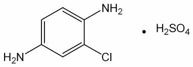

---

합하여수욕상에서증발건고한다음105 ℃에서30 분간건조하여질량을단다(3

% 이하).

4) 중금속

이원료1.0 ｇ을황산5 mL 및질산20 mL에넣어가만히가열한다.

식힌다음물10 mL 및페놀프탈레인시액1 방울을넣고암모니아시액을액이엷은

적색이될때까지천천히넣고묽은초산2 mL를넣고필요하면여과한다. 잔류물을

물10 mL로씻고씻은액을여액과합하고물을넣어50 mL로한다. 이것을검액으

로하여시험한다. 비교액에는납표준액2.0 mL를넣는다(20 ppm 이하).

5) 비소

이원료1.0 ｇ을황산2 mL 및질산5 mL에넣어가만히가열한다. 때때

로질산2 ∼3 mL 씩을추가하여액이무색∼엷은황색이될때까지가열한다.

식힌다음포화수산암모늄용액15 mL를넣어흰연기가발생할때까지가열한다. 식

힌다음물을넣어10 mL로한다. 이것을검액으로하여시험한다(2 ppm 이하).

건조감량

1.0 % 이하(1 ｇ, 105 ℃, 2 시간)

강열잔분

2.0 % 이하(1 ｇ, 제1 법)

정량법

이원료를건조하고약0.21 ｇ을정밀하게달아질소정량법에따라시험한다.

0.05 mol/L 황산1 mL = 12.033 mg　C6H7ClN2ㆍH2SO4

저장법

기밀용기

---

황산p-니트로-o-페닐렌디아민

p-Nitro-o-Phenylenediamine Sulfate

p-니트로-o-페닐렌디아민황산염

황산4-니트로-o-페닐렌디아민

황산4-니트로-1,2-페닐렌디아민

C6H7N3O2

ㆍ1/2H2SO4 : 202.18

이

원료를

건조한

것은

정량할

때

황산

p-니트로-o-페닐렌디아민(C6H7N3O2

ㆍ

1/2H2SO4) 97.0 % 이상을함유한다.

성

상

이원료는다갈색∼회갈색의가루로서냄새는거의없다.

확인시험

1) 이원료0.5 ｇ을물100 mL에넣어녹이고여과한다. 여액5 mL에염

화바륨시액5 방울을넣을때액은백탁이된다.

2) 이원료10 mg을물에녹여100 mL로한다. 이액20 mL를취하여물을넣어

100 mL로한다. 이액을가지고자외가시부흡광도측정법에따라흡수스펙트럼을측

정할때파장264 ± 2 nm 에서흡수극대를나타낸다.

3) 이원료및p-니트로아닐린표준품각10 mg 을이소프로판올ㆍ물ㆍ강암모니아

수(9：3：1) 혼합액1 mL에넣어녹인다음각각에아황산수소나트륨0.1 ｇ을넣어

흔들어섞어검액및표준액으로한다. 검액및표준액1 μL씩을박층판에점적하고

이소프로필에텔ㆍ 아세톤ㆍ 이소프로판올(10：1：1) 혼합액을전개용매로하여박

층크로마토그래프법에따라시험한다. 발색제로p-디메칠아미노벤즈알데히드ㆍ 묽

은염산용액(1 →200) 을뿌릴때p-니트로아닐린표준품에대하여Rf 값0.7 부근에

서적색을띠는황색∼황색의반점을나타낸다.

순도시험

1) 용해상태

이원료50 mg을물100 mL에넣어녹일때액은황갈색이

고거의맑다.

2) 에텔가용물

이원료1 ｇ을달아에텔50 mL에넣고환류냉각기를달아수욕

상에서때때로흔들어섞으면서1 시간끓인다음뜨거울때미리질량을단플라스

크에유리여과기(G4)로여과한다. 잔류물을에텔20 mL로씻고씻은액및여액을

합하여수욕상에서증발건고하고105 ℃에서30 분간건조시켜질량을단다(1 %

이하).

3) 철

이원료0.4 ｇ을달아황산5 방울을넣어적시고천천히가열하여저온에

서거의회화또는휘산시킨다음다시황산을넣어적시고완전히회화한다. 식힌

다음잔류물에염산0.5 mL를넣어수욕상에서증발건고한다음묽은염산3 방울을

넣고가온하여25 mL를넣어녹인다. 이것을검액으로하여시험한다. 비교액에는

철표준액2.0 mL를넣는다(50 ppm 이하).

---

4) 비소

이원료1.0 ｇ을황산2 mL 및질산5 mL에넣어가만히가열한다. 때때

로질산2 ∼3 mL 씩을추가하여액이무색∼엷은황색이될때까지가열한다.

식힌다음포화수산암모늄용액15 mL를넣어흰연기가발생할때까지가열한다. 식

힌다음물을넣어10 mL로한다. 이것을검액으로하여시험한다(2 ppm 이하).

5) 중금속

이원료1.0 ｇ을황산5 mL 및질산20 mL에넣어가만히가열한다.

때때로질산2 ∼3 mL 씩을추가하여액이무색∼엷은황색이될때까지가열한

다. 식힌다음물10 mL 및페놀프탈레인시액1 방울을넣고암모니아시액을액이

엷은적색이될때까지천천히넣고묽은초산2 mL를넣고필요하면여과한다. 잔류

물을물10 mL로씻고씻은액을여액과합하면물을넣어50 mL로한다. 이것을

검액으로하여시험한다(10 ppm 이하).

건조감량

1.0 % 이하(1.5 ｇ, 105 ℃, 2 시간)

강열잔분

1.0 % 이하(2 ｇ, 제1 법)

정량법

이원료를건조하고약　0.12 ｇ을정밀하게달아아연(입상) 2 ｇ, 물15

mL 및염산15 mL에넣고조심하면서증발건고한다. 식힌다음질소정량법에따라

시험한다.

0.05 mol/L 황산1 mL = 6.739 mg C6H7N3O2ㆍ1/2H2SO4

저장법

기밀용기

황산p-메칠아미노페놀

p-Methylaminophenol Sulfate

p-메틸아미노페놀황산염

황산4-메칠아미노페놀

C7H9NO ㆍ 1/2H2SO4 :

172.22

이원료를건조한것은정량할때황산p-메칠아미노페놀(C7H9NOㆍ1/2H2SO4) 95.0

% 이상을함유한다.

성

상

이원료는흰색∼엷은회백색의결정성가루로서냄새는거의없다.

확인시험

1) 이원료의수용액(1 →200) 10 mL에염화제이철시액5 방울을넣을때

적자색을나타낸다.

2) 이원료의수용액(1 →200) 10 mL에염화바륨시액5 방울을넣을때백색의침

전이생긴다.

---

3) 이원료및황산p-메칠아미노페놀표준품각10 mg을이소프로판올ㆍ 물ㆍ

강암모니아수(9：3：1) 혼합액1 mL에넣어녹인다음각각에아황산수소나트륨0.1

ｇ을넣어흔들어섞어검액및표준액으로한다. 검액및표준액1 μL씩을박층판

에점적하고이소프로필에텔ㆍ 아세톤ㆍ 이소프로판올(10：1：1) 혼합액을전개용

매로하여박층크로마토그래프법에따라시험한다. 발색제로p-디메칠아미노벤즈알데

히드ㆍ 묽은염산용액(1 →200)을뿌릴때표준품과같은Rf값에서황색의반점을나

타낸다.

4) 이원료50 mg을물250 mL에넣어녹인다. 이액10 mL를취하여물을넣어

100 mL로한다. 이액을가지고자외가시부흡광도측정법에따라흡수스펙트럼을측

정할때파장271 ± 2 nm 및221 ± 2 nm 에서흡수극대를나타낸다.

순도시험

1) 용해상태

이원료0.5 ｇ을묽은염산10 mL에넣어녹일때액은무색

이며맑다.

2) 에텔가용물

이원료1 ｇ을달아에텔50 mL를넣고환류냉각기를달아수욕

상에서때때로흔들어섞으면서1 시간끓인다음뜨거울때미리질량을단플라스

크에유리여과기(G3)로여과한다. 잔류물을에텔20 mL로씻고씻은액및여액을

합하여수욕상에서증발건고하고105 ℃에서30 분간건조하여질량을단다(0.1 %

이하).

3) 철

이원료0.4 ｇ을달아황산5 방울을넣어적시고천천히가열하여저온에

서거의회화또는휘산시킨다음다시황산으로적시고완전히회화한다. 식힌다음

잔류물에염산0.5 mL를넣어수욕상에서증발건고한잔류물에묽은염산3 방울을

넣고가온하여물25 mL에넣어녹인다. 이것을검액으로하여시험한다. 비교액에

는철표준액2.0 mL를넣는다(50 ppm 이하).

4) 중금속

이원료1.0 ｇ을황산5 mL 및질산20 mL에넣고가만히가열한다

음때때로질산2 ∼3 mL 씩을추가하여액이무색∼엷은황색이될때까지가

열한다. 식힌다음물10 mL 및페놀프탈레인시액1 방울을넣고암모니아시액을액

이엷은적색이될때까지천천히넣은다음묽은초산2 mL를넣고필요하면여과

한다. 잔류물을물10 mL로씻고씻은액을여액과합하고물을넣어50 mL로한

다. 이것을검액으로하여시험한다. 비교액에는납표준액3.0 mL를넣는다(30 ppm

이하).

5) 비소

이원료1.0 ｇ을황산2 mL 및질산5 mL에넣어가만히가열한다음

때때로질산2 ∼3 mL 씩을추가하여액이무색∼엷은황색이될때까지가열한

다. 식힌다음포화수산암모늄용액15 mL를넣고흰연기가발생할때까지가열한

다. 식힌다음물을넣어10 mL로한다. 이것을검액으로하여시험한다(2 ppm 이하).

건조감량

1.0 % 이하(1 ｇ, 105 ℃, 2 시간)

강열잔분

0.5 % 이하(1 ｇ, 제1 법)

정량법

이원료를건조하고약0.31 ｇ을정밀하게달아질소정량법에따라시험한다.

0.05 mol/L 황산1 mL = 17.219 mg C7H9NOㆍ1/2H2SO4

---

저장법

기밀용기

황산p-페닐렌디아민

p-Phenylenediamine Sulfate

p-페닐렌디아민황산염

황산1,4-페닐렌디아민

C6H8N2

ㆍH2SO4 :

206.22

이원료를건조한것은정량할때황산p-페닐렌디아민(C6H8N2ㆍH2SO4) 95.0 % 이

상을함유한다.

성

상

이원료는흰색∼엷은자색의가루로서냄새는거의없다.

확인시험

1) 이원료의수용액(1 →1000) 5 mL에질산은시액5 방울을넣을때액

은녹색∼녹갈색을나타내며은이석출된다.

2) 이원료의수용액(1 →1000) 5 mL에염화바륨시액5 방울을넣을때흰색침전

이생긴다.

3) 이원료의수용액(1 →1000) 3 mL에풀푸랄ㆍ초산시액4 방울을넣을때액은

황색을띠는적색∼적갈색을나타낸다.

4) 이원료50 mg을물에넣어녹여100 mL로한다. 이액1 mL를취하여물을

넣어100 mL로한다. 이액을가지고자외가시부흡광도측정법에따라흡수스펙트럼

을측정할때파장234 ± 2 nm 에서흡수극대를나타낸다.

5) 이원료및p-페닐렌디아민표준품각10 mL을이소프로판올ㆍ물ㆍ강암모니아수

(9：3：1) 혼합액1 mL에넣어녹인다음각각에아황산수소나트륨0.1 ｇ을넣어

흔들어섞어검액및표준액으로한다. 검액및표준액1 μL를박층판에점적하고

초산에칠ㆍ메탄올ㆍ물(50：10：8) 혼합액을전개용매로하여박층크로마토그래프법에

따라시험한다. 발색제로p-디메칠아미노벤즈알데히드ㆍ묽은염산용액(1 →200)을뿌

릴때표준품과같은Rf 값에서황색을띠는적색의반점을나타낸다.

순도시험

1) 용해상태

이원료0.5 ｇ을묽은염산30 mL에넣어녹일때액은엷은

갈색또는엷은자색을나타내며맑다.

2) 에텔가용물

이원료1.0 ｇ을달아에텔50 mL 에넣고환류냉각기를달아수

욕상에서때때로흔들어섞으면서1 시간끓인다음뜨거울때미리질량을단플라

스크에유리여과기(G3)로여과한다. 잔류물을에텔20 mL로씻고씻은액및여액을

합하여수욕상에서증발건고하고105 ℃에서30 분간건조하여질량을단다(1 %

이하).

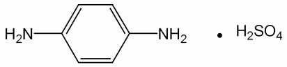

---

3) 철

이원료1.0 ｇ을달아황산5 방울을넣어적시고천천히가열하여되도록

저온에서거의회화또는휘산시킨다음다시황산을넣어적시고완전히회화한다.

식힌다음잔류물에염산0.5 mL를넣고수욕상에서증발건고한다. 잔류물에묽은염

산3 방울을넣고가온하여물25 mL를넣어녹인다. 이것을검액으로하여시험한

다. 비교액에는철표준액2.0 mL를넣는다(20 ppm 이하).

4) 중금속

이원료1.0 ｇ을황산5 mL 및질산20 mL에넣고가만히가열한다.

때때로질산2 ∼3 mL 씩을추가하여액이무색∼엷은황색이될때까지가열한

다. 식힌다음물10 mL 및페놀프탈레인시액1 방울을넣고암모니아시액을액이

엷은적색이될때까지천천히넣고묽은초산2 mL를넣고필요하면여과한다. 잔류

물을물10 mL로씻고씻은액은여액과합하고물을넣어50 mL로한다. 이것을

검액으로하여시험한다. 비교액에는납표준액2.0 mL를넣는다(20 ppm 이하).

5) 비소

이원료1.0 ｇ을황산2 mL 및질산5 mL에넣어가만히가열한다. 식힌

다음포화수산화암모늄용액15 mL를넣어흰연기가발생할때까지가열한다. 식힌

다음물을넣어10 mL로한다. 이것을검액으로하여시험한다(2 ppm 이하).

건조감량

0.2 % 이하(1.5 ｇ, 실리카겔, 4 시간)

강열잔분

0.2 % 이하(2 ｇ, 제1 법)

정량법

이원료를건조하고약0.22 ｇ을정밀하게달아질소정량법에따라시험한다.

0.05 mol/L 황산1 mL = 10.311 mg　C6H8N2 ㆍH2SO4

저장법

기밀용기

황산철수화물

Ferrous Sulfate Hydrate

황산철

황산제일철

황산철(II)칠수화물

FeSO4ㆍ7H2O : 278.02

이원료는정량할때황산철수화물(FeSO4ㆍ7H2O) 98.0 ~ 104.0 %를함유한다.

성

상

이원료는연한초록색의결정또는결정성가루로냄새는없고맛은

수렴성이다. 이원료는물에잘녹으며에탄올(95) 또는에테르에는거의녹지않는다.

이원료는건조공기중에서풍해되기쉬우며습한공기중에서결정의표면이황갈

색으로변한다.

확인시험

이원료의수용액(1 →10)은철(II)염및황산염의정성반응을나타낸다.

순도시험1) 용해상태

이원료1.0 g을물20 mL 및묽은황산1 mL에녹일때액은

맑다.

2) 산

이원료를가루로하여5.0 g을에탄올(95) 50 mL를넣어2 분간흔들

---

어섞은다음여과한다. 여액25 mL에물50 mL, 브롬치몰블루시액3 방울및

묽은수산화나트륨시액0.5 mL를넣을때액은파란색이다.

3) 수은

이조작은차광한용기를써서한다. 이원료약1 g을정밀하게달아희

석시킨질산(1 →10) 30 mL를넣어수욕에서가열하면서녹인다. 얼음욕에빨리넣

어식히고미리희석시킨질산(1 →10)과물로씻은여과기를써서여과한다. 여액

에구연산나트륨용액(1 →4) 20 mL 및염산히드록실아민시액1 mL를넣어검액으

로한다. 따로수은표준액3.0 mL, 희석시킨질산(1 →4) 30 mL, 구연산나트륨용액(1

→4) 5 mL 및염산히드록실아민1 mL를가지고비교액을만든다. 비교액에암모니아

시액을넣어pH를1.8로조정하고검액에는황산을써서pH 1.8로조정하여각각분액

깔때기에옮긴다. 검액및비교액을가지고다음과같이시험한다. 추출용디티존액5

mL 및클로로포름5 mL씩으로2 회추출하고클로로포름추출액은다른분액깔때기에

옮긴다. 여기에희석시킨염산(1 →2) 10 mL를넣어흔들어섞은다음방치하여클로

로포름층은버린다. 산추출액을클로로포름3 mL로씻고씻은액은버린다. 에칠렌디

아민테트라초산디나트륨용액(1 →50) 0.1 mL 및6 mol/L 초산2 mL를넣고섞은다

음암모니아시액5 mL를천천히넣는다. 분액깔때기뚜껑을닫고흐르는찬물로식힌

다음뚜껑을열고내용물을비커에옮긴다. 앞에서와같은방법으로검액및비교액을

pH 1.8로조정하고다시각각의분액깔때기에옮긴다. 희석시킨추출용디티존액5.0

mL를넣고세게흔들어섞은다음방치한다. 희석시킨추출용디티존액을대조로하여

검액과비교액의클로로포름층에나타난색상을비교할때검액의색상은비교액의색

상보다진하지않다(3 ppm 이하).

ㆍ 수은표준원액

염화수은(II) 135.4 mg을100 mL 용량플라스크에넣고0.5

mol/L 황산시액을넣어녹인다음표선까지채워섞는다. 이액은100 mL 중수은

(Hg) 0.1 g을함유한다.

ㆍ 수은표준액

쓸때수은표준원액1.0 mL를취하여1000 mL의용량플라스크

에넣고0.5 mol/L 황산시액을넣어표선까지채워섞는다. 이액1 mL는수은

(Hg) 1 μg을함유한다.

ㆍ 희석시킨추출용디티존액

쓸때추출용디티존액5 mL를클로로포름25

mL로희석한다.

4) 납

이원료1.0 g을달아50 mL 용량플라스크에넣고9 mol/L 염산10 mL,

물약10 mL, 아스코르빈산ㆍ요오드화나트륨시액20 mL 및트리옥틸포스핀옥시드

의4-메칠-2-펜타논용액(5 →100) 5 mL를넣어30 초간흔든다음층이분리될

때까지정치한다. 다음에용량플라스크목부분에물을넣고다시흔든다음정치하

여유기용매층을취하여검액으로한다. 따로질산납표준원액5 mL를정확하게취

하여물을넣어정확하게100 mL로하고이액2 mL를정확하게취하여50 mL

용량플라스크에넣고이하검액과같은방법으로조작하여표준액으로한다. 검액

및표준액을가지고다음조건으로원자흡광광도법에따라시험할때검액의흡광

도는표준액의흡광도보다적다.

사용기체: 용해아세틸렌- 공기

램프: 납중공음극램프

---

파장: 283.8 nm

5) 비소

이원료1.0 g을달아제1법에따라조작하여시험한다(2 ppm 이하).

정량법

이원료약0.7 g를정밀하게달아물20 mL, 묽은황산시액20 mL 및인산

2 mL 넣은다음곧0.02 mol/L 과망간산칼륨액으로적정한다.

0.02 mol/L 과망간산칼륨액1 mL = 27.80 mg FeSO4ㆍ7H2O

저장법

기밀용기.

황산톨루엔-2, 5-디아민

Toluene-2,5-diamine Sulfate

톨루엔-2, 5-디아민황산염

황산메칠-2,5-페닐렌디아민, 황산o-메칠-p-페닐렌디아민,

황산p-톨루렌디아민, 황산p-톨루이렌디아민,

황산2,5-디아미노톨루엔, 황산2,5-톨루이렌디아민,

황산2-메칠-p-페닐렌디아민, 황산2,5-톨루엔디아민

C7H10N2ㆍH2SO4 :

220.25

이원료를건조한것은정량할때황산톨루엔-2, 5-디아민(C7H10N2

ㆍH2SO4) 95.0

% 이상을함유한다.

성

상

이원료는회색∼엷은적자색의결정성가루로서냄새는없거나약간특이

한냄새가있다.

확인시험

1) 이원료의수용액(1 →100) 3 mL에풀푸랄ㆍ초산시액4 방울을넣을

때액은황색을띠는적색을나타낸다.

2) 이원료의수용액(1 →100) 10 mL에염화바륨시액5 방울을넣을때액은백탁

이된다.

3) 이원료의수용액(1 →100) 10 mL에질산은시액5 방울을넣을때액은적자색

∼자색을나타낸다.

4) 이원료15 mg 을물100 mL에녹인다음이액10 mL를취하여물을넣어

100 mL로한다. 이액을가지고자외가시부흡광도측정법에따라흡수스펙트럼을측

정할때파장235 ± 2 nm 및286 ± 2 nm 에서흡수극대를나타낸다.

5) 이원료및염산m-페닐렌디아민표준품각10 mg을이소프로판올ㆍ 물ㆍ 강

암모니아수(9：3：1) 혼합액1 mL에넣어녹인다음각각에아황산수소나트륨0.1

---

ｇ을넣어흔들어섞어검액및표준액으로한다. 검액및표준액1 μL를박층판에

점적하고이소프로필에텔ㆍ 아세톤ㆍ 이소프로판올(10：1：1) 혼합액을전개용매로

하여박층크로마토그래프법에따라시험한다. 발색제로p-디메칠아미노벤즈알데히드

ㆍ 묽은염산용액(1 →200) 을뿌릴때염산m-페닐렌디아민표준품에대하여Rs

값0.9 부근에서주황색∼황색의반점을나타낸다.

순도시험

1) 용해상태

이원료0.1 ｇ을묽은염산10 mL에넣어녹일때액은엷은

적자색이며거의맑다.

2) 철

이원료1.0 ｇ을정밀하게달아황산5 방울을넣어적시고천천히가열하

여저온에서거의회화또는휘산시킨다음황산을넣어적시고완전히회화한다. 식

힌다음잔류물에염산0.5 mL를넣고수욕상에서증발건고한다음잔류물에묽은

염산3 방울을넣어가온하고물25 mL를넣어녹인다. 이것을검액으로하여시험

한다. 비교액에는철표준액2.0 mL를넣는다(20 ppm 이하).

3) 에텔가용물

이원료1 ｇ을정밀하게달아에텔50 mL에넣고환류냉각기를

달아수욕상에서때때로흔들어섞으면서1 시간동안끓인다. 뜨거울때유리여과기

(G3)를사용하여미리질량을단플라스크에여과한다. 잔류물을에텔20 mL로씻고

씻은액및여액을합하여수욕상에서증발건고한다음105 ℃에서30 분간건조

하여질량을단다(1 % 이하).

4) 중금속

이원료1.0 ｇ을황산5 mL 및질산20 mL에넣고가만히가열한다.

때때로질산2 ∼3 mL 씩을추가하여액이무색∼엷은황색이될때까지가열한

다. 식힌다음물10 mL 및페놀프탈레인시액1 방울을넣고암모니아시액을액이

엷은적색이될때까지천천히넣어주고묽은초산2 mL를넣고필요하면여과한다.

잔류물을물10 mL로씻고씻은액을여액과합하고물을넣어50 mL로한다. 이것

을검액으로하여시험한다. 비교액에는납표준액2.0 mL를넣는다(20 ppm 이하).

5) 비소

이원료1.0 g을황산2 mL 및질산5 mL에넣어천천히가열한다. 때때

로질산2 ∼3 mL 씩을추가하여액이무색∼엷은황색이될때까지가열한다.

식힌다음포화수산암모늄용액15 mL를넣고흰연기가발생할때까지가열한다. 식

힌다음물을넣어10 mL로한다. 이것을검액으로하여시험한다(2 ppm 이하).

건조감량

5.0 % 이하(1 ｇ, 105 ℃, 2 시간)

강열잔분

0.3 % 이하(2 ｇ, 제1 법)

정량법

이원료를건조하고약0.20 ｇ을정밀하게달아질소정량법에따라시험한다.

0.05 mol/L 황산1 mL = 11.012 mg　C7H10N2ㆍH2SO4

저장법

기밀용기

히드록시벤조모르포린

Hydroxybenzomorpholine

---

3,4-dyhydro-2H-1,4-benzoxazin-6-ol

C8H9NO2 : 151.16

이

원료는

정량할

때

환산한

무수물에

대하여

히드록시벤조모르포린(C8H9NO2

:

151.16) 98.0 ∼101.0 % 이상을함유한다.

성

상

이원료는분홍색∼옅은자주빛을띠는결정성의가루로약한특이한냄새

가있다.

확인시험

1) 이원료를가지고적외부스펙트럼측정법브롬화칼륨정제법에따라측정

할때파수3322 cm-1, 1627-1605 cm-1, 1515-1487 cm-1, 1331 cm-1 , 1227 cm-1,

1204 cm-1, 1169 cm-1 부근에서흡수를나타낸다.

2) 이원료약0.4 g을정밀하게달아에탄올을넣어녹여100 mL로하고이액을

가지고자외가시부흡광도측정법에따라흡광도를측정할때파장208 nm 및244

nm에서흡수극대를나타낸다.

순도시험

1) 용해상태

이원료약0.1 g에물10 mL를넣고녹일때그액은맑으

며무색이다.

2) 유연물질

이원료약0.1 g을정밀하게달아에탄올을넣어녹여10 mL로한

액을검액으로한다. 이액1 mL를정확하게취하여에탄올(95)을넣어정확하게

100 mL로하여표준액으로한다. 검액및표준액을가지고박층크로마토그래프법에

따라시험한다. 검액및표준액5 μL씩을박층크로마토그래프용실리카겔을써서만

든박층판에점적한다. 초산에칠을전개용매로하여점적한곳으로부터약12 cm

전개한다음박층판을전개용매냄새가나지않을때까지건조한다. 여기에발색제

로4-니트로벤젠디아조늄클로라이드시액을고르게뿌릴때검액에서얻은주반점

이외의반점은표준액에서얻은반점보다진하지않다.

3) 중금속

이원료1.0 g을달아중제2법에따라조작하여시험한다. 비교액에는

납표준액2.0 mL를넣는다(20 ppm 이하).

4) 비소

이원료1.0 g을달아비소시험법제3 법에따라조작하여시험한다(2

ppm 이하).

융

점

112 ∼118 °C

수

분

0.5 % 이하(2 g)

강열잔분

1.0 % 이하(2 g)

정량법

이원료약175 mg을정밀하게달아초산70 mL에녹이고0.1 mol/L

과염소산으로적정한다(적정종말점검출법전위차적정법). 같은방법으로공시험을하

여보정한다.

---

0.1 mol/L 과염소산액1 mL = 15.1 mg C8H9NO2

N-(2-히드록시에칠)-2-니트로-p-페닐렌디아민

N-(2-hydroxyethyl)-2-nitro-p-phenylenediamine

C8H11N3O3 : 197.1

이원료는정량할때N-(2-히드록시에칠)-2-니트로-p-페닐렌디아민(C8H11N3O3) 99.0

% 이상을함유한다.

성

상

이원료는흑색결정성가루이다.

확인시험

1) 이원료및N-(2-히드록시에칠)-2-니트로-p-페닐렌디아민표준품0.1 g

씩을메탄올10 mL에녹여원심분리하여상징액을검액및표준액으로한다. 이들액

을가지고박층크로마토그래프법에따라시험한다. 검액및표준액5 μL씩을취하여

박층크로마토그래프용실리카겔을써서만든박층판에점적한다. 다음에초산에칠을

전개용매로하여약10 cm 전개한다음박층판을바람에말린다. 여기에발색제로p-

디메칠아미노벤즈알데히드ㆍ묽은염산용액(0.5→100)을뿌릴때검액및표준액에서얻

은반점의Rf 값및색상은같다.

2) 이원료약50 mg을물에넣어녹여100 mL로한다. 이액10 mL을취하여물

을넣어1 L로한다. 이액을가지고자외가시부흡광도측정법에따라흡수스펙트럼을

측정할때파장503 ∼507 nm에서흡수극대를나타낸다.

융

점

120 ∼125 ℃(제1 법)

순도시험

1) 철

이원료2.0 g 을달아황산5 방울을넣어적시고천천히가열하여

저온에서거의회화또는휘산시킨다음다시황산으로적시고완전히회화한다. 식

힌다음잔류물에염산0.5 mL를넣고수욕상에서증발건고하여잔류물에묽은염산

3 방울을넣어가온하고물25 mL를넣어녹인다. 이것을검액으로하여시험한다.

비교액에는철표준액1.0 mL를넣는다( 5 ppm 이하).

2) 중금속

이원료1.0 g을

황산2 mL 및질산20 mL에넣어가만히가열한다.

때때로질산2 ∼3 mL 씩을추가하여액이무색∼엷은황색이될때까지가열한

다. 식힌다음물10 mL 및페놀프탈레인시액1 방울을넣고암모니아시액을액이

엷은적색이될때까지넣고필요하면여과하여물10 mL로씻고여액과씻은액을

네슬러관에넣어물을넣어50 mL로한액을검액으로하여시험한다. 비교액에는

납표준액2.0 mL을쓴다(20 ppm 이하).

---

3) 비소

이원료1.0 g을

황산2 mL 및질산5 mL에넣어가만히가열한다. 때때

로질산2 ∼3 mL씩을추가하여액이무색∼엷은황색이될때까지가열한다.

식힌다음포화수산암모늄용액15 mL를넣는다. 흰연기가발생할때까지가열한

다음식히고물을넣어10 mL로한액을검액으로하여시험한다(2 ppm

이하).

수

분

0.3 % 이하(1g, 용량적정법, 직접적정)

강열잔분

0.2 % 이하(2g, 제1 법)

정량법

이원료약0.12 g을정밀하게달아질소정량법제2 법에따라시험한다.

0.05 mol/L 황산1 mL = 6.573 mg C8H11N3O3

저장법

기밀용기

6-히드록시인돌

6-Hydroxyindole

C8H7NO : 133.15

이원료는정량할때환산한무수물에대하여6-히드록시인돌(C5H6N2O : 133.15)

97.0 ∼101.0 % 이상을함유한다.

성

상

이원료는옅은갈색∼회색을띠는가루이며, 약간특이한냄새가있다.

확인시험

1) 이원료의수용액(1 →1000) 10 mL에염화제일철시액1 방울을넣을

때액은연한갈색∼검은색을나타낸다.

2) 이원료0.01 g에황산2 mL를넣어녹일때액은초록색을띠며, 다시물5 mL

를넣을때액은노란색으로변한다.

3) 이원료0.025 g에에탄올200 mL를넣어녹이고이액2 mL를가지고에탄올

을넣어100 mL로한다. 이액을가지고자외가시부흡광도측정법에따라흡수스펙

트럼을측정할때파장218 ± 2 nm 에서흡수극대를나타낸다.

4) 이원료를가지고적외부스펙트럼측정법의브롬화칼륨정제법에따라시험할때,

파수3394 cm-1, 1625 cm-1, 1590 cm-1, 1505 cm-1, 1428 cm-1, 1235 cm-1, 818

cm-1 부근에서흡수를나타낸다.

융

점

124 ∼128 ℃

순도시험

1) 용해상태

이원료0.5 g에에탄올10 mL를넣어녹일때, 액은옅은

황갈색∼어두운갈색을나타내고맑다.

---

2) 철

이원료1.0 g을달아제3 법으로조제하여A법에따라시험한다. 비교액

에는철표준액3.0 mL를넣는다(30 ppm 이하).

3) 중금속

이원료1.0 g을달아제2 법에따라조작하여시험한다. 비교액에는

납표준액2.0 mL를넣는다(20 ppm 이하).

4) 비소

이원료1.0 g을달아제3 법에따라조작하여시험한다(2 ppm 이하).

수

분

1.0 % 이하(1.0 g)

강열잔분

0.1 % 이하(1.0 g)

정량법

이원료약0.1 g을정밀하게달아0.5 % 염산수용액2 mL 및이동상을넣

어정확하게50 mL로하고30 분간잘섞는다. 이액10 mL를정확하게취하여

다시이동상을넣어정확하게50 mL로하여검액으로한다. 따로6-히드록시인돌

표준품을가지고검액과같은방법으로조제하여표준액으로한다. 검액및표준액

10 μL씩을가지고다음조건으로액체크로마토그래프법에따라시험하여각액의

6-히드록시인돌의피크면적AT 및AS을측정한다.



6-히드록시인돌(C5H6N2O)의양(mg) = 6-히드록시인돌표준품의양(mg) x 



조작조건

검출기: 자외부흡광광도계(측정파장292 nm)

칼

럼: 안지름약4 mm, 길이약250 mm인스테인레스강관에5 μm의액체

크로마토그래프용옥타데실실릴실리카겔을충전한것또는이와동등한

칼럼

이동상: 아세토니트릴ㆍ물혼합액(37 : 63)을인산으로pH 3.5로조정한다.

유

량: 1.0 mL/분

과황산나트륨ㆍ과황산암모늄분말제

Sodium PersulfateㆍAmmonium Persulfate Powder

이기능성화장품은정량할때표시량의90.0 % 이상에해당하는총과황산(S2O8 :

192.13)을함유한다.

확인시험

1) 이기능성화장품1 g을황산망간용액(1 →10)에황산2 mL를넣은액

및질산은용액(1 →50) 2 mL에넣어서가온할때액은적자색을나타낸다.

2) 이기능성화장품의수용액(1 →10)은나트륨염의정성반응을나타낸다.

3) 이기능성화장품1 g을과량의수산화나트륨시액에넣어가온하면암모니아냄새

가나며이가스는물에적신적색리트머스시험지를청색으로변화시킨다.

정량법

총과황산(S2O8) 약0.3 g에해당하는양을정밀하게달아물50 mL에넣어

녹이고0.2 mol/L 황산제일철암모늄액25 mL를넣고마개를하여흔들어섞은다음

인산5 mL를넣은다음과량의황산제일철암모늄액을0.04 mol/L 과망간산칼륨액으

---

로적정한다. 같은방법으로공시험하여보정한다.

0.2 mol/L 황산제일철암모늄액1 mL = 19.21 mg S2O8

저장법

기밀용기

과황산나트륨ㆍ과황산칼륨분말제

Sodium PersulfateㆍPotassium Persulfate Powder

이기능성화장품은정량할때표시량의90.0 % 이상에해당하는총과황산(S2O8 :

192.13)을함유한다.

확인시험

1) 이기능성화장품1 g을황산망간용액(1 →10)에황산2 mL를넣은액

및질산은용액(1 →50) 2 mL에넣어서가온할때액은적자색을나타낸다.

2) 이기능성화장품의수용액(1 →10)은나트륨염의정성반응을나타낸다.

3) 이기능성화장품의수용액(1 →10)은칼륨염의정성반응을나타낸다.

정량법

총과황산(S2O8) 약0.3 g에해당하는양을정밀하게달아물50 mL에넣어

녹이고0.2 mol/L 황산제일철암모늄액25 mL를넣고마개를하여흔들어섞은다음

인산5 mL를넣은다음과량의황산제일철암모늄액을0.04 mol/L 과망간산칼륨액으

로적정한다. 같은방법으로공시험하여보정한다.

0.2 mol/L 황산제일철암모늄액1 mL

= 19.21 mg S2O8

과황산나트륨ㆍ과황산암모늄ㆍ과황산칼륨분말제

Sodium PersulfateㆍAmmonium PersulfateㆍPotassium

Persulfate Powder

이기능성화장품은정량할때표시량의90.0 % 이상에해당하는총과황산(S2O8 :

192.13)을함유한다.

확인시험

1) 이기능성화장품1 g을황산망간용액(1 →10)에황산2 mL를넣은액

및질산은용액(1 →50) 2 mL에넣어서가온할때액은적자색을나타낸다.

2) 이기능성화장품의수용액(1 →10)은나트륨염의정성반응을나타낸다.

3) 이기능성화장품의수용액(1 →10)은칼륨염의정성반응1)∼3)을나타낸다.

---

4) 이기능성화장품1 g을과량의수산화나트륨시액에넣어가온하면암모니아냄새

가나며이가스는물에적신적색리트머스시험지를청색으로변화시킨다.

정량법

총과황산(S2O8) 약0.3 g에해당하는양을정밀하게달아물50 mL에넣어

녹이고0.2 mol/L 황산제일철암모늄액25 mL를넣고마개를하여흔들어섞은다음

인산5 mL를넣은다음과량의황산제일철암모늄액을0.04 mol/L 과망간산칼륨액으

로적정한다. 같은방법으로공시험하여보정한다.

0.2 mol/L 황산제일철암모늄액1 mL = 19.21 mg S2O8

저장법

기밀용기

과황산암모늄분말제

Ammonium Persulfate powder

이

기능성화장품은

정량할

때

표시량의

90.0

%

이상에

해당하는

과황산암모늄

((NH4)2S2O8 : 228.20)을함유한다.

확인시험

1) 이기능성화장품1 g을취하여수산화나트륨시액5 mL에넣고가열하

면암모니아냄새가있는가스가발생하고이가스는물에적신적색리트머스지를

청색으로변화시킨다.

2) 묽은황산5 mL에황산망간용액(1 →100) 2 ∼3 방울을넣고여기에질산은시

액1 방울및이기능성화장품0.4 g을넣어가온하면액은홍색을나타낸다.

정량법

과황산암모늄약1.5 g에해당하는양을정밀하게달아물에녹여250 mL

로하고그중50 mL를취하여0.1 mol/L 황산제일철암모늄액40 mL 및인산5

mL을넣은다음과량의황산제일철암모늄을0.02 mol/L 과망간산칼륨액으로적정한

다. 같은방법으로공시험하여보정한다.

0.1 mol/L 황산제일철암모늄액1 mL = 11.41 mg(NH4)2S2O8

저장법

기밀용기

과황산암모늄ㆍ과황산칼륨분말제

Ammonium PersulfateㆍPotassium Persulfate Powder

이기능성화장품은정량할때표시량의90.0 % 이상에해당하는총과황산(S2O8 :

192.13)을함유한다.

확인시험

1) 이기능성화장품1 g을황산망간용액(1 →10)에황산2 mL를넣은액

---

및질산은용액(1 →50) 2 mL에넣어서가온할때액은적자색을나타낸다.

2) 이기능성화장품의수용액(1 →10)은칼륨염의정성반응1)∼3)을나타낸다.

3) 이기능성화장품1 g을과량의수산화나트륨시액에넣어가온하면암모니아냄새

가나며이가스는물에적신적색리트머스시험지를청색으로변화시킨다.

정량법

총과황산(S2O8) 약0.3 g에해당하는양을정밀하게달아물50 mL에넣어

녹이고0.2 mol/L 황산제일철암모늄액25 mL를넣고마개를하여흔들어섞은다음

인산5 mL를넣은다음과량의황산제일철암모늄액을0.04 mol/L 과망간산칼륨액으

로적정한다. 같은방법으로공시험하여보정한다.

0.2 mol/L 황산제일철암모늄액1 mL = 19.21 mg S2O8

저장법

기밀용기

p-페닐렌디아민ㆍ과붕산나트륨사수화물분말제

p-PhenylenediamineㆍSodium Perborate Tetrahydrate Powder

이기능성화장품은정량할때표시량의90.0 % 이상에해당하는p-페닐렌디아민

(C6H8N2：108.14) 및과붕산나트륨사수화물(NaBO3ㆍ4H2O：153.86) 을함유한다.

확인시험

1) p-페닐렌디아민　이기능성화장품을p-페닐렌디아민10 mg에해당하

는양을달아에탄을10 mL에넣어녹이고여과하여여액을검액으로한다. 따로

p-페닐렌디아민표준품10 mg을달아에탄올10 mL에넣어녹여표준액으로한다.

검액및표준액10 μL씩을박층판에점적하고초산에칠을전개용매로하여박층크

로마토그래프법에따라시험한다. 발색제로p-디메칠아미노벤즈알데히드ㆍ묽은염산

용액(0.5 →100)을고루뿌리고건조할때검액과표준액은같은Rf 값에서같은색

상의반점을나타낸다.

2) 과붕산나트륨　1)항에서얻은잔류물을물에녹일때이기능성화장품은나

트륨염, 붕산염및과산화물의정성반응을나타낸다.

정량법

1) p-페닐렌디아민이기능성화장품을p-페닐렌디아민(C6H8N2) 약0.25

ｇ에해당하는양을정밀하게달아삼각플라스크에넣고무수에탄올20 mL를넣어

추출한다. 잔류물을무수에탄올20 mL씩으로4 회씻고여과하여여액과씻은액을

합한다(잔류물은다음시험을위하여보관한다). 여기에염산을넣고흔들어섞은다

음15 ℃로식히고얼음조각15 ｇ을넣고저으면서0.1 mol/L 아질산나트륨액으로

천천히적정한다. 이때적정의종말점은0.1 mol/L 아질산나트륨액을떨어뜨린후1

분후에적정한액을유리막대에묻혀서요오드화ㆍ아연전분지에대었을때곧청색

이나타날때로한다. 같은방법으로공시험하여보정한다.

0.1 mol/L 아질산나트륨액1 mL = 10.81 mg　C6H8N2

---

2) 과붕산나트륨사수화물정량법1)에서얻은잔류물을물100 mL를사용하여요

오드병에옮기고요오드화칼륨1 ｇ및묽은황산10 mL를넣고냉소에서90 분간

방치한다음0.1 mol/L 치오황산나트륨액으로적정한다(지시약：전분시액). 같은방

법으로공시험하여보정한다.

0.1 mol/L 치오황산나트륨액1 mL = 7.693 mg　NaBO3ㆍ4H2O

저장법　기밀용기

황산p-페닐렌디아민ㆍ황산m-페닐렌디아민ㆍ

황산m-아미노페놀ㆍ황산o-아미노페놀ㆍ과붕산나트륨일수화물

분말제

p-Phenylenediamine Sulfateㆍm-Phenylenediamine

Sulfateㆍm-Aminophenol Sulfateㆍo-Aminophenol Sulfate

ㆍSodium Perborate Monohydrate Powder

이기능성화장품은정량할때표시량의90.0 % 이상에해당하는과붕산나트륨일수

화물(NaBO3ㆍH2O：99.81)을함유한다.

확인시험

1) 황산p-페닐렌디아민, 황산m-페닐렌디아민, 황산m-아미노페놀및

황산o-아미노페놀

이기능성화장품1 ｇ을이소프로판올ㆍ물ㆍ강암모니아수(9：

3：1) 혼합액5 mL에넣고잘분산시켜녹인다. 이액을여과하고여액에아황산수

소나트륨0.5 ｇ을넣어흔들어섞고이것을검액으로한다. 따로황산p-페닐디아

민, 황산m-페닐렌디아민, 황산m-아미노페놀및황산o-아미노페놀표준품5 mg

씩을달아검체와같은방법으로조작하여표준액으로한다. 검액및표준액각5 μ

L씩을박층판에점적하고초산에칠ㆍ클로로포름ㆍ디클로로메탄(9：5：2) 혼합물을

전개용매로하여박층크로마토그래프법에따라시험한다. 발색제로p-디메칠아미노

벤즈알데히드ㆍ묽은염산용액(0.5 →100)을뿌리고건조할때검액및표준액은같은

Rf 값에서같은색상의반점을나타낸다.

2) 과붕산나트륨일수화물

이기능성화장품의염산산성용액에쿠르쿠마시험지를적

신다음가온하여건조하면적색을나타내고여기에암모니아시액을천천히넣으면

청색으로변한다.

정량법

이기능성화장품을과붕산나트륨일수화물(NaBO3ㆍH2O) 약0.5 ｇ에해당하

는양을정밀하게달아에탄올10 mL에분산시킨다음묽은황산30 mL를넣고물

을넣어250 mL로한다. 이때거품이생겨표선을채우기어려울때에는에탄올2

∼3 방울을넣은다음채운다. 이액50 mL를취하여요오드화칼륨시액20 mL를

---

넣고다시몰리브덴산암모늄시액2 ∼3 방울을넣어유리하는요오드를0.1 mol/L

치오황산나트륨액으로적정한다(지시약：전분시액2 ∼3 mL). 같은방법으로공시

험하여보정한다.

0.1 mol/L 치오황산나트륨액1 mL = 4.991 mg NaBO3ㆍH2O

염모력시험

「기능성화장품기준및시험방법」일반시험법의Ⅱ. 제제3. 염모력시

험법에따라시험할때효능효과에서표시한색상과거의같은색으로염색된다.

저장법

기밀용기

2제형산화염모제

모발의염색을목적으로하는외용제로서다음기준및시험방법을준용할수있는

2제형의산화염모제를말한다. 이기능성화장품은다음시험법에따라정량할때표시

량의90.0 ∼110.0 %에해당하는과산화수소(H2O2 : 34.02)를함유한다.

구성및재료주성분의종류, 분류및규격등은식품의약품안전처고시「기능성화장

품심사에관한규정」[별표4] 4. 모발의색상을변화(탈염ㆍ탈색포함)시키는기능

을가진제품의성분및함량중2제형의산화염모제에따른다.

제

형

분말제, 크림제, 로션제, 액제또는에어로졸제이다.

[제1제(염모제)와제2 제(산화제)에대하여각각기재한다.]

확인시험

1) 제1 제의주성분

가) 크림제인경우　이기능성화장품2 ∼10 ｇ을

묽은황산30 mL, 황산나트륨5 ｇ및물20 mL에넣어잘저어섞고끓을때까지

가열한다음방치한다. 아래층을취하여약10 mL가될때까지가열농축하고식힌

다음5 mL를취하여강암모니아수를넣어알칼리성으로한다. 여기에이소프로판올

1 mL를넣어잘흔들어섞고아황산수소나트륨1 ｇ을넣어다시흔들어섞은다음

방치한다. 위의맑은액을취하여검액으로한다. 따로각주성분의표준품약5 ∼

10 mg에이소프로판올ㆍ물ㆍ강암모니아수혼합액(9：3：1) 5 mL를넣어녹이고아황

산수소나트륨0.5 ｇ을넣고흔들어섞어방치한다음상층을취하여표준액으로한

다. 이들액을가지고박층크로마토그래프법에따라시험한다. 검액및표준액각5

μL씩을박층크로마토그래프용실리카겔을써서만든박층판에점적한다. 다음에이

소프로필에테르ㆍ아세톤ㆍ이소프로판올(10：1：1) 혼합액, 초산에칠ㆍ벤젠ㆍ초산혼합

액(10：10：2), 초산ㆍ벤젠혼합액(1：1) 또는적당한용매를전개용매로하여, 약20

cm 전개한다음박층판을말린다. 여기에p-디메칠아미노벤즈알데히드ㆍ묽은염산용

액(0.5 →100), 또는적당한발색제를고르게뿌리고건조할때검액및표준액에서

얻은반점의색상및Rf 값은같다.

나) 액제또는로션제인경우

이기능성화장품2 ∼10 ｇ(2 ∼10 mL)에아황산

---

나트륨0.6 ｇ, 황산나트륨1.2 ｇ을넣고에탄올을넣어녹여25 mL로하여섞고방

치한다음그위의맑은액을검액으로한다. 따로각주성분의표준품약5 ∼10

mg을취하여검액과같은방법으로조작하여표준액으로한다. 이들액을가지고박

층크로마토그래프법에따라시험한다. 검액및표준액각5 μL씩을박층크로마토그

래프용실리카겔을써서만든박층판에점적한다. 다음에이소프로필에테르ㆍ아세톤

ㆍ이소프로판올(10：1：1) 혼합액, 초산에칠ㆍ벤젠ㆍ초산혼합액(10：10：2), 초산ㆍ벤

젠혼합액(1：1) 또는적당한용매를전개용매로하여, 약20 cm 전개한다음박층판

을말린다. 여기에p-디메칠아미노벤즈알데히드ㆍ묽은염산용액(0.5 →100), 또는적

당한발색제를고르게뿌리고건조할때검액및표준액에서얻은반점의색상및

Rf 값은같다.

다) 분말제인경우

이기능성화장품1 ｇ을이소프로판올ㆍ물ㆍ강암모니아수혼합

액(9：3：1) 5 mL에넣고잘분산시켜녹인다. 이액을여과하고여액에아황산수소

나트륨0.5 ｇ을넣어흔들어섞고이것을검액으로한다. 따로각주성분의표준품

약5 ∼10 mg을취하여검액과같은방법으로조작하여표준액으로한다. 이들액

을가지고박층크로마토그래프법에따라시험한다. 검액및표준액5 μL씩을박층크

로마토그래프용실리카겔을써서만든박층판에점적한다. 다음에이소프로필에테르

ㆍ아세톤ㆍ이소프로판올혼합액(10：1：1),

초산에칠ㆍ벤젠ㆍ초산혼합액(10：10：2),

초산ㆍ벤젠혼합액(1：1) 또는적당한용매를전개용매로하여, 약20 cm 전개한다

음박층판을말린다. 여기에p-디메칠아미노벤즈알데히드ㆍ묽은염산용액(0.5 →100),

또는적당한발색제를고르게뿌리고건조할때검액및표준액에서얻은반점의색

상및Rf 값은같다.

라) 에어로졸제의경우

이기능성화장품의내용원액약2 ∼10 ｇ(2 ∼10 mL)에

아황산나트륨0.6 ｇ, 황산나트륨1.2 ｇ을넣고에탄올을넣어녹여25 mL로하여

섞고방치한다음그상층액을검액으로한다. 따로각주성분의표준품약5 ∼10

mg 씩을가지고검액과같은방법으로조작하여표준액으로한다. 이들액을가지고

박층크로마토그래프법에따라시험한다. 검액및표준액5 μL씩을박층크로마토그래

프용실리카겔을써서만든박층판에점적한다. 다음에이소프로필에테르ㆍ아세톤ㆍ이

소프로판올혼합액(10：1：1),

초산에칠ㆍ벤젠ㆍ초산혼합액(10：10：2),

초산ㆍ벤젠혼

합액(1：1) 또는적당한용매를전개용매로하여약20 cm 전개한다음박층판을말

린다. 여기에p-디메칠아미노벤즈알데히드ㆍ묽은염산용액(0.5 →100) 또는적당한

발색제를고르게뿌리고건조할때검액및표준액에서얻은반점의색상및Rf 값

은같다.

2) 제2제의과산화수소

이기능성화장품의수용액(1 →10)은과산화물의정성반응

을나타낸다. 단, 에어로졸제의경우내용원액의수용액(1 →10)을가지고시험한다.

정량법과산화수소

이기능성화장품의제2제약1.0 mL(1 g)을정확하게취하여

물10 mL를넣은플라스크에넣고묽은황산10 mL를넣은다음0.02 mol/L 과망

간산칼륨액으로적정한다. 단, 에어로졸제의경우내용원액의수용액(1 →10)을가지

---

고시험한다.

0.02 mol/L 과망간산칼륨액1 mL = 1.7007 mg H2O2

＊각주성분의표준품은식품의약품안전처고시『기능성화장품기준및시험방법』에

등재된염모제원료를말한다.

염모력시험

「기능성화장품기준및시험방법」일반시험법의Ⅱ. 제제3. 염모력시

험법에따라시험할때효능효과에서표시한색상과거의같은색으로염색된다.

저장법

기밀용기

2제형산화염모제의제1제

모발의염색을목적으로하는외용제로서다음기준및시험방법을준용할수있는

2제형산화염모제의제1제를말한다.

구성및재료주성분의종류, 분류, 규격등은식품의약품안전처고시기능성화장품심

사에관한규정[별표4] 4. 모발의색상을변화(탈염ㆍ탈색포함)시키는기능을가진

제품의성분및함량중2제형산화염모제의제1제에따른다.

제

형

분말제, 크림제, 로션제, 액제, 에어로졸제이다.

확인시험

가) 크림제인경우　이기능성화장품약2 ∼10 ｇ을묽은황산30 mL, 황

산나트륨5 ｇ및물20 mL에넣어잘저어섞고끓을때까지가열한다음방치한

다. 아래층을취하여약10 mL가될때까지가열농축하고식힌다음5 mL를취하

여강암모니아수를넣어알칼리성으로한다. 여기에이소프로판올1 mL를넣어잘

흔들어섞고아황산수소나트륨1 ｇ을넣어다시흔들어섞은다음방치한다. 위의

맑은액을취하여검액으로한다. 따로각주성분의표준품약5 ∼10 mg에이소

프로판올ㆍ물ㆍ강암모니아수혼합액(9：3：1) 5 mL를넣어녹이고아황산수소나트륨

0.5 ｇ을넣고흔들어섞어방치한다음위의맑은액을취하여표준액으로한다.

나) 액제또는로션제인경우

이기능성화장품약2 ∼10 ｇ(2 ∼10 mL)에아

황산나트륨0.6 ｇ, 황산나트륨1.2 ｇ을넣고에탄올을넣어녹여25 mL로하여섞

고방치한다음그위의맑은액을검액으로한다. 따로각주성분의표준품약5

∼10 mg씩을가지고검액과같은방법으로조작하여표준액으로한다.

다) 분말제인경우

이기능성화장품약1 ｇ을이소프로판올ㆍ물ㆍ강암모니아수혼

합액(9：3：1) 5 mL에넣고잘분산시켜녹인다. 이액을여과하고여액에아황산수

소나트륨약0.5 ｇ을넣어흔들어섞고이것을검액으로한다. 따로각주성분의표

준품약5 ∼10 mg씩을가지고검액과같은방법으로조작하여표준액으로한다.

라) 에어로졸제의경우이기능성화장품의내용원액약2 ∼10 ｇ(2 ∼10 mL)에

아황산나트륨0.6 ｇ, 황산나트륨1.2 ｇ을넣고에탄올을넣어녹여25 mL로하여

섞고방치한다음위의맑은액을검액으로한다. 따로각주성분의표준품약5 ∼

10 mg씩을가지고검액과같은방법으로조작하여표준액으로한다. 이들액을가

---

지고「기능성화장품기준및시험방법」일반시험법중박층크로마토그래프법에따라

시험한다. 검액및표준액각5 μL씩을박층크로마토그래프용실리카겔을써서만든

박층판에점적한다. 다음에이소프로필에테르ㆍ아세톤ㆍ이소프로판올혼합액(10：1：

1), 초산에칠ㆍ벤젠ㆍ초산혼합액(10：10：2), 초산ㆍ벤젠혼합액(1：1) 또는적당한용

매를전개용매로하여, 약20 cm 전개한다음박층판을말린다. 여기에p-디메칠아

미노벤즈알데히드ㆍ묽은염산용액(0.5 →100) 또는적당한발색제를고르게뿌리고

건조할때검액및표준액은같은Rf값에서같은색상의반점을나타낸다.

＊각주성분의표준품은식품의약품안전처고시『기능성화장품기준및시험방법』에

등재된염모제원료를말한다.

염모력시험

「기능성화장품기준및시험방법」일반시험법의Ⅱ. 제제3. 염모력시

험법에따라시험할때효능효과에서표시한색상과거의같은색으로염색된다.

저장법

기밀용기

3제형산화염모제

모발의염색을목적으로하는외용제로서다음기준및시험방법을준용할수있는

3제형의산화염모제를말한다. 다만, 제3제의경우컨디셔닝제로구성하는경우에한한

다. 이기능성화장품은다음시험법에따라정량할때표시량의90.0 ∼110.0 %에해

당하는과산화수소(H2O2 : 34.02)를함유한다.

구성및재료주성분의종류, 분류및규격등은식품의약품안전처고시기능성화장품

심사에관한규정[별표4] 4. 모발의색상을변화(탈염ㆍ탈색포함)시키는기능을가

진화장품중3제형의산화염모제에따른다.

제

형

분말제, 크림제, 로션제, 액제또는에어로졸제이다.

[제1제(염모제)와제2제(산화제), 제3제(컨디셔닝제)에대하여각각기재한다.]

확인시험

1) 제1제의주성분

가) 크림제인경우　이기능성화장품2 ∼10 g을

묽은황산30 mL, 황산나트륨5 g 및물20 mL에넣어잘저어섞고끓을때까지

가열한다음방치한다. 아래층을취하여약10 mL가될때까지가열농축하고식힌

다음5 mL를취하여강암모니아수를넣어알칼리성으로한다. 여기에이소프로판올

1 mL를넣어잘흔들어섞고아황산수소나트륨1 g을넣어다시흔들어섞은다음

방치한다. 위의맑은액을취하여검액으로한다. 따로각주성분의표준품약5 ∼

10 mg에이소프로판올ㆍ물ㆍ강암모니아수혼합액(9：3：1) 5 mL를넣어녹이고아황

---

산수소나트륨0.5 g을넣고흔들어섞어방치한다음상층을취하여표준액으로한

다. 이들액을가지고박층크로마토그래프법에따라시험한다. 검액및표준액각5

μL씩을박층크로마토그래프용실리카겔을써서만든박층판에점적한다. 다음에이

소프로필에테르ㆍ아세톤ㆍ이소프로판올(10：1：1) 혼합액, 초산에칠ㆍ벤젠ㆍ초산혼합

액(10：10：2), 초산ㆍ벤젠혼합액(1：1) 또는적당한용매를전개용매로하여, 약20

cm 전개한다음박층판을말린다. 여기에p-디메칠아미노벤즈알데히드ㆍ묽은염산용

액(0.5 →100), 또는적당한발색제를고르게뿌리고건조할때검액및표준액에서

얻은반점의색상및Rf 값은같다.

나) 액제또는로션제인경우

이기능성화장품2 ∼10 g(2 ∼10 mL)에아황산

나트륨0.6 g, 황산나트륨1.2 g을넣고에탄올을넣어녹여25 mL로하여섞고방

치한다음그위의맑은액을검액으로한다. 따로각주성분의표준품약5 ∼10

mg을취하여검액과같은방법으로조작하여표준액으로한다. 이들액을가지고박

층크로마토그래프법에따라시험한다. 검액및표준액각5 μL씩을박층크로마토그

래프용실리카겔을써서만든박층판에점적한다. 다음에이소프로필에테르ㆍ아세톤

ㆍ이소프로판올(10：1：1) 혼합액, 초산에칠ㆍ벤젠ㆍ초산혼합액(10：10：2), 초산ㆍ벤

젠혼합액(1：1) 또는적당한용매를전개용매로하여, 약20 cm 전개한다음박층판

을말린다. 여기에p-디메칠아미노벤즈알데히드ㆍ묽은염산용액(0.5 →100), 또는적

당한발색제를고르게뿌리고건조할때검액및표준액에서얻은반점의색상및

Rf 값은같다.

다) 분말제인경우

이기능성화장품1 g을이소프로판올ㆍ물ㆍ강암모니아수혼합액

(9：3：1) 5 mL에넣고잘분산시켜녹인다. 이액을여과하고여액에아황산수소나

트륨0.5 g을넣어흔들어섞고이것을검액으로한다. 따로각주성분의표준품약

5 ∼10 mg을취하여검액과같은방법으로조작하여표준액으로한다. 이들액을

가지고박층크로마토그래프법에따라시험한다. 검액및표준액5 μL씩을박층크로

마토그래프용실리카겔을써서만든박층판에점적한다. 다음에이소프로필에테르ㆍ

아세톤ㆍ이소프로판올혼합액(10：1：1),

초산에칠ㆍ벤젠ㆍ초산혼합액(10：10：2),

초

산ㆍ벤젠혼합액(1：1) 또는적당한용매를전개용매로하여, 약20 cm 전개한다음

박층판을말린다. 여기에p-디메칠아미노벤즈알데히드ㆍ묽은염산용액(0.5 →100), 또

는적당한발색제를고르게뿌리고건조할때검액및표준액에서얻은반점의색상

및Rf 값은같다.

라) 에어로졸제의경우

이기능성화장품의내용원액약2 ∼10 g(2 ∼10 mL)에

아황산나트륨0.6 g, 황산나트륨1.2 g을넣고에탄올을넣어녹여25 mL로하여섞

고방치한다음그상층액을검액으로한다. 따로각주성분의표준품약5 ∼10

mg 씩을가지고검액과같은방법으로조작하여표준액으로한다. 이들액을가지고

박층크로마토그래프법에따라시험한다. 검액및표준액5 μL씩을박층크로마토그래

프용실리카겔을써서만든박층판에점적한다. 다음에이소프로필에테르ㆍ아세톤ㆍ이

소프로판올혼합액(10：1：1),

초산에칠ㆍ벤젠ㆍ초산혼합액(10：10：2),

초산ㆍ벤젠혼

---

합액(1：1) 또는적당한용매를전개용매로하여약20 cm 전개한다음박층판을말

린다. 여기에p-디메칠아미노벤즈알데히드ㆍ묽은염산용액(0.5 →100) 또는적당한

발색제를고르게뿌리고건조할때검액및표준액에서얻은반점의색상및Rf 값

은같다.

2) 제2제의과산화수소

이기능성화장품의수용액(1 →10)은과산화물의정성반응

을나타낸다. 단, 에어로졸제의경우내용원액의수용액(1 →10)을가지고시험한다.

정량법과산화수소

이기능성화장품의제2제약1.0 mL(1 g)을정확하게취하여물

10 mL를넣은플라스크에넣고묽은황산10 mL를넣은다음0.02 mol/L 과망간산

칼륨액으로적정한다. 단, 에어로졸제의경우내용원액의수용액(1 →10)을가지고

시험한다.

0.02 mol/L 과망간산칼륨액1 mL

= 1.7007 mg H2O2

* 각주성분의표준품은식품의약품안전처고시「기능성화장품기준및시험방법」에

등재된염모제원료를말한다.

염모력시험

「기능성화장품기준및시험방법」일반시험법의Ⅱ. 제제3. 염모력시

험법에따라시험할때효능효과에서표시한색상과거의같은색으로염색된다.

산화염모제, 탈색ㆍ탈염제의산화제

모발의염색또는탈색ㆍ탈염을목적으로하는외용제로서과산화수소를주성분으로

하는산화염모제, 탈색ㆍ탈염제의산화제이다.

이기능성화장품은다음시험법에따라정량할때표시량의90.0 ∼110.0 %에해당

하는과산화수소(H2O2 : 34.01)를함유한다.

제

형

분말제, 크림제, 로션제, 액제또는에어로졸제이다.

확인시험

이기능성화장품의수용액(1 →10)은과산화물의정성반응을나타낸다. 단,

에어로졸제의경우내용원액의수용액(1 →10)을가지고시험한다.

정량법

이기능성화장품약1.0 mL(1 g)을정확하게취하여물10 mL 및묽은황

산10 mL를넣은플라스크에넣고0.02 mol/L 과망간산칼륨액으로적정한다. 같은

방법으로공시험하여보정한다. 단, 에어로졸제의경우내용원액을가지고시험한다.

0.02 mol/L 과망간산칼륨액1 mL = 1.7007 mg H2O2

저장법

기밀용기

---

1제형탈색제

이기능성화장품은모발의탈색을목적으로하는외용제로서과산화수소를주성분으

로하는1제형탈색제이다. 이기능성화장품은정량할때표시량의90.0 ∼110.0 %에

해당하는과산화수소(H2O2 : 34.01)를함유한다.

확인시험　이기능성화장품의수용액(1 →10)은과산화물의정성반응을나타낸다.

정량법　이기능성화장품1.0 mL(1g)을정확하게취하여물10 mL 및묽은황산

10 mL을넣은플라스크에넣고0.02 mol/L 과망간산칼륨액으로적정한다. 같은방

법으로공시험하여보정한다.

0.02 mol/L 과망간산칼륨액1 mL = 1.7007 mg H2O2

저장법　기밀용기

2제형탈색제

이기능성화장품은모발의탈색을목적으로하는외용제로서다음기준및시험방법

을준용할수있는2제형의탈색제를말한다. 이기능성화장품의제1 제는수산화나

트륨, 모노에탄올아민, 강암모니아수중의1성분이상을알칼리제로사용하는가루또

는크림이며, 제2 제는과산화수소수를주성분으로하는크림, 로션또는액이다.

이기능성화장품(제2 제)은정량할때표시량의90.0 ∼110.0 %에해당하는과산화수

소(H2O2 : 34.01)를함유한다.

확인시험　이기능성화장품(제2 제)의수용액(1 →10) 은과산화물의정성반응을나

타낸다.

정량법　이기능성화장품의제2 제약1 mL(1g)을정확하게취하거나달아물10

mL 및묽은황산10 mL를넣은플라스크에넣고0.02 mol/L 과망간산칼륨액으로적

정한다. 같은방법으로공시험하여보정한다.

0.02 mol/L 과망간산칼륨액1 mL = 1.7007 mg H2O2

탈색력시험　이기능성화장품은용법및용량란에기재된비율로제1 제와제2 제

를섞어인모를침적하여25 ℃에서30 분간방치한다음물로잘씻어건조할때

인모는탈색된다.

저장법　기밀용기

---
