# 기능성화장품 기준 및 시험방법(식품의약품안전처고시)(제2025-89호)(20251216)

기능성화장품 기준 및 시험방법

기능성화장품 기준 및 시험방법

[시행 2025. 12. 16.] [식품의약품안전처고시 제2025-89호, 2025. 12. 16., 일부개정]

제1조(목적)

제2조(세부사항의 구분)

제3조(재검토기한)

---

기능성화장품 기준 및 시험방법

기능성화장품 기준 및 시험방법

[시행 2025. 12. 16.] [식품의약품안전처고시 제2025-89호, 2025. 12. 16., 일부개정]

식품의약품안전처(화장품정책과), 043-719-3410

제1조(목적) 이 고시는 「화장품법」 제4조제1항 및 같은 법 시행규칙 제9조제1항, 제10조제1항에 따른 기능성화장

품 품질기준에 관한 세부사항(이하 "세부사항"이라 한다)을 정함을 목적으로 한다.

제2조(세부사항의 구분) 세부사항은 다음 각 호와 같이 정한다.

1. 통칙은 별표 1과 같다.

2. 피부의 미백에 도움을 주는 기능성화장품 각조는 별표 2와 같다.

3. 피부의 주름개선에 도움을 주는 기능성화장품 각조는 별표 3과 같다.

4. 자외선으로부터 피부를 보호하는데 도움을 주는 기능성화장품 각조는 별표4와 같다.

5. 피부의 미백 및 주름개선에 도움을 주는 기능성화장품 각조는 별표 5와 같다.

6. 모발의 색상을 변화(탈염(脫染)ㆍ탈색(脫色)을 포함한다)시키는 데 도움을 주는 기능성화장품 각조는 별표 6과

같다.

7. 체모를 제거하는 데 도움을 주는 기능성화장품 각조는 별표 7과 같다.

8. 여드름성 피부를 완화하는 데 도움을 주는 기능성화장품 각조는 별표 8과 같다.

9. 탈모 증상의 완화에 도움을 주는 기능성화장품 각조는 별표 9와 같다.

10. 일반시험법은 별표 10과 같다.

제3조(재검토기한) 「훈령ㆍ예규 등의 발령 및 관리에 관한 규정」에 따라 2019년 1월 1일을 기준으로 매 3년이 되는

시점(매 3년째의 12월 31일까지를 말한다)마다 그 타당성을 검토하여 개선 등의 조치를 하여야 한다.

부칙 <제2012-51호,2012.8.22.>

제1조(시행일) 이 고시는 고시한 날부터 시행한다.

제2조(적용례) 이 고시는 고시 시행 후 최초로 제조업자가 제조하거나 제조판매업자가 수입(선적일을 기준으로 한

다)하는 기능성화장품부터 적용한다.

제3조(경과조치) ① 이 고시 시행 당시 이미 식품의약품안전청장에게 접수된 기능성화장품(변경)심사의뢰서는 종전

의 고시에 따른다.

② 이 고시 시행 당시 종전 규정에 따라 심사받은 기능성화장품의 별첨규격과 기준 및 시험방법에서 "장원기 일반시

험법" 및 "화장품 기준 및 시험방법(식약청 고시)"을 인용하고 있는 경우, 이를 각각 "기능성화장품 기준 및 시험방법

(식약청 고시) 일반시험법 Ⅵ-1. 원료" 및 "기능성화장품 기준 및 시험방법 (식약청 고시) 일반시험법 Ⅵ-2. 제제"를 인

용한 것으로 본다.

제4조 삭제 <2015.3.25.>

---

기능성화장품 기준 및 시험방법

부칙 <제2012-89호,2012.8.24.>

이 고시는 고시한 날부터 시행한다.

부칙 <제2013-28호,2013.4.5.>

제1조(시행일) 이 고시는 고시한 날로부터 시행한다.

부칙 <제2015-15호,2015.3.25.>

제1조(시행일) 이 고시는 고시한 날부터 시행한다.

제2조(적용례) ① 이 고시는 고시 시행 후 최초로 식품의약품안전평가원장에게 제출되는 기능성화장품 심사의뢰서

(변경을 포함한다) 또는 보고서부터 적용한다.

② 제1항에도 불구하고 이 고시 시행 당시 종전의 규정에 따라 식품의약품안전평가원장에게 기능성화장품 심사의뢰

서(변경을 포함한다) 또는 보고서를 제출한 경우에도 개정 규정을 적용한다.

제3조(경과조치) 이 고시 시행 당시 종전의 규정에 따라 기능성화장품으로 심사받거나 보고서를 제출한 품목은 이

고시에 따라 심사받거나 보고받은 것으로 본다.

부칙 <제2017-43호,2017.5.23.>

제1조(시행일) 이 고시는 2017년 5월 30일부터 시행한다

제2조(제조ㆍ수입에 관한 적용례) 이 고시는 고시 시행 이후 화장품 제조업자 및 제조판매업자가 제조 또는 수입(통

관일을 기준으로 한다)하는 화장품부터 적용한다.

제3조(기능성화장품 심사 등에 관한 적용례) ① 이 고시는 고시 시행 이후 최초로 식품의약품안전평가원장에게 제

출되는 기능성화장품 심사의뢰서(변경을 포함한다) 또는 보고서부터 적용한다.

② 제1항에도 불구하고 이 고시 시행 당시 화장품법 시행규칙(총리령 제1357호) 제2조제6호부터 제9호까지의 개정규

정에 따른 품목에 대하여 약사법 제31조제4항에 따라 품목허가를 신청하여 절차가 진행 중인 경우에도 이 고시를 적

용한다.

부칙 <제2018-111호,2018.12.26.>

제1조(시행일) 이 고시는 고시한 날부터 시행한다.

제2조(제조ㆍ수입에 관한 적용례) 이 고시는 고시 시행 이후 화장품 제조업자 및 제조판매업자가 제조 또는 수입(통

관일을 기준으로 한다)하는 화장품부터 적용한다.

제3조(기능성화장품 심사 등에 관한 적용례) 이 고시는 고시 시행 이후 최초로 식품의약품안전평가원장에게 제출되

는 기능성화장품 심사의뢰서(변경을 포함한다) 또는 보고서부터 적용한다.

---

기능성화장품 기준 및 시험방법

제4조(시험법 변경에 따른 경과조치) 별표 2 및 별표 3 각조 중 시험법이 변경된 품목에 대해서는 종전 규정의 시험

법을 선택하여 사용할 수 있다.

부칙 <제2020-132호,2020.12.30.>

제1조(시행일) 이 고시는 고시한 날부터 시행한다.

제2조(제조·수입에 관한 적용례) 이 고시는 고시 시행 후 최초로 화장품제조업자 또는 화장품책임판매업자가 제조

또는 수입(통관일을 기준으로 한다)하는 화장품부터 적용한다.

제3조(기능성화장품 심사 등에 관한 적용례) 이 고시는 고시 시행 이후 최초로 식품의약품안전평가원장에게 제출되

는 기능성화장품 심사의뢰서(변경을 포함한다) 또는 기능성화장품 심사 제외 품목 보고서부터 적용한다.

부칙 <제2025-89호,2025.12.16.>

제1조(시행일) 이 고시는 고시한 날부터 시행한다.

제2조(적용례) 이 고시는 고시 시행 후 최초로 식품의약품안전평가원장에게 제출되는 기능성화장품 심사의뢰서(변

경을 포함한다) 또는 심사 제외 품목 보고서부터 적용한다.

제3조(경과조치) 이 고시 시행 당시 종전의 규정에 따라 기능성화장품으로 심사된 품목은 이 고시에 따라 심사한 것

으로 본다.

[별표 1] 통칙(제2조제1호 관련)

[별표 2] 피부의 미백에 도움을 주는 기능성화장품 각조(제2조제2호 관련)

[별표 3] 피부의 주름개선에 도움을 주는 기능성화장품 각조 (제2조제3호 관련)

[별표 4] 자외선으로부터 피부를 보호하는 데 도움을 주는 기능성화장품 각조(제2조제4호 관련)

[별표 5] 피부의 미백 및 주름개선에 도움을 주는 기능성화장품 각조(제2조제5호 관련)

[별표 6] 모발의 색상을 변화시키는 데 도움을 주는 기능성화장품 각조(제2조제6호 관련)

[별표 7] 체모를 제거하는 데 도움을 주는 기능성화장품 각조(제2조제7호 관련)

[별표 8] 여드름성 피부를 완화하는 데 도움을 주는 기능성화장품 각조(제2조제8호 관련)

[별표 9] 탈모 증상의 완화에 도움을 주는 기능성화장품 각조(제2조제9호 관련)

[별표 10] 일반시험법(제2조제10호 관련)

---

[별표1]

통칙

(제2조제1호관련)

1. 이고시는「화장품법」제4조제1항및「화장품법시행규칙」제9조제1항에따라기

능성화장품심사를받기위하여자료를제출하고자하는경우, 기준및시험방법에

관한자료제출을면제할수있는범위를정함을목적으로한다.

2. 이고시의영문명칭은「Korean Functional Cosmetics Codex」라하고, 줄여

서「KFCC」라할수있다.

3. 이고시에수재되어있는기능성화장품의적부는각조의규정, 통칙및일반시험법의

규정에따라판정한다.

4. 제제를만들경우에는따로규정이없는한그보존중성상및품질의기준을

확보하고그유용성을높이기위하여부형제, 안정제, 보존제, 완충제등적당한

첨가제를넣을수있다.

다만, 첨가제는해당제제의안전성에영향을주지않아야

하며, 또한기능을변하게하거나시험에영향을주어서는아니된다.

5. 이고시에서규정하는시험방법외에정확도와정밀도가높고그결과를신뢰할수

있는다른시험방법이있는경우에는그시험방법을쓸수있다. 다만그결과에대

하여의심이있을때에는규정하는방법으로최종의판정을실시한다.

6. 화장품제형의정의는다음과같다.

가. 로션제란유화제등을넣어유성성분과수성성분을균질화하여점액상으로만든

것을말한다.

나. 액제란화장품에사용되는성분을용제등에녹여서액상으로만든것을말한다.

다. 크림제란유화제등을넣어유성성분과수성성분을균질화하여반고형상으로만든

것을말한다.

라. 침적마스크제란액제, 로션제, 크림제, 겔제등을부직포등의지지체에

침적하여

만든것을말한다.

마. 겔제란액체를침투시킨분자량이큰유기분자로이루어진반고형상을말한다.

바. 에어로졸제란원액을같은용기또는다른용기에충전한분사제(액화기체, 압축기

---

체등)의압력을이용하여안개모양, 포말상등으로분출하도록만든것을말한다.

사. 분말제란균질하게분말상또는미립상으로만든것을말하며, 부형제등을사용할

수있다.

아. 고형제란유화제등을넣어화장품에사용된성분을균질화하여고형상으로만든

것을말한다.

7. 「밀폐용기」라함은일상의취급또는보통보존상태에서외부로부터고형의이물

이들어가는것을방지하고고형의내용물이손실되지않도록보호할수있는용기

를말한다.

밀폐용기로규정되어있는경우에는기밀용기도쓸수있다.

8. 「기밀용기」라함은일상의취급또는보통보존상태에서액상또는고형의이물또

는수분이침입하지않고내용물을손실, 풍화, 조해또는증발로부터보호할수있

는용기를말한다. 기밀용기로규정되어있는경우에는밀봉용기도쓸수있다.

9. 「밀봉용기」라함은일상의취급또는보통의보존상태에서기체또는미생물이

침입할염려가없는용기를말한다.

10. 「차광용기」라함은광선의투과를방지하는용기또는투과를방지하는포장을

한용기를말한다.

11. 물질명다음에( ) 또는[ ]중에분자식을기재한것은화학적순수물질을뜻한다.

분자량은국제원자량표에따라계산하여소수점이하셋째자리에서반올림하여

둘째자리까지표시한다.

12. 이기준의주된계량의단위에대하여는다음의기호를쓴다.

미터

m

데시미터

dm

센터미터

cm

밀리미터

mm

마이크로미터

μm

나노미터

nm

킬로그람

kg

그람

g

밀리그람

mg

마이크로그람

μg

나노그람

ng

리터

L

밀리리터

mL

마이크로리터

μL

평방센티미터

㎠

수은주밀리미터

㎜Hg

센티스톡스

cs

센티포아스

cps

노르말(규정)

N

몰

M 또는mol.

질량백분율

%

질량대용량백분율

w/v%

용량백분율

vol%

용량대질량백분율

v/w%

질량백만분율

ppm

피에이치

pH

섭씨도

℃

---

13. 시험또는저장할때의온도는원칙적으로구체적인수치를기재한다.

다만, 표준

온도는20℃, 상온은15～25℃, 실온은1～30℃, 미온은30～40℃로한다.

냉소는

따로규정이없는한1～15℃이하의곳을말하며. 냉수는10℃이하, 미온탕은3

0～40℃, 온탕은60～70℃, 열탕은약100℃의물을뜻한다.

가열한용매또는열용매라함은그용매의비점부근의온도로가열한것을뜻하

며가온한용매또는온용매라함은보통60～70℃로가온한것을뜻한다.

수욕상

또는수욕중에서가열한다라함은따로규정이없는한끓인수욕또는100℃의

증기욕을써서가열하는것이다.

보통냉침은15～25℃, 온침은35～45℃에서실시

한다.

14. 통칙및일반시험법에쓰이는시약, 시액, 표준액, 용량분석용표준액, 계량기및용기는

따로규정이없는한일반시험법에서규정하는것을쓴다. 또한시험에쓰는물은

따로규정이없는한정제수로한다.

15. 용질명다음에용액이라기재하고, 그용제를밝히지않은것은수용액을말한다.

16. 용액의농도를(1→5), (1→10), (1→100) 등으로기재한것은고체물질1g 또는

액상물질1mL를용제에녹여전체량을각각5mL, 10mL, 100mL등으로하는비율을

나타낸것이다. 또혼합액을(1:10) 또는(5:3:1) 등으로나타낸것은액상물질의1용

량과10용량과의혼합액, 5용량과3용량과1용량과의혼합액을나타낸다.

17. 시험은따로규정이없는한상온에서실시하고조작직후그결과를관찰하는것으로

한다. 다만온도의영향이있는것의판정은표준온도에있어서의상태를기준으로

한다.

18. 따로규정이없는한일반시험법에규정되어있는시약을쓰고시험에쓰는물은

「정제수」이다.

19. 액성을산성, 알칼리성또는중성으로나타낸것은따로규정이없는한리트머스지를

써서검사한다.

액성을구체적으로표시할때에는pH값을쓴다.

또한, 미산성, 약

산성, 강산성, 미알칼리성, 약알칼리성, 강알칼리성등으로기재한것은산성또는

알칼리성의정도의개략(槪略)을뜻하는것으로pH의범위는다음과같다.

pH의범위

미산성

약5~약6.5

미알칼리성

약7.5~약9

약산성

약3~약5

약알칼리성

약9~약11

강산성

약3이하

강알칼리성

약11이상

---

20. 질량을「정밀하게단다.」라함은달아야할최소자리수를고려하여0.1mg,

0.01mg 또는0.001mg까지단다는것을말한다.

또질량을「정확하게단다」라함

은지시된수치의질량을그자리수까지단다는것을말한다.

21. 시험할때n자리의수치를얻으려면보통(n+1)자리까지수치를구하고(n+1)자리의

수치를반올림한다.

22. 시험조작을할때「직후」또는「곧」이란보통앞의조작이종료된다음30초

이내에다음조작을시작하는것을말한다.

23. 시험에서용질이「용매에녹는다또는섞인다」라함은투명하게녹거나임의의

비율로투명하게섞이는것을말하며섬유등을볼수없거나있더라매우적다.

24. 검체의채취량에있어서「약」이라고붙인것은기재된양의±10%의범위를뜻한

다.

---

[별표2]

피부의미백에도움을주는기능성화장품각조

(제2조제2호관련)

나이아신아마이드

Niacinamide

C6H6N2O : 122.13

이원료를건조한것은정량할때나이아신아마이드(C6H6N2O) 98.0% 이상을함유

한다.

성

상

이원료는백색의결정또는결정성가루로냄새는없다.

확인시험

1) 이원료5㎎에2,4-디니트로클로로벤젠10㎎을섞어5~6초간가만히가

열하여융해시키고식힌다음수산화칼륨ㆍ에탄올시액4mL를넣을때액은적색을나

타낸다.

2) 이원료1㎎에pH 7.0의인산염완충액100mL를넣어녹이고이액2mL에브롬

화시안시액1mL를넣어80℃에서7분간가열하고빨리식힌다음수산화나트륨시액

5mL를넣어30분간방치하고자외선하에서관찰할때청색의형광을나타낸다.

3) 이원료20㎎에수산화나트륨시액5mL를넣어조심하여끓일때나는가스는적

색리트머스시험지를청색으로변화시킨다.

4) 이원료20㎎에물을넣어녹이고1L로한다. 이액은파장262± 2㎚에서흡수극

대를나타내며파장245± 2㎚에서흡수극소를나타낸다. 여기서얻은극대파장에서의

흡광도를A1, 극소파장에서의흡광도를A2 로할때A2/A1은0.63～0.67이다

융

점

128℃～131℃(제1법)

순도시험

1) 액

성

이원료의수용액(1→10)은중성이다.

2) 염화물이원료0.50g을달아시험한다. 비교액에는0.01N 염산0.30mL를넣는다.

(0.021% 이하)

3) 황산염

이원료1.0g을달아시험한다. 비교액에는0.01N 황산0.40mL를넣는다.

(0.019% 이하)

4) 중금속

이원료1.0g에물20mL를넣어녹인다음여기에묽은초산2mL 및

물을넣어50mL로하고이것을검액으로하여제4법에따라시험한다. 비교액에는납

표준액3.0mL를넣는다. (30ppm 이하)

5) 황산에대한정색물

이원료0.20g을달아시험한다. 액의색은색의비교액A

보다진하지않다.

---

건조감량

0.5% 이하(1g, 105℃, 4시간)

강열잔분

0.1% 이하(3g, 제1법)

정량법

제1 법

이원료를건조하고약0.3g을정밀하게달아비수적정용빙초산20mL를넣

어필요하면가온하여녹이고식힌다음벤젠100mL를넣고0.1N 과염소산으로

적정한다. (지시약: 크리스탈바이올렛시액2방울) 다만적정의종말점은액의자색

이청색을거쳐청록색으로변할때로한다. 같은방법으로공시험을하여보정한

다.

0.1N 과염소산1mL = 12.213㎎C6H6N2O

제2 법

이원료를건조하고약20mg을정밀하게달아이동상을넣어녹여정확하

게50mL로하여검액으로한다. 따로나이아신아마이드표준품약20mg을정밀하

게달아이동상을넣어녹여정확하게50mL로하여표준액으로한다. 검액및표

준액각10μL씩을가지고다음조건으로액체크로마토그래프법에따라시험하여

검액및표준액의피크면적AT 및AS를각각구한다.

나이아신아마이드(C6H6N2O : 122.13)의양(㎎) =

나이아신아마이드표준품의양(㎎) × A T

A S

조작조건

검출기: 자외부흡광광도계(측정파장260㎚)

칼

럼: 안지름약4.6㎜, 길이약25㎝인스테인레스관에5㎛의액체크로마토그래프용옥타데실실

릴화한실리카겔을충전한다.

이동상: 메탄올ㆍ0.05 M 인산이수소칼륨용액혼합액(15 : 85)

유

량: 1.0mL/분

나이아신아마이드로션제

Niacinamide Lotion

이기능성화장품은정량할때표시량의90.0% 이상에해당하는나이아신아마이드(C6H6N2O :

122.13)를함유한다.

1. 제

법

이기능성화장품은나이아신아마이드를주성분(기능성성분)으로하는로션제이다. 이제품은

안정성및유용성을높이기위해안정제, 습윤제, 유화제, 보습제, pH 조정제, 착색제, 착향제등을첨

가할수있다.

2. 확인시험

정량법의검액에서얻은주피크의유지시간은표준액에서얻은주피크의유지시간과같다.

3. pH

기준치± 1.0 (2 → 30) (다만, pH 범위는3.0 ～ 9.0이다)

4. 정량법

이기능성화장품을가지고나이아신아마이드로서약20 mg에해당하는양을정밀하게달아

이동상을넣어분산시킨다음정확하게50mL로하고필요하면여과하여검액으로한다. 따로나이아

---

신아마이드표준품약20 mg을정밀하게달아이동상을넣어녹여50 mL로한액을표준액으로한

다. 검액및표준액각10μL씩을가지고다음조건으로액체크로마토그래프법에따라시험하여검액

및표준액의피크면적AT 및AS를각각구한다.

5.

6.

나이아신아마이드(C6H6N2O : 122.13)의양(㎎) = 나이아신아마이드표준품의양(㎎) × A T

A S

7.

8.

조작조건

검 출 기 : 자외부흡광광도계 (측정파장 260 ㎚)

칼    럼 : 안지름 약 4.6㎜, 길이 약 25㎝인 스테인레스관에 5㎛의 액체크로마토그

래프용 옥타데실실릴화한 실리카겔을 충전한다.

이 동 상 : 메탄올ㆍ0.05 M 인산이수소칼륨용액 혼합액 (15 : 85)

유    량 : 1.0mL/분

가.

나. 나이아신아마이드액제

다. Niacinamide Solution

라.

이

기능성화장품은

정량할

때

표시량의

90.0%

이상에

해당하는

나이아신아마이드(C6H6N2O

:

122.13)를함유한다.

9. 제

법

이기능성화장품은나이아신아마이드를주성분(기능성성분)으로하는액제이다. 이제품은

안정성및유용성을높이기위해안정제, 습윤제, 보습제, pH 조정제, 착색제, 착향제등을첨가할수

있다.

10. 확인시험

정량법의검액에서얻은주피크의유지시간은표준액에서얻은주피크의유지시간과같

다.

11. pH

기준치± 1.0 (2 → 30) (다만, pH 범위는3.0 ～ 9.0이다)

12. 정량법

이기능성화장품을가지고나이아신아마이드로서약20 mg에해당하는양을정밀하게달아

이동상을넣어분산시킨다음정확하게50 mL로하고필요하면여과하여검액으로한다. 따로나이

아신아마이드표준품약20 mg을정밀하게달아이동상을넣어녹여50 mL로한액을표준액으로

한다. 검액및표준액각10 μL씩을가지고다음조건으로액체크로마토그래프법에따라시험하여

검액및표준액의피크면적AT 및AS를각각구한다.

13.

14.

나이아신아마이드(C6H6N2O:122.13)의양(㎎) = 나이아신아마이드표준품의양(㎎) × A T

A S

15.

16.

조작조건

검 출 기 : 자외부흡광광도계 (측정파장 260 ㎚)

칼    럼 : 안지름 약 4.6㎜, 길이 약 25㎝인 스테인레스관에 5㎛의 액체크로마토그

래프용 옥타데실실릴화한 실리카겔을 충전한다.

이 동 상 : 메탄올ㆍ0.05 M 인산이수소칼륨용액 혼합액 (15 : 85)

유    량 : 1.0mL/분

---

가.

나. 나이아신아마이드크림제

다. Niacinamide Cream

라.

이

기능성화장품은

정량할

때

표시량의

90.0%

이상에

해당하는

나이아신아마이드(C6H6N2O

:

122.13)를함유한다.

17. 제

법

이기능성화장품은나이아신아마이드를주성분(기능성성분)으로하는크림제이다. 이제품은

안정성및유용성을높이기위해안정제, 습윤제, 유화제, 보습제, pH 조정제, 착색제, 착향제등을

첨가할수있다.

18. 확인시험

정량법의검액에서얻은주피크의유지시간은표준액에서얻은주피크의유지시간과같

다.

19. pH

기준치± 1.0 (2 → 30) (다만, pH 범위는3.0 ～ 9.0이다)

20. 정량법

이기능성화장품을가지고나이아신아마이드로서약20 mg에해당하는양을정밀하게달아

5 mL 메탄올을넣어초음파추출한후물을넣어50 mL로하고필요하면여과하여검액으로한다.

따로나이아신아마이드표준품약20 mg을정밀하게달아10 % 메탄올을넣어녹여50 mL로한

액을표준액으로한다. 검액및표준액각10 μL씩을가지고다음조건으로액체크로마토그래프법

에따라시험하여검액및표준액의피크면적AT 및AS를각각구한다.

21.

22.

나이아신아마이드(C6H6N2O : 122.13)의양(㎎) = 나이아신아마이드표준품의양(㎎) × A T

A S

23.

24.

조작조건

검 출 기 : 자외부흡광광도계 (측정파장 260 ㎚)

칼    럼 : 안지름 약 4.6㎜, 길이 약 25㎝인 스테인레스관에 5㎛의 액체크로마토그

래프용 옥타데실실릴화한 실리카겔을 충전한다.

이 동 상 : 메탄올ㆍ0.05 M 인산이수소칼륨용액 혼합액 (15 : 85)

유    량 : 1.0mL/분

가.

나. 나이아신아마이드침적마스크

다. Niacinamide Soaked Mask

라.

이기능성화장품은정량할때표시량의90.0% 이상에해당하는나이아신아마이드(C6H6N2O :

122.13)를함유한다.

25. 제

법

이기능성화장품은나이아신아마이드를주성분(기능성성분)으로하는액제또는로션제를

부직포등의지지체에단순침적한마스크제형의제품이다. 이때액제또는로션제에는안정성및

유용성을높이기위해안정제, 습윤제, 유화제, 보습제, pH 조정제, 착색제, 착향제등을첨가할수

있다.

26. 확인시험

정량법의검액에서얻은주피크의유지시간은표준액에서얻은주피크의유지시간과같

다.

27. pH

이기능성화장품을압착하여얻은액제또는로션제를가지고시험할때기준치± 1.0이다.

---

(다만, pH 범위는3.0 ～ 9.0이다)

28. 정량법

이기능성화장품을압착하여얻은액제또는로션제를가지고나이아신아마이드로서약20

mg에해당하는양을정밀하게달아이동상을넣어분산시킨다음정확하게50 mL로하고필요하면

여과하여검액으로한다. 따로나이아신아마이드표준품약20 mg을정밀하게달아이동상을넣어

녹여50 mL로한액을표준액으로한다. 검액및표준액각10 μL씩을가지고다음조건으로액체

크로마토그래프법에따라시험하여검액및표준액의피크면적AT 및AS를각각구한다.

29.

30.

나이아신아마이드(C6H6N2O : 122.13)의양(㎎) = 나이아신아마이드표준품의양(㎎) × A T

A S

31.

32.

조작조건

검 출 기 : 자외부흡광광도계 (측정파장 260 ㎚)

칼    럼 : 안지름 약 4.6㎜, 길이 약 25㎝인 스테인레스관에 5㎛의 액체크로마토그

래프용 옥타데실실릴화한 실리카겔을 충전한다.

이 동 상 : 메탄올ㆍ0.05 M 인산이수소칼륨용액 혼합액 (15 : 85)

유    량 : 1.0mL/분

나이아신아마이드고형제

Niacinamide Solid

이 기능성화장품은 정량할 때 표시량의 90.0% 이상에 해당하는 나이아신아마이드

(C6H6N2O : 122.13)를 함유한다.

제    법   이 기능성화장품은 나이아신아마이드를 주성분(기능성성분)으로 하는 고형

제이다. 이 제품은 안정성 및 유용성을 높이기 위해 안정제, 습윤제, 유화제, 보습제,

pH 조정제, 착색제, 착향제 등을 첨가할 수 있다.

확인시험   정량법의 검액에서 얻은 주피크의 유지시간은 표준액에서 얻은 주피크의

유지시간과 같다.

pH         기준치 ± 1.0 (2 →30) (다만, pH 범위는 3.0 ∼9.0이며, 물을 포함하

지 않는 제품은 제외)

정 량 법   이 기능성화장품을 가지고 나이아신아마이드로서 약 20mg에 해당하는 양

을 정밀하게 달아 테트라하이드로퓨란 5mL를 넣어 초음파 추출한 후 이동상을 넣어

50mL로 하고 필요하면 여과하여 검액으로 한다. 따로 나이아신아마이드 표준품 약

20mg을 정밀하게 달아 테트라하이드로퓨란 10% 함유 이동상에 녹여 50mL로 한 액

을 표준액으로 한다. 검액 및 표준액 각 10μL씩을 가지고 다음 조건으로 액체크로마

토그래프법에 따라 시험하여 검액 및 표준액의 피크면적 AT 및 AS를 각각 구한다.

33. 나이아신아마이드(C6H6N2O : 122.13)의양(㎎) =

34. 나이아신아마이드표준품의양(㎎) × A T

A S

35.

조작조건

---

36.

검출기: 자외부흡광광도계(측정파장260㎚)

37.

칼

럼: 안지름약4.6㎜, 길이약25㎝인스테인레스관에5㎛의액체크로마토그래프용옥타데실실

릴화한실리카겔을충전한다.

38.

이동상: 메탄올ㆍ0.05 M 인산이수소칼륨용액혼합액(15 : 85)

39.

유

량: 1.0mL/분

닥나무추출물

Broussonetia Extract

이원료는닥나무Broussonetia kazinoki 및동속식물(뽕나무과Moraceae)의줄기또

는뿌리를에탄올및에칠아세테이트로추출하여얻은가루또는그가루의2w/v%

부틸렌글리콜용액이다. 이원료에대하여기능성시험을할때타이로시네이즈억제율

은48.5～84.1% 이다.

제

법

이원료는닥나무및동속식물의줄기또는뿌리에약2배용량의에탄올을넣어1～ 3주

간침적시키고여과하여얻은여액에이액의약1%에해당하는활성탄을넣어잘섞은다음여

과한다. 이여액을취하여농축하고여기에에칠아세테이트을넣어잘흔들어섞은다음에칠아세

테이트층을취하여감압건고하여얻은가루또는이가루를부틸렌글리콜에녹여2w/v% 용액

으로한것이다.

성

상

이원료는엷은황색～황갈색의점성이있는액또는황갈색～암갈색의결정성가루로

약간의특이한냄새가있다.

확인시험

액의경우에는이원료2g에부틸렌글리콜을넣어500mL로한액을검액으로한다.

가

루의경우에는이원료1g에부틸렌글리콜을넣어녹여100mL로한액1mL를취하여부틸렌글리

콜을넣어100mL로한액을검액으로한다. 검액을가지고흡광도측정법에따라흡수스펙트럼을

측정할때파장283±2nm에서흡수극대를나타낸다.

pH

2.7 ～ 4.7 (1→100)

순도시험

1) 중금속

이원료1.0g을달아제2법에따라조작하여시험한다. 비교액에는

납표준액2.0mL를넣는다(20ppm 이하).

2) 비소

이원료1.0g을달아제3법에따라검액을만들고장치C를쓰는방법에따

라시험한다(2ppm 이하).

기능성시험

이원료의가루로서50mg에해당하는양을달아에탄올을넣어녹여100mL로한액

10mL을취하여에탄올을넣어100mL로한액을검액으로한다. 완충액1) 500㎕에기질액2) 500㎕,

물450㎕ 및검액50㎕를넣어섞고, 효소액3) 50㎕를넣어흔들어섞어37℃에서10분간반응시키고

곧얼음중에5분간방치한다음, 완충액1) 500㎕, 물950㎕ 및에탄올50㎕를넣어검액과같은방법

으로조작하여얻은액을대조액으로하여파장475nm에서흡광도B를측정한다. 따로검액대신

에탄올50㎕을가지고검액과같은방법으로조작하여얻은액을공시험액으로하여그흡광도A

를측정하며, 효소액대신물50㎕를넣어검액과같은방법으로조작하여얻은액을색보정액으로

하여그흡광도C를측정하고다음식에따라타이로시네이즈억제율(%)을구한다.

A-(B-C)

×100

타이로시네이즈억제율(%) =

A

---

A :

공시험액에서얻은흡광도

B :

검액에서얻은흡광도

C :

색보정액에서얻은흡광도

1) 완충액: 0.1M 인산이수소칼륨액을pH 6.8이되도록2M 수산화나트륨액으로조정한다.

2) 기질액: 타이로신표준품3mg에물을넣어녹여10mL로한다.

3) 효소액: 머쉬룸타이로시네이즈(Mushroom Tyrosinase, 표준품)를완충액에녹여2 units/㎕ 가

되도록만든다.

아스코빌글루코사이드

Ascobyl Glucoside

아스코빅애씨드 2-글루코사이드

(Ascorbic Acid 2-Glucoside)                                   C12H18O11 :

338.27

이 원료는 정량할 때 아스코빌글루코사이드(C12H18O11 : 338.27) 98.0% 이상을 함유한

다.

성    상  이 원료는 백색 ～미황색의 가루 또는 결정성 가루이다.

확인시험  1) 이 원료의 수용액(1→50) 5 mL에 과망간산칼륨시액 1 방울을 떨어뜨릴 때

또는 2,6-디클로로페놀인도페놀나트륨시액 1～2 방울을 떨어뜨릴 때 각 시액의 색은

곧 없어진다.

2) 이 원료의 수용액(5→40) 2～3 방울을 끓는 페링시액 5 mL에 넣어 약 5분간 가

열했을 때, 적색의 침전이 생긴다.

3) 이 원료를 건조하여 적외부흡수스펙트럼측정법의 1)브롬화칼륨정제법에 따라 측

정할 때 3,300 cm-1, 1,700 cm-1, 1,110 cm-1, 1,060 cm-1 부근에서 특성흡수를 나타

낸다.

융    점  158 ～163 ℃(제 1 법)

비선광도 [α] 25

D : +186.0 ～+188.0 °(건조 후 5 g, 물 100 mL, 100 mm)

순도시험  1) 용해상태  이 원료 1.0 g을 물 50 mL에 녹일 때 액은 맑다.

2) 중금속  이 원료 1.0 g을 달아 제2법에 따라 조작하여 시험한다. 비교액에는 납

표준액 2.0 mL를 넣는다.(20 ppm 이하)

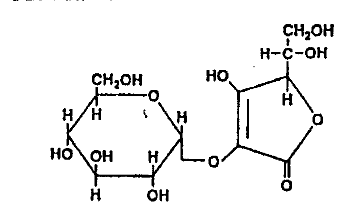

---

3) 비  소  이 원료 1.0 g을 달아 제 3 법에 따라 검액을 만들어 장치B를 이용하는

방법으로 시험한다(2 ppm이하).

4) 유리 아스코빅애씨드 및 유리 포도당  이 원료 0.5 g을 정밀하게 달아 이동상에

넣어 녹여 정확하게 25 mL로 한 액을 가지고 검액으로 한다. 아스코빅애씨드 표준품

20 mg을 정밀하게 취하여 이동상을 넣어 녹여 정확하게 100 mL로 한 액을 아스코

빅애씨드 표준원액으로 한다. 포도당 표준품 20 mg을 정밀하게 취하여 이동상을 넣어

녹여 정확하게 100 mL로 한 액을 포도당 표준원액으로 한다. 아스코빅애시드 및 포

도당 표준원액 각각 10 mL씩을 취하여 이동상을 넣어 정확하게 100 mL로 하여 표

준액으로 한다. 검액 및 표준액 각 10 μL씩을 가지고 아래 조작조건으로 액체크로마

토그래피법에 따라 시험한다. 검액의 아스코빅애씨드 및 포도당 각각의 피크면적은

표준액의 아스코빅애씨드 및 포도당 각각의 피크면적보다 크지 않다. (유리 아스코빅

애씨드 0.1 %이하, 유리 포도당 0.1 %이하)

조작조건

검출기 : 시차굴절계

칼  럼 : 안지름 4.6 ㎜, 길이 25 cm 스테인레스관에 5 ㎛의 액체크로마토그라피용

디메칠아미노프로필실릴화한 실리카겔을 충전한다.

칼럼 온도 : 40 ℃

이동상 : 아세토니트릴 및 0.5 % 인산용액 735 mL에 인산이수소칼륨 4 g을 넣은 혼

합액(60:40)

유  량 : 0.7 mL/분

건조감량  1.0 % 이하 (1 g, 105 ℃, 2시간)

강열잔분  0.2 % 이하 (1 g, 제 1 법)

정 량 법

제 1 법   이 원료 1.0 g을 정밀하게 달아 물 30 mL에 넣어 녹이고 0.2 N 수산화나

트륨액으로 적정한다(지시약 : 페놀프탈레인시액 2 방울).

0.2 N 수산화나트륨액 1 mL = 67.654 mg C12H18O11

제 2 법   이 원료 약 10mg을 정밀하게 달아 이동상을 넣어 녹여 정확하게 100mL로

하고 필요하면 여과하여 검액으로 한다. 따로 아스코빌글루코사이드 표준품 약

10mg을 정밀하게 달아 이동상을 넣어 녹여 100mL로 하여 표준액으로 한다. 검액

및 표준액 각 10μL씩을 가지고 다음 조건으로 액체크로마토그래프법에 따라 시험하

여 검액 및 표준액의 피크면적 AT 및 AS를 각각 구한다.

아스코빌글루코사이드(C12H18O11  : 338.27)의 양(㎎)

AT

= 아스코빌글루코사이드 표준품의 양(㎎) × 

AS

조작조건

---

검 출 기 : 자외부흡광광도계 (측정파장 245㎚)

칼   럼 : 안지름 약 4.6㎜, 길이 약 150㎜인 스테인레스관에 5㎛의 액체크로마토그

래프용 옥타데실실릴화한 실리카겔을 충전한다.

이 동 상 : 희석시킨 삼불화초산용액(2→1000)

유    량 : 0.8mL/분

아스코빌글루코사이드로션제

Ascorbyl Glucoside Lotion

이기능성화장품은정량할때표시량의90.0% 이상에해당하는아스코빌글루코사이드

(C12H18O11 : 338.27)를함유한다.

제

법

이기능성화장품은아스코빌글루코사이드를주성분(기능성성분)으로하는로션제이다. 이

제품은안정성및유용성을높이기위해안정제, 습윤제, 유화제, 보습제, pH 조정제, 착색제, 착향

제등을첨가할수있다.

확인시험

정량법의검액에서얻은주피크의유지시간은표준액에서얻은주피크의유지시간과같

다.

pH

기준치± 1.0 (2 → 30) (다만, pH 범위는3.0 ～ 9.0이다)

정량법

이기능성화장품을가지고아스코빌글루코사이드로서약20㎎에해당하는양을정밀하게

달아이동상을넣어충분히분산시킨다음100mL로하고, 이액10mL를정확히취하여이동상을

넣어20mL로하고필요하면여과하여검액으로한다. 따로아스코빌글루코사이드표준품약

20mg을정밀하게달아이동상을넣어녹여100mL로하고이액10mL를정확히취하여이동상을

넣어20mL로하여표준액으로한다. 검액및표준액각10μL씩을가지고다음조건으로액체크로

마토그래프법에따라시험하여검액및표준액의피크면적AT 및AS를각각구한다.

아스코빌글루코사이드(C12H18O11 : 338.27)의 양(㎎) =

AT

아스코빌글루코사이드의 표준품의 양(㎎) × 

AS

조작조건

검 출 기 : 자외부흡광광도계 (측정파장 245㎚)

칼    럼 : 안지름 약 4.6㎜, 길이 약 150㎜인 스테인레스관에 5㎛액체크로마토그

래프용 옥타데실실릴화한 실리카겔을 충전한다.

이 동 상 : 희석시킨 삼불화초산용액(2→1000)

유    량 : 0.8mL/분

아스코빌글루코사이드액제

---

Ascorbyl Glucoside Solution

40.

41.

이기능성화장품은정량할때표시량의90.0% 이상에해당하는아스코빌글루코사이드(C12H18O11 :

338.27)를함유한다.

가. 제

법

이기능성화장품은아스코빌글루코사이드를주성분(기능성성분)으로하는액제이다. 이제

품은안정성및유용성을높이기위해안정제, 습윤제, 보습제, pH 조정제, 착색제, 착향제등을첨

가할수있다.

나. 확인시험

정량법의검액에서얻은주피크의유지시간은표준액에서얻은주피크의유지시간과같

다.

다. pH

기준치± 1.0 (2 → 30) (다만, pH 범위는3.0 ～ 9.0이다)

라. 정량법

이기능성화장품을가지고아스코빌글루코사이드로서약20㎎에해당하는양을정밀하게달

아이동상을넣어충분히분산시킨다음100mL로하고, 이액10mL를정확히취하여이동상을넣

어20mL로하고필요하면여과하여검액으로한다. 따로아스코빌글루코사이드표준품약20mg을

정밀하게달아이동상을넣어녹여100mL로하고이액10mL를정확히취하여이동상을넣어

20mL로하여표준액으로한다. 검액및표준액각10μL씩을가지고다음조건으로액체크로마토그

래프법에따라시험하여검액및표준액의피크면적AT 및AS를각각구한다.

마.

아스코빌글루코사이드(C12H18O11 : 338.27)의 양(㎎) =

AT

아스코빌글루코사이드의 표준품의 양(㎎) × 

AS

조작조건

검 출 기 : 자외부흡광광도계 (측정파장 245㎚)

칼    럼 : 안지름 약 4.6㎜, 길이 약 150㎜인 스테인레스관에 5㎛액체크로마토그

래프용 옥타데실실릴화한 실리카겔을 충전한다.

이 동 상 : 희석시킨 삼불화초산용액(2→1000)

유    량 : 0.8mL/분

아스코빌글루코사이드크림제

Ascorbyl Glucoside Cream

42.

이기능성화장품은정량할때표시량의90.0% 이상에해당하는아스코빌글루코사이드(C12H18O11 :

338.27)를함유한다.

가. 제

법

이기능성화장품은아스코빌글루코사이드를주성분(기능성성분)으로하는크림제이다. 이

제품은안정성및유용성을높이기위해안정제, 습윤제, 유화제, 보습제, pH 조정제, 착색제, 착향제

등을첨가할수있다.

나. 확인시험

정량법의검액에서얻은주피크의유지시간은표준액에서얻은주피크의유지시간과같

다.

다. pH

기준치± 1.0 (2 → 30) (다만, pH 범위는3.0 ～ 9.0이다)

라. 정량법

이기능성화장품을가지고아스코빌글루코사이드로서약20㎎에해당하는양을정밀하게달

아이동상을넣어충분히분산시킨다음100mL로하고, 이액10mL를정확히취하여이동상을넣

---

어20mL로하고필요하면여과하여검액으로한다. 따로아스코빌글루코사이드표준품약20mg을

정밀하게달아이동상을넣어녹여100mL로하고이액10mL를정확히취하여이동상을넣어

20mL로하여표준액으로한다. 검액및표준액각10μL씩을가지고다음조건으로액체크로마토그

래프법에따라시험하여검액및표준액의피크면적AT 및AS를각각구한다.

마.

아스코빌글루코사이드(C12H18O11 : 338.27)의 양(㎎) =

AT

아스코빌글루코사이드의 표준품의 양(㎎) × 

AS

조작조건

검 출 기 : 자외부흡광광도계 (측정파장 245㎚)

칼    럼 : 안지름 약 4.6㎜, 길이 약 150㎜인 스테인레스관에 5㎛액체크로마토그

래프용 옥타데실실릴화한 실리카겔을 충전한다.

이 동 상 : 희석시킨 삼불화초산용액(2→1000)

유    량 : 0.8mL/분

아스코빌글루코사이드침적마스크

Ascorbyl Glucoside Soaked Mask

43.

이기능성화장품은정량할때표시량의90.0% 이상에해당하는아스코빌글루코사이드(C12H18O11 :

338.27)를함유한다.

가. 제

법

이기능성화장품은아스코빌글루코사이드를주성분(기능성성분)으로하는액제또는로션제

를부직포등의지지체에단순침적한마스크제형의제품이다. 이때액제또는로션제에는안정성

및유용성을높이기위해안정제, 습윤제, 유화제, 보습제, pH 조정제, 착색제, 착향제등을첨가할

수있다.

나. 확인시험

정량법의검액에서얻은주피크의유지시간은표준액에서얻은주피크의유지시간과같다.

다. pH

이기능성화장품을압착하여얻은액제또는로션제를가지고시험할때기준치± 1.0이다.

(다만, pH 범위는3.0 ～ 9.0이다)

라. 정량법

이기능성화장품을압착하여얻은액제또는로션제를가지고아스코빌글루코사이드로서약

20㎎에해당하는양을정밀하게달아이동상을넣어충분히분산시킨다음100mL로하고, 이액

10mL를정확히취하여이동상을넣어20mL로하고필요하면여과하여검액으로한다. 따로아스코

빌글루코사이드표준품약20mg을정밀하게달아이동상을넣어녹여100mL로하고이액10mL를

정확히취하여이동상을넣어20mL로하여표준액으로한다. 검액및표준액각10μL씩을가지고

다음조건으로액체크로마토그래프법에따라시험하여검액및표준액의피크면적AT 및AS를각각

구한다.

마.

아스코빌글루코사이드(C12H18O11 : 338.27)의 양(㎎) =

AT

아스코빌글루코사이드의 표준품의 양(㎎) × 

AS

조작조건

---

검 출 기 : 자외부흡광광도계 (측정파장 245㎚)

칼    럼 : 안지름 약 4.6㎜, 길이 약 150㎜인 스테인레스관에 5㎛액체크로마토그

래프용 옥타데실실릴화한 실리카겔을 충전한다.

이 동 상 : 희석시킨 삼불화초산용액(2→1000)

유    량 : 0.8mL/분

아스코빌글루코사이드 고형제

Ascobyl Glucoside Solid

이 기능성화장품은 정량할 때 표시량의 90.0% 이상에 해당하는 아스코빌글루코사이

드(C12H18O11 : 338.27)를 함유한다.

제    법   이 기능성화장품은 아스코빌글루코사이드를 주성분(기능성성분)으로 하는

고형제이다. 이 제품은 안정성 및 유용성을 높이기 위해 안정제, 습윤제, 유화제, 보습

제, pH 조정제, 착색제, 착향제 등을 첨가할 수 있다.

확인시험   정량법의 검액에서 얻은 주피크의 유지시간은 표준액에서 얻은 주피크의

유지시간과 같다.

pH         기준치 ± 1.0 (2 →30) (다만, pH 범위는 3.0 ∼9.0이며, 물을 포함하

지 않는 제품은 제외)

정 량 법   이 기능성화장품을 가지고 아스코빌글루코사이드로서 약 10㎎에 해당하는

양을 정밀하게 달아 테트라하이드로퓨란 10mL를 넣어 초음파 추출한 후 이동상을 넣

어 100mL로 하고 필요하면 여과하여 검액으로 한다. 따로 아스코빌글루코사이드 표준

품 약 10mg을 정밀하게 달아 테트라하이드로퓨란 10% 함유 이동상에 녹여 100mL로

하여 표준액으로 한다. 검액 및 표준액 각 10μL씩을 가지고 다음 조건으로 액체크로

마토그래프법에 따라 시험하여 검액 및 표준액의 피크면적 AT 및 AS를 각각 구한다.

아스코빌글루코사이드(C12H18O11 : 338.27)의 양(㎎)

AT

= 아스코빌글루코사이드 표준품의 양(㎎) × 

AS

조작조건

검 출 기 : 자외부흡광광도계 (측정파장 245㎚)

칼   럼 : 안지름 약 4.6㎜, 길이 약 150㎜인 스테인레스관에 5㎛의 액체크로마토그

래프용 옥타데실실릴화한 실리카겔을 충전한다.

이 동 상 : 희석시킨 삼불화초산용액(2→1000)

유    량 : 0.8mL/분

---

아스코빌테트라이소팔미테이트

Ascorbyl Tetraisopalmitate

테트라이소팔미틴산아스코빌

2,3,5,6-O-tetra-2-hexyldecanonyl-L-ascorbyl acid C70H128O10 : 1129.78

이원료는주로아스코빅애씨드와이소팔미틱애씨드의테트라에스텔로되어있다. 이원료는정량할때

아스코빌테트라이소팔미테이트(C70H128O10 : 1129.78) 95.0% 이상을함유한다.

성       상    이 원료는 무색 ～엷은 황색의 액으로 약간의 특이한 냄새가 있다.

비    중  d20

20 : 0.930 ～ 0.943

굴 절 률  n25

D : 1.459 ～1.465

확인시험  1) 이 원료 0.2g을 달아 에탄올 5mL에 용해하여 과망간산칼룸시액 1방울

을 가할 때 액은 엷은 갈색을 나타낸다.

2) 이 원료 0.2g을 에탄올 5mL에 넣어 환류냉각기를 달아 110℃에서 30분간 가열

하고 냉각한 다음 과망간산칼륨시액 1방울을 넣을 때 시액은 즉시 사라진다.

3) 이 원료 2.0g을 달아 0.5N 수산화칼륨ㆍ에탄올액 50mL를 넣어 환류냉각기를 달

아 수욕상에서 1시간 끊인 후 에탄올을 충분히 날려 보낸다. 식힌 다음 황산을 넣어

산성으로 하고 n-헥산 30mL를 가해 세게 흔들어 섞는다.. n-헥산층을 취하여 물로

씻은 액이 중성이 될 때까지 씻은 후 수욕상에서 n-헥산을 제거하고 잔류물 0.1g을

취해 메탄올ㆍ황산액(주) 20mL를 넣어 환류냉각기를 달아 수욕상에서 1시간 가열한

다. 식힌 다음 분액깔때기에 옮겨 물 50mL를 넣은 다음 n-헥산 30mL씩 2회 추출

하고 n-헥산층을 물로 씻은 액이 메틸오렌지 5방울로 적색을 나타내지 않을 때까지

씻는다. 여기에 무수황산나트륨 5g을 넣어 20분간 방치한 다음 이것을 검액으로 한

다. 검액 1μL를 가지고 다음의 조건으로 기체크로마토크래프법에 따라 시험할 때 피

크 유지 시간 약 18분에 이소팔미틴산메칠의 피크를 나타낸다.

(주) 메탄올ㆍ황산액 : 메탄올 50mL에 진한 황산 5g을 조심스럽게 넣어 섞고 나머

지를 메탄올로 채워 100mL로 한다.

조작조건

검출기 : 수소염이온화검출기

칼  럼 : 안지름 34㎜, 길이 3m의 관에 기체크로마토그래프용 시아노프로필실리콘을

177～250㎛의 실란 처리한 기체크로마토그래프용 규조토에 10%의 비율로

입힌 것을 충전한다.

칼럼온도 : 초기 80℃에서 매분 8℃씩 240℃까지 승온한다.

이동상 및 유량 : 질소, 매분 30～40mL의 일정량

4) 이 원료를 가지고 적외부스펙트럼측정법의 4)액막법에 따라 측정할 때 2930㎝-1,

1780㎝-1, 1460㎝-1, 1100㎝-1 부근에서 측성흡수를 나타낸다.

순도시험 1) 중금속  이 원료 1.0g을 달아 제2법에 따라 조작하여 시험한다. 비교액에

는 납표준액 2.0mL를 넣는다. (20ppm 이하)

---

2) 비    소  이 원료 1.0g을 달아 제 3법에 따라 검액을 만들어 장치 B를 쓰는 방

법에 따라 시험한다. (2ppm 이하)

3) 유연물질  이 원료 0.1g을 정밀하게 달아 이동상을 넣어 녹여 100mL로 한 액

2.0mL를 정확하게 취하여 이동상을 넣어 정확하게 100mL로 한 액을 검액으로 한

다. 검액 20μL를 가지고 다음의 액체크로마토그래프법에 따라 시험하여 전체 피크

면적(A) 및 아스코빌테트라이소팔미테이트 이외의 총 피크면적 B를 구할 때 유연물

질의 피크면적의 합은 4% 이하이다.

B ×100

총 유연물질의 양(%) = 

A

조작조건

검 출 기 : 자외부흡광광도계 (측정파장 : 236㎚)

컬    럼 : 안지름 약 4.6㎜, 길이 약 25㎝인 스테인레스관에  5㎛의 액체 크로마토

그래프용 옥타데실실릴화한 실리카겔을 충전한다.

이 동 상 : 아세토니트릴ㆍ테트라히드로퓨란ㆍ메탄올 혼합액 (5:4:1)

유    량 : 1.0mL/분

측정시간 : 테트라-2-헥실데칸산-L-아스코빌의 피크 유지시간의 2배로 한다.

건조감량  0.5% 이하 (2g, 감압, 실리카겔, 4시간)

정 량 법  이 원료 약 30㎎을 정밀하게 달아 이동상을 넣어 녹여 100mL로 한 액을

여과하여 여액을 검액으로 한다. 따로 아스코빌테트라이소팔미테이트 표준품 30㎎을

정밀하게 달아 이동상을 넣어 녹여 100mL로 한 액을 여과하여 여액을 표준액으로

한다. 검액 및 표준액 각 20μL씩을 가지고 다음의 조작조건으로 액체크로마토크래프

법에 따라 시험하여 아스코빌테트라이소팔미테이트의 피크면적 AT 및 AS를 측정한

다.

44. 아스코빌테트라이소팔미테이트(C70H128O10 : 1129.78)의양(㎎) =

45. 아스코빌테트라이소팔미테이트표준품의양(㎎) × A T

A S

조작조건

검 출 기 : 자외부흡광광도계 (측정파장 236㎚)

칼      럼 : 안지름 약 4.6㎜, 길이 약 25㎝인 스테인레스관에 5～10㎛의 액체크로마토

그래프용 옥타데실실릴화한 실리카겔을 충진한다.

칼럼온도 : 25℃

이 동 상 : 아세토니트릴ㆍ테트라히드로퓨란ㆍ메탄올의 혼합액 (5:4:1)

유    량 : 1.0mL/분

가.

---

나. 아스코빌테트라이소팔미테이트로션제

다. Ascorbyl Tetraisopalmitate Lotion

라.

이기능성화장품은정량할때표시량의90.0% 이상에해당하는아스코빌테트라이소팔미테이트

(C70H128O10 : 1129.78)를함유한다.

46. 제

법

이기능성화장품은아스코빌테트라이소팔미테이트를주성분(기능성성분)으로하는로션제

이다. 이제품은안정성및유용성을높이기위해안정제, 습윤제, 유화제, 보습제, pH 조정제, 착색

제, 착향제등을첨가할수있다.

47. 확인시험

정량법의검액에서얻은주피크의유지시간은표준액에서얻은주피크의유지시간과같

다.

48. pH

기준치± 1.0 (2 → 30) (다만, pH 범위는3.0 ～ 9.0이다)

49. 정량법

이기능성화장품을가지고아스코빌테트라이소팔미테이트로서약20㎎ 에해당하는양을정

밀하게달아이동상을넣어분산시킨다음정확하게50mL로하고필요하면여과하여검액으로한다.

따로아스코빌테트라이소팔미테이트표준품약20㎎을정밀하게달아이동상을넣어녹여50mL로

한액을표준액으로한다. 검액및표준액각10μL씩을가지고다음조건으로액체크로마토그래프법

에따라시험하여검액및표준액의피크면적AT 및AS를각각구한다.

50.

51.

아스코빌테트라이소팔미테이트(C70H128O10 : 1129.78)의양(㎎) =

52. 아스코빌테트라이소팔미테이트표준품의양(㎎) × A T

A S

53.

54.

조작조건

55.

검출기: 자외부흡광광도계(측정파장236 ㎚)

56.

칼

럼: 안지름약4.6㎜, 길이약25㎝인스테인레스관에5㎛의액체크로마토그래프용옥타데실실릴화

한실리카겔을충전한다.

57.

이동상: 아세토니트릴ㆍ 테트라하이드로퓨란ㆍ 메탄올혼합액(5:4:1)

58.

유

량: 1.0mL/분

59.

가.

나. 아스코빌테트라이소팔미테이트액제

다. Ascorbyl Tetraisopalmitate Solution

라.

이기능성화장품은정량할때표시량의90.0% 이상에해당하는아스코빌테트라이소팔미테이트

(C70H128O10 : 1129.78)를함유한다.

60. 제

법

이기능성화장품은아스코빌테트라이소팔미테이트를주성분(기능성성분)으로하는액제이

다. 이제품은안정성및유용성을높이기위해안정제, 습윤제, 보습제, pH조정제, 착색제, 착향제

등을첨가할수있다.

61. 확인시험

정량법의검액에서얻은주피크의유지시간은표준액에서얻은주피크의유지시간과같

다.

62. pH

기준치± 1.0 (2 → 30) (다만, pH 범위는3.0 ～ 9.0이다)

63. 정량법

이기능성화장품을가지고아스코빌테트라이소팔미테이트로서약20㎎에해당하는양을정

밀하게달아이동상을넣어분산시킨다음정확하게50mL로하고필요하면여과하여검액으로한

---

다. 따로아스코빌테트라이소팔미테이트표준품약20㎎을정밀하게달아이동상을넣어녹여50mL

로한액을표준액으로한다. 검액및표준액각10μL씩을가지고다음조건으로액체크로마토그래

프법에따라시험하여검액및표준액의피크면적AT 및AS를각각구한다.

64.

65.

아스코빌테트라이소팔미테이트(C70H128O10 : 1129.78)의양(㎎) =

66. 아스코빌테트라이소팔미테이트표준품의양(㎎) × A T

A S

67.

68.

조작조건

69.

검출기: 자외부흡광광도계(측정파장236㎚)

70.

칼

럼: 안지름약4.6㎜, 길이약25㎝인스테인레스관에5㎛의액체크로마토그래프용옥타데실실릴화

한실리카겔을충전한다.

71.

이동상: 아세토니트릴ㆍ테트라하이드로퓨란ㆍ 메탄올혼합액(5:4:1)

72.

유

량: 1.0mL/분

73.

가.

나. 아스코빌테트라이소팔미테이트크림제

다. Ascorbyl Tetraisopalmitate Cream

라.

이기능성화장품은정량할때표시량의90.0% 이상에해당하는아스코빌테트라이소팔미테이트

(C70H128O10 : 1129.78)를함유한다.

74. 제

법

이기능성화장품은아스코빌테트라이소팔미테이트를주성분(기능성성분)으로하는크림제

이다. 이제품은안정성및유용성을높이기위해안정제, 습윤제, 유화제, 보습제, pH 조정제, 착색

제, 착향제등을첨가할수있다.

75. 확인시험

정량법의검액에서얻은주피크의유지시간은표준액에서얻은주피크의유지시간과같

다.

76. pH

기준치± 1.0 (2 → 30) (다만, pH 범위는3.0 ～ 9.0이다)

77. 정량법

이기능성화장품을가지고아스코빌테트라이소팔미테이트로서약20㎎ 에해당하는양을정

밀하게달아이동상을넣어분산시킨다음정확하게50mL로하고필요하면여과하여검액으로한

다. 따로아스코빌테트라이소팔미테이트표준품약20㎎을정밀하게달아이동상을넣어녹여50mL

로한액을표준액으로한다. 검액및표준액각10μL씩을가지고다음조건으로액체크로마토그래

프법에따라시험하여검액및표준액의피크면적AT 및AS를각각구한다.

78.

79.

아스코빌테트라이소팔미테이트(C70H128O10 : 1129.78)의양(㎎) =

80. 아스코빌테트라이소팔미테이트표준품의양(㎎) × A T

A S

81.

82.

조작조건

83.

검출기: 자외부흡광광도계(측정파장236 ㎚)

84.

칼

럼: 안지름약4.6㎜, 길이약25㎝인스테인레스관에5㎛의액체크로마토그래프용옥타데실실릴화

한실리카겔을충전한다.

85.

이동상: 아세토니트릴ㆍ테트라하이드로퓨란ㆍ메탄올혼합액(5:4:1)

86.

유

량: 1.0mL/분

87.

---

88.

89. 아스코빌테트라이소팔미테이트침적마스크

90. Ascorbyl Tetraisopalmitate Soaked Mask

91.

이기능성화장품은정량할때표시량의90.0% 이상에해당하는아스코빌테트라이소팔미테이트

(C70H128O10 : 1129.78)를함유한다.

92. 제

법

이기능성화장품은아스코빌테트라이소팔미테이트를주성분(기능성성분)으로하는액제또

는로션제를부직포등의지지체에단순침적한마스크제형의제품이다. 이때침적되는액제또는

로션제에는안정성및유용성을높이기위해안정제, 습윤제, 유화제, 보습제, pH 조정제, 착색제, 착

향제등을첨가할수있다.

확인시험

정량법의검액에서얻은주피크의유지시간은표준액에서얻은주피크의유지시간과같다.

pH

이기능성화장품을압착하여얻은액제또는로션제를가지고시험할때기준치± 1.0이다. (다

만, pH 범위는3.0 ～ 9.0이다)

93. 정량법

이기능성화장품을압착하여얻은액제또는로션제를가지고아스코빌테트라이소팔미테이

트로서약20㎎에해당하는양을정밀하게달아이동상을넣어분산시킨다음정확하게50mL로하

고필요하면여과하여검액으로한다. 따로아스코빌테트라이소팔미테이트표준품약20㎎을정밀

하게달아이동상을넣어녹여50mL로한액을표준액으로한다. 검액및표준액각10μL씩을가지

고다음조건으로액체크로마토그래프법에따라시험하여검액및표준액의피크면적AT 및AS를

각각구한다.

아스코빌테트라이소팔미테이트(C70H128O10 : 1129.78)의양(㎎) =

아스코빌테트라이소팔미테이트표준품의양(㎎) × A T

A S

94.

조작조건

95.

검출기: 자외부흡광광도계(측정파장236㎚)

96.

칼

럼: 안지름약4.6㎜, 길이약25㎝인스테인레스관에5㎛의액체크로마토그래프용옥타데실실릴화

한실리카겔을충전한다.

97.

이동상: 아세토니트릴ㆍ테트라하이드로퓨란ㆍ 메탄올혼합액(5:4:1)

98.

유

량: 1.0mL/분

99.

100.

아스코빌테트라이소팔미테이트 고형제

Ascobyl Tetraisopalmitate Solid

이 기능성화장품은 정량할 때 표시량의 90.0% 이상에 해당하는 아스코빌테트라이소

팔미테이트(C70H128O10 : 1129.78)를 함유한다.

제    법   이 기능성화장품은 아스코빌테트라이소팔미테이트를 주성분(기능성성분)으

로 하는 고형제이다. 이 제품은 안정성 및 유용성을 높이기 위해 안정제, 습윤제, 유화

제, 보습제, pH 조정제, 착색제, 착향제 등을 첨가할 수 있다.

확인시험   정량법의 검액에서 얻은 주피크의 유지시간은 표준액에서 얻은 주피크의

유지시간과 같다.

---

pH         기준치 ± 1.0 (2 →30) (다만, pH 범위는 3.0 ∼9.0이며, 물을 포함하

지 않는 제품은 제외)

정 량 법   이 기능성화장품을 가지고 아스코빌테트라이소팔미테이트로서 약 20㎎에

해당하는 양을 정밀하게 달아 테트라하이드로퓨란 5mL를 넣어 초음파 추출한 후 이동

상을 넣어 정확하게 50mL로 하고 필요하면 여과하여 검액으로 한다. 따로 아스코빌테

트라이소팔미테이트 표준품 약 20㎎을 정밀하게 달아 테트라하이드로퓨란 5mL과 이

동상을 넣어 50mL로 한 액을 표준액으로 한다. 검액 및 표준액 각 10μL씩을 가지고

다음 조건으로 액체크로마토그래프법에 따라 시험하여 검액 및 표준액의 피크면적 AT

및 AS를 각각 구한다.

아스코빌테트라이소팔미테이트(C70H128O10 : 1129.78)의 양(㎎) =

AT

아스코빌테트라이소팔미테이트 표준품의 양(㎎) × 

AS

101.

조작조건

102.

검출기: 자외부흡광광도계(측정파장236㎚)

103.

칼

럼: 안지름약4.6㎜, 길이약25㎝인스테인레스관에5㎛의액체크로마토그래프용옥타데실실

릴화한실리카겔을충전한다.

104.

이동상: 아세토니트릴ㆍ테트라하이드로퓨란ㆍ메탄올혼합액(5:4:1)

105.

유

량: 1.0mL/분

106.

알부틴

Arbutin

4-하이드록시페닐-β-D-글루코피라노사이드

4-hydroxyphenyl-β-D-glucopyranoside

C12H16O7 : 272.25

이원료를정량할때알부틴(C12H16O7 : 272.25) 98.0% 이상을함유한다.

성

상

이원료는백색～미황색의가루로약간의특이한냄새가있다.

확인시험

1) 이원료의수용액(1→1000) 1 mL에안트론시액2 mL를물로식히면서넣을때청록

색을띤다.

2) 이원료를가지고적외부흡수스펙트럼측정법의1) 브롬화칼륨정제법에따라측정할때파수

3,384 ㎝-1, 3,290 ㎝-1, 1,514 ㎝-1, 1,222 ㎝-1 및1,080 ㎝-1 부근에서흡수를나타낸다.

3) 이원료의수용액(1→10,000)을가지고흡광도측정법에따라흡수스펙트럼을측정할때파장

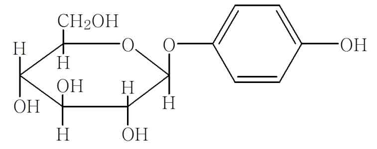

---

283±2 ㎚에서흡수극대를나타낸다.

융

점

198～201 ℃ (제1법)

[α] 25

비선광도

D : -63.5 ～ -65.5 °(3.0 g, 물, 100 mL, 100 ㎜)

순도시험

1) 중금속

이원료1.0g을달아제1법에따라조작하여시험한다. 비교액에는납표준액

2.0 mL를넣는다(20 ppm 이하).

2) 비소

이원료1.0g을달아제1법에따라검액을만들고장치B를쓰는방법에따라조작하

여시험한다(2 ppm 이하).

수

분

0.5 % 이하(0.3 g)

강열잔분

0.5 % 이하(1.0 g, 제1법)

정량법

이원료약40 ㎎을정밀하게달아이동상을넣어녹여10 mL로한액을가지고검액으

로한다. 따로알부틴표준품을데시케이터(감압, 실리카겔)에서12시간건조한다음약40 ㎎을

정밀하게달아검액과같은방법으로조작하여표준액으로한다. 검액및표준액20 ㎕를가지고

다음조건으로액체크로마토그래프법에따라시험하여검액및표준액의알부틴피크면적AT 및

AS를구한다.

알부틴(C 12H 16O 7)의양(㎎) ꠧ

알부틴표준품의양(㎎)× A T

A S

조작조건

검출기: 자외부흡광광도계(측정파장280 ㎚)

칼

럼: 안지름약4.6 ㎜, 길이약25 ㎝인스테인레스관에5 ㎛의액체크로마토그래프용옥타

데실실릴화한실리카겔을충전한다.

이동상: 10mM 인산이수소칼륨액ㆍ아세토니트릴혼합액(92:8)

유

량: 1.0 mL/분

알부틴로션제

Arbutin Lotion

이기능성화장품은정량할때표시량의90.0 %이상에해당하는알부틴(C12H16O7 : 272.25)

을함유한다.

제

법

이기능성화장품은알부틴을주성분(기능성성분)으로하는로션제이다. 이제품은안

정성및유용성을높이기위해안정제, 습윤제, 유화제, 보습제, pH조정제, 착색제, 착향제등을

첨가할수있다.

확인시험

정량법의검액에서얻은주피크의유지시간은표준액에서얻은주피크의유지시간과

같다.

pH

기준치± 1.0 (2 → 30) (다만, pH 범위는3.0～9.0이다)

히드로퀴논

이기능성화장품약1g을정밀하게달아이동상을넣어분산시킨다음10mL로하고

필요하면여과하여검액으로한다. 따로히드로퀴논표준품(C6H6O2) 약10㎎을정밀하게달아이

동상을넣어녹여100mL로한액1mL를정확하게취한후, 이동상을넣어정확하게1000mL로

한액을표준액으로한다. 검액및표준액각20μL씩을가지고다음조작조건으로액체크로마토

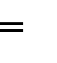

---

그래프법에따라시험할때검액의히드로퀴논피크는표준액의히드로퀴논피크보다크지않

다.(1ppm)

조작조건

검 출 기 : 자외부흡광광도계 (측정파장 290㎚)

칼    럼 : 안지름 약 4.6㎜, 길이 약 25㎝인 스테인레스관에 5㎛액체크로마토그래

프용 옥타데실실릴화한 실리카겔을 충전한다.

이 동 상 : 10mM 인산이수소칼륨액ㆍ아세토니트릴 혼합액 (92:8)

유    량 : 1.0mL/분

정량법

이기능성화장품을가지고알부틴으로서약20㎎ 해당량을정밀하게달아이동상을넣

어녹여50mL로한액을가지고검액으로한다. 따로알부틴표준품을데시케이터(감압, 실리카

겔)에서12시간건조한다음약20㎎을정밀하게달아검액과같은방법으로조작하여표준액으

로한다. 검액및표준액각20μL씩을가지고아래조작조건으로액체크로마토그래프법에따라

시험하여검액및표준액의알부틴피크면적AT 및AS를구한다.

알부틴(C 12H 16O 7)의양(㎎) ꠧ

알부틴표준품의양(㎎)× A T

A S

조작조건

검출기: 자외부흡광광도계(측정파장280 ㎚)

칼

럼: 안지름약4.6 ㎜, 길이약25 ㎝인스테인레스관에5 ㎛의액체크로마토그래프용옥타

데실실릴화한실리카겔을충전한다.

이동상: 10mM 인산이수소칼륨액ㆍ아세토니트릴혼합액(92:8)

유

량: 1.0 mL/분

알부틴액제

Arbutin Solution

이기능성화장품은정량할때표시량의90.0 %이상에해당하는알부틴(C12H16O7 : 272.25)

을함유한다.

제

법

이기능성화장품은알부틴을주성분(기능성성분)으로하는액제이다. 이제품은안정

성및유용성을높이기위해안정제, 습윤제, 보습제, pH조정제, 착색제, 착향제등을첨가할수

있다.

확인시험

정량법의검액에서얻은주피크의유지시간은표준액에서얻은주피크의유지시간과같

다.

pH

기준치± 1.0 (2 → 30) (다만, pH 범위는3.0～9.0이다)

히드로퀴논이기능성화장품약1g을정밀하게달아이동상을넣어분산시킨다음10mL로하고

필요하면여과하여검액으로한다. 따로히드로퀴논표준품(C6H6O2) 약10㎎을정밀하게달아이

동상을넣어녹여100mL로한액1mL를정확하게취한후, 이동상을넣어정확하게1000mL로

한액을표준액으로한다. 검액및표준액각20μL씩을가지고다음조작조건으로액체크로마토

---

그래프법에따라시험할때검액의히드로퀴논피크는표준액의히드로퀴논피크보다크지않

다.(1ppm)

조작조건

검 출 기 : 자외부흡광광도계 (측정파장 290㎚)

칼    럼 : 안지름 약 4.6㎜, 길이 약 25㎝인 스테인레스관에 5㎛액체크로마토그래

프용 옥타데실실릴화한 실리카겔 을 충전한다.

이 동 상 : 10mM 인산이수소칼륨액ㆍ아세토니트릴 혼합액 (92:8)

유    량 : 1.0mL/분

정량법

이기능성화장품을가지고알부틴으로서약20 ㎎ 해당량을정밀하게달아이동상을넣

어녹여50 mL로한액을가지고검액으로한다. 따로알부틴표준품을데시케이터(감압, 실리

카겔)에서12 시간건조한다음약20 ㎎을정밀하게달아검액과같은방법으로조작하여표

준액으로한다. 검액및표준액각20 μL씩을가지고아래조작조건으로액체크로마토그래프법

에따라시험하여검액및표준액의알부틴피크면적AT 및AS를구한다.

알부틴(C 12H 16O 7)의양(㎎) ꠧ

알부틴표준품의양(㎎)× A T

A S

조작조건

검출기: 자외부흡광광도계(측정파장280 ㎚)

칼

럼: 안지름약4.6 ㎜, 길이약25 ㎝인스테인레스관에5 ㎛의액체크로마토그래프용옥타

데실실릴화한실리카겔을충전한다.

이동상: 10mM 인산이수소칼륨액ㆍ아세토니트릴혼합액(92:8)

유

량: 1.0 mL/분

알부틴크림제

Arbutin Cream

이기능성화장품은정량할때표시량의90.0%이상에해당하는알부틴(C12H16O7 : 272.25)을

함유한다.

제

법

이기능성화장품은알부틴을주성분(기능성성분)으로하는크림제이다. 이제품은안

정성및유용성을높이기위해안정제, 습윤제, 유화제, 보습제, pH조정제, 착색제, 착향제등을첨

가할수있다.

확인시험

정량법의검액에서얻은주피크의유지시간은표준액에서얻은주피크의유지시간과

같다.

pH

기준치± 1.0 (2 → 30) (다만, pH 범위는3.0～9.0이다)

히드로퀴논이기능성화장품약1g을정밀하게달아이동상을넣어분산시킨다음10mL로하고

필요하면여과하여검액으로한다. 따로히드로퀴논표준품(C6H6O2) 약10㎎을정밀하게달아이

동상을넣어녹여100mL로한액1mL를정확하게취한후, 이동상을넣어정확하게1000mL로

한액을표준액으로한다. 검액및표준액각20μL씩을가지고다음조작조건으로액체크로마토

---

그래프법에따라시험할때검액의히드로퀴논피크는표준액의히드로퀴논피크보다크지않

다.(1ppm)

조작조건

검 출 기 : 자외부흡광광도계 (측정파장 290㎚)

칼    럼 : 안지름 약 4.6㎜, 길이 약 25㎝인 스테인레스관에 5㎛액체크로마토그래

프용 옥타데실실릴화한 실리카겔을 충전한다.

이 동 상 : 10mM 인산이수소칼륨액ㆍ아세토니트릴 혼합액 (92:8)

유    량 : 1.0mL/분

정 량 법  이 기능성화장품을 가지고 알부틴으로서 약 20 ㎎해당량을 정밀하게 달아

메탄올 5 mL를 넣어 초음파 추출한 후 물을 넣어 50 mL로 한 액을 가지고 검액으

로 한다. 따로 알부틴 표준품을 데시케이터(감압, 실리카 겔)에서 12 시간 건조한 다

음 약 20 ㎎을 정밀하게 달아 10 % 메탄올을 넣어 녹여 50 mL로 한 액을 표준액으

로 한다. 검액 및 표준액 각 20 μL씩을 가지고 아래 조작조건으로 액체크로마토그

래프법에 따라 시험하여 검액 및 표준액의 알부틴 피크면적 AT 및 AS를 구한다.

알부틴(C 12H 16O 7)의양(㎎) ꠧ

알부틴표준품의양(㎎)× A T

A S

조작조건

검출기: 자외부흡광광도계(측정파장280㎚)

칼

럼: 안지름약4.6㎜, 길이약25㎝인스테인레스관에5㎛의액체크로마토그래프용옥타데실

실릴화한실리카겔을충전한다.

이동상: 10mM 인산이수소칼륨액ㆍ아세토니트릴혼합액(92:8)

유

량: 1.0 mL/분

알부틴침적마스크

Arbutin Soaked Mask

이기능성화장품은정량할때표시량의90.0% 이상에해당하는알부틴(C12H16O7 : 272.25)

을함유한다.

제

법

이기능성화장품은알부틴을주성분(기능성성분)으로하는액제또는로션제를부직포

등의지지체에단순침적한마스크제형의제품이다. 이때액제또는로션제에는안정성및유용

성을높이기위해안정제, 습윤제, 유화제, 보습제, pH 조정제, 착색제, 착향제등을첨가할수있

다.

확인시험

정량법의검액에서얻은주피크의유지시간은표준액에서얻은주피크의유지시간과같

다.

pH

이기능성화장품을압착하여얻은액제또는로션제를가지고시험할때기준치± 1.0이

다. (다만, pH 범위는3.0 ～ 9.0이다)

히드로퀴논

이기능성화장품을압착하여얻은액제또는로션제약1g을정밀하게달아이동상을

---

넣어분산시킨다음10mL로하고필요하면여과하여검액으로한다. 따로히드로퀴논표준품

(C6H6O2) 약10㎎을정밀하게달아이동상을넣어녹여100mL로한액1mL를정확하게취한

후, 이동상을넣어정확하게1000mL로한액을표준액으로한다. 검액및표준액각20μL씩을

가지고다음조작조건으로액체크로마토그래프법에따라시험할때검액의히드로퀴논피크는

표준액의히드로퀴논피크보다크지않다.(1ppm)

조작조건

검 출 기 : 자외부흡광광도계 (측정파장 290㎚)

칼    럼 : 안지름 약 4.6㎜, 길이 약 25㎝인 스테인레스관에 5㎛액체크로마토그래

프용 옥타데실실릴화한 실리카겔을 충전한다.

이 동 상 : 10mM 인산이수소칼륨액ㆍ아세토니트릴 혼합액 (92:8)

유    량 : 1.0mL/분

정량법이기능성화장품을압착하여얻은액제또는로션제를가지고알부틴으로서약20㎎ 해당

량을정밀하게달아이동상을넣어녹여50mL로한액을가지고검액으로한다. 따로알부틴표

준품을데시케이터(감압, 실리카겔)에서12시간건조한다음약20㎎을정밀하게달아검액과같은

방법으로조작하여표준액으로한다. 검액및표준액각20μL씩을가지고아래조작조건으로액체

크로마토그래프법에따라시험하여검액및표준액의알부틴피크면적AT 및AS를구한다.

알부틴(C12H16O7)의양(㎎) = 알부틴표준품의양(㎎) × A T

A S

조작조건

검 출 기 : 자외부흡광광도계 (측정파장 280㎚)

칼    럼 : 안지름 약 4.6㎜, 길이 약 25㎝인 스테인레스관에 5㎛액체크로마토그래

프용 옥타데실실릴화한 실리카겔을 충전한다.

이 동 상 : 10mM 인산이수소칼륨액ㆍ아세토니트릴 혼합액 (92:8)

유    량 : 1.0mL/분

알파-비사보롤

(-)-alpha-bisabolol

(-)-6-메칠-2-(4-메칠-3-싸이클로헥센-1-일)-5-헵텐-2-올

(-)-6-Methyl-2-(4-methyl-3-cyclohexen-1-yl)-5-hepten-2-ol     C15H26O :

222.37

---

107.

이원료는칸데이아나무Vanillosmopsis erythropoppa Schult. Bip의가지와잎을분별증류하여얻은

에센셜오일이다. 이원료는정량할때알파-비사보롤(C15H26O : 222.37) 97.0 % 이상을함유한다.

제    법   칸데이아 나무 가지와 잎 100 kg을 감압하에서(0.4 mmHg, 100 ℃) 18시

간 동안 증류하여 얻은 칸데이아 오일(Candeia oil) 1.1kg을 다시 감압하에서(0.1

mmHg) 온도별로 분별 증류하여 이 원료 825g을 얻는다.

성    상  이 원료는 무색의 오일 상으로 냄새는 없거나 특이한 냄새가 있다.

굴 절 률  n 20

D：1.480 ∼1.500

: 0.900 ∼0.950

비    중  d25

25

비선광도 [α] 20

D : -53〫∼-63〫(메탄올)

확인시험  1) 이 원료 10㎎을 달아 메탄올 1mL에 녹인 액을 검액으로 한다. 따로 알

파-비사보롤 표준품 10㎎을 달아 메탄올 1mL에 녹인 액을 표준액으로 한다. 검액

및 표준액 10μL씩을 박층크로마토그래프용실리카겔을 써서 만든 박층판(실리카겔

GF254)에 점적한다. 다음에 헥산ㆍ에칠아세테이트 혼합액 (85 : 15)을 전개용매로

하여 전개시키고 실온에서 박층판을 말린 다음 황산ㆍ에탄올ㆍ아니스알데하이드 혼

합액 (10:90:10)에 넣은 다음 가열할 때 검액은 표준액과 같은 Rf값에서 같은 색상

의 반점을 나타낸다.

2) 정량법의 검액에서 얻은 주피크의 유지시간은 표준액에서 얻은 주피크의 유지시

간과 같다.

강열잔분  0.1 % 이하 (1.0 g, 제 1법)

건조감량

0.1 % 이하(1.0 g, 감압, 오산화인, 24시간)

순도시험

1) 중금속

이원료1.0g을달아제1법에따라조작하여시험한다. 다만, 비교액에는납

표준액1.0mL를넣는다. (10ppm 이하)

2) 비소

이원료0.5g을달아제3법에따라검액을만들고장치A를쓰는방법에따라시험한

다.(4ppm 이하).

3) 기타유연물질이원료약200㎎을정밀하게달아메탄올을넣어녹여100mL로한액을검액

으로한다. 따로, 검액2.8mL을정확하게취해메탄올을넣어녹여100mL로한액을표준액으로

한다. 검액및표준액10μL씩을가지고정량법조작조건으로액체크로마토그래프법에따라시험할

때검액중용매피크와주피크를제외한개별유연물질의피크면적합은표준액의피크면적보

다크지않다. (2.8 % 이하) 다만, 측정범위는20분으로한다.

정량법

이원료약50㎎을정밀하게달아메탄올을넣어녹여100 mL로한액을검액으로한다.

따로, 알파-비사보롤표준품약50㎎을정밀하게달아메탄올을넣어녹여100mL로하여표준액

으로한다. 검액및표준액10μL씩을가지고다음조작조건으로액체크로마토그래피법에따라시

험하여알파-비사보롤의피크면적AT 및As를구한다.

알파-비사보롤(C15H26O : 222.37)의양(㎎) = 알파-비사보롤표준품의양(㎎) × A T

A S

조작조건

검 출 기 : 자외부흡광광도계 (측정파장 210㎚)

칼    럼 : 안지름 4.6㎜, 길이 25㎝인 스테인레스관에 약 10㎛의 액체크로마토그래

프용 옥타데실실릴화한 실리카겔을 충전한다.

---

칼럼온도 : 실온

이 동 상 : 희석시킨 초산(1→1,000)ㆍ아세토니트릴 혼합액 (20 : 80)

유    량 : 0.8mL/분

미생물한도

세균및진균시험을할때세균수및진균수는각각100개/g 이하이어야한다.

가.

나. 알파-비사보롤로션제

다. Alpha-Bisabolol Lotion

라.

108.

이기능성화장품은정량할때표시량의90.0 %이상에해당하는알파-비사보롤(C15H26O : 222.37)을

함유한다.

제

법

이기능성화장품은알파-비사보롤을주성분(기능성성분)으로하는로션제이다. 이제품은

안정성및유용성을높이기위해안정제, 습윤제, 유화제, 보습제, pH 조정제, 착색제, 착향제등을

첨가할수있다.

확인시험

정량법의검액에서얻은주피크의유지시간은표준액에서얻은주피크의유지시간과같

다.

pH

기준치± 1.0 (2 → 30) (다만, pH 범위는3.0 ～ 9.0이다)

정량법

이기능성화장품을가지고알파-비사보롤로서약5㎎에해당하는양을정밀하게달아이

동상을넣어분산시킨다음정확하게10mL로하고필요하면여과하여검액으로한다. 따로알파-

비사보롤표준품약50㎎을정밀하게달아이동상을넣어녹여100mL로한액을표준액으로한

다. 검액및표준액각10μL씩을가지고다음조건으로액체크로마토그래프법에따라시험하여검

액및표준액의피크면적AT 및AS를각각구한다.

× 1

알파-비사보롤(C15H26O : 222.37)의양(㎎) = 알파-비사보롤표준품의양(㎎) × A T

10

A S

조작조건

검 출 기 : 자외부흡광광도계 (측정파장 210㎚)

칼    럼 : 안지름 약 4.6 ㎜, 길이 약 25 ㎝인 스테인레스관에 5 ㎛의 액체크로마

토그래프용 옥타데실실릴화한 실리카겔을 충전한다.

이 동 상 : 희석시킨 초산(1→1,000)ㆍ아세토니트릴 혼합액 (20 : 80)

유    량 : 0.8mL/분

가.

나. 알파-비사보롤액제

다. Alpha-Bisabolol Solution

라.

109.

이기능성화장품은정량할때표시량의90.0 %이상에해당하는알파-비사보롤(C15H26O : 222.37)을

함유한다.

제

법

이기능성화장품은알파-비사보롤을주성분(기능성성분)으로하는액제이다. 이제품은

안정성및유용성을높이기위해안정제, 습윤제, 보습제, pH 조정제, 착색제, 착향제등을첨가할

---

수있다.

확인시험

정량법의검액에서얻은주피크의유지시간은표준액에서얻은주피크의유지시간과같

다.

pH

기준치± 1.0 (2 → 30) (다만, pH 범위는3.0 ～ 9.0이다)

정량법

이기능성화장품을가지고알파-비사보롤로서약5㎎에해당하는양을정밀하게달아이

동상을넣어분산시킨다음정확하게10mL로하고필요하면여과하여검액으로한다. 따로알파-

비사보롤표준품약50㎎을정밀하게달아이동상을넣어녹여100mL로한액을표준액으로한

다. 검액및표준액각10μL씩을가지고다음조건으로액체크로마토그래프법에따라시험하여검

액및표준액의피크면적AT 및AS를각각구한다.

× 1

알파-비사보롤(C15H26O : 222.37)의양(㎎) = 알파-비사보롤표준품의양(㎎) × A T

10

A S

조작조건

검 출 기 : 자외부흡광광도계 (측정파장 210㎚)

칼    럼 : 안지름 약 4.6㎜, 길이 약 25㎝인 스테인레스관에 5㎛의 액체크로마토그

래프용 옥타데실실릴화한 실리카겔을 충전한다.

이 동 상 : 희석시킨 초산(1→1,000)ㆍ아세토니트릴 혼합액 (20 : 80)

유    량 : 0.8mL/분

가.

나. 알파-비사보롤크림제

다. Alpha-Bisabolol Cream

라.

110.

이기능성화장품은정량할때표시량의90.0% 이상에해당하는알파-비사보롤(C15H26O : 222.37)을

함유한다.

제

법

이기능성화장품은알파-비사보롤을주성분(기능성성분)으로하는크림제이다. 이제품은

안정성및유용성을높이기위해안정제, 습윤제, 유화제, 보습제, pH 조정제, 착색제, 착향제등을

첨가할수있다.

확인시험

정량법의검액에서얻은주피크의유지시간은표준액에서얻은주피크의유지시간과같

다.

pH

기준치± 1.0 (2 → 30) (다만, pH 범위는3.0 ～ 9.0이다)

정량법

이기능성화장품을가지고알파-비사보롤로서약5㎎에해당하는양을정밀하게달아이

동상을넣어분산시킨다음정확하게10mL로하고필요하면여과하여검액으로한다. 따로알파-

비사보롤표준품약50㎎을정밀하게달아이동상을넣어녹여100mL로한액을표준액으로한

다. 검액및표준액각10μL씩을가지고다음조건으로액체크로마토그래프법에따라시험하여검

액및표준액의피크면적AT 및AS를각각구한다.

× 1

알파-비사보롤(C15H26O : 222.37)의양(㎎) = 알파-비사보롤표준품의양(㎎) × A T

10

A S

조작조건

검 출 기 : 자외부흡광광도계 (측정파장 210㎚)

---

칼    럼 : 안지름 약 4.6㎜, 길이 약 25㎝인 스테인레스관에 5㎛의 액체크로마토그

래프용 옥타데실실릴화한 실리카겔을 충전한다.

이 동 상 : 희석시킨 초산(1→1,000)ㆍ아세토니트릴 혼합액 (20 : 80)

유    량 : 0.8mL/분

가.

나. 알파-비사보롤침적마스크

다. Alpha-Bisabolol Soaked Mask

라.

111.

이기능성화장품은정량할때표시량의90.0 %이상에해당하는알파-비사보롤(C15H26O : 222.37)을

함유한다.

제

법

이기능성화장품은알파-비사보롤을주성분(기능성성분)으로하는액제또는로션제를부

직포등의지지체에단순침적한마스크제형의제품이다. 이때침적되는액제또는로션제에는

안정성및유용성을높이기위해안정제, 습윤제, 유화제, 보습제, pH 조정제, 착색제, 착향제등을

첨가할수있다.

확인시험

정량법의검액에서얻은주피크의유지시간은표준액에서얻은주피크의유지시간과같

다.

pH

이기능성화장품을압착하여얻은액제또는로션제를가지고시험할때기준치± 1.0이

다. (다만, pH 범위는3.0 ～ 9.0이다)

정량법

이기능성화장품을압착하여얻은액제또는로션제를가지고알파-비사보롤로서약5㎎

에해당하는양을정밀하게달아이동상을넣어분산시킨다음정확하게10mL로하고필요하면

여과하여검액으로한다. 따로알파-비사보롤표준품약50㎎을정밀하게달아이동상을넣어녹

여100mL로한액을표준액으로한다. 검액및표준액각10μL씩을가지고다음조건으로액체크

로마토그래프법에따라시험하여검액및표준액의피크면적AT 및AS를각각구한다.

× 1

알파-비사보롤(C15H26O : 222.37)의양(㎎) = 알파-비사보롤표준품의양(㎎) × A T

10

A S

조작조건

검 출 기 : 자외부흡광광도계 (측정파장 210㎚)

칼    럼 : 안지름 약 4.6㎜, 길이 약 25㎝인 스테인레스관에 5㎛의 액체크로마토그

래프용 옥타데실실릴화한 실리카겔을 충전한다.

이 동 상 : 희석시킨 초산((1→1,000)ㆍ아세토니트릴 혼합액 (20 : 80)

유    량 : 0.8mL/분

알파-비사보롤 고형제

Alpha-Bisabolol Solid

이 기능성화장품은 정량할 때 표시량의 90.0% 이상에 해당하는 알파-비사보롤

(C15H26O : 222.37)를 함유한다.

제    법   이 기능성화장품은 알파-비사보롤을 주성분(기능성성분)으로 하는 고형제

---

이다. 이 제품은 안정성 및 유용성을 높이기 위해 안정제, 습윤제, 유화제, 보습제, pH

조정제, 착색제, 착향제 등을 첨가할 수 있다.

확인시험   정량법의 검액에서 얻은 주피크의 유지시간은 표준액에서 얻은 주피크의

유지시간과 같다.

pH         기준치 ± 1.0 (2 →30) (다만, pH 범위는 3.0 ∼9.0이며, 물을 포함하

지 않는 제품은 제외)

정 량 법   이 기능성화장품을 가지고 알파-비사보롤로서 약 5㎎에 해당하는 양을 정

밀하게 달아 테트라하이드로퓨란 1mL를 넣어 초음파 추출한 후 이동상을 넣어 10mL

로 하고 필요하면 여과하여 검액으로 한다. 따로 알파-비사보롤 표준품 약 50㎎을 정

밀하게 달아 테트라하이드로퓨란 10 % 함유 이동상에 녹여 100mL로 한 액을 표준액

으로 한다. 검액 및 표준액 각 10μL씩을 가지고 다음 조건으로 액체크로마토그래프법

에 따라 시험하여 검액 및 표준액의 피크면적 AT 및 AS를 각각 구한다.

AT

알파-비사보롤(C15H26O : 222.37)의 양(㎎) = 알파-비사보롤 표준품의 양(㎎) × 

AS

조작조건

검 출 기 : 자외부흡광광도계 (측정파장 210㎚)

칼   럼 : 안지름 약 4.6㎜, 길이 약 25㎝인 스테인레스관에 5㎛의 액체크로마토그

래프용 옥타데실실릴화한 실리카겔을 충전한다.

이 동 상 : 초산(1→1,000)ㆍ아세토니트릴 혼합액 (20 : 80)

유    량 : 1.0mL/분

에칠아스코빌에텔

Ethyl Ascorbyl Ether

3-O -에칠아스코베이트

3-O -Ethyl Ascorbate

C8H12O6 : 204.18

이원료를건조한것은정량할때에칠아스코빌에텔(C8H12O6:204.18) 95.0% 이상을함유한

다.

---

성

상

이원료는백색～엷은황색의결정또는결정성가루로약간의특이한냄새가있고

맛은쓰다.

확인시험

1) 이원료의수용액(1→50) 5mL에과망간산칼륨시액1방울을넣을때시액의홍색은

곧없어진다.

2) 이원료0.1g에메타인산용액(1→50) 100mL를넣어녹인액5mL를취하여액이엷은홍색을

나타낼때까지요오드시액을넣고황산동용액(1→1000) 1방울및피롤1방울을넣고50℃에서5

분간가온할때액은청색을나타낸다.

3) 이원료를건조하여적외부흡수스펙트럼측정법의1) 브롬화칼륨정제법에따라측정할때파수

3350㎝-1, 1744㎝-1, 1694㎝-1 및1680㎝-1 부근에서특성흡수를나타낸다.

융

점

111～116℃ (제1법)

pH

이원료3.0g에새로끓여식힌물을넣어100mL로한액의pH는3.0～4.5이다.

순도시험

1) 용해상태

이원료3.0g에물100mL를넣어녹일때액은무색～엷은황색이며맑다.

2) 중금속

이원료1.0g을달아제1법에따라조작하여시험한다.

비교액에는납표준액2.0mL

를넣는다(20ppm 이하).

3) 비소

이원료1.0g을달아제1법에따라검액을만들고장치B를쓰는방법에따라조작하여

시험한다(2ppm 이하).

4) 유연물질

이원료50mg을달아메탄올20mL에녹여검액으로한다.

검액1.0mL를정확하

게취하여메탄올을넣어정확하게100mL로하여표준액으로한다.

검액및표준액10㎕를가지

고다음의조건으로액체크로마토그래프법에따라시험한다. 각액의피크면적을자동적분법에따

라측정할때검액의에칠아스코빌에텔이외의총피크면적은표준액의에칠아스코빌에텔의피크

면적의2배보다크지않다.

조작조건

검출기: 자외부흡광광도계(측정파장245㎚)

칼

럼: 안지름약4㎜, 길이약15㎝인스테인레스관에5㎛의액체크로마토그래프용옥타데실실

릴화한실리카겔을충전한다.

칼럼온도: 실온

이동상: 아세토니트릴ㆍ0.02M 인산이수소나트륨혼합액(3: 97)

유

량: 에칠아스코빌에텔의유지시간이약10분이되도록조정한다.

칼럼의선정: 표준액10㎕를가지고위의조건으로조작할때내부표준물질, 에칠아스코빌에텔의

순서로용출하고, 그분리도가6.5이상인것을쓴다.

검출감도: 표준액10㎕에서얻은에칠아스코빌에텔의피크높이가기록계의풀스케일의1/10 이

상이되도록조정한다.

면적측정범위: 에칠아스코빌에텔유지시간의약2배범위

건조감량

2.0 % 이하(1.0g, 감압, 오산화인, 24시간)

정량법

이약을건조하여그약50㎎을정밀하게달아메탄올을넣어녹여정확하게10mL로한다.

이액5mL를정확하게취하여내부표준액10mL를넣은다음메탄올을넣어정확하게100mL로

한액을검액으로한다. 따로에칠아스코빌에텔표준품을건조하여그약50㎎을정밀하게달아

검액과같은방법으로조작하여표준액으로한다. 검액및표준액10㎕를가지고다음의조건으로

액체크로마토그래프법에따라시험하여내부표준물질의피크면적에대한에칠아스코빌에텔의피크

면적비AT 및AS를구한다.

---

에칠아스코빌에텔(C 8H 12O 6) 양(㎎)= 에칠아스코빌에텔표준품의양(㎎)× A T

A S

내부표준액: 티민의메탄올용액(1→400)

조작조건

검출기: 자외부흡광광도계(측정파장245㎚)

칼

럼: 안지름약4㎜, 길이약15㎝인스테인레스관에5㎛의액체크로마토그래프용옥타데실

실릴화한실리카겔을충전한다.

칼럼온도: 실온

이동상: 아세토니트릴ㆍ0.02M 인산이수소나트륨혼합액(3: 97)

유

량: 에칠아스코빌에텔의유지시간이약10분이되도록조정한다.

칼럼의선정: 표준액10㎕를가지고위의조건으로조작할때내부표준물질, 에칠아스코빌에텔의

순서로용출하고, 그분리도가6.5이상인것을쓴다.

에칠아스코빌에텔로션제

Ethyl Ascorbyl Ether Lotion

가.

112.

이기능성화장품은정량할때표시량의90.0 % 이상에해당하는에칠아스코빌에텔(C8H12O6 :

204.18)을함유한다.

제

법

이기능성화장품은에칠아스코빌에텔을주성분(기능성성분)으로하는로션제이다. 이제

품은안정성및유용성을높이기위해안정제, 습윤제, 유화제, 보습제, pH 조정제, 착색제, 착향

제등을첨가할수있다.

확인시험

정량법의검액에서얻은주피크의유지시간은표준액에서얻은주피크의유지시간과

같다.

pH

기준치± 1.0 (2 → 30) (다만, pH 범위는3.0 ～ 9.0이다)

정량법

이기능성화장품을가지고에칠아스코빌에텔로서약10 mg에해당하는양을정밀하게

달아이동상20 mL를넣어초음파추출한후이동상을넣어정확하게100 mL로한액을검액

으로한다. 따로에칠아스코빌에텔표준품약10 mg을정밀하게달아이동상에녹여100 mL로

한액을표준액으로한다. 검액및표준액각10 μL씩을가지고다음조건으로액체크로마토그

래프법에따라시험하여검액및표준액의피크면적AT 및AS를각각구한다.

AT

에칠아스코빌에텔(C8H12O6 : 204.18)의양(mg) = 에칠아스코빌에텔의표준품의양(mg)×

AS

조작조건

검 출 기 : 자외부흡광광도계 (측정파장 245 nm)

칼    럼 : 안지름 약 4.6 mm, 길이 약 25 cm인 스테인레스관에 5 ㎛의 액체크로

마토그래프용 옥타데실실릴화한 실리카 겔을 충전한다.

이 동 상 : 20 mM 인산이수소칼륨액ㆍ아세토니트릴 혼합액 (92 : 8)

---

유    량 : 1.0 mL/분

에칠아스코빌에텔액제

Ethyl Ascorbyl Ether Solution

가.

113.

이기능성화장품은정량할때표시량의90.0 % 이상에해당하는에칠아스코빌에텔(C8H12O6 :

204.18)을함유한다.

114. 제

법

이기능성화장품은에칠아스코빌에텔을주성분(기능성성분)으로하는액제이다. 이제품

은안정성및유용성을높이기위해안정제, 습윤제, 보습제, pH 조정제, 착색제, 착향제등을첨

가할수있다.

확인시험

정량법의검액에서얻은주피크의유지시간은표준액에서얻은주피크의유지시간과같

다.

pH

기준치± 1.0 (2 → 30) (다만, pH 범위는3.0 ～ 9.0이다)

정량법

이기능성화장품을가지고에칠아스코빌에텔로서약10 mg에해당하는양을정밀하게

달아이동상20 mL를넣어초음파추출한후이동상을넣어정확하게100 mL로한액을검액

으로한다. 따로에칠아스코빌에텔표준품약10 mg을정밀하게달아이동상에녹여100 mL로

한액을표준액으로한다. 검액및표준액각10 μL씩을가지고다음조건으로액체크로마토그

래프법에따라시험하여검액및표준액의피크면적AT 및AS를각각구한다.

AT

에칠아스코빌에텔(C8H12O6 : 204.18)의양(mg) = 에칠아스코빌에텔의표준품의양(mg)×

AS

조작조건

검 출 기 : 자외부흡광광도계 (측정파장 245 nm)

칼    럼 : 안지름 약 4.6 mm, 길이 약 25 cm인 스테인레스관에 5 ㎛의 액체크로

마토그래프용 옥타데실실릴화한 실리카 겔을 충전한다.

이 동 상 : 20 mM 인산이수소칼륨액ㆍ아세토니트릴 혼합액 (92 : 8)

유    량 : 1.0 mL/분

에칠아스코빌에텔크림제

Ethyl Ascorbyl Ether Cream

가.

115.

이기능성화장품은정량할때표시량의90.0 % 이상에해당하는에칠아스코빌에텔(C8H12O6 :

204.18)을함유한다.

제

법

이기능성화장품은에칠아스코빌에텔을주성분(기능성성분)으로하는크림제이다. 이제

품은안정성및유용성을높이기위해안정제, 습윤제, 유화제, 보습제, pH 조정제, 착색제, 착향

제등을첨가할수있다.

확인시험

정량법의검액에서얻은주피크의유지시간은표준액에서얻은주피크의유지시간과

---

같다.

pH

기준치± 1.0 (2 → 30) (다만, pH 범위는3.0 ～ 9.0이다)

정량법

이기능성화장품을가지고에칠아스코빌에텔로서약10 mg에해당하는양을정밀하게

달아이동상20 mL를넣어초음파추출한후이동상을넣어정확하게100 mL로한액을가지

고검액으로한다. 따로에칠아스코빌에텔표준품약10 mg을정밀하게달아이동상에녹여100

mL로한액을표준액으로한다. 검액및표준액각10 μL씩을가지고다음조건으로액체크로

마토그래프법에따라시험하여검액및표준액의피크면적AT 및AS를각각구한다.

AT

에칠아스코빌에텔(C8H12O6 : 204.18)의양(mg) = 에칠아스코빌에텔의표준품의양(mg)×

AS

조작조건

검 출 기 : 자외부흡광광도계 (측정파장 245 nm)

칼    럼 : 안지름 약 4.6 mm, 길이 약 25 cm인 스테인레스관에 5 ㎛의 액체크로

마토그래프용 옥타데실실릴화한 실리카 겔을 충전한다.

이 동 상 : 20 mM 인산이수소칼륨액ㆍ아세토니트릴 혼합액 (92 : 8)

유    량 : 1.0 mL/분

에칠아스코빌에텔침적마스크

Ethyl Ascorbyl Ether Soaked Mask

가.

116.

이기능성화장품은정량할때표시량의90.0 % 이상에해당하는에칠아스코빌에텔(C8H12O6 :

204.18)을함유한다.

제

법

이기능성화장품은에칠아스코빌에텔을주성분(기능성성분)으로하는액제또는로션제

를부직포등의지지체에단순침적한마스크제형의제품이다. 이때침적되는액제또는로션

제에는안정성및유용성을높이기위해안정제, 습윤제, 유화제, 보습제, pH 조정제, 착색제, 착

향제등을첨가할수있다.

확인시험

정량법의검액에서얻은주피크의유지시간은표준액에서얻은주피크의유지시간과

같다.

pH

이기능성화장품을압착하여얻은액제또는로션제를가지고시험할때기준치± 1.0

이다. (다만, pH 범위는3.0 ～ 9.0이다)

정량법

이기능성화장품을가지고에칠아스코빌에텔로서약10 mg에해당하는양을정밀하게

달아이동상20 mL를넣어초음파추출한후이동상을넣어정확하게100 mL로한액을검액

으로한다. 따로에칠아스코빌에텔표준품약10 mg을정밀하게달아이동상에녹여100 mL로

한액을표준액으로한다. 검액및표준액각10 μL씩을가지고다음조건으로액체크로마토그

래프법에따라시험하여검액및표준액의피크면적AT 및AS를각각구한다.

AT

에칠아스코빌에텔(C8H12O6 : 204.18)의양(mg) = 에칠아스코빌에텔의표준품의양(mg)×

AS

조작조건

---

검 출 기 : 자외부흡광광도계 (측정파장 245 nm)

칼    럼 : 안지름 약 4.6 mm, 길이 약 25 cm인 스테인레스관에 5 ㎛의 액체크로

마토그래프용 옥타데실실릴화한 실리카 겔을 충전한다.

이 동 상 : 20 mM 인산이수소칼륨액ㆍ아세토니트릴 혼합액 (92 : 8)

유    량 : 1.0 mL/분

에칠아스코빌에텔 고형제

Ethyl Ascorbyl Ether Solid

이 기능성화장품은 정량할 때 표시량의 90.0% 이상에 해당하는 에칠아스코빌에텔

(C8H12O6 : 204.18)를 함유한다.

제    법   이 기능성화장품은 에칠아스코빌에텔을 주성분(기능성성분)으로 하는 고형

제이다. 이 제품은 안정성 및 유용성을 높이기 위해 안정제, 습윤제, 유화제, 보습제,

pH 조정제, 착색제, 착향제 등을 첨가할 수 있다.

확인시험   정량법의 검액에서 얻은 주피크의 유지시간은 표준액에서 얻은 주피크의

유지시간과 같다.

pH         기준치 ± 1.0 (2 →30) (다만, pH 범위는 3.0 ∼9.0이며, 물을 포함하

지 않는 제품은 제외)

정 량 법   이 기능성화장품을 가지고 에칠아스코빌에텔로서 약 10mg에 해당하는 양

을 정밀하게 달아 테트라하이드로퓨란 10mL를 넣어 초음파 추출한 후 이동상을 넣어

정확하게 100mL로 하고 필요하면 여과하여 검액으로 한다. 따로 에칠아스코빌에텔 표

준품 약 10mg을 정밀하게 달아 테트라하이드로퓨란 10% 함유 이동상에 녹여 100mL

로 한 액을 표준액으로 한다. 검액 및 표준액 각 10μL씩을 가지고 다음 조건으로 액

체크로마토그래프법에 따라 시험하여 검액 및 표준액의 피크면적 AT 및 AS를 각각

구한다.

에칠아스코빌에텔(C8H12O6 : 204.18)의 양(㎎) = 에칠아스코빌에텔 표준품의 양(㎎) ×

AT



AS

조작조건

검 출 기 : 자외부흡광광도계 (측정파장 245㎚)

칼   럼 : 안지름 약 4.6㎜, 길이 약 25㎝인 스테인레스관에 5㎛의 액체크로마토그

래프용 옥타데실실릴화한 실리카겔을 충전한다.

이 동 상 : 20mM 인산이수소칼륨액ㆍ아세토니트릴 혼합액 (92:8)

유    량 : 1.0mL/분

---

유용성감초추출물

Oil Soluble Licorice(Glycyrrhiza) Extract

이원료는감초Glycyrrhiza glabra L. var. glandulifera Regel et Herder, Glycyrrhiza

uralensis Fisher 또는그밖의근연식물(Leguminosae)의뿌리를무수에탄올로추출하

여얻은추출물을다시에칠아세테이트로추출한다음추출액을감압농축하여건조

한유용성추출물을가루로한것이다.

이원료는정량할때글라브리딘(C20H20O4 :

324.38) 35.0% 이상을함유한다.

성    상  이 원료는 황갈색～적갈색의 가루로 감초 특유의 냄새가 있다.

확인시험  1) 이 원료 0.2g에 에탄올 20mL를 넣어 녹이고 리본상마그네슘 0.1g 및 염산

0.5mL를 넣어 방치할 때 액은 자색을 띤 등적색을 나타낸다.

2) 이 원료 10㎎에 에탄올 1mL 및 1N 수산화나트륨시액 2mL를 넣어 녹인 액을

가지고 흡광도측정법에 따라 흡수스펙트럼을 측정할 때 파장 344㎚부근에서 흡수극

대를 나타낸다.

순도시험  1) 용해상태  이 원료 1.0g을 피마자유 100mL에 넣어 녹일 때 액은 맑다.

2) 중금속  이 원료 1.0g을 달아 제２법에 따라 조작하여 시험한다. 비교액에는 납

표준액 2.0mL를 넣는다(20ppm 이하).

3) 비 소  이 원료 1.0g을 달아 제３법에 따라 검액을 만들어 장치 B를 쓰는 방법

에 따라 시험한다(2ppm 이하)

건조감량  5.0% 이하(1.0g, 105℃, 1시간)

강열잔분  0.5% 이하(1.0g, 제２법)

에탄올가용분  95.0% 이상 이 원료 약 1.0g을 정밀하게 달아 50mL 삼각플라스크에

넣고 에탄올 35mL를 넣어 가끔 흔들어 섞으면서 실온에서 5시간 침출한 다음 여과지

로 여과한다.  플라스크 및 잔류물을 에탄올 15mL로 씻어주고 여액 및 씻은 액을 합

하여 수욕상에서 증발 건고하고 105℃에서 4시간 건조한 다음 무게를 정밀하게 단

다. 다음 시산식으로 에탄올 가용분을 구한다.

에탄올가용분의중량(mg)

×100

에탄올가용분(%) =

)

이원료의채취량(mg)×(1- 건조감량(%)

100

정 량 법  이 원료 약 25㎎을 정밀하게 달아 에탄올을 넣어 녹여 50mL로 하고 이 액

10mL를 정확하게 취하여 에탄올을 넣어 정확하게 50mL로 한 액을 검액으로 한다.

따로 글라브리딘 표준품 약 10㎎을 정밀하게 달아 에탄올을 넣어 녹여 50mL로 하

고 이 액 10mL를 정확하게 취하여 에탄올을 넣어 50mL로 한 액을 표준액으로 한

다.  검액 및 표준액 20㎕를 가지고 다음의 조건으로 액체크로마토그래프법에 따라 시

험하여 글라브리딘의 피크면적 AT 및 AS를 측정한다.

---

글라브리딘(C 20H 20O 4)의양(㎎) = 글라브리딘표준품의양(㎎)× A T

A S

조작조건

검 출 기 : 자외부흡광광도계(측정파장 282㎚)

칼    럼 : 안지름 약 4.6㎜, 길이 약 25㎝인 스테인레스관에 5～10㎛의 액체크로마

토그래프용 옥타데실실릴화한 실리카 겔을 충전한다.

칼럼온도 : 40℃

이 동 상 : 희석시킨 초산(1→50)ㆍ아세토니트릴 혼합액(1:1)

유    량 : 글라브리딘 피크의 유지시간이 약 14분이 되도록 조정한다.

유용성감초추출물로션제

Oil Soluble Licorice(Glycyrrhiza) Extract Lotion

이기능성화장품은정량할때표시량의90.0% 이상에해당하는글라브리딘(C20H20O4 :

324.38)을함유한다.

제

법

이기능성화장품은유용성감초추출물을주성분(기능성성분)으로하는로션제이다. 이제품

은안정성및유용성을높이기위해안정제, 습윤제, 유화제, 보습제, pH조정제, 착색제, 착향제등

을첨가할수있다.

확인시험

정량법의검액에서얻은주피크의유지시간은표준액에서얻은주피크의유지시간과같

다.

pH

기준치± 1.0 (2 → 30) (다만, pH 범위는3.0 ～ 9.0이다)

정량법

이기능성화장품을가지고글라브리딘으로서약0.35㎎에해당하는양을정밀하게달아

메탄올을넣어분산시킨다음정확하게100mL로하고필요하면여과하여검액으로한다. 따로글

라브리딘표준품약35㎎을정밀하게달아메탄올을넣어녹여100mL로하고, 이액1.0mL를정

확히취하여메탄올을넣어100mL로한액을표준액으로한다. 검액및표준액각20μL씩을가지

고다음조건으로액체크로마토그래프법에따라시험하여검액및표준액의피크면적AT 및AS를

각각구한다.

1

×

글라브리딘(C20H20O4)의양(㎎) = 글라브리딘표준품의양(㎎) × A T

100

A S

조작조건

검 출 기 : 자외부흡광광도계 (측정파장 282㎚)

칼    럼 : 안지름 약 4.6㎜, 길이 약 15㎝인 스테인레스관에 5㎛의 액체크로마토그

---

래프용 옥타데실실릴화한 실리카겔을 충전한다.

칼럼온도 : 40℃

이 동 상 : 초산 희석액 (1→50)ㆍ아세토니트릴 혼합액 (1:1)

유    량 : 1.0mL/분

유용성감초추출물액제

Oil Soluble Licorice(Glycyrrhiza) Extract Solution

이기능성화장품은정량할때표시량의90.0% 이상에해당하는글라브리딘(C20H20O4 :

324.38)을함유한다.

가. 제

법

이기능성화장품은유용성감초추출물을주성분(기능성성분)으로하는액제이다. 이제품은

안정성및유용성을높이기위해안정제, 습윤제, 보습제, pH 조정제, 착색제, 착향제등을첨가할

수있다.

나. 확인시험

정량법의검액에서얻은주피크의유지시간은표준액에서얻은주피크의유지시간과같

다.

다. pH

기준치± 1.0 (2 → 30) (다만, pH 범위는3.0 ～ 9.0이다)

라. 정량법

이기능성화장품을가지고글라브리딘으로서약0.35㎎에해당하는양을정밀하게달아메

탄올을넣어분산시킨다음정확하게100mL로하고필요하면여과하여검액으로한다. 따로글라브

리딘표준품약35㎎을정밀하게달아메탄올을넣어녹여100mL로하고, 이액1.0mL를정확히취

하여메탄올을넣어100mL로한액을표준액으로한다. 검액및표준액각20μL씩을가지고다음

조건으로액체크로마토그래프법에따라시험하여검액및표준액의피크면적AT 및AS를각각구한

다.

마.

1

×

바.

글라브리딘(C20H20O4)의양(㎎) = 글라브리딘표준품의양(㎎) × A T

100

A S

사.

조작조건

검 출 기 : 자외부흡광광도계 (측정파장 282㎚)

칼    럼 : 안지름 약 4.6㎜, 길이 약 15㎝인 스테인레스관에 5㎛의 액체크로마토그

래프용 옥타데실실릴화한 실리카겔을 충전한다.

칼럼온도 : 40℃

이 동 상 : 초산 희석액 (1→50)ㆍ아세토니트릴 혼합액 (1:1)

유    량 : 1.0mL/분

유용성감초추출물크림제

Oil Soluble Licorice(Glycyrrhiza) Extract Cream

---

이기능성화장품은정량할때표시량의90.0% 이상에해당하는글라브리딘(C20H20O4 :

324.38)을함유한다.

아. 제

법

이기능성화장품은유용성감초추출물을주성분(기능성성분)으로하는크림제이다. 이제품

은안정성및유용성을높이기위해안정제, 습윤제, 유화제, 보습제, pH 조정제, 착색제, 착향제등

을첨가할수있다.

자. 확인시험

정량법의검액에서얻은주피크의유지시간은표준액에서얻은주피크의유지시간과같

다.

차. pH

기준치± 1.0 (2 → 30) (다만, pH 범위는3.0 ～ 9.0이다)

카. 정량법

이기능성화장품을가지고글라브리딘으로서약0.35㎎에해당하는양을정밀하게달아메

탄올을넣어분산시킨다음정확하게100mL로하고필요하면여과하여검액으로한다. 따로글라브

리딘표준품약35㎎을정밀하게달아메탄올을넣어녹여100mL로하고, 이액1.0mL를정확히취

하여메탄올을넣어100mL로한액을표준액으로한다. 검액및표준액각20μL씩을가지고다음

조건으로액체크로마토그래프법에따라시험하여검액및표준액의피크면적AT 및AS를각각구한

다.

타.

1

×

파.

글라브리딘(C20H20O4)의양(㎎) = 글라브리딘표준품의양(㎎) × A T

100

A S

하.

조작조건

검 출 기 : 자외부흡광광도계 (측정파장 282㎚)

칼    럼 : 안지름 약 4.6㎜, 길이 약 15㎝인 스테인레스관에 5㎛의 액체크로마토그

래프용 옥타데실실릴화한 실리카겔을 충전한다.

칼럼온도 : 40℃

이 동 상 : 초산 희석액 (1→50)ㆍ아세토니트릴 혼합액 (1:1)

유    량 : 1.0mL/분

유용성감초추출물침적마스크

Oil Soluble Licorice(Glycyrrhiza) Extract Soaked Mask

이기능성화장품은정량할때표시량의90.0% 이상에해당하는글라브리딘(C20H20O4 :

324.38)을함유한다.

거. 제

법

이기능성화장품은유용성감초추출물을주성분(기능성성분)으로하는액제또는로션제를

부직포등의지지체에단순침적한마스크제형의제품이다. 이때액제또는로션제에는안정성및

유용성을높이기위해안정제, 습윤제, 유화제, 보습제, pH조정제, 착색제, 착향제등을첨가할수있

다.

너. 확인시험

정량법의검액에서얻은주피크의유지시간은표준액에서얻은주피크의유지시간과같

다.

더. pH

이기능성화장품을압착하여얻은액제또는로션제를가지고시험할때기준치± 1.0이다.

(다만, pH 범위는3.0 ～ 9.0이다)

러. 정량법

이기능성화장품을압착하여얻은액제또는로션제를가지고글라브리딘으로서약0.35㎎

에해당하는양을정밀하게달아메탄올을넣어분산시킨다음정확하게100mL로하고필요하면여과

---

하여검액으로한다. 따로글라브리딘표준품약35㎎을정밀하게달아메탄올을넣어녹여100mL로

하고, 이액1.0mL를정확히취하여메탄올을넣어100mL로한액을표준액으로한다. 검액및표준액

각20μL씩을가지고다음조건으로액체크로마토그래프법에따라시험하여검액및표준액의피크면

적AT 및AS를각각구한다.

머.

1

×

버.

글라브리딘(C20H20O4)의양(㎎) = 글라브리딘표준품의양(㎎) × A T

100

A S

서.

조작조건

검 출 기 : 자외부흡광광도계 (측정파장 282㎚)

칼    럼 : 안지름 약 4.6㎜, 길이 약 15㎝인 스테인레스관에 5㎛의 액체크로마토그

래프용 옥타데실실릴화한 실리카겔을 충전한다.

칼럼온도 : 40℃

이 동 상 : 초산 희석액 (1→50)ㆍ아세토니트릴 혼합액(1:1)

유    량 : 1.0mL/분

유용성감초추출물 고형제

Oil Soluble Licorice(Glycyrrhiza) Extract Solid

이 기능성화장품은 정량할 때 표시량의 90.0% 이상에 해당하는 글라브리딘(C20H20O4 :

324.38)를 함유한다.

제    법   이 기능성화장품은 유용성감초추출물을 주성분(기능성성분)으로 하는 고형

제이다. 이 제품은 안정성 및 유용성을 높이기 위해 안정제, 습윤제, 유화제, 보습제,

pH 조정제, 착색제, 착향제 등을 첨가할 수 있다.

확인시험   정량법의 검액에서 얻은 주피크의 유지시간은 표준액에서 얻은 주피크의

유지시간과 같다.

pH         기준치 ± 1.0 (2 →30) (다만, pH 범위는 3.0 ∼9.0이며, 물을 포함하

지 않는 제품은 제외)

정 량 법   이 기능성화장품을 가지고 글라브리딘으로서 약 0.35㎎에 해당하는 양을

정밀하게 달아 테트라하이드로퓨란 10mL를 넣어 초음파 추출한 후 메탄올을 넣어 정

확하게 100mL로 하고 필요하면 여과하여 검액으로 한다. 따로 글라브리딘 표준품 약

35㎎을 정밀하게 달아 테트라하이드로퓨란 10 % 함유 이동상에 녹여 100mL로 하고,

이 액 1.0mL를 정확히 취하여 테트라하이드로퓨란 10% 함유 이동상을 넣어 100mL

로 한 액을 표준액으로 한다. 검액 및 표준액 각 20μL씩을 가지고 다음 조건으로 액

체크로마토그래프법에 따라 시험하여 검액 및 표준액의 피크면적 AT 및 AS를 각각

구한다.

AT

글라브리딘(C20H20O4)의 양(㎎) = 글라브리딘 표준품의 양(㎎) × 

AS

---

조작조건

검 출 기 : 자외부흡광광도계 (측정파장 282㎚)

칼   럼 : 안지름 약 4.6㎜, 길이 약 15㎝인 스테인레스관에 5㎛의 액체크로마토그

래프용 옥타데실실릴화한 실리카겔을 충전한다.

칼럼온도 : 40℃

이 동 상 : 초산 희석액 (1→50)ㆍ아세토니트릴 혼합액 (1:1)

유    량 : 1.0mL/분

---

[별표3]

피부의주름개선에도움을주는기능성화장품각조

(제2조제3호관련)

레티놀

Retinol

OH

비타민A 유, 코드리버오일

Vitamin A oil, Cod Liver Oil

C20H30O : 286.46

이원료는레티놀또는레티놀을각종유지에녹이거나다당류, 단백질등을포함하

는각종고분자물질로안정화시킨것또는이들의혼합물에안정도, 제조용이성등을

향상시키기위해희석제, 안정제, 점증제등기타원료를첨가하여얻은것이다. 이

원료는정량할때표시된레티놀(C20H30O : 286.46) 함량(IU 또는%)의90.0 % 이상을

함유한다.

성

상

이원료는엷은황색～엷은주황색의가루또는점성이있는액또는겔상

의물질로냄새는없거나특이한냄새가있다.

확인시험

이원료를클로로포름에녹여표시단위에따라1 mL중30 비타민A 단위를

함유하는액을만들고이액1 mL를취하여삼염화안티몬시액3 mL를넣을때액

은곧청색이되나이색은빨리탈색된다.

순도시험

1) 유연물질

이원료는비타민A 정량법의제1법으로측정할수있는조건에

적합하거나또는제2법으로정량할때F 의값이0.85이상이다.

2) 산

이원료1.2 g에중화에탄올ㆍ에텔혼합액(1:1) 30 mL를넣고환류냉각기

를달아10 분간가만히끓여녹이고식힌다음페놀프탈레인시액5 방울및0.1 N

수산화나트륨액0.60mL를넣을때액은적색이다.

3) 변패성물질

이원료를가온할때패유성의냄새가나지않는다.

정량법

이원료의표시량에따라레티놀25,000 IU에해당하는양을달아메탄올

80 mL를넣어잘섞은다음메탄올을넣어100 mL로한액10 mL를정확하게취하

여메탄올을넣어100 mL로하고필요하면여과하여검액으로한다. 다만, 수용성

---

물질에포집된레티놀의경우에는이원료의표시량에따라레티놀약2,500 IU에

해당하는양을정밀하게달아물20 mL를넣어흔들어섞고35 ℃에서30 분간초

음파로분산시킨다음흔들어섞으면서메탄올을넣어100 mL로한다. 이액을다

시20 분간교반하고10 분간초음파로분산시킨다음필요하면여과하여검액으로

한다. 따로레티놀표준품약25,000 IU에해당하는양을정밀하게달아메탄올에

넣어녹여100 mL로한액10 mL를정확하게취하여메탄올을넣어100 mL로한

액을표준액으로한다. 검액및표준액10 ㎕씩을가지고아래조작조건으로액체

크로마토그래프법에따라시험하여검액및표준액의레티놀피크면적AT 및AS를

구한다.

= 레티놀표준품의양(IU)× A T

레티놀(C 20H 30O)의양(IU)

A S

조작조건

검출기: 자외부흡광광도계(측정파장325 nm)

칼

럼: 안지름3.9 mm, 길이약15 cm인스테인레스관에약5 ㎛의액체크로마

토그래프옥타데실실릴화한실리카겔을충전한다.

이동상: 90 % 메탄올

유

량: 1.0 mL/분

레티놀로션제

Retinol Lotion

이기능성화장품은정량할때표시량의90.0 % 이상에해당하는레티놀(C20H30O :

286.46)을함유한다.

제

법

이기능성화장품은레티놀을주성분(기능성성분)으로하는로션제이다. 이제품은안정성및

유용성을높이기위해안정제, 습윤제, 유화제, 보습제, pH조정제, 착색제, 착향제등을첨가할수있

다.

확인시험

정량법의검액에서얻은주피크의유지시간은표준액에서얻은주피크의유지시간과같다.

pH

기준치± 1.0 (2→30), (다만, pH 범위는3.0～9.0이어야한다)

정량법

이기능성화장품을가지고레티놀로서약2,500 IU에해당하는양을정밀하게달아에탄올

ㆍ이소프로판올혼합액(1:1)을넣어분산시킨다음50 mL로하고여과한액을가지고검액으로한

다. 다만, 수용성물질에포집된레티놀을사용한제품의경우에는, 제품의표시량에따라레티놀약

2,500 IU에해당하는양을정밀하게달아물15 mL를넣어흔들어섞고35 ℃에서30 분간초음파

로분산시킨다음흔들어섞으면서에탄올ㆍ이소프로판올혼합액(1:1)을넣어50 mL로한다. 이액

을다시20 분간교반하고10 분간초음파로분산시킨다음필요하면여과하여검액으로한다. 따

로, 레티놀표준품약50,000 IU 해당하는양을정밀하게달아에탄올ㆍ이소프로판올혼합액(1:1)을

넣어녹여50 mL로하고이액5 mL를정확하게취해에탄올ㆍ이소프로판올혼합액(1:1)을넣어

---

100 mL로하여표준액으로한다. 검액및표준액각10 μL씩을가지고아래조작조건으로액체크

로마토그래프법에따라시험하여검액및표준액의피크면적AT 및AS를구한다.

× 1

레티놀(C 20H 30O)의양(IU) ꠧ

레티놀표준품의양(IU)× A T

A S

20

조작조건

검출기: 자외부흡광광도계(측정파장325 ㎚)

칼

럼: 안지름약3.9 ㎜, 길이약15 ㎝인스테인레스관에5 ㎛의액체크로마토그래프용옥타데실

실릴화한실리카겔을충전한다.

이동상: 90 % 메탄올

유

량: 1.0 mL/분

레티놀크림제

Retinol Cream

이기능성화장품은정량할때표시량의90.0 % 이상에해당하는레티놀(C20H30O :

286.46)을함유한다.

제

법

이기능성화장품은레티놀을주성분(기능성성분)으로하는크림제이다. 이제품은안정성및

유용성을높이기위해안정제, 습윤제, 유화제, 보습제, pH조정제, 착색제, 착향제등을첨가할수

있다.

확인시험

정량법의검액에서얻은주피크의유지시간은표준액에서얻은주피크의유지시간과같다.

pH

기준치± 1.0 (2→30) (다만, pH 범위는3.0～9.0이다)

정량법

이기능성화장품을가지고레티놀로서약2,500 IU에해당하는양을정밀하게달아에탄올

ㆍ이소프로판올혼합액(1:1)을넣어분산시킨다음50 mL로하고여과한액을가지고검액으로한

다. 다만, 수용성물질에포집된레티놀을사용한제품의경우에는, 제품의표시량에따라레티놀약

2,500 IU에해당하는양을정밀하게달아물15 mL를넣어흔들어섞고35 ℃에서30분간초음파

로분산시킨다음흔들어섞으면서에탄올ㆍ이소프로판올혼합액(1:1)을넣어50 mL로한다. 이액

을다시20 분간교반하고10분간초음파로분산시킨다음필요하면여과하여검액으로한다. 따로, 레

티놀표준품약50,000 IU 해당하는양을정밀하게달아에탄올ㆍ이소프로판올혼합액(1:1)을넣어

녹여50 mL로하고이액5 mL를정확하게취해에탄올ㆍ이소프로판올혼합액(1:1)을넣어100

mL로하여표준액으로한다. 검액및표준액각10 μL씩을가지고아래조작조건으로액체크로마

토그래프법에따라시험하여검액및표준액의피크면적AT 및AS를구한다.

× 1

레티놀(C 20H 30O)의양(IU) ꠧ

레티놀표준품의양(IU)× A T

A S

20

조작조건

검출기: 자외부흡광광도계(측정파장325 ㎚)

칼

럼: 안지름약3.9 ㎜, 길이약15 ㎝인스테인레스관에5 ㎛의액체크로마토그래프용옥타데실

실릴화한실리카겔을충전한다.

이동상: 90 % 메탄올

유

량: 1.0 mL/분

---

레티놀침적마스크

Retinol Soaked Mask

이기능성화장품은정량할때표시량의90.0% 이상에해당하는레티놀(C20H30O : 286.46)

을함유한다.

제

법

이기능성화장품은레티놀을주성분(기능성성분)으로하는액제또는로션제를부직포등의

지지체에단순침적한마스크제형의제품이다. 이때침적되는액제또는로션제에는안정성및유

용성을높이기위해안정제, 습윤제, 유화제, 보습제, pH 조정제, 착색제, 착향제등을첨가할수있

다.

확인시험

정량법의검액에서얻은주피크의유지시간은표준액에서얻은주피크의유지시간과같다.

pH

이기능성화장품을압착하여얻은액제또는로션제를가지고시험할때기준치± 1.0이다. (다

만, pH 범위는3.0 ～ 9.0이다)

1. 정량법

이기능성화장품을압착하여얻은액제또는로션제를가지고레티놀로서약2,500 IU

에해당하는양을정밀하게달아에탄올ㆍ이소프로판올혼합액(1:1)을넣어분산시킨다음50mL로

하고여과한액을가지고검액으로한다. 다만, 수용성물질에포집된레티놀을사용한제품의경우

에는, 제품의표시량에따라레티놀약2,500 IU에해당하는양을정밀하게달아물15mL를넣어

흔들어섞고35 ℃에서30분간초음파로분산시킨다음흔들어섞으면서에탄올ㆍ이소프로판올혼

합액(1:1)을넣어50mL로한다. 이액을다시20 분간교반하고10분간초음파로분산시킨다음

필요하면여과하여검액으로한다. 따로, 레티놀표준품약50,000 IU 해당하는양을정밀하게달아

에탄올ㆍ이소프로판올혼합액(1:1)을넣어녹여50mL로하고이액5mL를정확하게취해에탄올

ㆍ이소프로판올혼합액(1:1)을넣어100mL로하여표준액으로한다. 검액및표준액각10μL씩을

가지고아래조작조건으로액체크로마토그래프법에따라시험하여검액및표준액의피크면적AT

및AS를구한다.

2.

× 1

레티놀(C20H30O : 286.46)의양(IU) = 레티놀표준품의양(IU) × A T

20

A S

3.

조작조건

4.

검출기: 자외부흡광광도계(측정파장325 ㎚)

5.

칼

럼: 안지름약3.9㎜, 길이약15㎝인스테인레스관에5㎛의액체크로마토그래프용옥타데

실실릴화한실리카겔을충전한다.

6.

이동상: 90 % 메탄올

7.

유

량: 1.0mL/분

8.

9.

10.

레티놀고형제

Retinol Solid

이기능성화장품은정량할때표시량의90.0% 이상에해당하는레티놀(C20H30O : 286.46)를함유한다.

제

법

이기능성화장품은레티놀을주성분(기능성성분)으로하는고형제이다. 이제품은안정성및

유용성을높이기위해안정제, 습윤제, 유화제, 보습제, pH 조정제, 착색제, 착향제등을첨가할수있다.

---

확인시험

정량법의검액에서얻은주피크의유지시간은표준액에서얻은주피크의유지시간과같다.

pH

기준치± 1.0 (2 → 30) (다만, pH 범위는3.0 ∼ 9.0이며, 물을포함하지않는제품은제외)

정량법

이기능성화장품을가지고레티놀로서약2,500IU에해당하는양을정밀하게달아테트라하

이드로퓨란5mL를넣어초음파추출한후에탄올ㆍ이소프로판올혼합액(1:1)을넣어50mL로하고여과

한액을가지고검액으로한다. 다만, 수용성물질에포집된레티놀을사용한제품의경우에는, 제품의

표시량에따라레티놀약2,500IU에해당하는양을정밀하게달아물15mL를넣어흔들어섞고35℃에

서30분간초음파로분산시킨다음흔들어섞으면서에탄올ㆍ이소프로판올혼합액(1:1)을넣어50mL로

한다. 이액을다시20분간교반하고10분간초음파로분산시킨다음필요하면여과하여검액으로한다.

따로, 레티놀표준품약50,000IU 해당하는양을정밀하게달아에탄올ㆍ이소프로판올혼합액(1:1)을넣

어녹여50 mL로하고이액5mL를정확하게취해에탄올ㆍ이소프로판올ㆍ테트라하이드로퓨란혼합액

(4.5 : 4.5 : 1)을넣어100mL로하여표준액으로한다. 검액및표준액각10μL씩을가지고아래조작조

건으로액체크로마토그래프법에따라시험하여검액및표준액의피크면적AT 및AS를각각구한다.

AT

레티놀(C20H30O)의양(IU) = 레티놀표준품의양(IU) × 

AS

11.

조작조건

12.

검출기: 자외부흡광광도계(측정파장325㎚)

13.

칼

럼: 안지름약3.9㎜, 길이약15㎝인스테인레스관에5㎛의액체크로마토그래프용옥타

데실실릴화한실리카겔을충전한다.

14.

이동상: 90% 메탄올

15.

유

량: 1.0mL/분

16.

레티닐팔미테이트

Retinyl Palmitate

CH3

CH3

H3C

CH3

CH2OCO(CH2)14CH3

CH3

팔미틴산레티놀, 비타민A 팔미틴산에스텔

Retinol Palmitate

C36H60O2：524.87

이원료는레티닐팔미테이트또는레티닐팔미테이트를각종유지에녹이거나다당류, 단백질등을포

함하는각종고분자물질로안정화시킨것또는이들의혼합물에안정도, 제조용이성등을향상시키기위

해희석제, 안정제, 점증제등기타원료를첨가하여얻은것이다. 이원료는정량할때표시된레티닐

팔미테이트(C36H60O2：524.87) 함량(IU 또는%)의90.0 % 이상을함유한다.

성

상

이원료는엷은황색～황적색의고체또는유상의물질로약간의특이한냄새가있다. 이

원료는냉소에보관할때일부는결정화된다.

확인시험

1) 이원료를클로로포름에녹여표시단위에따라1 mL중30 비타민A 단위를만들고, 이

액1 mL를취하여삼염화안티몬시액3 mL를넣을때액은곧청색이되나이색은빨리탈색된다.

2) 이원료를가지고비타민A정량법의확인시험에따라시험할때이원료및박층크로마토그래프용

---

레티닐팔미테이트표준품의청색으로나타나는주된반점의Rf값은같다. 또한이원료는박층크로마

토그래프용레티닐아세테이트표준품의청색으로나타나는주된반점과같은Rf의위치에반점이생기

지않는다.

순도시험

유연물질이원료는비타민A 정량법의제１법으로측정할수있는조건에적합하다.

산

가

2.0 이하(20 g, 제1법)

과산화물가

이원료약3 g을정밀하게달아초산ㆍ클로로포름혼합액(3:2) 25 mL를넣어필요하면가

온하면서녹인다. 이액에쓸때만든포화요오드화칼륨용액1 mL를넣어가볍게흔들어섞은다음

어두운곳에서10분간방치하고물30 mL를넣어세게흔들어섞은다음0.01 N 치오황산나트륨액으

로적정한다(지시약: 전분시액1 mL). 같은방법으로공시험을하여보정한다(16 meq/kg 이하).

a - b

과산화물가(meq/kg) =

검체의양(g) ×10

a : 시료의적정에소비된0.01N 치오황산나트륨액의양(mL)

b : 공시험에소비된0.01N 치오황산나트륨액의양(mL)

정량법

이원료의표시량에따라레티닐팔미테이트약50,000 IU에해당하는양을정밀하게달아에

탄올ㆍ이소프로판올혼합액(1:1) 80 mL를넣어잘섞은다음에탄올ㆍ이소프로판올혼합액(1:1)을넣

어100 mL로한액10 mL를정확하게취하여에탄올ㆍ이소프로판올혼합액(1:1)을넣어100 mL로

하고필요하면여과하여여액을검액으로한다. 따로레티닐팔미테이트표준품약50,000 IU에해당

하는양을정밀하게달아검액과같이조작하여표준액으로한다. 검액및표준액10 ㎕씩을가지고

아래조작조건으로액체크로마토그래프법에따라시험하여검액및표준액의레티닐팔미테이트피크

면적AT 및AS를구한다.

레티닐팔미테이트(C36H60O2)의양(IU) = 레티닐팔미테이트표준품의양(IU)× A T

A S

조작조건

검출기: 자외부흡광광도계(측정파장326 nm)

칼

럼: 안지름3.9 mm, 길이약15 cm인스테인레스관에약5 ㎛의액체크로마토그래프옥타데실

실릴화한실리카겔을충전한다.

이동상: 메탄올

유

량: 1.0mL/분

레티닐팔미테이트로션제

Retinyl Palmitate Lotion

이기능성화장품은정량할때표시량의90.0 % 이상에해당하는레티닐팔미테이트(C36H60O2：524.87)

를함유한다.

제

법

이기능성화장품은레티닐팔미테이트를주성분(기능성성분)으로하는로션제이다. 이제품은

안정성및유용성을높이기위해안정제, 습윤제, 유화제, 보습제, pH조정제, 착색제, 착향제등을

첨가할수있다.

확인시험

정량법의검액에서얻은주피크의유지시간은표준액에서얻은주피크의유지시간과같다.

---

pH

기준치± 1.0 (2→30) (다만, pH 범위는3.0～9.0이다)

정량법

이기능성화장품을가지고레티닐팔미테이트로서약10,000 IU에해당하는양을정밀하게

달아에탄올ㆍ이소프로판올혼합액(1:1)을넣어분산시킨다음50 mL로하고필요하면여과하여검

액으로한다. 따로, 레티닐팔미테이트표준품약100,000 IU에해당하는양을정밀하게달아에탄올

ㆍ이소프로판올혼합액(1:1)을넣어녹여50 mL로하고이액10 mL를정확하게취해에탄올ㆍ이소

프로판올혼합액(1:1)을넣어100 mL로하여표준액으로한다. 검액및표준액각10 μL씩을가지

고아래조작조건으로액체크로마토그래프법에따라시험하여검액및표준액의피크면적AT 및AS

를구한다.

레티닐팔미테이트(C36H60O2)의양(IU) 

× 1

레티닐팔미테이트표준품의양(IU)× A T

A S

10

조작조건

검출기: 자외부흡광광도계(측정파장325 ㎚)

칼

럼: 안지름약3.9 ㎜, 길이약15 ㎝인스테인레스관에5 ㎛의액체크로마토그래프용옥타데

실실릴화한실리카겔을충전한다.

이동상: 메탄올

유

량: 1.0 mL/분

레티닐팔미테이트크림제

Retinyl Palmitate Cream

이기능성화장품은정량할때표시량의90.0 % 이상에해당하는레티닐팔미테이트

(C36H60O2：524.87)을함유한다.

제

법

이기능성화장품은레티닐팔미테이트를주성분(기능성성분)으로하는크림제이다. 이제품은

안정성및유용성을높이기위해안정제, 습윤제, 유화제, 보습제, pH조정제, 착색제, 착향제등을

첨가할수있다.

확인시험

정량법의검액에서얻은주피크의유지시간은표준액에서얻은주피크의유지시간과같다.

pH

기준치± 1.0 (2→30) (다만, pH 범위는3.0～9.0이다)

정량법

이기능성화장품을가지고레티닐팔미테이트로서약10,000 IU에해당하는양을정밀하게

달아에탄올ㆍ이소프로판올혼합액(1:1)을넣어분산시킨다음50 mL로하고필요하면여과하여검

액으로한다. 따로, 레티닐팔미테이트표준품약100,000IU에해당하는양을정밀하게달아에탄올ㆍ이

소프로판올혼합액(1:1)을넣어녹여50 mL로하고이액10 mL를정확하게취해에탄올ㆍ이소프로판

올혼합액(1:1)을넣어100 mL로하여표준액으로한다. 검액및표준액각20 μL씩을가지고아래

조작조건으로액체크로마토그래프법에따라시험하여검액및표준액의피크면적AT 및AS를구한

다.

레티닐팔미테이트(C36H60O2)의양(IU)

---

× 1

레티닐팔미테이트표준품의양(IU)× A T



A S

10

조작조건

검출기: 자외부흡광광도계(측정파장325 ㎚)

칼

럼: 안지름약3.9 ㎜, 길이약15 ㎝인스테인레스관에5 ㎛의액체크로마토그래프용옥타데실

실릴화한실리카겔을충전한다.

이동상: 메탄올

유

량: 1.0 mL/분

레티닐팔미테이트침적마스크

Retinyl Palmitate Soaked Mask

17.

이기능성화장품은정량할때표시량의90.0% 이상에해당하는레티닐팔미테이트(C36H60O2：

524.87)를함유한다.

제

법

이기능성화장품은레티놀을주성분(기능성성분)으로하는액제또는로션제를부직포등의

지지체에단순침적한마스크제형의제품이다. 이때침적되는액제또는로션제에는안정성및유

용성을높이기위해안정제, 습윤제, 유화제, 보습제, pH 조정제, 착색제, 착향제등을첨가할수있

다.

확인시험

정량법의검액에서얻은주피크의유지시간은표준액에서얻은주피크의유지시간과같다.

pH

이기능성화장품을압착하여얻은액제또는로션제를가지고시험할때기준치± 1.0이다.

(다만, pH 범위는3.0 ～ 9.0이다)

정

량

법

이기능성화장품을압착하여얻은액제또는로션제를가지고레티닐팔미테이트로서약

10,000 IU에해당하는양을정밀하게달아에탄올ㆍ이소프로판올혼합액(1:1)을넣어분산시킨다음

50mL로하고필요하면여과하여검액으로한다. 따로, 레티닐팔미테이트표준품약100,000 IU에해

당하는양을정밀하게달아에탄올ㆍ이소프로판올혼합액(1:1)을넣어녹여50mL로하고이액10mL

를정확하게취해에탄올ㆍ이소프로판올혼합액(1:1)을넣어100mL로하여표준액으로한다. 검액

및표준액각10μL씩을가지고아래조작조건으로액체크로마토그래프법에따라시험하여검액및

표준액의피크면적AT 및AS를구한다.

가. 레티닐팔미테이트(C36H60O2：524.87)의양(IU) =

× 1

나. 레티닐팔미테이트표준품의양(IU) × A T

10

A S

조작조건

검출기: 자외부흡광광도계(측정파장325 ㎚)

칼

럼: 안지름약3.9㎜, 길이약15㎝인스테인레스관에5㎛의액체크로마토그래프용옥타데실실

릴화한실리카겔을충전한다.

이동상: 메탄올

유

량: 1.0mL/분

---

레티닐팔미테이트고형제

Retinyl Palmitate Solid

이기능성화장품은정량할때표시량의90.0% 이상에해당하는레티닐팔미테이트(C36H60O2 : 524.87)를

함유한다.

제

법

이기능성화장품은레티닐팔미테이트를주성분(기능성성분)으로하는고형제이다. 이제품은

안정성및유용성을높이기위해안정제, 습윤제, 유화제, 보습제, pH 조정제, 착색제, 착향제등을첨가

할수있다.

확인시험

정량법의검액에서얻은주피크의유지시간은표준액에서얻은주피크의유지시간과같다.

pH

기준치± 1.0 (2 → 30) (다만, pH 범위는3.0 ∼ 9.0이며, 물을포함하지않는제품은제외)

정량법

이기능성화장품을가지고레티닐팔미테이트로서약10,000 IU에해당하는양을정밀하게

달아테트라하이드로퓨란5 mL를넣어초음파추출한후에탄올ㆍ이소프로판올혼합액(1:1)을넣어50

mL로하고필요하면여과하여검액으로한다. 따로, 레티닐팔미테이트표준품약100,000IU에해당하는

양을정밀하게달아에탄올ㆍ이소프로판올ㆍ테트라하이드로퓨란혼합액(4.5 : 4.5 : 1)을넣어50 mL로

하고이액10 mL를정확하게취해에탄올ㆍ이소프로판올ㆍ테트라하이드로퓨란혼합액(4.5 : 4.5 : 1)을

넣어100 mL로하여표준액으로한다. 검액및표준액각20 μL씩을가지고아래조작조건으로액체크

로마토그래프법에따라시험하여검액및표준액의피크면적AT 및AS를각각구한다.

AT

레티닐팔미테이트(C36H60O2)의양(IU) = 레티닐팔미테이트표준품의양(IU) × 

AS

조작조건

검출기: 자외부흡광광도계(측정파장325㎚)

칼

럼: 안지름약3.9㎜, 길이약15㎝인스테인레스관에5㎛의액체크로마토그래프용옥타데실실

릴화한실리카겔을충전한다.

이동상: 메탄올

유

량: 1.0mL/분

---

아데노신

Adenosine

아데닌리보사이드

Adenine Riboside

C10H13N5O4 : 267.24

이원료를정량할때아데노신(C10H13N5O4: 267.24) 99.0% 이상을함유한다.

성

상

이원료는무색결정또는결정성가루로냄새는없다.

확인시험

1) 이원료를인산염완충액(pH 7.0)으로용해하여최종농도를10㎍/mL로하고파장250㎚,

260㎚ 및280㎚에서흡광도를측정하여각각A1, A2 및A3로할때A1/A2는0.79±0.02, A3/A2는

0.15±0.01이다.

2) 여지크로마토그래프법에따라이소부틸산ㆍ암모니아수ㆍ물(66:1:33)을전개용매로하여20℃에서24

시간하강시킬때Rf 값은약0.76이다.

3) 박층크로마토그래프법에따라실리카겔GF254를사용하여박층판을만들고이소프로판올ㆍ클로로

포름ㆍ10% 피페라진액혼합액(60: 20: 20)을전개용매로하여전개시키고실온에서건조시킨다음자

외선을쪼여아데노신표준액의반점과비교확인한다.

4) 이원료의수용액(1→1000) 5mL에염화제이철용액과0.1% 오르시놀을함유하는염산용액5mL를

넣어수욕상에서가온하면곧녹색이나타나고서서히청색으로변한다.

융

점

234～235℃ (제1법)

[α] 20

비선광도

D : -58 ～ -62°(0.706g, 물, 100mL, 100㎜)

순도시험

1) 중금속

이원료1.0g에묽은초산2mL 및물을넣어50mL로한액을가지고시험한다.

비교액에는납표준액1.0mL를넣는다(10ppm 이하).

2) 아데닌

이원료0.1g을물5mL로녹인액을검액으로한다.

따로아데닌표준품0.1g을물5mL

에녹인액을표준액으로한다.

검액및표준액20㎕를박층크로마토그래프용셀룰로오스

GF254

또는실리카겔GF254을써서만든박층판에점적하고1M 탄산수소나트륨액을전개용매로하여전

개한다음박층판에자외선을쪼일때검액에서아데닌의반점이나타나지않는다.

건조감량

1.0% 이하(1g, 105℃, 항량)

강열잔분

0.1% 이하(0.1g)

정량법

제1 법

이원료를건조하여그약0.1g을정밀하게달아인산염완충액(pH 7.0)으로녹여정확하게

100mL로한다. 이액1mL에인산염완충액(pH 7.0)을넣어정확하게100mL로한액을검액으로한다.

따로아데노신표준품약0.1g을정밀하게달아인산염완충액(pH 7.0)을넣어정확하게100mL로한다.

이액1mL에인산염완충액(pH 7.0)을넣어정확하게100mL로한액을표준액으로한다.

검액및표준

액을가지고인산염완충액(pH 7.0)을대조로하여파장260㎚ 부근에서흡광도AT 및AS를측정한다.

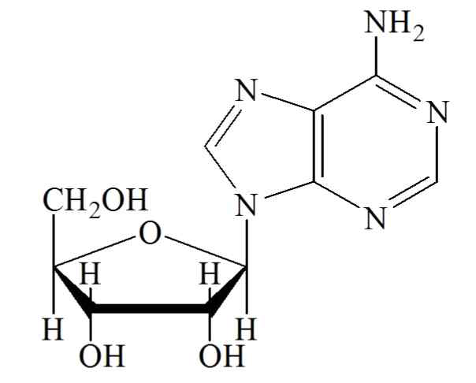

---

아데노신(C 10H 13N 5O 4)의양(㎎)=아데노신의표준품의양(㎎)× A T

A S

제2 법

이원료약40㎎을정밀하게달아이동상을넣어녹여정확하게100mL로한다. 이액을1mL

취하여이동상을넣어정확하게50mL로하여검액으로한다. 따로아데노신표준품약40㎎을정밀하게

달아이동상을넣어녹여100mL로한다. 이액1mL를정확하게취하여이동상을넣어50mL로한액을

표준액으로한다. 검액및표준액각10μL씩을가지고다음조건으로액체크로마토그래프법에따라시험

하여아데노신의피크면적AT 및AS를구한다.

AT

아데노신(C10H13N5O4)의양(㎎) = 아데노신표준품의양(㎎) × 

AS

조작조건

검출기: 자외부흡광광도계(측정파장260㎚)

칼

럼: 안지름약4.6㎜, 길이약25㎝인스테인레스관에5㎛의액체크로마토그래프용옥타데실실

릴화한실리카겔을충전한다.

이동상: 메탄올ㆍ0.05M 인산이수소칼륨용액혼합액(15:85)

유

량: 1.0mL/분

아데노신액(2%)

Adenosine Solution(2%)

이원료는「기능성화장품기준및시험방법」에따른‘아데노신’을대두에서얻은레시친과부틸렌글

라이콜등과혼합하여고압에서유화시켜균질하게만든원료이다. 이원료는정량할때아데노신

(C10H13N5O4 : 267.2) 1.90 ～ 2.10 %를함유한다.

성

상

이원료는백색의유액으로특이한냄새가있다.

확인시험

다음정량법에따라시험할때검액은표준액과같은피크유지시간을나타낸다.

pH

이원료를가지고 일반시험법Ⅱ. 제제1. pH 시험법에따라시험할때pH는3.5 ～ 5.5이

다.

d20

비

중

20 0.95 ～ 1.05 (제1법)

순도시험

1) 중금속

이원료1.0 g을달아제1법에따라조작하여시험한다. 비교액에는납표준

액1.0 mL를넣는다.(10 ppm 이하)

2) 비소

이원료1.0 g을달아제3법에따라검액을만들고장치A를쓰는방법에따라조작하여시

험한다.(2 ppm 이하)

정량법

이원료약1.0 g을정밀하게달아이동상50 mL를넣어초음파추출한후이동상을넣어정

확하게100 mL로한다. 이액4 mL를정확하게취하여이동상을넣어100 mL로한액을검액으로

한다. 따로아데노신표준품약20 ㎎을정밀하게달아이동상을넣어녹여100 mL로한다. 이액4

mL를정확하게취하여이동상을넣어100mL로한액을표준액으로한다. 검액및표준액10 μL씩을

가지고다음조건으로액체크로마토그래프법에따라시험하여아데노신의피크면적AT 및AS를구한다.

아데노신(C10H13N5O4)의양(㎎) = 아데노신표준품의양(㎎) × A T

A S

조작조건

---

검출기: 자외부흡광광도계(측정파장260 ㎚)

칼

럼: 안지름약4.6 ㎜, 길이약15㎝인스테인레스관에5 ㎛의액체크로마토그래프용옥타데실

실릴화한실리카겔을충전한다.

이동상: 아세토니트릴ㆍ10 mM 인산이수소칼륨혼합액(5:94)

유

량: 0.8 mL/분

아데노신로션제

Adenosine Lotion

이기능성화장품은정량할때표시량의90.0 %이상에해당하는아데노신(C10H13N5O4 :

267.24)을함유한다.

제

법

이기능성화장품은아데노신을주성분(기능성성분)으로하는로션제이다. 이제품은

안정성및유용성을높이기위해안정제, 습윤제, 유화제, 보습제, pH조정제, 착색제, 착향제등을첨

가할수있다.

확인시험

정량법의검액에서얻은주피크의유지시간은표준액에서얻은주피크의유지시간과

같다.

pH

기준치± 1.0 (2 → 30), (다만, pH 범위는3.0～9.0이다)

정량법

이기능성화장품을가지고아데노신으로서약0.4 ㎎에해당하는양을정밀하게달아이동상

20 mL를넣어초음파추출한후이동상을넣어정확하게50 mL로한액을가지고검액으로한다. 따로

아데노신표준품약20 ㎎을정밀하게달아이동상을넣어녹여100 mL로한다. 이액4 mL를정확

하게취하여이동상을넣어100mL로한액을표준액으로한다. 검액및표준액각10 μL씩을가지

고다음조건으로액체크로마토그래프법에따라시험하여아데노신의피크면적AT 및AS를구한다.

아데노신(C10H13N5O4)의양(㎎) = 아데노신표준품의양(㎎) × A T

× 1

A S

50

조작조건

검출기: 자외부흡광광도계(측정파장260 ㎚)

칼

럼: 안지름약4.6 ㎜, 길이약25 ㎝인스테인레스관에5 ㎛의액체크로마토그래프용옥타데

실실릴화한실리카겔을충전한다.

이동상: 메탄올ㆍ0.05 M 인산이수소칼륨용액혼합액(15 : 85)

유

량: 1.0 mL/분

아데노신액제

Adenosine Solution

이기능성화장품은정량할때표시량의90.0 %이상에해당하는아데노신(C10H13N5O4 :

---

267.24)을함유한다.

제

법

이기능성화장품은아데노신을주성분(기능성성분)으로하는액제이다. 이제품은안정성및

유용성을높이기위해안정제, 습윤제, 보습제, pH조정제, 착색제, 착향제등을첨가할수있다.

확인시험

정량법의검액에서얻은주피크의유지시간은표준액에서얻은주피크의유지시간과같다.

pH

기준치± 1.0 (2 → 30), (다만, pH 범위는3.0～9.0이다)

정량법

이기능성화장품을가지고아데노신으로서약0.4 ㎎에해당하는양을정밀하게달아이동

상20 mL를넣어초음파추출한후이동상을넣어정확하게50 mL로한액을가지고검액으로한다.

따로아데노신표준품약20 ㎎을정밀하게달아이동상을넣어녹여100 mL로한다. 이액4 mL

를정확하게취하여이동상을넣어100mL로한액을표준액으로한다. 검액및표준액각10 μL씩

을가지고다음조건으로액체크로마토그래프법에따라시험하여아데노신의피크면적AT 및AS를

구한다.

× 1

아데노신(C10H13N5O4)의양(㎎) = 아데노신표준품의양(㎎) × A T

A S

50

조작조건

검출기: 자외부흡광광도계(측정파장260 ㎚)

칼

럼: 안지름약4.6 ㎜, 길이약25 ㎝인스테인레스관에5 ㎛의액체크로마토그래프용옥타데실

실릴화한실리카겔을충전한다.

이동상: 메탄올ㆍ0.05 M 인산이수소칼륨용액혼합액(15 : 85)

유

량: 1.0 mL/분

아데노신크림제

Adenosine Cream

이기능성화장품은정량할때표시량의90.0 %이상에해당하는아데노신(C10H13N5O4 :

267.24)을함유한다.

제

법

이기능성화장품은아데노신을주성분(기능성성분)으로하는크림제이다. 이제품은안정성

및유용성을높이기위해안정제, 습윤제, 유화제, 보습제, pH조정제, 착색제, 착향제등을첨가할수

있다.

확인시험

정량법의검액에서얻은주피크의유지시간은표준액에서얻은주피크의유지시간과같다.

pH

기준치± 1.0 (2 → 30), (다만, pH 범위는3.0～9.0이다)

정량법

이기능성화장품을가지고아데노신으로서약0.4 ㎎에해당하는양을정밀하게달아메탄올

5 mL를넣어초음파추출한후물을넣어정확하게50 mL로하고필요하면여과하여검액으로한다. 따

로아데노신표준품약20 ㎎을정밀하게달아10 % 메탄올을넣어녹여100 mL로한다. 이액4

mL를정확하게취하여10 % 메탄올을넣어100 mL로한액을표준액으로한다. 검액및표준액각

10 μL씩을가지고다음조건으로액체크로마토그래프법에따라시험하여아데노신의피크면적AT 및

AS를구한다.

× 1

아데노신(C 10H 13N 5O 4)의양(㎎) ꠧ

아데노신표준품의양(㎎)× A T

A S

50

---

조작조건

검출기: 자외부흡광광도계(측정파장260 ㎚)

칼

럼: 안지름약4.6 ㎜, 길이약25 ㎝인스테인레스관에5 ㎛의액체크로마토그래프용옥타데실

실릴화한실리카겔을충전한다.

이동상: 메탄올ㆍ0.05 M 인산이수소칼륨용액혼합액(15 : 85)

유

량: 1.0 mL/분

아데노신침적마스크

Adenosine Soaked Mask

18.

이기능성화장품은정량할때표시량의90.0% 이상에해당하는아데노신(C10H13N5O4 : 267.24)

을함유한다.

가. 제

법

이기능성화장품은아데노신을주성분(기능성성분)으로하는액제또는로션제를부직

포등의지지체에단순침적한마스크제형의제품이다. 이때침적되는액제또는로션제에는

안정성및유용성을높이기위해안정제, 습윤제, 유화제, 보습제, pH 조정제, 착색제, 착향제

등을첨가할수있다.

확인시험

정량법의검액에서얻은주피크의유지시간은표준액에서얻은주피크의유지시간과같다.

pH

이기능성화장품을압착하여얻은액제또는로션제를가지고시험할때기준치± 1.0이다. (다

만, pH 범위는3.0 ～ 9.0이다)

나. 정량법

이기능성화장품을압착하여얻은액제또는로션제를가지고아데노신으로서약0.4㎎

에해당하는양을정밀하게달아이동상20mL를넣어초음파추출한후이동상을넣어정확하게

50mL로한액을가지고검액으로한다. 따로아데노신표준품약20 ㎎을정밀하게달아이동상을

넣어녹여100mL로한다. 이액4mL를정확하게취하여이동상을넣어100mL로한액을표준액

으로한다. 검액및표준액각10μL씩을가지고다음조건으로액체크로마토그래프법에따라시험

하여아데노신의피크면적AT 및AS를구한다.

다.

라.

아데노신(C10H13N5O4)의양(㎎) = 아데노신표준품의양(㎎) × A T

× 1

A S

50

마.

조작조건

검출기: 자외부흡광광도계(측정파장260 ㎚)

칼

럼: 안지름약4.6㎜, 길이약25 ㎝인스테인레스관에5㎛의액체크로마토그래프용옥타데실

실릴화한실리카겔을충전한다.

이동상: 메탄올ㆍ0.05 M 인산이수소칼륨용액혼합액(15 : 85)

유

량: 1.0 mL/분

아데노신고형제

Adenosine Solid

이기능성화장품은정량할때표시량의90.0% 이상에해당하는아데노신(C10H13N5O4 : 267.24)을함유

---

한다.

제

법

이기능성화장품은아데노신을주성분(기능성성분)으로하는고형제이다. 이제품은안정성

및유용성을높이기위해안정제, 습윤제, 유화제, 보습제, pH 조정제, 착색제, 착향제등을첨가할수

있다.

확인시험

정량법의검액에서얻은주피크의유지시간은표준액에서얻은주피크의유지시간과같다.

pH

기준치± 1.0 (2 → 30) (다만, pH 범위는3.0 ∼ 9.0이며, 물을포함하지않는제품은제외)

정량법

이기능성화장품을가지고아데노신으로서약0.4㎎에해당하는양을정밀하게달아테트라

하이드로퓨란10mL를넣어초음파추출한후이동상을넣어정확하게50mL로하고필요하면여과하여

검액으로한다. 따로아데노신표준품약20㎎을정밀하게달아테트라하이드로퓨란10% 함유이동상을

넣어녹여100mL로한다. 이액4mL를정확하게취하여테트라하이드로퓨란10 % 함유이동상을넣어

100mL로한액을표준액으로한다. 검액및표준액각10μL씩을가지고다음조건으로액체크로마토그

래프법에따라시험하여검액및표준액의피크면적AT 및AS를각각구한다.

AT

아데노신(C10H13N5O4)의양(㎎) = 아데노신표준품의양(㎎) × 

AS

조작조건

검출기: 자외부흡광광도계(측정파장260㎚)

칼

럼: 안지름약4.6㎜, 길이약25㎝인스테인레스관에5㎛의액체크로마토그래프용옥타데실실

릴화한실리카겔을충전한다.

이동상: 메탄올ㆍ0.05M 인산이수소칼륨용액혼합액(15:85)

유

량: 1.0mL/분

폴리에톡실레이티드레틴아마이드

Polyethoxylated Retinamide

O

O

N

O

H

n

n=10.7(average)

N-ω-메칠폴리에틸렌글라이콜릴레틴아마이드

N-ω-methylpolyethyleneglycolyl retinamide

(C23+2nH35+4nO2+nN)n : 평균분자량831

이원료는정량할때폴리에톡실레이티드레틴아마이드((C23+2nH35+4nO2+nN)n : 평균분자량

831) 95.0% 이상을함유한다.

성

상

이원료는황색～황갈색의맑거나약간혼탁한유액으로약간의특이한냄새가있다.

확인시험

1) 이원료의메탄올용액(1→10,000)을가지고흡광도측정법에따라흡수스펙트럼을측정할

때파장350±2㎚에서흡수극대를나타낸다.

2) 이원료를가지고적외부흡수스펙트럼측정법의브롬화칼륨정제법에따라측정할때파수2925cm-1,

---

2867cm-1, 1654cm-1, 1351cm-1, 1276cm-1, 1260cm-1, 1110cm-1, 969cm-1, 847cm-1, 764cm-1 및750cm-1 부

근에서흡수를나타낸다.

융

점

6～10℃(제1 법)

pH

4.6 ～ 6.6 (3 → 30)

d20

비

중

20 : 1.027 ～ 1.127 (제1 법)

순도시험

1) 중금속

이원료1.0g을달아제2법에따라조작하여시험한다.

비교액에는납표준액

1.0mL를넣는다(10ppm 이하)

2) 비소

이원료1.0g을달아제3법에따라검액을만들고장치A를쓰는방법에따라조작하여

시험한다(2ppm 이하)

정량법

이원료약130㎎을정밀하게달아아세토니트릴을넣어녹여정확하게100mL로하여검

액으로한다. 따로폴리에톡실레이티드레틴아마이드표준품약130㎎을정밀하게달아아세토니트릴

에녹여정확하게100mL로하여표준액으로한다. 검액및표준액10㎕를가지고다음조건으로액

체크로마토그래프법에따라시험하여폴리에톡실레이티드레틴아마이드의피크면적AT 및AS를구한

다.

폴리에톡실레이티드레틴아마이드[ ( C 23 + 2nH 35 + 4nO 2 + nN) n]의양(㎎)

= 폴리에톡실레이티드레틴아마이드표준품의양(㎎)× A T

A S

조작조건

검출기: 자외부흡광광도계(측정파장: 350㎚)

컬

럼: 안지름4.6㎜, 길이25㎝의스테인레스관에액체크로마토그래프용옥타데실실릴화한실리카

겔을충전한다.

칼럼온도: 25℃

이동상: 아세토니트릴ㆍ물혼합액(50: 50)으로1분간용리한다음19분에걸쳐아세토니트릴ㆍ물혼

합액(90: 50)으로기울기용리한다.

유

량: 1.2mL/분

---

[별표4]

자외선으로부터피부를보호하는데도움을주는

기능성화장품각조

(제2조제4호관련)

드로메트리졸

Drometrizole

HO

N

N

N

CH3

2-(2'-히드록시-5'-메칠페닐)벤조트리아졸

2-(2'-Hydroxy-5'-methylphenyl)benzotriazole

C13H11N3O：225.25

이원료를건조한것은정량할때드로메트리졸(C13H11N3O：225.25) 95.0～104.0%를

함유한다.

성

상

이원료는엷은황백색의가루로냄새는거의없다.

확인시험

이원료10㎎을에탄올에녹여100mL로하고이액5mL를취하여에탄올을

넣어100mL로한액을검액으로한다. 검액을가지고흡광도측정법에따라흡수스

펙트럼을측정할때파장243±2㎚, 298±2㎚및340±2㎚에서흡수극대를, 또파장

259±2㎚및314±2㎚에서흡수극소를나타낸다.

융

점

126～134℃(제１법)

순도시험

용해상태

이원료0.1 g에아세톤10mL를넣어녹일때액은맑다.

건조감량

0.5% 이하(1 g, 황산, 24시간)

강열잔분

0.1% 이하(3 g, 제２법)

정량법

제1 법

이원료약10㎎을정밀하게달아에탄올에녹여100mL로하고이액

5mL를취하여에탄올을넣어100mL로한액을검액으로한다. 검액을가지고

층

장10㎜, 파장298㎚부근의흡수극대파장에서흡광도A를측정한다.

---

A

× 20000

드로메트리졸(C 13H 11N 3O)의양(㎎) 〓

640

제2 법

이원료약10mg을정밀하게달아메탄올을넣어녹여정확하게100mL로

하고, 이액5mL를취해메탄올을넣어정확하게10mL로한액을검액으로한다.

따로드로메트리졸표준품약10mg을정밀하게달아메탄올을넣어녹여100mL로

하고이액5mL를취해메탄올을넣어정확하게10mL로한액을표준액으로한

다. 검액및표준액각10μL씩을가지고다음조건으로액체크로마토그래프법에따

라시험하여드로메트리졸의피크면적AT 및AS를구한다.

AT

드로메트리졸(C13H11N3O : 225.25)의양(㎎) = 드로메트리졸표준품의양(㎎) × 

AS

조작조건

검출기: 자외부흡광광도계(측정파장305㎚)

칼

럼: 안지름약4.6㎜, 길이약15㎝인스테인레스관에5㎛의액체크로마토그

래프용옥타데실실릴화한실리카겔을충전한다.

이동상: 메탄올

유

량: 1.0mL/분

드로메트리졸트리실록산

Drometrizole Trisiloxane

OSI(CH3)3

HO

CH2CHCH2SICH3

CH3

OSI(CH3)3

N

N

N

CH3

C24H39N3O3Si3 : 501.84

이원료를건조한것은정량할때드로메트리졸트리실록산(C24H39N3O3Si3 : 501.84)

98.0 % 이상을함유한다.

성

상

이원료는엷은황색의결정성가루이다.

확인시험

1) 이원료0.25 g에에탄올100 mL를넣어녹인다. 이액1 mL를취하여

---

에탄올을넣어100 mL로한액을가지고흡광도측정법에따라흡수스펙트럼을측

정할때파장245 ± 2 nm, 304 ± 2 nm 및342 ± 2 nm 에서흡수극대를나타낸

다.

2) 이원료를가지고적외부흡수스펙트럼측정법의1)브롬화칼륨정제법에따라측정

할때파수3,422 cm-1, 3,060 cm-1, 2,957 cm-1, 2,918 cm-1, 2,867 cm-1, 1,607 cm-1,

1,569 cm-1, 1,510 cm-1, 1,257 cm-1, 1,216 cm-1, 1,084 cm-1, 1,049 cm-1, 842 cm-1, 789

cm-1, 754 cm-1, 741 cm-1 부근에서흡수를나타낸다.

융

점

46 ～ 49 °C

(제2법)

순도시험

1) 용해상태

이원료0.5 g에에탄올10 mL를넣어녹일때액은맑다.

2) 중금속

이원료2.0 g을달아천천히가열한다. 이때황산2～3 mL를넣어무

색～엷은황색을띨때까지가열을계속한다. 식힌후, 포화수산암모늄용액15 mL를

가하여백색의연기가날때까지가열하여농축한다. 이를다시식힌후, 주의하여

물을가해25 mL로하여이를검액으로한다. 이용액10 mL를가지고시험할때,

그한도는20 ppm 이하이다. 비교액에는납표준액1.6 mL를넣는다.

3) 비소

이원료2.0 g을달아천천히가열한다. 이때황산2～3 mL를넣어무

색～엷은황색을띨때까지가열을계속한다. 식힌후, 포화수산암모늄용액15 mL를

가하여백색의연기가날때까지가열하여농축한다. 이를다시식힌후, 주의하여

물을가해25 mL로하고, 이를검액으로한다. 이용액10 mL를가지고장치B를

쓰는방법에따라조작하여시험할때그한도는2 ppm 이하이다. 비교액에는비소

표준액1.6 mL를넣는다.

4) 유연물질

건조한이원료0.2 g을정밀하게달아메탄올을넣어100 mL로하여

검액으로한다. 따로유연물질A주1 50 mg을정밀하게달아메탄올을넣어100 mL

로한다(용액A). 유연물질B주2 50 mg을정밀하게달아메탄올에녹여100 mL로한

다(용액B). 유연물질C주3 50 mg을정밀하게달아메탄올에녹여100 mL로한다(용

액C). 용액A 1.2 mL, 용액B 2 mL 및용액C 3.2 mL를각각정확하게취하여섞고

메탄올을넣어섞어정확하게100 mL로하고이를표준액으로한다. 검액및표준

액각10 ㎕씩을가지고아래조작조건으로액체크로마토그래프법에따라시험할

때검액중유연물질각각의피크면적은표준액중의유연물질각각의피크면적보다

작고, 그한도는유연물질A는0.3 %이하, 유연물질B는0.5 %이하, 유연물질C는

0.8 % 이하이다.

조작조건

검출기: 자외부흡광광도계(측정파장: 305 nm)

칼

럼: 안지름약4.6 mm, 길이약25 cm인스테인레스관에5 ㎛ 의액체크로

마토그래프용옥타데실실릴화한실리카겔을충전한다.

칼럼온도: 40 ℃

이동상: 메탄올

---

유

량: 유연물질A의유지시간이약10 분, 유연물질B의유지시간이약2분,

유연물질C의유지시간이약16 분이되도록조절한다.

칼럼의선정: 이시험을할때, 유지시간약10 분, 약12 분및약16 분에서나타

나는피크의분리도는각각1.5 이상이다.

피크면적측정시간: 검액주입후20분간

정량법

이원료를건조하여(오산화인, 4 시간, 감압건조) 약0.1 g을정밀히달아

메탄올을넣어100 mL로한다. 이액5 mL를정확하게취해메탄올을넣어50 mL

로하여검액으로한다. 따로드로메트리졸트리실록산표준품약0.1 g을정밀히달

아메탄올을넣어100 mL로한다. 이액5 mL를각각정확하게취하여메탄올을

넣어각각50 mL로하여표준액으로한다. 검액및표준액각10 ㎕씩을가지고

아래조작조건으로액체크로마토그래프에따라시험하여드로메트리졸트리실록산의

피크면적AT 및AS를구한다.

드로메트리졸트리실록산(C24H39N3O3Si3)의양(mg)

AT

= 드로메트리졸트리실록산표준품의양(mg) x

AS

조작조건

검출기: 자외부흡광광도계(측정파장: 305 nm)

칼

럼: 안지름약4.6 mm, 길이약15 cm인스테인레스관에5 ㎛의액체크로

마토그래프용옥타데실실릴화한실리카겔을충전한다.

칼럼온도: 40 ℃ 근처의일정한온도

이동상: 메탄올

유

량: 이원료의유지시간이약5분이되도록조절한다.

주1 유연물질A : 2-(2H-벤조트리아졸-2-일)-6-(2-메칠프로페닐)-p-크레솔

주2 유연물질B : 2-(2H-벤조트리아졸-2-일)-4-메칠-6-(2-메칠프로필) 페닐

주3 유연물질C : 2-[5-메칠-3-[1,3,3,3-테트라메칠-1-[(트리메칠실릴)옥시]디시록사놀]프로

필]-2-[1,3,3,3-테트라메칠-1-[(트리메칠실릴)옥시]디시록사놀]옥시]페닐2H-페닐트리아졸,

---

디갈로일트리올리에이트

Digalloyl Trioleate

O

RC

O

HO

OH

O

O

RC

O

C

O

COOH

RC

O

O

R : CH3(CH2)7CH=CH(CH2)7―

갈릭애씨드3-갈레이트트리올레이트

Gallic Acid 3-Gallate Trioleate

C68H106O12 : 1115.58

이원료를정량할때디갈로일트리올리에이트(C68H106O12 : 1115.58) 98.0% 이상을

함유한다.

성

상

이원료는짙은갈색의점성이있는맑은액으로특이한냄새가있다.

확인시험

이원료를가지고적외부흡수스펙트럼측정법의4) 액막법에따라측정할때

표준품과같은스펙트럼을나타낸다.

n25

굴절률

D ：1.5107～1.5208

d25

비

중

25：1.033～1.048

정량법

이원료0.1g을정밀하게달아피리딘을넣고열을가하여녹이고냉각한

후에50mL로하고이액0.6mL에1.4mL의피리딘을넣은액을검액으로한다. 따

로디갈로일트리올리에이트표준품약0.1g을정밀하게달아피리딘을넣고열을

가하여녹이고냉각한후에50mL로하고이액0.6mL에1.4mL의피리딘을넣은

액을표준액으로한다. 검액및표준액각각2mL에0.4mL 헥사메칠디실록산을넣

어흔들고0.3mL 트리메틸실록산을넣은후5분간원심분리한후, 각각2.0㎕를

가지고다음의조건으로기체크로마토그래프법으로시험하여검액및표준액의디

갈로일트리올리에이트피크면적AT 및AS를구한다.

디갈로일트리올리에이트(C68H106O12)의양(g)

= 디갈로일트리올리에이트표준품의양(g)× A T

A S

조작조건

검출기: 수소염이온화검출기

칼

럼: 안지름0.32mm, 길이약30m인스테인레스관에기체크로마토그래프용

10% 메칠실록산ㆍ규조토를충전한것을사용한다.

---

칼럼온도: 초기160℃에서매분8℃씩300℃까지승온한다.

검출기온도: 300℃

주입구온도: 290℃

캐리어가스: 헬륨

---

디메치코디에칠벤잘말로네이트

Dimethicodiethylbenzal malonate

CH3

CH3

CH3

H3

C

Si

O

Si

CH3

Si

O

CH3

<b>R</b>

CH3

n

n, approx 60

<b>R</b> =

92.1 - 92.5 %

CH3

A =

COOC2H5

approx. 6 %

B =

COOC2H5

O

CH2

COOC2H5

C =

approx.1.5 %

˜

COOC2H5

O

폴리실리콘-15

Polysilicone-15

평균분자식C196H490O84Si65 : 평균분자량16741

이원료는디메치코디에칠벤잘말로네이트로서고분자성실리콘사슬에신나메이트가

결합되어진고분자물질로서n은약60이며, R그룹의비율A:B:C는약92:6:1.5이다.

이원료는정량할때디메치코디에칠벤잘말로네이트(C196H490O84Si65 : 16741)로서94.0～

104.0%를함유한다.

성

상

이원료는무색～ 미황색의점성을나타내는액이다.

확인시험

1) 이원료0.1 g에에탄올을넣어100 mL로하고이액1 mL를취하여

에탄올을넣어정확하게100 mL로한액을검액으로한다. 검액을가지고흡광도

측정법에따라측정할때312±2 ㎚에서흡수극대를나타낸다.

2) 이원료를가지고적외부흡수스펙트럼측정법의4) 액막법에따라측정할때파

수2962 cm-1, 1720 cm-1, 1603 cm-1, 1501 cm-1, 1411 cm-1, 1260 cm-1, 및1097 cm-1

부근에서특성흡수를나타낸다.

3) 정량법의검액에서얻은주피크의유지시간은표준액에서얻은주피크의유지시간

과같다.

굴절률

n20

D : 1.440 ～ 1.445

비흡광도

E1%

1cm(312nm) : 160 ～ 190

점

도

이원료를가지고25 ℃에서제2법에따라시험할때그점도는600～900

cps (5호, 30rpm, 3분)이다.

---

순도시험

1) 잔류용매

이원료1.0 g을검액으로하고, 따로자일렌표준원액(2,000

㎍/mL, o-, m-, p-자일렌의혼합표준액)을메탄올로희석하여각각1, 5, 10, 20, 3

0 ㎍/mL 농도로한액을검량선용표준액으로한다. 검액및표준액을헤드스페이

스검체유입장치를사용하여다음조건으로기체크로마토그래프법에따라시험하여

자일렌피크면적을구한다. 검액중자일렌함량은표준액의검량선을이용하여구

하였을때0.21 % 이하이다.

조작조건

검출기: 질량분석계검출기또는수소염이온화검출기

칼

럼: 안지름0.32 mm, 길이30 m인스테인레스관에기체크로마토그래피용

폴리(6% 시아노프로필페닐ㆍ디메칠실록산)을충전한다.

칼럼온도: 초기2분간35℃를유지한다음매분8℃씩130℃까지승온한후매분30℃씩

190 ℃까지승온하여3분간유지한다.

헤드스페이스검체유입장치: 100℃에서20분간가열한후검체를유입시킨다.

검출기온도: 300℃

주입구온도: 140℃

캐리어가스: 질소

2) 유리디에틸4-프로피닐옥시벤잘말로네이트

이원료25 ㎎을정밀하게달아이

동상에넣어녹여정확하게50 mL로한액을검액으로한다. 디에틸4-프로피닐옥

시벤잘말로네이트표준품25 ㎎을정밀하게달아이동상에넣어녹여정확하게250

mL로한것을표준원액으로한다. 이표준원액을가지고이동상으로단계적으로

희석하여디에틸4-프로피닐옥시벤잘말로네이트의농도가각각0.5, 1, 5, 10 ㎍/mL

의농도로한액을검량선용표준액으로한다. 검액및표준액10μL씩을가지고다

음조건으로액체크로마토그래프법에따라시험하여디에틸4-프로피닐옥시벤잘말

로네이트의피크면적을구한다. 검액의디에틸4-프로피닐옥시벤잘말로네이트의함

량은표준액의검량선을이용하여계산하였을때0.31 % 이하이다.

조작조건

검출기: 자외부흡광광도계(측정파장307 ㎚)

칼

럼: 안지름7.5 ㎜, 길이30 ㎝인PLGel Mixed-D 칼럼또는이와동등한칼럼

이동상: 테트라히드로푸란

유

량: 1.0 mL/분

주) 디에틸4-프로피닐옥시벤잘말로네이트(Dietyl 4-propynyloxybenzalmalonate) : 화

학명propanedionic acid {[4-(2-propynyloxy)phenyl]methylene}-diehtylester(C17

H18O5 : 304.4)

건조감량

1.0 % 이하(1 g, 105 ℃, 2시간)

---

정량법

이원료50 ㎎을정밀하게달아테트라하이드로푸란을넣어녹인후정확

하게100mL로한액을검액으로한다. 따로디메치코디에칠벤잘말로네이트표준품

25, 50, 100㎎을정밀하게달아각각테트라하이드로푸란을넣어녹인후각각정확

하게100mL로한액을검량선용표준액으로한다. 검액및표준액을가지고다음

조건으로액체크로마토그래프법에따라시험하여디메치코디에칠벤잘말로네이트의

피크면적을구한다. 검액의디메치코디에칠벤잘말로네이트의함량은표준액의검량

선을이용하여계산한다.

조작조건

검출기: 자외부흡광광도계(측정파장307 ㎚)

칼

럼: 안지름7.5㎜, 길이30㎝인5㎛ PLGel Mixed-D 칼럼또는이와동등한칼럼

이동상: 테트라히드로푸란

유

량: 1.0 mL/분

디에칠아미노하이드록시벤조일헥실벤조에이트

Diethylamino Hydroxybenzoyl Hexyl Benzoate

벤조익애씨드, 2-[4-(디에칠아미노)-2-하이드록시벤조일]-,헥실에스터

C24H31NO4 : 397.52

이

원료는

정량할

때

디에칠아미노하이드록시벤조일헥실

벤조에이트(C24H31NO4

:

397.52) 99.0% 이상을함유한다.

성

상

이원료는백색~ 엷은황색의과립상가루로가온하면황색의액이되며,

약간의특이한냄새가있다. 이원료는에탄올에녹고물에거의녹지않는다.

확인시험

이원료약30㎎을정밀하게달아에탄올을넣어녹여100mL로한다음이

액2mL를정확하게취하여에탄올을넣어정확하게100mL로한액을검액으로한

다. 검액을가지고에탄올을대조로하여흡광도측정법에따라흡수스펙트럼을측정

할때파장354 ± 2㎚에서흡수극대를나타낸다.

비흡광도

확인시험에서얻은검액을가지고에탄올을대조로하여파장354㎚에서흡

광도측정법에따라시험할때비흡광도( E 1%

1㎝)는910 ～ 940이다.

순도시험

1) 톨루엔및n-헥산올

이원료2.0g을정확하게달아아세톤을넣어녹여

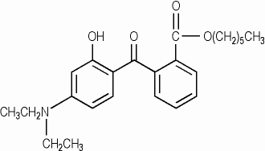

---

정확하게20mL로한액을검액으로한다. 따로톨루엔(C7H8 : 92.14) 표준품약

1.000g 및n-헥산올(C6H14O : 102.18) 표준품2.000g을정확하게달아각각에아세톤

을넣어정확하게100mL로한액0.1mL를정확하게취하여아세톤을넣어정확하

게100mL로한액을각각의표준액으로한다. 검액및표준액1µL씩을가지고다음

의조건으로기체크로마토그래프법에따라시험할때검액에서의톨루엔및n-헥산

올의피크면적은표준액에서의각각의피크면적보다크지않다(톨루엔100ppm 이

하, n-헥산올200ppm 이하)

조작조건

검출기: 수소염이온화검출기

컬

럼: 안지름0.32㎜, 길이15m인용융실리카내벽에기체크로마토그래프용폴

리디메칠실록산을1.0µm의두께로고정시킨모세관컬럼

컬럼온도: 초기40℃에서1 분간유지하고매분5℃씩70℃까지승온하여10분간유

지한다음매분70℃씩320℃까지승온하여7분간유지하고매분70℃씩

40℃까지식혀2분간유지한다.

검출기온도: 250℃

주입구온도: 250℃

캐리어가스및유량: 질소, 매분1mL 부근의일정량

2) 무수프탈산, 3-디에칠아미노페놀및디헥실프탈레이트

이원료2.0g을정확하게

달아아세톤을넣어녹여정확하게20mL로한액을검액으로한다. 따로무수프탈

산(C8H4O3 : 148.12) 표준품, 3-디에칠아미노페놀(C10H15NO : 165.24) 표준품및디헥

실프탈레이트(C20H30O4 : 334.46) 표준품각각0.50g 씩을정확하게달아아세톤을넣

어녹여정확하게100mL로한액1.0mL씩을정확하게취하여아세톤을넣어정확

하게100mL로한액을각각의표준액으로한다. 검액및표준액1µL씩을가지고정

량법의조작조건으로기체크로마토그래프법에따라시험할때검액에서의무수프탈

산, 3-디에칠아미노페놀및디헥실프탈레이트의피크면적은표준액에서의각각의피

크면적보다크지않다. (무수프탈산, 3-디에칠아미노페놀및디헥실프탈레이트각각

0.05 % 이하)

3) 기타유연물질

정량법에따라시험하여얻은크로마토그램에서용매피크를제외

한피크면적을100으로하여, 검체중의무수프탈산, 3-디에칠아미노페놀, 디헥실프탈

레이트및디에칠아미노하이드록시벤조일헥실벤조에이트피크이외의피크합계면

적(%)을구한다. (0.3 % 이하).

4) 중금속

이원료2.0g을달아제2법에따라조작하여시험한다. 비교액에는납표

준액2.0mL를넣는다(10ppm 이하).

건조감량

1.0 % 이하(1 g, 105 ℃, 3 시간)

강열잔분

0.1 % 이하(5 g, 500 ℃, 3 시간)

정량법

제1 법

이원료약2g을정밀하게달아아세톤을넣어녹여20 mL로한액을검액

으로한다. 검액1µL를가지고다음의조건으로기체크로마토그래프법의면적백분율

---

법에따라시험하여용매피크를제외한피크면적을100으로하고이에대한디에

칠아미노하이드록시벤조일헥실벤조에이트(C24H31NO4 : 397.52)의피크면적비로부터

함량(%)을구한다.

조작조건

검출기: 수소염이온화검출기

컬

럼: 안지름0.32㎜, 길이15m인용융실리카내벽에기체크로마토그래프용폴

리디메칠실록산을1.0µm의두께로고정시킨모세관컬럼

컬럼온도: 초기150℃에서매분25℃씩300℃까지승온하여12분간유지하고매분

70℃씩150℃까지식혀3분간유지한다.

검출기온도: 250℃

주입구온도: 250℃

캐리어가스및유량: 질소, 매분1mL 부근의일정량

검출감도: 검액을용매로2,000배희석한액을가지고조작조건에따라시험할때

디에칠아미노하이드록시벤조일헥실벤조에이트의피크는검출되어야한

다. (50㎍/mL)

제2 법

이원료약10mg에해당하는양을정밀하게달아메탄올을넣어녹여정확

하게100mL로하고, 이액5mL를취해메탄올을넣어10mL로한액을검액으로

한다. 따로디에칠아미노하이드록시벤조일헥실벤조에이트표준품약10mg을정밀

하게달아메탄올을넣어녹여100mL로하고이액5mL를취해메탄올을넣어

10mL로한액을표준액으로한다. 검액및표준액각10μL씩을가지고다음조건으

로액체크로마토그래프법에따라시험하여디에칠아미노하이드록시벤조일헥실벤조

에이트의피크면적AT 및AS를구한다.

디에칠아미노하이드록시벤조일헥실벤조에이트(C24H31NO4 : 397.52)의양(㎎) =

AT

디에칠아미노하이드록시벤조일헥실벤조에이트표준품의양(㎎) × 

AS

조작조건

검출기: 자외부흡광광도계(측정파장305㎚)

칼

럼: 안지름약4.6㎜, 길이약25㎝인스테인레스관에5㎛의액체크로마토그래

프용옥타데실실릴화한실리카겔을충전한다.

이동상: 85% 메탄올

유

량: 1.0mL/분

---

디에칠헥실부타미도트리아존

Diethylhexyl Butamido Triazone

이원료는정량할때디에칠헥실부타미도트리아존(C44H59N7O5

: 766.0) 97.0 % 이상을함유한다.

성

상

백색～ 미황색의가루로특이한냄새가있다.

확인시험

1) 이원료약0.1g을정밀하게달아메탄올200mL에넣어녹인액을검액

으로한다. 검액을가지고흡광도측정법에따라측정할때310±2 ㎚에서흡수극

대를나타낸다.

2) 이원료를가지고적외부흡수스펙트럼측정법의1) 브롬화칼륨정제법에따라측

정할때파수3316 cm-1, 2959 cm-1, 1697 cm-1, 1487 cm-1, 1411 cm-1, 1273 cm-1, 117

4 cm-1, 1110 cm-1, 및768 cm-1 부근에서특성흡수를나타낸다.

융

점

90℃ 이상

순도시험

1) 중금속

이원료1.0 g을달아제2법에따라조작하여시험한다. 비교액

에는납표준액1.0ml를넣는다.(10 ppm 이하)

2) 비소

이원료1.0g을달아제1법에따라검액을만들고장치A를쓰는방법에

따라조작하여시험한다.(2ppm 이하)

정량법

이원료약30㎎을정밀하게달아메탄올에넣어녹여100mL로한액을

검액으로한다. 따로디에칠헥실부타미도트리아존표준품약30㎎을정밀하게달아

메탄올에넣어녹여100 mL로한액을표준액으로한다. 검액및표준액10μL씩을

가지고다음조건으로액체크로마토그래프법에따라시험하여디에칠헥실부타미도

트리아존의피크면적AT 및AS를구한다.

디에칠헥실부타미도트리아존(C44H59N7O5)의양(㎎)

A T

= 디에칠헥실부타미도트리아존표준품의양(㎎) X

A S

조작조건

검출기: 자외부흡광광도계(측정파장300 ㎚)

칼

럼: 안지름약4㎜, 길이약250㎜인스테인레스관에7㎛의액체크로마토그

래프용옥타실릴화한실리카겔을충전한다.

이동상: 물과메탄올을다음표의비로혼합하여용매구배조건으로사용한다.

---

시간(분)

물(%)

메탄올(%)

0

40

60

30

5

95

40

5

95

41

40

60

45

40

60

유

량: 1.0 mL/분

디소듐페닐디벤즈이미다졸테트라설포네이트

Disodium phenyl dibenzimidazole tetrasulfonate

C20H12N4O12S4ㆍ2Na : 674.55

2,2‘-(1,4-페닐렌)비스-(1H-벤즈이미다졸-4,6-디설포닉애씨드, 디소듐염)

2,2‘-(1,4-phenylene)bis-(1H-benzimidazole-4,6-disulfonic acid, disodium salt)

이

원료를

정량할

때

디소듐페닐디벤즈이미다졸테트라설포네이트(C20H12N4O12S4ㆍ2Na:

674.55)

96.0 %이상을함유한다.

성

상

이원료는엷은황색의가루이다.

확인시험

1) 이원료100mg을정밀하게달아1 N 수산화나트륨액4mL를넣어녹인

후정제수를넣어정확하게100mL로한다. 이액1mL를정확하게취하여정제수를

넣어200mL로한액을검액으로한다. 검액을가지고흡광도측정법에따라흡수스

펙트럼을측정할때파장335±1nm 에서흡수극대를나타낸다.

2) 정량법의검액에서얻은주피크의유지시간은표준액에서얻은주피크의유지시간과같다.

융

점

360 ℃이상(제1법)

| 물(%) |
| --- |
| 40 |
| 5 |
| 5 |
| 40 |
| 40 |

---

건조감량

5 %이하(2 g, 105 ℃, 4 시간)

순도시험

1) 중금속

이원료1.0g을달아제1법에따라조작하여시험한다. 비교액에

는납표준액1.0mL를넣는다. (10 ppm이하)

2) 비소

이원료0.4 g을달아제1법에따라검액을만들어장치A를쓰는방법에

따라시험한다.(5 ppm 이하)

정량법

이원료15mg을정밀하게달아물에녹여100mL로한액을검액으로한다.

따로디소듐페닐디벤즈이미다졸테트라설포네이트표준품약15mg을정밀하게달아

물을넣어녹여100mL로한액을표준액으로한다. 검액및표준액각10μL씩을가

지고아래조작조건으로액체크로마토그래프법에따라시험하여디소듐페닐디벤지미

다졸테트라설포네이트의피크면적At 및As를구한다.

디소듐페닐디벤즈이미다졸테트라설포네이트(C20H12N4O12S4ㆍ2Na)의양(mg)

A t

= 디소듐페닐디벤즈이미다졸테트라설포네이트표준품의양(mg) ×

A s

조작조건

검출기: 자외부흡광광도계(측정파장: 335nm)

칼

럼: 안지름4.6mm, 길이15cm의스테인레스관에5㎛의액체크로마토그래프용

옥타데실실릴화한실리카겔을충전한다.

이동상: 5mM 테트라부틸암모늄클로라이드ㆍ아세토니트릴혼합액(52:48)

유

량: 1.5 mL/분

메칠렌비스-벤조트리아졸릴테트라메칠부틸페놀

Methylene Bis-Benzotriazolyl Tetramethylbutylphenol

OH

OH

N

N

CH2

N

N

N

N

C

CH3

C

CH3

CH3

CH3

CH2

CH2

C

CH3

C

CH3

CH3

CH3

CH3

CH3

C41H50N6O2 : 658.86

이

원료를

건조한

것은

정량할

때

메칠렌비스벤조트리아졸릴테트라메칠부틸페놀

(C41H50N6O2 : 658.86) 98.5% 이상함유한다.

성

상

이원료는엷은황색의가루로약간의특이한냄새가있다.

|  | C | CH / 3 |
| --- | --- | --- |
|  |  |  |

| CH / 3 |  |  |  | CH / 3 |
| --- | --- | --- | --- | --- |
|  |  | C |  |  |

|  | C |
| --- | --- |
|  |  |

|  |
| --- |
| C |

---

확인시험

1) 이원료를가지고적외부흡수스펙트럼측정법의1)브롬화칼륨정제법에따

라측정할때표준품과같은스펙트럼을나타낸다.

2) 정량법의검액에서얻은주피크의유지시간은표준액에서얻은주피크의유지시간과

같다.

순도시험

1) 납

이원료1.0g을정밀하게달아300mL 플라스크에넣고황산5mL 및

질산10mL를넣고흰연기가발생할때가열한다. 식힌다음질산5mL씩을추가하고

흰연기가발생할때까지가열하여내용물이무색～엷은황색이될때까지이조작

을반복한다. 분해가끝나면포화수산화암모늄용액5mL를넣고다시가열하여질산을

제거한다. 분해물을50mL 용량플라스크에옮기고물적당량으로분해플라스크를씻

어넣고물을넣어전체량을50mL로한다. 이것을검액으로한다. 비교액에는납표준

액1.0mL를넣는다.(10 ppm 이하)

2) 비소

이원료1.0g을취하여제3법에따라검액을만들고장치B를쓰는방법에

따라조작하여시험한다. (2ppm 이하)

건조감량

0.1% 이하(3.0 g, 105 ℃, 2시간)

산불용성회분

이원료약2.5g을정밀하게달아항량이되도록미리처리한사기나석

영제도가니에취한다음황산을넣어완전히녹인다. 검체가탄화될때까지가열하여

대부분의황산을휘발시킨다음, 800℃에서회화시킨다. 도가니를식힌후잔류물에

황산1～2방울을넣어다시녹인다. 이황산을다시휘발시킨후800℃에서1시간동

안회화시킨다. 도가니를데시케이터안에서식힌다음그무게를잰다(0.1% 이하)

W 2 -W 1

강열잔분(%) =

× 100

W

w : 검체취한양(g)

w1 : 항량이되도록한도가니무게(g)

w2 : 검체를회화시킨후최종무게(g)

정량법

이원료약20㎎을정밀하게달아테트라히드로푸란을넣어녹여정확하게

100mL로하고필요하면여과하여검액으로한다. 따로메칠렌비스벤조트리아졸릴테

트라메칠부틸페놀표준품약20㎎을정밀하게달아테트라히드로푸란을넣어녹여

정확히100 mL로한액을표준액으로한다. 검액및표준액10μL씩을가지고다음

조건으로액체크로마토그래프법에따라시험하여메칠렌비스벤조트리아졸릴테트라메

칠부틸페놀의피크면적AT 및AS를측정한다.

메칠렌비스벤조트리아졸릴테트라메칠부틸페놀(C41H50N6O2)의양(㎎)

A T

X

= 메칠렌비스벤조트리아졸릴테트라메칠부틸페놀표준품의양(㎎)

A S

조작조건

검출기: 자외부흡광광도계(측정파장320㎚)

칼

럼: 안지름4.6㎜, 길이약25㎝인스테인레스관에약5㎛의액체크로마토그래

프용옥타데실실릴화한실리카겔을충전한다.

---

이동상: 테트라히드로푸란ㆍ물ㆍ아세토니트릴혼합액(60:36:4)

유

량: 1.0 mL/분

---

메칠렌비스-벤조트리아졸릴테트라메칠부틸페놀액(50%)

Methylene Bis-Benzotriazolyl Tetramethylbutylphenol Solution(50%)

이원료는메칠렌비스벤조트리아졸릴테트라메칠부틸페놀에데실글루코사이드, 산

탄검, 프로필렌글라이콜, 정제수등을혼합한혼합물이며정량할때메칠렌비스벤조트

리아졸릴테트라메칠부틸페놀(C41H50N6O2 : 658.86)을48.0 ～ 52.0 % 함유한다.

성

상

이원료는백색의점성을나타내는액으로약간의특이한냄새가있다.

확인시험

1) 이원료약20㎎을달아디클로로메탄에녹여100mL로한다. 이액10

mL를취하여디클로로메탄을넣어100mL로한액을가지고하고흡광도측정법에따

라흡수스펙트럼을측정할때306 및348 ㎚ 부근에서흡수극대를나타낸다.

2) 정량법의검액에서얻은주피크의유지시간은표준액에서얻은주피크의유지시간

과같다.

pH

10.5 ～ 12.0

점

도

200 ～ 1,000 mPas (25℃)

흡광도

1) 흡광도이원료40 ㎎을달아디메칠아세트아마이드ㆍ이소프로판올혼합

액(1:1)을넣어1 L로한액을검액으로하여346 ㎚에서흡광도시험법에따라흡광

도를측정할때0.936 ～ 1.014이다.

2) 비흡광도

E(346 ㎚) : 234 ～ 254 (0.004%, 디메칠아세트아마이드ㆍ이소프로판올

혼합액(1:1))

정량법

이원료를메칠렌비스벤조트리아졸릴테트라메칠부틸페놀(C41H50N6O2)로서

약20 ㎎ 해당량을정밀하게달아테트라히드로푸란을넣어녹여정확하게100 mL

로하고필요하면여과하여검액으로한다. 따로메칠렌비스벤조트리아졸릴테트라메

칠부틸페놀표준품약20 ㎎을정밀하게달아테트라히드로푸란을넣어녹여정확히

100 mL로한액을표준액으로한다. 검액및표준액10 μL씩을가지고다음조건으

로액체크로마토그래프법에따라시험하여메칠렌비스벤조트리아졸릴테트라메칠부틸

페놀(C41H50N6O2 : 658.86)의피크면적AT 및AS를구한다.

메칠렌비스벤조트리아졸릴테트라메칠부틸페놀(C41H50N6O2)의양(㎎)

X A T

= 메칠렌비스벤조트리아졸릴테트라메칠부틸페놀표준품의양

A S

조작조건

검출기: 자외부흡광광도계(측정파장320 ㎚)

칼

럼: 안지름4.6 ㎜, 길이약25 ㎝인스테인레스관에약5 ㎛의액체크로마토

그래프용옥타데실실릴화한실리카겔을충전한다.

이동상: 테트라히드로푸란ㆍ물ㆍ아세토니트릴혼합액(60:36:4)

유

량: 1.0 mL/분

4-메칠벤질리덴캠퍼

4-Methylbenzylidene Camphor

---

3-(4-메칠벤질리덴)-dl-캠퍼

3-(4-Methylbenzylidene)-dl-Camphor

C18H22O : 254.37

이원료를건조한것은정량할때4-메칠벤질리덴캠퍼(C18H22O:254.37) 99.5% 이상을

함유한다.

성

상

이원료는백색의가루로약간의특이한냄새가있다.

확인시험

1) 흡광도

이원료약50mg을정밀하게달아메탄올을넣어녹여정확하게

100mL로하고다시이액1mL를정확하게취하여메탄올을넣어정확하게100mL로

한액을검액으로한다. 검액을가지고메탄올을대조액으로흡광도측정법에따라

측정할때파장299±2nm부근에서

흡수극대를나타낸다.

2) 이원료를가지고적외부흡수스펙트럼측정법의1)브롬화칼륨정제법에따라측정할

때2970cm-1, 1725cm-1, 1070cm-1, 1020cm-1 및820cm-1 부근에서특성흡수를나타낸

다.

융

점

66℃～ 68℃ (제1법)

건조감량

0.5%이하(1g, 105℃, 1시간)

정량법

제1 법

이원료0.1g을정확하게달아메탄올을넣어녹여100mL로한액을검액

으로하고따로4-메칠벤질리덴캠퍼표준품약0.1g을정밀하게달아메탄올을넣어

정확하게100mL로하여표준액으로한다. 검액및표준액각각1.0㎕를가지고다음

의조건으로기체크로마토그래프법으로시험한다.

조작조건

검출기: 수소염이온화검출기

칼

럼: 안지름0.32mm, 길이약30m인용융실리카모세관에기체크로마토그래프

용100% 디메칠폴리실록산을0.25㎕의두께로고정한것.

칼럼온도: 초기150℃ 1분간유지하고, 매분5℃씩280℃까지승온한다음280℃에서

5분간유지한다.

검출기온도: 300℃

주입구온도: 290℃

캐리어가스및유량: 질소, 매분2mL

Split ratio :

20 : 1

주입량: 1㎕

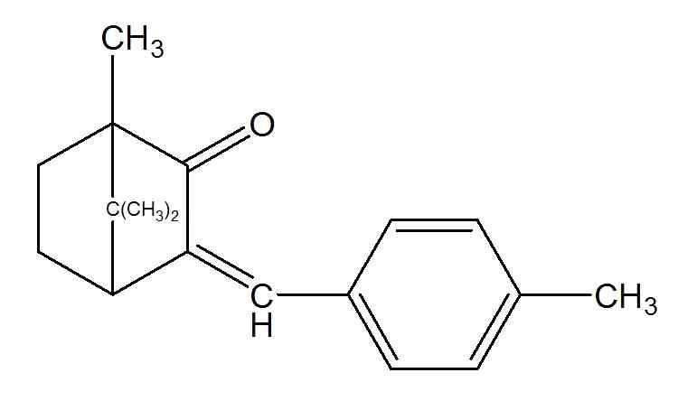

---

제2 법

이원료약10mg에해당하는양을정밀하게달아메탄올을넣어녹여정확

하게100mL로하고, 이액5mL를취해메탄올을넣어10mL로한액을검액으로

한다. 따로4-메칠벤질리덴캠퍼표준품약10mg을정밀하게달아메탄올을넣어녹

여100mL로하고이액5mL를취해메탄올을넣어10mL로한액을표준액으로한

다. 검액및표준액각10μL씩을가지고다음조건으로액체크로마토그래프법에따

라시험하여4-메칠벤질리덴캠퍼의피크면적AT 및AS를구한다.

4-메칠벤질리덴캠퍼(C18H22O : 254.37)의양(㎎) =

AT

4-메칠벤질리덴캠퍼표준품의양(㎎) × 

AS

조작조건

검출기: 자외부흡광광도계(측정파장305㎚)

칼

럼: 안지름약4.6㎜, 길이약25㎝인스테인레스관에5㎛의액체크로마토그래

프용옥타데실실릴화한실리카겔을충전한다.

이동상: 85% 메탄올

유

량: 1.0mL/분

멘틸안트라닐레이트

Menthyl Anthranilate

멘틸-o-아미노벤조에이트

Menthyl-o-aminobenzoate

C17H25NO2：275.39

이원료는정량할때멘틸안트라날닐레이트98.0% 이상을함유한다.

성

상

이원료는무색～엷은황색의점성이있는맑은액으로약간의특이한냄새

가있다.

확인시험

흡광도이원료약0.03g을정밀하게달아메탄올을넣어녹여100mL로한

다음다시이액10mL를정확하게취하여메탄올을넣어100mL로한액을검액으

로한다. 검액을가지고흡광도측정법에따라측정할때파장335㎚부근에서흡수극

---

대를나타낸다.

n20

굴절률

D ：1.540～1.544

d25

비

중

25：1.038～1.043

[α] 20

비선광도

: -4 ～ +4°(무수에탄올)

D

산

가

1 이하(30g, 제１법)

정량법

이원료30g을정밀하게달아메탄올을넣어녹여100mL로하여검액으로

한다. 따로멘틸아트라닐레이트표준품약30g를정밀하게달아메탄올을넣어녹여

100mL로하여표준액으로한다. 검액및표준액을10㎕ 씩을가지고다음조건으로

액체크로마토그래프법에따라시험하여멘틸안트라닐레이트의피이크면적AT 및AS를

구한다.

멘틸안트라닐레이트의양(mg) = 멘틸안트라닐레이트의표준품× A T

A S

조작조건

검출기: 자외선흡수스펙트럼(측정파장: 340nm)

칼

럼: 안지름4.6mm, 길이15cm인스테인레스관에5㎛ 옥타데실실릴화실리카겔

을충전한다.

칼럼온도: 35℃

이동상: 희석시킨초산(1→10,000)ㆍ메탄올혼합액(20: 80)

유

속: 1.0mL/min

벤조페논-3

Benzophenone-3

옥시벤존, 2-히드록시-4-메톡시벤조페논

Oxybenzone, 2-hydroxy-4-methoxybenzophenone

C14H12O3：228.25

이원료를건조한것은정량할때벤존페논-3(C14H12O3：228.25) 90.0% 이상을함유한다.

성

상

이원료는엷은황색의결정성가루로냄새는없다.

---

확인시험

이원료0.1 g에에탄올100mL를넣어녹이고이액1mL를취하여에탄올

을넣어100mL로한액을검액으로한다. 검액을가지고흡광도측정법에따라측정

할때파장242±4㎚, 288±4㎚ 및325±4㎚에서흡수극대를나타내고파장265±4㎚ 및

310±4㎚에서흡수극소를나타낸다.

융

점

60～66℃(제１법)

순도시험

용해상태

이원료1.0g에무수에탄올20mL를넣어녹일때액은맑다.

건조감량

0.50% 이하(1 g, 실리카겔, 24시간)

강열잔분

0.1% 이하(3 g, 제１법)

정량법

제1 법

이원료약10㎎을정밀하게달아에탄올에녹여100mL로하고이액5mL

를취하여에탄올을넣어100mL로한액을검액으로한다. 검액을가지고흡광도측

정법에따라층장10㎜, 파장288㎚ 부근의흡수극대파장에서흡광도A를측정한다.

A

× 20000

벤존페논-3 (C 14H 12O 3)의양(㎎) 〓

649

제2 법

이원료약10mg에해당하는양을정밀하게달아메탄올을넣어녹여정확

하게100mL로하고, 이액5mL를취해메탄올을넣어10mL로한액을검액으로

한다. 따로벤조페논-3 표준품약10mg을정밀하게달아메탄올을넣어녹여100mL

로하고이액5mL를취해메탄올을넣어10mL로한액을표준액으로한다. 검액

및표준액각10μL씩을가지고다음조건으로액체크로마토그래프법에따라시험하

여벤조페논-3의피크면적AT 및AS를구한다.

AT

벤조페논-3 (C14H12O3 : 228.25)의양(㎎) = 벤조페논-3 표준품의양(㎎) × 

AS

조작조건

검출기: 자외부흡광광도계(측정파장285㎚)

칼

럼: 안지름약4.6㎜, 길이약25㎝인스테인레스관에5㎛의액체크로마토그래

프용옥타데실실릴화한실리카겔을충전한다.

이동상: 물ㆍ메탄올ㆍ아세트산(25:75:2)

유

량: 1.0mL/분

벤조페논-4

Benzophenone-4

---

설리소벤존

Sulisobenzone

C14H18O9S：362.26

이원료를건조한것은정량할때벤조페논-4(C14H18O9S：362.26) 95.0% 이상을함유

한다.

성

상

이원료는엷은황색의가루로특이한냄새가있다.

확인시험

이원료0.1 g에무수에탄올100mL를넣어녹이고이액1mL를취하여무

수에탄올을넣어100mL로한액을검액으로한다. 검액을가지고흡수스펙트럼에

따라측정할때파장245±4㎚, 287±4㎚ 및329±5㎚에서흡수극대를나타내고파장

265±4㎚ 및308±4㎚에서흡수극소를나타낸다.

융

점

107～111℃(제１법)

순도시험

용해상태

이원료1.0 g에무수에탄올10mL를넣어녹일때액은맑다.

건조감량

5.0% 이하(1 g, 실리카겔, 24시간)

강열잔분

0.1% 이하(3 g, 제１법)

정량법

제1 법

이원료를건조하고약0.1 g을정밀하게달아무수에탄올에녹여100mL로

하고이액10mL를취하여무수에탄올을넣어100mL로하여이것을검액으로한

다. 검액5mL를취하여무수에탄올을넣어100mL로하고층장10㎜, 파장287㎚ 부

근의흡수극대파장에서흡광도A를측정한다.

A

× 20000

벤조페논-4 (C 14H 18O 9S)의양(㎎) 〓

398

제2 법

이원료약10mg에해당하는양을정밀하게달아메탄올을넣어녹여정확

하게100mL로하고, 이액5mL를취해메탄올을넣어10mL로한액을검액으로한

다. 따로벤조페논-4 표준품약10mg을정밀하게달아메탄올을넣어녹여100mL로

하고이액5mL를취해메탄올을넣어10mL로한액을표준액으로한다. 검액및

표준액각10μL씩을가지고다음조건으로액체크로마토그래프법에따라시험하여

벤조페논-4의피크면적AT 및AS를구한다.

AT

벤조페논-4 (C14H18O9S : 362.26)의양(㎎) = 벤조페논-4 표준품의양(㎎) × 

AS

조작조건

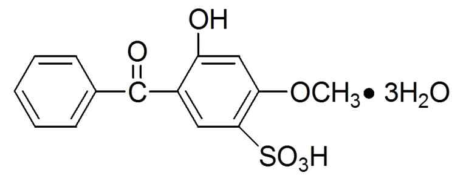

---

검출기: 자외부흡광광도계(측정파장285㎚)

칼

럼: 안지름약4.6㎜, 길이약25㎝인스테인레스관에5㎛의액체크로마토그래

프용옥타데실실릴화한실리카겔을충전한다.

이동상: 물ㆍ메탄올ㆍ아세트산(25:75:2)

유

량: 1.0mL/분

---

벤조페논-8

Benzophenone-8

디옥시벤존

Dioxybenzone

C14H12O4 : 244.25

이원료를건조한것은정량할때벤존페논-8(C14H12O4) 97.0% 이상을함유한다.

성

상

이원료는엷은황색의가루로약간의방향성냄새가있다.

확인시험

1) 흡광도

이원료약10㎎을정밀하게달아메탄올을넣어녹여정확하게

100mL로하고이액10mL를정확하게취하여메탄올을넣어정확하게100mL로한

액을검액으로한다. 검액을층장10mm의석영셀에넣어메탄올을대조액으로흡

광도측정법에따라흡수스펙트럼을측정할때파장358㎚ 및283㎚ 부근에서흡수극

대을나타낸다.

2) 이원료를가지고적외부흡수스펙트럼측정법의1)브롬화칼륨정제법에따라측정할

때표준품과같은스펙트럼을나타낸다.

수

분

2.0% 이하

정량법

이원료를약0.1g을정밀하게달아메탄올을넣어녹여100mL로하여검

액으로한다. 따로벤조페논-8 표준품약0.1g을정밀하게달아메탄올을넣어녹여

100mL로한액을표준액으로한다. 검액및표준액10㎕를가지고다음의조건으로

액체크로마토그래프법에따라시험하여벤조페논-8의피크면적AT 및AS를측정한다.

벤조페논-8(C 14H 12O 4)의양(㎎) = 벤조페논-8 표준품의양(㎎)× A T

A S

조작조건

검출기: 자외부흡광광도계(측정파장285㎚)

컬

럼: 안지름4㎜, 길이30㎝인스테인레스관에약10㎛의액체크로마토그래프용

옥타데실실릴화한실리카겔을충전한다.

이동상: 물ㆍ메탄올ㆍ빙초산혼합액(40: 60: 2)

유

량: 1.0mL/분

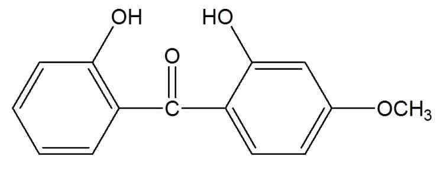

---

부틸메톡시디벤조일메탄

Butyl Methoxydibenzoylmethane

아보벤존

Avobenzone

C20H22O3：310.39

이원료를건조한것은정량할때부틸메톡시디벤조일메탄(C20H22O3：310.39) 97.0～

104.0%를함유한다.

성

상

이원료는엷은황색～황색의가루로약간의특이한냄새가있다.

확인시험

1) 이원료50㎎에에탄올100mL를넣어녹이고이액1.0mL를취하여에

탄올을넣어100mL로한액을검액으로한다. 검액을층장10㎜의석영셀에넣어

흡광도측정법에따라흡수스펙트럼을측정할때파장358±2㎚에서흡수극대를나타낸

다.

2) 이원료를가지고적외부흡수스펙트럼측정법의1) 브롬화칼륨정제법에따라측정

할때파수1510㎝-1, 1260㎝-1, 1170㎝-1, 1022㎝-1 및800㎝-1 부근에서특성흡수를나

타낸다.

융

점

81～86℃(제１법)

순도시험

1) 용해상태

이원료0.20 g을달아무수에탄올10mL를넣고가온하여녹

일때액은맑다.

2) 4,4’-디메톡시디벤조일메탄

이원료0.10 g에에탄올을넣어녹여100mL로하고

이액10mL를취하여에탄올을넣어100mL로한액을검액으로한다. 검액10㎕를

가지고다음조건으로액체크로마토그래프법에따라시험할때유지시간약3.3분에

나타나는피크면적은전피크면적의5.0% 이하이다.

조작조건

검출기：자외부흡광광도계(측정파장：358㎚)

컬

럼：안지름4㎜, 길이15～20㎝인스테인레스관에5～10㎛의옥타데실실릴화실리

카겔을충전한다.

칼럼온도：실온

이동상：아세토니트릴ㆍ물혼합액(85：15)에인산를넣어pH 2.5로조정한다.

유

속：부틸메톡시디벤조일메탄의유지시간이약5.5분이되도록조정한다.

3) 중금속

이원료1.0 g을달아제２법에따라조작하여시험한다. 비교액에는납

표준액2.0mL를넣는다(20ppm 이하).

4) 비

소

이원료1.0 g을달아제３법에따라검액을만들고장치B를쓰는방법

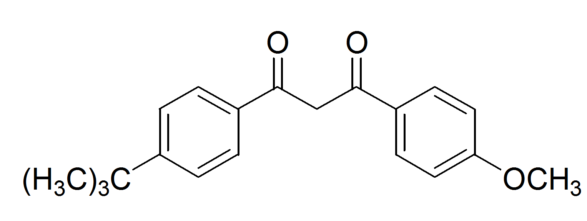

---

에따라조작하여시험한다(2ppm 이하).

수

분

1.0% 이하(0.5 g)

강열잔분

0.30% 이하(1 g, 제１법)

정량법

제1 법

이원료1.0 g을데시케이터(감압, 실리카겔)에서24시간건조하고약0.1 g

을정밀하게달아에탄올을넣어녹이고정확하게200mL로한다. 이액1.0mL를정

확하게취하여에탄올을넣어정확하게100mL로하여검액으로한다. 검액을층장

10㎜의석영셀에넣어358㎚ 부근의흡수극대파장에서흡광도측정법에따라흡광도

A를측정한다.

A

× 20000

부틸메톡시디벤조일메탄(C 20H 22O 3)의양(㎎) 〓

113

제2 법

이원료약10mg에해당하는양을정밀하게달아메탄올을넣어녹여정확

하게100mL로하고, 이액5mL를취해메탄올을넣어10mL로한액을검액으로

한다. 따로부틸메톡시디벤조일메탄표준품약10 mg을정밀하게달아메탄올을넣

어녹여100mL로하고이액5mL를취해메탄올을넣어10mL로한액을표준액으

로한다. 검액및표준액각10μL씩을가지고다음조건으로액체크로마토그래프법

에따라시험하여부틸메톡시디벤조일메탄의피크면적AT 및AS를구한다.

부틸메톡시디벤조일메탄(C20H22O3 : 310.39)의양(㎎) =

AT

부틸메톡시디벤조일메탄표준품의양(㎎) × 

AS

조작조건

검출기: 자외부흡광광도계(측정파장305㎚)

칼

럼: 안지름약4.6㎜, 길이약25㎝인스테인레스관에5㎛의액체크로마토그래

프용옥타데실실릴화한실리카겔을충전한다.

이동상: 85% 메탄올

유

량: 1.0mL/분

---

비스-에칠헥실옥시페놀메톡시페닐트리아진

Bis-Ethylhexyloxyphenol Methoxyphenyl Triazine

C38H49N3O5 : 627.90

이원료는정량할때비스-에칠헥실옥시페놀메톡시페닐트리아진(C38H49N3O5 : 627.90)

98.0 % 이상을함유한다.

성

상

이원료는엷은황색의가루이다.

확인시험

1) 이원료를가지고적외부흡수스펙트럼측정법의1)브롬화칼륨정제법에따라측정할때

파수2,800～3,100 ㎝-1, 1,630 ㎝-1, 1,590 ㎝-1, 1,540 cm-1, 1,500 cm-1, 1,450 ㎝-1, 1,260 ㎝-1, 1,100

㎝-1 및830 ㎝-1 부근에서특성흡수를나타낸다.

2) 정량법의검액에서얻은주피크의유지시간은표준액에서얻은주피크의유지시

간과같다.

비흡광도

이원료약0.13 g을정밀하게달아디메칠아세트아미드(C4H9NO : 87.12)

50 mL를넣고약5분간초음파추출하여녹인다음이소프로판올150 mL를넣고식

힌다음이소프로판올을넣어250 mL로한다. 이액5 mL를취하여이소프로판올을

넣어250 mL로하여검액으로한다. 검액을가지고이소프로판올을대조로하여파

장341 nm에서흡광도측정법에따라시험할때비흡광도( E 1%

1㎝)는790이상이다.

순도시험

1) 중금속

이원료2.0 g을달아제2법에따라조작하여시험한다.

비교액

에는납표준액2.0 mL를넣는다(10 ppm이하).

2) 비소

이원료0.4 g을달아제3법에따라검액을만들고장치A를쓰는방법에

따라조작하여시험한다(5 ppm이하).

건조감량

0.5 % 이하(1 g, 135 ℃, 90분)

정량법

이원료약100 mg을정밀하게달아디메칠포름아미드를넣어녹여100

---

mL로한다. 이액10 mL를정확하게취하여디메칠포름아미드를넣어100 mL로

한액을표준액으로한다. 따로비스-에칠헥실옥시페놀메톡시페닐트리아진표준품약

100 mg을정밀하게달아디메칠포름아미드를넣어녹여100 mL로한다. 이액10

mL를정확하게취하여디메칠포름아미드를넣어100 mL로한액을표준액으로한

다. 검액및표준액10 μL씩을가지고다음조건으로액체크로마토그래프법에따라

시험하여비스-에칠헥실옥시페놀메톡시페닐트리아진의피크면적AT 및AS를구한다.

비스-에칠헥실옥시페놀메톡시페닐트리아진(C 38H 49N 3O 5)의양(㎎)

= 비스-에칠헥실옥시페놀메톡시페닐트리아진표준품의양(㎎)× A T

A S

조작조건

검출기: 자외부흡광광도계(측정파장342 ㎚)

칼

럼: 안지름약4.6 ㎜, 길이약25 ㎝인스테인레스관에5 ㎛의액체크로마토그

래프용옥타실릴화한실리카겔을충전한다.

칼럼온도: 실온

이동상: 아세토니트릴ㆍ메탄올혼합액(55:45)

유

속: 1.0 mL/분

---

시녹세이트

Cinoxate

2-에톡시에칠-p-메톡시신나메이트

2-Ethoxyethyl-p-Methoxycinnamate

C14H18O4：250.29

이원료는정량할때시녹세이트(C14H18O4：250.29) 95.0%～105.0%를함유한다.

성

상

이원료는엷은황색의점성이있는맑은액으로냄새는거의없다.

확인시험

1) 이원료의에탄올용액(1→10) 2～3방울에염산히드록실아민ㆍ수산화나트

륨용액(염산히드록실아민및수산화나트륨의에탄올포화용액의같은양을섞고여과

한다) 4～5방울을넣고수욕상에서수분간가온한다음0.5N 염산을넣어산성으로

하고여기에염화제이철용액(1→100) 5방울을넣을때액은적색을나타낸다.

2) 이원료의에탄올용액(1→10) 5mL에수산화칼륨ㆍ에탄올시액5mL를넣고환류냉

각기를달고10분간끓일때백색의침전이생긴다.

n20

굴절률

D ： 1.566～1.569

d20

비

중

20 ： 1.008～1.104(제１법)

순도시험

1) 산

이원료에물로적신청색리트머스시험지를접촉시킬때적색을나

타내지않는다.

2) 유리페놀이원료1.0mL에물20mL를넣어1분간흔들어섞고가만히둔다음

그물층5mL를취하여묽은염화제이철시액1방울을넣을때액은적자색을나타내

지않는다.

강열잔분

0.1% 이하(3 g, 제２법)

정량법

이원료약60㎎을정밀하게달아에탄올에녹여100mL로하고이액

10mL에에탄올을넣어정확하게100mL로한다. 이액5mL를취하여에탄올을넣

어정확하게50mL로한액을검액으로한다. 검액을가지고층장10㎜, 파장310㎚ 부

근의흡수극대파장에서흡광도A를측정한다.

A

× 100,000

시녹세이트(C 14H 18O 4)의양(㎎) 〓

1059

옥토크릴렌

Octocrylene

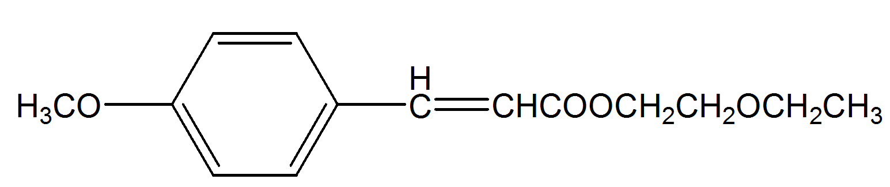

---

2-에칠헥실2-시아노-3-페닐신나메이트

2-Ethylhexyl 2-Cyano-3-Phenylcinnamate

C24H27NO2 : 361.48

이원료를정량할때옥토크릴렌(C24H27NO2 : 361.48) 98.0% 이상을함유한다.

성

상

맑은황색의액체로특이한냄새가있다.

확인시험

이원료0.01g을에탄올을넣어녹여정확하게100mL로하고이액10mL를

정확하게취하여에탄올을넣어정확하게100mL로한액을검액으로

한다. 검액

을층장10 mm의석영셀에넣어흡광도측정법에따라흡수스펙트럼을측정할때

파장303±2 nm에서흡수극대를나타낸다.

수

분

0.5% 이하(0.3g)

순도시험

1) 용해상태

이원료0.1g에에탄올을100mL를넣어녹일때액은

맑다.

2) 중금속

이원료1.0g을취하여제2법에따라조작하여시험한다. 비교액에는납

표준액2.0mL를넣는다. (20ppm이하)

3) 비소

이원료1.0g을달아제3법에따라검액을만들고장치B를쓰는방법에

따라조작하여시험한다. (2ppm이하)

정량법

이원료50mg을정밀하게달아메탄올에녹여100mL로하여검액으로한다.

따로옥토크릴렌표준품50mg을정밀하게달아메탄올에녹여100mL로하여표준

액으로한다. 검액및표준액20㎕ 씩을가지고다음조건으로액체크로마토그래프

법에따라시험하여옥토크릴렌의피크면적AT 및AS를구한다.

옥토크릴렌( C 24H 27NO 2)의양(㎎)= 옥토크릴렌표준품의양(㎎) × A T

A S

조작조건

검출기: 자외부흡광광도계(측정파장: 305nm)

컬

럼: 안지름4.6mm, 길이15cm인스테인레스관에5μm의옥타데실실릴화한실리

카겔을충전한다.

칼럼온도: 35℃

이동상: 물ㆍ메탄올ㆍ테트라하이드로퓨란혼합액(3:82:15)

유

속: 1mL/min

에칠헥실디메칠파바

Ethylhexyl Dimethyl PABA

---

옥틸디메칠파라아미노벤조익애씨드, 옥틸디메칠파바

Octyl Dimethyl p-Aminobenzoic Acid

C17H27NO2：277.41

이원료는정량할때에칠헥실디메칠파바(C17H27NO2：277.41) 95.0% 이상을함유한다.

성

상

이원료는엷은황색～황색의맑은액으로약간의특이한냄새가있다.

확인시험

1) 이원료0.1g에에탄올을넣어100mL로하고이액0.5mL를취하여에

탄올을넣어정확하게100mL로한액을검액으로한다. 검액을가지고흡광도측정

법에따라측정할때310±2㎚에서흡수극대를나타낸다.

2) 이원료를가지고적외부흡수스펙트럼측정법의4) 액막법에따라측정할때파수

1703㎝-1, 1608㎝-1, 1526㎝-1 및1365㎝-1 부근에서특성흡수를나타낸다.

n20

굴절률

D ： 1.539～1.545

d20

비

중

20 ： 0.992～1.002

검화가

190～210

순도시험

1) 용해상태

이원료0.5g을달아에탄올30mL 및물10mL를넣어흔들어

섞을때액은맑다.

2) 산

이원료5.0g을중화에탄올20mL에녹이고페놀프탈레인시액1mL 및0.1N

수산화칼륨ㆍ에탄올액1mL를넣을때액은홍색을나타낸다.

3) 중금속

이원료1.0g을달아제２법에따라조작하여시험한다. 비교액에는납표

준액2.0mL를넣는다(20ppm 이하).

4) 비소

이원료1.0 g을달아제３법에따라검액을만들고장치B를쓰는방법

에따라조작하여시험한다(2ppm 이하).

강열잔분

0.10% 이하(3g, 제２법)

정량법

이원료약0.5 g을정밀하게달아비수적정용빙초산50mL를넣어0.1N 과

염소산으로적정한다(지시약：크리스탈바이올렛시액3방울). 다만적정의종말점은

액의자색이청녹색이될때로한다. 같은방법으로공시험을하여보정한다.

0.1N 과염소산1㎖〓27.74㎎C 17H 27NO 2

---

에칠헥실메톡시신나메이트

Ethylhexyl Methoxycinnamate

옥틸메톡시신나메이트

Octyl methoxy cinnamate

C18H26O3：290.40

이원료는정량할때에칠헥실메톡시신나메이트(C18H26O3：290.40) 95.0% 이상을함

유한다.

성

상

이원료는엷은황색의점성이있는맑은액으로약간의특이한냄새가있다.

확인시험

1) 이원료1mL에수산화칼륨ㆍ에탄올시액10mL를넣어수욕상에서가열

할때백색의침전이생긴다. 더울때여기에물10mL를넣으면침전이녹는다. 또

이액에묽은염산을넣어산성으로할때백색의침전이생긴다.

2) 이원료50㎎에에탄올을넣어녹여100mL로하고이액10mL에에탄올을넣어

100mL로한액을검액으로한다. 검액을가지고흡광도측정법에따라측정할때파

장310～314㎚에서흡수극대를나타낸다.

n20

굴절률

D ： 1.539～1.550

산

가

2 이하(20 g, 제１법)

순도시험

1) 중금속

이원료1.0 g을달아제２법에따라조작하여시험한다. 비교액

에는납표준액2.0mL를넣는다(20ppm 이하).

2) 비소

이원료1.0 g을달아제３법에따라검액을만들고장치B를쓰는방법

에따라조작하여시험한다(2ppm 이하).

강열잔분

0.10% 이하(3 g, 제２법)

정량법

제1 법

이원료약1.0 g을정밀하게달아향료시험법2) 에스텔함량측정법에따라

시험한다.

0.5N 수산화나트륨․에탄올액1㎖〓145.20㎎C 18H 26O 3

제2 법

이원료약10mg에해당하는양을정밀하게달아메탄올을넣어녹여정확

하게100mL로하고, 이액5mL를취해메탄올을넣어10mL로한액을검액으로한

다. 따로에칠헥실메톡시신나메이트표준품약10mg을정밀하게달아메탄올을넣어

---

녹여100mL로하고이액5mL를취해메탄올을넣어10mL로한액을표준액으로한

다. 검액및표준액각10μL씩을가지고다음조건으로액체크로마토그래프법에따라

시험하여에칠헥실메톡시신나메이트의피크면적AT 및AS를구한다.

에칠헥실메톡시신나메이트(C18H26O3 : 290.40)의양(㎎) =

AT

에칠헥실메톡시신나메이트표준품의양(㎎) × 

AS

조작조건

검출기: 자외부흡광광도계(측정파장305㎚)

칼

럼: 안지름약4.6㎜, 길이약25㎝인스테인레스관에5㎛의액체크로마토그래

프용옥타데실실릴화한실리카겔을충전한다.

이동상: 85% 메탄올

유

량: 1.0mL/분

에칠헥실살리실레이트

Ethylhexyl Salicylate

옥틸살리실레이트

Octyl Salicylate

C15H22O3 : 250.33

이원료를정량할때에칠헥실살리실레이트(C15H22O3 : 250.33) 98.0% 이상을함유한다.

성

상

이원료는무색～미황색의맑은액으로냄새가없다.

확인시험

1) 이원료0.01g을에탄올을넣어녹여정확하게100mL로한다. 이액

10mL를정확하게취하여에탄올을넣어100 mL로한다음이액을검액으로한다.

검액을층장10 mm의석영셀에넣어흡광도측정법에따라흡수스펙트럼을측정할

때파장307±2 nm에서흡수극대를나타낸다.

2) 이원료5mL에수산화칼륨ㆍ에탄올시액5mL를넣고환류냉각기를달아수욕상에서

30분간가열한다음식힌액에물75mL를넣은액은살리실산염의정성반응2) 및3)

을나타낸다.

d20

비

중

20 1.0130 ～ 1.0220 (제1법)

n20

굴절률

D 1.4950 ～ 1.5050

---

산

가

4 이하(5g, 제1법)

검화가

215 ～ 230

수

분

0.5% 이하(0.3g)

순도시험

1) 용해상태

이원료0.1g에에탄올을100mL를넣어녹일때액은맑다.

2) 중금속

이원료1.0g을취하여제4법에따라조작하여시험한다. 비교액에는

납표준액1.0mL를넣는다. (10ppm 이하)

3) 비소

이원료1.0g을달아제3법에따라검액을만들고장치C를쓰는방법에

따라조작하여시험한다. (5ppm 이하)

정량법

이원료50mg을정밀하게달아메탄올에녹여100mL로하여검액으로한다.

따로에칠헥실살리실레이트표준품50mg을정밀하게달아메탄올에녹여100mL로

하여표준액으로한다. 검액및표준액20㎕ 씩을가지고다음조건으로액체크로마

토그래프법에따라시험하여에칠헥실살리실레이트의피크면적AT 및AS를구한다.

에칠헥실살리실레이트(C 15H22O 3)의양(mg)=

에칠헥실살리실레이트표준품의양(㎎)× A T

A S

조작조건

검출기: 자외부흡광광도계(측정파장: 305nm)

컬

럼: 안지름4.6mm, 길이25cm인스테인레스관에5μm의옥타데실

실릴화한

실리카겔을충전한다.

칼럼온도: 35℃

이동상: 물ㆍ메탄올ㆍ테트라하이드로퓨란혼합액(10:85:5)

유

속: 1.0mL/분

에칠헥실트리아존

Ethylhexyl Triazone

옥틸트리아존

Octyl triazone

C48H66N6O6 : 823.20

이원료는주로2,4,6-트리아닐리노-p-(카보-2’-에칠헥실-1’-옥시)-1,3,5-트리아진이다. 이원

료를정량할때에칠헥실트리아존(C48H66N6O6 : 823.20) 98.0% 이상을함유한다.

성

상

이원료는황색의가루로특이한냄새가있다.

확인시험

이

원료

0.01g을

에탄올을

넣어

녹여

정확하게

100mL로

하고

이

액

10mL를정확하게취하여에탄올을넣어100 mL로한액을검액으로한다. 검액을

층장10 mm의석영셀에넣어흡광도측정법에따라측정할때파장312±2 nm에서

---

흡수극대를나타낸다.

융

점

126 ～ 131℃

순도시험

1) 용해상태

이원료0.1g에에탄올을100mL를넣어녹일때액은

맑다.

2) 중금속

이원료1.0g을취하여제2법에따라조작하여시험한다. 비교액에

는

납표준액2.0mL를넣는다. (20ppm 이하)

3) 비

소

이원료1.0g을달아제3법에따라검액을만들고장치B를쓰는방법

에

따라조작하여시험한다. (2ppm 이하)

수

분

0.5% 이하(0.3g)

정량법

이원료50mg을정밀하게달아테트라하이드로퓨란에녹여100mL로하여

검액으로한다. 따로에칠헥실트리아존표준품50mg을정밀하게달아테트라하이

드로퓨란에녹여100mL로하여표준액으로한다. 검액및표준액20㎕ 씩을가지고

다음조건으로액체크로마토그래프법에따라시험하여에칠헥실트리아존의피크면적

AT 및AS를구한다.

에칠헥실트리아존(C 48H 66N 6O 6)의양(mg)= 에칠헥실트리아존표준품의양(㎎)× A T

A S

조작조건

검출기: 자외부흡광광도계(측정파장: 312nm)

컬

럼: 안지름4.6mm, 길이15cm인스테인레스관에5 μm의옥틸실릴화한실리카겔

을충전한다.

칼럼온도: 35℃

이동상: 인산이수소칼륨20mM을첨가한물ㆍ메탄올ㆍ테트라하이드로퓨란혼합액(3:82:15)

유

속: 1mL/분

이소아밀p-메톡시신나메이트

Isoamyl p-Methoxycinnamate

C15H20O3 : 248.35

---

이원료는이소아밀알코올과p-메톡시신나믹애씨드의에스텔이다. 이원료는정량할

때이소아밀p-메톡시신나메이트(C15H20O3 : 248.35) 98.0% 이상을함유한다.

성

상

이원료는무색～ 엷은황색의맑은액이다.

확인시험

1) 이원료를가지고적외부흡수스펙트럼측정법의4)액막법에따라측정할때파수2,960

cm-1, 2,840 cm-1, 1,710 cm-1, 1,635 cm-1, 1,510 cm-1, 1,305 cm-1, 1,250 cm-1, 1,170 cm-1, 830 cm-1, 555

cm-1 및520 cm-1 부근에서특성흡수를나타낸다.

2) 정량법의검액에서얻은주피크의유지시간은표준액에서얻은주피크의유지시간과같다.

n20

굴절률

D : 1.556 ～ 1.560

d25

비

중

25 : 1.037 ～ 1.041

E1%

비흡광도

1㎝(307 nm) : 980 이상(1 mg, 메탄올, 200 mL)

산

가

1 이하(6 g, 제1법)

수

분

1.0 % 이하

정량법

이원료약20 mg을정밀하게달아메탄올을넣어녹여100 mL로한액을검액으로한다.

따로이소아밀p-메톡시신나메이트표준품약20 mg을정밀하게달아메탄올을넣어녹여100 mL로

한액을표준액으로한다. 검액및표준액각10 μL씩을가지고아래조작조건으로액체크로마토그래

프법에따라시험하여이소아밀p-메톡시신나메이트(C15H20O3)의피크면적AT, AS를구한다.

이소아밀p-메톡시신나메이트(C 15H 20O 3)의양(㎎)

= 이소아밀p-메톡시신나메이트표준품의양(mg)× A T

A S

조작조건

검출기: 자외부흡광광도계(측정파장310 ㎚)

칼

럼: 안지름4.6 ㎜, 길이약25 ㎝인스테인레스관에5 ㎛의액체크로마토그래프

용옥타데실실릴화한실리카겔을충전한다.

이동상: 메탄올ㆍ물혼합액(90:10)

유

량: 1.0 mL/분

징크옥사이드

Zinc Oxide

아연화

ZnO：81.38

이원료를강열한것은정량할때징크옥사이드(ZnO：81.38) 99.5 % 이상을함유한다.

성

상

이원료는백색의결정또는무정형의매우미세한가루로냄새및맛은없

다.

확인시험

1) 이원료를강열할때황색으로되고이것을식힐때이색이없어진다.

2) 이원료의묽은염산용액(1→10)은아연염의정성반응을나타낸다.

순도시험

1) 물가용물

0.1 % 이하

---

2) 탄산염및용해상태

이원료2.0g에물10mL를넣어흔들어섞고묽은황산

30mL를넣어수욕상에서저어섞으면서가열할때거의거품이일어나지않는다.

또액은무색이며맑다.

3) 알칼리

이원료1.0 g에온탕10 mL를넣어흔들어섞고식힌다음여과하고여

액에페놀프탈레인시액2 방울을넣을때액은홍색을나타내지않는다. 또는홍색을

나타내더라도0.1N 염산0.3 mL를넣을때그색은없어진다.

4) 황산염

이원료0.5 g에물40 mL를넣어흔들어섞은다음여과한다. 여액20

mL를취하여묽은염산1 mL 및물을넣어50 mL로하여검액으로한다. 비교액에

는0.01 N 황산0.5 mL를넣는다(0.096 % 이하).

5) 철또는기타금속

2)의액2.0 mL를취하여이것을검액으로하여시험한다. 비

교액에는철표준액2.0 mL를넣는다(0.02 % 이하). 또2)의액5 mL에황산나트륨시

액1방울을넣을때액과침전은착색하지않는다.

6) 납

이원료1.0 g에물30 mL를넣어저어섞으면서질산10 mL를넣고수욕상

에서가열하여녹이고식힌다음물을넣어50 mL로한다. 이액20 mL를취하여

검액으로한다(40 ppm 이하). 다만구연산암모늄용액5 mL 및시안화칼륨용액20

mL를넣는다.

7) 비소

이원료1.0 g에묽은황산10 mL를넣어녹여검액으로하여장치C를쓰는

방법에따라조작하여시험한다(2 ppm 이하).

강열감량

1.0 % 이하(2 g, 500 ℃, 항량)

정량법

이원료를500 ℃에서항량이될때까지강열하고데시케이터(실리카겔)에

서식힌다음약1.5 g을정밀하게달아물50 mL 및희석시킨염산(1→2) 20 mL를

넣어가열하여녹인다. 불용물이남아있으면질산3 방울을넣어완전히녹이고식

힌다음물을넣어250 mL로한다. 이액25 mL를취하여pH 5.0 초산ㆍ초산암모

늄완충액10 mL를넣고, 희석시킨강암모니아수(1→2)로pH를5.0～5.5로조정한다

음물을넣어250 mL로하고0.05 M 에칠렌디아민테트라초산디나트륨액으로액이

황색으로될때까지적정한다(지시약：크실레놀오렌지시액0.5 mL).

0.05 M 에칠렌디아민테트라초산디나트륨액1 mL = 4.069 ㎎ ZnO

---

테레프탈릴리덴디캠퍼설포닉애씨드액(33%)

Terephthalylidene Dicamphor Sulfonic Acid Solution(33%)

C28H34O8S2:562.71

이원료는테레프탈알데하이드에DL-캠퍼설포닉애씨드2몰을첨가하여얻어진벤질

리덴캄퍼유도체의수용액이다. 이원료는정량할때테레프탈릴리덴디캠퍼설포닉애씨

드(C28H34O8S2:562.71)32.6～35.1%를함유한다.

성

상

이원료는엷은황색의액으로약간의특이한냄새가있다.

확인시험

1) 이원료1.0 g에물100 mL를넣어녹이고이액5.0 mL를취하여물을

넣어100 mL로하고, 다시이액5.0 mL를취하여물을넣어100 mL로한액을가지

고흡광도를측정할때파장342 ～346 ㎚에서흡수극대를나타낸다.

2) 건조한이원료를가지고적외부흡수스펙트럼측정법의1)브롬화칼륨정제법에따

라측정할때3400 cm-1, 2950cm-1, 2920cm-1, 1720cm-1, 1635cm-1, 1140cm-1, 1040cm-1

부근에서흡수를나타낸다.

pH

0.9 ～1.0 (1→3)

산

가

65 ～70 (이원료0.7 g을정밀하게달아물에녹여70 mL로하여검액으로

한다, 제1법)

순

도

1) 용해상태

이원료1.0 g에물또는에탄올1 mL를넣어섞을때액은맑다.

2) 염화물

이원료1 g을물에녹여100 mL로한다음이액25 mL를취하여네

슬러관에넣고묽은질산6 mL 및물을넣어50 mL로하여흔들어섞는다. 질산은

시액1 mL를넣고잘흔들어섞어5분간방치할때액은비교액보다혼탁하지않

다. 비교액은0.01 mol/L 염산0.7 mL를써서같은방법으로조작한다. (0.1 % 이하)

3) 중금속

이원료3.0 g을달아제2법에따라조작하여시험한다. 비교액에는납표준

액2.0 mL를넣는다.(20 ppm이하)

4) 비소

이원료3.0 g을달아제3법에따라검액을만들고장치B를쓰는방법에

따라조작하여시험한다.(2 ppm 이하)

5) 유연물질이원료0.1 g을정확하게취하여물을넣어50 mL로하여검액으로한

다. 따로4-(7,7-디메칠-3-옥소-4-설포메칠-비사이클로[2,2,1]헵토-2-일리덴메칠)-벤조익애

씨드표준품0.1 g을정밀하게달아물을넣어100 mL로한다(용액A). 소듐[3-(4 히

드록시메칠-벤질리덴)-7,7-디메칠-2-옥소-비사이클로[2,2,1]

헵토-1-일]-메탄설포네이트

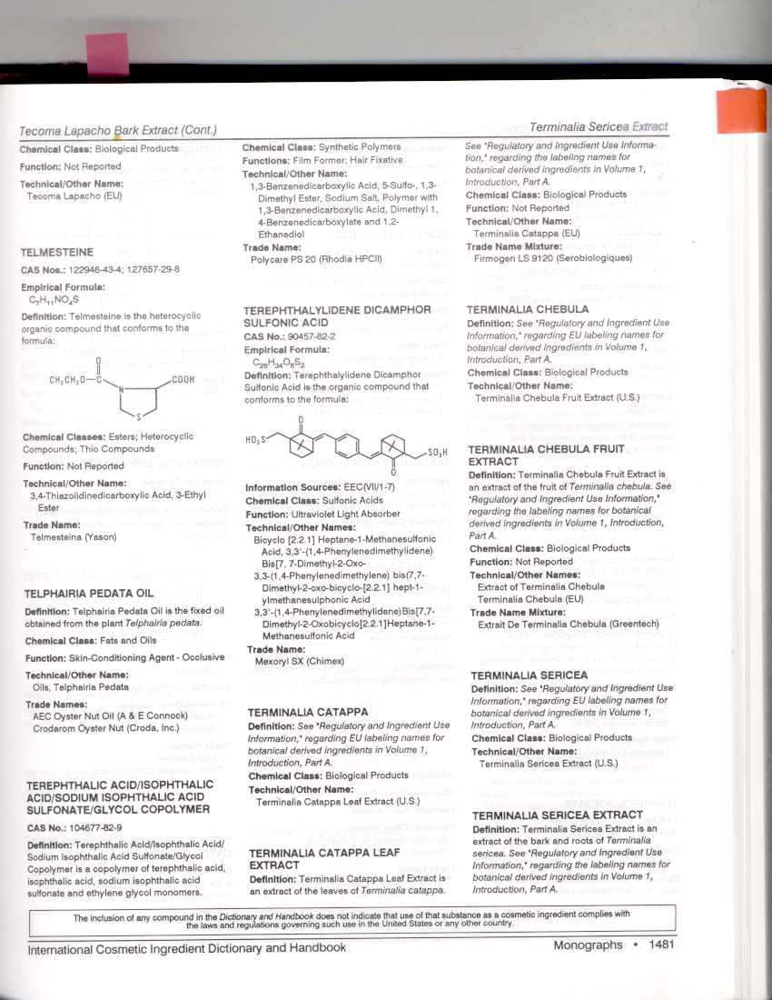

---

표준품0.15 g을정밀하게달아물에녹여100 mL로한다(용액B). 캄파설포닉애씨드

표준품0.15 g을정밀하게달아아세토니트릴을넣어100 mL로한다(용액C). 용액A,

B 및C를각각5 mL씩을정확하게취하여잘섞고물을넣어50 mL로한다. 이액1,

2, 4 mL를정확하게취하여각각에이동상을넣어50 mL로하여표준액으로한다.

검액및표준액20 μL씩을가지고다음조건으로액체크로마토그래프법에따라시험

하여유연물질각각의피크면적을구한다. 표준액의검량선에서검액중유연물질의

양을계산할때

4-(7,7-디메칠-3-옥소-4-설포메칠-비사이클로[2,2,1]헵토-2-일리덴메칠)-

벤조익애씨드는0.4 % 이하, [3-(4 히드록시메칠-벤질리덴)-7,7-디메칠-2-옥소-비사이클

로[2,2,1] 헵토-1-일]-메탄설포네이트는0.5 % 이하, 캄파설포닉애씨드는0.6 % 이하이

어야한다.

50xC

k

각유연물질의양(%) =

100 x 5xCxk

mx10 4 x

mx10 5

C : 검량선에서구한각유연물질의농도(㎍/ mL)

m : 검체의취한양(g)

k : 유연물질의순도(%) (단, 표준품1과표준품3의k는100 %로계산한다.

조작조건

검출기: 자외부흡광광도계

측정파장및시간: 200 ㎚(측정시간0～8분, 표준품3)

300 ㎚(측정시간8～15분, 표준품1과표준품2)

칼

럼: 안지름약4.6 ㎜, 길이약15 ㎝인스테인레스관에5～10 ㎛의액체크로마

토그래피용옥타데실실릴화한실리카겔을충전한다.

칼럼온도: 40℃

이동상: 물ㆍ아세토니트릴ㆍ인산혼합액(750:250:1),

유

량: 1 mL/분

측정시간: 검액주입후15분간

강열잔분

항량이될때까지강열한후데시케이터(실리카겔)속에서방냉한다음그

무게를정밀하게단도가니에이원료약2.0 g을정밀하게달아넣고묽은황산2

mL를넣는다. 천천히가열하여가능한저온에서거의회화시킨다음완전히회화할

때까지천천히강열한다(800 ℃). 이것을데시케이터(실리카겔)속에서식힌다음그

무게를정밀하게단다. (0.1 % 이하)

정량법

이원료1 g을정밀하게달아물50 mL를넣어녹이고0.1 mol/L 수산화

칼륨액으로적정한다(지시약: 페놀프탈레인시액1 mL). 같은방법으로공시험하여

보정한다.

0.1 mol/L 수산화칼륨용액1 mL = 28.1355 ㎎C28H34O8S2

---

주)

-

4-(7,7-디메칠-3-옥소-4-설포메칠-비사이클로[2,2,1]헵토-2-일리덴메칠)-벤조익애씨드

:

4-(7,7-dimethyl-3-oxo-4-sulphomethyl-

bicyclo[2,2,1]hepto

-2-ilydenemethyl)-benzoic

acid), C18H20O6S, 분자량: 364.42

- 소듐[3-(4 히드록시메칠-벤질리덴)-7,7-디메칠-2-옥소-비사이클로[2,2,1] 헵토-1-일]-메탄설

포네이트: sodium [3-(4 hydroxymethyl-benzylidene)-7,7-dimethyl-2-oxo-bicyclo [2,2,1]

hepto-1 -yl]-methanesulfonate, C18H21O5SNa, 분자량: 372.42

- [3-(4 히드록시메칠-벤질리덴)-7,7-디메칠-2-옥소-비사이클로[2,2,1] 헵토-1-일]-메탄설포

네이트

:

[3-(4

hydroymethyl-

benzylidene)-7,7-dimethyl-2-oxo-bicyclo

[2,2,1]

hepto-1-yl]- methanesulfonic acid, C18H21O5S, 분자량: 350.44

- 캄파설포닉애씨드: Camphorsulfonic acid, C10H16O4S, 분자량: 232.30

티타늄디옥사이드

Titanium Dioxide

이산화티탄

Titanium oxide

TiO2：79.88

이원료를건조한것은정량할때티타늄디옥사이드(TiO2：79.88) 90.0 % 이상을함

유한다.

성

상

이원료는백색의미세한가루로냄새및맛은없다.

확인시험

이원료0.5 g에황산5 mL를넣고흰연기가날때까지가열하여식힌다

음조심하면서물을넣어100 mL로하고여과한다. 여액5 mL에과산화수소시액3

방울을넣을때액은황적색을나타낸다.

순도시험

1) 액성

이원료1.0 g에물10 mL를넣어흔들어섞고여과한액은중성

이다.

2) 물가용물

이원료4.0 g에물50 mL를넣고잘흔들어섞어12 시간방치한다.

여기에염화암모늄시액2 mL를넣고잘흔들어섞는다. 티타늄디옥사이드가완전히

가라앉지않을때는다시염화암모늄시액2 mL를넣어티타늄디옥사이드를가라앉

힌다음물을넣어정확하게200 mL로하여잘흔들어섞고이중여과지를써서여과

한다. 처음여액10 mL는버리고맑은여액100 mL를취하여수욕상에서증발건고

한다음항량이될때까지강열한다(5 ㎎ 이하).

3) 납

이원료1.0 g을달아희석시킨질산(1→2) 20 mL를넣고30 분간저어섞은

다음이중여과지를써서여과한다. 여액에희석시킨질산(1→2)을넣어정확하게50

mL로한다. 이액20 mL를취하여암모니아시액을넣어알칼리성으로한다음수

욕상에서증발건고한다. 여기에희석시킨질산(1→2) 10 mL를넣어10 분간가온

하고식힌다음이중여과지를써서여과한다. 잔류물을희석시킨질산(1→2) 5 mL

및열탕15 mL로씻고씻은액을여액에합한다. 이것을검액으로하여시험한다(50

---

ppm 이하).

4) 비소

이원료0.20 g에황산1 mL 및질산1 mL를넣고흰연기가날때까지

가열한다. 식힌다음조심하면서물을넣어5 mL로하고이것을검액으로하여장

치C를쓰는방법에따라조작하여시험한다(10 ppm 이하).

건조감량

2.5 % 이하(1 g, 105 ℃, 3 시간)

정량법

이원료를건조하고약0.2 g을정밀하게달아도가니에넣고피로황산칼륨

3g을넣고뚜껑을하여처음에는약하게다음에는천천히온도를높여내용물이융

해된상태로30분간가열하고다시융해물이진한황적색의거의맑은액이될정도

로고온으로30분간가열한다. 식힌다음도가니의내용물을250 mL의비커에옮기

고다시물75 mL 및황산2.5 mL의혼합액으로씻어넣고수욕상에서거의맑게

될때까지가열한다. 여기에주석산2 g을넣어녹인후브롬치몰블루시액2～3방울을

넣고암모니아시액으로중화한다. 이액에희석시킨황산(1→2) 1～2 mL를넣어산

성으로하고황화수소를충분히통한다. 다음에암모니아시액30 mL를넣고다시황

화수소를통하여포화시킨다음10분간방치하여여과한다. 여과지위의침전을황화

암모늄시액2.5 mL를함유하는주석산암모늄용액(1→100) 25 mL씩으로10회씻는다.

씻을때에는여과지를액으로가득채워황산제일철의산화를방지한다. 여액및씻

은액을합하여희석시킨황산(1→2) 40 mL를넣어끓여황화수소를없앤다. 식힌

다음물을넣어400 mL로한다. 여기에쿠페론시액40 mL를저어섞으면서천천히

넣고방치하여황색의침전이침착한다음다시백색의침전이생길때까지쿠페론

시액을넣는다. 침전을정량용여과지로약하게흡인여과하고희석시킨염산(1→10)로

20회씻고마지막으로약간강하게흡인하여수분을제거한다. 침전을여과지와함

께70 ℃에서건조하고, 무게를미리단도가니에넣는다. 처음에는아주약하게가

열하고연기가나지않으면세게강열하여900～950 ℃에서항량이될때까지강열

하고식힌다음무게를달아티타늄디옥사이드(TiO2)의양으로한다.

페닐벤즈이미다졸설포닉애씨드

Phenylbenzimidazole Sulfonic Acid

C13H10N2O3S:274.30

---

이원료를정량할때페닐벤즈이미다졸설포닉애씨드98.0 %이상을함유한다.

성

상

이원료는백색～엷은황색의가루로냄새는없다.

확인시험

흡광도

이원료약1 g을정밀하게달아수산화나트륨0.14 g 및물을넣

어녹여정확하게100 mL로한액을검액으로한다. 검액을가지고물을대조액으로

하여흡광도를측정할때파장303±2 ㎚ 부근에서흡수극대를나타낸다.

건조감량

2.0 % 이하(105 ℃, 4시간)

순도시험

용해상태이원료1 g에수산화나트륨0.14 g 및물100 mL를넣어녹일때

액은맑다.

정량법

이원료약25 mg을정밀하게달아1N 수산화나트륨액10mL에넣어녹인

후메탄올을넣어250 mL로하여검액으로한다. 따로페닐벤즈이미다졸설포닉애씨드

표준품약25 mg을정밀하게달아검액과같은방법으로조작하여표준액으로한다.

검액및표준액각10 ㎕씩을가지고다음조건으로액체크로마토그래프법에따라

시험하여페닐벤즈이미다졸설포닉애씨드의피크면적AT및AS를구한다.

페닐벤즈이미다졸설포닉애씨드(C13H10N2O3S)의양(㎎)

A T

 페닐벤즈이미다졸설포닉애씨드표준품의양(㎎) ×

A S

조작조건

검출기: 자외부흡광광도계(측정파장: 305 nm)

칼

럼: 안지름4.6 mm, 길이15 cm인스테인레스관에5 ㎛의옥타데실실릴화한실

리카겔을충전한다.

칼럼온도: 40 ℃

이동상: 희석시킨초산(1→10,000)ㆍ메탄올혼합액(20:80)

유

량: 0.3 mL/분

---

호모살레이트

Homosalate

호모멘틸산살리실레이트

Homomenthyl Salicylate

C16H22O3：262.35

이원료는정량할때호모살레이트(C16H22O3：262.35)를98.0% 이상함유한다.

성

상

이원료는무색의맑은유액으로특이한냄새가있다.

확인시험

1) 이원료의에탄올용액(1→100) 10mL에염화제이철시액1방울을넣을때

액은자색을나타낸다.

2) 이원료0.3g을달아n-부탄올을넣어100mL로한다음이액1mL를취하여다시

n-부탄올을넣어100mL로한액을검액으로한다. 검액을가지고n-부탄올을대조액

으로하여흡광도측정법에따라측정할때파장308±2㎚에서흡수극대를나타낸다.

n20

굴절률

D : 1.515～1.520

d25

비

중

25：1.045～1.050 (제1법)

순도시험

1) 중금속

이원료1.0g을달아제2법에따라조작하여시험한다.

비교액

에는납표준액2.0mL를넣는다(20ppm 이하).

2) 비소

이원료1.0g을달아제３법에따라검액을만들고장치B를쓰는방법에

따라조작하여시험한다(2ppm 이하).

3) 살리실산

이원료4g에물40mL를넣어1분간잘흔들어섞은다음여과하여얻

은여액에염화제이철시액4mL를넣을때액은적자색을나타낸다.

정량법

제1 법

이원료약1g을정밀하게달아30% 에탄올을넣어녹여정확하게100mL로

하고잘흔들어섞은다음이액5mL를정확하게취하여30% 에탄올을넣어정확하

게200mL로한액을검액으로한다. 검액을가지고에탄올을대조액으로흡광도측정

법에따라측정할때파장306㎚에서흡광도를측정한다.

흡광도×50×100

호모살레이트의양(%)=

검체의양(g)×170

제2 법

이원료약10mg에해당하는양을정밀하게달아메탄올을넣어녹여정확하

게100mL로하고, 이액5mL를취해메탄올을넣어10mL로한액을검액으로한다.

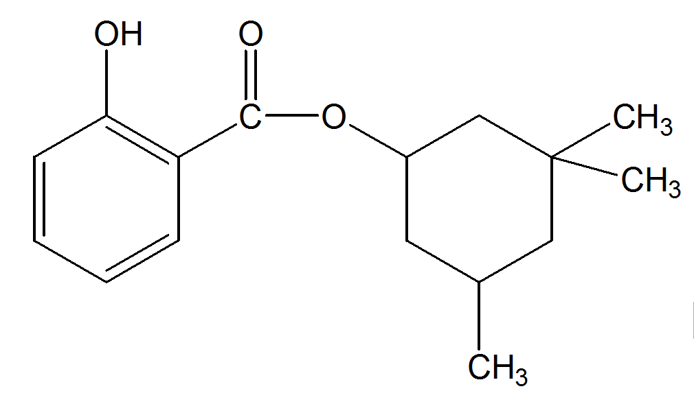

---

따로호모살레이트표준품약10mg을정밀하게달아메탄올을넣어녹여100mL로

하고이액5mL를취해메탄올을넣어10mL로한액을표준액으로한다. 검액및표

준액각10μL씩을가지고다음조건으로액체크로마토그래프법에따라시험하여호모

살레이트의피크면적AT 및AS를구한다.

AT

호모살레이트(C16H22O3 : 262.36)의양(㎎) = 호모살레이트표준품의양(㎎) × 

AS

조작조건

검출기: 자외부흡광광도계(측정파장305㎚)

칼

럼: 안지름약4.6㎜, 길이약25㎝인스테인레스관에5㎛의액체크로마토그래프

용옥타데실실릴화한실리카겔을충전한다.

이동상: 85% 메탄올

유

량: 1.0mL/분

---

[별표5]

피부의미백및주름개선에도움을주는기능성화장품

각조

(제2조제5호관련)

나이아신아마이드ㆍ아데노신로션제

NiacinamideㆍAdenosine Lotion

이기능성화장품은정량할때표시량의90.0% 이상에해당하는나이아신아마이드

(C6H6N2O : 122.13)및아데노신(C10H13N5O4 : 267.24)을함유한다.

제

법

이기능성화장품은나이아신아마이드및아데노신을주성분(기능성성분)으로

하는로션제이다. 이제품은안정성및유용성을높이기위해안정제, 습윤제, 유화

제, 보습제, pH 조정제, 착색제, 착향제등을첨가할수있다.

확인시험

다음정량법에따라시험할때검액및표준액의주피크유지시간은같다.

pH

기준치± 1.0 (2 →30) (다만, pH 범위는3.0 ~ 9.0이다)

정량법

이기능성화장품을가지고나이아신아마이드로서약20 mg 및아데노신으

로서약0.4 mg에해당하는양을정밀하게달아이동상을넣어분산시킨다음정확

하게50 mL로하고필요하면여과하여검액으로한다. 따로나이아신아마이드표준

품약20 mg을정밀하게달아이동상을넣어녹여50 mL로한액을나이아신아마

이드표준액으로, 아데노신표준품약20 mg을정밀하게달아이동상을넣어녹여

100 mL로하고, 이액4 mL를정확하게취하여이동상을넣어100 mL로한액을

아데노신표준액으로한다. 검액및표준액각10 μL씩을가지고다음조건으로액

체크로마토그래프법에따라시험하여검액및표준액의피크면적AT 및AS를각각

구한다.

나이아신아마이드(C6H6N2O : 122.13)의양(㎎) = 나이아신아마이드표준품의양(㎎) × A T

A S

아데노신(C10H13N5O4 : 267.24)의양(㎎) = 아데노신표준품의양(㎎) × A T

× 1

A S

50

조작조건

검출기: 자외부흡광광도계(측정파장260 ㎚)

칼

럼: 안지름약4.6 ㎜, 길이약25 ㎝인스테인레스관에5 ㎛액체크로마토그래

---

프용옥타데실실릴화한실리카겔을충전한다.

이동상: 메탄올ㆍ0.05 M 인산이수소칼륨용액혼합액(15 : 85)

유

량: 1.0 mL/분

나이아신아마이드ㆍ아데노신액제

NiacinamideㆍAdenosine Solution

이기능성화장품은정량할때표시량의90.0% 이상에해당하는나이아신아마이드

(C6H6N2O : 122.13) 및아데노신(C10H13N5O4 : 267.24)을함유한다.

제

법

이기능성화장품은나이아신아마이드및아데노신을주성분(기능성성분)으

로하는액제이다. 이제품은안정성및유용성을높이기위해안정제, 습윤제, 보

습제, pH조정제, 착색제, 착향제등을첨가할수있다.

확인시험

다음정량법에따라시험할때검액및표준액의주피크유지시간은같다.

pH

기준치± 1.0 (2 →30), (다만, pH 범위는3.0∼9.0이다)

정량법

이기능성화장품을가지고나이아신아마이드로서약20 mg 및아데노신으

로서약0.4 mg에해당하는양을정밀하게달아이동상을넣어분산시킨다음정확

하게50 mL로하고필요하면여과하여검액으로한다. 따로나이아신아마이드표준

품약20 mg을정밀하게달아이동상을넣어녹여50 mL로한액을나이아신아마

이드표준액으로, 아데노신표준품약20 mg을정밀하게달아이동상을넣어녹여

100 m,L로하고, 이액4 mL를정확하게취하여이동상을넣어100 mL로한액을

아데노신표준액으로한다. 검액및표준액각10 μL씩을가지고다음조건으로액

체크로마토그래프법에따라시험하여검액및표준액의피크면적AT 및AS를각각

구한다.

나이아신아마이드(C6H6N2O : 122.13)의양(㎎) = 나이아신아마이드표준품의양(㎎) × A T

A S

아데노신(C10H13N5O4 : 267.24)의양(㎎) = 아데노신표준품의양(㎎) × A T

× 1

A S

50

조작조건

검출기: 자외부흡광광도계(측정

파장260 ㎚)

칼

럼: 안지름약4.6 ㎜, 길이약25 ㎝인스테인레스관에5 ㎛액체크로마토그래

프용옥타데실실릴화한실리카겔을충전한다.

이동상: 메탄올ㆍ0.05 M 인산이수소칼륨용액혼합액(15 : 85)

유

량: 1.0 mL/분

---

나이아신아마이드ㆍ아데노신크림제

NiacinamideㆍAdenosine Cream

이기능성화장품은정량할때표시량의90.0% 이상에해당하는나이아신아마이드

(C6H6N2O : 122.13)및아데노신(C10H13N5O4 : 267.24)을함유한다.

제

법

이기능성화장품은나이아신아마이드및아데노신을주성분(기능성성분)으로

하는크림제이다. 이제품은안정성및유용성을높이기위해안정제, 습윤제, 유화

제, 보습제, pH 조정제, 착색제, 착향제등을첨가할수있다.

확인시험

다음정량법에따라시험할때검액및표준액의주피크유지시간은같다.

pH

기준치± 1.0 (2 →30) (다만, pH 범위는3.0 ~ 9.0이다)

정량법

이기능성화장품을가지고나이아신아마이드로서약20 mg 및아데노신으

로서약0.4 mg에해당하는양을정밀하게달아메탄올5 mL를넣어초음파추출

한후물을넣어분산시킨다음정확하게50 mL로하고필요하면여과하여검액으

로한다. 따로나이아신아마이드표준품약20 mg을정밀하게달아10 % 메탄올을

넣어녹여50 mL로한액을나이아신아마이드표준액으로, 아데노신표준품약20

mg을정밀하게달아10 % 메탄올을넣어녹여100 m,L로하고, 이액4 mL를정

확하게취하여10 % 메탄올을넣어100 mL로한액을아데노신표준액으로한다.

검액및표준액각10μL씩을가지고다음조건으로액체크로마토그래프법에따라

시험하여검액및표준액의피크면적AT 및AS를각각구한다.

나이아신아마이드(C6H6N2O : 122.13)의양(㎎) = 나이아신아마이드표준품의양(㎎) × A T

A S

아데노신(C10H13N5O4 : 267.24)의양(㎎) = 아데노신표준품의양(㎎) × A T

× 1

A S

50

조작조건

검출기: 자외부흡광광도계(측정파장260 ㎚)

칼

럼: 안지름약4.6 ㎜, 길이약25 ㎝인스테인레스관에5 ㎛액체크로마토그래

프용옥타데실실릴화한실리카겔을충전한다.

이동상: 메탄올ㆍ0.05 M 인산이수소칼륨용액혼합액(15 : 85)

유

량: 1.0 mL/분

나이아신아마이드ㆍ아데노신침적마스크

NiacinamideㆍAdenosine Soaked Mask

---

이기능성화장품은정량할때표시량의90.0% 이상에해당하는나이아신아마이드

(C6H6N2O : 122.13)및아데노신(C10H13N5O4 : 267.24)을함유한다.

제

법

이기능성화장품은나이아신아마이드및아데노신을주성분(기능성성분)으로

하는액제또는로션제를부직포등의지지체에단순침적한마스크제형의제품이

다. 이때액제또는로션제에는안정성및유용성을높이기위해안정제, 습윤제, 유

화제, 보습제, pH 조정제, 착색제, 착향제등을첨가할수있다.

확인시험

다음정량법에따라시험할때검액및표준액의주피크유지시간은같다.

pH

이기능성화장품을압착하여얻은액제또는로션제를가지고시험할때기준

치± 1.0이다. (다만, pH 범위는3.0 ~ 9.0이다)

정량법

이기능성화장품을압착하여얻은액제또는로션제를가지고나이아신아

마이드로서약20 mg 및아데노신으로서약0.4 mg에해당하는양을정밀하게달

아이동상을넣어분산시킨다음정확하게50 mL로하고필요하면여과하여검액으

로한다. 따로나이아신아마이드표준품약20 mg을정밀하게달아이동상을넣어

녹여50 mL로한액을나이아신아마이드표준액으로, 아데노신표준품약20 mg을

정밀하게달아이동상을넣어녹여100 m,L로하고, 이액4 mL를정확하게취하여

이동상을넣어100 mL로한액을아데노신표준액으로한다. 검액및표준액각10

μL씩을가지고다음조건으로액체크로마토그래프법에따라시험하여검액및표준

액의피크면적AT 및AS를각각구한다.

나이아신아마이드(C6H6N2O : 122.13)의양(㎎) = 나이아신아마이드표준품의양(㎎) × A T

A S

아데노신(C10H13N5O4 : 267.24)의양(㎎) = 아데노신표준품의양(㎎) × A T

× 1

A S

50

조작조건

검출기: 자외부흡광광도계(측정파장260 ㎚)

칼

럼: 안지름약4.6 ㎜, 길이약25 ㎝인스테인레스관에5 ㎛액체크로마토그래

프용옥타데실실릴화한실리카겔을충전한다.

이동상: 메탄올ㆍ0.05 M 인산이수소칼륨용액혼합액(15 : 85)

유

량: 1.0 mL/분

아스코빌글루코사이드ㆍ아데노신액제

Ascorbyl GlucosideㆍAdenosine Solution

이기능성화장품은정량할때표시량의90.0% 이상에해당하는아스코빌글루코사

이드(C12H18O11: 338.27) 및아데노신(C10H13N5O4 : 267.24)를함유한다.

제

법

이기능성화장품은아스코빌글루코사이드및아데노신을주성분(기능성성분)으

---

로하는액제이다. 이제품은안정성및유용성을높이기위해안정제, 습윤제, 보습

제, pH 조정제, 착색제, 착향제등을첨가할수있다.

확인시험

다음정량법에따라시험할때검액및표준액의주피크유지시간은같다.

pH

기준치± 1.0 (2 →30) (다만, pH 범위는3.0 ~ 9.0이다)

정량법이기능성화장품을가지고아스코빌글루코사이드로서약20 mg 및아데노신으로서

약0.4 mg에해당하는양을정밀하게달아이동상을넣어충분히분산시킨다음정확

하게50 mL로하고필요하면여과하여검액으로한다. 따로아스코빌글루코사이드표준

품약20 mg을정밀하게달아이동상을넣어녹여50 mL로한액을아스코빌글루코사

이드표준액으로, 아데노신표준품약20 mg을정밀하게달아이동상을넣어녹여100

mL로하고, 이액4 mL를정확하게취하여이동상을넣어100 mL로한액을아데노신

표준액으로한다. 검액및표준액각10 μL씩을가지고다음조건으로액체크로마토그

래프법에따라시험하여검액및표준액의피크면적AT 및AS를각각구한다.

아스코빌글루코사이드(C12H18O11 : 338.27)의양(mg) = 아스코빌글루코사이드의표준품의양(mg)× A T

A S

× 1

아데노신(C10H13N5O4 : 267.24)의양(㎎) = 아데노신표준품의양(㎎) × A T

A S

50

조작조건

검출기: 자외부흡광광도계(측정파장260 nm)

칼

럼: 안지름약4.6 mm, 길이약25 cm인스테인레스관에5 μm 액체크로마

토그래프용옥타데실실릴화한실리카겔을충전한다.

이동상: 메탄올ㆍ10 mM 인산이수소칼륨혼합액(20 : 80)

유

량: 0.8 mL/분

알부틴ㆍ레티놀크림제

ArbutinㆍRetinol Cream

이기능성화장품은정량할때표시량의90.0 % 이상에해당하는알부틴(C12H16O7 :

272.25) 및레티놀(C20H30O : 286.46)을함유한다.

제

법

이기능성화장품은알부틴및레티놀을주성분(기능성성분)으로하는크

림제이다.

이제품은안정성및유용성을높이기위해안정제, 습윤제, 유화제, 보습제,

pH조정제, 착색제, 착향제등을첨가할수있다.

확인시험

다음정량법에따라시험할때검액및표준액의주피크유지시간은같다.

pH

기준치± 1.0 (2→30) (다만, pH 범위는3.0 ~ 9.0이다)

히드로퀴논

이기능성화장품약1 g을정밀하게달아이동상을넣어분산시킨다음

---

10

mL로

하고

필요하면

여과하여

검액으로

한다.

따로

히드로퀴논

표준품

(C6H6O2) 약10 mg을정밀하게달아이동상을넣어녹여100 mL로한액1 mL를

정확하게취한후, 이동상을넣어정확하게1000 mL로한액을표준액으로한다.

검액및표준액각20 μL씩을가지고다음조작조건으로액체크로마토그래프법에

따라시험할때검액의히드로퀴논피크는표준액의히드로퀴논피크보다크지않

다. (1 ppm)

조작조건

검출기: 자외부흡광광도계(측정파장290 nm)

칼

럼: 안지름약4.6 mm, 길이약25 cm인스테인레스관에5μm 액체크로마토

그래프용옥타데실실릴화한실리카겔을충전한다.

이동상: 10 mM 인산이수소칼륨액ㆍ아세토니트릴혼합액(92:8)

유

량: 1.0 mL/분

정량법

1) 이기능성화장품을가지고알부틴으로서약20 mg 해당량을정밀하게

달아이동상을넣어녹여50 mL로한액을가지고검액으로한다. 따로알부틴

표준품을데시케이터(감압, 실리카겔)에서12시간건조한다음약20 mg을정밀하게

달아검액과같은방법으로조작하여표준액으로한다.

검액및표준액각20 μL

씩을가지고아래조작조건으로액체크로마토그래프법에따라시험하여검액및

표준액의알부틴피크면적AT 및AS를구한다.

알부틴(C 12H 16O 7)의양(㎎) ꠧ

알부틴표준품의양(㎎)× A T

A S

조작조건

검출기: 자외부흡광광도계(측정파장280 nm)

칼

럼: 안지름약4.6 mm, 길이약25 cm인스테인레스관에5 μm의액체크로마

토그래프용옥타데실실릴화한실리카겔을충전한다.

이동상: 10mM 인산이수소칼륨액ㆍ아세토니트릴혼합액(92:8)

유

량: 1.0 mL/분

2) 이기능성화장품을가지고레티놀로서약2,500 IU에해당하는양을정밀하게

달아에탄올ㆍ이소프로판올혼합액(1:1)을넣어분산시킨다음50 mL로하고여과

한액을가지고검액으로한다.

다만, 수용성물질에포집된레티놀을사용한제품

의경우에는, 제품의표시량에따라레티놀약2,500 IU에해당하는양을정밀하게

달아물15 mL를넣어흔들어섞고35 ℃에서30분간초음파로분산시킨다음흔

들어섞으면서에탄올ㆍ이소프로판올혼합액(1:1)을넣어50 mL로한다. 이액을

다시20분간교반하고10분간초음파로분산시킨다음필요하면여과하여검액으로

한다.

따로, 레티놀표준품약50,000 IU 해당하는양을정밀하게달아에탄올ㆍ이소

프로판올혼합액(1:1)을넣어녹여50 mL로하고이액5 mL를정확하게취해에

탄올ㆍ이소프로판올혼합액(1:1)을넣어100 mL로하여표준액으로한다.

검액및

---

표준액각10 μL씩을가지고아래조작조건으로액체크로마토그래프법에따라시

험하여검액및표준액의피크면적AT 및AS를구한다.

× 1

레티놀(C 20H 30O)의양(IU) ꠧ

레티놀표준품의양(IU)× A T

A S

20

조작조건

검출기: 자외부흡광광도계(측정파장325 nm)

칼

럼: 안지름약3.9 mm, 길이약15 cm인스테인레스관에5 μm의액체크로마

토그래프용옥타데실실릴화한실리카겔을충전한다.

이동상: 90 % 메탄올

유

량: 1.0 mL/분

알부틴ㆍ아데노신로션제

ArbutinㆍAdenosine Lotion

이기능성화장품은정량할때표시량의90.0% 이상에해당하는알부틴(C12H16O7 :

272.25) 및아데노신(C10H13N5O4 : 267.24)을함유한다.

제

법

이기능성화장품은알부틴및아데노신을주성분(기능성성분)으로하는로

션제이다. 이제품은안정성및유용성을높이기위해안정제, 습윤제, 유화제, 보습

제, pH조정제, 착색제, 착향제등을첨가할수있다.

확인시험

정량법의검액에서얻은주피크의유지시간은표준액에서얻은주피크의

유지시간과같다.

pH

기준치± 1.0 (2 →30), (다만, pH 범위는3.0∼9.0이다)

히드로퀴논

이기능성화장품약1g을정밀하게달아이동상을넣어분산시킨다음

10mL로하고필요하면여과하여검액으로한다. 따로히드로퀴논표준품(C6H6O2)

약10㎎을정밀하게달아이동상을넣어녹여100mL로한액1mL를정확하게취

한후, 이동상을넣어정확하게1000mL로한액을표준액으로한다. 검액및표준

액각20μL씩을가지고다음조작조건으로액체크로마토그래프법에따라시험할

때검액의히드로퀴논피크는표준액의히드로퀴논피크보다크지않다.(1ppm)

조작조건

검출기: 자외부흡광광도계(측정파장290㎚)

칼

럼: 안지름약4.6㎜, 길이약25㎝인스테인레스관에5㎛액체크로마토그래

---

프용옥타데실실릴화한실리카겔을충전한다.

이동상: 10mM 인산이수소칼륨액ㆍ아세토니트릴혼합액(92:8)

유

량: 1.0mL/분

정량법

이기능성화장품을가지고알부틴으로서약20㎎및아데노신으로서약

0.4㎎에해당하는양을정밀하게달아이동상을넣어분산시킨다음정확하게50

mL로하고필요하면여과하여검액으로한다. 따로알부틴표준품약20㎎을정밀

하게달아이동상을넣어녹여50mL로한액을알부틴의표준액으로, 아데노신표

준품약20㎎을정밀하게달아이동상을넣어녹여100mL로하고, 이액4mL를

정확하게취하여이동상을넣어100mL로한액을아데노신의표준액으로한다. 검

액및표준액각10μL씩을가지고다음조건으로액체크로마토그래프법에따라시

험하여검액및표준액의피크면적AT 및AS를각각구한다.

알부틴(C12H16O7)의양(㎎)

= 알부틴표준품의양(㎎) × A T

A S

아데노신(C10H13N5O4)의양(㎎) = 아데노신표준품의양(㎎) × A T

× 1

A S

50

조작조건

검출기: 자외부흡광광도계(측정파장260㎚)

칼

럼: 안지름약4.6㎜, 길이약15㎝인스테인레스관에5㎛의액체크로마토그래

프용옥타데실실릴화한실리카겔을충전한다.

이동상: 10mM 인산이수소칼륨액ㆍ아세토니트릴혼합액(92:8)

유

량: 1.0mL/분

알부틴ㆍ아데노신액제

ArbutinㆍAdenosine Solution

이기능성화장품은정량할때표시량의90.0% 이상에해당하는알부틴(C12H16O7 :

272.25) 및아데노신(C10H13N5O4 : 267.24)을함유한다.

제

법

이기능성화장품은알부틴및아데노신을주성분(기능성성분)으로하는액

제이다. 이제품은안정성및유용성을높이기위해안정제, 습윤제, 보습제, pH조

정제, 착색제, 착향제등을첨가할수있다.

확인시험

정량법의검액에서얻은주피크의유지시간은표준액에서얻은주피크의

유지시간과같다.

pH

기준치± 1.0 (2 →30), (다만, pH 범위는3.0∼9.0이다)

---

히드로퀴논

이기능성화장품약1g을정밀하게달아이동상을넣어분산시킨다음

10mL로하고필요하면여과하여검액으로한다. 따로히드로퀴논표준품(C6H6O2)

약10㎎을정밀하게달아이동상을넣어녹여100mL로한액1mL를정확하게취

한후, 이동상을넣어정확하게1000mL로한액을표준액으로한다. 검액및표준

액각20μL씩을가지고다음조작조건으로액체크로마토그래프법에따라시험할

때검액의히드로퀴논피크는표준액의히드로퀴논피크보다크지않다.(1ppm)

조작조건

검출기: 자외부흡광광도계(측정파장290㎚)

칼

럼: 안지름약4.6㎜, 길이약25㎝인스테인레스관에5㎛액체크로마토그래

프용옥타데실실릴화한실리카겔을충전한다.

이동상: 10mM 인산이수소칼륨액ㆍ아세토니트릴혼합액(92:8)

유

량: 1.0mL/분

정량법

이기능성화장품을가지고알부틴으로서약20㎎및아데노신으로서약

0.4㎎에

해당하는

양을

정밀하게

달아

이동상을

넣어

분산시킨

다음

정확하게

50mL로하고필요하면여과하여검액으로한다. 따로알부틴표준품약20㎎을정

밀하게달아이동상을넣어녹여50mL로한액을알부틴의표준액으로, 아데노신

표준품약20㎎을정밀하게달아이동상을넣어녹여100mL로하고, 이액4mL를

정확하게취하여이동상을넣어100mL로한액을아데노신의표준액으로한다. 검

액및표준액각10μL씩을가지고다음조건으로액체크로마토그래프법에따라시

험하여검액및표준액의피크면적AT 및AS를각각구한다.

알부틴(C12H16O7)의양(㎎) = 알부틴표준품의양(㎎) × A T

A S

아데노신(C10H13N5O4)의양(㎎) = 아데노신표준품의양(㎎) × A T

× 1

A S

50

조작조건

검출기: 자외부흡광광도계(측정파장260㎚)

칼

럼: 안지름약4.6㎜, 길이약15㎝인스테인레스관에5㎛의액체크로마토그래

프용옥타데실실릴화한실리카겔을충전한다.

이동상: 10mM 인산이수소칼륨액ㆍ아세토니트릴혼합액(92:8)

유

량: 1.0mL/분

알부틴ㆍ아데노신크림제

ArbutinㆍAdenosine Cream

---

이기능성화장품은정량할때표시량의90.0% 이상에해당하는알부틴(C12H16O7 :

272.25) 및아데노신(C10H13N5O4 : 267.24)을함유한다.

제

법

이기능성화장품은알부틴및아데노신을주성분(기능성성분)으로하는크

림제이다. 이제품은안정성및유용성을높이기위해안정제, 습윤제, 유화제, 보습

제, pH조정제, 착색제, 착향제등을첨가할수있다.

확인시험

정량법의검액에서얻은주피크의유지시간은표준액에서얻은주피크의

유지시간과같다.

pH

기준치± 1.0 (2 →30), (다만, pH 범위는3.0∼9.0이다)

히드로퀴논

이기능성화장품약1g을정밀하게달아이동상을넣어분산시킨다음

10mL로하고필요하면여과하여검액으로한다. 따로히드로퀴논표준품(C6H6O2)

약10㎎을정밀하게달아이동상을넣어녹여100mL로한액1mL를정확하게취

한후, 이동상을넣어정확하게1000mL로한액을표준액으로한다. 검액및표준

액각20μL씩을가지고다음조작조건으로액체크로마토그래프법에따라시험할

때검액의히드로퀴논피크는표준액의히드로퀴논피크보다크지않다.(1ppm)

조작조건

검출기: 자외부흡광광도계(측정파장290㎚)

칼

럼: 안지름약4.6㎜, 길이약25㎝인스테인레스관에5㎛액체크로마토그래

프용옥타데실실릴화한실리카겔을충전한다.

이동상: 10mM 인산이수소칼륨액ㆍ아세토니트릴혼합액(92:8)

유

량: 1.0mL/분

정량법

이기능성화장품을가지고알부틴으로서약20㎎및아데노신으로서약

0.4㎎에해당하는양을정밀하게달아이동상을넣어분산시킨다음정확하게50

mL로하고필요하면여과하여검액으로한다. 따로알부틴표준품약20㎎을정밀

하게달아이동상을넣어녹여50mL로한액을알부틴의표준액으로, 아데노신표

준품약20㎎을정밀하게달아이동상을넣어녹여100mL로하고, 이액4mL를

정확하게취하여이동상을넣어100mL로한액을아데노신의표준액으로한다. 검

액및표준액각10μL씩을가지고다음조건으로액체크로마토그래프법에따라시

험하여검액및표준액의피크면적AT 및AS를각각구한다.

알부틴(C12H16O7)의양(㎎) = 알부틴표준품의양(㎎) × A T

A S

아데노신(C10H13N5O4)의양(㎎) = 아데노신표준품의양(㎎) × A T

× 1

A S

50

조작조건

검출기: 자외부흡광광도계(측정파장260㎚)

---

칼

럼: 안지름약4.6㎜, 길이약15㎝인스테인레스관에5㎛의액체크로마토그래

프용옥타데실실릴화한실리카겔을충전한다.

이동상: 10mM 인산이수소칼륨액ㆍ아세토니트릴혼합액(92:8)

유

량: 1.0 mL/분

알부틴ㆍ 아데노신침적마스크

ArbutinㆍAdenosine Soaked Mask

이기능성화장품은정량할때표시량의90.0% 이상에해당하는알부틴(C12H16O7 :

272.25) 및아데노신(C10H13N5O4 : 267.24) 함유한다.

제

법

이기능성화장품은알부틴및아데노신을주성분(기능성성분)으로하는액제

또는로션제를부직포등의지지체에단순침적한마스크제형의제품이다. 이때침

적되는액제또는로션제에는안정성및유용성을높이기위해안정제, 습윤제, 유화

제, 보습제, pH 조정제, 착색제, 착향제등을첨가할수있다.

확인시험

정량법의검액에서얻은주피크의유지시간은표준액에서얻은주피크의유

지시간과같다.

pH

이기능성화장품을압착하여얻은액제또는로션제를가지고시험할때기준

치± 1.0"이다. (다만, pH 범위는3.0 ∼9.0이다)

히드로퀴논

이기능성화장품을압착하여얻은액제또는로션제약1g을정밀하게달아

이동상을넣어분산시킨다음10mL로하고필요하면여과하여검액으로한다. 따로

히드로퀴논표준품(C6H6O2) 약10㎎을정밀하게달아이동상을넣어녹여100mL로

한액1mL를정확하게취한후, 이동상을넣어정확하게1000mL로한액을표준액으

로한다. 검액및표준액각20μL씩을가지고다음조작조건으로액체크로마토그래프

법에따라시험할때검액의히드로퀴논피크는표준액의히드로퀴논피크보다크지

않다.(1ppm)

조작조건

검출기: 자외부흡광광도계(측정파장290㎚)

칼

럼: 안지름약4.6㎜, 길이약25㎝인스테인레스관에5㎛액체크로마토그래프

용옥타데실실릴화한실리카겔을충전한다.

이동상: 10mM 인산이수소칼륨액ㆍ아세토니트릴혼합액(92:8)

유

량: 1.0mL/분

정량법

이기능성화장품을압착하여얻은액제또는로션제를가지고알부틴으로서

약20㎎및아데노신으로서약0.4㎎에해당하는양을정밀하게달아이동상을넣어

분산시킨다음정확하게50mL로하고필요하면여과하여검액으로한다. 따로알부

틴표준품약20㎎을정밀하게달아이동상을넣어녹여50mL로한액을알부틴의

---

표준액으로, 아데노신표준품약20㎎을정밀하게달아이동상을넣어녹여100mL로

하고, 이액4mL를정확하게취하여이동상을넣어100mL로한액을아데노신의표

준액으로한다. 검액및표준액각10μL씩을가지고다음조건으로액체크로마토그래

프법에따라시험하여검액및표준액의피크면적AT 및AS를각각구한다.

알부틴(C12H16O7)의양(㎎) = 알부틴표준품의양(㎎) × A T

A S

아데노신(C10H13N5O4)의양(㎎) = 아데노신표준품의양(㎎) × A T

× 1

A S

50

조작조건

검출기: 자외부흡광광도계(측정파장260㎚)

칼

럼: 안지름약4.6㎜, 길이약25㎝인스테인레스관에5㎛액체크로마토그래프

용옥타데실실릴화한실리카겔을충전한다.

이동상: 10mM 인산이수소칼륨액ㆍ아세토니트릴혼합액(92:8)

유

량: 1.0mL/분

알파-비사보롤ㆍ아데노신로션제

(-)-alpha-BisabololㆍAdenosine Lotion

이

기능성화장품은

정량할

때

표시량의

90.0%

이상에

해당하는

알파-비사보롤

(C15H26O : 222.37) 및아데노신(C10H13N5O4 : 267.24)을함유한다.

제

법

이기능성화장품은알파-비사보롤및아데노신을주성분(기능성성분)으로하

는로션제이다.

이제품은안정성및유용성을높이기위해안정제, 습윤제, 유화제,

보습제, pH 조정제, 착색제, 착향제등을첨가할수있다.

확인시험

다음정량법에따라시험할때검액및표준액의주피크유지시간은같다.

pH

기준치± 1.0 (2 →30) (다만, pH 범위는3.0 ~ 9.0이다)

정량법

1) 이기능성화장품을가지고알파-비사보롤로서약5㎎에해당하는양을

정밀하게달아이동상을넣어분산시킨다음정확하게10mL로하고필요하면여

과하여검액으로한다. 따로알파-비사보롤표준품약50㎎을정밀하게달아이동

상을넣어녹여100mL로한액을표준액으로한다. 검액및표준액각10μL씩을

가지고다음조건으로액체크로마토그래프법에따라시험하여검액및표준액의

피크면적AT 및AS를각각구한다.

알파-비사보롤(C15H26O : 222.37)의양(㎎) = 알파-비사보롤표준품의양(㎎) × A T

× 1

10

A S

조작조건

검출기: 자외부흡광광도계(측정파장210㎚)

칼

럼: 안지름약4.6㎜, 길이약25㎝인스테인레스관에10㎛의액체크로마토그

---

래프용옥타데실실릴화한실리카겔을충전한다.

이동상: 희석시킨초산(1→1,000)ㆍ아세토니트릴혼합액(20 : 80)

유

량: 0.8mL/분

2) 이기능성화장품을가지고아데노신으로서약0.4 ㎎에해당하는양을정밀하게

달아이동상20 mL를넣어초음파추출한후이동상을넣어정확하게50 mL로한액

을가지고검액으로한다. 따로아데노신표준품약20 ㎎을정밀하게달아이동상을

넣어녹여100 mL로한다.

이액4 mL를정확하게취하여이동상을넣어100mL로

한액을표준액으로한다.

검액및표준액각10 μL씩을가지고다음조건으로액

체크로마토그래프법에따라시험하여아데노신의피크면적AT 및AS를구한다.

아데노신(C10H13N5O4)의양(㎎) = 아데노신표준품의양(㎎) × A T

× 1

A S

50

조작조건

검출기: 자외부흡광광도계(측정파장260 ㎚)

칼

럼: 안지름약4.6 ㎜, 길이약15㎝인스테인레스관에5 ㎛의액체크로마토그

래프용옥타데실실릴화한실리카겔을충전한다.

이동상: 아세토니트릴ㆍ10 mM 인산이수소칼륨액혼합액(5:94)

유

량: 0.8 mL/분

알파-비사보롤ㆍ아데노신액제

(-)-alpha-BisabololㆍAdenosine Solution

이

기능성화장품은

정량할

때

표시량의

90.0%

이상에

해당하는

알파-비사보롤

(C15H26O : 222.37) 및아데노신(C10H13N5O4 : 267.24)을함유한다.

제

법

이기능성화장품은알파-비사보롤및아데노신을주성분(기능성성분)으로

하는액제이다.

이제품은안정성및유용성을높이기위해안정제, 습윤제, 보습제,

pH조정제, 착색제, 착향제등을첨가할수있다.

확인시험

다음정량법에따라시험할때검액및표준액의주피크유지시간은같다.

pH

기준치± 1.0 (2 →30), (다만, pH 범위는3.0∼9.0이다)

정량법

1) 이기능성화장품을가지고알파-비사보롤로서약5㎎에해당하는양을

정밀하게달아이동상을넣어분산시킨다음정확하게10mL로하고필요하면여과

하여검액으로한다.

따로알파-비사보롤표준품약50㎎을정밀하게달아이동상을

넣어녹여100mL로한액을표준액으로한다. 검액및표준액각10μL씩을가지고

다음조건으로액체크로마토그래프법에따라시험하여검액및표준액의피크면적

---

AT 및AS를각각구한다.

알파-비사보롤(C15H26O : 222.37)의양(㎎) = 알파-비사보롤표준품의양(㎎) × A T

× 1

10

A S

조작조건

검출기: 자외부흡광광도계(측정파장210㎚)

칼

럼: 안지름약4.6㎜, 길이약25㎝인스테인레스관에10㎛의액체크로마토그

래프용옥타데실실릴화한실리카겔을충전한다.

이동상: 희석시킨초산(1→1,000)ㆍ아세토니트릴혼합액(20 : 80)

유

량: 0.8mL/분

2) 이기능성화장품을가지고아데노신으로서약0.4 ㎎에해당하는양을정밀하게

달아이동상20 mL를넣어초음파추출한후이동상을넣어정확하게50 mL로한액을

가지고검액으로한다.

따로아데노신표준품약20 ㎎을정밀하게달아이동상을

넣어녹여100 mL로한다.

이액4 mL를정확하게취하여이동상을넣어100mL로한

액을표준액으로한다.

검액및표준액각10 μL씩을가지고다음조건으로액체크

로마토그래프법에따라시험하여아데노신의피크면적AT 및AS를구한다.

AT × 



아데노신(C10H13N5O4)의양(㎎) = 아데노신표준품의양(㎎)×

AS



조작조건

검출기: 자외부흡광광도계(측정파장260 ㎚)

칼

럼: 안지름약4.6 ㎜, 길이약15㎝인스테인레스관에5 ㎛의액체크로마토그

래프용옥타데실실릴화한실리카겔을충전한다.

이동상: 아세토니트릴ㆍ10 mM 인산이수소칼륨액혼합액(5:94)

유

량: 0.8 mL/분

알파-비사보롤ㆍ아데노신크림제

(-)-alpha-BisabololㆍAdenosine Cream

이

기능성화장품은

정량할

때

표시량의

90.0%

이상에

해당하는

알파-비사보롤

(C15H26O : 222.37) 및아데노신(C10H13N5O4 : 267.24)을함유한다.

제

법

이기능성화장품은알파-비사보롤및아데노신을주성분(기능성성분)으로하

는크림제이다. 이제품은안정성및유용성을높이기위해안정제, 습윤제, 유화제,

보습제, pH 조정제, 착색제, 착향제등을첨가할수있다.

확인시험

다음정량법에따라시험할때검액및표준액의주피크유지시간은같다.

pH

기준치± 1.0 (2 →30) (다만, pH 범위는3.0 ~ 9.0이다)

정량법

1) 이기능성화장품을가지고알파-비사보롤로서약5㎎에해당하는양을

---

정밀하게달아이동상을넣어분산시킨다음정확하게10mL로하고필요하면여

과하여검액으로한다.

따로알파-비사보롤표준품약50㎎을정밀하게달아이동

상을넣어녹여100mL로한액을표준액으로한다.

검액및표준액각10μL씩을

가지고다음조건으로액체크로마토그래프법에따라시험하여검액및표준액의

피크면적AT 및AS를각각구한다.

알파-비사보롤(C15H26O : 222.37)의양(㎎) = 알파-비사보롤표준품의양(㎎) × A T

× 1

10

A S

조작조건

검출기: 자외부흡광광도계(측정파장210㎚)

칼

럼: 안지름약4.6㎜, 길이약25㎝인스테인레스관에10㎛의액체크로마토그

래프용옥타데실실릴화한실리카겔을충전한다.

이동상: 희석시킨초산(1→1,000)ㆍ아세토니트릴혼합액(20 : 80)

유

량: 0.8mL/분

2) 이기능성화장품을가지고아데노신으로서약0.4 ㎎에해당하는양을정밀하게

달아이동상20 mL를넣어초음파추출한후이동상을넣어정확하게50 mL로한액을

가지고검액으로한다. 따로아데노신표준품약20 ㎎을정밀하게달아이동상을넣

어녹여100 mL로한다. 이액4 mL를정확하게취하여이동상을넣어100mL로한

액을표준액으로한다. 검액및표준액각10 μL씩을가지고다음조건으로액체크

로마토그래프법에따라시험하여아데노신의피크면적AT 및AS를구한다.

AT × 



아데노신CHNO의양㎎아데노신표준품의양㎎×

AS



조작조건

검출기: 자외부흡광광도계(측정파장260 ㎚)

칼

럼: 안지름약4.6 ㎜, 길이약15㎝인스테인레스관에5 ㎛의액체크로마토그

래프용옥타데실실릴화한실리카겔을충전한다.

이동상: 아세토니트릴ㆍ10 mM 인산이수소칼륨액혼합액(5:94)

유

량: 0.8 mL/분

알파-비사보롤ㆍ 아데노신침적마스크

(-)-alpha-BisabololㆍAdenosine Soaked Mask

---

이

기능성화장품은

정량할

때

표시량의

90.0%

이상에

해당하는

알파-비사보롤

(C15H26O : 222.37) 및아데노신(C10H13N5O4 : 267.24) 함유한다.

제

법

이기능성화장품은알파-비사보롤및아데노신을주성분(기능성성분)으로하

는액제또는로션제를부직포등의지지체에단순침적한마스크제형의제품이다.

이때침적되는액제또는로션제에는안정성및유용성을높이기위해안정제, 습윤

제, 유화제, 보습제, pH 조정제, 착색제, 착향제등을첨가할수있다.

확인시험

다음정량법에따라시험할때검액및표준액의주피크유지시간은같다.

pH

이기능성화장품을압착하여얻은액제또는로션제를가지고시험할때기준

치± 1.0이다. (다만, pH 범위는3.0 ~ 9.0이다)

정량법

1) 이기능성화장품을압착하여얻은액제또는로션제를가지고알파-비사

보롤로서약5㎎에해당하는양을정밀하게달아이동상을넣어분산시킨다음정

확하게10mL로하고필요하면여과하여검액으로한다.

따로알파-비사보롤표준

품약50㎎을정밀하게달아이동상을넣어녹여100mL로한액을표준액으로한

다.

검액및표준액각10μL씩을가지고다음조건으로액체크로마토그래프법에

따라시험하여검액및표준액의피크면적AT 및AS를각각구한다.

알파-비사보롤(C15H26O : 222.37)의양(㎎) = 알파-비사보롤표준품의양(㎎) × A T

× 1

10

A S

조작조건

검출기: 자외부흡광광도계(측정파장210㎚)

칼

럼: 안지름약4.6㎜, 길이약25㎝인스테인레스관에10㎛의액체크로마토그

래프용옥타데실실릴화한실리카겔을충전한다.

이동상: 희석시킨초산(1→1,000)ㆍ아세토니트릴혼합액(20 : 80)

유

량: 0.8mL/분

2) 이기능성화장품을압착하여얻은액제또는로션제를가지고아데노신으로서약

0.4㎎에해당하는양을정밀하게달아이동상20mL를넣어초음파추출한후이동

상을넣어정확하게50mL로한액을가지고검액으로한다.

따로아데노신표준품

약20 ㎎을정밀하게달아이동상을넣어녹여100mL로한다.

이액4mL를정확

하게취하여이동상을넣어100mL로한액을표준액으로한다. 검액및표준액각

10μL씩을가지고다음조건으로액체크로마토그래프법에따라시험하여아데노신의

피크면적AT 및AS를구한다.

아데노신(C10H13N5O4)의양(㎎) = 아데노신표준품의양(㎎) × A T

× 1

A S

50

조작조건

검출기: 자외부흡광광도계(측정파장260 ㎚)

칼

럼: 안지름약4.6㎜, 길이약15㎝인스테인레스관에5㎛의액체크로마토그래

프용옥타데실실릴화한실리카겔을충전한다.

이동상: 아세토니트릴ㆍ10 mM 인산이수소칼륨액혼합액(5:94)

---

유

량: 0.8mL/분

에칠아스코빌에텔ㆍ아데노신로션제

Ethyl Ascorbyl EtherㆍAdenosine Lotion

이기능성화장품은정량할때표시량의90.0 % 이상에해당하는에칠아스코빌에텔

(C8H12O6 : 204.18) 및아데노신(C10H13N5O4 : 267.24)을함유한다.

제

법

이기능성화장품은에칠아스코빌에텔및아데노신을주성분(기능성성분)으

로하는로션제이다. 이제품은안정성및유용성을높이기위해안정제, 습윤제,

유화제, 보습제, pH 조정제, 착색제, 착향제등을첨가할수있다.

확인시험

정량법의검액에서얻은주피크의유지시간은표준액에서얻은주피크유

지시간과같다.

pH

기준치± 1.0 (2 →30) (다만, pH 범위는3.0 ∼9.0이다)

정량법

1) 이기능성화장품을가지고에칠아스코빌에텔로서약10 mg에해당하는

양을정밀하게달아이동상20 mL를넣어초음파추출한후이동상을넣어정확하

게100 mL로한액을검액으로한다. 따로에칠아스코빌에텔표준품약10 mg을

정밀하게달아이동상에녹여100 mL로한액을표준액으로한다. 검액및표준액

각10 μL씩을가지고다음조건으로액체크로마토그래프법에따라시험하여검액

및표준액의피크면적AT 및AS를구한다.

에칠아스코빌에텔(C8H12O6 : 204.18)의양(mg)

AT

= 에칠아스코빌에텔의표준품의양(mg)×

AS

조작조건

검출기: 자외부흡광광도계(측정파장245 nm)

칼

럼: 안지름약4.6 mm, 길이약25 cm인스테인레스관에5 ㎛의액체크로마

토그래프용옥타데실실릴화한실리카겔을충전한다.

이동상: 20 mM 인산이수소칼륨액ㆍ아세토니트릴혼합액(92 : 8)

유

량: 1.0 mL/분

2) 이기능성화장품을가지고아데노신으로서약0.4 mg에해당하는양을정밀하게

달아이동상20 mL를넣어초음파추출한후이동상을넣어정확하게50 mL로한

---

액을가지고검액으로한다.

따로아데노신표준품약20 mg을정밀하게달아이

동상을넣어녹여100 mL로한다. 이액4 mL를정확하게취하여이동상을넣어

100 mL로한액을표준액으로한다.

검액및표준액각10 μL씩을가지고다음

조건으로액체크로마토그래프법에따라시험하여아데노신의피크면적AT 및AS를

구한다.

AT × 



아데노신(C10H13N5O4)의양(㎎) = 아데노신표준품의양(㎎)×

AS



조작조건

검출기: 자외부흡광광도계(측정파장260 nm)

칼

럼: 안지름약4.6 mm, 길이약15 cm인스테인레스관에5 ㎛의액체크로마토

그래프용옥타데실실릴화한실리카겔을충전한다.

이동상: 아세토니트릴ㆍ10 mM 인산이수소칼륨액혼합액(5:94)

유

량: 0.8 mL/분

에칠아스코빌에텔ㆍ아데노신액제

Ethyl Ascorbyl EtherㆍAdenosine Solution

이기능성화장품은정량할때표시량의90.0 % 이상에해당하는에칠아스코빌에텔

(C8H12O6 : 204.18) 및아데노신(C10H13N5O4 : 267.24)을함유한다.

제

법

이기능성화장품은에칠아스코빌에텔및아데노신을주성분(기능성성분)으

로하는액제이다. 이제품은안정성및유용성을높이기위해안정제, 습윤제, 보

습제, pH 조정제, 착색제, 착향제등을첨가할수있다.

확인시험

정량법의검액에서얻은주피크의유지시간은표준액에서얻은주피크유

지시간과같다.

pH

기준치± 1.0 (2 →30), (다만, pH 범위는3.0 ～9.0이다)

정량법

1) 이기능성화장품을가지고에칠아스코빌에텔로서약10 mg에해당하는

양을정밀하게달아이동상20 mL를넣어초음파추출한후이동상을넣어정확하

게100 mL로한액을검액으로한다. 따로에칠아스코빌에텔표준품약10 mg을

정밀하게달아이동상에녹여100 mL로한액을표준액으로한다. 검액및표준액

---

각10 μL씩을가지고다음조건으로액체크로마토그래프법에따라시험하여검액

및표준액의피크면적AT 및AS를구한다.

에칠아스코빌에텔(C8H12O6 : 204.18)의양(mg)

AT

= 에칠아스코빌에텔의표준품의양(mg)×

AS

조작조건

검출기: 자외부흡광광도계(측정파장245 nm)

칼

럼: 안지름약4.6 mm, 길이약25 cm인스테인레스관에5 ㎛의액체크로마

토그래프용옥타데실실릴화한실리카겔을충전한다.

이동상: 20 mM 인산이수소칼륨액ㆍ아세토니트릴혼합액(92 : 8)

유

량: 1.0 mL/분

2) 이기능성화장품을가지고아데노신으로서약0.4 mg에해당하는양을정밀하

게달아이동상20 mL를넣어초음파추출한후이동상을넣어정확하게50 mL로

한액을가지고검액으로한다.

따로아데노신표준품약20 mg을정밀하게달아

이동상을넣어녹여100 mL로한다. 이액4 mL를정확하게취하여이동상을넣

어100 mL로한액을표준액으로한다. 검액및표준액각10 μL씩을가지고다음

조건으로액체크로마토그래프법에따라시험하여아데노신의피크면적AT 및AS를

구한다.

AT × 



아데노신(C10H13N5O4)의양(㎎) = 아데노신표준품의양(㎎)×

AS



조작조건

검출기: 자외부흡광광도계(측정파장260 nm)

칼

럼: 안지름약4.6 mm, 길이약15 cm인스테인레스관에5 ㎛의액체크로마토

그래프용옥타데실실릴화한실리카겔을충전한다.

이동상: 아세토니트릴ㆍ10 mM 인산이수소칼륨액혼합액(5:94)

유

량: 0.8 mL/분

에칠아스코빌에텔ㆍ아데노신크림제

Ethyl Ascorbyl EtherㆍAdenosine Cream

---

이기능성화장품은정량할때표시량의90.0 % 이상에해당하는에칠아스코빌에텔

(C8H12O6 : 204.18) 및아데노신(C10H13N5O4 : 267.24)을함유한다.

제

법

이기능성화장품은에칠아스코빌에텔및아데노신을주성분(기능성성분)으

로하는크림제이다. 이제품은안정성및유용성을높이기위해안정제, 습윤제,

유화제, 보습제, pH 조정제, 착색제, 착향제등을첨가할수있다.

확인시험

정량법의검액에서얻은주피크의유지시간은표준액에서얻은주피크유

지시간과같다.

pH

기준치± 1.0 (2 →30) (다만, pH 범위는3.0 ∼9.0이다)

정량법

1) 이기능성화장품을가지고에칠아스코빌에텔로서약10 mg에해당하는

양을정밀하게달아이동상20 mL를넣어초음파추출한후이동상을넣어정확하

게100 mL로한액을가지고검액으로한다. 따로에칠아스코빌에텔표준품약10

mg을정밀하게달아이동상에녹여100 mL로한액을표준액으로한다. 검액및

표준액각10 μL씩을가지고다음조건으로액체크로마토그래프법에따라시험하

여검액및표준액의피크면적AT 및AS를구한다.

에칠아스코빌에텔(C8H12O6 : 204.18)의양(mg)

AT

= 에칠아스코빌에텔의표준품의양(mg)×

AS

조작조건

검출기: 자외부흡광광도계(측정파장245 nm)

칼

럼: 안지름약4.6 mm, 길이약25 cm인스테인레스관에5 ㎛의액체크로마

토그래프용옥타데실실릴화한실리카겔을충전한다.

이동상: 20 mM 인산이수소칼륨액ㆍ아세토니트릴혼합액(92 : 8)

유

량: 1.0 mL/분

2) 이기능성화장품을가지고아데노신으로서약0.4 mg에해당하는양을정밀하게

달아메탄올(분산이어려운경우테트라하이드로퓨란) 5 mL를넣어초음파추출한

후물을넣어정확하게50 mL로하고필요하면여과하여검액으로한다. 따로아

데노신표준품약20 mg을정밀하게달아10 % 메탄올(분산이어려운경우테트라

하이드로퓨란)을넣어녹여100 mL로한다. 이액4 mL를정확하게취하여10 %

메탄올(분산이어려운경우테트라하이드로퓨란)을넣어100 mL로한액을표준액

으로한다. 검액및표준액각10 μL씩을가지고다음조건으로액체크로마토그래

프법에따라시험하여아데노신의피크면적AT 및AS를구한다.

---

아데노신CHNO의양㎎

AT × 



아데노신표준품의양㎎×

AS



조작조건

검출기: 자외부흡광광도계(측정파장260 nm)

칼

럼: 안지름약4.6 mm, 길이약15 cm인스테인레스관에5 ㎛의액체크로마토

그래프용옥타데실실릴화한실리카겔을충전한다.

이동상: 아세토니트릴ㆍ10 mM 인산이수소칼륨액혼합액(5:94)

유

량: 0.8 mL/분

에칠아스코빌에텔ㆍ아데노신침적마스크

Ethyl Ascorbyl EtherㆍAdenosine Soaked Mask

이기능성화장품은정량할때표시량의90.0 % 이상에해당하는에칠아스코빌에텔

(C8H12O6 : 204.18) 및아데노신(C10H13N5O4 : 267.24)을함유한다.

제

법

이기능성화장품은에칠아스코빌에텔및아데노신을주성분(기능성성분)으

로하는액제또는로션제를부직포등의지지체에단순침적한마스크제형의제

품이다. 이때침적되는액제또는로션제에는안정성및유용성을높이기위해안

정제, 습윤제, 유화제, 보습제, pH 조정제, 착색제, 착향제등을첨가할수있다.

확인시험

정량법의검액에서얻은주피크의유지시간은표준액에서얻은주피크유

지시간과같다.

pH

이기능성화장품을압착하여얻은액제또는로션제를가지고시험할때기준치

± 1.0이다. (다만, pH 범위는3.0 ∼9.0이다)

정량법

1) 이기능성화장품을압착하여얻은액제또는로션제를가지고에칠아스

코빌에텔로서약10 mg에해당하는양을정밀하게달아이동상20 mL를넣어초

음파추출한후이동상을넣어정확하게100 mL로한액을검액으로한다. 따로

에칠아스코빌에텔표준품약10 mg을정밀하게달아이동상에녹여100 mL로한

액을표준액으로한다. 검액및표준액각10 μL씩을가지고다음조건으로액체크

로마토그래프법에따라시험하여검액및표준액의피크면적AT 및AS를구한다.

에칠아스코빌에텔(C8H12O6 : 204.18)의양(mg)

---

AT

= 에칠아스코빌에텔의표준품의양(mg)×

AS

조작조건

검출기: 자외부흡광광도계(측정파장245 nm)

칼

럼: 안지름약4.6 mm, 길이약25 cm인스테인레스관에5 ㎛의액체크로마

토그래프용옥타데실실릴화한실리카겔을충전한다.

이동상: 20 mM 인산이수소칼륨액ㆍ아세토니트릴혼합액(92 : 8)

유

량: 1.0 mL/분

2) 이기능성화장품을압착하여얻은액제또는로션제를가지고아데노신으로서

약0.4 mg에해당하는양을정밀하게달아이동상20 mL를넣어초음파추출한

후이동상을넣어정확하게50 mL로한액을가지고검액으로한다.

따로아데노

신표준품약20 mg을정밀하게달아이동상을넣어녹여100 mL로한다. 이액

4mL를정확하게취하여이동상을넣어100 mL로한액을표준액으로한다. 검액

및표준액각10 μL씩을가지고다음조건으로액체크로마토그래프법에따라시험

하여아데노신의피크면적AT 및AS를구한다.

AT × 



아데노신(C10H13N5O4)의양(㎎) = 아데노신표준품의양(㎎)×

AS



조작조건

검출기: 자외부흡광광도계(측정파장260 nm)

칼

럼: 안지름약4.6 mm, 길이약15 cm인스테인레스관에5 ㎛의액체크로마토

그래프용옥타데실실릴화한실리카겔을충전한다.

이동상: 아세토니트릴ㆍ10 mM 인산이수소칼륨액혼합액(5:94)

유

량: 0.8 mL/분

유용성감초추출물ㆍ아데노신로션제

Oil Soluble Licorice(Glycyrrhiza) ExtractㆍAdenosine Lotion

이기능성화장품은정량할때표시량의90.0% 이상에해당하는글라브리딘(C20H20O4

: 324.38) 및아데노신(C10H13N5O4 : 267.24)을함유한다.

제

법

이기능성화장품은유용성감초추출물및아데노신을주성분(기능성성분)으로

하는로션제이다. 이제품은안정성및유용성을높이기위해안정제, 습윤제, 유화

제, 보습제, pH조정제, 착색제, 착향제등을첨가할수있다.

---

확인시험

다음정량법에따라시험할때검액및표준액의주피크유지시간은같다.

pH

기준치± 1.0 (2 →30) (다만, pH 범위는3.0 ~ 9.0이다)

정량법

이기능성화장품을가지고글라브리딘으로서약0.35 mg 및아데노신으로서

약0.8 mg에해당하는양을정밀하게달아메탄올을넣어분산시킨다음정확하게

25 mL로하고필요하면여과하여검액으로한다. 따로글라브리딘표준품약35 mg

을정밀하게달아메탄올을넣어녹여100 mL로하고, 아데노신표준품약40 mg

을정밀하게달아물5 mL을넣어녹인다음메탄올을넣어50 mL로한다. 각각의

액을1 mL씩정확히취하여메탄올을넣어25 mL로한액을글라브리딘및아데노

신표준액으로한다. 검액및표준액각10 μL씩을가지고다음조건으로액체크로

마토그래프법에따라시험하여검액및표준액의피크면적AT 및AS를각각구한

다.

1

글라브리딘(C20H20O4 : 324.38)의양(mg) = 글라브리딘표준품의양(mg) × A T

×

100

A S

× 1

아데노신(C10H13N5O4 : 267.24)의양(㎎) = 아데노신표준품의양(㎎) × A T

A S

50

조작조건

검출기: 자외부흡광광도계(측정파장270 nm)

칼

럼: 안지름약4.6 mm, 길이약25 cm인스테인레스관에5 μm의액체크로

마토그래프용옥타데실실릴화한실리카겔을충전한다.

이동상: 이동상A 및이동상B를다음표의비로혼합하여용매구배조건으로사

용한다.

이동상A : 헥산설폰산나트륨염1 g을물1 L에넣어녹인다. (pH 5.0, 1 M 인산이

수소칼륨용액)

이동상B : 아세토니트릴

이동상A

이동상B

시간(분)

(vol%)

(vol%)

0 ∼5

93

7

5 ∼10

93

7

10 ∼17

35

65

17 ∼21

35

65

21 ∼26

93

7

유

량: 0.8 mL/분

유용성감초추출물ㆍ아데노신액제

Oil Soluble Licorice(Glycyrrhiza) ExtractㆍAdenosine Solution

이기능성화장품은정량할때표시량의90.0% 이상에해당하는글라브리딘(C20H20O4

| 이동상 A / (vol%) |
| --- |
| 93 / 93 / 35 / 35 / 93 |

---

: 324.38) 및아데노신(C10H13N5O4 : 267.24)을함유한다.

제

법

이기능성화장품은유용성감초추출물및아데노신을주성분(기능성성분)으로

하는액제이다. 이제품은안정성및유용성을높이기위해안정제, 습윤제, 보습제,

pH 조정제, 착색제, 착향제등을첨가할수있다.

확인시험

다음정량법에따라시험할때검액및표준액의주피크유지시간은같다.

pH

기준치± 1.0 (2 →30) (다만, pH 범위는3.0 ~ 9.0이다)

정량법

이기능성화장품을가지고글라브리딘으로서약0.35 mg 및아데노신으로서약

0.8 mg에해당하는양을정밀하게달아메탄올을넣어분산시킨다음정확하게25

mL로하고필요하면여과하여검액으로한다. 따로글라브리딘표준품약35 mg을

정밀하게달아메탄올을넣어녹여100 mL로하고, 아데노신표준품약40 mg을정

밀하게달아물5 mL을넣어녹인다음메탄올을넣어50 mL로한다. 각각의액을

1 mL씩정확히취하여메탄올을넣어25 mL로한액을글라브리딘및아데노신표

준액으로한다. 검액및표준액각10 μL씩을가지고다음조건으로액체크로마토그

래프법에따라시험하여검액및표준액의피크면적AT 및AS를각각구한다.

1

글라브리딘(C20H20O4 : 324.38)의양(mg) = 글라브리딘표준품의양(mg) × A T

×

100

A S

아데노신(C10H13N5O4 : 267.24)의양(㎎)

× 1

= 아데노신표준품의양(㎎) × A T

A S

50

조작조건

검출기: 자외부흡광광도계(측정파장270 nm)

칼

럼: 안지름약4.6 mm, 길이약25 cm인스테인레스관에5 μm의액체크로

마토그래프용옥타데실실릴화한실리카겔을충전한다.

이동상: 이동상A 및이동상B를다음표의비로혼합하여용매구배조건으로사

용한다.

이동상A : 헥산설폰산나트륨염1 g을물1 L에넣어녹인다.(pH 5.0, 1 M 인산이

수소칼륨용액)

이동상B : 아세토니트릴

이동상A

이동상B

시간(분)

(vol%)

(vol%)

0 ∼5

93

7

5 ∼10

93

7

10 ∼17

35

65

17 ∼21

35

65

21 ∼26

93

7

유

량: 0.8 mL/분

| 이동상 A / (vol%) |
| --- |
| 93 / 93 / 35 / 35 / 93 |

---

유용성감초추출물ㆍ아데노신크림제

Oil Soluble Licorice(Glycyrrhiza) ExtractㆍAdenosine Cream

이기능성화장품은정량할때표시량의90.0% 이상에해당하는글라브리딘(C20H20O4

: 324.38) 및아데노신(C10H13N5O4 : 267.24)을함유한다.

제

법

이기능성화장품은유용성감초추출물및아데노신을주성분(기능성성분)으로

하는크림제이다.

이제품은안정성및유용성을높이기위해안정제, 습윤제, 유화

제, 보습제, pH조정제, 착색제, 착향제등을첨가할수있다.

확인시험

다음정량법에따라시험할때검액및표준액의주피크유지시간은같다.

pH

기준치± 1.0 (2 →30) (다만, pH 범위는3.0 ~ 9.0이다)

정량법

이기능성화장품을가지고글라브리딘으로서약0.35 mg 및아데노신으로서

약0.8 mg에해당하는양을정밀하게달아메탄올을넣어분산시킨다음정확하게

25 mL로하고필요하면여과하여검액으로한다. 따로글라브리딘표준품약35 mg

을정밀하게달아메탄올을넣어녹여100 mL로하고, 아데노신표준품약40 mg

을정밀하게달아물5 mL을넣어녹인다음메탄올을넣어50 mL로한다. 각각의

액을1 mL씩정확히취하여메탄올을넣어25 mL로한액을글라브리딘및아데노

신표준액으로한다. 검액및표준액각10 μL씩을가지고다음조건으로액체크로

마토그래프법에따라시험하여검액및표준액의피크면적AT 및AS를각각구한

다.

1

글라브리딘(C20H20O4 : 324.38)의양(mg) = 글라브리딘표준품의양(mg) × A T

×

100

A S

× 1

아데노신(C10H13N5O4 : 267.24)의양(㎎) = 아데노신표준품의양(㎎) × A T

A S

50

조작조건

검출기: 자외부흡광광도계(측정파장270 nm)

칼

럼: 안지름약4.6 mm, 길이약25 cm인스테인레스관에5 μm의액체크로

마토그래프용옥타데실실릴화한실리카겔을충전한다.

이동상: 이동상A 및이동상B를다음표의비로혼합하여용매구배조건으로사

용한다.

이동상A : 헥산설폰산나트륨염1 g을물1 L에넣어녹인다. (pH 5.0, 1 M 인산이

수소칼륨용액)

이동상B : 아세토니트릴

이동상A

이동상B

시간(분)

(vol%)

(vol%)

0 ∼5

93

7

5 ∼10

93

7

10 ∼17

35

65

17 ∼21

35

65

---

21 ∼26

93

7

유

량: 0.8 mL/분

---

[별표6]

모발의색상을변화시키는데도움을주는

기능성화장품각조

(제2조제6호관련)

강암모니아수

Strong Ammonia Solution

이원료는정량할때암모니아(NH3 : 17.03) 28.0 ∼30.0 %를포함한다.

성

상

이원료는무색의액으로,

특이한강한자극성의냄새가있다.

확인시험

1) 이원료는강알칼리성이다.

2) 이원료에염산으로적신유리봉을가까이댈때진한흰연기가발생한다.

순도시험

1) 철

이원료22.2 mL를증발건고하고, 잔류물에묽은염산5 mL를가

해녹여, 이것을검액으로한다. 따로철표준액2.0 mL를취하여, 검체를제외하고

는검액과동일하게처리하여

비교액으로한다. 검액과비교액각각에묽은질산

5 mL 및물을넣어45 mL 로하고, 각각에치오시안산암모늄시액5 mL 씩을넣

어흔들어섞고5 분간방치한다음비색할때검액이나타내는색은비교액이나

타내는색보다진하지않다.(1 ppm 이하)

2) 중금속

이원료5.6 mL를수욕상에서증발건고하고, 묽은염산1 mL를가해

다시증발건고한후, 묽은초산2 mL를가해녹이고물을가해50 mL로하여, 이

것을검액으로한다. 따로납표준액2.5 mL를취하여검체를제외하고는검액과

같은조작을하여비교액으로한다. 검액및비교액에황화나트륨시액1 방울씩을

넣어흔들어섞고5 분간방치한다음각관을백색을배경으로하여위또는옆

에서관찰하여액의색을비교할때검액의색은비교액의색보다진하지않다.(5

ppm 이하)

3) 과망간산칼륨환원성물질

이원료3.0 mL에물5 mL 및묽은황산40 mL를

냉각하면서가하고다시과망간산칼륨시액0.10 mL를가해5 분간끓일때, 액의

홍색은l0 분이내에사라지지않는다.

증발잔류물

이원료10 mL를미리무게를단증발접시에달아수욕상에서증발

건고하고, 잔류물을105 ℃에서1 시간건조한후데시케이터(실리카겔)에서방냉

할때, 그양은1 mg 이하이다.(0.01 w/v % 이하)

정량법

이원료약2 g을정밀하게달아, 물25 mL를가해0.5 mo1/L 황산으로

적정한다(지시약: 메칠레드시액2 방울).

0.5 mol/L 황산1 mL = 17.031 mg NH3

---

저장법

기밀용기

과붕산나트륨일수화물

Sodium Perborate, Monohydrate

NaBO₃ㆍH2O : 99.81

이원료는정량할때과붕산나트륨(NaBO₃ㆍH2O) 90.0 % 이상을함유한다.

성

상이원료는흰색의결정성입자또는가루로서냄새는없다.

확인시험

1) 이원료의수용액(1 →50) 5 mL에페놀프탈레인시액1방울을넣을

때액은홍색을나타낸다.

2) 이원료의수용액(1 →50)은나트륨염의정성반응1) 을나타낸다.

3) 이원료의수용액(1 →50)은붕산염의정성반응2) 를나타낸다.

4) 이원료의수용액(1 →50)은과산화물의정성반응을나타낸다.

순도시험

1) 용해상태

이원료1.0 ｇ을물20 mL에넣어끓일때거의맑다.

2) 황산염

이원료1.0 ｇ을달아물20 mL에넣어끓인다. 식히고희석시킨염

산(2 →3)으로중화한다음, 희석시킨염산(2 →3) 0.5 mL를넣어, 10 분간얼음

으로식힌다음, 여과하여잔류물을찬물로씻는다. 여액과씻은액을합하여100

mL로하여이것을검액으로한다. 검액4 mL를취하여물을넣어20 mL로하고,

염화바륨시액2 mL를넣고, 1 시간방치한다음혼탁을비교한다. 다만, 비교액은

중화에필요한희석시킨염산(2 →3)의3/5 량을취하여수욕상에서증발건고한

다음0.005 mol/L 황산1.68 mL 및희석시킨염산(2 →3)　0.3 mL를넣고, 다시

물을넣어20 mL로하고, 이하검액과같은방법으로조작하여시험한다.(1.5 %

이하)

3) 염화물

이원료1.0 ｇ을달아물20 mL에넣어끓인다. 식히고희석시킨질

산(1 →3)으로중화한다음, 물을넣어100 mL로하여이것을검액으로한다. 검

액10 mL를취하여물을넣어20 mL로하고, 희석시킨질산(1 →3) 2 mL, 전분

시액(1 →50) 0.2 mL 및질산은시액1 ｍL를넣어, 15 분방치한다음혼탁을비

교한다. 다만, 비교액은중화에필요한희석시킨질산(1 →3)의1/5 량을취하여,

수욕상에서증발건고한다음, 0.01 mol/L 염산1.4 mL를넣고, 다시물을넣어20

mL로한다. 이하검액과같은방법으로조작하여시험한다.(0.5 % 이하)

4) 과산화나트륨및붕사

이원료2.0 ｇ을물100 mL에넣고메칠오렌지시액

2 방울을넣고, 1 mol/L 염산으로적정한다. 그소비량은17.0 ∼22.0 mL 이다.

같은방법으로공시험하여보정한다.

5) 중금속

이원료1.0 ｇ을물10 mL 및묽은염산5 mL에넣어녹이고, 수욕

상에서흔들어섞으면서증발건고한다. 잔류물에물25 mL를넣어녹이고페놀

프탈레인시액1 방울을넣은다음액이엷은홍색을나타낼때까지암모니아시액

---

을넣는다. 다음에묽은초산2 mL 및물을넣어50 mL로하고, 이것을검액으로

한다. 다만비교액에는납표준액2.0 mL를넣는다.(20 ppm 이하)

정량법

이원료약0.1 ｇ을정밀하게달아물50 mL에넣어녹인다음묽은황

산10 mL를넣어0.02 mol/L 과망간산칼륨액으로적정한다. 같은방법으로공시험

하여보정한다.

0.02 mol/L 과망간산칼륨액1 mL　= 4.991 mg NaBO₃ㆍH2O

저장법

기밀용기

과붕산나트륨사수화물

Sodium Perborate tetrahydrate

NaBO3ㆍ4H2O : 153.86

이원료는정량할때과붕산나트륨(NaBO3ㆍ4H2O) 95.0 % 이상을함유한다.

성

상

이원료는흰색의결정성입자또는가루로서냄새는없다.

확인시험

1) 이원료의수용액(1 →50)은나트륨염, 붕산염및과산화물의정성반

응을나타낸다.

2) 이원료의수용액(1 →50) 5 mL에페놀프탈레인시액1 방울을넣을때액은

홍색을나타낸다.

순도시험

중금속

이원료1.0 ｇ을

물10 mL 및묽은염산5 mL에넣어녹여

수욕상에서저어섞으면서증발건고한다. 이잔류물을물25 mL에넣어녹이고

페놀프탈레인시액1 방울을넣은다음액이엷은홍색을나타낼때까지암모니아

시액을넣는다. 다음에묽은초산2 mL 및물을넣어50 mL로하고이것을검액

으로하여시험한다. 비교액에는납표준액2.0 mL를넣는다(20 ppm 이하).

정량법

이원료약0.25 ｇ을정밀하게달아물50 mL에넣어녹인다음묽은황

산10 mL를넣어0.02 mol/L 과망간산칼륨액으로적정한다. 같은방법으로공시

험하여보정한다.

0.02 mol/L 과망간산칼륨액1 mL = 7.693 mg NaBO3ㆍ4H2O

저장법

기밀용기

과산화수소수35%

Hydrogen Peroxide Solution 35 %

---

35 % 과산화수소수

H2O2：34.01

이원료는과산화수소수의수용액으로적당한안정제를함유한다. 이원료는정량할

때과산화수소(H2O2：34.01) 34.5 ∼35.5 %를함유한다.

성

상

이원료는맑은무색의액으로냄새가없거나오존과같은냄새가있다.

확인시험

이원료1 mL는과산화물의정성반응을나타낸다.

pH

2.0 ∼3.7

비

중

d 20

20：1.132 ～1.137(제1 법)

순도시험

1) 산

이원료30.0 ｇ을취하여새로끓여식힌물150 mL 및메칠레드

시액2방울을넣고0.1 mol/L 수산화나트륨액0.6 mL를넣을때액은황색을나타

낸다.

2) 중금속

이원료5.0 ｇ을물20 mL 및암모니아시액2 mL에넣고수욕상에서

증발건고하고잔류물에묽은초산2 mL를넣어가열하여녹이고물을넣어50 mL

로한다. 이것을검액으로하여시험한다. 비교액에는납표준액2.5 mL를넣는다. 검

액및비교액에황화나트륨시액1 방울씩을넣어흔들어섞고5 분간방치한다음

각관을백색을배경으로하여위또는옆에서관찰하여액의색을비교한다. 검액이

나타내는색은비교액이나타내는색보다진하지않다.(5 ppm 이하)

3) 비　소

이원료1.0 ｇ을암모니아시액1 mL에넣고수욕상에서증발건고하고

잔류물에물10 mL를넣어녹여이것을검액으로하여시험한다(2 ppm 이하).

4) 유기안정제

이원료100 ｇ을취하여에테르ㆍ클로로포름혼합액(2：3) 각50

mL, 25 mL 및25 mL를써서추출하고모든추출액을합하여미리질량을단용기

에넣고수욕에서가열하여에텔및클로로포름을날려보내고잔류물을데시케이터

(실리카겔)에서항량이될때까지건조한다(50 mg 이하).

5) 증발잔류물

이원료20.0 ｇ을수욕상에서증발건고하여잔류물을105 ℃에서1

시간건조한다(20 mg 이하).

정량법

이원료약1 ｇ을정밀하게달아물에넣어정확하게100 mL로한다. 이

액10 mL를취하여묽은황산10 mL를넣고0.02 mol/L 과망간산칼륨액으로적정한

다. 다만, 적정의종말점은액의홍색이30 초간지속할때로한다. 같은방법으로공

시험하여보정한다.

0.02 mol/L 과망간산칼륨액1 mL = 1.7007 mg H2O2

저장법

차광한기밀용기에넣어30℃이하에보존한다.

과산화수소수50%

Hydrogen Peroxide Solution 50 %

50 % 과산화수소수

---

이원료는과산화수소수의수용액으로적당한안정제를함유한다. 이원료는정량할

때과산화수소(H2O2: 34.01) 50.0 ∼52.0 %를함유한다.

성

상

이원료는맑은무색액으로냄새가없거나오존과같은냄새가있다.

확인시험

이원료1mL는과산화물의정성반응을나타낸다.

pH

2.0 ∼3.0

비

중

d 20

20 : 1.19 ～1.20(제1 법)

순도시험

1) 산

이원료30.0 g을취하여새로끓여식힌물150 mL 및메칠레드시

액2 방울을넣고0.1 mol/L 수산화나트륨액0.6 mL를넣을때액은황색을나타낸

다.

2) 중금속

이원료5.0 g에물20 mL 및암모니아시액2 mL를넣고수욕상에서

증발건고하고잔류물에묽은초산2 mL를넣어가열하여녹이고물을넣어50 mL로

한다. 이것을검액으로하여시험한다. 비교액에는납표준액2.5 mL를넣는다. 검액

및비교액에황화나트륨시액1방울씩을넣어흔들어섞고5 분간방치한다음각관

을백색을배경으로하여위또는옆에서관찰하여액의색을비교한다. 검액이나타

내는색은비교액이나타내는색보다진하지않다.(5 ppm 이하).

3) 비소

이원료1.0 g을암모니아시액1 mL에넣고수욕상에서증발건고하고잔

류물에

물10 mL를넣어녹여이것을검액으로하여시험한다(2 ppm 이하).

4) 유기안정제

이원료100 g을취하여에테르ㆍ클로로포름혼합액(2 : 3) 50 mL를

써서추출하고모든추출액을합하여미리질량을단용기에넣고수욕에서가열하

여에텔및클로로포름을날려보내고잔류물을데시케이터(실리카겔)에서항량이될

때까지건조한다(50 mg 이하).

5) 증발잔류물

이원료20.0 g을수욕상에서증발건고하여잔류물을105 ℃에서1

시간건조한다(20 mg 이하).

정량법

이원료약1 ｇ을정밀하게달아물에넣어정확하게100 mL로한다. 이

액10 mL를취하여묽은황산10 mL를넣고0.02 mol/L 과망간산칼륨액으로적정한

다. 다만, 적정의종말점은액의홍색이30 초간지속할때로한다. 같은방법으로공

시험하여보정한다.

0.02 mol/L 과망간산칼륨액1 mL = 1.7007 mg H2O2

저장법

차광한기밀용기에넣어30℃이하에보존한다.

과탄산나트륨

Sodium Percarbonate

Na2CO3ㆍ1.5H2O2 : 157.01

---

이원료는탄산나트륨의과산화수소부가화합물로정량할때과탄산나트륨(Na2CO3ㆍ

1.5H2O2) 80.0 ∼92.0 %를함유한다.

성

상

이원료는흰색의결정성알갱이또는가루로서냄새는없다.

확인시험

1) 이원료의수용액(1 →50) 5 mL에페놀프탈레인시액1방울을넣을때

액은홍색을나타낸다.

2) 이원료의수용액(1 →50)은탄산염의정성반응2)를나타낸다.

3) 이원료의수용액(1 →50)은나트륨염의정성반응1)을나타낸다.

4) 이원료의수용액(1 →50)은과산화물의정성반응을나타낸다.

pH

이원료3.0 ｇ을물100 mL에넣어녹인액의pH는10.0 ∼11.0이다.

순도시험

1) 용해상태

이원료1.0 ｇ을물20 mL에넣어끓일때액은거의맑다.

2) 염화물

이원료1.0 ｇ을달아물20 mL에넣어끓여식히고희석시킨질산(1

→3)으로중화한다음물을넣어100 mL로하여검액으로한다. 이액1 mL를취

하여물에넣어20 mL로하고희석시킨질산(1 →3) 2 mL, 전분시액(1 →50) 0.2

mL 및질산은시액1 mL를넣어15 분간방치한다음혼탁을비교한다. 비교액은중

화에필요한희석시킨질산(1 →3)의1/5 량을취하여수욕상에서증발건고한다음,

0.01 mol/L 염산1.12 mL를넣고다시물을넣어20 mL로한다. 이하검액과같은

방법으로시험한다(4.0 % 이하).

3) 황산염

이원료1.0 ｇ을달아물20 mL에넣어끓여식히고희석시킨염산(2

→3) 0.5 mL를넣어10 분간얼음으로식힌다음, 여과하고잔류물을찬물로씻고,

여액과씻은액을합하여100 mL로하여검액으로한다. 이액4 mL를취하여물에

넣어20 mL로하고, 염화바륨시액2 mL를넣어1 시간방치한다음혼탁을비교한

다. 비교액은중화에필요한희석시킨염산(2 →3)의3/5 량을취하여수욕상에서

증발건고한다음0.005 mol/L 황산1.26 mL 및희석시킨염산(2 →3) 0.3 mL를넣

고다시물을넣어20 mL로한다. 이하검액과같은방법으로시험한다(1.5 % 이

하).

4) 중금속

이원료1.0 ｇ을물30 mL에넣어녹이고, 수욕상에서10 분간가열한

다. 식힌다음희석시킨염산(2 →3) 2 mL를넣어수욕상에서증발건고하고잔류물

에물30 mL를넣어녹여여과한다. 용기와여과지를약50 ℃의물로씻고, 이씻

은액을여액에넣고페놀프탈레인시액1 방울을넣어액이엷은홍색을나타낼때

까지암모니아시액을넣는다. 다음에묽은초산2 mL 및물을넣어50 mL로하여검

액으로한다. 비교액에는납표준액2.0 mL를넣는다(20 ppm 이하).

5) 과산화나트륨

이원료2.0 ｇ을물100 mL에넣고, 메칠오렌지시액2 방울을

넣고1 mol/L 염산으로적정한다. 그소비량은20.0 ∼26.0 mL이다. 같은방법으로

공시험하여보정한다.

6) 비소

이원료1.0 ｇ을물30 mL에넣어녹이고, 수욕상에서10 분간가열하고,

거의증발건고한다음물을넣어10 mL로하여검액으로하여시험한다(2 ppm 이

하)

정량법

이원료약1 ｇ을정밀하게달아물에넣어250.0 mL로한다. 이액25

mL에물50 mL 및묽은황산20 mL를넣어0.02 mol/L 과망간산칼륨액으로적정한

---

다. 같은방법으로공시험하여보정한다.

0.02 mol/L 과망간산칼륨액1 mL = 5.234 mg Na2CO3ㆍ1.5H2O2

저장법

기밀용기

과황산나트륨

Sodium Persulfate

Na2S2O8 : 238.11

이원료는정량할때과황산나트륨(Na2S2O8) 98.0 % 이상을함유한다.

성

상

이원료는흰색∼엷은황색의결정성가루이다.

확인시험

1) 희석시킨황산(1 →20) 5 mL에황산망간용액(1 →100) 2 ∼3 방울을

넣고이에질산은시액1 방울및이원료0.2 g을넣어가온할때액은홍색을나타

낸다.

2) 이원료의수용액(1 →30)은나트륨염의정성반응1)을나타낸다.

순도시험

1) 용해상태

이원료는1.0 g을물30 mL에넣고가열하여녹일때액은

거의맑다.

2) 염화물

이원료는1.0 g을백금도가니에달아무수탄산나트륨1 g을넣어섞고

천천히가열한다음강열한다. 식힌다음물30 mL를넣어녹이고페놀프탈레인시액

1 방울을넣고액의홍색이없어질때까지묽은질산을넣는다. 다시묽은질산10 mL

및물을넣어50 mL로하고이것을검액으로하여시험한다. 비교액에는0.01 mol/L

염산0.25 mL를넣는다(0.009 % 이하).

3) 중금속

이원료는1.0 g을온탕30 mL 및염산3 mL에넣고수욕상에서약5

mL가될때까지증발농축한다. 식힌다음물10 mL를넣고페놀프탈레인시액1 방

울을넣어액이약간의홍색이나타날때까지암모니아시액을넣는다. 여기에묽은초

산2 mL 및물을넣어50 mL로하고이것을검액으로하여시험한다. 비교액에는

납표준액2.0 mL를넣는다(20 ppm 이하).

정량법

이원료는약2 g을정밀하게달아물에넣어녹여250.0 mL로한다. 이

액50.0 mL를취하여0.1 mol/L 황산제일철암모늄액50 mL를넣고다시인산5 mL

를넣은다음과량의황산제일철암모늄을0.02 mol/L 과망간산칼륨액으로적정한다.

같은방법으로공시험을한다.

0.1 mol/L 황산제일철암모늄액1 mL = 11.905 mg Na2S2O8

저장법

기밀용기

---

과황산암모늄

Ammonium Persulfate

(NH4)2S2O8 : 228.20

이원료는정량할때과황산암모늄((NH4)2S2O8) 98.0 % 이상을함유한다.

성

상

이원료는황색을띤흰색의결정성가루로약간의특이한냄새가있다.

확인시험

1) 이원료1 ｇ을과량의수산화나트륨시액에넣어가온하면암모니아냄

새가나며이가스는물에적신적색리트머스시험지를청색으로변화시킨다.

2) 묽은황산5 mL에황산망간용액(1 →100) 2 ∼3방울을넣고이에질산은시액1

방울및이원료0.2 ｇ을넣어가온할때액은홍색을나타낸다.

순도시험

1) 용해상태

이원료1.0 ｇ을물10 mL에넣어녹일때액은무색이며

거의맑다.

2) 중금속

이원료1.0 ｇ을처음에천천히가열하고계속하여흰연기가나지않

을때까지약하게가열하여잔류물에염산1 mL 및질산5 방울을넣고수욕상에서

증발건고하고잔류물에묽은염산5 mL를넣어다시수욕상에서증발건고한다. 잔류

물에묽은초산2 mL 및물약20 mL를넣어녹이고다시물을넣어50 mL로한다.

이것을검액으로하여시험한다. 비교액에는납표준액2.0 mL를넣는다(20 ppm 이

하).

3) 철

이원료2.0 ｇ을달아황산5 방울을넣어적시고천천히가열하여저온에

서거의회화또는휘산시킨다음다시황산으로적시고완전히회화한다. 식힌다음

잔류물에염산0.5 mL를넣고수욕상에서증발건고하여잔류물에묽은염산3 방울을

넣어가온하고물25 mL를넣어녹인다. 이것을검액으로하여시험한다. 비교액에

는철표준액1.0 mL를넣는다(5 ppm 이하).

4) 비소

이원료0.5 ｇ을물5 mL에넣어황산1 mL 및아황산10 mL를넣어

약2 mL가될때까지증발농축한다음물을넣어10 mL로한다. 이액을검액으로

하여시험한다. 비소표준액은1.5 mL를넣는다(3 ppm 이하).

강열잔분

0.05 % 이하(1 ｇ, 800 ℃, 항량)

정량법

이원료약0.5 ｇ을정밀하게달아물50 mL에넣어녹이고0.2 mol/L 황

산제일철암모늄액25 mL를넣고마개를하여흔들어섞은다음인산5 mL를넣은

다음과량의황산제일철암모늄액을0.04 mol/L 과망간산칼륨액으로적정한다. 같은

방법으로공시험을하여보정한다.

0.2 mol/L 황산제일철암모늄액1 mL = 22.82 mg(NH4)2S2O8

저장법

기밀용기

과황산칼륨

---

Potassium Persulfate

K2S2O8 : 270.32

이원료는정량할때과황산칼륨(K2S2O8) 95.0 % 이상을함유한다.

성

상

이원료는무색∼흰색의결정성가루로냄새는거의없다.

확인시험

1) 이원료1.0 ｇ을황산망간용액(1 →10)에황산2 mL를넣은액및질

산은용액(1 →50) 2 mL에넣어서가온할때액은적자색을나타낸다.

2) 이원료의수용액(1 →30)은칼륨염의정성반응1)을나타낸다.

순도시험

1) 용해상태　이원료1.0 ｇ을물30 mL에넣고가열하여녹일때액은

거의맑다.

2) 염화물

이원료1.0 ｇ을백금도가니에달아무수탄산나트륨1 ｇ을넣어섞고

천천히가열한다음강열한다. 식힌다음물30 mL를넣어녹이고pH가약4가되

도록희석시킨질산(1 →3)으로중화한다. 이것에묽은질산6 mL 및물을넣어50

mL로하고이것을검액으로하여시험한다. 비교액에는0.01 mol/L 염산0.25 mL를

넣는다(0.01 % 이하).

3) 중금속

이원료1.0 ｇ을온수30 mL에넣어녹이고염산3 mL를넣은다음

수욕상에서약5 mL가될때까지증발농축한다. 식힌다음물10 mL를넣고페놀프

탈레인시액1 방울을넣어액이약간홍색을나타낼때까지암모니아시액을넣는다.

다음에묽은초산2 mL 및물을넣어50 mL로하여검액으로한다. 비교액에는납표

준액5.0 mL를넣는다(50 ppm 이하).

정량법

이원료약2 ｇ을정밀하게달아물에넣어녹여250.0 mL로한다. 이액

50.0 mL를취하여0.1 mol/L 황산제일철암모늄액50 mL 및인산5 mL를넣은다음

과량의황산제일철암모늄액을0.02 mol/L 과망간산칼륨액으로적정한다. 같은방법으

로공시험을하여보정한다.

0.1 mol/L 황산제일철암모늄액1 mL = 13.517 mg K2S2O8

저장법

기밀용기

α-나프톨

α-Naphthol

---

1-나프톨

α-히드록시나프탈렌

1-히드록시나프탈렌

C10H8O : 144.17

이원료를건조한것은정량할때α-나프톨(C10H8O) 95.0 % 이상을함유한다.

성

상

이원료는흰색, 엷은갈색, 엷은회적자색또는엷은회자색의결정성가루

또는결정성덩어리로서특이한냄새가있다.

확인시험

1) 이원료의수용액(0.1 →1000) 10 mL를넣을때액은흰색∼엷은갈

색의혼탁을생성하고방치하면자갈색∼갈색의침전이생긴다.

2) 이원료및α-나프톨표준품각각10 mg을이소프로판올ㆍ물ㆍ강암모니아수(9：

3：1) 혼합액1 mL에녹인다음각각에아황산수소나트륨0.1 ｇ을넣고흔들어섞

어검액및표준액으로한다. 이들액을가지고박층크로마토그래프법에따라시험한

다. 검액및표준액1 μL씩을박층판위에점적하고, 헥산ㆍ아세톤ㆍ클로로포름혼합액

(2：1：1)을전개용매로하여전개한다음박층판을바람에말린다. 여기에발색제로

인몰리브덴산시액을뿌릴때검액및표준액에서얻은반점의Rf 값은같고단일청

색∼자색의반점을나타낸다.

3) 이원료의수용액(0.1 →1000) 10 mL에황산제이세륨암모늄용액(1 →100) 1

mL를넣을때액은백탁하고, 이어엷은자색∼자색으로변한다.

4) 이원료25 mg을물에넣어녹여100 mL로한다. 이액10 mL를취하여물을

넣어100 mL로하여이액을가지고자외가시부흡광도측정법에따라흡수스펙트럼

을측정할때파장291 ∼295 nm에서흡수극대를나타낸다.

융

점

92 ∼97 ℃(제1 법)

순도시험

1) 용해상태

이원료0.5 ｇ을에탄올10 mL에넣어녹일때액은무색,

엷은갈색또는엷은자색이고거의맑다.

2) 중금속

이원료1.0 ｇ을황산5 mL 및질산20 mL에넣어가만히가열한다.

때때로질산2 ∼3 mL씩을추가하여액이무색∼엷은황색이될때까지가열한

다. 식힌다음물10 mL 및페놀프탈레인시액1방울을넣어액이거의홍색을나타

낼때까지암모니아시액을넣는다. 다음에묽은초산2 mL를넣고필요하면여과하

고, 잔류물을물10 mL로씻어씻은액은여액과합하고물을넣어50 mL로한다.

이것을검액으로하여시험한다. 비교액에는납표준액2.0 mL를넣는다(20 ppm 이하).

3) 철

이원료0.5 ｇ을달아황산5 방울을넣어적시고천천히가열하여저온에

서거의회화또는휘산시킨다음다시황산을넣어적시고완전히회화시킨다. 식히

고잔류물에염산0.5 mL를넣어수욕상에서증발건고한다음묽은염산3 방울을넣

---

어가온하고물25 mL를넣어녹인다. 이것을검액으로하여시험한다. 비교액에는

철표준액2.0 mL를넣는다(40 ppm 이하).

4) 비소

이원료1.0 ｇ을황산5 mL 및질산20 mL에넣어가만히가열한다. 때

때로질산2 ∼3 mL씩을추가하여액이무색∼엷은황색이될때까지가열한다.

식힌다음포화수산암모늄용액15 mL를넣고흰연기가날때까지가열한다. 식힌

다음물을넣어10 mL로한다. 이것을검액으로하여시험한다(2 ppm 이하).

건조감량

1.0 % 이하(1 ｇ, 실리카겔, 4 시간)

강열잔분

0.3 % 이하(3 ｇ)

정량법

이원료를건조하여그약0.2 ｇ을정밀하게달아물100 mL에넣어가온

하여녹인다음물을넣어정확하게200 mL로한다. 이액20 mL를정확하게취하

여요오드병에넣고0.1 mol/L 브롬액25 mL를정확하게넣은다음염산5 mL를

넣고마개를하고차광하여30 분간때때로흔들어섞으면서방치한다. 요오드화칼륨

용액(1 →10) 20 mL를넣어흔들어섞은다음클로로포름1 mL를넣고흔들어섞

어유리된요오드를0.1 mol/L 치오황산나트륨액으로적정한다(지시약：전분시액1

mL). 같은방법으로공시험을하여보정한다.

0.1 mol/L 치오황산나트륨액1 mL = 2.4028 mg C10H8O

저장법

기밀용기

---

니트로-p-페닐렌디아민

Nitro-p-Phenylenediamine

o-니트로-p-페닐렌디아민

2-니트로-p-페닐렌디아민

o-니트로-1,4-페닐렌디아민

니트로-1,4-페닐렌디아민

C6H7N3O2 : 153.14

이원료를건조한것은정량할때니트로-p-페닐렌디아민(C6H7N3O2) 92.0 % 이상을

함유한다.

성

상

이원료는적갈색∼흑갈색또는녹색을띤흑갈색가루, 결정또는과립

상으로냄새는거의없다.

확인시험

1) 이원료0.5 ｇ을물100 mL에넣어녹이고여과한다. 여액5 mL에질

산은시액5 방울을넣어가온할때액은적갈색을내며혼탁해진다.

2) 이원료및p-니트로아닐린표준품각각0.01 ｇ을이소프로판올ㆍ물ㆍ강암모니

아수혼합액(9：3：1) 1 mL에넣어녹인다음다시각각에아황산수소나트륨0.1 ｇ

을넣어흔들어섞어검액및표준액으로한다. 검액및표준액1 μL씩을박층판에

점적하고, 이소프로필에텔ㆍ아세톤ㆍ이소프로판올혼합액(10：1：1)을전개용매로하

여박층크로마토그래프법에따라시험한다. 발색제로p-디메칠아미노벤즈알데히드ㆍ

묽은염산용액(0.5 →100)을뿌릴때p-니트로아닐린표준품에대하여Rs값0.7 부근

에서적색을띤황색∼황갈색의반점을나타낸다.

3) 이원료1 ｇ을물100 mL에넣어녹이고여과한다. 여액3 mL에풀푸랄ㆍ초산

시액4 방울을넣을때액은적색을띤황색을나타내며혼탁해진다.

4) 이원료0.1 ｇ을물100 mL에넣어녹이고여과한다. 이액1.0 mL를취하여

물을넣어100 mL로한다. 이액을가지고자외가시부흡광도측정법에따라흡수스펙

트럼을측정할때파장240 ± 2 nm에서흡수극대를나타낸다.

융

점

134 ∼140 ℃(제1 법)

순도시험

1) 용해상태

이원료0.1 ｇ을에탄올20 mL에넣어녹일때액은적색

∼암적갈색을나타내며거의맑다.

2) 중금속

이원료1.0 ｇ을황산5 mL 및질산20 mL에넣고가만히가열한다.

때때로질산2 ∼3 mL씩을추가하여액이무색∼엷은황색이될때까지가열한

다. 식힌다음물10 mL 및페놀프탈레인시액1 방울을넣고암모니아시액을액이

---

엷은적색이될때까지천천히넣고묽은초산2 mL를넣고필요하면여과한다. 잔류

물을물10 mL로씻어씻은액은여액과합하고물을넣어50 mL로한다. 이것을

검액으로하여시험한다. 비교액에는납표준액2.0 mL를넣는다(20 ppm 이하).

3) 철

이원료0.4 ｇ을달아황산5 방울을넣어적시고천천히가열하여거의회

화또는휘산시킨다음에황산을넣어적시고완전히회화한다. 식힌다음잔류물에

염산0.5 mL를넣고수욕상에서증발건고한다. 잔류물에묽은염산3 방울을넣어가

온하고물25 mL를넣어녹이고이것을검액으로하여시험한다. 비교액에는철표준

액2.0 mL를넣는다(50 ppm 이하).

4) 비소

이원료1.0 ｇ을황산5 mL 및질산20 mL에넣고가만히가열한다. 때

때로질산2 ∼3 mL씩을추가하여액이무색∼엷은황색이될때까지가열한다.

식힌다음포화수산암모늄용액15 mL를넣고흰연기가발생할때까지가열한다. 식

힌다음물을넣어10 mL로한다. 이것을검액으로하여시험한다(2 ppm 이하).

건조감량

1.0 % 이하(1.5 ｇ, 105 ℃, 2 시간)

강열잔분

1.0 % 이하(2 ｇ, 제1 법)

정량법

이원료를건조하고약90 mg을정밀하게달아아연가루2 ｇ, 물15 mL

및염산15 mL에넣고조심하여증발건고한다. 식힌다음질소정량법제2 법에따

라시험한다.

0.05 mol/L황산1 mL = 5.105 mg　C6H7N3O2

저장법

기밀용기

p-니트로-o-페닐렌디아민

p-Nitro-o-Phenylenediamine

4-니트로-o-페닐렌디아민

4-니트로-1,2-페닐렌디아민

C6H7N3O2 : 153.14

이원료를건조한것은정량할때p-니트로-o-페닐렌디아민(C6H7N3O2) 95.0 % 이상

을함유한다.

성

상

이원료는적갈색의가루또는결정으로서냄새는거의없다.

확인시험

1) 이원료0.5 ｇ을물100 mL에넣어녹인다음여과하고이여액3 mL

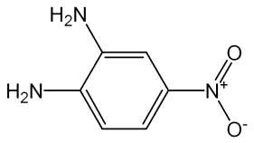

---

에풀푸랄ㆍ초산시액4 방울을넣을때액은황적색을나타낸다.

2) 이원료및p-니트로아닐린표준품각10 mg 을이소프로판올ㆍ물ㆍ강암모니아

수혼합액(9：3：1) 1 mL에넣어녹인다음각각에아황산수소나트륨0.1 ｇ을넣어

흔들어섞어검액및표준액으로한다. 검액및표준액1 μL씩을박층판에점적하고,

이소프로필에텔ㆍ아세톤ㆍ이소프로판올혼합액(10：1：1)을전개용매로하여박층크

로마토그래프법에따라시험한다. 발색제로p-디메칠아미노벤즈알데히드ㆍ묽은염산

용액(1 →200)을뿌릴때p-니트로아닐린표준품에대하여상대Rf값0.7 부근에서

엷은적황색∼황색의반점을나타낸다.

3) 이원료0.1 ｇ을물100 mL에넣어녹이고필요하면여과한다. 이액1 mL를

취하여물을넣어100 mL로한다. 이액을가지고자외가시부흡광도측정법에따라

자외부흡수스페트럼을측정할때파장268 ± 2 nm 에서흡수극대를나타낸다.

융

점

198 ∼206 ℃(제1 법)

순도시험

1) 용해상태

이원료0.1 ｇ을묽은에탄올20 mL에넣어가온하여녹일

때액은적색이며거의맑다.

2) 철

이원료0.4 ｇ을달아황산5 방울을넣어적시고천천히가열하여저온에

서거의회화또는휘산시킨다음황산을넣어적시고완전히회화한다. 식힌다음

잔류물에염산0.5 mL를넣고수욕상에서증발건고한다. 잔류물에묽은염산3 방울

을넣어가온하고물25 mL를넣어녹인다. 이것을검액으로하여시험한다. 비교액

에는철표준액2.0 mL를넣는다(50 ppm 이하).

3) 중금속

이원료1.0 ｇ을황산5 mL 및질산20 mL에넣고가만히가열한다.

때때로질산2 ∼3 mL씩을추가하여액이무색∼엷은황색이될때까지가열한

다. 식힌다음물10 mL 및페놀프탈레인시액1 방울을넣고암모니아시액을액이

엷은적색이될때까지천천히넣고묽은초산2 mL를넣어필요하면여과한다. 잔류

물을물10 mL로씻고여액과씻은액을네슬러관에넣어물을넣어50 mL로하여

검액으로한다. 단, 비교액에는납표준액2.0 mL를넣는다(20 ppm 이하).

4) 비소

이원료1.0 ｇ을황산2 mL 및질산5 mL에넣고가만히가열한다. 때때

로질산2 ∼3 mL씩을추가하여액이무색∼엷은황색이될때까지가열한다. 식

힌다음포화수산암모늄용액15 mL를넣고흰연기가발생할때까지가열하고식힌

다음여기에물을넣어10 mL로한다. 이것을검액으로하여시험한다(2 ppm 이하).

건조감량

2.0 % 이하(1.5 ｇ, 105 ℃, 2 시간)

강열잔분

1.0 % 이하(2 ｇ)

정량법

이원료를105 ℃에서2 시간건조하고그약90 mg을정밀하게달아아연

가루2 ｇ, 물15 mL 및염산15 mL에넣어조심하여증발건고한다. 식힌다음질

소정량법제2 법에따라시험한다.

0.05 mol/L 황산1 mL = 5.105 mg C6H7N3O2

저장법

기밀용기

---

2, 6-디아미노피리딘

2,6-Diaminopyridine

C5H7N3 : 109.13

이원료를건조한것은정량할때2,6-디아미노피리딘(C5H7N3) 93.0 % 이상을함유

한다.

성

상

이원료는갈색∼흑색의결정성가루로약간특이한냄새가있다.

확인시험

1) 이원료의에탄올용액(1 →1000) 10 mL에염화제이철시액ㆍ페리시안화

칼륨시액혼합액(1：1) 1 방울을넣을때액은바로진한청색∼진한청록색을나타

내며혼탁하다.

2) 이원료50 mg을에탄올에넣어녹여100 mL로한다. 이액5 mL를취하여에

탄올을넣어500 mL로한다. 이액을가지고자외가시부흡광도측정법에따라흡수스

펙트럼을측정할때파장309 ± 2 nm 및245 ± 2 nm 에서흡수극대를나타낸다.

3) 이원료및염산m-페닐렌디아민표준품각10 mg을이소프로판올ㆍ물ㆍ강암모

니아수(9：3：1) 혼합액1 mL에넣어녹인다음각각에아황산수소나트륨0.1 ｇ을

넣어흔들어섞어검액및표준액으로한다. 검액및표준액1 μL씩을박층판에점

적하고초산에칠ㆍ메탄올ㆍ물혼합액(50：10：8)을전개용매로하여박층크로마토그래

프법에

따라

시험한다. 발색제로

p-디메칠아미노벤즈알데히드ㆍ묽은염산용액(1

→

200)을뿌릴때염산m-페닐렌디아민표준품에대하여Rs값0.7 부근에서등색의반

점을나타낸다.

융

점

109 ∼122 ℃(제1 법)

순도시험

1) 용해상태

이원료0.1 ｇ을묽은초산(18 →100) 100 mL에넣어녹일

때액은어두운황녹갈색이고맑다.

2) 철

이원료1.0 ｇ을달아황산5 방울을넣어적시고천천히가열하여저온에

서거의회화또는휘산시킨다음다시황산을넣어적시고완전히회화시킨다. 식힌

다음잔류물에염산0.5 mL를넣어수욕상에서증발건고한다. 잔류물에묽은염산3

방울을넣고가온하고물25 mL를넣어녹인다. 이것을검액으로하여시험한다. 비

교액에는철표준액2.0 mL를넣는다(20 ppm 이하).

3) 중금속

이원료1.0 ｇ을황산5 mL 및질산20 mL에넣고가만히가열한다.

때때로질산2 ∼3 mL씩을추가하여액이무색∼엷은황색이될때까지가열하

고식힌다음물10 mL 및페놀프탈레인시액1 방울을넣고암모니아시액을액이

엷은적색이될때까지천천히넣고묽은초산2 mL를넣고필요하면여과한다. 잔류

물을물10 mL로씻고여액과씻은액을네슬러관에넣어물을넣어50 mL로하여

---

검액으로하여시험한다. 단, 비교액에는납표준액1.0 mL를넣는다(10 ppm 이하).

4) 비소

이원료1.0 ｇ을황산2 mL 및질산5 mL에넣어가만히가열한다. 때때

로질산2 ∼3 mL씩을추가하여액이무색∼엷은황색이될때까지가열한다. 식

힌다음포화수산암모늄용액15 mL를넣고흰연기가발생할때까지가열하고식힌

다음물을넣어10 mL로한다. 이것을검액으로하여시험한다(2 ppm 이하).

건조감량

2.0 % 이하(2 ｇ, 실리카겔, 4 시간)

강열잔분

1.5 % 이하(1 ｇ)

정량법

이원료를건조하고약60 mg을정밀하게달아질소정량법제2 법에따라

시험한다.

0.05 mol/L 황산1 mL = 3.6377 mg C5H7N3

저장법

기밀용기

1,5-디히드록시나프탈렌

1,5-Dihydoxynaphthalene

1,5-나프탈렌디올

C10H8O2 : 160.17

성

상

이원료는엷은갈색또는회갈색의가루로서약간특이한냄새가있다.

확인시험

1) 이원료의에탄올용액(1 →1000) 10 mL에염화제이철시액3 방울을넣

을때액은녹갈색을나타낸다.

2) 이원료20 mg을에탄올100 mL에넣어녹이고, 이액10 mL를취하여에탄올

에넣어100 mL로한다. 이액을가지고자외가시부흡광도측정법에따라흡수스펙트

럼을측정할때파장331 ± 2 nm, 317 ± 2 nm 및299 ± 2 nm에서흡수극대를나

타낸다.

3) 이원료및α-나프톨표준품각10 mg을이소프로판올ㆍ물ㆍ강암모니아수(9：

3：1) 혼합액1 mL에넣어녹인다음각각에아황산수소나트륨0.1 ｇ을넣어흔들

어섞어검액및표준액으로한다. 검액및표준액1 μL씩을박층판에점적하고헥

산ㆍ아세톤ㆍ클로로포름혼합액(2：1：1)을전개용매로하여박층크로마토그래프법에

따라시험한다. 발색제로인몰리브덴산시액을뿌릴때α-나프톨표준품에대하여Rs

값0.6 부근에서회청색∼청색의반점을나타낸다.

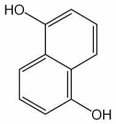

---

융

점

257 ∼261 ℃(제1 법)

순도시험

1) 용해상태

이원료0.1 ｇ을에탄올10 mL에넣어녹일때액은엷은

갈색이되며맑다.

2) 철

이원료0.5 ｇ을달아황산5 방울을넣어적시고천천히가열하여저온에

서거의회화또는휘산시킨다음다시황산을넣어적시고완전히회화시킨다. 식힌

다음잔류물에염산0.5 mL를넣어수욕상에서증발건고시킨다. 잔류물에묽은염산

3 방울을넣어가온하고물을넣어녹이고50 mL로한다. 이것을검액으로하여시

험한다. 검액10.0 mL를취하여시험한다. 비교액에는철표준액2.0 mL를넣는다

(0.02 % 이하).

3) 납

이원료1.0 ｇ을황산5 mL 및질산20 mL에넣어가만히가열한다. 때때

로질산2 ∼3 mL씩을추가하여액이무색∼엷은황색이될때까지가열한다. 식

힌다음물을넣어10 mL로한다. 이것을검액으로하여시험한다(20 ppm 이하).

4) 비소

이원료1.0 ｇ을황산2 mL 및질산5 mL에넣고가만히가열한다. 때때

로질산2 ∼3 mL씩을추가하여액이무색∼엷은황색이될때까지가열한다음

식히고포화수산암모늄용액15 mL를넣어흰연기가발생할때까지가열한다. 식힌

다음물을넣어10 mL로한다. 이것을검액으로하여시험한다(2 ppm 이하).

건조감량

1.0 % 이하(1 ｇ, 105 ℃, 2 시간)

강열잔분

1.0 % 이하(1 ｇ)

저장법

기밀용기

레조시놀

Resorcinol

레소르시놀

레소르신

C6H6O2 : 110.11l

이원료를건조한것은정량할때레조시놀(C6H6O2) 99.0 % 이상을함유한다.

성

상

이원료는백색의가루로, 조금특이한냄새가있다.

확인시험1) 이원료0.1 g에수산화나트륨시액2 mL를가해녹이고, 클로로포름l 방

울을가해가열할때, 액은진한홍색을나타내고, 여기에다시염산을적가할때액

은엷은황갈색을나타낸다.

2) 이원료의수용액(1 →200) 10 mL에염화제이철시액3 방울을가할때, 액은청

색을띤자색을나타내며, 여기에다시암모니아시액을적가할때액은갈색을띤황

색을나타낸다.

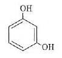

---

융

점

109

∼

112 ℃(제1 법)

순도시험1) 액성

이원료의수용액(1 →20) 5 mL에메칠오렌지시액1 방울을가할

때, 액은황색

∼

등색을나타낸다.

이원료의수용액(1 →20) 5 mL를가만히가열할때, 페놀고유의냄새가

2) 페놀

나지않는다.

이원료의수용액(1 →20) 10 mL에묽은초산2 방울및초산납시액0.5

3) 카테콜

mL를가할때, 액은혼탁하지않는다.

이원료1.0

g을취해제2 법에따라조작하여시험한다. 비교액에는

4) 중금속

납표준액2.0 mL를넣는다.(20 ppm 이하)

이원료1.0

g을취해제3 법에따라검액을조제하여시험한다.(2 ppm

5) 비소

이하).

건조감량

1.0

%

이하(1.5 g, 실리카겔, 4 시간)

강열잔분

0.05

%

이하(2 g)

정량법

이원료를건조하여그약0.3 g을정밀하게달아물을가해녹이고100 mL

로한다.

이액25 mL를요오드병에취하여정확하게0.05 mol/L 브롬액50 mL,

물50 mL 및염산5 mL를가해곧바로마개를하고1 분간잘흔들어섞고2 분간

방치한다. 다음에요오드화칼륨시액5 mL를가해잘흔들어섞어냉암소에5 분간

방치한후, 마개및요오드병내벽의부착물을물20 mL로씻어합하고, 유리된요

오드를0.1 mol/L 치오황산나트륨액으로적정한다(지시약: 전분시액1 mL). 같은방

법으로공시험을실시한다.

0.05 mol/L 브롬액1 mL = 1.8352 mg C6H6O2

2-메칠레조시놀

2-Methylresorcinol

2-메틸레소르시놀

C7H8O2 : 124.14

이원료를건조한것은정량할때2-메칠레조시놀(C7H8O2) 94.0 % 이상을함유한

다.

성

상

이원료는회백색∼회갈색의미세한가루로약간의특이한냄새가있다.

확인시험

1) 이원료0.1 ｇ을에탄올10 mL에넣어녹이고이액10 μL를박층판에

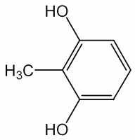

---

점적하고초산에칠ㆍ피리딘ㆍ물혼합액(70：25：25)을전개용매로하여박층크로마토

그래프법에따라시험한다. 약10 ㎝전개하여박층판을꺼내어바람에말린다음관

찰할때Rf값0.77 부근에갈색의반점을나타낸다.

2)

이원료0.1 ｇ을에탄올10 mL에넣어녹이고이액10 μL를박층판에점적하

고톨루엔ㆍ무수초산ㆍ물혼합액(50：50：5)을전개용매로박층크로마토그래프법에따

라시험한다. 약10 cm 전개하여박층판을꺼내어바람에말린다음관찰할때Rf

값0.40부근에갈색의반점을나타낸다.

융

점

110 ∼120 ℃(제1 법)

순도시험

1) 용해상태

이원료0.1 ｇ을에탄올10 mL에넣어녹일때액은맑다.

2) 납

이원료1.0 ｇ을황산5 mL 및질산20 mL에넣어가만히가열한다. 때때

로질산2 ∼3 mL씩을추가하여액이무색∼엷은황색이될때까지가열한다. 식

힌다음물을넣어10 mL로한다. 이것을검액으로하여시험한다(5 ppm 이하).

3) 철

이원료1.0 ｇ을달아황산5 방울을넣어적시고천천히가열하여저온에

서거의회화또는휘산시킨다음다시황산을넣어적시고완전히회화한다. 식힌

다음잔류물에염산0.5 mL를넣어수욕상에서증발건고한다음묽은염산3 방울을

넣어가온하고물을넣어50.0 mL로한다. 이액10 mL를취하여검액으로하여시

험한다. 비교액에는철표준액2.0 mL를넣는다(100 ppm 이하).

4) 비소

이원료1.0 ｇ을황산2 mL 및질산5 mL에넣어가만히가열한다. 때때

로질산2 ∼3 mL씩을추가하여액이무색∼엷은황색이될때까지가열한다. 식

힌다음포화수산암모늄용액15 mL를넣어흰연기가발생할때까지가열한다. 식힌

다음물을넣어10 mL로한다. 이것을검액으로하여시험한다(2 ppm 이하).

건조감량

3.0 % 이하(1 ｇ, 황산, 4 시간)

강열잔분

1.0 % 이하(2 ｇ, 제1 법)

정량법

이원료를건조하고약0.6 ｇ을정밀하게달아물에넣어녹여100.0 mL로

한다. 이액15.0 mL 및0.05 mol/L 브롬액50.0 mL를취하여250 mL 요오드병에

넣는다. 물20 mL 및염산5 mL를넣고곧마개를하여흔들어섞은다음2 분간

방치한다. 다음에요오드화칼륨시액5 mL를넣고마개를하여가만히흔들어섞고5

분간방치한다. 요오드병의마개를열고물20 mL로마개와병목을씻어넣고0.1

mol/L 치오황산나트륨액으로적정한다(지시약: 전분시액1 mL). 다만적정의종말

점은액의청색이없어질때로한다. 같은방법으로공시험을하여보정한다.

0.05 mol/L 브롬액1 mL = 2.069 mg　C7H8O2

저장법

기밀용기

2-메칠-5-히드록시에칠아미노페놀

2-Methyl-5-Hydroxyethylaminophenol

---

5-(2-히드록시에칠아미노)-2-메칠페놀

2-메틸-5-히드록시에틸아미노페놀

C9H13NO2 : 167.21

이원료를건조한것은정량할때2-메칠-5-히드록시에칠아미노페놀(C9H13NO2) 93.0

% 이상을함유한다.

성

상

이원료는갈색의과립상의가루로냄새는없다.

확인시험

1) 이원료의에탄올용액(1 →1000)에묽은염화제이철시액3 방울을넣을

때액은엷은황색을나타낸다.

2) 이원료30 mg을에탄올에넣어녹여100 mL로한다. 이액1 mL를취하여에

탄올을넣어100 mL로한다. 이액을가지고자외가시부흡광도측정법에따라흡수스

펙트럼을측정할때파장207 ± 2 nm, 242 ± 2 nm 및295 ± 2 nm에서흡수극대를

나타낸다.

융

점

86 ∼90 ℃(제1 법)

순도시험

1) 용해상태

이원료0.1 ｇ을에탄올10 mL에넣어녹일때액은엷은

갈색이며맑다.

2) 납

이원료1.0 ｇ을황산5 mL 및질산20 mL에넣어가만히가열한다. 때때

로질산2 ∼3 mL씩을추가하여액이무색∼엷은황색이될때까지가열한다. 식

힌다음물을넣어10 mL로한다. 이것을검액으로하여시험한다(20 ppm 이하).

3) 철

이원료0.1 ｇ을달아황산5 방울을넣어적시고천천히가열하여저온에

서거의회화또는휘산시킨다음다시황산을넣어적시고완전히회화한다. 식힌

다음잔류물에염산0.5 mL를넣어수욕상에서증발건고한다음묽은염산3 방울을

넣어가온하고물25 mL를넣어녹인다. 이액을검액으로하여시험한다. 비교액에

는철표준액2.0 mL를넣는다(0.02 % 이하).

4) 비소

이원료1.0 ｇ을황산2 mL 및질산5 mL에넣어가만히가열한다. 때때

로질산2 ∼3 mL씩을추가하여액이무색∼엷은황색이될때까지가열한다. 식

힌다음포화수산암모늄용액15 mL를넣어흰연기가발생할때까지가열한다. 식힌

다음물을넣어10 mL로한다. 이것을검액으로하여시험한다(2 ppm 이하).

건조감량

1.0 % 이하(1 ｇ, 105 ℃, 2 시간)

강열잔분

2.0 % 이하(1 ｇ)

정량법

이원료를건조하여약0.15 ｇ을정밀하게달아질소정량법제2 법에따

라시험한다.

0.05 mol/L 황산1 mL = 16.72 mg　C9H13NO2

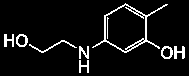

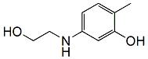

---

저장법

기밀용기

모노에탄올아민

Monoethanolamine

2-아미노에탄올

C2H7NO

61.08

이원료는정량할때모노에탄올아민(C2H7NO) 98.0 ~ 100.5 %를함유한다.

확인시험이원료및모노에탄올표준품을가지고적외부스펙트럼측정법의브롬화칼

륨

정제법에따라시험할때같은파수에서같은강도의흡수를나타낸다.

강열잔분0.1 % 이하(1 g)

비

중

d 20

20 : 1.013 －1.016

증류시험167 ~ 173 ℃, 95 vol% 이상.

정량법이원료약1 g을정밀하게달아물25 mL를넣어녹이고0.5 mol/L 염산

으로적정한다(지시약: 브롬크레솔그린ㆍ 메칠레드시액(5:6)).

0.5 mol/L 염산1 mL = 61.08 mg C2H7NO

저장법차광한기밀용기

몰식자산

Gallic Acid

갈르산

3,4,5-트리히드록시안식향산

갈루스산

C7H6O5ㆍH2O :

---

188.14

성

상

이원료는흰색∼엷은황백색의침상결정또는가루로서냄새는없다.

확인시험

1) 이원료의수용액(1 →1000) 5 mL에염화제이철시액5 방울을넣을때

액은청흑색을나타낸다.

2) 이원료0.5 ｇ을물10 mL에넣어흔들어섞은다음여과한다. 여액5 mL에질

산은암모니아시액5 방울을넣을때액은은경또는흑갈색의침전을나타낸다.

순도시험

1) 용해상태

이원료1.0 ｇ을열탕20 mL에넣어녹일때액은무색∼

엷은황색이며거의맑다.

2) 황산염

이원료1.0 ｇ을물20 mL에넣고약1 분간흔들어섞은다음여과한

다. 여액5 mL에묽은염산1 mL 및물을넣어서50 mL로한다. 이액을검액으로

하여시험한다. 비교액에는0.005 mol/L 황산0.20 mL를넣는다(0.02 % 이하).

3) 탄닌산

2)의여액5 mL에젤라틴시액3 방울또는알부민시액3 방울을넣을

때액은침전이생기지않는다.

4) 중금속

이원료1.0 ｇ을황산5 mL 및질산20 mL에넣어가만히가열한다.

때때로질산2 ∼3 mL씩을추가하여액이무색∼엷은황색이될때까지가열한

다. 식힌다음물10 mL 및페놀프탈레인시액1 방울을넣고암모니아시액을액이

엷은적색이될때까지천천히넣고묽은초산2 mL를넣고필요하면여과하여물

10 mL로씻고여액과씻은액을네슬러관에넣어물을넣어50 mL로한다. 이것을

검액으로하여시험한다. 비교액에는납표준액2.0 mL를넣는다(20 ppm 이하).

5) 비소

이원료1.0 ｇ을황산2 mL 및질산5 mL에넣어서가만히가열한다.

때때로질산2 ∼3 mL씩을추가하여액이무색∼엷은황색이될때까지가열한

다. 식힌다음포화수산암모늄용액15 mL를넣어흰연기가날때까지가열한다. 식

힌다음물을넣어10 mL로한다. 이것을검액으로하여시험한다(2 ppm 이하).

건조감량

10.0 % 이하(1 ｇ, 105 ℃, 2 시간)

강열잔분

0.1 % 이하(1 ｇ, 제2 법)

저장법

기밀용기

수산화나트륨

Sodium Hydroxide

소듐하이드록사이드

NaOH：40.00

이원료는정량할때총알칼리(NaOH로서) 95.0 % 이상을함유하며이중탄산나트

륨(Na2CO3：105.99)는3.0 %

이하이다.

성

상

이원료는백색의소구상(小球狀), 박편상(薄片狀), 봉상(棒狀) 또는덩어리

로단단하고부스러지기쉬우며단면(斷面)은결정성이다.

확인시험

1) 이원료의수용액(1 →500)은강한알칼리성이다.

---

2) 이원료의수용액(1 →25)은나트륨염의정성반응을나타낸다.

순도시험

1) 용해상태

이원료1.0 g 물20 mL를넣어녹일때무색이며맑다.

2) 염화물

이원료1.0 g에물을넣어녹이고100 mL로한다. 이액25 mL를취

하여묽은질산10 mL 및물을넣어50 mL로하고이것을검액으로하여시험한

다. 비교액에는0.01 mol/L 염산0.7 mL를넣는다(0.1 %

이하).

3) 중금속

이원료1.0 g에물5 mL를넣어녹이고묽은염산11 mL를넣어수욕

중에서증발건고한다. 잔류물에물35 mL 및묽은초산2 mL를넣어녹이고다시

물을넣어50 mL로하고이것을검액으로한다. 비교액에는납표준액3.0 mL를넣

는다. 검액및비교액에황화나트륨시액1방울씩을넣어흔들어섞고5 분간방치

한다음각관을백색을배경으로하여위또는옆에서관찰하여액의색을비교한

다.

검액이나타내는색은비교액이나타내는색보다진하지않다(30 ppm 이하).

4) 칼륨

이원료0.5 g에물10 mL를넣어녹이고초산4 mL를넣고아질산코발

트나트륨시액3 ∼5 방울을넣을때침전이생기지않는다.

정량법

이원료약1.0 g을정밀하게달아새로끓여식힌물약100 mL에녹이고

15 ℃로식힌다음페놀프탈레인시액2 방울을넣고0.5 mol/L 황산으로적정하여

액의홍색이없어질때황산의양을기록한다. 이액에브롬페놀블루시액3방울을넣

고다시1 mol/L 염산으로액의청자색이지속하는황색으로될때까지적정한다.

0.5 mol/L 황산의총량에서총알칼리(NaOH로서)의양을구하고지시약이다른것에

따른0.5 mol/L 황산의소비량의차로부터탄산나트륨(Na2CO3)의양을구한다.

0.5 mol/L 황산1 mL 〓40.00 mg NaOH

0.5 mol/L 황산1 mL 〓105.99 mg Na2CO3

스테아트리모늄염화물

Steartrimonium Chloride

스테아트리모늄클로라이드

염화스테아릴트리메칠암모늄

Stearyltrimethylammonium Chloride

이원료는주로염화스테아릴트리메칠암모늄으로된양이온계면활성제로보통이소

프로판올, 에탄올, 물또는이들의혼합액을함유한다. 이원료는정량할때표시량의

90.0 ∼110.0 %에해당하는스테아트리모늄염화물(C21H46ClN：348.05)를함유한다.

성

상

이원료는백색∼엷은황색의액또는바셀린과같은물질로특이한냄새

가있다.

확인시험

1) 이원료의표시량에따라스테아트리모늄염화물5 g에해당하는양을

달아물100 mL를넣어가온할때맑게녹는다.

2) 이원료0.1 g을달아클로로포름5 mL 및브롬페놀블루ㆍ수산화나트륨시액(0.05

---

mol/L 수산화나트륨액3 mL에브롬페놀블루0.1 g을넣어잘흔들어섞고물을넣

어25 mL로한다.) 5 mL를넣고세게흔들어섞을때분리된클로로포름층은청색

을나타낸다.

3) 이원료1 g에에탄올20 mL를넣고가열하여녹일때액은염화물의정성반응

2)를나타낸다.

순도시험

1) 액성

이원료의표시량에따라스테아트리모늄염화물0.1g에해당하는

양을달아새로끓여식힌물을넣어가온하여녹이고10 mL로한액에치몰블루시

액2방울을넣을때액은황색을나타낸다.

2) 암모늄염

이원료0.1 g을달아물5 mL를넣어가온하여녹이고수산화나트륨

시액3 mL를넣어끓일때발생하는가스는물에적신적색리트머스시험지를청색

으로변화시키지않는다.

3) 중금속

이원료1.0 g을달아제２법에따라조작하여시험한다. 비교액에는납

표준액2.0 mL를넣는다(20 ppm 이하).

4) 비소

이원료1.0 g을달아제３법에따라조작하여시험한다(2 ppm 이하).

강열잔분

0.5 %

이하(스테아트리모늄염화물약1.0 g에해당하는양, 450 ∼550 ℃)

정량법

이원료의표시량에따라스테아트리모늄염화물약1.0g에해당하는양을

정밀하게달아에탄올10 mL 및물50 mL를넣어가온하여녹이고200 mL의메스

플라스크에넣어초산나트륨25g 및초산22 mL에물을넣어100 mL로한액8

mL를넣고다시잘흔들어섞으면서정확하게0.05 mol/L 페리시안화칼륨액50 mL

를넣고물을넣어200 mL로하여다시잘흔들어섞고1 시간방치한다. 건조여과

지를써서여과하고처음여액20 mL를버리고다음여액100 mL를정확하게취하

여250 mL 요오드병에넣고요오드화칼륨시액10 mL 및묽은염산10 mL를넣어

흔들어섞고1 분간방치한다. 여기에황산아연용액(1→10) 10 mL를넣고잘흔들어

섞고5 분간방치한다음유리된요오드를0.1 mol/L 치오황산나트륨액으로적정한

다(지시약：전분시액2 mL). 같은방법으로공시험을하여보정한다.

0.05 mol/L 페리시안화칼륨액1 mL 〓52.21 mg C21H46ClN

2-아미노-4-니트로페놀

2-Amino-4-nitrophenol

4-니트로-o-아미노페놀, 2-아미노-p-니트로페놀

---

o-아미노-p-니트로페놀, 4-니트로-2-아미노페놀

p-니트로-o-아미노페놀

C6H6N2O3 : 154.12

이원료를건조한것은정량할때2-아미노-4-니트로페놀(C6H6N2O3) 90.0 % 이상

을함유한다.

성

상

이원료는황색∼황갈색의가루로서약간특이한냄새가있다.

확인시험

1) 이원료0.1 ｇ을물10 mL에넣어녹이고여과한다. 여액10 mL에염

화제이철시액1 방울을넣을때액은적갈색∼갈색을나타낸다.

2) 1)의여액10 mL에묽은염산1 mL를넣을때액은약간의황색을나타낸다. 또

1)의여액10 mL에탄산나트륨시액1 mL를넣을때액은적색을나타낸다.

3) 이원료및p-니트로아닐린표준품각10 mg을이소프로판올ㆍ물ㆍ강암모니아수

(9：3：1) 혼합액1 mL에넣어녹인다음각각에아황산수소나트륨0.1 ｇ을넣어흔

들어섞어검액및표준액으로한다. 검액및표준액1 μL씩을박층판에점적하고

이소프로필에칠ㆍ아세톤ㆍ이소프로판올(10：1：1) 혼합액을전개용매로하여박층크

로마토그래프법에따라시험한다. 발색제로p-디메칠아미노벤즈알데히드ㆍ묽은염산

용액(1 →200)을뿌릴때p-니트로아닐린표준품에대하여Rs 값1.0 부근에서황

색의반점을나타낸다.

4) 이원료25 mg을0.1 mol/L 염산100 mL에넣어녹인다. 이액3 mL를취하여

0.1 mol/L 염산을넣어100 mL로한다. 이액을가지고자외가시부흡광도측정법에

따라흡수스펙트럼을측정할때파장224 ± 2 nm 및307 ± 2 nm에서흡수극대를

나타낸다.

융

점

141 ∼143 ℃(제1 법)

순도시험

1) 용해상태

이원료0.1 ｇ을묽은염산10 mL에넣어녹일때액은엷은

자갈색∼엷은갈색이며거의맑다.

2) 철

이원료1.0 ｇ을정밀하게달아황산5 방울을넣어적시고천천히가열하

여저온에서거의회화또는휘산시킨다음황산을넣어적시고다시완전히회화한

다. 식힌다음잔류물에염산0.5 mL를넣어수욕상에서증발건고한다. 잔류물에묽

은염산3 방울을넣어가온하고물25 mL를넣어녹인다. 이것을검액으로하여시

험한다. 비교액에는철표준액2.0 mL를넣는다(20 ppm 이하).

3) 중금속

이원료1.0 ｇ을황산5 mL 및질산20 mL에넣어가만히가열한다.

때때로질산2 ∼3 mL씩을추가하여액이무색∼엷은황색이될때까지가열한다.

식힌다음물10 mL 및페놀프탈레인시액1 방울을넣고암모니아시액을액이엷은

적색이될때까지천천히넣고필요하면여과한다. 잔류물을물10 mL로씻고여액

과씻은액을네슬러관에넣고물을넣어50 mL로한다. 이것을검액으로하여시험

한다. 비교액에는납표준액2.0 mL를넣는다(20 ppm 이하).

4) 비소

이원료1.0 ｇ을황산2 mL 및질산5 mL에넣고가만히가열한다. 때때

로질산2 ∼3 mL씩을추가하여액이무색∼엷은황색이될때까지가열한다. 식

힌다음포화수산암모늄용액15 mL를넣고흰연기가발생할때까지가열한다. 식힌

다음물을넣어10 mL로한다. 이것을검액으로하여시험한다(2 ppm 이하).

---

건조감량

1.5 % 이하(1 ｇ, 실리카겔, 4 시간)

강열잔분

1.0 % 이하(1 ｇ)

정량법

이원료를건조하고약14 mg을정밀하게달아아연가루2 ｇ, 물15 mL

및염산15 mL를넣어조심하여증발건고한다. 식힌다음질소정량법제2 법에따

라시험한다.

0.05 mol/L 황산1 mL = 7.707 mg　C6H6N2O3

저장법

기밀용기

2-아미노-5-니트로페놀

2-Amino-5-nitrophenol

5-니트로-o-아미노페놀, 5-니트로-2-아미노페놀

C6H6N2O3 : 154.13

이원료를건조한것은정량할때2-아미노-5-니트로페놀(C6H6N2O3) 90.0 % 이상을

함유한다.

성

상

이원료는황색∼황갈색결정성가루로서냄새는거의없다.

확인시험

1) 이원료의수용액(1 →2500) 10 mL에염화제이철시액5 방울을넣을

때액은등색∼황갈색을나타낸다.

2) 이원료의수용액(1 →2500) 10 mL에인몰리브덴산용액(1 →100) 0.5 mL를넣

을때액은녹색을띤황색∼황색을나타내며강암모니아수3 방울을넣을때액

은등색∼적색을나타낸다.

3) 이원료및p-니트로아닐린표준품각10 mg을이소프로판올ㆍ물ㆍ강암모니아수

(9：3：1) 혼합액1 mL에넣어녹인다음각각에아황산수소나트륨0.1 ｇ을넣어

흔들어섞어검액및표준액으로한다. 검액및표준액1 μL씩을박층판에점적하고

이소프로필에텔ㆍ아세톤ㆍ이소프로판올(10：1：1) 혼합액을전개용매로하여박층크

로마토그래프법에따라시험한다. 발색제로p-디메칠아미노벤즈알데히드ㆍ묽은염산

용액(1 →200)을뿌릴때p-니트로아닐린표준품에대하여Rs 값1.0 부근에서등색

의반점을나타낸다.

4) 이원료25 mg을정밀하게달아0.1 mol/L 염산100 mL에넣어녹인다음이

액5 mL를취하여0.1 mol/L 염산을넣어100 mL로한다. 이액을가지고자외가시

---

부흡광도측정법에따라흡수스펙트럼을측정할때파장228 ± 2 nm 및263 ± 2 nm

에서흡수극대를나타낸다.

융

점

191 ∼206 ℃(제1 법)

순도시험

1) 용해상태

이원료0.1 ｇ을에탄올10 mL에넣어녹일때액은적색을

띠는황색∼적갈색을나타내며거의맑다.

2) 철

이원료1.0 ｇ을정밀하게달아황산5 방울을넣어적시고천천히가열하

여되도록저온에서거의회화또는휘산시킨다음다시황산을넣어적시고완전히

회화시킨다. 식힌다음잔류물에염산0.5 mL를넣어수욕상에서증발건고한다음

묽은염산3 방울을넣어가온하고물25 mL를넣어녹인다. 이것을검액으로하여

시험한다. 비교액에는철표준액2.0 mL를넣는다(20 ppm 이하).

3) 중금속

이원료1.0 ｇ을정밀하게달아황산5 mL 및질산20 mL에넣어가

만히가열한다. 때때로질산2 ∼3 mL씩을추가하여액이무색∼엷은황색이될

때까지가열한다. 식힌다음물10 mL 및페놀프탈레인시액1 방울을넣고암모니아

시액을액이엷은적색이될때까지천천히넣고필요하면여과한다. 잔류물을물10

mL로씻고여액과씻은액을네슬러관에넣어물을넣어50 mL로한다. 이것을검

액으로하여시험한다. 비교액에는납표준액3.0 mL를넣는다(30 ppm 이하).

4) 비소

이원료1.0 ｇ을정밀하게달아황산2 mL 및질산5 mL에넣고가만히

가열한다. 때때로질산2 ∼3 mL씩을추가하여액이무색∼엷은황색이될때까

지가열한다. 식힌다음포화수산암모늄용액15 mL를넣고흰연기가발생할때까지

가열하고식힌다음물을넣어10 mL로한다. 이것을검액으로하여시험한다(2

ppm 이하).

건조감량

0.5 % 이하(1 ｇ, 105 ℃, 2 시간)

강열잔분

0.1 % 이하(2 ｇ)

정량법

이원료를건조하여약0.14 ｇ을정밀하게달아아연가루2 ｇ, 물15 mL

및염산15 mL를넣어조심하면서증발건고한다. 식힌다음질소정량법제1 법에

따라시험한다.

0.05 mol/L 황산1 mL = 7.707 mg C6H6N2O3

저장법

기밀용기

2-아미노-3-히드록시피리딘

2-Amino-3-hydroxypyridine

---

C5H6N2O : 110.12

이원료는정량할때환산한무수물에대하여2-아미노-3-히드록시피리딘(C5H6N2O

: 110.12) 98.5 ∼101.0 % 이상을함유한다.

성

상

이원료는옅은회색을띤결정성가루이며약하게특이한냄새가있다.

확인시험

1) 이원료를건조하여적외부스펙트럼측정법브롬화칼륨정제법에따라

측정할때파수3437 cm-1, 3346 cm-1, 3042 cm-1, 2520 cm-1, 1643 cm-1, 1575 cm-1,

1474 cm-1, 1203 cm-1, 783 cm-1, 746 cm-1 부근에서흡수를나타낸다.

2) 이원료약1 mg을에탄올100 mL에녹인액을가지고자외가시부흡광도측정

법에따라흡수수펙트럼을측정할때파장300 nm 및234 nm에서흡수극대를나타

낸다.

융

점

170 ∼176 ℃

순도시험

1) 용해상태이원료0.1 g을물10 mL에넣어녹이고녹일때액은맑고

무색이다.

2) 유연물질이원료0.1 g을정밀하게달아에탄올10 mL에넣어녹이고이액을

검액으로한다. 이액1 mL를정확하게취하여에탄올(95)을넣어정확하게100 mL

로하여표준액으로한다. 검액및표준액을가지고박층크로마토그래프법에따라시

험한다. 검액및표준액5 μL씩을박층크로마토그래프용실리카겔을써서만든박층

판에점적한다. 초산에칠을전개용매로하여점적한곳으로부터약12 cm 전개한다

음박층판을전개용매냄새가나지않을때까지건조한다. 여기에발색제로4-니트로

벤젠디아조늄클로라이드시액을고르게뿌릴때검액에서얻은주반점이외의반점

은표준액에서얻은반점보다진하지않다.

3) 중금속이원료1.0 g을달아제2 법에따라조작하여시험한다. 비교액에는납

표준액2.0 mL를넣는다(20 ppm 이하).

4) 비소이원료1.0 g을달아제3 법에따라조작하여시험한다(2 ppm 이하).

수

분

1.5 % 이하(2 g).

강열잔분

1.0 % 이하(2 g).

정량법

이원료약100 mg을정밀하게달아초산70 mL에녹여0.1 mol/L 과염소

산액으로적정한다(적정종말점검출법전위차적정법). 같은방법으로공시험을하여

보정한다.

0.1 mol/L 과염소산액1 mL = 11.01 mg C5H6N2O

5-아미노-o-크레솔

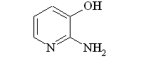

---

5-Amino-o-Cresol

4-아미노-2-히드록시톨루엔

C7H9NO : 123.15

이원료를건조한것은정량할때5-아미노-o-크레솔(C7H9NO) 95.0 % 이상을함유

한다.

성

상

이원료는황갈색∼갈색의결정성가루또는과립으로서냄새는거의없

다.

확인시험1) 이원료의수용액(1 →1000) 10 mL에염화제이철시액5 방울을넣을때

액은황갈색을나타낸다.

2) 이원료의수용액(1 →1000) 10 mL에질산은시액5 방울을넣을때액은회황

록색을나타내며흑색의침전이생긴다.

3) 이원료0.5 ｇ을물50 mL에넣어수욕상에서가온하면서잘흔들어녹이고식

힌다음여과한다. 여액3 mL에풀푸랄ㆍ초산시액4 방울을넣을때액은적색을띠

는황색을나타내고방치하면적색침전이생긴다.

4) 이원료50 mg을물250 mL에넣어녹인다음여과한다. 여액10 mL를취하여

물을넣어100 mL로한다. 이액을가지고자외가시부흡광도측정법에따라흡수스펙

트럼을측정할때파장287 ± 2 nm에서흡수극대를나타낸다.

5) 이원료및p-니트로아닐린표준품각10 mg을이소프로판올ㆍ물ㆍ강암모니아수

(9：3：1) 혼합액1 mL에넣어녹인다음각각에아황산수소나트륨0.1 ｇ을넣어

흔들어섞어검액및표준액으로한다. 검액및표준액1 μL씩을박층판에점적하고

이소프로필에테르ㆍ아세톤ㆍ이소프로판올혼합액(10：1：1)을전개용매로하여박층크

로마토그래프법에따라시험한다. 발색제로p-디메칠아미노벤즈알데히드ㆍ묽은염산

용액(1 →200)을뿌릴때p-니트로아닐린표준품에대하여Rs 값0.7 부근에서황색

반점을나타낸다.

융

점

156 ∼162 ℃(제1 법)

순도시험

1) 용해상태

이원료0.5 ｇ을묽은염산10 mL에넣어녹일때액은황갈

색이며거의맑다.

2) 중금속　이원료1.0 ｇ을황산5 mL 및질산20 mL에넣고가만히가열한다.

때때로질산2 ∼3 mL씩을추가하여액이무색∼엷은황색이될때까지가열한

다. 식힌다음물10 mL 및페놀프탈레인시액1 방울을넣고암모니아시액을액이

엷은적색이될때까지천천히넣은다음묽은초산2 mL를넣고필요하면여과한다.

잔류물을물10 mL로씻고여액과씻은액을네슬러관에넣어물을넣어50 mL로

한다. 비교액에는납표준액2.0 mL를넣는다(20 ppm 이하)

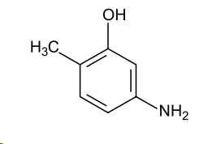

---

3) 철

이원료1.0 ｇ을정밀하게달아황산5 방울을넣어적시고천천히가열하

여저온에서거의회화또는휘산시킨다음황산을넣어적시고완전히회화한다. 식

힌다음잔류물에염산0.5 mL를넣어수욕상에서증발건고한다. 잔류물에묽은염산

3 방울을넣어가온하고물25 mL를넣어녹인다. 이것을검액으로하여시험한다.

비교액에는철표준액2.0 mL를넣는다(20 ppm 이하).

4) 비소

이원료1.0 ｇ을황산2 mL 및질산5 mL에넣고가만히가열한다. 때때

로질산2 ∼3 mL씩을추가하여액이무색∼엷은황색이될때까지가열한다. 식

힌다음포화수산암모늄용액15 mL를넣고흰연기가발생할때까지가열하고식힌

다음물을넣어10 mL로한다. 이것을검액으로하여시험한다(2 ppm 이하).

건조감량

1.0 % 이하(1.5 ｇ, 실리카겔, 4 시간)

정량법

이원료를건조하여그약0.22 ｇ을정밀하게달아질소정량법제2 법에

따라시험한다.

0.05 mol/L 황산1 mL = 12.315 mg　C7H9NO

저장법

기밀용기

m-아미노페놀

m-Aminophenol

3-아미노페놀

C6H7NO : 109.13

이원료를건조한것은정량할때m-아미노페놀(C6H7NO) 98.0 % 이상을함유한다.

성

상

이원료는흰색∼엷은황색의가루또는얇은판상또는회색을띤흑색

의판상의작은조각으로특이한냄새가있다.

확인시험

1) 이원료의수용액(1 →100) 10 mL에묽은염화제이철시액5 방울을넣

을때액은황색∼적색을띠는갈색을나타낸다.

2) 이원료및m-아미노페놀표준품각10 mg 을이소프로판올ㆍ물ㆍ강암모니아수

(9：3：1) 혼합액1 mL에넣어녹인다음각각에아황산수소나트륨0.1 ｇ을넣어

흔들어섞어검액및표준액으로한다. 검액및표준액1 μL씩을박층판에점적하고

이소프로필에텔ㆍ아세톤ㆍ이소프로판올(10：1：1) 혼합액을전개용매로하여박층크

로마토그래프법에따라시험한다. 발색제로p-디메칠아미노벤즈알데히드ㆍ묽은염산

용액(1 →200)을뿌릴때표준품과같은Rf 값에서황색의반점을나타낸다.

3) 이원료의수용액(1 →1000) 5 mL에묽은염산2 mL 및아질산나트륨시액3

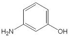

---

mL를넣은다음2, 4-디니트로페놀용액(0.1 →100) 0.5 mL를넣을때액은주황색

을나타낸다.

4) 이원료25 mg을물100 mL에넣어녹인다. 이액10 mL를취하여물을넣어

100 mL로한다. 이액을가지고자외가시부흡광도측정법에따라흡수스펙트럼을측

정할때파장282 ± 2 nm에서흡수극대를나타낸다.

융

점

117 ∼125 ℃(제1 법)

순도시험

1) 용해상태

이원료0.5 ｇ을묽은염산10 mL에넣어녹일때액은무색

∼엷은황갈색이며거의맑다.

2) 중금속

이원료1.0 ｇ을정밀하게달아황산5 mL 및질산20 mL에넣어가

만히가열한다. 때때로질산2 ∼3 mL씩을추가하여액이무색∼엷은황색이될

때까지가열한다. 식힌다음물10 mL 및페놀프탈레인시액1 방울을넣고암모니아

시액을액이엷은적색이될때까지천천히넣고묽은초산2 mL를넣고필요하면

여과하여물10 mL로씻고여액과씻은액을네슬러관에넣어물을넣어50 mL로

한다. 이액을검액으로하여시험한다. 비교액에는납표준액2.0 mL를넣는다(20

ppm 이하).

3) 철

이원료1.0 ｇ을정밀하게달아황산5 방울을넣어적시고천천히가열하

여저온에서거의회화또는휘산시킨다음에황산을넣어적시고완전히회화한다.

식힌다음잔류물에염산0.5 mL를넣어수욕상에서증발건고한다. 식힌다음묽은

염산3 방울을넣어가온하고물을넣어25 mL로한다. 이것을검액으로하여철시

험법에따라시험한다. 비교액에는철표준액3.0 mL를넣는다(30 ppm 이하).

4) 비소

이원료1.0 ｇ을정밀하게달아황산2 mL 및질산5 mL에넣어가만히

가열한다. 때때로질산2 ∼3 mL씩을추가하여액의색이무색∼엷은황색이될

때까지가열한다. 식힌다음포화수산암모늄용액15 mL를넣어흰연기가발생할때

까지가열하고식힌다음물을넣어10 mL로한다. 이것을검액으로하여시험한다

(2 ppm 이하).

건조감량

0.5 % 이하(1.5 ｇ, 실리카겔, 4 시간)

강열잔분

0.1 % 이하(2 ｇ)

정량법

이원료를건조하고약0.19 ｇ을정밀하게달아질소정량법제2 법에따

라시험한다.

0.05 mol/L 황산1 mL = 10.913 mg　C6H7NO

저장법

기밀용기

o-아미노페놀

o-Aminophenol

---

2-아미노페놀

C6H7NO : 109.13

이원료를건조한것은정량할때o-아미노페놀(C6H7NO) 95.0 % 이상을함유한다.

성

상

이원료는엷은황갈색∼갈색또는녹색을띠는갈색의가루로서냄새는

없거나약간특이한냄새가있다.

확인시험

1) 이원료의수용액(1 →2000) 10 mL에염화제이철시액5 방울을넣을

때액은적갈색∼짙은갈색으로변한다.

2) 이원료및p-니트로아닐린표준품각10 mg 을이소프로판올ㆍ물ㆍ강암모니아

수(9：3：1) 혼합액1 mL에넣어녹인다음각각에아황산수소나트륨0.1 ｇ을넣어

흔들어섞어검액및표준액으로한다. 검액및표준액1 μL씩을박층판에점적하고

이소프로필에테르ㆍ아세톤ㆍ이소프로판올혼합액(10：1：1)을전개용매로하여박층크

로마토그래프법에따라시험한다. 발색제로p-디메칠아미노벤즈알데히드ㆍ묽은염산

용액(1 →200)을뿌릴때p-니트로아닐린표준품에대하여Rs 값1.0 부근에서황색

의반점을나타낸다.

3) 이원료의수용액(1 →2000) 10 mL에질산은시액5 방울을넣을때녹색을띤

회흑색으로변한다.

4) 이원료25 mg을물100 mL에넣어녹이고이액10 mL를취하여물을넣어

100 mL로한다. 이액을가지고자외가시부흡광도측정법에따라흡수스펙트럼을측

정할때파장282 ± 2 nm에서흡수극대를나타낸다.

융

점

167 ∼175 ℃(제1 법)

순도시험

1) 용해상태

이원료0.5 ｇ을묽은염산10 mL에넣어녹일때액은엷은

갈색∼갈색또는엷은녹색∼엷은암록색을나타내며맑다.

2) 철

이원료1.0 ｇ을정밀하게달아황산5 방울을넣어적시고천천히가열하

여저온에서거의회화또는휘산시킨다음에황산을넣어적시고완전히회화한다.

식힌다음잔류물에염산0.5 mL를넣어수욕상에서증발건고한다음묽은염산3 방

울을넣어가온하고물을넣어25 mL로한다. 이것을검액으로하여철시험법에따

라시험한다. 비교액에는철표준액2.0 mL를넣는다(20 ppm 이하).

3) 중금속

이원료1.0 ｇ을정밀하게달아황산5 mL 및질산20 mL에넣어가

만히가열한다. 때때로질산2 ∼3 mL씩을추가하여액이무색∼엷은황색이될

때까지가열한다. 식힌다음물10 mL 및페놀프탈레인시액1 방울을넣고암모니아

시액을액이엷은적색이될때까지천천히넣고묽은초산2 mL를넣고필요하면여

과하여물10 mL로씻고여액과씻은액을네슬러관에넣어물을넣어50 mL로한

다. 이액을검액으로하여시험한다. 단, 비교액에는납표준액2.0 mL를넣는다(20

ppm 이하).

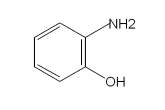

---

4) 비소

이원료1.0 ｇ을정밀하게달아황산2 mL 및질산5 mL에넣어가만히

가열한다. 때때로질산2 ∼3 mL씩을추가하여액의색이무색∼엷은황색이될

때까지가열한다. 식힌다음포화수산암모늄용액15 mL를넣어흰연기가발생할때

까지가열한다. 식힌다음물을넣어10 mL로한다. 이것을검액으로하여시험한다

(2 ppm 이하).

건조감량

0.5 % 이하(1.5 ｇ, 실리카겔, 4 시간)

강열잔분

2.0 % 이하(2 ｇ)

정량법

이원료를건조하고약0.19 ｇ을정밀하게달아질소정량법제2 법에따

라시험한다.

0.05 mol/L 황산1 mL = 10.913 mg　C6H7NO

저장법

기밀용기

p-아미노페놀

p-Aminophenol

4-아미노페놀

C6H7NO : 109.13

이원료를건조한것은정량할때p-아미노페놀(C6H7NO) 95.0 % 이상을함유한다.

성

상

이원료는흰색∼엷은회색또는엷은자색∼자갈색의결정성가루또는

엷은자색및엷은갈색의가루로서냄새는거의없거나또는약간특이한냄새가

있다.

확인시험1) 이원료의수용액(1 →2000) 10 mL에염화제이철시액5 방울을넣을때

액은적자색∼갈색을나타낸다.

2) 이원료0.1 ｇ을인텅그스텐산시액(1 →100) 2 mL 및탄산나트륨시액(1 →10)

1 mL에넣을때액은적자색∼청자색을나타낸다.

3) 이원료의수용액(0.05 →100) 5 mL에니트로프루싯나트륨시액2 mL를넣을때

액은어두운녹색을나타낸다.

4) 이원료25 mg을정밀하게달아물100 mL에녹이고이액10 mL를취하여물

을넣어100 mL 로한다. 이액을가지고자외가시부흡광도측정법에따라흡수스펙

트럼을측정할때파장297 ± 2 nm에서흡수극대를나타낸다.

5) 이원료및p-아미노페놀표준품각10 mg 을이소프로판올ㆍ물ㆍ강암모니아수

(9：3：1) 혼합액1 mL에넣어녹인다음각각에아황산수소나트륨0.1 ｇ을넣어흔

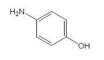

---

들어섞어검액및표준액으로한다. 검액및표준액1 μL씩을박층판상에점적하고

이소프로필에텔ㆍ아세톤ㆍ이소프로판올(10：1：1) 혼합액을전개용매로하여박층크

로마토그래프법에따라시험한다. 발색제로p-디메칠아미노벤즈알데히드ㆍ묽은염산

용액(1 →200)을뿌릴때표준품과같은Rf 값에서황색의반점이나타난다.

융

점

180 ∼188 ℃(제1 법)

순도시험

1)

용해상태

이원료0.5 ｇ을묽은염산20 mL에넣어녹일때액은맑다.

2) 중금속

이원료1.0 ｇ을정밀하게달아황산5 mL 및질산20 mL에넣어가

만히가열한다. 때때로질산2 ∼3 mL씩을추가하여액이무색∼엷은황색이될

때까지가열하고식힌다음물10 mL 및페놀프탈레인시액1 방울을넣고암모니아

시액을액이엷은적색이될때까지천천히넣고, 묽은초산2 mL를넣고필요하면여

과하여물10 mL로씻고여액과씻은액을네슬러관에넣어물을넣어50 mL로한

다. 이것을검액으로하여시험한다. 비교액에는납표준액2.0 mL를넣는다(20 ppm

이하).

3) 철

이원료0.4 ｇ을정밀하게달아황산5 방울을넣어적시고천천히가열하

여저온에서회화또는휘산시킨다음다시황산을넣어적시고완전히회화한다. 식

힌다음잔류물에염산0.5 mL를넣어수욕상에서증발건고한다음묽은염산3 방울

을넣어가온하고물25 mL를넣어녹인다. 이것을검액으로하여철시험법에따라

시험한다. 비교액에는철표준액2.0 mL 를넣는다(50 ppm 이하).

4) 비　소

이원료1.0 ｇ을정밀하게달아황산2 mL 및질산5 mL에넣어가만

히가열한다. 때때로질산2 ∼3 mL씩을추가하여액이무색∼엷은황색이될때

까지가열한다. 식힌다음포화수산암모늄액15 mL를넣고흰연기가발생할때까지

가열한다. 식힌다음물을넣어10 mL로한다. 이것을검액으로하여시험한다(2

ppm 이하).

건조감량

5.0 % 이하(1 ｇ, 실리카겔, 4 시간)

강열잔분

1.0 % 이하(2 ｇ)

정량법

이원료를건조하고약0.19 ｇ을정밀하게달아질소정량법제2 법에따

라시험한다.

0.05 mol/L 황산1 mL = 10.913 mg　C6H7NO

저장법

기밀용기

염산2,4-디아미노페녹시에탄올

2,4-Diaminophenoxyethanol Hydrochloride

---

2,4-디아미노페녹시에탄올염산염

C8H12N2O2ㆍ2HCl : 241.12

이원료를건조한것은정량할때염산2,4-디아미노페녹시에탄올(C8H12N2O2ㆍ2HCl)

95.0 % 이상을함유한다.

성

상

이원료는엷은회색∼엷은청색의가루로냄새는없다.

확인시험

1) 이원료의수용액(1 →100) 10 mL에질산은시액5 방울을넣을때액

은백탁된다.

2) 이원료의수용액(1 →100) 3 mL에풀푸랄ㆍ초산시액4 방울을넣을때액은

등적색을나타낸다.

3) 이원료20 mg을물100 mL에넣어녹이고그10 mL를취하여물을넣어100

mL로한다. 이액을가지고자외가시부흡광광도법에따라흡수스펙트럼을측정할때

파장286 ± 2 nm 및238 ± 2 nm에서흡수극대를나타낸다.

순도시험

1) 용해상태

이원료0.5 ｇ을물10 mL에넣어녹일때액은엷은적색

∼갈색이며맑다.

2) 철

이원료0.5 ｇ을달아황산5 방울을넣어적시고천천히가열한다. 되도록

저온에서거의회화또는휘산시킨다음다시황산으로적시고완전히회화한다. 식

힌다음잔류물에염산0.5 mL 를넣어수욕상에서증발건고한다음묽은염산3 방

울을넣어가온하고물25 mL를넣어녹인다. 이것을검액으로하여시험한다. 비교

액에는철표준액2.0 mL를넣는다(40 ppm 이하).

3) 에텔가용물

이원료약1 ｇ을정밀하게달아에텔50 mL에넣고환류냉각기

를달아수욕상에서때때로흔들어섞으면서1 시간끓인다. 뜨거울때미리질량을

단플라스크에유리여과기(G3)로여과한다. 잔류물을에텔20 mL로씻고, 씻은액

및여액을합하여수욕상에서날려보낸다음105 ℃에서30 분간건조하여질량을

정밀하게단다(1 % 이하).

4) 중금속

이원료1.0 ｇ을황산5 mL 및질산20 mL에넣어가만히가열한다.

때때로질산2 ∼3 mL씩을추가하여액이무색∼엷은황색이될때까지가열한

다. 식힌다음물을넣어10 mL로한다. 이것을검액으로하여시험한다. 비교액에는

납표준액2.0 mL를사용한다(20 ppm 이하).

5) 비소

이원료1.0 ｇ을황산2 mL 및질산5 mL에넣어가만히가열한다. 때때

로질산2 ∼3 mL씩을추가하여액이무색∼엷은황색이될때까지가열한다. 식

힌다음포화수산암모늄용액15 mL를넣어흰연기가발생할때까지가열한다. 식힌

다음물을넣어10 mL 한다. 이것을검액으로하여시험한다(2 ppm 이하).

건조감량

1.0 % 이하(1 ｇ, 105 ℃, 2 시간)

강열잔분

1.0 % 이하(2 ｇ)

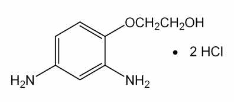

---

정량법　이원료를건조하고, 약0.2 ｇ을정밀하게달아질소정량법제2 법에따

라시험한다.

0.05 mol/L 황산1 mL = 12.06 mg C8H12N2O2 ㆍ2HCl

저장법　기밀용기

염산2,4-디아미노페놀

2,4-Diaminophenol Hydrochloride

2,4-디아미노페놀염산염

염산4-히드록시-m-페닐렌디아민

C6H8N2Oㆍ2HCl :

197.06

이원료를건조한것은정량할때염산2,4-디아미노페놀(C6H8N2Oㆍ2HCl) 93.0 %

이상을함유한다.

성

상

이원료는엷은녹색의가루또는회록색의결정성가루로서냄새는거의

없다.

확인시험

1) 이원료의수용액(1 →1000) 5 mL에염화제이철시액5 방울을넣을때

액은적색을나타낸다.

2) 이원료의수용액(1 →1000) 5 mL에질산은시액5 방울을넣을때백탁이되고

잠시후에적자색으로변하여침전이생긴다.

3) 이원료의수용액(1 →1000) 5 mL에풀푸랄ㆍ초산시액4 방울을넣을때액은

황갈색을나타낸다.

4) 이원료20 mg을물100 mL에넣어녹인다. 이액10 mL를취하여물을넣어

100 mL로한다. 이액을가지고자외가시부흡광도측정법에따라흡수스펙트럼을측

정할때파장233 ± 2 nm 및287 ± 2 nm에서흡수극대를나타낸다.

순도시험

1) 용해상태

이원료0.1 ｇ을물10 mL에넣어녹일때액은엷은적자

색이며맑다.

2) 에텔가용물

이원료약1 ｇ을정밀하게달아에텔50 mL에넣고환류냉각기

를달아수욕상에서때때로흔들어섞으면서1 시간끓인다. 뜨거울때미리질량을

단플라스크에유리여과기(G3)로여과한다. 잔류물을에텔20 mL로씻고, 씻은액과

여액을합하여수욕상에서증발건고하고105 ℃에서30 분간건조시켜질량을단다

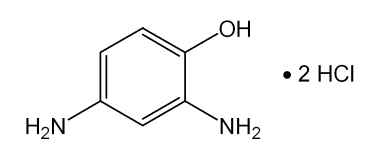

---

(0.3 % 이하).

3) 철

이원료0.5 ｇ을달아황산5 방울을넣어적시고천천히가열하여저온에

서거의회화또는휘산시킨다음황산을넣어적시고완전히회화한다. 식힌다음

잔류물에염산0.5 mL를넣고수욕상에서증발건고한다. 잔류물에묽은염산3 방울

을넣고가온하여물25 mL를넣어녹인다. 이것을검액으로하여시험한다. 비교액

에는철표준액2.0 mL를넣는다(40 ppm 이하).

4) 중금속

이원료1.0 ｇ을달아황산5 mL 및질산20 mL에넣어가만히가열

한다. 때때로질산2 ∼3 mL씩을추가하여액이무색∼엷은황색이될때까지가

열을계속한다. 식힌다음물10 mL 및페놀프탈레인시액1 방울을넣고, 액이약간

홍색을나타낼때까지암모니아시액을넣는다. 묽은초산2 mL를넣어필요하면여과

하고잔류물을물10 mL로씻은다음씻은액을여액에합하고물을넣어50 mL로

한다. 이것을검액으로하여시험한다. 비교액에는납표준액3.0 mL를넣는다(30

ppm 이하).

5) 비소

이원료1.0 ｇ을황산2 mL 및질산5 mL에넣어가만히가열한다. 때때

로질산2 ∼3 mL씩을추가하여액이무색∼엷은황색이될때까지가열한다. 식

힌다음포화수산암모늄용액15 mL 를넣고흰연기가발생할때가지가열한다. 식

힌다음물을넣어10 mL로한다. 이것을검액으로하여시험한다(2 ppm 이하).

건조감량

0.5 % 이하(1 ｇ, 105 ℃, 2 시간)

강열잔분

0.2 % 이하(1 ｇ)

정량법

이원료를건조하고약0.18 ｇ을정밀하게달아질소정량법제2 법에따

라시험한다.

0.05 mol/L 황산1 mL = 9.853 mg　C6H8N2Oㆍ2HCl

저장법

기밀용기

염산m-페닐렌디아민

1,3-Benzenediamine Hydrochloride

m-페닐렌디아민염산염

염산1,3-페닐렌디아민

C6H8N2ㆍ2HCl :

181.06

---

이원료를건조한것은정량할때염산m-페닐렌디아민(C6H8N2ㆍ2HCl) 95.0 % 이상

을함유한다.

성

상

이원료는흰색∼엷은적색또는엷은자색의결정성가루로서냄새는거

의없다.

확인시험

1) 이원료의수용액(1 →1000) 5 mL에질산은시액5 방울을넣을때흰

색의침전이생긴다.

2) 이원료의수용액(1 →1000) 3 mL에풀푸랄ㆍ초산시액4 방울을넣을때액은

황색을띠는적색을나타낸다.

3) 이원료및염산m-페닐렌디아민표준품각각10 mg을이소프로판올ㆍ물ㆍ강암

모니아수(9：3：1) 혼합액1 mL씩에넣어녹인다음각각에아황산수소나트륨0.1

ｇ을넣어흔들어섞는다. 이액을검액및표준액으로한다. 검액및표준액1 μL씩

을박층판에점적하고이소프로필에텔ㆍ아세톤ㆍ이소프로판올(10：1：1) 혼합액을전

개용매로하여박층크로마토그래프법에따라시험한다. 발색제로p-디메칠아미노벤

즈알데히드ㆍ묽은염산용액(0.5 →100)을뿌릴때염산m-페닐렌디아민표준품과같

은Rf 값에단일적색을띠는황색의반점을나타낸다.

4) 이원료50 mg을물에넣어녹여100 mL로한다. 이액1 mL를취하여물을

넣어100 mL로한다. 이액을가지고흡수스펙트럼을측정할때파장232 ± 2 nm

및284 ± 2 nm에서흡수극대를나타낸다.

순도시험

1) 용해상태

이원료1.0 ｇ을물10 mL에넣어녹일때액은엷은황갈

색∼엷은갈색으로되며맑다.

2) 에텔가용물

이원료약1 ｇ을정밀하게달아에텔50 mL를넣어환류냉각기

를달아수욕상에서때때로흔들어섞으면서1 시간끓인다. 뜨거울때미리질량을

단플라스크에유리여과기(G3)로여과한다. 잔류물을에텔20 mL로씻고, 씻은액과

여액을합하여수욕상에서증발건고한다음105 ℃에서30 분간건조시켜질량을단

다(1.0 % 이하).

3) 철

이원료1.0 ｇ을정밀하게달아황산5 방울을넣어적시고천천히가온하

여저온에서거의회화또는휘산시킨다음황산을넣어적시고완전히회화한다. 식

힌다음잔류물에염산0.5 mL를넣어수욕상에서증발건고한다. 잔류물에묽은염산

3 방울을넣고가온하여물25 mL로녹인다. 이것을검액으로하여시험한다. 비교

액에는철표준액2.0 mL를넣는다(20 ppm 이하).

4) 중금속

이원료1.0 ｇ을황산5 mL 및질산20 mL에넣어가만히가열한다.

때때로질산2 ∼3 mL씩을추가하여액이무색∼엷은황색이될때까지가열한

다. 식힌다음물10 mL 및페놀프탈레인시액1 방울을넣어액이거의홍색을나타

낼때까지암모니아시액을넣는다. 묽은초산2 mL를넣고, 필요하면여과하고잔류

물을물10 mL로씻은다음씻은액은여액과합하고물을넣어50 mL로한다. 이

것을검액으로하여시험한다. 비교액에는납표준액2.0 mL를넣는다(20 ppm 이하).

5) 비소

이원료1.0 ｇ을황산5 mL 및질산20 mL에넣고가만히가열한다. 때

때로질산2 ∼3 mL씩을추가하여액이무색∼엷은황색이될때까지가열한다.

---

식힌다음포화수산암모늄용액15 mL를넣고흰연기가발생할때까지가열한다음

식히고물을넣어10 mL로한다. 이것을검액으로하여시험한다.(2 ppm 이하).

건조감량

0.2 % 이하(1.5 ｇ, 실리카겔, 4 시간)

강열잔분

0.2 % 이하(2 ｇ)

정량법

이원료를건조하고약0.16 ｇ을정밀하게달아질소정량법제2 법에따

라시험한다.

0.05 mol/L 황산1 mL = 9.053 mg　C6H8N2ㆍ2HCl

저장법

기밀용기

염산p-페닐렌디아민

p-Phenylenediamine Hydrochloride

p-페닐렌디아민염산염

염산1,4-페닐렌디아민

C6H8N2ㆍ2HCl :

181.06

이원료를건조한것은정량할때염산p-페닐렌디아민(C6H8N2ㆍ2HCl) 95.0 % 이상

을함유한다.

성

상

이원료는흰색또는엷은갈색의결정성가루로서냄새는거의없다.

확인시험

1) 이원료의수용액(1 →100) 5 mL에질산은시액5 방울을넣을때액은

백탁하고, 엷은회색∼엷은자색침전이생기고이것을가열하면액의색은엷은갈

색이된다.

2) 이원료의수용액(1 →100) 3 mL에풀푸랄ㆍ초산시액4 방울을넣을때액은

황색을띠는적색을나타낸다.

3) 이원료및p-페닐렌디아민표준품각10 mg을이소프로판올ㆍ물ㆍ강암모니아수

(9：3：1) 혼합액1 mL에넣어녹인다음각각에아황산수소나트륨0.1 ｇ을넣어

흔들어섞어검액및표준액으로한다. 검액및표준액1 μL씩을박층판에점적하고

이소프로필에텔ㆍ아세톤ㆍ이소프로판올(10：1：1) 혼합액을전개용매로하여박층크

로마토그래프법에따라시험한다. 발색제로p-디메칠아미노벤즈알데히드ㆍ묽은염산

용액(1 →100)을뿌릴때표준품과같은Rf 값에서황색을띠는적색∼적색의반

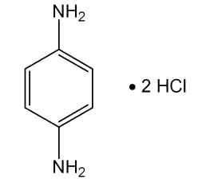

---

점을나타낸다.

4) 이원료50 mg을물에넣어녹여100 mL로한다. 이액1 mL를취하여물을

넣어100 mL로한다. 이액을가지고자외가시부흡광도측정법에따라흡수스펙트럼

을측정할때파장237 ± 2 nm에서흡수극대를나타낸다.

순도시험

1) 용해상태

이원료0.5 ｇ을묽은염산50 mL에넣어녹일때액은무색

∼엷은적색으로되며맑다.

2) 에텔가용물

이원료약1 ｇ을정밀하게달아에텔50 mL에넣어환류냉각기

를달아수욕상에서때때로흔들어섞으면서1 시간끓인다. 뜨거울때미리질량을

단플라스크에유리여과기(G3)로여과한다. 잔류물을에텔20 mL로씻고, 씻은액

및여액을합하여수욕상에서증발건고하고105 ℃에서30 분간건조시켜질량을단

다(1.0 % 이하).

3) 철

이원료1.0 ｇ을달아황산5 방울을넣어적시고천천히가열하여저온에

서거의회화또는휘산시킨다음황산을넣어적시고완전히회화시킨다. 식힌다음

잔류물에염산0.5 mL를넣고수욕상에서증발건고시킨다. 잔류물은묽은염산3

방울을넣어가온하고물25 mL를넣어녹인다. 이것을검액으로하여시험한다. 비

교액에는철표준액2.0 mL를넣는다(20 ppm 이하).

4) 중금속

이원료1.0 ｇ을달아황산5 mL 및질산20 mL에넣고가만히가열

한다. 때때로질산2 ∼3 mL씩을추가하여액이무색∼엷은황색이될때까지가

열한다. 식힌다음물10 mL 및페놀프탈레인시액1 방울을넣어액이거의홍색을

나타낼때까지암모니아시액을넣는다. 다음에묽은초산2 mL를넣고필요하면여과

하고잔류물을물10 mL로씻고씻은액을여액과합하고물을넣어50 mL로한다.

이것을검액으로하여시험한다. 단비교액에는납표준액2.0 mL를넣는다(20 ppm

이하).

5) 비소

이원료1.0 ｇ을황산2 mL 및질산5 mL에넣어가만히가열한다. 때때

로질산2 ∼3 mL씩을추가하여액이무색∼엷은황색이될때까지가열한다. 식

힌다음포화수산암모늄용액15 mL를넣어흰연기가발생할때까지가열한다. 식힌

다음물을넣어10 mL로한다. 이것을검액으로하여시험한다(2 ppm 이하).

건조감량

0.2 % 이하(1.5 ｇ, 실리카겔, 4 시간)

강열잔분

0.2 % 이하(2 ｇ)

정량법

이원료를건조하고약0.16 ｇ을정밀하게달아질소정량법제2법에따라

시험한다.

0.05 mol/L 황산1 mL = 9.053 mg　C6H8N2ㆍ2HCl

저장법

기밀용기

염산톨루엔-2,5-디아민

---

Toluene-2, 5-diamine Hydrochloride

톨루엔-2,5-디아민염산염

염산p-톨루엔디아민

염산메칠-p-페닐렌디아민

염산메칠-2, 5-페닐렌디아민

염산2-메칠-p-페닐렌디아민

염산o-메칠-p-페닐렌디아민

C7H10N2ㆍ2HCl : 195.09

이원료를건조한것은정량할때염산톨루엔-2, 5-디아민(C7H10N2ㆍ2HCl) 95.0 %

이상을함유한다.

성

상

이원료는엷은자색∼엷은적자색의결정성가루로서약간특이한냄새가

있다.

확인시험

1) 이원료의수용액(1 →100) 10 mL에질산은시액5 방울을넣을때백

탁이된다.

2) 이원료의수용액(1 →100) 3 mL에풀푸랄ㆍ초산시액4 방울을넣을때액은

황색을띠는적색을나타낸다.

3) 이원료및m-페닐렌디아민표준품각각10 mg을이소프로판올ㆍ물ㆍ강암모니

아수(9：3：1) 혼합액1 mL씩에넣어녹인다음, 각각에아황산수소나트륨0.1 ｇ을

넣어흔들어섞는다. 이액을검액및표준액으로한다. 검액및표준액1 μL씩을박

층판에점적하고이소프로필에텔ㆍ아세톤ㆍ이소프로판올(10：1：1) 혼합액을전개용

매로하여박층크로마토그래프법에따라시험한다. 발색제로p-디메칠아미노벤즈알

데히드ㆍ묽은염산용액(0.5 →100)을뿌릴때m-페닐렌디아민표준품에대하여Rs

값0.9 부근에서단일황색∼황색을띠는적색의반점을나타낸다.

4) 이원료15 mg을물100 mL에넣어녹이고이액10 mL 를취하여물을넣어

100 mL로한다. 이액을가지고자외가시부흡광도측정법에따라흡수스펙트럼을측

정할때파장235 ± 2 nm 및286 ± 2 nm에서흡수극대를나타낸다.

순도시험

1) 용해상태

이원료0.1 ｇ을묽은염산10 mL에넣어녹일때액은엷

은적자색이며맑다.

2) 철

이원료1.0 ｇ을달아황산5 방울을넣어적시고천천히가열하여저온에

서회화또는휘산시킨다음다시황산을넣어적시고완전히회화시킨다. 식힌다음

잔류물에염산0.5 mL를넣고수욕상에서증발건고한다음묽은염산3 방울을넣어

가온하고물25 mL를넣어녹인다. 이것을검액으로하여시험한다. 비교액에는철

표준액2.0 mL를넣는다(20 ppm 이하).

3) 에텔가용물

이원료약1 ｇ을정밀하게달아에텔50 mL에넣고환류냉각기

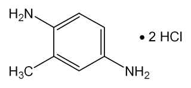

---

를달아수욕상에서때때로흔들어섞으면서1 시간끓인다. 뜨거울때미리질량을

단플라스크에유리여과기(G3)로여과한다. 잔류물을에텔20 mL로씻고, 씻은액과

여액을합하여수욕상에서증발건고하고105 ℃에서30 분간건조시켜질량을단다

(2.0 % 이하).

4) 중금속

이원료1.0 ｇ을달아황산5 mL 및질산20 mL에넣어가만히가열

한다. 때때로질산2 ∼3 mL씩을추가하여액이무색∼엷은황색이될때까지가

열하고식힌다음물10 mL 및페놀프탈레인시액1 방울을넣어액이거의홍색을

나타낼때까지암모니아시액을넣는다. 다음에묽은초산2 mL를넣고필요하면여과

하고잔류물을물10 mL로씻어씻은액은여액과합하고물을넣어50 mL로한다.

이것을검액으로하여시험한다. 비교액에는납표준액2.0 mL를넣는다(20 ppm 이

하).

5) 비소

이원료1.0 ｇ을달아황산2 mL 및질산5 mL에넣어가만히가열한다.

때때로질산2 ∼3 mL씩을추가하여액이무색∼엷은황색이될때까지가열하

고식힌다음포화수산암모늄용액15 mL를넣어흰연기가발생할때까지가열한다.

식힌다음물을넣어10 mL로한다. 이것을검액으로하여시험한다(2 ppm 이하).

건조감량

1.0 % 이하(1 ｇ, 105 ℃, 2 시간)

강열잔분

1.5 % 이하(2 ｇ)

정량법

이원료를건조하고약0.17 ｇ을정밀하게달아질소정량법제2 법에따

라시험한다.

0.05 mol/L 황산1 mL = 9.755 mg　C7H10N2ㆍ2HCl

저장법

기밀용기

---

염산히드록시프로필비스(N-히드록시에칠-p-페닐렌디아민)

Hydroxypropyl bis(N-hydroxyethyl-p-phenylenediamine)

Hydrochloride

히드록시프로필비스(N-히드록시에틸-p-페닐렌디아민염산염

C19H28N4O3ㆍ4HCl : 506.30

이원료는정량할때환산한무수물에대하여염산히드록시프로필비스(N-히드록시

에칠-p-페닐렌디아민)(C19H28N4O3ㆍ4HCl : 506.30) 98.0 ∼101.0 % 이상을함유한다.

성

상

이원료는연한회색∼회색을띠는자주빛의가루로약한특이한냄새가있다.

확인시험

1) 이원료의수용액(1 →1000) 10 mL에염화제이철시액1 방울을넣을

때엷은갈색∼검은색을나타낸다.

2) 이원료약0.01 g을정밀하게달아물을넣어녹여100 mL로하고이액1 mL

를정확하게취하여다시물을가해100 mL로한다. 이액을가지고자외가시부흡

광도측정법에따라흡광도를측정할때파장258 ± 2 nm에서흡수극대를나타낸

다.

3) 이원료를가지고적외부스펙트럼측정법브롬화칼륨정제법에따라시험할때파

수3371 cm-1, 2844 cm-1, 2572 cm-1, 1635 cm-1, 1611 cm-1, 1585 cm-1, 1516 cm-1,

1492 cm-1, 824 cm-1 부근에서흡수를나타낸다.

순도시험

1) 용해상태

이원료0.1 g에에탄올10 mL를넣고녹일때그액은거

의맑으며, 무색에서옅은갈색을띤다.

2) 철

이원료1.0 g을달아제2 법에따라검액을만들고조작법A법에따라시

험한다. 비교액에는철표준액3.0 mL를넣는다(30 ppm 이하).

3) 중금속

이원료1.0 g을달아제2 법에따라조작하여시험한다. 비교액에는

납표준액2.0 mL를넣는다(20 ppm 이하).

4) 비소

이원료1.0 g을달아제3 법에따라조작하여시험한다(2 ppm 이하).

5) 에탄올, 이소프로판올

이원료약1.0 g을정밀하게달아물90 mL를넣어녹

인다음2 mol/L 수산화나트륨시액5 mL를가한다음물을넣어100 mL로하여

검액으로한다. 따로에탄올표준액5 종류와이소프로판올표준액5 종류(5 μg/mL,

10 μg/mL, 20 μg mL, 40 μg/mL, 60 μg/mL)를조제하여표준액으로한다. 각각의

표준액2 μL씩을가지고다음의조건으로기체크로마토그래프법에따라시험하여

각표준액의에탄올과이소프로판올의피크면적을구하고에탄올과이소프로판올의

---

양(각g/100 mL)에대한피크면적을구하여각각에대한두개의검량선을작성한

다. 똑같은조건으로검액2 μL에대하여기체크로마토그래프법에따라시험하여

에탄올과이소프로판올의피크면적을구하여검량선에서검액의에탄올양(Ce)과이

소프로판올양(Ci)을읽고다음식에따라시료취한량에서에탄올과이소프로판올

의양(%)을계산할때에탄올은0.5 %, 이소프로판올은0.1 % 이하이다.

× 

에탄올의양%(w/w) =



× 

이소프로판올의양%(w/w) =



Ce = 100 mL 중에탄올의양(g)

Ci = 100 mL 중이소프로판올의양(g)

P = 시료취한양(g)

조작조건

검출기: 불꽃이온화검출기

칼

럼: 안지름0.53 mm, 길이50 m인모세유리관에기체크로마토그래프용6%

시아노프로필페닐- 94% 디메칠실리콘폴리머를3 μm 두께로피복한것

또는이와동등한칼럼

칼럼온도: 90 °C 부근의일정온도

검체도입부온도: 150 °C 부근의일정온도

검출기온도: 200 °C 부근의일정온도

운반기체: 질소또는헬륨

유

량: 1.7 mL/분

수

분

2.0 % 이하(0.2 g)

강열잔분

0.1 % 이하(3.0 g)

정량법

이원료약100 mg을정밀하게달아물50 mL에녹이고0.1 mol/L 수산화

나트륨액으로적정한다(적정종말점검출법전위차적정법). 같은방법으로공시험을하

여보정한다.

0.1 mol/L 수산화나트륨액1 mL = 25.3 mg C19H28N4O3ㆍ4HCl

인디고페라엽가루

Powdered Indigofera Tinctoria Leaf

이원료는인디고페라Indigofera tinctoria(콩과Leguminosae)의잎을건조하여가

---

루로한것이다.

이원료는정량할때인디칸(Indoxyl-β-D-glucoside, C14H17NO6 : 295.29) 3.0 % 이

상을함유한다.

성

상

이원료는연한녹색∼녹색의가루이고흙냄새같은특이한냄새가난다.

확인시험1) 이원료를가지고인디칸으로서약10 mg에해당하는양을정밀하게달

아메탄올을넣어10 mL로하여흔들어섞고방치한다음위의맑은액을검액으로

한다. 따로인디칸표준품10 mg을검액과같은방법으로조작하여표준액으로한다.

이들액을가지고박층크로마토그래프법에따라시험한다. 검액및표준액각각5 μL

씩을박층크로마토그래프용실리카겔을써서만든박층판에점적한다. 클로로포름ㆍ메

탄올ㆍ물혼합액(70 : 28 : 2)을전개용매로하여점적한곳으로부터약10 cm 전개한

다음박층판을전개용매냄새가나지않을때까지건조한다. 여기에분무용황산시액

을고르게뿌리고105 ℃에서5 ∼10분간가열하고검액과표준액의같은Rf 값및

색상의반점을확인한다.

2) 이원료를가지고정량법에따라시험할때검액은표준액과같은유지시간에서

주피크를나타낸다.

순도시험1) 중금속

이원료1.0 g을달아제3 법에따라조작하여시험한다. 비교

액에는납표준액2.0 mL를넣는다(20 ppm 이하).

2) 비소

이원료1.0 g을달아제3 법에따라조작하여시험한다. 표준색조제에는

비소표준액3.0 mL를넣는다(3 ppm 이하).

3) 잔류농약이원료를가지고대한민국약전일반시험법중생약시험법에따라시

험한다.

가) 총디디티(p.p'-DDD, p,p'-DDE, o,p'-DDT 및p,p'-DDT의합) 0.1 ppm

이하

나) 디엘드린0.01 ppm 이하.

다) 총비에이치씨(α, β, γ 및δ-BHC의합) 0.2 ppm 이하

라) 알드린0.01 ppm 이하

마) 엔드린0.01 ppm 이하

건조감량

10.0 % 이하

회

분

15.0 % 이하

산불용성회분

5.0 % 이하

정량법

이원료를인디칸으로서약15 mg에해당하는양을정밀하게달아메탄올

을넣어정확하게100 mL로하고10 분간흔들어추출한다음0.45 μm 시린지필터

로여과하여검액으로한다. 따로인디칸표준품약15 mg을정밀하게달아메탄올을

넣어정확하게100 mL로한액을표준액으로한다. 검액및표준액10 μL씩을정확

하게취하여다음조건으로액체크로마토그래프법에따라시험하여검액및표준액

의인디칸피크면적AT와AS를구한다.



인디칸(C14H17NO6)의양(mg) = 인디칸표준품의양(mg) × 



---

조작조건

검출기: 자외부흡광광도계(측정파장

280 nm)

칼

럼: 안지름약4.6 mm, 길이약15 cm인스테인레스강관에5 μm의액체

크로마토그프용옥타데실실릴실리카겔을충전한것또는이와동등한칼럼

이동상: 물ㆍ메탄올혼합액(65 : 35)

유

량: 0.5 mL/분

카테콜

Catechol

피로카테콜

피로카테킨

피로카테킨산

카테키논

o-디페놀

o-히드록시페놀

2-히드록시페놀

C6H6O2 : 110.11

이원료를건조한것은정량할때카테콜(C6H6O2) 98.0 % 이상을함유한다.

성　　상　이원료는흰색∼회색의입상또는판상의결정이며냄새가없든가또는

약간특이한냄새가있다.

확인시험　이원료의수용액(1 →200) 10 mL에염화제이철시액3 방울을넣을때액

은녹색을나타내고다음에암모니아시액2 방울을넣을때액은심홍색으로변한다.

융　　점　103 ∼105 ℃(제1 법)

순도시험　1) 용해상태　이원료0.5 ｇ을물100 mL에넣어녹인액은무색이며, 거

의맑다.

2) 중금속　이원료1.0 ｇ을황산5 mL 및질산20 mL에넣어가만히가열한다.

때때로질산2 ∼3 mL씩을추가하고액이무색∼엷은황색이될때까지가열을

계속한다. 식힌다음물10 mL 및페놀프탈레인시액1 방울을넣고암모니아시액을

액이엷은적색이될때까지천천히넣은다음필요하면여과하여물10 mL로씻고

여액과씻은액을네슬러관에넣고물을넣어50 mL로한다. 이것을검액으로하여

시험한다. 비교액에는납표준액2.0 mL를넣는다(20 ppm 이하).

---

3) 비소　이원료1.0 ｇ을황산2 mL 및질산5 mL에넣고가만히가열한다. 때때

로질산2 ∼3 mL씩을추가하여액이무색∼엷은황색이될때까지가열을계속

한다. 식힌다음포화수산암모늄용액15 mL를넣고흰연기가날때까지가열한다

음농축한다. 식힌다음물을넣어10 mL로하고이것을검액으로하여시험한다(2

ppm 이하).

4) 유기성불순물　이원료의수용액(1 →100) 1 μL를박층판에점적하고이소프로

필에텔ㆍ아세톤ㆍ이소프로판올(10：1：1) 혼합액을전개용매로하여박층크로마토그

래프법에따라시험한다. 발색제로인몰리브덴산시액을뿌릴때단일반점을나타낸

다.

건조감량　0.5 % 이하(1.5 ｇ, 실리카겔, 4 시간)

강열잔분　0.1 % 이하(2 ｇ)

정량법　이원료를건조하고약0.5 ｇ을정밀하게달아물에넣어녹이고100 mL

로한다. 이액20 mL를취하여카테콜정량용초산납시액30 mL 및물50 mL를넣

어가열한다. 식힌다음물을넣어200 mL로하여여과한다. 처음의여액20 mL는

버리고다음의여액100 mL를취하여0.05 mol/L 에칠렌디아민테트라초산디나트륨

액으로적정한다(지시약：키실레놀오렌지시액3 방울). 다만, 적정의종말점은액의

적자색이황색으로변할때로한다. 같은방법으로공시험을하여보정한다.

0.05 mol/L 에칠렌디아민테트라초산디나트륨액1 mL　= 5.506 mg　C6H6O2

저장법

기밀용기

톨루엔-2, 5-디아민

Toluene-2,5-diamine

p-톨루이렌디아민

2,5-톨루이렌디아민

2,5-디아미노톨루엔

o-메칠-p-페닐렌디아민

p-톨루엔디아민

메칠-p-페닐렌디아민

메칠-2,5-페닐렌디아민

2-메칠-p-페닐렌디아민

C7H10N2 : 122.17

---

이원료를건조한것은정량할때톨루엔-2, 5-디아민(C7H10N2) 95.0 % 이상을함유

한다.

성　　상　이원료는흰색∼엷은황색또는엷은적자색의가루또는덩어리로서

약간특이한냄새가있다.

확인시험　1) 이원료의수용액(1 →200) 5 mL에풀푸랄ㆍ초산시액5 방울을넣을

때액은적황색을나타낸다.

2) 이원료및염산m-페닐렌디아민표준품각10 mg을이소프로판올ㆍ물ㆍ강암모

니아수(9：3：1) 혼합액1 mL 씩에넣어녹인다음각각에아황산수소나트륨0.1 ｇ

을넣어흔들어섞어검액및표준액1 μL씩을박층판에점적하고이소프로필에텔ㆍ

아세톤ㆍ이소프로판올혼합액(10：1：1)을

전개용매로

하며

박층크로마토그래프법에

따라시험한다. 발색제로p-디메칠아미노벤즈알데히드ㆍ묽은염산용액(1 →200)을뿌

릴때염산m-페닐렌디아민표준품에대하여Rs 값0.9 부근에서적색을띠는황색

∼황색의반점을나타낸다.

3) 이원료0.15 ｇ을물에넣어녹여100 mL로한다. 이액1 mL를취하여물을

넣어100 mL로하여이액을가지고자외가시부흡광도측정법에따라흡수스펙트럼

을측정할때파장237 ± 2 nm 및303 ± 2 nm 에서흡수극대를나타낸다.

융　　점　60 ∼66 ℃(제1 법)

순도시험　1) 용해상태　이원료0.1 ｇ을묽은염산10 mL에넣어녹일때액은무

색∼엷은적자색이며거의맑다.

2) 철　이원료1.0 ｇ을정밀하게달아황산5 방울을넣어적시고천천히가열하

여저온에서거의회화또는휘산시킨다음다시황산을넣어적시고완전히회화시

킨다. 식힌다음잔류물에염산0.5 mL를넣고수욕상에서증발건고한다음묽은염

산3 방울을넣어가온하고물25 mL를넣어녹인다. 이것을검액으로하여시험한

다. 비교액에는철표준액2.0 mL를넣는다(20 ppm 이하).

3) 중금속　이원료1.0 ｇ을황산5 mL 및질산20 mL에넣어가만히가열한다.

때때로질산2 ∼3 mL씩을추가하여액이무색∼엷은황색이될때까지가열한

다. 식힌다음물10 mL 및페놀프탈레인시액1 방울을넣고암모니아시액을액이

엷은적색이될때까지천천히넣고필요하면여과하여물10 mL로씻고여액과씻

은액을네슬러관에넣고물을넣어50 mL로한다. 이것을검액으로하여시험한다.

비교액에는납표준액2.0 mL를넣는다(20 ppm 이하).

4) 비소　이원료1.0 ｇ을황산2 mL 및질산5 mL에넣어가만히가열한다. 때

때로질산2 ∼3 mL씩을추가하여액이무색∼엷은황색이될때까지가열한다.

식힌다음포화수산암모늄용액15 mL를넣고흰연기가발생할때까지가열한다. 식

힌다음물을넣어10 mL로한다. 이것을검액으로하여시험한다(2 ppm 이하).

건조감량　5.0 % 이하(1 ｇ, 실리카겔, 4 시간)

강열잔분　1.0 % 이하(2 ｇ)

정량법　이원료를건조하고약0.11 ｇ을정밀하게달아질소정량법제2 법에따라

시험한다.

---

0.05 mol/L 황산1 mL = 6.109 mg　C7H10N2

저장법

기밀용기

m-페닐렌디아민

m-Phenylenediamine

1, 3-페닐렌디아민

C6H8N2 : 108.14

이원료를건조한것은정량할때m-페닐렌디아민(C6H8N2) 95.0 % 이상을함유한

다.

성　　상　이원료는갈색또는청색을띠는흑갈색∼흑갈색의결정성덩어리로서

냄새는없다.

확인시험

1) 이원료1 g을물100 mL에넣어잘흔들어섞은다음여과한다. 여액

5 mL에질산은시액5 방울을넣을때액은엷은흑자색을나타낸다. 이액을가열할

때액은회록색∼회녹갈색으로변하면서은이석출된다.

2) 1)의여액3 mL에풀푸랄ㆍ초산시액4 방울을넣을때액은황색을띠는적색

∼황갈색을나타내면서혼탁된다.

3) 이원료및m-페닐렌디아민표준품각10 mg을달아이소프로판올ㆍ물ㆍ강암모

니아수(9 : 3 : 1) 혼합액1 mL를넣어녹인다음각각에아황산수소나트륨0.1g을

넣고흔들어섞어검액및표준액으로한다. 검액및표준액1 μL씩을박층판에점

적하고이소프로필에텔ㆍ아세톤ㆍ이소프로판올(10 : 1 : 1) 혼합액을전개용매로하

여박층크로마토그래프법에따라시험한다. 발색제로p-디메칠아미노벤즈알데히드ㆍ

묽은염산용액(1 →200)을뿌릴때표준액과같은Rf 값에서적색을때는황색의반

점을나타낸다.

4) 이원료25 mg을정밀하게달아물에넣어녹여100 mL로하고필요하면여과

하여이액1 mL를취하여물을넣어100 mL로한다. 이액을가지고자외가시부흡

광도측정법에따라흡수스펙트럼을측정할때파장287 ± 2 nm에서흡수극대를나

타낸다.

융　　점　57 ∼65 ℃(제1 법)

순도시험　1) 용해상태　이원료0.5 ｇ을정밀하게달아묽은염산10 mL에넣어녹

일때액은흑갈색이며맑다.

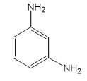

---

2) 철　이원료1.0 ｇ을정밀하게달아황산5 방울을넣어적시고천천히가열하

여저온에서염산0.5 mL를넣어수욕상에서증발건고한다. 잔류물에묽은염산3 방

울을넣어가온하고물25 mL를넣어녹인다. 이액을검액으로하여시험한다. 비

교액에는철표준액2.0 mL를넣는다(20 ppm 이하).

3) 중금속　이원료1.0 ｇ을정밀하게달아황산5 mL 및질산20 mL에넣어가

만히가열한다. 여기에질산2 ∼3 mL씩을추가하여액이무색∼엷은황색이될

때까지가열한다. 식힌다음물10 mL 및페놀프탈레인시액1 방울을넣고암모니아

시액을액이엷은적색이될때까지천천히넣은다음묽은초산2 mL를넣고필요

하면여과한다. 잔류물을물10 mL로씻고씻은액을여액에합하여물을넣어50

mL로한다. 이액을검액으로하여시험한다. 비교액에는납표준액2.0 mL를넣는다

(20 ppm 이하).

4) 비소　이원료1.0 ｇ을정밀하게달아황산2 mL 및질산5 mL에넣어가만히

가열한다. 여기에가끔질산2 ∼3 mL씩을추가하여액이무색∼엷은황색이될

때까지가열한다. 식힌다음포화수산암모늄용액15 mL를넣고흰연기가발생할때

까지가열한다. 식힌다음물을넣어10 mL로한다. 이것을검액으로하여시험한다

(2 ppm 이하).

건조감량　0.5 % 이하(1.5 ｇ, 실리카겔, 4 시간)

강열잔분　0.3 % 이하(2 ｇ, 제1 법)

정량법　이원료를건조하고약0.10 ｇ을정밀하게달아질소정량법제2 법에따

라시험한다.

0.05 mol/L 황산1 mL = 5.407 mg　C6H8N2

저장법　기밀용기

N-페닐-p-페닐렌디아민

N-Phenyl-p-Phenylenediamine

p －아미노디페닐아민

C12H12N2 : 184.24

이원료를건조한것은정량할때N-페닐-p-페닐렌디아민(C12H12N2) 95.0% 이상을

함유한다.

성　　상　이원료는흑갈색∼자갈색의덩어리또는작은알맹이로서약간특이한

냄새가있다.

---

확인시험　1) 이원료10 mg에묽은염산10 mL를넣어녹이고아질산나트륨시액1

방울을넣을때액은적갈색을나타내고곧이어녹갈색으로변한다.

2) 이원료의묽은에탄올용액(1 →1000) 3 mL에풀푸랄ㆍ초산시액4 방울을넣을

때액은황색을띠는적색을나타낸다.

3) 이원료및p-니트로아닐린각10 mg을달아이소프로판올ㆍ물ㆍ강암모니아수혼

합액(9 : 3 : 1) 1 mL를넣어녹인다음각각에아황산수소나트륨0.1 g을넣고흔들

어섞어검액및표준액으로한다. 이들액을가지고박층크로마토그래프법에따라

시험한다. 검액및표준액10 μL씩을박층크로마토그래프용실리카겔을써서만든박

층판에점적한다. 다음에이소프로필에텔ㆍ아세톤ㆍ이소프로판올(10 : 1 : 1) 혼합액

을전개용매로하여약15 cm 전개한다음박층판을바람에말린다. 여기에p-디메

칠아미노벤즈알데히드ㆍ묽은염산용액(1 →200)을뿌릴때표준액p-니트로아닐린에

대하여Rs 값0.8 부근에서암적색∼적갈색의반점을나타낸다.

4) 이원료30 mg을달아에탄올을넣어녹여200mL로한다. 이액2 mL를취하

여에탄올을넣어100 mL로한다. 이액에대하여흡수스펙트럼을측정할때파장

286 ∼290 nm에서흡수극대를나타낸다.

융

점

69 ∼75 ℃(제1 법)

순도시험

1) 용해상태　이원료0.1 g에에탄올10 mL를넣어녹일때액은어두운

적갈색∼어두운적자색을나타내며맑다.

2) 철　이원료1.0 g을정밀하게달아황산5 방울을넣어적시고천천히가열하여

저온에서거의회화또는휘산시킨다음다시황산으로적시고완전히회화한다. 식

힌다음잔류물에염산0.5 mL를넣어수욕상에서증발건고한다. 잔류물에묽은염산

3 방울을넣어가온하고물25 mL를넣어녹인다. 이것을검액으로하여시험한다.

비교액에는철표준액2.0 mL를넣는다(20 ppm 이하).

3) 중금속　이원료1.0 g에황산5 mL 및질산20 mL를넣어가만히가열한다.

가끔질산2 ∼3 mL씩을추가하여액이무색∼엷은황색이될때까지가열한다.

식힌다음물10 mL 및페놀프탈레인시액1 방울을넣고암모니아시액을액이엷은

적색이될때까지적가하고묽은초산2 mL를넣고필요하면여과한다. 잔류물을물

10 mL로씻고씻은액을여액에합하여물을넣어50 mL로한다. 이것을검액으로

하여시험한다. 비교액에는납표준액2.0 mL를넣는다(20 ppm 이하).

4) 비소　이원료1.0 g에황산2 mL 및질산5 mL를넣고가만히가열한다. 가끔

질산2 ∼3 mL씩을추가하여액이무색∼엷은황색이될때까지가열한다. 식힌

다음포화수산암모늄용액15 mL를넣고흰연기가발생할때까지가열한다. 식힌다

음물을넣어10 mL로한다. 이것을검액으로하여시험한다(2 ppm 이하).

건조감량　0.5 % 이하(1.5 g, 실리카겔, 4시간)

강열잔분　0.3 % 이하(2 g, 제1 법)

정량법　이원료를데시케이터(실리카겔) 에서4시간건조하고그원료0.16 g을

정밀하게달아질소정량법제2법에따라시험한다.

0.05 mol/L 황산1 mL = 9.212 mg C12H12N2

---

저장법

기밀용기

p-페닐렌디아민

p-Phenylenediamine

1,4-페닐렌디아민

C6H8N2 : 108.14

이원료를건조한것은정량할때p-페닐렌디아민(C6H8N2) 98.0 % 이상을함유한다.

성　　상　이원료는무색∼엷은자색또는자갈색을띤결정성가루또는덩어리로

서냄새는없다.

확인시험

1) 이원료의수용액(1 →1000) 5 mL에질산은시액5 방울을넣을때액

은흑자갈색을나타내면서혼탁해진다. 가열할때액은은이석출된다.

2) 이원료100 mg을묽은초산10 mL에넣어녹인다. 이액1 mL에아닐린용액(1

→250) 1 mL를넣은다음과황산암모늄0.2 ｇ을넣을때액은청색을나타낸다.

3) 이원료의수용액(1 →1000) 5 mL에니트로프루싯나트륨시액1 mL을넣을때액

은청색을나타낸다.

4) 이원료25 mg을물에넣어100 mL로한다. 이액1 mL를취하여물을넣어

100 mL로한다. 이액을가지고자외가시부흡광도측정법에따라흡수스펙트럼을측

정할때파장237 ± 2 nm에서흡수극대를나타낸다.

5) 이원료및p-페닐렌디아민표준품각10 mg을이소프로판올ㆍ 물ㆍ 강암모니

아수(9：3：1) 혼합액1 mL씩에넣어녹인다음각각에아황산수소나트륨0.1 ｇ을

넣어흔들어섞어검액및표준액1 μL씩을박층판에점적하고초산에칠ㆍ 메탄올

ㆍ 물(50：10：8) 혼합액을전개용매로하여박층크로마토그래프법에따라시험한다.

발색제로p-디메칠아미노벤즈알데히드ㆍ묽은염산용액(1 →200)을뿌릴때표준품과

같은Rf 값에서황색을띠는적색의반점을나타낸다.

융　　점　136 ∼144 ℃(제1 법)

순도시험　1) 용해상태　이원료0.5 ｇ을묽은염산60 mL에넣어녹일때액은무

색∼엷은적색을나타내며맑다.

2) 중금속　이원료1.0 ｇ을황산5 mL 및질산20 mL에넣어천천히가열한다.

때때로질산2 ∼3 mL씩을추가하여액이무색∼엷은황색이될때까지가열한

다. 식힌다음물10 mL 및페놀프탈레인시액1 방울을넣고암모니아시액을액이

엷은적색이될때까지천천히넣고필요하면여과한다. 잔류물을물10 mL로씻고

---

여액과씻은액을네슬러관에넣고물을넣어50 mL로한다. 이것을검액으로하여

시험한다. 단, 비교액에는납표준액2.0 mL를넣는다(20 ppm 이하).

3) 철　이원료1.0 ｇ을정밀하게달아황산5 방울을넣어적시고천천히가열하

여저온에서회화또는휘산시킨다음황산을넣어적시고완전히회화한다. 식힌다

음잔류물에염산0.5 mL를넣고수욕상에서증발건고한다. 잔류물에묽은염산3 방

울을넣어가온하고물25 mL를넣어녹인다. 이것을검액으로하여시험한다. 비교

액에는철표준액2.0 mL를넣는다(20 ppm 이하).

4) 비소　이원료1.0 ｇ을황산2 mL 및질산5 mL에넣어천천히가열한다. 때때

로질산2 ∼3 mL씩을추가하여액이무색∼엷은황색이될때까지가열한다. 식

힌다음포화수산암모늄용액15 mL를넣고흰연기가발생할때까지가열한다. 식힌

다음물을넣어10 mL로한다. 이것을검액으로하여시험한다(2 ppm 이하).

건조감량　0.2 % 이하(1.5 ｇ, 실리카겔, 4 시간)

강열잔분　0.5 % 이하(2 ｇ, 제1 법)

정량법　이원료를건조하고약0.10 ｇ을정밀하게달아질소정량법제2 법에따

라시험한다.

0.05 mol/L 황산1 mL = 5.407 mg　C6H8N2

저장법

기밀용기

페닐메칠피라졸론

Phenyl Methyl Pyrazolone

C10H10N2O : 174.20

이원료는정량할때환산한무수물에대하여페닐메칠피라졸론(C10H10N2O) 99.0 %

이상을함유한다.

성

상

이원료는흰색의결정성가루이다.

확인시험

1) 이원료50 mg을에탄올에넣어녹여100 mL로한다. 이액10 mL를

취하여에탄올을넣어1000 mL로한다. 이액을가지고자외가시부흡광도측정법에

따라흡수스펙트럼을측정할때파장245 ± 2 nm에서흡수극대를나타낸다.

2) 이원료0.1 g을메탄올10 mL에넣어녹인다음아황산나트륨0.1 g을넣고원

---

심분리하여상징액을검액으로한다. 페닐메칠피라졸론표준품0.1 g을가지고검액

과같게조작하여표준액으로한다. 검액및표준액각각5 μL씩을취하여박층판에

점적하고벤젠ㆍ 아세트산에틸ㆍ 아세트산혼합액(50 : 50 : 1)을전개용매로하여

박층크로마토그래프법에따라시험한다. 발색제로p-디메틸아미노벤즈알데히드ㆍ

묽은염산용액(0.5 →100) 을뿌릴때검액과표준액의반점은같은Rf 값에서같은

색상을나타낸다.

융

점

128 ∼130 ℃(제1 법)

순도시험

1) 철

이원료2.0 g을달아황산5 방울을넣어적시고천천히가열하여

저온에서거의회화또는휘산시킨다음다시황산으로적시고완전히회화한다. 식

힌다음잔류물에염산0.5 mL를넣고수욕상에서증발건고하여잔류물에묽은염산

3 방울을넣어가온하고물25 mL를넣어녹인다. 이것을검액으로한다. 비교액에

는철표준액1.0 mL를넣는다(5 ppm 이하).

2) 중금속

이원료1.0 g을황산2 mL 및질산20 mL에넣어가만히가열한다.

때때로질산2 ∼3 mL씩을추가하여액이무색∼엷은황색이될때까지가열한

다. 식힌다음물10 mL 및페놀프탈레인시액1 방울을넣고암모니아시액을액이

엷은적색이될때까지넣고필요하면여과하여물10 mL로씻고여액과씻은액을

네슬러관에넣어물을넣어50 mL로한액을검액으로한다. 비교액에는납표준액

2.0 mL를넣는다(20 ppm 이하).

3) 비소

이원료1.0 g을황산2 mL 및질산5 mL에넣어가만히가열한다. 때때

로질산2 ∼3 mL씩을추가하여액이무색∼엷은황색이될때까지가열한다. 식

힌다음포화수산암모늄용액15 mL를넣고흰연기가발생할때까지가열한다음

식히고물을넣어10 mL로한액을검액으로하여시험한다(2 ppm 이하).

수

분

0.3 % 이하(0.3 g)

강열잔분

0.2 % 이하(2 g, 제1 법)

정량법

이원료약0.15 g을정밀하게달아질소정량법에따라시험한다.

0.05 mol/L 황산1 mL = 8.710 mg C10H10N2O

피로갈롤

Pyrogallol

피로갈릭산

피로몰식자산

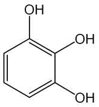

---

초성몰식자산

2,3-디히드록시페놀

C6H6O3 : 126.11

성

상

이원료는흰색의결정으로약간의특이한냄새가있다.

확인시험

1) 이원료의수용액(1 →100) 10 mL에수산화나트륨시액3 방울을넣을

때액은적색을띠는황색∼황갈색을나타내며방치하면액은천천히갈색∼흑

갈색으로변한다.

2) 이원료의수용액(1 →200) 10 mL에염화제이철시액3 방울을넣을때액은적

갈색∼갈색을나타낸다.

융

점

128 ∼136 ℃(제1 법)

순도시험

1) 용해상태

이원료1.0 ｇ을물20 mL에넣어녹인액은무색으로거의

맑다.

2) 중금속

이원료1.0 ｇ을황산5 mL 및질산20 mL에넣어가만히가열한다.

때때로질산2 ∼3 mL씩을추가하여액이무색∼엷은황색이될때까지가열을

계속한다. 식힌다음물10 mL 및페놀프탈레인시액1 방울을넣고암모니아시액을

액이엷은적색이될때까지천천히넣고필요하면여과한다. 물10 mL로씻고여액

과씻은액을네슬러관에넣고물을넣어50 mL로한다. 이것을검액으로하여시험

한다. 비교액에는납표준액2.0 mL를넣는다(20 ppm 이하).

3) 비소

이원료1.0 ｇ을황산2 mL 및질산5 mL에넣어가만히가열한다. 때때

로질산2 ∼3 mL씩을추가하여액이무색∼엷은황색이될때까지가열을계속

한다. 식힌다음포화수산암모늄용액15 mL를넣고흰연기가날때까지가열한다.

식힌다음물을넣어10 mL로하고이것을검액으로하여시험한다(2 ppm 이하).

4) 유기성불순물

이원료의수용액(1 →100) 1 μL를박층판에점적하고이소프로

필에텔ㆍ 아세톤ㆍ 이소프로판올혼합액(10：1：1)을전개용매로하여박층크로마토

그래프법에따라시험한다. 발색제로인몰리브덴산시액을뿌릴때단일의청자색반

점을나타내어야한다.

건조감량

0.5 % 이하(1.5 ｇ, 실리카겔, 4 시간)

강열잔분

0.3 % 이하(2 ｇ, 제1 법)

저장법

기밀용기

피크라민산

Picramic Acid

---

2-아미노4,6-디니트로페놀

2,4-디니트로6-아미노페놀

4,6-디니트로2-아미노페놀

피크람산

C6H5N3O5 : 199.12

이원료를건조한것은정량할때피크라민산(C6H5N3O5) 90.0 % 이상을함유한다.

성

상

이원료는황갈색∼적갈색의결정또는페이스트로서냄새는거의없다.

확인시험

1) 이원료의수용액(1 →1000) 10 mL에묽은염산1 mL를넣을때액은

황색은나타낸다. 또한이원료의수용액(1 →1000) 10 mL에탄산나트륨시액1 mL

를넣을때액은적갈색을나타낸다.

2) 이원료의수용액(1 →1000) 10 mL에황산동ㆍ암모니아시액2 mL를넣을때

액은어두운갈색을나타낸다.

3) 이원료의수용액(1 →1000) 10 mL에인텅그스텐산용액(1 →100) 1 mL를넣을

때액은황색을나타내며탄산나트륨시액1 mL를더넣을때액은적갈색으로변한다.

4) 이원료25 mg을물100 mL에넣어녹이고필요하면여과하여이액10 mL를

취하고물을넣어100 mL로한다. 이액을가지고자외가시부흡광도측정법에따라

흡수스펙트럼을측정할때파장300 ± 2 nm, 226 ± 2 nm 에서흡수극대를나타낸다.

융

점

169 ∼172 ℃(제1 법)

순도시험

1) 용해상태

이원료0.5 ｇ을아세톤20 mL에넣어녹일때액은황갈색

∼어두운적갈색이며거의맑다.

2) 납

이원료1.0 ｇ을황산5 mL 및질산20 mL에넣어가만히가열한다. 때때

로질산2 ∼3 mL을추가하여액이무색∼엷은황색으로될때까지가열한다. 식

힌다음물을넣어10 mL로한다. 이것을검액으로하여시험한다(5 ppm 이하).

3) 철

이원료0.1 ｇ을정밀하게달아황산5 mL를넣어적시고천천히가열하여

저온에서거의회화또는휘산시킨다음다시황산을넣어적시고완전히회화한다.

식힌다음잔류물에염산0.5 mL를넣고수욕상에서증발건고시킨다. 잔류물에묽

은염산3 방울을넣어가온하고물을넣어50 mL로하여검액으로한다. 이액10

mL를취하여시험한다. 비교액에는철표준액2.0 mL를넣는다(0.1 % 이하).

4) 비소

이원료1.0 ｇ을황산2 mL 및질산5 mL에넣어가만히가열한다. 때때

로질산2 ∼3 mL씩을추가하여액이무색∼엷은황색이될때까지가열한다. 식

힌다음포화수산암모늄용액15 mL를넣고흰연기가발생할때까지가열한다. 식힌

다음물을넣어10 mL로한다. 이것을검액으로하여시험한다(2 ppm 이하).

건조감량

35.0 % 이하(1 ｇ, 105 ℃, 2 시간)

---

강열잔분

1.0 % 이하(1 ｇ, 제1 법)

정량법

이원료를건조하고약　0.12 ｇ을정밀하게달아아연(입상) 2 ｇ, 물15

mL 및염산15 mL에넣어조심하면서증발건고한다음식혀질소정량법제2 법에

따라시험한다.

0.05 mol/L 황산1 mL = 6.637 mg　C6H5N3O5

저장법

기밀용기

피크라민산나트륨

Sodium Picramate

2-아미노4,6-디니트로페놀나트륨

4,6-디니트로2-아미노페놀나트륨

2,4-디니트로6-아미노페놀나트륨

피크람산나트륨

C6H4N3NaO5 : 221.10

이원료를건조한것은정량할때피크라민산나트륨(C6H4N3NaO5) 86.0 % 이상을

함유한다.

성

상

이원료는암적갈색∼적자색의습기가있는가루로서약간냄새가있다.

확인시험

1) 이원료의수용액(1 →100) 3 mL에피로안티몬산칼륨시액2 mL를넣

을때적색을띠는황색∼황색의결정성침전이생긴다. 침전생성을빠르게해주기

위하여유리봉으로시험관의내벽을긁어준다.

2) 이원료의수용액(1 →1000)에묽은염화제이철시액5 방울을넣을때액은흑갈

색을나타낸다.

3) 이원료및염산m-페닐렌디아민표준품각10 mg을이소프로판올ㆍ물ㆍ강암모

니아수(9：3：1) 혼합액1 mL에넣어녹인다음각각에아황산수소나트륨0.1 ｇ을

넣어흔들어섞어검액및표준액으로한다. 검액및표준액1 μL씩을박층판에점

적하고초산에칠ㆍ 메탄올ㆍ 물(50：10：8) 혼합액을전개용매로하여박층크로마

토그래프법에따라시험한다. 발색제로p-디메칠아미노벤즈알데히드ㆍ 묽은염산용

액(1 →200)을뿌릴때염산m-페닐렌디아민표준품에대하여Rs 값0.75 부근에서

단일의등색의반점을나타낸다.

---

4) 이원료20 mg을물에넣어녹여100 mL로한다. 이액5 mL를취하여물을

넣어100 mL로한다. 이액을가지고자외가시부흡광도측정법에따라흡수스펙트럼

을측정할때파장229 ± 2 nm 및312 ± 2 nm 부근에서흡수극대를나타낸다.

순도시험

1) 용해상태

이원료0.1 ｇ을물200 mL에넣어녹일때액은적색이며

맑다.

2) 철

이원료0.5 ｇ을정밀하게달아황산5 방울을넣어적시고천천히가열하

여저온에서거의회화또는휘산시킨다음황산으로적시고완전히회화한다. 식힌

다음잔류물에염산0.5 mL를넣어수욕상에서증발건고한다음묽은염산3 방울을

넣고가온하고물을넣어50.0 mL로하여검액으로한다. 이액10 mL를취하여시

험한다. 비교액에는철표준액2.0 mL를넣는다(0.02 % 이하).

3) 에텔가용물

이원료1 ｇ을정밀하게달아에텔50 mL를넣어환류냉각기를

달아수욕상에서때때로흔들어섞어주면서1 시간끓인다음뜨거울때미리질량

을단플라스크에유리여과기(G3)로여과한다. 잔류물을에텔20 mL로씻고여액및

씻은액을합하여수욕상에서증발건고한다음105 ℃에서30 분간건조시켜질량을

단다(5 % 이하).

4) 납

이원료1.0 ｇ을황산5 mL 및질산20 mL에넣어가만히가열한다. 때때

로질산2 ∼3 mL씩을추가하여액이무색∼엷은황색이될때까지가열한다. 식

힌다음물을넣어10 mL로한다. 이것을검액으로하여시험한다(10 ppm 이하).

5) 비소

이원료1.0 ｇ을황산2 mL 및질산5 mL에넣어가만히가열한다. 때때

로질산2 ∼3 mL씩을추가하여액이무색∼엷은황색이될때까지가열한다. 식

힌다음포화수산암모늄용액15 mL를넣어흰연기가발생할때까지가열한다. 식힌

다음물을넣어10 mL로한다. 이것을검액으로하여시험한다(2 ppm 이하).

건조감량

40.0 % 이하(2 ｇ, 60 ℃, 항량)

정량법

이원료를60 ℃에서항량이될때까지건조하고그약0.13 ｇ을정밀하

게달아아연(입상) 2 ｇ, 물15 mL 및염산15 mL에넣어조심하면서증발건고한

다. 식힌다음질소정량법제2 법에따라시험한다.

0.05 mol/L 황산1 mL = 7.370 mg　C6H4N3NaO5

저장법

기밀용기

헤마테인

Hematein

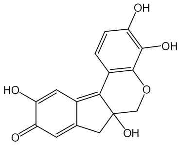

---

히드록시브라실레인

C16H12O6 : 300.26

이원료는인도산콩과식물Haematoxylon campechianum Linne(Leguminosae)에서

얻어지는것으로서주로헤마테인(C16H12O6) 을함유한다.

성

상

이원료는적갈색∼흑갈색의가루로서특이한냄새가있다.

확인시험

1) 이원료의수용액(1 →1000) 10 mL에염화제이철시액5 방울을넣을

때액은청흑색∼흑회색을나타낸다.

2) 이원료0.1 ｇ을암모니아시액10 mL에넣어녹일때액은적자색∼갈자색을

나타낸다.

순도시험

1) 용해상태

이원료0.1 ｇ을물10 mL에넣어녹일때액은적색이며

거의맑다.

2) 중금속

이원료1.0 ｇ을황산5 mL 및질산20 mL에넣고가만히가열한다.

때때로질산2 ∼3 mL 씩을추가하여액이무색∼엷은황색이될때까지가열한

다. 식힌다음물10 mL 및페놀프탈레인시액1 방울을넣고암모니아시액을액이

엷은적색이될때까지천천히넣은다음묽은초산2 mL를넣고필요하면여과한다.

잔류물을물10 mL로씻고씻은액을여액에합하여물을넣어50 mL로한다. 이것

을검액으로하여시험한다. 비교액에는납표준액2.0 mL를넣는다(20 ppm 이하).

3) 비소

이원료1.0 ｇ을황산2 mL 및질산5 mL에넣어서가만히가열한다. 때

때로질산2 ∼3 mL 씩을추가하여액이무색∼엷은황색이될때까지가열한다.

식힌다음포화수산암모늄용액15 mL를넣어서흰연기가발생할때까지가열한다.

식힌다음물을넣어10 mL로한다. 이것을검액으로하여시험한다(2 ppm 이하).

건조감량

5.0 % 이하(1 ｇ, 실리카겔, 4 시간)

강열잔분

15.0 % 이하(1 ｇ, 제1 법)

저장법

기밀용기

헨나엽가루

Henna Leaf Powder

Pulvis Hennae Folium

이원료는헨나Lawsonia inermis Linn.(= Lawsonia alba)(부처꽃과Lythraceae)의

잎을가루로한것이다.

이원료는정량할때로손(2-hydroxy 1,4-naphtho-quinone, C10H6O3：174.16) 0.5 %

이상을함유한다.

성

상이원료는연한녹색∼녹갈색의가루이고, 흙냄새같은특이한냄새가난

다. 이원료를현미경으로보면녹색∼녹갈색의수많은각질(cuticle) 조각과잎의

유조직체, 수산칼슘단정을볼수있으며, 수산칼슘단정은대부분지름15 mm 정도

이나, 때때로지름40 mm 정도로큰것도있다. 구형의점액세포와내부유관속조

직, 길고가느다란후막조직섬유가있으며, 표피세포에둘러싸인기공과가로무늬

---

각질이있는표피조각이보이고, 때때로융모나비선모조각을볼수있다.

확인시험

1) 이원료를로손으로서약5.0 mg에해당량을정밀하게달아클로로포름

5 mL를넣어2 시간동안초음파처리한다음여과하여검액으로한다. 따로로손표

준품5.0 mg을클로로포름5 mL에녹여표준액으로한다. 이들액을박층크로마토

그래프법에따라시험한다. 검액및표준액2 µL씩을박층크로마토그래프용실리카겔

을써서만든박층판에점적한다. 다음에클로로포름ㆍ메칠에칠케톤ㆍ초산(100)혼합

액(5：4：1)을전개용매로하여약10 cm 전개한다음박층판을바람에말린다. 자

연광아래에서관찰할때여러개의반점중1 개의반점은표준액에서얻은반점과

색상및Rf 값이같다.

2) 아래정량법에따라시험할때검액은표준액과같은유지시간에서피크를나타

낸다.

순도시험

1) 중금속

이원료1.0 g을가지고제3 법에따라조작하여시험한다. 비

교액에는납표준액2.0 mL를넣는다(20 ppm 이하).

2) 비소이원료1.0 g을달아제3 법에따라조작하여시험한다. 다만비교액에는

비소표준액3.0 mL를넣는다(3 ppm 이하).

3) 잔류농약이원료를가지고대한민국약전일반시험법중생약시험법에따라시

험한다.

가) 총디디티(p.p'-DDD, p,p'-DDE, o,p'-DDT 및p,p'-DDT의합) 0.1 ppm 이하.

나) 디엘드린0.01 ppm 이하.

다) 총비에이치씨(α, β, γ 및δ-BHC의합) 0.2 ppm 이하.

라) 알드린0.01 ppm 이하.

마) 엔드린0.01 ppm 이하.

건조감량

10.0 % 이하.

회

분

15.0 % 이하.

산불용성회분

5.0 % 이하.

정량법이원료를로손으로서약30 mg을정밀하게달아이동상을넣어정확하게

100.0 mL로하고30 분동안흔들어추출한다음여과하여여액을검액으로한다.

따로로손표준품약30.0 mg을정밀하게달아이동상을넣어정확하게100.0 mL로

하여표준액으로한다. 검액및표준액5 μL씩을가지고다음조건으로액체크로마

토그래프법에따라시험하여각액의로손피크면적AT 및AS를구한다.

AT

로손(C10H6O3)의양(mg) = 로손표준품의양(mg) ×

AS

조작조건

검출기: 자외부흡광광도계(측정파장248 nm)

칼

럼: 안지름약4 ∼6 mm, 길이15 ∼25 cm인스테인레스강관에5 ∼10

μm 의액체크로마토그래프용옥타데실실릴화한실리카겔을충전한것또

는이와동등한칼럼

칼럼온도: 실온

---

이동상: 물ㆍ아세토니트릴혼합액(3：1)에초산을넣어pH 3.0으로한다.

유

량: 1.0 mL/분

저장법

기밀용기.

황산1-히드록시에칠-4,5-디아미노피라졸

1-Hydroxyethyl-4,5-Diaminopyrazole Sulfate

1-히드록시에틸-4,5-디아미노피라졸황산염

C5H10N4OㆍH2SO4 : 240.24

이원료는정량할때황산1-히드록시에칠-4,5-디아미노피라졸(C5H10N4OㆍH2SO4 :

240.24)을98.0 ∼102 %를함유한다.

성

상

이원료는흰색∼엷은분홍색의가루이다.

확인시험

이원료를가지고적외부스펙트럼측정법브롬화칼륨정제법에따라측정할

때파수3300 cm-1, 3100 cm-1, 2600 cm-1, 1670 cm-1, 1600 cm-1, 1550 cm-1, 1460

cm-1, 1380 cm-1, 1300 cm-1, 1040 cm-1 부근에서흡수극대를나타낸다.

순도시험

1) 중금속

이원료약1.0 ｇ을달아제2 법에따라조작하여시험한다..

비교액에는납표준액1.0 mL를넣는다(10 ppm 이하).

2) 비소

이원료약1.0 ｇ을달아황산2 mL 및질산5 mL에넣고가만히가열

한다. 때때로질산2 ∼3 mL씩을추가하여액이무색∼엷은황색이될때까지가

열한다. 식힌다음포화수산암모늄용액15 mL를넣고흰연기가발생할때까지가열

하고식힌다음물을넣어10 mL로한다. 이것을검액으로하여시험할때다음의표

준색보다진하지않다(5 ppm 이하).

○표준색: 이원료를사용하지않고위검액과같은방법으로조작한다음비소표준

액5.0 mL를넣는다.

건조감량

1 % 이하(2 g, 105 ℃, 2 시간)

정량법

이원료약0.1 g을정밀하게달아증류수60 mL에녹여0.1 mol/L 수산화

나트륨액으로적정한다(지시약: 브롬치몰블루시액). 적정의종말점은액이파란색으로

변할때로한다. 같은방법으로공시험을하여보정한다.

0.1 mol/L 수산화나트륨액1 mL =

24.0 mg C5H10N4OㆍH2SO4

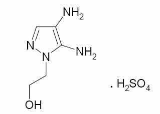

---

황산2-아미노-5-니트로페놀

2-Amino-5-nitrophenol Sulfate

2-아미노-5-니트로페놀황산염

황산5-니트로-o-아미노페놀

황산5-니트로-2-아미노페놀

황산2-아미노-5-니트로페놀

C6H6N2O3ㆍ1/2H2SO4 : 203.16

이원료를건조한것은정량할때황산2-아미노-5-니트로페놀(C6H6N2O3ㆍ1/2H2SO4)

95.0 % 이상을함유한다.

성

상

이원료는녹색을띠는황갈색의가루로서냄새는거의없다.

확인시험

1) 이원료의수용액(1 →2500) 10 mL에염화제이철시액5 방울을넣을

때액은황갈색을나타낸다.

2) 이원료0.5 ｇ을물100 mL에넣어녹여여과한다. 여액5 mL에염화바륨시액

5 방울을넣을때백탁이된다.

3) 이원료및p-니트로아닐린표준품각10 mg을이소프로판올ㆍ물ㆍ강암모니아수

(9：3：1) 혼합액1 mL씩에넣어녹인다음각각에아황산수소나트륨0.1 ｇ을넣어

흔들어섞어검액및표준액으로한다. 검액및표준액1 μL를박층판에점적하고

이소프로필에텔ㆍ아세톤ㆍ이소프로판올(10：1：1) 혼합액을전개용매로하여박층크

로마토그래프법에따라시험한다. 발색제로p-디메칠아미노벤즈알데히드ㆍ묽은염산

용액(1 →200) 을뿌릴때p-니트로아닐린표준품에대하여Rs 값1.0 부근에서주

황색의반점을나타낸다.

4) 이원료20 mg을물100 mL에넣어녹이고이액10 mL를취하여물을넣어

100 mL로한다. 이액을가지고자외가시부흡광도측정법에따라흡수스펙트럼을측

정할때파장257 ± 2 nm 에서흡수극대를나타낸다.

순도시험

1) 용해상태

이원료0.1 ｇ을묽은염산20 mL에넣어녹일때액은황색

을나타내며맑다.

2) 철

이원료1.0 ｇ을정밀하게달아황산5 방울을넣어적시고천천히가열하

여저온에서거의회화또는휘산시킨다음다시황산으로적시고완전히회화한다.

식힌다음잔류물에염산0.5 mL를넣고수욕상에서증발건고한다. 잔류물에묽은염

산3 방울을넣어가온하고물25 mL를넣어녹인다. 이것을검액으로하여시험한

다. 비교액에는철표준액2.0 mL를넣는다(20 ppm 이하).

3) 중금속

이원료1.0 ｇ을황산5 mL 및질산20 mL에넣고가만히가열한다.

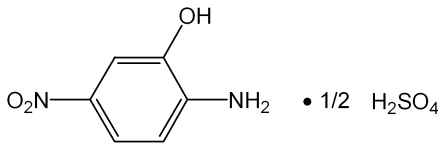

---

때때로질산2 ∼3 mL씩을추가하여액이무색∼엷은황색이될때까지가열한

다. 식힌다음물10 mL 및페놀프탈레인시액1 방울을넣고암모니아시액을액이

엷은적색이될때까지천천히넣고묽은초산2 mL를넣고필요하면여과한다. 잔류

물을물10 mL로씻고씻은액을여액과합하고물을넣어50 mL로한다. 이것을

검액으로하여시험한다. 비교액에는납표준액3.0 mL를넣는다(30 ppm이하).

4) 비소

이원료1.0 ｇ을황산2 mL 및질산5 mL에넣어가만히가열한다. 때때

로질산2 ∼3 mL 씩을추가하여액이무색∼엷은황색이될때까지가열한다.

식힌다음포화수산암모늄용액15 mL를넣고흰연기가발생할때까지가열한다. 식

힌다음물을넣어서10 mL로한다. 이것을검액으로하여시험한다(2 ppm 이하).

건조감량

5.0 % 이하(1.5 ｇ, 105 ℃, 2 시간)

강열잔분

0.2 % 이하(2 ｇ, 제2 법)

정량법

이원료를105 ℃에서2 시간건조하고그약0.18 ｇ을정밀하게달아아

연(입상) 2 ｇ, 물15 mL 및염산15 mL에넣어조심하면서증발건고한다. 식힌다

음질소정량법에따라시험한다.

0.05 mol/L 황산1 mL = 10.158 mg C6H6N2O3ㆍ1/2H2SO4

저장법

기밀용기

황산5-아미노-o-크레솔

5-Amino-o-Cresol Sulfate

5-아미노-o-크레솔황산염

C7H9NO ㆍ 1/2H2SO4 :

172.19

이원료를건조한것은정량할때황산5-아미노-o-크레솔(C7H9NO ㆍ 1/2H2SO4)

95.0 % 이상을함유한다.

성

상

이원료는흰색∼엷은갈색의결정또는결정성가루로냄새는거의없다.

확인시험

1) 이원료의수용액(1 →200) 5 mL에염화제이철시액5 방울을넣을때

액은황갈색을나타낸다.

2) 이원료의수용액( 1 →200) 5 mL에염화바륨시액5 방울을넣을때액은백탁

이된다.

---

3) 이원료및p-니트로아닐린표준품각10 mg을이소프로판올ㆍ물ㆍ강암모니아수

(9：3：1) 혼합액1 mL에넣어녹인다음각각에아황산수소나트륨0.1 ｇ을넣어

흔들어섞은다음검액및표준액으로한다. 검액및표준액1 μL를박층판에점적

하고이소프로필에텔ㆍ아세톤ㆍ이소프로판올(10：1：1)

혼합액을전개용매로하여

박층크로마토그래프법에따라시험한다. 발색제로p-디메칠아미노벤즈알데히드ㆍ묽

은염산용액(1 →200)을뿌릴때p-니트로아닐린표준품에대하여Rs 값0.7 부근에

황색의반점을나타낸다.

4) 이원료50 mg을물에넣어녹여100 mL로한다. 이액10 mL를취하여물을

넣어100 mL로한다. 이액을가지고자외가시부흡광도측정법에따라흡수스펙트럼

을측정할때파장273 ± 2 nm에서흡수극대를나타낸다.

순도시험

1) 용해상태

이원료0.5 ｇ을묽은염산20 mL에넣어녹일때액은무색

∼엷은황갈색을나타내며거의맑다.

2) 에텔가용물

이원료1.0 ｇ을달아에텔50 mL에넣고환류냉각기를달아수욕

중에서때때로흔들어주면서1 시간끓인다. 뜨거울때미리질량을단플라스크에

유리여과기(G3)로여과한다. 잔류물을에텔20 mL로씻고씻은액및여액을합하여

수욕상에서증발건고하고105 ℃에서30 분간건조하여질량을단다(1.0 % 이하).

3) 철

이원료1.0 ｇ을달아황산5 방울을넣어적시고천천히가열하여낮은온

도에서거의회화또는휘산시킨다음다시황산을넣어적시고완전히회화한다. 식

힌다음잔류물에염산0.5 mL를넣고수욕상에서증발건고한다음묽은염산3 방울

을넣어가온하고물을넣어25 mL로한다. 이것을검액으로하여시험한다. 비교액

에는철표준액2.0 mL를넣는다(20 ppm 이하).

4) 중금속

이원료1.0 ｇ을달아황산5 mL 및질산20 mL를넣고가만히가열

한다. 때때로질산2 ∼3 mL씩을추가하여액이무색∼엷은황색이될때까지가

열을계속한다. 식힌다음물10 mL 및페놀프탈레인시액1 방울을넣고암모니아시

액을액이엷은적색이될때까지천천히넣고묽은초산2 mL를넣고필요하면여

과한다. 잔류물을물10 mL로씻고씻은액은여액과합하고물을넣어50 mL로한

다. 이것을검액으로하여시험한다. 비교액에는납표준액2.0 mL를넣는다(20 ppm

이하).

4) 비소

이원료1.0 ｇ을정밀하게달아황산2 mL 및질산5 mL에넣어가만히

가열한다. 때때로질산2 ∼3 mL씩을추가하면서액이무색∼엷은황색이될때

까지가열을계속한다. 식힌다음포화수산암모늄용액15 mL를넣어흰연기가발생

할때까지가열한다. 식힌다음물을넣어10 mL로한다. 이것을검액으로하여시

험한다(2 ppm 이하).

건조감량

1.0 % 이하(1 ｇ, 105 ℃, 2 시간)

강열잔분

0.2 % 이하(1 ｇ, 제1 법)

정량법

이원료를건조하여약0.31 ｇ을정밀하게달아질소정량법에따라시험한다.

0.05 mol/L 황산1 mL = 17.219 mg C7H9NOㆍ1/2H2SO4

---

저장법

기밀용기

황산m-아미노페놀

m-Aminophenol Sulfate

m-아미노페놀황산염

황산3-아미노페놀

C6H7NOㆍ1/2H2SO4 :

158.17

이원료를건조한것은정량할때황산m-아미노페놀(C6H7NOㆍ1/2H2SO4) 97.0 %

이상을함유한다.

성

상

이원료는흰색∼회색의결정성가루또는침상결정으로특이한냄새가있다.

확인시험

1) 이원료의수용액(1 →100) 10 mL에염화제이철시액5 방울을넣을때

액은자갈색∼엷은자색을나타낸다.

2) 이원료의수용액(1 →1000) 5 mL에묽은염산2 mL 및아질산나트륨시액3

mL를넣고여기에2, 4-디니트로페놀용액(1 →1000) 0.5 mL를넣을때액은주황

색을나타낸다.

3) 이원료의수용액(1 →100) 10 mL에염화바륨시액5 방울을넣을때액은백탁

이된다.

4) 이원료50 mg을물100 mL에넣어녹이고이액10 mL를취하여물을넣어

100 mL로한다. 이액을가지고자외가시부흡광도측정법에따라흡수스펙트럼을측

정할때파장272 ± 2 nm 및277 ± 2 nm 에서흡수극대를나타낸다.

5) 이원료및m-아미노페놀표준품각10 mg을이소프로판올ㆍ물ㆍ강암모니아수

(9：3：1) 혼합액1 mL에넣어녹인다음각각에아황산수소나트륨0.1 ｇ을넣어

흔들어섞어검액및표준액으로한다. 검액및표준액1 μL씩을박층판에점적하고

이소프로필에텔ㆍ아세톤ㆍ이소프로판올(10：1：1) 혼합액을전개용매로하여박층크

로마토그래프법에따라시험한다. 발색제로p-디메칠아미노벤즈알데히드ㆍ묽은염산

용액(1 →200)을뿌릴때표준품과같은Rf값에서황색의반점을나타낸다.

순도시험

1) 용해상태

이원료0.5 ｇ을물50 mL에넣어녹일때액은무색이며

맑다.

2) 철

이원료0.5 ｇ을달아황산5 방울을넣어적시고천천히가열하여저온에

서거의회화또는휘산시킨다음황산으로적시고완전히회화한다. 식힌다음잔류

물에염산0.5 mL를넣고수욕상에서증발건고한다. 잔류물에묽은염산3 방울을넣

어가온하고물을넣어녹여25 mL로한다. 이것을검액으로하여시험한다. 비교액

에는철표준액2.0 mL를넣는다(40 ppm 이하).

---

3) 에텔가용물

이원료약1 ｇ을정밀하게달아에텔50 mL에넣고환류냉각기

를달아수욕상에서때때로흔들어섞으면서1 시간끓인다음뜨거울때미리질량

을단플라스크에유리여과기(G3)로여과한다. 잔류물을에텔20 mL로씻고씻은액

및여액을합하여수욕상에서증발건고하고105 ℃에서30 분간건조하여질량을

단다(1 % 이하).

4) 중금속

이원료1.0 ｇ을황산5 mL 및질산20 mL에넣어가만히가열한다.

때때로질산2 ∼3 mL씩을추가하여액이무색∼엷은황색이될때까지가열한

다. 식힌다음물10 mL 및페놀프탈레인시액1 방울을넣고암모니아시액을액이

엷은적색이될때까지천천히넣고묽은초산2 mL를넣고필요하면여과한다. 잔류

물을물10 mL로씻고씻은액을여액과합하고물을넣어50 mL로한다. 이것을

검액으로하여시험한다. 비교액에는납표준액2.0 mL를넣는다(20 ppm 이하).

5) 비소

이원료1.0 ｇ을황산2 mL 및질산5 mL에넣어가만히가열한다. 때때

로질산2 ∼3 mL씩을추가하여액이무색∼엷은황색이될때까지가열하고식

힌다음포화수산암모늄용액15 mL를넣어흰연기가발생할때까지가열한다. 식힌

다음물을넣어10 mL로한다. 이것을검액으로하여시험한다(2 ppm 이하).

건조감량

0.2 % 이하(1.5 ｇ, 105 ℃, 2 시간)

강열잔분

0.2 % 이하(2 ｇ, 제2 법)

정량법

이원료를건조하고약0.28 ｇ을정밀하게달아질소정량법에따라시험한다.

0.05 mol/L 황산1 mL = 15.816 mg C6H7NOㆍ1/2H2SO4

저장법

기밀용기

황산o-아미노페놀

o-Aminophenol Sulfate

o-아미노페놀황산염

황산2-아미노페놀

C6H7NOㆍ1/2H2SO4 :

158.17

이원료를건조한것은정량할때황산o-아미노페놀(C6H7NO ㆍ 1/2H2SO4) 95.0 %

이상을함유한다.

성

상

이원료는흰색∼엷은갈색의결정성가루로서냄새는없거나약간특이한

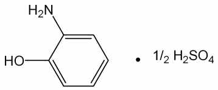

---

냄새가있다.

확인시험

1) 이원료의수용액(1 →100) 10 mL에염화제이철시액5 방울을넣을때

액은적자색∼진한갈색을나타낸다.

2) 이원료의수용액(1 →100) 10 mL에질산은시액5 방울을넣을때액은황갈색

을나타내며서서히회흑색으로변하며혼탁한다.

3) 이원료의수용액(1 →100) 10 mL에염화바륨시액5 방울을넣을때액은백탁

이된다.

4) 이원료및p-니트로아닐린표준품각10 mg 을이소프로판올ㆍ 물ㆍ 강암모

니아수(9：3：1) 혼합액1 mL에넣어녹인다음각각에아황산수소나트륨0.1 ｇ을

넣어흔들어섞어검액및표준액으로한다. 검액및표준액1 μL씩을박층판에점

적하고이소프로필에텔ㆍ 아세톤ㆍ 이소프로판올(10：1：1) 혼합액을전개용매로

하여박층크로마토그래프법에따라시험한다. 발색제로p-디메칠아미노벤즈알데히드

ㆍ 묽은염산용액(1 →200) 을뿌릴때p-니트로아닐린표준품에대하여Rs 값1.0

부근에서황색의반점을나타낸다.

5) 이원료50 mg을물100 mL에넣어녹이고이액10 mL를취하여물을넣어

100 mL로한다. 이액을가지고자외가시부흡광도측정법에따라흡수스펙트럼을측

정할때파장272 ± 2 nm 에서흡수극대를나타낸다.

순도시험

1) 용해상태

이원료0.1 ｇ을묽은염산10 mL에넣어녹일때액은주황

색을띤갈색이고맑다.

2) 에텔가용물

이원료약1 ｇ을정밀하게달아에텔50 mL에넣어환류냉각기

를달아수욕상에서때때로흔들어섞으면서1 시간끓인다음뜨거울때미리질량

을단플라스크에유리여과기(G3)로여과한다. 잔류물을에텔20 mL로씻고씻은액

및여액을합하여수욕상에서증발건고하고105 ℃에서30 분간건조하여질량을

단다(1 % 이하).

3) 철

이원료0.50 ｇ을달아황산5 방울을넣어적시고천천히가열하여저온에

서거의회화또는휘산시킨다음다시황산으로적시고완전히회화한다. 식힌다음

잔류물에염산0.5 mL를넣고수욕상에서증발건고한다. 잔류물에묽은염산3 방울

을넣고가온하여물을넣어50 mL로한다. 이액25 mL를취하여검액으로하여

시험한다. 비교액에는철표준액2.0 mL를넣는다(80 ppm 이하).

4) 중금속

이원료1.0 ｇ을황산5 mL 및질산20 mL에넣어가만히가열한다.

때때로질산2 ∼3 mL씩을추가하여액이무색∼엷은황색이될때까지가열한

다. 식힌다음물10 mL 및페놀프탈레인시액1 방울을넣고암모니아시액을액이

엷은적색이될때까지천천히넣고묽은초산2 mL를넣고필요하면여과한다. 잔류

물을물10 mL로씻고씻은액을여액과합하여물을넣어50 mL로한다. 이것을

검액으로하여시험한다. 비교액에는납표준액2.0 mL를넣는다(20 ppm 이하).

5) 비소

이원료1.0 ｇ을황산2 mL 및질산5 mL에넣어가만히가열한다. 때때

로질산2 ∼3 mL씩을추가하여액이무색∼엷은황색이될때까지가열한다. 식

힌다음포화수산암모늄용액15 mL를넣고흰연기가발생할때까지가열한다. 식힌

다음물을넣어10 mL로한다. 이액을검액으로하여시험한다(2 ppm 이하).

---

건조감량

0.3 % 이하(2 ｇ, 105 ℃, 2 시간)

강열잔분

1.0 % 이하(2 ｇ, 제2 법)

정량법

이원료를건조하고약0.28 ｇ을정밀하게달아질소정량법에따라시험한다.

0.05 mol/L 황산1 mL = 15.816 mg C6H7NOㆍ1/2H2SO4

저장법

기밀용기

황산p-아미노페놀

p-Aminophenol Sulfate

p-아미노페놀황산염

황산4-아미노페놀

C6H7NO ㆍ 1/2H2SO4 :

158.17

이원료를건조한것은정량할때황산p-아미노페놀(C6H7NO ㆍ 1/2H2SO4) 95.0 %

이상을함유한다.

성

상

이원료는흰색∼엷은회갈색의가루또는침상결정으로서냄새는거의

없다.

확인시험

1) 이원료의수용액(1 →100) 10 mL에염화제이철시액5 방울을넣을때

액은자색을나타낸다.

2) 이원료의수용액(1 →100) 10 mL에인텅그스텐산용액(1 →100) 2 mL 및탄산

나트륨시액1 mL를넣을때액은청자색을나타낸다.

3) 이원료의수용액(1 →100) 5 mL에니트로프루싯나트륨시액2 mL를넣을때

액은엷은녹색을나타낸다.

4) 이원료의수용액(1 →100) 10 mL에염화바륨시액5 방울을넣을때액은백탁

이된다.

5) 이원료및p-아미노페놀표준품각10 mg을이소프로판올ㆍ 물ㆍ 강암모니아

수(9：3：1) 혼합액1 mL에넣어녹인다음각각에아황산수소나트륨0.1 ｇ을넣어

흔들어섞은다음검액및표준액으로한다. 검액및표준액1 μL씩을박층판에점

적하고이소프로필에텔ㆍ 아세톤ㆍ 이소프로판올(10：1：1) 혼합액을전개용매로

하여박층크로마토그래프법에따라시험한다. 발색제로p-디메칠아미노벤즈알데히드

ㆍ 묽은염산용액(1 →200) 을뿌릴때표준품과같은Rf값에서황색의반점을나타

낸다.

6) 이원료50 mg을물100 mL에넣어녹이고이액10 mL를취하여물을넣어

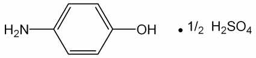

---

100 mL로한다. 이액을가지고자외가시부흡광도측정법에따라흡수스펙트럼을측

정할때파장273 ± 2 nm 에서흡수극대를나타낸다.

순도시험

1) 용해상태

이원료0.5 ｇ을묽은염산20 mL에넣어녹일때액은무

색이며맑다.

2) 철

이원료1.0 ｇ을달아황산5 방울을넣어적시고천천히가열하여저온에

서거의회화또는휘산시킨다음다시황산을넣어적시고완전히회화한다. 식힌

다음잔류물에염산0.5 mL를넣어수욕상에서증발건고한다음묽은염산3 방울을

넣어가온하여물25 mL를넣어녹인다. 이것을검액으로하여시험한다. 비교액에

는철표준액3.0 mL를넣는다(30 ppm 이하).

3) 에텔가용물

이원료

1 ｇ을달아에텔50 mL를넣고환류냉각기를달아수욕

상에서때때로흔들어섞으면서1 시간끓인다음뜨거울때미리질량을단플라스

크에유리여과기(G3)로여과한다. 잔류물을에텔20 mL로씻고씻은액및여액을

합하여수욕상에서증발건고하고105 ℃에서30 분간건조시켜질량을단다(1 %

이하).

4) 중금속

이원료1.0 ｇ을황산5 mL 및질산20 mL에넣어가만히가열한다.

때때로질산2 ∼3 mL 씩을추가하여액이무색∼엷은황색이될때까지가열한

다. 식힌다음물10 mL 및페놀프탈레인시액1 방울을넣고암모니아시액을액이

엷은적색이될때까지천천히넣고묽은초산2 mL를넣고필요하면여과한다. 잔류

물을물10 mL로씻고씻은액을여액과합하고물을넣어50 mL로한다. 이것을

검액으로하여시험한다. 비교액에는납표준액2.0 mL를넣는다(20 ppm 이하).

5) 비소

이원료1.0 ｇ을황산2 mL 및질산5 mL에넣어가만히가열한다. 때때

로질산2 ∼3 mL 씩을추가하여액이무색∼엷은황색이될때까지가열한다.

식힌다음포화수산암모늄용액15 mL를넣고흰연기가발생할때까지가열한다. 식

힌다음물을넣어10 mL로한다. 이것을검액으로하여시험한다(2 ppm 이하).

건조감량

0.2 % 이하(1.5 ｇ, 105 ℃, 2 시간)

강열잔분

0.2 % 이하(2 ｇ, 제2 법)

정량법

이원료를건조하고약0.28 ｇ을정밀하게달아질소정량법에따라시험한다.

0.05 mol/L 황산1 mL = 15.816 mg C6H7NO ㆍ 1/2H2SO4

저장법

기밀용기

황산m-페닐렌디아민

m-Pheylenediamine sulfate

---

m-페닐렌디아민황산염

황산1,3-페닐렌디아민

C6H8N2ㆍH2SO4 :

206.22

이원료를건조한것은정량할때황산m-페닐렌디아민(C6H8N2ㆍH2SO4) 90.0 % 이

상을함유한다.

성

상

이원료는흰색∼엷은갈색의가루로서약간특이한냄새가있다.

확인시험

1) 이원료의수용액(1 →100) 5 mL에질산은시액5 방울을넣어가열하

면액은엷은자색을나타낸다.

2) 이원료의수용액(1 →100) 10 mL에아질산나트륨시액2 방울을넣을때액은

적갈색을나타낸다.

3) 이원료의수용액(1 →100) 5 mL에염화바륨시액5 방울을넣을때흰색의침

전이생긴다.

4) 이원료20 mg을물에넣어녹여100 mL로한다. 이액10 mL를취하여물을

넣어100 mL로하여이액을가지고자외가시부흡광도측정법에따라흡수스펙트럼

을측정할때파장235 ± 2 nm 및285 ± 2 nm 에서흡수극대를나타낸다.

5) 이원료및염산m-페닐렌디아민표준품각10 mg을이소프로판올ㆍ 물ㆍ 강

암모니아수(9：3：1) 혼합액1 mL 씩에넣어녹인다음각각에아황산수소나트륨

0.1 ｇ을넣어흔들어섞어검액및표준액으로한다. 검액및표준액1 μL를박층판

에점적하고이소프로필에텔ㆍ아세톤ㆍ이소프로판올(10：1：1) 혼합액을전개용매로

하여박층크로마토그래프법에따라시험한다. 발색제로p-디메칠아미노벤즈알데히드

ㆍ묽은염산용액(1 →200)을뿌릴때표준품과같은Rf 값에서적색을띠는황색의

반점을나타낸다.

순도시험

1) 용해상태

이원료0.5 ｇ을묽은염산1 mL에넣어녹일때액은엷은

주황색이며맑다.

2) 철

이원료1.0 ｇ을정밀하게달아황산5 방울을넣어적시고천천히가열하

여저온에서거의회화또는휘산시킨다음다시황산을넣어적시고완전히회화한

다. 식힌다음잔류물에염산0.5 mL를넣고수욕상에서증발건고한다음잔류물에

묽은염산3 방울을넣어가온하고물25 mL를넣어녹인다. 이것을검액으로하여

시험한다. 비교액에는철표준액2.0 mL를넣는다(20 ppm 이하).

3) 에텔가용물

이원료약1 ｇ을정밀하게달아에텔50 mL에넣고환류냉각기

를달아수욕상에서유리여과기(G3)로여과한다. 잔류물을에텔20 mL로씻고씻은

액및여액을합하여수욕상에서증발건고하고105 ℃에서30 분간건조하여질량

을단다(1 % 이하).

---

4) 중금속

이원료1.0 ｇ을황산5 mL 및질산20 mL에넣어가만히가열한다.

때때로질산2 ∼3 mL씩을추가하여액이무색∼엷은황색이될때까지가열하

고식힌다음물10 mL 및페놀프탈레인시액1 방울을넣고암모니아시액을액이

엷은적색이될때까지천천히넣고묽은초산2 mL를넣고필요하면여과한다. 잔류

물을물10 mL로씻고씻은액을여액과합하고물을넣어50 mL로한다. 이것을

검액으로하여시험한다. 비교액에는납표준액2.0 mL를넣는다(20 ppm 이하).

5) 비소

이원료1.0 ｇ을황산2 mL 및질산5 mL에넣어가만히가열한다. 때때

로질산2 ∼3 mL씩을추가하여액이무색∼엷은황색이될때까지가열한다. 식

힌다음포화수산암모늄용액15 mL를넣어흰연기가발생할때까지가열한다. 식힌

다음물을넣어10 mL로한다. 이것을검액으로하여시험한다(2 ppm 이하).

건조감량

0.2 % 이하(1.5 ｇ, 실리카겔, 4 시간)

강열잔분

0.2 % 이하(2 ｇ, 제1 법)

정량법이원료를건조하고약0.18 ｇ을정밀하게달아질소정량법에따라시험한다.

0.05 mol/L 황산1 mL = 10.311 mg　C6H8N2ㆍH2SO4

저장법

기밀용기

황산N,N-비스(2-히드록시에칠)-p-페닐렌디아민

N,N-Bis(2-hydroxyethyl)-p-phenylenediamine Sulfate

N,N-비스(2-히드록시에틸)-p-페닐렌디아민황산염

N,N-비스(2-히드록시에칠)-p-페닐렌디아민설페이트

2,2‘-[(4-아미노페닐)이미노]비스에탄올설페이트

C10H18N2O6S : 294.32

이원료를건조한것은정량할때황산N,N-비스(2-히드록시에칠)-p-페닐렌디아민

(C10H18N2O6S) 95.0 % 이상을함유한다.

성

상

이원료는회백색, 밝은회색또는분홍색의결정또는가루이며냄새는거

의없다.

확인시험

1) 이원료및황산N,N-비스(2-히드록시에칠)-p-페닐렌디아민표준품을가

---

지고적외부스펙트럼측정법중페이스트법에따라적외부스펙트럼을측정할때같은

파수에서같은강도의흡수를나타낸다.

2) 이원료약10 mg을50 % 메탄올1 mL에넣어녹여검액으로한다. 따로황산

N,N-비스(2-히드록시에칠)-p-페닐렌디아민표준품약10 mg을50 % 메탄올1 mL에

넣어녹여표준액으로한다. 검액및표준액5 μL씩을취하여박층판에점적하고에

텔을전개용매로박층크로마토그래프법에따라시험한다. 박층판을70 ℃에서1분간

방치하고발색제로p-디메칠아미노벤즈알데히드ㆍ묽은염산용액(0.5 →100)을뿌릴

때검액및표준액의반점은같은Rf 값에서같은색상을나타낸다.

융

점

163 ∼171 ℃(제1 법)

순도시험

1) 용해상태

이원료약0.1 g을묽은염산10 mL에넣어녹일때액은

무색을나타내며거의맑다.

2) 철

이원료1.0 g을달아황산5 방울을넣어적시고천천히가열하여저온에서

거의회화또는휘산시킨다음다시황산으로적시고완전히회화한다. 식힌다음잔

류물에염산0.5 mL를넣어수욕상에서증발건고하고잔류물에묽은염산3 방울을

넣고가온한다음물을넣어50.0 mL로한다. 이액10 mL를취하여검액으로한다.

비교액에는철표준액2.0 mL를넣는다(100 ppm 이하).

3) 중금속

이원료1.0 g을황산2 mL 및질산20 mL에넣어가만히가열한다.

때때로질산2 ∼3 mL씩을추가하여액이무색∼엷은황색이될때까지가열한

다. 식힌다음물10 mL 및페놀프탈레인시액1 방울을넣고암모니아시액을액이

엷은적색이될때까지한방울씩넣고필요하면여과하여물10 mL로씻고여액과

씻은액을네슬러관에넣어물을넣어50 mL로한다. 이것을검액으로한다. 비교액

에는납표준액2.0 mL를넣는다(20 ppm 이하).

4) 비소

이원료1.0 g을황산2 mL 및질산5 mL에넣어가만히가열한다. 때때

로질산2 ∼3 mL씩을추가하여액이무색∼엷은황색이될때까지가열한다.

식힌다음포화수산암모늄용액15 mL를넣고흰연기가발생할때까지가열한다음

식히고물을넣어10 mL로한다. 이것을검액으로하여시험한다(2 ppm 이하).

건조감량

6.5 % 이하(1 g, 황산, 4시간)

강열잔분

2.0 % 이하(2 g, 제1 법)

정량법이원료를건조하고약0.3 g을정밀하게달아질소정량법제2 법에따라

시험한다.

0.05 mol/L 황산1 mL = 14.7165 mg C10H18N2O6S

저장법

기밀용기

황산o-클로로-p-페닐렌디아민

o-Chloro-p-pheylenediamine Sulfate

---

o-클로로-p-페닐렌디아민황산염

황산2-클로로-p-페닐렌디아민

황산2-클로로-1,4-페닐렌디아민

C6H7ClN2

ㆍH2SO4

: 240.66

이원료를건조한것은정량할때황산o-클로로-p-페닐렌디아민(C6H7ClN2ㆍH2SO4)

95.0 % 이상을함유한다.

성

상

이원료는엷은자색∼자색의가루로서약간특이한냄새가있다.

확인시험

1) 이원료1 ｇ을물100 mL에넣어잘흔들어섞은다음여과하여여액

을검액으로한다. 검액5 mL에질산은시액5 방울을넣고가온할때액은자갈색을

나타낸다.

2) 1)의검액5 mL에염화바륨시액5 방울을넣을때액은흰색의침전이생긴다.

3) 1)의검액3 mL에풀푸랄ㆍ초산시액4 방울을넣을때액은주황색을나타낸다.

4) 이원료0.2 ｇ에물1 방울을넣어적시고구리망에묻혀식품첨가물공전일반

시험법중염색반응시험법에따라시험할때녹색을나타낸다.

5) 이원료및염산m-페닐렌디아민표준품각10 mg을이소프로판올ㆍ물ㆍ강암모

니아수(9：3：1) 혼합액1 mL에넣어녹인다음각각에아황산수소나트륨0.1 ｇ을

넣어흔들어섞어검액및표준액으로한다. 검액및표준액1 mL를박층판에점적

하고이소프로필에텔ㆍ아세톤ㆍ이소프로판올(10：1：1) 혼합액을전개용매로하여박

층크로마토그래프법에따라시험한다. 발색제로p-디메칠아미노벤즈알데히드ㆍ묽은

염산용액(1 →200) 을뿌릴때염산m-페닐렌디아민표준품에대하여Rs 값1.8 부

근에서주황색∼적색의반점을나타낸다.

6) 이원료10 mg을물100 mL에넣어녹이고이액10 mL를취하여물을넣어

100 mL로한다. 이액을가지고자외가시부흡광도측정법에따라흡수스펙트럼을측

정할때파장238 ± 2 nm 및292 ± 2 nm에서흡수극대를나타낸다.

순도시험

1) 용해상태

이원료0.2 ｇ을묽은염산20 mL에넣어녹일때액은어두

운적색∼엷은적자색이며거의맑다.

2) 철

이원료1.0 ｇ을달아황산5 방울을넣어적시고천천히가열하고저온에

서거의회화또는휘산시킨다음다시황산을넣어적시고완전히회화한다. 식힌

다음잔류물에염산0.5 mL를넣어수욕상에서증발건고한다. 잔류물에묽은염산3

방울을넣고가온하여물25 mL를넣어녹인다. 이것을검액으로하여시험한다. 비

교액에는철표준액2.0 mL를넣는다(20 ppm 이하).

3) 에텔가용물

이원료1 ｇ을달아에텔50 mL에넣고환류냉각기를달아수욕

상에서때때로흔들어섞으면서1 시간끓인다음뜨거울때미리질량을단플라스

크에유리여과기(G3)로여과하고잔류물을에텔20 mL로씻고씻은액및여액을

---

합하여수욕상에서증발건고한다음105 ℃에서30 분간건조하여질량을단다(3

% 이하).

4) 중금속

이원료1.0 ｇ을황산5 mL 및질산20 mL에넣어가만히가열한다.

식힌다음물10 mL 및페놀프탈레인시액1 방울을넣고암모니아시액을액이엷은

적색이될때까지천천히넣고묽은초산2 mL를넣고필요하면여과한다. 잔류물을

물10 mL로씻고씻은액을여액과합하고물을넣어50 mL로한다. 이것을검액으

로하여시험한다. 비교액에는납표준액2.0 mL를넣는다(20 ppm 이하).

5) 비소

이원료1.0 ｇ을황산2 mL 및질산5 mL에넣어가만히가열한다. 때때

로질산2 ∼3 mL 씩을추가하여액이무색∼엷은황색이될때까지가열한다.

식힌다음포화수산암모늄용액15 mL를넣어흰연기가발생할때까지가열한다. 식

힌다음물을넣어10 mL로한다. 이것을검액으로하여시험한다(2 ppm 이하).

건조감량

1.0 % 이하(1 ｇ, 105 ℃, 2 시간)

강열잔분

2.0 % 이하(1 ｇ, 제1 법)

정량법

이원료를건조하고약0.21 ｇ을정밀하게달아질소정량법에따라시험한다.

0.05 mol/L 황산1 mL = 12.033 mg　C6H7ClN2ㆍH2SO4

저장법

기밀용기

---

황산p-니트로-o-페닐렌디아민

p-Nitro-o-Phenylenediamine Sulfate

p-니트로-o-페닐렌디아민황산염

황산4-니트로-o-페닐렌디아민

황산4-니트로-1,2-페닐렌디아민

C6H7N3O2

ㆍ1/2H2SO4 : 202.18

이

원료를

건조한

것은

정량할

때

황산

p-니트로-o-페닐렌디아민(C6H7N3O2

ㆍ

1/2H2SO4) 97.0 % 이상을함유한다.

성

상

이원료는다갈색∼회갈색의가루로서냄새는거의없다.

확인시험

1) 이원료0.5 ｇ을물100 mL에넣어녹이고여과한다. 여액5 mL에염

화바륨시액5 방울을넣을때액은백탁이된다.

2) 이원료10 mg을물에녹여100 mL로한다. 이액20 mL를취하여물을넣어

100 mL로한다. 이액을가지고자외가시부흡광도측정법에따라흡수스펙트럼을측

정할때파장264 ± 2 nm 에서흡수극대를나타낸다.

3) 이원료및p-니트로아닐린표준품각10 mg 을이소프로판올ㆍ물ㆍ강암모니아

수(9：3：1) 혼합액1 mL에넣어녹인다음각각에아황산수소나트륨0.1 ｇ을넣어

흔들어섞어검액및표준액으로한다. 검액및표준액1 μL씩을박층판에점적하고

이소프로필에텔ㆍ 아세톤ㆍ 이소프로판올(10：1：1) 혼합액을전개용매로하여박

층크로마토그래프법에따라시험한다. 발색제로p-디메칠아미노벤즈알데히드ㆍ 묽

은염산용액(1 →200) 을뿌릴때p-니트로아닐린표준품에대하여Rf 값0.7 부근에

서적색을띠는황색∼황색의반점을나타낸다.

순도시험

1) 용해상태

이원료50 mg을물100 mL에넣어녹일때액은황갈색이

고거의맑다.

2) 에텔가용물

이원료1 ｇ을달아에텔50 mL에넣고환류냉각기를달아수욕

상에서때때로흔들어섞으면서1 시간끓인다음뜨거울때미리질량을단플라스

크에유리여과기(G4)로여과한다. 잔류물을에텔20 mL로씻고씻은액및여액을

합하여수욕상에서증발건고하고105 ℃에서30 분간건조시켜질량을단다(1 %

이하).

3) 철

이원료0.4 ｇ을달아황산5 방울을넣어적시고천천히가열하여저온에

서거의회화또는휘산시킨다음다시황산을넣어적시고완전히회화한다. 식힌

다음잔류물에염산0.5 mL를넣어수욕상에서증발건고한다음묽은염산3 방울을

넣고가온하여25 mL를넣어녹인다. 이것을검액으로하여시험한다. 비교액에는

철표준액2.0 mL를넣는다(50 ppm 이하).

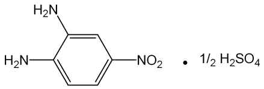

---

4) 비소

이원료1.0 ｇ을황산2 mL 및질산5 mL에넣어가만히가열한다. 때때

로질산2 ∼3 mL 씩을추가하여액이무색∼엷은황색이될때까지가열한다.

식힌다음포화수산암모늄용액15 mL를넣어흰연기가발생할때까지가열한다. 식

힌다음물을넣어10 mL로한다. 이것을검액으로하여시험한다(2 ppm 이하).

5) 중금속

이원료1.0 ｇ을황산5 mL 및질산20 mL에넣어가만히가열한다.

때때로질산2 ∼3 mL 씩을추가하여액이무색∼엷은황색이될때까지가열한

다. 식힌다음물10 mL 및페놀프탈레인시액1 방울을넣고암모니아시액을액이

엷은적색이될때까지천천히넣고묽은초산2 mL를넣고필요하면여과한다. 잔류

물을물10 mL로씻고씻은액을여액과합하면물을넣어50 mL로한다. 이것을

검액으로하여시험한다(10 ppm 이하).

건조감량

1.0 % 이하(1.5 ｇ, 105 ℃, 2 시간)

강열잔분

1.0 % 이하(2 ｇ, 제1 법)

정량법

이원료를건조하고약　0.12 ｇ을정밀하게달아아연(입상) 2 ｇ, 물15

mL 및염산15 mL에넣고조심하면서증발건고한다. 식힌다음질소정량법에따라

시험한다.

0.05 mol/L 황산1 mL = 6.739 mg C6H7N3O2ㆍ1/2H2SO4

저장법

기밀용기

황산p-메칠아미노페놀

p-Methylaminophenol Sulfate

p-메틸아미노페놀황산염

황산4-메칠아미노페놀

C7H9NO ㆍ 1/2H2SO4 :

172.22

이원료를건조한것은정량할때황산p-메칠아미노페놀(C7H9NOㆍ1/2H2SO4) 95.0

% 이상을함유한다.

성

상

이원료는흰색∼엷은회백색의결정성가루로서냄새는거의없다.

확인시험

1) 이원료의수용액(1 →200) 10 mL에염화제이철시액5 방울을넣을때

적자색을나타낸다.

2) 이원료의수용액(1 →200) 10 mL에염화바륨시액5 방울을넣을때백색의침

전이생긴다.

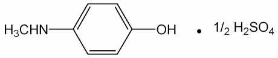

---

3) 이원료및황산p-메칠아미노페놀표준품각10 mg을이소프로판올ㆍ 물ㆍ

강암모니아수(9：3：1) 혼합액1 mL에넣어녹인다음각각에아황산수소나트륨0.1

ｇ을넣어흔들어섞어검액및표준액으로한다. 검액및표준액1 μL씩을박층판

에점적하고이소프로필에텔ㆍ 아세톤ㆍ 이소프로판올(10：1：1) 혼합액을전개용

매로하여박층크로마토그래프법에따라시험한다. 발색제로p-디메칠아미노벤즈알데

히드ㆍ 묽은염산용액(1 →200)을뿌릴때표준품과같은Rf값에서황색의반점을나

타낸다.

4) 이원료50 mg을물250 mL에넣어녹인다. 이액10 mL를취하여물을넣어

100 mL로한다. 이액을가지고자외가시부흡광도측정법에따라흡수스펙트럼을측

정할때파장271 ± 2 nm 및221 ± 2 nm 에서흡수극대를나타낸다.

순도시험

1) 용해상태

이원료0.5 ｇ을묽은염산10 mL에넣어녹일때액은무색

이며맑다.

2) 에텔가용물

이원료1 ｇ을달아에텔50 mL를넣고환류냉각기를달아수욕

상에서때때로흔들어섞으면서1 시간끓인다음뜨거울때미리질량을단플라스

크에유리여과기(G3)로여과한다. 잔류물을에텔20 mL로씻고씻은액및여액을

합하여수욕상에서증발건고하고105 ℃에서30 분간건조하여질량을단다(0.1 %

이하).

3) 철

이원료0.4 ｇ을달아황산5 방울을넣어적시고천천히가열하여저온에

서거의회화또는휘산시킨다음다시황산으로적시고완전히회화한다. 식힌다음

잔류물에염산0.5 mL를넣어수욕상에서증발건고한잔류물에묽은염산3 방울을

넣고가온하여물25 mL에넣어녹인다. 이것을검액으로하여시험한다. 비교액에

는철표준액2.0 mL를넣는다(50 ppm 이하).

4) 중금속

이원료1.0 ｇ을황산5 mL 및질산20 mL에넣고가만히가열한다

음때때로질산2 ∼3 mL 씩을추가하여액이무색∼엷은황색이될때까지가

열한다. 식힌다음물10 mL 및페놀프탈레인시액1 방울을넣고암모니아시액을액

이엷은적색이될때까지천천히넣은다음묽은초산2 mL를넣고필요하면여과

한다. 잔류물을물10 mL로씻고씻은액을여액과합하고물을넣어50 mL로한

다. 이것을검액으로하여시험한다. 비교액에는납표준액3.0 mL를넣는다(30 ppm

이하).

5) 비소

이원료1.0 ｇ을황산2 mL 및질산5 mL에넣어가만히가열한다음

때때로질산2 ∼3 mL 씩을추가하여액이무색∼엷은황색이될때까지가열한

다. 식힌다음포화수산암모늄용액15 mL를넣고흰연기가발생할때까지가열한

다. 식힌다음물을넣어10 mL로한다. 이것을검액으로하여시험한다(2 ppm 이하).

건조감량

1.0 % 이하(1 ｇ, 105 ℃, 2 시간)

강열잔분

0.5 % 이하(1 ｇ, 제1 법)

정량법

이원료를건조하고약0.31 ｇ을정밀하게달아질소정량법에따라시험한다.

0.05 mol/L 황산1 mL = 17.219 mg C7H9NOㆍ1/2H2SO4

---

저장법

기밀용기

황산p-페닐렌디아민

p-Phenylenediamine Sulfate

p-페닐렌디아민황산염

황산1,4-페닐렌디아민

C6H8N2

ㆍH2SO4 :

206.22

이원료를건조한것은정량할때황산p-페닐렌디아민(C6H8N2ㆍH2SO4) 95.0 % 이

상을함유한다.

성

상

이원료는흰색∼엷은자색의가루로서냄새는거의없다.

확인시험

1) 이원료의수용액(1 →1000) 5 mL에질산은시액5 방울을넣을때액

은녹색∼녹갈색을나타내며은이석출된다.

2) 이원료의수용액(1 →1000) 5 mL에염화바륨시액5 방울을넣을때흰색침전

이생긴다.

3) 이원료의수용액(1 →1000) 3 mL에풀푸랄ㆍ초산시액4 방울을넣을때액은

황색을띠는적색∼적갈색을나타낸다.

4) 이원료50 mg을물에넣어녹여100 mL로한다. 이액1 mL를취하여물을

넣어100 mL로한다. 이액을가지고자외가시부흡광도측정법에따라흡수스펙트럼

을측정할때파장234 ± 2 nm 에서흡수극대를나타낸다.

5) 이원료및p-페닐렌디아민표준품각10 mL을이소프로판올ㆍ물ㆍ강암모니아수

(9：3：1) 혼합액1 mL에넣어녹인다음각각에아황산수소나트륨0.1 ｇ을넣어

흔들어섞어검액및표준액으로한다. 검액및표준액1 μL를박층판에점적하고

초산에칠ㆍ메탄올ㆍ물(50：10：8) 혼합액을전개용매로하여박층크로마토그래프법에

따라시험한다. 발색제로p-디메칠아미노벤즈알데히드ㆍ묽은염산용액(1 →200)을뿌

릴때표준품과같은Rf 값에서황색을띠는적색의반점을나타낸다.

순도시험

1) 용해상태

이원료0.5 ｇ을묽은염산30 mL에넣어녹일때액은엷은

갈색또는엷은자색을나타내며맑다.

2) 에텔가용물

이원료1.0 ｇ을달아에텔50 mL 에넣고환류냉각기를달아수

욕상에서때때로흔들어섞으면서1 시간끓인다음뜨거울때미리질량을단플라

스크에유리여과기(G3)로여과한다. 잔류물을에텔20 mL로씻고씻은액및여액을

합하여수욕상에서증발건고하고105 ℃에서30 분간건조하여질량을단다(1 %

이하).

---

3) 철

이원료1.0 ｇ을달아황산5 방울을넣어적시고천천히가열하여되도록

저온에서거의회화또는휘산시킨다음다시황산을넣어적시고완전히회화한다.

식힌다음잔류물에염산0.5 mL를넣고수욕상에서증발건고한다. 잔류물에묽은염

산3 방울을넣고가온하여물25 mL를넣어녹인다. 이것을검액으로하여시험한

다. 비교액에는철표준액2.0 mL를넣는다(20 ppm 이하).

4) 중금속

이원료1.0 ｇ을황산5 mL 및질산20 mL에넣고가만히가열한다.

때때로질산2 ∼3 mL 씩을추가하여액이무색∼엷은황색이될때까지가열한

다. 식힌다음물10 mL 및페놀프탈레인시액1 방울을넣고암모니아시액을액이

엷은적색이될때까지천천히넣고묽은초산2 mL를넣고필요하면여과한다. 잔류

물을물10 mL로씻고씻은액은여액과합하고물을넣어50 mL로한다. 이것을

검액으로하여시험한다. 비교액에는납표준액2.0 mL를넣는다(20 ppm 이하).

5) 비소

이원료1.0 ｇ을황산2 mL 및질산5 mL에넣어가만히가열한다. 식힌

다음포화수산화암모늄용액15 mL를넣어흰연기가발생할때까지가열한다. 식힌

다음물을넣어10 mL로한다. 이것을검액으로하여시험한다(2 ppm 이하).

건조감량

0.2 % 이하(1.5 ｇ, 실리카겔, 4 시간)

강열잔분

0.2 % 이하(2 ｇ, 제1 법)

정량법

이원료를건조하고약0.22 ｇ을정밀하게달아질소정량법에따라시험한다.

0.05 mol/L 황산1 mL = 10.311 mg　C6H8N2 ㆍH2SO4

저장법

기밀용기

황산철수화물

Ferrous Sulfate Hydrate

황산철

황산제일철

황산철(II)칠수화물

FeSO4ㆍ7H2O : 278.02

이원료는정량할때황산철수화물(FeSO4ㆍ7H2O) 98.0 ~ 104.0 %를함유한다.

성

상

이원료는연한초록색의결정또는결정성가루로냄새는없고맛은

수렴성이다. 이원료는물에잘녹으며에탄올(95) 또는에테르에는거의녹지않는다.

이원료는건조공기중에서풍해되기쉬우며습한공기중에서결정의표면이황갈

색으로변한다.

확인시험

이원료의수용액(1 →10)은철(II)염및황산염의정성반응을나타낸다.

순도시험1) 용해상태

이원료1.0 g을물20 mL 및묽은황산1 mL에녹일때액은

맑다.

2) 산

이원료를가루로하여5.0 g을에탄올(95) 50 mL를넣어2 분간흔들

---

어섞은다음여과한다. 여액25 mL에물50 mL, 브롬치몰블루시액3 방울및

묽은수산화나트륨시액0.5 mL를넣을때액은파란색이다.

3) 수은

이조작은차광한용기를써서한다. 이원료약1 g을정밀하게달아희

석시킨질산(1 →10) 30 mL를넣어수욕에서가열하면서녹인다. 얼음욕에빨리넣

어식히고미리희석시킨질산(1 →10)과물로씻은여과기를써서여과한다. 여액

에구연산나트륨용액(1 →4) 20 mL 및염산히드록실아민시액1 mL를넣어검액으

로한다. 따로수은표준액3.0 mL, 희석시킨질산(1 →4) 30 mL, 구연산나트륨용액(1

→4) 5 mL 및염산히드록실아민1 mL를가지고비교액을만든다. 비교액에암모니아

시액을넣어pH를1.8로조정하고검액에는황산을써서pH 1.8로조정하여각각분액

깔때기에옮긴다. 검액및비교액을가지고다음과같이시험한다. 추출용디티존액5

mL 및클로로포름5 mL씩으로2 회추출하고클로로포름추출액은다른분액깔때기에

옮긴다. 여기에희석시킨염산(1 →2) 10 mL를넣어흔들어섞은다음방치하여클로

로포름층은버린다. 산추출액을클로로포름3 mL로씻고씻은액은버린다. 에칠렌디

아민테트라초산디나트륨용액(1 →50) 0.1 mL 및6 mol/L 초산2 mL를넣고섞은다

음암모니아시액5 mL를천천히넣는다. 분액깔때기뚜껑을닫고흐르는찬물로식힌

다음뚜껑을열고내용물을비커에옮긴다. 앞에서와같은방법으로검액및비교액을

pH 1.8로조정하고다시각각의분액깔때기에옮긴다. 희석시킨추출용디티존액5.0

mL를넣고세게흔들어섞은다음방치한다. 희석시킨추출용디티존액을대조로하여

검액과비교액의클로로포름층에나타난색상을비교할때검액의색상은비교액의색

상보다진하지않다(3 ppm 이하).

ㆍ 수은표준원액

염화수은(II) 135.4 mg을100 mL 용량플라스크에넣고0.5

mol/L 황산시액을넣어녹인다음표선까지채워섞는다. 이액은100 mL 중수은

(Hg) 0.1 g을함유한다.

ㆍ 수은표준액

쓸때수은표준원액1.0 mL를취하여1000 mL의용량플라스크

에넣고0.5 mol/L 황산시액을넣어표선까지채워섞는다. 이액1 mL는수은

(Hg) 1 μg을함유한다.

ㆍ 희석시킨추출용디티존액

쓸때추출용디티존액5 mL를클로로포름25

mL로희석한다.

4) 납

이원료1.0 g을달아50 mL 용량플라스크에넣고9 mol/L 염산10 mL,

물약10 mL, 아스코르빈산ㆍ요오드화나트륨시액20 mL 및트리옥틸포스핀옥시드

의4-메칠-2-펜타논용액(5 →100) 5 mL를넣어30 초간흔든다음층이분리될

때까지정치한다. 다음에용량플라스크목부분에물을넣고다시흔든다음정치하

여유기용매층을취하여검액으로한다. 따로질산납표준원액5 mL를정확하게취

하여물을넣어정확하게100 mL로하고이액2 mL를정확하게취하여50 mL

용량플라스크에넣고이하검액과같은방법으로조작하여표준액으로한다. 검액

및표준액을가지고다음조건으로원자흡광광도법에따라시험할때검액의흡광

도는표준액의흡광도보다적다.

사용기체: 용해아세틸렌- 공기

램프: 납중공음극램프

---

파장: 283.8 nm

5) 비소

이원료1.0 g을달아제1법에따라조작하여시험한다(2 ppm 이하).

정량법

이원료약0.7 g를정밀하게달아물20 mL, 묽은황산시액20 mL 및인산

2 mL 넣은다음곧0.02 mol/L 과망간산칼륨액으로적정한다.

0.02 mol/L 과망간산칼륨액1 mL = 27.80 mg FeSO4ㆍ7H2O

저장법

기밀용기.

황산톨루엔-2, 5-디아민

Toluene-2,5-diamine Sulfate

톨루엔-2, 5-디아민황산염

황산메칠-2,5-페닐렌디아민, 황산o-메칠-p-페닐렌디아민,

황산p-톨루렌디아민, 황산p-톨루이렌디아민,

황산2,5-디아미노톨루엔, 황산2,5-톨루이렌디아민,

황산2-메칠-p-페닐렌디아민, 황산2,5-톨루엔디아민

C7H10N2ㆍH2SO4 :

220.25

이원료를건조한것은정량할때황산톨루엔-2, 5-디아민(C7H10N2

ㆍH2SO4) 95.0

% 이상을함유한다.

성

상

이원료는회색∼엷은적자색의결정성가루로서냄새는없거나약간특이

한냄새가있다.

확인시험

1) 이원료의수용액(1 →100) 3 mL에풀푸랄ㆍ초산시액4 방울을넣을

때액은황색을띠는적색을나타낸다.

2) 이원료의수용액(1 →100) 10 mL에염화바륨시액5 방울을넣을때액은백탁

이된다.

3) 이원료의수용액(1 →100) 10 mL에질산은시액5 방울을넣을때액은적자색

∼자색을나타낸다.

4) 이원료15 mg 을물100 mL에녹인다음이액10 mL를취하여물을넣어

100 mL로한다. 이액을가지고자외가시부흡광도측정법에따라흡수스펙트럼을측

정할때파장235 ± 2 nm 및286 ± 2 nm 에서흡수극대를나타낸다.

5) 이원료및염산m-페닐렌디아민표준품각10 mg을이소프로판올ㆍ 물ㆍ 강

암모니아수(9：3：1) 혼합액1 mL에넣어녹인다음각각에아황산수소나트륨0.1

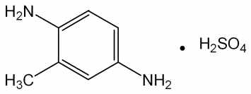

---

ｇ을넣어흔들어섞어검액및표준액으로한다. 검액및표준액1 μL를박층판에

점적하고이소프로필에텔ㆍ 아세톤ㆍ 이소프로판올(10：1：1) 혼합액을전개용매로

하여박층크로마토그래프법에따라시험한다. 발색제로p-디메칠아미노벤즈알데히드

ㆍ 묽은염산용액(1 →200) 을뿌릴때염산m-페닐렌디아민표준품에대하여Rs

값0.9 부근에서주황색∼황색의반점을나타낸다.

순도시험

1) 용해상태

이원료0.1 ｇ을묽은염산10 mL에넣어녹일때액은엷은

적자색이며거의맑다.

2) 철

이원료1.0 ｇ을정밀하게달아황산5 방울을넣어적시고천천히가열하

여저온에서거의회화또는휘산시킨다음황산을넣어적시고완전히회화한다. 식

힌다음잔류물에염산0.5 mL를넣고수욕상에서증발건고한다음잔류물에묽은

염산3 방울을넣어가온하고물25 mL를넣어녹인다. 이것을검액으로하여시험

한다. 비교액에는철표준액2.0 mL를넣는다(20 ppm 이하).

3) 에텔가용물

이원료1 ｇ을정밀하게달아에텔50 mL에넣고환류냉각기를

달아수욕상에서때때로흔들어섞으면서1 시간동안끓인다. 뜨거울때유리여과기

(G3)를사용하여미리질량을단플라스크에여과한다. 잔류물을에텔20 mL로씻고

씻은액및여액을합하여수욕상에서증발건고한다음105 ℃에서30 분간건조

하여질량을단다(1 % 이하).

4) 중금속

이원료1.0 ｇ을황산5 mL 및질산20 mL에넣고가만히가열한다.

때때로질산2 ∼3 mL 씩을추가하여액이무색∼엷은황색이될때까지가열한

다. 식힌다음물10 mL 및페놀프탈레인시액1 방울을넣고암모니아시액을액이

엷은적색이될때까지천천히넣어주고묽은초산2 mL를넣고필요하면여과한다.

잔류물을물10 mL로씻고씻은액을여액과합하고물을넣어50 mL로한다. 이것

을검액으로하여시험한다. 비교액에는납표준액2.0 mL를넣는다(20 ppm 이하).

5) 비소

이원료1.0 g을황산2 mL 및질산5 mL에넣어천천히가열한다. 때때

로질산2 ∼3 mL 씩을추가하여액이무색∼엷은황색이될때까지가열한다.

식힌다음포화수산암모늄용액15 mL를넣고흰연기가발생할때까지가열한다. 식

힌다음물을넣어10 mL로한다. 이것을검액으로하여시험한다(2 ppm 이하).

건조감량

5.0 % 이하(1 ｇ, 105 ℃, 2 시간)

강열잔분

0.3 % 이하(2 ｇ, 제1 법)

정량법

이원료를건조하고약0.20 ｇ을정밀하게달아질소정량법에따라시험한다.

0.05 mol/L 황산1 mL = 11.012 mg　C7H10N2ㆍH2SO4

저장법

기밀용기

히드록시벤조모르포린

Hydroxybenzomorpholine

---

3,4-dyhydro-2H-1,4-benzoxazin-6-ol

C8H9NO2 : 151.16

이

원료는

정량할

때

환산한

무수물에

대하여

히드록시벤조모르포린(C8H9NO2

:

151.16) 98.0 ∼101.0 % 이상을함유한다.

성

상

이원료는분홍색∼옅은자주빛을띠는결정성의가루로약한특이한냄새

가있다.

확인시험

1) 이원료를가지고적외부스펙트럼측정법브롬화칼륨정제법에따라측정

할때파수3322 cm-1, 1627-1605 cm-1, 1515-1487 cm-1, 1331 cm-1 , 1227 cm-1,

1204 cm-1, 1169 cm-1 부근에서흡수를나타낸다.

2) 이원료약0.4 g을정밀하게달아에탄올을넣어녹여100 mL로하고이액을

가지고자외가시부흡광도측정법에따라흡광도를측정할때파장208 nm 및244

nm에서흡수극대를나타낸다.

순도시험

1) 용해상태

이원료약0.1 g에물10 mL를넣고녹일때그액은맑으

며무색이다.

2) 유연물질

이원료약0.1 g을정밀하게달아에탄올을넣어녹여10 mL로한

액을검액으로한다. 이액1 mL를정확하게취하여에탄올(95)을넣어정확하게

100 mL로하여표준액으로한다. 검액및표준액을가지고박층크로마토그래프법에

따라시험한다. 검액및표준액5 μL씩을박층크로마토그래프용실리카겔을써서만

든박층판에점적한다. 초산에칠을전개용매로하여점적한곳으로부터약12 cm

전개한다음박층판을전개용매냄새가나지않을때까지건조한다. 여기에발색제

로4-니트로벤젠디아조늄클로라이드시액을고르게뿌릴때검액에서얻은주반점

이외의반점은표준액에서얻은반점보다진하지않다.

3) 중금속

이원료1.0 g을달아중제2법에따라조작하여시험한다. 비교액에는

납표준액2.0 mL를넣는다(20 ppm 이하).

4) 비소

이원료1.0 g을달아비소시험법제3 법에따라조작하여시험한다(2

ppm 이하).

융

점

112 ∼118 °C

수

분

0.5 % 이하(2 g)

강열잔분

1.0 % 이하(2 g)

정량법

이원료약175 mg을정밀하게달아초산70 mL에녹이고0.1 mol/L

과염소산으로적정한다(적정종말점검출법전위차적정법). 같은방법으로공시험을하

여보정한다.

---

0.1 mol/L 과염소산액1 mL = 15.1 mg C8H9NO2

N-(2-히드록시에칠)-2-니트로-p-페닐렌디아민

N-(2-hydroxyethyl)-2-nitro-p-phenylenediamine

C8H11N3O3 : 197.1

이원료는정량할때N-(2-히드록시에칠)-2-니트로-p-페닐렌디아민(C8H11N3O3) 99.0

% 이상을함유한다.

성

상

이원료는흑색결정성가루이다.

확인시험

1) 이원료및N-(2-히드록시에칠)-2-니트로-p-페닐렌디아민표준품0.1 g

씩을메탄올10 mL에녹여원심분리하여상징액을검액및표준액으로한다. 이들액

을가지고박층크로마토그래프법에따라시험한다. 검액및표준액5 μL씩을취하여

박층크로마토그래프용실리카겔을써서만든박층판에점적한다. 다음에초산에칠을

전개용매로하여약10 cm 전개한다음박층판을바람에말린다. 여기에발색제로p-

디메칠아미노벤즈알데히드ㆍ묽은염산용액(0.5→100)을뿌릴때검액및표준액에서얻

은반점의Rf 값및색상은같다.

2) 이원료약50 mg을물에넣어녹여100 mL로한다. 이액10 mL을취하여물

을넣어1 L로한다. 이액을가지고자외가시부흡광도측정법에따라흡수스펙트럼을

측정할때파장503 ∼507 nm에서흡수극대를나타낸다.

융

점

120 ∼125 ℃(제1 법)

순도시험

1) 철

이원료2.0 g 을달아황산5 방울을넣어적시고천천히가열하여

저온에서거의회화또는휘산시킨다음다시황산으로적시고완전히회화한다. 식

힌다음잔류물에염산0.5 mL를넣고수욕상에서증발건고하여잔류물에묽은염산

3 방울을넣어가온하고물25 mL를넣어녹인다. 이것을검액으로하여시험한다.

비교액에는철표준액1.0 mL를넣는다( 5 ppm 이하).

2) 중금속

이원료1.0 g을

황산2 mL 및질산20 mL에넣어가만히가열한다.

때때로질산2 ∼3 mL 씩을추가하여액이무색∼엷은황색이될때까지가열한

다. 식힌다음물10 mL 및페놀프탈레인시액1 방울을넣고암모니아시액을액이

엷은적색이될때까지넣고필요하면여과하여물10 mL로씻고여액과씻은액을

네슬러관에넣어물을넣어50 mL로한액을검액으로하여시험한다. 비교액에는

납표준액2.0 mL을쓴다(20 ppm 이하).

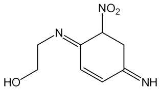

---

3) 비소

이원료1.0 g을

황산2 mL 및질산5 mL에넣어가만히가열한다. 때때

로질산2 ∼3 mL씩을추가하여액이무색∼엷은황색이될때까지가열한다.

식힌다음포화수산암모늄용액15 mL를넣는다. 흰연기가발생할때까지가열한

다음식히고물을넣어10 mL로한액을검액으로하여시험한다(2 ppm

이하).

수

분

0.3 % 이하(1g, 용량적정법, 직접적정)

강열잔분

0.2 % 이하(2g, 제1 법)

정량법

이원료약0.12 g을정밀하게달아질소정량법제2 법에따라시험한다.

0.05 mol/L 황산1 mL = 6.573 mg C8H11N3O3

저장법

기밀용기

6-히드록시인돌

6-Hydroxyindole

C8H7NO : 133.15

이원료는정량할때환산한무수물에대하여6-히드록시인돌(C5H6N2O : 133.15)

97.0 ∼101.0 % 이상을함유한다.

성

상

이원료는옅은갈색∼회색을띠는가루이며, 약간특이한냄새가있다.

확인시험

1) 이원료의수용액(1 →1000) 10 mL에염화제일철시액1 방울을넣을

때액은연한갈색∼검은색을나타낸다.

2) 이원료0.01 g에황산2 mL를넣어녹일때액은초록색을띠며, 다시물5 mL

를넣을때액은노란색으로변한다.

3) 이원료0.025 g에에탄올200 mL를넣어녹이고이액2 mL를가지고에탄올

을넣어100 mL로한다. 이액을가지고자외가시부흡광도측정법에따라흡수스펙

트럼을측정할때파장218 ± 2 nm 에서흡수극대를나타낸다.

4) 이원료를가지고적외부스펙트럼측정법의브롬화칼륨정제법에따라시험할때,

파수3394 cm-1, 1625 cm-1, 1590 cm-1, 1505 cm-1, 1428 cm-1, 1235 cm-1, 818

cm-1 부근에서흡수를나타낸다.

융

점

124 ∼128 ℃

순도시험

1) 용해상태

이원료0.5 g에에탄올10 mL를넣어녹일때, 액은옅은

황갈색∼어두운갈색을나타내고맑다.

---

2) 철

이원료1.0 g을달아제3 법으로조제하여A법에따라시험한다. 비교액

에는철표준액3.0 mL를넣는다(30 ppm 이하).

3) 중금속

이원료1.0 g을달아제2 법에따라조작하여시험한다. 비교액에는

납표준액2.0 mL를넣는다(20 ppm 이하).

4) 비소

이원료1.0 g을달아제3 법에따라조작하여시험한다(2 ppm 이하).

수

분

1.0 % 이하(1.0 g)

강열잔분

0.1 % 이하(1.0 g)

정량법

이원료약0.1 g을정밀하게달아0.5 % 염산수용액2 mL 및이동상을넣

어정확하게50 mL로하고30 분간잘섞는다. 이액10 mL를정확하게취하여

다시이동상을넣어정확하게50 mL로하여검액으로한다. 따로6-히드록시인돌

표준품을가지고검액과같은방법으로조제하여표준액으로한다. 검액및표준액

10 μL씩을가지고다음조건으로액체크로마토그래프법에따라시험하여각액의

6-히드록시인돌의피크면적AT 및AS을측정한다.



6-히드록시인돌(C5H6N2O)의양(mg) = 6-히드록시인돌표준품의양(mg) x 



조작조건

검출기: 자외부흡광광도계(측정파장292 nm)

칼

럼: 안지름약4 mm, 길이약250 mm인스테인레스강관에5 μm의액체

크로마토그래프용옥타데실실릴실리카겔을충전한것또는이와동등한

칼럼

이동상: 아세토니트릴ㆍ물혼합액(37 : 63)을인산으로pH 3.5로조정한다.

유

량: 1.0 mL/분

과황산나트륨ㆍ과황산암모늄분말제

Sodium PersulfateㆍAmmonium Persulfate Powder

이기능성화장품은정량할때표시량의90.0 % 이상에해당하는총과황산(S2O8 :

192.13)을함유한다.

확인시험

1) 이기능성화장품1 g을황산망간용액(1 →10)에황산2 mL를넣은액

및질산은용액(1 →50) 2 mL에넣어서가온할때액은적자색을나타낸다.

2) 이기능성화장품의수용액(1 →10)은나트륨염의정성반응을나타낸다.

3) 이기능성화장품1 g을과량의수산화나트륨시액에넣어가온하면암모니아냄새

가나며이가스는물에적신적색리트머스시험지를청색으로변화시킨다.

정량법

총과황산(S2O8) 약0.3 g에해당하는양을정밀하게달아물50 mL에넣어

녹이고0.2 mol/L 황산제일철암모늄액25 mL를넣고마개를하여흔들어섞은다음

인산5 mL를넣은다음과량의황산제일철암모늄액을0.04 mol/L 과망간산칼륨액으

---

로적정한다. 같은방법으로공시험하여보정한다.

0.2 mol/L 황산제일철암모늄액1 mL = 19.21 mg S2O8

저장법

기밀용기

과황산나트륨ㆍ과황산칼륨분말제

Sodium PersulfateㆍPotassium Persulfate Powder

이기능성화장품은정량할때표시량의90.0 % 이상에해당하는총과황산(S2O8 :

192.13)을함유한다.

확인시험

1) 이기능성화장품1 g을황산망간용액(1 →10)에황산2 mL를넣은액

및질산은용액(1 →50) 2 mL에넣어서가온할때액은적자색을나타낸다.

2) 이기능성화장품의수용액(1 →10)은나트륨염의정성반응을나타낸다.

3) 이기능성화장품의수용액(1 →10)은칼륨염의정성반응을나타낸다.

정량법

총과황산(S2O8) 약0.3 g에해당하는양을정밀하게달아물50 mL에넣어

녹이고0.2 mol/L 황산제일철암모늄액25 mL를넣고마개를하여흔들어섞은다음

인산5 mL를넣은다음과량의황산제일철암모늄액을0.04 mol/L 과망간산칼륨액으

로적정한다. 같은방법으로공시험하여보정한다.

0.2 mol/L 황산제일철암모늄액1 mL

= 19.21 mg S2O8

과황산나트륨ㆍ과황산암모늄ㆍ과황산칼륨분말제

Sodium PersulfateㆍAmmonium PersulfateㆍPotassium

Persulfate Powder

이기능성화장품은정량할때표시량의90.0 % 이상에해당하는총과황산(S2O8 :

192.13)을함유한다.

확인시험

1) 이기능성화장품1 g을황산망간용액(1 →10)에황산2 mL를넣은액

및질산은용액(1 →50) 2 mL에넣어서가온할때액은적자색을나타낸다.

2) 이기능성화장품의수용액(1 →10)은나트륨염의정성반응을나타낸다.

3) 이기능성화장품의수용액(1 →10)은칼륨염의정성반응1)∼3)을나타낸다.

---

4) 이기능성화장품1 g을과량의수산화나트륨시액에넣어가온하면암모니아냄새

가나며이가스는물에적신적색리트머스시험지를청색으로변화시킨다.

정량법

총과황산(S2O8) 약0.3 g에해당하는양을정밀하게달아물50 mL에넣어

녹이고0.2 mol/L 황산제일철암모늄액25 mL를넣고마개를하여흔들어섞은다음

인산5 mL를넣은다음과량의황산제일철암모늄액을0.04 mol/L 과망간산칼륨액으

로적정한다. 같은방법으로공시험하여보정한다.

0.2 mol/L 황산제일철암모늄액1 mL = 19.21 mg S2O8

저장법

기밀용기

과황산암모늄분말제

Ammonium Persulfate powder

이

기능성화장품은

정량할

때

표시량의

90.0

%

이상에

해당하는

과황산암모늄

((NH4)2S2O8 : 228.20)을함유한다.

확인시험

1) 이기능성화장품1 g을취하여수산화나트륨시액5 mL에넣고가열하

면암모니아냄새가있는가스가발생하고이가스는물에적신적색리트머스지를

청색으로변화시킨다.

2) 묽은황산5 mL에황산망간용액(1 →100) 2 ∼3 방울을넣고여기에질산은시

액1 방울및이기능성화장품0.4 g을넣어가온하면액은홍색을나타낸다.

정량법

과황산암모늄약1.5 g에해당하는양을정밀하게달아물에녹여250 mL

로하고그중50 mL를취하여0.1 mol/L 황산제일철암모늄액40 mL 및인산5

mL을넣은다음과량의황산제일철암모늄을0.02 mol/L 과망간산칼륨액으로적정한

다. 같은방법으로공시험하여보정한다.

0.1 mol/L 황산제일철암모늄액1 mL = 11.41 mg(NH4)2S2O8

저장법

기밀용기

과황산암모늄ㆍ과황산칼륨분말제

Ammonium PersulfateㆍPotassium Persulfate Powder

이기능성화장품은정량할때표시량의90.0 % 이상에해당하는총과황산(S2O8 :

192.13)을함유한다.

확인시험

1) 이기능성화장품1 g을황산망간용액(1 →10)에황산2 mL를넣은액

---

및질산은용액(1 →50) 2 mL에넣어서가온할때액은적자색을나타낸다.

2) 이기능성화장품의수용액(1 →10)은칼륨염의정성반응1)∼3)을나타낸다.

3) 이기능성화장품1 g을과량의수산화나트륨시액에넣어가온하면암모니아냄새

가나며이가스는물에적신적색리트머스시험지를청색으로변화시킨다.

정량법

총과황산(S2O8) 약0.3 g에해당하는양을정밀하게달아물50 mL에넣어

녹이고0.2 mol/L 황산제일철암모늄액25 mL를넣고마개를하여흔들어섞은다음

인산5 mL를넣은다음과량의황산제일철암모늄액을0.04 mol/L 과망간산칼륨액으

로적정한다. 같은방법으로공시험하여보정한다.

0.2 mol/L 황산제일철암모늄액1 mL = 19.21 mg S2O8

저장법

기밀용기

p-페닐렌디아민ㆍ과붕산나트륨사수화물분말제

p-PhenylenediamineㆍSodium Perborate Tetrahydrate Powder

이기능성화장품은정량할때표시량의90.0 % 이상에해당하는p-페닐렌디아민

(C6H8N2：108.14) 및과붕산나트륨사수화물(NaBO3ㆍ4H2O：153.86) 을함유한다.

확인시험

1) p-페닐렌디아민　이기능성화장품을p-페닐렌디아민10 mg에해당하

는양을달아에탄을10 mL에넣어녹이고여과하여여액을검액으로한다. 따로

p-페닐렌디아민표준품10 mg을달아에탄올10 mL에넣어녹여표준액으로한다.

검액및표준액10 μL씩을박층판에점적하고초산에칠을전개용매로하여박층크

로마토그래프법에따라시험한다. 발색제로p-디메칠아미노벤즈알데히드ㆍ묽은염산

용액(0.5 →100)을고루뿌리고건조할때검액과표준액은같은Rf 값에서같은색

상의반점을나타낸다.

2) 과붕산나트륨　1)항에서얻은잔류물을물에녹일때이기능성화장품은나

트륨염, 붕산염및과산화물의정성반응을나타낸다.

정량법

1) p-페닐렌디아민이기능성화장품을p-페닐렌디아민(C6H8N2) 약0.25

ｇ에해당하는양을정밀하게달아삼각플라스크에넣고무수에탄올20 mL를넣어

추출한다. 잔류물을무수에탄올20 mL씩으로4 회씻고여과하여여액과씻은액을

합한다(잔류물은다음시험을위하여보관한다). 여기에염산을넣고흔들어섞은다

음15 ℃로식히고얼음조각15 ｇ을넣고저으면서0.1 mol/L 아질산나트륨액으로

천천히적정한다. 이때적정의종말점은0.1 mol/L 아질산나트륨액을떨어뜨린후1

분후에적정한액을유리막대에묻혀서요오드화ㆍ아연전분지에대었을때곧청색

이나타날때로한다. 같은방법으로공시험하여보정한다.

0.1 mol/L 아질산나트륨액1 mL = 10.81 mg　C6H8N2

---

2) 과붕산나트륨사수화물정량법1)에서얻은잔류물을물100 mL를사용하여요

오드병에옮기고요오드화칼륨1 ｇ및묽은황산10 mL를넣고냉소에서90 분간

방치한다음0.1 mol/L 치오황산나트륨액으로적정한다(지시약：전분시액). 같은방

법으로공시험하여보정한다.

0.1 mol/L 치오황산나트륨액1 mL = 7.693 mg　NaBO3ㆍ4H2O

저장법　기밀용기

황산p-페닐렌디아민ㆍ황산m-페닐렌디아민ㆍ

황산m-아미노페놀ㆍ황산o-아미노페놀ㆍ과붕산나트륨일수화물

분말제

p-Phenylenediamine Sulfateㆍm-Phenylenediamine

Sulfateㆍm-Aminophenol Sulfateㆍo-Aminophenol Sulfate

ㆍSodium Perborate Monohydrate Powder

이기능성화장품은정량할때표시량의90.0 % 이상에해당하는과붕산나트륨일수

화물(NaBO3ㆍH2O：99.81)을함유한다.

확인시험

1) 황산p-페닐렌디아민, 황산m-페닐렌디아민, 황산m-아미노페놀및

황산o-아미노페놀

이기능성화장품1 ｇ을이소프로판올ㆍ물ㆍ강암모니아수(9：

3：1) 혼합액5 mL에넣고잘분산시켜녹인다. 이액을여과하고여액에아황산수

소나트륨0.5 ｇ을넣어흔들어섞고이것을검액으로한다. 따로황산p-페닐디아

민, 황산m-페닐렌디아민, 황산m-아미노페놀및황산o-아미노페놀표준품5 mg

씩을달아검체와같은방법으로조작하여표준액으로한다. 검액및표준액각5 μ

L씩을박층판에점적하고초산에칠ㆍ클로로포름ㆍ디클로로메탄(9：5：2) 혼합물을

전개용매로하여박층크로마토그래프법에따라시험한다. 발색제로p-디메칠아미노

벤즈알데히드ㆍ묽은염산용액(0.5 →100)을뿌리고건조할때검액및표준액은같은

Rf 값에서같은색상의반점을나타낸다.

2) 과붕산나트륨일수화물

이기능성화장품의염산산성용액에쿠르쿠마시험지를적

신다음가온하여건조하면적색을나타내고여기에암모니아시액을천천히넣으면

청색으로변한다.

정량법

이기능성화장품을과붕산나트륨일수화물(NaBO3ㆍH2O) 약0.5 ｇ에해당하

는양을정밀하게달아에탄올10 mL에분산시킨다음묽은황산30 mL를넣고물

을넣어250 mL로한다. 이때거품이생겨표선을채우기어려울때에는에탄올2

∼3 방울을넣은다음채운다. 이액50 mL를취하여요오드화칼륨시액20 mL를

---

넣고다시몰리브덴산암모늄시액2 ∼3 방울을넣어유리하는요오드를0.1 mol/L

치오황산나트륨액으로적정한다(지시약：전분시액2 ∼3 mL). 같은방법으로공시

험하여보정한다.

0.1 mol/L 치오황산나트륨액1 mL = 4.991 mg NaBO3ㆍH2O

염모력시험

「기능성화장품기준및시험방법」일반시험법의Ⅱ. 제제3. 염모력시

험법에따라시험할때효능효과에서표시한색상과거의같은색으로염색된다.

저장법

기밀용기

2제형산화염모제

모발의염색을목적으로하는외용제로서다음기준및시험방법을준용할수있는

2제형의산화염모제를말한다. 이기능성화장품은다음시험법에따라정량할때표시

량의90.0 ∼110.0 %에해당하는과산화수소(H2O2 : 34.02)를함유한다.

구성및재료주성분의종류, 분류및규격등은식품의약품안전처고시「기능성화장

품심사에관한규정」[별표4] 4. 모발의색상을변화(탈염ㆍ탈색포함)시키는기능

을가진제품의성분및함량중2제형의산화염모제에따른다.

제

형

분말제, 크림제, 로션제, 액제또는에어로졸제이다.

[제1제(염모제)와제2 제(산화제)에대하여각각기재한다.]

확인시험

1) 제1 제의주성분

가) 크림제인경우　이기능성화장품2 ∼10 ｇ을

묽은황산30 mL, 황산나트륨5 ｇ및물20 mL에넣어잘저어섞고끓을때까지

가열한다음방치한다. 아래층을취하여약10 mL가될때까지가열농축하고식힌

다음5 mL를취하여강암모니아수를넣어알칼리성으로한다. 여기에이소프로판올

1 mL를넣어잘흔들어섞고아황산수소나트륨1 ｇ을넣어다시흔들어섞은다음

방치한다. 위의맑은액을취하여검액으로한다. 따로각주성분의표준품약5 ∼

10 mg에이소프로판올ㆍ물ㆍ강암모니아수혼합액(9：3：1) 5 mL를넣어녹이고아황

산수소나트륨0.5 ｇ을넣고흔들어섞어방치한다음상층을취하여표준액으로한

다. 이들액을가지고박층크로마토그래프법에따라시험한다. 검액및표준액각5

μL씩을박층크로마토그래프용실리카겔을써서만든박층판에점적한다. 다음에이

소프로필에테르ㆍ아세톤ㆍ이소프로판올(10：1：1) 혼합액, 초산에칠ㆍ벤젠ㆍ초산혼합

액(10：10：2), 초산ㆍ벤젠혼합액(1：1) 또는적당한용매를전개용매로하여, 약20

cm 전개한다음박층판을말린다. 여기에p-디메칠아미노벤즈알데히드ㆍ묽은염산용

액(0.5 →100), 또는적당한발색제를고르게뿌리고건조할때검액및표준액에서

얻은반점의색상및Rf 값은같다.

나) 액제또는로션제인경우

이기능성화장품2 ∼10 ｇ(2 ∼10 mL)에아황산

---

나트륨0.6 ｇ, 황산나트륨1.2 ｇ을넣고에탄올을넣어녹여25 mL로하여섞고방

치한다음그위의맑은액을검액으로한다. 따로각주성분의표준품약5 ∼10

mg을취하여검액과같은방법으로조작하여표준액으로한다. 이들액을가지고박

층크로마토그래프법에따라시험한다. 검액및표준액각5 μL씩을박층크로마토그

래프용실리카겔을써서만든박층판에점적한다. 다음에이소프로필에테르ㆍ아세톤

ㆍ이소프로판올(10：1：1) 혼합액, 초산에칠ㆍ벤젠ㆍ초산혼합액(10：10：2), 초산ㆍ벤

젠혼합액(1：1) 또는적당한용매를전개용매로하여, 약20 cm 전개한다음박층판

을말린다. 여기에p-디메칠아미노벤즈알데히드ㆍ묽은염산용액(0.5 →100), 또는적

당한발색제를고르게뿌리고건조할때검액및표준액에서얻은반점의색상및

Rf 값은같다.

다) 분말제인경우

이기능성화장품1 ｇ을이소프로판올ㆍ물ㆍ강암모니아수혼합

액(9：3：1) 5 mL에넣고잘분산시켜녹인다. 이액을여과하고여액에아황산수소

나트륨0.5 ｇ을넣어흔들어섞고이것을검액으로한다. 따로각주성분의표준품

약5 ∼10 mg을취하여검액과같은방법으로조작하여표준액으로한다. 이들액

을가지고박층크로마토그래프법에따라시험한다. 검액및표준액5 μL씩을박층크

로마토그래프용실리카겔을써서만든박층판에점적한다. 다음에이소프로필에테르

ㆍ아세톤ㆍ이소프로판올혼합액(10：1：1),

초산에칠ㆍ벤젠ㆍ초산혼합액(10：10：2),

초산ㆍ벤젠혼합액(1：1) 또는적당한용매를전개용매로하여, 약20 cm 전개한다

음박층판을말린다. 여기에p-디메칠아미노벤즈알데히드ㆍ묽은염산용액(0.5 →100),

또는적당한발색제를고르게뿌리고건조할때검액및표준액에서얻은반점의색

상및Rf 값은같다.

라) 에어로졸제의경우

이기능성화장품의내용원액약2 ∼10 ｇ(2 ∼10 mL)에

아황산나트륨0.6 ｇ, 황산나트륨1.2 ｇ을넣고에탄올을넣어녹여25 mL로하여

섞고방치한다음그상층액을검액으로한다. 따로각주성분의표준품약5 ∼10

mg 씩을가지고검액과같은방법으로조작하여표준액으로한다. 이들액을가지고

박층크로마토그래프법에따라시험한다. 검액및표준액5 μL씩을박층크로마토그래

프용실리카겔을써서만든박층판에점적한다. 다음에이소프로필에테르ㆍ아세톤ㆍ이

소프로판올혼합액(10：1：1),

초산에칠ㆍ벤젠ㆍ초산혼합액(10：10：2),

초산ㆍ벤젠혼

합액(1：1) 또는적당한용매를전개용매로하여약20 cm 전개한다음박층판을말

린다. 여기에p-디메칠아미노벤즈알데히드ㆍ묽은염산용액(0.5 →100) 또는적당한

발색제를고르게뿌리고건조할때검액및표준액에서얻은반점의색상및Rf 값

은같다.

2) 제2제의과산화수소

이기능성화장품의수용액(1 →10)은과산화물의정성반응

을나타낸다. 단, 에어로졸제의경우내용원액의수용액(1 →10)을가지고시험한다.

정량법과산화수소

이기능성화장품의제2제약1.0 mL(1 g)을정확하게취하여

물10 mL를넣은플라스크에넣고묽은황산10 mL를넣은다음0.02 mol/L 과망

간산칼륨액으로적정한다. 단, 에어로졸제의경우내용원액의수용액(1 →10)을가지

---

고시험한다.

0.02 mol/L 과망간산칼륨액1 mL = 1.7007 mg H2O2

＊각주성분의표준품은식품의약품안전처고시『기능성화장품기준및시험방법』에

등재된염모제원료를말한다.

염모력시험

「기능성화장품기준및시험방법」일반시험법의Ⅱ. 제제3. 염모력시

험법에따라시험할때효능효과에서표시한색상과거의같은색으로염색된다.

저장법

기밀용기

2제형산화염모제의제1제

모발의염색을목적으로하는외용제로서다음기준및시험방법을준용할수있는

2제형산화염모제의제1제를말한다.

구성및재료주성분의종류, 분류, 규격등은식품의약품안전처고시기능성화장품심

사에관한규정[별표4] 4. 모발의색상을변화(탈염ㆍ탈색포함)시키는기능을가진

제품의성분및함량중2제형산화염모제의제1제에따른다.

제

형

분말제, 크림제, 로션제, 액제, 에어로졸제이다.

확인시험

가) 크림제인경우　이기능성화장품약2 ∼10 ｇ을묽은황산30 mL, 황

산나트륨5 ｇ및물20 mL에넣어잘저어섞고끓을때까지가열한다음방치한

다. 아래층을취하여약10 mL가될때까지가열농축하고식힌다음5 mL를취하

여강암모니아수를넣어알칼리성으로한다. 여기에이소프로판올1 mL를넣어잘

흔들어섞고아황산수소나트륨1 ｇ을넣어다시흔들어섞은다음방치한다. 위의

맑은액을취하여검액으로한다. 따로각주성분의표준품약5 ∼10 mg에이소

프로판올ㆍ물ㆍ강암모니아수혼합액(9：3：1) 5 mL를넣어녹이고아황산수소나트륨

0.5 ｇ을넣고흔들어섞어방치한다음위의맑은액을취하여표준액으로한다.

나) 액제또는로션제인경우

이기능성화장품약2 ∼10 ｇ(2 ∼10 mL)에아

황산나트륨0.6 ｇ, 황산나트륨1.2 ｇ을넣고에탄올을넣어녹여25 mL로하여섞

고방치한다음그위의맑은액을검액으로한다. 따로각주성분의표준품약5

∼10 mg씩을가지고검액과같은방법으로조작하여표준액으로한다.

다) 분말제인경우

이기능성화장품약1 ｇ을이소프로판올ㆍ물ㆍ강암모니아수혼

합액(9：3：1) 5 mL에넣고잘분산시켜녹인다. 이액을여과하고여액에아황산수

소나트륨약0.5 ｇ을넣어흔들어섞고이것을검액으로한다. 따로각주성분의표

준품약5 ∼10 mg씩을가지고검액과같은방법으로조작하여표준액으로한다.

라) 에어로졸제의경우이기능성화장품의내용원액약2 ∼10 ｇ(2 ∼10 mL)에

아황산나트륨0.6 ｇ, 황산나트륨1.2 ｇ을넣고에탄올을넣어녹여25 mL로하여

섞고방치한다음위의맑은액을검액으로한다. 따로각주성분의표준품약5 ∼

10 mg씩을가지고검액과같은방법으로조작하여표준액으로한다. 이들액을가

---

지고「기능성화장품기준및시험방법」일반시험법중박층크로마토그래프법에따라

시험한다. 검액및표준액각5 μL씩을박층크로마토그래프용실리카겔을써서만든

박층판에점적한다. 다음에이소프로필에테르ㆍ아세톤ㆍ이소프로판올혼합액(10：1：

1), 초산에칠ㆍ벤젠ㆍ초산혼합액(10：10：2), 초산ㆍ벤젠혼합액(1：1) 또는적당한용

매를전개용매로하여, 약20 cm 전개한다음박층판을말린다. 여기에p-디메칠아

미노벤즈알데히드ㆍ묽은염산용액(0.5 →100) 또는적당한발색제를고르게뿌리고

건조할때검액및표준액은같은Rf값에서같은색상의반점을나타낸다.

＊각주성분의표준품은식품의약품안전처고시『기능성화장품기준및시험방법』에

등재된염모제원료를말한다.

염모력시험

「기능성화장품기준및시험방법」일반시험법의Ⅱ. 제제3. 염모력시

험법에따라시험할때효능효과에서표시한색상과거의같은색으로염색된다.

저장법

기밀용기

3제형산화염모제

모발의염색을목적으로하는외용제로서다음기준및시험방법을준용할수있는

3제형의산화염모제를말한다. 다만, 제3제의경우컨디셔닝제로구성하는경우에한한

다. 이기능성화장품은다음시험법에따라정량할때표시량의90.0 ∼110.0 %에해

당하는과산화수소(H2O2 : 34.02)를함유한다.

구성및재료주성분의종류, 분류및규격등은식품의약품안전처고시기능성화장품

심사에관한규정[별표4] 4. 모발의색상을변화(탈염ㆍ탈색포함)시키는기능을가

진화장품중3제형의산화염모제에따른다.

제

형

분말제, 크림제, 로션제, 액제또는에어로졸제이다.

[제1제(염모제)와제2제(산화제), 제3제(컨디셔닝제)에대하여각각기재한다.]

확인시험

1) 제1제의주성분

가) 크림제인경우　이기능성화장품2 ∼10 g을

묽은황산30 mL, 황산나트륨5 g 및물20 mL에넣어잘저어섞고끓을때까지

가열한다음방치한다. 아래층을취하여약10 mL가될때까지가열농축하고식힌

다음5 mL를취하여강암모니아수를넣어알칼리성으로한다. 여기에이소프로판올

1 mL를넣어잘흔들어섞고아황산수소나트륨1 g을넣어다시흔들어섞은다음

방치한다. 위의맑은액을취하여검액으로한다. 따로각주성분의표준품약5 ∼

10 mg에이소프로판올ㆍ물ㆍ강암모니아수혼합액(9：3：1) 5 mL를넣어녹이고아황

---

산수소나트륨0.5 g을넣고흔들어섞어방치한다음상층을취하여표준액으로한

다. 이들액을가지고박층크로마토그래프법에따라시험한다. 검액및표준액각5

μL씩을박층크로마토그래프용실리카겔을써서만든박층판에점적한다. 다음에이

소프로필에테르ㆍ아세톤ㆍ이소프로판올(10：1：1) 혼합액, 초산에칠ㆍ벤젠ㆍ초산혼합

액(10：10：2), 초산ㆍ벤젠혼합액(1：1) 또는적당한용매를전개용매로하여, 약20

cm 전개한다음박층판을말린다. 여기에p-디메칠아미노벤즈알데히드ㆍ묽은염산용

액(0.5 →100), 또는적당한발색제를고르게뿌리고건조할때검액및표준액에서

얻은반점의색상및Rf 값은같다.

나) 액제또는로션제인경우

이기능성화장품2 ∼10 g(2 ∼10 mL)에아황산

나트륨0.6 g, 황산나트륨1.2 g을넣고에탄올을넣어녹여25 mL로하여섞고방

치한다음그위의맑은액을검액으로한다. 따로각주성분의표준품약5 ∼10

mg을취하여검액과같은방법으로조작하여표준액으로한다. 이들액을가지고박

층크로마토그래프법에따라시험한다. 검액및표준액각5 μL씩을박층크로마토그

래프용실리카겔을써서만든박층판에점적한다. 다음에이소프로필에테르ㆍ아세톤

ㆍ이소프로판올(10：1：1) 혼합액, 초산에칠ㆍ벤젠ㆍ초산혼합액(10：10：2), 초산ㆍ벤

젠혼합액(1：1) 또는적당한용매를전개용매로하여, 약20 cm 전개한다음박층판

을말린다. 여기에p-디메칠아미노벤즈알데히드ㆍ묽은염산용액(0.5 →100), 또는적

당한발색제를고르게뿌리고건조할때검액및표준액에서얻은반점의색상및

Rf 값은같다.

다) 분말제인경우

이기능성화장품1 g을이소프로판올ㆍ물ㆍ강암모니아수혼합액

(9：3：1) 5 mL에넣고잘분산시켜녹인다. 이액을여과하고여액에아황산수소나

트륨0.5 g을넣어흔들어섞고이것을검액으로한다. 따로각주성분의표준품약

5 ∼10 mg을취하여검액과같은방법으로조작하여표준액으로한다. 이들액을

가지고박층크로마토그래프법에따라시험한다. 검액및표준액5 μL씩을박층크로

마토그래프용실리카겔을써서만든박층판에점적한다. 다음에이소프로필에테르ㆍ

아세톤ㆍ이소프로판올혼합액(10：1：1),

초산에칠ㆍ벤젠ㆍ초산혼합액(10：10：2),

초

산ㆍ벤젠혼합액(1：1) 또는적당한용매를전개용매로하여, 약20 cm 전개한다음

박층판을말린다. 여기에p-디메칠아미노벤즈알데히드ㆍ묽은염산용액(0.5 →100), 또

는적당한발색제를고르게뿌리고건조할때검액및표준액에서얻은반점의색상

및Rf 값은같다.

라) 에어로졸제의경우

이기능성화장품의내용원액약2 ∼10 g(2 ∼10 mL)에

아황산나트륨0.6 g, 황산나트륨1.2 g을넣고에탄올을넣어녹여25 mL로하여섞

고방치한다음그상층액을검액으로한다. 따로각주성분의표준품약5 ∼10

mg 씩을가지고검액과같은방법으로조작하여표준액으로한다. 이들액을가지고

박층크로마토그래프법에따라시험한다. 검액및표준액5 μL씩을박층크로마토그래

프용실리카겔을써서만든박층판에점적한다. 다음에이소프로필에테르ㆍ아세톤ㆍ이

소프로판올혼합액(10：1：1),

초산에칠ㆍ벤젠ㆍ초산혼합액(10：10：2),

초산ㆍ벤젠혼

---

합액(1：1) 또는적당한용매를전개용매로하여약20 cm 전개한다음박층판을말

린다. 여기에p-디메칠아미노벤즈알데히드ㆍ묽은염산용액(0.5 →100) 또는적당한

발색제를고르게뿌리고건조할때검액및표준액에서얻은반점의색상및Rf 값

은같다.

2) 제2제의과산화수소

이기능성화장품의수용액(1 →10)은과산화물의정성반응

을나타낸다. 단, 에어로졸제의경우내용원액의수용액(1 →10)을가지고시험한다.

정량법과산화수소

이기능성화장품의제2제약1.0 mL(1 g)을정확하게취하여물

10 mL를넣은플라스크에넣고묽은황산10 mL를넣은다음0.02 mol/L 과망간산

칼륨액으로적정한다. 단, 에어로졸제의경우내용원액의수용액(1 →10)을가지고

시험한다.

0.02 mol/L 과망간산칼륨액1 mL

= 1.7007 mg H2O2

* 각주성분의표준품은식품의약품안전처고시「기능성화장품기준및시험방법」에

등재된염모제원료를말한다.

염모력시험

「기능성화장품기준및시험방법」일반시험법의Ⅱ. 제제3. 염모력시

험법에따라시험할때효능효과에서표시한색상과거의같은색으로염색된다.

산화염모제, 탈색ㆍ탈염제의산화제

모발의염색또는탈색ㆍ탈염을목적으로하는외용제로서과산화수소를주성분으로

하는산화염모제, 탈색ㆍ탈염제의산화제이다.

이기능성화장품은다음시험법에따라정량할때표시량의90.0 ∼110.0 %에해당

하는과산화수소(H2O2 : 34.01)를함유한다.

제

형

분말제, 크림제, 로션제, 액제또는에어로졸제이다.

확인시험

이기능성화장품의수용액(1 →10)은과산화물의정성반응을나타낸다. 단,

에어로졸제의경우내용원액의수용액(1 →10)을가지고시험한다.

정량법

이기능성화장품약1.0 mL(1 g)을정확하게취하여물10 mL 및묽은황

산10 mL를넣은플라스크에넣고0.02 mol/L 과망간산칼륨액으로적정한다. 같은

방법으로공시험하여보정한다. 단, 에어로졸제의경우내용원액을가지고시험한다.

0.02 mol/L 과망간산칼륨액1 mL = 1.7007 mg H2O2

저장법

기밀용기

---

1제형탈색제

이기능성화장품은모발의탈색을목적으로하는외용제로서과산화수소를주성분으

로하는1제형탈색제이다. 이기능성화장품은정량할때표시량의90.0 ∼110.0 %에

해당하는과산화수소(H2O2 : 34.01)를함유한다.

확인시험　이기능성화장품의수용액(1 →10)은과산화물의정성반응을나타낸다.

정량법　이기능성화장품1.0 mL(1g)을정확하게취하여물10 mL 및묽은황산

10 mL을넣은플라스크에넣고0.02 mol/L 과망간산칼륨액으로적정한다. 같은방

법으로공시험하여보정한다.

0.02 mol/L 과망간산칼륨액1 mL = 1.7007 mg H2O2

저장법　기밀용기

2제형탈색제

이기능성화장품은모발의탈색을목적으로하는외용제로서다음기준및시험방법

을준용할수있는2제형의탈색제를말한다. 이기능성화장품의제1 제는수산화나

트륨, 모노에탄올아민, 강암모니아수중의1성분이상을알칼리제로사용하는가루또

는크림이며, 제2 제는과산화수소수를주성분으로하는크림, 로션또는액이다.

이기능성화장품(제2 제)은정량할때표시량의90.0 ∼110.0 %에해당하는과산화수

소(H2O2 : 34.01)를함유한다.

확인시험　이기능성화장품(제2 제)의수용액(1 →10) 은과산화물의정성반응을나

타낸다.

정량법　이기능성화장품의제2 제약1 mL(1g)을정확하게취하거나달아물10

mL 및묽은황산10 mL를넣은플라스크에넣고0.02 mol/L 과망간산칼륨액으로적

정한다. 같은방법으로공시험하여보정한다.

0.02 mol/L 과망간산칼륨액1 mL = 1.7007 mg H2O2

탈색력시험　이기능성화장품은용법및용량란에기재된비율로제1 제와제2 제

를섞어인모를침적하여25 ℃에서30 분간방치한다음물로잘씻어건조할때

인모는탈색된다.

저장법　기밀용기

---

[별표7]

체모를제거하는데도움을주는기능성화장품각조

(제2조제7호관련)

치오글리콜산80 %

Thioglycolic Acid 80 %

Mercaptoacetic acid 80%

티오글리콜산80 %

C2H4O2S : 92.12

이원료는정량할때치오글리콜산(C2H4O2S) 78.0 ∼82.0 %를함유한다.

성

상

이원료는특이한냄새가있는무색투명한유동성액제이다.

확인시험

이원료및치오글리콜산표준품을가지고적외부스펙트럼측정법중액막법

에따라측정할때같은파수에서같은강도의흡수를나타낸다.

순도시험

1)

납　이원료1.0 g을달아납시험법에따라시험한다. 비교액에는납표

준액20.0 mL를넣는다(20 ppm 이하).

2)

비소　이원료0.5 g을달아제3 법에따라조작하여시험한다(4 ppm 이하).

정량법

이원료약2.0 g을정밀하게달아물을넣어50.0 mL로한다. 이액10.0

mL를취하여250 mL 삼각플라스크에넣고물75 mL를넣은다음0.05 mol/L 요오

드액으로적정한다(지시약：전분시액). 같은방법으로공시험을하여보정한다.

0.05 mol/L 요오드액1 mL = 9.212 mg C2H4O2S

저장법

기밀용기.

치오글리콜산크림제

Thioglycolic Acid Cream

티오글리콜산80% 크림

---

이기능성화장품은정량할때표시량의90.0 ∼110.0 %에해당하는치오글리콜산

(C2H4O2S : 92.12)을함유한다.

확인시험

이기능성화장품2.0 g을달아100 mL 비커에넣어녹이고염산5 mL를

넣은다음이액5 mL를취하여염화제이철시액3 ∼4 방울을넣을때청색을나

타낸다. 흔들어주면점차색이소실되며, 염화제이철시액1 mL를넣은다음수산화

나트륨시액5 ∼6 방울을넣을때황색침전이생긴다.

정량법　이기능성화장품약5.0 g을정밀하게달아250 mL 삼각플라스크에넣고

열탕50 mL를넣은다음염산10 mL를넣고흔들어섞어빙냉하고다시에텔약2

mL를넣고0.05 mol/L 요오드액으로적정한다(지시약：전분시액). 같은방법으로공

시험을하여보정한다.

0.05 mol/L 요오드액1 mL=9.212 mg C2H4O2S

저장법　기밀용기

---

[별표8]

여드름성피부를완화하는데도움을주는기능성화

장품각조

(제2조제8호관련)

살리실릭애씨드

Salicylic Acid

CO2H

OH

살리실산

2-Hydroxybenzoic acid

C7H6O3 : 138.12

이원료는정량할때살리실릭애씨드(C7H6O3 : 138.12) 99.5 %

이상을함유한다.

성

상

이원료는백색의결정성가루로냄새는없다.

확인시험

이원료의수용액(1 →500)은살리실산염의정성반응을나타낸다.

융

점

158 ∼161 ℃(제1 법)

순도시험

1) 염화물

이원료3.0 g에물100 mL를넣어가열하여녹이고식힌다음

물을넣어100 mL로하고여과한다. 여액30 mL를취하여묽은질산6 mL 및물을

넣어50 mL로하고이것을검액으로하여시험한다. 비교액에는0.01 mol/L 염산

0.35 mL를넣는다(0.014 %

이하).

2) 황산염

1)의여액30 mL에묽은염산1 mL 및물을넣어50 mL로하고이것을

검액으로하여시험한다. 비교액에는0.005 mol/L 황산0.35 mL를넣는다(0.019 %

이하).

3) 중금속

이원료1.0 g에아세톤25 mL를넣어녹이고묽은초산2 mL 및물을

넣어50 mL로하고이것을검액으로한다. 납표준액2.0 mL를네슬러관에넣고검

체를제외하고검액과같은방법으로조작하여얻은액을넣은다음묽은초산2 mL

및물을넣어50 mL로하여비교액으로한다.

검액및비교액에황화나트륨시액1

방울씩을넣어흔들어섞고5 분간방치한다음각관을백색을배경으로하여위

또는옆에서관찰하여액의색을비교한다.

검액이나타내는색은비교액이나타내

---

는색보다진하지않다(20 ppm 이하).

4) 비소

이원료1.0 g을달아질산5 mL 및황산2 mL를넣어흰연기가날때

까지조심하면서가열한다. 식힌다음질산2 mL를넣어가열하고식힌다음여기에

과산화수소수2 mL를넣어액이무색∼엷은황색이될때까지가열한다. 필요하면

질산및과산화수소수를넣어가열하는조작을반복한다. 식힌다음수산암모늄포화

용액2 mL를넣어다시흰연기가날때까지가열한다. 식힌다음물을넣어5 mL

로하고이것을검액으로하여시험한다(2 ppm 이하).

5) 황산정색물

이원료0.5 g을달아시험할때액의색은비교액C보다진하지

않다.

강열잔분

0.05

%

이하(2 g)

정량법

이원료약0.5 g을정밀하게달아중화에탄올25 mL를넣어녹이고0.1

mol/L 수산화나트륨액으로적정한다(지시약: 페놀프탈레인시액3 방울).

0.1 mol/L 수산화나트륨액1 mL = 13.812 mg C7H6O3

---

[별표9]

탈모증상의완화에도움을주는기능성화장품각조

(제2조제9호관련)

덱스판테놀

Dexpanthenol

C9H19NO4：205.25

이원료를정량할때환산한무수물에대하여덱스판테놀(C9H19NO4) 98.0 ∼102.0

%를함유한다.

성

상이원료는무색의점성이있는액으로약간의특이한냄새가있다.

이원료는물, 에탄올, 메탄올또는프로필렌글리콜에잘녹으며, 클로로포름또는

에테르에녹고, 글리세린에는녹기어렵다.

확인시험1) 이원료를가지고적외부흡수스펙트럼측정법의4) 액막법에따라측정할

때덱스판테놀표준품과같은파수에서같은강도의흡수를나타낸다.

2) 이원료1.0 g을달아물을넣어녹여10 mL로하여검액으로한다검액1 mL

에1 mol/L 수산화나트륨액5 mL를넣은다음황산동시액1 방울을넣고세게흔

들어섞었을때액은진한청색을나타낸다.

3) 2)의검액1 mL에물을넣어10 mL로한액1 mL에1 mol/L 염산1 mL를넣

어수욕상에서30 분간가열하여식힌다음염산히드록실아민100 mg을넣고1

mol/L 수산화나트륨액5 mL를넣은다음5 분간방치한다음1 mol/L 염산을넣어

pH를2.5 ∼3.0로하고염화제이철시액1 방울을넣을때액은자주색을나타낸다.

：1.495 ～1.502

굴절률nD

：+29.0 ～+31.5° (5 g, 물, 100 mL, 100 mm)

비선광도D

순도시험

아미노프로판올

이원료약5 g을정밀하게달아물10 mL를넣어녹인

다. 지시약으로브롬치몰블루시액을넣고0.1 mol/L 황산으로적정하여종말점은액

이황색으로변할때로한다. 같은방법으로공시험을하여보정한다(1.0 % 이하).

0.1 mol/L 황산1 mL = 15.02 mg 아미노프로판올

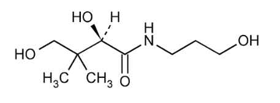

---

수

분

1.0 % 이하(1.0 g)

강열잔분

0.1 % 이하(2 g, 제1 법, 550 ～650 ℃, 항량)

정량법

이원료약0.4 g을정밀하게달아300 mL의검화플라스크에넣고0.1

mol/L 과염소산50 mL를정확하게넣어녹인다음환류냉각기를달아5 시간가열

한다. 식힌다음수분이흡수되지않게주의하여빙초산을넣어씻은액을합하여

0.1 mol/L 프탈산수소칼륨액주)으로적정한다(지시약: 크리스탈바이올렛5 방울). 다

만적정의종말점은청록색으로변할때로한다. 같은방법으로공시험을하여보정

한다.

0.1 mol/L 과염소산1 mL = 20.53 mg C9H19NO4

주)0.1 mol/L 프탈산수소칼륨액: 프탈산수소칼륨약20.42 g을정밀하게달아빙초산을

넣어녹인다. 필요시가온하여녹이고수분이흡수되지않도록주의한다. 실온으로

냉각하여빙초산을넣어1000 mL로한다.

비오틴

Biotin

C10H16N2O3S：244.3

이원료를정량할때환산한건조물에대하여비오틴(C10H16N2O3S) 98.5 ∼101.0 %

를함유한다.

성

상

이원료는흰색또는거의흰색의결정의가루이거나무색의결정이다.

물과에탄올에매우녹기어려우며, 아세톤에거의녹지않고묽은알칼리용액에는

녹는다.

확인시험

1) 이원료를가지고적외부흡수스펙트럼측정법의1)브롬화칼륨정제법에따

라측정할때비오틴표준품과같은파수에서같은강도의흡수를나타낸다.

2) 이원료50 mg을달아빙초산을넣어녹여10 mL로한액1 mL를취하여빙초

산을넣어10 mL로한액을검액으로한다. 비오틴표준품5 mg을달아빙초산을

넣어녹여10 mL로한액을표준액으로한다. 이들액을가지고박층크로마토그래

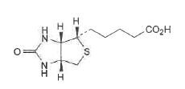

---

프법에따라시험한다. 검액및표준액10 μL씩을박층크로마토그래프용실리카겔을

써서만든박층판에점적한다. 다음에메탄올ㆍ빙초산ㆍ톨루엔혼합액(5 : 25 : 75)을

전개용매로하여약15 cm 전개한다음박층판을바람에말린다. 여기에4-디메틸아

미노신남알데히드용액주)을고르게뿌릴때검액과표준액에서얻은반점의Rf 값과

색상은같다.

：+89.0˚ ～+93˚ (건조물로서0.25 g, 수산화나트륨용액(1→250), 25

D

비선광도

mL, 100 mm)

순도시험1) 용해상태

이원료를건조하여0.25 g을달아수산화나트륨용액(1→250)

25 mL를넣어녹일때이액은무색이고맑다.

2) 유연물질

이원료50 mg을달아빙초산을넣어녹인다음10 mL로한액을검

액으로한다. 이액1 mL를취하여빙초산을넣어10 mL로한액을표준액으로한

다. 표준액1 mL를취하여빙초산을넣어20 mL로한액을표준액(a)로한다. 표준

액1 mL를취하여빙초산을넣어40 mL로한액을표준액(b)로한다. 검액, 표준액

(a) 및표준액(b) 각10 μL씩을박층크로마토그래프용실리카겔을써서만든박층판

에점적한다. 메탄올ㆍ빙초산ㆍ톨루엔(5 : 25 : 75)혼합액을전개용매로하여약15

cm 전개한다음박층판을말린다. 4-디메틸아미노신남알데히드용액주)을고르게뿌릴

때검액에서얻은주반점이외의반점은표준액(b)(0.25 %)에서얻은반점보다진한

것은1개이하여야하고표준액(a)(0.5 %)에서얻은반점보다진하지않아야한다.

건조감량

1.0 % 이하(1 g, 105 ℃, 2 시간)

강열잔분

0.1 % 이하(1 g, 제1 법, 550∼650 ℃, 30분)

정량법이원료약0.2 g을정밀하게달아디메칠포름아미드5 mL을넣고분산시킨

다음완전히용해될때까지가열한다. 에탄올50 mL를넣고0.1M 테트라부틸암모늄

히드록시드액으로적정한다. 같은방법으로공시험을하여보정한다.

0.1M 테트라부틸암모늄히드록시드액1 mL = 24.43 mg C10H16N2O3S

주) 4-디메틸아미노신남알데히드용액: 4-디메틸아미노신남알데히드2.0 g을달아25

% 염산100 mL과에탄올100 mL 혼합액에넣어녹인다. 사용하기직전에에탄올

로4배희석하여만든다.

엘-멘톨

l-Menthol

H

OH

H

CH3

H3C

CH

H

CH3

---

C10H20O : 156.27

이원료는정량할때엘-멘톨(C10H20O) 98.0 ∼101.0 ％를함유한다.

성    상  이원료는무색의결정으로특이하고상쾌한냄새가있고맛은처음에는쏘는

듯하고나중에는시원하다.

이원료는에탄올또는에테르에썩잘녹고물에는매우녹기어렵다.

이원료는실온에서천천히승화한다.

확인시험  1) 이원료는같은양의캠퍼, 포수클로랄또는치몰과같이섞을때액화한다.

2) 이원료1 g에황산20 mL를넣고흔들어섞을때액은혼탁하고황적색을나타

내나3시간방치할때멘톨의냄새가없는맑은기름층을분리한다.



비선광도D

: -45.0 ～-51.0 ° (2.5 g, 에탄올, 25 mL, 100 mm)

융    점  42 ∼44 ℃

순도시험

1) 증발잔류물

이원료2.0 g을수욕에서증발하여잔류물을105 ℃에서2

시간건조할때그양은1.0 mg 이하이다.

2) 티몰

이원료0.20 g을달아아세트산2 mL, 황산6 방울및질산2 방울의냉

혼합액을넣을때액은곧초록색~ 청록색을나타내지않는다.

3) 니트로메탄또는니트로에탄

이원료0.5 g을플라스크에취하여수산화나트륨

시액(1 →2) 2 mL 및강과산화수소수1 mL를넣고환류냉각기를달아10 분간약

한열로끓인다. 식힌다음물을넣어정확하게20 mL로하여여과한다. 여액1 mL

를네슬러관에취하여물을넣어10 mL로하고묽은염산을넣어중화하고다시묽

은염산1 mL를넣고식힌다음설파닐산용액(1 →100) 1 mL를넣고2 분간방치

한

다음

N-(1-나프틸)-N'-디에칠에칠렌디아민옥살산염(C18H24N2O2ㆍ1/2H2O)용액(1

→1000) 1 mL 및물을넣어25 mL로할때액은곧자주색을나타내지않는다.

정량법

이원료약2.0 g을정밀하게달아무수피리딘ㆍ무수아세트산혼합액(8 : 1)

20 mL를정확하게넣고환류냉각기를달아수욕에서2 시간가열한다. 다음에냉각

기를통하여물20 mL로씻어넣고1 mol/L 수산화나트륨액으로적정한다(지시약:

페놀프탈레인시액5 방울). 같은방법으로공시험을한다.

1 mol/L 수산화나트륨액1 mL = 156.27 mg C10H20O

징크피리치온

Zinc Pyrithione

O

S

N

Zn

N

S

O

---

(C5H4ONS)2Zn : 317.70

이원료는건조한것은정량할때징크피리치온[(C5H4ONS)2Zn : 317.70] 90.0 ∼

101.0 %를함유한다.

성

상

이원료는황색을띤회백색의가루로냄새는없다.

이원료는디메틸설폭시드에녹고디메틸포름아미드또는클로로포름에조금녹으며

물또는에탄올에거의녹지않는다.

이원료는수산화나트륨시액에녹는다.

융점

225 ∼235 ℃(분해)

확인시험

1) 이원료1 g을회화하여잔류물에묽은염산을넣어녹인액은아연염의

정성반응을나타낸다.

2) 이원료10 mg을시험관에넣고금속나트륨작은조각을넣어유리봉으로저으

면서약한불로가열용융한다음물5 mL를넣어녹이고여과한다. 이여액에납

시액1 mL를넣으면검은색의침전이생긴다.

3) 이원료5 mg을시험관에넣고2,4-디니트로클로로벤젠10 mg을넣어약한불

로약1 시간가열한다. 여기에수산화칼륨ㆍ에탄올시액4 mL를넣으면액은진한

적갈색을나타낸다.

4) 이원료0.1 g에수산화나트륨시액5 mL를넣어녹이고황산구리시액1 mL를

넣으면어두운초록색의침전이생긴다.

순도시험1) 염화물

이원료2.5 g을달아회화한다음물100 mL를넣고5 분간끓

인다음식혀물로100 mL로하여여과한다. 여액25 mL를검액으로하여염화물

시험법에따라시험한다. 비교액에는0.01 mol/L 염산0.4 mL를넣는다(0.025 % 이

하).

2) 비소

이원료0.2 g에질산칼륨0.5 g 및무수탄산나트륨0.5 g을넣고강열하여

융해한다. 식힌다음묽은황산15 mL를넣어녹여흰색의연기가나타나지않을

때까지가열하고물을넣어검액5 mL로한후비소시험법에따라조작하여시험한

다(10 ppm 이하).

3) 납

이원료1.0 g을달아진한질산20 mL를넣어흔들어섞어가열하면서녹

인다음다시가열하여액이7 mL가되도록농축한다. 이액을실온까지급히식히

고물을넣어100 mL로하여검액으로한다. 이액20 mL를가지고중금속시험법

에따라시험한다(25 ppm 이하).

건조감량

0.5 % 이하(1 g, 105 ℃, 4 시간)

강열잔분

45.6 ∼52.2 % (1 g, 550 ∼650 ℃, 제1법)

정량법

이원료를건조하여약0.3 g을정밀하게달아500 mL 요오드플라스크에

넣고염산20 mL 넣어녹인다. 다시물200 mL를넣어녹이고0.1 M 요오드액으로

적정한다(지시약: 전분시액3 mL). 같은방법으로공시험을하여보정한다.

---

0.1 M 요오드액1 mL = 15.885 mg (C5H4ONS)2Zn

징크피리치온액(50 %)

Zinc Pyrithione Solution(50 %)

이원료는「기능성화장품기준및시험방법」에따른‘징크피리치온’을가지고정제

수, 소듐폴리나프탈렌설포네이트등을혼합하여균질하게만든원료이다. 이원료는정

량할때징크피리치온[(C5H4ONS)2Zn : 317.70] 47.0 ∼53.0 %를함유한다.

성

상

이원료는흰색의수성현탁제로약간특이한냄새가있다.

확인시험

1) 이원료1 g을사기도가니에넣고약하게가열, 탄화한후500 ∼600

℃에서강열회화한다. 식힌다음2 M 염산20 mL를넣어녹인다. 이일부를수산

화나트륨시액을넣어중성으로한후생기는침전을다시과량의수산화나트륨시액

을넣은액에황화나트륨시액을넣을때흰색의침전이생긴다. 이침전을따로취

하여여기에묽은아세트산을넣으면녹지않으나묽은염산을넣으면녹는다.

2) 이원료10 mg에0.5 M 수산화나트륨액을넣어녹이고1000 mL로하여0.5 M

수산화나트륨액을대조로하여흡광도측정법에따라흡수스펙트럼을측정할때파장

244 nm 및283 nm 부근에서흡수극대를나타낸다.

pH

5.0 ∼8.0

정량법

이원료를표시량에따라징크피리치온[(C5H4ONS)2Zn]으로서약50 mg에

해당하는양을정밀하게취하여디메칠설폭사이드를넣어녹여200 mL로한다. 이

액4 mL를정확하게취하여에칠렌디아민테트라초산디나트륨포화용액6 mL와0.1

% 2,2-디피리딜디설피드액4 mL를넣어녹이고물을넣어정확하게100 mL하여

물중탕(약70 ℃)에서20분동안가온하고식힌다음검액으로한다. 따로징크피리

치온표준품약50 mg을정밀하게달아검액과같이조작하여표준액으로한다. 검

액및표준액각20 μL씩을가지고다음조건으로액체크로마토그래프법에따라시

험하여검액및표준액의징크피리치온의피크면적AT 및AS를측정한다.

징크피리치온[(C5H4ONS)2Zn]의양(mg)

T

징크피리치온표준품의양× 

S

조작조건

검출기: 자외부흡광광도계(측정파장235 nm)

칼

럼: 안지름약4.6 mm, 길이약25 cm인스테인레스강관에5 μm의액체크로마

토그래프용옥타데실실릴실리카겔을충전한다.

이동상: 아세토니트릴및물의혼합비를다음과같이단계적또는농도기울기적으로

제어한다.

---

아세토니트릴

물

시간(분)

(vol %)

(vol %)

0

30

70

10

90

10

15

30

70

20

30

70

유

량: 0.8 mL/분

---

[별표10]

일반시험법

(제2조제10호관련)

I. 원료

1. 기체크로마토그래프법

27. 알코올수측정법

2. 강열감량시험법

28. 암모늄시험법

3. 강열잔분시험법

29. 액체크로마토그래프법

4. 건조감량시험법

30. 액화가스시험법

5. 검화가측정법

31. 에스텔가측정법

6. 굴절률측정법

32. 여과지크로마토그래프법

7. 납시험법

33. 연화점측정법

8. 담점측정법

34. 염화물시험법

9. 메탄올및아세톤시험법

35. 요오드가측정법

10. 메톡실기정량법

36. 융점측정법

11. 물가용물시험법

37. 음이온계면활성제정량법

12. 박층크로마토그래프법

38. 응고점측정법

13. 불검화물측정법

39. 적외부흡수스펙트럼측정법

14. 불소시험법

40. 전기적정법

15. 비소시험법

41. 점도측정법

16. 비용적측정법

42. 정성반응법

17. 비점측정법및증류시험법

43. 중금속시험법

18. 비중측정법

44. 증발잔류물시험법

19. 비타민A정량법

45. 질소정량법

20. 산가측정법

46. 철시험법

21. 산가용물시험법

47. pH측정법

22. 산불용물시험법

48. 황산염시험법

23. 산소플라스크연소법

49. 황산에대한정색물시험법

24. 선광도측정법

50. 흡광도측정법

25. 수분정량법

51. 향료시험법

26. 수산기가측정법

II. 제제

1. pH 시험법

3. 염모력시험법

2. 자외선차단제함량시험대체시험법

III. 계량기및용기, 색의비교액, 시약ㆍ시액, 용량분석용표준액및표준액

1. 계량기및용기

4. 용량분석용표준액

2. 색의비교액

5. 표준액

3. 시약ㆍ시액

---

일반시험법은원료각조및제제의공통된시험법및이에관련되는사항을통합한것이다.

따로

규정이없는한기체크로마토그래프법, 강열감량시험법, 강열잔분시험법, 건조감량시험법, 검화가측정

법, 굴절률측정법, 납시험법, 담점측정법, 메탄올및아세톤시험법, 메톡실기정량법, 메탄올시험법, 물

가용물시험법, 박층크로마토그래프법, 불검화물측정법, 불소시험법, 비소시험법, 비용적측정법, 비점측

정법및증류시험법, 비중측정법, 비타민A정량법, 산가측정법, 산가용물시험법, 산불용물시험법, 산소

플라스크연소법, 선광도측정법, 수분정량법, 수산기가측정법, 수은시험법, 알코올수측정법, 암모늄시험

법, 액체크로마토그래프법, 액화가스시험법, 에스텔가측정법, 여과지크로마토그래프법, 연화점측정법,

염화물시험법, 요오드가측정법, 융점측정법, 음이온계면활성제정량법, 응고점측정법, 적외부흡수스펙트

럼측정법, 전기적정법, 점도측정법, 정성반응, 중금속시험법, 증발잔류물시험법, 질소정량법, 철시험법,

pH측정법, 황산염시험법, 황산에대한정색물시험법, 흡광도측정법, 향료시험법은각시험법에따른다.

I. 원료

1. 기체크로마토그래프법

기체크로마토그래프법은적당한고정상을써서만든칼럼에검체혼합물을주입하고이동상으로불활

성기체(캐리어가스)를써서고정상에대한유지력의차를이용하여각각의성분으로분리하여분석하는

방법으로, 기체검체또는기화할수있는검체에적용할수있으며물질의확인, 순도시험또는정량등

에쓴다. 칼럼에주입된혼합물은각성분의고유의비율k로이동상과고정상으로분포한다.

고정상에존재하는양

k =



이동상에존재하는양

이비율k와이동상의칼럼통과시간t0(k = 0인물질의검액주입시부터피크정점까지의시간) 및유지

시간tR(측정검액의주입시부터피크정점까지의시간)과의사이에는다음과같은관계가있으며같은조

건에서는유지시간은물질의고유한값이된다.

tR = (1+k)t0

장치

보통캐리어가스도입부및유량제어장치, 검체도입부, 칼럼, 칼럼항온조, 검출기및기록장치

로되어있고필요하면연소가스, 조연(助燃)가스및부가(付加)가스등의도입장치및유량제어장치, 헤

드스페이스용검체도입장치등을쓴다. 캐리어가스도입부및유량제어장치는캐리어가스를일정한유

량으로칼럼속으로보내는것으로보통압력조절밸브, 유량조절밸브및압력계등으로구성된다. 검체

도입장치는일정량의검체를정확하고재현성이좋게캐리어가스유로중에도입하기위한장치로충

전칼럼용과모세관칼럼용이있다. 또한모세관칼럼용검체도입장치에는분할도입방식과비분할도입방

식의장치가있다. 보통칼럼은충전칼럼및모세관칼럼의두종류로분류된다. 충전칼럼은일정한크

기를갖춘기체크로마토그래프용충전제를불활성인금속, 유리또는합성수지관에균일하게충전한

것이다. 충전칼럼안지름이1 mm 이하의것은충전모세관칼럼(마이크로팩트칼럼)이라고한다. 모세관

칼럼은불활성금속, 유리, 석영또는합성수지의관내면에기체크로마토그래프용고정상을유지시킨

중공구조인것이다. 칼럼항온조는필요한길이의칼럼을수용할수있을정도로크고칼럼온도를일

정하게유지하기위한온도제어장치를가지고있다. 검출기는칼럼으로분리된성분을검출하는것으

로알칼리열이온화검출기, 염광광도검출기, 질량분석계, 수소염이온화검출기, 전자포획검출기, 열전도

도검출기등이있다. 기록장치는검출기에서얻어진신호의강도를기록하는것이다.

조작법

따로규정이없는한다음방법에따른다. 장치를미리조정한다음원료각조에규정하는

---

조작조건의검출기, 칼럼및캐리어가스를쓰고, 캐리어가스를일정한유량으로흐르게하고칼럼을

규정의온도에서평형으로한다음, 원료각조에서규정하는양의검액또는표준액을마이크로시린

지를써서검체도입부를통하여주입한다. 분리된성분은검출기로검출하고기록장치에서크로마토

그램으로기록한다.

확인및순도시험

확인은검액과표준액의유지시간의일치또는검액에표준액을첨가하여도유지시

간이변하지않고피크폭이넓어지지않는지의여부로시험한다. 순도는보통검액중의혼재물의한

도에해당하는농도의표준액을쓰는방법또는면적백분율법으로시험한다. 따로규정이없는한검

액의이성체비는면적백분율법에의하여구한다.

면적백분율법은크로마토그램상에서얻어진각성분의피크면적의총계를100으로하고이에대한각

성분의피크면적비로부터조성비를

구한다. 다만, 정확한조성비를얻기위해서는혼재물의검출감도

에따라피크면적을보정한다.

정량

보통내부표준법에따르지만적당한내부표준물질을얻을수없을때에는절대검량선법으로시

험한다.

정량결과에대하여피검성분이외의성분의영향이무시될수없을때는표준첨가법에따른

다.

1) 내부표준법

내부표준법에서는일반적으로되도록피검성분에가까운유지시간을가지며모든피

크와완전히분리되는안정한물질을내부표준물질로선택한다. 원료각조에규정하는내부표준물질

일정량에대하여피검표준품을단계적으로넣어여러종류의표준액을조제한다. 이들표준액일정량

씩을주입하여얻은크로마토그램으로부터내부표준물질의피크면적또는피크높이에대한피검표준

품의피크면적또는피크높이의비를구한다. 이비를종축으로하고표준피검성분량또는내부표준

물질량에대한표준피검성분량의비를횡축으로하여검량선을작성한다. 이검량선은보통원점을

지나는직선이된다, 다음에원료

각조에규정하는방법으로같은양의내부표준물질을넣은검액을

조제하고검량선을작성하였을때와같은조건으로크로마토그램을기록하여그내부표준물질의피크

면적또는피크높이에대한피검성분의피크면적또는피크높이비를구하고검량선을써서피검성분

량을구한다.

원료각조에서는보통상기의검량선이직선이되는농도범위에들어가는하나의표준액및표준액에

가까운농도의검액을조제하여원료각조에서규정하는각각의양에대하여같은조건으로기체크로

마토그래프법에따라시험하여피검성분량을구한다. 보통표준액의규정량을반복주입하여얻어진

각각의크로마토그램에서내부표준물질의피크면적또는높이에대한표준피검성분의피크면적및높

이의비를구하고그상대표준편차(변동계수)를구하여재현성을확인한다.

2) 절대검량선법

피검표준품을단계적으로취하여표준액을조제하고표준액일정량씩을정확하고

재현성있게주입한다. 얻어진크로마토그램으로부터종축에표준피검성분의피크높이또는피크면적,

횡축에표준피검성분량을취하여검량선을작성한다. 이검량선은보통원점을지나는직선이된다.

다음에원료각조에규정하는방법으로검액을조제하여검량선을작성하였을때와같은조건으로크

로마토그램을기록하여피검성분의피크높이또는피크면적을측정하고검량선을써서피검성분량을

구한다.

원료각조에서는보통상기의검량선이직선이되는농도범위에들어가는하나의표준액및

표준액

에가까운농도의검액을조제하고원료각조에서규정하는각각의양에대하여같은조건으로기체

크로마토그래프법에따라시험하여피검성분량을구한다. 이방법은모든측정조작을엄밀하게일정

한조건으로하여시험한다. 보통미리표준액의규정량을반복주입하여얻은각각의크로마토그램

의피크면적또는높이를측정하고그상대표준편차(변동계수)를구하여재현성을확인한다.

3) 표준첨가법

검액에서4 개이상의일정액을정확하게취한다. 이중1 개를제외하고채취한액에

피검성분의표준액을피검성분의농도가단계적으로다르게되도록정확히넣는다. 이액및먼저제

외한1 개의액을각각정확하게일정량으로희석하여각각검액으로한다. 이액의일정량씩을정확

히재현성있게주입하여얻어진크로마토그램에서각각의피크면적을구한다. 각각의검액에넣은피

검성분의농도를산출하여횡축에표준액첨가에의한피검성분의증가량을, 종축에면적을취하고

그래프에각각의값을표시하여관계선을작성한다.

관계선의횡축과의교점과원점과의거리에서피검성분량을구한다. 보통표준액의규정량을반복주

---

입하여얻어진각각의크로마토그램으로부터표준피검성분의피크면적을구하고그상대표준편차(변

동계수)를구하여재현성을확인한다. 또한이방법은절대검량선법으로피검성분의검량선을작성하

였을때검량선이원점을지나는직선일때적용할수있다. 또모든측정조작을엄밀하게일정한조

건을유지하여시험한다.

피크측정법보통다음의방법을쓴다.

1) 피크높이측정법

가) 피크높이법

피크의정점에서기록지의횡축으로내린수선(垂線)과피크의

양끝을연결하는접선(기선)과의교차점으로부터정점까지의길이를측정한다.

나) 자동피크높이법검출기로부터의신호를데이터처리장치를써서피크높이로측정한다.

2) 피크면적측정법

가)반치폭법피크높이의중심점에서의피크폭에피크높이를곱한다. 나) 자동적분

법검출기로부터의신호를데이터처리장치를써서피크면적을측정한다.

용

어

검출감도

순도시험에서분석목적물질을확실하게검출하기위하여표준액등의일정량을주

입하고그검출의정도를구하여조작이시험목적에적합한지의여부를검증하기위한것이다. 데이

터처리장치를쓸때에는보통피크면적(μVㆍs)으로, 기록계를쓸때는보통피크높이(mm)로규정한

다. 또한검출한계또는정량한계를써서규정할수있다.

시험의재현성

시험조작은원료각조의설정시와는다른상황하에서이루어진다. 따라서시험의재

현성은얻어지는결과가초기시험방법의목적에적합한지의여부를검증하는한가지방법으로사용

된다. 시험의재현성은상대표준편차SR(%)로규정한다.

대칭계수

크로마토그램상의피크의대칭성의정도를나타내는것으로대칭계수S 로서다음식으로

정의된다.

W0.05h

S

=

2f

W0.05h : 피크의기선에서피크높이의1/20의높이에서의피크폭

f : W0.05h의피크폭을피크의정점에서기록지의횡축에내린수선으로2 등분했을때의피크의올라

가는쪽의거리. 다만, W0.05h, f 는같은단위를사용한다.

상대표준편차: 보통다음식으로정의되는상대표준편차SR(%)로규정된다.

n

∑

100

i = 0 (xi-Ẋ) 2

S R(%)

=

×

Ẋ

n - 1

xi : 측정치

Ẋ: 측정치의평균값

n : 측정회수

피크의완전분리

피크가완전분리한다는것은분리도1.5 이상을의미한다.

분리계수

크로마토그래프상의피크상호의유지시간의관계를나타내는것으로분리계수α라하며다

음식으로정의된다. 분리계수α는두개의물질의분배의열역학적차이의지표로서, 기본적으로는두

개의물질의분배평형계수의비또는두개의물질의질량분포비의비이지만, 크로마토그램에서두

개의물질의유지시간의비로서구한다.

(t R 2 - t0 )

α =

(tR 1 - t0 )

tR1, tR2 : 분리도측정에사용하는2개의물질의유지시간. 다만,

tR1 ＜

tR2

t0

:

이동상의

칼럼

통과시간

(k

=

0의

물질의

검체

주입시에서

피크정점까지의

시간)

---

분리도

크로마토그램상의피크상호의유지시간과각각의피크폭과의관계를나타내는것으로분리

도Rs로서다음식으로정의된다.

(tR 2 -

tR 1 )

Rs

=

1.18

×

(W0.5h 1 -

W0.5h 2 )

tR1, tR2 : 분리도측정에서사용하는두개의물질의유지시간. 다만,

tR1

tR2

＜

W0.5h1, W0.5h2 : 각각의피크의높이의중점에서의피크폭

단, tR1, tR2, W0.5h1, W0.5h2 는같은단위를사용한다.

이론단수

칼럼중에서물질의밴드의넓어지는정도를나타내는것으로서보통다음식으로정의된다.

2

tR

N

=

5.5 5

×

W0.5h2

tR : 물질의유지시간

W0.5h : 피크높이의중심점에서피크폭.

다만,

tR, W0.5h는같은단위를사용한다.

주의: 표준피검품, 내부표준물질, 시험에쓰는시약ㆍ시액은측정을방해하는물질을함유하지않는것

을쓴다. 원료각조의조작조건중에서칼럼의안지름및길이, 충전제의입자경, 고정상의농

도, 칼럼온도, 캐리어가스의유량은규정된유출순서, 분리도, 대칭계수및상대표준편차를얻을

수있는범위내에서일부변경할수있다.

다만, 헤드스페이스용검체주입장치및그조작조건

은규정하는방법이상의정확도, 정밀도가인정되는범위내에서변경할수있다.

2. 강열감량시험법

강열감량시험법은검체를원료각조에서규정한조건으로강열하여그감량을측정하는방법이다.

이

방법은보통강열하여도그본질이변하지않는무기물에대하여적용한다.

원료각조에서예를들면

5.0% 이하(1g, 500℃, 항량)이라고규정한것은검체약1g을정밀하게달아500℃에서항량이될때까

지강열할때그감량이검체채취량의5.0% 이하라는것을나타낸다.

조작법

따로규정이없는한백금제, 석영제, 사기도가니또는증발접시를항량이될때까지강열하

고데시케이터(실리카겔)속에서방냉한다음그무게를정밀하게단다.

여기에원료각조에서규정하

는양의±10% 범위의검체를정밀하게달아이것을규정시간또는항량이될때까지강열하여데시

케이터(실리카겔)속에서방냉한다음그무게를정밀하게단다.

3. 강열잔분시험법

강열잔분시험법은검체를다음방법으로강열할때남는양을측정하는방법이다.

보통유기물중에

불순물로서들어있는무기물의함량을알기위하여적용되나때에따라서는유기물중의구성성분으로서

들어있는무기물을또는휘발성무기물중에들어있는불순물의양을측정하는데적용한다.

원료각조에

서예를들면0.10% 이하(1g, 제１법)로규정한것은검체약1g을정밀하게달아제１법의조작법에

따라강열할때그잔분이검체채취량의0.10% 이하임을나타낸다.

검체채취법

따로규정이없는한백금제, 석영제또는사기도가니를항량이될때까지강열하여데시

케이터(실리카겔)속에서방냉한다음그무게를정밀하게달아여기에원료각조에서규정한양의

---

±10% 범위의검체를정밀하게달아다음의조작을한다.

또한원료각조에서건조후로규정하는경

우에는건조감량항의조건에서건조한검체를취한다.

조작법

제１법

검체를황산소량으로적시고천천히가열하여될수있는한낮은온도에서거의

회화하든가또는휘산시킨다음여기에황산소량을넣어적시고완전히회화하여항량이될때까지

강열(450～550℃)한다.

이것을데시케이터(실리카겔)속에서식힌다음무게를정밀하게단다.

제２법

검체를천천히가열하여될수있는한저온에서거의회화하든가또는휘산시킨다음황산

으로적시고완전히회화하여항량이될때까지강열한다.

이것을데시케이터(실리카겔)속에서식힌

다음그무게를정밀하게단다.

제３법

검체를처음은약하게가열하고천천히강열(800～1200℃)하여완전히회화하고데시케이터

(실리카겔)속에서식힌다음무게를정밀하게단다.

만일이방법으로도탄화물이남을때는열탕을

넣어침출하여정량분석용여과지(5종C)를써서여과하고잔류물을여과지와함께강열한다.

이것을

데시케이터(실리카겔)속에서식힌다음무게를정밀하게단다. 이방법으로도탄화물이남을때는에

탄올15㎖를넣어유리막대로탄화물을부수고에탄올을태워다시조심하면서강열한다음앞과같

은방법으로조작하여무게를정밀하게단다.

4. 건조감량시험법

건조감량시험법은검체를원료각조에서규정된조건으로건조하여그감량을측정하는방법이다.

원

료각조에서예를들면

0.5% 이하(0.5g, 감압, 오산화인, 4시간)으로규정되어있는것은검체약0.5g을

정밀하게달아오산화인을건조제로한데시케이터속에서4시간감압건조할때그감량이검체채취량

의0.5% 이하임을나타낸다.

조작법

칭량병을원료각조에서규정된방법에따라30분간건조하고그무게를정밀하게단다.

검

체는원료각조에서규정된양의±10%의범위내의양을칭량병에넣고따로규정이없는한그층의

높이가5㎜이하가되도록편편하게편다음그무게를정밀하게단다.

이것을건조기에넣고칭량병

마개를빼어옆에놓고건조한다.

검체가큰결정또는덩어리일때에는재빨리갈아약2㎜이하의

가루로하여쓴다.

건조한다음칭량병의마개를닫고건조기에서꺼내서무게를정밀하게단다. 가

열하여건조할경우에는데시케이터(실리카겔)속에서식힌다음그무게를정밀하게단다.

원료각조

에서규정된건조온도보다낮은온도에서융해하는검체는융해온도보다5～10℃낮은온도에서미

리1～2시간건조한다음규정온도에서규정시간또는항량이될때까지건조한다.

건조제는원료각

조에서규정한것을쓰며때때로바꾸어주어야한다.

5. 검화가측정법

검화가는검체1g중의에스텔를검화하고유리산을중화시키는데필요한수산화칼륨(KOH)의㎎수이

다.

조작법

따로규정이없는한검체1～2g을정밀하게달아200㎖의플라스크에넣고0.5N 수산화칼

륨ㆍ에탄올액25㎖를정확하게넣는다.

여기에갈아맞춘환류냉각기또는길이750㎜, 지름6㎜의

공기냉각기를달아수욕상에서때때로흔들어섞으면서1시간가열한다.

식힌다음페놀프탈레인시

액1㎖를넣고0.5N 염산으로과량의수산화칼륨을적정한다.

같은방법으로공시험을하여보정한

다.

(a―b) × 28.053

검화가＝

검체의양(g)

a : 공시험의0.5N 염산소비량(㎖)

b : 검체의0.5N 염산소비량(㎖)

---

6. 굴절률측정법

물질의굴절률은진공중의광의속도와물질중의광의속도와의비(比)이며물질에대한광의입사각

의정현(正弦)과굴절각의정현(正弦)과의비(比)는같다.

보통굴절률은광의파장및온도에따라변

화한다.

굴절률n t

D라함은광선으로나트륨의스펙트라중의D선을써서온도t℃에서측정하였을때

의공기에대한굴절률을말한다.

조작법

굴절률측정은따로규정이없는한압베굴절계를쓰며원료각조에서규정하는온도의±0.

2℃이내에서측정한다.

7. 납시험법

납시험법은검체중에들어있는납(Pb)의양의한도를시험하는방법이다.

그한도는납으로서중량백

만분율(ppm)로나타낸다.

조작법

따로규정이없는한원료각조에서규정한양의검액을취하여납시험법용구연산암모늄시액

2㎖및메칠레드시액2방울을넣고액이황색을나타낼때까지강암모니아수를넣는다.

여기에납시

험법용아황산나트륨시액10㎖및시안화칼륨시액10㎖를넣어잘흔들어섞어수욕상에서10～15분간

가열한다.

식힌다음강암모니아수1.5㎖를넣어분액깔때기로옮기고디티존ㆍ벤젠시액10㎖를정확

하게넣고1분간강하게흔들어섞은다음물층을버린다.

여기에묽은시안화칼륨시액40㎖를넣어

30초간강하게흔들어섞어방치한다음벤젠층을따로취

하여벤젠을대조로하여층장10㎜, 파

장520㎚에서흡광도를측정한다.

따로디티존용납표준액을같은방법으로처리하여얻은검량선에

따라납(Pb)의양을구한다.

주의: 1) 시험및검액조제에쓰이는시약및시액은공시험에서정색치않거나또는거의정색하지

않는것을쓴다.

2) 검체가철염인경우에는납시험법용구연산암모늄시액은10㎖, 납시험법용아황산나트륨시액은20

㎖및시안화칼륨시액은20㎖로한다.

8. 담점측정법

담점은따로규정이없는한다음방법에따라측정한다.

장

치

그림과같은장치를쓴다.

A : 공기외통(유리또는금속제의평저원통형(平低圓筒形)으로안지름은검체용기의바깥지름보다9.5

∼12.5㎜큰것)

B : 검체용기(평저원통형의경질유리용기)

C : 원판(코르크또는펠트제로두께6㎜, 지름은공기외통의내벽에접한것)

D : 환상가스켓(두께5㎜이며, 안둘레는검체용기B의외벽에밀착하고바깥둘레는공기외통A의

내벽에가볍게접한것과같은모양의치수로코르크, 펠트또는적당한재료로만든것)

E : 냉각욕(유리제또는적당한재료로만든것)

F : 온도계저유동점용온도계(低流動点用溫度計)

G : 온도계저유동점용온도계또는고유동점용온도계(高流動点用溫度計)

조작법

검체를미리무수황산나트륨으로탈수하여여과하고120℃까지가열한다음검체용기B에

---

51～57㎜의높이까지넣는다.

온도계F를B의중앙에넣어수은구를B

의밑부분에접촉시킨다.

검체가예상한담점보다14℃이상높은온도

가되도록조심하면서그밑에원판C를놓고한제(寒劑)로0～3℃를유

지하는냉각욕E에넣은공기외통A의가운데에B를넣는다.

A가E안

에서한제로부터25㎜이상밖으로나오지않도록한제의양을조절하

여넣는다.

검체의온도가1℃떨어질때마다B를빠르게또검체가움직이지않도

록꺼내어검체가흐려지는지를조사하고A에다시넣는다.

이조작은

3초이내에하여야한다.

검체의온도가10℃까지떨어져도흐려지지않

을경우에는B를-17∼-15℃를유지하는제２의냉각욕중의공기외통속

으로옮기고다시검체의온도가-7℃까지떨어져도흐려지지않을경우

에는-35∼-33℃를유지하는제３의냉각욕중의공기외통속으로옮겨서

측정을계속한다.

검체용기B의밑부분에조금이라도검체가흐려지는

것이인정될때의온도를읽어담점으로한다.

9. 메탄올및아세톤시험법

메탄올및아세톤시험법은에탄올및에탄올을함유하는제제중에혼재하는메탄올및아세톤의허용

한도를시험하는방법이다.

메탄올

조작법

검체10㎖를취하여알코올수측정법의제１법에따라최후에맑게분리된적색의알코올층

1㎖를정확하게취하여물을넣어정확하게20㎖로하여검액으로한다.

검액및메탄올표준액5㎖

씩을각각다른시험관에정확하게넣고각시험관에과망간산칼륨ㆍ인산시액2㎖를넣어15분간방

치한다음수산ㆍ황산시액2㎖를넣어탈색시키고다시푹신ㆍ아황산시액5㎖를넣어흔들어섞고30

분간상온에서방치할때검액이나타내는색은메탄올표준액이나타내는색보다진하지않다.

아세톤

조작법

검체10㎖를취하여알코올수측정법의제１법에따라최후에맑게분리된적색의알코올층

1㎖를정확하게취하여수산화나트륨용액(1→6) 1㎖및니트로프루싯나트륨시액2방울을넣을때액은

적색을나타내지않는다.

다만액이적색을나타내더라도초산1.5㎖를넣을때자색으로변하지않

는다.

10. 메톡실기정량법

메톡실기정량법은검체에요오드화수소산을넣고끓여생기는요오드화메칠을브롬으로산화하여생긴

요오드산을치오황산나트륨액으로정량하는방법이다.

R―OCH3 ＋HI ＝CH3I ＋R―OH

CH3I ＋3Br2 ＋3H2O ＝CH3Br ＋5HBr ＋HIO3

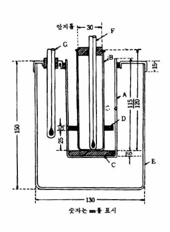

---

메탄올, 에텔, 아세톤등은이정량법을방해한다.

장

치

다음과같은장치를쓴다.

A

: 분해플라스크

B

:

이산화탄소도입관(나사콕크를

낀

고무관이며

이산화탄소

발생기에연결한다)

C

: 역류를막는것

D

: 갈아맞춘연결부

E

: 공기냉각관

F

: 가스세척기(적인(赤燐) 2.0g 및물5㎖를혼합하여현탁액을

만들어이액1㎖를넣는다)

G1, G2 : 고무마개

H

: 세관부(쓰기직전에물1방울을넣어고무마개G2를막는다)

J

: 가스도관

K

: 흡수관

L

: 2㎖의표선

M

: 칭량관

조작법

따로규정이없는한메톡실기(CH3O:31.03) 약0.65㎎에해당하는검체를칭량관M을써서

마이크로화학천칭으로정밀하게달아분해플라스크A에넣고페놀20㎎및무수초산4～5방울을넣

어필요하면가온하여녹인다.

흡수관K의표선L까지초산나트륨ㆍ빙초산용액(1→10)을넣고브롬

4～5방울을넣은다음가스도관J를삽입하고J의아래끝이K의바닥으로부터1～2㎜떨어져있도

록K를고정한다.

K의관구를희석시킨개미산(1→10)로적신탈지면으로덮는다.

여기에요오드화

수소산2㎖를이산화탄소도입관B로부터A에넣어갈아맞춘연결부D에무수초산을묻히고공기

냉각관E와연결한다.

B에역류를막는C를삽입하고이산화탄소를도입하는고무관을연결한다음

이산화탄소를통하고나사콕크를조절하여1초에거품이1～2개나오도록한다.

A의바닥을마이크

로버너로가열하고요오드화수소산이공기냉각관E의거의중앙까지환류하도록30분간끓인다.

이

산화탄소를계속통하면서식힌다음K를내려서그액면을J로부터떨어지게하고고무마개G2를

빼고J의내외를물로씻어K에넣는다.

K의내용물을초산나트륨용액(1→5) 5㎖가들어있는100㎖

의유리마개삼각플라스크에옮기고K를물소량씩으로3회씻고씻은액을앞의유리마개삼각플라

스크에넣는다.

여기에희석시킨개미산(1→10) 2～3방울을기벽에따라넣고잘흔들어서섞은다

음메칠레드시액1방울을넣어잘흔들어섞는다.

만일액의홍색이없어졌을때는먼저와같이희

석시킨개미산(1→10) 및메칠레드시액을추가하여액에엷은홍색이남을때까지이조작을반복한

다.

다음에요오드화칼륨용액(1→10) 2㎖및묽은황산5㎖를넣어마개를하고2분간방치하여유리

된요오드를0.01N치오황산나트륨액으로적정한다(지시약: 전분시액1㎖).

같은방법으로공시험을

하여보정한다.

0.01N 치오황산나트륨액1㎖＝0.05172㎎CH3O

주

의: 시험에쓰이는시액은공시험을할때0.01N치오황산나트륨액0.1㎖이상을소비하지않는것

을쓴다.

11. 물가용물시험법

물가용물시험법은검체중의물에녹는물질의양을측정하는방법이다.

조작법

따로규정이없는한검체약5g을정밀하게달아물약70㎖를넣어5분간끓인다.

식힌

다음물을넣어100㎖로하고잘저어섞은다음여과한다.

처음의여액약10㎖를버리고다음의

여액40㎖를정확하게취하여수욕상에서증발건고하고105～110℃에서1시간건조한다음그무게를

정밀하게단다.

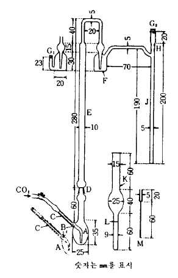

---

12. 박층크로마토그래프법

이방법은여과지크로마토그래프법에서여과지대신실리카겔의박층을쓰는방법이다.

시

약

실리카겔(박층크로마토그래프용) 백색의가루로입자의크기는5～25㎛(평균)이고5～15%의

황산칼슘을함유한다.

조작법

따로규정이없는한평활한내열성유리판(세로200㎜, 가로50㎜또는200㎜, 두께3㎜) 위

에적당한장치를써서실리카겔(박층크로마토그래프용)을두께250～300㎛의박층상으로균일하게

도포하고박층을위로하여수평으로놓고실온에서2～3시간방치하고이것을50～60℃에서1시간건

조한다. 다시

105℃에서1시간가열한다음건조제를넣은기밀용기내에서식힌다. 박층의한쪽끝에

서부터20㎜가되는곳에약10㎜의간격으로검액및표준액을마이크로피펫또는모세관을써서

점적한다.

이것을다시기밀용기내에방치하고반점을건조한다음미리전개용매를넣은전개용용

기내에검액을점적한한쪽끝을아래로하여넣는다.

그한쪽끝에서약10㎜가되는곳까지용매

에담그고전개용용기를잘닫아상승법으로전개시킨다.

전개용매가검액을점적한곳으로부터

100㎜의거리까지상승했을떄유리판을전개용용기에서꺼내어건조한다.

검액및표준액에서얻

은반점의위치및색을자연광하에서, 필요하면자외선하에서비교관찰한다. 다음식에따라"Rf"

또는"Rs"값을구한다.

원선에서반점의중심까지의거리

Rf 

원선에서용매선단까지의거리

원선으로부터검액의반점중심까지의거리

Rs 

원선으로부터표준액의반점중심까지의거리

주

의: 실리카겔을유리판에도포할때에는그용기에표시된조제법에따른다

13. 불검화물측정법

불검화물은검체중의수산화칼륨으로검화되지않고유기용매에녹으며물에녹지않는물질을말

한다.

조작법

따로규정이없는한검체약5g을정밀하게달아250㎖의플라스크에넣고수산화칼륨ㆍ

에탄올시액50㎖를넣고환류냉각기를달아수욕상에서때때로흔들어섞으면서1시간천천히끓인

다음제１의분액깔때기에옮긴다.

플라스크는온수100㎖로씻고씻은액은제１의분액깔때기에

넣고여기에물50㎖를넣어실온이될때까지식힌다.

다음에텔100㎖로플라스크를씻고씻은액

을제１의분액깔때기에넣고1분간세게흔들어섞어추출한다음명확하게두층으로나누어질때까

지방치한다.

물층은제２의분액깔때기로옮기고에텔50㎖를넣어같은방법으로흔들어섞은다

음방치하고물층은다시제３의분액깔때기로옮겨에텔50㎖를넣고다시같은방법으로흔들어섞

어추출한다.

제２및제３의분액깔때기중의에텔추출액은제１의분액깔때기로옮기고각각분액

깔때기는소량의에텔로씻고씻은액은제１의분액깔때기에합한다.

제１의분액깔때기에물30㎖

씩을넣고씻은액이페놀프탈레인시액2방울로홍색을나타내지않을때까지씻는다.

에텔액에무

수황산나트륨소량을넣고1시간방치한다음건조한여과지를써서미리무게를단플라스크에여과

한다.

제１의분액깔때기는에텔로잘씻고씻은액은먼저의여과지를써서플라스크에합하고여

액및씻은액을수욕상에서가온하여에텔을거의날려보낸다음아세톤3㎖를넣고다시수욕상에

서증발건고하고감압하(약200㎜Hg)에서70～80℃로30분간가열하고데시케이터(감압, 실리카겔)에

옮겨30분간식힌다음무게를단다.

플라스크에에텔2㎖및중화에탄올10㎖를넣고잘흔들어섞

---

어추출물을녹인다음페놀프탈레인시액2～3방울을넣은다음0.1N 수산화칼륨ㆍ에탄올액으로30초

간지속하는엷은홍색을나타낼때까지혼입지방산을적정한다.

A― (B × 0.0282)

× 100

불검화물(％) ＝

C

A : 추출물의양(g)

B : 0.1N 수산화칼륨ㆍ에탄올액의소비량(㎖)

C : 검체의양(g)

14. 불소시험법

불소시험법은검체중에함유되는불소의양의한도를시험하는방법이다.

그한도는불소(F)의중량

백분율(%)로표시한다.

장

치

그림과같은장치를쓴다.

A : 증류플라스크(용량약300㎖)

B : 수증기발생기(용량약1ℓ)

C : 냉각기

D : 수기(용량약200㎖)

E : 수증기도입관(안지름약8㎜)

F : 핀치콕크가달린고무관

G : 온도계

조작법

1) 검액의조제

불소100～300㎍에해당

하는양의검체를정밀하게달아물20～30㎖를

써서증류플라스크A에씻어넣고유리구슬8～12개, 희석시킨정제황산50㎖및검체중의염소이온

에해당하는

양이상으로황산은을넣어섞는다.

다음A를미리수증기도입관E에수증기를통

해서씻은증류장치에연결한다.

수기D에는물약20㎖를넣고냉각기C의끝을이물에잠기게

한다. A를가열하여액의온도가130℃로될때핀치콕크로고무관F를막고수증기발생기B에서수

증기를통한다.

동시에A액의온도를140±5℃로유지하도록가열을조절한다.

유액이170～180㎖가

되었을때증류를그치고유액을메스플라스크에옮겨D를물소량으로씻고씻은액을유액에합하

고물을넣어200㎖로하여검액으로한다.

2) 정량조작

검액및불소표준액20㎖씩을각각50㎖메스플라스크에넣고불소시험법용알리자린

콤플렉손시액1㎖, 질산란탄시액1㎖, pH 5.2 초산ㆍ초산나트륨완충액5㎖, 아세톤20㎖및물을넣어

50㎖로하고잘섞어1시간방치한다음파장620㎚에서흡광도를측정한다.

따로물20㎖를50㎖

메스플라스크에취하고검액의조제와같은방법으로조작하여대조액으로한다.

A × 200

불소(F)의양(㎍) ＝

A S × 검체의양(g)

A

: 검액에서얻은정색도의흡광도

AS : 불소표준액에서얻은정색도의흡광도

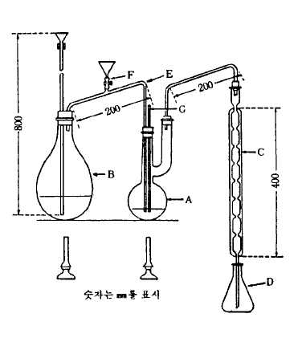

---

15. 비소시험법

비소시험법은원료중에불순물로서들어있는비소의한도시험이다.

그한도는삼산화비소(As2O3)의

양으로나타내며보통중량백만분율(ppm)로나타낸다.

장치A, 장치B, 장치C를쓰는방법

장

치A

그림1과같은장치를쓴다.

배기관B에약30㎜의높이로유리섬유F를채우고초산납시액및

물의같은용량혼합액으로고르게축인다음밑에서약하게흡인하

여과량의액을제거한다.

이것을고무마개H의중심에수직으로

끼우고B의아래에있는작은구멍E는고무마개아래까지조금내

려가도록하여발생병A에끼운다.

B의상단에는유리관C를수직

으로고정시킨고무마개J를끼운다.

C의하단은

J의하단과동일

평면이되도록한다. 쓰기직전에C 및D의갈아맞춘면사이에

브롬화제이수은지를끼우고클립K로C 및D를고정시킨다.

A : 발생병(어깨부분까지의내용약70㎖)

B : 배기관

C 및D : 갈색유리관(안지름5.6㎜, 접속부의바깥지름은18㎜이며

각각갈아맞춘다)

E : 작은구멍

F : 유리섬유(약0.2g)

G :브롬화제이수은지(18㎜×18㎜)

H 및J : 고무마개

K : 클립

L : 40㎖의표선

장

치B

그림2와같은장치를쓴다.

A

:

발생병(어깨부분까지의

내용

약70㎖)

B : 배기관

C : 유리관(안지름5.6㎜, 흡수관에

넣은부분은끝을안지름1㎜

로길게뽑는다)

D : 흡수관(안지름10㎜)

E : 작은구멍

F : 유리섬유(약0.2g)

G : 5㎖의표선

H 및J : 고무마개

L : 40㎖의표선

배기관B에약30㎜의높이로유리섬유F를채우고초산납시액및물의같은용량혼합액으로고르게

축인다음밑에서약하게흡인하여과량의액을제거한다.

이것을고무마개H의중심에수직으로끼

우고B의아래에있는작은구멍E는고무마개아래까지조금내려가도록하여발생병A에끼운다.

B의상단에는유리관C를수직으로고정한고무마개J를끼운다.

C의배기관쪽의하단은고무마개

J의하단과동일평면으로한다.

장

치C

그림3과같은장치를쓴다.

A : 발생병(내용량약60㎖)

B : 배기관(안지름약6.5㎜)

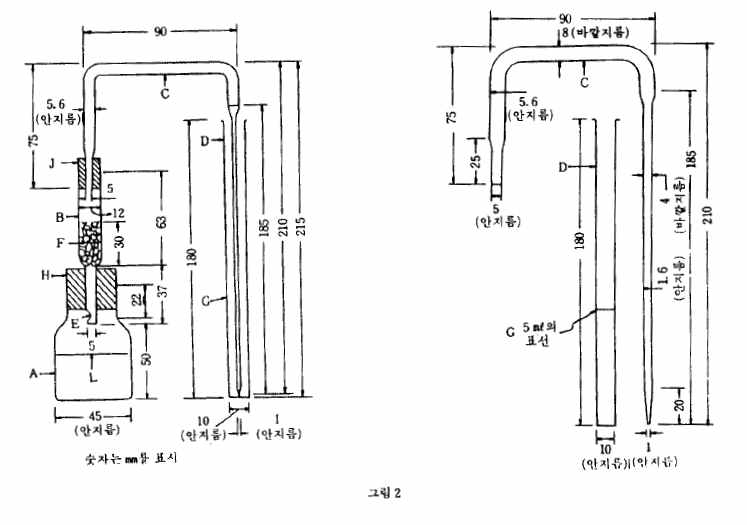

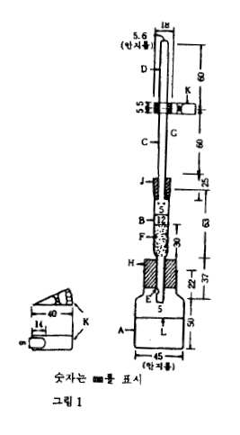

---

C 및D : 갈색유리관(안지름6.5㎜, 접속부의바깥지름약18㎜이며

각각갈아맞춘다)

E : 고무마개

F : 유리관B에달린들어간부분으로유리섬유를받혀준다.

G : 고무관

H : 클립

Ｉ: A의40㎖표선

유리관B에는유리섬유를F에서약30㎜의높이로채우고비소시험

장치C용초산납시액및물의같은용량혼합액으로고르게축인

다음관의밑에서가만히흡인하여유리섬유및기벽에서과량의액을제거하여둔다.

쓰기직전에유

리관C 및D의접속부에비소시험장치C용브롬화제이수은지를끼우고클립H로양쪽관을고정시킨

다.

조작법

1) 검액의조제

따로규정이없는한다음의방법에따른다.

제１법

따로규정이없는한원료각조에서규정하는양의검체를달아물5㎖를넣어필요하면가

온하여녹인다음검액으로한다.

제２법

따로규정이없는한원료각조에서규정하는양의검체를달아물5㎖및황산1㎖를넣는

다.

다만무기산의경우에는황산을넣지않는다.

이액에아황산10㎖를넣고작은비커에넣어수

욕상에서가열하여아황산이없어지고약2㎖가될때까지증발시키고물을넣어5㎖로하여검액으

로한다.

제３법

따로규정이없는한원료각조에서규정하는양의검체를달아백금제, 석영제또는사기제

도가니에넣는다.

여기에질산마그네슘ㆍ에탄올용액(1→50) 10㎖를넣어에탄올에점화하여태운다

음천천히가열하여회화시킨다.

만일이방법으로탄화물이

남아있을때는소량의질산으로적시

고다시강열하여회화한다.

식힌다음잔류물에염산3㎖를넣어수욕상에서가온하여녹여검액

으로한다.

2) 검액의시험

따로규정이없는한다음에따라시험한다.

가) 장치A를쓰는방법

표준색의조제는동시에한다.

발생병A에검액을취하여필요하면소량의물로씻어넣고이액에메칠오렌지시액1방울을넣고

강암모니아수또는묽은염산을써서중화시킨다음희석시킨염산(1→2) 5㎖및요오드화칼륨시액5

㎖를넣어2∼3분간방치한다음다시산성염화제일석시액5㎖를넣고실온에서10분간방치한다.

다음물을넣어40㎖로하고무비소아연2g을넣고곧B, C, G 및D를연결시킨고무마개H를발생

병A에끼우고25℃의물속에발생병A의어깨까지담그어1시간방치한다음곧브롬화제이수은지

의색을관찰한다.

이색은표준색보다진하여서는안된다.

표준색의조제

발생병A에비소표준액2㎖를정확하게넣고희석시킨염산(1→2) 5㎖및요오드화

칼륨시액5㎖를넣어2～3분간방치한다음산성염화제일석시액5㎖를넣어실온에서10분간방치한

다.

이하앞에서와같은방법으로얻은브롬화제이수은지의정색을표준색으로한다.

이색은삼산

화비소(As2O3) 2㎍에해당한다.

나) 장치B를쓰는방법

표준색의조제는동시에한다.

발생병A에검액을취하여이하장치A를쓰는방법과같이조작하여실온에서10분간방치한다.

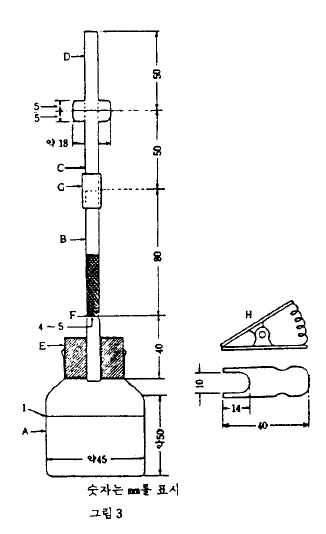

---

다음에물을넣어40㎖로하고무비소아연2g을넣고곧B 및C를연결한고무마개H를발생병A에

끼운다.

C의세관부끝은미리비화수소흡수액5㎖를넣은흡수관D의밑에까지닿도록넣어둔다.

다음에발생병A를25℃의물속에어깨까지담그어1시간방치한다.

흡수관을꺼내어필요하면피리

딘을넣어5㎖로하고흡수액의색을관찰한다.

이색은표준색보다진하지않다.

표준색의조제

발생병A에비소표준액2㎖를정확하게넣고희석시킨염산(1→2) 5㎖및요오드화

칼륨시액5㎖를넣어2～3분간방치한다음산성염화제일석시액5㎖를넣어실온에서10분간방치한

다.

이하앞에서와같은방법으로조작하여얻은흡수액의정색을표준색으로한다.

이색은삼산화

비소(As2O3) 2㎍에해당한다.

비화수소흡수액

디에칠디치오카바민산0.50g에피리딘을넣어녹여100㎖로한다.

이액은차광한

유리마개병에넣어냉소에보관한다.

다) 장치C를쓰는방법

표준색의조제는동시에한다.

따로규정이없는한발생병A에원료각조에서규정하는양의검액을취하여메칠오렌지시액2방

울을넣고강암모니아수또는암모니아수시액으로중화하고희석시킨염산(1→2) 5㎖및요오드화칼

륨시액5㎖를넣어2∼3분간방치한다음비소시험장치C용염화제일석시액5㎖를넣고10분간방치

한다.

다음물을넣어40㎖로하고무비소아연2g을넣어곧유리관B, C 및D를연결한고무마개

E를끼우고25℃의물속에발생병의어깨까지담그어1시간방치한다음곧브롬화제이수은지를꺼내

고직사광선에닿지않도록조심하면서곧관찰한다. 이색은표준

색보다진하지않다.

표준색의조제

따로규정이없는한발생병에비소표준액2㎖를넣고검액의경우와같은방법으로

조작한다.

주

의: 이시험및검액의조제에쓰이는시약및시액은공시험에서정색하지않거나또는거의

정색하지않는것을쓴다.

16. 비용적측정법

비용적은단위질량의물체가차지하는부피를말한다.

장

치

그림과같은장치를쓴다.

A : 눈금이있는시험관(용량20㎖, 무게15∼16g)

B : 금속관

C : 고무판(두께3㎜)

D : 시수기(示數器)

E : 모터

F : 회전날개

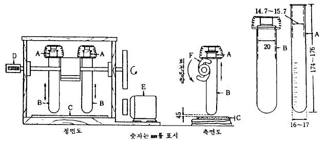

---

조작법

따로규정이없는한검체를105℃에서항량이될때까지건조하고표준체177㎛을통한다.

그3.0g을정확하게달아이것을가만히20㎖눈금이있는시험관A에넣는다.

A를금속관B에넣

어뚜껑을덮고높이45㎜에서2초간에1회의속도로400회낙하시킨다음그부피를읽는다.

부피(㎖)

비용적(㎖/g) ＝

3(g)

17. 비점측정법및증류시험법

액체의비점및규정온도에있어서의액체유출량측정법은다음제１법, 제２법또는제３법에따라

측정한다.

비점은최초의유출액5방울이유출했을때를최저로하고마지막액이플라스크의밑바닥

으로부터증발할때를최고로한다.

증류시험은따로규정이없는한규정온도범위에서의유출액의용량을계량하는것이다.

제１법

장

치

그림1과같은장치를쓴다.

A : 온도계(측정온도가200℃미만일때는온도계1호또는2호, 200℃이상일때는3호를쓴다.)

B : 보조온도계(온도계1호를써서그수은구가온도계A의노출부에있는수은주의거의중앙부에

오도록한다.)

조작법

검체25㎖를취하여증류플라스크에넣은다음비등석2～3개를넣고수은구의상단을유출

구의중앙부에오도록온도계를붙이고플라스크를석면판에올려놓은다음유출관에냉각기를연결

하고플라스크를가열하여따로규정이없는한측정온도가200℃미만인것은1분간4～5㎖, 200℃

이상의것은1분간3～4㎖의유출속도로증류한다.

온도계노출부의수은주및기압에대한측정온도의보정은각각다음의두가지식에따라한다.

온도계노출부의수은주에대한측정온도의보정

T1 ＝t ＋0.00015(t-t1)N

T1 : 온도계노출부의수은주를보정한온도

t

: 온도계에나타난온도

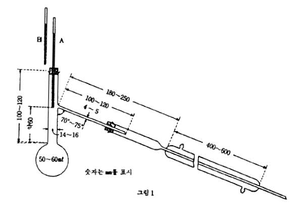

---

t1 : 보조온도계에나타난온도

N : 온도계노출부에있는수은주의도수(度數), 마개의상단에서셀수있는것으로한다.

기압에대한보정

T ＝T1

＋0.00012(760 - P)(273 ＋T1)

T : 보정된온도

P : 측정할때의기압

제２법

장

치

제１법과같은장치를쓴다.

다만증류플라스크는내용량200㎖, 목의안지름18～24㎜, 안

지름5～6㎜의유출관이붙어있는것을쓴다.

온도계및보조온도계: 제１법의것을쓴다.

조작법

검체100㎖를1㎖의눈금이있는메스실린더로취하고액온을측정한다음증류플라

스크에넣고이메스실린더를씻지않고수기로하여제１법과같은방법으로증류한다음유액의온

도를앞의액온과같게하여유출액의용적을측정한다.

60℃이하에서증류하기시작하는액은미

리검체를10∼15℃로식히고그용량을측정한다음냉각관에는아답터의끝을수기인메스실린더에

꽂는다.

마개에는공기가나가는작은구멍을뚫어둔다.

증류중에는메스실린더의상부로부터25㎜이하의부분을얼음으로식힌다.

제３법

A : 증류플라스크(경질유리제로용량약200㎖이며그림3에따른다)

B : 분류관(두께약1㎜의경질유리제이며그림4에따른다)

C : 냉각관(경질유리제이며그림6에따른다)

D : 아답터(경질유리제이며그림5에따른다)

E : 메스실린더(100㎖로서1㎖마다눈금이있다)

F : 가대(架坮)

G : 버너

H : 온도계

Ｉ: 보조온도계제１법의것을쓰며그수은구가온도계H 노출부에있는수은주의거의중앙에

오도록한다.

Ｊ: 코르크마개또는갈아맞춘마개

유리기구는잘건조한것을쓴다.

아답터D의끝을메스실린더E의기벽에닿게한다.

증류플라

스크A에는비등석또는모세관을넣고증류플라스크및분류관B(측관을뺀다)는석면사(石綿絲) 또

는유리솜등으로보온한다.

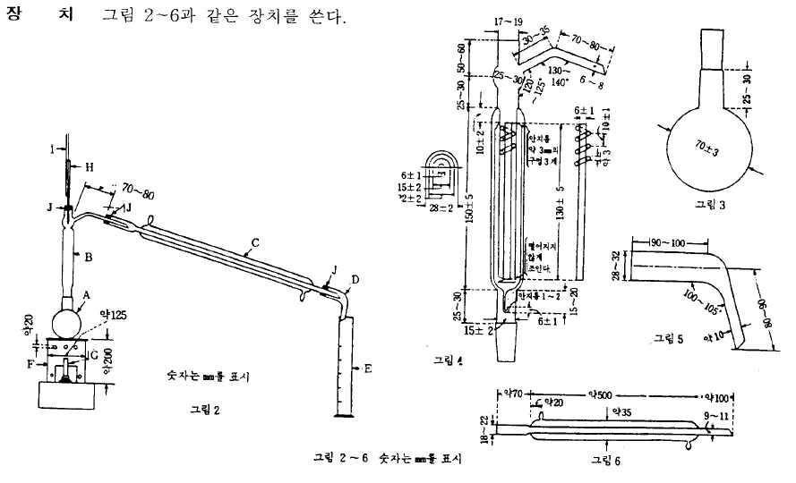

---

조작법

제２법과같이조작한다.

다만, 증류플라스크를가열하기시작할때부터약10분간후에

유출이시작되어이어1분간에3～4㎖가유출하도록가열을조절한다.

18. 비중측정법

d t'

비중

다음제

t라함은검체와물과의각각t'℃및t℃에있어서같은체적의중량비를말한다.

１법, 제２법또는제３법에따라측정한다.

조작법

제１법

1) 비중병에의한측정법

비중병은보통내용10～100㎖의유리용기로온도계가붙은갈아

맞춘마개및표선과갈아맞춘뚜껑이있는측관등이있다.

미리깨끗이씻고건조한비중병의무

게W를정밀하게단다.

다음마개및뚜껑을열어검체를채우고t'℃보다1～3℃낮게하고기포가

없게뚜껑을잘닫는다.

천천히온도를올려온도계가t'℃를나타낼때표선의윗쪽의검체를측관

에서빼내고측관에뚜껑을닫고바깥쪽을잘닦은다음무게W1를정밀하게단다.

다시같은비중

병으로물을써서같은조작을하고t℃에있어서의무게W2를정밀하게단다.

W 1―W

d t̛

t ＝

W 2―W

2) 쉬프렝겔ㆍ오스트발트비중병에의한측정법

쉬프렝겔ㆍ오스트발

트비중병은보통내용1～10㎖의유리용기로그림과같이양쪽끝이두

꺼운세관(細管)으로되어한쪽세관A에는표선C가있다.

미리깨끗

이닦아건조한피크노메타를백금또는알루미늄등의선D로화학천

칭의저울대의고리에걸어서무게를단다.

다음t'℃보다3～5℃낮은

검체중에세관B를담근다.

A에는고무관또는갈아맞춘세관을붙여

거품이들어가지않게조심하면서검체를C위까지빨아올린다.

다음

t'℃의수욕중에약15분간담근다음B의끝에여과지편을대어검체

의끝을C에일치시킨다.

수욕중에서들어내어바깥쪽을잘씻고무게W1를달고같은피크노메타를써서물로같은방법

으로조작하여그t℃에서의무게W2를칭량한다.

1)의식에따라비중d t̛

t 를구한다.

3) 비중부액계에의한측정법

규정온도용의비중부액계로필요한정밀도를갖는것을쓴다.

비중부

액계는에탄올또는에텔로깨끗이씻은것을쓴다.

검체를잘흔들어섞은다음거품이없어지면

비중부액계를띄운다.

규정온도에서비중부액계가정지했을때메니스커스의상연에서비중의눈금

을읽는다.

다만눈금읽는방법이표시되어있는비중부액계는그방법을따른다.

제２법

제１법의1)에서쓴비중병과같은형의25㎖비중병에등유(燈油)를약6㎜의깊이로넣고그

무게W를정밀하게달아여기에원료각조의건조감량항에서규정하는조건으로건조한검체1～2㎖

를넣어그무게W1를정밀하게단다.

등유를써서기벽에부착한검체를비중병에씻어넣고등유

를추가하여검체를덮는다.

비중병을데시케이터에넣고3㎜Hg이하로감압하여거품이생기지않게

되었을때비중병을꺼내어등유를가득채운다.

이것을17～19℃로하고천천히온도를올려온도

계가20℃로되었을때표선윗쪽의등유를측관으로부터빼내고측관에마개를한다음겉을닦은

다음무게W2를정밀하게단다.

다시같은비중병에등유를넣어앞에서와같은조작을하여20℃에

서의무게W3를정밀하게단다.

(W1 ― W) × D

d 20

20 ＝

(W1 ― W) ― (W3 ― W2)

D :쓴등유의비중d 20

20

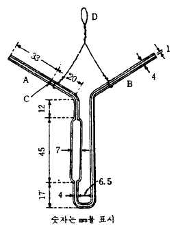

---

제３법

미리제１법의1)에서쓴비중병과같은형의비중병의무게W를정밀하게단다음마개및

뚜껑을빼고융해한검체가온도계끝에닿지않게검체를넣고온도계를삽입치않고천천히온도를

올려검체의융해온도보다약간높은온도로1시간유지하여검체중의거품을제거한다.

식힌다음

온도계및뚜껑을하고무게W1를정밀하게단다. 다음에마개및뚜껑을빼고검체위에물을채우고

20℃보다1～3℃낮게하여거품이남지않게조심하면서마개를한다.

천천히온도를올려온도계가

20℃로되었을때표선위의물을측관으로부터빼내어측관에뚜껑을닫고겉을닦은다음무게

W2를정밀하게단다.

다시같은비중병에물을넣어앞에서와같은조작을하여20℃에서의무게

W3를정밀하게단다.

(W 1 ― W)

d20

20 ＝

(W 3 ― W) ― (W 2 ― W 1)

19. 비타민A정량법

비타민A정량법은초산레티놀, 팔미틴산레티놀, 비타민A유, 간유및기타원료중의비타민A를자외

부의흡광도측정법에따라정량하는방법이다.

다만일반적으로는원료의종류또는정량을방해하

는물질이존재할때적당한전처리를할필요가있다.

1 비타민A단위(1 비타민A국제단위와같다)는비타민A(알코올형) 0.3㎍에해당한다.

조작법

조작은신속하게하며될수있는대로공기또는다른산화제와의접촉을피하며용기는차

광용기를쓴다.

원료각조에서따로규정이없는한제１법에따르나제１법으로측정이적합하지않

은것은제２법에따른다.

제１법

검체약0.5g을정밀하게달아이소프로판올에녹여정확하게250㎖로한다.

이액을층장10

㎜, 파장326㎚에서의흡광도가약0.5가되도록이소프로판올로정확하게희석하여검액으로하고흡

수극대파장을측정한다.

또한10㎜측정셀로파장300㎚, 310㎚, 320㎚, 326㎚, 330㎚, 340㎚, 및350

㎚에서의흡광도를측정하고326㎚에서의흡광도를1.000으로하였을때각파장에서의흡광도비를

구한다.

흡수극대파장이325～328㎚사이에있고또측정한각파장에서의흡광도비가각각다음표

의값의±0.030 범위내에있으면326㎚의흡광도A로부터검체1g중의비타민A단위를계산한다.

1g중의비타민A단위수＝E %

1㎝(326㎚) × 1900

A

V

E%

×

1㎝(326㎚) ＝

W

100

Ｖ: 검액의총㎖수

Ｗ: 검액V㎖중의검체의양(g)

초산레티놀과팔미틴산레티놀의확인에는다음의확인시험을한다.

확인시험

검체, 박층크로마토그래프용초산레티놀표준품및박층크로마토그래프용팔미틴산레티놀표

준품각각15000단위에해당하는양을달아각각석유에텔5㎖에녹여검액및표준액으로한다.

이액을가지고박층크로마토그래프법에따라시험한다.

검액및표준액5㎕씩을박층크로마토그

래프용실리카겔을써서만든박층판에점적한다.

벤젠을전개용매로하여약10㎝전개시킨다음

박층판을바람에말린다.

여기에삼염화안티몬시액을뿌려검체및표준품의청색으로정색된주

반점의위치를비교하여확인한다.

제１법에따라조작하여흡수극대파장이325∼328㎚의사이에있지않을때또는흡광도의비가

다음표에표시한값의±0.030 범위내에있지않을때는제２법을쓴다.

---

λ(㎚)

초산레티놀

팔미틴산레티놀

300

0.578

0.590

310

0.815

0.825

320

0.948

0.950

326

1.000

1.000

330

0.972

0.981

340

0.786

0.795

350

0.523

0.527

제２법

검체의표시량에따라500 비타민A단위이상에해당하는검체를정밀하게달아플라스크에

넣고무알데히드에탄올30㎖및파이로갈롤ㆍ에탄올용액(1→10) 1㎖를넣는다.

다음에수산화칼륨용

액(9→10) 3㎖를넣어환류냉각기를붙이고수욕상에서30분간가열하여검화시키고곧상온으로식힌

다음물30㎖를넣어분액깔때기A에옮기고플라스크는물10㎖, 에텔40㎖로차례로씻어씻은액

을분액깔때기A에넣고잘흔들어섞어방치한다.

물층을분액깔때기B에옮기고비타민A정량용에

텔30㎖로플라스크를씻고씻은액을분액깔때기B에넣고흔들어추출한다.

물층은플라스크에따

로취하고에텔층은분액깔때기A에합하고따로취한물층은분액깔때기B에넣고에텔30㎖를넣

고흔들어추출한다.

에텔층은분액깔때기A에합한다.

여기에물10㎖를넣고가만히2～3번거꾸

로흔들어정치한다음분리한물층을버린다.

다시물50㎖씩으로3회씻고씻을때마다점차강하

게흔든다.

씻은액이페놀프탈레인시액으로정색되지않을때까지물50㎖씩으로씻은다음10분간

방치한다.

물을되도록제거하여에텔추출액을삼각플라스크에옮기고에텔10㎖씩으로2회씻어넣

은다음무수황산나트륨5g을넣어흔들어섞고경사하여에텔추출액을증류플라스크에옮긴다.

남

은황산나트륨은에텔10㎖씩으로2회이상씻어씻은액은플라스크에합한다.

에텔추출액을45℃

의수욕중에서흔들어주면서아스피레이터를써서농축하여약1㎖로하고곧이소프로판올을넣어

녹여1㎖중에6～10 비타민A단위를함유하도록정확하게희석하여검액으로한다.

이액을층장10

㎜로파장310㎚, 325㎚및334㎚에서각각흡광도A1, A2 및A3를측정한다.

1g중의비타민A단위수＝E %

1㎝(325㎚) × 1830

A 2

V

E%

×

× f

1㎝(325㎚) ＝

W

100

A 1

A 3

f ＝6.815 ― 2.555 ×

― 4.260 ×

A 2

A 2

ｆ: 보정계수

Ｖ: 검액의총㎖수

Ｗ: 검액V㎖중의검체의양(g)

20. 산가측정법

산가는검체1g을중화하는데필요한수산화칼륨(KOH)의㎎수이다.

조작법

제１법

따로규정이없는한원료각조에서규정한검체의양을정밀하게달아250㎖의플라스

크에

넣고에탄올및에텔의같은용량의혼합액50㎖를넣어가온하여녹이고페놀프탈레인시

액1㎖를넣어때때로흔들어섞으면서0.1N 수산화칼륨액으로적정한다.

적정의종말점은액의엷

은홍색이30초동안지속할때로한다.

같은방법으로공시험을하여보정한다.

| λ(㎚) | 초산레티놀 | 팔미틴산레티놀 |
| --- | --- | --- |
| 300 / 310 / 320 / 326 / 330 / 340 / 350 | 0.578 / 0.815 / 0.948 / 1.000 / 0.972 / 0.786 / 0.523 | 0.590 / 0.825 / 0.950 / 1.000 / 0.981 / 0.795 / 0.527 |

---

0.1N 수산화칼륨액의소비량(㎖) × 5.611

산

가＝

검체의양(g)

제２법

따로규정이없는한원료각조에서규정한검체의양을정밀하게달아250㎖의플라스크에넣

고에탄올및에텔의같은용량의혼합액50㎖를넣어가온하여녹이고페놀프탈레인시액3방울을넣

어때때로흔들어섞으면서0.1N 수산화칼륨ㆍ에탄올액으로적정한다.

적정의종말점은액의엷은

홍색이30초동안지속할때로한다.

같은방법으로공시험을하여보정한다.

0.1N 수산화칼륨․에탄올액의소비량(㎖) × 5.611

산

가＝

검체의양(g)

21. 산가용물시험법

산가용물시험법은검체중의묽은염산에녹는물질의양을측정하는방법이다.

조작법

따로규정이없는한검체약1g을정밀하게달아묽은염산20㎖를넣어50℃에서15분간

저어섞으면서가온한다음물을넣어정확하게50㎖로하여여과한다.

처음여액15㎖를버리고다

음여액25㎖를정확하게취하여수욕상에서증발건고하여항량이될때까지강열하고데시케이터(실

리카겔)속에서방냉한다음그무게를정밀하게단다.

22. 산불용물시험법

산불용물시험법은검체중의염산에녹지않는물질의양을측정하는방법이다.

조작법

따로규정이없는한원료각조에서규정한검체의양을정밀하게달아물약70㎖를넣어

저어섞으면서염산10㎖를조금씩넣어5분간끓인다.

식힌다음정량분석용여과지(5종C)를써서여

과하고여과지위의잔류물을열탕으로씻고씻은액에질산은시액으로염화물의반응이나타나지않

을때잔류물을여과지와함께회화하여항량이될때까지강열하고데시케이터(실리카겔)속에서식

힌다음그무게를정밀하게단다.

23. 산소플라스크연소법

산소플라스크연소법은염소, 브롬, 요오드, 불소또는황등을함유하는유기화합물질을산소를충만

시킨플라스크중에서연소분해하여그중에들어있는할로겐또는황등을확인또는정량하는방법이

다.

장

치

그림과같은장치를쓴다.

A : 내용량500㎖인무색의두꺼운(약2㎜) 경질유리플라스크

이며입이윗쪽으로벌어진것.

다만불소의정량에는석

영제플라스크를쓴다.

B : 백금제바구니또는백금제망통(網筒)(백금선으로

마개C의끝에매단다)

C : 경질유리마개, 다만불소의정량에는석영제마개를쓴다.

조작법

따로규정이없는한다음방법에따른다.

1) 검체채취법

가) 검체가고체일때

원료각조에서규정하는양의검체를

그림과같은여과지중앙에달아그무게를정밀하게달고흩

---

어지지않도록접은선에따라싸고백금제바구니또는백금

제망통(網筒) B속에점화부(點火部)가밖으로나가도록넣는다.

나) 검체가액체일때

미리적당량의탈지면을가로50㎜,

세로5㎜의여과지로그끝부분약20㎜(점화부)가남도록말

아서백금제바구니또는백금제망통B속에넣는다.

탈지면에

는원료각조에서규정된양의검체가스며들어가도록한다.

2) 연소법

원료각조에서규정된흡수액을플라스크A에넣고A안에는미리산소를충만시키고마

개C의갈아맞춘부분을물로축인다음점화부에점화하여곧A속에넣고완전히연소될때까지

기밀하게유지한다.

다음에A내의흰연기가완전히없어질때까지때때로흔들어주고15～30분간

방치한다.

A의윗부분에소량의물을넣어조심하면서C를빼고메탄올15㎖로C, B 및A의내벽을

씻어넣고여기서얻은액을검액으로한다.

따로검체를쓰지않고같은방법으로조작하여공시험

액으로한다.

3) 정량법

원료각조에서따로규정이없는한다음방법으로한다.

제１법(염소또는브롬)

검액에브롬페놀블루시액1방울을넣고액의색이황색으로될때까지묽은

질산을적가한다음묽은질산0.5㎖, 메탄올100㎖및디페닐카르바손시액1㎖를넣어흔들면서0.01N

초산제이수은액으로적정한다.

같은방법으로공시험을하여보정한다.

0.01N 초산제이수은액1㎖＝0.35453㎎Cl

0.01N 초산제이수은액1㎖＝0.7990㎎Br

제２법(요오드)

검액에히드라진용액(1→5) 1방울을넣고마개C를하고잘흔들어섞어탈색시킨다

음여기에브롬페놀블루시액1방울을넣고액의색이황색으로될때까지묽은질산을적가한다음묽

은질산0.5㎖, 메탄올100㎖및디페닐카르바손시액1㎖를넣고흔들면서0.01N 초산제이수은액으로

적정한다.

같은방법으로공시험을하여보정한다.

0.01N 초산제이수은액1㎖＝1.2690㎎I

제３법(불소)

검액및공시험액을각각50㎖의메스플라스크에넣어플라스크A를물로씻고씻은

액및물을넣어50㎖로하여검액및보정액으로한다.

불소약0.03㎎에해당하는양의검액(V㎖),

보정액(V㎖) 및산소플라스크연소법용불소표준액(이하불소표준액이라한다) 5㎖를정확하게취하여

각각다른50㎖의메스플라스크에넣고잘흔들어섞으면서각각에알리자린콤플렉손시액ㆍpH 4.3 초

산ㆍ초산칼륨완충액ㆍ질산제일셀륨시액혼합액(1:1:1) 30㎖를넣고물을넣어50㎖로하여1시간방치

한다.

다음에파장600㎚에서검액, 보정액및표준액으로부터얻은정색액의흡광도AT, AC 및AS

를측정한다.

대조액에는표준액대신물5㎖를취하여같

은조작을하여얻은액을쓴다.

검액중불소(F)의양(㎎)

A T― A C

50

＝표준액5㎖중불소의양(㎎) ×

×

A S

V

제４법(황)

검액에메탄올40㎖를넣고0.01N 과염소산바륨액25㎖를정확하게넣어10분간방치하

고알세나조Ⅲ시액0.15㎖를넣어0.01N 황산로적정한다.

다만적정의종말점은액의적자색이홍색

으로변할때로한다.

같은방법으로공시험을하여보정한다.

0.01N 과염소산바륨액1㎖＝0.16031㎎S

---

24. 선광도측정법

선광도는광학적활성물질또는그용액이편광면을회전시키는각도이며용액의농도및측정관의

층장에비례하고또한온도와파장의영향을받는다.

선광의성질은편광의진행방향을마주보고편

광면을우(右)로회전시키는것을우선성, 좌(左)로회전시키는것을좌선성이라하고선광도의수치앞

에기호＋또는－로서표시한다.

선광도αt

x는특정의단색광x(파장또는명칭으로기재한다)를써서온도t ℃에서측정할때의선광

도를의미하며그측정은따로규정이없는한온도는20℃, 층장은100㎜, 광선은나트륨스펙트럼의D

선으로측정한다.

[α] t

비선광도

x는다음식으로나타낸다.

100α

[α]t

x ＝

l c

t : 측정할때의온도

x : 측정단색광의파장또는명칭(나트륨스펙트럼을썼을때의D)

α : 편광면을회전시킨각도(°)

l : 검액의층장, 즉측정에쓴측정관의길이(mm)

c : 검액1㎖중에들어있는검체의g수(검체가액상인경우그대로쓸때는그비중이다)

조작법

따로규정이없는한광선은나트륨스펙트럼의D선을쓰고온도20℃에서선광계를써서

[α] 20

측정한다.

원료각조에서예를들면

D : +52.2～+52.5°(건조후, 10g, 암모니아시액0.2㎖및물,

100㎖, 200㎜)라는것은이원료를건조감량항에규정한조건으로건조하여10g을정밀하게달아암모

니아시액0.2㎖및물을넣어녹여정확하게100㎖로하고이액을가지고층장200㎜로측정할때

[α] 20

D이+52.2～+52.5°임을나타낸다.

25. 수분정량법(칼핏셔법)

수분정량법은메탄올및피리딘의존재하에물이요오드및아황산가스와다음의반응식에서보는

바와같이정량적으로반응하는것을이용하여물을정량하는방법이다.

H2O ＋I2 ＋SO2 ＋3C5H5N ＝2(C5H5N＋H)I_ ＋C5H5NSO3

C5H5NSO3 ＋CH3OH ＝(C5H5N＋H)O-SO2OCH3

장

치

보통자동뷰렛2개, 적정플라스크(250㎖), 교반기및정전압전류적정장치로되어있다.

장치

는외부로부터흡습을방지하도록만들어져야한다.

방습에는실리카겔또는염화칼슘등을쓴다.

시약및시액

1) 칼핏셔용메탄올

메탄올1ℓ에마그네슘가루5g을넣어염화칼슘관을붙인환류냉

각기를써서가열하고필요하면염화제이수은0.1g을넣어반응을촉진시켜가스발생이그친다음습

기를피하면서메탄올을증류한다.

습기를피하여보관하여야한다.

이원료1㎖중의수분은0.5㎎

이하이다.

2) 칼핏셔용피리딘

피리딘에수산화칼륨또는산화바륨을넣어마개를막고수일간방치한다음그

대로증류하고습기를피하여보관한다.

이원료1㎖중수분은1㎎이하이다.

3) 칼핏셔시액

가) 조제

요오드63g에칼핏셔용피리딘100㎖를넣어녹이고빙냉한다.

다음에건

조아황산가스를통하여그증가량이32.3g에이르렀을때건조아황산가스통하는것을그치고칼핏셔

용메탄올을넣어500㎖로하고24시간이상방치한다음쓴다.

이시액은시일이경과함에따라변

하므로쓸때마다표정한다.

이시액은차광하여습기를피해냉소에보관한다.

나) 표정

칼핏셔용메탄올25㎖를적정플라스크에취하고칼핏셔시액을다음의조작법에따라적정

의종말점까지조심하면서넣는다.

다음에물약50㎎을정밀하게달아빨리넣고습기를차단하면

---

서칼핏셔시액으로앞에서와같이종말점까지적정한다.

칼핏셔시액1㎖에해당하는물(H2O)의㎎수

f를다음식에따라구한다.

물(H 2O)의양(㎎)

f ＝

칼핏셔시액의소비량(㎖)

또f는물ㆍ메탄올표준액20㎖를정확하게취하여4)의물ㆍ메탄올표준액의표정에따라적

정하고다음식에따라구할수가있다.

f' × 물․메탄올표준액의양(㎖)

f ＝

칼핏셔시액의소비량(㎖)

f : 물ㆍ메탄올표준액1㎖중의물(H2O)의㎎수

4) 물ㆍ메탄올표준액

가) 조제

칼핏셔용메탄올500㎖를1ℓ의건조한메스플라스크에넣고물

2.0㎖및칼핏셔용메탄올을넣어1ℓ로한다.

이액의표정은칼핏셔시액의표정이끝난다음곧한

다.

차광하여습기를피하고온도변화가적은냉소에보관한다.

나) 표정

조작법에따라칼핏셔용메탄올25㎖를건조한적정플라스크에취하고미리칼핏셔시액으

로종말점까지적정하여플라스크안을무수상태로한다.

다음에칼핏셔시액10㎖를정확하게넣고

조제한물ㆍ메탄올표준액으로종말점까지적정한다.

물ㆍ메탄올표준액1㎎중물(H2O)의㎎수f'를다

음식에따라구한다.

f × 10

f' ＝

적정에소비된물․메탄올표준액의양(㎖)

조작법

칼핏셔시액을사용한적정은이것을표정했을때의온도와같은온도에서적정하는것이원

칙이다.

적정의종말점을구하려면보통다음의전기적방법에따른다.

피적정액중에2개의백금전

극을담그고가변저항기(可變抵抗器)를적당하게조절하여일정한전류(5～10㎂)가흐르게하고칼핏

셔시액을적가하면적정이진행됨에따라회로중의마이크로암메타의바늘이크게흔들려수초내에

다시원위치로온다.

적정의종말점은마이크로암메타의흔들림(5～150㎂)이30초간지속하는때로

한다.

그러나역적정일경우칼핏셔시액이과량으로존재할동안은마이크로암메타바늘의흔들림은

끊기고종말점에이르면급히원위치로돌아온다.

마이크로암메타대신매직아이(magic eye)가달린

장치를쓸수있다.

검체가착색되지않았을때는시각법에따라종말점을구할수있다.

이경우

적정의종말점은피적정액이갈색을띤황색에서적갈색으로변할때로한다.

칼핏셔시액을사용한

적정법은다음두가지방법이있다.

전기적방법으로는보통역적정을하는쪽이좋다.

1) 직접적정

칼핏셔용메탄올25㎖를건조한적정플라스크에넣고칼핏셔시액을종말점까지넣은다

음수분10～50㎎을함유하는검체를정밀하게달아곧적정플라스크에넣고세게저어섞으면서칼

핏셔시액으로종말점까지적정한다.

칼핏셔시액의소비량(㎖) × f

× 100

물(H 2O)의양(%) ＝

검체의양(㎎)

2) 역적정

칼핏셔용메탄올25㎖를건조한적정플라스크에넣고과량의칼핏셔시액을넣어세게저

어섞으면서물ㆍ메탄올표준액을종말점까지넣은다음수분10～50㎎을함유하는검체를정밀하게

달아곧적정플라스크에넣고과량의칼핏셔시액일정량을넣어세게저어섞으면서물ㆍ메탄올표준

액으로종말점까지적정한다.

---

물(H2O)의양(%)

＝[칼핏셔시액의양(㎖)× f] ― [물⋅메탄올표준액의양(㎖)×f]

×100

검체의양(㎎)

26. 수산기가측정법

수산기가는검체1g을다음조건에서아세틸화할때수산기와결합한초산을중화하는데필요한수산

화칼륨(KOH)의㎎수이다.

조작법

따로규정이없는한검체약1g을정밀하게달아킬달플라스크에넣고무수초산ㆍ피리딘

시액5㎖를정확하게넣고갈아맞춘공기냉각기를달아유욕(油浴)중에담그어95～100℃에서1시

간가열하여아세틸화한다.

식힌다음공기냉각기의웟쪽에서물1㎖를넣어잘흔들어섞고다시

유욕중에서10분간가열하여식힌다음공기냉각기및플라스크의목부분의부착물을중화에탄올5㎖

로씻어넣고때때로흔들어섞으면서0.1N 또는0.5N 수산화칼륨ㆍ에탄올액으로적정한다(지시약:

페놀프탈레인시액1㎖).

같은방법으로공시험을하여보정한다.

(a ―b)N × 56.11

＋C

수산기가＝

검체의양(g)

ａ: 공시험에서수산화칼륨ㆍ에탄올액의소비량(㎖)

ｂ: 검액에서수산화칼륨ㆍ에탄올액의소비량(㎖)

ｃ: 산

가

Ｎ: 수산화칼륨ㆍ에탄올액의규정도

27. 알코올수측정법

알코올수는틴크제또는기타의에탄올을함유한제제에대하여다음의방법으로측정할때

15℃에

있어서검체10㎖에서얻은알코올층의양(㎖)을말한다.

제１법

증류법

15℃에서검체10㎖를취하여다음의방법으로증류하여얻은15°에서의알코올층의

양(㎖)을측정하여알코올수로하는방법이다.

1) 장치

그림과같은장치를쓴다.

전체가경질유리제이며접속부분은갈아맞춘것도된다.

2) 조작법

검체10㎖를15±2℃에서정확하게취하여증류플라스크A에넣고물5㎖및비등석을

넣은다음조심하여알코올분을증류하고유액은유리마개메스실린더D에받는다.

증류는검체의에탄올함량에따라대략다음의표에표시한유액(㎖)을얻을때까지한다.

증류할

때심하게거품이날때에는인산또는황산을넣어강산성으로하거나또는소량의파라핀, 저팬왁

스, 혹은실리콘레진을넣고증류한다.

검체에다음물질이함유되었을때에는증류전에다음조작을한다.

가) 글리세린

증류플라스크의잔류물이적어도50%의수분이함유되도록적당량의물을넣는다.

나) 요오드

아연가루를넣어탈색시킨다.

다) 휘발성물질

적지않은양의정유, 클로로포름, 에텔또는캄파등을함유할때에는검체10㎖를

정확하게취하여분액깔때기에넣고포화염화나트륨용액10㎖를넣어섞고석유벤진10㎖를넣어흔

들어섞은다음물층을따로취하고석유벤진층은포화염화나트륨용액5㎖씩으로2회흔들어섞고모

든물층을합하여증류한다.

다만, 이때검체의에탄올함량에따라유액을아래의표의양보다2～3

㎖더많이얻는다.

라) 기타의물질

유리암모니아를함유할때에는묽은황산을넣어약산성으로하고, 휘발성산을함유

할때에는수산화나트륨시액을넣어약알칼리성으로한다.

또비누및휘발성물질을동시에함유할

---

때에는

다)의

검체의알코올함량

조작에서

석유

유액(㎖)

(v/v %)

벤진을넣기전

에과량의묽은

80이상

13

황산을넣어비

80∼70

12

누를분해한다.

70∼60

11

유액에

탄산칼

60∼50

10

륨4∼6g 및알칼

50∼40

9

리성페놀프탈레인

40∼30

8

용액1∼2 방울을

30이하

7

넣고세게흔들어

섞는다.

물층이백탁되지않을때에는다시적당량의탄산칼륨을

넣어흔들어섞고15±2℃의물속에30분간방치하여떠오른적색

의에탄올층의㎖수를읽어알코올수로한다.

만일, 두액층의접

계면이분명하지않을때에는물을적가하여세게흔들어섞고앞

에서와같이관찰한다.

A : 증류플라스크(50㎖)

B : 연결관

C : 냉각기

D : 유리마개메스실린더(25㎖, 0.1㎖의눈금이있는것)

제２법

기체크로마토그래프법

15℃에서검체를취하여다음의기체크로마토그래프법에따라조작하

여에탄올(C2H5OH)의함량(v/v%)을측정하고이값에서알코올수를구하는방법이다.

1) 시약

알코올수측정용무수에탄올

에탄올(C2H5OH)의함량을측정한무수에탄올, 다만무수에탄

올의비중d 15

15과에탄올(C2H5OH) 함량과의관계는0.797 : 99.46v/v%, 0.796 : 99.66v/v%, 0.795 :

99.86v/v%이다.

2) 검액및표준액의조제

검액

에탄올(C2H5OH) 약5㎖에해당하는양의검체를15±2°에서정확

하게취하여물을넣어정확하게50㎖로한다.

이액25㎖를정확하게취하여여기에내부표준액10

㎖를정확하게넣고물을넣어정확하게100㎖로한다.

표준액

검액과같은온도의알코올수측정용무수에탄올5㎖를정확하게취하여물을넣어정확하게

50㎖로한다.

이액25㎖를정확하게취하여여기에내부표준액10㎖를정확하게넣고물을넣어정

확하게100㎖로한다

3) 조작법

검액및표준액25㎖씩을취하여각각100㎖의고무마개가달린세구(細口) 원통형의유

리병에넣고고무마개를알루미늄캡으로눌러감아마개를하고이것을미리온도변화가적은실내에

서1시간방치시킨물속에유리병의목까지잠기도록넣고액이마개에묻지않도록하면서가만히

흔들어섞은다음30분간방치한다.

각용기안의기체1㎖를가지고다음의조건으로기체크로마토

그래프법에따라시험하고내부표준물질의피크높이에대한에탄올의피크높이의비QT및QS를구한

다.

Q T

5(㎖)

×

알코올수＝

Q S

검체의양(㎖)

× 알코올수측정용무수에탄올중에탄올(C 2H5OH)의함량(v/v %)

9.406

내부표준액: 아세토니트릴용액(6→100)

조작조건

검출기: 수소염이온화검출기

| 검체의 알코올함량 / (v/v %) | 유액(㎖) |
| --- | --- |
| 80이상 / 80∼70 / 70∼60 / 60∼50 / 50∼40 / 40∼30 / 30이하 | 13 / 12 / 11 / 10 / 9 / 8 / 7 |

---

컬

럼: 안지름약3㎜, 길이약1.5m의유리관에150～180㎛의기체크로마토그래프용구상의다

공성에칠비닐벤젠-디비닐벤젠공중합체를충전한다.

컬럼온도: 105～115℃의일정온도

캐리어가스: 질소

유

량: 에탄올의유지시간이5～10분이되도록조정한다.

컬럼의선정: 표준액에서얻은용기안의기체1㎖를가지고위의조건으로조작할때에탄올, 내부

표준물질의순으로유출하고그분리도가2.0이상인것을쓴다.

28. 암모늄시험법

암모늄시험법은원료중에불순물로서들어있는암모늄염의한도시험이다.

그한도는보통중량백분

율(%)로나타낸다.

장

치

그림과같은장치를쓴다.

전체가경질유리제이며접속부분은갈아맞춘것도된다.

장치

에쓰이는고무는미리수산화나트륨시액중에서10～30분간끓인다음물에서30～60분간끓이고마지

막으로물로잘씻은다음쓴다.

A : 증류플라스크

B : 내용물이튀어오르는것을방지하는것

C : 작은구멍

D : 냉각기

E : 역류방지기

F : 메스실린더

G : 콕크

Ｊ: 고무마개

H : 고무마개

K : 고무관

조작법

따로규정이없는한원료각조에규정하는양의검체를증류플

라스크A에취하여물140㎖및산화마그네슘2g을넣고증류장치를연결

한다.

수기F에는흡수액으로붕산용액(1→200) 20㎖를넣고냉각기아래끝

을흡수액에담그고1분에5～7㎖의유출속도가되도록가열온도를조절하

여유액이60㎖가될때까지증류한다.

냉각기의아래끝을액면에서떼고

소량의물로아래끝을씻어넣고물을넣어100㎖로하여검액으로한다.

비교액은각조에서규정하는양의암모늄표준액을증류플라스크A에

취하여이하검액의조제와같은방법으로조작한다.

검액및비교액30㎖씩을네슬러관에취하여

페놀ㆍ니트로프루싯나트륨시액6.0㎖를넣어섞는다. 다음차아염소산나트륨ㆍ수산화나트륨시액4㎖

및물을넣어50㎖로하여섞은다음60분간방치한다.

두개의네슬러관을백색의배경을써서위

또는옆에서관찰하여액의색을비교한다.

검액이나타내는색은비교액이나타내는색보다진하지않다.

29. 액체크로마토그래프법

액체크로마토그래프법은적당한고정상을써서만든칼럼에검체혼합물을주입하고이동상으로액체

를써서고정상에대한유지력의차를이용하여각각의성분으로분리하여분석하는방법이다. 액상검

체또는용액으로만들수있는검체에적용할수있으며, 물질의확인, 순도시험또는정량에쓰인다.

칼럼에주입된혼합물은각성분의고유의비율k로이동상과고정상에분포한다.

---

고정상에존재하는양

k =



이동상에존재하는양

이비율k는액체크로마토그래프법에서는질량분포비k’ 등으로부른다. 이비율k와이동상의칼럼통

과시간t0(k = 0인물질을주입할때부터피크정점까지의시간) 및유지시간tR(측정검체를주입할때부

터피크정점까지의시간)과의사이에는다음과같은관계가있으므로같은조건에서는유지시간은물

질의고유한값이된다.

tR

= (1+ k)t0

장치

보통이동상송액용펌프, 검체도입장치, 칼럼, 검출기및기록장치로되어있다. 필요에따라이

동상조성제어장치, 칼럼항온조, 반응시약송액용펌프및화학반응조등을쓴다. 펌프는칼럼및연결튜

브속에이동상및반응시약을일정유량으로보낼수있는것이다. 또한충전제대신고정상을관벽에

유지시킨것을사용할수있다. 검출기는검체의이동상과는다른성질을검출하는것으로자외또는

가시흡광광도계, 형광광도계, 시차굴절계, 전기화학검출기, 화학발광검출기, 전기전도도검출기및질량

분석계등이있고보통수㎍이하의검체에대하여농도에비례하는신호를내는것이다. 기록장치

는검출기에의해서얻어지는신호의강도를기록하는것이다. 필요에따라기록장치로서데이터처리

장치를써서크로마토그램, 유지시간또는성분정량치등을기록또는출력시킬수있다. 이동상조성

제어장치는단계적제어(Stepwise방식)와농도구배제어(gradient 방식)가있고이동상의조성을제어할

수있다.

조작법

장치를미리조정한다음원료각조에서규정하는조작조건의검출기, 칼럼, 이동상을써서

이동상을규정한유량으로흐르게하고칼럼을규정온도로평형이되게한다음원료각조에서규정

하는양의검액또는표준액을검체도입장치를써서검체도입부를통하여주입한다. 분리된성분을

검출기로검출하여기록장치를써서크로마토그램으로기록한다. 분석되는성분이검출기에서검출하

는데에적합한흡수, 형광등의물성을갖지않은경우에는적당한유도체를만들어검출한다. 유도체

화는보통전라벨(prelabel)법또는후라벨(postlabel)법을쓴다.

확인및순도시험

확인은검체의피검성분과표준피검성분의유지시간이일치하거나또는검체에표

준피검성분을첨가하여도검체의피검성분피크의형상이변하지않는지의여부를시험한다. 순도는

보통검체중혼재물의한도에해당하는농도의표준액을쓰는방법또는면적백분율법으로시험한다.

따로규정이없는한검체의이성체비는면적백분율법에따라구한다. 면적백분율법은크로마토그램

상에서얻어진각성분의총피크면적을100으로하고이에대한각성분의피크면적비로부터조성비

를구한다. 다만, 정확한조성비를알기위해서는혼재물의검출감도에따라피크면적을보정한다.

정량1) 내부표준법

내부표준법에서는일반적으로되도록피검성분에가까운유지시간을가지며모든

피크와완전히분리되는안정한물질을내부표준물질로선택한다. 원료각조에규정하는내부표준물

질일정량에대하여표준피검검체를단계적으로넣어여러종류의표준액을조제한다. 이들표준액일

정량씩을주입하여얻은크로마토그램으로부터내부표준물질의피크면적또는높이에대한표준피검

성분의피크면적또는피크높이의비를구한다. 이비를종축으로하고표준피검성분량또는내부표

준물질량에대한표준피검성분량의비를횡축으로하여검량선을작성한다. 이검량선은보통원점을

지나는직선이된다. 다음에원료각조에규정하는방법으로같은양의내부표준물질을넣은검액을

조제하여검량선을작성하였을때와같은조건으로크로마토그램을기록하여그내부표준물질의피크

면적또는피크높이에대한피검성분의피크면적또는피크높이비를구하여검량선을써서피검성분

량을구한다. 원료각조에서는보통상기의검량선이직선이되는농도범위에들어가는한개의표준

액및표준액에가까운농도의검액을조제하여원료각조에서규정하는각각의양에대하여같은조

건으로액체크로마토그래프법에따라시험하여피검성분량을구한다. 보통표준액의규정량을반복

주입하여얻어진각각의크로마토그램에서내부표준물질의피크면적또는피크높이에대한표준피검

성분의피크면적또는피크높이의비를구하여그상대표준편차(변동계수)를구하여재현성을확인한

---

다.

2) 절대검량선법

표준피검검체를단계적으로취하여표준액을조제하고이표준액일정량씩을정확

하고재현성있게주입한다. 얻어진크로마토그램으로부터종축에표준피검성분의피크면적또는피크

높이, 횡축에표준피검성분량을취하여검량선을작성한다. 이검량선은보통원점을지나는직선이

된다. 다음에원료각조에규정하는방법으로검액을조제하여검량선을작성하였을때와같은조건

으로크로마토그램을기록하여피검성분의피크면적또는피크높이를측정하고검량선을써서피검성

분량을구한다.

원료각조에서는보통상기의검량선이직선이되는농도범위에들어가는하나의표준액및이표준

액에가까운농도의검액을조제하여원료각조에서규정하는각각의양에대하여같은조건으로액

체크로마토그래프법에따라시험하여피검성분량을구한다. 이방법은주입조작등모든측정조작을

엄밀하게일정한조건으로하여시험한다. 보통표준액의규정량을반복하여주입하여얻어진각각의

크로마토그램의피크로부터표준피검성분의피크면적또는피크높이를구하고그상대표준편차(변동

계수)를구하여재현성을확인한다.

피크측정법보통다음의방법을쓴다.

1) 피크높이측정법

가) 피크높이법

피크정점에서기록지의횡축으로내린수선(垂線)과피크의양끝

을연결하는접선(기선)과의교차점으로부터정점까지의길이를측정한다.

나) 자동피크높이법

검출기로부터의신호를데이터처리장치를써서피크높이로측정한다.

2) 피크면적측정법

가)반치폭법피크높이의중심점에서의피크폭에피크높이를곱한다. 나) 자동적분

법검출기로부터의신호를데이터처리장치를써서피크면적을측정한다.

용

어기체크로마토그래프법의용어에따른다.

주의: 표준피검품, 내부표준물질, 시험에쓰는시약, 시액은측정을방해하는물질을함유하지않는

것을쓴다. 원료각조의조작조건중에서칼럼의반지름및길이, 충전제의입자경, 칼럼의온도, 이동

상의조성비, 이동상의완충액조성, 이동상의pH, 이동상의이온쌍형성제농도, 이동상의염농도, 절

환회수, 절환시간, 이동상조성제어프로그램및그유량, 유도체와시약의조성및유량, 이동상의유

량그리고반응시간및화학반응조온도는규정된용출순서, 분리도, 대칭계수및상대표준편차를얻

을수있는범위내에서일부변경할수있다.

30. 액화가스시험법

가. 비중측정법

비중측정법은내압(耐壓)실린더를쓴비중부액계를써서비중을측정하는방법이다.

비중부액계는에

탄올또는에텔로깨끗이씻은것을쓴다.

비중부액계를넣은내압실린더에검체를취하여조심하면서

검체를잘흔들어섞고규정온도에서비중부액계가정지하였을때메니스커스윗부분을읽어비중을측

정한다.

장

치

다음그림과같은장치를쓴다.

내압유리제실린더A 및투명플라스틱제보호통B를입구코크C 및출구코크D로고정시킨받침대에

팩킹I를써서고정한다.

비중부액계F 및온도계고정용판넬로고정시킨고유동점용온도계G를A속

에넣어증기방출코크E를단윗뚜껑I를써서고정하고코크C, D 및E를모두닫는다.

A : 내압유리제실린더(내경40㎜이상, 두께약10㎜, 길이

약450㎜)

B : 투명플라스틱제보호통

C : 입구코크

D : 출구코크

E : 증기방출코크

F : 비중부액계(프레온류는비중부액계4호또는5호를사용하고액화석유가스는액화석유가스용ㆍ비중

부액계를쓴다.)

G : 고유동점용온도계(액화석유가스용비중부액계를사용할때는필요없다)

---

H : 온도계고정용판넬

Ｉ: 팩킹(클로로프렌계의물질)

Ｊ: 압력계

조작법

따로규정이없는한원료각조에서규정하는비중부액

계를넣은그림에나타난장치를쓴다.

검체용기코크와입구코

크C를검체도입관으로연결하고검체용기코크및C를열어적

당량의검체를취한다음검체용기코크와C를닫고장치에새는

곳이없음을확인한다.

다음에출구코크D를열어내압유리제실

린더A내의공기와검체증기를치환하고A내에검체가액상으로

남지않도록조심하면서검체를휘산시키고D를닫는다.

그리고

검체용기코크및C를열어따로규정이없는한A의비중부액계

F가떠오르는상태가되도록검체를취하여검체용기코크및C

를닫은다음검체도입관을제거한다.

이것을20±0.5℃로조정

한항온조에넣고때때로꺼내어F가파손되지않도록조심하면

서흔들어고유동점용온도계G또는F의온도계가20±0.5℃를나

타낼때까지이조작을반복한다.

G또는F의온도계가20±0.5℃

를나타내고F가정지했을때메니스커스윗부분을읽어비중을

구한다.

조작상의주의

(1) 압력10kg/㎠(게이지압)이하에서측정한다.

(2) 가연성연료(액화석유가스)를취할때는인화되지않도록특

히조심한다.

(3) 장치에검체를넣은상태에서충격을준다거나직사일광을닿게해서는안된다.

나. 확인시험

1) 할라이드토치법

이방법은할라이드토치를써서할로겐을함유하는휘발성유기물의불꽃반응(할로겐화구리)에의한

불꽃색의변화를보는방법이다.

장

치

보통그림과같은장치를쓴다.

A : 연료통

B : 고정통

C : 심

지

D : 가열용기

E : 조정코크핸들

F : 흡기관(끝에비닐관을단다).

G : 구리제불꽃고리

H : 밑뚜껑(밑가운데부위, 나사식)

Ｉ: 노

즐

Ｊ: 불꽃통

조작법

밑뚜껑H를열어연료통A에메탄올을넣어심지C를축이고H를닫고이어서가열용기

D에메탄올을D의용량의1/3～2/3를넣은다음점화한다.

D의메탄올이타기직전에조정핸들E

를열어A내의메탄올증기와흡기관F로부터의공기와의혼합기체에점화시켜구리제불꽃고리G의

부근에서태운다.

불꽃이커지지않도록조심하면서조절하고검체증기에F를가까이하여불꽃색의

---

변화를관찰한다.

2) 비점측정법

비점측정법은액체가비등할때의온도를측정하는방법이다.

조작법

따로규정이없는한검체50㎖를100㎖비커에취하여고유

동점용온도계를넣어필요하면조심하면서가열하여비등할때의온도

를읽는다.

다. 산측정법

산측정법은검체중의산을물로용출시켜수산화나트륨액으로적정하여

산분을염산(HCl)의양으로서측정하는방법이다.

조작법

제１법

따로규정이없는한검체100g을20℃이하의물100㎖를넣은

분액깔때기에취하여, 조심하면서잘흔들어섞는다.

이때분액깔때

기안의압력이너무높아지지않도록때때로조심하면서마개를열어

기체를방출시킨다.

내용액을잘흔들어섞은다음물층을분취한다.

검액층에20℃이하의물100㎖를넣어이조작을3회반복한다.

첫번

째및두번째의물층을합하고이것을검액으로하여0.01N 수산화나

트륨액으로적정한다(지시약: 페놀프탈레인시액3방울).

적정의종말점은액의홍색이30초동안

지속하는때로한다.

분취한세번째및네번째의물층을합하고이것을공시험액으로하여같은

방법으로공시험을하여보정한다.

(a ―b) × 0.000365

× 100

산(HCl)의양(%) ＝

검체의양(g)

a : 검액의

0.01N 수산화나트륨액의소비량(㎖)

b : 공시험액의0.01N 수산화나트륨액의소비량(㎖)

제２법

그림1에표시한흡수병4개에물100㎖씩을넣어고무관으로직렬로연결한다.

첫번째의

흡수병을그림2에표시한마개삼각플라스크에연결한다.

따로규정이없는한검체100g을-50℃이

하로냉각한검체용기로부터직접또는-50℃이하로냉각한도입관을써서검체의액층으로부터

마개삼각플라스크에취하여실온에서방치하여증발시켜검체를휘산시킨다음첫번째및두번째의

흡수병의물을합하여이것을검액으로한다.

마개삼각플라스크는새로끓여식힌물10㎖로씻고

씻은액을검액에합한다.

세번째및네번째의흡수병의물을합하여새로끓여식힌물10㎖를

넣어, 이것을공시험액으로한다.

검액및공시험액을가지고제１법에따라시험하여검체중산

(HCl)의양을구한다.

---

라. 증발잔류물시험법

증발잔류물시험법은검체를실온또는수욕상에서증발시켜검체중의고비점잔류물의중량또는용

량을측정하는방법이다.

조작법

제１법

따로규정이없는한원료각조에서규정하는검체의양을-50℃이하로냉각한검액용기에서

직접또는-50℃이하로식힌도입관을써서검체를증발접시에액상으로취하여실온에서증발한다.

이어서잔류물을다시105～110℃에서각조에서규정하는시간동안건조하고데시케이터(실리카

겔)속에서방냉한다음그무게를단다.

제２법

따로규정이없는한검체100㎖를-50℃이하로식힌검체용기에서직접또는-50℃이하로식

힌도입관을써서검체를-40℃이하의냉각욕에넣은그림과같은증발관에액상으로취한다.

이어

서검체를실온에서천천히증발시킨다음증발관의내벽을트리클로로트리플루오로에탄(Freon

113) 5㎖로씻는다.

이증발관을70～80℃수욕중에증발관의표선1㎖까지담근다음30분간가열

한다.

증발관중에남은Freon 113 증기를공기와치환시킨다음잔류물의양을증발관의눈금으로

부터읽고증발잔류물의양(v/v%)으로한다.

제３법

따로규정이없는한검체150㎖를검체의액층으로부터위의그림과같은증발관에취하

고증발관을50～80℃의수욕중에넣어가온하여검체를천천히증발시킨다.

「증발시킨다음증

발관의내벽을」이하제２법에따라시험한다.

마. 수분정량법

수분정량법은따로규정이없는한보통

적정플라스크및내압검체채취기를써서일반시험법의수분

정량법에따라수분을정량하는방법이다.

장

치

보통그림과같은장치를쓴다.

A : 적정플라스크

B : 내압검체채취기

C : 주사침

D : 금속스토퍼

E : 적정뷰렛

F : 전극단자

G : 증기방출마개

조작법

칼핏셔용메탄올또는칼핏셔용메탄올과에칠렌글리콜

의같은용량혼합액100㎖를건조한적정플라스크A에취하여

칼핏셔시액을종말점까지넣는다.

따로규정이없는한검체50∼100g을건조한내압검체채취기B에취

하여그무게를단다(B와검체용기를검체도입관으로연결하여검체의

액층부로부터B 및검체도입관중의공기를검체증기로치환시킨다음

조심하면서취한다).

이어서B의선단에주사침C를꽂아금속스토퍼D로부터A의밑부분까지C를

넣어A내의액을저어섞으면서B의마개를조금내리고증기방출마개G를튀기지않도록조심하면서

G로부터방출량이매분0.3∼0.5ℓ의속도가되도록검체를넣는다.

검체를넣은다음B 및C를빼내

어B의무게를달아검체채취량을구한다.

곧칼핏셔시액으로종말점까지적정한다.

칼핏셔시액의소비량(㎖) × f

물(H 2O)의양(%) ＝

검체의양(g) × 10

f : 칼핏셔시액의규정도계수(H2O ㎎/㎖)

바. 정량법

일반시험법기체크로마토그래프법의제３법면적백분율법에따라시험하여얻은크로마토그램의각

성분의피크면적을반치폭법으로계산한다.

---

조작법

제１법

따로규정이없는한검체1～5㎖을액층부로부터가스상태로기체크로마토그래프용가스

계량관또는실린지에취한다.

다음중의한가지조작조건으로기체크로마토그래프법에따라시험

한다.

얻은크로마토그램으로부터공기이외의각성분의피크면적을반치폭법으로구하여주요

세가지성분의유지시간의순서에따라프로판, 이소부탄및부탄으로하여보정계수를곱하고다

음식에따라액화석유가스의양(%)을구한다.

액화석유가스의양(%)

A PS Pf P＋A IBS IBf IB ＋A BS Bf B

＝

A PS Pf P＋A IBS IBf IB ＋A BS Bf B ＋A aS af a ＋…… ×100

A : 성분의피크면적(㎠)

S

: 성분의증폭감도비

f

: 보정계수

P : 프로판

IB : 아이소부탄

B : 부탄

a : 기타성분의명칭을나타낸다

조작조건

(1)

검출기: 열전도도형검출기(감도1㎷또는2㎷)

컬

럼: 안지름3～6㎜, 길이3～8m의컬럼에10～35%의말레인산디n-부틸을코팅한149～540

㎛의기체크로마토그래프용내화연와또는기체크로마토그래프용규조토를충전한다.

컬럼온도: 0～50℃사이의일정온도

캐리어가스및유속: 수소또는헬륨, 매분5∼100㎖사이의일정량.

(2)

검출기: 열전도도형검출기(감도1㎷또는2㎷).

컬

럼: 안지름3～6㎜, 길이3～8m의컬럼에15～30%의프탈산디옥틸을코팅한149～540㎛

의기체크로마토그래프용내화연와또는기체크로마토그래프용규조토를충전한다.

컬럼온도: 0∼50℃사이의일정온도

캐리어가스및유속: 수소또는헬륨, 매분10∼100㎖사이의일정량

보정계수

이동상

헬

륨

수

소

탄화수소명

에

탄

1.72

1.55

프

로

판

1.31

1.19

아이소부탄

1.04

1.03

부

탄

1.00

1.00

아이소펜탄

0.85

0.90

펜

탄

0.81

0.84

제２법

따로규정이없는한검체1～5㎖을액층부로부터가스상태로기체크로마토그래프용가스

계량관또는실린지에취한다(다만트리클로로모노플루오로메탄은검체0.01～0.02㎖를기체크로마

토그래프용마이크로실린지에취한다).

다음중의한가지조건에서기체크로마토그래프법에따라

시험하여얻은크로마토그램에서공기이외의각성분의피크면적을반치폭법으로구하고다음식

에따라주성분의양(%)을계산한다.

A mS m

× 100

주성분의양(%) ＝

A mS m ＋A aS a ＋A bS b ＋……

Am, Aa, Ab : 주성분m 및기타성분a, b,…의피크면적(㎠)

Sm, Sa, Sb

: 주성분m 및기타성분a, b,…의증폭감도비

조작조건

(1)

검출기: 열전도도형검출기(감도1㎷또는2㎷)

컬

럼: 안지름3～6㎜, 길이3m이상의컬럼에20～30%의n-옥타데칸을코팅한149～350㎛의

| 이 동 상 / 탄화수소명 | 헬 륨 | 수 소 |
| --- | --- | --- |
| 에 탄 / 프 로 판 / 아 이 소 부 탄 / 부 탄 / 아 이 소 펜 탄 / 펜 탄 | 1.72 / 1.31 / 1.04 / 1.00 / 0.85 / 0.81 | 1.55 / 1.19 / 1.03 / 1.00 / 0.90 / 0.84 |

---

기체크로마토그래프용내화연와또는기체크로마토그래프용규조토를충전한다.

컬럼온도: 20∼80℃사이의일정온도

캐리어가스및유속: 수소또는헬륨, 매분30∼60㎖사이의일정량

(2)

검출기: 열전도도형검출기(감도1㎷또는2㎷)

컬

럼: 안지름3～6㎜, 길이3m 이상의컬럼에20～30%의세바신산디옥틸을코팅한149～350

㎛의가스크로그래프용내화연와또는기체크로마토그래프용규조토를충전한다.

컬럼온도: 20∼80℃사이의일정온도

캐리어가스및유속: 수소또는헬륨, 매분30∼60㎖사이의일정량

31. 에스텔가측정법

에스텔가는검체1g중의에스텔를검화하는데필요한수산화칼륨(KOH)의㎎수이다.

조작법

제１법

따로규정이없는한검화가및산가를측정하고그차를구하여에스텔가로한

다.

제２법

원료각조에서규정하는검체의양을정밀하게달아200㎖의플라스크에넣고에탄올10㎖및

페놀프탈레인시액3방울을넣어0.1N 수산화칼륨액으로중화한다음0.5N 수산화칼륨ㆍ에탄올액25㎖

를정확하게넣고여기에갈아맞춘환류냉각기를달고수욕상에서1시간가만히끓인다.

식힌다음

페놀프탈레인시액1㎖를넣어0.5N 염산로과량의수산화칼륨을적정한다.

같은방법으로공시험을

하여보정한다.

(a ―b) × 28.053

에스텔가＝

검체의양(g)

a : 공시험에서0.5N 염산의소비량(㎖)

b : 검액에서0.5N 염산의소비량(㎖)

32. 여과지크로마토그래프법

여과지에적당한용매를침투시키면여과지위에있는물질은용매의이동과동시에그물질고유의

이동률에따라이동한다.

이현상을이용하여혼합물을분리하는방법을여과지크로마토그래프법이라

고하며물질의확인시험및순도시험등에쓰인다.

조작법

제１법

폭20～30㎜, 길이400㎜의여과지에밑쪽에서부터약50㎜위치에연필로횡선을긋고그

횡선중심을원점으로정하고여기에원료각조에서규정한방법으로만든규정량의검액을마이크로

피펫또는모세관을써서점적하고바람에말린다.

다음에미리전개용매를넣어그증기로포화시

켜둔높이약500㎜의원통형유리전개조에넣고기벽에접촉되지않게조심하여매달고밑쪽에서

약10㎜까지를원통형유리전개조에넣은전개용매중에잠기도록하고전개조를밀폐하여전개시킨

다.

용매가원점에서부터규정한거리까지상승하였을때여과지를전개조에서꺼내어바람에말린

다음자연광또는필요하면자외선하에서물질에따른반점의색과위치를관찰한다.

Rf값은다음의

식에따라구한다.

R f ＝원점에서반점의중심선까지의거리

원선에서용매의끝까지의거리

제２법

장

치

그림과같은장치를쓴다.

A : 크로마토그래프용원형여과지

---

(지름120∼130㎜)

B : 원통형여과지

C : 전개용용매

D : 페트리접시

E : 밀폐용유리용기

F : 유리판

크로마토그래프용원형여과지A의중심에연필로

반지

름10㎜의원을그리고이선상에원료각조에서규

정한

방법으로만든검액과대조액의규정량을각각마이크로피펫또는모세관을써서점적하고바람에말

린다.

이떄검액을점적한반점과대조액을점적한반점과는서로엇갈려같은거리가되도록또

그총수는6∼8개가되도록한다.

다음이여과지의중심에지름5㎜의구멍을뚫고여기에용매흡

인용원통형여과지B를끼어넣는다.

규정한전개용매C를넣은페트리접시D에원형여과지A를수

평으로놓고원통형여과지밑쪽약5㎜를용매중에담그고기밀용기에방치한다.

용매가규정거리까

지도달할때여과지를용기중에서꺼내어바람에말린다음자연광, 필요하면자외선하에서물질에

따른반점의색및위치를관찰한다.

33. 연화점측정법

연화점은다음의방법에따라측정한다.

장

치

다음그림1∼5와같은장치를쓴다.

A : 금속공(지름9.5㎜무게3.5g)

B : 고리(황동제이며그림2와같다)

C : 고리의지지판(금속제이며그림3과같다)

D : 밑판(그림4와같다.

대류공(對流孔) J를40개가짐)

E : 정치판(定置板)(그림5와같다)

F : 온도계1호(그수은구의중심이환의지지판C의아래면과같은

높이가되도록한다)

G : 비커

H : 고리의지지구멍

Ｉ: 온도계의수은구가들어가는구멍

(숫자는 mm를 표시)

Ｊ: 대류공(지름약4㎜)

그림 1

그림 3

그림 2

---

그림 5

그림 4

(그림2∼그림5 숫자는mm를표시)

조작법

검체를될수있는한낮은온도에서융해하고고리B를평평한금속판위에놓고융해한

검체를거품이들어가지않게조심하면서B속에채우고실온에서40분간방치한다.

조금가열한작

은칼로B의윗끝에평면보다올라온곳을잘라낸다.

다음비커G에새로끓여식힌물을깊이90㎜

이상되도록넣고물의온도를예상한연화점보다약60℃낮은온도로유지한다.

B속의검체표면

중앙에금속공A를얹어놓고이B를지지구멍H에끼운다.

다음B의윗면에서수면까지의거리를

50±2㎜로하고15～20분간방치한다음가열한다.

버어너의불꽃은비커의밑중앙과가장자리의중

간에균등하게받게한다.

조심하면서3분간가열한다음1분에5±0.5℃씩올라가게가열한다.

검체

가차차연화하여B에서흘러떨어져서밑판D에접촉하였을때의온도를연화점으로한다.

측정은

1회에4개의B를써서2회이상시험하고그평균값으로한다.

34. 염화물시험법

염화물시험법은검체중에불순물로서들어있는염화물의허용한도량을시험하는방법이다.

그한도

는염화물(Cl로서)의중량백분율(%)로나타낸다.

조작법

따로규정이없는한원료각조에서규정하는검체의양을네슬러관에넣고물30㎖를넣어

녹이고묽은질산6㎖및물을넣어50㎖로하여검액으로한다.

따로원료각조에서규정하는양의

0.01N 염산을넣고묽은질산6㎖및물을넣어50㎖로하여비교액으로한다.

이때검액이맑지않

을때에는양쪽액을같은방법으로여과한다.

양쪽액에질산은시액1㎖씩을넣어잘흔들어섞고

차광된곳에서5분간방치한다음흑색의배경을써서네슬러관을위또는옆에서관찰할때검액의

혼탁도는비교액보다진하지않다.

주

의: 이시험또는검액의조제에쓰이는시약및시액은공시험에서혼탁하지않거나또는거의

혼탁하지않은것을쓴다.

35. 요오드가측정법

요오드가는검체를다음의방법에따라측정할때검체100g에결합하는할로겐의양을요오드(I)로

환산한g수이다.

조작법

따로규정이없는한검체의요오드가에따라다음표의검체의양을유리용기에정밀하게

달아500㎖의요오드병에넣고사이클로헥산ㆍ빙초산의혼합액(1:1) 10㎖를넣어녹인다음일염화요

오드시액25㎖를정확하게넣고잘흔들어섞는다.

액이맑지않으면다시시클로헥산ㆍ빙초산의혼

합액(1:1)을추가하여마개를하고차광하여20～30℃에서30분간때때로흔들어섞고방치한다.

여기

에요오드화칼륨용액(1→10) 20㎖및물100㎖를넣고흔들어섞은다음유리된요오드를0.1N치오황

산나트륨액으로적정한다(지시약: 전분시액1㎖).

같은방법으로공시험을하여보정한다.

---

(a - b) × 1.2690

요오드가

검체의양(g)

요오드가＝

검체의양( g)

30 이하

1.0

a : 공시험에서0.1N치오황산나트륨액의소비량(㎖)

30 ∼

50

0.6

b : 검액에서

0.1N치오황산나트륨액의소비량(㎖)

50 ∼100

0.3

주

의: 요오드가가100 이상인검체의경우에는방치시간

100 ∼150

0.2

을1시간으로한다.

36. 융점측정법

융점은다음제１법, 제２법, 제３법또는제４법에따라측정한다.

또건조한다음이라고되어있으

면건조감량항의조건에서건조한다음측정한다.

제１법

장

치

그림과같은장치를쓴다

A : 측정관

B : 코르크마개

C : 공기를통하는구멍

D

: 온도계

E : 보조온도계

F : 욕액(浴液)

G : 모세관(경질유리제이며길이120㎜, 안지름0.8～1.2㎜,

벽의두께0.2∼0.3㎜로한쪽끝이막힌것.)

용액: 검체의융점에따라다음의것을적당히쓴다.

250℃이하일때는

황

산, 미네랄오일또는실리콘오일을쓰며250℃이상일때는황산ㆍ황산칼륨혼

합물(3:2) 또는실리콘오일을쓴다.

온도계: 융점이120℃이하일때는온도계1호, 120∼220℃일때는2호, 220℃이

상일때는3호를쓴다

보조온도계: 온도계1호를쓰며그수은구가액면과온도계눈금(융점)의중앙부에오도록한다.

조작법

검체를미세한가루로하고따로규정이없는한데시케이터(실리카겔)속에서24시간건조

한다.

이검체를건조한모세관G에넣고시계접시위에

세운길이약700㎜의유리관내부에떨어

뜨려다져서단단히채워층의두께가2.5～3.5㎜가되도록한다.

측정관A를가열하여예상한융점

보다약30℃낮은온도까지올려검체를넣은G를A의측관에삽입하여검체를채운부분이온도계

D의수은구중앙에오도록한다.

다음에1분에약3℃씩상승하도록가열하여온도를올리고예상한

융점보다약5℃낮은온도부터는1분에1℃씩상승하도록가열을계속한다.

검체가G내에서액화하

여고체를완전히볼수없을때D의눈금t℃및보조온도계의눈금t'℃를읽어융점T℃를다음식

에따라계산한다.

T ＝t ＋0.00015(t ― t')(t ― t")

t" : t℃의눈금을읽었을때액면의온도계의눈금, 이때눈금판에눈금이없을때는외삽

하여구한다.

제２법

검체를조심하면서될수있는한낮은온도에서융해하고이것을거품이들어가지않도록조

심하면서양쪽끝이열린길이약120㎜의모세관속에빨아올려약10㎜의높이로한다.

모세관으

로부터검체가유출하지않도록하여10℃이하에서24시간방치하거나또는2시간이상빙냉한다

음검체의위치가수은구의중앙외측에오도록고무줄로온도계(온도계1호)를붙들어매고물을넣은

250㎖의비커에넣고검체의윗면을수면아래10㎜의위치에오도록고정한다.

물을계속저어주면

서가온하여예상한융점보다5℃낮은온도부터는1분에1℃씩상승하도록가열을계속한다.

모세

관중에서검체가떠오를때의온도를융점으로한다.

---

제３법

검체를잘저어섞으면서천천히90～92℃까지가열하여융해한다음가열을그치고검체를

융점보다8～10℃높은온도까지식힌다.

온도계를5℃로식힌다음여과지로수분을닦아서건조하

고곧수은구의반정도를검체중에삽입하였다가곧빼내어수직으로하고식혀부착한검체가혼탁

하여질때16℃이하의물속에5분간담근다음시험관(25×100㎜)에온도계를삽입하고온도계의밑

면과시험관의바닥과의사이가15㎜가되도록코르크를써서온도계를고정한다.

이시험관을약

16℃의물을넣은500㎖의비커속에시험관의바닥과비커의바닥과의거리를15㎜가되게고정하고

욕의온도가30℃가될때까지는1분에2℃씩상승하도록가열한다.

그다음에는1분에1℃씩상승

하도록가열을계속하여온도계로부터검체1방울이떨어질때의온도를측정한다.

이시험을3회

하여측정값의차가1℃미만일때는그평균값을융점으로하고1℃이상일때는5회측정하여그

평균값을융점으로한다.

제４법

검체를조심하면서될수있는한낮은온도에서융해하고, 이것을거품이들어가지않도록

조심하여양쪽끝이열린길이약120㎜의모세관속에빨아올려약10㎜의높이로한다.

모세관으

로부터검체가유출하지않도록하여10℃이하에서24시간방치하거나또는2시간이상빙냉한다

음검체의위치가수은구의중앙외측에오도록고무줄로온도계(온도계1호)를붙들어맨다.

이온도

계를시험관(25×100㎜)에넣고온도계의하단과시험관의바닥과의사이가15㎜가되도록코르크를

써서고정한다.

이시험관을약16℃의물을넣은500㎖의비커속에넣고시험관의바닥과비커의

바닥과의거리를15㎜가되도록고정하고, 욕의온도가예상한융점보다5℃낮은온도가될때까지

가열한다.

그다음에는1분에1℃씩상승하도록가열을계속한다.

모세관내의검체가액화하여맑게

될때의온도를측정한다.

이시험을3회하여측정값의차가1℃

미만일때는그평균값을융점으

로하고1℃이상일때는5회측정하여그평균값을융점으로한다.

37. 음이온계면활성제정량법

음이온계면활성제정량법은검체중에함유되는음이온계면활성제를양이온계면활성제로직접콜로이드

적정을하거나또는음이온계면활성제로간접적으로콜로이드적정을하여정량하는방법이다.

제１법

따로규정이없는한음이온계면활성제로서약1g에해당하는양의검체를정밀하게달아물

을넣어녹여1ℓ로하고이것을검액으로한다.

검액10㎖를100㎖의마개있는메스실린더에넣고

산성메칠렌블루시액25㎖,

클로로포름15㎖및물20㎖를넣어0.004M 염화벤제토늄액으로적정한다.

적정은처음1㎖씩넣어매회마개를막고세게흔들어섞은다음정치한다.

두층의분리가빨라짐

에따라매회의적정량을줄이고종말점부근에서조심하면서1방울씩적가하고그소비량을a(㎖)로

한다.

적정의종말점은백색의배경을써서양쪽층이다같이청색이될떄로한다.

물30㎖를100

㎖의마개있는메스실린더에넣고산성메칠렌블루시액25㎖및클로로포름15㎖를넣어검액으로적

정한다.

다만적정은조심하면서1방울씩적가하고그종말점은앞의조작과같이하여양쪽층이

다같이청색이될때로한다.

검액의소비량b(㎖)를구하고다음식에따라0.004M 염화벤제토늄액의

양을보정한다.

10

a ×

보정된0.004M 염화벤제토늄액의양(㎖) ＝

10―b

0.004M 염화벤제토늄액1㎖＝0.004 × 음이온계면활성제의분자량(㎎)

제２법

따로규정이없는한음이온계면활성제로서약2g에해당하는양의검체를정밀하게달아물

을넣어녹여1ℓ로하고이것을검액으로한다.

검액10㎖를100㎖의마개있는메스실린더에넣고

산성메칠렌블루시액25㎖및클로로포름15㎖를넣고여기에0.004M 염화벤제토늄액20㎖를넣어잘

흔들어섞은다음0.004M 라우릴황산나트륨액으로적정한다.

적정은처음2㎖씩넣고매회마개를

막고세게흔들어섞은다음정치한다.

두층의분리가빨라짐에따라매회의적정량을줄이고종말

점부근에서조심하면서1방울씩적가한다.

다만적정의종말점은백색의배경을써서양쪽층이다

같이청색이될때로한다.

같은방법으로공시험을하여보정한다.

---

0.004M 라우릴황산나트륨액1㎖＝0.004 × 음이온계면활성제의분자량(㎎)

38. 응고점측정법

응고점은따로규정이없는한다음의방법으로측정한다.

장

치

그림과같은장치를쓴다.

A : 유리제공기외통(용기의양벽이흐려지는것을막기위하여실리콘오일을바

른다).

B : 검체용기(경질유리시험관이며관의양벽이흐려지는것을막기위하여실리

콘오일을바른다.

다만검체에접하는부분은바르지않는다.

검체용기B

를A중에삽입하고코르크마개로고정시킨다.

C : 표선

D : 유리제용기

E : 유리제교반봉(지름3㎜, 아래끝은바깥지름18㎜의윤상(輪狀)으로되어있

다).

F : 온도계4호, 5호또는6호

G : 온도계1호

H : 보조온도계,

온도계1호를써서그수은구가검체윗면과F의눈금(응고점)

중앙부에오도록한다.

조작법

검체를검체용기B의표선C까지넣는다.

다만검체가고체일때는예상한응고점보다2

0℃이상높아지지않도록조심하면서가온하여융해한다음B에넣는다.

유리제용기D에예상한

응고점보다5℃낮은온도의물을넣는다.

검체가상온에서액체일때는D의물을예상한응고점보

다10～15℃낮게한다.

검체를넣은B에온도계F,

보조온도계H및유리제교반봉E를단유리제

공기외통

A중에삽입하고검체의온도가예상한응고점보다

5℃

높은온도로될때까지식혔을때교반봉E를매분20회정도의속도로천천히아래위로움직여30

초마다온도를읽는다.

응고가시작되면교반을그치고적어도4회연속적으로온도계F의눈금을

읽을때그차이가0.2℃이내에있는온도t℃를결정하고그때의보조온도계H의온도t'℃를읽어

서응고점T℃를다음식에따라계산하고그평균값을응고점으로한다.

과냉상태로되었을때는B

의내벽을E로긁어서응고를촉진시킨다.

응고가시작되면교반을그치고10초마다온도를읽어1

분간일정하게정지했을때의온도계F의눈금t℃및보조온도계H의눈금t'℃를읽어응고점T℃

를다음식에따라구한다.

T ＝t ＋0.00015(t ― t') (t ― t")

t" : t℃의눈금을읽었을때검체윗면에있어서의온도계F의도수이며이지점에온도계

F의눈금이없을때는외삽하여구한다.

39. 적외부흡수스펙트럼측정법

적외부흡수스펙트럼측정법은적외선이검체를통과할때흡수되는정도를각파수(파장)에대하여측

정하는방법이다.

적외부흡수스펙트럼은횡축에파수(파장)를, 종축에는보통투과율이나흡광도를나타

내는그래프로나타낸다.

적외부흡수스펙트럼은그물질의화학구조에따라달라지므로여러가지파수

(파장)에서흡수를측정하여물질을확인또는정량할수있다.

장치및조정법

복광속식(Double beam) 적외분광광도계를쓴다.

미리분광광도계를조정하여측정한다.

특히투과율의직선성은20∼80% 사이에서편차가1% 이내,

투과율의재현성은두번반복측정해서±0.5%, 파수의재현성은파수3000㎝-1 부근에서±5㎝-1, 1000

---

㎝-1 부근에서±1㎝-1이내로한다.

파수의눈금은보통폴리스티렌막의3060㎝-1, 1601㎝-1, 1029㎝-1,

907㎝-1 등의흡수대를써서보정한다.

검체의조제

검체의중요흡수대의투과율이20～80%의범위내에들어오도록다음중한방법을써서

조제한다.

디스크는염화나트륨, 브롬화칼륨등을쓴다.

1) 브롬화칼륨정제법

고체검체1～2㎎을마뇌약절구에넣고잘갈아가루로하고여기에적외부용

브롬화칼륨100～200㎎을넣어습기를빨아들이지않도록조심하면서빨리잘갈아혼합한다음정제

성형기에넣고5㎜Hg이하로감압하면서정제의단위면적(㎠)당5,000～10,000㎏의압력을5～8분간가

하여정제를만들어측정한다.

2) 용액법

원료각조에서규정하는방법으로조제한검액을액체용고정셀에넣어측정한다.

보통검

체의조제에사용한용매를대조로하여측정한다.

고정셀의두께는보통0.1㎜또는0.5㎜로한다.

3) 페이스트법

고체검체를마뇌약절구에넣어잘갈아가루로하고유통파라핀등을넣어잘갈아

섞은다음공기가들어가지않게조심하면서2장의디스크사이에끼워측정한다.

4) 액막법

액체검체1～2방울을2장의디스크사이에끼워측정한다.

액층을두껍게할필요가있을

때는알루미늄박등을2장의디스크사이에끼워그속에액체검체가머물러있도록한다.

5) 박막법

검체를박막그대로또는원료각조의규정된방법에따라박막으로만든다음측정한다.

6) 기체검체측정법

검체를배기시킨5 또는10㎝길이의광로를갖는기체셀에원료각조에서규정

하는압력으로도입하여측정한다.

필요하면1m 이상의광로를갖는장광로(長光路)셀을쓸경우도

있다.

40. 전기적정법

전기적정법은산염기적정, 산화환원적정, 착염적정, 침전적정등의각방법에있어서당량점부근에서

피정량물질또는적정시약의활량(活量)이소실또는출현하는등으로급격한변화를일으키므로그것을

전기신호로나타내어적정의종말점을구하여정량분석을하는방법의하나이다.

전위차적정법은전극

간의전위차(기전력)를측정하여적정종말점을알아내는적정방법이며적당한전극대(電極對)를써서기

전력의변화를점검하여적정량차⊿V에대한기전력의변화⊿E 의비, ⊿E/⊿V가극대로되는점으

로부터적정의종말점을얻든가또는당량점에상당하는기전력의값으로부터적정의종말점을얻는다.

전류적정법은지시전류를측정하여적정종말을알아내는방법이며정전압분극전류적정법및정전위전류

적정법이있다. 전류적정법에따라시험을하도록규정되어있는경우는따로규정이없는한정전압분

극전류적정법에따라시험을한다.

정전압분극전류적정법은같은종류의두개의전극간에일정한아

주작은전압을넣어적정에따라변화하는전류를측정하여종말점을얻는다.

전위차적정법

1) 장

치

검체를넣는비커, 용량분석용표준액을적가하는뷰렛또는적당한자동적정

용시린지, 지시전극과참조전극, 두전극간의전위차를측정하는전위차계또는적당한pH측정기,

기록장치및비커안의용액을가만히저어섞을수있는교반기로되어있다.

이시험법에는따로규정이없는한보통참조전극으로포화감홍(염화제일수은)전극또는은-염화은전

극을쓰고지시전극은다음의표에따른다.

다만, 참조및지시전극은복합형인것을쓸수도있다.

또한pH를측정하여전위적정을할때에는pH측정법에따라pH측정기를조정한다.

2) 조작법

원료각조에규정하는검체를비커에달아규정하는용량의용매를넣어녹이고전극은

미리물로씻은다음적정하는용매중에서전위차또는pH가평형상태로된다음참조전극및지시

전극을적정비커안의검체용액중에넣고검액을가만히저어섞으면서용량분석용표준액으로적정한

다.

뷰렛의끝은검액중에넣고종말점의전후에서는0.1 ㎖또는그이하의용량을적가할때의전

위차의변화를측정하여그값을그래프의종축에, 넣은용량분석용표준액의적정량(㎖)을횡축에기

입하여적정곡선을그리고⊿E/⊿V의극대값또는당량점에상당하는기전력의값으로부터적정의

종말점을얻는다.

또한이들의장치및부품또는데이터처리장치등을조합하여만든자동적정장치

를쓸수있다.

공기중의이산화탄소또는산소등의영향이있을경우에는적정비커는뚜껑을달린

---

것을써서질소등의불활성가스기류중에서조작하고, 빛에의하여변화하는경우에는직사일광을피

하고차광한용기를쓴다.

따로규정이없는한적정의종말점측정은보통다음의어느한방법에

따른다.

적정의종류

지시전극

중화적정(산염기적정)

유리전극

비수적정(과염소산적정, 테트라메

유리전극

칠암모늄히드록시드적정)

침전적정(질산은에

의한

할로겐

은전극, 다만참조전극은포화감홍전극

이온의적정)

또는은-염화은전극을쓰고참조전극과

피적정용액과의사이에포화질산칼륨용

액의염교(鹽橋)를삽입하든가더블정션

(double junction)의참조전극을쓰든가

또는

은-염화은전극에

질산칼륨용액을

넣은것을쓴다.

산화환원적정(디아조적정등)

백금전극

가) 작도법

적정곡선에약45°의경사로평행하는두개의접선을긋고여기에평행하는이등분석과

적정곡선과의교차점을종말점으로하고그횡축의눈금을적정수로한다.

또는미분곡선(시차곡선)

을얻어이것으로부터종말점을얻는다.

나) 자동종말점측정법

데이터처리장치를조합하여만든자동적정장치를써서종말점을얻는다.

따로

규정이없는한같은방법으로공시험을하여보정할때에는보통다음방법에따른다.

원료각조에서규정하는용매를달아전위차적정법에따라적정하고검액의적정종말점부근의전위

차또는pH에상당하는점까지의용량분석용표준액의소비량을공시험의양으로한다.

또는⊿E/

⊿V의극대점을얻어그점까지의용량분석용표준액의소비량을공시험의양으로한다.

전류적정법

1) 장

치

검체를넣는비커, 용량분석용표준액을적가하는뷰렛, 지시전극으로서두개

의작은같은모양의백금판또는백금선, 두전극간에아주작은직류전압을넣기위한가전압(加電

壓)장치, 전극간을흐르는지시전류를측정하는전류계, 기록장치및비커안의용액을가만히저어

섞을수있는교반기로되어있다.

2) 조작법

원료각조에서규정하는양의검체를비커에취하여규정하는양의용매를넣어녹이고

두개의지시전극을미리물로잘씻은다음검체중에담그고전극간에가전압장치를써서측정하기

에적당한일정한전압을넣고검액을용량분석용표준액으로적정한다.

뷰렛의끝은검액중에담

그고종말점의전후에서는0.011㎖또는그이하의용량을적가하고, 그때의전류변화를측정하여그

값을그래프의종축에, 넣은용량분석용표준액의적정량(㎖)을횡축에기입하여적정곡선을그리고

보통적정곡선의변곡점을적정의종말점으로한다.

또한이들이장치및부품또는데이터처리장치

등을조합하여만든자동적정장치를쓸수있다.

공기중의이산화탄소또는산소등의영향이있는

경우에는적정비커는뚜껑이달린것을쓰고질소등의불황성가스기류중에서조작하고, 빛에의하

여변화하는경우에는직사일광을피하여차광한용기를쓴다.

따로규정이없는한종말점의측정

은다음방법중어느한가지를쓴다.

가) 작도법

보통적정곡선의변곡점을적정의종말점으로한다.

나) 자동종말점측정법

데이터처리장치를조합하여만든자동적정장치를써서종말점을얻는다.

41. 점도측정법

액체가일정방향으로운동할떄그흐름에평행한평면의양측에내부마찰력이일어난다.

이성질을

| 적 정 의 종 류 | 지 시 전 극 |
| --- | --- |
| 중화적정(산염기 적정) / 비수적정(과염소산적정, 테트라메 / 칠암모늄히드록시드적정) / 침전적정(질산은에 의한 할로겐 / 이온의 적정) / 산화환원적정(디아조적정 등) | 유리전극 / 유리전극 / 은전극, 다만 참조전극은 포화감홍전극 / 또는 은-염화은전극을 쓰고 참조전극과 / 피적정용액과의 사이에 포화질산칼륨용 / 액의 염교(鹽橋)를 삽입하든가 더블정션 / (double junction)의 참조전극을 쓰든가 / 또는 은-염화은전극에 질산칼륨용액을 / 넣은 것을 쓴다. / 백금전극 |

---

점성이라고한다.

점성은면의넓이및그면에대하여수직방향의속도구배에비례한다.

그비례정수

를절대점도라하고일정온도에대하여그액체의고유한정수이다.

그단위로서는포아스또는센티

포아스를쓴다.

절대점도를같은온도의그액체의밀도로나눈값을운동점도라고말하고그단위로는스톡스또는

센티스톡스를쓴다.

액체의점도는다음제１법또는제２법에따라측정한다.

제１법

이측정법은주로뉴톤유동적점성액체의점도를측정하는방법으로보통우베로오데형모세관

점도계를쓰고일정체적의액체가모세관을통하여흘러내리는데필요한시간을표준액의그것과비

교한다.

검체의절대점도를η, 운동점도를ν, 그온도에서밀도를d(g/㎖), 흘러내리는시간을t(초)

로하면다음식이성립한다.

η

＝Kt

ν ＝

d

K는점도계의정수이고η및d 또는ν를미리알고있는표준액을써서t를측정하여정한다.

검체의

d 및t를측정하면η을, 또t만을측정하면위의식으로부터ν를구할수있다.

물에가까운점도를

측정하는데는표준액으로서물을쓰고미리그점도계의정수K를정한다.

물의운동점도는20℃에

서1.0038 센티스톡스이다.

비교적높은점도를측정하는점도계의K를정할때는표준액으로서될

수있는한검체의점도에가까운점도가알려진액체를쓴다.

이기준에서는따로규정이없는한

점도의단위로서센티스톡스를쓴다.

장치

1～10000 센티스톡스의액체의점도를측정하는데는따

로규정이없는한다음에표시한우베로오데형점도계를쓴다.

모세관의안지름과측정에적당한점도의범위와의대체적인관

계를표로표시하였다.

점도계정수K가0.005～0.05의점도계는

B의용량이4㎖, 0.1～1.0의것은5㎖또3.0～10.0의것은6㎖로

한다.

조작법

검체를관1로부터가만히넣고점도계를수직으로정치했을

때검체의액면이A의두개의표선사이에오도록한다.

이점도계를규정

하는온도±0.1℃의항온조중에C가완전히잠기도록넣어수직으로유지한

다음검체가같은온도로될때까지20분간방치한다.

관3을손가락으로

막고공기의기포가관2속에들어가지않도록하고관2로부터약하게흡

인하여액면을C의중심부까지끌어올린다음흡인을그치고관3의구멍

을열고곧관2의구멍을막고모세관의최하단의검체가흘러내렸을때

관2의구멍을열고액면이B의위의표선으로부터아래의표선까지흘러

내리는데필요한시간t(초)를측정하여운동점도ν 또는절대점도η를구

한다.

---

모

세

관

점도의범위

점도계의대략의정수(K)

안지름(㎜)

길이(㎜)

센티스톡스

0.005

0.41 ∼0.50

85 ∼95

1 ∼5

0.01

0.56 ∼0.60

85 ∼95

2 ∼10

0.03

0.75 ∼0.79

85 ∼95

6 ∼30

0.05

0.85 ∼0.89

85 ∼95

10 ∼50

0.1

1.07 ∼1.13

85 ∼95

20 ∼100

0.3

1.40 ∼1.46

85 ∼95

60 ∼300

0.5

1.61 ∼1.67

85 ∼95

100 ∼500

1.0

1.92 ∼1.98

85 ∼95

200 ∼1000

3.0

2.63 ∼2.71

85 ∼95

600 ∼3000

5.0

3.01 ∼3.11

85 ∼95

1000 ∼5000

10.0

3.58 ∼3.66

85 ∼95

2000 ∼10000

점도계정수K의값은표준액을써서같은방법으로실험하여미리정한다.

이때의온도는검체측

정때의온도와다르더라도관계없다.

제２법

이측정법은주로비뉴톤유동적점성액체의점도를측정하는방법으로브룩크필드(Brookfield)

형점도계를써서점성액안에서일정한가속도로회전하는로우더에움직이는액의점성저항토로크

를용수철로검출하여점도를환산한다.

로우더의종류및회전수는가변(可變)으로되어있으며검

체액체에적합한것을선택한다.

점도단위로는센티포아스를쓴다.

장

치

그림과같은장치를쓴다.

A : 회전수조절손잡이

B : 지침

C : 눈금

D : 액침표시

E : 로우더

F : 가드

조작법

원료각조에서규정하는로우더E와가드F를단다.

회전수조절

손잡이A를원료각조에서규정하는회전수에설정한다.

검체를넣은용기

중에E를가만히넣고검체의액면을액침표시D에일치시킨다.

전원에연결하여E를회전시키면지침B는0부터움직이기시작한다.

B가

안정하거나또는일정시간경과한다음회전을그치고B에서나타낸눈금C를읽는다.

이나타낸값

에사용한

E의종류및회전수에따라정해지는별표의환산정수를곱하여검체의절대점도센티포아스를산출

한다.

예를들어원료각조에서1500∼2500(2호, 12회전, 30초간) 센티포아스로규정한것은2호로우

더를써서1분간12회전으로30초후의점도가1500∼2500 센티포아스임을나타낸다.

또원료각조에

서30000∼40000(4호, 12회전, 안정) 센티포아스라고규정한것은4호로우더를써서1분간12회전으로

지침의눈금이안정하게되었을떄의점도가30000∼40000 센티포아스임을나타낸다.

| 점도계의 대략의 정수(K) | 모 세 관 |  | 점도의 범위 |
| --- | --- | --- | --- |
|  | 안지름(㎜) | 길이(㎜) | 센티스톡스 |
| 0.005 / 0.01 / 0.03 / 0.05 / 0.1 / 0.3 / 0.5 / 1.0 / 3.0 / 5.0 / 10.0 | 0.41 ∼ 0.50 / 0.56 ∼ 0.60 / 0.75 ∼ 0.79 / 0.85 ∼ 0.89 / 1.07 ∼ 1.13 / 1.40 ∼ 1.46 / 1.61 ∼ 1.67 / 1.92 ∼ 1.98 / 2.63 ∼ 2.71 / 3.01 ∼ 3.11 / 3.58 ∼ 3.66 | 85 ∼ 95 / 85 ∼ 95 / 85 ∼ 95 / 85 ∼ 95 / 85 ∼ 95 / 85 ∼ 95 / 85 ∼ 95 / 85 ∼ 95 / 85 ∼ 95 / 85 ∼ 95 / 85 ∼ 95 | 1 ∼ 5 / 2 ∼ 10 / 6 ∼ 30 / 10 ∼ 50 / 20 ∼ 100 / 60 ∼ 300 / 100 ∼ 500 / 200 ∼ 1000 / 600 ∼ 3000 / 1000 ∼ 5000 / 2000 ∼ 10000 |

---

환

산

정

수

표

회전수

60

30

12

6

로우더의종류

아답터

0.1

0.2

0.5

1.0

1호

1

2

5

10

2호

5

10

25

50

3호

20

40

100

200

4호

100

200

500

1000

42. 정성반응

정성반응은원료각조의확인시험에적용하는것으로따로규정이없는한혼합물질에대해서는쓰지

않는다.

과산화물

과산화물의용액에같은용량의초산에칠및중크롬산칼륨시액1～2방울을넣고여기에묽

은황산을넣어산성으로할때물층은청색을나타내며곧흔들어섞어방치할때청색은초산에칠층

으로옮겨간다.

구연산염

1) 구연산염의용액1～2방울에피리딘ㆍ무수초산혼합액(3:1) 20㎖를넣어2～3분간방치할

때적갈색을나타낸다.

2) 구연산염의황산산성용액에그⅓용량의과망간산칼륨시액을넣어시액의색이없어질때까지가

열한다음브롬시액을적가할때백색의침전이생긴다.

3) 구연산염의중성용액에과량의염화칼슘시액을넣어끓일때백색의결정성침전이생긴다.

침전

을분리하여그일부에수산화나트륨시액을추가하여도녹지않는다.

또한다른일부에묽은염산을

추가할때침전은녹는다

나트륨염

1) 나트륨염을염산로적시고불꽃반응을볼때황색을나타낸다.

2) 나트륨염의중성또는약알칼리성의진한용액에피로안티몬산칼륨시액을넣을때백색의결정성

침전이생긴다.

침전의생성을촉진하기위하여유리막대로시험관의기벽을긁어준다.

납염

1) 납염의용액에묽은황산을넣을때백색의침전이생긴다.

침전을분리하여그일부에묽은

질산을넣어도녹지않는다.

또한다른일부에더운수산화나트륨시액를넣어가온하거나또는초산

암모늄시액을넣을때녹는다.

2) 납염의용액에수산화나트륨시액을넣을때백색의침전이생기며과량의수산화나트륨시액을추

가할때침전이녹는다.

여기에아황산나트륨시액을추가할때흑색의침전이생긴다.

3) 납염의묽은초산산성용액에중크롬산나트륨시액을넣을때황색의침전이생기며암모니아시액을

더넣어도침전은녹지않으나수산화나트륨시액을추가할때침전은녹는다.

마그네슘염

1) 마그네슘염의용액에탄산암모늄시액을넣을때백색의침전이생기고염화암

모늄시액을추가할때침전은녹는다.

여기에인산일수소나트륨시액을추가할때백색의결정성침

전이생긴다.

2) 마그네슘염의용액에수산화나트륨시액을넣을때백색의겔상침전이생기며과량의시액을넣어

도침전은녹지않으나요오드시액을추가할때침전은어두운갈색으로된다.

망간염1) 망간염의용액에암모니아시액을넣으면흰색의침전이생긴다. 그일부에질산은시액을추가

하면침전은검정색으로변한다. 또다른일부를방치하면침전의상부가갈색으로된다.

2) 망간염의묽은질산산성용액에비스머스산나트륨의가루소량을넣을때액은적자색을나타낸다.

바륨염

1) 바륨염을염산으로적시고불꽃반응을볼때지속하는황록색을나타낸다.

2) 바륨염의용액에묽은황산을넣을때백색겔상침전이생기고묽은질산을추가하여도침전은녹지

| 환 산 정 수 표 |  |  |  |  |
| --- | --- | --- | --- | --- |
| 회전수 / 로우더의 종류 | 60 | 30 | 12 | 6 |
| 아답터 / 1호 / 2호 / 3호 / 4호 | 0.1 / 1 / 5 / 20 / 100 | 0.2 / 2 / 10 / 40 / 200 | 0.5 / 5 / 25 / 100 / 500 | 1.0 / 10 / 50 / 200 / 1000 |

---

않는다.

방향족일급아민

방향족일급아민의산성용액에얼음으로식히면서아질산나트륨시액3방울을넣어흔

들어섞고2분간방치하고황산암모늄용액(1→40) 1㎖를넣어잘흔들어섞고1분간방치한다음수산

N-(1-나프칠)-N'-디에칠에칠렌디아민용액(1→1000) 1㎖를넣을때액은적자색을나타낸다.

불화물

1) 불화물의수용액에염화칼슘시액을넣을때백색의침전이생기고초산을추가해도침전은

거의녹지않는다.

2) 이원료0.1g을백금도가니에넣고황산1㎖를넣어깨끗이닦은유리조각으로덮는다.

수욕상에

서15분간가열한다음유리조각을물로씻어물기를잘닦아내고관찰할때부식된유리면을볼수

있다.

3) 불화물의중성또는약산성용액에알리자린콤플렉손시액ㆍpH 4.3 초산ㆍ초산칼륨염완충액ㆍ질산제

일셀륨시액의혼합액(1:1:1) 1.5㎖를넣을때액은청자색을나타낸다.

붕산염

1) 붕산염에황산및메탄올을섞어서점화할때녹색의불꽃을내면서탄다.

2) 붕산염의염산산성용액으로적신쿠르쿠마시험지를가온하여건조할때적색을나타내고여기에

암모니아시액을적가할때청색으로변한다.

브롬산염

1) 브롬산염의질산산성용액에질산은시액2～3방울을넣을때백색의결정성침전이생기

고가열할때침전은녹는다. 여기에아질산나트륨시액1방울을넣을때엷은황색의침전이생긴다.

2) 브롬산염의질산산성용액에

아질산나트륨시액5∼6방울을넣을때액은황색∼적갈색을나타내며

여기에클로로포름1㎖를넣어흔들어섞을때클로로포름층은황색∼적갈색을나타낸다.

브롬화물

1) 브롬화물의용액에

아질산나트륨시액을넣을때엷은황색의침전이생긴다.

침전을분

리하여그일부에묽은질산을추가하여도녹지않는다.

또한다른일부에강암모니아수를넣어흔들

어섞은다음분리한액에묽은질산을넣어산성으로할때백색으로혼탁된다.

2) 브롬화물의용액에염소시액을넣을때브롬을유리하여황갈색을나타내고이것을둘로나누어

그일부에클로로포름을넣어흔들어섞을때클로로포름층은황갈색∼적갈색을나타낸다.

또한다

른일부에페놀을넣을때백색의침전이생긴다.

비스머스염

1) 비스머스염에될수있는대로소량의염산을넣어녹이고물을넣어희석할때백탁

이생긴다.

여기에

황산나트륨시액1～2방울을추가할때어두운갈색의침전이생긴다.

2) 비스머스염의염산산성용액에치오뇨소시액을넣을때액은황색을나타낸다.

3) 비스머스염의묽은질산또는묽은황산용액에요오드화칼륨시액을적가할때흑색의침전이생기고

요오드화칼륨시액을추가할때침전은녹고등색을나타낸다.

살리실산염

1) 살리실산염을과량의소다석회와섞어서가열할때페놀의냄새가난다.

2) 살리실산염의중성용액에묽은염화제이철시액5∼6방울을넣을때액은적색을나타내며묽은염산

을적가할때액의색은처음에는자색으로변한다음없어진다.

3) 살리실산염의진한용액에묽은염산을넣을때백색의결정성침전이생긴다.

침전을분리하고냉

수로씻은다음건조한것의융점은약159℃이다.

수산염

1) 수산염의황산산성용액에더울때과망간산칼륨시액을적가할때시액의색은없어

진다.

2) 수산염의용액에염화칼슘시액을넣을때백색의침전이생긴다.

침전을분리하여여기에묽은초

산을넣어도녹지않으나묽은염산을추가할때침전은녹는다.

아연염

1) 아연염의중성또는알칼리성용액에아황산암모늄시액또는아황산나트륨시액을넣을때

백색의침전이생긴다. 침전을분리하여묽은초산을넣어도녹지않지만묽은염산을추가할때녹는

다.

2) 아연염의용액에페로시안화칼륨시액을넣을때백색의침전이생기며묽은염산을추가하여도침

전은녹지않는다.

3) 아연염의용액에인산을넣어산성으로하고황산동용액(1→1000) 1방울및치오시안산수은암모늄

시액2㎖를넣을때엷은자색의침전이생긴다.

아황산염또는아황산수소염

1) 아황산또는아황산수소염의초산산성용액에요오드시액을적가할때

시액의색은없어진다.

---

2) 아황산또는아황산수소염의용액에같은용량의묽은염산을넣을때이산화황의냄새가나며액

은혼탁하지않는다(치오황산과의구별).

여기에황화나트륨시액1방울을추가할때액은곧백탁하

고백탁은점점엷은황색의침전으로변한다.

안식향산염

1) 안식향산염의진한용액에묽은염산을넣을때백색의결정성침전이생긴다.

침전을

분리하여냉수로잘씻고건조한것의융점은120～122℃이다.

2) 안식향산염의중성용액에염화제이철시액을넣을때적갈색의침전이생기며묽은염산을추가할

때백색의침전으로변한다.

알루미늄염

1) 알루미늄염의용액에염화암모늄시액및암모니아시액을넣을때백색의겔상침전이

생기고이침전은과량의암모니아시액에녹지않는다.

2) 알루미늄염의용액에수산화나트륨시액을넣을때백색의겔상침전이생기며과량의수산화나트

륨시액을추가할때침전은녹는다.

3) 알루미늄염의용액에황화나트륨시액을넣을때백색의겔상침전이생기며과량의황화나트륨시

액을추가할때침전은녹는다.

4) 알루미늄염의용액에백색의겔상침전이생길때까지암모니아시액을넣고알리자린에스시액5방

울을추가할때침전은적색으로변한다.

암모늄염

암모늄염에과량의수산화나트륨시액을넣어가온할때암모니아냄새가나며이가스는물

에적신적색리트머스시험지를청색으로변화시킨다.

염소산염

염소산염의용액에질산은시액을넣어도침전이생기지않으나아질산나트륨시액2방울및

묽은질산을추가할때천천히백색의침전이생기며암모니아시액을추가할때침전은녹는다.

염화물

1) 염화물의용액에황산및과망간산칼륨을넣어가열할때염소의냄새가나며이가스는

물에적신요오드화칼륨ㆍ전분지를변화시킨다.

2) 염화물의용액에질산은시액을넣을때백색의침전이생긴다.

침전을분리하여그일부에묽은

질산을넣어도녹지않으며다른일부에과량의수산화암모늄시액을넣을때녹는다.

인산염(정인산염)

1) 인산염의중성용액에질산은시액을넣을때황색의침전이생기며묽은질산또

는암모니아시액을추가할때침전은녹는다.

2) 인산염의중성또는묽은질산산성용액에몰리브덴산암모늄시액을넣어가온할때황색의침전이

생기며수산화나트륨시액또는암모니아시액을추가할때침전은녹는다.

젖산염

젖산염의황산산성용액에과망간산칼륨시액을넣어가열할때아세트알데히드의냄새가난다.

주석산염

1) 주석산염의중성용액(1→20)에질산은시액을넣을때백색의침전이생긴다.

침전을분

리하고그일부에질산을넣을때녹는다.

또한다른일부에암모니아시액을넣어가온할때녹으면

서천천히기벽에은경이생긴다.

2) 주석산염의용액에초산2방울, 황산제일철시액1방울및과산화수소시액2∼3방울을넣고여기에

과량의수산화나트륨시액을넣을때액은적자색∼자색을나타낸다.

3) 주석산염의용액2∼3방울에미리황산5㎖에레조시놀용액(1→50) 2∼3방울및브롬화칼륨용액(1

→10) 2∼3방울을넣은액4∼5방울을넣어130∼140℃로가열할때액은청자색을나타낸다.

이것을

식히고물에부을때액은적색으로된다.

질산염

1) 질산염의용액에같은용량의황산을섞고식힌다음황산제일철시액을가만히넣을때접

계면에어두운갈색의띠가생긴다.

2) 질산염의진한용액에같은용량의황산을넣고구리조각을넣어가열할때황갈색의가스가난다.

3) 질산염의용액에디페닐아민시액을넣을때액은청색을나타낸다.

4) 질산염의황산산성용액에과망간산칼륨시액을넣어도시액의홍색은없어지지않는다(아질산염과의

구별).

철(Ⅱ)염

1) 철(Ⅱ)염의약산성용액에페리시안화칼륨시액을넣을때청색의침전이생기며묽은염산

을추가하여도침전은녹지않는다.

2) 철(Ⅱ)염의용액에수산화나트륨시액을넣을때회록색의겔상침전이생기며아황산나트륨시액을

추가할때흑색의침전이생기고여기에묽은염산을넣을때녹는다.

철(Ⅲ)염

1) 철(Ⅲ)염의약산성용액에페로시안화칼륨시액을넣을때청색의침전이생기며묽은염산

---

을추가하여도침전은녹지않는다.

2) 철(Ⅲ)염의용액에수산화나트륨시액을넣을때적갈색겔상침전이생기며황화나트륨시액을추가

할때침전은흑색으로변한다.

침전을분리하여묽은염산을넣을때침전은녹고액은백탁한다.

3) 철(Ⅲ)염의약산성용액에설포살리실산시액을넣을때액은자색을나타낸다.

초산염

1) 초산염에희석시킨황산(1→2)를넣어가온할때초산냄새가난다.

2) 초산염에황산및소량의에탄올을넣어가열할때초산에칠의냄새가난다.

3) 초산염의중성용액에염화제이철시액을넣을때액은적갈색을나타내며끓이면적갈색의침전이

생긴다.

여기에염산을넣을때침전은녹으며액은황색으로변한다.

4) 초산염에산화칼슘을섞어서가열할때아세톤냄새를내며발생하는가스는o-니트로벤즈알데히

드의에탄올용액(1→50)에담그어건조하여수산화나트륨시액으로적신여과지를청변시킨다.

치오황산염

1) 치오황산염의초산산성용액에요오드시액을적가할때이시액의색은없어진다.

2) 치오황산염의용액에같은용량의묽은염산을넣을때이산화황의냄새가나며액은백탁하고이

백탁은방치할때황색의침전으로변한다.

3) 치오황산염의용액에과량의질산은시액을넣을때백색의침전이생기며방치할때침전은흑색

으로변한다.

칼륨염

1) 칼륨염을염산에적시고불꽃반응을보면엷은자색을나타낸다.

불꽃이황색이면코발트

유리를통하여관찰할때적자색으로보인다.

2) 칼륨염의중성용액(1→20)에주석산수소나트륨시액을넣을때백색의결정성침전이생긴다.

침전

의생성을빠르게하려면유리막대로시험관의안벽을긁어준다.

이침전을분리하여암모니아시액,

수산화나트륨시액또는탄산나트륨시액을넣을때다녹는다.

3) 칼륨염의초산산성용액(1→20)에아질산코발트나트륨시액을넣을때황색의침전이생긴다.

4) 칼륨염에과량의수산화나트륨시액을넣어가온하여도암모니아냄새가나지않는다(암모늄염과의

구별).

칼슘염

1) 칼슘염을염산에적시고불꽃반응을보면적색을나타낸다.

2) 칼슘염의용액에탄산암모늄시액을넣을때백색의침전이생긴다.

3) 칼슘염의용액에수산암모늄시액을넣을때백색의침전이생긴다.

침전을분리하여그일부에묽

은초산을넣어도녹지않는다.

또한다른일부에묽은염산을넣을때녹는다.

4) 칼슘염의중성용액에크롬산칼륨시액10방울을넣어가열하여도침전이생기지않는다(스트론튬염

과의구별).

탄산수소염

1) 탄산수소염에묽은염산을넣을때거품을내면서가스가나온다.

이가스를수산화칼

슘시액중에통할때곧백색침전이생긴다(탄산염과공통).

2) 탄산수소염용액에황산마그네슘시액을넣을때침전이생기지않으나끓일때백색의침전이생긴

다.

3) 탄산수소염의냉용액에페놀프탈레인시액1방울을넣을때액은적색을나타내지않으며나타내더

라도극히엷다(탄산염과의구별).

탄산염

1) 탄산염에묽은염산을넣을때거품을내면서가스가나온다.

이가스를수산화칼슘시액중

에통할때곧백색의침전이생긴다(탄산수소염과공통).

2) 탄산염용액에황산마그네슘시액을넣을때백색의침전이생기고묽은초산을추가할때침전은녹

는다.

3) 탄산염의냉용액에페놀프탈레인시액1방울을넣을때액은홍색을나타낸다(탄산수소염과구별).

황산염

1) 황산염의용액에염화바륨시액을넣을때백색의침전이생기며묽은질산을추가하여도침

전은녹지않는다.

2) 황산염의중성용액에초산납시액을넣을때백색의침전이생기며초산암모늄시액을추가할때녹

는다.

3) 황산염의용액에같은용량의묽은염산을넣어도백탁이생기지않는다(치오황산염과의구별).

또

한이산화황의냄새가나지않는다(아황산염과의구별).

---

43. 중금속시험법

중금속시험법은원료중에불순물로서들어있는중금속의한도시험이다.

중금속이란산성에서황화나

트륨시액으로정색하는금속성혼재물을말하며그한도는납(Pb)으로서중량백만분율(ppm)로나타낸

다.

제１법

따로규정이없는한각조에서규정하는양의검체를네슬러관에취하여물적당량을넣어녹

여40㎖로한다.

여기에묽은초산2㎖및물을넣어50㎖로하여검액으로한다.

비교액은각조에서규정하는양의납표준액을네슬러관에취하여묽은초산2㎖및물을넣어50㎖

로한다.

검액및비교액에황화나트륨시액1방울씩을넣어흔들어섞고5분간방치한다음각관을

백색배경으로위또는옆에서관찰하여액의색을비교한다.

검액이나타내는색은비교액이나타

내는색보다진하지않다.

제２법

따로규정이없는한각조에서규정하는양의검체를사기로만든도가니에달아가볍게뚜껑

을덮고약하게가열하여탄화시킨다.

식힌다음질산2㎖및황산5방울을넣어흰연기가날때까

지조심하여가열한다음500～600℃에서강열하여회화한다.

식힌다음염산2㎖를넣어수욕상에

서증발건고하고잔류물을염산3방울로적시고열탕10㎖를넣어2분간

가온한다.

다음에페놀프

탈레인시액1방울을넣어암모니아시액을액이엷은적색으로될때까지적가한다음묽은초산2㎖를

넣어필요하면여과하고물10㎖로씻어여액및씻은액을네슬러관에넣고물을넣어50㎖로하여

검액으로한다.

비교액은질산2㎖, 황산5방울및염산

2㎖를수욕상에서증발하고다시사욕상에

서증발건고하여잔류물을염산3방울로적시고이하검액의조제법과같은방법으로조작하고각조

에서규정하는납표준액및물을넣어50㎖로한다.

검액및비교액에황화나트륨시액1방울씩을넣

어흔들어섞고5분간방치한다음각관을백색을배경으로하여위또는옆에서관찰하여액의색

을비교한다.

검액이나타내는색은비교액이나타내는색보다진하지않다.

제３법

따로규정이없는한각조에서규정하는양의검체를사기로만든도가니에달아처음에는조

심하면서약하게가열하고다음에강열하여회화한다.

식힌다음왕수1㎖를넣어수욕상에서증발

건고하고잔류물을염산3방울로적시고열탕10㎖를넣어2분간가온한다.

다음에페놀프탈레인시

액1방울을넣고암모니아시액을액이엷은적색이될때까지적가한다음묽은초산2㎖를넣어필요

하면여과하고물10㎖로씻고여액및씻은액을네슬러관에넣고물을넣어50㎖로하여검액으로

한다.

비교액은왕수1㎖를수욕상에서증발건고하여이하검액의조제법과같은방법으로조작하고각조에

서규정하는양의납표준액및물을넣어50㎖로한다.

검액및비교액에소듐설파이드시액1방울씩

을넣어흔들어섞고5분간방치한다음각관을백색을배경으로하여위또는옆에서관찰하여액

의색을비교한다.

검액이나타내는색은비교액이나타내는색보다진하지않다.

제４법

따로규정이없는한각조에서규정하는방법으로만든검액을네슬러관에취한다.

따로각

조에서규정하는양의납표준액을네슬러관에넣고검체를제외하고검액과같은방법으로조작하여

얻은액을넣은다음묽은초산2㎖및물을넣어50㎖로하여비교액으로한다.

검액및비교액에

황화나트륨시액1방울씩을넣어흔들어섞고5분간방치한다음각관을백색을배경으로하여위또

는옆에서관찰하여액의색을비교한다.

검액이나타내는색은비교액이나타내는색보다진하지

않다.

44. 증발잔류물시험법

증발잔류물시험법은검체를수욕상에서증발건고하여검체중의불휘발성물질의양을측정하는방법이

다.

조작법

따로규정이없는한원료각조에서규정하는검체의양을미리무게를단증발접시에달아

---

수욕상에서증발건고하고다시잔류물을105～110℃에서항량이될때까지건조하여데시케이터(실리

카겔)속에서식힌다음그무게를정밀하게단다.

45. 질소정량법

질소정량법은질소를함유하는유기물을황산로분해하여황산암모늄로하고그암모니아를정량하는

방법이다.

제１법

장

치

그림과같은장치를쓴다.

접속부는갈아맞춘것을써도좋으

며장치에쓰는고무는모두수산화나트륨시액에서10분간끓인다음물

로잘씻어쓴다.

A : 킬달플라스크

B :

수증기발생기로

황산

2～3방울을

넣은

물을

넣는다.

또갑자기끓는것을피하기위하여비등석을넣는다.

C : 내용물이튀어올라오는것을막는것

D : 물을넣는깔때기

E : 수증기도입관

F : 알칼리용액을넣는깔때기

G : 핀치콕크가달린고무관

H : 작은구멍(지름은관의안지름과거의같다)

Ｉ: 냉각기

Ｊ: 수

기

조작법

보통질소(N : 14.01) 2～3㎎에해당하는양의검체를정밀하게달거나또는피펫으로정확

하게취하여킬달플라스크A에넣고여기에가루로한황산칼륨10g 및황산동1g의혼합물1g을넣

어플라스크목에부착한검체를소량의물로씻어넣고여기에플라스크내벽을따라황산7㎖를넣

은다음플라스크를흔들어주면서과산화수소1㎖를조금씩내벽을따라조심하면서넣는다.

플라

스크를석면위에서가열하여액이맑은청색으로되고플라스크의내벽에탄화물이보이지않게되었

을때가열을그친다.

만일탄화물이남아있으면이것을식힌다음과산화수소소량을추가하여다

시가열한다.

식힌다음물20㎖를조심하면서넣고식힌다.

플라스크를미리수증기도입관E에

수증기를통하여씻은증류장치에연결한다.

수기J에는붕산용액(1→25) 15㎖및브롬크레솔그린ㆍ

메칠레드시액3방울을넣고적당량의물을넣어냉각기I의아래끝을이액에담근다.

깔때기F로

부터수산화나트륨용액(2→5) 30㎖를넣은다음물10㎖로씻어넣고곧핀치콕크가달린고무관G의

핀치콕크를닫고수증기를통하여유액80～100㎖를얻을때까지증류한다.

냉각기의아래끝을액

면으로부터떼어낸다음부착물을소량의물로씻어넣고0.01N 황산로적정한다.

같은방법으로공

시험을하여보정한다.

0.01N

황산1㎖＝0.14007㎎N

제２법

장

치

그림과같은장치를쓴다.

접속부는갈아맞춘것을써도좋으며장치에쓰는고무는모두

수산화나트륨시액중에서10분간끓인다음물로잘씻어쓴다.

A : 킬달플라스크

B : 알칼리용액주입용깔때기

C : 핀치콕크가달린고무관

D : 내용물이튀어올라오는것을막는것.

E : 냉각기

F : 수

기

---

G : 작은구멍(지름은관의안지름과거의같다)

조작법

보통질소(N:14.01) 20～30㎎에해당하는양의검체를정밀하

게달거나또는피펫으로정확하게취하여킬달플라스크A에넣고여기에

가루로한황산칼륨10g 및황산동1g의혼합물5.5g을넣어플라스크목

에부착한검체를소량의물로씻어넣고여기에플라스크내벽을따라

황산20㎖를넣는다.

거품이거의멈출때까지가만히가열하고다시가

열하여끓이고액이맑은청색이된다음다시2시간가열한다.

식힌다

음물150㎖를조심하면서넣어식히고여기에비등석을넣어장치를조

립한다.

수기F 에는0.1N 황산25㎖및물약50㎖를넣고냉각기E의아래끝

을이액에담근다.

깔때기B에서수산화나트륨용액(2→5) 85㎖를천천

히넣고여기에소량의물로씻어넣어곧핀치콕크가달린고무관C의

핀치콕크를닫고플라스크를가볍게흔들어움직이면서내용물을섞은다

음가만히가열하고끓기시작하면온도를올려가열하고내용물의약2/3 용량이유출할때까지증

류한다.

냉각기의아래끝을액면에서빼내고부착물을소량의물로씻어넣어플라스크액중의과량

의산을0.1N 수산화나트륨액으로적정한다(지시약: 브롬크레솔그린ㆍ메칠레드시액3방울).

같은방

법으로공시험을하여보정한다.

0.1N 황산1㎖＝1.4007㎎N

46. 철시험법

철시험법은검체중의불순물로함유된철의한도를시험하는방법이다.

그한도는철(Fe)로서중량백

만분율(ppm)로나타낸다.

조작법

따로규정이없는한원료각조에서규정하는양의검액(A)을취하여묽은질산5㎖및물을

넣어45㎖로하여검액(B)으로한다.

따로원료각조에서규정하는양의철표준액을취하여검체를제

외하고검액(A)와같이처리하여얻은액을넣고여기에묽은질산5㎖및물을넣어45㎖로하여비

교액으로한다.

검액(B) 및비교액에치오시안산암모늄시액5㎖씩을넣어흔들어섞고5분간방치한

다음비색할때검액(B)이나타내는색은비교액이나타내는색보다진하지않다.

47. pH측정법

pH 측정에는유리전극을단pH메터를쓴다.

pH의기준은다음표준완충액을쓰며그pH값은

±0.02이내의정확도를갖는다.

표준완충액

표준완충액을조제하는데쓰이는물은정제수를증류하여유액을15분이상끓여서이산

화탄소를날려보내고소다석회관을달고식힌다.

표준완충액은경질유리병또는폴리에칠렌병에보

관한다.

산성표준액은3개월이내에쓰며알칼리성의표준액은소다석회관을달아서보관하고1개월

이내에쓴다.

1) 수산염완충액

테트라수산칼륨(pH측정용) 를고운가루로하여데시케이터(실리카겔)속에서건조

한다음12.70g(0.05mol)을정밀하게달아물을넣어녹여정확하게1ℓ로한다.

2) 프탈산염완충액

프탈산수소칼륨(pH측정용)를고운가루로하여110℃에서2시간이상건조한다

음10.22g(0.05mol)을정밀하게달아물을넣어녹여정확하게1ℓ로한다.

3) 인산염완충액

인산이수소칼륨(pH 측정용) 및무수인산일수소나트륨(pH 측정용)을고운가루로하

고

110℃에서

3시간

이상

건조한

다음

인산이수소칼륨

3.40g(0.025mol)

및

인산일수소나트륨

3.55g(0.025mol)을정밀하게달아물을넣어녹여정확하게1ℓ로한다.

---

4) 붕산염완충액

붕산나트륨(pH 측정용)를데시케이터(물에적신브롬화나트륨)속에서방치하여항

량으로한다음그3.81g(0.01mol)을정밀하게달아물을넣어녹여정확하게1ℓ로한다.

5) 탄산염완충액

탄산수소나트륨(pH 측정용)를데시케이터(실리카겔)속에서, 탄산나트륨를300℃에

서

각각

항량이

될

때까지

건조한

다음

탄산수소나트륨

2.10g(0.025mol)

및

탄산나트륨

2.65g(0.025mol)을정밀하게달아물을넣어녹여정확하게1ℓ로한다.

6) 수산화칼슘완충액

수산화칼슘(pH 측정용)를고운가루로하고5g을플라스크에넣고물1ℓ를넣

어잘흔들어섞는다.

23～27℃에서충분히포화시켜이온도에서상징액을여과하여맑은여액(약

0.02mol)을쓴다.

이들표준완충액의각온도에서의pH값은다음표에표시한다.

이표에없는온도의pH값은표의

값에서내삽법으로구한다.

표준완충액의pH값

수산염

프탈산염

인산염

붕산염

탄산염

수산화칼슘

온

도

완충액

완충액

완충액

완충액

완충액

완충액

0°

1.67

4.01

6.98

9.46

10.32

13.43

5°

1.67

4.01

6.95

9.39

10.25

13.21

10°

1.67

4.00

6.92

9.33

10.18

13.00

15°

1.67

4.00

6.90

9.27

10.12

12.81

20°

1.68

4.00

6.88

9.22

10.07

12.63

25°

1.68

4.01

6.86

9.18

10.02

12.45

30°

1.69

4.01

6.85

9.14

9.97

12.30

35°

1.69

4.02

6.84

9.10

9.93

12.14

40°

1.70

4.03

6.84

9.07

11.99

50°

1.71

4.06

6.83

9.01

11.70

60°

1.73

4.09

6.84

8.96

11.45

pH메터의구조

pH메터는보통유리전극, 기준전극및온도보정용감온부가달려있는검출부및검출

된pH값을나타내는지시부로되어있다.

지시부는일반적으로제로점조절꼭지가있고또한온도보

정용감온부가없는것에는온도보정꼭지가있다.

pH메타는다음조작법에따라검출부를인산염완

충액에5분이상담그어두었다가조절한다음같은온도의프탈산염완충액및붕산염완충액의pH를

측정할떄측정값과표시값과의차이가±0.05 이하이다.

조작법

유리전극은미리물또는염기성완충액에수시간이상담그어두고pH메터는전원에연결

하고10분이상두었다가쓴다.

검출부를물로잘씻어묻어있는물은여과지같은것으로가볍게

닦아낸다음쓴다.

온도보정꼭지가있는것은그꼭지를표준완충액의온도와같게하여검출부의

검체의pH값에가까운표준완충액중에담그어2분간이상지난다음pH메터의지시가그온도에있

어서의표준완충액의pH값이되도록제로점조절꼭지를조절한다.

다시검출부를물로잘씻어부착

된물을여과지와같은것으로가볍게닦아낸다음검액에담그어2분이상지난다음에측정값을

읽는다.

주의: pH 11 이상에서알칼리금속이온을함유하는액은알칼리오차가적은전극을쓰고또한필요

하면보정한다.

다만그측정오차는pH 0.1∼0.5에달할수있다.

검액의온도는표준완충액

의온도와같은것이좋다.

그차가1℃이상있을때는온도보정꼭지또는온도보정용감온부

로보정한다.

보정을했더라도그측정오차가pH 0.1이상될때가있다.

특히염기성액은

그오차가크므로조심하여야한다.

| 온 도 | 수 산 염 / 완 충 액 | 프탈산염 / 완 충 액 | 인 산 염 / 완 충 액 | 붕 산 염 / 완 충 액 | 탄 산 염 / 완 충 액 | 수산화칼슘 / 완충액 |
| --- | --- | --- | --- | --- | --- | --- |
| 0° / 5° / 10° / 15° / 20° / 25° / 30° / 35° / 40° / 50° / 60° | 1.67 / 1.67 / 1.67 / 1.67 / 1.68 / 1.68 / 1.69 / 1.69 / 1.70 / 1.71 / 1.73 | 4.01 / 4.01 / 4.00 / 4.00 / 4.00 / 4.01 / 4.01 / 4.02 / 4.03 / 4.06 / 4.09 | 6.98 / 6.95 / 6.92 / 6.90 / 6.88 / 6.86 / 6.85 / 6.84 / 6.84 / 6.83 / 6.84 | 9.46 / 9.39 / 9.33 / 9.27 / 9.22 / 9.18 / 9.14 / 9.10 / 9.07 / 9.01 / 8.96 | 10.32 / 10.25 / 10.18 / 10.12 / 10.07 / 10.02 / 9.97 / 9.93 | 13.43 / 13.21 / 13.00 / 12.81 / 12.63 / 12.45 / 12.30 / 12.14 / 11.99 / 11.70 / 11.45 |

---

48. 황산염시험법

황산염시험법은검체중에불순물로서들어있는황산염의한도를시험하는방법이다.

그한도는황산

염(SO4로서)의중량백분률(%)로표시한다.

조작법

따로규정이없는한원료각조에규정한검체의양을네슬러관에넣고물30㎖를넣어녹인

다음묽은염산1㎖및물을넣어50㎖로하여검액으로한다.

따로원료각조에서규정하는양의

0.01N 황산을넣고묽은염산1㎖및물을넣어50㎖로하여비교액으로한다.

이때검액이맑지않

을때에는두액을같은조건으로여과한다.

두액에염화바륨시액2㎖씩을넣어흔들어섞고10분

간방치한다음흑색의배경을써서네슬러관을위또는옆에서관찰할때검액의혼탁도는비교액보

다진하지않다.

주의: 이시험또는검액의조제에쓰는시약및시액은공시험에서혼탁하지않거나또는거의혼

탁하지않은것을쓴다.

49. 황산에대한정색물시험법

황산에대한정색물시험법은검체중에들어있는미량의불순물로서황산으로쉽게착색되는물질을

시험하는방법이다.

조작법

따로규정이없는한다음과같이한다.

황산은94.5～95.5%의것을쓴다.

네슬러관은쓰

기전에황산로잘씻어야한다.

검체가고체일때는네슬러관에황산을5㎖의표선까지넣고검체

를가루로하여원료각조에서규정한양을조금씩넣어유리막대로저어서섞어완전히녹인다.

검

체가액체일때는원료각조에서규정한양을취하여네슬러관에넣고황산을5㎖의표선까지넣어흔

들어섞는다.

이때발열하여온도가올라가면식히고온도의영향이있는검체에대해서는표준온도

를유지한다.

15분간방치한다음액을백색배경을써서네슬러관에들어있는원료각조에서규정하

는색의비교액과옆에서부터관찰하여비색한다.

검체를황산과가열하도록규정한경우에는검체

및황산을네슬러관에넣고규정에따라가열한다음비색한다.

---

50. 흡광도측정법

흡광도측정법은물질이일정한좁은파장범위의빛을흡수하는정도를측정하는방법이다.

물질용액

의흡수스펙트라는그물질의화학구조에따라정해진다.

따라서여러가지파장에있어서흡수를측정

하여물질의확인시험, 순도시험또는정량시험을한다.

단색광(單色光)이어떤물질용액을통과할때투과광의강도I와입사광의강도I0와의비를투과도T

라하고투과도의역수의상용대수를흡광도A라한다.

I

T ＝

A ＝log I 0

＝- logT

I 0

I

흡광도A는용액의농도c 및층장l에비례한다.

A ＝Kcl

l를1㎝,

c를1%용액으로환산했을때의흡광도값을비흡광도E 1%

1㎝라하고l를1㎝, c를1mol 용액

으로환산했을때의흡광도를분자흡광계수E라한다.

E 1%

흡수의극대파장에있어서분자흡광계수는Emax으로나타낸다.

1㎝또는E를구할경우는다음식에

따른다.

a

a

E1%

E ＝

1㎝＝

c(%) × l

c(mol) × l

l : 층장의길이(㎝)

a : 측정하여얻은흡광도

c(%) : 검액의농도(w/v%)

c(mol) : 검액의농도(mol)

장치및조작법

측정장치로는광전분광광도계를쓴다.

셀(Cell)은자외부흡수측정에는석영제를쓰며

가시부흡수측정에는유리제를쓴다.

분광광도계의파장은원료각조에서규정한측정파장에맞추어

대조액을광로에넣고조절하여흡광도를제로(zero)에맞춘다음측정하고자하는용액을광로에넣

어측정할때나타내는흡광도를읽는다.

흡광도측정은규정용매를써서용액을가지고측정한다.

용액의농도는측정하여얻은흡광도가0.2～0.7의범위에든것이적당하며용액의흡광도가높은값

을나타낼때는적당한농도까지용매로희석시킨다음측정한다.

자외부흡수측정에는사용하는용

매의흡수에대하여특히고려하고보통시약항에나와있는시약을그대로쓰지않고사용목적에적

합한방법으로정제하여쓴다.

파장및흡광도의보정

파장은보통석영수은아크램프및유리수은아크램프로239.95㎚, 253.65㎚, 302.25

㎚, 313.16㎚, 334.15㎚, 365.48㎚, 404.66㎚, 435.83㎚, 546.10㎚및수소방전관의486.13㎚, 656.28㎚의

파장을써서검정한다.

흡광도눈금은중크롬산칼륨(표준시약)를0.01N 황산에녹여0.006w/v%로한액을써서검정한다.

이액의E 1%

1㎝는파장235㎚(극소), 257㎚(극대), 313㎚(극소) 및350㎚(극대)에있어서각각125.2, 145.6,

48.9 및107.0이다.

51. 향료시험법

가. 할로겐시험법

폭15㎜, 길이50㎜, 망목(網目) 약1㎜의동망(銅網)을끝에말아붙인동선을쓴다.

이동선을버어너의무색불꽃중에서녹색불꽃을볼수없을때까지잘구어식힌다.

다시이조작

을수회되풀이한다.

식힌다음이동망에검체2방울을묻혀서태운다.

이조작을3회되풀이한

다음이동망을40㎜의높이로조절한무색불꽃의가장자리에서태울때불꽃은녹색을나타내어서

---

는안된다.

나. 에스텔함량측정법

에스텔가측정법제２법에따라시험한다.

에스텔의분자량× (a ―b)×0.5

×100

에스텔의함량(%) ＝

검체의양(g)×1000×c

에스텔가×에스텔의분자량

＝

×100

561.1×c

a : 공시험에서0.5N 염산의소비량(㎖)

b : 검액에서0.5N 염산의소비량(㎖)

c : 에스텔기의수

다. 페놀류함량측정법

페놀류함량이란검체중에함유된수산화알칼리가용물의함량(v/v%)이며따로

규정이없는한다음방법에따라측정한다.

조작법

검체10㎖를150㎖의용량플라스크에정확하게취하여잘흔들어섞으면서1N 수산화칼륨

액75㎖를3회에나누어넣고5분간잘흔들어섞는다.

계속하여30분간방치한다음1N 수산화칼륨

액을천천히넣어기름층을용량플라스크의눈금부위로상승시키고1시간방치한다음그양을측정

한다.

페놀류의함량(v/v%) ＝10 × [10 ― 기름층의양(㎖)]

라. 알코올류함량및총알코올류함량측정법

알코올류함량이란검체중에유리상태로존재하는알코올

류의함량을말한다.

총알코올함량이란검체중에유리상태또는에스텔의상태로존재하는알코올

류의함량을말한다.

알코올류함량및총알코올류함량을측정할때는따로규정이없는한다음방

법에따라측정한다.

조작법

제１법

검체10㎖를100㎖의플라스크에정확하게취하여무수초산10㎖및새로가열하

여융해한무수초산나트륨1g을넣어갈아맞춘공기냉각기를달아1시간사욕상에서가만히끓인다.

다음에15분동안식힌다음물50㎖를넣고때때로흔들어섞으면서수욕중에서15분동안가열한다.

식힌다음내용물을분액깔때기에취하여물층을분리한다.

기름층을1회물로씻은다음탄산나트

륨시액으로씻은액이알칼리성이될떄까지씻는다.

여기에염화나트륨시액으로씻은액이중성이

될때까지씻은다음건조시킨용기에옮긴다.

여기에무수황산나트륨2g을넣어잘흔들어섞고30

분간방치한다음여과한다.

여기서얻은아세틸화오일의규정량을정밀하게달아이하에스텔가측

정법제２법에따라에스텔가를측정하여그값을아세틸가로한다.

(a ―b) × 28.053

아세틸가＝

아세틸화오일의양(g)

알코올의분자량× (a ―b)×0.5

알코올류함량(%) ＝

[아세틸화오일의양(g) ― 0.021020(a ―b)]×1000

아세틸가×알코올의분자량

＝

561.1 ― (0.4204 ×아세틸가)

a : 공시험에서0.5N 염산의소비량(㎖)

b : 검액에서0.5N 염산의소비량(㎖)

제２법

검체10㎖를취하여제１법과같이조작한다.

따로검체10㎖를취하여에스텔가측정법제

２법에따라검체의에스텔가를측정한다.

알코올의분자량× (a ―b)×0.5

총알코올류의함량(%) ＝

[아세틸화오일의양(g) ― 0.021020(a ―b)]×1000

42.04×c

×[1 ―

100× (알코올의분자량＋42.04) ]×100

---

알코올류함량(%) ＝총알코올류함량(%) ― 검체의에스텔가×알코올의분자량

561.1

a : 공시험에서0.5N 염산의소비량(㎖)

b : 검액에서0.5N 염산의소비량(㎖)

c : 검액중의에스텔을초산에스텔로하여계산하였을때의함량(%)

마. 알데히드류및케톤류함량측정법

1) 아황산수소나트륨법

따로규정이없는한검체10㎖를150

㎖의용량플라스크에정확하게취하여아황산수소나트륨시액75㎖를넣어잘흔들어섞는다.

플라

스크를수욕중에담그고덩어리가완전히없어질때까지때때로흔들어섞으면서가열한다.

계속하

여아황산수소나트륨시액25㎖를넣어흔들어섞고수욕중에10분간정치하고아황산수소나트륨시액

을천천히넣어기름층을용량플라스크눈금부위까지상승시키고1시간방치한다음그양을측정한

다.

알데히드류및케톤류함량(v/v%) ＝10 × [10 ― 기름층의양(㎖)]

2) 아황산나트륨법

따로규정이없는한검체10㎖를150㎖의용량플라스크에정확하게취하여

새로만든중화아황산나트륨시액75㎖를넣어잘흔들어섞는다.

플라스크를수욕중에담그고잘

흔들어섞으면서가열하고유리하는알칼리를때때로초산로중화한다.

페놀프탈레인시액3방울을

넣어도홍색～엷은홍색을나타내지않을때다시수욕중에플라스크를15분간정치하고중화아황

산나트륨시액을천천히넣어유분을용량플라스크의눈금부위까지상승시키고1시간방치한다음

그양을측정한다.

알데히드류및케톤류함량(v/v%) ＝10 × [10 ― 기름층의양(㎖)

3) 히드록실아민법

제１법

원료각조에서규정하는검체의양을정밀하게달아염산히드록실아

민ㆍ브롬페놀블루시액50㎖를정확하게넣어잘흔들어섞은다음규정시간동안방치하거나또는

환류냉각기를달아수욕상에서규정시간동안가만히끓이고곧실온에서식힌다.

계속하여유리되

는산을0.5N 수산화칼륨ㆍ에탄올액으로적정한다.

적정의종말점은액의황색이녹황색으로되는

때또는액의pH가3.4가되는때로한다.

같은방법으로공시험을하여보정한다.

알데히드류또는케톤류함량(%)

알데히드또는케톤의분자량× (a ―b)×0.5

＝

×100

검체의양(g)×1000

a : 검액에서0.5N 수산화칼륨ㆍ에탄올액의소비량(㎖)

b : 공시험에서0.5N 수산화칼륨ㆍ에탄올액의소비량(㎖)

제２법

원료각조에서규정하는검체의양을정밀하게달아히드록실아민ㆍ브롬페놀블루시액75㎖를

정확하게넣어잘흔들어섞은다음규정시간동안방치하거나또는환류냉각기를달아수욕상에서규

정시간동안가만히끓이고곧실온에서식힌다.

계속하여과량의하이드록실아민을0.5N 염산로적

정한다.

적정의종말점은액의자색이녹황색으로되는때또는액의pH가3.4로되는때로한다.

같은방법으로공시험을하여보정한다.

알데히드류또는케톤류함량(%)

알데히드또는케톤의분자량× (a ―b)×0.5

＝

×100

검체의양(g)×1000

a : 공시험에서0.5N 염산의소비량(㎖)

b : 검액에서0.5N 염산의소비량(㎖)

---

II. 제제

1. pH 시험법

따로규정이없는한검체약2g 또는2mL를취하여100mL 비이커에넣고물30mL를넣어수욕상

에서가온하여지방분을녹이고흔들어섞은다음냉장고에서지방분을응결시켜여과한다. 이때지방

층과물층이분리되지않을때는그대로사용한다. 여액을가지고

I. 원료47.

pH측정법에따라시험

한다. 다만, 성상에따라맑은액상인경우에는그대로측정한다.

2. 자외선차단제함량시험대체시험법

가. 적용범위

본시험법은국내ㆍ외에서제조되어국내에서유통되고있는자외선차단화장품중티타늄디옥

사이드및징크옥사이드의함량시험대체시험방법이다.

나. 측정방법

(1)

자외선차단지수

측정기

:

자외선차단지수

측정기는

Xenon

arc

lamp에서

나오는

자외선을

UV-filter를사용하여290∼400nm의파장을광원으로사용하는기기로서광원, 적분구, 단색화장

치및검출기로구성되어있다. 광원은태양광과유사한연속적인방사스펙트럼을갖고, 특정

피크를나타내지않는Xenon arc lamp를사용한다. 290nm 이하의파장은적절한filler를사용

하여제거한다. 광원은시험시간동안일정한광량을유지해야한다.

(2) 시험용테이프: 자외선영역에서흡수피크가없고자외선투과성이높은박막형태의테이프를

사용한다.

(3) 제품도포량

제품도포량은2.0mg/cm2 또는2.0㎕/cm2이다. 다만제품의제형이시험용테이

프에직접도포할수없을경우는자외선차단지수에영향을미치지않는바세린등적당한

기제와동량으로섞어서도포할수있다.

(4) 자외선차단지수측정

제품도포량을정확하게취하여시험용테이프위에도포하고손가락에

고무재질의골무를끼고골고루도포한다음상온에서15분간방치후에자외선차단지수측정

기를사용하여자외선차단지수를측정한다. 자외선차단지수는3회실험치의평균값으로정한다.

다. 기준

3롯트당3회이상시험한시험성적의평균값으로기준을설정한다.

---

3. 염모력시험법

용법용량란에기재된비율로섞은염색액에시험용백포(KSK 0905 염색견뢰도시험용첨부백포,

양모)를침적하여25 ℃에서20∼30 분간방치한다음물로씻어건조할때시험용백포는효능효

과에서표시한색상과거의같은색으로염색된다.

---

III. 계량기, 용기, 색의비교액, 시약, 시액, 용량분석용표준액및표준액

계량기는화장품원료시험법에서계량에쓰는기구또는기계이다.

용기는화장품원료시험에서그조

건을될수있는한일정하게하기위하여정해놓은기구이다.

색의비교액은화장품원료시험에서색

의비교에대조로쓰는것이다.

시약은화장품원료의시험에쓰거나시액을만들기위하여쓰는것이

다.

약전품이라기재한것은대한약전기준에적합한것을말한다.

장원기라고기재한것은원료각조

의기준에적합한것을말한다.

시액은화장품원료의시험에쓰기위하여만들어진액이다.

용량분석

용표준액은농도가정확하게알려진시약용액으로주로용량분석에쓰는것이다.

표준액은화장품원료

시험에서비교에기초로쓰는액이다.

1. 계량기및용기

계량기, 용기에대하여규정한것으로각시험항목에서따로규정이없는한계량기, 용기는본규정

에적합한것을쓴다.

온도계

비중, 융점, 응고점및비점의측정과증류시험에쓰는수은온도계(봉상)는따로규정이없는

한다음모양의것을표준으로하며또한기차(器差)시험을받은것으로한다

4 호

5 호

6 호

1 호

2 호

3 호

액

체

수

은

수

은

수

은

수

은

수

은

수

은

액위에

채운

기체

질

소

질

소

질

소

질

소

질

소

질

소

온

도

범

위

-10∼120℃

90∼220℃

190∼320℃

-5∼50℃

45∼100℃

95∼150℃

최

소

눈

금

0.5℃

0.5℃

0.5℃

0.1℃

0.1℃

0.1℃

긴

눈

금

의

선

1℃마다

1℃마다

1℃마다

1℃마다

1℃마다

1℃마다

눈

금

의

숫

자

10℃마다

10℃마다

10℃마다

2℃마다

2℃마다

2℃마다

길

이

(㎜)

330∼350

330∼350

330∼350

300∼320

300∼320

300∼320

아래

몸체의

지름

6∼7

6∼7

6∼7

6∼7

6∼7

6∼7

수은구의

지름(㎜)

5∼6

5∼6

5∼6

5∼6

5∼6

5∼6

수은구의

길이(㎜)

10∼14

10∼14

10∼14

15∼19

15∼19

15∼19

수은구의하단에서최저

55∼65

55∼65

55∼65

50∼55

50∼55

50∼55

눈금선까지의거리(㎜)

온도계의상단에서최고

35∼50

35∼50

35∼50

35∼40

35∼40

35∼40

눈금선까지의거리(㎜)

꼭

지

모

양

고리모양

고리모양

고리모양

고리모양

고리모양

고리모양

허

용

오

차

0.5℃

0.5℃

0.5℃

0.1℃

0.1℃

0.2℃

|  | 1 호 | 2 호 | 3 호 | 4 호 | 5 호 | 6 호 |
| --- | --- | --- | --- | --- | --- | --- |
| 액 체 / 액위에 채운 기체 / 온 도 범 위 / 최 소 눈 금 / 긴 눈 금 의 선 / 눈 금 의 숫 자 / 길 이 (㎜) / 아래 몸체의 지름 / 수은구의 지름(㎜) / 수은구의 길이(㎜) / 수은구의 하단에서 최저 / 눈금선까지의 거리(㎜) / 온도계의 상단에서 최고 / 눈금선까지의 거리(㎜) / 꼭 지 모 양 / 허 용 오 차 | 수 은 / 질 소 / -10∼120℃ / 0.5℃ / 1℃ 마다 / 10℃ 마다 / 330∼350 / 6∼7 / 5∼6 / 10∼14 / 55∼65 / 35∼50 / 고리모양 / 0.5℃ | 수 은 / 질 소 / 90∼220℃ / 0.5℃ / 1℃ 마다 / 10℃ 마다 / 330∼350 / 6∼7 / 5∼6 / 10∼14 / 55∼65 / 35∼50 / 고리모양 / 0.5℃ | 수 은 / 질 소 / 190∼320℃ / 0.5℃ / 1℃ 마다 / 10℃ 마다 / 330∼350 / 6∼7 / 5∼6 / 10∼14 / 55∼65 / 35∼50 / 고리모양 / 0.5℃ | 수 은 / 질 소 / -5∼50℃ / 0.1℃ / 1℃ 마다 / 2℃ 마다 / 300∼320 / 6∼7 / 5∼6 / 15∼19 / 50∼55 / 35∼40 / 고리모양 / 0.1℃ | 수 은 / 질 소 / 45∼100℃ / 0.1℃ / 1℃ 마다 / 2℃ 마다 / 300∼320 / 6∼7 / 5∼6 / 15∼19 / 50∼55 / 35∼40 / 고리모양 / 0.1℃ | 수 은 / 질 소 / 95∼150℃ / 0.1℃ / 1℃ 마다 / 2℃ 마다 / 300∼320 / 6∼7 / 5∼6 / 15∼19 / 50∼55 / 35∼40 / 고리모양 / 0.2℃ |

---

저유동점용온도계

다음표의것을쓴다.

고유동점용온도계

다음표의것을쓴다.

명

칭

고유동점용

저유동점용

눈

금

범

위

-38∼+50℃

-80∼+20℃

시

험

온

도

-

-

담

금(㎜)

108

76

눈

금

량

1℃

1℃

긴눈금선

5℃마다

5℃마다

눈

금

눈금숫자

10℃마다

10℃마다

눈금의오차

0.5℃이내

1℃이내

온도계허용가열온도

100℃

60℃

팽

창

실

231±5

235±5

길

이(㎜)

7.0∼8.0

7.0∼8.0

지

름(㎜)

길

이(㎜)

7∼9.5

8∼9.5

구

부

지

름(㎜)

5.5∼7.0

5.0∼6.5

구부하단에서지정눈금선

-30℃까지120∼130

-57℃까지120∼130

까지의거리(㎜)

눈금의위치

구부하단에서지정눈금선

49℃까지195∼205

20℃까지182∼196

까지의거리(㎜)

화학용체적계

메스플라스크, 피펫, 뷰렛및메스실린더는검정한것을쓴다.

용량플라스크

경질유리제로수부(首部)에용량눈금선이있는유리마개플

라스크이며그림1에표시한것과같다.

네슬러관

무색으로유리두께1.0～1.5㎜의갈아맞춘유리마개를가진경

질유리원통이며그림2에표시한것과같다. 관의눈금선의높이가각각

2㎜이하의것을쓴다.

천칭및분동

1) 화학천칭

0.1㎎까지칭량할수있는것을쓴다.

2) 미량천칭

0.001㎎까지칭량할수있는것을쓴다.

3) 분

동

검정한것을쓴다.

유리여과기

1) 도가니형유리여과기(KS L 2302)

2) 브흐너깔때기형유리여과기(KS L 2302)

체

다음에표시한규격의것을쓴다.

각각의이름은호칭번호또는호칭

치수(㎛)로한다.

| 명 칭 |  | 고유동점용 | 저유동점용 |
| --- | --- | --- | --- |
| 눈 금 범 위 |  | -38∼+50℃ | -80∼+20℃ |
| 시 험 온 도 |  | - | - |
| 담 금 (㎜) |  | 108 | 76 |
| 눈 금 | 눈 금 량 | 1℃ | 1℃ |
|  | 긴 눈 금 선 | 5℃ 마다 | 5℃ 마다 |
|  | 눈 금 숫 자 | 10℃ 마다 | 10℃ 마다 |
|  | 눈금의 오차 | 0.5℃ 이내 | 1℃ 이내 |
| 팽 창 실 | 온도계허용가열온도 | 100℃ | 60℃ |
| 길 이(㎜) |  | 231±5 | 235±5 |
| 지 름(㎜) |  | 7.0∼8.0 | 7.0∼8.0 |
| 구 부 | 길 이(㎜) | 7∼9.5 | 8∼9.5 |
|  | 지 름(㎜) | 5.5∼7.0 | 5.0∼6.5 |
| 눈금의 위치 | 구부하단에서 지정 눈금선 / 까지의 거리(㎜) | -30℃ 까지 120∼130 | -57℃ 까지 120∼130 |
|  | 구부하단에서 지정 눈금선 / 까지의 거리(㎜) | 49℃ 까지 195∼205 | 20℃ 까지 182∼196 |

---

체

눈

의

크

기

선

재(㎜)

호칭칫수(㎛)

호칭번호

허용차(%)

치수(㎜)

평

균

최

대

지

름

허용차

5660

3½

5.66

±2.5

10

1.68

±0.040

4760

4

4.76

±2.5

10

1.54

±0.040

4000

5

4.00

±2.5

10

1.37

±0.040

3360

6

3.36

±3

10

1.23

±0.030

2830

7

2.83

±3

10

1.10

±0.030

2380

8

2.38

±3

10

1.00

±0.030

2000

10

2.00

±3

10

0.900

±0.030

1680

12

1.68

±3

10

0.810

±0.025

1410

14

1.41

±3

10

0.725

±0.025

1190

16

1.19

±3

10

0.650

±0.025

1000

18

1.00

±5

15

0.580

±0.025

840

20

0.840

±5

15

0.510

±0.025

710

25

0.710

±5

15

0.450

±0.025

590

30

0.590

±5

15

0.390

±0.020

500

35

0.500

±6

15

0.340

±0.020

420

40

0.420

±6

25

0.297

±0.020

350

45

0.350

±6

25

0.247

±0.020

297

50

0.297

±6

25

0.215

±0.015

250

60

0.250

±6

25

0.180

±0.015

210

70

0.210

±6

25

0.152

±0.015

177

80

0.177

±6

25

0.131

±0.015

149

100

0.149

±6

40

0.110

±0.015

125

120

0.125

±6

40

0.091

±0.015

105

140

0.105

±6

40

0.076

±0.010

88

170

0.088

±7

40

0.064

±0.010

74

200

0.074

±7

60

0.053

±0.010

62

230

0.062

±7

60

0.044

±0.010

53

270

0.053

±8

60

0.037

±0.005

44

325

0.044

±8

60

0.030

±0.005

37

400

0.037

±8

90

0.025

±0.005

| 호칭칫수(㎛) | 호칭번호 | 체 눈 의 크 기 |  |  | 선 재(㎜) |  |
| --- | --- | --- | --- | --- | --- | --- |
|  |  | 치수(㎜) | 허 용 차(%) |  |  |  |
|  |  |  | 평 균 | 최 대 | 지 름 | 허 용 차 |
| 5660 / 4760 / 4000 / 3360 / 2830 / 2380 / 2000 / 1680 / 1410 / 1190 / 1000 / 840 / 710 / 590 / 500 / 420 / 350 / 297 / 250 / 210 / 177 / 149 / 125 / 105 / 88 / 74 / 62 / 53 / 44 / 37 | 3½ / 4 / 5 / 6 / 7 / 8 / 10 / 12 / 14 / 16 / 18 / 20 / 25 / 30 / 35 / 40 / 45 / 50 / 60 / 70 / 80 / 100 / 120 / 140 / 170 / 200 / 230 / 270 / 325 / 400 | 5.66 / 4.76 / 4.00 / 3.36 / 2.83 / 2.38 / 2.00 / 1.68 / 1.41 / 1.19 / 1.00 / 0.840 / 0.710 / 0.590 / 0.500 / 0.420 / 0.350 / 0.297 / 0.250 / 0.210 / 0.177 / 0.149 / 0.125 / 0.105 / 0.088 / 0.074 / 0.062 / 0.053 / 0.044 / 0.037 | ±2.5 / ±2.5 / ±2.5 / ±3 / ±3 / ±3 / ±3 / ±3 / ±3 / ±3 / ±5 / ±5 / ±5 / ±5 / ±6 / ±6 / ±6 / ±6 / ±6 / ±6 / ±6 / ±6 / ±6 / ±6 / ±7 / ±7 / ±7 / ±8 / ±8 / ±8 | 10 / 10 / 10 / 10 / 10 / 10 / 10 / 10 / 10 / 10 / 15 / 15 / 15 / 15 / 15 / 25 / 25 / 25 / 25 / 25 / 25 / 40 / 40 / 40 / 40 / 60 / 60 / 60 / 60 / 90 | 1.68 / 1.54 / 1.37 / 1.23 / 1.10 / 1.00 / 0.900 / 0.810 / 0.725 / 0.650 / 0.580 / 0.510 / 0.450 / 0.390 / 0.340 / 0.297 / 0.247 / 0.215 / 0.180 / 0.152 / 0.131 / 0.110 / 0.091 / 0.076 / 0.064 / 0.053 / 0.044 / 0.037 / 0.030 / 0.025 | ±0.040 / ±0.040 / ±0.040 / ±0.030 / ±0.030 / ±0.030 / ±0.030 / ±0.025 / ±0.025 / ±0.025 / ±0.025 / ±0.025 / ±0.025 / ±0.020 / ±0.020 / ±0.020 / ±0.020 / ±0.015 / ±0.015 / ±0.015 / ±0.015 / ±0.015 / ±0.015 / ±0.010 / ±0.010 / ±0.010 / ±0.010 / ±0.005 / ±0.005 / ±0.005 |

---

여과지

여과지는다음에표시한규격의것을쓴다.

즉여과지라고기재하고특히그종류를표시

하지않은것은정성분석용여과지를말한다.

여과지는가스등으로오염되지않도록보관한다.

1) 정성분석용여과지

한국산업규격M7602에규정한것을쓴다.

2) 정량분석용여과지

한국산업규격M7602에규정한것을쓴다.

3) 크로마토그래프용여과지

정량분석용여과지의규격및다음에표시한규격에적합한것을쓴다.

다만α섬유소함량, 동가, pH, 회분량, 여과수시간및습윤파열강도시험은한국산업규격의규정방법에

따르며흡수고도시험은다음에표시한방법에따른다.

종

류

1 호

2 호

3 호

4 호

α섬유소함량(%)

90이상

95 이상

95이상

95이상

동

가

1.6이하

1.4 이하

1.4이하

1.4이하

pH

5∼8

5∼8

5∼8

5∼8

회분량(%)

0.12이하

0.12 이하

0.12이하

0.12이하

여과수시간(초)

330±132

240±96

120±48

100±40

습윤파열강도(㎜)

130이상

200이상

120이상

150이상

흡수고도(㎜)

60±12

55±11

70±14

75±15

흡수고도시험

장

치

그림과같은장치를쓴다.

A1 및A2 : 여과지유지용유리블럭

B : 삼각플라스크(용량약1ℓ)

C : 검체여과지

조작법

삼각플라스크에증류수약300㎖를넣는다.

플라

스크위에여과지유지용유리블럭2개A1 및A2를같이늘어

놓고미리연필로10㎜마다눈금이있는검체여과지를유리

블럭사이에끼어처음가만히미끄러지게하고여과지의아

래끝이수면에닿으면빨리미끄러지게하여눈금의O점을

수면에일치시켜고정하고증류수가10분간상승하는높이를

측정한다.

비중부액계4호

한국공업규격A 5106 (7개조4호로하여)에

규정한것을쓴다.

비중부액계5호

한국공업규격A 5106 (7개조5호로하여)에

규정한것을쓴다.

가스계량관, 기체크로마토그래프용

마이크로실린지, 기체크로마토그래프용

시판하고있는기체크로마토그래프용마이크로실린지를쓴다

2. 색의비교액

색의비교액은다음의비교원액을가지고만든다.

비교원액은다음방법에따라만들고유리마개병

에보관한다.

색의비교액을써서액의색을비교하려면따로규정이없는한네슬러관에넣어백색을

배경으로하여옆에서관찰한다.

염화제일코발트의색의비교원액

염화제일코발트65g에염산25㎖및물을넣어녹여1ℓ로한다.

이액5㎖를정확하게취하여250㎖의요오드병에넣어과산화수소시액5㎖및수산화나트륨용액(1→

5) 15㎖를넣어10분간끓인다.

식힌다음요오드화칼륨2g 및희석시킨황산(1→4) 20㎖를넣어침

전을녹인다음유리된요오드를0.1N치오황산나트륨액으로적정한다(지시약: 전분시액1㎖).

0.1N치오황산나트륨액1㎖＝23.793㎎COCl2ㆍ6H2O

| 종 류 | 1 호 | 2 호 | 3 호 | 4 호 |
| --- | --- | --- | --- | --- |
| α섬유소함량(%) / 동 가 / pH / 회 분 량(%) / 여과수시간(초) / 습윤파열강도(㎜) / 흡수고도(㎜) | 90이상 / 1.6이하 / 5∼8 / 0.12이하 / 330±132 / 130이상 / 60±12 | 95 이상 / 1.4 이하 / 5∼8 / 0.12 이하 / 240±96 / 200이상 / 55±11 | 95이상 / 1.4이하 / 5∼8 / 0.12이하 / 120±48 / 120이상 / 70±14 | 95이상 / 1.4이하 / 5∼8 / 0.12이하 / 100±40 / 150이상 / 75±15 |

---

적정하여얻은값으로부터1㎖중에염화제일코발트(COCl2ㆍ6H2O:237.93) 59.5㎎을함유하도록희석시

킨염산(1→40)를넣어비교원액으로한다.

황산동의색의비교원액

황산동65g에염산25㎖및물을넣어녹여1ℓ로한다.

이액10㎖를정확

하게취하여요오드병에넣어초산4㎖및요오드화칼륨3g을넣고유리된요오드를0.1N치오황산나

트륨액으로적정한다(지시약: 전분시액1㎖).

0.1N치오황산나트륨액1㎖＝24.968㎎CuSO4ㆍ5H2O

적정하여얻은값으로부터1㎖중에황산동(CuSO4ㆍ5H2O:249.68) 62.4㎎을함유하도록희석시킨염산

(1→40)를넣어비교원액으로한다.

염화제이철의색의비교원액

염화제이철55g에염산25㎖및물을넣어녹여1ℓ로한다.

이액10

㎖를정확하게취하여요오드병에넣고물15㎖및요오드화칼륨3g을넣어마개를하고어두운곳에

서15분간방치한다음물100㎖를넣어유리된요오드를0.1N치오황산나트륨액으로적정한다(지시약

: 전분시액1㎖).

0.1N치오황산나트륨액1㎖＝27.030㎎FeCl3ㆍ6H2O

적정하여얻은값으로부터1㎖중의염화제이철(FeCl3ㆍ6H2O:270.30) 45.0㎎을함유하도록희석시킨

염산(1→40)를넣어비교원액으로한다.

색의비교액

다음표에서나타내는각각의색의비교원액및물의일정량을0.1㎖이하의눈금이달

린뷰렛또는피펫을써서정확하게취하여잘섞어만든다.

색의비교액

염화제일코발트의

염화제이철의색의

황산동의색의

물(㎖)

의

기호

색의비교원액(㎖)

비교원액(㎖)

비교원액(㎖)

A

0.1

0.4

0.1

4.4

B

0.3

0.9

0.3

3.5

C

0.1

0.6

0.1

4.2

D

0.3

0.6

0.4

3.7

E

0.4

1.2

0.3

3.1

F

0.3

1.2

-

3.5

G

0.5

1.2

0.2

3.1

H

0.2

1.5

-

3.3

I

0.4

2.2

0.1

2.3

J

0.4

3.5

0.1

1.0

K

0.5

4.5

-

-

L

0.8

3.8

0.1

0.3

M

0.1

2.0

0.1

2.8

N

-

4.9

0.1

-

O

0.1

4.8

0.1

-

P

0.2

0.4

0.1

4.3

Q

0.2

0.3

0.1

4.4

R

0.3

0.4

0.2

4.1

S

0.2

0.1

-

4.7

T

0.5

0.5

0.4

3.6

3. 시약ㆍ시액

기체크로마토그래프용N,ο-비스(트리메칠실릴)아세트아마이드

N,ο-비스(트리메칠실릴)아세트아마이드,

기체크로마토그래프용참조

| 색의 비교액 / 의 기호 | 염화제일코발트의 / 색의 비교원액(㎖) | 염화제이철의 색의 / 비교원액(㎖) | 황산동의 색의 / 비교원액(㎖) | 물(㎖) |
| --- | --- | --- | --- | --- |
| A / B / C / D / E / F / G / H / I / J / K / L / M / N / O / P / Q / R / S / T | 0.1 / 0.3 / 0.1 / 0.3 / 0.4 / 0.3 / 0.5 / 0.2 / 0.4 / 0.4 / 0.5 / 0.8 / 0.1 / - / 0.1 / 0.2 / 0.2 / 0.3 / 0.2 / 0.5 | 0.4 / 0.9 / 0.6 / 0.6 / 1.2 / 1.2 / 1.2 / 1.5 / 2.2 / 3.5 / 4.5 / 3.8 / 2.0 / 4.9 / 4.8 / 0.4 / 0.3 / 0.4 / 0.1 / 0.5 | 0.1 / 0.3 / 0.1 / 0.4 / 0.3 / - / 0.2 / - / 0.1 / 0.1 / - / 0.1 / 0.1 / 0.1 / 0.1 / 0.1 / 0.1 / 0.2 / - / 0.4 | 4.4 / 3.5 / 4.2 / 3.7 / 3.1 / 3.5 / 3.1 / 3.3 / 2.3 / 1.0 / - / 0.3 / 2.8 / - / - / 4.3 / 4.4 / 4.1 / 4.7 / 3.6 |

---

기체크로마토그래프용규조토

규조토, 기체크로마토그래프용참조

기체크로마토그래프용내화연와

내화연와, 기체크로마토그래프용참조

기체크로마토그래프용라우린산메칠

라우린산메칠, 기체크로마토그래프용참조

기체크로마토그래프용메칠베헤네이트

메칠베헤네이트, 기체크로마토그래프용참조

기체크로마토그래프용메칠실리콘(GE-SE 30)

메칠실리콘(GE-SE 30), 기체크로마토그래프용참조

기체크로마토그래프용미리스틴산메칠

미리스틴산메칠, 기체크로마토그래프용참조

기체크로마토그래프용스테아린산메칠

스테아린산메칠, 기체크로마토그래프용참조

기체크로마토그래프용스테아트리모늄클로라이드

스테아트리모늄클로라이드, 기체크로마토그래프용참

조

기체크로마토그래프용올레인산메칠

올레인산메칠, 기체크로마토그래프용참조

기체크로마토그래프용팔미틴산메칠

팔미틴산메칠, 기체크로마토그래프용참조

기체크로마토그래프용카프린산

카프린산, 기체크로마토그래프용참조

기체크로마토그래프용카프릴산

카프릴산, 기체크로마토그래프용참조

개미산(Formic Acid)

HCOOH [특급]

과망간산칼륨(Potassium Permanganate)

KMnO4 [특급]

과망간산칼륨ㆍ인산시액(Potassium PermanganateㆍPhosphoric Acid TS)

인산75㎖에물을넣어500

㎖로하고여기에과망간산칼륨15g을넣어녹인다.

과망간산칼륨시액, 0.1N(Potassium Permanganate TS)

과망간산칼륨3.3g에물을넣어녹여1ℓ로한

다.

과산화나트륨(Sodium Peroxide)

Na2O2 [특급]

과산화수소수, 강, 30%(Hydrogen Peroxide)

H2O2 [특급]

H2O2 30w/v% 이상을함유한다.

냉암소에

보관한다.

과산화수소시액, 3%(Hydrogen Peroxide TS)

과산화수소수1용량에물9용량을넣는다.

쓸때만든

다.

과염소산(Perchloric Acid)

HClO4 [특급]

비중：약1.67, HClO4 70∼72%를함유한다.

과염소산바륨(Barium Perchlorate)

Ba(ClO4)2

백색의가루로물에녹는다.

염화물：이원료0.40g을

달아시험한다.

비교액에는0.01N 염산0.40㎖를넣는다(0.036% 이하).

염소산염：이원료1.0g을질

산2㎖및아질산나트륨0.1g에녹인액40㎖를넣어녹이고10분간끓인다.

식힌다음이것을검액

으로하고염화물의시험을한다.

비교액에는0.01N 염산1.0㎖를넣는다.

과염소산칼륨(Potassium Perchlorate)

KClO4 [특급]

과요오드산(Periodic Acid)

HIO4ㆍ2H2O [1급]

과요오드산시액(Periodic Acid TS)

과요오드산11g에물을넣어녹여200㎖로하고여기에빙초산80

㎖를넣는다.

과요오드칼륨(Potassium Periodate)

KIO4 [1급]

과황산암모늄(Ammonium Persulfate)

(NH4)2S2O8 [1급]

97% 이상

구리(Copper)

Cu [특급]

삭편(削片), 선상(線狀), 판상(板狀) 또는입상(粒狀)으로성형되어있다.

구리에칠렌디아민시액

1 M 수산화구리(II)(주2) 100 g을500 mL 눈금이있는1000 mL의두꺼운시약병에넣

고물을넣어500 mL로한다. 액주입용분액깔때기, 질소도입용유리관및기체배출용유리관을끼운고무마개

를시약병에부착시킨다. 질소도입관아래쪽의위치는시약병의밑에서약1.3 cm 높이로조절한다. 질소도입

관으로약14 kPa로감압한질소를통하게하고필요하면적당한조절기를써서조용히거품이일도록조절

하여약3 시간시약병내의공기를질소로바꾼다. 시약병안에통과된질소는기체배출관을따라배출되도록

같은방법으로질소를통하게하고다시흐르는물로냉각하면서액주입용분액깔때기에서에칠렌디아민시

액(주3) 160 mL를천천히넣는다. 액주입용분액깔때기를떼어내고고무마개의구멍을유리막대로막는다.

다시약10 분간질소를통하여가압상태로하며압력이약14 kPa의질소상태가되도록한다. 시약병을때때

로흔들어섞으면서약16 시간방치한다. 필요하면유리여과기를써서감압여과하고다시질소충진상태에서

보존한다. 이와같이해서얻은액의구리(II)이온농도는약1.3 mol/L이다. 정량법에따라이액의에칠렌디

---

아민의농도× (mol/L) 및구리(II)이온농도Y (mol/L)를구하고그값에서X는1.96∼2.04, Y는0.98∼1.02 및

X/Y는1.96∼2.04가되도록물, 수산화구리(II) 또는에칠렌디아민시액을넣고다시같은방법으로정량하여

시액으로한다.

정량법1) 에칠렌디아민: 조제한액1 mL (V1)를정확하게취하여물60 mL를넣고0.1 N 염산으로적정한

다(pH 측정법, 종말점pH 약8.4).

X : 조제한액중에칠렌디아민의농도(mol/L)

a : 0.1 N 염산의소비량(mL)

N1 : 염산의농도(N)

정량법2) 구리(II)이온: 조제한액2 mL (V2)를정확하게취하여물20 mL, 요오드화칼륨3 g 및2 M 황산50

mL를넣어다시5 분간흔들어섞은다음유리한요오드를0.1 M 황산나트륨액으로적정한다. 적정종말점

은액이종말점가까이에서엷은황색으로될때전분시액3 mL 및치오시안산암모늄용액(2→10) 10 mL를

넣어생긴청색이탈색될때로한다.

Y : 조제한액중구리(II)이온의농도(mol/L)

b : 0.1 M 치오황산나트륨액의소비량(mL)

N2 : 치오황산나트륨액의농도(M)

구연산(Citric Acid)

C6H8O7ㆍH2O [특급]

구연산나트륨(Sodium Citrate)

C6H5Na3O7ㆍ2H2O [특급]

구연산시액, 산성(Citric Acid TS, Acidic)

구연산50g에염산50㎖를넣어녹이고조심하면서물150

㎖를넣어섞는다.

구연산암모늄(Ammonium Citrate)

(NH4)2HC6H5O7 [디구연산암모늄, 특급]

구연산암모늄시액(Ammonium Citrate TS)

구연산암모늄10g을물에녹여100㎖로한다.

구연산암모늄시액, 납시험법용

구연산암모늄40g에물을넣어녹여100㎖로한다.

규조토(Diatomaceous Earth)

[1급]

규조토, 기체크로마토그래프용(Diatomaceous Earth, for Gas Chromatography)

규조토를기체크로마

토그래프용으로만든상질(上質)의것을쓴다.

글리세린(Glycerin)

C3H6O3

[특급]

글리콜에텔디아민테트라초산(Glycoletherdiaminetetraacetic Acid)

C14H24O10N2

무색또는백색의결

정성가루로물에녹기어려우나알칼리성으로하면녹는다.

금속나트륨(Metal Natrium)

나트륨, 금속참조

기질액, 염화리소짐정량용염화리소짐정량용건조균체약0.05g에pH 6.2 인산염완충액60

㎖를넣고

흔들어섞어현탁시키고물을대조로하여층장10㎜, 파장640㎚의투과율(T%)이10이되도록pH

6.2 인산염완충액을넣는다.

나트륨, 금속(Natrium, Metal)

Na [1급]

나트륨메톡시드(Sodium Methoxide)

CH3NaO [순품]

나프토레소르시놀(Naphthoresorcinol)

C10H6(OH)2 [1급]

나프토레소르시놀ㆍ인산시액

나프토레소르시놀의에탄올용액(1→50) 100㎖에인산10㎖를넣어녹인

다.

β-나프토퀴논-4-설폰산나트륨(Sodium 1,2-Naphthoquinone-4-Sulfonate)

C10H5O2SO3Na [특급]

1-나프톨(1-Naphthol)

C10H7OH [1급]

차광하여보관한다.

2-나프톨(2-Naphthol)

C10H7OH [1급]

차광하여보관한다.

1-나프톨벤제인(1-Naphtholbenzein)

[(HOC10H6)2C(C6H5)OH] 적갈색의가루로물에는녹지않으나에

---

탄올, 벤젠, 에텔및빙초산에녹으며산성에서는적황색, 알칼리성에서는녹색을나타낸다.

1-나프톨벤제인시액(1-Naphtholbenzein TS)

1-나프톨벤제인1g에벤젠을넣어녹여100㎖로한다.

2-나프톨시액(2-Naphthol TS)

2-나프톨1g을수산화나트륨용액(1→100) 100㎖에녹인다.

쓸때만든

다.

1-나프틸아민(1-Naphthylamine)

C10H7NH2 [특급]

차광하여보관한다.

난백(Egg White)

신선한흰자질을쓴다.

납산나트륨시액(Sodium Plumbate TS)

수산화나트륨50g에물100㎖를넣어녹이고여기에초산납

2.5g 및구연산나트륨5g을넣어녹이고여기에물을넣어150㎖로한다.

내화연와(耐火煉瓦), 기체크로마토그래프용

내화연와를기체크로마토그래프용으로만든것이며염산

또는황산으로처리한것을쓴다.

네슬러시액(Nessler's TS)

요오드화칼륨10g을물10㎖에녹여저어섞으면서염화제이수은드포화용액

을적색침전이거의녹을때까지넣는다.

여기에수산화칼륨30g을물60㎖에녹인액을넣고염화

제이수은포화용액1㎖및물을넣어200㎖로한다.

침전이가라앉은다음상징액을쓴다.

이액2

㎖를염화암모늄용액(1→300,000) 100㎖에넣을때곧황갈색을나타낸다.

뇨소(Urea)

H2NCONH2 [특급]

니트로벤젠(Nitrobenzene)

C6H5NO2 [특급]

ο-니트로벤즈알데히드(ο-Nitrobenzaldehyde)

C6H4NO2CHO

황색의침상결정으로벤즈알데히드와

같은냄새가난다.

에탄올에녹는다.

융점：45∼50℃, 강열잔분：0.1% 이하

2-니트로소-1-나프톨(2-Nitroso-1-naphthol)

C10H7NO2

황색의침상결정으로에탄올, 초산및아세톤

에잘녹으며에텔, 벤젠, 클로로포름및석유에텔에는녹기어렵다.

융점：162∼164℃

4-니트로벤젠디아조늄클로라이드시액

4-니트로아닐린1.1 g을염산1.5 mL에녹이고물1.5 mL를넣어

식히면서아질산나트륨0.5 g을물5 mL에녹인액을넣는다. 쓸때만든다.

4-니트로아닐린

C6H4NO2NH2

노란색~ 황적색의결정또는결정성가루이다.

융점147 ~ 150℃

저장법: 차광한기밀용기

5-니트로소-8-옥시퀴놀린(5-Nitroso-8-hydroxyquinoline)

C9H5NOHNO

어두운회록색의결정성가루

이다.

융점：245℃에서분해한다.

용해상태：이원료1g에황산100㎖를넣어녹일때액은맑다.

니트로프루싯나트륨(Sodium Nitroprusside)

Na2Fe(CN)5(NO)2ㆍ2H2O [특급]

니트로프루싯나트륨시액(Sodium Nitroprusside TS)

니트로프루싯나트륨1g에물을넣어녹여20㎖로

한다.

쓸때만든다.

닌히드린(Ninhydrin)

C9H4O3ㆍH2O [1,2,3-인단트리오하이드레이트, 특급]

닌히드린ㆍ부탄올시액(NinhydrinㆍButyl Alcohol TS)

구연산2.1g 및인산일수소나트륨7.2g에물

100㎖를넣어녹이고부탄올100㎖를넣어흔들어섞어부탄올층을분취한다.

다음에닌히드린0.2g

에위의부탄올을넣어녹여100㎖로한다.

닌히드린시액(Ninhydrin TS)

닌히드린1g에물을넣어녹여1ℓ로한다.

쓸때만든다.

덱스트린(Dextrine)

[1급]

드라겐돌프변법시액(Dragendorff's TS Modified)

차질산비스머스0.85g에초산100㎖및물40㎖를

넣어녹인액, 요오드화칼륨8g에물20㎖를넣어녹인액, 초산및물을쓰기바로전에1：1：4：10

의비율로혼합하여만든다.

드라겐돌프시액(Dragendorff's TS)

차질산비스머스0.85g에빙초산10㎖를넣어녹이고물40㎖를넣

어A액으로한다.

요오드화칼륨8g에물20㎖를넣어녹여B액으로한다.

쓸떄A, B액을각각같

은용량을섞어쓴다.

A액과B액은차광하여보관한다.

드라겐돌프시액, 분무용(Dragendorff's TS, for Spray)

드라겐돌프시액의A액및B액의같은용량혼

합액4㎖에희석시킨초산(1→5) 20㎖를넣는다.

쓸때만든다.

드라이아이스(Dry Ice)

공기중에서승화되기쉬운백색의고체로이산화탄소를낮은온도에서가압하

여액체로하고그의일부를증발시켜설상(雪狀)의고체로하여여기에액체이산화탄소를조금씩넣

어가압하여만든다.

---

디기토닌(Digitonin)

C55H90O29

백색의결정성가루로온에탄올및빙초산에녹으며냉수에녹기어

렵고클로로포름및에텔에녹지않는다.

융점：약230℃(분해), 선광도[α] 20

D ：-47～-49℃(1g, 75%

초산, 10㎖, 100㎜),

용해상태：이원료0.5g에온에탄올20㎖를넣어녹일떄액은무색이며맑다.

건조감량：6% 이하(105℃), 강열잔분：0.3% 이하

3,5-디니트로염화벤조일(3,5-Dinitrobenzoyl Chloride)

(NO2)2C6H3COCl [특급]

2,4-디니트로클로로벤젠(2,4-Dinitrochlorobenzene)

(NO2)2C6H3Cl [특급]

2,4-디니트로페놀

C6H4N2O6

연한노란색의결정또는결정성가루

융점: 110 ~ 114℃

2,4-디니트로페닐히드라진(2,4-Dinitrophenyl Hydrazin)

(NO2)2C6H3NHNH2 [특급]

2,4-디니트로페닐히드라진시액(2,4-Dinitrophenyl Hydrazin TS)

2,4-디나이트로페닐하이드라진1.5g을

황산10㎖및물10㎖의냉혼합액에녹이고물을넣어100㎖로한다.

필요하면여과한다.

2,4-디니트로페닐히드라진ㆍ에탄올시액(2,4-Dinitrophenyl HydrazinㆍAlcohol TS)

2,4-디니트로페닐히

드라진1.5g을황산10㎖및물10㎖의냉혼합액에녹이고무알데히드에탄올1용량및물3용량의혼

합액을넣어100㎖로하여여과한다.

디메칠글리옥심(Dimethylglyoxime)

HONC(CH3)C(CH3)NOH [특급]

디메칠글리옥심시액(Dimethylglyoxime TS)

디메칠글리옥심1g에에탄올을넣어녹여100㎖로한다.

디메칠설폭시드, 흡수스펙트럼용(Dimethylsulfoxide, for Spectrophotometry)

무색의결정또는무색

의맑은액으로특이한냄새가있다.

흡습성이강하다.

응고점：18.3℃이상, 흡수스펙트럼：이원료

를가지고물을대조로하여질소를포화한다음곧흡광도를측정할때파장270㎚에서0.20 이하,

275㎚에서0.09 이하, 280㎚에서0.06 이하, 300㎚에서0.015 이하이다.

또파장260∼350㎚에서특이

한흡수를나타내지않는다.

수분：0.1% 이하

디메칠아닐린(Dimethylaniline)

무색～엷은황색의맑은액으로특이한냄새가있다.

비중d 20

20：

0.962 이상, 응고점：1.9℃이상, 모노메칠아닐린：이원료5㎖에무수초산ㆍ벤젠용액(1→10) 10㎖를정

확하게넣고잘흔들어섞은다음30분간방치한다.

여기에1N 수산화나트륨액25㎖를넣어흔들어

섞은다음1N 염산으로적정한다(지시약：페놀프탈레인시액).

같은방법으로공시험을하여보정한

다.

1N 수산화나트륨액의소비량은0.2㎖이하이다.

증류시험：98v/v% 이상(192～194℃, 제2법), 강

열잔분：0.02% 이하(3g, 제1법)

p-디메칠아미노벤즈알데히드(p-Dimethylaminobenzaldehyde)

(CH3)2NC6H4CHO [특급]

p-디메칠아미노벤질리덴로다닌(p-Dimethylaminobenzylidenerhodanine)

C12H12N2OS2 [특급]

p-디메칠아미노벤질리덴로다닌시액(p-Dimethylaminobenzylidenerhodanine TS)

p-디메칠아미노벤질리

덴로다닌20㎎에아세톤을넣어녹여100㎖로한다.

p-디메칠아미노신남알데히드(p-Dimethylaminocinnamaldehyde)

(CH3)2NC6H4CHCHCHO [최순품]

p-디메칠아미노신남알데히드시액(p-Dimethylaminobenzaldehyde

TS)

p-디메칠아미노신남알데히드

0.2g에황산2㎖및에탄올98㎖의냉혼합액을넣어녹인다.

디메칠포름아미드(Dimethylformamide)

HCON(CH3)2 [특급]

2,6-디브롬퀴논클로르이미드(2,6-Dibromoquinonechlorimide)

C6H2Br2ClNO [특급]

디시아노프로필실리콘폴리머(Dicyanopropylsilicone Polymer)

[1급]

기체크로마토그래프용으로만든

양질의것.

디아조벤젠설폰산시액(Diazobenzene Sulfonic Acid TS)

105℃에서3시간건조한설파닐산0.9g을달

아묽은염산10㎖를넣어가열하여녹이고물을넣어100㎖로한다.

이액3.0㎖를취하여아질산나

트륨시액2.5㎖를넣어빙냉하면서5분간방치한다음아질산나트륨시액5㎖및물을넣어100㎖로

하고빙수중에서15분간방치한다.

쓸때만든다.

디에칠디치오카르바민산나트륨(Sodium Diethyldithiocarbamate)

(C2H5)2NS2Naㆍ3H2O [특급]

디에탄올아민(Diethanolamine)

NH(CH2CH2OH)2 [1급]

디옥산(Dioxane)

C4H8O2 [특급]

1,2-디클로로에탄(1,2-Dichloroethane)

ClCH2CH2Cl [특급]

---

2,6-디클로로퀴논클로르이미드(2,6-Dichloroquinonechlorimide)

C6H2Cl3NO 융점：65∼67℃, 강열잔

분：0.5%이하, 이원료0.1g에에탄올을넣어녹일때맑다.

2,6-디클로로페놀인도페놀나트륨(Sodium 2,6-Dichlorophenol Indophenol)

C12H6Cl2NNaO2 [특급]

2,6-디클로로페놀인도페놀나트륨시액(Sodium 2,6-Dichlorophenol Indophenol TS)

2,6-디클로로페놀인

도페놀나트륨0.1g에물100㎖를넣어가온하여녹여여과한다.

3일이내에쓴다.

디티존(Dithizone)

C6H5NHNHCSNNC6H5 [디페닐치오카바존, 특급]

디티존ㆍ벤젠시액(DithizoneㆍBenzene TS)

디티존20㎎에벤젠50㎖를넣어녹이고분액깔때기에넣

어희석시킨강암모니아수(1→40) 50㎖, 아황산나트륨용액5㎖및시안화칼륨시액2∼3㎖를넣어흔들

어섞은다음물층을따로취한다.

다시벤젠층에희석시킨암모니아시액(1→40) 20㎖, 아황산나트륨

시액2㎖및시안화칼륨시액1㎖를넣어흔들어섞고물층은따로취하여앞의수용액에합한다.

이

액에벤젠20㎖를넣어흔들어섞은다음물층을따로취하여희석시킨염산(1→10)를넣어산성으로

하고여기에벤젠50㎖를넣어흔들어섞은다음물층을버린다.

벤젠용액을물50㎖씩으로2회씻

은다음벤젠을넣어1ℓ로한다.

이액은가용성납염을함유치않은차광한유리제마개병에넣어

냉소에서보관한다.

디티존액, 발색용(Dithizone Solution, for Color Development)

디티존10㎎에클로로포름1ℓ를넣

어녹인다.

차광한가용성납염을함유치않은유리제품의마개있는병에넣어냉소에서보관한다.

디티존액, 추출용(Dithizone Solution, for Extraction)

디티존30㎎에클로로포름1ℓ를넣어녹이고

에탄올5㎖를넣는다.

이액은냉소에서보관한다.

쓸때이액의필요량을취하여그약1/2용량의

희석시킨질산(1→100)와흔들어섞어물층을버리고쓴다.

디페닐아민(Diphenylamine)

(C6H5)2NH [특급]

디페닐아민시액(Diphenylamine TS)

디페닐아민1g에황산100㎖를넣어녹인다.

무색의액을쓴다.

디페닐카르바존(Diphenylcarbazone)

C6H5NHNHCONNC6H5 [특급]

디페닐카르바존시액(Diphenylcarbazone TS)

디페닐카르바존1g에에탄올을넣어녹여1ℓ로한다.

2,2'-디피리딜(2,2'-Dipyridyl)

(C5H4N)2 [특급]

라우린산(Lauric Acid)

CH3(CH2)10COOH

백색의결정성가루, 또는무색의맑은액으로물에녹지

않으나벤젠, 에텔에녹는다.

또한이원료1g은에탄올1㎖, 프로판올2.5㎖에녹는다.

굴절률

n 82

D ：1.4183, 비점：225℃/100㎜Hg, 비중d 15

4 ：0.869, 융점：44～45℃

라우린산메칠, 기체크로마토그래프용(Methyl Laurate)

순도98% 이상

라우릴황산나트륨(Sodium Lauryl Sulfate)

C12H25NaO4S [장원기]

라이넥케염(Reinecke Salt)

NH4[Cr(NH3)2(SCN)4]ㆍH2O [1급]

라이넥케염시액(Reinecke Salt TS)

라이넥케염0.5g에물20㎖를넣고1시간때때로흔들어섞어여

과한다.

2일이내에쓴다.

레소르신(Resorcin)

C6H4(OH)2 [1급]

레소르신시액(Resorcin TS)

레소르신1g에염산10㎖를넣어녹인다.

쓸떄만든다.

레티닐아세테이트표준품,

박층크로마토그래프용(Retinol

Acetate

Standard,

for

Thin-layer

Chromatography)

레티닐아세테이트의크로마토그래프용으로정제된것을쓴다.

레티닐팔미테이트표준품, 박층크로마토그래프용(Retinyl Palmitate Standard)

레티닐팔미테이트의크

로마토그래프용으로정제된것을쓴다.

루틴(Rutin)

C27H30O16ㆍ3H2O [순품]

리본상마그네슘

마그네슘(Mg : 24.31, 시약1급)

리트머스시험지, 적색(Litmus Paper, Red)

리트머스시험지

리트머스시험지, 청색(Litmus Paper, Bule)

리트머스시험지

마그네슘가루(Magnesium Powder)

Mg [1급]

마그네시아시액(Magnesia TS)

염화마그네슘5.5g 및염화암모늄7g에물65㎖를넣어녹여암모니아

시액35㎖를넣어마개를한병에넣어수일간방치하고여과한다.

액이맑지않을때는쓰기전에

여과한다.

마이야시액(Mayer's TS)

염화제이수은1.358g에물60㎖를넣어녹인다.

따로요오드화칼륨5g에물

---

10㎖를넣어녹여두액을섞고여기에물을넣어100㎖로한다.

만델산(Mandelic Acid)

C8H8O3 [α-옥시페닐초산]

무색의판상결정이다.

융점：133℃

만델린시액

오산화바나듐0.5g을농황산100㎖에녹인다.

말레인산(Maleic Acid)

CH(COOH)CH(COOH)

백색의가루로냄새는없다.

이원료1g은물1.5㎖,

에탄올2㎖및에텔12㎖에녹는다.

융점：132∼140℃

말레인산디n-부틸(Dibutyl Maleate)

C12H20O4

무색유상(油狀)의액으로물에녹지않는다.

비점：약

300℃, 비중d 20

4 ：1.000, 기체크로마토그래프용의액체고정상으로할로겐화탄화수소, 저급탄화수소에

적용한다.

사용한계온도：60℃

말레인산완충액, pH 7.0(Maleic Acid Buffer Solution)

말레인산1.218g에소량의물을넣어녹이고

1N 수산화나트륨20㎖를넣은다음물을넣어100㎖로한다.

머캅토초산HSCH2COOH [최순품] 앰플에넣어냉암소에보존한다.장기간보존하지않는다.

메칠그린(Methyl Green)

[특급]

흡수비(A615/A645)：0.92∼1.03

메칠그린시액(Methyl Green TS)

메칠그린0.2g에에탄올을넣어녹여100㎖로한다.

차광하여보관

한다.

메칠레드(Methyl Red)

C15H15N3O2 [특급]

변색범위pH：(적색)4.2∼6.2(황색)

메칠레드ㆍ메칠렌블루시액(Methyl RedㆍMethylene Blue TS)

메칠레드0.1g 및메칠렌블루0.1g에

에탄올을넣어녹여100㎖로한다.

차광하여보관한다.

메칠레드시액(Methyl Red TS)

메칠레드0.1g에에탄올100㎖를넣어녹인다.

필요하면여과한다.

메칠렌블루(Methylene Blue)

C16H18ClSN3ㆍ3H2O [베이직블루9, 특급]

메칠렌블루ㆍ과염소산칼륨시액(Methylene BlueㆍPotassium Perchlorate TS)

과염소산칼륨용액(1→

1000) 500㎖에흔들어섞으면서메칠렌블루용액(1→100)을약간혼탁해질때까지적가한다.

액을방

치하고상징액을여과한다.

메칠렌블루시액(Methylene Blue TS)

메칠렌블루0.1g에에탄올100㎖를넣어녹이고필요하면여과

한다

메칠렌블루시액, 산성(Methylene Blue TS, Acidic)

물500㎖에황산12g을조심하면서넣어식힌다.

여기에메칠렌블루30㎎및무수황산나트륨50g을넣어녹이고물을넣어1ℓ로한다.

메칠바이올렛

[최순품]염화메칠로자닐린을쓴다.

메칠바이올렛시액

염화메칠로자닐린시액참조

메칠베헤네이트, 기체크로마토그래프용(Methyl Behenate)

순도99% 이상

메칠실리콘(GE-SE 30), 기체크로마토그래프용(Methyl Silicone)

무색의유상액으로물에녹지않는

다.

비중d 25

기체크로마토그래프용의액체고정상으로알칼로이드, 스테로이드등에

25：0.850～1.050

적용한다.

사용한계온도：300℃

메칠에칠케톤

2-부타논

메칠옐로우(Methyl Yellow)

C14H15N3 [p-디메칠아미노아조벤젠, 특급]

메칠옐로우시액(Methyl Yellow TS)

메칠옐로우0.1g에에탄올200㎖를넣어녹인다.

메칠오렌지(Methyl Orange)

C14H14N3NaO3S [특급]

변색범위pH：(적색)3.1∼4.4(등황색)

메칠오렌지ㆍ키실렌시아놀FF시액(Methyl OrangeㆍXylene Cyanol FF TS)

메칠오렌지1g 및크실렌

시아놀FF 1.4g에묽은에탄올500㎖를넣어녹인다.

메칠오렌지시액(Methyl Orange TS)

메칠오렌지0.1g에물100㎖를넣어녹여여과한다.

4-메칠-2-펜타논

CH3COCH2CH(CH3)2

[최순품]

메타인산(Metaphosphoric Acid)

HPO3 [특급]

메탄올(Methyl Alcohol)

CH3OH [메탄올, 특급]

메탄올, 칼핏셔용(Methyl Alcohol, for Kahl Fischer Method)

일반시험법중수분정량법참조

메탄올ㆍ벤젠ㆍ황산시액(Methyl AlcoholㆍBenzeneㆍSulfuric Acid TS)

메탄올ㆍ벤젠의혼합액(3：1)

230㎖에황산2㎖를조심하여넣는다.

멘톨(Menthol)

C10H20O [L-멘톨또는DL-멘톨, 장원기]

---

모노에탄올아민

NH2CH2CH2OH [순품]

모노클로로초산(Chloroacetic Acid)

CH2ClCOOH [특급]

모노클로로초산완충액(Chloroacetic Acid Buffer Solution)

모노클로로초산9.45g 및수산화나트륨

(NaOH 100%로서) 2.0g에물을넣어녹여100㎖로한다.

모르포린(Morpholine)

C4H9NO

모르포린시액(Morpholine TS)

새로증류한모르포린10㎖에무수에탄올90㎖를넣는다.

몰리브데인ㆍ텅그스텐산나트륨ㆍ리튬시액(Sodium MolybdophosphotungstateㆍLithium TS)

텅그스

텐산나트륨1.0g 및몰리브덴산나트륨2.5g에물80㎖를넣어녹이고여기에인산5㎖및염산5㎖를

넣어환류냉각기를달아수욕상에서10시간가열한다.

식힌다음황산리튬15g, 물5㎖, 브롬시액5

방울을넣어2시간방치한다.

다음에환류냉각기를떼고15분간가열하여과잉의브롬을제거한다.

식힌다음여과하고물을넣어100㎖로한다.

이용액은냉암소에보관하고4개월이내에쓴다.

또

한이액은황색이며녹색을나타내는것은쓰지않는다.

몰리브덴산나트륨(Sodium Molybdate)

Na2MoO4ㆍ2H2O [특급]

몰리브덴산시액, 산성(Molybdic Acid TS, Acidic)

몰리브덴산1.0g에물10㎖를넣어녹이고희석시

킨황산(1→2) 30㎖를넣는다.

몰리브덴산암모늄(Ammonium Molybdate)

(NH4)6Mo7O24ㆍ4H2O [특급]

몰리브덴산암모늄ㆍ황산시액(Ammonium MolybdateㆍSulfuric Acid TS)

몰리브덴산암모늄0.1g에희

석시킨황산(3→20)를넣어녹여40㎖로한다.

쓸때만든다.

몰리브덴산암모늄시액, 10%(Ammonium Molybdate TS)

몰리브덴산암모늄21.2g에물을넣어녹여

200㎖로한다.

폴리에칠렌병에보관한다.

몰리브덴산암모늄시액2.5%

몰리브덴산암모늄2.5g을황산10㎖를넣은물50㎖에녹이고물을넣어

전량을100㎖로한다.

무비소아연

아연, 무비소참조

무수아황산나트륨

아황산나트륨, 무수참조

무수에탄올

에탄올, 무수참조

무수에텔

에텔, 무수참조

무수염화칼슘

염화칼슘, 무수참조

무수인산일수소나트륨

인산일수소나트륨, 무수참조

무수초산(Acetic Anhydride)

(CH3CO)2O [특급]

무수초산ㆍ피리딘시액(Acetic AnhydrideㆍPyridine TS)

무수초산25g에피리딘을넣어100㎖로한다.

잘섞어외기에닿지않게하고차광하여보관한다.

이액은보관중착색되나사용에는지장이없다.

무수초산나트륨

초산나트륨, 무수참조

무수탄산나트륨

탄산나트륨, 무수참조

무수탄산칼륨

탄산칼륨, 무수참조

무수피리딘

피리딘, 무수참조

무수황산나트륨

황산나트륨, 무수참조

무수황산동

황산동, 무수참조

무알데히드에탄올

에탄올, 무알데히드참조

뮤렉시드ㆍ염화나트륨지시약뮤렉시드(C8H8N6O6) 0.1 g과염화나트륨10 g을섞어균질하게될때까지섞는

다. 차광하여보존한다

묽은수산화칼륨ㆍ에탄올시액, 0.5N(Dilute Potassium HydroxideㆍAlcohol TS)

수산화칼륨35g을물

20㎖에녹이고에탄올을넣어1ℓ로한다.

마개를하여보관한다.

묽은시안화칼륨시액

시안화칼륨시액, 묽은참조

묽은에탄올

에탄올, 묽은참조

묽은염산

염산, 묽은참조

묽은염화제아철시액

염화제이철시액, 묽은참조

묽은요오드시액

요오드시액, 묽은참조

---

묽은질산

질산, 묽은참조

묽은차초산납시액

차초산납시액, 묽은참조

묽은철ㆍ페놀시액

철ㆍ페놀시액, 묽은참조

묽은초산

초산, 묽은참조

묽은황산

황산, 묽은참조

묽은황산제이철암모늄시액

황산제이철암모늄시액, 묽은참조

미네랄오일(Mineral Oil)

[경질유동파라핀, 약전품]

미리스틴산(Myristic Acid)

CH3(CH2)12COOH

[장원기] 「미리스틱애씨드」를메탄올로3회재결정

하여만든다.

백색의결정성고체로무수에탄올, 에텔, 벤젠, 클로로포름에녹는다.

굴절률n 60

D ：

1.4305, 비점：248.5～250.5℃/100㎜Hg, 비중d 54

4 ：0.8622, 융점：53.9～58.5℃, 산가：245.7

미리스틴산메칠, 기체크로마토그래프용(Methyl Myristate)

순도98% 이상

바나딘산암모늄(Ammonium Vanadate)

NH4VO3 [특급]

바나딘산암모늄시액(Ammonium Vanadate TS)

바나딘산암모늄0.3g에물을넣어녹여1ℓ로한다.

바닐린(Vanillin)

C6H3CHO(OCH3)(OH)

백색의결정으로특이한냄새와맛이있다. 융점：81∼83℃,

건조감량：0.1% 이하(1g, 실리카겔, 4시간), 강열잔분：0.05% 이하(1g), 차광하여보관한다.

바닐린ㆍ에탄올시액(VanillinㆍAlcohol TS)

바닐린1g에에탄올100㎖를넣어녹인다.

바셀린(Petrolatum)

[황색바셀린또는백색바셀린, 약전품]

박층크로마토그래프용레티닐팔미테이트표준품

레티닐팔미테이트표준품, 박층크로마토그래프용참조

박층크로마토그래프용레티닐아세테이트표준품

레티닐아세테이트표준품, 박층크로마토그래프용참조

발연질산

질산, 발연참조

벤젠(Benzene)

C6H6 [특급]

벤지딘(Benzidine)

H2NC6H4C6H4NH2 [특급]

벤지딘ㆍ동지(銅紙)(BenzidineㆍCopper Paper)

A액：벤지딘2g에빙초산1g 및물100㎖를넣어15

분간때때로저어섞으면서80℃로가온하여식힌다음흡인여과한다.

B액：초산제이동3g을물

100㎖에녹인다.

쓸때A액25㎖및B액2㎖를섞은혼합액에여과지를적시고젖은상태로쓴다.

벤지딘시액(Benzidine TS)

벤지딘0.1g에초산25㎖및물을넣어100㎖로한다.

n-부탄올(n-Butyl Alcohol)

CH3(CH2)2CH2OH [특급]

분무용드라겐돌프시액

드라겐돌프시액, 분무용참조

불소시험법용알리자린콤플렉손시액

알리자린콤플렉손시액, 불소시험법용참조

불화나트륨(Sodium Fluoride)

NaF [특급]

불화나트륨, 표준시약(Sodium Fluoride, Standard Reagent)

NaF [용량분석용, 표준시약]

불화나트륨시액(Sodium Fluoride TS)

불화나트륨3g에물50㎖를넣고수욕상에서가열하여녹인다.

식힌다음페놀프탈레인시액2방울을넣고무색이면30초간엷은홍색을나타낼때까지0.1N 수산화

나트륨액을넣고만일홍색이면엷은홍색이없어질때까지0.1N 염산을넣는다.

불화수소산

HF [특급]

HF 46% 이상을함유한다.

붕사(Sodium Borate)

Na2B4O7ㆍ10H2O [붕산나트륨, 특급]

붕사, pH측정용

[pH 측정용]

붕산(Boric Acid)

H3BO3 [특급]

0.2M 붕산ㆍ0.2M 염화칼륨시액, 완충액용(0.2M Boric Acidㆍ0.2M Potassium Chloride TS, for Buffer

Solution)

붕산12.366g 및염화칼륨14.912g에물을넣어녹여1ℓ로한다.

붕산ㆍ수산화나트륨완충액, pH 8.4(Boric AcidㆍSodium Hydroxide Buffer Solution)

붕산2.474g에묽

은수산화나트륨시액을넣어녹여100㎖로한다.

붕산ㆍ염화칼륨ㆍ수산화나트륨시액, pH 9.2(Boric AcidㆍPotassium ChlorideㆍSodium Hydroxide TS)

완

충액용0.2M 붕산ㆍ0.2M 염화칼륨시액50㎖및0.2N 수산화나트륨액26.70㎖에물을넣어200㎖로한다.

붕산ㆍ염화칼륨ㆍ수산화나트륨시액, pH 9.4

완충액용0.2M 붕산ㆍ0.2M 염화칼륨시액50㎖및0.2N

수산화나트륨액32㎖에물을넣어200㎖로한다.

---

붕산ㆍ염화칼륨ㆍ수산화나트륨시액, pH 9.6

완충액용0.2M 붕산ㆍ0.2M 염화칼륨시액50㎖및0.2N

수산화나트륨액36.85㎖에물을넣어200㎖로한다.

붕산ㆍ염화칼륨ㆍ수산화나트륨시액, pH 9.8

완충액용0.2M 붕산ㆍ0.2M 염화칼륨시액50㎖및0.2N

수산화나트륨액40.80㎖에물을넣어200㎖로한다.

뷰렛시액(Biuret TS)

황산동1.5g, 주석산칼륨나트륨6.0g에물500㎖를넣어녹이고여기에10% 수산

화나트륨액300㎖를넣은다음물을넣어1ℓ로한다.

브롬페놀블루시액(Bromophenol Blue TS)

브롬페놀블루0.1g에묽은에탄올100㎖를넣어녹인다음

여과한다.

브롬(Bromine)

Br2 [특급]

어두운적갈색의휘발성이있는액으로자극성이강하고부식성이있으며

물에녹기어렵고에탄올및에텔에는녹는다.

브롬ㆍ브롬화칼륨시액(BromineㆍPotassium Bromide TS)

브롬30g 및브롬화칼륨30g을물에녹여

100㎖로한다.

브롬산나트륨(Sodium Bromate)

NaBrO3 [장원기]

브롬산칼륨(Potassium Bromate)

KBrO3 [특급]

브롬산칼륨ㆍ브롬화칼륨시액(Potassium BromateㆍPotassium Bromide TS)

브롬산칼륨1.4g 및브롬

화칼륨8.1g에물을넣어녹여100㎖로한다.

브롬시액(Bromine TS)

브롬을물에포화시켜만든다.

마개에바셀린을바른마개있는병에브롬2∼

3㎖를넣고냉수100㎖를넣어마개를하여흔들어섞는다.

차광하여될수있는대로냉소에보관한

다.

브롬ㆍ염산시액(BromineㆍHydrochloric Acid TS)

브롬ㆍ브롬화칼륨시액1㎖에무비소염산100㎖를

넣는다.

브롬치몰블루(Bromothymol Blue)

C27H28Br2O5S [특급]

변색범위pH：(황색)6.0∼7.6(청색)

브롬치몰블루시액(Bromothymol Blue TS)

브롬치몰블루0.1g에묽은에탄올100㎖를넣어녹여여과한

다.

브롬크레솔그린(Bromocresol Green)

C21H14Br4O5S [특급] 변색범위pH：(황색)3.8∼5.4(청색)

브롬크레솔그린ㆍ메칠레드시액(Bromocresol GreenㆍMethyl Red TS)

브롬크레솔그린시액및메칠레

드시액의같은용량을섞는다.

브롬크레솔그린시액(Bromocresol Green TS)

브롬크레솔그린50㎎을에탄올100㎖에녹여여과한다.

브롬크레솔그린ㆍ크리스탈바이오렛시액(Bromocresol GreenㆍCrystal Violet TS)

브롬크레솔그린0.3g

및크리스탈바이오렛75㎎에에탄올2㎖를넣어녹이고아세톤을넣어100㎖로한다.

브롬크레솔퍼플(Bromocresol Purple)

C21H16Br2O5S [특급]

브롬크레솔퍼플시액(Bromocresol Purple TS)

브롬크레솔퍼플50㎎에물100㎖를넣어녹인다음여

과한다.

브롬페놀블루(Bromophenol Blue)

C19H10Br4O5S [특급]

변색범위pH：(황색)3.0∼4.6(청자색)

브롬페놀블루ㆍ수산화나트륨시액(Bromophenol BlueㆍSodium Hydroxide TS)

0.05N 수산화나트륨액

3㎖에브롬페놀블루0.1g을넣어잘흔들어섞고물을넣어25㎖로한다.

브롬페놀블루ㆍ초산나트륨ㆍ초산시액(Bromophenol BlueㆍSodium AcetateㆍAcetic Acid TS)

0.2N

초산나트륨시액75㎖, 0.2N 초산92.5㎖및브롬페놀블루시액20㎖를섞는다.

N-브롬호박산이미드(N-Bromosuccinimide)

(CH2CO)2NBr

백색의결정성가루로아세톤에녹고물

또는빙초산에조금녹으며사염화탄소에매우녹기어렵다.

융점：약175℃

브롬화나트륨(Sodium Bromide)

NaBr [특급]

브롬화세틸피리디늄(Cetyl Pyridinium Bromide)

C21H38BrN

백색의결정또는결정성가루로에탄

올, 온탕에녹고벤젠, 아세톤, 물에는조금녹는다.

융점：60∼64℃

브롬화시안(Cyanogen Bromide)

BrCN [1급]

브롬화시안시액(Cyanogen Bromide TS)

브롬화시안2g에물을넣어녹여100㎖로한다.

또는빙냉

한물100㎖에브롬1㎖를넣고세게흔들어섞은다음빙냉한시안화칼륨시액을브롬의색이없어질

때까지적가한다.

통풍실안에서쓸때만든다.

---

브롬화제이수은(Mercuric Bromide)

HgBr2 [특급]

브롬화제이수은ㆍ에탄올시액(Mercuric BromideㆍAlcohol TS)

브롬화제이수은5g에에탄올100㎖를

넣어가만히가열하여녹인다.

이액은갈색의마개있는병에넣어보관한다.

브롬화제이수은지(Mercuric Bromide Paper)

브롬화제이수은ㆍ에탄올시액에크로마토그래프용여과지

를폭4㎝, 길이10㎝로자른것을암소에서약1시간담갔다가시험에쓰이는부분에직접손이닿

지않도록액으로부터꺼내어유리막대에걸쳐서그대로말린다.

건조한다음주위를잘라내고약

20㎜2로네귀를자른다.

차광한암소에보관한다.

브롬화제이수은지, 비소시험장치C용(Mercuric Bromide Paper)

크로마토그래프용여과지를폭약3㎝,

길이약10㎝로자르고브롬화제이수은ㆍ에탄올시액에담그어때떄로흔들면서약1시간암소에방치

한다음여과지를꺼낸다.

이것을암소에서수평으로유지하여자연건조하고지름약18㎜의원형으

로자르고차광한마개있는병에넣어암소에서보관한다.

정색을시험하는부분에손을대어서는

안된다.

브롬화칼륨(Potassium Bromide)

KBr [특급]

브롬화칼륨, 적외선용(Potassium Bromide, for Infrared Spectrophotometry)

[특급]

투과율85% 이상

의것을쓴다.

블루테트라졸륨(Blue Tetrazolium)

C40H32Cl2N8O2 [3,3'-디아니솔-비스{4,4'-(3,5,-디페닐) 테트라졸륨클로

라이드}]

엷은황색의결정으로에탄올, 메탄올또는클로로포름에녹기쉽고물에는녹기어려우며

아세톤또는에텔에는거의녹지않는다.

블루테트라졸륨시액, 알칼리성(Blue Tetrazolium TS, Alkaline)

블루테트라졸륨ㆍ메탄올용액(1→200)

1용량에수산화나트륨ㆍ메탄올용액(3→25) 3용량을넣는다.

쓸때만든다.

비소시험장치C용브롬화제이수은지

브롬화제이수은지, 비소시험장치C용참조

비소시험장치C용염화제일석시액

염화제일석시액, 비소시험장치C용참조

비소시험장치C용초산납시액

초산납시액, 비소시험장치C용참조

비수적정용빙초산

초산, 글레이셜, 비수적정용참조

N,ο-비스(트리메칠실릴)아세트아마이드, 기체크로마토그래프용

CH3C[NSi(CH3)3]OSi(CH3)3

무색의맑

은액

비에이치티(BHT)

[부틸레이티드하이드록시톨루엔, 장원기]

비타민A정량용이소프로판올

이소프로판올, 비타민A 정량용참조

빙초산

초산, 글레이셜참조

빙초산, 비수적정용

초산, 글레이셜, 비수적정용참조

사염화탄소(Carbon Tetrachloride)

CCl4 [특급]

사이클로헥산(Cyclohexane)

C6H12 [특급]

산성구연산시액

구연산시액, 산성참조

산성메칠렌블루시액

메칠렌블루시액, 산성참조

산성몰리브덴산시액

몰리브덴산시액, 산성참조

산성염화제일석시액

염화제일석시액, 산성참조

산성염화제일철시액

염화제이철시액, 산성참조

산소(Oxygen)

O2 [약전품]

산화마그네슘(Magnesium Oxide)

MgO [특급]

산화바륨(Barium Oxide)

BaO [건조용]

산화제이수은, 황색(Mercuric Oxide, Yellow)

HgO [1급]

산화칼슘(Calcium Oxide)

CaO [생석회, 1급]

살리실알데히드(Salicyl Aldehyde)

HOC6H4CHO [특급]

살리실알데히드시액(Salicyl Aldehyde TS)

살리실알데히드10㎖에에탄올을넣어녹여50㎖로한다.

삼불화붕소ㆍ메탄올시액(Boron

TrifluorideㆍMethyl

Alcohol

TS)

삼불화붕소ㆍ메탄올착염(BF3ㆍ

2CH3OH：131.89)의무색의맑은메탄올용액으로BF3로서약14%를함유한다.

삼산화비소(Arsenic Trioxide)

As2O3 [아세너스애씨드, 특급]

---

삼산화비소, 표준시약(Arsenic Trioxide, Standard Reagent)

[용량분석용표준시약]

삼산화비소시액(Arsenic Trioxide TS)

삼산화비소1g에수산화나트륨용액(1→40) 30㎖를넣고가온하

여녹이고식힌다음빙초산을천천히넣어100㎖로한다.

삼산화크롬(Chromium Trioxide)

CrO3 [무수크롬산, 특급]

삼산화크롬시액(Chromium Trioxide TS)

삼산화크롬3g에물을넣어녹여100㎖로한다.

삼염화안티몬(Antimony Trichloride)

SbCl3 [특급]

삼염화안티몬시액(Antimony Trichloride TS)

클로로포름을같은용량의물로2∼3회씻고새로강열

하여식힌탄산칼륨를넣어마개를하고차광하여하룻밤방치한다음클로로포름층을따로취하고

될수있는대로차광하여증류한다.

이클로로포름으로삼염화안티몬의표면을씻고씻은액이맑게

될때까지클로로포름을넣어포화용액으로한다.

차광한마개가있는병에보관한다.

쓸때만든

다.

삼염화요오드(Iodine Trichloride)

ICl3 [1급]

석유벤진(Petroleum Benzine)

[특급]

석유에텔(Petroleum Ether)

[특급]

설파닐산(Sulfanilic Acid)

C6H4NH2SO3H [특급]

설파닐산ㆍ1-나프칠아민시액(Sulfanilic Acidㆍ1-Naphthylamine TS)

설파닐산0.5g을초산

150㎖에

녹인액에1-나프틸아민0.1g을초산150㎖에녹인액을넣어섞는다.

엷은홍색을나타낼때는아연

가루를넣어탈색한다.

설파닐산ㆍ염산시액, 1%(Sulfanilic AcidㆍHydrochloric Acid TS)

설파닐산1g에1N 염산을넣어녹

여100㎖로한다.

설파민산, 표준시약(Sulfamic Acid, Standard Reagent)

HOSO2NH2 [용량분석용표준시약]

설파민산암모늄(Ammonium Sulfamate)

NH4OSO2NH2 [1급]

설파민산암모늄시액(Ammonium Sulfamate TS)

설파민산암모늄1g을물에녹여40㎖로한다.

설포살리실산(Sulfosalicylic Acid)

C7H6O6Sㆍ2H2O [특급]

설포살리실산시액(Sulfosalicylic Acid TS)

설포살리실산5g에물을넣어녹여100㎖로한다.

세바신산디옥틸(Dioctyl Cebacate)

C26H50O4

엷은황색의유상액으로유기용매에잘녹고물에는녹

지않는다.

굴절률n 25

D ：1.449, 비점：248℃/4㎜Hg, 비중d 25

4 ：0.913

세트리미드(Cetrimide)

이원료는주로브롬화테트라데실트리메칠암모늄로되어있으며소량의브롬

화도데실트리메칠암모늄또는브롬화헥사데실트리메칠암모늄를함유한다.

이원료는백색또는엷은

황색의부피가큰유동성가루로약간의특이한냄새가있다.

이원료는에탄올및물에녹는다.

셀렌(Selenium)

Se [특급]

소오다석회(Soda Lime)

[1급]

수산(Oxalic Acid)

H2C2O4ㆍ2H2O [특급]

수산N-(1-나프틸)-N'-디에칠-에칠렌디아민[N-(1-Naphthyl)-N´-diethylethylenediamine

Oxalate]

NH(C10H7)CH2CH2N(C2H5)(COOH)2ㆍ½H2O [특급]

차광하여보관한다.

수산N-(1-나프틸)-N'-디에칠-에칠렌디아민ㆍ아세톤시액[N-(1-Naphthyl)-N´-diethylethylenediamine

OxalateㆍAcetone TS]

수산N-(1-나프틸)-N'-디에칠에칠렌디아민옥살레이트1g을아세톤ㆍ물혼합액

(1:1) 100㎖에녹인다.

쓸때만든다.

수산나트륨, 표준시약(Sodium Oxalate, Standard Reagent)

C2O4Na2 [용량분석용표준시약] 차광하여

보관한다.

수산시액, 1N(Oxalic Acid TS, 1N)

수산6.3g에물을넣어녹여100㎖로한다.

수산암모늄(Ammonium Oxalate)

(NH4)2C2O4ㆍH2O [특급]

수산암모늄시액, 0.5N(Ammonium Oxalate TS)

수산암모늄3.5g에물을넣어녹여100㎖로한다.

수산화구리(II) Cu(OH)2 : 담청색의가루로물에거의녹지않는다. 함량: Cu(OH)2로서95.0 % 이상.

정량법：수산화구리(II) 약0.6 g을정밀하게달아염산3 mL 및물을넣어녹여정확하게500 mL로한다. 이

액25 mL를정확하게취하여물75 mL, 염화암모늄용액(3→5) 10 mL, 희석시킨암모니아수(1→10) 3 mL

및뮤렉시드.염화나트륨지시약(주4) 0.05 g을넣고0.01 M 에칠렌디아민테트라초산디나트륨액으로적정

---

한다. 다만적정의종말점은색이황록색에서적자색으로변할때로한다.

0.01 mol/L 에칠렌디아민테트라초산디나트륨액1 mL = 0.9756 mg Cu(OH)2

수산화나트륨(Sodium Hydroxide)

NaOH [특급]

NaOH 95% 이상

수산화나트륨ㆍ시안화칼륨완충액, pH 12.8(Sodium HydroxideㆍPotassium Cyanide Buffer Solution)

수산

화나트륨8g 및시안화칼륨5.2g을물에녹여1ℓ로한다.

수산화나트륨시액, 1N(Sodium Hydroxide TS)

수산화나트륨4.3g을물에녹여100㎖로한다.

폴리에

칠렌병에보관한다.

수산화나트륨시액, 8N(Sodium Hydroxide TS)

수산화나트륨34.4g을물에녹여100㎖로한다.

폴리

에칠렌병에보관한다.

수산화나트륨시액, 묽은, 0.1N(Sodium Hydroxide TS, Dilute)

수산화나트륨0.43g을새로끓여식힌

물에녹여100㎖로한다.

쓸때만든다.

수산화바륨(Barium Hydroxide)

Ba(OH)2ㆍ8H2O [특급]

마개를하여보관한다.

수산화바륨시액(Barium Hydroxide TS)

수산화바륨를새로끓여식힌물에포화시킨다.

쓸떄만든

다.

수산화칼륨(Potassium Hydroxide)

KOH [특급]

85.0% 이상

수산화칼륨ㆍ에탄올시액(Potassium HydroxideㆍAlcohol TS)

수산화칼륨10g을에탄올에녹여100㎖

로한다.

쓸떄만든다.

수산화칼륨시액, 1N(Potassium Hydroxide TS)

수산화칼륨6.5g에물을넣어녹여100㎖로한다.

폴

리에칠렌병에보관한다.

수산화칼륨시액, 8N

수산화칼륨52g에물을넣어녹여100㎖로한다.

폴리에칠렌병에보관한다.

수산화칼슘(Calcium Hydroxide)

Ca(OH)2 [1급]

수산화칼슘, pH측정용

[1급]

23∼27℃에서얻은포화용액의25℃에서의pH가12.45가되는것을쓴

다.

수산화칼슘시액, 0.04N(Calcium Hydroxide TS)

수산화칼슘3g에냉수1ℓ를넣어1시간동안때때로

강하게흔들어섞은다음방치하였다가쓸때상징액을쓴다.

수산ㆍ황산시액(Oxalic AcidㆍSulfuric Acid TS)

황산을같은용량의물에넣고식힌다음이액500

㎖에수산25g을넣어녹인다.

수소(Hydrogen)

H2

무색의기체, 융점：-259.2℃, 비점：-252.8℃, 내압용기에보관한다.

스테아린산메칠, 기체크로마토그래프용(Methyl Stearate)

CH3(CH2)16COOCH3,

백색의결정성가루

로에탄올및에텔에녹으나물에녹지않는다.

융점：38∼39℃, 비점：215℃/15㎜Hg, 함량：95% 이

상, 정량법：기체크로마토그래프법의면적백분률법, 조작조건은장원기「스테아라마이드디이에이」의

확인시험3)에따른다.

시안화칼륨(Potassium Cyanide)

KCN [특급]

시안화칼륨시액(Potassium Cyanide TS)

시안화칼륨1g에물을넣어녹여10㎖로한다.

쓸때만든

다.

시안화칼륨시액, 묽은(Potassium Cyanide TS, Dilute)

시안화칼륨시액10㎖에물을넣어100㎖로한

다.

실리카겔(Silica Gel)

무정형의일부수가성(水加性)의규산이며부정형유리모양의과립이다.

건조

제용으로서수분흡착에따라변색하는변색료를함유한것도있다.

110℃에서건조하면원래의색으

로된다.

강열감량：6% 이하(2g, 950±50℃), 수분흡착능력：이원료약10g을칭량병에달아뚜껑을

열고비중1.19의황산으로습도를80%로한용기내에24시간넣어두고무게를달아검체에대한증

량을구한다(31% 이상).

실리카겔, 박층크로마토그래프용

실리카겔을박층크로마토그래프용으로만든양질의것이다.

실리콘수지(Silicone Resin)

엷은회색의반투명한점성의액또는죽같은물질로냄새는거의없다.

비중d 20

20：0.98～1.02, 이원료15g을속실렛추출기에넣고사염화탄소150㎖로3시간추출하고추출

액을수욕상에서증발하여얻은액의점도는100～1100센티스톡스(25℃), 굴절률은1.400～1.410(25℃)

이다.

추출잔류물의건조감량은0.45～2.25g(100℃, 1시간)이다.

---

실리콘유(Silicone Oil)

무색의맑은유액으로냄새및맛은거의없다.

아닐린(Aniline)

C6H5NH2 [특급]

1-아미노-2-나프톨-4-설폰산시액(1-Amino-2-naphthol-4-sulfonic Acid TS)

무수아황산나트륨5g, 무수

아황산수소나트륨94.3g, 1-아미노-2-나프톨-4-설폰산0.7g을잘섞는다.

쓸때이혼합물1.5g을물에

넣어녹여10㎖로한다.

4-아미노안티피린(4-Aminoantipyrine)

C11H13N3O [특급]

2-아미노에칠디페닐보레이트(2-Aminoethyldiphenylborate)

C14H16BNO [최순품]

아밀알코올(Amyl Alcohol)

C5H11OH [특급]

알세나조Ⅲ(Arsenazo Ⅲ)

C22H16As2N4Na2O12S2

어두운적색의가루로물및수산화나트륨시액에녹

기쉽고아세톤에는거의녹지않는다.

감도：이원료의수용액(1→100) 0.5㎖에물50㎖및에탄올

50㎖를넣고0.01N 과염소산바륨액0.1㎖를넣을때액은청자색을나타내고여기에0.01N 황산0.2㎖

를넣을때적색으로변한다.

알세나조Ⅲ시액(Arsenazo ⅢTS)

알세나조Ⅲ0.1g에물을넣어녹여50㎖로한다.

아세토니트릴(Acetonitrile)

CH3CN [특급]

아세톤(Acetone)

CH3COCH3 [특급]

아세톤, 비수적정용(Acetone, for Non-aqueous Titer)

아세톤에과망간산칼륨을소량씩넣어흔들어

섞고2∼3일간방치하여자색이없어진다음증류하고그유액에새로구운무수탄산칼륨를넣어탈

수시키고분류관을달아습기를피하여증류하여56℃의유분을모은다.

아세트알데히드(Acetaldehyde)

CH3CHO [1급]

아세틸아세톤(Acetylacetone)

CH3COCH2COCH3 [특급]

아세틸아세톤시액(Acetylacetone TS)

초산암모늄150g에적당량의물을넣어녹여빙초산3㎖및아

세틸아세톤2㎖를넣고다시물을넣어1ℓ한다.

쓸때만든다.

아스코르빈산(Ascorbic Acid)

C6H8O6 [약전품]

아스코르빈산칼륨시액(Potassium Ascorbate TS)

아스코르빈산0.1g에물10㎖를넣어녹이고페놀프

탈레인시액1방울을넣어수산화칼륨용액(1→2)으로중화한다.

아연(Zinc)

Zn [1급]

얇게썬절편또는봉상(棒狀), 과립, 사상(砂狀) 등으로성형(成型)되어있다.

아연, 무비소(Zine, Free-Arsenic)

Zn [아연, 무비소]

약20메쉬의것을쓴다.

아연, 표준시약(Zinc, Standard Reagent)

Zn [용량분석용표준시약]

아연가루(Zinc Powder)

Zn [1급]

아질산나트륨(Sodium Nitrite)

NaNO2 [최순품]

아질산나트륨시액(Sodium Nitrite TS)

아질산나트륨10g에물을넣어녹여100㎖로하여여과한다.

쓸때만든다.

아질산칼륨(Potassium Nitrite)

KNO2 [특급]

아질산코발트나트륨(Sodium Cobalt Nitrite)

Na3Co(NO2)6 [특급]

아질산코발트나트륨시액(Sodium Cobalt Nitrite TS)

아질산코발트나트륨10g에물을넣어녹여50㎖

로하여여과한다.

쓸때만든다.

아황산(Sulfurous Acid)

H2SO3 [1급]

SO2 6% 이상을함유한다.

마개를잘막아냉소에보관한다.

아황산나트륨(Sodium Sulfite)

NaSO3 [특급]

아황산나트륨, 무수(Sodium Sulfite, Anhydrous)

Na2SO3 [특급]

아황산나트륨시액, 납시험법용(Sodium Sulfite TS, for Lead Limit Test)

아황산나트륨15g에물을넣

어100㎖로한다.

쓸때만든다.

아황산나트륨시액, 중화(Sodium Sulfite TS, Neutralized)

무수아황산나트륨30g에물100㎖를넣어

녹이고여기에페놀프탈레인시액2방울을넣어초산로중화한다.

아황산수소나트륨(Sodium Bisulfite)

NaHSO3 [1급]

아황산수소나트륨시액(Sodium Bisulfite TS)

아황산나트륨10g에물을넣어녹여30㎖로한다.

쓸

때만든다.

안식향산(Benzoic Acid)

C6H5COOH [특급]

---

안트론(Anthrone)

C14H10O [특급]

안트론시액(Anthrone TS)

안트론35㎎에황산100㎖를넣어녹인다.

알루미나, 중성, 크로마토그래프용(Alumina, Neutral, for Chromatography)

백색의입자크기74㎛의

산화알루미늄가루로서양질의것

알리자린에스(Alizarin S)

C14H5O2(OH)2SO3NaㆍH2O [소듐알리자린설포네이트, 특급]

변색범위pH：

(황색)3.7∼5.2(등적색)

알리자린에스시액(Alizarin S TS)

알리자린에스0.1g에물을넣어녹여100㎖로하여여과한다.

알리자린콤플렉손(Alizarin Complexone)

C19H15O8N [알리자린-3-메칠아민-N,N-디초산]

황갈색의가

루로에탄올, 에텔등의유기용매에녹지않으나물에는녹고pH 4.5 이하에서는황색∼황적색, pH 6

∼10에서는적색, pH 13 이상에서는청자색을나타낸다.

강열잔분：1% 이하(0.2g, 제1법)

알리자린콤플렉손시액(Alizarin Complexone TS)

알리자린콤플렉손0.39g에새로만든수산화나트륨

용액(1→50) 20㎖를넣어녹여물800㎖및초산나트륨0.2g을넣어녹인다음1N 염산을넣어pH를

4∼5로조정하고여기에물을넣어1ℓ로한다.

이액은차광하여보관한다.

알리자린콤플렉손시액, 불소시험법용(Alizarin Complexone TS, for Fluorine Limit Test)

알리자린콤

플렉손0.385g을정밀하게달아물10㎖및될수있는한소량의수산화나트륨용액(1→10)을넣어녹

이고0.1N 염산을액의색이자색에서적색으로변할때까지조심하면서넣어여기에물을넣어100

㎖로한다.

이액을차광하여보관한다.

알부민시액

신선한달걀1 개의흰자질을떼어내물100 mL를넣어잘흔들어섞고흰자질이물과완전히

섞인다음여과한다. 쓸때만든다.

알칼리동시액(Alkaline Copper TS)

인산일수소나트륨70.6g, 주석산칼륨나트륨40.0g, 무수황산나트륨

180.0g에물600㎖를넣어녹이고수산화나트륨용액(1→5) 20㎖를넣는다.

이액을저어섞으면서황

산동용액(2→25) 100㎖및0.05M 요오드산칼륨액33.3㎖를넣고물을넣어1ℓ로한다.

알칼리성블루테트라졸륨시액

블루테트라졸륨시액, 알칼리성참조

알칼리성페놀프탈레인시액

페놀프탈레인시액, 알칼리성참조

암모늄시험용정제수

정제수, 암모늄시험용참조

암모니아수강(Ammonium Hydroxide)

NH4OH [특급]

NH3 28∼30%를함유한다.

비중：0.90

암모니아ㆍ염화암모늄완충액, pH 8.0(AmmoniaㆍAmmonium Chloride Buffer Solution)

암모늄클로

라이드1.07g에물을넣어녹여100㎖로하고희석시킨강암모니아수용액(1→30)을넣어pH 8.0으로

조정한다.

암모니아ㆍ염화암모늄완충액, pH 10.0

염화암모늄70g에물을넣어녹이고강암모니아수100㎖를넣

고다음에물을넣어1ℓ로한다음강암모니아수로pH 10.0으로조정한다.

암모니아ㆍ염화암모늄완충액, pH 10.7

염화암모늄67.5g에물을넣어녹이고강암모니아수570㎖를

넣고다음에물을넣어1ℓ한다.

암모니아ㆍ염화암모늄완충액, pH 11.0

염화암모늄53.5g에물을넣어녹이고강암모니아수480㎖를

넣고다음에물을넣어1ℓ로한다.

암모니아ㆍ질산은시액(Ammonium HydroxideㆍSilver Nitrate TS)

질산은1g을물20㎖에녹이고저

어섞으면서암모니아시액을침전이거의녹을때까지적가한다.

차광한용기에마개를하여보관한

다.

암모니아수

암모니아시액참조

암모니아시액, 10%(Ammonium Hydroxide TS)

강암모니아수400㎖에물을넣어1ℓ로한다.

액체크로마토그래프용옥틸실리카겔

옥틸실리카겔, 액체크로마토그래프용참조

얼음(Ice)

시험에사용되는것은정제수로제빙한다.

에르리히시액

p-디메칠아미노벤즈알데히드0.2g에에탄올6㎖를넣어녹이고여기에염산6㎖를넣는

다.

에리오크롬블랙T(Eriochrome Black T)

C20H12N3O7SNa [1-(1-옥시-2-나프틸아조)-5-니트로-2-나프톨-4-설

폰산나트륨, 특급]

에리오크롬블랙Tㆍ염화나트륨지시약(Eriochrome Black TㆍSodium Chloride Indicator)

에리오크롬

---

블랙T 0.1g 및염화나트륨10g을균질하게될때까지갈아만든다.

에리오크롬블랙T시액(Eriochrome Black T TS)

에리오크롬블랙T 0.2g 및염산히드록실아민2g에메탄

올을넣어녹여50㎖로한다.

일주일이내에쓰며차광하여보관한다.

에스트라디올, 표준품(Estradiol, Standard)

C18H24O2 [표준품]

에오신(Eosin)

C20H6Br4Na2O5 [특급]

에칠렌글리콜(Glycol)

HOCH2CH2OH [글리콜, 특급]

에칠렌디아민시액에칠렌디아민70 g에물30 g을넣는다.

에칠렌디아민테트라초산디나트륨(Disodium EDTA)

C10H14O8N2Na2ㆍ2H2O [특급]

에칠렌디아민테트라초산칼슘디나트륨(Calcium Disodium EDTA)

C10H12N2O8CaNa2ㆍnH2O

백색의

결정성과립또는가루로냄새는없고약간흡습성이있다.

에칠말레이미드(Ethylmaleimide)

C6H7NO2 [최순품]

에탄올(Alcohol)

C2H5OH [알코올, 95v/v%, 특급]

C2H5OH 94.9v/v% 이상을함유한다.

에탄올, 무메탄올(Alcohol, Free-Methyl Alcohol)

일반시험법중메탄올및아세톤시험법에따라시험

할때표준액대신이원료를써서메탄올의시험을할때거의무색이다.

에탄올, 무수(Alcohol, Anhydrous)

C2H5OH [특급]

C2H5OH 99.5v/v% 이상을함유한다.

에탄올, 무알데히드(Alcohol, Free-Aldehyde)

에탄올1ℓ를마개있는병에넣고초산납2.5g을물5

㎖에녹인액을넣어잘섞는다.

따로수산화나트륨5g을온에탄올25㎖에녹여식힌다음이액을

먼저만든액에섞이지않게가만히넣어1시간후이액을세게흔들어섞어하룻밤방치한다음상

징액을취하여증류한다.

에탄올, 묽은(Alcohol, Dilute)

에탄올1용량에물1용량을넣는다.

C2H5OH 47.45∼50.00v/v% 를함

유한다.

에탄올, 중화(Alcohol, Neutralized)

에탄올(95v/v%) 적당량에페놀프탈레인시액2∼3방울을넣고여

기에0.01N 수산화나트륨액또는0.1N 수산화나트륨액을액이엷은홍색을나타낼때까지넣는다.

쓸떄만든다.

에탄올, 희석시킨(Alcohol, Diluted)

무수에탄올을써서만든다.

에탄올ㆍ에텔시액, 중화(AlcoholㆍEther TS, Neutralized)

에탄올및에텔의같은용량의혼합액적당

량에페놀프탈레인시액3방울을넣고여기에0.1N 수산화칼륨ㆍ에탄올액을액이홍색을나타낼때까

지넣는다.

쓸때만든다.

에탄올성질산은시액

질산은시액, 에탄올성참조

에탄올아민(Ethanolamine)

NH2CH2CH2OH [1급]

에텔(Ether)

C2H5OC2H5 [특급]

에텔, 무수(Ether, Anhydrous)

C2H5OC2H5 [에칠에텔, 특급] 수분0.01% 이하인것을쓴다.

에텔, 비타민A정량용

쓸때증류하고처음과끝의유액을각각10% 버린다.

염산(Hydrochloric Acid)

HCl [특급]

HCl 35∼38%를함유한다.

염산, 묽은, 10%(Hydrochloric Acid, Dilute)

염산23.6㎖에물을넣어100㎖로한다.

염산, 정제희석시킨염산(1→2) 1000 mL에과망간산칼륨0.3 g을넣어증류하고처음유액250 mL를버리고

다음의유액500 mL를취한다

염산N-(1-나프틸)-에칠렌디아민[N-(1-Naphthyl)ethylenediamine Dihydrochloride]

NH(C10H7)

CH2CH2NH2ㆍ2HCl [특급]

차광하여보관한다.

염산ㆍ초산암모늄완충액, pH 3.5(Hydrochloric AcidㆍAmmonium Acetate Buffer Solution)

초산암

모늄5g을6N 염산시액45㎖에녹여물을넣어100㎖로한다.

염산시액, 0.2N(Hydrochloric Acid TS)

염산18㎖에물을넣어1ℓ로한다.

염산시액, 1N

염산90㎖에물을넣어1ℓ로한다.

염산시액, 2N

염산180㎖에물을넣어1ℓ로한다.

염산시액, 5N

염산450㎖에물을넣어1ℓ로한다.

염산시액, 6N

염산540㎖에물을넣어1ℓ로한다.

염산아크리플라빈(Acriflavine Hydrochloride)

C14H14ClN3HCl

진한적갈색의결정성가루로물, 에탄

---

올에녹고클로로포름, 에텔에는거의녹지않는다.

염산페닐히드라진(Phenylhydrazine Hydrochloride)

C6H5NHNH2ㆍHCl [특급]

염산히드록실아민(Hydroxylamine Hydrochloride)

NH2OHㆍHCl [특급]

염산히드록실아민ㆍ브롬페놀블루시액(Hydroxylamine HydrochlorideㆍBromophenol Blue TS)

염산히

드록실아민35g에물40㎖를넣고약65℃에서가열하여녹이고식힌다음브롬페놀블루ㆍ수산화나트

륨시액15㎖를넣고여기에에탄올을넣어100㎖로한다.

쓸때만든다.

염산히드록실아민ㆍ수산화나트륨시액(Hdyroxylamine HydrochlorideㆍSodium Hydroxide TS)

염산히

드록실아민포화용액및수산화나트륨포화용액을같은용량으로혼합하여여과한다.

염산히드록실아민ㆍ치몰프탈레인시액(Hydroxylamine HydrochlorideㆍThymolphthalein TS)

염산히

드록실아민7g 및치몰프탈레인20㎎에에탄올을넣어녹여100㎖로한다.

염소(Chlorine)

Cl2

황록색의질식성의냄새가있는가스로공기보다무겁고물에녹는다.

표백분

또는고도표백분에염산을작용시켜만든다.

염소봄베(Bombe)를써도좋다.

염소산칼륨(Potassium Chlorate)

KClO3 [특급]

염소시액(Chlorine TS)

염소의포화수용액을쓴다.

차광한마개있는병에채워서될수있는대로냉

소에보관한다.

염화나트륨(Sodium Chloride)

NaCl [특급]

염화나트륨, 표준시약(Sodium Chloride, Standard Reagent)

NaCl [용량분석용표준시약]

염화나트륨시액(Sodium Chloride TS)

염화나트륨10g에물을넣어녹여100㎖로한다.

염화리소짐정량용건조균체건조균체, 염화리소짐정량용참조.

염화리소짐정량용기질액기질액, 염화리소짐정량용참조.

염화마그네슘(Magnesium Chloride)

MgCl2ㆍ6H2O [특급]

염화바륨(Barium Chloride)

BaCl2ㆍ2H2O [특급]

염화바륨시액(Barium Chloride TS)

염화바륨12g에물을넣어녹여100㎖로한다.

염화바륨시액, 0.01M

염화바륨2.443g을달아새로끓여식힌물에녹여정확하게1ℓ한다.

염화벤제토늄(Benzethonium Chloride)

C27H42ClNO2ㆍH2O

백색의결정또는결정성가루이다.

물

에는매우잘녹고에탄올, 아세톤, 클로로포름에녹는다.

융점：164∼166℃

염화벤조일(Benzoyl Chloride)

C6H5COCl [특급]

염화스테아릴트리메칠암모늄, 기체크로마토그래프용(Steatrimonium Chloride)

[장원기] 「스테아트

리모늄클로라이드」다만, 정량할때스테아트리모늄클로라이드(C21H46ClN：348.05) 97.0% 이상을함

유하는것

염화아세틸, 리날롤정량용빙초산128g을300㎖의구멍이3개있는플라스크에넣고적가

깔때기및

환류냉각기를달고어름물중에서식히면서삼염화인100g을조용히적가한다음30분간정치한다. 이

어30분간끓인다음정치할때내용물은두층으로나눠진다. 상징액을조용히따로취하고빙초산

5g을넣고증류시험법제3법의장치를써서증류한다. 다만, 아답타는3개마다의가지가달린것을쓰

고용량약100㎖의플라스크를달아수기로하고유분(留分)을따로취할수있게장치한다. 아답타

의가지에는염화칼슘관을단다. 장치에는모두유리를갈아서맞춘것을쓴다. 45°C이상의유분은새

로가열융해시킨무수초산나트륨5g을넣고다시같은방법으로증류하고50°C이상의유분을취한다.

쓸때만든다.

염화아연(Zinc Chloride)

ZnCl2 [특급]

염화암모늄(Ammonium Chloride)

NH4Cl [특급]

염화암모늄시액, 2N(Ammonium Chloride TS)

염화암모늄10.5g에물을넣어녹여100㎖로한다.

염화제이수은(Mecuric Chloride)

HgCl [특급]

염화제이수은시액, 0.5N(Mercuric Chloride TS)

염화제이수은6.5g을물에넣어녹여100㎖로한다.

염화제이철(Ferric Chloride)

FeCl3ㆍ6H2O [특급]

염화제이철시액, 1N(Ferric Chloride TS)

염화제이철9g에물을넣고녹여100㎖로한다.

염화제이철시액, 묽은(Ferric Chloride TS, Dilute)

염화제이철시액2㎖에물을넣어100㎖로한다.

쓸때만든다.

---

염화제이철시액, 산성(Ferric Chloride TS, Acidic)

염화제이철5g에염산5㎖및물을넣어녹여100

㎖로한다.

염화제일석(Stannous Chloride)

SnCl2ㆍ2H2O [특급]

염화제일석시액(Stannous Chloride TS)

염화제일석1.5g에소량의염산을함유한물10㎖를넣어녹

인다.

주석의작은조각을넣은유리마개병에

보관한다.

이액은1개월이내에쓴다.

염화제일석시액, 비소시험장치C용

염화제일석4g에염산125㎖를넣어녹이고여기에물을넣어250

㎖로한다.

이액은마개있는병에넣어보관하고1개월이내에쓴다.

염화제일석시액, 산성(Stannous Chloride TS, Acidic)

스태너스클로라이드8g에염산500㎖를넣어

녹인다.

이액은유리마개병에넣어3개월이내에쓴다.

염화칼륨(Potassium Chloride)

KCl [장원기]

염화칼슘(Calcium Chloride)

CaCl2ㆍ2H2O [특급]

염화칼슘, 무수(Calcium Chloride, Anhydrous)

[염화칼슘, 건조용]

염화칼슘시액, 1N(Calcium Chloride TS)

염화칼슘7.5g에물을넣어녹여100㎖로한다.

염화코발트(Cobalt Chloride)

CoCl2ㆍ6H2O [특급]

염화코발트시액, 0.16N(Cobalt Chloride TS)

염화코발트2g에염산1㎖및물을넣어녹여100㎖로

한다.

염화콜린(Choline Chloride)

(CH3)3NClC2H4OH [특급]

오르시놀(Orcinol)

C7H8O2ㆍH2O [특급]

오르시놀ㆍ염산시액(OrcinolㆍHydrochloric Acid TS)

오르시놀1g에10% 염화제이철용액ㆍ염산혼합

액(1：99) 100g을넣어녹인다.

오산화인(Phosphorus Pentoxide)

P2O5 [1급]

옥시퀴놀린(Oxyquinoline)

C9H6NOH [8-히드록시퀴놀린, 최순품]

옥시퀴놀린시액(Oxyquinoline TS)

옥시퀴놀린20㎎을수산화나트륨용액(13→100) 100㎖에녹인다.

n-옥타데칸(n-Octadecane)

C18H38

백색의고체로에텔, 아세톤, 헥산에잘녹으나물에는녹지않는

다.

융점：27.6℃, 비중d 28

4 ：0.7768

옥탄올(Octyl Alcohol)

CH3(CH2)6CH2OH [n-옥틸알코올, 특급]

옥틸실리카겔, 액체크로마토그래프용(Octylsilica Gel, for Liquid Chromatography)

액체크로마토그

래프용으로만든것

올레인산(Oleic Acid)

CH3(CH2)7CHCH(CH2)7COOH [1급]

올레인산메칠, 기체크로마토그래프용(Methyl Oleate)

순도99.5% 이상

올레인산칼륨(Potassium Oleate)

C17H33COOK [1급]

올레인산코발트시액올레인산2g에에탄올25㎖를넣어녹이고페놀프탈레인시액을지시약으로하여

0.2N 수산화나트륨액으로중화하고에탄올의대부분을날려보낸다음물을넣어150㎖로한다.

혼탁

할때에는에탄올을충분히넣어액을맑게하고여기에염화코발트2g에물30㎖를넣어녹이고60°

로가온한것을60°로가온한처음의알칼리비누액이저어섞으면서천천히넣을때코발트비누의

침전이생긴다.

침전을여과하여취하여벤젠에녹여1 % 용액으로한다.

완충액용0.2M붕산ㆍ0.2M염화칼륨시액

0.2M 붕산ㆍ0.2M 염화칼륨시액, 완충액용참조

완충액용0.2M인산이수소칼륨시액

인산이수소칼륨시액, 0.2M, 완충액용참조

완충액용0.2M프탈산수소칼륨시액

프탈산수소칼륨시액, 0.2M, 완충액용

참조

왕수(Aqua Regia)

염산3용량에질산1용량을넣는다.

쓸때만든다.

요오드(Iodine)

I2 [특급]

요오드산칼륨(Potassium Iodate)

KIO3 [특급]

요오드산칼륨, 표준시약(Potassium Iodate, Standard Reagent)

KIO3 [용량분석용표준시약]

요오드시액, 0.1N(Iodine TS)

요오드14g에요오드화칼륨액(4→10) 100㎖를넣어녹여묽은염산1㎖

및물을넣어1ℓ로한다.

차광하여보관한다.

요오드시액, 1N

요오드12.7g 및요오드화칼륨25g에물10㎖를넣어잘흔들어섞은다음물을추가

하여100㎖로한다.

---

요오드시액, 묽은(Iodine TS, Dilute)

요오드시액1용량에물4용량을넣는다.

요오드화나트륨(Sodium Iodide)

NaI [특급]

요오드화수소산(Hydriodic Acid)

HI [특급]

HI 52% 이상을함유한다.

요오드화수은칼륨시액(Mercuric Potassium Iodide TS)

마이야시액참조

요오드화아연ㆍ전분시액(Zinc IodideㆍStarch TS)

물100㎖를가열하여끓이고여기에요오드화칼륨

0.75g을물5㎖에녹인액및염화아연2g을물10㎖에녹인액을넣어액이끓고있는사이에전분

5g을물30㎖에균질하게현탁한액을저어섞으면서넣고2분간끓인다음식힌다.

마개를하여냉

소에보관한다.

감도：0.1M 아질산나트륨액1㎖, 물500㎖및염산10㎖의혼합액에적신유리막대의

끝을이액에댈때명확히청색을나타낸다.

요오드화아연ㆍ전분지(Zinc IodideㆍStarch Paper)

새로만든요오드화아연ㆍ전분시액에정량분석용

여과지를적시고산또는알칼리의증기가없는방에서건조하여만든다.

마개있는병에넣고광선

및습기를피하여보관한다.

요오드화칼륨(Potassium Iodide)

KI [특급]

요오드화칼륨ㆍ전분시액(Potassium IodideㆍStarch TS)

요오드화칼륨0.5g을새로만든전분시액100

㎖에녹인다.

쓸때만든다.

요오드화칼륨ㆍ전분지(Potassium IodideㆍStarch Paper)

새로만든요오드화칼륨ㆍ전분시액에여과지

를담그어산또는알칼리의증기가없는방에서건조하여만든다.

마개있는병에넣어광선및습

기가없는곳에서보관한다.

요오드화칼륨시액, 1N(Potassium Iodide TS)

요오드화칼륨16.5g에물을넣어녹여100㎖로한다.

차광하여보관한다.

유리섬유(Glass Fiber)

[유리솜, 글래스울, 특급]

이사틴(Isatin)

C8H5NO2 [특급]

이사틴시액(Isatin TS)

이사틴0.1g에황산20㎖를넣어녹인다.

이산화납(Lead Dioxide)

PbO2 [과산화납, 특급]

이산화탄소(Carbon Dioxide)

CO2 [약전품]

이산화황(Sulfur Dioxide)

SO2

아황산수소나트륨의진한용액에황산을적가하여만든다.

무색의기

체로특이한냄새가있다.

이소부탄올(Isobutyl Alcohol)

(CH3)2CHCH2OH [특급]

이소프로판올(Isopropyl Alcohol)

(CH3)2CHOH [특급]

이소프로판올, 비타민A정량용(Isopropyl Alcohol, for Retinol Assay)

물을대조액으로하여층장10

㎜에서흡광도를측정할때파장300㎚에서0.05 이하, 파장320∼350㎚에서0.01 이하이다.

필요하면

증류하여정제한다.

이소프로필에텔(Isopropyl Ether)

(CH3)2CHOCH(CH3)2

무색의맑은액으로특이한냄새가있다.

물

과섞이지않는다.

이황화탄소(Carbon Disulfide)

CS2 [특급]

화기를피하여냉암소에마개를하여보관한다.

인디고카르민(Indigo Carmine)

C16H8N2O2(SO3Na)2 [CI 73015, 특급]

인디고카르민시액(Indigo Carmine TS)

인디고카르민0.18g에물을넣어녹여100㎖로한다.

2개월

이내에쓴다.

인몰리브덴산(Phosphomolybdic Acid)

24MoO3ㆍP2O5ㆍnH2O [특급]

인몰리브덴산시액

인몰리브덴산1 g에물10 mL를넣어녹이고에탄올을넣어100 mL로한다.

인산(Phosphoric Acid)

H3PO4 [특급]

인산수소암모늄나트륨(Sodium Ammonium Phosphate)

NaNH4HPO4ㆍ4H2O [인염, 특급]

인산아스코빌마그네슘표준품

인산아스코빌마그네슘조결정30g에물1ℓ를넣어녹인다음교반하면

서99.5% 에탄올2ℓ를천천히넣고4시간방치하여생긴결정을여취한다. 이결정을샤레에펴서

칼핏셔법으로측정한수분이20∼30%가될때까지35℃, 50㎜Hg로감압건조하여표준품을얻는다.

인산염완충액, pH 6.2(Phosphate Buffer Solution)

인산이수소칼륨7.256g 및무수인산일수소나트륨

1.893g에물을넣어녹여1ℓ로한다.

---

인산염완충액, pH 6.3

0.2M 인산이수소칼륨액50㎖및0.2N 수산화나트륨액10.57㎖를섞고물을넣

어200㎖로한다.

인산염완충액, pH 6.5

0.2M 인산이수소칼륨액50㎖및0.2N 수산화나트륨액15.20㎖를섞고물을넣

어200㎖로한다.

인산염완충액, pH 6.8

인산이수소칼륨3.40g 및무수인산일수소나트륨3.55g에물을넣어녹여1ℓ로

한다.

인산염완충액, pH 6.9

0.2M 인산이수소칼륨액50㎖및0.2N 수산화나트륨액26.57㎖를섞고물을넣

어200㎖로한다.

인산염완충액, pH 7.0

0.2M 인산이수소칼륨액50㎖및0.2N 수산화나트륨액29.54㎖를섞고물을넣

어200㎖로한다.

인산염완충액, pH 7.5

0.2M 인산이수소칼륨액50㎖및0.2N 수산화나트륨액41.20㎖를섞고물을넣

어200㎖로한다.

인산염완충액, pH 8.0

0.2M 인산이수소칼륨액50㎖및0.2N 수산화나트륨액55.54㎖를섞고물을넣

어200㎖로한다.

인산이수소나트륨(Sodium Phosphate)

NaH2PO4ㆍ2H2O [특급]

인산이수소칼륨(Potassium Phosphate)

KH2PO4 [특급]

인산이수소칼륨, pH측정용

KH2PO4 [pH 측정용]

인산이수소칼륨시액, 0.2M, 완충액용(Potassium Phosphate TS)

0.2M 인산이수소칼륨27.218g에물을

넣어녹여1ℓ로한다.

인산일수소나트륨(Disodium Phosphate)

Na2HPO4ㆍ12H2O [특급]

인산일수소나트륨, 무수(Disodium Phosphate, Anhydrous)

Na2HPO4 [인산이나트륨특급]

인산일수소나트륨,

무수,

pH측정용(Disodium

Phosphate,

Anhydrous,

for

pH

Determination)

Na2HPO4 [pH 측정용]

인산일수소나트륨시액, 0.05M(Disodium Phosphate TS)

무수디소듐포스페이트7.098g에물을넣어녹

여1ℓ로한다.

인산일수소나트륨시액, 0.5M

무수인산일수소나트륨70.98g에물을넣어녹여1ℓ로한다.

인산일수소나트륨시액, 1N

인산일수소나트륨12g에물을넣어녹여100㎖로한다.

인산일수소암모늄(Diammonium Phosphate)

(NH4)2HPO4 [특급]

인산일수소칼륨(Dipotassium Phosphate)

K2HPO4 [특급]

인텅그스텐산(Phosphotungstic Acid)

P2O5ㆍ24WO2ㆍnH2O [특급]

인텅그스텐산시액

인텅그스텐산

1 g에물을넣어녹여100 mL로한다.

일브롬화요오드(Iodine Bromide)

IBr

흑자색의결정성가루로브롬과같은자극성의냄새가있다.

일브롬화요오드시액(Iodine Bromide TS)

일브롬화요도드20g에빙초산을넣어녹여1ℓ로한다.

또

는요오드13.2g에빙초산을넣고필요하면가온하여녹여1ℓ로한다.

이액20㎖를취하여0.1N치

오황산나트륨액으로적정하고요오드의함량을구한다.

남은요오드ㆍ빙초산용액에요오드와같은

당량의브롬을넣고잘흔들어섞는다.

마개를하여암소에보관한다.

0.1N치오황산나트륨액1㎖＝12.690㎎I ＝7.990㎎Br

일산화납(Lead Oxide)

PbO [특급]

일염화요오드시액(Iodine Chloride TS)

삼염화요오드7.9g 및요오드8.7g을따로각각플라스크에넣

고빙초산을넣어녹이고양쪽액을섞고여기에빙초산을넣어1ℓ로한다.

정량용아세틸아세톤시액

증류정제된무색의아세틸아세톤1.5㎖에1.25N 탄산나트륨액을넣어50㎖

를만든다.

정량용p-디메칠아미노벤즈알데히드시액

p-디메칠아미노벤즈알데히드1.6㎖에농염산30㎖를넣고96

v/v % 에탄올30㎖를넣어혼합시킨다음냉소에서2개월간안정시킨다.

적인(Red Phosphorus)

P [1급]

전분(Starch)

[특급]

전분소화력시험용페링시액

페링시액, 전분소화력시험용참조

---

전분시액(Starch TS)

전분1g을냉수10㎖에섞어열탕200㎖중에저어섞으면서천천히넣는다.

액

이반투명하게될때까지끓이고방치한다음상징액을쓴다.

쓸때만든다.

정제수, 암모늄시험용(Purified Water, for Ammonium Limit Test)

정제수1500㎖에조심하면서황산

4.5㎖를넣어경질유리제증류기를써서증류하고처음증류액을충분히버리고다음증류액을암모늄

을함유하지않는정제수로한다.

순도시험

이원료40㎖를취하여페놀ㆍ니트로프루싯나트륨시액

6.0㎖를넣어섞는다.

다음에치아염소산나트륨ㆍ수산화나트륨시액4.0㎖를넣어섞은다음60분간

방치한액을가지고물을대조로하여흡광도측정법에따라시험할때파장640㎚에서의흡광도는

0.010 이하이다.

정제황산, 희석시킨(Purified Sulfuric Acid, Diluted)

흰연기가날때까지가열하여식힌황산1용량

을물1용량에넣어녹인다.

젖산(Lactic Acid)

CH3CH(OH)COOH [특급]

젤라틴시액

젤라틴1 g을조용히가열하면서물50 mL에녹이고필요하면여과한다. 쓸때만든다.

주석산(Tartric Acid)

H2C4H4O6 [특급]

주석산수소나트륨(Sodium Tartrate)

NaHC4H4O6ㆍH2O [특급]

주석산수소나트륨시액, 1N(Sodium Tartrate TS)

주석산수소나트륨1g에물을넣어녹여10㎖로한다.

쓸때만든다.

주석산칼륨나트륨(Sodium Potassium Tartrate)

KNaC4H4O6ㆍ4H2O [특급]

주석산칼륨나트륨시액(Sodium Potassium Tartrate TS)

소주석산칼륨나트륨14.1g에물100㎖를넣어

녹인다.

크롬산칼륨(Potassium Chromate)

K2Cr2O4 [특급]

크롬산칼륨시액(Potassium Chromate TS)

크롬산칼륨10g에물을넣어녹여100㎖로한다.

중크롬산칼륨(Potassium Dichromate)

K2Cr2O7 [특급]

중크롬산칼륨, 표준시약(Potassium Dichromate, Standard Reagent)

K2Cr2O7 [용량분석용표준시약]

중크롬산칼륨시액(Potassium Dichlomate TS)

중크롬산칼륨7.5g에물을넣어녹여100㎖로한다.

중화아황산나트륨시액

아황산나트륨시액, 중화참조

중화에탄올

에탄올, 중화참조

NN지시약(NN Indicator)

C21H14O7N2S

2-옥시-1-(2'-옥시-4'-설포-1'-나프틸아조)-3-나프토에산

0.5g과

무수황산나트륨50g을섞고균질하게될때까지갈아서만든다.

질산(Nitric Acid)

HNO3 [비중1.40이상, 특급]

HNO3 69∼71%를함유한다.

질산, 묽은(Nitric Acid, Dilute)

질산10.5㎖에물을넣어100㎖로한다.

질산, 발연(Nitric Acid, Fuming)

[비중1.50이상, 특급]

HNO3 90% 이상을함유한다.

냉소에보관한

다.

질산나트륨(Sodium Nitrate)

NaNO3 [특급]

질산납(Lead Nitrate)

Pb(NO3)2 [특급]

질산란탄(Lanthanium Nitrate)

La(NO3)3ㆍ6H2O

백색의조해성이있는결정으로에탄올에녹기쉽고

아세톤에녹는다.

융점：약40℃, 물불용분：0.005% 이하, 강열잔분：37.5∼38.5%, 마개를하여냉소

에보관한다.

질산란탄시액(Lanthanium Nitrate TS)

질산란탄늄4.33g에물을넣어녹여1ℓ로한다.

질산마그네슘(Magnesium Nitrate)

Mg(NO3)2ㆍ6H2O [특급]

질산스트론튬(Strontium Nitrate)

Sr(NO3)2 [질산스트론튬(무수), 특급]

질산암모늄(Ammonium Nitrate)

NH4NO3 [특급]

질산은(Silver Nitrate)

AgNO3 [특급]

질산은시액, 0.1N(Silver Nitrate TS)

질산은17.5g에물을넣어녹여1ℓ로한다.

차광하여보관한다.

질산은시액, 에탄올성

질산은15g을물50㎖에녹이고, 무수에탄올400㎖를넣은다음질산몇방울을

넣는다.

질산제이수은시액, 4N(Mercuric Nitrate TS)

황색산화제이수은40g을질산32㎖및물15㎖의혼합액

에녹인다.

차광된마개있는병에보관한다.

---

질산제일세륨(Cerous Nitrate)

Ce(NO3)3ㆍ6H2O

무색∼엷은황색결정성가루로물에

녹는다.

염화

물：0.036% 이하, 황산염：0.120% 이하, 함량：98.0% 이상, 정량법：이원료약1.5g을정밀하게달아

황산5㎖를넣어흰연기가심하게날때까지가열한다.

식힌다음물200㎖를넣고0.1N 질산은0.5

㎖및과황산암모늄5g을넣어녹이고15분간끓인다.

식힌다음ο-페난트롤린시액2방울을넣어

0.1N 황산제일철암모늄액으로액의엷은청색이적색으로변할때까지적정한다.

0.1N 황산제일철암모늄액1㎖＝43.42㎎Ce(NO3)3ㆍ6H2O

질산제일세륨시액(Cerous Nitrate TS)

질산제일세륨0.44g에물을넣어녹여1ℓ로한다.

질산칼륨(Potassium Nitrate)

KNO3 [특급]

질산코발트(Cobalt Nitrate)

Co(NO3)2ㆍ6H2O [특급]

질산토륨(Thorium Nitrate)

Th(NO3)4ㆍ4H2O [특급]

질소(Nitrogen)

N2 [약전품]

차아염소산나트륨ㆍ수산화나트륨시액(Sodium SubchloriteㆍSodium Hydroxide TS)

차아염소산나트

륨(NaClO：74.44) 1.05g에해당하는용량의암모늄시험법용차아염소산나트륨시액에수산화나트륨15g

및물을넣어녹여1ℓ로한다.

쓸때만든다.

차아염소산나트륨시액, 암모늄시험법용(Sodium Subchlorite TS, for Ammonium Limit Test)

이원료

는수산화나트륨또는탄산나트륨의수용액에염소가스를흡수시킨무색∼엷은녹황색의액으로염소

냄새가있다.

함량：차아염소산나트륨(NaClO：74.44) 4.2w/v% 이상, 정량법：이원료10㎖를정확하

게취하여물을넣어정확하게100㎖로한다.

이액10㎖를정확하게유리마개병에취하고물90㎖

를넣은다음요오드화칼륨2g 및희석시킨초산용액(1→2) 6㎖를넣어마개를하고잘흔들어섞어

암소에5분간방치한다.

유리된요오드를0.1N치오황산나트륨액으로적정한다(지시약：전분시액3

㎖).

같은방법으로공시험을하여보정한다.

0.1N치오황산나트륨액1㎖＝3.7221㎎NaClO

차질산비스머스(Bismuth Subnitrate)

[특급]

차초산납시액(Lead Subacetate TS)

초산납3g 및일산화납1g에물0.5㎖를넣고갈아섞어서얻은

유황색(類黃色)의혼합물을비커에넣어시계접시로덮고수욕상에서가열하여균등한백색또는적백

색을띤백색이될떄여기에열탕9.5㎖를조금씩넣고다시시계접시로덮어방치한다음상징액을

기울여취하고물을넣어그비중d 15

마개를하여보관한다.

15：1.23～1.24로한다.

차초산납시액, 묽은(Lead Subacetate TS, Dilute)

차초산납시액2㎖에물을넣어100㎖로한다.

쓸

때만든다.

철ㆍ페놀시액(IronㆍPhenol TS)

황산제일철암모늄1.054g을물20㎖에녹여황산1㎖및강과산화수

소수(30%) 1㎖를넣고거품이없어질때까지가열한다음물을넣어50㎖로한다.

이액3용량을메

스플라스크에취하여식히면서황산을넣어100용량으로하여철ㆍ황산용액을만든다.

따로페놀을

재증류하여처음의10%와마지막의5%용량을버린유액을습기를피하여약2배용량의미리무게를

단건조유리마개플라스크에취하여마개를하고빙냉하여유리막대로표면이굳어지는것을막으면서

완전히결정시켜건조하여무게를단다.

유리마개플라스크에페놀의약1.13배무게의철ㆍ황산용액

을넣고마개를하여식히지않고때때로흔들어페놀을녹인다음세게흔들어섞고암소에16∼24

시간방치한다.

이혼합액에그23.5%에해당하는희석시킨황산(10→21)를넣어잘섞고건조유리마

개병에넣어습기를피하여암소에보관한다.

이액은6개월이내에쓴다.

철ㆍ페놀시액, 묽은(IronㆍPhenol TS, Dilute)

철ㆍ페놀시액10㎖에물4.5㎖를넣는다.

쓸때만든

다.

초산, 0.2N(Acetic Acid)

빙초산1.2g에물을넣어100㎖로한다.

초산, 5N

빙초산30g 에물을넣어100㎖로한다.

초산, 6N

빙초산36g에물을넣어100㎖로한다.

초산, 묽은, 1N(Acetic Acid, Dilute)

빙초산6g에물을넣어100㎖로한다.

초산, 빙(Acetic Acid, Glacial)

CH3COOH [초산(빙초산) (99∼100%), 특급]

초산, 빙, 비수적정용

빙초산1ℓ에삼산화크롬5g을넣어하룻밤방치한다음여과하여증류하고11

5℃이상의증류액에무수초산20g을넣어다시증류하고117∼118℃의안정한비점에서증류되는액

---

을취한다.

초산ㆍ초산나트륨완충액, pH 4.5(Acetic AcidㆍSodium Acetate Buffer Solution)

초산나트륨시액80

㎖에묽은초산120㎖및물을넣어1ℓ로한다.

초산ㆍ초산나트륨완충액, pH 5.0

초산나트륨시액140㎖에묽은초산60㎖및물을넣어1ℓ로한다

초산ㆍ초산나트륨완충액, pH 5.2

초산나트륨100g에물200㎖를넣어녹이고여기에초산약11㎖를

넣어잘혼화한다음초산나트륨또는초산을넣어pH 5.2로조정하고물을넣어1ℓ로한다.

초산ㆍ초산나트륨완충액, pH 5.5

초산나트륨20g에물80㎖를넣어녹이고빙초산을적가하여pH

5.5로조정한다음물을넣어100㎖로한다.

초산ㆍ초산나트륨완충액, pH 5.6

초산나트륨12g에빙초산0.66㎖및물을넣어녹여100㎖로한다

초산ㆍ초산암모늄완충액, pH 5.0(Acetic AcidㆍAmmonium Acetate Buffer Solution)

초산암모늄

250g에물1ℓ를넣어녹이고초산약25㎖를넣어pH 5.0으로조정한다.

초산ㆍ초산암모늄완충액,

pH

6.5

포름알데히드정량용(Acetic

AcidㆍAmmonium

Acetate

Buffer

Solution, for Formaldehyde Assay)

초산암모늄150g에적당량의물을넣어녹이고빙초산3㎖를

넣어여기에물을넣어1ℓ로한다.

초산ㆍ초산칼륨완충액, pH 4.3(Acetic AcidㆍPotassium Acetate Buffer Solution)

초산칼륨14g 및빙

초산20.5㎖에물을넣어녹여1ℓ로한다.

초산나트륨(Sodium Acetate)

CH3COONaㆍ3H2O [특급]

초산나트륨, 무수(Sodium Acetate, Anhydrous)

CH3COONa [특급]

초산나트륨ㆍ아세톤시액(Sodium AcetateㆍAcetone TS)

초산나트륨8.15g 및염화나트륨42g에물100㎖

를넣어녹이고0.1N 염산68㎖, 아세톤150㎖및물을넣어500㎖로한다.

초산나트륨시액, 0.2N(Sodium Acetate TS)

1N 초산나트륨시액20㎖에물을넣어100㎖로한다.

초산나트륨시액, 1N(Sodium Acetate TS)

초산나트륨13.6g에물을넣어녹여100㎖로한다.

초산납(Lead Acetate)

Pb(CH3COO)2ㆍ3H2O [특급]

초산납시액, 0.5N(Lead Acetate TS)

초산납9.5g에새로끓여식힌물을넣어녹여100㎖로한다.

마

개를잘하여보관한다.

초산납시액, 비소시험장치C용(Lead Acetate TS, for Apparatus C for Arsenic Limit Test)

초산납

11.8g에초산2방울및물을넣어녹여100㎖로한다.

마개를하여보관한다.

초산납시액, 카테콜용(Lead Acetate TS, for Pyrocatechol)

초산납4.2g 및초산나트륨7g에새로끓여

식힌물을넣어녹여100㎖로한다.

마개를하여보관한다.

초산납지(Lead Acetate Paper)

보통6×8㎝의여과지를레드아세테이트시액에적시고과량의액을제

거한다음금속에닿지않게하여100℃에서건조한다.

초산제이동(Cupric Acetate)

Cu(CH3COO)2ㆍH2O [특급]

초산제이동시액(Cupric Acetate TS)

초산제이동13.3g에물195㎖및초산5㎖의혼합액을넣어녹인

다.

초산아연(Zinc Acetate)

Zn(CH3COO)2ㆍ2H2O [특급]

초산암모늄(Ammonium Acetate)

CH3COONH4 [특급]

초산암모늄시액(Ammonium Acetate TS)

초산암모늄10g에물을넣어녹여100㎖로한다.

초산암모늄시액, 1N(Ammonium Acetate TS)

초산암모늄7.7g에물을넣어녹여100㎖로한다.

초산에칠(Ethyl Acetate)

CH3COOC2H5 [특급]

초산염ㆍ아세톤완충액

초산나트륨ㆍ아세톤시액참조

초산염완충액, pH 4.3

초산ㆍ초산칼륨완충액, pH 4.3 참조

초산제이수은(Mercuric Acetate)

Hg(CH3COO)2 [특급]

초산제이수은시액, 비수적정용(Mercuric Acetate TS, for Non-aqueous Titer)

초산제이수은6g에비수

적정용빙초산을넣어녹여100㎖로한다.

초산제이철시액(Ferric Acetate TS)

초산나트륨4g 및염화제이철2.8g에물49㎖를넣어녹인다.

초산칼륨(Potassium Acetate)

CH3COOK [특급]

치몰(Thymol)

CH3C6H3OHCH(CH3)2 [약전품]

---

치몰블루(Thymol Blue)

C27H30O5S [특급]

변색범위pH：산성(적색)1.2∼2.8(황색), 알칼리성(황색)8.0

∼9.6(청색)

치몰블루ㆍ디메칠포름아미드시액(Thymol BlueㆍDimethyl Formamide TS)

치몰블루0.1g에디메칠포

름아미드100㎖를넣어녹인다.

치몰블루시액(Thymol Blue TS)

치몰블루0.1g을에탄올100㎖에넣어녹이고여과한다.

치몰프탈레인(Thymolphthalein)

C28H30O4 [특급]

변색범위pH：(무색)9.3∼10.5(청색)

치몰프탈레인시액(Thymolphthalein TS)

치몰프탈레인0.1g을에탄올100㎖에넣어녹이고여과한다.

치오글리콜산(Thioglycolic Acid)

C2H4O2S [특급]

치오뇨소(Thiourea)

H2NCSNH2 [특급]

치오뇨소시액(Thiourea TS)

치오뇨소10g에물을넣어녹여100㎖로한다.

치오시안산수은암모늄시액(Mercuric Ammonium Thiocyanate TS)

치오시안산암모늄30g 및염화제

이수은27g에물을넣어녹여1ℓ로한다.

치오시안산암모늄(Ammonium Thiocyanate)

NH4SCN [특급]

치오시안산암모늄ㆍ질산코발트시액(Ammonium ThiocyanateㆍCobalt Nitrate TS)

치오시안산암모늄

17.4g 및질산코발트2.8g에물을넣어녹여100㎖로한다.

치오시안산암모늄시액, 1N(Ammonium Thiocyanate TS)

치오시안산암모늄8g에물을넣어녹여100

㎖로한다.

치오시안산칼륨(Potassium Thiocyanate)

KSCN [특급]

치오시안산칼륨시액(Potassium Thiocyanate TS)

치오시안산칼륨1g에물을넣어녹여10㎖로한다.

치오황산나트륨(Sodium Thiosulfate)

Na2S2O3ㆍ5H2O [특급]

치오황산나트륨시액(Sodium Thiosulfate TS)

치오황산나트륨26g 및무수탄산나트륨0.2g에새로끓여

식힌물을넣어녹여1ℓ한다.

카제인, 유제(乳製)(Casein, from Milk)

[특급]

카페인, 정량용(Caffein, for Assay)

[약전「무수카페인」] 다만건조한것을정량할때카페인

(C8H10N4O2) 99.0% 이상을함유하는것]

카페인산(Caffeic Acid)

C9H8O4 [순품]

카프린산, 기체크로마토그래프용(Capric Acid)

CH3(CH2)8COOH [1급]

카프릴산, 기체크로마토그래프용(Caprylic Acid)

CH3(CH2)6COOH

무색의맑은오일상의액으로약

간불쾌한냄새가있다.

물에매우녹기어렵고에텔및클로로포름에잘녹는다.

비중d 20

4 ：0.906～

0.912, 굴절률n 20

D ：1.426～1.430, 증류시험：238～242℃, 95v/v% 이상

칼핏셔시액(Kahl Fischer TS)

일반시험법중수분정량법참조

캠퍼(Camphor)

C10H16O [약전품]

콜레스테롤(Cholesterol)

C27H46O [장원기]

콩고레드(Congo Red)

C32H22N6Na2O6S2 [특급]

변색범위pH：(청자색)3.0∼5.0(등적색)

콩고레드시액(Congo Red TS)

콩고레드0.5g에에탄올10㎖및물90㎖의혼합액을넣어녹인다.

콩고레드지(Congo Red Paper)

여과지를콩고레드시액에적셨다가바람에말려만든다.

쿠르쿠마지(Curcuma Paper)

강황Curcuma Longa Linné의뿌리를건조한가루20g을냉수100㎖씩으

로4회침출하고매회정치하여상징액을기울여버리고잔류물을100℃를넘지않는온도에서건조

한다음에탄올100㎖를넣어수일간침출하여여과한다.

이에탄올침출액에여과지를담그어맑은

공기중에서자연건조시켜만든다.

예민도：염산1㎖및물4㎖의혼합액에붕산1㎎을녹이고여기

에길이약1.5㎝의이원료를담그어1분후꺼내어바람에말릴때황색은갈색으로변하고여기에

암모니아시액으로적실때

녹흑색으로변한다.

크레솔레드(Cresol Red)

C21H18O5S [특급]

변색범위pH：(황색)7.2∼8.8(적색)

크레솔레드ㆍ치몰블루시액(Cresol RedㆍThymol Blue TS)

크레솔레드0.1g 및치몰블루0.3g에물을

넣어400㎖로하고0.1N 수산화나트륨액으로중화한다.

차광하여보관한다.

크레솔레드시액(Cresol Red TS)

크레솔레드0.1g에에탄올100㎖를넣어녹이고여과한다.

---

크레솔퍼플(Cresol Purple)

C21H18O5S

어두운녹색의결정또는적갈색의가루로에탄올, 메탄올, 빙

초산에녹고물에조금녹는다.

변색범위pH：산성(적색)1.2∼2.8(황색), 알칼리성(황색)7.4∼9.0(자색)

크레솔퍼플시액(Cresol Purple TS)

크레솔퍼플0.1g에에탄올100㎖를넣어녹인다.

크로모트로프산(Chromotropic Acid)

(HO)2C10H4(SO3Na)2 [특급]

차광하여보관한다.

크로모트로프산시액(Chromotropic Acid TS)

크로모트로프산50㎎에황산(75%) 100㎖를넣어녹인다.

차광하여보관한다.

크리스탈바이올렛(Crystal Violet)

C25H30N3Cl [베이직바이올렛3, 염화메칠로자닐린, 특급]

크리스탈바이올렛ㆍ빙초산시액(Crystal VioletㆍGlacial Acetic Acid TS)

크리스탈바이올렛50㎎에빙

초산100㎖를넣어녹인다.

크리스탈바이올렛시액(Crystal Violet TS)

크리스탈바이올렛0.1g에빙초산10㎖를넣어녹인다

클로라민(Chloramine T)

C7H7ClNNaO2Sㆍ3H2O [클로라민T, 특급]

클로라민시액(Chloramine T TS)

클로라민1g에물을넣어녹여100㎖로한다.

쓸때만든다.

클로로개미산에칠(Ethyl Chloroformate)

ClCOOC2H5

무색의맑은액으로자극성의특이한냄새가

있다.

비중d 20

4 ：1.210～1.240, 굴절률n 20

D ：1.385～1.390, 증류시험95v/v% 이상(69～73℃)

p-클로로아닐린(p-Chloroaniline)

H2NC6H4Cl

백색∼밝은회색의결정성가루로특이한냄새가있고

에탄올, 에텔및아세톤에는녹지않는다.

융점：70∼71℃, 함량：99% 이상

정량법：이원료약

1.3g을정밀하게달아적당량의물과염산20㎖를넣어녹이고여기에물을추가하여200∼250㎖로

한다.

이액에브롬화칼륨5g을넣고0∼5℃로식히고저어섞으면서0.5N 아질산나트륨액으로적정

한다.

다만적정의종말점은규정액의최후의1방울을넣어2분간경과된다음요오드화칼륨ㆍ전분

지로검사할떄약간청색을나타낼때로한다.

0.5N 아질산나트륨액의소비량(㎖) × 0.06379

× 100

클로로아닐린분(%) ＝

검체의양(g)

p-클로로페놀(p-Chlorophenol)

ClC6H4OH

무색∼약간적색의결정또는결정성덩어리로특이한냄

새가있다.

에탄올, 클로로포름, 에텔또는글리세린에매우잘녹고물에조금녹는다.

융점：약4

3℃, 함량99.0% 이상, 정량법：이원료약0.2g을정밀하게달아물을넣어정확하게100㎖로하고

이액25㎖를정확하게취하여요오드병에넣어정확하게0.1N 브롬액20㎖를넣어다시염산5㎖를

넣어곧마개를하고30분간때때로흔들어섞고다시15분간방치한다.

다음에요오드화칼륨용액(1

→5) 5㎖를넣어곧마개를하고잘흔들어섞은다음0.1N치오황산나트륨액으로적정한다(지시약：

전분시액1㎖).

같은방법으로공시험을하여보정한다.

0.1N 브롬액1㎖＝3.2140㎎C6H5ClO

저장법：차광한기밀용기

클로로포름(Chloroform)

CHCl3 [특급]

클로로포름, 무에탄올(Chloroform, Free-Alcohol)

클로로포름20㎖를물20㎖와3분간잘흔들어섞은

다음클로로포름층을따로취하고다시물20㎖씩으로2회씻고건조여과지로여과하고무수황산나트

륨5g을넣어5분간잘흔들어섞고2시간방치한다음건조여과지로여과한다.

쓸때만든다.

클로로포름, 비수적정용

클로로포름에황산을넣어흔들어섞어클로로포름층을취하고여기에수산

화나트륨시액을넣어흔들어섞어다시클로로포름층을취한다음물로씻고차광하여보관한다.

쓸

때염화칼슘을넣어탈수하고분별증류하여61℃에서증류하는액을모은다.

클로로포스포나조Ⅲ(Chlorophosphonazo Ⅲ)

C22H14N4O14S2P2Cl2Na2

흑자색의가루, 분해점：230∼24

0℃, 강열잔분：20% 이하(1g, 제1법).

이원료16.58㎎을달아물을넣어녹여100㎖로한액은적자

색을나타내고pH는약4이다.

이원료2㎖를취하여물을넣어25㎖로하고이액을가지고물을

대조로하여층장10㎜, 파장570㎚에서흡광도를측정할때그값은0.53 이상이다.

클로로포스포나조Ⅲ시액(Chlorophosphonazo ⅢTS)

클로로포스포나조Ⅲ10㎎에물을넣어녹여50

㎖로한다.

8-키노리놀

[특급]

8-키노리놀시액

8-키노리놀2.5g에6% 초산을넣어녹여100㎖로한다.

---

키산트히드롤(Xanthydrol)

C13H10O2

백색∼엷은황색의가루로에탄올, 에텔, 클로로포름또는빙초

산에녹고물에는거의녹지않는다.

융점：121∼124℃, 강열잔분：2.0% 이하(0.5g)

키산트히드롤시액(Xanthydrol TS)

키산트히드롤125㎎에빙초산100㎖를넣어녹이고염산1㎖를넣

는다.

쓸때만든다.

키실레놀오렌지(Xylenol Orange)

C31H32N2O13O

등적색∼어두운적색의가루로조해성이있다.

물

또는에탄올에잘녹고클로로포름또는벤젠에녹기어렵다.

수용액은pH 약6이며황색에서적자

색으로변한다.

키실레놀오렌지시액(Xylenol Orange TS)

키실레놀오렌지0.1g에물을넣어녹여100㎖로한다.

키실렌(Xylene)

C6H4(CH3)2 [특급]

키실렌시아놀FF(Xylene Cyanole FF)

C25H27N2NaO7S2 [특급]

티로신표준품(Tyrosine Standard)

[약전표준품]

탄닌산(Tannic Acid)

[약전품]

탄닌산시액(Tannic Acid TS)

탄닌산1g에에탄올1㎖를넣어녹이고물을넣어10㎖로한다.

쓸때

만든다.

탄산나트륨(Sodium Carbonate)

Na2CO3ㆍ10H2O [특급]

탄산나트륨, pH측정용

Na2CO3 [무수탄산나트륨, pH측정용]

탄산나트륨, 무수(Sodium Carbonate, Anhydrous)

Na2CO3 [특급]

탄산나트륨, 표준시약(Sodium Carbonate, Standard Reagent)

Na2CO3 [용량분석용표준시약]

탄산나트륨시액, 2N(Sodium Carbonate TS)

무수소듐카보네이트10.5g에물을넣어녹여100㎖로한

다.

탄산디메칠(Dimethyl Carbonate)

(CH3)2CO3 [1급]

탄산디에칠(Diethyl Carbonate)

(C2H5)2CO3

엷은황색의맑은액이다.

비중d 20

4 ：1.068～1.077

탄산수소나트륨(Sodium Bicarbonate)

NaHCO3 [특급]

탄산수소나트륨, pH 측정용

NaHCO3 [중탄산나트륨, pH 측정용]

탄산수소나트륨시액(Sodium Bicarbonate TS)

탄산수소나트륨5g에물을넣어녹여100㎖로한다.

탄산암모늄(Ammonium Carbonate)

[특급]

탄산암모늄시액(Ammonium Carbonate TS)

탄산암모늄20g 및암모니아시액20㎖에물을넣어녹여

100㎖로한다.

탄산칼륨(Potassium Carbonate)

K2CO3 [특급]

탄산칼륨, 무수(Potassium Carbonate, Anhydrous)

K2CO3 [특급]

탄산칼슘(Calcium Carbonate)

CaCO3 [침강제, 특급]

탈지면(Absorbent Cotton)

[약전품]

텅그스텐산나트륨(Sodium Tungstate)

Na2WO4ㆍ2H2O [특급]

테트라수산칼륨, pH측정용(Potassium Tetraoxalate)

KH3(C2O4)2ㆍ2H2O [pH 측정용]

테트라페닐붕소나트륨(Sodium Tetraphenylborate)

(C6H5)4BNa

백색또는엷은홍색의결정, 과립또

는가루이다.

물또는에탄올에녹는다.

건조감량：0.5% 이하(105℃, 2시간), 함량：99.5% 이상, 정량

법：이원료약0.5g을정밀하게달아초산1㎖및물100㎖를넣어녹이고계속흔들어섞으면서천

천히프탈산수소칼륨용액(1→20) 25㎖를넣는다.

2시간방치한다음생긴침전을미리무게를단유

리여과기(1G4)로여과하고테트라페닐붕소칼륨시액5㎖씩으로3회씻고105℃에서1시간건조하고식

힌

다음

무게를

단다.

테트라페닐붕소칼륨의

무게에

0.9950을

곱하여

테트라페닐붕소나트륨

[(C6H5)4BNa：342.22]의양으로한다.

테트라페닐붕소칼륨시액(Potassium Tetraphenylborate TS)

프탈산수소칼륨용액(1→500) 50㎖에초산

1㎖를넣는다.

이액에테트라페닐붕소나트륨용액(7→1000) 20㎖를넣고잘흔들어섞고1시간방치

한다음생긴침전을취하여물로씻는다.

침전의1/3가량을취하여물100㎖를넣고약50℃에서

흔들어섞으면서5분간가온한다음빨리식혀상온에서때때로흔들어섞어2시간방치한다음여과

한다.

처음여액30㎖는버린다.

테트라히드로푸란(Tetrahydrofurane)

C44H8O

무색의액으로특이한냄새가있다.

물또는유기용매

---

에잘녹고비점은64∼65℃이다.

톨루엔(Toluene)

C6H5CH3 [특급]

ο-톨루엔설폰아미드(ο-Toluenesulfonamide)

C7H9NO2S

무색의결정또는백색의결정성가루로에

탄올에녹고물에녹지않는다.

융점：157∼160℃, p-톨루엔설폰아미드：이원료의초산에칠용액(1→

5000)을가지고「소듐사카린」의순도시험6)의조건으로기체크로마토그래프법에따라시험할떄이

원료이외의피크는나타나지않는다.

수분：0.5% 이하(4g, 용매는칼핏셔용메탄올25㎖및칼핏셔용

피리딘5㎖를쓴다.), 함량：환산한탈수물에대하여98.5% 이상. 정량법：이원료약25㎎을정밀하게

달아질소정량법의제1법에따라시험한다.

0.01N 황산1㎖＝1.7121㎎C7H9NO2S

ο-톨리딘(ο-Tolidine)

C14H16N2 [특급]

ο-톨리딘시액(ο-Tolidine TS)

ο-톨리딘0.1g을유발에서염산18㎖와연화하여녹이고물을넣어100

㎖로한다.

트리메칠클로로실란(Trimethyl Chlorosilane)

(CH3)3 SiCl

무색의맑은액이다.

굴절률n 20

D ：1.385

0～1.3890, 비점：57℃, 비중d 20

4 ：0.856, 습기에조심하여보관한다.

트리에탄올아민(Triethanolamine)

N(CH2CH2OH)3 [1급]

트리클로로초산(Trichloroacetic Acid)

CCl3COOH [특급]

트리클로로트리플루오로에탄(Trichlorotrifluoroethane)

C3Cl3F3

KS에규정된것을쓴다.

트리페닐클로로메탄(Triphenylchloromethane)

(C6H5)3CCl [특급]

티탄옐로우(Titan Yellow)

C28H19N5Na2O6S4 [특급]

산성또는약알칼리성에서황색을나타내며알칼

리성(pH 12∼13)에서적색을나타낸다.

티탄옐로우지(Titan Yellow Paper)

티탄옐로우용액(1→10000)에여과지를담그어말려서만든다.

파라핀(Paraffine)

[1급]

팔미틴산메칠, 기체크로마토그래프용(Methyl Palmitate)

순도95% 이상

ο-페난트롤린(ο-Phenanthroline)

C12H8N2ㆍH2O [특급]

ο-페난트롤린시액(ο-Phenanthroline TS)

ο-페난트롤린0.15g에새로만든황산제일철용액(37→500) 10

㎖및묽은황산1㎖를넣어녹인다.

마개를하여보관한다.

페놀(Phenol)

C6H5OH [특급]

페놀ㆍ니트로프루싯나트륨시액(PhenolㆍSodium Nitroprusside TS)

페놀5g 및니트로프루싯나트륨

25㎎에물을넣어녹여500㎖로한다.

냉암소에보관한다.

페놀레드(Phenol Red)

C19H14O5S [특급]

변색범위pH：(황색)6.8∼8.4(적색)

페놀레드시액(Phenol Red TS)

페놀레드0.1g을에탄올100㎖에녹여여과한다.

페놀프탈레인(Phenolphthalein)

C20H14O4 [특급]

변색범위pH：(무색)8.3∼10.0(홍색)

페놀프탈레인시액(Phenolphthalein TS)

페놀프탈레인1g을에탄올100㎖에녹인다.

페놀프탈레인시액, 알칼리성(Phenolphthalein TS, Alkaline)

페놀프탈레인1g에수산화나트륨시액7㎖

및물을넣어녹여100㎖로한다.

페닐히드라진(Phenylhydrazine)

C6H5NHNH2 [특급]

페로시안화칼륨(Potassium Ferrocyanide)

K4Fe(CN)6ㆍ3H2O [특급]

페로시안화칼륨시액, 1N(Potassium Ferrocyanide TS)

페로시안화칼륨1g에물을넣어녹여10㎖로

한다.

쓸때만든다.

페리시안화칼륨(Potassium Ferricyanide)

K3Fe(CN)6 [특급]

페리시안화칼륨시액, 1N(Potassium Ferricyanide TS)

페르시안화칼륨1g에물을넣어녹여10㎖로한

다.

쓸때만든다.

페리시안화칼륨시액, 알칼리성(Potassium Ferricyanide TS, Alkaline)

페르시안화칼륨1.65g 및무수탄

산나트륨10.6g에물을넣어녹여1ℓ로한다.

차광하여보관한다.

페링시액, 전분소화력시험용(Fehling's TS, for Digest of Starch Test)

구리액：황산동34.660g을정밀

하게달아물을넣어녹여정확하게500㎖로한다.

유리마개병에거의가득채워서보관한다.

알칼

---

리성주석산염액：주석산칼륨나트륨173g 및수산화나트륨50g을달아물에녹여정확하게500㎖로한

다.

폴리에칠렌병에보관한다.

쓸때두용액의같은용량을정확하게취하여섞는다.

펜타에리스리톨(Pentaerythritol)

C(CH2OH)4

백색의결정또는결정성가루로물에녹는다.

포도당(Glucose)

C6H12O6 [포도당, 무수, 특급]

포도당시액(Glucose TS)

포도당50g에물을넣어녹여100㎖로한다.

포름알데히드(Formaldehyde)

HCHO [특급]

포름알데히드정량용초산ㆍ초산암모늄완충액, pH 6.5

초산ㆍ초산암모늄완충액, pH 6.5, 포름알데하이드

정량용참조

포수클로랄(Chloral Hydrate)

CCl3CH(OH)2 [1급]

포수클로랄시액(Chloral Hydrate TS)

포수클로랄5g에물3㎖를넣어녹인다.

폴리비닐황산칼륨(Potassium Polyvinyl Sulfate)

이원료는포타슘비닐설페이트의중합체이다.

이원

료를건조한것은정량할때포타슘비닐설페이트(C2H3SO4K：162.21) 90.0% 이상을함유한다.

정량

법：이원료를데시케이터(감압, 실리카겔)속에서48시간건조하여약1.5g을정밀하게달아발연질

산60㎖및과염소산6㎖를넣어천천히가열하여약10㎖까지농축한다.

식힌다음물200㎖를넣

어끓이고, 미리가온한염화바륨용액(1→10)을침전이생기지않을때까지떨어뜨리고수욕상에서1

시간가열한다음3시간방치한다.

이액을정량분석용여과지(5종C)로여과하여여과지위의잔류물

을여액에질산은시액을떨어뜨려흐려지지않을때까지온수로씻은다음여과지와함께도가니에

옮겨강열회화한다.

식힌다음황산3방울을넣어다시약750℃에서2시간강열하고데시케이터(실

리카겔)속에서식힌다음무게를달아황산바륨의양A(g)로하고다음식에따라포타슘비닐설페이

트의양을구한다.

포타슘비닐설페이트(C2H3SO4K：162.21)의양(g) ＝A × 0.6950

폴리비닐황산칼륨시액, 0.0025N(Potassium Polyvinyl Sulfate TS)

1ℓ에폴리비닐황산칼륨(C2H3SO4K

：162.21) 0.4055g을함유한다.

조제：폴리비닐황산칼륨을데시커이터(감압, 실리카겔)속에서48시간

건조하여순물질2.5㎎당량에해당하는양을정밀하게달아물에녹여정확하게1ℓ로한다.

폴린시액(Folin TS)

텅그스텐산나트륨20g, 몰리브덴산나트륨5g 및물약140㎖를300㎖의플라스크

에넣고여기에희석시킨인산(17→20) 10㎖및염산20㎖를넣어갈아맞춘환류냉각기를달고10시

간가만히끓인다음황산리튬30g과물10㎖를넣고다시브롬극소량을넣어진한녹색의액을황

색으로하고냉각기를달지않고15분간끓여서적당량의브롬을날려보낸다.

식힌다음물을넣어

200㎖로하고유리여과기로여과하여먼지가들어가지않게하여보관한다.

이액을원액으로하여

쓸때필요한농도로물을넣어희석시킨다.

표백분(Bleached Powder)

[약전]

푹신(Fuchsin)

[특급]

푹신, 베이직

푹신ㆍ아황산시액(FuchsinㆍSulfurous Acid TS)

푹신0.2g을온탕120㎖에녹여식히고여기에무수

아황산나트륨2g을물20㎖에녹인액및염산2㎖를넣고여기에물을넣어200㎖로하고적어도1

시간방치한다.

쓸때만든다.

풀푸랄(Furfural)

C5H4O2 [특급]

풀푸랄시액(Furfural TS)

새로증류한풀푸랄2g을에탄올에녹여100㎖로한다.

풀푸랄ㆍ초산시액

풀푸랄100 mL에초산2.5 mL를넣어녹인다. 차광용기에넣어마개를하여보관한다.

프레드니솔론표준품(Prednisolone Standard)

C21H28O5 [약전표준품]

프로판올(Propyl Alcohol)

CH3CH2CH2OH [특급]

프로필렌글리콜(Propylene Glycol)

CH3CH(OH)CH2OH [특급]

프탈산, 무수(Phthalic Anhydride)

C6H4(CO)2O [특급]

프탈산디옥틸(Dioctyl Phthalate)

C24H38O4

프탈산디-2-에칠헥실무색의유상액으로유기용매에녹으

나물에는녹기어렵다.

굴절률n 25

D ：1.483, 비점：231℃/5㎜Hg, 비중d 25

4 ：0.986, 기체크로마토그래

프용의액체고정상으로각종화합물에적용한다.

사용한계온도：150℃

프탈산수소칼륨, pH 측정용

C6H4(COOK)(COOH) [pH 측정용]

프탈산수소칼륨, 표준시약(Potassium Biphthalate, Standard Reagent)

[용량분석용표준시약]

---

프탈산수소칼륨시액, 0.2M, 완충액용(Potassium Biphthalate TS, for Buffer Solution)

프탈산수소칼륨

40.846g에물을넣어녹여1ℓ로한다.

프탈산수소칼륨완충액, pH 3.5(Potassium Biphthalate Buffer Solution)

0.2M 프탈산수소칼륨시액50

㎖및0.2N 염산7.95㎖에물을넣어200㎖로한다.

플로로글루신(Phloroglucin)

C6H3(OH)3ㆍ2H2O [특급]

플로로글루신ㆍ염산시액(PhloroglucinㆍHydrochloric Acid TS)

플로로글루신0.1g에에탄올1㎖를넣

어녹이고염산9㎖를넣어잘저어섞는다.

암소에보관한다.

피로갈롤(Pyrogallol)

C6H3(OH)3 [특급]

피로안티몬산칼륨(Potassium Pyroantimonate)

K2H2Sb2O7ㆍ4H2O [1급]

피로안티몬산칼륨시액

피로안티몬산칼륨2g에물100㎖를넣고약6분간끓인다음곧식히고여기에

수산화칼륨(3→20) 10㎖를넣고24시간방치한다음여과한다.

피로카테콜(Pyrocatechol)

C6H4(OH)2 [1급]

피로카테콜용초산납시액(Lead Acetate TS)

초산납시액, 피로카테콜용참조

피로황산칼륨(Potassium Pyrosulfate)

K2S2O7 [특급]

피롤(Pyrrole)

C4H4NH [특급]

피리딘(Pyridine)

C5H5N [특급]

피리딘, 무수(Pyridine, Anhydrous)

C5H5N

피리딘100㎖에수산화나트륨액10g을넣고24시간방치

한다음상징액을기울여취하고증류한다.

피리딘, 칼핏셔용

이원료1㎖중의수분은1㎎이하이다.

피리딘에수산화칼륨또는산화바륨를넣고

수일간마개를하여방치한다음그대로증류한다.

피리딘ㆍ피라졸론시액(PyridineㆍPyrazolone TS)

1-페닐-3-메칠-5-피라졸론100㎎에물100㎖를넣어

65∼70℃로가온하여잘흔들어섞고녹인다음30℃이하로식힌다.

여기에비스-(1-페닐-3-메칠-5-피

라졸론) 20㎎을피리딘20㎖에녹인액을넣어잘섞는다.

쓸때만든다.

피마자유(Castor Oil)

[장원기]

피이지20M(PEG 20M)

기체크로마토그래프용으로만든양질의것

피크린산(Picric Acid)

HOC6H2(NO2)3 [트리나이트로페놀, 특급]

마개를하여화기를피하여냉소에

보관한다.

피크린산시액(Picric Acid TS)

피크린산1g에열탕100㎖를넣어녹이고식힌다음여과한다.

피페리딘(Piperidine)

C5H10N

거의무색의맑은액이다.

비중d 20

20：0.860～0.865

해사(Sea Sand)

[특급]

헥사메칠디실라잔(Hexamethyldisilazane)

(CH3)3SiNHSi(CH3)3

무색의맑은액이다.

굴절률n 20

D ：

1.4071, 비점：125℃, 비중d 25

4 ：0.765, 습기에조심하여보관한다.

헥사메타인산나트륨(Sodium Hexametaphosphate)

(NaPO3)12∼13ㆍNa2O [순품]

헥산(Hexane)

C6H14 [n-헥산, 특급]

헥산, 흡수스펙트럼용

[n-헥산, 특급]

다만물을대조로하여흡광도를측정할때파장220㎚에서

0.10 이하, 260㎚에서0.02 이하이다.

또파장260∼350㎚에서흡수를볼수있다.

헬륨(Helium)

He

무색의기체, 융점：-272℃(26기압), 비점：-268.9℃, 내압용기에보관한다.

헵탄(Heptane)

C7H18 [n-헵탄, 특급]

호박산디에칠렌글리콜폴리에스텔(Diethylene Glycol Succinate Polyester)

기체크로마토그래프용으로

만든양질의것

활성탄(Activated Charcoal)

[약전「약용탄」]

황(Sulfur)

S [1급]

황산(Sulfuric Acid)

H2SO4 [최순품]

H2SO4 95% 이상을함유한다.

황산, 94.5∼95.5%

H2SO4

황산을물로94.5∼95.5%로맞추어만든다.

보관중또는때때로쓸때그

농도가변할경우에는새로만든다.

황산, 묽은(Sulfuric Acid, Dilute)

황산5.7㎖를물10㎖에조심하면서넣고식힌다음물을넣어100

---

㎖로한다.

황산나트륨(Sodium Sulfate)

Na2SO4ㆍ10H2O [특급]

황산나트륨, 무수(Sodium Sulfate, Anhydrous)

Na2SO4 [특급]

황산동(Cupric Sulfate)

CuSO4ㆍ5H2O [특급]

황산동, 무수(Cupric Sulfate, Anhydrous)

CuSO4 [1급]

황산동ㆍ암모니아시액

암모니아시액및구연산용액(1 →5) 혼합액50 mL에황산동0.4 g을녹인다.

황산동ㆍ피리딘시액(Cupric SulfateㆍPyridine TS)

황산동4g을물90㎖에녹이고피리딘30㎖를넣

는다.

쓸때만든다.

황산동시액, 1N(Cupric Sulfate TS)

황산동12.5g에물을넣어녹여100㎖로한다.

황산리튬(Lithium Sulfate)

Li2SO4ㆍH2O

백색의결정또는결정성가루로물에녹고에탄올에는거

의녹지않는다.

이원료의수용액(1→10)은중성이다.

강열감량：14∼15%

황산마그네슘(Magnesium Sulfate)

MgSO4ㆍ7H2O [특급]

황산마그네슘시액, 1N(Magnesium Sulfate TS)

황산마그네슘12g에물을넣어녹여100㎖로한다.

황산망간

MnSO4ㆍnH2O [최순품]

황산망간시액

황산망간90g에물약200㎖, 인산약175㎖및희석시킨황산(1→2) 약350㎖를넣어

녹이고물을넣어1ℓ로한다.

황산망간용액

황산망간10 g을물50 mL에녹이고황산20 mL, 물50 mL 및인산20 mL 혼액을넣어섞

는다(염화제이철).

황산바닐린시액

바닐린50㎎을에탄올5㎖에녹이고물15㎖를넣어잘섞은다음황산15㎖를가만

히넣어잘섞는다. 쓸때만든다.

황산수소칼륨(Potassium Hydrogen Sulfate)

KHSO4 [특급]

황산아연(Zinc Sulfate)

ZnSO4ㆍ7H2O [특급]

황산아연시액(Zinc Sulfate TS)

황산아연10g에물을넣어녹여100㎖로한다.

황산은(Silver Sulfate)

Ag2SO4 [특급]

황산제이세륨암모늄(Ceric Ammonium Sulfate)

Ce(SO4)2ㆍ2(NH4)2SO4ㆍ4H2O [특급]

황산제이철(Ferric Sulfate)

Fe2(SO4)3ㆍnH2O [특급]

황산제이철시액(Ferric Sulfate TS)

황산제이철50g에물약500㎖를넣어잘흔들어섞은다음황산

200㎖를넣어잘흔들어섞어녹이고물을넣어1ℓ로한다.

황산제이철암모늄(Ferric Ammonium Sulfate)

Fe2(SO4)3ㆍ(NH4)2SO4ㆍ24H2O [황산제이철암모늄(철명

반), 특급]

황산제이철암모늄시액(Ferric Ammonium Sulfate TS)

황산제이철암모늄8g에물을넣어녹여100㎖

로한다.

황산제이철암모늄시액, 묽은(Ferric Ammonium Sulfate TS, Dilute)

황산제이철암모늄시액2㎖에1N

염산1㎖및물을넣어100㎖로한다.

황산제일철(Ferrous Sulfate)

FeSO4ㆍ7H2O [특급]

황산제일철시액(Ferrous Sulfate TS)

황산제일철8g에새로끓여식힌물100㎖를넣어녹인다.

쓸

때만든다.

황산제일철시액, 산성, 0.25N(Ferrous Sulfate TS, Acidic)

황산제일철7g에새로끓여식힌물90㎖를

넣어녹이고황산을넣어100㎖로한다.

0.1N 과망간산칼륨액으로때때로역가를표정한다.

황산제일철암모늄(Ferrous

Ammonium

Sulfate)

Fe(NH4)2(SO4)2ㆍ6H2O

[황산제일철암모늄(모어염,

Mohr's Salt), 특급]

황산칼륨(Potassium Sulfate)

K2SO4 [특급]

황산칼륨시액(Potassium Sulfate TS)

황산칼륨1g에물을넣어녹여100㎖로한다.

황색산화제이수은(Yellow Mercuric Oxide)

산화제이수은, 황색참조

황화나트륨(Sodium Sulfide)

Na2Sㆍ9H2O [특급]

황화나트륨시액(Sodium Sulfide TS)

황화나트륨5g을물10㎖및글리세린30㎖의혼합액에녹인다.

또는수산화나트륨5g을물30㎖및글리세린90㎖의혼합액에녹여그반용량에냉시황화수소를포

---

화시키고여기에나머지반용량을섞는다.

차광한병에거의가득채워서보관한다.

만든다음3개

월이내에쓴다.

황화수소(Hydrogen Sulfide)

H2S

무색의유독한가스로공기보다무겁고물에녹는다.

황화철에묽

은황산또는묽은염산을써서만든다.

묽은산을쓸때황화수소를발생하는것이라면다른황화물을

대신사용하여도무방하다.

황화수소시액(Hydrogen Sulfide TS)

황화수소의포화용액이다.

냉수에황화수소를통하여만든다.

차광한병에거의가득채워서냉암소에보관한다.

황화암모늄(Ammonium Sulfate)

(NH4)2SO4 [특급]

황화암모늄(Ammonium Sulfide)

[황화암모늄용액(무색), 1급] 차광한작은병에가득채워보관한다.

희석시킨에탄올(Diluted Alcohol)

에탄올, 희석시킨참조

희석시킨정제황산(Diluted Purified Sulfuric Acid)

정제황산, 희석시킨참조

히드라진일수화물(Hydrazine Hydrate)

NH2NH2ㆍH2O [특급]

히드로코티손표준품(Hydrocortisone Standard)

C21H30O5 [약전표준품]

2 - 히드록시- 1 - ( 2 ' - 히드록시- 4 ' - 설폰- 1 ' - 나프틸아조) - 3 - 나프토에산

(2-Hydroxy-1-(2'-hydroxy-4'-sulfo-1'-naphthylazo)-3-naphthoic Acid)

C21H14O7N2S [특급]

12-히드록시스테아린산(12-Hydroxystearic Acid)

CH3(CH2)5CH(OH)(CH2)10COOH

백색∼엷은갈색의

박편.

융점：74∼79℃, 함량70.0% 이상

히드록실아민ㆍ브롬페놀블루시액(HydroxylamineㆍBromophenol Blue TS)

염산히드록실아민20g에

물40㎖를넣어녹이고에탄올400㎖, 0.5N 수산화칼륨ㆍ에탄올액300㎖및브롬페놀블루ㆍ수산화나

트륨시액2.5㎖를넣고30분간방치한다음여과한다.

쓸때만든다.

4. 용량분석용표준액

용량분석용표준액으로는주로규정(노말)액이쓰이며떄로는몰용액도쓰인다.

용액1ℓ중에유효

용질1g당량이들어있는용액을1규정(노말)액또는1N로표시한다.

용액1ℓ중에유효용질1g분자

량이들어있는용액을1몰용액또는1M로표시한다.

또한필요에따라이용액을일정한비율로희

석시킨용액을쓴다.

용량분석용표준액은따로규정이없는한무색또는차광된유리마개병에넣어

보관한다.

조

제

용량분석용표준액은다음중한방법에따라조제하고규정도계수를정한다.

규정수의용량

에규정도계수를곱한것이규정도계수1.000의용액의용량에해당한다.

몰액도이와같은방법에

따른다

1) 순품약1g당량(또는이양의분수에해당하는양)을정밀하게달아용매를넣어녹여정확하게1

ℓ로하고약1N 용액(또는이농도의분수에해당하는규정액)을만든다.

이때칭량한순품의양

을1g당량으로나누어주고다시규정도로나눈값을그규정액의규정도계수로한다.

순품을구할

수없을때는순도가정확하게알려진물질을쓸수있다.

몰액도이와같은방법에따른다.

2) 물질약1g당량(또는이양의분수에해당되는양)을달아용매를넣어녹여약1ℓ로하고약1N

용액(또는이용액의분수에해당되는규정액)을만들어표정하여규정도계수를정한다음쓴다.

몰

액도이와같은방법에따른다.

표

정

표정은규정도계수를정하는조작이다.

표준물질을정밀하게달아용매를넣어녹이고미

표정규정액으로적정하여규정도계수f를구한다.

1000a

f ＝

VEN

E : 표준물질의당량(g)

---

ａ: 표준물질의채취량(g)

V : 미표정규정액의소비량(㎖)

N : 규정도

직접표준물질을쓰지않을때는규정도계수를알고있는규정액을써서미표정규정액을표정한

다.

V 1 × f 1

f 2 ＝

V 2

f1 : 규정도계수를알고있는규정액의규정도계수

f2 : 미표정규정액의규정도계수

v1 : 규정도계수를알고있는규정액의양(㎖)

v2 : 미표정규정액의양(㎖)

몰액도이와같은방법에따른다

3) 규정도계수를알고있는규정액의일정용량을정확하게희석시켜만든다.

몰액도이와같은방법

에따른다.

0.1N 과망간산칼륨액

1ℓ중과망간산칼륨(KMnO4：158.03) 3.1607g을함유한다.

조

제

과망간산칼륨3.2g에물을넣어녹여1ℓ로하고15분간끓여마개를하여48시간이상방

치한다음유리여과기(G3 또는G4)로여과하여다음과같이표정한다.

표

정

수산나트륨(표준시약)를300℃에서1시간건조한다음데시케이터(실리카겔)속에서식히고

약0.3g을500㎖의삼각플라스크에정밀하게달아물30㎖를넣어녹여희석시킨황산(1→20) 250㎖를

넣어용액의온도를30∼35℃로하고미리만든과망간산칼륨액을뷰렛에넣고천천히저으면서40㎖

를신속하게넣어액의적색이없어질때까지방치한다음55∼60℃로가온하고적정하여30초동안

지속하는엷은적색을나타낼때까지적정하여규정도계수를계산한다.

다만종말점전의0.5∼1㎖는

조심하여적가하고과망간산칼륨액의색이없어진다음에1방울을적가한다.

0.1N 과망간산칼륨액1㎖＝6.700㎎Na2C2O4

주의：차광하여보관한다.

오랫동안보관된것은표정하여보정한다.

0.01N 과망간산칼륨액

1ℓ중과망간산칼륨(KMnO4：158.03) 0.31607g을함유한다.

조

제

쓸때0.1N 과망간산칼륨액에물을넣어정확하게10배용량으로한다.

0.02 mol/L 과망간산칼륨액

1000 mL 중과망간산칼륨(KMnO4 : 158.03) 3.1607 g을함유한다.

조

제

과망간산칼륨3.2 g에물을넣어녹여1000 mL로하고15 분간끓인다음마개를하여48 시간

이상방치한다음유리여과기로여과하여다음과같이표정한다.

표

정

수산나트륨(표준시약)을150 ∼200 ℃에서1 ∼1.5 시간건조한다음데시케이터(실리카겔)에

서방냉하고약0.3 g을500 mL 삼각플라스크에정밀하게달아물30 mL를넣어녹이고희석시킨황산

(1 →20) 250 mL를넣어용액의온도를30 ∼35 ℃로하고조제된과망간산칼륨액을뷰렛에넣고천천

히저으면서40 mL를신속하게넣어액의적색이소실될때까지방치한다음55 ∼60 ℃로가온하고적

---

정을계속하여30 초간지속하는연한빨간색을나타낼때까지적정하여규정도계수를계산한다. 다만,

종말점전의0.5 ∼1 mL는조심하여적가하고과망간산칼륨액의색이소실된다음에1 방울을적가한다.

0.02 mol/L 과망간산칼륨액1 mL = 6.700 mg Na2C2O4

주의: 차광하여보존한다. 오랫동안보존한것은다시표정하여쓴다.

0.1N 과염소산

1ℓ중과염소산(HClO4：100.46) 10.046g을함유한다.

조

제

과염소산8.5㎖를비수적정용빙초산800㎖에30℃이하를유지하면서천천히넣는다.

수시간

방치한다음무수초산30㎖를넣어흔들어섞어비수적정용빙초산을추가하여1ℓ로하고48시간방

치하여다음과같이표정한다.

표

정

프탈산수소칼륨(표준시약)를110℃에서4시간건조한다음데시케이터(실리카겔)속에서식

히고약0.7g을정밀하게달아비수적정용빙초산80㎖를넣어녹이고크리스탈바이얼릿시액4방울을

넣어미리만든과염소산로청색을나타낼때까지적정하여규정도계수를계산한다.

같은방법으로

공시험을하여보정한다.

0.1N 과염소산1㎖＝20.422㎎C8H5KO4

주의：습기를피하여냉소에보관한다.

0.05N 과염소산

1ℓ중과염소산(HClO4：100.46) 5.023g을함유한다.

조

제

쓸때0.1N 과염소산에비수적정용빙초산을넣어정확하게2배용량으로한다.

0.1N 과염소산ㆍ디옥산액

1ℓ중과염소산(HClO4：100.46) 10.046g을함유한다.

조

제

과염소산8.5㎖에디옥산을넣어1ℓ로하고다음과같이표정한다.

표

정

프탈산수소칼륨(표준시약)를110℃에서4시간건조한다음데시케이터(실리카겔)속에서식

히고약0.7g을정밀하게달아비수적정용빙초산50㎖를넣어녹여메칠레드시액3방울을넣고미리

만든과염소산ㆍ디옥산액으로약간적색을나타낼때까지적정하여규정도계수를계산한다.

같은방

법으로공시험을하여보정한다.

0.1N 과염소산ㆍ디옥산액1㎖＝20.42㎎C8H5KO4

0.004N 과염소산ㆍ디옥산액

1ℓ중과염소산(HClO4：100.46) 0.4018g을함유한다.

조

제

쓸때0.1N 과염소산ㆍ디옥산액에디옥산을넣어정확하게25배용량으로한다.

0.01N 과염소산바륨액

1ℓ중과염소산바륨[Ba(ClO4)2：336.24] 1.6812g을함유한다.

---

조

제

과염소산바륨1.7g에물20㎖를넣어녹여이소프로판올을넣어1ℓ로하고다음과같이표

정한다.

표

정

미리만든과염소산바륨액20㎖를정확하게취하여메탄올55㎖및알세나조Ⅲ시액0.15㎖

를넣어0.01N 황산으로액의자색이적자색을거쳐적색을나타낼때까지적정하여규정도계수를계

산한다.

0.02M 글리콜에텔디아민테트라초산액

1ℓ중글리콜에텔디아민테트라초산(C14H24O10N2：380.35) 7.607g을함유한다.

조

제

글리콜에텔디아민테트라초산7.6g에수산화나트륨용액(1→20) 35㎖를넣어녹여물을넣어

정확하게1ℓ로하고다음과같이표정한다.

표

정

아연(표준시약) 표면의산화피막을제거한다음약0.3g을정밀하게달아묽은염산5㎖및

브롬시액5방울을넣고가만히가열하여녹여끓여서과량의브롬을없애고물을넣어100㎖로한다.

이액10㎖를취하여수산화나트륨용액(1→50)을넣어중성으로하고칼슘디소듐이디티에이0.2g을넣

어녹여여기에pH 10.7 암모니아ㆍ염화암모늄완충액5㎖및에리오크롬블랙Tㆍ염화나트륨지시약50

㎎을넣어미리만든글리콜에텔디아민테트라초산액으로액의색이적자색에서청색으로변할때까지

적정하여몰농도계수를계산한다.

같은방법으로공시험을하여보정한다.

0.02M 글리콜에텔디아민테트라초산액1㎖＝1.3076㎎Zn

0.004M 라우릴황산나트륨액

1ℓ중라우릴황산나트륨(C12H25NaO4S：288.38) 1.1536g을함유한다.

조

제

순품으로환산하여라우릴황산나트륨약1.2g에해당하는양의라우릴황산나트륨를정밀하

게달아물을넣어녹여정확하게1ℓ로하고다음식에따라몰농도계수를계산한다.

1

라우릴황산나트륨의양(g) × 순품(%)

f ＝

×

100

라우릴황산나트륨의평균분자량× 0.004

다만라우릴황산나트륨의순품및평균분자량은다음과같이측정하여계산한다.

순품및평균분자량

라우릴황산나트륨약5g을정밀하게달아1N 황산25㎖를정확하게넣고거품

발생에조심하여때때로가볍게흔들면서열판또는사욕상에서환류한다.

액이맑게되고거품발

생이없어지면다시2시간환류하여식힌다음냉각기의윗부분으로약30㎖의에탄올을넣어내벽을

씻고적당량의물로씻은다음다시물을넣어약100㎖로하고페놀프탈레인시액2방울을넣어1N

수산화나트륨액으로적정한다.

동시에공시험을하고다음식에따라순품(%)을계산한다.

(A ―B) × fs × M

× 100

순품(%) ＝

검체의양(g) × 1000

A : 적정에소비된1N 수산화나트륨액의양(㎖)

B

: 공시험에소비된1N 수산화나트륨액의양(㎖)

fs : 1N 수산화나트륨액의규정도계수

M : 라우릴황산나트륨의평균분자량

위의적정액50㎖를분액깔때기에옮겨에탄올65㎖및물35㎖를넣고석유에텔50㎖씩으로2회

추출하여석유에텔추출액을합한다.

이추출액을물50㎖씩으로2회씻고무수황산나트륨로탈수한

다음적당한농도로농축하여기체크로마토그래프법에따라다음의조건(예)으로분해된에탄올의평

균분자량을산출하고이것을가지고라우릴황산나트륨의평균분자량을구한다.

조작조건(예)

---

검출기: 수소염이온화검출기

컬

럼: 크로모솔브W에실리콘SE-30을10% 코팅한것

컬럼온도: 180℃

캐리어가스: 질소또는헬륨

0.1N 브롬액

1ℓ중브롬(Br：79.910) 7.990g을함유한다.

조

제

브롬산칼륨3g 및브롬화칼륨15g에물을넣어녹여1ℓ로하고다음과같이표정한다.

표

정

미리만든브롬액25㎖를요오드병에정확하게넣고물120㎖및염산5㎖를곧넣어곧마

개를하여가만히흔들어섞는다.

여기에요오드화칼륨시액5㎖를넣어곧마개를하여가만히흔들

어섞고5분간방치한다음유리된요오드를0.1N치오황산나트륨액으로적정하여규정도계수를계산

한다.

다만적정의종말점은액이종말점부근에서엷은황색이되었을떄전분시액3㎖를넣어생

긴청색이탈색될때로한다.

같은방법으로공시험을하여보정한다.

0.1N 브롬산칼륨액

1ℓ중브롬산칼륨(KBrO3：167.00) 2.7835g을함유한다.

조

제

브롬산칼륨2.8g에물을넣어녹여1ℓ로하고다음과같이표정한다.

표

정

미리만든브롬산칼륨액25㎖를요오드병에정확하게넣고요오드화칼륨2g 및묽은황산5

㎖를넣어마개를하여5분간방치한다음물100㎖를넣고유리된요오드를0.1N치오황산나트륨액으

로적정하여규정도계수를계산한다.

다만적정의종말점은액이종말점부근에서나타나는엷은황

색으로되었을때전분시액3㎖를넣어생긴청색이탈색될떄로한다.

같은방법으로공시험을하

여보정한다.

0.004M 브롬화세틸피리디늄액

1ℓ중브롬화세틸피리디늄(C21H36BrN：384.44) 1.5378g을함유한다.

조

제

순품으로환산하여브롬화세틸피리디늄1.54g에해당하는양의브롬화세틸피리디늄를달아

물을넣어녹여1ℓ로한다.

표

정

0.004M 라우릴황산나트륨액10㎖를마개있는100㎖메스실린더에정확하게넣어산성메칠

렌블루시액5㎖및클로로포름15㎖를넣고미리만든브롬화세틸피리디늄액으로음이온계면활성제정

량법의제1법에따라적정한다.

다만미리만든브롬화세틸피리디늄액의적정량의보정을0.004M 라

우릴황산나트륨액으로한다.

0.004M 브롬화세틸피리디늄액1㎖＝1.1535㎎C12H25NaO4S

주의：조제한액의색은무색이다.

0.1N 수산액

1ℓ중수산(C2H2O4ㆍ2H2O：126.07) 6.304g을함유한다.

조

제

수산6.3g에물을넣어녹여1ℓ로하고다음과같이표정한다.

---

표

정

미리만든수산액25㎖를500㎖의삼각플라스크에정확하게취하여10∼15분간끓여서27±

3℃로식히고희석시킨황산(1→20) 200㎖를넣어새로표정한0.1N 과망간산칼륨액을뷰렛에넣고

플라스크안의액을가만히흔들어섞으면서그22㎖를1분에25∼35㎖의속도로넣고액의적색이없

어질때까지방치하고55∼60℃로가열하여적정을계속하고30초간지속하는엷은홍색을나타낼때

까지적정하여규정도계수를계산한다.

다만종말점전의0.5∼1㎖는조심하면서적가하여과망간산칼

륨액의색이없어진다음1방울을적가한다.

주의：차광하여보관한다.

0.01N 수산액

1ℓ중수산(C2H2O4ㆍ2H2O：126.07) 0.6304g을함유한다.

조

제

쓸때0.1N 수산액에물을넣어정확하게10배용량으로한다.

1N 수산화나트륨액

1ℓ중수산화나트륨(NaOH：39.997) 39.997g을함유한다.

조

제

수산화나트륨42g에물950㎖를넣어녹이고여기에새로만든수산화바륨포화시액을침전

이더생기지않을때까지적가하여액을잘섞고마개를하여24시간방치한다음상징액을기울이

거나또는유리여과기(G3 또는G4)로여과하여다음과같이표정한다.

표

정

설파민산(표준시약)를데시케이터(감압, 실리카겔)속에서약48시간말리고약2.5g을정밀

하게달아새로끓여식힌물25㎖를넣어녹여브롬치몰블루시액2방울을넣고조제된수산화나트륨

액으로녹색을나타낼때까지적정하여규정도계수를계산한다.

1N 수산화나트륨액

1㎖＝97.09㎎HOSO2NH2

주의：마개를한병또는이산화탄소흡수관(소오다석회)이달린병에보존한다. 오랫동안보존된것

은다시표정하여쓴다.

0.5N 수산화나트륨액

1ℓ수산화나트륨(NaOH：40.00) 20.000g을함유한다.

조

제

수산화나트륨22g을달아1N 수산화나트륨액에따라만들고다음과같이표정한다.

표

정

1N 수산화나트륨액에따른다.

다만설파민산(표준시약) 약1.3g을정밀하게달아적정한다.

0.5N 수산화나트륨액1㎖＝48.54㎎HOSO2NH2

주의：1N 수산화나트륨액에따라보관한다.

오래보관된것은표정하여보정한다.

0.2N 수산화나트륨액

1ℓ중수산화나트륨(NaOH：40.00) 8.000g을함유한다.

조

제

수산화나트륨9g을달아1N 수산화나트륨액에따라만들고다음과같이표정한다.

표

정

1N 수산화나트륨액에따른다.

다만설파민산(표준시약) 약0.5g을정밀하게달아적정한다.

0.2N 수산화나트륨액1㎖＝19.420㎎HOSO2NH2

주의：1N 수산화나트륨액에따라보관한다.

오래보관된것은표정하여보정한다.

---

0.1N 수산화나트륨액

1ℓ중수산화나트륨(NaOH：40.00) 4.000g을함유한다.

조

제

수산화나트륨4.5g을달아1N 수산화나트륨액에따라만들고다음과같이표정한다.

표

정

1N 수산화나트륨액에따른다.

다만설파민산(표준시약) 약0.25g을정밀하게달아적정한

다.

0.1N 수산화나트륨액1㎖＝9.709㎎HOSO2NH2

주의：1N 수산화나트륨액에따라보관한다.

오래보관된것은표정하여보정한다.

0.05N 수산화나트륨액

1ℓ중수산화나트륨(NaOH：40.00) 2.000g을함유한다.

조

제

쓸때0.1N 수산화나트륨액에새로끓여식힌물을넣어정확하게2배용량으로한다.

0.02N 수산화나트륨액

1ℓ중수산화나트륨(NaOH：40.00) 0.8000g을함유한다.

조

제

쓸때0.1N 수산화나트륨액에새로끓여식힌물을넣어정확하게5배용량으로한다.

0.01N 수산화나트륨액

1ℓ중수산화나트륨(NaOH：40.00) 0.4000g을함유한다.

조

제

쓸때0.1N 수산화나트륨액에새로끓여식힌물을넣어정확하게10배용량으로한다.

0.5N 수산화칼륨ㆍ에탄올액

1ℓ중수산화칼륨(KOH：56.11) 28.055g을함유한다.

조

제

수산화칼륨35g에물20㎖를넣어녹여무알데히드에탄올을넣어1ℓ로하고마개를하여

24시간방치한다음상징액을곧기울여서취하여다음과같이표정한다.

표

정

0.5N 황산25㎖를정확하게취하여물50㎖및페놀프탈레인시액2방울을넣어미리만든

수산화칼륨ㆍ에탄올액으로엷은적색을나타낼때까지적정하여규정도계수를계산한다.

주의：차광된병에마개를하여보관한다.

쓸떄표정한다.

0.1N 수산화칼륨ㆍ에탄올액

1ℓ중수산화칼륨(KOH：56.11) 5.611g을함유한다.

조

제

수산화칼륨7g을달아0.5N 수산화칼륨ㆍ에탄올액에따라만들고다음과같이표정한다.

---

표

정

0.5N 수산화칼륨ㆍ에탄올액에따른다.

다만0.1N 황산25㎖를정확하게취하여적정한다

주의：0.5N 수산화칼륨ㆍ에탄올액에따라보관한다.

쓸떄표정한다.

1N 수산화칼륨액

1ℓ중수산화칼륨(KOH：56.11) 56.11g을함유한다.

조

제

수산화칼륨65g에물950㎖를넣어녹여새로만든수산화바륨포화시액을침전이더생기지

않을때까지적가하여액을잘섞어서마개를하여24시간방치한다음상징액을기울이거나또는유

리깔때기로여과하여다음과같이표정한다.

표

정

1N 수산화나트륨액에따른다.

1N 수산화칼륨액1㎖＝97.09㎎HOSO2NH2

주의：1N 수산화나트륨액에따라보관한다.

오래보관된것은표정하여보정한다.

0.1N 수산화칼륨액

1ℓ중수산화칼륨(KOH：56.11) 5.611g을함유한다.

조

제

수산화칼륨6.5g을달아1N 수산화칼륨액에따라만들고다음과같이표정한다.

표

정

1N 수산화나트륨액에따른다.

0.1N 수산화칼륨액1㎖＝9.709㎎HOSO2NH2

주의：1N 수산화나트륨액에따라보관한다.

오래보관된것은표정하여보정한다.

0.1M 아연액

1ℓ중아연(Zn：65.38) 6.538g을함유한다.

조

제

아연(표준시약)의표면산화피막을제거하고그6.538g에묽은염산80㎖및브롬시액2.5㎖

를넣어천천히가온하여녹이고끓여서과잉의브롬을날려보내고물을넣어정확하게1ℓ로한다.

0.1M 아질산나트륨액

1ℓ중아질산나트륨(NaNO2：69.00) 6.900g을함유한다.

조

제

아질산나트륨7.5g에물을넣어녹여1ℓ로하고다음과같이표정한다.

표

정

설파민산(표준시약)를데시케이터(감압, 실리카겔)속에서48시간건조하고약0.25g을정밀

하게달아염산5㎖및물50㎖를넣어녹여15℃이하로식힌다음얼음조각25g을넣어저어섞으면

서미리만든아질산나트륨액으로적정하여몰농도계수를계산한다.

다만적정의종말점은아질산나

트륨액을적가하고1분뒤에피적정액을유리막대로찍어내어요오드화아연ㆍ전분지에묻혔을때곧

청색을나타낼때로한다.

0.1M 아질산나트륨액1㎖＝9.710㎎HOSO2NH2

주의：차광하여보관하고오래보관된것은표정하여보정한다.

0.5N 아질산나트륨액

---

1ℓ중아질산나트륨(NaNO2：69.00) 34.500g을함유한다.

조

제

아질산나트륨36.0g에물을넣어녹여1ℓ로하고다음과같이표정한다.

표

정

0.1M 아질산나트륨액에따른다.

0.5N 아질산나트륨액1㎖＝48.550㎎HOSO2NH2

주의：차광하여보관하고오래보관된것은표정하여보정한다

0.05M 에칠렌디아민테트라초산디나트륨액

1ℓ중에칠렌디아민테트라초산디나트륨(C10H14N2Na2O8ㆍ2H2O：372.24) 18.612g을함유한다.

조

제

에칠렌디아민테트라초산디나트륨19g에물을넣어녹여1ℓ로하고다음과같이표정한다.

표

정

아연(표준시약) 표면의산화피막을제거하고약0.8g을정밀하게달아묽은염산10㎖및브

롬시액5방울을넣어낮은온도로가온하여녹이고끓여서과량의브롬을날려보내고물을넣어정

확하게100㎖로한다.

이액10㎖를정확하게취하여수산화나트륨용액(1→50)을넣어중성으로하고

pH 10.0 강암모니아수ㆍ에칠렌디아민테트라초산디나트륨완충액5㎖및에리오크롬블랙Tㆍ염화나트륨

지시약50㎎을넣고미리만든에칠렌디아민테트라초산디나트륨액으로액의적자색이청색으로변할

때까지적정하여몰농도계수를계산한다.

0.05M 에칠렌디아민테트라초산디나트륨액1㎖＝3.2685㎎Zn

주의：폴리에칠렌병에보관한다.

0.02M 에칠렌디아민테트라초산디나트륨액

1ℓ중에칠렌디아민테트라초산디나트륨(C10H14N2Na2O8ㆍ2H2O：372.24) 7.445g을함유한다.

조

제

에칠렌디아민테트라초산디나트륨7.5g에물을넣어녹여1ℓ로하고다음과같이표정한다.

표

정

0.05M 에칠렌디아민테트라초산디나트륨액에따른다.

다만아연(표준시약) 약0.3g을정밀하

게달아묽은염산5㎖및브롬시액5방울을넣은다음이하0.05M 디소듐이디티에이액과같이조작

한다.

0.02M 에칠렌디아민테트라초산디나트륨액1㎖＝1.3074㎎Zn

주의：폴리에칠렌병에보관한다.

0.01M 에칠렌디아민테트라초산디나트륨액

1ℓ중에칠렌디아민테트라초산디나트륨(C10H14N2Na2O8ㆍ2H2O：372.24) 3.7225g을함유한다.

조

제

쓸때0.02M 에칠렌디아민테트라초산디나트륨액에물을넣어정확하게2배용량으로한다

2N 염산

1ℓ중염산(HCl：36.46) 72.92g을함유한다.

조

제

염산180㎖에물을넣어1ℓ로하고다음과같이표정한다.

표

정

1N 염산에따른다.

다만탄산나트륨(표준시약) 약2.6g을정밀하게달아물100㎖를넣어

녹여적정한다.

---

2N 염산1㎖＝105.99㎎Na2CO3

1N 염산

1ℓ중염산(HCl：36.46) 36.461g을함유한다.

조

제

염산90㎖에물을넣어1ℓ로하고다음과같이표정한다.

표

정

탄산나트륨(표준시약)를500∼650℃에서1시간가열하고데시케이터(실리카겔)속에서식힌

다음약1.3g을정밀하게달아물50㎖를넣어녹여메칠레드시액3방울을넣어미리만든염산으로

적정하여규정도계수를계산한다.

다만적정의종말점은액을조심하면서끓이고가볍게마개를하

고식혔을때지속적인등색∼등적색을나타낼때로한다.

1N 염산1㎖＝52.99㎎Na2CO3

0.5N 염산

1ℓ중염산(HCl：36.46) 18.230g을함유한다.

조

제

염산45㎖에물을넣어1ℓ로하고다음과같이표정한다.

표

정

1N 염산에따른다.

다만탄산나트륨(표준시약) 약0.5g을정밀하게달아물50㎖를넣어녹

여적정한다.

0.5N 염산1㎖＝26.497㎎Na2CO3

0.2N 염산

1ℓ중염산(HCl：36.46) 7.292g을함유한다.

조

제

염산18㎖에물을넣어1ℓ로하고다음과같이표정한다.

표

정

1N 염산에따른다.

다만탄산나트륨(표준시약) 약0.3g을정밀하게달아물30㎖를넣어녹

여적정한다.

0.2N 염산1㎖＝10.599㎎Na2CO3

0.1N 염산

1ℓ중염산(HCl：36.46) 3.6461g을함유한다.

조

제

염산9.0㎖에물을넣어1ℓ로하고다음과같이표정한다.

표

정

1N 염산에따른다.

다만탄산나트륨(표준시약) 약0.15g을정밀하게달아물30㎖를넣어

녹여적정한다.

0.1N 염산1㎖＝5.299㎎Na2CO3

0.05N 염산

1ℓ중염산(HCl：36.46) 1.8230g을함유한다.

조

제

쓸때1N 염산에물을넣어정확하게20배용량으로한다.

---

0.02N 염산

1ℓ중염산(HCl：36.46) 0.7292g을함유한다.

조

제

쓸때0.1N 염산에물을넣어정확하게5배용량으로한다.

0.01N 염산

1ℓ중염산(HCl：36.46) 0.36461g을함유한다.

조

제

쓸때0.1N 염산에물을넣어정확하게10배용량으로한다.

0.001N 염산

1ℓ중염산(HCl：36.46) 36.461㎎을함유한다.

조

제

쓸때0.1N 염산에물을넣어정확하게100배용량으로한다

0.1N 염산ㆍ메탄올액

1ℓ중염산(HCl：36.46) 3.6461g을함유한다.

조

제

염산9.0㎖에메탄올을넣어1ℓ로하고다음과같이표정한다.

표

정

0.1N 염산에따른다.

0.1N 염산ㆍ메탄올액1㎖＝5.299㎎Na2CO3

0.05M 염화마그네슘액

1ℓ중염화마그네슘(MgCl2ㆍ6H2O：203.30) 10.166g을함유한다.

조

제

염화마그네슘10.17g에새로끓여식힌물을넣어녹여1ℓ로하고다음과같이표정한다.

표

정

미리만든염화마그네슘액25㎖를정확하게취하여물50㎖, pH 10.7 암모니아ㆍ염화암모늄

완충액3㎖및에리오크롬블랙Tㆍ염화나트륨지시약50㎎을넣고새로표정한0.05M 에칠렌디아민테

트라초산디나트륨액으로적정하여몰농도계수를계산한다.

다만적정의종말점은종말점부근에서

천천히적정하여액의적자색이청색으로변하는때로한다.

0.004M 염화벤제토늄액

1ℓ중염화벤제토늄(C27H42ClNO2：448.09) 1.7924g을함유한다.

조

제

순품으로환산하여염화벤제토늄1.79g에해당하는양의염화벤제토늄를달아물을넣어녹

여1ℓ로하고다음과같이표정한다.

표

정

0.004M 라우릴황산나트륨액10㎖를정확하게취하여100㎖마개달린메스실린더에넣고산

---

성메칠렌블루시액25㎖, 클로로포름15㎖및물20㎖를넣어미리만든염화벤제토늄액으로음이온계

면활성제정량법의제1법에따라적정한다.

다만미리만든0.004M 염화벤제토늄액의적정량의보정

을0.004M 라우릴황산나트륨액으로한다.

0.05M 요오드산칼륨액

1ℓ중요오드산칼륨(KIO3：214.00) 10.700g을함유한다.

조

제

요오드산칼륨(표준시약)를120℃에서2시간건조한다음데시케이터(실리카겔)속에서식히

고약10.700g을정밀하게달아물을넣어녹여정확하게1ℓ로하여몰농도계수를계산한다.

0.05 mol/L 요오드액

1000 mL 중요오드(I : 126.90) 12.690 g을함유한다.

조

제

요오드13 g에요오드화칼륨용액(2 →5) 100 mL를넣어녹여묽은염산1 mL 및물을넣어1000

mL로하고다음과같이표정한다.

표

정

삼산화비소(표준시약)를가루로하여105 ℃에서3 ∼4 시간건조하고데시케이터(실리카겔)에

서방냉한다음약0.15 g을정밀하게달아수산화나트륨용액(1 →25) 20 mL를넣어필요하면가온하여

녹인다. 여기에물40 mL 및메칠오렌지시액2 방울을넣어액이연한빨간색이될때까지묽은염산을

넣은다음탄산수소나트륨2 g, 물50 mL 및전분시액3 mL를넣고조제된요오드액을천천히적가하여

액이지속적인파란색을나타낼때까지적정하여규정도계수를계산한다.

0.05 mol/L 요오드액1 mL = 4.946 mg As2O3

주의: 차광하여보존한다. 오랫동안보존한것은표정하여보정한다.

0.1N 요오드액

1ℓ중요오드(I：126.90) 12.690g을함유한다.

조

제

요오드14g에요오드화칼륨용액(2→5) 100㎖를넣어녹여묽은염산1㎖및물을넣어1ℓ로

하고다음과같이표정한다.

표

정

삼산화비소(표준시약)를가루로하여105℃에서4시간건조한다음데시케이터(실리카겔)속

에서식히고약0.15g을정밀하게달아수산화나트륨용액(1→25) 20㎖를넣어가온하여녹인다.

물

40㎖및메칠오렌지시액2방울을넣어액이엷은적색이될때까지묽은염산을넣은다음탄산수소나

트륨2g, 물50㎖및전분시액3㎖를넣고미리만든요오드액을천천히적가하여액이지속적인청

색을나타낼때까지적정하여규정도계수를계산한다.

0.1N 요오드액1㎖＝4.946㎎As2O3

주의：차광하여보관한다.

오래보관된것은표정하여보정한다.

0.02N 요오드액

1ℓ중요오드(I：126.90) 2.5380g을함유한다.

조

제

쓸때0.1N 요오드액에물을넣어정확하게5배용량으로한다.

---

0.01N 요오드액

1ℓ중요오드(I：126.90) 1.2690g을함유한다.

조

제

쓸때0.1N 요오드액에물을넣어정확하게10배용량으로한다.

0.1N 중크롬산칼륨액

1ℓ중중크롬산칼륨(K2Cr2O7：294.18) 4.903g을함유한다.

조

제

중크롬산칼륨(표준시약)를가루로하고100∼110℃에서3∼4시간건조한다음데시케이터(실

리카겔)속에서식히고약4.903g을정밀하게달아물을넣어녹여정확하게1ℓ로하고규정도계수를

계산한다.

0.1N 질산은액

1ℓ중질산은(AgNO3：169.87) 16.987g을함유한다.

조

제

질산은17.5g에물을넣어녹여1ℓ로하고다음과같이표정한다.

표

정

염화나트륨(표준시약)를500∼650℃에서1시간건조하고데시케이터(실리카겔)속에서식힌

다음약0.15g을정밀하게달아물50㎖를넣어녹여크롬산칼륨시액1㎖를넣어흔들면서미리만든

질산은액으로지속적인엷은적갈색을나타낼때까지적정하여규정도계수를계산한다.

0.1N 질산은액1㎖＝5.844㎎NaCl

주의：차광하여보관한다.

0.01N 질산은액

1ℓ중질산은(AgNO3：169.87) 1.6987g을함유한다.

조

제

쓸때0.1N 질산은액에물을넣어정확하게10배용량으로한다.

0.1N 질산토륨액

1ℓ중질산토륨[Th(NO3)4ㆍ4H2O：552.12] 12.00g을함유한다.

조

제

질산토륨14g에물을넣어녹여1ℓ로한다.

쓸때다음과같이표정한다.

표

정

불화나트륨(표준시약)를130℃에서항량이될때까지건조하여그약1g을정밀하게달아

물100㎖를넣어녹이고여과한다.

물50㎖로여과지를씻고씻은액을여액에합하여물을넣어

500㎖로하여검액으로한다.

검액25㎖를취하여물75㎖및알리자린에스시액1㎖를넣는다.

만일

액이황색을나타내면적색이될때까지0.1N 수산화나트륨액을넣는다.

여기에액이등색을나타낼

때까지0.1N 염산을넣고여기에클로로초산완충액1㎖를넣은다음0.1N 질산토륨액으로1초에1∼2

방울의속도로적정한다.

다만적정의종말점은액의색이다음불소비교액과같은색을나타낼때

로한다.

불소비교액：질산코발트2.33g 및크롬산칼륨27.9㎎에물을넣어녹여1ℓ로한다.

이액75㎖를

취하여검액25㎖및0.1N 질산토륨액13㎖를넣어흔들어섞는다.

0.1N 질산토륨액1㎖＝4.1988㎎NaF

---

0.1N 초산나트륨액

1ℓ중초산나트륨(CH3COONa：82.03) 8.203g을함유한다.

조

제

무수탄산나트륨8.20g에빙초산을넣어녹여1ℓ로하고다음과같이표정한다.

표

정

미리만든초산나트륨액25㎖를정확하게취하여빙초산50㎖및1-나프톨벤제인시액1㎖를

넣고0.1N 과염소산로액의황갈색이황색을거쳐녹색을나타낼때까지적정하여규정도계수를계산

한다.

같은방법으로공시험을하여보정한다.

0.1N 과염소산1㎖＝8.203㎎CH3COONa

0.02M 초산아연액

1ℓ중초산아연[Zn(CH3COO)2ㆍ3H2O：219.50] 4.390g을함유한다.

조

제

초산아연4.43g에물20㎖및묽은초산2㎖를넣어녹여물을넣어정확하게1ℓ로하고다

음과같이표정한다.

표

정

0.02M 에칠렌디아민테트라초산디나트륨액20㎖를정확하게취하여물50㎖, pH 10.7 암모니

아ㆍ염화암모늄완충액3㎖및에리오크롬블랙Tㆍ염화나트륨지시약50㎎을넣어미리만든초산아연액

으로적정하여몰농도계수를계산한다.

적정의종말점은액의청색이청자색으로변할때로한다.

0.01M 초산아연액

1ℓ중초산아연[Zn(CH3COO)2ㆍ2H2O：219.50] 2.1950g을함유한다.

조

제

쓸때0.02M 초산아연액에물을넣어정확하게2배용량으로한다.

0.01N 초산제이수은액

1ℓ중초산제이수은[Hg(CH3COO)2：318.68] 1.5934g을함유한다.

조

제

초산제이수은1.6g에희석시킨묽은질산(1→10) 60㎖를넣어녹여물을넣어1ℓ로하고다

음과같이표정한다.

표

정

염화나트륨(표준시약)를500∼650℃에서40∼50분간건조한다음데시케이터(실리카겔)속에

서식히고약0.58g을정밀하게달아물을넣어녹여정확하게1ℓ로한다.

이액20㎖를정확하게

취하여브롬페놀블루시액1방울을넣고액이황색을나타낼때까지묽은질산을떨어뜨린다음묽은질

산0.5㎖, 메탄올100㎖및디페닐카르바존시액1㎖를넣어잘흔들어섞으면서미리만든초산제이수

은액으로액의엷은황색이적자색으로변할때까지적정하여규정도계수를계산한다.

0.01N 초산제이수은액1㎖＝0.5844㎎NaCl

0.1N 치오시안산암모늄액

1ℓ중치오시안산암모늄(NH4SCH：76.12) 7.612g을함유한다.

---

조

제

치오시안산암모늄8g에물을넣어녹여1ℓ로하고다음과같이표정한다.

표

정

0.1N 질산은액25㎖를요오드병에정확하게취하여물50㎖, 질산2㎖및황산제이철암모늄

시액2㎖를넣어흔들면서미리만든치오시안산암모늄액으로지속하는적갈색을나타낼때까지적정

하여규정도계수를계산한다.

주의：차광하여보관한다.

0.2N 치오황산나트륨액

1ℓ중치오황산나트륨(Na2S2O3ㆍ5H2O：248.17) 49.636g을함유한다.

조

제

치오황산나트륨52g 및무수탄산나트륨0.2g에새로끓여식힌물을넣어녹여1ℓ로하고

다음과같이표정한다.

표

정

요오드산칼륨(표준시약)를120∼140℃에서2시간건조한다음데시케이터(실리카겔)속에서

식히고약0.2g을요오드병에정밀하게달아물25㎖를넣어녹여요오드화칼륨4g 및묽은황산10㎖

를넣어마개를하여10분간방치한다음물100㎖를넣어유리된요오드를미리만든치오황산나트

륨액으로적정하여규정도계수를계산한다.

다만적정의종말점은액이종말점부근에서엷은황색으

로되었을때전분시액3㎖를넣어생긴청색이탈색될때로한다.

같은방법으로공시험을하여보

정한다.

0.2N 치오황산나트륨액1㎖＝7.133㎎KIO3

주의：오래보관된것은표정하여보정한다.

0.1N 치오황산나트륨액

1ℓ중치오황산나트륨(Na2S2O3ㆍ5H2O：248.17) 24.817g을함유한다.

조

제

쓸때0.2N 치오황산나트륨액에새로끓여식힌물을넣어정확하게2배용량으로한다.

0.01N 치오황산나트륨액

1ℓ중치오황산나트륨(Na2S2O3ㆍ5H2O：248.17) 2.4817g을함유한다.

조

제

쓸때0.2N 치오황산나트륨액에새로끓여식힌물을넣어정확하게20배용량으로한다.

0.005N 치오황산나트륨액

1ℓ중치오황산나트륨(Na2S2O3ㆍ5H2O：248.17) 1.2409g을함유한다.

조

제

쓸때0.2N 치오황산나트륨액에새로끓여식힌물을넣어정확하게40배용량으로한다.

0.002N 치오황산나트륨액

1ℓ중치오황산나트륨(Na2S2O3ㆍ5H2O：248.17) 0.49636g을함유한다.

조

제

쓸때0.2N 치오황산나트륨액에새로끓여식힌물을넣어정확하게100배용량으로한다.

---

0.02M 탄산칼슘액

1ℓ중탄산칼슘(CaCO3：100.09) 2.0018g을함유한다.

조

제

탄산칼슘2.0g을묽은염산20㎖에녹여물을넣어정확하게1ℓ로하고다음과같이표정한

다.

표

정

미리만든탄산칼슘액25㎖를정확하게취하여물70㎖, 8N 수산화칼륨시액0.5㎖및NN지

시약0.1g을넣고새로표정한0.02M 에칠렌디아민테트라초산디나트륨액으로액의색이적자색에서

청색으로변할때까지적정하고물농도계수를구한다.

0.02M 테트라페닐붕소나트륨액

1ℓ중테트라페닐붕소나트륨[NaB(C6H5)4：342.22] 6.844g을함유한다.

조

제

테트라페닐붕소나트륨7.0g에물을넣어녹여1ℓ로하고다음과같이표정한다.

표

정

프탈산수소칼륨(표준시약) 0.5g을달아물100㎖를넣어녹여초산2㎖를넣고수욕상에서

50℃로가온하여저어섞으면서미리만든테트라페닐붕소나트륨액50㎖를뷰렛으로천천히넣은다

음곧식히고상온에서1시간방치한다.

생긴침전을미리무게를단도가니형유리여과기(1G4)로여

과하여취하고테트라페닐붕소칼륨시액5㎖씩으로3회씻고105℃에서1시간건조하여무게를달아

테트라페닐붕소칼륨[KB(C6H5)4：358.34]의양으로하여몰농도계수를구한다.

0.02M 테트라페닐붕소나트륨액1㎖＝7.167㎎KB(C6H5)4

주의：쓸때만든다.

0.1M 페리시안화칼륨액

1ℓ중페리시안화칼륨[(K3Fe(CN)6：329.25] 32.925g을함유한다.

조

제

페리시안화칼륨33g을물에넣어녹여1ℓ로하고다음과같이표정한다.

표

정

미리만든페리시안화칼륨액25㎖를요오드병에정확하게취하여요오드화칼륨2g 및묽은

염산10㎖를넣어마개를하여15분간방치한다음황산아연시액15㎖를다시넣어유리된요오드를

0.1N치오황산나트륨액으로적정하여몰농도계수를계산한다.

다만적정의종말점부근에서액이엷

은황색으로되었을때전분시액3㎖를넣어생긴청색이탈색될때로한다.

같은방법으로공시험

을하여보정한다.

주의：차광하여보관한다.

오래보관된것은표정하여보정한다.

0.05M 페리시안화칼륨액

1ℓ중페리시안화칼륨[(K3Fe(CN)6：329.25] 16.462g을함유한다.

조

제

쓸때0.1M 페리시안화칼륨액에물을넣어정확하게2배용량으로한다.

0.01M 페리시안화칼륨액

1ℓ중페리시안화칼륨[(K3Fe(CN)6：329.25] 3.2925g을함유한다.

---

조

제

쓸때0.1M 페리시안화칼륨액에물을넣어정확하게10배용량으로한다.

1N 황산

1ℓ중황산(H2SO4：98.07) 49.04g을함유한다.

조

제

황산30㎖를물1ℓ중에저어섞으면서천천히넣고식힌다음다음과같이표정한다.

표

정

탄산나트륨(표준시약)를500∼650℃에서1시간가열한다음데시케이터(실리카겔)속에서식

혀약1.3g을정밀하게달아물50㎖를넣어녹여메칠레드시액3방울을넣어미리만든황산으로적

정하여규정도계수를계산한다.

다만적정의종말점은액을조심하면서끓여서가볍게마개를하고

식힐때지속하는등색∼등적색을나타낼때로한다.

1N 황산1㎖＝52.99㎎Na2CO3

0.5N 황산

1ℓ중황산(H2SO4：98.07) 24.518g을함유한다.

조

제

황산15㎖를물1ℓ에저어섞으면서천천히넣어식힌다음다음과같이표정한다.

표

정

1N 황산에따른다.

다만탄산나트륨(표준시약) 약0.7g을정밀하게달아물50㎖를넣어녹

여적정한다.

0.5N 황산1㎖＝26.497㎎Na2CO3

0.2N 황산

1ℓ중황산(H2SO4：98.07) 9.807g을함유한다.

조

제

황산6㎖를물1ℓ에저어섞으면서천천히넣어식힌다음다음과같이표정한다.

표

정

1N 황산에따른다.

다만탄산나트륨(표준시약) 약0.3g을정밀하게달아물50㎖를넣어녹

여적정한다.

0.2N 황산1㎖＝10.599㎎Na2CO3

0.1N 황산

1ℓ중황산(H2SO4：98.07) 4.904g을함유한다.

조

제

황산3㎖를물1ℓ중에저어섞으면서천천히넣어식혀다음과같이표정한다.

표

정

1N 황산에따른다.

다만탄산나트륨(표준시약) 약0.15g을정밀하게달아물30㎖를넣어

녹여적정한다.

0.1N 황산1㎖＝5.299㎎Na2CO3

0.05N 황산

1ℓ중황산(H2SO4：98.07) 2.4518g을함유한다.

조

제

쓸때0.1N 황산에물을넣어정확하게2배용량으로한다.

---

0.02N 황산

1ℓ중황산(H2SO4：98.07) 0.9807g을함유한다.

조

제

쓸때0.1N 황산에물을넣어정확하게5배용량으로한다.

0.01N 황산

1ℓ중황산(H2SO4：98.07) 0.4904g을함유한다.

조

제

쓸때0.1N 황산에물을넣어정확하게10배용량으로한다.

0.1N 황산제이세륨암모늄액

1ℓ중황산제이세륨암모늄[Ce(SO4)2ㆍ2(NH4)2SO4ㆍ4H2O：668.56] 66.856g을함유한다.

조

제

황산제이세륨암모늄68g에1N 황산을넣어녹여1ℓ로하고24시간방치한다음필요하면

유리여과기(G3 또는G4)로여과하여다음과같이표정한다.

표

정

미리만든황산제이세륨암모늄액25㎖를정확하게취하여물20㎖및묽은황산20㎖를넣은

다음요오드화칼륨1g을넣어녹여곧0.1N치오황산나트륨액으로적정하여규정도계수를계산한다.

다만적정의종말점은액이종말점부근에서엷은황색으로되었을때전분시액3㎖를넣어생긴청

색이탈색될때로한다.

같은방법으로공시험을하여보정한다.

주의：차광하여보관한다.

오래보관된것은표정하여쓴다.

0.01N 황산제이세륨암모늄액

1ℓ중황산제이세륨암모늄[Ce(SO4)2ㆍ2(NH4)2SO4ㆍ4H2O：668.56] 6.6856g을함유한다.

조

제

쓸떄0.1N 황산제이세륨암모늄액에1N 황산을넣어정확하게10배용량으로한다.

0.1N 황산제일철암모늄액

1ℓ중황산제일철암모늄[Fe(NH4)2(SO4)2ㆍ6H2O：392.13] 39.213g을함유한다.

조

제

황산제일철암모늄40g에물300㎖및황산30㎖의혼합액을식힌액에녹이고물을넣어1

ℓ로하여다음과같이표정한다.

표

정

미리만든황산제일철암모늄액25㎖를정확하게취하여물25㎖및인산5㎖를넣어0.1N

과망간산칼륨액으로적정하여규정도계수를계산한다.

0.1N 황산제이철암모늄액

1ℓ중황산제이철암모늄[FeNH4(SO4)2ㆍ12H2O：482.18] 48.22g을함유한다.

---

조

제

황산제이철암모늄50g에물300㎖및황산6㎖의혼합액을넣어녹이고물을넣어1ℓ로하

고다음과같이표정한다.

표

정

미리만든황산제이철암모늄액40㎖를정확하게마개있는플라스크에넣고염산5㎖를넣

어흔들어섞고여기에요오드화칼륨32g을물10㎖에녹인액을넣어마개를하고10분간방치한다

음유리된요오드를0.1N치오황산나트륨액으로적정하여규정도계수를계산한다.

다만적정의종말

점은액이종말점부근에서엷은황색으로되었을때전분시액3㎖를넣어생기는청색이탈색될때

로한다.

같은방법으로공시험을하여보정한다.

주의：차광하여보관한다.

0.02N 황산제이철암모늄액

1ℓ중황산제이철암모늄[Fe(NH4)2(SO4)2ㆍ6H2O：392.13] 7.843g을함유한다.

조

제

쓸때0.1N 황산제이철암모늄액에희석시킨황산(3→100)를넣어정확하게5배용량으로한

다.

0.1 mol/L 황산제일철암모늄액

1000 mL 중황산제일철암모늄[Fe(NH4)2 (SO4)2ㆍ6H2O : 392.14] 39.214 g을함유한다.

조

제

황산제일철암모늄40 g을황산30 mL 및물300 mL의혼합액을식힌액에녹이고물을넣어1000

mL로하고다음과같이표정한다.

표

정

조제된황산제일철암모늄액25 mL를정확하게취하여물25 mL 및인산5 mL를넣어0.02 mol/L

과망간산칼륨액으로적정하여규정도계수를계산한다.

5. 표

준

액

납표준원액

질산납0.1598g을정밀하게달아묽은질산10㎖를넣어녹여물을넣어정확하게1ℓ로

한다.

이액의조제및보관에는가용성납염을함유하지않는유리용기를쓴다.

납표준액

납표준원액10㎖를정확하게취하여물을넣어정확하게100㎖로한다.

쓸때만든다.

이

액1㎖는납(Pb) 10㎍을함유한다.

납표준액, 디티존용

납표준액[1㎖중납(Pb) 10㎍을함유] 10㎖를정확하게취하고희석시킨질산(1→

100)를넣어정확하게100㎖로한다.

이액은쓸때만든다.

이액1㎖는납(Pb)으로1㎍을함유한

다.

메탄올표준액

메탄올1.0g을정밀하게달아물넣어정확하게1ℓ로한다.

이액5㎖를정확하게취

하여에탄올(무메탄올) 2.5㎖및물을넣어정확하게50㎖로한다.

물ㆍ메탄올표준액

수분정량법참조.

바륨표준원액

염화바륨1.78g을정밀하게달아물을넣어녹여정확하게1ℓ로한다.

바륨표준액

바륨표준원액10㎖를정확하게취하여물을넣어정확하게1ℓ로한다.

이액은쓸때

만든다.

이액1㎖는바륨(Ba) 10㎍을함유한다.

불소표준원액

불화나트륨를150℃에서4시간건조하고그0.221g을정밀하게달아물을넣어녹여정

확하게1ℓ로한다.

---

불소표준액

불소표준원액10㎖를정확하게취하여물을넣어정확하게1ℓ로한다.

이액1㎖는불

소(F) 1㎍을함유한다.

불소표준원액, 산소플라스크연소법용

불화나트륨(표준시약)를백금도가니에넣어500∼550℃에서1시

간건조하여데시케이터(실리카겔)속에서식히고그66.3㎎을정밀하게달아물을넣어녹여정확하

게500㎖로한다.

불소표준액, 산소플라스크연소법용

산소플라스크연소법용불소표준원액10㎖를정확하게취하여물을

넣어정확하게100㎖로한다.

이액은쓸때만든다.

이액1㎖는불소6㎍을함유한다.

비소표준원액

삼산화비소를미세한가루로하여105℃에서4시간건조하고그0.1g을정밀하게달아

수산화나트륨용액(1→5) 5㎖를넣어녹인다.

이액에묽은황산을넣어중성으로하고다시묽은황산

10㎖를더넣고새로끓여식힌물을넣어정확하게1ℓ로한다.

비소표준액

비소표준원액10㎖를정확하게취하여묽은황산10㎖를넣고새로끓여식힌물을넣어

정확하게1ℓ로한다.

이액1㎖는삼산화비소(As2O3) 1㎍을함유한다.

이액은쓸때만들고유리

마개병에보관한다.

시안표준원액

시안화칼륨2.5g에물을넣어녹여정확하게1ℓ로한다.

이액100㎖를정확하게취하

여p-디메칠아미노벤질리덴로다닌시액0.5㎖를넣고0.1N 질산은액으로적정한다.

다만적정의종말

점은액이적색을나타낼때로한다.

0.1N 질산은액1㎖＝5.204㎎CN

시안표준액

시안(CN) 10㎎에해당하는시안표준원액을정확하게취하여수산화나트륨시액100㎖및

물을넣어정확하게1ℓ로한다.

쓸때만든다.

이액1㎖는시안(CN) 10㎍을함유한다

암모늄표준액

염화암모늄2.97g을정밀하게달아물을넣어녹여정확하게1ℓ로하고이액10㎖를

정확하게취하여여기에물을넣어정확하게1ℓ로한다.

이액1㎖는암모늄(NH4) 10㎍을함유한다.

인산표준액

인산이수소칼륨를데시케이터(실리카겔)속에서항량이될때까지건조하고그0.358g을

정확하게달아희석시킨황산(3→10) 10㎖를넣고물을넣어정확하게1ℓ로한다.

이액10㎖를정

확하게취하여물을넣어정확하게100㎖로한다.

이액1㎖는인산(PO4로서) 25㎍을함유한다.

철표준액

황산제이철암모늄86.3㎎을정밀하게달아물100㎖를넣어녹여묽은염산5㎖및물을넣

어정확하게1ℓ로한다.

이액1㎖는철(Fe) 10㎍을함유한다.

티로신표준액

티로신표준품을105℃에서3시간건조하고0.160g을정밀하게달아0.2N 염산시액을넣

어녹이고정확하게1ℓ로한다.

이액10㎖를정확하게취하여0.2N 염산시액을넣어정확하게100

㎖로한다.

쓸때만든다.

포름알데히드표준액

포름알데히드(특급) 약1g을미리물을넣은칭량병에정밀하게달아물을넣어

100㎖로하여표준원액으로한다.

표준원액의포름알데히드농도는다음과같이표정한다.

표정：이액10㎖를정확하게취하여플라스크에넣고0.1N 요오드액50㎖를정확하게넣은다음

1N 수산화칼륨액20㎖를넣고상온에서15분간방치한다음묽은황산15㎖를넣고과량의요오드를

0.1N치오황산나트륨액으로적정한다(지시약：전분시액3㎖).

같은방법으로공시험을하여보정한다.

0.1N 요오드액1㎖＝1.5013㎎HCHO

표정한용액중의포름알데히드(HCHO)의양(㎎/㎖)

＝1.5013 × 0.1N 요오드액의소비량× 1/10

이표준원액을포름알데히드로서0.4g에해당하는양을정확하게취하여물을넣어100㎖로하고

이액10㎖를정확하게취하여물을넣어10배희석하는조작을4회반복하여표준액으로한다.

이

액1㎖는포름알데하이드(HCHO) 4㎍을함유한다.

황화물표준액

황화나트륨(Na2Sㆍ9H2O) 7.49g에물을넣어1ℓ로한다.

이액1.0㎖를취하여다시1

ℓ로한다.

이액1㎖는황(S) 10㎍을함유한다.

---
