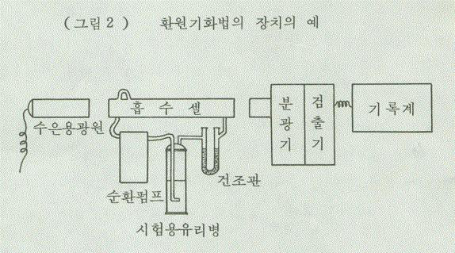

# 안전기준_별표4_유통안전관리시험방법

[별표4]

유통화장품

안전관리

시험방법

(

제

6

조

관련

)

Ⅰ. 일반화장품

1. 납

다음시험법중적당한방법에따라시험한다.

가) 디티존법

①검액의조제: 다음제1법또는제2법에따른다.

- 제1법: 검체1.0g을자제도가니에취하고(검체에수분이함유되어있을경우에는

수욕상에서증발건조한다) 약500℃에서2∼3시간회화한다. 회분에묽은염산및

묽은질산각10mL씩을넣고수욕상에서30분간가온한다음상징액을유리여과

기(G4)로여과하고잔류물을묽은염산및물적당량으로씻어씻은액을여액에

합하여전량을50mL로한다.

- 제2법: 검체1.0g을취하여300mL 분해플라스크에넣고황산5mL 및질산

10mL를넣고흰연기가발생할때까지조용히가열한다. 식힌다음질산5mL씩

을추가하고흰연기가발생할때까지가열하여내용물이무색∼엷은황색이될

때까지이조작을반복하여분해가끝나면포화수산암모늄용액5mL를넣고다시

가열하여질산을제거한다. 분해물을50mL 용량플라스크에옮기고물적당량으

로분해플라스크를씻어넣고물을넣어전체량을50mL로한다.

②시험조작: 위의검액으로「기능성화장품기준및시험방법」(식품의약품안전처

고시) 일반시험법1. 원료의"7. 납시험법"에따라시험한다. 비교액에는납표준액

2.0mL를넣는다.

나) 원자흡광광도법

①검액의조제: 검체약0.5g을정밀하게달아석영또는테트라플루오로메탄제의

극초단파분해용용기의기벽에닿지않도록조심하여넣는다. 검체를분해하기

위하여질산7mL, 염산2mL 및황산1mL을넣고뚜껑을닫은다음용기를극

초단파분해장치에장착하고다음조작조건에따라무색∼엷은황색이될때까지

분해한다. 상온으로식힌다음조심하여뚜껑을열고분해물을25mL 용량플라스

크에옮기고물적당량으로용기및뚜껑을씻어넣고물을넣어전체량을25mL

로하여검액으로한다. 침전물이있을경우여과하여사용한다. 따로질산7mL,

염산2mL 및황산1mL를가지고검액과동일하게조작하여공시험액으로한다.

다만, 필요에따라검체를분해하기위하여사용되는산의종류및양과극초단

---

파분해조건을바꿀수있다.

<조작조건>

최대파워: 1000W

최고온도: 200℃

분해시간: 약35분

위검액및공시험액또는디티존법의검액의조제와같은방법으로만든검액

및공시험액각25mL를취하여각각에구연산암모늄용액(1→4) 10mL 및브롬치

몰블루시액2방울을넣어액의색이황색에서녹색이될때까지암모니아시액을

넣는다. 여기에황산암모늄용액(2→5) 10mL 및물을넣어100mL로하고디에칠

디치오카르바민산나트륨용액(1→20) 10mL를넣어섞고몇분간방치한다음메

칠이소부틸케톤20.0mL를넣어세게흔들어섞어조용히둔다. 메칠이소부틸케톤

층을여취하고필요하면여과하여검액으로한다.

②표준액의조제: 따로납표준액(10μg/mL) 0.5mL, 1.0mL 및2.0mL를각각취하여

구연산암모늄용액(1→4) 10mL 및브롬치몰블루시액2방울을넣고이하위의검

액과같이조작하여검량선용표준액으로한다.

③조작: 각각의표준액을다음의조작조건에따라원자흡광광도기에주입하여얻

은납의검량선을가지고검액중납의양을측정한다.

<조작조건>

사용가스: 가연성가스

아세칠렌또는수소

지연성가스

공기

램프: 납중공음극램프

파장: 283.3nm

다) 유도결합플라즈마분광기를이용하는방법

①검액의조제: 검체약0.2g을정밀하게달아석영또는테트라플루오로메탄제의

극초단파분해용용기의기벽에닿지않도록조심하여넣는다. 검체를분해하기

위하여질산7mL, 염산2mL 및황산1mL을넣고뚜껑을닫은다음용기를극

초단파분해장치에장착하고다음조작조건에따라무색∼엷은황색이될때까지

분해한다. 상온으로식힌다음조심하여뚜껑을열고분해물을50mL 용량플라스

크에옮기고물적당량으로용기및뚜껑을씻어넣고물을넣어전체량을50mL

로하여검액으로한다. 침전물이있을경우여과하여사용한다. 따로질산7mL,

염산2mL 및황산1mL를가지고검액과동일하게조작하여공시험액으로한다.

다만, 필요에따라검체를분해하기위하여사용되는산의종류및양과극초단

파분해조건을바꿀수있다.

<조작조건>

---

최대파워: 1000W

최고온도: 200℃

분해시간: 약35분

②표준액의조제: 납표준원액(1000μg/mL)에0.5% 질산을넣어농도가다른3가

지이상의검량선용표준액을만든다. 이표준액의농도는액1mL당납0.01∼

0.2μg 범위내로한다.

③시험조작: 각각의표준액을다음의조작조건에따라유도결합플라즈마분광기

(ICP spectrometer)에주입하여얻은납의검량선을가지고검액중납의양을

측정한다.

<조작조건>

파장: 220.353nm(방해성분이함유된경우납의다른특성파장을선택할수있다)

플라즈마가스: 아르곤(99.99 v/v% 이상)

라) 유도결합플라즈마-질량분석기를이용한방법

①검액의조제: 검체약0.2g을정밀하게달아테플론제의극초단파분해용용기의

기벽에닿지않도록조심하여넣는다. 검체를분해하기위하여질산7mL, 불화수

소산2mL를넣고뚜껑을닫은다음용기를극초단파분해장치에장착하고다음

조작조건1에따라무색∼엷은황색이될때까지분해한다. 상온으로식힌다음

조심하여뚜껑을열어희석시킨붕산(5→100) 20mL를넣고뚜껑을닫은다음

용기를극초단파분해장치에장착하고다음조작조건2에따라불소를불활성화

시킨다. 다만, 기기의검액도입부등에석영대신테플론재질을사용하는경우에

한해불소불활성화조작은생략할수있다. 상온으로식힌다음조심하여뚜껑

을열고분해물을100mL 용량플라스크에옮기고증류수적당량으로용기및뚜

껑을씻어넣고증류수를넣어100mL로한다. 침전물이있을경우여과하여사

용한다. 이를증류수로5배희석하여검액으로한다. 따로질산7mL, 불화수소산

2mL를가지고검액과동일하게조작하여공시험액으로한다. 다만, 필요하면검

체를분해하기위하여사용되는산의종류및양과극초단파분해조건을바꿀수

있다.

<조작조건1>

<조작조건2>

최대파워: 1000W

최대파워: 1000W

최고온도: 200℃

최고온도: 180℃

분해시간: 약20분

분해시간: 약10분

②표준액의조제: 납표준원액(1000 μg/mL)에희석시킨질산(2→100)을넣어농도

가다른3가지이상의검량선용표준액을만든다. 이표준액의농도는액1mL당

납1∼20 ng 범위를포함하게한다.

---

③시험조작: 각각의표준액을다음의조작조건에따라유도결합플라즈마-질량분석

기(ICP-MS)에주입하여얻은납의검량선을가지고검액중납의양을측정한

다.

<조작조건>

원자량: 206, 207, 208(간섭현상이없는범위에서선택하여검출)

플라즈마기체: 아르곤(99.99 v/v% 이상)

2. 니켈

①검액의조제:

검체약0.2 g을정밀하게달아테플론제의극초단파분해용용기의

기벽에닿지않도록조심하여넣는다. 검체를분해하기위하여질산7 mL, 불화수

소산2 mL를넣고뚜껑을닫은다음용기를극초단파분해장치에장착하고조작조

건1에따라무색∼엷은황색이될때까지분해한다. 상온으로식힌다음조심하

여뚜껑을열어희석시킨붕산(5→100) 20 mL를넣고뚜껑을닫은다음용기를

극초단파분해장치에장착하고조작조건2에따라불소를

불활성화시킨다. 다만,

기기의검액도입부등에석영대신테플론재질을사용하는경우에한해불소불활

성화조작은생략할수있다. 상온으로식힌다음조심하여뚜껑을열고분해물을

100 mL 용량플라스크에옮기고물적당량으로용기및뚜껑을씻어넣고물을넣

어100 mL로한다.

침전물이있을경우여과하여사용한다. 이액을물로5배희석

하여검액으로한다. 따로질산7 mL, 불화수소산2 mL를가지고검액과동일하게

조작하여공시험액으로한다. 다만, 필요하면검체를분해하기위하여사용되는산

의종류및양과극초단파분해조건을바꿀수있다.

<조작조건1>

<조작조건2>

최대파워: 1000W

최대파워: 1000W

최고온도: 200℃

최고온도: 180℃

분해시간: 약20분

분해시간: 약10분

②표준액의조제: 니켈표준원액(1000 μg/mL)에희석시킨질산(2→100)을넣어농도

가다른3가지이상의검량선용표준액을만든다. 표준액의농도는1 mL당니켈1

∼20 ng 범위를포함하게한다.

③조작: 각각의표준액을다음의조작조건에따라유도결합플라즈마-질량분석기

(ICP-MS)에주입하여얻은니켈의검량선을가지고검액중니켈의양을측정한

다.

<조작조건>

원자량: 60(간섭현상이없는범위에서선택하여검출)

플라즈마기체: 아르곤(99.99 v/v% 이상)

④검출시험범위에서충분한정량한계, 검량선의직선성및회수율이확보되는경우

---

유도결합플라즈마-질량분석기(ICP-MS)

대신

유도결합플라즈마분광기(ICP)

또는

원자흡광분광기(AAS)를사용하여측정할수있다.

3. 비소

다음시험법중적당한방법에따라시험한다.

가) 비색법: 검체1.0g을달아

「기능성화장품기준및시험방법」(식품의약품안전

처고시) 일반시험법1. 원료의"15. 비소시험법" 중제3법에따라검액을만들고

장치A를쓰는방법에따라시험한다.

나) 원자흡광광도법

①검액의조제: 검체약0.2g을정밀하게달아석영또는테트라플루오로메탄제의

극초단파분해용용기의기벽에닿지않도록조심하여넣는다. 검체를분해하기

위하여질산7mL, 염산2mL 및황산1mL을넣고뚜껑을닫은다음용기를극

초단파분해장치에장착하고다음조작조건에따라무색∼엷은황색이될때까

지분해한다. 상온으로식힌다음조심하여뚜껑을열고분해물을50mL 용량플

라스크에옮기고물적당량으로용기및뚜껑을씻어넣고물을넣어전체량을

50mL로하여검액으로한다. 침전물이있을경우여과하여사용한다. 따로질산

7mL, 염산2mL 및황산1mL를가지고검액과동일하게조작하여공시험액으로

한다. 다만, 필요에따라검체를분해하기위하여사용되는산의종류및양과극

초단파의분해조건을바꿀수있다.

<조작조건>

최대파워: 1000W

최고온도: 200℃

분해시간: 약35분

②표준액의조제: 비소표준원액(1000μg/mL)에0.5% 질산을넣어농도가다른3

가지이상의검량선용표준액을만든다. 이표준액의농도는액1mL당비소0.01

∼0.2μg 범위내로한다.

③시험조작: 각각의표준액을다음의조작조건에따라수소화물발생장치및가열

흡수셀을사용하여원자흡광광도기에주입하고여기서얻은비소의검량선을가

지고검액중비소의양을측정한다.

<조작조건>

사용가스: 가연성가스

아세칠렌또는수소

지연성가스

공기

램

프: 비소중공음극램프또는무전극방전램프

파

장: 193.7 nm

---

다) 유도결합플라즈마분광기를이용한방법

①검액및표준액의조제: 원자흡광광도법의표준액및검액의조제와같은방법

으로만든액을검액및표준액으로한다.

②시험조작: 각각의표준액을다음의조작조건에따라유도결합플라즈마분광기

(ICP spectrometer)에주입하여얻은비소의검량선을가지고검액중비소의양

을측정한다.

<조작조건>

파장: 193.759nm(방해성분이함유된경우비소의다른특성파장을선택할수있다)

플라즈마가스: 아르곤(99.99 v/v% 이상)

라) 유도결합플라즈마-질량분석기를이용한방법

①검액의조제:

검체약0.2g을정밀하게달아테플론제의극초단파분해용용기의

기벽에닿지않도록조심하여넣는다. 검체를분해하기위하여질산7mL, 불화수

소산2mL를넣고뚜껑을닫은다음용기를극초단파분해장치에장착하고다음

조작조건1에따라무색∼엷은황색이될때까지분해한다. 상온으로식힌다음

조심하여뚜껑을열어희석시킨붕산(5→100) 20mL를넣고뚜껑을닫은다음용

기를극초단파분해장치에장착하고다음조작조건2에따라불소를불활성화시

킨다. 다만, 기기의검액도입부등에석영대신테플론재질을사용하는경우에한

해불소불활성화조작은생략할수있다. 최종분해물을100mL 용량플라스크에

옮기고증류수적당량으로용기및뚜껑을씻어넣고증류수을넣어100mL로한

다. 침전물이있을경우여과하여사용한다. 이를증류수로5배희석하여검액으로

한다. 따로질산7mL, 불화수소산2mL를가지고검액과동일하게조작하여공시

험액으로한다. 다만, 필요하면검체를분해하기위하여사용되는산의종류및양

과극초단파분해조건을바꿀수있다.

<조작조건1>

<조작조건2>

최대파워: 1000W

최대파워: 1000W

최고온도: 200℃

최고온도: 180℃

분해시간: 약20분

분해시간: 약10분

②표준액의조제: 비소표준원액(1000μg/mL)에희석시킨질산(2→100)을넣어농

도가다른3가지이상의검량선용표준액을만든다. 이표준액의농도는액1mL

당비소1∼4ng 범위를포함하게한다.

③시험조작: 각각의표준액을다음의조작조건에따라유도결합플라즈마-질량분석

기(ICP-MS)에주입하여얻은비소의검량선을가지고검액중비소의양을측

정한다.

<조작조건>

---

원자량: 75(40Ar35Cl+ 의간섭을방지하기위한장치를사용할수있음)

플라즈마기체: 아르곤(99.99 v/v% 이상)

4. 수은

가) 수은분해장치를이용한방법

①검액의조제: 검체1.0g을정밀히달아그림1과같은수은분해장치의플라스크

에넣고유리구수개를넣어장치에연결하고냉각기에찬물을통과시키면서적

가깔대기를통하여질산10mL를넣는다. 다음에적가깔대기의콕크를잠그고반

응콕크를열어주면서서서히가열한다. 아질산가스의발생이거의없어지고엷은

황색으로되었을때가열을중지하고식힌다. 이때냉각기와흡수관의접촉을열

어놓고흡수관의희석시킨황산(1→100)이장치안에역류되지않도록한다. 식힌

다음황산5mL를넣고다시서서히가열한다. 이때반응콕크를잠가주면서가열

하여산의농도를농축시키면분해가촉진된다. 분해가잘되지않으면질산및

황산을같은방법으로반복하여넣으면서가열한다. 액이무색또는엷은황색이

될때까지가열하고식힌다. 이때냉각기와흡수관의접촉을열어놓고흡수관의

희석시킨황산(1→100)이장치안에역류되지않도록한다. 식힌다음과망간산칼

륨가루소량을넣고가열한다. 가열하는동안과망간산칼륨의색이탈색되지않

을때까지소량씩넣어가열한다. 다시식힌다음적가깔대기를통하여과산화수

소시액을넣으면서탈색시키고10％요소용액10mL를넣고적가깔대기의콕크를

잠근다. 이때장치안이급히냉각되므로흡수관안의희석시킨황산(1→100)이장

치안으로역류한다. 역류가끝난다음천천히가열하면서아질산가스를완전히

날려보내고식혀서100mL 용량플라스크에옮기고뜨거운희석시킨황산(1→

100)소량으로장치의내부를잘씻어씻은액을100mL 메스플라스크에합하고

식힌다음물을넣어정확히100mL로하여검액으로한다.

②공시험액의조제: 검체는사용하지않고검액의조제와같은방법으로조작하여

공시험액으로한다.

③표준액의조제: 염화제이수은을데시케이타(실리카겔)에서6시간건조하여그

13.5mg을정밀하게달아묽은질산10mL 및물을넣어녹여정확하게1L로한

다. 이용액10mL를정확하게취하여묽은질산10mL 및물을넣어정확하게

1L로하여표준액으로한다. 쓸때조제한다. 이표준액1mL는수은(Hg) 0.1㎍을

함유한다.

④조작법(환원기화법) : 검액및공시험액을시험용유리병에옮기고5％과망간산

칼륨용액수적을넣어주면서탈색이되면추가하여1분간방치한다음1.5％염

산히드록실아민용액으로탈색시킨다. 따로수은표준액10mL를정확하게취하여

물을넣어100mL로하여시험용유리병에옮기고5％과망간산칼륨용액수적을

---

넣어흔들어주면서탈색이되면추가하여1분간방치한다음50％황산2mL 및

3.5％질산2mL를넣고1.5％염산히드록실아민용액으로탈색시킨다. 위의전처

리가끝난표준액, 검액및공시험액에1％염화제일석0.5N 황산용액10mL씩을

넣어곧그림2와같은원자흡광광도계의순환펌프에연결하여수은증기를건조

관및흡수셀(cell)안에순환시켜파장253.7nm에서기록계의지시가급속히상승

하여일정한값을나타낼때의흡광도를측정할때검액의흡광도는표준액의흡

광도보다적어야한다.

나) 수은분석기를이용한방법

①검액의조제:

검체약50mg을정밀하게달아검액으로한다.

②표준액의조제: 수은표준액을0.001% L-시스테인용액으로적당하게희석하여

0.1, 1, 10 μg/mL로하여표준액으로한다.

③조작법: 검액및표준액을가지고수은분석기로측정한다. 따로공시험을하며

필요하면첨가제를넣을수있다.

* 0.001% L-시스테인용액: L-시스테인10mg을달아질산2mL를넣은다음물을

넣어1000mL로한다. 이액을냉암소에보관한다.

---

5. 안티몬

①검액의조제:

검체약0.2g을정밀하게달아테플론제의극초단파분해용용기의

기벽에닿지않도록조심하여넣는다. 검체를분해하기위하여질산7mL, 불화수

소산2 mL를넣고뚜껑을닫은다음용기를극초단파분해장치에장착하고조작

조건1에따라무색∼엷은황색이될때까지분해한다.

상온으로식힌다음조

심하여뚜껑을열어희석시킨붕산(5→100) 20mL를넣고뚜껑을닫은다음용

기를극초단파분해장치에장착하고조작조건2에따라불소를불활성화시킨다.

다만, 기기의검액도입부등에석영대신테플론재질을사용하는경우에한해불

소불활성화조작은생략할수있다.

상온으로식힌다음조심하여뚜껑을열고

분해물을100mL 용량플라스크에옮기고물적당량으로용기및뚜껑을씻어넣

고물을넣어100mL로한다.

침전물이있을경우여과하여사용한다. 이액을물

로5배희석하여검액으로한다.

따로질산7mL, 불화수소산2mL를가지고검

액과동일하게조작하여공시험액으로한다. 다만, 필요하면검체를분해하기위하

여사용되는산의종류및양과극초단파분해조건을바꿀수있다.

<조작조건1>

<조작조건2>

최대파워: 1000W

최대파워: 1000W

최고온도: 200℃

최고온도: 180℃

분해시간: 약20분

분해시간: 약10분

②표준액의조제: 안티몬표준원액(1000 μg/mL)에희석시킨질산(2→100)을넣어

농도가다른3가지이상의검량선용표준액을만든다. 표준액의농도는1mL당

안티몬1∼20ng 범위를포함하게한다.

③조작: 각각의표준액을다음의조작조건에따라유도결합플라즈마-질량분석기

---

(ICP-MS)에주입하여얻은안티몬의검량선을가지고검액중안티몬의양을

측정한다.

<조작조건>

원자량: 121, 123(간섭현상이없는범위에서선택하여검출)

플라즈마기체: 아르곤(99.99 v/v% 이상)

④검출시험범위에서충분한정량한계, 검량선의직선성및회수율이확보되는경

우유도결합플라즈마-질량분석기(ICP-MS) 대신유도결합플라즈마분광기(ICP) 또

는원자흡광분광기(AAS)를사용하여측정할수있다.

6. 카드뮴

①검액의조제: 검체약0.2g을정밀하게달아테플론제의극초단파분해용용기의

기벽에닿지않도록조심하여넣는다. 검체를분해하기위하여질산7mL, 불화수

소산2 mL를넣고뚜껑을닫은다음용기를극초단파분해장치에장착하고조작

조건1에따라무색∼엷은황색이될때까지분해한다.

상온으로식힌다음조

심하여뚜껑을열어희석시킨붕산(5→100) 20mL를넣고뚜껑을닫은다음용

기를극초단파분해장치에장착하고조작조건2에따라불소를불활성화시킨다.

다만, 기기의검액도입부등에석영대신테플론재질을사용하는경우에한해불

소불활성화조작은생략할수있다.

상온으로식힌다음조심하여뚜껑을열고

분해물을100mL 용량플라스크에옮기고물적당량으로용기및뚜껑을씻어넣

고물을넣어100mL로한다.

침전물이있을경우여과하여사용한다. 이액을물

로5배희석하여검액으로한다. 따로질산7mL, 불화수소산2mL를가지고검액

과동일하게조작하여공시험액으로한다. 다만, 필요하면검체를분해하기위하여

사용되는산의종류및양과극초단파분해조건을바꿀수있다.

<조작조건1>

<조작조건2>

최대파워: 1000W

최대파워: 1000W

최고온도: 200℃

최고온도: 180℃

분해시간: 약20분

분해시간: 약10분

②표준액의조제: 카드뮴표준원액(1000μg/mL)에희석시킨질산(2→100)을넣어

농도가다른3가지이상의검량선용표준액을만든다. 표준액의농도는1mL당

카드뮴1∼20ng 범위를포함하게한다.

③조작: 각각의표준액을다음의조작조건에따라유도결합플라즈마-질량분석기

(ICP-MS)에주입하여얻은카드뮴의검량선을가지고검액중카드뮴의양을

측정한다.

<조작조건>

원자량: 110, 111, 112(간섭현상이없는범위에서선택하여검출)

플라즈마기체: 아르곤(99.99 v/v% 이상)

---

④검출시험범위에서충분한정량한계, 검량선의직선성및회수율이확보되는경

우유도결합플라즈마-질량분석기(ICP-MS) 대신유도결합플라즈마분광기(ICP) 또

는원자흡광분광기(AAS)를사용하여측정할수있다.

7. 디옥산

검체약1.0g을정밀하게달아20% 황산나트륨용액1.0mL를넣고잘흔들어섞어

검액으로한다. 따로1,4-디옥산표준품을물로희석하여0.0125, 0.025, 0.05, 0.1, 0.2,

0.4, 0.8mg/mL의액으로한다음, 각액50μL씩을취하여각각에폴리에틸렌글리콜

400 1.0g 및20% 황산나트륨용액1.0mL를넣고잘흔들어섞은액을표준액으로한

다. 검액및표준액을가지고다음조건으로기체크로마토그래프법의절대검량선법

에따라시험한다. 필요하면표준액의검량선범위내에서검체채취량또는희석배

수를조정할수있다.

<조작조건>

검출기: 질량분석기

- 인터페이스온도: 240 ℃

- 이온소스온도: 230 ℃

- 스캔범위: 40 ∼200 amu

- 질량분석기모드: 선택이온모드(88, 58, 43)

헤드스페이스

- 주입량(루프) : 1 mL

- 바이알평형온도: 95 ℃

- 루프온도: 110 ℃

- 주입라인온도: 120 ℃

- 바이알퍼지압력: 20 psi

- 바이알평형시간: 30 분

- 바이알퍼지시간: 0.5 분

- 루프채움시간: 0.3 분

- 루프평형시간: 0.05 분

- 주입시간: 1 분

칼

럼: 안지름약0.32mm, 길이약60m인관에기체크로마토그래프용폴리에

칠렌왁스를실란처리한500 μm의기체크로마토그래프용규조토에피복한것을충

전한다.

칼럼온도: 처음2 분간50℃로유지하고160℃까지1분에10℃씩상승시킨다.

운반기체: 헬륨

유

량: 1,4-디옥산의유지시간이약10분이되도록조정한다.

스플리트비: 약1:10

---

8. 메탄올

이하메탄올시험법에사용하는에탄올은메탄올이함유되지않은것을확인하고사용

한다.

가) 푹신아황산법

검체10 mL를취해포화염화나트륨용액10 mL를넣어충분히흔들어섞고, 대한민

국약전알코올수측정법에따라증류하여유액12 mL를얻는다. 이유액이백탁이될

때까지탄산칼륨을넣어분리한알코올분에정제수를넣어50 mL로하여검액으로한

다.

따로0.1 % 메탄올1.0 mL에에탄올0.25 mL를넣고정제수를가해5.0 mL로하여

표준액으로한다.

표준액및검액5 mL를가지고「기능성화장품기준및시험방법」(식품의약품안전처

고시) 일반시험법1. 원료"9. 메탄올및아세톤시험법" 중메탄올항에따라시험한다.

나) 기체크로마토그래프법

1) 물휴지외제품

①증류법: 검체약10 mL를정확하게취해증류플라스크에넣고물10 mL, 염화

나트륨2 g, 실리콘유1 방울및에탄올10 mL를넣어초음파로균질화한후증

류하여유액15 mL를얻는다.

이액에에탄올을넣어50 mL로한후여과하여검액으로한다.

따로메탄올1.0 mL를정확하게취해에탄올을넣어정확하게500 mL로하고

이액1.25 mL, 2.5 mL, 5 mL, 10 mL, 20 mL를정확하게취해에탄올을넣어

50 mL로하여각각의표준액으로한다.

②희석법: 검체약10 mL를정확하게취해에탄올10 mL를넣어초음파로균질

화하고에탄올을넣어50 mL로한후여과하여검액으로한다.

따로메탄올1.0 mL를정확하게취하여에탄올을넣어정확하게500 mL로하고이액

1.25 mL, 2.5 mL, 5 mL, 10 mL, 20 mL를정확하게취해에탄올을넣어50 mL로

하여각각의표준액으로한다.

③기체크로마토그래프분석: 검체에따라증류법또는희석법을선택하여전처리한

후각각의표준액과검액을가지고아래조작조건에따라시험한다.

<조작조건>

ㆍ검출기: 수소염이온화검출기(FID)

ㆍ칼럼: 안지름약0.32 mm, 길이약60 m인용융실리카모세관내부에기체

크로마토그래프용폴리에칠렌글리콜왁스를0.5 μm의두께로코팅한

다.

ㆍ칼럼온도: 50 ℃에서5 분동안유지한다음150 ℃까지매분10 ℃씩상승시

킨후150 ℃에서2 분동안유지한다.

---

ㆍ검출기온도: 240 ℃

ㆍ시료주입부온도: 200 ℃

ㆍ운반기체및유량: 질소1.0 mL/분

2) 물휴지

검체적당량을압착하여용액을분리하고이액약3 mL를정확하게취해검액으로

한다. 따로메탄올표준품0.5 mL를정확하게취해물을넣어정확하게500 mL로

한다. 이액0.3 mL, 0.5 mL, 1 mL, 2 mL, 4 mL를정확하게취하여물을넣어100

mL로하여각각의표준액으로한다.

각각의표준액과검액을가지고기체크로마토그래프-헤드스페이스법으로다음조작

조건에따라시험한다.

<조작조건>

ㆍ 기체크로마토그래프는‘1) 물휴지외제품’ 조작조건과동일하게조작한다. 다

만, 스플리트비는1:10으로한다.

ㆍ 헤드스페이스장치

- 바이알용량: 20 mL

- 주입량(루프) : 1 mL

- 바이알평형온도: 70 ℃

- 루프온도: 80 ℃

- 주입라인온도: 90 ℃

- 바이알평형시간: 10 분

- 바이알퍼지시간: 0.5 분

- 루프채움시간: 0.5 분

- 루프평형시간: 0.1 분

- 주입시간: 0.5 분

다) 기체크로마토그래프-질량분석기법

검체(물휴지는검체적당량을압착하여용액을분리하여사용) 약1 mL을정확하게

취하여물을넣어정확하게100 mL로하여검액으로한다. 따로메탄올표준품약

0.1 mL를정확하게취해물을넣어정확하게100 mL로하여표준원액(1000 µL/L)

으로한다. 이액0.3 mL, 0.5 mL, 1 mL, 2 mL, 4 mL를정확하게취하여물을넣

어정확하게100 mL로하여각각의표준액으로한다.

각각의표준액과검액약3 mL를정확하게취해헤드스페이스용바이알에넣고기

체크로마토그래프-헤드스페이스법으로다음조작조건에따라시험한다. 필요하면표

준액의검량선범위내에서검체채취량또는희석배수는조정할수있다.

<조작조건>

---

ㆍ 검출기: 질량분석기

- 인터페이스온도: 230 ℃

- 이온소스온도: 230 ℃

- 스캔범위: 30∼200 amu

- 질량분석기모드: 선택이온모드(31, 32)

ㆍ 헤드스페이스장치

- 주입량(루프) : 1 mL

- 바이알평형온도: 90 ℃

- 루프온도: 130 ℃

- 주입라인온도: 120 ℃

- 바이알퍼지압력: 20 psi

- 바이알평형시간: 30 분

- 바이알퍼지시간: 0.5 분

- 루프채움시간: 0.3 분

- 루프평형시간: 0.05 분

- 주입시간: 1 분

ㆍ 칼럼: 안지름약0.32 mm, 길이약60 m인용융실리카모세관내부에기체

크로마토그래프용폴리에칠렌글리콜왁스를0.5 μm의두께로코팅한다.

ㆍ 칼럼온도: 50 ℃에서10 분동안유지한다음230 ℃까지매분15 ℃씩상승

시킨다음230 ℃에서3 분간유지한다.

ㆍ 운반기체및유량: 헬륨, 1.5 mL/분

ㆍ 분리비(split ratio) : 약1:10

9. 포름알데하이드

검체약1.0 g을정밀하게달아초산ㆍ초산나트륨완충액주1)을넣어20 mL로하고1

시간진탕추출한다음여과한다. 여액1 mL를정확하게취하여물을넣어200 mL

로하고, 이액100 mL를취하여초산ㆍ초산나트륨완충액주1) 4 mL를넣은다음균

질하게섞고6 mol/L 염산또는6 mol/L 수산화나트륨용액을넣어pH를5.0으로조

정한다. 이액에2,4-디니트로페닐히드라진시액주2) 6.0 mL를넣고40 ℃에서1시간

진탕한다음, 디클로로메탄20 mL로3회추출하고디클로로메탄층을무수황산나트

륨5.0 g을놓은탈지면을써서여과한다. 이여액을감압에서가온하여증발건고한

다음잔류물에아세토니트릴5.0 mL를넣어녹인액을검액으로한다. 따로포름알

데하이드표준품을물로희석하여0.05, 0.1, 0.2, 0.5, 1, 2 ㎍/mL의액을만든다음,

각액100 mL를취하여검액과같은방법으로전처리하여표준액으로한다. 검액

및표준액각10 μL씩을가지고다음조건으로액체크로마토그래프법의절대검량선

---

법에따라시험한다. 필요하면표준액의검량선범위내에서검체채취량또는검체

희석배수를조정할수있다.

<조작조건>

검출기: 자외부흡광광도계(측정파장355 nm)

칼

럼: 안지름약4.6 mm, 길이약25 cm인스테인레스강관에5 ㎛의액체크로

마토그래프용옥타데실실릴화한실리카겔을충전한다.

이동상: 0.01 mol/L염산ㆍ아세토니트릴혼합액(40 : 60)

유

량: 1.5 mL/분

주1) 초산ㆍ초산나트륨완충액: 5 mol/L 초산나트륨액60 mL에5 mol/L 초산40 mL

를넣어균질하게섞은다음, 6 mol/L 염산또는6 mol/L 수산화나트륨용액을넣

어pH를5.0으로조정한다.

주2) 2,4-디니트로페닐하이드라진시액: 2,4-디니트로페닐하이드라진약0.3 g을정밀하

게달아아세토니트릴을넣어녹여100 mL로한다.

10. 프탈레이트류(디부틸프탈레이트, 부틸벤질프탈레이트및디에칠헥실프탈레이트)

다음시험법중적당한방법에따라시험한다.

가) 기체크로마토그래프-수소염이온화검출기를이용한방법

검체약1.0 g을정밀하게달아헥산ㆍ아세톤혼합액(8:2)을넣어정확하게10 mL로

하고초음파로충분히분산시킨다음원심분리한다. 그상등액5.0 mL를정확하게취

하여내부표준액주) 4.0 mL를넣고헥산ㆍ아세톤혼합액(8:2)을넣어10.0 mL로하여

검액으로한다. 따로디부틸프탈레이트, 부틸벤질프탈레이트, 디에칠헥실프탈레이트표

준품을정밀하게달아헥산ㆍ아세톤혼합액(8:2)을넣어녹여희석하고그일정량을

취하여내부표준액4.0 mL를넣고헥산ㆍ아세톤혼합액(8:2)을넣어10.0 mL로하여

0.1, 0.5, 1.0, 5.0, 10.0, 25.0 ㎍/mL로하여표준액으로한다. 검액및표준액각1 μL씩

을가지고다음조건으로기체크로마토그래프법내부표준법에따라시험한다. 필요한

경우표준액의검량선범위내에서검체채취량또는희석배수를조정할수있다.

<조작조건>

ㆍ검출기: 수소염이온화검출기(FID)

ㆍ칼

럼: 안지름약0.25 mm, 길이약30 m인용융실리카관의내관에14% 시아

노프로필페닐-86 % 메틸폴리실록산으로0.25 μm 두께로피복한다.

ㆍ칼럼온도: 150 ℃에서2 분동안유지한다음260 ℃까지매분10 ℃씩상승시킨

다음15 분동안이온도를유지한다.

ㆍ검체도입부온도: 250 ℃

ㆍ검출기온도: 280 ℃

ㆍ운반기체: 질소

---

ㆍ유량: 1 mL/분

ㆍ스플리트비: 약1:10

주) 내부표준액: 벤질벤조에이트표준품약10 mg을정밀하게달아헥산ㆍ아세톤혼

합액(8:2)을넣어정확하게1000 mL로한다.

나) 기체크로마토그래프-질량분석기를이용한방법

검체약1.0 g을정밀하게달아헥산ㆍ아세톤혼합액(8:2)을넣어정확하게10 mL

로하고초음파로충분히분산시킨다음원심분리한다. 그상등액5.0 mL를정확하

게취하여내부표준액주) 1.0 mL를넣고헥산ㆍ아세톤혼합액(8:2)을넣어10.0 mL

로하여검액으로한다. 따로디부틸프탈레이트, 부틸벤질프탈레이트, 디에칠헥실프

탈레이트표준품을정밀하게달아헥산ㆍ아세톤혼합액(8:2)을넣어녹여희석하고

그일정량을취하여내부표준액1.0 mL를넣고헥산ㆍ아세톤혼합액(8:2)을넣어

10.0 mL로하여0.1, 0.25, 0.5, 1.0, 2.5, 5.0 ㎍/mL로하여표준액으로한다. 검액및

표준액각1 μL씩을가지고다음조건으로기체크로마토그래프법내부표준법에따

라시험한다. 필요한경우표준액의검량선범위내에서검체채취량또는희석배수

를조정할수있다.

<조작조건>

ㆍ 검출기: 질량분석기

- 인터페이스온도: 300 ℃

- 이온소스온도: 230 ℃

- 스캔범위: 40 ∼300 amu

- 질량분석기모드: 선택이온모드

성분명

선택이온

디부틸프탈레이트

149, 205, 223

부틸벤질프탈레이트

91, 149, 206

디에칠헥실프탈레이트

149, 167, 279

내부표준물질(플루오란센-d10)

92, 106, 212

ㆍ 칼

럼: 안지름약0.25 mm, 길이약30 m인용융실리카관의내관에5 % 페닐

-95 % 디메틸폴리실록산으로0.25 μm 두께로피복한다.

ㆍ 칼럼온도: 110 ℃에서0.5분동안유지한다음300 ℃까지매분20 ℃씩상승시킨

다음3분동안이온도를유지한다.

ㆍ 검체도입부온도: 280 ℃

ㆍ 운반기체: 헬륨

ㆍ 유량: 1 mL/분

---

ㆍ 스플리트비: 스플릿리스

주) 내부표준액: 플루오란센-d10 표준품약10 mg을정밀하게달아헥산ㆍ아세톤혼합

액(8:2)을넣어정확하게1000 mL로한다.

11. 미생물한도

일반적으로다음의시험법을사용한다. 다만, 본시험법외에도미생물검출을위한

자동화장비와미생물동정기기및키트등을사용할수도있다.

1) 검체의전처리

검체조작은무균조건하에서실시하여야하며, 검체는충분하게무작위로선별하여

그내용물을혼합하고검체제형에따라다음의각방법으로검체를희석, 용해, 부유

또는현탁시킨다. 아래에기재한어느방법도만족할수없을때에는적절한다른방

법을확립한다.

가) 액제ㆍ로션제: 검체1 mL(g)에변형레틴액체배지또는검증된배지나희석액9

mL를넣어10배희석액을만들고희석이더필요할때에는같은희석액으로조제

한다.

나) 크림제ㆍ오일제: 검체1 mL(g)에적당한분산제1mL를넣어균질화시키고변형

레틴액체배지또는검증된배지나희석액8 mL를넣어10배희석액을만들고희석

이더필요할때에는같은희석액으로조제한다. 분산제만으로균질화가되지않는

경우검체에적당량의지용성용매를첨가하여용해한뒤적당한분산제1 mL를넣

어균질화시킨다.

다) 파우더및고형제: 검체1g에적당한분산제를1mL를넣고충분히균질화시킨

후변형레틴액체배지또는검증된배지및희석액8mL를넣어10배희석액을만

들고희석이더필요할때에는같은희석액으로조제한다. 분산제만으로균질화가

되지않을경우적당량의지용성용매를첨가한상태에서멸균된마쇄기를이용하

여검체를잘게부수어반죽형태로만든뒤적당한분산제1 mL를넣어균질화

시킨다. 추가적으로40℃에서30분동안가온한후멸균한유리구슬(5 mm: 5∼7

개, 3 mm: 10∼15개)을넣어균질화시킨다.

주1) 분산제는멸균한폴리소르베이트80 등을사용할수있으며, 미생물의생육에대하여

영향이없는것또는영향이없는농도이어야한다.

주2) 검액조제시총호기성생균수시험법의배지성능및시험법적합성시험을통하

여검증된배지나희석액및중화제를사용할수있다.

주3) 지용성용매는멸균한미네랄오일등을사용할수있으며, 미생물의생육에대하

여영향이없는것이어야한다. 첨가량은대상검체특성에맞게설정하여야하며,

미생물의생육에대하여영향이없어야한다.

---

2) 총호기성생균수시험법

총호기성생균수시험법은화장품중총호기성생균(세균및진균)수를측정하는

시험방법이다.

가) 검액의조제

1)항에따라검액을조제한다.

나) 배지

총호기성세균수시험은변형레틴한천배지또는대두카제인소화한천배지를사용하

고진균수시험은항생물질첨가포테이토덱스트로즈한천배지또는항생물질첨

가사브로포도당한천배지를사용한다. 위의배지이외에배지성능및시험법적합

성시험을통하여검증된다른미생물검출용배지도사용할수있고, 세균의혼

입이없다고예상된때나세균의혼입이있어도눈으로판별이가능하면항생물질

을첨가하지않을수있다.

변형레틴액체배지(Modified letheen broth)

육제펩톤

20.0 g

카제인의판크레아틴소화물

5.0 g

효모엑스

2.0 g

육엑스

5.0 g

염화나트륨

5.0 g

폴리소르베이트80

5.0 g

레시틴

0.7 g

아황산수소나트륨

0.1 g

정제수

1000 mL

이상을달아정제수에녹여1 L로하고멸균후의pH가7.2 ± 0.2가되도록조정하고121

℃에서15분간고압멸균한다.

변형레틴한천배지(Modified letheen agar)

프로테오즈펩톤

10.0 g

카제인의판크레아틱소화물

10.0 g

효모엑스

2.0 g

육엑스

3.0 g

염화나트륨

5.0 g

포도당

1.0 g

---

폴리소르베이트80

7.0 g

레시틴

1.0 g

아황산수소나트륨

0.1 g

한천

20.0 g

정제수

1000 mL

이상을달아정제수에녹여1 L로하고멸균후의pH가7.2 ± 0.2가되도록조정하고

121 ℃에서15분간고압멸균한다.

대두카제인소화한천배지(Tryptic soy agar)

카제인제펩톤

15.0 g

대두제펩톤

5.0 g

염화나트륨

5.0 g

한천

15.0 g

정제수

1000 mL

이상을달아정제수에녹여1 L로하고멸균후의pH가7.2 ± 0.1이되도록조정하고

121 ℃에서15분간고압멸균한다.

항생물질첨가포테이토덱스트로즈한천배지(Potato dextrose agar)

감자침출물

200.0 g

포도당

20.0 g

한천

15.0 g

정제수

1000 mL

이상을달아정제수에녹여1 L로하고121 ℃에서15분간고압멸균한다. 사용하기

전에1 L당40 mg의염산테트라사이클린을멸균배지에첨가하고10 % 주석산용액을

넣어pH를5.6 ± 0.2 로조정하거나, 세균혼입의문제가있는경우3.5 ± 0.1로조정

할수있다. 200.0 g의감자침출물대신4.0 g의감자추출물이사용될수있다.

항생물질첨가사부로포도당한천배지(Sabouraud dextrose agar)

육제또는카제인제펩톤

10.0 g

포도당

40.0 g

한천

15.0 g

정제수

1000 mL

이상을달아정제수에녹여1 L로하고121 ℃에서15분간고압멸균한다음의pH가

5.6 ± 0.2이되도록조정한다. 쓸때배지1000 mL당벤질페니실린칼륨0.10 g과테트

라사이클린0.10 g을멸균용액으로서넣거나배지1000 mL당클로람페니콜50 mg을

---

넣는다.

다) 조작

(1) 세균수시험㉮한천평판도말법직경9 ∼10 cm 페트리접시내에미리굳힌

세균시험용배지표면에전처리검액0.1 mL이상도말한다.

㉯한천평판희석법검액1 mL를같은크기의페트리접시에넣고그위에멸

균후45 ℃로식힌15 mL의세균시험용배지를넣어잘혼합한다.

검체당최소2개의평판을준비하고30∼35 ℃에서적어도48시간배양하는데

이때최대균집락수를갖는평판을사용하되평판당300개이하의균집락을최

대치로하여총세균수를측정한다.

(2) 진균수시험: ‘(1) 세균수시험’에따라시험을실시하되배지는진균수시험용

배지를사용하여배양온도20∼25 ℃에서적어도5일간배양한후100 개이

하의균집락이나타나는평판을세어총진균수를측정한다.

라) 배지성능및시험법적합성시험

시판배지는배치마다시험하며, 조제한배지는조제한배치마다시험한다. 검체의

유ㆍ무하에서총호기성생균수시험법에따라제조된검액ㆍ대조액에표1.에기

재된시험균주를각각100cfu 이하가되도록접종하여규정된총호기성생균수시험

법에따라배양할때검액에서회수한균수가대조액에서회수한균수의1/2 이상

이어야한다. 검체중보존제등의항균활성으로인해증식이저해되는경우(검액

에서회수한균수가대조액에서회수한균수의1/2 미만인경우)에는결과의유효

성을확보하기위하여총호기성생균수시험법을변경해야한다. 항균활성을중

화하기위하여희석및중화제(표2.)를사용할수있다. 또한, 시험에사용된배지

및희석액또는시험조작상의무균상태를확인하기위하여완충식염펩톤수(pH

7.0)를대조로하여총호기성생균수시험을실시할때미생물의성장이나타나서는

안된다.

표1. 총호기성생균수배지성능시험용균주및배양조건

시험균주

배양

ATCC

8739,

NCIMB

8545,

CIP53.126,

Escherichia coli

NBRC 3972 또는KCTC 2571

호기배양

ATCC 6633, NCIMB 8054, CIP 52.62,

Bacillus subtilis

30 ∼35 ℃

NBRC 3134 또는KCTC 1021

48시간

ATCC

6538,

NCIMB

9518,

CIP

4.83,

Staphylococcus aureus

NRRC 13276 또는KCTC 3881

---

호기배양

ATCC

10231,

NCPF

3179,

IP48.72,

Candida albicans

20 ∼25 ℃

NBRC1594 또는KCTC 7965

5일

표2. 항균활성에대한중화제

화장품중미생물발육저지물질

항균성을중화시킬수있는중화제

레시틴,

페놀화합물：

폴리소르베이트80,

파라벤, 페녹시에탄올,페닐에탄올등

지방알코올의에틸렌옥사이드축합물(condensate),

아닐리드

비이온성계면활성제

레시틴, 사포닌,

4급암모늄화합물,

폴리소르베이트80,

양이온성계면활성제

도데실황산나트륨,

지방알코올의에틸렌옥사이드축합물

알데하이드,

글리신, 히스티딘

포름알데히드－유리제제

산화(oxidizing) 화합물

치오황산나트륨

레시틴, 사포닌,

이소치아졸리논,

아민, 황산염, 메르캅탄,

이미다졸

아황산수소나트륨,

치오글리콜산나트륨

레시틴, 사포닌,

비구아니드

폴리소르베이트80

아황산수소나트륨,

금속염(Cu, Zn, Hg),

L－시스테인－SH 화합물(sulfhydryl compounds),

유기－수은화합물

치오글리콜산

3) 특정세균시험법

가) 대장균시험

(1) 검액의조제및조작: 검체1 g 또는1 mL을

유당액체배지를사용하여10

mL로하여30∼35 ℃에서24∼72시간배양한다. 배양액을가볍게흔든다음백

금이등으로취하여맥콘키한천배지위에도말하고30∼35 ℃에서18∼24 시간

배양한다. 주위에적색의침강선띠를갖는적갈색의그람음성균의집락이검출

되지않으면대장균음성으로판정한다. 위의특정을나타내는집락이검출되는

---

경우에는에오신메칠렌블루한천배지에서각각의집락을도말하고30∼35 ℃에

서18∼24시간배양한다. 에오신메칠렌블루한천배지에서금속광택을나타내는

집락또는투과광선하에서흑청색을나타내는집락이검출되면백금이등으로

취하여발효시험관이든유당액체배지에넣어44.3∼44.7 ℃의항온수조중에서

22∼26 시간배양한다. 가스발생이나타나는경우에는대장균양성으로의심하

고동정시험으로확인한다.

(2) 배지

유당액체배지

육엑스

3.0 g

젤라틴의판크레아틴소화물

5.0 g

유당

5.0 g

정제수

1000 mL

이상을달아정제수에녹여1 L로하고121 ℃에서15∼20 분간고압증기멸균한다. 멸

균후의pH가6.9∼7.1이되도록하고가능한한빨리식힌다.

맥콘키한천배지

젤라틴의판크레아틴소화물

17.0 g

카제인의판크레아틴소화물

1.5 g

육제펩톤

1.5 g

유당

10.0 g

데옥시콜레이트나트륨

1.5 g

염화나트륨

5.0 g

한천

13.5 g

뉴트럴렛

0.03 g

염화메칠로자닐린

1.0 mg

정제수

1000 mL

이상을달아정제수1 L에녹여1분간끓인다음121 ℃에서15∼20 분간고압증기멸

균한다. 멸균후의pH가6.9∼7.3이되도록한다.

에오신메칠렌블루한천배지(EMB한천배지)

젤라틴의판크레아틴소화물

10.0 g

인산일수소칼륨

2.0 g

유당

10.0 g

한천

15.0 g

에오신

0.4 g

---

메칠렌블루

0.065 g

정제수

1000 mL

이상을달아정제수1 L에녹여121 ℃에서15∼20 분간고압증기멸균한다. 멸균후

의pH가6.9∼7.3이되도록한다.

나) 녹농균시험

(1) 검액의조제및조작: 검체1 g 또는1 mL를달아카제인대두소화액체배지를

사용하여10 mL로하고30∼35 ℃에서24∼48시간증균배양한다. 증식이나타

나는경우는백금이등으로세트리미드한천배지또는엔에이씨한천배지에도말

하여30∼35 ℃에서24∼48시간배양한다. 미생물의증식이관찰되지않는경우

녹농균음성으로판정한다. 그람음성간균으로녹색형광물질을나타내는집락을

확인하는경우에는증균배양액을녹농균한천배지P 및F에도말하여30∼35

℃에서24∼72시간배양한다. 그람음성간균으로플루오레세인검출용녹농균한

천배지F의집락을자외선하에서관찰하여황색의집락이나타나고, 피오시아

닌검출용녹농균한천배지P의집락을자외선하에서관찰하여청색의집락이

검출되면옥시다제시험을실시한다. 옥시다제반응양성인경우5∼10초이내에

보라색이나타나고10초후에도색의변화가없는경우녹농균음성으로판정

한다. 옥시다제반응양성인경우에는녹농균양성으로의심하고동정시험으로

확인한다.

(2) 배지

카제인대두소화액체배지

카제인판크레아틴소화물

17.0 g

대두파파인소화물

3.0 g

염화나트륨

5.0 g

인산일수소칼륨

2.5 g

포도당일수화물

2.5 g

이상을달아정제수에녹여1 L로하고멸균후의pH가7.3 ± 0.2가되도록조정하고

121 ℃에서15분간고압멸균한다.

세트리미드한천배지(Cetrimide agar)

젤라틴제펩톤

20.0 g

염화마그네슘

3.0 g

황산칼륨

10.0 g

세트리미드

0.3 g

글리세린

10.0 mL

---

한천

13.6 g

정제수

1000 mL

이상을달아정제수에녹이고글리세린을넣어1 L로한다. 121 ℃에서15분간고압증

기멸균하고pH가7.2 ± 0.2가되도록조정한다.

엔에이씨한천배지(NAC agar)

펩톤

20.0 g

인산수소이칼륨

0.3 g

황산마그네슘

0.2 g

세트리미드

0.2 g

날리딕산

15 mg

한천

15.0 g

정제수

1000 mL

최종pH는7.4 ± 0.2이며멸균하지않고가온하여녹인다.

플루오레세인검출용녹농균한천배지F (Pseudomonas agar F for detection

of fluorescein)

카제인제펩톤

10.0 g

육제펩톤

10.0 g

인산일수소칼륨

1.5 g

황산마그네슘

1.5 g

글리세린

10.0 mL

한천

15.0 g

정제수

1000 mL

이상을달아정제수에녹이고글리세린을넣어1 L로한다. 121 ℃에서15분간고압증

기멸균하고pH가7.2 ± 0.2가되도록조정한다.

피오시아닌검출용녹농균한천배지P (Pseudomonas agar P for detection

of pyocyanin)

젤라틴의판크레아틴소화물

20.0 g

염화마그네슘

1.4 g

황산칼륨

10.0 g

글리세린

10.0 mL

한천

15.0 g

정제수

1000 mL

---

이상을달아정제수에녹이고글리세린을넣어1 L로한다. 121 ℃에서15분간고압증

기멸균하고pH가7.2 ± 0.2가되도록조정한다.

다) 황색포도상구균시험

(1) 검액의조제및조작: 검체1 g 또는1 mL를달아카제인대두소화액체배지를

사용하여10 mL로하고30∼35 ℃에서24∼48시간증균배양한다. 증균배양액

을보겔존슨한천배지또는베어드파카한천배지에이식하여30∼35 ℃에서24시

간배양하여균의집락이검정색이고집락주위에황색투명대가형성되며그람

염색법에따라염색하여검경한결과그람양성균으로나타나면응고효소시험

을실시한다. 응고효소시험음성인경우황색포도상구균음성으로판정하고, 양

성인경우에는황색포도상구균양성으로의심하고동정시험으로확인한다.

(2) 배지

보겔존슨한천배지(Vogel-Johnson agar)

카제인의판크레아틴소화물

10.0 g

효모엑스

5.0 g

만니톨

10.0 g

인산일수소칼륨

5.0 g

염화리튬

5.0 g

글리신

10.0 g

페놀렛

25.0 mg

한천

16.0 g

정제수

1000 mL

이상을달아1분동안가열하여자주흔들어준다. 121 ℃에서15분간고압멸균하고45

∼50 ℃로냉각시킨다. 멸균후pH가7.2 ± 0.2가되도록조정하고멸균한1 %(w/v)

텔루린산칼륨20 mL를넣는다.

베어드파카한천배지(Baird-Parker agar)

카제인제펩톤

10.0 g

육엑스

5.0 g

효모엑스

1.0 g

염화리튬

5.0 g

글리신

12.0 g

피루브산나트륨

10.0 g

한천

20.0 g

정제수

950 mL

---

이상을섞어때때로세게흔들며섞으면서가열하고1분간끓인다. 121 ℃에서15 분

간고압멸균하고45∼50 ℃로냉각시킨다. 멸균한다음의pH가7.2 ± 0.2가되도록조

정한다. 여기에멸균한아텔루산칼륨용액1 %(w/v) 10 mL와난황유탁액50 mL를넣

고가만히섞은다음페트리접시에붓는다. 난황유탁액은난황약30 %, 생리식염액

약70 %의비율로섞어만든다.

라) 배지성능및시험법적합성시험

검체의유ㆍ무하에서각각규정된특정세균시험법에따라제조된검액ㆍ대조액에

표3.에기재된시험균주100cfu를개별적으로접종하여시험할때접종균각각에

대하여양성으로나타나야한다. 증식이저해되는경우항균활성을중화하기위하

여희석및중화제(2)-라)항의표2.)를사용할수있다.

표3. 특정세균배지성능시험용균주

ATCC 8739, NCIMB 8545, CIP53.126, NBRC 3972 또는

Escherichia coli

(대장균)

KCTC 2571

Pseudomonas aeruginosa

ATCC 9027, NCIMB 8626, CIP 82.118, NBRC 13275 또는

(녹농균)

KCTC 2513

ATCC 6538, NCIMB 9518, CIP 4.83, NRRC 13276 또는

Staphylococcus aureus

(황색포도상구군)

KCTC 3881

12. 내용량

가) 용량으로표시된제품: 내용물이들어있는용기에뷰렛으로부터물을적가하여

용기를가득채웠을때의소비량을정확하게측정한다음용기의내용물을완전

히제거하고물또는기타적당한유기용매로용기의내부를깨끗이씻어말린

다음뷰렛으로부터물을적가하여용기를가득채워소비량을정확히측정하고

전후의용량차를내용량으로한다. 다만, 150mL이상의제품에대하여는메스실린

더를써서측정한다.

나) 질량으로표시된제품: 내용물이들어있는용기의외면을깨끗이닦고무게를정

밀하게단다음내용물을완전히제거하고물또는적당한유기용매로용기의내

부를깨끗이씻어말린다음용기만의무게를정밀히달아전후의무게차를내용

량으로한다.

다) 길이로표시된제품: 길이를측정하고연필류는연필심지에대하여그지름과길이

를측정한다.

라) 화장비누

---

(1) 수분포함: 상온에서저울로측정(g)하여실중량은전체무게에서포장무게를

뺀값으로하고, 소수점이하1자리까지반올림하여정수자리까지구한다.

(2) 건조: 검체를작은조각으로자른후약10 g을0.01 g까지측정하여접시에옮

긴다. 이검체를103 ± 2 ℃오븐에서1시간건조후꺼내어냉각시키고다시

오븐에넣고1시간후접시를꺼내어데시케이터로옮긴다. 실온까지충분히냉

각시킨후질량을측정하고2회의측정에있어서무게의차이가0.01 g 이내가

될때까지1시간동안의가열, 냉각및측정조작을반복한후마지막측정결

과를기록한다.

(계산식)

내용량(g) = 건조전무게(g) × [100 – 건조감량(%)] / 100



건조감량(%) = 

× 



ㆍm0: 접시의무게(g)

ㆍm1: 가열전접시와검체의무게(g)

ㆍm2: 가열후접시와검체의무게(g)

마) 그밖의특수한제품은「대한민국약전」(식품의약품안전처고시)으로정한바에

따른다.

13. pH 시험법

검체약2 g 또는2 mL를취하여100 mL 비이커에넣고물30 mL를넣어수욕상

에서가온하여지방분을녹이고흔들어섞은다음냉장고에서지방분을응결시켜여과

한다. 이때지방층과물층이분리되지않을때는그대로사용한다. 여액을가지고「기

능성화장품기준및시험방법」(식품의약품안전처고시) 일반시험법1. 원료의"47. pH

측정법"에따라시험한다. 다만, 성상에따라투명한액상인경우에는그대로측정한다.

14. 유리알칼리시험법

가) 에탄올법(나트륨비누)

플라스크에에탄올200 mL을넣고환류냉각기를연결한다. 이산화탄소를제거하기위하

여서서히가열하여5분동안끓인다. 냉각기에서분리시키고약70 ℃로냉각시킨

후페놀프탈레인지시약4방울을넣어지시약이분홍색이될때까지0.1N 수산화칼

륨ㆍ에탄올액으로중화시킨다. 중화된에탄올이들어있는플라스크에검체약5.0 g을정

밀하게달아넣고환류냉각기에연결후완전히용해될때까지서서히끓인다. 약70

℃로냉각시키고에탄올을중화시켰을때나타난것과동일한정도의분홍색이나

타날때까지0.1N 염산ㆍ에탄올용액으로적정한다.

---

* 에탄올ρ20 = 0.792 g/mL

* 지시약: 95% 에탄올용액(v/v) 100 mL에페놀프탈레인1 g을용해시킨다.

(계산식)



유리알칼리함량(%) = × × ×



ㆍm: 시료의질량(g)

ㆍV: 사용된0.1N 염산ㆍ에탄올용액의부피(mL)

ㆍT: 사용된0.1N 염산ㆍ에탄올용액의노르말농도

나) 염화바륨법(모든연성칼륨비누또는나트륨과칼륨이혼합된비누)

연성비누약4.0 g을정밀하게달아플라스크에넣은후60% 에탄올용액200 mL를넣고

환류하에서10분동안끓인다. 중화된염화바륨용액15 mL를끓는용액에조금씩

넣고충분히섞는다. 흐르는물로실온까지냉각시키고지시약1 mL를넣은다음

즉시0.1N 염산표준용액으로녹색이될때까지적정한다.

* 지시약: 페놀프탈레인1 g과치몰블루0.5 g을가열한95% 에탄올용액(v/v) 100

mL에녹이고거른다음사용한다.

* 60% 에탄올용액: 이산화탄소가제거된증류수75 mL와이산화탄소가제거된95%

에탄올용액(v/v)(수산화칼륨으로증류) 125 mL를혼합하고지시약1 mL를사용하여

0.1N 수산화나트륨용액또는수산화칼륨용액으로보라색이되도록중화시킨다. 10

분동안환류하면서가열한후실온에서냉각시키고0.1N 염산표준용액으로보라

색이사라질때까지중화시킨다.

* 염화바륨용액: 염화바륨(2수화물) 10 g을이산화탄소를제거한증류수90 mL에

용해시키고, 지시약을사용하여0.1N 수산화칼륨용액으로보라색이나타날때까

지중화시킨다.

(계산식)



유리알칼리함량(%) = × × ×



ㆍm: 시료의질량(g)

ㆍV: 사용된0.1N 염산용액의부피(mL)

ㆍT: 사용된0.1N 염산용액의노르말농도

Ⅱ. 퍼머넌트웨이브용 및 헤어스트레이트너제품 시험방법

1. 치오글라이콜릭애씨드또는그염류를주성분으로하는냉2욕식퍼머넌트웨이브

용제품

---

가. 제1제시험방법

①pH : 검체를가지고「기능성화장품기준및시험방법」(식품의약품안전처고시)

일반시험법1. 원료의"47. pH측정법"에따라시험한다.

②알칼리: 검체10mL를정확하게취하여100mL 용량플라스크에넣고물을넣어

100mL로하여검액으로한다. 이액20mL를정확하게취하여250mL 삼각플라스크

에넣고0.1N염산으로적정한다(지시약: 메칠레드시액2방울).

③산성에서끓인후의환원성물질(치오글라이콜릭애씨드) : ②항의검액20mL를

취하여삼각플라스크에고물50mL 및30％황산5mL를넣어가만히가열하여5분

간끓인다.

식힌다음0.1N 요오드액으로적정한다. (지시약: 전분시액3mL) 이때

의소비량을AmL로한다.

산성에서끓인후의환원성물질(치오글라이콜릭애씨드로서)의

함량(％)= 0.4606×A

④산성에서끓인후의환원성물질이외의환원성물질(아황산염, 황화물등) :

250mL 유리마개삼각플라스크에물50mL 및30％황산5mL를넣고0.1N 요오드액

25mL를정확하게넣는다. 여기에②항의검액20mL를넣고마개를하여흔들어섞

고실온에서15분간방치한다음0.1N 치오황산나트륨액으로적정한다(지시약: 전

분시액3mL). 이때의소비량을BmL로한다. 따로250mL 유리마개삼각플라스크에

물70mL 및30 ％황산5mL를넣고0.1N 요오드액25mL를정확하게넣는다. 마개

를하여흔들어섞고이하검액과같은방법으로조작하여공시험한다. 이때의소

비량을CmL로한다.

검체1mL 중의산성에서끓인후의환원성물질이외의환원성물질에대한0.1N

C BA

요오드액의소비량(mL) = 



⑤환원후의환원성물질(디치오디글라이콜릭애씨드) : ②항의검액20mL를정확하

게취하여1N 염산30mL 및아연가루1.5g을넣고기포가끓어오르지않도록교반

기로2분간저어섞은다음여과지(4A)를써서흡인여과한다. 잔류물을물소량씩으

로3회씻고씻은액을여액에합한다. 이액을가만히가열하여5분간끓인다. 식힌

다음0.1N 요오드액으로적정한다.(지시약: 전분시액3mL) 이때의소비량을DmL로

한다.

또는검체약10g을정밀하게달아라우릴황산나트륨용액(1→10) 50mL 및물20mL

를넣고수욕상에서약80℃가될때까지가온한다. 식힌다음전체량을100mL로

---

하고이것을검액으로하여이하위와같은방법으로조작하여시험한다.

× D A

환원후의환원성물질의함량(%) = 

검체의채취량mL 또는g

⑥중금속: 검체2.0mL를취하여「기능성화장품기준및시험방법」(식품의약품안

전처고시) 일반시험법1. 원료의"43. 중금속시험법" 중제2법에따라조작하여시

험한다. 다만, 비교액에는납표준액4.0mL를넣는다.

⑦비소: 검체20mL를취하여300mL 분해플라스크에넣고질산20mL를넣어반

응이멈출때까지조심하면서가열한다. 식힌다음황산5mL를넣어다시가열한다.

여기에질산2mL씩을조심하면서넣고액이무색또는엷은황색의맑은액이될

때까지가열을계속한다. 식힌다음과염소산1mL를넣고황산의흰연기가날때

까지가열하고방냉한다. 여기에포화수산암모늄용액20mL를넣고다시흰연기가

날때까지가열한다. 식힌다음물을넣어100mL로하여검액으로한다. 검액

2.0mL를취하여「기능성화장품기준및시험방법」(식품의약품안전처고시) 일반시

험법1. 원료의"15. 비소시험법" 중장치B를쓰는방법에따라시험한다.

⑧철: ⑦항의검액50mL를취하여식히면서조심하여강암모니아수를넣어pH를

9.5 ∼10.0이되도록조절하여검액으로한다. 따로물20mL를써서검액과같은

방법으로조작하여공시험액을만들고, 이액50mL를취하여철표준액2.0mL를넣

고이것을식히면서조심하여강암모니아수를넣어pH를9.5 ∼10.0이되도록조절

한것을비교액으로한다. 검액및비교액을각각네슬러관에넣고각관에치오글

라이콜릭애씨드1.0mL를넣고물을넣어100mL로한다음비색할때검액이나타

내는색은비교액이나타내는색보다진하여서는안된다.

나. 제2제시험방법

1) 브롬산나트륨함유제제

①용해상태: 가루또는고형의경우에만시험하며, 1인1회분량의검체를취하여

비색관에넣고물또는미온탕200mL를넣어녹이고, 이를백색을바탕으로하여

관찰한다.

②pH : 1인1회분량의검체를가지고「기능성화장품기준및시험방법」(식품의약

품안전처고시) 일반시험법1. 원료의"47. pH측정법"에따라시험한다.

③중금속: 1인1회분의검체에물을넣어정확히100mL로한다. 이액2.0 mL에

물10mL를넣은다음염산1mL를넣고수욕상에서증발건고한다. 이것을500℃이

하에서회화하고물10mL 및묽은초산2mL를넣어녹이고물을넣어50mL로하여

검액으로한다. 이검액을가지고「기능성화장품기준및시험방법」(식품의약품안

---

전처고시) 일반시험법1. 원료의"43. 중금속시험법" 중제4법에따라시험한다. 비

교액에는납표준액4.0mL를넣는다.

④산화력: 1인1회분량의약1/10량의검체를정밀하게달아물또는미온탕에

녹여200mL 용량플라스크에넣고물을넣어200mL로한다. 이용액20mL를취하

여유리마개삼각플라스크에넣고묽은황산10mL를넣어곧마개를하여가볍게1

∼2회흔들어섞는다. 이액에요오드화칼륨시액10mL를조심스럽게넣고마개를

하여5분간어두운곳에방치한다음0.1N 치오황산나트륨액으로적정한다.(지시약:

전분시액3mL)

이때의소비량을EmL 로한다.

1인1회분량의산화력= 0.278×E

2) 과산화수소수함유제제

①pH : 검체를가지고「기능성화장품기준및시험방법」(식품의약품안전처고시)

일반시험법1. 원료의"47. pH측정법"에따라시험한다.

②중금속: 1. 치오글라이콜릭애씨드또는그염류를주성분으로하는냉2욕식퍼머

넌트웨이브용제품나. 제2제시험방법1) 브롬산나트륨함유제제③중금속항

에따라시험한다.

③산화력: 검체1.0mL를취하여유리마개삼각플라스크에넣고물10mL 및30％

황산5mL를넣어곧마개를하여가볍게1 ∼2회흔들어섞는다. 이액에요오

드화칼륨시액5mL를조심스럽게넣고마개를하여30분간어두운곳에방치한

다음0.1N 치오황산나트륨액으로적정한다(지시약: 전분시액3mL). 이때의소비

량을F mL로한다.

1인1회분량의산화력= 0.0017007×F×1인1회분량(mL)

2. 시스테인, 시스테인염류또는아세틸시스테인을주성분으로하는냉2욕식퍼머

넌트웨이브용제품

가. 제1제시험방법

①pH : 검체를가지고「기능성화장품기준및시험방법」(식품의약품안전처고시)

일반시험법1. 원료의"47. pH측정법"에따라시험한다.

②알칼리: 1. 치오글라이콜릭애씨드또는그염류를주성분으로하는냉2욕식퍼머

넌트웨이브용제품가. 제1제시험방법②알칼리항에따라시험한다.

③시스테인: 검체10mL를적당한환류기에정확하게취하여물40mL 및5N 염산

20mL를넣고2시간동안가열환류시킨다. 식힌다음이것을용량플라스크에취하

고물을넣어정확하게100mL로한다. 또한아세칠시스테인이함유되지않은검

---

체에대해서는검체10mL를정확하게취하여용량플라스크에넣고물을넣어전

체량을100mL로한다. 이용액25mL를취하여분당2mL의유속으로강산성이온

교환수지(H형) 30mL를충전한안지름8 ∼15 mm의칼럼을통과시킨다. 계속하

여수지층을물로씻고유출액과씻은액을버린다. 수지층에3N 암모니아수

60mL를분당2mL의유속으로통과시킨다. 유출액을100mL 용량플라스크에넣고

다시수지층을물로씻어씻은액과유출액을합하여100mL로하여검액으로한

다. 검액20mL를정확하게취하여필요하면묽은염산으로중화하고(지시약: 메칠

오렌지시액) 요오드화칼륨4g 및묽은염산5mL를넣고흔들어섞어녹인다. 계속

하여0.1N 요오드액10mL를정확하게넣고마개를하여얼음물속에서20분간암

소에방치한다음0.1N 치오황산나트륨액으로적정한다.(지시약: 전분시액3mL)

이때의소비량을GmL로한다. 같은방법으로공시험하여그소비량을HmL로

한다.

시스테인의함량(%) = 1.2116×2×(H-G)

④환원후의환원성물질(시스틴) : 검체10mL를용량플라스크에취하고물을넣어정

확하게100mL로하여검액으로한다. 이액10mL를정확하게취하여1N 염산

30mL 및아연가루1.5g을넣고기포가끓어오르지않도록교반기로2분간저어

섞은다음여과지(4A)를써서흡인여과한다. 잔류물을물소량씩으로3회씻고씻

은액을여액에합한다. 계속하여요오드화칼륨4g을넣어흔들어섞어녹인다. 다

시0.1N 요오드액10mL를정확하게넣고마개를하여얼음물속에서20분간암소

에방치한다음, 0.1N 치오황산나트륨액으로적정한다.(지시약: 전분시액3mL)

이때의소비량을ImL로한다. 같은방법으로공시험을하여그소비량을JmL로

한다.

따로, 검액10mL를정확하게취하여필요하면묽은염산으로중화하고(지시약: 메

칠오렌지시액) 요오드화칼륨4g 및묽은염산5mL를넣고흔들어섞어녹인다. 계

속하여0.1N 요오드액10mL를정확하게넣고마개를하여얼음물속에20분간암

소에서

방치한

다음

0.1N

치오황산나트륨액으로

적정한다.(지시약

:

전분시액

1mL) 이때의소비량을KmL로한다. 같은방법으로공시험하여그소비량을LmL

로한다.

환원후의환원성물질의함량(%) = 1.2015×{(J-I)-(L-K)}

⑤중금속: 1. 치오글라이콜릭애씨드또는그염류를주성분으로하는냉2욕식퍼머

넌트웨이브용제품가. 제1제시험방법중⑥중금속항에따라시험한다.

---

⑥비소: 1. 치오글라이콜릭애씨드또는그염류를주성분으로하는냉2욕식퍼머넌

트웨이브용제품가. 제1제시험방법중⑦비소항에따라시험한다.

⑦철: 1. 치오글라이콜릭애씨드또는그염류를주성분으로하는냉2욕식퍼머넌트

웨이브용제품가. 제1제시험방법중⑧철항에따라시험한다.

나. 제2제: 1. 치오글라이콜릭애씨드또는그염류를주성분으로하는냉2욕식퍼머

넌트웨이브용제품나. 제2제시험방법에따른다.

3. 치오글라이콜릭애씨드또는그염류를주성분으로하는냉2욕식헤어스트레이트

너용제품

가. 제1제시험방법

①pH : 검체를가지고「기능성화장품기준및시험방법」(식품의약품안전처고시)

일반시험법1. 원료의"47. pH측정법"에따라시험한다.

②알칼리: 1. 치오글라이콜릭애씨드또는그염류를주성분으로하는냉2욕식퍼머

넌트웨이브용제품가. 제1제시험방법중②알칼리항에따라시험한다.

③산성에서끊인후의환원성물질(치오글라이콜릭애씨드) : 1. 치오글라이콜릭애씨드

또는그염류를주성분으로하는냉2욕식퍼머넌트웨이브용제품가. 제1제시험

방법중③산성에서끊인후의환원성물질항에따라시험한다.

④산성에서끓인후의환원성물질이외의환원성물질(아황산, 황화물등) : 1. 치오

글라이콜릭애씨드또는그염류를주성분으로하는냉2욕식퍼머넌트웨이브용제

품가. 제1제시험방법중④산성에서끓인후의환원성물질이외의환원성물질

항에따라시험한다.

⑤환원후의환원성물질(디치오디글라이콜릭애씨드): 1. 치오글라이콜릭애씨드또는

그염류를주성분으로하는냉2욕식퍼머넌트웨이브용제품가. 제1제시험방법

중⑤환원후의환원성물질항에따라시험한다.

⑥중금속: 1. 치오글라이콜릭애씨드또는그염류를주성분으로하는냉2욕식퍼머

넌트웨이브용제품가. 제1제시험방법중⑥중금속항에따라시험한다.

⑦비소: 1. 치오글라이콜릭애씨드또는그염류를주성분으로하는냉2욕식퍼머넌

트웨이브용제품가. 제1제시험방법중⑦비소항에따라시험한다.

⑧철: 1. 치오글라이콜릭애씨드또는그염류를주성분으로하는냉2욕식퍼머넌트

웨이브용제품가. 제1제시험방법중⑧철항에따라시험한다.

* 검체가점조하여용량단위로는그채취량의정확을기하기어려울때에는중량단

위로채취하여시험할수있다. 이때에는1g은1mL로간주한다.

---

나. 제2제시험방법: 1. 치오글라이콜릭애씨드또는그염류를주성분으로하는냉2

욕식퍼머넌트웨이브용제품나. 제2제시험방법에따른다.

4. 치오글라이콜릭애씨드또는그염류를주성분으로하는가온2욕식퍼머넌트웨이

브용제품

가. 제1제시험방법: 1. 치오글라이콜릭애씨드또는그염류를주성분으로하는냉2

욕식퍼머넌트웨이브용제품가. 제1제시험방법항에따라시험한다.

나. 제2제시험방법: 함유성분에따라1. 치오글라이콜릭애씨드또는그염류를주성

분으로하는냉2욕식퍼머넌트웨이브용제품나. 제2제시험방법에따른다.

5. 시스테인, 시스테인염류또는아세틸시스테인을주성분으로하는가온2욕식퍼

머넌트웨이브용제품

가. 제1제시험방법

①pH : 검체를가지고「기능성화장품기준및시험방법」(식품의약품안전처고시)

일반시험법1. 원료의"47. pH측정법"에따라시험한다

②알칼리: 1. 치오글라이콜릭애씨드또는그염류를주성분으로하는냉2욕식퍼머

넌트웨이브용제품가. 제1제시험방법중②알칼리항에따라시험한다.

③시스테인: 2. 시스테인, 시스테인염류또는아세틸시스테인을주성분으로하는

냉2욕식퍼머넌트웨이브용제품가. 제1제시험방법중③시스테인항에따라시

험한다.

④환원후환원성물질: 2. 시스테인, 시스테인염류또는아세틸시스테인을

주성분

으로하는냉2욕식퍼머넌트웨이브용제품가. 제1제시험방법중④환원후환

원성물질항에따라시험한다.

⑤중금속: 1. 치오글라이콜릭애씨드또는그염류를주성분으로하는냉2욕식퍼머

넌트웨이브용제품가. 제1제시험방법중⑥중금속항에따라시험한다.

⑥비소: 1. 치오글라이콜릭애씨드또는그염류를주성분으로하는냉2욕식퍼머넌

트웨이브용제품가. 제1제의2) 시험방법중⑦비소항에따라시험한다.

⑦철: 치오글라이콜릭애씨드퍼머넌트웨이브용제품가. 제1제시험방법중⑧철

항에따라시험하다.

나. 제2제: 1.치오글라이콜릭애씨드또는그염류를주성분으로하는냉2욕식퍼머넌

트웨이브용제품나. 제2제시험방법에따른다.

6. 치오글라이콜릭애씨드또는그염류를주성분으로하는가온2욕식헤어스트레이

---

트너제품

가. 제1제시험방법

①pH : 검체를가지고「기능성화장품기준및시험방법」(식품의약품안전처고시)

일반시험법1. 원료의"47. pH측정법"에따라시험한다.

②알칼리: 1. 치오글라이콜릭애씨드또는그염류를주성분으로하는냉2욕식퍼머

넌트웨이브용제품가. 제1제시험방법중②알칼리항에따라시험한다.

③산성에서끊인후의환원성물질(치오글라이콜릭애씨드) : 1. 치오글라이콜릭애씨드

또는그염류를주성분으로하는냉2욕식퍼머넌트웨이브용제품가. 제1제시험

방법중③산성에서끊인후의환원성물질항에따라시험한다.

④산성에서끓인후의환원성물질이외의환원성물질(아황산염, 황화물등) : 1. 치

오글라이콜릭애씨드또는그염류를주성분으로하는냉2욕식퍼머넌트웨이브용

제품가. 제1제시험방법중④산성에서끓인후의환원성물질이외의환원성물

질항에따라시험한다.

⑤환원후의환원성물질((디치오디글라이콜릭애씨드) : 1. 치오글라이콜릭애씨드또

는그염류를주성분으로하는냉2욕식퍼머넌트웨이브용제품가. 제1제시험방

법중⑤환원후의환원성물질항에따라시험한다.

⑥중금속: 1. 치오글라이콜릭애씨드또는그염류를주성분으로하는냉2욕식퍼머넌

트웨이브용제품가. 제1제시험방법중⑥중금속항에따라시험한다.

⑦비소: 1. 치오글라이콜릭애씨드또는그염류를주성분으로하는냉2욕식퍼머넌

트웨이브용제품가. 제1제시험방법중⑦비소항에따라시험한다.

⑧철: 1. 치오글라이콜릭애씨드또는그염류를주성분으로하는냉2욕식퍼머넌트

웨이브용제품가. 제1제시험방법중⑧철항에따라시험한다.

나. 제2제: 1. 치오글라이콜릭애씨드또는그염류를주성분으로하는냉2욕식퍼머

넌트웨이브용제품나. 제2제시험방법에따른다.

7. 치오글라이콜릭애씨드또는그염류를주성분으로하는고온정발용열기구를사

용하는가온2욕식헤어스트레이트너제품

가. 제1제시험방법

①pH : 검체를가지고「기능성화장품기준및시험방법」(식품의약품안전처고시)

일반시험법1. 원료의"47. pH측정법"에따라시험한다.

②알칼리: 가. 치오글라이콜릭애씨드또는그염류를주성분으로하는냉2욕식퍼

머넌트웨이브용제품1) 제1제시험방법중②알칼리항에따라시험한다.

③산성에서끊인후의환원성물질(치오글라이콜릭애씨드) : 1. 치오글라이콜릭애씨드

또는그염류를주성분으로하는냉2욕식퍼머넌트웨이브용제품가. 제1제시험

---

방법중③산성에서끊인후의환원성물질항에따라시험한다.

④산성에서끓인후의환원성물질이외의환원성물질(아황산염, 황화물등) : 1. 치

오글라이콜릭애씨드또는그염류를주성분으로하는냉2욕식퍼머넌트웨이브용

제품가. 제1제시험방법중④산성에서끓인후의환원성물질이외의환원성물

질항에따라시험한다.

⑤환원후의환원성물질(디치오디글라이콜릭애씨드) : 1. 치오글라이콜릭애씨드또

는그염류를주성분으로하는냉2욕식퍼머넌트웨이브용제품가. 제1제

시험

방법중⑤환원후의환원성물질항에따라시험한다.

⑥중금속: 1. 치오글라이콜릭애씨드또는그염류를주성분으로하는냉2욕식퍼머

넌트웨이브용제품가. 제1제시험방법중⑥중금속항에따라시험한다.

⑦비소: 1. 치오글라이콜릭애씨드또는그염류를주성분으로하는냉2욕식퍼머넌

트웨이브용제품가. 제1제시험방법중⑦비소항에따라시험한다.

⑧철: 1. 치오글라이콜릭애씨드또는그염류를주성분으로하는냉2욕식퍼머넌트

웨이브용제품가. 제1제시험방법중⑧철항에따라시험한다.

나. 제2제: 1. 치오글라이콜릭애씨드또는그염류를주성분으로하는냉2욕식퍼머

넌트웨이브용제품나. 제2제시험방법에따른다.

8. 치오글라이콜릭애씨드또는그염류를주성분으로하는냉1욕식퍼머넌트웨이브

용제품

가. 1. 치오글라이콜릭애씨드또는그염류를주성분으로하는냉2욕식퍼머넌트웨이

브용제품가. 제1제시험방법항에따라시험한다.

9. 치오글라이콜릭애씨드또는그염류를주성분으로하는제1제사용시조제하는

발열2욕식퍼머넌트웨이브용제품

가. 제1제의1 시험방법: 1. 치오글라이콜릭애씨드또는그염류를주성분으로하는

냉2욕식퍼머넌트웨이브용제품가. 제1제시험방법항에따라시험한다. 다만, ④

산성에서끓인후의환원성물질이외의환원성물질에서0.1N 요오드액25mL 대

신50mL를넣는다.

나. 제1제의2 시험방법

①pH : 검체를가지고「기능성화장품기준및시험방법」(식품의약품안전처고시)

일반시험법1. 원료의"47. pH측정법"에따라시험한다.

②중금속: 1. 치오글라이콜릭애씨드또는그염류를주성분으로하는냉2욕식퍼머

넌트웨이브용제품나. 제2제시험방법1) 브롬산나트륨함유제제중③중금속

---

항에따라시험한다.

③과산화수소: 검체1g을정밀히달아200mL 유리마개삼각플라스크에넣고물

10mL 및30％황산5mL를넣어바로마개를하여가볍게1 ∼2 회흔든다. 이

액에요오드화칼륨시액5 mL를주의하면서넣어마개를하고30분간어두운곳

에방치한다음0.1N 치오황산나트륨액으로적정한다(지시약: 전분시액3mL).

이때의소비량을A(mL)로한다.

× A

과산화수소함유율(%) = 

×100

검체의채취량g

다. 제1제의1 및제1제의2의혼합물시험방법: 이제품은혼합시에발열하므로사

용할때에약40℃로가온된다. 시험에있어서는제1제의1, 1인1회분및제1제

의2, 1인1회분의양을혼합하여10분간실온에서방치한다음흐르는물로실온

까지냉각한것을검체로한다.

①pH : 검체를가지고「기능성화장품기준및시험방법」(식품의약품안전처고시)

일반시험법1. 원료의"47. pH측정법"에따라시험한다.

②알칼리: 1. 치오글라이콜릭애씨드또는그염류를주성분으로하는냉2욕식퍼머넌

트웨이브용제품가. 제1제시험방법중②알칼리항에따라시험한다.

③산성에서끊인후의환원성물질(치오글라이콜릭애씨드) : 1. 치오글라이콜릭애씨드

또는그염류를주성분으로하는냉2욕식퍼머넌트웨이브용제품가. 제1제시험

방법중③산성에서끊인후의환원성물질항에따라시험한다.

④산성에서끓인후의환원성물질이외의환원성물질(아황산염, 황화물등) : 1. 치

오글라이콜릭애씨드또는그염류를주성분으로하는냉2욕식퍼머넌트웨이브용

제품가. 제1제2) 시험방법중④산성에서끓인후의환원성물질이외의환원

성물질항에따라시험한다.

⑤환원후의환원성물질(디치오디글라이콜릭애씨드) : 1. 치오글라이콜릭애씨드또

는그염류를주성분으로하는냉2욕식퍼머넌트웨이브용제품가. 제1제시험방

법중⑤환원후의환원성물질항에따라시험한다.

⑥온도상승: 1) 제1제의1. 1인1회분및제1제의2. 1인1회분을각각25℃의항온

조에넣고때때로액온을측정하여액온이25℃가될때까지방치한다. 1) 제1제

의1을온도계를삽입한100mL 비이커에옮기고액의온도(T0)을기록한다. 다음

에제1제의2 를여기에넣고바로저어섞으면서온도를측정하여최고도달온

도(Tı)를기록한다.

온도의차(℃) = Tı -

T0

---

라. 제2제시험방법: 1. 치오글라이콜릭애씨드또는그염류를주성분으로하는냉2

욕식퍼머넌트웨이브용제품나. 제2제시험방법에따른다.

10. 제1제환원제물질이1종이상함유되어있는퍼머넌트웨이브및헤어스트레이

트너제품

가. 시험방법

검체약1.0 g을정밀하게달아용량플라스크에넣고묽은염산10 mL 및물을넣

어정확하게200 mL로한다. 이액을가지고클로로포름20 mL로2회추출한다음

물층을취하여원심분리하고상등액을취해여과한것을검액으로한다. 따로치오

글라이콜릭애씨드, 시스테인, 아세틸시스테인, 디치오디글라이콜릭애씨드, 시스틴, 디

아세틸시스틴표준품각각10 mg을정밀하게달아용량플라스크에넣고물을넣어

정확하게10 mL로한다(단, 측정대상이아닌물질은제외가능). 이액을각각

0.01, 0.05, 0.1, 0.5, 1.0, 2.0 mL를정확하게취해물을넣어각각10 mL로한것을

검량선용표준액으로한다. 검액및표준액20 μL씩을가지고다음의조건으로액체

크로마토그래프법에따라검액중환원제물질들의양을구한다. 필요한경우표준

액의검량선범위내에서검체채취량또는희석배수는조정할수있다.

<조작조건>

ㆍ검출기: 자외부흡광광도계(측정파장215 nm)

ㆍ칼

럼: 안지름4.6 mm, 길이25 cm인스테인레스강관에5 μm의액체크로마토그

래프용옥타데실실릴실리카겔을충전한다.

ㆍ이동상: 0.1% 인산을함유한4 mM 헵탄설폰산나트륨액ㆍ아세토니트릴혼합액(95

: 5)

ㆍ유

량: 1.0 mL/분

Ⅲ. 일반사항

1. ‘검체’는부자재(예: 침적마스크중부직포등)를제외한화장품의내용물로하며,

부자재가내용물과섞여있는경우적당한방법(예: 압착, 원심분리등)을사용하

여이를제거한후검체로하여시험한다.

2. 에어로졸제품인경우에는제품을분액깔때기에분사한다음분액깔때기의마개를

가끔열어주면서1시간이상방치하여분리된액을따로취하여검체로한다.

3. 검체가점조하여용량단위로정확히채취하기어려울때에는중량단위로채취하여

시험할수있으며, 이경우1g은1mL로간주한다.

4. 시약, 시액및표준액

1) 철표준액: 황산제일철암모늄0.7021g을정밀히달아물50mL를넣어녹이고여

---

기에황산20mL를넣어가온하면서0.6% 과망간산칼륨용액을미홍색이없어지

지않고남을때까지적가한다음, 방냉하고물을넣어1L로한다. 이액10mL

를100mL 용량플라스크에넣고물을넣어100mL로한다. 이용액1mL는철

(Fe) 0.01㎎을함유한다.

2) 그밖에시약, 시액및표준액은「기능성화장품기준및시험방법」(식품의약품

안전처고시) 일반시험법3. 계량기, 용기, 색의비교액, 시약, 시액, 용량분석용

표준액및표준액의것을사용한다.

---
