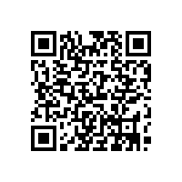

# 우수화장품 제조 및 품질관리기준(식품의약품안전처고시)(제2024-46호)(20240822)

우수화장품 제조 및 품질관리기준

우수화장품 제조 및 품질관리기준

[시행 2024. 8. 22.] [식품의약품안전처고시 제2024-46호, 2024. 8. 22., 일부개정]

제1장 총  칙

제1조(목적)

제2조(용어의 정의)

제2장 인적자원

제3조(조직의 구성)

제4조(직원의 책임)

제5조(교육훈련)

제6조(직원의 위생)

제3장 제  조

제1절 시설기준

제7조(건물)

제8조(시설)

제9조(작업소의 위생)

제10조(유지관리)

제2절 원자재의 관리

제11조(입고관리)

제12조(출고관리)

제13조(보관관리)

제14조(물의 품질)

제3절 제조관리

제15조(기준서 등)

제16조(칭량)

제17조(공정관리)

제18조(포장작업)

제19조(보관 및 출고)

제4장 품질관리

제20조(시험관리)

제21조(검체의 채취 및 보관)

제22조(폐기처리 등)

제23조(위탁계약)

제24조(일탈관리)

제25조(불만처리)

제26조(제품회수)

제27조(변경관리)

제28조(내부감사)

제29조(문서관리)

제5장 판정 및 감독

제30조(평가 및 판정)

제31조(우대조치)

제32조(사후관리)

제33조(재검토기한)

---

우수화장품 제조 및 품질관리기준

우수화장품 제조 및 품질관리기준

[시행 2024. 8. 22.] [식품의약품안전처고시 제2024-46호, 2024. 8. 22., 일부개정]

식품의약품안전처(화장품정책과), 043-719-3413

제1장 총  칙

제1조(목적) 이 고시는 「화장품법」 제5조제1항 및 같은 법 시행규칙 제11조제2항에 따라 우수화장품 제조 및 품질

관리 기준에 관한 세부사항을 정하고, 이를 이행하도록 권장함으로써 화장품제조업자가 우수한 화장품을 제조,

관리, 보관 및 공급을 통해 소비자 보호 및 국민 보건 향상에 기여함을 목적으로 한다.

제2조(용어의 정의) 이 고시에서 사용하는 용어의 뜻은 다음과 같다.

1. 삭제

2. "제조"란 원료 물질의 칭량부터 혼합, 충전(1차포장) 등의 일련의 작업을 말한다.

3. 삭제

4. "품질보증" 이란 제품이 적합 판정 기준에 충족될 것이라는 신뢰를 제공하는데 필수적인 모든 계획되고 체계

적인 활동을 말한다.

5. "일탈"이란 제조 또는 품질관리 활동 등의 미리 정하여진 우수화장품 제조 및 품질관리기준을 벗어나 이루어

진 행위를 말한다.

6. "기준일탈 (out-of-specification)" 이란 규정된 합격 판정 기준에 일치하지 않는 검사, 측정 또는 시험결과를 말

한다.

7. "원료"란 벌크 제품의 제조에 투입하거나 포함되는 물질을 말한다.

8. "원자재"란 화장품 원료 및 자재를 말한다.

9. "불만"이란 제품이 규정된 적합판정기준을 충족시키지 못한다고 주장하는 외부 정보를 말한다.

10. "회수"란 판매한 제품 가운데 품질 결함이나 안전성 문제 등으로 나타난 제조번호의 제품(필요시 여타 제조

번호 포함)을 제조소로 거두어들이는 활동을 말한다.

11. "오염"이란 제품에서 화학적, 물리적, 미생물학적 문제 또는 이들이 조합되어 나타내는 바람직하지 않은 문제

의 발생을 말한다.

12. "청소"란 화학적인 방법, 기계적인 방법, 온도, 적용시간과 이러한 복합된 요인에 의해 청정도를 유지하고 일

반적으로 표면에서 눈에 보이는 먼지를 분리, 제거하여 외관을 유지하는 모든 작업을 말한다.

13. "유지관리"란 적절한 작업 환경에서 건물과 설비가 유지되도록 이루어지는 정기적ㆍ비정기적인 지원 및 검

증 작업을 말한다.

14. "주요 설비"란 제조 및 품질 관련 문서에 명기된 설비로 제품의 품질에 영향을 미치는 필수적인 설비를 말한

다.

15. "검교정"이란 규정된 조건 하에서 측정기기나 측정 시스템에 의해 표시되는 값과 표준기기의 참값을 비교하

여 이들의 오차가 허용범위 내에 있음을 확인하고, 허용범위를 벗어나는 경우 허용범위 내에 들도록 조정하는

---

우수화장품 제조 및 품질관리기준

것을 말한다.

16. "제조번호" 또는 "뱃치번호"란 일정한 제조단위분에 대하여 제조관리 및 출하에 관한 모든 사항을 확인할 수

있도록 표시된 번호로서 숫자ㆍ문자ㆍ기호 또는 이들의 특정적인 조합을 말한다.

17. "반제품"이란 제조공정 단계에 있는 것으로서 필요한 제조공정을 더 거쳐야 벌크 제품이 되는 것을 말한다.

18. "벌크 제품"이란 충전(1차포장) 이전의 제조 단계까지 끝낸 제품을 말한다.

19. "제조단위" 또는 "뱃치"란 하나의 공정이나 일련의 공정으로 제조되어 균질성을 갖는 화장품의 일정한 분량

을 말한다.

20. "완제품"이란 출하를 위해 제품의 포장 및 첨부문서에 표시공정 등을 포함한 모든 제조공정이 완료된 화장품

을 말한다.

21. "재작업"이란 적합 판정기준을 벗어난 완제품, 벌크제품 또는 반제품을 재처리하여 품질이 적합한 범위에 들

어오도록 하는 작업을 말한다.

22. "수탁자"는 직원, 회사 또는 조직을 대신하여 작업을 수행하는 사람, 회사 또는 외부 조직을 말한다.

23. "공정관리"란 제조공정 중 적합판정기준의 충족을 보증하기 위하여 공정을 모니터링하거나 조정하는 모든

작업을 말한다.

24. "감사"란 제조 및 품질과 관련한 결과가 계획된 사항과 일치하는지의 여부와 제조 및 품질관리가 효과적으로

실행되고 목적 달성에 적합한지 여부를 결정하기 위한 체계적이고 독립적인 조사를 말한다.

25. "변경관리"란 모든 제조, 관리 및 보관된 제품이 규정된 적합판정기준에 일치하도록 보장하기 위하여 우수화

장품 제조 및 품질관리기준이 적용되는 모든 활동을 내부 조직의 책임하에 계획하여 변경하는 것을 말한다.

26. "내부감사"란 제조 및 품질과 관련한 결과가 계획된 사항과 일치하는지의 여부와 제조 및 품질관리가 효과적

으로 실행되고 목적 달성에 적합한지 여부를 결정하기 위한 회사 내 자격이 있는 직원에 의해 행해지는 체계적

이고 독립적인 조사를 말한다.

27. "포장재"란 화장품의 포장에 사용되는 모든 재료를 말하며 운송을 위해 사용되는 외부 포장재는 제외한 것이

다. 제품과 직접적으로 접촉하는지 여부에 따라 1차 또는 2차 포장재라고 말한다.

28. "적합 판정 기준"이란 시험 결과의 적합 판정을 위한 수적인 제한, 범위 또는 기타 적절한 측정법을 말한다.

29. "소모품"이란 청소, 위생 처리 또는 유지 작업 동안에 사용되는 물품(세척제, 윤활제 등)을 말한다.

30. "관리"란 적합 판정 기준을 충족시키는 검증을 말한다.

31. "제조소"란 화장품을 제조하기 위한 장소를 말한다.

32. "건물"이란 제품, 원료 및 포장재의 수령, 보관, 제조, 관리 및 출하를 위해 사용되는 물리적 장소, 건축물 및

보조 건축물을 말한다.

33. "위생관리"란 대상물의 표면에 있는 바람직하지 못한 미생물 등 오염물을 감소시키기 위해 시행되는 작업을

말한다.

34. "출하"란 주문 준비와 관련된 일련의 작업과 운송 수단에 적재하는 활동으로 제조소 외로 제품을 운반하는

것을 말한다.

---

우수화장품 제조 및 품질관리기준

제2장 인적자원

제3조(조직의 구성) ① 제조소별로 독립된 제조부서와 품질부서를 두어야 한다.

② 조직구조는 조직과 직원의 업무가 원활히 이해될 수 있도록 규정되어야 하며, 회사의 규모와 제품의 다양성에

맞추어 적절하여야 한다.

③ 제조소에는 제조 및 품질관리 업무를 적절히 수행할 수 있는 충분한 인원을 배치하여야 한다.

제4조(직원의 책임) ① 모든 작업원은 다음 각 호를 이행해야 할 책임이 있다.

1. 조직 내에서 맡은 지위 및 역할을 인지해야 할 의무

2. 문서접근 제한 및 개인위생 규정을 준수해야 할 의무

3. 자신의 업무범위내에서 기준을 벗어난 행위나 부적합 발생 등에 대해 보고해야 할 의무

4. 정해진 책임과 활동을 위한 교육훈련을 이수할 의무

② 품질책임자는 화장품의 품질을 담당하는 부서의 책임자로서 다음 각 호의 사항을 이행하여야 한다.

1. 품질에 관련된 모든 문서와 절차의 검토 및 승인

2. 품질 검사가 규정된 절차에 따라 진행되는지의 확인

3. 일탈이 있는 경우 이의 조사 및 기록

4. 적합 판정한 원자재 및 제품의 출고 여부 결정

5. 부적합품이 규정된 절차대로 처리되고 있는지의 확인

6. 불만처리와 제품회수에 관한 사항의 주관

제5조(교육훈련) ① 제조 및 품질관리 업무와 관련 있는 모든 직원들에게 각자의 직무와 책임에 적합한 교육훈련이

제공될 수 있도록 연간계획을 수립하고 정기적으로 교육을 실시하여야 한다.

② 직원의 교육을 위해 교육훈련의 내용 및 평가가 포함된 교육훈련 규정을 작성하여야 하되, 필요한 경우에는

외부 전문기관에 교육을 의뢰할 수 있다.

③ 교육 종료 후에는 교육결과를 평가하고, 일정한 수준에 미달할 경우에는 재교육을 받아야 한다.

④ 새로 채용된 직원은 업무를 적절히 수행할 수 있도록 기본 교육훈련 외에 추가 교육훈련을 받아야 하며 이와

관련한 문서화된 절차를 마련하여야 한다.

제6조(직원의 위생) ① 적절한 위생관리 기준 및 절차를 마련하고 제조소 내의 모든 직원은 이를 준수해야 한다.

② 작업소 및 보관소 내의 모든 직원은 화장품의 오염을 방지하기 위해 규정된 작업복을 착용해야 하고 음식물

등을 반입해서는 아니 된다.

③ 피부에 외상이 있거나 질병에 걸린 직원은 건강이 양호해지거나 화장품의 품질에 영향을 주지 않는다는 의사

의 소견이 있기 전까지는 화장품과 직접적으로 접촉되지 않도록 격리되어야 한다.

④ 제조구역별 접근권한이 없는 작업원 및 방문객은 가급적 제조, 관리 및 보관구역 내에 들어가지 않도록 하고,

불가피한 경우 사전에 직원 위생에 대한 교육 및 복장 규정에 따르도록 하고 감독하여야 한다.

---

우수화장품 제조 및 품질관리기준

제3장 제  조

제1절 시설기준

제7조(건물) ① 건물은 다음과 같이 위치, 설계, 건축 및 이용되어야 한다.

1. 제품이 보호되도록 할 것

2. 청소가 용이하도록 하고 필요한 경우 위생관리 및 유지관리가 가능하도록 할 것

3. 제품, 원료 및 포장재 등의 혼동으로 발생 가능한 위험을 최소화 할 것

② 건물은 제품의 제형, 현재 상황 및 청소 등을 고려하여 설계하여야 한다.

제8조(시설) ① 작업소는 다음 각 호에 적합하여야 한다.

1. 제조하는 화장품의 종류ㆍ제형에 따라 적절히 구획ㆍ구분되어 있어 교차오염 우려가 없을 것

2. 바닥, 벽, 천장은 가능한 청소 또는 위생관리를 하기 쉽게 매끄러운 표면을 지니고 청결하게 유지되어야 하며

소독제 등의 부식성에 저항력이 있을 것

3. 환기가 잘 되고 청결할 것

4. 외부와 연결된 창문은 가능한 열리지 않도록 할 것. 창문이 외부 환경으로 열리는 경우에는 제품의 오염을 방

지하도록 적절한 방법으로 차단할 것

5. 작업소 내의 외관 표면은 가능한 매끄럽게 설계하고, 청소, 소독제의 부식성에 저항력이 있을 것

6. 적절하고 깨끗한 수세실과 화장실을 마련하고 수세실과 화장실은 접근이 쉬어야 하나 생산구역과 분리되어

있을 것

7. 작업소 전체에 적절한 조명을 설치하고, 조명이 파손될 경우를 대비한 제품을 보호할 수 있는 처리절차를 마련

할 것

8. 제품의 오염을 방지하고 적절한 온도 및 습도를 유지할 수 있는 적절한 환기시설을 갖출 것

9. 각 제조구역별 청소 및 위생관리 절차에 따라 효능이 입증된 세척제 및 소독제를 사용할 것

10. 제품의 품질에 영향을 주지 않는 소모품을 사용할 것

② 제조 및 품질관리에 필요한 설비 등은 다음 각 호에 적합하여야 한다.

1. 사용목적에 적합하고, 청소가 가능하며, 필요한 경우 위생ㆍ유지관리가 가능하여야 한다. 자동화시스템을 도입

한 경우도 또한 같다.

2. 사용하지 않는 연결 호스와 부속품은 청소 등 위생관리를 하며, 건조한 상태로 유지하고 먼지, 얼룩 또는 다른

오염으로부터 보호할 것

3. 설비 등은 제품의 오염을 방지하고 배수가 용이하도록 설계, 설치하며, 제품 및 청소 소독제와 화학반응을 일

으키지 않을 것

4. 설비 등의 위치는 원자재나 직원의 이동으로 인하여 제품의 품질에 영향을 주지 않도록 할 것

5. 벌크 제품의 용기는 먼지나 수분으로부터 내용물을 보호할 수 있을 것

6. 제품과 설비가 오염되지 않도록 배관 및 배수관을 설치하며, 배수관은 역류되지 않아야 하고, 청결을 유지할

것

7. 천정 주위의 대들보, 파이프, 덕트 등은 가급적 노출되지 않도록 설계하고, 노출된 파이프는 받침대 등으로 고

정하고 벽에 닿지 않게 하여 청소가 용이하도록 설계할 것

---

우수화장품 제조 및 품질관리기준

8. 시설 및 기구에 사용되는 소모품은 제품의 품질에 영향을 주지 않도록 할 것

제9조(작업소의 위생) ① 곤충, 해충이나 쥐를 막을 수 있는 대책을 마련하고 정기적으로 점검ㆍ확인하여야 한다.

② 제조, 관리 및 보관 구역 내의 바닥, 벽, 천장 및 창문은 항상 청결하게 유지되어야 한다.

③ 제조시설이나 설비의 세척에 사용되는 세제 또는 소독제는 효능이 입증된 것을 사용하고 잔류하거나 적용하

는 표면에 이상을 초래하지 아니하여야 한다.

④ 제조시설이나 설비는 적절한 방법으로 청소하여야 하며, 필요한 경우 위생관리 프로그램을 운영하여야 한다.

제10조(유지관리) ① 건물, 시설 및 주요 설비는 정기적으로 점검하여 화장품의 제조 및 품질관리에 지장이 없도록

유지ㆍ관리ㆍ기록하여야 한다.

② 결함 발생 및 정비 중인 설비는 적절한 방법으로 표시하고, 고장 등 사용이 불가할 경우 표시하여야 한다.

③ 세척한 설비는 다음 사용 시까지 오염되지 아니하도록 관리하여야 한다.

④ 모든 제조 관련 설비는 승인된 자만이 접근ㆍ사용하여야 한다.

⑤ 제품의 품질에 영향을 줄 수 있는 검사ㆍ측정ㆍ시험장비 및 자동화장치는 계획을 수립하여 정기적으로 검교

정 및 성능점검을 하고 기록해야 한다.

⑥ 유지관리 작업이 제품의 품질에 영향을 주어서는 안 된다.

제2절 원자재의 관리

제11조(입고관리) ① 화장품제조업자는 원자재 공급자를 평가하여 선정하고, 관리감독을 적절히 수행하여 입고관리

가 철저히 이루어지도록 하여야 한다.

② 원자재의 입고 시 구매 요구서, 원자재 공급업체 성적서 및 현품이 서로 일치하여야 한다. 필요한 경우 운송

관련 자료를 추가적으로 확인할 수 있다.

③ 원자재 용기에 제조번호를 표시하고, 제조번호가 없는 경우에는 관리번호를 부여하여 보관하여야 한다.

④ 원자재 입고절차 중 육안확인 시 물품에 결함이 있을 경우 입고를 보류하고 적절한 조치를 취하여야 한다.

⑤ 입고된 원자재는 "적합", "부적합", "검사 중" 등으로 상태를 표시하여야 한다. 다만, 동일 수준의 보증이 가능

한 다른 시스템이 있다면 대체할 수 있다.

⑥ 원자재 용기 및 시험기록서의 필수적인 기재 사항은 다음 각 호와 같다.

1. 원자재 공급자가 정한 제품명

2. 원자재 공급자명

3. 수령일자

4. 공급자가 부여한 제조번호 또는 관리번호

제12조(출고관리) 원자재는 시험결과 적합판정된 것만을 선입선출방식으로 출고해야 하고 이를 확인할 수 있는 체

계가 확립되어 있어야 한다.

제13조(보관관리) ① 원자재, 반제품 및 벌크 제품은 품질에 나쁜 영향을 미치지 아니하는 조건에서 보관하여야 하

며 보관기한을 설정하여야 한다.

---

우수화장품 제조 및 품질관리기준

② 원자재, 반제품 및 벌크 제품은 바닥과 벽에 닿지 아니하도록 보관하고, 가능한 선입선출에 의하여 출고할 수

있도록 보관하여야 한다.

③ 원자재, 시험 중인 제품 및 부적합품은 각각 구획된 장소에서 보관하여야 한다. 다만, 서로 혼동을 일으킬 우려

가 없는 시스템에 의하여 보관되는 경우에는 그러하지 아니한다.

④ 설정된 보관기간이 지나면 사용의 적절성을 결정하기 위해 재평가시스템을 확립하여야 하며, 동 시스템을 통

해 보관기간이 경과한 경우 사용하지 않도록 규정하여야 한다.

제14조(물의 품질) ① 물의 품질 적합기준은 사용 목적에 맞게 규정하여야 한다.

② 물의 품질은 정기적으로 검사해야 하고 필요시 미생물학적 검사를 실시하여야 한다.

③ 물 공급 설비는 다음 각 호의 기준을 충족해야 한다.

1. 물의 정체와 오염을 피할 수 있도록 설치될 것

2. 물의 품질에 영향이 없을 것

3. 살균처리가 가능할 것

제3절 제조관리

제15조(기준서 등) ① 제조 및 품질관리의 적합성을 보장하는 기본 요건들을 충족하고 있음을 보증하기 위하여 다

음 각 항에 따른 제품표준서, 제조관리기준서, 품질관리기준서 및 제조위생관리기준서를 작성하고 보관하여야 한

다.

② 제품표준서는 품목별로 다음 각 호의 사항이 포함되어야 한다.

1. 제품명

2. 작성연월일

3. 효능ㆍ효과(기능성 화장품의 경우) 및 사용할 때의 주의사항

4. 원료명, 분량 및 제조단위당 기준량

5. 공정별 상세 작업내용 및 제조공정흐름도

6. 삭제

7. 작업 중 주의사항

8. 원자재ㆍ반제품ㆍ벌크 제품ㆍ완제품의 기준 및 시험방법

9. 제조 및 품질관리에 필요한 시설 및 기기

10. 보관조건

11. 사용기한 또는 개봉 후 사용기간

12. 변경이력

13. 삭제

14. 그 밖에 필요한 사항

③ 제조관리기준서는 다음 각 호의 사항이 포함되어야 한다.

1. 제조공정관리에 관한 사항

---

우수화장품 제조 및 품질관리기준

가. 작업소의 출입제한

나. 공정검사의 방법

다. 사용하려는 원자재의 적합판정 여부를 확인하는 방법

라. 재작업절차

2. 시설 및 기구 관리에 관한 사항

가. 시설 및 주요설비의 정기적인 점검방법

나. 삭제

다. 장비의 교정 및 성능점검 방법

3. 원자재 관리에 관한 사항

가. 입고 시 품명, 규격, 수량 및 포장의 훼손 여부에 대한 확인방법과 훼손되었을 경우 그 처리방법

나. 보관장소 및 보관방법

다. 시험결과 부적합품에 대한 처리방법

라. 취급 시의 혼동 및 오염 방지대책

마. 출고 시 선입선출 및 칭량된 용기의 표시사항

바. 재고관리

4. 완제품 관리에 관한 사항

가. 입ㆍ출하 시 승인판정의 확인방법

나. 보관장소 및 보관방법

다. 출하 시의 선입선출방법

5. 위탁제조에 관한 사항

가. 원자재의 공급, 반제품, 벌크제품 또는 완제품의 운송 및 보관 방법

나. 수탁자 제조기록의 평가방법

④ 품질관리기준서는 다음 각 호의 사항이 포함되어야 한다.

1. 삭제

2. 시험검체 채취방법 및 채취 시의 주의사항과 채취 시의 오염방지대책

3. 시험시설 및 시험기구의 점검(장비의 교정 및 성능점검 방법)

4. 안정성시험(해당하는 경우에 한함)

5. 완제품 등 보관용 검체의 관리

6. 표준품 및 시약의 관리

7. 위탁시험 또는 위탁제조하는 경우 검체의 송부방법 및 시험결과의 판정방법

8. 그 밖에 필요한 사항

⑤ 제조위생관리기준서는 다음 각 호의 사항이 포함되어야 한다.

1. 작업원의 건강관리 및 건강상태의 파악ㆍ조치방법

2. 작업원의 수세, 소독방법 등 위생에 관한 사항

3. 작업복장의 규격, 세탁방법 및 착용규정

---

우수화장품 제조 및 품질관리기준

4. 작업실 등의 청소(필요한 경우 소독을 포함한다. 이하 같다) 방법 및 청소주기

5. 청소상태의 평가방법

6. 제조시설의 세척 및 평가

7. 곤충, 해충이나 쥐를 막는 방법 및 점검주기

8. 그 밖에 필요한 사항

제16조(칭량) ① 원료는 품질에 영향을 미치지 않는 용기나 설비에 정확하게 칭량 되어야 한다.

② 원료가 칭량되는 도중 교차오염을 피하기 위한 조치가 있어야 한다.

제17조(공정관리) ① 제조공정 단계별로 적절한 관리기준이 규정되어야 하며 그에 미치지 못한 모든 결과는 보고되

고 조치가 이루어져야 한다.

② 벌크 제품은 품질이 변하지 아니하도록 적당한 용기에 넣어 지정된 장소에서 보관해야 하며 용기에 다음 사항

을 표시해야 한다.

1. 명칭 또는 확인코드

2. 제조번호

3. 완료된 공정명

4. 필요한 경우에는 보관조건

③ 벌크 제품의 최대 보관기간을 설정하여야 하며, 최대 보관기간이 가까워진 벌크 제품은 완제품 제조하기 전에

재평가해야 한다.

제18조(포장작업) ① 포장작업에 관한 문서화된 절차를 수립하고 유지하여야 한다.

② 포장작업은 다음 각 호의 사항을 포함하고 있는 포장지시서에 의해 수행되어야 한다.

1. 제품명

2. 포장 설비명

3. 포장재 리스트

4. 상세한 포장공정

5. 포장지시수량

③ 포장작업을 시작하기 전에 포장작업 관련 문서의 완비여부, 포장설비의 청결 및 작동여부 등을 점검하여야 한

다.

제19조(보관 및 출고) ① 완제품은 적절한 조건하의 정해진 장소에서 보관하여야 하며, 주기적으로 재고 점검을 수

행해야 한다.

② 완제품은 시험결과 적합으로 판정되고 품질부서 책임자가 출고 승인한 것만을 출고하여야 한다.

③ 출고는 선입선출방식으로 하되, 타당한 사유가 있는 경우에는 그러지 아니할 수 있다.

④ 출고할 제품은 원자재, 부적합품 및 반품된 제품과 구획된 장소에서 보관하여야 한다. 다만 서로 혼동을 일으

킬 우려가 없는 시스템에 의하여 보관되는 경우에는 그러하지 아니할 수 있다.

---

우수화장품 제조 및 품질관리기준

제4장 품질관리

제20조(시험관리) ① 품질관리를 위한 시험업무에 대해 문서화된 절차를 수립하고 유지하여야 한다.

② 원자재ㆍ반제품ㆍ벌크 제품ㆍ완제품에 대한 적합 기준을 마련하고 제조번호별로 시험 기록을 작성ㆍ유지하

여야 한다.

③ 시험결과 적합 또는 부적합인지 분명히 기록하여야 한다.

④ 원자재ㆍ반제품ㆍ벌크 제품ㆍ완제품은 적합판정이 된 것만을 사용하거나 출고하여야 한다.

⑤ 정해진 보관 기간이 경과된 원자재ㆍ반제품ㆍ벌크 제품은 재평가하여 품질기준에 적합한 경우 제조에 사용할

수 있다.

⑥ 모든 시험이 적절하게 이루어졌는지 시험기록은 검토한 후 적합, 부적합, 보류를 판정하여야 한다.

⑦ 기준일탈이 된 경우는 규정에 따라 책임자에게 보고한 후 조사하여야 한다. 조사결과는 책임자에 의해 일탈,

부적합, 보류를 명확히 판정하여야 한다.

⑧ 표준품과 주요시약의 용기에는 다음 사항을 기재하여야 한다.

1. 명칭

2. 개봉일

3. 보관조건

4. 사용기한

5. 역가, 제조자의 성명 또는 서명(직접 제조한 경우에 한함)

제21조(검체의 채취 및 보관) ① 시험용 검체는 오염되거나 변질되지 아니하도록 채취하고, 채취한 후에는 원상태에

준하는 포장을 해야 하며, 검체가 채취되었음을 표시하여야 한다.

② 시험용 검체의 용기에는 다음 사항을 기재하여야 한다.

1. 명칭 또는 확인코드

2. 제조번호

3. 검체채취 일자

③ 완제품의 보관용 검체는 적절한 보관조건 하에 지정된 구역 내에서 제조단위별로 사용기한까지 보관하여야

한다. 다만, 개봉 후 사용기간을 기재하는 경우에는 제조일로부터 3년간 보관하여야 한다.

제22조(폐기처리 등) ① 품질에 문제가 있거나 회수ㆍ반품된 제품의 폐기 또는 재작업 여부는 품질책임자에 의해

승인되어야 한다.

② 제1항에 따라 재작업을 하는 경우에는 재작업 절차에 따라야 한다.

③ 재작업을 할 수 없거나 폐기해야 하는 제품의 폐기처리규정을 작성하여야 하며 폐기 대상은 따로 보관하고 규

정에 따라 신속하게 폐기하여야 한다.

제23조(위탁계약) ① 화장품 제조 및 품질관리에 있어 공정 또는 시험의 일부를 위탁하고자 할 때에는 문서화된 절

차를 수립ㆍ유지하여야 한다.

---

우수화장품 제조 및 품질관리기준

② 제조업무를 위탁하고자 하는 자는 제30조에 따라 식품의약품안전처장으로부터 우수화장품 제조 및 품질관리

기준 적합판정을 받은 업소에 위탁제조하는 것을 권장한다.

③ 위탁업체는 수탁업체의 계약 수행능력을 평가하고 그 업체가 계약을 수행하는데 필요한 시설 등을 갖추고 있

는지 확인해야 한다.

④ 위탁업체는 수탁업체와 문서로 계약을 체결해야 하며 정확한 작업이 이루어질 수 있도록 수탁업체에 관련 정

보를 전달해야 한다.

⑤ 위탁업체는 수탁업체에 대해 계약에서 규정한 감사를 실시해야 하며 수탁업체는 이를 수용하여야 한다.

⑥ 수탁업체에서 생성한 위ㆍ수탁 관련 자료는 유지되어 위탁업체에서 이용 가능해야 한다.

제24조(일탈관리) 제조 또는 품질관리 중의 일탈에 대해 조사를 한 후 필요한 조치를 마련하고 일탈의 반복을 방지

할 수 있는 조치가 이루어져야 한다.

제25조(불만처리) ① 불만처리담당자는 제품에 대한 모든 불만을 취합하고, 제기된 불만에 대해 신속하게 조사하고

그에 대한 적절한 조치를 취하여야 하며, 다음 각 호의 사항을 기록ㆍ유지하여야 한다.

1. 불만 접수연월일

2. 불만 제기자의 이름과 연락처(가능한 경우)

3. 제품명, 제조번호 등을 포함한 불만내용

4. 불만조사 및 추적조사 내용, 처리결과 및 향후 대책

5. 다른 제조번호의 제품에도 영향이 없는지 점검

② 불만은 제품 결함의 경향을 파악하기 위해 주기적으로 검토하여야 한다.

제26조(제품회수) ① 화장품제조업자는 제조한 화장품에서 「화장품법」 제9조, 제15조, 또는 제16조제1항을 위반하

여 위해 우려가 있다는 사실을 알게 되면 지체 없이 회수에 필요한 조치를 하여야 한다.

② 다음 사항을 이행하는 회수 책임자를 두어야 한다.

1. 전체 회수과정에 대한 화장품책임판매업자와의 조정역할

2. 결함 제품의 회수 및 관련 기록 보존

3. 소비자 안전에 영향을 주는 회수의 경우 회수가 원활히 진행될 수 있도록 필요한 조치 수행

4. 회수된 제품은 확인 후 제조소 내 격리보관 조치(필요시에 한함)

5. 회수과정의 주기적인 평가(필요시에 한함)

제27조(변경관리) 제품의 품질에 영향을 미치는 원자재, 제조공정 등을 변경할 경우에는 이를 문서화하고 품질책임

자에 의해 승인된 후 수행하여야 한다.

제28조(내부감사) ① 품질보증체계가 계획된 사항에 부합하는지를 주기적으로 검증하기 위하여 내부감사를 실시하

여야 하고 내부감사 계획 및 실행에 관한 문서화된 절차를 수립하고 유지하여야 한다.

② 감사자는 감사대상과는 독립적이어야 하며, 자신의 업무에 대하여 감사를 실시하여서는 아니 된다.

③ 감사 결과는 기록되어 경영책임자 및 피감사 부서의 책임자에게 공유되어야 하고 감사 중에 발견된 결함에 대

하여 시정조치 하여야 한다.

---

우수화장품 제조 및 품질관리기준

④ 감사자는 시정조치에 대한 후속 감사활동을 행하고 이를 기록하여야 한다.

제29조(문서관리) ① 화장품제조업자는 우수화장품 제조 및 품질보증에 대한 목표와 의지를 포함한 관리방침을 문

서화하며 전 작업원들이 실행하여야 한다.

② 모든 문서의 작성 및 개정ㆍ승인ㆍ배포ㆍ회수 또는 폐기 등 관리에 관한 사항이 포함된 문서관리규정을 작성

하고 유지하여야 한다.

③ 문서는 작업자가 알아보기 쉽도록 작성하여야 하며 작성된 문서에는 권한을 가진 사람의 서명과 승인연월일

이 있어야 한다.

④ 문서의 작성자ㆍ검토자 및 승인자는 서명을 등록한 후 사용하여야 한다.

⑤ 문서를 개정할 때는 개정사유 및 개정연월일 등을 기재하고 권한을 가진 사람의 승인을 받아야 하며 개정 번

호를 지정해야 한다.

⑥ 원본 문서는 품질부서에서 보관하여야 하며, 사본은 작업자가 접근하기 쉬운 장소에 비치ㆍ사용하여야 한다.

⑦ 문서의 인쇄본 또는 전자매체를 이용하여 안전하게 보관해야 한다.

⑧ 작업자는 작업과 동시에 문서에 기록하여야 하며 지울 수 없는 잉크로 작성하여야 한다.

⑨ 기록문서를 수정하는 경우에는 수정하려는 글자 또는 문장 위에 선을 그어 수정 전 내용을 알아볼 수 있도록

하고 수정된 문서에는 수정사유, 수정연월일 및 수정자의 서명이 있어야 한다.

⑩ 모든 기록문서는 적절한 보존기간이 규정되어야 한다.

⑪ 기록의 훼손 또는 소실에 대비하기 위해 백업파일 등 자료를 유지하여야 한다.

제5장 판정 및 감독

제30조(평가 및 판정) ① 우수화장품 제조 및 품질관리기준 적합판정을 받고자 하는 업소는 별지 제1호 서식에 따

른 신청서(전자문서를 포함한다)에 다음 각 호의 서류를 첨부하여 식품의약품안전처장에게 제출하여야 한다. 다

만, 일부 공정만을 행하는 업소는 별표 1에 따른 해당 공정을 별지 제1호 서식에 기재하여야 한다.

1. 삭제<2012. 10. 16.>

2. 우수화장품 제조 및 품질관리기준에 따라 3회 이상 적용ㆍ운영한 자체평가표

3. 화장품 제조 및 품질관리기준 운영조직

4. 제조소의 시설내역

5. 제조관리현황

6. 품질관리현황

② 삭제<2012. 10. 16.>

③ 삭제<2012. 10. 16.>

④ 식품의약품안전처장은 제출된 자료를 평가하고 별표 2에 따른 실태조사를 실시하여 우수화장품 제조 및 품질

관리기준 적합판정한 경우에는 별지 제3호 서식에 따른 우수화장품 제조 및 품질관리기준 적합업소 증명서를 발

급하여야 한다. 다만, 일부 공정만을 행하는 업소는 해당 공정을 증명서내에 기재하여야 한다.

---

우수화장품 제조 및 품질관리기준

제31조(우대조치) ① 삭제<2012. 10. 16.>

② 국제규격인증업체(CGMP, ISO9000) 또는 품질보증 능력이 있다고 인정되는 업체에서 제공된 원료ㆍ자재는 제

공된 적합성에 대한 기록의 증거를 고려하여 검사의 방법과 시험항목을 조정할 수 있다.

③ 식품의약품안전처장은 제30조에 따라 우수화장품 제조 및 품질관리기준 적합판정을 받은 업소는 정기 수거

검정 및 정기감시 대상에서 제외할 수 있다.

④ 제30조에 따라 우수화장품 제조 및 품질관리기준 적합판정을 받은 업소는 별표 3에 따른 로고를 해당 제조업

소와 그 업소에서 제조한 화장품에 표시하거나 그 사실을 광고할 수 있다.

제32조(사후관리) ① 식품의약품안전처장은 제30조에 따라 우수화장품 제조 및 품질관리기준 적합판정을 받은 업

소에 대해 별표 2의 우수화장품 제조 및 품질관리기준 실시상황평가표에 따라 3년에 1회 이상 실태조사를 실시

하여야 한다.

② 식품의약품안전처장은 사후관리 결과 부적합 업소에 대하여 일정한 기간을 정하여 시정하도록 지시하거나,

우수화장품 제조 및 품질관리기준 적합업소 판정을 취소할 수 있다.

③ 식품의약품안전처장은 제1항에도 불구하고 제조 및 품질관리에 문제가 있다고 판단되는 업소에 대하여 수시

로 우수화장품 제조 및 품질관리기준 운영 실태조사를 할 수 있다.

제33조(재검토기한) 식품의약품안전처장은 「훈령ㆍ예규 등의 발령 및 관리에 관한 규정」에 따라 이 고시에 대하여

2016년 1월 1일 기준으로 매 3년이 되는 시점(매 3년째의 12월 31까지를 말한다)마다 그 타당성을 검토하여 개

선 등의 조치를 하여야 한다.

부칙 <제2009-70호,2009.8.24.>

제1조(시행일) 이 고시는 고시한 날부터 시행한다.

제2조(종전 고시의 폐지) 종전의 「우수화장품 제조 및 품질관리기준」(식품의약품안전청 고시 제2000-59호, 2000.

12. 1)은 이를 폐지한다.

부칙 <제2011-14호,2011.3.24.>

제1조(시행일) 이 고시는 고시한 날부터 시행한다.

제2조(경과조치) ① 이 고시 시행 당시 이미 대한화장품협회장에게 접수된 우수화장품 제조 및 품질관리기준 적합

업소 지정 신청서는 종전의 규정에 따른다.

② 이 고시 시행 당시 종전 규정에 따라 우수화장품 제조 및 품질관리기준 적합업소로 지정받은 업소는 이 고시에 따

라 우수화장품 제조 및 품질관리기준 적합업소로 판정받은 것으로 본다.

제3조(적용 예) 이 고시 제31조의 우대조치는 이 고시에 따라 우수화장품 제조 및 품질관리기준 적합업소로 판정받

은 업소에서 제조한 화장품부터 적용한다.

---

우수화장품 제조 및 품질관리기준

부칙 <제2011-55호,2011.9.19.>

이 고시는 고시한 날부터 시행한다.

부칙 <제2012-106호,2012.10.16.>

제1조(시행일) 이 고시는 고시 후 1개월이 경과한 날부터 시행한다.

제2조(적용례) 이 고시는 고시 시행 후 최초로 화장품 제조업자가 우수화장품 제조 및 품질관리기준 실시상황 평가

를 신청하는 경우부터 적용한다.

제3조(경과조치) 이 고시 시행 당시 종전의 규정에 따라 우수화장품 제조 및 품질관리기준 적합판정을 받은 자는 개

정 규정에 따른 우수화장품 제조 및 품질관리기준 적합판정을 받은 것으로 본다.

부칙 <제2013-31호,2013.4.5.>

제1조(시행일) 이 고시는 고시한 날부터 시행한다.

부칙 <제2014-104호,2014.3.21.>

이 고시는 고시한 날부터 시행한다.

부칙 <제2014-202호,2014.12.30.>

제1조(시행일) 이 고시는 고시한 날부터 시행한다.

제2조(적용례) 이 고시 시행 당시 이미 접수된 우수화장품 제조 및 품질관리기준 실시상황 평가신청서는 개정 규정

에 따라 전 공정에 대하여 평가 신청한 것으로 본다.

제3조(경과조치) 이 고시 시행 당시 종전의 규정에 따라 우수화장품 제조 및 품질관리기준 적합판정을 받은 자는 개

정 규정에 따른 우수화장품 제조 및 품질관리기준의 전 공정에 대하여 적합판정을 받은 것으로 본다.

부칙 <제2015-58호,2015.9.2.>

제1조(시행일) 이 고시는 고시한 날부터 시행한다.

제2조(적용례) 이 고시는 고시 시행 후 제조업자가 신청하는 우수화장품 제조 및 품질관리기준 실시상황 평가부터

적용한다.

부칙 <제2020-12호,2020.2.25.>

이 고시는 고시한 날부터 시행한다.

---

우수화장품 제조 및 품질관리기준

부칙 <제2024-26호,2024.8.22.>

제1조(시행일) 이 고시는 고시한 날부터 시행한다.

제2조(우수화장품 제조 및 품질관리기준 평가 등에 관한 적용례) 이 고시의 개정규정은 고시 시행 후 화장품제조업

자가 신청하는 우수화장품 제조 및 품질관리기준 실시상황 평가부터 적용한다.

[별표 1] 해당공정

[별표 2] 우수화장품 제조 및 품질관리기준 실시상황 평가표

[별표 3] 우수화장품 제조 및 품질관리기준 적합업소 로고

[별지 1] 우수화장품 제조 및 품질관리기준 실시상황 평가신청서

[별지 2] 삭제

[별지 3] 우수화장품 제조 및 품질관리기준 적합업소 증명서

---

[별표1]

1. 화장품군별분류

<삭제>

2. 공정별분류

연번

일부공정

1

벌크제조

2

충전·포장(1차포장)

| 연번 | 일부 공정 |
| --- | --- |
| 1 | 벌크 제조 |
| 2 | 충전·포장(1차포장) |

---

[별표2]

우수화장품제조및품질관리기준실시상황평가표

Ⅰ. 제조업소현황

업  소  명

소  재  지

신 청 인

대  표  자

생년월일

품질책임자

연 락 처

신청 담당자

연 락 처

제조 작업소

보  관  소

제조소의

품질관리

기     타

면적 (㎡)

시험실

합      계

일부 공정

전 공정

충전ㆍ포장(1차포장)

벌크 제조

신청분류

제조관련부서

품질부서

작 업 인 원

(명)

기타 작업원

합     계

업  소  명

대  표  자

수 탁 자

소  재  지

연  락  처

| 신 청 인 | 업 소 명 |  |  |  |  |  |
| --- | --- | --- | --- | --- | --- | --- |
|  | 소 재 지 |  |  |  |  |  |
|  | 대 표 자 |  |  | 생년월일 |  |  |
|  | 품질책임자 |  |  | 연 락 처 |  |  |
|  | 신청 담당자 |  |  | 연 락 처 |  |  |
| 제조소의 / 면적 (㎡) | 제조 작업소 |  |  | 보 관 소 |  |  |
|  | 품질관리 / 시험실 |  |  | 기 타 |  |  |
|  | 합 계 |  |  |  |  |  |
| 신청분류 | 전 공정 |  | 일부 공정 |  |  |  |
|  |  |  | 벌크 제조 |  | 충전ㆍ포장(1차포장) |  |
|  |  |  |  |  |  |  |
| 작 업 인 원 / (명) | 제조관련부서 |  |  | 품 질 부 서 |  |  |
|  | 기타 작업원 |  |  | 합 계 |  |  |
| 수 탁 자 | 업 소 명 |  |  | 대 표 자 |  |  |
|  | 소 재 지 |  |  | 연 락 처 |  |  |

---

Ⅱ. 우수화장품제조및품질관리기준실시상황평가표

적부판정

항목및평가내용

비고

(O/X)

제2장인적자원

제3조조직의구성

가. 제조소별로독립된제조부서와품질부서가있는가?

나. 조직구조가업무의원활히이해되도록규정되고회사의

규모와제품의다양성이적절한가?

다. 제조소에제조및품질관리업무를적절히수행할수있

는충분한인원이배치되어있는가?

제4조직원의책임

가. 모든직원이다음각호의책임을이행하고있는가?

1) 조직내에서맡은지위및역할의인지

2) 문서접근제한및개인위생규정의준수

3) 자신의업무범위내에서기준을벗어난행위나부적합발생

등에대해보고해야할의무

4) 정해진책임과활동을위한교육훈련

나. 품질책임자가다음각호의사항을이행하고있는가?

1) 품질에관련된모든문서와절차의검토및승인

2) 품질검사가규정된절차에따라진행되는지의확인

3) 일탈이있는경우이의조사및기록

4) 적합판정한원자재및제품의출고여부결정

5) 부적합품이규정된절차대로처리되고있는지의확인

6) 불만처리와제품회수에관한사항의주관

제5조교육훈련

가. 제조및품질관리업무와관련있는모든직원들에게각

자의직무와책임에적합한교육훈련이제공될수있도록

연간계획을수립하였는가?

나. 연간교육계획에따라모든직원들이정기적으로교육을

받고있는가?

다. 교육훈련의내용및평가가포함된교육훈련규정이작

성되어있는가?

라. 교육후에교육결과를평가하고일정한수준에미달할경

우에재교육을실시하고있는가?

마. 새로채용된직원들이업무를적절히수행할수있도록

기본교육훈련외에추가교육훈련이실시되고있고이와

관련한문서화된절차가마련되어있는가?

제6조직원의위생

| 항목 및 평가내용 | 적부판정 / (O/X) | 비 고 |
| --- | --- | --- |
| 제2장 인적자원 / 제3조 조직의 구성 |  |  |
| 가. 제조소별로 독립된 제조부서와 품질부서가 있는가? |  |  |
| 나. 조직구조가 업무의 원활히 이해되도록 규정되고 회사의 / 규모와 제품의 다양성이 적절한가? |  |  |
| 다. 제조소에 제조 및 품질관리 업무를 적절히 수행할 수 있 / 는 충분한 인원이 배치되어 있는가? |  |  |
| 제4조 직원의 책임 |  |  |
| 가. 모든 직원이 다음 각 호의 책임을 이행하고 있는가? / 1) 조직 내에서 맡은 지위 및 역할의 인지 / 2) 문서접근 제한 및 개인위생 규정의 준수 / 3) 자신의 업무범위내에서 기준을 벗어난 행위나 부적합 발생 / 등에 대해 보고해야 할 의무 / 4) 정해진 책임과 활동을 위한 교육훈련 |  |  |
| 나. 품질책임자가 다음 각 호의 사항을 이행하고 있는가? / 1) 품질에 관련된 모든 문서와 절차의 검토 및 승인 / 2) 품질 검사가 규정된 절차에 따라 진행되는지의 확인 / 3) 일탈이 있는 경우 이의 조사 및 기록 / 4) 적합 판정한 원자재 및 제품의 출고 여부 결정 / 5) 부적합품이 규정된 절차대로 처리되고 있는지의 확인 / 6) 불만처리와 제품회수에 관한 사항의 주관 |  |  |
| 제5조 교육훈련 |  |  |
| 가. 제조 및 품질관리 업무와 관련 있는 모든 직원들에게 각 / 자의 직무와 책임에 적합한 교육훈련이 제공될 수 있도록 / 연간계획을 수립하였는가? |  |  |
| 나. 연간 교육계획에 따라 모든 직원들이 정기적으로 교육을 / 받고 있는가? |  |  |
| 다. 교육훈련의 내용 및 평가가 포함된 교육 훈련 규정이 작 / 성되어 있는가? |  |  |
| 라. 교육 후에 교육결과를 평가하고 일정한 수준에 미달할 경 / 우에 재교육을 실시하고 있는가? |  |  |
| 마. 새로 채용된 직원들이 업무를 적절히 수행할 수 있도록 / 기본 교육훈련 외에 추가 교육훈련이 실시되고 있고 이와 / 관련한 문서화된 절차가 마련되어 있는가? |  |  |
| 제6조 직원의 위생 |  |  |

---

가. 적절한위생관리기준및절차가마련되고, 이를준수하고

있는가?

나. 작업소및보관소내의모든직원들은화장품의오염을

방지하기위해규정된작업복을착용하고있는가?

다. 제조구역별접근권한이없는작업원및방문객은가급적

출입을제한한규정과질병에걸린직원이작업에참여하지

못하게하는규정이있는가?

제3장제조

제1절시설기준

제7조건물

가. 건물은다음과같이위치, 설계, 건축및이용되고있는가?

1) 제품이보호되도록하고있는가?

2) 청소등위생관리와유지관리를하는가?

3) 제품, 원료및포장재등의혼동으로발생가능한위험을

최소화했는가?

나. 건물은제품의제형, 현재상황및청소등을고려하여설계

되었는가?

제8조시설

가. 제조작업을행하는작업소가있는가?

1) 제조하는화장품의종류ㆍ제형에따라적절히구획ㆍ구분

되어있어교차오염우려가없는가?

2) 바닥, 벽, 천장은청소또는위생관리를하기쉽게매끄러운

표면을지니고청결하게유지되어야하며소독제등의부

식성에저항력이있는가?

3) 환기가잘되고청결한가?

4) 외부와연결된창문은가능하면열리지않도록되어있는가?

창문이외부환경으로열리는경우, 제품의오염을방지하도록

적절히차단되어있는가?

5) 작업소내의외관표면은매끄럽게설계되고, 청소, 소독제

의부식성에저항력이있는것인가?

6) 적절하고깨끗한수세실과화장실을마련하고수세실과

화장실은접근이쉬워야하나생산구역과분리되어있는

가?

7) 작업소전체에적절한조명이설치되고제품보호를위해

조명의파손시방지대책이있는가?

8) 제품의오염을방지하고적절한온도및습도를유지할

수있는적절한환기시설을갖추고있는가?

| 가. 적절한 위생관리 기준 및 절차가 마련되고, 이를 준수하고 / 있는가? |  |  |
| --- | --- | --- |
| 나. 작업소 및 보관소 내의 모든 직원들은 화장품의 오염을 / 방지하기 위해 규정된 작업복을 착용하고 있는가? |  |  |
| 다. 제조구역별 접근권한이 없는 작업원 및 방문객은 가급적 / 출입을 제한한 규정과 질병에 걸린 직원이 작업에 참여하지 / 못하게 하는 규정이 있는가? |  |  |
| 제3장 제조 / 제1절 시설기준 |  |  |
| 제7조 건물 |  |  |
| 가. 건물은 다음과 같이 위치, 설계, 건축 및 이용되고 있는가? |  |  |
| 1) 제품이 보호되도록 하고 있는가? |  |  |
| 2) 청소 등 위생관리와 유지관리를 하는가? |  |  |
| 3) 제품, 원료 및 포장재 등의 혼동으로 발생 가능한 위험을 / 최소화했는가? |  |  |
| 나. 건물은 제품의 제형, 현재 상황 및 청소 등을 고려하여 설계 / 되었는가? |  |  |
| 제8조 시설 |  |  |
| 가. 제조작업을 행하는 작업소가 있는가? |  |  |
| 1) 제조하는 화장품의 종류ㆍ제형에 따라 적절히 구획ㆍ구분 / 되어 있어 교차오염 우려가 없는가? |  |  |
| 2) 바닥, 벽, 천장은 청소 또는 위생관리를 하기 쉽게 매끄러운 / 표면을 지니고 청결하게 유지되어야 하며 소독제 등의 부 / 식성에 저항력이 있는가? |  |  |
| 3) 환기가 잘 되고 청결한가? |  |  |
| 4) 외부와 연결된 창문은 가능하면 열리지 않도록 되어 있는가? / 창문이 외부 환경으로 열리는 경우, 제품의 오염을 방지하도록 / 적절히 차단되어 있는가? |  |  |
| 5) 작업소 내의 외관표면은 매끄럽게 설계되고, 청소, 소독제 / 의 부식성에 저항력이 있는 것인가? |  |  |
| 6) 적절하고 깨끗한 수세실과 화장실을 마련하고 수세실과 / 화장실은 접근이 쉬워야 하나 생산구역과 분리되어 있는 / 가? |  |  |
| 7) 작업소 전체에 적절한 조명이 설치되고 제품 보호를 위해 / 조명의 파손시 방지대책이 있는가? |  |  |
| 8) 제품의 오염을 방지하고 적절한 온도 및 습도를 유지할 / 수 있는 적절한 환기시설을 갖추고 있는가? |  |  |

---

9) 각제조구역별청소및위생관리절차에따라효능이

입증된세척제및소독제를사용하고있는가?

10) 제품의품질에영향을주지않는소모품을사용하고

있는가?

나. 제조및품질관리에필요한설비등은다음에적합한가?

1) 사용목적에적합하고, 청소가가능하며, 필요시위생관리

및유지관리가가능한가?

2) 사용하지않는물품(연결호스, 부속품등)은청소등위생

관리를하며, 건조한상태로유지하고오염으로부터보호

하고있는가?

3) 설비등은제품의오염을방지하고배수가용이하도록설계,

설치되고있으며, 제품및청소소독제와화학반응을일으

키지않는가?

4) 설비등의위치는원자재나직원의이동으로인하여제품의

품질에영향을주지않는가?

5) 벌크제품의용기는먼지나수분으로부터내용물을보호

할수있는가?

6) 제품과설비가오염되지않도록배관및배수관은설치하

며, 배수관은역류되지않고, 청결을유지하는가?

7) 천정주위의대들보, 파이프, 덕트등은가급적노출되지

않도록설계하고, 노출된파이프는받침대등으로고정하

고벽에닿지않게하여청소가용이하도록설계하였는가?

8) 시설및기구에사용되는소모품은품질에영향을주지

않는것을사용하는가?

제9조작업소의위생

가. 곤충, 해충이나쥐등을막을수있는대책을마련하고

정기적으로점검ㆍ확인하고있는가?

나. 생산, 관리및보관구역내의바닥, 벽, 천장및창문은

항상청결하게유지되고있는가?

다. 제조시설이나설비의세척에사용되는세제또는소독제는

효능이있으며잔류하거나적용하는표면에이상을초래

하지않는가?

라. 제조시설이나설비는정기적으로청소하고필요시위생관

리프로그램을운영하고있는가?

제10조유지관리

가. 건물, 시설및주요설비를정기적으로점검하여화장품의

제조및품질관리에지장이없도록유지ㆍ관리ㆍ기록하고

있는가?

| 9) 각 제조구역별 청소 및 위생관리 절차에 따라 효능이 / 입증된 세척제 및 소독제를 사용하고 있는가? |  |  |
| --- | --- | --- |
| 10) 제품의 품질에 영향을 주지 않는 소모품을 사용하고 / 있는가? |  |  |
| 나. 제조 및 품질관리에 필요한 설비 등은 다음에 적합한가? |  |  |
| 1) 사용목적에 적합하고, 청소가 가능하며, 필요시 위생관리 / 및 유지관리가 가능한가? |  |  |
| 2) 사용하지 않는 물품(연결호스, 부속품 등)은 청소 등 위생 / 관리를 하며, 건조한 상태로 유지하고 오염으로부터 보호 / 하고 있는가? |  |  |
| 3) 설비 등은 제품의 오염을 방지하고 배수가 용이하도록 설계, / 설치되고 있으며, 제품 및 청소 소독제와 화학반응을 일으 / 키지 않는가? |  |  |
| 4) 설비 등의 위치는 원자재나 직원의 이동으로 인하여 제품의 / 품질에 영향을 주지 않는가? |  |  |
| 5) 벌크 제품의 용기는 먼지나 수분으로부터 내용물을 보호 / 할 수 있는가? |  |  |
| 6) 제품과 설비가 오염되지 않도록 배관 및 배수관은 설치하 / 며, 배수관은 역류되지 않고, 청결을 유지하는가? |  |  |
| 7) 천정 주위의 대들보, 파이프, 덕트 등은 가급적 노출되지 / 않도록 설계하고, 노출된 파이프는 받침대 등으로 고정하 / 고 벽에 닿지 않게 하여 청소가 용이하도록 설계하였는가? |  |  |
| 8) 시설 및 기구에 사용되는 소모품은 품질에 영향을 주지 / 않는 것을 사용하는가? |  |  |
| 제9조 작업소의 위생 |  |  |
| 가. 곤충, 해충이나 쥐 등을 막을 수 있는 대책을 마련하고 / 정기적으로 점검ㆍ확인하고 있는가? |  |  |
| 나. 생산, 관리 및 보관 구역 내의 바닥, 벽, 천장 및 창문은 / 항상 청결하게 유지되고 있는가? |  |  |
| 다. 제조시설이나 설비의 세척에 사용되는 세제 또는 소독제는 / 효능이 있으며 잔류하거나 적용하는 표면에 이상을 초래 / 하지 않는가? |  |  |
| 라. 제조시설이나 설비는 정기적으로 청소하고 필요시 위생관 / 리 프로그램을 운영하고 있는가? |  |  |
| 제10조 유지관리 |  |  |
| 가. 건물, 시설 및 주요설비를 정기적으로 점검하여 화장품의 / 제조 및 품질관리에 지장이 없도록 유지ㆍ관리ㆍ기록하고 / 있는가? |  |  |

---

나. 결함발생및정비중인설비는적절한방법으로표시하고

고장등사용이불가함을표시하여분리하고있는가?

다. 세척한설비는다음사용시까지오염되지않도록관리하고

있는가?

라. 모든제조관련설비는승인받은자만이접근ㆍ사용하고

있는가?

마. 제품의품질에영향을줄수있는검사ㆍ측정ㆍ시험장비및

자동화장치는계획을수립하여정기적으로검교정및성능

점검을하고기록하고있는가?

바. 유지관리작업이제품에영향을주지않도록관리하는가?

제2절원자재의관리

제11조입고관리

가. 원자재공급자를평가하여선정하고, 관리감독을적절히

수행하여입고관리가철저히이루어지고있는가?

나. 원자재입고시구매요구서, 성적서및현품이서로일치하

는지확인하는등절차가있는가?

다. 원자재용기에제조번호를표시하고, 제조번호가없는경

우에는관리번호를부여하여보관하는가?

라. 원자재입고시물품에결함이있는경우적절한조치를

취하는가?

마. 입고된원자재는상태(적합, 부적합, 검사중) 표시를하고

있는가?

바. 원자재용기및시험기록서에다음사항들이기재되어

있는가?

1) 원자재공급자가정한제품명

2) 원자재공급자명

3) 수령일자

4) 공급자가부여한제조번호또는관리번호

제12조출고관리

가. 원자재시험결과적합판정된것만을선입선출방식으로출고

하고이를확인할수있는체계가확립되어있는가?

제13조보관관리

가. 원자재, 반제품및벌크제품은품질에나쁜영향을미치지

아니하는조건에서선입선출에의하여출고할수있도록

보관하고있는가?

나. 원자재, 반제품및벌크제품은바닥과벽에닿지않도록

보관하고가능한선입선출에의하여출고할수있도록보관

하는가?

다. 원자재, 시험중인제품및부적합품은각각구획된장소

| 나. 결함 발생 및 정비 중인 설비는 적절한 방법으로 표시하고 / 고장 등 사용이 불가함을 표시하여 분리하고 있는가? |  |  |
| --- | --- | --- |
| 다. 세척한 설비는 다음 사용 시까지 오염되지 않도록 관리하고 / 있는가? |  |  |
| 라. 모든 제조 관련 설비는 승인받은 자만이 접근ㆍ사용하고 / 있는가? |  |  |
| 마. 제품의 품질에 영향을 줄 수 있는 검사ㆍ측정ㆍ시험장비 및 / 자동화장치는 계획을 수립하여 정기적으로 검교정 및 성능 / 점검을 하고 기록하고 있는가? |  |  |
| 바. 유지관리 작업이 제품에 영향을 주지 않도록 관리하는가? |  |  |
| 제2절 원자재의 관리 / 제11조 입고관리 |  |  |
| 가. 원자재 공급자를 평가하여 선정하고, 관리감독을 적절히 / 수행하여 입고관리가 철저히 이루어지고 있는가? |  |  |
| 나. 원자재 입고시 구매요구서, 성적서 및 현품이 서로 일치하 / 는지 확인하는 등 절차가 있는가? |  |  |
| 다. 원자재 용기에 제조번호를 표시하고, 제조번호가 없는 경 / 우에는 관리번호를 부여하여 보관하는가? |  |  |
| 라. 원자재 입고시 물품에 결함이 있는 경우 적절한 조치를 / 취하는가? |  |  |
| 마. 입고된 원자재는 상태(적합, 부적합, 검사중) 표시를 하고 / 있는가? |  |  |
| 바. 원자재 용기 및 시험기록서에 다음 사항들이 기재되어 / 있는가? / 1) 원자재 공급자가 정한 제품명 / 2) 원자재 공급자명 / 3) 수령일자 / 4) 공급자가 부여한 제조번호 또는 관리번호 |  |  |
| 제12조 출고관리 |  |  |
| 가. 원자재 시험결과 적합판정된 것만을 선입선출방식으로 출고 / 하고 이를 확인할 수 있는 체계가 확립되어 있는가? |  |  |
| 제13조 보관관리 |  |  |
| 가. 원자재, 반제품 및 벌크 제품은 품질에 나쁜 영향을 미치지 / 아니하는 조건에서 선입선출에 의하여 출고할 수 있도록 / 보관하고 있는가? |  |  |
| 나. 원자재, 반제품 및 벌크 제품은 바닥과 벽에 닿지 않도록 / 보관하고 가능한 선입선출에 의하여 출고할 수 있도록 보관 / 하는가? |  |  |
| 다. 원자재, 시험 중인 제품 및 부적합품은 각각 구획된 장소 |  |  |

---

에서보관하고있는가? (다만, 서로혼동을일으킬우려가

없는시스템에의하여보관되는경우에는그러하지아니함)

라. 원자재, 반제품및벌크제품의보관기간이지나면사용

여부에대한재평가하는시스템이확립되어있고, 해당기

간경과후사용하지않도록규정하고있는가?

제14조물의품질

가. 물의품질적합기준이사용목적에맞게규정되어있는가?

나. 물의품질을정기적으로검사하고있는가?

다. 물공급설비는다음을만족하는가?

1) 물의정체와오염을피할수있도록설치될것

2) 물의품질에영향이없을것

3) 살균처리가가능할것

제3절제조관리

제15조기준서등

가. 제품표준서는품목별로다음각호의사항이포함되어

작성하여구비하고있는가?

1) 제품명

2) 작성연월일

3) 효능ㆍ효과(기능성화장품의경우) 및사용할때의주의사항

4) 원료명, 분량및제조단위당기준량

5) 공정별상세작업내용및제조공정흐름도

6) 작업중주의사항

7) 원자재ㆍ반제품ㆍ벌크제품ㆍ완제품의기준및시험방법

8) 제조및품질관리에필요한시설및기기

9) 보관조건

10) 사용기한또는개봉후사용기간

11) 변경이력

12) 그밖에필요한사항

나. 다음사항이포함된제조관리기준서를작성하여구비하고

있는가?

1) 제조공정관리에관한사항

가) 작업소의출입제한

나) 공정검사의방법

다) 사용하려는원자재의적합판정여부를확인하는방법

라) 재작업절차

2) 시설및기구관리에관한사항

가) 시설및주요설비의정기적인점검방법

나) 계측장비의교정및성능점검방법

3) 원자재관리에관한사항

가) 입고시품명, 규격, 수량및포장의훼손여부에대한

확인방법과훼손되었을경우그처리방법

| 에서 보관하고 있는가? (다만, 서로 혼동을 일으킬 우려가 / 없는 시스템에 의하여 보관되는 경우에는 그러하지 아니함) |  |  |
| --- | --- | --- |
| 라. 원자재, 반제품 및 벌크 제품의 보관 기간이 지나면 사용 / 여부에 대한 재평가하는 시스템이 확립되어 있고, 해당 기 / 간 경과 후 사용하지 않도록 규정하고 있는가? |  |  |
| 제14조 물의 품질 |  |  |
| 가. 물의 품질 적합기준이 사용 목적에 맞게 규정되어 있는가? |  |  |
| 나. 물의 품질을 정기적으로 검사하고 있는가? |  |  |
| 다. 물 공급 설비는 다음을 만족하는가? / 1) 물의 정체와 오염을 피할 수 있도록 설치될 것 / 2) 물의 품질에 영향이 없을 것 / 3) 살균처리가 가능할 것 |  |  |
| 제3절 제조 관리 / 제15조 기준서 등 |  |  |
| 가. 제품표준서는 품목별로 다음 각 호의 사항이 포함되어 / 작성하여 구비하고 있는가? / 1) 제품명 / 2) 작성연월일 / 3) 효능ㆍ효과(기능성 화장품의 경우) 및 사용할 때의 주의사항 / 4) 원료명, 분량 및 제조단위당 기준량 / 5) 공정별 상세 작업내용 및 제조공정흐름도 / 6) 작업 중 주의사항 / 7) 원자재ㆍ반제품ㆍ벌크 제품ㆍ완제품의 기준 및 시험방법 / 8) 제조 및 품질관리에 필요한 시설 및 기기 / 9) 보관조건 / 10) 사용기한 또는 개봉 후 사용기간 / 11) 변경이력 / 12) 그 밖에 필요한 사항 |  |  |
| 나. 다음 사항이 포함된 제조관리기준서를 작성하여 구비하고 / 있는가? / 1) 제조공정관리에 관한 사항 / 가) 작업소의 출입제한 / 나) 공정검사의 방법 / 다) 사용하려는 원자재의 적합판정 여부를 확인하는 방법 / 라) 재작업절차 / 2) 시설 및 기구 관리에 관한 사항 / 가) 시설 및 주요설비의 정기적인 점검방법 / 나) 계측장비의 교정 및 성능점검 방법 / 3) 원자재 관리에 관한 사항 / 가) 입고 시 품명, 규격, 수량 및 포장의 훼손 여부에 대한 / 확인방법과 훼손되었을 경우 그 처리방법 |  |  |

---

나) 보관장소및보관방법

다) 시험결과부적합품에대한처리방법

라) 취급시의혼동및오염방지대책

마) 출고시선입선출및칭량된용기의표시사항

바) 재고관리

4) 완제품관리에관한사항

가) 입ㆍ출고시승인판정의확인방법

나) 보관장소및보관방법

다) 출고시의선입선출방법

5) 위탁제조에관한사항

가) 원자재의공급, 반제품․벌크제품또는완제품의운송

및보관방법

나) 수탁자제조기록의평가방법

다. 다음사항이포함된품질관리기준서를작성하여구비하고

있는가?

1) 시험검체채취방법및채취시의주의사항과채취시의

오염방지대책

2) 시험시설및시험기구의점검(장비의교정및성능점검방법)

3) 안정성시험(해당하는경우)

4) 원료및완제품등보관용검체의관리

5) 표준품및시약의관리

6) 위탁시험또는위탁제조하는경우검체의송부방법및

시험결과의판정방법

7) 그밖의필요한사항

라. 다음사항이포함된제조위생관리기준서를작성하여구비

하고있는가?

1) 작업원의건강관리및건강상태의파악ㆍ조치방법

2) 작업원의수세, 소독방법등위생에관한사항

3) 작업복장의규격, 세탁방법및착용규정

4) 작업실등의청소(필요한경우소독을포함한다. 이하같

다) 방법및청소주기

5) 청소상태의평가방법

6) 제조시설의세척및평가

7) 곤충, 해충이나쥐를막는방법및점검주기

8) 그밖의필요한사항

제16조칭량

가. 원료를품질에영향을미치지않는용기나설비에정확하게

칭량하고있는가?

제17조공정관리

가. 제조공정단계별로적절한관리기준이규정되어있고그

기준에미치지못한모든결과는보고되고조치가이루어

지고있는가?

나. 벌크제품은품질이변하지아니하도록적당한용기에넣

| 나) 보관장소 및 보관방법 / 다) 시험결과 부적합품에 대한 처리방법 / 라) 취급 시의 혼동 및 오염 방지대책 / 마) 출고 시 선입선출 및 칭량된 용기의 표시사항 / 바) 재고관리 / 4) 완제품 관리에 관한 사항 / 가) 입ㆍ출고 시 승인판정의 확인방법 / 나) 보관장소 및 보관방법 / 다) 출고 시의 선입선출방법 / 5) 위탁제조에 관한 사항 / 가) 원자재의 공급, 반제품․벌크 제품 또는 완제품의 운송 / 및 보관 방법 / 나) 수탁자 제조기록의 평가방법 |  |  |
| --- | --- | --- |
| 다. 다음 사항이 포함된 품질관리기준서를 작성하여 구비하고 / 있는가? / 1) 시험검체 채취방법 및 채취 시의 주의사항과 채취 시의 / 오염방지대책 / 2) 시험시설 및 시험기구의 점검(장비의 교정 및 성능점검방법) / 3) 안정성시험(해당하는 경우) / 4) 원료 및 완제품 등 보관용 검체의 관리 / 5) 표준품 및 시약의 관리 / 6) 위탁시험 또는 위탁제조하는 경우 검체의 송부방법 및 / 시험결과의 판정방법 / 7) 그 밖의 필요한 사항 |  |  |
| 라. 다음 사항이 포함된 제조위생관리기준서를 작성하여 구비 / 하고 있는가? / 1) 작업원의 건강관리 및 건강상태의 파악ㆍ조치방법 / 2) 작업원의 수세, 소독방법 등 위생에 관한 사항 / 3) 작업복장의 규격, 세탁방법 및 착용규정 / 4) 작업실 등의 청소(필요한 경우 소독을 포함한다. 이하 같 / 다) 방법 및 청소주기 / 5) 청소상태의 평가방법 / 6) 제조시설의 세척 및 평가 / 7) 곤충, 해충이나 쥐를 막는 방법 및 점검주기 / 8) 그 밖의 필요한 사항 |  |  |
| 제16조 칭량 |  |  |
| 가. 원료를 품질에 영향을 미치지 않는 용기나 설비에 정확하게 / 칭량하고 있는가? |  |  |
| 제17조 공정관리 |  |  |
| 가. 제조공정 단계별로 적절한 관리기준이 규정되어 있고 그 / 기준에 미치지 못한 모든 결과는 보고되고 조치가 이루어 / 지고 있는가? |  |  |
| 나. 벌크 제품은 품질이 변하지 아니하도록 적당한 용기에 넣 |  |  |

---

어지정된장소에서보관하고있는가?

다. 벌크제품의용기에는다음사항이표시되어있는가?

1) 명칭또는확인코드

2) 제조번호

3) 완료된공정명

4) 필요한경우에는보관조건

라. 벌크제품의최대보관기간이규정되어있는가? 최대보

관기간이가까워진벌크제품은완제품제조하기전에재

평가하는절차가있는가?

제18조포장작업

가. 포장작업에관한

문서화된절차를수립하여유지하고

있는가?

나. 다음사항을포함하고있는포장지시서에의해포장작업이

수행되고있는가?

1) 제품명

2) 포장설비명

3) 포장재리스트

4) 상세한포장공정

5) 포장지시수량

다. 포장작업시작전포장관련문서완비여부, 포장설비의

청결및작동여부등을확인점검하는절차가있는가?

제19조보관및출고

가. 완제품은적절한

조건하의정해진장소에서보관되고

주기적으로완제품의재고점검을수행하고있는가?

나. 시험결과적합으로판정되고품질책임자가출고승인한

것만을출고하고있는가?

다. 출고할제품은원자재, 부적합품및반품된제품과구획된

장소에서보관하고있는가?

라. 출고는선입선출방식으로하고있는가?

제4장품질보증

제20조시험관리

가. 품질관리를위한시험업무에대해문서화된절차를수립

하고유지하고있는가?

나. 원자재․반제품․벌크제품․완제품에대한적합기준을

마련하고제조번호별로시험기록을작성ㆍ유지하고있는가?

다. 모든시험은적정하게이루어졌는지시험기록은검토되고있

으며, 적/부/보류등을명백히결정하고기록하고있는가?

| 어 지정된 장소에서 보관하고 있는가? |  |  |
| --- | --- | --- |
| 다. 벌크 제품의 용기에는 다음 사항이 표시되어 있는가? / 1) 명칭 또는 확인코드 / 2) 제조번호 / 3) 완료된 공정명 / 4) 필요한 경우에는 보관조건 |  |  |
| 라. 벌크 제품의 최대 보관기간이 규정되어 있는가? 최대 보 / 관기간이 가까워진 벌크 제품은 완제품 제조하기 전에 재 / 평가하는 절차가 있는가? |  |  |
| 제18조 포장작업 |  |  |
| 가. 포장작업에 관한 문서화된 절차를 수립하여 유지하고 / 있는가? |  |  |
| 나. 다음 사항을 포함하고 있는 포장지시서에 의해 포장작업이 / 수행되고 있는가? / 1) 제품명 / 2) 포장 설비명 / 3) 포장재 리스트 / 4) 상세한 포장공정 / 5) 포장지시수량 |  |  |
| 다. 포장작업 시작 전 포장관련 문서완비 여부, 포장설비의 / 청결 및 작동여부 등을 확인점검하는 절차가 있는가? |  |  |
| 제19조 보관 및 출고 |  |  |
| 가. 완제품은 적절한 조건하의 정해진 장소에서 보관되고 / 주기적으로 완제품의 재고 점검을 수행하고 있는가? |  |  |
| 나. 시험결과 적합으로 판정되고 품질책임자가 출고 승인한 / 것만을 출고하고 있는가? |  |  |
| 다. 출고할 제품은 원자재, 부적합품 및 반품된 제품과 구획된 / 장소에서 보관하고 있는가? |  |  |
| 라. 출고는 선입선출방식으로 하고 있는가? |  |  |
| 제4장 품질 보증 / 제20조 시험 관리 |  |  |
| 가. 품질관리를 위한 시험업무에 대해 문서화된 절차를 수립 / 하고 유지하고 있는가? |  |  |
| 나. 원자재․반제품․벌크 제품․완제품에 대한 적합 기준을 / 마련하고 제조번호별로 시험 기록을 작성ㆍ유지하고 있는가? |  |  |
| 다. 모든 시험은 적정하게 이루어졌는지 시험기록은 검토되고 있 / 으며, 적/부/보류 등을 명백히 결정하고 기록하고 있는가? |  |  |

---

라. 원자재․반제품․벌크제품․완제품을적합판정된것만

사용․출고하고있는가?

마. 정해진보관기간이경과된원자재․반제품․벌크제품은

재평가하여적합한경우에만제조에사용하고있는가?

바. 기준일탈이된경우에규정에따라책임자에게보고한후

조사하고있는가? 조사결과는책임자에의해일탈, 부적합,

보류를명확하게판정하고있는가?

사. 표준품과주요시약의

용기에는다음사항이기재되어

있는가?

1) 명칭

2) 개봉일

3) 보관조건

4) 유효기간

5) 역가, 제조자의성명또는서명(직접제조한경우에한함)

제21조검체의채취및보관

가. 시험용검체를채취한후원상태에준하는포장을하고

검체가채취되었음을표시하고있는가?

나. 시험용검체의용기에다음사항이기재되어있는가?

1) 명칭또는확인코드

2) 제조번호

3) 검체채취일자

다. 완제품의보관용검체를적절한보관조건하에지정된구역

내에서제조단위별로사용기한까지보관하고, 개봉후사

용기한을기재하는경우에는제조일로부터3년간보관하고

있는가?

제22조폐기처리등

가. 품질에문제가있거나회수ㆍ반품된제품의폐기또는재

작업여부가품질책임자의승인에의해결정되고있는

가?

나. 가.에따라재작업을하는경우에는재작업절차를따르

고있는가?

다. 재작업을할수없거나폐기해야하는제품의폐기처리규정

이작성되어있고, 폐기대상은따로보관하고규정에따라

신속하게폐기하고있는가?

제23조위탁계약

가. 화장품제조및품질관리에있어공정또는시험의일부

위탁과관련한문서화된절차를수립ㆍ유지하였는가?

나. 제조업무위탁시우수화장품제조및품질관리기준적합

| 라. 원자재․반제품․벌크 제품․완제품을 적합판정 된 것만 / 사용․출고하고 있는가? |  |  |
| --- | --- | --- |
| 마. 정해진 보관기간이 경과된 원자재․반제품․벌크 제품은 / 재평가하여 적합한 경우에만 제조에 사용하고 있는가? |  |  |
| 바. 기준일탈이 된 경우에 규정에 따라 책임자에게 보고한 후 / 조사하고 있는가? 조사결과는 책임자에 의해 일탈, 부적합, / 보류를 명확하게 판정하고 있는가? |  |  |
| 사. 표준품과 주요시약의 용기에는 다음 사항이 기재되어 / 있는가? / 1) 명칭 / 2) 개봉일 / 3) 보관조건 / 4) 유효기간 / 5) 역가, 제조자의 성명 또는 서명(직접 제조한 경우에 한함) |  |  |
| 제21조 검체의 채취 및 보관 |  |  |
| 가. 시험용 검체를 채취한 후 원상태에 준하는 포장을 하고 / 검체가 채취되었음을 표시하고 있는가? |  |  |
| 나. 시험용 검체의 용기에 다음 사항이 기재되어 있는가? / 1) 명칭 또는 확인코드 / 2) 제조번호 / 3) 검체채취 일자 |  |  |
| 다. 완제품의 보관용 검체를 적절한 보관조건 하에 지정된 구역 / 내에서 제조단위별로 사용기한까지 보관하고, 개봉 후 사 / 용기한을 기재하는 경우에는 제조일로부터 3년간 보관하고 / 있는가? |  |  |
| 제22조 폐기처리 등 |  |  |
| 가. 품질에 문제가 있거나 회수ㆍ반품된 제품의 폐기 또는 재 / 작업 여부가 품질책임자의 승인에 의해 결정되고 있는 / 가? |  |  |
| 나. 가.에 따라 재작업을 하는 경우에는 재작업 절차를 따르 / 고 있는가? |  |  |
| 다. 재작업을 할 수 없거나 폐기해야 하는 제품의 폐기처리규정 / 이 작성되어 있고, 폐기 대상은 따로 보관하고 규정에 따라 / 신속하게 폐기하고 있는가? |  |  |
| 제23조 위탁계약 |  |  |
| 가. 화장품 제조 및 품질관리에 있어 공정 또는 시험의 일부 / 위탁과 관련한 문서화된 절차를 수립ㆍ유지하였는가? |  |  |
| 나. 제조업무 위탁 시 우수화장품 제조 및 품질관리기준 적합 |  |  |

---

판정된업소를우선적으로선택하여위탁제조하고있는가?

다. 위탁업체는수탁업체의계약수행능력을평가하고그업체가

계약을수행하는데필요한시설등을갖추고있는지확인

하였는가?

라. 위탁업체는수탁업체에대해문서로계약을체결하고정확한

작업이이뤄질수있도록수탁업체에관련정보를전달하고

있는가?

마. 수탁업체에대해계약에서규정한감사를실시하고있는가?

바. 수탁업체의모든데이터가유지되어위탁업체에서이용가능

한가?

제24조일탈관리

가. 제조또는품질관리중의일탈에대해조사한후필요한조

치를마련하고일탈의반복을방지할수있는조치가이루

어졌는가?

제25조불만처리

가. 불만처리담당자는제품에대한모든불만을취합하고, 제기된

불만에대해신속하게조사ㆍ조치하며다음사항을기록ㆍ

유지하였는가?

1) 불만접수연월일

2) 불만제기자의이름과연락처(가능한경우)

3) 제품명, 제조번호등을포함한불만내용

4) 불만조사와추적조사내용, 처리결과및향후대책

5) 다른제조번호의제품에도영향이없는지를점검

나. 불만은제품결함의경향을파악하기위해주기적으로검토

하고있는가?

제26조제품회수

가. 화장품법제15조에해당하는결함이있는사실을알게되었을

때화장품책임판매업자를통하여제품을회수하거나회수에

필요한조치를하였는가?

나. 다음사항을이행하는회수책임자가있는가?

1) 전체회수과정에대한화장품책임판매업자와의조정역할

2) 결함제품의회수및관련기록보존

3) 소비자안전에영향을주는회수의경우화장품책임판매업

자를통하여즉시식품의약품안전처장에게보고

4) 회수된제품은확인후제조소내격리보관조치(필요시

에한함)

5) 회수과정의주기적인평가(필요시에한함)

제27조변경관리

가. 품질책임자의승인하에제품의품질에영향을미치는원자

재, 제조공정등을변경하고이를문서화하였는가?

| 판정된 업소를 우선적으로 선택하여 위탁제조하고 있는가? |  |  |
| --- | --- | --- |
| 다. 위탁업체는 수탁업체의 계약 수행능력을 평가하고 그 업체가 / 계약을 수행하는데 필요한 시설 등을 갖추고 있는지 확인 / 하였는가? |  |  |
| 라. 위탁업체는 수탁업체에 대해 문서로 계약을 체결하고 정확한 / 작업이 이뤄질 수 있도록 수탁업체에 관련 정보를 전달하고 / 있는가? |  |  |
| 마. 수탁업체에 대해 계약에서 규정한 감사를 실시하고 있는가? |  |  |
| 바. 수탁업체의 모든 데이터가 유지되어 위탁업체에서 이용가능 / 한가? |  |  |
| 제24조 일탈관리 |  |  |
| 가. 제조 또는 품질관리 중의 일탈에 대해 조사한 후 필요한 조 / 치를 마련하고 일탈의 반복을 방지할 수 있는 조치가 이루 / 어졌는가? |  |  |
| 제25조 불만처리 |  |  |
| 가. 불만처리담당자는 제품에 대한 모든 불만을 취합하고, 제기된 / 불만에 대해 신속하게 조사ㆍ조치하며 다음 사항을 기록ㆍ / 유지하였는가? / 1) 불만 접수연월일 / 2) 불만 제기자의 이름과 연락처(가능한 경우) / 3) 제품명, 제조번호 등을 포함한 불만내용 / 4) 불만조사와 추적조사 내용, 처리결과 및 향후 대책 / 5) 다른 제조번호의 제품에도 영향이 없는지를 점검 |  |  |
| 나. 불만은 제품 결함의 경향을 파악하기 위해 주기적으로 검토 / 하고 있는가? |  |  |
| 제26조 제품회수 |  |  |
| 가. 화장품법 제15조에 해당하는 결함이 있는 사실을 알게 되었을 / 때 화장품책임판매업자를 통하여 제품을 회수하거나 회수에 / 필요한 조치를 하였는가? |  |  |
| 나. 다음 사항을 이행하는 회수 책임자가 있는가? / 1) 전체 회수과정에 대한 화장품책임판매업자와의 조정역할 / 2) 결함 제품의 회수 및 관련 기록 보존 / 3) 소비자 안전에 영향을 주는 회수의 경우 화장품책임판매업 / 자를 통하여 즉시 식품의약품안전처장에게 보고 / 4) 회수된 제품은 확인 후 제조소 내 격리보관 조치(필요시 / 에 한함) / 5) 회수과정의 주기적인 평가(필요시에 한함) |  |  |
| 제27조 변경관리 |  |  |
| 가. 품질책임자의 승인 하에 제품의 품질에 영향을 미치는 원자 / 재, 제조공정 등을 변경하고 이를 문서화 하였는가? |  |  |

---

제28조내부감사

가. 품질보증체계가계획된사항에부합하는지를주기적으로검증

하기위한내부감사를실시하고내부감사계획및실행에관한

문서화된절차를수립하여유지하고있는가?

나. 감사자는자신의업무에대하여감사를실시하지않으며, 감사

대상과독립적인가?

다. 감사결과가기록되어경영책임자및피감사부서의책임자

에게공유되고감사중에발견된결함에대하여시정조치가

이뤄지고있는가?

라. 시정조치의유효성을검증하기위한후속감사활동을행하고

이를기록하였는가?

제29조문서관리

가. 화장품제조업자가우수화장품제조및품질보증에대한목

표와의지를포함한관리방침을정하고문서화하여조직의

모든계층에서이해되고실행되도록하고있는가?

나. 모든문서의작성ㆍ개정ㆍ배포ㆍ회수ㆍ폐기등관리에관한

사항을포함한문서관리규정을작성하고유지하고있는가?

다. 작성된문서에권한을가진사람의서명과승인연월일이있는가?

라. 문서의작성자ㆍ검토자및승인자의서명은등록되어있는가?

마. 개정된문서에개정사유, 개정연월일, 권한을가진사람의

승인및개정번호가있는가?

바. 원본문서는품질부서에서보관하여야하며, 사본은작업자

가접근하기쉬운장소에비치ㆍ사용하고있는가?

사. 문서는인쇄본또는전자매체를이용해서안전하게보관하고

있는가?

아. 문서의기록은작업자가작업과동시에지울수없는잉크로

작성하였는가?

자. 수정된경우수정하려는글자또는문장위에선을그어

수정전내용을알아볼수있도록하고수정된문서에는수정

사유, 수정연월일및수정자의서명이있는가?

차. 모든기록문서에적절한보존기간이규정되어있는가?

카. 기록의훼손및소실에대비하기위한백업파일등자료를

유지하고있는가?

| 제28조 내부감사 |  |  |
| --- | --- | --- |
| 가. 품질보증체계가 계획된 사항에 부합하는지를 주기적으로 검증 / 하기 위한 내부감사를 실시하고 내부감사 계획 및 실행에 관한 / 문서화된 절차를 수립하여 유지하고 있는가? |  |  |
| 나. 감사자는 자신의 업무에 대하여 감사를 실시하지 않으며, 감사 / 대상과 독립적인가? |  |  |
| 다. 감사 결과가 기록되어 경영책임자 및 피감사 부서의 책임자 / 에게 공유되고 감사 중에 발견된 결함에 대하여 시정조치가 / 이뤄지고 있는가? |  |  |
| 라. 시정조치의 유효성을 검증하기 위한 후속 감사활동을 행하고 / 이를 기록하였는가? |  |  |
| 제29조 문서관리 |  |  |
| 가. 화장품제조업자가 우수화장품 제조 및 품질보증에 대한 목 / 표와 의지를 포함한 관리방침을 정하고 문서화하여 조직의 / 모든 계층에서 이해되고 실행되도록 하고 있는가? |  |  |
| 나. 모든 문서의 작성ㆍ개정ㆍ배포ㆍ회수ㆍ폐기 등 관리에 관한 / 사항을 포함한 문서관리규정을 작성하고 유지하고 있는가? |  |  |
| 다. 작성된 문서에 권한을 가진 사람의 서명과 승인연월일이 있는가? |  |  |
| 라. 문서의 작성자ㆍ검토자 및 승인자의 서명은 등록되어 있는가? |  |  |
| 마. 개정된 문서에 개정사유, 개정연월일, 권한을 가진 사람의 / 승인 및 개정번호가 있는가? |  |  |
| 바. 원본 문서는 품질부서에서 보관하여야 하며, 사본은 작업자 / 가 접근하기 쉬운 장소에 비치ㆍ사용하고 있는가? |  |  |
| 사. 문서는 인쇄본 또는 전자매체를 이용해서 안전하게 보관하고 / 있는가? |  |  |
| 아. 문서의 기록은 작업자가 작업과 동시에 지울 수 없는 잉크로 / 작성 하였는가? |  |  |
| 자. 수정된 경우 수정하려는 글자 또는 문장 위에 선을 그어 / 수정 전 내용을 알아볼 수 있도록 하고 수정된 문서에는 수정 / 사유, 수정연월일 및 수정자의 서명이 있는가? |  |  |
| 차. 모든 기록문서에 적절한 보존기간이 규정되어 있는가? |  |  |
| 카. 기록의 훼손 및 소실에 대비하기 위한 백업파일 등 자료를 / 유지하고 있는가? |  |  |

---

[별표3]

우수화장품제조및품질관리기준적합업소로고

1. 표시기준

가. 로고모형(전공정)

나. 로고모형(일부공정)

2. 표시방법

가. 도안의크기는용도및포장재의크기에따라동일배율로조정한다.

나. 도안은알아보기쉽도록인쇄또는각인등의방법으로표시하여야한다.

3. 삭제<2012. 10. 16>

---

[별지제1호서식]

(앞면)

처리기간

우수화장품제조및품질관리기준실시상황평가신청서

90일

제조업소명

소

재

지

대

표

자

작

업

소

보

관

소

제조소의

면적

시

험

실

기

타

(

㎡

)

합

계

제조관련부서

(

) 품

질

부

서

(

)

작

업

인

원

기타작업원

(

) 합

계

(

)

일부

공정

전

공정

충전· 포장

벌크

제조

신청분류

( 1 차포장)

「우수화장품제조및품질관리기준」제30조에따른우수화장품제조

및품질관리기준실시상황평가를신청합니다.

년

월

일

신청인

(서명또는인)

식품의약품안전처장귀하

수수료

구비서류: 뒷면참조

없음

210mm×297mm[일반용지60g/㎡(재활용품)]

| 우수화장품 제조 및 품질관리기준 실시상황 평가신청서 |  |  |  |  |  |  | 처리기간 |
| --- | --- | --- | --- | --- | --- | --- | --- |
|  |  |  |  |  |  |  | 90일 |
| 제 조 업 소 명 |  |  |  |  |  |  |  |
| 소 재 지 |  |  |  |  |  |  |  |
| 대 표 자 |  |  |  |  |  |  |  |
| 제조소의 면적 / ( ㎡ ) | 작 업 소 |  |  | 보 관 소 |  |  |  |
|  | 시 험 실 |  |  | 기 타 |  |  |  |
|  | 합 계 |  |  |  |  |  |  |
| 작 업 인 원 | 제조관련부서 | ( ) |  | 품 질 부 서 |  | ( ) |  |
|  | 기타작업원 | ( ) |  | 합 계 |  | ( ) |  |
| 신 청 분 류 | 전 공 정 |  | 일 부 공 정 |  |  |  |  |
|  |  |  | 벌 크 제 조 |  | 충 전 ·포 장 / (1차 포 장 ) |  |  |
|  |  |  |  |  |  |  |  |
| 「우수화장품 제조 및 품질관리기준」 제30조에 따른 우수화장품 제조 / 및 품질관리기준 실시상황 평가를 신청합니다. / 년 월 일 / 신청인 (서명 또는 인) / 식품의약품안전처장 귀하 |  |  |  |  |  |  |  |
| 구비서류: 뒷면 참조 |  |  |  |  |  |  | 수수료 |
|  |  |  |  |  |  |  | 없 음 |

---

이신청서는아래와같이처리됩니다.

(뒷면)

처

리

기

관

신

청

인

식

품

의

약

품

안

전

처

신청서작성

접수

검토완료

실태조사

증명서발급

판정

통보

<구비서류>

1. 삭제<2012. 10. 16>

2. 우수화장품제조및품질관리기준에따른3회이상적용․운영한자체평가표

3. 화장품제조및품질관리기준운영조직

1) 화장품제조및품질관리기준조직및운영현황

2) 품질책임자의이력서

3) 화장품제조및품질관리기준교육규정과실시현황

4. 제조소의시설내역

1) 제조소의평면도(각작업소, 시험실, 보관소, 그밖에제조공정에필요한부대

시설의명칭과출입문및복도등을표시한1/100실측평면도면)

2) 환기시설계통도

3) 용수처리계통도

4) 제조시설및기구내역(시설및기구명, 규격, 수량등의표시)

5) 시험시설및기구내역(시설및기구명, 규격, 수량등의표시)

5. 제조관리현황

1) 제조관리기준서및각종규정목록

2) 위ㆍ수탁제조시위ㆍ수탁제조계약서및관리현황

3) 작업소의구분및출입에관한규정

4) 작업소의청소ㆍ소독방법과관리현황

5) 방충ㆍ방서관리규정및실시현황

6. 품질관리현황

1) 품질관리시설및기구에대한검교정등관리규정과실시현황

2) 제조용수관리규정및시험실시사례

3) 품질관리기기및기구에대한점검규정및기기대장

4) 위ㆍ수탁시험시위ㆍ수탁시험계약서및관리현황

| 신 청 인 | 처 리 기 관 |
| --- | --- |
|  | 식 품 의 약 품 안 전 처 |
| 신 청 서 작 성 / 증명서 발급 | 접 수 / 검 토 완 료 / 실 태 조 사 / 판 정 / 통보 |

---

[별지제2호서식] 삭제<2012. 10. 16>

---

[별지제3호서식]

(앞쪽)

제

호

우수화장품 제조 및 품질관리기준 적합업소 증명서

1 .

업소명:

2 .

대표자:

3 .

소재지:

4.

신청분류:

위의화장품제조업소는「우수화장품제조및품질관리기준」

제30조에따라우수화장품제조및품질관리기준적합업소로

판정되었음을증명합니다.

년

월

일

식품의약품안전처장[ 인]

190mm×268mm[보존용지(1종) 70g/㎡]

---

(뒤쪽)

변경 및 처분사항

연 월 일

내      용

| 변경 및 처분사항 |  |
| --- | --- |
| 연 월 일 | 내 용 |
|  |  |

---
