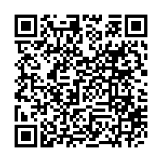

# 화장품 사용할 때의 주의사항 및 알레르기 유발성분 표시에 관한 규정(식품의약품안전처고시)(제2026-56호)(20260805)

화장품 사용할 때의 주의사항 및 알레르기 유발성분 표시에 관한 규정

화장품 사용할 때의 주의사항 및 알레르기 유발성분 표시에 관한 규정

[시행 2026. 8. 5.] [식품의약품안전처고시 제2026-56호, 2026. 8. 5., 일부개정]

제1조(목적)

제2조(기재ㆍ표시 간소화 제외 대상)

제3조(그 밖에 사용할 때의 주의사항)

제4조(기재ㆍ표시 대상 알레르기 유발성분)

제5조(규제의 재검토)

---

화장품 사용할 때의 주의사항 및 알레르기 유발성분 표시에 관한 규정

화장품 사용할 때의 주의사항 및 알레르기 유발성분 표시에 관한

규정

[시행 2026. 8. 5.] [식품의약품안전처고시 제2026-56호, 2026. 8. 5., 일부개정]

식품의약품안전처(화장품정책과), 043-719-3410

제1조(목적) 이 고시는 「화장품법」 제10조제1항, 제4항 및 같은 법 시행규칙(이하, "규칙"이라 한다) 제19조제1항부

터 제3항까지 및 제6항, 별표 3 및 별표 4에 따라 화장품의 포장에 추가로 기재ㆍ표시하여야 하는 사용할 때의

주의사항 및 성분명을 기재ㆍ표시하여야 하는 알레르기 유발성분의 종류를 정함을 목적으로 한다.

제2조(기재ㆍ표시 간소화 제외 대상) 규칙 제19조제1항제1호 및 같은 조 제2항제3호에 따라 식품의약품안전처장이

정하여 고시하는 화장품은 별표 1 제1호 다목 5) 외음부 세정제 및 같은 호 라목 6) 속눈썹용 퍼머넌트 웨이브

(eye-lash permanent wave)를 말한다.

제3조(그 밖에 사용할 때의 주의사항) 규칙 별표 3 제2호에 따른 "그 밖에 화장품의 안전정보와 관련하여 기재ㆍ표

시하도록 화장품의 유형별ㆍ성분별로 식품의약품안전처장이 정하여 고시하는 사용할 때의 주의사항"이란 별표

1과 같다.

제4조(기재ㆍ표시 대상 알레르기 유발성분) 규칙 별표 4 제3호마목에 따라 착향제의 구성 성분 중 해당 성분의 명

칭을 기재ㆍ표시하여야 하는 알레르기 유발성분의 종류는 별표 2와 같다.

제5조(규제의 재검토) 「행정규제기본법」제8조 및 「훈령ㆍ예규 등의 발령 및 관리에 관한 규정」에 따라 2014년 1월

1일을 기준으로 매 3년이 되는 시점(매 3년째의 12월 31일까지를 말한다)마다 그 타당성을 검토하여 개선 등의

조치를 하여야 한다.

부칙 <제2010-73호,2010.10.26.>

제1조(시행일) 이 고시는 고시 한 날부터 시행한다.

제2조(경과조치) 이 고시 시행당시 제7조의 개정 규정에 해당하는 화장품에 대하여 이 고시 시행 전에 이미 종전 고

시에 따라 표시ㆍ기재 되어 있는 용기 또는 포장 및 첨부문서는 제7조의 개정 규정에도 불구하고 이 고시 시행

후 6개월이 되는 날까지 계속 사용할 수 있다.

부칙 <제2012-43호,2012.7.4.>

제1조(시행일) 이 고시는 고시한 날부터 시행한다.

제2조(적용례) 제2조의 개정규정은 고시 시행 후 최초로 제조업자, 제조판매업자가 제조 또는 수입(선적일을 기준으

로 한다)하는 화장품부터 적용한다.

---

화장품 사용할 때의 주의사항 및 알레르기 유발성분 표시에 관한 규정

제3조(경과조치) 이 고시 시행 당시 제2조의 개정 규정에 해당하는 화장품에 대하여 이 고시 시행 전에 이미 종전의

규정에 따라 기재ㆍ표시되어 있는 포장은 제2조의 개정 규정에도 불구하고 2014년 2월 4일까지 해당 품목의 화

장품의 제조에 계속 사용할 수 있다.

부칙 <제2013-170호,2013.4.5.>

제1조(시행일) 이 고시는 고시한 날부터 시행한다.

부칙 <제2013-243호,2013.12.10.>

이 고시는 고시한 날부터 시행한다.

부칙 <제2014-78호,2014.2.12.>

이 고시는 고시한 날부터 시행한다.

부칙 <제2016-100호,2016.9.12.>

제1조(시행일) 이 고시는 시행규칙(총리령 제1322호) 부칙 제2조(화장품의 포장의 사용에 관한 경과조치) 시행일부

터 시행한다. 다만, 제13호는 시행규칙 시행일과 상관없이 본 개정고시 시행 후 6개월이 경과한 날부터 시행한다.

제2조(적용례) 이 고시는 고시 시행 후 최초로 제조 또는 수입(통관일을 기준으로 한다)된 화장품부터 적용한다.

제3조(경과조치) 이 고시 시행 당시 종전의 규정에 따라 제조 또는 수입(통관일을 기준으로 한다)된 화장품은 종전

의 규정을 적용한다.

부칙 <제2019-129호,2019.12.16.>

이 고시는 2020년 1월 1일부터 시행한다.

부칙 <제2022-33호,2022.4.27.>

제1조(시행일) 이 고시는 2022년 6월 19일부터 시행한다. 다만, 별표 1 제2호가목의 6) 및 9)의 개정규정은 2022년

12월 19일부터 시행한다.

제2조(화장품 포장의 기재사항에 관한 경과조치) 별표 1 제2호가목의 6) 및 9)의 개정규정에도 불구하고 이 고시 시

행 당시 종전의 규정에 따라 사용할 때의 주의사항이 기재ㆍ표시된 화장품의 포장은 부칙 제1조 단서에 따른 시

행일부터 6개월이 되는 날까지 사용할 수 있다.

제3조(다른 고시의 개정) 화장품 생산ㆍ수입실적 및 원료목록 보고에 관한 규정 일부를 다음과 같이 개정한다.

---

화장품 사용할 때의 주의사항 및 알레르기 유발성분 표시에 관한 규정

별표 1의 2. 화장품 생산실적 작성요령 표의 유형표시란, 4. 화장품 수입실적보고서 작성요령의 유형표시란 및 별표

2의 2. 맞춤형화장품 원료목록 보고실적 작성요령 표의 유형표시란을 각각 "화장품 사용할 때의 주의사항 및 알레르

기 유발성분 표시에 관한 규정 [별표 1] (화장품의 유형과 유형별ㆍ함유 성분별 사용할 때의 주의사항 표시 문구) 중

1. 화장품의 유형의 해당 목과 번호를 기재한다. (예: 영유아용 샴푸→ 가1))"로 한다.

별표 2의 2. 맞춤형화장품 원료목록 보고실적 작성요령 표의 화장품제조업자란 중 "(※ 수입화장품의 경우 표준통관

예정보고한 외국 제조회사 상호를 기재"를 "(※ 수입화장품의 경우 표준통관예정보고한 외국 제조회사 상호를 기재

)"로 한다.

부칙 <제2024-51호,2024.9.24.>

제1조(시행일) 이 고시는 고시한 날부터 시행한다. 다만, 제2조의 개정 규정은 2025년 7월 10일부터 시행한다.

제2조(적용례) 이 고시는 고시 시행 후 최초로 제조 또는 수입(통관일을 기준으로 한다)된 화장품부터 적용한다.

제3조(화장품 용기ㆍ포장의 기재사항에 관한 경과조치) 제2조의 개정 규정에도 불구하고 이 고시 시행 당시 종전의

규정에 따라 기재ㆍ표시된 속눈썹용 퍼머넌트 웨이브 및 외음부 세정제의 용기ㆍ포장은 부칙 제1조 단서에 따른

시행일부터 1년 동안 사용할 수 있다.

부칙 <제2026-56호,2026.8.5.>

제1조(시행일) 이 고시는 고시한 날부터 시행한다. 다만, 별표 1 제2호나목 15)의 개정규정은 2026년 9월 2일부터

시행한다.

제2조(적용례) 이 고시는 고시 시행 후 최초로 제조 또는 수입(통관일을 기준으로 한다)된 화장품부터 적용한다.

제3조(화장품 용기ㆍ포장의 기재사항에 관한 경과조치) 별표 1 제2호나목 15)의 개정 규정에도 불구하고 이 고시

시행 당시 종전의 규정에 따라 기재ㆍ표시된 벤조페논-3(옥시벤존) 함유 제품의 용기ㆍ포장은 부칙 제1조 단서

에 따른 시행일부터 6개월이 되는 날까지 사용할 수 있다.

[별표 1] 화장품의 유형과 유형별·함유 성분별 사용할 때의 주의사항 표시 문구(제3조 관련)

[별표 2] 착향제의 구성 성분 중 알레르기 유발성분(제4조 관련)

---

[별표1]

화장품의유형과유형별·함유성분별사용할때의주의사항표시

문구(제3조관련)

1. 화장품의 유형(의약외품은 제외한다)

가. 3세 이하의 영유아용 제품류

1) 영유아용 샴푸, 린스

2) 영유아용 로션, 크림

3) 영유아용 오일

4) 영유아 인체 세정용 제품

5) 영유아 목욕용 제품

나. 목욕용 제품류

1) 목욕용 오일·정제·캡슐

2) 목욕용 소금류

3) 버블 배스(bubble baths)

4) 그 밖의 목욕용 제품류

다. 인체 세정용 제품류

1) 폼 클렌저(foam cleanser)

2) 바디 클렌저(body cleanser)

3) 액체 비누(liquid soaps)

4) 화장 비누(고체 형태의 세안용 비누)

5) 외음부 세정제

6) 물휴지. 다만, 「위생용품 관리법」 제2조제1호바목2)에서 말하는 「식품위생

법」 제36조제1항제3호에 따른 식품접객업의 영업소에서 손을 닦는 용도 등으로

사용할 수 있도록 포장된 물티슈와 「장사 등에 관한 법률」 제29조에 따른 장

례식장 또는 「의료법」 제3조에 따른 의료기관 등에서 시체(屍體)를 닦는 용

도로 사용되는 물휴지는 제외한다.

7) 그 밖의 인체 세정용 제품류

라. 눈 화장용 제품류

1) 아이브로(eyebrow) 제품

2) 아이 라이너(eye liner)

3) 아이 섀도(eye shadow)

4) 마스카라(mascara)

---

5) 아이 메이크업 리무버(eye make-up remover)

6) 속눈썹용 퍼머넌트 웨이브(eye-lash permanent wave)

7) 그 밖의 눈 화장용 제품류

마. 방향용 제품류

1) 향수

2) 콜롱(cologne)

3) 그 밖의 방향용 제품류

바. 두발 염색용 제품류

1) 헤어 틴트(hair tints)

2) 헤어 컬러스프레이(hair color sprays)

3) 염모제

4) 탈염·탈색용 제품

5) 그 밖의 두발 염색용 제품류

사. 색조 화장용 제품류

1) 볼연지

2) 페이스 파우더(face powder)

3) 리퀴드(liquid)·크림·케이크 파운데이션(foundation)

4) 메이크업 베이스(make-up bases)

5) 메이크업 픽서티브(make-up fixatives)

6) 립스틱, 립라이너(lip liner)

7) 립글로스(lip gloss), 립밤(lip balm)

8) 바디페인팅(body painting), 페이스페인팅(face painting), 분장용 제품

9) 그 밖의 색조 화장용 제품류

아. 두발용 제품류

1) 헤어 컨디셔너(hair conditioners), 헤어 트리트먼트(hair treatment), 헤어 팩

(hair pack), 린스

2) 헤어 토닉(hair tonics), 헤어 에센스(hair essence)

3) 포마드(pomade), 헤어 스프레이·무스·왁스·젤, 헤어 그루밍 에이드(hair

grooming aids)

4) 헤어 크림·로션

5) 헤어 오일

6) 샴푸

7) 헤어 퍼머넌트 웨이브(hair permanent wave)

8) 헤어 스트레이트너(hair straightner)

9) 흑채

---

10) 그 밖의 두발용 제품류

자. 손발톱용 제품류

1) 베이스코트(basecoats), 언더코트(under coats)

2) 네일폴리시(nail polish), 네일에나멜(nail enamel)

3) 탑코트(topcoats)

4) 네일 크림·로션·에센스·오일

5) 네일폴리시·네일에나멜 리무버

6) 그 밖의 손발톱용 제품류

차. 면도용 제품류

1) 애프터셰이브 로션(aftershave lotions)

2) 프리셰이브 로션(preshave lotions)

3) 셰이빙 크림(shaving cream)

4) 셰이빙 폼(shaving foam)

5) 그 밖의 면도용 제품류

카. 기초화장용 제품류

1) 수렴·유연·영양 화장수(face lotions)

2) 마사지 크림

3) 에센스, 오일

4) 파우더

5) 바디 제품

6) 팩, 마스크

7) 눈 주위 제품

8) 로션, 크림

9) 손·발의 피부연화 제품

10) 클렌징 워터, 클렌징 오일, 클렌징 로션, 클렌징 크림 등 메이크업 리무버

11) 그 밖의 기초화장용 제품류

타. 체취 방지용 제품류

1) 데오도런트

2) 그 밖의 체취 방지용 제품류

파. 체모 제거용 제품류

1) 제모제

2) 제모왁스

3) 그 밖의 체모 제거용 제품류

---

2. 사용할 때의 주의사항

가. 화장품 유형별 주의사항

1) 미세한 알갱이가 함유되어 있는 스크럽세안제

알갱이가 눈에 들어갔을 때에는 물로 씻어내고, 이상이 있는 경우에는 전문의와

상담할 것

2) 팩

눈 주위를 피하여 사용할 것

3) 두발용, 두발염색용 및 눈 화장용 제품류

눈에 들어갔을 때에는 즉시 씻어낼 것

4) 샴푸

가) 눈에 들어갔을 때에는 즉시 씻어낼 것

나) 사용 후 물로 씻어내지 않으면 탈모 또는 탈색의 원인이 될 수 있으므로 주의할 것

[사용 후 바로 씻어내지 않을 수 있는 제품(예: 드라이 샴푸 등)은 제외한다]

5) 헤어 퍼머넌트 웨이브 제품 및 헤어스트레이트너 제품

가) 두피·얼굴·눈·목·손 등에 약액이 묻지 않도록 유의하고, 얼굴 등에 약액이

묻었을 때에는 즉시 물로 씻어낼 것

나) 특이체질, 생리 또는 출산 전후이거나 질환이 있는 사람 등은 사용을 피할 것

다) 머리카락의 손상 등을 피하기 위하여 용법·용량을 지켜야 하며, 가능하면

일부에 시험적으로 사용하여 볼 것

라) 섭씨 15도 이하의 어두운 장소에 보존하고, 색이 변하거나 침전된 경우에는

사용하지 말 것

마) 개봉한 제품은 7일 이내에 사용할 것(에어로졸 제품이나 사용 중 공기유입이

차단되는 용기는 표시하지 아니한다)

바) 제2단계 퍼머액 중 그 주성분이 과산화수소인 제품은 검은 머리카락이 갈색으로

변할 수 있으므로 유의하여 사용할 것

6) 외음부 세정제

가) 외음부에만 사용하며, 질 내에 사용하지 않도록 할 것

나) 정해진 용법과 용량을 잘 지켜 사용할 것

다) 3세 이하의 영유아에게는 사용하지 말 것

라) 임신 중에는 사용하지 않는 것이 바람직하며, 분만 직전의 외음부 주위에는 사

용하지 말 것

마) 프로필렌 글리콜(Propylene glycol)을 함유하고 있으므로 이 성분에 과민하거나

---

알레르기 병력이 있는 사람은 신중히 사용할 것(프로필렌 글리콜 함유제품만

표시한다)

7) 손·발의 피부연화 제품(우레아를 포함하는 핸드크림 및 풋크림)

가) 눈, 코 또는 입 등에 닿지 않도록 주의하여 사용할 것

나) 프로필렌 글리콜(Propylene glycol)을 함유하고 있으므로 이 성분에 과민하거나

알레르기 병력이 있는 사람은 신중히 사용할 것(프로필렌 글리콜 함유제품만

표시한다)

8) 체취 방지용 제품

털을 제거한 직후에는 사용하지 말 것

9) 고압가스를 사용하는 에어로졸 제품

가) 「고압가스 안전관리법」 제22조의2에 따른 「고압가스 용기 및 차량에 고

정된 탱크 충전의 시설·기술·검사·안전성평가 기준(KGS FP211)」

3.2.2.1.1 (11) 표3.2.2.1.1 기재사항

나) 눈 주위 또는 점막 등에 분사하지 말 것. 다만, 자외선 차단제의 경우 얼굴에

직접 분사하지 말고 손에 덜어 얼굴에 바를 것

다) 분사가스는 직접 흡입하지 않도록 주의할 것

10) 고압가스를 사용하지 않는 분무형 자외선 차단제

얼굴에 직접 분사하지 말고 손에 덜어 얼굴에 바를 것

11) 염모제(산화염모제와 비산화염모제)

가) 다음 분들은 사용하지 마십시오. 사용 후 피부나 신체가 과민상태로 되거나

피부이상반응(부종, 염증 등)이 일어나거나, 현재의 증상이 악화될 가능성이

있습니다.

(1) 지금까지 이 제품에 배합되어 있는 ‘과황산염’이 함유된 탈색제로 몸이

부은 경험이 있는 경우, 사용 중 또는 사용 직후에 구역, 구토 등 속이 좋지

않았던 분(이 내용은 ‘과황산염’이 배합된 염모제에만 표시한다)

(2) 지금까지 염모제를 사용할 때 피부이상반응(부종, 염증 등)이 있었거나, 염색

중 또는 염색 직후에 발진, 발적, 가려움 등이 있거나 구역, 구토 등 속이

좋지 않았던 경험이 있었던 분

(3) 피부시험(패취테스트, patch test)의 결과, 이상이 발생한 경험이 있는 분

(4) 두피, 얼굴, 목덜미에 부스럼, 상처, 피부병이 있는 분

(5) 생리 중, 임신 중 또는 임신할 가능성이 있는 분

(6) 출산 후, 병중, 병후의 회복 중인 분, 그 밖의 신체에 이상이 있는 분

(7) 특이체질, 신장질환, 혈액질환이 있는 분

(8) 미열, 권태감, 두근거림, 호흡곤란의 증상이 지속되거나 코피 등의 출혈이

---

잦고 생리, 그 밖에 출혈이 멈추기 어려운 증상이 있는 분

(9) 이 제품에 첨가제로 함유된 프로필렌글리콜에 의하여 알레르기를 일으킬 수

있으므로 이 성분에 과민하거나 알레르기 반응을 보였던 적이 있는 분은 사용

전에 의사 또는 약사와 상의하여 주십시오(프로필렌글리콜 함유 제제에만

표시한다)

나) 염모제 사용 전의 주의

(1) 염색 전 2일전(48시간 전)에는 다음의 순서에 따라 매회 반드시 패취테스트

(patch test)를 실시하여 주십시오. 패취테스트는 염모제에 부작용이 있는

체질인지 아닌지를 조사하는 테스트입니다. 과거에 아무 이상이 없이

염색한 경우에도 체질의 변화에 따라 알레르기 등 부작용이 발생할 수

있으므로 매회 반드시 실시하여 주십시오. (패취테스트의 순서 ① ～ ④를

그림 등을 사용하여 알기 쉽게 표시하며, 필요 시 사용 상의 주의사항에 "

별첨"으로 첨부할 수 있음)

① 먼저 팔의 안쪽 또는 귀 뒤쪽 머리카락이 난 주변의 피부를 비눗물로 잘 씻고

탈지면으로 가볍게 닦습니다.

② 다음에 이 제품 소량을 취해 정해진 용법대로 혼합하여 실험액을 준비합니다.

③ 실험액을 앞서 세척한 부위에 동전 크기로 바르고 자연건조시킨 후 그대로

48시간 방치합니다.(시간을 잘 지킵니다)

④ 테스트 부위의 관찰은 테스트액을 바른 후 30분 그리고 48시간 후 총 2회를

반드시 행하여 주십시오. 그 때 도포 부위에 발진, 발적, 가려움, 수포, 자극

등의 피부 등의 이상이 있는 경우에는 손 등으로 만지지 말고 바로 씻어내고

염모는 하지 말아 주십시오. 테스트 도중, 48시간 이전이라도 위와 같은

피부이상을 느낀 경우에는 바로 테스트를 중지하고 테스트액을 씻어내고

염모는 하지 말아 주십시오.

⑤ 48시간 이내에 이상이 발생하지 않는다면 바로 염모하여 주십시오.

(2) 눈썹, 속눈썹 등은 위험하므로 사용하지 마십시오. 염모액이 눈에 들어갈

염려가 있습니다. 그 밖에 두발 이외에는 염색하지 말아 주십시오.

(3) 면도 직후에는 염색하지 말아 주십시오.

(4) 염모 전후 1주간은 파마·웨이브(퍼머넨트웨이브)를 하지 말아 주십시오.

다) 염모 시의 주의

(1) 염모액 또는 머리를 감는 동안 그 액이 눈에 들어가지 않도록 하여 주십시오.

눈에 들어가면 심한 통증을 발생시키거나 경우에 따라서 눈에 손상(각막의

염증)을 입을 수 있습니다. 만일, 눈에 들어갔을 때는 절대로 손으로

비비지 말고 바로 물 또는 미지근한 물로 15분 이상 잘 씻어 주시고

곧바로 안과 전문의의 진찰을 받으십시오. 임의로 안약 등을 사용하지

마십시오.

(2) 염색 중에는 목욕을 하거나 염색 전에 머리를 적시거나 감지 말아 주십시오.

땀이나 물방울 등을 통해 염모액이 눈에 들어갈 염려가 있습니다.

(3) 염모 중에 발진, 발적, 부어오름, 가려움, 강한 자극감 등의 피부이상이나

---

구역, 구토 등의 이상을 느꼈을 때는 즉시 염색을 중지하고 염모액을 잘

씻어내 주십시오. 그대로 방치하면 증상이 악화될 수 있습니다.

(4) 염모액이 피부에 묻었을 때는 곧바로 물 등으로 씻어내 주십시오. 손가락이나

손톱을 보호하기 위하여 장갑을 끼고 염색하여 주십시오.

(5) 환기가 잘 되는 곳에서 염모하여 주십시오.

라) 염모 후의 주의

(1) 머리, 얼굴, 목덜미 등에 발진, 발적, 가려움, 수포, 자극 등 피부의 이상반응이

발생한 경우, 그 부위를 손으로 긁거나 문지르지 말고 바로 피부과 전문의의

진찰을 받으십시오. 임의로 의약품 등을 사용하는 것은 삼가 주십시오.

(2) 염모 중 또는 염모 후에 속이 안 좋아 지는 등 신체이상을 느끼는 분은

의사에게 상담하십시오.

마) 보관 및 취급상의 주의

(1) 혼합한 염모액을 밀폐된 용기에 보존하지 말아 주십시오. 혼합한 액으로부터

발생하는 가스의 압력으로 용기가 파손될 염려가 있어 위험합니다. 또한

혼합한 염모액이 위로 튀어 오르거나 주변을 오염시키고 지워지지 않게

됩니다. 혼합한 액의 잔액은 효과가 없으므로 잔액은 반드시 바로 버려

주십시오.

(2) 용기를 버릴 때는 반드시 뚜껑을 열어서 버려 주십시오.

(3) 사용 후 혼합하지 않은 액은 직사광선을 피하고 공기와 접촉을 피하여

서늘한 곳에 보관하여 주십시오.

12) 탈염·탈색제

가) 다음 분들은 사용하지 마십시오. 사용 후 피부나 신체가 과민상태로 되거나

피부이상반응을 보이거나, 현재의 증상이 악화될 가능성이 있습니다.

(1) 두피, 얼굴, 목덜미에 부스럼, 상처, 피부병이 있는 분

(2) 생리 중, 임신 중 또는 임신할 가능성이 있는 분

(3) 출산 후, 병중이거나 또는 회복 중에 있는 분, 그 밖에 신체에 이상이 있는 분

나) 다음 분들은 신중히 사용하십시오.

(1) 특이체질, 신장질환, 혈액질환 등의 병력이 있는 분은 피부과 전문의와

상의하여 사용하십시오.

(2) 이 제품에 첨가제로 함유된 프로필렌글리콜에 의하여 알레르기를 일으킬 수

있으므로 이 성분에 과민하거나 알레르기 반응을 보였던 적이 있는 분은 사용

전에 의사 또는 약사와 상의하여 주십시오.

다) 사용 전의 주의

(1) 눈썹, 속눈썹에는 위험하므로 사용하지 마십시오. 제품이 눈에 들어갈

염려가 있습니다. 또한, 두발 이외의 부분(손발의 털 등)에는 사용하지

말아 주십시오. 피부에 부작용(피부이상반응, 염증 등)이 나타날 수 있습니다.

(2) 면도 직후에는 사용하지 말아 주십시오.

(3) 사용을 전후하여 1주일 사이에는 퍼머넌트웨이브 제품 및 헤어스트레이트너

---

제품을 사용하지 말아 주십시오.

라) 사용 시의 주의

(1) 제품 또는 머리 감는 동안 제품이 눈에 들어가지 않도록 하여 주십시오. 만일

눈에 들어갔을 때는 절대로 손으로 비비지 말고 바로 물이나 미지근한 물로

15분 이상 씻어 흘려 내시고 곧바로 안과 전문의의 진찰을 받으십시오. 임의로

안약을 사용하는 것은 삼가 주십시오.

(2) 사용 중에 목욕을 하거나 사용 전에 머리를 적시거나 감지 말아 주십시오.

땀이나 물방울 등을 통해 제품이 눈에 들어갈 염려가 있습니다.

(3) 사용 중에 발진, 발적, 부어오름, 가려움, 강한 자극감 등 피부의 이상을

느끼면 즉시 사용을 중지하고 잘 씻어내 주십시오.

(4) 제품이 피부에 묻었을 때는 곧바로 물 등으로 씻어내 주십시오. 손가락이나

손톱을 보호하기 위하여 장갑을 끼고 사용하십시오.

(5) 환기가 잘 되는 곳에서 사용하여 주십시오.

마) 사용 후 주의

(1) 두피, 얼굴, 목덜미 등에 발진, 발적, 가려움, 수포, 자극 등 피부이상반응이

발생한 때에는 그 부위를 손 등으로 긁거나 문지르지 말고 바로 피부과

전문의의 진찰을 받아 주십시오. 임의로 의약품 등을 사용하는 것은 삼가

주십시오.

(2) 사용 중 또는 사용 후에 구역, 구토 등 신체에 이상을 느끼시는 분은

의사에게 상담하십시오.

바) 보관 및 취급상의 주의

(1) 혼합한 제품을 밀폐된 용기에 보존하지 말아 주십시오. 혼합한 제품으로부터

발생하는 가스의 압력으로 용기가 파열될 염려가 있어 위험합니다. 또한,

혼합한 제품이 위로 튀어 오르거나 주변을 오염시키고 지워지지 않게 됩니다.

혼합한 제품의 잔액은 효과가 없으므로 반드시 바로 버려 주십시오.

(2) 용기를 버릴 때는 뚜껑을 열어서 버려 주십시오.

13) 제모제(치오글라이콜릭애씨드 함유 제품에만 표시함)

가) 다음과 같은 사람(부위)에는 사용하지 마십시오.

(1) 생리 전후, 산전, 산후, 병후의 환자

(2) 얼굴, 상처, 부스럼, 습진, 짓무름, 기타의 염증, 반점 또는 자극이 있는 피부

(3) 유사 제품에 부작용이 나타난 적이 있는 피부

(4) 약한 피부 또는 남성의 수염부위

나) 이 제품을 사용하는 동안 다음의 약이나 화장품을 사용하지 마십시오.

(1) 땀발생억제제(Antiperspirant), 향수, 수렴로션(Astringent Lotion)은 이

제품 사용 후 24시간 후에 사용하십시오.

다) 부종, 홍반, 가려움, 피부염(발진, 알레르기), 광과민반응, 중증의 화상 및 수포

등의 증상이 나타날 수 있으므로 이러한 경우 이 제품의 사용을 즉각 중지하고

의사 또는 약사와 상의하십시오.

---

라) 그 밖의 사용 시 주의사항

(1) 사용 중 따가운 느낌, 불쾌감, 자극이 발생할 경우 즉시 닦아내어 제거하고

찬물로 씻으며, 불쾌감이나 자극이 지속될 경우 의사 또는 약사와 상의

하십시오.

(2) 자극감이 나타날 수 있으므로 매일 사용하지 마십시오.

(3) 이 제품의 사용 전후에 비누류를 사용하면 자극감이 나타날 수 있으므로

주의하십시오.

(4) 이 제품은 외용으로만 사용하십시오.

(5) 눈에 들어가지 않도록 하며 눈 또는 점막에 닿았을 경우 미지근한 물로

씻어내고 붕산수(농도 약 2%)로 헹구어 내십시오.

(6) 이 제품을 10분 이상 피부에 방치하거나 피부에서 건조시키지 마십시오.

(7) 제모에 필요한 시간은 모질(毛質)에 따라 차이가 있을 수 있으므로 정해진

시간 내에 모가 깨끗이 제거되지 않은 경우 2～3일의 간격을 두고 사용

하십시오.

14) 속눈썹용 퍼머넌트 웨이브 제품

가) 가급적 자가 사용을 자제할 것

나) 정해진 용법과 용량을 잘 지켜서 사용할 것

다) 제품을 사용하는 과정에서 눈과의 접촉을 피하고, 눈 또는 얼굴 등에 약액이

묻었을 때에는 즉시 흐르는 물이나 식염수 등을 이용해 씻어낼 것

라) 특이체질, 생리 또는 출산 전후이거나 질환이 있는 사람 등은 사용을 피할

것

마) 보관 시 소아의 손에 닿지 않도록 유의하고, 섭씨 15도 이하의 어두운 장소

에 보존하되, 색이 변하거나 침전된 경우에는 사용하지 말 것

바) 개봉한 제품은 사용 후 즉시 폐기할 것(사용 중 공기의 유입이 차단되는 용

기는 표시하지 아니한다)

나. 화장품 함유 성분별 주의사항

1) 과산화수소 및 과산화수소 생성물질 함유 제품

눈에 접촉을 피하고 눈에 들어갔을 때는 즉시 씻어낼 것

2) 벤잘코늄클로라이드, 벤잘코늄브로마이드 및 벤잘코늄사카리네이트 함유 제품

눈에 접촉을 피하고 눈에 들어갔을 때는 즉시 씻어낼 것

3) 스테아린산아연 함유 제품(기초화장용 제품류 중 파우더 제품에 한함)

사용 시 흡입되지 않도록 주의할 것

---

4) 살리실릭애씨드 및 그 염류 함유 제품(샴푸 등 사용 후 바로 씻어내는 제품 제외)

3세 이하 영유아에게는 사용하지 말 것

5) 실버나이트레이트 함유 제품

눈에 접촉을 피하고 눈에 들어갔을 때는 즉시 씻어낼 것

6) 아이오도프로피닐부틸카바메이트(IPBC) 함유 제품 (목욕용제품, 샴푸류 및

바디클렌저 제외)

3세 이하 영유아에게는 사용하지 말 것

7) 알루미늄 및 그 염류 함유 제품 (체취방지용 제품류에 한함)

신장 질환이 있는 사람은 사용 전에 의사, 약사, 한의사와 상의할 것

8) 알부틴 2% 이상 함유 제품

알부틴은 「인체적용시험자료」에서 구진과 경미한 가려움이 보고된 예가 있음

9) 알파-하이드록시애시드(α-hydroxyacid, AHA)(이하 "AHA”라 한다) 함유

제품(0.5퍼센트 이하의 AHA가 함유된 제품은 제외한다)

가) 햇빛에 대한 피부의 감수성을 증가시킬 수 있으므로 자외선 차단제를 함께

사용할 것(씻어내는 제품 및 두발용 제품은 제외한다)

나) 일부에 시험 사용하여 피부 이상을 확인할 것

다) 고농도의 AHA 성분이 들어 있어 부작용이 발생할 우려가 있으므로 전문의

등에게 상담할 것(AHA 성분이 10퍼센트를 초과하여 함유되어 있거나 산도가

3.5 미만인 제품만 표시한다)

10) 카민 함유 제품

카민 성분에 과민하거나 알레르기가 있는 사람은 신중히 사용할 것

11) 코치닐추출물 함유 제품

코치닐추출물 성분에 과민하거나 알레르기가 있는 사람은 신중히 사용할 것

12) 포름알데하이드 0.05% 이상 검출된 제품

포름알데하이드 성분에 과민한 사람은 신중히 사용할 것

13) 폴리에톡실레이티드레틴아마이드 0.2% 이상 함유 제품

폴리에톡실레이티드레틴아마이드는 「인체적용시험자료」에서 경미한 발적,

피부건조, 화끈감, 가려움, 구진이 보고된 예가 있음

14) 부틸파라벤, 프로필파라벤, 이소부틸파라벤 또는 이소프로필파라벤 함유 제품

---

(영ᆞ유아용 제품류 및 기초화장용 제품류(3세 이하 영유아가 사용하는 제

품) 중 사용 후 씻어내지 않는 제품에 한함)

3세 이하 영유아의 기저귀가 닿는 부위에는 사용하지 말 것

15) 벤조페논-3(옥시벤존) 함유 제품(2.4 퍼센트 이하의 벤조페논-3가 함유된

제품은 제외한다)

용법·용량에 따른 부위에만 사용하고 전신에 사용하지 말 것

---

[별표2]

착향제의구성성분중알레르기유발성분(제4조관련)

연번

성분명

CAS 등록번호

1

아밀신남알

CAS No 122-40-7

2

벤질알코올

CAS No 100-51-6

3

신나밀알코올

CAS No 104-54-1

4

시트랄

CAS No 5392-40-5

5

유제놀

CAS No 97-53-0

6

하이드록시시트로넬알

CAS No 107-75-5

7

아이소유제놀

CAS No 97-54-1

8

아밀신나밀알코올

CAS No 101-85-9

9

벤질살리실레이트

CAS No 118-58-1

10

신남알

CAS No 104-55-2

11

쿠마린

CAS No 91-64-5

12

제라니올

CAS No 106-24-1

13

아니스알코올

CAS No 105-13-5

14

벤질신나메이트

CAS No 103-41-3

15

파네솔

CAS No 4602-84-0

16

부틸페닐메틸프로피오날

CAS No 80-54-6

17

리날룰

CAS No 78-70-6

18

벤질벤조에이트

CAS No 120-51-4

19

시트로넬올

CAS No 106-22-9

20

헥실신남알

CAS No 101-86-0

21

리모넨

CAS No 5989-27-5

22

메틸2-옥티노에이트

CAS No 111-12-6

23

알파-아이소메틸아이오논

CAS No 127-51-5

24

참나무이끼추출물

CAS No 90028-68-5

25

나무이끼추출물

CAS No 90028-67-4

※ 다만, 사용후씻어내는제품에는0.01% 초과, 사용후씻어내지않는

제품에는0.001% 초과함유하는경우에한한다.

| 성분명 |
| --- |
| 아밀신남알 |
| 벤질알코올 |
| 신나밀알코올 |
| 시트랄 |
| 유제놀 |
| 하이드록시시트로넬알 |
| 아이소유제놀 |
| 아밀신나밀알코올 |
| 벤질살리실레이트 |
| 신남알 |
| 쿠마린 |
| 제라니올 |
| 아니스알코올 |
| 벤질신나메이트 |
| 파네솔 |
| 부틸페닐메틸프로피오날 |
| 리날룰 |
| 벤질벤조에이트 |
| 시트로넬올 |
| 헥실신남알 |
| 리모넨 |
| 메틸 2-옥티노에이트 |
| 알파-아이소메틸아이오논 |
| 참나무이끼추출물 |
| 나무이끼추출물 |

---
