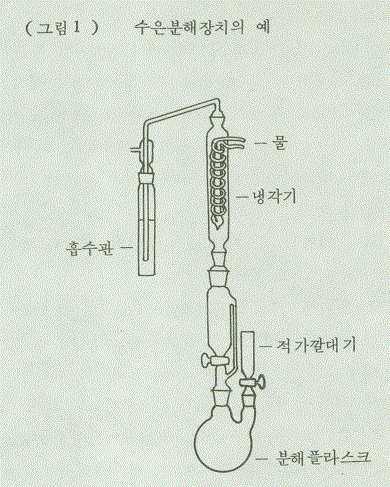

# 화장품 안전기준 등에 관한 규정(식품의약품안전처고시)(제2026-19호)(20260318)

화장품 안전기준 등에 관한 규정

화장품 안전기준 등에 관한 규정

[시행 2026. 3. 18.] [식품의약품안전처고시 제2026-19호, 2026. 3. 18., 일부개정]

제1장 총칙

제1조(목적)

제2조(적용범위)

제2장 화장품에 사용할 수 없는 원료 및 사용상의 제한이 필요한 원료에 대한 사용기준

제3조(사용할 수 없는 원료)

제4조(사용상의 제한이 필요한 원료에 대한 사용기준)

제3장 맞춤형화장품에 사용할 수 있는 원료

제5조(맞춤형화장품에 사용 가능한 원료)

제4장 유통화장품 안전관리 기준

제6조(유통화장품의 안전관리 기준)

제7조(규제의 재검토)

---

화장품 안전기준 등에 관한 규정

화장품 안전기준 등에 관한 규정

[시행 2026. 3. 18.] [식품의약품안전처고시 제2026-19호, 2026. 3. 18., 일부개정]

식품의약품안전처(화장품정책과), 043-719-3410

제1장 총칙

제1조(목적) 이 고시는 「화장품법」 제2조제3호의2에 따라 맞춤형화장품에 사용할 수 있는 원료를 지정하는 한편,

같은 법 제8조에 따라 화장품에 사용할 수 없는 원료 및 사용상의 제한이 필요한 원료에 대하여 그 사용기준을

지정하고, 유통화장품 안전관리 기준에 관한 사항을 정함으로써 화장품의 제조 또는 수입 및 안전관리에 적정을

기함을 목적으로 한다.

제2조(적용범위) 이 규정은 국내에서 제조, 수입 또는 유통되는 모든 화장품에 대하여 적용한다.

제2장 화장품에 사용할 수 없는 원료 및 사용상의 제한이 필요한 원료에 대한 사용기준

제3조(사용할 수 없는 원료) 화장품에 사용할 수 없는 원료는 별표 1과 같다.

제4조(사용상의 제한이 필요한 원료에 대한 사용기준) 화장품에 사용상의 제한이 필요한 원료 및 그 사용기준은 별

표 2와 같으며, 별표 2의 원료 외의 보존제, 자외선 차단제 등은 사용할 수 없다.

제3장 맞춤형화장품에 사용할 수 있는 원료

제5조(맞춤형화장품에 사용 가능한 원료) 다음 각 호의 원료를 제외한 원료는 맞춤형화장품에 사용할 수 있다.

1. 별표 1의 화장품에 사용할 수 없는 원료

2. 별표 2의 화장품에 사용상의 제한이 필요한 원료

3. 식품의약품안전처장이 고시한 기능성화장품의 효능ㆍ효과를 나타내는 원료(다만, 맞춤형화장품판매업자에게

원료를 공급하는 화장품책임판매업자가 「화장품법」 제4조에 따라 해당 원료를 포함하여 기능성화장품에 대한

심사를 받거나 보고서를 제출한 경우는 제외한다)

제4장 유통화장품 안전관리 기준

제6조(유통화장품의 안전관리 기준) ① 유통화장품은 제2항부터 제5항까지의 안전관리 기준에 적합하여야 하며, 유

통화장품 유형별로 제6항부터 제9항까지의 안전관리 기준에 추가적으로 적합하여야 한다. 또한 시험방법은 별표

4에 따라 시험하되, 기타 과학적ㆍ합리적으로 타당성이 인정되는 경우 자사 기준으로 시험할 수 있다.

---

화장품 안전기준 등에 관한 규정

② 화장품을 제조하면서 다음 각 호의 물질을 인위적으로 첨가하지 않았으나, 제조 또는 보관 과정 중 포장재로

부터 이행되는 등 비의도적으로 유래된 사실이 객관적인 자료로 확인되고 기술적으로 완전한 제거가 불가능한

경우 해당 물질의 검출 허용 한도는 다음 각 호와 같다.

1. 납 : 점토를 원료로 사용한 분말제품은 50㎍/g이하, 그 밖의 제품은 20㎍/g이하

2. 니켈: 눈 화장용 제품은 35㎍/g 이하, 색조 화장용 제품은 30㎍/g이하, 그 밖의 제품은 10㎍/g 이하

3. 비소 : 10㎍/g이하

4. 수은 : 1㎍/g이하

5. 안티몬 : 10㎍/g이하

6. 카드뮴 : 5㎍/g이하

7. 디옥산 : 100㎍/g이하

8. 메탄올 : 0.2(v/v)%이하, 물휴지는 0.002%(v/v)이하

9. 포름알데하이드 : 2000㎍/g이하, 물휴지는 20㎍/g이하

10. 프탈레이트류(디부틸프탈레이트, 부틸벤질프탈레이트 및 디에칠헥실프탈레이트에 한함) : 총 합으로서 100㎍

/g이하

③ 별표 1의 사용할 수 없는 원료가 제2항의 사유로 검출되었으나 검출허용한도가 설정되지 아니한 경우에는 「

화장품법 시행규칙」 제17조에 따라 위해평가 후 위해 여부를 결정하여야 한다.

④ 미생물한도는 다음 각 호와 같다.

1. 총호기성생균수는 영ㆍ유아용 제품류 및 눈화장용 제품류의 경우 500개/g(mL)이하

2. 물휴지의 경우 세균 및 진균수는 각각 100개/g(mL)이하

3. 기타 화장품의 경우 1,000개/g(mL)이하

4. 대장균(Escherichia Coli), 녹농균(Pseudomonas aeruginosa), 황색포도상구균(Staphylococcus aureus)은 불검

출

⑤ 내용량의 기준은 다음 각 호와 같다.

1. 제품 3개를 가지고 시험할 때 그 평균 내용량이 표기량에 대하여 97% 이상(다만, 화장 비누의 경우 건조중량

을 내용량으로 한다)

2. 제1호의 기준치를 벗어날 경우 : 6개를 더 취하여 시험할 때 9개의 평균 내용량이 제1호의 기준치 이상

3. 그 밖의 특수한 제품 :「대한민국약전」(식품의약품안전처 고시)을 따를 것

⑥ 영ㆍ유아용 제품류(영ㆍ유아용 샴푸, 영ㆍ유아용 린스, 영ㆍ유아 인체 세정용 제품, 영ㆍ유아 목욕용 제품 제

외), 눈 화장용 제품류, 색조 화장용 제품류, 두발용 제품류(샴푸, 린스 제외), 면도용 제품류(셰이빙 크림, 셰이빙

폼 제외), 기초화장용 제품류(클렌징 워터, 클렌징 오일, 클렌징 로션, 클렌징 크림 등 메이크업 리무버 제품 제외)

중 액, 로션, 크림 및 이와 유사한 제형의 액상제품은 pH 기준이 3.0∼9.0 이어야 한다. 다만, 물을 포함하지 않는

제품과 사용한 후 곧바로 물로 씻어 내는 제품은 제외한다.

⑦ 기능성화장품은 기능성을 나타나게 하는 주원료의 함량이 「화장품법」제4조 및 같은 법 시행규칙 제9조 또는

제10조에 따라 심사 또는 보고한 기준에 적합하여야 한다.

⑧ 퍼머넌트웨이브용 및 헤어스트레이트너 제품은 다음 각 호의 기준에 적합하여야 한다.

---

화장품 안전기준 등에 관한 규정

1. 치오글라이콜릭애씨드 또는 그 염류를 주성분으로 하는 냉2욕식 퍼머넌트웨이브용 제품 : 이 제품은 실온에서

사용하는 것으로서 치오글라이콜릭애씨드 또는 그 염류를 주성분으로 하는 제1제 및 산화제를 함유하는 제

2제로 구성된다.

가. 제1제 : 이 제품은 치오글라이콜릭애씨드 또는 그 염류를 주성분으로 하고, 불휘발성 무기알칼리의 총량이

치오글라이콜릭애씨드의 대응량 이하인 액제이다. 단, 산성에서 끓인 후의 환원성물질의 함량이 7.0%를 초

과하는 경우에는 초과분에 대하여 디치오디글라이콜릭애씨드 또는 그 염류를 디치오디글라이콜릭애씨드로

서 같은량 이상 배합하여야 한다. 이 제품에는 품질을 유지하거나 유용성을 높이기 위하여 적당한 알칼리제,

침투제, 습윤제, 착색제, 유화제, 향료 등을 첨가할 수 있다.

1) pH : 4.5 ∼ 9.6

2) 알칼리 : 0.1N염산의 소비량은 검체 1mL 에 대하여 7.0mL이하

3) 산성에서 끓인 후의 환원성 물질(치오글라이콜릭애씨드) : 산성에서 끓인 후의 환원성 물질의 함량(치오글라이

콜릭애씨드로서)이 2.0 ∼ 11.0％

4) 산성에서 끓인 후의 환원성 물질이외의 환원성 물질(아황산염, 황화물 등) : 검체 1mL 중의 산성에서 끓인 후

의 환원성 물질이외의 환원성 물질에 대한 0.1N 요오드액의 소비량이 0.6mL이하

5) 환원후의 환원성 물질(디치오디글라이콜릭애씨드) : 환원후의 환원성 물질의 함량은 4.0％이하

6) 중금속 : 20㎍/g이하

7) 비소 : 5㎍/g이하

8) 철 : 2㎍/g이하

나. 제2제

1) 브롬산나트륨 함유제제 : 브롬산나트륨에 그 품질을 유지하거나 유용성을 높이기 위하여 적당한 용해제, 침투제,

습윤제, 착색제, 유화제, 향료 등을 첨가한 것이다.

가) 용해상태 : 명확한 불용성이물이 없을 것

나) pH : 4.0 ∼ 10.5

다) 중금속 : 20㎍/g이하

라) 산화력 : 1인 1회 분량의 산화력이 3.5이상

2) 과산화수소수 함유제제 : 과산화수소수 또는 과산화수소수에 그 품질을 유지하거나 유용성을 높이기 위하여 적당

한 침투제, 안정제, 습윤제, 착색제, 유화제, 향료 등을 첨가한 것이다.

가) pH : 2.5 ∼ 4.5

나) 중금속 : 20㎍/g이하

다) 산화력 : 1인 1회 분량의 산화력이 0.8 ∼ 3.0

2. 시스테인, 시스테인염류 또는 아세틸시스테인을 주성분으로 하는 냉2욕식 퍼머넌트웨이브용 제품 : 이 제품은

실온에서 사용하는 것으로서 시스테인, 시스테인염류 또는 아세틸시스테인을 주성분으로 하는 제1제 및 산화

제를 함유하는 제2제로 구성된다.

가. 제1제 : 이 제품은 시스테인, 시스테인염류 또는 아세틸시스테인을 주성분으로 하고 불휘발성 무기알칼리

를 함유하지 않은 액제이다. 이 제품에는 품질을 유지하거나 유용성을 높이기 위하여 적당한 알칼리제, 침투

제, 습윤제, 착색제, 유화제, 향료 등을 첨가할 수 있다.

---

화장품 안전기준 등에 관한 규정

1) pH : 8.0 ∼ 9.5

2) 알칼리 : 0.1N 염산의 소비량은 검체 1mL에 대하여 12mL이하

3) 시스테인 : 3.0 ∼ 7.5％

4) 환원후의 환원성물질(시스틴) : 0.65％이하

5) 중금속 : 20㎍/g이하

6) 비소 : 5㎍/g이하

7) 철 : 2㎍/g이하

나. 제2제 기준 : 1. 치오글라이콜릭애씨드 또는 그 염류를 주성분으로 하는 냉2욕식 퍼머넌트웨이브용 제품 나

. 제2제의 기준에 따른다.

3. 치오글라이콜릭애씨드 또는 그 염류를 주성분으로 하는 냉2욕식 헤어스트레이트너용 제품 : 이 제품은 실온에

서 사용하는 것으로서 치오글라이콜릭애씨드 또는 그 염류를 주성분으로 하는 제1제 및 산화제를 함유하는 제

2제로 구성된다.

가. 제1제 : 이 제품은 치오글라이콜릭애씨드 또는 그 염류를 주성분으로 하고 불휘발성 무기알칼리의 총량이

치오글라이콜릭애씨드의 대응량 이하인 제제이다. 단, 산성에서 끓인 후의 환원성물질의 함량이 7.0%를 초

과하는 경우, 초과분에 대해 디치오디글라이콜릭애씨드 또는 그 염류를 디치오디글라이콜릭애씨드로 같은

양 이상 배합하여야 한다. 이 제품에는 품질을 유지하거나 유용성을 높이기 위하여 적당한 알칼리제, 침투제

, 착색제, 습윤제, 유화제, 증점제, 향료 등을 첨가할 수 있다.

1) pH : 4.5 ∼ 9.6

2) 알칼리 : 0.1N 염산의 소비량은 검체 1mL에 대하여 7.0mL이하

3) 산성에서 끊인 후의 환원성물질(치오글라이콜릭애씨드) : 2.0 ∼ 11.0％

4) 산성에서 끓인 후의 환원성물질 이외의 환원성물질(아황산, 황화물 등) : 검체 1mL중의 산성에서 끓인 후의 환

원성물질 이외의 환원성물질에 대한 0.1N 요오드액의 소비량은 0.6mL이하

5) 환원후의 환원성물질(디치오디글리콜릭애씨드) : 4.0％이하

6) 중금속 : 20㎍/g이하

7) 비소 : 5㎍/g이하

8) 철 : 2㎍/g이하

나. 제2제 기준 : 1. 치오글라이콜릭애씨드 또는 그 염류를 주성분으로 하는 냉2욕식 퍼머넌트웨이브용 제품 나

. 제2제의 기준에 따른다.

4. 치오글라이콜릭애씨드 또는 그 염류를 주성분으로 하는 가온2욕식 퍼머넌트웨이브용 제품 : 이 제품은 사용할

때 약 60℃이하로 가온조작하여 사용하는 것으로서 치오글라이콜릭애씨드 또는 그 염류를 주성분으로 하는 제

1제 및 산화제를 함유하는 제2제로 구성된다.

가. 제1제 : 이 제품은 치오글라이콜릭애씨드 또는 그 염류를 주성분으로 하고 불휘발성 무기알칼리의 총량이

치오글라이콜릭애씨드의 대응량 이하인 액제이다. 이 제품에는 품질을 유지하거나 유용성을 높이기 위하여

적당한 알칼리제, 침투제, 습윤제, 착색제, 유화제, 향료 등을 첨가할 수 있다.

1) pH : 4.5 ∼ 9.3

---

화장품 안전기준 등에 관한 규정

2) 알칼리 : 0.1N 염산의 소비량은 검체 1mL에 대하여 5mL이하

3) 산성에서 끓인 후의 환원성물질(치오글라이콜릭애씨드) : 1.0 ∼ 5.0％

4) 산성에서 끓인 후의 환원성물질 이외의 환원성물질(아황산, 황화물 등) : 검체 1mL중의 산성에서 끓인 후의 환

원성물질 이외의 환원성물질에 대한 0.1N 요오드액의 소비량은 0.6mL이하

5) 환원후의 환원성물질(디치오디글라이콜릭애씨드) : 4.0％이하

6) 중금속 : 20㎍/g이하

7) 비소 : 5㎍/g이하

8) 철 : 2㎍/g이하

나. 제2제 기준 : 1. 치오글라이콜릭애씨드 또는 그 염류를 주성분으로 하는 냉2욕식 퍼머넌트웨이브용 제품 나

. 제2제의 기준에 따른다.

5. 시스테인, 시스테인염류 또는 아세틸시스테인을 주성분으로 하는 가온 2욕식 퍼머넌트웨이브용 제품 : 이 제

품은 사용 시 약 60℃ 이하로 가온조작하여 사용하는 것으로서 시스테인, 시스테인염류, 또는 아세틸시스테인

을 주성분으로 하는 제1제 및 산화제를 함유하는 제2제로 구성된다.

가. 제1제 : 이 제품은 시스테인, 시스테인염류, 또는 아세틸시스테인을 주성분으로 하고 불휘발성 무기알칼리

를 함유하지 않는 액제로서 이 제품에는 품질을 유지하거나 유용성을 높이기 위해서 적당한 알칼리제, 침투

제, 습윤제, 착색제, 유화제, 향료 등을 첨가할 수 있다.

1) pH : 4.0 ∼ 9.5

2) 알칼리 : 0.1N염산의 소비량은 검체 1mL에 대하여 9mL이하

3) 시스테인 : 1.5 ∼ 5.5%

4) 환원후의 환원성물질(시스틴) : 0.65%이하

5) 중금속 : 20㎍/g이하

6) 비소 : 5㎍/g이하

7) 철 : 2㎍/g이하

나. 제2제 기준 : 1. 치오글라이콜릭애씨드 또는 그 염류를 주성분으로 하는 냉2욕식 퍼머넌트웨이브용 제품 나

. 제2제의 기준에 따른다.

6. 치오글라이콜릭애씨드 또는 그 염류를 주성분으로 하는 가온2욕식 헤어스트레이트너 제품 : 이 제품은 시험할

때 약 60℃이하로 가온 조작하여 사용하는 것으로서 치오글라이콜릭애씨드 또는 그 염류를 주성분으로 하는

제1제 및 산화제를 함유하는 제2제로 구성된다.

가. 제1제 : 이 제품은 치오글라이콜릭애씨드 또는 그 염류를 주성분으로 하고 불휘발성 알칼리의 총량이 치오

글라이콜릭애씨드의 대응량 이하인 제제이다. 이 제품에는 품질을 유지하거나 유용성을 높이기 위하여 적

당한 알칼리제, 침투제, 습윤제, 유화제, 점증제, 향료 등을 첨가할 수 있다.

1) pH : 4.5 ∼ 9.3

2) 알칼리 : 0.1N 염산의 소비량은 검체 1mL에 대하여 5.0mL이하

3) 산성에서 끓인 후의 환원성물질(치오글라이콜릭애씨드) : 1.0 ∼ 5.0％

4) 산성에서 끓인 후의 환원성물질 이외의 환원성물질(아황산염, 황화물 등) : 검체 1mL중의 산성에서 끓인 후의

환원성물질 이외의 환원성물질에 대한 0.1N 요오드액의 소비량은 0.6mL이하

---

화장품 안전기준 등에 관한 규정

5) 환원 후의 환원성물질(디치오디글라이콜릭애씨드) : 4.0％이하

6) 중금속 : 20㎍/g이하

7) 비소 : 5㎍/g이하

8) 철 : 2㎍/g이하

나. 제2제 기준 : 1. 치오글라이콜릭애씨드 또는 그 염류를 주성분으로 하는 냉2욕식 퍼머넌트웨이브용 제품 나

. 제2제의 기준에 따른다.

7. 치오글라이콜릭애씨드 또는 그 염류를 주성분으로 하는 고온정발용 열기구를 사용하는 가온2욕식 헤어스트레

이트너 제품 : 이 제품은 시험할 때 약 60℃이하로 가온하여 제1제를 처리한 후 물로 충분히 세척하여 수분을

제거하고 고온정발용 열기구(180℃이하)를 사용하는 것으로서 치오글라이콜릭애씨드 또는 그 염류를 주성분

으로 하는 제1제 및 산화제를 함유하는 제2제로 구성된다.

가. 제1제 : 이 제품은 치오글라이콜릭애씨드 또는 그 염류를 주성분으로 하고 불휘발성 알칼리의 총량이 치오

글라이콜릭애씨드의 대응량 이하인 제제이다. 이 제품에는 품질을 유지하거나 유용성을 높이기 위하여 적

당한 알칼리제, 침투제, 습윤제, 유화제, 점증제, 향료 등을 첨가할 수 있다.

1) pH : 4.5 ∼ 9.3

2) 알칼리 : 0.1N 염산의 소비량은 검체 1mL에 대하여 5.0mL이하

3) 산성에서 끓인 후의 환원성물질(치오글라이콜릭애씨드) : 1.0 ∼ 5.0％

4) 산성에서 끓인 후의 환원성물질 이외의 환원성물질(아황산염, 황화물 등) : 검체 1mL중의 산성에서 끓인 후의

환원성물질 이외의 환원성물질에 대한 0.1N 요오드액의 소비량은 0.6mL이하

5) 환원 후의 환원성물질(디치오디글라이콜릭애씨드) : 4.0％이하

6) 중금속 : 20㎍/g이하

7) 비소 : 5㎍/g이하

8) 철 : 2㎍/g이하

나. 제2제 기준 : 1. 치오글라이콜릭애씨드 또는 그 염류를 주성분으로 하는 냉2욕식 퍼머넌트웨이브용 제품 나

. 제2제의 기준에 따른다.

8. 치오글라이콜릭애씨드 또는 그 염류를 주성분으로 하는 냉1욕식 퍼머넌트웨이브용 제품 : 이 제품은 실온에서

사용하는 것으로서 치오글라이콜릭애씨드 또는 그 염류를 주성분으로 하고 불휘발성 무기알칼리의 총량이 치

오글라이콜릭애씨드의 대응량 이하인 액제이다. 이 제품에는 품질을 유지하거나 유용성을 높이기 위하여 적당

한 알칼리제, 침투제, 습윤제, 착색제, 유화제, 향료 등을 첨가할 수 있다.

1) pH : 9.4 ∼ 9.6

2) 알칼리 : 0.1N 염산의 소비량은 검체 1mL에 대하여 3.5 ∼ 4.6mL

3) 산성에서 끓인 후의 환원성 물질(치오글라이콜릭애씨드) : 3.0 ∼ 3.3％

4) 산성에서 끓인 후의 환원성물질 이외의 환원성물질(아황산염, 황화물 등) : 검체 1mL 중인 산성에서 끓인 후의

환원성물질 이외의 환원성 물질에 대한 0.1N 요오드액의 소비량은 0.6mL이하

5) 환원후의 환원성물질(디치오디글라이콜릭애씨드) : 0.5％이하

6) 중금속 : 20㎍/g이하

---

화장품 안전기준 등에 관한 규정

7) 비소 : 5㎍/g이하

8) 철 : 2㎍/g이하

9. 치오글라이콜릭애씨드 또는 그 염류를 주성분으로 하는 제1제 사용시 조제하는 발열2욕식 퍼머넌트웨이브용

제품 : 이 제품은 치오글라이콜릭애씨드 또는 그 염류를 주성분으로 하는 제1제의 1과 제1제의 1중의 치오글

라이콜릭애씨드 또는 그 염류의 대응량 이하의 과산화수소를 함유한 제1제의 2, 과산화수소를 산화제로 함유

하는 제2제로 구성되며, 사용시 제1제의 1 및 제1제의 2를 혼합하면 약 40℃로 발열되어 사용하는 것이다.

가. 제1제의 1 : 이 제품은 치오글라이콜릭애씨드 또는 그 염류를 주성분으로 하는 액제로서 이 제품에는 품질

을 유지하거나 유용성을 높이기 위하여 적당한 알칼리제, 침투제, 습윤제, 착색제, 유화제, 향료 등을 첨가할

수 있다.

1) pH : 4.5 ∼ 9.5

2) 알칼리 : 0.1N 염산의 소비량은 검체 1mL에 대하여 10mL이하

3) 산성에서 끓인 후의 환원성물질(치오글라이콜릭애씨드) : 8.0 ∼ 19.0％

4) 산성에서 끓인 후의 환원성물질 이외의 환원성물질(아황산염, 황화물 등) : 검체 1mL중의 산성에서 끓인 후의

환원성물질 이외의 환원성물질에 대한 0.1N 요오드액의 소비량은 0.8mL이하

5) 환원후의 환원성물질(디치오디글라이콜릭애씨드) : 0.5％이하

6) 중금속 : 20㎍/g이하

7) 비소 : 5㎍/g이하

8) 철 : 2㎍/g이하

나. 제1제의 2 : 이 제품은 제1제의 1중에 함유된 치오글라이콜릭애씨드 또는 그 염류의 대응량 이하의 과산화

수소를 함유한 액제로서 이 제품에는 품질을 유지하거나 유용성을 높이기 위하여 적당한 침투제, pH조정제,

안정제, 습윤제, 착색제, 유화제, 향료 등을 첨가할 수 있다.

1) pH : 2.5 ∼ 4.5

2) 중금속 : 20㎍/g이하

3) 과산화수소 : 2.7 ∼ 3.0％

다. 제1제의 1 및 제1제의 2의 혼합물 : 이 제품은 제1제의 1 및 제1제의 2를 용량비 3 : 1로 혼합한 액제로서

치오글라이콜릭애씨드 또는 그 염류를 주성분으로 하고 불휘발성 무기알칼리의 총량이 치오글라이콜릭애

씨드의 대응량 이하인 것이다.

1) pH : 4.5 ∼ 9.4

2) 알칼리 : 0.1N 염산의 소비량은 검체 1mL 에 대하여 7mL이하

3) 산성에서 끓인 후의 환원성물질(치오글라이콜릭애씨드) : 2.0 ∼ 11.0％

4) 산성에서 끓인 후의 환원성물질 이외의 환원성물질(아황산염, 황화물 등) : 산성에서 끓인 후의 환원성물질 이

외의 환원성물질에 대한 0.1N 요오드액의 소비량은 0.6mL이하

5) 환원후의 환원성물질(디치오디글라이콜릭애씨드) : 3.2 ∼ 4.0％

6) 온도상승 : 온도의 차는 14℃ ∼ 20℃

라. 제2제 : 1. 치오글라이콜릭애씨드 또는 그 염류를 주성분으로 하는 냉2욕식 퍼머넌트웨이브용 제품 나. 제

2제의 기준에 따른다.

---

화장품 안전기준 등에 관한 규정

⑨ 유리알칼리 0.1% 이하(화장 비누에 한함)

제7조(규제의 재검토) 「행정규제기본법」제8조 및 「훈령ㆍ예규 등의 발령 및 관리에 관한 규정」에 따라 2014년 1월

1일을 기준으로 매 3년이 되는 시점(매 3년째의 12월 31일까지를 말한다)마다 그 타당성을 검토하여 개선 등의

조치를 하여야 한다.

부칙 <제2013-2호,2013.1.16.>

제1조(시행일) 이 고시는 고시 후 1개월이 경과한 날부터 시행한다.

제2조(다른 고시의 폐지) 「화장품 기준 및 시험방법」(식품의약품안전청 고시 제2009-158호, 2009.10.7.)은 이를 폐

지한다.

제3조(적용례) 이 고시는 고시 시행 후 최초로 화장품 제조업자 및 제조판매업자가 제조 또는 수입(통관일을 기준으

로 한다)하는 화장품부터 적용한다.

제4조(경과조치) ① 이 고시 시행 당시 종전의 규정에 따라 제조 또는 수입된 화장품에 대하여는 종전의 규정을 적

용한다.

② 이 고시 시행 당시 종전 규정에 따라 심사받은 기능성화장품의 별첨규격과 기준 및 시험방법에서 "장원기 일반시

험법" 및 "「화장품 기준 및 시험방법」(식품의약품안전청 고시)"을 인용하고 있는 경우, 이를 각각 "「기능성화장품 기

준 및 시험방법」(식품의약품안전청 고시) 일반시험법 Ⅵ-1. 원료" 및 "「기능성화장품 기준 및 시험방법」(식품의약품

안전청 고시) 일반시험법 Ⅵ-2. 제제"를 인용한 것으로 본다.

③ 이 고시 시행 당시 종전 규정에 따라 허가 또는 신고 수리 된 의약품 및 의약외품의 별첨규격과 기준 및 시험방법

에서 "장원기 일반시험법" 및 "「화장품 기준 및 시험방법」(식품의약품안전청 고시)"을 인용하고 있는 경우, 이를 "「의

약외품에 관한 기준 및 시험방법」(식품의약품안전청 고시) 의약외품 각조 제4부 첨가제"를 인용한 것으로 본다.

제5조(다른 고시의 개정) ① 「의약품의 품목허가ㆍ신고ㆍ심사 규정」(식품의약품안전청 고시 제2012-137호,

2012.12.28.)을 다음과 같이 개정한다.

제12조제3항제2호사목 중 "「화장품 원료지정에 관한 기준」(식약청 고시) 별표 1의 화장품원료기준"을 "「의약외품에

관한 기준 및 시험방법」(식품의약품안전청 고시) 의약외품 각조 제4부 첨가제"로 한다.

② 「의약외품 품목허가ㆍ신고ㆍ심사 규정」(식품의약품안전청고시 제2011-5호, 2011.2.1.)을 다음과 같이 개정한다.

제9조제3항제2호자목 중 "「화장품 원료지정에 관한 규정」(식품의약품안전청 고시) 별표 1에 따른 화장품원료기준"을

"「의약외품에 관한 기준 및 시험방법」(식품의약품안전청 고시) 의약외품 각조 제4부 첨가제"로 한다.

③ 「생물학적제제 등의 품목허가ㆍ심사 규정」(식품의약품안전청 고시 제2012-123호, 2012.12.26.)을 다음과 같이 개

정한다.

제12조제3항제2호아목 중 "「화장품 원료지정에 관한 기준」(식품의약품안전청 고시) 별표 1의 화장품원료기준"을 "「

의약외품에 관한 기준 및 시험방법」(식품의약품안전청 고시) 의약외품 각조 제4부 첨가제"로 한다.

④ 「한약(생약)제제 등의 품목허가ㆍ신고에 관한 규정」(식품의약품안전청 고시 제2012-22호, 2012.5.22.)을 다음과 같

이 개정한다.

제12조제3항제2호바목 중 "「화장품 원료지정에 관한 규정」(식약청 고시) 별표 1의 화장품원료기준"을 "「의약외품에

관한 기준 및 시험방법」(식품의약품안전청 고시) 의약외품 각조 제4부 첨가제"로 한다.

---

화장품 안전기준 등에 관한 규정

부칙 <제2013-24호,2013.4.5.>

제1조(시행일) 이 고시는 고시한 날로부터 시행한다.

부칙 <제2014-79호,2014.2.12.>

이 고시는 고시한 날부터 시행한다.

부칙 <제2014-118호,2014.5.30.>

이 고시는 고시한 날부터 시행한다.

부칙 <제2014-199호,2014.12.23.>

제1조(시행일) 이 고시는 고시 후 1개월이 경과한 날부터 시행한다.

제2조(적용례) 이 고시는 고시 시행 후 최초로 제조 또는 수입(통관일을 기준으로 한다)된 화장품부터 적용한다.

제3조(경과조치) 이 고시 시행 당시 종전의 규정에 따라 제조 또는 수입(통관일을 기준으로 한다)된 화장품은 종전

의 규정을 적용한다.

부칙 <제2015-43호,2015.7.10.>

제1조(시행일) 이 고시는 고시한 날부터 시행한다. 다만, 별표 2의 개정규정은 고시 후 1개월이 경과한 날부터 시행

한다.

제2조(적용례) 이 고시는 고시 시행 후 화장품 제조업자 및 제조판매업자가 제조 또는 수입(통관일을 기준으로 한다

)하는 화장품부터 적용한다.

제3조(경과조치) 이 고시 시행 당시 종전의 규정에 따라 제조 또는 수입된 화장품에 대하여는 종전의 규정을 적용한

다.

부칙 <제2015-110호,2015.12.29.>

제1조(시행일) 이 고시는 고시한 날부터 시행한다. 다만, 별표 2 중 드로메트리졸의 사용한도란 및 별표 3의 개정규

정은 고시 후 1개월이 경과한 날부터 시행한다.

제2조(자일렌, 드로메트리졸, 유통화장품 안전관리 기준 시험방법 변경의 적용례) 별표 1, 별표 2, 별표 4의 개정규

정은 고시 시행 후 제조 또는 수입(통관일을 기준으로 한다)되는 화장품부터 적용한다.

제3조(인체세포ㆍ조직배양액의 안전기준에 관한 적용례) 별표 3의 개정규정은 이 고시 시행 후 제조 또는 수입(통

관일 기준으로 한다)되는 ‘인체 세포ㆍ조직 배양액’부터 적용한다.

---

화장품 안전기준 등에 관한 규정

부칙 <제2016-74호,2016.7.28.>

제1조(시행일) 이 고시는 고시한 날로부터 시행한다.

제2조(적용례) 이 고시는 고시 시행 후 화장품 제조업자 및 제조판매업자가 제조 또는 수입(통관일을 기준으로 한다

)하는 화장품부터 적용한다.

제3조(경과조치) 이 고시 시행 당시 종전의 규정에 따라 제조 또는 수입 된 화장품에 대하여는 종전의 규정을 적용

한다.

부칙 <제2017-3호,2017.1.11.>

제1조(시행일) 이 고시는 2017년 7월 1일부터 시행한다.

제2조(적용례) 이 고시는 고시 시행 후 화장품 제조업자 및 제조판매업자가 제조 또는 수입(통관일을 기준으로 한다

)하는 화장품부터 적용한다.

제3조(경과조치) 이 고시 시행 당시 종전의 규정에 따라 제조 또는 수입된 화장품에 대해서는 종전의 규정을 적용한

다. 다만 해당 제품은 고시 시행 후 1년이 경과한 날까지만 판매하거나 판매의 목적으로 진열 또는 보관할 수 있

다.

부칙 <제2017-12호,2017.2.23.>

제1조(시행일) 이 고시는 고시한 날부터 시행한다.

제2조(적용례) 이 고시는 고시 시행 후 화장품 제조업자 및 제조판매업자가 제조 또는 수입(통관일을 기준으로 한다

)하는 화장품부터 적용한다.

제3조(경과조치) 이 고시 시행 당시 종전의 규정에 따라 제조 또는 수입된 화장품에 대해서는 종전의 규정을 적용한

다. 다만, 해당 제품은 이 고시 시행 후 1년6개월이 경과한 날까지만 판매하거나 판매의 목적으로 진열 또는 보관

할 수 있다.

부칙 <제2017-41호,2017.5.23.>

제1조(시행일) 이 고시는 2017년 5월 30일부터 시행한다.

제2조(적용례) 이 고시는 고시 시행 후 화장품 제조업자 또는 제조판매업자가 제조 또는 수입(통관일을 기준으로 한

다)하는 화장품부터 적용한다.

제3조(안전기준 등의 변경에 따른 화장품의 제조ㆍ수입에 대한 경과조치) 부칙 제2조에도 불구하고 이 고시 시행

당시 종전의 「약사법」 제31조제4항에 따른 품목허가를 받았거나 품목신고를 한 의약외품의 제조업자 또는 수입

자는 이 고시 시행 이후 1년이 되는 날까지는 종전 규정에 따라 해당 품목을 제조 또는 수입할 수 있다.

제4조(안전기준 등의 변경에 따른 화장품의 판매 등에 대한 경과조치) 이 고시 시행 당시 종전의 「약사법」 제31조

제4항에 따른 품목허가를 받았거나 품목신고를 하여 이미 제조 또는 수입된 제품이나 부칙 제3조에 해당하여 제

---

화장품 안전기준 등에 관한 규정

조 또는 수입한 제품의 경우에는 이 고시 시행 이후 2년이 되는 날까지는 판매하거나 판매의 목적으로 진열 또는

보관할 수 있다.

부칙 <제2017-50호,2017.6.13.>

제1조(시행일) 이 고시는 고시한 날로부터 시행한다.

제2조(적용례) 이 고시는 고시 시행 후 화장품 제조업자 및 제조판매업자가 제조 또는 수입(통관일을 기준으로 한다

)하는 화장품부터 적용한다.

제3조(안전기준 등의 변경에 따른 화장품의 제조ㆍ수입에 대한 경과조치) ① 부칙 제2조에도 불구하고 이 고시 시

행 당시 종전의 「약사법」 제31조제4항에 따른 품목허가를 받았거나 품목신고를 한 의약외품의 제조업자 또는

수입자는 2018년 5월 30일까지 종전 규정에 따라 해당 품목을 제조 또는 수입할 수 있다.

② 부칙 제2조에도 불구하고 화장품 제조업자 또는 제조판매업자는 이 고시 시행 당시 이미 제조 또는 수입한 적이

있는 화장품의 경우에는 2018년 5월 30일까지 종전 규정에 따라 제조 또는 수입할 수 있다.

제4조(안전기준 등의 변경에 따른 화장품의 판매 등에 대한 경과조치) 이 고시 시행 당시 이미 제조 또는 수입된 제

품이나 부칙 제3조제1항 또는 제2항에 해당하여 제조 또는 수입한 제품의 경우에는 2019년 5월 30일까지 판매

하거나 판매의 목적으로 진열 또는 보관할 수 있다.

부칙 <제2017-114호,2017.12.29.>

제1조(시행일) 이 고시는 고시한 날로부터 시행한다.

부칙 <제2019-27호,2019.4.1.>

제1조(시행일) 이 고시는 고시한 날부터 시행한다. 다만, 별표 1의 개정규정과 별표 2 중 니트로메탄의 개정규정은

고시 후 6개월이 경과한 날부터 시행한다.

제2조(적용례) 이 고시는 고시 시행 후 화장품 제조업자 및 책임판매업자가 제조(위탁제조를 포함한다) 또는 수입

(통관일을 기준으로 한다)한 화장품부터 적용한다.

제3조(경과조치) 이 고시 시행 전에 종전 규정에 따라 제조 또는 수입된 화장품은 고시 시행일로부터 2년이 경과한

날까지만 판매하거나 판매의 목적으로 진열 또는 보관할 수 있다.

부칙 <제2019-93호,2019.10.17.>

제1조(시행일) 이 고시는 고시 후 6개월이 경과한 날부터 시행한다. 다만, 다음 각 호의 사항은 각 호의 구분에 의한

날부터 시행한다.

1. 제6조 및 별표 4의 개정규정: 2019년 12월 31일

2. 제1조 및 제5조의 개정규정: 2020년 3월 14일

---

화장품 안전기준 등에 관한 규정

제2조(적용례) 이 고시는 고시 시행 후 화장품제조업자 및 화장품책임판매업자가 제조(위탁제조를 포함한다) 또는

수입(통관일을 기준으로 한다)한 화장품부터 적용한다.

제3조(경과조치) 다음 각 호의 개정규정에도 불구하고 종전 규정에 따라 제조 또는 수입된 화장품은 고시 시행일로

부터 2년이 되는 날까지 유통ㆍ판매할 수 있다.

1. 별표1의 천수국꽃 추출물 또는 오일

2. 별표2의 만수국꽃추출물 또는 오일, 만수국아재비꽃 추출물 또는 오일, 땅콩오일, 추출물 및 유도체, 하이드롤라이

즈드밀단백질, 메칠이소치아졸리논, 디메칠옥사졸리딘, p-클로로-m-크레졸, 클로로펜, 프로피오닉애씨드 및 그 염류

부칙 <제2020-12호,2020.2.25.>

이 고시는 고시한 날부터 시행한다.

부칙 <제2022-27호,2022.4.1.>

제1조(시행일) 이 고시는 고시한 날부터 시행한다. 다만, 별표 2 중 벤잘코늄클로라이드와 인디고페라 엽가루의 개

정규정은 고시 후 6개월이 경과한 날부터 시행한다.

제2조(안전기준 등의 변경에 따른 적용례) 이 고시는 고시 시행 후 화장품 제조업자 또는 화장품책임판매업자가 제

조 또는 수입(통관일을 기준으로 한다)하는 화장품부터 적용한다.

제3조(기능성화장품의 심사에 따른 적용례) 이 고시는 고시 시행 후 최초로 식품의약품안전평가원장에게 제출되는

기능성화장품 심사의뢰서(변경을 포함한다)부터 적용한다.

제4조(안전기준 등의 변경에 따른 화장품의 제조ㆍ수입에 대한 경과조치) 이 고시 시행 당시 종전의 규정에 따라 제

조 또는 수입된 화장품에 대하여는 종전의 규정을 적용한다. 다만, 별표 2의 벤잘코늄클로라이드 및 인디고페라

엽가루에 대하여는 개정 규정에도 불구하고 종전 규정에 따라 제조 또는 수입된 화장품은 고시 시행일로부터

2년이 되는 날까지만 판매하거나 판매의 목적으로 진열 또는 보관할 수 있다.

제5조(안전기준 등의 변경에 따른 기능성화장품의 심사에 대한 경과조치) 이 고시 시행 당시 종전의 규정에 따라 기

능성화장품으로 심사받은 품목은 이 고시에 따라 심사를 받은 것으로 본다.

부칙 <제2023-17호,2023.2.21.>

제1조(시행일) 이 고시는 고시 후 6개월이 경과한 날부터 시행한다.

제2조(안전기준 등의 변경에 따른 적용례) 이 고시는 고시 시행 후 화장품 제조업자 또는 화장품책임판매업자가 제

조 또는 수입(통관일을 기준으로 한다)하는 화장품부터 적용한다.

제3조(기능성화장품의 심사에 따른 적용례) 이 고시는 고시 시행 후 최초로 식품의약품안전평가원장에게 제출되는

기능성화장품 심사의뢰서(변경을 포함한다)부터 적용한다.

제4조(안전기준 등의 변경에 따른 화장품의 제조ㆍ수입에 대한 경과조치) 이 고시 시행 전에 종전 규정에 따라 제조

또는 수입된 화장품은 고시 시행일로부터 2년이 경과한 날까지만 판매하거나 판매의 목적으로 진열 또는 보관할

수 있다.

---

화장품 안전기준 등에 관한 규정

부칙 <제2023-73호,2023.11.30.>

제1조(시행일) 이 고시는 고시한 날부터 시행한다. 다만, 다음 각 호의 개정 규정은 고시 후 6개월이 경과한 날부터

시행한다.

1. 별표 1 2-니트로-p-페닐렌디아민 및 그 염류 의 단서, 2-아미노-4-니트로페놀, 2-아미노-5-니트로페놀, 황산 2-아미

노-5-니트로페놀, 황산 o-아미노페놀, 황산 o-클로로-p-페닐렌디아민, 황산 m-페닐렌디아민

2. 별표 2 니트로-p-페닐렌디아민, 2-아미노-4-니트로페놀, 2-아미노-5-니트로페놀, 황산 2-아미노-5-니트로페놀, 황

산 o-아미노페놀, 황산 o-클로로-p-페닐렌디아민, 황산 m-페닐렌디아민, 염산 2,4-디아미노페놀, 과붕산나트륨ㆍ과붕

산나트륨일수화물

제2조(안전기준 등의 변경에 따른 적용례) 이 고시는 고시 시행 후 화장품 제조업자 또는 화장품책임판매업자가 제

조 또는 수입(통관일을 기준으로 한다)하는 화장품부터 적용한다.

제3조(기능성화장품의 심사에 따른 적용례) 이 고시는 고시 시행 후 최초로 식품의약품안전평가원장에게 제출되는

기능성화장품 심사의뢰서(변경을 포함한다)부터 적용한다.

제4조(안전기준 등의 변경에 따른 화장품의 제조ㆍ수입에 대한 경과조치) 이 고시 시행 전에 종전 규정에 따라 제조

또는 수입된 화장품은 고시 시행일로부터 2년이 경과한 날까지만 판매하거나 판매의 목적으로 진열 또는 보관할

수 있다.

부칙 <제2024-9호,2024.2.7.>

제1조(시행일) 이 고시는 고시한 날부터 시행한다.

제2조(안전기준 등의 변경에 따른 적용례) 별표 1의 개정규정은 고시 시행 이후 화장품제조업자 또는 화장품책임판

매업자가 제조 또는 수입(통관일을 기준으로 한다)하는 화장품부터 적용한다.

제3조(안전기준 등의 변경에 따른 화장품의 제조ㆍ수입에 대한 경과조치) 이 고시 시행 전에 종전 규정에 따라 제조

또는 수입된 화장품은 2024년 10월 1일까지만 판매하거나 판매의 목적으로 진열 또는 보관할 수 있다.

부칙 <제2025-63호,2025.9.2.>

제1조(시행일) 이 고시는 고시 후 6개월이 경과한 날부터 시행한다. 다만, 다음 각 호의 사항은 각 호의 구분에 의한

날부터 시행한다.

1. 별표 2 중 트리스-바이페닐트라이아진의 개정 규정 : 고시한 날

2. 별표 2 중 사이클로펜타실록세인의 개정 규정 : 고시 후 3년이 경과한 날

제2조(안전기준 등의 변경에 따른 적용례) 이 고시는 고시 시행 후 화장품 제조업자 또는 화장품책임판매업자가 제

조 또는 수입(통관일을 기준으로 한다)하는 화장품부터 적용한다.

제3조(안전기준 등의 변경에 따른 화장품의 제조ㆍ수입에 대한 경과조치) 이 고시 시행 전에 종전 규정에 따라 제조

또는 수입된 화장품은 고시 시행일로부터 2년이 경과한 날까지만 판매하거나 판매의 목적으로 진열 또는 보관할

수 있다.

---

화장품 안전기준 등에 관한 규정

부칙 <제2026-19호,2026.3.18.>

제1조(시행일) 이 고시는 고시한 날부터 시행한다.

제2조(적용례) 이 고시 시행 후 화장품제조업자 또는 화장품책임판매업자가 제조 또는 수입(통관일을 기준으로 한

다)하는 화장품부터 적용한다.

제3조(경과조치) 이 고시 시행 전에 종전 규정에 따라 제조 또는 수입된 화장품에 대하여는 종전의 규정을 적용한다

.

[별표 1] 사용할 수 없는 원료

[별표 2] 사용상의 제한이 필요한 원료

[별표 3] 인체 세포ㆍ조직 배양액 안전기준(별표 1 관련)

[별표 4] 유통화장품 안전관리 시험방법(제6조 관련)

---

[별표1]

사용할

수

없는

원료

원료명

CAS No.

화학물질명

갈라민트리에치오다이드

65-29-2

갈란타민

357-70-0

중추신경계에작용하는교감신경흥분성

300-62-9

아민

55-65-2

구아네티딘

구아네티딘

구아네티딘및그염류

76487-49-5

하이드로클로라이드

645-43-2

구아네티딘설페이트

구아이페네신

93-14-1

글루코코르티코이드

-

글루테티미드및그염류

77-21-4

글루테티미드

글리사이클아미드

664-95-9

금염

-

무기

나이트라이트(소듐나이트라이트

14797-65-0

나이트라이트

제외)

835-31-4

나파졸린

나파졸린및그염류

나파졸린

550-99-2

하이드로클로라이드

나프탈렌

91-20-3

1,7-나프탈렌디올

575-38-2

2,3-나프탈렌디올

92-44-4

2,7-나프탈렌디올및그염류1)

582-17-2

2,7-나프탈렌디올

2-나프톨

135-19-3

1-나프톨및그염류1)

90-15-3

1-나프톨

3-(1-나프틸)-4-히드록시코우마린

39923-41-6

1-(1-나프틸메칠)퀴놀리늄클로라이드

65322-65-8

N-2-나프틸아닐린

135-88-6

134-32-7

1-나프틸아민

1,2-나프틸아민및그염류

91-59-8

2-나프틸아민

62-67-9

날로르핀

날로르핀

57-29-4

날로르핀, 그염류및에텔

하이드로클로라이드

날로르핀

1041-90-3

하이드로브로마이드

7439-92-1

납

납및그화합물

301-04-2/

아세트산납

15347-57-6

7440-00-8

네오디뮴

네오디뮴및그염류

10024-93-8

네오디뮴클로라이드

| 원료명 | CAS No. | 화학물질명 |
| --- | --- | --- |
| 갈라민트리에치오다이드 | 65-29-2 |  |
| 갈란타민 | 357-70-0 |  |
| 중추신경계에 작용하는 교감신경흥분성 / 아민 | 300-62-9 |  |
| 구아네티딘 및 그 염류 | 55-65-2 | 구아네티딘 |
|  | 76487-49-5 | 구아네티딘 / 하이드로클로라이드 |
|  | 645-43-2 | 구아네티딘 설페이트 |
| 구아이페네신 | 93-14-1 |  |
| 글루코코르티코이드 | - |  |
| 글루테티미드 및 그 염류 | 77-21-4 | 글루테티미드 |
| 글리사이클아미드 | 664-95-9 |  |
| 금염 | - |  |
| 무기 나이트라이트(소듐나이트라이트 / 제외) | 14797-65-0 | 나이트라이트 |
| 나파졸린 및 그 염류 | 835-31-4 | 나파졸린 |
|  | 550-99-2 | 나파졸린 / 하이드로클로라이드 |
| 나프탈렌 | 91-20-3 |  |
| 1,7-나프탈렌디올 | 575-38-2 |  |
| 2,3-나프탈렌디올 | 92-44-4 |  |
| 2,7-나프탈렌디올 및 그 염류1) | 582-17-2 | 2,7-나프탈렌디올 |
| 2-나프톨 | 135-19-3 |  |
| 1-나프톨 및 그 염류1) | 90-15-3 | 1-나프톨 |
| 3-(1-나프틸)-4-히드록시코우마린 | 39923-41-6 |  |
| 1-(1-나프틸메칠)퀴놀리늄클로라이드 | 65322-65-8 |  |
| N-2-나프틸아닐린 | 135-88-6 |  |
| 1,2-나프틸아민 및 그 염류 | 134-32-7 | 1-나프틸아민 |
|  | 91-59-8 | 2-나프틸아민 |
| 날로르핀, 그 염류 및 에텔 | 62-67-9 | 날로르핀 |
|  | 57-29-4 | 날로르핀 / 하이드로클로라이드 |
|  | 1041-90-3 | 날로르핀 / 하이드로브로마이드 |
| 납 및 그 화합물 | 7439-92-1 | 납 |
|  | 301-04-2/ / 15347-57-6 | 아세트산납 |
| 네오디뮴 및 그 염류 | 7440-00-8 | 네오디뮴 |
|  | 10024-93-8 | 네오디뮴 클로라이드 |

---

원료명

CAS No.

화학물질명

네오디뮴

13709-42-7

플루오라이드

13536-80-6

네오디뮴브로마이드

59-99-4

네오스티그민

네오스티그민

네오스티그민및그염류(예: 네오스

114-80-7

브로마이드

티그민브로마이드)

네오스티그민

1212-37-9

아이오다이드

노나데카플루오로데카노익애씨드

335-76-2

25154-52-3

노닐페놀

노닐페놀[1] ; 4-노닐페놀, 가지형[2]

84852-15-3

4-노닐페놀, 가지형

51-41-2

노르아드레날린

노르아드레날린및그염류

노르아드레날린

329-56-6

하이드로클로라이드

128-62-1

노스카핀

노스카핀및그염류

노스카핀

912-60-7

하이드로클로라이드

니그로신스피릿

니그로신스피릿솔루블(솔벤트블랙

11099-03-9

솔루블(솔벤트블랙

5) 및그염류

5)

니켈

7440-02-0

니켈디하이드록사이드

12054-48-7

니켈디옥사이드

12035-36-8

니켈모노옥사이드

1313-99-1

16812-54-7 /

니켈설파이드

11113-75-0 /

1314-04-1

니켈설페이트

7786-81-4

니켈카보네이트

3333-67-3

니켈(Ⅱ)트리플루오로아세테이트

16083-14-0

니코틴및그염류

54-11-5

니코틴

2-니트로나프탈렌

581-89-5

니트로메탄

75-52-5

니트로벤젠

98-95-3

4-니트로비페닐

92-93-3

4-니트로소페놀

104-91-6

3-니트로-4-아미노페녹시에탄올

및

3-니트로-4-아미노페

50982-74-6

그염류

녹시에탄올

2,2'-(니트로소이미노)

1116-54-7

니트로스아민류(예: 2,2'-(니트로소이

비스에탄올

미노)비스에탄올,

니트로소디프로필아

621-64-7

니트로소디프로필아민

민, 디메칠니트로소아민)

62-75-9

디메칠니트로소아민

니트로스틸벤, 그동족체및유도체

4003-94-5

4-니트로스틸벤

| 원료명 | CAS No. | 화학물질명 |
| --- | --- | --- |
|  | 13709-42-7 | 네오디뮴 / 플루오라이드 |
|  | 13536-80-6 | 네오디뮴 브로마이드 |
| 네오스티그민 및 그 염류(예 : 네오스 / 티그민브로마이드) | 59-99-4 | 네오스티그민 |
|  | 114-80-7 | 네오스티그민 / 브로마이드 |
|  | 1212-37-9 | 네오스티그민 / 아이오다이드 |
| 노나데카플루오로데카노익애씨드 | 335-76-2 |  |
| 노닐페놀[1] ; 4-노닐페놀, 가지형[2] | 25154-52-3 | 노닐페놀 |
|  | 84852-15-3 | 4-노닐페놀, 가지형 |
| 노르아드레날린 및 그 염류 | 51-41-2 | 노르아드레날린 |
|  | 329-56-6 | 노르아드레날린 / 하이드로클로라이드 |
| 노스카핀 및 그 염류 | 128-62-1 | 노스카핀 |
|  | 912-60-7 | 노스카핀 / 하이드로클로라이드 |
| 니그로신 스피릿 솔루블(솔벤트 블랙 / 5) 및 그 염류 | 11099-03-9 | 니그로신 스피릿 / 솔루블(솔벤트 블랙 / 5) |
| 니켈 | 7440-02-0 |  |
| 니켈 디하이드록사이드 | 12054-48-7 |  |
| 니켈 디옥사이드 | 12035-36-8 |  |
| 니켈 모노옥사이드 | 1313-99-1 |  |
| 니켈 설파이드 | 16812-54-7 / / 11113-75-0 / / 1314-04-1 |  |
| 니켈 설페이트 | 7786-81-4 |  |
| 니켈 카보네이트 | 3333-67-3 |  |
| 니켈(Ⅱ)트리플루오로아세테이트 | 16083-14-0 |  |
| 니코틴 및 그 염류 | 54-11-5 | 니코틴 |
| 2-니트로나프탈렌 | 581-89-5 |  |
| 니트로메탄 | 75-52-5 |  |
| 니트로벤젠 | 98-95-3 |  |
| 4-니트로비페닐 | 92-93-3 |  |
| 4-니트로소페놀 | 104-91-6 |  |
| 3-니트로-4-아미노페녹시에탄올 및 / 그 염류 | 50982-74-6 | 3-니트로-4-아미노페 / 녹시에탄올 |
| 니트로스아민류(예 : 2,2'-(니트로소이 / 미노)비스에탄올, 니트로소디프로필아 / 민, 디메칠니트로소아민) | 1116-54-7 | 2,2'-(니트로소이미노) / 비스에탄올 |
|  | 621-64-7 | 니트로소디프로필아민 |
|  | 62-75-9 | 디메칠니트로소아민 |
| 니트로스틸벤, 그 동족체 및 유도체 | 4003-94-5 | 4-니트로스틸벤 |

---

원료명

CAS No.

화학물질명

2-니트로아니솔

91-23-6

5-니트로아세나프텐

602-87-9

니트로크레졸및그알칼리금속염

12167-20-3

니트로크레졸

2-니트로톨루엔

88-72-2

99-55-8

5-니트로-o-톨루이딘

5-니트로-o-톨루이딘및5-니트로-o-

5-니트로-o-톨루이딘

톨루이딘하이드로클로라이드

51085-52-0

하이드로클로라이드

6-니트로-o-톨루이딘

570-24-1

3-[(2-니트로-4-(트리

3-[(2-니트로-4-(트리플루오로메칠)페

플루오로메칠)페닐)아

닐)아미노]프로판-1,2-디올(에이치시

104333-00-8

미노]프로판-1,2-디올

황색No. 6) 및그염류

(에이치시황색No.

6)

4-[(4-니트로페닐)아

4-[(4-니트로페닐)아조]아닐린(디스퍼

730-40-5

조]아닐린(디스퍼스오

스오렌지3) 및그염류

렌지3)

2-니트로-p-페닐렌디

5307-14-2

아민

2-니트로-p-페닐렌디아민및그염류

2-니트로-p-페닐렌디

(예: 니트로-p-페닐렌디아민설페이

18266-52-9

아민

트)

디하이드로클로라이드

2-니트로-p-페닐렌디

68239-83-8

아민설페이트

p-니트로-m-페닐렌

5131-58-8

4-니트로-m-페닐렌디아민및그염류

디아민

(예: p-니트로-m-페닐렌디아민설페

p-니트로-m-페닐렌

이트)

200295-57-4

디아민설페이트

p-니트로-o-페닐렌디아민1)

99-56-9

황산p-니트로-o-페닐렌디아민1)

68239-82-7

니트로펜

1836-75-5

67-20-9

니트로푸란토인

니트로퓨란계화합물(예: 니트로푸란

토인, 푸라졸리돈)

67-45-8

푸라졸리돈

2-니트로프로판

79-46-9

6-니트로-2,5-피리딘디아민및그염

6-니트로-2,5-피리딘

69825-83-8

류

디아민

2-니트로-N-하이드록시에칠-p-아니시

2-니트로-N-하이드록

57524-53-5

딘및그염류

시에칠-p-아니시딘

니트록솔린및그염류

4008-48-4

니트록솔린

다미노지드

1596-84-5

다이노캡(ISO)

39300-45-3

다이우론

330-54-1

Datura stramonium,

다투라(Datura)속및그생약제제

84696-08-2

ext.

| 원료명 | CAS No. | 화학물질명 |
| --- | --- | --- |
| 2-니트로아니솔 | 91-23-6 |  |
| 5-니트로아세나프텐 | 602-87-9 |  |
| 니트로크레졸 및 그 알칼리 금속염 | 12167-20-3 | 니트로크레졸 |
| 2-니트로톨루엔 | 88-72-2 |  |
| 5-니트로-o-톨루이딘 및 5-니트로-o- / 톨루이딘 하이드로클로라이드 | 99-55-8 | 5-니트로-o-톨루이딘 |
|  | 51085-52-0 | 5-니트로-o-톨루이딘 / 하이드로클로라이드 |
| 6-니트로-o-톨루이딘 | 570-24-1 |  |
| 3-[(2-니트로-4-(트리플루오로메칠)페 / 닐)아미노]프로판-1,2-디올(에이치시 / 황색 No. 6) 및 그 염류 | 104333-00-8 | 3-[(2-니트로-4-(트리 / 플루오로메칠)페닐)아 / 미노]프로판-1,2-디올 / (에이치시 황색 No. / 6) |
| 4-[(4-니트로페닐)아조]아닐린(디스퍼 / 스오렌지 3) 및 그 염류 | 730-40-5 | 4-[(4-니트로페닐)아 / 조]아닐린(디스퍼스오 / 렌지 3) |
| 2-니트로-p-페닐렌디아민 및 그 염류 / (예 : 니트로-p-페닐렌디아민 설페이 / 트) | 5307-14-2 | 2-니트로-p-페닐렌디 / 아민 |
|  | 18266-52-9 | 2-니트로-p-페닐렌디 / 아민 / 디하이드로클로라이드 |
|  | 68239-83-8 | 2-니트로-p-페닐렌디 / 아민 설페이트 |
| 4-니트로-m-페닐렌디아민 및 그 염류 / (예 : p-니트로-m-페닐렌디아민 설페 / 이트) | 5131-58-8 | p-니트로-m-페닐렌 / 디아민 |
|  | 200295-57-4 | p-니트로-m-페닐렌 / 디아민 설페이트 |
| p-니트로-o-페닐렌디아민1) | 99-56-9 |  |
| 황산 p-니트로-o-페닐렌디아민1) | 68239-82-7 |  |
| 니트로펜 | 1836-75-5 |  |
| 니트로퓨란계 화합물(예 : 니트로푸란 / 토인, 푸라졸리돈) | 67-20-9 | 니트로푸란토인 |
|  | 67-45-8 | 푸라졸리돈 |
| 2-니트로프로판 | 79-46-9 |  |
| 6-니트로-2,5-피리딘디아민 및 그 염 / 류 | 69825-83-8 | 6-니트로-2,5-피리딘 / 디아민 |
| 2-니트로-N-하이드록시에칠-p-아니시 / 딘 및 그 염류 | 57524-53-5 | 2-니트로-N-하이드록 / 시에칠-p-아니시딘 |
| 니트록솔린 및 그 염류 | 4008-48-4 | 니트록솔린 |
| 다미노지드 | 1596-84-5 |  |
| 다이노캡(ISO) | 39300-45-3 |  |
| 다이우론 | 330-54-1 |  |
| 다투라(Datura)속 및 그 생약제제 | 84696-08-2 | Datura stramonium, / ext. |

---

원료명

CAS No.

화학물질명

Datura stramonium

8063-18-1

powder

데카메토늄

541-22-0

브로마이드

데카메칠렌비스(트리메칠암모늄)염(예

데카메토늄

1420-40-2

: 데카메토늄브로마이드)

아이오다이드

데카메토늄

3198-38-7

클로라이드

데쿠알리니움클로라이드

522-51-0

125-71-3

덱스트로메토르판

덱스트로메토르판및그염류

덱스트로메토르판

6700-34-1

하이드로브로마이드

덱스트로프로폭시펜

469-62-5

도데카클로로펜타사이클로

2385-85-5

[5.2.1.02,6.03,9.05,8]데칸

도딘

2439-10-3

돼지폐추출물

129069-19-8

두타스테리드, 그염류및유도체

164656-23-9

두타스테리드

1,5-디-(베타-하이드

1,5-디-(베타-하이드록시에칠)아미노

록시에칠)아미노-2-니

-2-니트로-4-클로로벤젠

및그

염류

109023-83-8

트로-4-클로로벤젠

(예: 에이치시황색No. 10)1)

(에이치시황색No.

10)

5,5'-디-이소프로필-2,2'-디메칠비페닐

552-22-7

-4,4'디일디히포아이오다이트

디기탈리스(Digitalis)속및그생약제

752-61-4

디기탈린

제

88-85-7

디노셉

디노셉, 그염류및에스텔류

35040-03-0

디노셉소듐

디노터브, 그염류및에스텔류

1420-07-1

디노터브

디니켈트리옥사이드

1314-06-3

디니트로톨루엔, 테크니컬등급

25321-14-6

2,3-디니트로톨루엔

602-01-7

2,5-디니트로톨루엔

619-15-8

2,6-디니트로톨루엔

606-20-2

3,4-디니트로톨루엔

610-39-9

3,5-디니트로톨루엔

618-85-9

51-28-5

2,4-디니트로페놀

329-71-5

2,5-디니트로페놀

디니트로페놀이성체

573-56-8

2,6-디니트로페놀

25550-58-7 /

2,3-디니트로페놀

66-56-8

5-[(2,4-디니트로페닐)아미노]-2-(페닐

15347-52-1

5-[(2,4-디니트로페닐)

| 원료명 | CAS No. | 화학물질명 |
| --- | --- | --- |
|  | 8063-18-1 | Datura stramonium / powder |
| 데카메칠렌비스(트리메칠암모늄)염(예 / : 데카메토늄브로마이드) | 541-22-0 | 데카메토늄 / 브로마이드 |
|  | 1420-40-2 | 데카메토늄 / 아이오다이드 |
|  | 3198-38-7 | 데카메토늄 / 클로라이드 |
| 데쿠알리니움 클로라이드 | 522-51-0 |  |
| 덱스트로메토르판 및 그 염류 | 125-71-3 | 덱스트로메토르판 |
|  | 6700-34-1 | 덱스트로메토르판 / 하이드로브로마이드 |
| 덱스트로프로폭시펜 | 469-62-5 |  |
| 도 데 카 클 로 로 펜 타 사 이 클 로 / [5.2.1.02,6.03,9.05,8]데칸 | 2385-85-5 |  |
| 도딘 | 2439-10-3 |  |
| 돼지폐추출물 | 129069-19-8 |  |
| 두타스테리드, 그 염류 및 유도체 | 164656-23-9 | 두타스테리드 |
| 1,5-디-(베타-하이드록시에칠)아미노 / -2-니트로-4-클로로벤젠 및 그 염류 / (예 : 에이치시 황색 No. 10)1) | 109023-83-8 | 1,5-디-(베타-하이드 / 록시에칠)아미노-2-니 / 트로-4-클로로벤젠 / (에이치시 황색 No. / 10) |
| 5,5'-디-이소프로필-2,2'-디메칠비페닐 / -4,4'디일 디히포아이오다이트 | 552-22-7 |  |
| 디기탈리스(Digitalis)속 및 그 생약제 / 제 | 752-61-4 | 디기탈린 |
| 디노셉, 그 염류 및 에스텔류 | 88-85-7 | 디노셉 |
|  | 35040-03-0 | 디노셉 소듐 |
| 디노터브, 그 염류 및 에스텔류 | 1420-07-1 | 디노터브 |
| 디니켈트리옥사이드 | 1314-06-3 |  |
| 디니트로톨루엔, 테크니컬등급 | 25321-14-6 |  |
| 2,3-디니트로톨루엔 | 602-01-7 |  |
| 2,5-디니트로톨루엔 | 619-15-8 |  |
| 2,6-디니트로톨루엔 | 606-20-2 |  |
| 3,4-디니트로톨루엔 | 610-39-9 |  |
| 3,5-디니트로톨루엔 | 618-85-9 |  |
| 디니트로페놀이성체 | 51-28-5 | 2,4-디니트로페놀 |
|  | 329-71-5 | 2,5-디니트로페놀 |
|  | 573-56-8 | 2,6-디니트로페놀 |
|  | 25550-58-7 / / 66-56-8 | 2,3-디니트로페놀 |
| 5-[(2,4-디니트로페닐)아미노]-2-(페닐 | 15347-52-1 | 5-[(2,4-디니트로페닐) |

---

원료명

CAS No.

화학물질명

아미노]-2-(페닐아미

노)-벤젠설포닉애씨드

5-[(2,4-디니트로페닐)

아미노)-벤젠설포닉애씨드및그염류

아미노]-2-(페닐아미

6373-74-6

노)-벤젠설포닉애씨드

소듐

60-46-8

디메바미드

디메바미드및그염류

20701-77-3

디메바미드설페이트

7,11-디메칠-4,6,10-도데카트리엔-3-온

26651-96-7

2,6-디메칠-1,3-디옥산-4-일아세테이

트(디메톡산,

o-아세톡시-2,4-디메칠

828-00-2

-m-디옥산)

4,6-디메칠-8-tert-부틸쿠마린

17874-34-9

[3,3'-디메칠[1,1'-비페닐]-4,4'-디일]디

64969-36-4

암모늄비스(하이드로젠설페이트)

디메칠설파모일클로라이드

13360-57-1

디메칠설페이트

77-78-1

디메칠설폭사이드

67-68-5

디메칠시트라코네이트

617-54-9

N,N-디메칠아닐리늄테트라키스(펜타

118612-00-3

플루오로페닐)보레이트

N,N-디메칠아닐린

121-69-7

1-디메칠아미노메칠-1-

644-26-8

메칠프로필벤조에이트(

아밀로카인)

1-디메칠아미노메칠-1-메칠프로필벤

1-디메칠아미노메칠-

조에이트(아밀로카인) 및그염류

1-메칠프로필벤조에

532-59-2

이트(아밀로카인)

하이드로클로라이드

9-(디메칠아미노)-벤

9-(디메칠아미노)-벤조[a]페녹사진-7-

966-62-1 /

조[a]페녹사진-7-이움

이움및그염류

7057-57-0

클로라이드

5-((4-(디메칠아미노)

5-((4-(디메칠아미노)페닐)아조)-1,4-

페닐)아조)-1,4-디메

디메칠-1H-1,2,4-트리아졸리움

및

그

12221-52-2

칠-1H-1,2,4-트리아졸

염류

리움

디메칠아민

124-40-3

N,N-디메칠아세타마이드

127-19-5

3,7-디메칠-2-옥텐-1-올(6,7-디하이드

40607-48-5

로제라니올)

6,10-디메칠-3,5,9-운데카트리엔-2-온

141-10-6

(슈도이오논)

디메칠카바모일클로라이드

79-44-7

N,N-디메칠-p-페닐렌디아민및그염

99-98-9

N,N-디메칠-p-페닐렌

| 원료명 | CAS No. | 화학물질명 |
| --- | --- | --- |
| 아미노)-벤젠설포닉애씨드 및 그 염류 |  | 아미노]-2-(페닐아미 / 노)-벤젠설포닉애씨드 |
|  | 6373-74-6 | 5-[(2,4-디니트로페닐) / 아미노]-2-(페닐아미 / 노)-벤젠설포닉애씨드 / 소듐 |
| 디메바미드 및 그 염류 | 60-46-8 | 디메바미드 |
|  | 20701-77-3 | 디메바미드 설페이트 |
| 7,11-디메칠-4,6,10-도데카트리엔-3-온 | 26651-96-7 |  |
| 2,6-디메칠-1,3-디옥산-4-일아세테이 / 트(디메톡산, o-아세톡시-2,4-디메칠 / -m-디옥산) | 828-00-2 |  |
| 4,6-디메칠-8-tert-부틸쿠마린 | 17874-34-9 |  |
| [3,3'-디메칠[1,1'-비페닐]-4,4'-디일]디 / 암모늄비스(하이드로젠설페이트) | 64969-36-4 |  |
| 디메칠설파모일클로라이드 | 13360-57-1 |  |
| 디메칠설페이트 | 77-78-1 |  |
| 디메칠설폭사이드 | 67-68-5 |  |
| 디메칠시트라코네이트 | 617-54-9 |  |
| N,N-디메칠아닐리늄테트라키스(펜타 / 플루오로페닐)보레이트 | 118612-00-3 |  |
| N,N-디메칠아닐린 | 121-69-7 |  |
| 1-디메칠아미노메칠-1-메칠프로필벤 / 조에이트(아밀로카인) 및 그 염류 | 644-26-8 | 1-디메칠아미노메칠-1- / 메칠프로필벤조에이트( / 아밀로카인) |
|  | 532-59-2 | 1-디메칠아미노메칠- / 1-메칠프로필벤조에 / 이트(아밀로카인) / 하이드로클로라이드 |
| 9-(디메칠아미노)-벤조[a]페녹사진-7- / 이움 및 그 염류 | 966-62-1 / / 7057-57-0 | 9-(디메칠아미노)-벤 / 조[a]페녹사진-7-이움 / 클로라이드 |
| 5-((4-(디메칠아미노)페닐)아조)-1,4- / 디메칠-1H-1,2,4-트리아졸리움 및 그 / 염류 | 12221-52-2 | 5-((4-(디메칠아미노) / 페닐)아조)-1,4-디메 / 칠-1H-1,2,4-트리아졸 / 리움 |
| 디메칠아민 | 124-40-3 |  |
| N,N-디메칠아세타마이드 | 127-19-5 |  |
| 3,7-디메칠-2-옥텐-1-올(6,7-디하이드 / 로제라니올) | 40607-48-5 |  |
| 6,10-디메칠-3,5,9-운데카트리엔-2-온 / (슈도이오논) | 141-10-6 |  |
| 디메칠카바모일클로라이드 | 79-44-7 |  |
| N,N-디메칠-p-페닐렌디아민 및 그 염 | 99-98-9 | N,N-디메칠-p-페닐렌 |

---

원료명

CAS No.

화학물질명

디아민

류

N,N-디메칠-p-페닐렌

6219-73-4

디아민설페이트

105-41-9

1,3-디메칠펜틸아민

1,3-디메칠펜틸아민및그염류

1,3-디메칠펜틸아민

13803-74-2

하이드로클로라이드

디메칠포름아미드

68-12-2

N,N-디메칠-2,6-피리

63763-86-0

딘디아민

N,N-디메칠-2,6-피리딘디아민

및

그

N,N-디메칠-2,6-피리

염산염

2518265-78-4

딘디아민

하이드로클로라이드

N,N'-디메칠-N-하이

N,N'-디메칠-N-하이드록시에칠-3-니

10228-03-2

드록시에칠-3-니트로

트로-p-페닐렌디아민및그염류

-p-페닐렌디아민

2-(2-((2,4-디메톡시

2-(2-((2,4-디메톡시페닐)아미노)에테

페닐)아미노)에테닐]-

닐]-1,3,3-트리메칠-3H-인돌리움

및

4208-80-4

1,3,3-트리메칠-3H-인

그염류

돌리움

디바나듐펜타옥사이드

1314-62-1

디벤즈[a,h]안트라센

53-70-3

2,2-디브로모-2-니트로에탄올

69094-18-4

1,2-디브로모-2,4-디시아노부탄(메칠디

35691-65-7

브로모글루타로나이트릴)

디브로모살리실아닐리드

-

2,6-디브로모-4-시아노페닐

옥타노에

1689-99-2

이트

1,2-디브로모에탄

106-93-4

1,2-디브로모-3-클로로프로판

96-12-8

5-(α,β-디브로모펜에칠)-5-메칠히단토

511-75-1

인

2,3-디브로모프로판-1-올

96-13-9

3,5-디브로모-4-하이

1689-84-5

드록시벤조니트(브로

목시닐)

3,5-디브로모-4-하이드록시벤조니트닐

및그염류(브로목시닐및그염류)

3,5-디브로모-4-하이

2961-68-4

드록시벤조니트

포타슘

496-00-4

디브롬화프로파미딘

디브롬화프로파미딘

디브롬화프로파미딘및그염류(이소

50357-61-4

하이드로클로라이드

치아네이트포함)

디브롬화프로파미딘

614-87-9

이소치아네이트

| 원료명 | CAS No. | 화학물질명 |
| --- | --- | --- |
| 류 |  | 디아민 |
|  | 6219-73-4 | N,N-디메칠-p-페닐렌 / 디아민 설페이트 |
| 1,3-디메칠펜틸아민 및 그 염류 | 105-41-9 | 1,3-디메칠펜틸아민 |
|  | 13803-74-2 | 1,3-디메칠펜틸아민 / 하이드로클로라이드 |
| 디메칠포름아미드 | 68-12-2 |  |
| N,N-디메칠-2,6-피리딘디아민 및 그 / 염산염 | 63763-86-0 | N,N-디메칠-2,6-피리 / 딘디아민 |
|  | 2518265-78-4 | N,N-디메칠-2,6-피리 / 딘디아민 / 하이드로클로라이드 |
| N,N'-디메칠-N-하이드록시에칠-3-니 / 트로-p-페닐렌디아민 및 그 염류 | 10228-03-2 | N,N'-디메칠-N-하이 / 드록시에칠-3-니트로 / -p-페닐렌디아민 |
| 2-(2-((2,4-디메톡시페닐)아미노)에테 / 닐]-1,3,3-트리메칠-3H-인돌리움 및 / 그 염류 | 4208-80-4 | 2-(2-((2,4-디메톡시 / 페닐)아미노)에테닐]- / 1,3,3-트리메칠-3H-인 / 돌리움 |
| 디바나듐펜타옥사이드 | 1314-62-1 |  |
| 디벤즈[a,h]안트라센 | 53-70-3 |  |
| 2,2-디브로모-2-니트로에탄올 | 69094-18-4 |  |
| 1,2-디브로모-2,4-디시아노부탄(메칠디 / 브로모글루타로나이트릴) | 35691-65-7 |  |
| 디브로모살리실아닐리드 | - |  |
| 2,6-디브로모-4-시아노페닐 옥타노에 / 이트 | 1689-99-2 |  |
| 1,2-디브로모에탄 | 106-93-4 |  |
| 1,2-디브로모-3-클로로프로판 | 96-12-8 |  |
| 5-(α,β-디브로모펜에칠)-5-메칠히단토 / 인 | 511-75-1 |  |
| 2,3-디브로모프로판-1-올 | 96-13-9 |  |
| 3,5-디브로모-4-하이드록시벤조니트닐 / 및 그 염류(브로목시닐 및 그 염류) | 1689-84-5 | 3,5-디브로모-4-하이 / 드록시벤조니트(브로 / 목시닐) |
|  | 2961-68-4 | 3,5-디브로모-4-하이 / 드록시벤조니트 / 포타슘 |
| 디브롬화프로파미딘 및 그 염류(이소 / 치아네이트포함) | 496-00-4 | 디브롬화프로파미딘 |
|  | 50357-61-4 | 디브롬화프로파미딘 / 하이드로클로라이드 |
|  | 614-87-9 | 디브롬화프로파미딘 / 이소치아네이트 |

---

원료명

CAS No.

화학물질명

디설피람

97-77-8

디소듐[5-[[4’-[[2,6-디하이드록시

-3-[(2-하이드록시-5-설포페닐)아조]

페닐]아조]

[1,1’비페닐]-4-일]아조]살

16071-86-6

리실레이토(4-)]쿠프레이트(2-)(다이렉

트브라운95)

디소듐

3,3’-[[1,1’-비페닐]-4,4‘-디일비

스(아조)]-비스(4-아미노나프탈렌-1-

573-58-0

설포네이트)(콩고레드)

디소듐

4-아미노-3-[[4’-[(2,4-디아미

노페닐)아조]

[1,1’-비페닐]-4-일]아

1937-37-7

조]-5-하이드록시-6-(페닐아조)나프탈

렌-2,7-디설포네이트(다이렉트블랙38)

디소듐4-(3-에톡시카르보닐-4-(5-(3-

에톡시카르보닐-5-하이드록시-1-(4-

설포네이토페닐)피라졸-4-일)펜타

-2,4-디에닐리덴)-4,5-디하이드로-5-

옥소피라졸-1-일)벤젠설포네이트

및

-

트리소듐

4-(3-에톡시카르보닐

-4-(5-(3-에톡시카르보닐-5-옥시도

-1(4-설포네이토페닐)피라졸-4-일) 펜

타-2,4-디에닐리덴)-4,5-디하이드로

-5-옥소피라졸-1-일)벤젠설포네이트

디스퍼스레드15

116-85-8

디스퍼스옐로우3

2832-40-8

디아놀아세글루메이트

3342-61-8

o-디아니시딘계아조염료류

-

119-90-4

3,3'-디메톡시벤지딘

o-디아니시딘의

염(3,3'-디메톡시벤지

3,3'-디메톡시벤지딘

딘의염)

20325-40-0

디하이드로클로라이드

3,7-디아미노-2,8-디

3,7-디아미노-2,8-디메칠-5-페닐-페나

477-73-6

메칠-5-페닐-페나지

지니움및그염류

니움

2,6-디메톡시-3,5-피

85679-78-3

리딘디아민

3,5-디아미노-2,6-디메톡시피리딘

및

그염류(예: 2,6-디메톡시-3,5-피리딘

2,6-디메톡시-3,5-피

디아민하이드로클로라이드)1)

56216-28-5

리딘디아민

하이드로클로라이드

2,4-디아미노디페닐아민

136-17-4

4,4'-디아미노디페닐

537-65-5

4,4'-디아미노디페닐아민

및

그

염류

아민

(예: 4,4'-디아미노디페닐아민설페이

4,4'-디아미노디페닐

트)

53760-27-3

아민설페이트

2,4-디아미노-5-메칠페네톨및그염

113715-25-6

2,4-디아미노-5-메칠

| 원료명 | CAS No. | 화학물질명 |
| --- | --- | --- |
| 디설피람 | 97-77-8 |  |
| 디소듐[5-[[4’-[[2,6-디하이드록시 / -3-[(2-하이드록시-5-설포페닐)아조] / 페닐]아조] [1,1’비페닐]-4-일]아조]살 / 리실레이토(4-)]쿠프레이트(2-)(다이렉 / 트브라운 95) | 16071-86-6 |  |
| 디소듐 3,3’-[[1,1’-비페닐]-4,4‘-디일비 / 스(아조)]-비스(4-아미노나프탈렌-1- / 설포네이트)(콩고레드) | 573-58-0 |  |
| 디소듐 4-아미노-3-[[4’-[(2,4-디아미 / 노페닐)아조] [1,1’-비페닐]-4-일]아 / 조]-5-하이드록시-6-(페닐아조)나프탈 / 렌-2,7-디설포네이트(다이렉트블랙 38) | 1937-37-7 |  |
| 디소듐 4-(3-에톡시카르보닐-4-(5-(3- / 에톡시카르보닐-5-하이드록시-1-(4- / 설포네이토페닐)피라졸-4-일)펜타 / -2,4-디에닐리덴)-4,5-디하이드로-5- / 옥소피라졸-1-일)벤젠설포네이트 및 / 트리소듐 4-(3-에톡시카르보닐 / -4-(5-(3-에톡시카르보닐-5-옥시도 / -1(4-설포네이토페닐)피라졸-4-일) 펜 / 타-2,4-디에닐리덴)-4,5-디하이드로 / -5-옥소피라졸-1-일)벤젠설포네이트 | - |  |
| 디스퍼스레드 15 | 116-85-8 |  |
| 디스퍼스옐로우 3 | 2832-40-8 |  |
| 디아놀아세글루메이트 | 3342-61-8 |  |
| o-디아니시딘계 아조 염료류 | - |  |
| o-디아니시딘의 염(3,3'-디메톡시벤지 / 딘의 염) | 119-90-4 | 3,3'-디메톡시벤지딘 |
|  | 20325-40-0 | 3,3'-디메톡시벤지딘 / 디하이드로클로라이드 |
| 3,7-디아미노-2,8-디메칠-5-페닐-페나 / 지니움 및 그 염류 | 477-73-6 | 3,7-디아미노-2,8-디 / 메칠-5-페닐-페나지 / 니움 |
| 3,5-디아미노-2,6-디메톡시피리딘 및 / 그 염류(예 : 2,6-디메톡시-3,5-피리딘 / 디아민 하이드로클로라이드)1) | 85679-78-3 | 2,6-디메톡시-3,5-피 / 리딘디아민 |
|  | 56216-28-5 | 2,6-디메톡시-3,5-피 / 리딘디아민 / 하이드로클로라이드 |
| 2,4-디아미노디페닐아민 | 136-17-4 |  |
| 4,4'-디아미노디페닐아민 및 그 염류 / (예 : 4,4'-디아미노디페닐아민 설페이 / 트) | 537-65-5 | 4,4'-디아미노디페닐 / 아민 |
|  | 53760-27-3 | 4,4'-디아미노디페닐 / 아민 설페이트 |
| 2,4-디아미노-5-메칠페네톨 및 그 염 | 113715-25-6 | 2,4-디아미노-5-메칠 |

---

원료명

CAS No.

화학물질명

페네톨

산염

하이드로클로라이드

2,4-디아미노-5-메칠

141614-05-3

페녹시에탄올

2,4-디아미노-5-메칠페녹시에탄올

및

2,4-디아미노-5-메칠

그염류

113715-27-8

페녹시에탄올

하이드로클로라이드

4,5-디아미노-1-메칠

45514-38-3

피라졸

4,5-디아미노-1-메칠피라졸및그염

4,5-디아미노-1-메칠

산염

21616-59-1

피라졸

디하이드로클로라이드

1,4-디아미노-2-메톡

1,4-디아미노-2-메톡시-9,10-안트라센

2872-48-2

시-9,10-안트라센디온

디온(디스퍼스레드11) 및그염류

(디스퍼스레드11)

3,4-디아미노벤조익애씨드

619-05-6

디아미노톨루엔, [4-메칠-m-페닐렌디

아민] 및[2-메칠-m-페닐렌디아민]의

-

혼합물

2,4-디아미노페녹시에

70643-19-5

탄올

2,4-디아미노페녹시에

2,4-디아미노페녹시에탄올및그염류1)

66422-95-5

탄올

하이드로클로라이드

2,4-디아미노페녹시에

70643-20-8

탄올설페이트

염산2,4-디아미노페놀1)

137-09-7

3-[[(4-[[디아미노(페

3-[[(4-[[디아미노(페닐아조)페닐]아

닐아조)페닐]아조]-1-

조]-1-나프탈레닐]아조]-N,N,N-트리메

83803-98-9

나프탈레닐]아조]-N,

칠-벤젠아미니움및그염류

N,N-트리메칠-벤젠아

미니움

3-[[(4-[[디아미노(페

3-[[(4-[[디아미노(페닐아조)페닐]아

닐아조)페닐]아조]-2-

조]-2-메칠페닐]아조]-N,N,N-트리메칠

83803-99-0

메칠페닐]아조]-N,N,

-벤젠아미니움및그염류

N-트리메칠-벤젠아미

니움

2,4-디아미노페닐에탄

2,4-디아미노페닐에탄올및그염류

14572-93-1

올

2,6-디아미노피리딘1)

141-86-6

O,O'-디아세틸-N-알릴-N-노르몰핀

2748-74-5

디아조메탄

334-88-3

디알레이트

2303-16-4

디에칠-4-니트로페닐포스페이트

311-45-5

| 원료명 | CAS No. | 화학물질명 |
| --- | --- | --- |
| 산염 |  | 페네톨 / 하이드로클로라이드 |
| 2,4-디아미노-5-메칠페녹시에탄올 및 / 그 염류 | 141614-05-3 | 2,4-디아미노-5-메칠 / 페녹시에탄올 |
|  | 113715-27-8 | 2,4-디아미노-5-메칠 / 페녹시에탄올 / 하이드로클로라이드 |
| 4,5-디아미노-1-메칠피라졸 및 그 염 / 산염 | 45514-38-3 | 4,5-디아미노-1-메칠 / 피라졸 |
|  | 21616-59-1 | 4,5-디아미노-1-메칠 / 피라졸 / 디하이드로클로라이드 |
| 1,4-디아미노-2-메톡시-9,10-안트라센 / 디온(디스퍼스레드 11) 및 그 염류 | 2872-48-2 | 1,4-디아미노-2-메톡 / 시-9,10-안트라센디온 / (디스퍼스레드 11) |
| 3,4-디아미노벤조익애씨드 | 619-05-6 |  |
| 디아미노톨루엔, [4-메칠-m-페닐렌 디 / 아민] 및 [2-메칠-m-페닐렌 디아민]의 / 혼합물 | - |  |
| 2,4-디아미노페녹시에탄올 및 그 염류1) | 70643-19-5 | 2,4-디아미노페녹시에 / 탄올 |
|  | 66422-95-5 | 2,4-디아미노페녹시에 / 탄올 / 하이드로클로라이드 |
|  | 70643-20-8 | 2,4-디아미노페녹시에 / 탄올 설페이트 |
| 염산 2,4-디아미노페놀1) | 137-09-7 |  |
| 3-[[(4-[[디아미노(페닐아조)페닐]아 / 조]-1-나프탈레닐]아조]-N,N,N-트리메 / 칠-벤젠아미니움 및 그 염류 | 83803-98-9 | 3-[[(4-[[디아미노(페 / 닐아조)페닐]아조]-1- / 나프탈레닐]아조]-N, / N,N-트리메칠-벤젠아 / 미니움 |
| 3-[[(4-[[디아미노(페닐아조)페닐]아 / 조]-2-메칠페닐]아조]-N,N,N-트리메칠 / -벤젠아미니움 및 그 염류 | 83803-99-0 | 3-[[(4-[[디아미노(페 / 닐아조)페닐]아조]-2- / 메칠페닐]아조]-N,N, / N-트리메칠-벤젠아미 / 니움 |
| 2,4-디아미노페닐에탄올 및 그 염류 | 14572-93-1 | 2,4-디아미노페닐에탄 / 올 |
| 2,6-디아미노피리딘1) | 141-86-6 |  |
| O,O'-디아세틸-N-알릴-N-노르몰핀 | 2748-74-5 |  |
| 디아조메탄 | 334-88-3 |  |
| 디알레이트 | 2303-16-4 |  |
| 디에칠-4-니트로페닐포스페이트 | 311-45-5 |  |

---

원료명

CAS No.

화학물질명

O,O'-디에칠-O-4-니트로페닐포스포로

56-38-2

치오에이트(파라치온-ISO)

디에칠렌글라이콜(다만, 비의도적잔

111-46-6

류물로서0.1% 이하인경우는제외)

디에칠말리에이트

141-05-9

디에칠설페이트

64-67-5

2-디에칠아미노에칠-

2-디에칠아미노에칠-3-히드록시-4-페

3572-52-9

3-히드록시-4-페닐벤

닐벤조에이트및그염류

조에이트

4-디에칠아미노-o-톨

148-71-0

루이딘

4-디에칠아미노-o-톨루이딘및그염

4-디에칠아미노-o-톨

류

2051-79-8 /

루이딘

24828-38-4

하이드로클로라이드

N-[4-[[4-(디에칠아미

N-[4-[[4-(디에칠아미노)페닐][4-(에칠

노)페닐][4-(에칠아미

아미노)-1-나프탈렌일]메칠렌]-2,5-사

노)-1-나프탈렌일]메

2390-60-5

이클로헥사디엔-1-일리딘]-N-에칠-에

칠렌]-2,5-사이클로헥

탄아미늄및그염류

사디엔-1-일리딘]-N-

에칠-에탄아미늄

N-(4-[(4-(디에칠아미

N-(4-[(4-(디에칠아미노)페닐)페닐메

노)페닐)페닐메칠렌]-

칠렌]-2,5-사이클로헥사디엔-1-일리

633-03-4

2,5-사이클로헥사디엔

덴)-N-에칠에탄아미니움및그염류

-1-일리덴)-N-에칠

에탄아미니움

N,N-디에칠-m-아미노페놀

91-68-9

3-디에칠아미노프로필신나메이트

538-66-9

디에칠카르바모일클로라이드

88-10-8

N,N-디에칠-p-페닐렌

93-05-0

디아민

N,N-디에칠-p-페닐렌디아민및그염

류

6283-63-2 /

N,N-디에칠-p-페닐렌

6065-27-6

디아민설페이트

디엔오시(DNOC, 4,6-디니트로-o-크레

534-52-1

졸)

디엘드린

60-57-1

디옥산

123-91-1

497-75-6

디옥세테드린

디옥세테드린및그염류

디옥세테드린

22930-85-4

하이드로클로라이드

5-(2,4-디옥소-1,2,3,4-테트라하이드로

피리미딘)-3-플루오로-2-하이드록시메

41107-56-6

칠테트라하이드로퓨란

디치오-2,2'-비스피리딘-디옥사이드

43143-11-9

1,1'(트리하이드레이티드마그네슘설페

| 원료명 | CAS No. | 화학물질명 |
| --- | --- | --- |
| O,O'-디에칠-O-4-니트로페닐포스포로 / 치오에이트(파라치온-ISO) | 56-38-2 |  |
| 디에칠렌글라이콜 (다만, 비의도적 잔 / 류물로서 0.1% 이하인 경우는 제외) | 111-46-6 |  |
| 디에칠말리에이트 | 141-05-9 |  |
| 디에칠설페이트 | 64-67-5 |  |
| 2-디에칠아미노에칠-3-히드록시-4-페 / 닐벤조에이트 및 그 염류 | 3572-52-9 | 2-디에칠아미노에칠- / 3-히드록시-4-페닐벤 / 조에이트 |
| 4-디에칠아미노-o-톨루이딘 및 그 염 / 류 | 148-71-0 | 4-디에칠아미노-o-톨 / 루이딘 |
|  | 2051-79-8 / / 24828-38-4 | 4-디에칠아미노-o-톨 / 루이딘 / 하이드로클로라이드 |
| N-[4-[[4-(디에칠아미노)페닐][4-(에칠 / 아미노)-1-나프탈렌일]메칠렌]-2,5-사 / 이클로헥사디엔-1-일리딘]-N-에칠-에 / 탄아미늄 및 그 염류 | 2390-60-5 | N-[4-[[4-(디에칠아미 / 노)페닐][4-(에칠아미 / 노)-1-나프탈렌일]메 / 칠렌]-2,5-사이클로헥 / 사디엔-1-일리딘]-N- / 에칠-에탄아미늄 |
| N-(4-[(4-(디에칠아미노)페닐)페닐메 / 칠렌]-2,5-사이클로헥사디엔-1-일리 / 덴)-N-에칠 에탄아미니움 및 그 염류 | 633-03-4 | N-(4-[(4-(디에칠아미 / 노)페닐)페닐메칠렌]- / 2,5-사이클로헥사디엔 / -1-일리덴)-N-에칠 / 에탄아미니움 |
| N,N-디에칠-m-아미노페놀 | 91-68-9 |  |
| 3-디에칠아미노프로필신나메이트 | 538-66-9 |  |
| 디에칠카르바모일 클로라이드 | 88-10-8 |  |
| N,N-디에칠-p-페닐렌디아민 및 그 염 / 류 | 93-05-0 | N,N-디에칠-p-페닐렌 / 디아민 |
|  | 6283-63-2 / / 6065-27-6 | N,N-디에칠-p-페닐렌 / 디아민 설페이트 |
| 디엔오시(DNOC, 4,6-디니트로-o-크레 / 졸) | 534-52-1 |  |
| 디엘드린 | 60-57-1 |  |
| 디옥산 | 123-91-1 |  |
| 디옥세테드린 및 그 염류 | 497-75-6 | 디옥세테드린 |
|  | 22930-85-4 | 디옥세테드린 / 하이드로클로라이드 |
| 5-(2,4-디옥소-1,2,3,4-테트라하이드로 / 피리미딘)-3-플루오로-2-하이드록시메 / 칠테트라하이드로퓨란 | 41107-56-6 |  |
| 디치오-2,2'-비스피리딘-디옥사이드 / 1,1'(트리하이드레이티드마그네슘설페 | 43143-11-9 |  |

---

원료명

CAS No.

화학물질명

이트

부가)(피리치온디설파이드+마그

네슘설페이트)

디코우마롤

66-76-2

2,3-디클로로-2-메칠부탄

507-45-9

1,4-디클로로벤젠(p-디클로로벤젠)

106-46-7

3,3'-디클로로벤지딘

91-94-1

3,3'-디클로로벤지딘디하이드로젠비스

64969-34-2

(설페이트)

3,3'-디클로로벤지딘디하이드로클로라

612-83-9

이드

3,3'-디클로로벤지딘설페이트

74332-73-3

1,4-디클로로부트-2-엔

764-41-0

2,2'-[(3,3'-디클로로[1

2 , 2 ' - [ ( 3 , 3 ' - 디클로로[ 1 , 1 ' - 비페

,1'-비페닐]-4,4'-디일

닐]-4,4'-디일)비스(아조)]비스[3-옥소

)비스(아조)]비스[3-옥

6358-85-6

-N-페닐부탄아마이드](피그먼트옐로우

소-N-페닐부탄아마이

12) 및그염류

드](피그먼트옐로우

12)

디클로로살리실아닐리드

1147-98-4

디클로로에칠렌(아세틸렌클로라이드)

디클로로에칠렌(아세

75-35-4

(예: 비닐리덴클로라이드)

틸렌클로라이드)

디클로로에탄(에칠렌클로라이드)

107-06-2

133-53-9

디클로로-m-크시레놀

30581-95-4

α,α-디클로로톨루엔

98-87-3

디클로로펜

97-23-4

1,3-디클로로프로판-2-올

96-23-1

2,3-디클로로프로펜

78-88-6

디페녹시레이트히드로클로라이드

3810-80-8

1,3-디페닐구아니딘

102-06-7

디페닐아민

122-39-4

디페닐에텔; 옥타브로모유도체

32536-52-0

5,5-디페닐-4-이미다졸리돈

3254-93-1

디펜클록사진

5617-26-5

2,3-디하이드로-2,2-

2,3-디하이드로-2,2-디메칠-6-[(4-(페

디메칠-6-[(4-(페닐아

닐아조)-1-나프텔레닐)아조]-1H-피리

4197-25-5

조)-1-나프텔레닐)아

미딘(솔벤트블랙3) 및그염류

조]-1H-피리미딘(솔

벤트블랙3)

3,4-디히드로-2-메톡시-2-메칠-4-페

닐-2H,5H,피라노(3,2-c)-(1)벤조피란

518-20-7

-5-온(시클로코우마롤)

2,3-디하이드로-2H-1,4-벤족사진-6-올

26021-57-8

히드록시벤조모르포린

| 원료명 | CAS No. | 화학물질명 |
| --- | --- | --- |
| 이트 부가)(피리치온디설파이드+마그 / 네슘설페이트) |  |  |
| 디코우마롤 | 66-76-2 |  |
| 2,3-디클로로-2-메칠부탄 | 507-45-9 |  |
| 1,4-디클로로벤젠(p-디클로로벤젠) | 106-46-7 |  |
| 3,3'-디클로로벤지딘 | 91-94-1 |  |
| 3,3'-디클로로벤지딘디하이드로젠비스 / (설페이트) | 64969-34-2 |  |
| 3,3'-디클로로벤지딘디하이드로클로라 / 이드 | 612-83-9 |  |
| 3,3'-디클로로벤지딘설페이트 | 74332-73-3 |  |
| 1,4-디클로로부트-2-엔 | 764-41-0 |  |
| 2,2'-[(3,3'-디클로로[1,1'-비페 / 닐]-4,4'-디일)비스(아조)]비스[3-옥소 / -N-페닐부탄아마이드](피그먼트옐로우 / 12) 및 그 염류 | 6358-85-6 | 2,2'-[(3,3'-디클로로[1 / ,1'-비페닐]-4,4'-디일 / )비스(아조)]비스[3-옥 / 소-N-페닐부탄아마이 / 드](피그먼트옐로우 / 12) |
| 디클로로살리실아닐리드 | 1147-98-4 |  |
| 디클로로에칠렌(아세틸렌클로라이드) / (예 : 비닐리덴클로라이드) | 75-35-4 | 디클로로에칠렌(아세 / 틸렌클로라이드) |
| 디클로로에탄(에칠렌클로라이드) | 107-06-2 |  |
| 디클로로-m-크시레놀 | 133-53-9 / 30581-95-4 |  |
| α,α-디클로로톨루엔 | 98-87-3 |  |
| 디클로로펜 | 97-23-4 |  |
| 1,3-디클로로프로판-2-올 | 96-23-1 |  |
| 2,3-디클로로프로펜 | 78-88-6 |  |
| 디페녹시레이트 히드로클로라이드 | 3810-80-8 |  |
| 1,3-디페닐구아니딘 | 102-06-7 |  |
| 디페닐아민 | 122-39-4 |  |
| 디페닐에텔; 옥타브로모 유도체 | 32536-52-0 |  |
| 5,5-디페닐-4-이미다졸리돈 | 3254-93-1 |  |
| 디펜클록사진 | 5617-26-5 |  |
| 2,3-디하이드로-2,2-디메칠-6-[(4-(페 / 닐아조)-1-나프텔레닐)아조]-1H-피리 / 미딘(솔벤트블랙 3) 및 그 염류 | 4197-25-5 | 2,3-디하이드로-2,2- / 디메칠-6-[(4-(페닐아 / 조)-1-나프텔레닐)아 / 조]-1H-피리미딘(솔 / 벤트블랙 3) |
| 3,4-디히드로-2-메톡시-2-메칠-4-페 / 닐-2H,5H,피라노(3,2-c)-(1)벤조피란 / -5-온(시클로코우마롤) | 518-20-7 |  |
| 2,3-디하이드로-2H-1,4-벤족사진-6-올 | 26021-57-8 | 히드록시벤조모르포린 |

---

원료명

CAS No.

화학물질명

및그염류(예: 히드록시벤조모르포

린)1)

2,3-디하이드로-1H-인돌-5,6-디올(디

29539-03-5

디하이드록시인돌린

하이드록시인돌린) 및그하이드로브

디하이드록시인돌린

로마이드염(디하이드록시인돌린하이

138937-28-7

하이드로브로마이드

드로브롬마이드)1)

(S)-2,3-디하이드로-1H-인돌-카르복

79815-20-6

실릭애씨드

디히드로타키스테롤

67-96-9

1,5-디히드록시나프탈렌1)

83-56-7

2,6-디하이드록시-3,4-디메칠피리딘및

2,6-디하이드록시-3,4

84540-47-6

그염류

-디메칠피리딘

2,4-디하이드록시-3-메칠벤즈알데하이

6248-20-0

드

4,4'-디히드록시-3,3'-(3-메칠치오프로

-

필아이덴)디코우마린

2,6-디하이드록시-4-메칠피리딘및그

2,6-디하이드록시-4-

4664-16-8

염류

메칠피리딘

1,4-디하이드록시-5,8

1,4-디하이드록시-5,8-비스[(2-하이드

-비스[(2-하이드록시

록시에칠)아미노]안트라퀴논(디스퍼스

3179-90-6

에칠)아미노]안트라퀴

블루7) 및그염류

논(디스퍼스블루7)

4-[4-(1,3-디하이드록시프로프-2-일)

페닐아미노-1,8-디하이드록시-5-니트

114565-66-1

로안트라퀴논

2,2'-디히드록시-3,3'5,5',6,6'-헥사클로

70-30-4

로디페닐메탄(헥사클로로펜)

디하이드로쿠마린

119-84-6

N,N'-디헥사데실-N,N'-비스(2-하이드

록시에칠)프로판디아마이드; 비스하이

149591-38-8

드록시에칠비스세틸말론아마이드

Laurus nobilis L.의씨로부터나온오

Laurus nobilis,

84603-73-6

일

extract

Rauwolfia

serpentina

알칼로이드

및

90106-13-1

Rauwolfia extract

그염류

라카익애씨드(CI

내츄럴레드

25)

및

라카익애씨드(CI

60687-93-6

그염류

내츄럴레드25)

레졸시놀디글리시딜에텔

101-90-6

로다민B 및그염류

81-88-9

로다민B

Lobelia inflata

로벨리아(Lobelia)속및그생약제제

84696-23-1

extract

90-69-7

로벨린

로벨린및그염류

로벨린

134-63-4

하이드로클로라이드

| 원료명 | CAS No. | 화학물질명 |
| --- | --- | --- |
| 및 그 염류(예 : 히드록시벤조모르포 / 린)1) |  |  |
| 2,3-디하이드로-1H-인돌-5,6-디올 (디 / 하이드록시인돌린) 및 그 하이드로브 / 로마이드염 (디하이드록시인돌린 하이 / 드로브롬마이드)1) | 29539-03-5 | 디하이드록시인돌린 |
|  | 138937-28-7 | 디하이드록시인돌린 / 하이드로브로마이드 |
| (S)-2,3-디하이드로-1H-인돌-카르복 / 실릭 애씨드 | 79815-20-6 |  |
| 디히드로타키스테롤 | 67-96-9 |  |
| 1,5-디히드록시나프탈렌1) | 83-56-7 |  |
| 2,6-디하이드록시-3,4-디메칠피리딘 및 / 그 염류 | 84540-47-6 | 2,6-디하이드록시-3,4 / -디메칠피리딘 |
| 2,4-디하이드록시-3-메칠벤즈알데하이 / 드 | 6248-20-0 |  |
| 4,4'-디히드록시-3,3'-(3-메칠치오프로 / 필아이덴)디코우마린 | - |  |
| 2,6-디하이드록시-4-메칠피리딘 및 그 / 염류 | 4664-16-8 | 2,6-디하이드록시-4- / 메칠피리딘 |
| 1,4-디하이드록시-5,8-비스[(2-하이드 / 록시에칠)아미노]안트라퀴논(디스퍼스 / 블루 7) 및 그 염류 | 3179-90-6 | 1,4-디하이드록시-5,8 / -비스[(2-하이드록시 / 에칠)아미노]안트라퀴 / 논(디스퍼스블루 7) |
| 4-[4-(1,3-디하이드록시프로프-2-일) / 페닐아미노-1,8-디하이드록시-5-니트 / 로안트라퀴논 | 114565-66-1 |  |
| 2,2'-디히드록시-3,3'5,5',6,6'-헥사클로 / 로디페닐메탄(헥사클로로펜) | 70-30-4 |  |
| 디하이드로쿠마린 | 119-84-6 |  |
| N,N'-디헥사데실-N,N'-비스(2-하이드 / 록시에칠)프로판디아마이드 ; 비스하이 / 드록시에칠비스세틸말론아마이드 | 149591-38-8 |  |
| Laurus nobilis L.의 씨로부터 나온 오 / 일 | 84603-73-6 | Laurus nobilis, / extract |
| Rauwolfia serpentina 알칼로이드 및 / 그 염류 | 90106-13-1 | Rauwolfia extract |
| 라카익애씨드(CI 내츄럴레드 25) 및 / 그 염류 | 60687-93-6 | 라카익애씨드(CI / 내츄럴레드 25) |
| 레졸시놀 디글리시딜 에텔 | 101-90-6 |  |
| 로다민 B 및 그 염류 | 81-88-9 | 로다민 B |
| 로벨리아(Lobelia)속 및 그 생약제제 | 84696-23-1 | Lobelia inflata / extract |
| 로벨린 및 그 염류 | 90-69-7 | 로벨린 |
|  | 134-63-4 | 로벨린 / 하이드로클로라이드 |

---

원료명

CAS No.

화학물질명

134-64-5

로벨린설페이트

리누론

330-55-2

리도카인

137-58-6

과산화물가가

20mmol/L을

초과하는

5989-27-5

d-리모넨

d-리모넨

과산화물가가

20mmol/L을

초과하는

138-86-3

㎗-리모넨

㎗-리모넨

과산화물가가

20mmol/L을

초과하는

5989-54-8

ℓ-리모넨

ℓ-리모넨

라이서자이드(Lysergide) 및그염류

50-37-3

라이서자이드

「마약류관리에관한법률」제2조에

따른마약류(다만, 같은법제2조제4호

단서에따른대마씨유및대마씨추출

물의테트라하이드로칸나비놀및칸나

-

비디올에대하여는「식품의기준및

규격」에서정한기준에적합한경우

는제외)

마이클로부타닐( 2 - ( 4 - 클로로페

닐)-2-(1H-1,2,4-트리아졸-1-일메칠)

88671-89-0

헥사네니트릴)

마취제(천연및합성)

-

576-68-1

만노무스틴

만노무스틴및그염류

만노무스틴

551-74-6

디하이드로클로라이드

말라카이트그린

말라카이트그린및그염류

569-64-2

클로라이드

말로노니트릴

109-77-3

1-메칠-3-니트로-1-니트로소구아니딘

70-25-7

1-메칠-3-니트로-4-(베타-하이드록시

하이드록시에칠-2-니

에칠)아미노벤젠및그염류(예: 하이

100418-33-5

트로-p-톨루이딘

드록시에칠-2-니트로-p-톨루이딘)1)

N-메칠-3-니트로-p-페닐렌디아민

및

N-메칠-3-니트로-p-

2973-21-9

그염류

페닐렌디아민

N-메칠-1,4-디아미노안트라퀴논, 에피

클로히드린및모노에탄올아민의반응

158571-57-4

에이치시청색No. 4

생성물(에이치시청색No. 4) 및그

염류

3,4-메칠렌디옥시페놀및그염류

533-31-3

3,4-메칠렌디옥시페놀

메칠레소르신1)

608-25-3

2-메칠레조시놀

메칠렌글라이콜

463-57-0

4,4'-메칠렌디아닐린

101-77-9

3,4-메칠렌디옥시아닐

3,4-메칠렌디옥시아닐린및그염류

14268-66-7

린

| 원료명 | CAS No. | 화학물질명 |
| --- | --- | --- |
|  | 134-64-5 | 로벨린 설페이트 |
| 리누론 | 330-55-2 |  |
| 리도카인 | 137-58-6 |  |
| 과산화물가가 20mmol/L을 초과하는 / d-리모넨 | 5989-27-5 | d-리모넨 |
| 과산화물가가 20mmol/L을 초과하는 / ㎗-리모넨 | 138-86-3 | ㎗-리모넨 |
| 과산화물가가 20mmol/L을 초과하는 / ℓ-리모넨 | 5989-54-8 | ℓ-리모넨 |
| 라이서자이드(Lysergide) 및 그 염류 | 50-37-3 | 라이서자이드 |
| 「마약류 관리에 관한 법률」 제2조에 / 따른 마약류(다만, 같은 법 제2조제4호 / 단서에 따른 대마씨유 및 대마씨추출 / 물의 테트라하이드로칸나비놀 및 칸나 / 비디올에 대하여는 「식품의 기준 및 / 규격」에서 정한 기준에 적합한 경우 / 는 제외) | - |  |
| 마이클로부타닐(2-(4-클로로페 / 닐)-2-(1H-1,2,4-트리아졸-1-일메칠) / 헥사네니트릴) | 88671-89-0 |  |
| 마취제(천연 및 합성) | - |  |
| 만노무스틴 및 그 염류 | 576-68-1 | 만노무스틴 |
|  | 551-74-6 | 만노무스틴 / 디하이드로클로라이드 |
| 말라카이트그린 및 그 염류 | 569-64-2 | 말라카이트그린 / 클로라이드 |
| 말로노니트릴 | 109-77-3 |  |
| 1-메칠-3-니트로-1-니트로소구아니딘 | 70-25-7 |  |
| 1-메칠-3-니트로-4-(베타-하이드록시 / 에칠)아미노벤젠 및 그 염류(예 : 하이 / 드록시에칠-2-니트로-p-톨루이딘)1) | 100418-33-5 | 하이드록시에칠-2-니 / 트로-p-톨루이딘 |
| N-메칠-3-니트로-p-페닐렌디아민 및 / 그 염류 | 2973-21-9 | N-메칠-3-니트로-p- / 페닐렌디아민 |
| N-메칠-1,4-디아미노안트라퀴논, 에피 / 클로히드린 및 모노에탄올아민의 반응 / 생성물(에이치시 청색 No. 4) 및 그 / 염류 | 158571-57-4 | 에이치시 청색 No. 4 |
| 3,4-메칠렌디옥시페놀 및 그 염류 | 533-31-3 | 3,4-메칠렌디옥시페놀 |
| 메칠레소르신1) | 608-25-3 | 2-메칠레조시놀 |
| 메칠렌글라이콜 | 463-57-0 |  |
| 4,4'-메칠렌디아닐린 | 101-77-9 |  |
| 3,4-메칠렌디옥시아닐린 및 그 염류 | 14268-66-7 | 3,4-메칠렌디옥시아닐 / 린 |

---

원료명

CAS No.

화학물질명

4,4'-메칠렌디-o-톨루이딘

838-88-0

4,4'-메칠렌비스(2-에칠아닐린)

19900-65-3

(메칠렌비스(4,1-페닐렌아조(1-(3-(디

메칠아미노)프로필)-1,2-디하이드로

-6-하이드록시-4-메칠-2-옥소피리딘

118658-99-4

-5,3-디일)))-1,1'-디피리디늄디클로라

이드디하이드로클로라이드

4,4'-메칠렌비스[2-(4-하이드록시벤

질)-3,6-디메칠페놀]과

6-디아조-5,6-

디하이드로-5-옥소-나프탈렌설포네이

트(1:2)의반응생성물과4,4'-메칠렌비

-

스[2-(4-하이드록시벤질)-3,6-디메칠페

놀]과

6-디아조-5,6-디하이드로-5-옥

소-나프탈렌설포네이트(1:3)

반응생성

물과의혼합물

메칠렌클로라이드

75-09-2

3-(N-메칠-N-(4-메

3-(N-메칠-N-(4-메칠아미노-3-니트

칠아미노-3-니트로페

로페닐)아미노)프로판-1,2-디올및그

93633-79-5

닐)아미노)프로판-1,2

염류

-디올

메칠메타크릴레이트모노머

80-62-6

메칠트랜스-2-부테노에이트

623-43-8

2-[3-(메칠아미노)-4-니트로페녹시]에

3-메칠아미노-4-니트

탄올및그염류(예: 3-메칠아미노

59820-63-2

로페녹시에탄올

-4-니트로페녹시에탄올)1)

황산p-메칠아미노페놀1)

150-75-4

N-메칠아세타마이드

79-16-3

(메칠-ONN-아조시)메칠아세테이트

592-62-1

2-메칠아지리딘(프로필렌이민)

75-55-8

메칠옥시란

75-56-9

메칠유게놀(다만, 식물추출물에의하여

자연적으로함유되어다음농도이하

인경우에는제외. 향료원액을8% 초

과하여함유하는제품0.01%, 향료원

93-15-2

액을

8%

이하로

함유하는

제품

0.004%, 방향용크림0.002%, 사용후

씻어내는제품0.001%, 기타0.0002%)

N,N'-((메칠이미노)디에칠렌))비스(에

칠디메칠암모늄) 염류(예: 아자메토늄

306-53-6

아자메토늄브로마이드

브로마이드)

메칠이소시아네이트

624-83-9

6-메칠쿠마린(6-MC)

92-48-8

7-메칠쿠마린

2445-83-2

메칠크레속심

143390-89-0

| 원료명 | CAS No. | 화학물질명 |
| --- | --- | --- |
| 4,4'-메칠렌디-o-톨루이딘 | 838-88-0 |  |
| 4,4'-메칠렌비스(2-에칠아닐린) | 19900-65-3 |  |
| (메칠렌비스(4,1-페닐렌아조(1-(3-(디 / 메칠아미노)프로필)-1,2-디하이드로 / -6-하이드록시-4-메칠-2-옥소피리딘 / -5,3-디일)))-1,1'-디피리디늄디클로라 / 이드 디하이드로클로라이드 | 118658-99-4 |  |
| 4,4'-메칠렌비스[2-(4-하이드록시벤 / 질)-3,6-디메칠페놀]과 6-디아조-5,6- / 디하이드로-5-옥소-나프탈렌설포네이 / 트(1:2)의 반응생성물과 4,4'-메칠렌비 / 스[2-(4-하이드록시벤질)-3,6-디메칠페 / 놀]과 6-디아조-5,6-디하이드로-5-옥 / 소-나프탈렌설포네이트(1:3) 반응생성 / 물과의 혼합물 | - |  |
| 메칠렌클로라이드 | 75-09-2 |  |
| 3-(N-메칠-N-(4-메칠아미노-3-니트 / 로페닐)아미노)프로판-1,2-디올 및 그 / 염류 | 93633-79-5 | 3-(N-메칠-N-(4-메 / 칠아미노-3-니트로페 / 닐)아미노)프로판-1,2 / -디올 |
| 메칠메타크릴레이트모노머 | 80-62-6 |  |
| 메칠 트랜스-2-부테노에이트 | 623-43-8 |  |
| 2-[3-(메칠아미노)-4-니트로페녹시]에 / 탄올 및 그 염류 (예 : 3-메칠아미노 / -4-니트로페녹시에탄올)1) | 59820-63-2 | 3-메칠아미노-4-니트 / 로페녹시에탄올 |
| 황산 p-메칠아미노페놀1) | 150-75-4 |  |
| N-메칠아세타마이드 | 79-16-3 |  |
| (메칠-ONN-아조시)메칠아세테이트 | 592-62-1 |  |
| 2-메칠아지리딘(프로필렌이민) | 75-55-8 |  |
| 메칠옥시란 | 75-56-9 |  |
| 메칠유게놀(다만, 식물추출물에 의하여 / 자연적으로 함유되어 다음 농도 이하 / 인 경우에는 제외. 향료원액을 8% 초 / 과하여 함유하는 제품 0.01%, 향료원 / 액을 8% 이하로 함유하는 제품 / 0.004%, 방향용 크림 0.002%, 사용 후 / 씻어내는 제품 0.001%, 기타 0.0002%) | 93-15-2 |  |
| N,N'-((메칠이미노)디에칠렌))비스(에 / 칠디메칠암모늄) 염류(예 : 아자메토늄 / 브로마이드) | 306-53-6 | 아자메토늄브로마이드 |
| 메칠이소시아네이트 | 624-83-9 |  |
| 6-메칠쿠마린(6-MC) | 92-48-8 |  |
| 7-메칠쿠마린 | 2445-83-2 |  |
| 메칠크레속심 | 143390-89-0 |  |

---

원료명

CAS No.

화학물질명

1-메칠-2,4,5-트리하이드록시벤젠

및

1-메칠-2,4,5-트리하

1124-09-0

그염류

이드록시벤젠

113-45-1

메칠페니데이트

메칠페니데이트및그염류

메칠페니데이트

298-59-9

하이드로클로라이드

3-메칠-1-페닐-5-피라졸론및그염

89-25-8

페닐메칠피라졸론

류(예: 페닐메칠피라졸론)1)

메칠페닐렌디아민류, 그N-치환유도

2,6-디하이드록시에칠

149330-25-6

체류및그염류1)

아미노톨루엔

2-메칠-m-페닐렌디이소시아네이트

91-08-7

4-메칠-m-페닐렌디이소시아네이트

584-84-9

4,4'-[(4-메칠-1,3-페

4,4'-[(4-메칠-1,3-페닐렌)비스(아조)]

닐렌)비스(아조)]비스[

비스[6-메칠-1,3-벤젠디아민](베이직브

4482-25-1

6-메칠-1,3-벤젠디아

라운4) 및그염류

민](베이직브라운4)

4-메칠-6-(페닐아조)-1,3-벤젠디아민

4-메칠-6-(페닐아조)

4438-16-8

및그염류

-1,3-벤젠디아민

N-메칠포름아마이드

123-39-7

5-메칠-2,3-헥산디온

13706-86-0

2-메칠헵틸아민및그염류

540-43-2

2-메칠헵틸아민

메카밀아민

60-40-2

메타닐옐로우

587-98-4

메탄올(에탄올

및

이소프로필알콜의

67-56-1

변성제로서만알콜중5%까지사용)

509-84-2

메테토헵타진

메테토헵타진및그염류

메테토헵타진

1089-55-0

하이드로클로라이드

메토카바몰

532-03-6

메토트렉세이트

59-05-2

2-메톡시-4-니트로페

3251-56-7

놀(4-니트로구아이아

2-메톡시-4-니트로페놀(4-니트로구아

콜)

이아콜) 및그염류

2-메톡시-4-니트로페

304675-72-7

놀(4-니트로구아이아

콜) 포타슘솔트

2-[(2-메톡시-4-니트

2-[(2-메톡시-4-니트로페닐)아미노]에

로페닐)아미노]에탄올

탄올및그염류(예: 2-하이드록시에

66095-81-6

(2-하이드록시에칠아

칠아미노-5-니트로아니솔)1)

미노-5-니트로아니솔)

1-메톡시-2,4-디아미노벤젠(2,4-디아미

1-메톡시-2,4-디아미

노아니솔

또는

4-메톡시-m-페닐렌디

615-05-4

노벤젠

아민또는CI76050) 및그염류

1-메톡시-2,5-디아미노벤젠(2,5-디아미

5307-02-8

1-메톡시-2,5-디아미

| 원료명 | CAS No. | 화학물질명 |
| --- | --- | --- |
| 1-메칠-2,4,5-트리하이드록시벤젠 및 / 그 염류 | 1124-09-0 | 1-메칠-2,4,5-트리하 / 이드록시벤젠 |
| 메칠페니데이트 및 그 염류 | 113-45-1 | 메칠페니데이트 |
|  | 298-59-9 | 메칠페니데이트 / 하이드로클로라이드 |
| 3-메칠-1-페닐-5-피라졸론 및 그 염 / 류(예 : 페닐메칠피라졸론)1) | 89-25-8 | 페닐메칠피라졸론 |
| 메칠페닐렌디아민류, 그 N-치환 유도 / 체류 및 그 염류1) | 149330-25-6 | 2,6-디하이드록시에칠 / 아미노톨루엔 |
| 2-메칠-m-페닐렌 디이소시아네이트 | 91-08-7 |  |
| 4-메칠-m-페닐렌 디이소시아네이트 | 584-84-9 |  |
| 4,4'-[(4-메칠-1,3-페닐렌)비스(아조)] / 비스[6-메칠-1,3-벤젠디아민](베이직브 / 라운 4) 및 그 염류 | 4482-25-1 | 4,4'-[(4-메칠-1,3-페 / 닐렌)비스(아조)]비스[ / 6-메칠-1,3-벤젠디아 / 민](베이직브라운 4) |
| 4-메칠-6-(페닐아조)-1,3-벤젠디아민 / 및 그 염류 | 4438-16-8 | 4-메칠-6-(페닐아조) / -1,3-벤젠디아민 |
| N-메칠포름아마이드 | 123-39-7 |  |
| 5-메칠-2,3-헥산디온 | 13706-86-0 |  |
| 2-메칠헵틸아민 및 그 염류 | 540-43-2 | 2-메칠헵틸아민 |
| 메카밀아민 | 60-40-2 |  |
| 메타닐옐로우 | 587-98-4 |  |
| 메탄올(에탄올 및 이소프로필알콜의 / 변성제로서만 알콜 중 5%까지 사용) | 67-56-1 |  |
| 메테토헵타진 및 그 염류 | 509-84-2 | 메테토헵타진 |
|  | 1089-55-0 | 메테토헵타진 / 하이드로클로라이드 |
| 메토카바몰 | 532-03-6 |  |
| 메토트렉세이트 | 59-05-2 |  |
| 2-메톡시-4-니트로페놀(4-니트로구아 / 이아콜) 및 그 염류 | 3251-56-7 | 2-메톡시-4-니트로페 / 놀(4-니트로구아이아 / 콜) |
|  | 304675-72-7 | 2-메톡시-4-니트로페 / 놀(4-니트로구아이아 / 콜) 포타슘 솔트 |
| 2-[(2-메톡시-4-니트로페닐)아미노]에 / 탄올 및 그 염류(예 : 2-하이드록시에 / 칠아미노-5-니트로아니솔)1) | 66095-81-6 | 2-[(2-메톡시-4-니트 / 로페닐)아미노]에탄올 / (2-하이드록시에칠아 / 미노-5-니트로아니솔) |
| 1-메톡시-2,4-디아미노벤젠(2,4-디아미 / 노아니솔 또는 4-메톡시-m-페닐렌디 / 아민 또는 CI76050) 및 그 염류 | 615-05-4 | 1-메톡시-2,4-디아미 / 노벤젠 |
| 1-메톡시-2,5-디아미노벤젠(2,5-디아미 | 5307-02-8 | 1-메톡시-2,5-디아미 |

---

원료명

CAS No.

화학물질명

노벤젠

노아니솔) 및그염류

1-메톡시-2,5-디아미

66671-82-7

노벤젠설페이트

2-메톡시메칠-p-아미

29785-47-5

노페놀

2-메톡시메칠-p-아미노페놀및그염

2-메톡시메칠-p-아미

산염

135043-65-1

노페놀

하이드로클로라이드

6-메톡시-N2-메칠-2,

90817-34-8

3-피리딘디아민

6-메톡시-N2-메칠-2,3-피리딘디아민

하이드로클로라이드

하이드로클로라이드

및

디하이드로클

6-메톡시-N2-메칠-2,

로라이드염1)

83732-72-3

3-피리딘디아민

디하이드로클로라이드

2-(4-메톡시벤질-N-(2-피리딜)아미노)

59-33-6

에칠디메칠아민말리에이트

메톡시아세틱애씨드

625-45-6

2-메톡시에칠아세테이트(메톡시에탄올

110-49-6

아세테이트)

N-(2-메톡시에칠)-p-

66566-48-1

페닐렌디아민

N-(2-메톡시에칠)-p-페닐렌디아민

및

N-(2-메톡시에칠)-p-

그염산염

72584-59-9

페닐렌디아민

하이드로클로라이드

2-메톡시에탄올(에칠렌글리콜

모노메

109-86-4

칠에텔, EGMME)

2-(2-메톡시에톡시)에탄올(메톡시디글

111-77-3

리콜)

7-메톡시쿠마린

531-59-9

4-메톡시톨루엔-2,5-

56496-88-9

디아민

4-메톡시톨루엔-2,5-디아민및그염

하이드로클로라이드

산염

4-메톡시톨루엔-2,5-

56496-88-9

디아민

6-메톡시-m-톨루이딘(p-크레시딘)

120-71-8

2-[[(4-메톡시페닐)메

2-[[(4-메톡시페닐)메칠하이드라조노]

칠하이드라조노]메칠]

메칠]-1,3,3-트리메칠-3H-인돌리움

및

54060-92-3

-1,3,3-트리메칠-3H-

그염류

인돌리움

4-메톡시페놀(히드로퀴논모노메칠에텔

150-76-5

또는p-히드록시아니솔)

4-(4-메톡시페닐)-3-부텐-2-온(4-아니

943-88-4

실리덴아세톤)

1-(4-메톡시페닐)-1-펜텐-3-온(α-메

104-27-8

| 원료명 | CAS No. | 화학물질명 |
| --- | --- | --- |
| 노아니솔) 및 그 염류 |  | 노벤젠 |
|  | 66671-82-7 | 1-메톡시-2,5-디아미 / 노벤젠 설페이트 |
| 2-메톡시메칠-p-아미노페놀 및 그 염 / 산염 | 29785-47-5 | 2-메톡시메칠-p-아미 / 노페놀 |
|  | 135043-65-1 | 2-메톡시메칠-p-아미 / 노페놀 / 하이드로클로라이드 |
| 6-메톡시-N2-메칠-2,3-피리딘디아민 / 하이드로클로라이드 및 디하이드로클 / 로라이드염1) | 90817-34-8 | 6-메톡시-N2-메칠-2, / 3-피리딘디아민 / 하이드로클로라이드 |
|  | 83732-72-3 | 6-메톡시-N2-메칠-2, / 3-피리딘디아민 / 디하이드로클로라이드 |
| 2-(4-메톡시벤질-N-(2-피리딜)아미노) / 에칠디메칠아민말리에이트 | 59-33-6 |  |
| 메톡시아세틱애씨드 | 625-45-6 |  |
| 2-메톡시에칠아세테이트(메톡시에탄올 / 아세테이트) | 110-49-6 |  |
| N-(2-메톡시에칠)-p-페닐렌디아민 및 / 그 염산염 | 66566-48-1 | N-(2-메톡시에칠)-p- / 페닐렌디아민 |
|  | 72584-59-9 | N-(2-메톡시에칠)-p- / 페닐렌디아민 / 하이드로클로라이드 |
| 2-메톡시에탄올(에칠렌글리콜 모노메 / 칠에텔, EGMME) | 109-86-4 |  |
| 2-(2-메톡시에톡시)에탄올(메톡시디글 / 리콜) | 111-77-3 |  |
| 7-메톡시쿠마린 | 531-59-9 |  |
| 4-메톡시톨루엔-2,5-디아민 및 그 염 / 산염 | 56496-88-9 | 4-메톡시톨루엔-2,5- / 디아민 / 하이드로클로라이드 |
|  | 56496-88-9 | 4-메톡시톨루엔-2,5- / 디아민 |
| 6-메톡시-m-톨루이딘(p-크레시딘) | 120-71-8 |  |
| 2-[[(4-메톡시페닐)메칠하이드라조노] / 메칠]-1,3,3-트리메칠-3H-인돌리움 및 / 그 염류 | 54060-92-3 | 2-[[(4-메톡시페닐)메 / 칠하이드라조노]메칠] / -1,3,3-트리메칠-3H- / 인돌리움 |
| 4-메톡시페놀(히드로퀴논모노메칠에텔 / 또는 p-히드록시아니솔) | 150-76-5 |  |
| 4-(4-메톡시페닐)-3-부텐-2-온(4-아니 / 실리덴아세톤) | 943-88-4 |  |
| 1-(4-메톡시페닐)-1-펜텐-3-온(α-메 | 104-27-8 |  |

---

원료명

CAS No.

화학물질명

칠아니살아세톤)

2-메톡시프로판올

1589-47-5

2-메톡시프로필아세테이트

70657-70-4

6-메톡시-2,3-피리딘

94166-62-8

디아민

6-메톡시-2,3-피리딘디아민및그염

하이드로클로라이드

산염

6-메톡시-2,3-피리딘

28020-38-4

디아민

메트알데히드

9002-91-9

15351-09-4

메트암페프라몬

메트암페프라몬및그염류

메트암페프라몬

10105-90-5

하이드로클로라이드

657-24-9

메트포르민

메트포르민및그염류

메트포르민

1115-70-4

하이드로클로라이드

메트헵타진및그염류

469-78-3

메트헵타진

메티라폰

54-36-4

메티프릴온및그염류

125-64-4

메티프릴온

메페네신및그에스텔

59-47-2

메페네신

메페클로라진및그염류

1243-33-0

메페클로라진

메프로바메이트

57-53-4

2급아민함량이0.5%를초과하는모노

-

알킬아민, 모노알칸올아민및그염류

모노크로토포스

6923-22-4

모누론

150-68-5

모르포린및그염류

110-91-8

모르포린

모스켄(1,1,3,3,5-펜타메칠-4,6-디니트

116-66-5

로인단)

모페부타존

2210-63-1

목향(Saussurea

lappa

Clarke

=

Saussurea

costus

(Falc.)

Lipsch.

=

8023-88-9

목향뿌리오일

Aucklandia lappa Decne) 뿌리오일

몰리네이트

2212-67-1

몰포린-4-카르보닐클로라이드

15159-40-7

무화과나무(Ficus

carica)잎엡솔루트

68916-52-9

(피그잎엡솔루트)

미네랄울

-

미세플라스틱(세정, 각질제거등의제품*

에남아있는5mm 크기이하의고체플라

스틱)

-

* 「화장품사용할때의주의사항및

알레르기유발성분표시에관한규

| 원료명 | CAS No. | 화학물질명 |
| --- | --- | --- |
| 칠아니살아세톤) |  |  |
| 2-메톡시프로판올 | 1589-47-5 |  |
| 2-메톡시프로필아세테이트 | 70657-70-4 |  |
| 6-메톡시-2,3-피리딘디아민 및 그 염 / 산염 | 94166-62-8 | 6-메톡시-2,3-피리딘 / 디아민 / 하이드로클로라이드 |
|  | 28020-38-4 | 6-메톡시-2,3-피리딘 / 디아민 |
| 메트알데히드 | 9002-91-9 |  |
| 메트암페프라몬 및 그 염류 | 15351-09-4 | 메트암페프라몬 |
|  | 10105-90-5 | 메트암페프라몬 / 하이드로클로라이드 |
| 메트포르민 및 그 염류 | 657-24-9 | 메트포르민 |
|  | 1115-70-4 | 메트포르민 / 하이드로클로라이드 |
| 메트헵타진 및 그 염류 | 469-78-3 | 메트헵타진 |
| 메티라폰 | 54-36-4 |  |
| 메티프릴온 및 그 염류 | 125-64-4 | 메티프릴온 |
| 메페네신 및 그 에스텔 | 59-47-2 | 메페네신 |
| 메페클로라진 및 그 염류 | 1243-33-0 | 메페클로라진 |
| 메프로바메이트 | 57-53-4 |  |
| 2급 아민함량이 0.5%를 초과하는 모노 / 알킬아민, 모노알칸올아민 및 그 염류 | - |  |
| 모노크로토포스 | 6923-22-4 |  |
| 모누론 | 150-68-5 |  |
| 모르포린 및 그 염류 | 110-91-8 | 모르포린 |
| 모스켄(1,1,3,3,5-펜타메칠-4,6-디니트 / 로인단) | 116-66-5 |  |
| 모페부타존 | 2210-63-1 |  |
| 목향(Saussurea lappa Clarke = / Saussurea costus (Falc.) Lipsch. = / Aucklandia lappa Decne) 뿌리오일 | 8023-88-9 | 목향뿌리오일 |
| 몰리네이트 | 2212-67-1 |  |
| 몰포린-4-카르보닐클로라이드 | 15159-40-7 |  |
| 무화과나무(Ficus carica)잎엡솔루트 / (피그잎엡솔루트) | 68916-52-9 |  |
| 미네랄 울 | - |  |
| 미세플라스틱(세정, 각질제거 등의 제품* / 에 남아있는 5mm 크기 이하의 고체플라 / 스틱) / * 「화장품 사용할 때의 주의사항 및 / 알레르기 유발성분 표시에 관한 규 | - |  |

---

원료명

CAS No.

화학물질명

정」별표1에따른다음각목에

해당하는유형

가. 영ㆍ유아용제품류중

- 영ㆍ유아용샴푸, 린스

- 영ㆍ유아용인체세정용제품

- 영ㆍ유아용목욕용제품

나. 목욕용제품류

다. 인체세정용제품류

라두발용제품류중

- 헤어컨디셔너, 린스, 샴푸

- 그밖의두발용제품류(사용후

씻어내는제품에한함)

마. 면도용제품류중

- 셰이빙크림, 셰이빙폼

- 그밖의면도용제품류(사용후

씻어내는제품에한함)

바. 기초화장용제품류중

- 팩, 마스크(사용후씻어내는제

품에한함)

- 손ㆍ발의피부연화제품(사용후

씻어내는제품에한함)

- 클렌징워터, 클렌징오일, 클렌

징로션, 클렌징크림등메이크

업리무버

- 그밖의기초화장용제품류(사용

후씻어내는제품에한함)

10361-37-2

바륨클로라이드

바륨염(바륨설페이트및색소레이크희

22561-74-6

바륨글루코네이트

석제로사용한바륨염은제외)

12047-11-9

바륨헥사페라이트

76-74-4

Pentobarbital

4390-16-3

Sodium barbiturate

57-44-3

Barbital

바비츄레이트

57-33-0

Pentobarbital sodium

57-30-7

phenobarbital sodium

50-06-6

Phenobarbital

2,2'-바이옥시란

1464-53-5

| 원료명 | CAS No. | 화학물질명 |
| --- | --- | --- |
| 정」 별표 1에 따른 다음 각 목에 / 해당하는 유형 / 가. 영ㆍ유아용 제품류 중 / - 영ㆍ유아용 샴푸, 린스 / - 영ㆍ유아용 인체 세정용 제품 / - 영ㆍ유아용 목욕용 제품 / 나. 목욕용 제품류 / 다. 인체 세정용 제품류 / 라 두발용 제품류 중 / - 헤어 컨디셔너, 린스, 샴푸 / - 그 밖의 두발용 제품류(사용 후 / 씻어내는 제품에 한함) / 마. 면도용 제품류 중 / - 셰이빙 크림, 셰이빙 폼 / - 그 밖의 면도용 제품류(사용 후 / 씻어내는 제품에 한함) / 바. 기초화장용 제품류 중 / - 팩, 마스크(사용 후 씻어내는 제 / 품에 한함) / - 손ㆍ발의 피부연화 제품(사용 후 / 씻어내는 제품에 한함) / - 클렌징 워터, 클렌징 오일, 클렌 / 징 로션, 클렌징 크림 등 메이크 / 업 리무버 / - 그 밖의 기초화장용 제품류(사용 / 후 씻어내는 제품에 한함) |  |  |
| 바륨염(바륨설페이트 및 색소레이크희 / 석제로 사용한 바륨염은 제외) | 10361-37-2 | 바륨클로라이드 |
|  | 22561-74-6 | 바륨글루코네이트 |
|  | 12047-11-9 | 바륨헥사페라이트 |
| 바비츄레이트 | 76-74-4 | Pentobarbital |
|  | 4390-16-3 | Sodium barbiturate |
|  | 57-44-3 | Barbital |
|  | 57-33-0 | Pentobarbital sodium |
|  | 57-30-7 | phenobarbital sodium |
|  | 50-06-6 | Phenobarbital |
| 2,2'-바이옥시란 | 1464-53-5 |  |

---

원료명

CAS No.

화학물질명

발녹트아미드

4171-13-5

발린아미드

20108-78-5

방사성물질(다만, 제품에포함된방사

능의농도등이「생활주변방사선안

-

전관리법」

제15조의

규정에

적합한

경우제외)

백신, 독소또는혈청

-

베낙티진

302-40-9

베노밀

17804-35-2

베라트룸(Veratrum)속및그제제

90131-91-2

Veratrum album, ext.

8051-02-3

베라트린

베라트린, 그염류및생약제제

베라트린

17666-25-0

하이드로클로라이드

베르베나오일(Lippia

citriodora

8024-12-2

Kunth.)

베릴륨및그화합물

7440-41-7

베릴륨

베메그리드및그염류

64-65-3

베메그리드

3818-62-0

베록시카인

베록시카인및그염류

베록시카인

5003-47-4

하이드로클로라이드

베이직바이올렛1(메칠바이올렛)

8004-87-3

베이직바이올렛3(크리스탈바이올렛)

548-62-9

1-(베타-우레이도에칠)아미노-4-니트

4-니트로페닐

로벤젠및그염류(예: 4-니트로페닐

27080-42-8

아미노에칠우레아

아미노에칠우레아)1)

1-(베타-하이드록시)

아미노-2-니트로-4-

104516-93-0

N-에칠-N-(베타-하

이드록시에칠)아미노

1-(베타-하이드록시)아미노-2-니트로

벤젠

-4-N-에칠-N-(베타-하이드록시에칠)

1-(베타-하이드록시)

아미노벤젠및그염류(예: 에이치시

아미노-2-니트로-4-

청색No. 13)

N-에칠-N-(베타-하

132885-85-9

이드록시에칠)아미노

벤젠

하이드로클로라이드

벤드로플루메치아자이

벤드로플루메치아자이드및그유도체

73-48-3

드

벤젠

71-43-2

1,2-벤젠디카르복실릭

1,2-벤젠디카르복실릭애씨드

디펜틸에

애씨드

84777-06-0

스터(가지형과직선형) ; n-펜틸-이소

디펜틸에스터(가지형

펜틸프탈레이트; 디-n-펜틸프탈레이

과직선형)

트; 디이소펜틸프탈레이트

776297-69-9

n-펜틸-이소펜틸

| 원료명 | CAS No. | 화학물질명 |
| --- | --- | --- |
| 발녹트아미드 | 4171-13-5 |  |
| 발린아미드 | 20108-78-5 |  |
| 방사성물질(다만, 제품에 포함된 방사 / 능의 농도 등이 「생활주변방사선 안 / 전관리법」 제15조의 규정에 적합한 / 경우 제외) | - |  |
| 백신, 독소 또는 혈청 | - |  |
| 베낙티진 | 302-40-9 |  |
| 베노밀 | 17804-35-2 |  |
| 베라트룸(Veratrum)속 및 그 제제 | 90131-91-2 | Veratrum album, ext. |
| 베라트린, 그 염류 및 생약제제 | 8051-02-3 | 베라트린 |
|  | 17666-25-0 | 베라트린 / 하이드로클로라이드 |
| 베르베나오일(Lippia citriodora / Kunth.) | 8024-12-2 |  |
| 베릴륨 및 그 화합물 | 7440-41-7 | 베릴륨 |
| 베메그리드 및 그 염류 | 64-65-3 | 베메그리드 |
| 베록시카인 및 그 염류 | 3818-62-0 | 베록시카인 |
|  | 5003-47-4 | 베록시카인 / 하이드로클로라이드 |
| 베이직바이올렛 1(메칠바이올렛) | 8004-87-3 |  |
| 베이직바이올렛 3(크리스탈바이올렛) | 548-62-9 |  |
| 1-(베타-우레이도에칠)아미노-4-니트 / 로벤젠 및 그 염류(예 : 4-니트로페닐 / 아미노에칠우레아)1) | 27080-42-8 | 4-니트로페닐 / 아미노에칠우레아 |
| 1-(베타-하이드록시)아미노-2-니트로 / -4-N-에칠-N-(베타-하이드록시에칠) / 아미노벤젠 및 그 염류(예 : 에이치시 / 청색 No. 13) | 104516-93-0 | 1-(베타-하이드록시) / 아미노-2-니트로-4- / N-에칠-N-(베타-하 / 이드록시에칠)아미노 / 벤젠 |
|  | 132885-85-9 | 1-(베타-하이드록시) / 아미노-2-니트로-4- / N-에칠-N-(베타-하 / 이드록시에칠)아미노 / 벤젠 / 하이드로클로라이드 |
| 벤드로플루메치아자이드 및 그 유도체 | 73-48-3 | 벤드로플루메치아자이 / 드 |
| 벤젠 | 71-43-2 |  |
| 1,2-벤젠디카르복실릭애씨드 디펜틸에 / 스터(가지형과 직선형) ; n-펜틸-이소 / 펜틸 프탈레이트 ; 디-n-펜틸프탈레이 / 트 ; 디이소펜틸프탈레이트 | 84777-06-0 | 1,2-벤젠디카르복실릭 / 애씨드 / 디펜틸에스터(가지형 / 과 직선형) |
|  | 776297-69-9 | n-펜틸-이소펜틸 |

---

원료명

CAS No.

화학물질명

프탈레이트

131-18-0

디-n-펜틸프탈레이트

605-50-5

디이소펜틸프탈레이트

1,2,4-벤젠트리아세테

1,2,4-벤젠트리아세테이트및그염류

613-03-6

이트

7-(벤조일아미노)-4-

하이드록시-3-[[4-[(4

25188-42-5

-설포페닐)아조]페닐]

아조]-2-나프탈렌설포

7 - ( 벤조일아미노) - 4 - 하이드록시

닉애씨드

-3-[[4-[(4-설포페닐)아조]페닐]아

조]-2-나프탈렌설포닉애씨드및그염

7-(벤조일아미노)-4-

류

하이드록시-3-[[4-[(4

2610-11-9

-설포페닐)아조]페닐]

아조]-2-나프탈렌설포

닉애씨드디소듐

벤조일퍼옥사이드

94-36-0

벤조[a]피렌

50-32-8

벤조[e]피렌

192-97-2

벤조[j]플루오란텐

205-82-3

벤조[k]플루오란텐

207-08-9

벤즈[e]아세페난트릴렌

205-99-2

벤즈아제핀류와벤조디아제핀류

12794-10-4

벤즈아트로핀및그염류

86-13-5

벤즈[a]안트라센

56-55-3

벤즈이미다졸-2(3H)-온

615-16-7

벤지딘

92-87-5

벤지딘계아조색소류

-

벤지딘디하이드로클로라이드

531-85-1

벤지딘설페이트

21136-70-9

벤지딘아세테이트

36341-27-2

벤지로늄브로마이드

1050-48-2

벤질2,4-디브로모부타노에이트

23085-60-1

3(또는

5)-((4-(벤질메칠아미

3(또는

5)-((4-(벤질메칠아미노)페닐)

노)페닐)아조)-1,2-(또

아조)-1,2-(또는

1,4)-디메칠

89959-98-8

는

-1H-1,2,4-트리아졸리움및그염류

1,4)-디메칠-1H-1,2,4

-트리아졸리움

브로마이드

벤질바이올렛([4-[[4-(디메칠아미노)페

닐][4-[에칠(3-설포네이토벤질)아미노]

페닐]메칠렌]사이클로헥사-2,5-디엔

1694-09-3

-1-일리덴](에칠)(3-설포네이토벤질)

암모늄염및소듐염)

| 원료명 | CAS No. | 화학물질명 |
| --- | --- | --- |
|  |  | 프탈레이트 |
|  | 131-18-0 | 디-n-펜틸프탈레이트 |
|  | 605-50-5 | 디이소펜틸프탈레이트 |
| 1,2,4-벤젠트리아세테이트 및 그 염류 | 613-03-6 | 1,2,4-벤젠트리아세테 / 이트 |
| 7-(벤조일아미노)-4-하이드록시 / -3-[[4-[(4-설포페닐)아조]페닐]아 / 조]-2-나프탈렌설포닉애씨드 및 그 염 / 류 | 25188-42-5 | 7-(벤조일아미노)-4- / 하이드록시-3-[[4-[(4 / -설포페닐)아조]페닐] / 아조]-2-나프탈렌설포 / 닉애씨드 |
|  | 2610-11-9 | 7-(벤조일아미노)-4- / 하이드록시-3-[[4-[(4 / -설포페닐)아조]페닐] / 아조]-2-나프탈렌설포 / 닉애씨드 디소듐 |
| 벤조일퍼옥사이드 | 94-36-0 |  |
| 벤조[a]피렌 | 50-32-8 |  |
| 벤조[e]피렌 | 192-97-2 |  |
| 벤조[j]플루오란텐 | 205-82-3 |  |
| 벤조[k]플루오란텐 | 207-08-9 |  |
| 벤즈[e]아세페난트릴렌 | 205-99-2 |  |
| 벤즈아제핀류와 벤조디아제핀류 | 12794-10-4 |  |
| 벤즈아트로핀 및 그 염류 | 86-13-5 |  |
| 벤즈[a]안트라센 | 56-55-3 |  |
| 벤즈이미다졸-2(3H)-온 | 615-16-7 |  |
| 벤지딘 | 92-87-5 |  |
| 벤지딘계 아조 색소류 | - |  |
| 벤지딘디하이드로클로라이드 | 531-85-1 |  |
| 벤지딘설페이트 | 21136-70-9 |  |
| 벤지딘아세테이트 | 36341-27-2 |  |
| 벤지로늄브로마이드 | 1050-48-2 |  |
| 벤질 2,4-디브로모부타노에이트 | 23085-60-1 |  |
| 3(또는 5)-((4-(벤질메칠아미노)페닐) / 아조)-1,2-(또는 1,4)-디메칠 / -1H-1,2,4-트리아졸리움 및 그 염류 | 89959-98-8 | 3(또는 / 5)-((4-(벤질메칠아미 / 노)페닐)아조)-1,2-(또 / 는 / 1,4)-디메칠-1H-1,2,4 / -트리아졸리움 / 브로마이드 |
| 벤질바이올렛([4-[[4-(디메칠아미노)페 / 닐][4-[에칠(3-설포네이토벤질)아미노] / 페닐]메칠렌]사이클로헥사-2,5-디엔 / -1-일리덴](에칠)(3-설포네이토벤질) / 암모늄염 및 소듐염) | 1694-09-3 |  |

---

원료명

CAS No.

화학물질명

벤질시아나이드

140-29-4

4-벤질옥시페놀(히드로퀴논모노벤질에

103-16-2

텔)

2-부타논옥심

96-29-7

3785-21-5

부타닐리카인

부타닐리카인

2081-65-4

부타닐리카인및그염류

포스페이트

부타닐리카인

6028-28-7

하이드로클로라이드

1,3-부타디엔

106-99-0

55837-15-5

부토피프린

부토피프린

60595-56-4

부토피프린및그염류

하이드로클로라이드

부토피프린

280-855-6

하이드로브로마이드

부톡시디글리세롤

112-34-5

부톡시에탄올

111-76-2

5 - ( 3 - 부티릴- 2 , 4 , 6 - 트리메칠페

닐)-2-[1-(에톡시이미노)프로필]-3-하

138164-12-2

이드록시사이클로헥스-2-엔-1-온

부틸글리시딜에텔

2426-08-6

4-tert-부틸-3-메톡시-2,6-디니트로톨

83-66-9

루엔(머스크암브레트)

1-부틸-3-(N-크로토노일설파닐일)우

52964-42-8

레아

5-tert-부틸-1,2,3-트리메칠-4,6-디니

145-39-1

트로벤젠(머스크티베텐)

4-tert-부틸페놀

98-54-4

2-(4-tert-부틸페닐)에탄올

5406-86-0

4-tert-부틸피로카테콜

98-29-3

부펙사막

2438-72-4

10043-35-3 /

붕산

11113-50-1

브레티륨토실레이트

61-75-6

(R)-5-브로모-3-(1-메칠-2-피롤리디

143322-57-0

닐메칠)-1H-인돌

브로모메탄

74-83-9

브로모에칠렌

593-60-2

브로모에탄

74-96-4

1-브로모-3,4,5-트리플루오로벤젠

138526-69-9

1-브로모프로판; n-프로필브로마이

106-94-5

드

2-브로모프로판

75-26-3

| 원료명 | CAS No. | 화학물질명 |
| --- | --- | --- |
| 벤질시아나이드 | 140-29-4 |  |
| 4-벤질옥시페놀(히드로퀴논모노벤질에 / 텔) | 103-16-2 |  |
| 2-부타논 옥심 | 96-29-7 |  |
| 부타닐리카인 및 그 염류 | 3785-21-5 | 부타닐리카인 |
|  | 2081-65-4 | 부타닐리카인 / 포스페이트 |
|  | 6028-28-7 | 부타닐리카인 / 하이드로클로라이드 |
| 1,3-부타디엔 | 106-99-0 |  |
| 부토피프린 및 그 염류 | 55837-15-5 | 부토피프린 |
|  | 60595-56-4 | 부토피프린 / 하이드로클로라이드 |
|  | 280-855-6 | 부토피프린 / 하이드로브로마이드 |
| 부톡시디글리세롤 | 112-34-5 |  |
| 부톡시에탄올 | 111-76-2 |  |
| 5-(3-부티릴-2,4,6-트리메칠페 / 닐)-2-[1-(에톡시이미노)프로필]-3-하 / 이드록시사이클로헥스-2-엔-1-온 | 138164-12-2 |  |
| 부틸글리시딜에텔 | 2426-08-6 |  |
| 4-tert-부틸-3-메톡시-2,6-디니트로톨 / 루엔(머스크암브레트) | 83-66-9 |  |
| 1-부틸-3-(N-크로토노일설파닐일)우 / 레아 | 52964-42-8 |  |
| 5-tert-부틸-1,2,3-트리메칠-4,6-디니 / 트로벤젠(머스크티베텐) | 145-39-1 |  |
| 4-tert-부틸페놀 | 98-54-4 |  |
| 2-(4-tert-부틸페닐)에탄올 | 5406-86-0 |  |
| 4-tert-부틸피로카테콜 | 98-29-3 |  |
| 부펙사막 | 2438-72-4 |  |
| 붕산 | 10043-35-3 / / 11113-50-1 |  |
| 브레티륨토실레이트 | 61-75-6 |  |
| (R)-5-브로모-3-(1-메칠-2-피롤리디 / 닐메칠)-1H-인돌 | 143322-57-0 |  |
| 브로모메탄 | 74-83-9 |  |
| 브로모에칠렌 | 593-60-2 |  |
| 브로모에탄 | 74-96-4 |  |
| 1-브로모-3,4,5-트리플루오로벤젠 | 138526-69-9 |  |
| 1-브로모프로판 ; n-프로필 브로마이 / 드 | 106-94-5 |  |
| 2-브로모프로판 | 75-26-3 |  |

---

원료명

CAS No.

화학물질명

브로목시닐헵타노에이트

56634-95-8

브롬

7726-95-6

브롬이소발

496-67-3

브루신(에탄올의변성제는제외)

357-57-3

비나프아크릴(2-sec-부틸-4,6-디니트

485-31-4

로페닐-3-메칠크로토네이트)

9-비닐카르바졸

1484-13-5

비닐클로라이드모노머

75-01-4

1-비닐-2-피롤리돈

88-12-0

비마토프로스트, 그염류및유도체

155206-00-1

비마토프로스트

비소및그화합물

7440-38-2

비소

1,1-비스(디메칠아미

1,1-비스(디메칠아미노메칠)프로필벤조

노메칠)프로필벤조에

에이트(아미드리카인,

알리핀)

및

그

963-07-5

이트(아미드리카인,

염류

알리핀)

4,4'-비스(디메칠아미노)벤조페논

90-94-8

3,7-비스(디메칠아미

61-73-4

노)-페노치아진-5-이

움클로라이드

3,7-비스(디메칠아미노)-페노치아진

-5-이움및그염류

3,7-비스(디메칠아미

7060-82-4

노)-페노치아진-5-이

움

3,7-비스(디에칠아미

47367-75-9

노)-페녹사진-5-이움

3,7-비스(디에칠아미노)-페녹사진-5-

3,7-비스(디에칠아미

이움및그염류

33203-82-6

노)-페녹사진-5-이움

클로라이드

N-(4-[비스[4-(디에칠

N-(4-[비스[4-(디에칠아미노)페닐]메

아미노)페닐]메칠렌]-

칠렌]-2,5-사이클로헥사디엔-1-일리

2390-59-2

2,5-사이클로헥사디엔

덴)-N-에칠-에탄아미니움및그염류

-1-일리덴)-N-에칠-

에탄아미니움

비스(2-메톡시에칠)에텔(디메톡시디글

111-96-6

리콜)

비스(2-메톡시에칠)프탈레이트

117-82-8

1,2-비스(2-메톡시에톡시)에탄

;

트리

에칠렌글리콜디메칠에텔(TEGDME)

112-49-2

; 트리글라임

1,3-비스(비닐설포닐아세타아미도)-프

93629-90-4

로판

비스(사이클로펜타디에닐)-비스(2,6-디

125051-32-3

플루오로-3-(피롤-1-일)-페닐)티타늄

4-[[비스-(4-플루오로페닐)메칠실릴]메

-

칠]-4H-1,2,4-트리아졸과1-[[비스-(4-

| 원료명 | CAS No. | 화학물질명 |
| --- | --- | --- |
| 브로목시닐헵타노에이트 | 56634-95-8 |  |
| 브롬 | 7726-95-6 |  |
| 브롬이소발 | 496-67-3 |  |
| 브루신(에탄올의 변성제는 제외) | 357-57-3 |  |
| 비나프아크릴(2-sec-부틸-4,6-디니트 / 로페닐-3-메칠크로토네이트) | 485-31-4 |  |
| 9-비닐카르바졸 | 1484-13-5 |  |
| 비닐클로라이드모노머 | 75-01-4 |  |
| 1-비닐-2-피롤리돈 | 88-12-0 |  |
| 비마토프로스트, 그 염류 및 유도체 | 155206-00-1 | 비마토프로스트 |
| 비소 및 그 화합물 | 7440-38-2 | 비소 |
| 1,1-비스(디메칠아미노메칠)프로필벤조 / 에이트(아미드리카인, 알리핀) 및 그 / 염류 | 963-07-5 | 1,1-비스(디메칠아미 / 노메칠)프로필벤조에 / 이트(아미드리카인, / 알리핀) |
| 4,4'-비스(디메칠아미노)벤조페논 | 90-94-8 |  |
| 3,7-비스(디메칠아미노)-페노치아진 / -5-이움 및 그 염류 | 61-73-4 | 3,7-비스(디메칠아미 / 노)-페노치아진-5-이 / 움 클로라이드 |
|  | 7060-82-4 | 3,7-비스(디메칠아미 / 노)-페노치아진-5-이 / 움 |
| 3,7-비스(디에칠아미노)-페녹사진-5- / 이움 및 그 염류 | 47367-75-9 | 3,7-비스(디에칠아미 / 노)-페녹사진-5-이움 |
|  | 33203-82-6 | 3,7-비스(디에칠아미 / 노)-페녹사진-5-이움 / 클로라이드 |
| N-(4-[비스[4-(디에칠아미노)페닐]메 / 칠렌]-2,5-사이클로헥사디엔-1-일리 / 덴)-N-에칠-에탄아미니움 및 그 염류 | 2390-59-2 | N-(4-[비스[4-(디에칠 / 아미노)페닐]메칠렌]- / 2,5-사이클로헥사디엔 / -1-일리덴)-N-에칠- / 에탄아미니움 |
| 비스(2-메톡시에칠)에텔(디메톡시디글 / 리콜) | 111-96-6 |  |
| 비스(2-메톡시에칠)프탈레이트 | 117-82-8 |  |
| 1,2-비스(2-메톡시에톡시)에탄 ; 트리 / 에칠렌글리콜 디메칠 에텔(TEGDME) / ; 트리글라임 | 112-49-2 |  |
| 1,3-비스(비닐설포닐아세타아미도)-프 / 로판 | 93629-90-4 |  |
| 비스(사이클로펜타디에닐)-비스(2,6-디 / 플루오로-3-(피롤-1-일)-페닐)티타늄 | 125051-32-3 |  |
| 4-[[비스-(4-플루오로페닐)메칠실릴]메 / 칠]-4H-1,2,4-트리아졸과 1-[[비스-(4- | - |  |

---

원료명

CAS No.

화학물질명

플루오로페닐) 메칠실릴] 메칠] - 1

H-1,2,4-트리아졸의혼합물

비스(클로로메칠)에텔(옥시비스[클로로

542-88-1

메탄])

N,N-비스(2-클로로에

N,N-비스(2-클로로에칠)메칠아민-N-

126-85-2

칠)메칠아민-N-옥사

옥사이드및그염류

이드

비스(2-클로로에칠)에

비스(2-클로로에칠)에텔

111-44-4

텔

비스페놀

A(4,4’-이소프로필리덴디페

80-05-7

놀)

N'N'-비스(2-히드록

N'N'-비스(2-히드록시에칠)-N-메칠

시에칠)-N-메칠-2-니

-2-니트로-p-페닐렌디아민(HC

블루

2784-94-3

트로-p-페닐렌디아민

No.1) 및그염류

(HC 블루No.1)

황산N,N-비스(2-히드록시에칠)-p-페닐렌

54381-16-7

디아민1)

4,6-비스(2-하이드록

94082-77-6

시에톡시)-m-페닐렌

디아민

4,6-비스(2-하이드록시에톡시)-m-페닐

4,6-비스(2-하이드록

렌디아민및그염류

시에톡시)-m-페닐렌

94082-85-6

디아민

하이드로클로라이드

2,6-비스(2-히드록시

117907-42-3

에톡시)-3,5-피리딘디

아민

2,6-비스(2-히드록시에톡시)-3,5-피리

2,6-비스(2-히드록시

딘디아민및그염산염

에톡시)-3,5-피리딘디

85679-72-7

아민

하이드로클로라이드

비에타미베린

479-81-2

비치오놀

97-18-7

118-92-3

비타민L1

비타민L1, L2

2457-80-9

비타민L2

[1,1'-비페닐-4,4'-디일]디암모니움설페

531-86-2

이트

비페닐-2-일아민

90-41-5

비페닐-4-일아민및그염류

92-67-1

비페닐-4-일아민

4,4'-비-o-톨루이딘

119-93-7

4,4'-비-o-톨루이딘디하이드로클로라

612-82-8

이드

4,4'-비-o-톨루이딘설페이트

74753-18-7

빈클로졸린

50471-44-8

| 원료명 | CAS No. | 화학물질명 |
| --- | --- | --- |
| 플루오로페닐)메칠실릴]메칠]-1 / H-1,2,4-트리아졸의 혼합물 |  |  |
| 비스(클로로메칠)에텔(옥시비스[클로로 / 메탄]) | 542-88-1 |  |
| N,N-비스(2-클로로에칠)메칠아민-N- / 옥사이드 및 그 염류 | 126-85-2 | N,N-비스(2-클로로에 / 칠)메칠아민-N-옥사 / 이드 |
| 비스(2-클로로에칠)에텔 | 111-44-4 | 비스(2-클로로에칠)에 / 텔 |
| 비스페놀 A(4,4’-이소프로필리덴디페 / 놀) | 80-05-7 |  |
| N'N'-비스(2-히드록시에칠)-N-메칠 / -2-니트로-p-페닐렌디아민(HC 블루 / No.1) 및 그 염류 | 2784-94-3 | N'N'-비스(2-히드록 / 시에칠)-N-메칠-2-니 / 트로-p-페닐렌디아민 / (HC 블루 No.1) |
| 황산 N,N-비스(2-히드록시에칠)-p-페닐렌 / 디아민1) | 54381-16-7 |  |
| 4,6-비스(2-하이드록시에톡시)-m-페닐 / 렌디아민 및 그 염류 | 94082-77-6 | 4,6-비스(2-하이드록 / 시에톡시)-m-페닐렌 / 디아민 |
|  | 94082-85-6 | 4,6-비스(2-하이드록 / 시에톡시)-m-페닐렌 / 디아민 / 하이드로클로라이드 |
| 2,6-비스(2-히드록시에톡시)-3,5-피리 / 딘디아민 및 그 염산염 | 117907-42-3 | 2,6-비스(2-히드록시 / 에톡시)-3,5-피리딘디 / 아민 |
|  | 85679-72-7 | 2,6-비스(2-히드록시 / 에톡시)-3,5-피리딘디 / 아민 / 하이드로클로라이드 |
| 비에타미베린 | 479-81-2 |  |
| 비치오놀 | 97-18-7 |  |
| 비타민 L1, L2 | 118-92-3 | 비타민 L1 |
|  | 2457-80-9 | 비타민 L2 |
| [1,1'-비페닐-4,4'-디일]디암모니움설페 / 이트 | 531-86-2 |  |
| 비페닐-2-일아민 | 90-41-5 |  |
| 비페닐-4-일아민 및 그 염류 | 92-67-1 | 비페닐-4-일아민 |
| 4,4'-비-o-톨루이딘 | 119-93-7 |  |
| 4,4'-비-o-톨루이딘디하이드로클로라 / 이드 | 612-82-8 |  |
| 4,4'-비-o-톨루이딘설페이트 | 74753-18-7 |  |
| 빈클로졸린 | 50471-44-8 |  |

---

원료명

CAS No.

화학물질명

사이클라멘알코올

4756-19-8

N-사이클로펜틸-m-아미노페놀

104903-49-3

사이클로헥시미드

66-81-9

N-사이클로헥실-N-메톡시-2,5-디메칠

60568-05-0

-3-퓨라마이드

트랜스-4-사이클로헥실-L-프롤린

모

90657-55-9

노하이드로클로라이드

사프롤(천연에센스에자연적으로함유

되어그양이최종제품에서100ppm을

94-59-7

사프롤

넘지않는경우는제외)

α-산토닌((3S,

5aR,

9bS)-3,

3a,4,5,5a,9b-헥사히드로-3,5a,9-트리메

481-06-1

칠나프토(1,2-b))푸란-2,8-디온

석면

1332-21-4

석유

8002-05-9

석유

정제과정에서

얻어지는

부산물

(증류물, 가스오일류, 나프타, 윤활그리

스, 슬랙왁스, 탄화수소류, 알칸류, 백

색

페트롤라툼을

제외한

페트롤라툼,

-

연료오일,

잔류물).

다만,

정제과정이

완전히알려져있고발암물질을함유

하지않음을보여줄수있으면예외로

한다.

부타디엔

0.1%를

초과하여

함유하는

석유정제물(가스류,

탄화수소류,

알칸

-

류, 증류물, 라피네이트)

Distillates

디메칠설폭사이드(DMSO)로

추출한

(petroleum), heavy

성분을

3%

초과하여

함유하고

있는

64741-76-0

hydrocracked, if they

석유유래물질

contain > 3 % w/w

DMSO extract

벤조[a]피렌0.005%를초과하여함유

하고

있는

석유화학

유래물질,

석탄

-

및목타르유래물질

Fuels, jet aircraft,

coal solvent extn.,

석탄추출젯트기용연료및디젤연료

94114-58-6

hydrocracked

hydrogenated

설티암

61-56-3

설팔레이트

95-06-7

3,3'-(설포닐비스(2-

3,3'-(설포닐비스(2-니트로-4,1-페닐

니트로-4,1-페닐렌)이

렌)이미노)비스(6-(페닐아미노))벤젠설

6373-79-1

미노)비스(6-(페닐아

포닉애씨드및그염류

미노))벤젠설포닉애씨

드

| 원료명 | CAS No. | 화학물질명 |
| --- | --- | --- |
| 사이클라멘알코올 | 4756-19-8 |  |
| N-사이클로펜틸-m-아미노페놀 | 104903-49-3 |  |
| 사이클로헥시미드 | 66-81-9 |  |
| N-사이클로헥실-N-메톡시-2,5-디메칠 / -3-퓨라마이드 | 60568-05-0 |  |
| 트랜스-4-사이클로헥실-L-프롤린 모 / 노하이드로클로라이드 | 90657-55-9 |  |
| 사프롤(천연에센스에 자연적으로 함유 / 되어 그 양이 최종제품에서 100ppm을 / 넘지 않는 경우는 제외) | 94-59-7 | 사프롤 |
| α-산토닌((3S, 5aR, 9bS)-3, / 3a,4,5,5a,9b-헥사히드로-3,5a,9-트리메 / 칠나프토(1,2-b))푸란-2,8-디온 | 481-06-1 |  |
| 석면 | 1332-21-4 |  |
| 석유 | 8002-05-9 |  |
| 석유 정제과정에서 얻어지는 부산물 / (증류물, 가스오일류, 나프타, 윤활그리 / 스, 슬랙왁스, 탄화수소류, 알칸류, 백 / 색 페트롤라툼을 제외한 페트롤라툼, / 연료오일, 잔류물). 다만, 정제과정이 / 완전히 알려져 있고 발암물질을 함유 / 하지 않음을 보여줄 수 있으면 예외로 / 한다. | - |  |
| 부타디엔 0.1%를 초과하여 함유하는 / 석유정제물(가스류, 탄화수소류, 알칸 / 류, 증류물, 라피네이트) | - |  |
| 디메칠설폭사이드(DMSO)로 추출한 / 성분을 3% 초과하여 함유하고 있는 / 석유 유래물질 | 64741-76-0 | Distillates / (petroleum), heavy / hydrocracked, if they / contain > 3 % w/w / DMSO extract |
| 벤조[a]피렌 0.005%를 초과하여 함유 / 하고 있는 석유화학 유래물질, 석탄 / 및 목타르 유래물질 | - |  |
| 석탄추출 젯트기용 연료 및 디젤연료 | 94114-58-6 | Fuels, jet aircraft, / coal solvent extn., / hydrocracked / hydrogenated |
| 설티암 | 61-56-3 |  |
| 설팔레이트 | 95-06-7 |  |
| 3,3'-(설포닐비스(2-니트로-4,1-페닐 / 렌)이미노)비스(6-(페닐아미노))벤젠설 / 포닉애씨드 및 그 염류 | 6373-79-1 | 3,3'-(설포닐비스(2- / 니트로-4,1-페닐렌)이 / 미노)비스(6-(페닐아 / 미노))벤젠설포닉애씨 / 드 |

---

원료명

CAS No.

화학물질명

설폰아미드및그유도체(톨루엔설폰

아미드/포름알데하이드수지,

톨루엔설

63-74-1

설폰아미드

폰아미드/에폭시수지는제외)

설핀피라존

57-96-5

과산화물가가

10mmol/L을

초과하는

92201-55-3

Cedrus atlantica, ext.

Cedrus atlantica의오일및추출물

483-17-0

세파엘린

세파엘린

5853-29-2

하이드로클로라이드

세파엘린및그염류

세파엘린

6014-81-9

디하이드로브로마이드

81-27-6

센노사이드A

센노사이드

128-57-4

센노사이드B

셀렌및그화합물(셀레늄아스파테이

7782-49-2

셀렌

트는제외)

소듐노나데카플루오로데카노에이트

3830-45-3

소듐헥사시클로네이트

7009-49-6

소듐헵타데카플루오로노나노에이트

21049-39-8

Solanum nigrum,

Solanum nigrum L.및그생약제제

84929-77-1

ext.

Schoenocaulon officinale

Lind.(씨및

Schoenocaulon

84604-18-2

그생약제제)

officinale, ext.

솔벤트레드1(CI 12150)

1229-55-6

12769-17-4 /

솔벤트블루35

17354-14-2

솔벤트오렌지7

3118-97-6

수은및그화합물

7439-97-6

수은

스트로판투스(Strophantus)속

및

그

-

생약제제

11005-63-3

스트로판틴K

스트로판틴, 그비당질및그각각의

유도체

560-53-2

k-스트로판틴-베타

스트론튬화합물

-

스트리크노스(Strychnos)속그생약제

-

제

57-24-9

스트리키닌

스트리키닌

스트리키닌및그염류

1421-86-9

하이드로클로라이드

60-41-3

스트리키닌설페이트

90-39-1

스파르테인

스파르테인및그염류

299-39-8

스파르테인설페이트

스피로노락톤

52-01-7

시마진

122-34-9

| 원료명 | CAS No. | 화학물질명 |
| --- | --- | --- |
| 설폰아미드 및 그 유도체(톨루엔설폰 / 아미드/포름알데하이드수지, 톨루엔설 / 폰아미드/에폭시수지는 제외) | 63-74-1 | 설폰아미드 |
| 설핀피라존 | 57-96-5 |  |
| 과산화물가가 10mmol/L을 초과하는 / Cedrusatlantica의 오일 및 추출물 | 92201-55-3 | Cedrus atlantica, ext. |
| 세파엘린 및 그 염류 | 483-17-0 | 세파엘린 |
|  | 5853-29-2 | 세파엘린 / 하이드로클로라이드 |
|  | 6014-81-9 | 세파엘린 / 디하이드로브로마이드 |
| 센노사이드 | 81-27-6 | 센노사이드 A |
|  | 128-57-4 | 센노사이드 B |
| 셀렌 및 그 화합물(셀레늄아스파테이 / 트는 제외) | 7782-49-2 | 셀렌 |
| 소듐노나데카플루오로데카노에이트 | 3830-45-3 |  |
| 소듐헥사시클로네이트 | 7009-49-6 |  |
| 소듐헵타데카플루오로노나노에이트 | 21049-39-8 |  |
| SolanumnigrumL.및 그 생약제제 | 84929-77-1 | Solanum nigrum, / ext. |
| Schoenocaulon officinale Lind.(씨 및 / 그 생약제제) | 84604-18-2 | Schoenocaulon / officinale, ext. |
| 솔벤트레드1(CI 12150) | 1229-55-6 |  |
| 솔벤트블루 35 | 12769-17-4 / / 17354-14-2 |  |
| 솔벤트오렌지 7 | 3118-97-6 |  |
| 수은 및 그 화합물 | 7439-97-6 | 수은 |
| 스트로판투스(Strophantus)속 및 그 / 생약제제 | - |  |
| 스트로판틴, 그 비당질 및 그 각각의 / 유도체 | 11005-63-3 | 스트로판틴 K |
|  | 560-53-2 | k-스트로판틴-베타 |
| 스트론튬화합물 | - |  |
| 스트리크노스(Strychnos)속 그 생약제 / 제 | - |  |
| 스트리키닌 및 그 염류 | 57-24-9 | 스트리키닌 |
|  | 1421-86-9 | 스트리키닌 / 하이드로클로라이드 |
|  | 60-41-3 | 스트리키닌 설페이트 |
| 스파르테인 및 그 염류 | 90-39-1 | 스파르테인 |
|  | 299-39-8 | 스파르테인 설페이트 |
| 스피로노락톤 | 52-01-7 |  |
| 시마진 | 122-34-9 |  |

---

원료명

CAS No.

화학물질명

4-시아노-2,6-디요도페닐

옥타노에이

3861-47-0

트

스칼렛레드(솔벤트레드24)

85-83-6

시클라바메이트

5779-54-4

시클로메놀및그염류

5591-47-9

시클로메놀

시클로포스파미드및그염류

50-18-0

시클로포스파미드

2-α-시클로헥실벤질(N,N,N',N'테트라

3590-16-7

에칠)트리메칠렌디아민(페네타민)

85-79-0

신코카인

신코카인

신코카인및그염류

61-12-1

하이드로클로라이드

5949-16-6

신코카인설페이트

132-60-5

신코펜

5949-18-8

신코펜소듐

신코펜및그염류(유도체포함)

신코펜

132-58-1

하이드로클로라이드

59672-07-0

신코펜리티움

썩시노니트릴

110-61-2

Anamirta cocculus L.(과실)

-

o-아니시딘

90-04-0

아닐린, 그염류및그할로겐화유도

62-53-3

아닐린

체및설폰화유도체

아다팔렌

106685-40-9

Adonis vernalis L.,

Adonis vernalis L. 및그제제

84649-73-0

leaf extract

Areca catechu 및그생약제제

-

아레콜린

63-75-2

아리스톨로키아(Aristolochia)속및그

Aristolochia

84775-44-0

생약제제

clematitis, ext.

아리스토로킥애씨드및그염류

313-67-7

아리스토로킥애씨드

1-아미노-2-니트로-4-(2',3'-디하이드

95576-89-9

에이치시적색No. 10

록시프로필)아미노-5-클로로벤젠과

1,4-비스-(2',3'-디하이드록시프로필)

아미노-2-니트로-5-클로로벤젠및그

95576-92-4

에이치시적색No. 11

염류(예: 에이치시적색No. 10과에

이치시적색No. 11)1)

2-아미노-3-니트로페

2-아미노-3-니트로페놀및그염류

603-85-0

놀

2-아미노-4-니트로페놀

99-57-0

2-아미노-5-니트로페놀

121-88-0

황산2-아미노-5-니트로페놀

112700-08-0

p-아미노-o-니트로페놀(4-아미노-2-

119-34-6

니트로페놀)

| 원료명 | CAS No. | 화학물질명 |
| --- | --- | --- |
| 4-시아노-2,6-디요도페닐 옥타노에이 / 트 | 3861-47-0 |  |
| 스칼렛레드(솔벤트레드 24) | 85-83-6 |  |
| 시클라바메이트 | 5779-54-4 |  |
| 시클로메놀 및 그 염류 | 5591-47-9 | 시클로메놀 |
| 시클로포스파미드 및 그 염류 | 50-18-0 | 시클로포스파미드 |
| 2-α-시클로헥실벤질(N,N,N',N'테트라 / 에칠)트리메칠렌디아민(페네타민) | 3590-16-7 |  |
| 신코카인 및 그 염류 | 85-79-0 | 신코카인 |
|  | 61-12-1 | 신코카인 / 하이드로클로라이드 |
|  | 5949-16-6 | 신코카인 설페이트 |
| 신코펜 및 그 염류(유도체 포함) | 132-60-5 | 신코펜 |
|  | 5949-18-8 | 신코펜 소듐 |
|  | 132-58-1 | 신코펜 / 하이드로클로라이드 |
|  | 59672-07-0 | 신코펜 리티움 |
| 썩시노니트릴 | 110-61-2 |  |
| AnamirtacocculusL.(과실) | - |  |
| o-아니시딘 | 90-04-0 |  |
| 아닐린, 그 염류 및 그 할로겐화 유도 / 체 및 설폰화 유도체 | 62-53-3 | 아닐린 |
| 아다팔렌 | 106685-40-9 |  |
| AdonisvernalisL.및 그 제제 | 84649-73-0 | Adonis vernalis L., / leaf extract |
| Arecacatechu및 그 생약제제 | - |  |
| 아레콜린 | 63-75-2 |  |
| 아리스톨로키아(Aristolochia)속 및 그 / 생약제제 | 84775-44-0 | Aristolochia / clematitis, ext. |
| 아리스토로킥 애씨드 및 그 염류 | 313-67-7 | 아리스토로킥 애씨드 |
| 1-아미노-2-니트로-4-(2',3'-디하이드 / 록시프로필)아미노-5-클로로벤젠과 / 1,4-비스-(2',3'-디하이드록시프로필) / 아미노-2-니트로-5-클로로벤젠 및 그 / 염류(예 : 에이치시 적색 No. 10과 에 / 이치시 적색 No. 11)1) | 95576-89-9 | 에이치시 적색 No. 10 |
|  | 95576-92-4 | 에이치시 적색 No. 11 |
| 2-아미노-3-니트로페놀 및 그 염류 | 603-85-0 | 2-아미노-3-니트로페 / 놀 |
| 2-아미노-4-니트로페놀 | 99-57-0 |  |
| 2-아미노-5-니트로페놀 | 121-88-0 |  |
| 황산 2-아미노-5-니트로페놀 | 112700-08-0 |  |
| p-아미노-o-니트로페놀(4-아미노-2- / 니트로페놀) | 119-34-6 |  |

---

원료명

CAS No.

화학물질명

4-아미노-3-니트로페

4-아미노-3-니트로페놀및그염류1)

610-81-1

놀

2,2'-[(4-아미노-3-니

트로페닐)이미노]비스

2,2'-[(4-아미노-3-니트로페닐)이미노]

에탄올

비스에탄올하이드로클로라이드및그

94158-13-1

하이드로클로라이드

염류(예: 에이치시적색No. 13)1)

(에이치시적색No.

13)

(8-[(4-아미노-2-니트

로페닐)아조]-7-하이

(8-[(4-아미노-2-니트로페닐)아조]-7-

드록시-2-나프틸)트리

하이드록시-2-나프틸)트리메칠암모늄

71134-97-9

메칠암모늄및그

및그염류(베이직브라운17의불순물

염류(베이직브라운

로있는베이직레드118 제외)

17의불순물로있는

베이직레드118 제외)

1-아미노-4-[[4-[(디

12217-43-5

메칠아미노)메칠]페닐

]아미노]안트라퀴논

1-아미노-4-[[4-[(디메칠아미노)메칠]

1-아미노-4-[[4-[(디

페닐]아미노]안트라퀴논및그염류

메칠아미노)메칠]페닐

67905-56-0

]아미노]안트라퀴논

모노하이드로클로라이

드

6-아미노-2-((2,4-디

6-아미노-2-((2,4-디메칠페닐)-1H-벤

메칠페닐)-1H-벤즈[d

즈[de]이소퀴놀린-1,3-(2 H)-디온(솔벤

2478-20-8

e]이소퀴놀린-1,3-(2

트옐로우44) 및그염류

H)-디온(솔벤트옐로

우44)

5-아미노-2,6-디메톡

5-아미노-2,6-디메톡시-3-하이드록시

104333-03-1

시-3-하이드록시피리

피리딘및그염류

딘

3-아미노-2,4-디클로

61693-42-3

로페놀

3-아미노-2,4-디클로로페놀및그염

3-아미노-2,4-디클로

류1)

61693-43-4

로페놀

하이드로클로라이드

2-아미노메칠-p-아미노페놀및그염

2-아미노메칠-p-아미

79352-72-0

산염

노페놀

2-[(4-아미노-2-메칠-5-니트로페닐)아

2-[(4-아미노-2-메칠

미노]에탄올및그염류(예: 에이치시

82576-75-8

-5-니트로페닐)아미노

자색No. 1)1)

]에탄올

2-아미노-4-하이드록

2-[(3-아미노-4-메톡시페닐)아미노]에

83763-47-7

시에칠아미노아니솔

탄올및그염류(예: 2-아미노-4-하

이드록시에칠아미노아니솔)1)

83763-48-8

2-아미노-4-하이드록

| 원료명 | CAS No. | 화학물질명 |
| --- | --- | --- |
| 4-아미노-3-니트로페놀 및 그 염류1) | 610-81-1 | 4-아미노-3-니트로페 / 놀 |
| 2,2'-[(4-아미노-3-니트로페닐)이미노] / 비스에탄올 하이드로클로라이드 및 그 / 염류(예 : 에이치시 적색 No. 13)1) | 94158-13-1 | 2,2'-[(4-아미노-3-니 / 트로페닐)이미노]비스 / 에탄올 / 하이드로클로라이드 / (에이치시 적색 No. / 13) |
| (8-[(4-아미노-2-니트로페닐)아조]-7- / 하이드록시-2-나프틸)트리메칠암모늄 / 및 그 염류(베이직브라운 17의 불순물 / 로 있는 베이직레드 118 제외) | 71134-97-9 | (8-[(4-아미노-2-니트 / 로페닐)아조]-7-하이 / 드록시-2-나프틸)트리 / 메칠암모늄 및 그 / 염류(베이직브라운 / 17의 불순물로 있는 / 베이직레드 118 제외) |
| 1-아미노-4-[[4-[(디메칠아미노)메칠] / 페닐]아미노]안트라퀴논 및 그 염류 | 12217-43-5 | 1-아미노-4-[[4-[(디 / 메칠아미노)메칠]페닐 / ]아미노]안트라퀴논 |
|  | 67905-56-0 | 1-아미노-4-[[4-[(디 / 메칠아미노)메칠]페닐 / ]아미노]안트라퀴논 / 모노하이드로클로라이 / 드 |
| 6-아미노-2-((2,4-디메칠페닐)-1H-벤 / 즈[de]이소퀴놀린-1,3-(2 H)-디온(솔벤 / 트옐로우 44) 및 그 염류 | 2478-20-8 | 6-아미노-2-((2,4-디 / 메칠페닐)-1H-벤즈[d / e]이소퀴놀린-1,3-(2 / H)-디온(솔벤트옐로 / 우 44) |
| 5-아미노-2,6-디메톡시-3-하이드록시 / 피리딘 및 그 염류 | 104333-03-1 | 5-아미노-2,6-디메톡 / 시-3-하이드록시피리 / 딘 |
| 3-아미노-2,4-디클로로페놀 및 그 염 / 류1) | 61693-42-3 | 3-아미노-2,4-디클로 / 로페놀 |
|  | 61693-43-4 | 3-아미노-2,4-디클로 / 로페놀 / 하이드로클로라이드 |
| 2-아미노메칠-p-아미노페놀 및 그 염 / 산염 | 79352-72-0 | 2-아미노메칠-p-아미 / 노페놀 |
| 2-[(4-아미노-2-메칠-5-니트로페닐)아 / 미노]에탄올 및 그 염류(예 : 에이치시 / 자색 No. 1)1) | 82576-75-8 | 2-[(4-아미노-2-메칠 / -5-니트로페닐)아미노 / ]에탄올 |
| 2-[(3-아미노-4-메톡시페닐)아미노]에 / 탄올 및 그 염류(예 : 2-아미노-4-하 / 이드록시에칠아미노아니솔)1) | 83763-47-7 | 2-아미노-4-하이드록 / 시에칠아미노아니솔 |
|  | 83763-48-8 | 2-아미노-4-하이드록 |

---

원료명

CAS No.

화학물질명

시에칠아미노아니솔

설페이트

4-아미노벤젠설포닉

121-57-3

애씨드

4-아미노벤젠설포닉애씨드및그염류

4-아미노벤젠설포닉

515-74-2

애씨드쇼듐염

4-아미노벤조익애씨드

및

아미노기

4-아미노벤조익애씨

150-13-0

(-NH2)를가진그에스텔

드

2-아미노-1,2-비스(4-

530-34-7

메톡시페닐)에탄올

2-아미노-1,2-비스(4-메톡시페닐)에탄

2-아미노-1,2-비스(4-

올및그염류

5934-19-0

메톡시페닐)에탄올

하이드로클로라이드

4-아미노살리실릭애

65-49-6

씨드

4-아미노살리실릭애

4-아미노살리실릭애씨드및그염류

133-15-63

씨드칼슘염6수화물

4-아미노살리실릭애

6018-19-5

씨드쇼듐염2수화물

4-아미노아조벤젠

60-09-3

1-(2-아미노에칠)아미

1-(2-아미노에칠)아미노-4-(2-하이드

노-4-(2-하이드록시

록시에칠)옥시-2-니트로벤젠및그염

85765-48-6

에칠)옥시-2-니트로벤

류(예: 에이치시등색No. 2)1)

젠(에이치시등색

No. 2)

60-32-2

아미노카프로익애씨드

아미노카프로익애씨드및그염류

아미노카프로익애씨드

60-32-2

하이드로클로라이드

4-아미노-m-크레솔및그염류1)

2835-99-6

4-아미노-m-크레솔

5-아미노-o-크레솔1)

2835-95-2

황산5-아미노-o-크레솔1)

183293-62-1

6-아미노-o-크레솔및그염류

17672-22-9

6-아미노-o-크레솔

2-아미노-6-클로로-4

6358-09-4

-니트로페놀

2-아미노-6-클로로-4-니트로페놀

및

2-아미노-6-클로로-4

그염류1)

62625-14-3

-니트로페놀

하이드로클로라이드

5-아미노-6-클로로-o-크레솔1)

84540-50-1

m-아미노페놀1)

591-27-5

황산m-아미노페놀1)

68239-81-6

o-아미노페놀

95-55-6

황산o-아미노페놀

67845-79-8

p-아미노페놀1)

123-30-8

| 원료명 | CAS No. | 화학물질명 |
| --- | --- | --- |
|  |  | 시에칠아미노아니솔 / 설페이트 |
| 4-아미노벤젠설포닉애씨드 및 그 염류 | 121-57-3 | 4-아미노벤젠설포닉 / 애씨드 |
|  | 515-74-2 | 4-아미노벤젠설포닉 / 애씨드 쇼듐염 |
| 4-아미노벤조익애씨드 및 아미노기 / (-NH )를 가진 그 에스텔 / 2 | 150-13-0 | 4-아미노벤조익애씨 / 드 |
| 2-아미노-1,2-비스(4-메톡시페닐)에탄 / 올 및 그 염류 | 530-34-7 | 2-아미노-1,2-비스(4- / 메톡시페닐)에탄올 |
|  | 5934-19-0 | 2-아미노-1,2-비스(4- / 메톡시페닐)에탄올 / 하이드로클로라이드 |
| 4-아미노살리실릭애씨드 및 그 염류 | 65-49-6 | 4-아미노살리실릭애 / 씨드 |
|  | 133-15-63 | 4-아미노살리실릭애 / 씨드 칼슘염 6수화물 |
|  | 6018-19-5 | 4-아미노살리실릭애 / 씨드 쇼듐염 2수화물 |
| 4-아미노아조벤젠 | 60-09-3 |  |
| 1-(2-아미노에칠)아미노-4-(2-하이드 / 록시에칠)옥시-2-니트로벤젠 및 그 염 / 류 (예 : 에이치시 등색 No. 2)1) | 85765-48-6 | 1-(2-아미노에칠)아미 / 노-4-(2-하이드록시 / 에칠)옥시-2-니트로벤 / 젠 (에이치시 등색 / No. 2) |
| 아미노카프로익애씨드 및 그 염류 | 60-32-2 | 아미노카프로익애씨드 |
|  | 60-32-2 | 아미노카프로익애씨드 / 하이드로클로라이드 |
| 4-아미노-m-크레솔 및 그 염류1) | 2835-99-6 | 4-아미노-m-크레솔 |
| 5-아미노-o-크레솔1) | 2835-95-2 |  |
| 황산 5-아미노-o-크레솔1) | 183293-62-1 |  |
| 6-아미노-o-크레솔 및 그 염류 | 17672-22-9 | 6-아미노-o-크레솔 |
| 2-아미노-6-클로로-4-니트로페놀 및 / 그 염류1) | 6358-09-4 | 2-아미노-6-클로로-4 / -니트로페놀 |
|  | 62625-14-3 | 2-아미노-6-클로로-4 / -니트로페놀 / 하이드로클로라이드 |
| 5-아미노-6-클로로-o-크레솔1) | 84540-50-1 |  |
| m-아미노페놀1) | 591-27-5 |  |
| 황산 m-아미노페놀1) | 68239-81-6 |  |
| o-아미노페놀 | 95-55-6 |  |
| 황산 o-아미노페놀 | 67845-79-8 |  |
| p-아미노페놀1) | 123-30-8 |  |

---

원료명

CAS No.

화학물질명

황산p-아미노페놀1)

63084-98-0

1-[(3-아미노프로필)

1-[(3-아미노프로필)아미노]-4-(메칠아

22366-99-0

아미노]-4-(메칠아미

미노)안트라퀴논및그염류

노)안트라퀴논

4-아미노-3-플루오로페놀

399-95-1

5-[(4-[(7-아미노-1-하이드록시-3-설

포-2-나프틸)아조]-2,5-디에톡시페닐)

아조]-2-[(3-포스포노페닐)아조]벤조익

애씨드및5-[(4-[(7-아미노-1-하이드

163879-69-4

록시-3-설포-2-나프틸)아조]-2,5-디에

톡시페닐)아조]-3-[(3-포스포노페닐)아

조벤조익애씨드

5-[[4-[(7-아미노-1-

하이드록시-3-설포네

3442-21-5

이토-2-나프틸)아조]-

1-나프틸]아조]살리실

3(또는

5)-[[4-[(7-아미노-1-하이드록

릭애씨드소듐염

시-3-설포네이토-2-나프틸)아조]-1-나

3-[[4-[(7-아미노-1-

프틸]아조]살리실릭애씨드및그염류

하이드록시-3-설포네

34977-63-4

이토-2-나프틸)아조]-

1-나프틸]아조]살리실

릭애씨드소듐염

2-아미노-3-히드록시피리딘1)

16867-03-1

Ammi majus및그생약제제

90320-46-0

Ammi majus, ext.

아미트롤

61-82-5

50-48-6

아미트리프틸린

아미트리프틸린및그염류

아미트리프틸린

549-18-8

하이드로클로라이드

아밀나이트라이트

110-46-3

아밀나이트라이트

아밀

4-디메칠아미노벤조익애씨드(펜

14779-78-3

틸디메칠파바, 파디메이트A)

과산화물가가

10mmol/L을

초과하는

Fir, Abies balsamea,

85085-34-3

Abies balsamea잎의오일및추출물

ext.

과산화물가가

10mmol/L을

초과하는

Fir, Abies sibirica,

91697-89-1

Abies sibirica 잎의오일및추출물

extract

과산화물가가

10mmol/L을

초과하는

90028-76-5

Abies alba extract

Abies alba열매의오일및추출물

과산화물가가

10mmol/L을

초과하는

90028-76-5

Abies alba extract

Abies alba 잎의오일및추출물

과산화물가가

10mmol/L을

초과하는

Fir, Abies pectinata,

92128-34-2

Abies pectinata잎의오일및추출물

ext.

아세노코우마롤

152-72-7

아세타마이드

60-35-5

아세토나이트릴

75-05-8

| 원료명 | CAS No. | 화학물질명 |
| --- | --- | --- |
| 황산 p-아미노페놀1) | 63084-98-0 |  |
| 1-[(3-아미노프로필)아미노]-4-(메칠아 / 미노)안트라퀴논 및 그 염류 | 22366-99-0 | 1-[(3-아미노프로필) / 아미노]-4-(메칠아미 / 노)안트라퀴논 |
| 4-아미노-3-플루오로페놀 | 399-95-1 |  |
| 5-[(4-[(7-아미노-1-하이드록시-3-설 / 포-2-나프틸)아조]-2,5-디에톡시페닐) / 아조]-2-[(3-포스포노페닐)아조]벤조익 / 애씨드 및 5-[(4-[(7-아미노-1-하이드 / 록시-3-설포-2-나프틸)아조]-2,5-디에 / 톡시페닐)아조]-3-[(3-포스포노페닐)아 / 조벤조익애씨드 | 163879-69-4 |  |
| 3(또는 5)-[[4-[(7-아미노-1-하이드록 / 시-3-설포네이토-2-나프틸)아조]-1-나 / 프틸]아조]살리실릭애씨드 및 그 염류 | 3442-21-5 | 5-[[4-[(7-아미노-1- / 하이드록시-3-설포네 / 이토-2-나프틸)아조]- / 1-나프틸]아조]살리실 / 릭애씨드 소듐염 |
|  | 34977-63-4 | 3-[[4-[(7-아미노-1- / 하이드록시-3-설포네 / 이토-2-나프틸)아조]- / 1-나프틸]아조]살리실 / 릭애씨드 소듐염 |
| 2-아미노-3-히드록시피리딘1) | 16867-03-1 |  |
| Ammimajus및 그 생약제제 | 90320-46-0 | Ammi majus, ext. |
| 아미트롤 | 61-82-5 |  |
| 아미트리프틸린 및 그 염류 | 50-48-6 | 아미트리프틸린 |
|  | 549-18-8 | 아미트리프틸린 / 하이드로클로라이드 |
| 아밀나이트라이트 | 110-46-3 | 아밀나이트라이트 |
| 아밀 4-디메칠아미노벤조익애씨드(펜 / 틸디메칠파바, 파디메이트A) | 14779-78-3 |  |
| 과산화물가가 10mmol/L을 초과하는 / Abiesbalsamea잎의 오일 및 추출물 | 85085-34-3 | Fir, Abies balsamea, / ext. |
| 과산화물가가 10mmol/L을 초과하는 / Abiessibirica잎의 오일 및 추출물 | 91697-89-1 | Fir, Abies sibirica, / extract |
| 과산화물가가 10mmol/L을 초과하는 / Abiesalba열매의 오일 및 추출물 | 90028-76-5 | Abies alba extract |
| 과산화물가가 10mmol/L을 초과하는 / Abiesalba잎의 오일 및 추출물 | 90028-76-5 | Abies alba extract |
| 과산화물가가 10mmol/L을 초과하는 / Abiespectinata잎의 오일 및 추출물 | 92128-34-2 | Fir, Abies pectinata, / ext. |
| 아세노코우마롤 | 152-72-7 |  |
| 아세타마이드 | 60-35-5 |  |
| 아세토나이트릴 | 75-05-8 |  |

---

원료명

CAS No.

화학물질명

아세토페논, 포름알데하이드, 사이클로

-

헥실아민, 메탄올및초산의반응물

51-84-3

아세틸콜린

아세틸콜린

60-31-1

클로라이드

(2-아세톡시에칠)트리메칠암모늄히드

아세틸콜린

66-23-9

록사이드(아세틸콜린및그염류)

브로마이드

2260-50-6

아세틸콜린요오드

아세틸콜린

927-86-6

퍼클로레이트

N-[2-(3-아세틸-5-니트로치오펜-2-일

아조)-5-디에칠아미노페닐]아세타마이

777891-21-1

드

3-[(4-(아세틸아미노)

페닐)아조]4-4하이드

3-[(4-(아세틸아미노)페닐)아조]4-4하

록시-7-[[[[5-하이드

이드록시-7-[[[[5-하이드록시-6-(페닐

록시-6-(페닐아조)-7

아조)-7-설포-2-나프탈레닐]아미노]카

3441-14-3

-설포-2-나프탈레닐]

보닐]아미노]-2-나프탈렌설포닉애씨드

아미노]카보닐]아미노

및그염류

]-2-나프탈렌설포닉애

씨드

5-(아세틸아미노)-4-

5 - ( 아세틸아미노) - 4 - 하이드록시

하이드록시-3-((2-메

-3-((2-메칠페닐)아조)-2,7-나프탈렌디

6441-93-6

칠페닐)아조)-2,7-나

설포닉애씨드및그염류

프탈렌디설포닉애씨드

115-46-8

아자시클로놀

아자시클로놀및그염류

아자시클로놀

1798-50-1

하이드로클로라이드

아자페니딘

68049-83-2

아조벤젠

103-33-3

아지리딘

151-56-4

Aconitum napellus,

아코니툼(Aconitum)속및그생약제제

84603-50-9

ext.

아코니틴및그염류

302-27-2

아코니틴

아크릴로니트릴

107-13-1

아크릴아마이드(다만,

폴리아크릴아마

이드류에서유래되었으며, 사용후씻

어내지않는바디화장품에0.1ppm, 기

79-06-1

타제품에0.5ppm 이하인경우에는제

외)

아트라놀

526-37-4

Atropa belladonna L.및그제제

8007-93-0

belladonna extract

51-55-8

아트로핀

아트로핀, 그염류및유도체

55-48-1

아트로핀설페이트

| 원료명 | CAS No. | 화학물질명 |
| --- | --- | --- |
| 아세토페논, 포름알데하이드, 사이클로 / 헥실아민, 메탄올 및 초산의 반응물 | - |  |
| (2-아세톡시에칠)트리메칠암모늄히드 / 록사이드(아세틸콜린 및 그 염류) | 51-84-3 | 아세틸콜린 |
|  | 60-31-1 | 아세틸콜린 / 클로라이드 |
|  | 66-23-9 | 아세틸콜린 / 브로마이드 |
|  | 2260-50-6 | 아세틸콜린 요오드 |
|  | 927-86-6 | 아세틸콜린 / 퍼클로레이트 |
| N-[2-(3-아세틸-5-니트로치오펜-2-일 / 아조)-5-디에칠아미노페닐]아세타마이 / 드 | 777891-21-1 |  |
| 3-[(4-(아세틸아미노)페닐)아조]4-4하 / 이드록시-7-[[[[5-하이드록시-6-(페닐 / 아조)-7-설포-2-나프탈레닐]아미노]카 / 보닐]아미노]-2-나프탈렌설포닉애씨드 / 및 그 염류 | 3441-14-3 | 3-[(4-(아세틸아미노) / 페닐)아조]4-4하이드 / 록시-7-[[[[5-하이드 / 록시-6-(페닐아조)-7 / -설포-2-나프탈레닐] / 아미노]카보닐]아미노 / ]-2-나프탈렌설포닉애 / 씨드 |
| 5-(아세틸아미노)-4-하이드록시 / -3-((2-메칠페닐)아조)-2,7-나프탈렌디 / 설포닉애씨드 및 그 염류 | 6441-93-6 | 5-(아세틸아미노)-4- / 하이드록시-3-((2-메 / 칠페닐)아조)-2,7-나 / 프탈렌디설포닉애씨드 |
| 아자시클로놀 및 그 염류 | 115-46-8 | 아자시클로놀 |
|  | 1798-50-1 | 아자시클로놀 / 하이드로클로라이드 |
| 아자페니딘 | 68049-83-2 |  |
| 아조벤젠 | 103-33-3 |  |
| 아지리딘 | 151-56-4 |  |
| 아코니툼(Aconitum)속 및 그 생약제제 | 84603-50-9 | Aconitum napellus, / ext. |
| 아코니틴 및 그 염류 | 302-27-2 | 아코니틴 |
| 아크릴로니트릴 | 107-13-1 |  |
| 아크릴아마이드(다만, 폴리아크릴아마 / 이드류에서 유래되었으며, 사용 후 씻 / 어내지 않는 바디화장품에 0.1ppm, 기 / 타 제품에 0.5ppm 이하인 경우에는 제 / 외) | 79-06-1 |  |
| 아트라놀 | 526-37-4 |  |
| AtropabelladonnaL.및 그 제제 | 8007-93-0 | belladonna extract |
| 아트로핀, 그 염류 및 유도체 | 51-55-8 | 아트로핀 |
|  | 55-48-1 | 아트로핀 설페이트 |

---

원료명

CAS No.

화학물질명

58-00-4

아포몰핀

아포몰핀및그염류

아포몰핀

41372-20-7

하이드로클로라이드

Apocynum

Apocynum cannabinum L. 및그제제

84603-51-0

cannabinum root

extract

안드로겐효과를가진물질

-

안트라센오일

120-12-7

스테로이드구조를갖는안티안드로겐

-

안티몬및그화합물

7440-36-0

안티몬

알드린

309-00-2

알라클로르

15972-60-8

5486-77-1

알로클아미드

알로클아미드및그염류

알로클아미드

5107-01-7

하이드로클로라이드

알릴글리시딜에텔

106-92-3

2-(4-알릴-2-메톡시

2-(4-알릴-2-메톡시페녹시)-N,N-디에

305-13-5

페녹시)-N,N-디에칠

칠아세트아미드및그염류

아세트아미드

4-알릴-2,6-비스(2,3-에폭시프로필)페

놀, 4-알릴-6-[3-[6-[3-(4-알릴-2,6-비

스(2,3-에폭시프로필)페녹시)-2-하이드

록시프로필]-4-알릴-2-(2,3-에폭시프

로필)페녹시]-2-하이드록시프로필]-4-

알릴-2-(2,3-에폭시프로필)페녹시]-2-

하이드록시프로필-2-(2,3-에폭시프로

필)페놀,

4-알릴-6-[3-(4-알릴-2,6-비

-

스(2,3-에폭시프로필)페녹시)-2-하이드

록시프로필]-2-(2,3-에폭시프로필)페

놀, 4-알릴-6-[3-[6-[3-(4-알릴-2,6-비

스(2,3-에폭시프로필)페녹시)-2-하이드

록시프로필]-4-알릴-2-(2,3-에폭시프

로필) 페녹시] - 2 - 하이드록시프로

필]-2-(2,3-에폭시프로필)페놀의

혼합

물

알릴이소치오시아네이트

57-06-7

에스텔의유리알릴알코올농도가0.1%

-

를초과하는알릴에스텔류

알릴클로라이드(3-클로로프로펜)

107-05-1

2급알칸올아민및그염류

-

알칼리설파이드류및알칼리토설파

-

이드류

14402-89-2 /

2-알칼리펜타시아노니트로실페레이트

13755-38-9

| 원료명 | CAS No. | 화학물질명 |
| --- | --- | --- |
| 아포몰핀 및 그 염류 | 58-00-4 | 아포몰핀 |
|  | 41372-20-7 | 아포몰핀 / 하이드로클로라이드 |
| ApocynumcannabinumL. 및 그 제제 | 84603-51-0 | Apocynum / cannabinum root / extract |
| 안드로겐효과를 가진 물질 | - |  |
| 안트라센오일 | 120-12-7 |  |
| 스테로이드 구조를 갖는 안티안드로겐 | - |  |
| 안티몬 및 그 화합물 | 7440-36-0 | 안티몬 |
| 알드린 | 309-00-2 |  |
| 알라클로르 | 15972-60-8 |  |
| 알로클아미드 및 그 염류 | 5486-77-1 | 알로클아미드 |
|  | 5107-01-7 | 알로클아미드 / 하이드로클로라이드 |
| 알릴글리시딜에텔 | 106-92-3 |  |
| 2-(4-알릴-2-메톡시페녹시)-N,N-디에 / 칠아세트아미드 및 그 염류 | 305-13-5 | 2-(4-알릴-2-메톡시 / 페녹시)-N,N-디에칠 / 아세트아미드 |
| 4-알릴-2,6-비스(2,3-에폭시프로필)페 / 놀, 4-알릴-6-[3-[6-[3-(4-알릴-2,6-비 / 스(2,3-에폭시프로필)페녹시)-2-하이드 / 록시프로필]-4-알릴-2-(2,3-에폭시프 / 로필)페녹시]-2-하이드록시프로필]-4- / 알릴-2-(2,3-에폭시프로필)페녹시]-2- / 하이드록시프로필-2-(2,3-에폭시프로 / 필)페놀, 4-알릴-6-[3-(4-알릴-2,6-비 / 스(2,3-에폭시프로필)페녹시)-2-하이드 / 록시프로필]-2-(2,3-에폭시프로필)페 / 놀, 4-알릴-6-[3-[6-[3-(4-알릴-2,6-비 / 스(2,3-에폭시프로필)페녹시)-2-하이드 / 록시프로필]-4-알릴-2-(2,3-에폭시프 / 로필)페녹시]-2-하이드록시프로 / 필]-2-(2,3-에폭시프로필)페놀의 혼합 / 물 | - |  |
| 알릴이소치오시아네이트 | 57-06-7 |  |
| 에스텔의 유리알릴알코올농도가 0.1% / 를 초과하는 알릴에스텔류 | - |  |
| 알릴클로라이드(3-클로로프로펜) | 107-05-1 |  |
| 2급 알칸올아민 및 그 염류 | - |  |
| 알칼리 설파이드류 및 알칼리토 설파 / 이드류 | - |  |
| 2-알칼리펜타시아노니트로실페레이트 | 14402-89-2 / / 13755-38-9 |  |

---

원료명

CAS No.

화학물질명

알킨알코올그에스텔, 에텔및염류

-

Zinc O,O'-diisopropyl

1000-90-4

bis(dithiocarbonate)

Sodium O-isopropyl

140-93-2

o-알킬디치오카르보닉애씨드의염

dithiocarbonate

Potassium

140-92-1

O-isopropyl

dithiocarbonate

2급알킬아민및그염류

-

암모늄노나데카플루오로데카노에이트

3108-42-7

암모늄퍼플루오로노나노에이트

4149-60-4

2-{4-(2-암모니오프로필아미노)-6-[4-

하이드록시-3-(5-메칠-2-메톡시-4-설

파모일페닐아조)-2-설포네이토나프트

784157-49-9

-7-일아미노]-1,3,5-트리아진-2-일아

미노}-2-아미노프로필포메이트

애씨드오렌지24(CI 20170)

1320-07-6

애씨드레드73(CI 27290)

5413-75-2

애씨드블랙131 및그염류

12219-01-1

애씨드블랙131

에르고칼시페롤(비타

50-14-6

민D2)

에르고칼시페롤및콜레칼시페롤(비타

민D2와D3)

콜레칼시페롤(비타민

67-97-0

D3)

에리오나이트

12510-42-8

483-18-1

에메틴

에메틴, 그염류및유도체

에메틴

316-42-7

디하이드로클로라이드

56-53-1

Diethylstilbestrol

569-57-3

Chlorotrianisene

Diethylstilbestrol

63528-82-5

disodium salt

7001-56-1

Pentagestrone

50-27-1

Estriol

84-19-5

Dienestrol diacetate

85-95-0

Benzestrol

에스트로겐

479-68-5

Broparestrol

1247-71-8

Colpormon

474-86-2

Equilin

517-09-9

Equilenin

84-17-3

Dienestrol

5635-50-7

Hexestrol

84-16-2

meso-Hexestrol

72-33-3

Mestranol

| 원료명 | CAS No. | 화학물질명 |
| --- | --- | --- |
| 알킨알코올 그 에스텔, 에텔 및 염류 | - |  |
| o-알킬디치오카르보닉애씨드의 염 | 1000-90-4 | Zinc O,O'-diisopropyl / bis(dithiocarbonate) |
|  | 140-93-2 | Sodium O-isopropyl / dithiocarbonate |
|  | 140-92-1 | Potassium / O-isopropyl / dithiocarbonate |
| 2급 알킬아민 및 그 염류 | - |  |
| 암모늄노나데카플루오로데카노에이트 | 3108-42-7 |  |
| 암모늄퍼플루오로노나노에이트 | 4149-60-4 |  |
| 2-{4-(2-암모니오프로필아미노)-6-[4- / 하이드록시-3-(5-메칠-2-메톡시-4-설 / 파모일페닐아조)-2-설포네이토나프트 / -7-일아미노]-1,3,5-트리아진-2-일아 / 미노}-2-아미노프로필포메이트 | 784157-49-9 |  |
| 애씨드오렌지24(CI 20170) | 1320-07-6 |  |
| 애씨드레드73(CI 27290) | 5413-75-2 |  |
| 애씨드블랙 131 및 그 염류 | 12219-01-1 | 애씨드블랙 131 |
| 에르고칼시페롤 및 콜레칼시페롤(비타 / 민D 와 D ) / 2 3 | 50-14-6 | 에르고칼시페롤(비타 / 민D2) |
|  | 67-97-0 | 콜레칼시페롤(비타민 / D3) |
| 에리오나이트 | 12510-42-8 |  |
| 에메틴, 그 염류 및 유도체 | 483-18-1 | 에메틴 |
|  | 316-42-7 | 에메틴 / 디하이드로클로라이드 |
| 에스트로겐 | 56-53-1 | Diethylstilbestrol |
|  | 569-57-3 | Chlorotrianisene |
|  | 63528-82-5 | Diethylstilbestrol / disodium salt |
|  | 7001-56-1 | Pentagestrone |
|  | 50-27-1 | Estriol |
|  | 84-19-5 | Dienestrol diacetate |
|  | 85-95-0 | Benzestrol |
|  | 479-68-5 | Broparestrol |
|  | 1247-71-8 | Colpormon |
|  | 474-86-2 | Equilin |
|  | 517-09-9 | Equilenin |
|  | 84-17-3 | Dienestrol |
|  | 5635-50-7 | Hexestrol |
|  | 84-16-2 | meso-Hexestrol |
|  | 72-33-3 | Mestranol |

---

원료명

CAS No.

화학물질명

517-18-0

Methallenestril

34816-55-2

Moxestrol

130-73-4

Methestrol

5108-94-1

Mytatrienediol

1150-90-9

Estratetraenol

152-43-2

Quinestrol

520-34-3

Diosmetin

50-28-2

Estradiol

1169-79-5

Quinestradol

512-04-9

Diosgenin

57-63-6

Ethinyl estradiol

57-47-6

에제린(피조스티그민)

에제린또는피조스티그민및그염류

64-47-1

에제린설페이트

에이치시녹색No. 1

52136-25-1

13556-29-1

에이치시적색No. 8

에이치시적색No. 8

에이치시적색No. 8 및그염류

97404-14-3

모노하이드로클로하이

드

에이치시청색No. 11

23920-15-2

에이치시황색No. 11

73388-54-2

에이치시등색No. 3

81612-54-6

에치온아미드

536-33-4

에칠렌글리콜디메칠에텔(EGDME)

110-71-4

2,2'-[(1,2'-에칠렌디

2,2'-[(1,2'-에칠렌디일)비스[5-((4-에

일)비스[5-((4-에톡시

톡시페닐)아조]벤젠설포닉애씨드)

및

2870-32-8

페닐)아조]벤젠설포닉

그염류

애씨드)

에칠렌옥사이드

75-21-8

3-에칠-2-메칠-2-(3-메칠부틸)-1,3-옥

143860-04-2

사졸리딘

1-에칠-1-메칠몰포리늄브로마이드

65756-41-4

1-에칠-1-메칠피롤리디늄브로마이드

69227-51-6

에칠비스(4-히드록시-2-옥소-1-벤조

에칠비스(4-히드록시-

피란-3-일)아세테이트및그산의염

548-00-5

2-옥소-1-벤조피란-3

류

-일)아세테이트

4-에칠아미노-3-니트로벤조익애씨드

4-에칠아미노-3-니트

2788-74-1

(N-에칠-3-니트로파바) 및그염류

로벤조익애씨드

에칠아크릴레이트

140-88-5

3'-에칠-5',6',7',8'-테트라히드로

-5',6',8',8',-테트라메칠-2'-아세토나프

88-29-9

탈렌(아세틸에칠테트라메칠테트라린,

AETT)

에칠페나세미드(페네투라이드)

90-49-3

| 원료명 | CAS No. | 화학물질명 |
| --- | --- | --- |
|  | 517-18-0 | Methallenestril |
|  | 34816-55-2 | Moxestrol |
|  | 130-73-4 | Methestrol |
|  | 5108-94-1 | Mytatrienediol |
|  | 1150-90-9 | Estratetraenol |
|  | 152-43-2 | Quinestrol |
|  | 520-34-3 | Diosmetin |
|  | 50-28-2 | Estradiol |
|  | 1169-79-5 | Quinestradol |
|  | 512-04-9 | Diosgenin |
|  | 57-63-6 | Ethinyl estradiol |
| 에제린 또는 피조스티그민 및 그 염류 | 57-47-6 | 에제린(피조스티그민) |
|  | 64-47-1 | 에제린 설페이트 |
| 에이치시 녹색 No. 1 | 52136-25-1 |  |
| 에이치시 적색 No. 8 및 그 염류 | 13556-29-1 | 에이치시 적색 No. 8 |
|  | 97404-14-3 | 에이치시 적색 No. 8 / 모노하이드로클로하이 / 드 |
| 에이치시 청색 No. 11 | 23920-15-2 |  |
| 에이치시 황색 No. 11 | 73388-54-2 |  |
| 에이치시 등색 No. 3 | 81612-54-6 |  |
| 에치온아미드 | 536-33-4 |  |
| 에칠렌글리콜 디메칠 에텔(EGDME) | 110-71-4 |  |
| 2,2'-[(1,2'-에칠렌디일)비스[5-((4-에 / 톡시페닐)아조]벤젠설포닉애씨드) 및 / 그 염류 | 2870-32-8 | 2,2'-[(1,2'-에칠렌디 / 일)비스[5-((4-에톡시 / 페닐)아조]벤젠설포닉 / 애씨드) |
| 에칠렌옥사이드 | 75-21-8 |  |
| 3-에칠-2-메칠-2-(3-메칠부틸)-1,3-옥 / 사졸리딘 | 143860-04-2 |  |
| 1-에칠-1-메칠몰포리늄 브로마이드 | 65756-41-4 |  |
| 1-에칠-1-메칠피롤리디늄 브로마이드 | 69227-51-6 |  |
| 에칠비스(4-히드록시-2-옥소-1-벤조 / 피란-3-일)아세테이트 및 그 산의 염 / 류 | 548-00-5 | 에칠비스(4-히드록시- / 2-옥소-1-벤조피란-3 / -일)아세테이트 |
| 4-에칠아미노-3-니트로벤조익애씨드 / (N-에칠-3-니트로 파바) 및 그 염류 | 2788-74-1 | 4-에칠아미노-3-니트 / 로벤조익애씨드 |
| 에칠아크릴레이트 | 140-88-5 |  |
| 3'-에칠-5',6',7',8'-테트라히드로 / -5',6',8',8',-테트라메칠-2'-아세토나프 / 탈렌(아세틸에칠테트라메칠테트라린, / AETT) | 88-29-9 |  |
| 에칠페나세미드(페네투라이드) | 90-49-3 |  |

---

원료명

CAS No.

화학물질명

2-[[4-[에칠(2-하이드

2-[[4-[에칠(2-하이드록시에칠)아미노]

록시에칠)아미노]페닐

페닐]아조]-6-메톡시-3-메칠-벤조치아

12270-13-2

]아조]-6-메톡시-3-메

졸리움및그염류

칠-벤조치아졸리움

2-에칠헥사노익애씨드

149-57-5

2-에칠헥실[[[3,5-비스(1,1-디메칠에

칠)-4-하이드록시페닐]-메칠]치오]아세

80387-97-9

테이트

O,O'-(에테닐메칠실릴렌디[(4-메칠펜

156145-66-3

탄-2-온)옥심]

77-15-6

에토헵타진

에토헵타진및그염류

에토헵타진

5982-61-6

하이드로클로라이드

7-에톡시-4-메칠쿠마린

87-05-8

4'-에톡시-2-벤즈이미다졸아닐라이드

120187-29-3

2-에톡시에탄올(에칠렌글리콜

모노에

110-80-5

칠에텔, EGMEE)

에톡시에탄올아세테이트

111-15-9

5-에톡시-3-트리클로로메칠-1,2,4-치

2593-15-9

아디아졸

4-에톡시페놀(히드로퀴논모노에칠에

622-62-8

텔)

4-에톡시-m-페닐렌

5862-77-1

디아민

4-에톡시-m-페닐렌디아민및그염류

4-에톡시-m-페닐렌

(예: 4-에톡시-m-페닐렌디아민설페

67801-06-3

디아민디클로라이드

이트)

68015-98-5 /

4-에톡시-m-페닐렌

6219-69-8

디아민설페이트

299-42-3

에페드린

에페드린

에페드린및그염류

50-98-6

하이드로클로라이드

134-72-5

에페드린설페이트

1,2-에폭시부탄

106-88-7

(에폭시에칠)벤젠

96-09-3

1,2-에폭시-3-페녹시프로판

122-60-1

R-2,3-에폭시-1-프로판올

57044-25-4

2,3-에폭시프로판-1-올

556-52-5

2,3-에폭시프로필-o-톨일에텔

2210-79-9

에피네프린

51-43-4

옥사디아질

39807-15-3

(옥사릴비스이미노에칠렌)비스((ο-클로

로벤질)디에칠암모늄)염류, (예: 암베

115-79-7

암베노뮴클로라이드

노뮴클로라이드)

| 원료명 | CAS No. | 화학물질명 |
| --- | --- | --- |
| 2-[[4-[에칠(2-하이드록시에칠)아미노] / 페닐]아조]-6-메톡시-3-메칠-벤조치아 / 졸리움 및 그 염류 | 12270-13-2 | 2-[[4-[에칠(2-하이드 / 록시에칠)아미노]페닐 / ]아조]-6-메톡시-3-메 / 칠-벤조치아졸리움 |
| 2-에칠헥사노익애씨드 | 149-57-5 |  |
| 2-에칠헥실[[[3,5-비스(1,1-디메칠에 / 칠)-4-하이드록시페닐]-메칠]치오]아세 / 테이트 | 80387-97-9 |  |
| O,O'-(에테닐메칠실릴렌디[(4-메칠펜 / 탄-2-온)옥심] | 156145-66-3 |  |
| 에토헵타진 및 그 염류 | 77-15-6 | 에토헵타진 |
|  | 5982-61-6 | 에토헵타진 / 하이드로클로라이드 |
| 7-에톡시-4-메칠쿠마린 | 87-05-8 |  |
| 4'-에톡시-2-벤즈이미다졸아닐라이드 | 120187-29-3 |  |
| 2-에톡시에탄올(에칠렌글리콜 모노에 / 칠에텔, EGMEE) | 110-80-5 |  |
| 에톡시에탄올아세테이트 | 111-15-9 |  |
| 5-에톡시-3-트리클로로메칠-1,2,4-치 / 아디아졸 | 2593-15-9 |  |
| 4-에톡시페놀(히드로퀴논모노에칠에 / 텔) | 622-62-8 |  |
| 4-에톡시-m-페닐렌디아민 및 그 염류 / (예 : 4-에톡시-m-페닐렌디아민 설페 / 이트) | 5862-77-1 | 4-에톡시-m-페닐렌 / 디아민 |
|  | 67801-06-3 | 4-에톡시-m-페닐렌 / 디아민 디클로라이드 |
|  | 68015-98-5 / / 6219-69-8 | 4-에톡시-m-페닐렌 / 디아민 설페이트 |
| 에페드린 및 그 염류 | 299-42-3 | 에페드린 |
|  | 50-98-6 | 에페드린 / 하이드로클로라이드 |
|  | 134-72-5 | 에페드린 설페이트 |
| 1,2-에폭시부탄 | 106-88-7 |  |
| (에폭시에칠)벤젠 | 96-09-3 |  |
| 1,2-에폭시-3-페녹시프로판 | 122-60-1 |  |
| R-2,3-에폭시-1-프로판올 | 57044-25-4 |  |
| 2,3-에폭시프로판-1-올 | 556-52-5 |  |
| 2,3-에폭시프로필-o-톨일에텔 | 2210-79-9 |  |
| 에피네프린 | 51-43-4 |  |
| 옥사디아질 | 39807-15-3 |  |
| (옥사릴비스이미노에칠렌)비스((ο-클로 / 로벤질)디에칠암모늄)염류, (예 : 암베 / 노뮴클로라이드) | 115-79-7 | 암베노뮴클로라이드 |

---

원료명

CAS No.

화학물질명

옥산아미드및그유도체

126-93-2

옥산아미드

옥스페네리딘및그염류

546-32-7

옥스페네리딘

4,4'-옥시디아닐린(p-아미노페닐에텔)

4,4'-옥시디아닐린(p-

101-80-4

및그염류

아미노페닐에텔)

(s)-옥시란메탄올

4-메칠벤젠설포네이

70987-78-9

트

옥시염화비스머스

이외의

비스머스화

-

합물

옥시퀴놀린(히드록시-

148-24-3

8-퀴놀린또는

옥시퀴놀린(히드록시-8-퀴놀린

또는

퀴놀린-8-올)

퀴놀린-8-올) 및그황산염

134-31-6

옥시퀴놀린설페이트

4684-87-1

옥타목신

옥타목신및그염류

3848-07-6 /

옥타목신설페이트

3506-13-6

502-59-0

옥타밀아민

옥타밀아민및그염류

옥타밀아민

5964-56-7

하이드로클로라이드

543-82-8

옥토드린

옥토드린및그염류

옥토드린

5984-59-8

하이드로클로라이드

올레안드린

465-16-7

81-81-2

와파린

와파린및그염류

2610-86-8

와파린포타슘

129-06-6

와파린소듐

요도메탄

74-88-4

요오드

7553-56-2

146-48-5

요힘빈

요힘빈및그염류

요힘빈

65-19-0

하이드로클로라이드

우레탄(에칠카바메이트)

51-79-6

104-98-3

우로카닌산

우로카닌산, 우로카닌산에칠

27538-35-8

우로카닌산에칠

Urginea maritima,

Urginea scilla Stern. 및그생약제제

84650-62-4

ext.

125-46-2

우스닉산

우스닉산및그염류(구리염포함)

34769-44-3

우스닉산소듐

2,2'-이미노비스-에탄올, 에피클로로히

드린

및

2-니트로-1,4-벤젠디아민의

68478-64-8 /

에이치시청색No. 5

반응생성물(에이치시청색No. 5) 및

158571-58-5

그염류

(마이크로-((7,7'-이미노비스(4-하이드

(마이크로-((7,7'-이미

37279-54-2

록시-3-((2-하이드록시-5-(N-메칠설

노비스(4-하이드록시-

| 원료명 | CAS No. | 화학물질명 |
| --- | --- | --- |
| 옥산아미드 및 그 유도체 | 126-93-2 | 옥산아미드 |
| 옥스페네리딘 및 그 염류 | 546-32-7 | 옥스페네리딘 |
| 4,4'-옥시디아닐린(p-아미노페닐 에텔) / 및 그 염류 | 101-80-4 | 4,4'-옥시디아닐린(p- / 아미노페닐 에텔) |
| (s)-옥시란메탄올 4-메칠벤젠설포네이 / 트 | 70987-78-9 |  |
| 옥시염화비스머스 이외의 비스머스화 / 합물 | - |  |
| 옥시퀴놀린(히드록시-8-퀴놀린 또는 / 퀴놀린-8-올) 및 그 황산염 | 148-24-3 | 옥시퀴놀린(히드록시- / 8-퀴놀린 또는 / 퀴놀린-8-올) |
|  | 134-31-6 | 옥시퀴놀린 설페이트 |
| 옥타목신 및 그 염류 | 4684-87-1 | 옥타목신 |
|  | 3848-07-6 / / 3506-13-6 | 옥타목신 설페이트 |
| 옥타밀아민 및 그 염류 | 502-59-0 | 옥타밀아민 |
|  | 5964-56-7 | 옥타밀아민 / 하이드로클로라이드 |
| 옥토드린 및 그 염류 | 543-82-8 | 옥토드린 |
|  | 5984-59-8 | 옥토드린 / 하이드로클로라이드 |
| 올레안드린 | 465-16-7 |  |
| 와파린 및 그 염류 | 81-81-2 | 와파린 |
|  | 2610-86-8 | 와파린 포타슘 |
|  | 129-06-6 | 와파린 소듐 |
| 요도메탄 | 74-88-4 |  |
| 요오드 | 7553-56-2 |  |
| 요힘빈 및 그 염류 | 146-48-5 | 요힘빈 |
|  | 65-19-0 | 요힘빈 / 하이드로클로라이드 |
| 우레탄(에칠카바메이트) | 51-79-6 |  |
| 우로카닌산, 우로카닌산에칠 | 104-98-3 | 우로카닌산 |
|  | 27538-35-8 | 우로카닌산에칠 |
| UrgineascillaStern.및 그 생약제제 | 84650-62-4 | Urginea maritima, / ext. |
| 우스닉산 및 그 염류(구리염 포함) | 125-46-2 | 우스닉산 |
|  | 34769-44-3 | 우스닉산 소듐 |
| 2,2'-이미노비스-에탄올, 에피클로로히 / 드린 및 2-니트로-1,4-벤젠디아민의 / 반응생성물(에이치시 청색 No. 5) 및 / 그 염류 | 68478-64-8 / / 158571-58-5 | 에이치시 청색 No. 5 |
| (마이크로-((7,7'-이미노비스(4-하이드 / 록시-3-((2-하이드록시-5-(N-메칠설 | 37279-54-2 | (마이크로-((7,7'-이미 / 노비스(4-하이드록시- |

---

원료명

CAS No.

화학물질명

3-((2-하이드록시-5-(

N-메칠설파모일)페닐

파모일)페닐)아조)나프탈렌-2-설포네

)아조)나프탈렌-2-설

이토))(6-)))디쿠프레이트및그염류

포네이토))(6-)))디쿠

프레이트

4,4'-(4-이미노사이클로헥사-2,5-디에

닐리덴메칠렌)디아닐린

하이드로클로

569-61-9

라이드

이미다졸리딘-2-치온

96-45-7

과산화물가가

10mmol/L을

초과하는

13466-78-9

이소디프렌

이소디프렌

503-01-5

이소메트헵텐

이소메트헵텐및그염류

이소메트헵텐

6168-86-1

하이드로클로라이드

이소부틸나이트라이트

542-56-3

4,4'-이소부틸에칠리덴디페놀

6807-17-6

이소소르비드디나이트레이트

87-33-2

이소카르복사지드

59-63-2

이소프레나린

7683-59-2

이소프렌(2-메칠-1,3-부타디엔)

78-79-5

6-이소프로필-2-데카하이드로나프탈

34131-99-2

렌올(6-이소프로필-2-데카롤)

3-(4-이소프로필페닐)-1,1-디메칠우레

34123-59-6

아(이소프로투론)

(2-이소프로필펜트-4-에노일)우레아

528-92-7

(아프로날리드)

이속사풀루톨

141112-29-0

1689-83-4

이속시닐

이속시닐및그염류

2961-62-8

이속시닐소듐

2961-61-7

이속시닐리튬

이부프로펜피코놀, 그염류및유도체

64622-45-3

이부프로펜피코놀

Ipecacuanha(Cephaelis

ipecacuaha

IPECAC(Cephaelis

Brot. 및관련된종) (뿌리, 가루및

8012-96-2

ipecacuaha)

생약제제)

이프로디온

36734-19-7

인디고페라(Indigofera tinctoria) 엽가

Indigofera tinctoria

84775-63-3

leaf powder

루1)

인체세포․조직및그배양액(다만,

배양액중별표3의인체세포․조직

-

배양액안전기준에적합한경우는제

외)

인태반(Human Placenta) 유래물질

-

인프로쿠온

436-40-8

| 원료명 | CAS No. | 화학물질명 |
| --- | --- | --- |
| 파모일)페닐)아조)나프탈렌-2-설포네 / 이토))(6-)))디쿠프레이트 및 그 염류 |  | 3-((2-하이드록시-5-( / N-메칠설파모일)페닐 / )아조)나프탈렌-2-설 / 포네이토))(6-)))디쿠 / 프레이트 |
| 4,4'-(4-이미노사이클로헥사-2,5-디에 / 닐리덴메칠렌)디아닐린 하이드로클로 / 라이드 | 569-61-9 |  |
| 이미다졸리딘-2-치온 | 96-45-7 |  |
| 과산화물가가 10mmol/L을 초과하는 / 이소디프렌 | 13466-78-9 | 이소디프렌 |
| 이소메트헵텐 및 그 염류 | 503-01-5 | 이소메트헵텐 |
|  | 6168-86-1 | 이소메트헵텐 / 하이드로클로라이드 |
| 이소부틸나이트라이트 | 542-56-3 |  |
| 4,4'-이소부틸에칠리덴디페놀 | 6807-17-6 |  |
| 이소소르비드디나이트레이트 | 87-33-2 |  |
| 이소카르복사지드 | 59-63-2 |  |
| 이소프레나린 | 7683-59-2 |  |
| 이소프렌(2-메칠-1,3-부타디엔) | 78-79-5 |  |
| 6-이소프로필-2-데카하이드로나프탈 / 렌올(6-이소프로필-2-데카롤) | 34131-99-2 |  |
| 3-(4-이소프로필페닐)-1,1-디메칠우레 / 아(이소프로투론) | 34123-59-6 |  |
| (2-이소프로필펜트-4-에노일)우레아 / (아프로날리드) | 528-92-7 |  |
| 이속사풀루톨 | 141112-29-0 |  |
| 이속시닐 및 그 염류 | 1689-83-4 | 이속시닐 |
|  | 2961-62-8 | 이속시닐 소듐 |
|  | 2961-61-7 | 이속시닐 리튬 |
| 이부프로펜피코놀, 그 염류 및 유도체 | 64622-45-3 | 이부프로펜피코놀 |
| Ipecacuanha(Cephaelis ipecacuaha / Brot. 및 관련된 종) (뿌리, 가루 및 / 생약제제) | 8012-96-2 | IPECAC(Cephaelis / ipecacuaha) |
| 이프로디온 | 36734-19-7 |  |
| 인디고페라 (Indigofera tinctoria) 엽가 / 루1) | 84775-63-3 | Indigofera tinctoria / leaf powder |
| 인체 세포․조직 및 그 배양액(다만, / 배양액 중 별표 3의 인체 세포․조직 / 배양액 안전기준에 적합한 경우는 제 / 외) | - |  |
| 인태반(Human Placenta) 유래 물질 | - |  |
| 인프로쿠온 | 436-40-8 |  |

---

원료명

CAS No.

화학물질명

임페라토린(9-(3-메칠부트-2-에니록

482-44-0

시)푸로(3,2-g)크로멘-7온)

자이람

137-30-4

자일렌(다만, 화장품원료의제조공정

95-47-6

O-자일렌

에서용매로사용되었으나완전히제

거할수없는잔류용매로서화장품법

시행규칙[별표3] 자. 손발톱용제품

108-38-3

M-자일렌

류중1), 2), 3), 5)에해당하는제품

중0.01%이하, 기타제품중0.002%

이하인경우제외)

526-36-3

자일로메타졸린

자일로메타졸린및그염류

자일로메타졸린

1218-35-5

하이드로클로라이드

1300-73-8

자일리딘

95-68-1

2,4-자일리딘

자일리딘, 그이성체, 염류, 할로겐화

87-62-7

2,6-자일리딘

유도체및설폰화유도체

95-78-3

2,5-자일리딘

95-64-7

3,4-자일리딘

「잔류성오염물질관리법」제2조제1호

에따라지정하고있는잔류성오염물

질(잔류성오염물질의관리에관하여

-

는해당법률에서정하는바에따른

다.)

족사졸아민

61-80-3

Juniperus sabina L.(잎, 정유및생약

Juniper, Juniperus

90046-04-1

제제)

sabina, ext.

7440-67-7

지르코늄

지르코늄및그산의염류

14644-61-2

지르코늄설페이트

10026-11-6

지르코늄클로라이드

천수국꽃추출물또는오일

90131-43-4

Chenopodium ambrosioides(정유)

8006-99-3

Chenopodium oil

치람

137-26-8

4,4'-치오디아닐린및그염류

139-65-1

4,4'-치오디아닐린

치오아세타마이드

62-55-5

치오우레아및그유도체

62-56-6

치오테파

52-24-4

치오판네이트-메칠

23564-05-8

카드뮴및그화합물

7440-43-9

카드뮴

77-22-5

카라미펜

카라미펜및그염류

카라미펜

125-85-9

하이드로클로라이드

카르벤다짐

10605-21-7

4,4'-카르본이미돌일비스[N,N-디메칠

492-80-8

4,4'-카르본이미돌일

| 원료명 | CAS No. | 화학물질명 |
| --- | --- | --- |
| 임페라토린(9-(3-메칠부트-2-에니록 / 시)푸로(3,2-g)크로멘-7온) | 482-44-0 |  |
| 자이람 | 137-30-4 |  |
| 자일렌(다만, 화장품 원료의 제조공정 / 에서 용매로 사용되었으나 완전히 제 / 거할 수 없는 잔류용매로서 화장품법 / 시행규칙 [별표 3] 자. 손발톱용 제품 / 류 중 1), 2), 3), 5)에 해당하는 제품 / 중 0.01%이하, 기타 제품 중 0.002% / 이하인 경우 제외) | 95-47-6 | O-자일렌 |
|  | 108-38-3 | M-자일렌 |
| 자일로메타졸린 및 그 염류 | 526-36-3 | 자일로메타졸린 |
|  | 1218-35-5 | 자일로메타졸린 / 하이드로클로라이드 |
| 자일리딘, 그 이성체, 염류, 할로겐화 / 유도체 및 설폰화 유도체 | 1300-73-8 | 자일리딘 |
|  | 95-68-1 | 2,4-자일리딘 |
|  | 87-62-7 | 2,6-자일리딘 |
|  | 95-78-3 | 2,5-자일리딘 |
|  | 95-64-7 | 3,4-자일리딘 |
| 「잔류성오염물질 관리법」제2조제1호 / 에 따라 지정하고 있는 잔류성오염물 / 질 (잔류성오염물질의 관리에 관하여 / 는 해당 법률에서 정하는 바에 따른 / 다.) | - |  |
| 족사졸아민 | 61-80-3 |  |
| JuniperussabinaL.(잎, 정유 및 생약 / 제제) | 90046-04-1 | Juniper, Juniperus / sabina, ext. |
| 지르코늄 및 그 산의 염류 | 7440-67-7 | 지르코늄 |
|  | 14644-61-2 | 지르코늄 설페이트 |
|  | 10026-11-6 | 지르코늄 클로라이드 |
| 천수국꽃 추출물 또는 오일 | 90131-43-4 |  |
| Chenopodium ambrosioides(정유) | 8006-99-3 | Chenopodium oil |
| 치람 | 137-26-8 |  |
| 4,4'-치오디아닐린 및 그 염류 | 139-65-1 | 4,4'-치오디아닐린 |
| 치오아세타마이드 | 62-55-5 |  |
| 치오우레아 및 그 유도체 | 62-56-6 |  |
| 치오테파 | 52-24-4 |  |
| 치오판네이트-메칠 | 23564-05-8 |  |
| 카드뮴 및 그 화합물 | 7440-43-9 | 카드뮴 |
| 카라미펜 및 그 염류 | 77-22-5 | 카라미펜 |
|  | 125-85-9 | 카라미펜 / 하이드로클로라이드 |
| 카르벤다짐 | 10605-21-7 |  |
| 4,4'-카르본이미돌일비스[N,N-디메칠 | 492-80-8 | 4,4'-카르본이미돌일 |

---

원료명

CAS No.

화학물질명

비스[N,N-디메칠아닐

아닐린] 및그염류

린]

카리소프로돌

78-44-4

카바독스

6804-07-5

카바릴

63-25-2

N - ( 3 - 카바모일- 3 , 3 - 디페닐프로

이소프로파미드아이오

필)-N,N-디이소프로필메칠암모늄염

71-81-8

다이드

(예: 이소프로파미드아이오다이드)

카바졸의니트로유도체

-

7,7'-(카보닐디이미노)

비스(4-하이드록시-3

-[[2-설포-4-[(4-설포

25188-41-4

페닐)아조]페닐]아조-

2-나프탈렌설포닉애

7,7'-(카보닐디이미노)비스(4-하이드록

씨드

시-3-[[2-설포-4-[(4-설포페닐)아조]페

닐]아조-2-나프탈렌설포닉애씨드

및

7,7'-(카보닐디이미노)

그염류

비스(4-하이드록시-3

-[[2-설포-4-[(4-설포

2610-10-8

페닐)아조]페닐]아조-

2-나프탈렌설포닉애

씨드헥사소듐

카본디설파이드

75-15-0

카본모노옥사이드(일산화탄소)

630-08-0

카본블랙(다만, 불순물중벤조피렌과

디벤즈(a,h)안트라센이각각5ppb 이하

1333-86-4

이고총다환방향족탄화수소류(PAHs)

가0.5ppm 이하인경우에는제외)

카본테트라클로라이드

56-23-5

카부트아미드

339-43-5

카브로말

77-65-6

카탈라아제

9001-05-2

카테콜(피로카테콜)

120-80-9

칸타리스, Cantharis vesicatoria

92457-17-5

캡타폴

2425-06-1

캡토디암

486-17-9

케토코나졸

65277-42-1

Coniummaculatum

L.(과실,

가루,

생

Conium maculatum

85116-75-2

약제제)

extract

코니인

458-88-8

코발트디클로라이드(코발트클로라이

7646-79-9

드)

코발트벤젠설포네이트

23384-69-2

코발트설페이트

10124-43-3

| 원료명 | CAS No. | 화학물질명 |
| --- | --- | --- |
| 아닐린] 및 그 염류 |  | 비스[N,N-디메칠아닐 / 린] |
| 카리소프로돌 | 78-44-4 |  |
| 카바독스 | 6804-07-5 |  |
| 카바릴 | 63-25-2 |  |
| N-(3-카바모일-3,3-디페닐프로 / 필)-N,N-디이소프로필메칠암모늄염 / (예 : 이소프로파미드아이오다이드) | 71-81-8 | 이소프로파미드아이오 / 다이드 |
| 카바졸의 니트로유도체 | - |  |
| 7,7'-(카보닐디이미노)비스(4-하이드록 / 시-3-[[2-설포-4-[(4-설포페닐)아조]페 / 닐]아조-2-나프탈렌설포닉애씨드 및 / 그 염류 | 25188-41-4 | 7,7'-(카보닐디이미노) / 비스(4-하이드록시-3 / -[[2-설포-4-[(4-설포 / 페닐)아조]페닐]아조- / 2-나프탈렌설포닉애 / 씨드 |
|  | 2610-10-8 | 7,7'-(카보닐디이미노) / 비스(4-하이드록시-3 / -[[2-설포-4-[(4-설포 / 페닐)아조]페닐]아조- / 2-나프탈렌설포닉애 / 씨드 헥사소듐 |
| 카본디설파이드 | 75-15-0 |  |
| 카본모노옥사이드(일산화탄소) | 630-08-0 |  |
| 카본블랙(다만, 불순물 중 벤조피렌과 / 디벤즈(a,h)안트라센이 각각 5ppb 이하 / 이고 총 다환방향족탄화수소류(PAHs) / 가 0.5ppm 이하인 경우에는 제외) | 1333-86-4 |  |
| 카본테트라클로라이드 | 56-23-5 |  |
| 카부트아미드 | 339-43-5 |  |
| 카브로말 | 77-65-6 |  |
| 카탈라아제 | 9001-05-2 |  |
| 카테콜(피로카테콜) | 120-80-9 |  |
| 칸타리스,Cantharisvesicatoria | 92457-17-5 |  |
| 캡타폴 | 2425-06-1 |  |
| 캡토디암 | 486-17-9 |  |
| 케토코나졸 | 65277-42-1 |  |
| Coniummaculatum L.(과실, 가루, 생 / 약제제) | 85116-75-2 | Conium maculatum / extract |
| 코니인 | 458-88-8 |  |
| 코발트디클로라이드(코발트클로라이 / 드) | 7646-79-9 |  |
| 코발트벤젠설포네이트 | 23384-69-2 |  |
| 코발트설페이트 | 10124-43-3 |  |

---

원료명

CAS No.

화학물질명

코우메타롤

4366-18-1

콘발라톡신

508-75-8

콜린염및에스텔(예: 콜린클로라이

67-48-1

콜린클로라이드

드)

콜키신, 그염류및유도체

64-86-8

콜키신

콜키코시드및그유도체

477-29-2

콜키코시드

Colchicum autumnale L.및그생약제

Colchicum

84696-03-7

제

autumnale, ext.

콜타르및정제콜타르

8007-45-2

콜타르

8063-06-7

쿠라레

쿠라레와쿠라린

22260-42-0

쿠라린

57-95-4

Tubocurarine

합성쿠라리잔트(Curarizants)

57-94-3

tubocurarine chloride

Cupressus

84696-07-1

과산화물가가

10mmol/L을

초과하는

sempervirens extract

Cupressus

sempervirens

잎의

오일

Cupressus

및추출물

8013-86-3

sempervirens oil

123-73-9

크로톤알데히드(부테날)

4170-30-3

Croton tiglium(오일)

8001-28-3

3-(4-클로로페닐)-1,1-디메칠우로늄

140-41-0

트리클로로아세테이트; 모누론-TCA

7440-47-3

크롬

크롬; 크로믹애씨드및그염류

7738-94-5

크로믹애씨드

크리센

218-01-9

크산티놀(7-{2-히드록시-3-[N-(2-히

드록시에칠)-N-메칠아미노]프로필}테

2530-97-4

오필린)

Claviceps purpurea Tul.,그알칼로이

Ergot, Claviceps

84775-56-4

드및생약제제

purpurea, ext.

1-클로로-4-니트로벤젠

100-00-5

2-[(4-클로로-2-니트

2-[(4-클로로-2-니트로페닐)아미노]에

로페닐)아미노]에탄올

탄올(에이치시황색No. 12) 및그염

59320-13-7

(에이치시황색No.

류

12)

2 - [ ( 4 - 클로로- 2 - 니트로페닐) 아

2-[(4-클로로-2-니트

조)-N-(2-메톡시페닐)-3-옥소부탄올

로페닐)아조)-N-(2-

13515-40-7

아마이드(피그먼트옐로우

73)

및

그

메톡시페닐)-3-옥소부

염류

탄올아마이드

2-클로로-5-니트로-

2-클로로-5-니트로-N-하이드록시에칠

50610-28-1

N-하이드록시에칠-p-

-p-페닐렌디아민및그염류

페닐렌디아민

클로로데콘

143-50-0

| 원료명 | CAS No. | 화학물질명 |
| --- | --- | --- |
| 코우메타롤 | 4366-18-1 |  |
| 콘발라톡신 | 508-75-8 |  |
| 콜린염 및 에스텔(예 : 콜린클로라이 / 드) | 67-48-1 | 콜린클로라이드 |
| 콜키신, 그 염류 및 유도체 | 64-86-8 | 콜키신 |
| 콜키코시드 및 그 유도체 | 477-29-2 | 콜키코시드 |
| Colchicum autumnale L.및 그 생약제 / 제 | 84696-03-7 | Colchicum / autumnale, ext. |
| 콜타르 및 정제콜타르 | 8007-45-2 | 콜타르 |
| 쿠라레와 쿠라린 | 8063-06-7 | 쿠라레 |
|  | 22260-42-0 | 쿠라린 |
| 합성 쿠라리잔트(Curarizants) | 57-95-4 | Tubocurarine |
|  | 57-94-3 | tubocurarine chloride |
| 과산화물가가 10mmol/L을 초과하는 / Cupressus sempervirens 잎의 오일 / 및 추출물 | 84696-07-1 | Cupressus / sempervirens extract |
|  | 8013-86-3 | Cupressus / sempervirens oil |
| 크로톤알데히드(부테날) | 123-73-9 / 4170-30-3 |  |
| Crotontiglium(오일) | 8001-28-3 |  |
| 3-(4-클로로페닐)-1,1-디메칠우로늄 / 트리클로로아세테이트 ; 모누론-TCA | 140-41-0 |  |
| 크롬 ; 크로믹애씨드 및 그 염류 | 7440-47-3 | 크롬 |
|  | 7738-94-5 | 크로믹애씨드 |
| 크리센 | 218-01-9 |  |
| 크산티놀(7-{2-히드록시-3-[N-(2-히 / 드록시에칠)-N-메칠아미노]프로필}테 / 오필린) | 2530-97-4 |  |
| Claviceps purpurea Tul.,그 알칼로이 / 드 및 생약제제 | 84775-56-4 | Ergot, Claviceps / purpurea, ext. |
| 1-클로로-4-니트로벤젠 | 100-00-5 |  |
| 2-[(4-클로로-2-니트로페닐)아미노]에 / 탄올(에이치시 황색 No. 12) 및 그 염 / 류 | 59320-13-7 | 2-[(4-클로로-2-니트 / 로페닐)아미노]에탄올 / (에이치시 황색 No. / 12) |
| 2-[(4-클로로-2-니트로페닐)아 / 조)-N-(2-메톡시페닐)-3-옥소부탄올 / 아마이드(피그먼트옐로우 73) 및 그 / 염류 | 13515-40-7 | 2-[(4-클로로-2-니트 / 로페닐)아조)-N-(2- / 메톡시페닐)-3-옥소부 / 탄올아마이드 |
| 2-클로로-5-니트로-N-하이드록시에칠 / -p-페닐렌디아민 및 그 염류 | 50610-28-1 | 2-클로로-5-니트로- / N-하이드록시에칠-p- / 페닐렌디아민 |
| 클로로데콘 | 143-50-0 |  |

---

원료명

CAS No.

화학물질명

2,2'-((3-클로로-4-((2

2,2'-((3-클로로-4-((2,6-디클로로-4-

,6-디클로로-4-니트로

니트로페닐)아조)페닐)이미노)비스에탄

23355-64-8

페닐)아조)페닐)이미

올(디스퍼스브라운1) 및그염류

노)비스에탄올(디스퍼

스브라운1)

5-클로로-1,3-디하이드로-2H-인돌-2-

17630-75-0

온

[6-[[3-클로로-4-(메

[6-[[3-클로로-4-(메칠아미노)페닐]이

칠아미노)페닐]이미노

미노]-4-메칠-3-옥소사이클로헥사

]-4-메칠-3-옥소사이

56330-88-2

-1,4-디엔-1-일]우레아(에이치시

적색

클로헥사-1,4-디엔-1-

No. 9) 및그염류

일]우레아(에이치시

적색No. 9)

클로로메칠메칠에텔

107-30-2

2-클로로-6-메칠피리미딘-4-일디메칠

535-89-7

아민(크리미딘-ISO)

클로로메탄

74-87-3

p-클로로벤조트리클로라이드

5216-25-1

N-5-클로로벤족사졸-2-일아세트아미

35783-57-4

드

4-클로로-2-아미노페놀

95-85-2

클로로아세타마이드

79-07-2

클로로아세트알데히드

107-20-0

클로로아트라놀

57074-21-2

6-(2-클로로에칠)-6-(2-메톡시에톡

37894-46-5

시)-2,5,7,10-테트라옥사-6-실라운데칸

2-클로로-6-에칠아미노-4-니트로페놀

2-클로로-6-에칠아미

131657-78-8

및그염류1)

노-4-니트로페놀

클로로에탄

75-00-3

1-클로로-2,3-에폭시프로판

106-89-8

R-1-클로로-2,3-에폭시프로판

51594-55-9

클로로탈로닐

1897-45-6

클로로톨루론

;

3-(3-클로로-p-톨

15545-48-9

일)-1,1-디메칠우레아

α-클로로톨루엔

100-44-7

N'-(4-클로로-o-톨일)-N,N-디메칠포

19750-95-9

름아미딘모노하이드로클로라이드

1 - ( 4 - 클로로페닐) - 4 , 4 - 디메칠

-3-(1,2,4-트리아졸-1-일메칠)펜타-3-

107534-96-3

올

(3-클로로페닐)-(4-메톡시-3-니트로페

66938-41-8

닐)메타논

(2RS,3RS)-3-(2-클로로페닐)-2-(4-플

133855-98-8

루오로페닐)-[1H-1,2,4-트리아졸-1-

| 원료명 | CAS No. | 화학물질명 |
| --- | --- | --- |
| 2,2'-((3-클로로-4-((2,6-디클로로-4- / 니트로페닐)아조)페닐)이미노)비스에탄 / 올(디스퍼스브라운 1) 및 그 염류 | 23355-64-8 | 2,2'-((3-클로로-4-((2 / ,6-디클로로-4-니트로 / 페닐)아조)페닐)이미 / 노)비스에탄올(디스퍼 / 스브라운 1) |
| 5-클로로-1,3-디하이드로-2H-인돌-2- / 온 | 17630-75-0 |  |
| [6-[[3-클로로-4-(메칠아미노)페닐]이 / 미노]-4-메칠-3-옥소사이클로헥사 / -1,4-디엔-1-일]우레아(에이치시 적색 / No. 9) 및 그 염류 | 56330-88-2 | [6-[[3-클로로-4-(메 / 칠아미노)페닐]이미노 / ]-4-메칠-3-옥소사이 / 클로헥사-1,4-디엔-1- / 일]우레아(에이치시 / 적색 No. 9) |
| 클로로메칠 메칠에텔 | 107-30-2 |  |
| 2-클로로-6-메칠피리미딘-4-일디메칠 / 아민(크리미딘-ISO) | 535-89-7 |  |
| 클로로메탄 | 74-87-3 |  |
| p-클로로벤조트리클로라이드 | 5216-25-1 |  |
| N-5-클로로벤족사졸-2-일아세트아미 / 드 | 35783-57-4 |  |
| 4-클로로-2-아미노페놀 | 95-85-2 |  |
| 클로로아세타마이드 | 79-07-2 |  |
| 클로로아세트알데히드 | 107-20-0 |  |
| 클로로아트라놀 | 57074-21-2 |  |
| 6-(2-클로로에칠)-6-(2-메톡시에톡 / 시)-2,5,7,10-테트라옥사-6-실라운데칸 | 37894-46-5 |  |
| 2-클로로-6-에칠아미노-4-니트로페놀 / 및 그 염류1) | 131657-78-8 | 2-클로로-6-에칠아미 / 노-4-니트로페놀 |
| 클로로에탄 | 75-00-3 |  |
| 1-클로로-2,3-에폭시프로판 | 106-89-8 |  |
| R-1-클로로-2,3-에폭시프로판 | 51594-55-9 |  |
| 클로로탈로닐 | 1897-45-6 |  |
| 클로로톨루론 ; 3-(3-클로로-p-톨 / 일)-1,1-디메칠우레아 | 15545-48-9 |  |
| α-클로로톨루엔 | 100-44-7 |  |
| N'-(4-클로로-o-톨일)-N,N-디메칠포 / 름아미딘 모노하이드로클로라이드 | 19750-95-9 |  |
| 1-(4-클로로페닐)-4,4-디메칠 / -3-(1,2,4-트리아졸-1-일메칠)펜타-3- / 올 | 107534-96-3 |  |
| (3-클로로페닐)-(4-메톡시-3-니트로페 / 닐)메타논 | 66938-41-8 |  |
| (2RS,3RS)-3-(2-클로로페닐)-2-(4-플 / 루오로페닐)-[1H-1,2,4-트리아졸-1- | 133855-98-8 |  |

---

원료명

CAS No.

화학물질명

일)메칠]옥시란(에폭시코나졸)

2-(2-(4-클로로페닐)-2-페닐아세틸)인

3691-35-8

단1,3-디온(클로로파시논-ISO)

클로로포름

67-66-3

클로로프렌(2-클로로부타-1,3-디엔)

126-99-8

클로로플루오로카본

추진제(완전하게

-

할로겐화된클로로플루오로알칸)

황산o-클로로-p-페닐렌디아민

61702-44-1

2-클로로-N-(히드록시메칠)아세트아

2832-19-1

미드

N-[(6-[(2-클로로-4-

하이드록시페닐)이미

N-[(6-[(2-클로로-4-하이드록시페닐)

노]-4-메톡시-3-옥소

이미노]-4-메톡시-3-옥소-1,4-사이클

66612-11-1

-1,4-사이클로헥사디

로헥사디엔-1-일]아세타마이드(에이치

엔-1-일]아세타마이드

시황색No. 8) 및그염류

(에이치시황색No.

8)

클로르단

57-74-9

클로르디메폼

6164-98-3

클로르메자논

80-77-3

51-75-2

클로르메틴

클로르메틴및그염류

클로르메틴

55-86-7

하이드로클로라이드

클로르족사존

95-25-0

클로르탈리돈

77-36-1

113-59-7

클로르프로티센

클로르프로티센및그염류

클로르프로티센

6469-93-8

하이드로클로라이드

클로르프로파미드

94-20-2

클로린

7782-50-5

클로졸리네이트

84332-86-5

클로페노탄; DDT(ISO)

50-29-3

클로펜아미드

671-95-4

키노메치오네이트

2439-01-2

타크로리무스(tacrolimus), 그염류및

104987-11-3

타크로리무스

유도체

탈륨및그화합물

7440-28-0

탈륨

탈리도마이드및그염류

50-35-1

탈리도마이드

대한민국약전(식품의약품안전처

고시)

‘탤크’항중석면기준에적합하지않은

14807-96-6

탤크

탤크

과산화물가가

10mmol/L을

초과하는

-

| 원료명 | CAS No. | 화학물질명 |
| --- | --- | --- |
| 일)메칠]옥시란(에폭시코나졸) |  |  |
| 2-(2-(4-클로로페닐)-2-페닐아세틸)인 / 단 1,3-디온(클로로파시논-ISO) | 3691-35-8 |  |
| 클로로포름 | 67-66-3 |  |
| 클로로프렌(2-클로로부타-1,3-디엔) | 126-99-8 |  |
| 클로로플루오로카본 추진제(완전하게 / 할로겐화 된 클로로플루오로알칸) | - |  |
| 황산 o-클로로-p-페닐렌디아민 | 61702-44-1 |  |
| 2-클로로-N-(히드록시메칠)아세트아 / 미드 | 2832-19-1 |  |
| N-[(6-[(2-클로로-4-하이드록시페닐) / 이미노]-4-메톡시-3-옥소-1,4-사이클 / 로헥사디엔-1-일]아세타마이드(에이치 / 시 황색 No. 8) 및 그 염류 | 66612-11-1 | N-[(6-[(2-클로로-4- / 하이드록시페닐)이미 / 노]-4-메톡시-3-옥소 / -1,4-사이클로헥사디 / 엔-1-일]아세타마이드 / (에이치시 황색 No. / 8) |
| 클로르단 | 57-74-9 |  |
| 클로르디메폼 | 6164-98-3 |  |
| 클로르메자논 | 80-77-3 |  |
| 클로르메틴 및 그 염류 | 51-75-2 | 클로르메틴 |
|  | 55-86-7 | 클로르메틴 / 하이드로클로라이드 |
| 클로르족사존 | 95-25-0 |  |
| 클로르탈리돈 | 77-36-1 |  |
| 클로르프로티센 및 그 염류 | 113-59-7 | 클로르프로티센 |
|  | 6469-93-8 | 클로르프로티센 / 하이드로클로라이드 |
| 클로르프로파미드 | 94-20-2 |  |
| 클로린 | 7782-50-5 |  |
| 클로졸리네이트 | 84332-86-5 |  |
| 클로페노탄 ; DDT(ISO) | 50-29-3 |  |
| 클로펜아미드 | 671-95-4 |  |
| 키노메치오네이트 | 2439-01-2 |  |
| 타크로리무스(tacrolimus), 그 염류 및 / 유도체 | 104987-11-3 | 타크로리무스 |
| 탈륨 및 그 화합물 | 7440-28-0 | 탈륨 |
| 탈리도마이드 및 그 염류 | 50-35-1 | 탈리도마이드 |
| 대한민국약전(식품의약품안전처 고시) / ‘탤크’항 중 석면기준에 적합하지 않은 / 탤크 | 14807-96-6 | 탤크 |
| 과산화물가가 10mmol/L을 초과하는 | - |  |

---

원료명

CAS No.

화학물질명

테르펜및테르페노이드(다만, 리모넨

류는제외)

과산화물가가

10mmol/L을

초과하는

Terpenes and

신핀테르펜및테르페노이드(sinpine

68917-63-5

Terpenoids, sinpine

terpenes and terpenoids)

과산화물가가

10mmol/L을

초과하는

테르펜알코올

69103-01-1

테르펜알코올류의아세테이트

아세테이트

과산화물가가

10mmol/L을

초과하는

68956-56-9

테르펜하이드로카본

테르펜하이드로카본

과산화물가가10mmol/L을초과하는α

99-86-5

α-테르피넨

-테르피넨

과산화물가가10mmol/L을초과하는γ

99-85-4

γ-테르피넨

-테르피넨

과산화물가가

10mmol/L을

초과하는

586-62-9

테르피놀렌

테르피놀렌

Thevetia neriifolia juss, 배당체추출

90147-54-9

Yellow oleander, ext.

물

N,N,N',N'-테트라글리시딜-4,4'-디아

130728-76-6

미노-3,3'-디에칠디페닐메탄

N,N,N',N-테트라메칠-4,4'-메칠렌디아

101-61-1

닐린

테트라베나진및그염류

58-46-8

테트라베나진

테트라브로모살리실아닐리드

-

테트라소듐

3,3’-[[1,1’-비페닐]-4,4’-디

일비스(아조)]비스[5-아미노-4-하이드

2602-46-2

록시나프탈렌-2,7-디설포네이트](다이

렉트블루6)

1,4,5,8-테트라아미노안트라퀴논(디스퍼

2475-45-8

스블루1)

테트라에칠피로포스페이트

;

107-49-3

TEPP(ISO)

테트라카보닐니켈

13463-39-3

94-24-6

테트라카인

테트라카인및그염류

테트라카인

136-47-0

하이드로클로라이드

테트라코나졸((+/-)-2-(2,4-디클로로페

닐)-3-(1H-1,2,4-트리아졸-1-일)프로

112281-77-3

필-1,1,2,2-테트라플루오로에칠에텔)

2,3,7,8-테트라클로로디벤조-p-디옥신

1746-01-6

테트라클로로살리실아닐리드

7426-07-5

5 , 6 , 1 2 , 1 3 - 테트라클로로안트라

(2,1,9-def:6,5,10-d'e'f')디이소퀴놀린

115662-06-1

-1,3,8,10(2H,9H)-테트론

테트라클로로에칠렌

127-18-4

| 원료명 | CAS No. | 화학물질명 |
| --- | --- | --- |
| 테르펜 및 테르페노이드(다만, 리모넨 / 류는 제외) |  |  |
| 과산화물가가 10mmol/L을 초과하는 / 신핀 테르펜 및 테르페노이드(sinpine / terpenes and terpenoids) | 68917-63-5 | Terpenes and / Terpenoids, sinpine |
| 과산화물가가 10mmol/L을 초과하는 / 테르펜 알코올류의 아세테이트 | 69103-01-1 | 테르펜 알코올 / 아세테이트 |
| 과산화물가가 10mmol/L을 초과하는 / 테르펜하이드로카본 | 68956-56-9 | 테르펜하이드로카본 |
| 과산화물가가 10mmol/L을 초과하는 α / -테르피넨 | 99-86-5 | α-테르피넨 |
| 과산화물가가 10mmol/L을 초과하는 γ / -테르피넨 | 99-85-4 | γ-테르피넨 |
| 과산화물가가 10mmol/L을 초과하는 / 테르피놀렌 | 586-62-9 | 테르피놀렌 |
| Thevetia neriifolia juss, 배당체 추출 / 물 | 90147-54-9 | Yellow oleander, ext. |
| N,N,N',N'-테트라글리시딜-4,4'-디아 / 미노-3,3'-디에칠디페닐메탄 | 130728-76-6 |  |
| N,N,N',N-테트라메칠-4,4'-메칠렌디아 / 닐린 | 101-61-1 |  |
| 테트라베나진 및 그 염류 | 58-46-8 | 테트라베나진 |
| 테트라브로모살리실아닐리드 | - |  |
| 테트라소듐 3,3’-[[1,1’-비페닐]-4,4’-디 / 일비스(아조)]비스[5-아미노-4-하이드 / 록시나프탈렌-2,7-디설포네이트](다이 / 렉트블루 6) | 2602-46-2 |  |
| 1,4,5,8-테트라아미노안트라퀴논(디스퍼 / 스블루1) | 2475-45-8 |  |
| 테트라에칠피로포스페이트 ; / TEPP(ISO) | 107-49-3 |  |
| 테트라카보닐니켈 | 13463-39-3 |  |
| 테트라카인 및 그 염류 | 94-24-6 | 테트라카인 |
|  | 136-47-0 | 테트라카인 / 하이드로클로라이드 |
| 테트라코나졸((+/-)-2-(2,4-디클로로페 / 닐)-3-(1H-1,2,4-트리아졸-1-일)프로 / 필-1,1,2,2-테트라플루오로에칠에텔) | 112281-77-3 |  |
| 2,3,7,8-테트라클로로디벤조-p-디옥신 | 1746-01-6 |  |
| 테트라클로로살리실아닐리드 | 7426-07-5 |  |
| 5,6,12, 13-테트라클로로안트라 / (2,1,9-def:6,5,10-d'e'f')디이소퀴놀린 / -1,3,8,10(2H,9H)-테트론 | 115662-06-1 |  |
| 테트라클로로에칠렌 | 127-18-4 |  |

---

원료명

CAS No.

화학물질명

테트라키스-하이드록시메칠포스포늄

클로라이드, 우레아및증류된수소화

166242-53-1

C16-18

탈로우

알킬아민의

반응생성

물(UVCB 축합물)

테트라하이드로-6-니

41959-35-7

트로퀴노살린

테트라하이드로-6-니트로퀴노살린

및

테트라하이드로-6-니

그염류

트로퀴노살린

158006-54-3

모노하이드로클로라이

드

84-22-0

테트라히드로졸린

테트라히드로졸린(테트리졸린)

및

그

테트라히드로졸린

염류

522-48-5

하이드로클로라이드

테트라하이드로치오피란-3-카르복스알

61571-06-0

데하이드

( + / - ) - 테트라하이드로풀푸릴

-(R)-2-[4-(6-클로로퀴노살린-2-일옥

119738-06-6

시)페닐옥시]프로피오네이트

테트릴암모늄브로마이드

71-91-0

테파졸린및그염류

1082-56-0

테파졸린

텔루륨및그화합물

13494-80-9

텔루륨

토목향(Inula helenium)오일

97676-35-2

Oils, elecampane

톡사펜

8001-35-2

톨루엔-2,5-디아민1)

95-70-5

염산톨루엔-2,5-디아민1)

74612-12-7

황산톨루엔-2,5-디아민1)

615-50-9

톨루엔-3,4-디아민

496-72-0

톨루이디늄클로라이드

540-23-8

26915-12-8

톨루이딘

톨루이딘, 그이성체, 염류, 할로겐화

95-53-4

o-톨루이딘

유도체및설폰화유도체

106-49-0

p-톨루이딘

o-톨루이딘계색소류

-

톨루이딘설페이트(1:1)

540-25-0

m-톨리덴디이소시아네이트

26471-62-5

4-o-톨릴아조-o-톨루이딘

97-56-3

톨복산

2430-46-8

톨부트아미드

64-77-7

[(톨일옥시)메칠]옥시란(크레실

글리시

26447-14-3

딜에텔)

[(m-톨일옥시)메칠]옥시란

2186-25-6

[(p-톨일옥시)메칠]옥시란

2186-24-5

과산화물가가

10mmol/L을

초과하는

Turpentine, steam

8006-64-2

피누스(Pinus)속을스팀증류하여얻은

distilled (Pinus spp.)

| 원료명 | CAS No. | 화학물질명 |
| --- | --- | --- |
| 테트라키스-하이드록시메칠포스포늄 / 클로라이드, 우레아 및 증류된 수소화 / C16-18 탈로우 알킬아민의 반응생성 / 물 (UVCB 축합물) | 166242-53-1 |  |
| 테트라하이드로-6-니트로퀴노살린 및 / 그 염류 | 41959-35-7 | 테트라하이드로-6-니 / 트로퀴노살린 |
|  | 158006-54-3 | 테트라하이드로-6-니 / 트로퀴노살린 / 모노하이드로클로라이 / 드 |
| 테트라히드로졸린(테트리졸린) 및 그 / 염류 | 84-22-0 | 테트라히드로졸린 |
|  | 522-48-5 | 테트라히드로졸린 / 하이드로클로라이드 |
| 테트라하이드로치오피란-3-카르복스알 / 데하이드 | 61571-06-0 |  |
| ( + / - ) - 테 트 라 하 이 드 로 풀 푸 릴 / -(R)-2-[4-(6-클로로퀴노살린-2-일옥 / 시)페닐옥시]프로피오네이트 | 119738-06-6 |  |
| 테트릴암모늄브로마이드 | 71-91-0 |  |
| 테파졸린 및 그 염류 | 1082-56-0 | 테파졸린 |
| 텔루륨 및 그 화합물 | 13494-80-9 | 텔루륨 |
| 토목향(Inulahelenium)오일 | 97676-35-2 | Oils, elecampane |
| 톡사펜 | 8001-35-2 |  |
| 톨루엔-2,5-디아민1) | 95-70-5 |  |
| 염산 톨루엔-2,5-디아민1) | 74612-12-7 |  |
| 황산 톨루엔-2,5-디아민1) | 615-50-9 |  |
| 톨루엔-3,4-디아민 | 496-72-0 |  |
| 톨루이디늄클로라이드 | 540-23-8 |  |
| 톨루이딘, 그 이성체, 염류, 할로겐화 / 유도체 및 설폰화 유도체 | 26915-12-8 | 톨루이딘 |
|  | 95-53-4 | o-톨루이딘 |
|  | 106-49-0 | p-톨루이딘 |
| o-톨루이딘계 색소류 | - |  |
| 톨루이딘설페이트(1:1) | 540-25-0 |  |
| m-톨리덴 디이소시아네이트 | 26471-62-5 |  |
| 4-o-톨릴아조-o-톨루이딘 | 97-56-3 |  |
| 톨복산 | 2430-46-8 |  |
| 톨부트아미드 | 64-77-7 |  |
| [(톨일옥시)메칠]옥시란(크레실 글리시 / 딜 에텔) | 26447-14-3 |  |
| [(m-톨일옥시)메칠]옥시란 | 2186-25-6 |  |
| [(p-톨일옥시)메칠]옥시란 | 2186-24-5 |  |
| 과산화물가가 10mmol/L을 초과하는 / 피누스(Pinus)속을 스팀증류하여 얻은 | 8006-64-2 | Turpentine, steam / distilled (Pinus spp.) |

---

원료명

CAS No.

화학물질명

투르펜틴

과산화물가가

10mmol/L을

초과하는

Turpentine gum

9005-90-7

투르펜틴검(피누스(Pinus)속)

(Pinus spp.)

과산화물가가

10mmol/L을

초과하는

Turpentine oil and

8006-64-2

투르펜틴오일및정제오일

rectified oil

123-82-0

투아미노헵탄

투아미노헵탄

6411-75-2

투아미노헵탄, 이성체및그염류

설페이트

1202543-58-5 /

투아미노헵탄

101689-06-9

하이드로클로라이드

과산화물가가

10mmol/L을

초과하는

Thuya occidentalis,

90131-58-1

Thuja Occidentalis나무줄기의오일

ext.

과산화물가가

10mmol/L을

초과하는

Thuya occidentalis,

Thuja Occidentalis잎의오일및추출

90131-58-1

ext.

물

155-09-9

트라닐시프로민

트라닐시프로민

13492-01-8

트라닐시프로민및그염류

설페이트

트라닐시프로민

1986-47-6

하이드로클로라이드

트레타민

51-18-3

트레티노인(레티노익애씨드및그염

트레티노인(레티노익애

302-79-4

류)

씨드)

트리니켈디설파이드

12035-72-2

트리데모르프

24602-86-6

3,5,5-트리메칠사이클로헥스-2-에논

78-59-1

137-17-7

2,4,5-트리메칠아닐린

2,4,5-트리메칠아닐린[1] ; 2,4,5-트리메

2,4,5-트리메칠아닐린

칠아닐린하이드로클로라이드[2]

21436-97-5

하이드로클로라이드

3,6,10-트리메칠-3,5,9-운데카트리엔

1117-41-5

-2-온(메칠이소슈도이오논)

500-34-5

유카인

2,2,6-트리메칠-4-피페리딜벤조에이트

유카인

(유카인) 및그염류

555-28-2

하이드로클로라이드

3,4,5-트리메톡시펜에

54-04-6

칠아민

3,4,5-트리메톡시펜에칠아민및그염

3,4,5-트리메톡시펜에

류

832-92-8

칠아민

하이드로클로라이드

트리부틸포스페이트

126-73-8

3,4',5-트리브로모살리실아닐리드(트리

87-10-5

브롬살란)

2,2,2-트리브로모에탄올(트리브로모에

75-80-9

| 원료명 | CAS No. | 화학물질명 |
| --- | --- | --- |
| 투르펜틴 |  |  |
| 과산화물가가 10mmol/L을 초과하는 / 투르펜틴검(피누스(Pinus)속) | 9005-90-7 | Turpentine gum / (Pinus spp.) |
| 과산화물가가 10mmol/L을 초과하는 / 투르펜틴 오일 및 정제오일 | 8006-64-2 | Turpentine oil and / rectified oil |
| 투아미노헵탄, 이성체 및 그 염류 | 123-82-0 | 투아미노헵탄 |
|  | 6411-75-2 | 투아미노헵탄 / 설페이트 |
|  | 1202543-58-5 / / 101689-06-9 | 투아미노헵탄 / 하이드로클로라이드 |
| 과산화물가가 10mmol/L을 초과하는 / ThujaOccidentalis나무줄기의 오일 | 90131-58-1 | Thuya occidentalis, / ext. |
| 과산화물가가 10mmol/L을 초과하는 / Thuja Occidentalis잎의 오일 및 추출 / 물 | 90131-58-1 | Thuya occidentalis, / ext. |
| 트라닐시프로민 및 그 염류 | 155-09-9 | 트라닐시프로민 |
|  | 13492-01-8 | 트라닐시프로민 / 설페이트 |
|  | 1986-47-6 | 트라닐시프로민 / 하이드로클로라이드 |
| 트레타민 | 51-18-3 |  |
| 트레티노인(레티노익애씨드 및 그 염 / 류) | 302-79-4 | 트레티노인(레티노익애 / 씨드) |
| 트리니켈디설파이드 | 12035-72-2 |  |
| 트리데모르프 | 24602-86-6 |  |
| 3,5,5-트리메칠사이클로헥스-2-에논 | 78-59-1 |  |
| 2,4,5-트리메칠아닐린[1] ; 2,4,5-트리메 / 칠아닐린 하이드로클로라이드[2] | 137-17-7 | 2,4,5-트리메칠아닐린 |
|  | 21436-97-5 | 2,4,5-트리메칠아닐린 / 하이드로클로라이드 |
| 3,6,10-트리메칠-3,5,9-운데카트리엔 / -2-온(메칠이소슈도이오논) | 1117-41-5 |  |
| 2,2,6-트리메칠-4-피페리딜벤조에이트 / (유카인) 및 그 염류 | 500-34-5 | 유카인 |
|  | 555-28-2 | 유카인 / 하이드로클로라이드 |
| 3,4,5-트리메톡시펜에칠아민 및 그 염 / 류 | 54-04-6 | 3,4,5-트리메톡시펜에 / 칠아민 |
|  | 832-92-8 | 3,4,5-트리메톡시펜에 / 칠아민 / 하이드로클로라이드 |
| 트리부틸포스페이트 | 126-73-8 |  |
| 3,4',5-트리브로모살리실아닐리드(트리 / 브롬살란) | 87-10-5 |  |
| 2,2,2-트리브로모에탄올(트리브로모에 | 75-80-9 |  |

---

원료명

CAS No.

화학물질명

칠알코올)

트리소듐

비스(7-아세트아미도-2-(4-

니트로-2-옥시도페닐아조)-3-설포네이

106084-79-1

토-1-나프톨라토)크로메이트(1-)

트리소듐[4'-(8-아세틸아미노-3,6-디설

포네이토-2-나프틸아조)-4"-(6-벤조일

아미노-3-설포네이토-2-나프틸아조)-

164058-22-4

비페닐- 1, 3 ' , 3 ", 1 "' - 테트라올라토

-O,O',O",O"']코퍼(II)

1 , 3 , 5 - 트리스( 3 - 아미노메칠페

닐)-1,3,5-(1H,3H,5H)-트리아진-2,4,6-

트리온

및

3,5-비스(3-아미노메칠페

닐)-1-폴리[3,5-비스(3-아미노메칠페

-

닐)-2,4,6-트리옥소-1,3,5-(1H,3H,5H)-

트리아진-1-일]-1,3,5-(1H,3H,5H)-트

리아진-2,4,6-트리온올리고머의혼합

물

1,3,5-트리스-[(2S

및

2R)-2,3-에폭시

프로필] - 1 , 3 , 5 - 트리아진

59653-74-6

-2,4,6-(1H,3H,5H)-트리온

1,3,5-트리스(옥시라닐메칠)-1,3,5-트리

2451-62-9

아진-2,4,6(1H,3H,5H)-트리온

트리스(2-클로로에칠)포스페이트

115-96-8

N1-(트리스(하이드록

N1-(트리스(하이드록시메칠))-메칠-4-

시메칠))-메칠-4-니트

니트로-1,2-페닐렌디아민(에이치시

황

56932-45-7

로-1,2-페닐렌디아민(

색No. 3) 및그염류

에이치시황색No. 3)

1,3,5-트리스(2-히드록시에칠)헥사히드

4719-04-4

로1,3,5-트리아신

1,2,4-트리아졸

288-88-0

트리암테렌및그염류

396-01-0

트리암테렌

트리옥시메칠렌(1,3,5-트리옥산)

110-88-3

트리클로로니트로메탄(클로로피크린)

76-06-2

N-(트리클로로메칠치오)프탈이미드

133-07-3

N-[(트리클로로메칠)치오]-4-사이클로

133-06-2

헥센-1,2-디카르복시미드(캡탄)

2,3,4-트리클로로부트-1-엔

2431-50-7

트리클로로아세틱애씨드

76-03-9

트리클로로에칠렌

79-01-6

1,1,2-트리클로로에탄

79-00-5

2,2,2-트리클로로에탄-1,1-디올

302-17-0

α,α,α-트리클로로톨루엔

98-07-7

2,4,6-트리클로로페놀

88-06-2

1,2,3-트리클로로프로판

96-18-4

| 원료명 | CAS No. | 화학물질명 |
| --- | --- | --- |
| 칠알코올) |  |  |
| 트리소듐 비스(7-아세트아미도-2-(4- / 니트로-2-옥시도페닐아조)-3-설포네이 / 토-1-나프톨라토)크로메이트(1-) | 106084-79-1 |  |
| 트리소듐[4'-(8-아세틸아미노-3,6-디설 / 포네이토-2-나프틸아조)-4"-(6-벤조일 / 아미노-3-설포네이토-2-나프틸아조)- / 비페닐-1,3',3",1"'-테트라올라토 / -O,O',O",O"']코퍼(II) | 164058-22-4 |  |
| 1 , 3 , 5 - 트 리 스 ( 3 - 아 미 노 메 칠 페 / 닐)-1,3,5-(1H,3H,5H)-트리아진-2,4,6- / 트리온 및 3,5-비스(3-아미노메칠페 / 닐)-1-폴리[3,5-비스(3-아미노메칠페 / 닐)-2,4,6-트리옥소-1,3,5-(1H,3H,5H)- / 트리아진-1-일]-1,3,5-(1H,3H,5H)-트 / 리아진-2,4,6-트리온 올리고머의 혼합 / 물 | - |  |
| 1,3,5-트리스-[(2S 및 2R)-2,3-에폭시 / 프 로 필 ] - 1 , 3 , 5 - 트 리 아 진 / -2,4,6-(1H,3H,5H)-트리온 | 59653-74-6 |  |
| 1,3,5-트리스(옥시라닐메칠)-1,3,5-트리 / 아진-2,4,6(1H,3H,5H)-트리온 | 2451-62-9 |  |
| 트리스(2-클로로에칠)포스페이트 | 115-96-8 |  |
| N1-(트리스(하이드록시메칠))-메칠-4- / 니트로-1,2-페닐렌디아민(에이치시 황 / 색 No. 3) 및 그 염류 | 56932-45-7 | N1-(트리스(하이드록 / 시메칠))-메칠-4-니트 / 로-1,2-페닐렌디아민( / 에이치시 황색 No. 3) |
| 1,3,5-트리스(2-히드록시에칠)헥사히드 / 로1,3,5-트리아신 | 4719-04-4 |  |
| 1,2,4-트리아졸 | 288-88-0 |  |
| 트리암테렌 및 그 염류 | 396-01-0 | 트리암테렌 |
| 트리옥시메칠렌(1,3,5-트리옥산) | 110-88-3 |  |
| 트리클로로니트로메탄(클로로피크린) | 76-06-2 |  |
| N-(트리클로로메칠치오)프탈이미드 | 133-07-3 |  |
| N-[(트리클로로메칠)치오]-4-사이클로 / 헥센-1,2-디카르복시미드(캡탄) | 133-06-2 |  |
| 2,3,4-트리클로로부트-1-엔 | 2431-50-7 |  |
| 트리클로로아세틱애씨드 | 76-03-9 |  |
| 트리클로로에칠렌 | 79-01-6 |  |
| 1,1,2-트리클로로에탄 | 79-00-5 |  |
| 2,2,2-트리클로로에탄-1,1-디올 | 302-17-0 |  |
| α,α,α-트리클로로톨루엔 | 98-07-7 |  |
| 2,4,6-트리클로로페놀 | 88-06-2 |  |
| 1,2,3-트리클로로프로판 | 96-18-4 |  |

---

원료명

CAS No.

화학물질명

555-77-1

트리클로르메틴

트리클로르메틴및그염류

트리클로르메틴

817-09-4

하이드로클로라이드

트리톨일포스페이트

1330-78-5

트리파라놀

78-41-1

트리플루오로요도메탄

2314-97-8

트리플루페리돌

749-13-3

1,2,4-트리하이드록시벤젠

533-73-3

1,3,5-트리하이드록시벤젠(플로로글루

1,3,5-트리하이드록시

108-73-6

시놀) 및그염류

벤젠(플로로글루시놀)

티로트리신

1404-88-2

티로프로픽애씨드및그염류

51-26-3

티로프로픽애씨드

티아마졸

60-56-0

티우람디설파이드

137-26-8

티우람모노설파이드

97-74-5

파라메타손

53-33-8

94-23-5

파르에톡시카인

파르에톡시카인및그염류

파르에톡시카인

136-46-9

하이드로클로라이드

퍼플루오로노나노익애씨드

375-95-1

2급아민함량이5%를초과하는패티

애씨드디알킬아마이드류

및

디알칸올

-

아마이드류

페나글리코돌

79-93-6

페나디아졸

1008-65-7

페나리몰

60168-88-9

페나세미드

63-98-9

p-페네티딘(4-에톡시아닐린)

156-43-4

페노졸론

15302-16-6

페노티아진및그화합물

92-84-2

페노티아진

페놀

108-95-2

페놀프탈레인((3,3-비스(4-하이드록시

77-09-8

페닐)프탈리드)

페니라미돌

553-69-5

95-54-5

ο-페닐렌디아민

ο-페닐렌디아민및그염류

ο-페닐렌디아민

615-28-1

디클로라이드

m-페닐렌디아민

108-45-2

염산m-페닐렌디아민

541-69-5

황산m-페닐렌디아민

541-70-8

N-페닐-p-페닐렌디아

N-페닐-p-페닐렌디아민및그염류1)

101-54-2

민

| 원료명 | CAS No. | 화학물질명 |
| --- | --- | --- |
| 트리클로르메틴 및 그 염류 | 555-77-1 | 트리클로르메틴 |
|  | 817-09-4 | 트리클로르메틴 / 하이드로클로라이드 |
| 트리톨일포스페이트 | 1330-78-5 |  |
| 트리파라놀 | 78-41-1 |  |
| 트리플루오로요도메탄 | 2314-97-8 |  |
| 트리플루페리돌 | 749-13-3 |  |
| 1,2,4-트리하이드록시벤젠 | 533-73-3 |  |
| 1,3,5-트리하이드록시벤젠(플로로글루 / 시놀) 및 그 염류 | 108-73-6 | 1,3,5-트리하이드록시 / 벤젠(플로로글루시놀) |
| 티로트리신 | 1404-88-2 |  |
| 티로프로픽애씨드 및 그 염류 | 51-26-3 | 티로프로픽애씨드 |
| 티아마졸 | 60-56-0 |  |
| 티우람디설파이드 | 137-26-8 |  |
| 티우람모노설파이드 | 97-74-5 |  |
| 파라메타손 | 53-33-8 |  |
| 파르에톡시카인 및 그 염류 | 94-23-5 | 파르에톡시카인 |
|  | 136-46-9 | 파르에톡시카인 / 하이드로클로라이드 |
| 퍼플루오로노나노익애씨드 | 375-95-1 |  |
| 2급 아민함량이 5%를 초과하는 패티 / 애씨드디알킬아마이드류 및 디알칸올 / 아마이드류 | - |  |
| 페나글리코돌 | 79-93-6 |  |
| 페나디아졸 | 1008-65-7 |  |
| 페나리몰 | 60168-88-9 |  |
| 페나세미드 | 63-98-9 |  |
| p-페네티딘(4-에톡시아닐린) | 156-43-4 |  |
| 페노졸론 | 15302-16-6 |  |
| 페노티아진 및 그 화합물 | 92-84-2 | 페노티아진 |
| 페놀 | 108-95-2 |  |
| 페놀프탈레인((3,3-비스(4-하이드록시 / 페닐)프탈리드) | 77-09-8 |  |
| 페니라미돌 | 553-69-5 |  |
| ο-페닐렌디아민 및 그 염류 | 95-54-5 | ο-페닐렌디아민 |
|  | 615-28-1 | ο-페닐렌디아민 / 디클로라이드 |
| m-페닐렌디아민 | 108-45-2 |  |
| 염산 m-페닐렌디아민 | 541-69-5 |  |
| 황산 m-페닐렌디아민 | 541-70-8 |  |
| N-페닐-p-페닐렌디아민 및 그 염류1) | 101-54-2 | N-페닐-p-페닐렌디아 / 민 |

---

원료명

CAS No.

화학물질명

N-페닐-p-페닐렌디아

2198-59-6 /

민하이드로클로라이

56426-15-4

드

N-페닐-p-페닐렌디아

4698-29-7

민설페이트

p-페닐렌디아민1)

106-50-3

염산p-페닐렌디아민1)

624-18-0

황산p-페닐렌디아민1)

16245-77-5

페닐부타존

50-33-9

4-페닐부트-3-엔-2-온

122-57-6

페닐살리실레이트

118-55-8

1-페닐아조-2-나프톨(솔벤트옐로우

842-07-9

14)

4-(페닐아조)-m-페닐렌디아민

및

그

4-(페닐아조)-m-페닐

495-54-5

염류

렌디아민

4-페닐아조페닐렌-1-3-디아민시트레

이트히드로클로라이드(크리소이딘시트

5909-04-6

레이트히드로클로라이드)

( R ) - α - 페닐에칠암모늄

(-)-(1R,2S)-(1,2-에폭시프로필)포스포

25383-07-7

네이트모노하이드레이트

2-페닐인단-1,3-디온(페닌디온)

83-12-5

페닐파라벤

17696-62-7

트랜스-4-페닐-L-프롤린

96314-26-0

페루발삼(Myroxylon

pereirae의

수

지)[다만, 추출물(extracts) 또는증류

8007-00-9

Balsam Peru

물(distillates)로서

0.4%

이하인

경우

는제외]

2152-34-3

페몰린

페몰린및그염류

18968-99-5

페몰린마그네슘

페트리클로랄

78-12-6

134-49-6

펜메트라진

펜메트라진및그유도체및그염류

펜메트라진

1707-14-8

하이드로클로라이드

펜치온

55-38-9

N,N'-펜타메칠렌비스(트리메칠암모늄)

541-20-8

펜타메토늄브로마이드

염류(예: 펜타메토늄브로마이드)

펜타에리트리틸테트라나이트레이트

78-11-5

펜타클로로에탄

76-01-7

87-86-5

펜타클로로페놀

펜타클로로페놀및그알칼리염류

펜타클로로페놀

131-52-2

소듐염

| 원료명 | CAS No. | 화학물질명 |
| --- | --- | --- |
|  | 2198-59-6 / / 56426-15-4 | N-페닐-p-페닐렌디아 / 민 하이드로클로라이 / 드 |
|  | 4698-29-7 | N-페닐-p-페닐렌디아 / 민 설페이트 |
| p-페닐렌디아민1) | 106-50-3 |  |
| 염산 p-페닐렌디아민1) | 624-18-0 |  |
| 황산 p-페닐렌디아민1) | 16245-77-5 |  |
| 페닐부타존 | 50-33-9 |  |
| 4-페닐부트-3-엔-2-온 | 122-57-6 |  |
| 페닐살리실레이트 | 118-55-8 |  |
| 1-페닐아조-2-나프톨(솔벤트옐로우 / 14) | 842-07-9 |  |
| 4-(페닐아조)-m-페닐렌디아민 및 그 / 염류 | 495-54-5 | 4-(페닐아조)-m-페닐 / 렌디아민 |
| 4-페닐아조페닐렌-1-3-디아민시트레 / 이트히드로클로라이드(크리소이딘시트 / 레이트히드로클로라이드) | 5909-04-6 |  |
| ( R ) - α - 페 닐 에 칠 암 모 늄 / (-)-(1R,2S)-(1,2-에폭시프로필)포스포 / 네이트 모노하이드레이트 | 25383-07-7 |  |
| 2-페닐인단-1,3-디온(페닌디온) | 83-12-5 |  |
| 페닐파라벤 | 17696-62-7 |  |
| 트랜스-4-페닐-L-프롤린 | 96314-26-0 |  |
| 페루발삼(Myroxylon pereirae의 수 / 지)[다만, 추출물(extracts) 또는 증류 / 물(distillates)로서 0.4% 이하인 경우 / 는 제외] | 8007-00-9 | Balsam Peru |
| 페몰린 및 그 염류 | 2152-34-3 | 페몰린 |
|  | 18968-99-5 | 페몰린 마그네슘 |
| 페트리클로랄 | 78-12-6 |  |
| 펜메트라진 및 그 유도체 및 그 염류 | 134-49-6 | 펜메트라진 |
|  | 1707-14-8 | 펜메트라진 / 하이드로클로라이드 |
| 펜치온 | 55-38-9 |  |
| N,N'-펜타메칠렌비스(트리메칠암모늄) / 염류 (예 : 펜타메토늄브로마이드) | 541-20-8 | 펜타메토늄브로마이드 |
| 펜타에리트리틸테트라나이트레이트 | 78-11-5 |  |
| 펜타클로로에탄 | 76-01-7 |  |
| 펜타클로로페놀 및 그 알칼리 염류 | 87-86-5 | 펜타클로로페놀 |
|  | 131-52-2 | 펜타클로로페놀 / 소듐염 |

---

원료명

CAS No.

화학물질명

펜타클로로페놀

7778-73-6

포타슘염

펜틴아세테이트

900-95-8

펜틴하이드록사이드

76-87-9

2-펜틸리덴사이클로헥사논

25677-40-1

펜프로바메이트

673-31-4

펜프로코우몬

435-97-2

펜프로피모르프

67564-91-4

4396-01-4

펠레티에린

펠레티에린및그염류

펠레티에린

5984-61-2

하이드로클로라이드

포름아마이드

75-12-7

50-00-0

포름알데하이드

포름알데하이드및p-포름알데하이드

30525-89-4

p-포름알데하이드

포스파미돈

13171-21-6

포스포러스및메탈포스피드류

7723-14-0

포스포러스

포타슘브로메이트

7758-01-2

폴딘메틸설페이드

545-80-2

푸로쿠마린류(예: 트리옥시살렌, 8-메

3902-71-4

트리옥시살렌

톡시소랄렌, 5-메톡시소랄렌)(천연에센

298-81-7

8-메톡시소랄렌

스에자연적으로함유된경우는제외.

다만,

자외선차단제품

및

인공선탠제

484-20-8

5-메톡시소랄렌

품에서는1ppm 이하이어야한다.)

푸르푸릴트리메칠암모늄염(예: 푸르트

푸르트레토늄아이오다

541-64-0

레토늄아이오다이드)

이드

풀루아지포프-부틸

69806-50-4

풀미옥사진

103361-09-7

퓨란

110-00-9

140-65-8

프라모카인

프라모카인및그염류

프라모카인

637-58-1

하이드로클로라이드

프레그난디올

80-92-2

프로게스토젠

-

프로그레놀론아세테이트

1778-02-5

프로베네시드

57-66-9

51-06-9

프로카인아미드

프로카인아미드

614-39-1

프로카인아미드, 그염류및유도체

하이드로클로라이드

프로카인아미드

63887-34-3

설페이트

프로파지트

2312-35-8

프로파진

139-40-2

| 원료명 | CAS No. | 화학물질명 |
| --- | --- | --- |
|  | 7778-73-6 | 펜타클로로페놀 / 포타슘염 |
| 펜틴 아세테이트 | 900-95-8 |  |
| 펜틴 하이드록사이드 | 76-87-9 |  |
| 2-펜틸리덴사이클로헥사논 | 25677-40-1 |  |
| 펜프로바메이트 | 673-31-4 |  |
| 펜프로코우몬 | 435-97-2 |  |
| 펜프로피모르프 | 67564-91-4 |  |
| 펠레티에린 및 그 염류 | 4396-01-4 | 펠레티에린 |
|  | 5984-61-2 | 펠레티에린 / 하이드로클로라이드 |
| 포름아마이드 | 75-12-7 |  |
| 포름알데하이드 및 p-포름알데하이드 | 50-00-0 | 포름알데하이드 |
|  | 30525-89-4 | p-포름알데하이드 |
| 포스파미돈 | 13171-21-6 |  |
| 포스포러스 및 메탈포스피드류 | 7723-14-0 | 포스포러스 |
| 포타슘브로메이트 | 7758-01-2 |  |
| 폴딘메틸설페이드 | 545-80-2 |  |
| 푸로쿠마린류(예 : 트리옥시살렌, 8-메 / 톡시소랄렌, 5-메톡시소랄렌)(천연에센 / 스에 자연적으로 함유된 경우는 제외. / 다만, 자외선차단제품 및 인공선탠제 / 품에서는 1ppm 이하이어야 한다.) | 3902-71-4 | 트리옥시살렌 |
|  | 298-81-7 | 8-메톡시소랄렌 |
|  | 484-20-8 | 5-메톡시소랄렌 |
| 푸르푸릴트리메칠암모늄염(예 : 푸르트 / 레토늄아이오다이드) | 541-64-0 | 푸르트레토늄아이오다 / 이드 |
| 풀루아지포프-부틸 | 69806-50-4 |  |
| 풀미옥사진 | 103361-09-7 |  |
| 퓨란 | 110-00-9 |  |
| 프라모카인 및 그 염류 | 140-65-8 | 프라모카인 |
|  | 637-58-1 | 프라모카인 / 하이드로클로라이드 |
| 프레그난디올 | 80-92-2 |  |
| 프로게스토젠 | - |  |
| 프로그레놀론아세테이트 | 1778-02-5 |  |
| 프로베네시드 | 57-66-9 |  |
| 프로카인아미드, 그 염류 및 유도체 | 51-06-9 | 프로카인아미드 |
|  | 614-39-1 | 프로카인아미드 / 하이드로클로라이드 |
|  | 63887-34-3 | 프로카인아미드 / 설페이트 |
| 프로파지트 | 2312-35-8 |  |
| 프로파진 | 139-40-2 |  |

---

원료명

CAS No.

화학물질명

프로파틸나이트레이트

2921-92-8

4,4'-[1,3-프로판디일비스(옥시)]비스벤

1,3-비스-(2,4-디아미

81892-72-0

젠-1,3-디아민및그테트라하이드로

노페녹시)프로판

클로라이드염(예: 1,3-비스-(2,4-디아

1,3-비스-(2,4-디아미

미노페녹시)프로판,

염산

1,3-비스

74918-21-1

노페녹시)프로판

-(2,4-디아미노페녹시)프로판하이드로

하이드로클로라이드

클로라이드)1)

1,3-프로판설톤

1120-71-4

프로판-1,2,3-트리일트리나이트레이트

55-63-0

프로피오락톤

57-57-8

프로피자미드

23950-58-5

프로피페나존

479-92-5

Prunus laurocerasus L.

89997-54-6

Cherry laurel, ext.

프시로시빈

520-52-5

84-74-2

디부틸프탈레이트

프탈레이트류(디부틸프탈레이트,

디에

틸헥실프탈레이트,

부틸벤질프탈레이

117-81-7

디에틸헥실프탈레이트

트에한함)

85-68-7

부틸벤질프탈레이트

플루실라졸

85509-19-9

플루아니손

1480-19-9

플루오레손

2924-67-6

플루오로우라실

51-21-8

플루지포프-p-부틸

79241-46-6

피그먼트레드53(레이크레드C)

2092-56-0

피그먼트레드53:1(레이크레드CBa)

5160-02-1

피그먼트오렌지5(파마넨트오렌지)

3468-63-1

피나스테리드, 그염류및유도체

98319-26-7

피나스테리드

피크라민산1)

96-91-3

피크라민산나트륨1)

831-52-7

과산화물가가

10mmol/L을

초과하는

Pine, Pinus nigra,

Pinus nigra잎과잔가지의오일및추

90082-74-9

ext.

출물

과산화물가가

10mmol/L을

초과하는

Pine, Pinus mugo,

Pinus

mugo잎과

잔가지의

오일

및

90082-72-7

extract

추출물

과산화물가가

10mmol/L을

초과하는

Pine, Pinus mugo

Pinus mugo pumilio 잎과잔가지의

90082-73-8

pumilio, ext.

오일및추출물

과산화물가가

10mmol/L을

초과하는

Pinus

cembra아세틸레이티드

잎

및

94334-26-6

Pine, ext., acetylated

잔가지의추출물

과산화물가가

10mmol/L을

초과하는

Pine, Pinus cembra,

92202-04-5

Pinus cembra잎과잔가지의오일및

ext.

| 원료명 | CAS No. | 화학물질명 |
| --- | --- | --- |
| 프로파틸나이트레이트 | 2921-92-8 |  |
| 4,4'-[1,3-프로판디일비스(옥시)]비스벤 / 젠-1,3-디아민 및 그 테트라하이드로 / 클로라이드염(예 : 1,3-비스-(2,4-디아 / 미노페녹시)프로판, 염산 1,3-비스 / -(2,4-디아미노페녹시)프로판 하이드로 / 클로라이드)1) | 81892-72-0 | 1,3-비스-(2,4-디아미 / 노페녹시)프로판 |
|  | 74918-21-1 | 1,3-비스-(2,4-디아미 / 노페녹시)프로판 / 하이드로클로라이드 |
| 1,3-프로판설톤 | 1120-71-4 |  |
| 프로판-1,2,3-트리일트리나이트레이트 | 55-63-0 |  |
| 프로피오락톤 | 57-57-8 |  |
| 프로피자미드 | 23950-58-5 |  |
| 프로피페나존 | 479-92-5 |  |
| PrunuslaurocerasusL. | 89997-54-6 | Cherry laurel, ext. |
| 프시로시빈 | 520-52-5 |  |
| 프탈레이트류(디부틸프탈레이트, 디에 / 틸헥실프탈레이트, 부틸벤질프탈레이 / 트에 한함) | 84-74-2 | 디부틸프탈레이트 |
|  | 117-81-7 | 디에틸헥실프탈레이트 |
|  | 85-68-7 | 부틸벤질프탈레이트 |
| 플루실라졸 | 85509-19-9 |  |
| 플루아니손 | 1480-19-9 |  |
| 플루오레손 | 2924-67-6 |  |
| 플루오로우라실 | 51-21-8 |  |
| 플루지포프-p-부틸 | 79241-46-6 |  |
| 피그먼트레드 53(레이크레드 C) | 2092-56-0 |  |
| 피그먼트레드 53:1(레이크레드 CBa) | 5160-02-1 |  |
| 피그먼트오렌지 5(파마넨트오렌지) | 3468-63-1 |  |
| 피나스테리드, 그 염류 및 유도체 | 98319-26-7 | 피나스테리드 |
| 피크라민산1) | 96-91-3 |  |
| 피크라민산 나트륨1) | 831-52-7 |  |
| 과산화물가가 10mmol/L을 초과하는 / Pinusnigra잎과 잔가지의 오일 및 추 / 출물 | 90082-74-9 | Pine, Pinus nigra, / ext. |
| 과산화물가가 10mmol/L을 초과하는 / Pinus mugo잎과 잔가지의 오일 및 / 추출물 | 90082-72-7 | Pine, Pinus mugo, / extract |
| 과산화물가가 10mmol/L을 초과하는 / Pinus mugo pumilio 잎과 잔가지의 / 오일 및 추출물 | 90082-73-8 | Pine, Pinus mugo / pumilio, ext. |
| 과산화물가가 10mmol/L을 초과하는 / Pinus cembra아세틸레이티드 잎 및 / 잔가지의 추출물 | 94334-26-6 | Pine, ext., acetylated |
| 과산화물가가 10mmol/L을 초과하는 / Pinus cembra잎과 잔가지의 오일 및 | 92202-04-5 | Pine, Pinus cembra, / ext. |

---

원료명

CAS No.

화학물질명

추출물

과산화물가가

10mmol/L을

초과하는

Pinus species잎과잔가지의오일및

94266-48-5

Pine, ext.

추출물

과산화물가가

10mmol/L을

초과하는

Pinus

sylvestris잎과

잔가지의

오일

84012-35-1

Pinus sylvestris ext.

및추출물

과산화물가가

10mmol/L을

초과하는

Pine, Pinus palustris,

Pinus palustris잎과잔가지의오일및

97435-14-8

ext

추출물

과산화물가가

10mmol/L을

초과하는

Pine, Pinus pumila,

Pinus pumila잎과잔가지의오일및

97676-05-6

ext.

추출물

과산화물가가

10mmol/L을

초과하는

Pine, Pinus pinaster,

Pinus pinaste 잎과잔가지의오일및

90082-75-0

ext.

추출물

Pyrethrum album L.및그생약제제

-

피로갈롤

87-66-1

Pilocarpus

jaborandi

Holmes및

그

84696-42-4

Extract of jaborandi

생약제제

피로카르핀및그염류

92-13-7

피로카르핀

6-(1-피롤리디닐)-2,4-피리미딘디아민

-3-옥사이드(피롤리디닐

디아미노

피

55921-65-8

리미딘옥사이드)

피리치온소듐(INNM)

3811-73-2

피리치온알루미늄캄실레이트

-

피메크로리무스(pimecrolimus),

그

염

137071-32-0

피메크로리무스

류및그유도체

피메트로진

123312-89-0

과산화물가가

10mmol/L을

초과하는

Spruce, Picea

91722-19-9

Picea mariana잎의오일및추출물

mariana, ext.

Physostigma venenosum Balf.

89958-15-6

Calabar bean, ext.

피이지-3,2',2'-디-p-페닐렌디아민

144644-13-3

피크로톡신

124-87-8

피크릭애씨드

88-89-1

84-80-0 /

피토나디온(비타민K1)

81818-54-4

| 원료명 | CAS No. | 화학물질명 |
| --- | --- | --- |
| 추출물 |  |  |
| 과산화물가가 10mmol/L을 초과하는 / Pinus species잎과 잔가지의 오일 및 / 추출물 | 94266-48-5 | Pine, ext. |
| 과산화물가가 10mmol/L을 초과하는 / Pinus sylvestris잎과 잔가지의 오일 / 및 추출물 | 84012-35-1 | Pinus sylvestris ext. |
| 과산화물가가 10mmol/L을 초과하는 / Pinuspalustris잎과 잔가지의 오일 및 / 추출물 | 97435-14-8 | Pine, Pinus palustris, / ext |
| 과산화물가가 10mmol/L을 초과하는 / Pinus pumila잎과 잔가지의 오일 및 / 추출물 | 97676-05-6 | Pine, Pinus pumila, / ext. |
| 과산화물가가 10mmol/L을 초과하는 / Pinuspinaste 잎과 잔가지의 오일 및 / 추출물 | 90082-75-0 | Pine, Pinus pinaster, / ext. |
| PyrethrumalbumL.및 그 생약제제 | - |  |
| 피로갈롤 | 87-66-1 |  |
| Pilocarpus jaborandi Holmes및 그 / 생약제제 | 84696-42-4 | Extract of jaborandi |
| 피로카르핀 및 그 염류 | 92-13-7 | 피로카르핀 |
| 6-(1-피롤리디닐)-2,4-피리미딘디아민 / -3-옥사이드(피롤리디닐 디아미노 피 / 리미딘 옥사이드) | 55921-65-8 |  |
| 피리치온소듐(INNM) | 3811-73-2 |  |
| 피리치온알루미늄캄실레이트 | - |  |
| 피메크로리무스(pimecrolimus), 그 염 / 류 및 그 유도체 | 137071-32-0 | 피메크로리무스 |
| 피메트로진 | 123312-89-0 |  |
| 과산화물가가 10mmol/L을 초과하는 / Piceamariana잎의 오일 및 추출물 | 91722-19-9 | Spruce,Picea / mariana,ext. |
| PhysostigmavenenosumBalf. | 89958-15-6 | Calabar bean, ext. |
| 피이지-3,2',2'-디-p-페닐렌디아민 | 144644-13-3 |  |
| 피크로톡신 | 124-87-8 |  |
| 피크릭애씨드 | 88-89-1 |  |
| 피토나디온(비타민 K1) | 84-80-0 / / 81818-54-4 |  |

---

원료명

CAS No.

화학물질명

PHYTOLACCA

DECANDRA

EXTRACT

84961-56-8

PHYTOLACCA

피톨라카(Phytolacca)속및그제제

DECANDRA ROOT

EXTRACT

60820-94-2

Phytolaccoside B

65497-07-6

Phytolaccoside E

피파제테이트및그염류

2167-85-3

피파제테이트

6-(피페리디닐)-2,4-피리미딘디아민

6-(피페리디닐)-2,4-

-3-옥사이드(미녹시딜), 그염류및유

38304-91-5

피리미딘디아민-3-옥

도체

사이드(미녹시딜)

24558-01-8

레보파세토페란

α-피페리딘-2-일벤질아세테이트

좌회

전성의

트레오포름(레보파세토페란)

레보파세토페란

23257-56-9

및그염류

하이드로클로라이드

467-60-7

피프라드롤

피프라드롤및그염류

피프라드롤

71-78-3

하이드로클로라이드

744949-11-9

피프로쿠라륨

3562-55-8

피프로쿠라륨요오드

피프로쿠라륨및그염류

피프로쿠라륨

52212-02-9

브로마이드

형광증백제(다만,

Fluorescent

Brightener 367은손발톱용제품류중

베이스코트, 언더코트, 네일폴리시, 네

-

일에나멜, 탑코트에0.12% 이하일경

우는제외)

118-08-1

히드라스틴

6592-85-4

히드라스티닌

히드라스틴, 히드라스티닌및그염류

히드라스틴

5936-28-7

하이드로클로라이드

(4-하이드라지노페닐)-N-메칠메탄설

81880-96-8

폰아마이드하이드로클로라이드

히드라지드및그염류

54-85-3

히드라지드

히드라진, 그유도체및그염류

302-01-2

히드라진

하이드로아비에틸알코올

26266-77-3

히드로겐시아니드및그염류

74-90-8

히드로겐시아니드

히드로퀴논

123-31-9

히드로플루오릭애씨드, 그노르말염,

7664-39-3

히드로플루오릭애씨드

그착화합물및히드로플루오라이드

N-[3-하이드록시-2-(2-메칠아크릴로

N-[3-하이드록시-2-(

일아미노메톡시)프로폭시메칠]-2-메칠

-

2-메칠아크릴로일아

아크릴아마이드,

N-[2,3-비스-(2-메칠

미노메톡시)프로폭시

| 원료명 | CAS No. | 화학물질명 |
| --- | --- | --- |
| 피톨라카(Phytolacca)속 및 그 제제 | 84961-56-8 | PHYTOLACCA / DECANDRA / EXTRACT |
|  |  | PHYTOLACCA / DECANDRA ROOT / EXTRACT |
|  | 60820-94-2 | Phytolaccoside B |
|  | 65497-07-6 | Phytolaccoside E |
| 피파제테이트 및 그 염류 | 2167-85-3 | 피파제테이트 |
| 6-(피페리디닐)-2,4-피리미딘디아민 / -3-옥사이드(미녹시딜), 그 염류 및 유 / 도체 | 38304-91-5 | 6-(피페리디닐)-2,4- / 피리미딘디아민-3-옥 / 사이드(미녹시딜) |
| α-피페리딘-2-일벤질아세테이트 좌회 / 전성의 트레오포름(레보파세토페란) / 및 그 염류 | 24558-01-8 | 레보파세토페란 |
|  | 23257-56-9 | 레보파세토페란 / 하이드로클로라이드 |
| 피프라드롤 및 그 염류 | 467-60-7 | 피프라드롤 |
|  | 71-78-3 | 피프라드롤 / 하이드로클로라이드 |
| 피프로쿠라륨 및 그 염류 | 744949-11-9 | 피프로쿠라륨 |
|  | 3562-55-8 | 피프로쿠라륨 요오드 |
|  | 52212-02-9 | 피프로쿠라륨 / 브로마이드 |
| 형광증백제(다만, Fluorescent / Brightener 367은 손발톱용 제품류 중 / 베이스코트, 언더코트, 네일폴리시, 네 / 일에나멜, 탑코트에 0.12% 이하일 경 / 우는 제외) | - |  |
| 히드라스틴, 히드라스티닌 및 그 염류 | 118-08-1 | 히드라스틴 |
|  | 6592-85-4 | 히드라스티닌 |
|  | 5936-28-7 | 히드라스틴 / 하이드로클로라이드 |
| (4-하이드라지노페닐)-N-메칠메탄설 / 폰아마이드 하이드로클로라이드 | 81880-96-8 |  |
| 히드라지드 및 그 염류 | 54-85-3 | 히드라지드 |
| 히드라진, 그 유도체 및 그 염류 | 302-01-2 | 히드라진 |
| 하이드로아비에틸 알코올 | 26266-77-3 |  |
| 히드로겐시아니드 및 그 염류 | 74-90-8 | 히드로겐시아니드 |
| 히드로퀴논 | 123-31-9 |  |
| 히드로플루오릭애씨드, 그 노르말 염, / 그 착화합물 및 히드로플루오라이드 | 7664-39-3 | 히드로플루오릭애씨드 |
| N-[3-하이드록시-2-(2-메칠아크릴로 / 일아미노메톡시)프로폭시메칠]-2-메칠 / 아크릴아마이드, N-[2,3-비스-(2-메칠 | - | N-[3-하이드록시-2-( / 2-메칠아크릴로일아 / 미노메톡시)프로폭시 |

---

원료명

CAS No.

화학물질명

메칠]-2-메칠아크릴아

마이드

N-[2,3-비스-(2-메칠

아크릴로일아미노메톡

아크릴로일아미노메톡시)프로폭시메칠

-

시)프로폭시메칠-2-메

-2-메칠아크릴아미드,

메타크릴아마이

칠아크릴아미드

드및2-메칠-N-(2-메칠아크릴로일아

미노메톡시메칠)-아크릴아마이드

79-39-0

메타크릴아마이드

2-메칠-N-(2-메칠아

-

크릴로일아미노메톡시

메칠)-아크릴아마이드

4-히드록시-3-메톡시신나밀알코올의

벤조에이트(천연에센스에

자연적으로

-

함유된경우는제외)

(6-(4-하이드록시)-3-(2-메톡시페닐아

조) - 2 - 설포네이토- 7 - 나프틸아미

108225-03-2

노)-1,3,5-트리아진-2,4-디일)비스[(아

미노이-1-메칠에칠)암모늄]포메이트

1-하이드록시-3-니트로-4-(3-하이드

록시프로필아미노)벤젠

및

그

염류

4-하이드록시프로필

92952-81-3

(예: 4-하이드록시프로필아미노-3-니

아미노-3-니트로페놀

트로페놀)1)

1-하이드록시-2-베타-하이드록시에칠

아미노-4,6-디니트로벤젠및그염류

2-하이드록시에칠피

99610-72-7

(예

:

2-하이드록시에칠피크라믹애씨

크라믹애씨드

드)1)

5-하이드록시-1,4-벤조디옥산

및

그

5-하이드록시-1,4-벤

10288-36-5

염류

조디옥산

하이드록시아이소헥실3-사이클로헥센

31906-04-4

카보스알데히드(HICC)

N1-(2-하이드록시에칠)-4-니트로-o-

페닐렌디아민(에이치시

황색

No.

5)

56932-44-6

에이치시황색No. 5

및그염류

하이드록시에칠-2,6-디니트로-p-아니

하이드록시에칠-2,6-

122252-11-3

시딘및그염류

디니트로-p-아니시딘

황산1-히드록시에칠-4,5-디아미노피라졸1)

155601-30-2

3-[[4-[(2-하이드록시

에칠)메칠아미노]-2-

102767-27-1

니트로페닐]아미노]-1,

3-[[4-[(2-하이드록시에칠)메칠아미

2-프로판디올

노]-2-니트로페닐]아미노]-1,2-프로판

3-[[4-[(2-하이드록시

디올및그염류

에칠)메칠아미노]-2-

173994-75-7

니트로페닐]아미노]-1,

2-프로판디올

| 원료명 | CAS No. | 화학물질명 |
| --- | --- | --- |
| 아크릴로일아미노메톡시)프로폭시메칠 / -2-메칠아크릴아미드, 메타크릴아마이 / 드 및 2-메칠-N-(2-메칠아크릴로일아 / 미노메톡시메칠)-아크릴아마이드 |  | 메칠]-2-메칠아크릴아 / 마이드 |
|  | - | N-[2,3-비스-(2-메칠 / 아크릴로일아미노메톡 / 시)프로폭시메칠-2-메 / 칠아크릴아미드 |
|  | 79-39-0 | 메타크릴아마이드 |
|  | - | 2-메칠-N-(2-메칠아 / 크릴로일아미노메톡시 / 메칠)-아크릴아마이드 |
| 4-히드록시-3-메톡시신나밀알코올의 / 벤조에이트(천연에센스에 자연적으로 / 함유된 경우는 제외) | - |  |
| (6-(4-하이드록시)-3-(2-메톡시페닐아 / 조)-2-설포네이토-7-나프틸아미 / 노)-1,3,5-트리아진-2,4-디일)비스[(아 / 미노이-1-메칠에칠)암모늄]포메이트 | 108225-03-2 |  |
| 1-하이드록시-3-니트로-4-(3-하이드 / 록시프로필아미노)벤젠 및 그 염류 / (예 : 4-하이드록시프로필아미노-3-니 / 트로페놀)1) | 92952-81-3 | 4-하이드록시프로필 / 아미노-3-니트로페놀 |
| 1-하이드록시-2-베타-하이드록시에칠 / 아미노-4,6-디니트로벤젠 및 그 염류 / (예 : 2-하이드록시에칠피크라믹애씨 / 드)1) | 99610-72-7 | 2-하이드록시에칠피 / 크라믹애씨드 |
| 5-하이드록시-1,4-벤조디옥산 및 그 / 염류 | 10288-36-5 | 5-하이드록시-1,4-벤 / 조디옥산 |
| 하이드록시아이소헥실 3-사이클로헥센 / 카보스알데히드(HICC) | 31906-04-4 |  |
| N1-(2-하이드록시에칠)-4-니트로-o- / 페닐렌디아민(에이치시 황색 No. 5) / 및 그 염류 | 56932-44-6 | 에이치시 황색 No. 5 |
| 하이드록시에칠-2,6-디니트로-p-아니 / 시딘 및 그 염류 | 122252-11-3 | 하이드록시에칠-2,6- / 디니트로-p-아니시딘 |
| 황산 1-히드록시에칠-4,5-디아미노피라졸1) | 155601-30-2 |  |
| 3-[[4-[(2-하이드록시에칠)메칠아미 / 노]-2-니트로페닐]아미노]-1,2-프로판 / 디올 및 그 염류 | 102767-27-1 | 3-[[4-[(2-하이드록시 / 에칠)메칠아미노]-2- / 니트로페닐]아미노]-1, / 2-프로판디올 |
|  | 173994-75-7 | 3-[[4-[(2-하이드록시 / 에칠)메칠아미노]-2- / 니트로페닐]아미노]-1, / 2-프로판디올 |

---

원료명

CAS No.

화학물질명

하이드로클로라이드

하이드록시에칠-3,4-메칠렌디옥시아닐

하이드록시에칠-3,4-

린

하이드로클로라이드

및

그

염류

94158-14-2

메칠렌디옥시아닐린

(예

:

하이드록시에칠-3,4-메칠렌디옥

하이드로클로라이드

시아닐린하이드로클로라이드)1)

3-[[4-[(2-하이드록시

3-[[4-[(2-하이드록시에칠)아미노]-2-

에칠)아미노]-2-니트

니트로페닐]아미노]-1,2-프로판디올및

114087-41-1

로페닐]아미노]-1,2-

그염류

프로판디올

4-(2-하이드록시에칠)아미노-3-니트로

3-니트로-p-하이드록

페놀및그염류(예: 3-니트로-p-하

65235-31-6

시에칠아미노페놀

이드록시에칠아미노페놀)1)

2,2'-[[4-[(2-하이드록시에칠)아미

노]-3-니트로페닐]이미노]비스에탄올

33229-34-4

에이치시청색No. 2

및그염류(예: 에이치시청색No.

2)1)

1-[(2-하이드록시에칠

1-[(2-하이드록시에칠)아미노]-4-(메칠

1220-94-6

)아미노]-4-(메칠아미

아미노-9,10-안트라센디온및그염류

노-9,10-안트라센디온

하이드록시에칠아미노

110952-46-0

메칠-p-아미노페놀

하이드록시에칠아미노메칠-p-아미노

하이드록시에칠아미노

페놀및그염류

135043-63-9

메칠-p-아미노페놀

하이드로클로라이드

5-[(2-하이드록시에칠)아미노]-o-크레

5-[(2-하이드록시에칠

졸및그염류(예: 2-메칠-5-하이드

55302-96-0

)아미노]-o-크레졸

록시에칠아미노페놀)1)

(4-(4-히드록시-3-요

오도페녹시)-3,5-디요

51-24-1

오도페닐)아세틱애씨

(4-(4-히드록시-3-요오도페녹시)-3,5-

드

디요오도페닐)아세틱애씨드및그염

(4-(4-히드록시-3-요

류

오도페녹시)-3,5-디요

95786-11-1

오도페닐)아세틱애씨

드설페이트

6-하이드록시-1-(3-이소프로폭시프로

필)-4-메칠-2-옥소-5-[4-(페닐아조)페

85136-74-9

닐아조]-1,2-디하이드로-3-피리딘카보

니트릴

4-히드록시인돌

2380-94-1

6-히드록시인돌1)

2380-86-1

2-[2-하이드록시-3-(2-클로로페닐)카

르바모일-1-나프틸아조]-7-[2-하이드

151798-26-4

록시-3-(3-메칠페닐)카르바모일-1-나

프틸아조]플루오렌-9-온

| 원료명 | CAS No. | 화학물질명 |
| --- | --- | --- |
|  |  | 하이드로클로라이드 |
| 하이드록시에칠-3,4-메칠렌디옥시아닐 / 린 하이드로클로라이드 및 그 염류 / (예 : 하이드록시에칠-3,4-메칠렌디옥 / 시아닐린 하이드로클로라이드)1) | 94158-14-2 | 하이드록시에칠-3,4- / 메칠렌디옥시아닐린 / 하이드로클로라이드 |
| 3-[[4-[(2-하이드록시에칠)아미노]-2- / 니트로페닐]아미노]-1,2-프로판디올 및 / 그 염류 | 114087-41-1 | 3-[[4-[(2-하이드록시 / 에칠)아미노]-2-니트 / 로페닐]아미노]-1,2- / 프로판디올 |
| 4-(2-하이드록시에칠)아미노-3-니트로 / 페놀 및 그 염류 (예 : 3-니트로-p-하 / 이드록시에칠아미노페놀)1) | 65235-31-6 | 3-니트로-p-하이드록 / 시에칠아미노페놀 |
| 2,2'-[[4-[(2-하이드록시에칠)아미 / 노]-3-니트로페닐]이미노]비스에탄올 / 및 그 염류(예 : 에이치시 청색 No. / 2)1) | 33229-34-4 | 에이치시 청색 No. 2 |
| 1-[(2-하이드록시에칠)아미노]-4-(메칠 / 아미노-9,10-안트라센디온 및 그 염류 | 1220-94-6 | 1-[(2-하이드록시에칠 / )아미노]-4-(메칠아미 / 노-9,10-안트라센디온 |
| 하이드록시에칠아미노메칠-p-아미노 / 페놀 및 그 염류 | 110952-46-0 | 하이드록시에칠아미노 / 메칠-p-아미노페놀 |
|  | 135043-63-9 | 하이드록시에칠아미노 / 메칠-p-아미노페놀 / 하이드로클로라이드 |
| 5-[(2-하이드록시에칠)아미노]-o-크레 / 졸 및 그 염류(예 : 2-메칠-5-하이드 / 록시에칠아미노페놀)1) | 55302-96-0 | 5-[(2-하이드록시에칠 / )아미노]-o-크레졸 |
| (4-(4-히드록시-3-요오도페녹시)-3,5- / 디요오도페닐)아세틱애씨드 및 그 염 / 류 | 51-24-1 | (4-(4-히드록시-3-요 / 오도페녹시)-3,5-디요 / 오도페닐)아세틱애씨 / 드 |
|  | 95786-11-1 | (4-(4-히드록시-3-요 / 오도페녹시)-3,5-디요 / 오도페닐)아세틱애씨 / 드 설페이트 |
| 6-하이드록시-1-(3-이소프로폭시프로 / 필)-4-메칠-2-옥소-5-[4-(페닐아조)페 / 닐아조]-1,2-디하이드로-3-피리딘카보 / 니트릴 | 85136-74-9 |  |
| 4-히드록시인돌 | 2380-94-1 |  |
| 6-히드록시인돌1) | 2380-86-1 |  |
| 2-[2-하이드록시-3-(2-클로로페닐)카 / 르바모일-1-나프틸아조]-7-[2-하이드 / 록시-3-(3-메칠페닐)카르바모일-1-나 / 프틸아조]플루오렌-9-온 | 151798-26-4 |  |

---

원료명

CAS No.

화학물질명

4-(7-하이드록시-2,4,4-트리메칠-2-크

로마닐)레솔시놀-4-일-트리스(6-디아

조-5,6-디하이드로-5-옥소나프탈렌-1-

설포네이트)

및

4-(7-하이드록시

140698-96-0

-2,4,4-트리메칠-2-크로마닐)레솔시놀

비스(6-디아조-5,6-디하이드로-5-옥소

나프탈렌-1-설포네이트)의2:1 혼합물

11-α-히드록시프레근-4-엔-3,20-디온

80-75-1

및그에스텔

1-(3-하이드록시프로필아미노)-2-니트

로-4-비스(2-하이드록시에칠)아미노)

104226-19-9

에이치시자색No. 2

벤젠및그염류(예: 에이치시자색

No. 2)1)

히드록시프로필

128729-30-6

비스(N-히드록시에칠

-p-페닐렌디아민)

히드록시프로필

비스(N-히드록시에칠

히드록시프로필

-p-페닐렌디아민) 및그염류1)

비스(N-히드록시에칠

128729-28-2

-p-페닐렌디아민)

하이드로클로라이드

하이드록시피리디논및그염류

822-89-9

하이드록시피리디논

3-하이드록시-4-[(2-

하이드록시나프틸)아

16279-54-2

조]-7-니트로나프탈렌

-1-설포닉애씨드

3-하이드록시-4-[(2-하이드록시나프

틸)아조]-7-니트로나프탈렌-1-설포닉

3-하이드록시-4-[(2-

애씨드및그염류

하이드록시나프틸)아

75790-88-4

조]-7-니트로나프탈렌

-1-설포닉애씨드

모노포타슘

할로카르반

369-77-7

할로페리돌

52-86-8

항생물질

-

469-21-6

독실아민

147-20-6

디페닐피랄린

58-73-1

디펜히드라민

항히스타민제(예: 독실아민, 디페닐피

91-80-5

메타피릴렌

랄린, 디펜히드라민, 메타피릴렌, 브롬

86-22-6

브롬페니라민

페니라민,

사이클리진,

클로르페녹사

82-92-8

사이클리진

민, 트리펠렌아민, 히드록사진등)

77-38-3

클로르페녹사민

91-81-6

트리펠렌아민

68-88-2

히드록사진

N,N'-헥사메칠렌비스(트리메칠암모늄)

55-97-0

헥사메토늄브로마이드

염류(예: 헥사메토늄브로마이드)

| 원료명 | CAS No. | 화학물질명 |
| --- | --- | --- |
| 4-(7-하이드록시-2,4,4-트리메칠-2-크 / 로마닐)레솔시놀-4-일-트리스(6-디아 / 조-5,6-디하이드로-5-옥소나프탈렌-1- / 설포네이트) 및 4-(7-하이드록시 / -2,4,4-트리메칠-2-크로마닐)레솔시놀 / 비스(6-디아조-5,6-디하이드로-5-옥소 / 나프탈렌-1-설포네이트)의 2:1 혼합물 | 140698-96-0 |  |
| 11-α-히드록시프레근-4-엔-3,20-디온 / 및 그 에스텔 | 80-75-1 |  |
| 1-(3-하이드록시프로필아미노)-2-니트 / 로-4-비스(2-하이드록시에칠)아미노) / 벤젠 및 그 염류(예 : 에이치시 자색 / No. 2)1) | 104226-19-9 | 에이치시 자색 No. 2 |
| 히드록시프로필 비스(N-히드록시에칠 / -p-페닐렌디아민) 및 그 염류1) | 128729-30-6 | 히드록시프로필 / 비스(N-히드록시에칠 / -p-페닐렌디아민) |
|  | 128729-28-2 | 히드록시프로필 / 비스(N-히드록시에칠 / -p-페닐렌디아민) / 하이드로클로라이드 |
| 하이드록시피리디논 및 그 염류 | 822-89-9 | 하이드록시피리디논 |
| 3-하이드록시-4-[(2-하이드록시나프 / 틸)아조]-7-니트로나프탈렌-1-설포닉 / 애씨드 및 그 염류 | 16279-54-2 | 3-하이드록시-4-[(2- / 하이드록시나프틸)아 / 조]-7-니트로나프탈렌 / -1-설포닉애씨드 |
|  | 75790-88-4 | 3-하이드록시-4-[(2- / 하이드록시나프틸)아 / 조]-7-니트로나프탈렌 / -1-설포닉애씨드 / 모노포타슘 |
| 할로카르반 | 369-77-7 |  |
| 할로페리돌 | 52-86-8 |  |
| 항생물질 | - |  |
| 항히스타민제(예 : 독실아민, 디페닐피 / 랄린, 디펜히드라민, 메타피릴렌, 브롬 / 페니라민, 사이클리진, 클로르페녹사 / 민, 트리펠렌아민, 히드록사진 등) | 469-21-6 | 독실아민 |
|  | 147-20-6 | 디페닐피랄린 |
|  | 58-73-1 | 디펜히드라민 |
|  | 91-80-5 | 메타피릴렌 |
|  | 86-22-6 | 브롬페니라민 |
|  | 82-92-8 | 사이클리진 |
|  | 77-38-3 | 클로르페녹사민 |
|  | 91-81-6 | 트리펠렌아민 |
|  | 68-88-2 | 히드록사진 |
| N,N'-헥사메칠렌비스(트리메칠암모늄) / 염류(예 : 헥사메토늄브로마이드) | 55-97-0 | 헥사메토늄브로마이드 |

---

원료명

CAS No.

화학물질명

헥사메칠포스포릭-트리아마이드

680-31-9

헥사에칠테트라포스페이트

757-58-4

헥사클로로벤젠

118-74-1

(1R,4S,5R,8S)-1,2,3,4,10,10-헥사클로로

-6,7-에폭시-1,4,4a,5,6,7,8,8a-옥타히드

72-20-8

로-,1,4;5,8-디메타노나프탈렌(엔드린

-ISO)

1,2,3,4,5,6-헥사클로로사이클로헥산류

58-89-9

린단

(예: 린단)

헥사클로로에탄

67-72-1

(1R,4S,5R,8S)-1,2,3,4,10,10-헥사클로로

-1,4,4a,5,8,8a-헥사히드로-1,4;5,8-디메

465-73-6

타노나프탈렌(이소드린-ISO)

헥사프로피메이트

358-52-1

(1R,2S)-헥사히드로-1,2-디메칠-3,6-에

56-25-7

폭시프탈릭안하이드라이드(칸타리딘)

헥사하이드로사이클로펜타(C)

피롤

-1-(1H)-암모늄

N-에톡시카르보닐

-

-N-(p-톨릴설포닐)아자나이드

헥사하이드로쿠마린

700-82-3

헥산

110-54-3

헥산-2-온

591-78-6

1,7-헵탄디카르복실산(아젤라산),

그

1,7-헵탄디카르복실산(

123-99-9

염류및유도체

아젤라산)

트랜스-2-헥세날디메칠아세탈

18318-83-7

트랜스-2-헥세날디에칠아세탈

67746-30-9

Lawsonia inermis,

헨나(Lawsonia Inermis)엽가루1)

-

ext.

트랜스-2-헵테날

18829-55-5

헵타클로로에폭사이드

1024-57-3

헵타클로르

76-44-8

3-헵틸-2-(3-헵틸-4-메칠-치오졸린

-

-2-일렌)-4-메칠-치아졸리늄다이드

황산

4,5-디아미노-1-((4-클로르페닐)

163183-00-4

메칠)-1H-피라졸

황산

5-아미노-4-플루오르-2-메칠페

163183-01-5

놀

Hyoscyamus niger L.(잎, 씨, 가루및

Hyoscyamus niger,

84603-65-6

생약제제)

ext.

101-31-5

히요시아민

2472-17-5

히요시아민설페이트

히요시아민, 그염류및유도체

히요시아민

55-47-0

하이드로클로라이드

| 원료명 | CAS No. | 화학물질명 |
| --- | --- | --- |
| 헥사메칠포스포릭-트리아마이드 | 680-31-9 |  |
| 헥사에칠테트라포스페이트 | 757-58-4 |  |
| 헥사클로로벤젠 | 118-74-1 |  |
| (1R,4S,5R,8S)-1,2,3,4,10,10-헥사클로로 / -6,7-에폭시-1,4,4a,5,6,7,8,8a-옥타히드 / 로-,1,4;5,8-디메타노나프탈렌(엔드린 / -ISO) | 72-20-8 |  |
| 1,2,3,4,5,6-헥사클로로사이클로헥산류 / (예 : 린단) | 58-89-9 | 린단 |
| 헥사클로로에탄 | 67-72-1 |  |
| (1R,4S,5R,8S)-1,2,3,4,10,10-헥사클로로 / -1,4,4a,5,8,8a-헥사히드로-1,4;5,8-디메 / 타노나프탈렌(이소드린-ISO) | 465-73-6 |  |
| 헥사프로피메이트 | 358-52-1 |  |
| (1R,2S)-헥사히드로-1,2-디메칠-3,6-에 / 폭시프탈릭안하이드라이드(칸타리딘) | 56-25-7 |  |
| 헥사하이드로사이클로펜타(C) 피롤 / -1-(1H)-암모늄 N-에톡시카르보닐 / -N-(p-톨릴설포닐)아자나이드 | - |  |
| 헥사하이드로쿠마린 | 700-82-3 |  |
| 헥산 | 110-54-3 |  |
| 헥산-2-온 | 591-78-6 |  |
| 1,7-헵탄디카르복실산(아젤라산), 그 / 염류 및 유도체 | 123-99-9 | 1,7-헵탄디카르복실산( / 아젤라산) |
| 트랜스-2-헥세날디메칠아세탈 | 18318-83-7 |  |
| 트랜스-2-헥세날디에칠아세탈 | 67746-30-9 |  |
| 헨나(LawsoniaInermis)엽가루1) | - | Lawsonia inermis, / ext. |
| 트랜스-2-헵테날 | 18829-55-5 |  |
| 헵타클로로에폭사이드 | 1024-57-3 |  |
| 헵타클로르 | 76-44-8 |  |
| 3-헵틸-2-(3-헵틸-4-메칠-치오졸린 / -2-일렌)-4-메칠-치아졸리늄다이드 | - |  |
| 황산 4,5-디아미노-1-((4-클로르페닐) / 메칠)-1H-피라졸 | 163183-00-4 |  |
| 황산 5-아미노-4-플루오르-2-메칠페 / 놀 | 163183-01-5 |  |
| Hyoscyamusniger L.(잎, 씨, 가루 및 / 생약제제) | 84603-65-6 | Hyoscyamus niger, / ext. |
| 히요시아민, 그 염류 및 유도체 | 101-31-5 | 히요시아민 |
|  | 2472-17-5 | 히요시아민 설페이트 |
|  | 55-47-0 | 히요시아민 / 하이드로클로라이드 |

---

원료명

CAS No.

화학물질명

51-34-3

히요신

히요신

55-16-3

히요신, 그염류및유도체

하이드로클로라이드

히요신

114-49-8

하이드로브로마이드

영국및북아일랜드산소유래성분

-

BSE(Bovine

Spongiform

Encephalopathy) 감염조직및이를함

-

유하는성분

광우병발병이보고된지역의다음의

특정위험물질(specified

risk

material)

유래성분(소ㆍ양ㆍ염소등반추동물의

18개부위)

- 뇌(brain)

- 두개골(skull)

- 척수(spinal cord)

- 뇌척수액(cerebrospinal fluid)

- 송과체(pineal gland)

- 하수체(pituitary gland)

- 경막(dura mater)

- 눈(eye)

- 삼차신경절(trigeminal ganglia)

-

-

배측근신경절(dorsal

root

ganglia)

- 척주(vertebral column)

- 림프절(lymph nodes)

- 편도(tonsil)

- 흉선(thymus)

-

십이지장에서

직장까지의

장관

(intestines from the duodenum to the

rectum)

- 비장(spleen)

- 태반(placenta)

- 부신(adrenal gland)

「화학물질의등록및평가등에관한

법률」제2조제9호및제27조에따라

-

지정하고있는금지물질

※ 유의사항

1. 이표에지정된원료를알기쉽게찾아볼수있도록각각의원료명에해당하는대표

CAS No.(이에해당하는화학물질명칭을포함)를예시로기재하였으며, 기재된CAS

No. 이외에다른번호의화학물질도해당될수있다.

2. 1)표시는[별표2] 염모제성분에서정한기준에적합한경우는제외한다.

| 원료명 | CAS No. | 화학물질명 |
| --- | --- | --- |
| 히요신, 그 염류 및 유도체 | 51-34-3 | 히요신 |
|  | 55-16-3 | 히요신 / 하이드로클로라이드 |
|  | 114-49-8 | 히요신 / 하이드로브로마이드 |
| 영국 및 북아일랜드산 소 유래 성분 | - |  |
| BSE(Bovine Spongiform / Encephalopathy) 감염조직 및 이를 함 / 유하는 성분 | - |  |
| 광우병 발병이 보고된 지역의 다음의 / 특정위험물질(specified risk material) / 유래성분(소ㆍ양ㆍ염소 등 반추동물의 / 18개 부위) / - 뇌(brain) / - 두개골(skull) / - 척수(spinal cord) / - 뇌척수액(cerebrospinal fluid) / - 송과체(pineal gland) / - 하수체(pituitary gland) / - 경막(dura mater) / - 눈(eye) / - 삼차신경절(trigeminal ganglia) / - 배측근신경절(dorsal root / ganglia) / - 척주(vertebral column) / - 림프절(lymph nodes) / - 편도(tonsil) / - 흉선(thymus) / - 십이지장에서 직장까지의 장관 / (intestines from the duodenum to the / rectum) / - 비장(spleen) / - 태반(placenta) / - 부신(adrenal gland) | - |  |
| 「화학물질의 등록 및 평가 등에 관한 / 법률」 제2조제9호 및 제27조에 따라 / 지정하고 있는 금지물질 | - |  |

---

[별표2]

사용상의

제한이

필요한

원료

* 보존제성분

원

료

명

사용한도

비

고

CAS No.

화학물질명

에어로졸(스프레

글루타랄( 펜탄

이에한함)

0.1%

111-30-8

-1,5-디알)

제품에는

사용금지

데하이드

16807-48-0 /

로아세틱

데하이드로아세틱

에어로졸(스프레

520-45-6

애씨드

애씨드(3-아세틸

데하이드로아세틱

이에한함)

-6-메칠피란-2,4(3H)-

애씨드로서0.6%

제품에는

소듐데하

디온) 및그염류

사용금지

4418-26-2

이드로아

세테이트

0.05%

4,4-디메칠-1,3-옥

(다만, 제품의

사졸리딘(디메칠옥

51200-87-4

pH는6을넘어야

사졸리딘)

함)

디브로모헥사미딘

디브로모

및그염류

디브로모헥사미

헥사미딘

93856-83-8

( 이세치오네이트

딘으로서0.1%

이세티오

포함)

네이트

디아졸리디닐우레

아

( N- ( 히드록시메

칠)-N-(디히드록

0.5%

78491-02-8

시메칠-1,3-디옥소

-2,5-이미다졸리디

닐-4)-N'-(히드록시

메칠)우레아)

디엠디엠하이단토

인

(1,3-비스(히드록시

0.6%

6440-58-0

메칠)-5,5-디메칠

이미다졸리딘

-2,4-디온)

2,

4-디클로로벤질

0.15%

1777-82-8

알코올

3,

4-디클로로벤질

0.15%

1805-32-9

| 원 료 명 | 사 용 한 도 | 비 고 | CAS No. | 화학물질명 |
| --- | --- | --- | --- | --- |
| 글 루 타 랄 ( 펜 탄 / -1,5-디알) | 0.1% | 에어로졸(스프레 / 이에 한함) / 제품에는 / 사용금지 | 111-30-8 |  |
| 데하이드로아세틱 / 애씨드(3-아세틸 / -6-메칠피란-2,4(3H)- / 디온) 및그염류 | 데하이드로아세틱 / 애씨드로서 0.6% | 에어로졸(스프레 / 이에 한함) / 제품에는 / 사용금지 | 16807-48-0 / / 520-45-6 | 데하이드 / 로아세틱 / 애씨드 |
|  |  |  | 4418-26-2 | 소듐데하 / 이드로아 / 세테이트 |
| 4,4-디메칠-1,3-옥 / 사졸리딘(디메칠옥 / 사졸리딘) | 0.05% / (다만, 제품의 / pH는 6을 넘어야 / 함) |  | 51200-87-4 |  |
| 디브로모헥사미딘 / 및 그 염류 / (이세치오네이트 / 포함) | 디브로모헥사미 / 딘으로서 0.1% |  | 93856-83-8 | 디브로모 / 헥사미딘 / 이세티오 / 네이트 |
| 디아졸리디닐우레 / 아 / (N-(히드록시메 / 칠)-N-(디히드록 / 시메칠-1,3-디옥소 / -2,5-이미다졸리디 / 닐-4)-N'-(히드록시 / 메칠)우레아) | 0.5% |  | 78491-02-8 |  |
| 디엠디엠하이단토 / 인 / (1,3-비스(히드록시 / 메칠)-5,5-디메칠 / 이 미 다 졸 리 딘 / -2,4-디온) | 0.6% |  | 6440-58-0 |  |
| 2, 4-디클로로벤질 / 알코올 | 0.15% |  | 1777-82-8 |  |
| 3, 4-디클로로벤질 | 0.15% |  | 1805-32-9 |  |

---

원

료

명

사용한도

비

고

CAS No.

화학물질명

알코올

사용후

씻어내는

제품에0.0015%

(단,

메칠이소치아졸리

기타제품에는

메칠클로로이소

2682-20-4

논

사용금지

치아졸리논과

메칠이소치아졸리

논혼합물과병행

사용금지)

사용후

씻어내는

메칠클로로이소치아

제품에0.0015%

졸리논과메칠이소치

(메칠클로로이소

기타제품에는

아졸리논혼합물(염

-

치아졸리논:메

사용금지

화마그네슘과질산

칠이소치아졸리

마그네슘포함)

논=(3:1)혼합물

로서)

메텐아민(헥사메칠

0.15%

100-97-0

렌테트라아민)

암모늄바

10192-30-0

이설파이

트

암모늄설

10196-04-0

파이트

포타슘메

16731-55-8

타바이설

파이트

포타슘바

무기설파이트

및

4429-42-9

이설파이

유리SO2로

하이드로젠설파이

트

0.2%

트류

10117-38-1

포타슘설

23873-77-0

파이트

소듐바이

7631-90-5

설파이트

소듐메타

7681-57-4

바이설파

이트

소듐디설

7757-74-6

파이트

| 원 료 명 | 사 용 한 도 | 비 고 | CAS No. | 화학물질명 |
| --- | --- | --- | --- | --- |
| 알코올 |  |  |  |  |
| 메칠이소치아졸리 / 논 | 사용 후 / 씻어내는 / 제품에 0.0015% / (단, / 메칠클로로이소 / 치아졸리논과 / 메칠이소치아졸리 / 논혼합물과병행 / 사용 금지) | 기타 제품에는 / 사용금지 | 2682-20-4 |  |
| 메칠클로로이소치아 / 졸리논과 메칠이소치 / 아졸리논 혼합물(염 / 화마그네슘과 질산 / 마그네슘 포함) | 사용 후 / 씻어내는 / 제품에 0.0015% / (메칠클로로이소 / 치아졸리논:메 / 칠이소치아졸리 / 논=(3:1)혼합물 / 로서) | 기타 제품에는 / 사용금지 | - |  |
| 메텐아민(헥사메칠 / 렌테트라아민) | 0.15% |  | 100-97-0 |  |
| 무기설파이트 및 / 하이드로젠설파이 / 트류 | 유리 SO 로 / 2 / 0.2% |  | 10192-30-0 | 암모늄바 / 이설파이 / 트 |
|  |  |  | 10196-04-0 | 암모늄설 / 파이트 |
|  |  |  | 16731-55-8 | 포타슘메 / 타바이설 / 파이트 |
|  |  |  | 4429-42-9 | 포타슘바 / 이설파이 / 트 |
|  |  |  | 10117-38-1 / 23873-77-0 | 포타슘설 / 파이트 |
|  |  |  | 7631-90-5 | 소듐바이 / 설파이트 |
|  |  |  | 7681-57-4 | 소듐메타 / 바이설파 / 이트 |
|  |  |  | 7757-74-6 | 소듐디설 / 파이트 |

---

원

료

명

사용한도

비

고

CAS No.

화학물질명

소듐설파

7757-83-7

이트

벤잘코늄

85409-22-9

클로라이

드

벤잘코늄

63449-41-2

클로라이

드()

벤잘코늄

8001-54-5

클로라이

․사용후

드()

씻어내는

벤잘코늄

제품에

68391-01-5 /

클로라이

벤잘코늄클로

68424-85-1

벤잘코늄클로라이

드()

분사형제품에

라이드로서

드,

브로마이드및

벤잘코늄클로라

Coco

0.1%

이드는사용금지

사카리네이트

alkyl

․기타제품에

dimethyl

벤잘코늄클로

61789-71-7

benzyl

라이드로서

ammoniu

0.05%

m

chloride

벤잘코늄

91080-29-4

브로마이

드

벤잘코늄

68989-01-5

사카리네

이트

점막에

벤제토늄클로라이

사용되는

0.1%

121-54-0

드

제품에는

사용금지

벤조익애

65-85-0

씨드

산으로서0.5%

(다만,

소듐벤조

532-32-1

벤조익애씨드

에이트

벤조익애씨드,

그

및그

암모늄벤

1863-63-4

염류및에스텔류

소듐염은사용

조에이트

후씻어내는

부틸벤조

136-60-7

제품에는

에이트

산으로서2.5%)

2090-05-3

칼슘벤조

| 원 료 명 | 사 용 한 도 | 비 고 | CAS No. | 화학물질명 |
| --- | --- | --- | --- | --- |
|  |  |  | 7757-83-7 | 소듐설파 / 이트 |
| 벤잘코늄클로라이 / 드, 브로마이드 및 / 사카리네이트 | ․사용 후 / 씻어내는 / 제품에 / 벤잘코늄클로 / 라이드로서 / 0.1% / ․기타 제품에 / 벤잘코늄클로 / 라이드로서 / 0.05% | 분사형 제품에 / 벤잘코늄클로라 / 이드는 사용금지 | 85409-22-9 | 벤잘코늄 / 클로라이 / 드 |
|  |  |  | 63449-41-2 | 벤잘코늄 / 클로라이 / 드 ( ) /  |
|  |  |  | 8001-54-5 | 벤잘코늄 / 클로라이 / 드 ( ) /  |
|  |  |  | 68391-01-5 / / 68424-85-1 | 벤잘코늄 / 클로라이 / 드 ( ) /  |
|  |  |  | 61789-71-7 | Coco / alkyl / dimethyl / benzyl / ammoniu / m / chloride |
|  |  |  | 91080-29-4 | 벤잘코늄 / 브로마이 / 드 |
|  |  |  | 68989-01-5 | 벤잘코늄 / 사카리네 / 이트 |
| 벤제토늄클로라이 / 드 | 0.1% | 점막에 / 사용되는 / 제품에는 / 사용금지 | 121-54-0 |  |
| 벤조익애씨드, 그 / 염류 및 에스텔류 | 산으로서 0.5% / (다만, / 벤조익애씨드 / 및 그 / 소듐염은 사용 / 후 씻어내는 / 제품에는 / 산으로서 2.5%) |  | 65-85-0 | 벤조익애 / 씨드 |
|  |  |  | 532-32-1 | 소듐벤조 / 에이트 |
|  |  |  | 1863-63-4 | 암모늄벤 / 조에이트 |
|  |  |  | 136-60-7 | 부틸벤조 / 에이트 |
|  |  |  | 2090-05-3 | 칼슘벤조 |

---

원

료

명

사용한도

비

고

CAS No.

화학물질명

에이트

에틸벤조

93-89-0

에이트

이소부틸

120-50-3

벤조에이

트

이소프로

939-48-0

필벤조에

이트

엠이에이

4337-66-0

-벤조에

이트

마그네슘

553-70-8

벤조에이

트

메틸벤조

93-58-3

에이트

페닐벤조

93-99-2

에이트

포타슘벤

582-25-2

조에이트

프로필벤

2315-68-6

조에이트

1.0%

(다만, 두발

염색용

벤질알코올

100-51-6

제품류에

용제로사용할

경우에는10%)

사용후

기타제품에는

벤질헤미포름알

씻어내는제품에

14548-60-8

사용금지

0.15%

밀납, 백납의

소듐보레

1303-96-4

유화의

이트

목적으로사용

보레이트류(소듐보

시0.76%

기타목적에는

레이트,

테트라보

소듐테트

(이경우,

사용금지

레이트)

1330-43-4

라보레이

밀납․백납

트

배합량의1/2을

초과할수

| 원 료 명 | 사 용 한 도 | 비 고 | CAS No. | 화학물질명 |
| --- | --- | --- | --- | --- |
|  |  |  |  | 에이트 |
|  |  |  | 93-89-0 | 에틸벤조 / 에이트 |
|  |  |  | 120-50-3 | 이소부틸 / 벤조에이 / 트 |
|  |  |  | 939-48-0 | 이소프로 / 필벤조에 / 이트 |
|  |  |  | 4337-66-0 | 엠이에이 / -벤조에 / 이트 |
|  |  |  | 553-70-8 | 마그네슘 / 벤조에이 / 트 |
|  |  |  | 93-58-3 | 메틸벤조 / 에이트 |
|  |  |  | 93-99-2 | 페닐벤조 / 에이트 |
|  |  |  | 582-25-2 | 포타슘벤 / 조에이트 |
|  |  |  | 2315-68-6 | 프로필벤 / 조에이트 |
| 벤질알코올 | 1.0% / (다만, 두발 / 염색용 / 제품류에 / 용제로 사용할 / 경우에는 10%) |  | 100-51-6 |  |
| 벤질헤미포름알 | 사용 후 / 씻어내는 제품에 / 0.15% | 기타 제품에는 / 사용금지 | 14548-60-8 |  |
| 보레이트류(소듐보 / 레이트, 테트라보 / 레이트) | 밀납, 백납의 / 유화의 / 목적으로 사용 / 시 0.76% / (이 경우, / 밀납․백납 / 배합량의 1/2을 / 초과할 수 | 기타 목적에는 / 사용금지 | 1303-96-4 | 소듐보레 / 이트 |
|  |  |  | 1330-43-4 | 소듐테트 / 라보레이 / 트 |

---

원

료

명

사용한도

비

고

CAS No.

화학물질명

없다)

사용후

씻어내는

제품에0.1%

5-브로모-5-나이

(다만, 아민류나

기타제품에는

30007-47-7

트로-1,3-디옥산

아마이드류를

사용금지

함유하고있는

제품에는

사용금지)

아민류나

2-브로모-2-나이

아마이드류를

트로프로판-1,3-디

0.1%

함유하고있는

52-51-7

올(브로노폴)

제품에는

사용금지

브로모클로로펜

(6,6-디브로모-4,4-

0.1%

15435-29-7

디클로로-2,2'-메

칠렌-디페놀)

소듐

132-27-4

o-페닐페

네이트

o-페닐페

90-43-7

놀

비페닐-2-올(ο-페닐

페놀로서0.15%

포타슘

페놀) 및그염류

13707-65-8

o-페닐페

네이트

MEA

84145-04-0

o-페닐페

네이트

살리실릭

69-72-7

애씨드

영유아용제품류

칼슘살리

또는만13세이하

824-35-1

실레이트

어린이가사용할

수있음을

마그네슘

살리실릭애씨드및

살리실릭애씨드

특정하여

18917-89-0

살리실레

그염류

로서0.5%

표시하는

이트

제품에는

엠이에이

사용금지(다만,

59866-70-5

-살리실

샴푸는제외)

레이트

54-21-7

소듐살리

| 원 료 명 | 사 용 한 도 | 비 고 | CAS No. | 화학물질명 |
| --- | --- | --- | --- | --- |
|  | 없다) |  |  |  |
| 5-브로모-5-나이 / 트로-1,3-디옥산 | 사용 후 / 씻어내는 / 제품에 0.1% / (다만, 아민류나 / 아마이드류를 / 함유하고 있는 / 제품에는 / 사용금지) | 기타 제품에는 / 사용금지 | 30007-47-7 |  |
| 2-브로모-2-나이 / 트로프로판-1,3-디 / 올(브로노폴) | 0.1% | 아민류나 / 아마이드류를 / 함유하고 있는 / 제품에는 / 사용금지 | 52-51-7 |  |
| 브로모클로로펜 / (6,6-디브로모-4,4- / 디클로로-2,2'-메 / 칠렌-디페놀) | 0.1% |  | 15435-29-7 |  |
| 비페닐-2-올(ο-페닐 / 페놀) 및 그 염류 | 페놀로서 0.15% |  | 132-27-4 | 소듐 / o-페닐페 / 네이트 |
|  |  |  | 90-43-7 | o-페닐페 / 놀 |
|  |  |  | 13707-65-8 | 포타슘 / o-페닐페 / 네이트 |
|  |  |  | 84145-04-0 | MEA / o-페닐페 / 네이트 |
| 살리실릭애씨드 및 / 그 염류 | 살리실릭애씨드 / 로서 0.5% | 영유아용제품류 / 또는만13세이하 / 어린이가사용할 / 수 있음을 / 특정하여 / 표시하는 / 제품에는 / 사용금지(다만, / 샴푸는 제외) | 69-72-7 | 살리실릭 / 애씨드 |
|  |  |  | 824-35-1 | 칼슘살리 / 실레이트 |
|  |  |  | 18917-89-0 | 마그네슘 / 살리실레 / 이트 |
|  |  |  | 59866-70-5 | 엠이에이 / -살리실 / 레이트 |
|  |  |  | 54-21-7 | 소듐살리 |

---

원

료

명

사용한도

비

고

CAS No.

화학물질명

실레이트

포타슘살

578-36-9

리실레이

트

TEA-살

2174-16-5

리실레이

트

베타인살

17671-53-3

리실레이

트

세틸피리

123-03-5

디늄클로

라이드

세틸피리디늄클로

세틸피리

0.08%

라이드

디늄클로

6004-24-6

라이드

모노하이

드레이트

사용후

소듐라우로일사코

기타제품에는

씻어내는

137-16-6

시네이트

사용금지

제품에허용

사용후

기타제품에는

소듐아이오데이트

씻어내는

7681-55-2

사용금지

제품에0.1%

소듐하이드록시메칠

아미노아세테이트

0.5%

70161-44-3

(소듐하이드록시메

칠글리시네이트)

소르빅애

110-44-1

씨드

24634-61-5 /

포타슘솔

590-00-1

베이트

소르빅애씨드(헥사

소르빅애씨드로

소듐솔베

-2,4-디에노익

애

7757-81-5

서0.6%

이트

씨드) 및그염류

칼슘솔베

7492-55-9

이트

TEA-솔

-

베이트

아이오도프로피닐

․사용후

․입술에

55406-53-6

부틸카바메이트(아

씻어내는제품에

사용되는

| 원 료 명 | 사 용 한 도 | 비 고 | CAS No. | 화학물질명 |
| --- | --- | --- | --- | --- |
|  |  |  |  | 실레이트 |
|  |  |  | 578-36-9 | 포타슘살 / 리실레이 / 트 |
|  |  |  | 2174-16-5 | TEA-살 / 리실레이 / 트 |
|  |  |  | 17671-53-3 | 베타인살 / 리실레이 / 트 |
| 세틸피리디늄클로 / 라이드 | 0.08% |  | 123-03-5 | 세틸피리 / 디늄클로 / 라이드 |
|  |  |  | 6004-24-6 | 세틸피리 / 디늄클로 / 라이드 / 모노하이 / 드레이트 |
| 소듐라우로일사코 / 시네이트 | 사용 후 / 씻어내는 / 제품에 허용 | 기타 제품에는 / 사용금지 | 137-16-6 |  |
| 소듐아이오데이트 | 사용 후 / 씻어내는 / 제품에 0.1% | 기타 제품에는 / 사용금지 | 7681-55-2 |  |
| 소듐하이드록시메칠 / 아미노아세테이트 / (소듐하이드록시메 / 칠글리시네이트) | 0.5% |  | 70161-44-3 |  |
| 소르빅애씨드(헥사 / -2,4-디에노익 애 / 씨드) 및 그 염류 | 소르빅애씨드로 / 서 0.6% |  | 110-44-1 | 소르빅애 / 씨드 |
|  |  |  | 24634-61-5 / / 590-00-1 | 포타슘솔 / 베이트 |
|  |  |  | 7757-81-5 | 소듐솔베 / 이트 |
|  |  |  | 7492-55-9 | 칼슘솔베 / 이트 |
|  |  |  | - | TEA-솔 / 베이트 |
| 아이오도프로피닐 / 부틸카바메이트(아 | ․사용 후 / 씻어내는 제품에 | ․입술에 / 사용되는 | 55406-53-6 |  |

---

원

료

명

사용한도

비

고

CAS No.

화학물질명

제품,

에어로졸(스

프레이에한함)

제품,

바디로션및

0.02%

바디크림에는

사용금지

․사용후

씻어내지않는

․영유아용

제품에0.01%

제품류또는

이피비씨)

만13세이하

․다만,

어린이가

데오드란트에

사용할수

배합할

있음을특정하여

경우에는

표시하는

0.0075%

제품에는

사용금지(목

욕용제품,

샤워젤류및

샴푸류는제외)

사용후

알킬이소퀴놀리늄

씻어내지않는

93-23-2

브로마이드

제품에

0.05%

베헨트라

이모늄클

17301-53-0

로라이드

()

미르트라

이모늄브

1119-97-7

로마이드

()

알킬(C12-C22)트리

세트리모

메칠암모늄브로마

두발용제품류를

57-09-0

늄브로마

이드및클로라이드

제외한화장품에

이드()

(브롬화세트리모늄

0.1%

포함)

세트리모

112-02-7

늄클로라

이드()

세테아트

라이모늄

68002-62-0

클로라이

드

(-)

| 원 료 명 | 사 용 한 도 | 비 고 | CAS No. | 화학물질명 |
| --- | --- | --- | --- | --- |
| 이피비씨) | 0.02% / ․사용 후 / 씻어내지 않는 / 제품에 0.01% / ․다만, / 데오드란트에 / 배합할 / 경우에는 / 0.0075% | 제품, / 에어로졸(스 / 프레이에 한함) / 제품, / 바디로션 및 / 바디크림에는 / 사용금지 / ․영유아용 / 제품류 또는 / 만13세이하 / 어린이가 / 사용할 수 / 있음을특정하여 / 표시하는 / 제품에는 / 사용금지(목 / 욕용제품, / 샤워젤류 및 / 샴푸류는 제외) |  |  |
| 알킬이소퀴놀리늄 / 브로마이드 | 사용 후 / 씻어내지 않는 / 제품에 0.05% |  | 93-23-2 |  |
| 알킬(C -C )트리 / 12 22 / 메칠암모늄 브로마 / 이드 및 클로라이드 / (브롬화세트리모늄 / 포함) | 두발용 제품류를 / 제외한 화장품에 / 0.1% |  | 17301-53-0 | 베헨트라 / 이모늄클 / 로라이드 / ( ) /  |
|  |  |  | 1119-97-7 | 미르트라 / 이모늄브 / 로마이드 / ( ) /  |
|  |  |  | 57-09-0 | 세트리모 / 늄브로마 / 이드 ( ) /  |
|  |  |  | 112-02-7 | 세트리모 / 늄클로라 / 이드 ( ) /  |
|  |  |  | 68002-62-0 | 세테아트 / 라이모늄 / 클로라이 / 드 / ( - ) /   |

---

원

료

명

사용한도

비

고

CAS No.

화학물질명

소이트라

이모늄클

61790-41-8

로라이드

(-)

스테아트

라이모늄

1120-02-1

브로마이

드()

스테아트

라이모늄

112-03-8

클로라이

드()

탈로우트

라이모늄

8030-78-2

클로라이

드

하이드로

제네이티

-

드팜트라

이모늄클

로라이드

라우트라

이모늄클

112-00-5

로라이드

()

라우트라

이모늄브

1119-94-4

로마이드

()

하이드로

제네이티

드탈로우

61788-78-1

트라이모

늄클로라

이드

코코트라

61789-18-2

이모늄클

로라이드

에칠라우로일알지

입술에

네이트하이드로클

0.4%

사용되는제품

60372-77-2

로라이드

및

| 원 료 명 | 사 용 한 도 | 비 고 | CAS No. | 화학물질명 |
| --- | --- | --- | --- | --- |
|  |  |  | 61790-41-8 | 소이트라 / 이모늄클 / 로라이드 / ( - ) /   |
|  |  |  | 1120-02-1 | 스테아트 / 라이모늄 / 브로마이 / 드 ( ) /  |
|  |  |  | 112-03-8 | 스테아트 / 라이모늄 / 클로라이 / 드 ( ) /  |
|  |  |  | 8030-78-2 | 탈로우트 / 라이모늄 / 클로라이 / 드 |
|  |  |  | - | 하이드로 / 제네이티 / 드팜트라 / 이모늄클 / 로라이드 |
|  |  |  | 112-00-5 | 라우트라 / 이모늄클 / 로라이드 / ( ) /  |
|  |  |  | 1119-94-4 | 라우트라 / 이모늄브 / 로마이드 / ( ) /  |
|  |  |  | 61788-78-1 | 하이드로 / 제네이티 / 드탈로우 / 트라이모 / 늄클로라 / 이드 |
|  |  |  | 61789-18-2 | 코코트라 / 이모늄클 / 로라이드 |
| 에칠라우로일알지 / 네이트 하이드로클 / 로라이드 | 0.4% | 입술에 / 사용되는 제품 / 및 | 60372-77-2 |  |

---

원

료

명

사용한도

비

고

CAS No.

화학물질명

에어로졸(스프

레이에한함)

제품에는

사용금지

엠디엠하이단토인

0.2%

116-25-6

알킬디아미노에칠

글라이신하이드로

0.3%

-

클로라이드용액

(30%)

112-38-9 /

운데실레

1333-28-4

닉애씨드

소듐운데

3398-33-2

실레네이

트

포타슘운

6159-41-7

데실레네

사용후

운데실레닉애씨드

이트

씻어내는

기타제품에는

및그염류및모

칼슘운데

제품에

사용금지

노에탄올아마이드

1322-14-1

실레네이

산으로서0.2%

트

TEA-운

84471-25-0

데실레네

이트

MEA-운

56532-40-2

데실레네

이트

이미다졸리디닐우레

아(3,3'-비스(1-하이

드록시메칠-2,5-디

0.6%

39236-46-9

옥소이미다졸리딘

-4-일)-1,1'메칠렌

디우레아)

이소프로필메칠페

o-사이멘

놀(이소프로필크레

0.1%

3228-02-2

-5-올

졸, o-시멘-5-올)

사용후

기타제품에는

징크피리치온

씻어내는

13463-41-7

사용금지

제품에0.5%

쿼터늄-15

0.2%

4080-31-3

쿼터늄-1

| 원 료 명 | 사 용 한 도 | 비 고 | CAS No. | 화학물질명 |
| --- | --- | --- | --- | --- |
|  |  | 에어로졸(스프 / 레이에 한함) / 제품에는 / 사용금지 |  |  |
| 엠디엠하이단토인 | 0.2% |  | 116-25-6 |  |
| 알킬디아미노에칠 / 글라이신하이드로 / 클로라이드용액 / (30%) | 0.3% |  | - |  |
| 운데실레닉애씨드 / 및 그 염류 및 모 / 노에탄올아마이드 | 사용 후 / 씻어내는 / 제품에 / 산으로서 0.2% | 기타 제품에는 / 사용금지 | 112-38-9 / / 1333-28-4 | 운데실레 / 닉애씨드 |
|  |  |  | 3398-33-2 | 소듐운데 / 실레네이 / 트 |
|  |  |  | 6159-41-7 | 포타슘운 / 데실레네 / 이트 |
|  |  |  | 1322-14-1 | 칼슘운데 / 실레네이 / 트 |
|  |  |  | 84471-25-0 | TEA-운 / 데실레네 / 이트 |
|  |  |  | 56532-40-2 | MEA-운 / 데실레네 / 이트 |
| 이미다졸리디닐우레 / 아(3,3'-비스(1-하이 / 드록시메칠-2,5-디 / 옥소이미다졸리딘 / -4-일)-1,1'메칠렌 / 디우레아) | 0.6% |  | 39236-46-9 |  |
| 이소프로필메칠페 / 놀(이소프로필크레 / 졸, o-시멘-5-올) | 0.1% |  | 3228-02-2 | o-사이멘 / -5-올 |
| 징크피리치온 | 사용 후 / 씻어내는 / 제품에 0.5% | 기타 제품에는 / 사용금지 | 13463-41-7 |  |
| 쿼터늄-15 | 0.2% |  | 4080-31-3 | 쿼터늄-1 |

---

원

료

명

사용한도

비

고

CAS No.

화학물질명

5

쿼터늄-1

(메텐아민3-클로로

5

알릴클로라이드)

51229-78-8

(cis-form

)

에어로졸(스프레

이에한함)

클로로부탄올

0.5%

57-15-8

제품에는

사용금지

Chloroxy

클로로자이레놀

0.5%

88-04-0

lenol

점막에

p-클로로-m-크레

사용되는

0.04%

59-50-7

졸

제품에는

사용금지

클로로펜(2-벤질

0.05%

120-32-1

-4-클로로페놀)

클로페네신(3-(p-

클로로페녹시)-프

0.3%

104-29-0

로판-1,2-디올)

클로헥시

55-56-1

딘

클로헥시

․점막에

딘

18472-51-0

사용하지않고

디글루코

씻어내는

네이트

클로헥시딘, 그디

제품에

글루코네이트,

디

클로헥시

클로헥시딘으로

아세테이트및디

딘

56-95-1

서0.1%,

하이드로클로라이

디아세테

드

이트

․기타제품에

클로헥시딘으로서

클로헥시

0.05%

딘

3697-42-5

디하이드

로클로라

이드

클림바졸[1-(4-클로

로페녹시)-1-(1H-이

두발용제품에

기타제품에는

38083-17-9

미다졸릴)-3, 3-디메

0.5%

사용금지

칠-2-부타논]

테트라브로모-ο-

0.3%

576-55-6

| 원 료 명 | 사 용 한 도 | 비 고 | CAS No. | 화학물질명 |
| --- | --- | --- | --- | --- |
| (메텐아민 3-클로로 / 알릴클로라이드) |  |  |  | 5 |
|  |  |  | 51229-78-8 | 쿼터늄-1 / 5 / (cis-form / ) |
| 클로로부탄올 | 0.5% | 에어로졸(스프레 / 이에 한함) / 제품에는 / 사용금지 | 57-15-8 |  |
| 클로로자이레놀 | 0.5% |  | 88-04-0 | Chloroxy / lenol |
| p-클로로-m-크레 / 졸 | 0.04% | 점막에 / 사용되는 / 제품에는 / 사용금지 | 59-50-7 |  |
| 클로로펜(2-벤질 / -4-클로로페놀) | 0.05% |  | 120-32-1 |  |
| 클로페네신(3-(p- / 클로로페녹시)-프 / 로판-1,2-디올) | 0.3% |  | 104-29-0 |  |
| 클로헥시딘, 그 디 / 글루코네이트, 디 / 아세테이트 및 디 / 하이드로클로라이 / 드 | ․점막에 / 사용하지 않고 / 씻어내는 / 제품에 / 클로헥시딘으로 / 서 0.1%, / ․기타제품에 / 클로헥시딘으로서 / 0.05% |  | 55-56-1 | 클로헥시 / 딘 |
|  |  |  | 18472-51-0 | 클로헥시 / 딘 / 디글루코 / 네이트 |
|  |  |  | 56-95-1 | 클로헥시 / 딘 / 디아세테 / 이트 |
|  |  |  | 3697-42-5 | 클로헥시 / 딘 / 디하이드 / 로클로라 / 이드 |
| 클림바졸[1-(4-클로 / 로페녹시)-1-(1H-이 / 미다졸릴)-3, 3-디메 / 칠-2-부타논] | 두발용 제품에 / 0.5% | 기타 제품에는 / 사용금지 | 38083-17-9 |  |
| 테트라브로모-ο- | 0.3% |  | 576-55-6 |  |

---

원

료

명

사용한도

비

고

CAS No.

화학물질명

크레졸

사용후

씻어내는

인체세정용

제품류,

데오도런트(스프

레이제품

제외),

기타제품에는

트리클로산

페이스파우더,

3380-34-5

사용금지

피부결점을

감추기위해

국소적으로

사용하는

파운데이션(예:

블레미쉬컨실러)

에0.3%

0.2%

(다만, 원료중

3,3',4,4'-테트

라클로로아조벤

트리클로카반(트리

젠1ppm 미만,

101-20-2

클로카바닐리드)

3,3',4,4'-테트라

클로로아족시벤

젠1ppm 미만

함유하여야함)

페녹시에탄올

1.0%

122-99-6

페녹시이소프로판올

사용후

기타제품에는

(1-페녹시프로판-2-

씻어내는

770-35-4

사용금지

올)

제품에1.0%

포믹애씨

64-18-6

드

포믹애씨드및소

포믹애씨드로서

듐포메이트

0.5%

소듐포메

141-53-7

이트

에어로졸(스프레

폴리아미

폴리(1-헥사메칠렌

이에한함)

노프로필

바이구아니드)에이

0.05%

32289-58-0

제품에는

바이구아

치씨엘

사용금지

나이드

프로피오

79-09-4

닉애씨드

프로피오닉애씨드

프로피오닉애씨

및그염류

드로서0.9%

칼슘프로

4075-81-4

피오네이

| 원 료 명 | 사 용 한 도 | 비 고 | CAS No. | 화학물질명 |
| --- | --- | --- | --- | --- |
| 크레졸 |  |  |  |  |
| 트리클로산 | 사용 후 / 씻어내는 / 인체세정용 / 제품류, / 데오도런트(스프 / 레이 제품 / 제외), / 페이스파우더, / 피부결점을 / 감추기 위해 / 국소적으로 / 사용하는 / 파운데이션(예 : / 블레미쉬컨실러) / 에 0.3% | 기타 제품에는 / 사용금지 | 3380-34-5 |  |
| 트리클로카반(트리 / 클로카바닐리드) | 0.2% / (다만, 원료 중 / 3,3',4,4'-테트 / 라클로로아조벤 / 젠 1ppm 미만, / 3,3',4,4'-테트라 / 클로로아족시벤 / 젠 1ppm 미만 / 함유하여야 함) |  | 101-20-2 |  |
| 페녹시에탄올 | 1.0% |  | 122-99-6 |  |
| 페녹시이소프로판올 / (1-페녹시프로판-2- / 올) | 사용 후 / 씻어내는 / 제품에 1.0% | 기타 제품에는 / 사용금지 | 770-35-4 |  |
| 포믹애씨드 및 소 / 듐포메이트 | 포믹애씨드로서 / 0.5% |  | 64-18-6 | 포믹애씨 / 드 |
|  |  |  | 141-53-7 | 소듐포메 / 이트 |
| 폴리(1-헥사메칠렌 / 바이구아니드)에이 / 치씨엘 | 0.05% | 에어로졸(스프레 / 이에 한함) / 제품에는 / 사용금지 | 32289-58-0 | 폴리아미 / 노프로필 / 바이구아 / 나이드 |
| 프로피오닉애씨드 / 및 그 염류 | 프로피오닉애씨 / 드로서 0.9% |  | 79-09-4 | 프로피오 / 닉애씨드 |
|  |  |  | 4075-81-4 | 칼슘프로 / 피오네이 |

---

원

료

명

사용한도

비

고

CAS No.

화학물질명

트

소듐프로

137-40-6

피오네이

트

포타슘프

327-62-8

로피오네

이트

암모늄프

17496-08-1

로피오네

이트

마그네슘

557-27-7

프로피오

네이트

피록톤올아민(1-하

이드록시-4-메칠

사용후

-6(2,4,4-트리메칠

씻어내는제품에

68890-66-4

펜틸)2-피리돈

및

1.0%, 기타

그모노에탄올아민

제품에0.5%

염)

피리딘-2-올

1-옥

0.5%

13161-30-3

사이드

4-하이드

99-96-7

록시벤조

익애씨드

메틸파라

99-76-3

벤

부틸파라

94-26-8

벤

․단일성분일

소듐메틸

p-하이드록시벤조익

5026-62-0

경우

파라벤

애씨드, 그염류및

0.4%(산으로서)

에스텔류(다만, 에

소듐부틸

․혼합사용의

36457-20-2

스텔류중페닐은

파라벤

경우

제외)

소듐에틸

0.8%(산으로서)

35285-68-8

파라벤

소듐이소

84930-15-4

부틸파라

벤

소듐프로

35285-69-9

필파라벤

120-47-8

에틸파라

| 원 료 명 | 사 용 한 도 | 비 고 | CAS No. | 화학물질명 |
| --- | --- | --- | --- | --- |
|  |  |  |  | 트 |
|  |  |  | 137-40-6 | 소듐프로 / 피오네이 / 트 |
|  |  |  | 327-62-8 | 포타슘프 / 로피오네 / 이트 |
|  |  |  | 17496-08-1 | 암모늄프 / 로피오네 / 이트 |
|  |  |  | 557-27-7 | 마그네슘 / 프로피오 / 네이트 |
| 피록톤올아민(1-하 / 이드록시-4-메칠 / -6(2,4,4-트리메칠 / 펜틸)2-피리돈 및 / 그 모노에탄올아민 / 염) | 사용 후 / 씻어내는 제품에 / 1.0%, 기타 / 제품에 0.5% |  | 68890-66-4 |  |
| 피리딘-2-올 1-옥 / 사이드 | 0.5% |  | 13161-30-3 |  |
| p-하이드록시벤조익 / 애씨드, 그 염류 및 / 에스텔류 (다만, 에 / 스텔류 중 페닐은 / 제외) | ․단일성분일 / 경우 / 0.4%(산으로서) / ․혼합사용의 / 경우 / 0.8%(산으로서) |  | 99-96-7 | 4-하이드 / 록시벤조 / 익애씨드 |
|  |  |  | 99-76-3 | 메틸파라 / 벤 |
|  |  |  | 94-26-8 | 부틸파라 / 벤 |
|  |  |  | 5026-62-0 | 소듐메틸 / 파라벤 |
|  |  |  | 36457-20-2 | 소듐부틸 / 파라벤 |
|  |  |  | 35285-68-8 | 소듐에틸 / 파라벤 |
|  |  |  | 84930-15-4 | 소듐이소 / 부틸파라 / 벤 |
|  |  |  | 35285-69-9 | 소듐프로 / 필파라벤 |
|  |  |  | 120-47-8 | 에틸파라 |

---

원

료

명

사용한도

비

고

CAS No.

화학물질명

벤

이소부틸

4247-02-3

파라벤

이소프로

4191-73-5

필파라벤

프로필파

94-13-3

라벤

포타슘메

26112-07-2

틸파라벤

포타슘부

38566-94-8

틸파라벤

포타슘에

36457-19-9

틸파라벤

포타슘파

16782-08-4

라벤

포타슘프

84930-16-5

로필파라

벤

소듐이소

-

프로필파

라벤

소듐파라

114-63-6

벤

칼슘파라

69959-44-0

벤

사용후

기타제품에는

헥세티딘

씻어내는

141-94-6

사용금지

제품에0.1%

3811-75-4

헥사미딘

헥사미딘

659-40-5

디이세티

오네이트

헥사미딘(1,6-디(4-아

미디노페녹시)-n-헥

헥사미딘

산) 및그염류(이

헥사미딘으로서

디

세치오네이트및p-

0.1%

93841-83-9

p-하이드

하이드록시벤조에이

록시벤조

트)

에이트

헥사미딘

-

p-하이드

록시벤조

| 원 료 명 | 사 용 한 도 | 비 고 | CAS No. | 화학물질명 |
| --- | --- | --- | --- | --- |
|  |  |  |  | 벤 |
|  |  |  | 4247-02-3 | 이소부틸 / 파라벤 |
|  |  |  | 4191-73-5 | 이소프로 / 필파라벤 |
|  |  |  | 94-13-3 | 프로필파 / 라벤 |
|  |  |  | 26112-07-2 | 포타슘메 / 틸파라벤 |
|  |  |  | 38566-94-8 | 포타슘부 / 틸파라벤 |
|  |  |  | 36457-19-9 | 포타슘에 / 틸파라벤 |
|  |  |  | 16782-08-4 | 포타슘파 / 라벤 |
|  |  |  | 84930-16-5 | 포타슘프 / 로필파라 / 벤 |
|  |  |  | - | 소듐이소 / 프로필파 / 라벤 |
|  |  |  | 114-63-6 | 소듐파라 / 벤 |
|  |  |  | 69959-44-0 | 칼슘파라 / 벤 |
| 헥세티딘 | 사용 후 / 씻어내는 / 제품에 0.1% | 기타 제품에는 / 사용금지 | 141-94-6 |  |
| 헥사미딘(1,6-디(4-아 / 미디노페녹시)-n-헥 / 산) 및 그 염류(이 / 세치오네이트 및 p- / 하이드록시벤조에이 / 트) | 헥사미딘으로서 / 0.1% |  | 3811-75-4 | 헥사미딘 |
|  |  |  | 659-40-5 | 헥사미딘 / 디이세티 / 오네이트 |
|  |  |  | 93841-83-9 | 헥사미딘 / 디 / p-하이드 / 록시벤조 / 에이트 |
|  |  |  | - | 헥사미딘 / p-하이드 / 록시벤조 |

---

원

료

명

사용한도

비

고

CAS No.

화학물질명

에이트

※ 유의사항

1. 이표에지정된원료를알기쉽게찾아볼수있도록각각의원료명에해당하는대

표CAS No.(이에해당하는화학물질명칭을포함)를예시로기재하였으며, 기재된

CAS No. 이외에다른번호의화학물질도해당될수있다.

2. 염류의예: 소듐, 포타슘, 칼슘, 마그네슘, 암모늄, 에탄올아민, 클로라이드, 브로마

이드, 설페이트, 아세테이트, 베타인등

3. 에스텔류: 메칠, 에칠, 프로필, 이소프로필, 부틸, 이소부틸, 페닐

| 원 료 명 | 사 용 한 도 | 비 고 | CAS No. | 화학물질명 |
| --- | --- | --- | --- | --- |
|  |  |  |  | 에이트 |

---

* 자외선차단성분

원

료

명

사용한도

비고

CAS No.

화학물질명

드로메트리졸트리실록산

15%

155633-54-8

드로메트리졸

1.0%

2440-22-4

디갈로일트리올리에이트

5%

17048-39-4

디소듐페닐디벤즈이미다졸

산으로서

180898-37-7

테트라설포네이트

10%

디에칠헥실부타미도트리아존

10%

154702-15-5

디에칠아미노하이드록시벤

10%

302776-68-7

조일헥실벤조에이트

메칠렌비스-벤조트리아졸릴

10%

103597-45-1

테트라메칠부틸페놀

4-메칠벤

38102-62-4

질리덴캠

퍼(E)

4-메칠벤질리덴캠퍼

4%

4-메칠벤

36861-47-9

질리덴캠

퍼(Z)

․흡입을

통해

사용자의

폐에

노출될수

있는

메톡시프로필아미노사이

제품에는

클로헥세닐리덴에톡시에틸

3%

사용하지

1419401-88-9

말것

사이아노아세테이트(신설)

․니트로

화제를

함유하고

있는

제품에는

사용금지

멘틸안트라닐레이트

5%

134-09-8

2.4%

(다만, 얼굴,

벤조페논-3(옥시벤존)

손및입술에

131-57-7

사용되는

제품에는5%)

벤조페논-4

5%

4065-45-6

벤조페논-8(디옥시벤존)

3%

131-53-3

| 원 료 명 | 사 용 한 도 | 비고 | CAS No. | 화학물질명 |
| --- | --- | --- | --- | --- |
| 드로메트리졸트리실록산 | 15% |  | 155633-54-8 |  |
| 드로메트리졸 | 1.0% |  | 2440-22-4 |  |
| 디갈로일트리올리에이트 | 5% |  | 17048-39-4 |  |
| 디소듐페닐디벤즈이미다졸 / 테트라설포네이트 | 산으로서 / 10% |  | 180898-37-7 |  |
| 디에칠헥실부타미도트리아존 | 10% |  | 154702-15-5 |  |
| 디에칠아미노하이드록시벤 / 조일헥실벤조에이트 | 10% |  | 302776-68-7 |  |
| 메칠렌비스-벤조트리아졸릴 / 테트라메칠부틸페놀 | 10% |  | 103597-45-1 |  |
| 4-메칠벤질리덴캠퍼 | 4% |  | 38102-62-4 | 4-메칠벤 / 질리덴캠 / 퍼(E) |
|  |  |  | 36861-47-9 | 4-메칠벤 / 질리덴캠 / 퍼(Z) |
| 메톡시프로필아미노사이 / 클로헥세닐리덴에톡시에틸 / 사이아노아세테이트(신설) | 3% | ․흡입을 / 통해 / 사용자의 / 폐에 / 노출될 수 / 있는 / 제품에는 / 사용하지 / 말 것 / ․니트로 / 화제를 / 함유하고 / 있는 / 제품에는 / 사용 금지 | 1419401-88-9 |  |
| 멘틸안트라닐레이트 | 5% |  | 134-09-8 |  |
| 벤조페논-3(옥시벤존) | 2.4% / (다만, 얼굴, / 손 및 입술에 / 사용되는 / 제품에는 5%) |  | 131-57-7 |  |
| 벤조페논-4 | 5% |  | 4065-45-6 |  |
| 벤조페논-8(디옥시벤존) | 3% |  | 131-53-3 |  |

---

원

료

명

사용한도

비고

CAS No.

화학물질명

부틸메톡시디벤조일메탄

5%

70356-09-1

비스에칠헥실옥시페놀메톡

10%

187393-00-6

시페닐트리아진

시녹세이트

5%

104-28-9

에칠디하이드록시프로필파바

5%

58882-17-0

옥토크릴렌

10%

6197-30-4

에칠헥실디메칠파바

8%

21245-02-3

에칠헥실메톡시신나메이트

7.5%

5466-77-3

에칠헥실살리실레이트

5%

118-60-5

에칠헥실트리아존

5%

88122-99-0

이소아밀-p-메톡시신나메이트

10%

71617-10-2

폴리실리콘-15(디메치코디

10%

207574-74-1

에칠벤잘말로네이트)

흡입을

통해

사용자의

폐에

페닐렌

5%

노출될수

55514-22-2

비스-디페닐트리아진

있는

제품에는

사용하지

말것

징크옥사이드

25%

1314-13-2

테레프탈

92761-26-7 /

릴리덴디

테레프탈릴리덴디캠퍼설포

산으로서

닉애씨드및그염류

10%

90457-82-2

캠퍼설포

닉애씨드

․에어로졸

(펌프스프

레이포함)

제품에는

사용금지

․나노입자의

트리스-바이페닐트라이아진

10%

31274-51-8

경우

코팅되지

않은입자로

입도

중앙값은

80nm를

| 원 료 명 | 사 용 한 도 | 비고 | CAS No. | 화학물질명 |
| --- | --- | --- | --- | --- |
| 부틸메톡시디벤조일메탄 | 5% |  | 70356-09-1 |  |
| 비스에칠헥실옥시페놀메톡 / 시페닐트리아진 | 10% |  | 187393-00-6 |  |
| 시녹세이트 | 5% |  | 104-28-9 |  |
| 에칠디하이드록시프로필파바 | 5% |  | 58882-17-0 |  |
| 옥토크릴렌 | 10% |  | 6197-30-4 |  |
| 에칠헥실디메칠파바 | 8% |  | 21245-02-3 |  |
| 에칠헥실메톡시신나메이트 | 7.5% |  | 5466-77-3 |  |
| 에칠헥실살리실레이트 | 5% |  | 118-60-5 |  |
| 에칠헥실트리아존 | 5% |  | 88122-99-0 |  |
| 이소아밀-p-메톡시신나메이트 | 10% |  | 71617-10-2 |  |
| 폴리실리콘-15(디메치코디 / 에칠벤잘말로네이트) | 10% |  | 207574-74-1 |  |
| 페닐렌 / 비스-디페닐트리아진 | 5% | 흡입을 / 통해 / 사용자의 / 폐에 / 노출될 수 / 있는 / 제품에는 / 사용하지 / 말 것 | 55514-22-2 |  |
| 징크옥사이드 | 25% |  | 1314-13-2 |  |
| 테레프탈릴리덴디캠퍼설포 / 닉애씨드 및 그 염류 | 산으로서 / 10% |  | 92761-26-7 / / 90457-82-2 | 테레프탈 / 릴리덴디 / 캠퍼설포 / 닉애씨드 |
| 트리스-바이페닐 트라이아진 | 10% | ․에어로졸 / (펌프스프 / 레이 포함) / 제품에는 / 사용금지 / ․나노입자의 / 경우 / 코팅되지 / 않은입자로 / 입도 / 중앙값은 / 80nm를 | 31274-51-8 |  |

---

원

료

명

사용한도

비고

CAS No.

화학물질명

초과하고

순도가98%

이상일것

티이에이-살리실레이트

12%

2174-16-5

티타늄디옥사이드

25%

13463-67-7

페닐벤즈이미다졸설포닉애씨드

4%

27503-81-7

호모살레이트

10%

118-56-9

※ 유의사항

1. 이표에지정된원료를알기쉽게찾아볼수있도록각각의원료명에해당하는대

표CAS No.(이에해당하는화학물질명칭을포함)를예시로기재하였으며, 기재된

CAS No. 이외에다른번호의화학물질도해당될수있다.

2. 다만, 제품의변색방지를목적으로그사용농도가0.5% 미만인것은자외선차

단제품으로인정하지아니한다.

3. 염류: 양이온염으로소듐, 포타슘, 칼슘, 마그네슘, 암모늄및에탄올아민, 음이온염

으로클로라이드, 브로마이드, 설페이트, 아세테이트

| 원 료 명 | 사 용 한 도 | 비고 | CAS No. | 화학물질명 |
| --- | --- | --- | --- | --- |
|  |  | 초과하고 / 순도가98% / 이상일 것 |  |  |
| 티이에이-살리실레이트 | 12% |  | 2174-16-5 |  |
| 티타늄디옥사이드 | 25% |  | 13463-67-7 |  |
| 페닐벤즈이미다졸설포닉애씨드 | 4% |  | 27503-81-7 |  |
| 호모살레이트 | 10% |  | 118-56-9 |  |

---

* 염모제성분

사용할때

원

료

명

비고

CAS No.

화학물질명

농도상한(%)

p-니트로-o-페닐렌

산화염모제에

기타제품에는

99-56-9

디아민

1.5 %

사용금지

2-메칠-5-히드록시

산화염모제에

기타제품에는

55302-96-0

에칠아미노페놀

0.5 %

사용금지

2-아미노-3-히드록

산화염모제에

기타제품에는

16867-03-1

시피리딘

1.0%

사용금지

4-아미노-m-크레

산화염모제에

기타제품에는

2835-99-6

솔

1.5%

사용금지

산화염모제에

기타제품에는

5-아미노-o-크레솔

2835-95-2

1.0 %

사용금지

ㆍ산화염모제에

1.0%

5-아미노-6-클로로

기타제품에는

84540-50-1

-o-크레솔

사용금지

ㆍ비산화염모제

에0.5%

산화염모제에

기타제품에는

m-아미노페놀

591-27-5

2.0 %

사용금지

산화염모제에

기타제품에는

p-아미노페놀

123-30-8

0.9 %

사용금지

염산

2,4-디아미노

산화염모제에

기타제품에는

66422-95-5

페녹시에탄올

0.5 %

사용금지

염산톨루엔-2,5-디

산화염모제에

기타제품에는

74612-12-7

아민

3.2 %

사용금지

염산p-페닐렌디아

산화염모제에

기타제품에는

624-18-0

민

3.3 %

사용금지

염산히드록시프로

필비스(N-히드록시

산화염모제에

기타제품에는

128729-28-2

에칠-p-페닐렌디아

0.4%

사용금지

민)

산화염모제에

기타제품에는

톨루엔-2,5-디아민

95-70-5

2.0 %

사용금지

산화염모제에

기타제품에는

p-페닐렌디아민

106-50-3

2.0 %

사용금지

N-페닐-p-페

산화염모제에

101-54-2

N-페닐-p-페닐렌

기타제품에는

닐렌디아민

N-페닐-p-페닐

디아민및그염류

사용금지

렌디아민으로서

2198-59-6 /

N-페닐-p-페

| 원 료 명 | 사용할 때 / 농도상한(%) | 비고 | CAS No. | 화학물질명 |
| --- | --- | --- | --- | --- |
| p-니트로-o-페닐렌 / 디아민 | 산화염모제에 / 1.5 % | 기타 제품에는 / 사용금지 | 99-56-9 |  |
| 2-메칠-5-히드록시 / 에칠아미노페놀 | 산화염모제에 / 0.5 % | 기타 제품에는 / 사용금지 | 55302-96-0 |  |
| 2-아미노-3-히드록 / 시피리딘 | 산화염모제에 / 1.0% | 기타 제품에는 / 사용금지 | 16867-03-1 |  |
| 4-아미노-m-크레 / 솔 | 산화염모제에 / 1.5% | 기타 제품에는 / 사용금지 | 2835-99-6 |  |
| 5-아미노-o-크레솔 | 산화염모제에 / 1.0 % | 기타 제품에는 / 사용금지 | 2835-95-2 |  |
| 5-아미노-6-클로로 / -o-크레솔 | ㆍ산화염모제에 / 1.0% / ㆍ비산화염모제 / 에 0.5% | 기타 제품에는 / 사용금지 | 84540-50-1 |  |
| m-아미노페놀 | 산화염모제에 / 2.0 % | 기타 제품에는 / 사용금지 | 591-27-5 |  |
| p-아미노페놀 | 산화염모제에 / 0.9 % | 기타 제품에는 / 사용금지 | 123-30-8 |  |
| 염산 2,4-디아미노 / 페녹시에탄올 | 산화염모제에 / 0.5 % | 기타 제품에는 / 사용금지 | 66422-95-5 |  |
| 염산 톨루엔-2,5-디 / 아민 | 산화염모제에 / 3.2 % | 기타 제품에는 / 사용금지 | 74612-12-7 |  |
| 염산 p-페닐렌디아 / 민 | 산화염모제에 / 3.3 % | 기타 제품에는 / 사용금지 | 624-18-0 |  |
| 염산 히드록시프로 / 필비스(N-히드록시 / 에칠-p-페닐렌디아 / 민) | 산화염모제에 / 0.4% | 기타 제품에는 / 사용금지 | 128729-28-2 |  |
| 톨루엔-2,5-디아민 | 산화염모제에 / 2.0 % | 기타 제품에는 / 사용금지 | 95-70-5 |  |
| p-페닐렌디아민 | 산화염모제에 / 2.0 % | 기타 제품에는 / 사용금지 | 106-50-3 |  |
| N-페닐-p-페닐렌 / 디아민 및 그 염류 | 산화염모제에 / N-페닐-p-페닐 / 렌디아민으로서 | 기타 제품에는 / 사용금지 | 101-54-2 | N-페닐-p-페 / 닐렌디아민 |
|  |  |  | 2198-59-6 / | N-페닐-p-페 |

---

사용할때

원

료

명

비고

CAS No.

화학물질명

농도상한(%)

닐렌디아민하

56426-15-4

이드로클로라

이드

2.0 %

N-페닐-p-페

4698-29-7

닐렌디아민설

페이트

산화염모제에

기타제품에는

피크라민산

96-91-3

0.6 %

사용금지

황산

p-니트로-o-

산화염모제에

기타제품에는

68239-82-7

페닐렌디아민

2.0 %

사용금지

황산p-메칠아미노

산화염모제에

기타제품에는

150-75-4

페놀

0.68%

사용금지

황산

5-아미노-o-

산화염모제에

기타제품에는

183293-62-1

크레솔

4.5 %

사용금지

산화염모제에

기타제품에는

황산m-아미노페놀

68239-81-6

2.0 %

사용금지

산화염모제에

기타제품에는

황산p-아미노페놀

63084-98-0

1.3 %

사용금지

황산톨루엔-2,5-디

산화염모제에

기타제품에는

615-50-9

아민

3.6 %

사용금지

황산p-페닐렌디아

산화염모제에

기타제품에는

16245-77-5

민

3.8 %

사용금지

황산

N,N-비스(2-

산화염모제에

기타제품에는

히드록시에칠)-p-

54381-16-7

2.9 %

사용금지

페닐렌디아민

산화염모제에

기타제품에는

2,6-디아미노피리딘

141-86-6

0.15 %

사용금지

염산

2,4-디아미노

산화염모제에

기타제품에는

137-09-7

페놀

0.02 %

사용금지

1,5-디히드록시나프

산화염모제에

기타제품에는

83-56-7

탈렌

0.5 %

사용금지

산화염모제에

기타제품에는

피크라민산나트륨

831-52-7

0.6 %

사용금지

황산1-히드록시에

산화염모제에

기타제품에는

칠-4,5-디아미노피

155601-30-2

3.0 %

사용금지

라졸

히드록시벤조모르포

산화염모제에

기타제품에는

26021-57-8

| 원 료 명 | 사용할 때 / 농도상한(%) | 비고 | CAS No. | 화학물질명 |
| --- | --- | --- | --- | --- |
|  | 2.0 % |  | 56426-15-4 | 닐렌디아민 하 / 이드로클로라 / 이드 |
|  |  |  | 4698-29-7 | N-페닐-p-페 / 닐렌디아민 설 / 페이트 |
| 피크라민산 | 산화염모제에 / 0.6 % | 기타 제품에는 / 사용금지 | 96-91-3 |  |
| 황산 p-니트로-o- / 페닐렌디아민 | 산화염모제에 / 2.0 % | 기타 제품에는 / 사용금지 | 68239-82-7 |  |
| 황산 p-메칠아미노 / 페놀 | 산화염모제에 / 0.68% | 기타 제품에는 / 사용금지 | 150-75-4 |  |
| 황산 5-아미노-o- / 크레솔 | 산화염모제에 / 4.5 % | 기타 제품에는 / 사용금지 | 183293-62-1 |  |
| 황산 m-아미노페놀 | 산화염모제에 / 2.0 % | 기타 제품에는 / 사용금지 | 68239-81-6 |  |
| 황산 p-아미노페놀 | 산화염모제에 / 1.3 % | 기타 제품에는 / 사용금지 | 63084-98-0 |  |
| 황산 톨루엔-2,5-디 / 아민 | 산화염모제에 / 3.6 % | 기타 제품에는 / 사용금지 | 615-50-9 |  |
| 황산 p-페닐렌디아 / 민 | 산화염모제에 / 3.8 % | 기타 제품에는 / 사용금지 | 16245-77-5 |  |
| 황산 N,N-비스(2- / 히드록시에칠)-p- / 페닐렌디아민 | 산화염모제에 / 2.9 % | 기타 제품에는 / 사용금지 | 54381-16-7 |  |
| 2,6-디아미노피리딘 | 산화염모제에 / 0.15 % | 기타 제품에는 / 사용금지 | 141-86-6 |  |
| 염산 2,4-디아미노 / 페놀 | 산화염모제에 / 0.02 % | 기타 제품에는 / 사용금지 | 137-09-7 |  |
| 1,5-디히드록시나프 / 탈렌 | 산화염모제에 / 0.5 % | 기타 제품에는 / 사용금지 | 83-56-7 |  |
| 피크라민산 나트륨 | 산화염모제에 / 0.6 % | 기타 제품에는 / 사용금지 | 831-52-7 |  |
| 황산 1-히드록시에 / 칠-4,5-디아미노피 / 라졸 | 산화염모제에 / 3.0 % | 기타 제품에는 / 사용금지 | 155601-30-2 |  |
| 히드록시벤조모르포 | 산화염모제에 | 기타 제품에는 | 26021-57-8 |  |

---

사용할때

원

료

명

비고

CAS No.

화학물질명

농도상한(%)

린

1.0 %

사용금지

산화염모제에

기타제품에는

6-히드록시인돌

2380-86-1

0.5 %

사용금지

산화염모제에

기타제품에는

1-나프톨(α-나프톨)

90-15-3

2.0 %

사용금지

산화염모제에

레조시놀

108-46-3

2.0 %

산화염모제에

기타제품에는

2-메칠레조시놀

608-25-3

0.5 %

사용금지

산화염모제에

몰식자산

149-91-7

4.0 %

그외

사용기준은

염기성등색3 1 호

「화장품의

산화염모제에

(Basic

Orange

색소종류와

97404-02-9

0.5 %

31)

기준및

시험방법」에

따름

그외

사용기준은

「화장품의

염기성적색5 1 호

산화염모제에

색소종류와

77061-58-6

(Basic Red 51)

0.5 %

기준및

시험방법」에

따름

그외

사용기준은

염기성황색8 7 호

「화장품의

산화염모제에

(Basic

Yellow

색소종류와

68259-00-7

1.0 %

87)

기준및

시험방법」에

따름

염모제(탈염ㆍ

15120-21-5

과붕산나트륨

과붕산나트륨

탈색포함)에서

과붕산나트륨

과붕산나트륨일수화

과산화수소로서

10332-33-9

물

일수화물

7.0 %

7722-84-1

과산화수소수

염모제(탈염ㆍ

과산화수소수

탈색포함)에서

과탄산나트륨

15630-89-4

과탄산나트륨

과산화수소로서

| 원 료 명 | 사용할 때 / 농도상한(%) | 비고 | CAS No. | 화학물질명 |
| --- | --- | --- | --- | --- |
| 린 | 1.0 % | 사용금지 |  |  |
| 6-히드록시인돌 | 산화염모제에 / 0.5 % | 기타 제품에는 / 사용금지 | 2380-86-1 |  |
| 1-나프톨(α-나프톨) | 산화염모제에 / 2.0 % | 기타 제품에는 / 사용금지 | 90-15-3 |  |
| 레조시놀 | 산화염모제에 / 2.0 % |  | 108-46-3 |  |
| 2-메칠레조시놀 | 산화염모제에 / 0.5 % | 기타 제품에는 / 사용금지 | 608-25-3 |  |
| 몰식자산 | 산화염모제에 / 4.0 % |  | 149-91-7 |  |
| 염기성등색31호 / (Basic Orange / 31) | 산화염모제에 / 0.5 % | 그 외 / 사용기준은 / 「화장품의 / 색소종류와 / 기준 및 / 시험방법」에 / 따름 | 97404-02-9 |  |
| 염기성적색51호 / (Basic Red 51) | 산화염모제에 / 0.5 % | 그 외 / 사용기준은 / 「화장품의 / 색소종류와 / 기준 및 / 시험방법」에 / 따름 | 77061-58-6 |  |
| 염기성황색87호 / (Basic Yellow / 87) | 산화염모제에 / 1.0 % | 그 외 / 사용기준은 / 「화장품의 / 색소종류와 / 기준 및 / 시험방법」에 / 따름 | 68259-00-7 |  |
| 과붕산나트륨 / 과붕산나트륨일수화 / 물 | 염모제(탈염ㆍ / 탈색 포함)에서 / 과산화수소로서 / 7.0 % |  | 15120-21-5 | 과붕산나트륨 |
|  |  |  | 10332-33-9 | 과붕산나트륨 / 일수화물 |
| 과산화수소수 / 과탄산나트륨 | 염모제(탈염ㆍ / 탈색 포함)에서 / 과산화수소로서 |  | 7722-84-1 | 과산화수소수 |
|  |  |  | 15630-89-4 | 과탄산나트륨 |

---

사용할때

원

료

명

비고

CAS No.

화학물질명

농도상한(%)

12.0 %

염모제(탈염ㆍ

7775-27-1

과황산나트륨

과황산나트륨

탈색

7727-54-0

과황산암모늄

과황산암모늄

포함)에서

과황산칼륨

산화보조제로

7727-21-1

과황산칼륨

서사용

인디고페

라

Indigofera

비산화염모제에

기타제품에

( I n d i g o f e r a

84775-63-3

tinctoria leaf

25%

사용금지

powder

tinctoria) 엽가루

황산철수화물

비산화염모제에

산화염모제에

7720-78-7

(FeSO4ㆍ7H2O)

6%

사용금지

비산화염모제에

산화염모제에

황산은

10294-26-5

0.4%

사용금지

비산화염모제에

산화염모제에

헤마테인

475-25-2

0.1%

사용금지

기타제품에는

2,7-나프탈렌디올

1.0%

582-17-2

사용금지

1,5-디-(베타-하

이드록시에칠)아

비산화염모제에

기타제품에는

에이치시황색

미노- 2 - 니트로

109023-83-8

0.1%

사용금지

No. 10

-4-클로로벤젠및

그염류

2,6-디메톡시-3,5-

산화염모제에

기타제품에는

피리딘디아민

하

56216-28-5

0.25%

사용금지

이드로클로라이드

디하이드록시

2 , 3 - 디하이드로

29539-03-5

인돌린

-1H-인돌-5,6-디

올(디하이드록시

비산화염모제에

기타제품에는

디하이드록시

인돌린) 및그하

2.0%

사용금지

인돌린

138937-28-7

이드로브로마이드

하이드로브로

염

마이드

하이드록시에칠

기타제품에는

-2-니트로-p-톨

1.0%

100418-33-5

사용금지

루이딘

2-[3-(메칠아미

비산화염모제에

기타제품에는

59820-63-2

3-메칠아미노-

| 원 료 명 | 사용할 때 / 농도상한(%) | 비고 | CAS No. | 화학물질명 |
| --- | --- | --- | --- | --- |
|  | 12.0 % |  |  |  |
| 과황산나트륨 / 과황산암모늄 / 과황산칼륨 |  | 염모제(탈염ㆍ / 탈색 / 포함)에서 / 산화보조제로 / 서 사용 | 7775-27-1 | 과황산나트륨 |
|  |  |  | 7727-54-0 | 과황산암모늄 |
|  |  |  | 7727-21-1 | 과황산칼륨 |
| 인 디 고 페 라 / (Indigofera / tinctoria)엽가루 | 비산화염모제에 / 25% | 기타제품에 / 사용금지 | 84775-63-3 | Indigofera / tinctoria leaf / powder |
| 황 산 철 수 화 물 / (FeSO 7H O) / 4ㆍ 2 | 비산화염모제에 / 6% | 산화 염모제에 / 사용금지 | 7720-78-7 |  |
| 황산은 | 비산화염모제에 / 0.4% | 산화 염모제에 / 사용금지 | 10294-26-5 |  |
| 헤마테인 | 비산화염모제에 / 0.1% | 산화염모제에 / 사용금지 | 475-25-2 |  |
| 2,7-나프탈렌디올 | 1.0% | 기타제품에는 / 사용금지 | 582-17-2 |  |
| 1,5-디-(베타-하 / 이드록시에칠)아 / 미노-2-니트로 / -4-클로로벤젠 및 / 그 염류 | 비산화염모제에 / 0.1% | 기타제품에는 / 사용금지 | 109023-83-8 | 에이치시 황색 / No. 10 |
| 2,6-디메톡시-3,5- / 피리딘디아민 하 / 이드로클로라이드 | 산화염모제에 / 0.25% | 기타제품에는 / 사용금지 | 56216-28-5 |  |
| 2,3-디하이드로 / -1H-인돌-5,6-디 / 올(디하이드록시 / 인돌린) 및 그 하 / 이드로브로마이드 / 염 | 비산화염모제에 / 2.0% | 기타제품에는 / 사용금지 | 29539-03-5 | 디하이드록시 / 인돌린 |
|  |  |  | 138937-28-7 | 디하이드록시 / 인돌린 / 하이드로브로 / 마이드 |
| 하이드록시에칠 / -2-니트로-p-톨 / 루이딘 | 1.0% | 기타제품에는 / 사용금지 | 100418-33-5 |  |
| 2-[3-(메칠아미 | 비산화염모제에 | 기타제품에는 | 59820-63-2 | 3-메칠아미노- |

---

사용할때

원

료

명

비고

CAS No.

화학물질명

농도상한(%)

노)-4-니트로페녹

4-니트로페녹

시]에탄올

및

그

0.15%

사용금지

시에탄올

염류

산화염모제에

기타제품에는

페닐메칠피라졸론

89-25-8

0.25%

사용금지

메칠페닐렌디아민

류, 그N-치환유

도체류및그염

기타제품에는

-

류(2,6-디하이드록

사용금지

시에칠아미노톨루

엔은제외)

·니트로화제

를함유하고

있는

제품에는

사용할수

없으며총

2,6-디하이드록시

1.0%

149330-25-6

에칠아미노톨루엔

니트로사민은

50 ppb를

넘지않아야

함

·기타제품에

는사용금지

2-[(2-메톡시-

2-[(2-메톡시-4-

4-니트로페닐)

니트로페닐)아미

비산화염모제에

기타제품에는

아미노]에탄올

66095-81-6

노]에탄올

및

그

0.2%

사용금지

(2-하이드록시

염류

에칠아미노-5-

니트로아니솔)

6-메톡시-N2-

6-메톡시-N2-메

메칠-2,3-피리

·0.68%

칠-2,3-피리딘디

90817-34-8

딘디아민

·디하이드로클

아민

하이드로클

기타제품에는

하이드로클로

로라이드및디하

사용금지

로라이드염으

라이드

이드로클로라이드

로서1.0 %

6-메톡시-N2-

염

83732-72-3

메칠-2,3-피리

| 원 료 명 | 사용할 때 / 농도상한(%) | 비고 | CAS No. | 화학물질명 |
| --- | --- | --- | --- | --- |
| 노)-4-니트로페녹 / 시]에탄올 및 그 / 염류 | 0.15% | 사용금지 |  | 4-니트로페녹 / 시에탄올 |
| 페닐메칠피라졸론 | 산화염모제에 / 0.25% | 기타 제품에는 / 사용금지 | 89-25-8 |  |
| 메칠페닐렌디아민 / 류, 그 N-치환 유 / 도체류 및 그 염 / 류(2,6-디하이드록 / 시에칠아미노톨루 / 엔은 제외) |  | 기타 제품에는 / 사용금지 | - |  |
| 2,6-디하이드록시 / 에칠아미노톨루엔 | 1.0% | ·니트로화제 / 를 함유하고 / 있는 / 제품에는 / 사용할 수 / 없으며 총 / 니트로사민은 / 50 ppb를 / 넘지 않아야 / 함 / ·기타제품에 / 는 사용금지 | 149330-25-6 |  |
| 2-[(2-메톡시-4- / 니트로페닐)아미 / 노]에탄올 및 그 / 염류 | 비산화염모제에 / 0.2% | 기타제품에는 / 사용금지 | 66095-81-6 | 2-[(2-메톡시- / 4-니트로페닐) / 아미노]에탄올 / (2-하이드록시 / 에칠아미노-5- / 니트로아니솔) |
| 6-메톡시-N2-메 / 칠-2,3-피리딘디 / 아민 하이드로클 / 로라이드 및 디하 / 이드로클로라이드 / 염 | ·0.68% / ·디하이드로클 / 로라이드염으 / 로서 1.0 % | 기타제품에는 / 사용금지 | 90817-34-8 | 6-메톡시-N2- / 메칠-2,3-피리 / 딘디아민 / 하이드로클로 / 라이드 |
|  |  |  | 83732-72-3 | 6-메톡시-N2- / 메칠-2,3-피리 |

---

사용할때

원

료

명

비고

CAS No.

화학물질명

농도상한(%)

딘디아민

디하이드로클

로라이드

·산화염모제에

0.25%

4-니트로페닐아미

기타제품에는

27080-42-8

노에칠우레아

사용금지

·비산화염모제에

0.5%

에이치시적색

1-아미노-2-니트로

95576-89-9

No. 10

-4-(2',3'-디하이드

록시프로필)아미노

·산화염모제에

-5-클로로벤젠과

1.0 %

기타제품에는

1,4-비스-(2',3'-디

사용금지

에이치시적색

·비산화염모제에

하이드록시프로필)

95576-92-4

No. 11

2.0%

아미노-2-니트로

-5-클로로벤젠

및

그염류

·산화염모제에

1.5 %

4-아미노-3-니트

기타제품에는

610-81-1

로페놀

사용금지

·비산화염모제에

1.0%

·산화염모제에

하이드로

2,2'-[(4-아미노

클로라이드염

-3-니트로페닐)이

으로서1.5 %

기타제품에는

에이치시적색

미노]비스에탄올

94158-13-1

사용금지

No. 13

·비산화염모제에

하이드로클로라이

하이드로클로

드및그염류

라이드염으로

서1.0 %

3-아미노-2,4-

61693-42-3

디클로로페놀

3-아미노-2,4-디

염산염으로서

기타제품에는

3-아미노-2,4-

클로로페놀및그

1.5%

사용금지

디클로로페놀

염산염

61693-43-4

하이드로클로

라이드

2-[(4-아미노-2-

기타제품에는

에이치시자색

·산화염모제에

82576-75-8

메칠-5-니트로페

사용금지

No. 1

| 원 료 명 | 사용할 때 / 농도상한(%) | 비고 | CAS No. | 화학물질명 |
| --- | --- | --- | --- | --- |
|  |  |  |  | 딘디아민 / 디하이드로클 / 로라이드 |
| 4-니트로페닐아미 / 노에칠우레아 | ·산화염모제에 / 0.25% / ·비산화염모제에 / 0.5% | 기타제품에는 / 사용금지 | 27080-42-8 |  |
| 1-아미노-2-니트로 / -4-(2',3'-디하이드 / 록시프로필)아미노 / -5-클로로벤젠과 / 1,4-비스-(2',3'-디 / 하이드록시프로필) / 아미노-2-니트로 / -5-클로로벤젠 및 / 그 염류 | ·산화염모제에 / 1.0 % / ·비산화염모제에 / 2.0% | 기타제품에는 / 사용금지 | 95576-89-9 | 에이치시 적색 / No. 10 |
|  |  |  | 95576-92-4 | 에이치시 적색 / No. 11 |
| 4-아미노-3-니트 / 로페놀 | ·산화염모제에 / 1.5 % / ·비산화염모제에 / 1.0% | 기타제품에는 / 사용금지 | 610-81-1 |  |
| 2,2'-[(4-아미노 / -3-니트로페닐)이 / 미노]비스에탄올 / 하이드로클로라이 / 드 및 그 염류 | ·산화염모제에 / 하이드로 / 클로라이드염 / 으로서 1.5 % / ·비산화염모제에 / 하이드로클로 / 라이드염으로 / 서 1.0 % | 기타 제품에는 / 사용금지 | 94158-13-1 | 에이치시 적색 / No. 13 |
| 3-아미노-2,4-디 / 클로로페놀 및 그 / 염산염 | 염산염으로서 / 1.5% | 기타제품에는 / 사용금지 | 61693-42-3 | 3-아미노-2,4- / 디클로로페놀 |
|  |  |  | 61693-43-4 | 3-아미노-2,4- / 디클로로페놀 / 하이드로클로 / 라이드 |
| 2-[(4-아미노-2- / 메칠-5-니트로페 | ·산화염모제에 | 기타제품에는 / 사용금지 | 82576-75-8 | 에이치시 자색 / No. 1 |

---

사용할때

원

료

명

비고

CAS No.

화학물질명

농도상한(%)

0.25%

닐)아미노]에탄올

·비산화염모제에

및그염류

0.28%

2-아미노-4-

하이드록시에

83763-47-7

칠아미노아니

2-[(3-아미노-4-

솔

메톡시페닐)아미

산화염모제에

기타제품에는

노]에탄올

및

그

1.5%

사용금지

2-아미노-4-

염류

하이드록시에

83763-48-8

칠아미노아니

솔설페이트

1-(2-아미노에칠)

아미노-4-(2-하이

비산화염모제에

기타제품에는

에이치시등색

드록시에칠)옥시

85765-48-6

1.0%

사용금지

No. 2

-2-니트로벤젠및

그염류

2-아미노-6-클로

기타제품에는

2.0%

6358-09-4

로-4-니트로페놀

사용금지

·산화염모제에

2-클로로-6-에칠

2-클로로-6-

1.5 %

기타제품에는

아미노-4-니트로

131657-78-8

에칠아미노-4-

사용금지

·비산화염모제에

페놀및그염류

니트로페놀

3.0%

1,3-비스-(2,4-

81892-72-0

다이아미노페

4,4'-[1,3-프로판

녹시)프로판

디일비스(옥시)]비

산화염모제에

스벤젠-1,3-디아

기타제품에는

1,3-비스-(2,4-

산으로서

민및그테트라

사용금지

디아미노페녹

1.2%

하이드로클로라이

74918-21-1

시)프로판

드염

하이드로클로

라이드

1-하이드록시-3-

니트로-4-(3-하이

4-하이드록시

기타제품에는

드록시프로필아미

2.6%

92952-81-3

프로필아미노-

사용금지

노)벤젠및그염

3-니트로페놀

류

·산화염모제에

2-하이드록시에칠

기타제품에는

99610-72-7

피크라믹애씨드

사용금지

1.5%

| 원 료 명 | 사용할 때 / 농도상한(%) | 비고 | CAS No. | 화학물질명 |
| --- | --- | --- | --- | --- |
| 닐)아미노]에탄올 / 및 그 염류 | 0.25% / ·비산화염모제에 / 0.28% |  |  |  |
| 2-[(3-아미노-4- / 메톡시페닐)아미 / 노]에탄올 및 그 / 염류 | 산화염모제에 / 1.5% | 기타제품에는 / 사용금지 | 83763-47-7 | 2-아미노-4- / 하이드록시에 / 칠아미노아니 / 솔 |
|  |  |  | 83763-48-8 | 2-아미노-4- / 하이드록시에 / 칠아미노아니 / 솔 설페이트 |
| 1-(2-아미노에칠) / 아미노-4-(2-하이 / 드록시에칠)옥시 / -2-니트로벤젠 및 / 그 염류 | 비산화염모제에 / 1.0% | 기타제품에는 / 사용금지 | 85765-48-6 | 에이치시 등색 / No. 2 |
| 2-아미노-6-클로 / 로-4-니트로페놀 | 2.0% | 기타제품에는 / 사용금지 | 6358-09-4 |  |
| 2-클로로-6-에칠 / 아미노-4-니트로 / 페놀 및 그 염류 | ·산화염모제에 / 1.5 % / ·비산화염모제에 / 3.0% | 기타제품에는 / 사용금지 | 131657-78-8 | 2-클로로-6- / 에칠아미노-4- / 니트로페놀 |
| 4,4'-[1,3-프로판 / 디일비스(옥시)]비 / 스벤젠-1,3-디아 / 민 및 그 테트라 / 하이드로클로라이 / 드염 | 산화염모제에 / 산으로서 / 1.2% | 기타제품에는 / 사용금지 | 81892-72-0 | 1,3-비스-(2,4- / 다이아미노페 / 녹시)프로판 |
|  |  |  | 74918-21-1 | 1,3-비스-(2,4- / 디아미노페녹 / 시)프로판 / 하이드로클로 / 라이드 |
| 1-하이드록시-3- / 니트로-4-(3-하이 / 드록시프로필아미 / 노)벤젠 및 그 염 / 류 | 2.6% | 기타제품에는 / 사용금지 | 92952-81-3 | 4-하이드록시 / 프로필아미노- / 3-니트로페놀 |
| 2-하이드록시에칠 / 피크라믹애씨드 | ·산화염모제에 / 1.5% | 기타제품에는 / 사용금지 | 99610-72-7 |  |

---

사용할때

원

료

명

비고

CAS No.

화학물질명

농도상한(%)

·비산화염모제에

2.0%

하이드록시에칠

하이드록시에

-3,4-메칠렌디옥

칠-3,4-메칠렌

산화염모제에

기타제품에는

시아닐린

하이드

94158-14-2

디옥시아닐린

1.5%

사용금지

로클로라이드

및

하이드로클로

그염류

라이드

·산화염모제에

3-니트로-p-하이

3.0%

기타제품에는

드록시에칠아미노

65235-31-6

사용금지

·비산화염모제에

페놀

1.85%

2,2'-[[4-[(2-하이

드록시에칠)아미

비산화염모제에

기타제품에는

에이치시청색

노]-3 -니트로페

33229-34-4

2.8%

사용금지

No. 2

닐]이미노]비스에

탄올및그염류

1-(3-하이드록시

프로필아미노)-2-

비산화염모제에

기타제품에는

에이치시자색

니트로-4-비스(2-

104226-19-9

2.0%

사용금지

No. 2

하이드록시에칠)아

미노)벤젠

및

그

염류

히드록시프로

필

128729-30-6

비스(N-히드

록시에칠-p-

산화염모제에서

히드록시프로필

페닐렌디아민)

테트라하이드

비스(N-히드록시

기타제품에는

로클로라이드

염산

에칠-p-페닐렌디

사용금지

염으로서

히드록시프로

아민) 및그염류

0.4% 이하

필비스(N-히

128729-28-2

드록시에칠-p

-페닐렌디아민

)

헨나(La ws onia

기타제품에는

-

-

Inermis)엽가루

사용금지

| 원 료 명 | 사용할 때 / 농도상한(%) | 비고 | CAS No. | 화학물질명 |
| --- | --- | --- | --- | --- |
|  | ·비산화염모제에 / 2.0% |  |  |  |
| 하이드록시에칠 / -3,4-메칠렌디옥 / 시아닐린 하이드 / 로클로라이드 및 / 그 염류 | 산화염모제에 / 1.5% | 기타제품에는 / 사용금지 | 94158-14-2 | 하이드록시에 / 칠-3,4-메칠렌 / 디옥시아닐린 / 하이드로클로 / 라이드 |
| 3-니트로-p-하이 / 드록시에칠아미노 / 페놀 | ·산화염모제에 / 3.0% / ·비산화염모제에 / 1.85% | 기타제품에는 / 사용금지 | 65235-31-6 |  |
| 2,2'-[[4-[(2-하이 / 드록시에칠)아미 / 노]-3-니트로페 / 닐]이미노]비스에 / 탄올 및 그 염류 | 비산화염모제에 / 2.8% | 기타제품에는 / 사용금지 | 33229-34-4 | 에이치시 청색 / No. 2 |
| 1-(3-하이드록시 / 프로필아미노)-2- / 니트로-4-비스(2- / 하이드록시에칠)아 / 미노)벤젠 및 그 / 염류 | 비산화염모제에 / 2.0% | 기타제품에는 / 사용금지 | 104226-19-9 | 에이치시 자색 / No. 2 |
| 히드록시프로필 / 비스(N-히드록시 / 에칠-p-페닐렌디 / 아민) 및 그 염류 | 산화염모제에서 / 테트라하이드 / 로클로라이드 / 염으로서 / 0.4% 이하 | 기타제품에는 / 사용금지 | 128729-30-6 | 히드록시프로 / 필 / 비스(N-히드 / 록시에칠-p- / 페닐렌디아민) |
|  |  |  | 128729-28-2 | 염산 / 히드록시프로 / 필비스(N-히 / 드록시에칠-p / -페닐렌디아민 / ) |
| 헨나(Lawsonia / Inermis)엽가루 | - | 기타제품에는 / 사용금지 | - |  |

---

※ 유의사항: 이표에지정된원료를알기쉽게찾아볼수있도록각각의원료명에

해당하는대표CAS No.(이에해당하는화학물질명칭을포함)를예시로기재하였으며,

기재된CAS No. 이외에다른번호의화학물질도해당될수있다.

---

* 기

타

원

료

명

사용한도

비

고

CAS No.

화학물질명

감광소

3571-88-8

플라토닌

감광소101호(플라토닌) ┐

15763-48-1

쿼터늄-73

감광소201호(쿼터늄-73)┃

1463-95-2

쿼터늄-51

0.002%

감광소301호(쿼터늄-51)┃의

합계량

감광소401호(쿼터늄-45)┃

21034-17-3

쿼터늄-45

기타의감광소

┘

건강틴크

┐

칸타리스틴크

┃의합

1%

-

계량

고추틴크

┘

7722-84-1

과산화수소

과붕산나트

15120-21-5

륨

소듐카보네

15630-89-4

이트퍼옥사

이드

우레아퍼옥

․두발용

124-43-6

제품류에

사이드

과산화수소

칼슘퍼옥사

기타

로서3%

1305-79-9

과산화수소및과산화수

제품에는

이드

소생성물질

․손톱경화용

사용금지

피브이피-

제품에

135927-36-5

하이드로젠

과산화수소

로서2%

퍼옥사이드

스트론튬퍼

1314-18-7

옥사이드

징크퍼옥사

1314-22-3

이드

1335-26-8 /

마그네슘퍼

14452-57-4

옥사이드

글라이옥살

0.01%

107-22-2

노녹시놀-9

17.2%

26571-11-9

23726-94-5 /

알파-다마

α-다마스콘(시스-로즈

0.02%

케톤-1)

43052-87-5

스콘

디아미노피

디아미노피리미딘옥사

두발용

기타

이드(2,4-디아미노-피

제품류에

제품에는

74638-76-9

리미딘옥사

리미딘-3-옥사이드)

1.5%

사용금지

이드

원료중

Arachis

땅콩오일,

추출물

및

땅콩단백질의

8002-03-7

유도체

hypogaea

최대농도는

| 원 료 명 | 사 용 한 도 | 비 고 | CAS No. | 화학물질명 |
| --- | --- | --- | --- | --- |
| 감광소 / 감광소101호(플라토닌) ┐ / 감광소201호(쿼터늄-73)┃ / 감광소 301호(쿼터늄-51)┃의 / 합계량 / 감광소401호(쿼터늄-45)┃ / 기타의감광소 ┘ | 0.002% |  | 3571-88-8 | 플라토닌 |
|  |  |  | 15763-48-1 | 쿼터늄-73 |
|  |  |  | 1463-95-2 | 쿼터늄-51 |
|  |  |  | 21034-17-3 | 쿼터늄-45 |
| 건강틴크 ┐ / 칸타리스틴크 ┃ 의 합 / 계량 / 고추틴크 ┘ | 1% |  | - |  |
| 과산화수소 및 과산화수 / 소 생성물질 | ․두발용 / 제품류에 / 과산화수소 / 로서 3% / ․손톱경화용 / 제품에 / 과산화수소 / 로서 2% | 기타 / 제품에는 / 사용금지 | 7722-84-1 | 과산화수소 |
|  |  |  | 15120-21-5 | 과붕산나트 / 륨 |
|  |  |  | 15630-89-4 | 소듐카보네 / 이트퍼옥사 / 이드 |
|  |  |  | 124-43-6 | 우레아퍼옥 / 사이드 |
|  |  |  | 1305-79-9 | 칼슘퍼옥사 / 이드 |
|  |  |  | 135927-36-5 | 피브이피- / 하이드로젠 / 퍼옥사이드 |
|  |  |  | 1314-18-7 | 스트론튬퍼 / 옥사이드 |
|  |  |  | 1314-22-3 | 징크퍼옥사 / 이드 |
|  |  |  | 1335-26-8 / / 14452-57-4 | 마그네슘퍼 / 옥사이드 |
| 글라이옥살 | 0.01% |  | 107-22-2 |  |
| 노녹시놀-9 | 17.2% |  | 26571-11-9 |  |
| α-다마스콘(시스-로즈 / 케톤-1) | 0.02% |  | 23726-94-5 / / 43052-87-5 | 알파-다마 / 스콘 |
| 디아미노피리미딘옥사 / 이드(2,4-디아미노-피 / 리미딘-3-옥사이드) | 두발용 / 제품류에 / 1.5% | 기타 / 제품에는 / 사용금지 | 74638-76-9 | 디아미노피 / 리미딘옥사 / 이드 |
| 땅콩오일, 추출물 및 / 유도체 |  | 원료중 / 땅콩단백질의 / 최대농도는 | 8002-03-7 | Arachis / hypogaea |

---

원

료

명

사용한도

비

고

CAS No.

화학물질명

fruit

extract /

Arachis

hypogaea

oil /

Arachis

hypogaea

flour /

Arachis

hypogaea

seedcoat

extract

Hydrogena

68425-36-5

ted peanut

oil

0.5ppm을

초과하지

Peanut

91051-35-3

않아야함

acid

Peanut

91744-77-3

glycerides

Peanut oil

68440-49-3

peg-6

esters

Peanutami

93572-05-5

de MEA

Potassium

61789-56-8

peanutate

Sodium

61789-57-9

peanutate

Sulfated

73138-79-1

peanut oil

9002-92-0 /

라우레스-8

3055-98-9

3055-99-0 /

9002-92-0 /

라우레스-9

라우레스-8, 9 및10

2%

68439-50-9

9002-92-0 /

라우레스-1

6540-99-4

0

/68002-97-1

․산화염모제

레조시놀

108-46-3

에

| 원 료 명 | 사 용 한 도 | 비 고 | CAS No. | 화학물질명 |
| --- | --- | --- | --- | --- |
|  |  | 0.5ppm을 / 초과하지 / 않아야 함 |  | fruit / extract / / Arachis / hypogaea / oil / / Arachis / hypogaea / flour / / Arachis / hypogaea / seedcoat / extract |
|  |  |  | 68425-36-5 | Hydrogena / ted peanut / oil |
|  |  |  | 91051-35-3 | Peanut / acid |
|  |  |  | 91744-77-3 | Peanut / glycerides |
|  |  |  | 68440-49-3 | Peanut oil / peg-6 / esters |
|  |  |  | 93572-05-5 | Peanutami / de MEA |
|  |  |  | 61789-56-8 | Potassium / peanutate |
|  |  |  | 61789-57-9 | Sodium / peanutate |
|  |  |  | 73138-79-1 | Sulfated / peanut oil |
| 라우레스-8, 9 및 10 | 2% |  | 9002-92-0 / / 3055-98-9 | 라우레스-8 |
|  |  |  | 3055-99-0 / / 9002-92-0 / / 68439-50-9 | 라우레스-9 |
|  |  |  | 9002-92-0 / / 6540-99-4 / /68002-97-1 | 라우레스-1 / 0 |
| 레조시놀 | ․산화염모제 / 에 |  | 108-46-3 |  |

---

원

료

명

사용한도

비

고

CAS No.

화학물질명

용법·용량에

따른

혼합물의

염모성분으

로서2.0%

․기타제품에

0.1%

로즈케톤-3

0.02%

57378-68-4

로즈케톤-4

0.02%

23696-85-7

로즈케톤-5

0.02%

33673-71-1

시스-로즈케톤-2

0.02%

23726-92-3

트랜스-로즈케톤-1

0.02%

24720-09-0

트랜스-로즈케톤-2

0.02%

23726-91-2

트랜스-로즈케톤-3

0.02%

71048-82-3

트랜스-로즈케톤-5

0.02%

39872-57-6

․헤어스트레

이트너

제품에4.5%

․제모제에서

기타

pH조정

리튬하이드록사이드

제품에는

1310-65-2

목적으로

사용금지

사용되는

경우최종

제품의

pH는

12.7이하

․원료중

알파

테르티에닐(

테르티오펜)

함량은

0.35% 이하

․사용후

씻어내는

․자외선

제품에

차단제품

0.1%

또는

Tagetes

만수국꽃추출물또는

자외선을

91722-29-1

․사용후

오일

patula, ext.

이용한

씻어내지

태닝(천연

않는제품에

또는

0.01%

인공)을

목적으로하는

제품에는

사용금지

․만수국아

재비꽃

| 원 료 명 | 사 용 한 도 | 비 고 | CAS No. | 화학물질명 |
| --- | --- | --- | --- | --- |
|  | 용법·용량에 / 따른 / 혼합물의 / 염모성분으 / 로서 2.0% / ․기타제품에 / 0.1% |  |  |  |
| 로즈 케톤-3 | 0.02% |  | 57378-68-4 |  |
| 로즈 케톤-4 | 0.02% |  | 23696-85-7 |  |
| 로즈 케톤-5 | 0.02% |  | 33673-71-1 |  |
| 시스-로즈 케톤-2 | 0.02% |  | 23726-92-3 |  |
| 트랜스-로즈 케톤-1 | 0.02% |  | 24720-09-0 |  |
| 트랜스-로즈 케톤-2 | 0.02% |  | 23726-91-2 |  |
| 트랜스-로즈 케톤-3 | 0.02% |  | 71048-82-3 |  |
| 트랜스-로즈 케톤-5 | 0.02% |  | 39872-57-6 |  |
| 리튬하이드록사이드 | ․헤어스트레 / 이트너 / 제품에 4.5% / ․제모제에서 / pH조정 / 목적으로 / 사용되는 / 경우 최종 / 제품의 / pH는 / 12.7이하 | 기타 / 제품에는 / 사용금지 | 1310-65-2 |  |
| 만수국꽃 추출물 또는 / 오일 | ․사용 후 / 씻어내는 / 제품에 / 0.1% / ․사용 후 / 씻어내지 / 않는 제품에 / 0.01% | ․원료 중 / 알파 / 테르티에닐( / 테르티오펜) / 함량은 / 0.35% 이하 / ․자외선 / 차단제품 / 또는 / 자외선을 / 이용한 / 태닝(천연 / 또는 / 인공)을 / 목적으로하는 / 제품에는 / 사용금지 / ․만수국아 / 재비꽃 | 91722-29-1 | Tagetes / patula, ext. |

---

원

료

명

사용한도

비

고

CAS No.

화학물질명

추출물또는

오일과혼합

사용시

‘사용후

씻어내는

제품’에

0.1%, ‘사용

후씻어내지

않는

제품’에

0.01%를

초과하지

않아야함

․원료중

알파

테르티에닐(

테르티오펜)

함량은

0.35% 이하

․자외선

차단제품

또는

자외선을

이용한

태닝(천연

․사용후

또는

씻어내는

인공)을

제품에

목적으로

Tagetes

0.1%

만수국아재비꽃추출물

하는

91770-75-1

minuta

․사용후

또는오일

제품에는

씻어내지

extract

사용금지

않는제품에

․만수국꽃

0.01%

추출물또는

오일과혼합

사용시

‘사용후

씻어내는

제품’에

0.1%, ‘사용

후씻어내지

않는

제품’에

0.01%를

초과하지

않아야함

․향수류

머스크자일렌

81-15-2

향료원액을

8% 초과하여

| 원 료 명 | 사 용 한 도 | 비 고 | CAS No. | 화학물질명 |
| --- | --- | --- | --- | --- |
|  |  | 추출물또는 / 오일과혼합 / 사용 시 / ‘사용후 / 씻어내는 / 제품’에 / 0.1%, ‘사용 / 후씻어내지 / 않는 / 제품’에 / 0.01%를 / 초과하지 / 않아야 함 |  |  |
| 만수국아재비꽃 추출물 / 또는 오일 | ․사용 후 / 씻어내는 / 제품에 / 0.1% / ․사용 후 / 씻어내지 / 않는 제품에 / 0.01% | ․원료 중 / 알파 / 테르티에닐( / 테르티오펜) / 함량은 / 0.35% 이하 / ․자외선 / 차단제품 / 또는 / 자외선을 / 이용한 / 태닝(천연 / 또는 / 인공)을 / 목적으로 / 하는 / 제품에는 / 사용금지 / ․만수국꽃 / 추출물 또는 / 오일과 혼합 / 사용 시 / ‘사용 후 / 씻어내는 / 제품’에 / 0.1%, ‘사용 / 후 씻어내지 / 않는 / 제품’에 / 0.01%를 / 초과하지 / 않아야함 | 91770-75-1 | Tagetes / minuta / extract |
| 머스크자일렌 | ․향수류 / 향료원액을 / 8% 초과하여 |  | 81-15-2 |  |

---

원

료

명

사용한도

비

고

CAS No.

화학물질명

함유하는

제품에

1.0%,

향료원액을

8% 이하로

함유하는

제품에

0.4%

․기타제품에

0.03%

․향수류

향료원액을

8% 초과하여

함유하는

제품1.4%,

머스크케톤

81-14-1

향료원액을

8% 이하로

함유하는

제품0.56%

․기타제품에

0.042%

3-메칠논-2-엔니트릴

0.2%

53153-66-5

0.01%

(메칠옥틴카보

네이트와

병용시

메칠

2-옥티노에이트

최종제품에서

111-12-6

(메칠헵틴카보네이트)

두성분의

합은0.01%,

메칠옥틴카보

네이트는

0.002%)

0.002%

(메칠

2-옥티노에이

메칠옥틴카보네이트(메

111-80-8

트와병용시

칠논-2-이노에이트)

최종제품에서

두성분의

합이0.01%)

p-메칠하이드로신나믹

0.2%

5406-12-2

알데하이드

메칠헵타디에논

0.002%

1604-28-0

메톡시디시클로펜타디

0.5%

86803-90-9

엔카르복스알데하이드

무기설파이트및하이

산화염모제에

기타

7757-83-7

소듐설파이

| 원 료 명 | 사 용 한 도 | 비 고 | CAS No. | 화학물질명 |
| --- | --- | --- | --- | --- |
|  | 함유하는 / 제품에 / 1.0%, / 향료원액을 / 8% 이하로 / 함유하는 / 제품에 / 0.4% / ․기타 제품에 / 0.03% |  |  |  |
| 머스크케톤 | ․향수류 / 향료원액을 / 8% 초과하여 / 함유하는 / 제품 1.4%, / 향료원액을 / 8% 이하로 / 함유하는 / 제품 0.56% / ․기타 제품에 / 0.042% |  | 81-14-1 |  |
| 3-메칠논-2-엔니트릴 | 0.2% |  | 53153-66-5 |  |
| 메칠 2-옥티노에이트 / (메칠헵틴카보네이트) | 0.01% / (메칠옥틴카보 / 네이트와 / 병용 시 / 최종제품에서 / 두 성분의 / 합은 0.01%, / 메칠옥틴카보 / 네이트는 / 0.002%) |  | 111-12-6 |  |
| 메칠옥틴카보네이트(메 / 칠논-2-이노에이트) | 0.002% / (메칠 / 2-옥티노에이 / 트와 병용 시 / 최종제품에서 / 두 성분의 / 합이 0.01%) |  | 111-80-8 |  |
| p-메칠하이드로신나믹 / 알데하이드 | 0.2% |  | 5406-12-2 |  |
| 메칠헵타디에논 | 0.002% |  | 1604-28-0 |  |
| 메톡시디시클로펜타디 / 엔카르복스알데하이드 | 0.5% |  | 86803-90-9 |  |
| 무기설파이트 및 하이 | 산화염모제에 | 기타 | 7757-83-7 | 소듐설파이 |

---

원

료

명

사용한도

비

고

CAS No.

화학물질명

트

암모늄바이

10192-30-0

설파이트

암모늄설파

10196-04-0

이트

포타슘설파

10117-38-1

이트

포타슘하이

서유리

제품에는

드로젠설파이트류

23873-77-0

드로젠설파

SO2로

0.67%

사용금지

이트

소듐바이설

7631-90-5

파이트

소듐메타바

7681-57-4

이설파이트

포타슘메타

16731-55-8

바이설파이

트

세트리모늄

클로라이드

또는

(단일성분또는

스테아트리

세트리모늄

모늄

클로라이드,

클로라이드

스테아트리모

와혼합

늄클로라이드

사용하는

와

경우

혼합사용의

세트리모늄

합으로서)

클로라이드

․사용후

및

씻어내는

스테아트리

베헨트리모늄

클로라

두발용

모늄

17301-53-0

이드

제품류및

클로라이드

두발염색용

의합은

제품류에

‘사용후

5.0%

씻어내지

않는두발용

․사용후

제품류’에

씻어내지

1.0% 이하,

않는두발용

‘사용후

제품류및

씻어내는

두발염색용

두발용

제품류에

제품류및

3.0%

두발

염색용

제품류’에

| 원 료 명 | 사 용 한 도 | 비 고 | CAS No. | 화학물질명 |
| --- | --- | --- | --- | --- |
| 드로젠설파이트류 | 서 유리 / SO 로 0.67% / 2 | 제품에는 / 사용금지 |  | 트 |
|  |  |  | 10192-30-0 | 암모늄바이 / 설파이트 |
|  |  |  | 10196-04-0 | 암모늄설파 / 이트 |
|  |  |  | 10117-38-1 | 포타슘설파 / 이트 |
|  |  |  | 23873-77-0 | 포타슘하이 / 드로젠설파 / 이트 |
|  |  |  | 7631-90-5 | 소듐바이설 / 파이트 |
|  |  |  | 7681-57-4 | 소듐메타바 / 이설파이트 |
|  |  |  | 16731-55-8 | 포타슘메타 / 바이설파이 / 트 |
| 베헨트리모늄 클로라 / 이드 | (단일성분 또는 / 세트리모늄 / 클로라이드, / 스테아트리모 / 늄클로라이드 / 와 / 혼합사용의 / 합으로서) / ․사용후 / 씻어내는 / 두발용 / 제품류 및 / 두발 염색용 / 제품류에 / 5.0% / ․사용 후 / 씻어내지 / 않는 두발용 / 제품류및 / 두발염색용 / 제품류에 / 3.0% | 세트리모늄 / 클로라이드 / 또는 / 스테아트리 / 모늄 / 클로라이드 / 와 혼합 / 사용하는 / 경우 / 세트리모늄 / 클로라이드 / 및 / 스테아트리 / 모늄 / 클로라이드 / 의 합은 / ‘사용 후 / 씻어내지 / 않는두발용 / 제품류’에 / 1.0% 이하, / ‘사용 후 / 씻어내는 / 두발용 / 제품류 및 / 두발 / 염색용 / 제품류’에 | 17301-53-0 |  |

---

원

료

명

사용한도

비

고

CAS No.

화학물질명

2.5%

이하여야

함)

4-tert-부틸디하이드로신

0.6%

18127-01-0

남알데하이드

부틸페닐메칠프로피오날

0.14%

80-54-6

두발용제품류

및손발톱용

제품류에2%

1,3-비스(하이드록시메

기타

(다만,

칠)이미다졸리딘-2-치

제품에는

15534-95-9

에어로졸(스프

온

사용금지

레이에한함)

제품에는

사용금지)

gamma-To

58-28-4

copherol

beta-Toco

16698-35-4

pherol

DL-alpha-

10191-41-0

Tocopherol

delta

119-13-1

Tocopherol

비타민E(토코페롤)

20%

1406-18-4 /

D-alpha-T

59-02-9

ocopherol

DL-Tocop

herol

2074-53-5

D-alpha-T

ocopherol

7616-22-0 /

Tocopherol

1406-66-2

s

사이클로테트라실록세인

8.7%

556-67-2

사이클로펜타실록세인

19.7%

541-02-6

살리실릭애

․인체세정용

․영유아용

69-72-7

씨드

제품류에

제품류

살리실릭애

또는만

칼슘살리실

824-35-1

씨드로서

13세

레이트

살리실릭애씨드및그

2%

이하

염류

마그네슘살

어린이가

․사용후

18917-89-0

리실레이트

사용할수

씻어내는

있음을

두발용

엠이에이-

59866-70-5

특정하여

제품류에

살리실레이

| 원 료 명 | 사 용 한 도 | 비 고 | CAS No. | 화학물질명 |
| --- | --- | --- | --- | --- |
|  |  | 2.5% / 이하여야 / 함) |  |  |
| 4-tert-부틸디하이드로신 / 남알데하이드 | 0.6% |  | 18127-01-0 |  |
| 부틸페닐메칠프로피오날 | 0.14% |  | 80-54-6 |  |
| 1,3-비스(하이드록시메 / 칠)이미다졸리딘-2-치 / 온 | 두발용제품류 / 및손발톱용 / 제품류에 2% / (다만, / 에어로졸(스프 / 레이에 한함) / 제품에는 / 사용금지) | 기타 / 제품에는 / 사용금지 | 15534-95-9 |  |
| 비타민E(토코페롤) | 20% |  | 58-28-4 | gamma-To / copherol |
|  |  |  | 16698-35-4 | beta-Toco / pherol |
|  |  |  | 10191-41-0 | DL-alpha- / Tocopherol |
|  |  |  | 119-13-1 | delta / Tocopherol |
|  |  |  | 1406-18-4 / / 59-02-9 | D-alpha-T / ocopherol |
|  |  |  | 2074-53-5 | DL-Tocop / herol |
|  |  |  |  | D-alpha-T / ocopherol |
|  |  |  | 7616-22-0 / / 1406-66-2 | Tocopherol / s |
| 사이클로테트라실록세인 | 8.7% |  | 556-67-2 |  |
| 사이클로펜타실록세인 | 19.7% |  | 541-02-6 |  |
| 살리실릭애씨드 및 그 / 염류 | ․인체세정용 / 제품류에 / 살리실릭애 / 씨드로서 / 2% / ․사용후 / 씻어내는 / 두발용 / 제품류에 | ․영유아용 / 제품류 / 또는 만 / 13세 / 이하 / 어린이가 / 사용할 수 / 있음을 / 특정하여 | 69-72-7 | 살리실릭애 / 씨드 |
|  |  |  | 824-35-1 | 칼슘살리실 / 레이트 |
|  |  |  | 18917-89-0 | 마그네슘살 / 리실레이트 |
|  |  |  | 59866-70-5 | 엠이에이- / 살리실레이 |

---

원

료

명

사용한도

비

고

CAS No.

화학물질명

표시하는

트

제품에는

소듐살리실

54-21-7

사용금지

레이트

(다만,

포타슘살리

샴푸는

578-36-9

제외)

실레이트

․기능성화

티이에이-

살리실릭애

장품의

2174-16-5

살리실레이

씨드로서

유효성분

3%

트

으로

사용하는

경우에

베타인살리

한하며

17671-53-3

기타

실레이트

제품에는

사용금지

(단일성분

세트리모늄

112-02-7

또는

클로라이드

혼합사용의

합으로서)

․사용후

씻어내는

두발용

제품류및

세트리모늄클로라이드,

두발용

스테아트리모늄클로라

염색용

스테아트라

이드

제품류에

112-03-8

이모늄클로

2.5%

라이드

․사용후

씻어내지

않는두발용

제품류및

두발염색용

제품류에

1.0%

2급, 3급

아민또는

기타

니트로사민

소듐나이트라이트

0.2%

형성물질을

7632-00-0

함유하고

있는

제품에는

사용금지

소

합

향

나

무

Liquidamb

( L i q u i d a m b a r

0.6%

94891-27-7

ar

orientalis) 발삼오일및

orientalis

추출물

| 원 료 명 | 사 용 한 도 | 비 고 | CAS No. | 화학물질명 |
| --- | --- | --- | --- | --- |
|  | 살리실릭애 / 씨드로서 / 3% | 표시하는 / 제품에는 / 사용금지 / (다만, / 샴푸는 / 제외) / ․기능성화 / 장품의 / 유효성분 / 으로 / 사용하는 / 경우에 / 한하며 / 기타 / 제품에는 / 사용금지 |  | 트 |
|  |  |  | 54-21-7 | 소듐살리실 / 레이트 |
|  |  |  | 578-36-9 | 포타슘살리 / 실레이트 |
|  |  |  | 2174-16-5 | 티이에이- / 살리실레이 / 트 |
|  |  |  | 17671-53-3 | 베타인살리 / 실레이트 |
| 세트리모늄 클로라이드, / 스테아트리모늄 클로라 / 이드 | (단일성분 / 또는 / 혼합사용의 / 합으로서) / ․사용후 / 씻어내는 / 두발용 / 제품류 및 / 두발용 / 염색용 / 제품류에 / 2.5% / ․사용 후 / 씻어내지 / 않는 두발용 / 제품류 및 / 두발 염색용 / 제품류에 / 1.0% |  | 112-02-7 | 세트리모늄 / 클로라이드 |
|  |  |  | 112-03-8 | 스테아트라 / 이모늄클로 / 라이드 |
| 소듐나이트라이트 | 0.2% | 2급, 3급 / 아민 또는 / 기타 / 니트로사민 / 형성물질을 / 함유하고 / 있는 / 제품에는 / 사용금지 | 7632-00-0 |  |
| 소 합 향 나 무 / (Liquidambar / orientalis) 발삼오일 및 / 추출물 | 0.6% |  | 94891-27-7 | Liquidamb / ar / orientalis |

---

원

료

명

사용한도

비

고

CAS No.

화학물질명

resin

징크글루코

4468-02-4

네이트

징크글라이

14281-83-5

시네이트

징크락테이

16039-53-5

트

징크살리실

16283-36-6

레이트

징크설페이

트

7446-19-7

(Monohydr

ate)

징크설페이

트

7446-20-0

(heptahydr

ate)

징크설페이

트

7733-02-0

수용성징크염류(징크

(anhydrous

4-하이드록시벤젠설포네

)

징크로서1%

이트와

징크피리치온

징크클로라

제외)

7646-85-7

이드

징크피씨에

15454-75-8

이

포피리듐/

-

징크발효물

효모/아연

-

발효물

징크아세테

이트

557-34-6

(anhydrous

)

징크아세테

5970-45-6

이트

(hydrate)

소듐징크히

스티딘디티

-

오옥탄아마

이드

| 원 료 명 | 사 용 한 도 | 비 고 | CAS No. | 화학물질명 |
| --- | --- | --- | --- | --- |
|  |  |  |  | resin |
| 수용성 징크 염류(징크 / 4-하이드록시벤젠설포네 / 이트와 징크피리치온 / 제외) | 징크로서 1% |  | 4468-02-4 | 징크글루코 / 네이트 |
|  |  |  | 14281-83-5 | 징크글라이 / 시네이트 |
|  |  |  | 16039-53-5 | 징크락테이 / 트 |
|  |  |  | 16283-36-6 | 징크살리실 / 레이트 |
|  |  |  | 7446-19-7 | 징크설페이 / 트 / (Monohydr / ate) |
|  |  |  | 7446-20-0 | 징크설페이 / 트 / (heptahydr / ate) |
|  |  |  | 7733-02-0 | 징크설페이 / 트 / (anhydrous / ) |
|  |  |  | 7646-85-7 | 징크클로라 / 이드 |
|  |  |  | 15454-75-8 | 징크피씨에 / 이 |
|  |  |  | - | 포피리듐/ / 징크발효물 |
|  |  |  | - | 효모/아연 / 발효물 |
|  |  |  | 557-34-6 | 징크아세테 / 이트 / (anhydrous / ) |
|  |  |  | 5970-45-6 | 징크아세테 / 이트 / (hydrate) |
|  |  |  | - | 소듐징크히 / 스티딘디티 / 오옥탄아마 / 이드 |

---

원

료

명

사용한도

비

고

CAS No.

화학물질명

징크코세스

-

설페이트

징크아스파

36393-20-1

테이트

징크시트레

546-46-3

이트

징크글라이

-

시네이트살

리실레이트

징크글루타

1949-15-1

메이트

징크디부틸

136-23-2

디티오카바

메이트

징크보레이

1332-07-6

트

징크시스테

1197186-61-0

이네이트

징크아데노

6602-83-1

신트라이포

스페이트

징크티오살

16742-82-8

리실레이트

징크펜타데

-

켄트라이카

복시레이트

징크폼알데

24887-06-7

하이드설폭

실레이트

징크피콜리

17949-65-4

네이트

징크하이드

-

롤라이즈드

콜라겐

징크아스코

-

베이트하이

드록사이드

효모/아연/

-

철/게르마

늄/구리/마

| 원 료 명 | 사 용 한 도 | 비 고 | CAS No. | 화학물질명 |
| --- | --- | --- | --- | --- |
|  |  |  | - | 징크코세스 / 설페이트 |
|  |  |  | 36393-20-1 | 징크아스파 / 테이트 |
|  |  |  | 546-46-3 | 징크시트레 / 이트 |
|  |  |  | - | 징크글라이 / 시네이트살 / 리실레이트 |
|  |  |  | 1949-15-1 | 징크글루타 / 메이트 |
|  |  |  | 136-23-2 | 징크디부틸 / 디티오카바 / 메이트 |
|  |  |  | 1332-07-6 | 징크보레이 / 트 |
|  |  |  | 1197186-61-0 | 징크시스테 / 이네이트 |
|  |  |  | 6602-83-1 | 징크아데노 / 신트라이포 / 스페이트 |
|  |  |  | 16742-82-8 | 징크티오살 / 리실레이트 |
|  |  |  | - | 징크펜타데 / 켄트라이카 / 복시레이트 |
|  |  |  | 24887-06-7 | 징크폼알데 / 하이드설폭 / 실레이트 |
|  |  |  | 17949-65-4 | 징크피콜리 / 네이트 |
|  |  |  | - | 징크하이드 / 롤라이즈드 / 콜라겐 |
|  |  |  | - | 징크아스코 / 베이트하이 / 드록사이드 |
|  |  |  | - | 효모/아연/ / 철/게르마 / 늄/구리/마 |

---

원

료

명

사용한도

비

고

CAS No.

화학물질명

그네슘/실

리콘발효물

소듐징크세

-

틸포스페이

트

징크아스코

134343-96-7

베이트

락토바실러

스/우유/망

-

간/아연발

효용해물

징크글루코

12565-63-8

헵토네이트

징크운데실

레노일하이

-

드롤라이즈

드밀단백질

징크나이트

7779-88-6

레이트

징크마그네

-

슘아스파테

이트

징크코코-

22397-58-6

설페이트

퍼머넌트웨이

52-90-4

L-시스테인

브용제품에

DL-시스테

3374-22-9

시스테인으로

인

서3.0~7.5%

시스테인에

(다만,

52-89-1

이치씨엘

가온2욕식

퍼머넌트웨

이브용제품의

경우에는

시스테인,

아세틸시스테

시스테인으로

인및그염류

서1.5～5.5%,

안정제로서

아세틸시스

치오글라이콜

616-91-1

테인

릭애씨드

1.0%를

배합할수

있으며,

첨가하는

치오글라이콜

| 원 료 명 | 사 용 한 도 | 비 고 | CAS No. | 화학물질명 |
| --- | --- | --- | --- | --- |
|  |  |  |  | 그네슘/실 / 리콘발효물 |
|  |  |  | - | 소듐징크세 / 틸포스페이 / 트 |
|  |  |  | 134343-96-7 | 징크아스코 / 베이트 |
|  |  |  | - | 락토바실러 / 스/우유/망 / 간/아연발 / 효용해물 |
|  |  |  | 12565-63-8 | 징크글루코 / 헵토네이트 |
|  |  |  | - | 징크운데실 / 레노일하이 / 드롤라이즈 / 드밀단백질 |
|  |  |  | 7779-88-6 | 징크나이트 / 레이트 |
|  |  |  | - | 징크마그네 / 슘아스파테 / 이트 |
|  |  |  | 22397-58-6 | 징크코코- / 설페이트 |
| 시스테인, 아세틸시스테 / 인 및 그 염류 | 퍼머넌트웨이 / 브용 제품에 / 시스테인으로 / 서 3.0~7.5% / (다만, / 가온2욕식 / 퍼머넌트웨 / 이브용 제품의 / 경우에는 / 시스테인으로 / 서 1.5～5.5%, / 안정제로서 / 치오글라이콜 / 릭애씨드 / 1.0%를 / 배합할 수 / 있으며, / 첨가하는 / 치오글라이콜 |  | 52-90-4 | L-시스테인 |
|  |  |  | 3374-22-9 | DL-시스테 / 인 |
|  |  |  | 52-89-1 | 시스테인에 / 이치씨엘 |
|  |  |  | 616-91-1 | 아세틸시스 / 테인 |

---

원

료

명

사용한도

비

고

CAS No.

화학물질명

릭애씨드의

양을최대한

1.0%로했을

때주성분인

시스테인의

양은6.5%를

초과할수

없다)

속눈썹및눈썹

기타

실버나이트레이트

착색용도의

제품에는

7761-88-8

제품에4%

사용금지

아밀비닐카르비닐아세

0.3%

2442-10-6

테이트

아밀시클로펜테논

0.1%

25564-22-1

사용후

아세틸헥사메칠인단

씻어내지않는

15323-35-0

제품에2%

․사용후

씻어내지않는

제품0.1%

(다만,

하이드로알

콜성제품에

배합할경우

1%,

1506-02-1 /

순수향료

아세틸헥사메칠테트라

제품에

린

21145-77-7

배합할경우

2.5%,

방향크림에

배합할경우

0.5%)

․사용후

씻어내는

제품0.2%

에스에이치

알에이치(또는

에스에

이치)

올리고펩타이드

0.001%

62253-63-8

올리고펩타

-1(상피세포성장인자)

이드-1

알란토인클로로하이드

1%

1317-25-5

록시알루미늄(알클록사)

2-알키노익

애씨드

에스텔(예:

알릴헵틴카보네이트

0.002%

73157-43-4

메칠헵틴카

보네이트)을

함유하고

| 원 료 명 | 사 용 한 도 | 비 고 | CAS No. | 화학물질명 |
| --- | --- | --- | --- | --- |
|  | 릭애씨드의 / 양을 최대한 / 1.0%로 했을 / 때 주성분인 / 시스테인의 / 양은 6.5%를 / 초과할 수 / 없다) |  |  |  |
| 실버나이트레이트 | 속눈썹및눈썹 / 착색용도의 / 제품에 4% | 기타 / 제품에는 / 사용금지 | 7761-88-8 |  |
| 아밀비닐카르비닐아세 / 테이트 | 0.3% |  | 2442-10-6 |  |
| 아밀시클로펜테논 | 0.1% |  | 25564-22-1 |  |
| 아세틸헥사메칠인단 | 사용 후 / 씻어내지 않는 / 제품에 2% |  | 15323-35-0 |  |
| 아세틸헥사메칠테트라 / 린 | ․사용후 / 씻어내지않는 / 제품0.1% / (다만, / 하이드로알 / 콜성 제품에 / 배합할 경우 / 1%, / 순수향료 / 제품에 / 배합할 경우 / 2.5%, / 방향크림에 / 배합할 경우 / 0.5%) / ․사용 후 / 씻어내는 / 제품 0.2% |  | 1506-02-1 / / 21145-77-7 |  |
| 알에이치(또는 에스에 / 이치) 올리고펩타이드 / -1(상피세포성장인자) | 0.001% |  | 62253-63-8 | 에스에이치 / 올리고펩타 / 이드-1 |
| 알란토인클로로하이드 / 록시알루미늄(알클록사) | 1% |  | 1317-25-5 |  |
| 알릴헵틴카보네이트 | 0.002% | 2-알키노익 / 애씨드 / 에스텔(예 : / 메칠헵틴카 / 보네이트)을 / 함유하고 | 73157-43-4 |  |

---

원

료

명

사용한도

비

고

CAS No.

화학물질명

있는

제품에는

사용금지

소듐클로레

7775-09-9

이트

알칼리금속의염소산염

3%

포타슘클로

3811-04-9

레이트

7664-41-7 /

암모니아

6%

1336-21-6

비듬및

가려움을

기타

에칠라우로일알지네이

덜어주고

제품에는

60372-77-2

트하이드로클로라이드

씻어내는

사용금지

제품(샴푸)에

0.8%

기타

에탄올․붕사․라우릴황산

외음부세정제

제품에는

-

나트륨(4:1:1)혼합물

에12%

사용금지

에티드로닉

2809-21-4

․두발용

애씨드

제품류및

테트라소듐

두발염색용

3794-83-0

에티드로네

제품류에

에티드로닉애씨드

및

기타

산으로서

이트

그

염류(1-하이드록시

제품에는

1.5%

에칠리덴-디-포스포닉

테트라포타

사용금지

애씨드및그염류)

․인체세정용

14860-53-8

슘에티드로

제품류에

네이트

산으로서

디소듐에티

0.2%

7414-83-7

드로네이트

오포파낙스

0.6%

-

옥살릭애씨

144-62-7

드

디에틸옥살

95-92-1

레이트

디부틸옥살

기타

2050-60-4

옥살릭애씨드, 그에스텔

두발용제품류

레이트

제품에는

류및알칼리염류

에5%

사용금지

소듐옥살레

62-76-0

이트

디이소부틸

13784-89-9

옥살레이트

553-91-3

디리튬옥살

| 원 료 명 | 사 용 한 도 | 비 고 | CAS No. | 화학물질명 |
| --- | --- | --- | --- | --- |
|  |  | 있는 / 제품에는 / 사용금지 |  |  |
| 알칼리금속의 염소산염 | 3% |  | 7775-09-9 | 소듐클로레 / 이트 |
|  |  |  | 3811-04-9 | 포타슘클로 / 레이트 |
| 암모니아 | 6% |  | 7664-41-7 / / 1336-21-6 |  |
| 에칠라우로일알지네이 / 트 하이드로클로라이드 | 비듬 및 / 가려움을 / 덜어주고 / 씻어내는 / 제품(샴푸)에 / 0.8% | 기타 / 제품에는 / 사용금지 | 60372-77-2 |  |
| 에탄올․붕사․라우릴황산 / 나트륨(4:1:1)혼합물 | 외음부세정제 / 에 12% | 기타 / 제품에는 / 사용금지 | - |  |
| 에티드로닉애씨드 및 / 그 염류(1-하이드록시 / 에칠리덴-디-포스포닉 / 애씨드 및 그 염류) | ․두발용 / 제품류 및 / 두발염색용 / 제품류에 / 산으로서 / 1.5% / ․인체 세정용 / 제품류에 / 산으로서 / 0.2% | 기타 / 제품에는 / 사용금지 | 2809-21-4 | 에티드로닉 / 애씨드 |
|  |  |  | 3794-83-0 | 테트라소듐 / 에티드로네 / 이트 |
|  |  |  | 14860-53-8 | 테트라포타 / 슘에티드로 / 네이트 |
|  |  |  | 7414-83-7 | 디소듐에티 / 드로네이트 |
| 오포파낙스 | 0.6% |  | - |  |
| 옥살릭애씨드, 그 에스텔 / 류 및 알칼리 염류 | 두발용제품류 / 에 5% | 기타 / 제품에는 / 사용금지 | 144-62-7 | 옥살릭애씨 / 드 |
|  |  |  | 95-92-1 | 디에틸옥살 / 레이트 |
|  |  |  | 2050-60-4 | 디부틸옥살 / 레이트 |
|  |  |  | 62-76-0 | 소듐옥살레 / 이트 |
|  |  |  | 13784-89-9 | 디이소부틸 / 옥살레이트 |
|  |  |  | 553-91-3 | 디리튬옥살 |

---

원

료

명

사용한도

비

고

CAS No.

화학물질명

레이트

디메틸옥살

553-90-2

레이트

디포타슘옥

583-52-8

살레이트

디프로필옥

615-98-5

살레이트

디이소프로

615-81-6

필옥살레이

트

우레아

10%

57-13-6

이소베르가메이트

0.1%

68683-20-5

이소사이클로제라니올

0.5%

68527-77-5

사용후

징크페놀설포네이트

씻어내지않는

127-82-2

제품에2%

비듬및

가려움을

덜어주고

씻어내는

제품(샴푸,

기타

린스) 및

징크피리치온

제품에는

13463-41-7

탈모증상의

사용금지

완화에도움을

주는화장품에

총

징크피리치온

으로서1.0%

․퍼머넌트웨

치오글라이

68-11-1

이브용및

콜릭애씨드

헤어스트레

암모늄티오

이트너

5421-46-5

글라이콜레

제품에

이트

치오글라이

콜릭애씨드

에탄올아민

로서11%

기타

126-97-6

티오글라이

치오글라이콜릭애씨드,

제품에는

(다만,

그염류및에스텔류

콜레이트

사용금지

가온2욕식

칼슘티오글

헤어스트레

814-71-1

라이콜레이

이트너

제품의

트

경우에는

소듐티오글

치오글라이콜

367-51-1

라이콜레이

릭애씨드로서

트

5%,

| 원 료 명 | 사 용 한 도 | 비 고 | CAS No. | 화학물질명 |
| --- | --- | --- | --- | --- |
|  |  |  |  | 레이트 |
|  |  |  | 553-90-2 | 디메틸옥살 / 레이트 |
|  |  |  | 583-52-8 | 디포타슘옥 / 살레이트 |
|  |  |  | 615-98-5 | 디프로필옥 / 살레이트 |
|  |  |  | 615-81-6 | 디이소프로 / 필옥살레이 / 트 |
| 우레아 | 10% |  | 57-13-6 |  |
| 이소베르가메이트 | 0.1% |  | 68683-20-5 |  |
| 이소사이클로제라니올 | 0.5% |  | 68527-77-5 |  |
| 징크페놀설포네이트 | 사용 후 / 씻어내지 않는 / 제품에 2% |  | 127-82-2 |  |
| 징크피리치온 | 비듬 및 / 가려움을 / 덜어주고 / 씻어내는 / 제품(샴푸, / 린스) 및 / 탈모증상의 / 완화에도움을 / 주는화장품에 / 총 / 징크피리치온 / 으로서 1.0% | 기타 / 제품에는 / 사용금지 | 13463-41-7 |  |
| 치오글라이콜릭애씨드, / 그 염류 및 에스텔류 | ․퍼머넌트웨 / 이브용 및 / 헤어스트레 / 이트너 / 제품에 / 치오글라이 / 콜릭애씨드 / 로서 11% / (다만, / 가온2욕식 / 헤어스트레 / 이트너 / 제품의 / 경우에는 / 치오글라이콜 / 릭애씨드로서 / 5%, | 기타 / 제품에는 / 사용금지 | 68-11-1 | 치오글라이 / 콜릭애씨드 |
|  |  |  | 5421-46-5 | 암모늄티오 / 글라이콜레 / 이트 |
|  |  |  | 126-97-6 | 에탄올아민 / 티오글라이 / 콜레이트 |
|  |  |  | 814-71-1 | 칼슘티오글 / 라이콜레이 / 트 |
|  |  |  | 367-51-1 | 소듐티오글 / 라이콜레이 / 트 |

---

원

료

명

사용한도

비

고

CAS No.

화학물질명

치오글라이

포타슘티오

콜릭애씨드

34452-51-2

글라이콜레

및그

이트

염류를

스트론튬티

주성분으로

38337-95-0

오글라이콜

하고제1제

사용시

레이트

조제하는

칼슘티오글

발열2욕식

65208-41-5 /

라이콜레이

퍼머넌트웨이

29820-13-1

트하이드록

브용제품의

경우

사이드

치오글라이

마그네슘티

콜릭애씨드

63592-16-5

오글라이콜

로서19%에

레이트

해당하는

양)

․제모용

제품에

치오글라이

콜릭애씨드

로서5%

시스테아민

․염모제에

2368928-49-6

티오글라이

치오글라이

콜릭애씨드

콜레이트

로서1%

․사용후

씻어내는

두발용

제품류에

2%

․헤어스트레

이트너

제품에7%

․제모제에서

기타

pH조정

칼슘하이드록사이드

제품에는

1305-62-0

목적으로

사용금지

사용되는

경우최종

제품의

pH는

12.7이하

Commiphora

erythrea

Opopanax

engler

var.

0.6%

93686-00-1

chironium,

glabrescens 검추출물

ext.

및오일

쿠민( C u m i n u m

사용후

84775-51-9

Cumin

| 원 료 명 | 사 용 한 도 | 비 고 | CAS No. | 화학물질명 |
| --- | --- | --- | --- | --- |
|  | 치오글라이 / 콜릭애씨드 / 및 그 / 염류를 / 주성분으로 / 하고 제1제 / 사용 시 / 조제하는 / 발열 2욕식 / 퍼머넌트웨이 / 브용 제품의 / 경우 / 치오글라이 / 콜릭애씨드 / 로서 19%에 / 해당하는 / 양) / ․제모용 / 제품에 / 치오글라이 / 콜릭애씨드 / 로서 5% / ․염모제에 / 치오글라이 / 콜릭애씨드 / 로서 1% / ․사용 후 / 씻어내는 / 두발용 / 제품류에 / 2% |  | 34452-51-2 | 포타슘티오 / 글라이콜레 / 이트 |
|  |  |  | 38337-95-0 | 스트론튬티 / 오글라이콜 / 레이트 |
|  |  |  | 65208-41-5 / / 29820-13-1 | 칼슘티오글 / 라이콜레이 / 트하이드록 / 사이드 |
|  |  |  | 63592-16-5 | 마그네슘티 / 오글라이콜 / 레이트 |
|  |  |  | 2368928-49-6 | 시스테아민 / 티오글라이 / 콜레이트 |
| 칼슘하이드록사이드 | ․헤어스트레 / 이트너 / 제품에 7% / ․제모제에서 / pH조정 / 목적으로 / 사용되는 / 경우 최종 / 제품의 / pH는 / 12.7이하 | 기타 / 제품에는 / 사용금지 | 1305-62-0 |  |
| Commiphora erythrea / engler var. / glabrescens검 추출물 / 및 오일 | 0.6% |  | 93686-00-1 | Opopanax / chironium, / ext. |
| 쿠 민 ( Cuminum | 사용 후 |  | 84775-51-9 | Cumin |

---

원

료

명

사용한도

비

고

CAS No.

화학물질명

씻어내지않는

cyminum)

열매

오일

제품에

extract

및추출물

쿠민오일로서

0.4%

․샴푸에

퀴닌염으로서

기타

0.5%

퀴닌및그염류

제품에는

130-95-0

퀴닌

․헤어로션에

사용금지

퀴닌염로서

0.2%

클로라민T

0.2%

127-65-1

기타

손발톱용

톨루엔

제품에는

108-88-3

제품류에25%

사용금지

사용후

트리알킬아민,

트리알

씻어내지않는

-

칸올아민및그염류

제품에2.5%

기능성화장

품의

사용후

유효성분으

씻어내는

로사용하는

트리클로산

3380-34-5

제품류에

경우에

0.3%

한하며기타

제품에는

사용금지

기능성화장

품의

사용후

유효성분으

트리클로카반(트리클로

씻어내는

로사용하는

101-20-2

카바닐리드)

제품류에

경우에

1.5%

한하며기타

제품에는

사용금지

페릴알데하이드

0.1%

2111-75-3

페루발삼

(Myroxylon

Balsam

pereirae의수지) 추출

0.4%

8007-00-9

물(extracts),

증류물

peru

(distillates)

․손톱표피

포타슘하이

1310-58-3

용해목적일

드록사이드

경우5%, pH

포타슘하이드록사이드

조정

또는소듐하이드록사이

목적으로

소듐하이드

드

1310-73-2

사용되고

록사이드

최종제품이

제5조제5항

| 원 료 명 | 사 용 한 도 | 비 고 | CAS No. | 화학물질명 |
| --- | --- | --- | --- | --- |
| cyminum) 열매 오일 / 및 추출물 | 씻어내지 않는 / 제품에 / 쿠민오일로서 / 0.4% |  |  | extract |
| 퀴닌 및 그 염류 | ․샴푸에 / 퀴닌염으로서 / 0.5% / ․헤어로션에 / 퀴닌염로서 / 0.2% | 기타 / 제품에는 / 사용금지 | 130-95-0 | 퀴닌 |
| 클로라민T | 0.2% |  | 127-65-1 |  |
| 톨루엔 | 손발톱용 / 제품류에 25% | 기타 / 제품에는 / 사용금지 | 108-88-3 |  |
| 트리알킬아민, 트리알 / 칸올아민 및 그 염류 | 사용 후 / 씻어내지 않는 / 제품에 2.5% |  | - |  |
| 트리클로산 | 사용 후 / 씻어내는 / 제품류에 / 0.3% | 기능성화장 / 품의 / 유효성분으 / 로 사용하는 / 경우에 / 한하며 기타 / 제품에는 / 사용금지 | 3380-34-5 |  |
| 트리클로카반(트리클로 / 카바닐리드) | 사용 후 / 씻어내는 / 제품류에 / 1.5% | 기능성화장 / 품의 / 유효성분으 / 로 사용하는 / 경우에 / 한하며 기타 / 제품에는 / 사용금지 | 101-20-2 |  |
| 페릴알데하이드 | 0.1% |  | 2111-75-3 |  |
| 페루발삼 (Myroxylon / pereirae의 수지) 추출 / 물(extracts), 증류물 / (distillates) | 0.4% |  | 8007-00-9 | Balsam / peru |
| 포타슘하이드록사이드 / 또는 소듐하이드록사이 / 드 | ․손톱표피 / 용해 목적일 / 경우 5%, pH / 조정 / 목적으로 / 사용되고 / 최종 제품이 / 제5조제5항 |  | 1310-58-3 | 포타슘하이 / 드록사이드 |
|  |  |  | 1310-73-2 | 소듐하이드 / 록사이드 |

---

원

료

명

사용한도

비

고

CAS No.

화학물질명

에

pH기준이

정하여있지

아니한

경우에도

최종제품의

pH는

11이하

․제모제에서

pH조정

목적으로

사용되는

경우최종

제품의

pH는

12.7이하

․사용후

씻어내지

않는

바디화장품

에잔류

아크릴아마

이드로서

폴리아크릴아마이드류

-

0.00001%

․기타제품에

잔류

아크릴아마

이드로서

0.00005%

Styrax

8046-19-3

balsam

풍나무(Liquidambar

styraciflua)

발삼오일

0.6%

Liquidambar

및추출물

94891-28-8

styraciflua,

ext.

프로필리덴프탈라이드

0.01%

17369-59-4

Protein

hydrolyzate

94350-06-8

s, wheat

원료중

펩타이드의

germ

최대

Protein

하이드롤라이즈드밀단

평균분자량

백질

222400-28-4

hydrolyzate

은3.5 kDa

s, wheat

이하이어야

함

Glutens,

70084-87-6

enzyme-m

odified

| 원 료 명 | 사 용 한 도 | 비 고 | CAS No. | 화학물질명 |
| --- | --- | --- | --- | --- |
|  | 에 / pH기준이 / 정하여 있지 / 아니한 / 경우에도 / 최종 제품의 / pH는 / 11이하 / ․제모제에서 / pH조정 / 목적으로 / 사용되는 / 경우 최종 / 제품의 / pH는 / 12.7이하 |  |  |  |
| 폴리아크릴아마이드류 | ․사용 후 / 씻어내지 / 않는 / 바디화장품 / 에 잔류 / 아크릴아마 / 이드로서 / 0.00001% / ․기타 제품에 / 잔류 / 아크릴아마 / 이드로서 / 0.00005% |  | - |  |
| 풍나무(Liquidambar / styraciflua) 발삼오일 / 및 추출물 | 0.6% |  | 8046-19-3 | Styrax / balsam |
|  |  |  | 94891-28-8 | Liquidambar / styraciflua, / ext. |
| 프로필리덴프탈라이드 | 0.01% |  | 17369-59-4 |  |
| 하이드롤라이즈드밀단 / 백질 |  | 원료 중 / 펩타이드의 / 최대 / 평균분자량 / 은 3.5 kDa / 이하이어야 / 함 | 94350-06-8 | Protein / hydrolyzate / s, wheat / germ |
|  |  |  | 222400-28-4 | Protein / hydrolyzate / s, wheat |
|  |  |  | 70084-87-6 | Glutens, / enzyme-m / odified |

---

원

료

명

사용한도

비

고

CAS No.

화학물질명

Wheat,

100209-50-5

ext.,

hydrolyzed

트랜스-2-헥세날

0.002%

6728-26-3

2-헥실리덴사이클로펜

0.06%

17373-89-6

타논

※ 유의사항

1. 이표에지정된원료를알기쉽게찾아볼수있도록각각의원료명에해당하는대

표CAS No.(이에해당하는화학물질명칭을포함)를예시로기재하였으며, 기재된

CAS No. 이외에다른번호의화학물질도해당될수있다.

2. 염류의예: 소듐, 포타슘, 칼슘, 마그네슘, 암모늄, 에탄올아민, 클로라이드, 브로마이드,

설페이트, 아세테이트, 베타인등

3. 에스텔류: 메칠, 에칠, 프로필, 이소프로필, 부틸, 이소부틸, 페닐

| 원 료 명 | 사 용 한 도 | 비 고 | CAS No. | 화학물질명 |
| --- | --- | --- | --- | --- |
|  |  |  | 100209-50-5 | Wheat, / ext., / hydrolyzed |
| 트랜스-2-헥세날 | 0.002% |  | 6728-26-3 |  |
| 2-헥실리덴사이클로펜 / 타논 | 0.06% |  | 17373-89-6 |  |

---

[별표3]

인체

세포

ㆍ조

직

배양액

안전기준

(

별표

1

관련

)

1. 용어의정의

이기준에서사용하는용어의정의는다음과같다.

가. "인체세포ㆍ조직배양액"은인체에서유래된세포또는조직을배양한후

세포와조직을제거하고남은액을말한다.

나. "공여자"란배양액에사용되는세포또는조직을제공하는사람을말한다.

다. "공여자적격성검사"란공여자에대하여문진, 검사등에의한진단을실시

하여해당공여자가세포배양액에사용되는세포또는조직을제공하는것

에대해적격성이있는지를판정하는것을말한다.

라. "윈도우피리어드(window period)"란감염초기에세균, 진균, 바이러스및

그항원ㆍ항체ㆍ유전자등을검출할수없는기간을말한다.

마. "청정등급"이란부유입자및미생물이유입되거나잔류하는것을통제하여

일정수준이하로유지되도록관리하는구역의관리수준을정한등급을말한다.

2. 일반사항

가. 누구든지세포나조직을주고받으면서금전또는재산상의이익을취할수없다.

나. 누구든지공여자에관한정보를제공하거나광고등을통해특정인의세포

또는조직을사용하였다는내용의광고를할수없다.

다. 인체세포ㆍ조직배양액을제조하는데필요한세포ㆍ조직은채취혹은보존

에필요한위생상의관리가가능한의료기관에서채취된것만을사용한다.

라. 세포ㆍ조직을채취하는의료기관및인체세포ㆍ조직배양액을제조하는자

는업무수행에필요한문서화된절차를수립하고유지하여야하며그에따

른기록을보존하여야한다.

마. 화장품책임판매업자는세포ㆍ조직의채취, 검사, 배양액제조등을실시한

기관에대하여안전하고품질이균일한인체세포ㆍ조직배양액이제조될

수있도록관리ㆍ감독을철저히하여야한다.

3. 공여자의적격성검사

가. 공여자는건강한성인으로서다음과같은감염증이나질병으로진단되지않

---

아야한다.

-

B형간염바이러스(HBV),

C형간염바이러스(HCV),

인체면역결핍바이러스

(HIV), 인체T림프영양성바이러스(HTLV), 파보바이러스B19, 사이토메가

로바이러스(CMV), 엡스타인-바바이러스(EBV) 감염증

- 전염성해면상뇌증및전염성해면상뇌증으로의심되는경우

- 매독트레포네마, 클라미디아, 임균, 결핵균등의세균에의한감염증

- 패혈증및패혈증으로의심되는경우

- 세포ㆍ조직의영향을미칠수있는선천성또는만성질환

나. 의료기관에서는윈도우피리어드를감안한관찰기간설정등공여자적격성

검사에필요한기준서를작성하고이에따라야한다.

4. 세포ㆍ조직의채취및검사

가. 세포ㆍ조직을채취하는장소는외부오염으로부터위생적으로관리될수있

어야한다.

나. 보관되었던세포ㆍ조직의균질성검사방법은현시점에서가장적절한최신

의방법을사용해야하며, 그와관련한절차를수립하고유지하여야한다.

다. 세포또는조직에대한품질및안전성확보에필요한정보를확인할수있도록

다음의내용을포함한세포ㆍ조직채취및검사기록서를작성ㆍ보존하여야한

다.

(1) 채취한의료기관명칭

(2) 채취연월일

(3) 공여자식별번호

(4) 공여자의적격성평가결과

(5) 동의서

(6) 세포또는조직의종류, 채취방법, 채취량, 사용한재료등의정보

5. 배양시설및환경의관리

가. 인체세포ㆍ조직배양액을제조하는배양시설은청정등급1B(Class 10,000)

이상의구역에설치하여야한다.

나. 제조시설및기구는정기적으로점검하여관리되어야하고, 작업에지장이

없도록배치되어야한다.

---

다. 제조공정중오염을방지하는등위생관리를위한제조위생관리기준서를작

성하고이에따라야한다.

6. 인체세포ㆍ조직배양액의제조

가. 인체세포ㆍ조직배양액을제조할때에는세균, 진균, 바이러스등을비활성

화또는제거하는처리를하여야한다.

나. 배양액제조에사용하는세포ㆍ조직에대한품질및안전성확보를위해필

요한정보를확인할수있도록

다음의내용을포함한‘인체세포ㆍ조직배

양액’의기록서를작성ㆍ보존하여야한다.

(1) 채취(보관을포함한다)한기관명칭

(2) 채취연월일

(3) 검사등의결과

(4) 세포또는조직의처리취급과정

(5) 공여자식별번호

(6) 사람에게감염성및병원성을나타낼가능성이있는바이러스존재유무

확인결과

다. 배지, 첨가성분, 시약등인체세포ㆍ조직배양액제조에사용된모든원료

의기준규격을설정한인체세포ㆍ조직배양액원료규격기준서를작성하

고, 인체에대한안전성이확보된물질여부를확인하여야하며, 이에대한

근거자료를보존하여야한다.

라. 제조기록서는다음의사항이포함되도록작성하고보존하여야한다.

(1) 제조번호, 제조연월일, 제조량

(2) 사용한원료의목록, 양및규격

(3) 사용된배지의조성, 배양조건, 배양기간, 수율

(4) 각단계별처리및취급과정

마. 채취한세포및조직을일정기간보존할필요가있는경우에는타당한근거자

료에따라균일한품질을유지하도록보관조건및기간을설정해야하며, 보

관되었던세포및조직에대해서는세균, 진균, 바이러스, 마이코플라즈마등

에대하여적절한부정시험을행한후인체세포ㆍ조직배양액제조에사용해

야한다.

바. 인체세포ㆍ조직배양액제조과정에대한작업조건, 기간등에대한제조관리

---

기준서를포함한표준지침서를작성하고이에따라야한다.

7. 인체세포ㆍ조직배양액의안전성평가

가. 인체세포ㆍ조직배양액의안전성확보를위하여다음의안전성시험자료를

작성ㆍ보존하여야한다.

(1) 단회투여독성시험자료

(2) 반복투여독성시험자료

(3) 1차피부자극시험자료

(4) 안점막자극또는기타점막자극시험자료

(5) 피부감작성시험자료

(6) 광독성및광감작성시험자료(자외선에서흡수가없음을입증하는흡광도시

험자료를제출하는경우에는제외함)

(7) 인체세포ㆍ조직배양액의구성성분에관한자료

(8) 유전독성시험자료

(9) 인체첩포시험자료

나. 안전성시험자료는「비임상시험관리기준」(식품의약품안전처고시)에따라시

험한자료이어야한다. 다만, 인체첩포시험은국내ㆍ외대학또는전문연구

기관에서실시하여야하며, 관련분야전문의사, 연구소또는병원기타관련

기관에서5년이상해당시험에경력을가진자의지도감독하에수행ㆍ평

가되어야한다.

다. 안전성시험자료는인체세포ㆍ조직배양액제조자가자체적으로구성한안

전성평가위원회의(독성전문가등외부전문가위촉) 심의를거쳐적정성을

평가하고그평가결과를기록ㆍ보존하여야한다. 안전성평가위원회는가목

의안전성시험자료평가결과에따라기타필요한안전성시험자료(발암성

시험자료등)를작성ㆍ보존토록권고할수있다.

8. 인체세포ㆍ조직배양액의시험검사

가. 인체세포ㆍ조직배양액의품질을확보하기위하여다음의항목을포함한

인체세포ㆍ조직배양액품질관리기준서를작성하고이에따라품질검사를

하여야한다.

(1) 성상

(2) 무균시험

---

(3) 마이코플라스마부정시험

(4) 외래성바이러스부정시험

(5) 확인시험

(6) 순도시험

- 기원세포및조직부재시험

- ‘항생제’, ‘혈청’ 등[별표1]의‘사용할수없는원료’ 부재시험등(배양액제

조에해당원료를사용한경우에한한다.)

나. 품질관리에필요한각항목별기준및시험방법은과학적으로그타당성이인

정되어야한다.

다. 인체세포ㆍ조직배양액의품질관리를위한시험검사는매제조번호마다실시

하고, 그시험성적서를보존하여야한다.

9. 기록보존

화장품책임판매업자는이안전기준과관련한모든기준, 기록및성적서에관한

서류를받아완제품의제조연월일로부터3년이경과한날까지보존하여야한다.

---

[별표4]

유통화장품

안전관리

시험방법

(

제

6

조

관련

)

Ⅰ. 일반화장품

1. 납

다음시험법중적당한방법에따라시험한다.

가) 디티존법

①검액의조제: 다음제1법또는제2법에따른다.

- 제1법: 검체1.0g을자제도가니에취하고(검체에수분이함유되어있을경

우에는수욕상에서증발건조한다) 약500℃에서2∼3시간회화한다. 회분에

묽은염산및묽은질산각10mL씩을넣고수욕상에서30분간가온한다음

상징액을유리여과기(G4)로여과하고잔류물을묽은염산및물적당량으로

씻어씻은액을여액에합하여전량을50mL로한다.

- 제2법: 검체1.0g을취하여300mL 분해플라스크에넣고황산5mL 및질산

10mL를넣고흰연기가발생할때까지조용히가열한다. 식힌다음질산

5mL씩을추가하고흰연기가발생할때까지가열하여내용물이무색∼엷은

황색이될때까지이조작을반복하여분해가끝나면포화수산암모늄용액

5mL를넣고다시가열하여질산을제거한다. 분해물을50mL 용량플라스크

에옮기고물적당량으로분해플라스크를씻어넣고물을넣어전체량을

50mL로한다.

②시험조작: 위의검액으로「기능성화장품기준및시험방법」(식품의약품안

전처고시) 일반시험법1. 원료의"7. 납시험법"에따라시험한다. 비교액에

는납표준액2.0mL를넣는다.

나) 원자흡광광도법

①검액의조제: 검체약0.5g을정밀하게달아석영또는테트라플루오로메탄

제의극초단파분해용용기의기벽에닿지않도록조심하여넣는다. 검체를

분해하기위하여질산7mL, 염산2mL 및황산1mL을넣고뚜껑을닫은다

음용기를극초단파분해장치에장착하고다음조작조건에따라무색∼엷은

황색이될때까지분해한다. 상온으로식힌다음조심하여뚜껑을열고분해

---

물을25mL 용량플라스크에옮기고물적당량으로용기및뚜껑을씻어넣

고물을넣어전체량을25mL로하여검액으로한다. 침전물이있을경우여

과하여사용한다. 따로질산7mL, 염산2mL 및황산1mL를가지고검액과

동일하게조작하여공시험액으로한다. 다만, 필요에따라검체를분해하기

위하여사용되는산의종류및양과극초단파분해조건을바꿀수있다.

<조작조건>

최대파워: 1000W

최고온도: 200℃

분해시간: 약35분

위검액및공시험액또는디티존법의검액의조제와같은방법으로만든

검액및공시험액각25mL를취하여각각에구연산암모늄용액(1→4) 10mL

및브롬치몰블루시액2방울을넣어액의색이황색에서녹색이될때까지

암모니아시액을넣는다. 여기에황산암모늄용액(2→5) 10mL 및물을넣어

100mL로하고디에칠디치오카르바민산나트륨용액(1→20) 10mL를넣어섞고

몇분간방치한다음메칠이소부틸케톤20.0mL를넣어세게흔들어섞어조

용히둔다. 메칠이소부틸케톤층을여취하고필요하면여과하여검액으로한

다.

②표준액의조제: 따로납표준액(10μg/mL) 0.5mL, 1.0mL 및2.0mL를각각

취하여구연산암모늄용액(1→4) 10mL 및브롬치몰블루시액2방울을넣고

이하위의검액과같이조작하여검량선용표준액으로한다.

③조작: 각각의표준액을다음의조작조건에따라원자흡광광도기에주입하여

얻은납의검량선을가지고검액중납의양을측정한다.

<조작조건>

사용가스: 가연성가스

아세칠렌또는수소

지연성가스

공기

램프: 납중공음극램프

파장: 283.3nm

다) 유도결합플라즈마분광기를이용하는방법

①검액의조제: 검체약0.2g을정밀하게달아석영또는테트라플루오로메탄

제의극초단파분해용용기의기벽에닿지않도록조심하여넣는다. 검체를

---

분해하기위하여질산7mL, 염산2mL 및황산1mL을넣고뚜껑을닫은다

음용기를극초단파분해장치에장착하고다음조작조건에따라무색∼엷은

황색이될때까지분해한다. 상온으로식힌다음조심하여뚜껑을열고분해

물을50mL 용량플라스크에옮기고물적당량으로용기및뚜껑을씻어넣

고물을넣어전체량을50mL로하여검액으로한다. 침전물이있을경우여

과하여사용한다. 따로질산7mL, 염산2mL 및황산1mL를가지고검액과

동일하게조작하여공시험액으로한다. 다만, 필요에따라검체를분해하기

위하여사용되는산의종류및양과극초단파분해조건을바꿀수있다.

<조작조건>

최대파워: 1000W

최고온도: 200℃

분해시간: 약35분

②표준액의조제: 납표준원액(1000μg/mL)에0.5% 질산을넣어농도가다른

3가지이상의검량선용표준액을만든다. 이표준액의농도는액1mL당납

0.01∼0.2μg 범위내로한다.

③시험조작: 각각의표준액을다음의조작조건에따라유도결합플라즈마분광

기(ICP spectrometer)에주입하여얻은납의검량선을가지고검액중납의

양을측정한다.

<조작조건>

파장: 220.353nm(방해성분이함유된경우납의다른특성파장을선택할수있다)

플라즈마가스: 아르곤(99.99 v/v% 이상)

라) 유도결합플라즈마-질량분석기를이용한방법

①검액의조제: 검체약0.2g을정밀하게달아테플론제의극초단파분해용용

기의기벽에닿지않도록조심하여넣는다. 검체를분해하기위하여질산

7mL, 불화수소산2mL를넣고뚜껑을닫은다음용기를극초단파분해장치

에장착하고다음조작조건1에따라무색∼엷은황색이될때까지분해한

다.

상온으로

식힌

다음

조심하여

뚜껑을

열어

희석시킨

붕산

(5→100)

20mL를넣고뚜껑을닫은다음용기를극초단파분해장치에장착하고다음

조작조건2에따라불소를불활성화시킨다. 다만, 기기의검액도입부등

에석영대신테플론재질을사용하는경우에한해불소불활성화조작은생

---

략할수있다. 상온으로식힌다음조심하여뚜껑을열고분해물을100mL

용량플라스크에옮기고증류수적당량으로용기및뚜껑을씻어넣고증류

수를넣어100mL로한다. 침전물이있을경우여과하여사용한다. 이를증

류수로5배희석하여검액으로한다. 따로질산7mL, 불화수소산2mL를가

지고검액과동일하게조작하여공시험액으로한다. 다만, 필요하면검체를

분해하기위하여사용되는산의종류및양과극초단파분해조건을바꿀수

있다.

<조작조건1>

<조작조건2>

최대파워: 1000W

최대파워: 1000W

최고온도: 200℃

최고온도: 180℃

분해시간: 약20분

분해시간: 약10분

②표준액의조제: 납표준원액(1000 μg/mL)에희석시킨질산(2→100)을넣어

농도가다른3가지이상의검량선용표준액을만든다. 이표준액의농도는

액1mL당납1∼20 ng 범위를포함하게한다.

③시험조작: 각각의표준액을다음의조작조건에따라유도결합플라즈마-질

량분석기(ICP-MS)에주입하여얻은납의검량선을가지고검액중납의양

을측정한다.

<조작조건>

원자량: 206, 207, 208(간섭현상이없는범위에서선택하여검출)

플라즈마기체: 아르곤(99.99 v/v% 이상)

2. 니켈

①검액의조제:

검체약0.2 g을정밀하게달아테플론제의극초단파분해용용

기의기벽에닿지않도록조심하여넣는다. 검체를분해하기위하여질산7

mL, 불화수소산2 mL를넣고뚜껑을닫은다음용기를극초단파분해장치에

장착하고조작조건1에따라무색∼엷은황색이될때까지분해한다. 상온으

로식힌다음조심하여뚜껑을열어희석시킨붕산(5→100) 20 mL를넣고뚜

껑을닫은다음용기를극초단파분해장치에장착하고조작조건2에따라불

소를

불활성화시킨다. 다만, 기기의검액도입부등에석영대신테플론재질

을사용하는경우에한해불소불활성화조작은생략할수있다. 상온으로식

힌다음조심하여뚜껑을열고분해물을100 mL 용량플라스크에옮기고물

---

적당량으로용기및뚜껑을씻어넣고물을넣어100 mL로한다.

침전물이

있을경우여과하여사용한다. 이액을물로5배희석하여검액으로한다. 따로

질산7 mL, 불화수소산2 mL를가지고검액과동일하게조작하여공시험액으

로한다. 다만, 필요하면검체를분해하기위하여사용되는산의종류및양과

극초단파분해조건을바꿀수있다.

<조작조건1>

<조작조건2>

최대파워: 1000W

최대파워: 1000W

최고온도: 200℃

최고온도: 180℃

분해시간: 약20분

분해시간: 약10분

②표준액의조제: 니켈표준원액(1000 μg/mL)에희석시킨질산(2→100)을넣어

농도가다른3가지이상의검량선용표준액을만든다. 표준액의농도는1 mL

당니켈1∼20 ng 범위를포함하게한다.

③조작: 각각의표준액을다음의조작조건에따라유도결합플라즈마-질량분석

기(ICP-MS)에주입하여얻은니켈의검량선을가지고검액중니켈의양을

측정한다.

<조작조건>

원자량: 60(간섭현상이없는범위에서선택하여검출)

플라즈마기체: 아르곤(99.99 v/v% 이상)

④검출시험범위에서충분한정량한계, 검량선의직선성및회수율이확보되는

경우

유도결합플라즈마-질량분석기(ICP-MS)

대신

유도결합플라즈마분광기

(ICP) 또는원자흡광분광기(AAS)를사용하여측정할수있다.

3. 비소

다음시험법중적당한방법에따라시험한다.

가) 비색법: 검체1.0g을달아

「기능성화장품기준및시험방법」(식품의약품

안전처고시) 일반시험법1. 원료의"15. 비소시험법" 중제3법에따라검액

을만들고장치A를쓰는방법에따라시험한다.

나) 원자흡광광도법

①검액의조제: 검체약0.2g을정밀하게달아석영또는테트라플루오로메탄

제의극초단파분해용용기의기벽에닿지않도록조심하여넣는다. 검체를

분해하기위하여질산7mL, 염산2mL 및황산1mL을넣고뚜껑을닫은다

---

음용기를극초단파분해장치에장착하고다음조작조건에따라무색∼엷

은황색이될때까지분해한다. 상온으로식힌다음조심하여뚜껑을열고

분해물을50mL 용량플라스크에옮기고물적당량으로용기및뚜껑을씻어

넣고물을넣어전체량을50mL로하여검액으로한다. 침전물이있을경우

여과하여사용한다. 따로질산7mL, 염산2mL 및황산1mL를가지고검액

과동일하게조작하여공시험액으로한다. 다만, 필요에따라검체를분해하

기위하여사용되는산의종류및양과극초단파의분해조건을바꿀수있

다.

<조작조건>

최대파워: 1000W

최고온도: 200℃

분해시간: 약35분

②표준액의조제: 비소표준원액(1000μg/mL)에0.5% 질산을넣어농도가다

른3가지이상의검량선용표준액을만든다. 이표준액의농도는액1mL당

비소0.01∼0.2μg 범위내로한다.

③시험조작: 각각의표준액을다음의조작조건에따라수소화물발생장치및

가열흡수셀을사용하여원자흡광광도기에주입하고여기서얻은비소의검

량선을가지고검액중비소의양을측정한다.

<조작조건>

사용가스: 가연성가스

아세칠렌또는수소

지연성가스

공기

램

프: 비소중공음극램프또는무전극방전램프

파

장: 193.7 nm

다) 유도결합플라즈마분광기를이용한방법

①검액및표준액의조제: 원자흡광광도법의표준액및검액의조제와같은

방법으로만든액을검액및표준액으로한다.

②시험조작: 각각의표준액을다음의조작조건에따라유도결합플라즈마분광

기(ICP spectrometer)에주입하여얻은비소의검량선을가지고검액중비

소의양을측정한다.

<조작조건>

---

파장: 193.759nm(방해성분이함유된경우비소의다른특성파장을선택할수있다)

플라즈마가스: 아르곤(99.99 v/v% 이상)

라) 유도결합플라즈마-질량분석기를이용한방법

①검액의조제:

검체약0.2g을정밀하게달아테플론제의극초단파분해용용

기의기벽에닿지않도록조심하여넣는다. 검체를분해하기위하여질산

7mL, 불화수소산2mL를넣고뚜껑을닫은다음용기를극초단파분해장치에

장착하고다음조작조건1에따라무색∼엷은황색이될때까지분해한다.

상온으로식힌다음조심하여뚜껑을열어희석시킨붕산(5→100) 20mL를넣

고뚜껑을닫은다음용기를극초단파분해장치에장착하고다음조작조건

2에따라불소를불활성화시킨다. 다만, 기기의검액도입부등에석영대신

테플론재질을사용하는경우에한해불소불활성화조작은생략할수있다.

최종분해물을100mL 용량플라스크에옮기고증류수적당량으로용기및뚜

껑을씻어넣고증류수을넣어100mL로한다. 침전물이있을경우여과하여

사용한다. 이를증류수로5배희석하여검액으로한다. 따로질산7mL, 불화

수소산2mL를가지고검액과동일하게조작하여공시험액으로한다. 다만,

필요하면검체를분해하기위하여사용되는산의종류및양과극초단파분해

조건을바꿀수있다.

<조작조건1>

<조작조건2>

최대파워: 1000W

최대파워: 1000W

최고온도: 200℃

최고온도: 180℃

분해시간: 약20분

분해시간: 약10분

②표준액의조제: 비소표준원액(1000μg/mL)에희석시킨질산(2→100)을넣

어농도가다른3가지이상의검량선용표준액을만든다. 이표준액의농도

는액1mL당비소1∼4ng 범위를포함하게한다.

③시험조작: 각각의표준액을다음의조작조건에따라유도결합플라즈마-질

량분석기(ICP-MS)에주입하여얻은비소의검량선을가지고검액중비소

의양을측정한다.

<조작조건>

원자량: 75(40Ar35Cl+ 의간섭을방지하기위한장치를사용할수있음)

플라즈마기체: 아르곤(99.99 v/v% 이상)

---

4. 수은

가) 수은분해장치를이용한방법

①검액의조제: 검체1.0g을정밀히달아그림1과같은수은분해장치의플라

스크에넣고유리구수개를넣어장치에연결하고냉각기에찬물을통과시

키면서적가깔대기를통하여질산10mL를넣는다. 다음에적가깔대기의콕

크를잠그고반응콕크를열어주면서서서히가열한다. 아질산가스의발생이

거의없어지고엷은황색으로되었을때가열을중지하고식힌다. 이때냉각

기와흡수관의접촉을열어놓고흡수관의희석시킨황산(1→100)이장치안

에역류되지않도록한다. 식힌다음황산5mL를넣고다시서서히가열한

다. 이때반응콕크를잠가주면서가열하여산의농도를농축시키면분해가

촉진된다. 분해가잘되지않으면질산및황산을같은방법으로반복하여

넣으면서가열한다. 액이무색또는엷은황색이될때까지가열하고식힌

다. 이때냉각기와흡수관의접촉을열어놓고흡수관의희석시킨황산(1→

100)이장치안에역류되지않도록한다. 식힌다음과망간산칼륨가루소량을

넣고가열한다. 가열하는동안과망간산칼륨의색이탈색되지않을때까지

소량씩넣어가열한다. 다시식힌다음적가깔대기를통하여과산화수소시액

을넣으면서탈색시키고10％요소용액10mL를넣고적가깔대기의콕크를

잠근다. 이때장치안이급히냉각되므로흡수관안의희석시킨황산(1→100)

이장치안으로역류한다. 역류가끝난다음천천히가열하면서아질산가스

를완전히날려보내고식혀서100mL 용량플라스크에옮기고뜨거운희석

시킨황산(1→100)소량으로장치의내부를잘씻어씻은액을100mL 메스플

라스크에합하고식힌다음물을넣어정확히100mL로하여검액으로한다.

②공시험액의조제: 검체는사용하지않고검액의조제와같은방법으로조작

하여공시험액으로한다.

③표준액의조제: 염화제이수은을데시케이타(실리카겔)에서6시간건조하여

그13.5mg을정밀하게달아묽은질산10mL 및물을넣어녹여정확하게

1L로한다. 이용액10mL를정확하게취하여묽은질산10mL 및물을넣

어정확하게1L로하여표준액으로한다. 쓸때조제한다. 이표준액1mL는

수은(Hg) 0.1㎍을함유한다.

④조작법(환원기화법) : 검액및공시험액을시험용유리병에옮기고5％과망

---

간산칼륨용액수적을넣어주면서탈색이되면추가하여1분간방치한다음

1.5％염산히드록실아민용액으로탈색시킨다. 따로수은표준액10mL를정확

하게취하여물을넣어100mL로하여시험용유리병에옮기고5％과망간

산칼륨용액수적을넣어흔들어주면서탈색이되면추가하여1분간방치한

다음50％황산2mL 및3.5％질산2mL를넣고1.5％염산히드록실아민용

액으로탈색시킨다. 위의전처리가끝난표준액, 검액및공시험액에1％염

화제일석0.5N 황산용액10mL씩을넣어곧그림2와같은원자흡광광도계

의순환펌프에연결하여수은증기를건조관및흡수셀(cell)안에순환시켜

파장253.7nm에서기록계의지시가급속히상승하여일정한값을나타낼때

의흡광도를측정할때검액의흡광도는표준액의흡광도보다적어야한다.

나) 수은분석기를이용한방법

①검액의조제:

검체약50mg을정밀하게달아검액으로한다.

②표준액의조제: 수은표준액을0.001% L-시스테인용액으로적당하게희석

하여0.1, 1, 10 μg/mL로하여표준액으로한다.

③조작법: 검액및표준액을가지고수은분석기로측정한다. 따로공시험을

하며필요하면첨가제를넣을수있다.

* 0.001% L-시스테인용액: L-시스테인10mg을달아질산2mL를넣은다음

물을넣어1000mL로한다. 이액을냉암소에보관한다.

---

---

5. 안티몬

①검액의조제:

검체약0.2g을정밀하게달아테플론제의극초단파분해용

용기의기벽에닿지않도록조심하여넣는다. 검체를분해하기위하여질산

7mL, 불화수소산2 mL를넣고뚜껑을닫은다음용기를극초단파분해장치

에장착하고조작조건1에따라무색∼엷은황색이될때까지분해한다.

상온으로식힌다음조심하여뚜껑을열어희석시킨붕산(5→100) 20mL를

넣고뚜껑을닫은다음용기를극초단파분해장치에장착하고조작조건2에

따라불소를불활성화시킨다. 다만, 기기의검액도입부등에석영대신테

플론재질을사용하는경우에한해불소불활성화조작은생략할수있다.

상온으로식힌다음조심하여뚜껑을열고분해물을100mL 용량플라스크에

옮기고물적당량으로용기및뚜껑을씻어넣고물을넣어100mL로한다.

침전물이있을경우여과하여사용한다. 이액을물로5배희석하여검액으

로한다.

따로질산7mL, 불화수소산2mL를가지고검액과동일하게조작

하여공시험액으로한다. 다만, 필요하면검체를분해하기위하여사용되는

산의종류및양과극초단파분해조건을바꿀수있다.

<조작조건1>

<조작조건2>

최대파워: 1000W

최대파워: 1000W

최고온도: 200℃

최고온도: 180℃

분해시간: 약20분

분해시간: 약10분

②표준액의조제: 안티몬표준원액(1000 μg/mL)에희석시킨질산(2→100)을

넣어농도가다른3가지이상의검량선용표준액을만든다. 표준액의농도는

1mL당안티몬1∼20ng 범위를포함하게한다.

③조작: 각각의표준액을다음의조작조건에따라유도결합플라즈마-질량분

석기(ICP-MS)에주입하여얻은안티몬의검량선을가지고검액중안티몬

의양을측정한다.

<조작조건>

원자량: 121, 123(간섭현상이없는범위에서선택하여검출)

플라즈마기체: 아르곤(99.99 v/v% 이상)

④검출시험범위에서충분한정량한계, 검량선의직선성및회수율이확보되는

경우유도결합플라즈마-질량분석기(ICP-MS) 대신유도결합플라즈마분광기

(ICP) 또는원자흡광분광기(AAS)를사용하여측정할수있다.

---

6. 카드뮴

①검액의조제: 검체약0.2g을정밀하게달아테플론제의극초단파분해용용

기의기벽에닿지않도록조심하여넣는다. 검체를분해하기위하여질산

7mL, 불화수소산2 mL를넣고뚜껑을닫은다음용기를극초단파분해장치

에장착하고조작조건1에따라무색∼엷은황색이될때까지분해한다.

상온으로식힌다음조심하여뚜껑을열어희석시킨붕산(5→100) 20mL를

넣고뚜껑을닫은다음용기를극초단파분해장치에장착하고조작조건2에

따라불소를불활성화시킨다. 다만, 기기의검액도입부등에석영대신테

플론재질을사용하는경우에한해불소불활성화조작은생략할수있다.

상온으로식힌다음조심하여뚜껑을열고분해물을100mL 용량플라스크에

옮기고물적당량으로용기및뚜껑을씻어넣고물을넣어100mL로한다.

침전물이있을경우여과하여사용한다. 이액을물로5배희석하여검액으로

한다. 따로질산7mL, 불화수소산2mL를가지고검액과동일하게조작하여

공시험액으로한다. 다만, 필요하면검체를분해하기위하여사용되는산의

종류및양과극초단파분해조건을바꿀수있다.

<조작조건1>

<조작조건2>

최대파워: 1000W

최대파워: 1000W

최고온도: 200℃

최고온도: 180℃

분해시간: 약20분

분해시간: 약10분

②표준액의조제: 카드뮴표준원액(1000μg/mL)에희석시킨질산(2→100)을

넣어농도가다른3가지이상의검량선용표준액을만든다. 표준액의농도

는1mL당카드뮴1∼20ng 범위를포함하게한다.

③조작: 각각의표준액을다음의조작조건에따라유도결합플라즈마-질량분

석기(ICP-MS)에주입하여얻은카드뮴의검량선을가지고검액중카드뮴

의양을측정한다.

<조작조건>

원자량: 110, 111, 112(간섭현상이없는범위에서선택하여검출)

플라즈마기체: 아르곤(99.99 v/v% 이상)

④검출시험범위에서충분한정량한계, 검량선의직선성및회수율이확보되는

경우유도결합플라즈마-질량분석기(ICP-MS) 대신유도결합플라즈마분광기

(ICP) 또는원자흡광분광기(AAS)를사용하여측정할수있다.

---

7. 디옥산

검체약1.0g을정밀하게달아20% 황산나트륨용액을넣어10mL로하고10분간

초음파진탕한후, 실온에서방냉한다. 이액100μL를정확하게취하여내부표준

액주) 50μL 및20% 황산나트륨용액850μL를넣고잘흔들어섞어검액으로한다.

따로디옥산표준품을20% 황산나트륨용액으로희석하여0.25, 0.5, 2, 4, 8, 16μ

g/mL의액으로한다음, 각액100μL씩을취하여내부표준액주) 50μL 및20% 황

산나트륨용액850μL를넣고잘흔들어섞은액을표준액으로한다. 검액및표준

액을가지고다음조건으로기체크로마토그래프법의내부표준법에따라시험한다.

필요하면표준액의검량선범위내에서검체채취량또는희석배수를조정할수

있다.

<조작조건>

검출기: 질량분석기

- 인터페이스온도: 240℃

- 이온소스온도: 230℃

- 질량분석기모드: 선택이온모드

성분명

선택이온

디옥산

88.1, 58.1, 43.1

디옥산-d8

96.1, 64.1

헤드스페이스

- 주입량(루프) : 1mL

- 바이알평형온도: 95℃

- 루프온도: 110℃

- 주입라인온도: 120℃

- 바이알퍼지압력: 20psi

- 바이알평형시간: 30분

- 바이알퍼지시간: 0.5분

- 루프채움시간: 0.3분

- 루프평형시간: 0.05분

- 주입시간: 1분

칼

럼: 안지름약0.32mm, 길이약60m인관에기체크로마토그래프용

폴리에틸렌왁스를실란처리한0.5 μm의기체크로마토그래프용규조토에피복

| 성분명 | 선택이온 |
| --- | --- |
| 디옥산 | 88.1, 58.1, 43.1 |
| 디옥산-d / 8 | 96.1, 64.1 |

---

한것을충전한다.

칼럼온도: 처음2분간50℃로유지하고160℃까지1분에10℃씩상승시킨다.

운반기체: 헬륨

유

량: 디옥산의유지시간이약10분이되도록조정한다.

스플리트비: 약1:10

주) 내부표준액: 디옥산-d8 표준품을정밀하게달아물로희석하여최종농도가

20μg/mL로한다.

8. 메탄올

이하메탄올시험법에사용하는에탄올은메탄올이함유되지않은것을확인하고

사용한다.

가) 푹신아황산법

검체10 mL를취해포화염화나트륨용액10 mL를넣어충분히흔들어섞고, 대

한민국약전알코올수측정법에따라증류하여유액12 mL를얻는다. 이유액이백

탁이될때까지탄산칼륨을넣어분리한알코올분에정제수를넣어50 mL로하

여검액으로한다.

따로0.1 % 메탄올1.0 mL에에탄올0.25 mL를넣고정제수를가해5.0 mL로

하여표준액으로한다.

표준액및검액5 mL를가지고「기능성화장품기준및시험방법」(식품의약품

안전처고시) 일반시험법1. 원료"9. 메탄올및아세톤시험법" 중메탄올항에따

라시험한다.

나) 기체크로마토그래프법

1) 물휴지외제품

①증류법: 검체약10 mL를정확하게취해증류플라스크에넣고물10 mL,

염화나트륨2 g, 실리콘유1 방울및에탄올10 mL를넣어초음파로균질

화한후증류하여유액15 mL를얻는다.

이액에에탄올을넣어50 mL로한후여과하여검액으로한다.

따로메탄올1.0 mL를정확하게취해에탄올을넣어정확하게500 mL로하

고이액1.25 mL, 2.5 mL, 5 mL, 10 mL, 20 mL를정확하게취해에탄올

을넣어50 mL로하여각각의표준액으로한다.

②희석법: 검체약10 mL를정확하게취해에탄올10 mL를넣어초음파로

---

균질화하고에탄올을넣어50 mL로한후여과하여검액으로한다.

따로메탄올1.0 mL를정확하게취하여에탄올을넣어정확하게500 mL로하고

이액1.25 mL, 2.5 mL, 5 mL, 10 mL, 20 mL를정확하게취해에탄올을넣

어50 mL로하여각각의표준액으로한다.

③기체크로마토그래프분석: 검체에따라증류법또는희석법을선택하여전처

리한후각각의표준액과검액을가지고아래조작조건에따라시험한다.

<조작조건>

ㆍ검출기: 수소염이온화검출기(FID)

ㆍ칼럼: 안지름약0.32 mm, 길이약60 m인용융실리카모세관내부에

기체크로마토그래프용폴리에칠렌글리콜왁스를0.5 μm의두께로

코팅한다.

ㆍ칼럼온도: 50 ℃에서5 분동안유지한다음150 ℃까지매분10 ℃씩상

승시킨후150 ℃에서2 분동안유지한다.

ㆍ검출기온도: 240 ℃

ㆍ시료주입부온도: 200 ℃

ㆍ운반기체및유량: 질소1.0 mL/분

2) 물휴지

검체적당량을압착하여용액을분리하고이액약3 mL를정확하게취해검액

으로한다. 따로메탄올표준품0.5 mL를정확하게취해물을넣어정확하게

500 mL로한다. 이액0.3 mL, 0.5 mL, 1 mL, 2 mL, 4 mL를정확하게취하여

물을넣어100 mL로하여각각의표준액으로한다.

각각의표준액과검액을가지고기체크로마토그래프-헤드스페이스법으로다음

조작조건에따라시험한다.

<조작조건>

ㆍ 기체크로마토그래프는‘1) 물휴지외제품’ 조작조건과동일하게조작한

다. 다만, 스플리트비는1:10으로한다.

ㆍ 헤드스페이스장치

- 바이알용량: 20 mL

- 주입량(루프) : 1 mL

- 바이알평형온도: 70 ℃

---

- 루프온도: 80 ℃

- 주입라인온도: 90 ℃

- 바이알평형시간: 10 분

- 바이알퍼지시간: 0.5 분

- 루프채움시간: 0.5 분

- 루프평형시간: 0.1 분

- 주입시간: 0.5 분

다) 기체크로마토그래프-질량분석기법

검체(물휴지는검체적당량을압착하여용액을분리하여사용) 약1 mL을정확

하게취하여물을넣어정확하게100 mL로하여검액으로한다. 따로메탄올

표준품약0.1 mL를정확하게취해물을넣어정확하게100 mL로하여표준원

액(1000 µL/L)으로한다. 이액0.3 mL, 0.5 mL, 1 mL, 2 mL, 4 mL를정확하

게취하여물을넣어정확하게100 mL로하여각각의표준액으로한다.

각각의표준액과검액약3 mL를정확하게취해헤드스페이스용바이알에넣

고기체크로마토그래프-헤드스페이스법으로

다음조작조건에따라시험한다.

필요하면표준액의검량선범위내에서검체채취량또는희석배수는조정할

수있다.

<조작조건>

ㆍ 검출기: 질량분석기

- 인터페이스온도: 230 ℃

- 이온소스온도: 230 ℃

- 스캔범위: 30∼200 amu

- 질량분석기모드: 선택이온모드(31, 32)

ㆍ 헤드스페이스장치

- 주입량(루프) : 1 mL

- 바이알평형온도: 90 ℃

- 루프온도: 130 ℃

- 주입라인온도: 120 ℃

- 바이알퍼지압력: 20 psi

- 바이알평형시간: 30 분

- 바이알퍼지시간: 0.5 분

---

- 루프채움시간: 0.3 분

- 루프평형시간: 0.05 분

- 주입시간: 1 분

ㆍ 칼럼: 안지름약0.32 mm, 길이약60 m인용융실리카모세관내부에

기체크로마토그래프용폴리에칠렌글리콜왁스를0.5 μm의두께로

코팅한다.

ㆍ 칼럼온도: 50 ℃에서10 분동안유지한다음230 ℃까지매분15 ℃씩

상승시킨다음230 ℃에서3 분간유지한다.

ㆍ 운반기체및유량: 헬륨, 1.5 mL/분

ㆍ 분리비(split ratio) : 약1:10

9. 포름알데하이드

검체약1.0g을정밀하게달아초산ㆍ초산나트륨완충액주1)을넣어20mL로하

고30분간초음파추출한다음여과한다. 여액1mL를정확하게취하고, 초산ㆍ

초산나트륨완충액4mL과2,4-디니트로페닐히드라진시액주2) 6mL를순서대로

첨가하고균질하게섞는다. 이액을40℃에서1시간진탕한후실온으로방냉한

다. 상층액을polytetrafluoro ethylene (PTFE) 0.45μm 멤브레인필터로여과한

액을검액으로한다. 따로포름알데하이드표준품을물로희석하여1, 5, 10, 20,

50, 100㎍/mL의표준원액을만든다음, 각표준원액1mL를취하여검액과같

은방법으로전처리하여표준액으로한다. 검액및표준액각10μL씩을가지고

다음조건으로액체크로마토그래프법의절대검량선법에따라시험한다. 필요하

면표준액의검량선범위내에서검체채취량또는검체희석배수를조정할수

있다.

<조작조건>

검출기: 자외부흡광광도계(측정파장353 nm)

칼

럼: 안지름약4.6mm, 길이약25cm인스테인레스강관에5㎛의액체

크로마토그래프용옥타데실실릴화한실리카겔을충전한다.

이동상: 60% 아세토니트릴

유

량: 1.0mL/분

주1) 초산ㆍ초산나트륨완충액: 5mol/L 초산나트륨액60mL에5mol/L 초산40mL

를넣어균질하게섞은다음, 6mol/L 염산또는6mol/L 수산화나트륨용액을

---

넣어pH를5.0으로조정한다.

주2) 2,4-디니트로페닐히드라진시액: 2,4-디니트로페닐히드라진약0.3g을정밀하

게달아아세토니트릴을넣어녹여100mL로한다.

10. 프탈레이트류(디부틸프탈레이트, 부틸벤질프탈레이트및디에칠헥실프탈레이트)

다음시험법중적당한방법에따라시험한다.

가) 기체크로마토그래프-수소염이온화검출기를이용한방법

검체약1.0 g을정밀하게달아헥산ㆍ아세톤혼합액(8:2)을넣어정확하게10

mL로하고초음파로충분히분산시킨다음원심분리한다. 그상등액5.0 mL를

정확하게취하여내부표준액주) 4.0 mL를넣고헥산ㆍ아세톤혼합액(8:2)을넣어

10.0 mL로하여검액으로한다. 따로디부틸프탈레이트, 부틸벤질프탈레이트, 디

에칠헥실프탈레이트표준품을정밀하게달아헥산ㆍ아세톤혼합액(8:2)을넣어

녹여희석하고그일정량을취하여내부표준액4.0 mL를넣고헥산ㆍ아세톤혼합

액(8:2)을넣어10.0 mL로하여0.1, 0.5, 1.0, 5.0, 10.0, 25.0 ㎍/mL로하여표준

액으로한다. 검액및표준액각1 μL씩을가지고다음조건으로기체크로마토그

래프법내부표준법에따라시험한다. 필요한경우표준액의검량선범위내에서

검체채취량또는희석배수를조정할수있다.

<조작조건>

ㆍ검출기: 수소염이온화검출기(FID)

ㆍ칼

럼: 안지름약0.25 mm, 길이약30 m인용융실리카관의내관에14%

시아노프로필페닐-86 % 메틸폴리실록산으로0.25 μm 두께로피

복한다.

ㆍ칼럼온도: 150 ℃에서2 분동안유지한다음260 ℃까지매분10 ℃씩상승

시킨다음15 분동안이온도를유지한다.

ㆍ검체도입부온도: 250 ℃

ㆍ검출기온도: 280 ℃

ㆍ운반기체: 질소

ㆍ유량: 1 mL/분

ㆍ스플리트비: 약1:10

주) 내부표준액: 벤질벤조에이트표준품약10 mg을정밀하게달아헥산ㆍ아세톤

혼합액(8:2)을넣어정확하게1000 mL로한다.

---

나) 기체크로마토그래프-질량분석기를이용한방법

검체약1.0 g을정밀하게달아헥산ㆍ아세톤혼합액(8:2)을넣어정확하게10

mL로하고초음파로충분히분산시킨다음원심분리한다. 그상등액5.0 mL

를정확하게취하여내부표준액주) 1.0 mL를넣고헥산ㆍ아세톤혼합액(8:2)을

넣어10.0 mL로하여검액으로한다. 따로디부틸프탈레이트, 부틸벤질프탈레이

트, 디에칠헥실프탈레이트표준품을정밀하게달아헥산ㆍ아세톤혼합액(8:2)을

넣어녹여희석하고그일정량을취하여내부표준액1.0 mL를넣고헥산ㆍ아세

톤혼합액(8:2)을넣어10.0 mL로하여0.1, 0.25, 0.5, 1.0, 2.5, 5.0 ㎍/mL로하

여표준액으로한다. 검액및표준액각1 μL씩을가지고다음조건으로기체

크로마토그래프법내부표준법에따라시험한다. 필요한경우표준액의검량선

범위내에서검체채취량또는희석배수를조정할수있다.

<조작조건>

ㆍ 검출기: 질량분석기

- 인터페이스온도: 300 ℃

- 이온소스온도: 230 ℃

- 스캔범위: 40 ∼300 amu

- 질량분석기모드: 선택이온모드

성분명

선택이온

디부틸프탈레이트

149, 205, 223

부틸벤질프탈레이트

91, 149, 206

디에칠헥실프탈레이트

149, 167, 279

내부표준물질(플루오란센-d10)

92, 106, 212

ㆍ 칼

럼: 안지름약0.25 mm, 길이약30 m인용융실리카관의내관에5 %

페닐-95 % 디메틸폴리실록산으로0.25 μm 두께로피복한다.

ㆍ 칼럼온도: 110 ℃에서0.5분동안유지한다음300 ℃까지매분20 ℃씩상

승시킨다음3분동안이온도를유지한다.

ㆍ 검체도입부온도: 280 ℃

ㆍ 운반기체: 헬륨

ㆍ 유량: 1 mL/분

ㆍ 스플리트비: 스플릿리스

---

주) 내부표준액: 플루오란센-d10 표준품약10 mg을정밀하게달아헥산ㆍ아세톤

혼합액(8:2)을넣어정확하게1000 mL로한다.

11. 미생물한도

일반적으로다음의시험법을사용한다. 다만, 본시험법외에도미생물검출을

위한자동화장비와미생물동정기기및키트등을사용할수도있다.

1) 검체의전처리

검체조작은무균조건하에서실시하여야하며, 검체는충분하게무작위로선별하

여그내용물을혼합하고검체제형에따라다음의각방법으로검체를희석, 용

해, 부유또는현탁시킨다. 아래에기재한어느방법도만족할수없을때에는적

절한다른방법을확립한다.

가) 액제ㆍ로션제: 검체1 mL(g)에변형레틴액체배지또는검증된배지나희석

액9 mL를넣어10배희석액을만들고희석이더필요할때에는같은희석

액으로조제한다.

나) 크림제ㆍ오일제: 검체1 mL(g)에적당한분산제1mL를넣어균질화시키고

변형레틴액체배지또는검증된배지나희석액8 mL를넣어10배희석액을만

들고희석이더필요할때에는같은희석액으로조제한다. 분산제만으로균질

화가되지않는경우검체에적당량의지용성용매를첨가하여용해한뒤적당

한분산제1 mL를넣어균질화시킨다.

다) 파우더및고형제: 검체1g에적당한분산제를1mL를넣고충분히균질화

시킨후변형레틴액체배지또는검증된배지및희석액8mL를넣어10배희

석액을만들고희석이더필요할때에는같은희석액으로조제한다. 분산제만

으로균질화가되지않을경우적당량의지용성용매를첨가한상태에서멸균

된마쇄기를이용하여검체를잘게부수어반죽형태로만든뒤적당한분산제

1 mL를넣어균질화시킨다. 추가적으로40℃에서30분동안가온한후멸균

한유리구슬(5 mm: 5∼7개, 3 mm: 10∼15개)을넣어균질화시킨다.

주1) 분산제는멸균한폴리소르베이트80 등을사용할수있으며, 미생물의생육에

대하여영향이없는것또는영향이없는농도이어야한다.

주2) 검액조제시총호기성생균수시험법의배지성능및시험법적합성시험을

통하여검증된배지나희석액및중화제를사용할수있다.

---

주3) 지용성용매는멸균한미네랄오일등을사용할수있으며, 미생물의생육에

대하여영향이없는것이어야한다. 첨가량은대상검체특성에맞게설정하

여야하며, 미생물의생육에대하여영향이없어야한다.

2) 총호기성생균수시험법

총호기성생균수시험법은화장품중총호기성생균(세균및진균)수를측정

하는시험방법이다.

가) 검액의조제

1)항에따라검액을조제한다.

나) 배지

총호기성세균수시험은변형레틴한천배지또는대두카제인소화한천배지를

사용하고진균수시험은항생물질첨가포테이토덱스트로즈한천배지또는

항생물질첨가사브로포도당한천배지를사용한다. 위의배지이외에배지성능

및시험법적합성시험을통하여검증된다른미생물검출용배지도사용할

수있고, 세균의혼입이없다고예상된때나세균의혼입이있어도눈으로판

별이가능하면항생물질을첨가하지않을수있다.

변형레틴액체배지(Modified letheen broth)

육제펩톤

20.0 g

카제인의판크레아틴소화물

5.0 g

효모엑스

2.0 g

육엑스

5.0 g

염화나트륨

5.0 g

폴리소르베이트80

5.0 g

레시틴

0.7 g

아황산수소나트륨

0.1 g

정제수

1000 mL

이상을달아정제수에녹여1 L로하고멸균후의pH가7.2 ± 0.2가되도록조정하

고121 ℃에서15분간고압멸균한다.

---

변형레틴한천배지(Modified letheen agar)

프로테오즈펩톤

10.0 g

카제인의판크레아틱소화물

10.0 g

효모엑스

2.0 g

육엑스

3.0 g

염화나트륨

5.0 g

포도당

1.0 g

폴리소르베이트80

7.0 g

레시틴

1.0 g

아황산수소나트륨

0.1 g

한천

20.0 g

정제수

1000 mL

이상을달아정제수에녹여1 L로하고멸균후의pH가7.2 ± 0.2가되도록조정

하고121 ℃에서15분간고압멸균한다.

대두카제인소화한천배지(Tryptic soy agar)

카제인제펩톤

15.0 g

대두제펩톤

5.0 g

염화나트륨

5.0 g

한천

15.0 g

정제수

1000 mL

이상을달아정제수에녹여1 L로하고멸균후의pH가7.2 ± 0.1이되도록조정

하고121 ℃에서15분간고압멸균한다.

항생물질첨가포테이토덱스트로즈한천배지(Potato dextrose agar)

감자침출물

200.0 g

포도당

20.0 g

한천

15.0 g

정제수

1000 mL

이상을달아정제수에녹여1 L로하고121 ℃에서15분간고압멸균한다. 사용

하기전에1 L당40 mg의염산테트라사이클린을멸균배지에첨가하고10 % 주

---

석산용액을넣어pH를5.6 ± 0.2 로조정하거나, 세균혼입의문제가있는경우

3.5 ± 0.1로조정할수있다. 200.0 g의감자침출물대신4.0 g의감자추출물이사

용될수있다.

항생물질첨가사부로포도당한천배지(Sabouraud dextrose agar)

육제또는카제인제펩톤

10.0 g

포도당

40.0 g

한천

15.0 g

정제수

1000 mL

이상을달아정제수에녹여1 L로하고121 ℃에서15분간고압멸균한다음의

pH가5.6 ± 0.2이되도록조정한다. 쓸때배지1000 mL당벤질페니실린칼륨

0.10 g과테트라사이클린0.10 g을멸균용액으로서넣거나배지1000 mL당클로

람페니콜50 mg을넣는다.

다) 조작

(1) 세균수시험㉮한천평판도말법직경9 ∼10 cm 페트리접시내에미리

굳힌세균시험용배지표면에전처리검액0.1 mL이상도말한다.

㉯한천평판희석법검액1 mL를같은크기의페트리접시에넣고그위

에멸균후45 ℃로식힌15 mL의세균시험용배지를넣어잘혼합한다.

검체당최소2개의평판을준비하고30∼35 ℃에서적어도48시간배양하

는데이때최대균집락수를갖는평판을사용하되평판당300개이하의

균집락을최대치로하여총세균수를측정한다.

(2) 진균수시험: ‘(1) 세균수시험’에따라시험을실시하되배지는진균수시

험용배지를사용하여배양온도20∼25 ℃에서적어도5일간배양한후

100 개이하의균집락이나타나는평판을세어총진균수를측정한다.

라) 배지성능및시험법적합성시험

시판배지는배치마다시험하며, 조제한배지는조제한배치마다시험한다. 검

체의유ㆍ무하에서총호기성생균수시험법에따라제조된검액ㆍ대조액에

표1.에기재된시험균주를각각100cfu 이하가되도록접종하여규정된총호

기성생균수시험법에따라배양할때검액에서회수한균수가대조액에서회

---

수한균수의1/2 이상이어야한다. 검체중보존제등의항균활성으로인해

증식이저해되는경우(검액에서회수한균수가대조액에서회수한균수의1/2

미만인경우)에는결과의유효성을확보하기위하여총호기성생균수시험

법을변경해야한다. 항균활성을중화하기위하여희석및중화제(표2.)를사

용할수있다. 또한, 시험에사용된배지및희석액또는시험조작상의무균

상태를확인하기위하여완충식염펩톤수(pH 7.0)를대조로하여총호기성생

균수시험을실시할때미생물의성장이나타나서는안된다.

표1. 총호기성생균수배지성능시험용균주및배양조건

시험균주

배양

ATCC

8739,

NCIMB

8545,

CIP53.126,

Escherichia coli

NBRC 3972 또는KCTC 2571

호기배양

ATCC 6633, NCIMB 8054, CIP 52.62,

Bacillus subtilis

30 ∼35 ℃

NBRC 3134 또는KCTC 1021

48시간

ATCC

6538,

NCIMB

9518,

CIP

4.83,

Staphylococcus aureus

NRRC 13276 또는KCTC 3881

호기배양

ATCC

10231,

NCPF

3179,

IP48.72,

Candida albicans

20 ∼25 ℃

NBRC1594 또는KCTC 7965

5일

표2. 항균활성에대한중화제

화장품중미생물발육저지물질

항균성을중화시킬수있는중화제

레시틴,

페놀화합물：

폴리소르베이트80,

파라벤, 페녹시에탄올,페닐에탄올등

지방알코올의에틸렌옥사이드축합물(condensate),

아닐리드

비이온성계면활성제

레시틴, 사포닌,

4급암모늄화합물,

폴리소르베이트80,

양이온성계면활성제

도데실황산나트륨,

지방알코올의에틸렌옥사이드축합물

알데하이드,

글리신, 히스티딘

포름알데히드－유리제제

---

산화(oxidizing) 화합물

치오황산나트륨

레시틴, 사포닌,

이소치아졸리논,

아민, 황산염, 메르캅탄,

이미다졸

아황산수소나트륨,

치오글리콜산나트륨

레시틴, 사포닌,

비구아니드

폴리소르베이트80

아황산수소나트륨,

금속염(Cu, Zn, Hg),

L－시스테인－SH 화합물(sulfhydryl compounds),

유기－수은화합물

치오글리콜산

3) 특정세균시험법

가) 대장균시험

(1) 검액의조제및조작: 검체1 g 또는1 mL을

유당액체배지를사용하여

10 mL로하여30∼35 ℃에서24∼72시간배양한다. 배양액을가볍게흔든

다음백금이등으로취하여맥콘키한천배지위에도말하고30∼35 ℃에서

18∼24 시간배양한다. 주위에적색의침강선띠를갖는적갈색의그람음성

균의집락이검출되지않으면대장균음성으로판정한다. 위의특정을나

타내는집락이검출되는경우에는에오신메칠렌블루한천배지에서각각의

집락을도말하고30∼35 ℃에서18∼24시간배양한다. 에오신메칠렌블루한

천배지에서금속광택을나타내는집락또는투과광선하에서흑청색을나

타내는집락이검출되면백금이등으로취하여발효시험관이든유당액체

배지에넣어44.3∼44.7 ℃의항온수조중에서22∼26 시간배양한다. 가스

발생이나타나는경우에는대장균양성으로의심하고동정시험으로확인

한다.

(2) 배지

유당액체배지

육엑스

3.0 g

젤라틴의판크레아틴소화물

5.0 g

유당

5.0 g

정제수

1000 mL

---

이상을달아정제수에녹여1 L로하고121 ℃에서15∼20 분간고압증기멸균한

다. 멸균후의pH가6.9∼7.1이되도록하고가능한한빨리식힌다.

맥콘키한천배지

젤라틴의판크레아틴소화물

17.0 g

카제인의판크레아틴소화물

1.5 g

육제펩톤

1.5 g

유당

10.0 g

데옥시콜레이트나트륨

1.5 g

염화나트륨

5.0 g

한천

13.5 g

뉴트럴렛

0.03 g

염화메칠로자닐린

1.0 mg

정제수

1000 mL

이상을달아정제수1 L에녹여1분간끓인다음121 ℃에서15∼20 분간고압증

기멸균한다. 멸균후의pH가6.9∼7.3이되도록한다.

에오신메칠렌블루한천배지(EMB한천배지)

젤라틴의판크레아틴소화물

10.0 g

인산일수소칼륨

2.0 g

유당

10.0 g

한천

15.0 g

에오신

0.4 g

메칠렌블루

0.065 g

정제수

1000 mL

이상을달아정제수1 L에녹여121 ℃에서15∼20 분간고압증기멸균한다. 멸

균후의pH가6.9∼7.3이되도록한다.

나) 녹농균시험

(1) 검액의조제및조작: 검체1 g 또는1 mL를달아카제인대두소화액체배

지를사용하여10 mL로하고30∼35 ℃에서24∼48시간증균배양한다.

---

증식이나타나는경우는백금이등으로세트리미드한천배지또는엔에이

씨한천배지에도말하여30∼35 ℃에서24∼48시간배양한다. 미생물의증

식이관찰되지않는경우녹농균음성으로판정한다. 그람음성간균으로녹

색형광물질을나타내는집락을확인하는경우에는증균배양액을녹농균

한천배지P 및F에도말하여30∼35 ℃에서24∼72시간배양한다. 그람음

성간균으로플루오레세인검출용녹농균한천배지F의집락을자외선하에

서관찰하여황색의집락이나타나고, 피오시아닌검출용녹농균한천배지

P의집락을자외선하에서관찰하여청색의집락이검출되면옥시다제시험

을실시한다. 옥시다제반응양성인경우5∼10초이내에보라색이나타나

고10초후에도색의변화가없는경우녹농균음성으로판정한다. 옥시다

제반응양성인경우에는녹농균양성으로의심하고동정시험으로확인한

다.

(2) 배지

카제인대두소화액체배지

카제인판크레아틴소화물

17.0 g

대두파파인소화물

3.0 g

염화나트륨

5.0 g

인산일수소칼륨

2.5 g

포도당일수화물

2.5 g

이상을달아정제수에녹여1 L로하고멸균후의pH가7.3 ± 0.2가되도록조정

하고121 ℃에서15분간고압멸균한다.

세트리미드한천배지(Cetrimide agar)

젤라틴제펩톤

20.0 g

염화마그네슘

3.0 g

황산칼륨

10.0 g

세트리미드

0.3 g

글리세린

10.0 mL

한천

13.6 g

정제수

1000 mL

이상을달아정제수에녹이고글리세린을넣어1 L로한다. 121 ℃에서15분간

---

고압증기멸균하고pH가7.2 ± 0.2가되도록조정한다.

엔에이씨한천배지(NAC agar)

펩톤

20.0 g

인산수소이칼륨

0.3 g

황산마그네슘

0.2 g

세트리미드

0.2 g

날리딕산

15 mg

한천

15.0 g

정제수

1000 mL

최종pH는7.4 ± 0.2이며멸균하지않고가온하여녹인다.

플루오레세인

검출용

녹농균

한천배지

F

(Pseudomonas

agar

F

for

detection of fluorescein)

카제인제펩톤

10.0 g

육제펩톤

10.0 g

인산일수소칼륨

1.5 g

황산마그네슘

1.5 g

글리세린

10.0 mL

한천

15.0 g

정제수

1000 mL

이상을달아정제수에녹이고글리세린을넣어1 L로한다. 121 ℃에서15분간

고압증기멸균하고pH가7.2 ± 0.2가되도록조정한다.

피오시아닌

검출용

녹농균

한천배지

P

(Pseudomonas

agar

P

for

detection

of pyocyanin)

젤라틴의판크레아틴소화물

20.0 g

염화마그네슘

1.4 g

황산칼륨

10.0 g

글리세린

10.0 mL

한천

15.0 g

---

정제수

1000 mL

이상을달아정제수에녹이고글리세린을넣어1 L로한다. 121 ℃에서15분간

고압증기멸균하고pH가7.2 ± 0.2가되도록조정한다.

다) 황색포도상구균시험

(1) 검액의조제및조작: 검체1 g 또는1 mL를달아카제인대두소화액체배

지를사용하여10 mL로하고30∼35 ℃에서24∼48시간증균배양한다.

증균배양액을보겔존슨한천배지또는베어드파카한천배지에이식하여30

∼35 ℃에서24시간배양하여균의집락이검정색이고집락주위에황색투

명대가형성되며그람염색법에따라염색하여검경한결과그람양성균으

로나타나면응고효소시험을실시한다. 응고효소시험음성인경우황색포

도상구균음성으로판정하고, 양성인경우에는황색포도상구균양성으로

의심하고동정시험으로확인한다.

(2) 배지

보겔존슨한천배지(Vogel-Johnson agar)

카제인의판크레아틴소화물

10.0 g

효모엑스

5.0 g

만니톨

10.0 g

인산일수소칼륨

5.0 g

염화리튬

5.0 g

글리신

10.0 g

페놀렛

25.0 mg

한천

16.0 g

정제수

1000 mL

이상을달아1분동안가열하여자주흔들어준다. 121 ℃에서15분간고압멸균하

고45∼50 ℃로냉각시킨다. 멸균후pH가7.2 ± 0.2가되도록조정하고멸균한1

%(w/v) 텔루린산칼륨20 mL를넣는다.

베어드파카한천배지(Baird-Parker agar)

카제인제펩톤

10.0 g

육엑스

5.0 g

---

효모엑스

1.0 g

염화리튬

5.0 g

글리신

12.0 g

피루브산나트륨

10.0 g

한천

20.0 g

정제수

950 mL

이상을섞어때때로세게흔들며섞으면서가열하고1분간끓인다. 121 ℃에서15

분간고압멸균하고45∼50 ℃로냉각시킨다. 멸균한다음의pH가7.2 ± 0.2가되

도록조정한다. 여기에멸균한아텔루산칼륨용액1 %(w/v) 10 mL와난황유탁액

50 mL를넣고가만히섞은다음페트리접시에붓는다. 난황유탁액은난황약30

%, 생리식염액약70 %의비율로섞어만든다.

라) 배지성능및시험법적합성시험

검체의유ㆍ무하에서각각규정된특정세균시험법에따라제조된검액ㆍ대조

액에표3.에기재된시험균주100cfu를개별적으로접종하여시험할때접종

균각각에대하여양성으로나타나야한다. 증식이저해되는경우항균활성을

중화하기위하여희석및중화제(2)-라)항의표2.)를사용할수있다.

표3. 특정세균배지성능시험용균주

ATCC 8739, NCIMB 8545, CIP53.126, NBRC 3972 또는

Escherichia coli

(대장균)

KCTC 2571

Pseudomonas aeruginosa

ATCC 9027, NCIMB 8626, CIP 82.118, NBRC 13275 또는

(녹농균)

KCTC 2513

ATCC 6538, NCIMB 9518, CIP 4.83, NRRC 13276 또는

Staphylococcus aureus

(황색포도상구군)

KCTC 3881

12. 내용량

가) 용량으로표시된제품: 내용물이들어있는용기에뷰렛으로부터물을적가

하여용기를가득채웠을때의소비량을정확하게측정한다음용기의내용

물을완전히제거하고물또는기타적당한유기용매로용기의내부를깨끗

이씻어말린다음뷰렛으로부터물을적가하여용기를가득채워소비량을

---

정확히측정하고전후의용량차를내용량으로한다. 다만, 150mL이상의제

품에대하여는메스실린더를써서측정한다.

나) 질량으로표시된제품: 내용물이들어있는용기의외면을깨끗이닦고무게

를정밀하게단다음내용물을완전히제거하고물또는적당한유기용매로

용기의내부를깨끗이씻어말린다음용기만의무게를정밀히달아전후의

무게차를내용량으로한다.

다) 길이로표시된제품: 길이를측정하고연필류는연필심지에대하여그지름과

길이를측정한다.

라) 화장비누

(1) 수분포함: 상온에서저울로측정(g)하여실중량은전체무게에서포장무

게를뺀값으로하고, 소수점이하1자리까지반올림하여정수자리까지구

한다.

(2) 건조: 검체를작은조각으로자른후약10 g을0.01 g까지측정하여접시

에옮긴다. 이검체를103 ± 2 ℃오븐에서1시간건조후꺼내어냉각시

키고다시오븐에넣고1시간후접시를꺼내어데시케이터로옮긴다. 실

온까지충분히냉각시킨후질량을측정하고2회의측정에있어서무게의

차이가0.01 g 이내가될때까지1시간동안의가열, 냉각및측정조작을

반복한후마지막측정결과를기록한다.

(계산식)

내용량(g) = 건조전무게(g) × [100 －건조감량(%)] / 100



건조감량(%) = 

× 



ㆍm0: 접시의무게(g)

ㆍm1: 가열전접시와검체의무게(g)

ㆍm2: 가열후접시와검체의무게(g)

마) 그밖의특수한제품은「대한민국약전」(식품의약품안전처고시)으로정한

바에따른다.

13. pH 시험법

검체약2 g 또는2 mL를취하여100 mL 비이커에넣고물30 mL를넣어수

---

욕상에서가온하여지방분을녹이고흔들어섞은다음냉장고에서지방분을응결

시켜여과한다. 이때지방층과물층이분리되지않을때는그대로사용한다. 여액을

가지고「기능성화장품기준및시험방법」(식품의약품안전처고시) 일반시험법

1. 원료의"47. pH측정법"에따라시험한다. 다만, 성상에따라투명한액상인경

우에는그대로측정한다.

14. 유리알칼리시험법

가) 에탄올법(나트륨비누)

플라스크에에탄올200mL을넣고환류냉각기를연결한다. 이산화탄소를제거하기위

하여서서히가열하여5분동안끓인다. 냉각기에서분리시키고약70℃로냉각시킨

후페놀프탈레인지시약4방울을넣어지시약이분홍색이될때까지0.1N 수산화칼륨

ㆍ에탄올액으로중화시킨다. 중화된에탄올이들어있는플라스크에검체약5.0g을정

밀하게달아넣고환류냉각기에연결후완전히용해될때까지서서히끓인다. 약7

0℃로냉각시키고에탄올을중화시켰을때나타난것과동일한정도의분홍색이나타

날때까지0.01N 염산ㆍ에탄올용액으로적정한다. 다만, 검체가용해된후무색인경

우적정이끝난것으로한다.

* 에탄올ρ20 = 0.792g/mL

* 지시약: 95% 에탄올용액(v/v) 100 mL에페놀프탈레인1g을용해시킨다.

(계산식)



유리알칼리함량(%) = × × ×



ㆍm: 시료의질량(g)

ㆍV: 사용된0.01N 염산ㆍ에탄올용액의부피(mL)

ㆍT: 사용된0.01N 염산ㆍ에탄올용액의노르말농도

나) 염화바륨법(모든연성칼륨비누또는나트륨과칼륨이혼합된비누)

연성비누약4.0 g을정밀하게달아플라스크에넣은후60% 에탄올용액200 mL를

넣고환류하에서10분동안끓인다. 중화된염화바륨용액15 mL를끓는용액에

조금씩넣고충분히섞는다. 흐르는물로실온까지냉각시키고지시약1 mL를

넣은다음즉시0.1N 염산표준용액으로녹색이될때까지적정한다.

* 지시약: 페놀프탈레인1 g과치몰블루0.5 g을가열한95% 에탄올용액(v/v)

---

100 mL에녹이고거른다음사용한다.

* 60% 에탄올용액: 이산화탄소가제거된증류수75 mL와이산화탄소가제거된

95% 에탄올용액(v/v)(수산화칼륨으로증류) 125 mL를혼합하고지시약1 mL를

사용하여0.1N 수산화나트륨용액또는수산화칼륨용액으로보라색이되도록

중화시킨다. 10분동안환류하면서가열한후실온에서냉각시키고0.1N 염산

표준용액으로보라색이사라질때까지중화시킨다.

* 염화바륨용액: 염화바륨(2수화물) 10 g을이산화탄소를제거한증류수90

mL에용해시키고, 지시약을사용하여0.1N 수산화칼륨용액으로보라색이

나타날때까지중화시킨다.

(계산식)



유리알칼리함량(%) = × × ×



ㆍm: 시료의질량(g)

ㆍV: 사용된0.1N 염산용액의부피(mL)

ㆍT: 사용된0.1N 염산용액의노르말농도

Ⅱ. 퍼머넌트웨이브용 및 헤어스트레이트너제품 시험방법

1. 치오글라이콜릭애씨드또는그염류를주성분으로하는냉2욕식퍼머넌트

웨이브용제품

가. 제1제시험방법

①pH : 검체를가지고「기능성화장품기준및시험방법」(식품의약품안전처

고시) 일반시험법1. 원료의"47. pH측정법"에따라시험한다.

②알칼리: 검체10mL를정확하게취하여100mL 용량플라스크에넣고물을

넣어100mL로하여검액으로한다. 이액20mL를정확하게취하여250mL 삼

각플라스크에넣고0.1N염산으로적정한다(지시약: 메칠레드시액2방울).

③

산성에서

끓인

후의

환원성

물질(치오글라이콜릭애씨드)

:

②항의

검액

20mL를취하여삼각플라스크에고물50mL 및30％황산5mL를넣어가만히

가열하여5분간끓인다.

식힌다음0.1N 요오드액으로적정한다. (지시약: 전

분시액3mL) 이때의소비량을AmL로한다.

---

산성에서끓인후의환원성물질(치오글라이콜릭애씨드로서)의

함량(％)= 0.4606×A

④산성에서끓인후의환원성물질이외의환원성물질(아황산염, 황화물등) :

250mL 유리마개삼각플라스크에물50mL 및30％황산5mL를넣고0.1N 요

오드액25mL를정확하게넣는다. 여기에②항의검액20mL를넣고마개를하

여흔들어섞고실온에서15분간방치한다음0.1N 치오황산나트륨액으로적정

한다(지시약: 전분시액3mL). 이때의소비량을BmL로한다. 따로250mL 유

리마개삼각플라스크에물70mL 및30 ％황산5mL를넣고0.1N 요오드액

25mL를정확하게넣는다. 마개를하여흔들어섞고이하검액과같은방법으로

조작하여공시험한다. 이때의소비량을CmL로한다.

검체1mL 중의산성에서끓인후의환원성물질이외의환원성물질에대한

C BA

0.1N 요오드액의소비량(mL) = 



⑤환원후의환원성물질(디치오디글라이콜릭애씨드) : ②항의검액20mL를정

확하게취하여1N 염산30mL 및아연가루1.5g을넣고기포가끓어오르지않

도록교반기로2분간저어섞은다음여과지(4A)를써서흡인여과한다. 잔류물

을물소량씩으로3회씻고씻은액을여액에합한다. 이액을가만히가열하여

5분간끓인다. 식힌다음0.1N 요오드액으로적정한다.(지시약: 전분시액3mL)

이때의소비량을DmL로한다.

또는검체약10g을정밀하게달아라우릴황산나트륨용액(1→10) 50mL 및물

20mL를넣고수욕상에서약80℃가될때까지가온한다. 식힌다음전체량을

100mL로하고이것을검액으로하여이하위와같은방법으로조작하여시험

한다.

× D A

환원후의환원성물질의함량(%) = 

검체의채취량mL 또는g

⑥중금속: 검체2.0mL를취하여「기능성화장품기준및시험방법」(식품의

약품안전처고시) 일반시험법1. 원료의"43. 중금속시험법" 중제2법에따라조

---

작하여시험한다. 다만, 비교액에는납표준액4.0mL를넣는다.

⑦비소: 검체20mL를취하여300mL 분해플라스크에넣고질산20mL를넣어

반응이멈출때까지조심하면서가열한다. 식힌다음황산5mL를넣어다시가

열한다. 여기에질산2mL씩을조심하면서넣고액이무색또는엷은황색의맑

은액이될때까지가열을계속한다. 식힌다음과염소산1mL를넣고황산의

흰연기가날때까지가열하고방냉한다. 여기에포화수산암모늄용액20mL를

넣고다시흰연기가날때까지가열한다. 식힌다음물을넣어100mL로하여

검액으로한다. 검액2.0mL를취하여「기능성화장품기준및시험방법」(식품

의약품안전처고시) 일반시험법1. 원료의"15. 비소시험법" 중장치B를쓰는

방법에따라시험한다.

⑧철: ⑦항의검액50mL를취하여식히면서조심하여강암모니아수를넣어

pH를9.5 ∼10.0이되도록조절하여검액으로한다. 따로물20mL를써서검

액과같은방법으로조작하여공시험액을만들고, 이액50mL를취하여철표준

액2.0mL를넣고이것을식히면서조심하여강암모니아수를넣어pH를9.5 ∼

10.0이되도록조절한것을비교액으로한다. 검액및비교액을각각네슬러관

에넣고각관에치오글라이콜릭애씨드1.0mL를넣고물을넣어100mL로한

다음비색할때검액이나타내는색은비교액이나타내는색보다진하여서는

안된다.

나. 제2제시험방법

1) 브롬산나트륨함유제제

①용해상태: 가루또는고형의경우에만시험하며, 1인1회분량의검체를취

하여비색관에넣고물또는미온탕200mL를넣어녹이고, 이를백색을바탕으

로하여관찰한다.

②pH : 1인1회분량의검체를가지고「기능성화장품기준및시험방법」(식품

의약품안전처고시) 일반시험법1. 원료의"47. pH측정법"에따라시험한다.

③중금속: 1인1회분의검체에물을넣어정확히100mL로한다. 이액2.0

mL에물10mL를넣은다음염산1mL를넣고수욕상에서증발건고한다. 이것

을500℃이하에서회화하고물10mL 및묽은초산2mL를넣어녹이고물을

넣어50mL로하여검액으로한다. 이검액을가지고「기능성화장품기준및

시험방법」(식품의약품안전처고시) 일반시험법1. 원료의"43. 중금속시험법"

---

중제4법에따라시험한다. 비교액에는납표준액4.0mL를넣는다.

④산화력: 1인1회분량의약1/10량의검체를정밀하게달아물또는미온탕

에녹여200mL 용량플라스크에넣고물을넣어200mL로한다. 이용액20mL

를취하여유리마개삼각플라스크에넣고묽은황산10mL를넣어곧마개를하

여가볍게1 ∼2회흔들어섞는다. 이액에요오드화칼륨시액10mL를조심스

럽게넣고마개를하여5분간어두운곳에방치한다음0.1N 치오황산나트륨액

으로적정한다.(지시약: 전분시액3mL)

이때의소비량을EmL 로한다.

1인1회분량의산화력= 0.278×E

2) 과산화수소수함유제제

①pH : 검체를가지고「기능성화장품기준및시험방법」(식품의약품안전처

고시) 일반시험법1. 원료의"47. pH측정법"에따라시험한다.

②중금속: 1. 치오글라이콜릭애씨드또는그염류를주성분으로하는냉2욕식

퍼머넌트웨이브용제품나. 제2제시험방법1) 브롬산나트륨함유제제③중

금속항에따라시험한다.

③산화력: 검체1.0mL를취하여유리마개삼각플라스크에넣고물10mL 및

30％황산5mL를넣어곧마개를하여가볍게1 ∼2회흔들어섞는다. 이

액에요오드화칼륨시액5mL를조심스럽게넣고마개를하여30분간어두운

곳에방치한다음0.1N 치오황산나트륨액으로적정한다(지시약: 전분시액

3mL). 이때의소비량을F mL로한다.

1인1회분량의산화력= 0.0017007×F×1인1회분량(mL)

2. 시스테인, 시스테인염류또는아세틸시스테인을주성분으로하는냉2욕식

퍼머넌트웨이브용제품

가. 제1제시험방법

①pH : 검체를가지고「기능성화장품기준및시험방법」(식품의약품안전처

고시) 일반시험법1. 원료의"47. pH측정법"에따라시험한다.

②알칼리: 1. 치오글라이콜릭애씨드또는그염류를주성분으로하는냉2욕식

퍼머넌트웨이브용제품가. 제1제시험방법②알칼리항에따라시험한다.

---

③시스테인: 검체10mL를적당한환류기에정확하게취하여물40mL 및5N

염산20mL를넣고2시간동안가열환류시킨다. 식힌다음이것을용량플라스

크에취하고물을넣어정확하게100mL로한다. 또한아세칠시스테인이함유

되지않은검체에대해서는검체10mL를정확하게취하여용량플라스크에

넣고물을넣어전체량을100mL로한다. 이용액25mL를취하여분당2mL

의유속으로강산성이온교환수지(H형) 30mL를충전한안지름8 ∼15 mm의

칼럼을통과시킨다. 계속하여수지층을물로씻고유출액과씻은액을버린

다. 수지층에3N 암모니아수60mL를분당2mL의유속으로통과시킨다. 유출

액을100mL 용량플라스크에넣고다시수지층을물로씻어씻은액과유출

액을합하여100mL로하여검액으로한다. 검액20mL를정확하게취하여필

요하면묽은염산으로중화하고(지시약: 메칠오렌지시액) 요오드화칼륨4g 및

묽은염산5mL를넣고흔들어섞어녹인다. 계속하여0.1N 요오드액10mL를

정확하게넣고마개를하여얼음물속에서20분간암소에방치한다음0.1N

치오황산나트륨액으로적정한다.(지시약: 전분시액3mL) 이때의소비량을

GmL로한다. 같은방법으로공시험하여그소비량을HmL로한다.

시스테인의함량(%) = 1.2116×2×(H-G)

④환원후의환원성물질(시스틴) : 검체10mL를용량플라스크에취하고물을넣

어정확하게100mL로하여검액으로한다. 이액10mL를정확하게취하여

1N 염산30mL 및아연가루1.5g을넣고기포가끓어오르지않도록교반기로

2분간저어섞은다음여과지(4A)를써서흡인여과한다. 잔류물을물소량씩

으로3회씻고씻은액을여액에합한다. 계속하여요오드화칼륨4g을넣어

흔들어섞어녹인다. 다시0.1N 요오드액10mL를정확하게넣고마개를하여

얼음물속에서20분간암소에방치한다음, 0.1N 치오황산나트륨액으로적정

한다.(지시약: 전분시액3mL)

이때의소비량을ImL로한다. 같은방법으로

공시험을하여그소비량을JmL로한다.

따로, 검액10mL를정확하게취하여필요하면묽은염산으로중화하고(지시약

: 메칠오렌지시액) 요오드화칼륨4g 및묽은염산5mL를넣고흔들어섞어녹

인다. 계속하여0.1N 요오드액10mL를정확하게넣고마개를하여얼음물속

에20분간암소에서방치한다음0.1N 치오황산나트륨액으로적정한다.(지시

---

약: 전분시액1mL) 이때의소비량을KmL로한다. 같은방법으로공시험하

여그소비량을LmL로한다.

환원후의환원성물질의함량(%) = 1.2015×{(J-I)-(L-K)}

⑤중금속: 1. 치오글라이콜릭애씨드또는그염류를주성분으로하는냉2욕식

퍼머넌트웨이브용제품가. 제1제시험방법중⑥중금속항에따라시험한다.

⑥비소: 1. 치오글라이콜릭애씨드또는그염류를주성분으로하는냉2욕식퍼

머넌트웨이브용제품가. 제1제시험방법중⑦비소항에따라시험한다.

⑦철: 1. 치오글라이콜릭애씨드또는그염류를주성분으로하는냉2욕식퍼머

넌트웨이브용제품가. 제1제시험방법중⑧철항에따라시험한다.

나. 제2제: 1. 치오글라이콜릭애씨드또는그염류를주성분으로하는냉2욕식

퍼머넌트웨이브용제품나. 제2제시험방법에따른다.

3. 치오글라이콜릭애씨드또는그염류를주성분으로하는냉2욕식헤어스트

레이트너용제품

가. 제1제시험방법

①pH : 검체를가지고「기능성화장품기준및시험방법」(식품의약품안전처

고시) 일반시험법1. 원료의"47. pH측정법"에따라시험한다.

②알칼리: 1. 치오글라이콜릭애씨드또는그염류를주성분으로하는냉2욕식

퍼머넌트웨이브용제품가. 제1제시험방법중②알칼리항에따라시험한

다.

③산성에서끊인후의환원성물질(치오글라이콜릭애씨드) : 1. 치오글라이콜릭

애씨드또는그염류를주성분으로하는냉2욕식퍼머넌트웨이브용제품가.

제1제시험방법중③산성에서끊인후의환원성물질항에따라시험한다.

④산성에서끓인후의환원성물질이외의환원성물질(아황산, 황화물등) : 1.

치오글라이콜릭애씨드또는그염류를주성분으로하는냉2욕식퍼머넌트웨

이브용제품가. 제1제시험방법중④산성에서끓인후의환원성물질이

외의환원성물질항에따라시험한다.

⑤환원후의환원성물질(디치오디글라이콜릭애씨드): 1. 치오글라이콜릭애씨드

---

또는그염류를주성분으로하는냉2욕식퍼머넌트웨이브용제품가. 제1제

시험방법중⑤환원후의환원성물질항에따라시험한다.

⑥중금속: 1. 치오글라이콜릭애씨드또는그염류를주성분으로하는냉2욕식

퍼머넌트웨이브용제품가. 제1제시험방법중⑥중금속항에따라시험한

다.

⑦비소: 1. 치오글라이콜릭애씨드또는그염류를주성분으로하는냉2욕식

퍼머넌트웨이브용제품가. 제1제시험방법중⑦비소항에따라시험한다.

⑧철: 1. 치오글라이콜릭애씨드또는그염류를주성분으로하는냉2욕식퍼

머넌트웨이브용제품가. 제1제시험방법중⑧철항에따라시험한다.

* 검체가점조하여용량단위로는그채취량의정확을기하기어려울때에는

중량단위로채취하여시험할수있다. 이때에는1g은1mL로간주한다.

나. 제2제시험방법: 1. 치오글라이콜릭애씨드또는그염류를주성분으로하는

냉2욕식퍼머넌트웨이브용제품나. 제2제시험방법에따른다.

4. 치오글라이콜릭애씨드또는그염류를주성분으로하는가온2욕식퍼머넌

트웨이브용제품

가. 제1제시험방법: 1. 치오글라이콜릭애씨드또는그염류를주성분으로하는

냉2욕식퍼머넌트웨이브용제품가. 제1제시험방법항에따라시험한다.

나. 제2제시험방법: 함유성분에따라1. 치오글라이콜릭애씨드또는그염류를

주성분으로하는냉2욕식퍼머넌트웨이브용제품나. 제2제시험방법에따른

다.

5. 시스테인, 시스테인염류또는아세틸시스테인을주성분으로하는가온2욕

식퍼머넌트웨이브용제품

가. 제1제시험방법

①pH : 검체를가지고「기능성화장품기준및시험방법」(식품의약품안전처

고시) 일반시험법1. 원료의"47. pH측정법"에따라시험한다

②알칼리: 1. 치오글라이콜릭애씨드또는그염류를주성분으로하는냉2욕식

---

퍼머넌트웨이브용제품가. 제1제시험방법중②알칼리항에따라시험한다.

③시스테인: 2. 시스테인, 시스테인염류또는아세틸시스테인을주성분으로하

는냉2욕식퍼머넌트웨이브용제품가. 제1제시험방법중③시스테인항에

따라시험한다.

④환원후환원성물질: 2. 시스테인, 시스테인염류또는아세틸시스테인을

주

성분으로하는냉2욕식퍼머넌트웨이브용제품가. 제1제시험방법중④환

원후환원성물질항에따라시험한다.

⑤중금속: 1. 치오글라이콜릭애씨드또는그염류를주성분으로하는냉2욕식

퍼머넌트웨이브용제품가. 제1제시험방법중⑥중금속항에따라시험한

다.

⑥비소: 1. 치오글라이콜릭애씨드또는그염류를주성분으로하는냉2욕식

퍼머넌트웨이브용제품가. 제1제의2) 시험방법중⑦비소항에따라시험

한다.

⑦철: 치오글라이콜릭애씨드퍼머넌트웨이브용제품가. 제1제시험방법중

⑧철항에따라시험하다.

나. 제2제: 1.치오글라이콜릭애씨드또는그염류를주성분으로하는냉2욕식퍼

머넌트웨이브용제품나. 제2제시험방법에따른다.

6. 치오글라이콜릭애씨드또는그염류를주성분으로하는가온2욕식헤어스

트레이트너제품

가. 제1제시험방법

①pH : 검체를가지고「기능성화장품기준및시험방법」(식품의약품안전처

고시) 일반시험법1. 원료의"47. pH측정법"에따라시험한다.

②알칼리: 1. 치오글라이콜릭애씨드또는그염류를주성분으로하는냉2욕식

퍼머넌트웨이브용제품가. 제1제시험방법중②알칼리항에따라시험한

다.

③산성에서끊인후의환원성물질(치오글라이콜릭애씨드) : 1. 치오글라이콜릭

애씨드또는그염류를주성분으로하는냉2욕식퍼머넌트웨이브용제품가.

제1제시험방법중③산성에서끊인후의환원성물질항에따라시험한다.

④산성에서끓인후의환원성물질이외의환원성물질(아황산염, 황화물등) :

---

1. 치오글라이콜릭애씨드또는그염류를주성분으로하는냉2욕식퍼머넌

트웨이브용제품가. 제1제시험방법중④산성에서끓인후의환원성물질

이외의환원성물질항에따라시험한다.

⑤환원후의환원성물질((디치오디글라이콜릭애씨드) : 1. 치오글라이콜릭애씨

드또는그염류를주성분으로하는냉2욕식퍼머넌트웨이브용제품가. 제

1제시험방법중⑤환원후의환원성물질항에따라시험한다.

⑥중금속: 1. 치오글라이콜릭애씨드또는그염류를주성분으로하는냉2욕식

퍼머넌트웨이브용제품가. 제1제시험방법중⑥중금속항에따라시험한다.

⑦비소: 1. 치오글라이콜릭애씨드또는그염류를주성분으로하는냉2욕식

퍼머넌트웨이브용제품가. 제1제시험방법중⑦비소항에따라시험한다.

⑧철: 1. 치오글라이콜릭애씨드또는그염류를주성분으로하는냉2욕식퍼

머넌트웨이브용제품가. 제1제시험방법중⑧철항에따라시험한다.

나. 제2제: 1. 치오글라이콜릭애씨드또는그염류를주성분으로하는냉2욕식

퍼머넌트웨이브용제품나. 제2제시험방법에따른다.

7. 치오글라이콜릭애씨드또는그염류를주성분으로하는고온정발용열기구

를사용하는가온2욕식헤어스트레이트너제품

가. 제1제시험방법

①pH : 검체를가지고「기능성화장품기준및시험방법」(식품의약품안전처

고시) 일반시험법1. 원료의"47. pH측정법"에따라시험한다.

②알칼리: 가. 치오글라이콜릭애씨드또는그염류를주성분으로하는냉2욕

식퍼머넌트웨이브용제품1) 제1제시험방법중②알칼리항에따라시험

한다.

③산성에서끊인후의환원성물질(치오글라이콜릭애씨드) : 1. 치오글라이콜릭

애씨드또는그염류를주성분으로하는냉2욕식퍼머넌트웨이브용제품가.

제1제시험방법중③산성에서끊인후의환원성물질항에따라시험한다.

④산성에서끓인후의환원성물질이외의환원성물질(아황산염, 황화물등) :

1. 치오글라이콜릭애씨드또는그염류를주성분으로하는냉2욕식퍼머넌

트웨이브용제품가. 제1제시험방법중④산성에서끓인후의환원성물질

이외의환원성물질항에따라시험한다.

---

⑤환원후의환원성물질(디치오디글라이콜릭애씨드) : 1. 치오글라이콜릭애씨드

또는그염류를주성분으로하는냉2욕식퍼머넌트웨이브용제품가. 제1제

시험방법중⑤환원후의환원성물질항에따라시험한다.

⑥중금속: 1. 치오글라이콜릭애씨드또는그염류를주성분으로하는냉2욕식

퍼머넌트웨이브용제품가. 제1제시험방법중⑥중금속항에따라시험한

다.

⑦비소: 1. 치오글라이콜릭애씨드또는그염류를주성분으로하는냉2욕식

퍼머넌트웨이브용제품가. 제1제시험방법중⑦비소항에따라시험한다.

⑧철: 1. 치오글라이콜릭애씨드또는그염류를주성분으로하는냉2욕식퍼

머넌트웨이브용제품가. 제1제시험방법중⑧철항에따라시험한다.

나. 제2제: 1. 치오글라이콜릭애씨드또는그염류를주성분으로하는냉2욕식

퍼머넌트웨이브용제품나. 제2제시험방법에따른다.

8. 치오글라이콜릭애씨드또는그염류를주성분으로하는냉1욕식퍼머넌트

웨이브용제품

가. 1. 치오글라이콜릭애씨드또는그염류를주성분으로하는냉2욕식퍼머넌트

웨이브용제품가. 제1제시험방법항에따라시험한다.

9. 치오글라이콜릭애씨드또는그염류를주성분으로하는제1제사용시조

제하는발열2욕식퍼머넌트웨이브용제품

가. 제1제의1 시험방법: 1. 치오글라이콜릭애씨드또는그염류를주성분으로

하는냉2욕식퍼머넌트웨이브용제품가. 제1제시험방법항에따라시험한

다. 다만, ④산성에서끓인후의환원성물질이외의환원성물질에서0.1N

요오드액25mL 대신50mL를넣는다.

나. 제1제의2 시험방법

①pH : 검체를가지고「기능성화장품기준및시험방법」(식품의약품안전처

고시) 일반시험법1. 원료의"47. pH측정법"에따라시험한다.

②중금속: 1. 치오글라이콜릭애씨드또는그염류를주성분으로하는냉2욕식

퍼머넌트웨이브용제품나. 제2제시험방법1) 브롬산나트륨함유제제중③

---

중금속항에따라시험한다.

③과산화수소: 검체1g을정밀히달아200mL 유리마개삼각플라스크에넣고

물10mL 및30％황산5mL를넣어바로마개를하여가볍게1 ∼2 회흔

든다. 이액에요오드화칼륨시액5 mL를주의하면서넣어마개를하고30분

간어두운곳에방치한다음0.1N 치오황산나트륨액으로적정한다(지시약:

전분시액3mL).

이때의소비량을A(mL)로한다.

× A

과산화수소함유율(%) = 

×100

검체의채취량g

다. 제1제의1 및제1제의2의혼합물시험방법: 이제품은혼합시에발열하므

로사용할때에약40℃로가온된다. 시험에있어서는제1제의1, 1인1회분

및제1제의2, 1인1회분의양을혼합하여10분간실온에서방치한다음흐

르는물로실온까지냉각한것을검체로한다.

①pH : 검체를가지고「기능성화장품기준및시험방법」(식품의약품안전처

고시) 일반시험법1. 원료의"47. pH측정법"에따라시험한다.

②알칼리: 1. 치오글라이콜릭애씨드또는그염류를주성분으로하는냉2욕식

퍼머넌트웨이브용제품가. 제1제시험방법중②알칼리항에따라시험한다.

③산성에서끊인후의환원성물질(치오글라이콜릭애씨드) : 1. 치오글라이콜릭

애씨드또는그염류를주성분으로하는냉2욕식퍼머넌트웨이브용제품가.

제1제시험방법중③산성에서끊인후의환원성물질항에따라시험한다.

④산성에서끓인후의환원성물질이외의환원성물질(아황산염, 황화물등) :

1. 치오글라이콜릭애씨드또는그염류를주성분으로하는냉2욕식퍼머넌

트웨이브용제품가. 제1제2) 시험방법중④산성에서끓인후의환원성물

질이외의환원성물질항에따라시험한다.

⑤환원후의환원성물질(디치오디글라이콜릭애씨드) : 1. 치오글라이콜릭애씨드

또는그염류를주성분으로하는냉2욕식퍼머넌트웨이브용제품가. 제1제

시험방법중⑤환원후의환원성물질항에따라시험한다.

⑥온도상승: 1) 제1제의1. 1인1회분및제1제의2. 1인1회분을각각25℃의

항온조에넣고때때로액온을측정하여액온이25℃가될때까지방치한다.

1) 제1제의1을온도계를삽입한100mL 비이커에옮기고액의온도(T0)을

기록한다. 다음에제1제의2 를여기에넣고바로저어섞으면서온도를측

---

정하여최고도달온도(Tı)를기록한다.

온도의차(℃) = Tı -

T0

라. 제2제시험방법: 1. 치오글라이콜릭애씨드또는그염류를주성분으로하는

냉2욕식퍼머넌트웨이브용제품나. 제2제시험방법에따른다.

10. 제1제환원제물질이1종이상함유되어있는퍼머넌트웨이브및헤어스

트레이트너제품

가. 시험방법

검체약1.0 g을정밀하게달아용량플라스크에넣고묽은염산10 mL 및물

을넣어정확하게200 mL로한다. 이액을가지고클로로포름20 mL로2회추

출한다음물층을취하여원심분리하고상등액을취해여과한것을검액으로

한다. 따로치오글라이콜릭애씨드, 시스테인, 아세틸시스테인, 디치오디글라이콜

릭애씨드, 시스틴, 디아세틸시스틴표준품각각10 mg을정밀하게달아용량플

라스크에넣고물을넣어정확하게10 mL로한다(단, 측정대상이아닌물질

은제외가능). 이액을각각0.01, 0.05, 0.1, 0.5, 1.0, 2.0 mL를정확하게취해

물을넣어각각10 mL로한것을검량선용표준액으로한다. 검액및표준액

20 μL씩을가지고다음의조건으로액체크로마토그래프법에따라검액중환원

제물질들의양을구한다. 필요한경우표준액의검량선범위내에서검체채취

량또는희석배수는조정할수있다.

<조작조건>

ㆍ검출기: 자외부흡광광도계(측정파장215 nm)

ㆍ칼

럼: 안지름4.6 mm, 길이25 cm인스테인레스강관에5 μm의액체크로마

토그래프용옥타데실실릴실리카겔을충전한다.

ㆍ이동상: 0.1% 인산을함유한4 mM 헵탄설폰산나트륨액ㆍ아세토니트릴혼합

액(95 : 5)

ㆍ유

량: 1.0 mL/분

Ⅲ. 일반사항

1. ‘검체’는부자재(예: 침적마스크중부직포등)를제외한화장품의내용물로

---

하며, 부자재가내용물과섞여있는경우적당한방법(예: 압착, 원심분리

등)을사용하여이를제거한후검체로하여시험한다.

2. 에어로졸제품인경우에는제품을분액깔때기에분사한다음분액깔때기의마

개를가끔열어주면서1시간이상방치하여분리된액을따로취하여검체

로한다.

3. 검체가점조하여용량단위로정확히채취하기어려울때에는중량단위로채취

하여시험할수있으며, 이경우1g은1mL로간주한다.

4. 시약, 시액및표준액

1) 철표준액: 황산제일철암모늄0.7021g을정밀히달아물50mL를넣어녹이

고여기에황산20mL를넣어가온하면서0.6% 과망간산칼륨용액을미홍색

이없어지지않고남을때까지적가한다음, 방냉하고물을넣어1L로한

다. 이액10mL를100mL 용량플라스크에넣고물을넣어100mL로한다.

이용액1mL는철(Fe) 0.01㎎을함유한다.

2) 그밖에시약, 시액및표준액은「기능성화장품기준및시험방법」(식품

의약품안전처고시) 일반시험법3. 계량기, 용기, 색의비교액, 시약, 시액,

용량분석용표준액및표준액의것을사용한다.

---
