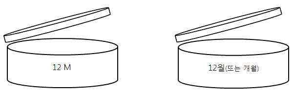

# 화장품법 시행규칙(총리령)(제02109호)(20260402)

화장품법 시행규칙

화장품법 시행규칙

[시행 2026. 4. 2.] [총리령 제2109호, 2026. 3. 31., 일부개정]

제1조(목적)

제2조(기능성화장품의 범위)

제2조의2(맞춤형화장품의 제외 대상)

제3조(제조업의 등록 등)

제4조(화장품책임판매업의 등록 등)

제5조(화장품제조업 등의 변경등록)

제6조(시설기준 등)

제7조(화장품의 품질관리기준 등)

제8조(책임판매관리자의 자격기준 등)

제8조의2(맞춤형화장품판매업의 신고)

제8조의3(맞춤형화장품판매업의 변경신고)

제8조의4(맞춤형화장품판매업의 시설기준)

제8조의5(맞춤형화장품조제관리사 자격시험)

제8조의6(맞춤형화장품조제관리사 자격증의 발급 신청 등)

제8조의7(시험운영기관의 지정 등)

제9조(기능성화장품의 심사)

제10조(보고서 제출 대상 등)

제10조의2(영유아 또는 어린이 사용 화장품의 표시ㆍ광고)

제10조의3(제품별 안전성 자료의 작성ㆍ보관)

제10조의4(실태조사의 실시)

제10조의5(위해요소 저감화계획의 수립)

제11조(화장품제조업자의 준수사항 등)

제12조(화장품책임판매업자의 준수사항)

제12조의2(맞춤형화장품판매업자의 준수사항)

제13조(화장품의 생산실적 등 보고)

제14조(책임판매관리자 등의 교육)

제14조의2(회수 대상 화장품의 기준 및 위해성 등급 등)

제14조의3(위해화장품의 회수계획 및 회수절차 등)

제14조의4(행정처분의 감경 또는 면제)

제15조(폐업 등의 신고)

제16조

제17조(화장품 원료 등의 위해평가)

제17조의2(지정ㆍ고시된 원료의 사용기준의 안전성 검토)

제17조의3(원료의 사용금지 해제 또는 변경 신청 등)

제18조(안전용기ㆍ포장 대상 품목 및 기준)

제19조(화장품 포장의 기재ㆍ표시 등)

제20조(화장품 가격의 표시)

제21조(기재ㆍ표시상의 주의사항)

제22조(표시ㆍ광고의 범위 등)

제23조(표시ㆍ광고 실증의 대상 등)

제23조의2

제23조의3

---

화장품법 시행규칙

제24조(관계 공무원의 자격 등)

제25조(수거 등)

제26조(화장품 판매 모니터링)

제26조의2(소비자화장품안전관리감시원의 자격 등)

제27조(회수ㆍ폐기명령 등)

제28조(위해화장품의 공표)

제29조(행정처분기준)

제30조(과징금의 징수절차)

제30조의2(직접구매 해외화장품에 대한 검사)

제30조의3(직접구매 해외화장품에 대한 실태조사)

제31조(등록필증 등의 재발급 등)

제32조(수수료)

제33조(규제의 재검토)

---

화장품법 시행규칙

화장품법 시행규칙

[시행 2026. 4. 2.] [총리령 제2109호, 2026. 3. 31., 일부개정]

식품의약품안전처 (화장품정책과) 043-719-3412

제1조(목적) 이 규칙은 「화장품법」 및 같은 법 시행령에서 위임된 사항과 그 시행에 필요한 사항을 규정함을 목적으로

한다.

제2조(기능성화장품의 범위) 「화장품법」(이하 “법”이라 한다) 제2조제2호 각 목 외의 부분에서 “총리령으로 정하는 화

장품”이란 다음 각 호의 화장품을 말한다. <개정 2013. 3. 23., 2017. 1. 12., 2020. 8. 5.>

1. 피부에 멜라닌색소가 침착하는 것을 방지하여 기미ㆍ주근깨 등의 생성을 억제함으로써 피부의 미백에 도움을 주

는 기능을 가진 화장품

2. 피부에 침착된 멜라닌색소의 색을 엷게 하여 피부의 미백에 도움을 주는 기능을 가진 화장품

3. 피부에 탄력을 주어 피부의 주름을 완화 또는 개선하는 기능을 가진 화장품

4. 강한 햇볕을 방지하여 피부를 곱게 태워주는 기능을 가진 화장품

5. 자외선을 차단 또는 산란시켜 자외선으로부터 피부를 보호하는 기능을 가진 화장품

6. 모발의 색상을 변화[탈염(脫染)ㆍ탈색(脫色)을 포함한다]시키는 기능을 가진 화장품. 다만, 일시적으로 모발의 색

상을 변화시키는 제품은 제외한다.

7. 체모를 제거하는 기능을 가진 화장품. 다만, 물리적으로 체모를 제거하는 제품은 제외한다.

8. 탈모 증상의 완화에 도움을 주는 화장품. 다만, 코팅 등 물리적으로 모발을 굵게 보이게 하는 제품은 제외한다.

9. 여드름성 피부를 완화하는 데 도움을 주는 화장품. 다만, 인체세정용 제품류로 한정한다.

10. 피부장벽(피부의 가장 바깥 쪽에 존재하는 각질층의 표피를 말한다)의 기능을 회복하여 가려움 등의 개선에 도

움을 주는 화장품

11. 튼살로 인한 붉은 선을 엷게 하는 데 도움을 주는 화장품

제2조의2(맞춤형화장품의 제외 대상) 법 제2조제3호의2나목 단서에서 “고형(固形) 비누 등 총리령으로 정하는 화장품

”이란 고체 형태의 세안용 비누(이하 “화장비누”라 한다)를 말한다. <개정 2022. 2. 18.>

[본조신설 2020. 6. 30.]

제3조(제조업의 등록 등) ① 삭제 <2019. 3. 14.>

② 법 제3조제1항 전단에 따라 화장품제조업 등록을 하려는 자는 별지 제1호서식의 화장품제조업 등록신청서(전자

문서로 된 신청서를 포함한다)에 다음 각 호의 서류(전자문서를 포함한다)를 첨부하여 제조소의 소재지를 관할하는

지방식품의약품안전청장에게 제출하여야 한다.<개정 2019. 3. 14.>

1. 화장품제조업을 등록하려는 자(법인인 경우에는 대표자를 말한다. 이하 이 항에서 같다)가 법 제3조의3제1호 본

문에 해당되지 않음을 증명하는 의사의 진단서 또는 법 제3조의3제1호 단서에 해당하는 사람임을 증명하는 전문

의의 진단서

2. 화장품제조업을 등록하려는 자가 법 제3조의3제3호에 해당되지 않음을 증명하는 의사의 진단서

3. 시설의 명세서

③ 제2항에 따라 신청서를 받은 지방식품의약품안전청장은 「전자정부법」 제36조제1항에 따른 행정정보의 공동이

용을 통하여 법인 등기사항증명서(법인인 경우만 해당한다)를 확인하여야 한다.

④ 지방식품의약품안전청장은 제2항에 따른 등록신청이 등록요건을 갖춘 경우에는 화장품 제조업 등록대장에 다음

각 호의 사항을 적고, 별지 제2호서식의 화장품제조업 등록필증을 발급해야 한다.<개정 2014. 9. 24., 2019. 3. 14.,

2023. 6. 22.>

1. 등록번호 및 등록연월일

---

화장품법 시행규칙

2. 화장품제조업자(화장품제조업을 등록한 자를 말한다. 이하 같다)의 성명 및 「개인정보 보호법 시행령」 제19조제

1호 또는 제4호에 따른 주민등록번호 또는 외국인등록번호(이하 “주민등록번호등”이라 한다). 이 경우 화장품제

조업자가 법인인 경우에는 대표자의 성명 및 주민등록번호등을 적는다.

3. 화장품제조업자의 상호(법인인 경우에는 법인의 명칭)

4. 제조소의 소재지

5. 제조 유형

제4조(화장품책임판매업의 등록 등) ① 삭제 <2019. 3. 14.>

② 법 제3조제1항 전단에 따라 화장품책임판매업을 등록하려는 자는 별지 제3호서식의 화장품책임판매업 등록신

청서(전자문서로 된 신청서를 포함한다)에 다음 각 호의 서류[전자문서를 포함하며, 「화장품법 시행령」(이하 “영”이

라 한다) 제2조제2호라목에 해당하는 경우에는 제출하지 않는다]를 첨부하여 화장품책임판매업소의 소재지를 관할

하는 지방식품의약품안전청장에게 제출해야 한다.<개정 2019. 3. 14.>

1. 법 제3조제3항에 따른 화장품의 품질관리 및 책임판매 후 안전관리에 적합한 기준에 관한 규정

2. 법 제3조제3항에 따른 책임판매관리자(이하 “책임판매관리자”라 한다)의 자격을 확인할 수 있는 서류

③ 제2항에 따라 신청서를 받은 지방식품의약품안전청장은 「전자정부법」 제36조제1항에 따른 행정정보의 공동이

용을 통하여 법인 등기사항증명서(법인인 경우만 해당한다)를 확인하여야 한다.

④ 지방식품의약품안전청장은 제2항에 따른 등록신청이 등록요건을 갖춘 경우에는 화장품책임판매업 등록대장에

다음 각 호의 사항을 적고, 별지 제4호서식의 화장품책임판매업 등록필증을 발급해야 한다.<개정 2014. 9. 24.,

2019. 3. 14., 2023. 6. 22.>

1. 등록번호 및 등록연월일

2. 화장품책임판매업자(화장품책임판매업을 등록한 자를 말한다. 이하 같다)의 성명 및 주민등록번호등(법인인 경우

에는 대표자의 성명 및 주민등록번호등을 말한다)

3. 화장품책임판매업자의 상호(법인인 경우에는 법인의 명칭)

4. 화장품책임판매업소의 소재지

5. 책임판매관리자의 성명 및 주민등록번호등

6. 책임판매 유형

[제목개정 2019. 3. 14.]

제5조(화장품제조업 등의 변경등록) ① 법 제3조제1항 후단에 따라 화장품제조업자 또는 화장품책임판매업자가 변경

등록을 하여야 하는 경우는 다음 각 호와 같다. <개정 2014. 9. 24., 2019. 3. 14.>

1. 화장품제조업자는 다음 각 목의 어느 하나에 해당하는 경우

가. 화장품제조업자의 변경(법인인 경우에는 대표자의 변경)

나. 화장품제조업자의 상호 변경(법인인 경우에는 법인의 명칭 변경)

다. 제조소의 소재지 변경

라. 제조 유형 변경

2. 화장품책임판매업자는 다음 각 목의 어느 하나에 해당하는 경우

가. 화장품책임판매업자의 변경(법인인 경우에는 대표자의 변경)

나. 화장품책임판매업자의 상호 변경(법인인 경우에는 법인의 명칭 변경)

다. 화장품책임판매업소의 소재지 변경

라. 책임판매관리자의 변경

마. 책임판매 유형 변경

② 화장품제조업자 또는 화장품책임판매업자는 제1항에 따른 변경등록을 하는 경우에는 변경 사유가 발생한 날부

터 30일(행정구역 개편에 따른 소재지 변경의 경우에는 90일) 이내에 별지 제5호서식의 화장품제조업 변경등록 신

청서(전자문서로 된 신청서를 포함한다) 또는 별지 제6호서식의 화장품책임판매업 변경등록 신청서(전자문서로 된

신청서를 포함한다)에 화장품제조업 등록필증 또는 화장품책임판매업 등록필증과 다음 각 호의 구분에 따라 해당

---

화장품법 시행규칙

서류(전자문서를 포함한다)를 첨부(전자문서로 발급받은 경우는 각각 제외한다)하여 지방식품의약품안전청장에게

제출하여야 한다. 이 경우 등록 관청을 달리하는 화장품제조소 또는 화장품책임판매업소의 소재지 변경의 경우에는

새로운 소재지를 관할하는 지방식품의약품안전청장에게 제출하여야 한다.<개정 2014. 9. 24., 2016. 9. 9., 2019. 3.

14., 2019. 12. 12., 2025. 2. 7.>

1. 화장품제조업자 또는 화장품책임판매업자의 변경(법인의 경우에는 대표자의 변경)의 경우에는 다음 각 목의 서

류

가. 제3조제2항제1호에 해당하는 서류(제조업자만 제출한다)

나. 제3조제2항제2호에 해당하는 서류(제조업자만 제출한다)

다. 양도ㆍ양수의 경우에는 이를 증명하는 서류

라. 삭제<2024. 7. 9.>

2. 제조소의 소재지 변경(행정구역개편에 따른 사항은 제외한다)의 경우: 제3조제2항제3호에 해당하는 서류

3. 책임판매관리자 변경의 경우: 제4조제2항제2호에 해당하는 서류(영 제2조제2호라목의 화장품책임판매업을 등록

한 자가 두는 책임판매관리자는 제외한다)

4. 다음 각 목에 해당하는 제조 유형 또는 책임판매 유형 변경의 경우

가. 영 제2조제1호다목의 화장품제조 유형으로 등록한 자가 같은 호 가목 또는 나목의 화장품제조 유형으로 변경

하거나 같은 호 가목 또는 나목의 제조 유형을 추가하는 경우: 제3조제2항제3호에 해당하는 서류

나. 영 제2조제2호라목의 화장품책임판매 유형으로 등록한 자가 같은 호 가목부터 다목까지의 책임판매 유형으

로 변경하거나 같은 호 가목부터 다목까지의 책임판매 유형을 추가하는 경우: 제4조제2항제1호 및 제2호에 해

당하는 서류

③ 제1항 및 제2항에 따라 화장품제조업 변경등록 신청서 또는 화장품책임판매업 변경등록 신청서를 받은 지방식

품의약품안전청장은 「전자정부법」 제36조제1항에 따른 행정정보의 공동이용을 통하여 법인 등기사항증명서(법인

인 경우만 해당한다) 및 가족관계증명서(상속의 경우만 해당한다)를 확인하여야 한다.<개정 2019. 3. 14., 2024. 7.

9.>

④ 지방식품의약품안전청장은 제2항 및 제3항에 따른 변경등록 신청사항을 확인한 후 화장품 제조업 등록대장 또

는 화장품책임판매업 등록대장에 각각의 변경사항을 적고, 화장품제조업 등록필증 또는 화장품책임판매업 등록필

증의 뒷면에 변경사항을 적은 후 이를 내주어야 한다.<개정 2019. 3. 14.>

[제목개정 2019. 3. 14.]

제6조(시설기준 등) ① 법 제3조제2항 본문에 따라 화장품제조업을 등록하려는 자가 갖추어야 하는 시설은 다음 각 호

와 같다. <개정 2019. 3. 14.>

1. 제조 작업을 하는 다음 각 목의 시설을 갖춘 작업소

가. 쥐ㆍ해충 및 먼지 등을 막을 수 있는 시설

나. 작업대 등 제조에 필요한 시설 및 기구

다. 가루가 날리는 작업실은 가루를 제거하는 시설

2. 원료ㆍ자재 및 제품을 보관하는 보관소

3. 원료ㆍ자재 및 제품의 품질검사를 위하여 필요한 시험실

4. 품질검사에 필요한 시설 및 기구

② 제1항에도 불구하고 법 제3조제2항 단서에 따라 다음 각 호의 경우에는 그 구분에 따라 시설의 일부를 갖추지

아니할 수 있다.<개정 2013. 3. 23., 2014. 8. 20., 2019. 3. 14.>

1. 화장품제조업자가 화장품의 일부 공정만을 제조하는 경우에는 해당 공정에 필요한 시설 및 기구 외의 시설 및 기

구

2. 다음 각 목의 어느 하나에 해당하는 기관 등에 원료ㆍ자재 및 제품에 대한 품질검사를 위탁하는 경우에는 제1항

제3호 및 제4호의 시설 및 기구

---

화장품법 시행규칙

가. 「보건환경연구원법」 제2조에 따른 보건환경연구원

나. 제1항제3호에 따른 시험실을 갖춘 제조업자

다. 「식품ㆍ의약품분야 시험ㆍ검사 등에 관한 법률」 제6조에 따른 화장품 시험ㆍ검사기관(이하 “화장품 시험ㆍ검

사기관”이라 한다)

라. 「약사법」 제67조에 따라 조직된 사단법인인 한국의약품수출입협회

③ 제조업자는 화장품의 제조시설을 이용하여 화장품 외의 물품을 제조할 수 있다. 다만, 제품 상호간에 오염의 우

려가 있는 경우에는 그러하지 아니하다.

제7조(화장품의 품질관리기준 등) 법 제3조제3항에 따른 화장품의 품질관리기준은 별표 1과 같고, 책임판매 후 안전관

리기준은 별표 2와 같다. <개정 2019. 3. 14.>

제8조(책임판매관리자의 자격기준 등) ① 법 제3조제3항에 따라 화장품책임판매업자(영 제2조제2호라목의 화장품책임

판매업을 등록한 자는 제외한다)가 두어야 하는 책임판매관리자는 다음 각 호의 어느 하나의 해당하는 사람이어야

한다. <개정 2013. 12. 6., 2014. 9. 24., 2016. 9. 9., 2018. 12. 31., 2019. 3. 14., 2021. 5. 14., 2023. 6. 22.>

1. 「의료법」에 따른 의사 또는 「약사법」에 따른 약사

2. 이공계(「국가과학기술 경쟁력 강화를 위한 이공계지원 특별법」 제2조제1호에 따른 이공계를 말한다) 학과 또는

향장학ㆍ화장품과학ㆍ한의학ㆍ한약학ㆍ간호학ㆍ간호과학ㆍ건강간호학 등을 전공하여 학사 이상의 학위를 취득

(법령에서 이와 같은 수준 이상의 학력이 있다고 인정하는 경우를 포함한다)한 사람

2의2. 삭제<2023. 6. 22.>

3. 화학ㆍ생물학ㆍ화학공학ㆍ생물공학ㆍ미생물학ㆍ생화학ㆍ생명과학ㆍ생명공학ㆍ유전공학ㆍ향장학ㆍ화장품과학

ㆍ한의학ㆍ한약학ㆍ간호학ㆍ간호과학ㆍ건강간호학 등 화장품 관련 분야(이하 “화장품 관련 분야”라 한다)를 전

공하여 전문학사 학위를 취득(법령에서 이와 같은 수준 이상의 학력이 있다고 인정하는 경우를 포함한다)한 후

화장품 제조 또는 품질관리 업무에 1년 이상 종사한 경력이 있는 사람

3의2. 삭제<2023. 6. 22.>

3의3. 식품의약품안전처장이 정하여 고시하는 전문 교육과정을 이수한 사람(식품의약품안전처장이 정하여 고시하

는 품목만 해당한다)

3의4. 법 제3조의2제2항에 따른 맞춤형화장품조제관리사(이하 “맞춤형화장품조제관리사”라 한다) 자격시험에 합격

한 사람

4. 그 밖에 화장품 제조 또는 품질관리 업무에 2년 이상 종사한 경력이 있는 사람

5. 삭제<2014. 9. 24.>

6. 삭제<2014. 9. 24.>

② 책임판매관리자는 다음 각 호의 직무를 수행한다.<개정 2019. 3. 14.>

1. 별표 1의 품질관리기준에 따른 품질관리 업무

2. 별표 2의 책임판매 후 안전관리기준에 따른 안전확보 업무

3. 원료 및 자재의 입고(入庫)부터 완제품의 출고에 이르기까지 필요한 시험ㆍ검사 또는 검정에 대하여 제조업자를

관리ㆍ감독하는 업무

③ 상시근로자수가 10명 이하인 화장품책임판매업을 경영하는 화장품책임판매업자(법인인 경우에는 그 대표자를

말한다)가 제1항 각 호의 어느 하나에 해당하는 사람인 경우에는 그 사람이 제2항에 따른 책임판매관리자의 직무를

수행할 수 있다. 이 경우 책임판매관리자를 둔 것으로 본다.<신설 2013. 12. 6., 2016. 6. 30., 2019. 3. 14.>

④ 책임판매관리자는 해당 화장품책임판매업소의 책임판매관리자 업무에 종사하지 않게 된 경우에는 별지 제6호의

2서식의 관리업무 비종사신고서에 그 사유서를 첨부하여 해당 화장품책임판매업소의 소재지를 관할하는 지방식품

의약품안전청장에게 제출할 수 있다.<신설 2024. 7. 9.>

[제목개정 2019. 3. 14.]

---

화장품법 시행규칙

제8조의2(맞춤형화장품판매업의 신고) ① 법 제3조의2제1항 전단에 따라 맞춤형화장품판매업의 신고를 하려는 자는

별지 제6호의3서식의 맞춤형화장품판매업 신고서에 맞춤형화장품조제관리사의 자격증 사본과 시설의 명세서를 첨

부하여 맞춤형화장품판매업소의 소재지를 관할하는 지방식품의약품안전청장에게 제출해야 한다. 다만, 맞춤형화장

품판매업을 신고한 자(이하 “맞춤형화장품판매업자”라 한다)가 판매업소로 신고한 소재지 외의 장소에서 1개월의 범

위에서 한시적으로 같은 영업을 하려는 경우에는 해당 맞춤형화장품판매업 신고서에 별지 제6호의4서식에 따른 맞

춤형화장품판매업 신고필증 사본(전자문서로 발급받은 경우는 제외한다)과 맞춤형화장품조제관리사 자격증 사본을

첨부하여 제출해야 한다. <개정 2021. 5. 14., 2021. 10. 15., 2022. 2. 18., 2024. 7. 9., 2025. 2. 7.>

② 지방식품의약품안전청장은 제1항에 따른 신고를 받은 경우에는 「전자정부법」 제36조제1항에 따른 행정정보의

공동이용을 통해 법인 등기사항증명서(법인인 경우만 해당한다)를 확인해야 한다.

③ 지방식품의약품안전청장은 제1항에 따른 신고가 그 요건을 갖춘 경우에는 맞춤형화장품판매업 신고대장에 다음

각 호의 사항을 적고, 별지 제6호의4서식의 맞춤형화장품판매업 신고필증을 발급해야 한다.<개정 2021. 10. 15.,

2023. 6. 22., 2024. 7. 9.>

1. 신고 번호 및 신고 연월일

2. 맞춤형화장품판매업자의 성명 및 주민등록번호등(법인인 경우에는 대표자의 성명 및 주민등록번호등을 말한다)

3. 맞춤형화장품판매업자의 상호 및 소재지

4. 맞춤형화장품판매업소의 상호 및 소재지

5. 맞춤형화장품조제관리사의 성명, 주민등록번호등 및 자격증 번호

6. 영업의 기간(제1항 단서에 따라 한시적으로 맞춤형화장품판매업을 하려는 경우만 해당한다)

④ 맞춤형화장품판매업자가 법 제3조의4제1항에 따른 맞춤형화장품조제관리사 자격시험(이하 “자격시험”이라 한

다)에 합격한 경우에는 해당 맞춤형화장품판매업자의 판매업소 중 하나의 판매업소에서 맞춤형화장품조제관리사

업무를 수행할 수 있다. 이 경우 해당 판매업소에는 맞춤형화장품조제관리사를 둔 것으로 본다.<신설 2021. 5. 14.>

⑤ 맞춤형화장품조제관리사는 해당 맞춤형화장품판매업소의 맞춤형화장품조제관리사 업무에 종사하지 않게 된 경

우에는 별지 제6호의2서식의 관리업무 비종사신고서에 그 사유서를 첨부하여 해당 맞춤형화장품판매업소의 소재

지를 관할하는 지방식품의약품안전청장에게 제출할 수 있다.<신설 2024. 7. 9.>

[본조신설 2020. 3. 13.]

제8조의3(맞춤형화장품판매업의 변경신고) ① 법 제3조의2제1항 후단에 따라 맞춤형화장품판매업자가 변경신고를 해

야 하는 경우는 다음 각 호와 같다.

1. 맞춤형화장품판매업자를 변경하는 경우

2. 맞춤형화장품판매업소의 상호 또는 소재지를 변경하는 경우

3. 맞춤형화장품조제관리사를 변경하는 경우

② 맞춤형화장품판매업자가 제1항에 따른 변경신고를 하려면 별지 제6호의5서식의 맞춤형화장품판매업 변경신고

서(전자문서로 된 신고서를 포함한다)에 맞춤형화장품판매업 신고필증(전자문서로 발급받은 경우는 제외한다)과 그

변경을 증명하는 서류(전자문서를 포함한다)를 첨부하여 맞춤형화장품판매업소의 소재지를 관할하는 지방식품의약

품안전청장에게 제출해야 한다. 이 경우 소재지를 변경하는 때에는 새로운 소재지를 관할하는 지방식품의약품안전

청장에게 제출해야 한다.<개정 2024. 7. 9., 2025. 2. 7.>

③ 지방식품의약품안전청장은 제2항에 따라 맞춤형화장품판매업 변경신고를 받은 경우에는 「전자정부법」 제36조

제1항에 따른 행정정보의 공동이용을 통해 법인 등기사항증명서(법인인 경우만 해당한다)를 확인해야 한다.

④ 지방식품의약품안전청장은 제2항에 따른 변경신고가 그 요건을 갖춘 때에는 맞춤형화장품판매업 신고대장과 맞

춤형화장품판매업 신고필증의 뒷면에 각각의 변경사항을 적어야 한다. 이 경우 맞춤형화장품판매업 신고필증은 신

고인에게 다시 내주어야 한다.

[본조신설 2020. 3. 13.]

제8조의4(맞춤형화장품판매업의 시설기준) 법 제3조의2제2항에 따라 맞춤형화장품판매업을 신고하려는 자는 맞춤형

화장품의 혼합ㆍ소분 공간을 그 외의 용도로 사용되는 공간과 분리 또는 구획하여 갖추어야 한다. 다만, 혼합ㆍ소분

---

화장품법 시행규칙

과정에서 맞춤형화장품의 품질ㆍ안전 등 보건위생상 위해가 발생할 우려가 없다고 인정되는 경우에는 혼합ㆍ소분

공간을 분리 또는 구획하여 갖추지 않아도 된다.

[본조신설 2022. 2. 18.]

[종전 제8조의4는 제8조의5로 이동 <2022. 2. 18.>]

제8조의5(맞춤형화장품조제관리사 자격시험) ① 식품의약품안전처장은 매년 1회 이상 자격시험을 실시해야 한다. <개

정 2021. 5. 14.>

② 식품의약품안전처장은 자격시험을 실시하려는 경우에는 시험일시, 시험장소, 시험과목, 응시방법 등이 포함된

자격시험 시행계획을 시험 실시 90일전까지 식품의약품안전처 인터넷 홈페이지에 공고해야 한다.

③ 자격시험은 필기시험으로 실시하며, 그 시험과목은 다음 각 호의 구분에 따른다.

1. 제1과목: 화장품 관련 법령 및 제도 등에 관한 사항

2. 제2과목: 화장품의 제조 및 품질관리와 원료의 사용기준 등에 관한 사항

3. 제3과목: 화장품의 유통 및 안전관리 등에 관한 사항

4. 제4과목: 맞춤형화장품의 특성ㆍ내용 및 관리 등에 관한 사항

④ 자격시험은 전 과목 총점의 60퍼센트 이상의 점수와 매 과목 만점의 40퍼센트 이상의 점수를 모두 득점한 사람

을 합격자로 한다.

⑤ 자격시험에서 부정행위를 한 사람에 대해서는 그 시험을 정지시키거나 그 합격을 무효로 한다.

⑥ 식품의약품안전처장은 자격시험을 실시할 때마다 시험과목에 대한 전문 지식을 갖추거나 화장품에 관한 업무

경험이 풍부한 사람 중에서 시험 위원을 위촉한다. 이 경우 해당 위원에 대해서는 예산의 범위에서 수당 및 여비 등

을 지급할 수 있다.

⑦ 제1항부터 제6항까지에서 규정한 사항 외에 자격시험의 실시 방법 및 절차 등에 필요한 세부 사항은 식품의약품

안전처장이 정하여 고시한다.

[본조신설 2020. 3. 13.]

[제8조의4에서 이동, 종전 제8조의5는 제8조의6으로 이동 <2022. 2. 18.>]

제8조의6(맞춤형화장품조제관리사 자격증의 발급 신청 등) ① 자격시험에 합격하여 자격증을 발급받으려는 사람은 별

지 제6호의6서식의 맞춤형화장품조제관리사 자격증 발급 신청서에 다음 각 호의 서류를 첨부하여 식품의약품안전

처장에게 제출해야 한다. <개정 2021. 5. 14., 2022. 2. 18., 2024. 7. 9.>

1. 법 제3조의5제1호 본문에 해당되지 않음을 증명하는 최근 6개월 이내의 의사의 진단서 또는 법 제3조의5제1호

단서에 해당하는 사람임을 증명하는 최근 6개월 이내의 전문의의 진단서

2. 법 제3조의5제3호에 해당되지 않음을 증명하는 최근 6개월 이내의 의사의 진단서

② 식품의약품안전처장은 제1항에 따른 발급 신청이 그 요건을 갖춘 경우에는 별지 제6호의7서식에 따른 맞춤형화

장품조제관리사 자격증을 발급해야 한다.<개정 2024. 7. 9.>

③ 자격증을 잃어버리거나 못 쓰게 된 경우에는 별지 제6호의6서식의 맞춤형화장품조제관리사 자격증 재발급 신청

서에 다음 각 호의 구분에 따른 서류를 첨부하여 식품의약품안전처장에게 제출해야 한다.<개정 2022. 2. 18., 2024.

7. 9.>

1. 자격증을 잃어버린 경우: 분실 사유서

2. 자격증을 못 쓰게 된 경우: 자격증 원본

④ 제1항부터 제3항까지에서 규정한 사항 외에 자격증의 발급ㆍ재발급 등에 필요한 세부 사항은 식품의약품안전처

장이 정하여 고시한다.<신설 2022. 2. 18.>

[본조신설 2020. 3. 13.]

[제8조의5에서 이동, 종전 제8조의6은 제8조의7로 이동 <2022. 2. 18.>]

제8조의7(시험운영기관의 지정 등) 식품의약품안전처장은 법 제3조의4제3항에 따라 시험운영기관을 지정하거나 시험

운영기관에 자격시험의 관리 및 자격증 발급ㆍ재발급 등의 업무를 위탁한 경우에는 그 내용을 식품의약품안전처 인

---

화장품법 시행규칙

터넷 홈페이지에 게재해야 한다. <개정 2022. 2. 18.>

[본조신설 2020. 3. 13.]

[제8조의6에서 이동 <2022. 2. 18.>]

제9조(기능성화장품의 심사) ① 법 제4조제1항에 따라 기능성화장품(제10조에 따라 보고서를 제출해야 하는 기능성화

장품은 제외한다. 이하 이 조에서 같다)으로 인정받아 판매 등을 하려는 화장품제조업자, 화장품책임판매업자 또는 「

기초연구진흥 및 기술개발지원에 관한 법률」 제6조제1항 및 제14조의2에 따른 대학ㆍ연구기관ㆍ연구소(이하 “연구

기관등”이라 한다)는 품목별로 별지 제7호서식의 기능성화장품 심사의뢰서(전자문서로 된 심사의뢰서를 포함한다

)에 다음 각 호의 서류(전자문서를 포함한다)를 첨부하여 식품의약품안전평가원장의 심사를 받아야 한다. 다만, 식품

의약품안전처장이 제품의 효능ㆍ효과를 나타내는 성분ㆍ함량을 고시한 품목의 경우에는 제1호부터 제4호까지의 자

료 제출을, 기준 및 시험방법을 고시한 품목의 경우에는 제5호의 자료 제출을 각각 생략할 수 있다. <개정 2013. 3.

23., 2013. 12. 6., 2019. 3. 14., 2021. 9. 10.>

1. 기원(起源) 및 개발 경위에 관한 자료

2. 안전성에 관한 자료

가. 단회 투여 독성시험 자료

나. 1차 피부 자극시험 자료

다. 안(眼)점막 자극 또는 그 밖의 점막 자극시험 자료

라. 피부 감작성(感作性: 외부 자극에 의한 면역계 반응성을 말한다. 이하 같다) 시험 자료

마. 광독성(빛에 의한 독성 반응성을 말한다. 이하 같다) 및 광감작성(빛에 의한 면역계 반응성을 말한다. 이하 같

다) 시험 자료

바. 인체 첩포시험(貼布試驗: 접촉 피부염의 원인을 파악하기 위해 원인 추정 물질을 몸에 붙여 반응을 조사하는

시험을 말한다. 이하 같다) 자료

3. 유효성 또는 기능에 관한 자료

가. 효력시험 자료

나. 인체 적용시험 자료

4. 자외선 차단지수 및 자외선A 차단등급 설정의 근거자료(자외선을 차단 또는 산란시켜 자외선으로부터 피부를 보

호하는 기능을 가진 화장품의 경우만 해당한다)

5. 기준 및 시험방법에 관한 자료[검체(檢體)를 포함한다]

② 삭제<2021. 12. 28.>

③ 제1항에 따라 심사를 받은 사항을 변경하려는 자는 별지 제8호서식의 기능성화장품 변경심사 의뢰서에 다음 각

호의 서류를 첨부하여 식품의약품안전평가원장에게 제출해야 한다.<개정 2013. 3. 23., 2021. 12. 28., 2025. 2. 7.>

1. 먼저 발급받은 기능성화장품심사결과통지서(전자문서로 발급받은 경우는 제외한다)

2. 변경사유를 증명할 수 있는 서류(기능성화장품 심사를 받은 자 간에 법 제4조제1항에 따라 심사받은 기능성화장

품에 대한 권리를 양도ㆍ양수하여 심사받은 자를 변경하려는 경우에는 양도ㆍ양수계약서를 말한다)

④ 식품의약품안전평가원장은 제1항 또는 제3항에 따라 심사의뢰서나 변경심사 의뢰서를 받은 경우에는 다음 각

호의 심사기준에 따라 심사하여야 한다.<개정 2013. 3. 23.>

1. 기능성화장품의 원료와 그 분량은 효능ㆍ효과 등에 관한 자료에 따라 합리적이고 타당하여야 하며, 각 성분의 배

합의의(配合意義)가 인정되어야 할 것

2. 기능성화장품의 효능ㆍ효과는 법 제2조제2호 각 목에 적합할 것

3. 기능성화장품의 용법ㆍ용량은 오용될 여지가 없는 명확한 표현으로 적을 것

⑤ 식품의약품안전평가원장은 제4항에 따라 심사를 한 후 심사대장에 다음 각 호의 사항을 적고, 별지 제9호서식의

기능성화장품 심사ㆍ변경심사 결과통지서를 발급해야 한다.<개정 2013. 3. 23., 2019. 3. 14., 2021. 12. 28.>

1. 심사번호 및 심사연월일 또는 변경심사 연월일

---

화장품법 시행규칙

2. 기능성화장품 심사를 받은 화장품제조업자, 화장품책임판매업자 또는 연구기관등의 상호(법인인 경우에는 법인

의 명칭) 및 소재지

3. 제품명

4. 효능ㆍ효과

⑥ 제1항부터 제4항까지의 규정에 따른 첨부자료의 범위ㆍ요건ㆍ작성요령과 제출이 면제되는 범위 및 심사기준 등

에 관한 세부 사항은 식품의약품안전처장이 정하여 고시한다.<개정 2013. 3. 23., 2013. 12. 6.>

제10조(보고서 제출 대상 등) ① 법 제4조제1항에 따라 기능성화장품의 심사를 받지 아니하고 식품의약품안전평가원장

에게 보고서를 제출하여야 하는 대상은 다음 각 호와 같다. <개정 2013. 3. 23., 2013. 12. 6., 2017. 7. 31., 2019. 3.

14., 2019. 12. 12.>

1. 효능ㆍ효과가 나타나게 하는 성분의 종류ㆍ함량, 효능ㆍ효과, 용법ㆍ용량, 기준 및 시험방법이 식품의약품안전처

장이 고시한 품목과 같은 기능성화장품

2. 이미 심사를 받은 기능성화장품[화장품제조업자(화장품제조업자가 제품을 설계ㆍ개발ㆍ생산하는 방식으로 제조

한 경우만 해당한다)가 같거나 화장품책임판매업자가 같은 경우 또는 제9조제1항에 따라 기능성화장품으로 심사

받은 연구기관등이 같은 기능성화장품만 해당한다. 이하 제3호에서 같다]과 다음 각 목의 사항이 모두 같은 품목.

다만, 제2조제1호부터 제3호까지 및 같은 조 제8호부터 제11호까지의 기능성화장품은 이미 심사를 받은 품목이

대조군(對照群)(효능ㆍ효과가 나타나게 하는 성분을 제외한 것을 말한다)과의 비교실험을 통하여 효능이 입증된

경우만 해당한다.

가. 효능ㆍ효과가 나타나게 하는 원료의 종류ㆍ규격 및 함량(액체상태인 경우에는 농도를 말한다)

나. 효능ㆍ효과(제2조제4호 및 제5호의 기능성화장품의 경우 자외선 차단지수의 측정값이 마이너스 20퍼센트 이

하의 범위에 있는 경우에는 같은 효능ㆍ효과로 본다)

다. 기준[산성도(pH)에 관한 기준은 제외한다] 및 시험방법

라. 용법ㆍ용량

마. 제형(劑形)[제2조제1호부터 제3호까지 및 같은 조 제6호부터 제11호까지의 기능성화장품의 경우에는 액제

(Solution), 로션제(Lotion) 및 크림제(Cream)를 같은 제형으로 본다]

3. 이미 심사를 받은 기능성화장품 및 식품의약품안전처장이 고시한 기능성화장품과 비교하여 다음 각 목의 사항이

모두 같은 품목(이미 심사를 받은 제2조제4호 및 제5호의 기능성화장품으로서 그 효능ㆍ효과를 나타나게 하는

성분ㆍ함량과 식품의약품안전처장이 고시한 제2조제1호부터 제3호까지의 기능성화장품으로서 그 효능ㆍ효과를

나타나게 하는 성분ㆍ함량이 서로 혼합된 품목만 해당한다)

가. 효능ㆍ효과를 나타나게 하는 원료의 종류ㆍ규격 및 함량

나. 효능ㆍ효과(제2조제4호 및 제5호에 따른 효능ㆍ효과의 경우 자외선차단지수의 측정값이 마이너스 20퍼센트

이하의 범위에 있는 경우에는 같은 효능ㆍ효과로 본다)

다. 기준[산성도(pH)에 관한 기준은 제외한다] 및 시험방법

라. 용법ㆍ용량

마. 제형

② 기능성화장품으로 인정받아 판매 등을 하려는 화장품제조업자, 화장품책임판매업자 또는 연구기관등은 제1항에

따라 품목별로 별지 제10호서식의 기능성화장품 심사 제외 품목 보고서(전자문서로 된 보고서를 포함한다)를 식품

의약품안전평가원장에게 제출해야 한다.<개정 2013. 3. 23., 2019. 3. 14.>

③ 제2항에 따라 보고서를 받은 식품의약품안전평가원장은 제1항에 따른 요건을 확인한 후 다음 각 호의 사항을 기

능성화장품의 보고대장에 적어야 한다.<개정 2013. 3. 23., 2019. 3. 14.>

1. 보고번호 및 보고연월일

2. 화장품제조업자, 화장품책임판매업자 또는 연구기관등의 상호(법인인 경우에는 법인의 명칭) 및 소재지

3. 제품명

---

화장품법 시행규칙

4. 효능ㆍ효과

제10조의2(영유아 또는 어린이 사용 화장품의 표시ㆍ광고) ① 법 제4조의2제1항에 따른 영유아 또는 어린이의 연령 기

준은 다음 각 호의 구분에 따른다. <개정 2024. 7. 9.>

1. 영유아: 3세 이하

2. 어린이: 4세 이상 13세 이하

② 화장품책임판매업자가 법 제4조의2제1항 각 호에 따른 자료(이하 “제품별 안전성 자료”라 한다)를 작성ㆍ보관해

야 하는 표시ㆍ광고의 범위는 다음 각 호의 구분에 따른다.

1. 표시의 경우: 화장품의 1차 포장 또는 2차 포장에 영유아 또는 어린이가 사용할 수 있는 화장품임을 특정하여 표

시하는 경우(화장품의 명칭에 영유아 또는 어린이에 관한 표현이 표시되는 경우를 포함한다)

2. 광고의 경우: 별표 5 제1호가목부터 바목까지(어린이 사용 화장품의 경우에는 바목을 제외한다)의 규정에 따른

매체ㆍ수단 또는 해당 매체ㆍ수단과 유사하다고 식품의약품안전처장이 정하여 고시하는 매체ㆍ수단에 영유아

또는 어린이가 사용할 수 있는 화장품임을 특정하여 광고하는 경우

[본조신설 2020. 1. 22.]

제10조의3(제품별 안전성 자료의 작성ㆍ보관) ① 법 제4조의2제1항 및 이 규칙 제10조의2제2항에 따라 화장품의 표시

ㆍ광고를 하려는 화장품책임판매업자는 법 제4조의2제1항제1호부터 제3호까지의 규정에 따른 제품별 안전성 자료

모두를 미리 작성해야 한다.

② 제품별 안전성 자료의 보관기간은 다음 각 호의 구분에 따른다.

1. 화장품의 1차 포장에 사용기한을 표시하는 경우: 영유아 또는 어린이가 사용할 수 있는 화장품임을 표시ㆍ광고한

날부터 마지막으로 제조ㆍ수입된 제품의 사용기한 만료일 이후 1년까지의 기간. 이 경우 제조는 화장품의 제조번

호에 따른 제조일자를 기준으로 하며, 수입은 통관일자를 기준으로 한다.

2. 화장품의 1차 포장에 개봉 후 사용기간을 표시하는 경우: 영유아 또는 어린이가 사용할 수 있는 화장품임을 표시

ㆍ광고한 날부터 마지막으로 제조ㆍ수입된 제품의 제조연월일 이후 3년까지의 기간. 이 경우 제조는 화장품의 제

조번호에 따른 제조일자를 기준으로 하며, 수입은 통관일자를 기준으로 한다.

③ 제1항 및 제2항에서 규정한 사항 외에 제품별 안전성 자료의 작성ㆍ보관의 방법 및 절차 등에 필요한 세부 사항

은 식품의약품안전처장이 정하여 고시한다.

[본조신설 2020. 1. 22.]

제10조의4(실태조사의 실시) ① 식품의약품안전처장은 법 제4조의2제2항에 따른 실태조사(이하 “실태조사”라 한다)를

5년마다 실시한다.

② 실태조사에는 다음 각 호의 사항이 포함되어야 한다.

1. 제품별 안전성 자료의 작성 및 보관 현황

2. 소비자의 사용실태

3. 사용 후 이상사례의 현황 및 조치 결과

4. 영유아 또는 어린이 사용 화장품에 대한 표시ㆍ광고의 현황 및 추세

5. 영유아 또는 어린이 사용 화장품의 유통 현황 및 추세

6. 그 밖에 제1호부터 제5호까지의 사항과 유사한 것으로서 식품의약품안전처장이 필요하다고 인정하는 사항

③ 식품의약품안전처장은 실태조사를 위해 필요하다고 인정하는 경우에는 관계 행정기관, 공공기관, 법인ㆍ단체 또

는 전문가 등에게 필요한 의견 또는 자료의 제출 등을 요청할 수 있다.

④ 식품의약품안전처장은 실태조사의 효율적 실시를 위해 필요하다고 인정하는 경우에는 화장품 관련 연구기관 또

는 법인ㆍ단체 등에 실태조사를 의뢰하여 실시할 수 있다.

⑤ 제1항부터 제4항까지에서 규정한 사항 외에 실태조사의 대상, 방법 및 절차 등에 필요한 세부 사항은 식품의약

품안전처장이 정한다.

---

화장품법 시행규칙

[본조신설 2020. 1. 22.]

제10조의5(위해요소 저감화계획의 수립) ① 법 제4조의2제2항에 따른 위해요소의 저감화를 위한 계획(이하 “위해요소

저감화계획”이라 한다)에는 다음 각 호의 사항이 포함되어야 한다.

1. 위해요소 저감화를 위한 기본 방향과 목표

2. 위해요소 저감화를 위한 단기별 및 중장기별 추진 정책

3. 위해요소 저감화 추진을 위한 환경 여건 및 관련 정책의 평가

4. 위해요소 저감화 추진을 위한 조직 및 재원 등에 관한 사항

5. 그 밖에 제1호부터 제4호까지의 사항과 유사한 것으로서 위해요소 저감화를 위해 식품의약품안전처장이 필요하

다고 인정하는 사항

② 식품의약품안전처장은 위해요소 저감화계획을 수립하는 경우에는 실태조사에 대한 분석 및 평가 결과를 반영해

야 한다.

③ 식품의약품안전처장은 위해요소 저감화계획의 수립을 위해 필요하다고 인정하는 경우에는 관계 행정기관, 공공

기관, 법인ㆍ단체 또는 전문가 등에게 필요한 의견 또는 자료의 제출 등을 요청할 수 있다.

④ 식품의약품안전처장은 위해요소 저감화계획을 수립한 경우에는 그 내용을 식품의약품안전처 인터넷 홈페이지

에 공개해야 한다.

⑤ 제1항부터 제4항까지에서 규정한 사항 외에 위해요소 저감화계획의 수립 대상, 방법 및 절차 등에 필요한 세부

사항은 식품의약품안전처장이 정한다.

[본조신설 2020. 1. 22.]

제11조(화장품제조업자의 준수사항 등) ① 법 제5조제1항에 따라 화장품 제조업자가 준수하여야 할 사항은 다음 각 호

와 같다. <개정 2019. 3. 14.>

1. 별표 1의 품질관리기준에 따른 화장품책임판매업자의 지도ㆍ감독 및 요청에 따를 것

2. 제조관리기준서ㆍ제품표준서ㆍ제조관리기록서 및 품질관리기록서(전자문서 형식을 포함한다)를 작성ㆍ보관할

것

3. 보건위생상 위해(危害)가 없도록 제조소, 시설 및 기구를 위생적으로 관리하고 오염되지 아니하도록 할 것

4. 화장품의 제조에 필요한 시설 및 기구에 대하여 정기적으로 점검하여 작업에 지장이 없도록 관리ㆍ유지할 것

5. 작업소에는 위해가 발생할 염려가 있는 물건을 두어서는 아니 되며, 작업소에서 국민보건 및 환경에 유해한 물질

이 유출되거나 방출되지 아니하도록 할 것

6. 제2호의 사항 중 품질관리를 위하여 필요한 사항을 화장품책임판매업자에게 제출할 것. 다만, 다음 각 목의 어느

하나에 해당하는 경우 제출하지 아니할 수 있다.

가. 화장품제조업자와 화장품책임판매업자가 동일한 경우

나. 화장품제조업자가 제품을 설계ㆍ개발ㆍ생산하는 방식으로 제조하는 경우로서 품질ㆍ안전관리에 영향이 없는

범위에서 화장품제조업자와 화장품책임판매업자 상호 계약에 따라 영업비밀에 해당하는 경우

7. 원료 및 자재의 입고부터 완제품의 출고에 이르기까지 필요한 시험ㆍ검사 또는 검정을 할 것

8. 제조 또는 품질검사를 위탁하는 경우 제조 또는 품질검사가 적절하게 이루어지고 있는지 수탁자에 대한 관리ㆍ

감독을 철저히 하고, 제조 및 품질관리에 관한 기록을 받아 유지ㆍ관리할 것

② 식품의약품안전처장은 제1항에 따른 준수사항 외에 식품의약품안전처장이 정하여 고시하는 우수화장품 제조관

리기준을 준수하도록 제조업자에게 권장할 수 있다.<개정 2013. 3. 23.>

③ 식품의약품안전처장은 제2항에 따라 우수화장품 제조관리기준을 준수하는 제조업자에게 다음 각 호의 사항을

지원할 수 있다.<신설 2014. 9. 24.>

1. 우수화장품 제조관리기준 적용에 관한 전문적 기술과 교육

2. 우수화장품 제조관리기준 적용을 위한 자문

3. 우수화장품 제조관리기준 적용을 위한 시설ㆍ설비 등 개수ㆍ보수

---

화장품법 시행규칙

[제목개정 2019. 3. 14.]

[제12조에서 이동, 종전 제11조는 제12조로 이동 <2020. 3. 13.>]

제12조(화장품책임판매업자의 준수사항) 법 제5조제2항에 따라 화장품책임판매업자가 준수해야 할 사항은 다음 각 호

(영 제2조제2호라목의 화장품책임판매업을 등록한 자는 제1호, 제2호, 제4호가목ㆍ다목ㆍ사목ㆍ차목 및 제10호만

해당한다)와 같다. <개정 2013. 3. 23., 2013. 12. 6., 2015. 4. 2., 2019. 3. 14., 2020. 3. 13.>

1. 별표 1의 품질관리기준을 준수할 것

2. 별표 2의 책임판매 후 안전관리기준을 준수할 것

3. 제조업자로부터 받은 제품표준서 및 품질관리기록서(전자문서 형식을 포함한다)를 보관할 것

4. 수입한 화장품에 대하여 다음 각 목의 사항을 적거나 또는 첨부한 수입관리기록서를 작성ㆍ보관할 것

가. 제품명 또는 국내에서 판매하려는 명칭

나. 원료성분의 규격 및 함량

다. 제조국, 제조회사명 및 제조회사의 소재지

라. 기능성화장품심사결과통지서 사본

마. 제조 및 판매증명서. 다만, 「대외무역법」 제12조제2항에 따른 통합 공고상의 수출입 요건 확인기관에서 제조

및 판매증명서를 갖춘 화장품책임판매업자가 수입한 화장품과 같다는 것을 확인받고, 제6조제2항제2호가목,

다목 또는 라목의 기관으로부터 화장품책임판매업자가 정한 품질관리기준에 따른 검사를 받아 그 시험성적서

를 갖추어 둔 경우에는 이를 생략할 수 있다.

바. 한글로 작성된 제품설명서 견본

사. 최초 수입연월일(통관연월일을 말한다. 이하 이 호에서 같다)

아. 제조번호별 수입연월일 및 수입량

자. 제조번호별 품질검사 연월일 및 결과

차. 판매처, 판매연월일 및 판매량

5. 제조번호별로 품질검사를 철저히 한 후 유통시킬 것. 다만, 화장품제조업자와 화장품책임판매업자가 같은 경우

또는 제6조제2항제2호 각 목의 어느 하나에 해당하는 기관 등에 품질검사를 위탁하여 제조번호별 품질검사결과

가 있는 경우에는 품질검사를 하지 아니할 수 있다.

6. 화장품의 제조를 위탁하거나 제6조제2항제2호나목에 따른 제조업자에게 품질검사를 위탁하는 경우 제조 또는

품질검사가 적절하게 이루어지고 있는지 수탁자에 대한 관리ㆍ감독을 철저히 하여야 하며, 제조 및 품질관리에

관한 기록을 받아 유지ㆍ관리하고, 그 최종 제품의 품질관리를 철저히 할 것

7. 제5호에도 불구하고 영 제2조제2호다목의 화장품책임판매업을 등록한 자는 제조국 제조회사의 품질관리기준이

국가 간 상호 인증되었거나, 제11조제2항에 따라 식품의약품안전처장이 고시하는 우수화장품 제조관리기준과 같

은 수준 이상이라고 인정되는 경우에는 국내에서의 품질검사를 하지 아니할 수 있다. 이 경우 제조국 제조회사의

품질검사 시험성적서는 품질관리기록서를 갈음한다.

8. 제7호에 따라 영 제2조제2호다목의 화장품책임판매업을 등록한 자가 수입화장품에 대한 품질검사를 하지 아니

하려는 경우에는 식품의약품안전처장이 정하는 바에 따라 식품의약품안전처장에게 수입화장품의 제조업자에 대

한 현지실사를 신청하여야 한다. 현지실사에 필요한 신청절차, 제출서류 및 평가방법 등에 대하여는 식품의약품

안전처장이 정하여 고시한다.

8의2. 제7호에 따른 인정을 받은 수입 화장품 제조회사의 품질관리기준이 제11조제2항에 따른 우수화장품 제조관

리기준과 같은 수준 이상이라고 인정되지 아니하여 제7호에 따른 인정이 취소된 경우에는 제5호 본문에 따른 품

질검사를 하여야 한다. 이 경우 인정 취소와 관련하여 필요한 세부적인 사항은 식품의약품안전처장이 정하여 고

시한다.

9. 영 제2조제2호다목의 화장품책임판매업을 등록한 자의 경우 「대외무역법」에 따른 수출ㆍ수입요령을 준수하여

야 하며, 「전자무역 촉진에 관한 법률」에 따른 전자무역문서로 표준통관예정보고를 할 것

---

화장품법 시행규칙

10. 제품과 관련하여 국민보건에 직접 영향을 미칠 수 있는 안전성ㆍ유효성에 관한 새로운 자료, 정보사항(화장품

사용에 의한 부작용 발생사례를 포함한다) 등을 알게 되었을 때에는 식품의약품안전처장이 정하여 고시하는 바

에 따라 보고하고, 필요한 안전대책을 마련할 것

11. 다음 각 목의 어느 하나에 해당하는 성분을 0.5퍼센트 이상 함유하는 제품의 경우에는 해당 품목의 안정성시험

자료를 최종 제조된 제품의 사용기한이 만료되는 날부터 1년간 보존할 것

가. 레티놀(비타민A) 및 그 유도체

나. 아스코빅애시드(비타민C) 및 그 유도체

다. 토코페롤(비타민E)

라. 과산화화합물

마. 효소

[제목개정 2019. 3. 14.]

[제11조에서 이동, 종전 제12조는 제11조로 이동 <2020. 3. 13.>]

제12조의2(맞춤형화장품판매업자의 준수사항) 법 제5조제4항에 따라 맞춤형화장품판매업자가 준수해야 할 사항은 다

음 각 호와 같다. <개정 2022. 2. 18.>

1. 맞춤형화장품 판매장 시설ㆍ기구를 정기적으로 점검하여 보건위생상 위해가 없도록 관리할 것

2. 다음 각 목의 혼합ㆍ소분 안전관리기준을 준수할 것

가. 혼합ㆍ소분 전에 혼합ㆍ소분에 사용되는 내용물 또는 원료에 대한 품질성적서를 확인할 것

나. 혼합ㆍ소분 전에 손을 소독하거나 세정할 것. 다만, 혼합ㆍ소분 시 일회용 장갑을 착용하는 경우에는 그렇지

않다.

다. 혼합ㆍ소분 전에 혼합ㆍ소분된 제품을 담을 포장용기의 오염 여부를 확인할 것

라. 혼합ㆍ소분에 사용되는 장비 또는 기구 등은 사용 전에 그 위생 상태를 점검하고, 사용 후에는 오염이 없도록

세척할 것

마. 그 밖에 가목부터 라목까지의 사항과 유사한 것으로서 혼합ㆍ소분의 안전을 위해 식품의약품안전처장이 정하

여 고시하는 사항을 준수할 것

3. 다음 각 목의 사항이 포함된 맞춤형화장품 판매내역서(전자문서로 된 판매내역서를 포함한다)를 작성ㆍ보관할

것

가. 제조번호

나. 사용기한 또는 개봉 후 사용기간

다. 판매일자 및 판매량

4. 맞춤형화장품 판매 시 다음 각 목의 사항을 소비자에게 설명할 것

가. 혼합ㆍ소분에 사용된 내용물ㆍ원료의 내용 및 특성

나. 맞춤형화장품 사용 시의 주의사항

5. 맞춤형화장품 사용과 관련된 부작용 발생사례에 대해서는 식품의약품안전처장이 정하여 고시하는 바에 따라 식

품의약품안전처장에게 보고할 것

[본조신설 2020. 3. 13.]

제13조(화장품의 생산실적 등 보고) ① 법 제5조제5항 전단에 따라 화장품책임판매업자는 지난해의 생산실적 또는 수

입실적을 매년 2월 말까지 식품의약품안전처장이 정하여 고시하는 바에 따라 대한화장품협회 등 법 제17조에 따라

설립된 화장품업 단체(「약사법」 제67조에 따라 조직된 한국의약품수출입협회를 포함한다)를 통하여 식품의약품안

전처장에게 보고해야 한다. <개정 2013. 3. 23., 2018. 12. 31., 2019. 3. 14., 2020. 3. 13., 2022. 2. 18., 2024. 7. 9.>

② 법 제5조제5항 후단에 따라 화장품책임판매업자는 화장품의 제조과정에 사용된 원료의 목록을 화장품의 유통ㆍ

판매 전까지 보고해야 한다. 보고한 목록이 변경된 경우에도 또한 같다.<신설 2019. 3. 14., 2022. 2. 18.>

③ 제1항 및 제2항에도 불구하고 「전자무역 촉진에 관한 법률」에 따라 전자무역문서로 표준통관예정보고를 하고

수입하는 화장품책임판매업자는 제1항 및 제2항에 따라 수입실적 및 원료의 목록을 보고하지 아니할 수 있다.<개

---

화장품법 시행규칙

정 2019. 3. 14.>

④ 법 제5조제6항에 따라 맞춤형화장품판매업자는 전년도에 판매한 맞춤형화장품에 사용된 원료의 목록을 매년

2월 말까지 식품의약품안전처장이 정하여 고시하는 바에 따라 법 제17조에 따라 설립된 화장품업 단체를 통하여

식품의약품안전처장에게 보고해야 한다.<신설 2022. 2. 18.>

제14조(책임판매관리자 등의 교육) ① 책임판매관리자 및 맞춤형화장품조제관리사는 법 제5조제7항에 따른 교육을 다

음 각 호의 구분에 따라 받아야 한다. <신설 2021. 5. 14., 2022. 2. 18.>

1. 최초 교육: 종사한 날부터 6개월 이내. 다만, 자격시험에 합격한 날이 종사한 날 이전 1년 이내이면 최초 교육을

받은 것으로 본다.

2. 보수 교육: 제1호에 따라 교육을 받은 날을 기준으로 매년 1회. 다만, 제1호 단서에 해당하는 경우에는 자격시험

에 합격한 날부터 1년이 되는 날을 기준으로 매년 1회

② 법 제5조제8항에 따른 교육명령의 대상은 다음 각 호의 어느 하나에 해당하는 화장품제조업자, 화장품책임판매

업자 및 맞춤형화장품판매업자(이하 “영업자”라 한다)로 한다.<개정 2016. 9. 9., 2019. 3. 14., 2020. 3. 13., 2021. 5.

14., 2022. 2. 18.>

1. 법 제15조를 위반한 영업자

2. 법 제19조에 따른 시정명령을 받은 영업자

3. 제11조제1항의 준수사항을 위반한 화장품제조업자

4. 제12조의 준수사항을 위반한 화장품책임판매업자

5. 제12조의2의 준수사항을 위반한 맞춤형화장품판매업자

③ 식품의약품안전처장은 제2항에 따른 교육명령 대상자가 천재지변, 질병, 임신, 출산, 사고 및 출장 등의 사유로

교육을 받을 수 없는 경우에는 해당 교육을 유예할 수 있다.<개정 2021. 5. 14.>

④ 제3항에 따라 교육의 유예를 받으려는 사람은 식품의약품안전처장이 정하는 교육유예신청서에 이를 입증하는

서류를 첨부하여 지방식품의약품안전청장에게 제출하여야 한다.<개정 2021. 5. 14.>

⑤ 지방식품의약품안전청장은 제4항에 따라 제출된 교육유예신청서를 검토하여 식품의약품안전처장이 정하는 교

육유예확인서를 발급하여야 한다.<개정 2021. 5. 14.>

⑥ 법 제5조제9항에서 “총리령으로 정하는 자”는 다음 각 호의 어느 하나에 해당하는 자를 말한다.<신설 2016. 9.

9., 2019. 3. 14., 2020. 3. 13., 2021. 5. 14., 2022. 2. 18.>

1. 책임판매관리자

1의2. 맞춤형화장품조제관리사

2. 별표 1의 품질관리기준에 따라 품질관리 업무에 종사하는 종업원

⑦ 법 제5조제10항에 따른 교육의 실시기관(이하 이 조에서 “교육실시기관” 이라 한다)은 화장품과 관련된 기관ㆍ

단체 및 법 제17조에 따라 설립된 단체 중에서 식품의약품안전처장이 지정하여 고시한다.<개정 2016. 9. 9., 2019.

3. 14., 2021. 5. 14., 2022. 2. 18.>

⑧ 교육실시기관은 매년 교육의 대상, 내용 및 시간을 포함한 교육계획을 수립하여 교육을 시행할 해의 전년도

11월 30일까지 식품의약품안전처장에게 제출하여야 한다.<개정 2016. 9. 9., 2021. 5. 14.>

⑨ 제8항에 따른 교육시간은 4시간 이상, 8시간 이하로 한다.<개정 2016. 9. 9., 2021. 5. 14.>

⑩ 제8항에 따른 교육 내용은 화장품 관련 법령 및 제도에 관한 사항, 화장품의 안전성 확보 및 품질관리에 관한 사

항 등으로 하며, 교육 내용에 관한 세부 사항은 식품의약품안전처장의 승인을 받아야 한다.<개정 2016. 9. 9., 2021.

5. 14.>

⑪ 교육실시기관은 교육을 수료한 사람에게 수료증을 발급하고 매년 1월 31일까지 전년도 교육 실적을 식품의약품

안전처장에게 보고하며, 교육 실시기간, 교육대상자 명부, 교육 내용 등 교육에 관한 기록을 작성하여 이를 증명할

수 있는 자료와 함께 2년간 보관하여야 한다.<개정 2016. 9. 9., 2021. 5. 14.>

⑫ 교육실시기관은 교재비ㆍ실습비 및 강사 수당 등 교육에 필요한 실비를 교육대상자로부터 징수할 수 있다.<개정

2016. 9. 9., 2021. 5. 14.>

---

화장품법 시행규칙

⑬ 제1항부터 제12항까지에서 규정한 사항 외에 교육실시기관 지정의 기준ㆍ절차ㆍ변경 및 교육 운영 등에 필요한

세부 사항은 식품의약품안전처장이 정하여 고시한다.<개정 2016. 9. 9., 2021. 5. 14.>

[전문개정 2015. 1. 6.]

[제목개정 2021. 5. 14.]

제14조의2(회수 대상 화장품의 기준 및 위해성 등급 등) ① 법 제5조의2제1항에 따른 회수 대상 화장품(이하 “회수대상

화장품”이라 한다)은 유통 중인 화장품으로서 다음 각 호의 어느 하나에 해당하는 화장품으로 한다. <개정 2019. 3.

14., 2019. 12. 12., 2020. 1. 22., 2020. 3. 13., 2022. 2. 18.>

1. 법 제9조에 위반되는 화장품

2. 법 제15조에 위반되는 화장품으로서 다음 각 목의 어느 하나에 해당하는 화장품

가. 법 제15조제2호 또는 제3호에 해당하는 화장품

나. 법 제15조제4호에 해당하는 화장품 중 보건위생상 위해를 발생할 우려가 있는 화장품

다. 법 제15조제5호에 해당하는 화장품 중 다음의 어느 하나에 해당하는 화장품

1) 법 제8조제1항 또는 제2항에 따른 화장품에 사용할 수 없는 원료를 사용한 화장품

2) 법 제8조제8항에 따른 유통화장품 안전관리 기준(내용량의 기준에 관한 부분은 제외한다)에 적합하지 아니

한 화장품

라. 법 제15조제9호에 해당하는 화장품

마. 법 제15조제10호에 해당하는 화장품

바. 그 밖에 영업자 스스로 국민보건에 위해를 끼칠 우려가 있어 회수가 필요하다고 판단한 화장품

3. 법 제16조제1항에 위반되는 화장품

② 법 제5조의2제4항에 따른 회수대상화장품의 위해성 등급은 그 위해성이 높은 순서에 따라 가등급, 나등급 및 다

등급으로 구분하며, 해당 위해성 등급의 분류기준은 다음 각 호의 구분에 따른다.<신설 2019. 12. 12., 2022. 2. 18.>

1. 위해성 등급이 가등급인 화장품: 제1항제2호다목1)에 해당하는 화장품

2. 위해성 등급이 나등급인 화장품: 제1항제1호 또는 같은 항 제2호다목2)(기능성화장품의 기능성을 나타나게 하는

주원료 함량이 기준치에 부적합한 경우는 제외한다)ㆍ마목에 해당하는 화장품

3. 위해성 등급이 다등급인 화장품: 제1항제2호가목ㆍ나목ㆍ다목2)(기능성화장품의 기능성을 나타나게 하는 주원료

함량이 기준치에 부적합한 경우만 해당한다)ㆍ라목ㆍ바목 또는 같은 항 제3호에 해당하는 화장품

[본조신설 2015. 7. 29.]

[제목개정 2019. 12. 12.]

제14조의3(위해화장품의 회수계획 및 회수절차 등) ① 법 제5조의2제1항에 따라 화장품을 회수하거나 회수하는 데에

필요한 조치를 하려는 영업자(이하 “회수의무자”라 한다)는 해당 화장품에 대하여 즉시 판매중지 등의 필요한 조치

를 하여야 하고, 회수대상화장품이라는 사실을 안 날부터 5일 이내에 별지 제10호의2서식의 회수계획서에 다음 각

호의 서류를 첨부하여 지방식품의약품안전청장에게 제출하여야 한다. 다만, 제출기한까지 회수계획서의 제출이 곤

란하다고 판단되는 경우에는 지방식품의약품안전청장에게 그 사유를 밝히고 제출기한 연장을 요청하여야 한다. <개

정 2019. 3. 14., 2020. 3. 13.>

1. 해당 품목의 제조ㆍ수입기록서 사본

2. 판매처별 판매량ㆍ판매일 등의 기록

3. 회수 사유를 적은 서류

② 회수의무자가 제1항 본문에 따라 회수계획서를 제출하는 경우에는 다음 각 호의 구분에 따른 범위에서 회수 기

간을 기재해야 한다. 다만, 회수 기간 이내에 회수하기가 곤란하다고 판단되는 경우에는 지방식품의약품안전청장에

게 그 사유를 밝히고 회수 기간 연장을 요청할 수 있다.<신설 2019. 12. 12.>

1. 위해성 등급이 가등급인 화장품: 회수를 시작한 날부터 15일 이내

2. 위해성 등급이 나등급 또는 다등급인 화장품: 회수를 시작한 날부터 30일 이내

---

화장품법 시행규칙

③ 지방식품의약품안전청장은 제1항에 따라 제출된 회수계획이 미흡하다고 판단되는 경우에는 해당 회수의무자에

게 그 회수계획의 보완을 명할 수 있다.<개정 2019. 12. 12.>

④ 회수의무자는 회수대상화장품의 판매자(법 제11조제1항에 따른 판매자를 말한다), 그 밖에 해당 화장품을 업무

상 취급하는 자에게 방문, 우편, 전화, 전보, 전자우편, 팩스 또는 언론매체를 통한 공고 등을 통하여 회수계획을 통

보하여야 하며, 통보 사실을 입증할 수 있는 자료를 회수종료일부터 2년간 보관하여야 한다.<개정 2019. 12. 12.>

⑤ 제4항에 따라 회수계획을 통보받은 자는 회수대상화장품을 회수의무자에게 반품하고, 별지 제10호의3서식의 회

수확인서를 작성하여 회수의무자에게 송부하여야 한다.<개정 2019. 12. 12.>

⑥ 회수의무자는 회수한 화장품을 폐기하려는 경우에는 별지 제10호의4서식의 폐기신청서에 다음 각 호의 서류를

첨부하여 지방식품의약품안전청장에게 제출하고, 관계 공무원의 참관 하에 환경 관련 법령에서 정하는 바에 따라

폐기하여야 한다.<개정 2019. 12. 12.>

1. 별지 제10호의2서식의 회수계획서 사본

2. 별지 제10호의3서식의 회수확인서 사본

⑦ 제6항에 따라 폐기를 한 회수의무자는 별지 제10호의5서식의 폐기확인서를 작성하여 2년간 보관하여야 한다.

<개정 2019. 12. 12.>

⑧ 회수의무자는 회수대상화장품의 회수를 완료한 경우에는 별지 제10호의6서식의 회수종료신고서에 다음 각 호

의 서류를 첨부하여 지방식품의약품안전청장에게 제출하여야 한다.<개정 2019. 12. 12.>

1. 별지 제10호의3서식의 회수확인서 사본

2. 별지 제10호의5서식의 폐기확인서 사본(폐기한 경우에만 해당한다)

3. 별지 제10호의7서식의 평가보고서 사본

⑨ 지방식품의약품안전청장은 제8항에 따라 회수종료신고서를 받으면 다음 각 호에서 정하는 바에 따라 조치하여

야 한다.<개정 2019. 12. 12.>

1. 회수계획서에 따라 회수대상화장품의 회수를 적절하게 이행하였다고 판단되는 경우에는 회수가 종료되었음을

확인하고 회수의무자에게 이를 서면으로 통보할 것

2. 회수가 효과적으로 이루어지지 아니하였다고 판단되는 경우에는 회수의무자에게 회수에 필요한 추가 조치를 명

할 것

[본조신설 2015. 7. 29.]

제14조의4(행정처분의 감경 또는 면제) 법 제5조의2제3항에 따라 법 제24조에 따른 행정처분을 감경 또는 면제하는 경

우 그 기준은 다음 각 호의 구분에 따른다.

1. 법 제5조의2제2항의 회수계획에 따른 회수계획량(이하 이 조에서 “회수계획량”이라 한다)의 5분의 4 이상을 회수

한 경우: 그 위반행위에 대한 행정처분을 면제

2. 회수계획량 중 일부를 회수한 경우: 다음 각 목의 어느 하나에 해당하는 기준에 따라 행정처분을 경감

가. 회수계획량의 3분의 1 이상을 회수한 경우(제1호의 경우는 제외한다)

1) 법 제24조제2항에 따른 행정처분의 기준(이하 이 호에서 “행정처분기준”이라 한다)이 등록취소인 경우에는

업무정지 2개월 이상 6개월 이하의 범위에서 처분

2) 행정처분기준이 업무정지 또는 품목의 제조ㆍ수입ㆍ판매 업무정지인 경우에는 정지처분기간의 3분의 2 이

하의 범위에서 경감

나. 회수계획량의 4분의 1 이상 3분의 1 미만을 회수한 경우

1) 행정처분기준이 등록취소인 경우에는 업무정지 3개월 이상 6개월 이하의 범위에서 처분

2) 행정처분기준이 업무정지 또는 품목의 제조ㆍ수입ㆍ판매 업무정지인 경우에는 정지처분기간의 2분의 1 이

하의 범위에서 경감

[본조신설 2015. 7. 29.]

제15조(폐업 등의 신고) ① 법 제6조에 따라 영업자가 폐업 또는 휴업하거나 휴업 후 그 업을 재개하려는 경우에는 별

지 제11호서식의 폐업, 휴업 또는 재개 신고서(전자문서로 된 신고서를 포함한다)에 화장품제조업 등록필증, 화장품

---

화장품법 시행규칙

책임판매업 등록필증 또는 맞춤형화장품판매업 신고필증(폐업 또는 휴업만 해당한다)을 첨부(전자문서로 발급받은

경우는 각각 제외한다)하여 지방식품의약품안전청장에게 제출해야 한다. <개정 2019. 12. 12., 2020. 3. 13., 2025. 2.

7.>

② 제1항에 따라 폐업 또는 휴업신고를 하려는 자가 「부가가치세법」 제8조제7항에 따른 폐업 또는 휴업신고를 같

이 하려는 경우에는 제1항에 따른 폐업ㆍ휴업신고서와 「부가가치세법 시행규칙」 별지 제9호서식의 신고서를 함께

제출해야 한다. 이 경우 지방식품의약품안전청장은 함께 제출받은 신고서를 지체 없이 관할 세무서장에게 송부(정

보통신망을 이용한 송부를 포함한다. 이하 이 조에서 같다)해야 한다.<신설 2018. 12. 31., 2020. 3. 13.>

③ 관할 세무서장은 「부가가치세법 시행령」 제13조제5항에 따라 제1항에 따른 폐업ㆍ휴업신고서를 함께 제출받은

경우 이를 지체 없이 지방식품의약품안전청장에게 송부해야 한다.<신설 2018. 12. 31.>

④ 관할 세무서장이 「부가가치세법 시행령」 제13조제5항에 따라 제1항에 따른 폐업신고를 받아 이를 지방식품의

약품안전청장에게 송부한 경우에는 제1항에 따른 폐업신고서가 제출된 것으로 본다.<신설 2024. 7. 9.>

⑤ 지방식품의약품안전청장은 법 제6조제2항에 따라 화장품제조업자 또는 화장품책임판매업자의 등록을 취소하려

는 경우에는 그 사실을 해당 화장품제조업자 또는 화장품책임판매업자에게 사전에 통지하고, 그 지방식품의약품안

전청의 인터넷 홈페이지에 10일 이상 예고해야 한다.<신설 2024. 7. 9.>

[전문개정 2019. 12. 12.]

제16조 삭제 <2019. 3. 14.>

제17조(화장품 원료 등의 위해평가) ① 법 제8조제3항에 따른 위해평가는 다음 각 호의 확인ㆍ결정ㆍ평가 등의 과정을

거쳐 실시한다.

1. 위해요소의 인체 내 독성을 확인하는 위험성 확인과정

2. 위해요소의 인체노출 허용량을 산출하는 위험성 결정과정

3. 위해요소가 인체에 노출된 양을 산출하는 노출평가과정

4. 제1호부터 제3호까지의 결과를 종합하여 인체에 미치는 위해 영향을 판단하는 위해도 결정과정

② 식품의약품안전처장은 제1항에 따른 결과를 근거로 식품의약품안전처장이 정하는 기준에 따라 위해 여부를 결

정한다. 다만, 해당 화장품 원료 등에 대하여 국내외의 연구ㆍ검사기관에서 이미 위해평가를 실시하였거나 위해요

소에 대한 과학적 시험ㆍ분석 자료가 있는 경우에는 그 자료를 근거로 위해 여부를 결정할 수 있다.<개정 2013. 3.

23.>

③ 제1항 및 제2항에 따른 위해평가의 기준, 방법 등에 관한 세부 사항은 식품의약품안전처장이 정하여 고시한다.

<개정 2013. 3. 23.>

제17조의2(지정ㆍ고시된 원료의 사용기준의 안전성 검토) ① 법 제8조제5항에 따른 지정ㆍ고시된 원료의 사용기준의

안전성 검토 주기는 5년으로 한다.

② 식품의약품안전처장은 법 제8조제5항에 따라 지정ㆍ고시된 원료의 사용기준의 안전성을 검토할 때에는 사전에

안전성 검토 대상을 선정하여 실시해야 한다.

[본조신설 2019. 3. 14.]

제17조의3(원료의 사용금지 해제 또는 변경 신청 등) ① 법 제8조제6항에 따라 화장품제조업자, 화장품책임판매업자

또는 연구기관등은 법 제8조제1항에 따라 지정ㆍ고시된 원료를 해제 또는 변경하거나, 같은 조 제2항에 따라 지정ㆍ

고시되지 않은 원료의 사용기준을 지정ㆍ고시하거나 지정ㆍ고시된 원료의 사용기준을 변경해 줄 것을 신청하려는

경우에는 별지 제13호의2서식의 원료 사용금지 해제 또는 변경(사용기준 지정 또는 변경) 신청서(전자문서로 된 신

청서를 포함한다)에 다음 각 호의 서류(전자문서를 포함한다)를 첨부하여 식품의약품안전처장에게 제출해야 한다.

<개정 2025. 2. 7.>

1. 제출자료 전체의 요약본

---

화장품법 시행규칙

2. 원료의 기원, 개발 경위, 국내ㆍ외 사용기준 및 사용현황 등에 관한 자료

3. 원료의 특성에 관한 자료

4. 안전성 및 유효성에 관한 자료(유효성에 관한 자료는 해당하는 경우에만 제출한다)

5. 원료의 기준 및 시험방법에 관한 시험성적서

② 식품의약품안전처장은 제1항에 따라 제출된 자료가 적합하지 않은 경우 그 내용을 구체적으로 명시하여 신청인

에게 보완을 요청할 수 있다. 이 경우 신청인은 보완일부터 60일 이내에 추가 자료를 제출하거나 보완 제출기한의

연장을 요청할 수 있다.

③ 식품의약품안전처장은 신청인이 제1항의 자료를 제출한 날(제2항에 따라 자료가 보완 요청된 경우 신청인이 보

완된 자료를 제출한 날)부터 180일 이내에 신청인에게 별지 제13호의3서식의 원료 사용금지 해제 또는 변경(사용기

준 지정 또는 변경) 심사 결과통지서를 보내야 한다.<개정 2025. 2. 7.>

④ 제1항부터 제3항까지에서 규정한 사항 외에 원료의 사용금지 해제 또는 변경 및 사용기준 지정 또는 변경 신청

에 필요한 세부절차와 방법 등은 식품의약품안전처장이 정한다.<개정 2025. 2. 7.>

[본조신설 2019. 3. 14.]

[제목개정 2025. 2. 7.]

제18조(안전용기ㆍ포장 대상 품목 및 기준) ① 법 제9조제1항에 따른 안전용기ㆍ포장을 사용해야 하는 품목은 다음 각

호와 같다. 다만, 일회용 제품, 용기 입구 부분이 펌프 또는 방아쇠로 작동되는 분무용기 제품, 압축 분무용기 제품(에

어로졸 제품 등)은 제외한다. <개정 2021. 9. 10.>

1. 아세톤을 함유하는 네일 에나멜 리무버 및 네일 폴리시 리무버

2. 어린이용 오일 등 개별포장 당 탄화수소류를 10퍼센트 이상 함유하고 운동점도가 21센티스톡스(섭씨 40도 기준)

이하인 에멀션 형태가 아닌 액체상태의 제품

3. 개별포장당 메틸 살리실레이트를 5퍼센트 이상 함유하는 액체상태의 제품

② 제1항에 따른 안전용기ㆍ포장은 성인이 개봉하기는 어렵지 아니하나 5세 미만의 어린이가 개봉하기는 어렵게

된 것이어야 한다. 이 경우 개봉하기 어려운 정도의 구체적인 기준 및 시험방법은 산업통상부장관이 정하여 고시하

는 바에 따른다.<개정 2013. 3. 23., 2024. 7. 9., 2025. 10. 31.>

제19조(화장품 포장의 기재ㆍ표시 등) ① 법 제10조제1항 각 호 외의 부분 단서에서 “내용량이 소량인 화장품의 포장

등 총리령으로 정하는 포장”이란 다음 각 호의 포장을 말한다. 다만, 제2호의 포장의 경우 가격이란 견본품이나 비매

품 등의 표시를 말한다. <개정 2016. 9. 9., 2019. 3. 14., 2020. 3. 13., 2024. 7. 9., 2025. 2. 7.>

1. 내용량이 10밀리리터 이하 또는 10그램 이하인 화장품(소비자가 사용할 때 특별한 주의가 필요하다고 식품의약

품안전처장이 정하여 고시하는 화장품은 제외한다)의 포장

2. 판매의 목적이 아닌 제품의 선택 등을 위하여 미리 소비자가 시험ㆍ사용하도록 제조 또는 수입된 화장품의 포장

② 법 제10조제1항제3호에 따라 기재ㆍ표시를 생략할 수 있는 성분이란 다음 각 호의 성분을 말한다.<개정 2013.

3. 23., 2020. 3. 13., 2024. 7. 9.>

1. 제조과정 중에 제거되어 최종 제품에는 남아 있지 않은 성분

2. 안정화제, 보존제 등 원료 자체에 들어 있는 부수 성분으로서 그 효과가 나타나게 하는 양보다 적은 양이 들어 있

는 성분

3. 내용량이 10밀리리터 초과 50밀리리터 이하 또는 중량이 10그램 초과 50그램 이하 화장품(소비자가 사용할 때

특별한 주의가 필요하다고 식품의약품안전처장이 정하여 고시하는 화장품은 제외한다)의 포장인 경우에는 다음

각 목의 성분을 제외한 성분

가. 타르색소

나. 금박

다. 샴푸와 린스에 들어 있는 인산염의 종류

라. 과일산(AHA)

---

화장품법 시행규칙

마. 기능성화장품의 경우 그 효능ㆍ효과가 나타나게 하는 원료

바. 식품의약품안전처장이 사용 한도를 고시한 화장품의 원료

③ 법 제10조제1항제9호에 따라 화장품의 포장에 기재ㆍ표시하여야 하는 사용할 때의 주의사항은 별표 3과 같다.

④ 법 제10조제1항제10호에 따라 화장품의 포장에 기재ㆍ표시하여야 하는 사항은 다음 각 호와 같다. 다만, 맞춤형

화장품의 경우에는 제1호 및 제6호를 제외한다.<개정 2013. 3. 23., 2017. 11. 17., 2018. 12. 31., 2019. 3. 14., 2020.

1. 22., 2020. 3. 13., 2022. 2. 18., 2024. 7. 9.>

1. 식품의약품안전처장이 정하는 바코드

2. 기능성화장품의 경우 심사받거나 보고한 효능ㆍ효과, 용법ㆍ용량

3. 성분명을 제품 명칭의 일부로 사용한 경우 그 성분명과 함량(방향용 제품은 제외한다)

4. 인체 세포ㆍ조직 배양액이 들어있는 경우 그 함량

5. 화장품에 천연 또는 유기농으로 표시ㆍ광고하려는 경우에는 원료의 함량

6. 수입화장품인 경우에는 제조국의 명칭(「대외무역법」에 따른 원산지를 표시한 경우에는 제조국의 명칭을 생략할

수 있다), 제조회사명 및 그 소재지

7. 제2조제8호부터 제11호까지에 해당하는 기능성화장품의 경우에는 “질병의 예방 및 치료를 위한 의약품이 아님

”이라는 문구

8. 영유아 또는 어린이가 사용할 수 있는 제품임을 특정하여 표시ㆍ광고하려는 경우 법 제8조제2항에 따라 사용기

준이 지정ㆍ고시된 원료 중 보존제의 함량

가. 삭제<2024. 7. 9.>

나. 삭제<2024. 7. 9.>

⑤ 제1항 및 제2항제3호에 따라 해당 화장품의 제조에 사용된 성분의 기재ㆍ표시를 생략하려는 경우에는 다음 각

호의 어느 하나에 해당하는 방법으로 생략된 성분을 확인할 수 있도록 하여야 한다.

1. 소비자가 법 제10조제1항제3호에 따른 모든 성분을 즉시 확인할 수 있도록 포장에 전화번호나 홈페이지 주소를

적을 것

2. 법 제10조제1항제3호에 따른 모든 성분이 적힌 책자 등의 인쇄물을 판매업소에 늘 갖추어 둘 것

⑥ 법 제10조제2항 각 호 외의 부분 단서에서 “고형비누 등 총리령으로 정하는 화장품”이란 화장비누를 말한다.<신

설 2022. 2. 18.>

⑦ 법 제10조제5항에 따른 화장품 포장의 표시기준 및 표시방법은 별표 4와 같다.<개정 2022. 2. 18., 2026. 3. 31.>

제20조(화장품 가격의 표시) 법 제11조제1항에 따라 해당 화장품을 소비자에게 직접 판매하는 자(이하 “판매자”라 한다

)는 그 제품의 포장에 판매하려는 가격을 일반 소비자가 알기 쉽도록 표시하되, 그 세부적인 표시방법은 식품의약품

안전처장이 정하여 고시한다. <개정 2013. 3. 23.>

제21조(기재ㆍ표시상의 주의사항) 법 제12조에 따른 화장품 포장의 기재ㆍ표시 및 화장품의 가격표시상의 준수사항은

다음 각 호와 같다.

1. 한글로 읽기 쉽도록 기재ㆍ표시할 것. 다만, 한자 또는 외국어를 함께 적을 수 있고, 수출용 제품 등의 경우에는

그 수출 대상국의 언어로 적을 수 있다.

2. 화장품의 성분을 표시하는 경우에는 표준화된 일반명을 사용할 것

제22조(표시ㆍ광고의 범위 등) 법 제13조제2항에 따른 표시ㆍ광고의 범위와 그 밖에 준수하여야 하는 사항은 별표 5와

같다.

제23조(표시ㆍ광고 실증의 대상 등) ①법 제14조제1항에 따른 표시ㆍ광고 실증의 대상은 화장품의 포장 또는 별표 5

제1호에 따른 화장품 광고의 매체 또는 수단에 의한 표시ㆍ광고 중 사실과 다르게 소비자를 속이거나 소비자가 잘못

인식하게 할 우려가 있어 식품의약품안전처장이 실증이 필요하다고 인정하는 표시ㆍ광고로 한다. <개정 2013. 3.

23.>

---

화장품법 시행규칙

② 법 제14조제3항에 따라 영업자 또는 판매자가 제출하여야 하는 실증자료의 범위 및 요건은 다음 각 호와 같다.

<개정 2019. 3. 14., 2020. 3. 13.>

1. 시험결과: 인체 적용시험 자료, 인체 외 시험 자료 또는 같은 수준 이상의 조사자료일 것

2. 조사결과: 표본설정, 질문사항, 질문방법이 그 조사의 목적이나 통계상의 방법과 일치할 것

3. 실증방법: 실증에 사용되는 시험 또는 조사의 방법은 학술적으로 널리 알려져 있거나 관련 산업 분야에서 일반적

으로 인정된 방법 등으로서 과학적이고 객관적인 방법일 것

③ 법 제14조제3항에 따라 영업자 또는 판매자가 실증자료를 제출할 때에는 다음 각 호의 사항을 적고, 이를 증명할

수 있는 자료를 첨부해 식품의약품안전처장에게 제출해야 한다.<개정 2020. 3. 13.>

1. 실증방법

2. 시험ㆍ조사기관의 명칭 및 대표자의 성명ㆍ주소ㆍ전화번호

3. 실증내용 및 실증결과

4. 실증자료 중 영업상 비밀에 해당되어 공개를 원하지 않는 경우에는 그 내용 및 사유

④ 제1항부터 제3항까지에서 규정한 사항 외에 표시ㆍ광고 실증에 필요한 사항은 식품의약품안전처장이 정하여 고

시한다.<개정 2013. 3. 23.>

제23조의2 삭제 <2025. 8. 1.>

제23조의3 삭제 <2025. 8. 1.>

제24조(관계 공무원의 자격 등) ① 법 제18조제1항에 따른 화장품 검사 등에 관한 업무를 수행하는 공무원(이하 “화장

품감시공무원”이라 한다)은 다음 각 호의 어느 하나에 해당하는 사람 중에서 지방식품의약품안전청장이 임명하는 사

람으로 한다. <개정 2020. 3. 13.>

1. 「고등교육법」 제2조에 따른 학교에서 약학 또는 화장품 관련 분야의 학사학위 이상을 취득한 사람(법령에서 이

와 같은 수준 이상의 학력이 있다고 인정한 사람을 포함한다)

2. 화장품에 관한 지식 및 경력이 풍부하다고 지방식품의약품안전청장이 인정하거나 특별시장ㆍ광역시장ㆍ특별자

치시장ㆍ도지사ㆍ특별자치도지사 또는 시장ㆍ군수ㆍ구청장(자치구의 구청장을 말한다)이 추천한 사람

② 법 제18조제4항에 따른 화장품감시공무원의 신분을 증명하는 증표는 별지 제14호서식에 따른다.

제25조(수거 등) 법 제18조제2항에 따라 화장품감시공무원이 물품 또는 화장품을 수거하는 경우에는 별지 제15호서식

의 수거증을 피수거인에게 발급하여야 한다.

제26조(화장품 판매 모니터링) 식품의약품안전처장은 법 제18조제3항에 따라 법 제17조에 따른 단체 또는 관련 업무를

수행하는 기관 등을 지정하여 화장품의 판매, 표시ㆍ광고, 품질 등에 대하여 모니터링하게 할 수 있다. <개정 2013.

3. 23.>

제26조의2(소비자화장품안전관리감시원의 자격 등) ① 법 제18조의2조제1항에 따라 소비자화장품안전관리감시원(이

하 “소비자화장품감시원”이라 한다)으로 위촉될 수 있는 사람은 다음 각 호의 어느 하나에 해당하는 사람으로 한다.

1. 법 제17조에 따라 설립된 단체의 임직원 중 해당 단체의 장이 추천한 사람

2. 「소비자기본법」 제29조제1항에 따라 등록한 소비자단체의 임직원 중 해당 단체의 장이 추천한 사람

3. 제8조제1항 각 호의 어느 하나에 해당하는 사람

4. 식품의약품안전처장이 정하여 고시하는 교육과정을 마친 사람

② 소비자화장품감시원의 임기는 2년으로 하되, 연임할 수 있다.

③ 법 제18조의2제2항제3호에서 “총리령으로 정하는 사항”이란 다음 각 호의 사항을 말한다.

1. 법 제23조에 따른 관계 공무원의 물품 회수ㆍ폐기 등의 업무 지원

2. 제29조에 따른 행정처분의 이행 여부 확인 등의 업무 지원

---

화장품법 시행규칙

3. 화장품의 안전사용과 관련된 홍보 등의 업무

④ 법 제18조의2제3항에 따라 식품의약품안전처장 또는 지방식품의약품안전청장은 소비자화장품감시원에 대하여

반기(半期)마다 화장품 관계법령 및 위해화장품 식별 등에 관한 교육을 실시하고, 소비자화장품감시원이 직무를 수

행하기 전에 그 직무에 관한 교육을 실시하여야 한다.

⑤ 식품의약품안전처장 또는 지방식품의약품안전청장은 소비자화장품감시원의 활동을 지원하기 위하여 예산의 범

위에서 수당 등을 지급할 수 있다.

⑥ 제1항부터 제5항까지에서 규정한 사항 외에 소비자화장품감시원의 운영에 필요한 사항은 식품의약품안전처장

이 정하여 고시한다.

[본조신설 2019. 3. 14.]

제27조(회수ㆍ폐기명령 등) 법 제23조제1항부터 제3항까지의 규정에 따른 물품 회수에 필요한 위해성 등급 및 그 분류

기준과 물품 회수ㆍ폐기의 절차ㆍ계획 및 사후조치 등에 관하여는 제14조의2제2항 및 제14조의3을 준용한다. <개

정 2019. 12. 12.>

[본조신설 2015. 7. 29.]

제28조(위해화장품의 공표) ① 법 제23조의2제1항에 따라 공표명령을 받은 영업자는 지체 없이 위해 발생사실 또는 다

음 각 호의 사항을 「신문 등의 진흥에 관한 법률」 제9조제1항에 따라 등록한 전국을 보급지역으로 하는 1개 이상의

일반일간신문[당일 인쇄ㆍ보급되는 해당 신문의 전체 판(版)을 말한다] 및 해당 영업자의 인터넷 홈페이지에 게재하

고, 식품의약품안전처의 인터넷 홈페이지에 게재를 요청하여야 한다. 다만, 제14조의2제2항제3호에 따른 위해성 등

급이 다등급인 화장품의 경우에는 해당 일반일간신문에의 게재를 생략할 수 있다. <개정 2019. 12. 12.>

1. 화장품을 회수한다는 내용의 표제

2. 제품명

3. 회수대상화장품의 제조번호

4. 사용기한 또는 개봉 후 사용기간(병행 표기된 제조연월일을 포함한다)

5. 회수 사유

6. 회수 방법

7. 회수하는 영업자의 명칭

8. 회수하는 영업자의 전화번호, 주소, 그 밖에 회수에 필요한 사항

② 제1항 각 호의 사항에 대한 구체적인 작성방법은 별표 6과 같다.

③ 제1항에 따라 공표를 한 영업자는 다음 각 호의 사항이 포함된 공표 결과를 지체 없이 지방식품의약품안전청장

에게 통보하여야 한다.

1. 공표일

2. 공표매체

3. 공표횟수

4. 공표문 사본 또는 내용

④ 법 제23조의2제2항에 따른 직접구매 해외화장품에 관한 정보의 공표는 식품의약품안전처의 인터넷 홈페이지에

게재하는 방법으로 한다.<신설 2026. 3. 31.>

⑤ 제4항에 따라 공표하는 직접구매 해외화장품에 관한 정보는 다음 각 호와 같다.<신설 2026. 3. 31.>

1. 제품명

2. 제조국

3. 제조회사

4. 제품사진

5. 원료 또는 성분

6. 그 밖에 국민 건강에 대한 위해를 방지하기 위하여 필요한 정보

---

화장품법 시행규칙

[본조신설 2015. 7. 29.]

제29조(행정처분기준) ① 법 제24조제1항에 따른 행정처분의 기준은 별표 7과 같다.

② 삭제<2014. 8. 20.>

제30조(과징금의 징수절차) 「화장품법 시행령」 제12조제1항에 따른 과징금의 징수절차는 「국고금관리법 시행규칙」을

준용한다. 이 경우 납입고지서에는 이의제기 방법 및 기간을 함께 적어 넣어야 한다.

제30조의2(직접구매 해외화장품에 대한 검사) ① 법 제28조의3제1항에 따른 직접구매 해외화장품에 대한 검사 방법은

다음 각 호의 구분에 따른다.

1. 확인 검사: 직접구매 해외화장품의 기재ㆍ표시 사항이나 사이버몰 등에 게재된 정보의 확인

2. 분석적 검사: 직접구매 해외화장품에 대한 물리적ㆍ화학적ㆍ미생물학적 방법의 검사

② 식품의약품안전처장이 법 제28조의3제1항에 따른 검사를 실시하려는 경우에는 법 제28조의4제1항에 따른 직접

구매 해외화장품에 대한 실태조사 결과를 고려해야 한다.

[본조신설 2026. 3. 31.]

제30조의3(직접구매 해외화장품에 대한 실태조사) ① 법 제28조의4제1항에 따라 실시하는 직접구매 해외화장품에 대

한 실태조사의 범위는 다음 각 호와 같다.

1. 직접구매 해외화장품 구매자의 성별, 연령대 등 인구통계학적 특성에 관한 사항

2. 직접구매 해외화장품의 종류, 구매빈도, 구매동기, 사용량, 사용기간 등 구매ㆍ사용실태에 관한 사항

3. 직접구매 해외화장품의 위해정보에 관한 사항

4. 직접구매 해외화장품의 소비자 피해 유형, 피해 경험 등 피해 사례에 관한 사항

5. 그 밖에 직접구매 해외화장품에 대한 정책을 수립하기 위하여 식품의약품안전처장이 필요하다고 인정하는 사항

② 제1항에 따른 실태조사는 통계조사, 문헌조사 또는 설문조사 등의 방법으로 실시할 수 있다.

[본조신설 2026. 3. 31.]

제31조(등록필증 등의 재발급 등) ① 법 제31조에 따라 화장품제조업 등록필증, 화장품책임판매업 등록필증, 맞춤형화

장품판매업 신고필증 또는 기능성화장품심사결과통지서(이하 “등록필증등”이라 한다)를 재발급받으려는 자는 별지

제18호서식 또는 별지 제19호서식의 재발급신청서(전자문서로 된 신청서를 포함한다)에 다음 각 호의 서류(전자문

서를 포함한다)를 첨부하여 각각 지방식품의약품안전청장 또는 식품의약품안전평가원장에게 제출하여야 한다. <개

정 2013. 3. 23., 2017. 7. 31., 2019. 3. 14., 2020. 3. 13.>

1. 등록필증등이 오염, 훼손 등으로 못쓰게 된 경우 그 등록필증등

2. 등록필증등을 잃어버린 경우에는 그 사유서

② 등록필증등을 재발급 받은 후 잃어버린 등록필증등을 찾았을 때에는 지체 없이 이를 해당 발급기관의 장에게 반

납하여야 한다.

③ 법 제3조 및 제3조의2에 따른 영업자의 등록 또는 신고 등의 확인 또는 증명을 받으려는 자는 확인신청서 또는

증명신청서(각각 전자문서로 된 신청서를 포함하며, 외국어의 경우에는 번역문을 포함한다)를 식품의약품안전처장

또는 지방식품의약품안전청장에게 제출하여야 한다.<개정 2013. 3. 23., 2019. 3. 14., 2020. 3. 13.>

제32조(수수료) ① 법 제32조제1항 본문에 따른 수수료의 금액은 별표 9와 같다. <개정 2022. 2. 18.>

② 제1항에 따른 수수료는 현금, 현금의 납입을 증명하는 증표 또는 정보통신망을 이용한 전자화폐나 전자결제 등

의 방법으로 내야 한다.

[전문개정 2020. 3. 13.]

제33조(규제의 재검토) 식품의약품안전처장은 다음 각 호의 사항에 대하여 다음 각 호의 기준일을 기준으로 3년마다

(매 3년이 되는 해의 기준일과 같은 날 전까지를 말한다) 그 타당성을 검토하여 개선 등의 조치를 하여야 한다. <개

정 2019. 3. 14., 2020. 3. 13., 2022. 2. 18.>

---

화장품법 시행규칙

1. 제3조에 따른 화장품 제조업의 등록: 2014년 1월 1일

2. 제4조에 따른 화장품책임판매업의 등록: 2019년 3월 14일

3. 삭제<2023. 6. 22.>

4. 제8조의2 및 제8조의3에 따른 맞춤형화장품판매업의 신고 및 변경신고: 2020년 3월 14일

5. 제29조제1항 및 별표 7에 따른 행정처분의 기준: 2022년 7월 1일

[본조신설 2014. 4. 1.]

부칙 <제110호,2012. 2. 24.>

제1조(시행일) 이 규칙은 공포한 날부터 시행한다. 다만, 제6조제2항제2호다목, 제27조, 제28조, 제29조제2항, 별표 6

및 별표 8의 개정규정은 2012년 8월 5일부터 시행한다.

제2조(화장품 포장의 기재ㆍ표시 등에 관한 적용례) 제19조의 개정규정은 이 규칙 시행 후 최초로 제조 또는 수입되는

화장품부터 적용한다.

제3조(제조판매업의 등록에 관한 경과조치) ① 이 규칙 시행 당시 종전의 규정에 따른 화장품의 수입자(수입을 위탁한

자를 포함한다) 중 제4조의 개정규정에 따라 제조판매업자로 등록을 하려는 자는 그 요건을 갖추어 2013년 2월 4일

까지 등록을 하여야 한다.

② 이 규칙 시행 당시 종전의 법 제3조제1항에 따라 신고한 제조업자에게 위탁하여 제조한 화장품을 유통ㆍ판매한

자 중 제4조의 개정규정에 따라 제조판매업자로 등록을 하려는 자는 그 요건을 갖추어 2013년 2월 4일까지 등록을

하여야 한다.

제4조(기능성화장품의 심사 또는 보고에 관한 경과조치) 이 규칙 시행 당시 종전의 규정에 따라 기능성화장품 심사를

받거나 보고한 화장품은 제9조 및 제10조의 개정규정에 따라 심사를 받거나 보고한 기능성화장품으로 본다.

제5조(화장품의 생산ㆍ수입실적 보고에 관한 경과조치) 2011년도 화장품 생산ㆍ수입실적 보고에 관하여는 제13조의

개정규정에도 불구하고 종전의 규정에 따른다.

제6조(멸종위기에 처한 야생 동식물의 수출ㆍ수입 등의 허가에 관한 경과조치) 이 규칙 시행 당시 종전의 규정에 따라

국제적 멸종위기종의 가공품이 함유된 화장품 또는 화장품 원료를 수출ㆍ수입 또는 반입하기 위하여 허가를 받은

자는 제16조의 개정규정에 따라 허가를 받은 것으로 본다.

제7조(명칭변경에 관한 경과조치) 이 규칙 시행 당시 종전의 규정에 따른 화장품검사공무원은 제24조의 개정규정에

따른 화장품감시공무원으로 본다.

제8조(행정처분기준에 관한 경과조치) 이 규칙 시행 전 위반행위에 대해서는 별표 7의 개정규정에도 불구하고 종전의

규정에 따른다.

제9조(서식에 관한 경과조치) 이 규칙 시행 당시 종전의 규정에 따른 서식은 이 규칙에 따른 개정서식과 함께 사용할

수 있다. 다만, 개정 내용을 반영하여 사용하여야 한다.

제10조(다른 법령과의 관계) 이 규칙 시행 당시 다른 법령에서 종전의 「화장품법 시행규칙」 또는 그 규정을 인용한 경

우에 이 규칙 가운데 그에 해당하는 규정이 있을 때에는 종전의 규정을 갈음하여 이 규칙의 해당 규정을 인용한 것

으로 본다.

---

화장품법 시행규칙

부칙 <제1010호,2013. 3. 23.>(식품의약품안전처와 그 소속기관 직제 시행규칙)

제1조(시행일) 이 규칙은 공포한 날부터 시행한다.

제2조부터 제4조까지 생략

제5조(다른 법령의 개정) ①부터 ⑥까지 생략

⑦ 화장품법 시행규칙 일부를 다음과 같이 개정한다.

제2조 각 호 외의 부분 중 “보건복지부령”을 “총리령”으로 한다.

제6조제2항제2호 다목, 제11조제7호 전단, 같은 조 제8호 전단ㆍ후단, 같은 조 제10호, 제12조제2항, 제13조제1항,

제14조제2항ㆍ제3항ㆍ제5항ㆍ제6항ㆍ제8항ㆍ제9항, 제16조제1항 각 호 외의 부분, 같은 조 제2항, 제17조제2항 본

문, 같은 조 제3항, 제19조제2항제3호바목, 제23조제1항, 같은 조 제3항 각 호 외의 부분, 같은 조 제4항, 제26조, 제

27조제2항 각 호 외의 부분, 같은 항 제8호, 같은 조 제3항, 같은 조 제4항 각 호 외의 부분, 제28조제5호 및 제31조

제3항 중 “식품의약품안전청장”을 각각 “식품의약품안전처장”으로 한다.

제9조제1항 각 호 외의 부분 본문ㆍ단서, 같은 조 제3항 각 호 외의 부분, 같은 조 제4항 각 호 외의 부분, 같은 조

제5항 각 호 외의 부분, 같은 조 제6항, 제10조제1항 각 호 외의 부분, 같은 항 제1호, 같은 조 제2항, 같은 조 제3항

각 호 외의 부분 및 제31조제1항 각 호 외의 부분 중 “식품의약품안전청장”을 각각 “식품의약품안전평가원장”으로

한다.

제18조제2항 후단 중 “지식경제부장관”을 “산업통상자원부장관”으로 한다.

제19조제4항제1호 및 제20조 중 “보건복지부장관”을 각각 “식품의약품안전처장”으로 한다.

별표 2 제4호나목, 별표 3 제2호나목12), 별표 4 제3호마목 단서, 같은 호 사목, 별표 6 제1호가목2), 같은 표 제2호

및 별표 7의 2. 개별기준 거목3)ㆍ4)ㆍ5) 중 “식품의약품안전청장”을 각각 “식품의약품안전처장”으로 한다.

별지 제7호서식 앞쪽 접수기관장란, 별지 제8호서식 접수기관장란, 별지 제9호서식 발급기관장란, 별지 제10호서식

접수기관장란 및 별지 제19호서식 접수기관장란 중 “식품의약품안전청장”을 각각 “식품의약품안전평가원장”으로

한다.

별지 제7호서식 뒤쪽 처리절차란, 별지 제8호서식 처리절차란 및 별지 제19호서식 처리절차란 중 “식품의약품안전

청”을 각각 “식품의약품안전평가원”으로 한다.

별지 제12호서식 접수기관장란, 별지 제16호서식 접수기관장란, 같은 호 서식의 지정 신청하는 경우의 신청인(대표

자) 제출서류란 제8호 및 별지 제17호서식 발급기관장란 중 “식품의약품안전청장”을 각각 “식품의약품안전처장”으

로 한다.

별표 4 제2호가목 및 별지 제16호서식 처리절차란 중 “식품의약품안전청”을 각각 “식품의약품안전처”로 한다.

부칙 <제1046호,2013. 12. 6.>

이 규칙은 공포한 날부터 시행한다.

부칙 <제1074호,2014. 4. 1.>(행정규제기본법 개정에 따른 규제 재검토기한 설정을 위한 건강기능식품에 관한 법률

시행규칙 등 일부개정령)

---

화장품법 시행규칙

이 규칙은 공포한 날부터 시행한다.

부칙 <제1088호,2014. 8. 20.>(식품ㆍ의약품분야 시험ㆍ검사 등에 관한 법률 시행규칙)

제1조(시행일) 이 규칙은 공포한 날부터 시행한다.

제2조부터 제9조까지 생략

제10조(다른 법령의 개정) ①부터 ⑦까지 생략

⑧ 화장품법 시행규칙 일부를 다음과 같이 개정한다.

제6조제2항제2호다목을 다음과 같이 한다.

다. 「식품ㆍ의약품분야 시험ㆍ검사 등에 관한 법률」 제6조에 따른 화장품 시험ㆍ검사기관(이하 “화장품 시험ㆍ검사기관

”이라 한다)

제27조 및 제28조를 각각 삭제한다.

제29조제2항을 삭제한다.

별표 1 제3호나목5) 중 “검사기관”을 “「식품ㆍ의약품분야 시험ㆍ검사 등에 관한 법률」 제6조에 따른 식품의약품안

전처장이 지정한 화장품 시험ㆍ검사기관”으로 한다.

별표 6 및 별표 8을 각각 삭제한다.

별지 제16호서식 및 별지 제17호서식을 각각 삭제한다.

부칙 <제1097호,2014. 9. 24.>

이 규칙은 공포한 날부터 시행한다.

부칙 <제1120호,2015. 1. 6.>

이 규칙은 공포한 날부터 시행한다.

부칙 <제1154호,2015. 4. 2.>

제1조(시행일) 이 규칙은 공포한 날부터 시행한다. 다만, 별표 3 제1호다목5)의 개정규정은 2015년 7월 1일부터 시행

한다.

제2조(물휴지에 관한 적용례) 별표 3 제1호다목5)의 개정규정은 2015년 7월 1일 이후 최초로 수입 또는 제조되는 물휴

지부터 적용한다.

제3조(물휴지 제조업자 등의 등록에 관한 경과조치) ① 「품질경영 및 공산품안전관리법」에 따른 물휴지의 제조업자,

수입업자 또는 판매업자가 2015년 7월 1일 이후 별표 3 제1호다목5)의 개정규정에 따른 물휴지를 제조하거나 제

4조제1항 각 호에 따라 유통ㆍ판매 또는 알선ㆍ수여하려는 경우에는 2015년 6월 30일까지 법 제3조에 따른 등록요

건을 갖추어 지방식품의약품안전청장에게 제조업자 또는 제조판매업자로 등록하여야 한다.

② 제1항에 따라 제조업자 또는 제조판매업자로 등록한 경우 그 등록연월일은 2015년 7월 1일로 한다.

제4조(행정처분 기준에 관한 경과조치) 이 규칙 시행 전의 위반행위에 대한 행정처분에 관하여는 별표 7 제2호라목

2)마)부터 사)까지의 개정규정에도 불구하고 종전의 규정에 따른다.

---

화장품법 시행규칙

부칙 <제1182호,2015. 7. 29.>

제1조(시행일) 이 규칙은 2015년 7월 29일부터 시행한다. 다만, 별표 1 제2호, 별표 2 제2호 및 별표 7 제2호바목의 개

정규정은 공포 후 1개월이 경과한 날부터 시행하고, 별표 3 제2호나목의 개정규정은 공포 후 6개월이 경과한 날부

터 시행한다.

제2조(화장품 포장의 기재사항에 관한 경과조치) 부칙 제1조 단서에 따른 별표 3 제2호나목의 개정규정 시행 당시 종

전의 규정에 따라 사용 시의 주의사항이 기재ㆍ표시되어 있는 화장품의 포장은 별표 3 제2호나목의 개정규정에도

불구하고 같은 개정규정 시행 이후 6개월까지는 종전대로 계속 사용할 수 있다.

부칙 <제1297호,2016. 6. 30.>(경제활성화를 위한 현장규제정비 관련 건강기능식품에 관한 법률 시행규칙 등 일부개

정령)

제1조(시행일) 이 규칙은 공포한 날부터 시행한다.

제2조 및 제3조 생략

제4조(「화장품법 시행규칙」의 개정에 관한 적용례) 별표 7 제2호거목5)의 개정규정은 이 규칙 시행 전의 위반행위에

대하여 행정처분을 하는 경우에도 적용한다.

제5조 생략

부칙 <제1322호,2016. 9. 9.>

제1조(시행일) 이 규칙은 공포한 날부터 시행한다. 다만, 제14조 및 제19조의 개정규정은 2017년 2월 4일부터 시행한

다.

제2조(화장품의 포장의 사용에 관한 경과조치) 이 규칙 시행 전에 종전의 규정에 따라 사용 시 주의사항이 기재된 화

장품의 포장은 별표 3 제2호의 개정규정에도 불구하고 이 규칙 시행일부터 1년 동안 사용할 수 있다.

부칙 <제1357호,2017. 1. 12.>

제1조(시행일) 이 규칙은 2017년 5월 30일부터 시행한다.

제2조(화장품 제조업 등의 등록에 관한 경과조치) 이 규칙 시행 당시 「약사법」 제31조제4항에 따라 품목별로 품목허

가를 받거나 품목신고를 하고 제2조제6호부터 제9호까지의 개정규정 또는 별표 3 제1호나목ㆍ다목에 해당하는 품

목을 제조 또는 수입하고 있던 의약외품 제조업자는 화장품 제조업 또는 제조판매업자로, 의약외품 수입자는 화장

품 제조판매업자로 본다. 다만, 다음 각 호의 구분에 따라 이 규칙 시행 이후 6개월 이내에 화장품 제조업 또는 제조

판매업의 등록을 하여야 한다.

1. 해당 품목을 계속하여 제조하려는 경우: 화장품 제조업의 등록

2. 해당 품목을 계속하여 제조(위탁하여 제조하는 경우를 포함한다)ㆍ수입하여 유통ㆍ판매하거나 수입대행형 거래

를 목적으로 알선ㆍ수여하려는 경우: 화장품 제조판매업의 등록

제3조(기능성화장품의 심사 등에 관한 경과조치) ① 이 규칙 시행 당시 제2조제6호부터 제9호까지의 개정규정에 따른

품목에 대하여 「약사법」 제31조제4항에 따른 품목허가를 받았거나 품목신고를 한 경우에는 해당 품목에 대하여 법

---

화장품법 시행규칙

제4조에 따라 심사를 받았거나 보고서를 제출한 것으로 본다. 다만, 해당 품목을 제조(위탁하여 제조하는 경우를 포

함한다)ㆍ수입하여 유통ㆍ판매하거나 수입대행형 거래를 목적으로 알선ㆍ수여하려는 제조판매업자는 이 규칙 시행

이후 6개월 이내에 해당하는 기능성화장품의 목록을 작성하여 식품의약품안전평가원장에게 제출하여야 한다.

② 이 규칙 시행 당시 제2조제6호부터 제9호까지의 개정규정에 따른 품목에 대하여 「약사법」 제31조제4항에 따른

품목허가를 신청하여 절차가 진행 중인 경우에는 그 품목허가를 신청한 날에 제9조에 따른 기능성화장품의 심사를

의뢰한 것으로 본다.

③ 제1항에도 불구하고 제2조제8호의 개정규정에 따른 품목 중 「약사법」 제33조제1항에 따라 의약외품의 재평가

가 진행 중인 품목은 재평가 결과 그 효능ㆍ효과를 입증하지 못한 경우 재평가가 끝난 날부터 해당 품목에 대하여

법 제4조에 따라 심사를 받았거나 보고서를 제출하지 아니한 것으로 본다.

④ 제1항에도 불구하고 제2조제8호의 개정규정에 따른 품목 중 「약사법」 제33조제1항에 따라 의약외품의 재평가

가 진행 중인 품목은 재평가 결과 그 효능ㆍ효과를 입증할 때까지는 제10조제1항제2호 본문에 따른 기능성화장품

에 해당하지 아니한다.

제4조(화장품 포장의 기재사항에 관한 경과조치) 이 규칙 시행 당시 제2조제6호부터 제9호까지의 개정규정 및 별표 3

제1호나목ㆍ다목에 해당하는 품목에 대하여 「약사법」 제65조제1항에 따라 용기나 포장 및 첨부문서에 기재된 사

항은 이 규칙 시행 이후 1년 6개월이 되는 날까지는 해당 품목의 기재사항으로 사용할 수 있다.

제5조(행정처분 기준에 관한 경과조치) 이 규칙 시행 전의 위반행위에 대한 행정처분에 관하여는 별표 7의 개정규정에

도 불구하고 종전의 규정에 따른다.

부칙 <제1405호,2017. 7. 31.>

이 규칙은 공포한 날부터 시행한다.

부칙 <제1426호,2017. 11. 17.>

제1조(시행일) 이 규칙은 공포한 날부터 시행한다.

제2조(기능성화장품 포장의 기재ㆍ표시에 관한 경과조치) 이 규칙 시행 당시 제2조제8호부터 제11호까지에 해당하는

기능성화장품에 대하여 종전의 규정에 따라 포장에 기재ㆍ표시된 사항은 제19조제4항제7호 및 별표 4의 개정규정

에도 불구하고 이 규칙 시행 이후 6개월이 되는 날까지 해당 기능성화장품의 기재ㆍ표시사항으로 사용할 수 있다.

부칙 <제1454호,2018. 4. 11.>(위생용품 관리법 시행규칙)

제1조(시행일) 이 규칙은 2018년 4월 19일부터 시행한다.

제2조부터 제7조까지 생략

제8조(다른 법령의 개정) ① 생략

② 「화장품법 시행규칙」의 일부를 다음과 같이 개정한다.

별표 3 제1호다목5)의 단서 중 “법률 제5839호 공중위생관리법 부칙 제3조에 따라 종전의 규정이 적용되는 「공중

위생법」(법률 제5839호 공중위생관리법으로 폐지되기 전의 것을 말한다) 제2조제3호에 따른 위생용품제조업자가

제조하는 위생종이(위생종이와 유사한 것을 포함한다)”를 “「위생용품 관리법」(법률 제14837호) 제2조제1호라목

---

화장품법 시행규칙

2)에서 말하는 「식품위생법」 제36조제1항제3호에 따른 식품접객업의 영업소에서 손을 닦는 용도 등으로 사용할 수

있도록 포장된 물티슈”로 한다.

제9조 생략

부칙 <제1516호,2018. 12. 31.>

제1조(시행일) 이 규칙은 공포한 날부터 시행한다. 다만, 다음 각 호의 개정규정은 다음 각 호의 구분에 따른 날부터 시

행한다.

1. 제8조제1항제3호의3의 개정규정: 공포 후 6개월이 경과한 날

2. 제15조 및 별표 7의 개정규정: 공포 후 1년이 경과한 날

3. 제19조 및 별표 4의 개정규정: 2020년 1월 1일

4. 별표 3의 개정규정: 2019년 12월 31일

제2조(화장품 제조판매업자 및 제조업자 등록에 관한 준비행위) 지방식품의약품안전청장은 이 규칙 시행을 위하여 필

요하다고 인정하는 경우에는 별표 3의 개정규정에 따라 화장품으로 관리될 화장 비누, 흑채 또는 제모왁스를 제조

하려는 자 및 제조 또는 수입한 해당 화장품을 유통ㆍ판매하거나 알선ㆍ수여하려는 자에 대하여 부칙 제1조제3호

에 따른 시행일 전에 법 제3조에 따른 등록기준을 갖추게 하여 제조판매업자 또는 제조업자의 등록 절차를 진행할

수 있다. 이 경우 등록 절차가 부칙 제1조제3호에 따른 시행일 전에 완료된 경우에는 부칙 제1조제3호에 따른 시행

일을 등록일로 본다.

제3조(화장품 제조업자 등의 폐업 등 신고에 관한 적용례) 제15조의 개정규정은 이 규칙 시행 이후 제조업 또는 제조

판매업의 폐업신고 또는 휴업신고를 하는 경우부터 적용한다.

제4조(화장품 전환 제품에 관한 적용례) 별표 3의 개정규정은 부칙 제1조제3호에 따른 시행일 이후 화장 비누, 흑채 또

는 제모왁스를 제조 또는 수입하는 경우부터 적용한다.

제5조(화장품 포장의 기재사항에 관한 경과조치) ① 제19조 및 별표 4의 개정규정에도 불구하고 이 규칙 시행 당시 종

전의 규정에 따라 기재ㆍ표시된 화장품의 포장은 부칙 제1조제2호에 따른 시행일부터 1년 동안 사용할 수 있다.

② 별표 3의 개정규정 시행 당시 종전의 규정에 따라 기재ㆍ표시된 화장 비누, 흑채 또는 제모왁스의 용기나 포장

및 첨부문서는 부칙 제1조제3호에 따른 시행일부터 1년 동안 사용할 수 있다.

제6조(행정처분의 기준에 관한 경과조치) 이 규칙 시행 전의 위반행위에 대한 행정처분의 기준에 관하여는 별표 7의

개정규정에도 불구하고 종전의 규정에 따른다.

부칙 <제1529호,2019. 3. 14.>

제1조(시행일) 이 규칙은 2019년 3월 14일부터 시행한다. 다만, 총리령 제1516호 화장품법 시행규칙 일부개정령 별표

7의 개정부분은 2020년 1월 1일부터 시행한다.

제2조(화장품 포장의 기재사항에 관한 적용례) 제19조제4항제5호의 개정규정은 이 규칙 시행 이후 제조 또는 수입되

는 품목부터 적용한다.

제3조(화장품의 원료목록 보고에 관한 경과조치) 이 규칙 시행 전에 유통ㆍ판매되는 품목에 대해서는 제13조제2항의

개정규정에도 불구하고 종전의 규정에 따른다.

---

화장품법 시행규칙

제4조(행정처분의 기준에 관한 경과조치) 이 규칙 시행 전의 위반행위에 대한 행정처분의 기준에 관하여는 별표 7의

개정규정에도 불구하고 종전의 규정에 따른다.

부칙 <제1566호,2019. 10. 15.>

이 규칙은 공포한 날부터 시행한다.

부칙 <제1577호,2019. 12. 12.>

제1조(시행일) 이 규칙은 공포한 날부터 시행한다. 다만, 다음 각 호의 개정규정은 해당 각 호의 구분에 따른 날부터 시

행한다.

1. 총리령 1516호 화장품법 시행규칙 일부개정령 제15조제1항 및 총리령 제1529호 화장품법 시행규칙 일부개정령

별표 7 제2호더목ㆍ머목: 2020년 1월 1일

2. 별표 4 제3호바목 및 같은 표 제4호 후단: 2019년 12월 31일

제2조(보고서 제출대상 기능성화장품에 관한 경과조치) 이 규칙 시행 전에 제10조제1항제3호의 개정규정에 해당하는

기능성화장품 품목이 제9조에 따라 심사의뢰되어 그 절차가 종료되지 않은 경우에는 해당 개정규정에도 불구하고

제9조에 따라 처리한다.

부칙 <제1592호,2020. 1. 22.>

이 규칙은 공포한 날부터 시행한다.

부칙 <제1603호,2020. 3. 13.>

제1조(시행일) 이 규칙은 2020년 3월 14일부터 시행한다.

제2조(행정처분 내용 고지 확인서의 제출에 관한 적용례) 별지 제5호서식 및 별지 제6호서식의 개정규정은 이 규칙 시

행 이후 제5조제1항제1호가목 또는 같은 항 제2호가목에 따른 변경등록을 하는 경우부터 적용한다.

부칙 <제1627호,2020. 6. 30.>

이 규칙은 공포한 날부터 시행한다.

부칙 <제1636호,2020. 8. 5.>

이 규칙은 공포한 날부터 시행한다.

부칙 <제1699호,2021. 5. 14.>

제1조(시행일) 이 규칙은 공포한 날부터 시행한다.

제2조(화장품책임판매업의 변경등록에 관한 적용례) 별지 제6호서식의 개정규정은 이 규칙 시행 이후 화장품책임판매

업 등록사항의 변경을 신청하는 경우부터 적용한다.

---

화장품법 시행규칙

부칙 <제1731호,2021. 9. 10.>(어려운 법령용어 정비를 위한 건강기능식품에 관한 법률 시행규칙 등 11개 법령의 일

부개정에 관한 총리령)

이 규칙은 공포한 날부터 시행한다.

부칙 <제1737호,2021. 10. 15.>

이 규칙은 공포한 날부터 시행한다.

부칙 <제1775호,2021. 12. 28.>

제1조(시행일) 이 규칙은 공포한 날부터 시행한다.

제2조(기능성화장품 양도ㆍ양수에 관한 적용례) 제9조의 개정규정은 이 규칙 시행 후 기능성화장품 변경심사를 신청

하는 경우부터 적용한다.

부칙 <제1795호,2022. 2. 18.>

제1조(시행일) 이 규칙은 2022년 2월 18일부터 시행한다. 다만, 다음 각 호의 개정규정은 각 호의 구분에 따른 날부터

시행한다.

1. 제14조의2, 제32조 및 제33조의 개정규정: 공포한 날

2. 별표 3의 개정규정: 공포 후 4개월이 경과한 날

제2조(원료 목록 보고에 관한 적용례) 제13조제4항의 개정규정은 2022년2월 18일부터 2022년 12월 31일까지 판매한

맞춤형화장품에 사용된 원료의 목록을 보고하는 경우부터 적용한다.

부칙 <제1887호,2023. 6. 22.>

제1조(시행일) 이 규칙은 공포한 날부터 시행한다.

제2조(등록대장 또는 신고대장의 주민등록번호등의 기재에 관한 적용례) 제3조제4항, 제4조제4항 및 제8조의2제3항

의 개정규정은 이 규칙 시행 전에 화장품제조업 또는 화장품책임판매업을 등록하거나 맞춤형화장품판매업을 신고

한 자의 등록대장 또는 신고대장에 대해서도 적용한다.

부칙 <제1970호,2024. 7. 9.>

이 규칙은 공포한 날부터 시행한다. 다만, 제19조제1항제1호 및 같은 조 제2항제3호의 개정규정은 공포 후 1년이 경과

한 날부터 시행한다.

부칙 <제2012호,2025. 2. 7.>

제1조(시행일) 이 규칙은 공포한 날부터 시행한다.

제2조(화장품의 기재사항에 관한 적용례) 별표 4의 개정규정은 이 규칙 시행 이후 제조 또는 수입되는 품목부터 적용

한다.

---

화장품법 시행규칙

부칙 <제2043호,2025. 8. 1.>

제1조(시행일) 이 규칙은 공포한 날부터 시행한다.

제2조(인증 관련 자료의 보관에 관한 경과조치) 이 규칙 시행 당시 종전의 규정에 따라 인증을 받거나 인증의 유효기

간이 끝난 후 2년이 지나지 않은 경우에 그 인증신청, 인증심사 및 인증사업자에 관한 자료에 대한 인증기관의 보관

에 관하여는 제23조의3제5항제1호의 개정규정에도 불구하고 종전의 규정에 따른다.

부칙 <제2060호,2025. 10. 31.>(정부조직 개편 반영을 위한 6개 법령의 일부개정에 관한 총리령)

이 규칙은 공포한 날부터 시행한다.

부칙 <제2109호,2026. 3. 31.>

이 규칙은 2026년 4월 2일부터 시행한다.

[별표 1] 품질관리기준(제7조 관련)

[별표 2] 책임판매 후 안전관리기준(제7조 관련)

[별표 3] 사용할 때의 주의사항(제19조제3항 관련)

[별표 4] 화장품 포장의 표시기준 및 표시방법(제19조제7항 관련)

[별표 5] 화장품 표시ㆍ광고의 범위 및 준수사항(제22조 관련)

[별표 5의2] 삭제

[별표 5의3] 삭제

[별표 5의4] 삭제

[별표 6] 위해화장품의 공표문(제28조제2항 관련)

[별표 7] 행정처분의 기준(제29조제1항 관련)

[별표 8] 삭제

[별표 9] 수수료(제32조 관련)

[별지 제1호서식] 화장품제조업 등록신청서

[별지 제2호서식] 화장품 제조업 등록필증

[별지 제3호서식] 화장품책임판매업 등록신청서

[별지 제4호서식] 화장품책임판매업 등록필증

[별지 제5호서식] 화장품제조업 변경등록 신청서

[별지 제6호서식] 화장품책임판매업 변경등록 신청서

[별지 제6호의2서식] (책임판매관리자, 맞춤형화장품조제관리사) 관리업무 비종사신고서

[별지 제6호의3서식] 맞춤형화장품판매업 신고서

[별지 제6호의4서식] 맞춤형화장품판매업 신고필증

[별지 제6호의5서식] 맞춤형화장품판매업 변경신고서

[별지 제6호의6서식] 맞춤형화장품조제관리사 자격증(발급, 재발급)신청서

[별지 제6호의7서식] 맞춤형화장품조제관리사 자격증

[별지 제7호서식] 기능성화장품 심사의뢰서(제조, 수입)

[별지 제8호서식] 기능성화장품 변경심사 의뢰서

[별지 제9호서식] 기능성화장품(심사,변경심사)결과통지서

---

화장품법 시행규칙

[별지 제10호서식] 기능성화장품 심사 제외 품목 보고서(제조,수입)

[별지 제10호의2서식] 회수계획서

[별지 제10호의3서식] 회수확인서

[별지 제10호의4서식] 폐기신청서

[별지 제10호의5서식] 폐기확인서

[별지 제10호의6서식] 회수종료신고서

[별지 제10호의7서식] 평가보고서

[별지 제11호서식] [화장품 제조업,화장품책임판매업, 맞춤형화장품판매업(폐업,휴업,재개)]신고서

[별지 제12호서식] 삭제

[별지 제13호서식] 삭제

[별지 제13호의2서식] 원료(사용금지 해제 또는 변경, 사용기준 지정 또는 변경)신청서

[별지 제13호의3서식] 원료(사용금지 해제 또는 변경, 사용기준 지정 또는 변경)심사 결과통지서

[별지 제14호서식] 화장품감시공무원증

[별지 제15호서식] 수거증

[별지 제16호서식] 삭제

[별지 제17호서식] 삭제

[별지 제18호서식] (화장품제조업 등록필증,화장품책임판매업 등록필증, 맞춤형화장품판매업 신고필증)재발급 신청

서

[별지 제19호서식] 기능성화장품심사결과통지서 재발급신청서

---

■ 화장품법 시행규칙 [별표 1] <개정 2019. 3. 14.>

품질관리기준(제7조관련)

1. 용어의정의

이표에서사용하는용어의뜻은다음과같다.

가. "품질관리"란화장품의책임판매시필요한제품의품질을확보하기위해서

실시하는것으로서, 화장품제조업자및제조에관계된업무(시험ㆍ검사등의

업무를포함한다)에대한관리ㆍ감독및화장품의시장출하에관한관리,

그밖에제품의품질의관리에필요한업무를말한다.

나. "시장출하"란화장품책임판매업자가그제조등(타인에게위탁제조또는

검사하는경우를포함하고타인으로부터수탁제조또는검사하는경우는

포함하지않는다. 이하같다)을하거나수입한화장품의판매를위해출하하

는것을말한다.

2. 품질관리업무에관련된조직및인원

화장품책임판매업자는책임판매관리자를두어야하며, 품질관리업무를적정하

고원활하게수행할능력이있는인력을충분히갖추어야한다.

3. 품질관리업무의절차에관한문서및기록등

가. 화장품책임판매업자는품질관리업무를적정하고원활하게수행하기위하

여다음의사항이포함된품질관리업무절차서를작성ㆍ보관해야한다.

1) 적정한제조관리및품질관리확보에관한절차

2) 품질등에관한정보및품질불량등의처리절차

3) 회수처리절차

4) 교육ㆍ훈련에관한절차

5) 문서및기록의관리절차

6) 시장출하에관한기록절차

7) 그밖에품질관리업무에필요한절차

나. 화장품책임판매업자는품질관리업무절차서에따라다음의업무를수행해

야한다.

1) 화장품제조업자가화장품을적정하고원활하게제조한것임을확인하고

기록할것

2) 제품의품질등에관한정보를얻었을때해당정보가인체에영향을미치

는경우에는그원인을밝히고, 개선이필요한경우에는적정한조치를하

고기록할것

---

3) 책임판매한제품의품질이불량하거나품질이불량할우려가있는경우

회수등신속한조치를하고기록할것

4) 시장출하에관하여기록할것

5) 제조번호별품질검사를철저히한후그결과를기록할것. 다만, 화장품

제조업자와화장품책임판매업자가같은경우, 화장품제조업자또는「식품

ㆍ의약품분야시험ㆍ검사등에관한법률」제6조에따른식품의약품안전

처장이지정한화장품시험ㆍ검사기관에품질검사를위탁하여제조번호별

품질검사결과가있는경우에는품질검사를하지않을수있다.

6) 그밖에품질관리에관한업무를수행할것

다. 화장품책임판매업자는책임판매관리자가업무를수행하는장소에품질관리

업무절차서원본을보관하고, 그외의장소에는원본과대조를마친사본을

보관해야한다.

4. 책임판매관리자의업무

화장품책임판매업자는품질관리업무절차서에따라다음각목의업무를책임

판매관리자에게수행하도록해야한다.

가. 품질관리업무를총괄할것

나. 품질관리업무가적정하고원활하게수행되는것을확인할것

다. 품질관리업무의수행을위하여필요하다고인정할때에는화장품책임판매

업자에게문서로보고할것

라. 품질관리업무시필요에따라화장품제조업자, 맞춤형화장품판매업자등

그밖의관계자에게문서로연락하거나지시할것

마. 품질관리에관한기록및화장품제조업자의관리에관한기록을작성하고

이를해당제품의제조일(수입의경우수입일을말한다)부터3년간보관할

것

5. 회수처리

화장품책임판매업자는품질관리업무절차서에따라책임판매관리자에게다음

과같이회수업무를수행하도록해야한다.

가. 회수한화장품은구분하여일정기간보관한후폐기등적정한방법으로

처리할것

나. 회수내용을적은기록을작성하고화장품책임판매업자에게문서로보고할

것

6. 교육ㆍ훈련

---

화장품책임판매업자는책임판매관리자에게교육ㆍ훈련계획서를작성하게하

고, 품질관리업무절차서및교육ㆍ훈련계획서에따라다음의업무를수행하

도록해야한다.

가. 품질관리업무에종사하는사람들에게품질관리업무에관한교육ㆍ훈련을

정기적으로실시하고그기록을작성, 보관할것

나. 책임판매관리자외의사람이교육ㆍ훈련업무를실시하는경우에는교육ㆍ

훈련실시상황을화장품책임판매업자에게문서로보고할것

7. 문서및기록의정리

화장품책임판매업자는문서ㆍ기록에관하여다음과같이관리해야한다.

가. 문서를작성하거나개정했을때에는품질관리업무절차서에따라해당문

서의승인, 배포, 보관등을할것

나. 품질관리업무절차서를작성하거나개정했을때에는해당품질관리업무

절차서에그날짜를적고개정내용을보관할것

8. 영제2조제2호라목의화장품책임판매업을등록한자에대해서는제1호부터제

7호까지의규정중제3호가목1)ㆍ4)ㆍ6), 나목1)ㆍ4)ㆍ5), 제4호마목및제6호를

적용하지않는다.

---

■ 화장품법 시행규칙 [별표 2] <개정 2019. 3. 14.>

책임판매후안전관리기준(제7조관련)

1. 용어의정의

이표에서사용하는용어의뜻은다음과같다.

가. "안전관리정보"란화장품의품질, 안전성ㆍ유효성, 그밖에적정사용을위

한정보를말한다.

나. "안전확보업무"란화장품책임판매후안전관리업무중정보수집, 검토및

그결과에따른필요한조치(이하"안전확보조치"라한다)에관한업무를

말한다.

2. 안전확보업무에관련된조직및인원

화장품책임판매업자는책임판매관리자를두어야하며, 안전확보업무를적정하

고원활하게수행할능력을갖는인원을충분히갖추어야한다.

3. 안전관리정보수집

화장품책임판매업자는책임판매관리자에게학회, 문헌, 그밖의연구보고등에

서안전관리정보를수집ㆍ기록하도록해야한다.

4. 안전관리정보의검토및그결과에따른안전확보조치

화장품책임판매업자는다음의업무를책임판매관리자에게수행하도록해야한

다.

가. 제3호에따라수집한안전관리정보를신속히검토ㆍ기록할것

나. 제3호에따라수집한안전관리정보의검토결과조치가필요하다고판단될

경우회수, 폐기, 판매정지또는첨부문서의개정, 식품의약품안전처장에게

보고등안전확보조치를할것

다. 안전확보조치계획을화장품책임판매업자에게문서로보고한후그사본을

보관할것

5. 안전확보조치의실시

화장품책임판매업자는다음의업무를책임판매관리자에게수행하도록해야한

다.

가. 안전확보조치계획을적정하게평가하여안전확보조치를결정하고이를

기록ㆍ보관할것

---

나. 안전확보조치를수행할경우문서로지시하고이를보관할것

다. 안전확보조치를실시하고그결과를화장품책임판매업자에게문서로보고

한후보관할것

6. 책임판매관리자의업무

화장품책임판매업자는다음의업무를책임판매관리자에게수행하도록해야한

다.

가. 안전확보업무를총괄할것

나. 안전확보업무가적정하고원활하게수행되는것을확인하여기록ㆍ보관할

것

다. 안전확보업무의수행을위하여필요하다고인정할때에는화장품책임판매

업자에게문서로보고한후보관할것

---

■화장품법시행규칙[별표3] <개정 2022. 2. 18.>

사용할때의주의사항(제19조제3항관련)

1. 공통사항

가. 화장품사용시또는사용후직사광선에의하여사용부위가붉은반점, 부어

오름또는가려움증등의이상증상이나부작용이있는경우에는전문의등과

상담할것

나. 상처가있는부위등에는사용을자제할것

다. 보관및취급시주의사항

1) 어린이의손이닿지않는곳에보관할것

2) 직사광선을피해서보관할것

2. 그밖에화장품의안전정보와관련하여화장품의유형별ㆍ함유성분별로식품

의약품안전처장이정하여고시하는사항

---

■ 화장품법 시행규칙 [별표 4] <개정 2025. 2. 7.>

화장품포장의표시기준및표시방법(제19조제7항관련)

1. 화장품의명칭

다른제품과구별할수있도록표시된것으로서같은화장품책임판매업자또는

맞춤형화장품판매업자의여러제품에서공통으로사용하는명칭을포함한다.

2. 영업자의상호및주소

가. 영업자의주소는등록필증또는신고필증에적힌소재지또는반품ㆍ교환업

무를대표하는소재지를기재ㆍ표시해야한다.

나. "화장품제조업자", "화장품책임판매업자" 또는"맞춤형화장품판매업자"는각

각구분하여기재ㆍ표시해야한다. 다만, 화장품제조업자, 화장품책임판매업자

또는맞춤형화장품판매업자가다른영업을함께영위하고있는경우에는한꺼

번에기재ㆍ표시할수있다.

다. 공정별로2개이상의제조소에서생산된화장품의경우에는일부공정을

수탁한화장품제조업자의상호및주소의기재ㆍ표시를생략할수있다.

라. 수입화장품의경우에는추가로기재ㆍ표시하는제조국의명칭, 제조회사명

및그소재지를국내"화장품제조업자"와구분하여기재ㆍ표시해야한다.

3. 화장품제조에사용된성분

가. 글자의크기는5포인트이상으로한다.

나. 화장품제조에사용된함량이많은것부터기재ㆍ표시한다. 다만, 1퍼센트

이하로사용된성분, 착향제또는착색제는순서에상관없이기재ㆍ표시할

수있다.

다. 혼합원료는혼합된개별성분의명칭을기재ㆍ표시한다.

라. 색조화장용제품류, 눈화장용제품류, 두발염색용제품류또는손발톱용

제품류에서호수별로착색제가다르게사용된경우‘± 또는+/-’의표시다

음에사용된모든착색제성분을함께기재ㆍ표시할수있다.

마. 착향제는"향료"로표시할수있다. 다만, 착향제의구성성분중식품의약품안전

처장이정하여고시한알레르기유발성분이있는경우에는향료로표시할수없고,

해당성분의명칭을기재·표시해야한다.

바. 산성도(pH) 조절목적으로사용되는성분은그성분을표시하는대신중화

반응에따른생성물로기재ㆍ표시할수있고, 비누화반응을거치는성분은

비누화반응에따른생성물로기재ㆍ표시할수있다.

---

사. 법제10조제1항제3호에따른성분을기재ㆍ표시할경우영업자의정당한

이익을현저히침해할우려가있을때에는영업자는식품의약품안전처장에

게그근거자료를제출해야하고, 식품의약품안전처장이정당한이익을침해

할우려가있다고인정하는경우에는"기타성분"으로기재ㆍ표시할수있

다.

4. 내용물의용량또는중량

화장품의1차포장또는2차포장의무게가포함되지않은용량또는중량을

기재ㆍ표시해야한다. 이경우화장비누(고체형태의세안용비누를말한다)의

경우에는수분을포함한중량과건조중량을함께기재ㆍ표시해야한다.

5. 제조번호

가. 사용기한(또는개봉후사용기간)과쉽게구별되도록기재ㆍ표시해야하며,

개봉후사용기간을표시하는경우에는병행표기해야하는제조연월일(맞

춤형화장품의경우에는혼합ㆍ소분일)도각각구별이가능하도록기재ㆍ표

시해야한다.

나. 두개이상의화장품을하나의세트로포장하여판매하려는경우해당세트

의외부포장에는다음중하나의방법으로기재ㆍ표시할수있다.

1) 세트를구성하는모든화장품의제조번호를각각기재ㆍ표시

2) 세트를구성하는화장품각각의제조번호를대체하여통합된제조번호를

기재ㆍ표시

6. 사용기한또는개봉후사용기간

가. 사용기한은"사용기한" 또는"까지" 등의문자와"연월일"을소비자가알기

쉽도록기재ㆍ표시해야한다. 다만, "연월"로표시하는경우사용기한을넘지

않는범위에서기재ㆍ표시해야한다.

나. 개봉후사용기간은"개봉후사용기간"이라는문자와"○○월" 또는"○○

개월"을조합하여기재ㆍ표시하거나, 개봉후사용기간을나타내는심벌과

기간을기재ㆍ표시할수있다.

(예시: 심벌과기간표시) 개봉후사용기간이12개월이내인제품

---

다. 두개이상의화장품을하나의세트로포장하여판매하려는경우해당세트

의외부포장에는다음과같이기재ㆍ표시할수있다.

1) 사용기한: 세트를구성하는화장품의사용기한중사용기한이가장빨리

이르는화장품의사용기한만기재ㆍ표시하고, 그밖의화장품의사용기한은

아래의예시와같이기재ㆍ표시의위치를안내하는문구를기재ㆍ표시

(예시: "사용기한: 제품에별도표시")

2) 개봉후사용기간: 세트를구성하는화장품중제조일자가가장오래된화

장품의개봉후사용기간만기재ㆍ표시하고, 그밖의화장품은아래의예시

와같이기재ㆍ표시의위치를안내하는문구를기재ㆍ표시

(예시: "개봉후사용기간: 제품에별도표시")

7. 기능성화장품의기재ㆍ표시

가. 제19조제4항제7호에따른문구는법제10조제1항제8호에따라기재ㆍ표시

된"기능성화장품" 글자바로아래에"기능성화장품" 글자와동일한글자

크기이상으로기재ㆍ표시해야한다.

나. 법제10조제1항제8호에따라기능성화장품을나타내는도안은다음과같

이한다.

1) 표시기준(로고모형)

2) 표시방법

가) 도안의크기는용도및포장재의크기에따라동일배율로조정한다.

나) 도안은알아보기쉽도록인쇄또는각인등의방법으로표시해야한다.

8. 사용할때의주의사항

제2조제6호ㆍ제7호에해당하는기능성화장품의경우에는별표3 제1호에따른

공통사항을외부포장에기재ㆍ표시하고, 그밖의사항은첨부문서에기재ㆍ표

시할수있다.

---

■ 화장품법 시행규칙 [별표 5] <개정 2025. 8. 1.>

화장품표시ㆍ광고의범위및준수사항(제22조관련)

1. 화장품광고의매체또는수단

가. 신문ㆍ방송또는잡지

나. 전단ㆍ팸플릿ㆍ견본또는입장권

다. 인터넷또는컴퓨터통신

라. 포스터ㆍ간판ㆍ네온사인ㆍ애드벌룬또는전광판

마. 비디오물ㆍ음반ㆍ서적ㆍ간행물ㆍ영화또는연극

바. 방문광고또는실연(實演)에의한광고

사. 자기상품외의다른상품의포장

아. 그밖에가목부터사목까지의매체또는수단과유사한매체또는수단

2. 화장품표시ㆍ광고시준수사항

가. 의약품으로잘못인식할우려가있는내용, 제품의명칭및효능ㆍ효과등에

대한표시ㆍ광고를하지말것

나. 기능성화장품이아님에도불구하고제품의명칭, 제조방법, 효능ㆍ효과등에

관하여기능성화장품으로잘못인식할우려가있는표시ㆍ광고를하지말것

다. 의사ㆍ치과의사ㆍ한의사ㆍ약사ㆍ의료기관또는그밖의의ㆍ약분야의전

문가가해당화장품을지정ㆍ공인ㆍ추천ㆍ지도ㆍ연구ㆍ개발또는사용하고

있다는내용이나이를암시하는등의표시ㆍ광고를하지말것. 다만, 법제2

조제1호부터제3호까지의정의에부합되는인체적용시험결과가관련학회

발표등을통하여공인된경우에는그범위에서관련문헌을인용할수있으

며, 이경우인용한문헌의본래뜻을정확히전달하여야하고, 연구자성명

ㆍ문헌명과발표연월일을분명히밝혀야한다.

라. 외국제품을국내제품으로또는국내제품을외국제품으로잘못인식할우려

가있는표시ㆍ광고를하지말것

마. 외국과의기술제휴를하지않고외국과의기술제휴등을표현하는표시ㆍ광

고를하지말것

바. 경쟁상품과비교하는표시ㆍ광고는비교대상및기준을분명히밝히고객

관적으로확인될수있는사항만을표시ㆍ광고하여야하며, 배타성을띤"최

고" 또는"최상" 등의절대적표현의표시ㆍ광고를하지말것

사. 사실과다르거나부분적으로사실이라고하더라도전체적으로보아소비자

가잘못인식할우려가있는표시ㆍ광고또는소비자를속이거나소비자가

속을우려가있는표시ㆍ광고를하지말것

---

아. 품질ㆍ효능등에관하여객관적으로확인될수없거나확인되지않았는데도

불구하고이를광고하거나법제2조제1호에따른화장품의범위를벗어나는

표시ㆍ광고를하지말것

자. 저속하거나혐오감을주는표현ㆍ도안ㆍ사진등을이용하는표시ㆍ광고를

하지말것

차. 국제적멸종위기종의가공품이함유된화장품임을표현하거나암시하는표

시ㆍ광고를하지말것

카. 사실유무와관계없이다른제품을비방하거나비방한다고의심이되는표

시ㆍ광고를하지말것

---

■ 화장품법 시행규칙 [별표 5의2] 삭제 <2025. 8. 1.>

---

■ 화장품법 시행규칙 [별표 5의3] 삭제 <2025. 8. 1.>

---

■ 화장품법 시행규칙 [별표 5의4] 삭제 <2025. 8. 1.>

---

■화장품법시행규칙[별표6] <신설2015.7.29.>

위해화장품의공표문(제28조제2항관련)

1. 공표문의크기

가. 일반일간신문게재용: 3단10센티미터이상

나. 인터넷홈페이지게재용: 회수문의내용이잘보이도록크기조정가능

2. 공표문의내용

위해화장품회수

「화장품법」제5조의2에따라아래의화장품을회수합니다.

가. 회수제품명:

나. 제조번호:

다. 사용기한또는개봉후사용기간(병행표기된제조연월일을포함한다):

라. 회수사유:

마. 회수방법:

바. 회수영업자:

사. 영업자주소:

아. 연락처:

자. 그밖의사항: 위해화장품회수관련협조요청

1) 해당회수화장품을보관하고있는판매자는판매를중지하고회수영업자에게

반품하여주시기바랍니다.

2) 해당제품을구입한소비자께서는그구입한업소에되돌려주시는등위해화

장품회수에적극협조하여주시기바랍니다.

| ■ 화장품법 시행규칙 [별표 6] <신설 2015.7.29. | > |
| --- | --- |

---

■화장품법시행규칙[별표7] <개정2025. 2. 7.>

행정처분의 기준(제29조제1항 관련)

1. 일반기준

가. 위반행위가둘이상인경우로서그에해당하는각각의처분기준이다른경우에

는그중무거운처분기준에따른다. 다만, 둘이상의처분기준이업무정지인경

우에는가장무거운처분의업무정지기간에나머지각각의업무정지기간의2

분의1을더하여처분하며, 이경우그최대기간은12개월로한다.

나. 위반행위가둘이상인경우로서처분기준이업무정지와품목업무정지에해당하

는경우에는그업무정지기간이품목업무정지기간보다길거나같을때에는업

무정지처분을하고, 업무정지기간이품목업무정지기간보다짧을때에는업무

정지처분과품목업무정지처분을병과(倂科)한다.

다. 위반행위의횟수에따른행정처분의기준은최근1년간(제2호머목에해당하는

경우에는최근2년간) 같은위반행위로행정처분을받은경우에적용한다. 이경

우기준의적용일은최근에실제행정처분을받은날(업무정지처분을갈음하여

과징금을부과하는경우에는최근에과징금처분을통보받은날을말한다)과다

시같은위반행위를적발한날을기준으로하되, 품목업무정지의경우품목이

다를때에는이기준을적용하지않는다.

라. 다목에따라가중된부과처분을하는경우가중처분의적용차수는그위반행

위전부과처분차수(다목에따른기간내에행정처분이둘이상있었던경우에

는높은차수를말한다)의다음차수로한다.

마. 행정처분을하기위한절차가진행되는기간중에반복하여같은위반행위를

한경우에는행정처분을하기위하여진행중인사항의행정처분기준의2분의1

씩을더하여처분한다. 이경우그최대기간은12개월로한다.

바. 같은위반행위의횟수가3차이상인경우에는과징금부과대상에서제외한다.

사. 화장품제조업자가등록한소재지에그시설이전혀없는경우에는등록을취소

한다.

아. 영제2조제2호라목의책임판매업을등록한자에대하여제2호의개별기준을적

용하는경우"판매금지"는"수입대행금지"로, "판매업무정지"는"수입대행업무정

지"로본다.

자. 다음의어느하나에해당하는경우에는그처분을2분의1까지감경하거나면

제할수있다.

1) 처분을2분의1까지감경하거나면제할수있는경우

가) 국민보건, 수요·공급, 그밖에공익상필요하다고인정된경우

나) 해당위반사항에관하여검사로부터기소유예의처분을받거나법원으로

부터선고유예의판결을받은경우

다) 광고주의의사와관계없이광고회사또는광고매체에서무단광고한경우

2) 처분을2분의1까지감경할수있는경우

가) 기능성화장품으로서그효능·효과를나타내는원료의함량미달의원인이

---

유통중보관상태불량등으로인한성분의변화때문이라고인정된경우

나) 비병원성일반세균에오염된경우로서인체에직접적인위해가없으며, 유

통중보관상태불량에의한오염으로인정된경우

2. 개별기준

처분기준

관련

위반내용

법조문

1차위반

2차위반

3차위반

4차이상위반

가. 법제3조제1항후단에

법

따른화장품제조업또

제24조제1

는

화장품책임판매업

항제1호

의다음의변경사항

등록을하지않은경우

1) 화장품제조업자·화장

시정명령

제조또는

제조또는

제조

또는

품책임판매업자(법인

판매업무

판매업무

판매업무정

인경우대표자)의변

정지5일

정지15일

지1개월

경또는그상호(법인

인경우법인의명칭)

의변경

2) 제조소의소재지변

제조업무정

제조업무

제조업무

등록취소

경

지1개월

정지

3개

정지

6개

월

월

3) 화장품책임판매업소의

판매업무정

판매업무

판매업무

등록취소

소재지변경

지1개월

정지

3개

정지

6개

월

월

4) 책임판매관리자의변

시정명령

판매업무

판매업무

판매업무정

경

정지7일

정지15일

지1개월

5) 제조유형변경

제조업무정

제조업무

제조업무

제조업무정

지1개월

정지

2개

정지

3개

지6개월

월

월

6) 영제2조제2호가목부

경고

판매업무

판매업무

판매업무정

터다목까지의화장품

정지

정지

1개

지3개월

책임판매업을

등록한

15일

월

자의

책임판매

유형

변경

7) 영제2조제2호라목의

수입대행업

수입대행

수입대행

수입대행업

무정지1개

업무정지

업무정지

무정지

6개

화장품책임판매업을등

록한

자의

책임판매

월

2개월

3개월

월

| 위반 내용 | 관련 / 법조문 | 처분기준 |  |  |  |
| --- | --- | --- | --- | --- | --- |
|  |  | 1차 위반 | 2차 위반 | 3차 위반 | 4차이상위반 |

---

유형변경

나. 거짓이나그밖의부

법

제24조

등록

취소

정한방법으로법제3

제1 항제1

또는

영업

조제1항또는법제3

호의2

소폐쇄

조의2제1항에따른등

록ㆍ변경등록또는신

고ㆍ변경신고를한경

우

다. 법제3조제2항에따른

법

제24조

시설을갖추지않은경

제1 항제2

우

호

1)

제6조제1항에

따른

제조업무정

제조업무

등록취소

제조또는품질검사에

지3개월

정지

6개

필요한시설및기구

월

의전부가없는경우

2)

제6조제1항에

따른

개수명령

제조업무

제조업무

제조업무정

작업소,

보관소

또는

정지

1개

정지

2개

지4개월

시험실중어느하나

월

월

가없는경우

3)

제6조제1항에

따른

개수명령

해당품목

해당품목

해당

품목

해당품목의제조또

제조업무

제조업무

제조업무정

는품질검사에필요한

정지

1개

정지

2개

지4개월

시설및기구중일부

월

월

가없는경우

4)

제6조제1항제1호에

따른화장품을제조하

기위한작업소의기

준을위반한경우

가)

제6조제1항제1호

시정명령

제조업무

제조업무

제조업무정

가목을위반한경우

정지

1개

정지

2개

지4개월

월

월

나) 제6조제1항제1호나

개수명령

해당품목

해당품목

해당

품목

목또는다목을위

제조업무

제조업무

제조업무정

반한경우

정지

1개

정지

2개

지4개월

월

월

라. 법제3조의2제1항후

법제24조

단에따른맞춤형화장

제1항

---

품판매업의

변경신고

제2호의2

를하지않은경우

1)

맞춤형화장품판매업

시정명령

판매업무

판매업무

판매업무정

자의변경신고를하지

정지

정지

지1개월

않은경우

5일

15일

2)

맞춤형화장품판매업

시정명령

판매업무

판매업무

판매업무정

소상호의변경신고를

정지

정지

지1개월

하지않은경우

5일

15일

3)

맞춤형화장품판매업

판매업무정

판매업무

판매업무

판매업무정

소소재지의변경신고

지1개월

정지

정지

지4개월

를하지않은경우

2개월

3개월

4)

맞춤형화장품조제관

시정명령

판매업무

판매업무

판매업무정

리사의변경신고를하

정지

정지

지1개월

지않은경우

5일

15일

마.

맞춤형화장품판매업

법

제24조

시정명령

판매업무

판매업무

영업소폐쇄

자가

법제3조의2제2

제1 항제2

정지

정지

항에따른시설기준을

호의3

1개월

3개월

갖추지않게된경우

바. 법제3조의3 각호의

법

제24조

등록취소

어느하나에해당하는

제1 항제3

경우

호

사. 국민보건에위해를끼

법

제24조

제조

또는

제조또는

제조또는

등록취소

쳤거나끼칠우려가있

제1 항제4

판매업무

판매업무

판매업무

는화장품을제조·수입

호

정지1개월

정지

3개

정지

6개

한경우

월

월

아. 법제4조제1항을위반

법

제24조

하여심사를받지않거

제1 항제5

나보고서를제출하지

호

않은

기능성화장품을

판매한경우

1) 심사를받지않은기

판매업무정

판매업무

등록취소

능성화장품을

판매한

지6개월

정지12개

경우

월

---

2) 보고하지않은기능

판매업무정

판매업무

판매업무

판매업무정

성화장품을판매한경

지3개월

정지

6개

정지

9개

지12개월

우

월

월

자.

법

제4조의2제1항에

법

제24조

판매

또는

판매또는

판매또는

판매

또는

따른제품별안전성자

제1항제5호

해당

품목

해당품목

해당품목

해당품목판

료를작성또는보관하

의2

판매업무

판매업무

판매업무

매업무정지

지않은경우

정지1개월

정지3개월

정지6개월

12개월

차. 법제5조를위반하여

법제24조

영업자의

준수사항을

제1항

이행하지않은경우

제6호

1)

제11조제1항제1호의

시정명령

제조또는

제조또는

제조또는해

준수사항을

이행하지

해당품목

해당품목

당품목제조

않은경우

제조업무

제조업무

업무정지

3

정지15일

정지

1개

개월

월

2)

제11조제1항제2호의

준수사항을

이행하지

않은경우

가)

제조관리기준서,

제조또는

제조또는

제조또는

제조또는

제품표준서,

제조관

해당품목

해당품목

해당품목

해당품목

리기록서및품질관

제조업무정

제조업무

제조업무

제조업무정

리기록서를

갖추어

지1개월

정지

정지

지9개월

두지않거나이를거

3개월

6개월

짓으로작성한경우

나) 작성된제조관리

제조또는

제조또는

제조또는

제조또는

기준서의내용을준

해당품목

해당품목

해당품목

해당품목

수하지않은경우

제조업무정

제조업무

제조업무

제조업무정

지

정지

정지

지6개월

15일

1개월

3개월

3)

제11조제1항제3호부

제조또는

제조또는

제조또는

제조또는

터

제5호까지의준수

해당품목

해당품목

해당품목

해당품목

사항을이행하지않은

제조업무정

제조업무

제조업무

제조업무정

경우

지

정지

정지

지6개월

15일

1개월

3개월

4)

제11조제1항제6호부

제조또는

제조또는

제조또는

제조또는

터

제8호까지의준수

해당품목

해당품목

해당품목

해당품목

사항을이행하지않은

제조업무정

제조업무

제조업무

제조업무정

---

경우

지

정지

정지

지6개월

15일

1개월

3개월

5) 제12조제1호의준수

사항을이행하지않은

경우

가) 별표1에따라책

판매또는

판매또는

판매또는

판매또는

임판매관리자를

두

해당품목

해당품목

해당품목

해당품목

지않은경우

판매업무정

판매업무

판매업무

판매업무정

지1개월

정지

정지

지

12개월

3개월

6개월

나) 별표1에따른품질

판매업무

판매업무

판매업무

등록취소

관리업무절차서를

정지3개월

정지

정지

작성하지않거나거

6개월

12개월

짓으로작성한경우

다) 별표1에따라작성

판매또는

판매또는

판매또는

판매또는

된

품질관리

업무

해당품목

해당품목

해당품목

해당품목

절차서의내용을준

판매업무정

판매업무

판매업무

판매업무정

수하지않은경우

지1개월

정지

정지

지12개월

3개월

6개월

라) 그밖에별표1에

시정명령

판매또는

판매또는

판매또는

따른

품질관리기준

해당품목

해당품목

해당품목

을

준수하지

않은

판매업무

판매업무

판매업무정

경우

정지7일

정지15일

지1개월

6) 제12조제2호의준수

사항을이행하지않은

경우

가) 별표2에따라책임

판매또는

판매또는

판매또는

판매또는

판매관리자를

두지

해당품목

해당품목

해당품목

해당품목

않은경우

판매업무정

판매업무

판매업무

판매업무정

지1개월

정지

정지

지12개월

3개월

6개월

나) 별표2에따른안전

판매또는

판매또는

판매또는

판매또는

관리정보를검토하

해당품목

해당품목

해당품목

해당품목

지않거나안전확보

판매업무정

판매업무

판매업무

판매업무정

조치를하지않은경

지1개월

정지

정지

지12개월

---

우

3개월

6개월

다) 그밖에별표2에

경고

판매또는

판매또는

판매또는

따른

책임판매

후

해당품목

해당품목

해당품목

안전관리기준을

준

판매업무

판매업무

판매업무정

수하지않은경우

정지

정지

지6개월

1개월

3개월

7) 그밖에제12조제3호

시정명령

판매또는

판매또는

판매또는

부터제11호까지의규

해당품목

해당품목

해당품목

정에따른준수사항을

판매업무

판매업무

판매업무정

이행하지않은경우

정지

정지

지6개월

1개월

3개월

8) 법제5조제3항을위반

판매업무정

판매업무

판매업무

판매업무정

하여소비자에게유통

지15일

정지

정지

지6개월

ㆍ판매되는

화장품을

1개월

3개월

임의로

혼합ㆍ소분한

경우

9)

제12조의2제1호

및

판매또는

판매또는

판매또는

판매또는

제2호의

준수사항을

해당품목

해당품목

해당품목

해당품목

이행하지않은경우

판매업무정

판매업무

판매업무

판매업무정

지

정지

정지

지6개월

15일

1개월

3개월

10)

제12조의2제3호의

시정명령

판매또는

판매또는

판매또는

준수사항을

이행하지

해당품목

해당품목

해당품목

않은경우

판매업무

판매업무

판매업무정

정지

정지

지6개월

1개월

3개월

11)

제12조의2제4호의

시정명령

판매또는

판매또는

판매또는

준수사항을

이행하지

해당품목

해당품목

해당품목

않은경우

판매업무

판매업무

판매업무정

정지

정지

지1개월

7일

15일

12)

제12조의2제5호의

시정명령

판매또는

판매또는

판매또는

준수사항을

이행하지

해당품목

해당품목

해당품목

않은경우

판매업무

판매업무

판매업무정

정지

정지

지6개월

1개월

3개월

카.

법

제5조의2제1항을법

제24조판매

또는판매또는판매또는등록취소

---

위반하여회수대상화

제1항제6호

제조업무

제조업무

제조업무

장품을회수하지않거

의2

정지1개월

정지3개월

정지6개월

나회수하는데에필요

한조치를하지않은

경우

타.

법

제5조의2제2항을

법

제24조

판매

또는

판매또는

판매또는

등록취소

위반하여

회수계획을

제1 항제6

제조업무

제조업무

제조업무

보고하지않거나거짓

호의3

정지1개월

정지3개월

정지6개월

으로보고한경우

파. 법제9조에따른화장

법

제24조

해당

품목

해당품목

해당품목

품의

안전용기·포장에

제1 항제8

판매업무정

판매업무

판매업무

관한기준을위반한경

호

지3개월

정지

6개

정지12개

우

월

월

하. 법제10조및이규칙

법

제24조

제19조에따른1차포

제1 항제9

장만으로구성되는화

호

장품의외부포장, 1차

포장에2차포장을추

가한화장품의외부포

장및1차포장에2차

포장을추가한화장품

의1차포장각각의기

재·표시사항을

위반한

경우

1) 법제10조제1항및제

해당

품목

해당품목

해당품목

2항의

기재사항(가격

판매업무정

판매업무

판매업무

은

제외한다)의

전부

지3개월

정지

6개

정지12개

를기재하지않은경

월

월

우

2) 법제10조제1항및제

해당

품목

해당품목

해당품목

해당

품목

2항의

기재사항(가격

판매업무정

판매업무

판매업무

판매업무정

은

제외한다)을

거짓

지1개월

정지

3개

정지

6개

지12개월

으로기재한경우

월

월

3) 법제10조제1항및제

해당

품목

해당품목

해당품목

해당

품목

2항의

기재사항(가격

판매업무정

판매업무

판매업무

판매업무정

은

제외한다)의

일부

지15일

정지

1개

정지

3개

지6개월

를기재하지않은경

월

월

---

우

거. 법제10조, 이규칙제

법

해당

품목

해당품목

해당품목

해당

품목

19조제7항및별표4에

제24조제1

판매업무정

판매업무

판매업무

판매업무정

따른화장품포장의표

항제9호

지15일

정지

1개

정지

3개

지6개월

시기준및표시방법을

월

월

위반한경우

너. 법제12조및이규칙

법

제24조

해당

품목

해당품목

해당품목

해당

품목

제21조에따른화장품

제1 항제9

판매업무정

판매업무

판매업무

판매업무정

포장의

기재·표시상의

호

지15일

정지

1개

정지

3개

지6개월

주의사항을위반한경

월

월

우

더. 법제13조를위반하여

법

제24조

화장품을

표시·광고한

제1항제10

경우

호

1) 별표5 제2호가목·나

해당

품목

해당품목

해당품목

목및카목에따른화

판매업무

판매업무

판매업무

장품의

표시·광고

시

정지3개월

정지

6개

정지

9개

준수사항을위반한경

(표시위반)

월(표시위

월(표시위

우

또는

해당

반) 또는

반) 또는

품목

광고

해당품목

해당품목

업무정지3

광고업무

광고업무

개월( 광고

정지

6개

정지

9개

위반)

월(광고위

월(광고위

반)

반)

2) 별표5 제2호다목부

해당

품목

해당품목

해당품목

해당

품목

터차목까지의규정에

판매업무정

판매업무

판매업무

판매업무정

따른

화장품의

표시·

지2개월

정지

4개

정지6개월

지12개월

광고

시

준수사항을

(표시위반)

월(표시위

( 표시위

( 표시위반)

위반한경우

또는

해당

반) 또는

반) 또는

또는

해당

품목

광고

해당품목

해당품목

품목광고업

업무정지2

광고업무

광고업무

무정지12개

개월( 광고

정지

4개

정지

6개

월( 광고위

위반)

월(광고위

월(광고위

반)

반)

반)

러. 법제14조제4항에따

법

제24조

해당

품목

해당품목

해당품목

른중지명령을위반하

제1항제10

판매업무

판매업무

판매업무

여화장품을표시·광

호

정지3개월

정지

6개

정지12개

---

고를한경우

월

월

머. 법제15조를위반하여

법

제24조

다음의화장품을판매

제1항제11

하거나판매의목적으

호

로제조·수입·보관또

는진열한경우

1) 전부또는일부가변

해당

품목

해당품목

해당품목

해당

품목

패(變敗)되거나

이물

제조

또는

제조또는

제조또는

제조

또는

질이혼입또는부착

판매업무

판매업무

판매업무

판매업무정

된화장품

정지1개월

정지

3개

정지

6개

지12개월

월

월

2) 병원미생물에오염된

해당

품목

해당품목

해당품목

해당품목제

화장품

제조

또는

제조또는

제조또는

조

또는

판

판매업무

판매업무

판매업무

매업무정지

정지3개월

정지

6개

정지

9개

12개월

월

월

3) 법제8조제1항에따

제조

또는

제조또는

제조또는

등록취소

라

식품의약품안전처

판매업무

판매업무

판매업무

장이고시한화장품의

정지3개월

정지

6개

정지12개

제조등에사용할수

월

월

없는

원료를

사용한

화장품

4) 법제8조제2항에따

해당

품목

해당품목

해당품목

해당

품목

라

사용상의

제한이

제조

또는

제조또는

제조또는

제조

또는

필요한원료에대하여

판매업무

판매업무

판매업무

판매업무정

식품의약품안전처장이

정지3개월

정지

6개

정지

9개

지12개월

고시한사용기준을위

월

월

반한화장품

5) 법제8조제8항에따

라

식품의약품안전처

장이고시한유통화장

품안전관리기준에적

합하지않은화장품

가) 실제내용량이표

시된내용량의97퍼

센트미만인화장품

---

(1) 실제내용량이표

시정명령

해당품목

해당품목

해당

품목

시된내용량의90퍼

제조또는

제조또는

제조

또는

센트이상97퍼센트

판매업무

판매업무

판매업무정

미만인화장품

정지15일

정지

1개

지2개월

월

(2) 실제내용량이표

해당

품목

해당품목

해당품목

해당

품목

시된내용량의80퍼

제조

또는

제조또는

제조또는

제조

또는

센트이상90퍼센트

판매업무

판매업무

판매업무

판매업무정

미만인화장품

정지1개월

정지

2개

정지

3개

지4개월

월

월

(3) 실제내용량이표

해당

품목

해당품목

해당품목

해당

품목

시된내용량의80퍼

제조

또는

제조또는

제조또는

제조

또는

센트미만인화장품

판매업무

판매업무

판매업무

판매업무정

정지2개월

정지

3개

정지

4개

지6개월

월

월

나)

기능성화장품에서

기능성을

나타나게

하는

주원료의함량

이

기준치보다부족

한경우

(1)

주원료의

함량이

해당

품목

해당품목

해당품목

해당

품목

기준치보다

10퍼센

제조

또는

제조또는

제조또는

제조

또는

트미만부족한경

판매업무

판매업무

판매업무

판매업무정

우

정지15일

정지

1개

정지

3개

지6개월

월

월

(2) 주원료의함량이기

해당

품목

해당품목

해당품목

해당

품목

준치보다

10퍼센트

제조

또는

제조또는

제조또는

제조

또는

이상부족한경우

판매업무

판매업무

판매업무

판매업무정

정지1개월

정지

3개

정지

6개

지12개월

월

월

다) 그밖의기준에적

해당품목

해당품목

해당품목

해당

품목

합하지않은화장품

제조

또는

제조또는

제조또는

제조

또는

판매업무

판매업무

판매업무

판매업무정

정지1개월

정지

3개

정지

6개

지12개월

월

월

6) 사용기한또는개봉

해당

품목

해당품목

해당품목

후

사용기간(병행

표

제조

또는

제조또는

제조또는

---

기된제조연월일을포

판매업무

판매업무

판매업무

함한다)을

위조·변조

정지3개월

정지

6개

정지12개

한화장품

월

월

7) 그밖에법제15조각

해당

품목

해당품목

해당품목

해당

품목

호에해당하는화장품

제조

또는

제조또는

제조또는

제조

또는

판매업무정

판매업무

판매업무

판매업무정

지1개월

정지

3개

정지

6개

지12개월

월

월

버. 법제18조제1항·제2항

법

제24조

판매

또는

판매또는

판매또는

등록취소

에따른검사·질문·수

제1항제12

제조업무

제조업무

제조업무

거등을거부하거나방

호

정지1개월

정지

3개

정지

6개

해한경우

월

월

서. 법제19조, 제20조, 제

법

제24조

판매

또는

판매또는

판매또는

등록취소

22조, 제23조제1항·제2

제1항제13

제조업무

제조업무

제조업무

항

또는

제23조의2에

호

정지1개월

정지

3개

정지

6개

따른

시정명령·검사명

월

월

령·개수명령·회수명령·

폐기명령또는공표명

령등을이행하지않은

경우

어. 법제23조제3항에따

법

제24조

판매

또는

판매또는

판매또는

등록취소

른회수계획을보고하

제1항제13

제조업무

제조업무

제조업무

지않거나거짓으로보

호의2

정지1개월

정지

3개

정지

6개

고한경우

월

월

저. 업무정지기간중에업

법

제24조

무를한경우로서

제1항제14

호

1)

업무정지기간

중에

등록취소

해당업무를한경우

(광고

업무에

한정하

여정지를명한경우

는제외한다)

2) 광고의업무정지기간

시정명령

판매업무

중에광고업무를한

정지

3개

경우

월

---

■ 화장품법 시행규칙 [별표 8] 삭제 <2014.8.20.>

---

■ 화장품법 시행규칙 [별표 9] <개정 2025. 2. 7.>

수수료(제32조 관련)

수수료

종류

전자민원의

방문ㆍ우편민원

경우

등의경우

1. 화장품제조업ㆍ화장품책임판매업의등록또는

27,000원

30.000원

맞춤형화장품판매업의신고

2.

화장품제조업ㆍ화장품책임판매업의

변경등록

또는맞춤형화장품판매업의변경신고

가. 책임판매관리자또는맞춤형화장품조제관리

없음

없음

사변경의경우

나. 가목외의변경사항의경우

9,000원

10,000원

3. 기능성화장품의심사의뢰

189,000원

210,000원

4. 기능성화장품의변경심사

가. 원료의규격중시험방법변경, 효능ㆍ효과

51,000원

57,000원

변경(유효성

또는

기능을

입증하는

자료

제출이생략되는경우는제외한다), 기준및

시험방법(pH 및메탄올은제외한다) 변경의

경우

나. 가목외의변경사항의경우

25,000원

28,000원

5. 기능성화장품심사결과통지서재발급신청

1,800원

2,000원

6.

원료의

사용금지

해제

또는

변경(사용기준

지정또는변경) 신청

가. 신규신청의경우

500,000원

510,000원

나. 변경신청의경우

200,000원

210,000원

7. 등록또는신고사항등의외국어증명또는

14,000원

16,000원

확인신청

(4,000원)

(5,000원)

(2부이상의경우추가1부당)

8. 맞춤형화장품조제관리사자격시험응시

100,000원

100,000원

9.

맞춤형화장품조제관리사

자격증

발급

또는

재발급

2,000원

2,000원

비고: 제2호나목및제4호나목의변경사항중행정구역개편에따라소재지가변

경되는경우등신청인에게책임이없는경우에는수수료를면제한다.

| ■ 화장품법 시행규칙 [별표 9] <개정 2025. 2. 7.> / 수수료(제32조 관련) |  |  |
| --- | --- | --- |
| 종류 | 수수료 |  |
|  | 전자민원의 / 경우 | 방문ㆍ우편민원 / 등의 경우 |
| 1. 화장품제조업ㆍ화장품책임판매업의 등록 또는 / 맞춤형화장품판매업의 신고 | 27,000원 | 30.000원 |
| 2. 화장품제조업ㆍ화장품책임판매업의 변경등록 / 또는 맞춤형화장품판매업의 변경신고 / 가. 책임판매관리자 또는 맞춤형화장품조제관리 / 사 변경의 경우 / 나. 가목 외의 변경사항의 경우 | 없음 / 9,000원 | 없음 / 10,000원 |
| 3. 기능성화장품의 심사 의뢰 | 189,000원 | 210,000원 |
| 4. 기능성화장품의 변경심사 / 가. 원료의 규격 중 시험방법 변경, 효능ㆍ효과 / 변경(유효성 또는 기능을 입증하는 자료 / 제출이 생략되는 경우는 제외한다), 기준 및 / 시험방법(pH 및 메탄올은 제외한다) 변경의 / 경우 / 나. 가목 외의 변경사항의 경우 | 51,000원 / 25,000원 | 57,000원 / 28,000원 |
| 5. 기능성화장품심사결과통지서 재발급 신청 | 1,800원 | 2,000원 |
| 6. 원료의 사용금지 해제 또는 변경(사용기준 / 지정 또는 변경) 신청 / 가. 신규 신청의 경우 / 나. 변경 신청의 경우 | 500,000원 / 200,000원 | 510,000원 / 210,000원 |
| 7. 등록 또는 신고 사항 등의 외국어 증명 또는 / 확인 신청 / (2부 이상의 경우 추가 1부당) | 14,000원 / (4,000원) | 16,000원 / (5,000원) |
| 8. 맞춤형화장품조제관리사 자격시험 응시 | 100,000원 | 100,000원 |
| 9. 맞춤형화장품조제관리사 자격증 발급 또는 / 재발급 | 2,000원 | 2,000원 |
| 비고: 제2호나목 및 제4호나목의 변경사항 중 행정구역개편에 따라 소재지가 변 / 경되는 경우 등 신청인에게 책임이 없는 경우에는 수수료를 면제한다. |  |  |

---

■ 화장품법 시행규칙 [별지 제1호서식] <개정 2019. 3. 14.>

화장품제조업등록신청서

※ 어두운 칸(

)은 신청인이 작성하지 않습니다.

접수번호

접수일

처리기간

15일

내

성명(한글)

전화번호

주민등록번호(외국인등록번호)

신청인

등록기준지

주소

화장ㅍ

화장품제조업자 상호(법인인 경우 법인의 명칭)

전화번호

제조소

소재지

제조 유형

책임판매업

겸업 여부

「화장품법」 제3조제1항 전단 및 같은 법 시행규칙 제3조제2항에 따라 위와 같이 화장품제조업

등록을 신청합니다.

년          월          일

신청인

(서명 또는 인)

담당자 성명

담당자 전화번호

지방식품의약품안전청장  귀하

구분

첨부서류

수수료

1. 화장품제조업을 등록하려는 자(법인인 경우에는 대표자를 말합니다. 이하 같습니다)가

「화장품법」 제3조의3제1호 본문에 해당되지 않음을 증명하는 의사의 진단서 또

「화장품법

신청인(대표자)

는 같은 법 제3조의3제1호 단서에 해당하는 사람임을 증명하는 전문의의 진단서

시행규칙」

제출서류

2. 화장품제조업을 등록하려는 자가 「화장품법」 제3조의3제3호에 해당되지 않음을

별표 9에서

증명하는 의사의 진단서

정한 금액

3. 시설의 명세서

담당공무원

법인 등기사항증명서(법인인 경우만 해당합니다)

확인사항

처리 절차

등록필증

등록필증

‣

‣

‣

‣

‣

신청서 작성

접 수

검 토

결 재

작성

발급

지방식품의약품안전청장

신청인

210㎜×297㎜[백상지 80g/㎡(재활용품)]

| 접수번호 |  | 접수일 |  | 처리기간 | 15일 |
| --- | --- | --- | --- | --- | --- |
|  | 성명(한글) |  |  |  |  |

| 첨부서류 |
| --- |
| 1. 화장품제조업을 등록하려는 자(법인인 경우에는 대표자를 말합니다. 이하 같습니다)가 / 「화장품법」 제3조의3제1호 본문에 해당되지 않음을 증명하는 의사의 진단서 또 / 는 같은 법 제3조의3제1호 단서에 해당하는 사람임을 증명하는 전문의의 진단서 / 2. 화장품제조업을 등록하려는 자가 「화장품법」 제3조의3제3호에 해당되지 않음을 / 증명하는 의사의 진단서 / 3. 시설의 명세서 |
| 법인 등기사항증명서(법인인 경우만 해당합니다) |

| 처리 절차 |  |  |  |  |
| --- | --- | --- | --- | --- |
| 등록필증 등록필증 / 신청서 작성 ‣ 접 수 ‣ 검 토 ‣ 결 재 ‣ ‣ / 작성 발급 |  |  |  |  |
| 신청인 |  |  | 지방식품의약품안전청장 |  |
| 210㎜×297㎜[백상지 80g/㎡(재활용품)] |  |  |  |  |

---

■ 화장품법 시행규칙 [별지 제2호서식] <개정 2014.9.24.>

(앞 쪽)

제       호

화장품제조업등록필증

1. 상호:

2. 소재지:

3. 성명:

4. 생년월일:

5. 제조 유형:

「화장품법」 제3조 및 같은 법 시행규칙 제3조에 따라 위와 같이 등록하였음을

증명합니다.

년       월       일

○○지방식품의약품안전청장

직인

210㎜ × 297㎜[백상지 120g/㎡]

---

(뒤 쪽)

변경 및 처분 사항 등

년 월 일

내 용

---

■ 화장품법 시행규칙 [별지 제3호서식] <개정 2023. 6. 22.>

화장품책임판매업등록신청서

※ 어두운 칸(

)은 신청인이 작성하지 않습니다.                                                                  (앞쪽)

접수번호

접수일

처리기간

10일

성명(법인인 경우 대표자의 성명)

전화번호

주민등록번호 또는 외국인등록번호(법인인 경우 대표자의 주민등록번호 또는 외국인등록번

호)

신청인

등록기준지

주소

화장품책임판매업자 상호(법인인 경우 법인

전화번호

의 명칭)

책임판매업소

소재지

성명

주민등록번호(외국인등록번호)

책임판매관리자

자격 구분 (※ 뒤쪽의 자격기준 중 해당하는 번호)

책임판매 유형

제조업

겸업 여부

「화장품법」 제3조제1항 전단 및 같은 법 시행규칙 제4조제2항에 따라 위와 같이 화장품책임

판매업 등록을 신청합니다.

년          월          일

신청인

(서명 또는 인)

담당자 성명

담당자 전화번호

지방식품의약품안전청장  귀하

구분

첨부서류

수수료

1. 「화장품법」 제3조제3항에 따른 화장품의 품질관리 및 책임판매 후 안전관리에 적합한 기준

에 관한 규정(「화장품법 시행령」 제2조제2호라목의 화장품책임판매업을 등록하려는 경우

신청인(대표자)

에는 제출하지 않습니다)

「화장품법

제출서류

2. 「화장품법」 제3조제3항에 따른 책임판매관리자의 자격을 확인할 수 있는 서류(「화장품

시행규칙」

법 시행령」 제2조제2호라목의 화장품책임판매업을 등록하려는 경우에는 제출하지 않습니

별표 9에서

다)

정한 금액

담당공무원

법인 등기사항증명서(법인인 경우만 해당합니다)

확인사항

| 접수번호 |  | 접수일 |  | 처리기간 | 10일 |
| --- | --- | --- | --- | --- | --- |
|  | 성명(법인인 경우 대표자의 성명) |  |  |  |  |

| 첨부서류 |
| --- |
| 1. 「화장품법」 제3조제3항에 따른 화장품의 품질관리 및 책임판매 후 안전관리에 적합한 기준 / 에 관한 규정(「화장품법 시행령」 제2조제2호라목의 화장품책임판매업을 등록하려는 경우 / 에는 제출하지 않습니다) / 2. 「화장품법」 제3조제3항에 따른 책임판매관리자의 자격을 확인할 수 있는 서류(「화장품 / 법 시행령」 제2조제2호라목의 화장품책임판매업을 등록하려는 경우에는 제출하지 않습니 / 다) |
| 법인 등기사항증명서(법인인 경우만 해당합니다) |

---

(뒤쪽)

책임판매관리자 자격기준 안내

책임판매관리자의 자격기준은 다음 각 호와 같습니다.

1. 「의료법」에 따른 의사 또는 「약사법」에 따른 약사

2. 이공계(「국가과학기술 경쟁력 강화를 위한 이공계지원 특별법」 제2조제1호에 따른 이공계를 말합니다) 학과 또는 향

장학ㆍ화장품과학ㆍ한의학ㆍ한약학ㆍ간호학ㆍ간호과학ㆍ건강간호학 등을 전공하여 학사 이상의 학위를 취득(법령에서 이

와 같은 수준 이상의 학력이 있다고 인정하는 경우를 포함합니다)한 사람

3. 화학ㆍ생물학ㆍ화학공학ㆍ생물공학ㆍ미생물학ㆍ생화학ㆍ생명과학ㆍ생명공학ㆍ유전공학ㆍ향장학ㆍ화장품과학ㆍ한의학ㆍ한

약학ㆍ간호학ㆍ간호과학ㆍ건강간호학 등 화장품 관련 분야를 전공하여 전문학사 학위를 취득(법령에서 이와 같은 수준 이상의

학력이 있다고 인정하는 경우를 포함합니다)한 후 화장품 제조 또는 품질관리 업무에 1년 이상 종사한 경력이 있는 사람

4. 식품의약품안전처장이 정하여 고시하는 전문 교육과정을 이수한 사람(식품의약품안전처장이 정하여 고시하는 품목만 해당

합니다)

5. 「화장품법」 제3조의2제2항에 따른 맞춤형화장품조제관리사 자격시험에 합격한 사람

6. 그 밖에 화장품 제조 또는 품질관리 업무에 2년 이상 종사한 경력이 있는 사람

처리 절차

등록필증

등록필증

‣

‣

‣

‣

‣

신청서 작성

접수

검토

결재

작성

발급

지방식품의약품안전청

신청인

210㎜×297㎜[백상지 80g/㎡(재활용품)]

| 처리 절차 |  |  |  |
| --- | --- | --- | --- |
| 등록필증 등록필증 / 신청서 작성 ‣ 접수 ‣ 검토 ‣ 결재 ‣ ‣ / 작성 발급 |  |  |  |
| 신청인 |  | 지방식품의약품안전청 |  |
| 210㎜×297㎜[백상지 80g/㎡(재활용품)] |  |  |  |

---

■ 화장품법 시행규칙 [별지 제4호서식] <개정 2019. 3. 14.>

(앞쪽)

제       호

화장품책임판매업등록필증

1. 상호:

2. 소재지:

3. 성명:

4. 생년월일:

5. 책임판매 유형:

「화장품법」 제3조 및 같은 법 시행규칙 제4조제4항에 따라 위와 같이 등록하

였음을 증명합니다.

년       월       일

지방식품의약품안전청장

직인

210㎜ × 297㎜[백상지 120g/㎡]

---

(뒤쪽)

성명

책임판매관리자

생년월일

변경 및 처분 사항 등

년 월 일

내 용

---

■ 화장품법 시행규칙 [별지 제5호서식] <개정 2025. 2. 7.>

화장품제조업변경등록신청서

※ 어두운 칸(

)은 신청인이 작성하지 않습니다.                                                           (1쪽)

접수번호

접수일

처리기간

15일

성명

전화번호

주민등록번호(외국인등록번호)

신청인

주소

화장품제조업자의 상호(법인인 경우 법인의 명칭)

화장품제조업 등록번호

제조소

소재지

변경 내용

항목

현 등록 사항

변경등록 신청사항

사유

「화장품법」 제3조제1항 후단 및 같은 법 시행규칙 제5조제2항에 따라 위와 같이 화장품

제조업 등록사항의 변경을 신청합니다.

년          월          일

신청인

(서명 또는 인)

담당자 성명

담당자 전화번호

지방식품의약품안전청장  귀하

제출서류

뒤쪽 참조

210mm×297mm[백상지 80g/㎡(재활용품)]

| 접수번호 |  | 접수일 |  | 처리기간 | 15일 |
| --- | --- | --- | --- | --- | --- |
|  | 성명 |  |  |  |  |

| 현 등록 사항 | 변경등록 신청사항 |
| --- | --- |
|  |  |
|  |  |

---

(3쪽 중 2쪽)

담당 공무원

구분

신청인(대표자) 제출서류

수수료

확인 사항

1. 화장품제조업 등록필증(전자문서로 발급받은 경우는 제외

합니다)

화장품

2. 화장품제조업자(법인인 경우에는 대표자를 말합니다. 이하

제조업자의 변

같습니다)가 「화장품법」 제3조의3제1호 본문에 해당되지

경

않음을 증명하는 의사의 진단서 또는 같은 법 제3조의3제1

법인

(법인인 경우

호 단서에 해당하는 사람임을 증명하는 전문의의 진단서

등기사항

대표자의 변경)

3. 화장품제조업자가 「화장품법」 제3조의3제3호에 해당되지

증명서

않음을 증명하는 의사의 진단서

(법인인

「화장품

4. 양도ㆍ양수의 경우에는 이를 증명할 수 있는 서류

경우만

법 시행

화장품

해당합니다)

규칙」

제조업자의

및

별표 9에

상호 변경

화장품제조업 등록필증(전자문서로 발급받은 경우는 제외합

가족관계

서 정한

(법인인 경우

니다)

증명서

금액

법인의 명칭

(상속의

변경)

경우만

1. 화장품제조업 등록필증(전자문서로 발급받은 경우는 제외

제조소의

해당합니다)

합니다)

소재지 변경

2. 시설의 명세서

1. 화장품제조업 등록필증(전자문서로 발급받은 경우는 제외

제조업 유형

합니다)

변경

2. 「화장품법 시행령」제2조제1호다목의 화장품제조업을 등

록한 자의 경우에는 시설의 명세서

행정정보 공동이용 동의서

본인은 이 건에 대한 업무처리와 관련하여 담당 공무원이 「전자정부법」 제36조제1항에 따른 행정

정보의 공동이용을 통해 담당 공무원 확인사항을 확인하는 것에 동의합니다.

* 동의하지 않는 경우에는 직접 관련 서류를 제출해야 합니다.

* 동의함 [  ]    동의하지 않음 [  ]                                     신청인              (서명 또는 인)

처리 절차

등록사항

변경사항

등록필증

변경 신청서

‣

접 수

‣

검 토

‣

결 재

‣

‣

기재

발급

작성

신청인

지방식품의약품안전청장

| 신청인(대표자) 제출서류 | 담당 공무원 / 확인 사항 |
| --- | --- |
| 1. 화장품제조업 등록필증(전자문서로 발급받은 경우는 제외 / 합니다) / 2. 화장품제조업자(법인인 경우에는 대표자를 말합니다. 이하 / 같습니다)가 「화장품법」 제3조의3제1호 본문에 해당되지 / 않음을 증명하는 의사의 진단서 또는 같은 법 제3조의3제1 / 호 단서에 해당하는 사람임을 증명하는 전문의의 진단서 / 3. 화장품제조업자가 「화장품법」 제3조의3제3호에 해당되지 / 않음을 증명하는 의사의 진단서 / 4. 양도ㆍ양수의 경우에는 이를 증명할 수 있는 서류 | 법인 / 등기사항 / 증명서 / (법인인 / 경우만 / 해당합니다) / 및 / 가족관계 / 증명서 / (상속의 / 경우만 / 해당합니다) |
| 화장품제조업 등록필증(전자문서로 발급받은 경우는 제외합 / 니다) |  |
| 1. 화장품제조업 등록필증(전자문서로 발급받은 경우는 제외 / 합니다) / 2. 시설의 명세서 |  |
| 1. 화장품제조업 등록필증(전자문서로 발급받은 경우는 제외 / 합니다) / 2. 「화장품법 시행령」제2조제1호다목의 화장품제조업을 등 / 록한 자의 경우에는 시설의 명세서 |  |

| 처리 절차 |  |  |
| --- | --- | --- |
| 등록사항 / 변경사항 등록필증 / 변경 신청서 ‣ 접 수 ‣ 검 토 ‣ 결 재 ‣ ‣ / 기재 발급 / 작성 |  |  |
| 신청인 | 지방식품의약품안전청장 |  |

---

(3쪽)

행정처분 내용 고지 확인서

1. 양도인(합병의 경우에는 합병 전 법인을 말합니다. 이하 같습니다)은 최근 1년 이내에 다음과 같이

「화장품법」 제24조와 같은 법 시행규칙 제29조 및 별표 7에 따라 행정처분을 받았다는 사실,

행정처분의 절차가 진행 중이라는 사실 또는 최근 1년 이내에 행정처분을 받은 사실이 없다는

사실을 양수인(합병의 경우에는 존속하는 법인을 말합니다. 이하 같습니다)에게 알려주었습니다.

가. 최근 1년 이내에 양도인이 받은 행정처분

처분받은 날

행정처분 내용

행정처분 사유

나. 행정처분 절차 진행사항

적발일자

위반내용

진행 중인 내용

※ 최근 1년 이내에 행정처분을 받은 사실이 없는 경우에는 위 가목 표의 처분받은 날 란에 "없음"이

라고 적어 넣어야 합니다.

※ 담당 공무원은 위 행정처분의 내용을 행정처분대장과 대조하여 일치 여부를 확인해야 하

며, 일치하지 않는 경우에는 양도인 및 양수인에게 그 사실을 알리고, 가목 및 나목의 내용

을 보완하도록 해야 합니다.

2. 양수인은 「화장품법」 제26조의2에 따라 양도인이 받은 행정처분의 효과가 양수인에게 승계

된다는 사실을 알고 있음을 확인합니다.

년        월        일

양도인   성명                            (서명 또는 인)

주소

양수인   성명                            (서명 또는 인)

주소

| 처분받은 날 | 행정처분 내용 | 행정처분 사유 |
| --- | --- | --- |
|  |  |  |
|  |  |  |

| 적발일자 | 위반내용 | 진행 중인 내용 |
| --- | --- | --- |
|  |  |  |
|  |  |  |

---

■ 화장품법 시행규칙 [별지 제6호서식] <개정 2025. 2. 7.>

화장품책임판매업변경등록신청서

※ 어두운 칸(

)은 신청인이 작성하지 않습니다.                                                          (1쪽)

접수번호

접수일

처리기간 10일

(책임판매관리자의

변경등록

은 7일)

성명

전화번호

주민등록번호(외국인등록번호)

신청인

주소

화장품책임판매업자의 상호(법인인 경우 법인의 명칭)

책임판매업 등록번호

책임판매

소재지

업소

변경 내용

항목

현 등록 사항

변경등록 신청사항

사유

「화장품법」 제3조제1항 후단 및 같은 법 시행규칙 제5조제2항에 따라 위와 같이 화장품책임판매

업 등록사항의 변경을 신청합니다.

년          월          일

신청인

(서명 또는 인)

담당자 성명

담당자 전화번호

지방식품의약품안전청장  귀하

제출서류

뒤쪽 참조

210mm×297mm[백상지 80g/㎡(재활용품)]

| 접수번호 |  | 접수일 |  | 처리기간 | 10일 / (책임판매관리자의 변경등록 / 은 7일) |
| --- | --- | --- | --- | --- | --- |
|  | 성명 |  |  |  |  |

| 현 등록 사항 | 변경등록 신청사항 |
| --- | --- |
|  |  |
|  |  |

---

(3쪽 중 2쪽)

담당 공무원

구분

신청인(대표자) 제출서류

수수료

확인 사항

화장품책임

판매업자의

1. 화장품책임판매업 등록필증(전자문서로 발급받은 경우는

변경

제외합니다)

(법인인 경우

2. 양도ㆍ양수의 경우에는 이를 증명할 수 있는 서류

대표자의 변경)

법인

화장품책임

등기사항

판매업자의

화장품책임판매업 등록필증(전자문서로 발급받은 경우는 제

증명서

상호 변경

「화장품

외합니다)

(법인인

(법인인 경우

법 시행

경우만

법인의 명칭 변경)

규칙」

해당합니다)

책임판매업소의

화장품책임판매업 등록필증(전자문서로 발급받은 경우는 제

별표 9에

및

소재지 변경

외합니다)

서 정한

가족관계증

책임판매

금액

변경할 책임판매관리자의 자격을 확인할 수 있는 서류

명서(상속의

관리자의 변경

경우만

1. 화장품책임판매업 등록필증(전자문서로 발급받은 경우는

해당합니다)

제외합니다)

2.「화장품법 시행령」제2조제2호라목의 화장품책임판매업을

책임판매 유형

등록한 자의 경우에는 「화장품법」제3조제3항에 따른 화

변경

장품의 품질관리 및 책임판매 후 안전관리에 적합한 기준

에 관한 규정 및 같은 법 제3조제3항에 따른 책임판매관리

자의 자격을 확인할 수 있는 서류

행정정보 공동이용 동의서

본인은 이 건에 대한 업무처리와 관련하여 담당 공무원이 「전자정부법」 제36조제1항에 따른 행

정정보의 공동이용을 통해 담당 공무원 확인사항을 확인하는 것에 동의합니다.

* 동의하지 않는 경우에는 직접 관련 서류를 제출해야 합니다.

* 동의함 [  ]    동의하지 않음 [  ]                                    신청인               (서명 또는 인)

처리 절차

등록사항

변경사항

등록필증

변경 신청서

‣

접 수

‣

검 토

‣

결 재

‣

‣

기재

발급

작성

신청인

지방식품의약품안전청장

| 신청인(대표자) 제출서류 | 담당 공무원 / 확인 사항 |
| --- | --- |
| 1. 화장품책임판매업 등록필증(전자문서로 발급받은 경우는 / 제외합니다) / 2. 양도ㆍ양수의 경우에는 이를 증명할 수 있는 서류 | 법인 / 등기사항 / 증명서 / (법인인 / 경우만 / 해당합니다) / 및 / 가족관계증 / 명서(상속의 / 경우만 / 해당합니다) |
| 화장품책임판매업 등록필증(전자문서로 발급받은 경우는 제 / 외합니다) |  |
| 화장품책임판매업 등록필증(전자문서로 발급받은 경우는 제 / 외합니다) |  |
| 변경할 책임판매관리자의 자격을 확인할 수 있는 서류 |  |
| 1. 화장품책임판매업 등록필증(전자문서로 발급받은 경우는 / 제외합니다) / 2.「화장품법 시행령」제2조제2호라목의 화장품책임판매업을 / 등록한 자의 경우에는 「화장품법」제3조제3항에 따른 화 / 장품의 품질관리 및 책임판매 후 안전관리에 적합한 기준 / 에 관한 규정 및 같은 법 제3조제3항에 따른 책임판매관리 / 자의 자격을 확인할 수 있는 서류 |  |

| 처리 절차 |  |  |
| --- | --- | --- |
| 등록사항 / 변경사항 등록필증 / 변경 신청서 ‣ 접 수 ‣ 검 토 ‣ 결 재 ‣ ‣ / 기재 발급 / 작성 |  |  |
| 신청인 | 지방식품의약품안전청장 |  |

---

(3쪽)

행정처분 내용 고지 확인서

1. 양도인(합병의 경우에는 합병 전 법인을 말합니다. 이하 같습니다)은 최근 1년 이내에 다음과 같이

「화장품법」 제24조와 같은 법 시행규칙 제29조 및 별표 7에 따라 행정처분을 받았다는 사실,

행정처분의 절차가 진행 중이라는 사실 또는 최근 1년 이내에 행정처분을 받은 사실이 없다는

사실을 양수인(합병의 경우에는 존속하는 법인을 말합니다. 이하 같습니다)에게 알려주었습니다.

가. 최근 1년 이내에 양도인이 받은 행정처분

처분받은 날

행정처분 내용

행정처분 사유

나. 행정처분 절차 진행사항

적발일자

위반내용

진행 중인 내용

※ 최근 1년 이내에 행정처분을 받은 사실이 없는 경우에는 위 가목 표의 처분받은 날 란에 "없음"이

라고 적어 넣어야 합니다.

※ 담당 공무원은 위 행정처분의 내용을 행정처분대장과 대조하여 일치 여부를 확인해야 하

며, 일치하지 않는 경우에는 양도인 및 양수인에게 그 사실을 알리고, 가목 및 나목의 내용

을 보완하도록 해야 합니다.

2. 양수인은 「화장품법」 제26조의2에 따라 양도인이 받은 행정처분의 효과가 양수인에게 승계

된다는 사실을 알고 있음을 확인합니다.

년        월        일

양도인   성명                            (서명 또는 인)

주소

양수인   성명                            (서명 또는 인)

주소

| 처분받은 날 | 행정처분 내용 | 행정처분 사유 |
| --- | --- | --- |
|  |  |  |
|  |  |  |

| 적발일자 | 위반내용 | 진행 중인 내용 |
| --- | --- | --- |
|  |  |  |
|  |  |  |

---

■ 화장품법 시행규칙 [별지 제6호의2서식] <신설 2024. 7. 9.>

[

]책임판매관리자

관리업무비종사신고서

[

]맞춤형화장품조제관리사

※ [  ]에는 해당되는 곳에 "√"표시를 하시기 바라며, 색상이 어두운 란은 신고인이 작성하지 않습니다.

접수번호

접수일

처리기간

5일

성명(한글)

전화번호

주민등록번호(외국인등록번호)

신고인

주소

업종

화장품책임판매업자 또는 맞춤형화장품판매업자 상호(법인인 경우 법인의 명칭)

비종사 연월일

본인은 위와 같은 사유로 관리 업무에 종사하지 않음을 「화장품법 시행규칙」 제8조제4항 또는

제8조의2제5항에 따라 위와 같이 신고합니다.

년          월          일

신고인

(서명 또는 인)

지방식품의약품안전청장  귀하

수수료

첨부서류

사유서

없음

처리절차

신고서 작성

접 수

검 토

결 재

통 보

è

è

è

è

신고인

처리기관: 지방식품의약품안전청

| 접수번호 | 접수일 | 처리기간 / 5일 |
| --- | --- | --- |

| 처리절차 |  |
| --- | --- |
| 신고서 작성 è 접 수 è 검 토 è 결 재 è 통 보 |  |
| 신고인 | 처리기관: 지방식품의약품안전청 |

---

■ 화장품법 시행규칙 [별지 제6호의3서식] <개정 2025. 2. 7.>

맞춤형화장품판매업신고서

접수번호

접수일

처리기간

15일(한시적 영업의

신고는 7일)

성명(법인인 경우 대표자의 성명을 기재합니다)

주민등록번호 또는 외국인등록번호

(법인인 경우 대표자의 주민등록번호 또는 외국

인등록번호를 기재합니다)

상호

법인등록번호(법인만 기재합니다)

신고인

주소

전화번호

담당자 성명

담당자 전화번호

상호

맞춤형화장품

주소

전화번호

판매업소

주민등록번호(외국인등록번호)

성명

맞춤형화장품

자격증번호

조제관리사

다른 영업의

[   ] 화장품책임판매업

[   ] 화장품제조업

영위 여부

영업의 기간

(한시적 영업의

년       월       일부터          년        월         일

경우)

「화장품법」 제3조의2제1항 전단 및 같은 법 시행규칙 제8조의2제1항에 따라 위와 같이 맞춤형

화장품판매업을 신고합니다.

년          월          일

신고인

(서명 또는 인)

지방식품의약품안전청장  귀하

구분

첨부서류

수수료

1. 맞춤형화장품판매업 신고를 하려는 경우

가. 맞춤형화장품조제관리사의 자격증 사본

나. 시설의 명세서

신고인

2. 맞춤형화장품판매업자가 한시적 영업을 하려는 경우

제출서류

「화장품법 시행규칙」

가. 맞춤형화장품조제관리사의 자격증 사본

별표 9에서 정한 금액

나. 맞춤형화장품판매업 신고필증 사본(전자문서로 발급받은 경우는 제외합

니다)

담당 공무원

법인 등기사항증명서

확인사항

처리절차

è

è

è

신고서 작성

접 수

검 토

신고필증 발급

신고인

지방식품의약품안전청

210mm×297mm[백상지(80g/㎡)]

| 접수번호 |  | 접수일 |  | 처리기간 | 15일(한시적 영업의 / 신고는 7일) |
| --- | --- | --- | --- | --- | --- |

| 성명(법인인 경우 대표자의 성명을 기재합니다) |
| --- |
| 상호 |
| 주소 |
| 담당자 성명 |

| 성명 |
| --- |
| 자격증번호 |

| 첨부서류 |
| --- |
| 1. 맞춤형화장품판매업 신고를 하려는 경우 / 가. 맞춤형화장품조제관리사의 자격증 사본 / 나. 시설의 명세서 / 2. 맞춤형화장품판매업자가 한시적 영업을 하려는 경우 / 가. 맞춤형화장품조제관리사의 자격증 사본 / 나. 맞춤형화장품판매업 신고필증 사본(전자문서로 발급받은 경우는 제외합 / 니다) |
| 법인 등기사항증명서 |

| 처리절차 |  |  |  |  |
| --- | --- | --- | --- | --- |
| 신고서 작성 è 접 수 è 검 토 è 신고필증 발급 |  |  |  |  |
|  | 신고인 |  | 지방식품의약품안전청 |  |
| 210mm×297mm[백상지(80g/㎡)] |  |  |  |  |

---

■ 화장품법 시행규칙 [별지 제6호의4서식] <개정 2024. 7. 9.>

(앞 쪽)

제       호

맞춤형화장품판매업신고필증

1. 맞춤형화장품판매업자 성명:

2. 맞춤형화장품판매업자 생년월일:

3. 맞춤형화장품판매업자 상호:

4. 맞춤형화장품판매업소 상호:

5. 맞춤형화장품판매업소 소재지:

6. 영업의 기간(한시적 영업의 경우):

「화장품법」 제3조의2제1항 및 같은 법 시행규칙 제8조의2제3항에 따

라 위와 같이 신고하였음을 증명합니다.

년       월       일

지방식품의약품안전청장

직인

210㎜ × 297㎜[백상지 120g/㎡]

---

(뒤쪽)

성

명

생년월일

자격증번호

맞춤형화장품조제관리사

변경 및 처분 사항 등

년 월 일

내 용

| 성 명 | 생 년 월 일 |
| --- | --- |

---

■ 화장품법 시행규칙 [별지 제6호의5서식] <개정 2025. 2. 7.>

맞춤형화장품판매업변경신고서

(앞쪽)

접수번호

접수일

처리기간

10일 (맞춤형화장품조제관리사

의 변경신고는 7일)

성명(법인인 경우 대표자의 성명을 기재합니다)

주민등록번호 또는 외국인등록번호

(법인인 경우 대표자의 주민등록번호 또는 외

국인등록번호를 적습니다)

상호

법인등록번호(법인만 기재합니다)

신고인

주소

전화번호

담당자 성명

담당자 전화번호

상호

맞춤형화장품판매업 신고번호

맞춤형화장품

주소

전화번호

판매업소

변경 내용

항목

현 신고 사항

변경신고 사항

사유

「화장품법」 제3조의2제1항 후단 및 같은 법 시행규칙 제8조의3제2항에 따라 위와 같이

변경 신고합니다.

년          월          일

신고인

(서명 또는 인)

지방식품의약품안전청장  귀하

구분

첨부서류

수수료

1. 맞춤형화장품판매업 신고필증(전자문서로 발급받은 경우는 제외합

신고인

「화장품법 시행규

니다)

제출서류

칙」

2. 변경을 증명하는 서류

별표 9에서 정한 금

담당 공무원

법인 등기사항증명서

액

확인사항

210mm×297mm[백상지 80g/㎡(재활용품)]

| 접수번호 |  | 접수일 |  | 처리기간 | 10일 (맞춤형화장품조제관리사 / 의 변경신고는 7일) |
| --- | --- | --- | --- | --- | --- |

| 성명(법인인 경우 대표자의 성명을 기재합니다) |
| --- |
| 상호 |
| 주소 |
| 담당자 성명 |

| 상호 |
| --- |
| 주소 |

| 현 신고 사항 | 변경신고 사항 |
| --- | --- |
|  |  |
|  |  |

| 첨부서류 |
| --- |
| 1. 맞춤형화장품판매업 신고필증(전자문서로 발급받은 경우는 제외합 / 니다) / 2. 변경을 증명하는 서류 |
| 법인 등기사항증명서 |

---

(뒤쪽)

행정처분 내용 고지 확인서

1. 양도인(합병의 경우에는 합병 전 법인을 말합니다. 이하 같습니다)은 최근 1년 이내에 다음과 같이

「화장품법」 제24조와 같은 법 시행규칙 제29조 및 별표 7에 따라 행정처분을 받았다는 사실, 행정처분의

절차가 진행 중이라는 사실 또는 최근 1년 이내에 행정처분을 받은 사실이 없다는 사실을 양수인

(합병의 경우에는 존속하는 법인을 말합니다. 이하 같습니다)에게 알려주었습니다.

가. 최근 1년 이내에 양도인이 받은 행정처분

처분받은 날

행정처분 내용

행정처분 사유

나. 행정처분 절차 진행사항

적발일자

위반내용

진행 중인 내용

※ 최근 1년 이내에 행정처분을 받은 사실이 없는 경우에는 위 가목 표의 처분받은 날 란에 "없음"이라고 적

어 넣어야 합니다.

※ 담당공무원은 위 행정처분의 내용을 행정처분대장과 대조하여 일치 여부를 확인해야 하며, 일치하

지 않는 경우에는 양도인 및 양수인에게 그 사실을 알리고, 가목 및 나목의 내용을 보완하도록 해야

합니다.

2. 양수인은 「화장품법」 제26조의2에 따라 양도인이 받은 행정처분의 효과가 양수인에게 승계된다

는 사실을 알고 있음을 확인합니다.

년        월        일

양도인   성명                            (서명 또는 인)

주소

양수인   성명                            (서명 또는 인)

주소

처리 절차

변경 신고서 작

신고필증

è

è

è

è

è

접 수

검 토

결 재

변경사항 기재

성

발급

신고인

지방식품의약품안전청

| 처분받은 날 | 행정처분 내용 | 행정처분 사유 |
| --- | --- | --- |
|  |  |  |
|  |  |  |

| 적발일자 | 위반내용 | 진행 중인 내용 |
| --- | --- | --- |
|  |  |  |
|  |  |  |

| 처리 절차 |  |  |
| --- | --- | --- |
| 변경 신고서 작 신고필증 / è 접 수 è 검 토 è 결 재 è 변경사항 기재 è / 성 발급 |  |  |
| 신고인 | 지방식품의약품안전청 |  |

---

■ 화장품법 시행규칙 [별지 제6호의6서식] <개정 2024. 7. 9.>

[ ] 발급

맞춤형화장품조제관리사자격증

신청서

[ ] 재발급

접수번호

접수일

처리기간

발급  30일

재발급 15일

성 명

주민등록번호(외국인등록번호)

전화번호

신청인

주소

응시번호

응시년월일

[   ] 발급

신청사유

[   ] 훼손

[   ] 분실

[   ] 재발급

자격증 번호

발급연월일

(훼손만 기재합니다)

(훼손만 기재합니다)

「화장품법 시행규칙」 제8조의6제1항 및 제3항에 따라 위와 같이 맞춤형화장품조제관리사 자격

증의 [   ]발급,  [   ]재발급을 신청합니다.

년     월     일

신청인

(서명 또는 인)

전화번호

식품의약품안전처장 귀하

구분

첨부서류

수수료

1. 「화장품법」 제3조의5제1호 본문에 해당되지 않음을 증명하는 최

근 6개월 이내의 의사의 진단서 또는 「화장품법」 제3조의5제1호

단서에 해당하는 사람임을 증명하는 최근 6개월 이내의 전문의의

발급

「화장품법 시행규칙」

진단서

별표 9에서 정한 금액

2. 「화장품법」 제3조의5제3호에 해당되지 않음을 증명하는 최근 6

개월 이내의 의사의 진단서

1. 자격증을 잃어버린 경우: 분실 사유서

재발급

2. 자격증을 못 쓰게 된 경우: 자격증 원본

처 리 절 차

è

è

è

신청서 작성

접 수

검 토

자격증 발급

신청인

식품의약품안전처

210mm×297mm[일반용지 60g/㎡(재활용품)]

| 접수번호 |  | 접수일 |  |  | 처리기간 | 발급 30일 / 재발급 15일 |
| --- | --- | --- | --- | --- | --- | --- |

| 응시번호 |  | 응시년월일 |
| --- | --- | --- |
| 신청사유 |  |  |
| 자격증 번호 / (훼손만 기재합니다) |  | 발급연월일 / (훼손만 기재합니다) |

| 첨부서류 |
| --- |
| 1. 「화장품법」 제3조의5제1호 본문에 해당되지 않음을 증명하는 최 / 근 6개월 이내의 의사의 진단서 또는 「화장품법」 제3조의5제1호 / 단서에 해당하는 사람임을 증명하는 최근 6개월 이내의 전문의의 / 진단서 / 2. 「화장품법」 제3조의5제3호에 해당되지 않음을 증명하는 최근 6 / 개월 이내의 의사의 진단서 |
| 1. 자격증을 잃어버린 경우: 분실 사유서 / 2. 자격증을 못 쓰게 된 경우: 자격증 원본 |

| 처 리 절 차 |
| --- |
| 신청서 작성 è 접 수 è 검 토 è 자격증 발급 |

| 신청인 |  | 식품의약품안전처 |
| --- | --- | --- |
|  |  |  |

---

■ 화장품법 시행규칙 [별지 제6호의7서식] <개정 2024. 7. 9.>

제     호

맞춤형화장품조제관리사자격증

1. 성       명:

2. 생 년 월 일:

3. 자격증 번호:

「화장품법」 제3조의4 및 같은 법 시행규칙 제8조의5제2항에 따라 위

와 같이 맞춤형화장품조제관리사의 자격을 인정합니다.

년        월         일

식품의약품안전처장

직인

비고 : 1. 자격증 발급명의 직인은 관인(전자이미지 관인을 포함)으로 할 수 있습니다.

2. 전자이미지 관인 사용 시 위조·변조를 방지하기 위하여 전자서명 값 및 원본 대조란을 추가하는 전자적 처리를 해야 합니다.

210㎜×297㎜[백상지 120g/㎡]

---

■ 화장품법 시행규칙 [별지 제7호서식] <개정 2019. 12. 12.>

기능성화장품심사의뢰서[ ]제조

[ ]수입

)은 신청인이 작성하지 않으며, [  ]에는 해당되는 곳에 √ 표시를 합니다.                                    (앞쪽)

※ 어두운 칸(

접수번호

접수일

처리기간

60일

상호(법인인 경우 법인의 명칭)

등록번호(화장품제조업자 또는 화장품책임

판매업자만 해당합니다)

신청인

성명

생년월일

소재지

전화번호

심사의뢰 품목

제품명

원료 성분 및 배합 비율

제형

효능ㆍ효과

용법ㆍ용량

사용할 때의 주의사항

기준 및 시험방법

제조소(원)

비고

「화장품법」 제4조 및 같은 법 시행규칙 제9조제1항에 따라 위와 같이 기능성화장품의 심사를 의뢰

합니다.

년          월          일

신청인

(서명 또는 인)

담당자 성명

담당자 전화번호

식품의약품안전평가원장  귀하

210㎜ × 297㎜[일반용지 60g/㎡(재활용품)]

| 접수번호 |  | 접수일 |  | 처리기간 | 60일 |
| --- | --- | --- | --- | --- | --- |

| 상호(법인인 경우 법인의 명칭) |
| --- |
| 성명 |
| 소재지 |

---

(뒤쪽)

첨부서류

수수료

1. 기원(起源) 및 개발 경위에 관한 자료

2. 안전성에 관한 자료

가. 단회 투여 독성시험 자료

나. 1차 피부 자극시험 자료

다. 안(眼)점막 자극 또는 그 밖의 점막 자극시험 자료

라. 피부 감작성시험(感作性試驗) 자료

마. 광독성(光毒性) 및 광감작성 시험 자료

「화장품법 시행규칙」

바. 인체 첩포시험(貼布試驗) 자료

별표 9에서 정한 금액

3. 유효성 또는 기능에 관한 자료

가. 효력시험 자료

나. 인체 적용시험 자료

4. 자외선 차단지수 및 자외선A 차단등급 설정의 근거자료(자외선을 차단 또는 산란시켜 자외선으로

부터 피부를 보호하는 기능을 가진 화장품만 해당합니다)

5. 기준 및 시험방법에 관한 자료(검체(檢體)를 포함합니다)

처리 절차

심사결과통지서

‣

‣

‣

‣

심사의뢰서 작성

접 수

검 토

결 재

발급

신청인

식품의약품안전평가원

| 처리 절차 |  |  |  |  |  |  |
| --- | --- | --- | --- | --- | --- | --- |
| 심사결과통지서 / 심사의뢰서 작성 ‣ 접 수 ‣ 검 토 ‣ 결 재 ‣ / 발급 |  |  |  |  |  |  |
|  | 신청인 |  | 식품의약품안전평가원 |  |  |  |

| 심사결과통지서 / 발급 |  |
| --- | --- |

---

■ 화장품법 시행규칙 [별지 제8호서식] <개정 2025. 2. 7.>

기능성화장품변경심사의뢰서

)은 신청인이 작성하지 않습니다.                                                                            (앞쪽)

※ 어두운 칸(

접수번호

접수일

처리일

처리기간  가. 원료의 규격 중 시험방법 변경, 

효능ㆍ효과 변경(유효성 또는 기

능을 입증하는 자료 제출이 생략

되는 경우 제외), 기준 및 시험방

법(pH 및 메탄올 제외) 변경의

경우: 60일

나. 가목 외의 변경사항의 경우:

15일

상호(법인인 경우 법인의 명칭)

등록번호(화장품제조업자 또는 화장품책임판매업

신청인

자만 해당합니다)

성명

생년월일

(양도ㆍ양수의

경우 양도인)

소재지

전화번호

변경 내용

항목

심사받은 사항

변경심사 신청사항

사유

「화장품법」 제4조 및 같은 법 시행규칙 제9조제3항에 따라 위와 같이 기능성화장품의 변경심사를 의뢰합니

다.

년          월          일

신청인

(서명 또는 인)

담당자 성명

담당자 전화번호

식품의약품안전평가원장  귀하

첨부서류

수수료

1. 먼저 발급받은 기능성화장품심사결과통지서(전자문서로 발급받은 경우는 제외합니다)

「화장품법 시행

2. 변경 사유를 증명할 수 있는 서류(기능성화장품 심사를 받은 자 간에 법 제4조제1항에 따라 심사받은 기능성화장품에

규칙」 별표 9에서

대한 권리를 양도ㆍ양수하여 심사받은 자를 변경하려는 경우에는 양도ㆍ양수계약서를 말한다)

정한 금액

처리 절차

è

è

è

변경심사의뢰서 작성

접 수

검 토

변경심사결과통지서 발급

신청인

식품의약품안전평가원장

210㎜×297㎜[일반용지 60g/㎡(재활용품)]

| 접수번호 |  | 접수일 | 처리일 | 처리기간 | 가. 원료의 규격 중 시험방법 변경, / 효능ㆍ효과 변경(유효성 또는 기 / 능을 입증하는 자료 제출이 생략 / 되는 경우 제외), 기준 및 시험방 / 법(pH 및 메탄올 제외) 변경의 / 경우: 60일 / 나. 가목 외의 변경사항의 경우: / 15일 |
| --- | --- | --- | --- | --- | --- |

| 상호(법인인 경우 법인의 명칭) |
| --- |
| 성명 |
| 소재지 |

| 심사받은 사항 | 변경심사 신청사항 |
| --- | --- |
|  |  |
|  |  |

| 처리 절차 |  |
| --- | --- |
| 변경심사의뢰서 작성 è 접 수 è 검 토 è 변경심사결과통지서 발급 |  |
| 신청인 | 식품의약품안전평가원장 |

---

(뒤쪽)

행정처분 내용 고지 확인서

(기능성화장품에 대한 권리를 양도·양수하는 경우에 한함)

1. 양도인은 최근 1년 이내에 다음과 같이 「화장품법」 제24조와 같은 법 시행규칙 제29조 및 별표 7에 따라 행정처분을 받았다는

사실, 행정처분의 절차가 진행 중이라는 사실 또는 최근 1년 이내에 행정처분을 받은 사실이 없다는 사실을 양수인에게 알

려주었습니다.

※ 양도·양수하려는 해당 기능성화장품에 대한 행정처분만 해당합니다.

가. 최근 1년 이내에 양도인이 받은 행정처분

처분받은 날

행정처분 내용

행정처분 사유

나. 행정처분 절차 진행사항

적발일자

위반내용

진행 중인 내용

※ 최근 1년 이내에 행정처분을 받은 사실이 없는 경우에는 위 가목 표의 처분받은 날 란에 “없음”이라고 적어 넣어야 합니다.

※ 담당 공무원은 위 행정처분의 내용을 행정처분대장과 대조하여 일치 여부를 확인해야 하며, 일치하지 않는 경우에는 양도

인 및 양수인에게 그 사실을 알리고, 가목 및 나목의 내용을 보완하도록 해야 합니다.

2. 양수인은 「화장품법」 제26조의2에 따라 양도인이 받은 해당 기능성화장품 관련 행정처분 사실을 알고 있음을 확인합니다.

년        월        일

양도인   성명                            (서명 또는 인)

주소

양수인   성명                            (서명 또는 인)

주소

210㎜×297㎜[일반용지 60g/㎡(재활용품)]

| 처분받은 날 | 행정처분 내용 | 행정처분 사유 |
| --- | --- | --- |
|  |  |  |
|  |  |  |

| 적발일자 | 위반내용 | 진행 중인 내용 |
| --- | --- | --- |
|  |  |  |
|  |  |  |

---

■ 화장품법 시행규칙 [별지 제9호서식] <개정 2019. 3. 14.>

※ [  ]에는 해당되는 곳에 √ 표시를 합니다.

제       호

기능성화장품[ ]심사

결과통지서

[ ]변경심사

등록번호(화장품제조업

상호(법인인

경우

자 또는 화장품책임판매

법인의 명칭)

업자만 해당합니다)

소재지

성명

생년월일

제품명

원료 성분 및 배합 비율

제형

효능ㆍ효과

심사항목

용법ㆍ용량

사용할 때의 주의사항

기준 및 시험방법

제조소(원)

비고

「화장품법」 제4조 및 같은 법 시행규칙 제9조제5항에 따라 위와 같이 기능성

화장품의 안전성ㆍ유효성 심사결과를 통지합니다.

년       월        일

직인

식품의약품안전평가원장

210㎜ × 297㎜[일반용지 60g/㎡(재활용품)]

| 제 호 / 기능성화장품 [ ]심사 결과통지서 / [ ]변경심사 |  |  |  |
| --- | --- | --- | --- |
| 상호(법인인 경우 / 법인의 명칭) |  | 등록번호(화장품제조업 / 자 또는 화장품책임판매 / 업자만 해당합니다) |  |
| 소재지 |  |  |  |
| 성명 |  | 생년월일 |  |
| 심사항목 | 제품명 |  |  |
|  | 원료 성분 및 배합 비율 |  |  |
|  | 제형 |  |  |
|  | 효능ㆍ효과 |  |  |
|  | 용법ㆍ용량 |  |  |
|  | 사용할 때의 주의사항 |  |  |
|  | 기준 및 시험방법 |  |  |
|  | 제조소(원) |  |  |
| 비 고 |  |  |  |
| 「화장품법」 제4조 및 같은 법 시행규칙 제9조제5항에 따라 위와 같이 기능성 / 화장품의 안전성ㆍ유효성 심사결과를 통지합니다. / 년 월 일 / 직인 / 식품의약품안전평가원장 |  |  |  |

---

■ 화장품법 시행규칙 [별지 제10호서식] <개정 2023. 6. 22.>

기능성화장품심사제외품목보고서[ ]제조

[ ]수입

※ [  ]에는 해당되는 곳에 √ 표시를 합니다.

상호(법인인 경우 법인의 명칭)

등록번호(화장품제조업자 또는 화장

품책임판매업자만 해당합니다)

성명(법인인 경우 대표자)

생년월일

보고인

소재지

전화번호

제조회사명

제조국

제조소(원)

소재지

보   고   사   항

제품명

효능ㆍ효과

용법ㆍ용량

사용할 때의 주의사항

효능ㆍ효과를 나타내게 하는 원료의 종류

효능ㆍ효과를 나타내게 하는 원료의 함량

(액체상태인 경우에는 농도)

제품의 pH 기준

「화장품법

시행규칙」

고시한 기준 및 시험방법

제10조제1항제1호의 기

효능ㆍ효과를 나타내게 하는

능성화장품

원료의 규격

「화장품법

시행규칙」

이미 심사받은 품목의 제품명

제10조제1항제2호의 기

이미 심사받은 품목의 심사번호

능성화장품

이미 심사받은 품목의 심사결과

통지일

보고 제품의 함량시험 기준치

「화장품법

시행규칙」

고시한 기준 및 시험방법

이미 심사받은 품목의 제품

제10조제1항제3호의

명

기능성화장품

이미 심사받은 품목의 심사

번호

이미 심사받은 품목의 심사

결과 통지일

활성물질용량

자외선차단지수(SPF)

자외선A차단등급(PA)

내수성

「화장품법」 제4조 및 같은 법 시행규칙 제10조제2항에 따라 위와 같이 보고합니다.

년       월       일

보고인

(서명 또는 인)

식품의약품안전평가원장  귀하

수수료

첨부서류

없음

없음

210㎜×297㎜(일반용지 60g/㎡)

| 상호(법인인 경우 법인의 명칭) |
| --- |
| 성명(법인인 경우 대표자) |
| 소재지 |

| 고시한 기준 및 시험방법 |
| --- |
| 효능ㆍ효과를 나타내게 하는 / 원료의 규격 |
| 이미 심사받은 품목의 제품명 |
| 이미 심사받은 품목의 심사번호 |
| 이미 심사받은 품목의 심사결과 / 통지일 |
| 보고 제품의 함량시험 기준치 |
| 고시한 기준 및 시험방법 |
| 이미 심사받은 품목의 제품 / 명 |
| 이미 심사받은 품목의 심사 / 번호 |
| 이미 심사받은 품목의 심사 / 결과 통지일 |
| 활성물질용량 |
| 자외선차단지수(SPF) |
| 자외선A차단등급(PA) |
| 내수성 |

---

■ 화장품법 시행규칙 [별지 제10호의2서식] <개정 2020. 3. 13.>

회수계획서

※ 여백이 부족한 경우 별지에 추가 작성할 수 있습니다.

(앞쪽)

상호(법인인 경우 법인의 명칭)

등록번호 또는 신고번호

소재지(우편번호:           )

전화번호(팩스번호)

제출인

대표자

생년월일

제품명

유형(「화장품법 시행규칙」 별표 3에 따른 유형을 적습니다)

화장품제조업자

화장품책임판매업자

맞춤형화장품판매업자

제품성상(‘색상’ 및 로션, 크림 등의 ‘제형’을 표기합니다) 사용기한 또는 개봉 후 사용기간

수입화장품의 경우 제조국의 명칭, 제조회사명 및 그 소재지

포장단위, 포장형태(‘개’, ‘박스’  등으로 표기합니다)

회수대상

제품정보

제품사진(첨부하여 제출합니다)

제조번호

제조일자

회수결정경위(제품결함 발생경위 및 발생일 등을 적습니다)

위해성 등급(가등급, 나등급 또는 다등급의 위해성 등급 분류를 적습니다)

회수이유

제품결함내용(결함종류, 결함원인, 결함이 안전성 등에 미치는 영향 등을 적습니다)

210㎜×297㎜[백상지 80g/㎡]

| 상호(법인인 경우 법인의 명칭) |
| --- |
| 소재지(우편번호: ) |
| 대표자 |

| 제품명 |  |
| --- | --- |
| 화장품제조업자 | 화장품책임판매업자 |
| 제품성상(‘색상’ 및 로션, 크림 등의 ‘제형’을 표기합니다) |  |

---

(뒤쪽)

제조번호별 생산(수입) 총량

제조(수입)시작ㆍ종료시점(제조기록서 등을 첨부합니다)

해당 업소 보유량

시중 판매일 및 판매량

회수대상

판매업자 보유량

제품량

소비자사용량

시중유통

예상총량

그 밖에 시중유통량

직접거래처 명칭, 소재지 및 숫자(첨부하여 제출합니다)

회수시작 예정일

회수종료 예정일

회수기한 연장(「화장품법 시행규칙」 제14조의3제2항에 따른 회수기한 연장 여부, 사유 및 연장 기간을 기재합니다)

회수를 실시할 대상 업소 수(판매업자 등 자료 첨부합니다)

회수

실시계획

회수계획 통보방법

- 소비자

- 거래처

회수계획량(시중유통 예상총량에서 소비자사용량을 뺀 나머지 량을 적습니다)

(폐기 실시 여부, 수입인 경우 반송 계획 등을 적습니다)

회수 후

처리계획

「화장품법」 제5조의2 및 같은 법 시행규칙 제14조의3제1항에 따라 위와 같이 회수계획서를 제출합니다.

년     월     일

제출인

(서명 또는 인)

담당자 성명

담당자 전화번호

지방식품의약품안전청장 귀하

1. 해당 품목의 제조ㆍ수입 기록서 사본

수수료

첨부서류

2. 판매처별 판매량ㆍ판매일 등의 기록

없음

3. 회수 사유를 적은 서류

| 해당 업소 보유량 |
| --- |
| 시중유통 / 예상총량 |

---

■ 화장품법 시행규칙 [별지 제10호의3서식] <개정 2019. 12. 12.>

회수확인서

상호(법인인 경우 법인의 명칭)

소재지(우편번호:              )

취급자

성명

생년월일

전화번호(팩스번호)

업소명

제품명

제조번호

제조일자

규격

반품량

비고

회수제품명세

「화장품법 시행규칙」 제14조의3제5항에 따라 위와 같이 회수대상화장품을 반품하여 재고가 없음을 확

인합니다.

년     월     일

대표자

(서명 또는 인)

담당자 성명

담당자 전화번호

(회수계획서를 배포한 업소명) 귀하

210㎜×297㎜[백상지 80g/㎡]

| <개정 2019. 12. 12. | > |
| --- | --- |

| 업소명 | 제품명 | 제조번호 | 제조일자 | 규격 | 반품량 |
| --- | --- | --- | --- | --- | --- |
|  |  |  |  |  |  |

---

■ 화장품법 시행규칙 [별지 제10호의4서식] <개정 2019. 12. 12.>

폐기신청서

접수번호

접수일

발급일

처리기간

7일

상호(법인인 경우 법인의 명칭)

신청인

대표자

전화번호

제품명

제조번호, 제조일자

제품정보

사용기한 또는 개봉 후 사용기한

폐기량

폐기사유

「화장품법 시행규칙」 제14조의3제6항에 따라 위와 같이 폐기를 신청합니다.

년        월        일

신청인                           (서명 또는 인)

담당자 성명

담당자 전화번호

지방식품의약품안전청장 귀하

1. 별지 제10호의2서식의 회수계획서 사본

수수료

첨부서류

2. 별지 제10호의3서식의 회수확인서 사본

없음

처 리 절 차

è

è

신청서 작성

접 수

폐 기 확 인

지방식품의약품안전청

신청인

210㎜×297㎜[백상지(80g/㎡) 또는 중질지(80g/㎡)]

| <개정 2019. 12. 12. | > |
| --- | --- |

| 접수번호 |  | 접수일 |  | 발급일 |  | 처리기간 | 7일 |
| --- | --- | --- | --- | --- | --- | --- | --- |

---

■ 화장품법 시행규칙 [별지 제10호의5서식] <개정 2019. 12. 12.>

폐

기

확

인

서

상호(법인인 경우 법인의 명칭)

폐기

대표자

전화번호

의뢰자

제품명

제조번호, 제조일자

사용기한 또는 개봉 후 사용기한

폐기현황

포장단위

폐기량

폐기사유

폐기일자

폐기

사유 등

폐기장소

폐기방법

「화장품법 시행규칙」 제14조의3제7항에 따라 위와 같이 해당제품을 폐기하였음을 확인합니다.

년     월      일

폐기처리자  상  호

폐기처리자  소재지

폐기처리업소  대표자                 (서명 또는 인)

폐기처리업소  연락처

입 회 자  소  속

직  급

성  명                  (서명 또는 인)

지방식품의약품안전청장 귀하

210㎜×297㎜[백상지 80g/㎡]

| ■ 화장품법 시행규칙 [별지 제10호의5서식] <개정 2019. 12. 12. | > |
| --- | --- |

---

■ 화장품법 시행규칙 [별지 제10호의6서식] <개정 2020. 3. 13.>

회수종료신고서

상호(법인인 경우 법인의 명칭)

등록번호 또는 신고번호

소재지(우편번호:              )

신고인

대표자

생년월일

전화번호(팩스번호)

제품명

유형(「화장품법 시행규칙」 별표 3에 따른 유형을 적습니다)

제조번호, 제조일자(제조번호 확인 가능 코드)

생산(수입) 총량

회수대상

해당 업소 보유량

제품량

시중 판매량

회수량

소비자사용량

기타

총계

취급자별

화장품제조업자

화장품책임판매업자

맞춤형화장품판매업자

회수된 제품량

판매업자(도매상 등)

소비자

기타

회수시작일

회수 시작일ㆍ

회수종료일

종료일

「화장품법 시행규칙」 제14조의3제8항에 따라 위와 같이 회수대상화장품의 회수종료를 신고합니다.

년     월     일

신고인

(서명 또는 인)

담당자 성명

담당자 전화번호

지방식품의약품안전청장 귀하

1. 별지 제10호의3서식의 회수확인서 사본

수수료

첨부서류

2. 별지 제10호의5서식의 폐기확인서 사본(폐기한 경우에만 해당합니다)

없음

3. 별지 제10호의7서식의 평가보고서 사본

210㎜×297㎜[백상지(80g/㎡) 또는 중질지(80g/㎡)]

| 화장품제조업자 | 화장품책임판매업자 |
| --- | --- |
| 판매업자(도매상 등) | 소비자 |

---

■ 화장품법 시행규칙 [별지 제10호의7서식] <신설 2015.7.29.>

평

가

보

고

서

회수대상화장품의 취급자가 회수계획을 통보받았는지?

회수계획서를 받지 못한 회수대상화장품의 취급자에게 추가로 통보했는지?

회수를 효과적으로 이행하기 위한 적절한 조치를 하였는지?

미회수량에 대한 조치계획

재발 방지를 위한 대책

기타 회수 관련 개선 또는 건의사항(회수 화장품 조치 사항 등 기재)

년     월      일

업 소 명

대 표 자                   (서명 또는 인)

담 당 자

담당자 전화번호

지방식품의약품안전청장 귀하

210㎜×297㎜[백상지 80g/㎡]

| <신설 2015.7.29. | > |
| --- | --- |

---

■ 화장품법 시행규칙 [별지 제11호서식] <개정 2025. 2. 7.>

[ ]화장품제조업

[ ]폐업

[ ]화장품책임판매업

[ ]휴업

신고서

[ ]맞춤형화장품판매업

[ ]재개

※ 어두운 칸(

)은 신고인이 작성하지 않으며, [  ]에는 해당되는 곳에 √ 표시를 합니다.

접수번호

접수일

처리기간

7일

성명

생년월일

상호(법인인 경우 법인의 명칭)

등록번호 또는 신고번호

신고인

소재지

전화번호

폐업연월일

휴업 예정기간

휴업사유

신고내용

재개연월일

「화장품법」 제6조제1항 및 같은 법 시행규칙 제15조제1항에 따라 위와 같이 [ ]화장품제조

업, [ ]화장품책임판매업 또는 [ ]맞춤형화장품판매업의 [ ]폐업ㆍ[ ]휴업ㆍ[ ]재개를 신고합니

다.

년          월          일

신고인

(서명 또는 인)

담당자 성명

담당자 전화번호

지방식품의약품안전청장 귀하

구분

첨부서류

수수료

화장품제조업 등록필증, 화장품책임판매업 등록필증 또는 맞춤형화장품판매업

신고인

신고필증 (폐업 또는 휴업의 경우만 해당하며, 전자문서로 발급받은 경우는 제

없음

제출서류

외합니다)

처리 절차

등록 ㆍ 신고필증

è

è

è

è

è

신고서 작성

접 수

검 토

기안 결재

통 보

뒷면 기재

신고인

지방식품의약품안전청

210㎜×297㎜[일반용지 60g/㎡(재활용품)]

| 접수번호 |  | 접수일 |  | 처리기간 | 7일 |
| --- | --- | --- | --- | --- | --- |

| 성명 |
| --- |
| 상호(법인인 경우 법인의 명칭) |
| 소재지 |

| 첨부서류 |
| --- |
| 화장품제조업 등록필증, 화장품책임판매업 등록필증 또는 맞춤형화장품판매업 / 신고필증 (폐업 또는 휴업의 경우만 해당하며, 전자문서로 발급받은 경우는 제 / 외합니다) |

| 처리 절차 |  |  |  |  |
| --- | --- | --- | --- | --- |
| 등록 ㆍ 신고필증 / 신고서 작성 è 접 수 è 검 토 è 기안 결재 è è 통 보 / 뒷면 기재 |  |  |  |  |
|  | 신고인 |  | 지방식품의약품안전청 |  |

---

■ 화장품법 시행규칙 [별지 제12호서식] 삭제 <2019. 3. 14.>

---

■ 화장품법 시행규칙 [별지 제13호서식] 삭제 <2019. 3. 14.>

---

■ 화장품법 시행규칙 [별지 제13호의2서식] <개정 2025. 2. 7.>

[

] 사용금지해제또는변경

원료

신청서

[

] 사용기준지정또는변경

※어두운 칸(

)은 신청인이 작성하지 않으며, [ ]에는 해당되는 곳에 √표를 합니다.

접수번호

접수일시

처리기간

180일

상호(법인인 경우 법인의 명칭)

등록번호(화장품제조업자 또는 화장품책임

판매업자만 해당합니다) 또는 법인등록번호

성명

신청인

소재지

전화번호

신청 내용

[  ] 사용할 수 없는 원료의 해제 또는 변경

분류

[  ] 사용상의 제한이 있는 원료의 사용기준 지정 또는 변경

※ 사용 제한 원료에 해당하는 경우([  ] 색소     [  ] 보존제     [  ] 자외선차단제     [  ] 기타)

성분명

현재(변경 전) 및 신청내용(변경 후)이 포함되도록 기재합니다.

신청내용

비고

「화장품법」 제8조제6항 및 같은 법 시행규칙 제17조의3제1항에 따라 위와 같이 사용금지 원료의 해

제(변경) 또는 사용제한 원료의 사용기준 지정(변경)을 신청합니다.

년          월          일

신청인

(서명 또는 인)

담당자 성명

담당자 전화번호

식품의약품안전처장  귀하

1. 제출자료 전체의 요약본

수수료

2. 원료의 기원, 개발경위, 국내ㆍ외 사용기준 및 사용현황 등에 관한 자료

첨부서류

3. 원료의 특성에 관한 자료

「화장품법 시행규칙」

4. 안전성 및 유효성에 관한 자료(유효성에 관한 자료는 해당하는 경우에만 제출합니다)

별표 9에서 정한 금액

5. 원료의 기준 및 시험방법에 관한 자료 및 시험성적서

처리 절차

심사의뢰서

심사결과

‣

‣

‣

‣

‣

접 수

검 토

결 재

발급

작성

통지서 작성

신청인

식품의약품안전처장

210mm×297mm[백상지(80g/㎡)]

| 원료 | [ ] 사용금지 해제 또는 변경 / [ ] 사용기준 지정 또는 변경 | 신청서 |
| --- | --- | --- |

| 접수번호 | 접수일시 | 처리기간 | 180일 |
| --- | --- | --- | --- |

| 처리 절차 |  |  |  |
| --- | --- | --- | --- |
| 심사의뢰서 심사결과 / ‣ 접 수 ‣ 검 토 ‣ 결 재 ‣ ‣ 발급 / 작성 통지서 작성 |  |  |  |
|  | 신청인 |  | 식품의약품안전처장 |

---

■ 화장품법 시행규칙 [별지 제13호의3서식] <개정 2025. 2. 7.>

※ [  ]에는 해당되는 곳에 √ 표시를 합니다.

제      호

[

] 사용금지해제또는변경

심사결과통지서

원료

[

] 사용기준지정또는변경

등록번호

상호

(화장품제조업자 또는 화장

(법인인 경우 법인의 명칭)

품책임판매업자만 해당합

니다) 또는 법인등록번호

소재지

성명

심사항목

[  ] 사용할 수 없는 원료의 해제 또는 변경

분류

[  ] 사용상의 제한이 있는 원료의 사용기준 지정 또는 변경

※ 사용 제한 원료에 해당하는 경우([  ] 색소     [  ] 보존제     [  ] 자외선차단제     [  ] 기타)

성분명

적합여부

보완자료

(필요시)

비고

「화장품법」 제8조제7항 및 같은 법 시행규칙 제17조의3제3항에 따라 위와 같이 사용금지 원료의

해제(변경) 또는 사용제한 원료의 사용기준 지정(변경) 심사결과를 통지합니다.

년       월        일

식품의약품안전처장

직인

210mm×297mm[백상지(80g/㎡)]

| 제 호 |  |  |  |  |
| --- | --- | --- | --- | --- |
| 원료 | [ ] 사용금지 해제 또는 변경 / [ ] 사용기준 지정 또는 변경 |  | 심사 결과통지서 |  |
| 상호 / (법인인 경우 법인의 명칭) |  | 등록번호 / (화장품제조업자 또는 화장 / 품책임판매업자만 해당합 / 니다) 또는 법인등록번호 |  |  |
| 소재지 |  |  |  |  |
| 성명 |  |  |  |  |
| 심사항목 |  |  |  |  |
| 분류 | [ ] 사용할 수 없는 원료의 해제 또는 변경 / [ ] 사용상의 제한이 있는 원료의 사용기준 지정 또는 변경 / ※ 사용 제한 원료에 해당하는 경우([ ] 색소 [ ] 보존제 [ ] 자외선차단제 [ ] 기타) |  |  |  |
| 성분명 |  |  |  |  |
| 적합여부 |  |  |  |  |
| 보완자료 / (필요시) |  |  |  |  |
| 비 고 |  |  |  |  |
| 「화장품법」 제8조제7항 및 같은 법 시행규칙 제17조의3제3항에 따라 위와 같이 사용금지 원료의 / 해제(변경) 또는 사용제한 원료의 사용기준 지정(변경) 심사결과를 통지합니다. / 년 월 일 / 식품의약품안전처장 직인 |  |  |  |  |

---

■ 화장품법 시행규칙 [별지 제14호서식]

(앞쪽)

제    호

<b>화장품감시공무원증</b>

사  진

3㎝×4㎝

(모자를 쓰지 않은

상반신으로 뒤 그림

없이 6개월 이내 촬

영한 것)

성    명

소  속   기  관  명

55㎜×85㎜[보존용지(1종) 120g/㎡]

(색상: 연하늘색)

(뒤쪽)

소   속:

직   급:

성    명:

생년월일:

위 사람은 「화장품법」 제18조제4항

에 따라 화장품감시공무원임을 증명

합니다.

년     월    일

기 관 장 명 의

직인

1. 이 증은 다른 사람에게 대여하거나 양도

할 수 없습니다.

2. 이 증을 습득한 경우에는 가까운 우체통에

넣어 주십시오.

| 소 속: / 직 급: / 성 명: / 생년월일: / 위 사람은 「화장품법」 제18조제4항 / 에 따라 화장품감시공무원임을 증명 / 합니다. / 년 월 일 / 기 관 장 명 의 직인 |
| --- |
| 1. 이 증은 다른 사람에게 대여하거나 양도 / 할 수 없습니다. / 2. 이 증을 습득한 경우에는 가까운 우체통에 / 넣어 주십시오. |

---

■ 화장품법 시행규칙 [별지 제15호서식] <개정 2019. 3. 14.>

수거증

NO.

화장품책임판매업자, 화장품제조업자 또는 판매자의 상호(법인인 경우 법인의 명칭)

소재지

대표자

수거품목 명세

제조일

순위

제품명

제조번호

(또는 사용기

규격

수량

비고

한)

.  .  .

(  .  .  .)

「화장품법」 제18조제2항 및 같은 법 시행규칙 제25조에 따라 위와 같이 수거합니다.

년       월       일

확인자 성명

(서명 또는 인)

수거자 성명

(서명 또는 인)

210㎜×297㎜[일반용지 70g/㎡(재활용품)]

| 수 거 증 / NO. |  |  |  |  |  |  |
| --- | --- | --- | --- | --- | --- | --- |
| 화장품책임판매업자, 화장품제조업자 또는 판매자의 상호(법인인 경우 법인의 명칭) / 소재지 / 대표자 / 수 거 품 목 명 세 |  |  |  |  |  |  |
| 순위 | 제 품 명 | 제조번호 | 제조일 / (또는 사용기 / 한) | 규 격 | 수 량 | 비 고 |
|  |  |  | . . . / ( . . .) |  |  |  |
|  |  |  |  |  |  |  |
|  |  |  |  |  |  |  |
|  |  |  |  |  |  |  |
|  |  |  |  |  |  |  |
| 「화장품법」 제18조제2항 및 같은 법 시행규칙 제25조에 따라 위와 같이 수거합니다. / 년 월 일 / 확인자 성명 (서명 또는 인) / 수거자 성명 (서명 또는 인) |  |  |  |  |  |  |

---

[별지 제16호서식] 삭제 <2014.8.20.>

---

[별지 제17호서식] 삭제 <2014.8.20.>

---

■ 화장품법 시행규칙 [별지 제18호서식] <개정 2020. 3. 13.>

[ ]화장품제조업등록필증

재발급신청서

[ ]화장품책임판매업등록필증

[ ]맞춤형화장품판매업신고필증

※ 어두운 칸(

)은 신고인이 작성하지 않으며, [  ]에는 해당되는 곳에 √ 표시를 합니다.

접수번호

접수일

처리기간

7일

상호(법인인 경우 법인의 명칭)

화장품제조업ㆍ화장품책임판매업 등록번호 또

는 맞춤형화장품판매업 신고번호

소재지

전화번호

신청인

대표자

생년월일

신청사유

「화장품법」 제31조 및 같은 법 시행규칙 제31조제1항에 따라 [ ]화장품제조업 등록필

증, [ ]화장품책임판매업 등록필증, [ ]맞춤형화장품판매업 신고필증의 재발급을 신청합니다.

년          월          일

신청인

(서명 또는 인)

담당자 성명

담당자 전화번호

지방식품의약품안전청장 귀하

구분

첨부서류

수수료

1. 등록필증 또는 신고필증이 오염, 훼손 등으로 못쓰게 된 경우 그 등록 또는 신고

신청인

필증

없음

제출서류

2. 등록필증 또는 신고필증을 잃어버린 경우에는 그 사유서

처리 절차

è

è

è

è

신청서 작성

접 수

검 토

결 재

작성 및 발급

신청인

지방식품의약품안전청

210㎜×297㎜[일반용지 60g/㎡(재활용품)]

| 접수번호 |  | 접수일 |  | 처리기간 | 7일 |
| --- | --- | --- | --- | --- | --- |

| 상호(법인인 경우 법인의 명칭) |
| --- |
| 소재지 |
| 대표자 |

| 첨부서류 |
| --- |
| 1. 등록필증 또는 신고필증이 오염, 훼손 등으로 못쓰게 된 경우 그 등록 또는 신고 / 필증 / 2. 등록필증 또는 신고필증을 잃어버린 경우에는 그 사유서 |

| 처리 절차 |  |  |  |  |
| --- | --- | --- | --- | --- |
| 신청서 작성 è 접 수 è 검 토 è 결 재 è 작성 및 발급 |  |  |  |  |
|  | 신청인 |  | 지방식품의약품안전청 |  |

| 작성 및 발급 |  |
| --- | --- |

---

■ 화장품법 시행규칙 [별지 제19호서식] <개정 2019. 3. 14.>

기능성화장품심사결과통지서재발급신청서

접수번호

접수일

처리기간

7일

상호(법인인 경우 법인의 명칭)

등록번호(화장품제조업자 또는 화장

품책임판매업자만 해당합니다)

소재지

전화번호

신청인

대표자

생년월일

심사결과

통지서 번호

신청 사유

「화장품법」 제31조 및 같은 법 시행규칙 제31조제1항에 따라 기능성화장품심사결과통지서의 재발급을

신청합니다.

년          월          일

신청인

(서명 또는 인)

담당자 성명

담당자 전화번호

식품의약품안전평가원장 귀하

수수료

1. 기능성화장품심사결과통지서가 오염, 훼손 등으로 못쓰게 된 경우 그 기능

첨부서류

성화장품심사결과통지서

「화장품 시행규칙」별표 9에서

2. 기능성화장품심사결과통지서를 잃어버린 경우에는 그 사유서

정한 금액

처리 절차

è

è

è

è

신청서 작성

접 수

검 토

결 재

작성 및 발급

신청인

식품의약품안전평가원장

210㎜×297㎜[일반용지 60g/㎡(재활용품)]

| 접수번호 |  | 접수일 |  | 처리기간 | 7일 |
| --- | --- | --- | --- | --- | --- |

| 상호(법인인 경우 법인의 명칭) |
| --- |
| 소재지 |
| 대표자 |

| 처리 절차 |  |  |  |
| --- | --- | --- | --- |
| 신청서 작성 è 접 수 è 검 토 è 결 재 è 작성 및 발급 |  |  |  |
|  | 신청인 |  | 식품의약품안전평가원장 |

---
