# KFCC_별표10_일반시험법

[별표 10]
일반시험법
(제2조제10호 관련)
I. 원료
1. 기체크로마토그래프법 27. 알코올수측정법
2. 강열감량시험법 28. 암모늄시험법
3. 강열잔분시험법 29. 액체크로마토그래프법
4. 건조감량시험법 30. 액화가스시험법
5. 검화가측정법 31. 에스텔가측정법
6. 굴절률측정법 32. 여과지크로마토그래프법
7. 납시험법 33. 연화점측정법
8. 담점측정법 34. 염화물시험법
9. 메탄올 및 아세톤시험법 35. 요오드가측정법
10. 메톡실기정량법 36. 융점측정법
11. 물가용물시험법 37. 음이온계면활성제정량법
12. 박층크로마토그래프법 38. 응고점측정법
13. 불검화물측정법 39. 적외부흡수스펙트럼측정법
14. 불소시험법 40. 전기적정법
15. 비소시험법 41. 점도측정법
16. 비용적측정법 42. 정성반응법
17. 비점측정법 및 증류시험법 43. 중금속시험법
18. 비중측정법 44. 증발잔류물시험법
19. 비타민A정량법 45. 질소정량법
20. 산가측정법 46. 철시험법
21. 산가용물시험법 47. pH측정법
22. 산불용물시험법 48. 황산염시험법
23. 산소플라스크연소법 49. 황산에 대한 정색물시험법
24. 선광도측정법 50. 흡광도측정법
25. 수분정량법 51. 향료시험법
26. 수산기가측정법
II. 제제
1. pH 시험법 3. 염모력시험법
2. 자외선차단제 함량시험 대체시험법
III. 계량기 및 용기, 색의 비교액, 시약ㆍ시액, 용량분석용표준액 및 표준액
1. 계량기 및 용기 4. 용량분석용표준액
2. 색의 비교액 5. 표준액
3. 시약ㆍ시액
일반시험법은 원료각조 및 제제의 공통된 시험법 및 이에 관련되는 사항을 통합한 것이다. 따로
규정이 없는 한 기체크로마토그래프법, 강열감량시험법, 강열잔분시험법, 건조감량시험법, 검화가측정
법, 굴절률측정법, 납시험법, 담점측정법, 메탄올 및 아세톤시험법, 메톡실기정량법, 메탄올시험법, 물
가용물시험법, 박층크로마토그래프법, 불검화물측정법, 불소시험법, 비소시험법, 비용적측정법, 비점측
정법 및 증류시험법, 비중측정법, 비타민A정량법, 산가측정법, 산가용물시험법, 산불용물시험법, 산소
플라스크연소법, 선광도측정법, 수분정량법, 수산기가측정법, 수은시험법, 알코올수측정법, 암모늄시험
법, 액체크로마토그래프법, 액화가스시험법, 에스텔가측정법, 여과지크로마토그래프법, 연화점측정법,
염화물시험법, 요오드가측정법, 융점측정법, 음이온계면활성제정량법, 응고점측정법, 적외부흡수스펙트
럼측정법, 전기적정법, 점도측정법, 정성반응, 중금속시험법, 증발잔류물시험법, 질소정량법, 철시험법,
pH측정법, 황산염시험법, 황산에 대한 정색물시험법, 흡광도측정법, 향료시험법은 각 시험법에 따른다.
I. 원료
1. 기체크로마토그래프법
기체크로마토그래프법은 적당한 고정상을 써서 만든 칼럼에 검체혼합물을 주입하고 이동상으로 불활
성기체(캐리어가스)를 써서 고정상에 대한 유지력의 차를 이용하여 각각의 성분으로 분리하여 분석하는
방법으로, 기체 검체 또는 기화할 수 있는 검체에 적용할 수 있으며 물질의 확인, 순도시험 또는 정량등
에 쓴다. 칼럼에 주입된 혼합물은 각 성분의 고유의 비율 k로 이동상과 고정상으로 분포한다.
고정상에 존재하는 양
k= 
이동상에 존재하는 양
이 비율 k와 이동상의 칼럼통과시간 t(k=0인 물질의 검액주입시부터 피크정점까지의 시간) 및 유지
0
시간 t(측정검액의 주입시부터 피크정점까지의 시간)과의 사이에는 다음과 같은 관계가 있으며 같은 조
R
건에서는 유지시간은 물질의 고유한 값이 된다.
t = (1+k)t
R 0
장 치 보통 캐리어가스 도입부 및 유량제어장치, 검체도입부, 칼럼, 칼럼항온조, 검출기 및 기록장치
로 되어있고 필요하면 연소가스, 조연(助燃)가스 및 부가(付加)가스등의 도입장치 및 유량제어장치, 헤
드스페이스용 검체도입장치등을 쓴다. 캐리어가스 도입부 및 유량제어장치는 캐리어가스를 일정한 유
량으로 칼럼속으로 보내는 것으로 보통 압력조절밸브, 유량조절밸브 및 압력계등으로 구성된다. 검체
도입장치는 일정량의 검체를 정확하고 재현성이 좋게 캐리어가스 유로중에 도입하기 위한 장치로 충
전칼럼용과 모세관칼럼용이 있다. 또한 모세관칼럼용 검체도입장치에는 분할도입방식과 비분할도입방
식의 장치가 있다. 보통 칼럼은 충전칼럼 및 모세관칼럼의 두 종류로 분류된다. 충전칼럼은 일정한 크
기를 갖춘 기체크로마토그래프용 충전제를 불활성인 금속, 유리 또는 합성수지관에 균일하게 충전한
것이다. 충전칼럼 안지름이 1 mm 이하의 것은 충전모세관칼럼(마이크로팩트칼럼)이라고 한다. 모세관
칼럼은 불활성금속, 유리, 석영 또는 합성수지의 관 내면에 기체크로마토그래프용 고정상을 유지시킨
중공구조인 것이다. 칼럼항온조는 필요한 길이의 칼럼을 수용할 수 있을 정도로 크고 칼럼온도를 일
정하게 유지하기 위한 온도제어장치를 가지고 있다. 검출기는 칼럼으로 분리된 성분을 검출하는 것으
로 알칼리열이온화검출기, 염광광도검출기, 질량분석계, 수소염이온화검출기, 전자포획검출기, 열전도
도검출기 등이 있다. 기록장치는 검출기에서 얻어진 신호의 강도를 기록하는 것이다.
조 작 법 따로 규정이 없는 한 다음 방법에 따른다. 장치를 미리 조정한 다음 원료 각조에 규정하는
조작조건의 검출기, 칼럼 및 캐리어가스를 쓰고, 캐리어가스를 일정한 유량으로 흐르게 하고 칼럼을
규정의 온도에서 평형으로 한 다음, 원료 각조에서 규정하는 양의 검액 또는 표준액을 마이크로시린
지를 써서 검체도입부를 통하여 주입한다. 분리된 성분은 검출기로 검출하고 기록장치에서 크로마토
그램으로 기록한다.
확인 및 순도시험 확인은 검액과 표준액의 유지시간의 일치 또는 검액에 표준액을 첨가하여도 유지시
간이 변하지 않고 피크폭이 넓어지지 않는지의 여부로 시험한다. 순도는 보통 검액 중의 혼재물의 한
도에 해당하는 농도의 표준액을 쓰는 방법 또는 면적백분율법으로 시험한다. 따로 규정이 없는 한 검
액의 이성체비는 면적백분율법에 의하여 구한다.
면적백분율법은 크로마토그램상에서 얻어진 각 성분의 피크면적의 총계를 100으로 하고 이에 대한 각
성분의 피크면적비로부터 조성비를 구한다. 다만, 정확한 조성비를 얻기 위해서는 혼재물의 검출감도
에 따라 피크면적을 보정한다.
정 량 보통 내부표준법에 따르지만 적당한 내부표준물질을 얻을 수 없을 때에는 절대검량선법으로 시
험한다. 정량결과에 대하여 피검성분 이외의 성분의 영향이 무시될 수 없을 때는 표준첨가법에 따른
다.
1) 내부표준법 내부표준법에서는 일반적으로 되도록 피검성분에 가까운 유지시간을 가지며 모든 피
크와 완전히 분리되는 안정한 물질을 내부표준물질로 선택한다. 원료 각조에 규정하는 내부표준물질
일정량에 대하여 피검표준품을 단계적으로 넣어 여러종류의 표준액을 조제한다. 이들 표준액 일정량
씩을 주입하여 얻은 크로마토그램으로부터 내부표준물질의 피크면적 또는 피크높이에 대한 피검표준
품의 피크면적 또는 피크높이의 비를 구한다. 이 비를 종축으로 하고 표준피검성분량 또는 내부표준
물질량에 대한 표준피검성분량의 비를 횡축으로 하여 검량선을 작성한다. 이 검량선은 보통 원점을
지나는 직선이 된다, 다음에 원료 각조에 규정하는 방법으로 같은 양의 내부표준물질을 넣은 검액을
조제하고 검량선을 작성하였을 때와 같은 조건으로 크로마토그램을 기록하여 그 내부표준물질의 피크
면적 또는 피크높이에 대한 피검성분의 피크면적 또는 피크높이비를 구하고 검량선을 써서 피검성분
량을 구한다.
원료 각조에서는 보통 상기의 검량선이 직선이 되는 농도범위에 들어가는 하나의 표준액 및 표준액에
가까운 농도의 검액을 조제하여 원료 각조에서 규정하는 각각의 양에 대하여 같은 조건으로 기체크로
마토그래프법에 따라 시험하여 피검성분량을 구한다. 보통 표준액의 규정량을 반복 주입하여 얻어진
각각의 크로마토그램에서 내부표준물질의 피크면적 또는 높이에 대한 표준피검성분의 피크면적 및 높
이의 비를 구하고 그 상대표준편차(변동계수)를 구하여 재현성을 확인한다.
2) 절대검량선법 피검표준품을 단계적으로 취하여 표준액을 조제하고 표준액 일정량씩을 정확하고
재현성있게 주입한다. 얻어진 크로마토그램으로부터 종축에 표준피검성분의 피크높이 또는 피크면적,
횡축에 표준피검성분량을 취하여 검량선을 작성한다. 이 검량선은 보통 원점을 지나는 직선이 된다.
다음에 원료 각조에 규정하는 방법으로 검액을 조제하여 검량선을 작성하였을 때와 같은 조건으로 크
로마토그램을 기록하여 피검성분의 피크높이 또는 피크면적을 측정하고 검량선을 써서 피검성분량을
구한다.
원료 각조에서는 보통 상기의 검량선이 직선이 되는 농도범위에 들어가는 하나의 표준액 및 표준액
에 가까운 농도의 검액을 조제하고 원료 각조에서 규정하는 각각의 양에 대하여 같은 조건으로 기체
크로마토그래프법에 따라 시험하여 피검성분량을 구한다. 이 방법은 모든 측정조작을 엄밀하게 일정
한 조건으로 하여 시험한다. 보통 미리 표준액의 규정량을 반복 주입하여 얻은 각각의 크로마토그램
의 피크면적 또는 높이를 측정하고 그 상대표준편차(변동계수)를 구하여 재현성을 확인한다.
3) 표준첨가법 검액에서 4 개 이상의 일정액을 정확하게 취한다. 이 중 1 개를 제외하고 채취한 액에
피검성분의 표준액을 피검성분의 농도가 단계적으로 다르게 되도록 정확히 넣는다. 이 액 및 먼저 제
외한 1 개의 액을 각각 정확하게 일정량으로 희석하여 각각 검액으로 한다. 이 액의 일정량씩을 정확
히 재현성있게 주입하여 얻어진 크로마토그램에서 각각의 피크면적을 구한다. 각각의 검액에 넣은 피
검성분의 농도를 산출하여 횡축에 표준액 첨가에 의한 피검성분의 증가량을, 종축에 면적을 취하고
그래프에 각각의 값을 표시하여 관계선을 작성한다.
관계선의 횡축과의 교점과 원점과의 거리에서 피검성분량을 구한다. 보통 표준액의 규정량을 반복 주
입하여 얻어진 각각의 크로마토그램으로부터 표준피검성분의 피크면적을 구하고 그 상대표준편차(변
동계수)를 구하여 재현성을 확인한다. 또한 이 방법은 절대검량선법으로 피검성분의 검량선을 작성하
였을 때 검량선이 원점을 지나는 직선일 때 적용할 수 있다. 또 모든 측정조작을 엄밀하게 일정한 조
건을 유지하여 시험한다.
피크측정법 보통 다음의 방법을 쓴다.
1) 피크높이측정법 가) 피크높이법 피크의 정점에서 기록지의 횡축으로 내린 수선(垂線)과 피크의
양끝을 연결하는 접선(기선)과의 교차점으로부터 정점까지의 길이를 측정한다.
나) 자동피크높이법 검출기로부터의 신호를 데이터처리장치를 써서 피크높이로 측정한다.
2) 피크면적측정법 가)반치폭법 피크높이의 중심점에서의 피크폭에 피크높이를 곱한다. 나) 자동적분
법 검출기로부터의 신호를 데이터처리장치를 써서 피크면적을 측정한다.
용 어 검출감도 순도시험에서 분석목적물질을 확실하게 검출하기 위하여 표준액 등의 일정량을 주
입하고 그 검출의 정도를 구하여 조작이 시험목적에 적합한지의 여부를 검증하기 위한 것이다. 데이
터처리장치를 쓸 때에는 보통 피크면적(μVㆍs)으로, 기록계를 쓸 때는 보통 피크높이(mm)로 규정한
다. 또한 검출한계 또는 정량한계를 써서 규정할 수 있다.
시험의 재현성 시험조작은 원료 각조의 설정시와는 다른 상황하에서 이루어진다. 따라서 시험의 재
현성은 얻어지는 결과가 초기 시험방법의 목적에 적합한지의 여부를 검증하는 한가지 방법으로 사용
된다. 시험의 재현성은 상대표준편차 S (%)로 규정한다.
R
대칭계수 크로마토그램상의 피크의 대칭성의 정도를 나타내는 것으로 대칭계수 S 로서 다음식으로
정의된다.
W
S = 0.05h
2f
W : 피크의 기선에서 피크높이의 1/20의 높이에서의 피크폭
0.05h
f: W 의 피크폭을 피크의 정점에서 기록지의 횡축에 내린 수선으로 2 등분 했을 때의 피크의 올라
0.05h
가는 쪽의 거리. 다만, W f는 같은 단위를 사용한다.
0.05h,
상대표준편차 : 보통 다음식으로 정의되는 상대표준편차 S (%)로 규정된다.
R
n
∑ (x-Ẋ)2
100 i
S (%) = × i=0
R Ẋ n - 1
x : 측정치
i
Ẋ : 측정치의 평균값
n : 측정회수
피크의 완전분리 피크가 완전분리한다는 것은 분리도 1.5 이상을 의미한다.
분리계수 크로마토그래프상의 피크상호의 유지시간의 관계를 나타내는 것으로 분리계수 α라 하며 다
음식으로 정의된다. 분리계수α는 두 개의 물질의 분배의 열역학적차이의 지표로서, 기본적으로는 두
개의 물질의 분배 평형계수의 비 또는 두 개의 물질의 질량분포비의 비이지만, 크로마토그램에서 두
개의 물질의 유지시간의 비로서 구한다.
(t t
α = R 2- 0 )
(t t
R 0 )
1-
t , t : 분리도측정에 사용하는 2개의 물질의 유지시간. 다만, t t
R1 R2 R1 ＜ R2
t : 이동상의 칼럼 통과시간 (k = 0의 물질의 검체 주입시에서 피크정점까지의 시간)
0
분리도 크로마토그램상의 피크 상호의 유지시간과 각각의 피크폭과의 관계를 나타내는 것으로 분리
도 Rs로서 다음식으로 정의된다.
(t - t )
R R
Rs = 1.18 × 2 1
(W - W )
0.5h 0.5h
1 2
t , t 분리도 측정에서 사용하는 두 개의 물질의 유지시간. 다만, t t
R1 R2 : R1 ＜ R2
W , W : 각각의 피크의 높이의 중점에서의 피크폭
0.5h1 0.5h2
단, t t W , W 는 같은 단위를 사용한다.
R1, R2, 0.5h1 0.5h2
이론단수 칼럼중에서 물질의 밴드의 넓어지는 정도를 나타내는 것으로서 보통 다음식으로 정의된다.
t 2
N = 5.55 × R
W
0.5h2
t : 물질의 유지시간
R
W : 피크높이의 중심점에서 피크폭. 다만, t W 는 같은 단위를 사용한다.
0.5h R, 0.5h
주의 : 표준피검품, 내부표준물질, 시험에 쓰는 시약ㆍ시액은 측정을 방해하는 물질을 함유하지 않는 것
을 쓴다. 원료 각조의 조작 조건 중에서 칼럼의 안지름 및 길이, 충전제의 입자경, 고정상의 농
도, 칼럼온도, 캐리어가스의 유량은 규정된 유출순서, 분리도, 대칭계수 및 상대표준편차를 얻을
수 있는 범위내에서 일부 변경할 수 있다. 다만, 헤드스페이스용 검체주입장치 및 그 조작조건
은 규정하는 방법 이상의 정확도, 정밀도가 인정되는 범위내에서 변경할 수 있다.
2. 강열감량시험법
강열감량시험법은 검체를 원료각조에서 규정한 조건으로 강열하여 그 감량을 측정하는 방법이다. 이
방법은 보통 강열하여도 그 본질이 변하지 않는 무기물에 대하여 적용 한다. 원료각조에서 예를 들면
5.0% 이하(1g, 500℃, 항량)이라고 규정한 것은 검체 약 1g을 정밀하게 달아 500℃에서 항량이 될 때까
지 강열할 때 그 감량이 검체 채취량의 5.0% 이하라는 것을 나타낸다.
조 작 법 따로 규정이 없는 한 백금제, 석영제, 사기도가니 또는 증발접시를 항량이 될 때까지 강열하
고 데시케이터(실리카 겔)속에서 방냉한 다음 그 무게를 정밀하게 단다. 여기에 원료각조에서 규정하
는 양의 ±10% 범위의 검체를 정밀하게 달아 이것을 규정시간 또는 항량이 될 때까지 강열하여 데시
케이터(실리카 겔)속에서 방냉한 다음 그 무게를 정밀하게 단다.
3. 강열잔분시험법
강열잔분시험법은 검체를 다음 방법으로 강열할 때 남는 양을 측정하는 방법이다. 보통 유기물중에
불순물로서 들어있는 무기물의 함량을 알기 위하여 적용되나 때에 따라서는 유기물중의 구성성분으로서
들어있는 무기물을 또는 휘발성무기물중에 들어 있는 불순물의 양을 측정하는데 적용한다. 원료각조에
서 예를 들면 0.10% 이하(1g, 제１법)로 규정한 것은 검체 약 1g을 정밀하게 달아 제１법의 조작법에
따라 강열할 때 그 잔분이 검체 채취량의 0.10% 이하임을 나타낸다.
검체채취법 따로 규정이 없는 한 백금제, 석영제 또는 사기도가니를 항량이 될 때까지 강열하여 데시
케이터(실리카 겔)속에서 방냉한 다음 그 무게를 정밀하게 달아 여기에 원료각조에서 규정한 양의
±10% 범위의 검체를 정밀하게 달아 다음의 조작을 한다. 또한 원료각조에서 건조 후로 규정하는 경
우에는 건조감량항의 조건에서 건조한 검체를 취한다.
조 작 법 제１법 검체를 황산 소량으로 적시고 천천히 가열하여 될 수 있는 한 낮은 온도에서 거의
회화하든가 또는 휘산시킨 다음 여기에 황산 소량을 넣어 적시고 완전히 회화하여 항량이 될 때까지
강열(450～550℃)한다. 이것을 데시케이터(실리카 겔)속에서 식힌 다음 무게를 정밀하게 단다.
제２법 검체를 천천히 가열하여 될 수 있는 한 저온에서 거의 회화하든가 또는 휘산시킨 다음 황산
으로 적시고 완전히 회화하여 항량이 될 때까지 강열한다. 이것을 데시케이터(실리카 겔)속에서 식힌
다음 그 무게를 정밀하게 단다.
제３법 검체를 처음은 약하게 가열하고 천천히 강열(800～1200℃)하여 완전히 회화하고 데시케이터
(실리카 겔)속에서 식힌 다음 무게를 정밀하게 단다. 만일 이 방법으로도 탄화물이 남을 때는 열탕을
넣어 침출하여 정량분석용여과지(5종C)를 써서 여과하고 잔류물을 여과지와 함께 강열한다. 이것을
데시케이터(실리카 겔)속에서 식힌 다음 무게를 정밀하게 단다. 이 방법으로도 탄화물이 남을 때는 에
탄올 15㎖를 넣어 유리막대로 탄화물을 부수고 에탄올을 태워 다시 조심하면서 강열한 다음 앞과 같
은 방법으로 조작하여 무게를 정밀하게 단다.
4. 건조감량시험법
건조감량시험법은 검체를 원료각조에서 규정된 조건으로 건조하여 그 감량을 측정하는 방법이다. 원
료각조에서 예를 들면 0.5% 이하(0.5g, 감압, 오산화인, 4시간)으로 규정되어 있는 것은 검체 약 0.5g을
정밀하게 달아 오산화인을 건조제로 한 데시케이터속에서 4시간 감압건조할 때 그 감량이 검체 채취량
의 0.5% 이하임을 나타낸다.
조 작 법 칭량병을 원료각조에서 규정된 방법에 따라 30분간 건조하고 그 무게를 정밀하게 단다. 검
체는 원료각조에서 규정된 양의 ±10%의 범위내의 양을 칭량병에 넣고 따로 규정이 없는 한 그 층의
높이가 5㎜이하가 되도록 편편하게 편 다음 그 무게를 정밀하게 단다. 이것을 건조기에 넣고 칭량병
마개를 빼어 옆에 놓고 건조한다. 검체가 큰 결정 또는 덩어리일 때에는 재빨리 갈아 약 2㎜이하의
가루로 하여 쓴다. 건조한 다음 칭량병의 마개를 닫고 건조기에서 꺼내서 무게를 정밀하게 단다. 가
열하여 건조할 경우에는 데시케이터(실리카 겔)속에서 식힌 다음 그 무게를 정밀하게 단다. 원료각조
에서 규정된 건조온도 보다 낮은 온도에서 융해하는 검체는 융해온도보다 5～10℃ 낮은 온도에서 미
리 1～2시간 건조한 다음 규정온도에서 규정시간 또는 항량이 될 때까지 건조한다. 건조제는 원료각
조에서 규정한 것을 쓰며 때때로 바꾸어 주어야 한다.
5. 검화가측정법
검화가는 검체 1g중의 에스텔를 검화하고 유리산을 중화시키는데 필요한 수산화칼륨(KOH)의 ㎎수이
다.
조 작 법 따로 규정이 없는 한 검체 1～2g을 정밀하게 달아 200㎖의 플라스크에 넣고 0.5N 수산화칼
륨ㆍ에탄올액 25㎖를 정확하게 넣는다. 여기에 갈아 맞춘 환류냉각기 또는 길이 750㎜, 지름 6㎜의
공기냉각기를 달아 수욕상에서 때때로 흔들어 섞으면서 1시간 가열한다. 식힌 다음 페놀프탈레인시
액 1㎖를 넣고 0.5N 염산으로 과량의 수산화칼륨을 적정한다. 같은 방법으로 공시험을 하여 보정한
다.
(a―b) × 28.053
검화가 ＝
검체의 양(g)
a : 공시험의 0.5N 염산 소비량(㎖)
b : 검체의 0.5N 염산 소비량(㎖)
6. 굴절률측정법
물질의 굴절률은 진공중의 광의 속도와 물질중의 광의 속도와의 비(比)이며 물질에 대한 광의 입사각
의 정현(正弦)과 굴절각의 정현(正弦)과의 비(比)는 같다. 보통 굴절률은 광의 파장 및 온도에 따라 변
화한다. 굴절률 nt라 함은 광선으로 나트륨의 스펙트라 중의 D선을 써서 온도 t℃에서 측정하였을 때
D
의 공기에 대한 굴절률을 말한다.
조 작 법 굴절률측정은 따로 규정이 없는 한 압베굴절계를 쓰며 원료각조에서 규정하는 온도의 ±0.
2℃ 이내에서 측정한다.
7. 납시험법
납시험법은 검체중에 들어있는 납(Pb)의 양의 한도를 시험하는 방법이다. 그 한도는 납으로서 중량백
만분율(ppm)로 나타낸다.
조 작 법 따로 규정이 없는 한 원료각조에서 규정한 양의 검액을 취하여 납시험법용구연산암모늄시액
2㎖ 및 메칠레드시액 2방울을 넣고 액이 황색을 나타낼 때까지 강암모니아수를 넣는다. 여기에 납시
험법용아황산나트륨시액 10㎖ 및 시안화칼륨시액 10㎖를 넣어 잘 흔들어 섞어 수욕상에서 10～15분간
가열한다. 식힌 다음 강암모니아수 1.5㎖를 넣어 분액깔때기로 옮기고 디티존ㆍ벤젠시액 10㎖를 정확
하게 넣고 1분간 강하게 흔들어 섞은 다음 물층을 버린다. 여기에 묽은시안화칼륨시액 40㎖를 넣어
30초간 강하게 흔들어 섞어 방치한 다음 벤젠층을 따로 취 하여 벤젠을 대조로 하여 층장 10㎜, 파
장 520㎚에서 흡광도를 측정한다. 따로 디티존용납표준액을 같은 방법으로 처리하여 얻은 검량선에
따라 납(Pb)의 양을 구한다.
주 의 : 1) 시험 및 검액조제에 쓰이는 시약 및 시액은 공시험에서 정색치 않거나 또는 거의 정색하지
않는 것을 쓴다.
2) 검체가 철염인 경우에는 납시험법용구연산암모늄시액은 10㎖, 납시험법용아황산나트륨시액은 20
㎖ 및 시안화칼륨시액은 20㎖로 한다.
8. 담점측정법
담점은 따로 규정이 없는 한 다음 방법에 따라 측정한다.
장 치 그림과 같은 장치를 쓴다.
A : 공기외통(유리 또는 금속제의 평저원통형(平低圓筒形)으로 안지름은 검체 용기의 바깥지름보다 9.5
∼12.5㎜ 큰것)
B : 검체용기(평저원통형의 경질유리용기)
C : 원판(코르크 또는 펠트제로 두께 6㎜, 지름은 공기외통의 내벽에 접한 것)
D : 환상가스켓(두께 5㎜이며, 안둘레는 검체용기 B의 외벽에 밀착하고 바깥 둘레는 공기외통 A의
내벽에 가볍게 접한 것과 같은 모양의 치수로 코르크, 펠트 또는 적당한 재료로 만든 것)
E : 냉각욕(유리제 또는 적당한 재료로 만든 것)
F : 온도계 저유동점용온도계(低流動点用溫度計)
G : 온도계 저유동점용온도계 또는 고유동점용온도계(高流動点 用溫度計)
조 작 법 검체를 미리 무수황산나트륨으로 탈수하여 여과하고 120℃까지 가열한 다음 검체용기 B에

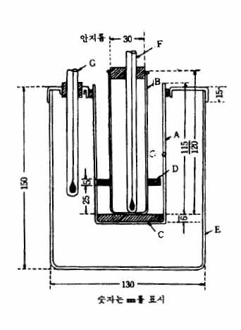

51～57㎜의 높이까지 넣는다. 온도계 F를 B의 중앙에 넣어 수은구를 B
의 밑부분에 접촉시킨다. 검체가 예상한 담점보다 14℃ 이상 높은 온도
가 되도록 조심하면서 그 밑에 원판 C를 놓고 한제(寒劑)로 0～3℃를 유
지하는 냉각욕 E에 넣은 공기외통 A의 가운데에 B를 넣는다. A가 E안
에서 한제로 부터 25㎜ 이상 밖으로 나오지 않도록 한제의 양을 조절하
여 넣는다.
검체의 온도가 1℃ 떨어질 때마다 B를 빠르게 또 검체가 움직이지 않도
록 꺼내어 검체가 흐려지는지를 조사하고 A에 다시 넣는다. 이 조작은
3초 이내에 하여야 한다. 검체의 온도가 10℃까지 떨어져도 흐려지지 않
을 경우에는 B를 -17∼-15℃를 유지하는 제２의 냉각욕중의 공기외통 속
으로 옮기고 다시 검체의 온도가 -7℃까지 떨어져도 흐려지지 않을 경우
에는 -35∼-33℃를 유지하는 제３의 냉각욕중의 공기외통 속으로 옮겨서
측정을 계속한다. 검체용기 B의 밑부분에 조금이라도 검체가 흐려지는
것이 인정될 때의 온도를 읽어 담점으로 한다.
9. 메탄올 및 아세톤시험법
메탄올 및 아세톤시험법은 에탄올 및 에탄올을 함유하는 제제중에 혼재하는 메탄올 및 아세톤의 허용
한도를 시험하는 방법이다.
메 탄 올
조 작 법 검체 10㎖를 취하여 알코올수측정법의 제１법에 따라 최후에 맑게 분리된 적색의 알코올층
1㎖를 정확하게 취하여 물을 넣어 정확하게 20㎖로 하여 검액으로 한다. 검액 및 메탄올표준액 5㎖
씩을 각각 다른 시험관에 정확하게 넣고 각 시험관에 과망간산칼륨ㆍ인산시액 2㎖를 넣어 15분간 방
치한 다음 수산ㆍ황산시액 2㎖를 넣어 탈색시키고 다시 푹신ㆍ아황산시액 5㎖를 넣어 흔들어 섞고 30
분간 상온에서 방치할 때 검액이 나타내는 색은 메탄올표준액이 나타내는 색보다 진하지 않다.
아 세 톤
조 작 법 검체 10㎖를 취하여 알코올수측정법의 제１법에 따라 최후에 맑게 분리된 적색의 알코올층
1㎖를 정확하게 취하여 수산화나트륨용액(1→6) 1㎖ 및 니트로프루싯나트륨시액 2방울을 넣을 때 액은
적색을 나타내지 않는다. 다만 액이 적색을 나타내더라도 초산 1.5㎖를 넣을 때 자색으로 변하지 않
는다.
10. 메톡실기정량법
메톡실기정량법은 검체에 요오드화수소산을 넣고 끓여 생기는요오드화메칠을 브롬으로 산화하여 생긴
요오드산을치오황산나트륨액으로 정량하는 방법이다.
R―OCH ＋ HI ＝ CH I ＋ R―OH
3 3
CH I ＋ 3Br ＋ 3H O ＝ CH Br ＋ 5HBr ＋ HIO
3 2 2 3 3
메탄올, 에텔, 아세톤 등은 이 정량법을 방해한다.
장 치 다음과 같은 장치를 쓴다.

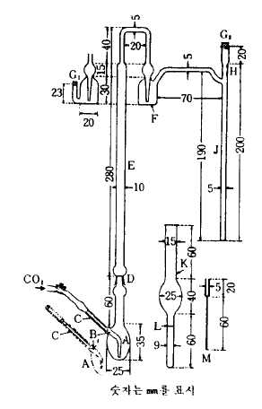

A : 분해플라스크
B : 이산화탄소도입관(나사콕크를 낀 고무관이며 이산화탄소
발생기에 연결한다)
C : 역류를 막는 것
D : 갈아 맞춘 연결부
E : 공기냉각관
F : 가스세척기(적인(赤燐) 2.0g 및 물 5㎖를혼합하여 현탁액을
만들어 이 액 1㎖를 넣는다)
G , G : 고무마개
1 2
H : 세관부(쓰기 직전에 물 1방울을 넣어 고무마개 G를 막는다)
2
J : 가스도관
K : 흡수관
L : 2㎖의 표선
M : 칭량관
조 작 법 따로 규정이 없는 한 메톡실기(CH O:31.03) 약 0.65㎎에 해당하는 검체를 칭량관 M을 써서
3
마이크로화학천칭으로 정밀하게 달아 분해플라스크 A에 넣고 페놀 20㎎ 및 무수초산 4～5방울을 넣
어 필요하면 가온하여 녹인다. 흡수관 K의 표선 L까지 초산나트륨ㆍ빙초산용액(1→10)을 넣고 브롬
4～5방울을 넣은 다음 가스도관 J를 삽입하고 J의 아래 끝이 K의 바닥으로 부터 1～2㎜ 떨어져 있도
록 K를 고정한다. K의 관구를 희석시킨 개미산(1→10)로 적신 탈지면으로 덮는다. 여기에 요오드화
수소산 2㎖를 이산화탄소 도입관 B로부터 A에 넣어 갈아 맞춘 연결부 D에 무수초산을 묻히고 공기
냉각관 E와 연결한다. B에 역류를 막는 C를 삽입하고 이산화탄소를 도입하는 고무관을 연결한 다음
이산화탄소를 통하고 나사콕크를 조절하여 1초에 거품이 1～2개 나오도록 한다. A의 바닥을 마이크
로버너로 가열하고 요오드화수소산이 공기냉각관 E의 거의 중앙까지 환류하도록 30분간 끓인다. 이
산화탄소를 계속 통하면서 식힌 다음 K를 내려서 그 액면을 J로 부터 떨어지게 하고 고무마개 G 를
2
빼고 J의 내외를 물로 씻어 K에 넣는다. K의 내용물을 초산나트륨용액(1→5) 5㎖가 들어 있는 100㎖
의 유리마개 삼각플라스크에 옮기고 K를 물 소량씩으로 3회 씻고 씻은 액을 앞의 유리마개 삼각플라
스크에 넣는다. 여기에 희석시킨 개미산(1→10) 2～3방울을 기벽에 따라 넣고 잘 흔들어서 섞은 다
음 메칠레드시액 1방울을 넣어 잘 흔들어 섞는다. 만일 액의 홍색이 없어졌을 때는 먼저와 같이 희
석시킨 개미산(1→10) 및 메칠레드시액을 추가하여 액에 엷은 홍색이 남을 때까지 이 조작을 반복한
다. 다음에 요오드화칼륨용액(1→10) 2㎖ 및 묽은황산 5㎖를 넣어 마개를 하고 2분간 방치하여 유리
된 요오드를 0.01N치오황산나트륨액으로 적정한다(지시약 : 전분시액 1㎖). 같은 방법으로 공시험을
하여 보정한다.
0.01N 치오황산나트륨액 1㎖ ＝ 0.05172㎎ CH O
3
주 의 : 시험에 쓰이는 시액은 공시험을 할 때 0.01N치오황산나트륨액 0.1㎖ 이상을 소비하지 않는 것
을 쓴다.
11. 물가용물시험법
물가용물시험법은 검체중의 물에 녹는 물질의 양을 측정하는 방법이다.
조 작 법 따로 규정이 없는 한 검체 약 5g을 정밀하게 달아 물 약 70㎖를 넣어 5분간 끓인다. 식힌
다음 물을 넣어 100㎖로 하고 잘 저어 섞은 다음 여과한다. 처음의 여액 약 10㎖를 버리고 다음의
여액 40㎖를 정확하게 취하여 수욕상에서 증발건고하고 105～110℃에서 1시간 건조한 다음 그 무게를
정밀하게 단다.
12. 박층크로마토그래프법
이 방법은 여과지크로마토그래프법에서 여과지 대신 실리카 겔의 박층을 쓰는 방법이다.
시 약 실리카 겔(박층크로마토그래프용) 백색의 가루로 입자의 크기는 5～25㎛(평균)이고 5～15%의
황산칼슘을 함유한다.
조 작 법 따로 규정이 없는 한 평활한 내열성 유리판(세로 200㎜, 가로 50㎜ 또는 200㎜, 두께 3㎜) 위
에 적당한 장치를 써서 실리카 겔(박층크로마토그래프용)을 두께 250～300㎛의 박층상으로 균일하게
도포하고 박층을 위로하여 수평으로 놓고 실온에서 2～3시간 방치하고 이것을 50～60℃에서 1시간 건
조한다. 다시 105℃에서 1시간 가열한 다음 건조제를 넣은 기밀용기내에서 식힌다. 박층의 한쪽 끝에
서 부터 20㎜가 되는 곳에 약 10㎜의 간격으로 검액 및 표준액을 마이크로피펫 또는 모세관을 써서
점적한다. 이것을 다시 기밀용기내에 방치하고 반점을 건조한 다음 미리 전개용매를 넣은 전개용 용
기내에 검액을 점적한 한쪽 끝을 아래로 하여 넣는다. 그 한쪽 끝에서 약 10㎜가 되는 곳까지 용매
에 담그고 전개용 용기를 잘 닫아 상승법으로 전개시킨다. 전개용매가 검액을 점적한 곳으로 부터
100㎜의 거리까지 상승했을 떄 유리판을 전개용 용기에서 꺼내어 건조한다. 검액 및 표준액에서 얻
은 반점의 위치 및 색을 자연광하에서, 필요하면 자외선하에서 비교 관찰한다. 다음 식에 따라 "Rf"
또는 "Rs"값을 구한다.
원선에서 반점의 중심까지의 거리
R 
f  원선에서 용매선단까지의 거리
원선으로부터 검액의 반점 중심까지의 거리
R 
s  원선으로부터 표준액의 반점 중심까지의 거리
주 의 : 실리카 겔을 유리판에 도포할 때에는 그 용기에 표시된 조제법에 따른다
13. 불검화물측정법
불검화물은 검체중의 수산화칼륨으로 검화되지 않고 유기용매에 녹으며 물에 녹지 않는 물질을 말
한다.
조 작 법 따로 규정이 없는 한 검체 약 5g을 정밀하게 달아 250㎖의 플라스크에 넣고 수산화칼륨ㆍ
에탄올시액 50㎖를 넣고 환류냉각기를 달아 수욕상에서 때때로 흔들어 섞으면서 1시간 천천히 끓인
다음 제１의 분액깔때기에 옮긴다. 플라스크는 온수 100㎖로 씻고 씻은 액은 제１의 분액깔때기에
넣고 여기에 물 50㎖를 넣어 실온이 될 때까지 식힌다. 다음 에텔 100㎖로 플라스크를 씻고 씻은 액
을 제１의 분액깔때기에 넣고 1분간 세게 흔들어 섞어 추출한 다음 명확하게 두층으로 나누어질 때까
지 방치한다. 물층은 제２의 분액깔때기로 옮기고 에텔 50㎖를 넣어 같은 방법으로 흔들어 섞은 다
음 방치하고 물층은 다시 제３의 분액깔때기로 옮겨 에텔 50㎖를 넣고 다시 같은 방법으로 흔들어 섞
어 추출한다. 제２ 및 제３의 분액깔때기중의 에텔추출액은 제１의 분액깔때기로 옮기고 각각 분액
깔때기는 소량의 에텔로 씻고 씻은 액은 제１의 분액깔때기에 합한다. 제１의 분액깔때기에 물 30㎖
씩을 넣고 씻은 액이 페놀프탈레인시액 2방울로 홍색을 나타내지 않을 때까지 씻는다. 에텔액에 무
수황산나트륨 소량을 넣고 1시간 방치한 다음 건조한 여과지를 써서 미리 무게를 단 플라스크에 여과
한다. 제１의 분액깔때기는 에텔로 잘 씻고 씻은 액은 먼저의 여과지를 써서 플라스크에 합하고 여
액 및 씻은 액을 수욕상에서 가온하여 에텔을 거의 날려 보낸 다음 아세톤 3㎖를 넣고 다시 수욕상에
서 증발건고하고 감압하(약 200㎜Hg)에서 70～80℃로 30분간 가열하고 데시케이터(감압, 실리카 겔)에
옮겨 30분간 식힌 다음 무게를 단다. 플라스크에 에텔 2㎖ 및 중화에탄올 10㎖를 넣고 잘 흔들어 섞
어 추출물을 녹인 다음 페놀프탈레인시액 2～3방울을 넣은 다음 0.1N 수산화칼륨ㆍ에탄올액으로 30초
간 지속하는 엷은 홍색을 나타낼 때까지 혼입지방산을 적정한다.
A―(B × 0.0282)
불검화물(％) ＝ × 100
C
A : 추출물의 양(g)
B : 0.1N 수산화칼륨ㆍ에탄올액의 소비량(㎖)
C : 검체의 양(g)
14. 불소시험법
불소시험법은 검체중에 함유되는 불소의 양의 한도를 시험하는 방법이다. 그 한도는 불소(F)의 중량
백분율(%)로 표시한다.
장 치 그림과 같은 장치를 쓴다.
A : 증류플라스크(용량 약 300㎖)

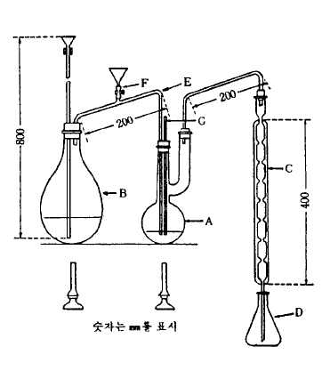

B : 수증기발생기(용량 약 1ℓ)
C : 냉각기
D : 수기(용량 약 200㎖)
E : 수증기 도입관(안지름 약 8㎜)
F : 핀치콕크가 달린 고무관
G : 온도계
조 작 법 1) 검액의 조제 불소 100～300㎍에 해당 하는 양의 검체를 정밀하게 달아 물 20～30㎖를
써서 증류플라스크 A에 씻어 넣고 유리구슬 8～12개, 희석시킨 정제황산 50㎖ 및 검체중의 염소이온
에 해당하는 양 이상으로 황산은을 넣어 섞는다. 다음 A를 미리 수증기 도입관 E에 수증기를 통
해서 씻은 증류장치에 연결한다. 수기 D에는 물 약 20㎖를 넣고 냉각기 C의 끝을 이 물에 잠기게
한다. A를 가열하여 액의 온도가 130℃로 될 때 핀치콕크로 고무관 F를 막고 수증기발생기 B에서 수
증기를 통한다. 동시에 A액의 온도를 140±5℃로 유지하도록 가열을 조절한다. 유액이 170～180㎖가
되었을 때 증류를 그치고 유액을 메스플라스크에 옮겨 D를 물 소량으로 씻고 씻은 액을 유액에 합하
고 물을 넣어 200㎖로 하여 검액으로 한다.
2) 정량조작 검액 및 불소표준액 20㎖씩을 각각 50㎖ 메스플라스크에 넣고 불소시험법용 알리자린
콤플렉손시액 1㎖, 질산란탄시액 1㎖, pH 5.2 초산ㆍ초산나트륨완충액 5㎖, 아세톤 20㎖ 및 물을 넣어
50㎖로 하고 잘 섞어 1시간 방치한 다음 파장 620㎚에서 흡광도를 측정한다. 따로 물 20㎖를 50㎖
메스플라스크에 취하고 검액의 조제와 같은 방법으로 조작하여 대조액으로 한다.
A × 200
불소(F)의 양(㎍) ＝
A × 검체의 양(g)
S
A : 검액에서 얻은 정색도의 흡광도
A : 불소표준액에서 얻은 정색도의 흡광도
S
15. 비소시험법
비소시험법은 원료중에 불순물로서 들어있는 비소의 한도시험이다. 그 한도는 삼산화비소(As O )의
2 3
양으로 나타내며 보통 중량백만분율(ppm)로 나타낸다.
장치 A, 장치 B, 장치 C를 쓰는 방법
장 치 A 그림 1과 같은 장치를 쓴다.

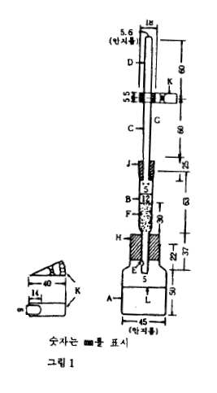

배기관 B에 약 30㎜의 높이로 유리섬유 F를 채우고 초산납시액 및
물의 같은 용량혼합액으로 고르게 축인 다음 밑에서 약하게 흡인하
여 과량의 액을 제거한다. 이것을 고무마개 H의 중심에 수직으로
끼우고 B의 아래에 있는 작은구멍 E는 고무마개 아래까지 조금 내
려가도록 하여 발생병 A에 끼운다. B의 상단에는 유리관 C를 수직
으로 고정시킨 고무마개 J를 끼운다. C의 하단은 J의 하단과 동일
평면이 되도록 한다. 쓰기 직전에 C 및 D의 갈아 맞춘 면 사이에
브롬화제이수은지를 끼우고 클립 K로 C 및 D를 고정시킨다.
A : 발생병(어깨부분까지의 내용 약 70㎖)
B : 배기관
C 및 D : 갈색유리관 (안지름 5.6㎜, 접속부의 바깥지름은 18㎜이며
각각 갈아 맞춘다)
E : 작은구멍
F : 유리섬유(약 0.2g)
G :브롬화제이수은지(18㎜×18㎜)
H 및 J : 고무마개
K : 클립
L : 40㎖의 표선
장 치 B 그림 2와 같은 장치를 쓴다.
A : 발생병(어깨부분까지의 내용

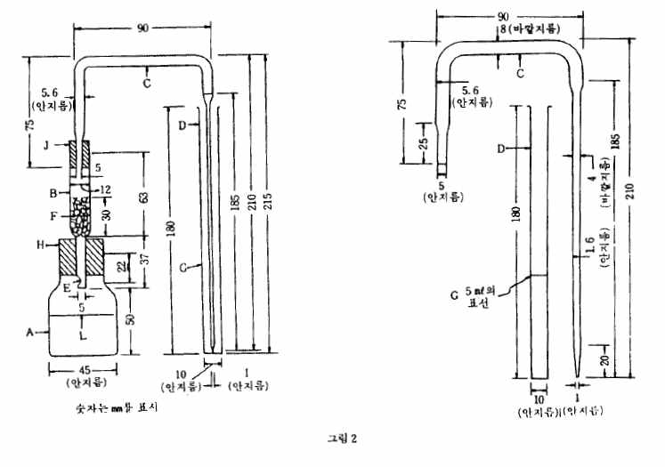

약 70㎖)
B : 배기관
C : 유리관(안지름 5.6㎜, 흡수관에
넣은 부분은 끝을 안지름 1㎜
로 길게 뽑는다)
D : 흡수관(안지름 10㎜)
E : 작은구멍
F : 유리섬유(약 0.2g)
G : 5㎖의 표선
H 및 J : 고무마개
L : 40㎖의 표선
배기관 B에 약 30㎜의 높이로 유리섬유 F를 채우고 초산납시액 및 물의 같은 용량 혼합액으로 고르게
축인 다음 밑에서 약하게 흡인하여 과량의 액을 제거한다. 이것을 고무마개 H의 중심에 수직으로 끼
우고 B의 아래에 있는 작은구멍 E는 고무마개 아래까지 조금 내려가도록 하여 발생병 A에 끼운다.
B의 상단에는 유리관 C를 수직으로 고정한 고무마개 J를 끼운다. C의 배기관 쪽의 하단은 고무마개
J의 하단과 동일 평면으로 한다.
장 치 C 그림 3과 같은 장치를 쓴다.
A : 발생병(내용량 약 60㎖)
B : 배기관(안지름 약6.5㎜)

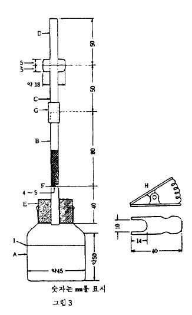

C 및 D : 갈색유리관(안지름 6.5㎜, 접속부의 바깥지름 약 18㎜이며
각각 갈아 맞춘다)
E : 고무마개
F : 유리관 B에 달린 들어간 부분으로 유리섬유를 받혀준다.
G : 고무관
H : 클립
Ｉ : A의 40㎖표선
유리관 B에는 유리섬유를 F에서 약 30㎜의 높이로 채우고 비소시험
장치 C용 초산납시액 및 물의 같은 용량 혼합액으로 고르게 축인
다음 관의 밑에서 가만히 흡인하여 유리섬유 및 기벽에서 과량의 액을 제거하여 둔다. 쓰기 직전에 유
리관 C 및 D의 접속부에 비소시험장치 C용 브롬화제이수은지를 끼우고 클립 H로 양쪽관을 고정시킨
다.
조 작 법 1) 검액의 조제 따로 규정이 없는 한 다음의 방법에 따른다.
제１법 따로 규정이 없는 한 원료각조에서 규정하는 양의 검체를 달아 물 5㎖를 넣어 필요하면 가
온하여 녹인 다음 검액으로 한다.
제２법 따로 규정이 없는 한 원료각조에서 규정하는 양의 검체를 달아 물 5㎖ 및 황산 1㎖를 넣는
다. 다만 무기산의 경우에는 황산을 넣지 않는다. 이 액에 아황산 10㎖를 넣고 작은 비커에 넣어 수
욕상에서 가열하여 아황산이 없어지고 약 2㎖가 될 때까지 증발시키고 물을 넣어 5㎖로 하여 검액으
로 한다.
제３법 따로 규정이 없는 한 원료각조에서 규정하는 양의 검체를 달아 백금제, 석영제 또는 사기제
도가니에 넣는다. 여기에 질산마그네슘ㆍ에탄올용액(1→50) 10㎖를 넣어 에탄올에 점화하여 태운 다
음 천천히 가열하여 회화시킨다. 만일 이 방법으로 탄화물이 남아 있을 때는 소량의 질산으로 적시
고 다시 강열하여 회화한다. 식힌 다음 잔류물에 염산 3㎖를 넣어 수욕상에서 가온하여 녹여 검액
으로 한다.
2) 검액의 시험 따로 규정이 없는 한 다음에 따라 시험한다.
가) 장치 A를 쓰는 방법
표준색의 조제는 동시에 한다.
발생병 A에 검액을 취하여 필요하면 소량의 물로 씻어 넣고 이 액에 메칠오렌지시액 1방울을 넣고
강암모니아수 또는 묽은염산을 써서 중화시킨 다음 희석시킨 염산(1→2) 5㎖ 및 요오드화칼륨시액 5
㎖를 넣어 2∼3분간 방치한 다음 다시 산성염화제일석시액 5㎖를 넣고 실온에서 10분간 방치한다.
다음 물을 넣어 40㎖로 하고 무비소아연 2g을 넣고 곧 B, C, G 및 D를 연결시킨 고무마개 H를 발생
병 A에 끼우고 25℃의 물속에 발생병 A의 어깨까지 담그어 1시간 방치한 다음 곧 브롬화제이수은지
의 색을 관찰한다. 이 색은 표준색보다 진하여서는 안된다.
표준색의 조제 발생병 A에 비소표준액 2㎖를 정확하게 넣고 희석시킨 염산(1→2) 5㎖ 및 요오드화
칼륨시액 5㎖를 넣어 2～3분간 방치한 다음 산성염화제일석시액 5㎖를 넣어 실온에서 10분간 방치한
다. 이하 앞에서와 같은 방법으로 얻은 브롬화제이수은지의 정색을 표준색으로 한다. 이 색은 삼산
화비소(As O ) 2㎍에 해당한다.
2 3
나) 장치 B를 쓰는 방법
표준색의 조제는 동시에 한다.
발생병 A에 검액을 취하여 이하 장치 A를 쓰는 방법과 같이 조작하여 실온에서 10분간 방치한다.
다음에 물을 넣어 40㎖로 하고 무비소아연 2g을 넣고 곧 B 및 C를 연결한 고무마개 H를 발생병 A에
끼운다. C의 세관부 끝은 미리 비화수소흡수액 5㎖를 넣은 흡수관 D의 밑에까지 닿도록 넣어 둔다.
다음에 발생병 A를 25℃의 물속에 어깨까지 담그어 1시간 방치한다. 흡수관을 꺼내어 필요하면 피리
딘을 넣어 5㎖로 하고 흡수액의 색을 관찰한다. 이 색은 표준색보다 진하지 않다.
표준색의 조제 발생병 A에 비소표준액 2㎖를 정확하게 넣고 희석시킨 염산(1→2) 5㎖ 및 요오드화
칼륨시액 5㎖를 넣어 2～3분간 방치한 다음 산성염화제일석시액 5㎖를 넣어 실온에서 10분간 방치한
다. 이하 앞에서와 같은 방법으로 조작하여 얻은 흡수액의 정색을 표준색으로 한다. 이 색은 삼산화
비소(As O ) 2㎍에 해당한다.
2 3
비화수소흡수액 디에칠디치오카바민산 0.50g에 피리딘을 넣어 녹여 100㎖로 한다. 이 액은 차광한
유리마개병에 넣어 냉소에 보관한다.
다) 장치 C를 쓰는 방법
표준색의 조제는 동시에 한다.
따로 규정이 없는 한 발생병 A에 원료각조에서 규정하는 양의 검액을 취하여 메칠오렌지시액 2방
울을 넣고 강암모니아수 또는 암모니아수시액으로 중화하고 희석시킨 염산(1→2) 5㎖ 및 요오드화칼
륨시액 5㎖를 넣어 2∼3분간 방치한 다음 비소시험장치 C용 염화제일석시액 5㎖를 넣고 10분간 방치
한다. 다음 물을 넣어 40㎖로 하고 무비소아연 2g을 넣어 곧 유리관 B, C 및 D를 연결한 고무마개
E를 끼우고 25℃의 물속에 발생병의 어깨까지 담그어 1시간 방치한 다음 곧 브롬화제이수은지를 꺼내
고 직사광선에 닿지 않도록 조심하면서 곧 관찰한다. 이 색은 표준
색보다 진하지 않다.
표준색의 조제 따로 규정이 없는 한 발생병에 비소표준액 2㎖를 넣고 검액의 경우와 같은 방법으로
조작한다.
주 의 : 이 시험 및 검액의 조제에 쓰이는 시약 및 시액은 공시험에서 정색하지 않거나 또는 거의
정색하지 않는 것을 쓴다.
16. 비용적측정법
비용적은 단위질량의 물체가 차지하는 부피를 말한다.
장 치 그림과 같은 장치를 쓴다.

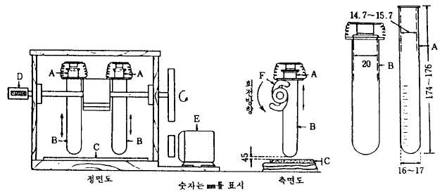

A : 눈금이 있는 시험관(용량 20㎖, 무게 15∼16g)
B : 금속관
C : 고무판(두께 3㎜)
D : 시수기(示數器)
E : 모터
F : 회전날개
조 작 법 따로 규정이 없는 한 검체를 105℃에서 항량이 될 때까지 건조하고 표준체 177㎛을 통한다.
그 3.0g을 정확하게 달아 이것을 가만히 20㎖ 눈금이 있는 시험관 A에 넣는다. A를 금속관 B에 넣
어 뚜껑을 덮고 높이 45㎜에서 2초간에 1회의 속도로 400회 낙하시킨 다음 그 부피를 읽는다.
부피(㎖)
비용적(㎖/g) ＝
3(g)
17. 비점측정법 및 증류시험법
액체의 비점 및 규정온도에 있어서의 액체유출량측정법은 다음 제１법, 제２법 또는 제３법에 따라
측정한다. 비점은 최초의 유출액 5방울이 유출했을 때를 최저로 하고 마지막 액이 플라스크의 밑바닥
으로 부터 증발할 때를 최고로 한다.
증류시험은 따로 규정이 없는 한 규정온도 범위에서의 유출액의 용량을 계량하는 것이다.
제１법
장 치 그림1과 같은 장치를 쓴다.
A : 온도계(측정온도가 200℃ 미만일 때는 온도계 1호 또는 2호, 200℃ 이상일 때는 3호를 쓴다.)
B : 보조온도계(온도계 1호를 써서 그 수은구가 온도계 A의 노출부에 있는 수은주의 거의 중앙부에
오도록 한다.)
조 작 법 검체 25㎖를 취하여 증류플라스크에 넣은 다음 비등석 2～3개를 넣고 수은구의 상단을 유출
구의 중앙부에 오도록 온도계를 붙이고 플라스크를 석면판에 올려놓은 다음 유출관에 냉각기를 연결
하고 플라스크를 가열하여 따로 규정이 없는 한 측정온도가 200℃ 미만인 것은 1분간 4～5㎖, 200℃
이상의 것은 1분간 3～4㎖의 유출속도로 증류한다.

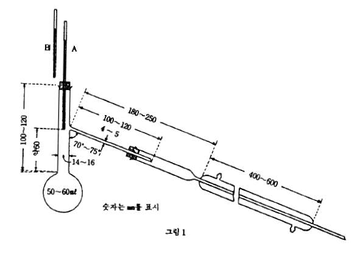

온도계 노출부의 수은주 및 기압에 대한 측정온도의 보정은 각각 다음의 두가지 식에 따라 한다.
온도계 노출부의 수은주에 대한 측정온도의 보정
T ＝ t＋ 0.00015(t-t)N
1 1
T : 온도계 노출부의 수은주를 보정한 온도
1
t : 온도계에 나타난 온도
t : 보조온도계에 나타난 온도
1
N : 온도계 노출부에 있는 수은주의 도수(度數), 마개의 상단에서 셀 수 있는 것으로 한다.
기압에 대한 보정
T ＝ T ＋ 0.00012(760 - P)(273 ＋ T )
1 1
T : 보정된 온도
P : 측정할 때의 기압
제２법
장 치 제１법과 같은 장치를 쓴다. 다만 증류플라스크는 내용량 200㎖, 목의 안지름 18～24㎜, 안
지름 5～6㎜의 유출관이 붙어있는 것을 쓴다.
온도계 및 보조온도계 : 제１법의 것을 쓴다.
조 작 법 검체 100㎖를 1㎖의 눈금이 있는 메스실린더로 취하고 액온을 측정한 다음 증류플라
스크에 넣고 이 메스실린더를 씻지 않고 수기로 하여 제１법과 같은 방법으로 증류한 다음 유액의 온
도를 앞의 액온과 같게 하여 유출액의 용적을 측정한다. 60℃ 이하에서 증류하기 시작하는 액은 미
리 검체를 10∼15℃로 식히고 그 용량을 측정한 다음 냉각관에는 아답터의 끝을 수기인 메스실린더에
꽂는다. 마개에는 공기가 나가는 작은 구멍을 뚫어 둔다.
증류중에는 메스실린더의 상부로 부터 25㎜ 이하의 부분을 얼음으로 식힌다.
제３법

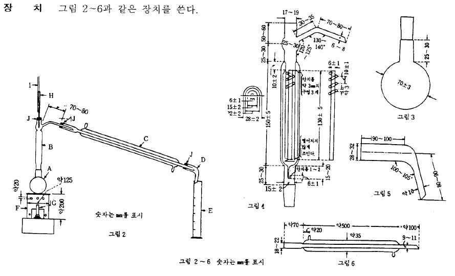

A : 증류플라스크(경질유리제로 용량 약 200㎖이며 그림3에 따른다)
B : 분류관(두께 약 1㎜의 경질유리제이며 그림4에 따른다)
C : 냉각관(경질유리제이며 그림 6에 따른다)
D : 아답터(경질유리제이며 그림5에 따른다)
E : 메스실린더(100㎖로서 1㎖마다 눈금이 있다)
F : 가대(架坮)
G : 버너
H : 온도계
Ｉ : 보조온도계 제１법의 것을 쓰며 그 수은구가 온도계 H 노출부에 있는 수은주의 거의 중앙에
오도록 한다.
Ｊ : 코르크마개 또는 갈아 맞춘 마개
유리기구는 잘 건조한 것을 쓴다. 아답터 D의 끝을 메스실린더 E의 기벽에 닿게 한다. 증류플라
스크 A에는 비등석 또는 모세관을 넣고 증류플라스크 및 분류관 B(측관을 뺀다)는 석면사(石綿絲) 또
는 유리솜 등으로 보온한다.
조 작 법 제２법과 같이 조작한다. 다만, 증류플라스크를 가열하기 시작할 때 부터 약 10분간 후에
유출이 시작되어 이어 1분간에 3～4㎖가 유출하도록 가열을 조절한다.
18. 비중측정법
비중 d t'라 함은 검체와 물과의 각각 t'℃및 t℃에 있어서 같은 체적의 중량비를 말한다. 다음 제
t
１법, 제２법 또는 제３법에 따라 측정한다.
조 작 법
제１법 1) 비중병에 의한 측정법 비중병은 보통 내용 10～100㎖의 유리용기로 온도계가 붙은 갈아
맞춘 마개 및 표선과 갈아 맞춘 뚜껑이 있는 측관 등이 있다. 미리 깨끗이 씻고 건조한 비중병의 무
게 W를 정밀하게 단다. 다음 마개 및 뚜껑을 열어 검체를 채우고 t'℃보다 1～3℃ 낮게 하고 기포가
없게 뚜껑을 잘 닫는다. 천천히 온도를 올려 온도계가 t'℃를 나타낼 때 표선의 윗쪽의 검체를 측관
에서 빼내고 측관에 뚜껑을 닫고 바깥쪽을 잘 닦은 다음 무게 W 를 정밀하게 단다. 다시 같은 비중
1
병으로 물을 써서 같은 조작을 하고 t℃에 있어서의 무게 W 를 정밀하게 단다.
2
W ―W
d t̛ ＝ 1

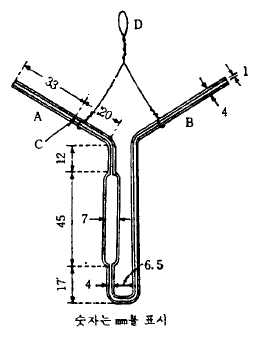

t W ―W
2
2) 쉬프렝겔ㆍ오스트발트비중병에 의한 측정법 쉬프렝겔ㆍ오스트발
트비중병은 보통 내용 1～10㎖의 유리용기로 그림과 같이 양쪽 끝이 두
꺼운 세관(細管)으로 되어 한쪽세관 A에는 표선 C가 있다. 미리 깨끗
이 닦아 건조한 피크노메타를 백금 또는 알루미늄 등의 선 D로 화학천
칭의 저울대의 고리에 걸어서 무게를 단다. 다음 t'℃보다 3～5℃ 낮은
검체중에 세관 B를 담근다. A에는 고무관 또는 갈아맞춘 세관을 붙여
거품이 들어가지 않게 조심하면서 검체를 C위까지 빨아 올린다. 다음
t'℃의 수욕중에 약 15분간 담근 다음 B의 끝에 여과지편을 대어 검체
의 끝을 C에 일치시킨다.
수욕중에서 들어 내어 바깥쪽을 잘 씻고 무게 W 를 달고 같은 피크노메타를 써서 물로 같은 방법
1
으로 조작하여 그 t℃에서의 무게 W 를 칭량한다. 1)의 식에 따라 비중 d t̛ 를 구한다.
2 t
3) 비중부액계에 의한 측정법 규정온도용의 비중부액계로 필요한 정밀도를 갖는 것을 쓴다. 비중부
액계는 에탄올 또는 에텔로 깨끗이 씻은 것을 쓴다. 검체를 잘 흔들어 섞은 다음 거품이 없어지면
비중부액계를 띄운다. 규정온도에서 비중부액계가 정지했을 때 메니스커스의 상연에서 비중의 눈금
을 읽는다. 다만 눈금 읽는 방법이 표시되어 있는 비중부액계는 그 방법을 따른다.
제２법 제１법의 1)에서 쓴 비중병과 같은 형의 25㎖ 비중병에 등유(燈油)를 약 6㎜의 깊이로 넣고 그
무게 W를 정밀하게 달아 여기에 원료각조의 건조감량항에서 규정하는 조건으로 건조한 검체 1～2㎖
를 넣어 그 무게 W 를 정밀하게 단다. 등유를 써서 기벽에 부착한 검체를 비중병에 씻어 넣고 등유
1
를 추가하여 검체를 덮는다. 비중병을 데시케이터에 넣고 3㎜Hg이하로 감압하여 거품이 생기지 않게
되었을 때 비중병을 꺼내어 등유를 가득 채운다. 이것을 17～19℃로 하고 천천히 온도를 올려 온도
계가 20℃로 되었을 때 표선 윗쪽의 등유를 측관으로 부터 빼내고 측관에 마개를 한 다음 겉을 닦은
다음 무게 W 를 정밀하게 단다. 다시 같은 비중병에 등유를 넣어 앞에서와 같은 조작을 하여 20℃에
2
서의 무게 W 를 정밀하게 단다.
3
(W ― W) × D
d20 ＝ 1
20 (W ― W) ― (W ― W )
1 3 2
D :쓴 등유의 비중 d20
20
제３법 미리 제１법의 1)에서 쓴 비중병과 같은 형의 비중병의 무게 W를 정밀하게 단 다음 마개 및
뚜껑을 빼고 융해한 검체가 온도계 끝에 닿지 않게 검체를 넣고 온도계를 삽입치 않고 천천히 온도를
올려 검체의 융해온도보다 약간 높은 온도로 1시간 유지하여 검체중의 거품을 제거한다. 식힌 다음
온도계 및 뚜껑을 하고 무게 W 를 정밀하게 단다. 다음에 마개 및 뚜껑을 빼고 검체위에 물을 채우고
1
20℃보다 1～3℃ 낮게하여 거품이 남지 않게 조심하면서 마개를 한다. 천천히 온도를 올려 온도계가
20℃로 되었을 때 표선 위의 물을 측관으로 부터 빼내어 측관에 뚜껑을 닫고 겉을 닦은 다음 무게
W 를 정밀하게 단다. 다시 같은 비중병에 물을 넣어 앞에서와 같은 조작을 하여 20℃에서의 무게
2
W 를 정밀하게 단다.
3
(W ― W)
d20 ＝ 1
20 (W ― W) ― (W ― W )
3 2 1
19. 비타민A정량법
비타민A정량법은 초산레티놀, 팔미틴산레티놀, 비타민A유, 간유 및 기타 원료중의 비타민A를 자외
부의 흡광도측정법에 따라 정량하는 방법이다. 다만 일반적으로는 원료의 종류 또는 정량을 방해하
는 물질이 존재할 때 적당한 전처리를 할 필요가 있다.
1 비타민A단위(1 비타민A국제단위와 같다)는 비타민A(알코올형) 0.3㎍에 해당한다.
조 작 법 조작은 신속하게 하며 될 수 있는대로 공기 또는 다른 산화제와의 접촉을 피하며 용기는 차
광용기를 쓴다. 원료각조에서 따로 규정이 없는 한 제１법에 따르나 제１법으로 측정이 적합하지 않
은 것은 제２법에 따른다.
제１법 검체 약 0.5g을 정밀하게 달아 이소프로판올에 녹여 정확하게 250㎖로 한다. 이 액을 층장 10
㎜, 파장 326㎚에서의 흡광도가 약 0.5가 되도록 이소프로판올로 정확하게 희석하여 검액으로 하고 흡
수극대파장을 측정한다. 또한 10㎜ 측정셀로 파장 300㎚, 310㎚, 320㎚, 326㎚, 330㎚, 340㎚, 및 350
㎚에서의 흡광도를 측정하고 326㎚에서의 흡광도를 1.000으로 하였을 때 각 파장에서의 흡광도비를
구한다. 흡수극대파장이 325～328㎚ 사이에 있고 또 측정한 각 파장에서의 흡광도비가 각각 다음 표
의 값의 ±0.030 범위내에 있으면 326㎚의 흡광도 A로부터 검체 1g중의 비타민A단위를 계산한다.
1g중의 비타민A단위수 ＝ E% (326㎚) × 1900
1㎝
A V
E% (326㎚) ＝ ×
1㎝ W 100
Ｖ : 검액의 총 ㎖수
Ｗ : 검액 V㎖중의 검체의 양(g)
초산레티놀과 팔미틴산레티놀의 확인에는 다음의 확인시험을 한다.
확인시험 검체, 박층크로마토그래프용 초산레티놀표준품 및 박층크로마토그래프용팔미틴산레티놀표
준품 각각 15000단위에 해당하는 양을 달아 각각 석유에텔 5㎖에 녹여 검액 및 표준액으로 한다.
이 액을 가지고 박층크로마토그래프법에 따라 시험한다. 검액 및 표준액 5㎕씩을 박층크로마토그
래프용실리카 겔을 써서 만든 박층판에 점적한다. 벤젠을 전개용매로 하여 약 10㎝ 전개시킨 다음
박층판을 바람에 말린다. 여기에 삼염화안티몬시액을 뿌려 검체 및 표준품의 청색으로 정색된 주
반점의 위치를 비교하여 확인한다.
제１법에 따라 조작하여 흡수극대파장이 325∼328㎚의 사이에 있지 않을 때 또는 흡광도의 비가
다음 표에 표시한 값의 ±0.030 범위내에 있지 않을 때는 제２법을 쓴다.

| λ(㎚) | 초산레티놀 | 팔미틴산레티놀 |
| --- | --- | --- |
| 300310320326330340350 | 0.5780.8150.9481.0000.9720.7860.523 | 0.5900.8250.9501.0000.9810.7950.527 |

제２법 검체의 표시량에 따라 500 비타민A단위 이상에 해당하는 검체를 정밀하게 달아 플라스크에
넣고 무알데히드에탄올 30㎖ 및 파이로갈롤ㆍ에탄올용액(1→10) 1㎖를 넣는다. 다음에 수산화칼륨용
액(9→10) 3㎖를 넣어 환류냉각기를 붙이고 수욕상에서 30분간 가열하여 검화시키고 곧 상온으로 식힌
다음 물 30㎖를 넣어 분액깔때기 A에 옮기고 플라스크는 물 10㎖, 에텔 40㎖로 차례로 씻어 씻은 액
을 분액깔때기 A에 넣고 잘 흔들어 섞어 방치한다. 물층을 분액깔때기 B에 옮기고 비타민A정량용에
텔 30㎖로 플라스크를 씻고 씻은 액을 분액깔때기 B에 넣고 흔들어 추출한다. 물층은 플라스크에 따
로 취하고 에텔층은 분액깔때기 A에 합하고 따로 취한 물층은 분액깔때기 B에 넣고 에텔 30㎖를 넣
고 흔들어 추출한다. 에텔층은 분액깔때기 A에 합한다. 여기에 물 10㎖를 넣고 가만히 2～3번 거꾸
로 흔들어 정치한 다음 분리한 물층을 버린다. 다시 물 50㎖씩으로 3회 씻고 씻을 때마다 점차 강하
게 흔든다. 씻은 액이 페놀프탈레인시액으로 정색되지 않을 때까지 물 50㎖씩으로 씻은 다음 10분간
방치한다. 물을 되도록 제거하여 에텔추출액을 삼각플라스크에 옮기고 에텔 10㎖씩으로 2회 씻어 넣
은 다음 무수황산나트륨 5g을 넣어 흔들어 섞고 경사하여 에텔추출액을 증류플라스크에 옮긴다. 남
은 황산나트륨은 에텔 10㎖씩으로 2회 이상 씻어 씻은 액은 플라스크에 합한다. 에텔추출액을 45℃
의 수욕중에서 흔들어 주면서 아스피레이터를 써서 농축하여 약 1㎖로 하고 곧 이소프로판올을 넣어
녹여 1㎖중에 6～10 비타민A단위를 함유하도록 정확하게 희석하여 검액으로 한다. 이 액을 층장 10
㎜로 파장 310㎚, 325㎚ 및 334㎚에서 각각 흡광도 A , A 및 A 를 측정한다.
1 2 3
1g중의 비타민A단위수 ＝ E% (325㎚) × 1830
1㎝
A V
E% (325㎚) ＝ 2 × × f
1㎝ W 100
A A
f ＝ 6.815 ― 2.555 × 1 ― 4.260 × 3
A A
2 2
ｆ: 보정계수
Ｖ: 검액의 총 ㎖수
Ｗ: 검액 V㎖중의 검체의 양(g)
20. 산가측정법
산가는 검체 1g을 중화하는데 필요한 수산화칼륨(KOH)의 ㎎수이다.
조 작 법
제１법 따로 규정이 없는 한 원료각조에서 규정한 검체의 양을 정밀하게 달아 250㎖의 플라스 크에
넣고 에탄올 및 에텔의 같은 용량의 혼합액 50㎖를 넣어 가온하여 녹이고 페놀프탈레인시
액 1㎖를 넣어 때때로 흔들어 섞으면서 0.1N 수산화칼륨액으로 적정한다. 적정의 종말점은 액의 엷
은 홍색이 30초동안 지속할 때로 한다. 같은 방법으로 공시험을 하여 보정한다.
0.1N 수산화칼륨액의 소비량(㎖) × 5.611
산 가 ＝
검체의 양(g)
제２법 따로 규정이 없는 한 원료각조에서 규정한 검체의 양을 정밀하게 달아 250㎖의 플라스크에 넣
고 에탄올 및 에텔의 같은 용량의 혼합액 50㎖를 넣어 가온하여 녹이고 페놀프탈레인시액 3방울을 넣
어 때때로 흔들어 섞으면서 0.1N 수산화칼륨ㆍ에탄올액으로 적정한다. 적정의 종말점은 액의 엷은
홍색이 30초동안 지속할 때로 한다. 같은 방법으로 공시험을 하여 보정한다.
0.1N 수산화칼륨․에탄올액의 소비량(㎖) × 5.611
산 가 ＝
검체의 양(g)
21. 산가용물시험법
산가용물시험법은 검체중의 묽은염산에 녹는 물질의 양을 측정하는 방법이다.
조 작 법 따로 규정이 없는 한 검체 약 1g을 정밀하게 달아 묽은염산 20㎖를 넣어 50℃에서 15분간
저어 섞으면서 가온한 다음 물을 넣어 정확하게 50㎖로 하여 여과한다. 처음 여액 15㎖를 버리고 다
음 여액 25㎖를 정확하게 취하여 수욕상에서 증발건고하여 항량이 될 때까지 강열하고 데시케이터(실
리카 겔)속에서 방냉한 다음 그 무게를 정밀하게 단다.
22. 산불용물시험법
산불용물시험법은 검체중의 염산에 녹지 않는 물질의 양을 측정하는 방법이다.
조 작 법 따로 규정이 없는 한 원료각조에서 규정한 검체의 양을 정밀하게 달아 물 약 70㎖를 넣어
저어 섞으면서 염산 10㎖를 조금씩 넣어 5분간 끓인다. 식힌 다음 정량분석용여과지(5종C)를 써서 여
과하고 여과지위의 잔류물을 열탕으로 씻고 씻은 액에 질산은시액으로 염화물의 반응이 나타나지 않
을 때 잔류물을 여과지와 함께 회화하여 항량이 될 때까지 강열하고 데시케이터(실리카 겔)속에서 식
힌 다음 그 무게를 정밀하게 단다.
23. 산소플라스크연소법
산소플라스크연소법은 염소, 브롬, 요오드, 불소 또는 황 등을 함유하는 유기화합물질을 산소를 충만
시킨 플라스크중에서 연소분해하여 그 중에 들어 있는 할로겐 또는 황등을 확인 또는 정량하는 방법이
다.
장 치 그림과 같은 장치를 쓴다.
A : 내용량 500㎖인 무색의 두꺼운(약 2㎜) 경질유리플라스크
이며 입이 윗쪽으로 벌어진것. 다만 불소의 정량에는 석
영제플라스크를 쓴다.
B : 백금제바구니 또는 백금제망통(網筒)(백금선으로
마개 C의 끝에 매단다)
C : 경질유리마개, 다만 불소의 정량에는 석영제마개를 쓴다.
조 작 법 따로 규정이 없는 한 다음 방법에 따른다.
1) 검체채취법
가) 검체가 고체일 때 원료각조에서 규정하는 양의 검체를
그림과 같은 여과지 중앙에 달아 그 무게를 정밀하게 달고 흩

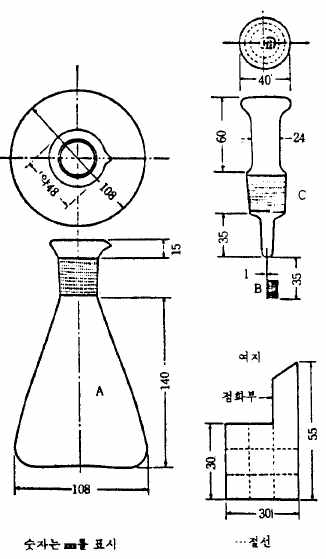

어지지 않도록 접은 선에 따라 싸고 백금제바구니 또는 백금
제망통(網筒) B속에 점화부(點火部)가 밖으로 나가도록 넣는다.
나) 검체가 액체일 때 미리 적당량의 탈지면을 가로 50㎜,
세로 5㎜의 여과지로 그 끝부분 약 20㎜(점화부)가 남도록 말
아서 백금제바구니 또는 백금제망통 B속에 넣는다. 탈지면에
는 원료각조에서 규정된 양의 검체가 스며 들어가도록한다.
2) 연소법 원료각조에서 규 정된 흡수액을 플라스크A에 넣고 A안에는 미리 산소를 충만시키고 마
개 C의 갈아 맞춘 부분을 물로 축인 다음 점화부에 점화하여 곧 A속에 넣고 완전히 연소될 때까지
기밀하게 유지한다. 다음에 A내의 흰 연기가 완전히 없어질 때까지 때때로 흔들어 주고 15～30분간
방치한다. A의 윗부분에 소량의 물을 넣어 조심하면서 C를 빼고 메탄올 15㎖로 C, B 및 A의 내벽을
씻어 넣고 여기서 얻은 액을 검액으로 한다. 따로 검체를 쓰지 않고 같은 방법으로 조작하여 공시험
액으로 한다.
3) 정량법 원료각조에서 따로 규정이 없는 한 다음 방법으로 한다.
제１법 (염소 또는 브롬) 검액에 브롬페놀블루시액 1방울을 넣고 액의 색이 황색으로 될 때까지 묽은
질산을 적가한 다음 묽은질산 0.5㎖, 메탄올 100㎖ 및 디페닐카르바손시액 1㎖를 넣어 흔들면서 0.01N
초산제이수은액으로 적정한다. 같은 방법으로 공시험을 하여 보정한다.
0.01N 초산제이수은액 1㎖ ＝ 0.35453㎎ Cl
0.01N 초산제이수은액 1㎖ ＝ 0.7990㎎ Br
제２법 (요오드) 검액에 히드라진용액(1→5) 1방울을 넣고 마개 C를 하고 잘 흔들어 섞어 탈색시킨 다
음 여기에 브롬페놀블루시액 1방울을 넣고 액의 색이 황색으로 될 때까지 묽은질산을 적가한 다음 묽
은질산 0.5㎖, 메탄올 100㎖ 및 디페닐카르바손시액 1㎖를 넣고 흔들면서 0.01N 초산제이수은액으로
적정한다. 같은 방법으로 공시험을 하여 보정한다.
0.01N 초산제이수은액 1㎖ ＝ 1.2690㎎ I
제３법 (불소) 검액 및 공시험액을 각각 50㎖의 메스플라스크에 넣어 플라스크 A를 물로 씻고 씻은
액 및 물을 넣어 50㎖로 하여 검액 및 보정액으로 한다. 불소 약 0.03㎎에 해당하는 양의 검액(V㎖),
보정액(V㎖) 및 산소플라스크연소법용 불소표준액(이하 불소표준액이라 한다) 5㎖를 정확하게 취하여
각각 다른 50㎖의 메스플라스크에 넣고 잘 흔들어 섞으면서 각각에 알리자린콤플렉손시액ㆍpH 4.3 초
산ㆍ초산칼륨완충액ㆍ질산제일셀륨시액 혼합액(1:1:1) 30㎖를 넣고 물을 넣어 50㎖로 하여 1시간 방치
한다. 다음에 파장 600㎚에서 검액, 보정액 및 표준액으로부터 얻은 정색액의 흡광도 A , A 및 A
T C S
를 측정한다. 대조액에는 표준액대신 물 5㎖를 취하여 같
은 조작을 하여 얻은 액을 쓴다.
검액중 불소(F)의 양(㎎)
A ― A 50
＝ 표준액 5㎖중 불소의양(㎎) × T C ×
A V
S
제４법 (황) 검액에 메탄올 40㎖를 넣고 0.01N 과염소산바륨액 25㎖를 정확하게 넣어 10분간 방치하
고 알세나조Ⅲ시액 0.15㎖를 넣어 0.01N 황산로 적정한다. 다만 적정의 종말점은 액의 적자색이 홍색
으로 변할 때로 한다. 같은 방법으로 공시험을 하여 보정한다.
0.01N 과염소산바륨액 1㎖ ＝ 0.16031㎎ S
24. 선광도측정법
선광도는 광학적 활성물질 또는 그 용액이 편광면을 회전시키는 각도이며 용액의 농도 및 측정관의
층장에 비례하고 또한 온도와 파장의 영향을 받는다. 선광의 성질은 편광의 진행 방향을 마주보고 편
광면을 우(右)로 회전시키는 것을 우선성, 좌(左)로 회전시키는 것을 좌선성이라 하고 선광도의 수치 앞
에 기호 ＋ 또는 －로서 표시한다.
선광도αt는 특정의 단색광 x(파장 또는 명칭으로 기재한다)를 써서 온도 t ℃에서 측정할 때의 선광
x
도를 의미하며 그 측정은 따로 규정이 없는 한 온도는 20℃, 층장은 100㎜, 광선은 나트륨스펙트럼의 D
선으로 측정한다.
비선광도 [α]t는 다음 식으로 나타낸다.
x
100α
[α]t ＝
x lc
t : 측정할 때의 온도
x: 측정단색광의 파장 또는 명칭(나트륨스펙트럼을 썼을 때의 D)
α : 편광면을 회전시킨 각도(°)
l : 검액의 층장, 즉 측정에 쓴 측정관의 길이(mm)
c : 검액 1㎖중에 들어있는 검체의 g수(검체가 액상인 경우 그대로 쓸 때는 그 비중이다)
조 작 법 따로 규정이 없는 한 광선은 나트륨스펙트럼의 D선을 쓰고 온도 20℃에서 선광계를 써서
측정한다. 원료각조에서 예를 들면 [α]20 : +52.2～+52.5°(건조후, 10g, 암모니아시액 0.2㎖ 및 물,
D
100㎖, 200㎜)라는 것은 이 원료를 건조감량항에 규정한 조건으로 건조하여 10g을 정밀하게 달아 암모
니아시액 0.2㎖ 및 물을 넣어 녹여 정확하게 100㎖로 하고 이 액을 가지고 층장 200㎜로 측정할 때
[α]20이 +52.2～+52.5°임을 나타낸다.
D
25. 수분정량법(칼핏셔법)
수분정량법은 메탄올 및 피리딘의 존재하에 물이 요오드 및 아황산가스와 다음의 반응식에서 보는
바와 같이 정량적으로 반응하는 것을 이용하여 물을 정량하는 방법이다.
H O ＋ I ＋ SO ＋ 3C H N ＝ 2(C H N＋H)I_ ＋ C H NSO
2 2 2 5 5 5 5 5 5 3
C H NSO ＋ CH OH ＝ (C H N＋H)O-SO OCH
5 5 3 3 5 5 2 3
장 치 보통 자동뷰렛 2개, 적정플라스크(250㎖), 교반기 및 정전압전류적정장치로 되어 있다. 장치
는 외부로 부터 흡습을 방지하도록 만들어져야 한다. 방습에는 실리카 겔 또는 염화칼슘등을 쓴다.
시약 및 시액 1) 칼핏셔용메탄올 메탄올 1ℓ에 마그네슘가루 5g을 넣어 염화칼슘관을 붙인 환류냉
각기를 써서 가열하고 필요하면 염화제이수은 0.1g을 넣어 반응을 촉진시켜 가스발생이 그친 다음 습
기를 피하면서 메탄올을 증류한다. 습기를 피하여 보관하여야 한다. 이 원료 1㎖중의 수분은 0.5㎎
이하이다.
2) 칼핏셔용피리딘 피리딘에 수산화칼륨 또는 산화바륨을 넣어 마개를 막고 수일간 방치한 다음 그
대로 증류하고 습기를 피하여 보관한다. 이 원료 1㎖중 수분은 1㎎ 이하이다.
3) 칼핏셔시액 가) 조제 요오드 63g에 칼핏셔용피리딘 100㎖를 넣어 녹이고 빙냉한다. 다음에 건
조아황산가스를 통하여 그 증가량이 32.3g에 이르렀을 때 건조아황산가스 통하는 것을 그치고 칼핏셔
용메탄올을 넣어 500㎖로 하고 24시간 이상 방치한 다음 쓴다. 이 시액은 시일이 경과함에 따라 변
하므로 쓸 때마다 표정한다. 이 시액은 차광하여 습기를 피해 냉소에 보관한다.
나) 표정 칼핏셔용메탄올 25㎖를 적정플라스크에 취하고 칼핏셔시액을 다음의 조작법에 따라 적정
의 종말점까지 조심하면서 넣는다. 다음에 물 약 50㎎을 정밀하게 달아 빨리 넣고 습기를 차단하면
서 칼핏셔시액으로 앞에서와 같이 종말점까지 적정한다. 칼핏셔시액 1㎖에 해당하는 물(H O)의 ㎎수
2
f를 다음 식에 따라 구한다.
물(H O)의 양(㎎)
f ＝ 2
칼핏셔시액의 소비량(㎖)
또 f는 물ㆍ메탄올표준액 20㎖를 정확하게 취하여 4)의 물ㆍ메탄올표준액의 표정에 따라 적
정하고 다음 식에 따라 구할 수가 있다.
f'× 물․메탄올표준액의 양(㎖)
f ＝
칼핏셔시액의 소비량(㎖)
f : 물ㆍ메탄올표준액 1㎖중의 물(H O)의 ㎎수
2
4) 물ㆍ메탄올표준액 가) 조제 칼핏셔용메탄올 500㎖를 1ℓ의 건조한 메스플라스크에 넣고 물
2.0㎖ 및 칼핏셔용메탄올을 넣어 1ℓ로 한다. 이 액의 표정은 칼핏셔시액의 표정이 끝난 다음 곧 한
다. 차광하여 습기를 피하고 온도변화가 적은 냉소에 보관한다.
나) 표정 조작법에 따라 칼핏셔용메탄올 25㎖를 건조한 적정플라스크에 취하고 미리 칼핏셔시액으
로 종말점까지 적정하여 플라스크 안을 무수상태로 한다. 다음에 칼핏셔시액 10㎖를 정확하게 넣고
조제한 물ㆍ메탄올표준액으로 종말점까지 적정한다. 물ㆍ메탄올표준액 1㎎중 물(H O)의 ㎎수 f'를 다
2
음 식에 따라 구한다.
f × 10
f'＝
적정에 소비된 물․메탄올표준액의 양(㎖)
조 작 법 칼핏셔시액을 사용한 적정은 이것을 표정했을 때의 온도와 같은 온도에서 적정하는 것이 원
칙이다. 적정의 종말점을 구하려면 보통 다음의 전기적 방법에 따른다. 피적정액중에 2개의 백금전
극을 담그고 가변저항기(可變抵抗器)를 적당하게 조절하여 일정한 전류(5～10㎂)가 흐르게 하고 칼핏
셔시액을 적가하면 적정이 진행됨에 따라 회로중의 마이크로암메타의 바늘이 크게 흔들려 수초내에
다시 원위치로 온다. 적정의 종말점은 마이크로암메타의 흔들림(5～150㎂)이 30초간 지속하는 때로
한다. 그러나 역적정일 경우 칼핏셔시액이 과량으로 존재할 동안은 마이크로암메타 바늘의 흔들림은
끊기고 종말점에 이르면 급히 원위치로 돌아온다. 마이크로암메타 대신 매직아이(magic eye)가 달린
장치를 쓸 수 있다. 검체가 착색되지 않았을 때는 시각법에 따라 종말점을 구할 수 있다. 이 경우
적정의 종말점은 피적정액이 갈색을 띤 황색에서 적갈색으로 변할 때로한다. 칼핏셔시액을 사용한
적정법은 다음 두가지 방법이 있다. 전기적 방법으로는 보통 역적정을 하는 쪽이 좋다.
1) 직접적정 칼핏셔용메탄올 25㎖를 건조한 적정플라스크에 넣고 칼핏셔시액을 종말점까지 넣은 다
음 수분 10～50㎎을 함유하는 검체를 정밀하게 달아 곧 적정플라스크에 넣고 세게 저어 섞으면서 칼
핏셔시액으로 종말점까지 적정한다.
칼핏셔시액의 소비량(㎖) × f
물(H O)의 양(%) ＝ × 100
2 검체의 양(㎎)
2) 역적정 칼핏셔용메탄올 25㎖를 건조한 적정플라스크에 넣고 과량의 칼핏셔시액을 넣어 세게 저
어 섞으면서 물ㆍ메탄올표준액을 종말점까지 넣은 다음 수분 10～50㎎을 함유하는 검체를 정밀하게
달아 곧 적정플라스크에 넣고 과량의 칼핏셔시액 일정량을 넣어 세게 저어 섞으면서 물ㆍ메탄올표준
액으로 종말점까지 적정한다.
물(H O)의 양(%)
2
[칼핏셔시액의 양(㎖)×f]―[물⋅메탄올표준액의 양(㎖)×f]
＝ ×100
검체의 양(㎎)
26. 수산기가측정법
수산기가는 검체 1g을 다음 조건에서 아세틸화할 때 수산기와 결합한 초산을 중화하는데 필요한 수산
화칼륨(KOH)의 ㎎수이다.
조 작 법 따로 규정이 없는 한 검체 약 1g을 정밀하게 달아 킬달플라스크에 넣고 무수초산ㆍ피리딘
시액 5㎖를 정확하게 넣고 갈아 맞춘 공기냉각기를 달아 유욕(油浴)중에 담그어 95～ 100℃에서 1시
간 가열하여 아세틸화한다. 식힌 다음 공기 냉각기의 웟쪽에서 물 1㎖를 넣어 잘 흔들어 섞고 다시
유욕중에서 10분간 가열하여 식힌 다음 공기냉각기 및 플라스크의 목부분의 부착물을 중화에탄올 5㎖
로 씻어 넣고 때때로 흔들어 섞으면서 0.1N 또는 0.5N 수산화칼륨ㆍ에탄올액으로 적정한다(지시약 :
페놀프탈레인시액 1㎖). 같은 방법으로 공시험을 하여 보정한다.
(a―b)N × 56.11
수산기가 ＝ ＋ C
검체의 양(g)
ａ: 공시험에서 수산화칼륨ㆍ에탄올액의 소비량(㎖)
ｂ: 검액에서 수산화칼륨ㆍ에탄올액의 소비량(㎖)
ｃ: 산 가
Ｎ: 수산화칼륨ㆍ에탄올액의 규정도
27. 알코올수측정법
알코올수는 틴크제 또는 기타의 에탄올을 함유한 제제에 대하여 다음의 방법으로 측정할 때 15℃에
있어서 검체 10㎖에서 얻은 알코올층의 양(㎖)을 말한다.
제１법 증류법 15℃에서 검체 10㎖를 취하여 다음의 방법으로 증류하여 얻은 15°에서의 알코올층의
양(㎖)을 측정하여 알코올수로 하는 방법이다.
1) 장치 그림과 같은 장치를 쓴다. 전체가 경질유리제이며 접속부분은 갈아 맞춘 것도 된다.
2) 조작법 검체 10㎖를 15±2℃에서 정확하게 취하여 증류플라스크 A에 넣고 물 5㎖ 및 비등석을
넣은 다음 조심하여 알코올분을 증류하고 유액은 유리마개 메스실린더 D에 받는다.
증류는 검체의 에탄올 함량에 따라 대략 다음의 표에 표시한 유액(㎖)을 얻을 때까지 한다. 증류할
때 심하게 거품이 날 때에는 인산 또는 황산을 넣어 강산성으로 하거나 또는 소량의 파라핀, 저팬왁
스, 혹은 실리콘레진을 넣고 증류한다.
검체에 다음 물질이 함유되었을 때에는 증류전에 다음 조작을 한다.
가) 글리세린 증류플라스크의 잔류물이 적어도 50%의 수분이 함유되도록 적당량의 물을 넣는다.
나) 요오드 아연가루를 넣어 탈색시킨다.
다) 휘발성물질 적지 않은 양의 정유, 클로로포름, 에텔 또는 캄파 등을 함유할 때에는 검체 10㎖를
정확하게 취하여 분액깔때기에 넣고 포화염화나트륨용액 10㎖를 넣어 섞고 석유벤진 10㎖를 넣어 흔
들어 섞은 다음 물층을 따로 취하고 석유벤진층은 포화염화나트륨용액 5㎖씩으로 2회 흔들어 섞고 모
든 물층을 합하여 증류한다. 다만, 이 때 검체의 에탄올함량에 따라 유액을 아래의 표의 양보다 2～3
㎖ 더 많이 얻는다.
라) 기타의 물질 유리암모니아를 함유할 때에는 묽은황산을 넣어 약산성으로 하고, 휘발성산을 함유
할 때에는 수산화나트륨시액을 넣어 약알칼리성으로 한다. 또 비누 및 휘발성물질을 동시에 함유할

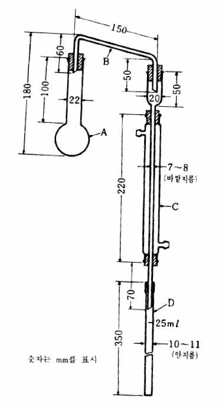

때에는 다)의

| 검체의 알코올함량(v/v %) | 유액(㎖) |
| --- | --- |
| 80이상80∼7070∼6060∼5050∼4040∼3030이하 | 13121110987 |

조작에서 석유
벤진을 넣기 전
에 과량의 묽은
황산을 넣어 비
누를 분해한다.
유액에 탄산칼
륨 4∼6g 및 알칼
리성페놀프탈레인
용액 1∼2 방울을
넣고 세게 흔들어
섞는다. 물층이 백탁되지 않을 때에는 다시 적당량의 탄산칼륨을
넣어 흔들어 섞고 15±2℃의 물 속에 30분간 방치하여 떠오른 적색
의 에탄올층의 ㎖수를 읽어 알코올수로 한다. 만일, 두 액층의 접
계면이 분명하지 않을 때에는 물을 적가하여 세게 흔들어 섞고 앞
에서와 같이 관찰한다.
A : 증류플라스크(50㎖)
B : 연결관
C : 냉각기
D : 유리마개 메스실린더(25㎖, 0.1㎖의 눈금이 있는 것)
제２법 기체크로마토그래프법 15℃에서 검체를 취하여 다음의 기체크로마토그래프법에 따라 조작하
여 에탄올(C H OH)의 함량(v/v%)을 측정하고 이 값에서 알코올수를 구하는 방법이다.
2 5
1) 시약 알코올수측정용무수에탄올 에탄올(C H OH)의 함량을 측정한 무수에탄올, 다만 무수에탄
2 5
올의 비중 d15과 에탄올(C H OH) 함량과의 관계는 0.797 : 99.46v/v%, 0.796 : 99.66v/v%, 0.795 :
15 2 5
99.86v/v%이다.
2) 검액 및 표준액의 조제 검액 에탄올(C H OH) 약 5㎖에 해당하는 양의 검체를 15±2°에서 정확
2 5
하게 취하여 물을 넣어 정확하게 50㎖로 한다. 이 액 25㎖를 정확하게 취하여 여기에 내부표준액 10
㎖를 정확하게 넣고 물을 넣어 정확하게 100㎖로 한다.
표준액 검액과 같은 온도의 알코올수측정용무수에탄올 5㎖를 정확하게 취하여 물을 넣어 정확하게
50㎖로 한다. 이 액 25㎖를 정확하게 취하여 여기에 내부표준액 10㎖를 정확하게 넣고 물을 넣어 정
확하게 100㎖로 한다
3) 조작법 검액 및 표준액 25㎖씩을 취하여 각각 100㎖의 고무마개가 달린 세구(細口) 원통형의 유
리병에 넣고 고무마개를 알루미늄캡으로 눌러 감아 마개를 하고 이것을 미리 온도변화가 적은 실내에
서 1시간 방치시킨 물 속에 유리병의 목까지 잠기도록 넣고 액이 마개에 묻지 않도록 하면서 가만히
흔들어 섞은 다음 30분간 방치한다. 각 용기안의 기체 1㎖를 가지고 다음의 조건으로 기체크로마토
그래프법에 따라 시험하고 내부표준물질의 피크높이에 대한 에탄올의 피크높이의 비 Q 및 Q 를 구한
T S
다.
Q 5(㎖)
알코올수＝ T ×
Q 검체의 양(㎖)
S
알코올수측정용무수에탄올중 에탄올(C H OH)의 함량(v/v %)
× 2 5
9.406
내부표준액 : 아세토니트릴용액(6→100)
조작조건
검 출 기 : 수소염이온화검출기
컬 럼 : 안지름 약3㎜, 길이 약 1.5m의 유리관에 150～180㎛의 기체크로마토그래프용 구상의 다
공성에칠비닐벤젠-디비닐벤젠공중합체를 충전한다.
컬럼온도 : 105～115℃의 일정온도
캐리어가스 : 질소
유 량 : 에탄올의 유지시간이 5～10분이 되도록 조정한다.
컬럼의 선정 : 표준액에서 얻은 용기안의 기체 1㎖를 가지고 위의 조건으로 조작할 때 에탄올, 내부
표준물질의 순으로 유출하고 그 분리도가 2.0이상인 것을 쓴다.
28. 암모늄시험법
암모늄시험법은 원료중에 불순물로서 들어있는 암모늄염의 한도시험이다. 그 한도는 보통 중량백분
율(%)로 나타낸다.
장 치 그림과 같은 장치를 쓴다. 전체가 경질유리제이며 접속부분은 갈아 맞춘 것도 된다. 장치
에 쓰이는 고무는 미리 수산화나트륨시액중에서 10～30분간 끓인 다음 물에서 30～60분간 끓이고 마지
막으로 물로 잘 씻은 다음 쓴다.
A : 증류플라스크

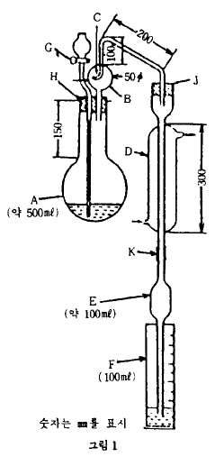

B : 내용물이 튀어오르는 것을 방지하는 것
C : 작은구멍
D : 냉각기
E : 역류방지기
F : 메스실린더
G : 콕크
Ｊ : 고무마개
H : 고무마개
K : 고무관
조 작 법 따로 규정이 없는 한 원료각조에 규정하는 양의 검체를 증류플
라스크 A에 취하여 물 140㎖ 및 산화마그네슘 2g을 넣고 증류장치를 연결
한다. 수기 F에는 흡수액으로 붕산용액(1→200) 20㎖를 넣고 냉각기 아래끝
을 흡수액에 담그고 1분에 5～7㎖의 유출속도가 되도록 가열온도를 조절하
여 유액이 60㎖가 될 때까지 증류한다. 냉각기의 아래 끝을 액면에서 떼고
소량의 물로 아래끝을 씻어 넣고 물을 넣어 100㎖로 하여 검액으로 한다.
비교액은 각조에서 규정하는 양의 암모늄표준액을 증류플라스크 A에
취하여 이하 검액의 조제와 같은 방법으로 조작한다. 검액 및 비교액 30㎖씩을 네슬러관에 취하여
페놀ㆍ니트로프루싯나트륨시액 6.0㎖를 넣어 섞는다. 다음 차아염소산나트륨ㆍ수산화나트륨시액 4㎖
및 물을 넣어 50㎖로 하여 섞은 다음 60분간 방치한다. 두개의 네슬러관을 백색의 배경을 써서 위
또는 옆에서 관찰하여 액의 색을 비교한다.
검액이 나타내는 색은 비교액이 나타내는 색보다 진하지 않다.
29. 액체크로마토그래프법
액체크로마토그래프법은 적당한 고정상을 써서 만든 칼럼에 검체혼합물을 주입하고 이동상으로 액체
를 써서 고정상에 대한 유지력의 차를 이용하여 각각의 성분으로 분리하여 분석하는 방법이다. 액상 검
체 또는 용액으로 만들 수 있는 검체에 적용할 수 있으며, 물질의 확인, 순도시험 또는 정량에 쓰인다.
칼럼에 주입된 혼합물은 각 성분의 고유의 비율k로 이동상과 고정상에 분포한다.
고정상에 존재하는 양
k= 
이동상에 존재하는 양
이 비율 k는 액체크로마토그래프법에서는 질량분포비 k’등으로 부른다. 이 비율 k와 이동상의 칼럼통
과시간 t(k=0인 물질을 주입할 때부터 피크 정점까지의 시간) 및 유지시간 t(측정검체를 주입할 때부
0 R
터 피크 정점까지의 시간)과의 사이에는 다음과 같은 관계가 있으므로 같은 조건에서는 유지시간은 물
질의 고유한 값이 된다.
t = (1+ k)t
R 0
장 치 보통 이동상송액용펌프, 검체도입장치, 칼럼, 검출기 및 기록장치로 되어 있다. 필요에 따라 이
동상조성제어장치, 칼럼항온조, 반응시약송액용펌프 및 화학반응조등을 쓴다. 펌프는 칼럼 및 연결튜
브속에 이동상 및 반응시약을 일정유량으로 보낼 수 있는 것이다. 또한 충전제 대신 고정상을 관벽에
유지시킨 것을 사용할 수 있다. 검출기는 검체의 이동상과는 다른 성질을 검출하는 것으로 자외 또는
가시흡광광도계, 형광광도계, 시차굴절계, 전기화학검출기, 화학발광검출기, 전기전도도검출기 및 질량
분석계 등이 있고 보통 수 ㎍ 이하의 검체에 대하여 농도에 비례하는 신호를 내는 것이다. 기록장치
는 검출기에 의해서 얻어지는 신호의 강도를 기록하는 것이다. 필요에 따라 기록장치로서 데이터처리
장치를 써서 크로마토그램, 유지시간 또는 성분정량치 등을 기록 또는 출력시킬 수 있다. 이동상조성
제어장치는 단계적제어(Stepwise방식)와 농도구배제어(gradient 방식)가 있고 이동상의 조성을 제어할
수 있다.
조작법 장치를 미리 조정한 다음 원료 각조에서 규정하는 조작조건의 검출기, 칼럼, 이동상을 써서
이동상을 규정한 유량으로 흐르게 하고 칼럼을 규정온도로 평형이 되게 한 다음 원료 각조에서 규정
하는 양의 검액 또는 표준액을 검체도입장치를 써서 검체도입부를 통하여 주입한다. 분리된 성분을
검출기로 검출하여 기록장치를 써서 크로마토그램으로 기록한다. 분석되는 성분이 검출기에서 검출하
는데에 적합한 흡수, 형광등의 물성을 갖지 않은 경우에는 적당한 유도체를 만들어 검출한다. 유도체
화는 보통 전라벨(prelabel)법 또는 후라벨(postlabel)법을 쓴다.
확인 및 순도시험 확인은 검체의 피검성분과 표준피검성분의 유지시간이 일치하거나 또는 검체에 표
준피검성분을 첨가하여도 검체의 피검성분피크의 형상이 변하지 않는지의 여부를 시험한다. 순도는
보통 검체중 혼재물의 한도에 해당하는 농도의 표준액을 쓰는 방법 또는 면적백분율법으로 시험한다.
따로 규정이 없는 한 검체의 이성체비는 면적백분율법에 따라 구한다. 면적백분율법은 크로마토그램
상에서 얻어진 각 성분의 총피크면적을 100으로 하고 이에 대한 각 성분의 피크면적비로부터 조성비
를 구한다. 다만, 정확한 조성비를 알기 위해서는 혼재물의 검출감도에 따라 피크면적을 보정한다.
정 량 1) 내부표준법 내부표준법에서는 일반적으로 되도록 피검성분에 가까운 유지시간을 가지며 모든
피크와 완전히 분리되는 안정한 물질을 내부표준물질로 선택한다. 원료 각조에 규정하는 내부표준물
질 일정량에 대하여 표준피검검체를 단계적으로 넣어 여러종류의 표준액을 조제한다. 이들 표준액 일
정량씩을 주입하여 얻은 크로마토그램으로부터 내부표준물질의 피크면적 또는 높이에 대한 표준피검
성분의 피크면적 또는 피크높이의 비를 구한다. 이 비를 종축으로 하고 표준피검성분량 또는 내부표
준물질량에 대한 표준피검성분량의 비를 횡축으로 하여 검량선을 작성한다. 이 검량선은 보통 원점을
지나는 직선이 된다. 다음에 원료 각조에 규정하는 방법으로 같은 양의 내부표준물질을 넣은 검액을
조제하여 검량선을 작성하였을 때와 같은 조건으로 크로마토그램을 기록하여 그 내부표준물질의 피크
면적 또는 피크높이에 대한 피검성분의 피크면적 또는 피크높이비를 구하여 검량선을 써서 피검성분
량을 구한다. 원료 각조에서는 보통 상기의 검량선이 직선이 되는 농도범위에 들어가는 한 개의 표준
액 및 표준액에 가까운 농도의 검액을 조제하여 원료 각조에서 규정하는 각각의 양에 대하여 같은 조
건으로 액체크로마토그래프법에 따라 시험하여 피검성분량을 구한다. 보통 표준액의 규정량을 반복
주입하여 얻어진 각각의 크로마토그램에서 내부표준물질의 피크면적 또는 피크높이에 대한 표준피검
성분의 피크면적 또는 피크높이의 비를 구하여 그 상대표준편차(변동계수)를 구하여 재현성을 확인한
다.
2) 절대검량선법 표준피검검체를 단계적으로 취하여 표준액을 조제하고 이 표준액 일정량씩을 정확
하고 재현성있게 주입한다. 얻어진 크로마토그램으로부터 종축에 표준피검성분의 피크면적 또는 피크
높이, 횡축에 표준피검성분량을 취하여 검량선을 작성한다. 이 검량선은 보통 원점을 지나는 직선이
된다. 다음에 원료 각조에 규정하는 방법으로 검액을 조제하여 검량선을 작성하였을 때와 같은 조건
으로 크로마토그램을 기록하여 피검성분의 피크면적 또는 피크높이를 측정하고 검량선을 써서 피검성
분량을 구한다.
원료 각조에서는 보통 상기의 검량선이 직선이 되는 농도범위에 들어가는 하나의 표준액 및 이 표준
액에 가까운 농도의 검액을 조제하여 원료 각조에서 규정하는 각각의 양에 대하여 같은 조건으로 액
체크로마토그래프법에 따라 시험하여 피검성분량을 구한다. 이 방법은 주입조작 등 모든 측정조작을
엄밀하게 일정한 조건으로 하여 시험한다. 보통 표준액의 규정량을 반복하여 주입하여 얻어진 각각의
크로마토그램의 피크로부터 표준피검성분의 피크면적 또는 피크높이를 구하고 그 상대표준편차(변동
계수)를 구하여 재현성을 확인한다.
피크측정법 보통 다음의 방법을 쓴다.
1) 피크높이측정법 가) 피크높이법 피크정점에서 기록지의 횡축으로 내린 수선(垂線)과 피크의 양끝
을 연결하는 접선(기선)과의 교차점으로부터 정점까지의 길이를 측정한다.
나) 자동피크높이법 검출기로부터의 신호를 데이터처리장치를 써서 피크높이로 측정한다.
2) 피크면적측정법 가)반치폭법 피크높이의 중심점에서의 피크폭에 피크높이를 곱한다. 나) 자동적분
법 검출기로부터의 신호를 데이터처리장치를 써서 피크면적을 측정한다.
용 어 기체크로마토그래프법의 용어에 따른다.
주의 : 표준피검품, 내부표준물질, 시험에 쓰는 시약, 시액은 측정을 방해하는 물질을 함유하지 않는
것을 쓴다. 원료 각조의 조작조건중에서 칼럼의 반지름 및 길이, 충전제의 입자경, 칼럼의 온도, 이동
상의 조성비, 이동상의 완충액 조성, 이동상의 pH, 이동상의 이온쌍 형성제 농도, 이동상의 염농도, 절
환회수, 절환시간, 이동상 조성 제어프로그램 및 그 유량, 유도체와 시약의 조성 및 유량, 이동상의 유
량 그리고 반응시간 및 화학반응조 온도는 규정된 용출순서, 분리도, 대칭계수 및 상대표준편차를 얻
을 수 있는 범위내에서 일부 변경할 수 있다.
30. 액화가스시험법
가. 비중측정법
비중측정법은 내압(耐壓)실린더를 쓴 비중부액계를 써서 비중을 측정하는 방법이다. 비중부액계는 에
탄올 또는 에텔로 깨끗이 씻은 것을 쓴다. 비중부액계를 넣은 내압실린더에 검체를 취하여 조심하면서
검체를 잘 흔들어 섞고 규정온도에서 비중부액계가 정지하였을 때 메니스커스 윗부분을 읽어 비중을 측
정한다.
장 치 다음 그림과 같은 장치를 쓴다.
내압유리제실린더 A 및 투명플라스틱제 보호통 B를 입구코크 C 및 출구코크 D로 고정시킨 받침대에
팩킹 I를 써서 고정한다. 비중부액계 F 및 온도계고정용판넬로 고정시킨 고유동점용온도계 G를 A속
에 넣어 증기방출코크 E를 단 윗뚜껑 I를 써서 고정하고 코크 C, D 및 E를 모두 닫는다.
A : 내압유리제실린더(내경 40㎜ 이상, 두께 약 10㎜, 길이 약 450㎜)
B : 투명플라스틱제 보호통
C : 입구코크
D : 출구코크
E : 증기방출코크
F : 비중부액계(프레온류는 비중부액계 4호 또는 5호를 사용하고 액화석유가스는 액화석유가스용ㆍ비중
부액계를 쓴다.)
G : 고유동점용온도계(액화석유가스용비중부액계를 사용할 때는 필요없다)

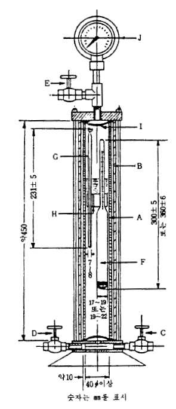

H : 온도계고정용판넬
Ｉ : 팩킹(클로로프렌계의 물질)
Ｊ : 압력계
조 작 법 따로 규정이 없는 한 원료각조에서 규정하는 비중부액
계를 넣은 그림에 나타난 장치를 쓴다. 검체용기코크와 입구코
크 C를 검체도입관으로 연결하고 검체용기코크 및 C를 열어 적
당량의 검체를 취한 다음 검체용기코크와 C를 닫고 장치에 새는
곳이 없음을 확인한다. 다음에 출구코크 D를 열어 내압유리제실
린더 A내의 공기와 검체증기를 치환하고 A내에 검체가 액상으로
남지 않도록 조심하면서 검체를 휘산시키고 D를 닫는다. 그리고
검체용기코크 및 C를 열어 따로 규정이 없는 한 A의 비중부액계
F가 떠오르는 상태가 되도록 검체를 취하여 검체용기코크 및 C
를 닫은 다음 검체도입관을 제거한다. 이것을 20±0.5℃로 조정
한 항온조에 넣고 때때로 꺼내어 F가 파손되지 않도록 조심하면
서 흔들어 고유동점용온도계 G또는 F의 온도계가 20±0.5℃를 나
타낼 때까지 이 조작을 반복한다. G또는 F의 온도계가 20±0.5℃
를 나타내고 F가 정지했을 때 메니스커스 윗부분을 읽어 비중을
구한다.
조작상의 주의
(1) 압력 10kg/㎠(게이지압)이하에서 측정한다.
(2) 가연성 연료(액화석유가스)를 취할 때는 인화되지 않도록 특
히 조심한다.
(3) 장치에 검체를 넣은 상태에서 충격을 준다거나 직사일광을 닿게 해서는 안된다.
나. 확인시험
1) 할라이드토치법
이 방법은 할라이드토치를 써서 할로겐을 함유하는 휘발성유기물의 불꽃반응(할로겐화구리)에 의한
불꽃색의 변화를 보는 방법이다.
장 치 보통 그림과 같은 장치를 쓴다.
A : 연료통
B : 고정통
C : 심 지
D : 가열용기
E : 조정코크핸들
F : 흡기관(끝에 비닐관을 단다).
G : 구리제 불꽃고리
H : 밑뚜껑(밑가운데 부위, 나사식)
Ｉ : 노 즐
Ｊ : 불꽃통
조 작 법 밑뚜껑 H를 열어 연료통 A에 메탄올을 넣어 심지 C를 축이고 H를 닫고 이어서 가열용기
D에 메탄올을 D의 용량의 1/3～2/3를 넣은 다음 점화한다. D의 메탄올이 타기 직전에 조정핸들 E
를 열어 A내의 메탄올증기와 흡기관 F로 부터의 공기와의 혼합기체에 점화시켜 구리제 불꽃고리 G의
부근에서 태운다. 불꽃이 커지지 않도록 조심하면서 조절하고 검체증기에 F를 가까이 하여 불꽃색의

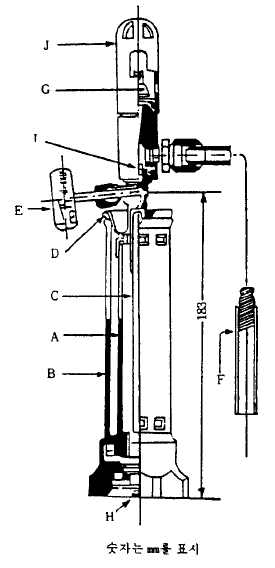

변화를 관찰한다.
2) 비점측정법
비점측정법은 액체가 비등할 때의 온도를 측정하는 방법이다.
조 작 법 따로 규정이 없는 한 검체 50㎖를 100㎖ 비커에 취하여 고유
동점용온도계를 넣어 필요하면 조심하면서 가열하여 비등할 때의 온도
를 읽는다.
다. 산측정법
산측정법은 검체중의 산을 물로 용출시켜 수산화나트륨액으로 적정하여
산분을 염산(HCl)의 양으로서 측정하는 방법이다.
조 작 법
제１법 따로 규정이 없는 한 검체 100g을 20℃이하의 물 100㎖를 넣은
분액깔때기에 취하여, 조심하면서 잘 흔들어 섞는다. 이 때 분액깔때
기안의 압력이 너무 높아지지 않도록 때때로 조심하면서 마개를 열어
기체를 방출시킨다. 내용액을 잘 흔들어 섞은 다음 물층을 분취한다.
검액층에 20℃이하의 물 100㎖를 넣어 이 조작을 3회 반복한다. 첫번
째 및 두번째의 물층을 합하고 이것을 검액으로 하여 0.01N 수산화나
트륨액으로 적정한다(지시약 : 페놀프탈레인시액 3방울). 적정의 종말점은 액의 홍색이 30초동안
지속하는 때로 한다. 분취한 세번째 및 네번째의 물층을 합하고 이것을 공시험액으로 하여 같은
방법으로 공시험을 하여 보정한다.
(a―b) × 0.000365
산(HCl)의 양(%) ＝ × 100
검체의 양(g)
a : 검액의 0.01N 수산화나트륨액의 소비량(㎖)
b : 공시험액의 0.01N 수산화나트륨액의 소비량(㎖)
제２법 그림1에 표시한 흡수병 4개에 물 100㎖씩을 넣어 고무관으로 직렬로 연결한다. 첫번째의
흡수병을 그림2에 표시한 마개삼각플라스크에 연결한다. 따로 규정이 없는 한 검체 100g을 -50℃이
하로 냉각한 검체용기로 부터 직접 또는 -50℃이하로 냉각한 도입관을 써서 검체의 액층으로 부터
마개삼각플라스크에 취하여 실온에서 방치하여 증발시켜 검체를 휘산시킨다음 첫번째 및 두번째의
흡수병의 물을 합하여 이것을 검액으로 한다. 마개삼각플라스크는 새로 끓여 식힌 물 10㎖로 씻고
씻은 액을 검액에 합한다. 세번째 및 네번째의 흡수병의 물을 합하여 새로 끓여 식힌 물 10㎖를
넣어, 이것을 공시험액으로 한다. 검액 및 공시험액을 가지고 제１법에 따라 시험하여 검체중 산
(HCl)의 양을 구한다.

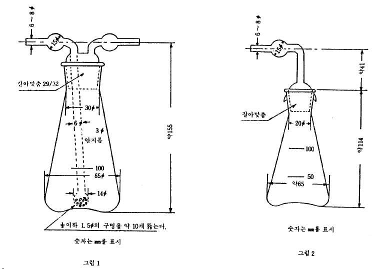

라. 증발잔류물시험법
증발잔류물시험법은 검체를 실온 또는 수욕상에서 증발시켜 검체중의 고비점잔류물의 중량 또는 용
량을 측정하는 방법이다.
조 작 법
제１법 따로 규정이 없는 한 원료각조에서 규정하는 검체의 양을 -50℃이하로 냉각한 검액용기에서
직접 또는 -50℃이하로 식힌 도입관을 써서 검체를 증발접시에 액상으로 취하여 실온에서 증발한다.
이어서 잔류물을 다시 105～110℃에서 각조에서 규정하는 시간동안 건조하고 데시케이터(실리카
겔)속에서 방냉한 다음 그 무게를 단다.
제２법 따로 규정이 없는 한 검체 100㎖를 -50℃이하로 식힌 검체용기에서 직접 또는 -50℃이하로 식
힌 도입관을 써서 검체를 -40℃이하의 냉각욕에 넣은 그림과 같은 증발관에 액상으로 취한다. 이어
서 검체를 실온에서 천천히 증발시킨 다음 증발관의 내벽을 트리클로로트리플루오로에탄(Freon
113) 5㎖로 씻는다. 이 증발관을 70～80℃수욕중에 증발관의 표선 1㎖까지 담근 다음 30분간 가열
한다. 증발관중에 남은 Freon 113 증기를 공기와 치환시킨 다음 잔류물의 양을 증발관의 눈금으로
부터 읽고 증발잔류물의 양(v/v%)으로 한다.
제３법 따로 규정이 없는 한 검체 150㎖를 검체의 액층으로 부터 위의 그림과 같은 증발관에 취하
고 증발관을 50～80℃의 수욕중에 넣어 가온하여 검체를 천천히 증발시킨다. 「증발시킨 다음 증
발관의 내벽을」 이하 제２법에 따라 시험한다.
마. 수분정량법
수분정량법은 따로 규정이 없는 한 보통 적정플라스크 및 내압검체채취기를 써서 일반시험법의 수분
정량법에 따라 수분을 정량하는 방법이다.
장 치 보통 그림과 같은 장치를 쓴다.

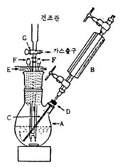

A : 적정플라스크
B : 내압검체채취기
C : 주사침
D : 금속스토퍼
E : 적정뷰렛
F : 전극단자
G : 증기방출마개
조 작 법 칼핏셔용메탄올 또는 칼핏셔용메탄올과 에칠렌글리콜
의 같은 용량혼합액 100㎖를 건조한 적정플라스크 A에 취하여
칼핏셔시액을 종말점까지 넣는다.
따로 규정이 없는 한 검체 50∼100g을 건조한 내압검체채취기 B에 취
하여 그 무게를 단다(B와 검체용기를 검체도입관으로 연결하여 검체의
액층부로 부터 B 및 검체도입관중의 공기를 검체증기로 치환시킨 다음
조심하면서 취한다). 이어서 B의 선단에 주사침 C를 꽂아 금속스토퍼 D로 부터 A의 밑부분까지 C를
넣어 A내의 액을 저어 섞으면서 B의 마개를 조금 내리고 증기방출마개 G를 튀기지 않도록 조심하면서
G로 부터 방출량이 매분 0.3∼0.5ℓ의 속도가 되도록 검체를 넣는다. 검체를 넣은 다음 B 및 C를 빼내
어 B의 무게를 달아 검체채취량을 구한다. 곧 칼핏셔시액으로 종말점까지 적정한다.
칼핏셔시액의 소비량(㎖) × f
물(H O)의 양(%) ＝
2 검체의 양(g) × 10
f : 칼핏셔시액의 규정도계수(H O ㎎/㎖)
2
바. 정 량 법
일반시험법 기체크로마토그래프법의 제３법 면적백분율법에 따라 시험하여 얻은 크로마토그램의 각
성분의 피크면적을 반치폭법으로 계산한다.
조 작 법
제１법 따로 규정이 없는 한 검체 1～5㎖을 액층부로 부터 가스상태로 기체크로마토그래프용 가스
계량관 또는 실린지에 취한다. 다음 중의 한가지 조작조건으로 기체크로마토그래프법에 따라 시험
한다. 얻은 크로마토그램으로 부터 공기 이외의 각 성분의 피크면적을 반치폭법으로 구하여 주요
세가지 성분의 유지시간의 순서에 따라 프로판, 이소부탄 및 부탄으로 하여 보정계수를 곱하고 다
음 식에 따라 액화석유가스의 양(%)을 구한다.
액화석유가스의 양(%)
A S f ＋A S f ＋A S f
＝ P P P IB IB IB B B B ×100
A S f ＋A S f ＋A S f ＋A S f ＋……
P P P IB IB IB B B B a a a
A : 성분의 피크면적(㎠)
S : 성분의 증폭감도비
f : 보정계수
: 프로판 : 아이소부탄 : 부탄 : 기타 성분의 명칭을 나타낸다
P IB B a
조작조건
(1) 검 출 기 : 열전도도형검출기(감도 1㎷ 또는 2㎷)
컬 럼 : 안지름 3～6㎜, 길이 3～8m의 컬럼에 10～35%의 말레인산디n-부틸을 코팅한 149～540
㎛의 기체크로마토그래프용내화연와 또는 기체크로마토그래프용규조토를 충전한다.
컬럼온도 : 0～50℃사이의 일정온도
캐리어가스 및 유속 : 수소 또는 헬륨, 매분 5∼100㎖사이의 일정량.
(2) 검 출 기 : 열전도도형검출기 (감도 1㎷ 또는 2㎷).
컬 럼 : 안지름 3～6㎜, 길이 3～8m의 컬럼에 15～30%의 프탈산디옥틸을 코팅한 149～540㎛
의 기체크로마토그래프용내화연와 또는 기체크로마토그래프용규조토를 충전한다.
컬럼온도 : 0∼50℃사이의 일정온도
캐리어가스 및 유속 : 수소 또는 헬륨, 매분 10∼100㎖ 사이의 일정량
보정계수

| 이 동 상탄화수소명 | 헬 륨 | 수 소 |
| --- | --- | --- |
| 에 탄프 로 판아 이 소 부 탄부 탄아 이 소 펜 탄펜 탄 | 1.721.311.041.000.850.81 | 1.551.191.031.000.900.84 |

제２법 따로 규정이 없는 한 검체 1～5㎖을 액층부로 부터 가스상태로 기체크로마토그래프용 가스
계량관 또는 실린지에 취한다(다만 트리클로로모노플루오로메탄은 검체 0.01～0.02㎖를 기체크로마
토그래프용 마이크로실린지에 취한다). 다음 중의 한가지 조건에서 기체크로마토그래프법에 따라
시험하여 얻은 크로마토그램에서 공기 이외의 각 성분의 피크면적을 반치폭법으로 구하고 다음 식
에 따라 주성분의 양(%)을 계산한다.
A S
주성분의 양(%) ＝ m m × 100
A S ＋ A S ＋ A S ＋ ……
m m a a b b
A , A , A : 주성분 m 및 기타 성분 a, b,…의 피크면적(㎠)
m a b
S , S , S : 주성분 m 및 기타성분 a, b,…의 증폭감도비
m a b
조작조건
(1) 검 출 기 : 열전도도형검출기(감도 1㎷ 또는 2㎷)
컬 럼 : 안지름 3～6㎜, 길이 3m이상의 컬럼에 20～30%의 n-옥타데칸을 코팅한 149～350㎛의
기체크로마토그래프용내화연와 또는 기체크로마토그래프용규조토를 충전한다.
컬럼온도 : 20∼80℃ 사이의 일정온도
캐리어가스 및 유속 : 수소 또는 헬륨, 매분 30∼60㎖ 사이의 일정량
(2) 검 출 기 : 열전도도형검출기(감도 1㎷ 또는 2㎷)
컬 럼 : 안지름 3～6㎜, 길이 3m 이상의 컬럼에 20～30%의 세바신산디옥틸을 코팅한149～350
㎛의 가스크로그래프용내화연와 또는 기체크로마토그래프용규조토를 충전한다.
컬럼온도 : 20∼80℃ 사이의 일정온도
캐리어가스 및 유속 : 수소 또는 헬륨, 매분 30∼60㎖ 사이의 일정량
31. 에스텔가측정법
에스텔가는 검체 1g중의 에스텔를 검화하는데 필요한 수산화칼륨(KOH)의 ㎎수이다.
조 작 법 제１법 따로 규정이 없는 한 검화가 및 산가를 측정하고 그 차를 구하여 에스텔가로 한
다.
제２법 원료각조에서 규정하는 검체의 양을 정밀하게 달아 200㎖의 플라스크에 넣고 에탄올 10㎖ 및
페놀프탈레인시액 3방울을 넣어 0.1N 수산화칼륨액으로 중화한 다음 0.5N 수산화칼륨ㆍ에탄올액 25㎖
를 정확하게 넣고 여기에 갈아 맞춘 환류냉각기를 달고 수욕상에서 1시간 가만히 끓인다. 식힌 다음
페놀프탈레인시액 1㎖를 넣어 0.5N 염산로 과량의 수산화칼륨을 적정한다. 같은 방법으로 공시험을
하여 보정한다.
(a―b) × 28.053
에스텔가 ＝
검체의 양(g)
a : 공시험에서 0.5N 염산의 소비량(㎖)
b : 검액에서 0.5N 염산의 소비량(㎖)
32. 여과지크로마토그래프법
여과지에 적당한 용매를 침투시키면 여과지위에 있는 물질은 용매의 이동과 동시에 그 물질 고유의
이동률에 따라 이동한다. 이 현상을 이용하여 혼합물을 분리하는 방법을 여과지크로마토그래프법이라
고 하며 물질의 확인시험 및 순도시험 등에 쓰인다.
조 작 법
제１법 폭 20～30㎜, 길이 400㎜의 여과지에 밑쪽에서 부터 약 50㎜ 위치에 연필로 횡선을 긋고 그
횡선 중심을 원점으로 정하고 여기에 원료각조에서 규정한 방법으로 만든 규정량의 검액을 마이크로
피펫 또는 모세관을 써서 점적하고 바람에 말린다. 다음에 미리 전개용매를 넣어 그 증기로 포화시
켜 둔 높이 약 500㎜의 원통형 유리전개조에 넣고 기벽에 접촉되지 않게 조심하여 매달고 밑쪽에서
약 10㎜까지를 원통형 유리전개조에 넣은 전개용매중에 잠기도록 하고 전개조를 밀폐하여 전개시킨
다. 용매가 원점에서 부터 규정한 거리까지 상승하였을 때 여과지를 전개조에서 꺼내어 바람에 말린
다음 자연광 또는 필요하면 자외선하에서 물질에 따른 반점의 색과 위치를 관찰한다. R값은 다음의
f
식에 따라 구한다.
원점에서 반점의 중심선까지의 거리
R
f＝ 원선에서 용매의 끝까지의 거리
제２법
장 치 그림과 같은 장치를 쓴다.
A : 크로마토그래프용원형여과지

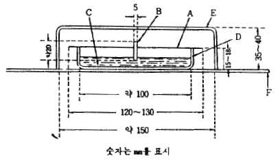

(지름 120∼130㎜)
B : 원통형 여과지
C : 전개용 용매
D : 페트리접시
E : 밀폐용 유리용기
F : 유리판
크로마토그래프용원형여과지 A의 중심에 연필로 반 지
름 10㎜의 원을 그리고 이 선상에 원료각조에서 규 정 한
방법으로 만든 검액과 대조액의 규정량을 각각 마이크로피펫 또는 모세관을 써서 점적하고 바람에 말
린다. 이 떄 검액을 점적한 반점과 대조액을 점적한 반점과는 서로 엇갈려 같은 거리가 되도록 또
그 총수는 6∼8개가 되도록 한다. 다음 이 여과지의 중심에 지름 5㎜의 구멍을 뚫고 여기에 용매 흡
인용 원통형여과지 B를 끼어 넣는다. 규정한 전개용매 C를 넣은 페트리접시 D에 원형여과지 A를 수
평으로 놓고 원통형여과지 밑쪽 약 5㎜를 용매중에 담그고 기밀용기에 방치한다. 용매가 규정거리까
지 도달할 때 여과지를 용기중에서 꺼내어 바람에 말린 다음 자연광, 필요하면 자외선하에서 물질에
따른 반점의 색 및 위치를 관찰한다.
33. 연화점측정법
연화점은 다음의 방법에 따라 측정한다.
장 치 다음 그림 1∼5와 같은 장치를 쓴다.

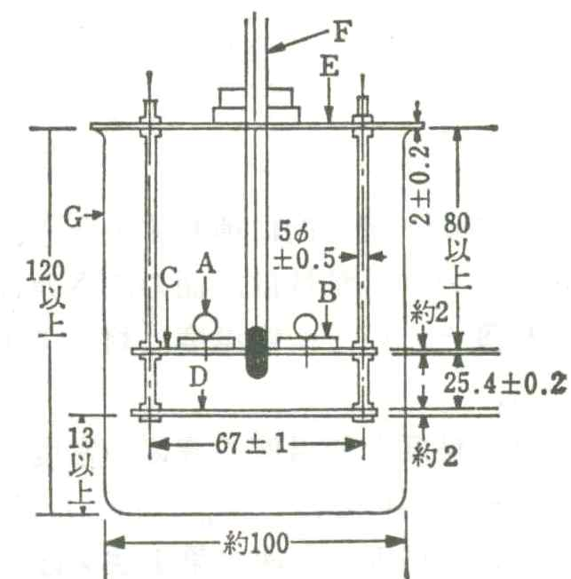

A : 금속공(지름 9.5㎜ 무게 3.5g)
B : 고리(황동제이며 그림2와 같다)
C : 고리의 지지판(금속제이며 그림3과 같다)
D : 밑판(그림 4와 같다. 대류공(對流孔) J를 40개 가짐)
E : 정치판(定置板)(그림5와 같다)
F : 온도계 1호(그 수은구의 중심이 환의 지지판 C의 아래면과 같은
높이가 되도록 한다)
G : 비커
H : 고리의 지지구멍
Ｉ : 온도계의 수은구가 들어가는 구멍
(숫자는 mm를 표시) Ｊ : 대류공(지름 약 4㎜)
그림 1

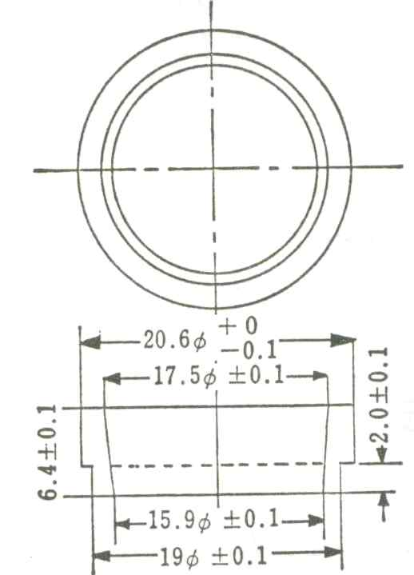

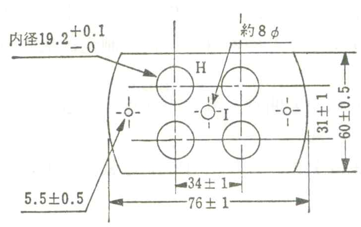

그림 3
그림 2

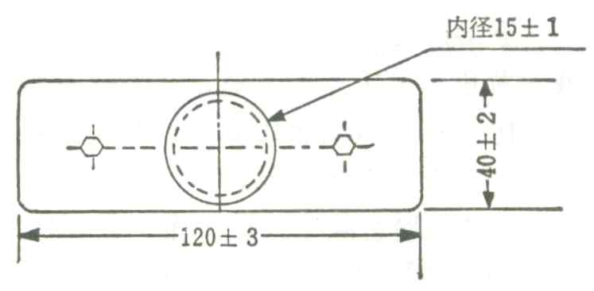

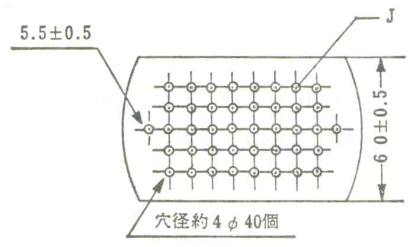

그림 5
그림 4
(그림 2∼그림 5 숫자는 mm를 표시)
조 작 법 검체를 될 수 있는 한 낮은 온도에서 융해하고 고리 B를 평평한 금속판 위에 놓고 융해한
검체를 거품이 들어가지 않게 조심하면서 B속에 채우고 실온에서 40분간 방치한다. 조금 가열한 작
은 칼로 B의 윗끝에 평면보다 올라온 곳을 잘라낸다. 다음 비커 G에 새로 끓여 식힌 물을 깊이 90㎜
이상 되도록 넣고 물의 온도를 예상한 연화점보다 약 60℃ 낮은 온도로 유지한다. B속의 검체표면
중앙에 금속공 A를 얹어 놓고 이 B를 지지구멍 H에 끼운다. 다음 B의 윗면에서 수면까지의 거리를
50±2㎜로 하고 15～20분간 방치한 다음 가열한다. 버어너의 불꽃은 비커의 밑 중앙과 가장자리의 중
간에 균등하게 받게한다. 조심하면서 3분간 가열한 다음 1분에 5±0.5℃씩 올라가게 가열한다. 검체
가 차차 연화하여 B에서 흘러 떨어져서 밑판 D에 접촉하였을 때의 온도를 연화점으로 한다. 측정은
1회에 4개의 B를 써서 2회 이상 시험하고 그 평균값으로 한다.
34. 염화물시험법
염화물시험법은 검체중에 불순물로서 들어있는 염화물의 허용한도량을 시험하는 방법이다. 그 한도
는 염화물(Cl로서)의 중량백분율(%)로 나타낸다.
조 작 법 따로 규정이 없는 한 원료각조에서 규정하는 검체의 양을 네슬러관에 넣고 물 30㎖를 넣어
녹이고 묽은질산 6㎖ 및 물을 넣어 50㎖로 하여 검액으로 한다. 따로 원료각조에서 규정하는 양의
0.01N 염산을 넣고 묽은질산 6㎖ 및 물을 넣어 50㎖로 하여 비교액으로 한다. 이 때 검액이 맑지 않
을 때에는 양쪽 액을 같은 방법으로 여과한다. 양쪽 액에 질산은 시액 1㎖씩을 넣어 잘 흔들어 섞고
차광된 곳에서 5분간 방치한 다음 흑색의 배경을 써서 네슬러관을 위 또는 옆에서 관찰할 때 검액의
혼탁도는 비교액보다 진하지 않다.
주 의 : 이 시험 또는 검액의 조제에 쓰이는 시약 및 시액은 공시험에서 혼탁하지 않거나 또는 거의
혼탁하지 않은 것을 쓴다.
35. 요오드가측정법
요오드가는 검체를 다음의 방법에 따라 측정할 때 검체 100g에 결합하는 할로겐의 양을 요오드(I)로
환산한 g수이다.
조 작 법 따로 규정이 없는 한 검체의 요오드가에 따라 다음 표의 검체의 양을 유리용기에 정밀하게
달아 500㎖의 요오드병에 넣고 사이클로헥산ㆍ빙초산의 혼합액(1:1) 10㎖를 넣어 녹인 다음 일염화요
오드시액 25㎖를 정확하게 넣고 잘 흔들어 섞는다. 액이 맑지 않으면 다시 시클로헥산ㆍ빙초산의 혼
합액(1:1)을 추가하여 마개를 하고 차광하여 20～30℃에서 30분간 때때로 흔들어 섞고 방치한다. 여기
에 요오드화칼륨용액(1→10) 20㎖ 및 물 100㎖를 넣고 흔들어 섞은 다음 유리된 요오드를 0.1N치오황
산나트륨액으로 적정한다(지시약 : 전분시액 1㎖). 같은 방법으로 공시험을 하여 보정한다.
(a - b) ×1.2690
요오드가 검체의 양(g) 요오드가 ＝
검체의 양(g)
30 이하 1.0
a : 공시험에서 0.1N치오황산나트륨액의 소비량(㎖)
30 ∼ 50 0.6
b : 검액에서 0.1N치오황산나트륨액의 소비량(㎖)
50 ∼ 100 0.3
주 의 : 요오드가가 100 이상인 검체의 경우에는 방치시간
100 ∼ 150 0.2
을 1시간으로 한다.
36. 융점측정법
융점은 다음 제１법, 제２법, 제３법 또는 제４법에 따라 측정한다. 또 건조한 다음이라고 되어 있으
면 건조감량항의 조건에서 건조한 다음 측정한다.

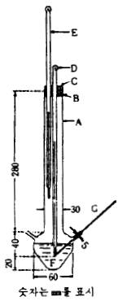

제１법
장 치 그림과 같은 장치를 쓴다
A : 측정관
B : 코르크마개
C : 공기를 통하는 구멍
D : 온도계
E : 보조온도계
F : 욕액(浴液)
G : 모세관(경질유리제이며 길이 120㎜, 안지름 0.8～1.2㎜,
벽의 두께 0.2∼0.3㎜로 한쪽 끝이 막힌 것.)
용액 : 검체의 융점에 따라 다음의 것을 적당히 쓴다. 250℃ 이하일 때는 황
산, 미네랄오일 또는 실리콘오일을 쓰며 250℃ 이상일 때는 황산ㆍ황산칼륨 혼
합물(3:2) 또는 실리콘오일을 쓴다.
온도계 : 융점이 120℃이하일 때는 온도계 1호, 120∼220℃일 때는 2호, 220℃이
상일 때는 3호를 쓴다
보조온도계 : 온도계 1호를 쓰며 그 수은구가 액면과 온도계 눈금(융점)의 중앙부에 오도록 한다.
조 작 법 검체를 미세한 가루로 하고 따로 규정이 없는 한 데시케이터(실리카 겔)속에서 24시간 건조
한다. 이 검체를 건조한 모세관 G에 넣고 시계접시 위에 세운 길이 약 700㎜의 유리관 내부에 떨어
뜨려 다져서 단단히 채워 층의 두께가 2.5～3.5㎜가 되도록 한다. 측정관 A를 가열하여 예상한 융점
보다 약 30℃낮은 온도까지 올려 검체를 넣은 G를 A의 측관에 삽입하여 검체를 채운 부분이 온도계
D의 수은구 중앙에 오도록 한다. 다음에 1분에 약 3℃씩 상승하도록 가열하여 온도를 올리고 예상한
융점보다 약 5℃낮은 온도부터는 1분에 1℃씩 상승하도록 가열을 계속한다. 검체가 G내에서 액화하
여 고체를 완전히 볼 수 없을 때 D의 눈금 t℃및 보조온도계의 눈금 t'℃를 읽어 융점 T℃를 다음 식
에 따라 계산한다.
T ＝ t ＋ 0.00015(t ― t')(t ― t")
t" : t℃의 눈금을 읽었을 때 액면의 온도계의 눈금, 이 때 눈금판에 눈금이 없을 때는 외삽
하여 구한다.
제２법 검체를 조심하면서 될 수 있는 한 낮은 온도에서 융해하고 이것을 거품이 들어가지 않도록 조
심하면서 양쪽 끝이 열린 길이 약 120㎜의 모세관속에 빨아 올려 약 10㎜의 높이로 한다. 모세관으
로 부터 검체가 유출하지 않도록 하여 10℃ 이하에서 24시간 방치하거나 또는 2시간 이상 빙냉한 다
음 검체의 위치가 수은구의 중앙외측에 오도록 고무줄로 온도계(온도계 1호)를 붙들어 매고 물을 넣은
250㎖의 비커에 넣고 검체의 윗면을 수면아래 10㎜의 위치에 오도록 고정한다. 물을 계속 저어 주면
서 가온하여 예상한 융점보다 5℃ 낮은 온도부터는 1분에 1℃씩 상승하도록 가열을 계속한다. 모세
관중에서 검체가 떠오를 때의 온도를 융점으로 한다.
제３법 검체를 잘 저어 섞으면서 천천히 90～92℃까지 가열하여 융해한 다음 가열을 그치고 검체를
융점보다 8～10℃ 높은 온도까지 식힌다. 온도계를 5℃로 식힌 다음 여과지로 수분을 닦아서 건조하
고 곧 수은구의 반정도를 검체중에 삽입하였다가 곧 빼내어 수직으로 하고 식혀 부착한 검체가 혼탁
하여질 때 16℃ 이하의 물속에 5분간 담근 다음 시험관(25×100㎜)에 온도계를 삽입하고 온도계의 밑
면과 시험관의 바닥과의 사이가 15㎜가 되도록 코르크를 써서 온도계를 고정한다. 이 시험관을 약
16℃의 물을 넣은 500㎖의 비커속에 시험관의 바닥과 비커의 바닥과의 거리를 15㎜가 되게 고정하고
욕의 온도가 30℃가 될 때까지는 1분에 2℃씩 상승하도록 가열한다. 그 다음에는 1분에 1℃씩 상승
하도록 가열을 계속하여 온도계로 부터 검체 1방울이 떨어질 때의 온도를 측정한다. 이 시험을 3회
하여 측정값의 차가 1℃ 미만일 때는 그 평균값을 융점으로 하고 1℃ 이상일 때는 5회 측정하여 그
평균값을 융점으로 한다.
제４법 검체를 조심하면서 될 수 있는 한 낮은 온도에서 융해하고, 이것을 거품이 들어가지 않도록
조심하여 양쪽 끝이 열린 길이 약 120㎜의 모세관속에 빨아 올려 약 10㎜의 높이로 한다. 모세관으
로 부터 검체가 유출하지 않도록 하여 10℃ 이하에서 24시간 방치하거나 또는 2시간 이상 빙냉한 다
음 검체의 위치가 수은구의 중앙외측에 오도록 고무줄로 온도계(온도계 1호)를 붙들어 맨다. 이 온도
계를 시험관(25×100㎜)에 넣고 온도계의 하단과 시험관의 바닥과의 사이가 15㎜가 되도록 코르크를
써서 고정한다. 이 시험관을 약 16℃의 물을 넣은 500㎖의 비커 속에 넣고 시험관의 바닥과 비커의
바닥과의 거리를 15㎜가 되도록 고정하고, 욕의 온도가 예상한 융점보다 5℃ 낮은 온도가 될 때까지
가열한다. 그 다음에는 1분에 1℃씩 상승하도록 가열을 계속한다. 모세관내의 검체가 액화하여 맑게
될 때의 온도를 측정한다. 이 시험을 3회하여 측정값의 차가 1℃ 미만일 때는 그 평균값을 융점으
로 하고 1℃ 이상일 때는 5회 측정하여 그 평균값을 융점으로 한다.
37. 음이온계면활성제정량법
음이온계면활성제정량법은 검체중에 함유되는 음이온계면활성제를 양이온계면활성제로 직접 콜로이드
적정을 하거나 또는 음이온계면활성제로 간접적으로 콜로이드적정을 하여 정량하는 방법이다.
제１법 따로 규정이 없는 한 음이온계면활성제로서 약 1g에 해당하는 양의 검체를 정밀하게 달아 물
을 넣어 녹여 1ℓ로 하고 이것을 검액으로 한다. 검액 10㎖를 100㎖의 마개 있는 메스실린더에 넣고
산성메칠렌블루시액 25㎖, 클로로포름 15㎖ 및 물 20㎖를 넣어 0.004M 염화벤제토늄액으로 적정한다.
적정은 처음 1㎖씩 넣어 매회 마개를 막고 세게 흔들어 섞은 다음 정치한다. 두층의 분리가 빨라짐
에 따라 매회의 적정량을 줄이고 종말점 부근에서 조심하면서 1방울씩 적가하고 그 소비량을 a(㎖)로
한다. 적정의 종말점은 백색의 배경을 써서 양쪽층이 다 같이 청색이 될 떄로 한다. 물 30㎖를 100
㎖의 마개 있는 메스실린더에 넣고 산성메칠렌블루시액 25㎖ 및 클로로포름 15㎖를 넣어 검액으로 적
정한다. 다만 적정은 조심하면서 1방울씩 적가하고 그 종말점은 앞의 조작과 같이 하여 양쪽 층이
다같이 청색이 될 때로 한다. 검액의 소비량 b(㎖)를 구하고 다음식에 따라 0.004M 염화벤제토늄액의
양을 보정한다.
10
보정된 0.004M 염화벤제토늄액의 양(㎖) ＝ a ×
10―b
0.004M 염화벤제토늄액 1㎖ ＝ 0.004 × 음이온계면활성제의 분자량(㎎)
제２법 따로 규정이 없는 한 음이온계면활성제로서 약 2g에 해당하는 양의 검체를 정밀하게 달아 물
을 넣어 녹여 1ℓ로 하고 이것을 검액으로 한다. 검액 10㎖를 100㎖의 마개있는 메스실린더에 넣고
산성메칠렌블루시액 25㎖ 및 클로로포름 15㎖를 넣고 여기에 0.004M 염화벤제토늄액 20㎖를 넣어 잘
흔들어 섞은 다음 0.004M 라우릴황산나트륨액으로 적정한다. 적정은 처음 2㎖씩 넣고 매회 마개를
막고 세게 흔들어 섞은 다음 정치한다. 두층의 분리가 빨라짐에 따라 매회의 적정량을 줄이고 종말
점 부근에서 조심하면서 1방울씩 적가한다. 다만 적정의 종말점은 백색의 배경을 써서 양쪽층이 다
같이 청색이 될 때로 한다. 같은 방법으로 공시험을 하여 보정한다.
0.004M 라우릴황산나트륨액 1㎖ ＝ 0.004 × 음이온계면활성제의 분자량(㎎)
38. 응고점측정법
응고점은 따로 규정이 없는 한 다음의 방법으로 측정한다.
장 치 그림과 같은 장치를 쓴다.
A : 유리제공기외통(용기의 양벽이 흐려지는 것을 막기 위하여 실리콘오일을 바

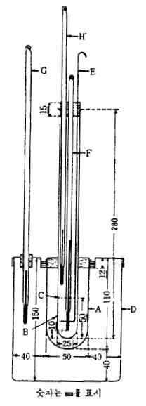

른다).
B : 검체용기(경질 유리시험관이며 관의 양벽이 흐려지는 것을 막기 위하여 실리
콘오일을 바른다. 다만 검체에 접하는 부분은 바르지 않는다. 검체 용기 B
를 A중에 삽입하고 코르크마개로 고정시킨다.
C : 표선
D : 유리제 용기
E : 유리제교반봉(지름 3㎜, 아래끝은 바깥지름 18㎜의 윤상(輪狀)으로 되어 있
다).
F : 온도계 4호, 5호 또는 6호
G : 온도계 1호
H : 보조온도계, 온도계 1호를 써서 그 수은구가 검체 윗면과 F의 눈금(응고점)
중앙부에 오도록 한다.
조 작 법 검체를 검체용기 B의 표선 C까지 넣는다. 다만 검체가 고체일 때는 예상한 응고점보다 2
0℃ 이상 높아지지 않도록 조심하면서 가온하여 융해한 다음 B에 넣는다. 유리제 용기 D에 예상한
응고점보다 5℃ 낮은 온도의 물을 넣는다. 검체가 상온에서 액체일 때는 D의 물을 예상한 응고점보
다 10～15℃ 낮게 한다. 검체를 넣은 B에 온도계 F, 보조온도계 H및 유리제교반봉 E를 단 유리제
공기외통 A중에 삽입하고 검체의 온도가 예상한 응고점보다 5℃
높은 온도로 될 때까지 식혔을 때 교반봉 E를 매분 20회 정도의 속도로 천천히 아래 위로 움직여 30
초마다 온도를 읽는다. 응고가 시작되면 교반을 그치고 적어도 4회 연속적으로 온도계 F의 눈금을
읽을 때 그 차이가 0.2℃ 이내에 있는 온도 t℃를 결정하고 그 때의 보조온도계 H의 온도 t'℃를 읽어
서 응고점 T℃를 다음 식에 따라 계산하고 그 평균값을 응고점으로 한다. 과냉상태로 되었을 때는 B
의 내벽을 E로 긁어서 응고를 촉진시킨다. 응고가 시작되면 교반을 그치고 10초마다 온도를 읽어 1
분간 일정하게 정지했을 때의 온도계 F의 눈금 t℃ 및 보조온도계 H의 눈금 t'℃를 읽어 응고점 T℃
를 다음 식에 따라 구한다.
T ＝ t ＋ 0.00015(t ― t') (t ― t")
t" : t℃의 눈금을 읽었을 때 검체 윗면에 있어서의 온도계 F의 도수이며 이 지점에 온도계
F의 눈금이 없을 때는 외삽하여 구한다.
39. 적외부흡수스펙트럼측정법
적외부흡수스펙트럼측정법은 적외선이 검체를 통과할 때 흡수되는 정도를 각 파수(파장)에 대하여 측
정하는 방법이다. 적외부흡수스펙트럼은 횡축에 파수(파장)를, 종축에는 보통 투과율이나 흡광도를 나타
내는 그래프로 나타낸다. 적외부흡수스펙트럼은 그 물질의 화학구조에 따라 달라지므로 여러가지 파수
(파장)에서 흡수를 측정하여 물질을 확인 또는 정량할 수 있다.
장치 및 조정법 복광속식(Double beam) 적외분광광도계를 쓴다.
미리 분광광도계를 조정하여 측정한다. 특히 투과율의 직선성은 20∼80% 사이에서 편차가 1% 이내,
투과율의 재현성은 두번 반복 측정해서 ±0.5%, 파수의 재현성은 파수 3000㎝-1 부근에서 ±5㎝-1, 1000
㎝-1 부근에서 ±1㎝-1이내로 한다. 파수의 눈금은 보통 폴리스티렌막의 3060㎝-1, 1601㎝-1, 1029㎝-1,
907㎝-1 등의 흡수대를 써서 보정한다.
검체의 조제 검체의 중요 흡수대의 투과율이 20～80%의 범위내에 들어오도록 다음중 한 방법을 써서
조제한다. 디스크는 염화나트륨, 브롬화칼륨 등을 쓴다.
1) 브롬화칼륨정제법 고체검체 1～2㎎을 마뇌 약절구에 넣고 잘 갈아 가루로 하고 여기에 적외부용
브롬화칼륨 100～200㎎을 넣어 습기를 빨아들이지 않도록 조심하면서 빨리 잘 갈아 혼합한 다음 정제
성형기에 넣고 5㎜Hg이하로 감압하면서 정제의 단위면적(㎠)당 5,000～10,000㎏의 압력을 5～8분간 가
하여 정제를 만들어 측정한다.
2) 용액법 원료각조에서 규정하는 방법으로 조제한 검액을 액체용 고정셀에 넣어 측정한다. 보통검
체의 조제에 사용한 용매를 대조로하여 측정한다. 고정셀의 두께는 보통 0.1㎜ 또는 0.5㎜로 한다.
3) 페이스트법 고체검체를 마뇌 약절구에 넣어 잘 갈아 가루로 하고 유통파라핀등을 넣어 잘 갈아
섞은 다음 공기가 들어가지 않게 조심하면서 2장의 디스크사이에 끼워 측정한다.
4) 액막법 액체검체 1～2방울을 2장의 디스크사이에 끼워 측정한다. 액층을 두껍게 할 필요가 있을
때는 알루미늄박 등을 2장의 디스크사이에 끼워 그속에 액체검체가 머물러 있도록 한다.
5) 박막법 검체를 박막 그대로 또는 원료각조의 규정된 방법에 따라 박막으로 만든 다음 측정한다.
6) 기체검체측정법 검체를 배기시킨 5 또는 10㎝ 길이의 광로를 갖는 기체셀에 원료 각조에서 규정
하는 압력으로 도입하여 측정한다. 필요하면 1m 이상의 광로를 갖는 장광로(長光路)셀을 쓸 경우도
있다.
40. 전기적정법
전기적정법은 산염기적정, 산화환원적정, 착염적정, 침전적정 등의 각 방법에 있어서 당량점 부근에서
피정량물질 또는 적정시약의 활량(活量)이 소실 또는 출현하는 등으로 급격한 변화를 일으키므로 그것을
전기신호로 나타내어 적정의 종말점을 구하여 정량분석을 하는 방법의 하나이다. 전위차적정법은 전극
간의 전위차(기전력)를 측정하여 적정종말점을 알아내는 적정방법이며 적당한 전극대(電極對)를 써서 기
전력의 변화를 점검하여 적정량차 ⊿V에 대한 기전력의 변화 ⊿E 의 비, ⊿E/⊿V가 극대로 되는 점으
로부터 적정의 종말점을 얻든가 또는 당량점에 상당하는 기전력의 값으로부터 적정의 종말점을 얻는다.
전류적정법은 지시전류를 측정하여 적정종말을 알아내는 방법이며 정전압분극전류적정법 및 정전위전류
적정법이 있다. 전류적정법에 따라 시험을 하도록 규정되어 있는 경우는 따로 규정이 없는 한 정전압분
극전류적정법에 따라 시험을 한다. 정전압분극전류적정법은 같은 종류의 두 개의 전극간에 일정한 아
주 작은 전압을 넣어 적정에 따라 변화하는 전류를 측정하여 종말점을 얻는다.
전위차적정법 1) 장 치 검체를 넣는 비커, 용량분석용표준액을 적가하는 뷰렛 또는 적당한 자동적정
용 시린지, 지시전극과 참조전극, 두 전극간의 전위차를 측정하는 전위차계 또는 적당한 pH측정기,
기록장치 및 비커안의 용액을 가만히 저어 섞을 수 있는 교반기로 되어 있다.
이 시험법에는 따로 규정이 없는 한 보통 참조전극으로 포화감홍(염화제일수은)전극 또는 은-염화은전
극을 쓰고 지시전극은 다음의 표에 따른다. 다만, 참조 및 지시전극은 복합형인 것을 쓸 수도 있다.
또한 pH를 측정하여 전위적정을 할 때에는 pH측정법에 따라 pH측정기를 조정한다.
2) 조작법 원료 각조에 규정하는 검체를 비커에 달아 규정하는 용량의 용매를 넣어 녹이고 전극은
미리 물로 씻은 다음 적정하는 용매중에서 전위차 또는 pH가 평형상태로 된 다음 참조전극 및 지시
전극을 적정비커 안의 검체용액중에 넣고 검액을 가만히 저어 섞으면서 용량분석용표준액으로 적정한
다. 뷰렛의 끝은 검액중에 넣고 종말점의 전후에서는 0.1 ㎖ 또는 그 이하의 용량을 적가할 때의 전
위차의 변화를 측정하여 그 값을 그래프의 종축에, 넣은 용량분석용 표준액의 적정량(㎖)을 횡축에 기
입하여 적정곡선을 그리고 ⊿E/⊿V의 극대값 또는 당량점에 상당하는 기전력의 값으로부터 적정의
종말점을 얻는다. 또한 이들의 장치 및 부품 또는 데이터처리장치 등을 조합하여 만든 자동적정장치
를 쓸 수 있다. 공기중의 이산화탄소 또는 산소 등의 영향이 있을 경우에는 적정비커는 뚜껑을 달린
것을 써서 질소 등의 불활성가스기류중에서 조작하고, 빛에 의하여 변화하는 경우에는 직사일광을 피
하고 차광한 용기를 쓴다. 따로 규정이 없는 한 적정의 종말점 측정은 보통 다음의 어느 한 방법에
따른다.

| 적 정 의 종 류 | 지 시 전 극 |
| --- | --- |
| 중화적정(산염기 적정)비수적정(과염소산적정, 테트라메칠암모늄히드록시드적정)침전적정(질산은에 의한 할로겐이온의 적정)산화환원적정(디아조적정 등) | 유리전극유리전극은전극, 다만 참조전극은 포화감홍전극또는 은-염화은전극을 쓰고 참조전극과피적정용액과의 사이에 포화질산칼륨용액의 염교(鹽橋)를 삽입하든가 더블정션(double junction)의 참조전극을 쓰든가또는 은-염화은전극에 질산칼륨용액을넣은 것을 쓴다.백금전극 |

가) 작도법 적정곡선에 약 45°의 경사로 평행하는 두 개의 접선을 긋고 여기에 평행하는 이등분석과
적정곡선과의 교차점을 종말점으로 하고 그 횡축의 눈금을 적정수로 한다. 또는 미분곡선(시차곡선)
을 얻어 이것으로부터 종말점을 얻는다.
나) 자동종말점측정법 데이터처리장치를 조합하여 만든 자동적정장치를 써서 종말점을 얻는다. 따로
규정이 없는 한 같은 방법으로 공시험을 하여 보정할 때에는 보통 다음 방법에 따른다.
원료 각조에서 규정하는 용매를 달아 전위차적정법에 따라 적정하고 검액의 적정종말점 부근의 전위
차 또는 pH에 상당하는 점까지의 용량분석용 표준액의 소비량을 공시험의 양으로 한다. 또는 ⊿E/
⊿V의 극대점을 얻어 그 점까지의 용량분석용 표준액의 소비량을 공시험의 양으로 한다.
전류적정법 1) 장 치 검체를 넣는 비커, 용량분석용 표준액을 적가하는 뷰렛, 지시전극으로서 두 개
의 작은 같은 모양의 백금판 또는 백금선, 두 전극간에 아주 작은 직류전압을 넣기 위한 가전압(加電
壓)장치, 전극간을 흐르는 지시전류를 측정하는 전류계, 기록장치 및 비커 안의 용액을 가만히 저어
섞을 수 있는 교반기로 되어 있다.
2) 조 작 법 원료 각조에서 규정하는 양의 검체를 비커에 취하여 규정하는 양의 용매를 넣어 녹이고
두 개의 지시전극을 미리 물로 잘 씻은 다음 검체중에 담그고 전극간에 가전압장치를 써서 측정하기
에 적당한 일정한 전압을 넣고 검액을 용량분석용 표준액으로 적정한다. 뷰렛의 끝은 검액 중에 담
그고 종말점의 전후에서는 0.011㎖ 또는 그 이하의 용량을 적가하고, 그 때의 전류변화를 측정하여 그
값을 그래프의 종축에, 넣은 용량분석용 표준액의 적정량(㎖)을 횡축에 기입하여 적정곡선을 그리고
보통 적정곡선의 변곡점을 적정의 종말점으로 한다. 또한 이들이 장치 및 부품 또는 데이터처리장치
등을 조합하여 만든 자동적정장치를 쓸 수 있다. 공기중의 이산화탄소 또는 산소 등의 영향이 있는
경우에는 적정비커는 뚜껑이 달린 것을 쓰고 질소 등의 불황성가스 기류중에서 조작하고, 빛에 의하
여 변화하는 경우에는 직사일광을 피하여 차광한 용기를 쓴다. 따로 규정이 없는 한 종말점의 측정
은 다음 방법 중 어느 한가지를 쓴다.
가) 작도법 보통 적정곡선의 변곡점을 적정의 종말점으로 한다.
나) 자동종말점측정법 데이터처리장치를 조합하여 만든 자동적정장치를 써서 종말점을 얻는다.
41. 점도측정법
액체가 일정방향으로 운동할 떄 그 흐름에 평행한 평면의 양측에 내부마찰력이 일어난다. 이 성질을
점성이라고 한다. 점성은 면의 넓이 및 그 면에 대하여 수직방향의 속도구배에 비례한다. 그 비례정수
를 절대점도라 하고 일정온도에 대하여 그 액체의 고유한 정수이다. 그 단위로서는 포아스 또는 센티
포아스를 쓴다.
절대점도를 같은 온도의 그 액체의 밀도로 나눈 값을 운동점도라고 말하고 그 단위로는 스톡스 또는
센티스톡스를 쓴다. 액체의 점도는 다음 제１법 또는 제２법에 따라 측정한다.
제１법 이 측정법은 주로 뉴톤유동적점성액체의 점도를 측정하는 방법으로 보통 우베로오데형 모세관
점도계를 쓰고 일정체적의 액체가 모세관을 통하여 흘러내리는데 필요한 시간을 표준액의 그것과 비
교한다. 검체의 절대점도를 η, 운동점도를 ν, 그 온도에서 밀도를 d(g/㎖), 흘러 내리는 시간을 t(초)
로 하면 다음 식이 성립한다.
η
ν ＝ ＝ Kt
d
K는 점도계의 정수이고 η및 d 또는 ν를 미리 알고 있는 표준액을 써서 t를 측정하여 정한다. 검체의
d 및 t를 측정하면 η을, 또 t만을 측정하면 위의 식으로 부터 ν를 구할 수 있다. 물에 가까운 점도를
측정하는 데는 표준액으로서 물을 쓰고 미리 그 점도계의 정수 K를 정한다. 물의 운동점도는 20℃에
서 1.0038 센티스톡스이다. 비교적 높은 점도를 측정하는 점도계의 K를 정할 때는 표준액으로서 될
수 있는 한 검체의 점도에 가까운 점도가 알려진 액체를 쓴다. 이 기준에서는 따로 규정이 없는 한
점도의 단위로서 센티스톡스를 쓴다.

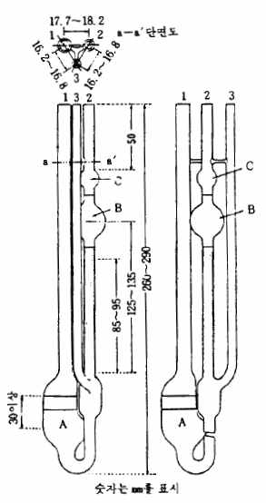

장치 1～10000 센티스톡스의 액체의 점도를 측정하는 데는 따
로 규정이 없는 한 다음에 표시한 우베로오데형점도계를 쓴다.
모세관의 안지름과 측정에 적당한 점도의 범위와의 대체적인 관
계를 표로 표시하였다. 점도계 정수 K가 0.005～0.05의 점도계는
B의 용량이 4㎖, 0.1～1.0의 것은 5㎖ 또 3.0～10.0의 것은 6㎖로
한다.
조 작 법 검체를 관 1로 부터 가만히 넣고 점도계를 수직으로 정치했을
때 검체의 액면이 A의 두개의 표선사이에 오도록 한다. 이 점도계를 규정
하는 온도±0.1℃의 항온조중에 C가 완전히 잠기도록 넣어 수직으로 유지한
다음 검체가 같은 온도로 될 때까지 20분간 방치한다. 관 3을 손가락으로
막고 공기의 기포가 관 2속에 들어가지 않도록 하고 관 2로부터 약하게 흡
인하여 액면을 C의 중심부까지 끌어 올린 다음 흡인을 그치고 관 3의 구멍
을 열고 곧 관 2의 구멍을 막고 모세관의 최하단의 검체가 흘러내렸을 때
관 2의 구멍을 열고 액면이 B의 위의 표선으로 부터 아래의 표선까지 흘러
내리는데 필요한 시간 t(초)를 측정하여 운동점도 ν 또는 절대점도 η를 구
한다.

| 점도계의 대략의 정수(K) | 모 세 관 |  | 점도의 범위 |
| --- | --- | --- | --- |
|  | 안지름(㎜) | 길이(㎜) | 센티스톡스 |
| 0.0050.010.030.050.10.30.51.03.05.010.0 | 0.41 ∼ 0.500.56 ∼ 0.600.75 ∼ 0.790.85 ∼ 0.891.07 ∼ 1.131.40 ∼ 1.461.61 ∼ 1.671.92 ∼ 1.982.63 ∼ 2.713.01 ∼ 3.113.58 ∼ 3.66 | 85 ∼ 9585 ∼ 9585 ∼ 9585 ∼ 9585 ∼ 9585 ∼ 9585 ∼ 9585 ∼ 9585 ∼ 9585 ∼ 9585 ∼ 95 | 1 ∼ 52 ∼ 106 ∼ 3010 ∼ 5020 ∼ 10060 ∼ 300100 ∼ 500200 ∼ 1000600 ∼ 30001000 ∼ 50002000 ∼ 10000 |

점도계정수 K의 값은 표준액을 써서 같은 방법으로 실험하여 미리 정한다. 이 때의 온도는 검체측
정 때의 온도와 다르더라도 관계 없다.
제２법 이 측정법은 주로 비뉴톤유동적 점성액체의 점도를 측정하는 방법으로 브룩크필드(Brookfield)
형 점도계를 써서 점성액 안에서 일정한 가속도로 회전하는 로우더에 움직이는 액의 점성저항토로크
를 용수철로 검출하여 점도를 환산한다. 로우더의 종류 및 회전수는 가변(可變)으로 되어 있으며 검
체액체에 적합한 것을 선택한다. 점도단위로는 센티포아스를 쓴다.

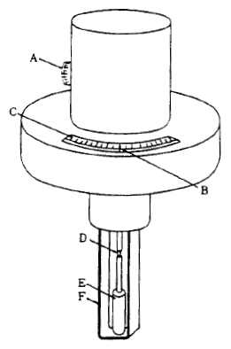

장 치 그림과 같은 장치를 쓴다.
A : 회전수조절손잡이
B : 지침
C : 눈금
D : 액침표시
E : 로우더
F : 가드
조 작 법 원료각조에서 규정하는 로우더 E와 가드 F를 단다. 회전수조절
손잡이 A를 원료각조에서 규정하는 회전수에 설정한다. 검체를 넣은 용기
중에 E를 가만히 넣고 검체의 액면을 액침표시 D에 일치시킨다.
전원에 연결하여 E를 회전시키면 지침 B는 0부터 움직이기 시작한다. B가
안정하거나 또는 일정시간 경과한 다음 회전을 그치고 B에서 나타낸 눈금 C를 읽는다. 이 나타낸 값
에 사용한
E의 종류 및 회전수에 따라 정해지는 별표의 환산정수를 곱하여 검체의 절대점도 센티포아스를 산출
한다. 예를 들어 원료각조에서 1500∼2500(2호, 12회전, 30초간) 센티포아스로 규정한 것은 2호 로우
더를 써서 1분간 12회전으로 30초후의 점도가 1500∼2500 센티포아스임을 나타낸다. 또 원료각조에
서 30000∼40000(4호, 12회전, 안정) 센티포아스라고 규정한 것은 4호 로우더를 써서 1분간 12회전으로
지침의 눈금이 안정하게 되었을 떄의 점도가 30000∼40000 센티포아스임을 나타낸다.

| 환 산 정 수 표 |  |  |  |  |
| --- | --- | --- | --- | --- |
| 회전수로우더의 종류 | 60 | 30 | 12 | 6 |
| 아답터1호2호3호4호 | 0.11520100 | 0.221040200 | 0.5525100500 | 1.010502001000 |

42. 정성반응
정성반응은 원료각조의 확인시험에 적용하는 것으로 따로 규정이 없는 한 혼합물질에 대해서는 쓰지
않는다.
과산화물 과산화물의 용액에 같은 용량의 초산에칠 및 중크롬산칼륨시액 1～2방울을 넣고 여기에 묽
은황산을 넣어 산성으로 할 때 물층은 청색을 나타내며 곧 흔들어 섞어 방치할 때 청색은 초산에칠층
으로 옮겨간다.
구연산염 1) 구연산염의 용액 1～2방울에 피리딘ㆍ무수초산혼합액(3:1) 20㎖를 넣어 2～3분간 방치할
때 적갈색을 나타낸다.
2) 구연산염의 황산산성용액에 그 ⅓용량의 과망간산칼륨시액을 넣어 시액의 색이 없어질 때까지 가
열한 다음 브롬시액을 적가할 때 백색의 침전이 생긴다.
3) 구연산염의 중성용액에 과량의 염화칼슘시액을 넣어 끓일 때 백색의 결정성 침전이 생긴다. 침전
을 분리하여 그 일부에 수산화나트륨시액을 추가하여도 녹지 않는다. 또한 다른 일부에 묽은염산을
추가할 때 침전은 녹는다
나트륨염 1) 나트륨염을 염산로 적시고 불꽃반응을 볼 때 황색을 나타낸다.
2) 나트륨염의 중성 또는 약알칼리성의 진한용액에 피로안티몬산칼륨시액을 넣을 때 백색의 결정성
침전이 생긴다. 침전의 생성을 촉진하기 위하여 유리막대로 시험관의 기벽을 긁어 준다.
납염 1) 납염의 용액에 묽은황산을 넣을 때 백색의 침전이 생긴다. 침전을 분리하여 그 일부에 묽은
질산을 넣어도 녹지 않는다. 또한 다른 일부에 더운 수산화나트륨시액를 넣어 가온하거나 또는 초산
암모늄시액을 넣을 때 녹는다.
2) 납염의 용액에 수산화나트륨시액을 넣을 때 백색의 침전이 생기며 과량의 수산화나트륨시액을 추
가할 때 침전이 녹는다. 여기에 아황산나트륨시액을 추가할 때 흑색의 침전이 생긴다.
3) 납염의 묽은초산산성용액에 중크롬산나트륨시액을 넣을 때 황색의 침전이 생기며 암모니아시액을
더 넣어도 침전은 녹지 않으나 수산화나트륨시액을 추가할 때 침전은 녹는다.
마그네슘염 1) 마그네슘염의 용액에 탄산암모늄시액을 넣을 때 백색의 침전이 생기고 염화암
모늄시액을 추가할 때 침전은 녹는다. 여기에 인산일수소나트륨시액을 추가할 때 백색의 결정성 침
전이 생긴다.
2) 마그네슘염의 용액에 수산화나트륨시액을 넣을 때 백색의 겔상침전이 생기며 과량의 시액을 넣어
도 침전은 녹지 않으나 요오드시액을 추가할 때 침전은 어두운 갈색으로 된다.
망간염 1) 망간염의 용액에 암모니아시액을 넣으면 흰색의 침전이 생긴다. 그 일부에 질산은시액을 추가
하면 침전은 검정색으로 변한다. 또 다른 일부를 방치하면 침전의 상부가 갈색으로 된다.
2) 망간염의 묽은질산산성용액에 비스머스산나트륨의 가루 소량을 넣을 때 액은 적자색을 나타낸다.
바륨염 1) 바륨염을 염산으로 적시고 불꽃반응을 볼 때 지속하는 황록색을 나타낸다.
2) 바륨염의 용액에 묽은황산을 넣을 때 백색겔상침전이 생기고 묽은질산을 추가하여도 침전은 녹지
않는다.
방향족일급아민 방향족일급아민의 산성용액에 얼음으로 식히면서 아질산나트륨시액 3방울을 넣어 흔
들어 섞고 2분간 방치하고 황산암모늄용액(1→40) 1㎖를 넣어 잘 흔들어 섞고 1분간 방치한 다음 수산
N-(1-나프칠)-N'-디에칠에칠렌디아민용액(1→1000) 1㎖를 넣을 때 액은 적자색을 나타낸다.
불화물 1) 불화물의 수용액에 염화칼슘시액을 넣을 때 백색의 침전이 생기고 초산을 추가해도 침전은
거의 녹지 않는다.
2) 이 원료 0.1g을 백금도가니에 넣고 황산 1㎖를 넣어 깨끗이 닦은 유리조각으로 덮는다. 수욕상에
서 15분간 가열한 다음 유리조각을 물로 씻어 물기를 잘 닦아 내고 관찰할 때 부식된 유리면을 볼 수
있다.
3) 불화물의 중성 또는 약산성용액에 알리자린콤플렉손시액ㆍpH 4.3 초산ㆍ초산칼륨염완충액ㆍ질산제
일셀륨시액의 혼합액(1:1:1) 1.5㎖를 넣을 때 액은 청자색을 나타낸다.
붕산염 1) 붕산염에 황산 및 메탄올을 섞어서 점화할 때 녹색의 불꽃을 내면서 탄다.
2) 붕산염의 염산산성용액으로 적신 쿠르쿠마시험지를 가온하여 건조할 때 적색을 나타내고 여기에
암모니아시액을 적가할 때 청색으로 변한다.
브롬산염 1) 브롬산염의 질산산성용액에 질산은시액 2～3방울을 넣을 때 백색의 결정성 침전이 생기
고 가열할 때 침전은 녹는다. 여기에 아질산나트륨시액 1방울을 넣을 때 엷은 황색의 침전이 생긴다.
2) 브롬산염의 질산산성용액에 아질산나트륨시액 5∼6방울을 넣을 때 액은 황색∼적갈색을 나타내며
여기에 클로로포름 1㎖를 넣어 흔들어 섞을 때 클로로포름층은 황색∼적갈색을 나타낸다.
브롬화물 1) 브롬화물의 용액에 아질산나트륨시액을 넣을 때 엷은 황색의 침전이 생긴다. 침전을 분
리하여 그 일부에 묽은질산을 추가하여도 녹지 않는다. 또한 다른 일부에 강암모니아수를 넣어 흔들
어 섞은 다음 분리한 액에 묽은질산을 넣어 산성으로 할 때 백색으로 혼탁된다.
2) 브롬화물의 용액에 염소시액을 넣을 때 브롬을 유리하여 황갈색을 나타내고 이것을 둘로 나누어
그 일부에 클로로포름을 넣어 흔들어 섞을 때 클로로포름층은 황갈색∼적갈색을 나타낸다. 또한 다
른 일부에 페놀을 넣을 때 백색의 침전이 생긴다.
비스머스염 1) 비스머스염에 될 수 있는 대로 소량의 염산을 넣어 녹이고 물을 넣어 희석할 때 백탁
이 생긴다. 여기에 황산나트륨시액 1～2방울을 추가할 때 어두운 갈색의 침전이 생긴다.
2) 비스머스염의 염산산성용액에 치오뇨소시액을 넣을 때 액은 황색을 나타낸다.
3) 비스머스염의 묽은질산 또는 묽은황산용액에 요오드화칼륨시액을 적가할 때 흑색의 침전이 생기고
요오드화칼륨시액을 추가할 때 침전은 녹고 등색을 나타낸다.
살리실산염 1) 살리실산염을 과량의 소다석회와 섞어서 가열할 때 페놀의 냄새가 난다.
2) 살리실산염의 중성용액에 묽은염화제이철시액 5∼6방울을 넣을 때 액은 적색을 나타내며 묽은염산
을 적가할 때 액의 색은 처음에는 자색으로 변한 다음 없어진다.
3) 살리실산염의 진한 용액에 묽은염산을 넣을 때 백색의 결정성 침전이 생긴다. 침전을 분리하고 냉
수로 씻은 다음 건조한 것의 융점은 약 159℃이다.
수산염 1) 수산염의 황산산성용액에 더울 때 과망간산칼륨시액을 적가할 때 시액의 색은 없어
진다.
2) 수산염의 용액에 염화칼슘시액을 넣을 때 백색의 침전이 생긴다. 침전을 분리하여 여기에 묽은초
산을 넣어도 녹지 않으나 묽은염산을 추가할 때 침전은 녹는다.
아연염 1) 아연염의 중성 또는 알칼리성용액에 아황산암모늄시액 또는 아황산나트륨시액을 넣을 때
백색의 침전이 생긴다. 침전을 분리하여 묽은초산을 넣어도 녹지 않지만 묽은염산을 추가할 때 녹는
다.
2) 아연염의 용액에 페로시안화칼륨시액을 넣을 때 백색의 침전이 생기며 묽은염산을 추가하여도 침
전은 녹지 않는다.
3) 아연염의 용액에 인산을 넣어 산성으로 하고 황산동용액(1→1000) 1방울 및 치오시안산수은암모늄
시액 2㎖를 넣을 때 엷은 자색의 침전이 생긴다.
아황산염 또는 아황산수소염 1) 아황산 또는 아황산수소염의 초산산성용액에 요오드시액을 적가할 때
시액의 색은 없어진다.
2) 아황산 또는 아황산수소염의 용액에 같은 용량의 묽은염산을 넣을 때 이산화황의 냄새가 나며 액
은 혼탁하지 않는다(치오황산과의 구별). 여기에 황화나트륨시액 1방울을 추가할 때 액은 곧 백탁하
고 백탁은 점점 엷은 황색의 침전으로 변한다.
안식향산염 1) 안식향산염의 진한 용액에 묽은염산을 넣을 때 백색의 결정성 침전이 생긴다. 침전을
분리하여 냉수로 잘 씻고 건조한 것의 융점은 120～122℃이다.
2) 안식향산염의 중성용액에 염화제이철시액을 넣을 때 적갈색의 침전이 생기며 묽은염산을 추가할
때 백색의 침전으로 변한다.
알루미늄염 1) 알루미늄염의 용액에 염화암모늄시액 및 암모니아시액을 넣을 때 백색의 겔상 침전이
생기고 이 침전은 과량의 암모니아시액에 녹지 않는다.
2) 알루미늄염의 용액에 수산화나트륨시액을 넣을 때 백색의 겔상 침전이 생기며 과량의 수산화나트
륨시액을 추가할 때 침전은 녹는다.
3) 알루미늄염의 용액에 황화나트륨시액을 넣을 때 백색의 겔상 침전이 생기며 과량의 황화나트륨시
액을 추가할 때 침전은 녹는다.
4) 알루미늄염의 용액에 백색의 겔상 침전이 생길 때까지 암모니아시액을 넣고 알리자린에스시액 5방
울을 추가할 때 침전은 적색으로 변한다.
암모늄염 암모늄염에 과량의 수산화나트륨시액을 넣어 가온할 때 암모니아 냄새가 나며 이 가스는 물
에 적신 적색리트머스시험지를 청색으로 변화시킨다.
염소산염 염소산염의 용액에 질산은시액을 넣어도 침전이 생기지 않으나 아질산나트륨시액 2방울 및
묽은질산을 추가할 때 천천히 백색의 침전이 생기며 암모니아시액을 추가할 때 침전은 녹는다.
염화물 1) 염화물의 용액에 황산 및 과망간산칼륨을 넣어 가열할 때 염소의 냄새가 나며 이 가스는
물에 적신 요오드화칼륨ㆍ전분지를 변화시킨다.
2) 염화물의 용액에 질산은 시액을 넣을 때 백색의 침전이 생긴다. 침전을 분리하여 그 일부에 묽은
질산을 넣어도 녹지 않으며 다른 일부에 과량의 수산화암모늄시액을 넣을 때 녹는다.
인산염(정인산염) 1) 인산염의 중성용액에 질산은 시액을 넣을 때 황색의 침전이 생기며 묽은질산 또
는 암모니아시액을 추가할 때 침전은 녹는다.
2) 인산염의 중성 또는 묽은질산산성용액에 몰리브덴산암모늄시액을 넣어 가온할 때 황색의 침전이
생기며 수산화나트륨시액 또는 암모니아시액을 추가할 때 침전은 녹는다.
젖산염 젖산염의 황산산성용액에 과망간산칼륨시액을 넣어 가열할 때 아세트알데히드의 냄새가 난다.
주석산염 1) 주석산염의 중성용액(1→20)에 질산은시액을 넣을 때 백색의 침전이 생긴다. 침전을 분
리하고 그 일부에 질산을 넣을 때 녹는다. 또한 다른 일부에 암모니아시액을 넣어 가온할 때 녹으면
서 천천히 기벽에 은경이 생긴다.
2) 주석산염의 용액에 초산 2방울, 황산제일철시액 1방울 및 과산화수소시액 2∼3방울을 넣고 여기에
과량의 수산화나트륨시액을 넣을 때 액은 적자색∼자색을 나타낸다.
3) 주석산염의 용액 2∼3방울에 미리 황산 5㎖에 레조시놀용액(1→50) 2∼3방울 및 브롬화칼륨용액(1
→10) 2∼3방울을 넣은 액 4∼5방울을 넣어 130∼140℃로 가열할 때 액은 청자색을 나타낸다. 이것을
식히고 물에 부을 때 액은 적색으로 된다.
질산염 1) 질산염의 용액에 같은 용량의 황산을 섞고 식힌 다음 황산제일철시액을 가만히 넣을 때 접
계면에 어두운 갈색의 띠가 생긴다.
2) 질산염의 진한 용액에 같은 용량의 황산을 넣고 구리조각을 넣어 가열할 때 황갈색의 가스가 난다.
3) 질산염의 용액에 디페닐아민시액을 넣을 때 액은 청색을 나타낸다.
4) 질산염의 황산산성용액에 과망간산칼륨시액을 넣어도 시액의 홍색은 없어지지 않는다(아질산염과의
구별).
철(Ⅱ)염 1) 철(Ⅱ)염의 약산성용액에 페리시안화칼륨시액을 넣을 때 청색의 침전이 생기며 묽은염산
을 추가하여도 침전은 녹지 않는다.
2) 철(Ⅱ)염의 용액에 수산화나트륨시액을 넣을 때 회록색의 겔상 침전이 생기며 아황산나트륨시액을
추가할 때 흑색의 침전이 생기고 여기에 묽은염산을 넣을 때 녹는다.
철(Ⅲ)염 1) 철(Ⅲ)염의 약산성용액에 페로시안화칼륨시액을 넣을 때 청색의 침전이 생기며 묽은염산
을 추가하여도 침전은 녹지 않는다.
2) 철(Ⅲ)염의 용액에 수산화나트륨시액을 넣을 때 적갈색겔상 침전이 생기며 황화나트륨시액을 추가
할 때 침전은 흑색으로 변한다. 침전을 분리하여 묽은염산을 넣을 때 침전은 녹고 액은 백탁한다.
3) 철(Ⅲ)염의 약산성용액에 설포살리실산시액을 넣을 때 액은 자색을 나타낸다.
초산염 1) 초산염에 희석시킨 황산(1→2)를 넣어 가온할 때 초산 냄새가 난다.
2) 초산염에 황산 및 소량의 에탄올을 넣어 가열할 때 초산에칠의 냄새가 난다.
3) 초산염의 중성용액에 염화제이철시액을 넣을 때 액은 적갈색을 나타내며 끓이면 적갈색의 침전이
생긴다. 여기에 염산을 넣을 때 침전은 녹으며 액은 황색으로 변한다.
4) 초산염에 산화칼슘을 섞어서 가열할 때 아세톤 냄새를 내며 발생하는 가스는 o-니트로벤즈알데히
드의 에탄올용액(1→50)에 담그어 건조하여 수산화나트륨시액으로 적신 여과지를 청변시킨다.
치오황산염 1) 치오황산염의 초산산성용액에 요오드시액을 적가할 때 이 시액의 색은 없어진다.
2) 치오황산염의 용액에 같은 용량의 묽은염산을 넣을 때 이산화황의 냄새가 나며 액은 백탁하고 이
백탁은 방치할 때 황색의 침전으로 변한다.
3) 치오황산염의 용액에 과량의 질산은시액을 넣을 때 백색의 침전이 생기며 방치할 때 침전은 흑색
으로 변한다.
칼륨염 1) 칼륨염을 염산에 적시고 불꽃반응을 보면 엷은 자색을 나타낸다. 불꽃이 황색이면 코발트
유리를 통하여 관찰할 때 적자색으로 보인다.
2) 칼륨염의 중성용액(1→20)에 주석산수소나트륨시액을 넣을 때 백색의 결정성 침전이 생긴다. 침전
의 생성을 빠르게 하려면 유리막대로 시험관의 안벽을 긁어준다. 이 침전을 분리하여 암모니아시액,
수산화나트륨시액 또는 탄산나트륨시액을 넣을 때 다 녹는다.
3) 칼륨염의 초산산성용액(1→20)에 아질산코발트나트륨시액을 넣을 때 황색의 침전이 생긴다.
4) 칼륨염에 과량의 수산화나트륨시액을 넣어 가온하여도 암모니아 냄새가 나지 않는다(암모늄염과의
구별).
칼슘염 1) 칼슘염을 염산에 적시고 불꽃반응을 보면 적색을 나타낸다.
2) 칼슘염의 용액에 탄산암모늄시액을 넣을 때 백색의 침전이 생긴다.
3) 칼슘염의 용액에 수산암모늄시액을 넣을 때 백색의 침전이 생긴다. 침전을 분리하여 그 일부에 묽
은초산을 넣어도 녹지 않는다. 또한 다른 일부에 묽은염산을 넣을 때 녹는다.
4) 칼슘염의 중성용액에 크롬산칼륨시액 10방울을 넣어 가열하여도 침전이 생기지 않는다(스트론튬염
과의 구별).
탄산수소염 1) 탄산수소염에 묽은염산을 넣을 때 거품을 내면서 가스가 나온다. 이 가스를 수산화칼
슘시액중에 통할 때 곧 백색침전이 생긴다(탄산염과 공통).
2) 탄산수소염용액에 황산마그네슘시액을 넣을 때 침전이 생기지 않으나 끓일 때 백색의 침전이 생긴
다.
3) 탄산수소염의 냉용액에 페놀프탈레인시액 1방울을 넣을 때 액은 적색을 나타내지 않으며 나타내더
라도 극히 엷다(탄산염과의 구별).
탄산염 1) 탄산염에 묽은염산을 넣을 때 거품을 내면서 가스가 나온다. 이 가스를 수산화칼슘시액중
에 통할 때 곧 백색의 침전이 생긴다(탄산수소염과 공통).
2) 탄산염용액에 황산마그네슘시액을 넣을 때 백색의 침전이 생기고 묽은초산을 추가할 때 침전은 녹
는다.
3) 탄산염의 냉용액에 페놀프탈레인시액 1방울을 넣을 때 액은 홍색을 나타낸다(탄산수소염과 구별).
황산염 1) 황산염의 용액에 염화바륨시액을 넣을 때 백색의 침전이 생기며 묽은질산을 추가하여도 침
전은 녹지 않는다.
2) 황산염의 중성용액에 초산납시액을 넣을 때 백색의 침전이 생기며 초산암모늄시액을 추가할 때 녹
는다.
3) 황산염의 용액에 같은 용량의 묽은염산을 넣어도 백탁이 생기지 않는다(치오황산염과의 구별). 또
한 이산화황의 냄새가 나지 않는다(아황산염과의 구별).
43. 중금속시험법
중금속시험법은 원료중에 불순물로서 들어있는 중금속의 한도시험이다. 중금속이란 산성에서 황화나
트륨시액으로 정색하는 금속성 혼재물을 말하며 그 한도는 납(Pb)으로서 중량백만분율(ppm)로 나타낸
다.
제１법 따로 규정이 없는 한 각조에서 규정하는 양의 검체를 네슬러관에 취하여 물 적당량을 넣어 녹
여 40㎖로 한다. 여기에 묽은초산 2㎖ 및 물을 넣어 50㎖로 하여 검액으로 한다.
비교액은 각조에서 규정하는 양의 납표준액을 네슬러관에 취하여 묽은초산 2㎖ 및 물을 넣어 50㎖
로 한다. 검액 및 비교액에 황화나트륨시액 1방울씩을 넣어 흔들어 섞고 5분간 방치한 다음 각 관을
백색 배경으로 위 또는 옆에서 관찰하여 액의 색을 비교한다. 검액이 나타내는 색은 비교액이 나타
내는 색보다 진하지 않다.
제２법 따로 규정이 없는 한 각조에서 규정하는 양의 검체를 사기로 만든 도가니에 달아 가볍게 뚜껑
을 덮고 약하게 가열하여 탄화시킨다. 식힌 다음 질산 2㎖ 및 황산 5방울을 넣어 흰 연기가 날 때까
지 조심하여 가열한 다음 500～600℃에서 강열하여 회화한다. 식힌 다음 염산 2㎖를 넣어 수욕상에
서 증발건고하고 잔류물을 염산 3방울로 적시고 열탕 10㎖를 넣어 2분간 가온한다. 다음에 페놀프
탈레인시액 1방울을 넣어 암모니아시액을 액이 엷은 적색으로 될 때까지 적가한 다음 묽은초산 2㎖를
넣어 필요하면 여과하고 물 10㎖로 씻어 여액 및 씻은 액을 네슬러관에 넣고 물을 넣어 50㎖로 하여
검액으로 한다. 비교액은 질산 2㎖, 황산 5방울 및 염산 2㎖를 수욕상에서 증발하고 다시 사욕상에
서 증발건고하여 잔류물을 염산 3방울로 적시고 이하 검액의 조제법과 같은 방법으로 조작하고 각조
에서 규정하는 납표준액 및 물을 넣어 50㎖로 한다. 검액 및 비교액에 황화나트륨시액 1방울씩을 넣
어 흔들어 섞고 5분간 방치한 다음 각 관을 백색을 배경으로 하여 위 또는 옆에서 관찰하여 액의 색
을 비교한다. 검액이 나타내는 색은 비교액이 나타내는 색보다 진하지 않다.
제３법 따로 규정이 없는 한 각조에서 규정하는 양의 검체를 사기로 만든 도가니에 달아 처음에는 조
심하면서 약하게 가열하고 다음에 강열하여 회화한다. 식힌 다음 왕수 1㎖를 넣어 수욕상에서 증발
건고하고 잔류물을 염산 3방울로 적시고 열탕 10㎖를 넣어 2분간 가온한다. 다음에 페놀프탈레인시
액 1방울을 넣고 암모니아시액을 액이 엷은 적색이 될 때까지 적가한 다음 묽은초산 2㎖를 넣어 필요
하면 여과하고 물 10㎖로 씻고 여액 및 씻은 액을 네슬러관에 넣고 물을 넣어 50㎖로 하여 검액으로
한다.
비교액은 왕수 1㎖를 수욕상에서 증발건고하여 이하 검액의 조제법과 같은 방법으로 조작하고 각조에
서 규정하는 양의 납표준액 및 물을 넣어 50㎖로 한다. 검액 및 비교액에 소듐설파이드시액 1방울씩
을 넣어 흔들어 섞고 5분간 방치한 다음 각 관을 백색을 배경으로 하여 위 또는 옆에서 관찰하여 액
의 색을 비교한다. 검액이 나타내는 색은 비교액이 나타내는 색보다 진하지 않다.
제４법 따로 규정이 없는 한 각조에서 규정하는 방법으로 만든 검액을 네슬러관에 취한다. 따로 각
조에서 규정하는 양의 납표준액을 네슬러관에 넣고 검체를 제외하고 검액과 같은 방법으로 조작하여
얻은 액을 넣은 다음 묽은초산 2㎖ 및 물을 넣어 50㎖로 하여 비교액으로 한다. 검액 및 비교액에
황화나트륨시액 1방울씩을 넣어 흔들어 섞고 5분간 방치한 다음 각 관을 백색을 배경으로 하여 위 또
는 옆에서 관찰하여 액의 색을 비교한다. 검액이 나타내는 색은 비교액이 나타내는 색보다 진하지
않다.
44. 증발잔류물시험법
증발잔류물시험법은 검체를 수욕상에서 증발건고하여 검체중의 불휘발성물질의 양을 측정하는 방법이
다.
조 작 법 따로 규정이 없는 한 원료각조에서 규정하는 검체의 양을 미리 무게를 단 증발접시에 달아
수욕상에서 증발건고하고 다시 잔류물을 105～110℃에서 항량이 될 때까지 건조하여 데시케이터(실리
카 겔)속에서 식힌 다음 그 무게를 정밀하게 단다.
45. 질소정량법
질소정량법은 질소를 함유하는 유기물을 황산로 분해하여 황산암모늄로 하고 그 암모니아를 정량하는
방법이다.
제１법

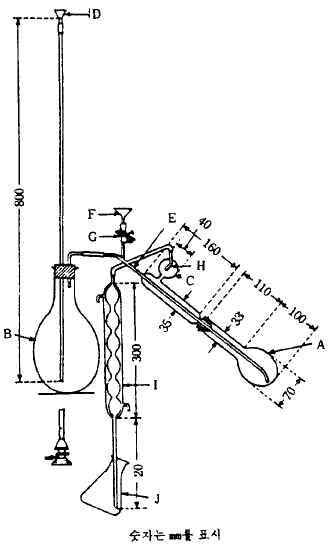

장 치 그림과 같은 장치를 쓴다. 접속부는 갈아 맞춘 것을 써도 좋으
며 장치에 쓰는 고무는 모두 수산화나트륨시액에서 10분간 끓인 다음 물
로 잘 씻어 쓴다.
A : 킬달플라스크
B : 수증기발생기로 황산 2～3방울을 넣은 물을 넣는다.
또 갑자기 끓는 것을 피하기 위하여 비등석을 넣는다.
C : 내용물이 튀어 올라오는 것을 막는 것
D : 물을 넣는 깔때기
E : 수증기 도입관
F : 알칼리용액을 넣는 깔때기
G : 핀치콕크가 달린 고무관
H : 작은구멍(지름은 관의 안지름과 거의 같다)
Ｉ: 냉 각 기
Ｊ: 수 기
조 작 법 보통 질소(N : 14.01) 2～3㎎에 해당하는 양의 검체를 정밀하게 달거나 또는 피펫으로 정확
하게 취하여 킬달플라스크 A에 넣고 여기에 가루로 한 황산칼륨 10g 및 황산동 1g의 혼합물 1g을 넣
어 플라스크목에 부착한 검체를 소량의 물로 씻어 넣고 여기에 플라스크 내벽을 따라 황산 7㎖를 넣
은 다음 플라스크를 흔들어 주면서 과산화수소 1㎖를 조금씩 내벽을 따라 조심하면서 넣는다. 플라
스크를 석면위에서 가열하여 액이 맑은 청색으로 되고 플라스크의 내벽에 탄화물이 보이지 않게 되었
을 때 가열을 그친다. 만일 탄화물이 남아 있으면 이것을 식힌 다음 과산화수소 소량을 추가하여 다
시 가열한다. 식힌 다음 물 20㎖를 조심하면서 넣고 식힌다. 플라스크를 미리 수증기 도입관 E에
수증기를 통하여 씻은 증류장치에 연결한다. 수기 J에는 붕산용액(1→25) 15㎖ 및 브롬크레솔그린ㆍ
메칠레드시액 3방울을 넣고 적당량의 물을 넣어 냉각기 I의 아래 끝을 이 액에 담근다. 깔때기 F로
부터 수산화나트륨용액(2→5) 30㎖를 넣은 다음 물 10㎖로 씻어 넣고 곧 핀치콕크가 달린 고무관 G의
핀치콕크를 닫고 수증기를 통하여 유액 80～100㎖를 얻을 때까지 증류한다. 냉각기의 아래 끝을 액
면으로 부터 떼어 낸 다음 부착물을 소량의 물로 씻어 넣고 0.01N 황산로 적정한다. 같은 방법으로 공
시험을 하여 보정한다.
0.01N 황산 1㎖ ＝ 0.14007㎎ N
제２법
장 치 그림과 같은 장치를 쓴다. 접속부는 갈아 맞춘 것을 써도 좋으며 장치에 쓰는 고무는 모두
수산화나트륨시액중에서 10분간 끓인 다음 물로 잘 씻어 쓴다.
A : 킬달플라스크
B : 알칼리용액 주입용깔때기
C : 핀치콕크가 달린 고무관
D : 내용물이 튀어 올라오는 것을 막는 것.
E : 냉각기
F : 수 기

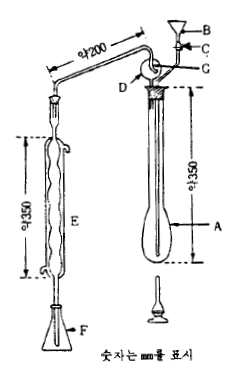

G : 작은 구멍(지름은 관의 안지름과 거의 같다)
조 작 법 보통 질소(N:14.01) 20～30㎎에 해당하는 양의 검체를 정밀하
게 달거나 또는 피펫으로 정확하게 취하여 킬달플라스크 A에 넣고 여기에
가루로 한 황산칼륨 10g 및 황산동 1g의 혼합물 5.5g을 넣어 플라스크목
에 부착한 검체를 소량의 물로 씻어 넣고 여기에 플라스크 내벽을 따라
황산 20㎖를 넣는다. 거품이 거의 멈출 때까지 가만히 가열하고 다시 가
열하여 끓이고 액이 맑은 청색이 된 다음 다시 2시간 가열한다. 식힌 다
음 물 150㎖ 를 조심하면서 넣어 식히고 여기에 비등석을 넣어 장치를 조
립한다.
수기 F 에는 0.1N 황산 25㎖ 및 물 약 50㎖를 넣고 냉각기 E의 아래끝
을 이 액에 담근다. 깔때기 B에 서 수산화나트륨용액(2→5) 85㎖ 를 천천
히 넣고 여기에 소량의 물로 씻어 넣어 곧 핀치콕크가 달린 고무관 C의
핀치콕크를 닫고 플라스크를 가볍게 흔들어 움직이면서 내용물을 섞은 다
음 가만히 가열하고 끓기 시작하면 온도를 올려 가열하고 내용물의 약 2/3 용량이 유출할 때까지 증
류한다. 냉각기의 아래 끝을 액면에서 빼내고 부착물을 소량의 물로 씻어 넣어 플라스크액중의 과량
의 산을 0.1N 수산화나트륨액으로 적정한다(지시약 : 브롬크레솔그린ㆍ메칠레드시액 3방울). 같은 방
법으로 공시험을 하여 보정한다.
0.1N 황산 1㎖ ＝ 1.4007㎎ N
46. 철시험법
철시험법은 검체중의 불순물로 함유된 철의 한도를 시험하는 방법이다. 그 한도는 철(Fe)로서 중량백
만분율(ppm)로 나타낸다.
조 작 법 따로 규정이 없는 한 원료각조에서 규정하는 양의 검액(A)을 취하여 묽은질산 5㎖ 및 물을
넣어 45㎖로 하여 검액(B)으로 한다. 따로 원료각조에서 규정하는 양의 철표준액을 취하여 검체를 제
외하고 검액(A)와 같이 처리하여 얻은 액을 넣고 여기에 묽은질산 5㎖ 및 물을 넣어 45㎖로 하여 비
교액으로 한다. 검액(B) 및 비교액에 치오시안산암모늄시액 5㎖씩을 넣어 흔들어 섞고 5분간 방치한
다음 비색할 때 검액(B)이 나타내는 색은 비교액이 나타내는 색보다 진하지 않다.
47. pH측정법
pH 측정에는 유리전극을 단 pH메터를 쓴다. pH의 기준은 다음 표준완충액을 쓰며 그 pH값은
±0.02이내의 정확도를 갖는다.
표준완충액 표준완충액을 조제하는데 쓰이는 물은 정제수를 증류하여 유액을 15분 이상 끓여서 이산
화탄소를 날려 보내고 소다석회관을 달고 식힌다. 표준완충액은 경질유리병 또는 폴리에칠렌병에 보
관한다. 산성표준액은 3개월 이내에 쓰며 알칼리성의 표준액은 소다석회관을 달아서 보관하고 1개월
이내에 쓴다.
1) 수산염완충액 테트라수산칼륨(pH측정용) 를 고운가루로 하여 데시케이터(실리카 겔)속에서 건조
한 다음 12.70g(0.05mol)을 정밀하게 달아 물을 넣어 녹여 정확하게 1ℓ로 한다.
2) 프탈산염완충액 프탈산수소칼륨(pH측정용)를 고운가루로 하여 110℃에서 2시간 이상 건조한 다
음 10.22g(0.05mol)을 정밀하게 달아 물을 넣어 녹여 정확하게 1ℓ로 한다.
3) 인산염완충액 인산이수소칼륨(pH 측정용) 및 무수인산일수소나트륨(pH 측정용)을 고운가루로 하
고 110℃에서 3시간 이상 건조한 다음 인산이수소칼륨 3.40g(0.025mol) 및 인산일수소나트륨
3.55g(0.025mol)을 정밀하게 달아 물을 넣어 녹여 정확하게 1ℓ로 한다.
4) 붕산염완충액 붕산나트륨(pH 측정용)를 데시케이터(물에 적신 브롬화나트륨)속에서 방치하여 항
량으로 한 다음 그 3.81g(0.01mol)을 정밀하게 달아 물을 넣어 녹여 정확하게 1ℓ로 한다.
5) 탄산염완충액 탄산수소나트륨(pH 측정용)를 데시케이터(실리카 겔)속에서, 탄산나트륨를 300℃에
서 각각 항량이 될 때까지 건조한 다음 탄산수소나트륨 2.10g(0.025mol) 및 탄산나트륨
2.65g(0.025mol)을 정밀하게 달아 물을 넣어 녹여 정확하게 1ℓ로 한다.
6) 수산화칼슘완충액 수산화칼슘(pH 측정용)를 고운가루로 하고 5g을 플라스크에 넣고 물 1ℓ를 넣
어 잘 흔들어 섞는다. 23～27℃에서 충분히 포화시켜 이 온도에서 상징액을 여과하여 맑은 여액(약
0.02mol)을 쓴다.
이들 표준완충액의 각 온도에서의 pH값은 다음표에 표시한다. 이 표에 없는 온도의 pH값은 표의
값에서 내삽법으로 구한다.
표준완충액의 pH값

| 온 도 | 수 산 염완 충 액 | 프탈산염완 충 액 | 인 산 염완 충 액 | 붕 산 염완 충 액 | 탄 산 염완 충 액 | 수산화칼슘완충액 |
| --- | --- | --- | --- | --- | --- | --- |
| 0°5°10°15°20°25°30°35°40°50°60° | 1.671.671.671.671.681.681.691.691.701.711.73 | 4.014.014.004.004.004.014.014.024.034.064.09 | 6.986.956.926.906.886.866.856.846.846.836.84 | 9.469.399.339.279.229.189.149.109.079.018.96 | 10.3210.2510.1810.1210.0710.029.979.93 | 13.4313.2113.0012.8112.6312.4512.3012.1411.9911.7011.45 |

pH메터의 구조 pH메터는 보통 유리전극, 기준전극 및 온도보정용 감온부가 달려있는 검출부 및 검출
된 pH값을 나타내는 지시부로 되어 있다. 지시부는 일반적으로 제로점 조절꼭지가 있고 또한 온도보
정용 감온부가 없는 것에는 온도보정꼭지가 있다. pH메타는 다음 조작법에 따라 검출부를 인산염완
충액에 5분이상 담그어 두었다가 조절한 다음 같은 온도의 프탈산염완충액 및 붕산염완충액의 pH를
측정할 떄 측정값과 표시값과의 차이가 ±0.05 이하이다.
조 작 법 유리전극은 미리 물 또는 염기성완충액에 수시간 이상 담그어 두고 pH메터는 전원에 연결
하고 10분 이상 두었다가 쓴다. 검출부를 물로 잘 씻어 묻어있는 물은 여과지 같은 것으로 가볍게
닦아 낸 다음 쓴다. 온도보정꼭지가 있는 것은 그 꼭지를 표준완충액의 온도와 같게 하여 검출부의
검체의 pH값에 가까운 표준완충액중에 담그어 2분간이상 지난 다음 pH메터의 지시가 그 온도에 있
어서의 표준완충액의 pH값이 되도록 제로점 조절꼭지를 조절한다. 다시 검출부를 물로 잘 씻어 부착
된 물을 여과지와 같은 것으로 가볍게 닦아 낸 다음 검액에 담그어 2분 이상 지난 다음에 측정값을
읽는다.
주의 : pH 11 이상에서 알칼리금속이온을 함유하는 액은 알칼리 오차가 적은 전극을 쓰고 또한 필요
하면 보정한다. 다만 그 측정오차는 pH 0.1∼0.5에 달할 수 있다. 검액의 온도는 표준완충액
의 온도와 같은 것이 좋다. 그 차가 1℃이상 있을 때는 온도보정꼭지 또는 온도보정용 감온부
로 보정한다. 보정을 했더라도 그 측정오차가 pH 0.1이상 될 때가 있다. 특히 염기성 액은
그 오차가 크므로 조심하여야 한다.
48. 황산염시험법
황산염시험법은 검체중에 불순물로서 들어있는 황산염의 한도를 시험하는 방법이다. 그 한도는 황산
염(SO 로서)의 중량백분률(%)로 표시한다.
4
조 작 법 따로 규정이 없는 한 원료각조에 규정한 검체의 양을 네슬러관에 넣고 물 30㎖를 넣어 녹인
다음 묽은염산 1㎖ 및 물을 넣어 50㎖로 하여 검액으로 한다. 따로 원료각조에서 규정하는 양의
0.01N 황산을 넣고 묽은염산 1㎖ 및 물을 넣어 50㎖로 하여 비교액으로 한다. 이 때 검액이 맑지 않
을 때에는 두 액을 같은 조건으로 여과한다. 두 액에 염화바륨시액 2㎖씩을 넣어 흔들어 섞고 10분
간 방치한 다음 흑색의 배경을 써서 네슬러관을 위 또는 옆에서 관찰할 때 검액의 혼탁도는 비교액보
다 진하지 않다.
주의 : 이 시험 또는 검액의 조제에 쓰는 시약 및 시액은 공시험에서 혼탁하지 않거나 또는 거의 혼
탁하지 않은 것을 쓴다.
49. 황산에 대한 정색물시험법
황산에 대한 정색물시험법은 검체중에 들어있는 미량의 불순물로서 황산으로 쉽게 착색되는 물질을
시험하는 방법이다.
조 작 법 따로 규정이 없는 한 다음과 같이 한다. 황산은 94.5～95.5%의 것을 쓴다. 네슬러관은 쓰
기 전에 황산로 잘 씻어야 한다. 검체가 고체일 때는 네슬러관에 황산을 5㎖의 표선까지 넣고 검체
를 가루로 하여 원료각조에서 규정한 양을 조금씩 넣어 유리막대로 저어서 섞어 완전히 녹인다. 검
체가 액체일 때는 원료각조에서 규정한 양을 취하여 네슬러관에 넣고 황산을 5㎖의 표선까지 넣어 흔
들어 섞는다. 이때 발열하여 온도가 올라가면 식히고 온도의 영향이 있는 검체에 대해서는 표준온도
를 유지한다. 15분간 방치한 다음 액을 백색 배경을 써서 네슬러관에 들어있는 원료각조에서 규정하
는 색의 비교액과 옆에서 부터 관찰하여 비색한다. 검체를 황산과 가열하도록 규정한 경우에는 검체
및 황산을 네슬러관에 넣고 규정에 따라 가열한 다음 비색한다.
50. 흡광도측정법
흡광도측정법은 물질이 일정한 좁은 파장범위의 빛을 흡수하는 정도를 측정하는 방법이다. 물질용액
의 흡수스펙트라는 그 물질의 화학구조에 따라 정해진다. 따라서 여러가지 파장에 있어서 흡수를 측정
하여 물질의 확인시험, 순도시험 또는 정량시험을 한다.
단색광(單色光)이 어떤 물질용액을 통과할 때 투과광의 강도 I와 입사광의 강도 I 와의 비를 투과도 T
0
라 하고 투과도의 역수의 상용대수를 흡광도 A라 한다.
I I
T ＝ A ＝ log 0 ＝ -logT
I I
0
흡광도 A는 용액의 농도 c 및 층장 l에 비례한다.
A ＝ Kcl
l를 1㎝, c를 1%용액으로 환산했을 때의 흡광도 값을 비흡광도 E1%라 하고 l를 1㎝, c를 1mol 용액
1㎝
으로 환산했을 때의 흡광도를 분자흡광계수 E라 한다.
흡수의 극대파장에 있어서 분자흡광계수는 E 으로 나타낸다. E1% 또는 E를 구할 경우는 다음 식에
max 1㎝
따른다.
a a
E1% ＝ E ＝
1㎝ c(%) × l c(mol) × l
l : 층장의 길이(㎝)
a : 측정하여 얻은 흡광도
c(%) : 검액의 농도(w/v%)
c(mol) : 검액의 농도(mol)
장치 및 조작법 측정장치로는 광전분광광도계를 쓴다. 셀(Cell)은 자외부흡수측정에는 석영제를 쓰며
가시부흡수측정에는 유리제를 쓴다. 분광광도계의 파장은 원료각조에서 규정한 측정파장에 맞추어
대조액을 광로에 넣고 조절하여 흡광도를 제로(zero)에 맞춘 다음 측정하고자 하는 용액을 광로에 넣
어 측정할 때 나타내는 흡광도를 읽는다. 흡광도측정은 규정용매를 써서 용액을 가지고 측정한다.
용액의 농도는 측정하여 얻은 흡광도가 0.2～0.7의 범위에 든 것이 적당하며 용액의 흡광도가 높은 값
을 나타낼 때는 적당한 농도까지 용매로 희석시킨 다음 측정한다. 자외부흡수측정에는 사용하는 용
매의 흡수에 대하여 특히 고려하고 보통 시약항에 나와 있는 시약을 그대로 쓰지 않고 사용목적에 적
합한 방법으로 정제하여 쓴다.
파장 및 흡광도의 보정 파장은 보통 석영수은아크램프 및 유리수은아크램프로 239.95㎚, 253.65㎚, 302.25
㎚, 313.16㎚, 334.15㎚, 365.48㎚, 404.66㎚, 435.83㎚, 546.10㎚ 및 수소방전관의 486.13㎚, 656.28㎚의
파장을 써서 검정한다.
흡광도 눈금은 중크롬산칼륨(표준시약)를 0.01N 황산에 녹여 0.006w/v%로 한 액을 써서 검정한다.
이 액의 E1%는 파장 235㎚(극소), 257㎚(극대), 313㎚(극소) 및 350㎚(극대)에 있어서 각각 125.2, 145.6,
1㎝
48.9 및 107.0이다.
51. 향료시험법
가. 할로겐시험법 폭 15㎜, 길이 50㎜, 망목(網目) 약 1㎜의 동망(銅網)을 끝에 말아 붙인 동선을 쓴다.
이 동선을 버어너의 무색불꽃 중에서 녹색불꽃을 볼 수 없을 때까지 잘 구어 식힌다. 다시 이 조작
을 수회 되풀이 한다. 식힌 다음 이 동망에 검체 2방울을 묻혀서 태운다. 이 조작을 3회 되풀이한
다음 이 동망을 40㎜의 높이로 조절한 무색불꽃의 가장자리에서 태울 때 불꽃은 녹색을 나타내어서
는 안된다.
나. 에스텔함량측정법 에스텔가측정법 제２법에 따라 시험한다.
에스텔의 분자량×(a ―b)×0.5
에스텔의 함량(%) ＝ ×100
검체의 양(g)×1000×c
에스텔가×에스텔의 분자량
＝ ×100
561.1×c
a : 공시험에서 0.5N 염산의 소비량(㎖)
b : 검액에서 0.5N 염산의 소비량(㎖)
c : 에스텔기의 수
다. 페놀류함량측정법 페놀류함량이란 검체중에 함유된 수산화알칼리가용물의 함량(v/v%)이며 따로
규정이 없는 한 다음 방법에 따라 측정한다.
조 작 법 검체 10㎖를 150㎖의 용량플라스크에 정확하게 취하여 잘 흔들어 섞으면서 1N 수산화칼륨
액 75㎖를 3회에 나누어 넣고 5분간 잘 흔들어 섞는다. 계속하여 30분간 방치한 다음 1N 수산화칼륨
액을 천천히 넣어 기름층을 용량플라스크의 눈금부위로 상승시키고 1시간 방치한 다음 그 양을 측정
한다.
페놀류의 함량(v/v%) ＝ 10 × [10 ― 기름층의 양(㎖)]
라. 알코올류함량 및 총알코올류함량측정법 알코올류함량이란 검체중에 유리상태로 존재하는 알코올
류의 함량을 말한다. 총알코올함량이란 검체중에 유리상태 또는 에스텔의 상태로 존재하는 알코올
류의 함량을 말한다. 알코올류함량 및 총알코올류함량을 측정할 때는 따로 규정이 없는 한 다음 방
법에 따라 측정한다.
조 작 법 제１법 검체 10㎖를 100㎖의 플라스크에 정확하게 취하여 무수초산 10㎖ 및 새로 가열하
여 융해한 무수초산나트륨 1g을 넣어 갈아 맞춘 공기냉각기를 달아 1시간 사욕상에서 가만히 끓인다.
다음에 15분동안 식힌 다음 물 50㎖를 넣고 때때로 흔들어 섞으면서 수욕중에서 15분동안 가열한다.
식힌 다음 내용물을 분액깔때기에 취하여 물층을 분리한다. 기름층을 1회 물로 씻은 다음 탄산나트
륨시액으로 씻은 액이 알칼리성이 될 떄까지 씻는다. 여기에 염화나트륨시액으로 씻은 액이 중성이
될 때까지 씻은 다음 건조시킨 용기에 옮긴다. 여기에 무수황산나트륨 2g을 넣어 잘 흔들어 섞고 30
분간 방치한 다음 여과한다. 여기서 얻은 아세틸화오일의 규정량을 정밀하게 달아 이하 에스텔가측
정법 제２법에 따라 에스텔가를 측정하여 그 값을 아세틸가로 한다.
(a―b) × 28.053
아세틸가 ＝
아세틸화오일의 양(g)
알코올의분자량×(a ―b)×0.5
알코올류함량(%) ＝
[아세틸화오일의 양(g)―0.021020(a―b)]×1000
아세틸가×알코올의분자량
＝
561.1― (0.4204×아세틸가)
a : 공시험에서 0.5N 염산의 소비량(㎖)
b : 검액에서 0.5N 염산의 소비량(㎖)
제２법 검체 10㎖를 취하여 제１법과 같이 조작한다. 따로 검체 10㎖를 취하여 에스텔가측정법 제
２법에 따라 검체의 에스텔가를 측정한다.
알코올의분자량×(a ―b)×0.5
총알코올류의 함량(%)＝
[아세틸화오일의 양(g)―0.021020(a―b)]×1000
[ 42.04×c ]
× 1― ×100
100×(알코올의 분자량＋42.04)
검체의 에스텔가×알코올의 분자량
알코올류함량(%) ＝ 총알코올류함량(%) ―
561.1
a : 공시험에서 0.5N 염산의 소비량(㎖)
b : 검액에서 0.5N 염산의 소비량(㎖)
c : 검액중의 에스텔을 초산에스텔로 하여 계산하였을 때의 함량(%)
마. 알데히드류 및 케톤류함량측정법 1) 아황산수소나트륨법 따로 규정이 없는 한 검체 10㎖를 150
㎖의 용량플라스크에 정확하게 취하여 아황산수소나트륨시액 75㎖를 넣어 잘 흔들어 섞는다. 플라
스크를 수욕중에 담그고 덩어리가 완전히 없어질 때까지 때때로 흔들어 섞으면서 가열한다. 계속하
여 아황산수소나트륨시액 25㎖를 넣어 흔들어 섞고 수욕중에 10분간 정치하고 아황산수소나트륨시액
을 천천히 넣어 기름층을 용량플라스크 눈금부위까지 상승시키고 1시간 방치한 다음 그 양을 측정한
다.
알데히드류 및 케톤류함량(v/v%) ＝ 10 × [10 ― 기름층의 양(㎖)]
2) 아황산나트륨법 따로 규정이 없는 한 검체 10㎖를 150㎖의 용량플라스크에 정확하게 취하여
새로 만든 중화아황산나트륨시액 75㎖를 넣어 잘 흔들어 섞는다. 플라스크를 수욕중에 담그고 잘
흔들어 섞으면서 가열하고 유리하는 알칼리를 때때로 초산로 중화한다. 페놀프탈레인시액 3방울을
넣어도 홍색～엷은 홍색을 나타내지 않을 때 다시 수욕중에 플라스크를 15분간 정치하고 중화아황
산나트륨시액을 천천히 넣어 유분을 용량플라스크의 눈금부위까지 상승시키고 1시간 방치한 다음
그 양을 측정한다.
알데히드류 및 케톤류함량(v/v%) ＝ 10 × [10 ― 기름층의 양(㎖)
3) 히드록실아민법 제１법 원료각조에서 규정하는 검체의 양을 정밀하게 달아 염산히드록실아
민ㆍ브롬페놀블루시액 50㎖를 정확하게 넣어 잘 흔들어 섞은 다음 규정시간동안 방치하거나 또는
환류냉각기를 달아 수욕상에서 규정시간동안 가만히 끓이고 곧 실온에서 식힌다. 계속하여 유리되
는 산을 0.5N 수산화칼륨ㆍ에탄올액으로 적정한다. 적정의 종말점은 액의 황색이 녹황색으로 되는
때 또는 액의 pH가 3.4가 되는 때로 한다. 같은 방법으로 공시험을 하여 보정한다.
알데히드류 또는 케톤류함량(%)
알데히드 또는 케톤의 분자량×(a ―b)×0.5
＝ ×100
검체의 양(g)×1000
a : 검액에서 0.5N 수산화칼륨ㆍ에탄올액의 소비량(㎖)
b : 공시험에서 0.5N 수산화칼륨ㆍ에탄올액의 소비량(㎖)
제２법 원료각조에서 규정하는 검체의 양을 정밀하게 달아 히드록실아민ㆍ브롬페놀블루시액 75㎖를
정확하게 넣어 잘 흔들어 섞은 다음 규정시간동안 방치하거나 또는 환류냉각기를 달아 수욕상에서 규
정시간동안 가만히 끓이고 곧 실온에서 식힌다. 계속하여 과량의 하이드록실아민을 0.5N 염산로 적
정한다. 적정의 종말점은 액의 자색이 녹황색으로 되는 때 또는 액의 pH가 3.4로 되는 때로 한다.
같은 방법으로 공시험을 하여 보정한다.
알데히드류 또는 케톤류함량(%)
알데히드 또는 케톤의 분자량×(a ―b)×0.5
＝ ×100
검체의 양(g)×1000
a : 공시험에서 0.5N 염산의 소비량(㎖)
b : 검액에서 0.5N 염산의 소비량(㎖)
II. 제제
1. pH 시험법
따로 규정이 없는 한 검체 약 2g 또는 2mL를 취하여 100mL 비이커에 넣고 물 30mL를 넣어 수욕상
에서 가온하여 지방분을 녹이고 흔들어 섞은 다음 냉장고에서 지방분을 응결시켜 여과한다. 이때 지방
층과 물층이 분리되지 않을 때는 그대로 사용한다. 여액을 가지고 I. 원료 47. pH측정법에 따라 시험
한다. 다만, 성상에 따라 맑은 액상인 경우에는 그대로 측정한다.
2. 자외선차단제 함량시험 대체시험법
가. 적용범위
본 시험법은 국내ㆍ외에서 제조되어 국내에서 유통되고 있는 자외선차단화장품 중 티타늄디옥
사이드 및 징크옥사이드의 함량시험 대체 시험방법이다.
나. 측정방법
(1) 자외선차단지수 측정기 : 자외선차단지수 측정기는 Xenon arc lamp에서 나오는 자외선을
UV-filter를 사용하여 290∼400nm의 파장을 광원으로 사용하는 기기로서 광원, 적분구, 단색화장
치 및 검출기로 구성되어 있다. 광원은 태양광과 유사한 연속적인 방사스펙트럼을 갖고, 특정
피크를 나타내지 않는 Xenon arc lamp를 사용한다. 290nm 이하의 파장은 적절한 filler를 사용
하여 제거한다. 광원은 시험시간 동안 일정한 광량을 유지해야 한다.
(2) 시험용 테이프 : 자외선영역에서 흡수피크가 없고 자외선 투과성이 높은 박막 형태의 테이프를
사용한다.
(3) 제품 도포량 제품 도포량은 2.0mg/cm2 또는 2.0㎕/cm2이다. 다만 제품의 제형이 시험용 테이
프에 직접 도포 할 수 없을 경우는 자외선차단지수에 영향을 미치지 않는 바세린 등 적당한
기제와 동량으로 섞어서 도포 할 수 있다.
(4) 자외선차단지수 측정 제품 도포량을 정확하게 취하여 시험용 테이프 위에 도포하고 손가락에
고무재질의 골무를 끼고 골고루 도포한 다음 상온에서 15분간 방치 후에 자외선차단지수 측정
기를 사용하여 자외선차단지수를 측정한다. 자외선차단지수는 3회 실험치의 평균값으로 정한다.
다. 기준
3롯트 당 3회 이상 시험한 시험성적의 평균값으로 기준을 설정한다.
3. 염모력시험법
용법용량 란에 기재된 비율로 섞은 염색액에 시험용백포(KSK 0905 염색견뢰도시험용첨부백포,
양모)를 침적하여 25 ℃ 에서 20∼30 분간 방치한 다음 물로 씻어 건조할 때 시험용백포는 효능효
과에서 표시한 색상과 거의 같은 색으로 염색된다.
III. 계량기, 용기, 색의 비교액, 시약, 시액, 용량분석용표준액 및 표준액
계량기는 화장품원료시험법에서 계량에 쓰는 기구 또는 기계이다. 용기는 화장품원료시험에서 그 조
건을 될 수 있는 한 일정하게 하기 위하여 정해 놓은 기구이다. 색의 비교액은 화장품원료시험에서 색
의 비교에 대조로 쓰는 것이다. 시약은 화장품원료의 시험에 쓰거나 시액을 만들기 위하여 쓰는 것이
다. 약전품이라 기재한 것은 대한약전 기준에 적합한 것을 말한다. 장원기라고 기재한 것은 원료각조
의 기준에 적합한 것을 말한다. 시액은 화장품원료의 시험에 쓰기 위하여 만들어진 액이다. 용량분석
용표준액은 농도가 정확하게 알려진 시약용액으로 주로 용량분석에 쓰는 것이다. 표준액은 화장품원료
시험에서 비교에 기초로 쓰는 액이다.
1. 계량기 및 용기
계량기, 용기에 대하여 규정한 것으로 각 시험 항목에서 따로 규정이 없는 한 계량기, 용기는 본 규정
에 적합한 것을 쓴다.
온 도 계 비중, 융점, 응고점 및 비점의 측정과 증류시험에 쓰는 수은온도계(봉상)는 따로 규정이 없는
한 다음 모양의 것을 표준으로 하며 또한 기차(器差)시험을 받은 것으로 한다

|  | 1 호 | 2 호 | 3 호 | 4 호 | 5 호 | 6 호 |
| --- | --- | --- | --- | --- | --- | --- |
| 액 체액위에 채운 기체온 도 범 위최 소 눈 금긴 눈 금 의 선눈 금 의 숫 자길 이 (㎜)아래 몸체의 지름수은구의 지름(㎜)수은구의 길이(㎜)수은구의 하단에서 최저눈금선까지의 거리(㎜)온도계의 상단에서 최고눈금선까지의 거리(㎜)꼭 지 모 양허 용 오 차 | 수 은질 소-10∼120℃0.5℃1℃ 마다10℃ 마다330∼3506∼75∼610∼1455∼6535∼50고리모양0.5℃ | 수 은질 소90∼220℃0.5℃1℃ 마다10℃ 마다330∼3506∼75∼610∼1455∼6535∼50고리모양0.5℃ | 수 은질 소190∼320℃0.5℃1℃ 마다10℃ 마다330∼3506∼75∼610∼1455∼6535∼50고리모양0.5℃ | 수 은질 소-5∼50℃0.1℃1℃ 마다2℃ 마다300∼3206∼75∼615∼1950∼5535∼40고리모양0.1℃ | 수 은질 소45∼100℃0.1℃1℃ 마다2℃ 마다300∼3206∼75∼615∼1950∼5535∼40고리모양0.1℃ | 수 은질 소95∼150℃0.1℃1℃ 마다2℃ 마다300∼3206∼75∼615∼1950∼5535∼40고리모양0.2℃ |

저유동점용온도계 다음 표의 것을 쓴다.
고유동점용온도계 다음 표의 것을 쓴다.

| 명 칭 |  | 고유동점용 | 저유동점용 |
| --- | --- | --- | --- |
| 눈 금 범 위 |  | -38∼+50℃ | -80∼+20℃ |
| 시 험 온 도 |  | - | - |
| 담 금 (㎜) |  | 108 | 76 |
| 눈 금 | 눈 금 량 | 1℃ | 1℃ |
|  | 긴 눈 금 선 | 5℃ 마다 | 5℃ 마다 |
|  | 눈 금 숫 자 | 10℃ 마다 | 10℃ 마다 |
|  | 눈금의 오차 | 0.5℃ 이내 | 1℃ 이내 |
| 팽 창 실 | 온도계허용가열온도 | 100℃ | 60℃ |
| 길 이(㎜) |  | 231±5 | 235±5 |
| 지 름(㎜) |  | 7.0∼8.0 | 7.0∼8.0 |
| 구 부 | 길 이(㎜) | 7∼9.5 | 8∼9.5 |
|  | 지 름(㎜) | 5.5∼7.0 | 5.0∼6.5 |
| 눈금의 위치 | 구부하단에서 지정 눈금선까지의 거리(㎜) | -30℃ 까지 120∼130 | -57℃ 까지 120∼130 |
|  | 구부하단에서 지정 눈금선까지의 거리(㎜) | 49℃ 까지 195∼205 | 20℃ 까지 182∼196 |

화학용체적계 메스플라스크, 피펫, 뷰렛 및 메스실린더는 검정한 것을 쓴다.

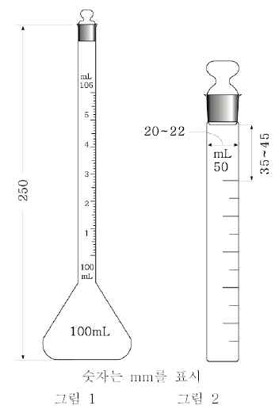

용량플라스크 경질유리제로 수부(首部)에 용량 눈금선이 있는 유리마개 플
라스크이며 그림1에 표시한 것과 같다.
네슬러관 무색으로 유리두께 1.0～1.5㎜의 갈아 맞춘 유리마개를 가진 경
질유리 원통이며 그림2에 표시한 것과 같다. 관의 눈금선의 높이가 각각
2㎜ 이하의 것을 쓴다.
천칭 및 분동 1) 화학천칭 0.1㎎까지 칭량할 수 있는 것을 쓴다.
2) 미량천칭 0.001㎎까지 칭량할 수 있는 것을 쓴다.
3) 분 동 검정한 것을 쓴다.
유리여과기 1) 도가니형유리여과기(KS L 2302)
2) 브흐너깔때기형유리여과기(KS L 2302)
체 다음에 표시한 규격의 것을 쓴다. 각각의 이름은 호칭번호 또는 호칭
치수(㎛)로 한다.

| 호칭칫수(㎛) | 호칭번호 | 체 눈 의 크 기 | 눈 의 크 허 용 평 균 | 기 차(%) 최 대 | 선 재(㎜) |  |
| --- | --- | --- | --- | --- | --- | --- |
| 호칭칫수(㎛) | 호칭번호 | 치수(㎜) | 허 용 차(%) |  | 지 름 | 허 용 차 |
|  |  |  | 평 균 | 최 대 | 지 름 | 허 용 차 |
| 56604760400033602830238020001680141011901000840710590500420350297250210177149125105887462534437 | 3½45678101214161820253035404550607080100120140170200230270325400 | 5.664.764.003.362.832.382.001.681.411.191.000.8400.7100.5900.5000.4200.3500.2970.2500.2100.1770.1490.1250.1050.0880.0740.0620.0530.0440.037 | ±2.5±2.5±2.5±3±3±3±3±3±3±3±5±5±5±5±6±6±6±6±6±6±6±6±6±6±7±7±7±8±8±8 | 101010101010101010101515151515252525252525404040406060606090 | 1.681.541.371.231.101.000.9000.8100.7250.6500.5800.5100.4500.3900.3400.2970.2470.2150.1800.1520.1310.1100.0910.0760.0640.0530.0440.0370.0300.025 | ±0.040±0.040±0.040±0.030±0.030±0.030±0.030±0.025±0.025±0.025±0.025±0.025±0.025±0.020±0.020±0.020±0.020±0.015±0.015±0.015±0.015±0.015±0.015±0.010±0.010±0.010±0.010±0.005±0.005±0.005 |

여 과 지 여과지는 다음에 표시한 규격의 것을 쓴다. 즉 여과지라고 기재하고 특히 그 종류를 표시
하지 않은 것은 정성분석용여과지를 말한다. 여과지는 가스 등으로 오염되지 않도록 보관한다.
1) 정성분석용여과지 한국산업규격 M7602에 규정한 것을 쓴다.
2) 정량분석용여과지 한국산업규격 M7602에 규정한 것을 쓴다.
3) 크로마토그래프용여과지 정량분석용여과지의 규격 및 다음에 표시한 규격에 적합한 것을 쓴다.
다만 α섬유소함량, 동가, pH, 회분량, 여과수시간 및 습윤파열강도시험은 한국산업규격의 규정 방법에
따르며 흡수고도시험은 다음에 표시한 방법에 따른다.

| 종 류 | 1 호 | 2 호 | 3 호 | 4 호 |
| --- | --- | --- | --- | --- |
| α섬유소함량(%)동 가pH회 분 량(%)여과수시간(초)습윤파열강도(㎜)흡수고도(㎜) | 90이상1.6이하5∼80.12이하330±132130이상60±12 | 95 이상1.4 이하5∼80.12 이하240±96200이상55±11 | 95이상1.4이하5∼80.12이하120±48120이상70±14 | 95이상1.4이하5∼80.12이하100±40150이상75±15 |

흡수고도시험
장 치 그림과 같은 장치를 쓴다.
A 및 A : 여과지유지용 유리블럭
1 2

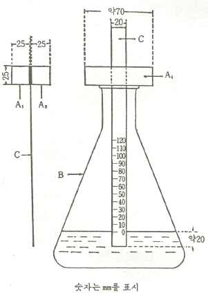

B : 삼각플라스크(용량 약1ℓ)
C : 검체여과지
조 작 법 삼각플라스크에 증류수 약 300㎖를 넣는다. 플라
스크 위에 여과지유지용유리블럭 2개 A 및 A 를 같이 늘어
1 2
놓고 미리 연필로 10㎜마다 눈금이 있는 검체여과지를 유리
블럭 사이에 끼어 처음 가만히 미끄러지게 하고 여과지의 아
래끝이 수면에 닿으면 빨리 미끄러지게 하여 눈금의 O점을
수면에 일치시켜 고정하고 증류수가 10분간 상승하는 높이를
측정한다.
비중부액계 4호 한국공업규격 A 5106 (7개조 4호로 하여)에
규정한 것을 쓴다.
비중부액계 5호 한국공업규격 A 5106 (7개조 5호로 하여)에
규정한 것을 쓴다.
가스계량관, 기체크로마토그래프용
마이크로실린지, 기체크로마토그래프용 시판하고 있는 기체크로마토그래프용 마이크로실린지를 쓴다
2. 색의 비교액
색의 비교액은 다음의 비교원액을 가지고 만든다. 비교원액은 다음 방법에 따라 만들고 유리마개병
에 보관한다. 색의 비교액을 써서 액의 색을 비교하려면 따로 규정이 없는 한 네슬러관에 넣어 백색을
배경으로 하여 옆에서 관찰한다.
염화제일코발트의 색의 비교원액 염화제일코발트 65g에 염산 25㎖ 및 물을 넣어 녹여 1ℓ로 한다.
이 액 5㎖를 정확하게 취하여 250㎖의 요오드병에 넣어 과산화수소시액 5㎖ 및 수산화나트륨용액(1→
5) 15㎖를 넣어 10분간 끓인다. 식힌 다음 요오드화칼륨 2g 및 희석시킨 황산(1→4) 20㎖를 넣어 침
전을 녹인 다음 유리된 요오드를 0.1N치오황산나트륨액으로 적정한다(지시약 : 전분시액 1㎖).
0.1N치오황산나트륨액 1㎖ ＝ 23.793㎎ C Cl ㆍ6H O
O 2 2
적정하여 얻은 값으로 부터 1㎖중에 염화제일코발트(C Cl ㆍ6H O:237.93) 59.5㎎을 함유하도록 희석시
O 2 2
킨 염산(1→40)를 넣어 비교원액으로 한다.
황산동의 색의 비교원액 황산동 65g에 염산 25㎖ 및 물을 넣어 녹여 1ℓ로 한다. 이 액 10㎖를 정확
하게 취하여 요오드병에 넣어 초산 4㎖ 및 요오드화칼륨 3g을 넣고 유리된 요오드를 0.1N치오황산나
트륨액으로 적정한다(지시약 : 전분시액 1㎖).
0.1N치오황산나트륨액 1㎖ ＝ 24.968㎎ CuSO ㆍ5H O
4 2
적정하여 얻은 값으로 부터 1㎖중에 황산동(CuSO ㆍ5H O:249.68) 62.4㎎을 함유하도록 희석시킨 염산
4 2
(1→40)를 넣어 비교원액으로 한다.
염화제이철의 색의 비교원액 염화제이철 55g에 염산 25㎖ 및 물을 넣어 녹여 1ℓ로 한다. 이 액 10
㎖를 정확하게 취하여 요오드병에 넣고 물 15㎖ 및 요오드화칼륨 3g을 넣어 마개를 하고 어두운 곳에
서 15분간 방치한 다음 물 100㎖를 넣어 유리된 요오드를 0.1N치오황산나트륨액으로 적정한다(지시약
: 전분시액 1㎖).
0.1N치오황산나트륨액 1㎖ ＝ 27.030㎎ FeCl ㆍ6H O
3 2
적정하여 얻은 값으로 부터 1㎖ 중의 염화제이철(FeCl ㆍ6H O:270.30) 45.0㎎을 함유하도록 희석시킨
3 2
염산(1→40)를 넣어 비교원액으로 한다.
색의 비교액 다음 표에서 나타내는 각각의 색의 비교원액 및 물의 일정량을 0.1㎖ 이하의 눈금이 달
린 뷰렛 또는 피펫을 써서 정확하게 취하여 잘 섞어 만든다.

| 색의 비교액의 기호 | 염화제일코발트의색의 비교원액(㎖) | 염화제이철의 색의비교원액(㎖) | 황산동의 색의비교원액(㎖) | 물(㎖) |
| --- | --- | --- | --- | --- |
| ABCDEFGHIJKLMNOPQRST | 0.10.30.10.30.40.30.50.20.40.40.50.80.1-0.10.20.20.30.20.5 | 0.40.90.60.61.21.21.21.52.23.54.53.82.04.94.80.40.30.40.10.5 | 0.10.30.10.40.3-0.2-0.10.1-0.10.10.10.10.10.10.2-0.4 | 4.43.54.23.73.13.53.13.32.31.0-0.32.8--4.34.44.14.73.6 |

3. 시약ㆍ시액
기체크로마토그래프용N,ο-비스(트리메칠실릴)아세트아마이드 N,ο-비스(트리메칠실릴)아세트아마이드,
기체크로마토그래프용 참조
기체크로마토그래프용규조토 규조토, 기체크로마토그래프용 참조
기체크로마토그래프용내화연와 내화연와, 기체크로마토그래프용 참조
기체크로마토그래프용라우린산메칠 라우린산메칠, 기체크로마토그래프용 참조
기체크로마토그래프용메칠베헤네이트 메칠베헤네이트, 기체크로마토그래프용 참조
기체크로마토그래프용메칠실리콘(GE-SE 30) 메칠실리콘(GE-SE 30), 기체크로마토그래프용 참조
기체크로마토그래프용미리스틴산메칠 미리스틴산메칠, 기체크로마토그래프용 참조
기체크로마토그래프용스테아린산메칠 스테아린산메칠, 기체크로마토그래프용 참조
기체크로마토그래프용스테아트리모늄클로라이드 스테아트리모늄클로라이드, 기체크로마토그래프용 참
조
기체크로마토그래프용올레인산메칠 올레인산메칠, 기체크로마토그래프용 참조
기체크로마토그래프용팔미틴산메칠 팔미틴산메칠, 기체크로마토그래프용 참조
기체크로마토그래프용카프린산 카프린산, 기체크로마토그래프용 참조
기체크로마토그래프용카프릴산 카프릴산, 기체크로마토그래프용 참조
개미산(Formic Acid) HCOOH [특급]
과망간산칼륨(Potassium Permanganate) KMnO [특급]
4
과망간산칼륨ㆍ인산시액(Potassium PermanganateㆍPhosphoric Acid TS) 인산 75㎖에 물을 넣어 500
㎖로 하고 여기에 과망간산칼륨 15g을 넣어 녹인다.
과망간산칼륨시액, 0.1N(Potassium Permanganate TS) 과망간산칼륨 3.3g에 물을 넣어 녹여 1ℓ로 한
다.
과산화나트륨(Sodium Peroxide) Na O [특급]
2 2
과산화수소수, 강, 30%(Hydrogen Peroxide) H O [특급] H O 30w/v% 이상을 함유한다. 냉암소에
2 2 2 2
보관한다.
과산화수소시액, 3%(Hydrogen Peroxide TS) 과산화수소수 1용량에 물 9용량을 넣는다. 쓸 때 만든
다.
과염소산(Perchloric Acid) HClO [특급] 비중：약 1.67, HClO 70∼72%를 함유한다.
4 4
과염소산바륨(Barium Perchlorate) Ba(ClO ) 백색의 가루로 물에 녹는다. 염화물：이 원료 0.40g을
4 2
달아 시험한다. 비교액에는 0.01N 염산 0.40㎖를 넣는다(0.036% 이하). 염소산염：이 원료 1.0g을 질
산 2㎖ 및 아질산나트륨 0.1g에 녹인 액 40㎖를 넣어 녹이고 10분간 끓인다. 식힌 다음 이것을 검액
으로 하고 염화물의 시험을 한다. 비교액에는 0.01N 염산 1.0㎖를 넣는다.
과염소산칼륨(Potassium Perchlorate) KClO [특급]
4
과요오드산(Periodic Acid) HIO ㆍ2H O [1급]
4 2
과요오드산시액(Periodic Acid TS) 과요오드산 11g에 물을 넣어 녹여 200㎖로 하고 여기에 빙초산 80
㎖를 넣는다.
과요오드칼륨(Potassium Periodate) KIO [1급]
4
과황산암모늄(Ammonium Persulfate) (NH ) S O [1급] 97% 이상
4 2 2 8
구리(Copper) Cu [특급] 삭편(削片), 선상(線狀), 판상(板狀) 또는 입상(粒狀)으로 성형되어 있다.
구리에칠렌디아민시액 1M수산화구리(II)(주2)100g을500mL눈금이있는1000mL의두꺼운시약병에넣
고물을넣어500mL로한다.액주입용분액깔때기,질소도입용유리관및기체배출용유리관을끼운고무마개
를시약병에부착시킨다.질소도입관아래쪽의위치는시약병의밑에서약1.3cm높이로조절한다.질소도입
관으로약14kPa로감압한질소를통하게하고필요하면적당한조절기를써서조용히거품이일도록조절
하여약3시간시약병내의공기를질소로바꾼다.시약병안에통과된질소는기체배출관을따라배출되도록
같은방법으로질소를통하게하고다시흐르는물로냉각하면서액주입용분액깔때기에서에칠렌디아민시
액(주3)160mL를천천히넣는다.액주입용분액깔때기를떼어내고고무마개의구멍을유리막대로막는다.
다시약10분간질소를통하여가압상태로하며압력이약14kPa의질소상태가되도록한다.시약병을때때
로흔들어섞으면서약16시간방치한다.필요하면유리여과기를써서감압여과하고다시질소충진상태에서
보존한다.이와같이해서얻은액의구리(II)이온농도는약1.3mol/L이다.정량법에따라이액의에칠렌디
아민의농도×(mol/L)및구리(II)이온농도Y(mol/L)를구하고그값에서X는1.96∼2.04,Y는0.98∼1.02및
X/Y는1.96∼2.04가되도록물,수산화구리(II)또는에칠렌디아민시액을넣고다시같은방법으로정량하여
시액으로한다.
정량법 1)에칠렌디아민:조제한액1mL(V )를정확하게취하여물60mL를넣고0.1N염산으로적정한
1
다(pH측정법,종말점pH약8.4).
X:조제한액중에칠렌디아민의농도(mol/L)
a:0.1N염산의소비량(mL)
N :염산의농도(N)
1
정량법2)구리(II)이온:조제한액2mL(V )를정확하게취하여물20mL,요오드화칼륨3g및2M황산50
2
mL를넣어다시5분간흔들어섞은다음유리한요오드를0.1M황산나트륨액으로적정한다.적정종말점
은액이종말점가까이에서엷은황색으로될때전분시액3mL및치오시안산암모늄용액(2→10)10mL를
넣어생긴청색이탈색될때로한다.
Y:조제한액중구리(II)이온의농도(mol/L)
b:0.1M치오황산나트륨액의소비량(mL)
N :치오황산나트륨액의농도(M)
2
구연산(Citric Acid) C H O ㆍH O [특급]
6 8 7 2
구연산나트륨(Sodium Citrate) C H Na O ㆍ2H O [특급]
6 5 3 7 2
구연산시액, 산성(Citric Acid TS, Acidic) 구연산 50g에 염산 50㎖를 넣어 녹이고 조심하면서 물 150
㎖를 넣어 섞는다.
구연산암모늄(Ammonium Citrate) (NH ) HC H O [디구연산암모늄, 특급]
4 2 6 5 7
구연산암모늄시액(Ammonium Citrate TS) 구연산암모늄 10g을 물에 녹여 100㎖로 한다.
구연산암모늄시액, 납시험법용 구연산암모늄 40g에 물을 넣어 녹여 100㎖로 한다.
규조토(Diatomaceous Earth) [1급]
규조토, 기체크로마토그래프용(Diatomaceous Earth, for Gas Chromatography) 규조토를 기체크로마
토그래프용으로 만든 상질(上質)의 것을 쓴다.
글리세린(Glycerin) C H O [특급]
3 6 3
글리콜에텔디아민테트라초산(Glycoletherdiaminetetraacetic Acid) C H O N 무색 또는 백색의 결
14 24 10 2
정성 가루로 물에 녹기 어려우나 알칼리성으로 하면 녹는다.
금속나트륨(Metal Natrium) 나트륨, 금속 참조
기질액, 염화리소짐정량용 염화리소짐정량용 건조균체 약 0.05g에 pH 6.2 인산염완충액 60 ㎖를 넣고
흔들어 섞어 현탁시키고 물을 대조로 하여 층장 10㎜, 파장 640㎚의 투과율 (T%)이 10이 되도록 pH
6.2 인산염완충액을 넣는다.
나트륨, 금속(Natrium, Metal) Na [1급]
나트륨메톡시드(Sodium Methoxide) CH NaO [순품]
3
나프토레소르시놀(Naphthoresorcinol) C H (OH) [1급]
10 6 2
나프토레소르시놀ㆍ인산시액 나프토레소르시놀의 에탄올용액(1→50) 100㎖에 인산 10㎖를 넣어 녹인
다.
β-나프토퀴논-4-설폰산나트륨(Sodium 1,2-Naphthoquinone-4-Sulfonate) C H O SO Na [특급]
10 5 2 3
1-나프톨(1-Naphthol) C H OH [1급] 차광하여 보관한다.
10 7
2-나프톨(2-Naphthol) C H OH [1급] 차광하여 보관한다.
10 7
1-나프톨벤제인(1-Naphtholbenzein) [(HOC H ) C(C H )OH] 적갈색의 가루로 물에는 녹지 않으나 에
10 6 2 6 5
탄올, 벤젠, 에텔 및 빙초산에 녹으며 산성에서는 적황색, 알칼리성에서는 녹색을 나타낸다.
1-나프톨벤제인시액(1-Naphtholbenzein TS) 1-나프톨벤제인 1g에 벤젠을 넣어 녹여 100㎖로 한다.
2-나프톨시액(2-Naphthol TS) 2-나프톨 1g을 수산화나트륨용액(1→100) 100㎖에 녹인다. 쓸 때 만든
다.
1-나프틸아민(1-Naphthylamine) C H NH [특급] 차광하여 보관한다.
10 7 2
난백(Egg White) 신선한 흰자질을 쓴다.
납산나트륨시액(Sodium Plumbate TS) 수산화나트륨 50g에 물 100㎖를 넣어 녹이고 여기에 초산납
2.5g 및 구연산나트륨 5g을 넣어 녹이고 여기에 물을 넣어 150㎖로 한다.
내화연와(耐火煉瓦), 기체크로마토그래프용 내화연와를 기체크로마토그래프용으로 만든 것이며 염산
또는 황산으로 처리한 것을 쓴다.
네슬러시액(Nessler's TS) 요오드화칼륨 10g을 물 10㎖에 녹여 저어 섞으면서 염화제이수은드포화용액
을 적색 침전이 거의 녹을 때까지 넣는다. 여기에 수산화칼륨 30g을 물 60㎖에 녹인 액을 넣고 염화
제이수은포화용액 1㎖ 및 물을 넣어 200㎖로 한다. 침전이 가라 앉은 다음 상징액을 쓴다. 이 액 2
㎖를 염화암모늄용액(1→300,000) 100㎖에 넣을 때 곧 황갈색을 나타낸다.
뇨소(Urea) H NCONH [특급]
2 2
니트로벤젠(Nitrobenzene) C H NO [특급]
6 5 2
ο-니트로벤즈알데히드(ο-Nitrobenzaldehyde) C H NO CHO 황색의 침상 결정으로 벤즈알데히드와
6 4 2
같은 냄새가 난다. 에탄올에 녹는다. 융점：45∼50℃, 강열잔분：0.1% 이하
2-니트로소-1-나프톨(2-Nitroso-1-naphthol) C H NO 황색의 침상 결정으로 에탄올, 초산 및 아세톤
10 7 2
에 잘 녹으며 에텔, 벤젠, 클로로포름 및 석유에텔에는 녹기 어렵다. 융점：162∼164℃
4-니트로벤젠디아조늄클로라이드시액 4-니트로아닐린 1.1 g을 염산 1.5 mL에 녹이고 물 1.5 mL를 넣어
식히면서 아질산나트륨 0.5 g을 물 5 mL에 녹인 액을 넣는다. 쓸 때 만든다.
4-니트로아닐린 C HNONH 노란색 ~ 황적색의 결정 또는 결정성 가루이다.
6 4 2 2
융점 147 ~ 150℃
저장법 : 차광한 기밀용기
5-니트로소-8-옥시퀴놀린(5-Nitroso-8-hydroxyquinoline) C H NOHNO 어두운 회록색의 결정성 가루
9 5
이다. 융점：245℃에서 분해한다. 용해상태：이 원료 1g에 황산 100㎖를 넣어 녹일 때 액은 맑다.
니트로프루싯나트륨(Sodium Nitroprusside) Na Fe(CN) (NO) ㆍ2H O [특급]
2 5 2 2
니트로프루싯나트륨시액(Sodium Nitroprusside TS) 니트로프루싯나트륨 1g에 물을 넣어 녹여 20㎖로
한다. 쓸 때 만든다.
닌히드린(Ninhydrin) C H O ㆍH O [1,2,3-인단트리오하이드레이트, 특급]
9 4 3 2
닌히드린ㆍ부탄올시액(NinhydrinㆍButyl Alcohol TS) 구연산 2.1g 및 인산일수소나트륨 7.2g에 물
100㎖를 넣어 녹이고 부탄올 100㎖를 넣어 흔들어 섞어 부탄올층을 분취한다. 다음에 닌히드린 0.2g
에 위의 부탄올을 넣어 녹여 100㎖로 한다.
닌히드린시액(Ninhydrin TS) 닌히드린 1g에 물을 넣어 녹여 1ℓ로 한다. 쓸 때 만든다.
덱스트린(Dextrine) [1급]
드라겐돌프변법시액(Dragendorff's TS Modified) 차질산비스머스 0.85g에 초산 100㎖ 및 물 40㎖를
넣어 녹인 액, 요오드화칼륨 8g에 물 20㎖를 넣어 녹인 액, 초산 및 물을 쓰기 바로 전에 1：1：4：10
의 비율로 혼합하여 만든다.
드라겐돌프시액(Dragendorff's TS) 차질산비스머스 0.85g에 빙초산 10㎖를 넣어 녹이고 물 40㎖를 넣
어 A액으로 한다. 요오드화칼륨 8g에 물 20㎖를 넣어 녹여 B액으로 한다. 쓸 떄 A, B액을 각각 같
은 용량을 섞어 쓴다. A액과 B액은 차광하여 보관한다.
드라겐돌프시액, 분무용(Dragendorff's TS, for Spray) 드라겐돌프시액의 A액 및 B액의 같은 용량 혼
합액 4㎖에 희석시킨 초산(1→5) 20㎖를 넣는다. 쓸 때 만든다.
드라이아이스(Dry Ice) 공기중에서 승화되기 쉬운 백색의 고체로 이산화탄소를 낮은 온도에서 가압하
여 액체로 하고 그의 일부를 증발시켜 설상(雪狀)의 고체로 하여 여기에 액체이산화탄소를 조금씩 넣
어 가압하여 만든다.
디기토닌(Digitonin) C H O 백색의 결정성 가루로 온에탄올 및 빙초산에 녹으며 냉수에 녹기 어
55 90 29
렵고 클로로포름 및 에텔에 녹지 않는다. 융점：약 230℃(분해), 선광도 [α]20：-47～-49℃(1g, 75%
D
초산, 10㎖, 100㎜), 용해상태：이 원료 0.5g에 온에탄올 20㎖를 넣어 녹일 떄 액은 무색이며 맑다.
건조감량：6% 이하(105℃), 강열잔분：0.3% 이하
3,5-디니트로염화벤조일(3,5-Dinitrobenzoyl Chloride) (NO ) C H COCl [특급]
2 2 6 3
2,4-디니트로클로로벤젠(2,4-Dinitrochlorobenzene) (NO ) C H Cl [특급]
2 2 6 3
2,4-디니트로페놀 CHN O 연한 노란색의 결정 또는 결정성 가루
6 4 2 6
융 점 : 110 ~ 114℃
2,4-디니트로페닐히드라진(2,4-Dinitrophenyl Hydrazin) (NO ) C H NHNH [특급]
2 2 6 3 2
2,4-디니트로페닐히드라진시액(2,4-Dinitrophenyl Hydrazin TS) 2,4-디나이트로페닐하이드라진 1.5g을
황산 10㎖ 및 물 10㎖의 냉혼합액에 녹이고 물을 넣어 100㎖로 한다. 필요하면 여과한다.
2,4-디니트로페닐히드라진ㆍ에탄올시액(2,4-Dinitrophenyl HydrazinㆍAlcohol TS) 2,4-디니트로페닐히
드라진 1.5g을 황산 10㎖ 및 물 10㎖의 냉혼합액에 녹이고 무알데히드에탄올 1용량 및 물 3용량의 혼
합액을 넣어 100㎖로 하여 여과한다.
디메칠글리옥심(Dimethylglyoxime) HONC(CH )C(CH )NOH [특급]
3 3
디메칠글리옥심시액(Dimethylglyoxime TS) 디메칠글리옥심 1g에 에탄올을 넣어 녹여 100㎖로 한다.
디메칠설폭시드, 흡수스펙트럼용(Dimethylsulfoxide, for Spectrophotometry) 무색의 결정 또는 무색
의 맑은 액으로 특이한 냄새가 있다. 흡습성이 강하다. 응고점：18.3℃ 이상, 흡수스펙트럼：이 원료
를 가지고 물을 대조로 하여 질소를 포화한 다음 곧 흡광도를 측정할 때 파장 270㎚에서 0.20 이하,
275㎚에서 0.09 이하, 280㎚에서 0.06 이하, 300㎚에서 0.015 이하이다. 또 파장 260∼350㎚에서 특이
한 흡수를 나타내지 않는다. 수분：0.1% 이하
디메칠아닐린(Dimethylaniline) 무색～엷은 황색의 맑은 액으로 특이한 냄새가 있다. 비중 d20：
20
0.962 이상, 응고점：1.9℃ 이상, 모노메칠아닐린：이 원료 5㎖에 무수초산ㆍ벤젠용액(1→10) 10㎖를 정
확하게 넣고 잘 흔들어 섞은 다음 30분간 방치한다. 여기에 1N 수산화나트륨액 25㎖를 넣어 흔들어
섞은 다음 1N 염산으로 적정한다(지시약：페놀프탈레인시액). 같은 방법으로 공시험을 하여 보정한
다. 1N 수산화나트륨액의 소비량은 0.2㎖이하이다. 증류시험：98v/v% 이상(192～194℃, 제2법), 강
열잔분：0.02% 이하(3g, 제1법)
p-디메칠아미노벤즈알데히드(p-Dimethylaminobenzaldehyde) (CH ) NC H CHO [특급]
3 2 6 4
p-디메칠아미노벤질리덴로다닌(p-Dimethylaminobenzylidenerhodanine) C H N OS [특급]
12 12 2 2
p-디메칠아미노벤질리덴로다닌시액(p-Dimethylaminobenzylidenerhodanine TS) p-디메칠아미노벤질리
덴로다닌 20㎎에 아세톤을 넣어 녹여 100㎖로 한다.
p-디메칠아미노신남알데히드(p-Dimethylaminocinnamaldehyde) (CH ) NC H CHCHCHO [최순품]
3 2 6 4
p-디메칠아미노신남알데히드시액(p-Dimethylaminobenzaldehyde TS) p-디메칠아미노신남알데히드
0.2g에 황산 2㎖ 및 에탄올 98㎖의 냉혼합액을 넣어 녹인다.
디메칠포름아미드(Dimethylformamide) HCON(CH ) [특급]
3 2
2,6-디브롬퀴논클로르이미드(2,6-Dibromoquinonechlorimide) C H Br ClNO [특급]
6 2 2
디시아노프로필실리콘폴리머(Dicyanopropylsilicone Polymer) [1급] 기체크로마토그래프용으로 만든
양질의 것.
디아조벤젠설폰산시액(Diazobenzene Sulfonic Acid TS) 105℃에서 3시간 건조한 설파닐산 0.9g을 달
아 묽은염산 10㎖를 넣어 가열하여 녹이고 물을 넣어 100㎖로 한다. 이 액 3.0㎖를 취하여 아질산나
트륨시액 2.5㎖를 넣어 빙냉하면서 5분간 방치한 다음 아질산나트륨시액 5㎖ 및 물을 넣어 100㎖로
하고 빙수중에서 15분간 방치한다. 쓸 때 만든다.
디에칠디치오카르바민산나트륨(Sodium Diethyldithiocarbamate) (C H ) NS Naㆍ3H O [특급]
2 5 2 2 2
디에탄올아민(Diethanolamine) NH(CH CH OH) [1급]
2 2 2
디옥산(Dioxane) C H O [특급]
4 8 2
1,2-디클로로에탄(1,2-Dichloroethane) ClCH CH Cl [특급]
2 2
2,6-디클로로퀴논클로르이미드(2,6-Dichloroquinonechlorimide) C H Cl NO 융점：65∼67℃, 강열잔
6 2 3
분：0.5%이하, 이 원료 0.1g에 에탄올을 넣어 녹일 때 맑다.
2,6-디클로로페놀인도페놀나트륨(Sodium 2,6-Dichlorophenol Indophenol) C H Cl NNaO [특급]
12 6 2 2
2,6-디클로로페놀인도페놀나트륨시액(Sodium 2,6-Dichlorophenol Indophenol TS) 2,6-디클로로페놀인
도페놀나트륨 0.1g에 물 100㎖를 넣어 가온하여 녹여 여과한다. 3일 이내에 쓴다.
디티존(Dithizone) C H NHNHCSNNC H [디페닐치오카바존, 특급]
6 5 6 5
디티존ㆍ벤젠시액(DithizoneㆍBenzene TS) 디티존 20㎎에 벤젠 50㎖를 넣어 녹이고 분액깔때기에 넣
어 희석시킨 강암모니아수(1→40) 50㎖, 아황산나트륨용액 5㎖ 및 시안화칼륨시액 2∼3㎖를 넣어 흔들
어 섞은 다음 물층을 따로 취한다. 다시 벤젠층에 희석시킨 암모니아시액(1→40) 20㎖, 아황산나트륨
시액 2㎖ 및 시안화칼륨시액 1㎖를 넣어 흔들어 섞고 물층은 따로 취하여 앞의 수용액에 합한다. 이
액에 벤젠 20㎖를 넣어 흔들어 섞은 다음 물층을 따로 취하여 희석시킨 염산(1→10)를 넣어 산성으로
하고 여기에 벤젠 50㎖를 넣어 흔들어 섞은 다음 물층을 버린다. 벤젠용액을 물 50㎖씩으로 2회 씻
은 다음 벤젠을 넣어 1ℓ로 한다. 이 액은 가용성납염을 함유치 않은 차광한 유리제마개병에 넣어
냉소에서 보관한다.
디티존액, 발색용(Dithizone Solution, for Color Development) 디티존 10㎎에 클로로포름 1ℓ를 넣
어 녹인다. 차광한 가용성납염을 함유치 않은 유리제품의 마개있는 병에 넣어 냉소에서 보관한다.
디티존액, 추출용(Dithizone Solution, for Extraction) 디티존 30㎎에 클로로포름 1ℓ를 넣어 녹이고
에탄올 5㎖를 넣는다. 이 액은 냉소에서 보관한다. 쓸 때 이 액의 필요량을 취하여 그 약 1/2용량의
희석시킨 질산(1→100)와 흔들어 섞어 물층을 버리고 쓴다.
디페닐아민(Diphenylamine) (C H ) NH [특급]
6 5 2
디페닐아민시액(Diphenylamine TS) 디페닐아민 1g에 황산 100㎖를 넣어 녹인다. 무색의 액을 쓴다.
디페닐카르바존(Diphenylcarbazone) C H NHNHCONNC H [특급]
6 5 6 5
디페닐카르바존시액(Diphenylcarbazone TS) 디페닐카르바존 1g에 에탄올을 넣어 녹여 1ℓ로 한다.
2,2'-디피리딜(2,2'-Dipyridyl) (C H N) [특급]
5 4 2
라우린산(Lauric Acid) CH (CH ) COOH 백색의 결정성 가루, 또는 무색의 맑은 액으로 물에 녹지
3 2 10
않으나 벤젠, 에텔에 녹는다. 또한 이 원료 1g은 에탄올 1㎖, 프로판올 2.5㎖에 녹는다. 굴절률
n82：1.4183, 비점：225℃/100㎜Hg, 비중 d15：0.869, 융점：44～45℃
D 4
라우린산메칠, 기체크로마토그래프용(Methyl Laurate) 순도 98% 이상
라우릴황산나트륨(Sodium Lauryl Sulfate) C H NaO S [장원기]
12 25 4
라이넥케염(Reinecke Salt) NH [Cr(NH ) (SCN) ]ㆍH O [1급]
4 3 2 4 2
라이넥케염시액(Reinecke Salt TS) 라이넥케염 0.5g에 물 20㎖를 넣고 1시간 때때로 흔들어 섞어 여
과한다. 2일 이내에 쓴다.
레소르신(Resorcin) C H (OH) [1급]
6 4 2
레소르신시액(Resorcin TS) 레소르신 1g에 염산 10㎖를 넣어 녹인다. 쓸 떄 만든다.
레티닐아세테이트표준품, 박층크로마토그래프용(Retinol Acetate Standard, for Thin-layer
Chromatography) 레티닐아세테이트의 크로마토그래프용으로 정제된 것을 쓴다.
레티닐팔미테이트표준품, 박층크로마토그래프용(Retinyl Palmitate Standard) 레티닐팔미테이트의 크
로마토그래프용으로 정제된 것을 쓴다.
루틴(Rutin) C H O ㆍ3H O [순품]
27 30 16 2
리본상마그네슘 마그네슘(Mg : 24.31, 시약1급)
리트머스시험지, 적색(Litmus Paper, Red) 리트머스시험지
리트머스시험지, 청색(Litmus Paper, Bule) 리트머스시험지
마그네슘가루(Magnesium Powder) Mg [1급]
마그네시아시액(Magnesia TS) 염화마그네슘 5.5g 및 염화암모늄 7g에 물 65㎖를 넣어 녹여 암모니아
시액 35㎖를 넣어 마개를 한 병에 넣어 수일간 방치하고 여과한다. 액이 맑지 않을 때는 쓰기 전에
여과한다.
마이야시액(Mayer's TS) 염화제이수은 1.358g에 물 60㎖를 넣어 녹인다. 따로 요오드화칼륨 5g에 물
10㎖를 넣어 녹여 두액을 섞고 여기에 물을 넣어 100㎖로 한다.
만델산(Mandelic Acid) C H O [α-옥시페닐초산] 무색의 판상 결정이다. 융점：133℃
8 8 3
만델린시액 오산화바나듐 0.5g을 농황산 100㎖에 녹인다.
말레인산(Maleic Acid) CH(COOH)CH(COOH) 백색의 가루로 냄새는 없다. 이 원료 1g은 물 1.5㎖,
에탄올 2㎖ 및 에텔 12㎖에 녹는다. 융점：132∼140℃
말레인산디n-부틸(Dibutyl Maleate) C H O 무색유상(油狀)의 액으로 물에 녹지 않는다. 비점：약
12 20 4
300℃, 비중 d20：1.000, 기체크로마토그래프용의 액체고정상으로 할로겐화탄화수소, 저급탄화수소에
4
적용한다. 사용한계온도： 60℃
말레인산완충액, pH 7.0(Maleic Acid Buffer Solution) 말레인산 1.218g에 소량의 물을 넣어 녹이고
1N 수산화나트륨 20㎖를 넣은 다음 물을 넣어 100㎖로 한다.
머캅토초산 HSCH COOH[최순품]앰플에넣어냉암소에보존한다.장기간보존하지않는다.
2
메칠그린(Methyl Green) [특급] 흡수비(A /A )：0.92∼1.03
615 645
메칠그린시액(Methyl Green TS) 메칠그린 0.2g에 에탄올을 넣어 녹여 100㎖로 한다. 차광하여 보관
한다.
메칠레드(Methyl Red) C H N O [특급] 변색범위 pH：(적색)4.2∼6.2(황색)
15 15 3 2
메칠레드ㆍ메칠렌블루시액(Methyl RedㆍMethylene Blue TS) 메칠레드 0.1g 및 메칠렌블루 0.1g에
에탄올을 넣어 녹여 100㎖로 한다. 차광하여 보관한다.
메칠레드시액(Methyl Red TS) 메칠레드 0.1g에 에탄올 100㎖를 넣어 녹인다. 필요하면 여과한다.
메칠렌블루(Methylene Blue) C H ClSN ㆍ3H O [베이직블루9, 특급]
16 18 3 2
메칠렌블루ㆍ과염소산칼륨시액(Methylene BlueㆍPotassium Perchlorate TS) 과염소산칼륨용액(1→
1000) 500㎖에 흔들어 섞으면서 메칠렌블루용액(1→100)을 약간 혼탁해질 때까지 적가한다. 액을 방
치하고 상징액을 여과한다.
메칠렌블루시액(Methylene Blue TS) 메칠렌블루 0.1g에 에탄올 100㎖를 넣어 녹이고 필요하면 여과
한다
메칠렌블루시액, 산성(Methylene Blue TS, Acidic) 물 500㎖에 황산 12g을 조심하면서 넣어 식힌다.
여기에 메칠렌블루 30㎎ 및 무수황산나트륨 50g을 넣어 녹이고 물을 넣어 1ℓ로 한다.
메칠바이올렛 [최순품]염화메칠로자닐린을 쓴다.
메칠바이올렛시액 염화메칠로자닐린시액 참조
메칠베헤네이트, 기체크로마토그래프용(Methyl Behenate) 순도 99% 이상
메칠실리콘(GE-SE 30), 기체크로마토그래프용(Methyl Silicone) 무색의 유상 액으로 물에 녹지 않는
다. 비중 d25：0.850～1.050 기체크로마토그래프용의 액체고정상으로 알칼로이드, 스테로이드 등에
25
적용한다. 사용한계온도：300℃
메칠에칠케톤 2-부타논
메칠옐로우(Methyl Yellow) C H N [p-디메칠아미노아조벤젠, 특급]
14 15 3
메칠옐로우시액(Methyl Yellow TS) 메칠옐로우 0.1g에 에탄올 200㎖를 넣어 녹인다.
메칠오렌지(Methyl Orange) C H N NaO S [특급] 변색범위 pH：(적색)3.1∼4.4(등황색)
14 14 3 3
메칠오렌지ㆍ키실렌시아놀FF시액(Methyl OrangeㆍXylene Cyanol FF TS) 메칠오렌지 1g 및 크실렌
시아놀FF 1.4g에 묽은에탄올 500㎖를 넣어 녹인다.
메칠오렌지시액(Methyl Orange TS) 메칠오렌지 0.1g에 물 100㎖를 넣어 녹여 여과한다.
4-메칠-2-펜타논 CHCOCHCH(CH) [최순품]
3 2 3 2
메타인산(Metaphosphoric Acid) HPO [특급]
3
메탄올(Methyl Alcohol) CH OH [메탄올, 특급]
3
메탄올, 칼핏셔용(Methyl Alcohol, for Kahl Fischer Method) 일반시험법중 수분정량법 참조
메탄올ㆍ벤젠ㆍ황산시액(Methyl AlcoholㆍBenzeneㆍSulfuric Acid TS) 메탄올ㆍ벤젠의 혼합액(3：1)
230㎖에 황산 2㎖를 조심하여 넣는다.
멘톨(Menthol) C H O [L-멘톨 또는 DL-멘톨, 장원기]
10 20
모노에탄올아민 NH CH CH OH [순품]
2 2 2
모노클로로초산(Chloroacetic Acid) CH ClCOOH [특급]
2
모노클로로초산완충액(Chloroacetic Acid Buffer Solution) 모노클로로초산 9.45g 및 수산화나트륨
(NaOH 100%로서) 2.0g에 물을 넣어 녹여 100㎖로 한다.
모르포린(Morpholine) C H NO
4 9
모르포린시액(Morpholine TS) 새로 증류한 모르포린 10㎖에 무수에탄올 90㎖를 넣는다.
몰리브데인ㆍ텅그스텐산나트륨ㆍ리튬시액(Sodium MolybdophosphotungstateㆍLithium TS) 텅그스
텐산나트륨 1.0g 및 몰리브덴산나트륨 2.5g에 물 80㎖를 넣어 녹이고 여기에 인산 5㎖ 및 염산 5㎖를
넣어 환류냉각기를 달아 수욕상에서 10시간 가열한다. 식힌 다음 황산리튬 15g, 물 5㎖, 브롬시액 5
방울을 넣어 2시간 방치한다. 다음에 환류냉각기를 떼고 15분간 가열하여 과잉의 브롬을 제거한다.
식힌 다음 여과하고 물을 넣어 100㎖로 한다. 이 용액은 냉암소에 보관하고 4개월 이내에 쓴다. 또
한 이 액은 황색이며 녹색을 나타내는 것은 쓰지 않는다.
몰리브덴산나트륨(Sodium Molybdate) Na MoO ㆍ2H O [특급]
2 4 2
몰리브덴산시액, 산성(Molybdic Acid TS, Acidic) 몰리브덴산 1.0g에 물 10㎖를 넣어 녹이고 희석시
킨 황산(1→2) 30㎖를 넣는다.
몰리브덴산암모늄(Ammonium Molybdate) (NH ) Mo O ㆍ4H O [특급]
4 6 7 24 2
몰리브덴산암모늄ㆍ황산시액(Ammonium MolybdateㆍSulfuric Acid TS) 몰리브덴산암모늄 0.1g에 희
석시킨 황산(3→20)를 넣어 녹여 40㎖로 한다. 쓸 때 만든다.
몰리브덴산암모늄시액, 10%(Ammonium Molybdate TS) 몰리브덴산암모늄 21.2g에 물을 넣어 녹여
200㎖로 한다. 폴리에칠렌병에 보관한다.
몰리브덴산암모늄시액 2.5% 몰리브덴산암모늄 2.5g을 황산 10㎖를 넣은 물 50㎖에 녹이고 물을 넣어
전량을 100㎖로 한다.
무비소아연 아연, 무비소 참조
무수아황산나트륨 아황산나트륨, 무수 참조
무수에탄올 에탄올, 무수 참조
무수에텔 에텔, 무수 참조
무수염화칼슘 염화칼슘, 무수 참조
무수인산일수소나트륨 인산일수소나트륨, 무수 참조
무수초산(Acetic Anhydride) (CH CO) O [특급]
3 2
무수초산ㆍ피리딘시액(Acetic AnhydrideㆍPyridine TS) 무수초산 25g에 피리딘을 넣어 100㎖로 한다.
잘 섞어 외기에 닿지 않게 하고 차광하여 보관한다. 이 액은 보관중 착색되나 사용에는 지장이 없다.
무수초산나트륨 초산나트륨, 무수 참조
무수탄산나트륨 탄산나트륨, 무수 참조
무수탄산칼륨 탄산칼륨, 무수 참조
무수피리딘 피리딘, 무수 참조
무수황산나트륨 황산나트륨, 무수 참조
무수황산동 황산동, 무수 참조
무알데히드에탄올 에탄올, 무알데히드 참조
뮤렉시드ㆍ염화나트륨지시약 뮤렉시드(C H N O )0.1g과염화나트륨10g을섞어균질하게될때까지섞는
8 8 6 6
다.차광하여보존한다
묽은수산화칼륨ㆍ에탄올시액, 0.5N(Dilute Potassium HydroxideㆍAlcohol TS) 수산화칼륨 35g을 물
20㎖에 녹이고 에탄올을 넣어 1ℓ로 한다. 마개를 하여 보관한다.
묽은시안화칼륨시액 시안화칼륨시액, 묽은 참조
묽은에탄올 에탄올, 묽은 참조
묽은염산 염산, 묽은 참조
묽은염화제아철시액 염화제이철시액, 묽은 참조
묽은요오드시액 요오드시액, 묽은 참조
묽은질산 질산, 묽은 참조
묽은차초산납시액 차초산납시액, 묽은 참조
묽은철ㆍ페놀시액 철ㆍ페놀시액, 묽은 참조
묽은초산 초산, 묽은 참조
묽은황산 황산, 묽은 참조
묽은황산제이철암모늄시액 황산제이철암모늄시액, 묽은 참조
미네랄오일(Mineral Oil) [경질유동파라핀, 약전품]
미리스틴산(Myristic Acid) CH (CH ) COOH [장원기] 「미리스틱애씨드」를 메탄올로 3회 재결정
3 2 12
하여 만든다. 백색의 결정성 고체로 무수에탄올, 에텔, 벤젠, 클로로포름에 녹는다. 굴절률 n60：
D
1.4305, 비점：248.5～250.5℃/100㎜Hg, 비중 d54：0.8622, 융점：53.9～58.5℃, 산가：245.7
4
미리스틴산메칠, 기체크로마토그래프용(Methyl Myristate) 순도 98% 이상
바나딘산암모늄(Ammonium Vanadate) NH VO [특급]
4 3
바나딘산암모늄시액(Ammonium Vanadate TS) 바나딘산암모늄 0.3g에 물을 넣어 녹여 1ℓ로 한다.
바닐린(Vanillin) C H CHO(OCH )(OH) 백색의 결정으로 특이한 냄새와 맛이 있다. 융점：81∼83℃,
6 3 3
건조감량：0.1% 이하(1g, 실리카 겔, 4시간), 강열잔분：0.05% 이하(1g), 차광하여 보관한다.
바닐린ㆍ에탄올시액(VanillinㆍAlcohol TS) 바닐린 1g에 에탄올 100㎖를 넣어 녹인다.
바셀린(Petrolatum) [황색바셀린 또는 백색바셀린, 약전품]
박층크로마토그래프용레티닐팔미테이트표준품 레티닐팔미테이트표준품, 박층크로마토그래프용 참조
박층크로마토그래프용레티닐아세테이트표준품 레티닐아세테이트표준품, 박층크로마토그래프용 참조
발연질산 질산, 발연 참조
벤젠(Benzene) C H [특급]
6 6
벤지딘(Benzidine) H NC H C H NH [특급]
2 6 4 6 4 2
벤지딘ㆍ동지(銅紙)(BenzidineㆍCopper Paper) A액：벤지딘 2g에 빙초산 1g 및 물 100㎖를 넣어 15
분간 때때로 저어 섞으면서 80℃로 가온하여 식힌 다음 흡인 여과한다. B액：초산제이동 3g을 물
100㎖에 녹인다. 쓸 때 A액 25㎖ 및 B액 2㎖를 섞은 혼합액에 여과지를 적시고 젖은 상태로 쓴다.
벤지딘시액(Benzidine TS) 벤지딘 0.1g에 초산 25㎖ 및 물을 넣어 100㎖로 한다.
n-부탄올(n-Butyl Alcohol) CH (CH ) CH OH [특급]
3 2 2 2
분무용드라겐돌프시액 드라겐돌프시액, 분무용 참조
불소시험법용알리자린콤플렉손시액 알리자린콤플렉손시액, 불소시험법용 참조
불화나트륨(Sodium Fluoride) NaF [특급]
불화나트륨, 표준시약(Sodium Fluoride, Standard Reagent) NaF [용량분석용, 표준시약]
불화나트륨시액(Sodium Fluoride TS) 불화나트륨 3g에 물 50㎖를 넣고 수욕상에서 가열하여 녹인다.
식힌 다음 페놀프탈레인시액 2방울을 넣고 무색이면 30초간 엷은 홍색을 나타낼 때까지 0.1N 수산화
나트륨액을 넣고 만일 홍색이면 엷은 홍색이 없어질 때까지 0.1N 염산을 넣는다.
불화수소산 HF [특급] HF 46% 이상을 함유한다.
붕사(Sodium Borate) Na B O ㆍ10H O [붕산나트륨, 특급]
2 4 7 2
붕사, pH측정용 [pH 측정용]
붕산(Boric Acid) H BO [특급]
3 3
0.2M 붕산ㆍ0.2M 염화칼륨시액, 완충액용(0.2M Boric Acidㆍ0.2M Potassium Chloride TS, for Buffer
Solution) 붕산 12.366g 및 염화칼륨 14.912g에 물을 넣어 녹여 1ℓ로 한다.
붕산ㆍ수산화나트륨완충액, pH 8.4(Boric AcidㆍSodium Hydroxide Buffer Solution) 붕산 2.474g에 묽
은수산화나트륨시액을 넣어 녹여 100㎖로 한다.
붕산ㆍ염화칼륨ㆍ수산화나트륨시액, pH 9.2(Boric AcidㆍPotassium ChlorideㆍSodium Hydroxide TS) 완
충액용 0.2M 붕산ㆍ0.2M 염화칼륨시액 50㎖ 및 0.2N 수산화나트륨액 26.70㎖에 물을 넣어 200㎖로 한다.
붕산ㆍ염화칼륨ㆍ수산화나트륨시액, pH 9.4 완충액용 0.2M 붕산ㆍ0.2M 염화칼륨시액 50㎖ 및 0.2N
수산화나트륨액 32㎖에 물을 넣어 200㎖로 한다.
붕산ㆍ염화칼륨ㆍ수산화나트륨시액, pH 9.6 완충액용 0.2M 붕산ㆍ0.2M 염화칼륨시액 50㎖ 및 0.2N
수산화나트륨액 36.85㎖에 물을 넣어 200㎖로 한다.
붕산ㆍ염화칼륨ㆍ수산화나트륨시액, pH 9.8 완충액용 0.2M 붕산ㆍ0.2M 염화칼륨시액 50㎖ 및 0.2N
수산화나트륨액 40.80㎖에 물을 넣어 200㎖로 한다.
뷰렛시액(Biuret TS) 황산동 1.5g, 주석산칼륨나트륨 6.0g에 물 500㎖를 넣어 녹이고 여기에 10% 수산
화나트륨액 300㎖를 넣은 다음 물을 넣어 1ℓ로 한다.
브롬페놀블루시액(Bromophenol Blue TS) 브롬페놀블루 0.1g에 묽은에탄올 100㎖를 넣어 녹인 다음
여과한다.
브롬(Bromine) Br [특급] 어두운 적갈색의 휘발성이 있는 액으로 자극성이 강하고 부식성이 있으며
2
물에 녹기 어렵고 에탄올 및 에텔에는 녹는다.
브롬ㆍ브롬화칼륨시액(BromineㆍPotassium Bromide TS) 브롬 30g 및 브롬화칼륨 30g을 물에 녹여
100㎖로 한다.
브롬산나트륨(Sodium Bromate) NaBrO [장원기]
3
브롬산칼륨(Potassium Bromate) KBrO [특급]
3
브롬산칼륨ㆍ브롬화칼륨시액(Potassium BromateㆍPotassium Bromide TS) 브롬산칼륨 1.4g 및 브롬
화칼륨 8.1g에 물을 넣어 녹여 100㎖로 한다.
브롬시액(Bromine TS) 브롬을 물에 포화시켜 만든다. 마개에 바셀린을 바른 마개있는 병에 브롬 2∼
3㎖를 넣고 냉수 100㎖를 넣어 마개를 하여 흔들어 섞는다. 차광하여 될 수 있는대로 냉소에 보관한
다.
브롬ㆍ염산시액(BromineㆍHydrochloric Acid TS) 브롬ㆍ브롬화칼륨시액 1㎖에 무비소염산 100㎖를
넣는다.
브롬치몰블루(Bromothymol Blue) C H Br O S [특급] 변색범위 pH：(황색)6.0∼7.6(청색)
27 28 2 5
브롬치몰블루시액(Bromothymol Blue TS) 브롬치몰블루 0.1g에 묽은에탄올 100㎖를 넣어 녹여 여과한
다.
브롬크레솔그린(Bromocresol Green) C H Br O S [특급] 변색범위 pH：(황색)3.8∼5.4(청색)
21 14 4 5
브롬크레솔그린ㆍ메칠레드시액(Bromocresol GreenㆍMethyl Red TS) 브롬크레솔그린시액 및 메칠레
드시액의 같은 용량을 섞는다.
브롬크레솔그린시액(Bromocresol Green TS) 브롬크레솔그린 50㎎을 에탄올 100㎖에 녹여 여과한다.
브롬크레솔그린ㆍ크리스탈바이오렛시액(Bromocresol GreenㆍCrystal Violet TS) 브롬크레솔그린 0.3g
및 크리스탈바이오렛 75㎎에 에탄올 2㎖를 넣어 녹이고 아세톤을 넣어 100㎖로 한다.
브롬크레솔퍼플(Bromocresol Purple) C H Br O S [특급]
21 16 2 5
브롬크레솔퍼플시액(Bromocresol Purple TS) 브롬크레솔퍼플 50㎎에 물 100㎖를 넣어 녹인 다음 여
과한다.
브롬페놀블루(Bromophenol Blue) C H Br O S [특급] 변색범위 pH：(황색)3.0∼4.6(청자색)
19 10 4 5
브롬페놀블루ㆍ수산화나트륨시액(Bromophenol BlueㆍSodium Hydroxide TS) 0.05N 수산화나트륨액
3㎖에 브롬페놀블루 0.1g을 넣어 잘 흔들어 섞고 물을 넣어 25㎖로 한다.
브롬페놀블루ㆍ초산나트륨ㆍ초산시액(Bromophenol BlueㆍSodium AcetateㆍAcetic Acid TS) 0.2N
초산나트륨시액 75㎖, 0.2N 초산 92.5㎖ 및 브롬페놀블루시액 20㎖를 섞는다.
N-브롬호박산이미드(N-Bromosuccinimide) (CH CO) NBr 백색의 결정성 가루로 아세톤에 녹고 물
2 2
또는 빙초산에 조금 녹으며 사염화탄소에 매우 녹기 어렵다. 융점：약 175℃
브롬화나트륨(Sodium Bromide) NaBr [특급]
브롬화세틸피리디늄(Cetyl Pyridinium Bromide) C H BrN 백색의 결정 또는 결정성 가루로 에탄
21 38
올, 온탕에 녹고 벤젠, 아세톤, 물에는 조금 녹는다. 융점：60∼64℃
브롬화시안(Cyanogen Bromide) BrCN [1급]
브롬화시안시액(Cyanogen Bromide TS) 브롬화시안 2g에 물을 넣어 녹여 100㎖로 한다. 또는 빙냉
한 물 100㎖에 브롬 1㎖를 넣고 세게 흔들어 섞은 다음 빙냉한 시안화칼륨시액을 브롬의 색이 없어질
때까지 적가한다. 통풍실 안에서 쓸 때 만든다.
브롬화제이수은(Mercuric Bromide) HgBr [특급]
2
브롬화제이수은ㆍ에탄올시액(Mercuric BromideㆍAlcohol TS) 브롬화제이수은 5g에 에탄올 100㎖를
넣어 가만히 가열하여 녹인다. 이 액은 갈색의 마개 있는 병에 넣어 보관한다.
브롬화제이수은지(Mercuric Bromide Paper) 브롬화제이수은ㆍ에탄올시액에 크로마토그래프용여과지
를 폭 4㎝, 길이 10㎝로 자른 것을 암소에서 약 1시간 담갔다가 시험에 쓰이는 부분에 직접 손이 닿
지 않도록 액으로 부터 꺼내어 유리막대에 걸쳐서 그대로 말린다. 건조한 다음 주위를 잘라내고 약
20㎜2로 네귀를 자른다. 차광한 암소에 보관한다.
브롬화제이수은지, 비소시험장치 C용(Mercuric Bromide Paper) 크로마토그래프용여과지를 폭 약 3㎝,
길이 약 10㎝로 자르고 브롬화제이수은ㆍ에탄올시액에 담그어 때떄로 흔들면서 약 1시간 암소에 방치
한 다음 여과지를 꺼낸다. 이것을 암소에서 수평으로 유지하여 자연건조하고 지름 약 18㎜의 원형으
로 자르고 차광한 마개있는 병에 넣어 암소에서 보관한다. 정색을 시험하는 부분에 손을 대어서는
안된다.
브롬화칼륨(Potassium Bromide) KBr [특급]
브롬화칼륨, 적외선용(Potassium Bromide, for Infrared Spectrophotometry) [특급] 투과율 85% 이상
의 것을 쓴다.
블루테트라졸륨(Blue Tetrazolium) C H Cl N O [3,3'-디아니솔-비스{4,4'-(3,5,-디페닐) 테트라졸륨클로
40 32 2 8 2
라이드}] 엷은 황색의 결정으로 에탄올, 메탄올 또는 클로로포름에 녹기 쉽고 물에는 녹기 어려우며
아세톤 또는 에텔에는 거의 녹지 않는다.
블루테트라졸륨시액, 알칼리성(Blue Tetrazolium TS, Alkaline) 블루테트라졸륨ㆍ메탄올용액(1→200)
1용량에 수산화나트륨ㆍ메탄올용액(3→25) 3용량을 넣는다. 쓸 때 만든다.
비소시험장치C용브롬화제이수은지 브롬화제이수은지, 비소시험장치C용 참조
비소시험장치C용염화제일석시액 염화제일석시액, 비소시험장치C용 참조
비소시험장치C용초산납시액 초산납시액, 비소시험장치C용 참조
비수적정용빙초산 초산, 글레이셜, 비수적정용 참조
N,ο-비스(트리메칠실릴)아세트아마이드, 기체크로마토그래프용 CH C[NSi(CH ) ]OSi(CH ) 무색의 맑
3 3 3 3 3
은 액
비에이치티(BHT) [부틸레이티드하이드록시톨루엔, 장원기]
비타민A정량용이소프로판올 이소프로판올, 비타민A 정량용 참조
빙초산 초산, 글레이셜 참조
빙초산, 비수적정용 초산, 글레이셜, 비수적정용 참조
사염화탄소(Carbon Tetrachloride) CCl [특급]
4
사이클로헥산(Cyclohexane) C H [특급]
6 12
산성구연산시액 구연산시액, 산성 참조
산성메칠렌블루시액 메칠렌블루시액, 산성 참조
산성몰리브덴산시액 몰리브덴산시액, 산성 참조
산성염화제일석시액 염화제일석시액, 산성 참조
산성염화제일철시액 염화제이철시액, 산성 참조
산소(Oxygen) O [약전품]
2
산화마그네슘(Magnesium Oxide) MgO [특급]
산화바륨(Barium Oxide) BaO [건조용]
산화제이수은, 황색(Mercuric Oxide, Yellow) HgO [1급]
산화칼슘(Calcium Oxide) CaO [생석회, 1급]
살리실알데히드(Salicyl Aldehyde) HOC H CHO [특급]
6 4
살리실알데히드시액(Salicyl Aldehyde TS) 살리실알데히드 10㎖에 에탄올을 넣어 녹여 50㎖로 한다.
삼불화붕소ㆍ메탄올시액(Boron TrifluorideㆍMethyl Alcohol TS) 삼불화붕소ㆍ메탄올착염(BF ㆍ
3
2CH OH：131.89)의 무색의 맑은 메탄올용액으로 BF 로서 약 14%를 함유한다.
3 3
삼산화비소(Arsenic Trioxide) As O [아세너스애씨드, 특급]
2 3
삼산화비소, 표준시약(Arsenic Trioxide, Standard Reagent) [용량분석용표준시약]
삼산화비소시액(Arsenic Trioxide TS) 삼산화비소 1g에 수산화나트륨용액(1→40) 30㎖를 넣고 가온하
여 녹이고 식힌 다음 빙초산을 천천히 넣어 100㎖로 한다.
삼산화크롬(Chromium Trioxide) CrO [무수크롬산, 특급]
3
삼산화크롬시액(Chromium Trioxide TS) 삼산화크롬 3g에 물을 넣어 녹여 100㎖로 한다.
삼염화안티몬(Antimony Trichloride) SbCl [특급]
3
삼염화안티몬시액(Antimony Trichloride TS) 클로로포름을 같은 용량의 물로 2∼3회 씻고 새로 강열
하여 식힌 탄산칼륨를 넣어 마개를 하고 차광하여 하룻밤 방치한 다음 클로로포름층을 따로 취하고
될 수 있는대로 차광하여 증류한다. 이 클로로포름으로 삼염화안티몬의 표면을 씻고 씻은 액이 맑게
될 때까지 클로로포름을 넣어 포화용액으로 한다. 차광한 마개가 있는 병에 보관한다. 쓸 때 만든
다.
삼염화요오드(Iodine Trichloride) ICl [1급]
3
석유벤진(Petroleum Benzine) [특급]
석유에텔(Petroleum Ether) [특급]
설파닐산(Sulfanilic Acid) C H NH SO H [특급]
6 4 2 3
설파닐산ㆍ1-나프칠아민시액(Sulfanilic Acidㆍ1-Naphthylamine TS) 설파닐산 0.5g을 초산 150㎖에
녹인 액에 1-나프틸아민 0.1g을 초산 150㎖에 녹인 액을 넣어 섞는다. 엷은 홍색을 나타낼 때는 아연
가루를 넣어 탈색한다.
설파닐산ㆍ염산시액, 1%(Sulfanilic AcidㆍHydrochloric Acid TS) 설파닐산 1g에 1N 염산을 넣어 녹
여 100㎖로 한다.
설파민산, 표준시약(Sulfamic Acid, Standard Reagent) HOSO NH [용량분석용표준시약]
2 2
설파민산암모늄(Ammonium Sulfamate) NH OSO NH [1급]
4 2 2
설파민산암모늄시액(Ammonium Sulfamate TS) 설파민산암모늄 1g을 물에 녹여 40㎖로 한다.
설포살리실산(Sulfosalicylic Acid) C H O Sㆍ2H O [특급]
7 6 6 2
설포살리실산시액(Sulfosalicylic Acid TS) 설포살리실산 5g에 물을 넣어 녹여 100㎖로 한다.
세바신산디옥틸(Dioctyl Cebacate) C H O 엷은 황색의 유상 액으로 유기용매에 잘 녹고 물에는 녹
26 50 4
지 않는다. 굴절률 n25：1.449, 비점：248℃/4㎜Hg, 비중 d25：0.913
D 4
세트리미드(Cetrimide) 이 원료는 주로 브롬화테트라데실트리메칠암모늄로 되어 있으며 소량의 브롬
화도데실트리메칠암모늄 또는 브롬화헥사데실트리메칠암모늄를 함유한다. 이 원료는 백색 또는 엷은
황색의 부피가 큰 유동성 가루로 약간의 특이한 냄새가 있다. 이 원료는 에탄올 및 물에 녹는다.
셀렌(Selenium) Se [특급]
소오다석회(Soda Lime) [1급]
수산(Oxalic Acid) H C O ㆍ2H O [특급]
2 2 4 2
수산N-(1-나프틸)-N'-디에칠-에칠렌디아민[N-(1-Naphthyl)-N´-diethylethylenediamine Oxalate]
NH(C H )CH CH N(C H )(COOH) ㆍ½H O [특급] 차광하여 보관한다.
10 7 2 2 2 5 2 2
수산N-(1-나프틸)-N'-디에칠-에칠렌디아민ㆍ아세톤시액[N-(1-Naphthyl)-N´-diethylethylenediamine
OxalateㆍAcetone TS] 수산N-(1-나프틸)-N'-디에칠에칠렌디아민옥살레이트 1g을 아세톤ㆍ물혼합액
(1:1) 100㎖에 녹인다. 쓸 때 만든다.
수산나트륨, 표준시약(Sodium Oxalate, Standard Reagent) C O Na [용량분석용표준시약] 차광하여
2 4 2
보관한다.
수산시액, 1N(Oxalic Acid TS, 1N) 수산 6.3g에 물을 넣어 녹여 100㎖로 한다.
수산암모늄(Ammonium Oxalate) (NH ) C O ㆍH O [특급]
4 2 2 4 2
수산암모늄시액, 0.5N(Ammonium Oxalate TS) 수산암모늄 3.5g에 물을 넣어 녹여 100㎖로 한다.
수산화구리(II)Cu(OH) :담청색의가루로물에거의녹지않는다.함량:Cu(OH) 로서95.0%이상.
2 2
정량법：수산화구리(II)약0.6g을정밀하게달아염산3mL및물을넣어녹여정확하게500mL로한다.이
액25mL를정확하게취하여물75mL,염화암모늄용액(3→5)10mL,희석시킨암모니아수(1→10)3mL
및뮤렉시드.염화나트륨지시약(주4)0.05g을넣고0.01M에칠렌디아민테트라초산디나트륨액으로적정
한다.다만적정의종말점은색이황록색에서적자색으로변할때로한다.
0.01mol/L에칠렌디아민테트라초산디나트륨액1mL=0.9756mgCu(OH)
2
수산화나트륨(Sodium Hydroxide) NaOH [특급] NaOH 95% 이상
수산화나트륨ㆍ시안화칼륨완충액, pH 12.8(Sodium HydroxideㆍPotassium Cyanide Buffer Solution) 수산
화나트륨 8g 및 시안화칼륨 5.2g을 물에 녹여 1ℓ로 한다.
수산화나트륨시액, 1N(Sodium Hydroxide TS) 수산화나트륨 4.3g을 물에 녹여 100㎖로 한다. 폴리에
칠렌병에 보관한다.
수산화나트륨시액, 8N(Sodium Hydroxide TS) 수산화나트륨 34.4g을 물에 녹여 100㎖로 한다. 폴리
에칠렌병에 보관한다.
수산화나트륨시액, 묽은, 0.1N(Sodium Hydroxide TS, Dilute) 수산화나트륨 0.43g을 새로 끓여 식힌
물에 녹여 100㎖로 한다. 쓸 때 만든다.
수산화바륨(Barium Hydroxide) Ba(OH) ㆍ8H O [특급] 마개를 하여 보관한다.
2 2
수산화바륨시액(Barium Hydroxide TS) 수산화바륨를 새로 끓여 식힌 물에 포화시킨다. 쓸 떄 만든
다.
수산화칼륨(Potassium Hydroxide) KOH [특급] 85.0% 이상
수산화칼륨ㆍ에탄올시액(Potassium HydroxideㆍAlcohol TS) 수산화칼륨 10g을 에탄올에 녹여 100㎖
로 한다. 쓸 떄 만든다.
수산화칼륨시액, 1N(Potassium Hydroxide TS) 수산화칼륨 6.5g에 물을 넣어 녹여 100㎖로 한다. 폴
리에칠렌병에 보관한다.
수산화칼륨시액, 8N 수산화칼륨 52g에 물을 넣어 녹여 100㎖로 한다. 폴리에칠렌병에 보관한다.
수산화칼슘(Calcium Hydroxide) Ca(OH) [1급]
2
수산화칼슘, pH측정용 [1급] 23∼27℃에서 얻은 포화용액의 25℃에서의 pH가 12.45가 되는 것을 쓴
다.
수산화칼슘시액, 0.04N(Calcium Hydroxide TS) 수산화칼슘 3g에 냉수 1ℓ를 넣어 1시간동안 때때로
강하게 흔들어 섞은 다음 방치하였다가 쓸 때 상징액을 쓴다.
수산ㆍ황산시액(Oxalic AcidㆍSulfuric Acid TS) 황산을 같은 용량의 물에 넣고 식힌 다음 이 액 500
㎖에 수산 25g을 넣어 녹인다.
수소(Hydrogen) H 무색의 기체, 융점：-259.2℃, 비점：-252.8℃, 내압용기에 보관한다.
2
스테아린산메칠, 기체크로마토그래프용(Methyl Stearate) CH (CH ) COOCH , 백색의 결정성 가루
3 2 16 3
로 에탄올 및 에텔에 녹으나 물에 녹지 않는다. 융점：38∼39℃, 비점：215℃/15㎜Hg, 함량：95% 이
상, 정량법：기체크로마토그래프법의 면적백분률법, 조작조건은 장원기「스테아라마이드디이에이」의
확인시험 3)에 따른다.
시안화칼륨(Potassium Cyanide) KCN [특급]
시안화칼륨시액(Potassium Cyanide TS) 시안화칼륨 1g에 물을 넣어 녹여 10㎖로 한다. 쓸 때 만든
다.
시안화칼륨시액, 묽은(Potassium Cyanide TS, Dilute) 시안화칼륨시액 10㎖에 물을 넣어 100㎖로 한
다.
실리카 겔(Silica Gel) 무정형의 일부 수가성(水加性)의 규산이며 부정형 유리모양의 과립이다. 건조
제용으로서 수분흡착에 따라 변색하는 변색료를 함유한 것도 있다. 110℃에서 건조하면 원래의 색으
로 된다. 강열감량：6% 이하(2g, 950±50℃), 수분흡착능력： 이 원료 약 10g을 칭량병에 달아 뚜껑을
열고 비중 1.19의 황산으로 습도를 80%로 한 용기내에 24시간 넣어 두고 무게를 달아 검체에 대한 증
량을 구한다(31% 이상).
실리카 겔, 박층크로마토그래프용 실리카 겔을 박층크로마토그래프용으로 만든 양질의 것이다.
실리콘수지(Silicone Resin) 엷은 회색의 반투명한 점성의 액 또는 죽 같은 물질로 냄새는 거의 없다.
비중 d20：0.98～1.02, 이 원료 15g을 속실렛추출기에 넣고 사염화탄소 150㎖로 3시간 추출하고 추출
20
액을 수욕상에서 증발하여 얻은 액의 점도는 100～1100센티스톡스(25℃), 굴절률은 1.400～1.410(25℃)
이다. 추출잔류물의 건조감량은 0.45～2.25g(100℃, 1시간)이다.
실리콘유(Silicone Oil) 무색의 맑은 유액으로 냄새 및 맛은 거의 없다.
아닐린(Aniline) C H NH [특급]
6 5 2
1-아미노-2-나프톨-4-설폰산시액(1-Amino-2-naphthol-4-sulfonic Acid TS) 무수아황산나트륨 5g, 무수
아황산수소나트륨 94.3g, 1-아미노-2-나프톨-4-설폰산 0.7g을 잘 섞는다. 쓸 때 이 혼합물 1.5g을 물에
넣어 녹여 10㎖로 한다.
4-아미노안티피린(4-Aminoantipyrine) C H N O [특급]
11 13 3
2-아미노에칠디페닐보레이트(2-Aminoethyldiphenylborate) C H BNO [최순품]
14 16
아밀알코올(Amyl Alcohol) C H OH [특급]
5 11
알세나조Ⅲ(Arsenazo Ⅲ) C H As N Na O S 어두운 적색의 가루로 물 및 수산화나트륨시액에 녹
22 16 2 4 2 12 2
기 쉽고 아세톤에는 거의 녹지 않는다. 감도：이 원료의 수용액(1→100) 0.5㎖에 물 50㎖ 및 에탄올
50㎖를 넣고 0.01N 과염소산바륨액 0.1㎖를 넣을 때 액은 청자색을 나타내고 여기에 0.01N 황산 0.2㎖
를 넣을 때 적색으로 변한다.
알세나조Ⅲ시액(Arsenazo Ⅲ TS) 알세나조Ⅲ 0.1g에 물을 넣어 녹여 50㎖로 한다.
아세토니트릴(Acetonitrile) CH CN [특급]
3
아세톤(Acetone) CH COCH [특급]
3 3
아세톤, 비수적정용(Acetone, for Non-aqueous Titer) 아세톤에 과망간산칼륨을 소량씩 넣어 흔들어
섞고 2∼3일간 방치하여 자색이 없어진 다음 증류하고 그 유액에 새로 구운 무수탄산칼륨를 넣어 탈
수시키고 분류관을 달아 습기를 피하여 증류하여 56℃의 유분을 모은다.
아세트알데히드(Acetaldehyde) CH CHO [1급]
3
아세틸아세톤(Acetylacetone) CH COCH COCH [특급]
3 2 3
아세틸아세톤시액(Acetylacetone TS) 초산암모늄 150g에 적당량의 물을 넣어 녹여 빙초산 3㎖ 및 아
세틸아세톤 2㎖를 넣고 다시 물을 넣어 1ℓ한다. 쓸 때 만든다.
아스코르빈산(Ascorbic Acid) C H O [약전품]
6 8 6
아스코르빈산칼륨시액(Potassium Ascorbate TS) 아스코르빈산 0.1g에 물 10㎖를 넣어 녹이고 페놀프
탈레인시액 1방울을 넣어 수산화칼륨용액(1→2)으로 중화한다.
아연(Zinc) Zn [1급] 얇게 썬 절편 또는 봉상(棒狀), 과립, 사상(砂狀) 등으로 성형(成型)되어 있다.
아연, 무비소(Zine, Free-Arsenic) Zn [아연, 무비소] 약 20메쉬의 것을 쓴다.
아연, 표준시약(Zinc, Standard Reagent) Zn [용량분석용표준시약]
아연가루(Zinc Powder) Zn [1급]
아질산나트륨(Sodium Nitrite) NaNO [최순품]
2
아질산나트륨시액(Sodium Nitrite TS) 아질산나트륨 10g에 물을 넣어 녹여 100㎖로 하여 여과한다.
쓸 때 만든다.
아질산칼륨(Potassium Nitrite) KNO [특급]
2
아질산코발트나트륨(Sodium Cobalt Nitrite) Na Co(NO ) [특급]
3 2 6
아질산코발트나트륨시액(Sodium Cobalt Nitrite TS) 아질산코발트나트륨 10g에 물을 넣어 녹여 50㎖
로 하여 여과한다. 쓸 때 만든다.
아황산(Sulfurous Acid) H SO [1급] SO 6% 이상을 함유한다. 마개를 잘 막아 냉소에 보관한다.
2 3 2
아황산나트륨(Sodium Sulfite) NaSO [특급]
3
아황산나트륨, 무수(Sodium Sulfite, Anhydrous) Na SO [특급]
2 3
아황산나트륨시액, 납시험법용(Sodium Sulfite TS, for Lead Limit Test) 아황산나트륨 15g에 물을 넣
어 100㎖로 한다. 쓸 때 만든다.
아황산나트륨시액, 중화(Sodium Sulfite TS, Neutralized) 무수아황산나트륨 30g에 물 100㎖를 넣어
녹이고 여기에 페놀프탈레인시액 2방울을 넣어 초산로 중화한다.
아황산수소나트륨(Sodium Bisulfite) NaHSO [1급]
3
아황산수소나트륨시액(Sodium Bisulfite TS) 아황산나트륨 10g에 물을 넣어 녹여 30㎖로 한다. 쓸
때 만든다.
안식향산(Benzoic Acid) C H COOH [특급]
6 5
안트론(Anthrone) C H O [특급]
14 10
안트론시액(Anthrone TS) 안트론 35㎎에 황산 100㎖를 넣어 녹인다.
알루미나, 중성, 크로마토그래프용(Alumina, Neutral, for Chromatography) 백색의 입자크기 74㎛의
산화알루미늄 가루로서 양질의 것
알리자린에스(Alizarin S) C H O (OH) SO NaㆍH O [소듐알리자린설포네이트, 특급] 변색범위pH：
14 5 2 2 3 2
(황색)3.7∼5.2(등적색)
알리자린에스시액(Alizarin S TS) 알리자린에스 0.1g에 물을 넣어 녹여 100㎖로 하여 여과한다.
알리자린콤플렉손(Alizarin Complexone) C H O N [알리자린-3-메칠아민-N,N-디초산] 황갈색의 가
19 15 8
루로 에탄올, 에텔등의 유기용매에 녹지 않으나 물에는 녹고 pH 4.5 이하에서는 황색∼황적색, pH 6
∼10에서는 적색, pH 13 이상에서는 청자색을 나타낸다. 강열잔분：1% 이하(0.2g, 제1법)
알리자린콤플렉손시액(Alizarin Complexone TS) 알리자린콤플렉손 0.39g에 새로 만든 수산화나트륨
용액(1→50) 20㎖를 넣어 녹여 물 800㎖ 및 초산나트륨 0.2g을 넣어 녹인 다음 1N 염산을 넣어 pH를
4∼5로 조정하고 여기에 물을 넣어 1ℓ로 한다. 이 액은 차광하여 보관한다.
알리자린콤플렉손시액, 불소시험법용(Alizarin Complexone TS, for Fluorine Limit Test) 알리자린콤
플렉손 0.385g을 정밀하게 달아 물 10㎖ 및 될 수 있는 한 소량의 수산화나트륨용액(1→10)을 넣어 녹
이고 0.1N 염산을 액의 색이 자색에서 적색으로 변할 때까지 조심하면서 넣어 여기에 물을 넣어 100
㎖로 한다. 이 액을 차광하여 보관한다.
알부민시액 신선한 달걀 1 개의 흰자질을 떼어내 물 100 mL를 넣어 잘 흔들어 섞고 흰자질이 물과 완전히
섞인 다음 여과한다. 쓸 때 만든다.
알칼리동시액(Alkaline Copper TS) 인산일수소나트륨 70.6g, 주석산칼륨나트륨 40.0g, 무수황산나트륨
180.0g에 물 600㎖를 넣어 녹이고 수산화나트륨용액(1→5) 20㎖를 넣는다. 이 액을 저어 섞으면서 황
산동용액(2→25) 100㎖ 및 0.05M 요오드산칼륨액 33.3㎖를 넣고 물을 넣어 1ℓ로 한다.
알칼리성블루테트라졸륨시액 블루테트라졸륨시액, 알칼리성 참조
알칼리성페놀프탈레인시액 페놀프탈레인시액, 알칼리성 참조
암모늄시험용정제수 정제수, 암모늄시험용 참조
암모니아수강(Ammonium Hydroxide) NH OH [특급] NH 28∼30%를 함유한다. 비중：0.90
4 3
암모니아ㆍ염화암모늄완충액, pH 8.0(AmmoniaㆍAmmonium Chloride Buffer Solution) 암모늄클로
라이드 1.07g에 물을 넣어 녹여 100㎖로 하고 희석시킨 강암모니아수용액(1→30)을 넣어 pH 8.0으로
조정한다.
암모니아ㆍ염화암모늄완충액, pH 10.0 염화암모늄 70g에 물을 넣어 녹이고 강암모니아수 100㎖를 넣
고 다음에 물을 넣어 1ℓ로 한 다음 강암모니아수로 pH 10.0으로 조정한다.
암모니아ㆍ염화암모늄완충액, pH 10.7 염화암모늄 67.5g에 물을 넣어 녹이고 강암모니아수 570㎖를
넣고 다음에 물을 넣어 1ℓ한다.
암모니아ㆍ염화암모늄완충액, pH 11.0 염화암모늄 53.5g에 물을 넣어 녹이고 강암모니아수 480㎖를
넣고 다음에 물을 넣어 1ℓ로 한다.
암모니아ㆍ질산은시액(Ammonium HydroxideㆍSilver Nitrate TS) 질산은 1g을 물 20㎖에 녹이고 저
어 섞으면서 암모니아시액을 침전이 거의 녹을 때까지 적가한다. 차광한 용기에 마개를 하여 보관한
다.
암모니아수 암모니아시액 참조
암모니아시액, 10%(Ammonium Hydroxide TS) 강암모니아수 400㎖에 물을 넣어 1ℓ로 한다.
액체크로마토그래프용옥틸실리카 겔 옥틸실리카 겔, 액체크로마토그래프용 참조
얼음(Ice) 시험에 사용되는 것은 정제수로 제빙한다.
에르리히시액 p-디메칠아미노벤즈알데히드 0.2g에 에탄올 6㎖를 넣어 녹이고 여기에 염산 6㎖를 넣는
다.
에리오크롬블랙T(Eriochrome Black T) C H N O SNa [1-(1-옥시-2-나프틸아조)-5-니트로-2-나프톨-4-설
20 12 3 7
폰산나트륨, 특급]
에리오크롬블랙Tㆍ염화나트륨지시약(Eriochrome Black TㆍSodium Chloride Indicator) 에리오크롬
블랙T 0.1g 및 염화나트륨 10g을 균질하게 될 때까지 갈아 만든다.
에리오크롬블랙T시액(Eriochrome Black T TS) 에리오크롬블랙T 0.2g 및 염산히드록실아민 2g에 메탄
올을 넣어 녹여 50㎖로 한다. 일주일 이내에 쓰며 차광하여 보관한다.
에스트라디올, 표준품(Estradiol, Standard) C H O [표준품]
18 24 2
에오신(Eosin) C H Br Na O [특급]
20 6 4 2 5
에칠렌글리콜(Glycol) HOCH CH OH [글리콜, 특급]
2 2
에칠렌디아민시액 에칠렌디아민70g에물30g을넣는다.
에칠렌디아민테트라초산디나트륨(Disodium EDTA) C H O N Na ㆍ2H O [특급]
10 14 8 2 2 2
에칠렌디아민테트라초산칼슘디나트륨(Calcium Disodium EDTA) C H N O CaNa ㆍnH O 백색의
10 12 2 8 2 2
결정성 과립 또는 가루로 냄새는 없고 약간 흡습성이 있다.
에칠말레이미드(Ethylmaleimide) C H NO [최순품]
6 7 2
에탄올(Alcohol) C H OH [알코올, 95v/v%, 특급] C H OH 94.9v/v% 이상을 함유한다.
2 5 2 5
에탄올, 무메탄올(Alcohol, Free-Methyl Alcohol) 일반시험법중 메탄올 및 아세톤시험법에 따라 시험
할 때 표준액 대신 이 원료를 써서 메탄올의 시험을 할 때 거의 무색이다.
에탄올, 무수(Alcohol, Anhydrous) C H OH [특급] C H OH 99.5v/v% 이상을 함유한다.
2 5 2 5
에탄올, 무알데히드(Alcohol, Free-Aldehyde) 에탄올 1ℓ를 마개 있는 병에 넣고 초산납 2.5g을 물 5
㎖에 녹인 액을 넣어 잘 섞는다. 따로 수산화나트륨 5g을 온에탄올 25㎖에 녹여 식힌 다음 이 액을
먼저 만든 액에 섞이지 않게 가만히 넣어 1시간후 이 액을 세게 흔들어 섞어 하룻밤 방치한 다음 상
징액을 취하여 증류한다.
에탄올, 묽은(Alcohol, Dilute) 에탄올 1용량에 물 1용량을 넣는다. C H OH 47.45∼50.00v/v% 를 함
2 5
유한다.
에탄올, 중화(Alcohol, Neutralized) 에탄올(95v/v%) 적당량에 페놀프탈레인시액 2∼3방울을 넣고 여
기에 0.01N 수산화나트륨액 또는 0.1N 수산화나트륨액을 액이 엷은 홍색을 나타낼 때까지 넣는다.
쓸 떄 만든다.
에탄올, 희석시킨(Alcohol, Diluted) 무수 에탄올을 써서 만든다.
에탄올ㆍ에텔시액, 중화(AlcoholㆍEther TS, Neutralized) 에탄올 및 에텔의 같은 용량의 혼합액 적당
량에 페놀프탈레인시액 3방울을 넣고 여기에 0.1N 수산화칼륨ㆍ에탄올액을 액이 홍색을 나타낼 때까
지 넣는다. 쓸 때 만든다.
에탄올성질산은시액 질산은시액, 에탄올성참조
에탄올아민(Ethanolamine) NH CH CH OH [1급]
2 2 2
에텔(Ether) C H OC H [특급]
2 5 2 5
에텔, 무수(Ether, Anhydrous) C H OC H [에칠에텔, 특급] 수분 0.01% 이하인 것을 쓴다.
2 5 2 5
에텔, 비타민A정량용 쓸 때 증류하고 처음과 끝의 유액을 각각 10% 버린다.
염산(Hydrochloric Acid) HCl [특급] HCl 35∼38%를 함유한다.
염산, 묽은, 10%(Hydrochloric Acid, Dilute) 염산 23.6㎖에 물을 넣어 100㎖로 한다.
염산, 정제 희석시킨염산(1→2)1000mL에과망간산칼륨0.3g을넣어증류하고처음유액250mL를버리고
다음의유액500mL를취한다
염산N-(1-나프틸)-에칠렌디아민[N-(1-Naphthyl)ethylenediamine Dihydrochloride] NH(C H )
10 7
CH CH NH ㆍ2HCl [특급] 차광하여 보관한다.
2 2 2
염산ㆍ초산암모늄완충액, pH 3.5(Hydrochloric AcidㆍAmmonium Acetate Buffer Solution) 초산암
모늄 5g을 6N 염산시액 45㎖에 녹여 물을 넣어 100㎖로 한다.
염산시액, 0.2N(Hydrochloric Acid TS) 염산 18㎖에 물을 넣어 1ℓ로 한다.
염산시액, 1N 염산 90㎖에 물을 넣어 1ℓ로 한다.
염산시액, 2N 염산 180㎖에 물을 넣어 1ℓ로 한다.
염산시액, 5N 염산 450㎖에 물을 넣어 1ℓ로 한다.
염산시액, 6N 염산 540㎖에 물을 넣어 1ℓ로 한다.
염산아크리플라빈(Acriflavine Hydrochloride) C H ClN HCl 진한 적갈색의 결정성 가루로 물, 에탄
14 14 3
올에 녹고 클로로포름, 에텔에는 거의 녹지 않는다.
염산페닐히드라진(Phenylhydrazine Hydrochloride) C H NHNH ㆍHCl [특급]
6 5 2
염산히드록실아민(Hydroxylamine Hydrochloride) NH OHㆍHCl [특급]
2
염산히드록실아민ㆍ브롬페놀블루시액(Hydroxylamine HydrochlorideㆍBromophenol Blue TS) 염산히
드록실아민 35g에 물 40㎖를 넣고 약 65℃에서 가열하여 녹이고 식힌 다음 브롬페놀블루ㆍ수산화나트
륨시액 15㎖를 넣고 여기에 에탄올을 넣어 100㎖로 한다. 쓸 때 만든다.
염산히드록실아민ㆍ수산화나트륨시액(Hdyroxylamine HydrochlorideㆍSodium Hydroxide TS) 염산히
드록실아민 포화용액 및 수산화나트륨포화용액을 같은 용량으로 혼합하여 여과한다.
염산히드록실아민ㆍ치몰프탈레인시액(Hydroxylamine HydrochlorideㆍThymolphthalein TS) 염산히
드록실아민 7g 및 치몰프탈레인 20㎎에 에탄올을 넣어 녹여 100㎖로 한다.
염소(Chlorine) Cl 황록색의 질식성의 냄새가 있는 가스로 공기보다 무겁고 물에 녹는다. 표백분
2
또는 고도표백분에 염산을 작용시켜 만든다. 염소봄베(Bombe)를 써도 좋다.
염소산칼륨(Potassium Chlorate) KClO [특급]
3
염소시액(Chlorine TS) 염소의 포화수용액을 쓴다. 차광한 마개있는 병에 채워서 될 수 있는대로 냉
소에 보관한다.
염화나트륨(Sodium Chloride) NaCl [특급]
염화나트륨, 표준시약(Sodium Chloride, Standard Reagent) NaCl [용량분석용표준시약]
염화나트륨시액(Sodium Chloride TS) 염화나트륨 10g에 물을 넣어 녹여 100㎖로 한다.
염화리소짐정량용건조균체 건조균체, 염화리소짐정량용 참조.
염화리소짐정량용기질액 기질액, 염화리소짐정량용 참조.
염화마그네슘(Magnesium Chloride) MgCl ㆍ6H O [특급]
2 2
염화바륨(Barium Chloride) BaCl ㆍ2H O [특급]
2 2
염화바륨시액(Barium Chloride TS) 염화바륨 12g에 물을 넣어 녹여 100㎖로 한다.
염화바륨시액, 0.01M 염화바륨 2.443g을 달아 새로 끓여 식힌 물에 녹여 정확하게 1ℓ한다.
염화벤제토늄(Benzethonium Chloride) C H ClNO ㆍH O 백색의 결정 또는 결정성 가루이다. 물
27 42 2 2
에는 매우 잘녹고 에탄올, 아세톤, 클로로포름에 녹는다. 융점：164∼166℃
염화벤조일(Benzoyl Chloride) C H COCl [특급]
6 5
염화스테아릴트리메칠암모늄, 기체크로마토그래프용(Steatrimonium Chloride) [장원기] 「스테아트
리모늄클로라이드」 다만, 정량할 때 스테아트리모늄클로라이드(C H ClN：348.05) 97.0% 이상을 함
21 46
유하는 것
염화아세틸, 리날롤정량용 빙초산 128g을 300㎖의 구멍이 3개 있는 플라스크에 넣고 적가 깔때기 및
환류냉각기를 달고 어름물중에서 식히면서 삼염화인 100g을 조용히 적가한 다음 30분간 정치한다. 이
어 30분간 끓인 다음 정치할 때 내용물은 두층으로 나눠진다. 상징액을 조용히 따로 취하고 빙초산
5g을 넣고 증류시험법 제3법의 장치를 써서 증류한다. 다만, 아답타는 3개마다의 가지가 달린 것을 쓰
고 용량 약 100㎖의 플라스크를 달아 수기로 하고 유분(留分)을 따로 취할 수 있게 장치한다. 아답타
의 가지에는 염화칼슘관을 단다. 장치에는 모두 유리를 갈아서 맞춘 것을 쓴다. 45°C이상의 유분은 새
로 가열융해시킨 무수초산나트륨 5g을 넣고 다시 같은 방법으로 증류하고 50°C이상의 유분을 취한다.
쓸 때 만든다.
염화아연(Zinc Chloride) ZnCl [특급]
2
염화암모늄(Ammonium Chloride) NH Cl [특급]
4
염화암모늄시액, 2N(Ammonium Chloride TS) 염화암모늄 10.5g에 물을 넣어 녹여 100㎖로 한다.
염화제이수은(Mecuric Chloride) HgCl [특급]
염화제이수은시액, 0.5N(Mercuric Chloride TS) 염화제이수은 6.5g을 물에 넣어 녹여 100㎖로 한다.
염화제이철(Ferric Chloride) FeCl ㆍ6H O [특급]
3 2
염화제이철시액, 1N(Ferric Chloride TS) 염화제이철 9g에 물을 넣고 녹여 100㎖로 한다.
염화제이철시액, 묽은(Ferric Chloride TS, Dilute) 염화제이철시액 2㎖에 물을 넣어 100㎖로 한다.
쓸 때 만든다.
염화제이철시액, 산성(Ferric Chloride TS, Acidic) 염화제이철 5g에 염산 5㎖ 및 물을 넣어 녹여 100
㎖로 한다.
염화제일석(Stannous Chloride) SnCl ㆍ2H O [특급]
2 2
염화제일석시액(Stannous Chloride TS) 염화제일석 1.5g에 소량의 염산을 함유한 물 10㎖를 넣어 녹
인다. 주석의 작은 조각을 넣은 유리마개병에 보관한다. 이 액은 1개월 이내에 쓴다.
염화제일석시액, 비소시험장치C용 염화제일석 4g에 염산 125㎖를 넣어 녹이고 여기에 물을 넣어 250
㎖로 한다. 이 액은 마개있는 병에 넣어 보관하고 1개월 이내에 쓴다.
염화제일석시액, 산성(Stannous Chloride TS, Acidic) 스태너스클로라이드 8g에 염산 500㎖를 넣어
녹인다. 이 액은 유리마개병에 넣어 3개월 이내에 쓴다.
염화칼륨(Potassium Chloride) KCl [장원기]
염화칼슘(Calcium Chloride) CaCl ㆍ2H O [특급]
2 2
염화칼슘, 무수(Calcium Chloride, Anhydrous) [염화칼슘, 건조용]
염화칼슘시액, 1N(Calcium Chloride TS) 염화칼슘 7.5g에 물을 넣어 녹여 100㎖로 한다.
염화코발트(Cobalt Chloride) CoCl ㆍ6H O [특급]
2 2
염화코발트시액, 0.16N(Cobalt Chloride TS) 염화코발트 2g에 염산 1㎖ 및 물을 넣어 녹여 100㎖로
한다.
염화콜린(Choline Chloride) (CH ) NClC H OH [특급]
3 3 2 4
오르시놀(Orcinol) C H O ㆍH O [특급]
7 8 2 2
오르시놀ㆍ염산시액(OrcinolㆍHydrochloric Acid TS) 오르시놀 1g에 10% 염화제이철용액ㆍ염산혼합
액(1：99) 100g을 넣어 녹인다.
오산화인(Phosphorus Pentoxide) P O [1급]
2 5
옥시퀴놀린(Oxyquinoline) C H NOH [8-히드록시퀴놀린, 최순품]
9 6
옥시퀴놀린시액(Oxyquinoline TS) 옥시퀴놀린 20㎎을 수산화나트륨용액(13→100) 100㎖에 녹인다.
n-옥타데칸(n-Octadecane) C H 백색의 고체로 에텔, 아세톤, 헥산에 잘 녹으나 물에는 녹지 않는
18 38
다. 융점：27.6℃, 비중 d28：0.7768
4
옥탄올(Octyl Alcohol) CH (CH ) CH OH [n-옥틸알코올, 특급]
3 2 6 2
옥틸실리카 겔, 액체크로마토그래프용(Octylsilica Gel, for Liquid Chromatography) 액체크로마토그
래프용으로 만든 것
올레인산(Oleic Acid) CH (CH ) CHCH(CH ) COOH [1급]
3 2 7 2 7
올레인산메칠, 기체크로마토그래프용(Methyl Oleate) 순도 99.5% 이상
올레인산칼륨(Potassium Oleate) C H COOK [1급]
17 33
올레인산코발트시액 올레인산 2g에 에탄올 25㎖를 넣어 녹이고 페놀프탈레인시액을 지시약으로 하여
0.2N 수산화나트륨액으로 중화하고 에탄올의 대부분을 날려보낸 다음 물을 넣어 150㎖로 한다. 혼탁
할 때에는 에탄올을 충분히 넣어 액을 맑게 하고 여기에 염화코발트 2g에 물 30㎖를 넣어 녹이고 60°
로 가온한 것을 60°로 가온한 처음의 알칼리 비누액이 저어 섞으면서 천천히 넣을 때 코발트비누의
침전이 생긴다. 침전을 여과하여 취하여 벤젠에 녹여 1 % 용액으로 한다.
완충액용0.2M붕산ㆍ0.2M염화칼륨시액 0.2M 붕산ㆍ0.2M 염화칼륨시액, 완충액용 참조
완충액용0.2M인산이수소칼륨시액 인산이수소칼륨시액, 0.2M, 완충액용 참조
완충액용0.2M프탈산수소칼륨시액 프탈산수소칼륨시액, 0.2M, 완충액용 참조
왕수(Aqua Regia) 염산 3용량에 질산 1용량을 넣는다. 쓸 때 만든다.
요오드(Iodine) I [특급]
2
요오드산칼륨(Potassium Iodate) KIO [특급]
3
요오드산칼륨, 표준시약(Potassium Iodate, Standard Reagent) KIO [용량분석용표준시약]
3
요오드시액, 0.1N(Iodine TS) 요오드 14g에 요오드화칼륨액(4→10) 100㎖를 넣어 녹여 묽은염산 1㎖
및 물을 넣어 1ℓ로 한다. 차광하여 보관한다.
요오드시액, 1N 요오드 12.7g 및 요오드화칼륨 25g에 물 10㎖를 넣어 잘 흔들어 섞은 다음 물을 추가
하여 100㎖로 한다.
요오드시액, 묽은(Iodine TS, Dilute) 요오드시액 1용량에 물 4용량을 넣는다.
요오드화나트륨(Sodium Iodide) NaI [특급]
요오드화수소산(Hydriodic Acid) HI [특급] HI 52% 이상을 함유한다.
요오드화수은칼륨시액(Mercuric Potassium Iodide TS) 마이야시액 참조
요오드화아연ㆍ전분시액(Zinc IodideㆍStarch TS) 물 100㎖를 가열하여 끓이고 여기에 요오드화칼륨
0.75g을 물 5㎖에 녹인 액 및 염화아연 2g을 물 10㎖에 녹인 액을 넣어 액이 끓고 있는 사이에 전분
5g을 물 30㎖에 균질하게 현탁한 액을 저어 섞으면서 넣고 2분간 끓인 다음 식힌다. 마개를 하여 냉
소에 보관한다. 감도：0.1M 아질산나트륨액 1㎖, 물 500㎖ 및 염산 10㎖의 혼합액에 적신 유리막대의
끝을 이 액에 댈 때 명확히 청색을 나타낸다.
요오드화아연ㆍ전분지(Zinc IodideㆍStarch Paper) 새로 만든 요오드화아연ㆍ전분시액에 정량분석용
여과지를 적시고 산 또는 알칼리의 증기가 없는 방에서 건조하여 만든다. 마개있는 병에 넣고 광선
및 습기를 피하여 보관한다.
요오드화칼륨(Potassium Iodide) KI [특급]
요오드화칼륨ㆍ전분시액(Potassium IodideㆍStarch TS) 요오드화칼륨 0.5g을 새로 만든 전분시액 100
㎖에 녹인다. 쓸 때 만든다.
요오드화칼륨ㆍ전분지(Potassium IodideㆍStarch Paper) 새로 만든 요오드화칼륨ㆍ전분시액에 여과지
를 담그어 산 또는 알칼리의 증기가 없는 방에서 건조하여 만든다. 마개있는 병에 넣어 광선 및 습
기가 없는 곳에서 보관한다.
요오드화칼륨시액, 1N(Potassium Iodide TS) 요오드화칼륨 16.5g에 물을 넣어 녹여 100㎖로 한다.
차광하여 보관한다.
유리섬유(Glass Fiber) [유리솜, 글래스울, 특급]
이사틴(Isatin) C H NO [특급]
8 5 2
이사틴시액(Isatin TS) 이사틴 0.1g에 황산 20㎖를 넣어 녹인다.
이산화납(Lead Dioxide) PbO [과산화납, 특급]
2
이산화탄소(Carbon Dioxide) CO [약전품]
2
이산화황(Sulfur Dioxide) SO 아황산수소나트륨의 진한 용액에 황산을 적가하여 만든다. 무색의 기
2
체로 특이한 냄새가 있다.
이소부탄올(Isobutyl Alcohol) (CH ) CHCH OH [특급]
3 2 2
이소프로판올(Isopropyl Alcohol) (CH ) CHOH [특급]
3 2
이소프로판올, 비타민A정량용(Isopropyl Alcohol, for Retinol Assay) 물을 대조액으로 하여 층장 10
㎜에서 흡광도를 측정할 때 파장 300㎚에서 0.05 이하, 파장 320∼350㎚에서 0.01 이하이다. 필요하면
증류하여 정제한다.
이소프로필에텔(Isopropyl Ether) (CH ) CHOCH(CH ) 무색의 맑은 액으로 특이한 냄새가 있다. 물
3 2 3 2
과 섞이지 않는다.
이황화탄소(Carbon Disulfide) CS [특급] 화기를 피하여 냉암소에 마개를 하여 보관한다.
2
인디고카르민(Indigo Carmine) C H N O (SO Na) [CI 73015, 특급]
16 8 2 2 3 2
인디고카르민시액(Indigo Carmine TS) 인디고카르민 0.18g에 물을 넣어 녹여 100㎖로 한다. 2개월
이내에 쓴다.
인몰리브덴산(Phosphomolybdic Acid) 24MoO ㆍP O ㆍnH O [특급]
3 2 5 2
인몰리브덴산시액 인몰리브덴산 1 g에 물 10 mL를 넣어 녹이고 에탄올을 넣어 100 mL로 한다.
인산(Phosphoric Acid) H PO [특급]
3 4
인산수소암모늄나트륨(Sodium Ammonium Phosphate) NaNH HPO ㆍ4H O [인염, 특급]
4 4 2
인산아스코빌마그네슘표준품 인산아스코빌마그네슘 조결정 30g에 물 1ℓ를 넣어 녹인 다음 교반하면
서 99.5% 에탄올 2ℓ를 천천히 넣고 4시간 방치하여 생긴 결정을 여취한다. 이 결정을 샤레에 펴서
칼핏셔법으로 측정한 수분이 20∼30%가 될 때까지 35℃, 50㎜Hg로 감압건조 하여 표준품을 얻는다.
인산염완충액, pH 6.2(Phosphate Buffer Solution) 인산이수소칼륨 7.256g 및 무수인산일수소나트륨
1.893g에 물을 넣어 녹여 1ℓ로 한다.
인산염완충액, pH 6.3 0.2M 인산이수소칼륨액 50㎖ 및 0.2N 수산화나트륨액 10.57㎖를 섞고 물을 넣
어 200㎖로 한다.
인산염완충액, pH 6.5 0.2M 인산이수소칼륨액 50㎖ 및 0.2N 수산화나트륨액 15.20㎖를 섞고 물을 넣
어 200㎖로 한다.
인산염완충액, pH 6.8 인산이수소칼륨 3.40g 및 무수인산일수소나트륨 3.55g에 물을 넣어 녹여 1ℓ로
한다.
인산염완충액, pH 6.9 0.2M 인산이수소칼륨액 50㎖ 및 0.2N 수산화나트륨액 26.57㎖를 섞고 물을 넣
어 200㎖로 한다.
인산염완충액, pH 7.0 0.2M 인산이수소칼륨액 50㎖ 및 0.2N 수산화나트륨액 29.54㎖를 섞고 물을 넣
어 200㎖로 한다.
인산염완충액, pH 7.5 0.2M 인산이수소칼륨액 50㎖ 및 0.2N 수산화나트륨액 41.20㎖를 섞고 물을 넣
어 200㎖로 한다.
인산염완충액, pH 8.0 0.2M 인산이수소칼륨액 50㎖ 및 0.2N 수산화나트륨액 55.54㎖를 섞고 물을 넣
어 200㎖로 한다.
인산이수소나트륨(Sodium Phosphate) NaH PO ㆍ2H O [특급]
2 4 2
인산이수소칼륨(Potassium Phosphate) KH PO [특급]
2 4
인산이수소칼륨, pH측정용 KH PO [pH 측정용]
2 4
인산이수소칼륨시액, 0.2M, 완충액용(Potassium Phosphate TS) 0.2M 인산이수소칼륨 27.218g에 물을
넣어 녹여 1ℓ로 한다.
인산일수소나트륨(Disodium Phosphate) Na HPO ㆍ12H O [특급]
2 4 2
인산일수소나트륨, 무수(Disodium Phosphate, Anhydrous) Na HPO [인산이나트륨특급]
2 4
인산일수소나트륨, 무수, pH측정용(Disodium Phosphate, Anhydrous, for pH Determination)
Na HPO [pH 측정용]
2 4
인산일수소나트륨시액, 0.05M(Disodium Phosphate TS) 무수디소듐포스페이트 7.098g에 물을 넣어 녹
여 1ℓ로 한다.
인산일수소나트륨시액, 0.5M 무수인산일수소나트륨 70.98g에 물을 넣어 녹여 1ℓ로 한다.
인산일수소나트륨시액, 1N 인산일수소나트륨 12g에 물을 넣어 녹여 100㎖로 한다.
인산일수소암모늄(Diammonium Phosphate) (NH ) HPO [특급]
4 2 4
인산일수소칼륨(Dipotassium Phosphate) K HPO [특급]
2 4
인텅그스텐산(Phosphotungstic Acid) P O ㆍ24WO ㆍnH O [특급]
2 5 2 2
인텅그스텐산시액 인텅그스텐산 1 g에 물을 넣어 녹여 100 mL로 한다.
일브롬화요오드(Iodine Bromide) IBr 흑자색의 결정성 가루로 브롬과 같은 자극성의 냄새가 있다.
일브롬화요오드시액(Iodine Bromide TS) 일브롬화요도드 20g에 빙초산을 넣어 녹여 1ℓ로 한다. 또
는 요오드 13.2g에 빙초산을 넣고 필요하면 가온하여 녹여 1ℓ로 한다. 이 액 20㎖를 취하여 0.1N치
오황산나트륨액으로 적정하고 요오드의 함량을 구한다. 남은 요오드ㆍ빙초산용액에 요오드와 같은
당량의 브롬을 넣고 잘 흔들어 섞는다. 마개를 하여 암소에 보관한다.
0.1N치오황산나트륨액 1㎖ ＝ 12.690㎎ I ＝ 7.990㎎ Br
일산화납(Lead Oxide) PbO [특급]
일염화요오드시액(Iodine Chloride TS) 삼염화요오드 7.9g 및 요오드 8.7g을 따로 각각 플라스크에 넣
고 빙초산을 넣어 녹이고 양쪽 액을 섞고 여기에 빙초산을 넣어 1ℓ로 한다.
정량용 아세틸아세톤시액 증류 정제된 무색의 아세틸아세톤 1.5㎖에 1.25N 탄산나트륨액을 넣어 50㎖
를 만든다.
정량용 p-디메칠아미노벤즈알데히드시액 p-디메칠아미노벤즈알데히드 1.6㎖에 농염산 30㎖를 넣고 96
v/v % 에탄올 30㎖를 넣어 혼합시킨 다음 냉소에서 2개월간 안정시킨다.
적인(Red Phosphorus) P [1급]
전분(Starch) [특급]
전분소화력시험용페링시액 페링시액, 전분소화력시험용 참조
전분시액(Starch TS) 전분 1g을 냉수 10㎖에 섞어 열탕 200㎖중에 저어 섞으면서 천천히 넣는다. 액
이 반투명하게 될 때까지 끓이고 방치한 다음 상징액을 쓴다. 쓸 때 만든다.
정제수, 암모늄시험용(Purified Water, for Ammonium Limit Test) 정제수 1500㎖에 조심하면서 황산
4.5㎖를 넣어 경질유리제증류기를 써서 증류하고 처음 증류액을 충분히 버리고 다음 증류액을 암모늄
을 함유하지 않는 정제수로 한다. 순도시험 이 원료 40㎖를 취하여 페놀ㆍ니트로프루싯나트륨시액
6.0㎖를 넣어 섞는다. 다음에 치아염소산나트륨ㆍ수산화나트륨시액 4.0㎖를 넣어 섞은 다음 60분간
방치한 액을 가지고 물을 대조로 하여 흡광도측정법에 따라 시험할 때 파장 640㎚에서의 흡광도는
0.010 이하이다.
정제황산, 희석시킨(Purified Sulfuric Acid, Diluted) 흰 연기가 날 때까지 가열하여 식힌 황산 1용량
을 물 1용량에 넣어 녹인다.
젖산(Lactic Acid) CH CH(OH)COOH [특급]
3
젤라틴시액 젤라틴 1 g을 조용히 가열하면서 물 50 mL에 녹이고 필요하면 여과한다. 쓸 때 만든다.
주석산(Tartric Acid) H C H O [특급]
2 4 4 6
주석산수소나트륨(Sodium Tartrate) NaHC H O ㆍH O [특급]
4 4 6 2
주석산수소나트륨시액, 1N(Sodium Tartrate TS) 주석산수소나트륨 1g에 물을 넣어 녹여 10㎖로 한다.
쓸 때 만든다.
주석산칼륨나트륨(Sodium Potassium Tartrate) KNaC H O ㆍ4H O [특급]
4 4 6 2
주석산칼륨나트륨시액(Sodium Potassium Tartrate TS) 소주석산칼륨나트륨 14.1g에 물 100㎖를 넣어
녹인다.
크롬산칼륨(Potassium Chromate) K Cr O [특급]
2 2 4
크롬산칼륨시액(Potassium Chromate TS) 크롬산칼륨 10g에 물을 넣어 녹여 100㎖로 한다.
중크롬산칼륨(Potassium Dichromate) K Cr O [특급]
2 2 7
중크롬산칼륨, 표준시약(Potassium Dichromate, Standard Reagent) K Cr O [용량분석용표준시약]
2 2 7
중크롬산칼륨시액(Potassium Dichlomate TS) 중크롬산칼륨 7.5g에 물을 넣어 녹여 100㎖로 한다.
중화아황산나트륨시액 아황산나트륨시액, 중화 참조
중화에탄올 에탄올, 중화 참조
NN지시약(NN Indicator) C H O N S 2-옥시-1-(2'-옥시-4'-설포-1'-나프틸아조)-3-나프토에산 0.5g과
21 14 7 2
무수황산나트륨 50g을 섞고 균질하게 될 때까지 갈아서 만든다.
질산(Nitric Acid) HNO [비중 1.40이상, 특급] HNO 69∼71%를 함유한다.
3 3
질산, 묽은(Nitric Acid, Dilute) 질산 10.5㎖에 물을 넣어 100㎖로 한다.
질산, 발연(Nitric Acid, Fuming) [비중 1.50이상, 특급] HNO 90% 이상을 함유한다. 냉소에 보관한
3
다.
질산나트륨(Sodium Nitrate) NaNO [특급]
3
질산납(Lead Nitrate) Pb(NO ) [특급]
3 2
질산란탄(Lanthanium Nitrate) La(NO ) ㆍ6H O 백색의 조해성이 있는 결정으로 에탄올에 녹기 쉽고
3 3 2
아세톤에 녹는다. 융점：약 40℃, 물불용분：0.005% 이하, 강열잔분：37.5∼38.5%, 마개를 하여 냉소
에 보관한다.
질산란탄시액(Lanthanium Nitrate TS) 질산란탄늄 4.33g에 물을 넣어 녹여 1ℓ로 한다.
질산마그네슘(Magnesium Nitrate) Mg(NO ) ㆍ6H O [특급]
3 2 2
질산스트론튬(Strontium Nitrate) Sr(NO ) [질산스트론튬(무수), 특급]
3 2
질산암모늄(Ammonium Nitrate) NH NO [특급]
4 3
질산은(Silver Nitrate) AgNO [특급]
3
질산은시액, 0.1N(Silver Nitrate TS) 질산은 17.5g에 물을 넣어 녹여 1ℓ로 한다. 차광하여 보관한다.
질산은시액, 에탄올성 질산은 15g을 물 50㎖에 녹이고, 무수에탄올 400㎖를 넣은 다음 질산 몇방울을
넣는다.
질산제이수은시액, 4N(Mercuric Nitrate TS) 황색산화제이수은 40g을 질산 32㎖ 및 물 15㎖의 혼합액
에 녹인다. 차광된 마개있는 병에 보관한다.
질산제일세륨(Cerous Nitrate) Ce(NO ) ㆍ6H O 무색∼엷은 황색 결정성 가루로 물에 녹는다. 염화
3 3 2
물：0.036% 이하, 황산염：0.120% 이하, 함량：98.0% 이상, 정량법：이 원료 약 1.5g을 정밀하게 달아
황산 5㎖를 넣어 흰 연기가 심하게 날 때까지 가열한다. 식힌 다음 물 200㎖를 넣고 0.1N 질산은 0.5
㎖ 및 과황산암모늄 5g을 넣어 녹이고 15분간 끓인다. 식힌 다음 ο-페난트롤린시액 2방울을 넣어
0.1N 황산제일철암모늄액으로 액의 엷은 청색이 적색으로 변할 때까지 적정한다.
0.1N 황산제일철암모늄액 1㎖ ＝ 43.42㎎ Ce(NO ) ㆍ6H O
3 3 2
질산제일세륨시액(Cerous Nitrate TS) 질산제일세륨 0.44g에 물을 넣어 녹여 1ℓ로 한다.
질산칼륨(Potassium Nitrate) KNO [특급]
3
질산코발트(Cobalt Nitrate) Co(NO ) ㆍ6H O [특급]
3 2 2
질산토륨(Thorium Nitrate) Th(NO ) ㆍ4H O [특급]
3 4 2
질소(Nitrogen) N [약전품]
2
차아염소산나트륨ㆍ수산화나트륨시액(Sodium SubchloriteㆍSodium Hydroxide TS) 차아염소산나트
륨(NaClO：74.44) 1.05g에 해당하는 용량의 암모늄시험법용차아염소산나트륨시액에 수산화나트륨 15g
및 물을 넣어 녹여 1ℓ로 한다. 쓸 때 만든다.
차아염소산나트륨시액, 암모늄시험법용(Sodium Subchlorite TS, for Ammonium Limit Test) 이 원료
는 수산화나트륨 또는 탄산나트륨의 수용액에 염소가스를 흡수시킨 무색∼엷은 녹황색의 액으로 염소
냄새가 있다. 함량：차아염소산나트륨(NaClO：74.44) 4.2w/v% 이상, 정량법：이 원료 10㎖를 정확하
게 취하여 물을 넣어 정확하게 100㎖로 한다. 이 액 10㎖를 정확하게 유리마개병에 취하고 물 90㎖
를 넣은 다음 요오드화칼륨 2g 및 희석시킨 초산용액(1→2) 6㎖를 넣어 마개를 하고 잘 흔들어 섞어
암소에 5분간 방치한다. 유리된 요오드를 0.1N치오황산나트륨액으로 적정한다(지시약：전분시액 3
㎖). 같은 방법으로 공시험을 하여 보정한다.
0.1N치오황산나트륨액 1㎖ ＝ 3.7221㎎ NaClO
차질산비스머스(Bismuth Subnitrate) [특급]
차초산납시액(Lead Subacetate TS) 초산납 3g 및 일산화납 1g에 물 0.5㎖를 넣고 갈아 섞어서 얻은
유황색(類黃色)의 혼합물을 비커에 넣어 시계접시로 덮고 수욕상에서 가열하여 균등한 백색 또는 적백
색을 띤 백색이 될 떄 여기에 열탕 9.5㎖를 조금씩 넣고 다시 시계접시로 덮어 방치한 다음 상징액을
기울여 취하고 물을 넣어 그 비중 d15：1.23～1.24로 한다. 마개를 하여 보관한다.
15
차초산납시액, 묽은(Lead Subacetate TS, Dilute) 차초산납시액 2㎖에 물을 넣어 100㎖로 한다. 쓸
때 만든다.
철ㆍ페놀시액(IronㆍPhenol TS) 황산제일철암모늄 1.054g을 물 20㎖에 녹여 황산 1㎖ 및 강과산화수
소수(30%) 1㎖를 넣고 거품이 없어질 때까지 가열한 다음 물을 넣어 50㎖로 한다. 이 액 3용량을 메
스플라스크에 취하여 식히면서 황산을 넣어 100용량으로 하여 철ㆍ황산용액을 만든다. 따로 페놀을
재증류하여 처음의 10%와 마지막의 5%용량을 버린 유액을 습기를 피하여 약 2배용량의 미리 무게를
단 건조유리마개플라스크에 취하여 마개를 하고 빙냉하여 유리막대로 표면이 굳어지는 것을 막으면서
완전히 결정시켜 건조하여 무게를 단다. 유리마개플라스크에 페놀의 약 1.13배 무게의 철ㆍ황산용액
을 넣고 마개를 하여 식히지 않고 때때로 흔들어 페놀을 녹인 다음 세게 흔들어 섞고 암소에 16∼24
시간 방치한다. 이 혼합액에 그 23.5%에 해당하는 희석시킨 황산(10→21)를 넣어 잘 섞고 건조유리마
개병에 넣어 습기를 피하여 암소에 보관한다. 이 액은 6개월 이내에 쓴다.
철ㆍ페놀시액, 묽은(IronㆍPhenol TS, Dilute) 철ㆍ페놀시액 10㎖에 물 4.5㎖를 넣는다. 쓸 때 만든
다.
초산, 0.2N(Acetic Acid) 빙초산 1.2g에 물을 넣어 100㎖로 한다.
초산, 5N 빙초산 30g 에 물을 넣어 100㎖로 한다.
초산, 6N 빙초산 36g에 물을 넣어 100㎖로 한다.
초산, 묽은, 1N(Acetic Acid, Dilute) 빙초산 6g에 물을 넣어 100㎖로 한다.
초산, 빙(Acetic Acid, Glacial) CH COOH [초산(빙초산) (99∼100%), 특급]
3
초산, 빙, 비수적정용 빙초산 1ℓ에 삼산화크롬 5g을 넣어 하룻밤 방치한 다음 여과하여 증류하고 11
5℃이상의 증류액에 무수초산 20g을 넣어 다시 증류하고 117∼118℃의 안정한 비점에서 증류되는 액
을 취한다.
초산ㆍ초산나트륨완충액, pH 4.5(Acetic AcidㆍSodium Acetate Buffer Solution) 초산나트륨시액 80
㎖에 묽은초산 120㎖ 및 물을 넣어 1ℓ로 한다.
초산ㆍ초산나트륨완충액, pH 5.0 초산나트륨시액 140㎖에 묽은초산 60㎖ 및 물을 넣어 1ℓ로 한다
초산ㆍ초산나트륨완충액, pH 5.2 초산나트륨 100g에 물 200㎖를 넣어 녹이고 여기에 초산 약 11㎖를
넣어 잘 혼화한 다음 초산나트륨 또는 초산을 넣어 pH 5.2로 조정하고 물을 넣어 1ℓ로 한다.
초산ㆍ초산나트륨완충액, pH 5.5 초산나트륨 20g에 물 80㎖를 넣어 녹이고 빙초산을 적가하여 pH
5.5로 조정한 다음 물을 넣어 100㎖로 한다.
초산ㆍ초산나트륨완충액, pH 5.6 초산나트륨 12g에 빙초산 0.66㎖ 및 물을 넣어 녹여 100㎖로 한다
초산ㆍ초산암모늄완충액, pH 5.0(Acetic AcidㆍAmmonium Acetate Buffer Solution) 초산암모늄
250g에 물 1ℓ를 넣어 녹이고 초산 약 25㎖를 넣어 pH 5.0으로 조정한다.
초산ㆍ초산암모늄완충액, pH 6.5 포름알데히드정량용(Acetic AcidㆍAmmonium Acetate Buffer
Solution, for Formaldehyde Assay) 초산암모늄 150g에 적당량의 물을 넣어 녹이고 빙초산 3㎖를
넣어 여기에 물을 넣어 1ℓ로 한다.
초산ㆍ초산칼륨완충액, pH 4.3(Acetic AcidㆍPotassium Acetate Buffer Solution) 초산칼륨14g 및 빙
초산 20.5㎖에 물을 넣어 녹여 1ℓ로 한다.
초산나트륨(Sodium Acetate) CH COONaㆍ3H O [특급]
3 2
초산나트륨, 무수(Sodium Acetate, Anhydrous) CH COONa [특급]
3
초산나트륨ㆍ아세톤시액(Sodium AcetateㆍAcetone TS) 초산나트륨 8.15g 및 염화나트륨 42g에 물 100㎖
를 넣어 녹이고 0.1N 염산 68㎖, 아세톤 150㎖ 및 물을 넣어 500㎖로 한다.
초산나트륨시액, 0.2N(Sodium Acetate TS) 1N 초산나트륨시액 20㎖에 물을 넣어 100㎖로 한다.
초산나트륨시액, 1N(Sodium Acetate TS) 초산나트륨 13.6g에 물을 넣어 녹여 100㎖로 한다.
초산납(Lead Acetate) Pb(CH COO) ㆍ3H O [특급]
3 2 2
초산납시액, 0.5N(Lead Acetate TS) 초산납 9.5g에 새로 끓여 식힌 물을 넣어 녹여 100㎖로 한다. 마
개를 잘 하여 보관한다.
초산납시액, 비소시험장치 C용(Lead Acetate TS, for Apparatus C for Arsenic Limit Test) 초산납
11.8g에 초산 2방울 및 물을 넣어 녹여 100㎖로 한다. 마개를 하여 보관한다.
초산납시액, 카테콜용(Lead Acetate TS, for Pyrocatechol) 초산납 4.2g 및 초산나트륨 7g에 새로 끓여
식힌 물을 넣어 녹여 100㎖로 한다. 마개를 하여 보관한다.
초산납지(Lead Acetate Paper) 보통 6×8㎝의 여과지를 레드아세테이트시액에 적시고 과량의 액을 제
거한 다음 금속에 닿지 않게 하여 100℃에서 건조한다.
초산제이동(Cupric Acetate) Cu(CH COO) ㆍH O [특급]
3 2 2
초산제이동시액(Cupric Acetate TS) 초산제이동 13.3g에 물 195㎖ 및 초산 5㎖의 혼합액을 넣어 녹인
다.
초산아연(Zinc Acetate) Zn(CH COO) ㆍ2H O [특급]
3 2 2
초산암모늄(Ammonium Acetate) CH COONH [특급]
3 4
초산암모늄시액(Ammonium Acetate TS) 초산암모늄 10g에 물을 넣어 녹여 100㎖로 한다.
초산암모늄시액, 1N(Ammonium Acetate TS) 초산암모늄 7.7g에 물을 넣어 녹여 100㎖로 한다.
초산에칠(Ethyl Acetate) CH COOC H [특급]
3 2 5
초산염ㆍ아세톤완충액 초산나트륨ㆍ아세톤시액 참조
초산염완충액, pH 4.3 초산ㆍ초산칼륨완충액, pH 4.3 참조
초산제이수은(Mercuric Acetate) Hg(CH COO) [특급]
3 2
초산제이수은시액, 비수적정용(Mercuric Acetate TS, for Non-aqueous Titer) 초산제이수은 6g에 비수
적정용빙초산을 넣어 녹여 100㎖로 한다.
초산제이철시액(Ferric Acetate TS) 초산나트륨 4g 및 염화제이철 2.8g에 물 49㎖를 넣어 녹인다.
초산칼륨(Potassium Acetate) CH COOK [특급]
3
치몰(Thymol) CH C H OHCH(CH ) [약전품]
3 6 3 3 2
치몰블루(Thymol Blue) C H O S [특급] 변색범위 pH：산성(적색)1.2∼2.8(황색), 알칼리성(황색)8.0
27 30 5
∼9.6(청색)
치몰블루ㆍ디메칠포름아미드시액(Thymol BlueㆍDimethyl Formamide TS) 치몰블루 0.1g에 디메칠포
름아미드 100㎖를 넣어 녹인다.
치몰블루시액(Thymol Blue TS) 치몰블루 0.1g을 에탄올 100㎖에 넣어 녹이고 여과한다.
치몰프탈레인(Thymolphthalein) C H O [특급] 변색범위 pH：(무색)9.3∼10.5(청색)
28 30 4
치몰프탈레인시액(Thymolphthalein TS) 치몰프탈레인 0.1g을 에탄올 100㎖에 넣어 녹이고 여과한다.
치오글리콜산(Thioglycolic Acid) C H O S [특급]
2 4 2
치오뇨소(Thiourea) H NCSNH [특급]
2 2
치오뇨소시액(Thiourea TS) 치오뇨소 10g에 물을 넣어 녹여 100㎖로 한다.
치오시안산수은암모늄시액(Mercuric Ammonium Thiocyanate TS) 치오시안산암모늄 30g 및 염화제
이수은 27g에 물을 넣어 녹여 1ℓ로 한다.
치오시안산암모늄(Ammonium Thiocyanate) NH SCN [특급]
4
치오시안산암모늄ㆍ질산코발트시액(Ammonium ThiocyanateㆍCobalt Nitrate TS) 치오시안산암모늄
17.4g 및 질산코발트 2.8g에 물을 넣어 녹여 100㎖로 한다.
치오시안산암모늄시액, 1N(Ammonium Thiocyanate TS) 치오시안산암모늄 8g에 물을 넣어 녹여 100
㎖로 한다.
치오시안산칼륨(Potassium Thiocyanate) KSCN [특급]
치오시안산칼륨시액(Potassium Thiocyanate TS) 치오시안산칼륨 1g에 물을 넣어 녹여 10㎖로 한다.
치오황산나트륨(Sodium Thiosulfate) Na S O ㆍ5H O [특급]
2 2 3 2
치오황산나트륨시액(Sodium Thiosulfate TS) 치오황산나트륨 26g 및 무수탄산나트륨 0.2g에 새로 끓여
식힌 물을 넣어 녹여 1ℓ 한다.
카제인, 유제(乳製)(Casein, from Milk) [특급]
카페인, 정량용(Caffein, for Assay) [약전 「무수카페인」] 다만 건조한 것을 정량할 때 카페인
(C H N O ) 99.0% 이상을 함유하는 것]
8 10 4 2
카페인산(Caffeic Acid) C H O [순품]
9 8 4
카프린산, 기체크로마토그래프용(Capric Acid) CH (CH ) COOH [1급]
3 2 8
카프릴산, 기체크로마토그래프용(Caprylic Acid) CH (CH ) COOH 무색의 맑은 오일상의 액으로 약
3 2 6
간 불쾌한 냄새가 있다. 물에 매우 녹기 어렵고 에텔 및 클로로포름에 잘 녹는다. 비중 d20：0.906～
4
0.912, 굴절률 n20：1.426～1.430, 증류시험：238～242℃, 95v/v% 이상
D
칼핏셔시액(Kahl Fischer TS) 일반시험법중 수분정량법 참조
캠퍼(Camphor) C H O [약전품]
10 16
콜레스테롤(Cholesterol) C H O [장원기]
27 46
콩고레드(Congo Red) C H N Na O S [특급] 변색범위 pH：(청자색)3.0∼5.0(등적색)
32 22 6 2 6 2
콩고레드시액(Congo Red TS) 콩고레드 0.5g에 에탄올 10㎖ 및 물 90㎖의 혼합액을 넣어 녹인다.
콩고레드지(Congo Red Paper) 여과지를 콩고레드시액에 적셨다가 바람에 말려 만든다.
쿠르쿠마지(Curcuma Paper) 강황 CurcumaLongaLinné의 뿌리를 건조한 가루 20g을 냉수 100㎖씩으
로 4회 침출하고 매회 정치하여 상징액을 기울여 버리고 잔류물을 100℃를 넘지 않는 온도에서 건조
한 다음 에탄올 100㎖를 넣어 수일간 침출하여 여과한다. 이 에탄올침출액에 여과지를 담그어 맑은
공기중에서 자연건조시켜 만든다. 예민도：염산 1㎖ 및 물 4㎖의 혼합액에 붕산 1㎎을 녹이고 여기
에 길이 약 1.5㎝의 이 원료를 담그어 1분후 꺼내어 바람에 말릴 때 황색은 갈색으로 변하고 여기에
암모니아시액으로 적실 때 녹흑색으로 변한다.
크레솔레드(Cresol Red) C H O S [특급] 변색범위 pH：(황색)7.2∼8.8(적색)
21 18 5
크레솔레드ㆍ치몰블루시액(Cresol RedㆍThymol Blue TS) 크레솔레드 0.1g 및 치몰블루 0.3g에 물을
넣어 400㎖로 하고 0.1N 수산화나트륨액으로 중화한다. 차광하여 보관한다.
크레솔레드시액(Cresol Red TS) 크레솔레드 0.1g에 에탄올 100㎖를 넣어 녹이고 여과한다.
크레솔퍼플(Cresol Purple) C H O S 어두운 녹색의 결정 또는 적갈색의 가루로 에탄올, 메탄올, 빙
21 18 5
초산에 녹고 물에 조금 녹는다. 변색범위 pH：산성(적색)1.2∼2.8(황색), 알칼리성(황색)7.4∼9.0(자색)
크레솔퍼플시액(Cresol Purple TS) 크레솔퍼플 0.1g에 에탄올 100㎖를 넣어 녹인다.
크로모트로프산(Chromotropic Acid) (HO) C H (SO Na) [특급] 차광하여 보관한다.
2 10 4 3 2
크로모트로프산시액(Chromotropic Acid TS) 크로모트로프산 50㎎에 황산(75%) 100㎖를 넣어 녹인다.
차광하여 보관한다.
크리스탈바이올렛(Crystal Violet) C H N Cl [베이직바이올렛3, 염화메칠로자닐린, 특급]
25 30 3
크리스탈바이올렛ㆍ빙초산시액(Crystal VioletㆍGlacial Acetic Acid TS) 크리스탈바이올렛 50㎎에 빙
초산 100㎖를 넣어 녹인다.
크리스탈바이올렛시액(Crystal Violet TS) 크리스탈바이올렛 0.1g에 빙초산 10㎖를 넣어 녹인다
클로라민(Chloramine T) C H ClNNaO Sㆍ3H O [클로라민T, 특급]
7 7 2 2
클로라민시액(Chloramine T TS) 클로라민 1g에 물을 넣어 녹여 100㎖로 한다. 쓸 때 만든다.
클로로개미산에칠(Ethyl Chloroformate) ClCOOC H 무색의 맑은 액으로 자극성의 특이한 냄새가
2 5
있다. 비중 d20：1.210～1.240, 굴절률 n20：1.385～1.390, 증류시험 95v/v% 이상(69～73℃)
4 D
p-클로로아닐린(p-Chloroaniline) H NC H Cl 백색∼밝은 회색의 결정성 가루로 특이한 냄새가 있고
2 6 4
에탄올, 에텔 및 아세톤에는 녹지 않는다. 융점：70∼71℃, 함량：99% 이상 정량법：이 원료 약
1.3g을 정밀하게 달아 적당량의 물과 염산 20㎖를 넣어 녹이고 여기에 물을 추가하여 200∼250㎖로
한다. 이 액에 브롬화칼륨 5g을 넣고 0∼5℃로 식히고 저어 섞으면서 0.5N 아질산나트륨액으로 적정
한다. 다만 적정의 종말점은 규정액의 최후의 1방울을 넣어 2분간 경과된 다음 요오드화칼륨ㆍ전분
지로 검사할 떄 약간 청색을 나타낼 때로 한다.
0.5N 아질산나트륨액의 소비량(㎖) × 0.06379
클로로아닐린분(%) ＝ × 100
검체의 양(g)
p-클로로페놀(p-Chlorophenol) ClC H OH 무색∼약간 적색의 결정 또는 결정성 덩어리로 특이한 냄
6 4
새가 있다. 에탄올, 클로로포름, 에텔 또는 글리세린에 매우 잘 녹고 물에 조금 녹는다. 융점：약 4
3℃, 함량 99.0% 이상, 정량법：이 원료 약 0.2g을 정밀하게 달아 물을 넣어 정확하게 100㎖로 하고
이 액 25㎖를 정확하게 취하여 요오드병에 넣어 정확하게 0.1N 브롬액 20㎖를 넣어 다시 염산 5㎖를
넣어 곧 마개를 하고 30분간 때때로 흔들어 섞고 다시 15분간 방치한다. 다음에 요오드화칼륨용액(1
→5) 5㎖를 넣어 곧 마개를 하고 잘 흔들어 섞은 다음 0.1N치오황산나트륨액으로 적정한다(지시약：
전분시액 1㎖). 같은 방법으로 공시험을 하여 보정한다.
0.1N 브롬액 1㎖ ＝ 3.2140㎎ C H ClO
6 5
저장법：차광한 기밀용기
클로로포름(Chloroform) CHCl [특급]
3
클로로포름, 무에탄올(Chloroform, Free-Alcohol) 클로로포름 20㎖를 물 20㎖와 3분간 잘 흔들어 섞은
다음 클로로포름층을 따로 취하고 다시 물 20㎖씩으로 2회 씻고 건조여과지로 여과하고 무수황산나트
륨 5g을 넣어 5분간 잘 흔들어 섞고 2시간 방치한 다음 건조여과지로 여과한다. 쓸 때 만든다.
클로로포름, 비수적정용 클로로포름에 황산을 넣어 흔들어 섞어 클로로포름층을 취하고 여기에 수산
화나트륨시액을 넣어 흔들어 섞어 다시 클로로포름층을 취한 다음 물로 씻고 차광하여 보관한다. 쓸
때 염화칼슘을 넣어 탈수하고 분별증류하여 61℃에서 증류하는 액을 모은다.
클로로포스포나조Ⅲ(Chlorophosphonazo Ⅲ) C H N O S P Cl Na 흑자색의 가루, 분해점：230∼24
22 14 4 14 2 2 2 2
0℃, 강열잔분：20% 이하(1g, 제1법). 이 원료 16.58㎎을 달아 물을 넣어 녹여 100㎖로 한 액은 적자
색을 나타내고 pH는 약 4이다. 이 원료 2㎖를 취하여 물을 넣어 25㎖로 하고 이 액을 가지고 물을
대조로 하여 층장 10㎜, 파장 570㎚에서 흡광도를 측정할 때 그 값은 0.53 이상이다.
클로로포스포나조Ⅲ시액(Chlorophosphonazo Ⅲ TS) 클로로포스포나조Ⅲ 10㎎에 물을 넣어 녹여 50
㎖로 한다.
8-키노리놀 [특급]
8-키노리놀시액 8-키노리놀 2.5g에 6% 초산을 넣어 녹여 100㎖로 한다.
키산트히드롤(Xanthydrol) C H O 백색∼엷은 황색의 가루로 에탄올, 에텔, 클로로포름 또는 빙초
13 10 2
산에 녹고 물에는 거의 녹지 않는다. 융점：121∼124℃, 강열잔분：2.0% 이하(0.5g)
키산트히드롤시액(Xanthydrol TS) 키산트히드롤 125㎎에 빙초산 100㎖를 넣어 녹이고 염산 1㎖를 넣
는다. 쓸 때 만든다.
키실레놀오렌지(Xylenol Orange) C H N O O 등적색∼어두운 적색의 가루로 조해성이 있다. 물
31 32 2 13
또는 에탄올에 잘 녹고 클로로포름 또는 벤젠에 녹기 어렵다. 수용액은 pH 약 6이며 황색에서 적자
색으로 변한다.
키실레놀오렌지시액(Xylenol Orange TS) 키실레놀오렌지 0.1g에 물을 넣어 녹여 100㎖로 한다.
키실렌(Xylene) C H (CH ) [특급]
6 4 3 2
키실렌시아놀FF(Xylene Cyanole FF) C H N NaO S [특급]
25 27 2 7 2
티로신표준품(Tyrosine Standard) [약전표준품]
탄닌산(Tannic Acid) [약전품]
탄닌산시액(Tannic Acid TS) 탄닌산 1g에 에탄올 1㎖를 넣어 녹이고 물을 넣어 10㎖로 한다. 쓸 때
만든다.
탄산나트륨(Sodium Carbonate) Na CO ㆍ10H O [특급]
2 3 2
탄산나트륨, pH측정용 Na CO [무수탄산나트륨, pH측정용]
2 3
탄산나트륨, 무수(Sodium Carbonate, Anhydrous) Na CO [특급]
2 3
탄산나트륨, 표준시약(Sodium Carbonate, Standard Reagent) Na CO [용량분석용표준시약]
2 3
탄산나트륨시액, 2N(Sodium Carbonate TS) 무수소듐카보네이트 10.5g에 물을 넣어 녹여 100㎖로 한
다.
탄산디메칠(Dimethyl Carbonate) (CH ) CO [1급]
3 2 3
탄산디에칠(Diethyl Carbonate) (C H ) CO 엷은 황색의 맑은 액이다. 비중 d20：1.068～1.077
2 5 2 3 4
탄산수소나트륨(Sodium Bicarbonate) NaHCO [특급]
3
탄산수소나트륨, pH 측정용 NaHCO [중탄산나트륨, pH 측정용]
3
탄산수소나트륨시액(Sodium Bicarbonate TS) 탄산수소나트륨 5g에 물을 넣어 녹여 100㎖로 한다.
탄산암모늄(Ammonium Carbonate) [특급]
탄산암모늄시액(Ammonium Carbonate TS) 탄산암모늄 20g 및 암모니아시액 20㎖에 물을 넣어 녹여
100㎖로 한다.
탄산칼륨(Potassium Carbonate) K CO [특급]
2 3
탄산칼륨, 무수(Potassium Carbonate, Anhydrous) K CO [특급]
2 3
탄산칼슘(Calcium Carbonate) CaCO [침강제, 특급]
3
탈지면(Absorbent Cotton) [약전품]
텅그스텐산나트륨(Sodium Tungstate) Na WO ㆍ2H O [특급]
2 4 2
테트라수산칼륨, pH측정용(Potassium Tetraoxalate) KH (C O ) ㆍ2H O [pH 측정용]
3 2 4 2 2
테트라페닐붕소나트륨(Sodium Tetraphenylborate) (C H ) BNa 백색 또는 엷은 홍색의 결정, 과립 또
6 5 4
는 가루이다. 물 또는 에탄올에 녹는다. 건조감량：0.5% 이하(105℃, 2시간), 함량：99.5% 이상, 정량
법：이 원료 약 0.5g을 정밀하게 달아 초산 1㎖ 및 물 100㎖를 넣어 녹이고 계속 흔들어 섞으면서 천
천히 프탈산수소칼륨용액(1→20) 25㎖를 넣는다. 2시간 방치한 다음 생긴 침전을 미리 무게를 단 유
리여과기(1G4)로 여과하고 테트라페닐붕소칼륨시액 5㎖씩으로 3회 씻고 105℃에서 1시간 건조하고 식
힌 다음 무게를 단다. 테트라페닐붕소칼륨의 무게에 0.9950을 곱하여 테트라페닐붕소나트륨
[(C H ) BNa：342.22]의 양으로 한다.
6 5 4
테트라페닐붕소칼륨시액(Potassium Tetraphenylborate TS) 프탈산수소칼륨용액(1→500) 50㎖에 초산
1㎖를 넣는다. 이 액에 테트라페닐붕소나트륨용액(7→1000) 20㎖를 넣고 잘 흔들어 섞고 1시간 방치
한 다음 생긴 침전을 취하여 물로 씻는다. 침전의 1/3가량을 취하여 물 100㎖를 넣고 약 50℃에서
흔들어 섞으면서 5분간 가온한 다음 빨리 식혀 상온에서 때때로 흔들어 섞어 2시간 방치한 다음 여과
한다. 처음 여액 30㎖는 버린다.
테트라히드로푸란(Tetrahydrofurane) C H O 무색의 액으로 특이한 냄새가 있다. 물 또는 유기용매
44 8
에 잘 녹고 비점은 64∼65℃이다.
톨루엔(Toluene) C H CH [특급]
6 5 3
ο-톨루엔설폰아미드(ο-Toluenesulfonamide) C H NO S 무색의 결정 또는 백색의 결정성 가루로 에
7 9 2
탄올에 녹고 물에 녹지 않는다. 융점：157∼160℃, p-톨루엔설폰아미드：이 원료의 초산에칠용액(1→
5000)을 가지고 「소듐사카린」의 순도시험 6)의 조건으로 기체크로마토그래프법에 따라 시험할 떄 이
원료 이외의 피크는 나타나지 않는다. 수분：0.5% 이하(4g, 용매는 칼핏셔용메탄올 25㎖ 및 칼핏셔용
피리딘 5㎖를 쓴다.), 함량：환산한 탈수물에 대하여 98.5% 이상. 정량법：이 원료 약 25㎎을 정밀하게
달아 질소정량법의 제1법에 따라 시험한다.
0.01N 황산 1㎖ ＝ 1.7121㎎ C H NO S
7 9 2
ο-톨리딘(ο-Tolidine) C H N [특급]
14 16 2
ο-톨리딘시액(ο-Tolidine TS) ο-톨리딘 0.1g을 유발에서 염산 18㎖와 연화하여 녹이고 물을 넣어 100
㎖로 한다.
트리메칠클로로실란(Trimethyl Chlorosilane) (CH ) SiCl 무색의 맑은 액이다. 굴절률 n20：1.385
3 3 D
0～1.3890, 비점：57℃, 비중 d20：0.856, 습기에 조심하여 보관한다.
4
트리에탄올아민(Triethanolamine) N(CH CH OH) [1급]
2 2 3
트리클로로초산(Trichloroacetic Acid) CCl COOH [특급]
3
트리클로로트리플루오로에탄(Trichlorotrifluoroethane) C Cl F KS에 규정된 것을 쓴다.
3 3 3
트리페닐클로로메탄(Triphenylchloromethane) (C H ) CCl [특급]
6 5 3
티탄옐로우(Titan Yellow) C H N Na O S [특급] 산성 또는 약알칼리성에서 황색을 나타내며 알칼
28 19 5 2 6 4
리성(pH 12∼13)에서 적색을 나타낸다.
티탄옐로우지(Titan Yellow Paper) 티탄옐로우용액(1→10000)에 여과지를 담그어 말려서 만든다.
파라핀(Paraffine) [1급]
팔미틴산메칠, 기체크로마토그래프용(Methyl Palmitate) 순도 95% 이상
ο-페난트롤린(ο-Phenanthroline) C H N ㆍH O [특급]
12 8 2 2
ο-페난트롤린시액(ο-Phenanthroline TS) ο-페난트롤린 0.15g에 새로 만든 황산제일철용액(37→500) 10
㎖ 및 묽은황산 1㎖를 넣어 녹인다. 마개를 하여 보관한다.
페놀(Phenol) C H OH [특급]
6 5
페놀ㆍ니트로프루싯나트륨시액(PhenolㆍSodium Nitroprusside TS) 페놀 5g 및 니트로프루싯나트륨
25㎎에 물을 넣어 녹여 500㎖로 한다. 냉암소에 보관한다.
페놀레드(Phenol Red) C H O S [특급] 변색범위 pH：(황색)6.8∼8.4(적색)
19 14 5
페놀레드시액(Phenol Red TS) 페놀레드 0.1g을 에탄올 100㎖에 녹여 여과한다.
페놀프탈레인(Phenolphthalein) C H O [특급] 변색범위 pH：(무색)8.3∼10.0(홍색)
20 14 4
페놀프탈레인시액(Phenolphthalein TS) 페놀프탈레인 1g을 에탄올 100㎖에 녹인다.
페놀프탈레인시액, 알칼리성(Phenolphthalein TS, Alkaline) 페놀프탈레인 1g에 수산화나트륨시액 7㎖
및 물을 넣어 녹여 100㎖로 한다.
페닐히드라진(Phenylhydrazine) C H NHNH [특급]
6 5 2
페로시안화칼륨(Potassium Ferrocyanide) K Fe(CN) ㆍ3H O [특급]
4 6 2
페로시안화칼륨시액, 1N(Potassium Ferrocyanide TS) 페로시안화칼륨 1g에 물을 넣어 녹여 10㎖로
한다. 쓸 때 만든다.
페리시안화칼륨(Potassium Ferricyanide) K Fe(CN) [특급]
3 6
페리시안화칼륨시액, 1N(Potassium Ferricyanide TS) 페르시안화칼륨 1g에 물을 넣어 녹여 10㎖로 한
다. 쓸 때 만든다.
페리시안화칼륨시액, 알칼리성(Potassium Ferricyanide TS, Alkaline) 페르시안화칼륨 1.65g 및 무수탄
산나트륨 10.6g에 물을 넣어 녹여 1ℓ로 한다. 차광하여 보관한다.
페링시액, 전분소화력시험용(Fehling's TS, for Digest of Starch Test) 구리액：황산동 34.660g을 정밀
하게 달아 물을 넣어 녹여 정확하게 500㎖로 한다. 유리마개병에 거의 가득 채워서 보관한다. 알칼
리성주석산염액：주석산칼륨나트륨 173g 및 수산화나트륨 50g을 달아 물에 녹여 정확하게 500㎖로 한
다. 폴리에칠렌병에 보관한다. 쓸 때 두 용액의 같은 용량을 정확하게 취하여 섞는다.
펜타에리스리톨(Pentaerythritol) C(CH OH) 백색의 결정 또는 결정성 가루로 물에 녹는다.
2 4
포도당(Glucose) C H O [포도당, 무수, 특급]
6 12 6
포도당시액(Glucose TS) 포도당 50g에 물을 넣어 녹여 100㎖로 한다.
포름알데히드(Formaldehyde) HCHO [특급]
포름알데히드정량용초산ㆍ초산암모늄완충액, pH 6.5 초산ㆍ초산암모늄완충액, pH 6.5, 포름알데하이드
정량용 참조
포수클로랄(Chloral Hydrate) CCl CH(OH) [1급]
3 2
포수클로랄시액(Chloral Hydrate TS) 포수클로랄 5g에 물 3㎖를 넣어 녹인다.
폴리비닐황산칼륨(Potassium Polyvinyl Sulfate) 이 원료는 포타슘비닐설페이트의 중합체이다. 이 원
료를 건조한 것은 정량할 때 포타슘비닐설페이트(C H SO K：162.21) 90.0% 이상을 함유한다. 정량
2 3 4
법：이 원료를 데시케이터(감압, 실리카 겔)속에서 48시간 건조하여 약 1.5g을 정밀하게 달아 발연질
산 60㎖ 및 과염소산 6㎖를 넣어 천천히 가열하여 약 10㎖까지 농축한다. 식힌 다음 물 200㎖를 넣
어 끓이고, 미리 가온한 염화바륨용액(1→10)을 침전이 생기지 않을 때까지 떨어뜨리고 수욕상에서 1
시간 가열한 다음 3시간 방치한다. 이 액을 정량분석용여과지(5종C)로 여과하여 여과지 위의 잔류물
을 여액에 질산은 시액을 떨어뜨려 흐려지지 않을 때까지 온수로 씻은 다음 여과지와 함께 도가니에
옮겨 강열회화한다. 식힌 다음 황산 3방울을 넣어 다시 약 750℃에서 2시간 강열하고 데시케이터(실
리카 겔)속에서 식힌 다음 무게를 달아 황산바륨의 양 A(g)로 하고 다음 식에 따라 포타슘비닐설페이
트의 양을 구한다.
포타슘비닐설페이트(C H SO K：162.21)의 양(g) ＝ A × 0.6950
2 3 4
폴리비닐황산칼륨시액, 0.0025N(Potassium Polyvinyl Sulfate TS) 1ℓ에 폴리비닐황산칼륨(C H SO K
2 3 4
：162.21) 0.4055g을 함유한다. 조제：폴리비닐황산칼륨을 데시커이터(감압, 실리카 겔)속에서 48시간
건조하여 순물질 2.5㎎ 당량에 해당하는 양을 정밀하게 달아 물에 녹여 정확하게 1ℓ로 한다.
폴린시액(Folin TS) 텅그스텐산나트륨 20g, 몰리브덴산나트륨 5g 및 물 약 140㎖를 300㎖의 플라스크
에 넣고 여기에 희석시킨 인산(17→20) 10㎖ 및 염산 20㎖를 넣어 갈아 맞춘 환류냉각기를 달고 10시
간 가만히 끓인 다음 황산리튬 30g과 물 10㎖를 넣고 다시 브롬 극소량을 넣어 진한 녹색의 액을 황
색으로 하고 냉각기를 달지 않고 15분간 끓여서 적당량의 브롬을 날려 보낸다. 식힌 다음 물을 넣어
200㎖로 하고 유리여과기로 여과하여 먼지가 들어가지 않게 하여 보관한다. 이 액을 원액으로 하여
쓸 때 필요한 농도로 물을 넣어 희석시킨다.
표백분(Bleached Powder) [약전]
푹신(Fuchsin) [특급] 푹신, 베이직
푹신ㆍ아황산시액(FuchsinㆍSulfurous Acid TS) 푹신 0.2g을 온탕 120㎖에 녹여 식히고 여기에 무수
아황산나트륨 2g을 물 20㎖에 녹인 액 및 염산 2㎖를 넣고 여기에 물을 넣어 200㎖로 하고 적어도 1
시간 방치한다. 쓸 때 만든다.
풀푸랄(Furfural) C H O [특급]
5 4 2
풀푸랄시액(Furfural TS) 새로 증류한 풀푸랄 2g을 에탄올에 녹여 100㎖로 한다.
풀푸랄ㆍ초산시액 풀푸랄 100 mL에 초산 2.5 mL를 넣어 녹인다. 차광용기에 넣어 마개를 하여 보관한다.
프레드니솔론표준품(Prednisolone Standard) C H O [약전표준품]
21 28 5
프로판올(Propyl Alcohol) CH CH CH OH [특급]
3 2 2
프로필렌글리콜(Propylene Glycol) CH CH(OH)CH OH [특급]
3 2
프탈산, 무수(Phthalic Anhydride) C H (CO) O [특급]
6 4 2
프탈산디옥틸(Dioctyl Phthalate) C H O 프탈산디-2-에칠헥실 무색의 유상 액으로 유기용매에 녹으
24 38 4
나 물에는 녹기 어렵다. 굴절률 n25：1.483, 비점：231℃/5㎜Hg, 비중 d25：0.986, 기체크로마토그래
D 4
프용의 액체고정상으로 각종 화합물에 적용한다. 사용한계온도：150℃
프탈산수소칼륨, pH 측정용 C H (COOK)(COOH) [pH 측정용]
6 4
프탈산수소칼륨, 표준시약(Potassium Biphthalate, Standard Reagent) [용량분석용표준시약]
프탈산수소칼륨시액, 0.2M, 완충액용(Potassium Biphthalate TS, for Buffer Solution) 프탈산수소칼륨
40.846g에 물을 넣어 녹여 1ℓ로 한다.
프탈산수소칼륨완충액, pH 3.5(Potassium Biphthalate Buffer Solution) 0.2M 프탈산수소칼륨시액 50
㎖ 및 0.2N 염산 7.95㎖에 물을 넣어 200㎖로 한다.
플로로글루신(Phloroglucin) C H (OH) ㆍ2H O [특급]
6 3 3 2
플로로글루신ㆍ염산시액(PhloroglucinㆍHydrochloric Acid TS) 플로로글루신 0.1g에 에탄올 1㎖를 넣
어 녹이고 염산 9㎖를 넣어 잘 저어 섞는다. 암소에 보관한다.
피로갈롤(Pyrogallol) C H (OH) [특급]
6 3 3
피로안티몬산칼륨(Potassium Pyroantimonate) K H Sb O ㆍ4H O [1급]
2 2 2 7 2
피로안티몬산칼륨시액 피로안티몬산칼륨 2g에 물 100㎖를 넣고 약 6분간 끓인 다음 곧 식히고 여기에
수산화칼륨(3→20) 10㎖를 넣고 24시간 방치한 다음 여과한다.
피로카테콜(Pyrocatechol) C H (OH) [1급]
6 4 2
피로카테콜용초산납시액(Lead Acetate TS) 초산납시액, 피로카테콜용 참조
피로황산칼륨(Potassium Pyrosulfate) K S O [특급]
2 2 7
피롤(Pyrrole) C H NH [특급]
4 4
피리딘(Pyridine) C H N [특급]
5 5
피리딘, 무수(Pyridine, Anhydrous) C H N 피리딘 100㎖에 수산화나트륨액 10g을 넣고 24시간 방치
5 5
한 다음 상징액을 기울여 취하고 증류한다.
피리딘, 칼핏셔용 이 원료 1㎖중의 수분은 1㎎ 이하이다. 피리딘에 수산화칼륨 또는 산화바륨를 넣고
수일간 마개를 하여 방치한 다음 그대로 증류한다.
피리딘ㆍ피라졸론시액(PyridineㆍPyrazolone TS) 1-페닐-3-메칠-5-피라졸론 100㎎에 물 100㎖를 넣어
65∼70℃로 가온하여 잘 흔들어 섞고 녹인 다음 30℃이하로 식힌다. 여기에 비스-(1-페닐-3-메칠-5-피
라졸론) 20㎎을 피리딘 20㎖에 녹인 액을 넣어 잘 섞는다. 쓸 때 만든다.
피마자유(Castor Oil) [장원기]
피이지 20M(PEG 20M) 기체크로마토그래프용으로 만든 양질의 것
피크린산(Picric Acid) HOC H (NO ) [트리나이트로페놀, 특급] 마개를 하여 화기를 피하여 냉소에
6 2 2 3
보관한다.
피크린산시액(Picric Acid TS) 피크린산 1g에 열탕 100㎖를 넣어 녹이고 식힌 다음 여과한다.
피페리딘(Piperidine) C H N 거의 무색의 맑은 액이다. 비중 d20：0.860～0.865
5 10 20
해사(Sea Sand) [특급]
헥사메칠디실라잔(Hexamethyldisilazane) (CH ) SiNHSi(CH ) 무색의 맑은 액이다. 굴절률 n20：
3 3 3 3 D
1.4071, 비점：125℃, 비중 d25：0.765, 습기에 조심하여 보관한다.
4
헥사메타인산나트륨(Sodium Hexametaphosphate) (NaPO ) ㆍNa O [순품]
3 12∼13 2
헥산(Hexane) C H [n-헥산, 특급]
6 14
헥산, 흡수스펙트럼용 [n-헥산, 특급] 다만 물을 대조로 하여 흡광도를 측정할 때 파장 220㎚에서
0.10 이하, 260㎚에서 0.02 이하이다. 또 파장 260∼350㎚에서 흡수를 볼 수 있다.
헬륨(Helium) He 무색의 기체, 융점：-272℃(26기압), 비점：-268.9℃, 내압용기에 보관한다.
헵탄(Heptane) C H [n-헵탄, 특급]
7 18
호박산디에칠렌글리콜폴리에스텔(Diethylene Glycol Succinate Polyester) 기체크로마토그래프용으로
만든 양질의 것
활성탄(Activated Charcoal) [약전 「약용탄」]
황(Sulfur) S [1급]
황산(Sulfuric Acid) H SO [최순품] H SO 95% 이상을 함유한다.
2 4 2 4
황산, 94.5∼95.5% H SO 황산을 물로 94.5∼95.5%로 맞추어 만든다. 보관중 또는 때때로 쓸 때 그
2 4
농도가 변할 경우에는 새로 만든다.
황산, 묽은(Sulfuric Acid, Dilute) 황산 5.7㎖를 물 10㎖에 조심하면서 넣고 식힌 다음 물을 넣어 100
㎖로 한다.
황산나트륨(Sodium Sulfate) Na SO ㆍ10H O [특급]
2 4 2
황산나트륨, 무수(Sodium Sulfate, Anhydrous) Na SO [특급]
2 4
황산동(Cupric Sulfate) CuSO ㆍ5H O [특급]
4 2
황산동, 무수(Cupric Sulfate, Anhydrous) CuSO [1급]
4
황산동ㆍ암모니아시액 암모니아시액 및 구연산용액 (1 → 5) 혼합액 50 mL에 황산동 0.4 g을 녹인다.
황산동ㆍ피리딘시액(Cupric SulfateㆍPyridine TS) 황산동 4g을 물 90㎖에 녹이고 피리딘 30㎖를 넣
는다. 쓸 때 만든다.
황산동시액, 1N(Cupric Sulfate TS) 황산동 12.5g에 물을 넣어 녹여 100㎖로 한다.
황산리튬(Lithium Sulfate) Li SO ㆍH O 백색의 결정 또는 결정성 가루로 물에 녹고 에탄올에는 거
2 4 2
의 녹지 않는다. 이 원료의 수용액(1→10)은 중성이다. 강열감량：14∼15%
황산마그네슘(Magnesium Sulfate) MgSO ㆍ7H O [특급]
4 2
황산마그네슘시액, 1N(Magnesium Sulfate TS) 황산마그네슘 12g에 물을 넣어 녹여 100㎖로 한다.
황산망간 MnSO ㆍnH O [최순품]
4 2
황산망간시액 황산망간 90g에 물 약 200㎖, 인산 약 175㎖ 및 희석시킨 황산(1→2) 약 350㎖를 넣어
녹이고 물을 넣어 1ℓ로 한다.
황산망간용액 황산망간 10 g을 물 50 mL에 녹이고 황산 20 mL, 물 50 mL 및 인산 20 mL 혼액을 넣어 섞
는다 (염화제이철).
황산바닐린시액 바닐린 50㎎을 에탄올 5㎖에 녹이고 물 15㎖를 넣어 잘 섞은 다음 황산 15㎖를 가만
히 넣어 잘 섞는다. 쓸때 만든다.
황산수소칼륨(Potassium Hydrogen Sulfate) KHSO [특급]
4
황산아연(Zinc Sulfate) ZnSO ㆍ7H O [특급]
4 2
황산아연시액(Zinc Sulfate TS) 황산아연 10g에 물을 넣어 녹여 100㎖로 한다.
황산은(Silver Sulfate) Ag SO [특급]
2 4
황산제이세륨암모늄(Ceric Ammonium Sulfate) Ce(SO ) ㆍ2(NH ) SO ㆍ4H O [특급]
4 2 4 2 4 2
황산제이철(Ferric Sulfate) Fe (SO ) ㆍnH O [특급]
2 4 3 2
황산제이철시액(Ferric Sulfate TS) 황산제이철 50g에 물 약 500㎖를 넣어 잘 흔들어 섞은 다음 황산
200㎖를 넣어 잘 흔들어 섞어 녹이고 물을 넣어 1ℓ로 한다.
황산제이철암모늄(Ferric Ammonium Sulfate) Fe (SO ) ㆍ(NH ) SO ㆍ24H O [황산제이철암모늄(철명
2 4 3 4 2 4 2
반), 특급]
황산제이철암모늄시액(Ferric Ammonium Sulfate TS) 황산제이철암모늄 8g에 물을 넣어 녹여 100㎖
로 한다.
황산제이철암모늄시액, 묽은(Ferric Ammonium Sulfate TS, Dilute) 황산제이철암모늄시액 2㎖에 1N
염산 1㎖ 및 물을 넣어 100㎖로 한다.
황산제일철(Ferrous Sulfate) FeSO ㆍ7H O [특급]
4 2
황산제일철시액(Ferrous Sulfate TS) 황산제일철 8g에 새로 끓여 식힌 물 100㎖를 넣어 녹인다. 쓸
때 만든다.
황산제일철시액, 산성, 0.25N(Ferrous Sulfate TS, Acidic) 황산제일철 7g에 새로 끓여 식힌 물 90㎖를
넣어 녹이고 황산을 넣어 100㎖로 한다. 0.1N 과망간산칼륨액으로 때때로 역가를 표정한다.
황산제일철암모늄(Ferrous Ammonium Sulfate) Fe(NH ) (SO ) ㆍ6H O [황산제일철암모늄(모어염,
4 2 4 2 2
Mohr's Salt), 특급]
황산칼륨(Potassium Sulfate) K SO [특급]
2 4
황산칼륨시액(Potassium Sulfate TS) 황산칼륨 1g에 물을 넣어 녹여 100㎖로 한다.
황색산화제이수은(Yellow Mercuric Oxide) 산화제이수은, 황색 참조
황화나트륨(Sodium Sulfide) Na Sㆍ9H O [특급]
2 2
황화나트륨시액(Sodium Sulfide TS) 황화나트륨 5g을 물 10㎖ 및 글리세린 30㎖의 혼합액에 녹인다.
또는 수산화나트륨 5g을 물 30㎖ 및 글리세린 90㎖의 혼합액에 녹여 그 반용량에 냉시 황화수소를 포
화시키고 여기에 나머지 반용량을 섞는다. 차광한 병에 거의 가득 채워서 보관한다. 만든 다음 3개
월 이내에 쓴다.
황화수소(Hydrogen Sulfide) H S 무색의 유독한 가스로 공기보다 무겁고 물에 녹는다. 황화철에 묽
2
은황산 또는 묽은염산을 써서 만든다. 묽은산을 쓸 때 황화수소를 발생하는 것이라면 다른 황화물을
대신 사용하여도 무방하다.
황화수소시액(Hydrogen Sulfide TS) 황화수소의 포화용액이다. 냉수에 황화수소를 통하여 만든다.
차광한 병에 거의 가득 채워서 냉암소에 보관한다.
황화암모늄(Ammonium Sulfate) (NH ) SO [특급]
4 2 4
황화암모늄(Ammonium Sulfide) [황화암모늄용액(무색), 1급] 차광한 작은 병에 가득 채워 보관한다.
희석시킨 에탄올(Diluted Alcohol) 에탄올, 희석시킨 참조
희석시킨 정제황산(Diluted Purified Sulfuric Acid) 정제황산, 희석시킨 참조
히드라진일수화물(Hydrazine Hydrate) NH NH ㆍH O [특급]
2 2 2
히드로코티손표준품(Hydrocortisone Standard) C H O [약전표준품]
21 30 5
2 - 히 드 록 시 - 1 - ( 2 ' - 히 드 록 시 - 4 ' - 설 폰 - 1 ' - 나 프 틸 아 조 ) - 3 - 나 프 토 에 산
(2-Hydroxy-1-(2'-hydroxy-4'-sulfo-1'-naphthylazo)-3-naphthoic Acid) C H O N S [특급]
21 14 7 2
12-히드록시스테아린산(12-Hydroxystearic Acid) CH (CH ) CH(OH)(CH ) COOH 백색∼엷은 갈색의
3 2 5 2 10
박편. 융점：74∼79℃, 함량 70.0% 이상
히드록실아민ㆍ브롬페놀블루시액(HydroxylamineㆍBromophenol Blue TS) 염산히드록실아민 20g에
물 40㎖를 넣어 녹이고 에탄올 400㎖, 0.5N 수산화칼륨ㆍ에탄올액 300㎖ 및 브롬페놀블루ㆍ수산화나
트륨시액 2.5㎖를 넣고 30분간 방치한 다음 여과한다. 쓸 때 만든다.
4. 용량분석용표준액
용량분석용표준액으로는 주로 규정(노말)액이 쓰이며 떄로는 몰용액도 쓰인다. 용액 1ℓ중에 유효
용질 1g당량이 들어있는 용액을 1규정(노말)액 또는 1N로 표시한다. 용액 1ℓ중에 유효용질 1g분자
량이 들어있는 용액을 1몰용액 또는 1M로 표시한다. 또한 필요에 따라 이 용액을 일정한 비율로 희
석시킨 용액을 쓴다. 용량분석용표준액은 따로 규정이 없는 한 무색 또는 차광된 유리마개병에 넣어
보관한다.
조 제 용량분석용표준액은 다음중 한 방법에 따라 조제하고 규정도계수를 정한다. 규정수의 용량
에 규정도계수를 곱한 것이 규정도계수 1.000의 용액의 용량에 해당한다. 몰액도 이와 같은 방법에
따른다
1) 순품 약 1g당량(또는 이 양의 분수에 해당하는 양)을 정밀하게 달아 용매를 넣어 녹여 정확하게 1
ℓ로 하고 약 1N 용액(또는 이 농도의 분수에 해당하는 규정액)을 만든다. 이 때 칭량한 순품의 양
을 1g당량으로 나누어 주고 다시 규정도로 나눈 값을 그 규정액의 규정도계수로 한다. 순품을 구할
수 없을 때는 순도가 정확하게 알려진 물질을 쓸 수 있다. 몰액도 이와 같은 방법에 따른다.
2) 물질 약 1g당량(또는 이 양의 분수에 해당되는 양)을 달아 용매를 넣어 녹여 약 1ℓ로 하고 약 1N
용액(또는 이 용액의 분수에 해당되는 규정액)을 만들어 표정하여 규정도계수를 정한 다음 쓴다. 몰
액도 이와 같은 방법에 따른다.
표 정 표정은 규정도계수를 정하는 조작이다. 표준물질을 정밀하게 달아 용매를 넣어 녹이고 미
표정 규정액으로 적정하여 규정도계수 f를 구한다.
1000a
f ＝
VEN
E : 표준물질의 당량(g)
ａ : 표준물질의 채취량(g)
V : 미표정 규정액의 소비량(㎖)
N : 규정도
직접 표준물질을 쓰지 않을 때는 규정도계수를 알고 있는 규정액을 써서 미표정 규정액을 표정한
다.
V × f
f ＝ 1 1
2 V
2
f : 규정도계수를 알고 있는 규정액의 규정도계수
1
f : 미표정 규정액의 규정도계수
2
v : 규정도계수를 알고 있는 규정액의 양(㎖)
1
v : 미표정 규정액의 양(㎖)
2
몰액도 이와 같은 방법에 따른다
3) 규정도계수를 알고 있는 규정액의 일정용량을 정확하게 희석시켜 만든다. 몰액도 이와 같은 방법
에 따른다.
0.1N 과망간산칼륨액
1ℓ중 과망간산칼륨(KMnO ：158.03) 3.1607g을 함유한다.
4
조 제 과망간산칼륨 3.2g에 물을 넣어 녹여 1ℓ로 하고 15분간 끓여 마개를 하여 48시간 이상 방
치한 다음 유리여과기(G3 또는 G4)로 여과하여 다음과 같이 표정한다.
표 정 수산나트륨(표준시약)를 300℃에서 1시간 건조한 다음 데시케이터(실리카 겔)속에서 식히고
약 0.3g을 500㎖의 삼각플라스크에 정밀하게 달아 물 30㎖를 넣어 녹여 희석시킨 황산(1→20) 250㎖를
넣어 용액의 온도를 30∼35℃로 하고 미리 만든 과망간산칼륨액을 뷰렛에 넣고 천천히 저으면서 40㎖
를 신속하게 넣어 액의 적색이 없어질 때까지 방치한 다음 55∼60℃로 가온하고 적정하여 30초동안
지속하는 엷은 적색을 나타낼 때까지 적정하여 규정도계수를 계산한다. 다만 종말점전의 0.5∼1㎖는
조심하여 적가하고 과망간산칼륨액의 색이 없어진 다음에 1방울을 적가한다.
0.1N 과망간산칼륨액 1㎖ ＝ 6.700㎎ Na C O
2 2 4
주의：차광하여 보관한다. 오랫동안 보관된 것은 표정하여 보정한다.
0.01N 과망간산칼륨액
1ℓ중 과망간산칼륨(KMnO ：158.03) 0.31607g을 함유한다.
4
조 제 쓸 때 0.1N 과망간산칼륨액에 물을 넣어 정확하게 10배 용량으로 한다.
0.02 mol/L 과망간산칼륨액
1000 mL 중 과망간산칼륨 (KMnO : 158.03) 3.1607 g을 함유한다.
4
조 제 과망간산칼륨 3.2 g에 물을 넣어 녹여 1000 mL로 하고 15 분간 끓인 다음 마개를 하여 48 시간
이상 방치한 다음 유리여과기로 여과하여 다음과 같이 표정한다.
표 정 수산나트륨 (표준시약)을 150 ∼ 200 ℃에서 1 ∼ 1.5 시간 건조한 다음 데시케이터 (실리카 겔)에
서 방냉하고 약 0.3 g을 500 mL 삼각플라스크에 정밀하게 달아 물 30 mL를 넣어 녹이고 희석시킨 황산
(1 → 20) 250 mL를 넣어 용액의 온도를 30 ∼ 35 ℃로 하고 조제된 과망간산칼륨액을 뷰렛에 넣고 천천
히 저으면서 40 mL를 신속하게 넣어 액의 적색이 소실될 때까지 방치한 다음 55 ∼ 60 ℃로 가온하고 적
정을 계속하여 30 초간 지속하는 연한 빨간색을 나타낼 때까지 적정하여 규정도계수를 계산한다. 다만,
종말점 전의 0.5 ∼1 mL는 조심하여 적가하고 과망간산칼륨액의 색이 소실된 다음에 1 방울을 적가한다.
0.02 mol/L 과망간산칼륨액 1 mL = 6.700 mg NaC O
2 2 4
주의 : 차광하여 보존한다. 오랫동안 보존한 것은 다시 표정하여 쓴다.
0.1N 과염소산
1ℓ중 과염소산(HClO ：100.46) 10.046g을 함유한다.
4
조 제 과염소산 8.5㎖를 비수적정용빙초산 800㎖에 30℃이하를 유지하면서 천천히 넣는다. 수시간
방치한 다음 무수초산 30㎖를 넣어 흔들어 섞어 비수적정용빙초산을 추가하여 1ℓ로 하고 48시간 방
치하여 다음과 같이 표정한다.
표 정 프탈산수소칼륨(표준시약)를 110℃에서 4시간 건조한 다음 데시케이터(실리카 겔)속에서 식
히고 약 0.7g을 정밀하게 달아 비수적정용빙초산 80㎖를 넣어 녹이고 크리스탈바이얼릿시액 4방울을
넣어 미리 만든 과염소산로 청색을 나타낼 때까지 적정하여 규정도계수를 계산한다. 같은 방법으로
공시험을 하여 보정한다.
0.1N 과염소산 1㎖ ＝ 20.422㎎ C H KO
8 5 4
주의：습기를 피하여 냉소에 보관한다.
0.05N 과염소산
1ℓ중 과염소산(HClO ：100.46) 5.023g을 함유한다.
4
조 제 쓸 때 0.1N 과염소산에 비수적정용빙초산을 넣어 정확하게 2배 용량으로 한다.
0.1N 과염소산ㆍ디옥산액
1ℓ중 과염소산(HClO ：100.46) 10.046g을 함유한다.
4
조 제 과염소산 8.5㎖에 디옥산을 넣어 1ℓ로 하고 다음과 같이 표정한다.
표 정 프탈산수소칼륨(표준시약)를 110℃에서 4시간 건조한 다음 데시케이터(실리카 겔)속에서 식
히고 약 0.7g을 정밀하게 달아 비수적정용빙초산 50㎖를 넣어 녹여 메칠레드시액 3방울을 넣고 미리
만든 과염소산ㆍ디옥산액으로 약간 적색을 나타낼 때까지 적정하여 규정도계수를 계산한다. 같은 방
법으로 공시험을 하여 보정한다.
0.1N 과염소산ㆍ디옥산액 1㎖ ＝ 20.42㎎ C H KO
8 5 4
0.004N 과염소산ㆍ디옥산액
1ℓ중 과염소산(HClO ：100.46) 0.4018g을 함유한다.
4
조 제 쓸 때 0.1N 과염소산ㆍ디옥산액에 디옥산을 넣어 정확하게 25배 용량으로 한다.
0.01N 과염소산바륨액
1ℓ중 과염소산바륨[Ba(ClO ) ：336.24] 1.6812g을 함유한다.
4 2
조 제 과염소산바륨 1.7g에 물 20㎖를 넣어 녹여 이소프로판올을 넣어 1ℓ로 하고 다음과 같이 표
정한다.
표 정 미리 만든 과염소산바륨액 20㎖를 정확하게 취하여 메탄올 55㎖ 및 알세나조Ⅲ시액 0.15㎖
를 넣어 0.01N 황산으로 액의 자색이 적자색을 거쳐 적색을 나타낼 때까지 적정하여 규정도계수를 계
산한다.
0.02M 글리콜에텔디아민테트라초산액
1ℓ중 글리콜에텔디아민테트라초산(C H O N ：380.35) 7.607g을 함유한다.
14 24 10 2
조 제 글리콜에텔디아민테트라초산 7.6g에 수산화나트륨용액(1→20) 35㎖를 넣어 녹여 물을 넣어
정확하게 1ℓ로 하고 다음과 같이 표정한다.
표 정 아연(표준시약) 표면의 산화피막을 제거한 다음 약 0.3g을 정밀하게 달아 묽은염산 5㎖ 및
브롬시액 5방울을 넣고 가만히 가열하여 녹여 끓여서 과량의 브롬을 없애고 물을 넣어 100㎖로 한다.
이 액 10㎖를 취하여 수산화나트륨용액(1→50)을 넣어 중성으로 하고 칼슘디소듐이디티에이 0.2g을 넣
어 녹여 여기에 pH 10.7 암모니아ㆍ염화암모늄완충액 5㎖ 및 에리오크롬블랙Tㆍ염화나트륨지시약 50
㎎을 넣어 미리 만든 글리콜에텔디아민테트라초산액으로 액의 색이 적자색에서 청색으로 변할 때까지
적정하여 몰농도계수를 계산한다. 같은 방법으로 공시험을 하여 보정한다.
0.02M 글리콜에텔디아민테트라초산액 1㎖ ＝ 1.3076㎎ Zn
0.004M 라우릴황산나트륨액
1ℓ중 라우릴황산나트륨(C H NaO S：288.38) 1.1536g을 함유한다.
12 25 4
조 제 순품으로 환산하여 라우릴황산나트륨 약 1.2g에 해당하는 양의 라우릴황산나트륨를 정밀하
게 달아 물을 넣어 녹여 정확하게 1ℓ로 하고 다음 식에 따라 몰농도계수를 계산한다.
라우릴황산나트륨의 양(g) × 순품(%) 1
f ＝ ×
라우릴황산나트륨의 평균분자량 × 0.004 100
다만 라우릴황산나트륨의 순품 및 평균분자량은 다음과 같이 측정하여 계산한다.
순품 및 평균분자량 라우릴황산나트륨 약 5g을 정밀하게 달아 1N 황산 25㎖를 정확하게 넣고 거품
발생에 조심하여 때때로 가볍게 흔들면서 열판 또는 사욕상에서 환류한다. 액이 맑게 되고 거품 발
생이 없어지면 다시 2시간 환류하여 식힌 다음 냉각기의 윗부분으로 약 30㎖의 에탄올을 넣어 내벽을
씻고 적당량의 물로 씻은 다음 다시 물을 넣어 약 100㎖로 하고 페놀프탈레인시액 2방울을 넣어 1N
수산화나트륨액으로 적정한다. 동시에 공시험을 하고 다음 식에 따라 순품(%)을 계산한다.
(A―B) × fs × M
순품(%) ＝ × 100
검체의 양(g) × 1000
A : 적정에 소비된 1N 수산화나트륨액의 양(㎖)
B : 공시험에 소비된 1N 수산화나트륨액의 양(㎖)
fs : 1N 수산화나트륨액의 규정도계수
M : 라우릴황산나트륨의 평균분자량
위의 적정액 50㎖를 분액깔때기에 옮겨 에탄올 65㎖ 및 물 35㎖를 넣고 석유에텔 50㎖씩으로 2회
추출하여 석유에텔추출액을 합한다. 이 추출액을 물 50㎖씩으로 2회 씻고 무수황산나트륨로 탈수한
다음 적당한 농도로 농축하여 기체크로마토그래프법에 따라 다음의 조건(예)으로 분해된 에탄올의 평
균분자량을 산출하고 이것을 가지고 라우릴황산나트륨의 평균분자량을 구한다.
조작조건(예)
검 출 기 : 수소염이온화검출기
컬 럼 : 크로모솔브 W에 실리콘 SE-30을 10% 코팅한 것
컬럼온도 : 180℃
캐리어가스 : 질소 또는 헬륨
0.1N 브롬액
1ℓ중 브롬(Br：79.910) 7.990g을 함유한다.
조 제 브롬산칼륨 3g 및 브롬화칼륨 15g에 물을 넣어 녹여 1ℓ로 하고 다음과 같이 표정한다.
표 정 미리 만든 브롬액 25㎖를 요오드병에 정확하게 넣고 물 120㎖ 및 염산 5㎖를 곧 넣어 곧 마
개를 하여 가만히 흔들어 섞는다. 여기에 요오드화칼륨시액 5㎖를 넣어 곧 마개를 하여 가만히 흔들
어 섞고 5분간 방치한 다음 유리된 요오드를 0.1N치오황산나트륨액으로 적정하여 규정도계수를 계산
한다. 다만 적정의 종말점은 액이 종말점 부근에서 엷은 황색이 되었을 떄 전분시액 3㎖를 넣어 생
긴 청색이 탈색될 때로 한다. 같은 방법으로 공시험을 하여 보정한다.
0.1N 브롬산칼륨액
1ℓ중 브롬산칼륨(KBrO ：167.00) 2.7835g을 함유한다.
3
조 제 브롬산칼륨 2.8g에 물을 넣어 녹여 1ℓ로 하고 다음과 같이 표정한다.
표 정 미리 만든 브롬산칼륨액 25㎖를 요오드병에 정확하게 넣고 요오드화칼륨 2g 및 묽은황산 5
㎖를 넣어 마개를 하여 5분간 방치한 다음 물 100㎖를 넣고 유리된 요오드를 0.1N치오황산나트륨액으
로 적정하여 규정도계수를 계산한다. 다만 적정의 종말점은 액이 종말점 부근에서 나타나는 엷은 황
색으로 되었을 때 전분시액 3㎖를 넣어 생긴 청색이 탈색될 떄로 한다. 같은 방법으로 공시험을 하
여 보정한다.
0.004M 브롬화세틸피리디늄액
1ℓ중 브롬화세틸피리디늄(C H BrN：384.44) 1.5378g을 함유한다.
21 36
조 제 순품으로 환산하여 브롬화세틸피리디늄 1.54g에 해당하는 양의 브롬화세틸피리디늄를 달아
물을 넣어 녹여 1ℓ로 한다.
표 정 0.004M 라우릴황산나트륨액 10㎖를 마개있는 100㎖ 메스실린더에 정확하게 넣어 산성메칠
렌블루시액 5㎖ 및 클로로포름 15㎖를 넣고 미리 만든 브롬화세틸피리디늄액으로 음이온계면활성제정
량법의 제1법에 따라 적정한다. 다만 미리 만든 브롬화세틸피리디늄액의 적정량의 보정을 0.004M 라
우릴황산나트륨액으로 한다.
0.004M 브롬화세틸피리디늄액 1㎖ ＝ 1.1535㎎ C H NaO S
12 25 4
주의：조제한 액의 색은 무색이다.
0.1N 수산액
1ℓ중 수산(C H O ㆍ2H O：126.07) 6.304g을 함유한다.
2 2 4 2
조 제 수산 6.3g에 물을 넣어 녹여 1ℓ로 하고 다음과 같이 표정한다.
표 정 미리 만든 수산액 25㎖를 500㎖의 삼각플라스크에 정확하게 취하여 10∼15분간 끓여서 27±
3℃로 식히고 희석시킨 황산(1→20) 200㎖를 넣어 새로 표정한 0.1N 과망간산칼륨액을 뷰렛에 넣고
플라스크안의 액을 가만히 흔들어 섞으면서 그 22㎖를 1분에 25∼35㎖의 속도로 넣고 액의 적색이 없
어질 때까지 방치하고 55∼60℃로 가열하여 적정을 계속하고 30초간 지속하는 엷은 홍색을 나타낼 때
까지 적정하여 규정도계수를 계산한다. 다만 종말점전의 0.5∼1㎖는 조심하면서 적가하여 과망간산칼
륨액의 색이 없어진 다음 1방울을 적가한다.
주의：차광하여 보관한다.
0.01N 수산액
1ℓ중 수산(C H O ㆍ2H O：126.07) 0.6304g을 함유한다.
2 2 4 2
조 제 쓸 때 0.1N 수산액에 물을 넣어 정확하게 10배 용량으로 한다.
1N 수산화나트륨액
1ℓ중 수산화나트륨(NaOH：39.997) 39.997g을 함유한다.
조 제 수산화나트륨 42g에 물 950㎖를 넣어 녹이고 여기에 새로 만든 수산화바륨포화시액을 침전
이 더 생기지 않을 때까지 적가하여 액을 잘 섞고 마개를 하여 24시간 방치한 다음 상징액을 기울이
거나 또는 유리여과기(G3 또는 G4)로 여과하여 다음과 같이 표정한다.
표 정 설파민산(표준시약)를 데시케이터(감압, 실리카 겔)속에서 약 48시간 말리고 약 2.5g을 정밀
하게 달아 새로 끓여 식힌 물 25㎖를 넣어 녹여 브롬치몰블루시액 2방울을 넣고 조제된 수산화나트륨
액으로 녹색을 나타낼 때까지 적정하여 규정도계수를 계산한다.
1N 수산화나트륨액 1㎖ ＝ 97.09㎎ HOSO NH
2 2
주의：마개를 한 병 또는 이산화탄소흡수관(소오다석회)이 달린 병에 보존한다. 오랫동안 보존된 것
은 다시 표정하여 쓴다.
0.5N 수산화나트륨액
1ℓ 수산화나트륨(NaOH：40.00) 20.000g을 함유한다.
조 제 수산화나트륨 22g을 달아 1N 수산화나트륨액에 따라 만들고 다음과 같이 표정한다.
표 정 1N 수산화나트륨액에 따른다. 다만 설파민산(표준시약) 약 1.3g을 정밀하게 달아 적정한다.
0.5N 수산화나트륨액 1㎖ ＝ 48.54㎎ HOSO NH
2 2
주의：1N 수산화나트륨액에 따라 보관한다. 오래 보관된 것은 표정하여 보정한다.
0.2N 수산화나트륨액
1ℓ 중 수산화나트륨(NaOH：40.00) 8.000g을 함유한다.
조 제 수산화나트륨 9g을 달아 1N 수산화나트륨액에 따라 만들고 다음과 같이 표정한다.
표 정 1N 수산화나트륨액에 따른다. 다만 설파민산(표준시약) 약 0.5g을 정밀하게 달아 적정한다.
0.2N 수산화나트륨액 1㎖ ＝ 19.420㎎ HOSO NH
2 2
주의：1N 수산화나트륨액에 따라 보관한다. 오래 보관된 것은 표정하여 보정한다.
0.1N 수산화나트륨액
1ℓ중 수산화나트륨(NaOH：40.00) 4.000g을 함유한다.
조 제 수산화나트륨 4.5g을 달아 1N 수산화나트륨액에 따라 만들고 다음과 같이 표정한다.
표 정 1N 수산화나트륨액에 따른다. 다만 설파민산(표준시약) 약 0.25g을 정밀하게 달아 적정한
다.
0.1N 수산화나트륨액 1㎖ ＝ 9.709㎎ HOSO NH
2 2
주의：1N 수산화나트륨액에 따라 보관한다. 오래 보관된 것은 표정하여 보정한다.
0.05N 수산화나트륨액
1ℓ 중 수산화나트륨(NaOH：40.00) 2.000g을 함유한다.
조 제 쓸 때 0.1N 수산화나트륨액에 새로 끓여 식힌 물을 넣어 정확하게 2배 용량으로 한다.
0.02N 수산화나트륨액
1ℓ중 수산화나트륨(NaOH：40.00) 0.8000g을 함유한다.
조 제 쓸 때 0.1N 수산화나트륨액에 새로 끓여 식힌 물을 넣어 정확하게 5배 용량으로 한다.
0.01N 수산화나트륨액
1ℓ 중 수산화나트륨(NaOH：40.00) 0.4000g을 함유한다.
조 제 쓸 때 0.1N 수산화나트륨액에 새로 끓여 식힌 물을 넣어 정확하게 10배 용량으로 한다.
0.5N 수산화칼륨ㆍ에탄올액
1ℓ 중 수산화칼륨(KOH：56.11) 28.055g을 함유한다.
조 제 수산화칼륨 35g에 물 20㎖를 넣어 녹여 무알데히드에탄올을 넣어 1ℓ로 하고 마개를 하여
24시간 방치한 다음 상징액을 곧 기울여서 취하여 다음과 같이 표정한다.
표 정 0.5N 황산 25㎖를 정확하게 취하여 물 50㎖ 및 페놀프탈레인시액 2방울을 넣어 미리 만든
수산화칼륨ㆍ에탄올액으로 엷은 적색을 나타낼 때까지 적정하여 규정도계수를 계산한다.
주의：차광된 병에 마개를 하여 보관한다. 쓸 떄 표정한다.
0.1N 수산화칼륨ㆍ에탄올액
1ℓ중 수산화칼륨(KOH：56.11) 5.611g을 함유한다.
조 제 수산화칼륨 7g을 달아 0.5N 수산화칼륨ㆍ에탄올액에 따라 만들고 다음과 같이 표정한다.
표 정 0.5N 수산화칼륨ㆍ에탄올액에 따른다. 다만 0.1N 황산 25㎖를 정확하게 취하여 적정한다
주의：0.5N 수산화칼륨ㆍ에탄올액에 따라 보관한다. 쓸 떄 표정한다.
1N 수산화칼륨액
1ℓ중 수산화칼륨(KOH：56.11) 56.11g을 함유한다.
조 제 수산화칼륨 65g에 물 950㎖를 넣어 녹여 새로 만든 수산화바륨포화시액을 침전이 더 생기지
않을 때까지 적가하여 액을 잘 섞어서 마개를 하여 24시간 방치한 다음 상징액을 기울이거나 또는 유
리깔때기로 여과하여 다음과 같이 표정한다.
표 정 1N 수산화나트륨액에 따른다.
1N 수산화칼륨액 1㎖ ＝ 97.09㎎ HOSO NH
2 2
주의：1N 수산화나트륨액에 따라 보관한다. 오래 보관된 것은 표정하여 보정한다.
0.1N 수산화칼륨액
1ℓ중 수산화칼륨(KOH：56.11) 5.611g을 함유한다.
조 제 수산화칼륨 6.5g을 달아 1N 수산화칼륨액에 따라 만들고 다음과 같이 표정한다.
표 정 1N 수산화나트륨액에 따른다.
0.1N 수산화칼륨액 1㎖ ＝ 9.709㎎ HOSO NH
2 2
주의：1N 수산화나트륨액에 따라 보관한다. 오래 보관된 것은 표정하여 보정한다.
0.1M 아연액
1ℓ중 아연(Zn：65.38) 6.538g을 함유한다.
조 제 아연(표준시약)의 표면 산화피막을 제거하고 그 6.538g에 묽은염산 80㎖ 및 브롬시액 2.5㎖
를 넣어 천천히 가온하여 녹이고 끓여서 과잉의 브롬을 날려 보내고 물을 넣어 정확하게 1ℓ로 한다.
0.1M 아질산나트륨액
1ℓ중 아질산나트륨(NaNO ：69.00) 6.900g을 함유한다.
2
조 제 아질산나트륨 7.5g에 물을 넣어 녹여 1ℓ로 하고 다음과 같이 표정한다.
표 정 설파민산(표준시약)를 데시케이터(감압, 실리카 겔)속에서 48시간 건조하고 약 0.25g을 정밀
하게 달아 염산 5㎖ 및 물 50㎖를 넣어 녹여 15℃이하로 식힌 다음 얼음조각 25g을 넣어 저어 섞으면
서 미리 만든 아질산나트륨액으로 적정하여 몰농도계수를 계산한다. 다만 적정의 종말점은 아질산나
트륨액을 적가하고 1분 뒤에 피적정액을 유리막대로 찍어 내어 요오드화아연ㆍ전분지에 묻혔을 때 곧
청색을 나타낼 때로 한다.
0.1M 아질산나트륨액 1㎖ ＝ 9.710㎎ HOSO NH
2 2
주의：차광하여 보관하고 오래 보관된 것은 표정하여 보정한다.
0.5N 아질산나트륨액
1ℓ중 아질산나트륨(NaNO ：69.00) 34.500g을 함유한다.
2
조 제 아질산나트륨 36.0g에 물을 넣어 녹여 1ℓ로 하고 다음과 같이 표정한다.
표 정 0.1M 아질산나트륨액에 따른다.
0.5N 아질산나트륨액 1㎖ ＝ 48.550㎎ HOSO NH
2 2
주의：차광하여 보관하고 오래 보관된 것은 표정하여 보정한다
0.05M 에칠렌디아민테트라초산디나트륨액
1ℓ중 에칠렌디아민테트라초산디나트륨(C H N Na O ㆍ2H O：372.24) 18.612g을 함유한다.
10 14 2 2 8 2
조 제 에칠렌디아민테트라초산디나트륨 19g에 물을 넣어 녹여 1ℓ로 하고 다음과 같이 표정한다.
표 정 아연(표준시약) 표면의 산화피막을 제거하고 약 0.8g을 정밀하게 달아 묽은염산 10㎖ 및 브
롬시액 5방울을 넣어 낮은 온도로 가온하여 녹이고 끓여서 과량의 브롬을 날려 보내고 물을 넣어 정
확하게 100㎖로 한다. 이 액 10㎖를 정확하게 취하여 수산화나트륨용액(1→50)을 넣어 중성으로 하고
pH 10.0 강암모니아수ㆍ에칠렌디아민테트라초산디나트륨완충액 5㎖ 및 에리오크롬블랙Tㆍ염화나트륨
지시약 50㎎을 넣고 미리 만든 에칠렌디아민테트라초산디나트륨액으로 액의 적자색이 청색으로 변할
때까지 적정하여 몰농도계수를 계산한다.
0.05M 에칠렌디아민테트라초산디나트륨액 1㎖ ＝ 3.2685㎎ Zn
주의：폴리에칠렌병에 보관한다.
0.02M 에칠렌디아민테트라초산디나트륨액
1ℓ중 에칠렌디아민테트라초산디나트륨(C H N Na O ㆍ2H O：372.24) 7.445g을 함유한다.
10 14 2 2 8 2
조 제 에칠렌디아민테트라초산디나트륨 7.5g에 물을 넣어 녹여 1ℓ로 하고 다음과 같이 표정한다.
표 정 0.05M 에칠렌디아민테트라초산디나트륨액에 따른다. 다만 아연(표준시약) 약 0.3g을 정밀하
게 달아 묽은염산 5㎖ 및 브롬시액 5방울을 넣은 다음 이하 0.05M 디소듐이디티에이액과 같이 조작
한다.
0.02M 에칠렌디아민테트라초산디나트륨액 1㎖ ＝ 1.3074㎎ Zn
주의：폴리에칠렌병에 보관한다.
0.01M 에칠렌디아민테트라초산디나트륨액
1ℓ중 에칠렌디아민테트라초산디나트륨(C H N Na O ㆍ2H O：372.24) 3.7225g을 함유한다.
10 14 2 2 8 2
조 제 쓸 때 0.02M 에칠렌디아민테트라초산디나트륨액에 물을 넣어 정확하게 2배 용량으로 한다
2N 염산
1ℓ중 염산(HCl：36.46) 72.92g을 함유한다.
조 제 염산 180㎖에 물을 넣어 1ℓ로 하고 다음과 같이 표정한다.
표 정 1N 염산에 따른다. 다만 탄산나트륨(표준시약) 약 2.6g을 정밀하게 달아 물 100㎖를 넣어
녹여 적정한다.
2N 염산 1㎖ ＝ 105.99㎎ Na CO
2 3
1N 염산
1ℓ중 염산(HCl：36.46) 36.461g을 함유한다.
조 제 염산 90㎖에 물을 넣어 1ℓ로 하고 다음과 같이 표정한다.
표 정 탄산나트륨(표준시약)를 500∼650℃에서 1시간 가열하고 데시케이터(실리카 겔)속에서 식힌
다음 약 1.3g을 정밀하게 달아 물 50㎖를 넣어 녹여 메칠레드시액 3방울을 넣어 미리 만든 염산으로
적정하여 규정도계수를 계산한다. 다만 적정의 종말점은 액을 조심하면서 끓이고 가볍게 마개를 하
고 식혔을 때 지속적인 등색∼등적색을 나타낼 때로 한다.
1N 염산 1㎖ ＝ 52.99㎎ Na CO
2 3
0.5N 염산
1ℓ중 염산(HCl：36.46) 18.230g을 함유한다.
조 제 염산 45㎖에 물을 넣어 1ℓ로 하고 다음과 같이 표정한다.
표 정 1N 염산에 따른다. 다만 탄산나트륨(표준시약) 약 0.5g을 정밀하게 달아 물 50㎖를 넣어 녹
여 적정한다.
0.5N 염산 1㎖ ＝ 26.497㎎ Na CO
2 3
0.2N 염산
1ℓ중 염산(HCl：36.46) 7.292g을 함유한다.
조 제 염산 18㎖에 물을 넣어 1ℓ로 하고 다음과 같이 표정한다.
표 정 1N 염산에 따른다. 다만 탄산나트륨(표준시약) 약 0.3g을 정밀하게 달아 물 30㎖를 넣어 녹
여 적정한다.
0.2N 염산 1㎖ ＝ 10.599㎎ Na CO
2 3
0.1N 염산
1ℓ중 염산(HCl：36.46) 3.6461g을 함유한다.
조 제 염산 9.0㎖에 물을 넣어 1ℓ로 하고 다음과 같이 표정한다.
표 정 1N 염산에 따른다. 다만 탄산나트륨(표준시약) 약 0.15g을 정밀하게 달아 물 30㎖를 넣어
녹여 적정한다.
0.1N 염산 1㎖ ＝ 5.299㎎ Na CO
2 3
0.05N 염산
1ℓ중 염산(HCl：36.46) 1.8230g을 함유한다.
조 제 쓸 때 1N 염산에 물을 넣어 정확하게 20배 용량으로 한다.
0.02N 염산
1ℓ중 염산(HCl：36.46) 0.7292g을 함유한다.
조 제 쓸 때 0.1N 염산에 물을 넣어 정확하게 5배 용량으로 한다.
0.01N 염산
1ℓ중 염산(HCl：36.46) 0.36461g을 함유한다.
조 제 쓸 때 0.1N 염산에 물을 넣어 정확하게 10배 용량으로 한다.
0.001N 염산
1ℓ중 염산(HCl：36.46) 36.461㎎을 함유한다.
조 제 쓸 때 0.1N 염산에 물을 넣어 정확하게 100배 용량으로 한다
0.1N 염산ㆍ메탄올액
1ℓ중 염산(HCl：36.46) 3.6461g을 함유한다.
조 제 염산 9.0㎖에 메탄올을 넣어 1ℓ로 하고 다음과 같이 표정한다.
표 정 0.1N 염산에 따른다.
0.1N 염산ㆍ메탄올액 1㎖ ＝ 5.299㎎ Na CO
2 3
0.05M 염화마그네슘액
1ℓ중 염화마그네슘(MgCl ㆍ6H O：203.30) 10.166g을 함유한다.
2 2
조 제 염화마그네슘 10.17g에 새로 끓여 식힌 물을 넣어 녹여 1ℓ로 하고 다음과 같이 표정한다.
표 정 미리 만든 염화마그네슘액 25㎖를 정확하게 취하여 물 50㎖, pH 10.7 암모니아ㆍ염화암모늄
완충액 3㎖ 및 에리오크롬블랙Tㆍ염화나트륨지시약 50㎎을 넣고 새로 표정한 0.05M 에칠렌디아민테
트라초산디나트륨액으로 적정하여 몰농도계수를 계산한다. 다만 적정의 종말점은 종말점 부근에서
천천히 적정하여 액의 적자색이 청색으로 변하는 때로 한다.
0.004M 염화벤제토늄액
1ℓ중 염화벤제토늄(C H ClNO ：448.09) 1.7924g을 함유한다.
27 42 2
조 제 순품으로 환산하여 염화벤제토늄 1.79g에 해당하는 양의 염화벤제토늄를 달아 물을 넣어 녹
여 1ℓ로 하고 다음과 같이 표정한다.
표 정 0.004M 라우릴황산나트륨액 10㎖를 정확하게 취하여 100㎖ 마개달린 메스실린더에 넣고 산
성메칠렌블루시액 25㎖, 클로로포름 15㎖ 및 물 20㎖를 넣어 미리 만든 염화벤제토늄액으로 음이온계
면활성제정량법의 제1법에 따라 적정한다. 다만 미리 만든 0.004M 염화벤제토늄액의 적정량의 보정
을 0.004M 라우릴황산나트륨액으로 한다.
0.05M 요오드산칼륨액
1ℓ중 요오드산칼륨(KIO ：214.00) 10.700g을 함유한다.
3
조 제 요오드산칼륨(표준시약)를 120℃에서 2시간 건조한 다음 데시케이터(실리카 겔)속에서 식히
고 약 10.700g을 정밀하게 달아 물을 넣어 녹여 정확하게 1ℓ로 하여 몰농도계수를 계산한다.
0.05 mol/L 요오드액
1000 mL 중 요오드 (I : 126.90) 12.690 g을 함유한다.
조 제 요오드 13 g에 요오드화칼륨용액(2 → 5) 100 mL를 넣어 녹여 묽은염산 1 mL 및 물을 넣어 1000
mL로 하고 다음과 같이 표정한다.
표 정 삼산화비소 (표준시약)를 가루로 하여 105 ℃에서 3 ∼ 4 시간 건조하고 데시케이터 (실리카겔)에
서 방냉한 다음 약 0.15 g을 정밀하게 달아 수산화나트륨용액 (1 → 25) 20 mL를 넣어 필요하면 가온하여
녹인다. 여기에 물 40 mL 및 메칠오렌지시액 2 방울을 넣어 액이 연한 빨간색이 될 때까지 묽은염산을
넣은 다음 탄산수소나트륨 2 g, 물 50 mL 및 전분시액 3 mL를 넣고 조제된 요오드액을 천천히 적가하여
액이 지속적인 파란색을 나타낼 때까지 적정하여 규정도계수를 계산한다.
0.05 mol/L 요오드액 1 mL = 4.946 mg As O
2 3
주의 : 차광하여 보존한다. 오랫동안 보존한 것은 표정하여 보정한다.
0.1N 요오드액
1ℓ중 요오드(I：126.90) 12.690g을 함유한다.
조 제 요오드 14g에 요오드화칼륨용액(2→5) 100㎖를 넣어 녹여 묽은염산 1㎖ 및 물을 넣어 1ℓ로
하고 다음과 같이 표정한다.
표 정 삼산화비소(표준시약)를 가루로 하여 105℃에서 4시간 건조한 다음 데시케이터(실리카 겔)속
에서 식히고 약 0.15g을 정밀하게 달아 수산화나트륨용액(1→25) 20㎖를 넣어 가온하여 녹인다. 물
40㎖ 및 메칠오렌지시액 2방울을 넣어 액이 엷은 적색이 될 때까지 묽은염산을 넣은 다음 탄산수소나
트륨 2g, 물 50㎖ 및 전분시액 3㎖를 넣고 미리 만든 요오드액을 천천히 적가하여 액이 지속적인 청
색을 나타낼 때까지 적정하여 규정도계수를 계산한다.
0.1N 요오드액 1㎖ ＝ 4.946㎎ As O
2 3
주의：차광하여 보관한다. 오래 보관된 것은 표정하여 보정한다.
0.02N 요오드액
1ℓ중 요오드(I：126.90) 2.5380g을 함유한다.
조 제 쓸 때 0.1N 요오드액에 물을 넣어 정확하게 5배 용량으로 한다.
0.01N 요오드액
1ℓ중 요오드(I：126.90) 1.2690g을 함유한다.
조 제 쓸 때 0.1N 요오드액에 물을 넣어 정확하게 10배 용량으로 한다.
0.1N 중크롬산칼륨액
1ℓ중 중크롬산칼륨(K Cr O ：294.18) 4.903g을 함유한다.
2 2 7
조 제 중크롬산칼륨(표준시약)를 가루로 하고 100∼110℃에서 3∼4시간 건조한 다음 데시케이터(실
리카 겔)속에서 식히고 약 4.903g을 정밀하게 달아 물을 넣어 녹여 정확하게 1ℓ로 하고 규정도계수를
계산한다.
0.1N 질산은액
1ℓ중 질산은(AgNO ：169.87) 16.987g을 함유한다.
3
조 제 질산은 17.5g에 물을 넣어 녹여 1ℓ로 하고 다음과 같이 표정한다.
표 정 염화나트륨(표준시약)를 500∼650℃에서 1시간 건조하고 데시케이터(실리카 겔)속에서 식힌
다음 약 0.15g을 정밀하게 달아 물 50㎖를 넣어 녹여 크롬산칼륨시액 1㎖를 넣어 흔들면서 미리 만든
질산은액으로 지속적인 엷은 적갈색을 나타낼 때까지 적정하여 규정도계수를 계산한다.
0.1N 질산은액 1㎖ ＝ 5.844㎎ NaCl
주의：차광하여 보관한다.
0.01N 질산은액
1ℓ중 질산은(AgNO ：169.87) 1.6987g을 함유한다.
3
조 제 쓸 때 0.1N 질산은액에 물을 넣어 정확하게 10배 용량으로 한다.
0.1N 질산토륨액
1ℓ중 질산토륨[Th(NO ) ㆍ4H O：552.12] 12.00g을 함유한다.
3 4 2
조 제 질산토륨 14g에 물을 넣어 녹여 1ℓ로 한다. 쓸 때 다음과 같이 표정한다.
표 정 불화나트륨(표준시약)를 130℃에서 항량이 될 때까지 건조하여 그 약 1g을 정밀하게 달아
물 100㎖를 넣어 녹이고 여과한다. 물 50㎖로 여과지를 씻고 씻은 액을 여액에 합하여 물을 넣어
500㎖로 하여 검액으로 한다. 검액 25㎖를 취하여 물 75㎖ 및 알리자린에스시액 1㎖를 넣는다. 만일
액이 황색을 나타내면 적색이 될 때까지 0.1N 수산화나트륨액을 넣는다. 여기에 액이 등색을 나타낼
때까지 0.1N 염산을 넣고 여기에 클로로초산완충액 1㎖를 넣은 다음 0.1N 질산토륨액으로 1초에 1∼2
방울의 속도로 적정한다. 다만 적정의 종말점은 액의 색이 다음 불소비교액과 같은 색을 나타낼 때
로 한다.
불소비교액：질산코발트 2.33g 및 크롬산칼륨 27.9㎎에 물을 넣어 녹여 1ℓ로 한다. 이 액 75㎖를
취하여 검액 25㎖ 및 0.1N 질산토륨액 13㎖를 넣어 흔들어 섞는다.
0.1N 질산토륨액 1㎖ ＝ 4.1988㎎ NaF
0.1N 초산나트륨액
1ℓ중 초산나트륨(CH COONa：82.03) 8.203g을 함유한다.
3
조 제 무수탄산나트륨 8.20g에 빙초산을 넣어 녹여 1ℓ로 하고 다음과 같이 표정한다.
표 정 미리 만든 초산나트륨액 25㎖를 정확하게 취하여 빙초산 50㎖ 및 1-나프톨벤제인시액 1㎖를
넣고 0.1N 과염소산로 액의 황갈색이 황색을 거쳐 녹색을 나타낼 때까지 적정하여 규정도계수를 계산
한다. 같은 방법으로 공시험을 하여 보정한다.
0.1N 과염소산 1㎖＝8.203㎎ CH COONa
3
0.02M 초산아연액
1ℓ중 초산아연[Zn(CH COO) ㆍ3H O：219.50] 4.390g을 함유한다.
3 2 2
조 제 초산아연 4.43g에 물 20㎖ 및 묽은초산 2㎖를 넣어 녹여 물을 넣어 정확하게 1ℓ로 하고 다
음과 같이 표정한다.
표 정 0.02M 에칠렌디아민테트라초산디나트륨액 20㎖를 정확하게 취하여 물 50㎖, pH 10.7 암모니
아ㆍ염화암모늄완충액 3㎖ 및 에리오크롬블랙Tㆍ염화나트륨지시약 50㎎을 넣어 미리 만든 초산아연액
으로 적정하여 몰농도계수를 계산한다. 적정의 종말점은 액의 청색이 청자색으로 변할 때로 한다.
0.01M 초산아연액
1ℓ중 초산아연[Zn(CH COO) ㆍ2H O：219.50] 2.1950g을 함유한다.
3 2 2
조 제 쓸 때 0.02M 초산아연액에 물을 넣어 정확하게 2배 용량으로 한다.
0.01N 초산제이수은액
1ℓ중 초산제이수은[Hg(CH COO) ：318.68] 1.5934g을 함유한다.
3 2
조 제 초산제이수은 1.6g에 희석시킨 묽은질산(1→10) 60㎖를 넣어 녹여 물을 넣어 1ℓ로 하고 다
음과 같이 표정한다.
표 정 염화나트륨(표준시약)를 500∼650℃에서 40∼50분간 건조한 다음 데시케이터(실리카 겔)속에
서 식히고 약 0.58g을 정밀하게 달아 물을 넣어 녹여 정확하게 1ℓ로 한다. 이 액 20㎖를 정확하게
취하여 브롬페놀블루시액 1방울을 넣고 액이 황색을 나타낼 때까지 묽은질산을 떨어뜨린 다음 묽은질
산 0.5㎖, 메탄올 100㎖ 및 디페닐카르바존시액 1㎖를 넣어 잘 흔들어 섞으면서 미리 만든 초산제이수
은액으로 액의 엷은 황색이 적자색으로 변할 때까지 적정하여 규정도계수를 계산한다.
0.01N 초산제이수은액 1㎖ ＝ 0.5844㎎ NaCl
0.1N 치오시안산암모늄액
1ℓ중 치오시안산암모늄(NH SCH：76.12) 7.612g을 함유한다.
4
조 제 치오시안산암모늄 8g에 물을 넣어 녹여 1ℓ로 하고 다음과 같이 표정한다.
표 정 0.1N 질산은액 25㎖를 요오드병에 정확하게 취하여 물 50㎖, 질산 2㎖ 및 황산제이철암모늄
시액 2㎖를 넣어 흔들면서 미리 만든 치오시안산암모늄액으로 지속하는 적갈색을 나타낼 때까지 적정
하여 규정도계수를 계산한다.
주의：차광하여 보관한다.
0.2N 치오황산나트륨액
1ℓ중 치오황산나트륨(Na S O ㆍ5H O：248.17) 49.636g을 함유한다.
2 2 3 2
조 제 치오황산나트륨 52g 및 무수탄산나트륨 0.2g에 새로 끓여 식힌 물을 넣어 녹여 1ℓ로 하고
다음과 같이 표정한다.
표 정 요오드산칼륨(표준시약)를 120∼140℃에서 2시간 건조한 다음 데시케이터(실리카 겔)속에서
식히고 약 0.2g을 요오드병에 정밀하게 달아 물 25㎖를 넣어 녹여 요오드화칼륨 4g 및 묽은황산 10㎖
를 넣어 마개를 하여 10분간 방치한 다음 물 100㎖를 넣어 유리된 요오드를 미리 만든 치오황산나트
륨액으로 적정하여 규정도계수를 계산한다. 다만 적정의 종말점은 액이 종말점부근에서 엷은 황색으
로 되었을 때 전분시액 3㎖를 넣어 생긴 청색이 탈색될 때로 한다. 같은 방법으로 공시험을 하여 보
정한다.
0.2N 치오황산나트륨액 1㎖ ＝ 7.133㎎ KIO
3
주의：오래 보관된 것은 표정하여 보정한다.
0.1N 치오황산나트륨액
1ℓ중 치오황산나트륨(Na S O ㆍ5H O：248.17) 24.817g을 함유한다.
2 2 3 2
조 제 쓸 때 0.2N 치오황산나트륨액에 새로 끓여 식힌 물을 넣어 정확하게 2배 용량으로 한다.
0.01N 치오황산나트륨액
1ℓ중 치오황산나트륨(Na S O ㆍ5H O：248.17) 2.4817g을 함유한다.
2 2 3 2
조 제 쓸 때 0.2N 치오황산나트륨액에 새로 끓여 식힌 물을 넣어 정확하게 20배 용량으로 한다.
0.005N 치오황산나트륨액
1ℓ중 치오황산나트륨(Na S O ㆍ5H O：248.17) 1.2409g을 함유한다.
2 2 3 2
조 제 쓸 때 0.2N 치오황산나트륨액에 새로 끓여 식힌 물을 넣어 정확하게 40배 용량으로 한다.
0.002N 치오황산나트륨액
1ℓ중 치오황산나트륨(Na S O ㆍ5H O：248.17) 0.49636g을 함유한다.
2 2 3 2
조 제 쓸 때 0.2N 치오황산나트륨액에 새로 끓여 식힌 물을 넣어 정확하게 100배 용량으로 한다.
0.02M 탄산칼슘액
1ℓ중 탄산칼슘(CaCO ：100.09) 2.0018g을 함유한다.
3
조 제 탄산칼슘 2.0g을 묽은염산 20㎖에 녹여 물을 넣어 정확하게 1ℓ로 하고 다음과 같이 표정한
다.
표 정 미리 만든 탄산칼슘액 25㎖를 정확하게 취하여 물 70㎖, 8N 수산화칼륨시액 0.5㎖ 및 NN지
시약 0.1g을 넣고 새로 표정한 0.02M 에칠렌디아민테트라초산디나트륨액으로 액의 색이 적자색에서
청색으로 변할 때까지 적정하고 물농도계수를 구한다.
0.02M 테트라페닐붕소나트륨액
1ℓ중 테트라페닐붕소나트륨[NaB(C H ) ：342.22] 6.844g을 함유한다.
6 5 4
조 제 테트라페닐붕소나트륨 7.0g에 물을 넣어 녹여 1ℓ로 하고 다음과 같이 표정한다.
표 정 프탈산수소칼륨(표준시약) 0.5g을 달아 물 100㎖를 넣어 녹여 초산 2㎖를 넣고 수욕상에서
50℃로 가온하여 저어 섞으면서 미리 만든 테트라페닐붕소나트륨액 50㎖를 뷰렛으로 천천히 넣은 다
음 곧 식히고 상온에서 1시간 방치한다. 생긴 침전을 미리 무게를 단 도가니형 유리여과기(1G4)로 여
과하여 취하고 테트라페닐붕소칼륨시액 5㎖씩으로 3회 씻고 105℃에서 1시간 건조하여 무게를 달아
테트라페닐붕소칼륨[KB(C H ) ：358.34]의 양으로 하여 몰농도계수를 구한다.
6 5 4
0.02M 테트라페닐붕소나트륨액 1㎖ ＝ 7.167㎎ KB(C H )4
6 5
주의：쓸 때 만든다.
0.1M 페리시안화칼륨액
1ℓ중 페리시안화칼륨[(K Fe(CN) ：329.25] 32.925g을 함유한다.
3 6
조 제 페리시안화칼륨 33g을 물에 넣어 녹여 1ℓ로 하고 다음과 같이 표정한다.
표 정 미리 만든 페리시안화칼륨액 25㎖를 요오드병에 정확하게 취하여 요오드화칼륨 2g 및 묽은
염산 10㎖를 넣어 마개를 하여 15분간 방치한 다음 황산아연시액 15㎖를 다시 넣어 유리된 요오드를
0.1N치오황산나트륨액으로 적정하여 몰농도계수를 계산한다. 다만 적정의 종말점 부근에서 액이 엷
은 황색으로 되었을 때 전분시액 3㎖를 넣어 생긴 청색이 탈색될 때로 한다. 같은 방법으로 공시험
을 하여 보정한다.
주의：차광하여 보관한다. 오래 보관된 것은 표정하여 보정한다.
0.05M 페리시안화칼륨액
1ℓ중 페리시안화칼륨[(K Fe(CN) ：329.25] 16.462g을 함유한다.
3 6
조 제 쓸 때 0.1M 페리시안화칼륨액에 물을 넣어 정확하게 2배 용량으로 한다.
0.01M 페리시안화칼륨액
1ℓ중 페리시안화칼륨[(K Fe(CN) ：329.25] 3.2925g을 함유한다.
3 6
조 제 쓸 때 0.1M 페리시안화칼륨액에 물을 넣어 정확하게 10배 용량으로 한다.
1N 황산
1ℓ중 황산(H SO ：98.07) 49.04g을 함유한다.
2 4
조 제 황산 30㎖를 물 1ℓ중에 저어 섞으면서 천천히 넣고 식힌 다음 다음과 같이 표정한다.
표 정 탄산나트륨(표준시약)를 500∼650℃에서 1시간 가열한 다음 데시케이터(실리카 겔)속에서 식
혀 약 1.3g을 정밀하게 달아 물 50㎖를 넣어 녹여 메칠레드시액 3방울을 넣어 미리 만든 황산으로 적
정하여 규정도계수를 계산한다. 다만 적정의 종말점은 액을 조심하면서 끓여서 가볍게 마개를 하고
식힐 때 지속하는 등색∼등적색을 나타낼 때로 한다.
1N 황산 1㎖ ＝ 52.99㎎ Na CO
2 3
0.5N 황산
1ℓ중 황산(H SO ：98.07) 24.518g을 함유한다.
2 4
조 제 황산 15㎖를 물 1ℓ에 저어 섞으면서 천천히 넣어 식힌 다음 다음과 같이 표정한다.
표 정 1N 황산에 따른다. 다만 탄산나트륨(표준시약) 약 0.7g을 정밀하게 달아 물 50㎖를 넣어 녹
여 적정한다.
0.5N 황산 1㎖ ＝ 26.497㎎ Na CO
2 3
0.2N 황산
1ℓ중 황산(H SO ：98.07) 9.807g을 함유한다.
2 4
조 제 황산 6㎖를 물 1ℓ에 저어 섞으면서 천천히 넣어 식힌 다음 다음과 같이 표정한다.
표 정 1N 황산에 따른다. 다만 탄산나트륨(표준시약) 약 0.3g을 정밀하게 달아 물 50㎖를 넣어 녹
여 적정한다.
0.2N 황산 1㎖ ＝ 10.599㎎ Na CO
2 3
0.1N 황산
1ℓ중 황산(H SO ：98.07) 4.904g을 함유한다.
2 4
조 제 황산 3㎖를 물 1ℓ중에 저어 섞으면서 천천히 넣어 식혀 다음과 같이 표정한다.
표 정 1N 황산에 따른다. 다만 탄산나트륨(표준시약) 약 0.15g을 정밀하게 달아 물 30㎖를 넣어
녹여 적정한다.
0.1N 황산 1㎖ ＝ 5.299㎎ Na CO
2 3
0.05N 황산
1ℓ중 황산(H SO ：98.07) 2.4518g을 함유한다.
2 4
조 제 쓸 때 0.1N 황산에 물을 넣어 정확하게 2배 용량으로 한다.
0.02N 황산
1ℓ중 황산(H SO ：98.07) 0.9807g을 함유한다.
2 4
조 제 쓸 때 0.1N 황산에 물을 넣어 정확하게 5배 용량으로 한다.
0.01N 황산
1ℓ중 황산(H SO ：98.07) 0.4904g을 함유한다.
2 4
조 제 쓸 때 0.1N 황산에 물을 넣어 정확하게 10배 용량으로 한다.
0.1N 황산제이세륨암모늄액
1ℓ중 황산제이세륨암모늄[Ce(SO ) ㆍ2(NH ) SO ㆍ4H O：668.56] 66.856g을 함유한다.
4 2 4 2 4 2
조 제 황산제이세륨암모늄 68g에 1N 황산을 넣어 녹여 1ℓ로 하고 24시간 방치한 다음 필요하면
유리여과기(G3 또는 G4)로 여과하여 다음과 같이 표정한다.
표 정 미리 만든 황산제이세륨암모늄액 25㎖를 정확하게 취하여 물 20㎖ 및 묽은황산 20㎖를 넣은
다음 요오드화칼륨 1g을 넣어 녹여 곧 0.1N치오황산나트륨액으로 적정하여 규정도계수를 계산한다.
다만 적정의 종말점은 액이 종말점 부근에서 엷은 황색으로 되었을 때 전분시액 3㎖를 넣어 생긴 청
색이 탈색될 때로 한다. 같은 방법으로 공시험을 하여 보정한다.
주의：차광하여 보관한다. 오래 보관된 것은 표정하여 쓴다.
0.01N 황산제이세륨암모늄액
1ℓ중 황산제이세륨암모늄[Ce(SO ) ㆍ2(NH ) SO ㆍ4H O：668.56] 6.6856g을 함유한다.
4 2 4 2 4 2
조 제 쓸 떄 0.1N 황산제이세륨암모늄액에 1N 황산을 넣어 정확하게 10배 용량으로 한다.
0.1N 황산제일철암모늄액
1ℓ중 황산제일철암모늄[Fe(NH ) (SO ) ㆍ6H O：392.13] 39.213g을 함유한다.
4 2 4 2 2
조 제 황산제일철암모늄 40g에 물 300㎖ 및 황산 30㎖의 혼합액을 식힌 액에 녹이고 물을 넣어 1
ℓ로 하여 다음과 같이 표정한다.
표 정 미리 만든 황산제일철암모늄액 25㎖를 정확하게 취하여 물 25㎖ 및 인산 5㎖를 넣어 0.1N
과망간산칼륨액으로 적정하여 규정도계수를 계산한다.
0.1N 황산제이철암모늄액
1ℓ중 황산제이철암모늄[FeNH (SO ) ㆍ12H O：482.18] 48.22g을 함유한다.
4 4 2 2
조 제 황산제이철암모늄 50g에 물 300㎖ 및 황산 6㎖의 혼합액을 넣어 녹이고 물을 넣어 1ℓ로 하
고 다음과 같이 표정한다.
표 정 미리 만든 황산제이철암모늄액 40㎖를 정확하게 마개 있는 플라스크에 넣고 염산 5㎖를 넣
어 흔들어 섞고 여기에 요오드화칼륨 32g을 물 10㎖에 녹인 액을 넣어 마개를 하고 10분간 방치한 다
음 유리된 요오드를 0.1N치오황산나트륨액으로 적정하여 규정도계수를 계산한다. 다만 적정의 종말
점은 액이 종말점 부근에서 엷은 황색으로 되었을 때 전분시액 3㎖를 넣어 생기는 청색이 탈색될 때
로 한다. 같은 방법으로 공시험을 하여 보정 한다.
주의：차광하여 보관한다.
0.02N 황산제이철암모늄액
1ℓ중 황산제이철암모늄[Fe(NH ) (SO ) ㆍ6H O：392.13] 7.843g을 함유한다.
4 2 4 2 2
조 제 쓸 때 0.1N 황산제이철암모늄액에 희석시킨 황산(3→100)를 넣어 정확하게 5배 용량으로 한
다.
0.1 mol/L 황산제일철암모늄액
1000 mL 중 황산제일철암모늄 [Fe(NH) (SO) 6HO : 392.14] 39.214 g을 함유한다.
4 2 4 2ㆍ 2
조 제 황산제일철암모늄 40 g을 황산 30 mL 및 물 300 mL의 혼합액을 식힌 액에 녹이고 물을 넣어 1000
mL로 하고 다음과 같이 표정한다.
표 정 조제된 황산제일철암모늄액 25 mL를 정확하게 취하여 물 25 mL 및 인산 5 mL를 넣어 0.02 mol/L
과망간산칼륨액으로 적정하여 규정도계수를 계산한다.
5. 표 준 액
납표준원액 질산납 0.1598g을 정밀하게 달아 묽은질산 10㎖를 넣어 녹여 물을 넣어 정확하게 1ℓ로
한다. 이 액의 조제 및 보관에는 가용성납염을 함유하지 않는 유리용기를 쓴다.
납표준액 납표준원액 10㎖를 정확하게 취하여 물을 넣어 정확하게 100㎖로 한다. 쓸 때 만든다. 이
액 1㎖는 납(Pb) 10㎍을 함유한다.
납표준액, 디티존용 납표준액[1㎖중 납(Pb) 10㎍을 함유] 10㎖를 정확하게 취하고 희석시킨 질산(1→
100)를 넣어 정확하게 100㎖로 한다. 이 액은 쓸 때 만든다. 이 액 1㎖는 납(Pb)으로 1㎍을 함유한
다.
메탄올표준액 메탄올 1.0g을 정밀하게 달아 물 넣어 정확하게 1ℓ로 한다. 이 액 5㎖를 정확하게 취
하여 에탄올(무메탄올) 2.5㎖ 및 물을 넣어 정확하게 50㎖로 한다.
물ㆍ메탄올표준액 수분정량법 참조.
바륨표준원액 염화바륨 1.78g을 정밀하게 달아 물을 넣어 녹여 정확하게 1ℓ로 한다.
바륨표준액 바륨표준원액 10㎖를 정확하게 취하여 물을 넣어 정확하게 1ℓ로 한다. 이 액은 쓸 때
만든다. 이 액 1㎖는 바륨(Ba) 10㎍을 함유한다.
불소표준원액 불화나트륨를 150℃에서 4시간 건조하고 그 0.221g을 정밀하게 달아 물을 넣어 녹여 정
확하게 1ℓ로 한다.
불소표준액 불소표준원액 10㎖를 정확하게 취하여 물을 넣어 정확하게 1ℓ로 한다. 이 액 1㎖는 불
소(F) 1㎍을 함유한다.
불소표준원액, 산소플라스크연소법용 불화나트륨(표준시약)를 백금도가니에 넣어 500∼550℃에서 1시
간 건조하여 데시케이터(실리카 겔)속에서 식히고 그 66.3㎎을 정밀하게 달아 물을 넣어 녹여 정확하
게 500㎖로 한다.
불소표준액, 산소플라스크연소법용 산소플라스크연소법용불소표준원액 10㎖를 정확하게 취하여 물을
넣어 정확하게 100㎖로 한다. 이 액은 쓸 때 만든다. 이 액 1㎖는 불소 6㎍을 함유한다.
비소표준원액 삼산화비소를 미세한 가루로 하여 105℃에서 4시간 건조하고 그 0.1g을 정밀하게 달아
수산화나트륨용액(1→5) 5㎖를 넣어 녹인다. 이 액에 묽은황산을 넣어 중성으로 하고 다시 묽은황산
10㎖를 더 넣고 새로 끓여 식힌 물을 넣어 정확하게 1ℓ로 한다.
비소표준액 비소표준원액 10㎖를 정확하게 취하여 묽은황산 10㎖를 넣고 새로 끓여 식힌 물을 넣어
정확하게 1ℓ로 한다. 이 액 1㎖는 삼산화비소(As O ) 1㎍을 함유한다. 이 액은 쓸 때 만들고 유리
2 3
마개병에 보관한다.
시안표준원액 시안화칼륨 2.5g에 물을 넣어 녹여 정확하게 1ℓ로 한다. 이 액 100㎖를 정확하게 취하
여 p-디메칠아미노벤질리덴로다닌시액 0.5㎖를 넣고 0.1N 질산은액으로 적정한다. 다만 적정의 종말
점은 액이 적색을 나타낼 때로 한다.
0.1N 질산은액 1㎖ ＝ 5.204㎎ CN
시안표준액 시안(CN) 10㎎에 해당하는 시안표준원액을 정확하게 취하여 수산화나트륨시액 100㎖ 및
물을 넣어 정확하게 1ℓ로 한다. 쓸 때 만든다. 이 액 1㎖는 시안(CN) 10㎍을 함유한다
암모늄표준액 염화암모늄 2.97g을 정밀하게 달아 물을 넣어 녹여 정확하게 1ℓ로 하고 이 액 10㎖를
정확하게 취하여 여기에 물을 넣어 정확하게 1ℓ로 한다. 이 액 1㎖는 암모늄(NH ) 10㎍을 함유한다.
4
인산표준액 인산이수소칼륨를 데시케이터(실리카 겔)속에서 항량이 될 때까지 건조하고 그 0.358g을
정확하게 달아 희석시킨 황산(3→10) 10㎖를 넣고 물을 넣어 정확하게 1ℓ로 한다. 이 액 10㎖를 정
확하게 취하여 물을 넣어 정확하게 100㎖로 한다. 이 액 1㎖는 인산(PO 로서) 25㎍을 함유한다.
4
철표준액 황산제이철암모늄 86.3㎎을 정밀하게 달아 물 100㎖를 넣어 녹여 묽은염산 5㎖ 및 물을 넣
어 정확하게 1ℓ로 한다. 이 액 1㎖는 철(Fe) 10㎍을 함유한다.
티로신표준액 티로신표준품을 105℃에서 3시간 건조하고 0.160g을 정밀하게 달아 0.2N 염산시액을 넣
어 녹이고 정확하게 1ℓ로 한다. 이 액 10㎖를 정확하게 취하여 0.2N 염산시액을 넣어 정확하게 100
㎖로 한다. 쓸 때 만든다.
포름알데히드표준액 포름알데히드(특급) 약 1g을 미리 물을 넣은 칭량병에 정밀하게 달아 물을 넣어
100㎖로 하여 표준원액으로 한다. 표준원액의 포름알데히드농도는 다음과 같이 표정한다.
표정：이 액 10㎖를 정확하게 취하여 플라스크에 넣고 0.1N 요오드액 50㎖를 정확하게 넣은 다음
1N 수산화칼륨액 20㎖를 넣고 상온에서 15분간 방치한 다음 묽은황산 15㎖를 넣고 과량의 요오드를
0.1N치오황산나트륨액으로 적정한다(지시약：전분시액 3㎖). 같은 방법으로 공시험을 하여 보정한다.
0.1N 요오드액 1㎖ ＝ 1.5013㎎ HCHO
표정한 용액중의 포름알데히드(HCHO)의 양(㎎/㎖)
＝ 1.5013 × 0.1N 요오드액의 소비량 × 1/10
이 표준원액을 포름알데히드로서 0.4g에 해당하는 양을 정확하게 취하여 물을 넣어 100㎖로 하고
이 액 10㎖를 정확하게 취하여 물을 넣어 10배 희석하는 조작을 4회 반복하여 표준액으로 한다. 이
액 1㎖는 포름알데하이드(HCHO) 4㎍을 함유한다.
황화물표준액 황화나트륨(Na Sㆍ9H O) 7.49g에 물을 넣어 1ℓ로 한다. 이 액 1.0㎖를 취하여 다시 1
2 2
ℓ로 한다. 이 액 1㎖는 황(S) 10㎍을 함유한다.
