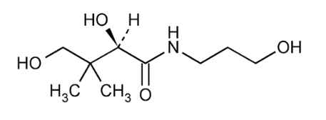
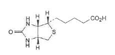

# KFCC_별표9_탈모완화_덱스판테놀

[별표 9]
탈모 증상의 완화에 도움을 주는 기능성화장품 각조
(제2조제9호 관련)
덱스판테놀
Dexpanthenol

C H NO ：205.25
9 19 4
이 원료를 정량할 때 환산한 무수물에 대하여 덱스판테놀(C H NO ) 98.0 ∼ 102.0
9 19 4
%를 함유한다.
성 상 이 원료는 무색의 점성이 있는 액으로 약간의 특이한 냄새가 있다.
이 원료는 물, 에탄올, 메탄올 또는 프로필렌글리콜에 잘 녹으며, 클로로포름 또는
에테르에 녹고, 글리세린에는 녹기 어렵다.
확인시험 1) 이 원료를 가지고 적외부흡수스펙트럼측정법의 4) 액막법에 따라 측정할
때 덱스판테놀 표준품과 같은 파수에서 같은 강도의 흡수를 나타낸다.
2) 이 원료 1.0 g을 달아 물을 넣어 녹여 10 mL로 하여 검액으로 한다 검액 1 mL
에 1 mol/L 수산화나트륨액 5 mL를 넣은 다음 황산동시액 1 방울을 넣고 세게 흔
들어 섞었을 때 액은 진한 청색을 나타낸다.
3) 2)의 검액 1 mL에 물을 넣어 10 mL로 한 액 1 mL에 1 mol/L 염산 1 mL를 넣
어 수욕상에서 30 분간 가열하여 식힌 다음 염산히드록실아민 100 mg을 넣고 1
mol/L 수산화나트륨액 5 mL를 넣은 다음 5 분간 방치한 다음 1 mol/L 염산을 넣어
pH를 2.5 ∼ 3.0로 하고 염화제이철시액 1 방울을 넣을 때 액은 자주색을 나타낸다.
굴 절 률 n ： 1.495 ～ 1.502
D
비선광도  ：+29.0 ～ +31.5° (5 g, 물, 100 mL, 100 mm)
D
순도시험 아미노프로판올 이 원료 약 5 g을 정밀하게 달아 물 10 mL를 넣어 녹인
다. 지시약으로 브롬치몰블루시액을 넣고 0.1 mol/L 황산으로 적정하여 종말점은 액
이 황색으로 변할 때로 한다. 같은 방법으로 공시험을 하여 보정한다(1.0 % 이하).
0.1 mol/L 황산 1 mL = 15.02 mg 아미노프로판올
수 분 1.0 % 이하 (1.0 g)
강열잔분 0.1 % 이하 (2 g, 제 1 법, 550 ～ 650 ℃, 항량)
정 량 법 이 원료 약 0.4 g을 정밀하게 달아 300 mL의 검화플라스크에 넣고 0.1
mol/L 과염소산 50 mL를 정확하게 넣어 녹인 다음 환류냉각기를 달아 5 시간 가열
한다. 식힌 다음 수분이 흡수되지 않게 주의하여 빙초산을 넣어 씻은 액을 합하여
0.1 mol/L 프탈산수소칼륨액주)으로 적정한다(지시약 : 크리스탈바이올렛 5 방울). 다
만 적정의 종말점은 청록색으로 변할 때로 한다. 같은 방법으로 공시험을 하여 보정
한다.
0.1 mol/L 과염소산 1 mL = 20.53 mg C H NO
9 19 4
주)0.1 mol/L 프탈산수소칼륨액 : 프탈산수소칼륨 약 20.42 g을 정밀하게 달아 빙초산을
넣어 녹인다. 필요시 가온하여 녹이고 수분이 흡수되지 않도록 주의한다. 실온으로
냉각하여 빙초산을 넣어 1000 mL로 한다.
비오틴
Biotin

C H N O S：244.3
10 16 2 3
이 원료를 정량할 때 환산한 건조물에 대하여 비오틴(C H N O S) 98.5 ∼ 101.0 %
10 16 2 3
를 함유한다.
성 상 이 원료는 흰색 또는 거의 흰색의 결정의 가루이거나 무색의 결정이다.
물과 에탄올에 매우 녹기 어려우며, 아세톤에 거의 녹지 않고 묽은 알칼리 용액에는
녹는다.
확인시험 1) 이 원료를 가지고 적외부흡수스펙트럼측정법의 1)브롬화칼륨정제법에 따
라 측정할 때 비오틴 표준품과 같은 파수에서 같은 강도의 흡수를 나타낸다.
2) 이 원료 50 mg을 달아 빙초산을 넣어 녹여 10 mL로 한 액 1 mL를 취하여 빙초
산을 넣어 10 mL로 한 액을 검액으로 한다. 비오틴 표준품 5 mg을 달아 빙초산을
넣어 녹여 10 mL로 한 액을 표준액으로 한다. 이들 액을 가지고 박층크로마토그래
프법에 따라 시험한다. 검액 및 표준액 10 μL씩을 박층크로마토그래프용 실리카겔을
써서 만든 박층판에 점적한다. 다음에 메탄올ㆍ빙초산ㆍ톨루엔혼합액(5 : 25 : 75)을
전개용매로 하여 약 15 cm 전개한 다음 박층판을 바람에 말린다. 여기에 4-디메틸아
미노신남알데히드용액주)을 고르게 뿌릴 때 검액과 표준액에서 얻은 반점의 R 값과
f
색상은 같다.
비선광도  ：+89.0˚ ～ +93˚ (건조물로서 0.25 g, 수산화나트륨용액(1→250), 25
D
mL, 100 mm)
순도시험 1) 용해상태 이 원료를 건조하여 0.25 g을 달아 수산화나트륨용액(1→250)
25 mL를 넣어 녹일 때 이 액은 무색이고 맑다.
2) 유연물질 이 원료 50 mg을 달아 빙초산을 넣어 녹인 다음 10 mL로 한 액을 검
액으로 한다. 이 액 1 mL를 취하여 빙초산을 넣어 10 mL로 한 액을 표준액으로 한
다. 표준액 1 mL를 취하여 빙초산을 넣어 20 mL로 한 액을 표준액(a)로 한다. 표준
액 1 mL를 취하여 빙초산을 넣어 40 mL로 한 액을 표준액(b)로 한다. 검액, 표준액
(a) 및 표준액(b) 각 10 μL씩을 박층크로마토그래프용 실리카겔을 써서 만든 박층판
에 점적한다. 메탄올ㆍ빙초산ㆍ톨루엔(5 : 25 : 75)혼합액을 전개용매로 하여 약 15
cm 전개한 다음 박층판을 말린다. 4-디메틸아미노신남알데히드용액주)을 고르게 뿌릴
때 검액에서 얻은 주반점 이외의 반점은 표준액(b)(0.25 %)에서 얻은 반점보다 진한
것은 1개 이하여야 하고 표준액(a)(0.5 %)에서 얻은 반점보다 진하지 않아야 한다.
건조감량 1.0 % 이하 (1 g, 105 ℃, 2 시간)
강열잔분 0.1 % 이하 (1 g, 제 1 법, 550∼650 ℃, 30분)
정 량 법 이 원료 약 0.2 g을 정밀하게 달아 디메칠포름아미드 5 mL을 넣고 분산시킨
다음 완전히 용해될 때까지 가열한다. 에탄올 50 mL를 넣고 0.1M 테트라부틸암모늄
히드록시드액으로 적정한다. 같은 방법으로 공시험을 하여 보정한다.
0.1M 테트라부틸암모늄히드록시드액 1 mL = 24.43 mg C H N O S
10 16 2 3
주) 4-디메틸아미노신남알데히드용액 : 4-디메틸아미노신남알데히드 2.0 g을 달아 25
% 염산 100 mL과 에탄올 100 mL 혼합액에 넣어 녹인다. 사용하기 직전에 에탄올
로 4배 희석하여 만든다.
엘-멘톨
l-Menthol
H OH
H
CH
H C 3
3
CH
H CH
3
C H O : 156.27
10 20
이 원료는 정량할 때 엘-멘톨(C H O) 98.0 ∼ 101.0 ％를 함유한다.
10 20
성 상 이 원료는 무색의 결정으로 특이하고 상쾌한 냄새가 있고 맛은 처음에는 쏘는
듯하고 나중에는 시원하다.
이 원료는 에탄올 또는 에테르에 썩 잘 녹고 물에는 매우 녹기 어렵다.
이 원료는 실온에서 천천히 승화한다.
확인시험 1) 이 원료는 같은 양의 캠퍼, 포수클로랄 또는 치몰과 같이 섞을 때 액화한다.
2) 이 원료 1 g에 황산 20 mL를 넣고 흔들어 섞을 때 액은 혼탁하고 황적색을 나타
내나 3시간 방치할 때 멘톨의 냄새가 없는 맑은 기름층을 분리한다.
비선광도  : -45.0 ～ -51.0 ° (2.5 g, 에탄올, 25 mL, 100 mm)
D
융 점 42 ∼ 44 ℃
순도시험 1) 증발잔류물 이 원료 2.0 g을 수욕에서 증발하여 잔류물을 105 ℃에서 2
시간 건조할 때 그 양은 1.0 mg 이하이다.
2) 티몰 이 원료 0.20 g을 달아 아세트산 2 mL, 황산 6 방울 및 질산 2 방울의 냉
혼합액을 넣을 때 액은 곧 초록색 ~ 청록색을 나타내지 않는다.
3) 니트로메탄 또는 니트로에탄 이 원료 0.5 g을 플라스크에 취하여 수산화나트륨
시액(1 → 2) 2 mL 및 강과산화수소수 1 mL를 넣고 환류냉각기를 달아 10 분간 약
한 열로 끓인다. 식힌 다음 물을 넣어 정확하게 20 mL로 하여 여과한다. 여액 1 mL
를 네슬러관에 취하여 물을 넣어 10 mL로 하고 묽은 염산을 넣어 중화하고 다시 묽
은염산 1 mL를 넣고 식힌 다음 설파닐산용액(1 → 100) 1 mL를 넣고 2 분간 방치
한 다음 N-(1-나프틸)-N'-디에칠에칠렌디아민옥살산염(C H N O 1/2H O)용액(1
18 24 2 2ㆍ 2
→ 1000) 1 mL 및 물을 넣어 25 mL로 할 때 액은 곧 자주색을 나타내지 않는다.
정 량 법 이 원료 약 2.0 g을 정밀하게 달아 무수피리딘ㆍ무수아세트산 혼합액(8 : 1)
20 mL를 정확하게 넣고 환류냉각기를 달아 수욕에서 2 시간 가열한다. 다음에 냉각
기를 통하여 물 20 mL로 씻어 넣고 1 mol/L 수산화나트륨액으로 적정한다 (지시약 :
페놀프탈레인시액 5 방울). 같은 방법으로 공시험을 한다.
1 mol/L 수산화나트륨액 1 mL = 156.27 mg C H O
10 20
징크피리치온
Zinc Pyrithione
O S
N
Zn
N
S O
(CHONS)Zn : 317.70
5 4 2
이 원료는 건조한 것은 정량할 때 징크피리치온[(C H ONS) Zn : 317.70] 90.0 ∼
5 4 2
101.0 %를 함유한다.
성 상 이 원료는 황색을 띤 회백색의 가루로 냄새는 없다.
이 원료는 디메틸설폭시드에 녹고 디메틸포름아미드 또는 클로로포름에 조금 녹으며
물 또는 에탄올에 거의 녹지 않는다.
이 원료는 수산화나트륨시액에 녹는다.
융점 225 ∼ 235 ℃ (분해)
확인시험 1) 이 원료 1 g을 회화하여 잔류물에 묽은염산을 넣어 녹인 액은 아연염의
정성반응을 나타낸다.
2) 이 원료 10 mg을 시험관에 넣고 금속나트륨 작은 조각을 넣어 유리봉으로 저으
면서 약한 불로 가열 용융한 다음 물 5 mL를 넣어 녹이고 여과한다. 이 여액에 납
시액 1 mL를 넣으면 검은색의 침전이 생긴다.
3) 이 원료 5 mg을 시험관에 넣고 2,4-디니트로클로로벤젠 10 mg을 넣어 약한 불
로 약 1 시간 가열한다. 여기에 수산화칼륨ㆍ에탄올시액 4 mL를 넣으면 액은 진한
적갈색을 나타낸다.
4) 이 원료 0.1 g에 수산화나트륨시액 5 mL를 넣어 녹이고 황산구리시액 1 mL를
넣으면 어두운 초록색의 침전이 생긴다.
순도시험 1) 염화물 이 원료 2.5 g을 달아 회화한 다음 물 100 mL를 넣고 5 분간 끓
인 다음 식혀 물로 100 mL로 하여 여과한다. 여액 25 mL를 검액으로 하여 염화물
시험법에 따라 시험한다. 비교액에는 0.01 mol/L 염산 0.4 mL를 넣는다(0.025 % 이
하).
2) 비소 이 원료 0.2 g에 질산칼륨 0.5 g 및 무수탄산나트륨 0.5 g을 넣고 강열하여
융해한다. 식힌 다음 묽은 황산 15 mL를 넣어 녹여 흰색의 연기가 나타나지 않을
때까지 가열하고 물을 넣어 검액 5 mL로 한 후 비소시험법에 따라 조작하여 시험한
다(10 ppm 이하).
3) 납 이 원료 1.0 g을 달아 진한 질산 20 mL를 넣어 흔들어 섞어 가열하면서 녹
인 다음 다시 가열하여 액이 7 mL가 되도록 농축한다. 이 액을 실온까지 급히 식히
고 물을 넣어 100 mL로 하여 검액으로 한다. 이 액 20 mL를 가지고 중금속시험법
에 따라 시험한다(25 ppm 이하).
건조감량 0.5 % 이하 (1 g, 105 ℃, 4 시간)
강열잔분 45.6 ∼ 52.2 % (1 g, 550 ∼ 650 ℃, 제1법)
정 량 법 이 원료를 건조하여 약 0.3 g을 정밀하게 달아 500 mL 요오드 플라스크에
넣고 염산 20 mL 넣어 녹인다. 다시 물 200 mL를 넣어 녹이고 0.1 M 요오드액으로
적정한다 (지시약 : 전분시액 3 mL). 같은 방법으로 공시험을 하여 보정한다.
0.1 M 요오드액 1 mL = 15.885 mg (CHONS)Zn
5 4 2
징크피리치온 액(50 %)
Zinc Pyrithione Solution(50 %)
이 원료는 「기능성화장품 기준 및 시험방법」에 따른 ‘징크피리치온’을 가지고 정제
수, 소듐폴리나프탈렌설포네이트 등을 혼합하여 균질하게 만든 원료이다. 이 원료는 정
량할 때 징크피리치온[(CHONS)Zn : 317.70] 47.0 ∼ 53.0 %를 함유한다.
5 4 2
성 상 이 원료는 흰색의 수성현탁제로 약간 특이한 냄새가 있다.
확인시험 1) 이 원료 1 g을 사기 도가니에 넣고 약하게 가열, 탄화한 후 500 ∼ 600
℃에서 강열 회화한다. 식힌 다음 2 M 염산 20 mL를 넣어 녹인다. 이 일부를 수산
화나트륨시액을 넣어 중성으로 한 후 생기는 침전을 다시 과량의 수산화나트륨시액
을 넣은 액에 황화나트륨시액을 넣을 때 흰색의 침전이 생긴다. 이 침전을 따로 취
하여 여기에 묽은 아세트산을 넣으면 녹지 않으나 묽은 염산을 넣으면 녹는다.
2) 이 원료 10 mg에 0.5 M 수산화나트륨액을 넣어 녹이고 1000 mL로 하여 0.5 M
수산화나트륨액을 대조로 하여 흡광도측정법에 따라 흡수스펙트럼을 측정할 때 파장
244 nm 및 283 nm 부근에서 흡수극대를 나타낸다.
pH 5.0 ∼ 8.0
정 량 법 이 원료를 표시량에 따라 징크피리치온[(C H ONS) Zn]으로서 약 50 mg에
5 4 2
해당하는 양을 정밀하게 취하여 디메칠설폭사이드를 넣어 녹여 200 mL로 한다. 이
액 4 mL를 정확하게 취하여 에칠렌디아민테트라초산디나트륨포화용액 6 mL와 0.1
% 2,2-디피리딜디설피드액 4 mL를 넣어 녹이고 물을 넣어 정확하게 100 mL하여
물중탕 (약 70 ℃)에서 20분 동안 가온하고 식힌 다음 검액으로 한다. 따로 징크피리
치온 표준품 약 50 mg을 정밀하게 달아 검액과 같이 조작하여 표준액으로 한다. 검
액 및 표준액 각 20 μL씩을 가지고 다음 조건으로 액체크로마토그래프법에 따라 시
험하여 검액 및 표준액의 징크피리치온의 피크면적 A 및 A를 측정한다.
T S
징크피리치온[(CHONS)Zn]의 양 (mg)
5 4 2

T
 징크피리치온 표준품의 양 ×


S
조작조건
검 출 기 : 자외부흡광광도계(측정파장 235 nm)
칼 럼 : 안지름 약 4.6 mm, 길이 약 25 cm인 스테인레스강관에 5 μm의 액체크로마
토그래프용옥타데실실릴실리카겔을 충전한다.
이 동 상 : 아세토니트릴 및 물의 혼합비를 다음과 같이 단계적 또는 농도기울기적으로
제어한다.
아세토니트릴 물
시간 (분)
(vol %) (vol %)
0 30 70
10 90 10
15 30 70
20 30 70
유 량 : 0.8 mL/분
