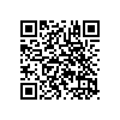

# 기능성화장품 심사에 관한 규정(식품의약품안전처고시)(제2025-88호)(20251216)

기능성화장품 심사에 관한 규정
기능성화장품 심사에 관한 규정
[시행 2025. 12. 16.] [식품의약품안전처고시 제2025-88호, 2025. 12. 16., 일부개정]
제1장 총칙
제1조(목적)
제2조(정의)
제3조(심사대상)
제2장 심사자료
제4조(제출자료의 범위)
제5조(제출자료의 요건)
제6조(제출자료의 면제 등)
제7조(자료의 작성 등)
제8조(자료의 보완등)
제8조의2(심사를 위해 제조한 화장품의 사용)
제3장 심사기준
제9조(제품명)
제10조(원료 및 그 분량)
제11조(제형)
제12조삭 제
제13조(효능ㆍ효과)
제14조(용법ㆍ용량)
제15조(사용 시의 주의사항)
제16조삭 제
제17조(기준 및 시험방법)
제4장 보칙
제18조(자문등)
제19조(규제의 재검토)
법제처 1 국가법령정보센터
기능성화장품 심사에 관한 규정

기능성화장품 심사에 관한 규정
[시행 2025. 12. 16.] [식품의약품안전처고시 제2025-88호, 2025. 12. 16., 일부개정]
식품의약품안전처(화장품정책과), 043-719-3410
제1장 총칙
제1조(목적) 이 규정은 「화장품법」 제4조 및 같은 법 시행규칙 제9조에 따라 기능성화장품을 심사받기 위한 제출
자료의 범위, 요건, 작성요령, 제출이 면제되는 범위 및 심사기준 등에 관한 세부 사항을 정함으로써 기능성화장
품의 심사업무에 적정을 기함을 목적으로 한다.
제2조(정의) ① 이 규정에서 사용하는 용어의 정의는 다음 각 호와 같다.
1. "기능성화장품"은 「화장품법」 제2조제2호 및 같은 법 시행규칙 제2조에 따른 화장품을 말한다.
2. 삭제
② 이 규정에서 사용하는 용어 중 별도로 정하지 아니한 용어의 정의는 「의약품등의 독성시험기준」(식품의약품
안전처 고시)에 따른다.
제3조(심사대상) 이 규정에 따라 심사를 받아야 하는 대상은 기능성화장품으로 한다. 또한 이미 심사완료 된 결과에
대한 변경심사를 받고자 하는 경우에도 또한 같다.
제2장 심사자료
제4조(제출자료의 범위) 기능성화장품의 심사를 위하여 제출하여야 하는 자료의 종류는 다음 각 호와 같다. 다만,
제6조에 따라 자료가 면제되는 경우에는 그러하지 아니하다.
1. 안전성, 유효성 또는 기능을 입증하는 자료
가. 기원 및 개발경위에 관한 자료
나. 안전성에 관한 자료(다만, 과학적인 타당성이 인정되는 경우에는 구체적인 근거자료를 첨부하여 일부 자료
를 생략할 수 있다.)
(1) 단회투여독성시험자료
(2) 1차피부자극시험자료
(3) 안점막자극 또는 기타점막자극시험자료
(4) 피부감작성시험자료
(5) 광독성 및 광감작성 시험자료(자외선에서 흡수가 없음을 입증하는 흡광도 시험자료를 제출하는 경우에는 면
제함)
(6) 인체첩포시험자료
법제처 2 국가법령정보센터
기능성화장품 심사에 관한 규정
(7) 인체누적첩포시험자료(인체적용시험자료에서 피부이상반응 발생 등 안전성 문제가 우려된다고 판단되는 경
우에 한함)
다. 유효성 또는 기능에 관한 자료(다만, 화장품법 시행규칙 제2조제6호의 화장품은 (3)의 자료만 제출한다)
(1) 효력시험자료
(2) 인체적용시험자료
(3) 염모효력시험자료(화장품법 시행규칙 제2조제6호의 화장품에 한함)
라. 자외선차단지수(SPF), 내수성자외선차단지수(SPF, 내수성 또는 지속내수성) 및 자외선A차단등급(PA) 설정
의 근거자료(화장품법 시행규칙 제2조제4호 및 제5호의 화장품에 한함)
2. 기준 및 시험방법에 관한 자료(검체 포함)
제5조(제출자료의 요건) 제4조에 따른 기능성화장품의 심사 자료의 요건은 다음 각 호와 같다.
1. 안전성, 유효성 또는 기능을 입증하는 자료
가. 기원 및 개발경위에 관한 자료
당해 기능성화장품에 대한 판단에 도움을 줄 수 있도록 명료하게 기재된 자료(언제, 어디서, 누가, 무엇으로
부터 추출, 분리 또는 합성하였고 발견의 근원이 된 것은 무엇이며, 기초시험ㆍ인체적용시험 등에 들어간
것은 언제, 어디서였나, 국내외 인정허가 현황 및 사용현황은 어떠한가 등)
나. 안전성에 관한 자료
(1) 일반사항
「비임상시험관리기준」(식품의약품안전처 고시)에 따라 시험한 자료. 다만, 인체첩포시험 및 인체누적첩포시험은 국
내ㆍ외 대학 또는 전문 연구기관에서 실시하여야 하며, 관련분야 전문의사, 연구소 또는 병원 기타 관련기관에서 5년
이상 해당 시험 경력을 가진 자의 지도 및 감독 하에 수행ㆍ평가되어야 함
(2) 시험방법
(가) [별표 1] 독성시험법에 따르는 것을 원칙으로 하며 기타 독성시험법에 대해서는 「의약품등의 독성시험기준」(식
품의약품안전처 고시)을 따를 것
(나) 다만 시험방법 및 평가기준 등이 과학적ㆍ합리적으로 타당성이 인정되거나 경제협력개발기구(Organization for
Economic Cooperation and Development) 또는 식품의약품안전처가 인정하는 동물대체시험법인 경우에는 규정된
시험법을 적용하지 아니할 수 있음
다. 유효성 또는 기능에 관한 자료
(1) 효력시험에 관한 자료
심사대상 효능을 뒷받침하는 성분의 효력에 대한 비임상시험자료로서 효과발현의 작용기전이 포함되어야
하며, 다음 중 어느 하나에 해당할 것
(가) 국내ㆍ외 대학 또는 전문 연구기관에서 시험한 것으로서 당해 기관의 장이 발급한 자료(시험시설 개요,
주요설비, 연구인력의 구성, 시험자의 연구경력에 관한 사항이 포함될 것)
(나) 당해 기능성화장품이 개발국 정부에 제출되어 평가된 모든 효력시험자료로서 개발국 정부(허가 또는
등록기관)가 제출받았거나 승인하였음을 확인한 것 또는 이를 증명한 자료
(다) 과학논문인용색인(Science Citation Index 또는 Science Citation Index Expanded)에 등재된 전문학회지
에 게재된 자료
법제처 3 국가법령정보센터
기능성화장품 심사에 관한 규정
(2) 인체적용시험자료
(가) 사람에게 적용 시 효능ㆍ효과 등 기능을 입증할 수 있는 자료로서 같은 호 다목(1) (가) 또는 (나)에 해당
할 것.
(나) 인체적용시험의 실시기준 및 자료의 작성방법 등에 관하여는 「화장품 표시ㆍ광고 실증에 관한 규정」
(식품의약품안전처 고시)을 준용할 것.
(3) 염모효력시험자료
인체모발을 대상으로 효능ㆍ효과에서 표시한 색상을 입증하는 자료
라. 자외선차단지수(SPF), 내수성자외선차단지수(SPF), 자외선A차단등급(PA) 설정의 근거자료는 다목(2)의 자료
로서 아래의 어느 하나에 해당할 것
(1) 자외선차단지수(SPF) 설정 근거자료
[별표 3] 자외선 차단효과 측정방법 및 기준ㆍ일본(JCIA)ㆍ미국(FDA)ㆍ유럽(Cosmetics Europe)ㆍ호주/뉴질
랜드(AS/NZS) 또는 국제표준화기구(ISO 24444) 등의 자외선차단지수 측정방법에 의한 자료
(2) 내수성자외선차단지수(SPF) 설정 근거자료
[별표 3] 자외선 차단효과 측정방법 및 기준ㆍ미국(FDA)ㆍ유럽(Cosmetics Europe)ㆍ호주/뉴질랜드(AS/NZS)
또는 국제표준화기구(ISO 16217) 등의 내수성자외선차단지수 측정방법에 의한 자료
(3) 자외선A차단등급(PA) 설정 근거자료
[별표 3] 자외선 차단효과 측정방법 및 기준ㆍ일본(ICIA) 또는 국제표준화기구(ISO 24442) 등의 자외선A 차
단효과 측정방법에 의한 자료
2. 기준 및 시험방법에 관한 자료
품질관리에 적정을 기할 수 있는 시험항목과 각 시험항목에 대한 시험방법의 밸리데이션, 기준치 설정의 근거가 되는
자료. 이 경우 시험방법은 공정서, 국제표준화기구(ISO) 등의 공인된 방법에 의해 검증되어야 한다.
제6조(제출자료의 면제 등) ① 「기능성화장품 기준 및 시험방법」(식품의약품안전처 고시), 국제화장품원료집(ICID)
및 「식품의 기준 및 규격」(식품의약품안전처 고시)에서 정하는 원료로 제조되거나 제조되어 수입된 기능성화장
품의 경우 제4조제1호나목의 자료 제출을 면제한다. 다만, 유효성 또는 기능 입증자료 중 인체적용시험자료에서
피부이상반응 발생 등 안전성 문제가 우려된다고 식품의약품안전처장이 인정하는 경우에는 그러하지 아니하다.
② 제4조제1호다목에서 정하는 유효성 또는 기능에 관한 자료 중 인체적용시험자료를 제출하는 경우 효력시험
자료 제출을 면제할 수 있다. 다만, 이 경우에는 효력시험자료의 제출을 면제받은 성분에 대해서는 효능ㆍ효과를
기재ㆍ표시할 수 없다.
③ [별표 4] 자료 제출이 생략되는 기능성화장품의 종류에서 성분ㆍ함량을 고시한 품목의 경우에는 제4조제1호
가목부터 다목까지의 자료 제출을 면제한다.
④ 이미 심사를 받은 기능성화장품[화장품책임판매업자가 같거나 화장품제조업자(화장품제조업자가 제품을 설
계ㆍ개발ㆍ생산하는 방식으로 제조한 경우만 해당한다)가 같은 기능성화장품만 해당한다]과 그 효능ㆍ효과를 나
타내게 하는 원료의 종류, 규격 및 분량(액상인 경우 농도), 용법ㆍ용량이 동일하고, 각 호 어느 하나에 해당하는
경우 제4조제1호가목부터 다목까지의 자료 제출을 면제한다.
1. 효능ㆍ효과를 나타나게 하는 성분을 제외한 대조군과의 비교실험으로서 효능을 입증한 경우
법제처 4 국가법령정보센터
기능성화장품 심사에 관한 규정
2. 착색제, 착향제, 현탁화제, 유화제, 용해보조제, 안정제, 등장제, pH 조절제, 점도조절제, 용제만 다른 품목의 경
우. 다만, 「화장품법 시행규칙」 제2조제10호 및 제11호에 해당하는 기능성화장품은 착향제, 보존제만 다른 경
우에 한한다.
⑤ 자외선차단지수(SPF) 10 이하 제품의 경우에는 제4조제1호라목의 자료 제출을 면제한다.
⑥ 자외선을 차단 또는 산란시켜 자외선으로부터 피부를 보호하는 기능을 가진 제품의 경우 이미 심사를 받은 기
능성화장품[화장품책임판매업자가 같거나 화장품제조업자(화장품제조업자가 제품을 설계ㆍ개발ㆍ생산하는 방
식으로 제조한 경우만 해당한다)가 같은 기능성화장품만 해당한다]과 그 효능ㆍ효과를 나타내게 하는 원료의 종
류, 규격 및 분량(액상의 경우 농도), 용법ㆍ용량 및 제형이 동일한 경우에는 제4조제1호의 자료 제출을 면제한다.
다만, 내수성 제품은 이미 심사를 받은 기능성화장품[제조판매업자가 같거나 제조업자(제조업자가 제품을 설계
ㆍ개발ㆍ생산하는 방식으로 제조한 경우만 해당한다)가 같은 기능성화장품만 해당한다]과 착향제, 보존제를 제
외한 모든 원료의 종류, 규격 및 분량, 용법ㆍ용량 및 제형이 동일한 경우에 제4조제1호의 자료 제출을 면제한다.
⑦ 삭제
⑧ [별표 4] 제4호의 (2) 2제형 산화염모제에 해당하나 제1제를 두 가지로 분리하여 제1제 두 가지를 각각 2제와
섞어 순차적으로 사용, 또는 제1제를 먼저 혼합한 후 제2제를 섞는 것으로 용법ㆍ용량을 신청하는 품목(단, 용법
ㆍ용량 이외의 사항은 [별표 4] 제4호에 적합하여야 한다)은 제4조제1호의 자료 제출을 면제한다.
제7조(자료의 작성 등) ① 제출 자료는 제5조에 따른 요건에 적합하여야 하며 품목별로 각각 기재된 순서에 따라 목
록과 자료별 색인번호 및 쪽을 표시하여야 하며, 식품의약품안전평가원장이 정한 전용프로그램으로 작성된 전자
적 기록매체(CDㆍ디스켓 등)와 함께 제출하여야 한다. 다만, 각 조에 따라 제출 자료가 면제 또는 생략되는 경우
에는 그 사유를 구체적으로 기재하여야 한다.
② 외국의 자료는 원칙적으로 한글요약문(주요사항 발췌) 및 원문을 제출하여야 하며, 필요한 경우에 한하여 전
체 번역문(화장품 전문지식을 갖춘 번역자 및 확인자 날인)을 제출하게 할 수 있다.
제8조(자료의 보완등) 식품의약품안전평가원장은 제출된 자료가 제4조부터 제6조까지의 규정에서 정하는 자료의
제출범위 및 요건에 적합하지 않거나 제3장의 심사기준을 벗어나는 경우 그 내용을 구체적으로 명시하여 자료제
출자에게 보완요구 할 수 있다.
제8조의2(심사를 위해 제조한 화장품의 사용) 기능성화장품의 심사 또는 변경심사를 받기 위한 목적으로 제조한 화
장품이 다음 각 호 모두에 해당하는 경우에는 화장품법 제15조제1호에도 불구하고 기능성화장품의 심사 또는 변
경심사를 받은 후 제조된 것으로 본다. 이 경우 제조번호를 기준으로 최대 3개 제조단위를 초과할 수 없다.
1. 「화장품법 시행규칙」 제11조제2항에 따른 우수화장품 제조관리기준을 준수하여 제조된 경우
2. 기능성화장품의 심사 또는 변경심사 결과가 적합한 것으로 통지된 경우
제3장 심사기준
제9조(제품명) 제품명은 이미 심사를 받은 기능성화장품의 명칭과 동일하지 아니하여야 한다. 다만, 수입품목의 경
우 서로 다른 화장품책임판매업자가 제조소(원)가 같은 동일 품목을 수입하는 경우에는 화장품책임판매업자명을
병기하여 구분하여야 한다.
법제처 5 국가법령정보센터
기능성화장품 심사에 관한 규정
제10조(원료 및 그 분량) ① 기능성화장품의 원료 및 그 분량은 효능ㆍ효과 등에 관한 자료에 따라 합리적이고 타당
하여야 하고, 각 성분의 배합의의가 인정되어야 하며, 다음 각 호에 적합하여야 한다.
1. 기능성화장품의 원료 성분 및 그 분량은 제제의 특성을 고려하여 각 성분마다 배합목적, 성분명, 규격, 분량(중
량, 용량)을 기재하여야 한다. 다만, 「화장품 안전기준 등에 관한 규정」에 사용한도가 지정되어 있지 않은 착색
제, 착향제, 현탁화제, 유화제, 용해보조제, 안정제, 등장제, pH 조절제, 점도 조절제, 용제 등의 경우에는 적량으
로 기재할 수 있고, 착색제 중 식품의약품안전처장이 지정하는 색소(황색4호 제외)를 배합하는 경우에는 성분
명을 "식약처장지정색소"라고 기재할 수 있다.
2. 원료 및 그 분량은 "100밀리리터중" 또는 "100그람중"으로 그 분량을 기재함을 원칙으로 하며, 분사제는
"100그람중"(원액과 분사제의 양 구분표기)의 함량으로 기재한다.
3. 각 원료의 성분명과 규격은 다음 각 호에 적합하여야 한다.
가. 성분명은 제6조제1항의 규정에 해당하는 원료집에서 정하는 명칭 [국제화장품원료집의 경우
INCI(International Nomenclature Cosmetic Ingredient) 명칭]을, 별첨규격의 경우 일반명 또는 그 성분의 본
질을 대표하는 표준화된 명칭을 각각 한글로 기재한다.
나. 규격은 다음과 같이 기재하고, 그 근거자료를 첨부하여야 한다.
(1) 효능ㆍ효과를 나타나게 하는 성분
「기능성화장품 기준 및 시험방법」(식품의약품안전처 고시)에서 정하는 규격기준의 원료인 경우 그 규격으
로 하고, 그 이외에는 "별첨규격" 또는 "별규"로 기재하며 [별표 2]의 작성요령에 따라 작성할 것
(2) 효능ㆍ효과를 나타나게 하는 성분 이외의 성분
제6조제1항의 규정에 해당하는 원료집에서 정하는 원료인 경우 그 수재 원료집의 명칭(예 : ICID)으로, 「화
장품 색소 종류와 기준」(식품의약품안전처 고시)에서 정하는 원료인 경우 "화장품색소고시"로 하고, 그
이외에는 "별첨규격" 또는 "별규"로 기재하며 [별표 2]의 작성요령에 따라 작성할 것
② 삭제
③ 삭제
제11조(제형) 제형은「기능성화장품 기준 및 시험방법」(식품의약품안전처 고시) 통칙에서 정하고 있는 제형으로 표
기한다. 다만, 이를 정하고 있지 않은 경우 제형을 간결하게 표현할 수 있다.
제12조 삭제
제13조(효능ㆍ효과) ① 기능성화장품의 효능ㆍ효과는 「화장품법」 제2조제2호 각 목에 적합하여야 한다.
② 자외선으로부터 피부를 보호하는데 도움을 주는 제품에 자외선차단지수(SPF), 내수성ㆍ지속내수성 또는 자외
선A차단등급(PA)을 표시하는 때에는 다음 각 호의 기준에 따라 표시한다.
1. 자외선차단지수(SPF)는 측정결과에 근거하여 평균값(소수점이하 절사)으로부터 -20%이하 범위내 정수(예 :
SPF평균값이 ‘23’일 경우 19～23 범위정수)로 표시하되, SPF 50이상은 "SPF50+"로 표시한다.
2. 내수성ㆍ지속내수성은 측정결과에 근거하여 [별표 3] 자외선 차단효과 측정방법 및 기준에 따른 ‘내수성비 신
뢰구간’이 50% 이상일 때, "내수성" 또는 "지속내수성"으로 표시한다.
3. 자외선A차단등급(PA)은 측정결과에 근거하여 [별표 3] 자외선 차단효과 측정방법 및 기준에 따라 표시한다.
법제처 6 국가법령정보센터
기능성화장품 심사에 관한 규정
제14조(용법ㆍ용량) 기능성화장품의 용법ㆍ용량은 오용될 여지가 없는 명확한 표현으로 기재하여야 한다.
제15조(사용 시의 주의사항) 「화장품법 시행규칙」[별표 3]의 사용할 때의 주의사항 및 「화장품 사용할 때의 주의사
항 및 알레르기 유발성분 표시에 관한 규정」(식품의약품안전처 고시) [별표 1] 제2호의 사용할 때의 주의사항을
기재하되, 별도의 주의사항이 필요한 경우에는 근거자료를 첨부하여 추가로 기재할 수 있다.
제16조 삭제
제17조(기준 및 시험방법) 기준 및 시험방법에 관한 자료는 [별표 2] 기준 및 시험방법 작성요령에 적합하여야 한다.
제4장 보칙
제18조(자문등) 식품의약품안전처장은 이 규정에 의한 기능성화장품의 심사 등을 위해 필요한 경우에는 관련 분야
의 전문가로부터 자문을 받을 수 있다.
제19조(규제의 재검토) 「행정규제기본법」제8조 및 「훈령ㆍ예규 등의 발령 및 관리에 관한 규정」에 따라 2014년
1월 1일을 기준으로 매 3년이 되는 시점(매 3년째의 12월 31일까지를 말한다)마다 그 타당성을 검토하여 개선 등
의 조치를 하여야 한다.
부칙 <제2008-58호,2008.8.26.>
이 고시는 고시한 날부터 시행한다.
부칙 <제2008-75호,2008.11.27.>
이 고시는 고시한 날부터 시행한다.
부칙 <제2009-128호,2009.8.24.>
이 고시는 고시한 날부터 시행한다.
부칙 <제2009-166호,2009.11.5.>
제1조(시행일) 이 고시는 고시한 날부터 시행한다.
제2조(경과조치) 이 고시 시행 당시 이미 식품의약품안전청장에게 접수된 기능성화장품(변경)심사의뢰서는 종전의
고시에 따른다.
법제처 7 국가법령정보센터
기능성화장품 심사에 관한 규정
부칙 <제2012-59호,2012.8.24.>
이 고시는 고시한 날부터 시행한다.
부칙 <제2013-29호,2013.4.5.>
이 고시는 고시한 날부터 시행한다.
부칙 <제2013-190호,2013.6.26.>
제1조(시행일) 이 고시는 고시한 날부터 시행한다.
제2조(다른 고시의 폐지) 「자외선 차단효과 측정방법 및 기준」(식품의약품안전처고시 제2013-50호, 2013. 4. 5.)은
이를 폐지한다.
제3조(적용례) 이 고시는 고시 시행 후 최초로 식품의약품안전평가원장에게 제출되는 기능성화장품 심사의뢰서(변
경을 포함한다)부터 적용한다.
제4조(신원료의 심사에 관한 경과조치) 이 고시 시행 당시 종전의 규정에 따라 신원료 심사를 받은 원료로 제조되거
나 제조되어 수입된 기능성화장품의 경우 제4조제1호나목의 자료제출을 면제한다.
제5조(기능성화장품의 심사에 관한 경과조치) ① 이 고시 시행 당시 종전의 규정에 따라 기능성화장품으로 심사받
은 품목은 이 고시에 따라 심사를 받은 것으로 본다.
② 이 고시 시행 당시 종전의 규정에 따라 심사된 기능성 화장품의 별첨규격 및 기준 및 시험방법에 인용된 "「자외선
차단효과 측정방법 및 기준」(식품의약품안전처 고시)"을 "「기능성화장품 심사에 관한 규정」(식품의약품안전처 고시)
[별표 3] 자외선 차단효과 측정방법 및 기준"으로 본다.
부칙 <제2013-263호,2013.12.31.>
제1조(시행일) 이 고시는 고시한 날부터 시행한다.
제2조(적용례) 이 고시 시행 당시 종전의 규정에 따라 식품의약품안전평가원장에게 기능성화장품 심사의뢰서(변경
을 포함한다)를 제출한 경우에도 개정 규정을 적용한다.
부칙 <제2014-75호,2014.2.12.>
이 고시는 고시한 날부터 시행한다.
부칙 <제2015-14호,2015.3.25.>
제1조(시행일) 이 고시는 고시한 날부터 시행한다.
제2조(적용례) ① 이 고시는 고시 시행 후 최초로 식품의약품안전평가원장에게 제출되는 기능성화장품 심사의뢰서
(변경을 포함한다)부터 적용한다.
법제처 8 국가법령정보센터
기능성화장품 심사에 관한 규정
② 이 고시 시행 당시 종전의 규정에 따라 식품의약품안전평가원장에게 기능성화장품 심사의뢰서(변경을 포함한다
)를 제출한 경우에도 개정 규정을 적용한다.
제3조(경과조치) 이 고시 시행 당시 종전의 규정에 따라 기능성화장품으로 심사받은 품목은 이 고시에 따라 심사를
받은 것으로 본다.
부칙 <제2016-98호,2016.9.7.>
제1조(시행일) 이 고시는 고시한 날부터 시행한다. 다만, 별표 3 제4장 11호의 개정규정은 2016년 12월 1일부터 시
행한다.
제2조(적용례) 이 고시는 고시 시행 후 최초로 기능성화장품 심사를 의뢰(변경심사 의뢰를 포함한다)하는 것부터 적
용한다.
제3조(자외선A차단등급 표시방법에 관한 경과조치) 이 고시 시행 전에 종전 규정에 따라 기능성화장품 심사를 받거
나 보고서를 제출한 경우에는 별표 3 제4장 11호의 개정 규정에도 불구하고 종전의 규정에 따른다.
부칙 <제2017-42호,2017.5.23.>
제1조(시행일) 이 고시는 2017년 5월 30일부터 시행한다
제2조(적용례) ① 이 고시는 고시 시행 이후 최초로 식품의약품안전평가원장에게 제출되는 기능성화장품 심사의뢰
서(변경을 포함한다)부터 적용한다.
② 제1항에도 불구하고 이 고시 시행 당시 화장품법 시행규칙(총리령 제1357호) 제2조제6호부터 제9호까지의 개정규
정에 따른 품목에 대하여 약사법 제31조제4항에 따라 품목허가를 신청하여 절차가 진행 중인 경우에도 이 고시를 적
용한다.
부칙 <제2019-47호,2019.6.17.>
제1조(시행일) 이 고시는 고시한 날부터 시행한다.
제2조(적용례) 이 고시는 고시 시행 후 최초로 식품의약품안전평가원장에게 제출되는 기능성화장품 심사의뢰서(변
경을 포함한다)부터 적용한다.
부칙 <제2020-131호,2020.12.30.>
제1조(시행일) 이 고시는 고시한 날부터 시행한다.
제2조(적용례) 이 고시는 고시 시행 후 최초로 식품의약품안전평가원장에게 제출되는 기능성화장품 심사의뢰서(변
경을 포함한다)부터 적용한다.
법제처 9 국가법령정보센터
기능성화장품 심사에 관한 규정
부칙 <제2021-55호,2021.6.30.>
제1조(시행일) 이 고시는 고시한 날부터 시행한다.
제2조(적용례) 이 고시는 고시 시행 후 최초로 식품의약품안전평가원장에게 제출되는 기능성화장품 심사의뢰서(변
경을 포함한다)부터 적용한다.
제3조(경과조치) 이 고시 시행 당시 종전의 규정에 따라 기능성화장품으로 심사받은 품목은 이 고시에 따라 심사를
받은 것으로 본다.
부칙 <제2023-61호,2023.9.21.>
제1조(시행일) 이 고시는 고시한 날로부터 시행한다
제2조 생략
제3조(다른 고시의 개정) ①「기능성화장품 심사에 관한 규정」(식품의약품안전처 고시) 중 일부를 다음과 같이 개정
한다.
제10조제1항제3호나목(2) 중 "화장품 색소 종류와 기준 및 시험방법"을 "화장품의 색소 종류 및 기준"으로 한다.
② 생략
부칙 <제2025-88호,2025.12.16.>
제1조(시행일) 이 고시는 고시한 날부터 시행한다.
제2조(적용례) 이 고시는 고시 시행 후 최초로 식품의약품안전평가원장에게 제출되는 기능성화장품 심사의뢰서(변
경을 포함한다)부터 적용한다.
제3조(경과조치) 이 고시 시행 당시 종전의 규정에 따라 기능성화장품으로 심사된 품목은 이 고시에 따라 심사한 것
으로 본다.
[별표 1] 독성시험법
[별표 2] 기준 및 시험방법 작성요령
[별표 3] 자외선 차단효과 측정방법 및 기준
[별표 4] 자료제출이 생략되는 기능성화장품의 종류(제6조제3항 관련)
법제처 10 국가법령정보센터
[별표 1]
독성시험법
1. 단회투여독성시험
가. 실험 동물 : 랫드 또는 마우스
나. 동 물 수 : 1군당 5마리이상
다. 투여경로 : 경구 또는 비경구 투여
라. 용량 단계
: 독성을 파악하기에 적절한 용량단계를 설정한다.
만약, 2,000㎎/㎏이상의 용량에서 시험물질과 관련된 사망이 나타나지 않는
다면 용량단계를 설정할 필요는 없다.
마. 투여 회수 : 1회
바. 관 찰 :
* 독성증상의 종류, 정도, 발현, 추이 및 가역성을 관찰하고 기록한다.
* 관찰기간은 일반적으로 14일로 한다.
* 관찰기간 중 사망례 및 관찰기간 종료 시 생존례는 전부 부검하고, 기관과
조직에 대하여도 필요에 따라 병리조직학적 검사를 행한다.
2. 1차피부자극시험
가. Draize방법을 원칙으로 한다.
나. 시험 동물 : 백색 토끼 또는 기니픽
다. 동 물 수 : 3마리 이상
라. 피 부 : 털을 제거한 건강한 피부
마. 투여면적 및 용량
: 피부 1차 자극성을 적절하게 평가 시 얻어질 수 있는 면적 및 용량
바. 투여농도 및 용량
: 피부 1차 자극성을 평가하기에 적정한 농도와 용량을 설정한다. 단일농도 투여
시에는 0.5ml(액체) 또는 0.5g(고체) 를 투여량으로 한다.
사. 투여 방법 : 24시간 개방 또는 폐쇄첩포
아. 투여 후 처치 : 무처치하지만 필요에 따라서 세정 등의 조작을 행해도 좋다
자. 관 찰 : 투여 후 24, 48, 72시간의 투여부위의 육안관찰을 행한다.
차. 시험결과의 평가
: 피부 1차 자극성을 적절하게 평가 시 얻어지는 채점법으로 결정한다.
3. 안점막자극 또는 기타점막자극시험
가. Draize방법을 원칙으로 한다.
나. 시험동물 : 백색 토끼
다. 동물수 : 세척군 및 비세척군당 3마리 이상
라. 투여 농도 및 용량
: 안점막자극성을 평가하기에 적정한 농도를 설정하며, 투여 용량은 0.1ml(액
체) 또는 0.1g(고체)한다.
마. 투여 방법
: 한쪽눈의 하안검을 안구로부터 당겨서 결막낭내에 투여하고 상하안검을 약 1
초간 서로 맞춘다. 다른쪽 눈을 미처치 그대로 두어 무처치 대조안으로 한다.
바. 관 찰
: 약물 투여 후 1, 24, 48, 72시간 후에 눈을 관찰
사. 기타 대표적인 시험방법은 다음과 같은 방법이 있다.
(1) LVET(Low Volume Eye Irritation Test) 법
(2) Oral Mucosal Irritation test 법
(3) Rabbit/Rat Vaginal Mucosal Irritation test 법
(4) Rabbit Penile mucosal Irritation test 법
4. 피부감작성시험
가. 일반적으로 Maximization Test을 사용하지만 적절하다고 판단되는 다른 시험
법을 사용할 수 있다.
나. 시험동물 : 기니픽
다. 동 물 수 :원칙적으로 1군당 5마리이상
라. 시험군 : 시험물질감작군, 양성대조감작군, 대조군을 둔다.
마. 시험실시요령
: Adjuvant는 사용하는 시험법 및 adjuvant 사용하지 않는 시험법이 있으나 제1
단계로서 Adjuvant를 사용하는 사용법 가운데 1가지를 선택해서 행하고, 만
약 양성소견이 얻어진 경우에는 제2단계로서 Adjuvant를 사용하지 않는 시
험방법을 추가해서 실시하는 것이 바람직하다.
바. 시험결과의 평가
: 동물의 피부반응을 시험법에 의거한 판정기준에 따라 평가한다.
사. 대표적인 시험방법은 다음과 같은 방법이 있다.
(1) Adjuvant를 사용하는 시험법
(가) Adjuvant and Patch Test
(나) Freund's Complete Adjuvant Test
(다) Maximization Test
(라) Optimization Test
(마) Split Adjuvant Test
(2) Adjuvant를 사용하지 않는 시험법
(바) Buehler Test
(사) Draize Test
(아) Open Epicutaneous Test
5. 광독성시험
가. 일반적으로 기니픽을 사용하는 시험법을 사용한다.
다. 시험동물: 각 시험법에 정한 바에 따른다.
라. 동 물 수 : 원칙적으로 1군당 5마리이상
마. 시 험 군
: 원칙적으로 시험물질투여군 및 적절한 대조군을 둔다.
바. 광 원
: UV-A 영역의 램프 단독, 혹은 UV-A와 UV-B 영역의 각 램프를 겸용해서
사용한다.
사. 시험실시요령
: 자항의 시험방법 중에서 적절하다고 판단되는 방법을 사용한다.
아. 시험결과의 평가
: 동물의 피부반응을 각각의 시험법에 의거한 판정기준에 따라 평가한다.
자. 대표적인 방법으로 다음과 같은 방법이 있다.
(1) Ison법
(2) Ljunggren법
(3) Morikawa법
(4) Sams법
(5) Stott법
6. 광감작성시험
가. 일반적으로 기니픽을 사용하는 시험법을 사용한다.
다. 시험동물 : 각 시험법에 정한 바에 따른다.
라. 동 물 수 : 원칙적으로 1군당 5마리이상
마. 시 험 군
: 원칙적으로 시험물질투여군 및 적절한 대조군을 둔다.
바. 광 원
: UV-A 영역의 램프 단독, 혹은 UV-A와 UV-B 영역의 각 램프를 겸용해서
사용한다.
사. 시험실시요령
: 자항의 시험방법 중에서 적절하다고 판단되는 방법을 사용한다. 시험물질의
감작유도를 증가시키기 위해 adjuvant를 사용할 수 있다.
아. 시험결과의 평가
: 동물의 피부반응을 각각의 시험법에 의거한 판정기준에 따라 평가한다.
자. 대표적인 방법으로 다음과 같은 방법이 있다.
(1) Adjuvant and Strip 법
(2) Harber 법
(3) Horio 법
(4) Jordan 법
(5) Kochever 법
(6) Maurer 법
(7) Morikawa 법
(8) Vinson법
7. 인체사용시험
(1) 인체 첩포 시험 : 피부과 전문의 또는 연구소 및 병원, 기타 관련기관에서 5
년이상 해당시험 경력을 가진 자의 지도하에 수행되어야
한다.
(가) 대 상 : 30명 이상
(나) 투여 농도 및 용량
: 원료에 따라서 사용시 농도를 고려해서 여러단계의 농도와 용량을 설정
하여 실시하는데, 완제품의 경우는 제품자체를 사용하여도 된다.
(다) 첩부 부위
: 사람의 상등부(정중선의 부분은 제외)또는 전완부등 인체사용시험을 평가
하기에 적정한 부위를 폐쇄첩포한다.
(라) 관 찰
: 원칙적으로 첩포 24시간후에 patch를 제거하고 제거에 의한 일과성의 홍반
의 소실을 기다려 관찰ㆍ판정한다.
(마) 시험결과 및 평가
: 홍반, 부종 등의 정도를 피부과 전문의 또는 이와 동등한 자가 판정하고
평가한다.
(2) 인체 누적첩포시험
대표적인 방법으로 다음과 같은 방법이 있다.
(가) Shelanski and Shelanski 법
(나) Draize 법 (Jordan modification)
(다) Kilgman의 Maximization 법
8. 유전독성시험
가. 박테리아를 이용한 복귀돌연변이시험
(1) 시험균주 : 아래 2 균주를 사용한다.
SalmonellatyphimuriumTA98(또는 TA1537), TA100(또는 TA1535)
(상기 균주 외의 균주를 사용할 경우 : 사유를 명기한다)
(2) 용량단계 :
5단계 이상을 설정하며 매 용량마다 2매 이상의 플레이트를 사용한다.
(3) 최고용량 :
1) 비독성 시험물질은 원칙적으로 5mg/plate 또는 5㎕/plate 농도.
2) 세포독성 시험물질은 복귀돌연변이체의 수 감소, 기본 성장균층의 무형성
또는 감소를 나타내는 세포독성 농도.
(4) S9 mix를 첨가한 대사활성화법을 병행하여 수행한다.
(5) 대조군 :
대사활성계의 유, 무에 관계없이 동시에 실시한 균주-특이적 양성 및 음성
대조물질을 포함한다.
(6) 결과의 판정 :
대사활성계 존재 유, 무에 관계없이 최소 1개 균주에서 평판 당 복귀된 집락
수에 있어서 1개 이상의 농도에서 재현성 있는 증가를 나타낼 때 양성으로
판정한다.
나. 포유류 배양세포를 이용한 체외 염색체이상시험
(1) 시험세포주 : 사람 또는 포유동물의 초대 또는 계대배양세포를 사용한다.
(2) 용량단계 :
3단계 이상을 설정한다.
(3) 최고용량 :
1) 비독성 시험물질은 5㎕/ml, 5mg/ml 또는 10mM 상당의 농도.
2) 세포독성 시험물질은 집약적 세포 단층의 정도, 세포 수 또는 유사분열
지표에서의 50% 이상의 감소를 나타내는 농도.
(4) S9 mix를 첨가한 대사활성화법을 병행하여 수행한다.
(5) 염색체 표본은 시험물질 처리후 적절한 시기에 제작한다.
(6) 염색체이상의 검색은 농도당 100개의 분열중기상에 대하여 염색체의 구조이
상 및 숫적이상을 가진 세포의 출현빈도를 구한다.
(7) 대조군 :
대사활성계의 유, 무에 관계없이 적합한 양성과 음성대조군들을 포함한다.
양성대조군은 알려진 염색체이상 유발 물질을 사용해야 한다.
(8) 결과의 판정 :
염색체이상을 가진 분열중기상의 수가 통계학적으로 유의성 있게 용량 의존
적으로 증가하거나, 하나 이상의 용량단계에서 재현성 있게 양성반응을 나
타낼 경우를 양성으로 한다.
다. 설치류 조혈세포를 이용한 체내 소핵 시험
(1) 시험동물 : 마우스나 랫드를 사용한다.
일반적으로 1군당 성숙한 수컷 5마리를 사용하며 물질의 특성에 따라 암컷
을 사용할 수 있다.
(2) 용량단계 :
3단계 이상으로 한다
(3) 최고용량 :
1) 더 높은 처리용량이 치사를 예상하게 하는 독성의 징후를 나타내는 용
량. 또는
2) 골수 혹은 말초혈액에서 전체 적혈구 가운데 미성숙 적혈구의 비율 감
소를 나타내는 용량 시험물질의 특성에 따라 선정한다.
(4) 투여경로 : 복강투여 또는 기타 적용경로로 한다.
(5) 투여회수 :
1회 투여를 원칙으로 하며 필요에 따라 24시간 간격으로 2회 이상 연속 투
여한다.
(6) 대조군은 병행실시한 양성과 음성 대조군을 포함한다.
(7) 시험물질 투여 후 적절한 시기에 골수도말표본을 만든다.
개체당 1,000개의 다염성적혈구에서 소핵의 출현빈도를 계수한다. 동시에
전적혈구에 대한 다염성적혈구의 출현빈도를 구한다.
(8) 결과의 판정 :
소핵을 가진 다염성적혈구의 수가 통계학적으로 유의성 있게 용량 의존적
으로 증가하거나, 하나 이상의 용량단계에서 재현성 있게 양성반응을 나타
낼 경우를 양성으로 한다.
[별표 2]
기준 및 시험방법 작성요령
① 일반적으로 다음 각호의 사항에 유의하여 작성한다.
1. 기준 및 시험방법의 기재형식, 용어, 단위, 기호 등은 원칙적으로 「기능성화
장품 기준 및 시험방법」(식품의약품안전처 고시)에 따른다.
2. 기준 및 시험방법에 기재할 항목은 원칙적으로 다음과 같으며, 원료 및 제형
에 따라 불필요한 항목은 생략할 수 있다.

| 번호 | 기 재 항 목 | 원 료 | 제 제 |
| --- | --- | --- | --- |
| 1 | 명 칭 | ○ | × |
| 2 | 구조식 또는 시성식 | △ | × |
| 3 | 분자식 및 분자량 | ○ | × |
| 4 | 기 원 | △ | △ |
| 5 | 함량기준 | ○ | ○ |
| 6 | 성 상 | ○ | ○ |
| 7 | 확인시험 | ○ | ○ |
| 8 | 시 성 치 | △ | △ |
| 9 | 순도시험 | ○ | △ |
| 10 | 건조감량, 강열감량 또는 수분 | ○ | △ |
| 11 | 강열잔분, 회분 또는 산불용성회분 | △ | × |
| 12 | 기능성시험 | △ | △ |
| 13 | 기타 시험 | △ | △ |
| 14 | 정량법(제제는 함량시험) | ○ | ○ |
| 15 | 표준품 및 시약․시액 | △ | △ |

※ 주 ○ 원칙적으로 기재
△ 필요에 따라 기재
× 원칙적으로는 기재할 필요가 없음
3. 시험방법의 기재
기준 및 시험방법에는 「기능성화장품 기준 및 시험방법」(식품의약품안전처
고시)의 통칙, 일반시험법, 표준품, 시약ㆍ시액 등에 따르는 것을 원칙으로 하
고 아래 "시험방법 기재의 생략" 경우 이외의 시험방법은 상세하게 기재한다.
4. 시험방법 기재의 생략
식품의약품안전처 고시(예 : 「기능성화장품 기준 및 시험방법」, 「화장품 안전기준
등에 관한 규정」등), 「의약품의 품목허가ㆍ신고ㆍ심사규정」(식품의약품안전
처 고시) 별표 1의2의 공정서 및 의약품집에 수재된 시험방법의 전부 또는
그 일부의 기재를 생략할 수 있다. 다만, 식품의약품안전처 고시 및 공정서
는 최신판을 말하며 최신판에서 삭제된 품목은 그 직전판까지를 인정한다.
5. 「기능성화장품 기준 및 시험방법」(식품의약품안전처 고시) 및 공정서에 수
재되지 아니한 시약․시액, 기구, 기기, 표준품, 상용표준품 또는 정량용원료를
사용하는 경우, 시약․시액은 순도, 농도 및 그 제조방법을, 기구는 그 형태
등을 표시하고 그 사용법을 기재하며, 표준품, 상용표준품 또는 정량용원료
(이하 "표준품"이라 한다)는 규격 등을 기재한다.
② 기준 및 시험방법의 작성요령은 다음 각 호와 같다.
1. 원료성분의 기재항목 작성요령
다음의 기재형식에 따라 각목의 기준 및 시험방법을 설정한다.
가. 명칭
원칙적으로 일반명칭을 기재하며 원료성분 및 그 분량난의 명칭과 일치되
도록 하고 될 수 있는 대로 영명, 화학명, 별명 등도 기재한다.
나. 구조식 또는 시성식
「기능성화장품 기준 및 시험방법」(식품의약품안전처 고시)의 구조식 또는
시성식의 표기방법에 따른다.
다. 분자식 및 분자량
「기능성화장품 기준 및 시험방법」(식품의약품안전처 고시)의 분자식 및
분자량의 표기방법에 따른다.
라. 기원
합성성분으로 화학구조가 결정되어 있는 것은 기원을 기재할 필요가 없으
며, 천연추출물, 효소 등은 그 원료성분의 기원을 기재한다. 다만, 고분자화
합물 등 그 구조가 유사한 2가지 이상의 화합물을 함유하고 있어 분리․정
제가 곤란하거나 그 조작이 불필요한 것은 그 비율을 기재한다.
마. 함량기준
(1) 원칙적으로 함량은 백분율(%)로 표시하고 ( )안에 분자식을 기재한다. 다
만, 함량을 백분율(%)로 표시하기가 부적당한 것은 역가 또는 질소 함량
그 외의 적당한 방법으로 표시하며, 함량을 표시할 수 없는 것은 그 화
학적 순물질의 함량으로 표시할 수 있다.
(2) 불안정한 원료성분인 경우는 그 분해물의 안전성에 관한 정보에 따라 기준
치의 폭을 설정한다.
(3) 함량기준 설정이 불가능한 이유가 명백한 때에는 생략할 수 있다. 다만,
그 이유를 구체적으로 기재한다.
바. 성상
색, 형상, 냄새, 맛, 용해성 등을 구체적으로 기재한다.
사. 확인시험
(1) 원료성분을 확인할 수 있는 화학적시험방법을 기재한다. 다만, 자외부, 가시
부 및 적외부흡수스펙트럼측정법 또는 크로마토그래프법으로도 기재할
수 있다.
(2) 확인시험 이외의 시험항목으로도 원료성분의 확인이 가능한 경우에는 이
를 확인시험으로 설정할 수 있다. 예를 들면 정량법으로 특이성이 높은
크로마토그래프법을 사용하는 경우에는 중복되는 내용을 기재하지 않고
이를 인용할 수 있다.
아. 시성치
(1) 원료성분의 본질 및 순도를 나타내기 위하여 필요한 항목을 설정한다.
(2) 시성치란 검화가, 굴절률, 비선광도, 비점, 비중, 산가, 수산기가, 알코올수,
에스텔가, 요오드가, 융점, 응고점, 점도, pH, 흡광도 등 물리․화학적 방
법으로 측정되는 정수를 말한다.
(3) 시성치의 측정은 「기능성화장품 기준 및 시험방법」(식품의약품안전처
고시) [별표10] 일반시험법에 따르고, 그 이외의 경우에는 시험방법을 기
재한다.
자. 순도 시험
(1) 색, 냄새, 용해상태, 액성, 산, 알칼리, 염화물, 황산염, 중금속, 비소, 황산
에 대한 정색물, 동, 석, 수은, 아연, 알루미늄, 철, 알칼리토류금속, 일반이
물, 유연물질 및 분해생성물, 잔류용매 중 필요한 항목을 설정한다. 이
경우 일반 이물이란 제조공정으로부터 혼입, 잔류, 생성 또는 첨가될 수
있는 불순물을 말한다.
(2) 용해상태는 그 원료 성분의 순도를 파악할 수 있는 경우에 설정한다.
차. 건조감량, 강열감량 또는 수분
「기능성화장품 기준 및 시험방법」(식품의약품안전처 고시) [별표10] 일반
시험법의 각 해당 시험법에 따라 설정한다.
카. 강열잔분
「기능성화장품 기준 및 시험방법」(식품의약품안전처 고시) [별표10] 일반
시험법의 Ⅰ. 원료 3. 강열잔분시험법에 따라 설정한다.
타. 기능성시험
필요한 경우 원료에 대한 기능성 시험방법 등을 설정한다.
파. 기타 시험
위의 시험항목 이외에 품질평가 및 안전성․유효성 확보와 직접 관련이 되는
시험항목이 있는 경우에 설정한다.
하. 정량법
정량법은 그 물질의 함량, 함유단위 등을 물리적 또는 화학적 방법에 의하여
측정하는 시험법으로 정확도, 정밀도 및 특이성이 높은 시험법을 설정한다.
다만, 순도시험항에서 혼재물의 한도가 규제되어 있는 경우에는 특이성이 낮
은 시험법이라도 인정한다.
거. 표준품 및 시약․시액
(1) 「기능성화장품 기준 및 시험방법」(식품의약품안전처 고시)에 수재되지
아니한 표준품은 사용목적에 맞는 규격을 설정하며, 「기능성화장품 기준
및 시험방법」(식품의약품안전처 고시) 또는 「의약품의 품목허가ㆍ신고
ㆍ심사규정」(식품의약품안전처 고시) 별표1의2의 공정서 및 의약품집에
수재되지 아니한 시약․시액은 그 조제법을 기재한다.
(2) 표준품은 필요에 따라 정제법(해당 원료성분 이외의 물질로 구입하기 어려
운 경우에는 제조방법을 포함한다.)을 기재한다.
(3) 정량용 표준품은 원칙적으로 순도시험에 따라 불순물을 규제한 절대량을
측정할 수 있는 시험방법으로 함량을 측정한다.
(4) 표준품의 함량은 99.0%이상으로 한다. 다만 99.0% 이상인 것을 얻을 수 없는
경우에는 정량법에 따라 환산하여 보정한다.
2. 제제의 기재항목 작성요령
다음의 기재형식에 따라 각 목의 기준 및 시험방법을 설정한다.
가. 제형
형상 및 제형 등에 대해서 기재한다.
나. 확인시험
원칙적으로 모든 주성분에 대하여 주로 화학적시험을 중심으로 하여 기재하
며, 자외부․가시부․적외부흡수스펙트럼측정법, 크로마토그래프법 등을 기재
할 수 있다. 다만, 확인시험 설정이 불가능한 이유가 명백할 때에는 생략할
수 있으며 이 경우 그 이유를 구체적으로 기재한다.
다. 시성치
원료성분의 시성치 항목 중 제제의 품질평가, 안정성 및 안전성․유효성과 직접
관련이 있는 항목을 설정한다.
예 : pH
라. 순도시험
(1) 제제 중에 혼재할 가능성이 있는 유연물질(원료, 중간체, 부생성물, 분해
생성물), 시약, 촉매, 무기염, 용매 등 필요한 항목을 설정한다.
(2) 제제화 과정 또는 보존 중에 변화가 예상되는 경우에는 필요에 따라 설정
한다.
마. 기능성시험
필요한 경우 자외선차단제 함량시험 대체시험법, 미백측정법, 주름개선효과
측정법, 염모력시험법 등을 설정한다.
바. 함량시험
(1) 다른 배합 성분의 영향을 받지 않는 특이성이 있고 정확도 및 정밀도가
높은 시험 방법을 설정한다.
(2) 정량하고자 하는 성분이 2성분 이상일 때에는 중요한 것부터 순서대로 기재
한다.
사. 기타 시험
「화장품 안전기준 등에 관한 규정」(식품의약품안전처 고시)에 따른다.
아. 표준품 및 시약․시액
원료성분의 기재항목 작성요령의 해당 항에 따른다.
3. 기준
가. 함량 기준
원료성분 및 제제의 함량 또는 역가의 기준은 표시량 또는 표시역가에 대하여
다음 각 사항에 해당하는 함량을 함유한다. 다만, 제조국 또는 원개발국에서
허가된 기준이 있거나 타당한 근거가 있는 경우에는 따로 설정할 수 있다.
(1) 원료성분 : 95.0% 이상
(2) 제제 : 90.0 % 이상. 다만, 화장품법 시행규칙 제2조제7호의 화장품 중
치오글리콜산은 90.0 ～ 110.0 %로 한다.
(3) 기타 주성분의 함량시험이 불가능하거나 필요하지 않아 함량기준을 설정할
수 없는 경우에는 기능성시험으로 대체할 수 있다.
나. 기타시험기준
품질관리에 필요한 기준은 다음과 같다. 다만, 근거가 있는 경우에는 따로
설정할 수 있다. 근거자료가 없어 자가시험성적으로 기준을 설정할 경우 3
롯트당 3회 이상 시험한 시험성적의 평균값(이하"실측치"라 한다.)에 대하여
기준을 정할 수 있다.
(1) pH
원칙적으로 실측치에 대하여 ±1.0으로 한다.
(2) <삭 제>
(3) <삭 제>
(4) 염모력시험
효능․효과에 기재된 색상으로 한다.
[별표 3]
자외선 차단효과 측정방법 및 기준
제1장 통칙
1. 이 기준은 「화장품법」 제4조의 규정에 의하여 피부를 곱게 태워주거나 자외선으로
부터 피부를 보호하는데 도움을 주는 기능성화장품의 자외선차단지수와 자외선A
차단효과의 측정방법 및 기준을 정한 것이다.
2. (자외선의 분류) 자외선은 200～290nm의 파장을 가진 자외선C(이하 UVC라 한
다)와 290～320nm의 파장을 가진 자외선B(이하 UVB라 한다) 및 320～400㎚의
파장을 가진 자외선A(이하 UVA라 한다)로 나눈다.
3. (용어의 정의) 이 기준에서 사용하는 용어의 정의는 다음과 같다.
가. "자외선차단지수(Sun Protection Factor, SPF)"라 함은 UVB를 차단하는 제품의
차단효과를 나타내는 지수로서 자외선차단제품을 도포하여 얻은 최소홍반량을
자외선차단제품을 도포하지 않고 얻은 최소홍반량으로 나눈 값이다.
나. "최소홍반량 (Minimum Erythema Dose, MED)"이라 함은 UVB를 사람의
피부에 조사한 후 16～24시간의 범위내에, 조사영역의 전 영역에 홍반을 나
타낼 수 있는 최소한의 자외선 조사량을 말한다.
다. "최소지속형즉시흑화량(Minimal Persistent Pigment darkening Dose, MPPD )"
이라 함은 UVA를 사람의 피부에 조사한 후 2～24시간의 범위내에, 조사영
역의 전 영역에 희미한 흑화가 인식되는 최소 자외선 조사량을 말한다.
라. "자외선A차단지수(Protection Factor of UVA, PFA)"라 함은 UVA를 차단
하는 제품의 차단효과를 나타내는 지수로 자외선A차단제품을 도포하여 얻은
최소지속형즉시흑화량을 자외선A차단제품을 도포하지 않고 얻은 최소지속
형즉시흑화량으로 나눈 값이다.
마. 자외선A 차단등급(Protection grade of UVA)"이라 함은 UVA 차단효과의
정도를 나타내며 약칭은 피ㆍ에이(PA)라 한다.
제2장 자외선차단지수(SPF) 측정방법
4. (피험자 선정) 피험자는 [부표 1]의 피험자 선정기준에 따라 제품 당 10명 이상을
선정한다.
5. (시험부위) 시험은 피험자의 등에 한다. 시험부위는 피부손상, 과도한 털, 또는 색
조에 특별히 차이가 있는 부분을 피하여 선택하여야 하고, 깨끗하고 마른 상태
이어야 한다.
6. (시험 전 최소홍반량 측정) 피험자의 피부유형은 [부표 1]의 설문을 통하여 조사
하고, 이를 바탕으로 예상되는 최소홍반량을 결정한다. 피험자의 등에 시험부위를
구획한 후 피험자가 편안한 자세를 취하도록 하여 자외선을 조사한다. 자외선을
조사하는 동안에 피험자가 움직이지 않도록 한다. 조사가 끝난 후 16～24시간
범위내의 일정시간에 피험자의 홍반상태를 판정한다. 홍반은 충분히 밝은 광원
하에서 두 명이상의 숙련된 사람이 판정한다. 전면에 홍반이 나타난 부위에
조사한 UVB의 광량 중 최소량을 최소홍반량으로 한다.
7. (제품 무도포 및 도포부위의 최소홍반량 측정) 피험자의 등에 무도포 부위, 표
준시료 도포부위와 제품 도포부위를 구획한다. 손가락에 고무재질의 골무를 끼
고 표준시료와 제품을 해당량만큼 도포한다. 상온에서 15분간 방치하여 건조한
다음 제품 무도포부위의 최소홍반량 측정과 동일하게 측정한다. 홍반 판정은
제품 무도포부위의 최소홍반량 측정과 같은 날에 동일인이 판정한다.
8. (광원 선정) 광원은 다음 사항을 충족하는 인공광원을 사용하며, 아래의 조건이
항상 만족되도록 유지, 점검한다.
가. 태양광과 유사한 연속적인 방사스펙트럼을 갖고, 특정피크를 나타내지 않는
제논 아크 램프(Xenon arc lamp)를 장착한 인공태양광조사기(solar
simulator) 또는 이와 유사한 광원을 사용한다.
나. 이때 290㎚ 이하의 파장은 적절한 필터를 이용하여 제거한다.
다. 광원은 시험시간동안 일정한 광량을 유지해야 한다.
9. (표준시료) 낮은 자외선차단지수(SPF20 미만)의 표준시료는 [부표 2]의 표
준시료를 사용하고, 그 자외선차단지수는 4.47±1.28이다. 높은 자외선차단지
수(SPF20 이상)의 표준시료는 [부표 3]의 표준시료를 사용하고, 그 자외선
차단지수는 15.5±3.0이다
10. (제품 도포량) 도포량은 2.0mg/cm2 으로 한다.
11. (제품 도포면적 및 조사부위의 구획) 제품 도포면적을 24cm2 이상으로 하여
0.5cm2 이상의 면적을 갖는 5개 이상의 조사부위를 구획한다. 구획방법의 예는
아래 그림과 같다.
(가) (나)
1 2 3 1 2 3
6 5 4
6 5 4
(가로 6cm×세로 4cm = 24cm2)
12. (광량증가) 각 조사부위의 광량은 최소홍반이 예상되는 부위가 중간(예: 3 또는
4위치)이 되도록 조절하고 그에 따라 등비적(예상 자외선차단지수(SPF)가 20
미만인 경우 25% 이하, 20이상 30미만인 경우 15%이하, 30이상인 경우 10%이하)
간격으로 광량을 증가시킨다. 예를 들어, 예상 자외선차단지수(SPF)가 25인
제품의 경우 최소 홍반이 예상되는 광량이 X라면 순차적으로 15%씩 광량을
증가시켜 0.76X, 0.87X, 1.00X, 1.15X, 1.32X, 1.52X가 되도록 광량을 증가시킨다.
13. (자외선차단지수 계산) 자외선차단지수(SPF)는 제품 무도포부위의 최소홍반량
(MEDu)과 제품 도포부위의 최소홍반량(MEDp)를 구하고 다음 계산식에 따라
각 피험자의 자외선차단지수(SPFi)를 계산하여 그 산술평균값으로 한다. 자외선
차단지수의 95% 신뢰구간은 자외선차단지수(SPF)의 ± 20% 이내이어야 한다.
다만 이 조건에 적합하지 않으면 표본수를 늘리거나 시험조건을 재설정하여
다시 시험한다.
제품도포부위의최소홍반량MEDp
ㆍ각피험자의자외선차단지수SPF
 제품무도포부위의최소홍반량MEDu
SPF
ㆍ자외선차단지수SPF (n : 표본수)
n
ㆍ95% 신뢰구간 = (SPF - C) ～ (SPF + C)
S
ㆍC t 값 × (S : 표준편차, t 값 : 자유도)
 n
표. t 값

| n | 10 | 11 | 12 | 13 | 14 | 15 | 16 | 17 | 18 | 19 | 20 |
| --- | --- | --- | --- | --- | --- | --- | --- | --- | --- | --- | --- |
| t 값 | 2.262 | 2.228 | 2.201 | 2.179 | 2.160 | 2.145 | 2.131 | 2.120 | 2.110 | 2.101 | 2.093 |

| 14. (자외선차단지수선차단지수는 버리고 | 정수로 | 계산 제3장 | 표시방법)방법에표시한다(예:내수성 | 따라 | 얻어진SPF30).자외선차단지수 | 자외선차단화장품의 | (SPF) | 자외선차단지수(SPF) | 자외선차단지수(SPF)는측정방법 | 값의 | 자외소수점이하 |
| --- | --- | --- | --- | --- | --- | --- | --- | --- | --- | --- | --- |
| 1. 시험조건 |  |  |  |  |  |  |  |  |  |  |  |
| 가. 시험은루어져야 | 시험에한다. |  | 영향을 | 줄 수 | 있는 | 직사광선을 |  | 차단할 | 수 | 있는 | 실내에서 이 |

| n | 10 | 11 | 12 | 13 | 14 | 15 | 16 | 17 | 18 | 19 | 20 |
| --- | --- | --- | --- | --- | --- | --- | --- | --- | --- | --- | --- |
| 나. 욕조가 | 있는 | 실내와 | 물의 | 온도를 |  | 기록하여야 |  | 한다. |  |  |  |
| 다. 실내 | 습도를 |  | 기록하여야 | 한다. |  |  |  |  |  |  |  |
| 라. 물은 | 다음 | 사항을 | 만족하여야 |  | 한다. |  |  |  |  |  |  |
| 1) 수도법 |  | 수질기준에 |  | 적합하여야 | 한다. |  |  |  |  |  |  |
| 2) 물의 | 온도는 | 23∼32 | ℃ | 이어야 | 한다. |  |  |  |  |  |  |
| 마. 욕조는 | 다음 | 사항을 |  | 만족하는 |  | 크기이어야 | 한다. |  |  |  |  |
| 1) 피험자의 |  | 시험부위가 |  | 완전히 | 물에 | 잠길 | 수 있어야 |  | 한다. |  |  |
| 2) 피험자의 | 등이 | 욕조 | 벽에 | 닿지 | 않으며 |  | 편하게 | 앉을 | 수 있어야 |  | 한다. |
| 3) 물의 | 순환이나 |  | 공기의 | 분출 시 | 직접 |  | 피험자의 | 등에 | 닿지 | 않아야 | 한다. |
| 4) 피험자의 |  | 적당한 | 움직임에 |  | 방해를 | 주지 | 않아야 | 한다. |  |  |  |
| 바. 물의부여하여야 | 순환 | 또는한다. | 공기 | 분출 : | 물의 | 순환이나 |  | 공기 | 분출을 | 통하여 | 전단력을 |
| 2. 시험방법내수성 험실에서측정되어야 | : 시험시험방법에동일한다. | 예시피험자를 | - [부표따른 | 4]자외선차단지수대상으로 | 동일 | 및기기를 | 내수성 | 사용하여 | 자외선차단지수는동일한 |  | 동일 실시험조건에서 |
| 가. [별표측정방법에 | 3] | 자외선따라 | 차단효과시험한다. |  | 측정방법다만, | 및제품 | 기준의도포 후 | 제2장건조 | 및 | 침수방법은 | 자외선차단지수(SPF)아래와 |
| 같다. |  |  |  |  |  |  |  |  |  |  |  |
| 나. 제품상태에서는 최소 | 도포15 | 후 건조건조한다.분 이상 | : 따로,자연 | 제품을건조 | 도포한상태에서 | 후시간이건조한다. | 제품에제품에 | 기재된명기되어 |  | 건조시간만큼있지 | 자연않는 경우에 |
| 다. 침수방법은완전히수 닿지 | 잠기도록있어야않아야 | 다음과한다.한다. | 같이하고,또한, | 실시한다.피험자의물의 | 순환이나 | 다만,등이 | 입수할욕조 벽에공기의 | 때닿지분출 | 제품의시 직접 | 않으며 | 도포부위가 물에편하게 앉을피험자의 등에 |
| 1) 내수성㉮ 20㉯ 20에㉰ 20㉱ 물 | 제품분간 분간 물타월사용은분간 밖에 | 입수한다.밖에입수한다.나와 | 나와금지한다.완전히 | 쉰다.마를 | 이 때때까지 | 자연15 분 | 이상 | 건조되도록자연 | 하고건조한다. | 제품의 | 도포부위 |
| 2) 지속내수성㉮ 20㉯ 20에㉰ 20㉱ 20에 | 분간 분간 물타월사용은분간 분간 물타월사용은 | 제품입수한다.밖에입수한다.밖에 | 나와금지한다.나와금지한다. | 쉰다.쉰다. | 이 때이 때 | 자연자연 |  | 건조되도록건조되도록 | 하고하고 | 제품의제품의 | 도포부위도포부위 |

㉲ 20 분간 입수한다.
㉳ 20 분간 물 밖에 나와 쉰다. 이 때 자연 건조되도록 하고 제품의 도포부위
에 타월사용은 금지한다.
㉴ 20 분간 입수한다.
㉵ 물 밖에 나와 완전히 마를 때까지 15 분 이상 자연 건조한다.
라. 이후 [별표 3] 자외선 차단효과 측정방법 및 기준의 제2장 자외선차단지수
(SPF) 측정방법에 따라 최소홍반량 측정시험을 실시한다.
마. 계산
1) 제2장 자외선차단지수 (SPF) 측정방법의 자외선차단지수 계산에 따라 자
외선차단지수 및 내수성 자외선차단지수를 구한다.
2) 피험자 내수성 비 (%)
 
내
피험자 내수성 비 (%)= ×100


SPF : 각 피험자의 내수성 자외선차단지수
내
SPF : 각 피험자의 자외선차단지수
3) 평균 내수성비
평균 내수성비는 피험자 개개의 내수성비의 평균이다.
4) 내수성비 신뢰구간
평균 내수성비 신뢰구간은 편 방향 95% 신뢰 구간으로 표시하며 계산은
다음과 같다.

내수성비 신뢰구간 (%)=평균 내수성비 (%)-(t 값× )
 

(S: 표준편차, n : 피시험자 수, t 값 : 자유도)
표. t 값

| n | 10 | 11 | 12 | 13 | 14 | 15 | 16 | 17 | 18 | 19 | 20 |
| --- | --- | --- | --- | --- | --- | --- | --- | --- | --- | --- | --- |
| t 값 | 1.833 | 1.812 | 1.796 | 1.782 | 1.771 | 1.761 | 1.753 | 1.746 | 1.740 | 1.734 | 1.729 |
| 바. 시험의 | 적합성 | 및 | 판정. |  |  |  |  |  |  |  |  |
| 1) 시험의야 한다.설정하여 | 적합성자외선차단지수의다만다시 | 이 | 95% 조건에시험한다. | 신뢰구간은적합하지 |  | 않으면 | 자외선차단지수(SPF)의표본수를 | 늘리거나 | ± | 20% 시험조건을 | 이내이어재 |
| 2) 판정내수성비 |  | 신뢰구간이 | 50% | 이상일 | 때 | 내수성을 | 표방할 | 수 | 있다. |  |  |
| 3. | 내수성자외선차단지수 |  | 표시방법 | : | 내수성, | 지속 | 내수성 |  |  |  |  |
|  |  |  | 제4장 |  | 자외선A차단지수 |  | 측정방법 |  |  |  |  |
| 1. (피험자 | 선정) | 피험자는 | [부표 | 5]의 | 피험자 | 선정기준에 |  | 따라 | 제품 당 | 10명 | 이상을 |
| 선정한다. |  |  |  |  |  |  |  |  |  |  |  |
| 2. (시험부위)색조에상태이어야 | 시험은특별히한다. | 차이가 | 피험자의있는 | 등에부분을 | 한다. | 시험부위는피하여 | 선택하여야 | 피부손상, | 하고, | 과도한 털,깨끗하고 | 또는마른 |
| 3. (시험 전을 통하여자세를가 움직이지피험자의사람이최소량을 | 취하도록흑화상태를판정한다. | 최소지속형즉시흑화량조사하고,하여않도록 | 피험자의자외선을한다.판정한다.전면에최소지속형즉시흑화량으로 | 조사가흑화가 | 측정)등에 조사한다.끝난충분히나타난 | 피험자의시험부위를후밝은부위에한다. | 자외선을2～24시간광원 | 피부유형은구획한조사하는하에서조사한 | [부표후 범위내의두 자외선A의 | 1]의피험자가동안에일정명이상의 | 설문편안한피험자시간에숙련된광량중 |
| 4. (제품 도포부위와표준시료한 다음 | 무도포 및제품및 제품 | 제품을무도포부위의 | 도포부위의도포부위를해당 | 량만큼 | 최소지속형즉시흑화량구획한다.도포한다. | 최소지속형즉시흑화량(MPPD) | 손가락에상온에서 | 측정) 고무재질의 | 피험자15분간 측정과 | 등에 골무를방치하여 | 표준시료끼고건조동일하게 |
| 측정한다.에 동일인이 | 판정은 | 제품판정한다. |  | 무도포부위의 |  |  | 최소지속형즉시흑화량 |  |  | 측정과 | 같은 날 |
| 5. (광원의항상 | 선정)만족되도록 | 광원은유지, | 다음점검한다. | 사항을 | 충족하는 |  | 인공광원을 |  | 사용하며, | 아래의 | 조건이 |
| 가. UVA또, (자외선A | 범위에서UVA II/ | I(340～400총 | 자외선은nm)와자외선A | 태양광과UVA= 8～20 | %)과 | 유사한II(320～340 | 연속적인nm)의유사해야 | 한다. | 스펙트럼을비율은 | 가져야태양광의 | 한다.비율 |
| 나. 과도한필터를 | 썬번(sun이용하여 |  | burn)을제거한다. | 피하기 | 위하여 | 파장 | 320 | nm 이하의 |  | 자외선은 | 적절한 |
| 6. (표준시료의지수는A차단지수는 | 자외선A차단지수가4.4±0.6이다.자외선A차단지수에 | 선정) 12.7±2.0이다. | [부표 6]12미만일[부표 7]대한 | 것으로모든 | 자외선A차단지수의자외선A차단지수의예상 | 예상될수치에서 | 낮은때만높은사용할 | 사용하고,수 | 표준시료(S1)는그표준시료(S2)는있으며, | 그 | 제품의자외선A차단제품의자외선 |

7. (제품 도포량) 도포량은 2mg/cm2 으로 한다.
8. (제품 도포면적 및 조사부위의 구획) 제품 도포면적을 24cm2 이상으로 하여
0.5cm2 이상의 면적을 갖는 5개 이상의 조사부위를 구획한다. 구획방법은
자외선차단지수 측정방법과 같다.
9. (광량증가) 각 조사부위의 광량은 최소지속형즉시흑화가 예상되는 부위가 중간
(예: 3 또는 4위치)이 되도록 조절하고 그에 따라 등비적 간격으로 광량을 증
가시킨다. 증가 비율은 최대 25 %로 한다. 예를 들어, 최소지속형즉시흑화가
예상되는 광량이 X라면 순차적으로 25 %씩 광량을 증가시켜 0.64X, 0.80X,
1.00X, 1.25X, 1.56X, 1.95X가 되도록 광량을 증가시킨다.
10. (자외선A차단지수 계산) 자외선A차단지수(PFA)는 제품 무도포부위의 최소
지속형즉시흑화량(MPPDu)과 제품 도포부위의 최소지속형즉시흑화량
(MPPDp)을 구하고, 다음 계산식에 따라 각 피험자의 자외선A차단지수
(PFAi)를 계산하여 그 산술평균값으로 한다. 이 때 자외선A차단지수의
95% 신뢰구간은 자외선A차단지수(PFA) 값의 ±17% 이내이어야 한다. 다만,
이 조건에 적합하지 않으면 표본수를 늘리거나 시험조건을 재설정하여 다시
시험한다.
제품 도포부위의 최소지속형즉시흑화량MPPDp
각피험자의자외선A차단지수PFAi
제품 무도포부위의 최소지속형즉시흑화량MPPDu

PFA
자외선A차단지수PFA i (n: 표본수)
n
95% 신뢰구간 = (PFA - C) ∼ (PFA + C)
S
C t 값 × (S : 표준편차, t 값 : 자유도)
 n
표. t 값

| n | 10 | 11 | 12 | 13 | 14 | 15 | 16 | 17 | 18 | 19 | 20 |
| --- | --- | --- | --- | --- | --- | --- | --- | --- | --- | --- | --- |
| t 값 | 2.262 | 2.228 | 2.201 | 2.179 | 2.160 | 2.145 | 2.131 | 2.120 | 2.110 | 2.101 | 2.093 |

11. (자외선A차단등급 표시방법) 자외선차단화장품의 자외선A차단지수는 자외선A
차단지수 계산 방법에 따라 얻어진 자외선A차단지수(PFA) 값의 소수점이하는
버리고 정수로 표시한다. 그 값이 2이상이면 다음 표와 같이 자외선A차단등급을
표시한다. 표시기재는 자외선차단지수와 병행하여 표시할 수 있다(예: SPF30,
PA+).
표. 자외선A차단등급 분류
자외선A차단지수 자외선A차단등급
자외선A차단효과
(PFA) (PA)
2이상 4미만 PA+ 낮음
4이상 8미만 PA++ 보통
8이상 16미만 PA+++ 높음
16이상 PA++++ 매우 높음
[부표 1]
자외선차단지수 측정방법의 피험자 선정기준
피부질환이 없는 18세 이상 60세 이하의 신체 건강한 남녀로서 다음 피험자
선정을 위한 설문지 양식을 통하여 질문을 하고 아래 Fitzpatrick의 피부유형 분류
기준표에 따라 피부유형 I, II, III 형에 해당되는 사람을 선정한다. 다만, 자외선
조사에 의한 이상반응이나, 화장품에 의한 알러지 반응을 보인 적이 있는 사람,
광감수성과 관련 있는 약물(항염증제, 혈압강하제 등)을 복용하는 사람은 제외
한다.
Fitzpatrick의 피부유형 분류 기준표

| 설명 |
| --- |
| 항상 쉽게(매우 심하게) 붉어지고, 거의 검게 되지 않는다. |
| 쉽게(심하게) 붉어지고, 약간 검게 된다. |
| 보통으로 붉어지고, 중간 정도로 검게 된다. |
| 그다지 붉어지지 않고, 쉽게 검게 된다. |
| 거의 붉게 되지 않고, 매우 검게 된다. |
| 전혀 붉게 되지 않고 매우 검게 된다. |

유형 MED(mJ/cm2)
Ⅰ 2∼30
Ⅱ 25∼35
Ⅲ 30∼50
Ⅳ 45∼60
Ⅴ 60∼80
Ⅵ 85∼200
피험자 선정을 위한 설문지
이름 : 나이 : 성별 : 남 여
1) 최근 1년간 병원에 간 일이 있습니까? 예, 아니오
예에 답한 사람은 병원에 간 이유 혹은 병명을 다음에 쓰고, 아래의 모든 질
문에 답해주세요. 아니요에 답한 사람은 3) 이후의 질문에 답해 주세요.
2) 의사로부터 생활의 제한을 받는 일이 있습니까? 예, 아니오
있다면, 그 이유를 적어 주시기 바랍니다.
3) 지금까지 태양광선(일광)에 의해 심한 증상이 나타난 적이 있습니까?
예, 아니오
있다면, 언제, 어디서, 어떤 증상이 나왔는지 적어주시기 바랍니다.
4) 민감피부입니까? 예, 아니오
예의 경우는 그렇게 생각하는 이유를 적어 주시기 바랍니다.
5) 피부질환 치료를 위한 피부외용제를 사용하고 있습니까?
예, 아니오
있다면, 약의 이름과 어떤 부위에 사용하고 있는지 적어 주시기 바랍니다.
6) 피부질환 치료를 위한 내복약을 사용한 적이 있습니까?
예, 아니오
있다면, 복용 이유를 적어주시기 바랍니다.
7) 여성만 답해주세요. 임신 중 혹은 수유 중입니까? 예, 아니오
8) 태양에 노출되지 않고 겨울철을 지낸 후에, 자외선차단제를 바르지 않고 30
∼45분 정도 태양에 처음 노출된 후의 피부 상태에 대하여 답해주세요.
I. 항상 쉽게(매우 심하게) 붉어지고, 거의 검게 되지 않는다.
II. 쉽게(심하게) 붉어지고, 약간 검게 된다.
III. 보통으로 붉어지고, 중간 정도로 검게 된다.
IV. 그다지 붉어지지 않고, 쉽게 검게 된다.
V. 거의 붉게 되지 않고, 매우 검게 된다.
VI. 전혀 붉게 되지 않고 매우 검게 된다.
[부표 2]
낮은 자외선차단지수의 표준시료 제조방법
처 방 8% 호모살레이트

| 성 분 |
| --- |
| 라놀린(Lanoline)호모살레이트(Homosalate)백색페트롤라툼(White Petrolatum)스테아릭애씨드(Stearic acid)프로필파라벤(Propylparaben) |
| 메칠파라벤(Methylparaben)디소듐이디티에이(Disodium EDTA)프로필렌글라이콜(Propylene glycol)트리에탄올아민(Triethanolamine)정제수(Purified water) |

분량 (%)
5.00
8.00
A 2.50
4.00
0.05
0.10
0.05
B 5.00
1.00
74.30
제조방법 A와 B의 각 성분의 무게를 달아 A와 B를 각각 따로 77∼82℃로
가열하면서 각각의 성분이 완전히 녹을 때까지 교반한다. A를 천천히 B에 넣
으면서 유화가 형성될 때까지 계속하여 교반한다. 계속 교반하면서 상온(15∼
30℃)까지 냉각한다. 총량이 100g이 되도록 정제수로 채운 후 잘 섞는다.
저장방법 및 사용기한 20℃ 이하에서 보관하고 제조 후 1년 이내에 사용한다.
[부표 3]
높은 자외선차단지수의 표준시료 제조방법
처 방

| 성 분 |
| --- |
| 세테아릴알코올ㆍ피이지-40캐스터오일ㆍ소듐세테아릴설페이트(Cetearyl Alcohol (and) PEG-40 Caster Oil (and) Sodium Cetearyl Sulfate)데실올리에이트(Decyl oleate)에칠헥실메톡시신나메이트(Ethylhexyl Methoxycinnamate)부틸메톡시디벤조일메탄(Butyl methoxydibenzoylmethane)프로필파라벤(Propylparaben) |
| 정제수(Purified water)페닐벤즈이미다졸설포닉애씨드(Phenylbenzimidazole Sulfonic Acid)45% 소듐하이드록사이드액(Sodium hydroxide (45% solution))메칠파라벤(Methylparaben)디소듐이디티에이(Disodium EDTA) |
| 정제수(Purified water)카보머 934P(Carbomer 934P)45% 소듐하이드록사이드액(Sodium hydroxide (45% solution)) |

분량(%)
3.15
15.00
A 3.00
0.50
0.10
53.57
2.78
B 0.90
0.30
0.10
20.00
0.30
C
0.30
제조방법 A의 각 성분의 무게를 달아 정제수에 넣고 75∼80℃까지 가열한
다. B의 각 성분의 무게를 달아 정제수에 넣어 80℃까지 가열하고, 가능하면
맑은 액이 될 때까지 끓인 후 75∼80℃까지 식힌다. C의 각 성분의 무게를 달
아 정제수에 카보머 934P를 분산시킨 후 45% 소듐하이드록사이드액으로 중화
한다. B를 교반하면서 A를 넣고 이 혼합액을 교반하면서 C를 넣고 3분간 균
질화시킨다. 소듐하이드록사이드 또는 젖산을 가지고 pH를 7.8∼8.0으로 조정하
고 상온까지 냉각한다. 총량이 100g이 되도록 정제수로 채운 후 잘 섞는다.
저장방법 및 사용기한 20℃ 이하에서 보관하고 제조 후 1년 이내에 사용한다.
[부표 4]
내수성 자외선차단지수(SPF) 시험방법 예시
1. 1일 째
가. 무도포 부위의 최소홍반량 (MEDu)을 결정한다.
나. 제품을 자외선차단지수 측정부위에 도포한다.
다. 상온에서 15분 이상 방치하여 건조한다.
라. [별표 3] 자외선차단효과 측정방법 및 기준의 제2장 자외선차단지수(SPF)
측정방법에 따라 무도포 및 제품 도포 부위에 광을 조사한다.
2. 2일 째
가. 무도포 및 제품 도포 부위의 최소홍반량을 결정한다.
나. 제2장 자외선차단지수(SPF) 측정방법에 따라 자외선차단지수를 구한다.
다. 제품을 내수성 자외선차단지수 측정부위에 도포한다.
라. 상온에서 15분 이상 방치하여 건조한다.
마. [별표 3] 자외선차단효과 측정방법 및 기준의 제3장 내수성 자외선차단지수
(SPF) 측정방법 2. 시험방법에 따라 입수와 건조를 반복한 후 건조한다.
바. [별표 3] 자외선차단효과 측정방법 및 기준의 제2장 자외선차단지수(SPF) 측
정방법에 따라 제품 도포 부위에 광을 조사한다.
3. 3일 째
가. 제품 도포 부위의 최소홍반량을 결정한다.
나. 2일 째 결정된 무도포 부위의 최소홍반량을 이용하여 [별표 3] 자외선차단효
과 측정방법 및 기준의 제2장 자외선차단지수(SPF) 측정방법 중 자외선차단
지수 계산에 따라 내수성 자외선차단지수를 구한다.
[부표 5]
자외선A차단지수 측정방법의 피험자 선정기준
[부표 1]의 피험자 선정기준에 따른다. 다만, [부표1]의 Fitzpatrick의 피부유형 분
류기준표의 유형 II, III, IV 에 해당되는 사람을 선정한다.
[부표 6]
자외선A차단지수의 낮은 표준시료(S1) 제조방법

| 성 분 |
| --- |
| 정제수(Purified water)디프로필렌글라이콜(Dipropylene glycol)포타슘하이드록사이드(Potassium Hydroxide)트리소듐이디티에이(Trisodium EDTA)페녹시에탄올(Phenoxyethanol) |
| 스테아릭애씨드(Stearic acid)글리세릴스테아레이트SE(Glyceryl Monostearate, selfemulsifying)세테아릴알코올(Cetearyl Alcohol)페트롤라툼(Petrolatum)트리에칠헥사노인(Triethylhexanoin)에칠헥실메톡시신나메이트(Ethylhexyl Methoxycinnamate)부틸메톡시디벤조일메탄(Butylmethoxydibenzoylmethane)에칠파라벤(Ethylparaben)메칠파라벤(Methylparaben) |

분량 (%)
57.13
5.00
A 0.12
0.05
0.30
3.00
3.00
5.00
3.00
15.00
B
3.00
5.00
0.20
0.20
제조방법 A의 각 성분의 무게를 달아 정제수에 넣어 70℃로 가열하여 녹인다. B
의 각 성분들의 무게를 달아 70℃로 가열하여 완전히 녹인다. A에 B를 넣어 혼합
물을 유화하고, 호모게나이저(homogenizer) 등을 가지고 유화된 입자의 크기를 조
절한다. 유화된 액을 냉각하여 표준시료로 한다.
저장방법 및 사용기한 차광용기에 담아 20℃이하에서 보관하고 제조 후 12개월
이내에 사용한다.
[부표 7]
자외선A차단지수의 높은 표준시료(S2) 제조방법

| 성 분 |
| --- |
| 정제수(Purified water)프로필렌글라이콜(Propylene glycol)잔탄검(Xanthan gum)카보머(Carbomer)디소듐이디티에이(Disodium EDTA) |
| 옥토크릴렌(Octocrylene)부틸메톡시디벤조일메탄(Butylmethoxydibenzoylmethane)에칠헥실메톡시신나메이트(Ethylhexyl Methoxycinnamate)비스에칠헥실옥시페놀메톡시페닐트리아진(Bis-ethylhexyloxyphenol-methoxyphenyltriazine)세틸알코올(Cetylcohol)스테아레스-21(Steareth-21)스테아레스-2(Steareth-2)다이카프릴릴카보네이트(Dicaprylyl carbonate)데실코코에이트(Decylcocoate)페녹시에탄올(Phenoxyethanol), 메칠파라벤(Methyl-paraben), 에칠파라벤(Ethylparaben), 부틸파라벤(Butylparaben), 프로필파라벤(Propylparaben) |
| 사이클로펜타실록산(Cyclopentasiloxane)트리이에탄올아민(Triethanolamine) |

분량 (%)
62.445
1.000
A 0.600
0.150
0.080
3.000
5.000
3.000
2.000
B 1.000
2.500
3.000
6.500
6.500
1.000
2.000
C
0.225
제조방법 A의 각 성분의 무게를 달아 정제수에 넣어 75℃로 가열하여 녹인다. B
의 각 성분들의 무게를 달아 75℃로 가열하여 완전히 녹인다. A에 B를 넣어 혼합
물을 유화하고, 40℃까지 식힌다. 유화를 계속하면서 A와 B의 혼합물에 C의 재료
들을 첨가한다. 총량이 100g이 되도록 정제수로 채운 후 잘 섞는다.
저장방법 및 사용기한 차광용기에 담아 20℃이하에서 보관하고 제조 후 13개월
이내에 사용한다.
[별표 4]
자료제출이 생략되는 기능성화장품의 종류(제6조제3항 관련)
1. 피부를 곱게 태워주거나 자외선으로부터 피부를 보호하는데 도움을 주는 제품의
성분 및 함량
「화장품 사용할 때의 주의사항 및 알레르기 유발성분 표시에 관한 규정」(식품의약품안전
처 고시) [별표 1] 제1호 중 만 3세 이하의 영유아용 제품류(로션, 크림 및 오일), 색조화장
용 제품류, 기초화장용 제품류에 한함)

| 연번 | 성분명 | 최대함량 |
| --- | --- | --- |
| 1 | <삭 제> | <삭 제> |
| 2 | 드로메트리졸 | 1 % |
| 3 | 디갈로일트리올리에이트 | 5 % |
| 4 | 4-메칠벤질리덴캠퍼 | 4 % |
| 5 | 멘틸안트라닐레이트 | 5 % |
| 6 | 벤조페논-3 | 5 % |
| 7 | 벤조페논-4 | 5 % |
| 8 | 벤조페논-8 | 3 % |
| 9 | 부틸메톡시디벤조일메탄 | 5 % |
| 10 | 시녹세이트 | 5 % |
| 11 | 에칠헥실트리아존 | 5 % |
| 12 | 옥토크릴렌 | 10 % |
| 13 | 에칠헥실디메칠파바 | 8 % |
| 14 | 에칠헥실메톡시신나메이트 | 7.5 % |
| 15 | 에칠헥실살리실레이트 | 5 % |
| 16 | <삭 제> | <삭 제> |
| 17 | 페닐벤즈이미다졸설포닉애씨드 | 4 % |
| 18 | 호모살레이트 | 10 % |
| 19 | 징크옥사이드 | 25 %(자외선차단성분으로서) |
| 20 | 티타늄디옥사이드 | 25 %(자외선차단성분으로서) |
| 21 | 이소아밀p-메톡시신나메이트 | 10 % |
| 22 | 비스-에칠헥실옥시페놀메톡시페닐트리아진 | 10 % |
| 23 | 디소듐페닐디벤즈이미다졸테트라설포네이트 | 산으로 10 % |
| 24 | 드로메트리졸트리실록산 | 15 % |
| 25 | 디에칠헥실부타미도트리아존 | 10 % |
| 26 | 폴리실리콘-15(디메치코디에칠벤잘말로네이트) | 10 % |
| 27 | 메칠렌비스-벤조트리아졸릴테트라메칠부틸페놀 | 10 % |
| 28 | 테레프탈릴리덴디캠퍼설포닉애씨드 및 그 염류 | 산으로 10 % |
| 29 | 디에칠아미노하이드록시벤조일헥실벤조에이트 | 10 % |

2. 피부의 미백에 도움을 주는 제품의 성분 및 함량
(제형은 로션제, 액제, 크림제, 고형제 및 침적 마스크에 한하며, 제품의 효능ㆍ
효과는 "피부의 미백에 도움을 준다"로, 용법ㆍ용량은 "본품 적당량을 취해 피
부에 골고루 펴 바른다. 또는 본품을 피부에 붙이고 10～20분 후 지지체를 제거
한 다음 남은 제품을 골고루 펴 바른다(침적 마스크에 한함)"로 제한함)

| 연번 | 성분명 | 함량 |
| --- | --- | --- |
| 1 | 닥나무추출물 | 2% |
| 2 | 알부틴 | 2～5% |
| 3 | 에칠아스코빌에텔 | 1～2% |
| 4 | 유용성감초추출물 | 0.05% |
| 5 | 아스코빌글루코사이드 | 2% |
| 6 | 마그네슘아스코빌포스페이트 | 3% |
| 7 | 나이아신아마이드 | 2～5% |
| 8 | 알파-비사보롤 | 0.5% |
| 9 | 아스코빌테트라이소팔미테이트 | 2% |

3. 피부의 주름개선에 도움을 주는 제품의 성분 및 함량
(제형은 로션제, 액제, 크림제, 고형제 및 침적 마스크에 한하며, 제품의 효능ㆍ효
과는 "피부의 주름개선에 도움을 준다"로, 용법ㆍ용량은 "본품 적당량을 취해
피부에 골고루 펴 바른다. 또는 본품을 피부에 붙이고 10～20분 후 지지체를 제거
한 다음 남은 제품을 골고루 펴 바른다(침적 마스크에 한함)"로 제한함)

| 연번 | 성분명 | 함량 |
| --- | --- | --- |
| 1 | 레티놀 | 2,500IU/g |
| 2 | 레티닐팔미테이트 | 10,000IU/g |
| 3 | 아데노신 | 0.04% |
| 4 | 폴리에톡실레이티드레틴아마이드 | 0.05～0.2% |

4. 모발의 색상을 변화(탈염ㆍ탈색 포함)시키는 기능을 가진 제품의 성분 및 함량
(제형은 분말제, 액제, 크림제, 로션제, 에어로졸제, 겔제에 한하며, 제품의 효능ㆍ
효과는 다음 중 어느 하나로 제한함)
(1) 염모제 : 모발의 염모(색상) 예) 모발의 염모(노랑색)
(2) 탈색ㆍ탈염제 : 모발의 탈색
(3) 염모제의 산화제
(4) 염모제의 산화제 또는 탈색제ㆍ탈염제의 산화제
(5) 염모제의 산화보조제
(6) 염모제의 산화보조제 또는 탈색제ㆍ탈염제의 산화보조제
(용법ㆍ용량은 품목에 따라 다음과 같이 제한함)
(1) 3제형 산화염모제
제1제 ○g(mL)에 대하여 제2제 ○g(mL)와 제3제 ○g(mL)의 비율로 (필요한
경우 혼합순서를 기재한다) 사용 직전에 잘 섞은 후 모발에 균등히 바른다. ○
분 후에 미지근한 물로 잘 헹군 후 비누나 샴푸로 깨끗이 씻고 마지막에 따뜻
한 물로 충분히 헹군다. 용량은 모발의 양에 따라 적절히 증감한다.
(2) 2제형 산화염모제
제1제 ○g(mL)에 대하여 제2제 ○g(mL)의 비율로 사용 직전에 잘 섞은 후 모
발에 균등히 바른다. (단, 일체형 에어로졸제*의 경우에는 "(사용 직전에 충분
히 흔들어) 제1제 ○g(mL)에 대하여 제2제 ○g(mL)의 비율로 섞여 나오는 내
용물을 적당량 취해 모발에 균등히 바른다"로 한다) ○분 후에 미지근한 물로
잘 헹군 후 비누나 샴푸로 깨끗이 씻고 마지막에 따뜻한 물로 충분히 헹군다.
용량은 모발의 양에 따라 적절히 증감한다.
*일체형 에어로졸제 : 1품목으로 신청하는 2제형 산화염모제 또는 2제형 탈색ㆍ
탈염제 중 제1제와 제2제가 칸막이로 나뉘어져 있는 일체형 용기에 서로 섞이지
않게 각각 분리ㆍ충전되어 있다가 사용 시 하나의 배출구(노즐)로 배출되면서
기계적(자동)으로 섞이는 제품
(3) <삭 제>
(4) 3제형 탈색ㆍ탈염제
제1제 ○g(mL)에 대하여 제2제 ○g(mL)와 제3제 ○g(mL)의 비율로 (필요한
경우 혼합순서를 기재한다) 사용 직전에 잘 섞은 후 모발에 균등히 바른다. ○분
후에 미지근한 물로 잘 헹군 후 비누나 샴푸로 깨끗이 씻고 마지막에 따뜻한
물로 충분히 헹군다. 용량은 모발의 양에 따라 적절히 증감한다.
(5) 2제형 탈색ㆍ탈염제
제1제 ○g(mL)에 대하여 제2제 ○g(mL)의 비율로 사용 직전에 잘 섞은 후 모발에
균등히 바른다. (단, 일체형 에어로졸제의 경우에는 "사용 직전에 충분히 흔들어
제1제 ○g(mL)에 대하여 제2제 ○g(mL)의 비율로 섞여 나오는 내용물을 적
당량 취해 모발에 균등히 바른다"로 한다) ○분 후에 미지근한 물로 잘 헹군
후 비누나 샴푸로 깨끗이 씻는다. 용량은 모발의 양에 따라 적절히 증감한다.
(6) 1제형(분말제, 액제 등) 신청의 경우
① "이 제품 ○g을 두발에 바른다. 약 ○분 후 미지근한 물로 잘 헹군 후 비누나
샴푸로 깨끗이 씻는다" 또는 "이 제품 ○g을 물 ○mL에 용해하고 두발에
바른다. 약 ○분 후 미지근한 물로 잘 헹군 후 비누나 샴푸로 깨끗이 씻는다"
② 1제형 산화염모제, 1제형 탈색ㆍ탈염제는 1제형(분말제, 액제 등)의 예에 따
라 기재한다.
(7) 분리 신청의 경우
① 산화염모제의 경우 : 이 제품과 산화제(H O ○w/w% 함유)를 ○ : ○의
2 2
비율로 혼합하고 두발에 바른다. 약 ○분 후 미지근한 물로 잘 헹군 후 비누나
샴푸로 깨끗이 씻는다. 1인 1회분의 사용량 ○～○g(mL)
② 탈색ㆍ탈염제의 경우: 이 제품과 산화제(H O ○w/w% 함유)를 ○ : ○의
2 2
비율로 혼합하고 두발에 바른다. 약 ○분 후 미지근한 물로 잘 헹군 후 비누나
샴푸로 깨끗이 씻는다. 1인 1회분의 사용량 ○～○g(mL)
③ 산화염모제의 산화제인 경우 : 염모제의 산화제로서 사용한다.
④ 탈색ㆍ탈염제의 산화제인 경우 : 탈색ㆍ탈염제의 산화제로서 사용한다.
⑤ 산화염모제, 탈색ㆍ탈염제의 산화제인 경우 : 염모제, 탈색ㆍ탈염제의 산화제
로서 사용한다.
⑥ 산화염모제의 산화보조제인 경우 : 염모제의 산화보조제로서 사용한다.
⑦ 탈색ㆍ탈염제의 산화보조제인 경우 : 탈색ㆍ탈염제의 산화보조제로서 사용한다.
⑧ 산화염모제, 탈색ㆍ탈염제의 산화보조제인 경우 : 염모제, 탈색ㆍ탈염제의
산화보조제로서 사용한다.

| 구분 | 성분명 | 사용할 때 농도상한(%) |
| --- | --- | --- |
| I | p-니트로-o-페닐렌디아민 | 1.5 |
|  | 2-메칠-5-히드록시에칠아미노페놀 | 0.5 |
|  | 2-아미노-3-히드록시피리딘 | 1.0 |
|  | 5-아미노-o-크레솔 | 1.0 |
|  | m-아미노페놀 | 2.0 |
|  | p-아미노페놀 | 0.9 |
|  | 염산 2,4-디아미노페녹시에탄올 | 0.5 |
|  | 염산 톨루엔-2,5-디아민 | 3.2 |
|  | 염산 p-페닐렌디아민 | 3.3 |
|  | 염산 히드록시프로필비스(N-히드록시에칠-p-페닐렌디아민) | 0.4 |
|  | 톨루엔-2,5-디아민 | 2.0 |
|  | p-페닐렌디아민 | 2.0 |
|  | N-페닐-p-페닐렌디아민 | 2.0 |
|  | 피크라민산 | 0.6 |
| I | 황산 p-니트로-o-페닐렌디아민 | 2.0 |
|  | 황산 p-메칠아미노페놀 | 0.68 |
|  | 황산 5-아미노-o-크레솔 | 4.5 |
|  | 황산 m-아미노페놀 | 2.0 |
|  | 황산 p-아미노페놀 | 1.3 |
|  | 황산 톨루엔-2,5-디아민 | 3.6 |
|  | 황산 p-페닐렌디아민 | 3.8 |
|  | 황산 N,N-비스(2-히드록시에칠)-p-페닐렌디아민 | 2.9 |
|  | 2,6-디아미노피리딘 | 0.15 |
|  | 염산 2,4-디아미노페놀 | 0.02 |
|  | 1,5-디히드록시나프탈렌 | 0.5 |
|  | 피크라민산 나트륨 | 0.6 |
|  | 황산 1-히드록시에칠-4,5-디아미노피라졸 | 3.0 |
|  | 히드록시벤조모르포린 | 1.0 |
|  | 6-히드록시인돌 | 0.5 |
| II | α-나프톨 | 2.0 |
| II | 레조시놀 | 2.0 |

|  |  | 2-메칠레조시놀 | 0.5 |
| --- | --- | --- | --- |
|  |  | 몰식자산 | 4.0 |
| Ⅲ | A | 과붕산나트륨사수화물과붕산나트륨일수화물과산화수소수과탄산나트륨 |  |
| B | B | 강암모니아수모노에탄올아민수산화나트륨 |  |
| Ⅳ |  | 과황산암모늄과황산칼륨과황산나트륨 |  |

※ Ι란에 있는 유효성분 중 염이 다른 동일 성분은 1종만을 배합한다.
※ 유효성분 중 사용 시 농도상한이 같은 표에 설정되어 있는 것은 제품 중의 최대
배합량이 사용 시 농도로 환산하여 같은 농도상한을 초과하지 않아야 한다.
※ I란에 기재된 유효성분을 2종 이상 배합하는 경우에는 각 성분의 사용 시 농도
(%)의 합계치가 5.0 %를 넘지 않아야 한다.
※ ⅢA란에 기재된 것 중 과산화수소수 및 과탄산나트륨은 과산화수소로서 제품
중 농도가 12.0 % 이하이어야 하고, 과붕산나트륨사수화물 및 과붕산나트륨일수
화물의 경우 과산화수소로서 제품 중 농도가 7.0 % 이하이어야 한다.
※ 제품에 따른 유효성분의 사용구분은 아래와 같다.
(1) 산화염모제
① 2제형 1품목 신청의 경우
Ⅰ란 및 ⅢA란에 기재된 유효성분을 각각 1종 이상 배합하고 필요에 따라
같은 표 Ⅱ란 및 Ⅳ란에 기재된 유효성분을 배합한다.
② 1제형 (분말제, 액제 등) 신청의 경우
Ⅰ란에 기재된 유효성분을 1종류 이상 배합하고 필요에 따라 같은 표 Ⅱ란,
ⅢA란 및 IV란에 기재된 유효성분을 배합할 수 있다.
③ 2제형 제1제 분리신청의 경우
I란에 기재된 유효성분을 1종류 이상 배합하고 필요에 따라 같은 표 Ⅱ란
및 IV란에 기재된 유효성분을 배합할 수 있다.
(2) <삭 제>
(3) 탈색ㆍ탈염제
① 2제형 1품목 신청, 1제형 신청의 경우
ⅢA란에 기재된 유효성분을 1종류 이상 배합하고 필요에 따라서 같은 표 Ⅲ
B란 및 IV란에 기재된 유효성분을 배합한다.
② 2제형 제1제 분리신청의 경우
ⅢA란, ⅢB란 또는 IV란에 기재된 유효성분을 1종류 이상 배합한다.
(4) 산화염모제의 산화제 또는 탈색ㆍ탈염제의 산화제
ⅢA란에 기재된 유효성분을 1종류 이상 배합하고 필요에 따라 같은 표 IV란에
기재된 유효성분을 배합한다.
(5) 산화염모제의 산화보조제 또는 탈색ㆍ탈염제의 산화보조제
IV란에 기재된 유효성분을 1종류 이상 배합한다.

| 효능 ·효과 |  | 신청방식 | 제 형 |  | I란 | II란 | III란 |  | IV란 |
| --- | --- | --- | --- | --- | --- | --- | --- | --- | --- |
| 방식 |  | 방식 |  |  |  |  | A | B |  |
| 염모제 | 산화염모 | 1품목신청 | 1제형(1) | 제1제 제2제 제1제 제2제 제3제 | o | (o) | o |  | (o) |
| 1제형(2) |  |  | 1제형(2) |  | o | (o) |  |  |  |
| 1품목 2제형 염 |  | 1품목 | 2제형 | 제1제 | o | (o) |  |  | (o) |
| 염 |  |  |  | 제2제 |  |  | o |  |  |
| 모 산화염 제 모 3제형 | 산화염 모 |  | 3제형 | 제1제 | o | (o) | o |  | (o) |
| 제 모 3제형 | 모 |  | 3제형 | 제2제 |  |  | o |  |  |
|  |  |  |  | 제3제 |  |  |  |  | (o) |
|  |  | 분리신청 | 2제형 |  | o | (o) |  |  | (o) |
| 탈색․탈염제 |  | 1품목신청 | 1제형 (1) | 제1제 제2제 제1제 제2제 제1제 제2제 제3제 제1제 제1제 제1제 |  |  | o | o | (o) |
| 1제형 (2) |  |  | 1제형 (2) |  |  |  | o |  | (o) |
| 2제형(1) |  |  | 2제형(1) | 제1제 |  |  |  | o | (o) |
|  |  |  |  | 제2제 |  |  | o |  | (o) |
| 신청 2제형(2) 탈색․ | 탈색․ | 신청 | 2제형(2) | 제1제 |  |  |  |  | o |
| 탈색․ | 탈색․ |  |  | 제2제 |  |  | o |  |  |
| 탈염제 3제형 | 탈염제 |  | 3제형 | 제1제 |  |  | o | o | (o) |
| 3제형 |  |  | 3제형 | 제2제 |  |  | o |  | (o) |
|  |  |  |  | 제3제 |  |  |  |  | (o) |
|  |  | 분리신청 | 2제형(1) | 제1제 |  |  | o | o | (o) |
| 2제형(2) |  |  | 2제형(2) | 제1제 |  |  | o | (o) |  |
| 2제형(3) |  |  | 2제형(3) | 제1제 |  |  |  |  | o |
| 산화염모제의 산화제로 사용 | 산화염모제, 산화염모제의 탈색․탈염제의 산화염모제, | 산화염모제의 산화제로 탈색․탈염제의 탈색․탈염제의 산화보조제로 탈색·탈염제의 | 산화제로 사용 산화제로 사용 산화제로 사용 산화보조제로 사용 산화보조제로서 사용 산화보조제로 사용 | 분리신청 |  |  | o |  | (o) |
| 탈색․탈염제의 산화제로 사용 |  |  |  |  |  |  | o |  | (o) |
| 산화염모제, 탈색․탈염제의 산화제로 사용 |  |  |  |  |  |  | o |  | (o) |
| 산화염모제의 산화보조제로 사용 |  |  |  |  |  |  |  |  | o |
| 탈색․탈염제의 산화보조제로서 사용 |  |  |  | 청 |  |  |  |  | o |
| 산화염모제, 탈색·탈염제의 산화보조제로 사용 |  |  |  |  |  |  |  |  | o |

※ O : 반드시 배합해야 할 유효성분
(O) : 필요에 따라 배합하는 유효성분
※ 다만, 3제형 산화염모제 및 3제형 탈색·탈염제의 경우에는 제3제가 희석제 등으로
구성되어 유효성분을 포함하지 않을 수 있다.
※ 다만, 2제형 산화염모제에서 제2제의 유효성분인 ⅢA란의 성분이 제1제에 배합
되고 제2제가 희석제 등으로 구성되어 유효성분을 포함하지 않는 경우에도
제2제를 1개 품목으로 신청할 수 있다.
5. 체모를 제거하는 기능을 가진 제품의 성분 및 함량
(제형은 액제, 크림제, 로션제, 에어로졸제에 한하며, 제품의 효능․효과는 "제모
(체모의 제거)"로, 용법․용량은 "사용 전 제모할 부위를 씻고 건조시킨 후 이
제품을 제모할 부위의 털이 완전히 덮이도록 충분히 바른다. 문지르지 말고 5～
10분간 그대로 두었다가 일부분을 손가락으로 문질러 보아 털이 쉽게 제거되면
젖은 수건[(제품에 따라서는) 또는 동봉된 부직포 등]으로 닦아 내거나 물로 씻
어낸다. 면도한 부위의 짧고 거친 털을 완전히 제거하기 위해서는 한 번 이상
(수일 간격) 사용하는 것이 좋다"로 제한함)

| 연번 | 성분명 | 함량 |
| --- | --- | --- |
| 1 | 치오글리콜산 80% | 치오글리콜산으로서 3.0～4.5 % |

※ pH 범위는 7.0 이상 12.7 미만이어야 한다.
6. 여드름성 피부를 완화하는데 도움을 주는 제품의 성분 및 함량
(유형은 인체세정용제품류(비누조성의 제제)로, 제형은 로션제, 액제, 크림제, 고
형제에 한함(부직포 등에 침적된 상태는 제외함) 제품의 효능․효과는 "여드름성
피부를 완화하는 데 도움을 준다"로, 용법․용량은 "본품 적당량을 취해 피부에
사용한 후 물로 바로 깨끗이 씻어낸다"로 제한함)

| 연번 | 성분명 | 함량 |
| --- | --- | --- |
| 1 | 살리실릭애씨드 | 0.5 % |
