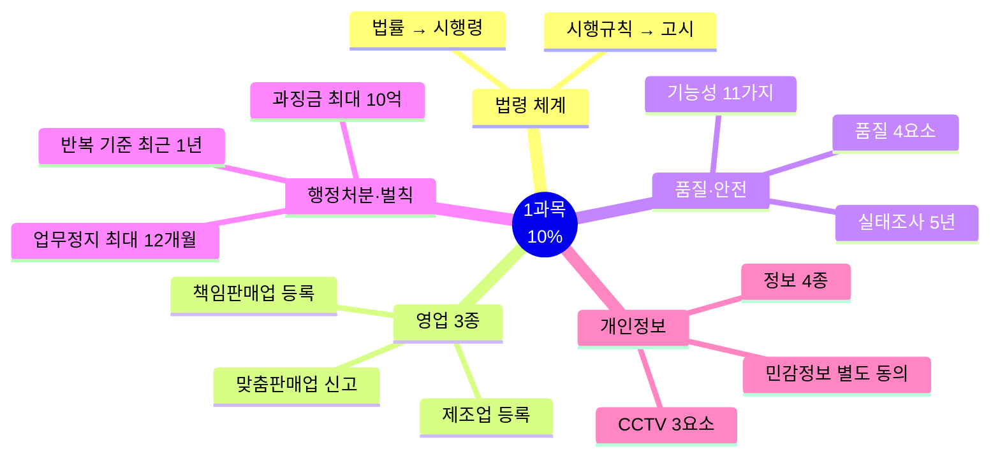
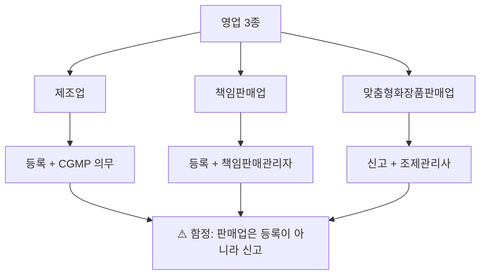
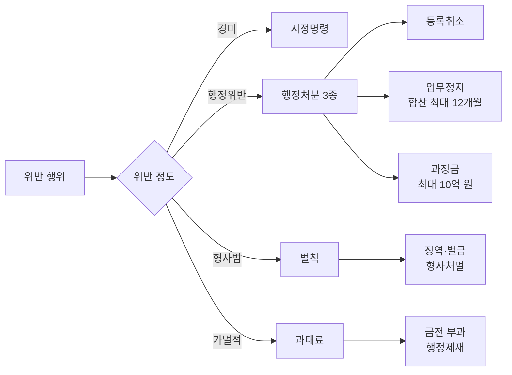

# 1과목 핵심요약 — 화장품법의 이해 (출제 10%)

> **시험 비중 10%** — 최소 시간으로 최대 득점. 빈출 축만 압축.
> 법령 수치는 개정될 수 있으니 최신 공식 기준과 함께 확인.

## 🎯 1분 요약표

| 축 | 핵심 |
| --- | --- |
| 법령 위계 | 법률 → 시행령 → 시행규칙 → 고시 |
| 영업 3종 | 제조업·책임판매업 **등록** / 맞춤형판매업 **신고** |
| 품질 4요소 | 안전성·안정성·유효성·사용성 |
| 결격사유 | 영업 **1년** 미경과 / 조제관리사 **3년** 미경과 |
| 변경 기한 | 일반 **30일** / 행정구역 개편 소재지 **90일** |
| 행정처분 | 반복 위반 기준 **최근 1년**, 업무정지 합산 최대 **12개월** |
| 기능성화장품 | 11가지 효능, 심사 또는 보고서, 실태조사 **5년** |
| 천연·유기농 | 천연 원료 95% 이상 / 유기농: 천연 95% + 유기농 10% 이상 |
| 개인정보 4종 | 개인정보 / 민감정보 / 고유식별정보 / 가명정보 |
| 벌칙 상한 | 화장품법 3년/3천만 원 · 개인정보법 10년/1억 · 과징금 최대 10억 |

## 📋 목차

- [전체 지도](#-전체-지도)
- [Ch01 화장품법의 이해](#ch01-화장품법의-이해)
- [Ch02 개인정보 보호법](#ch02-개인정보-보호법)
- [혼동 함정표](#-혼동-함정표)
- [숫자 암기 체크리스트](#-숫자-암기-체크리스트)

---

## 🗺️ 전체 지도

---

## Ch01 화장품법의 이해

### ⭐⭐⭐ 최빈출

- **화장품 정의**: 인체 작용이 경미한 제품. 의약품·의약외품 제외 (여드름 크림은 의약외품)
- **영업 3종**: 제조업(등록+CGMP 의무) / 책임판매업(등록+책임판매관리자) / 맞춤형화장품판매업(신고+조제관리사)
- **행정처분 3종**: 업무정지 → 등록취소·영업소 폐쇄, 과징금은 업무정지 갈음
- **제재 순서**: 시정명령(별도) → 행정처분

### ⭐⭐ 빈출

- **기능성화장품**: 미백·주름·자외선차단 등 11가지 효능 (총리령 지정), 심사 자료 제출
- **결격사유**: 금고 이상 형 선고·집행 중 / 제조업 고유: 정신질환·마약 중독
- **판매금지·회수**: 위해화장품 회수 즉시 보고, 회수계획서 **5일 이내** 지방식약청장 제출
- **화장품의 날**: 9월 7일 / 수수료(심사의뢰) 189,000원(전자)·210,000원(방문)

## Ch02 개인정보 보호법

### ⭐⭐⭐ 최빈출

- **정보 4종 구분**: 개인정보 / 민감정보(건강 등, **별도 동의**) / 고유식별정보(주민번호) / 가명정보
- **6대 권리**: 열람·정정·삭제·처리정지 요구권 등

### ⭐⭐ 빈출

- **수집 가능한 7가지 경우**: 동의·법률 규정·계약 이행 등
- **CCTV 안내판 3요소**: 설치 목적·장소 / 촬영 범위·시간 / 담당자 연락처
- **벌칙**: 10년/1억 · 5년/5천만 · 3년/3천만 · 2년/2천만 원

---

## ⚠️ 혼동 함정표

| 함정 | 정답 |
| --- | --- |
| 맞춤형화장품판매업은 등록? | **신고** (제조·책판만 등록) |
| 결격사유 1년? 3년? | 영업 **1년** / 조제관리사 **3년** |
| 여드름 크림은 기능성화장품? | **의약외품** |
| "천연" 광고 자유? | 천연원료 **95% 이상** 기준 필요 |
| 민감정보도 일반 동의로? | **별도 동의** 필요 |
| 가등급 회수는 즉시? | **15일 이내** 회수 |
| 소재지 변경도 30일? | 일반 30일, **행정구역 개편은 90일** |
| 벌칙 vs 과태료 | 벌칙=형사처벌(징역·벌금) / 과태료=행정벌(금전) |

---

## 🔢 숫자 암기 체크리스트

| 항목 | 숫자 | 빈도 |
| --- | --- | --- |
| 변경 등록·신고 일반 기한 | 30일 | ⭐⭐⭐ |
| 행정구역 개편 소재지 변경 | 90일 | ⭐⭐ |
| 결격: 영업 / 조제관리사 | 1년 / 3년 | ⭐⭐⭐ |
| 행정처분 반복 위반 기준 | 최근 1년 | ⭐⭐⭐ |
| 업무정지 합산 최대 | 12개월 | ⭐⭐ |
| 안전성 정보 신속보고 | 15일 | ⭐⭐⭐ |
| 위해평가 사용기준 정기검토 | 5년 | ⭐⭐ |
| 기능성화장품 실태조사 | 5년 | ⭐⭐ |
| 회수계획서 제출 | 5일 이내 | ⭐⭐⭐ |
| 천연화장품 / 유기농 | 95% / 95%+10% | ⭐⭐⭐ |
| 벌칙(화장품법) | 3년/3천만 · 1년/1천만 · 200만 원 | ⭐⭐ |
| 과태료(화장품법) | 100만 · 50만 원 | ⭐ |
| 벌칙(개인정보보호법) | 10년/1억 ~ 2년/2천만 원 | ⭐⭐ |
| 과징금 | 최대 10억 원 | ⭐ |
| 화장품의 날 | 9월 7일 | ⭐ |
