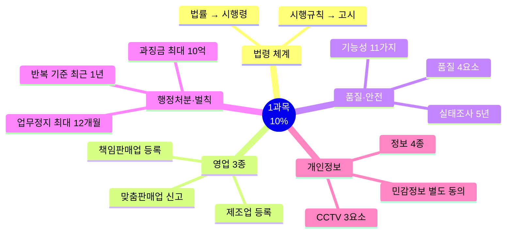
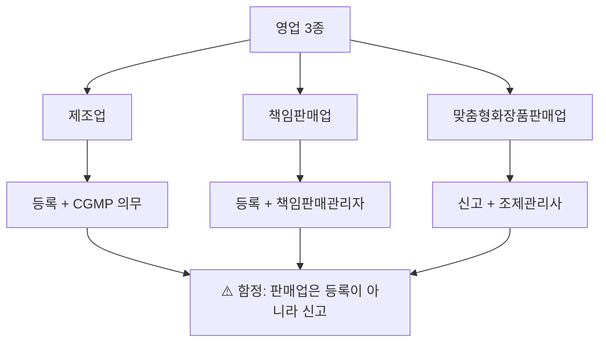
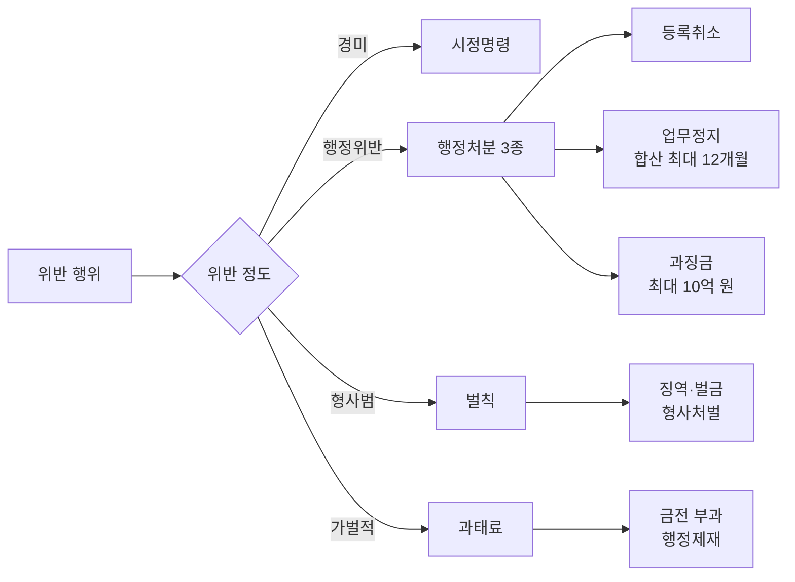

# 1과목 핵심요약 — 화장품법의 이해 (출제 10%)

> **시험 비중 10%** — 최소 시간으로 최대 득점. 빈출 축만 압축하되 함정 포인트는 놓치지 않기.
> 법령 수치는 개정될 수 있으니 최신 공식 기준과 함께 확인.

## 🎯 1분 요약표

| 축 | 핵심 |
| --- | --- |
| 법령 위계 | 법률 → 시행령 → 시행규칙 → 고시 |
| 영업 3종 | 제조업·책임판매업 **등록** / 맞춤형판매업 **신고** |
| 품질 4요소 | 안전성·안정성·유효성·사용성 |
| 결격사유 | 영업 **1년** 미경과 / 조제관리사 **3년** 미경과 |
| 변경 기한 | 일반 **30일** / 행정구역 개편 소재지 **90일** |
| 행정처분 | 반복 위반 기준 **최근 1년**, 업무정지 합산 최대 **12개월** |
| 기능성화장품 | 11가지 효능, 심사 또는 보고서, 실태조사 **5년** |
| 천연·유기농 | 천연 원료 95% 이상 / 유기농: 천연 95% + 유기농 10% 이상 |
| 개인정보 4종 | 개인정보 / 민감정보 / 고유식별정보 / 가명정보 |
| 벌칙 상한 | 화장품법 3년/3천만 원 · 개인정보법 10년/1억 · 과징금 최대 10억 |

## 📋 목차

- [전체 지도](#-전체-지도)
- [Ch01 화장품법의 이해](#ch01-화장품법의-이해)
- [Ch02 개인정보 보호법](#ch02-개인정보-보호법)
- [혼동 함정표](#-혼동-함정표)
- [숫자 암기 체크리스트](#-숫자-암기-체크리스트)

---

## 🗺️ 전체 지도

---

## Ch01 화장품법의 이해

### ⭐⭐⭐ 법령 체계

| 용어 | 핵심 |
| --- | --- |
| **법령 위계** | 법률(국회) → 시행령(대통령령) → 시행규칙(총리령) → 고시(식약처장). 하위 법령은 상위 위배 불가, 위반 시 효력 무효 |
| **시행규칙** | 총리령. 별표에 행정처분 기준·품질관리 기준 포함 |
| **고시** | 식약처장 고시. KFCC·안전기준·색소 기준. 위계상 최하위 |
| **화장품 정의** | 인체 작용이 경미한 제품. 의약품·의약외품 제외 (여드름 크림 = 의약외품) |
| **제외 7가지** | 의약품·의약외품 성격 품목 (치약·비누 일부 등 별도 규정) |

### ⭐⭐⭐ 영업 3종

| 용어 | 핵심 |
| --- | --- |
| **제조업** | 지방식약청장 **등록**. CGMP 의무. 위탁제조 포함 |
| **책임판매업** | 지방식약청장 **등록**. 책임판매관리자 배치 의무 |
| **맞춤형화장품판매업** | 지방식약청장 **신고**. 조제관리사 필수 배치 |
| **책임판매관리자** | 의사·약사·학사 이상·전문학사+1년 경력·교육이수·조제관리사·2년 경력. 결원 시 **30일 이내 보충** |

### ⭐⭐⭐ 영업 관리·결격

| 용어 | 핵심 |
| --- | --- |
| **결격사유 공통** | 피성년후견인·파산선고 미복권·금고 이상 형(실형 미집행·집행유예 중)·등록취소/폐쇄 후 **1년** 미경과 (제3조의3) |
| **제조업 고유** | 정신질환·마약 중독 |
| **결격 기간** | 등록취소 후 제조/책판 **1년** 미경과 / 조제관리사 자격취소 후 **3년** 미경과 |
| **변경 등록·신고** | 일반 **30일** 이내 / 행정구역 개편 소재지 변경 **90일** (예외) |
| **영업 양수도** | 양수자가 등록사항 승계, 양도자 30일 이내 신고 |
| **시장출하** | 판매 목적 출하. 위탁제조 포함·수탁제조 제외. 출하 전 품질검사 |

### ⭐⭐⭐ 기능성화장품

| 용어 | 핵심 |
| --- | --- |
| **11가지 효능** | 미백·주름·자외선·염모·제모·탈모·여드름·피부장벽·튼살·모발색상변화·체모제거 (총리령 지정) |
| **심사** | 식약처 심사. 효능 증명자료+전성분·함량+수수료 확인서. CGMP 서류는 제조업 등록 시 (심사 아님) |
| **실태조사** | **5년** 주기. 부적합 시 시정명령 |
| **수수료** | 전자 189,000원 / 방문 210,000원 |

### ⭐⭐ 행정처분·벌칙

| 용어 | 핵심 |
| --- | --- |
| **시정명령** | 제19조 별도 조문. 경미한 위반 시 최초 조치 |
| **행정처분 3종** | 등록취소·업무정지·과징금. 과징금은 업무정지 갈음 |
| **업무정지** | 합산 최대 **12개월**. 반복 위반 기준 = **최근 1년** 같은 위반행위. 3차 이상 시 과징금 제외 |
| **과징금** | 최대 **10억 원** (위반행위 매출액 기준 산정). 미납 시 15일 내 독촉 |
| **처분 감경** | **1/2**까지 감경·면제 (공익 목적·기소유예 등) |
| **벌칙** | 3년/3천만(허위 기재) · 1년/1천만(미등록 영업) · 200만 원 이하 |
| **과태료** | 100만 원(신고 위반) / 50만 원(교육 미이수) |
| **양벌 규정** | 행위자+법인/개인에도 벌금 (주의·감독 시 제외) |
| **화장품의 날** | 매년 **9월 7일** |

### ⭐⭐ 표시·광고·회수

- **표시·광고 금지**: 의약품 오인 / 기능성 오인 / 거짓·과장
- **천연·유기농**: 천연 원료 **95% 이상** / 유기농 = 천연 95% + 유기농 **10% 이상**
- **위해화장품 회수**: 즉시 보고 / 회수계획서 **5일 이내** 지방식약청장 제출 / 가등급 **15일 이내** 회수
- **안전성 정보 신속보고**: **15일 이내** / 위해평가 사용기준 정기검토 **5년**

## Ch02 개인정보 보호법

### ⭐⭐⭐ 정보 4종 분류

| 용어 | 핵심 |
| --- | --- |
| **개인정보** | 살아 있는 개인에 관한 정보. 사망자·법인·개인사업자 사업정보 제외 |
| **민감정보** | **6종**: 사상·신념·건강·성생활·유전정보·범죄경력. **별도 동의 필수** |
| **고유식별정보** | **4종**: 주민등록번호·여권번호·운전면허번호·외국인등록번호. 별도 동의 |
| **가명정보** | 추가 정보 없이 특정 개인 불식별 처리. 통계·연구 목적 시 동의 면제 |

> ⚠️ 학력·직업·소득은 **일반 개인정보** (민감정보 아님). 건강·병력만 민감정보.

### ⭐⭐ 처리·권리·유출

| 용어 | 핵심 |
| --- | --- |
| **수집 동의 7가지** | 동의·법령·공공기관·계약·급박한 이익·정당한 이익·공중위생 |
| **고지 5사항** | 목적·항목·보유기간·거부권·제3자 제공 시 제공받는 자 |
| **보호 3대 원칙** | 최소 수집·목적 외 이용 금지·안전성 확보 |
| **정보주체 6대 권리** | 정보제공·동의선택·열람·정정·구제·자동처분 거부 |
| **유출 통지** | 1명 이상 → 통지 / **1천 명 이상** → 통지 + 홈페이지 **7일** 게시 + **72시간** 내 신고 |
| **CCTV 안내판 3요소** | 설치 목적·장소 / 촬영 범위·시간 / 관리책임자 성명·연락처 |
| **CCTV 금지 장소** | 목욕실·화장실·발한실·탈의실 |
| **동의 서면 표시** | **9포인트 이상**, **20% 이상 크게** |

### ⭐⭐ 벌칙·과태료

| 구분 | 수준 | 사유 |
| --- | --- | --- |
| 벌칙 | **10년/1억** | 공공기관 업무 방해, 부정 취득·제공 |
| 벌칙 | **5년/5천만** | 동의 없이 제3자 제공, 민감·고유정보 무단 처리 |
| 벌칙 | **3년/3천만** | CCTV 임의조작·녹음, 직무상 비밀 누설 |
| 벌칙 | **2년/2천만** | 안전성 미확보로 유출, 정정·삭제 미조치 |
| 과태료 | **5천만 최대** | 수집 위반, 14세 미만 동의 미흡, CCTV 금지장소 설치 |

---

## ⚠️ 혼동 함정표

| 함정 | 정답 |
| --- | --- |
| 맞춤형화장품판매업은 등록? | **신고** (제조·책판만 등록) |
| 결격사유 1년? 3년? | 영업 **1년** / 조제관리사 **3년** |
| 여드름 크림은 기능성화장품? | **의약외품** |
| "천연" 광고 자유? | 천연원료 **95% 이상** 기준 필요 |
| 민감정보도 일반 동의로? | **별도 동의** 필요 |
| 학력·건강 모두 민감정보? | **건강만** 민감정보, 학력은 일반 |
| 가등급 회수는 즉시? | **15일 이내** 회수 |
| 소재지 변경도 30일? | 일반 30일, **행정구역 개편은 90일** |
| 벌칙 vs 과태료 | 벌칙=형사처벌(징역·벌금) / 과태료=행정벌(금전) |
| 유출 시 모두 홈페이지 게시? | **1천 명 이상**일 때만 7일 게시+72시간 신고 |
| 과징금과 업무정지 병과? | 과징금은 **업무정지 갈음** (병과 아님) |

---

## 🔢 숫자 암기 체크리스트

| 항목 | 숫자 | 빈도 |
| --- | --- | --- |
| 변경 등록·신고 일반 기한 | 30일 | ⭐⭐⭐ |
| 행정구역 개편 소재지 변경 | 90일 | ⭐⭐ |
| 결격: 영업 / 조제관리사 | 1년 / 3년 | ⭐⭐⭐ |
| 책임판매관리자 결원 보충 | 30일 | ⭐⭐ |
| 행정처분 반복 위반 기준 | 최근 1년 | ⭐⭐⭐ |
| 업무정지 합산 최대 | 12개월 | ⭐⭐ |
| 안전성 정보 신속보고 | 15일 | ⭐⭐⭐ |
| 위해평가 사용기준 정기검토 | 5년 | ⭐⭐ |
| 기능성화장품 실태조사 | 5년 | ⭐⭐ |
| 회수계획서 제출 | 5일 이내 | ⭐⭐⭐ |
| 천연화장품 / 유기농 | 95% / 95%+10% | ⭐⭐⭐ |
| 유출 대규모 기준 | 1천 명 이상 → 7일 게시·72시간 신고 | ⭐⭐⭐ |
| 동의 서면 표시 | 9포인트·20% 크게 | ⭐⭐ |
| 민감정보 / 고유식별정보 | 6종 / 4종 | ⭐⭐⭐ |
| 벌칙(화장품법) | 3년/3천만 · 1년/1천만 · 200만 원 | ⭐⭐ |
| 과태료(화장품법) | 100만 · 50만 원 | ⭐ |
| 벌칙(개인정보보호법) | 10년/1억 ~ 2년/2천만 원 | ⭐⭐ |
| 과태료(개인정보법) | 최대 5천만 원 | ⭐ |
| 과징금 | 최대 10억 원 (매출액 기준 산정) | ⭐ |
| 화장품의 날 | 9월 7일 | ⭐ |
