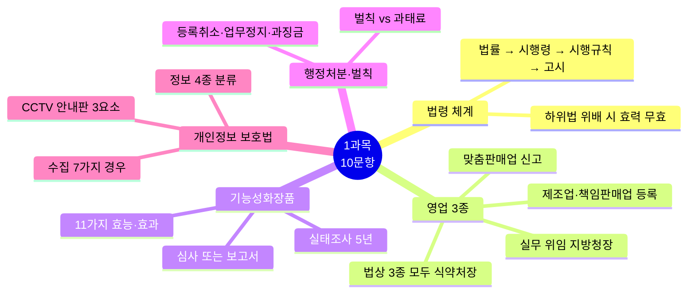
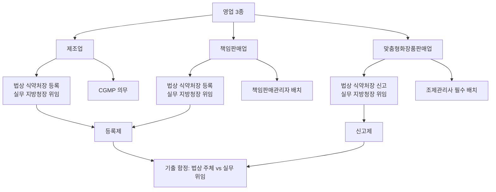
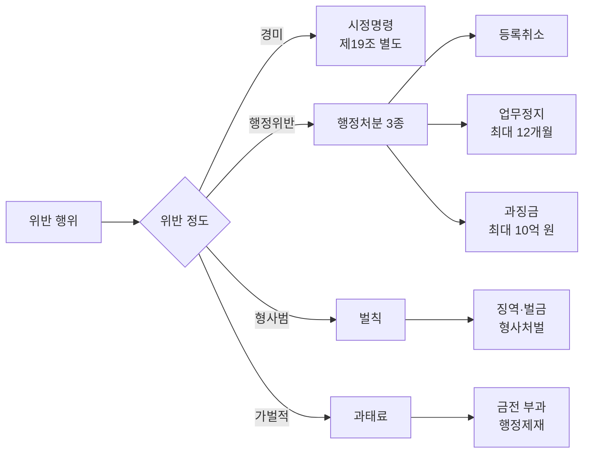

# 📕 1과목 핵심 정리 (10문항)

> **맞춤형화장품조제관리사 필기시험** — 1과목 화장품법의 이해 (10문항)
> 시험 비중: 10% | 주요 영역: 법령 체계, 영업 3종, 기능성화장품, 행정처분, 개인정보 보호법

---

## 🗺️ 1과목 전체 마인드맵

## 🔀 영업 3종 구분 플로우

## 🔀 행정처분 vs 벌칙 vs 과태료

---

## 🎯 핵심 10문항

### 1. 법령 위계 (빈출 최상위)
법률(국회) → 시행령(대통령) → 시행규칙(총리령) → 고시(식약처장관). 하위 법령은 상위 법령에 위배 불가. 위반 시 효력 무효.

### 2. 화장품 정의와 7가지 제외 대상 (빈출)
- **화장품**: 인체 청결·미화·향류 증진, 피부·모발 건강 유지 목적
- **7가지 제외**: 의약품·의약외품·의료기기·식품·건강기능식품·화장솜·기타 화장품 외 제품
- 적용 대상: 인체에 사용되는 제품 (구강청정제·염모제 포함)

### 3. 영업 3종 구분 (빈출 최상위)
- **제조업**: 법상 식약처장 **등록**, 실무 지방청장 위임, CGMP 의무
- **책임판매업**: 법상 식약처장 **등록**, 실무 지방청장 위임, 책임판매관리자 배치
- **맞춤형화장품판매업**: 법상 식약처장 **신고**, 실무 지방청장 위임, 조제관리사 필수 배치
- **기출 단골 함정**: 법상 주체는 3종 모두 식약처장, 실무 접수·처리는 지방청장 (위임 17호)

### 4. 책임판매관리자 자격·결원 보충 (빈출)
- 자격 요건: 의사·약사·학사 이상·전문학사+1년 경력·교육이수·조제관리사·2년 경력
- 결원 시 **30일 이내** 보충 의무 (기출 함정)
- 매년 정기 교육 필수

### 5. 변경 등록·신고 기한 (빈출)
- 일반 변경: **30일 이내**
- 행정구역 개편으로 인한 소재지 변경: **90일 이내** (예외)
- 영업 양수도: 양도자 30일 이내 신고, 소비자에게 이전 사실 안내

### 6. 기능성화장품 (빈출)
- **법 제2조 5개 목**(상위): 미백·주름·태닝/자외선·모발 색상변화·제거·영양·피부·모발 기능 악화 방지
- **시행규칙 11가지**(세분류): 미백(2종: 침착방지·색옅게), 주름, 태닝, 자외선차단, 모발색상변화(염모), 체모제거(제모), 탈모완화, 여드름완화, 피부장벽회복, 튼살완화
- 심사 또는 보고서 제출 필수
- 실태조사 **5년** 주기
- 심사 수수료: 전자 189,000원 / 방문 210,000원

### 7. 행정처분 3종·벌칙 (빈출)
- **행정처분**: 등록취소·업무정지(최대 12개월)·과징금(최대 10억 원, 매출액 2% 이내)
- **벌칙**: 형사처벌 (징역·벌금) — 위해화장품 제조(3년/1천만 원), 안전성 미확보 유출(2년/2천만 원), 허위·과장 광고(1년/500만 원)
- **과태료**: 행정제재 (금전 부과) — 5천만 원 이하 (개인정보 수집 위반 등)

### 8. 정보 4종 분류 (빈출 최상위)
- **개인정보**: 살아 있는 개인에 관한 정보 (사망자·법인 제외)
- **민감정보**: **6종** (사상·신념·건강·성생활·유전정보·범죄경력) — 별도 동의 필수
- **고유식별정보**: **4종** (주민등록번호·여권번호·운전면허번호·외국인등록번호) — 별도 동의 필수
- **가명정보**: 추가 정보 없이 특정 개인 알아볼 수 없도록 처리

### 9. 개인정보 수집·CCTV (빈출)
- **수집 7가지 경우**: ① 동의(14세 미만 법정대리인) ② 법령상 의무 ③ 공공기관 업무 ④ 계약 이행 ⑤ 급박한 생명·신체·재산 ⑥ 정당한 이익 ⑦ 공중위생 등
- **CCTV 안내판 3요소**: 설치 목적 및 장소, 촬영 범위 및 시간, 관리책임자 성명 및 연락처

### 10. 벌칙 vs 과태료 구분 (빈출 최상위)
- **벌칙**: 형사처벌 (징역·벌금) — 위해화장품 제조, 안전성 미확보 유출 등
- **과태료**: 행정제재 (금전 부과) — 5천만 원 이하 (개인정보 수집 위반 등)
- **구분 함정**: 벌칙은 경찰 수사→검찰 기소→형사재판, 과태료는 행정청 직권 부과

---

## 📊 시험 출제 비중

| 영역 | 문항수 | 주요 포인트 |
|---|---|---|
| 법령 체계·화장품 정의 | 2 | 위계 구조, 7가지 제외 대상 |
| 영업 3종·책임판매관리자 | 3 | 등록 vs 신고, 자격 요건, 결원 30일 보충 |
| 기능성화장품 | 1 | 11가지 효능, 심사 절차 |
| 행정처분·벌칙·과태료 | 2 | 3종 처분, 벌칙 vs 과태료 구분 |
| 개인정보 보호법 | 2 | 정보 4종, 수집 7가지, CCTV |

---

> 📌 **출처**: 화장품법·시행령·시행규칙·고시, 개인정보 보호법 | **최종 확인**: 2026. 8. 29.
