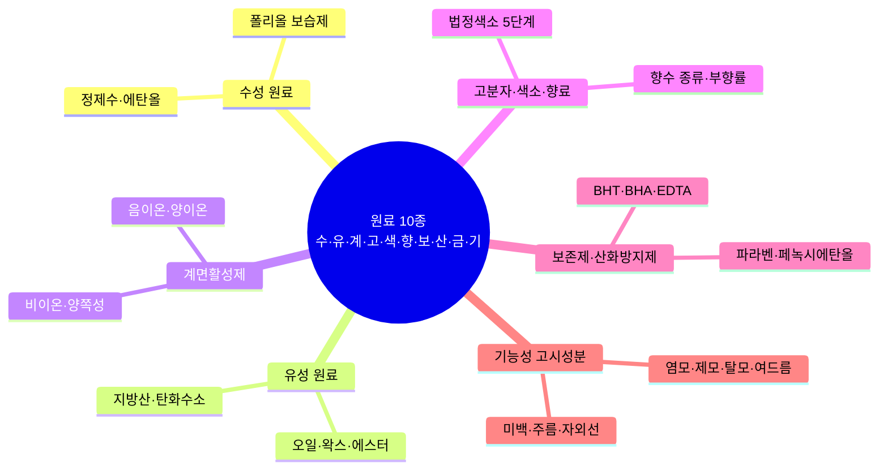
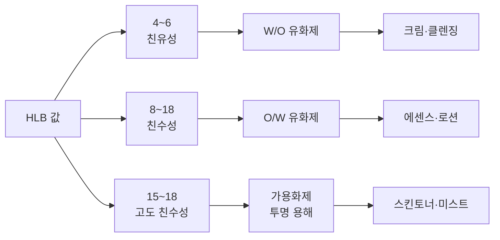
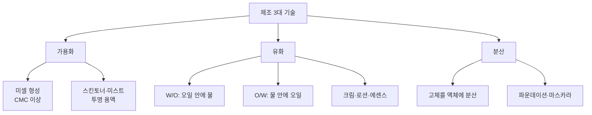
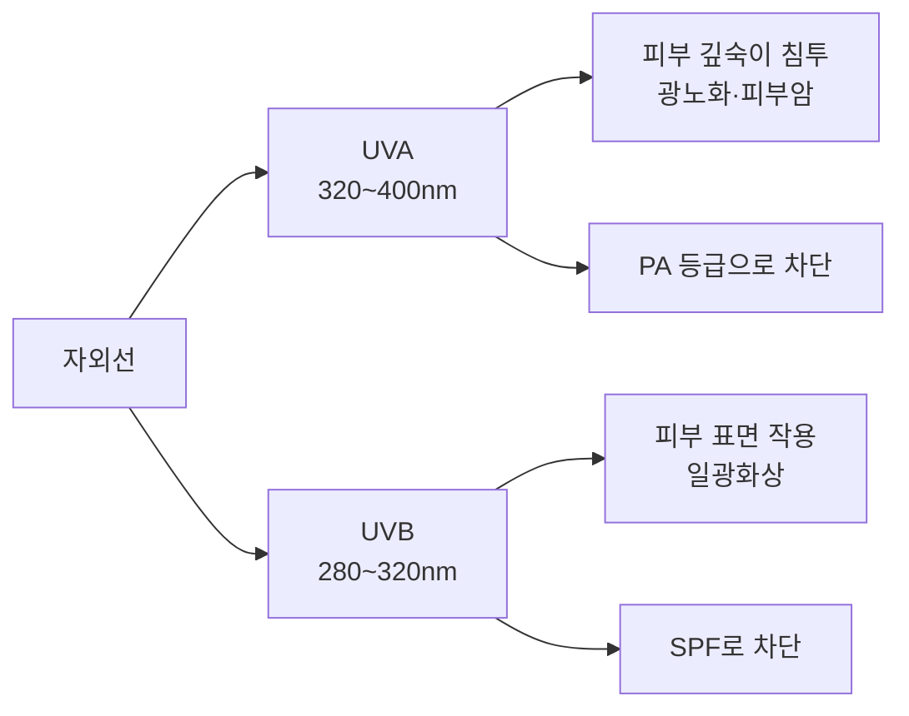
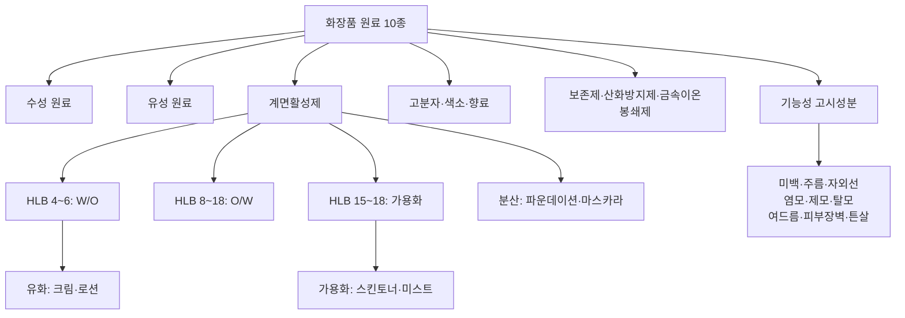

# 📘 2과목 Ch01 핵심 암기 — 화장품 원료의 종류와 특성

> **맞춤형화장품조제관리사 필기시험** — 2과목 Chapter 01 핵심 암기 정리
> 주요 영역: 원료 10종 분류, 계면활성제 HLB, 제조 3대 기술, 보습 4종, 색소, 자외선차단

---

## 📋 목차

1. [🗺️ 원료 10종 전체 마인드맵](#-원료-10종-전체-마인드맵)
2. [🔢 원료 10종 두음법](#-원료-10종-두음법-암기)
3. [⭐ 계면활성제·HLB (빈출 최상위)](#-계면활성제hlb-빈출-최상위)
4. [⭐ 제조 3대 기술 (빈출 최상위)](#-제조-3대-기술-빈출-최상위)
5. [⭐ 보습 원료 4종 (빈출)](#-보습-원료-4종-빈출)
6. [📊 수성·유성 원료](#-수성유성-원료)
7. [📊 색소 (빈출)](#-색소-빈출)
8. [📊 자외선차단 (빈출)](#-자외선차단-빈출)
9. [📊 보존제·산화방지제·금속이온봉쇄제](#-보존제산화방지제금속이온봉쇄제)
10. [📊 기능성화장품 11가지](#-기능성화장품-11가지-시행규칙-호-기준)
11. [📊 향수·전성분 표시](#-향수전성분-표시)
12. [✅ 핵심 3가지](#-핵심-3가지)

---

## 🗺️ 원료 10종 전체 마인드맵

---

## 🔢 원료 10종 두음법 암기

> 💡 **암기 팁**: **수·유·계·고·색·향·보·산·금·기**
>
> | 두음 | 원료 | 두음 | 원료 |
> | --- | --- | --- | --- |
> | **수** | 수성 원료 | **색** | 색소 |
> | **유** | 유성 원료 | **향** | 향료 |
> | **계** | 계면활성제 | **보** | 보존제 |
> | **고** | 고분자 화합물 | **산** | 산화방지제 |
> | | | **금** | 금속이온봉쇄제 |
> | | | **기** | 기능성 고시성분 |

---

## ⭐ 계면활성제·HLB (빈출 최상위)

### 계면활성제 4종 비교

| 구분 | 전하 | 특징 | 용도 | 대표 성분 |
| --- | --- | --- | --- | --- |
| **음이온성** | (-) | 세정력 강함 | 세정제, 샴푸 | 라우릴황산나트륨(SLS) |
| **양이온성** | (+) | 대전 방지, 유연 | 헤어컨디셔너 | 세틸트리메칠암모늄 |
| **비이온성** | 없음 | 자극 적음, 안정 | 유화제, 가용화제 | 폴리솔베이트, 소르비탄 |
| **양쪽성** | (±) | pH 따라 전환 | 저자극 세정 | 베타인, 레시틴 |

### HLB 값에 따른 용도 분류

| HLB 값 | 용도 | 적용 제품 |
| ---: | --- | --- |
| 1~3 | 소포제(거품제거제) | |
| 4~6 | **W/O 유화제** | 크림·클렌징 |
| 7~9 | 분산제, 습윤제 | |
| 8~18 | **O/W 유화제**, 세정제, 가용화제 | 에센스·로션 |
| 13~15 | 세정제 | |
| 15~18 | **가용화제** | 스킨토너·미스트 |

### HLB 공식 (Griffin)

**HLB = (친수기 분자량 / 분자량) × 20**

> 💡 **암기 포인트**:
> - HLB 0 = 완전 친유성 / HLB 20 = 완전 친수성
> - **높을수록 친수성 ↑**
> - 비이온성 계면활성제에만 적용

---

## ⭐ 제조 3대 기술 (빈출 최상위)

| 기술 | 원리 | 적용 제품 | 핵심 키워드 |
| --- | --- | --- | --- |
| **가용화** | 미셀이 불용성 물질을 투명하게 용해 | 스킨토너, 미스트 | 투명, CMC 이상 |
| **유화** | 두 액체를 미세 입자로 분산 | 크림, 로션, 에센스 | W/O, O/W |
| **분산** | 고체 입자를 액체에 균일 혼합 | 파운데이션, 마스카라 | 안정성 |

> 💡 **암기 팁**: **가·유·분** → 가용화(투명) · 유화(혼합) · 분산(고체)

---

## ⭐ 보습 원료 4종 (빈출)

| 구분 | 작용 기전 | 대표 성분 | 한 줄 요약 |
| --- | --- | --- | --- |
| **밀폐제** (필름 형성제) | 소수성 피막 형성 → TEWL 저하 | 바세린, 파라핀 | 수분 증발 **차단** |
| **연화제** (유연제) | 각질세포 사이 틈 메움 | 오일류, 에스터 | 피부 **부드럽게** |
| **습윤제** | 케라틴·NMF와 수분 결합 | 글리세린, 폴리올 | 수분 **끌어당김** |
| **장벽대체제** | 세라마이드·지방산·콜레스테롤 | 세라마이드 | 피부장벽 **회복** |

> 💡 **암기 팁**: **밀·연·습·장** → 밀폐(차단) · 연화(부드럽게) · 습윤(끌어당김) · 장벽(회복)
>
> **용어 풀이**:
> - **TEWL**: Trans-Epidermal Water Loss, 경피수분손실량
> - **NMF**: Natural Moisturizing Factor, 천연보습인자

### 폴리올 보습제 상세

| 성분 | 종류 | 특징 | 용도 |
| --- | --- | --- | --- |
| **글리세린** | 3가 알코올 | 흡습성, 대기 수분 흡수 | 보습, 부형제 |
| **부틸렌글라이콜(BG)** | 2가 알코올 | 가벼운 사용감, 항균성 | 보습, 끈적임 적음 |
| **프로필렌글라이콜(PG)** | 2가 알코올 | 발효 억제, 점도감소 | 보습, 용제, 점도감소 |

---

## 📊 수성·유성 원료

### 수성 원료

| 원료 | 특징 | 용도 |
| --- | --- | --- |
| **정제수** | 가장 중요한 원료, 극성 물질, 이온교환수지 여과 | 용제, 부형제 |
| **에탄올** | 저급 알코올(탄소수 6 미만), 휘발성·살균·수렴 | 여드름용, 아스트린젠트, 향수 |
| **아이소프로필 알코올** | 수렴·보존·기포방지, 점도감소 | 점막 자극 주의 |

### 유성 원료 7종

| 원료 | 특징 | 용도 |
| --- | --- | --- |
| **식물성 오일** | 불포화지방산, 산화 주의 | 마사지오일, 크림 |
| **동물성 오일** | 피부 친화성 높음 | 고보습 크림 |
| **에스터** | 가볍고 퍼짐성 좋음 | 로션, 에센스 |
| **왁스** | 경도 조절, 융점 높음 | 립스틱, 파운데이션 |
| **지방산** | 유화안정제, 비누 원료 | 크림, 비누 |
| **탄화수소** | 안정성 높음, 소수성 | 바세린, 파라핀 |
| **실리콘** | 매끄러운 사용감, 휘발성 | 프라이머, 헤어케어 |

---

## 📊 색소 (빈출)

| 구분 | 특징 | 제한 |
| --- | --- | --- |
| **법정색소** | 안전성 확인된 색소만 허가 | 5단계 제한 |
| **타르색소** | 콜타르 유래 또는 유기 합성 | 염료·레이크·유기안료 3종 |
| **레이크** | 수용성 염료 + 불용성 금속염 | 기질에 화학적 결합 |
| **무기안료** | 천연 광물 유래 | 안정성 높음 |

### 법정색소 5단계 사용 기준

| 단계 | 제한 내용 | 비고 |
| ---: | --- | --- |
| 1 | 제한 없음 | |
| 2 | 영유아용 제품 사용 금지 | |
| 3 | 점막 사용 금지 | |
| 4 | 눈 주위 사용 금지 | |
| 5 | 화장비누 외 사용 금지 | 가장 제한적 |

---

## 📊 자외선차단 (빈출)

| 구분 | 의미 | 측정 | 기준 |
| --- | --- | --- | --- |
| **SPF** | Sun Protection Factor | UVB 차단 지수 | 50 이상은 **SPF50+** 표시, SPF 1 ≈ 10~15분 |
| **PA** | Protection Grade of UVA | UVA 차단 등급 | **PA+**(2~4) / **PA++**(4~8) / **PA+++**(8~16) / **PA++++**(16+) |

### 자외선차단제 성분 한도

| 성분 | 최대 함량 | 비고 |
| --- | ---: | --- |
| 티타늄디옥사이드 | 25% | 자외선 산란제 |
| 징크옥사이드 | 25% | 자외선 산란제 |
| 드로메트리졸트리실록산 | 15% | |
| 옥토크릴렌·호모살레이트 | 10% | |
| 에칠헥실메톡시신나메이트 | 7.5% | |
| 벤조페논-3(옥시벤존) | 2.4% | 얼굴·손·입술 5% · **2.4% 초과 시 "전신 사용 금지" 주의사항 (2026.9.2. 시행)** |
| 드로메트리졸 | 1.0% | |

---

## 📊 보존제·산화방지제·금속이온봉쇄제

### 보존제 주요 성분 한도

| 성분 | 최대 함량 | 비고 |
| --- | ---: | --- |
| **파라벤(단일)** | 0.4% (산으로서) | |
| **파라벤(혼합)** | 0.8% (산으로서) | |
| **페녹시에탄올** | 1.0% | |
| **벤질알코올** | 1.0% | 두발염색용 용제 10% |
| **살리실릭애씨드** | 0.5% | 영유아·13세 이하 사용금지(샴푸 제외) |
| **이미다졸리디닐우레아** | 0.6% | |
| **벤조익애씨드** | 0.5% | 씻어내는 제품 2.5% |

### 산화방지제·금속이온봉쇄제

| 구분 | 성분 | 특징 |
| --- | --- | --- |
| **산화방지제** | BHT (Butylated Hydroxy Toluene) | 무색 결정성 분말, 내열성·내광성 우수 |
| **산화방지제** | BHA (Butylated Hydroxy Anisole) | 열 안정, 빛에 의해 착색 |
| **금속이온봉쇄제** | EDTA | 금속이온 포획, 산화 촉매 차단 |

> 💡 **구분 암기**: 산화방지제 = **유지 산화 방지** / 금속이온봉쇄제 = **금속이온 포획**

---

## 📊 기능성화장품 11가지 (시행규칙 호 기준)

| 번호 | 기능 | 주요 성분 | 함량 기준 | 비고 |
| ---: | --- | --- | --- | --- |
| 1 | 미백(침착 방지) | 나이아신아마이드 | 2.0~5.0% | |
| 2 | 미백(색 옅게) | 알부틴 | 2.0~5.0% | |
| 3 | 주름 개선 | 아데노신(0.04%), 레티놀(2,500 IU/g) | | |
| 4 | 자외선 차단 | 티타늄디옥사이드 | 25% 이하 | |
| 5 | 태닝 | | | 피부 곱게 태움 |
| 6 | 모발 색상 변화 | | | 일시적 제외 |
| 7 | 체모 제거 | 치오글리콜산 | 3.0~4.5% | pH 7.0~12.7 |
| 8 | 탈모 완화 | | | 코팅 등 물리적 제외 |
| 9 | 여드름성 피부 완화 | 살리실릭애씨드 | 0.5% | 인체 세정용 |
| 10 | 피부장벽 기능 회복 | | | 아토피 |
| 11 | 튼살 완화 | | | 붉은 선 옅게 |

> 💡 **법 제2조 5개 목(상위 분류)**: 미백 / 주름 / 자외선·태닝 / 모발 색상·제거·영양 / 피부·모발 건조·갈라짐 등 개선

---

## 📊 향수·전성분 표시

### 향수 종류

| 종류 | 부향률 | 지속시간 |
| --- | ---: | --- |
| **퍼퓸(Parfum)** | 15~20% | 5~7시간 |
| **오드퍼퓸(EDP)** | 10~15% | 4~5시간 |
| **오드뚜왈렛(EDT)** | 5~10% | 3~4시간 |
| **오드코롱(EDC)** | 3~5% | 1~2시간 |

> 💡 **암기 팁**: 부향률 높을수록 지속시간 길어짐. **퍼퓸 > EDP > EDT > EDC**

### 전성분 표시 규정

| 항목 | 내용 |
| --- | --- |
| **표시 기준** | 5포인트 이상, 함량 많은 순 |
| **함량 순 예외** | 1% 이하는 순서 무관 |
| **알레르기 유발 성분** | 25종, '향료' 표시 불가, 개별 성분명 기재 |
| **알레르기 표시 기준** | 씻어내는 **0.01%** 초과 / 남기는 **0.001%** 초과 |

---

## 🗺️ 챕터1 전체 플로우차트

---

## ✅ 핵심 3가지

> 🎯 **빈출 최상위**:
> 1. **HLB 값 구분**: **4~6** = W/O 유화제, **8~18** = O/W 유화제, **15~18** = 가용화제
> 2. **제조 3대 기술**: 가용화(스킨토너·미스트), 유화(크림·로션), 분산(파운데이션·마스카라)
> 3. **보습 4종**: 밀폐제(바세린), 연화제(오일), 습윤제(글리세린), 장벽대체제(세라마이드)

---

> **🔍 키워드**: 원료 10종, HLB, 계면활성제 4종, 제조 3대 기술, 보습 4종, 색소 5단계, SPF·PA, 파라벤, BHT·BHA, EDTA
