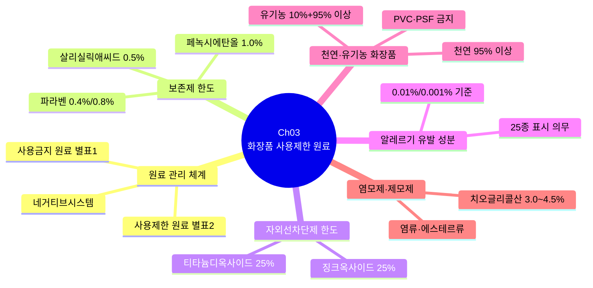
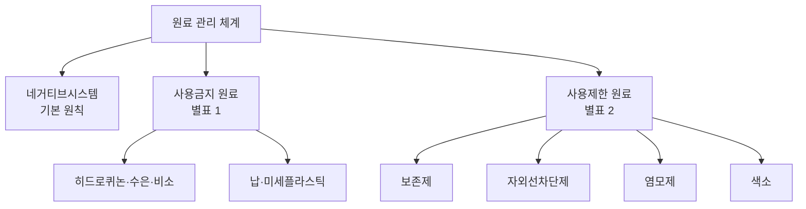
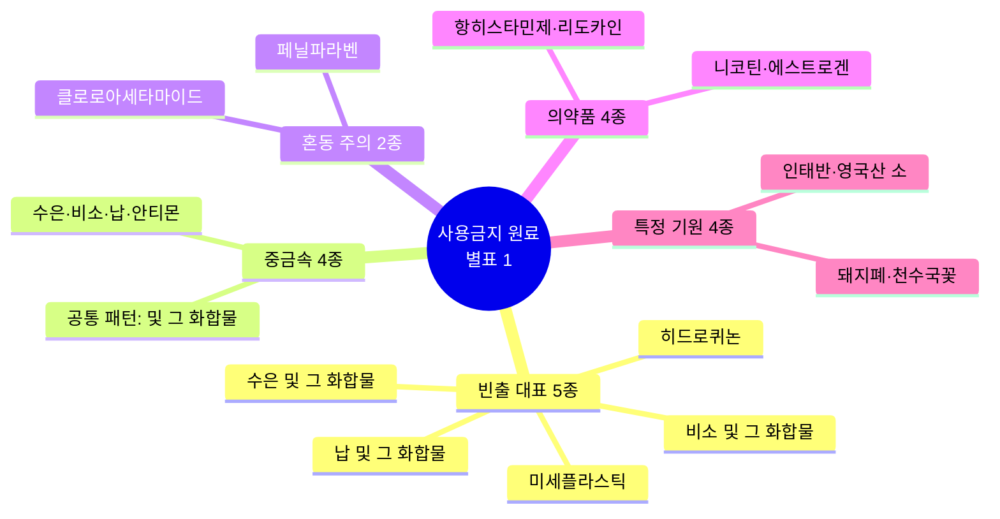
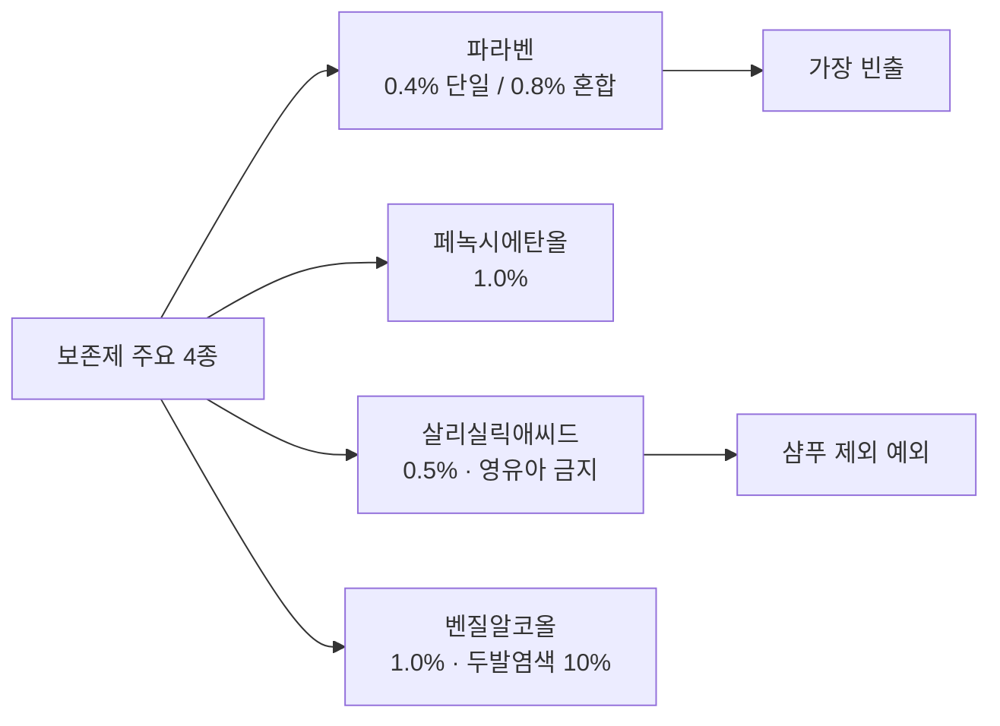
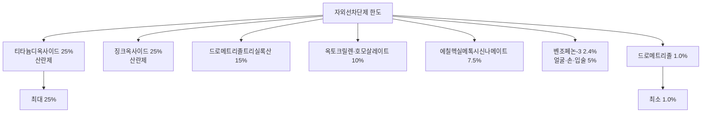
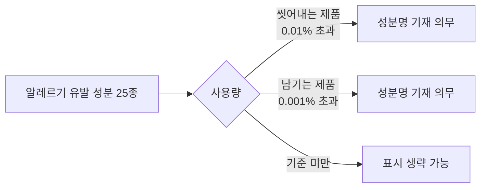
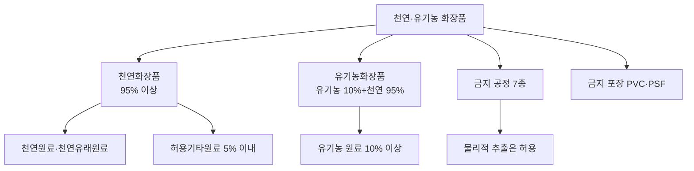
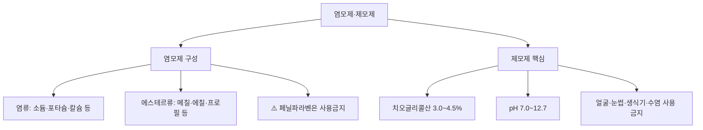
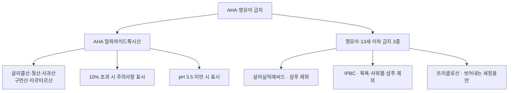
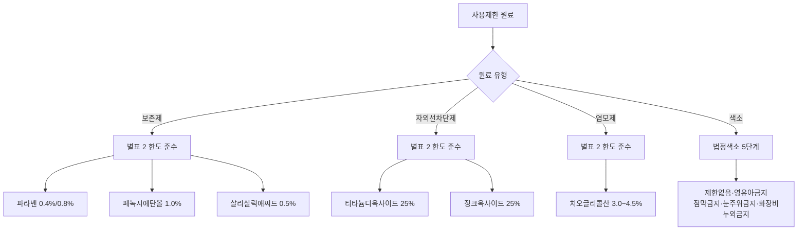

# 📘 2과목 Ch03 핵심 암기 — 화장품 사용제한 원료

> **맞춤형화장품조제관리사 필기시험** — 2과목 Chapter 03 핵심 암기 정리
> 주요 영역: 원료 관리 체계, 보존제 한도, 자외선차단제 한도, 알레르기 유발 성분 25종, 천연·유기농 화장품, 염모제

---

## 📋 목차

1. [🗺️ Ch03 전체 마인드맵](#-ch03-전체-마인드맵)
2. [⭐ 원료 관리 체계 (빈출 최상위)](#-원료-관리-체계-빈출-최상위)
3. [⭐ 보존제 한도 (빈출)](#-보존제-한도-빈출)
4. [📊 자외선차단제 한도](#-자외선차단제-한도)
5. [⭐ 알레르기 유발 성분 25종 (빈출)](#-알레르기-유발-성분-25종-빈출)
6. [⭐ 천연·유기농 화장품 (빈출)](#-천연유기농-화장품-빈출)
7. [📊 염모제·제모제](#-염모제제모제)
8. [📊 AHA·영유아 금지 성분](#-aha영유아-금지-성분)
9. [🗺️ 원료 관리 플로우차트](#-원료-관리-플로우차트)
10. [✅ 핵심 3가지](#-핵심-3가지)
11. [🔢 숫자 암기 체크리스트](#-숫자-암기-체크리스트)

---

## 🗺️ Ch03 전체 마인드맵

---

## ⭐ 원료 관리 체계 (빈출 최상위)

| 구분 | 의미 | 근거 | 예시 |
| --- | --- | --- | --- |
| **네거티브시스템** | 고시된 금지·제한 원료 외에는 업자 책임하에 사용 가능 | 화장품 원료 관리 기본 원칙 | — |
| **사용금지 원료** | 화장품에 절대 사용 불가 | **별표 1** | 히드로퀴논, 수은, 비소, 납, 미세플라스틱 |
| **사용제한 원료** | 사용 기준이 지정·고시된 원료 | **별표 2** | 보존제, 색소, 자외선차단제, 염모제 |

> 💡 **암기 팁**: **별표 1 = 금지**, **별표 2 = 제한** (숫자가 클수록 완화)

### 사용금지 원료 주요 항목

> 💡 **암기 전략**: 30여 종을 가나다 순 외우지 말고 **5개 그룹**으로 분류 암기

#### 1. 빈출 대표 5종 (반드시 암기)

| 원료 | 암기 포인트 |
| --- | --- |
| **히드로퀴논** | 미백제 오용 — 가장 빈출 |
| **수은 및 그 화합물** | 중금속 |
| **비소 및 그 화합물** | 중금속 |
| **납 및 그 화합물** | 중금속 |
| **미세플라스틱** | 5mm 이하, 세정·각질제거 제품 — 환경 규제 |

#### 2. "및 그 화합물" 패턴 (4종) — 중금속 4종

| 원료 |
| --- |
| 수은 및 그 화합물 |
| 비소 및 그 화합물 |
| 납 및 그 화합물 |
| 안티몬 및 그 화합물 |

#### 3. 혼동 주의 항목 (빈출)

| 원료 | 혼동 포인트 |
| --- | --- |
| **페닐파라벤** | 파라벤(사용제한·별표 2) vs 페닐파라벤(사용금지·**별표 1**) |
| **클로로아세타마이드** | 보존제가 아닌 **사용금지** — 자주 헷갈림 |

#### 4. 의약품 성분 (4종)

| 원료 | 분류 |
| --- | --- |
| 니코틴 | 알칼로이드 |
| 에스트로겐 | 호르몬 |
| 항히스타민제 | 항알레르기약 |
| 리도카인 | 국소마취제 |

#### 5. 특정 기원 성분 (4종)

| 원료 | 출처 |
| --- | --- |
| 인태반 유래 물질 | 인체 |
| 영국 및 북아일랜드산 소 유래 성분 | 동물 (BSE 우려) |
| 돼지폐 추출물 | 동물 |
| 천수국꽃 추출물 또는 오일(향료 포함) | 식물 |

#### 6. 기타 화학물질 (참고)

| 원료 | 비고 |
| --- | --- |
| 4,4′-메칠렌디아닐린 | 방향족 아민 |
| 아크릴아마이드 | 폴리아크릴아마이드류 유래 시 예외(0.1/0.5ppm) |
| 나프탈렌 | 방향족 탄화수소 |
| 니트로메탄·니트로벤젠 | 니트로 화합물 |
| 디옥산 | 에테르류 |
| 메칠렌글라이콜·메탄올 | 알코올류 |
| 벤조일퍼옥사이드 | 산화제 |
| 붕산 | 붕소 화합물 |
| 비타민 L1, L2 | |
| 에칠렌옥사이드 | 에폭시화합물 |
| HICC | 하이드록시아이소헥실 3-사이클로헥센 카보스알데히드 |
| 형광증백제 | |
| 헥산 | 탄화수소 |
| 아트라놀·클로로아트라놀 | 천수국꽃 성분 |
| 이부프로펜피코놀 | |
| 메칠레소르신 | |
| 클로로아세트알데히드 | |
| 페닐살리실레이트 | |
| 아세토페논·포름알데하이드·사이클로헥실아민·메탄올·초산 반응물 | |

---

## ⭐ 보존제 한도 (빈출)

| 성분 | 최대 함량 | 비고 |
| --- | ---: | --- |
| **파라벤(단일)** | 0.4% (산으로서) | |
| **파라벤(혼합)** | 0.8% (산으로서) | |
| **페녹시에탄올** | 1.0% | |
| **벤질알코올** | 1.0% | 두발염색용 용제 10% |
| **살리실릭애씨드** | 0.5% | 영유아·13세 이하 사용금지(샴푸 제외) |
| **이미다졸리디닐우레아** | 0.6% | |
| **벤조익애씨드** | 0.5% | 씻어내는 제품 2.5% |
| **소르빅애씨드** | 0.6% (산으로서) | |
| **데하이드로아세틱애씨드** | 0.6% | |
| **트리클로산** | 0.3% | 씻어내는 인체세정용·데오도런트 |
| **트리클로카반** | 0.2% | |
| **IPBC** | 0.02%(씻어내는) / 0.01%(남기는) | 데오드란트 0.0075% |
| **벤잘코늄클로라이드** | 0.1%(씻어내는) / 0.05%(기타) | 분사형 사용금지 |
| **클로로부탄올** | 0.5% | 에어로졸 스프레이 사용금지 |
| **징크피리치온** | 0.5% | 씻어내는 제품만 |
| **쿼터늄-15** | 0.2% | |

> 💡 **암기 팁 (주요 4종)**:
> - 파라벤: **0.4% / 0.8%** (단일 / 혼합)
> - 페녹시에탄올: **1.0%**
> - 살리실릭애씨드: **0.5%** (영유아 금지, 샴푸 제외)
> - 벤질알코올: **1.0%** (두발염색 10%)

### 파라벤 관련 성분 (참고)

> 메칠파라벤 · 부틸파라벤 · 에칠파라벤 · 프로필파라벤 · 이소부틸파라벤 · 아이소프로필파라벤
> ⚠️ **페닐파라벤은 사용금지** (별표 1)

---

## 📊 자외선차단제 한도

| 성분 | 최대 함량 | 비고 |
| --- | ---: | --- |
| 티타늄디옥사이드 | 25% | 자외선 산란제 |
| 징크옥사이드 | 25% | 자외선 산란제 |
| 드로메트리졸트리실록산 | 15% | |
| 옥토크릴렌·호모살레이트 | 10% | |
| 에칠헥실메톡시신나메이트 | 7.5% | |
| 벤조페논-3(옥시벤존) | 2.4% | 얼굴·손·입술 5% · **2.4% 초과 시 "전신 사용 금지" 주의사항 (2026.9.2. 시행)** |
| 드로메트리졸 | 1.0% | |

> 💡 **암기 팁**: 산란제(티타늄·징크) **25%**가 최대, 나머지는 15% 이하

---

## ⭐ 알레르기 유발 성분 25종 (빈출)

| 항목 | 기준 |
| --- | --- |
| **대상** | 착향제 중 **25종** |
| **표시 의무** | '향료'로 표시 불가, **개별 성분명 기재 필수** |
| **씻어내는 제품** | **0.01%** 초과 시 표시 |
| **씻어내지 않는 제품** | **0.001%** 초과 시 표시 |

> 💡 **암기 팁**: 씻어내는 **0.01%** / 남기는 **0.001%** (남기는 것이 10배 엄격)

---

## ⭐ 천연·유기농 화장품 (빈출)

### 기준 비교

| 구분 | 기준 | 특징 |
| --- | --- | --- |
| **천연 원료** | 물리적 공정만 가공 허용 | 유기농·식물·동물·미네랄 |
| **천연 유래 원료** | 천연 원료를 화학적·생물학적 공정으로 가공 | |
| **허용 기타 원료** | 자연에서 대체 곤란한 원료, **5% 이내** | 석유화학 **2% 이내** |
| **천연화장품** | 천연 함량 **95% 이상** | 물·천연원료·천연유래원료+허용기타원료 |
| **유기농화장품** | 유기농 **10% 이상** + 천연 **95% 이상** | 유기농 포함 |

> 💡 **암기 팁**: 천연 **95%**, 유기농 **10%+95%** (유기농이 천연의 상위 개념)

### 금지 공정

| 금지 공정 | 비고 |
| --- | --- |
| 탈색·탈취 | |
| 방사선 | |
| 설폰화 | |
| 에칠렌옥사이드 | |
| 포름알데하이드 | |
| GMO | 유전자변형생물체 |
| 나노물질 | |
| ✅ **물리적 추출** | **허용** (유일한 예외) |

### 금지 포장

| 금지 포장 | 풀네임 |
| --- | --- |
| **PVC** | 폴리염화비닐 (Polyvinyl Chloride) |
| **PSF** | 폴리스티렌폼 (Polystyrene Foam) |

---

## 📊 염모제·제모제

### 염모제 구성 성분

| 구분 | 성분 | 비고 |
| --- | --- | --- |
| **염류** | 소듐·포타슘·칼슘·마그네슘·암모늄·에탄올아민 | 양이온염 + 음이온염 |
| **에스테르류** | 메칠·에칠·프로필·이소프로필·부틸·이소부틸·페닐 | ⚠️ **페닐파라벤은 사용금지(별표 1) — 에스테르류의 페닐과 다름** |

### 제모제 핵심 포인트

| 항목 | 내용 |
| --- | --- |
| **주요 성분** | 치오글리콜산 (산으로서 **3.0~4.5%**) |
| **pH 범위** | **7.0~12.7** |
| **사용 주의 부위** | 얼굴, 눈썹, 생식기, 손상피부, 남성 수염 부위 사용 금지 |
| **효능·효과** | 제모(체모의 제거) |

---

## 📊 AHA·영유아 금지 성분

### AHA (알파하이드록시산)

| 항목 | 내용 |
| --- | --- |
| **종류** | 글리콜산(분자량 최소), 젖산, 사과산, 구연산, 타르타르산 |
| **주의 표시 기준** | **10%** 초과 시 주의사항 표시 |
| **pH 기준** | **pH 3.5** 미만 시 표시 |

### 영유아·13세 이하 사용금지 성분

| 성분 | 예외 |
| --- | --- |
| **살리실릭애씨드** | 샴푸 제외 |
| **IPBC** | 목욕용·샤워젤·샴푸 제외 |
| **트리클로산** | 씻어내는 인체세정용만 허용 |

---

## 🗺️ 원료 관리 플로우차트

---

## ✅ 핵심 3가지

> 🎯 **빈출 최상위**:
> 1. **원료 관리 체계**: 네거티브시스템 (기본 원칙) + 사용금지(별표 1) + 사용제한(별표 2)
> 2. **보존제 한도**: 파라벤 **0.4%/0.8%**, 페녹시에탄올 **1.0%**, 살리실릭애씨드 **0.5%**
> 3. **천연·유기농**: 천연 **95%** 이상, 유기농 **10%+95%** 이상, PVC·PSF 금지

---

## 🔢 숫자 암기 체크리스트

| 항목 | 수치 | 빈출 |
| --- | ---: | ---: |
| 파라벤 단일 | 0.4% | ⭐ |
| 파라벤 혼합 | 0.8% | ⭐ |
| 페녹시에탄올 | 1.0% | ⭐ |
| 살리실릭애씨드 | 0.5% | ⭐ |
| 벤질알코올 | 1.0% (두발염색 10%) | |
| 티타늄디옥사이드 | 25% | ⭐ |
| 징크옥사이드 | 25% | ⭐ |
| 알레르기 표시(씻어내는) | 0.01% 초과 | ⭐ |
| 알레르기 표시(남기는) | 0.001% 초과 | ⭐ |
| 천연화장품 | 95% 이상 | ⭐ |
| 유기농화장품 | 유기농 10% + 천연 95% | ⭐ |
| 허용기타원료 | 5% 이내 (석유화학 2%) | |
| 제모제 치오글리콜산 | 3.0~4.5% | |
| AHA 주의 표시 | 10% 초과 / pH 3.5 미만 | |
| 트리클로산 | 0.3% | |
| IPBC(씻어내는) | 0.02% | |
| IPBC(남기는) | 0.01% | |

---

> **🔍 키워드**: 네거티브시스템, 별표 1·2, 파라벤, 페녹시에탄올, 살리실릭애씨드, 알레르기 25종, 천연 95%, 유기농 10%, PVC·PSF, 치오글리콜산, AHA
