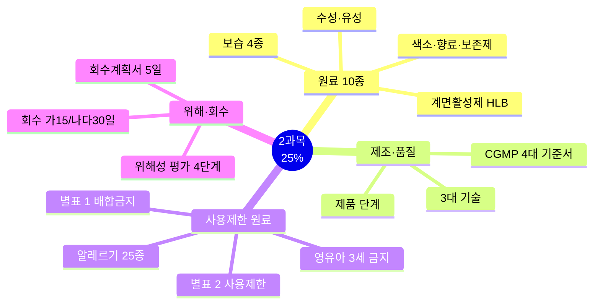
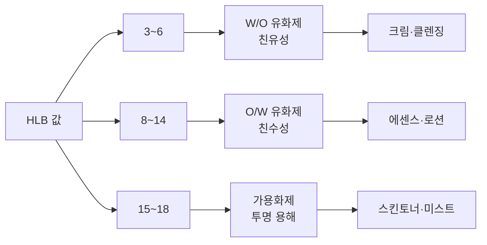
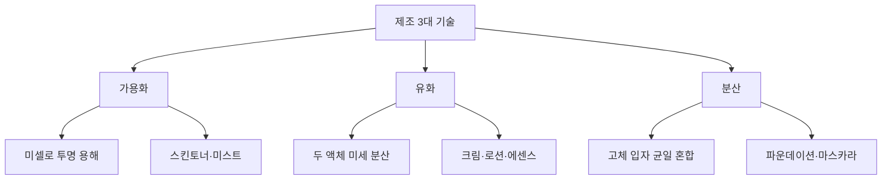
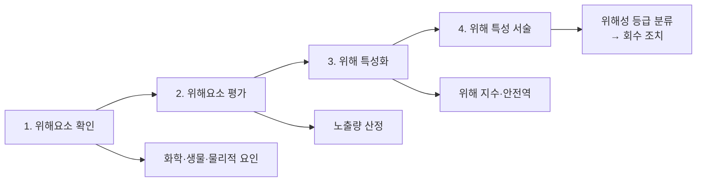

# 2과목 핵심요약 — 제조 및 품질관리 (출제 25%)

> **시험 비중 25%** — Ch01 원료 / Ch03 사용제한 원료가 최빈출.
> 상세 암기는 [Ch01 원료 핵심암기](2과목_Ch01_원료_핵심암기.md) · [Ch03 사용제한원료 핵심암기](2과목_Ch03_사용제한원료_핵심암기.md) 참조.
> 법령·고시 수치는 개정될 수 있으니 최신 공식 기준과 함께 확인.

## 🎯 1분 요약표

| 축 | 핵심 |
| --- | --- |
| 원료 분류 | 수성·유성·계면활성제·고분자·색소·향료·보존제 |
| HLB | 3~6 W/O / 8~14 O/W 유화제 / 15~18 가용화제 |
| 계면활성제 4종 | 음이온(세정)·양이온(살균·헤어)·양쪽성(영유아)·비이온(기초) |
| 보습 4종 | 밀폐제·연화제·습윤제·장벽대체제 (밀·연·습·장) |
| 제조공정 | 원료 → 배합 → 제조 → 충진·포장 → 출하 |
| CGMP | 3대 요소 + 4대 기준서(제품표준·제조관리·위생관리·품질관리) |
| 별표 1 / 별표 2 | 사용금지 원료 / 사용제한 원료 |
| 기능성화장품 | 심사대상 vs 보고대상, 보고서 제출 시 15일 처리 |
| 위해 회수 | 가등급 15일 / 나·다등급 30일, 회수계획서 5일 이내 |
| 미생물 | 영유아·눈화장 500 CFU/g 이하 |

## 📋 목차

- [전체 지도](#-전체-지도)
- [Ch01 원료의 종류와 특성](#ch01-원료의-종류와-특성)
- [Ch02 제조관리](#ch02-제조관리)
- [Ch03 기능과 품질·사용제한 원료](#ch03-기능과-품질사용제한-원료)
- [Ch04 화장품 관리](#ch04-화장품-관리)
- [Ch05 위해사례 판단 및 보고](#ch05-위해사례-판단-및-보고)
- [혼동 함정표](#-혼동-함정표)
- [숫자 암기 체크리스트](#-숫자-암기-체크리스트)

---

## 🗺️ 전체 지도

---

## Ch01 원료의 종류와 특성

### ⭐⭐⭐ 계면활성제·유화

| 용어 | 핵심 |
| --- | --- |
| **극성** | 전자 분포가 한쪽에 기울어진 상태. 물=극성, 오일=비극성 |
| **HLB** | 친수성/친유성 비율 수치화. **3~6 W/O, 8~14 O/W, 15~18 가용화**. 높을수록 친수성 |
| **CMC** | 임계미셀농도. 미셀 형성 최소 계면활성제 농도 |
| **미셀** | 구형 집합체. 친수기 바깥·소수기 안쪽. 가용화의 기본 구조 |
| **가용화 / 유화 / 분산** | 미셀로 투명 용해(스킨토너) / 두 액체 미세 분산(크림·로션) / 고체 입자 균일 혼합(파운데이션) |

| 계면활성제 | 특성 | 용도 |
| --- | --- | --- |
| 음이온성 | 세정력 최고 | 샴푸·클렌징 |
| 양이온성 | 살균·정전기 방지 | 헤어케어·린스 |
| 양쪽성 | 저자극 | 영유아용 |
| 비이온성 | 안정적 유화 | 기초화장품 |

### ⭐⭐⭐ 보습 원료 4종

| 종류 | 작용 | 대표 성분 |
| --- | --- | --- |
| 밀폐제 | 소수성 피막, TEWL 저하 | 바세린·파라핀 |
| 연화제 | 각질세포 틈 메움, 윤기 | 오일류·에스터 |
| 습윤제 | NMF와 수분 결합 | 글리세린·폴리올 |
| 장벽대체제 | 피부장벽 회복 | 세라마이드·지방산·콜레스테롤 |

### ⭐⭐ 색소·향료·보존제

| 용어 | 핵심 |
| --- | --- |
| **법정색소 5단계** | 제한없음·영유아금지·점막금지·눈주위금지·화장비누외금지 |
| **타르색소** | 염료·레이크·유기안료 3종. 레이크 = 수용성 염료+불용성 금속염 |
| **부향률** | 퍼퓸 15~25% / 오드퍼퓸 10~15% / 오드뚜왈렛 5~10% / 오드코롱 3~5% |
| **보존제** | 파라벤(0.4%/0.8%)·페녹시에탄올(1.0%)·살리실릭애씨드(0.5%)·벤질알코올(1.0%) |
| **산화방지제 vs 봉쇄제** | 산화방지=자체 산화(BHT·토코페롤) / 봉쇄=금속이온 제거(EDTA) |

### ⭐⭐ 자외선·기타

- **SPF**: UVB 차단 지수. 50 이상 = "50+" 표시. SPF 1 ≈ 10~15분
- **PA**: UVA 차단 등급. PA+(2~4) / PA++(4~8) / PA+++(8~16) / PA++++(16~)
- **AHA**: 화학적 각질 제거. 글리콜산(분자량 최소)·젖산·사과산·구연산. 10% 초과·pH 3.5 미만 시 주의 표시
- **전성분 표시**: 5포인트 이상, 함량 많은 순
- **바코드**: GTIN-13(12~13자리) / GTIN-14 / GS1-128 / GS1 DataMatrix

→ 상세: [Ch01 원료 핵심암기](2과목_Ch01_원료_핵심암기.md)

## Ch02 제조관리

### ⭐⭐⭐ CGMP·제품 단계

| 용어 | 핵심 |
| --- | --- |
| **CGMP 3대 요소** | 과오 최소화 · 미생물오염 방지 · 품질관리체계 |
| **CGMP 5장** | 총칭 → 인적자원 → 제조 → 품질관리 → 판정 및 감독 |
| **제품표준서** | 제품별 제조 기준. 원료·공정·수율·시험방법·사용기한 |
| **제조관리기준서** | 제조공정·시설·기구·원자재·완제품·위탁제조 관리 |
| **품질관리기준서** | 검체 채취·시험시설 점검·안정성시험·표준품 관리 |
| **제조위생관리기준서** | 작업원 건강·위생·복장·청소·시설 세척 |

> ⚠️ **기출 함정**: "원료관리기준서"는 존재하지 않음. 원료품질성적서는 입고 시 구비하는 별도 서류.

| 제품 단계 | 정의 |
| --- | --- |
| 원료 | 벌크 제조에 투입되는 물질 |
| 반제품 | 추가 공정이 필요한 중간 단계 |
| 벌크제품 | 충전(1차 포장) 이전까지 완료된 내용물 |
| 완제품 | 포장·첨부문서 포함 모든 공정 완료. 출하 대상 |

### ⭐⭐ 제조공정·분류

- **제조공정**: 원료 → 배합 → 제조 → 충진·포장 → 출하
- **맞춤형화장품**: 내용물+내용물/원료 혼합 또는 소분. **고형비누 단순소분 제외**, 원료+원료 혼합은 제조 행위
- **기능성화장품 11가지**: 미백·주름·자외선·염모·제모·탈모·여드름·피부장벽·튼살·모발색상변화·체모제거
- **의약품 vs 의약외품**: 의약품=질병 진단·치료·예방(대한민국 약전 수재) / 의약외품=인체 작용 약함

## Ch03 기능과 품질·사용제한 원료

### ⭐⭐⭐ 원료 관리 체계

| 용어 | 핵심 |
| --- | --- |
| **네거티브시스템** | 고시된 금지·제한 원료 외에는 업자 책임하에 사용 가능 — 화장품 원료 관리 기본 원칙 |
| **사용금지 원료** | **별표 1**. 절대 사용 불가. 히드로퀴논·수은·비소·납·미세플라스틱 등 |
| **사용제한 원료** | **별표 2**. 기준·시험방법 정해짐. 보존제·색소·자외선차단제·염모제 |

### ⭐⭐⭐ 보존제·알레르기

| 용어 | 핵심 |
| --- | --- |
| **알레르기 유발 성분** | 착향제 중 **25종**. '향료' 표시 불가, 개별 성분명 기재 |
| **알레르기 표시 기준** | 씻어내는 **0.01%** 초과 / 남기는 **0.001%** 초과 |
| **영유아 3세 이하 금지** | 살리실릭애씨드·IPBC·부틸/프로필파라벤 (씻어내는 제품 제외) |

### ⭐⭐ 천연·유기농 화장품

| 용어 | 핵심 |
| --- | --- |
| **천연 원료** | 유기농·식물·동물·미네랄. 물리적 공정만 가공 허용 |
| **천연 유래 원료** | 천연 원료를 화학적·생물학적 공정으로 가공 |
| **허용 기타 원료** | 자연 대체 곤란 원료 **5% 이내** (석유화학 **2% 이내**) |
| **천연화장품** | 천연 함량 **95% 이상** |
| **유기농화장품** | 유기농 **10% 이상** + 천연 **95% 이상** (유기농 포함) |
| **금지 공정** | 탈색·탈취·방사선·설폰화·에칠렌옥사이드·포름알데하이드·GMO·나노물질. 물리적 추출은 허용 |
| **금지 포장** | **PVC·PSF** 사용 불가 |

### ⭐⭐ 자외선차단제·기타 한도

- 티타늄디옥사이드·징크옥사이드 **25%** / 드로메트리졸트리실록산 15% / 에칠헥실메톡시신나메이트 7.5%
- 옥토크릴렌·호모살레이트 10% / 벤조페논-3 **2.4%**(얼굴·손·입술 5%) / 드로메트리졸 1.0%
- **AHA** 10% 초과·pH 3.5 미만 시 주의 표시 / **IPBC** 0.02%(씻어내는)·0.01%(남기는)
- **트리클로산** 0.3%(씻어내는 제품) / **치오글리콜릭애씨드** 퍼머 11%·제모 3.0~4.5%

→ 상세: [Ch03 사용제한원료 핵심암기](2과목_Ch03_사용제한원료_핵심암기.md)

## Ch04 화장품 관리

### ⭐⭐⭐ 기능성 심사·효능별 한도

| 효능 | 성분 | 한도 |
| --- | --- | --- |
| 미백 | 나이아신아마이드·알부틴 | 2.0~5.0% |
| 미백 | 유용성 감초 추출물 | 0.05% |
| 주름 | 아데노신 | 0.04% |
| 주름 | 레티놀 | 2,500IU/g |
| 제모 | 치오글리콜산 | 산으로서 3.0~4.5% (pH 7.0~12.7) |
| 여드름 | 살리실릭애씨드 | 0.5% (인체 세정용) |

- **심사 절차**: 심사신청 → 심사 → 결과 통보 / 보고서 제출 시 **15일 처리**

### ⭐⭐ 제품 단계·사용상 주의사항

| 용어 | 핵심 |
| --- | --- |
| **선입선출** | 먼저 입고된 것을 먼저 출고 (기본 출고 방식) |
| **보관기한** | 경과 시 재평가 후 사용 결정 |
| **출고 승인** | 시험 적합 판정 + 품질부서 책임자 승인 |
| **공통 주의사항** | 이상 증상 시 상담·상처부위 자제·어린이 손 닿지 않는 곳 |
| **에어로졸** | **40℃ 이상** 보관금지·화기 금지·밀폐 장소 환기 |
| **염모제 패치테스트** | 염색 **2일 전** 매회 실시. 전후 **1주** 파마 금지 |
| **제모제** | 매일 사용금지·**10분 이상** 방치금지·**24시간** 내 탈취제 금지 |
| **3세 이하 금지** | 살리실릭애씨드(씻어내는 제외)·IPBC(목욕·샴푸 제외)·부틸/프로필파라벤 |

## Ch05 위해사례 판단 및 보고

### ⭐⭐⭐ 위해성 평가·회수

| 용어 | 핵심 |
| --- | --- |
| **위해성 평가 4단계** | 위해요소 확인 → 위해요소 평가 → 위해 특성화 → 위해 특성 서술 |
| **위해요소 확인** | 화학·생물·물리적 요인 확인 |
| **위해요소 평가** | 노출량 산정 |
| **위해 특성화** | 위해 지수·안전역 산출 |
| **위해 특성 서술** | 위해성 등급 분류 → 회수 조치 |

### ⭐⭐⭐ 회수·보고 기한

| 항목 | 기한 |
| --- | --- |
| 회수계획서 제출 | 회수 대상임을 안 날부터 **5일 이내** 지방식약청장 |
| 위해화장품 회수 보고 | **즉시** |
| 회수 기간 | 가등급 **15일** / 나·다등급 **30일** 이내 |
| 안전성 정보 신속보고 | **15일 이내** |
| 안전성 정보 정기보고 | 반기 후 1개월 |

---

## ⚠️ 혼동 함정표

| 함정 | 정답 |
| --- | --- |
| 음이온성이 세정력 최고니까 헤어에도? | 헤어케어는 **양이온성** |
| 미백 표시는 일반 화장품도 가능? | **기능성화장품 심사 필수** |
| 천연원료면 한도 없음? | 보존제·자외선차단제는 **한도 있음** |
| 가등급 회수 30일? | 가등급 **15일** / 나·다만 30일 |
| 3세 이하 금지 성분은 하나로? | 원료별로 **따로 확인** |
| HLB 8~18이 전부 O/W? | 8~14 유화제 / **15~18은 가용화제** |
| 별표 1이 사용제한? | 별표 1 = **사용금지**, 별표 2 = 사용제한 |
| 파라벤 0.8%는 단일 한도? | 단일 **0.4%** / 혼합 **0.8%** |
| CGMP에 원료관리기준서? | **4대 기준서에 없음** (성적서는 별도) |
| 원료+원료 혼합이 맞춤형? | 화장품 **제조 행위** (맞춤형 아님) |
| 벌크제품은 완제품? | 벌크 = 충전 **이전** 단계 내용물 |
| 회수계획서 15일? | **5일 이내** 제출 |

---

## 🔢 숫자 암기 체크리스트

| 항목 | 숫자 | 빈도 |
| --- | --- | --- |
| HLB W/O / O/W / 가용화 | 3~6 / 8~14 / 15~18 | ⭐⭐⭐ |
| 페녹시에탄올 | 1.0% | ⭐⭐⭐ |
| 파라벤 단일/혼합 | 0.4% / 0.8% | ⭐⭐⭐ |
| 살리실릭애씨드(보존·여드름) | 0.5% | ⭐⭐⭐ |
| 티타늄디옥사이드·징크옥사이드 | 25% | ⭐⭐⭐ |
| 벤조페논-3 | 2.4% (얼굴·손·입술 5%) | ⭐⭐⭐ |
| 알레르기 표시 기준 | 씻어내는 0.01% / 남기는 0.001% 초과 | ⭐⭐⭐ |
| 미생물(영유아·눈화장) | 500 CFU/g 이하 | ⭐⭐⭐ |
| 납 한도 | 분말 50 / 기타 20㎍/g | ⭐⭐⭐ |
| 미백 나이아신아마이드·알부틴 | 2.0~5.0% | ⭐⭐ |
| 주름 아데노신 / 레티놀 | 0.04% / 2,500IU/g | ⭐⭐ |
| AHA 주의사항 | 10% 초과 · pH 3.5 미만 | ⭐⭐⭐ |
| IPBC | 0.02%(씻어내는) / 0.01%(남기는) | ⭐⭐ |
| 트리클로산 | 0.3% | ⭐⭐ |
| 치오글리콜릭애씨드 | 퍼머 11% / 제모 3.0~4.5% | ⭐⭐ |
| 천연 / 유기농 | 95% / 10%+95% | ⭐⭐⭐ |
| 허용 기타 원료 / 석유화학 | 5% / 2% 이내 | ⭐⭐ |
| 회수계획서 제출 | 5일 이내 | ⭐⭐⭐ |
| 회수 기간 | 가 15일 / 나·다 30일 | ⭐⭐⭐ |
| 안전성 정보 신속보고 | 15일 | ⭐⭐⭐ |
| 보고서 처리 | 15일 | ⭐⭐ |
| 부향률 | 15~25 / 10~15 / 5~10 / 3~5% | ⭐⭐ |
| 에어로졸 보관 | 40℃ 이상 금지 | ⭐ |
| 염모제 패치테스트 | 2일 전 매회 | ⭐⭐ |
