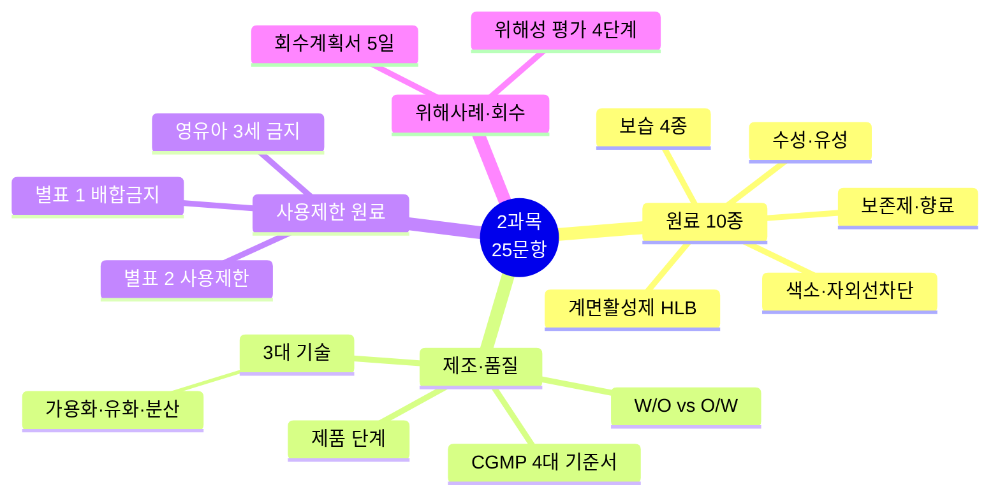
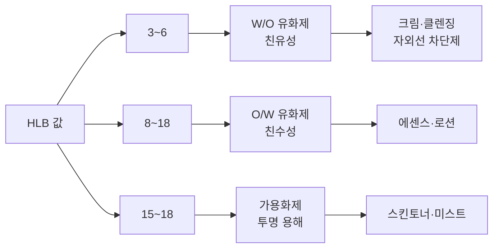
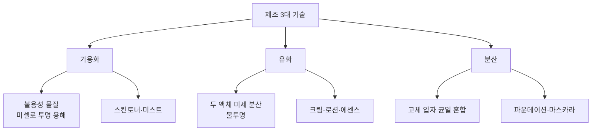
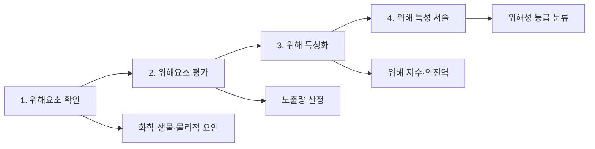

# 📘 2과목 핵심 정리 (25문항)

> **맞춤형화장품조제관리사 필기시험** — 2과목 화장품 제조 및 품질관리 (25문항)
> 시험 비중: 25% | 주요 영역: 원료 10종, 계면활성제 HLB, 제조 3대 기술, CGMP 4대 기준서, 기능성화장품, 사용제한 원료

---

## 🗺️ 2과목 전체 마인드맵

## 🔀 HLB 값에 따른 계면활성제 분류

## 🔀 제조 3대 기술 비교

## 🔀 위해성 평가 4단계

---

## 🎯 핵심 25문항

### 원료 (10문항)

### 1. 원료 10종 분류 (빈출 최상위)
수성·유성·계면활성제·고분자·색소·향료·보존제·산화방지제·금속이온봉쇄제·기능성

### 2. HLB 값 구분 (빈출 최상위)
- **3~6**: W/O 유화제 (친유성)
- **8~18**: O/W 유화제 (친수성)
- **15~18**: 가용화제
- 높을수록 친수성 강함

### 3. 계면활성제 4종 (빈출)
음이온성·양이온성·양쪽성·비이온성 — 유·수 경계면 흡착, 유화·가용화·세정

### 4. 보습 원료 4종 (빈출)
- **밀폐제(피막형성제)**: 피부 표면 소수성 피막, TEWL 저하 — 바세린·파라핀
- **연화제(유연제)**: 각질세포 사이 메워 윤기 — 오일류·에스터
- **습윤제**: NMF와 수분 결합 — 글리세린·폴리올
- **장벽대체제**: 세라마이드·지방산·콜레스테롤

### 5. 색소 분류 (빈출)
- **법정색소**: 사용 기준별 **5단계** 제한 (제한없음·영유아금지·점막금지·눈주위금지·화장비누외금지)
- **타르색소**: **3종** 분류 (염료·레이크·유기안료)
- **전성분 표시**: 5포인트 이상, 함량 많은 순

### 6. 자외선차단제 (빈출)
- **SPF**: UVB 차단 지수, 50 이상은 **SPF50+**, SPF 1 ≈ 10~15분
- **PA**: UVA 차단 등급 (PA+ ~ PA++++)

### 7. 보존제 (빈출)
- 미생물 번식 억제, 화장품 보존 기간 연장
- 알레르기 유발 성분은 표시 의무
- 파라벤류: 전성분 표시 시 **파라벤**으로 표기

### 8. 산화방지제
- 유성 원료 산화 방지
- 부틸하이드록시아니솔(BHA), 부틸하이드록시톨루엔(BHT) 등

### 9. 금속이온봉쇄제 (킬레이트제)
- 미량 금속이온과 결합하여 변색·산패 방지
- EDTA, 시트르산 등

### 10. 향료
- 부향률 기준 적용
- 알레르기 유발 성분 표시 의무

---

### 제조·품질 (8문항)

### 11. 제조 3대 기술 (빈출 최상위)
- **가용화**: 불용성 물질을 미셀로 투명 용해 — 스킨토너·미스트
- **유화**: 섞이지 않는 두 액체 미세 분산 — 크림·로션·에센스
- **분산**: 고체 입자를 액체에 균일 혼합 — 파운데이션·마스카라

### 12. W/O형 vs O/W형 (빈출)
- **W/O형 (Water in Oil)**: 오일에 물 분산 — 크림·클렌징 크림·자외선 차단제
- **O/W형 (Oil in Water)**: 물에 오일 분산 — 에센스·로션

### 13. CGMP 4대 기준서 (빈출 최상위)
- **제품표준서**: 제품명·원료·공정·수율·시험방법
- **제조관리기준서**: 공정별 작업 기준
- **위생관리기준서**: 작업장·작업자 위생
- **품질관리기준서**: 시험·검사·일탈 관리

### 14. 제품 단계 (빈출)
원료 → 반제품 → 벌크 → 완제품 (단계별 품질 기준 상이)

### 15. 맞춤형화장품 (빈출)
- 내용물+내용물/원료 혼합 또는 소분
- **고형비누 단순소분 제외**
- 원료+원료 혼합은 화장품 제조 행위 (맞춤형 아님)

### 16. 기능성화장품 11가지 (빈출)
미백·주름·자외선·염모·제모·탈모·여드름·피부장벽·튼살·모발색상변화·체모제거

### 17. 제조공정 8단계 (빈출)
원료 검수 → 계량 → 전처리 → 혼합·유화 → 탈포·여과 → 충진 ·포장 → 검사 → 출하

### 18. 유화 관련 세부 사항
- 유화액 형태 판별: 외관·색소·희석·전기전도도
- 유화 영향 요인: 유화제·원료 성질·유화 조건
- 점도 요인: 분산매·분산상 점도, 계면활성제 종류·농도

---

### 사용제한 원료·관리 (4문항)

### 19. 사용제한 원료 (빈출)
- **별표 1**: 배합 금지 원료
- **별표 2**: 사용상 제한 필요 원료
- 기능성화장품 심사 받은 고시 원료는 제외

### 20. 천연·유기농 화장품 (빈출)
- 용기·포장에 **PVC·PSF 사용 불가**
- 인증 기준 충족 필요

### 21. 영유아 3세 이하 사용금지 (빈출)
- 살리실릭애씨드 (씻어내는 제품 제외)
- IPBC (목욕용·샴푸·바디클렌저 제외)
- 부틸/프로필/이소부틸/이소프로필파라벤 (씻어내지 않는 제품, 기저귀 부위)

### 22. 알레르기 주의 성분
- 카민 등: "과민·알레르기자 신중 사용" 문구 필수

---

### 위해사례·회수 (3문항)

### 23. 위해성 평가 4단계 (빈출 최상위)
위해요소 확인 → 위해요소 평가 → 위해 특성화 → 위해 특성 서술

### 24. 회수계획서 제출 (빈출)
- 회수 대상 화장품이라는 사실을 안 날부터 **5일 이내**
- 지방식품의약품안전청장에게 제출

### 25. 위해성 등급 (빈출)
- 위해 정도에 따라 등급 분류
- 등급별 회수 조치 차등 적용

---

## 📊 시험 출제 비중

| 영역 | 문항수 | 주요 포인트 |
|---|---|---|
| 원료 10종 | 10 | HLB, 계면활성제, 보습 4종, 색소, 자외선차단 |
| 제조·품질 | 8 | 3대 기술, W/O·O/W, CGMP 4대 기준서 |
| 사용제한 원료 | 4 | 별표 1·2, 영유아 금지, 천연·유기농 |
| 위해사례·회수 | 3 | 위해성 평가 4단계, 회수계획서 5일 |

---

> 📌 **출처**: 화장품법·시행규칙·고시, CGMP 고시, 별표 1·2 | **최종 확인**: 2026. 8. 29.
