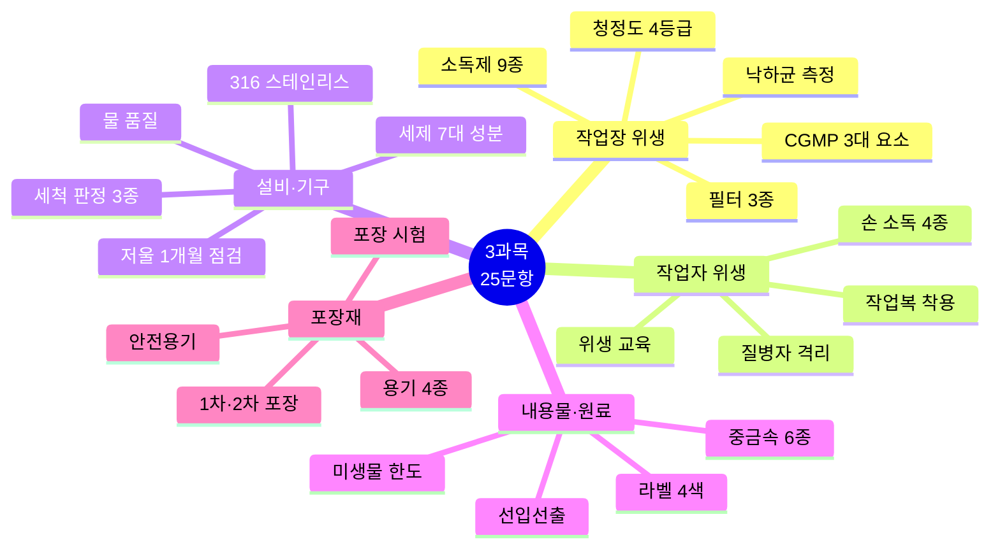
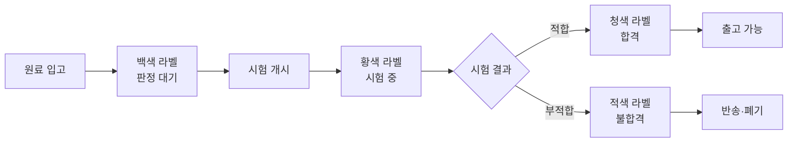

# 📙 3과목 핵심 정리 (25문항)

> **맞춤형화장품조제관리사 필기시험** — 3과목 유통화장품 안전관리 (25문항)
> 시험 비중: 25% | 주요 영역: CGMP 3대 요소, 작업장·작업자 위생, 설비·기구 관리, 원료·포장재 관리

---

## 🗺️ 3과목 전체 마인드맵



## 🔀 입고 라벨 4색 플로우



## 🔀 청정도 등급별 관리

```mermaid
flowchart TD
  A[청정도 4등급] --> B[1등급 최고]
  A --> C[2등급]
  A --> D[3등급]
  A --> E[4등급 최저]
  B --> B1[Pre+Med+HEPA]
  B --> B2[20회/hr·낙하균 10개]
  C --> C1[Pre+Med(필요시 HEPA)]
  D --> D1[Pre 필터]
  E --> E1[필터 없음·환기]
```

---

## 🎯 핵심 25문항

### 작업장 위생관리 (5문항)

### 1. CGMP 3대 요소 (빈출 최상위)
- **과오 최소화**: 품질 오류 사전 방지
- **미생물오염 방지**: 위생 관리 체계
- **품질관리체계**: 일관된 품질 보증

### 2. 청정도 등급 (빈출 최상위)
- **1등급**(최고) ~ **4등급**(최저)
- 등급별 필터·환기 기준 상이
- 등급이 낮을수록 엄격한 관리 필요

### 3. 공기 필터 3종 (빈출)
- **초기 필터**: 큰 먼지 제거
- **중간 필터**: 중간 크기 입자 제거
- **HEPA**(고효율 미립자 공기 필터): 0.3μm 이상 99.97% 제거

### 4. 시설 소독제 (빈출)
- **물리적 3종**: 건열·습열·자외선
- **화학적 6종(시설용)**: 70% 에탄올 · 크레졸수(3%) · 차아염소산나트륨(50ppm) · 페놀수(3%) · 벤잘코늄클로라이드(10%→20배 희석) · 글루콘산클로르헥시딘(5%→10배 희석)

### 5. 낙하균 측정 (빈출)
- 측정 위치: 벽에서 30cm 떨어진 곳
- 측정 높이: 바닥이 원칙, 부득이 시 **20~30cm**
- 노출 시간: 청정도 높은 시설 **30분 이상**
- 배양: 세균 30~35℃ 48시간, 진균 20~25℃ 5일

---

### 작업자 위생관리 (4문항)

### 6. 손 소독제 4종 (빈출 최상위)
- **알코올** (70~80%)
- **클로르헥시딘** (0.5~4.0%)
- **헥사클로로펜** (3.0%)
- **아이오도퍼** (0.5~10%)
- 혼합·소분 전 원칙, **일회용 장갑 착용 시 예외**

### 7. 작업복 착용 (빈출)
- 작업소·보관소 내 규정된 작업복 착용
- 음식물 반입 금지
- 작업복은 작업 구역 내에서 착용·탈의

### 8. 질병자 격리 (빈출)
- 피부 외상·질병 직원은 의사 소견 전까지 화장품 접촉 금지
- 방문객 출입 시 안내자 동행, 출입 기록 의무

### 9. 위생 교육 (빈출)
- 신규 직원: 입사 시 위생 교육
- 기존 직원: 정기 교육
- 교육 내용: 복장·건강·오염방지·손 씻기·주의사항

---

### 설비 및 기구관리 (6문항)

### 10. 저울 점검 (빈출 최상위)
- 영점·수평은 **매일** 확인
- 정기 점검은 **1개월** 주기
- 정밀도·영점 조정 필수

### 11. 세척 판정 3종 (빈출)
- **육안 확인**: 외관 오염 확인
- **린스 정량법**: 세척액 잔류량 측정
- **세균시험**: 미생물 오염 확인

### 12. 설비 재질 (빈출)
- **316 스테인리스**: 304보다 부식에 강해 탱크·필터·파이프에 선호
- 설비 위생 기준: 적합·청소 가능·배수 용이·오염 방지

### 13. 공기 조절 4대 요소 (빈출)
- **청정도**: 공기정화기
- **실내온도**: 열교환기
- **습도**: 가습기
- **기류(풍량·풍향)**: 송풍기 — 청정도 높은 곳→낮은 곳 (오염 방지)
- 센트럴 방식(중앙 방식)이 가장 적합 — 온·습도·공중미립자·풍량 및 풍향·기류를 하나의 도관으로 제어

### 14. 물의 품질 기준 (빈출)
- 정제수·증류수 사용
- 미생물·중금속 기준 충족
- 물 저장탱크 정기 점검

### 15. 설비 관리·세제 7대 성분 (빈출)
- **호모게나이저**: 혼합·교반 장치, 제품 균일성 확보
- **배관**: 경사 설치, 잔류물 배출 가능 구조
- **세제 7대 성분**: 계면활성제·살균제·금속이온봉쇄제·유기폴리머·용제·연마제·표백 (두음법: 계·살·금·유·용·연·표)

---

### 내용물 및 원료관리 (6문항)

### 16. 입고 라벨 4색 (빈출 최상위)
- **백색**: 판정 대기
- **황색**: 시험 중
- **청색**: 적합 판정
- **적색**: 부적합 판정

### 17. 중금속 허용한도 (빈출 최상위)
- **6종**: 납·니켈·비소·안티몬·카드뮴·수은
- 제품별 허용한도 상이 (예: 납 20μg/g, 점토 분말 50μg/g; 니켈 눈화장 35μg/g; 수은 1μg/g)
- 시험 방법: 원자흡광광도법·ICP·ICP-MS
- **비중금속 검출 항목**: 디옥산·메탄올·포름알데하이드·프탈레이트류 (세트로 암기)

### 18. 미생물 한도 (빈출 최상위)
- 총세균: **500 CFU/g 이하** (영유아·눈화장용)
- 기타 화장품: **1,000 CFU/g 이하**
- **물휴지**: 세균·진균 각각 **100개/g 이하** (단골 함정)
- **불검출**: 대장균·녹농균·황색포도상구균

### 19. 선입선출 원칙 (빈출)
- 먼저 입고된 원료 먼저 출고
- **예외**: 나중에 입고된 물품의 유효기한이 짧은 경우 (선한선출)

### 20. 보관 관리 (빈출)
- 온도·습도 관리
- 직사광선 차단
- 원료별 구분 보관, 교차 오염 방지

### 21. 품질 관리 기본 (빈출)
- **일탈**: CGMP 규정 벗어난 행위
- **기준일탈**: 합격 판정 기준에 일치하지 않는 결과
- **뱃치**: 하나의 공정으로 제조되어 균질성을 갖는 일정 분량
- **제조번호**: 뱃치의 제조관리·출하 확인 번호

---

### 포장재의 관리 (4문항)

### 22. 1차 vs 2차 포장 (빈출 최상위)
- **1차 포장**: 내용물과 **직접 접촉**
- **2차 포장**: 1차 포장을 수용·보호·표시, 첨부문서 포함

### 23. 포장용기 4종 (빈출)
- **밀폐 용기**: 기체·미생물 침입 방지
- **기밀 용기**: 액체·수분 침투 방지
- **밀봉 용기**: 고체·분말 내용물 보호
- **차광 용기**: 광선 투과 방지

### 24. 포장 시험 (빈출)
- **감압 누설시험**: 마개·패킹 밀폐성 (스킨·로션 등 액상)
- **크로스컷 시험**: 코팅막·도금 밀착력 (유리·금속·플라스틱)
- **내용물 감량·용기 변형시험**: 건조 감량·수축·팽창·탈색·균열
- **낙하시험**: 파손·분리 여부 (플라스틱·조립 용기)

### 25. 안전용기 (빈출)
- **대상**: 아세톤 함유 제품, 탄화수소 10% 이상(비에멀전 액체), 메틸살리실레이트 5% 이상
- **기준**: 성인은 개봉 어렵지 않고 **5세 미만 어린이는 개봉 어려운** 설계

### 25. 용기 종류·안전용기 (빈출)
- **밀폐용기**: 고형 이물 방지·내용물 손실 방지
- **기밀용기**: 액상/고형 이물·수분 침입 방지 (풍화·조해·증발 방지)
- **밀봉용기**: 기체·미생물 침입 방지
- **차광용기**: 광선 투과 방지
- **안전용기**: 5세 미만 개봉 어렵고 성인은 용이 — 아세톤·탄화수소 10%·메틸살리실레이트 5% 함유 제품 의무 (에어로졸·일회용·펌프 분무 용기 제외)

---

## 📊 시험 출제 비중

| 영역 | 문항수 | 주요 포인트 |
|---|---|---|
| 작업장 위생 | 5 | CGMP 3대 요소, 청정도, 필터, 소독제, 낙하균 |
| 작업자 위생 | 4 | 손 소독 4종, 작업복, 질병자 격리, 교육 |
| 설비·기구 | 6 | 저울 1개월, 세척 판정, 316 스테인리스, 공기 조절, 세제 7대 |
| 내용물·원료 | 6 | 라벨 4색, 중금속 6종, 미생물 한도, 선입선출 |
| 포장재 | 4 | 1차·2차 포장, 용기 4종, 포장 시험, 안전용기 |

---

> 📌 **출처**: 화장품법·시행규칙·고시, CGMP 고시, 위해화장품 관리 기준 | **최종 확인**: 2026. 8. 29.
