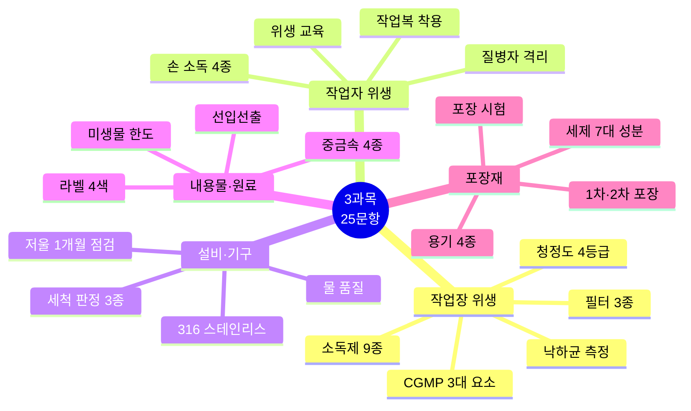
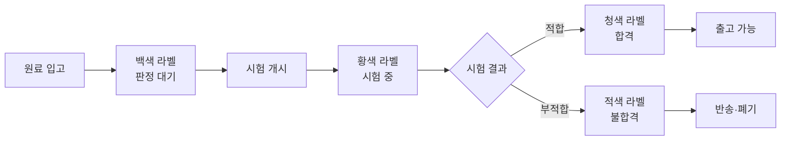
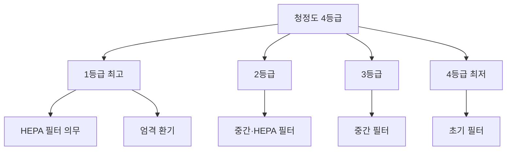

# 📙 3과목 핵심 정리 (25문항)

> **맞춤형화장품조제관리사 필기시험** — 3과목 유통화장품 안전관리 (25문항)
> 시험 비중: 25% | 주요 영역: CGMP 3대 요소, 작업장·작업자 위생, 설비·기구 관리, 원료·포장재 관리

---

## 🗺️ 3과목 전체 마인드맵

## 🔀 입고 라벨 4색 플로우

## 🔀 청정도 등급별 관리

---

## 🎯 핵심 25문항

### 작업장 위생관리 (5문항)

### 1. CGMP 3대 요소 (빈출 최상위)
- **과오 최소화**: 품질 오류 사전 방지
- **미생물오염 방지**: 위생 관리 체계
- **품질관리체계**: 일관된 품질 보증

### 2. 청정도 등급 (빈출 최상위)
- **1등급**(최고) ~ **4등급**(최저)
- 등급별 필터·환기 기준 상이
- 등급이 낮을수록 엄격한 관리 필요

### 3. 공기 필터 3종 (빈출)
- **초기 필터**: 큰 먼지 제거
- **중간 필터**: 중간 크기 입자 제거
- **HEPA**(고효율 미립자 공기 필터): 0.3μm 이상 99.97% 제거

### 4. 시설 소독제 (빈출)
- **물리적 3종**: 건열·습열·자외선
- **화학적 6종**: 알코올·포르말린·과산화수소·차아염소산·에틸렌옥사이드·오존

### 5. 낙하균 측정 (빈출)
- 측정 위치: 벽에서 30cm 떨어진 곳
- 측정 높이: 바닥이 원칙, 부득이 시 **20~30cm**
- 노출 시간: 청정도 높은 시설 **30분 이상**
- 배양: 세균 30~35℃ 48시간, 진균 20~25℃ 5일

---

### 작업자 위생관리 (4문항)

### 6. 손 소독제 4종 (빈출 최상위)
- **알코올** (70~80%)
- **클로르헥시딘**
- **벤잘코늄**
- **포비돈**
- 혼합·소분 전 원칙, **일회용 장갑 착용 시 예외**

### 7. 작업복 착용 (빈출)
- 작업소·보관소 내 규정된 작업복 착용
- 음식물 반입 금지
- 작업복은 작업 구역 내에서 착용·탈의

### 8. 질병자 격리 (빈출)
- 피부 외상·질병 직원은 의사 소견 전까지 화장품 접촉 금지
- 방문객 출입 시 안내자 동행, 출입 기록 의무

### 9. 위생 교육 (빈출)
- 신규 직원: 입사 시 위생 교육
- 기존 직원: 정기 교육
- 교육 내용: 복장·건강·오염방지·손 씻기·주의사항

---

### 설비 및 기구관리 (6문항)

### 10. 저울 점검 (빈출 최상위)
- **1개월** 주기 정기 점검
- 정밀도·영점 조정 필수

### 11. 세척 판정 3종 (빈출)
- **육안 확인**: 외관 오염 확인
- **린스 정량법**: 세척액 잔류량 측정
- **세균시험**: 미생물 오염 확인

### 12. 설비 재질 (빈출)
- **316 스테인리스**: 304보다 부식에 강해 탱크·필터·파이프에 선호
- 설비 위생 기준: 적합·청소 가능·배수 용이·오염 방치

### 13. 공기 조절 4대 요소 (빈출)
- **온도**: 18~26℃ (작업장별 상이)
- **습도**: 40~60% (제품별 상이)
- **공중미립자**: 먼지·미생물 농도 관리
- **풍량 및 풍향**: 청정도 높은 곳→낮은 곳 (오염 방지)
- 센트럴 방식(중앙 방식)이 가장 적합

### 14. 물의 품질 기준 (빈출)
- 정제수·증류수 사용
- 미생물·중금속 기준 충족
- 물 저장탱크 정기 점검

### 15. 설비 관리·세제 7대 성분 (빈출)
- **호모게나이저**: 혼합·교반 장치, 제품 균일성 확보
- **배관**: 경사 설치, 잔류물 배출 가능 구조
- **세제 7대 성분**: 계면활성제·보조제·점증제·보습제·방부제·향료·착색료 — 세정·거품·점도 조절

---

### 내용물 및 원료관리 (6문항)

### 16. 입고 라벨 4색 (빈출 최상위)
- **백색**: 판정 대기
- **황색**: 시험 중
- **청색**: 적합 판정
- **적색**: 부적합 판정

### 17. 중금속 허용한도 (빈출 최상위)
- **4종**: 납·비소·카드뮴·수은
- 제품별 허용한도 상이
- 시험 방법: 원자흡광광도법·ICP

### 18. 미생물 한도 (빈출 최상위)
- 총세균: **500 CFU/g 이하** (영유아·눈화장용)
- 기타 화장품: **1,000 CFU/g 이하**
- **불검출**: 대장균·녹농균·황색포도상구균

### 19. 선입선출 원칙 (빈출)
- 먼저 입고된 원료 먼저 출고
- **예외**: 나중에 입고된 물품의 유효기한이 짧은 경우 (선한선출)

### 20. 보관 관리 (빈출)
- 온도·습도 관리
- 직사광선 차단
- 원료별 구분 보관, 교차 오염 방지

### 21. 품질 관리 기본 (빈출)
- **일탈**: CGMP 규정 벗어난 행위
- **기준일탈**: 합격 판정 기준에 일치하지 않는 결과
- **뱃치**: 하나의 공정으로 제조되어 균질성을 갖는 일정 분량
- **제조번호**: 뱃치의 제조관리·출하 확인 번호

---

### 포장재의 관리 (4문항)

### 22. 1차 vs 2차 포장 (빈출 최상위)
- **1차 포장**: 내용물과 **직접 접촉**
- **2차 포장**: 1차 포장을 수용·보호·표시, 첨부문서 포함

### 23. 용기 4종 (빈출)
- **플라스틱**: LDPE·HDPE·PP·PS·ABS — 가볍고 파손 적음
- **유리**: 투명·내약품성 우수, 파손 우려
- **금속**: 알루미늄·주석 — 기체 차단성
- **적층**: 다층 필름 — 복합 특성

### 24. 포장 시험 (빈출)
- **밀봉성 시험**: 누출 여부 확인
- **낙하 시험**: 충격 강도 확인
- **내용물 이행 시험**: 용기와 내용물 상호 작용 확인

---

## 📊 시험 출제 비중

| 영역 | 문항수 | 주요 포인트 |
|---|---|---|
| 작업장 위생 | 5 | CGMP 3대 요소, 청정도, 필터, 소독제, 낙하균 |
| 작업자 위생 | 4 | 손 소독 4종, 작업복, 질병자 격리, 교육 |
| 설비·기구 | 7 | 저울 1개월, 세척 판정, 316 스테인리스, 공기 조절, 세제 7대 |
| 내용물·원료 | 6 | 라벨 4색, 중금속 4종, 미생물 한도, 선입선출 |
| 포장재 | 3 | 1차·2차 포장, 용기 4종, 포장 시험 |

---

> 📌 **출처**: 화장품법·시행규칙·고시, CGMP 고시, 위해화장품 관리 기준 | **최종 확인**: 2026. 8. 29.
