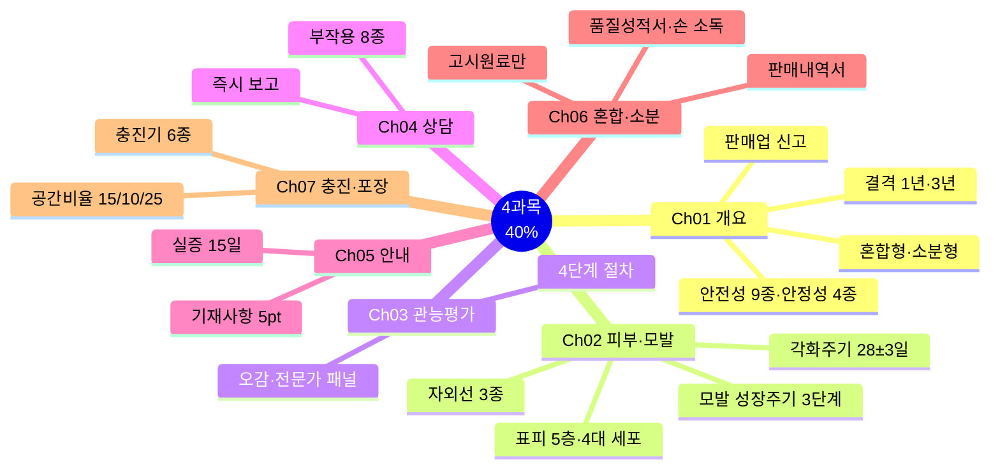
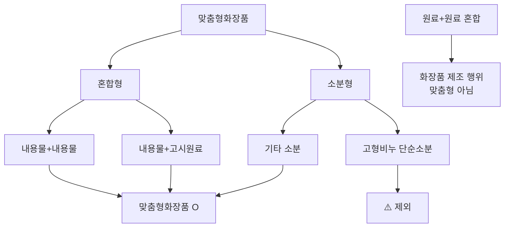
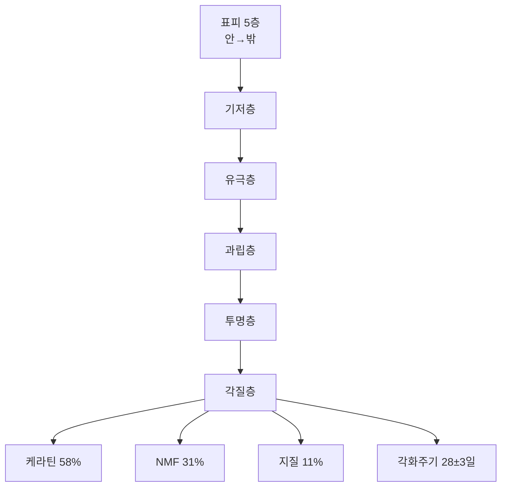
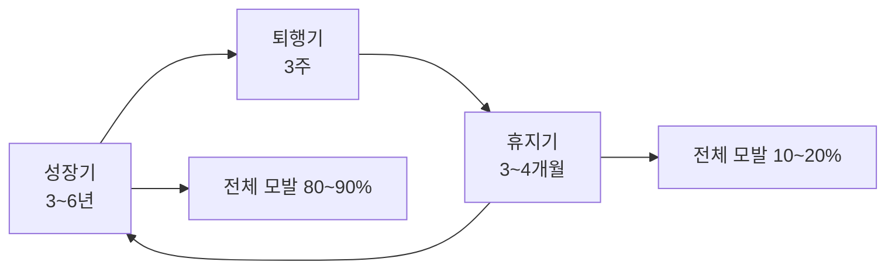
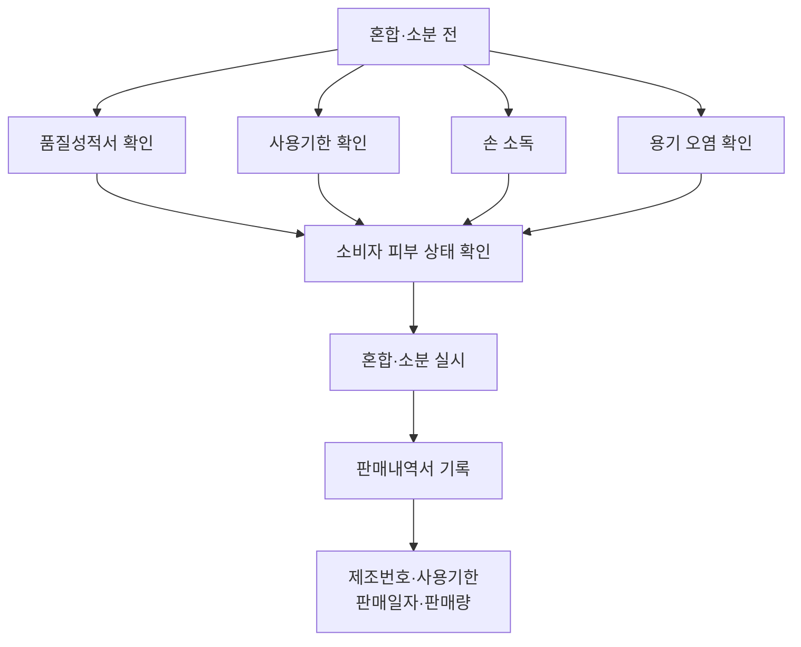
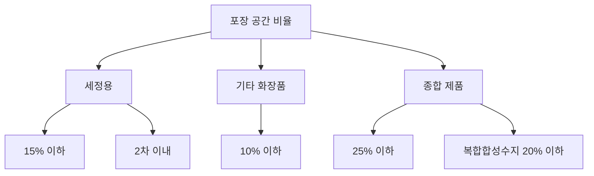

# 4과목 핵심요약 — 맞춤형화장품의 이해 (출제 40%)

> **시험 비중 40%** — 가장 큰 배점. 조제관리사 제도·안전성/안정성시험·피부모발 생리·실무 전 과정이 최빈출.
> 법령·고시 수치는 개정될 수 있으니 최신 공식 기준과 함께 확인.

## 🎯 1분 요약표

| 축 | 핵심 |
| --- | --- |
| 맞춤형화장품 | 혼합형(내용물+내용물/고시원료) + 소분형(**고형비누 단순소분 제외**) |
| 판매업 | 지방식약청장 **신고** + 조제관리사 필수 배치 |
| 결격사유 | 판매업 **1년** / 조제관리사 **3년** 미경과 |
| 자격시험 | 매년 1회 이상 · 90일 전 공고 · 전 과목 60%·매 과목 40% |
| 안전성시험 9종 | 단회독성·1차/연속 피부자극·안점막·감작성·광독성·광감작성·인체첩포·유전독성 |
| 안정성시험 4종 | 장기보존·가속·가혹·개봉 후 (**3로트 이상·6개월 이상**) |
| 표피 5층 | 각질→투명→과립→유극→기저 (케라틴 58%·NMF 31%·지질 11%) |
| 모발 주기 | 성장기 3~6년 → 퇴행기 3주 → 휴지기 3~4개월 |
| 부작용 8종 | 가려움·따끔거림·부종·염증·인설·자통·작열감·홍반 |
| 포장공간 | 세정용 15% / 기타 10% / 종합 25% 이하 |

## 📋 목차

- [전체 지도](#-전체-지도)
- [Ch01 맞춤형화장품 개요](#ch01-맞춤형화장품-개요)
- [Ch02 피부 및 모발의 생리구조](#ch02-피부-및-모발의-생리구조)
- [Ch03 관능평가 방법과 절차](#ch03-관능평가-방법과-절차)
- [Ch04 제품 상담](#ch04-제품-상담)
- [Ch05 제품 안내](#ch05-제품-안내)
- [Ch06 혼합 및 소분](#ch06-혼합-및-소분)
- [Ch07 충진 및 포장](#ch07-충진-및-포장)
- [혼동 함정표](#-혼동-함정표)
- [숫자 암기 체크리스트](#-숫자-암기-체크리스트)

---

## 🗺️ 전체 지도

---

## Ch01 맞춤형화장품 개요

### ⭐⭐⭐ 정의·판매업·결격

| 용어 | 핵심 |
| --- | --- |
| **맞춤형화장품** | 혼합형(내용물+내용물/고시원료) + 소분형. **고형비누 단순소분 제외**. 원료+원료 혼합 = 화장품 제조 행위(맞춤형 아님) |
| **판매업 신고** | 지방식약청장에게 **신고** (등록 아님). 조제관리사 필수 배치 |
| **판매업 결격** | 등록취소·폐쇄 후 **1년** 미경과 |
| **조제관리사 결격** | 자격취소 후 **3년** 미경과. 정신질환·마약 중독 |
| **시설기준** | 혼합·소분 공간 분리·구획 (위해 우려 없으면 면제 가능) |
| **사용 가능 원료** | 사용불가 원료·제한 원료·미심사 기능성 고시 원료 **제외** |

### ⭐⭐⭐ 자격시험·교육

| 항목 | 기준 |
| --- | --- |
| 자격시험 실시 | 매년 1회 이상 |
| 공고 | 시험 **90일 전** 식약처 홈페이지 |
| 합격 | 전 과목 총점 **60% 이상** + 매 과목 **40% 이상** |
| 부정행위 | 처분일부터 **3년** 응시 제한 |
| 변경신고 | **30일 이내** (처리 10일 / 조제관리사 7일) |
| 교육 | 최초 종사 **6개월 이내** / 보수 **매년 1회** / **4~8시간** |
| 원료 목록 보고 | 판매업자 **매년 1회** 식약처장 보고 |

### ⭐⭐⭐ 안전성시험 9종·유효성·안정성 4종

| 구분 | 내용 |
| --- | --- |
| 안전성 9종 | 단회독성 · 1차피부자극 · 연속피부자극 · 안점막 · 감작성 · 광독성 · 광감작성 · 인체첩포 · 유전독성 |
| 인체 첩포시험 | 등/팔 안쪽 폐쇄 첩포. **5년 이상 경력자** 지도·감독 |
| 인체적용시험 | **5년 이상 경력자** 지도. 헬싱키선언 + 서면 동의서 + 안전성 확보 |
| 제출자료 면제 | 인체적용시험 제출 시 효력시험 면제 (단, 효능·효과 기재 불가) |
| 유효성 | 효력시험(비임상) + 인체적용시험 + SPF/PA |

| 안정성시험 | 조건 |
| --- | --- |
| 장기보존 | **3로트 이상 · 6개월 이상**, 유통조건 유사. 3개월/6개월/1년 측정 |
| 가속 | 장기보존 온도 +**15℃ 이상**, 6개월 이상, 최소 3번 측정 |
| 가혹 | **-15~45℃**, 동결~해동·진동·광안정성 |
| 개봉 후 | 사용 조건, **6개월 이상** (스프레이·일회용 제외) |

## Ch02 피부 및 모발의 생리구조

### ⭐⭐⭐ 피부 구조

| 용어 | 핵심 |
| --- | --- |
| **피부** | 신체 최대 기관. 면적 1.5~2.0㎡, 무게 4kg, pH 4.5~6.5 |
| **표피 5층**(안→밖) | 기저층 → 유극층 → 과립층 → 투명층 → 각질층 |
| **표피 4대 세포** | 각질형성세포 · 멜라노사이트 · 랑게르한스세포 · 메르켈세포 |
| **각질층** | 10~20층, pH 4.5~5.5, 수분 10~20% |
| **각질층 구성** | 케라틴 **58%** · NMF **31%** · 지질 **11%** |
| **각화주기** | **28±3일** (기저층→각질층→탈락) |

### ⭐⭐⭐ 보습 인자·진피

| 용어 | 핵심 |
| --- | --- |
| **NMF** | 아미노산 40% · PCA 12% · 젖산염 12% · 요소 7% |
| **필라그린** | 각질층 형성 단백질. 분해되어 NMF 아미노산 생성 |
| **세포간지질** | 세라마이드 **50% 이상** + 콜레스테롤 + 지방산 |
| **TEWL** | 경피수분손실량. 건성·손상 피부에서 높음 |
| **진피** | 피부 90% 이상, 표피의 10~40배. 유두층+망상층 |
| **콜라겐** | 진피 90% / 피부 건조 중량 75% / 아미노산 1,000개 나선 |
| **엘라스틴** | 1.5~4.7%, 탄력성 |
| **기질** | 히알루론산·콘드로이친황산·헤파린황산염 (뮤코다당체) |

### ⭐⭐ 멜라닌·분비선

- **멜라닌 형성**: 티로신 → 티로시나아제 → 도파 → 도파퀴논 → 멜라닌
- **티로시나아제**: 구리 0.2% 함유 구리단백질 (멜라닌 합성 핵심 효소)
- **피부색 결정 인자**: 멜라닌 · 헤모글로빈 · 카로티노이드
- **멜라노사이트**: 표피 10~20%, 각질형성세포와 4:1~10:1

| 분비선 | 특성 |
| --- | --- |
| 피지선 | 남성호르몬 자극. 손바닥·발바닥 제외 전신 |
| 아포크린선 | 겨드랑이·서혜부, 모공 분비, pH 5.5~6.5, 특유 냄새 |
| 에크린선 | 전신(손바닥·발바닥·이마), 표피 직접 분비, pH 3.8~5.6 |
| 피지 구성 | 트리글리세라이드 41% · 왁스에스터 25% · 지방산 16% · 스쿠알렌 12% |

### ⭐⭐⭐ 모발·자외선

| 용어 | 핵심 |
| --- | --- |
| **모간 3층** | 모표피(5~15층) · 모피질(80~90%, 멜라닌·케라틴) · 모수질 |
| **CMC** | 세포막복합체. 모표피·모피질 내용물 유지 |
| **모발 4대 결합** | 시스틴 · 이온 · 수소 · 펩타이드 결합 |
| **모발 성장** | 1일 0.3~0.5mm / 하루 50~100가닥 탈락 / 약산성(알칼리에 약함) |
| **성장주기** | 성장기 **3~6년**(80~90%) → 퇴행기 **3주** → 휴지기 **3~4개월**(10~20%) |
| **자외선** | UVA=색소침착 / UVB=홍반·DNA 손상 / UVC=오존층 차단 |
| **피부 분석** | 문진·견진·촉진·기기 / 피츠패트릭 6형 |

## Ch03 관능평가 방법과 절차

### ⭐⭐⭐ 평가 절차·방법

| 용어 | 핵심 |
| --- | --- |
| **관능평가** | 오감(시·후·미·촉·청)으로 품질 측정·분석 후 통계 처리 |
| **평가 순서** | 표준품 선정 → 검체 채취·기준 마련 → 시험 → 적합 판정·기록 |
| **오감** | 시(외관·색) · 후(향) · 미(맛) · 촉(점도·감촉) · 청(소리) |

| 성상별 평가 | 방법 |
| --- | --- |
| 탁도 | 10mL 바이알 + 탁도계 |
| 변취 | 손등 도포 후 표준품 비교 |
| 분리 | 육안·현미경 (기포·응고·분리·겔화·빙결) |
| 점도/경도 | Spindle. 점도 높으면 경도 측정 |
| 증발/표면 굳음 | 건조 감량·무게 측정 |

### ⭐⭐⭐ 제형별·기기별·사용시험

| 제형 | 평가 요소 |
| --- | --- |
| 스킨/토너 | 탁도 · 변취 |
| 로션/에센스 | 변취·분리·점도·경도 (4종) |
| 크림 | 변취·분리·점도·경도·증발·표면 굳음 — **최다 요소** |
| 메이크업 베이스/파운데이션 | 분리(성상) 제외 |

| 기기 | 측정 |
| --- | --- |
| Rheometer(유변계) | 마찰감·점탄성 — 촉촉함·보송보송함 |
| Cutometer | 피부 탄력·유연성 |
| Glossmeter(광택계) | 광택·번들거림 |
| 분광측색계 | 명도·투명감 |
| 핸디압축시험법 | 끈적임 |

- **맹검 사용시험**: 정보 가림, 브랜드 효과 배제 → 제품 자체 효능
- **비맹검 사용시험**: 정보 공개, 인식·효능 일치 (Concept Use Test)
- **전문가 평가**: 의사 감독(임상관찰·정량화) / 준의료진·미용사(감각 평가)

## Ch04 제품 상담

### ⭐⭐⭐ 부작용·보고

| 용어 | 핵심 |
| --- | --- |
| **부작용 8종** | 가려움 · 따끔거림 · 부종 · 염증 · 인설 · 자통 · 작열감 · 홍반 (두음법: 가·따·부·염·인·자·작·홍) |
| **부작용 보고** | 식약처장에게 **즉시** 보고 의무 |
| **SOP** | 표준작업지침서. 일관된 업무 수행 절차·방법 기술 문서 |

| 증상 | 정의 |
| --- | --- |
| 가려움(소양감) | 피부 긁고 싶은 충동 |
| 따끔(자통) | 찌릿한 통증 |
| 부종 | 세포 간 수분 비정상 축적 |
| 인설 | 각질 은백색 부스러기 탈락 (건선 다발) |
| 작열감 | 열감·화끈거림 |
| 홍반 | 모세혈관 확장·충혈, 발적 |
| 알레르기 | 피부 감작성, 면역 과민 |

### ⭐⭐ 원료 제한·안전기준

- **배합금지**: 별표 1 고시 원료 — 절대 사용 불가
- **사용제한**: 별표 2 + 기능성 고시 원료 (심사 받은 경우 제외)
- **중금속**: 수은 1 < 카드뮴 5 < 비소·안티몬 10 < 납 20(분말 50)㎍/g / 니켈 눈 35·색조 30·기타 10
- **미생물**: 일반 1,000 / 영유아·눈 500 / 물휴지 각 100 CFU/g / 불검출: 대장균·녹농균·황색포도상구균

## Ch05 제품 안내

### ⭐⭐⭐ 표시사항

| 용어 | 핵심 |
| --- | --- |
| **1차 포장 기재사항** | 명칭 · 상호 · 제조번호(식별번호) · 사용기한 — **4가지** |
| **2차 포장 추가** | 주소 · 전성분 · 용량 · 가격 · 기능성 표시 · 주의사항 |
| **소용량 기준** | **10mL/10g 이하** (견본품 포함). 명칭·상호·가격·제조번호·사용기한 |
| **식별번호** | 원료 제조번호와 혼합·소분 기록 추적용 판매업자 부여 번호 |
| **전성분 표시** | **5포인트 이상** 글자 |

> ⚠️ **기출 함정**: 1차 포장 = 4가지만. 전성분·용량·가격은 2차 포장.

### ⭐⭐ 실증·금지표현·행정처분

| 용어 | 핵심 |
| --- | --- |
| **실증 자료** | 요청일로부터 **15일 이내** 제출. 인체적용·인체 외 시험·동급 자료 |
| **가격표시제** | 실제 거래가격. 소매·방문·통신·다단계판매업자 의무 |
| **금지 표현** | 의약품 오인(아토피·항염·살균·항암·디톡스) / 기능성 오인(미심사 미백·주름) / 발모·탈모 방지 |
| **행정처분** | 전부 누락 1차 3개월→3차 12개월 / 거짓 기재 1차 1개월→4차 12개월 / 의약품 오인 1차 3개월→3차 9개월 |
| **안전성 자료 보관** | 사용기한 만료 후 **1년** / 개봉 후 사용기한은 제조일 후 **3년** |

## Ch06 혼합 및 소분

### ⭐⭐⭐ 혼합 원료·안전

| 용어 | 핵심 |
| --- | --- |
| **혼합 원료** | **고시원료만** 혼합 가능 (아무 원료나 불가) |
| **혼합·소분 전** | 품질성적서 확인 → 사용기한 확인 → 손 소독 → 용기 오염 확인 → 소비자 피부 확인 |
| **판매내역서** | 제조번호 · 사용기한 · 판매일자 · 판매량 기록·보관 |
| **미리 혼합·소분 금지** | 주문 시에만 실시 |
| **제형 안정성 요인** | 투입 순서·온도 편차·회전속도·진공세기 (**포장용기 재질은 아님**) |

### ⭐⭐ 원료 분류·규격

| 분류 | 특성 |
| --- | --- |
| 수성 원료 | 물에 용해. 정제수·알코올·폴리올 |
| 유성 원료 | 수분 증발 억제. 유지·왁스·탄화수소·실리콘 |
| 계면활성제 | 유·수 경계면 흡착. 음·양·양쪽·비이온 4종 |
| 고분자 | 점증제(점도) / 피막형성제(수분 증발 억제) |
| 색소 | 안료(녹지 않음) vs 염료(녹음) |

- **향료 알레르기 25종**: 씻어내는 0.01% / 남기는 0.001% 초과 시 기재
- **가용화**: 운점 이상 시 깨짐 / **유화**: 전상 온도 이상 시 상 뒤바뀜
- **온도 용어**: 표준온도 **20℃** / 상온 **15~25℃** / 실온 **1~30℃**
- **pH 용어**: 미산성 **5.0~6.5** / 약산성 **3.0~5.0**
- **혼합 설비**: 호모게나이저(터빈형·유화분산) / 디스퍼(고속교반·가용화) / 오버헤드스터러(점증제 분산)
- **원료규격서**: 명칭·구조식·함량·성상·확인시험·순도시험·정량법

## Ch07 충진 및 포장

### ⭐⭐⭐ 충진기·포장공간

| 충진기 | 용도 |
| --- | --- |
| 피스톤 | 대용량 액상 |
| 파우치 | 샘플·일회용 |
| 튜브 | 폼클렌징 |
| 스프레이 | 에어로졸·미스트 |
| 펌프 | 로션·토너 |
| 자동 | 대량 생산 |

| 포장 공간 비율 | 기준 |
| --- | --- |
| 세정용 | **15% 이하** · 2차 이내 |
| 기타 화장품 | **10% 이하** |
| 종합 제품 | **25% 이하** (복합합성수지 20% 이하) |

### ⭐⭐ 라벨링·안전기준

- **소분 시**: 새 용기에 기재사항 스티커
- **혼합 시**: 기존 라벨 제거 후 새 라벨 또는 오버라벨링
- **납**: 분말 50 / 기타 20㎍/g / **미생물(영유아·눈화장)** 500 CFU/g 이하

---

## ⚠️ 혼동 함정표

| 함정 | 정답 |
| --- | --- |
| 고형비누도 소분형? | 고형비누 **단순소분은 제외** |
| 판매업은 등록? | **신고** (조제관리사 필수 배치) |
| 안정성시험 1로트면 OK? | **3로트 이상·6개월 이상** |
| 성장기가 가장 짧음? | 성장기 **3~6년**으로 가장 김 |
| 관능평가는 주관적이니 생략? | **전문가 패널 평가 필수** |
| 혼합은 아무 원료나? | **고시원료만** 혼합 가능 |
| 결격사유 둘 다 1년? | 판매업 **1년** / 조제관리사 **3년** |
| 표피 층 순서? | 기저→유극→과립→투명→각질 (안→밖) |
| 부작용은 나중에 보고? | 식약처장에 **즉시** 보고 |
| 세정용 포장공간 10%? | 세정용 **15%** / 기타 10% |
| 1차 포장에 전성분? | 1차는 **4가지만** (전성분은 2차) |
| 원료+원료 혼합이 맞춤형? | 화장품 **제조 행위** (맞춤형 아님) |
| 미리 혼합해두면 편함? | **미리 혼합·소분 금지** (주문 시만) |
| 제형 안정성에 용기 재질? | **포장용기 재질은 해당 없음** |
| 인체적용시험 누구나? | **5년 이상 경력자** 지도·감독 |

---

## 🔢 숫자 암기 체크리스트

| 항목 | 숫자 | 빈도 |
| --- | --- | --- |
| 결격: 판매업 / 조제관리사 | 1년 / 3년 미경과 | ⭐⭐⭐ |
| 자격시험 공고 / 합격 | 90일 전 / 60%·40% | ⭐⭐⭐ |
| 부정행위 응시 제한 | 3년 | ⭐⭐ |
| 변경신고 | 30일 (처리 10일·조제관리사 7일) | ⭐⭐⭐ |
| 교육 | 최초 6개월 / 매년 1회 / 4~8시간 | ⭐⭐⭐ |
| 원료 목록 보고 | 매년 1회 | ⭐⭐ |
| 안전성시험 | 9종 | ⭐⭐⭐ |
| 안정성시험 공통 | 3로트 이상·6개월 이상 | ⭐⭐⭐ |
| 가속 / 가혹 온도 | +15℃ 이상 / -15~45℃ | ⭐⭐⭐ |
| 인체적용시험 | 5년 경력자 지도 | ⭐⭐⭐ |
| 각화주기 | 28±3일 | ⭐⭐⭐ |
| 각질층 | 케라틴 58%·NMF 31%·지질 11% | ⭐⭐⭐ |
| 각질층 층수 / 수분 / pH | 10~20층 / 10~20% / 4.5~5.5 | ⭐⭐ |
| NMF | 아미노산 40%·PCA 12%·젖산염 12%·요소 7% | ⭐⭐ |
| 진피 | 콜라겐 90%·엘라스틴 1.5~4.7% | ⭐⭐ |
| 콜라겐 | 건조 중량 75%·아미노산 1,000개 | ⭐ |
| 세라마이드 | 세포간지질 50% 이상 | ⭐⭐ |
| 멜라노사이트 | 표피 10~20%·4:1~10:1 | ⭐⭐ |
| 피지 구성 | TG 41%·왁스에스터 25%·지방산 16%·스쿠알렌 12% | ⭐ |
| 모발 성장 | 0.3~0.5mm/일 · 탈락 50~100가닥/일 | ⭐⭐ |
| 모발 주기 | 성장 3~6년(80~90%)·퇴행 3주·휴지 3~4개월 | ⭐⭐⭐ |
| 모표피 / 모피질 | 5~15층 / 80~90% | ⭐ |
| 1차 포장 기재 / 소용량 | 4가지 / 10mL·10g 이하 | ⭐⭐⭐ |
| 전성분 표시 글자 | 5포인트 이상 | ⭐⭐⭐ |
| 실증 자료 제출 | 15일 이내 | ⭐⭐ |
| 안전성 자료 보관 | 만료 후 1년 / 개봉 후 제조일+3년 | ⭐⭐ |
| 표준온도 / 상온 / 실온 | 20℃ / 15~25℃ / 1~30℃ | ⭐⭐ |
| 미산성 / 약산성 | pH 5.0~6.5 / 3.0~5.0 | ⭐ |
| 향료 알레르기 표시 | 씻어내는 0.01% / 남기는 0.001% | ⭐⭐ |
| 납 | 분말 50 / 기타 20㎍/g | ⭐⭐ |
| 미생물(영유아·눈화장) | 500 CFU/g 이하 | ⭐⭐⭐ |
| 포장공간 | 세정 15% / 기타 10% / 종합 25% | ⭐⭐⭐ |
