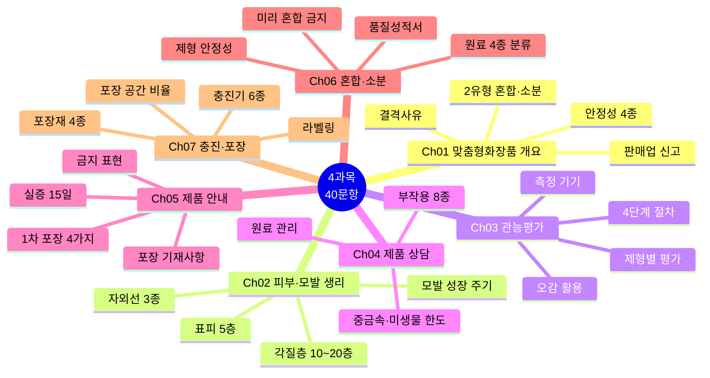
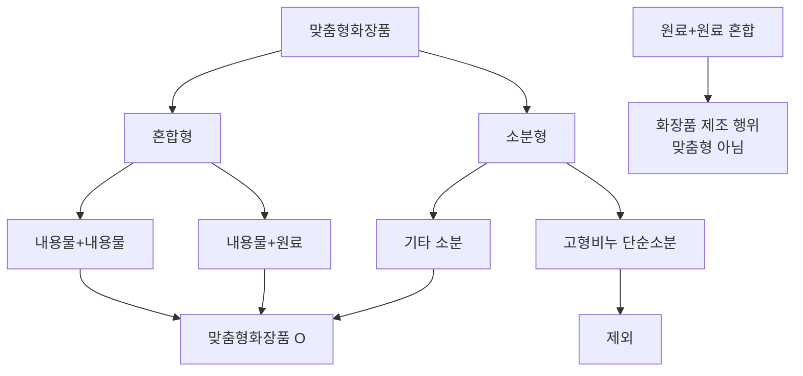
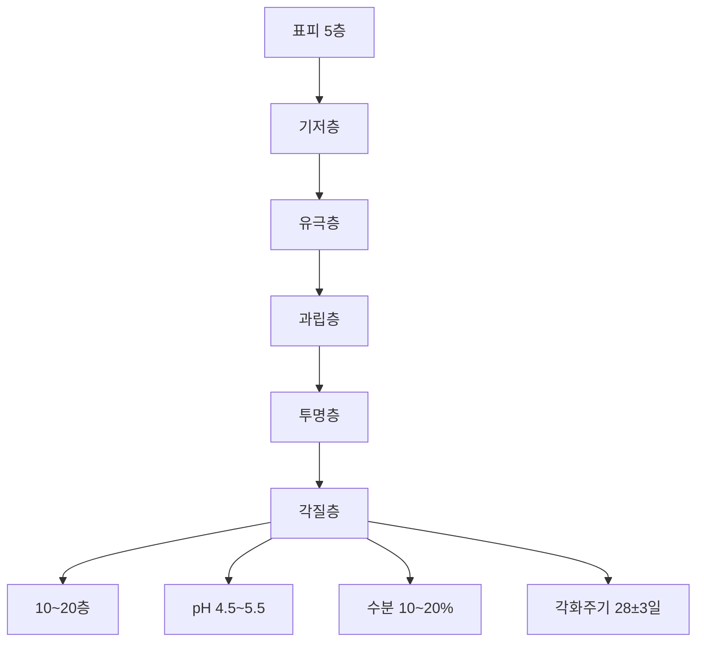
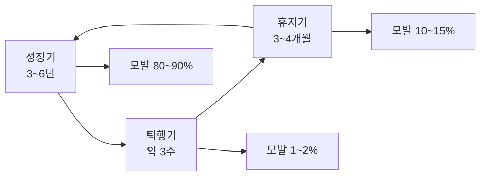
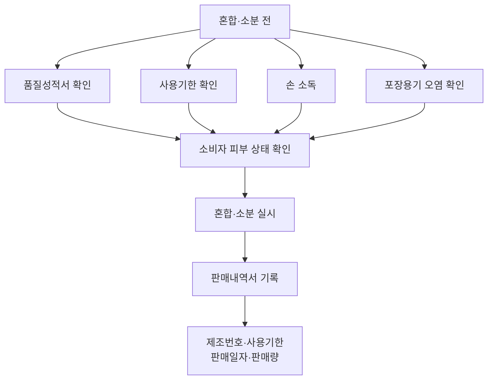
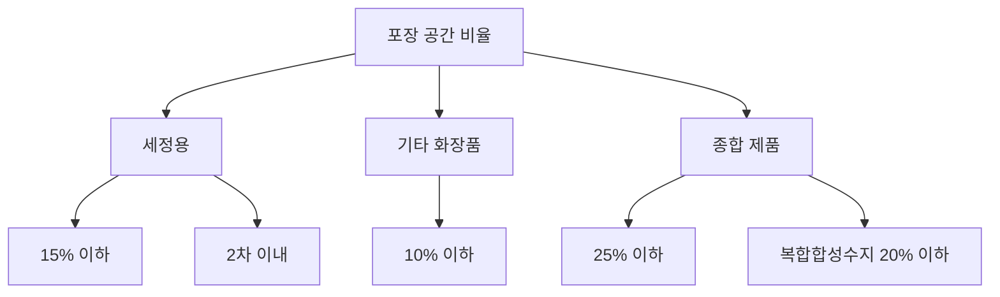

# 📗 4과목 핵심 정리 (40문항)

> **맞춤형화장품조제관리사 필기시험** — 4과목 맞춤형화장품의 이해 (40문항)
> 시험 비중: 40% | 주요 영역: 맞춤형화장품 개요, 피부·모발 생리, 관능평가, 제품 상담·안내, 혼합·소분, 충진·포장

---

## 🗺️ 4과목 전체 마인드맵

## 🔀 맞춤형화장품 2유형 분류

## 🔀 표피 5층 구조

## 🔀 모발 성장 주기

## 🔀 혼합·소분 안전 절차

## 🔀 포장 공간 비율 기준

---

## 🎯 핵심 40문항

### Ch01. 맞춤형화장품 개요 (5문항)

### 1. 맞춤형화장품 2유형 (빈출 최상위)
- **혼합형**: 내용물+내용물/원료 혼합
- **소분형**: 고형비누 단순소분 **제외**
- 원료+원료 혼합은 화장품 제조 행위 (맞춤형 아님)

### 2. 맞춤형화장품판매업 (빈출 최상위)
- 지방식약청장에게 **신고** (등록 아님)
- 조제관리사 필수 배치
- 혼합·소분 영업

### 3. 안정성시험 4종 (빈출 최상위)
- **장기보존시험**·**가속시험**·**가혹시험**·**개봉 후 안정성시험**
- 공통 조건: **3로트 이상·6개월 이상**

### 4. 안전성시험 9종 (빈출)
단회독성·1차 피부자극·연속 피부자극·안점막·감작성·광독성·광감작성·인체첩포·유전독성

### 5. 결격사유 (빈출 최상위)
- **판매업**: 등록취소·영업소 폐쇄 후 **1년** 미경과
- **조제관리사**: 자격취소 후 **3년** 미경과, 부정행위 시 응시제한 **3년**
- 공통: 피성년후견인·파산선고 미복권·금고 이상 형 집행 미종료·정신질환자·마약류 중독자

---

### Ch02. 피부 및 모발 생리구조 (5문항)

### 6. 피부 기본·진피·분비선 (빈출)
- 신체 최대 기관: 면적 **1.5~2.0㎡**, 무게 **4kg**, pH **4.5~6.5**
- **진피 2층**: 유두층·망상층
- **분비선 3종**: 에크린(전신·체온조절), 아포크린(겨드랑이·성호르몬), 피지(모공·윤기)

### 7. 표피 5층·4대 세포 (빈출 최상위)
- **5층**: 기저층 → 유극층 → 과립층 → 투명층 → 각질층 (바깥으로 갈수록 각질화)
- **4대 세포**: 각질세포(케라틴 58%·NMF 31%·지질 11%), 멜라닌세포(멜라닌 생성·피부색), 랑게르한스세포(면역), 메르켈세포(감각)

### 8. 각질층 (빈출 최상위)
- **10~20층**, pH **4.5~5.5**
- 수분 **10~20%**
- 각화주기 **28±3일** (기저층→각질층→탈락)

### 9. 모발 성장 주기 (빈출 최상위)
- **성장기**: 3~6년 (모발의 80~90%)
- **퇴행기**: 약 3주 (모발의 1~2%)
- **휴지기**: 3~4개월 (모발의 10~15%)

### 10. 자외선 3종 (빈출)
- **UVA**: 광노화·색소침착, 유리 통과
- **UVB**: 홍반·DNA 손상, 일광 화상
- **UVC**: 대부분 오존층 차단, 도달 시 피부암 위험

---

### Ch03. 관능평가 방법과 절차 (7문항)

### 11. 관능평가 4단계 (빈출)
표준품 선정 → 검체 채취·기준 마련 → 시험 → 적합 판정·기록

### 12. 오감 활용 (빈출)
- **시**: 외관·색
- **후**: 향
- **미**: 맛
- **촉**: 점도·감촉
- **청**: 소리
- 통계 처리 필수

### 13. 제품별 관능평가 요소 (빈출)
- **스킨·토너**: 탁도·변취
- **로션·에센스**: 변취·분리(성상)·점도·경도
- **크림**: 변취·분리(성상)·점도·경도·증발·표면 굳음 (최다 6종)
- **파운데이션**: 변취·점도·경도·증발·표면 굳음
- **립스틱**: 변취·분리(성상)·점도·경도

### 14. 관능평가 측정 방법 (빈출)
- **탁도계(Turbidity meter)**: 탁도·침전 측정
- **회전봉(Spindle)**: 점도 측정, 점도 높을 시 경도 측정
- **육안·현미경**: 기포·응고·분리·겔화·빙결 등 유화 상태
- **건조 감량법**: 증발·표면 굳음 측정

### 15. 사용시험 (빈출)
- 실제 사용 조건에서 평가
- 사용감·효능·안전성 종합 평가
- 패널 구성: 전문가·일반인

### 16. 패널 구성·맹검/비맹검 (빈출)
- **패널**: 전문가 패널(훈련된 평가자) + 일반인 패널(소비자)
- **맹검**: 브랜드·제품 정보 숨기고 평가 — 브랜드 효과 배제
- **비맹검**: 제품 인식 후 평가 — 효능 인식과 일치도 확인
- **크림**: 제품 중 최다 평가 요소 (변취·분리·점도·경도·증발·표면 굳음)

### 17. 물성 측정 기기 (빈출)
- **Rheometer**: 점탄성 측정 (유동학적 특성)
- **Cutometer**: 피부 탄력 측정
- **Glossmeter**: 광택 측정
- 관능 용어를 물리화학적 기기와 연결 — 감각이 아닌 측정

---

### Ch04. 제품 상담 (5문항)

### 18. 부작용 8종 (빈출 최상위)
접촉성피부염·광과민반응·색소침착·모낭염·가역적 탈모·홍반·가려움·건조

### 19. 부작용 보고 (빈출)
- 식약처장에게 **즉시** 보고 의무
- 보고 내용: 증상·원인·조치사항

### 20. 원료 관리 (빈출)
- **별표 1**: 배합금지 원료
- **별표 2**: 사용상 제한 필요 원료
- 기능성화장품 심사 받은 고시 원료는 제외

### 21. 중금속 허용한도 (빈출 최상위)
- **6종**: 납·니켈·비소·안티몬·카드뮴·수은
- 제품별 허용한도 상이 (예: 납 20μg/g, 니켈 눈화장 35μg/g, 수은 1μg/g)
- **비중금속 검출 항목**: 디옥산·메탄올·포름알데하이드·프탈레이트류

### 22. 미생물 한도 (빈출 최상위)
- 영유아·눈화장용: **500 CFU/g 이하**
- 기타 화장품: **1,000 CFU/g 이하**
- **물휴지**: 세균·진균 각각 **100개/g 이하** (단골 함정)
- **불검출**: 대장균·녹농균·황색포도상구균

---

### Ch05. 제품 안내 (6문항)

### 23. 포장 기재사항 (빈출 최상위)
- 명칭·영업자 상호·전성분·용량/중량·제조번호·사용기한·가격·주의사항·기능성 표시
- **5포인트 이상** 표시

### 24. 1차 포장 기재 (빈출 최상위)
- **4가지**: 명칭·상호·제조번호(식별번호)·사용기한
- 전성분·용량·가격·주의사항은 2차 포장에 추가

### 25. 소용량 표시 (빈출 최상위)
- **10mL/10g 이하**: 명칭·상호·가격(또는 견본품 표시)·제조번호·사용기한(또는 개봉 후 사용기간)만 표시
- **함정**: 1차 포장 4가지(명칭·상호·제조번호·사용기한)와 혼동 주의 — 소용량은 가격(또는 견본품) 추가, 사용기한/개봉후사용기간 병기

### 26. 실증 (빈출)
- 광고 전 **15일 이내** 효력시험 실증 자료 보관 의무

### 27. 금지 표현 (빈출)
- 의학적 효능·허위·과장 광고 금지
- 질병 치료 목적 표현 금지

### 28. 행정처분 (빈출)
- 위반 정도에 따라 3~12개월 업무정지
- 영유아·어린이·알레르기 체질자 대상 주의사항 표시 의무

---

### Ch06. 혼합 및 소분 (7문항)

### 29. 원료 분류 (빈출)
- **수성**: 물에 용해 — 정제수·알코올·보습제(폴리올)
- **유성**: 수분 증발 억제 — 유지·왁스·탄화수소·실리콘
- **계면활성제**: 유·수 혼합 — 음·양·양쪽·비이온성 4종
- **고분자**: 점도 조절 — 천연·반합성·합성·무기물

### 30. 제형 안정성 (빈출)
- **분리**: 유화 파괴
- **변색**: 산화
- **변취**: 향료 변질
- 안정성시험 4종으로 판정

### 31. 혼합·소분 안전 (빈출)
- 혼합 전 내용물·원료 **품질성적서** 확인
- 사용기한 확인
- 손 소독 필수
- 포장용기 오염 확인

### 32. 미리 혼합·소분 금지 (빈출 최상위)
- 소비자 피부 상태·선호도 확인 후 혼합·소분
- 미리 혼합·소분하여 보관·판매 **금지**

### 33. 맞춤형화장품 장단점 (빈출)
- **장점**: 개인 맞춤, 다양한 요구 충족
- **단점**: 부작용 위험, 보관 관리 어려움

### 34. 판매내역서 (빈출)
- 제조번호·사용기한·판매일자·판매량 기록
- 추적 관리용 식별번호

### 35. 사용 가능 원료 (빈출)
- 전체 − (별표1 불가 + 별표2 제한 + 미심사 기능성 고시)
- 이 3가지를 제외하면 모두 사용 가능

---

### Ch07. 충진 및 포장 (5문항)

### 36. 충진기 6종 (빈출)
- **피스톤**: 대용량 액상
- **파우치**: 샘플·일회용
- **튜브**: 폼클렌징·자외선 차단제
- **스프레이**: 분사 제품
- **펌프**: 액상 펌프
- **자동**: 자동화 라인

### 37. 포장 공간 비율 (빈출 최상위)
- **세정용**: 15% 이하, 2차 이내
- **기타**: 10% 이하
- **종합**: 25% 이하 (복합합성수지 20% 이하)

### 38. 라벨링 (빈출)
- **소분**: 새 용기에 기재사항 스티커
- **혼합**: 기존 라벨 제거 후 새 라벨 또는 오버라벨링

### 39. 포장재 종류 (빈출)
- **플라스틱**: LDPE·HDPE·PP·PS·ABS
- **유리**: 투명·내약품성, 파손 우려
- **금속**: 알루미늄·주석, 기체 차단성
- **적층**: 다층 필름, 복합 특성

### 40. 포장재 물성 (빈출)
- **내약품성**: 내용물과 상호 작용 저항
- **내충격성**: 외부 충격 저항
- **투습성**: 수분 투과 저항

---

## 📊 시험 출제 비중

| 챕터 | 문항수 | 주요 포인트 |
|---|---|---|
| Ch01 맞춤형화장품 개요 | 5 | 2유형, 판매업 신고, 안정성 4종, 결격사유 |
| Ch02 피부·모발 생리 | 5 | 표피 5층·4대 세포, 각질층, 모발 주기, 자외선 3종 |
| Ch03 관능평가 | 7 | 4단계, 오감, 제형별, 기기, 사용시험, 패널·맹검, 물성 기기 |
| Ch04 제품 상담 | 5 | 부작용 8종, 원료 관리, 중금속·미생물 한도 |
| Ch05 제품 안내 | 6 | 포장 기재, 1차 포장 4가지, 소용량 함정, 실증 15일, 금지 표현 |
| Ch06 혼합·소분 | 7 | 원료 분류, 제형 안정성, 품질성적서, 미리 혼합 금지 |
| Ch07 충진·포장 | 5 | 충진기 6종, 포장 공간 비율, 라벨링, 포장재 |

---

> 📌 **출처**: 화장품법·시행규칙·고시, 맞춤형화장품 안전관리 기준 | **최종 확인**: 2026. 8. 29.
