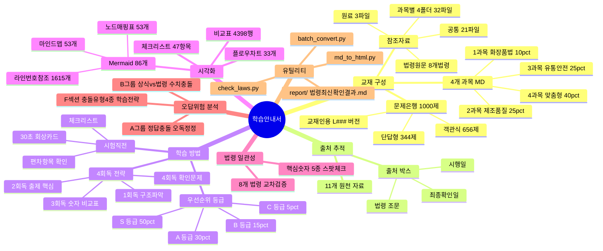

# 📚 맞춤형화장품조제관리사 학습 안내서

### 가독성·시각화 강화 · 맞춤형화장품조제관리사 시험 대비

> **최종 갱신**: 2026-08-30 (폴더 구조 개선: 교재/·참조자료/ 통합·batch_convert.py 추가·마인드맵 노드 상세 매핑표 53개 + 라인번호 참조 1,615개(79% 정확매칭)·문제은행 HTML 변환 추가→총 13개·모바일용 HTML 일괄 생성·Q5·Q142 교정·F섹션 상식-법령 충돌 분석 추가·마인드맵 노드 배경색-글자색 대비 자동 보정)
> **학습 대상**: 맞춤형화장품조제관리사 자격시험 준비생
>
> 📊 **연관 문서**:
> - `report/출제비중분포조사결과.md` — 섹션별 예상 출제 비중 및 문제은행 분포 편차 분석
> - `report/출제비중기반학습방법.md` — 출제비중 기반 학습 방법·절차 추천 (S/A/B/C 등급, 회독별 절차, 모의고사, 오답 관리, 시험 당일 대응 등)
> - `report/법령최신확인결과.md` — 8개 법령·고시 현행 확인 결과 (`utils/check_laws.py` 생성)
> - `report/오답위험_분석보고서.md` — 정답 충돌·상식 vs 법령 기준 차이·상식-법령 충돌 유형별 분석(F섹션) 및 학습 전략 제언

---

## 🧭 학습 아이콘

| 표시 | 의미 | 학습법 |
| :--- | :--- | :--- |
| 🎯 | **출제 포인트** | 먼저 암기 |
| ⭐ | **한 줄 핵심** | 반복 회상 |
| 🔢 | **숫자·기한** | 표로 정리 |
| ⚠️ | **주의·예외** | 비교 학습 |
| 📝 | **확인문제** | 즉시 풀기 |
| 📊 | **비교표** | 눈으로 익히기 |

---

## 🧠 전체 구조 마인드맵

> 각 노드의 **풍선도움말(설명)**과 **연결 파일**은 하단 [마인드맵 노드 상세 매핑](#마인드맵-노드-상세-매핑) 표를 참조하세요.



### 마인드맵 노드 상세 매핑

| 분과 | 노드 | 풍선도움말 (설명) | 연결 파일 |
|:-----|------|------------------|----------|
| **교재 구성** | 1과목 10% | 법령 위계·영업3종·기능성심사·표시광고·행정처분·개인정보보호 | `교재/1과목_화장품법의이해.md` |
| | 2과목 25% | 원료분류·계면활성제·CGMP·품질검사·사용제한원료·위해관리 | `교재/2과목_제조및품질관리.md` |
| | 3과목 25% | 청정도등급·필터·설비관리·유통시험법·위해회수·포장재 | `교재/3과목_유통화장품안전관리.md` |
| | 4과목 40% | 맞춤형화장품 정의·조제관리사시험·안전성시험9종·피부생리·혼합소분·포장 | `교재/4과목_맞춤형화장품의이해.md` |
| | 객관식 656제 | 5지선다·4과목 272제 최다·비율 10:25:25:40 반영 | `문제은행/과목1~4_문제은행_교재인용.md` (4개) |
| | 단답형 344제 | 빈칸채우기·4과목 128제 최다·시험 20문항 중 12문항 | `문제은행/과목4_문제은행_교재인용.md` |
| | 교재인용 L### | 정답 옆 교재 라인번호 표기·오답 시 원문 즉시 역추적 | `문제은행/과목1~4_문제은행_교재인용.md` (4개) |
| | 과목별 4폴더 | 1~4과목 각 참조자료·MD원문+별표PDF·과목교재에서 인용 | `참조자료/과목1~4/` (4폴더 32파일) |
| | 공통 21파일 | 전 과목 공통 별표·시행규칙·CGMP·안전기준·주의사항 | `참조자료/공통/` (21파일) |
| | 원료 3파일 | 사용가능·금지·제한 원료 목록·2과목·학습안내서 참조 | `참조자료/원료/` (3파일) |
| | 법령원문 8개법령 | 시험대상 8개 법령·고시 PDF 원문·check_laws.py 현행확인 | `참조자료/법령원문/` (8 PDF) |
| **출처 추적** | 출처 박스 | 각 섹션 근거 법령 조문·시행일·최종확인일 | 4개 과목 MD 내 출처박스 |
| | 11개 원천자료 | 법령6·고시·개인정보보호법·식약처학습자료·전문교재 | `학습안내서.md` §3 |
| **학습 방법** | S/A/B/C 등급 | 예상비중+중요도 기준 4단계 우선순위 분류 | `report/출제비중기반학습방법.md` |
| | 4회독 전략 | 구조파악→출제핵심→숫자비교표→확인문제 오답역추적 | `report/출제비중기반학습방법.md` |
| | 시험직전 | 30초 회상카드·체크리스트·편차항목 재확인 | `report/출제비중기반학습방법.md`·`report/출제비중분포조사결과.md` |
| **시각화** | Mermaid 86개 | 마인드맵53+플로우차트33·노드 매핑표 53개·라인번호 참조 1,615개 | 4개 과목 MD 내 포함 |
| | 비교표 4,398행 | 과목별 테이블 행 수 총합 (마인드맵 매핑표 포함) | 4개 과목 MD 내 포함 |
| | 체크리스트 47항목 | 과목별 체크리스트 항목 총합 | 4개 과목 MD 내 포함 |
| **법령 일관성** | 8개 법령 교차검증 | 4과목 교차참조·동일 법령번호 일치여부 | `report/법령최신확인결과.md` |
| | 핵심숫자 5종 | 15일·15초·97%·60%40%·28±3일 스팟체크 | `report/법령최신확인결과.md` |
| **유틸리티** | md_to_html.py | MD→HTML 변환·Mermaid 임베딩·모바일용 SVG 사전 렌더링·마인드맵 노드 대비 자동 보정 | `utils/md_to_html.py` |
| | batch_convert.py | 교재·학습안내서·report·문제은행 MD 13개 파일을 HTML로 일괄 변환 → `html/` | `utils/batch_convert.py` |
| | check_laws.py | 8개 법령 현행확인·OPEN API·조회실패시 값미생성 | `utils/check_laws.py` |
| | 법령최신확인결과.md | check_laws.py 실행결과·3건 일치·5건 확인실패 | `report/법령최신확인결과.md` |

---

## 1. 교재 구성 개요

본 교재는 **4개 과목 Markdown 파일(`교재/`) + 4개 문제은행(`문제은행/`) + 참조자료(`참조자료/`)**로 구성되어 있습니다.

### 과목 파일

| 과목 | 파일명 | 줄 수 | 크기 |
| :--- | :--- | :--- | :--- |
| 📕 1과목 | `교재/1과목_화장품법의이해.md` | 4,208줄 | 242KB |
| 📘 2과목 | `교재/2과목_제조및품질관리.md` | 6,399줄 | 555KB |
| 📙 3과목 | `교재/3과목_유통화장품안전관리.md` | 4,345줄 | 253KB |
| 📗 4과목 | `교재/4과목_맞춤형화장품의이해.md` | 4,061줄 | 260KB |

### 문제은행 (총 1,000제)

| 파일 | 문항 수 | 비율 | 객관식 | 단답형 |
| :--- | :--- | :--- | :--- | :--- |
| `문제은행/과목1_문제은행_교재인용.md` | 100제 | 10% | 63 | 37 |
| `문제은행/과목2_문제은행_교재인용.md` | 250제 | 25% | 152 | 98 |
| `문제은행/과목3_문제은행_교재인용.md` | 250제 | 25% | 169 | 81 |
| `문제은행/과목4_문제은행_교재인용.md` | 400제 | 40% | 272 | 128 |
| **합계** | **1,000제** | **100%** | **656** | **344** |

> 시험 출제 비율(10:25:25:40)에 맞추어 구성되었으며, 객관식과 단답형이 혼합되어 있습니다.
> 모든 문제은행은 **교재인용(L###)** 버전으로, 각 정답에 교재 라인 번호가 표기되어 오답 시 교재 원문을 즉시 찾을 수 있습니다.

---

## 2. 과목별 학습 내용

### 📕 1과목 — 화장품법의 이해

화장품법·시행령·시행규칙·고시의 법령 위계, 영업 3종(제조업·책임판매업·맞춤형판매업)의 등록·신고 절차, 결격사유, 기능성화장품 심사, 표시·광고 규정, 개인정보 보호, 행정처분 기준을 다룹니다.

- **Mermaid 다이어그램**: 15개 (마인드맵 9개 + 플로우차트 6개)
- **체크리스트**: 12항목
- **FINAL REVIEW 카드**: 10장

| 섹션 | 예상 비중 | 중요도 | 문제은행 편차 | 우선순위 |
|------|:--------:|:------:|:---------:|:--------:|
| 1.1 화장품법 | 80~85% | ★★★★★ | +15~20% (과다) | **S** |
| 1.2 개인정보 보호법 | 15~20% | ★★★ | −15~20% (과소) | **A** ⚠️ |

### 📘 2과목 — 제조 및 품질관리

원료의 종류와 특성, 계면활성제·보존제·색소·향료, 화장품 제조공정, CGMP(우수화장품 제조 및 품질관리기준), 품질검사 체계, 사용금지·제한 원료, 위해관리와 회수 절차를 다룹니다. 4개 과목 중 가장 분량이 많습니다.

- **Mermaid 다이어그램**: 25개 (마인드맵 16개 + 플로우차트 9개)
- **체크리스트**: 10항목
- **FINAL REVIEW 카드**: 10장

| 섹션 | 예상 비중 | 중요도 | 문제은행 편차 | 우선순위 |
|------|:--------:|:------:|:---------:|:--------:|
| 2.1 원료/제조관리 | 30~35% | ★★★★★ | +17~22% (과다) | **S** |
| 2.3 사용제한 원료 | 25~30% | ★★★★★ | −20~25% (심각 과소) | **S** ⚠️ |
| 2.2 기능과 품질 | 15~20% | ★★★★ | −7~12% (과소) | **A** |
| 2.5 위해사례 판단 | 10~15% | ★★★★ | +3~8% (약 과다) | **A** |
| 2.4 화장품 관리 | 10~15% | ★★★ | +1~6% (양호) | **B** |

### 📙 3과목 — 유통 화장품 안전관리

작업실 청정도 등급, 필터·소독제, 설비 관리, 원료 입고·보관·출고, 유통 안전관리 시험방법, 위해화장품 회수, 직접구매 해외화장품 신고, 포장재 관리를 다룹니다. 25문항 전체가 선다형입니다.

- **Mermaid 다이어그램**: 19개 (마인드맵 13개 + 플로우차트 6개)
- **체크리스트**: 10항목
- **FINAL REVIEW 카드**: 6장

| 섹션 | 예상 비중 | 중요도 | 문제은행 편차 | 우선순위 |
|------|:--------:|:------:|:---------:|:--------:|
| 3.4 원료/내용물 관리 | 25~30% | ★★★★★ | −1~6% (양호) | **S** |
| 3.3 설비 및 기구 관리 | 20~25% | ★★★★★ | −11~16% (과소) | **S** ⚠️ |
| 3.1 작업장 위생관리 | 20~25% | ★★★★ | +36~41% (심각 과다) | **A** |
| 3.2 작업자 위생관리 | 15~20% | ★★★★ | −13~18% (과소) | **A** ⚠️ |
| 3.5 포장재의 관리 | 10~15% | ★★★ | −7~12% (과소) | **B** |

### 📗 4과목 — 맞춤형화장품의 이해

맞춤형화장품 정의(혼합형·소분형), 판매업 신고, 조제관리사 자격시험, 안전성시험 9종, 유효성·안정성시험, 피부 구조와 생리, 모발 생리, 상태 분석, 관능평가, 혼합·소분 실무, 포장을 다룹니다. 출제 비율이 40%로 가장 높으며, **단답형 12문항(전체 20문항 중 60%)**이 출제됩니다.

- **Mermaid 다이어그램**: 27개 (마인드맵 15개 + 플로우차트 12개)
- **체크리스트**: 15항목
- **FINAL REVIEW 카드**: 10장

| 섹션 | 예상 비중 | 중요도 | 문제은행 편차 | 우선순위 |
|------|:--------:|:------:|:---------:|:--------:|
| 4.6 혼합 및 소분 | 25~31% | ★★★★★ | −12~18% (과소) | **S** ⚠️ |
| 4.2 피부/모발 생리구조 | 20~25% | ★★★★★ | +18~23% (과다) | **S** |
| 4.1 맞춤형화장품 개요 | 8~10% | ★★★★ | +29~31% (심각 과다) | **B** |
| 4.4 제품 상담 | 8~10% | ★★★★ | −8~10% (과소) | **A** ⚠️ |
| 4.5 제품 안내 | 8~10% | ★★★★ | −8~10% (과소) | **A** ⚠️ |
| 4.3 관능평가 | 5~7% | ★★★ | −5~7% (과소) | **B** |
| 4.7 충진 및 포장 | 5~7% | ★★★ | −3~5% (과소) | **B** |
| 4.8 재고관리 | 2~4% | ★★ | — | **C** |

---

## 3. 출처 추적 체계

본 교재의 모든 주요 섹션에는 **출처 박스**가 추가되어 있어, 각 학습 내용의 법적 근거를 추적할 수 있습니다.

### 출처 박스 형식

```
> 📌 출처: [법령/고시명 조문] | 시행일: [YYYY. M. D.] | 최종 확인: 2026. 8. 30.
```

### 주요 원천 자료

| 구분 | 원소스 | 활용도 |
| :--- | :--- | :--- |
| ① 법령 | 화장품법 (제20901호) | ★★★★★ |
| ② 시행규칙 | 화장품법 시행규칙 (제2109호) | ★★★★★ |
| ③ 식약처 고시 | 화장품 안전기준 등에 관한 규정 (제2026-19호) | ★★★★★ |
| ④ 식약처 고시 | 기능성화장품 심사 규정 (제2025-88호) | ★★★★★ |
| ⑤ 식약처 고시 | CGMP (제2024-46호) | ★★★★★ |
| ⑥ 식약처 고시 | 색소 종류 및 기준 (제2023-61호) | ★★★★☆ |
| ⑦ 식약처 고시 | KFCC 기준 및 시험방법 (제2025-89호) | ★★★★☆ |
| ⑧ 식약처 고시 | 주의사항·알레르기 (제2026-56호) | ★★★★★ |
| ⑨ 개인정보 보호법 | 개인정보 보호법 (법률 제19229호) | ★★★★☆ |
| ⑩ 식약처 학습자료 | 안내서, 가이드라인, 해설자료 | ★★★★☆ |
| ⑪ 전문 교재 | 피부과학·모발과학·제제학 교재 | ★★★☆☆ |

### 콘텐츠 제작 흐름

```
정부 원문 → 구조화 → 쉬운 설명 → 시각화(표·마인드맵) → 문제화 → 출처 tagging
```

> ⚠️ 법령·고시는 개정될 수 있습니다. 출처 박스의 **시행일**과 **최종 확인일**을 참조하여,
> 개정 시 해당 섹션만 찾아 업데이트하면 됩니다.

---

## 4. 과목 파일 공통 구조

모든 과목 파일은 동일한 골격으로 작성되어 있습니다.

| 순서 | 섹션 | 설명 |
| :--- | :--- | :--- |
| 1 | **표지** | 과목 이모지 + 부제 |
| 2 | **학습 안내** | 교재의 학습 방향 안내 |
| 3 | **학습 아이콘** | 6종 아이콘 범례 |
| 4 | **시험 직전 1분 전체 지도** | 과목 전체 흐름을 한눈에 |
| 5 | **최우선 암기 축** | 시험 전날 반드시 볼 핵심 |
| 6 | **숫자 암기 미리보기** | 출제 빈도 높은 숫자 정리 |
| 7 | **목차** | 법령 조문 기준 목차 |
| 8 | **본문** | 법령·학습자료·표·다이어그램 |
| 9 | **확인문제** | 각 챕터별 즉시 풀기 |
| 10 | **문제은행 링크** | 과목별 실전 예상 문제로 이동 |
| 11 | **FINAL REVIEW** | 30초 회상 카드 + 체크리스트 + 추천 회독법 |

### FINAL REVIEW 구성 (전 과목 공통)

```text
30초 회상 카드 (CARD 01~10)
   ↓
시험 직전 체크리스트
   ↓
추천 회독법
```

---

## 5. 추천 학습 방법

> 📋 **상세 학습 절차는 `report/출제비중기반학습방법.md`를 참조하세요.**
> 이 파일에서는 핵심 요약만 제공합니다.

### 출제비중 기반 우선순위 등급

| 등급 | 조건 | 학습 전략 | 비중 |
|:----:|------|-----------|:----:|
| **S** | 예상 비중 ≥20% + ★★★★★ | 최우선 심화 학습, 완벽 암기 | 50% |
| **A** | 예상 비중 10~20% + ★★★★~★★★★★ | 핵심 위주 반복 학습 | 30% |
| **B** | 예상 비중 5~10% + ★★★~★★★★ | 요약 정리 + 문제은행 풀이 | 15% |
| **C** | 예상 비중 ≤5% + ★★~★★★ | 마지막에 훑기만 | 5% |

### 회독별 학습 전략 (출제비중 반영)

```text
1회독  구조 파악 + S등급 정독 (마인드맵 · 흐름도 · 본문)
   ↓
2회독  🎯 출제 + ⭐ 핵심 + A등급 보완 (과소 항목 집중)
   ↓
3회독  🔢 숫자 + 📊 비교표 + B등급 요약
   ↓
4회독  📝 확인문제 + 오답 역추적 (L### → 교재 원문)
   ↓
시험 직전  🧠 30초 회상 카드 + 📋 체크리스트 + ⚠️ 편차 항목
```

> **핵심 원칙:** 긴 설명을 처음부터 다시 읽기보다, **표·흐름도·숫자·문제를 통해 먼저 회상한 뒤 필요한 부분만 본문으로 돌아가는 방식**을 권장합니다.
> **편차 보정 원칙:** 문제은행 분포가 예상 비중보다 **과소한 항목은 교재 본문+참조자료로 보완**, **과다한 항목은 문제은행 풀이만으로 복습**합니다.

### 과목별 학습 순서 권장

1. **1과목** → 법령 체계를 먼저 잡으면 2·3과목 이해가 빨라집니다 (⚠️ 1.2 개인정보보호법 문제은행 0문항, 교재 본문 학습 필수)
2. **2과목** → 분량이 가장 많으므로 충분한 시간 배정 (⚠️ 2.3 사용제한 원료 문제은행 5% vs 예상 25~30%, 최우선 보완)
3. **3과목** → 2과목의 CGMP와 연결되므로 연이어 학습 (⚠️ 3.1 작업장 위생 문제은행 61% 과다, 3.2/3.3 보완 필요)
4. **4과목** → 출제 비율 40% + 단답형 12문항 최다, 마지막에 집중 반복 (⚠️ 4.6 혼합·소분 문제은행 13% vs 예상 25~31%)

### 과목별 시간 배분 추천 (100시간 기준)

| 과목 | 시험 비율 | 추천 시간 | 조정 사유 |
|:----:|:---------:|:---------:|----------|
| 1 | 10% | 10시간 | 1.2 개인정보보호법 보완에 시간 배정 |
| 2 | 25% | 30시간 | 2.3 사용제한 원료 집중 보완에 추가 시간 |
| 3 | 25% | 25시간 | 3.1 과다 → 감량, 3.2/3.3 보완에 재배분 |
| 4 | 40% | 35시간 | 4.1/4.2 과다 → 감량, 4.4/4.5/4.6 보완에 재배정 |

### 과목 간 연결 학습

| 연결 | 학습 포인트 |
| :--- | :--- |
| 1과목 ↔ 2과목 | 화장품법·기능성 규정 ↔ 제조·품질 기준 |
| 2과목 ↔ 3과목 | 제조·품질관리 ↔ 유통·안전관리 |
| 2과목 ↔ 4과목 | 원료·배합·품질 기준 ↔ 맞춤형화장품 조제 실무 |
| 3과목 ↔ 4과목 | 유통 안전관리 ↔ 맞춤형 판매장 안전관리 |

---

## 6. 참조자료 구성

### 과목별 참조자료

| 폴더 | 파일 수 | 주요 내용 |
| :--- | :--- | :--- |
| `참조자료/과목1/` | 4개 | 화장품법 원문, 개인정보보호법, 시행규칙 별표(품질관리·책임판매) |
| `참조자료/과목2/` | 16개 | 원료·품질·위해관리 자료, KFCC 시험법, 안전기준 별표 |
| `참조자료/과목3/` | 5개 | 작업장 안전·설비·자재·포장 안전 자료 |
| `참조자료/과목4/` | 7개 | 맞춤형화장품 개요·생리·관능평가·컨설팅·혼합소분·포장 |

### 공통참조자료

`참조자료/공통/` 폴더에 21개 파일이 있으며, CGMP 별표, 시행규칙 별표(포장·표시·광고·행정처분), 안전기준 별표, 주의사항 별표, 알레르기 유발성분 25종 등 전 과목 공통으로 참조하는 자료가 포함되어 있습니다.

### 원료 정보

`참조자료/원료/` 폴더에 3개 파일이 있습니다.

| 파일 | 내용 | 크기 |
| :--- | :--- | :--- |
| `참조자료/원료/approved_ingredients.md` | 사용 가능 원료 목록 | 42KB |
| `참조자료/원료/banned_ingredients.md` | 사용 금지 원료 목록 | 149KB |
| `참조자료/원료/restricted_ingredients.md` | 사용 제한 원료 목록 | 76KB |

### 법령 원문

`참조자료/법령원문/` 폴더에 시험 대상 8개 법령의 PDF 원문이 있습니다.

| 법령 | 고시 번호 |
| :--- | :--- |
| 화장품법 | 제20901호 |
| 화장품법 시행규칙 | 제02109호 |
| 화장품 안전기준 등에 관한 규정 | 제2026-19호 |
| 우수화장품 제조 및 품질관리기준 | 제2024-46호 |
| 기능성화장품 심사에 관한 규정 | 제2025-88호 |
| 기능성화장품 기준 및 시험방법 | 제2025-89호 |
| 화장품 사용할 때의 주의사항 및 알레르기 유발성분 표시에 관한 규정 | 제2026-56호 |
| 화장품의 색소 종류 및 기준 | 제2023-61호 |

---

## 7. 시각화 요소 현황

각 과목은 이해를 돕기 위해 Mermaid 다이어그램, 마인드맵, 플로우차트, 비교표를 적극 활용합니다.

| 요소 | 1과목 | 2과목 | 3과목 | 4과목 |
| :--- | :--- | :--- | :--- | :--- |
| Mermaid 다이어그램 | 15 | 25 | 19 | 27 |
| └ 마인드맵 | 9 | 16 | 13 | 15 |
| └ 노드 매핑표 | 9 | 16 | 13 | 15 |
| └ 라인번호 참조 | 257 | 434 | 394 | 530 |
| └ 플로우차트 | 6 | 9 | 6 | 12 |
| 비교표 (테이블 행) | 569 | 1,718 | 853 | 1,258 |
| 체크리스트 항목 | 12 | 10 | 10 | 15 |

> GFM(GitHub Flavored Markdown) 기반 렌더러에서 모든 표와 다이어그램이 정상 렌더링됩니다.
> 마인드맵 노드 매핑표의 각 셀은 `텍스트 (L###)` 형식으로 문서 내 라인번호를 참조하여, 에디터에서 `Ctrl+G`로 즉시 이동 가능합니다.

---

## 8. 법령 인용 일관성

모든 과목 파일에서 동일한 법령 번호를 일관되게 인용하고 있습니다.

| 검토 항목 | 결과 |
| :--- | :--- |
| 화장품법 (제20901호) | ✅ 4과목 일치 |
| 시행규칙 (제2109호) | ✅ 4과목 일치 |
| 안전기준 고시 (제2026-19호) | ✅ 4과목 일치 |
| CGMP 고시 (제2024-46호) | ✅ 2·3과목 일치 |
| 기능성심사 규정 (제2025-88호) | ✅ 1·2과목 일치 |
| KFCC (제2025-89호) | ✅ 2과목 |
| 주의사항 고시 (제2026-56호) | ✅ 2과목 |
| 과목 간 교차 참조 | ✅ 4과목 상호 참조 |

---

## 9. 핵심 숫자 스팟체크

시험에 자주 출제되는 핵심 숫자의 정확성을 확인했습니다.

| 검토 항목 | 결과 |
| :--- | :--- |
| 안전성정보 신속보고 15일 | ✅ |
| 손 세정 15초 이상 | ✅ |
| 내용량 평균 97% 이상 | ✅ |
| 자격시험 60%/40% 합격 | ✅ |
| 각화주기 28±3일 | ✅ |

---

## 10. 파일 전체 구조

```
content/
├── 📚 학습안내서.md                     (본 파일)
├── � manifest.json                    (콘텐츠 매니페스트 — 과목·챕터·시험 메타데이터)
├── �📁 교재/                            (4개 과목 MD — 과목별 하위 폴더)
│   ├── � law/                        (1과목)
│   │   ├── � 1과목_화장품법의이해.md       (4,548줄, 258KB)
│   │   └── 1과목_화장품법의이해_이야기형.md  (이야기형 학습 자료)
│   ├── 📁 manufacturing/              (2과목)
│   │   ├── 📘 2과목_제조및품질관리.md        (5,830줄, 445KB)
│   │   └── 2과목_제조및품질관리_이야기형.md   (이야기형 학습 자료)
│   ├── 📁 safety/                     (3과목)
│   │   ├── 📙 3과목_유통화장품안전관리.md     (4,827줄, 279KB)
│   │   └── 3과목_유통화장품안전관리_이야기형.md (이야기형 학습 자료)
│   └── 📁 understanding/              (4과목)
│       ├── 📗 4과목_맞춤형화장품의이해.md     (4,625줄, 290KB)
│       └── 4과목_맞춤형화장품의이해_이야기형.md (이야기형 학습 자료)
├── 📁 문제은행/                        (4개 파일, 1,000제, 교재인용 버전)
│   ├── 과목1_문제은행_교재인용.md         (100제)
│   ├── 과목2_문제은행_교재인용.md         (250제)
│   ├── 과목3_문제은행_교재인용.md         (250제)
│   └── 과목4_문제은행_교재인용.md         (400제)
├── 📁 참조자료/                        (참조 자료 통합 폴더)
│   ├── 과목1/                (4개 파일)
│   ├── 과목2/                (16개 파일)
│   ├── 과목3/                (5개 파일)
│   ├── 과목4/                (7개 파일)
│   ├── 공통/                 (21개 파일)
│   ├── 원료/                 (3개 파일)
│   └── 법령원문/             (8개 PDF)
├── 📁 report/                          (분석 보고서 모음)
│   ├── 출제비중분포조사결과.md         (출제비중 분석 보고서)
│   ├── 출제비중기반학습방법.md         (출제비중 기반 학습 방법·절차 추천)
│   ├── 법령최신확인결과.md             (check_laws.py 실행 결과)
│   └── 오답위험_분석보고서.md           (정답 충돌·상식-법령 충돌 분석·학습 전략)
├── 📁 utils/                           (스크립트 모음)
│   ├── md_to_html.py            (Markdown→HTML 변환, GUI/CLI)
│   ├── batch_convert.py         (MD 13개 파일 일괄 HTML 변환 → html/)
│   └── check_laws.py            (법령 현행 확인 v2)
├── 📁 audiobook/                       (오디오북 생성 스크립트 및 데이터)
├── 📁 html/                            (HTML 변환 결과 — batch_convert.py 생성)
│   ├── 1과목_화장품법의이해.html       (4.5MB, 모바일용)
│   ├── 2과목_제조및품질관리.html        (5.2MB, 모바일용)
│   ├── 3과목_유통화장품안전관리.html     (4.8MB, 모바일용)
│   ├── 4과목_맞춤형화장품의이해.html     (5.1MB, 모바일용)
│   ├── 학습안내서.html               (3.7MB, 모바일용)
│   ├── 출제비중분포조사결과.html        (3.5MB)
│   ├── 출제비중기반학습방법.html        (3.6MB)
│   ├── 법령최신확인결과.html           (3.5MB)
│   ├── 오답위험_분석보고서.html          (3.5MB)
│   ├── 과목1_문제은행_교재인용.html     (3.6MB, 모바일용)
│   ├── 과목2_문제은행_교재인용.html     (3.8MB, 모바일용)
│   ├── 과목3_문제은행_교재인용.html     (3.8MB, 모바일용)
│   └── 과목4_문제은행_교재인용.html     (4.0MB, 모바일용)
```

---

## 11. 학습 체크리스트

### 시작 전

- [ ] 4개 과목 파일을 GFM 지원 뷰어(VS Code, Obsidian, GitHub 등)로 열기
- [ ] 학습 아이콘 6종(🎯⭐🔢⚠️📝📊) 의미 숙지
- [ ] 과목별 출제 비율(10:25:25:40) 확인 후 학습 계획 수립
- [ ] `report/출제비중분포조사결과.md` 숙지 — 예상 비중과 문제은행 편차 이해
- [ ] `report/출제비중기반학습방법.md` 숙지 — S/A/B/C 등급 우선순위 확인
- [ ] 객관식 vs 단답형 비율 확인 (특히 과목4 단답형 12문항)
- [ ] 과목별 최소 합격선(40%) 확인 — **과목1 위험도 가장 높음** (1문항당 10점)

### 회독별

- [ ] 1회독: 각 과목 시험 직전 1분 전체 지도로 구조 파악 + **S등급 본문 정독**
- [ ] 2회독: 🎯 출제 포인트 + ⭐ 핵심 + **A등급 과소 항목 보완** (⚠️ 편차 항목 집중)
- [ ] 3회독: 🔢 숫자·기한 + 📊 비교표 + **B등급 요약** + 과목 간 연결 학습
- [ ] 4회독: 📝 확인문제 풀고 **오답 L### 역추적** → 교재 원문 재학습
- [ ] 시험 직전: FINAL REVIEW 30초 회상 카드 + 체크리스트 + ⚠️ 편차 항목 재확인

### 과목별 최종 점검

- [ ] 1과목: 법령 위계 4단계, 영업 3종, 결격사유, 기능성화장품 + **1.2 개인정보보호법** ⚠️
- [ ] 2과목: 원료 분류, 계면활성제 HLB, CGMP 3요소, 제조공정 + **2.3 사용제한 원료** ⚠️
- [ ] 3과목: 청정도 4등급, 필터 3종, 소독제, 위해화장품 회수 + **3.3 설비·기구, 3.2 작업자 위생** ⚠️
- [ ] 4과목: 맞춤형화장품 정의, 조제관리사 자격시험, 안전성시험 9종, 피부 구조 + **4.6 혼합·소분, 4.4 제품 상담, 4.5 제품 안내** ⚠️

### 시험 직전 최종 점검

- [ ] S등급 7개 항목 30초 회상 카드 점검
- [ ] ⚠️ 편차 항목(2.3, 4.6, 3.3, 1.2, 4.4, 4.5, 3.2) 재확인
- [ ] 핵심 숫자 5종 (15일, 15초, 97%, 60%/40%, 28±3일)
- [ ] 모의고사 최소 3회 이상 실시 (시간 관리 훈련)
- [ ] 오답 노트 전체 회독
- [ ] 시험 당일: 부정형 문제 밑줄, 시간 배분(1문항당 1.2분), 단답형 빈칸 금지

---

*본 안내서는 2026-08-30에 갱신되었습니다. (폴더 구조 개선: 교재/·참조자료/ 통합·batch_convert.py 추가·마인드맵 노드 매핑표 53개 + 라인번호 참조 1,615개 추가·문제은행 HTML 변환 추가→총 13개·모바일용 HTML 일괄 생성·오답위험 분석보고서 F섹션 추가·Q5·Q142 교정 반영·마인드맵 노드 배경색-글자색 대비 자동 보정)*
