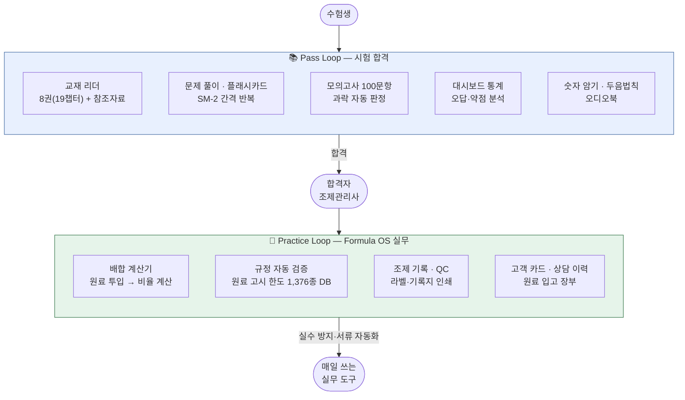
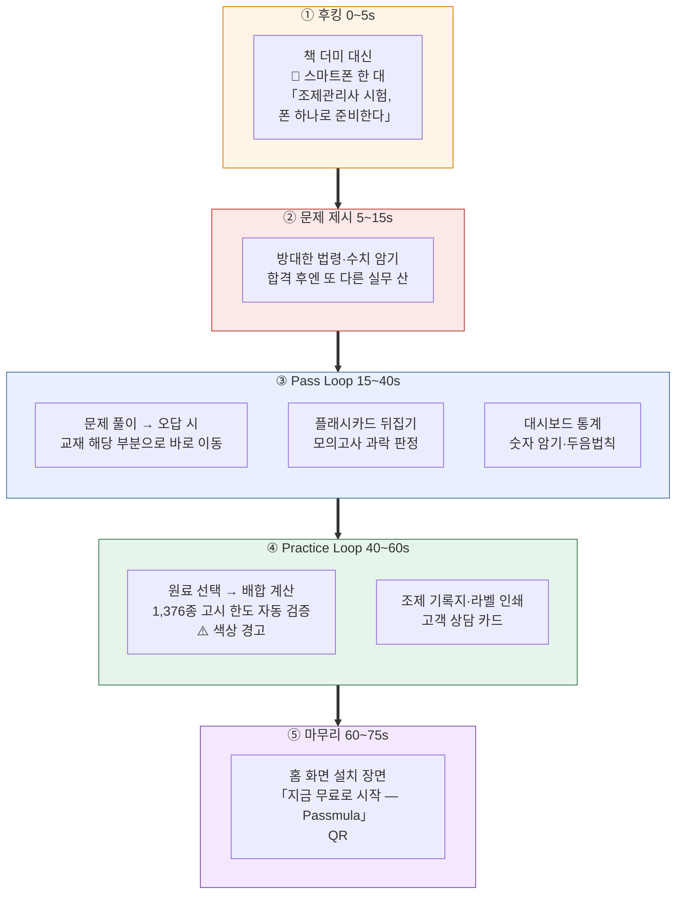
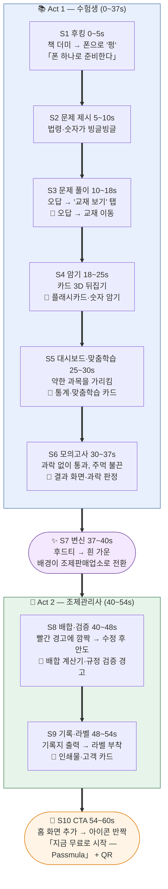
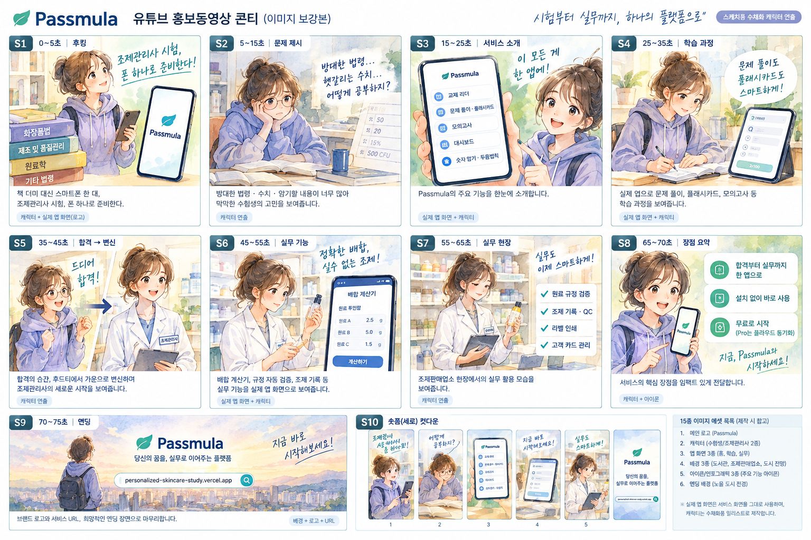

# 유튜브 홍보동영상 제작 의뢰서

> ## 🔗 서비스 바로가기 — **https://personalized-skincare-study.vercel.app**
>
> 스마트폰 브라우저에서 위 주소를 열면 실제 앱을 바로 체험할 수 있습니다.
> 회원가입이나 설치 없이 모든 화면을 둘러볼 수 있고, 홈 화면에 추가하면 앱처럼 동작합니다.
>
> - **Android (Chrome)**: 주소 접속 → 우측 상단 ⋮ → "홈 화면에 추가" 또는 "앱 설치"
> - **iOS (Safari)**: 주소 접속 → 하단 공유 버튼 → "홈 화면에 추가"
> - **PC**: 크롬 주소창 우측 설치 아이콘으로 데스크톱 앱 확인 가능
>
> 촬영 대상 화면 목록은 §11을, 캐릭터 애니메이션 제작안은 §4-1·§5-3·§14를 참조하세요.
> **문서 ID**: DOC-BIZ-04
> **관련 SPEC ID**: ROAD-P0~P4 (마케팅)

| 항목 | 내용 |
|------|------|
| 서비스명 | **Passmula** (실무 기능명: **Formula OS**) |
| 문서 성격 | 영상 제작사/프리랜서 대상 제작 의뢰 브리프 |
| 작성일 | 2026-09-26 (v3 수정: 2026-10-16) |
| 버전 | v4 — 만화풍 캐릭터 애니메이션 제작안 추가 (§4-1, §5-3, §14) |

---

## 1. 의뢰 개요

| 항목 | 내용 |
|------|------|
| 의뢰인 | (작성 필요 — 사업자명, 담당자, 연락처, 이메일) |
| 서비스명 | Passmula — 맞춤형화장품 조제관리사 학습 + 실무 플랫폼 |
| 서비스 URL | https://personalized-skincare-study.vercel.app |
| 제작 목적 | 서비스 인지도 확보 및 신규 사용자 유입 (유튜브 채널 게시 + 유료 광고 소재) |
| 희망 납품일 | (작성 필요) |
| 예산 범위 | (작성 필요) |

## 2. 서비스 소개

Passmula는 **맞춤형화장품 조제관리사 국가시험**을 준비하는 수험생과,
합격 후 맞춤형화장품조제판매업소(이하 조제판매업소)에서 일하는 **조제관리사 실무자**를
함께 지원하는 모바일 웹 앱(PWA)입니다.

**두 개의 루프가 하나의 플랫폼을 이룹니다.**

**핵심 메시지**

1. **합격부터 실무까지 한 앱으로** — 시험 준비가 끝나면 같은 앱이 조제 실무 도구로 이어집니다.
2. **설치 없이 바로 사용** — 브라우저 주소만으로 접속, 홈 화면 추가 시 앱처럼 동작(오프라인 지원).
3. **무료로 시작** — 로그인 없이 바로 전 기능 사용, 데이터는 이 기기에 저장. 클라우드 동기화(여러 기기 공유)는 Pro 전용(로그인 필요)입니다.

> ⚠️ **표현 가이드 (자막·나레이션 공통)**
> - "유일한", "최초", "1위", "합격 보장" 등 최상급·보장 표현은 사용하지 않습니다.
> - "전 기능 무료" 대신 "무료로 시작"으로 표기합니다.
> - **클라우드 동기화·여러 기기 공유는 Pro 전용**입니다 — "로그인하면 동기화됩니다" 같은 표현은 금지하고, 언급 시 반드시 "Pro"임을 함께 표기합니다.
> - 무료 플랜은 **로그인 불필요** — "계정 없이 바로 시작" 표현은 무료 범위에만 사용합니다.
> - 수치는 **§13 인가 수치 일람**에 적힌 값만 사용하고, 임의 수치를 추가하지 않습니다.

## 3. 타깃 시청자

| 구분 | 특성 | 어필 포인트 |
|------|------|------------|
| 수험생 (1차 타깃) | 조제관리사 시험 준비생, 20~40대, 모바일 학습 선호 | 무거운 교재 대신 폰으로 어디서나 — 문제 풀이·암기·모의고사 올인원 |
| 실무자 (2차 타깃) | 조제판매업소 근무 조제관리사 (전국 약 231곳 — 자체 조사 2026-09 기준) | 배합 계산·원료 규정·조제 기록을 폰 하나로 — 실수 방지 + 서류 자동화 |
| 업계 종사자 | 맞춤형화장품 창업·취업 희망자 | 자격 취득부터 실무 준비까지 한 플랫폼 |

## 4. 제작 사양

| 항목 | 사양 |
|------|------|
| 메인 영상 | **60~75초**, 1920×1080 (16:9) |
| 숏폼 컷다운 | **15~30초**, 1080×1920 (9:16) — 유튜브 쇼츠/인스타 릴스 겸용, **별도 구성**(§5-2) |
| 형태 | **만화풍 캐릭터 애니메이션 + 실제 앱 화면 녹화 합성** (§4-1) — 대안: 화면 녹화 기반 제품 시연 + 모션그래픽 |
| 언어 | 한국어, **자막 필수** (무음 시청 대응) |
| 음성 | 아래 옵션별 견적 요청 (의뢰인이 견적 비교 후 선택) |
| BGM | 밝고 신뢰감 있는 톤, **유료 광고 집행 포함·기간 무제한** 사용 가능한 라이선스 |
| 납품 포맷 | MP4 (H.264) |

**음성 옵션 (견적 시 각각 표기 요청)**

| 옵션 | 내용 |
|------|------|
| A | 자막 + BGM만 (나레이션 없음) |
| B | AI 보이스 나레이션 |
| C | 전문 성우 나레이션 |

> 캐릭터 애니메이션으로 제작할 경우 나레이션 대신 **캐릭터 대사**가 음성 역할을 합니다.
> 옵션 B·C는 "캐릭터 목소리(AI 보이스 / 성우)"로 읽어 주세요.

### 4-1. 캐릭터 애니메이션 제작 방식

**기본 원칙: 캐릭터는 이야기를, 앱 화면은 기능을 보여준다.**
캐릭터가 도입·전환·CTA를 맡고, §6 필수 화면은 **실제 앱 화면 녹화**를 캐릭터 옆 폰 목업 안에 합성합니다.
기능 화면을 그림으로 다시 그리지 않습니다 (실제 앱과 달라 보이면 신뢰도가 떨어짐).

**캐릭터 설정 (제작사 제안 우선)**

| 항목 | 내용 |
|------|------|
| 이름(예시) | 리프 — CÔTELEAF의 'leaf'에서 따옴 |
| 인원 | **1명 고정** — 수험생에서 조제관리사로 성장하는 한 인물 |
| 수험생 모습 | 후드티, 백팩, 안경, 약간 지친 표정 |
| 조제관리사 모습 | 흰 가운, "조제관리사" 명찰, 자신감 있는 표정 |
| 변신 장치 | 합격 순간 후드티가 가운으로 바뀌고 배경이 조제판매업소 카운터로 전환 |
| 말투 | 짧고 밝은 1인칭 대사 (나레이터 없음) |
| 그림체 | 단순한 2D 플랫 스타일, 브랜드 컬러 기반 — 유치하지 않게, 20~40대 수험생 대상 |

**만화풍 캐릭터 제작 시 유의사항**

- 기존 애니메이션·게임·브랜드 캐릭터와 닮지 않은 **오리지널 캐릭터**로 제작합니다.
- 툴 기본 캐릭터를 쓰면 다른 광고와 겹칠 수 있으므로, **의상·색상을 브랜드에 맞게 커스터마이즈**합니다.
- 캐릭터 디자인(원본 파일 포함)의 권리도 §9 권리 관계에 따라 의뢰인에게 양도합니다 — 이후 쇼츠·SNS에서 계속 사용할 예정입니다.
- 만화풍 캐릭터는 실사로 오인될 콘텐츠가 아니므로 YouTube "AI 사용" 공개 대상이 아닌 것이 일반적이나, AI로 생성한 음성·이미지를 쓴 경우 제작사가 사용 내역을 알려 주세요.

## 5. 영상 구성 가이드

> 제작사가 더 나은 구성을 제안하면 우선합니다. 아래는 반드시 전달해야 할 메시지입니다.

### 5-1. 메인 영상 (60~75초)

1. **후킹 (0~5초)**: "조제관리사 시험, 폰 하나로 준비한다" — 책 더미 대신 스마트폰 화면
2. **문제 제시 (5~15초)**: 방대한 법령·수치 암기의 부담, 합격 후엔 또 다른 실무 부담
3. **Pass Loop (15~40초)**: 실제 화면 녹화로 시연
   - 문제 풀이 → 오답 시 '교재 보기' 버튼으로 교재 해당 부분으로 바로 이동 (복습 노트·유사 문제 버튼도 함께 노출)
   - 플래시카드 넘기기, 모의고사 과락 판정, 대시보드 학습 통계
   - **맞춤학습** — 오답 패턴·취약 진술 분석 (PRO 표기 기능 — 화면에 PRO 배지가 보임)
   - 이야기형 교재, 숫자 암기·두음법칙, Ctrl+K 통합 검색 등 학습 도구
4. **Practice Loop (40~60초)**: Formula OS 시연
   - 원료 선택 → 배합 계산 → 고시 한도 1,376종 기준 자동 검증(색상 경고)
   - 조제 기록지·라벨 인쇄, 고객 상담 카드
5. **마무리 (60~75초)**: 홈 화면 설치 장면 + CTA
   - "지금 무료로 시작 — Passmula" + **QR 코드**

### 5-2. 숏폼 컷다운 (15~30초)

메인 영상을 단순히 줄이지 말고, **수험생 대상 Pass Loop 단독**으로 구성합니다.

| 구간 | 내용 |
|------|------|
| 0~3초 | 후킹 — "조제관리사 시험, 폰 하나로" |
| 3~22초 | 문제 풀이 → 오답 → 교재 이동, 플래시카드, 모의고사 과락 판정을 빠르게 전환 |
| 22~30초 | "무료로 시작 — Passmula" + QR |

> 캐릭터 애니메이션 버전은 §5-3의 **S1 → S3 → S4 → S6 → S10**으로 구성합니다.
> 쇼츠 시청자는 폰으로 보고 있어 QR을 찍을 수 없으므로, 마지막 장면은 **"Passmula" 검색 안내를 크게**, QR은 보조로 둡니다.

### 5-3. 캐릭터 애니메이션 콘티 (60초, 16:9)

§5-1 구성을 캐릭터 한 명의 성장 이야기로 옮긴 안입니다. 제작사가 더 나은 연출을 제안하면 우선합니다.

| 장면 | 시간 | 캐릭터 동작 | 대사 | 삽입 앱 화면 | 자막 |
|------|------|------------|------|-------------|------|
| S1 후킹 | 0~5s | 책 더미에 파묻혀 한숨 → 책 더미가 '펑' 하고 스마트폰으로 바뀜 → 폰을 집어 듦 | "이걸 언제 다 외워…" → "…폰 하나로?" | 없음 (폰 실루엣) | **조제관리사 시험, 폰 하나로 준비한다** |
| S2 문제 제시 | 5~10s | 머리 위로 법령 조항·숫자가 빙글빙글, 어지러워함 | "법령에 수치에, 4과목이 다 암기야." | 없음 | 방대한 법령·수치 암기 |
| S3 문제 풀이 | 10~18s | 오답에 "앗!" → '교재 보기' 버튼 탭 → 교재로 슝 이동 (옆에 '복습 노트'·'유사 문제' 버튼도 보임) | "틀렸어? 바로 교재 그 부분으로!" | 문제 풀이(오답) → 교재 해당 위치 (**본문 흐림**) | 틀린 문제는 교재 해당 부분으로 바로 |
| S4 암기 | 18~25s | 카드를 톡 뒤집음, 카드가 3D 회전 | "복습 타이밍은 앱이 알아서 잡아줘." | 플래시카드 → 숫자 암기·두음법칙 | 알아서 잡아주는 복습 타이밍 |
| S5 대시보드·맞춤학습 | 25~30s | 그래프 보며 "아하!", 약한 과목을 가리킴 → 맞춤학습 카드 톡 | "약한 과목도, 내 복습 전략도 한눈에." | 대시보드 학습 통계·히트맵 → **맞춤학습**(오답 패턴 분석 카드) | 오답·약점 분석 — 맞춤학습 |
| S6 모의고사 | 30~37s | 시계 보며 집중 → 과락 없이 통과 표시 → 주먹 불끈 | "실전처럼 100문항, 120분!" | 모의고사 진행 → 결과 (**과락 판정 필수**) | 실전처럼 100문항·120분 + 과락 자동 판정 |
| S7 변신 | 37~40s | 폭죽 → 한 바퀴 회전 → 후드티가 흰 가운으로, 배경이 조제판매업소로 | "합격! …그다음은 실무지." | 없음 (전환 연출) | **합격 다음은 실무 — 같은 앱으로** |
| S8 배합·검증 | 40~48s | 카운터에서 원료병 고르며 입력 → 빨간 경고에 깜짝 → 수정 후 초록색에 안도 | "원료 넣으면 비율 계산 끝. 고시 한도를 넘으면 바로 경고!" | 배합 계산기 → 규정 검증 **빨간 경고** → 수정 후 정상 | 원료 1,376종 규정 자동 검증 |
| S9 기록·라벨 | 48~54s | 프린터에서 기록지·라벨 출력 → 라벨을 병에 붙여 손님에게 건넴 | "조제 기록지랑 라벨도 바로 인쇄." | 조제 기록 → 인쇄 기록지 **출력물** → 고객 카드 (**가상 데이터**) | 조제 기록·라벨·고객 상담 카드까지 |
| S10 CTA | 54~60s | 정면 보며 폰을 흔듦 → 홈 화면 추가 → 앱 아이콘 반짝 | "설치 없이 브라우저로. 지금 무료로 시작해!" | 홈 화면 추가 → 앱 아이콘 | **지금 무료로 시작 — Passmula** + QR |

**콘티 작성 기준**

- §6 필수 화면 8종이 모두 들어갑니다: 문제 풀이(S3), 플래시카드(S4), 대시보드·맞춤학습(S5), 모의고사 과락 판정(S6), 배합 계산기·색상 경고(S8), 조제 기록지 출력물(S9).
- 사용한 수치는 4과목, 100문항·120분, 1,376종, 무료 — 모두 §13 인가 수치입니다.
- **S7 주의**: 합격은 캐릭터의 이야기로만 보여주고, "앱 덕분에 합격" 같은 **인과 표현은 넣지 않습니다** (합격 보장 표현 방지).
- 60초 안에서는 동기화(Pro) 언급을 넣지 않습니다. 넣는다면 반드시 "Pro"를 함께 표기합니다.

## 6. 반드시 포함할 화면

> §11 전체 촬영 목록 중 **최소 노출 필수 항목**입니다.

- 문제 풀이 (오답 시 교재 이동 포함)
- 플래시카드
- 모의고사 결과 (과락 판정)
- 대시보드 학습 통계
- 맞춤학습 (오답 패턴·취약 진술 분석 카드 — 내비 '맞춤학습' 메뉴)
- 배합 계산기
- 규정 검증 경고 (색상 경고)
- 조제 기록지 출력물

**촬영 시 유의사항**

- **"기출"이라는 단어를 자막에 쓰지 않습니다.** 앱 내 문제는 "시험 대비 문제"로 표현합니다.
- **교재 리더 화면은 본문이 판독되지 않도록** 빠르게 스크롤하거나 흐림 처리합니다.
- 고객 카드·상담 이력은 **의뢰인이 제공하는 가상 데이터만** 사용합니다.
- 화면 테마는 **라이트 모드로 통일**합니다.
- 촬영용 기기는 **Android를 권장**합니다 (iOS는 홈 화면 추가 후 오디오 등 일부 기능이 브라우저와 다르게 동작할 수 있음).
- 상태바는 정리된 상태로 촬영합니다 (시간 고정, 알림 아이콘 없음, 배터리 가득).

## 7. 톤 & 매너

- **신뢰감 + 실용성** — 자격·법규 도메인 특성상 과장이나 유머보다 정확한 정보 전달
- **속도감 있는 시연** — 긴 설명 없이 화면 전환으로 기능을 밀도 있게 노출
- **캐릭터는 친근하게, 정보는 정확하게** — 캐릭터의 표정·동작으로 가벼움을 주되, 자막·수치·앱 화면은 과장 없이 사실대로 전달합니다. 슬랩스틱이나 경쟁사를 비꼬는 유머는 쓰지 않습니다.
- 브랜드 컬러: 첨부 팔레트 사용 (HEX 값: 작성 필요)
- 로고: "Passmula" 브랜드 텍스트 및 앱 아이콘 에셋 첨부

## 8. 의뢰인 제공 자료

- [ ] 서비스 URL, 가상 데이터가 세팅된 데모 환경
- [ ] 기능 시연 시나리오 (§5 기반 상세 클릭 순서)
- [ ] 브랜드 에셋 (앱 아이콘, 로고, 컬러 팔레트 HEX)
- [x] 영상 CTA용 QR 코드 — `passmula_QR.svg` (49×49mm 벡터, 확대 인쇄 가능)
  
- [ ] 레퍼런스 영상 링크 (아래 표 — 링크마다 **참고할 부분**과 **따라 하지 않을 부분**을 함께 봐 주세요)

| 레퍼런스 | 참고 포인트 | 제외 |
|------|------|------|
| [앱 모션그래픽 모음 (재생목록)](https://www.youtube.com/playlist?list=PLk3pQSVXOF1fdPopq3sADaZjuJQTQ7gCM) | 폰 목업 안 화면 전환, 기능 줌인 연출 | 3D·과한 이펙트 |
| [스픽 앱 소개 영상 모음](https://www.youtube.com/playlist?list=PLQjHiBGau9kxuMRKdNwQ-zcCm418BqCzI) | 실제 화면 시연 속도, 한국어 자막 길이 | — |
| [산타 캠페인 재생목록](https://www.youtube.com/playlist?list=PLvJ2sjOGX1GJBjwbKDGCEKPKjPu_z1M20) | 첫 3초 한 문장 후킹 구조 | 유머·랩·경쟁사 비교 톤 |
| [콴다 팀 채널](https://www.youtube.com/@teamqanda) | 쇼츠에서 문제 풀이 흐름을 짧게 보여주는 방식 | — |

위 레퍼런스보다 적합한 사례(특히 **캐릭터 + 실제 앱 화면 합성** 사례)가 있으면 견적 시 함께 제안해 주세요.

## 9. 납품물 및 검수

**납품물**

| 항목 | 내용 |
|------|------|
| 메인 영상 | 자막 포함 버전 1편 + **자막 없는 클린 버전** 1편 |
| 숏폼 | 자막 포함 버전 1편 + 클린 버전 1편 |
| 자막 파일 | SRT (메인·숏폼 각각) |
| 썸네일 | 유튜브용 1~2종 (1280×720) |
| 캐릭터 에셋 | 캐릭터 시트(정면·측면·표정 5종 이상, 수험생·조제관리사 2벌), 투명 배경 PNG·원본 파일 |
| 선택 | 6초 범퍼 광고용 컷, 컷별 소스·프로젝트 파일 (견적 별도 표기) |

**검수 절차**

| 단계 | 산출물 | 수정 |
|------|--------|------|
| 0. 캐릭터 확정 | 캐릭터 시안 2~3종 → 1종 선택 | 1회 |
| 1. 콘티 확정 | 콘티/스토리보드 | 1회 |
| 2. 1차 편집 | 러프컷 | 1회 |
| 3. 최종 | 완성본 | 1회 (경미한 자막·타이밍 수정) |

규정 횟수를 초과하는 수정의 비용 기준은 견적서에 함께 적어 주세요.

**권리 관계**

- 완성 영상의 저작재산권은 의뢰인에게 양도합니다 (또는 매체·기간·지역 제한 없는 이용허락).
- 제작사의 포트폴리오 게재 허용 여부는 협의합니다.
- 사용한 폰트·음원·스톡 소스는 **상업적 사용 및 유료 광고 집행이 가능한 라이선스** 증빙을 제출해 주세요.

## 10. 일정 (협의 후 확정)

| 단계 | 기간 | 산출물 |
|------|------|--------|
| 콘티·구성 협의 | _주차 | 콘티/스토리보드 |
| 1차 편집 | _주차 | 러프컷 |
| 최종 검수·납품 | _주차 | 완성본 + 컷다운 + 부속 납품물 |

## 11. 참고 — 서비스 주요 화면 목록 (촬영 대상)

| 화면 | 진입 경로 | 포인트 |
|------|-----------|--------|
| 홈/대시보드 | 앱 첫 화면 | 학습 통계·히트맵·오늘의 추천 |
| 문제 풀이 | 퀴즈 메뉴 | 과목별 문제, 오답 시 교재 링크 |
| 플래시카드 | 카드 메뉴 | 3D 카드 뒤집기, SM-2 복습 |
| 모의고사 | 시뮬레이터 | 100문항·120분·과락 판정 결과 |
| 맞춤학습 | 내비 '맞춤학습' | 오답 패턴·취약 진술 분석 카드 (PRO 배지 보임) |
| 통합 검색 | 상단 🔍 또는 Ctrl+K | 교재·카드·문제·성분 통합 검색 팔레트 |
| 교재 리더 | 교재 메뉴 | 8권(19챕터) 교재 + 참조자료 + 오디오 + 이야기형 토글 (본문 판독 불가하게 촬영) |
| 배합 계산기 | Formula 메뉴 | 원료 투입 → 비율 자동 계산 |
| 규정 검증 | Formula 메뉴 | 고시 한도 초과 시 색상 경고 |
| 조제 기록 | 배치 메뉴 | 배치 기록·QC·인쇄 기록지 |
| 설정 | 우상단 ⚙️ | 테마·데이터 백업·버전 |
| 플랜 안내 | 설정 → "플랜 안내 (Free/Pro)" | Free/Pro 기능 차이·로그인 정책 비교 표 |
| 내 사용 통계 | 설정 → "내 사용 통계" | 화면별·기능별 사용 횟수 (로컬 전용 수치 — 실제 사용량처럼 보이지 않게 주의) |

---

## 12. 견적 요청 시 포함해 주실 내용

1. 음성 옵션 A/B/C별 총액
2. 선택 납품물(범퍼 광고 컷, 프로젝트 파일) 별도 금액
3. 추가 수정 1회당 비용
4. 예상 제작 기간
5. 유사 작업 포트폴리오 2~3건 (**캐릭터 애니메이션 작업 포함**)
6. 사용할 제작 툴(§14 참고)과 해당 툴의 **상업 이용·유료 광고 집행 가능 여부**
7. 캐릭터 디자인 비용 별도 여부

---

## 13. 부록 — 영상에 사용 가능한 인가 수치 일람

자막·나레이션·그래픽에 넣는 모든 수치는 이 표의 값만 사용합니다.
다른 수치가 필요하면 의뢰인 확인 후 추가합니다.

| 수치 | 의미 | 사용 예 |
|------|------|---------|
| **8권 / 19챕터** | 앱 내 교재 (4과목 × 표준형·이야기형 2종 — 과목별 2·5·5·7챕터) | "교재 8권이 폰 안에" |
| **1,376종** | 원료 DB 규모 (고시 한도 검증 기준) | "원료 1,376종 규정 자동 검증" |
| **100문항 / 120분** | 모의고사 구성 (실제 시험과 동일) | "실전처럼 100문항·120분" |
| **4과목** | 시험 과목 수 | "4과목 올인원" |
| **약 231곳** | 전국 조제판매업소 수 (자체 조사 2026-09) | 실무자 타깃 언급 시 |
| **무료** | 시작 비용 (로그인 없이 전 기능 사용 — 동기화는 Pro 전용) | "지금 무료로 시작" |

> 참고: SM-2, PWA, 서비스워커 등 기술 용어는 자막·나레이션에 쓰지 않습니다.
> 화면에 보이는 대로 "알아서 복습 타이밍을 잡아준다"처럼 풀어서 표현합니다.

---

## 14. 부록 — 캐릭터 애니메이션 툴 소개

제작사가 이미 쓰는 툴(After Effects 등)이 있으면 그대로 사용해도 됩니다.
아래는 **템플릿형 캐릭터 애니메이션 툴**을 쓰거나 의뢰인이 직접 시안을 만들 때 참고하는 목록입니다.

> 가격·플랜은 2026-09 조사 기준이며 수시로 바뀝니다. 계약 전 공식 사이트에서 **상업 이용·유료 광고 집행 가능 여부**를 반드시 확인합니다.

### 14-1. 캐릭터 애니메이션 전문 툴 (영상 전체 제작)

| 툴 | 특징 | 가격 (조사 시점) | 적합한 경우 | 주의점 |
|------|------|------|------|------|
| [**Vyond**](https://www.vyond.com) | 캐릭터 표정·립싱크·동작을 세밀하게 조절, 장면 전환 품질이 높음 | 연간 결제 중심, 무료 플랜 없음 (Starter 연 $699 등 — 공식 사이트 확인) | 캐릭터 연기(표정·동작)가 중요할 때 | 소비자 광고에선 그림체가 저렴해 보인다는 평도 있음 → 체험판으로 그림체 먼저 확인. 학습 곡선이 있음 |
| [**Powtoon**](https://www.powtoon.com) | 캐릭터 애니메이션과 모션그래픽의 중간, 템플릿 기반으로 빠름 | 무료 플랜(워터마크) + 유료 월 $15~(연간 결제) | 비용을 줄이며 빠르게 만들 때 — **가장 무난한 출발점** | 무료 플랜은 워터마크, 상업 이용은 유료 플랜 확인 |
| [**Animaker**](https://www.animaker.com) | 끌어다 놓는 방식, 밝고 단순한 만화 그림체, 에셋 라이브러리가 방대 | 요금제별 상이 | SNS·쇼츠용 가벼운 톤 | 인터페이스가 복잡하게 느껴질 수 있음 |

### 14-2. 캐릭터 디자인·간편 편집 (국내 사용 편의)

| 툴 | 특징 | 활용 |
|------|------|------|
| [**Canva**](https://www.canva.com/ko_kr/create/cartoons/) | 앱 메뉴의 'Character Builder'로 얼굴·헤어·표정·의상 조합, 한국어 인터페이스 | 9:16 쇼츠 버전 편집, 간단한 캐릭터 애니메이션 |
| [**미리캔버스**](https://www.miricanvas.com/ko/features/character-maker) | 텍스트 설명으로 브랜드 마스코트 캐릭터 생성, 상업적 용도 사용 가능 (저작권·상표 관련 법률 준수 조건) | **캐릭터 디자인 시안** 제작 — 움직임은 요소 애니메이션 수준이라 다른 툴과 조합 |

### 14-3. 캐릭터 목소리 (음성 옵션 B)

| 툴 | 특징 | 활용 |
|------|------|------|
| [**타입캐스트**](https://typecast.ai/kr/) | 700+ AI 보이스, 한국어 감정 표현 프리셋, 자동 자막·비디오 에디터 | 해외 툴의 한국어 억양이 어색할 때, **캐릭터 대사만 타입캐스트로** 입히는 조합 |

### 14-4. 추천 조합

| 목표 | 조합 |
|------|------|
| 비용 최소화 + 빠른 제작 | Powtoon + 타입캐스트 음성 |
| 캐릭터 연기 품질 우선 | Vyond (체험판으로 그림체 확인 후 결정) + 타입캐스트 또는 성우 |
| Passmula 전용 마스코트 확보 | 미리캔버스로 캐릭터 시안 → Powtoon/Canva로 애니메이션 |
| 제작사 외주 | 제작사 보유 툴 사용, 단 **캐릭터 원본 파일 납품**(§9) 조건 명시 |

### 14-5. 툴 선택 전 확인 체크리스트

- [ ] **실제 앱 화면 녹화(MP4)를 올려 폰 목업 안에 배치할 수 있는가** — §6 필수 화면 때문에 가장 먼저 테스트할 항목
- [ ] 16:9(1920×1080)와 9:16(1080×1920) **두 비율로 내보내기**가 되는가
- [ ] 선택한 플랜에서 **워터마크 없이, 상업 이용·유료 광고 집행**이 가능한가
- [ ] 한국어 폰트·자막이 깨지지 않는가 (특히 자간·줄바꿈)
- [ ] 같은 캐릭터를 **수험생·조제관리사 두 벌 의상**으로 일관되게 쓸 수 있는가
- [ ] 캐릭터·장면을 저장해 이후 쇼츠·SNS 콘텐츠에 **재사용**할 수 있는가

## 5-4. 콘티 장면별 수채화풍 캐릭터 이미지

> **이미지 방향:** 동일한 주인공 캐릭터가 수험생에서 맞춤형화장품 조제관리사로 성장하는 과정을 수채화풍 일러스트로 단계별 표현합니다.
> 캐릭터는 이야기와 감정 변화를 담당하고, 실제 앱 기능은 실제 앱 화면 녹화로 보여줍니다.

### 장면별 캐릭터 연출

| 단계 | 캐릭터 이미지 | 연출 포인트 | 실제 앱 화면 |
|---|---|---|---|
| **S1** | 후드티·백팩·안경을 쓴 수험생 + 스마트폰 | 책더미에서 스마트폰을 발견하며 표정이 밝아짐 | 앱 첫 화면 |
| **S2** | 책상 앞에서 고민하는 수험생 | 법령·숫자·퍼센트가 주변에 떠다니며 학습 부담 표현 | 없음/보조 화면 |
| **S3** | 스마트폰을 들고 문제 풀이에 집중 | 오답에서 관련 교재 위치로 자연스럽게 연결 | 문제 풀이 → 교재 보기 |
| **S4** | 책상에서 플래시카드를 넘기는 모습 | 숫자·두음법칙을 반복해서 외우는 동작 | 플래시카드 |
| **S5** | 합격을 확인하고 환하게 웃는 모습 | 수험생 이미지에서 조제관리사 이미지로 전환 준비 | 대시보드·학습 리포트 |
| **S6** | 흰 가운을 입은 조제관리사 | 원료를 확인하면서 스마트폰으로 배합 계산 | 배합 계산기·규정 검증 |
| **S7** | 조제판매업소 카운터에서 자신감 있는 모습 | 실제 업무를 수행하는 전문가 이미지 | 조제 기록·QC·라벨 |
| **S8** | 고객에게 스마트폰을 보여주는 조제관리사 | 합격 후 실무까지 하나의 앱으로 이어짐을 전달 | 핵심 기능 요약 |
| **S9** | 스마트폰을 들고 앞으로 걸어가는 모습 | 서비스 URL과 브랜드를 기억시키는 엔딩 이미지 | 로고·URL |
| **S10** | S1~S9 캐릭터 장면을 빠르게 회고 | 마지막에 Passmula 로고와 CTA로 마무리 | CTA/QR |

### 캐릭터 스타일 고정 규칙

- **화풍:** 따뜻한 수채화 일러스트 + 깔끔한 2D 애니메이션 느낌
- **캐릭터:** S1~S10 동일 인물의 얼굴·헤어스타일·체형 유지
- **수험생 복장:** 후드티 + 백팩 + 안경
- **조제관리사 복장:** 흰 가운 + 조제관리사 명찰
- **변화:** S5~S6에서 합격을 기점으로 후드티 → 흰 가운으로 전환
- **표정:** 불안/고민 → 집중 → 자신감 → 성취감 순으로 변화
- **앱 화면:** 캐릭터 그림으로 재현하지 않고 **실제 앱 화면 녹화**를 합성
- **배경:** S1~S5는 학습 공간, S6~S8은 조제·판매 실무 공간, S9~S10은 브랜드/CTA 중심
- **제작사 전달:** 위 이미지는 최종 캐릭터 확정본이 아니라 **콘티용 비주얼 가이드**이며, 최종 제작 전 캐릭터 시안을 별도로 확정

