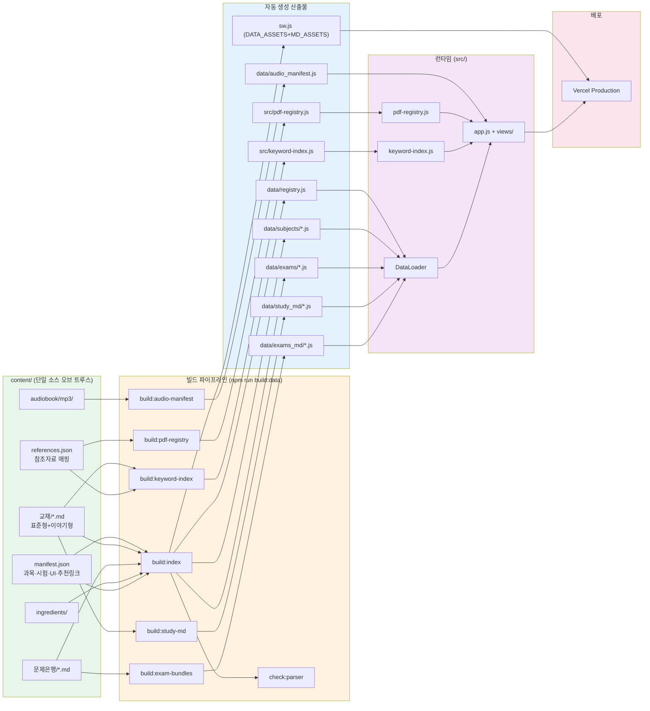
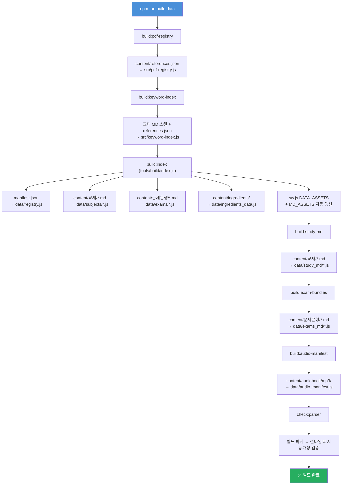
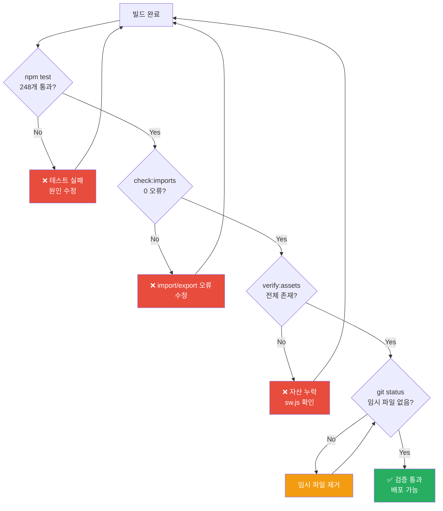
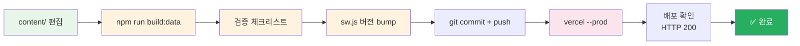

# Content 변경 작업 절차 가이드

> content/ 폴더의 교재, 문제은행, 참조자료, 오디오북, 원료 데이터가 변경될 때 따라야 할 표준 작업 절차.

## 개요

이 프로젝트는 `content/` 폴더의 Markdown/JSON 파일이 **단일 소스 오브 트루스(SSOT)** 역할을 합니다. 소스 코드(`src/`)를 직접 수정하지 않고, content 파일과 매니페스트만 편집하면 빌드 파이프라인이 나머지를 자동 처리합니다.



---

## 1. 변경 유형별 수정 파일

| 변경 유형 | 수정할 파일 | 비고 |
|----------|------------|------|
| **교재 내용 수정** | `content/교재/{과목}/*.md` | 표준형/이야기형 모두 수정 |
| **문제은행 수정** | `content/문제은행/과목N_문제.md` | 문제 추가/삭제/수정 |
| **과목 추가/삭제** | `content/manifest.json` | `subjects` 배열 수정 |
| **시험 추가/삭제** | `content/manifest.json` | `exams` 배열 수정 |
| **참조자료 추가/삭제** | `content/references.json` | 참조자료 매핑 수정 |
| **오디오북 추가** | `content/audiobook/mp3/{과목}/` | MP3 파일 배치 |
| **통합 모의고사 문제 수 변경** | `content/manifest.json` | `integratedExam.questionsPerSubject` 수정 |
| **UI 텍스트 변경** | `content/manifest.json` | `uiText` 객체 수정 |
| **추천 링크 변경** | `content/manifest.json` | `resources` 객체 수정 |
| **원료 데이터 변경** | `content/ingredients/` | 원료 MD/JSON 수정 |

---

## 2. 표준 빌드 절차

### 2.1 전체 빌드 (권장)

content 변경 후 아래 한 줄로 전체 파이프라인 실행:

```powershell
npm.cmd run build:data
```

이 명령은 다음 파이프라인을 순차 실행합니다:



### 2.2 부분 빌드 (특정 과목만)

```powershell
npm.cmd run build:data:law           # 1과목만
npm.cmd run build:data:manufacturing # 2과목만
npm.cmd run build:data:safety        # 3과목만
npm.cmd run build:data:understanding # 4과목만
```

### 2.3 개별 스크립트 실행

```powershell
npm.cmd run build:pdf-registry       # 참조자료 레지스트리만
npm.cmd run build:keyword-index      # 키워드 인덱스만
npm.cmd run build:study-md           # 폴백 번들만
npm.cmd run build:exam-bundles       # 시험 폴백 번들만
npm.cmd run build:audio-manifest     # 오디오 매니페스트만
```

---

## 3. 변경 유형별 상세 절차

### 3.1 교재 내용 수정

1. `content/교재/{과목}/{파일명}.md` 편집 (표준형, 이야기형 모두)
2. `npm.cmd run build:data` 실행
3. `npm.cmd test` 통과 확인
4. 커밋 + 배포

### 3.2 과목 추가

1. `content/교재/{새과목키}/` 디렉토리 생성, MD 파일 배치
2. `content/manifest.json`의 `subjects` 배열에 항목 추가:
   ```json
   {
     "key": "newsubject",
     "order": 5,
     "name": "새 과목명",
     "shortName": "약칭",
     "dir": "교재/newsubject",
     "chapters": [
       { "key": "full", "title": "...", "file": "5과목_..._표준형.md", "storyFile": "5과목_..._이야기형.md" }
     ]
   }
   ```
3. `content/references.json`의 `subjectDirMap`에 매핑 추가:
   ```json
   "newsubject": "과목5"
   ```
4. `content/references.json`의 `referenceFiles`에 과목별 참조자료 추가
5. `content/references.json`의 `refDirs`에 `과목5` 배열 추가
6. `content/문제은행/과목5_문제.md` 생성 후 `manifest.json`의 `exams`에 추가
7. `npm.cmd run build:data` 실행
8. 검증 + 커밋 + 배포

### 3.3 참조자료 추가

1. `content/참조자료/ref_md/{파일명}/{파일명}.md` 배치 (PDF→MD 변환본)
2. `content/references.json` 수정:
   - `refDirs.{해당폴더}` 배열에 파일명 추가
   - `referenceFiles.{과목}` 또는 `referenceCommon`에 항목 추가
   - 출처 매칭이 필요하면 `sourceRefMap`에 정규식 매핑 추가
   - 본문 자동 링크가 필요하면 `keywordRefMap`에 패턴 추가
3. `npm.cmd run build:data` 실행
4. 검증 + 커밋 + 배포

### 3.4 오디오북 추가

1. `content/audiobook/mp3/{과목키}/` 디렉토리에 MP3 파일 배치
2. `npm.cmd run build:audio-manifest` 실행 (또는 `npm.cmd run build:data`)
3. 검증 + 커밋 + 배포

> **주의**: MP3 파일은 Vercel 배포 시 용량 초과(302MB)로 인해 함께 배포할 수 없음.
> `data/audio_manifest.js`의 `AUDIO_BASE_URL`을 외부 CDN으로 설정 필요.

### 3.5 통합 모의고사 문제 수 변경

1. `content/manifest.json`의 `integratedExam.questionsPerSubject` 수정:
   ```json
   "integratedExam": {
     "questionsPerSubject": {
       "law": 10,
       "manufacturing": 25,
       "safety": 25,
       "understanding": 40
     }
   }
   ```
2. `npm.cmd run build:data` 실행
3. 검증 + 커밋 + 배포

---

## 4. 검증 체크리스트

빌드 후 반드시 확인:

```powershell
# 1. 유닛 테스트 (248개)
npm.cmd test

# 2. import/export 검증
npm.cmd run check:imports

# 3. 셸 자산 존재 확인
npm.cmd run verify:assets

# 4. 파서 등가성 (build:data에 포함되지만 단독 실행 시)
npm.cmd run check:parser

# 5. 임시 파일 제거 확인
git status
```



---

## 5. 배포 절차

### 5.1 Service Worker 버전 bump

애플리케이션 코드/콘텐츠 변경 시 `sw.js`의 `CACHE_VERSION`을 bump:

```powershell
npm.cmd run stamp:sw   # 커밋 해시로 자동 스탬프
```

또는 수동 편집:
```js
const CACHE_VERSION = 'v{번호}-{날짜}-{설명}';
```

### 5.2 Vercel 배포

```powershell
git add -A
git commit -m "content: 변경 내용 요약"
git push origin main
npx.cmd vercel --prod --yes --scope skygold
```

### 5.3 배포 확인

- https://personalized-skincare-study.vercel.app 접속
- HTTP 200 확인
- 변경된 콘텐츠 정상 표시 확인



---

## 6. 주의사항

### 6.1 직접 수정 금지 파일 (빌드 자동 생성)

아래 파일들은 빌드 시 자동 생성되므로 **직접 수정 금지**:

| 파일 | 생성 스크립트 | 소스 |
|------|-------------|------|
| `src/pdf-registry.js` | `tools/build/build-pdf-registry.js` | `content/references.json` |
| `src/keyword-index.js` | `tools/build/build_keyword_index.js` | `content/교재/*.md` + `content/references.json` |
| `data/registry.js` | `tools/build/index.js` | `content/manifest.json` |
| `data/subjects/*.js` | `tools/build/index.js` | `content/교재/*.md` |
| `data/exams/*.js` | `tools/build/index.js` | `content/문제은행/*.md` |
| `data/study_md/*.js` | `tools/build_study_md_bundle.js` | `content/교재/*.md` |
| `data/exams_md/*.js` | `tools/build_exam_bundles.js` | `content/문제은행/*.md` |
| `data/audio_manifest.js` | `tools/build/build-audio-manifest.js` | `content/audiobook/mp3/` |
| `sw.js` (DATA_ASSETS, MD_ASSETS) | `tools/build/index.js` | `content/manifest.json` |

### 6.2 PowerShell 환경

- `npm` → `npm.cmd`, `npx` → `npx.cmd` 사용
- `&&` 연산자 사용 불가 → `;` 사용

### 6.3 Vercel 용량 제한

- MP3 파일(302MB)은 Vercel 배포 불가
- `data/audio_manifest.js`의 `AUDIO_BASE_URL`을 외부 CDN으로 설정
- GitHub Releases, Cloudflare R2, AWS S3 등 활용

---

## 7. 빠른 참조: 변경 시 수정 파일 매트릭스

```
교재 내용 수정        → content/교재/*.md
문제은행 수정         → content/문제은행/*.md
과목 추가/삭제        → content/manifest.json + content/references.json + content/교재/ + content/문제은행/
시험 추가/삭제         → content/manifest.json + content/문제은행/
참조자료 추가/삭제     → content/references.json + content/참조자료/ref_md/
오디오북 추가         → content/audiobook/mp3/
통합 모의고사 설정     → content/manifest.json (integratedExam)
UI 텍스트             → content/manifest.json (uiText)
추천 링크             → content/manifest.json (resources)
원료 데이터           → content/ingredients/

공통: npm.cmd run build:data → 검증 → 커밋 → 배포
```
